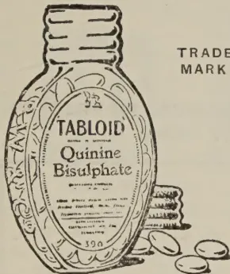
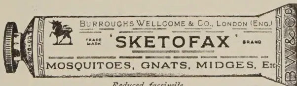
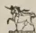
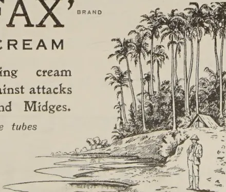

# THE TROPICAL AGRICULTURIST

---

VOL. LXVI. PERADENIYA, APRIL—MAY, 1926. Nos. 4 & 5.

---

## AGRICULTURAL CONFERENCE AT PERADENIYA.

---

### ERRATA.

<table><tbody><tr><td>Page 204 line 35:—</td><td>“ Stem ”</td><td>should read</td><td>“ Stern ”</td></tr><tr><td>“ 205 ,, 8:—</td><td>“ or ”</td><td>“ ”</td><td>“ for ”</td></tr><tr><td>“ 206 ,, 18:—</td><td>“ from ”</td><td>“ ”</td><td>“ for ”</td></tr><tr><td>“ 207 ,, 6:—</td><td>“ Communal ”</td><td>“ ”</td><td>“ Commercial ”</td></tr></tbody></table>

which has been specially provided in the Headquarters of the Department of Agriculture for such meetings and conferences. All sessions were well attended and the discussions on various subjects were keen and informative. Several visitors also took the opportunity of visiting the Experiment Station and the various Laboratories at Peradeniya and of seeing the nature of the work being there carried on.

From many sides, the Department was assured of the success of its first Conference and of the interest that it had awakened. These congratulations were appreciated by all officers of the Department who realize that it is only by the fullest co-operation with all classes of agriculturists that its work is likely to be successful and the object of the Department to assist development and progress achieved. It is hoped that it may be possible to make these Conferences annual events in the future.

1------------------------------------------------

194[APRIL - MAY, 1926.

## PROGRAMME.

### VILLAGE AGRICULTURE.

*March 5.—Morning Session.*

HIS EXCELLENCY THE GOVERNOR presided

Papers—

1. 1. The Chena Problem and some Suggestions for its Solution, by the Director of Agriculture.
2. 2. Cotton Cultivation in the Hambantota District and its Place in a Rotation for Dry Zone Agriculture, by Mr. G. Harbord, Divisional Agricultural Officer, Southern Division.
3. 3. General Progress in the Northern Division, by Mr. W. P. A. Cooke, Divisional Agricultural Officer, Northern Division.
4. 4. Marketing of Produce, by Mr. N. K. Jardine, Acting Divisional Agricultural Officer, Central Division.

*March 5.—Afternoon Session.*

MR. N. D. S. SILVA, Chairman, Low-country Products Association, presided.

Papers—

1. 5. Paddy: The Possibilities of Increasing the Yields of Paddy by the Use of Pure Line Selected Seed, by Mr. G. V. Wickramasekera, Acting Economic Botanist.
2. 6. Agricultural Work of a Co-operative Credit Society, by Mr. G. E. J. Hulugalle, Divisional Agricultural Officer, North-Western Division.
3. 7. Chillies: Improvement of Chillies by Selection, by Mr. N. Senathiraja, Farm Manager, Jaffna Experiment Station.
4. 8. Some Insect Pests of Food Crops, by Mr. G. D. Austin, Assistant in Entomology.

### ESTATE PRODUCTS.

*March 11.—Morning Session.*

HIS EXCELLENCY THE GOVERNOR presided

Papers—

1. 1. Soil Erosion and cover crops, by Mr. T. H. Holland, Manager, Experiment Station, Peradeniya.
2. 2. Some Practical Notes on the Prevention of Soil Erosion upon Estates, by Mr. F. Denham Till and Mr. R. Senanayake.
3. 3. Cultural Methods in the Control of Some Insect Pests, by Dr. J. C. Hutson, Entomologist.
4. 4. Manuring in Relation to the Control of Shot-hole Borer of Tea, by Mr. F. P. Jepson, Assistant Entomologist.
5. 5. Branch Canker of Tea, by Dr. C. H. Gadd, Acting Mycologist.

*March 11.—Afternoon Session.*

MR. J. W. OLDFIELD, Chairman, Planters' Association of Ceylon, presided.

Papers—

1. 1. Diseases in Para Rubber Cultivation, by Mr. J. Mitchell.
2. 2. Some Points in Connection with Rubber Manufacture, by Mr. T. E. H. O'Brien.
3. 3. General Principles of Plant Selection and their Application to Hevea, by Mr. R. A. Taylor.
4. 4. Tree Surgery as Applicable to Rubber, by Mr. R. H. Stoughton-Harris.

### GENERAL AGRICULTURE.

*March 13.—Morning Session.*

THE HON. SIR H. MARCUS FERNANDO presided.

Papers—

1. 1. Agricultural Education, by the Director of Agriculture.
2. 2. The Need for the Improvement of Cattle in Ceylon, by the Hon. Sir H. Marcus Fernando.
3. 3. Absorption of Fertilizers by Ceylon Soils, by Mr. A. W. R. Joachim, Agricultural Chemist.
4. 4. Decomposition of Green and Organic Manures under Tropical Conditions, by Mr. A. W. R. Joachim, Agricultural Chemist.
5. 5. Plant Pests Inspection, by Mr. N. K. Jardine, Plant Pests Inspector, Central.

2------------------------------------------------

APRIL - MAY, 1926.]195

## AGRICULTURAL CONFERENCE AT PERADENIYA.

MARCH 5th, 1926, MORNING SESSION.

HIS EXCELLENCY THE GOVERNOR PRESIDED.

The Agricultural Conference opened this morning at the new Board Room, Peradeniya. His Excellency the Governor (Sir Hugh Clifford, G.C.M.G., G.B.E.), presided, and there were also present the Hon. Mr. W. L. Kindersley, the Hon. Mr. F. A. Stockdale, the Hon. Sir Marcus Fernando, the Hon. Mr. W. M. Abdul Rahiman, Mrs. Stockdale, Sir Solomon Dias Bandaranaike, the Hon. Mr. W. A. de Silva, Mr. F. R. Dias, Mr. A. T. Sydney Smith, Dr. Andreas Nell, Mr. N. D. S. Silva, Mr. Wace de Niese, Mr. A. A. Wickremesinghe, Dr. J. C. Hutson, Government Entomologist, Mr. F. P. Jepson, Assistant Entomologist, Dr. Small, Mycologist, Dr. C. H. Gadd, Assistant Mycologist, Mudaliyar E. F. Edirisinghe, Mr. Ratwatte Disawe, the Hon. Mr. T. B. L. Moonemalle, Messrs. M. Park, G. Harbord, T. H. Holland, W. P. A. Cooke, N. K. Jardine, A. W. R. Joachim, Agricultural Chemist, J. I. Gnanamuttu, C. N. E. J. De Mel, K. Bandara Beddewelle, U. B. Unambuwe, T. B. Wettewe, Mudaliyar Mootatamby, Mr. P. B. Nugawela Disawe, Mr. Meedeniya Adigar, and others.

After preliminaries, the Director of Agriculture announced that the following appointments had been made on the Board of Agriculture since the last meeting :—Messrs. J. S. Patterson, A. T. Sydney Smith, H. F. Parfitt, J. D. Dunlop, L. A. Wright, E. Maberley Byrde, C. G. Spiller, D. Whitelaw and J. A. M. Bond.

The Hon. Mr. F. A. STOCKDALE, Director of Agriculture, then addressing the Conference, said :—Your Excellency—We now pass from the formal business of the Board of Agriculture to what is the first Agricultural Conference in Ceylon in recent years. I have taken the opportunity of calling this Conference in order that the Department and its various officers might put before the country some of the various problems on which they are working, in order to raise discussions on their work, and to receive suggestions from the agricultural public as to the improvement that can be effected in the working of the Department. During recent years, we have erected here a series of new laboratories for the headquarters of the Department, and this building is the main administration block. We have provided this hall for meetings of the Board of Agriculture and its various Committees. This building was completed only last month and we have just moved into it, and this, Sir, is the first meeting we are holding here. I would ask you, Sir, in your opening remarks kindly to declare this hall open, and I hope it will lead to a large number of agricultural conferences and meetings, where matters of importance to the agriculture of this colony will be discussed. I may say, Sir, that we have endeavoured to provide the Department with an equipment, which make it possible to advance, but progress is going to be more rapid if general education is improved, and if

3------------------------------------------------

196[APRIL - MAY, 1926.

the agriculturists of this country are educated to appreciate to the full the work, which the Department is performing for them. With these few opening remarks, I would ask you to declare this Conference open, and as this is the first Conference, I would ask the general public to be lenient and we hope in future years that Conferences will even be more interesting than the one we commence to-day.

#### GOVERNOR'S ADDRESS.

His Excellency the Governor (SIR HUGH CLIFFORD, G.C.M.G., G.B.E.), then addressed the Conference. He said: Mr. Stockdale, ladies and gentlemen, it affords me great pleasure this morning to come here and preside at this meeting of the Board of Agriculture, which is also the occasion for the first Agricultural Conference that has been held in Ceylon. It is hoped, as Mr. Stockdale has said, that this Conference will be an annual event, and the main object is to invite those who are able to attend and the public, who will learn of the proceedings of the Conference through the Press, to understand and appreciate the scope of work which the Department is undertaking and to offer suggestions for its further extension. Coming back to Ceylon, as I have done after nearly a decade and a half of absence, I have noted many changes, many important changes from the conditions that prevailed when I was here as Colonial Secretary. One of the most satisfactory changes is the great development which has taken place in the Agricultural Department, both as regards the increase of its personnel and of the equipment that has been placed at its disposal. I recently had the pleasure of inspecting in detail the new buildings at Peradeniya and of gaining a general bird's-eye view of work in which the Department is at present engaged. Unquestionably the Colony has to-day a much more efficiently equipped and properly manned Agricultural Department than was the case when I was here before. This is a matter of very great importance because we have to realise that Ceylon is, first and foremost, principally, and one may almost say entirely, an agricultural country, and upon the development of its agriculture upon satisfactory lines depends alike the prosperity and wealth of the country and happiness and contentment of its communities. (Applause.) I was exceedingly interested to see the great extensions to the laboratories which have been carried out at Peradeniya and the very keen way in which research into the pathology of some of our staple agricultural products is being conducted by the staff at Peradeniya under the Director's control. I believe that Sir Marcus Fernando will confirm the old tradition that medical students when going through their course almost invariably become so impressed by the variety and terrors of disease to which mankind is prey that in turn they believe themselves to be suffering from each of the diseases to which their attention is specially drawn. To the lay mind to examine the research work that is being made and to see specimens of various diseases which attack almost every agricultural product that this island produces, is to become impressed not with wonder at the variety of its diseases but with the marvel that any one of our industries is able to contend against such a large number of enemies. That is, of course, because we find these diseases in convenient form placed before us for inspection. One is greatly impressed with the work the Agricultural Department is doing in prosecuting its researches into the cause of various plant diseases and the manner in which they can

4------------------------------------------------

APRIL - MAY, 1926.]197

be dealt with most effectively. That is one branch in which the Department has made very great strides in recent years, but it is of course only one of its many activities under its present Director. It represents an effort to preserve the wealth of Ceylon as represented by its principal agricultural products, but a still greater task lies before the Department, namely, an increase of the wealth of the agricultural population throughout this island by improving methods of agriculture and by introduction of the new crops from which the Colony may derive its wealth.

### FOOD PRODUCTION.

I notice that in recent years very great interest has been displayed in the question of local food production and we must all, I feel, sympathise very deeply with those who are anxious to see Ceylon a self-supporting country as regards food; but I think we have to bear in mind the fact that for any agricultural product to thrive and become an industry of real importance it must have behind it an economical basis, and that any industry which is fostered mainly by artificial devices in order to ensure its stability is in danger of collapse unless its inherent forces are strengthened. In examining the possibilities of this island as a producer of food for itself there is, I think, something we should bear in mind. It may even be argued that it is not desirable that Ceylon should produce foodstuffs which can be more economically brought into the country from elsewhere if its peasantry can grow more crops from which they can derive a steady and stable revenue. This is a very important point to bear in mind, and I trust this point will receive the careful attention of those interested in the question of growing more foodstuffs. In order to improve the agricultural prospects of the peasantry of this island and to encourage new products and to develop to a higher standard of cultivation the products which are in existence the agricultural department will undoubtedly have to prosecute in many parts of the island very carefully worked out experiments. Experimental plots, in my judgment, should be regarded rather as a means of obtaining information for the Department and for an educated public than as object-lessons for the peasantry surrounding the localities where these experimental plots are worked. To begin with, the methods which can be employed by the Agricultural Department and the capital that can be invested in experimental stations are beyond the grasp of the ordinary villager, and it is to enable the Department to see what can be done in given localities rather than to set up a model that experimental plots should be established. I do not know whether it differs now from what was the case in earlier days, but my experience of experimental plots has been that they are of greatest value in ascertaining the soil value of land and the best crops that can be grown on them, and the manner in which these crops can be grown. Experimental plots are of the greatest value in this direction. I hope to see spreading throughout the Colony such experimental plots where we can test methods which it will be possible to introduce to the peasantry without straining their resources to the breaking point. We have to remember the fact that the peasantry of this country are in many instances poor people with very little in the way of resources as regards labour or capital behind them, and any doctrine preached by the Agricultural Department should be preached with that fact constantly in view, and rather than

5------------------------------------------------

198[APRIL - MAY, 1926.

attempting perfection we should try to regulate our advice to the peasantry by constant appraisement of the possibilities of the adoption of the methods which are recommended.

#### VERNACULAR EDUCATION.

There has recently been, as you all know, a long and interesting debate in the Legislative Council on the subject of education and more specially with regard to vernacular education. I do not propose to detain you in commenting on that debate but I should like to say one thing which impressed itself very strongly on me. In an agricultural country like this education in vernacular schools should be primarily based on the fact that children attending these schools are the sons of an agricultural peasantry and are for the most part likely to take up in the future careers as agriculturists. Unless we can give this education in the primary vernacular schools with a strong agricultural bias I fear that the result of education will be to wean the people from the land, rather than to make children of peasants able cultivators of the soil than their forbears. (Loud applause.)

#### THE PEASANT PROPRIETOR.

And now one word about the land question. It seems to me from criticisms that I have heard that a certain mistaken idea is abroad as to the attitude of Government with regard to Crown land. Crown land is the asset of the general tax-paying public of this colony and Government, having regard to the interests of the tax-payer is bound to protect this asset from individual encroachment by people who have no right to it. (Loud applause.) On the other hand, I feel that the main object we should have in view is the multiplication of the peasant proprietor throughout the island —(loud applause)—and that everything that can be done should be done to enable Crown lands to be turned into permanent peasant proprietors' lands on a well-thought-out system. I realise that the land question is an exceedingly difficult one, and that it is fraught with several difficulties. The main difficulty is the problem of securing some method of getting the peasant proprietor into possession of land and preventing its alienation by improvident persons to local capitalists; but even that difficulty is one that it should be possible to overcome. I sincerely hope that all the efforts of Government during the years that I am in charge of the administration in so far as those efforts are directed to the formulation of a land policy will have for their principal object the multiplication of the peasant proprietor as opposed to the establishment of large estates. (Loud applause.) I am perfectly convinced that the peasantry of Ceylon should not be encouraged either to become wage earners or to drift into towns without any settled prospect of employment, and I feel that the best use to which they can put Crown land is to place the peasant in permanent possession of an area sufficient for his own needs and those of his family. I recognise that there are many difficulties in the way of carrying out that policy into full effect, but I also feel sure that I shall have the support of unofficial members of the Legislative Council in any policy which will have in view the object I have suggested at this meeting. (Loud applause.) In conclusion I should like to congratulate the Department on the work that it is doing and to declare this room open. I will not detain you any longer. I will invite Mr. Stockdale to read his paper.

6------------------------------------------------

APRIL - MAY, 1926.]199

## THE CHENA PROBLEM AND SOME SUGGESTIONS FOR ITS SOLUTION.

F. A. STOCKDALE, C.B.E., M.A., F.L.S.

*Director of Agriculture.*

In 1923, the Department of Agriculture drew the attention of Agriculturists to the serious problem which faced the future of Estate Agriculture on account of Soil Erosion. It was then indicated that the permanency of any agricultural industry in a hilly country depended upon a proper realization of the necessity for the preservation of the top soil and for the maintenance of its fertility. The efforts of the Department towards the solution of the problem of soil erosion have been fully recognised and strongly supported by a number of estate superintendents and agencies. The result has been that some agriculturists are to-day making endeavours upon their estates to stop the amount of soil erosion which is taking place and steps are also being taken in new clearings to check the extent of that erosion which inevitably occurs when new openings are made.

Another problem of considerable magnitude but nevertheless of equal importance to the Agriculture of Ceylon is the Chena problem. This system of agriculture is not peculiar to Ceylon, but is or has been common in most tropical lands in both hemispheres. It consists of growing quickly maturing crops in temporary clearings which are cut from the original or from secondary jungle. These clearings are burnt, sown broadcast with a mixture of crops, and after harvest are then abandoned to wild vegetation. New clearings are cut and burned for sowing for the next season. Sometimes two crops are taken from the same area but this only occurs when a south-west monsoon crop can be secured as well as the crop grown during the north-east monsoon. After land has been chenaed it is considered unfit for further cultivation until the jungle has grown. Periods extending from 6-12 years are considered necessary for the renewal of this fertility. Two or three successive chenas on the same land after an insufficient rest destroys the jungle's power of recuperation and trees are succeeded by grasses and woods and in some areas by *lantana*. A longer period of renewal is required after each successive burning and this means that the soil is gradually becoming less fertile. One has only to travel throughout the drier districts of the island to see the vast areas which are now covered not with even secondary forest growth but with *lantana* and *illuk*. When these areas are seen one realizes the damage that is being done by the chena system of agriculture. This process of denudation has only to go on long enough in any particular area with an increasing population to eventually bring the period of agricultural occupation to an end. There is evidence which clearly indicates that some of the old civilizations of the Central American area have died out, solely as the result of their dependence upon this primitive form of agriculture.

The chena system of agriculture over the course of centuries carries with it agencies of destruction and the process of destruction tends to increase as the population increases and the periods between successive chenas diminish. The decay of the population in the dry zone of Ceylon is still a puzzle, and although it has been suggested that it may have been

7------------------------------------------------

200[APRIL - MAY, 1926.]

due to wars and to malaria, it may equally be suggested that it may have been the result of the non-existence of a permanent system of agriculture on the dry lands.

In some parts of Madras, more particularly in Malabar on the West coast the chena system of agriculture is still in vogue. Some of these lands as the result of constant burning and soil denudation are incapable of growing a single tree or shrub. One wonders how far many of the bare patna lands which exist on the hill slopes in Ceylon have been brought about by the chena system. I recently had the opportunity of travelling through the hill section of Assam and I was particularly struck by the thousands upon thousands of acres of land which no longer supported any tree growth and were covered with *lantana* or in some areas by a grass known as *thatch-grass*—the eradication of which has defied experiment. Similarly the vast stretches of *illuk* to be seen in the Eastern Province of Ceylon are the result of the chena system.

Only a small scattered population can secure permanent support from the chena system of agriculture. The fertility of the soil is renewed more slowly after each burning and how often the land can be cleared or how often the forest growth will renew itself must be determined by local conditions of soil and climate.

We are accustomed to look upon Ceylon soils as poor and in comparison with many virgin tropical soils they certainly are, but compared with soils in many parts of India—particularly in the South—they cannot be considered poor, and are undoubtedly suitable for permanent cultivation.

Any system of agriculture which does not maintain the fertility of the soil is bound to be nomadic and predatory and knowing as we do that the chena system results in a reduced fertility it makes it necessary for us in the interests of future generations to pause and take stock of the situation.

The Government in Ceylon has in the past endeavoured to regulate the chena system of agriculture and many Governments in India have endeavoured to do the same. Definite areas have been assigned for this form of agriculture and specific periods of rotation have been decided upon. In the past year or so there has been a tendency to be more liberal in the areas allowed, but the question arises whether the whole question should not be fully inquired into.

The ultimate result of this liberal allowance of *chenas* must be visualized and realized. I do not for a moment wish it to be understood that I consider it possible to stop chena cultivation. In many parts of the country this would be quite impossible and if attempted would result in the complete depopulation of these areas. In the North-Central Province, in Mullaitivu, and in the Hambantota district, to mention only a few, the continuation of *chenas* is necessary for the support of the village inhabitants. The villages in those areas are scattered over a large and sparsely populated area and within living memory nothing has been grown except chena crops and small paddy crops under village tanks. The villagers own only a small area of high land immediately around their dwelling houses and a small area of paddy land. It follows therefore that these villagers in many areas would be unable to live if all chena clearing was stopped. It is essential to allow *chenas* in these cases—in order to prevent starvation.

8------------------------------------------------

APRIL - MAY, 1926.]201

Chenas must be allowed to continue in such areas until a better system of agriculture can be evolved and adopted. Experience all over the world has shown that repression of the customs of a people cannot be effected and it is erroneous to believe that in Ceylon any number of fines or imprisonments will suppress the time-honoured chena habit. Our efforts must be directed towards evolving a better and more permanent system of agriculture and then of encouraging its adoption.

The system of agriculture which has replaced the chena system in all developed countries is tillage agriculture, in which ploughs and other implements are used for the preparation of the soil and for inter-cultivation during the period of growth of the crops. It has been urged frequently and upon several sides that Ceylon soils in the dry zone will not grow successive crops, but this has been definitely disproved in the many school gardens in dry areas and in the Hambantota district during the recent cotton experiments. During my recent visit to India I paid particular attention to this question and I am convinced that systematic dry land cultivation is as equally feasible in Ceylon as in the neighbouring continent.

In India, it is generally recognised that it takes about three times as much land under dry land cultivation to support a family as it does when crops are grown under irrigation. The area varies in different parts of the country. In Bombay 10 acres of well-irrigated land or 30 acres of dry land are considered to be an economic unit, whereas in Madras the areas are smaller.

Any holding for dry cultivation in the dry zone of Ceylon must therefore be of a fair size and it will require ploughs and cattle for its working.

The suggestion that villagers in the North-Central Province might be encouraged to depart from this chena cultivation and to take to regular systematic agriculture may appear to many to be Utopian, but such a change from the habits of a people from chena cultivation to plough cultivation has already been largely effected in the Chittagong Hill Tract of Eastern Bengal. There in a chenaed area—a system of plough leases have been in vogue since 1868. In that year one lease only was granted but in 1918 there were 42,667 acres in plough holdings. The adoption of such a system has to be very carefully thought out in order that it may be provided that the land remains in the hands of the cultivators. The extent of the leases should be limited and no such lease should be permitted except to residents in the neighbouring villages. The policy should aim at settling lands direct upon resident cultivators and not to allow such lands to fall into the hands of middlemen when the cultivators will become little better than labourers. Rules should also provide that lands cannot be sublet or transferred except on hereditary succession or with the consent of the Revenue Officers.

In Bengal it is recommended as the result of the most recent investigations that leases should be for 30 year periods renewable for similar periods and that for the first 3 years the land should be rent free. It is also necessary to recognise from the outset that such a system of permanent agriculture requires initial capital. This is required in the 2nd or

9------------------------------------------------

202[APRIL - MAY, 1926.

3rd year and the chena cultivator is not fitted by nature to raise it for himself. Unless such capital is forthcoming the villager cannot hope to undertake or to benefit from plough cultivation. I do not believe, under the conditions prevailing in the Ceylon villages in the dry zone, that cash loans are likely to be of as much benefit as advances made in kind. Advances of ploughs and of cattle by Government are required and these should remain the property of the Government until they have been paid for.

The first requisite is to endeavour to wean the village cultivator from the habit of shifting chenas. This might be done by the provision of lands—not on permit for chenas—but on lease for permanent cultivation. A small beginning has been made in this direction in the North-Central Province and in the Hambantota district there are several growers of cotton who are cultivating land for two years in succession and a further endeavour is being made this year to interest growers in the succession and rotation of crops by limiting the areas of new lands being made available for cotton.

If these leases are given, a chena crop would be grown the first year and in the second year a light digging and weeding with the mamoty would be necessary. In the third year the land should be made ready for the plough and it is at this time when advances through some financing agency is necessary. If satisfactory work is done, provision for an extension of the holding should be made. It should not be overlooked that under Ceylon conditions, the economic holding for a dry-land cultivation should not be less than 20 acres in extent. If the grower has also areas of paddy land, the area of dry land required for a suitable living would be less. Leases should therefore be given on such a plan that they may eventually be developed into economic holdings.

On the flat dry lands of the dry zone, I would therefore recommend the issue of plough leases as has been done in certain parts of India and I am confident that the inauguration of such a system would eventually tend to reduce the requirements for chenas and would lead to the establishment of residential holdings probably in the form of settlements. Such a scheme would also involve the provision of experimental farms in order to work out suitable rotations of crops. The establishment of a cattle breeding station for the cattle required and the inauguration of a financing and educational organization for the assistance of the lease-holders are necessary. Experimental Farms have been established in areas given to chenas in India and are giving satisfactory results. Amongst money crops, the Ceylon cultivator will have cotton, ground nuts, tobacco and gingelly and amongst food crops hill paddy, maize, millets, kurakkan, green gram, cowpeas, dhall and other pulses. Fodder will have to be grown for his cattle, but this will follow along the lines already adopted with success in India.

India produces a vast amount of its food stuffs by means of dry-land cultivation and there is no reason why Ceylon with its better rainfall should not do likewise. Experience during recent years indicates that successions of crops on dry lands are possible if the weed problem can be settled and this can only be met by dry-weather cultivation with tillage implements. Sir Marcus Fernando has on a previous occasion emphasized the need in

10------------------------------------------------

APRIL - MAY, 1926.]203

Ceylon for mixed farming. For a definite system of plough cultivation in the dry zone there is a great need and the adoption of such a system will help towards the settlement of the Island's Food Supply question.

The chena problem in the hill country is a much more difficult one. Here successive cultivation of food crops without terracing is only likely to lead to soil denudation and erosion. If terraces are formed continuous cultivation could be carried on and if these are impossible then the planting of such trees as jak or breadfruit should be insisted upon. Hill land if it is not to be permanently destroyed must be either terraced or grown in some permanent product. Jak offers considerable possibilities in some areas, but in others it may be necessary to insist upon terracing if regular cultivation of short-aged food crops is to be attempted.

In this paper I have not attempted to particularize as I recognise that each district will have to work out its own problems on the spot. I am however recommending to Government the establishment of typical dry-land holdings in the Hambantota district and in Vavuniya in connection with the endeavours to establish cotton cultivation. Here the Department will undertake experiments upon the crops that can be grown and ascertain their exact position in the rotation. The results of such experiments need not however be awaited, as there are I know in some areas a number of progressive cultivators who would be able to make good if they were provided with suitable lands. The officers of the Department of Agriculture would be only too willing to render every assistance in securing the settlement on the land of the proper type of cultivator. I therefore hope that this matter be considered in detail and a scheme of development decided upon.

#### DISCUSSION.

SIR MARCUS FERNANDO opened the discussion and said that before making any observations on the very interesting address they had just listened to, he would like to congratulate the Director of Agriculture for his courage in bringing up that very important subject to the forefront of the day's proceedings. There was a large body of people in this country who thought that chena cultivation was essential for the villager in dry areas, in order to get his food supply. The old system of chena cultivation was very much more widespread than even the Director of Agriculture told them that day. In Ceylon, with so many centuries of progress and civilization they were still carrying on primitive methods. Very recently, Mr Brayne, Government Agent, Eastern Province, sent a memorandum to the Forest Committee upon the great danger of the presence of illuk in that Province. The solution the Director of Agriculture proposed to this was the supplanting of this primitive method of chena cultivation by a more rational system. This was a very stupenduous task. Unless they were prepared to make great sacrifices of time and money they would never solve the problem. The Department will have to find out which is the best way of dealing with each district. This is to say before the Department undertook to educate the villagers they will have to find out not only the best system that suits each district but also the best products to be grown in it. Sir Marcus emphasized the need for money crops. Villagers have realized the market value of cotton and that is why cotton cultivation

11------------------------------------------------

204[APRIL - MAY, 1926,

had become popular. He felt that cotton would grow in more districts than Hambantota. The perseverance and pains-taking efforts of the Agricultural Department would be able to solve the problem, provided they gave them the time and afforded them all the facilities from the legislature. After the 1919-20 famine they began to talk about food production, most of the discussion took place in terms of rice production only. It really was a limited way of dealing with the question of the food supply. As it is already known the extension of rice growing was a very difficult problem and an expensive problem too. There were some people who imagined that malaria could be combated by sending a malaria expert and a medical officer to the affected area—the essential factor of malaria reduction was the extermination of stagnating water. In Italy, the authorities had prohibited rice cultivation within 3 miles of a town. Wherever new land had been opened up with coconut malaria had become reduced. Take the case of Chilaw where the whole district was opened up with coconut. It was once a malarial district but now the death rate there is very low; people were prosperous, and also the whole place was largely populated. If they opened up these dry lands in dry areas the toll of malaria would be very much less. He hoped that the discussion that day would not end merely in academic form, but that something more practical would result therefrom, and that they would be able to get a practical scheme started in a very short time. He shuddered to suggest the appointment of a Select Committee because they were overwhelmed with Select Committees, but he felt confident that the Director of Agriculture with the help of his colleagues would be able to formulate a scheme which would be acceptable to Government and to the Legislature.

H. E. THE GOVERNOR :—I have here a communication from Mr. C. E. Corea. I think that this should be read.

The DIRECTOR OF AGRICULTURE then read Mr. Corea's communication which is as follows :—

The "Chena Problem" was shortly stated in a Sessional paper issued so far back as 1883 as follows: "Dry Cultivation is now more than ever a necessity for the existence of the people. It cannot be stopped without "causing great misery." Referring to attempts to suppress the habit by what the Hon. Mr. Feeman called "stem regulations," the writer stated that though after the order had been in operation for 10 or 15 years, it had been reported that chenas were stopped, the Blue books showed that "Chena Cultivation had never been even checked." "At the present moment" he said "competent authorities say it is increasing." The conclusion he arrived at was that by adopting a policy of repression which has to be periodically relaxed as when a year of drought spreads the alarm of famine "more harm is done than if the whole cultivation was legalised and systematically controlled." A Government Agent's Administration Report for 1924 states:—"Chena cultivation is an essential condition of primitive village life, and a liberal chena policy is necessary for the preservation of health and even existence. The undue restriction of chena cultivation can only result in the impoverishment and gradual extinction of villages. The setting apart of adequate chena reserves is not inconsistent with the conservation of

12------------------------------------------------

APRIL - MAY, 1926.]205

essential forest areas." These two official pronouncements carry a statement of the problem and its solution; namely the legalization of chena cultivation on *adequate* reserves specially set apart for the purpose. The question however is what is an *adequate* reserve? The Government Agent who spoke of the gradual extinction of villages testified to actual results in a very fertile province. It is no good reserving sufficient for, say 5 families now left in a village which once maintained and is capable of maintaining 100 families. Obviously provision must be made or posterity visualizing not a future of villages passing on to gradual extinction, but a future of healthy and vigorous expansion. In 1897, the Government stated to the Secretary of State its policy in enacting the Waste Lands Ordinance to be as follows:—"The intention is to proclaim the lands intended for village reserves, to dispose of all individual and exclusive claims and then..... to place the lands necessary for the communal use of the villager under protection.....the object is really to enable Government to protect the villager from himself, from his own recklessness and want of foresight, to guard him from the devices of unprincipled speculators and render it certain that communal rights—rights absolutely essential to the well-being of the community—are handed down unimpaired to posterity." It must be plain to any one who knows anything of village conditions in the Island, of the needs and the rights of the peasantry, that the above is an absolutely sound policy—indeed the only sound policy that can be conceived. But when, in January 1926, an unofficial member asked in the Legislative Council "Will Government be pleased to declare its policy *re* grant of chena lands?" the answer disclosed the disquieting fact that Government to-day is entirely ignorant of the existence of *rights*, "rights absolutely necessary to the well-being of the community" and in that ignorance is obliged to resort to eleemosynary expedients to avert distress and tide villages over the usual periods of scarcity. The whole answer shows that the Government is carrying on just that "Policy" which was condemned by an expert so far back as 1883. It is stated that even these charitable doles to avert distress in periods of scarcity are dispensed in a niggardly spirit, caution being alleged to be necessary for 5 given reasons. These alleged grounds for caution call for scrutiny.

(a) "The circumscription of land available for food supply in future years." There will be no such circumscription if the reserve is adequate. Here again it is a question of rights which existed. What the reserve should be must not be left to the individual opinion of this official or that. The Hon. Mr. Freeman said that there are "Anti-kurakkan" Government Agents. The estimates of such cannot but be misleading. In 1883, Mr. F. D'A. Vincent, the Forest Expert, stated, after wide investigation all over the Island, that "the area of appurtenance was always in proportion to the extent of paddy land." The village reserve is always appurtenant to paddy land. The obvious thing is to ascertain the historical extent of the appurtenance.

(b) "By chenaing, lands are rendered permanently useless." There is much difference of opinion on this point. The Government Agent of the Eastern Province states that in the Batticaloa District "half the land chenaed does not grow up again into jungle that can again be chenaed."

13------------------------------------------------

206[APRIL - MAY, 1926.

There are no doubt such lands in other dry areas. This is a matter for the Agricultural Department to take up. I am inclined to believe that this happens when a chena is abandoned after one crop of an exhausting nature such as kurakkan or gingelly. The "native habit" which was weaned out of villagers by chena permits restricted to one year was to grow a succession of crops, alternating fine grains with leguminous products such as green peas. And there was also the cassava and other yam cultivations which helped to aerate the soil. Mr. Christie, one time European Planting Member of Council, speaking from personal experience said "From an agricultural point of view I maintain that it (chena cultivation) is not a wasteful system. The land is able to recover. Tea planters find that chena lands cleared for many generations grow some of the best tea in the Island." In the Chilaw District, old planters of coconuts always gave over the land to villagers to be chenaed during the first five years. In the Maravila-Mudukatuva Estate, *facile princeps* among coconut estates, I own topos which were planted on chena, on planting agreements given in 1806. The trees are still "going strong." In the village Nariagama, 7 miles from Chilaw, which was settled from chena cultivation after a case under the Old Forest Ordinance, I found, when I inspected the village in 1894 for the purposes of the case as proctor for the claimants, lands which had been chenaed for hundreds of generations, as was proved in the case, in a state of luxuriant jungle growth of all ages. The lands had been previously chenaed, according to "native custom," for a succession of crops. Since about 1900 the villagers were restricted to the one year system with the result that the chenaes have become *deniyas* on which vegetation is extremely slow. As part of chena control, rotation of crops for a stated number of years, under instructions from a competent official of the Agricultural Department, may be made a condition of all chena permits, wherever practicable.

(c) "The neglect of paddy cultivation, as has happened from past experience." Villagers do not as a rule prefer kurakkan to rice. Paddy cultivation will never be given up for chena, when the necessary facilities for the former are present. It is only "hindrances" to field culture, that lead to the abandonment of paddy in pursuit of other methods of getting food. These hindrances are well known: lack of cattle, failure of elas and other irrigation streams; and the want of seed paddy.

(d) "The encroachment of forests." The necessity for encroachment on forests will be removed by the provision of *adequate* chena reserves.

(e) "The drying up of springs and watercourses." This is a sin of "estate products" which ought not to be visited on chena cultivation. The Surveyor-General and the Director of Irrigation issued a joint report about 5 years ago, on the question of the drying up of springs, in which they said: "There is no doubt and we do not think it will be disputed that those areas which have been alienated in Ceylon catchment areas and which have been opened up as tea and rubber have caused considerable soil erosion. . . . In the case of forests which have been chenaed we are not in a position to make any such definite statement: it is conceivable to us that abandoned chenaes might form an equally good, if not better, protection to the soil than the forests which they have replaced.

14------------------------------------------------

APRIL - MAY, 1926.]207

If, as has been officially stated, "Chena cultivation is an essential condition of primitive village life and is necessary for the preservation of health and even existence" and if "restriction of chena cultivation can only result in the impoverishment and gradual extinction of villages." all other considerations must give way. The claims of the peasants cannot, with safety, be subordinated to the claims of the planters. Communal products, tea, rubber, and coconuts, must not be considered above the food supply of the people. No land should be sold or granted for the former, whether to form large estates or small holdings, until the communal necessities for food are provided for by "adequate reserves." This was in fact the considered advice given to Government by the Forest Expert Mr. Vincent in 1882. He said : " In the first place, no forest land should be sold until we have decided what to keep as reserves."

The HON. MR. W. A. DE SILVA in the course of his remarks made references to his experience with chena cultivation in the North-Central Province. During bygone days cultivation on dry lands was the most predominant form of cultivation. The best rice was grown on high land. At festivals they had always used high-land rice (elwi). He did not think that land was abandoned on account of chena cultivation. He thought it inadmissible to impose any restrictions on the villagers, who were a backward and physically weak lot. They will have to introduce new methods gradually. Mr. de Silva said that mangos would do very well as a permanent crop on dry land. He had a plot of land on his estate in Anuradhapura cultivated over and over again by the villagers. This was overgrown so much with weeds that they found it insurmountable to eradicate them. In conclusion he said that the scheme proposed by the Director of Agriculture should receive their hearty support.

MR. A. A. WICKREMASINGHE said that the solution of the chena problem hinged on a few remarks of H. E. the Governor when he was heard to say that it was the intention of Government to make Crown lands into permanent peasant proprietors' allotments. He suggested that certain lands be offered to the villagers for a nominal payment of rent, say for a period of 25 years, and that the lands may be given to them, and that they be asked to establish such lands into permanent settlements within that period. He felt such a scheme would solve the whole problem. Mr. Wickremasinghe went on to say that he disputed the rights of the Crown to some of the chena lands in the Island. Another important matter which he thought should be achieved in this direction was that in village schools the sons of the peasants should be taught how to cultivate his lands scientifically and if a thoroughly agricultural education is imparted to the villager he will find that he will be able to understand the improved methods as taught by the Department. He advocated the introduction of agricultural education in the curriculum of the village schools and he thought that much will be done in the direction for the permanent production of food in this Island.

MUDALIYAR E. F. EDIRISINGHE in the course of his remarks gave a brief review of the 3 Divisions of the Nuwara Eliya District, *viz.*, in Kotmale the people were prosperous and chenas were little, in Uda

15------------------------------------------------

208[APRIL - MAY, 1926.

Hewaheta the chenas were an increase over Kotmale, and in Walapane he said that there were 2,000 acres brought under chena cultivation. From these illustrations he said one would infer that because in Kotmale the pioneer planters opened the country with tea and as there were roads and other means of communication chenas did not exist; in Uda Hewaheta too a few estates had sprung up and as a result of the country being opened up with roads, chenas were diminishing. But as Walapane is not so advanced, he asked that Government should give lands to capitalists so that they may open up the country and thereby offer facilities for the existing chena cultivators to improve their condition. In concluding his remarks he said that conjoint reports be asked for the improvement of the economic conditions of the colony from the Director of Agriculture, the Director of Public Works and the Director of Irrigation. These proposals should formulate a scheme of food production which will eventually help to solve the chena problem.

HIS EXCELLENCY THE GOVERNOR in concluding the discussion stated that he was glad to note that there was a general agreement that a more permanent system of cultivation was desirable and that he was pleased to note that Mr. Corea agreed with the Director of Agriculture in the necessity for a suitable rotation of crops.

---

## COTTON CULTIVATION IN THE HAMBANTOTA DISTRICT AND ITS PLACE IN A ROTATION FOR DRY ZONE AGRICULTURE.

---

G. HARBORD, M.S.E.A.C.,

*Divisional Agricultural Officer, Southern.*

The earliest attempts at Cotton Cultivation in the Hambantota District were, I believe, made by the Ceylon Agricultural Society. In 1912, the Society opened a four-acre Demonstration Garden at Ambalantota, and Allen's Long Staple Upland was grown in a plot of  $1\frac{9}{4}$  acres, which yielded at the rate of 1,043 lb. of good seed cotton per acre in the first year.

This success resulted in a Village Cotton Growing Scheme being started on a small scale with 30 acres in Magam and East Giruwa Pattus during the season 1913-14.

Unfortunately the Great War intervened, and with the consequent departure of the Local Agents for the British Cotton Growing Association—Messrs. Freudenberg & Co., this Cotton Growing Scheme which might have prospered had to be dropped.

The present Department of Agriculture began to give serious attention to Cotton investigation work in 1921 when an Experiment Station of 54 acres was opened at Ambalantota, for varietal tests and other trials.

16------------------------------------------------

APRIL - MAY, 1926.]209

The results were for the first two years very encouraging, but as the following table will show, yields have steadily declined.

**A Statement showing the Yield of Seed Cotton per Acre from the Varietal Tests made during a period of four seasons.**

*First Season 1921—22.*

<table>
<thead>
<tr>
<th><i>Variety</i></th>
<th><i>No. of Acres</i></th>
<th><i>Total Yield in lbs.</i></th>
<th><i>Yield per Acre in lbs.</i></th>
</tr>
</thead>
<tbody>
<tr>
<td>Cambodia ..</td>
<td>29 3/5</td>
<td>19,528</td>
<td>659</td>
</tr>
<tr>
<td>Durango ..</td>
<td>18 1/2</td>
<td>13,333</td>
<td>721</td>
</tr>
<tr>
<td>Karranganni ..</td>
<td>6 1/2</td>
<td>3,199</td>
<td>492</td>
</tr>
<tr>
<td>Ashmoni</td>
<td>1/3</td>
<td>149</td>
<td>447</td>
</tr>
<tr>
<td>Sea Island ..</td>
<td>1 5/6</td>
<td>1,155</td>
<td>630</td>
</tr>
<tr>
<td>Sakellaridis ..</td>
<td>2 2/5</td>
<td>1,053</td>
<td>438</td>
</tr>
<tr>
<td>Assali ..</td>
<td>1/3</td>
<td>209</td>
<td>627</td>
</tr>
<tr>
<td>Cauto ..</td>
<td>11/30</td>
<td>131</td>
<td>357</td>
</tr>
<tr>
<td></td>
<td>
59 13/15</td>
<td>
38,757</td>
<td>
647 average</td>
</tr>
</tbody>
</table>

*Second Season 1922—23.*

<table>
<tbody>
<tr>
<td>Durango ..</td>
<td>5</td>
<td>5,064</td>
<td>1,012</td>
</tr>
<tr>
<td>Cambodia ..</td>
<td>20</td>
<td>7,866</td>
<td>393</td>
</tr>
<tr>
<td>Cambodia Strain</td>
<td></td>
<td></td>
<td></td>
</tr>
<tr>
<td>  Fifteen ..</td>
<td>21</td>
<td>10,640</td>
<td>506</td>
</tr>
<tr>
<td>South African ..</td>
<td>1</td>
<td>1,014</td>
<td>1,014</td>
</tr>
<tr>
<td>Sakellaridis ..</td>
<td>1</td>
<td>577</td>
<td>577</td>
</tr>
<tr>
<td>Karranganni ..</td>
<td>1</td>
<td>53</td>
<td>53</td>
</tr>
<tr>
<td></td>
<td>
49</td>
<td>
25,214</td>
<td>
515 average</td>
</tr>
</tbody>
</table>

*Third Season 1923—24.*

<table>
<tbody>
<tr>
<td>Durango American ..</td>
<td>10</td>
<td>2,390</td>
<td>239</td>
</tr>
<tr>
<td>do Local ..</td>
<td>15</td>
<td>3,601</td>
<td>240</td>
</tr>
<tr>
<td>Cambodia Strain</td>
<td></td>
<td></td>
<td></td>
</tr>
<tr>
<td>  Fifteen ..</td>
<td>11</td>
<td>2,256</td>
<td>205</td>
</tr>
<tr>
<td>South African ..</td>
<td>5</td>
<td>654</td>
<td>131</td>
</tr>
<tr>
<td>Watts Long Staple ..</td>
<td>5</td>
<td>1,396</td>
<td>279</td>
</tr>
<tr>
<td>Sea Island ..</td>
<td>1</td>
<td>236</td>
<td>236</td>
</tr>
<tr>
<td>Zululand Hybrid ..</td>
<td>1</td>
<td>375</td>
<td>375</td>
</tr>
<tr>
<td></td>
<td>
48</td>
<td>
10,908</td>
<td>
227 average</td>
</tr>
</tbody>
</table>

*Fourth Season 1924—25.*

<table>
<tbody>
<tr>
<td>Watts Long Staple ..</td>
<td>20</td>
<td>3,358</td>
<td>162</td>
</tr>
<tr>
<td>Durango American ..</td>
<td>5</td>
<td>229</td>
<td>46</td>
</tr>
<tr>
<td>Durango Local</td>
<td></td>
<td></td>
<td></td>
</tr>
<tr>
<td>  Selected ..</td>
<td>5</td>
<td>308</td>
<td>62</td>
</tr>
<tr>
<td>Zululand Hybrid ..</td>
<td>13½</td>
<td>585</td>
<td>43</td>
</tr>
<tr>
<td></td>
<td>
43½</td>
<td>
4,480</td>
<td>
103 average</td>
</tr>
</tbody>
</table>

17------------------------------------------------

210[APRIL - MAY, 1926.

There are several reasons which can be put forward to account for this 'falling off' of yield, and in my opinion the good outlook for Cotton cultivation in the Hambantota District is in no wise affected by these results from the Experiment Station. The control of weeds have been difficult and unseasonable rains have resulted in flower and boll shedding. Concerning the trials which are being conducted this season on the Experiment Station, it is too early to say much beyond the fact that 49 acres were sown with Cambodia and some Durango—and that good results may be expected from 35 acres.

(a) In the year 1923 it was decided that an organised attempt should be made to encourage cotton growing in the villages of the Hambantota District, and to this end chena permits were specially allowed for Cotton cultivation, either in conjunction with the ordinary Kurakkan chena permits—or when these were not issued, separately.

(b) At the same time a Cotton Purchase Scheme was started. The details of this Scheme, which has proved a sound one and operates to-day, are briefly as follows:—

An agreement is made with the Ceylon Spinning and Weaving Mills for them to purchase all Seed Cotton produced at a definite figure per cwt. delivered in Colombo. Their prices of course depend upon the class of Cotton grown and the ruling market price for any one season.

All arrangements for seed distribution, the collection of the produce at convenient centres, and its despatch to Colombo are made by the Department of Agriculture. A special feature in this connection is the payment of cash direct to the cultivators by the Divisional Agricultural Officer for produce received at the collecting centres after examination and valuation by him.

The collecting centres are:—Middeniya, Talawa, Angunakolapellessa, Hatagala, Ambalantota and Hambantota.

The purchase price per cwt. of seed cotton at any centre will vary according to the cost of transport to Hambantota.

Deductions are also made for the cost of seed supplied, steamer freight to Colombo, etc.

The prices paid by the Ceylon Spinning and Weaving Mills, Colombo, for seed cotton per cwt. F. O. R. are stated below.

<table>
<thead>
<tr>
<th></th>
<th></th>
<th></th>
<th></th>
<th><i>Variety</i></th>
</tr>
</thead>
<tbody>
<tr>
<td>In 1923-24</td>
<td>...</td>
<td>Rs. 25/-</td>
<td>...</td>
<td>Upland</td>
</tr>
<tr>
<td rowspan="2">In 1924-25</td>
<td rowspan="2">...</td>
<td rowspan="2">{</td>
<td>Rs. 25/-</td>
<td>Upland</td>
</tr>
<tr>
<td>Rs. 20/-</td>
<td>Cambodia</td>
</tr>
<tr>
<td rowspan="2">In 1925-26</td>
<td rowspan="2">...</td>
<td rowspan="2">{</td>
<td>Rs. 21.50 until end of May</td>
<td>Cambodia</td>
</tr>
<tr>
<td>Rs. 16/- from beginning of June</td>
<td>Cambodia</td>
</tr>
</tbody>
</table>

The following table shows the quantities of Seed Cotton produced in each of the three Mudaliyars' Divisions for the two seasons.

<table>
<thead>
<tr>
<th rowspan="2"></th>
<th colspan="3">1923-24</th>
<th colspan="3">1924-25</th>
</tr>
<tr>
<th>Cwts.</th>
<th>Qrs.</th>
<th>Lbs.</th>
<th>Cwts.</th>
<th>Qrs.</th>
<th>Lbs.</th>
</tr>
</thead>
<tbody>
<tr>
<td>West Giruwa Pattu</td>
<td>22</td>
<td>3</td>
<td>3</td>
<td>16</td>
<td>3</td>
<td>17</td>
</tr>
<tr>
<td>East Giruwa Pattu</td>
<td>646</td>
<td>1</td>
<td>13</td>
<td>1030</td>
<td>1</td>
<td>6</td>
</tr>
<tr>
<td>Magam Pattu</td>
<td>57</td>
<td>0</td>
<td>8</td>
<td>190</td>
<td>2</td>
<td>9</td>
</tr>
<tr>
<td>Total</td>
<td>726</td>
<td>0</td>
<td>24</td>
<td>1237</td>
<td>3</td>
<td>4</td>
</tr>
</tbody>
</table>

18------------------------------------------------

APRIL - MAY, 1926.]211

It is always difficult to give an accurate estimate of the acreage under cotton cultivation—any estimate is bound to be misleading.

This season 18,000 lb. of Cambodia seed from Madras were distributed and it is estimated that the acreage under cultivation does not exceed 1,500 acres.

(a) As I have already indicated, the policy so far has favoured the selection of fresh chena land for each season's crop—sound no doubt from the point of view of the control of pests, but such a system, although it may be necessary for some crops is certainly unnecessary for Cotton. Indeed many of the most promising cotton plantations this season are those on which a cotton crop was grown last year.

(b) It is probably not advisable for cotton to be grown for three consecutive seasons on the same land—and so the question arises as to whether cotton and other crops can be grown in rotation on the same land successfully for an indefinite period and if so, what would be the most suitable rotation for the villager in the Hambantota District.

(c) The following is a list of crops some of which may perhaps be worked into a rotation—Kurakkan, Adlay, Gingelly, Chillies, Groundnuts, Green gram, Castor, Vegetables such as Pumpkins, etc.

(d) There is little local data available on the subject of crop rotation, and the need for investigation work is apparent.

In conclusion, I should like to mention three operations absolutely essential for successful cotton cultivation and crop rotation on the same land—but which it will be difficult to get adopted by the Hambantota villager.

They are:—

1. 1. Clean cultivation—especially during the early life of the cotton crop.
2. 2. The eradication of all cotton crops after the 8th month.
3. 3. Soil cultivation.

Since this paper was prepared I have completed an extended circuit through the interior of East Giruwa Pattu—the most important cotton growing region and also along the coast, and from the knowledge gained, during my six months in the South, of the existing conditions and of the growing crops, I would say that Hatagala and Welipatanwila along the main coast road, and Talawa (Dabarella and Debokkawa) and Middeniya in the interior are the four most promising centres for cotton growing and also for crop rotation investigation work.

Some of the best cotton land is to be found at Dabarella and best conditions for introducing a rotation system exist at Middeniya.

Both West Giruwa and Magam Pattus are handicapped as far as cotton production is concerned—the former owing to its comparative inaccessibility and a more liberal rainfall—the latter because of its primitive and scattered population.

(a) The crop this season, particularly in the interior, is more backward than it ought to be, and so may suffer from rains in April.

(b) The selection of an early maturing variety for future use seems desirable.

19------------------------------------------------

212[APRIL - MAY, 1926.

(c) The variety grown this season—Cambodia—a late maturing variety—is not so popular amongst the villagers as the early maturing types.

*Pests and Diseases.*—The crop this season is remarkably free from pests and diseases up to date.

Leaf-rollers (*Sylepta derogata*), were most in evidence; these have been troublesome in Magam Pattu and along the coast where there has been some neglect in clean weeding.

Angular Leaf Spot due to *Bacterium malvacearum* was noticeable at Welipatanwila and at Ambalantota but is of little consequence.

Mildew (*Ovulariopsis* or *Rammularia* sp.) followed, in places, as a result of a little rain in January but with the advent of the dry weather it is doubtful if it will spread.

A little shedding of bolls and squares took place but no more than is considered to be of normal seasonable occurrence.

A little of this boll shed is undoubtedly due to attack by Boll worm; the Spotted Boll worm (*Erias fabia*) was noted but no Pink Boll Worm was found. On the whole Boll worms were little in evidence this season.

Cotton Stainers were notably absent.

One case of Stem-borer (*Zeuzera coffeae*) was found and two of Collar-rot and wilt probably due to *Rhizoctonia* sp.

*Crop estimate.*—The area under crop does not now exceed 1,200 acres—perhaps 1,000 acres is a more accurate figure—which should give an average yield of 4 cwts. of seed cotton per acre.

#### DISCUSSION.

THE DIRECTOR OF AGRICULTURE in offering his comments said that at present they were endeavouring to ascertain whether cotton cultivation was likely to be satisfactory in the Hambantota District, and quite recently the Department had a visit from Mr. Hilson, the Cotton Specialist of Madras, who had visited together with him all the cotton growing areas in the Island. His report was now before the Government and would be printed as a Sessional Paper. Mr. Hilson said that there was a possibility of establishing cotton in the dry areas of the colony. In cotton cultivation one had to consider the rainfall during the growing period and during harvest. The Director outlined in detail the various cotton experiments conducted by the Department stating in each case the yield of cotton, rainfall and other factors. In concluding his remarks he said that Mr. Hilson was very impressed with the promising crops of Cambodia cotton and he informed him that he had not seen in India any crop of Cambodia which was equal to some of those which he had seen in the villages of Hambantota. Mr. Hilson thought the Hambantota district most promising but also recommended further trials at Dambulla and Anuradhapura. Mr. Hilson was convinced however that cotton in Ceylon must be grown as in other countries as a rotation crop in a recognised system of agriculture.

SIR MARCUS FERNANDO said that the attempts that had been made during the four years in regard to cotton cultivation were very interesting but those who are interested in cotton cultivation find that no provision had been made for a seed selection farm. During the last few years of his attempts to cultivate cotton he found the Durango variety to suit his

20------------------------------------------------

APRIL - MAY, 1926.]213

purpose, rather than the Cambodia type, but it was difficult to get good seed. He also emphasized the need for a proper ginning station. The establishment of seed farms to ensure a supply of good strains of cotton seed was essential. He enquired whether the Egyptian variety of cotton was being experimented with.

MR. WACE DE NIESE inquired whether Mr. Hilson visited the Trincomalie District, and whether he considered that district suitable for cotton.

THE DIRECTOR OF AGRICULTURE said that Mr. Hilson visited the Trincomalie District and that the unseasonable rains in that area, and water logging made the district unsuitable for cotton.

## GENERAL PROGRESS IN THE NORTHERN DIVISION.

W. P. A. COOKE, Ms.C.,

*Divisional Agricultural Officer, Northern.*

During 1921 the Northern Division was formed consisting of the Northern, North-Central Province and the Trincomalie District of the Eastern Province, and placed under the charge of a Divisional Agricultural Officer with headquarters at Jaffna. This Division contains three Experiment Stations—the Dry Zone Experiment Station at Anuradhapura, a garden of 25 acres at Tinnevelly, Jaffna, and a small Experiment Station of 5 acres at Kanniyai, near Trincomalie. In addition to these the following three paddy seed distribution stations are sanctioned—Uylankulam in the Mannar District, Paranthan in the Jaffna District and Vavuniya in the Mullaitivu District.

In this paper an attempt is made to show the influence of the work on village agriculture as a result of the experiments carried out on these stations and the work of the Agricultural Instructors of the Department. Lectures, demonstrations, shows and competitions were organised at several centres with the object of instructing the people on general agriculture, on particular crops and formation of co-operative societies and to interest the people to follow the work of the Department in order that they may take to better methods, use selected seed and seek the advice and assistance of the Department to improve their economic conditions.

It has been found by experience that the work of the Department is best spread to the masses through organised bodies of villagers into co-operative societies and the village schools.

The following figures taken from the various Stations and Agricultural Instructor's reports will show how far the Department has assisted the village agriculturists.

*Jaffna Experiment Station.*—The Tobacco trial grounds were opened in 1914 with the object of finding out a variety of tobacco suitable for European markets at the request of the people. It was found that the White Burley Tobacco was the best variety suited to Jaffna and had a ready market in London. A beginning was made from 1920 to induce the villagers to cultivate this crop. With slow beginnings this crop has taken a firm footing in the district and its cultivation is gradually spreading. The Experiment Station has distributed 276 oz. of seed and 48,805 seedlings during 1924 and 1925.

21------------------------------------------------

214[APRIL - MAY, 1926.

224 cultivators grew 114,873 plants to the value of Rs. 11,025.15 during 1925. The area under this crop was about 32 acres during last year.

#### SEED SELECTION WORK.

(1) *Chilli*.—The work on seed selection was started in 1921. The work is still being continued. Eight leading types from the original selections have been isolated and tests are being carried out. There is a great demand for these strains. About 25 lb. of dried chilli seed and 7,275 plants were distributed locally among 28 people. The Seed Store was supplied with 607 lb. of seed-chillies during 1925.

(2) *Kurakkan*.—Selection work was started during 1922. Strain No. 8 was found to be the highest yielding type. During 1925 the villagers were supplied with 968 bundles of seedlings among 20 people.

#### (3) Fodder Crops :—

(a) *Cholam (Sorghum)*.—This crop was introduced at the Station in 1920 and found to be a good fodder crop. The grain has not found favour as a food yet. 1,608 lb. of seed was distributed between 1922 and 1925. The cultivation of this crop for fodder is spreading slowly. About 100 people grew this crop last year. The Periya Manjal Cholam is the popular variety. The yield of this crop is 24,000 lb. of green fodder per acre.

(b) *Guinea Grass*.—This crop is gaining ground as fodder for milk cattle. Several small plots of this crop is grown in the district. 13,050 sets were distributed between 1922 and 1925. During 1925 alone 5,400 sets were distributed. The yield of this crop at the station was 33,000 lb. of green fodder per acre.

(c) *Tomato*.—This crop is getting to be popular and the cultivation is spreading rapidly. As this is distributed as a vegetable seed no separate account is available. During 1924 a yield of 890 lb. of ripe fruits and 1,663 green fruits were obtained from quarter of an acre.

(d) *Small quantities of vegetable seeds* were distributed every year and 420 packets were distributed during 1925 among 52 cultivators.

#### HIRING IMPLEMENTS.

As a result of demonstrations given at various centres a demand is being created for the use of iron ploughs. The Department has bought new ploughs and hires out to cultivators. During 1925 six cultivators hired ploughs and two cultivators hired Planet Junior Cultivator. Several villagers have brought iron ploughs.

#### JAFFNA DISTRICT.

The work of the Agricultural Instructor was carried out in co-operation with the work of the Experiment Station. He was responsible for lectures and demonstrations given in the district and at Vavuniya. The subjects of the lectures were (1) Tobacco, (2) Paddy Cultivation, (3) Green manuring, (4) Co-operation. Ploughing demonstrations were held at Tinnevelly, Pallai and Vavuniya.

The ploughing of coconut estates in Jaffna has become general since 1921.

*Paddy Manurial Experiments*.—The familiarising the cultivators with the use of artificial manures was carried out under the above heading. The cultivators are beginning to realise that increased yields are obtained by the use of artificials when used along with green manure.

22------------------------------------------------

APRIL - MAY, 1926.]215

The growing of sunn hemp for green manure and the benefits derived from such cultivation is known to most people. The cultivation of this crop has increased considerably during recent years.

*School Gardens.*—There are 4 registered school gardens in this district.

#### ANURADHAPURA DISTRICT.

*Experiment Station.*—The main crops grown in this station are fibres, limes, paddy and oil palms besides demonstration plots with vegetable and curry stuffs. Definite results are available on Sisal. It is proposed to extend the cultivation of this crop on unirrigable land in the Wanni Districts.

The work on paddy is carried on by the Division of Economic Botany. 100 acres are cleared for multiplying the selected seed and 21 acres of this area are now under cultivation. Vegetable seeds and plants, lime plants, sisal suckers and paddy are being distributed.

This work is now confined to areas round the school gardens. There are 43 registered school gardens in the North-Central Province.

#### TRINCOMALIE DISTRICT.

The Experiment Station work and the district work is carried on by one officer. The Instructor was instrumental in distributing vegetable seeds and some selected seed from the Department. Kapok, Papaw, Limes, plantains, chilli, pine-apple, fruit trees and fodder cholam were the principal crops distributed. Transplanting and weeding of paddy is carried out by some people in selected areas.

*Paddy.*—Strains K5 and F7 were found to be suited to the district and 43 bushels of seed were distributed to cultivators. About 25 acres of paddy are under this seed.

*School Gardens.*—There are 7 registered school gardens in this district.

#### MANNAR DISTRICT.

In this district 145 people have adopted green manuring and weeding in paddy cultivation in the Mantai and Nanaddan divisions and the area comprises about 85 acres.

In the Mannar division 5 acres are planted with plantain and vegetables from seed supplied by the Instructor.

*School Gardens.*—There are 8 registered school gardens in this district.

#### MULLAITIVU DISTRICT.

There is no separate Instructor for this district. The work in connection with demonstration and competitions is carried on by the Agricultural Instructor, Jaffna.

During recent years cultivation of garden crops and oranges is increasing in Vavuniya.

*School Gardens.*—There are 8 registered school gardens in this district.

#### CO-OPERATIVE SOCIETIES.

There are 40 registered societies in the division and applications of two more societies are under consideration. The distribution of the societies is as follows :—Jaffna 29, Mannar 5, Trincomalie 2, Mullaitivu 4.

23------------------------------------------------

216[APRIL - MAY, 1926.

During 1925 eleven new societies were started in the Jaffna district and one at the Mullaitivu district.

The societies in the N.C.P. are not included in the above as they are supervised from the Head Office.

The principles and advantages of co-operative societies are being understood by the people of the Jaffna district. The movement has now come to a stage when the members are proving to be the advocates for forming new societies in neighbouring villages.

The classification of the societies shows the following types :—

1. 1. Agriculture, 2. Industrial, 3. Societies for monthly paid teachers
2. 4. Supply and 5. Fishing trade.

The following figures show the position of the societies in the division.

<table>
<tr>
<td>Number of members</td>
<td>.</td>
<td>...</td>
<td>3,558</td>
</tr>
<tr>
<td>Paid up share capital</td>
<td>..</td>
<td>...</td>
<td>Rs. 60,406'73</td>
</tr>
<tr>
<td>Reserve Fund</td>
<td>...</td>
<td>...</td>
<td>„ 11,567'04</td>
</tr>
<tr>
<td>Deposit Account</td>
<td>...</td>
<td>...</td>
<td>„ 19,262'39</td>
</tr>
</table>

These societies received Government loans to the amount of Rs. 43,500 and repaid Rs. 6,489 and have distributed profits to the extent of Rs. 14,967'20 up to date.

It is interesting to note that older and better working societies are gradually reducing the rate of interest on loans to members and one society charges only 6%. This is possible owing to the increase in the amount of the reserve fund deposits and large turn over. Last year one society charged 7% on loans to members, declared 9% bonus and had a surplus of Rs. 480 after paying 25% of the profits to the reserve fund. The society decided to give two scholarships out of this sum—one for a student to study agriculture at the Jaffna Farm School and another to study weaving at the American Mission School at Tellipallai. This society has at present sufficient funds to loan members without borrowing money from outside.

It is anticipated as time goes on that money will be available at cheaper rates of interest which eventually will be reflected in the extension of agricultural production.

#### DISCUSSION.

Mudaliyar C. S. MUTTUTAMBY speaking on the conditions of Mannar, said that one cannot expect great improvements to be realised in Mannar, if the health condition, and an increased supply of water were not improved. He said that until these facilities were offered there dry farm cultivation in the Mannar District would not make any material advance.

The DIRECTOR OF AGRICULTURE said that the Department was endeavouring to establish a minor experiment station in Iranamadu under the Karachi Scheme for paddy. A similar experiment station for Mannar will be established from which they would distribute supplies of seed. The cultivation of tobacco was still being conducted on the Jaffna Experiment Station and another important work which had received the attention of the Farm Manager on the Jaffna Experiment Station was in regard to the selection of chillies.

24------------------------------------------------

APRIL - MAY, 1926.]217

## MARKETING OF PRODUCE.

N. K. JARDINE, F. E. S.,

*Acting Divisional Agricultural Officer, Central.*

In this paper I propose to put before you information which calls for an improvement of facilities for the marketing of foodstuffs grown by the villager. It is not an attempt to solve the problem of marketing village produce but is only a review of the difficulties which obtain in the Central Province, and is a call for suggestions that will lead to a solution of the problem. I would like it to be understood that I am not dealing with the subject outside of the Central Province for I have had no opportunities of studying the marketing problem elsewhere.

During the Budget discussion in the Legislative Council in 1925 considerable emphasis was laid upon the necessity for greater and closer attention being given to the production of as much of the country's food stuffs as possible, and a campaign to increase the production of foodstuffs was immediately started by the Department of Agriculture. This campaign continues.

The staple foods of the people are naturally those eaten in the form of curry and rice, such as rice, onions, garlic, snake, bitter and other gourds, okra, luffa, manioc, sweet potato, beans, brinjal, ginger, fra fra potatos, yams, chillies, turmeric, coriander, cumin, fennel and aniseed, mustard and tamarind. Now of these foods we import some Rs. 76,749,000 worth of rice yearly, and we spend over Rs. 13,700,000 annually in importing the other mentioned foodstuffs. These figures, which deal with only a few of the imported foodstuffs, show us the necessity for being self-supporting especially when it is considered that all our requirements of these foodstuffs can be grown in the Island.

As previously stated, the Department of Agriculture is carrying out an organised campaign to increase the production of food stuffs. Organisation for marketing produce must usually precede, or at least be parallel, with organisation for agricultural production. Where production and marketing are not speedily recognised as parallel functions of an agricultural community, no excessive encouragement of any other functions will save that community from a condition of economical disease. At present, I think I am right in saying, there is no organisation which is actively considering the disposal of the anticipated increase in food production. The community which greatly increases production but does not function properly in marketing may bring to itself an injury rather than a benefit.

There are markets in Central Province which deal with our present inadequate local production, but they are not organised on lines which make it at all profitable for the producer, and I consider that with present lack of market organisation the markets that at present do exist will be of little or no benefit to the producer of increased foodstuffs.

It is here necessary to consider what markets are available to the producer of Central Province, and the manner in which they are conducted. In Central Province there are four forms of markets, viz:—

1. (1) Permanent market
2. (2) Daily market
3. (3) Occasional market
4. (4) Sunday market.

25------------------------------------------------

218[APRIL - MAY, 1926.

*Permanent Markets.* Of Permanent Markets there are but three; they are situated at Kandy, Matale and Nuwara Eliya. This type of market is housed under permanent buildings and consist chiefly of fruit, vegetable, meat, fish, sweet and cloth stalls: seldom, if ever, do they sell the village vegetables, or what we may call for a better term for differentiation from the food which the European eats, "curry foods." It is therefore obvious that the Permanent Markets do not dispose of village produce, but they are indirectly of use to the villager as a means of disposing of his produce: this will be shown under Daily and Occasional markets.

As a general rule the stalls of the Permanent Markets are leased annually by the Municipality or Urban District Council as the case may be to the highest bidder.

*Daily Markets and Occasional Markets.* Daily and Occasional Markets may be grouped and considered together, for they differ in no wise other than that the Occasional Market is not held daily but once or twice a week on specified days. Daily and Occasional Markets are associated with the Permanent Market in that the ground outside of the permanent buildings of the Permanent Market are leased annually to the highest bidder, and it is on the uncovered ground of the Permanent Market that Daily and Occasional Markets are held. The individual who has leased the "ground" makes a nominal charge for every load of produce which is brought into the grounds. The grounds are littered with all varieties of village produce and curry foods. These markets open about sunrise and are over by about 10 a.m.

I know of only four such Daily Markets in the Central Division, namely at Matale, Kegalle, Palapathwela and Katugastota. An Occasional Market is regularly held in the grounds of the Kandy Permanent Market on Mondays and Fridays. Another is held at Rambukkana on Mondays and Thursdays and a third at Alauwa also on Mondays and Thursdays. These two markets are known, as "plantain fairs" as the chief produce sold is plantains. Outside of these centres I am not aware of any other Daily or Occasional Market. At these Markets there is a large disposal of village produce and curry foods. Much of the material comes from distant parts such as Matale, Wattegama, Kegalle, Colombo area and Panadura, but not often is the village cultivator himself present as either a buyer or a vendor. Agents of the stall-holders of Kandy, Matale and Nuwara Eliya Permanent Markets and Colombo market contractors are the chief buyers. 100 % of the collecting, conveying and sale of the produce is conducted by middlemen. The very important subject of the middleman will be briefly reviewed later in this paper.

*Sunday Markets.*—Sunday markets are, without doubt, the best means at present whereby the villager may dispose of his produce. Sunday Markets have started in two ways, viz :

1. 1. Spontaneously.
2. 2. By the influence of representatives of the Department of Agriculture in co-operation with officers of the Revenue Department.

At present there are but fifteen Sunday Markets in the Central Division: they are situated at Alawatugoda, Kadugannawa, Udispattu, Galaewela, Wattegama, Niyangandora, Rattota, Harasbedda, Elkaduwa, Kegalle, Aranayaka, Morantota and Atale, and Gonagasdeniya in Ruanwella.

26------------------------------------------------

APRIL - MAY, 1926.]219

The manner of conducting Sunday Markets differ considerably:—

*At Harasbedda* tenders for the market are annually submitted to the A. G. A., Nuwara Eliya. The following conditions prevail:—

- (a) 3 months' rent to be deposited on day of auction.
- (b) Rent to be paid monthly at the end of each month. In default of payment deposit to be forfeited.
- (c) If tenders are not satisfactory the market will be auctioned.

The highest tender or bid gets the Sunday Market.

The Arachchi of Harasbedda supervises it.

The following are the charges made by the lessee of the market:—

<table border="0">
<tbody>
<tr>
<td>1 Single load of vegetables</td>
<td>...</td>
<td>...</td>
<td>3 cts.</td>
</tr>
<tr>
<td>1 Double ,, ,,</td>
<td>...</td>
<td>...</td>
<td>5 ,,</td>
</tr>
<tr>
<td>1 Single load of fowls</td>
<td>...</td>
<td>...</td>
<td>5 ,,</td>
</tr>
<tr>
<td>1 Double ,, ,,</td>
<td>...</td>
<td>...</td>
<td>10 ,,</td>
</tr>
<tr>
<td>1 Bale of cloth</td>
<td>...</td>
<td>...</td>
<td>10 ,,</td>
</tr>
<tr>
<td>1 Tavalam load of goods</td>
<td>...</td>
<td>...</td>
<td>10 ,,</td>
</tr>
<tr>
<td><math>\frac{1}{2}</math> Cart load of goods</td>
<td>...</td>
<td>...</td>
<td>10 ,,</td>
</tr>
<tr>
<td>1 ,, ,,</td>
<td>...</td>
<td>...</td>
<td>15 ,,</td>
</tr>
</tbody>
</table>

In spite of supervision this particular market requires improvement. The villagers have no shelter from inclement weather or sun, and in consequence they all flock to the shelter of the small bazaar. 400-500 people congregate in this small area where there is no accommodation, neither drinking water, latrines, nor shade.

*At Rahatungoda* the Sunday Market is leased to the highest bidder for a year. The lessee charges 6 cents for every load that is brought to the market. There are no sheds, shelters or accommodation of any kind. The only person who appears to be in charge of the market is the lessee, or his representative, who collects the charge of 6 cents.

*At Rattota* the Sunday Market is held in a building provided by the Sanitary Board of Matale. The market is conducted by the Town Arachchi. The market is auctioned monthly for Rs. 60/- to 80/-. A charge of 10 cts. to 50 cts. is made for each space of ground according to its size, in either the building or the compound. (The stalls occupied by each man in the building are leased at the rate of Rs. 5/- per week.)

*At Galaewela* the premises where the Sunday Market is held belongs to a private individual who has erected a number of cadjan sheds. These sheds are apportioned to several traders at a weekly or a monthly rent. The Sunday Market proper is restricted to the compound where each villager is charged 10 cts. to 25 cts. per each space of 10 sq. ft. There is no supervision; all the owner does is to collect the rents.

*At Alawatugoda* no responsible authority conducts the Sunday Market. No charge is made. The villager merely arranges his produce by the roadside and remains beside it.

*At Kadugannawa* is the largest Sunday Market. 2,000 to 3,000 people congregate there each Sunday. The market is held behind the railway premises on the side of the Allagalla-Kirimettia road. No charge whatever is made. No person supervises the market. The crowd is free and peaceful. No shelter, accommodation or sanitary measure exists. Blocking of the road and of the railway line to the goods-shed, engine house and turntable is a constant inconvenience. This market is a typical one which has arisen and developed spontaneously.

27------------------------------------------------

220[APRIL - MAY, 1926.

The foregoing remarks consisely review the markets of Central Province. It must now be considered what effect these markets have on local food production. The Permanent Markets rarely if ever deal in village produce or curry foods, and they may, I consider, be eliminated from this review of the disposal of village produce.

The Daily Market, of which there are but four in Central Province, and the Occasional Market of which I know of only three active ones, 2 of which are chiefly devoted to the sale of Plantains, are of considerable importance in disposing of village produce. But the disposal of the produce, is not a fair deal between the middleman and the producer. Outside of Sunday Markets, of which there are too few, the villager has practically no facilities for disposing of his produce. In the Kandy District seldom, if ever, does the producer sell his wares to the consumer. Such sales would imply close proximity of producer and consumer and hence are limited to foodstuffs produced in the immediate neighbourhood of where they are consumed. When distances are too great for the meeting of producer and consumer direct conveyance may be resorted to, such as in the case of the market gardeners of Nuwara Eliya who supply their customers outside of Nuwara Eliya direct with hampers of garden produce. This method of direct consignment rarely proves cheaper to the producer because of the smallness of the individual consignments and the expense of packings and freight. It certainly puts high quality produce into the hands of those who are willing to pay for it, but this is not the type of food which affects our villager. Where there are few or no facilities for the villager to dispose of his produce he grows only that which is required for the welfare of his family. Where there is a local market or local buyer he complains it is not worth his while growing more than his family requires because the price which he gets from the middleman does not compensate him for his trouble. The middleman in this case may be the itinerating representative of the Daily or Occasional Market stall-holder or a collector of produce independent of the market stall-holder to whom he will sell the collected produce, or the market stall-holder himself.

The expansion of commercial agriculture has brought with it a complex middleman system which needs to be studied with care with a view to its better organization with greater justice to the producer. The real issue between the villager and the middleman relates to the fairness of the price the middleman pays the villager for his produce. The middleman certainly has expenses to meet such as cartage, rail freight, handling, rent, etc., but this is not considered in the fairness of the deal between the producer and the middleman. The middleman forces the price of the villager down in order that he, the middleman, may secure his 100% profit before again vending to the market stall-holder who in his turn requires his 100% from the urban consumer.

So far as the Central Province is concerned there are three kinds of middlemen :—

1. 1. The market stall-holder. He sells the produce to the consumer.
2. 2. The itinerating representative of the market stall-holder. This individual is usually a Moor-man. He wanders from village to village purchasing small lots of produce, conveys them to certain places and when sufficient produce is accumulated consigns it by either cart or train to the desired destination.

Two examples of the methods adopted by this middleman will illustrate his profitable system of purchase from the producer.

28------------------------------------------------

APRIL - MAY, 1926.]221

Kalipooak, this is the term given to the arecanut, which is picked when it is unripe, it is husked, cut in half and dried in the sun or over a fire. The nuts in this form are sold to boutique-keepers and to estate kaddies, and large quantities are shipped to India.

The middleman pays the owner of the areca palm one cent per bunch to remove those nuts which are sufficiently matured to form Kalipooak. The middleman then removes from each tree for two cents (as there is an average of two bunches per palm) *all the ripe nuts* and as many of the unripe ones sufficiently matured. For two cents he will gather from 150 to 250 nuts. The owner of the palms does not check the nuts he merely says "I have ten trees with two bunches each, give me 20 cents and go and pick the unripe but matured nuts, yourself."

When the nuts are husked and dried they average 35-40 nuts to the lb. and are sold to the boutique-keeper at an average 20 cents per lb.; this works out at 6,000% profit on an original outlay of 20 cents.

The second example is more intriguing. The middleman purchases eggs from the villager at 25 cents per egg; he pays for the eggs there and then but does not take them away; he requests the villager to place all the eggs under broody hens until he will call and pick them up later. In the course of a couple of months he returns and collects the hens which have resulted from the eggs. For 25 cents he gets a hen, which he in turn sells for one rupee; this is 300% profit on his original outlay, and on the top of it he has not had to feed or attend to the hens.

These examples illustrate the middleman's appreciation of the gullibility of the villager of the Uplands, and I assure you this form of American commercialism enters into every transaction between the villager and the middleman.

1. 3. The third type of middleman is a villager himself. This type of middleman is comparatively rare; he collects produce independently and sells it at the Daily, Occasional and Sunday markets.

Many reformers attribute marketing difficulties to the presence of many speculators and middlemen; but it must be remembered that these intermediary agents have come into existence to perform services that the producer fails to perform for himself. If the producer will not or cannot dispose of his produce he must expect to pay others to do so for him. If there was some marketing organization which would ensure a fair deal between producer and middleman the subject of increased food production—for which we are entirely dependent on the villager—would receive a valuable impetus and would secure the welfare of the villager.

The only means that the villager himself has at present for disposing of his produce is through the Sunday Markets, but they are not organised, supervised or controlled, nor does the villager who is vending his produce receive a fair profit in comparison to wholesale rates.

Throughout the Island we are promoting a greater food production but we have not considered market facilities for dealing with the expected increase.

We are interested in the marketing problem from the standpoint of producing all our requirements without at present overproduction; by a

29------------------------------------------------

222[APRIL - MAY, 1926.

uniform distribution of home grown foodstuffs, and also from the standpoint of establishing a just division of the consumers' money among those who participated in providing the product; in particular seeing that the producer, *i.e.* the villager, gets a square deal.

With the present encouragement toward increasing food production, local cases of overproduction may be experienced, and consequently the producers will become disheartened and any local market organization die a natural death. Overproduction is only a failure to distribute properly the products where they are desired. While one market suffers from congestion, caused by an over-supply, another may be suffering for want of a sufficient amount, and at the same time tons of foodstuffs may be wasting for want of a profitable market. The remedy, I consider, lies in a uniform distribution by co operation.

This subject may be one which could be controlled by a co-operative movement. There are village co-operative societies, but they are scattered and at present not as yet in a position to render much help from the point of view of marketing. Few, if any, steps have been taken in the direction of a co-operative market movement, but it is certain that the problem will never be satisfactorily tackled until it is recognised. A complete marketing organization has to be framed, if our producers are to be secure and we are to be self-supporting and independent of the introduction of foodstuffs.

The economics of marketing may be considered as a problem in distribution because it has to do with the forces and conditions which determine how the rupee paid by the consumer is divided among the men who participate in the supplying of the article, from the producer at the one end to the retail dealer at the other end of a longer or shorter line of middlemen. It is therefore suggested that the following points should be well considered in inaugurating a marketing organization for this country:—

1. 1. The securing of capital and credit.
2. 2. Proper advertising to encourage consumption.
3. 3. Discovery of new and extension of old markets.
4. 4. Securing information as to crop and market conditions.
5. 5. Equitable division of profits, adapting production to meet market requirements.
6. 6. The co-operative buying of supplies.
7. 7. Securing of lower freight rates, and more efficient transportation service and
8. 8. The general engineering of a spirit of co-operation in all community affairs.

In this paper I have endeavoured to outline the market difficulties which at present prevail in the Central Province. I have been prompted to do so with a hope that this important matter may receive the consideration which the subject warrants.

#### DISCUSSION.

The DIRECTOR OF AGRICULTURE said that it was certain that the question of the disposal of products of the village agriculturists required very serious consideration. He said that Mr. Jardine had recently made enquiries in regard to the marketing of produce in the Central Division and he had instanced many of the difficulties with which village agriculturists in the Central Division were faced with in the disposal of their produce. He thought much could be done by Sunday markets if proper housing accommodation is provided, and that the question of some responsible persons to take charge of these Sunday markets should receive consideration. In concluding his remarks he said that he had asked Mr. Jardine to present this paper with the hope that it would lead to a detailed consideration of the question.

30------------------------------------------------

APRIL - MAY, 1926.]223

## AFTERNOON SESSION.

At the afternoon Sessions Mr. N. D. S. Silva, Chairman of the Low-country Products Association, presided and in taking the chair, said: Gentlemen, the Hon. Mr. Stockdale has kindly asked me to preside to-day as Chairman of the Low-Country Products Association. This Association is more interested in coconut and rubber than in the minor products. Certainly many of our members are taking an interest in paddy cultivation, and foodstuffs are planted in almost all the new clearances opened in coconuts. The methods adopted are old time honoured methods amongst the peasantry. There are no new or scientific methods of planting. They are very conservative and do not like to try experiments. There is now a strong feeling in the country that the minor products should be helped on by experimental research and one of the reasons why the Coconut Research Scheme was given a burial was that no provision was made in it for minor products. The reason for this Conference is to encourage the proper cultivation of paddy and foodstuffs. To-day's programme includes also reference to the dangers of pest to food products and to the relation of co-operative credit to agriculture. These are all very important subjects and I have much pleasure in calling upon Mr. Wickramasekera, the Acting Economic Botanist, to read his paper on the possibilities of increasing the yields of paddy. I am greatly honoured to preside at this Conference and also take this opportunity of thanking Mr. Stockdale for organising this Conference, which I trust will benefit the country.

### POSSIBILITIES OF INCREASING THE YIELDS OF PADDY IN CEYLON BY THE USE OF PURE LINE SELECTED SEED.

**G. V. WICKRAMASEKERA, Dip. Agric. (Poona),**

*Acting Economic Botanist.*

The annual requirements of the Island amount to about  $20\frac{1}{2}$  million bushels of rice of which only about 7 millions are produced locally. The balance  $13\frac{1}{2}$  million bushels at a cost of about Rs. 76,500,000 are imported annually. One-third of the imported rice is consumed by the exotic population on the Estates, one-third by the towns-folk and the remaining one-third goes to the villagers. Although several thousands of acres of irrigable Crown land under the Irrigation schemes and in the rain-fed areas are suitable for paddy cultivation, yet they have not been brought under cultivation for three reasons:—

1. 1. The yield per acre is so low that this industry has no attraction for capitalists.
2. 2. Scarcity of resident villagers.
3. 3. Prevalence of malaria.

It will be seen that the local production falls far short of the demand necessitating the dependence of the Colony on India and Burma for its staple food supply. Hence the most important and pressing Industrial problem of the Island is the development of its Rice Industry.

31------------------------------------------------

224[APRIL - MAY, 1926.

When the possibilities of making this industry more attractive and remunerative are considered, two factors appear quite obvious:—

1. 1. The increase of yield per acre.
2. 2. The inducement of owners of suitable land to open them under Paddy, and the gradual extension of the area until all available Crown land is brought under cultivation.

In order to secure the maximum yields two factors need attention:—

1. 1. The improvement of the environment under which the crop is growing.
2. 2. Use of improved seed.

In this paper, I shall confine myself to a discussion of the latter, *i.e.* the use of improved seed. It is common knowledge that the best results cannot be obtained unless the best seed is utilised. The hereditary characteristics of parents are transmitted to the offspring, hence it is obvious that good results could be obtained only by the use of improved seed. Through experience the varieties best suited for the particular tracts have been ascertained. In Ceylon there are no true varieties but a mixture of varieties. By long periods of cultivation, during which no particular attention had been paid to the selection of seed, these varieties have mixed with one another and have deteriorated considerably. Obviously an improvement in the final yields of these varieties could be effected by separating the various mixtures, eliminating the poor yielding ones and by proper selection amongst the better types.

There are two methods of selection. One an agricultural method, and the other a scientific method. The agricultural method of selection is quite simple and does not involve any abstruse technicalities and is of special value in improving grain crops. It is known as Mass Selection. The procedure is as follows:—Select from the ripening crop, before the plants lodge, the most desirable plants, *i.e.*, from amongst the evenly maturing plants the healthiest ones with the largest number of tillers bearing fully formed ear-heads of well-filled plump grains. Mark these selections by tying bits of tape round the stems. After the rest of the crop has been harvested these plants should be preferably uprooted and hung ear-heads downward in a cool, dry, well ventilated place. Seed of these plants should be sown "en masse" the next season. If selection on the above lines is practised continually, season after season, for a very considerable period, an appreciable increase in yield would result, and the improvement if not progressive further than a certain point, will at least be maintained. This method is very simple and should be practised by every cultivator.

It may be contended that when large areas have to be sown it would be difficult to secure sufficient seed by selection on the above lines. In such cases, it would be advisable, during the first season, to select sufficient seed for sowing an area which would yield the necessary quantity of seed-paddy, after the weaker plants have been eliminated. After the first two seasons much difficulty may not be experienced in selection as the general standard of the crop would have improved. Mass selection as a method of improving the yields of crops is an extremely slow process. A direct and more certain method of achieving the desired results is by the establishment of pure line cultures or Pedigree strains. A pure line or pedigree strain is the pure progeny of a single self-fertilised individual,

32------------------------------------------------

APRIL - MAY, 1926.]225

An examination of an average sample of any variety of local paddy would reveal innumerable differences, viz: variations in size, shape, colour, weight, length of awning, milling properties, weight of husk to grain, colour of rice, percentage of starch, degree of translucence, etc. If the mixed sample is sown and a study of the Botanical characters noted further variations would be revealed. It is on this variability that the improvement of plants primarily depends. A Botanical study of each individual plant is essential in order to establish co-relations between certain vegetative characteristics and different capacities for tillering, production of grain and straw, immunity from and susceptibility to disease, flood resistance, tendency to lodge, etc. The main stages in the establishment of pure-line cultures are as follows:—

1. 1st stage:—Sow in rows a representative sample of the variety to be improved. Make a rough survey of the crop and label out the best representative plants of as many different type as possible and harvest them separately.
2. 2nd stage:—Select the best ear-head from each separate plant and sow in little culture plots spacing the seeds equally. Each culture plot should be separated from the one next it by an alley way of at least 4 ft. in order to minimise the possibility of crossing. A minute Botanical study of each plant should be made. Any apparent mixtures should be rogued out and any new variants met with isolated and treated as different strains.
3. 3rd stage:—Sow each strain in fairly large size plots for seed multiplication and noting the stability of the characters, taking the necessary precautions to keep the seed from mixture with one another and from cross-pollination.
4. 4th stage:—Sow equal quantities of seed of each strain in standard size plots in as many replications as space would permit and subject to identical cultural conditions. Several replications are necessary in order to minimise the error due to heterogeneity of the soil. Careful records of the time of flowering, ripening, etc., and the yield of grain and straw should be made. After about three seasons' test records are available the low yielding strains could be discarded and further selection amongst the higher yielding strains made.
5. 5th stage:—Multiply the seed of the best strains and replace the local paddies with them.

This system demands a specialised knowledge and involves considerable expenditure; hence it would be beyond the scope of the average cultivator.

When selections on the above lines is carried on and pure-lines definitely established further alterations of the types by selection within each pure strain cannot be effected as the genetic composition of the entire plant population of each strain becomes similar. Improvements by selection, however careful they may be, have their limits. This may not mean a very great advantage. At the same time it does not mean that the limits of possibility

33------------------------------------------------

226[APRIL - MAY, 1926.

of increasing the hereditary yielding capacities of each strain have been reached. Further improvements could be effected by inducing these pure lines to vary. This would be possible by hybridisation followed by selection with a view to combining into one the desirable characters hitherto existing in different strains, in accordance with the Mendelian theory of segregation of characters.

A brief review of the history of Mendel's work will not be out of place. Gregor Mendel, Monk and Abbot of Bunn, in the seclusion of his cloister garden carried out with the common edible pea (*Pisum sativum*) a series of experiments which have since become so famous. He wished to discover the contributions of each parent to the make-up of its progeny. Miss E. R. Saunders in the Presidential address to the Botanical Section of the British Association for the Advancement of Science states, "Having formed the idea that in order to arrive at a clearer understanding of the relation of organisms to their progeny the problem must be studied in its simplest form. Mendel came to see that a scheme of analysis must deal not with mass populations but with a smaller unit—the family—and that each character of the individual must be separately investigated. Selecting for his experiments races which showed themselves to be pure-breeding and mating together those characters of such opposite nature as to constitute a pair, *e.g.*, tall with short, yellow seeded with green seeded—he obtained results which could be accounted for if it were supposed that these opposites, or as we should now term them allelomorphic, characters were distributed *unaltered and in equal proportion* to the reproductive cells of the cross-bred organism. It is this conception of the pure nature of the germ cells, irrespective of whether the organism forming them be of pure-bred or cross-bred descent, which revolutionised our conceptions of Heredity and laid the foundations upon which we build to-day."

"It chanced that in each pair of characters selected by Mendel for experiment the opposites are related to each other in the following simple manner; an individual which had received both allelomorphs, one from either parent, exhibited one of the two characteristics, hence called the dominant, to the exclusion of the other. Among the offspring of such an individual both characteristics appeared, the dominant in some, its opposite, the recessive in others, in the proportion approximately of three to one."

".....the simple ratios in Mendel's experiments are not characteristics of every case. Mendel's own results were all, as it happened, explicable on the supposition that the two alternative forms of each character were dependent on a single element or factor. By a fortunate accident none of the complex factorial inter-relations which have since been brought to light in other cases obscure the expression in its simplest form of the results of germ purity. It is our task in the light of this guiding principle, to attempt to elucidate these more complicated types of inheritance."

Coulter and Coulter state that the three theses, independent unit characters, dominance and purity of gametes make up the theoretical explanation of Mendel's law.

In 1868, after eight years' work, he published the results of his experiments in the "Proceedings of the Natural History Society of Bunn." Due

34------------------------------------------------

APRIL - MAY, 1926.]227

to the obscurity of the publication and chiefly because Darwin's theory of "The Origin of Species by Natural Selection" was attracting the attention of the scientists of the day, Mendel's work remained unnoticed, until it was discovered in 1900, and recognised as the great classic of genetics.

Sir E. John Russel in his article on "Present-day Problems in Crop Production" states: "One of the most pregnant in possibilities for the future is the recognition that the plant is a very plastic organisation and can be modified to a considerable extent within certain limits. Two methods are adopted; breeding which may be on the observational line or on the Mendelian method of picking out the desired unit characters from plants in which they occur and assembling them in a new plant; and selection, in which a desirable plant is caused to produce seed from which stocks are multiplied. The scientific problems fall within the province of the Science of Genetics; the practical significance of the work lies in the fact that it greatly simplifies the agricultural problem by providing plants more or less suitable to the existing natural conditions where otherwise the expert would have the difficult, if not impossible, task of making the conditions to suit the available plants. The work has proved extraordinarily fruitful and has given astonishing results even in our own time."

At the Experiment Stations at Anuradhapura and Peradeniya some of the most popular varieties of paddies from different parts of the Island were sown, pure-line strains established and selections of the best yielders made. Some very promising strains have been evolved by this method. During the test period of three years under transplanted conditions at Anuradhapura, among the selections from the long termed paddies from the Mawi and Samba Groups, the strain B-27 selected from a Central Province Kohu Mawi of six months' duration and W-15, a selection from a North-Western Province Mawi of  $5\frac{1}{2}$  months' duration have given an average yield of over 90 bushels per acre. In addition to the above there are the following:—

<table>
<thead>
<tr>
<th></th>
<th>8 Mawi</th>
<th>strains</th>
<th>yielding</th>
<th>over</th>
<th>80</th>
<th>bushels</th>
<th>per</th>
<th>acre</th>
</tr>
</thead>
<tbody>
<tr>
<td>10</td>
<td>"</td>
<td>"</td>
<td>"</td>
<td>"</td>
<td>70</td>
<td>"</td>
<td>"</td>
<td>"</td>
</tr>
<tr>
<td>13</td>
<td>"</td>
<td>"</td>
<td>"</td>
<td>"</td>
<td>60</td>
<td>"</td>
<td>"</td>
<td>"</td>
</tr>
<tr>
<td>3</td>
<td>Samba</td>
<td>"</td>
<td>"</td>
<td>"</td>
<td>70</td>
<td>"</td>
<td>"</td>
<td>"</td>
</tr>
<tr>
<td>1</td>
<td>"</td>
<td>"</td>
<td>"</td>
<td>"</td>
<td>60</td>
<td>"</td>
<td>"</td>
<td>"</td>
</tr>
<tr>
<td>5</td>
<td>Hatiel</td>
<td>"</td>
<td>"</td>
<td>"</td>
<td>45</td>
<td>"</td>
<td>"</td>
<td>"</td>
</tr>
</tbody>
</table>

The mid-term and short-term paddies are selections from Heenati types, Danahala, Balawi, Illankalayan, Cheenaddy, Morungan.

*Series 1 over  $4\frac{1}{2}$  months duration.*

<table>
<thead>
<tr>
<th></th>
<th>2 Strains</th>
<th>giving</th>
<th>an</th>
<th>average</th>
<th>yield</th>
<th>of</th>
<th>over</th>
<th>75</th>
<th>bushels</th>
<th>per</th>
<th>acre</th>
</tr>
</thead>
<tbody>
<tr>
<td>3</td>
<td>"</td>
<td>"</td>
<td>"</td>
<td>"</td>
<td>"</td>
<td>"</td>
<td>"</td>
<td>65</td>
<td>"</td>
<td>"</td>
<td>"</td>
</tr>
<tr>
<td>2</td>
<td>"</td>
<td>"</td>
<td>"</td>
<td>"</td>
<td>"</td>
<td>"</td>
<td>"</td>
<td>60</td>
<td>"</td>
<td>"</td>
<td>"</td>
</tr>
</tbody>
</table>

*Series 2 Lot A  $4-4\frac{1}{2}$  months duration*

<table>
<thead>
<tr>
<th></th>
<th>1 Strain</th>
<th>giving</th>
<th>an</th>
<th>average</th>
<th>yield</th>
<th>of</th>
<th>over</th>
<th>75</th>
<th>bushels</th>
<th>per</th>
<th>acre</th>
</tr>
</thead>
<tbody>
<tr>
<td>1</td>
<td>"</td>
<td>"</td>
<td>"</td>
<td>"</td>
<td>"</td>
<td>"</td>
<td>"</td>
<td>70</td>
<td>"</td>
<td>"</td>
<td>"</td>
</tr>
<tr>
<td>6</td>
<td>"</td>
<td>"</td>
<td>"</td>
<td>"</td>
<td>"</td>
<td>"</td>
<td>"</td>
<td>65</td>
<td>"</td>
<td>"</td>
<td>"</td>
</tr>
<tr>
<td>5</td>
<td>"</td>
<td>"</td>
<td>"</td>
<td>"</td>
<td>"</td>
<td>"</td>
<td>"</td>
<td>60</td>
<td>"</td>
<td>"</td>
<td>"</td>
</tr>
<tr>
<td>1</td>
<td>"</td>
<td>"</td>
<td>"</td>
<td>"</td>
<td>"</td>
<td>"</td>
<td>"</td>
<td>55</td>
<td>"</td>
<td>"</td>
<td>"</td>
</tr>
</tbody>
</table>

35------------------------------------------------

228[APRIL - MAY, 1926.*Series 3 Lot B 3-4 months*

<table>
<tr>
<td>6</td>
<td>Strains</td>
<td>giving</td>
<td>an</td>
<td>average</td>
<td>yield</td>
<td>of</td>
<td>over</td>
<td>70</td>
<td>bushels</td>
<td>per</td>
<td>acre</td>
</tr>
<tr>
<td>6</td>
<td>"</td>
<td>"</td>
<td>"</td>
<td>"</td>
<td>"</td>
<td>"</td>
<td>"</td>
<td>65</td>
<td>"</td>
<td>"</td>
<td>"</td>
</tr>
<tr>
<td>3</td>
<td>"</td>
<td>"</td>
<td>"</td>
<td>"</td>
<td>"</td>
<td>"</td>
<td>"</td>
<td>60</td>
<td>"</td>
<td>"</td>
<td>"</td>
</tr>
</table>

Most of the above strains were sown broadcast during last Maha and Yala seasons in the newly aswedumised fields at the Experiment Station at Anuradhapura, and notwithstanding the fact that the fields had not been properly levelled the results obtained indicate a very appreciable increase in yield.

Some of these strains were tested at different centres of the Island with varying degrees of success. In practically every case it was reported that the types were very much appreciated by the cultivators, germination was excellent and growth during the early stages far superior to the local crop. The main cause of failure of some of the strains was due to too early or too late flowering which resulted in either the rains or paddy fly or both damaging the crop more or less completely. Some strains matured at the required period and gave very much better yields than the local variety. Increases of 15 to 25 per cent. over the local crop have been recorded. Among some of the long-termed strains of paddies tried at Katugastota in 1922, B-12, selected from a Central Province Kohu Mawi was found suitable. This strain is replacing the local paddies in and round about Katugastota and this season it has been introduced to the neighbouring villages of Ranawana and Dunuwila. The Agricultural Instructor at Katugastota reported as follows:—"I believe the paddy has become properly established and will before long become the chief variety in these districts."

During the last season B-11, a sister strain of B-12 has proved itself superior even to B-12. Although the season was rather unfavourable the yield recorded with this strain was 72 bushels per acre.

In 1923 at Pussella and Bogamuwa G-1 selected from a Maha Mawi from the Western Province was tested and found successful. The popularity of this strain may be gauged by the fact that cultivators of Pussella, Naramoluwa, Halpankotuwa, Jakaduwa, Wewegedera, Pilessa, Kurunegala and Madampe obtained seed from Mr. A. D. T. M. Kalu Banda of Pussella and in all 73½ bushels have been sown at the above centres this season. The Divisional Agricultural Officer, North-Western Division, reported as follows:—"the cultivators are of opinion that the G-1 type of paddy is a heavy yielder, suitable for cultivation in the Kurunegala District."

During the last Maha season Gate Mudaliyar A. E. Rajapakse very kindly undertook to test ten different strains for suitability to the Negombo District. Two bushels of each strain were broadcasted and the results compared against a control plot of local "Madel" variety of paddy, which yielded 48 bushels, 12 measures of grain and 3,079 lb. of straw. Among the successful strains a-8, a selection of Podi-wi from the Western Province was much appreciated by the cultivators and yielded 63 bushels of grain and 3,180 lb. straw.

U-8, a selection of Sudu Mawi from Sabaragamuwa Province and g-18, a selection of Molagusamba from the Western Province have yielded 41 and 38 bushels respectively. These strains are expected to do better when the seed is more acclimatised and adapted to environmental conditions. At the Experiment Station at Kanniyai near Trincomalie, K-15, a selection of Goda

36------------------------------------------------

APRIL - MAY, 1926.]229

Mawi from the Southern Province and F-7, a selection of Sudu Mawi from the Western Province were tested and found suited to the district. About 43 bushels of these two strains have been distributed to cultivators, and about 25 acres sown under them.

Eight strains were tested at Kurunegala last season. Of these

<table>
<tbody>
<tr>
<td>F-25 a</td>
<td>selection of</td>
<td>Sudu Mawi</td>
<td>from</td>
<td>W. P.</td>
<td>yielded</td>
<td>48</td>
<td>bushels</td>
</tr>
<tr>
<td>W-15</td>
<td>"</td>
<td>" Mawi</td>
<td>"</td>
<td>N.W.P.</td>
<td>"</td>
<td>48</td>
<td>"</td>
</tr>
<tr>
<td>g-18</td>
<td>"</td>
<td>" Molagusambawi</td>
<td>"</td>
<td>W. P.</td>
<td>"</td>
<td>38<math>\frac{3}{4}</math></td>
<td>"</td>
</tr>
<tr>
<td>G-1</td>
<td>"</td>
<td>" Maha Mawi</td>
<td>"</td>
<td>W. P.</td>
<td>"</td>
<td>36</td>
<td>"</td>
</tr>
<tr>
<td>K-16</td>
<td>"</td>
<td>" Suru Samba</td>
<td>"</td>
<td>W. P.</td>
<td>"</td>
<td>33<math>\frac{3}{4}</math></td>
<td>"</td>
</tr>
<tr>
<td>P-5</td>
<td>"</td>
<td>" Sudu Mawi</td>
<td>"</td>
<td>N.W.P.</td>
<td>"</td>
<td>33<math>\frac{1}{4}</math></td>
<td>"</td>
</tr>
<tr>
<td>i-10</td>
<td>"</td>
<td>" Puluk Samba</td>
<td>"</td>
<td>W. P.</td>
<td>"</td>
<td>26<math>\frac{1}{2}</math></td>
<td>"</td>
</tr>
</tbody>
</table>

The control of local Puluk Samba yielded 27 bushels per acre.

During the last Yala season three strains were tested at Katugastota. Two of these strains Hk-13, a selection from a Uva Province Kalu Heenati and Ho-33, a selection from a Northern Province Karuppu cheenatti yielded 42 $\frac{1}{2}$  and 51 $\frac{7}{8}$  bushels per acre respectively; thus proving their superiority over the local Heenati which yielded only 30 to 35 bushels per acre. Hk-13 further furnished an example of the necessity for acclimatising seed for at least one season before it could be definitely pronounced as unsuitable for a particular area. When this strain was sown in 1924 the crop was above the average and was by no means superior to the local Heenati. It was decided to give the now more or less acclimatised seed another trial. The result was a yield of 42 $\frac{1}{2}$  bushels. The all round superiority of the pure-line selected strains over the local variety are acknowledged wherever the strains have been tested. The following comparative figures were supplied by the Agricultural Instructor, Katugastota.

<table>
<thead>
<tr>
<th></th>
<th></th>
<th>Pure line strain</th>
<th>Control</th>
</tr>
<tr>
<th></th>
<th></th>
<th>Hk-13</th>
<th>(Local Heenati)</th>
</tr>
</thead>
<tbody>
<tr>
<td>Average height of plant</td>
<td>...</td>
<td>52 in.</td>
<td>45 in.</td>
</tr>
<tr>
<td>" No. of tillers per plant</td>
<td>...</td>
<td>14</td>
<td>9.3</td>
</tr>
<tr>
<td>" " " ear-heads</td>
<td>...</td>
<td>10.2</td>
<td>5.1</td>
</tr>
<tr>
<td>" " " grains in each ear-head</td>
<td>...</td>
<td>186</td>
<td>134</td>
</tr>
<tr>
<td>Yield per acre</td>
<td>...</td>
<td>51<math>\frac{7}{8}</math> bush.</td>
<td>35<math>\frac{3}{8}</math> bush.</td>
</tr>
<tr>
<td>Weight of paddy per bushel</td>
<td>...</td>
<td>48 lb.</td>
<td>44<math>\frac{1}{2}</math> lb.</td>
</tr>
</tbody>
</table>

The paddy plant, as a rule, is very sensitive to change of environment especially affecting the time of flowering, ripening, and yield of grain and straw. It is now recognised that selection of strains intended for a particular area should be made under local conditions. This fact was conclusively proved by the large number of failures due to differences in age of maturity when most of the strains were moved from Anuradhapura. Government has sanctioned the opening up of 19 paddy trial stations of 3 to 5 acres in extent in the various paddy growing tracts. The initial work at these stations would be confined to testing the existing pure-line strains with a view to ascertaining the suitability of one or more strains for each tract. In the meantime the most popular local varieties will be sown at these stations and from the mixed population of each variety pure-line cultures established and selection on a basis of high yield made from amongst these strains.

37------------------------------------------------

230[APRIL - MAY, 1926.

Once high-yielding pure-line strains are selected and seed issued to cultivators, these strains after a few seasons are sure to deteriorate by mixture with other paddy and also by natural crossing; hence it is obvious that work at these stations will have to go on as it would be necessary to maintain the purity of the seed and to multiply and distribute sufficient pure seed to meet the requirements.

It might be pointed out that a high yielding crop takes in more plant food than a poor yielding one; hence when high yielding strains are sown better cultural methods should be resorted to.

Gentlemen, in conclusion I appeal to you to create a state of confidence and co-operative spirit between this Division of the Department and the cultivators. If not much valuable time would be wasted and we would not be able to be of assistance to those we wish to assist. You can adopt improved methods of cultivation on your fields and by example and precept induce the neighbouring cultivators to adopt them. You can help them to obtain the best varieties of seed and so teach them the value of utilising pure strains. The cultivator is well able to appreciate a good thing when he sees it. The use of improved seed would not involve him in any greater expenditure than he has to necessarily undergo. Your help will be invaluable, in fact, rapid progress will be impossible without it. The future is pregnant in possibilities and we can confidently hope for their realisation. It is only then that the hope expressed by His Excellency the Governor this morning could be realised and the steady tide of villagers to the neighbouring towns effectively stemmed and the rural areas colonised by communities of happy and prosperous cultivators.

#### DISCUSSION.

MR. G. E. J. HULUGALLE speaking of the increased yield from GI strain in the Kurunegala district referred to by Mr. Wickramasekera, said that twenty-four bushels per acre were obtained at Pussella; and at Bogamuwa fourteen-fold and seventy-three bushels per acre with use of manure. He said the people of the place saw this particular strain and had their own fields planted with it. It was spreading rapidly in the district.

MR. W. MOLEGODE spoke of the results obtained at Katugastota with B12, where increased yields of 25 per cent. had been obtained. With the B12 strain a yield of 74 bushels per acre was obtained. These figures went to prove that the simplest and easiest methods of increasing paddy crops were by raising the pure-line strains, although it would be some time before the villager himself could select his own pure-line paddy.

MR. W. P. A. COOKE informed the meeting that the experiments in Trincomalie had also been productive of good results.

MR. K. BANDARA BEDDEWELA said that the strains used by him had got mixed up after the initial year's trials but in one place in the Kegalle district

38------------------------------------------------

APRIL - MAY, 1926.]231

the pure strain was preserved. The yields reported by Mr. Wickramasekera would make the mouths of the goiya water, but he suggested that when matters of this nature were discussed in future, the goiyas be invited to attend meetings.

THE HON. MR. W. A. DE SILVA congratulated Mr. G. V. Wickramasekera and the Department on the solid work done but sounded a note of caution against expecting too much. He said that the experiments to improve cultivation should be watched. He hoped that Mr. Beddewela's motion would not be adopted for the goiya would not appreciate difficulties, and would be disappointed if his expectations were not fulfilled. The results of experiments had to be brought before the public after the matter had been finally settled, when the Department could issue quantities of seed. One important point was that seed should not be distributed for general cultivation until it was proved in the district itself, as even the intelligent cultivator could not select his own pure-line strains. Paddy seed farms should be established to supply cultivators. In concluding his remarks he said that he had met with success with a variety of paddy, which he imported from Bengal.

DR. C. A. HEWAVITARNE wished to know if children attending vernacular schools, whose parents generally had fields, could not be taught some of these ideas. In many cases it would not be possible to have fields attached to schools, but in America the method was adopted of setting apart a part of the fields where the children grew seeds of their own selection. The scheme might be introduced with modification.

THE DIRECTOR OF AGRICULTURE, speaking of the Department's policy with regard to seed selection, said that it had only so far attempted to isolate a certain number of pure-lines from the mixed varieties commonly used and these selections were tested at the Experiment stations at Anuradhapura and Peradeniya. It had been the experience that some kinds of paddy which gave good yields at Anuradhapura did not necessarily give the same results in other districts. This had led to the decision to establish 19 paddy stations, 12 of which were opened and the rest awaiting pending the settlement of the land. There they were doing what Mr. Silva had specified, viz., the isolation of what was suited to those particular districts. The seed was given out to cultivators only after careful and thorough testing.

If Mr. Beddewela went to Kurunegala he would see how the Department was through this work in the field getting in closer contact with the goiya. This method was preferable to bringing them into the Conference Room. The work in Kurunegala was started only this year and a tract of 500 acres had produced increased crops as a result of following the Department's methods of cultivation, weeding and attention to irrigation. Seed farms were not yet quite possible, but would be established as experience was gained. The policy of selecting pure-line strains in the different districts was also likely to be adopted in the future. Of the paddies that had been isolated at Anuradhapura nothing had yet been obtained that would suit the Southern Province, the reason for which they did not know. This indicated that the work of isolating pure strains for the Southern Province would have to be done in that province itself. Personally, he believed more could be done by pure-line seed selection towards the improvement of paddy yields than by any other method.

39------------------------------------------------

232[APRIL - MAY, 1926.

## THE WORK OF A CO-OPERATIVE SOCIETY IN THE NORTH-WESTERN DIVISION.

**C. E. J. HULUCALLE, Dip. Agric. (Cantab),**

*Divisional Agricultural Officer, North-Western.*

There are twenty-six societies in this Division, twelve of which were registered in 1925. For the purpose of this report the Nainamadama Society has been selected, because it has done the best work among all the societies during the past three years.

This society was registered on 18th December, 1922. Its area of operations is confined to the following villages:—

Nainamadama, Wennappuwa, Rengamulla, Waikkal, Dummaladeniya, Bolawatte, Kammala and Tambarawila in Pitigal Korale South of the Chilaw District.

### MEMBERSHIP.

The number of members on 31st December, 1925 was 190, seven of whom were women. The increase in membership has been rapid. One member has left the society, two have died and their heirs have been elected instead.

<table>
<thead>
<tr>
<th></th>
<th>on 1-5-23.</th>
<th>on 1-5 24.</th>
<th>on 1-5-25.</th>
<th>on 31-12-25</th>
</tr>
</thead>
<tbody>
<tr>
<td>Number of members</td>
<td>80</td>
<td>138</td>
<td>168</td>
<td>190</td>
</tr>
<tr>
<td>Per cent. increase over 1st year</td>
<td></td>
<td>72.5</td>
<td>110</td>
<td>137.5</td>
</tr>
</tbody>
</table>

### PAID-UP SHARE CAPITAL.

The total paid-up share capital at the end of 1925 was Rs. 3,763, or Rs. 19.80 per member.

<table>
<thead>
<tr>
<th>2 members</th>
<th>have paid</th>
<th>Rs. 250/- each.</th>
</tr>
</thead>
<tbody>
<tr>
<td>2</td>
<td>" " " between</td>
<td>Rs. 115/- and Rs. 100/- each</td>
</tr>
<tr>
<td>12</td>
<td>" " " "</td>
<td>" 100/- " " 50/- "</td>
</tr>
<tr>
<td>36</td>
<td>" " " "</td>
<td>" 50/- " " 25/- "</td>
</tr>
<tr>
<td>17</td>
<td>" " " "</td>
<td>" 25/- " " 15/- "</td>
</tr>
<tr>
<td>121</td>
<td>" " " "</td>
<td>" 10/- " " 1/- "</td>
</tr>
</tbody>
</table>

62.6 per cent. or nearly two-thirds of the members, mostly poor villagers, have each paid less than Rs. 10/-.

<table>
<thead>
<tr>
<th></th>
<th>on 1-5-23.</th>
<th>on 1-5-24.</th>
<th>on 1-5-25.</th>
<th>on 31-12-25</th>
</tr>
</thead>
<tbody>
<tr>
<td>Paid-up Share Capital</td>
<td>Rs. 1,919/-</td>
<td>Rs. 2,520/-</td>
<td>Rs. 3,263/-</td>
<td>Rs. 3,763/-</td>
</tr>
<tr>
<td>Per cent. increase over 1st year</td>
<td></td>
<td>31.5</td>
<td>70.3</td>
<td>96.5</td>
</tr>
</tbody>
</table>

A sum of Rupees sixty-seven is only required to double the first year's share capital.

### DEPOSITS.

Only Rs. 9.00 have been deposited in the society in 1925.

### LOANS.

The profits of the society have mostly been derived from loans granted to members.

<table>
<thead>
<tr>
<th></th>
<th>1-5-23</th>
<th>1-5-24</th>
<th>1-5-25</th>
<th>31-12-25</th>
</tr>
</thead>
<tbody>
<tr>
<td>Loans granted ... Rs.</td>
<td>1,080.36</td>
<td>4,344.76</td>
<td>8,961.76</td>
<td>12,999.76</td>
</tr>
<tr>
<td>Loans Recovered ... Rs.</td>
<td>33.34</td>
<td>2,382.28</td>
<td>5,621.78</td>
<td>8,799.48</td>
</tr>
<tr>
<td>Loans outstanding ... Rs.</td>
<td>1,047.02</td>
<td>3,009.50</td>
<td>6,349.48</td>
<td>10,544.48</td>
</tr>
<tr>
<td>Loans overdue ...</td>
<td>nil</td>
<td>nil</td>
<td>nil</td>
<td></td>
</tr>
</tbody>
</table>

40------------------------------------------------

APRIL - MAY, 1926.]233

The figures under 31-12-25 show the total amount of loans given recovered and outstanding for the past three years. The purposes for which these loans have been granted were as follows:—

<table border="1">
<thead>
<tr>
<th></th>
<th>No. of Loans</th>
<th>Total Amount</th>
</tr>
</thead>
<tbody>
<tr>
<td>1. Coconut cultivation</td>
<td>5</td>
<td>810 00</td>
</tr>
<tr>
<td>2. Releasing mortgages, etc.</td>
<td>4</td>
<td>425 00</td>
</tr>
<tr>
<td>3. Tobacco cultivation</td>
<td>15</td>
<td>1,076 00</td>
</tr>
<tr>
<td>4. Purchasing carts and bulls</td>
<td>9</td>
<td>995 00</td>
</tr>
<tr>
<td>5. Acquisition of land</td>
<td>7</td>
<td>705 00</td>
</tr>
<tr>
<td>6. Making bricks</td>
<td>2</td>
<td>400 00</td>
</tr>
<tr>
<td>7. Burning lime</td>
<td>4</td>
<td>800 00</td>
</tr>
<tr>
<td>8. Trade in coconuts</td>
<td>18</td>
<td>2,800 00</td>
</tr>
<tr>
<td>9. Petty trade in rice, curry-stuffs, etc.</td>
<td>18</td>
<td>2,510 00</td>
</tr>
<tr>
<td>10. Purchasing thread to weave nets</td>
<td>75</td>
<td>1,088 76</td>
</tr>
<tr>
<td>11. Repairing fishing nets, repairing or purchasing catamarans</td>
<td>12</td>
<td>405 00</td>
</tr>
<tr>
<td>12. Miscellaneous items</td>
<td></td>
<td></td>
</tr>
<tr>
<td>    a. manufacturing aerated waters</td>
<td>4</td>
<td>700 00</td>
</tr>
<tr>
<td>    b. extracting of coir fibre</td>
<td>1</td>
<td>200 00</td>
</tr>
<tr>
<td>    c. purchasing a bicycle</td>
<td>1</td>
<td>60 00</td>
</tr>
<tr>
<td>    d. opening a barber's saloon</td>
<td>1</td>
<td>25 00</td>
</tr>
<tr>
<td></td>
<td><b>176</b></td>
<td><b>12,999 76</b></td>
</tr>
</tbody>
</table>

It will be seen that loans can be divided into three groups, those for agricultural purposes, those for trade and those given to assist the fisher folks. Agricultural loans have been given for coconut and tobacco cultivations and for the repayment of mortgages. Many cultivators would not have carried on tobacco cultivation without the Society's aid, and coconut cultivation is being improved through its agency.

### MANURES.

Before the registration of the society, its members did not apply more than Rs. 200 worth of artificial manure per annum to their coconut gardens. During the past three years, forty-five tons, one hundredweight and seventeen pounds of manure were secured by the society for fifty-six applicants costing Rs. 6,536-49 as follows:—

<table border="1">
<thead>
<tr>
<th></th>
<th>lb.</th>
<th></th>
<th>lb.</th>
</tr>
</thead>
<tbody>
<tr>
<td>Castor cake</td>
<td>6,069</td>
<td>Fish guano</td>
<td>5,040</td>
</tr>
<tr>
<td>Fish manure</td>
<td>10,168</td>
<td>Bone meal</td>
<td>13,444</td>
</tr>
<tr>
<td>Steamed bone meal</td>
<td>36,400</td>
<td>Eposphosphate</td>
<td>1,900</td>
</tr>
<tr>
<td>Basic slag</td>
<td>3,874</td>
<td>Nitrate of soda</td>
<td>9,860</td>
</tr>
<tr>
<td>Sulphate of potash</td>
<td>1,698</td>
<td>Sulphate of ammonia</td>
<td>650</td>
</tr>
<tr>
<td>Kainit</td>
<td>2,900</td>
<td>Animal meal</td>
<td>252</td>
</tr>
<tr>
<td>Superphosphate</td>
<td>1,297</td>
<td>Meat meal</td>
<td>1,500</td>
</tr>
<tr>
<td>Muriate of potash</td>
<td>5,377</td>
<td>Sylvinite</td>
<td>500</td>
</tr>
<tr>
<td></td>
<td></td>
<td></td>
<td></td>
</tr>
<tr>
<td></td>
<td></td>
<td>Total</td>
<td>100,929</td>
</tr>
</tbody>
</table>

41------------------------------------------------

234[APRIL - MAY, 1926.

### BARBED WIRE.

Three small consignments of barbed wire were ordered by the society from Messrs. Hunter & Co.

<table>
<thead>
<tr>
<th></th>
<th>1923—24</th>
<th>1924—25</th>
<th>1925</th>
<th>Total</th>
</tr>
</thead>
<tbody>
<tr>
<td>Barbed wire</td>
<td>6 cwt.</td>
<td>14 cwt.</td>
<td>5 cwt.</td>
<td>25 cwt.</td>
</tr>
<tr>
<td>Value</td>
<td>Rs. 137.07</td>
<td>Rs. 342.36</td>
<td>Rs. 74.00</td>
<td>Rs. 553.43</td>
</tr>
</tbody>
</table>

### PROFITS AND RESERVE FUND.

The expenses of the society have been small.

<table>
<thead>
<tr>
<th></th>
<th>1922—23</th>
<th>1923—24</th>
<th>1924—25</th>
<th>1st May to Dec. 31st 1925</th>
<th>Total</th>
</tr>
</thead>
<tbody>
<tr>
<td>Expenses ... Rs.</td>
<td>7.13</td>
<td>1.65</td>
<td>8.40</td>
<td>18.66</td>
<td>35.84</td>
</tr>
<tr>
<td>Reserve Fund ... Rs.</td>
<td>-</td>
<td>175.33</td>
<td>151.87</td>
<td>-</td>
<td>327.20</td>
</tr>
<tr>
<td>Profits carried forward Rs.</td>
<td>-</td>
<td>-</td>
<td>168.92</td>
<td>302.98</td>
<td>471.90</td>
</tr>
<tr>
<td colspan="5" style="text-align: right;">Total gross profit ...</td>
<td><u>834.94</u></td>
</tr>
</tbody>
</table>

The Reserve Fund now stands at Rs. 327.20. A further sum of Rs. 49.30 has to be added to the reserve fund to make it one-tenth of the paid-up share capital. It is then possible for the society out of its balance profits, which are estimated to be Rs. 422 at the end of December, 1925, to grant a bonus to members. Due to efficient management the society has earned over 21 per cent. interest on its paid-up share capital during the past three years and has materially assisted the agricultural industries of its members. The thanks of the society are due to Mr. D. Peter Perera for the very efficient way in which he has carried out his duties as Secretary for the past three years.

### DISCUSSION.

MUHANDIRAM N. WICKRAMARATNE offered some remarks in supplementing to what was said of the Society already. He said that the Society obtained analysis of cattle manures of various types found in the villages and also of cattle urine. The late Mr. M. Kelway Bamber, who took an interest in these societies, made these analyses for the Society. These results would not only be useful to the members of the Society but also to the big coconut planters. But the most noteworthy work done by the Society he said was the successful way it fought the ordinary money-lender and the pawnbroker. According to figures supplied by the official authorities there were 46 pawnbrokers and 174 village banks (mudal pettiya) in the Pitigal Korale South; most of these were not reliable. He gave an instance of a man running one of these banks who was not even able to add a few figures, not to speak of keeping accounts. He appealed to those well-to-do people there to take an interest in the organisation and the working of Co-operative Societies so as to enable the poor villager to make a living.

THE DIRECTOR OF AGRICULTURE said that the paper was placed on the Agenda to show how these Societies could help agriculturists in general, as the Nainamadama Society had done. The success of the Society was entirely due to the efforts of the Secretary, Mr. D. Peter Perera. The Society was intended for the ordinary man and there was no doubt it would be of continued benefit to the cultivator. He concluded by saying that the success of any Co-operative Credit Society depended entirely on the efforts of the Office Bearers and Committee Members of the different Societies.

42------------------------------------------------

APRIL - MAY, 1926.]235

## IMPROVEMENT OF CHILLIES BY SELECTION

N. SENATHIRAJA,

*Farm Manager, Experiment Station, Jaffna.*

In 1924 an article was published in the Year Book of the Department of Agriculture in which the efforts made to improve the local chillies by selection were described. It was also pointed out that by repeated attempts more prolific types could be evolved. The initial work in connection with the improvement of chillies by selection involved a close study of the behaviour of the various types. Each year the most promising types or strains are tested in the field. This was continued until the few really superior sorts were isolated.

### THE ECONOMIC IMPORTANCE OF THE STUDY OF TYPES OF CHILLIES.

The economic importance of the study of the various types of chillies is two-fold.

(1) Chillies form an important condiment of which 125,000 cwts. valued at Rs. 3,100,000 are annually imported into the Island. By growing prolific types the yields could be considerably increased upon existing areas and thereby imports could be reduced to a great extent.

(2) The local variety is a mixture of several types and usually gives a low return when compared with the yields obtaining in India. By eliminating such strains or types as are responsible for low yields higher yields could be secured.

From our comparative trials of types or strains of chillies it was observed that the yield per acre of some strains was more than that of others in the same trials, when grown under fairly identical conditions of soil, manure, cultivation, irrigation, etc. In the trials the difference between the strain yielding the largest amount of crop per acre and the one yielding the smallest was 2,137 lb. (see table 1). The yield per acre of each strain is also more than the average yield in the Jaffna District. To increase the production of chillies more must be produced per acre and for this more thorough preparation and cultivation ought to be given to the land. It costs no more to cultivate a prolific strain of chillies than a low yielding mixed variety.

**Table No. 1.—Showing the results of the leading types tested in 1925.**

<table border="1">
<thead>
<tr>
<th rowspan="2">Strain No.</th>
<th colspan="2">Yield per Acre.</th>
<th rowspan="2">Average length of chillies.</th>
<th rowspan="2">Average height of Plants.</th>
<th rowspan="2">Percentage of ripe chillies 1st Picking.</th>
<th rowspan="2">Percentage of ripe chillies 2nd Picking.</th>
<th rowspan="2">Percentage of ripe chillies 3rd Picking.</th>
<th rowspan="2">Percentage of ripe chillies 4th Picking.</th>
<th rowspan="2">Percentage of ripe chillies 5th Picking.</th>
<th rowspan="2">Percentage of ripe chillies 6th Picking.</th>
<th rowspan="2">Number of chillies per pound</th>
</tr>
<tr>
<th colspan="2">Lbs.</th>
</tr>
</thead>
<tbody>
<tr>
<td>Farm selection</td>
<td colspan="2">—</td>
<td>—</td>
<td>—</td>
<td>—</td>
<td>—</td>
<td>—</td>
<td>—</td>
<td>—</td>
<td>—</td>
<td>—</td>
</tr>
<tr>
<td>No. 16</td>
<td>2282</td>
<td>32.28</td>
<td>2.6 in.</td>
<td>3.9 in.</td>
<td>12.5</td>
<td>19.24</td>
<td>19.24</td>
<td>18.10</td>
<td>21.84</td>
<td>9.00</td>
<td>602</td>
</tr>
<tr>
<td>" 27</td>
<td>2906</td>
<td>35.54</td>
<td>2.5 in.</td>
<td>3.6 in.</td>
<td>12.30</td>
<td>18.06</td>
<td>17.53</td>
<td>20.19</td>
<td>20.63</td>
<td>10.62</td>
<td>518</td>
</tr>
<tr>
<td>" 9</td>
<td>2756</td>
<td>28.3</td>
<td>2.5 in.</td>
<td>4.0 in.</td>
<td>10.15</td>
<td>16.00</td>
<td>16.02</td>
<td>19.96</td>
<td>25.04</td>
<td>13.03</td>
<td>602</td>
</tr>
<tr>
<td>" 8</td>
<td>2636</td>
<td>38.8</td>
<td>2.6 in.</td>
<td>3.3 in.</td>
<td>11.22</td>
<td>14.14</td>
<td>15.63</td>
<td>20.19</td>
<td>25.29</td>
<td>14.02</td>
<td>538</td>
</tr>
<tr>
<td>" 7</td>
<td>2812</td>
<td>29.71</td>
<td>2.7 in.</td>
<td>3.8 in.</td>
<td>2.79</td>
<td>17.12</td>
<td>11.90</td>
<td>23.80</td>
<td>27.62</td>
<td>16.94</td>
<td>484</td>
</tr>
<tr>
<td>" 12</td>
<td>3244</td>
<td>33.96</td>
<td>1.7 in.</td>
<td>3.7 in.</td>
<td>7.40</td>
<td>10.49</td>
<td>15.63</td>
<td>24.02</td>
<td>30.00</td>
<td>12.33</td>
<td>490</td>
</tr>
<tr>
<td>" 2</td>
<td>1762</td>
<td>31.71</td>
<td>2.4 in.</td>
<td>4.0 in.</td>
<td>5.61</td>
<td>12.05</td>
<td>13.69</td>
<td>18.69</td>
<td>35.75</td>
<td>14.24</td>
<td>560</td>
</tr>
<tr>
<td>" 25</td>
<td>1107</td>
<td>30.35</td>
<td>2.4 in.</td>
<td>4.0 in.</td>
<td>8.58</td>
<td>20.00</td>
<td>17.64</td>
<td>12.13</td>
<td>28.72</td>
<td>12.39</td>
<td>625</td>
</tr>
</tbody>
</table>

43------------------------------------------------

236[APRIL - MAY, 1926.

**Table No. 2. Showing relative earliness, Yield per acre, percentage of dry to wet chillies, etc., of Farm Selections.**

<table border="1">
<thead>
<tr>
<th rowspan="2">Strain No.</th>
<th colspan="3">Percentage of Ripe chillies at 1st &amp; 2nd Picking</th>
<th colspan="6">Rank according to the following characters</th>
</tr>
<tr>
<th>1st Picking</th>
<th>2nd Picking</th>
<th>3rd Picking</th>
<th>Earliness as shown by percentage of ripe chillies at 1st pickings</th>
<th>Yield per Acre</th>
<th>Percentage of dry to wet chillies</th>
<th>Lesser Number of dry fruits per pound</th>
<th>Largeness of berries</th>
<th>Height of Plants</th>
</tr>
</thead>
<tbody>
<tr>
<td>Farm Selection</td>
<td></td>
<td></td>
<td></td>
<td></td>
<td></td>
<td></td>
<td></td>
<td></td>
<td></td>
</tr>
<tr>
<td>No. 16</td>
<td>14.06</td>
<td>19.38</td>
<td></td>
<td>1</td>
<td>6</td>
<td>4</td>
<td>6</td>
<td>2</td>
<td>3</td>
</tr>
<tr>
<td>" 27</td>
<td>12.30</td>
<td>18.06</td>
<td></td>
<td>2</td>
<td>2</td>
<td>2</td>
<td>3</td>
<td>4</td>
<td>6</td>
</tr>
<tr>
<td>" 9</td>
<td>10.15</td>
<td>16.00</td>
<td></td>
<td>4</td>
<td>4</td>
<td>6</td>
<td>6</td>
<td>5</td>
<td>2</td>
</tr>
<tr>
<td>8</td>
<td>11.22</td>
<td>14.14</td>
<td></td>
<td>3</td>
<td>5</td>
<td>1</td>
<td>4</td>
<td>3</td>
<td>7</td>
</tr>
<tr>
<td>7</td>
<td>2.79</td>
<td>17.12</td>
<td></td>
<td>7</td>
<td>3</td>
<td>7</td>
<td>1</td>
<td>1</td>
<td>4</td>
</tr>
<tr>
<td>" 12</td>
<td>7.40</td>
<td>16.49</td>
<td></td>
<td>5</td>
<td>1</td>
<td>3</td>
<td>2</td>
<td>7</td>
<td>5</td>
</tr>
<tr>
<td>" 2</td>
<td>5.61</td>
<td>12.05</td>
<td></td>
<td>6</td>
<td>7</td>
<td>5</td>
<td>5</td>
<td>6</td>
<td>1</td>
</tr>
</tbody>
</table>

### TYPES OF CHILLIES.

Until the ordinary cultivators become more familiar with the selection of the best types of chilli for them to grow it is our duty to set out the advantages and disadvantages of a particular type to them in such a manner as they will, to their own way of thinking and judging, accept what we realise to be really a good type. The selection of the right types is one of the determining factors of success with chillies. It is always best to select from the main types which are largely grown in the locality as they are probably the best adapted to the climatic, soil, and market conditions. It is also well to limit the number of types grown to as few as possible. Growers dealing with the local market where green chillies are in demand, may require more than one type so that their season may be extended from extra early to very late.

44------------------------------------------------

APRIL - MAY, 1926.]237

### EARLY MATURING TYPES OF CHILLIES.

The earliest types as may be seen from the percentage of ripe chillies at first and second pickings are Farm Selection Nos. 16, 27, 9 and 8. The first two are probably the earliest maturing types we have thus far tested. They are especially suited for growing in low lands where irrigated crops of chillies grown after paddy are liable to be destroyed by the early rains of the North-East Monsoon. Under these circumstances it may be recommended to use one of the above-mentioned strains especially if cultivators by experience have found out that local varieties do not thoroughly mature before the rains. In Valikamam North and West on the stiffer clayey soils, low lands and poorly drained lands it will generally be found advisable to use the best early maturing types.

### LATE MATURING TYPES OF CHILLIES.

Farm Selection Nos. 7, 12 and 2 were the latest varieties tested. These are good yielding types when grown where the season is long enough for complete maturity of berries. On the more open sandy and loamy soils of Pachillipali and Tenmaradchi the types of longer duration and vigorous growth may give the most satisfactory returns.

### TYPES WITH HIGH PERCENTAGE OF DRY TO WET CHILLIES.

In our field tests the percentage yield of dry to wet chillies varied from 38.8 per cent. with Farm Selection No. 8 to 28.83 with Farm Selection No. 9. In selecting a type that will produce a large amount of cured produce per acre it is always unsafe to be guided by the percentage yield of dry to wet chillies.

### TYPES WITH LONG FRUITS.

In the continued tests of single plants it was observed that the number of fruits varied from 484 to 625. The variation was generally in relation to the length of the fruit—the longer fruits yielding greater number of fruits per pound while the shorter fruits lesser number of fruits per pound. This is due to the fact that shorter fruits contain more seeds with a thick ovary while the longer fruits contain fewer seeds with a thin ovary. But the recent results of our test show that as an effect of prolonged and continued selection a type that possesses longer fruits may yield as lesser number of fruits per pound as one that possesses shorter fruits. It was also observed that a type that possesses longer fruits are generally more easily picked and hence are popular with growers,

45------------------------------------------------

238[APRIL - MAY, 1926.Table No. 3. Showing results of single plant selections during 1925.

<table border="1">
<thead>
<tr>
<th rowspan="2">Strains No.</th>
<th>Yield per 100 Plants</th>
<th>Per- centage of dry to wet chillies</th>
<th>Average length of chillies</th>
<th>Average heights of Plants</th>
<th>Per- centage of Ripe chillies 1st Picking</th>
<th>Per- centage of Ripe chillies 2nd Picking</th>
<th>Per- centage of Ripe chillies 3rd Picking</th>
<th>Per- centage of Ripe chillies 4th Picking</th>
<th>Per- centage of Ripe chillies 5th Picking</th>
<th rowspan="2">No. of Fruits per lb.</th>
</tr>
<tr>
<th>lb. oz.</th>
<th></th>
<th>in.</th>
<th>ft. in.</th>
<th></th>
<th></th>
<th></th>
<th></th>
<th></th>
</tr>
</thead>
<tbody>
<tr>
<td>18/3</td>
<td>51.05</td>
<td>32.57</td>
<td>1.75</td>
<td>3.10</td>
<td>10.48</td>
<td>18.13</td>
<td>23.22</td>
<td>27.76</td>
<td>20.39</td>
<td>590</td>
</tr>
<tr>
<td>4/1</td>
<td>51.12</td>
<td>30.36</td>
<td>1.85</td>
<td>3.4</td>
<td>7.32</td>
<td>25.13</td>
<td>23.56</td>
<td>25.13</td>
<td>18.84</td>
<td>507</td>
</tr>
<tr>
<td>12/1</td>
<td>50.05</td>
<td>27.96</td>
<td>1.96</td>
<td>3.6</td>
<td>14.14</td>
<td>28.28</td>
<td>17.17</td>
<td>28.28</td>
<td>12.12</td>
<td>598</td>
</tr>
<tr>
<td>3/2</td>
<td>45.03</td>
<td>31.78</td>
<td>2.8</td>
<td>3.7</td>
<td>17.14</td>
<td>22.85</td>
<td>26.85</td>
<td>13.77</td>
<td>19.48</td>
<td>580</td>
</tr>
<tr>
<td>24/1</td>
<td>60.04</td>
<td>31.83</td>
<td>1.44</td>
<td>3.4</td>
<td>11.32</td>
<td>26.41</td>
<td>23.39</td>
<td>24.52</td>
<td>14.13</td>
<td>582</td>
</tr>
<tr>
<td>21/6</td>
<td>51.12</td>
<td>31.26</td>
<td>1.95</td>
<td>3.10</td>
<td>10.81</td>
<td>18.99</td>
<td>29.02</td>
<td>26.38</td>
<td>14.84</td>
<td>580</td>
</tr>
<tr>
<td>4/5</td>
<td>56.02</td>
<td>33.26</td>
<td>1.45</td>
<td>3.2</td>
<td>8.46</td>
<td>15.87</td>
<td>36.50</td>
<td>24.33</td>
<td>14.81</td>
<td>620</td>
</tr>
<tr>
<td>8/3</td>
<td>46.01</td>
<td>38.95</td>
<td>2.41</td>
<td>3.6</td>
<td>5.12</td>
<td>14.45</td>
<td>39.15</td>
<td>30.12</td>
<td>12.64</td>
<td>600</td>
</tr>
<tr>
<td>1/5</td>
<td>57.00</td>
<td>33.45</td>
<td>2.31</td>
<td>3.4</td>
<td>16.42</td>
<td>29.88</td>
<td>18.41</td>
<td>18.41</td>
<td>16.92</td>
<td>650</td>
</tr>
<tr>
<td>21/3</td>
<td>52.12</td>
<td>31.09</td>
<td>2.09</td>
<td>3.4</td>
<td>16.24</td>
<td>34.51</td>
<td>21.82</td>
<td>17.24</td>
<td>10.15</td>
<td>480</td>
</tr>
<tr>
<td>13/3</td>
<td>55.06</td>
<td>36.13</td>
<td>3.34</td>
<td>3.8</td>
<td>21.44</td>
<td>36.11</td>
<td>15.48</td>
<td>17.15</td>
<td>9.52</td>
<td>654</td>
</tr>
<tr>
<td>21/7</td>
<td>59.07</td>
<td>31.72</td>
<td>1.79</td>
<td>3.0</td>
<td>32.47</td>
<td>33.01</td>
<td>11.26</td>
<td>12.41</td>
<td>11.06</td>
<td>564</td>
</tr>
<tr>
<td>8/4</td>
<td>50.03</td>
<td>34.07</td>
<td>2.51</td>
<td>3.4</td>
<td>21.23</td>
<td>33.62</td>
<td>21.82</td>
<td>17.99</td>
<td>5.89</td>
<td>600</td>
</tr>
<tr>
<td>22/1</td>
<td>57.10</td>
<td>37.04</td>
<td>2.78</td>
<td>3.4</td>
<td>36.05</td>
<td>29.29</td>
<td>14.92</td>
<td>14.08</td>
<td>5.63</td>
<td>592</td>
</tr>
<tr>
<td>11/3</td>
<td>52.02</td>
<td>35.58</td>
<td>1.83</td>
<td>3.2</td>
<td>24.11</td>
<td>32.93</td>
<td>16.41</td>
<td>17.05</td>
<td>9.41</td>
<td>650</td>
</tr>
<tr>
<td>2/6</td>
<td>56.12</td>
<td>33.66</td>
<td>2.25</td>
<td>3.8</td>
<td>35.49</td>
<td>26.13</td>
<td>14.32</td>
<td>14.32</td>
<td>1.05</td>
<td>525</td>
</tr>
<tr>
<td>8/7</td>
<td>57.08</td>
<td>42.13</td>
<td>2.26</td>
<td>3.7</td>
<td>36.14</td>
<td>24.88</td>
<td>11.06</td>
<td>12.21</td>
<td>14.65</td>
<td>509</td>
</tr>
<tr>
<td>9/2</td>
<td>48.03</td>
<td>39.70</td>
<td>1.92</td>
<td>3.4</td>
<td>31.06</td>
<td>21.02</td>
<td>12.02</td>
<td>19.89</td>
<td>15.35</td>
<td>625</td>
</tr>
</tbody>
</table>

46------------------------------------------------

APRIL - MAY, 1926.]239

**Table No. 4—Showing relative earliness, Yield per 100 Plants, percentage of dry to wet Chillies, etc. of Single Plant Selections.**

<table border="1">
<thead>
<tr>
<th rowspan="2">Strain No.</th>
<th colspan="3">Percentage of Ripe chillies at 1st &amp; 2nd Picking</th>
<th colspan="6">Rank according to the following characters</th>
</tr>
<tr>
<th>1st Picking</th>
<th>2nd Picking</th>
<th>3rd Picking</th>
<th>Earliness as shown by the percentage of ripe chillies at 1st Picking</th>
<th>Yield per (100) hundred Plants</th>
<th>Percentage of dry to wet chillies</th>
<th>Lesser number of dry fruits per pound</th>
<th>Largeness of fruits</th>
<th>Height of Plants</th>
</tr>
</thead>
<tbody>
<tr>
<td>18/3</td>
<td>10.55</td>
<td rowspan="16">15</td>
<td rowspan="16">12</td>
<td>15</td>
<td>12</td>
<td>11</td>
<td>8</td>
<td>16</td>
<td>1</td>
</tr>
<tr>
<td>4/1</td>
<td>7.32</td>
<td>17</td>
<td>11</td>
<td>17</td>
<td>2</td>
<td>14</td>
<td>5</td>
</tr>
<tr>
<td>12/1</td>
<td>14.14</td>
<td>12</td>
<td>13</td>
<td>18</td>
<td>10</td>
<td>10</td>
<td>4</td>
</tr>
<tr>
<td>3/2</td>
<td>17.14</td>
<td>9</td>
<td>17</td>
<td>13</td>
<td>6</td>
<td>2</td>
<td>3</td>
</tr>
<tr>
<td>24/1</td>
<td>11.32</td>
<td>13</td>
<td>1</td>
<td>12</td>
<td>7</td>
<td>18</td>
<td>3</td>
</tr>
<tr>
<td>21/6</td>
<td>10.81</td>
<td>14</td>
<td>11</td>
<td>15</td>
<td>6</td>
<td>11</td>
<td>1</td>
</tr>
<tr>
<td>4/5</td>
<td>8.46</td>
<td>16</td>
<td>5</td>
<td>10</td>
<td>12</td>
<td>17</td>
<td>6</td>
</tr>
<tr>
<td>8/3</td>
<td>5.12</td>
<td>18</td>
<td>16</td>
<td>3</td>
<td>11</td>
<td>5</td>
<td>4</td>
</tr>
<tr>
<td>21/5</td>
<td>16.42</td>
<td>10</td>
<td>6</td>
<td>9</td>
<td>14</td>
<td>6</td>
<td>5</td>
</tr>
<tr>
<td>21/3</td>
<td>16.21</td>
<td>11</td>
<td>10</td>
<td>16</td>
<td>1</td>
<td>9</td>
<td>5</td>
</tr>
<tr>
<td>13/3</td>
<td>21.44</td>
<td>7</td>
<td>8</td>
<td>5</td>
<td>15</td>
<td>1</td>
<td>2</td>
</tr>
<tr>
<td>21/7</td>
<td>32.47</td>
<td>4</td>
<td>2</td>
<td>14</td>
<td>5</td>
<td>15</td>
<td>7</td>
</tr>
<tr>
<td>8/4</td>
<td>21.23</td>
<td>8</td>
<td>14</td>
<td>7</td>
<td>11</td>
<td>4</td>
<td>5</td>
</tr>
<tr>
<td>22/1</td>
<td>36.05</td>
<td>2</td>
<td>4</td>
<td>4</td>
<td>9</td>
<td>3</td>
<td>5</td>
</tr>
<tr>
<td>11/3</td>
<td>24.11</td>
<td>6</td>
<td>9</td>
<td>6</td>
<td>14</td>
<td>13</td>
<td>6</td>
</tr>
<tr>
<td>22/6</td>
<td>35.44</td>
<td>3</td>
<td>7</td>
<td>8</td>
<td>4</td>
<td>8</td>
<td>2</td>
</tr>
<tr>
<td>8/7</td>
<td>36.14</td>
<td>1</td>
<td>3</td>
<td>1</td>
<td>3</td>
<td>7</td>
<td>3</td>
</tr>
<tr>
<td>9/2</td>
<td>31.06</td>
<td>5</td>
<td>15</td>
<td>2</td>
<td>13</td>
<td>12</td>
<td>5</td>
</tr>
</tbody>
</table>

#### CORRELATION OF CHARACTERS OF TYPES OF CHILLIES.

Earliness in ripening does not usually tend to large yields although in localities where the growing period is shortened by Monsoon Rains they may be grown with advantage.

Types that possess large fruits are generally less pungent and the number of fruits required for one pound of cured produce is also more.

Types with small fruits are generally not easily picked.

Late maturing types do not generally produce fruits which give a high percentage of dry weight.

Types that mature late produce fruits which require a lesser number per pound of cured produce. The larger the yield of cured produce the lower the percentage of dry weight. A closer development of low spreading branches of a type tends to increase the yield.

Types which possess larger fruits generally mature late.

47------------------------------------------------

240[APRIL - MAY, 1926.

### PLANTS TO SELECT FOR SEED.

With Chillies as with any other Farm Crops the proper place to select seed is in the field. Seed should always be selected from plants that have a large number of fruits well distributed over the branches and with other characters that tend to give a higher yield and an improved quality. By selecting from plants that have a large number of fruits the tendency in the progeny will be to give an increased yield over the original bulk crop. The plant should be vigorous with firm spreading branches to hold fruits well.

The fruits should be well filled and of medium size with a thick ovary as this is the form that requires lesser number of fruits per pound. The plants should also be disease-resistant.

### TYPES TESTED IN 1925.

1. Farm selection No. 16.—Plants vigorous, spreading with many branches. Fruits large, rich, dark-crimson, quality fair, fruits upright. This type produces numerous branches and is one of the best on the Station; but the yield is not very much above the normal.

2. Farm Selection No. 27.—Plants fairly vigorous, spreading with numerous branches. Fruits medium to large, thick ovary; good quality, fruits drooping. This seems to be an excellent type for the market. Very productive.

3. Farm Selection No. 9.—Plants vigorous and tall; branching normal. Rather late variety; fruits medium, dark-crimson, quality good, drooping. Fairly productive, rather useful as a late variety.

4. Farm Selection No. 8.—Plants low spreading, fairly vigorous, numerous branches. A good producer, fairly late. Fruits large and uniform.

5. Farm Selection No. 7.—Plants vigorous, well spreading and good appearance. Fruits large, good quality—a type which is very popular and highly productive.

6. Farm Selection No. 12.—Plants of average height, vigorous and producing numerous branches. Fruits rather small, but very pungent and ovary—full of seeds. Highly productive and the most popular variety grown on this Station.

### DISCUSSION.

THE DIRECTOR OF AGRICULTURE commenting on Mr. Senathiraja's paper said that his work was carried out on lines similar to those adopted for paddy the selection of pure-line types having desirable characteristics and giving heavy yields. The experiments at the Jaffna Experiment Station were now in their third year and from this station seed was distributed to various parts of the country for cultivation. The type No. 12 emphasized by Mr. Senathiraja was the most productive. It gave an average yield of 3,000 pounds of dried chillies per acre, whereas the average in Ceylon was about 900 pounds, which indicated the possibilities of the work of selection. He hoped that the work would progress and be a benefit to those undertaking the cultivation of chillies. There was no doubt that a very much greater quantity of chillies could be grown locally and those who desired to secure seed for trial could do so upon application to the Department.

48------------------------------------------------

APRIL - MAY, 1926.]241

## SOME INSECT PESTS OF FOOD CROPS.

G. DOUGLAS AUSTIN,

*Assistant in Entomology.*

In offering a paper of this description wherein it is proposed briefly to describe some of the commoner insects which attack food crops in the island, together with suggestions as to the measures which may be adopted for their control, it has been thought expedient to preface such notes with a few remarks on the factors which contribute to outbreaks of insect pests among our agricultural crops in general. An outbreak of insect pests is something of a mystery to the average cultivator. In certain parts of India, and in Ceylon too, there are not a few who attribute these attacks to some supernatural cause, and consequently, we see and hear of cultivators resorting to charms and mantrams to the deities invoking their protection from the devil and the Evil Eye. It is therefore for the Agricultural Instructors, and others who come in contact with our goiya, that this paper is specially written, in the hope that they would endeavour to dispel these primitive ideas from the minds of our village cultivators and explain to them the real causes which lead to these sudden outbreaks of insect pests in their fields and plantations.

The causes may be enumerated as follows:—

1. The clearing of forests or the opening of virgin land for agricultural purposes. These operations bring about what is popularly known as a disturbance of the balance of Nature, that is, the climate of the locality may be greatly affected and there is a reduction in the numbers of birds and other animals. Now climate and birds are two of Nature's greatest assets in keeping a check on insect life. A change here means giving one insect an undue predominance over another, and it is when an insect increases its numbers to the detriment of man's interests that it is considered a pest.

2. The planting of extensive and adjacent areas of land under one crop, *e.g.*, paddy in the low-country and tea in the hills. Food is a limiting factor in the reproduction of insects. An unlimited supply of food is conducive to prolific breeding and this is exactly what is offered to some of our common pests like the Paddy Fly, the Coconut Caterpillar and the Tea Tortrix, to quote only a few.

3. The accidental introduction of foreign pests in imported vegetable matter. It is an axiom that a foreign pest is invariably a greater menace to a country than its indigenous ones. One has not to look far for examples. The Green Bug or Coffee Bug, *Coccus viridis*, which helped to destroy the coffee industry of this island, is said to have come from Brazil. The African or Kalutara Snail, is another striking example of an accidentally introduced pest which has come to stay in this country. These, and possibly many other pests and diseases, have been accidentally brought to the island with plants, in fruit, or in seed, imported for consumption, or for planting purposes, and they have come leaving their natural enemies behind them in the countries of their origin. Here, they have found conditions ideal for their propagation, with practically no enemies, and have therefore been able to breed unchecked in large numbers to our detriment, and we have what we

49------------------------------------------------

242[APRIL - MAY, 1926.

call a pest. To check these invasions we resort to legislation, which provides for the importation of certain plants from specified countries being prohibited, or for the inspection and treatment if necessary of imported plants at the port of entry.

4. The destruction of insectivorous birds. Insectivorous birds may be reckoned among the most important allies of the Agriculturist and even those which are not habitually insectivorous are so during the nesting period. Few people realise the considerable amount of harm that is done by the wanton destruction of our birds by sportsmen with their guns and schoolboys with catapults. Fortunately for this island the religious susceptibilities of a majority of its people do not permit of this ruthless destruction as is evident in Europe and America. But what is required is the encouragement of bird life in those plantations, where facilities for nesting are conspicuous by their absence.

Having realised the causes which lead to outbreaks of insect pests, reference may now be made to some of the preventive measures which may be adopted to check or lessen the severity of insect invasions to which food crops may be subject.

The following measures, which might be called Agricultural measures, are suggested:—

1. The selection of good seed before planting. Fresh seed and seed free of insects like weevils should be selected in order to obtain vigorous plants, plants that would be able to either resist insect attack or recuperate after an attack.

2. The determination of the best season for sowing a crop. A crop grown too late in the season might be heavily attacked by insects whereas one grown earlier in the season might just avoid the invasion.

3. Selection of immune or resistant varieties. There are some varieties of paddy in Ceylon which are said to be resistant to the Paddy Stem Borer. In Japan it was found that the varieties of paddy immune from the borer were unfortunately of an inferior quality. In the Philippines seven species of beans are said to be immune from the Agromyzid Fly. In Ceylon we have yet to find a species of bean which will be immune from this destructive fly. Black Gram is considered to be more resistant than Green Gram to the attacks of this same fly.

4. Adoption of a rotation of crops. This is a measure which requires no explanation as it is a sound agricultural practice and one that is known to everybody.

5. Application of manures suited to each crop. This is intended to give the plants more vigorous growth and help them to resist or survive an attack.

6. Clean Culture. Vegetable plots should always be kept free of weeds and wild grasses. Rotten fruits, old plants, and dead leaves, should either be burnt or deeply buried and not allowed to be scattered all over the place. Flea-beetles, grasshoppers, and the moths of many destructive caterpillars, are attracted to weeds and grasses in which they lay their eggs. These weedy spots often prove to be the sources of insect infestation.

50------------------------------------------------

APRIL - MAY, 1926.]243CUCURBITS.

Cucurbits, *e.g.*, snake gourds\* and bitter gourds † are attacked by quite a variety of insects.

THE EPILOCHNA BEETLES ‡—these beetles are round in shape dark red in colour, spotted with black dots, and are quite conspicuous on the green leaves on which they feed. Eggs are light yellow, cigar shaped objects which are laid in clusters on the under surfaces of the leaves. The larvae are spiny looking creatures and damage the leaves by nibbling small strips of leaf tissue giving the leaves a lace-like appearance. The beetles in addition to eating the leaves are also known to attack the flowers and even the rind of the gourds. These beetles if not checked at an early stage are capable of doing considerable damage.

*Control.*—Hand-picking of the insects in all its stages is an easy and practical measure of control as beetles, eggs, larvae, and pupae are all conspicuous on the leaves. The leaves might also be sprayed with a stomach poison like Lead Arsenate or Paris Green. Lead Arsenate can be obtained either as a paste or in a dry powdered form. As a paste 2 teaspoonfuls to a pint of water is a good spraying mixture, and if the powdered form is used one teaspoonful to a pint of water. If no spraying machine is available dusting with bags made of cheese cloth should serve the purpose. The dusting powder should consist of 1 part by weight of lead arsenate with 3 parts of powdered lime. Paris Green is another popular insecticide. As a spray  $\frac{1}{2}$  oz. of Paris Green with 4 gallons of water to which a handful of lime is added makes a good insecticide. As a dust the proportion is 1 in 40 or 60 parts of wood ashes or slaked lime.

Vegetables are not grown so extensively in Ceylon as to warrant the outlay on spraying machines which are rather expensive. A garden syringe is a cheaper article and a very useful piece of apparatus to be kept in stock. quantities of either Paris Green or Lead Arsenate should be kept in stock. These insecticides are very useful when applied as a spray or a dust or in baits, for the control of insects like caterpillars, beetles, grasshoppers, and fruit flies.

THE AULACHOPHORA BEETLES § or Snake Gourd Chrysomelid is perhaps the most destructive insect pest of cucurbits. This is a small yellowish beetle with a black line running round the margin of its wing sheaths. It feeds on the leaves and oviposits in the soil close to the creepers. The grubs are slender and white with brownish ends and they feed on the roots and even tunnel up the main stems. When full grown they pupate in little earthen cells close to the plant. The combined attacks of both beetles and grubs result in the creepers being gradually killed out.

*Control.*—1. Capture all beetles when they first commence to appear. 2. Sprinkle wood ashes, to which a little kerosene has been added, round the plants to prevent the beetles ovipositing. 3. Dig round the creepers, especially near the collar, and pick out the grubs. Then mound soil round the creepers. 4. In case of a severe attack the leaves can be sprayed or

\* *Trichosanthes Anguina* L. † *Momordica Charantia* L.

‡ *Epilachna dodeca-stigma* Muls. and *Epilachna viginti-octo punctata* F.

§ *Aulacophora stevensi* Baly.

51------------------------------------------------

244[APRIL - MAY, 1926.

dusted with Lead Arsenate or Paris Green as for the control of the *Epilachna* beetles. 5. Leave a few creepers to serve as traps to which beetles might be attracted. These creepers should later be destroyed after they have served their purpose.

PLUSIA CATERPILLARS \* are greenish in colour and are the commonest caterpillars found on the snake gourds. The moths of these caterpillars are very active at dusk and they lay their eggs on tender shoots and leaves. The caterpillars on emerging commence to defoliate the plants. They are invariably found on the under-surfaces of the leaves.

*Control.*—They can be hand-picked and destroyed.

THE SNAKE GOURD STEM-BORER † is the caterpillar stage of a beautiful day-flying moth with hyaline wings, a reddish brown thorax, and purple abdomen. The whole body and legs are fringed with tufts of brown, yellow, and black hairs. It lays its eggs on the stem of the snake gourd creeper after it is full grown. The grub, which is white in colour, is about  $\frac{3}{4}$  of an inch in length. It tunnels in the collar of the creeper and at times even cuts it off at the base. This type of attack causes the creeper to wilt and die.

*Control.*—The only practical measure of control is to cut a slit in the stem and extract the caterpillars. Then earth up soil round the collar to encourage the growth of new roots.

FRUIT FLIES ‡—Eggs are laid on the fruits and the maggots on emerging tunnel inside causing the fruit to rot and drop to the ground. The maggots then crawl through into the soil where they pupate and later emerge as flies to carry on the same type of damage.

*Control.*—1. Wrap fruits in paper bags to prevent the flies from ovipositing on them. 2. Pick attacked fruits and destroy them by burying them deep in the soil, burning or immersing in water in order to kill the maggots inside.

### BANDAKKAS §

The following caterpillars do considerable damage by feeding on the leaves. *Sylepta derogata* is a greenish caterpillar with a light brown head which lives within the folds of a leaf, and which it rolls up itself. *Prodenia litura* is a dark coloured caterpillar with yellow lines running longitudinally on its back and sides. It is a voracious feeder, and when full grown pupates in the soil. The moths on emerging lay their eggs in clusters on leaves of weeds and grasses. *Amomis erosa* is a pale green caterpillar with faint white lines along its back and sides. It pupates in a fold of the leaf.

*Control.*—1. Hand-pick and destroy all the caterpillars and pupae in folded leaves. 2. Spray with lead Arsenate or Paris Green as for the control of beetles on snake gourds.

POD BORERS.—The caterpillars of the following moths bore into the pods or fruits and feed on the seed, thereby causing considerable damage. The *Earias* ¶ spp. are the well-known boll-worms of cotton. The caterpillars which are small and green in colour, with spikes and black dots, emerge from the eggs which the greenish moths lay on flowers and pods. *Holiothis obsoleta* is a slender, pale green caterpillar, with whitish and dark green stripes on its back and sides, hairy in appearance, and it pupates in the soil.

\* *Plusia peponis* F. † *Melittia chalciformis* F. ‡ *Dacus cucurbitae* Coq. § *Hibiscus esculentus* L. ¶ *Earias fabia* Stoll and *Earias insulana* Boisd.

52------------------------------------------------

APRIL - MAY, 1926.]245

*Control.*—Hand-picking of the affected pods is the only practical measure of control. Spraying is useless because the caterpillars are always inside the pods.

THE AGROMYZA FLY.—Within recent years the maggot of an Agromyzid Fly has been observed to feed on the tissues inside the stems of bandakka plants and especially young plants. This type of injury causes a swelling of the stem and a premature flowering and stunting of the crop. It is not a very serious pest.

DYSDERCUS CINGULATUS or the Red Cotton Bug is a well-known insect. This bug is a pest of all Malvaceous plants, and the injury it causes consists in both adults and nymphs inserting their beaks into tissues of the fruits or seed, and sucking the sap from within. On Bandakkas they are noticed on the flowers and pods.

*Control.*—They can very easily be destroyed by making them drop into pans containing water or kerosene.

#### BEANS.\*

Bugs and the Agromyza Fly appear to be the serious pests of beans. The following bugs congregate in numbers on the immature pods from which they suck the sap and as a consequence the pods shrivel up and die. *Loptoglossus membranaceus*, commonly called the Paddle Legged Bug, owing to the shape of its prominent hind legs, is of a dark brown colour with a reddish band running across its thorax. Its antennae or feelers too are conspicuously marked with alternate colours of black and red. The young nymphs resemble their parent but are wingless. *Riptortus* † is a smaller bug, brown in colour. In its younger stages it is invariably mistaken for the common red ant which it closely resembles. *Coptosoma* ‡ is a very small black bug—almost round in shape. Its creamy white eggs are laid in rows on the plants and the nymphs are brown or orange in colour.

All these three different bugs are injurious during both their nymphal and adult periods.

*Control.*—Adults can easily be captured with a hand-net while the nymphs can be dislodged and made to drop into pans containing kerosene and water.

APHIS OR GREEN FLY as it is also called, is a very common pest of beans especially during dry weather. These minute bugs, which are of a dark gray colour, cluster in numbers on the tender shoots and pods and suck the juices through their beaks which they insert into the tissues. They multiply very quickly, and are a great drain on the plants. They also discolour the

---

\* *Phaseolus* spp. † *Riptortus pedestris* F. ‡ *Coptosoma cribraria* F

53------------------------------------------------

246[APRIL - MAY, 1926.

leaves. These aphids secrete a liquid substance called "honey dew" which attracts ants, and a black fungus or mould, especially when the honey dew drops on to the leaves. This honey dew and fungus together are another set-back to the growth of the plants because they hinder the leaves performing the functions of food assimilation.

*Control.*—Happily, aphids are always controlled by several kinds of parasitic and predaceous insects. Lady-bird beetles, a bright red in colour, with distinct black markings, are their chief enemies. Both beetles and the larvae feed greedily on the aphids. Other enemies are the maggots of a Syrphid Fly and the larvae of delicate looking insects called Lacewing flies. If the attack is severe, and the crop a valuable one, spraying with a contact insecticide like soap and water or tobacco wash should be resorted to. One pound of ordinary laundry soap to a gallon of water should be effective as aphids are very soft bodied insects. If this insecticide is not strong enough a tobacco wash might be tried. Tobacco wash is made as follows: Boil 1 lb. of tobacco waste in a gallon of water for half an hour. To this add a  $\frac{1}{4}$  lb. of laundry soap. After the soap has been thoroughly dissolved, strain and dilute one part of the mixture with 7 parts of cold water before spraying.

THE BEAN FLY OR AGROMYZA FLY \* is the worst pest of beans in Ceylon. This fly, which is very much like an eye-fly in appearance, deposits its eggs in the leaves and the maggots tunnel their way to the stem, where they feed on the tissues, and later pupate. The injury they do causes the young plants to wilt and die.

*Control.*—It is a very hard pest to control. No immune or resistant varieties of beans have yet been discovered. The cultivators have therefore to resort to cultural methods of control. 1. Badly attacked plants should be uprooted and burnt. 2. Earth up soil round the base of the stem to encourage the growth of fresh roots.

### CHILLIES.†

Chillies grown at Peradeniya are known to be attacked by quite a variety of insects.

FLEA BEETLES, so called owing to their remarkable jumping habits, are a source of trouble to young chilli plants. These small brownish beetles, which breed in the ground, perforate the leaves of the chilli plant just after they sprout.

*Control.*—1. Dust the plant with fine wood ashes or with a mixture of Paris Green and wood ashes (1-60). 2. Sprinkling waste carbide between the rows of chillies has also been very effective in keeping down the beetles.

\* *Agromyza phaseoli* Coq.

† *Capsicum* spp.

54------------------------------------------------

APRIL - MAY, 1926.]247

3. Loosen the soil round the plants to expose the young stages of the beetles.

GRASSHOPPERS were at one time a serious pest and did considerable injury to a chilli nursery. Grasshoppers breed in grassy areas and it was found that the land round this particular nursery was allowed to run into weeds. The grasshoppers invaded the nursery at night and stripped the young plants of their leaves.

*Control.*—If grasshoppers are plentiful they can be captured by bagging them with hand-nets.

DISPHINCTUS \* is a prettily marked bug, with a mosaic pattern of red and brown, rather small, but very active. Eggs are thrust into the tissues of the stems, and the young nymphs are very active, and reddish brown in colour. Both adults and nymphs suck the sap from young leaves and tender shoots causing them to shrivel up and die. Their mode of injury brings on a characteristic brown spotting on the leaves due to the punctures made by the bugs. This type of damage is very similar to that of *Helopeltis* † on tea.

*Control.*—They can be controlled by spraying with a dilute solution of any contact insecticide.

#### DISCUSSION.

MR. C. N. E. J. DE MEL spoke of his observations during a tour in Tangalle, an extensive vegetable growing area. He drew attention to the want of organization in the disposal of the vegetable products of that locality.

MR. M. R. M. JEBARATNAM offered a few remarks as a result of his work in the Batticaloa district during the outbreak of pests in coconut and paddy areas. He indicated what had been done to deal with outbreaks of the paddy swarming caterpillar, the paddy bug and the coconut caterpillar.

THE DIRECTOR OF AGRICULTURE in concluding the discussion on Mr. Austin's paper said that he was indebted to him for his detailed treatment of the subject. He indicated the necessity of studying the seasons of occurrence of the various pests. He knew from experience that it was possible to secure certain crops without any effect from pests during certain definite times. Cultivators in Ceylon knew very well the seasons when crops of paddy were immune from pests, particularly in the North where they endeavoured to defeat the attempts of the paddy bug. Outbreaks of pests occurred only when the seasons were not observed. He once more reminded them of the importance of studying the correct seasons for sowing the different food crops.

\* *Disphinclus humeralis* Wlk.

† *Helopeltis theivora* Waterh. "Tea Mosquito."

55------------------------------------------------

248[APRIL - MAY, 1926.

## ESTATE PRODUCTS.

### MARCH 11TH MORNING SESSION.

#### HIS EXCELLENCY THE GOVERNOR PRESIDED.

THE DIRECTOR OF AGRICULTURE in introducing His Excellency said:— In asking you, Sir, to open this session of the Agricultural Conference I would like to say that to-day the papers deal with estate agriculture, and we have endeavoured to put forward a number of important questions. I wish to thank MAJOR OLDFIELD, Chairman of the Planters' Association, for kindly allowing us to have the whole day to-day in order that we may get through these various papers. He has made certain changes in the programme of Planters Meetings to suit our convenience.

HIS EXCELLENCY THE GOVERNOR.—I do not propose to detain you for a moment as we have a very full agenda to get through, and I would therefore ask Mr. T. H. Holland to read his paper on Soil Erosion and Cover Crops.

---

## SOIL EROSION AND COVER CROPS.

T. H. HOLLAND, M.S.E.A.C.,

*Manager, Experiment Station, Peradeniya.*

It is not necessary to enlarge upon the evils attending on soil erosion, or the extent to which erosion is taking place on many tea estates.

Briefly the problem is how to keep the top soil in place without detrimentally affecting the tea.

The measures that had been suggested may be divided into:—

A.—Methods of opening up new clearings with the object of minimising erosion.

B.—Palliative measures to be taken in old tea.

A. The standard methods of opening new clearings in tea have as a general rule included no special measures designed to check soil erosion, except the provision of contour drains. More recently silt pits have sometimes been added. Lining has usually been done without regard to soil retention, and, on steep land, severe erosion has been the rule rather than the exception.

The following special measures suggest themselves for consideration:—

1. 1. Contour planting of tea.
2. 2. The use of erect leguminous (or other) plants in conjunction with contour, or ordinary planting of tea.
3. 3. The use of creeping cover plants.
4. 4. Earth terracing.
5. 5. Stone terracing.
6. 6. The use of silt pits, either in or apart from drains.
7. 7. Modifications of the ordinary weeding practice.

#### Contour planting of tea.

The main objections raised to this method of planting are: (1) The increased cost due to the extra labour and supervision required for lining and

56------------------------------------------------

APRIL - MAY, 1926.]249

holing, and the extra number of plants required. The experience of an estate in the Dolosbage district indicates that the cost of labour and supervision is in time not likely to greatly exceed that of opening a clearing in the ordinary way. It is also indicated that for practical purposes all the lines need not be true contour lines. It is sufficient to have true contour lines at intervals and to measure the other lines from these. The extra number of plants required depends of course upon the planting distance, and this is the all-important point. If the tea line is to effectively hold up all soil it is probable that planting at 4 to 6 inches would be required. This means a hedge of tea instead of a series of individual bushes: such hedges exist on estates but I do not know of a complete field or estate planted in this fashion and the yield per acre—which would largely depend on the distance between the hedges—is problematical. A compromise is possible and this brings us to

#### **The use of erect leguminous or other plants.**

It would appear probable that a line of tea bushes planted 18 in. to 2 feet apart would *when the roots are fully developed* be effective in holding up the soil. During the growth of the tea however the spaces must be filled with some other plant—preferably a leguminous plant—to complete the hedge. The choice of the plant must depend on the district but it should be a hardy plant that will last till the tea hedge can do its work unassisted and must stand pruning well. By far the most suitable plant tried at Peradeniya is *Clitoria cajanifolia*, and this plant is also giving admirable results on Kellie Group, Dolosbage.

In either the complete tea hedge or the tea-cum-leguminous-plant hedge all traffic must be along the lines. At every “neti-kan” therefore, tracks or steps must be provided to enable coolies to get up and down the hill and enter the rows from the end.

Hedges of leguminous (or other) plants can be used—though not quite so satisfactorily—with tea planted in the ordinary way. In this case there must be traffic up and down the lines and therefore the hedges must allow a cooly to pass over or through them.

Again *Clitoria cajanifolia* proves eminently suitable. It can be cut down without damage to two or three inches above the level to which the soil has risen on the upper side, thus forming a living step and very little obstruction to the passage of coolies. *Tephrosias* and *Crotalarias* can also be used but they do not supply the desired conditions so well.

It may be remarked that there is no scientific evidence in Ceylon of a pile of earth on the top side of a tea bush inducing disease or exerting any detrimental influence.

#### **The use of creeping cover plants.**

Viewed solely from the point of view of soil erosion, this is certainly a most promising solution of the problem. How much competition the young tea plants will stand, however, is a point on which further information is urgently required. The experience of some estates with *Desmodium* appears to have been unfavourable, but the effect of other cover crops may not be the same. The questions that arise in this connection are—

1. (1) What to plant
2. (2) How to plant it.

57------------------------------------------------

250[APRIL - MAY, 1926.

(1) The choice of a plant depends again on the locality. The success and popularity of *Vigna oligosperma* in certain rubber growing districts has created an impression that it must be the best plant for any crop, in any district. A plant, however, which will not creep up and interfere with the tea bush seems far more desirable. *Indigofera endecaphylla* would seem in many districts to be the plant for the purpose and has already attained considerable popularity. It thrives from sea level to elevations of 4,000 ft.—and possibly higher. It is easily established from cuttings, is deep rooting, stands cutting well, and nodules are found in abundance on its roots.

(2) Only two methods appear to need consideration; planting all over the ground, or in contour belts. This question is bound up with the probable effect on the young tea. If no ill effect is to be anticipated it would seem simpler and more efficacious to plant the cover crop all over the ground. If the contour belt system is adopted, half the ground or less would be occupied by the cover crop and, while fairly effective wash prevention might be hoped for, any possible ill effects would be reduced. On the other hand if the crop becomes well established constant labour will be required to keep it in such belts and weeding costs will not be reduced as they would if a complete cover was formed. The necessity for careful weeding till the cover crop is fully established must be emphasised.

#### Earth terracing.

This may be divided into (1) Terracing without drains, (2) Terracing in conjunction with drains. Mr. Denham Till has apparently demonstrated the possibility of the former method for rubber, using a separate terrace complete with bunds for each rubber tree. Possibly some scheme of providing a terrace for every two or three bushes might be feasible in some soils but the difficulties and expenses would be greater than for rubber. The main question is what is to happen to all the water during heavy rain. If the system is a success it must all be absorbed into the soil. Any overflow will rapidly create a river most certainly involving the destruction of all the bunds in its track. It seems unlikely that soils sufficiently porous to absorb all the heaviest precipitations of rain exist in many districts.

Earth terracing in conjunction with drains is perhaps a somewhat more practical proposition but here again difficulties are met with. The *Tropical Agriculturist* of September, 1923, illustrates a number of methods used in Java. Lack of experience of such methods under Ceylon conditions makes it difficult to offer a definite opinion, but it appears unlikely that such terraces would stand up to heavy rain on steep land before the earth had had time to become consolidated. The slopes between terraces would be partly composed of subsoil and it would undoubtedly be a slow and difficult matter to establish a creeping cover crop to bind the terraces. Rocky land provides serious obstacles to such terracing. Earth terracing with drains postulates contour planting, and would not contour planting at suitable distances by itself meet the case at considerably less expense?

#### Stone terracing.

Given a plentiful supply of stone, this work would appear most effective in conjunction with contour planting—rows of tea alternating with stone terraces.

58------------------------------------------------

APRIL - MAY, 1926.]251

In this case the tea could be spaced wider in the rows. With ordinary planting a less number of bushes would be directly benefited and this again would of course depend on the distance between the terraces.

#### Silt pits.

These may be dug in the drains or placed in echelon apart from drains. Their value—now generally realised—depends of course upon their being promptly cleaned out when full.

#### Modifications of the ordinary weeding practice.

This might be divided into

1. (1) No weeding at all.
2. (2) Keeping the weeds cut short.
3. (3) The use of forks or similar implements instead of scrapers.
4. (4) Selective weeding.

(1) *No weeding at all.*—It is practically certain that young tea will not stand these conditions. The problem is in some respects similar to that of a creeping cover crop but a crop of mixed weeds would largely consist of grasses, and grasses have been proved in some countries to be injurious to other plants. In addition, the land would very soon revert to “cheddy” rendering progress difficult and operations such as manuring impossible.

(2) *Keeping the weeds cut short.*—This would prevent seeding and keep the land clear for the passage of coolies. Grasses however would still flourish.

(3) *The use of hand forks or similar instruments in place of scrapers.* This seems a sound move which has been adopted by a large number of estates.

(4) *Selective weeding.*—This depends on having a suitable weed widely established which can be left. A low creeping plant which affords a fairly thick cover but which can be fairly easily got rid of if required is desirable.

Again, the question of the effect on the tea is similar to that of the planted cover crop. The selected weed cover is also apt to become infested with grasses. *Oxalis corniculata* was left unweeded in the Experiment Station tea plots for two years and formed a fair cover in parts. At the end of 1925 it had become very much mixed with grasses and was rooted out to make way for *Indigofera endecaphylla*.

#### B. Palliative measures to be taken in old tea.

Of the measures enumerated for clearings the following are capable of use in old tea.

1. 1. The use of erect leguminous (or other) plants.
2. 2. The use of creeping cover plants.
3. 3. Stone terracing.
4. 4. The use of silt pits.
5. 5. Modification of the ordinary weeding practice.

1. *The use of erect leguminous (or other) plants.*—Contour hedges are again indicated as the best means of utilising such plants. The remarks made with reference to clearings when ordinary planting is adopted apply equally in this case.

59------------------------------------------------

252[APRIL - MAY, 1926.

2. *The use of creeping cover plants.*—In this case the establishment of a cover will probably not be so easy as in a young clearing. After pruning and the application of a pruning mixture would appear to be the most favourable time for planting. Not much information is available as to the effect on tea. A leading planter, with reference to *Indigofera endecaphylla* planted in tea on a low-country estate, writes: "There has so far been no noticeable effect on the yield or appearance of the tea in which the *Indigofera* is growing. Planting was done by cuttings about 6 ft. apart and a fair cover was obtained in 6 months and a very thick cover in about 15 to 18 months." Ten acres of tea were planted with *Indigofera endecaphylla* on an estate in Dimbulla in the North-East monsoon of 1925, and 10 acres on the Experiment Station, Peradeniya.

*Vigna oligosperma* has also been tried on low-country tea: the chief difficulty in this case is the smothering of the bushes.

3. *Stone terracing.*—This presents considerable difficulty in old tea since the roots of the tea occupy most of the ground. Useful work has been done on many estates on road and drain edges.

4. *Silt pits.*—Silt pits in the drains are used with good effect on many estates. Digging pits apart from the drains in old tea involves a good deal of cutting of roots.

5. *Modifications of the ordinary weeding practice.*—The remarks made on this subject with regard to young clearings apply also to old tea except that in this case the tea will be better able to withstand competition from weeds.

At the conclusion of the paper, His Excellency proposed that as the next few papers dealt also with soil erosion they should be read and the discussion postponed until they had all been read.

MR. F. DENHAM TILL read a paper on some practical notes on prevention of soil erosion upon estates.

MR. R. SENANAYAKE read a paper on the same subject.

## SOME PRACTICAL NOTES ON THE PREVENTION OF SOIL EROSION UPON ESTATES.

F. DENHAM TILL,

*Superintendent, Lowmont Estate, Ceylon.*

The Director of Agriculture has asked me to describe to you the methods I have adopted in an attempt to provide some practical antidote to the erosion menace on new lands. Erosion itself has been dealt with at such lengths, and is so familiar to all, that I need not refer to its cause or effects. Suffice to remark that our heavy tropical rainfall, although presenting a problem of some magnitude, is not an Abstract Force about which we know nothing, but a Natural Force, following all natural laws, especially the Law of Gravity.

We know that a stated number of inches of rain will represent a given volume of water, falling over a given area, within a given period. It is

60------------------------------------------------

APRIL - MAY, 1926.]253

consequently well within our power to compute with perfect accuracy the area of the container or containers necessary to hold up this given volume, until its erosive or scouring force is spent, and to control its direction of outlet from our lands in the most convenient way to ourselves. In other words to harness it to our ends.

The experiments I have made to date have all been on these lines, and have been conducted on new lands, as it is on these that the maximum damage occurs in the shortest possible time. The first experiments on two small clearings have been dealt with rather fully elsewhere.

The outstanding features of these clearings are that the earth has been shifted on a carefully thought-out plan, and all terraces are given a definite reverse slope against the hill, instead of being level. The chief reason for this being the need for easing, as far as possible, the pressure of the collected water on the thrown-up bunds, and directing it against the point most likely and best fitted to withstand this pressure. The containing area of the terraces is based on a maximum rainfall in 12 hours of 10 inches, allowing for 25 per cent. being lost through percolation, and evaporation in that period. It is now almost a year since these clearings were opened and as far as growth of plants, improved soil conditions, and their ability to hold the maximum rainfall experienced in Kalutara, they have more than fulfilled all my expectations.

The opening of these clearings immediately revealed one disadvantage, and that was the great number of labourers necessary in the initial stages, which would prove a serious drawback in the case of a large area being opened. It occurred to me that it might be possible in this connection to put to a useful purpose the scouring action of heavy rain, and make erosion take the place, and do the work of some of the labour, and more recent clearings are being opened on a modified plan with this in view.

The object aimed at has been to form an almost similar type of clearing to those shown on the photographs for tea, rubber or coconuts, which would be cheap on steep land, absorb a smaller number of manual labourers, and of course allow of no loss of soil, the work extending over a period of years, instead of being completed in say 6 months.

The method adopted is that shown in the rough diagrams, \* and for the sake of clearness, we will take the land as being opened in rubber, spaced 24 ft. by 12 ft., this stand per acre being selected as economical, and allowing of thinning to 24 ft. by 24 ft., later if needed. Diagram No. 1 shows a cross section of an ordinary hill-side slope, and in this type of clearing it does not matter very much how steep the hill is, as little extra cutting is entailed. In fact the steeper it is the quicker the scouring action takes place, allowing the clearing to assume its ultimate form sooner than would occur on gently sloping land.

A perfectly level trench of a depth and width previously ascertained as sufficient when the plants are put in, to contain the maximum volume of water to fall between this trench and the next trench above it, is cut at the base of the hill. The trench is 4 ft. wide by 3 ft. deep. At a distance of

---

\*. Not reproduced,

61------------------------------------------------

254[APRIL - MAY, 1926.

24 feet from the centre of this trench comes the centre of the next trench above it, cut the same size, and so on right up the hill. This gives the 24 feet spacing. In practice the steeper the land the smaller the trench for any given spacing.

These trenches must of course be dead level, and echeloned where necessary. The surface-soil is thrown to the upper side of the trench, and the sub-soil to the lower side. As the sub-soil removed is usually in the proportions of two or more to one of the surface-soil, a fairly high and substantial bund results on the lower side, and this will rise very nearly a foot and a half above the level of the top of the trench. The trench is not filled by hand, until a week or so prior to planting, as the scouring action of the rains will send a great deal of this surface-soil back into the trench, and save a certain amount of manual labour. It will be noted that the point of maximum erosion happens to be just where the surface-soil is thrown up.

The plants are planted in the trenches themselves, 12 feet apart, thereby giving the other required spacing, and it is obvious that any spacing in the horizontal direction may be employed without extra expense. When the trench is filled prior to planting it should contain  $1\frac{1}{2}$  feet of surface-soil throughout its entire length. It is probable that the original depth of surface-soil thrown out of the trench when cutting will not exceed 1 foot, so that further surface-soil should be scraped off the ground above the trench to give the requisite depth of filling. You will now have an area  $1\frac{1}{2}$  feet deep by 4 feet wide by 12 feet long containing your best soil for the plant to get away in, as compared with the fairly general  $2\frac{1}{2}$  ft. by  $2\frac{1}{2}$  ft. hole; in other words 12 times as large a hole. For water-containing area you have the height of the trench, which is taken from the top of the sub-soil bund, and will probably be 3 feet high and approximately 5 feet wide, which is sufficient to hold up  $7\frac{1}{2}$  inches of rain if this had fallen simultaneously.

Such falls only being experienced in a cloud-burst, this trench would be safe against anyhow 12 inches in 24 hours, as a large proportion of this fall would be absorbed through percolation and evaporation, probably as much as 6 inches of this need not be calculated for, so that a fairly safe margin of containing area is available. From my own experience of this particular type of contour opening in the last year, I should feel quite safe if 15 inches fell in the 24 hours. It may be remembered that on well-conditioned land, the higher the water pressure, the quicker the percolation up to a point. On the soils upon which these clearings have so far been tried, water-logging is non-existent.

It will be seen therefore that our containing-trench in its first few months of existence, safeguards us against the direct soil-loss due to scouring, all eroded soil being caught-up in the trench. Scouring action is however going on all the time between the trenches, and is therefore gradually eroding, and consequently levelling away the slope of the hill immediately below the bund of each trench.

The earth eroded from this position is deposited in the trench, raising the soil-level of the latter, whilst at the same time levelling off the ground at the back of the trench, so that though the trench itself will contain less

62------------------------------------------------

APRIL - MAY, 1926.]255

water, the total levelled area will hold it. In other words, though the container becomes silted and decreases in depth, it increases in width, so that its actual capacity does not decrease.

The original surface-soil lying above the trench, fills in the trench, and the sub-soil is then exposed to the elements and to cover crop root action, and finally turns into useful soil capable of assimilation by the planted product. It is quite possible if it be desired, to cut an intermediate trench between every pair of trenches to act as a manure control trench, and if this be done, the original trenches need not be quite so large. The manure trench may be put in later, though I should place four years as the safe limit of time in which this trench should be cut, otherwise root disturbance and damage is likely to take place.

In tea of course the size of individual trenches would have to be decreased, and the number of trenches increased according to the stand of bushes per acre desired. It may be argued that this is likely to cause difficulty in a plucking line, but in view of the precipitous slopes on many estates this argument cannot be fairly advanced. Furthermore, if the yield can be substantially increased and manuring expenses cut down through the better soil conditions, these would more than offset any slight additional plucking costs.

With these clearings no leading or side drains are put in, though should these be found necessary, a modified drainage system allowing for the evacuation of filtered rainwater, could be used, in the wet zone. They are not meant to be irrigated.

The ultimate form this clearing should take up in the course of a few years, mainly due to controlled erosion, is a series of full-contoured terraces. It is possible that six years may elapse before this happens, but it is bound to occur, following as it must a natural Law.

One or two remarks on a small clearing of this kind that I have had under observation for the last year may be of interest. The soil might be termed somewhat "heavy," the product is rubber.

1. 1. Nine inches of rain in 18 hours, caused no waterlogging.

1. 2. Moisture seemed to be well conserved, and young small stumps put in just prior to a critical period of six weeks drought, in September, appeared none the worse for it, although other clearings opened in the same district, in an area of higher rainfall, and planted in June, suffered considerably.

1. 3. Erosion of the bunded sub-soil on a steep slope was far less than one would have expected, in fact the main movement downward of bund soil appeared to be due more to "dry-wash" than "wet-wash."

1. 4. Creeping and other cover crops, such as *Vigna*, *Indigofera*, all *Desmodiums*, and *Tephrosia* grew much better on the sub-soil bund than I had thought possible.

1. 5. Surface-soil in the trench did not settle or lose level.

1. 6. Sinhalese labour appears to like the work of trench cutting, and on completion of this work asked for as much more as I could give them.

Local small land-owners have started putting these trenches into their clearings on their own initiative, though unfortunately they do not seem to

63------------------------------------------------

256[APRIL - MAY, 1926.

have grasped the necessity of keeping them level. This shows however that with proper instruction they would be prepared to conserve soil on their small properties, which is a step in the right direction.

The following is an approximate Estimate of the cost of opening an acre in this fashion, exclusive of cost of plants, felling and clearing, superintendence and weeding, which would of course vary.

#### FIRST YEAR.

<table>
<thead>
<tr>
<th>Tools</th>
<th>...</th>
<th>Supplied by Trenching Contractor.</th>
<th></th>
<th></th>
</tr>
</thead>
<tbody>
<tr>
<td>Lining</td>
<td></td>
<td>... ..</td>
<td>Rs.</td>
<td>1.00</td>
</tr>
<tr>
<td>Planting</td>
<td></td>
<td>... ..</td>
<td>„</td>
<td>1.00</td>
</tr>
<tr>
<td>Contour Trenching</td>
<td>(a Trench 4 ft. by 3 ft. every 24 ft.</td>
<td></td>
<td></td>
<td></td>
</tr>
<tr>
<td></td>
<td>approximately 30 chains per acre @ Rs. 7.00 per chain</td>
<td></td>
<td>„</td>
<td>210.00</td>
</tr>
<tr>
<td>Fencing</td>
<td></td>
<td>... ..</td>
<td>„</td>
<td>15.50</td>
</tr>
<tr>
<td>Watchmen</td>
<td>... 6 months @ Rs. 20.00 for 155 acres</td>
<td></td>
<td>„</td>
<td>1.00</td>
</tr>
<tr>
<td>Green manure cover crops</td>
<td></td>
<td>... ..</td>
<td>„</td>
<td>3.00</td>
</tr>
<tr>
<td></td>
<td></td>
<td>Total</td>
<td>Rs.</td>
<td>231.50</td>
</tr>
</tbody>
</table>

With regard to weeding, I found that after the initial clearing and contouring, cover crops will cover the inside of the trench, before the weed can get in.

The above Estimate does not include the manure trench between every contour trench, and if this is to be put in, an additional Estimate must be framed accordingly.

From what I have been able to see of these contour clearings up to date, I am very satisfied with their behaviour, but what I am really anxious to know, and have had no opportunity of testing, is how far their moisture-conserving features would assist us to plant tea, rubber and other wet-zone products in a semi-dry zone. There appear to me to be possibilities latent in this connection.

My best thanks are due to Mr. Stoughton-Harris for his kind collaboration and assistance in taking the photographs \* of these clearings which are now circulated.

### SOME PRACTICAL NOTES ON THE PREVENTION OF SOIL EROSION UPON ESTATES.

RECINALD SENANAYAKE,

*Superintendent, Mukalana Estate, Matugama.*

Soil denudation had been the subject of enquiry by a Commission as far back as 1904; but it is only within very recent times that the question came to be seriously considered by the Agriculturists of this Country. Soil erosion is the greatest danger that threatens Ceylon Agriculture and the permanency of at least two of its staple industries. We are now all agreed that much of our valuable top soil is being rapidly lost and that our cultivated lands are adversely affected in consequence.

\* Not reproduced.

64------------------------------------------------

APRIL - MAY, 1926.]257

To what serious extent soil erosion has taken place in our hill-side plantations could be readily gauged by the exposed lateral root of our trees.

My first attempt to contract soil wash was in 1918 when a 130 acres New Clearing was thickly grown with *Tephrosia Candida*. Although a complete cover was established giving the land the appearance of a beautifully cropped tea field—the fine canopy of the *Tephrosia* bushes serving to break the force of the heavy rain drops and minimising soil wash, loss of soil was not prevented altogether; water somehow found its way to the ground and took away with it a certain amount of the rich top soil.

In a later New Clearing, Mr. Dias—proprietor of the estate on which I am working, after a visit of his to Italy where he had seen extensive vineyards on very steep hill slopes continuing to thrive remarkably well for centuries without any loss of soil, under a very fine system of contour stone terracing—initiated a method of planting on the contours with a stone terrace just 5 feet below each row, also on the contour and rising up to the ground level of the plants above, immediately followed by a drain. Creeping plants to prevent movement of soil were also established over the full extent of the land. This method of planting was carried out on 300 acres Rubber New Clearing and proved a tremendous success. There was indeed no loss of soil worth mentioning. However mainly on account of the difficulty of putting up terraces on land where stone is not available and the possibility of terraces breaking off in places in course of time and cover plants dying off in patches, Mr. Dias went further and schemed out a process of Contour Planting and cutting of platforms along the rows of plants, thus completely doing away with terraces, drains, "nethi-kanus," etc. This method was adopted in opening out a twenty acre block of land in rubber last year. The land selected was exceptionally steep, the sub-soil of the land was very stiff and boulder rock was jutting out in places. About 175 inches of rain come down annually at the spot and both constant wet weather and heavy showers of short duration amounting to sometimes 5 inches in a morning are not uncommon. The land was felled and burnt in the ordinary way for South-west planting last year. The next step was to contour line for position of plants. This is done with the aid of a road tracer. The distance of planting was 10 feet apart in the row and averaged 24 feet between the rows—allowing 175 plants to the acre.

The diagram \* gives an idea of the Contour lines of the land. It is important to note how the contour lines start and finish off, how they circle at the saddle of a hill and at the summit.

This diagram explains how the position of the plants are fixed. Please note how the rows sometimes get too close and are adjusted and how intermediate rows are laid out.

Lining done, holes cut and re-filled, we get on to the all-important work of cutting Contour Platforms. The hill slope is cut back along the row of plants to a distance of 5 feet and the earth spread out. It is important to make the platforms slope on to the hill-side so that the hill-side edge of the platform is at least a foot below the original ground level of the spot at which the hole is cut. This directs the pressure of all water

\* Not reproduced.

65------------------------------------------------

258[APRIL - MAY, 1926.

collecting on the platforms to the hill itself and in addition gives sufficient floor space to hold up a very big volume of water thus minimising the chances of run-off over the outer edge of the platform.

This diagram \* shews cross sections of platforms; here is the original ground level of the Contour and position of the hole. Cutting of the ground starts here and is continued for six feet sloping into the hill; the edge here is at least a foot below the level of this point; the earth removed is spread out at the outer edge of the platform thus:—A similar wooden frame for the purpose of placing across the platform to help one in the proper cutting and spreading of earth will come in very handy for this work. With the completing of platform cutting and the planting up of cover crops your opening work is over—though, of course, one may do a lot of other things to improve one's soil fertility. No drains or "nethi-kanus" were laid out on this land. All water falling on the land is held up in platforms and is gradually absorbed by the ground. Doing up these platforms has cost me Rs. 92 per acre and that is not very much more than I ordinarily spend on drains, terraces, etc. I am able to save over 75 per cent. on my usual weeding bill. It is perhaps a very easy matter for any theorist to strongly condemn the practice of letting one's land absorb all the water falling on it in a heavy Monsoon Country like Ceylon. But I would safely recommend estate men to try small scale experiments for themselves and watch the results. As a counter measure against soil erosion, consistent with good growth of your plants, this style of planting is absolutely the most perfect thing.

Now about soil erosion on areas already planted up; I think growing of suitable Cover Crops is about the best means of preventing wash. For some time I have experimented on a big scale with almost all known indigenous and introduced cover plants. *Vigna oligosperma* is certainly the thing to go in for. I have successfully grown it in all classes of soil—under the dense shade of old rubber as well as in open new clearings. The soil fungus attacking it is not known to do more than seasonal killing off in patches; but the Kalutara snail goes in for it a great deal. An equally good, if not a better, cover plant, particularly for new clearings, is *Pycnospora hedysaroides*. It has all the desired habits of a cover plant that a planter would care for and in addition by the annual shedding of the thick foliage provides an excellent mulch and also renovates the ground wonderfully.

*Centrosema pubescens* and Desmodiums have also done very well in my New Clearings. As a green manure and a protection for the soil the recently introduced *Tephrosia Vogelli* is most promising. For nodular growth in roots it is indeed a class of its own.

HIS EXCELLENCY then called upon the Director of Agriculture to lead the discussion.

THE DIRECTOR OF AGRICULTURE said that during the last three years the Department of Agriculture had paid very particular attention to the question of soil erosion and had carried out a number of experiments on a small scale at the Experiment Station at Peradeniya. The details of the work that had been done there had been presented to them by Mr. Holland, who had confined his remarks to erosion as far as it affected tea estates, which was a

\* Not reproduced.

66------------------------------------------------

APRIL - MAY, 1926.]259

more difficult problem than on Rubber estates. Certain experiments had been made with creeping cover plants. A point that arose was what effect they would have on the yield of the tea and on that point the Department of Agriculture had as yet no data. It was essential that every estate should make experiments; and he would ask practical planters not to judge by first year's results, if there was a slight reduction in the yield, but to carry on and see the effect over a series of years. During his visit to Assam it was brought to his notice what careful attention the Assam cultivator gave to his soil, and tropical agriculture could be written in one word, humus. (Applause.) Unless they paid attention to this matter their yields would fall. He left Mr. Denham Till's paper to be discussed by practical planters, but he thought the point raised by Mr. Till that of cutting contour terraces and terracing should be given attention. Similarly the work done on Mr. C. E. A. Dias's estates by Mr. Senanayake was worthy of close attention. He had visited Mr. Dias's estates and could testify to the excellent results obtained by the system of platform terracing. Personally he thought it might be necessary to insert a certain number of drains in addition to platform terraces as he would not like to carry on cultivation in a district with a surfeit of rain without some provision for drains. Even hill-sides often required careful drainage, particularly if the sub-soil was heavy.

MR. J. A. M. BOND, Manager of Wariapola Estate, Matale, who spoke next, said that he was very glad that Mr. Stockdale had raised the question of humus as Mr. Denham Till had neglected that point. He thought that another point that had not been raised in the prevention of soil erosion was the question of overhead shade and of tilt. He was sure that Mr. R. G. Coombe would confirm the remarks he was going to make with regard to a certain tea estate in Ratnapura, which was by far the most interesting tea estate he had seen in Ceylon. He referred to Hapugastenne Estate, where the rainfall was exceedingly heavy. By the growth of *grevillea* and by sound cultivation methods, which involved utilising every available bit of prunings and loppings, and in conjunction with good drainage, it was possible practically to eliminate both dry wash and wet wash. There was a sub-wave of opinion passing over the country in days before the war when eminent Visiting Agents went round the country condemning overhead shade, and in consequence the country was laid bare. Things had, however, changed, and at the present time they were doing their best to grow overhead shade again, and he thought very rightly too. He thought that was an important matter in connection with the soil erosion problem and that every endeavour should be made to establish cover crops by thorough tilting methods. He spoke with a certain amount of experience in rubber cultivation in the dry Matale district. He had largely combated soil erosion and root exposure by the fork on certain estates. They had used the fork ever since the rubber was two years old. They were thus successful in preventing root exposure and had done a great deal to minimise soil erosion. (Applause.)

MR. R. G. COOMBE confirmed what Mr. Bond had said with regard to Hapugastenne Estate, which he had been privileged to visit for several years. At the start of his visit the estate could not be in a worse condition than it was. Very serious soil erosion had taken place and trees were standing up in

67------------------------------------------------

260[APRIL - MAY, 1926.

little pinnacles. The soil had been eroded to the extent of 18 ins. and in some places to 3 feet, and the situation altogether was a serious one. The manager of that estate, Mr. George Fellowes, whom he looked upon as one of the best cultivators in the island, set to work and carried out the methods which Mr. Bond had described to them. The result of that work had been remarkable. From a devastated area that presented a horrible sight there was now a splendid cover of tea. He had in mind one particular field of just over a hundred acres where the soil erosion had been very bad. In fact that field was so bad that the question was raised whether it would not be advisable to abandon that field. However it was decided not to carry out such a drastic step but to experiment on the lines indicated, and recovery was very remarkable. While agreeing with the remarks made by Mr. Holland and Mr. Denham Till he thought that the points raised by Mr. Bond with regard to top shade and tilting were very important. (Applause.)

MR. DENHAM TILL, replying to the point raised by Mr. Bond, said that it was not possible to get overhead shade in a new clearing of four or five months of age.

MR. JOHN HORSFALL associated himself with the remarks made by Mr. Stockdale. The whole of the agricultural doctrine in the tea districts of Northern India could be summed up in the following words:—"Take care of your soil." In Assam humus was considered so important that rather than question the fact whether the green crop would grow they manured the green crop. Personally he was trying it in old tea and the results were extremely promising. If they considered their green crop rather than the yield nature would do the rest.

MR. A. W. WINTER of Baddegama, said that as regards creeping plants the great objection was leeches in the wet weather. Only recently he had to get a field of rubber cleaned up and his labourers suffered a great deal.

He went on to say that about fifteen or sixteen years ago a German tried rubber planting in Udugama on the contour system. Fortunately or unfortunately, he was not in the island long, but he (the speaker), did not notice any difference in growth of rubber that had been contour planted and that planted in the ordinary way. Then again there was the question of labour, which was getting scarcer and scarcer in Ceylon. A villager who owned ten or twelve rubber trees was a gentleman-at-large, and refused to go out to work. That was a great difficulty in carrying out many desirable methods of planting.

MR. D. J. MALCOMSON associated himself with the remarks made by Mr. R. G. Coombe about the advantages of shade. He recommended dadap being grown. He also wished to emphasise the advantages of forking. When he began forking he thought it would help soil erosion but his experience was that it prevented soil erosion; that was a great point to be borne in mind. Another advantage in forking was that it conserved a great deal of leaf-fall which ordinarily got washed into the drains. By forking the leaf-fall was conserved and remained in the land and was very useful. Then there was also stone terracing, which at first seemed to be expensive, but when coolies got used to it, it was not so expensive as it looked. Stone terracing was specially useful on wet estates, where there was a great deal of soil erosion.

68------------------------------------------------

APRIL - MAY, 1926.]261

MR. C. E. A. DIAS spoke of the advantages of contour platforms.

MR. H. L. DE MEL said that as an individual planter and as a representative of the Low-Country Products Association, he wished to offer his tribute to those who had read papers and to those planters who gave them the benefit of their experience. He felt sure that the subject which had been prominently brought before them that day was one that should engage their attention constantly. It was difficult to lay down a rule for the island as conditions were variable. Therefore, for the advance of agriculture it behoved them who were interested in the island to make experiments, to record them and to give the advantage of those experiments at Conferences like the present one, and at meetings of the Board of Agriculture. It was only by frequent exchanges of opinion that they could advance.

HIS EXCELLENCY THE GOVERNOR expressed his thanks to those who had read papers.

---

## CULTURAL METHODS IN THE CONTROL OF SOME INSECT PESTS.

---

J. C. HUTSON, B.A., Ph.D.,

*Entomologist.*

It has been thought desirable to bring to the notice of agriculturists in Ceylon some of the more important cultural methods which may be employed in combination with other measures for the control of insect pests of crops. The majority of the cultural methods which will be touched upon elsewhere are of practical application mainly against the pests of vegetables and other crops which are planted and harvested at short intervals; but some of them are applicable to some of the pests attacking the perennial crops such as tea, rubber, coconuts, etc.

Before passing on to a consideration of the various cultural methods, it may be of interest for me to indicate as briefly as possible the main lines along which the control of insect pests has been tending within comparatively recent times. Probably the most primitive method of attempting to control crop pests is that of collecting and destroying various stages of the insect which are actually to be found on or near the plants. This is quite an efficient measure for checking outbreaks of pests which may be crowded together over comparatively small areas, and the collection of the various stages of a pest may be quite effective even over large areas, in combination with other methods of control, if the collection can be organised and carried out systematically. Owing to the comparatively good supply and cheap cost of labour this method is still carried out in Ceylon, mainly in conjunction with other control measures, since it can usually be made part of the routine work of an estate or village garden.

In some countries, however, the collection and destruction of insects was found to be impracticable as a general measure of control for various reasons, and men turned their attention to the application of some substance to their crops which would either drive away the pest, usually on to their neighbours' crops, or which would kill the pest on its host plant. This led to the investigation of a vast number of chemical substances which might possess repellent or insecticidal properties and the development of machinery for their efficient application.

69------------------------------------------------

262[APRIL - MAY, 1926.

At the present time it may be said that some of the modern insecticides are undoubtedly of great value under certain favourable conditions, but that their use is strictly limited owing to certain disadvantages indicated below. In the past the application of insecticides in the form of a liquid spray has perhaps been the commonest method of getting the poisons on to the plants, but the difficulty of obtaining an adequate water-supply, the high cost of the poisons themselves and the machinery for applying them have greatly restricted their use in some countries. Within recent years attempts are being made to bring into more general use the application of some insecticides in the form of dusts or powders, and these would be of value under certain conditions in districts where the water-supply has been a limiting factor, although their high cost is still an important consideration. In the East the lack of competent labour, in addition to the other disadvantages mentioned above, has tended to reduce to a minimum the use of poisons in controlling crop pests.

Meanwhile increasing attention has been given within recent years to the investigation of the life histories and habits of innumerable insect pests of crops all over the world and this has led to a more efficient application of such mechanical methods of control as collection and spraying, both of which are employed to control pests while they are actually on or near the crops but in many cases only after the insects have done a certain amount of damage.

The enormous amount of information which has been collected about the habits and peculiarities of insect pests all over the world has also led to the development of other measures for the control of insect pests, measures which are mainly preventive in their object. I refer especially to the modification of some of the cultural practices which have been in general use from the earliest times to suit modern conditions, and to the development of other cultural methods which are based on a knowledge of the life history and habits of the particular insect to be controlled.

Speaking generally, it may be said that cultural methods are mainly preventive, their objects being, apart from the improvement of the yields of crops, to provide conditions which are unfavourable for the development of various crop pests and thereby to check any abnormal increase in their numbers.

Many important insect pests of food crops spend some part of their life in the soil and can be controlled to a large extent by actual cultivation of the soil at the proper times, while damage by other pests can be prevented to some extent by such methods as selection of healthy plants or evaded by growing early maturing varieties or by altering the time of planting so as to escape the more serious infestations.

We will now pass on to a brief consideration of the more important cultural methods, with a few illustrations of their practical application in various countries, including Ceylon.

1. *Rotation of Crops.*—This is a very old-established agricultural practice and one which is not only highly beneficial from an agricultural standpoint but has also come to be regarded as one of the most important factors

70------------------------------------------------

APRIL - MAY, 1926.]263

in the control of some insect pests of those crops which are planted and harvested at frequent intervals, such as vegetables and other food crops.

Some insects are known as selective feeders, that is, they feed mainly on certain plants or on groups of related plants, so that the crops should be rotated in such a way as to ensure that neither the same crop nor any of its relatives is grown successively on the same land or on adjacent areas. Suppose, for instance, that two crops of maize are grown consecutively on the same area, then the insects which have attacked the first crop will be well-established on the plot, and, unless extraordinary care is taken in clearing up the remains of this crop, they will be likely to attack the second crop of maize as soon as it comes up. The pests of maize would also be liable to attack any other related crop, such as kurakkan or sorghum, or even paddy if it were to follow the maize in the same or an adjacent area. Therefore in order to avoid an increase of the pests of maize and its relatives it is essential to rotate with some other crop not related to maize, as for instance a legume, such as dhall, or a root crop, such as sweet potato. By practising regular rotation the insect pests of each crop in turn are starved out in each particular area of land. Emphasis may here be laid on the necessity for co-operation among village cultivators, especially as to the arrangement of their crops, so as to avoid growing two related crops on adjacent areas.

2. *Altering the time of sowing or planting.*—This is a measure which is employed in many countries to reduce damage by various crop pests. For instance, it has been noticed in Ceylon that paddy planted early, say in July, and brought on by high cultivation is far less liable to injury by the swarming caterpillar than an area of paddy planted as late as October. In some districts the time of planting is dependent on the coming of rains and if these are delayed the later planted paddy may be seriously attacked if an outbreak of the caterpillar happens to occur.

In California a study of the life history of the broad-bean weevil has shown that this pest lays its eggs only on green pods in the field from the middle of March to the middle of May. Experiments showed that beans planted late, that is, from March to May, which set their pods in May and June, were much less infested than those planted earlier, from October to February.

In St. Vincent, West Indies, it has been found that cotton planted in May always attracted cotton stainers or red bugs, but that in the case of later plantings the insects did not become numerous until the bulk of the crop had been reaped.

3. *Selection of good seed or clean healthy plants.*—Far more attention should be paid by village cultivators to the selection of good uniform seed in order to obtain vigorous and high yielding plants. This is especially important in the case of grain crops, such as paddy, maize, etc. In the case of those crops which are usually grown from suckers or roots, such as plantain or sweet potato, only healthy and pest-free material should be used for planting. This is one of the measures employed in controlling the plantain root borer and the sweet potato weevil.

4. *Clean cultivation.*—Several important measures for reducing insect injury to crops may be considered under this heading.

71------------------------------------------------

264[APRIL - MAY, 1926.

(a) *Removal of weeds and related wild plants from cultivated areas and their surroundings.* Many insect pests of cultivated plants breed normally on related wild plants. For instance, such paddy pests as swarming caterpillar and paddy fly exist normally on grasses growing near the paddy fields, and the removal of the wild grasses from the vicinity of paddy areas serves to reduce the numbers of these pests which might otherwise attack the main crop.

To take another example, the cotton plant has many relatives among wild and cultivated plants belonging to the order Malvaceae, and the removal of the wild malvaceous plants from the vicinity of cotton areas has come to be recognised as one of the essentials of the success of the cotton crop in all countries where cotton is an important industry. During an outbreak of the cotton leaf caterpillar (*Cosmophila erosa*) which occurred a few years ago in the Southern Province, it was observed that the caterpillars were breeding freely on various malvaceous weeds, such as *Abutilon*.

One of the most noted examples of the reduction of an insect pest by the destruction of its wild host plants is that of the "cotton stainer," or red bug, which was such a serious pest of cotton in St. Vincent, West Indies. Some ten years ago it was becoming impossible to grow clean cotton in St. Vincent mainly owing to the prevalence of this bug which not only caused a certain amount of direct injury to cotton bolls by piercing the seeds and damaging the lint, but was also found to be an important agent in the spread of a boll disease from plant to plant. This disease was responsible for a large percentage of stained lint. There was a close season in St. Vincent from February to May each year during which period no cotton was allowed to be grown, but it was found that the red bug was able to tide over the close season by breeding mainly on the pods of silk cotton tree (*Eriodendron anfractuosum*) and the mahoe (*Thespesia populnea*). This latter plant is known in Ceylon as the Tulip Tree. The removal of these two wild malvaceous trees from the vicinity of all cotton areas throughout the island was undertaken, and for a start some 1,500 *Eriodendron* and over 11,500 *Thespesia* were destroyed at a cost of £ 300. These plants have been kept under control since 1917 and the red bug has gradually been reduced to a position where it can be controlled by systematic trapping and destruction.

In Ceylon the cotton industry is still in its infancy, but already there are indications that the control of its insect pests and diseases may become an important problem. There are several cultivated and wild plants related to cotton in Ceylon, some of which breed insects which are known to attack cotton, and the proper regulation of these alternate host plants of cotton pests is a problem which may have to be faced if the growing of cotton becomes more general in the drier districts of the island.

(b) *Clearing up and destruction of the remains of crop after harvest.* The practice of leaving the remains of a crop on the ground after harvest is far too common in Ceylon, especially in the case of cereal crops such as paddy, maize, etc. The chief danger of this practice is that such insects as stem-borers remain in the stubble and after emergence may continue to breed on wild grasses until the next crop is planted. There are indications that in those districts where rotation of crops is practised the paddy stem-borer is rarely a pest.

72------------------------------------------------

APRIL - MAY, 1926.]265

In many cotton growing countries the growers are required by the regulations of an Ordinance to root out and burn all their cotton plants by a certain date every year, and as a further precaution the time for sowing the new crop is fixed so as to ensure a close season of at least two months.

(c) Clean conditions on estates. The breeding of the Rhinoceros beetle on coconut estates can be prevented by burning all old stumps and logs and by regulating the disposal of heaps of manure and other refuse. The removal and burning of jungle stumps from estates will help to keep down the scavenging white ants.

5. *Trap-crops or Catch-crops.*—A trap-crop is one which is planted ahead of the principal crop to serve as an attraction for various insect pests. The trap-crop may be of the same variety as the main crop or it may consist of some other plant which is known to attract the insects which it is desired to control on the main crop. For instance in some parts of India one of the measures employed in controlling the cotton boll-worms (*Earias* spp.) is to plant Bandakka (*Hibiscus esculentus*) around or near cotton areas. This relative of cotton not only serves as a trap-crop for boll-worms which would otherwise have attacked the cotton but brings in revenue by sale of the undamaged bandakka pods. It should be mentioned that these particular trials of a trap-crop were carried out on experimental farms and were therefore under strict supervision, taking into account the habits of the pests. The growing of trap-crops cannot however be recommended for general use by village cultivators since the trap-crop may not always be destroyed at the right time, in which case it simply becomes a breeding ground for the very pest whose control is intended.

6. *Ploughing and forking.*—In those countries which have a winter season the advantages of a late autumn ploughing are generally recognised not only from an agricultural stand-point but also as a means of controlling the various stages of certain insects which may be found in the soil. An early spring ploughing also serves to reduce the numbers of any soil insects which may have survived the winter.

In Ceylon the turning over of the paddy stubble by deep ploughing would be of great value in destroying the larvae and pupae of the stem-borer which remain in the stems or in exposing the larvae and pupae of the swarming caterpillar to the attacks of their enemies and to weather conditions. It was suggested by Iliffe in his leaflet on Paddy Cultivation that in districts where only one crop of paddy is grown the land which would otherwise remain unproductive of anything but weeds should be ploughed up after the paddy crop is harvested and that the land should be used for growing some vegetable or other food crop, provided always that sufficient water is available. Incidentally, the ploughing and the growing of another crop on the same land would tend to reduce insect pests of paddy and any other crops which are rotated with paddy. Even where two crops of paddy are grown annually on the same areas it is a sound practice to plough up the stubble soon after the harvest not only from an agricultural point of view, but as a means of killing insect pests. This system of ploughing soon after harvest may not always be practicable in some districts owing to the conditions under which the land is leased or to local objections against disturbing a long established custom.

73------------------------------------------------

266[APRIL - MAY, 1926.

*Forking.*—On tea estates deep forking is useful in destroying such soil insects as cockchafer grubs and cut-worms. The former are often prevalent in tea areas cleared from patna soils and their numbers can be reduced by a thorough and regular cultivation during the first few years after tea has been planted.

The eggs of the Spotted Locust, a local pest of mixed crops, are laid in the soil, and can be destroyed by forking over the egg-laying grounds deeply so as to expose the eggs to weather conditions and to the attacks of their enemies.

7. *Irrigation.*—This measure is useful mainly in controlling the swarming caterpillar of paddy by drowning or by bringing the caterpillars to the top of the flooded areas where they can be collected or are exposed to the attacks of birds.

8. *Draining of flooded areas.*—This measure is sometimes employed in controlling the paddy case-worm, the larvae of which have aquatic habits and can be killed by depriving them of water. The draining of paddy fields is not always practicable since the water may be needed for the paddy crop.

9. *Manuring, Cultivation, Drainage, etc.*—It has been claimed that certain artificial manures have under some conditions a direct value in killing those soil larvae which live mainly on the surface soil. Among such manures may be mentioned calcium cyanide or nitrolim, nitrate of soda, basic slag, and kainit. Generally speaking, however, it is not probable that an artificial manure applied in the quantity usual for manurial purposes will have any marked direct insecticidal effect. It is more probable, however, that any value derived from applying manures to insect-infested crops would appear to be due to their stimulation of the plants to a more vigorous condition which may enable them to recover more easily from the effects of an attack by certain kinds of insects or even in some cases to throw off an attack temporarily.

The experiments carried out by Andrews in Assam over a number of years in an attempt to control *Helopeltis* on tea by cultural methods have indicated that while nitrogenous manures should be used with caution, lime and potash manures give evidence of beneficial results, and that the bushes will respond to the application of well-balanced manuring in spite of being seriously affected by the pest. Further, all the available evidence has indicated that attention to proper sub-soil drainage is a matter of prime importance.

These investigations by Andrews are being carried on further in the hope of rendering bushes immune from, or at any rate resistant to, attack by *Helopeltis*, since it was found that immunity could be procured experimentally on individual bushes.

I have mentioned these experiments in order to indicate the lines along which modern control methods of some insect pests are tending, that is, towards the improvement of the general health of crops by good cultural methods with the idea of increasing their power of resisting the attacks of certain kinds of insects. These methods appear to hold out distinct possibilities of success, especially in the case of permanent crops such as tea, coconuts, cacao, coffee, etc., which are liable to be seriously attacked by certain kinds of piercing and sucking insects.

Cyanamide

74------------------------------------------------

APRIL - MAY, 1926.]267

It is true that many attempts have been and are being made to produce pest and disease resistant varieties of plants by breeding, but perhaps more success has been obtained against fungous diseases than against insect pests. The breeding of insect-resisting varieties of crops seems to offer more chances of success in the case of short-term crops, such as vegetables and grain crops than in the case of permanent crops whose rate of propagation is so much slower and which possibly may not breed true.

I have tried to indicate in the course of my remarks the trend of the development of modern cultural methods employed in controlling some insect pests in combination with other control methods as collection and spraying. It is now becoming generally recognised by agriculturists that insect pests have to be fought with every weapon available and by aiming at some weak point in their development. I do not for a moment intend to imply that even certain insect pests can be controlled by cultural methods alone, but have tried to indicate that in a judicious use of certain cultural measures in conjunction with other methods lies our best chance of fighting the various crop pests of this island. Ceylon is essentially an agricultural country and there are many old-established agricultural practices, but it may be necessary to modify some of these not only in order to cope with our insect pests, but in order to increase our crop returns.

In conclusion, I would urge on all agriculturists the prime necessity for co-operation in carrying out all measures for the control of the various insects pests of the island.

#### REFERENCES.

Fletcher, T. B.—Some South Indian Insects, 1914.

Carpenter, P. H., and Andrews, E. A., Indian Tea Association.—A note on the value of different insect control methods in tea and against mosquito blight in particular, 1922.

Andrews, E. A., Indian Tea Association.—Factors affecting the control of the Tea Mosquito Bug, 1923.

Wardle, R. A. and Buckle, P.—The Principles of Insect Control, 1923.

---

### MANURING IN RELATION TO THE CONTROL OF SHOT-HOLE BORER OF TEA.

F. P. JEPSON, M.A.,

*Assistant Entomologist.*

Agricultural methods of controlling crop pests, where they are applicable, have many advantages over the older and more familiar methods of control, being more permanent in their effect, usually more readily applied and frequently less expensive to carry out. The possible utilization of such methods should, therefore, receive early consideration in any scheme which is being devised for limiting the injury caused by a particular pest.

As the general question of pest control by cultural methods has been the subject of a paper read at this Conference, the following notes are intended to illustrate the practical application of one of the forms of control which have been referred to, namely—control by manuring. During recent years,

75------------------------------------------------

268[APRIL - MAY, 1926.

the work in connection with the investigation of control measures against Shot-hole Borer of tea, has been almost exclusively confined to ascertaining the effects of manuring on Borer attack, and a brief out line of this work may be of interest.

Shot-hole Borer, on account of its extremely wide distribution throughout the tea growing areas, its extensive range of host plants and the special attention which it has received during recent years, is probably the most familiar of all the pests of tea in Ceylon. Its history in this country may be briefly summarized as follows:—

The female beetle was first described in 1868 from a specimen collected in Ceylon, but there is no record of the host plant from which this specimen was obtained.

Although tea has been planted on a commercial scale in Ceylon since 1867, it was not until the year 1892 that Shot-hole Borer was first recorded as causing damage to this crop, being at that time, so far as is known, confined to a limited infested area in the Dolosbage district. There was, from this time onwards, a rapid extension of the affected area and within a few years this insect was accorded the foremost place among the pests of the tea plant in Ceylon. By 1914 most of the tea grown below an elevation of 4,000 feet was attacked to a more or less serious extent. The position was, at that time, considered to be so serious that an additional entomologist was engaged to devote his entire attention to the discovery of a method of controlling the pest; and the investigation, which was commenced in 1915, was continued until last year.

During the earlier years of this investigation almost every conceivable method of possible control was examined, the scope of the inquiry being chiefly directed to the consideration of measures which might result in a reduction in the numbers of the pest. Measures which have been the subject of trial are—the disposal of prunings in various ways to ensure the destruction of the contained insects, the treatment of the pruned bushes with various insecticidal paints in order to destroy the broods which still inhabited the main frame of the bush, the periodical removal and destruction of infested branches during the interval between prunings, and the removal of die-back branches at various intervals after pruning, according to elevation.

In 1919 the whole problem of Shot-hole Borer control was considered and all previous work reviewed. It was then concluded that owing to the very extensive range of host plants which the insect possessed, other than tea, attempts to limit its numbers by insecticidal or mechanical means would be unprofitable and would, in any event, only confer relief of a very temporary character. Furthermore, it appeared to be economically impossible to prevent the access of the beetles to the bushes during the pruning intervals. Under the circumstances it was resolved to investigate the possibilities of a form of control which had not engaged the serious attention of previous workers, namely, control by agricultural methods with special reference to manuring.

It has been, for some time, an accepted fact that there is a definite relationship between many insects and their host plants. Some plants exhibit a marked degree of resistance to insect attack when growing under

76------------------------------------------------

APRIL - MAY, 1926.]269

suitable conditions and, conversely, a decided susceptibility to attack when the conditions of growth are unnatural or become unfavourable. It is known, for example, that many plants growing in the wild state are less susceptible to the incidence of insect attack than when cultivated. The various causes operating to produce this result are not at present properly understood. One explanation which has been advanced is that the acid or astringent juices which are present in the wild plant are eliminated when the same plant is brought into a state of cultivation, thus depriving it of its natural immunity against attack. Further possibilities have been suggested but there can be little doubt that, in the case of many crops, a most important condition which contributes to their lack of resistance to insect attack is their impaired vitality as a result of the treatment which they receive under cultivated conditions.

Generally speaking, most cultivated plants are grown under entirely unnatural conditions and this may be said to be particularly true of the tea plant. In the wild state the tea plant grows into a tree of quite considerable size. Under cultivation, however, it is maintained as a bush by periodical pruning. Furthermore, instead of being permitted to grow undisturbed after being pruned, the bush is deprived of its newly-formed leaves as soon as they are produced and this procedure is continued until the plant is no longer able to bear leaves in the number desired. The cessation, or diminution, of the capacity to "flush" is the signal for the re-pruning of the bushes.

The tea plant under cultivation is, therefore, grown under entirely artificial conditions and is engaged in a perpetual struggle to replace the wood and leaves of which it is being continually deprived. It is probable that the physiological functions of the plant, in its endeavour to adapt itself to an entirely abnormal mode of growth, undergo considerable change. Injuries and wood decay follow careless pruning and the exposed pruning cuts offer a suitable point of entry for fungus diseases. It is to be expected, also, that a loss of vigour must be a natural sequence to the somewhat severe and unnatural treatment to which the plant is subjected almost from the day of planting.

It is a significant fact that the cultivated tea plant in Ceylon is subject to the attacks of 125 different pests, a number exceeding, by more than four times, that recorded in the case of any other cultivated or uncultivated plant in Ceylon. While it is true that the pests of tea have perhaps, received more attention than those of other cultivated crops, it is suggested that this is not the sole explanation of this extensive list of pests having been compiled. It is not impossible that the unnatural mode of growth which the tea plant is compelled to assume in the course of its cultivation is responsible for a condition of impaired vitality rendering it liable to the attacks of insects and possibly of diseases, and depriving it of such recuperative power as it might enjoy when growing under natural conditions in the wild state. This opinion is supported by the fact that tea seed-bearers, which follow a more or less natural form of growth, are remarkably free from the attacks of pests, as compared with pruned tea, although on account of their limited number, they are naturally less exposed to the attacks of pests than is the case with ordinary pruned tea.

77------------------------------------------------

270[APRIL - MAY, 1926.

Bearing these facts in mind it appeared possible that the lowered vitality of the bush might induce it to favour the visitation of insects and also possibly of diseases, and certainly to deprive it of the necessary vigour to enable it to withstand attack. The lowered vitality of the cultivated bushes might afford an explanation of their increased tendency to attack. If this was the case it did not appear unreasonable to anticipate that the diminished vitality of the bushes might be corrected by suitable manuring and, if the response was sufficiently great, it was possible that they might be endowed with some measure of immunity against Borer attack or, at least, that their recuperative power might be so enhanced that they would be enabled to make a rapid recovery from the effects of attack.

Information on this point could only be obtained by experiment and arrangements were accordingly made for a series of experiments to be conducted. It was realized at this time that any benefit which might result from manurial treatment might be effected by the general stimulus provided by a complete plant food in the form of a suitable manure mixture or by the specific action of some particular manurial element. It was necessary, therefore, to provide for two entirely separate series of experiments, one with a complete fertilizer, applied at varying rates per acre, and the other with certain manures which would provide, singly, the three most essential elements of plant food namely, nitrogen, potash and phosphoric acid. Lime was also included in this series.

When these experiments were commenced there was no information available as to the form of improvement which might be expected and it was necessary, therefore, to make a comparison between the treated and untreated bushes from every possible aspect. The original facts ascertained dealt with the comparative degree of attack by registering the number of gallery entrance holes formed in treated and untreated bushes respectively, the effect of treatment on the insects as indicated by the vacation or otherwise of the galleries, and the effect of treatment in regulating the breeding of the insect by making observations on the size of broods produced by each female beetle. As the experiments progressed it was observed that there was a tendency for the entrance holes to completely heal over in some bushes. As this process was extremely important in that the liability of the branches to break was thereby considerably diminished, observations on the comparative rate of healing in treated and untreated bushes were carefully recorded. The results of these experiments may be briefly summarized as follows:—

1. 1. The manuring of tea does not definitely impart any degree of immunity to the bushes against Shot-hole Borer attack although there has been an indication that the attack is slightly less where bushes have been treated with potash manures and lime.

1. 2. No element has any effect in regulating the size of the broods produced by the female beetles, although somewhat smaller broods are produced where bushes are treated with a liberal application of a complete manure mixture.

1. 3. Similarly the number of galleries caused to be vacated is greater when a complete fertilizer is used at a suitable rate of application, but no particular element appears to contribute to this result.

78------------------------------------------------

APRIL - MAY, 1926.]271

4. The healing over of the entrances to the galleries is a most important process. The primary damage caused to tea bushes by Shot-hole Borer is the weakening of the branches where the gallery occurs often resulting in their fracture by coolies during the routine estate operations such as plucking, weeding, etc., and even at certain seasons by high winds. The rapid healing over of the gallery entrances reduces this liability to fracture and is a process which should be stimulated as much as possible. These experiments have proved conclusively that the rate of healing is accelerated by liberal cultivation. The element which is particularly active in promoting healing is nitrogen; but potash, phosphoric acid and lime also do so to some extent.

5. Shot-hole Borer cannot be exterminated or economically reduced, nor can the bushes be protected against attack. They can, however, be so stimulated by systematic and suitable manuring that the damage caused by Shot-hole Borer is inconsiderable and in some cases almost negligible.

It is extremely satisfactory to know that the damage caused by this pest can be satisfactorily regulated by so simple a means as manuring as it is a form of treatment to which there can be no objection except possibly the one of expense. The reduced damage caused by this pest and the improved yields which must result from suitable manuring should, however, overcome this objection, if, indeed, it is one which can be seriously entertained.

#### DISCUSSION.

THE DIRECTOR OF AGRICULTURE: With regard to the two papers read by Dr. Hutson and Mr. Jepson, I would like to state that the object of the papers was to indicate to the planting community of Ceylon the trend of modern thought in entomology towards the control of many insect pests. It has been demonstrated in many instances that quite a number of pests can be controlled, and their damaging effects eliminated by agricultural methods, and it is with the object of bringing this forcibly before the planters of Ceylon that the two papers have been presented to you this morning. Dr. Hutson dealt with the matter in a general manner, and Mr. Jepson has gone into details of the results of his investigations of the control of Shot-hole borer where it has been definitely proved that the use of manures will assist a great deal in minimising the damages from that particular pest. It is possible that some other pests of our major products may be dealt with in the same way, and it is with the view of turning the attention of the planting community to this side of insect control that the two papers have been presented to this Conference.

MR. S. P. BLACKMORE said that it was his experience that high shade reduced Shot-hole borer attacks.

MR. HORSEFALL said that he felt tempted to ask one or two questions which would raise a storm of argument, but he would avoid them. What he desired to ask was whether any experiments had been carried out with organic nitrogen as distinct from mineral nitrogen. He would state shortly his point. He pruned a certain field in 1917 which was thick with Shot-hole Borer. He applied manures to that field annually—manures containing organic nitrate. He pruned that field in 1923 and searched for Shot-hole Borer, but could not find it. In 1923 and 1924 blood meal was applied, and

79------------------------------------------------

272[APRIL - MAY, 1926.

in 1925 while he was away at Home it was treated with a dose of mineral nitrogen. It was pruned in 1925, and was full of Shot-hole borer. His argument was that the danger was over-stimulation. His contention was that organic nitrogen would create a steady flow of sap the whole time. He thought those were matters that should be given attention to.

MR. JEPSON read from the report of experiments carried out to show that both manures had been tried.

THE DIRECTOR OF AGRICULTURE: The point raised by Mr. Horsfall is one that can be discussed at great length, but I do not intend to enter into a discussion of this kind at this moment. I will only suggest to Mr. Horsfall that he attend the meeting here on Saturday morning, when the question of the nitrification of various manures will be put before the Conference. He will then see that blood meal and other organic manures nitrify extremely rapidly, and there is every likelihood that their effect is not as lasting as the planting community believe at the present time.

MR. WINTER: The appearance of insects is also due to climatic causes, quite apart from manuring. This aspect should not be lost sight of.

---

## BRANCH CANKER OF TEA.

C. H. CADD, D.Sc.,

*Assistant Mycologist.*

The term "Canker" in plant pathology is applied to wounds which extend to the wood and are surrounded by a callus or cushion of bark. Such cankers when they occur on the aerial part of a tea bush are generally known as Branch Cankers. It will be understood that the general term Branch Canker is likely to include cankers of different types and caused by different agencies, and which have no relationship with one another.

At present we can distinguish at least two types of Branch Canker on tea. There are firstly the small cankers usually found on young or red wood. These are commonly caused by the fungus *Macrophoma theicola* which attacks and destroys small elongated patches of the outer tissues of branches about 1 centimetre in diameter so that subsequently sunken wounds or small cankers are formed. This fungus has become known as the Branch Canker organism.

The second type is unfortunately the commoner type. This occurs on the older branches and is characterised by the presence of rotted wood in the large wounds which extend along the upper surface of horizontal branches. The wound as a rule runs parallel with the sides of the branch and varies in length with the age of the canker. When the rot reaches the main stem of the bush it works vertically downwards towards the collar and sometimes extends below ground level. Frequently the rotten wood is eaten out by scavenging termites and the wounds become filled in with ant earth. The damage is sometimes attributed to termites, by planters, but the Entomologists contend that these termites are merely scavengers and have nothing to do with the actual rotting of the wood. Branch cankers with these characters must be well-known to all tea planters and it is to this type of canker that I shall confine my remarks.

80------------------------------------------------

APRIL - MAY, 1926.]273

I have recently suggested in a short paper published in the Department of Agriculture Year Book for 1926 that this type of branch canker should be distinguished by the name "wood rot" to distinguish it from the type found on young branches, where usually the rotting of the wood is not evident. It must be admitted at the outset, that the wood rot type may in some cases be the final result of the *Macrophoma* type, but this in many districts is exceptional rather than the rule. The name "wood rot" fairly describes the large lesions on the horizontal branches and its use would prevent some little confusion.

Wood rot commonly starts at old pruning cuts. The exposed wood at such cuts forms a suitable starting point for the attacks of saprophytic, wood destroying fungi which cause a breakdown or decay of the wood. As far as we know at present these fungi are not parasitic, *i.e.*, they cannot normally gain entrance into the bush through normal, healthy, living tissues; they start on dead tissues. The heart wood of a tree is dead and serves only as a mechanical support. Trees become hollow as a result of the destruction of the heart wood by certain fungi. Such hollowed trees are mechanically weakened but they retain their external sapwood and cambium and can carry on their normal life processes. When a tea branch is pruned the dead wood tissues in the centre of the branch are exposed and it is on these tissues that the fungi make a start and initiate a wood rot. If the branch is vertical, the decay progresses down the centre of the branch so that the branch becomes hollow for some depth, yet there may be no external evidence that the branch is badly decayed. When the rot reaches a horizontal branch the decay continues but usually it comes nearer to the upper surface and ultimately destroys the uppermost wood of that branch. That leaves a thin shell of bark, usually dead above the rotten wood. When this breaks in, the large rotted lesion is exposed.

This rot is in many respects similar to that which occurs in cut timber or fence posts. The difference is that the rotting wood in a tea bush is surrounded by the living tissues of the cortex. It is probable, however, that when the wood rot is established within the bush, it is capable to some small extent of killing some of the living tissues, particularly on the upper side of horizontal branches.

Although I have named pruning cuts as the points at which the rot usually starts, it will be understood that the fungi may commence their activities at any point on the bush at which suitable dead wood is exposed. Consequently they may gain entry through the wood exposed by *Macrophoma* cankers or at the ends of branches broken through the activities of the Shot-hole Borer beetle. Probably branches broken by the shot-hole borer are better starting points than pruned branches owing to the rough nature of the fracture.

The key to preventive treatment against this disease is the protection of all exposed wood surfaces against infection by the wood rotting fungi. This necessitates very careful pruning. All pruning cuts should be made obliquely and have a smooth surface. Dead branches or die backs must be pruned out and broken branches trimmed up. Then tar or other antiseptic protective covering which will resist weathering should be applied. This must be done with care so that the tar is applied to the wood surface only.

81------------------------------------------------

274[APRIL - MAY, 1926.

If the tar is allowed to run down the bark it will kill the bark with which it comes into contact. At each pruning the old cuts will have to be retarred in order to maintain the covering. This treatment will increase the pruning costs to some extent but it should prove far less expensive than curative treatment.

Curative treatment necessitates the destruction or removal of the fungus which causes the rot, and some means of preventing reinfection. The simplest way to do this is to prune the affected branches back to sound wood and to tar the cut end. This should be done before the rot reaches the main stem. As Mr. Petch has pointed out in his book on tea diseases, it is not sound practice from an economic standpoint, to undertake a sudden crusade against every cankered branch. He states "For years these wounds have very little effect on the crop. The young wood at the ends of the branches continues to flush, and badly cankered fields, where nearly every horizontal limb has been hollowed out, have regularly yielded a thousand pounds of made tea to the acre. To remove everyone of these branches at the same time would reduce the crop to a very small figure. They must, however, be removed ultimately to prevent the rot descending into the main stem. Under the circumstances it would seem preferable that, as a first treatment, the worst cankered branches should be removed, and the remainder treated by scraping out the dead wood from the wound and applying tar or some other preservative. At the next pruning, the operations should be repeated, the worst branches being removed as before; and this should be continued at each successive pruning until the field is clean."

Where the rot has reached the main stem as it has done on many estates the removal of the diseased tissues would necessitate collar pruning. There are many practical objections to collar pruning, and no doubt there are strong objections to the removal of the main branches of the frame although they bear large cankers. A treatment is required which will not necessitate the entire loss of the main stem nor the entire removal of the larger branches. Experiments have consequently been carried out on several estates to stop the progress of the rot without pruning off the affected branches. This is attempted by (1) scraping out the diseased tissues and (2) the provision of a protection against reinfection. On side branches the protection against reinfection is provided by a coating of tar, or a mixture of tar and wax, or other similar covering which will resist weathering. Where the main stems have been treated the protection is provided by filling the cavities formed by the cleaning out process with such material as cement and sand, asphalt and such like. It is not my purpose to discuss the relative merits of the various stoppings used. I propose to confine my remarks to a few of the theoretical considerations which underlie this treatment and to give briefly the result of some small technical investigations into the subject.

The efficacy of the treatment will depend almost entirely on the thoroughness with which the diseased material is removed from the wound before the filling is applied. If any fungus which causes a wood rot, is left alive within the wound, the stopping itself will not prevent the progress of decay. Nor will a disinfection of the wound be of any value unless the disinfectant penetrates the infected wood to the utmost limits to which the

82------------------------------------------------

APRIL · MAY, 1926.]275

fungus has reached and there kills it. Much therefore depends upon the extent to which the fungus has penetrated the wood. When a wood rotting fungus penetrates into sound wood it starts certain activities which cause chemical changes in the wood cells resulting ultimately in a breakdown or disintegration of the tissues. The process of decay in tea wood is relatively slow and while it is occurring some of the fungus hyphae penetrate further into the sound wood preparatory to a more complete attack upon the cells. The removal of obviously decayed tissues is not sufficient, as if only decayed and partially decayed wood is removed, the fungus in the apparently sound tissues is left to carry on the progress of decay.

The determination of the distance to which the fungus has penetrated into apparently sound tissue is not easy to make. In most wood rots, at the incipient stage the infected wood exhibits colour changes, although to the naked eye it appears to retain its structural characters and has not become softened. Other fungi however cause no discoloration during the early stages of attack. At present we do not know how many fungi can cause wood rot in tea nor whether they all act in the same way. Where there is a discoloration of the wood below a rotting area we may be sure that the fungus is present though we may not be equally certain that the fungus is not present in normally coloured tissues.

A tea bush growing near the laboratory was collar pruned in November, 1924, at about four inches above ground level. The cut surface was clean and healthy and measured 3 to 4 inches in diameter. No protective covering was put on the cut so that wood rot might start. In January, 1926, *i.e.*, 14 months later, the bush was dug out in order that the progress of the wood rotting fungus might be determined. The cut surface was then seen to be corroded irregularly and the completely decayed wood had been removed, apparently by scavenging termites. A longitudinal section through the stem showed that severe rot had progressed irregularly; in places not more than a quarter inch had decayed and been removed, while in others the rot had extended to a depth of  $2\frac{1}{2}$  inches. The remaining tissues were hard and similar in texture to normal wood, but the parts adjacent to the rot were faintly discoloured chocolate brown. The discoloration extended to a maximum depth of 2 inches below the severely rotted wood; in other parts the discoloration did not extend beyond a  $\frac{1}{4}$  inch.

Another but smaller bush was treated similarly. The rot in this bush was not quite so severe. Termites had removed the rotted wood to a maximum depth of 1 inch and the maximum length of discoloured but hard wood was  $1\frac{1}{2}$  inches.

A microscopic examination was made of the discoloured tissue for the presence of fungus hyphae within the cells. The fungus hyphae in the incipient stage of wood rot of tea are thin and very transparent and are easily confused with hyaline fragments of wood cells. But by suitable methods of staining the fungus was found in all the discoloured tissues but not in any great abundance. The presence of the fungus in these tissues, however, is sufficient for the rot to continue. Hyphae were not found in the normally coloured wood below the discoloured tissues though I would not guarantee from microscopic examination alone that the fungus is not

83------------------------------------------------

276[APRIL - MAY, 1926.

there. It can be stated definitely, however, that the fungus is present in the discoloured yet hard, unrotted wood.

It would appear essential then, that the cleaning process must include the removal of this slightly discoloured wood. The discoloration is not marked and though it may be easily recognised when seen in a section through the stem I doubt very much whether it would be so readily noticed on the shavings made during the cleaning operation in the field. Moreover this wood in the incipient stage of rot is quite as hard as normal wood and cannot be distinguished by its texture. It seems probable, therefore, that in many treated cases some infected wood will be left within the wounds and this will ultimately lead to further decay. It may be some years before this later decay becomes evident, as no doubt the cleansing of the canker will cause a temporary check to the progress of the rot, and the filling will effectively hide further developments from view.

Many technical aspects of the problem of wood rot of tea remain to be investigated, and the best treatment for this disease has yet to be ascertained. Surgical methods such as the cutting out of diseased wood and the filling of the cavities with cement and sand have been successfully applied to many trees, but whether such methods can be applied equally successfully to a small bush like tea remains to be seen. Bearing in mind the technical and practical difficulties I am not very optimistic about it. Much more information is required before we can arrive at a definite conclusion as to whether the treatment of cleaning out and filling the cavities with various mixtures is likely to prove efficacious on a large scale. One thing yet to be determined is what is actually taking place under the fillings now inserted. The experiments now being carried out on several estates should add considerably to our knowledge of this subject.

At present the surgical methods, *i.e.*, scraping and filling, cannot be recommended for adoption on a large scale, the pruning method as recommended by Mr. Petch is to be preferred.

### DISCUSSION.

THE DIRECTOR OF AGRICULTURE said that this paper was presented as a result of the considerable amount of attention that was being given to branch canker of tea, which Dr. Gadd now proposed to call wood rot. A number of experiments had been made on estates—some of them were very expensive, costing between Rs. 60 and Rs. 80 an acre. The research work carried out in the mycological division of the Department indicated that in the wood they had a living fungus, and that it would be difficult to get it out. Dr. Gadd has sounded a note of warning to estates. It was with a view to sounding that note of warning, and to prevent estates from spending a lot of money on a practice, the efficacy of which was in doubt, that Dr. Gadd had presented that paper,

84------------------------------------------------

APRIL - MAY, 1926.]277

### CONCLUSION.

At the conclusion of the programme for the morning, HIS EXCELLENCY THE GOVERNOR said:—This brings the morning's programme to a close, and I am sure you wish me in your name to thank the gentlemen who have read the various papers and those who joined in the discussion. One of the subjects which has been dealt with this morning, that of insect pests, reminds me of a legend concerning an international incident to which the Agricultural Department of Ceylon, while innocent was held to be none the less responsible. Before the war, the German Colonial Government at Samoa addressed the Colonial Government of Ceylon and asked if it would be so good as to send a large consignment of Para rubber cuttings to Samoa in order that they might begin, as rapidly as possible, competing with one of our local industries. The Government of Ceylon which, as you know, spends laborious days in efforts to satisfy and please its neighbours, not always with absolute success (laughter), sent the necessary instructions to the then Director at Peradeniya and told him to select with the utmost care the cuttings in question and see that they were despatched to Samoa in the best possible condition. The instructions were duly carried out, and the cuttings were sent to Samoa. They were packed in earth to preserve them. But unfortunately, and of course, unknown to anybody there lurked in that earth the larvae of the Rhinoceros beetle. You perhaps know the insect in question. I remember the story about a resthouse-keeper in the Western Province when I was here before at the time the Medical Department was making many efforts to deal with the anopheles that prevailed in the island, in the course of which they issued a sheet upon which enormously exaggerated was a picture of the anopheles mosquito about three thousand times its ordinary size. The Resthouse-keeper came to me with the Rhinoceros beetle and asked me whether that was the insect against which the Government was at the moment at war. The Rhinoceros beetle was unfortunately sent to Samoa and it did damage to coconuts and cacao. I am told that the Rhinoceros beetle is here kept within limits owing to certain natural enemies which devour its larvae as they are produced, and the beetle does not do the great damage to the coconut industry as it did in Samoa. In Samoa the natural enemies are not in existence and the result was devastating. No argument or persuasion ever served to convince the Government of Samoa that the destruction of their industry was not a deep design of the British Government. (Laughter.) I do not wish to detain you any longer, but I wish to say that the discussions this morning were most interesting. I may say that Major Oldfield will preside at the afternoon sessions.

THE DIRECTOR OF AGRICULTURE thanked His Excellency for presiding that morning.

85------------------------------------------------

278[APRIL - MAY, 1926.

### MARCH 11TH, AFTERNOON SESSION.

MAJOR OLDFIELD, Chairman of the Planters' Association of Ceylon, presided at the afternoon sessions. And in taking the chair, he said that he had to thank Mr. Stockdale and the members of the Rubber Research Scheme for allowing their officers to lecture to them on these subjects. He said that the scheme was being carried out by private funds and papers referring to their work were treated as confidential. Therefore, it was very public spirited of them in giving the public the benefit of their research work.

### METHODS FOR PREVENTION AND CONTROL OF DISEASE IN PARA RUBBER CULTIVATION.

J. MITCHELL, A.R.C.Sc.,

*Organising Secretary, Rubber Research Scheme (Ceylon).*

In this address it is proposed to deal only with those diseases which are of primary importance to the rubber industry in Ceylon. Again, it will be presumed that the symptoms of the diseases concerned and the nature of the casual organisms are familiar to all either from practical acquaintance with them in the field or from a careful study of such works as "The Diseases and Pests of the Rubber Tree" by Mr. T. Petch. A copy of this book should be on the desk of every rubber estate Superintendent.

For the purpose of this address diseases will be grouped under three heads: (1) Root Diseases; (2) Stem Diseases; and (3) Leaf Diseases, as methods of prevention and control in each group are closely alike.

*Root Diseases.*—The primary root diseases in Ceylon are "Fomes Lignosus," "Poria hypobrunnea," "Sphaerostilbe repens," "Fomes lamaoensis" (Brown Root) and "Ustulina zonata."

The root disease caused by "Xylaria Thwaitsi" has been responsible for many deaths on one estate but cannot, as yet, be said to be a primary root disease in Ceylon.

"Fomes lignosus," "Poria hypobrunnea," and "Sphaerostilbe repens" have one feature in common in that they progress by means of well defined threads which in course of time pass from an affected tree to neighbouring trees and thereby lead to infection in ever widening circles. It is this mode of progression of the fungus that has led to the widespread practice of trenching as a means of prevention and control of each of these diseases. On the face of it this would appear to be a very sound thing to do but unfortunately one finds in practice innumerable failures following this method. The reason for this is not far to seek for, in numerous cases, the position of the trench is chosen in a haphazard fashion without regard to the fact that the mycelium of the fungus may already be beyond the limits chosen for the trench. In due course the disease is seen to have spread to neighbouring trees and the process of trenching is repeated. It soon became evident to the more careful observers that there was a flaw in this method and to overcome this a system of guard-trenches was adopted in which a ring of trees adjacent to the affected one was enclosed by a further trench. The obvious disadvantage of this method lies in the fact that under the circumstances these trees were more or less doomed and this has proved to be the

86------------------------------------------------

APRIL - MAY, 1926.]279

case in a large number of instances. At best this system would do no more than limit the area of spread and so we find such areas still as badly infected as they were three or more years ago.

It has therefore become necessary to work on a different principle. That is, every effort should be directed to completely eradicate the fungus from the area in which it occurs. This is obviously a more costly business at the time but is the only way to adequately deal with it and it prevents loss and heavier expenditure in the future.

Each affected tree must be taken as a centre of infection and the ground be dug over in an ever widening circle until the limits of infection have been reached. During this operation every piece of wood, whether diseased or not, has to be removed, collected, and burnt. During this work it is usually found that one or other of the neighbouring trees are affected and these require attention. If severely affected they will have to be removed and the process of digging over continued. If slightly affected it is possible to save them by cutting off the affected roots. The work can be completed by a trench as a final safeguard but it should be clearly understood that the trench is the last thing to be dug and not the first and should only be dug when the Superintendent is satisfied that the limits of the infection have been reached. The important thing is the care taken in removing woody material. It may be necessary to repeat this operation at a later date over a portion of the area but this will depend on the thoroughness with which the original operations were carried out.

The application of a fungicide is not particularly called for if the work is done well, but in the case of *Fomes* and *Poria* spraying the ground with Bordeaux Mixture 1.1.10. is preferable to lime, while with *Sphaerostilbe* repens the application of lime is beneficial.

As regards Brown Root Disease the above methods are advised but in this case it will usually be found that there has been little or no progression to neighbouring trees and the infected area is usually of small extent.

When a tree affected by "*Ustilina zonata*" has to be removed the above procedure should be followed and it will usually be found that the infected area is of small extent. In the case of this disease, however, a good deal can be done towards saving the tree if located at an early stage in the attack. The diseased area at the base of the stem is cut away until all discoloured tissue has been removed and the cavity is filled with a mixture designed to seal the wound. This question is receiving the close attention of the Rubber Research Scheme and the results of experiments are given in the paper to be read by Mr. R. H. Stoughton-Harris (Mycologist). There can now be little doubt that a suitable filling for the cavities produced by the attacks of "*Ustilina zonata*" is a necessity if the life of the tree is to be prolonged.

On the rocky slopes of Ceylon estates it is obvious that considerable difficulty will be experienced in carrying out the above suggestions to the full extent. Nevertheless, the principle involved should be kept constantly in mind and treatment carried out so far as circumstances permit.

87------------------------------------------------

280[APRIL - MAY, 1926.

*Stem Diseases.*—The primary diseases in this group are “Patch Canker” (Claret Coloured Canker), “Black Stripe Canker” (Bark Rot), “Die-back,” “Corticium salmonicolor” (Pink Disease), and “Brown Bast.” Of these “Bark Rot” and “Brown Bast” are the most serious stem diseases in Ceylon and call for constant attention.

For “Bark Rot” there can be little doubt that considerable immunity can be secured by the application of disinfectants to the tapping surface. Of the water soluble disinfectants, *Brunolinum plantarium*, *Cargillineum*, *Izal*, *Agrisol*, and *Carbolineum*, appear to be equally effective. The important point in estate practice is to ensure that the application is made *after every tapping* and not at irregular intervals. Much of the bark rot that occurs is the result of carelessness in this respect or from a mistaken desire for economy. Bark Rot is so destructive that the question of expense should not be considered. For general use a 5 per cent. strength of the above mentioned disinfectants is to be recommended and varying strengths should be avoided. Trouble often ensues when a varying strength is permitted as the subordinate staff rarely appreciates the danger of higher concentrations. North-East Monsoon opening of cuts is dangerous.

After bark rot has appeared the most effective disinfectant appears to be *Cargillineum* Mixture applied two or three times at intervals of a few days and then once a month to the whole of the tapped panel.

Numerous Mixtures of a nondescript type such as tar and tallow, tar and liquid fuel, clay or cowdung mixed with copper sulphate or with *Brunolinum* are used on many estates but these give varying results and cannot be recommended with any confidence.

For “Patch Canker” it is recommended that attention be confined to the main stem up to 10 feet from the base and that all excessive scraping well up in the branches should be discontinued. The apparent prevalence of this disease on some estates is largely due to excessive zeal on the part of untrained coolies. Generally speaking “Patch Canker” does little real damage on Ceylon estates.

For “Brown Bast” the ordinary deep scraping method is still the most suitable for Ceylon but very great care has to be exercised and close supervision is required to ensure that the whole of the diseased area has been treated. In view of the good results achieved by the “isolation” method recommended by Mr. Keuchenius the scraping method can be improved upon by making a cut to the wood all round the treated area on completion of the scraping operations. As a result of scraping a new tappable bark is produced at a much enhanced rate and by an “isolation” cut the possible spread of the disease is checked.

“Die-back” and “Pink Disease” are not very common in Ceylon and by the early removal of the affected portions of the tree an effective check on these diseases is secured.

*Leaf diseases.*—Secondary leaf-fall caused by *Phytophthora* sp. is too well known to require any description in this place. The annual recurrence of this is undoubtedly causing a steady depreciation on the estates so affected. Unfortunately, the nature of the disease has, up to the present time, made it extremely difficult to devise means of dealing with it. During the past

88------------------------------------------------

APRIL - MAY, 1926.]281

few years the financial condition of the rubber industry has been such that methods which might be beneficial were impracticable owing to the cost entailed. There are indications that manuring with manures containing an excess of nitrogen is likely to bring about a steady improvement in this respect and it is likely that manuring on a much larger scale than has been possible for some years will now be undertaken.

Again, on estates in South India very encouraging results have been secured by spraying prior to the advent of secondary leaf-fall. The Research Scheme has kept in close touch with this work, and it is proposed to carry out similar experiments in Ceylon during May so that the difficulties to be overcome under Ceylon conditions and the cost of the operations can be ascertained. It would appear that a very difficult problem which has confronted the rubber industry for some years is likely to be, to some extent, solved or at least some measure of real improvement secured.

A less known leaf disease caused by *Oidium* sp. appeared on a relatively large scale for the first time during March, 1925, and may prove to be of serious consequence. It is not possible to make any suggestions at the present time as to the lines on which effective control can be secured. There has been a recurrence of the disease this year but up to the present time it has been very slight.

Finally, it is desirable to draw your attention to a very important point, and that is that the success of any methods of this kind must depend not only on the advisory and research officers but on everybody who has anything whatsoever to do with the rubber industry. It begins in the laboratory and ends with the Director of the Company. Everybody must take some share of the responsibility. The research officers in the laboratory can give us the histories of these diseases; the advisory officer can take the information to the estate and in every possible way demonstrate how to deal with them. The Superintendent has then to take a hand and a very great responsibility is imposed upon him of carrying out as far as he possibly can the methods that have been recommended. Further than that we have the V. A. who recommends the votes of money and who has to give all encouragement possible to the Superintendent in the work he has got to do, and finally, the Directors of the Company, if they appreciate the need of keeping their estates in first class condition should not hesitate to vote the amount of money required.

It is recommended that estates provide an emergency estimate, so that if it became necessary at any time to increase the vote for the arresting of any disease the money would be immediately available.

It could be taken for granted that Superintendents would make the best use of monies allotted for disease work for the experience of four years' visiting of estates throughout the Island has shown that Superintendents take the keenest interest in these matters and show every possible desire to eradicate disease from the estates over which they exercise control.

*General Considerations.*—In course of one's visiting work one has opportunities of discussing a multiplicity of subjects with planters and of obtaining their views and it is evident that one of the essential factors for successful work in the field is the establishment and retention of a close co-operation between the research officers and the work which is being done on estates.

89------------------------------------------------

282[APRIL - MAY, 1926.

One means of conveying information is by the issue of Bulletins and Circulars describing the work of research officers in language which can be easily understood by the planter. Another is by the holding of Conferences such as the present one and of District Meetings such as those which have been organised by the Rubber Research Scheme. But something more is necessary if the best results are to be obtained. Many planters do not read the literature which they receive or they read it in such a way that the information contained therein is not properly assimilated. In Public Meetings most planters are usually diffident about asking questions or to give their views on such matters and it is equally difficult to give a full answer to questions under such circumstances. That is, the pros and cons of a subject can rarely be thrashed out. These difficulties can easily be overcome when opportunities for discussing them with the planters personally are arranged for and this becomes possible on the estates. It has, therefore, become a matter of first rate importance for the well-being of an agricultural industry such as Rubber that there should be what is comparable to the general practitioner in medicine. Some such officer should be available at all times to visit estates, to go into the problems on the spot and endeavour to overcome the difficulties which so frequently arise.

#### DISCUSSION.

MESSRS. A. W. WINTER and L. A. WRIGHT asked a few questions of Mr. Mitchell and he answered them.

THE DIRECTOR OF AGRICULTURE said: In regard to what Mr. Lewis Wright has said and Mr. Winter's question about lime, I would say that Dr. Bryce, when he was here, carried out a certain amount of work on the effect of lime on *Fomes lignosus*. He found that the fungus tolerated a considerably heavy application of lime and it has been reported that it will actually grow on a lump of lime. Consequently the recommendation of the use of lime in that particular disease is no longer continued by the Department. Mr. Mitchell has reviewed this afternoon the work which he has been engaged upon as inspecting officer and advisory officer of the Rubber Research Scheme. He has described some practical measures which he advocates in the treatment of various diseases, but he has omitted to mention in his paper a review of Bark Rot and the treatment of it. This is a disease to which the Ceylon Rubber Research Scheme has paid considerable attention and it has recommended the use of various disinfectants. We are endeavouring to continue investigations in regard to this disease in order to find out the most efficacious means of application and the most efficient disinfectant for its treatment and control.

THE CHAIRMAN: Gentlemen, before passing on to the next paper on the agenda, I would like to call your attention to one remark made by Mr. Mitchell when he referred to the small incidence of Brown Bast which has been apparent in the last two or three years and which he says is directly attributable to restriction. Well, I think we have learnt a very important lesson from that and for the welfare of the rubber industry I hope that we shall not forget that lesson, that is, that we can tap too hard—as we have done in the past.

90------------------------------------------------

APRIL - MAY, 1926.]283

## SOME POINTS IN CONNECTION WITH THE MANUFACTURE OF RUBBER.

T. E. H. O'BRIEN, B.Sc., A.I.C.,

*Chemist, Rubber Research Scheme (Ceylon).*

The purpose of this paper is to give a short account of certain points in connection with the manufacture of rubber, on which work has recently been done by the Rubber Research Scheme.

### Class Hydrometers for Latex.

The first subject which I should like to mention is the glass hydrometer for testing the rubber content of latex. It is designed to take the place of the brass Metrolac which is at present in fairly general use in this country. The idea of using a glass instrument originated as far as I know with the R. G. A. who also designed the brass Metrolac. Some experimental instruments were sent to the Research Scheme to be tested and we have developed a type of hydrometer which appears to be more suitable for the purpose than the original design.

The question naturally arises—what are the advantages of using a glass instrument? The chief advantage is that glass does not wear away like brass and therefore the accuracy of the instrument remains unchanged after long use. Brass on the other hand gradually loses weight and therefore becomes inaccurate. The other advantage is that the glass instrument is cheaper, the relative prices being Rs. 10 and Rs. 30. The disadvantage of glass is at once apparent, viz., the liability to breakage. However, glass hydrometers of much more fragile construction than those under discussion are used in chemical industries throughout the world without undue breakage. During the factory tests carried out by the Research Scheme the number of breakages have not been excessive.

During the past year about 30 hydrometers have been distributed to estates, and a number of Superintendents have kept careful records to test their accuracy. Naturally the results from different estates varied considerably, but this is inevitable owing to differences in the size of Shanghai jars and other causes. In several cases in which estate records showed a high error, a test made by the Chemist on the same estate showed only a small error. From the results in general it is concluded that the maximum error in calculating crop would be + or — 10 per cent., and the normal error should be about 5 per cent. It is proposed to obtain a supply of the hydrometers for disposal to members of the Research Scheme.

### Formic Acid as a Coagulant.

Formic acid was tested as a coagulant in the early days of the Plantation industry and was considered to be satisfactory. It was recognised to have a higher coagulating power than acetic acid; but even allowing for this, it was more expensive than acetic acid.

Owing to new processes of manufacture formic acid is now cheaper than acetic acid and the question of its adoption as a coagulant has come to the fore.

91------------------------------------------------

284[APRIL - MAY, 1926.

It has been established that 1 part by volume of 90 per cent. formic acid is equal in coagulating power to 2 parts by volume of strong acetic acid. The relative prices of formic acid and acetic acid are respectively about £ 4S and £ 58 per ton, but formic acid is considerably heavier bulk for bulk than acetic acid. Taking this fact into consideration the saving by adoption of formic acid as coagulant would amount to slightly more than 50 per cent.

As regards appearance there is no difference between sheet and crepe prepared with acetic acid and formic acid, and tests carried out by various Research Institutions have shown that formic acid has no appreciable influence on the vulcanising properties of rubber. The use of formic acid as a coagulant is now approved by the Rubber Research Scheme.

### Sand in Rubber.

Particles of sand and grit in rubber are very harmful from the point of view of the Manufacturer, in fact they are probably one of the most harmful impurities of plantation rubber with which he has to deal.

Since rubber is sold by appearance and particles of grit are invisible to the eye, their presence does not detract from the price of the rubber, but in the interests of the industry it is important that all efforts should be taken to keep rubber free from these impurities.

In most rubber producing countries latex is collected in glass or aluminium cups which are washed daily. In Ceylon the familiar "sheraty" is in universal use and especial care is required to keep it as clean as possible. Most important is that "sheraties" should not be allowed to rest on the ground, otherwise contamination is inevitable. When not in use the "sheraty" should be supported on a stick or hung by means of a wire loop to the collecting spout, or some similar method should be adopted.

With every care it is difficult to avoid getting a certain amount of dirt into the latex and precautions should be taken to see that this is removed at the factory. In every factory the latex is strained through sieves but one frequently sees coolies rubbing the latex through the sieves to make it flow more quickly. This naturally has the effect of rubbing through particles of grit which would otherwise remain in the sieve. Two sieves should be in use, and when one tends to become clogged, it should be washed out into a separate receptacle. The washings from the sieve should be thrown away or classed as very low grade rubber. The last cupful of latex from each tapper's bucket should be kept separate and made up into low grade rubber as most of the grit sinks to the bottom of the bucket. Latex should be strained at least twice before coagulation.

Grit can also be introduced into rubber in the water used for dilution and washing. The water can be filtered in a simple way by tying a linen bag over each tap.

### Incomplete Coagulation.

On many estates it is noticed that the serum remaining from coagulation is milky. Contrary to the belief of many rubbermakers, this means that rubber is being lost. This was not of great importance when rubber only fetched 50 cents per lb. but when the price rose to Rs. 2-50 it was thought to be of interest to make some tests on "milky serum." Tests on 2 estates

92------------------------------------------------

APRIL - MAY, 1926.]285

showed a daily loss of 3.6 and 7.3 lb. respectively which could have been avoided by the use of slightly more acetic acid in coagulation. The serum remaining from coagulation should be "water white" or at least only cloudy if loss of rubber is to be avoided.

### The Effect of Smoking on the Prevention of Mould.

During the past 2 years a series of experiments has been carried out on the smoking of sheet rubber; the object being to determine to what extent variations in conditions of smoking affect the liability of sheets to become mouldy.

The tests were conducted in 2 small smoke-chambers at the Laboratories. In one of these, combustion of the firewood was controlled so that it smouldered slowly. This gives a smoke with a soft tarry smell, and only slightly irritant to the eyes. This I call "uncombusted" smoke. In the other smoke-house the wood glowed brightly giving a smoke with an acrid smell and a very irritant effect on the eyes. I call this "combusted" smoke.

In these smoke-chambers samples were prepared under various conditions as follows:—

(1) Sheets were smoked for varying lengths of time. (2) Comparison was made between sheets washed after rolling for 5 minutes and 2 hours respectively. (3) Comparison was made between smoke from "rubber" wood and "del" wood.

After smoking, the samples were tested for liability to mould by a test devised by Dr. De Vries. In this test samples were inoculated with mould and then kept in a damp atmosphere, the susceptibility to mould being judged by the amount which develops in a given length of time. These tests were made both on freshly smoked sheet and on sheet which had been hung up for some time after smoking, as is the practice on many estates.

The series of experiments is now completed and the following conclusions have been reached.

1. 1. "Uncombusted" smoke is more effective than "combusted" smoke.
2. 2. Lightly smoked sheet is more liable to mould than thoroughly smoked sheet.
3. 3. In the case of "uncombusted" smoke, sheet which has been hung up after smoking is more liable to mould than freshly smoked sheet. This is less marked in the case of "combusted" smoke.
4. 4. Sheet washed for 5 minutes after rolling, and smoked with "combusted" smoke is more liable to mould than sheet washed for 2 hours. This is less marked in the case of "uncombusted" smoke.
5. 5. Sheet cannot be made completely immune to mould by smoking.

In the average estate smoke-house the smoke is probably a mixture of combusted and uncombusted smoke, and the conditions tending to minimise liability to mould, are:—

1. 1. Thorough washing of the sheet after rolling.
2. 2. Thorough smoking.
3. 3. Packing immediately after removal from the smoke-house.

93------------------------------------------------

286[APRIL - MAY, 1926.

### Para nitrophenol as a Mould Preventive.

One of the conclusions reached from the smoking experiments is that sheet cannot be made completely immune to mould by smoking. This can probably only be done by adding some chemical to the rubber.

Para nitrouhenol has been introduced by the Rubber Growers' Association as a suitable substance for this purpose.

Some recent tests at the Research Scheme Laboratories have shown that 0.02 per cent. of p.n.p. is sufficient to prevent growth of a typical mould culture. With certain other organisms the amount required is less than this (for instance with *phytophthora faberi*, 0.005 per cent. prevents growth). As regards cost, p.n.p. is now being sold in Colombo at Re. 1.75 per lb. and the cost of treatment would be approximately  $\frac{1}{4}$  cent per lb.

The most important question which must be asked in connection with the proposal to incorporate a chemical in rubber is—will it have any harmful effect on the vulcanising properties of the rubber? This has been thoroughly investigated by the Rubbers Growers' Association and the conclusion has been reached that p.n.p. has no such harmful effect. In Malaya it is customary to mix the requisite amount of the chemical with the acid used for coagulation, but under Ceylon conditions it is considered preferable to soak the freshly rolled and washed sheets in a 0.1 per cent. solution (i.e. 1 lb. to 100 gallons) for  $\frac{1}{2}$  to 1 hour before transferring to the smoke-house. During this treatment it is important that the sheets should be frequently turned over so that all parts come in contact with the solution.

Para nitrophenol can also be used in the same way for prevention of spots in crepe.

### DISCUSSION.

MR. BRUCE FOOTE enquired whether Para nitrophenol might not as effectively be added to the water in which the sheet was washed.

MR. O'BRIEN replied that in order to derive the full benefit of the washing of the sheets, which of course was to remove serum, they should be washed in running water and Mr. Foote's suggestion, therefore, was impracticable.

THE CHAIRMAN asked for any information Mr. O'Brien could give of the new process of manufacture whereby the latex was precipitated in form of powder instead of coagulation.

MR. O'BRIEN said that he had heard of the process and that the largest plantation in the world prepared all their rubber in that form. He did not think the British manufacturers had anywhere given any indication that they had found that form of rubber as satisfactory as the ordinary coagulated rubber. Considering that one had to remove six pounds of water to every ten pounds of latex it must be an expensive process. He did not however remember seeing any figures of what it cost.

MR. A. W. WINTER pursuing Mr. O'Brien's advice on the method of smoking, enquired if there was any objection to the use of damp coconut husk as fuel. It created a lot of smoke which seemed a desideratum, but the sheet tended to become shiny.

MR. O'BRIEN said he had no experience in smoking rubber with coconut husk, but he was hoping to conduct an experiment with this method at a future date. He declared with emphasis that he would not recommend the use of damp fuel in any form.

MR. J. D. DUNLOP said he had observed that the finer the crepe or sheet was rolled, the longer it took to dry. He had put some sheet through a second rolling, but though it became finer it took half as long again to dry as sheet rolled in the ordinary method.

MR. O'BRIEN replied that this was generally recognised by rubber chemists.

In reply to a question by Mr. R. Senanayake, MR. O'BRIEN said that there was no appreciable difference in the length of time between rubber coagulated by formic acid and acetic acid.

94------------------------------------------------

APRIL - MAY, 1926.]287

## GENERAL PRINCIPLES OF SELECTION AND THEIR APPLICATION TO HEVEA.

R. A. TAYLOR, B.Sc.,

*Physiological Botanist, Rubber Research Scheme (Ceylon).*

### Introduction and General.

It must be apparent to even the most unobservant what a large part the breeding or selection of desirable varieties of plant or animal has played in bringing Agriculture to its present state of efficiency. As an example may be cited the ordinary cereal crops, wheat, oats, etc. These plants of present day cultivation are so entirely different from the wild varieties from which they were developed that they might lead anyone to doubt their origin. Possibly a still more striking example is to be found in the Cabbage family where the fullest use has been made of 'Sports.' Besides the many varieties of ordinary cabbage the Cauliflower, Brussels sprout, etc., are included here.

It may seem strange that it is possible to alter so completely the nature and appearance of a plant. The individuals belonging to any one botanical species are usually assumed to be identical, but an inspection will reveal differences in some respects, possibly minute but none the less real. This variation between the individuals of a species and the benefits or handicaps in the struggle for existence imposed on the variants by the possession of some such difference is the basis of Darwin's theory of Natural Selection.

Before the most recent developments in plant breeding, this variation was made use of by agriculturists. Plants which showed the desirable character in the highest degree only were chosen as seed producers, and in the course of several generations an enormous improvement was made in the particular crop; take again the example of wheat. Some such selection is now being practised in rubber growing. Seeds are taken only from trees which show high yields which in this case is the desirable character. It may not be out of place to state here that the use of seed collected indiscriminately from a field which has a name for good yield need not give increased yields in the plants produced. It is essential that seeds from trees of known good yield only should be used. This is obvious from the fact that any field will contain a fairly high percentage of trees yielding less than the average, and seedlings from these cannot be expected to prove as good as those from the fewer really good trees.

In annual crops the method of selection may not take any very great number of years to produce a really good strain but with a tree crop such as rubber it would take too long and will only be used until a better method is devised.

One method of ensuring that all the trees of a field will yield above the average is to plant budded rubber, using buds only from proved mother trees. This is of course merely a method of reproducing any particular tree which gave an exceptional yield in previous years. All the individuals of the clone so formed are really parts of the same tree.

95------------------------------------------------

288[APRIL - MAY, 1926.

Breeding is different and implies the artificial crossing of two individuals showing desirable characters so as to produce a pure breeding strain combining these characters in each member. The nature of individuals produced by the crossing of others with known characters is explained by the Mendelian Laws.

**Mendel's Laws of the inheritance of Characters and Notes on "Sports" etc.**

Assume that it is required to cross two individual plants. Take as example the plant used by Mendel namely the garden Pea. He first took two different strains which always bred true, a dwarf variety and a tall variety. He crossed these and found that no matter which was used as pollen and which as pistil flower, all the offspring were tall, and indistinguishable from the tall parents. The fact that the factor for tallness has been introduced into the strain obscures that for dwarfness or lack of tallness. Tallness is said to be dominant and the lack of it recessive. He next took each of these 'hybrid' individuals and 'selfed' them. In this resulting or second generation he obtained both tall and dwarf peas but the former outnumbered the latter by three to one. The dwarf character appeared again in the second generation. Now take another factor studied by Mendel, colour of the flower. Obtain a strain of peas which always have coloured flowers and another having only white flowers. Cross these and all the offspring will all be coloured. Colour is dominant to whiteness. By selfing the first generation as before both varieties are again obtained but in the proportion of three coloured to one white.

Now study a combination of these two characters, cross a tall-white with a dwarf-coloured. All the individuals of the first generation are tall and coloured as these factors are dominant. By 'selfing' this first generation in the usual way four different varieties of pea are obtained and in the following proportion:—

- 9 Tall and coloured
- 3 Tall and white
- 3 Dwarf and coloured
- 1 Dwarf and white.

As will be seen there are 3 talls for every dwarf and 3 coloured for each white. In the above cases the factors are completely dominant or completely recessive, and the first generation is indistinguishable from certain of the parents, but sometimes such a cross produces an intermediate variety. Here also each character seems to be affected by only one factor which is carried by the nucleus of the reproductive cell. Some characters have been found to be affected by two or more factors, and different forms are obtained by omitting one or other of these modifiers from the composition of the zygote. It can be seen that a character appearing only when three factors are present in the zygote might, by the laws of chance, appear suddenly in a single individual and give the appearance of a new form. The factors are carried by the gametes and as has now been proved by the chromosomes of the nucleus of that cell. Now in the divisions of the cells of the reproductive organ immediately preceding the formation of the reproductive cell the nucleus of the parent cell undergoes many complicated modifications. In the mature plant the nucleus usually contains a certain

96------------------------------------------------

APRIL - MAY, 1926.]289

even number of chromosomes but in the reproductive cell the number is halved. In the mature plant the chromosomes are in pairs and one of each pair goes to each reproductive cell at the final division.

In certain plants, for example the evening scented primrose, many 'sports' have arisen. These show characters sufficiently different from the normal. In certain cases it has been proved that the division which halves the number of chromosomes has been irregular, and one cell has got one more and the other one less than the normal number. The possession of this extra chromosome has had the effect of altering the nature of the plant, it has a double charge of the characters borne by that chromosome. This explains one way in which 'sports' may arise.

Also as has been proved in the case of colour of sweet peas, a factor is occasionally for some reason lost, and the character affected by that factor is of course altered. The appearance of many of the earlier new varieties of sweet pea has been explained in this way.

#### **Inherited Characters in Hevea.**

Our present knowledge of inheritance of characters in Hevea is scanty but there is some evidence to show that yield is inherited. The following points may be given as evidence:—

1. (1) In plots of seedlings from a common mother tree the variation in yield between the individuals is much less than between trees in a plot of 'mixed' seedlings.
2. (2) Seeds from good yielders produce offspring with a higher average yield than seeds from poor yielders.

As no work has yet been completed on the inherited characters in Hevea there is no means of saying whether yield is governed by one or more factors.

#### **Methods of Crossing and 'Selfing.'**

Without entering into detail about the technique of artificial pollination it may be stated that the 'selfing' of Hevea has proved different, only a few trees have been successfully 'selfed' and, as far as I know, none in Ceylon.

The method of isolated seed gardens provides an easier means of crossing two desirable trees. Budgrafts from the two mother trees are planted together in a special position which is several miles from the nearest rubber and allowed to cross naturally. The method is to be used in an attempt to 'self' certain trees if satisfactory situations are available. Budgrafts from one tree only will be used in these seed gardens.

#### **Work in hand.**

The work at present in hand consists of the preliminary investigation of possible mother trees. Individual yield records are being kept of 140 to 150 trees on 19 estates in different districts. Stocks grown from seed from known trees are expected to be ready for budding in 1926.

#### **Conclusion.**

It will be seen that the breeding of strains of high yielding trees will take a very long time unless some method of encouraging the tree to flower at an earlier age is discovered. Any delay in these operations will place Ceylon still further behind other countries, and it may be mentioned again that estates will benefit later by helping now in the testing out of possible mother trees.

97------------------------------------------------

290[APRIL - MAY, 1926.

### DISCUSSION.

MR. BRUCE FOOTE made reference to the time it would take before any indications could be obtained on the characters of selected seedlings and their progeny. He stated that it must be at least 12 years from the time the first seeds were planted before anything would be known.

MR. TAYLOR replied that it should be possible to shorten the period of waiting by means of budding from trees of known parentage.

MR. WINTER then asked if the taking of buds from branches would not lead to the resultant plants having watery latex, the same as that from the branches themselves.

MR. O'BRIEN stated that when he was in Java some of the earliest budded plants were tapped and it was found that the latex was quite normal.

THE DIRECTOR OF AGRICULTURE outlined the work on budding and selection already done and indicated the nature of the work which would be carried out by the Research Scheme on the Experiment Station which it was now opening in the Kalutara district.

---

## TREE SURGERY AS APPLICABLE TO RUBBER.

---

**R. H. STOUGHTON-HARRIS, B.Sc., A.R.C.Sc.,**

*Mycologist, Rubber Research Scheme (Ceylon).*

This paper is intended to give an outline of modern methods of tree-surgery generally and in particular of some methods worked out by the Rubber Research Scheme for use on Rubber especially.

'Tree-surgery' includes all such operations as removal of branches and roots, pollarding, treatment of snags and decayed forks, and excavation of the trunk for wood-rots, etc. The methods advocated and the common errors made on estates may be outlined as follows.

### Removal of Branches.

In all cases it is essential that branches should be cut off level with the trunk so as to leave no projecting stumps or 'snags.' Branches should not be removed in one operation, but a first cut made on the underside about a foot from the main stem going half-way through the branch, followed by a second a few inches further from the stem cutting off the whole branch. The snag is then sawn off close to the trunk. The cut surface should be treated with a strong wood-preservative and/or coal tar.

### Removal of Roots.

Where practicable dead or diseased roots should be removed in a similar manner to that advocated for branches. Otherwise they should be sawn off perpendicularly and cleanly, treated with a wood-preservative and tarred. The advisability of cutting roots during agricultural operations is a much-disputed point, but there can be little doubt that unless great care is taken to protect the cut surfaces and to give them every chance to heal quickly, very great danger of root infection is probable.

98------------------------------------------------

APRIL - MAY, 1926.]291

It may here be pointed out that if the tap-root of any tree is at all badly diseased it is of little use to attempt surgical methods. The tree is almost certainly doomed and should at once be cut out.

### Pollarding.

The necessity for pollarding trees often occurs when the trees around a bungalow become too tall. Sometimes also a tree attacked by *Diplodia* may be saved by pollarding. The Rubber Research Scheme is at present conducting an experiment on the best method of pollarding, and so far as results to date go it seems probable that the best method is to pollard at not less than 13 to 15 feet. The trunk should be cut through in two operations as indicated for the removal of branches, and the cut end sawn off clearly at a slope of 45° the surface facing towards the north. At present it appears that Skene's was is a very suitable material for applying to the cut surface.

### Treatment of Decayed Snags, etc.

We come here to methods of treatment which the term 'tree-surgery' is more usually applied.

A wound where a branch has been sawn off, a snag, or any other injury in upper part of the stem is often the point of entry for wood-rotting fungi, and a large patch of decay may be produced. No absolutely general method for the treatment of these cases can be laid down, as each case will require special consideration, but the principle recommended to be followed may be outlined. It is first essential to cut out with a chisel and mallet every trace of diseased tissue. This must be done with great care as any piece of diseased wood may act as a centre for further decay. The excavated cavity should then be treated with a wood-preservative and tarred. The cavity is then stopped with a suitable filling material. Wherever practicable it is recommended that a waterproof plastic material should be used. A suitable one appears to be a medium grade asphalt (such as Mexphalte Grade E or DX. sold by The Asiatic Petroleum Co.) boiled and mixed with enough dry hardwood sawdust to make it of a firm but workable consistency while hot. This is rammed well into the cavity while still hot, and on cooling sets to a hard mass. Care must be taken that the filling does not project beyond the level of the cambium.

Large perpendicular cavities caused by the attack of *Ustilina* should be treated as about to be described for Collar-Rots.

### Collar-Rot.

Collar-rot caused by *Ustilina* is the commonest case to which the methods of tree-surgery are applied. A technique for the use of concrete masonry has been worked out and the method advised may be briefly outlined as follows.

All diseased tissue must first be carefully excised. Every black line methods of tree-surgery are applied. A technique for the use of concrete be left. When all diseased tissue has been cut out the cavity should be shaped. The recommended method is to ' undercut ' the sides all round so as to leave a ledge, which will have the effect of preventing the filling from falling out. At the undercut edges a thickness of at least half-an-inch of wood should be left to prevent drying-out of the bark. The exposed wood is then treated

99------------------------------------------------

292[APRIL - MAY, 1926.

as usual, and the cavity filled. For this work it is preferable to employ a trained mason. Good cement and *clean* sand are important. The inside of the cavity should be covered with a thin layer of 1 : 2 cement-sand mixture as the work proceeds. The filling is built up with *clean* split stone, the larger main blocks being split to an approximately squared shape, a 1 : 3 cement-sand mixture being employed as a mortar.

The filling should be built up like a wall, and should nowhere project beyond the plane joining the inside edges of the ledge of wood.

When the whole cavity has been filled the surface is faced with a 1:2 cement-sand mixture and finally with pure cement, and smoothed off neatly.

If correctly done there should be no space between the filling and the tree, and the whole should present an even smooth surface. Maximum costs are estimated at Rs. 6 per tree, but should not exceed Rs. 4.

#### DISCUSSION.

Questions were asked as to the exact method of building up the fillings and MR. STROUGHTON-HARRIS replied. He emphasized the necessity for the fillings not to project.

At the close of the session the CHAIRMAN said: I wish to congratulate the Director of Agriculture upon these Conferences which he had started this year for the first time. It is a matter which the Planters' Association has desired for some years past and on behalf of the Planters' Association, I wish to thank the Director for the start he has made and I hope that this is a forerunner of annual Conferences of this nature, which will be held at the time of the general meeting of the Planters' Association in March.

I would now like to express my appreciation on your behalf and on behalf of all those who will read the accounts of the meetings in the press to Mr. Mitchell and the other officers of the Rubber Research Scheme, Messrs. Taylor, O'Brien and Stoughton-Harris, for the very interesting papers we have had this afternoon and I also thank the gentlemen who took part in the discussion. I feel sure when the value of these papers is realized, that next year we shall have a very much better attendance than to-day, although we cannot grumble about the numbers present to-day as they have been very good indeed.

The vote was cordially accorded.

MR. STOCKDALE said: Major Oldfield, I have to thank you on my own behalf and on behalf of the Department over which I have charge and also on behalf of the officers of the Rubber Research Scheme for your vote of thanks passed this afternoon.

The question of an Agricultural Conference had been in our minds for some time, but it was not until the completion of this building that we thought it was possible to make the necessary arrangements. However, we have made a beginning this year and I hope the various papers which have been read and which led to certain discussions will be of value and interest to the planting community. I can assure you that the officers of the Department and of the Rubber Research Scheme make every endeavour to keep in touch with everything that pertains to the Agricultural welfare of this colony. We shall take opportunities of raising various points from time to time at Conferences such as this and I hope that it will be possible to make them annual. I shall always welcome any persons actively interested in agriculture to them.

100------------------------------------------------

APRIL - MAY, 1926.]293

# GENERAL AGRICULTURE

## MARCH 13th MORNING SESSION.

THE HON. SIR H. MARCUS FERNANDO presided and in introducing Sir Marcus the Director of Agriculture stated that the Colonial Secretary had been prevented from attending this session. Sir Marcus Fernando had kindly consented to preside and as everyone knew Sir Marcus had taken a very active and live interest in the Agricultural progress of the colony during the past twenty years.

Sir H. Marcus Fernando thanked the Director of Agriculture and asked him to open the session by reading his paper on Agricultural Education.

## AGRICULTURAL EDUCATION IN CEYLON.

**F. A. STOCKDALE, C.B.E., M.A., F.L.S.,**

*Director of Agriculture.*

Progress in Agriculture in all countries has been dependent upon the following factors:—(1) Research (2) Demonstration and (3) General Education. Improvements are not likely to be effected unless they are based upon extensive and accurate research. As the result of such work demonstrations to adult cultivators can then be undertaken and the education of the sons of agriculturists commenced. Without research solid progress is impossible as it must form the basis of the teaching, and education in agriculture is of little value unless the ordinary education has been fairly good and the student has a keen desire to benefit by such vocational training.

As a sequel to the closing of the Agricultural School in Colombo in 1909, the school garden movement in connexion with the Elementary Vernacular Schools was commenced. During the first year only four school gardens were begun, but during the past twenty-five years the movement has been extended as rapidly as circumstances permitted. At the present time there are 664 registered school gardens attached to Government Schools, distributed as follows:—

<table>
<tbody>
<tr>
<td>South-Western division (Colombo &amp; Ratnapura)</td>
<td>...</td>
<td>128</td>
</tr>
<tr>
<td>Southern division (Kalutara, Galle, Matara &amp; Hambantota)</td>
<td></td>
<td>134</td>
</tr>
<tr>
<td>Central division (Kandy, Matale, Nuwara Eliya &amp; Kegalle)</td>
<td></td>
<td>172</td>
</tr>
<tr>
<td>Northern division (Jaffna, Mannar, Mullaitivu Trincomalie &amp; North-Central Province)</td>
<td>...</td>
<td>70</td>
</tr>
<tr>
<td>North-Western division (Kurunegala &amp; Puttalam-Chilaw)</td>
<td></td>
<td>94</td>
</tr>
<tr>
<td>Eastern division (Batticaloa &amp; Uva)</td>
<td>...</td>
<td>66</td>
</tr>
<tr>
<td></td>
<td></td>
<td>664</td>
</tr>
</tbody>
</table>

In addition there are 82 registered gardens attached to assisted schools. A further 50 gardens attached to Government schools will be registered during the present financial year and equipped by funds provided by the Central Government and by the local educational authorities.

101------------------------------------------------

294[APRIL - MAY, 1926.

All pupils above Standard II. are expected to do at least 30-45 minutes' work in these School Gardens three times a week and this work is regularly inspected. There are also a few schools which have small areas of paddy lands attached to them or leased from cultivators for the use of the school. In these fields the boys are given some instruction in the cultivation of paddy, but the work in these fields cannot be considered to have been very satisfactory.

The object of the work in these school gardens is not to impart an agricultural education, but rather to train the pupils' powers of observation and to acquaint them with some of the cultivation problems in the raising of fruit trees, economic and ornamental plants. The value of such training and its association with the true rural needs depends entirely upon the teachers, and with a view to assisting teachers to appreciate to the full the actual requirements in this direction the training of vernacular teachers in agriculture was begun at Peradeniya in 1916. A total of 12 teachers per course were provided for and up to the present time a total of 100 teachers have been so trained. The work of this course consists of practical work on plots with economic and ornamental plants and of demonstrations in agriculture and horticulture and a series of lectures covering the syllabus prescribed by the Education Department for the teaching of Nature Knowledge and School Gardening in the Elementary Vernacular Schools.

The progress in this work has been on the whole satisfactory, but greater attention has still to be given to the teaching in these school gardens, and to the provision of a greater number of instructors who are capable of going from school to school and giving satisfactory demonstration courses of work and lessons. The practical side of School Garden work is often very well done, but there has been a tendency amongst certain teachers in recent years, especially some of those trained at the Training College in Colombo, to scamp their garden work and not to take the interest in it that is desired. This could probably be rectified to a considerable extent by providing for the training of all teachers in agriculture and for a greater number of itinerating instructors. It would appear to be desirable that every district should have at least one such travelling instructor.

The natural sequence from the teaching of nature knowledge in the vernacular school is the provision of vocational schools in the vernacular. Such schools might be successful in certain areas especially in districts where vegetable cultivation is profitable. Such schools might be run on the same lines as the existing Industrial Schools and the trial of a limited number is under consideration with the Director of Education. Such schools are however unlikely to become paying propositions except in a few selected areas, but their establishment is worthy of consideration as an experiment.

From such schools, the next step would be the vernacular agricultural middle schools with land and equipment equivalent to that which would form a satisfactory economic agricultural holding. Such schools have been started in India in various provinces and in Bombay have in some districts been successful. I recently had the opportunity of inspecting the work at one of these schools and there is no doubt that the work is well planned and is being availed of by the sons of certain of the more well-to-do and progressive cultivators. In Madras, however, the agricultural middle schools have not been successful. In this Presidency the poorer cultivator takes his sons away from the elementary school as soon as possible in order to give him

102------------------------------------------------

APRIL - MAY, 1926.]295

a practical agricultural training in the field while the richer cultivator sends his sons to the town school for a literary education to enable him to secure clerical employment. There appears to be in Madras no real demand from the cultivators for such schools, and until there is such a demand the feeling is that further schools should not be established. It is felt that it is not until a larger number of cultivators have come into contact with the Agricultural Department and realized the benefits of adopting the improvements advocated by that Department that a demand for an agricultural training in vernacular middle schools will arise. It is not until the Agricultural Instructors have succeeded in their work of establishing better cultivation methods and have awakened a desire for further improvement, that there will be a real need for such schools.

In many parts of Ceylon similar conditions prevail. A small cultivator trained as a practical farmer is possessed of that conservatism which such men enjoy the world over and is unlikely to see the advantage of sending his son to an agricultural school if that son is to return to his home to carry on the traditional calling of agriculture as practised by his fathers. A period of useful work is lost thereby, and the advantages of the agricultural training are unlikely to be appreciated if extension or improvement of the holdings is impossible.

There should, however, be a demand for an agricultural education amongst the sons of Ceylon's landed proprietors. The experiments in the teaching of Agricultural Science in the two Colleges Trinity and Richmond should be watched with interest and these schools should provide a number of students to the Agricultural School at Peradeniya. This school was begun in 1916. A two-years' course is now provided and a total of 208 students have attended this school. Of these 46, or 25 per cent, have secured employment in the Department of Agriculture whilst, as far as is known at present, a further 51 per cent. of the students are pursuing agricultural occupations—either in connexion with their own lands or upon tea, rubber and coconut estates. Of the students who joined the school 45.5 per cent. were the sons of parents who owned land up to 100 acres in extent, 32.5 per cent. to the extent of between 100-500 acres, 13 per cent. over 500 acres, and 9 per cent. were the sons of parents not possessed of landed property. In recent years there has been a falling off in the number of applicants for admission and in their general educational qualifications. This falling off in numbers corresponds with the reduction in the number of appointments available in the Department of Agriculture. Some students of this school hold important positions of trust as superintendents of rubber and coconut estates, and if owners of landed-property would require of their employees a diploma from the Agricultural School there would be created a greater demand for trained agriculturists and much benefit to agricultural progress would be caused. The complaint of many students who have satisfactorily passed through the school is that they find it difficult to secure employment immediately upon their leaving the school, and until a keen demand for trained workers is created by estate owners the numbers at the school are not likely to increase.

Another school has recently been opened at Jaffna in conjunction with the Jaffna Experiment Station and at the present time 10 students are in residence.

Higher training of students in Agriculture is not provided at the University College, and Ceylonese students have therefore at the present time either to proceed to India or to England. Such students must mainly look to following a professional career in agriculture either in the Agricultural Department or as teachers of the sciences of agriculture in schools. The demand for increasing numbers depends upon the extent to which the Agricultural Department will expand and the teaching of natural and agricultural sciences in the colleges of the Island extends.

103------------------------------------------------

296[APRIL - MAY, 1926.

In conclusion, I would state that I have endeavoured to review the situation as it exists in Ceylon to-day. I would emphasize that the extension of agricultural education must largely depend upon the demand created by agriculturists themselves. I would emphasize the necessity for a further extension of the nature teaching in school gardens attached to vernacular schools, the provision in certain selected areas of a few vocational agricultural schools with instruction in the vernacular and the necessity for owners of tea, rubber, and coconut estates to demand a certificate of agricultural training from their employees either before engagement or subsequently. I would also emphasize the importance of extension work amongst adult agriculturists by means of Agricultural Instructors and Demonstrators as it is only by this method that a real demand for agricultural training from the small cultivator will be created.

#### DISCUSSION.

SIR H. MARCUS FERNANDO thanked the Director of Agriculture for the highly interesting paper and invited observations from members. He felt sure Dr. Nell would offer some remarks.

DR. NELL said he had very little to add to what the Director had said. One point he had to refer to was that the village cultivator's work had been impeded in the past by certain circumstances. Some gentlemen of Kurunegala were thinking of starting a Society there for the prevention of cruelty to the villager. He was in sympathy with that movement. The whole revenue department, he said, was organised and worked by by-laws which sat heavily on the villager. Those regulations were intended to convert the villager from a practical cultivator into one of a cast-iron type. Attempts had been made to wean the villager from his traditional ways. Continuing, Dr. Nell said that it was very good to have an improved plough or other implements of agriculture, but as to methods of cultivation, the human factor had to be considered. The University should take an interest in imparting a sound agricultural education, but he feared the miserable 80 acres at its disposal would not permit the opening of a farm. Unless the University was removed from its present site, the question of its taking agriculture seriously must be dropped.

SIR H. MARCUS FERNANDO said that after Dr. Nell's observations he would like to make one or two observations himself. The Director had, he said, made a whole survey of the question from the elementary stage to the University standard. He would like to make a preliminary remark emphasising a remark he made at last Thursday's Conference on the chena question. Professor Hall some two years ago pointed out in a lecture that success in agriculture was founded not on certain sciences, not on the basis that such and such a thing will grow very well or flourish, but on Accountancy and that particular land should be used according to an accountant's point of view.

Referring to the question of Agricultural Education raised by Dr. Nell, Sir H. Marcus Fernando said that the Sinhalese and Tamil peasants were very conservative. They did not like the idea of changing their age-worn habits. Those interested in educating the peasant did not have such a revolutionary idea as to wean the present generation of goiya of his primitive ways, but to improve the next generation. He believed, he said, in the regeneration of agriculture of this country through the Department of Agriculture. Continuing, he said that the location of the University in Colombo did not in any way prevent it from imparting a thorough agricultural education. There was no fear of the University dumping a farm in its premises. They, those interested in agriculture, had to create public opinion and feel their way. There were five students who have won the Agricultural Scholarship, but that scholarship scheme had not been an unqualified success. One student had taken to Politics and Economics, another to Zoology. They had not so far struck the right class of scholar.

104------------------------------------------------

APRIL - MAY, 1926.]297

## THE NEED FOR THE IMPROVEMENT OF CATTLE IN CEYLON.

Sir H. MARCUS FERNANDO.

The Ceylon Blue Book for each year gives the cattle Census of the whole Island province by province. I am indebted to the Director of Statistics for the following statement for 1924. This has passed his scrutiny but he warns that the figures are not reliable. They may be accepted as sufficiently trustworthy for purpose of comparison.

### STATEMENT SHOWING THE NUMBER OF BLACK CATTLE AND BUFFALOS BY DISTRICTS.

<table border="1">
<thead>
<tr>
<th rowspan="2">DISTRICT.</th>
<th>BLACK CATTLE.</th>
<th>BUFFALOS.</th>
</tr>
<tr>
<th>1924.</th>
<th>1924.</th>
</tr>
</thead>
<tbody>
<tr>
<td>Colombo (ex. of M. C.)</td>
<td>133,153</td>
<td>21,441</td>
</tr>
<tr>
<td>Kalutara</td>
<td>40,200</td>
<td>12,513</td>
</tr>
<tr>
<td>Colombo M. C.</td>
<td>6,223</td>
<td>1,468</td>
</tr>
<tr>
<td>Kandy (ex. of M. C.)</td>
<td>32,637</td>
<td>20,941</td>
</tr>
<tr>
<td>Matale</td>
<td>17,729</td>
<td>16,630</td>
</tr>
<tr>
<td>Nuwera Eliya</td>
<td>10,541</td>
<td>7,374</td>
</tr>
<tr>
<td>Kandy M. C.</td>
<td>1,049</td>
<td>268</td>
</tr>
<tr>
<td>Galle (ex. of M. C.)</td>
<td>33,017</td>
<td>8,350</td>
</tr>
<tr>
<td>Matara</td>
<td>31,436</td>
<td>6,232</td>
</tr>
<tr>
<td>Hambantota</td>
<td>41,966</td>
<td>20,086</td>
</tr>
<tr>
<td>Galle M. C.</td>
<td>1,383</td>
<td>—</td>
</tr>
<tr>
<td>Jaffna</td>
<td>96,228</td>
<td>2,614</td>
</tr>
<tr>
<td>Mannar</td>
<td>20,514</td>
<td>18,058</td>
</tr>
<tr>
<td>Mullaitivu</td>
<td>11,204</td>
<td>10,081</td>
</tr>
<tr>
<td>Batticaloa</td>
<td>61,929</td>
<td>42,516</td>
</tr>
<tr>
<td>Trincomalee</td>
<td>16,160</td>
<td>10,607</td>
</tr>
<tr>
<td>Kurunegala</td>
<td>154,891</td>
<td>115,794</td>
</tr>
<tr>
<td>Puttalam</td>
<td>23,651</td>
<td>7,303</td>
</tr>
<tr>
<td>Chilaw</td>
<td>29,535</td>
<td>4,793</td>
</tr>
<tr>
<td>Anuradhapura</td>
<td>61,662</td>
<td>65,575</td>
</tr>
<tr>
<td>Badulla</td>
<td>48,340</td>
<td>16,170</td>
</tr>
<tr>
<td>Ratnapura</td>
<td>27,762</td>
<td>15,124</td>
</tr>
<tr>
<td>Kegalle</td>
<td>40,618</td>
<td>28,034</td>
</tr>
<tr>
<td>Total ..</td>
<td>941,828</td>
<td>451,972</td>
</tr>
</tbody>
</table>

During the same year 1924 in addition to the animals mentioned above Ceylon imported of neat cattle 5224 for food; and 298 for milk and transport, and 1857 Buffalos chiefly for milk.

105------------------------------------------------

298[APRIL - MAY, 1926.]

A census taken for British India in 1920 gave 117 million oxen and 28½ million buffalos or a total of 146 million bovines.

The above works out a proportion of over one bovine to every 2 inhabitants. In the United Kingdom the proportion of bovines is one for every four inhabitants. Ceylon is midway between the two countries and the proportion is one bovine for every three of its inhabitants.

Judging from these figures the conclusion is irresistible, that in this country the number of bovines is more than sufficient for its needs; but the cry is heard everywhere that more cattle are needed for rice cultivation and that agricultural expansion is restricted and hampered by the want of cattle.

In addition to the figures mentioned in the statement for 1924, I have consulted the Blue Books for several years, and I find that the number of one million oxen and half that number of buffalos seem to be the average which recur year after year for over a decade. The variations from year to year are slight but they come back to the average. What is the significance of this uniformity? An enormous number of bovines such as a million and a half must necessarily multiply rapidly. What happens to the yearly increase? Taking one-sixth of the whole as that of females capable of breeding, 250,000 animals should be added to the bovines every year, or to put in another form the number of cattle should double itself every six years, but such is evidently not the case. On the other hand the numbers remaining uniform would tend to show that the present number of bovines is the full extent that the conditions of food supply will carry, and that year by year a heavy mortality amongst the old and the weak occurs which keeps the numbers at a uniform level.

The uses for which cattle are bred in Ceylon are chiefly two. For Agricultural purposes and for transport. A certain number are sold to the butcher, but this fraction is so small as compared with the country's live stock that it may be regarded as a bye product whereby animals useless for other purposes may be utilized. For milk production the village cattle are worthless. Dairymen have to depend on European breeds of cows bred in the hill country or on animals imported from India. Even for transport purposes the best type of cart bulls are either imported from India or bred especially in plantations.

Dealing with animals destined for agriculture the most remarkable feature is that out of about one and half million animals less than a third are buffalos; and these are practically the only animals that are used for ploughing and mudding the rice fields. Oxen are seldom used for such purposes. On the other hand oxen are used for cart transport and buffalos are seldom seen as drought animals. This practice is almost the reverse of what takes place in India. All throughout that great country the farm animals par excellence are oxen. They are used for the plough on rice fields as well as on high land and for the drawing of water from wells for irrigation. One scarcely sees a single buffalo working on the fields, but the latter are the chief animals in the transport of heavy goods all over Northern India. Enormous buffalos as docile as cart horses in England may be seen yoked to large sized carts all over Bengal, Punjab and as far south as Ahmedabad.

106------------------------------------------------

APRIL - MAY, 1926.]299

The reasons for this difference in use between India and Ceylon are obvious. In Ceylon the average village bred bull is so small and so weak that it is useless for even the primitive plough of the rice field. On the other hand the buffalos as bred in the rural districts are semi-wild, and are so unruly that they cannot be used for the cart.

The oxen amounting to nearly one million animals furnish a fair proportion of the cart bulls, but this supply relative to the stock bred in the country is a small fraction. They are not useful for milk production and hence the bulk of the black cattle in the Island subserve no useful purpose. Even the meagre amount of manure they produce is not systematically used except in coconut plantations and for vegetable gardens.

The great need for the improvement of the cattle in Ceylon arises then from the fact that the majority of the cattle have been bred without any reference to their ultimate use. They have multiplied up to the maximum limit of the available food supply. Owing to the want of care and system in breeding the animals have degenerated to such an extent that the majority of animals permitted to breed are useless. They merely encumber the meagre pastures, they graze upon, trespassing on the main thoroughfares of the countryside to the danger and inconvenience of traffic.

I cannot help thinking that instead of one million and a half of bovines now encumbering the country half of such a number say 750,000 selected well-bred animals would supply all the needs of the Island. The most fundamental factor in breeding that has to be recognized is the fact that one useful well-bred animal is better than a whole herd of degenerate weaklings. Even on otherwise well managed coconut plantations belonging to well to do owners, I have often seen useless herds bred beyond the capacity of the pasturage; and the invariable answer to the query why such a condition is permitted, is, that the animals are meant only for manuring purposes. The important fact is overlooked that even for manurial purposes the quantity and quality of the manure obtainable do not depend on the numerical strength of the herd, but on the food available and on the quality of it.

In coconut estates in the Low-Country Moist Zone there are many opportunities for cattle breeding. Breeding Indian Cattle for cart purposes and buffalos for the plough and for estate work, require very little care and supervision, and if conducted systematically will furnish a valuable adjunct to the profits of the Estate; but here again the fact must be thoroughly appreciated that the number of the animals in the herd should be strictly limited to the available food supply. Stall feeding throughout the year is out of the question, but it will pay to supplement the feed on an estate during the drought with oilcake and straw, in order to tide over the period of scanty pasturage. As regards village cattle no improvement in my opinion can be effected except by persistent instruction and demonstration.

The first endeavour must be to get rid of the useless animals gradually, and when this has been achieved to see that only really useful animals are permitted to breed. It is needless in a paper like this to explain the details by which this reduction can be effected, the methods must vary with each district. As a general rule wherever the villagers own a number of cattle and grazing prospects are fair an attempt should be made to supply stud bulls on a nominal fee if the owners agree to have all their degenerate young bulls sterilized.

107------------------------------------------------

300[APRIL - MAY, 1926.

On examining the cattle census statement mentioned in this paper it is evident that the cattle district par excellence of this country is Kurunegala. This one district carries one-sixth of the oxen and one-fourth of the buffalos of the whole Island. An attempt in cattle improvement may best be started here, but such an attempt should be carried out through the agricultural Department and its staff of Instructors with the active co-operation of the members of the Veterinary Department. A cattle breeding station under the aegis of the Agricultural Department must necessarily form the centre, round which demonstrations to the villagers are to be made and here an opportunity will be created for the breeding of stud bulls, which are destined to supply the village needs. One of the difficulties which villagers and even estate owners find in reducing their stock is the absence of cattle fairs at regular intervals. The organisation of such fairs at important centres must be a principal item in the movement for the improvement of cattle.

The improvement of even a small fraction of the oxen now existing in the various districts can materially benefit both agriculture and transport. Once the neat cattle are improved, they can be used for transport as well as for agricultural purposes.

I have hitherto only touched upon the improvement of cattle for carc purposes and of buffalos; but have refrained from discussing the question of milk production. This is a subject on which I have already addressed the Agricultural Board two years ago; therefore I do not propose to dwell on it to-day. The problem here is a more difficult one and one suited to those who can devote more detailed attention to the breeding of live stock, and who can devote a portion of their holdings for the production of fodder and cattle food.

In conclusion I venture to submit the following suggestions for the improvement of cattle for transport and agricultural purposes, viz:

1. (1) The establishment of a central cattle breeding station by the Department of Agriculture preferably in a district like Kurunegala where a large portion of the Island's bovines are reared.
2. (2) The organisation of demonstration and courses of instruction to educate the owners in dealing with their cattle both in health and disease.
3. (3) The breeding of Stud Bulls and their control and maintenance when placed in village centres.
4. (4) The organisation of cattle fairs and markets at regular intervals to enable the owners to dispose of their redundant and useless stock.
5. (5) The building and maintenance of cattle dips in centres where needed to exterminate ticks.
6. (6) To control and maintain communal pastures when they can be conveniently undertaken.

108------------------------------------------------

APRIL - MAY, 1926.]301DISCUSSION.

MR. G. W. STURGESS, Government Veterinary Surgeon, said if the touched upon Sir Marcus's recommendations he could embody all he wished to say. With reference to a breeding farm he quite agreed. It was not an economical proposition to ask people to breed cattle if there was no profit at the end of it. At the present moment breeding of bulls was a dead loss. He was only too glad to comply in every way possible in the matter of demonstration and instruction. With regard to breeding stud bulls the question of cost again rose. The question of fairs had engaged his attention for many years, and he had tried his best to get butchers from Colombo to buy in Kurunegala and Anuradhapura but he could not get them to do so. He felt strongly that there was no use in doing all that unless at the end of it there was some chance of getting rid of what they had either grown or produced. There must be distributed over the Island in connection with agricultural work, centres where villagers produce could be collected, graded and sold. A point to be considered in his opinion was whether the importation of slaughter cattle from India should not be stopped altogether. Rinderpest was almost invariably imported from India.

THE DIRECTOR OF AGRICULTURE, in offering remarks on this paper, said: I do not agree with Sir Marcus Fernando when he says black cattle are useless to a villager. They represent practically his only asset to realise money when he wants it. We must look at it in that point of view. I have good reason not to love black cattle in the Hambantota district. Cotton cultivations there had suffered greatly on account of cattle trespass. About 25 per cent. of the plantations had been damaged by these nomadic herds of black cattle roaming about the district. I entirely agree with Sir Marcus Fernando in that he feels that Ceylon holds as many cattle that it can feed at present. One factor which is all important is growing of fodder crops for cattle. Good cattle could be raised in the colony and he would instance the good work is breeding drought cattle on Kondesalle Estate from Hissar stock and by Sir Marcus Fernando upon his estates in the North-Western Province which he had recently the opportunity of inspecting.

MR. A. A. BOWIE said that great importance should be attached to the bringing up of calves from their birth. If they wanted to produce good stock they must begin from the day cattle were born. The Great Western Tea Estate Company had during the past ten years sold 188 animals from imported stock, thereby improving the cattle of Ceylon.

MR. WORSLEY, Assistant-Government Agent, Hambantota stated that in that district villagers owning cattle could not always realize a sale when desired. There were undoubtedly a great excess there of useless cattle and steps would have to be taken to reduce their numbers. While numbers of cattle perfectly useless to their owners roamed about the district and damaged growing crops there was a dearth of agricultural cattle and buffalos. Steps had been taken to establish pastures, but it was necessary to see that these were used by animals required for agricultural purposes and not by the semi-wild useless herds that exist in parts of the district at the present time.

MR. N. G. CAMPBELL gave the following particular regarding the herd

109------------------------------------------------

302[APRIL - MAY, 1926.

of cattle on Kondesalle Estate :—

In the years 1920/21 it was considered advisable to improve the herd on Kondesalle Estate where a large herd of cattle are kept for carting and manurial purposes.

By the kindness of Hon'ble Mr. F. A. Stockdale, Director of Agriculture, etc., we were able to get in touch with the Indian Stock Farm at Hissar and after some correspondence, imported two Pedigree bulls and three heifers of pure "Hissar," bred but of different strains.

Starting with five head we had at the end of 1925.

<table>
<thead>
<tr>
<th></th>
<th></th>
<th>Bulls.</th>
<th>Cows &amp; calves.</th>
</tr>
</thead>
<tbody>
<tr>
<td>Original imported, pure</td>
<td>...</td>
<td>2</td>
<td>3</td>
</tr>
<tr>
<td>Bred on Estate</td>
<td>...</td>
<td>3</td>
<td>10</td>
</tr>
<tr>
<td></td>
<td></td>
<td>—</td>
<td>—</td>
</tr>
<tr>
<td></td>
<td></td>
<td>5</td>
<td>13</td>
</tr>
<tr>
<td></td>
<td></td>
<td>—</td>
<td>—</td>
</tr>
</tbody>
</table>

Eighteen herd in all of pure breed.

We also crossed the "Hissar" bulls with the best Indian and other cows on the Estate, and have raised to the end of 1925, 44 bulls and calves and 45 cows from the strain.

The stock shown is exceptionally fine and all animals are well fed and show the results.

The milk, except what is wanted for the Tamil labour force and Estate purposes is, practically all used for rearing the calves, and this is the real reason of the good stamp of animal being turned out, waste is given to the pigs.

So far, practically none of these animals have been put on the market, but good offers have been made, and we have no doubt that most satisfactory prices could be obtained.

At present we are fully stocking this and other Estates with well bred animals, and drafting out the old cattle. Cost of upkeep tends to steadily increase with rising cost of ponac and the necessity of manuring the Estate grass fields.

We have been able of late years to manure half the Estate annually with a heavy application of cattle manure with excellent results, and even in a dry season like the present, the results are wonderfully uniform. The Estate itself speaks for the success of the general lines of treatment.

MR. GEORGE E. DE SILVA said that unless Government relaxed its regulations on cattle permits the villagers could not take their cattle to fairs. They had to obtain one permit in the village for removal, another at the place of destination for sale.

MUDALIYAR J. P. OBEYSEKERE said that the whole trouble about the breeding of cattle by villagers was the want of pasture lands. The villagers were as a rule Buddhists and did not sell cattle for slaughter purposes unless in stray cases due to poverty. The villager drew a line even in the rearing of poultry. In reply to Mr. George E. de Silva, he said that rules and regulations had to be maintained. When cattle stealing stopped they would also disappear.

110------------------------------------------------

APRIL - MAY, 1926.]303

MR. A. W. WINTER said that he was prevented from removing cattle from his estate as he did not allow the Gansabhawa mark branded from ear to tail.

SIR H. MARCUS FERNANDO: Avoid brand mark by paying a rupee per head if they are pure bred.

MR. WINTER: Mine is an inter-mixture of Indian and native. What about the voucher?

SIR H. MARCUS FERNANDO: Then you cannot avoid that.

---

## THE ABSORPTION OF FERTILISERS BY CEYLON SOILS.

A. W. R. JOACHIM, B.Sc., Dip. Agr. (Cantab),

*Chemist, Department of Agriculture.*

### INTRODUCTION.

During the last few years considerable sums of money have been spent in Ceylon on artificial manures and fertilisers, the importance of manuring having become more widely understood and appreciated than it has been in the past. Of these fertilisers some of the most extensively used are those which are readily soluble in water, and the problem arises to what extent are these leached from the soil as a result of the heavy rainfall that the greater portion of Ceylon experiences? No definite figures have been published as to the absorptive power of Ceylon soils for fertilisers. Doubtless however some work must have been done to elicit the following statement on the subject by the late Mr. M. Kelway Bamber. "The absorptive power of soils for manures is a property the study of which is of great importance at the present time when artificial manures are being so largely employed for tea, but it is satisfactory to know that Ceylon 'Tea Soils' with but a few exceptions have this power to a remarkable extent, mainly owing to the presence in the soils of relatively large quantities of the hydrated oxides of iron and alumina, certain soluble silicates generally known as "zeolites," and humus or organic matter." In order that information on this important subject might be made available to the agriculturist in Ceylon a preliminary investigation was undertaken in the laboratory to ascertain (1) the absorptive power of Ceylon soils for soluble fertilisers. (2) the amounts of soluble fertilisers leached from the soil through drainage and rainfall. The soils for these experiments were obtained from the Experiment Station, Peradeniya, and were of four different types, viz., sandy, clay, organic, and lateritic. They were all neutral to litmus, and well supplied with calcium carbonate. To saturate the moist soils to a depth of six inches, water equivalent to 2 inches of rainfall had to be supplied.

### EXPERIMENTAL WORK.

The experiments resolved themselves into four series—Series 1 and 2 to ascertain the absorptive power of Ceylon soils for fertilisers and series 3 and 4 to determine the losses of fertilisers through leaching by rainfall. In series 1 and 2, 100 gm. of each type of soil were treated with .2 gm. of

111------------------------------------------------

304[APRIL - MAY, 1926.

fertiliser for 2 hours and 24 hours respectively, in one case in a solution of .1 per cent. concentration and in the other in solid form. The fertilisers experimented with were Nitrate of Soda, Nitrate of Potash, Sulphate of Ammonia, Sulphate of Potash, Chloride of Potash, and Superphosphate. The filtrates from the muddy liquids were collected and analysed for their respective fertilising constituents.

The results of these experiments indicate (1) that different soils absorb the same fertiliser to varying extents, in some instances wide divergences being observed. In general however, it is evident that soils with the higher percentage of organic matter and clay absorb more of the fertilisers than others. (2) that the same soil absorbs different fertilisers to different extents. (3) that the absorptive power of the soils for all fertilisers increases with the time of contact between the soil and the fertiliser; but the greater part of the fertiliser is absorbed in all cases during the first two hours. (4) The absorption of fertilisers by soils when the fertiliser itself is added is in all cases greater than when the fertiliser is added in solution.

The order of mean absorption is as follows:—

<table border="1">
<thead>
<tr>
<th rowspan="2">Order</th>
<th rowspan="2">Fertiliser</th>
<th colspan="2"><i>Amount absorbed.</i></th>
</tr>
<tr>
<th>From solution.</th>
<th>From fertiliser in solid form.</th>
</tr>
</thead>
<tbody>
<tr>
<td>1</td>
<td>Superphosphate</td>
<td>53 %</td>
<td>68 %</td>
</tr>
<tr>
<td>2</td>
<td>Sulphate of Ammonia</td>
<td>52 %</td>
<td>60 %</td>
</tr>
<tr>
<td>3</td>
<td>Sulphate of Potash</td>
<td>41 %</td>
<td>71 %</td>
</tr>
<tr>
<td>4</td>
<td>Chloride of Potash</td>
<td>37 %</td>
<td>57 %</td>
</tr>
<tr>
<td>5</td>
<td>Nitrate of Soda</td>
<td>20 %</td>
<td>42 %</td>
</tr>
<tr>
<td>6</td>
<td>Nitrate Potash</td>
<td>20 %</td>
<td>38 %</td>
</tr>
</tbody>
</table>

It will be observed that (1) of the fertilisers experimented with the Nitrates of Soda and Potash are least absorbed by the soils. The difference between the absorptive power of the soils for these fertilisers is slight. (2) Chloride of Potash is much less absorbed by the soils experimented with than Sulphate of Potash. (3) Sulphate of Ammonia and Superphosphate are retained to almost the same extent by the soils.

In Series III and IV the amount fertiliser leached from both air-dried soils and soils fresh from the field were investigated. The soils were placed in tin cans 6½ inches high and 4½ inches in diameter, the bottoms of which were perforated with a large number of small holes of the same dimensions as those of the rose of a watering can. The tins were loosely filled with 6 inches of air-dried soil from which stones, roots, etc. had been sifted. The top 3 inches of soil were then taken out and mixed with a quantity of fertiliser equivalent to 5 cwt. per acre, an amount comparable to the quantities used in actual agricultural practice. The soils mixed with fertiliser were then replaced in the tins from which they were taken. Subsequently water equivalent to 2 inches of rainfall was added a little at a time and uniformly over the surface during two hours. The leachings were collected and analysed, their volumes being also determined. In the case of both fresh and air-dried soils no liquid drained through on the first addition of

112------------------------------------------------

APRIL - MAY, 1926.]305

water. The mean absorptive power of the soils is as follows:—

<table>
<thead>
<tr>
<th></th>
<th>Dry soils</th>
<th>Moist soils</th>
</tr>
</thead>
<tbody>
<tr>
<td>Nitrate of Soda</td>
<td>86 %</td>
<td>86 %</td>
</tr>
<tr>
<td>Nitrate of Potash</td>
<td>93 %</td>
<td>93 %</td>
</tr>
<tr>
<td>Sulphate of Ammonia</td>
<td>100 %</td>
<td>95 %</td>
</tr>
<tr>
<td>Sulphate of Potash</td>
<td>100 %</td>
<td>97 %</td>
</tr>
<tr>
<td>Chloride of Potash</td>
<td>100 %</td>
<td>—</td>
</tr>
<tr>
<td>Superphosphate</td>
<td>100 %</td>
<td>100 %</td>
</tr>
</tbody>
</table>

The results of these experiments confirm the work of other workers in Tropical countries, *e.g.* De Sornay in Mauritius and the statement of Mr. Bamber already referred to. They demonstrate that (1) when fertilisers are added to the top 3 inches of soil at the rate of 5 cwt. per acre and a rainfall of 2 inches lasting over 2 hours falls immediately after, the loss of fertiliser through drainage from the top 6 inches supposing the land to be level and not sloped and that no losses of surface soil occur, is hardly appreciable. (2) If 24 hours afterwards a further rainfall of one inch occurs only a very small proportion of the fertiliser is drained from the top 6 inches of soil except in the cases of the Nitrate of Soda and the Nitrate of Potash. (3) The losses in drainage waters from fresh soils are slightly higher than those from air-dried soils in the case of certain fertilisers.

### CONCLUSION.

The results of some preliminary work carried out on the problem of absorption of fertilisers by, and the leaching of fertilisers from Ceylon soils, bear out the conclusions arrived at by scientific investigators in other countries, *e.g.*, Mauritius. Ceylon soils are found to be no different to the soils of other countries in their power of absorbing fertilisers from soils and considering the high rainfall to which they are subject, seem to retain better the soluble fertilisers added to them. What has been clearly demonstrated by these experiments is that the washing away of soluble fertilisers from soils is less than what is commonly supposed. It has however to be mentioned that these results are of significance only in connection with the problem of leaching of fertilisers through rainfall from soils situated on the flat. The question of loss of fertilisers from hill-side cultivated land is one which is far more complicated and beyond the scope of a purely laboratory investigation. Considerable sums of money will have to be expended before results of value from actual field experiments could be obtained. But it is hoped that the conclusions which have been arrived at from these preliminary investigations will be of general interest.

### SUMMARY.

Four series of experiments were undertaken (1) to ascertain the absorptive power of Ceylon soils (2) to estimate the amounts of fertiliser added to them which may leach through the soils by rainfall. They have shown that (1) the absorptive power varies with the nature, compactive power and porosity of the soil and the amount of moisture it contains. The loss of fertiliser is slightly greater in drainage waters from moist soils than from air-dried soils, from loosely packed soils than from those more firmly compressed, from sandy than from organic and clay soils.

113------------------------------------------------

306[APRIL - MAY, 1926.

(2) The Nitrates of Soda and of Potash are least absorbed while soluble Superphosphate and the Sulphates of Potash and Ammonia are most absorbed.

(3) Chloride of Potash is less absorbed by the soil than Sulphate of Potash.

(4) The amount of fertiliser absorbed by a soil increases with time but by far the greater part of the absorption takes place during the first 2 hours.

(5) The absorption of fertilisers by soils when the fertiliser itself is added, is in all cases, greater than when the fertiliser is added in solution.

(6) When field conditions are approximated—the fertiliser having been incorporated in the upper 3 inches of a 6-inch layer of soil—the losses due to a rainfall of 2 inches during two hours are hardly appreciable.

(7) If 24 hours afterwards a further rainfall of one inch occurs a very small proportion of the fertiliser is drained from the top 6 inches of the soil, but in the cases of the Nitrate of Soda and Nitrate of Potash the amount shown in drainage water is greater, being 6 per cent. in the case of the latter and 15 per cent. in the case of the former.

(8) There is less fertiliser leached from soils through rainfall than is generally supposed.

#### DISCUSSION.

MR. A. R. WESTROP congratulated Mr. Joachim upon the results which he said were the first figures put forward by anyone of actual trials carried out in the East. Mr. Bamber and others had pursued similar lines of research, but none of their figures had been published. Commenting on the trials he thought that 500 pounds of each individual fertiliser was not usually adopted in practice; but Mr. Joachim had pointed out that these amounts were purely "academic," and in practice these concentrations would not be found. In Java and in England, however, the use of 500 lb. for a single fertiliser was not unusual.

Continuing Mr. Westrop remarked that some of the results had struck him as singularly new, for example, the greater absorption of fertilisers by dry soils than by damp soils. He was also struck by the greater absorption of sulphate of potash than of chloride of potash. Sulphate of potash might be £ 2 or £ 3 dearer than Chloride or muriate of potash, but considering its greater availability, its preference was well worth the while. He suggested in conclusion that experiments similar to those carried out at Rothamsted could profitably be undertaken, though he well realised their heavy cost.

MR. T. E. H. O'BRIEN added his congratulations to the writer of the paper. The previous speaker had been interested in what would happen if lower concentrations of the manures were present in the soil. Personally, he was more interested in the results of higher concentrations of the manures in the soil. He presumed that Mr. Joachim had based his proportions of 500 lb. of manure per acre on some calculation based on a survey of the whole area. He thought that in manuring on rubber estates in particular it would be fair to state that the 500 lb. per acre was concentrated over a much smaller space than in the case of other products. He was impressed by the figures relating to the absorption of the manures. It seemed

114------------------------------------------------

APRIL - MAY, 1926.]307

that only 50 per cent. was dissolved. It would be interesting to know what proportion would be dissolved if three times the concentration of manure were present. Also, if there was a higher percentage of manure what proportion of it would be lost by leaching.

MR. J. E. P. RAJAPAKSE began by criticising the rainfall used in the experiments. While Mr. Joachim stated that he used only 2 inches per day, it was not uncommon in the low-country to have 5 to 6 inches on certain days in the year. Up-country he imagined the rainfall would be higher and the rententive power of the manures subject to a very much more drastic test. He hoped that when the experiments were continued they would be subject to a rainfall test that was comparable with actual conditions. It was significant that when 2 inches of rain were first applied there was no loss, but when an extra inch of rain was applied the next day there was a noticeable loss from both Nitrate of Soda and Nitrate of Potash. He thought that if his suggestions were adopted Nitrate of Soda or Potash might not give such favourable results as the trials had indicated under a drastic test.

Further only Peradeniya soils had been experimented upon. It would be more instructive to planters in general if the absorptive powers of soils representing various districts of the Island were similarly tested. He had also noticed that there was more retention of manure in the case of manures applied in solid form than when they were applied in solution. The speaker mentioned his experience with some Nitrate of Soda on coconuts. A few hours after application there was heavy rain and the soil was under water for a week afterwards. At the end of that period curious to know whether the manure was dissolved he found to his surprise that some of it was still there in solid form. He suggested the continuation of experiments in this line for a longer time to test whether the amount of fertiliser absorbed by the soil from solution would equal that absorbed from the fertiliser in solid form.

MR. A. W. WINTER enquired if no rain fell after the application of fertiliser whether any proportion of it would be absorbed.

MR. JOACHIM: No, rain must fall.

MR. WINTER: Even if there is no rain in a fortnight?

MR. JOACHIM: No.

In reply to further questions from Mr. Winter the Agricultural Chemist replied that he would not venture an opinion as to whether forking in the manure was more beneficial than its application in holes.

MR. JOHN HORSEFALL recorded his own appreciation of the very interesting paper read by Mr. Joachim. He hoped that it was the first of many more. He had noticed that Mr. Joachim was careful to say that the trials had been conducted on flat land. If he might be allowed to make a suggestion with regard to a future line of enquiry he hoped that trials would be conducted to tests how long manures would remain active and any variation in their durability.

Concluding the discussion the DIRECTOR OF AGRICULTURE emphasized that these trials were purely preliminary investigations, and had been decided upon in order to produce figures regarding a problem which very forcibly confronted agriculturists in this country. The paper had created a favourable impression and the subject appeared to be a line of work that was

115------------------------------------------------

308[APRIL - MAY, 1926.

appreciated. He assured them that Mr. Joachim would continue the experiments further. Compared with actual conditions in the field these trials might be criticised in certain aspects, but it must be remembered that they were the basis of an investigation which could be extended into very many fields. With reference to Mr. Rajapakse's criticism of the amount of rainfall, the application of 2 inches was a purely arbitrary figure and in order to get what might be considered a heavy rainfall. He questioned whether the application of two inches of rainfall to the soil in two hours would not be reckoned a fairly severe test.

The point raised by Mr. O'Brien was worthy of emphasis, particularly in view of Mr. Westrop's remarks. Mr. Westrop had observed that 150 lb. would probably approximate nearer to single constituents than 500 lb., but as Mr. O'Brien had indicated, the manures were applied over a limited area; and he felt he was correct in stating that when Mr. Joachim made his calculations, these related to the whole surface area. He, however, had made a note of the various points and would discuss them with Mr. Joachim with reference to the continuation of these trials.

---

## THE DECOMPOSITION OF GREEN AND ORGANIC MANURES UNDER TROPICAL CONDITIONS.

**A. W. R. JOACHIM, B.Sc., Dip. Agr. (Cantab),**

*Chemist, Department of Agriculture.*

The practice of 'green manuring' is being gradually extended in the cultivation of both annual and perennial crops in Ceylon. That this is so is due to the recognition by both the advanced agriculturist and the village cultivator of the advantages derived by the practice of burying into the soil the green material of plants. Green manuring improves the soil chemically, physically and biologically. Which of these effects is the most advantageous will depend to a great extent on the soil and climatic conditions of the area in which green manuring is adopted. It should however be stated that optimum results from green manuring could only be obtained when the conditions for decomposition in the soil of the buried plant material are as nearly ideal as possible. What these conditions are can only be arrived at by agricultural investigation and research.

The problem of the decomposition of plant material in the soil has received the attention of scientific workers in all countries where agriculture has been placed on a scientific basis, and a great deal of information on this subject has been placed at the disposal of the practical agriculturist. Climatic and soil conditions of temperate regions are widely different to those obtaining in the Tropics, and what conclusions have been secured as a result of scientific research in the former countries, may not apply in tropical regions. It is for this reason that extensive research work on lines similar to those adopted in Europe and America, has been carried out in India on this important subject of green manuring. In Ceylon, information has been obtained on the suitability of different green manures to different altitudes,

116------------------------------------------------

APRIL - MAY, 1926.]309

climatic and soil conditions and on the comparative amounts of green material and nitrogen supplied by each. Very little information, if any, has been secured on the rates of nitrification of different green manures in soil, their dependence on soil, temperature and rainfall conditions, the times of maximum nitrification and nitrate accumulation, the amounts of available nitrogen supplied by each, etc.

In this paper I propose to place before you the results of preliminary work undertaken with a view to obtaining some information on the points raised. Before doing so, however, I should like to summarise briefly the results of chemical and biological investigations on the problem of the decomposition of organic material in the soil. What applies to green manures holds equally to organic manures. The decomposition of green material in the soil is brought about mainly by the micro-organisms which populate it. Of these, bacteria and fungi play the most important part. Fungi are supposed to bring about the decomposition of the cellulose of plant material, the final decomposition product being 'humus,' organic acids and carbon dioxide. Bacteria account for the decomposition of the nitrogenous protein material of the buried tissue. There are several species of bacteria that help in this decomposition, some functioning at one stage and some at another stage of the decomposition. So far as is known amino-acids are formed in the early stages of the decomposition of this nitrogenous material. This is followed by the formation of ammonia which reacts immediately with the soil carbonate to form ammonium carbonate. A bacterial species "*Nitrosomonas*" converts the ammonium carbonate into nitrite, and this is rapidly changed by "*Nitrobacter*" another species of bacteria into nitrates, in which form it is utilised by the plant. In the investigation on the decomposition of green manures in soils under Peradeniya conditions, the work and results of which I am about to outline for you, the chemical and biological aspects of green manuring were primarily considered.

### EXPERIMENTAL.

With a view to obtaining results of practical value, both field and laboratory experiments were undertaken. The field experiment was carried out at the Experiment Station Peradeniya, in conjunction with the Manager of the Station. An area of about  $2\frac{1}{5}$ ths of an acre in extent was divided into 40 plots, each one-hundredth of an acre. The plots were ploughed and harrowed and the soil reduced to a fine tilth. The soil which was a sandy loam showed on analysis a sand content of over 50 per cent. Loppings of the following green manures were then envelope-forked at the rate of 2 cwt. per plot (equivalent to 10 tons per acre) into each of five different plots scattered over the area:—*Tephrosia candida* (Boga medeloa), *Crotalaria anagyrodes*, *Gliricidia maculata*, *Erythrina lithosperma* (Dadaps), *Albizia moluccana*, and *Tithonia diversifolia* (Wild sunflower). Five plots were treated with cattle manure at the same rate, and five others were kept as controls. Soil samples were taken at the time of application of the green material and every subsequent fortnight. The moisture, nitrate, nitrite, and ammonia contents of each of these samples were then determined. Analyses were also made of representative samples of the green loppings and of the cattle manure. The percentage nitrified of the total nitrogen

117------------------------------------------------

310[APRIL - MAY, 1926.

contained in a particular green manure can thus be calculated. The laboratory experiments were carried out as follows:—Soil from the green manure experiment plot on the Experiment Station was sieved through a 3 mm. sieve, and then 8 lots of 600 gm. of sieved soil weighed out. 5 gm. of each of the green manures and cattle manure were then mixed with each lot, and the soils placed in loosely covered jars. A control jar was also maintained. The moisture content was kept constant throughout the experiment, viz., at half the saturation moisture content of the soil—18 per cent. The soils were sampled every fortnight and the moisture, nitrate, nitrite, and ammonia contents of the samples determined.

### RESULTS AND DISCUSSION.

The results obtained are strikingly significant. An examination of the graphs in which the amounts of nitrate nitrogen present in the soil are plotted against time would show (1) that in both laboratory and field experiments maximum nitrate accumulation or “maximum nitrification” as I have termed it in the printed abstract, takes place, in nearly every case at the end of the sixth week. In India, under Pusa conditions, maximum nitrification was found to take place at the end of eight weeks. This does not mean that no further nitrification takes place after the sixth week, for one has only to examine the figures for the field series to note that this is not so. Nitrification takes place afterwards as well, but to a smaller extent, and much less rapidly. It is necessary to mention here that the amount, of nitrate nitrogen found in a soil at any particular time is the resultant of both nitrate producing and nitrate destroying factors. At the end of the sixth week in both field and laboratory series the nitrate producing factor is at a maximum, while the nitrate destroying factor is at a minimum. In the laboratory series a fall in the nitrate content is noticed after the 6th or 8th week. This is because the “denitrifying” bacteria begin to get the ascendancy over the “nitrifying bacteria. (2) As regards individual green manures the field series seem to indicate that for this particular soil and for the climatic conditions that held during the period this investigation was carried out, *Gliricidia* and *Dadaps* of the commonly used green manures gave the largest amounts of nitrate nitrogen, whilst *Albizia* and *Tephrosia* gave the lowest. Obviously any results obtained will be conditioned by the proportions of leaf to stem in the green manure and the age of the plant material. In the laboratory series *Crotalaria* and *Tephrosia* gave best results. This may be accounted for by the fact that in the laboratory only the leaves and tender stems were used for burying, whilst in the field series the more woody stems as well were used.

(3) The use of any green leafy material, *e.g.*, Wild sunflower would give as good results so far as nitrate formation is concerned as many of the leguminous green manures.

(4) In the case of cattle manure but little nitrate formation was observed. This is accounted for by the fact that the manure had been deprived of the greater part of its nitrogenous constituents, only .86 per cent. nitrogen being found in it, as against a minimum of 3.1 per cent. in the other green manures.

118------------------------------------------------

APRIL - MAY, 1926.]311

(5) In the field series, rainfall seems to have affected the 'nitrate' content of the soils to some extent. It will be noted that as the mean rainfall increases, the nitrate content in the soil diminishes and *vice versa*. The rainfall effect may be due to (a) the washing away of the nitrates formed to the lower layers of soil. (b) the lowering of soil temperature with perhaps consequent diminished activity of soil bacteria owing to excessive moisture.

### ORGANIC MANURE DECOMPOSITION EXPERIMENTS.

Only laboratory experiments were undertaken to determine the rate of decomposition of organic manures in the soil. The soil taken was from the tea plots on the Experiment Station, Peradeniya and was a light sandy loam with over 60 per cent. sand. Investigations were carried out with the following organic manures:—Groundnut cake, Castor cake, Fish guano, Crushed fish and Dried blood. Five lots of equal weights of air-dried soil which had been sieved through a 1 mm. sieve were thoroughly mixed with 1 per cent. by weight of the different organic manures, placed in loosely stoppered jars, and water equivalent to half the saturation moisture content of the soils added—18 per cent. In addition a control jar was maintained. The procedure regarding sampling, analysis, etc. was the same as for the green manure experiments.

The results of these experiments obtained up to date bear out the following conclusions:—For the particular soil experimented with and under the moisture and temperature conditions already stated (1) the period of maximum nitrification or nitrate accumulation for the different organic manures varies from the 8th to the 10th week and not from the 7th to the 8th week as stated in the printed abstract which was written a month previously. (2) Organic manures like castor cake and crushed fish which contain comparatively low percentages of nitrogen—4 per cent. reach their maximum nitrification about the 8th week whilst others with higher nitrogen contents, e.g., groundnut cake, fish guano, blood meal show maximum nitrification about the 10th week. Boname in Mauritius also found that the more nitrogenous organic manures take a longer time to produce maximum nitrification in soils. (3) The maximum percentage of nitrogen nitrified is highest for castor cake and crushed fish, viz., about 60 per cent., and lowest for blood meal—30 per cent., whilst groundnut cake and fish guano gave 40 per cent. nitrification.

A preliminary experiment was also undertaken to determine how variations in moisture content affect the rate of decomposition of one of these manures, viz., blood meal. Two lots of soil were treated in the same way as for the other organic manure experiments, with the exception that the amounts of water added were such as to bring the moisture contents of the soils to  $\frac{1}{4}$ th and  $\frac{3}{8}$ th their saturation moisture contents, viz., 9 per cent. and 13.5 per cent. An examination of the figures would demonstrate conclusively that a lack of sufficient moisture in a soil inhibits the nitrification of the added organic matter, as for example in the soil with  $\frac{1}{4}$  saturation moisture content. In the case of the soil with the  $\frac{3}{8}$ th moisture content nitrification is delayed somewhat in the earlier stages of the investigation but this delay is eventually made good, the maximum amount nitrified being about the same as for the soil with  $\frac{1}{2}$  saturation.

119------------------------------------------------

312[APRIL - MAY, 1926.

### DISCUSSION.

MR. J. HORSFALL thought that these experiments if continued would lead to very far-reaching results so far as the use of artificial organic fertilisers was concerned, and hoped that they would be carried out for a year or so.

MR. A. R. WESTROP commenting on the value of Wild sunflower as a green manure stated in their experiments on artificial farmyard manure, they found that Wild sunflower gave very good results, the per cent. of nitrogen in it being 2.5.

MR. JOACHIM confirmed the statement that Wild sunflower had a high per cent. of nitrogen.

MR. C. E. A. DIAS and MR. A. A. BOWIE stated that they always got very good results with cattle dung and they were surprised that in these experiments the amount of nitrate nitrogen obtained was so low, comparatively.

MR. JOACHIM replied that on analysis the amount of nitrogen present in the dung was found to be about .8 per cent. against a minimum of 3.1 per cent. in the other green manures.

MR. T. H. HOLLAND explained the cause of the low nitrogen per cent. in the cattle dung.

MR. J. E. P. RAJAPAKSE thought that the amount of organic manures added were too high, and that small amounts should be experimented with. He also thought that grass should be included in the next series.

MESSRS. L. A. WRIGHT and A. W. WINTER thought that it would be interesting if experiments could be carried out with other commonly growing non-leguminous plants as well.

MR. J. MALCOMSON wished to know whether in the drying of these green manures nitrogen was lost.

MR. JOACHIM replied that drying had an adverse effect on the rate of nitrification of green manures.

THE DIRECTOR OF AGRICULTURE concluded the discussion with reference to the burying of green manures fresh and green or dried and promised that the investigation would be continued.

---

### PLANT PEST INSPECTION.

**N. K. JARDINE, F.E.S. and W. C. LESTER-SMITH, B.Sc.,**

*Plant Pest Inspectors, Dept. of Agriculture.*

The Department of Agriculture includes a Division of Plant Pest Inspection, and the object of this paper is to explain the functions of this Division. Plant Pest Inspection may be looked upon as a sub-division of the very large subject of Plant Protection, which is one branch of the science of Agriculture. In order to clearly visualise the field in which the Plant Pest Inspectorate participates it is necessary to bear in mind the objects of Plant Protection. Agriculture is the science of looking after and improving the plants and animals valued by man until such time as they have fulfilled the functions for which they were intended. The protection of plants from their enemies is very properly a function of this science.

120------------------------------------------------

APRIL - MAY, 1926.]313

The major enemies of plants may be conveniently grouped under the following heads:—

1. Small animals and molluscs, including Rats, Squirrels, Snails, etc.  
 2. Insects in various stages of their existence. 3. Nematode worms. 4. Fungi. 5. Bacteria. 6. Diseases, the causes of which are not yet known.  
 Other enemies of plants, not included in these groups, are either of local occurrence, or rarely of economic importance.

In addition to the above, however, there are other factors to consider, for instance, the plant itself is often forgotten in the efforts to find a remedy for the believed causal organism. Again, the factors of environment which are capable of modification, chief of which is the soil, often affect the resistance and power of recuperation of the host to a marked degree. Plant Protection Services have been organised in nearly all the countries of the world in order, as far as possible, to stimulate plant production and minimise plant destruction. Such organisations constitute a form of insurance on the plant products of the country in which they exist. General Agriculture, Botany and its sub-sciences form the basis on which such work rests, but the work of Plant Protection falls mainly into two branches, namely:—

1. A Research Branch, and 2. A Field and Inspection Branch.

Between these two branches should exist the greatest possible co-operation. The work of the Research branch consist of Pure and applied Sciences and of special importance are the subjects of Entomology, Mycology, and Soil Chemistry.

The work of the Field and Inspection Branch is mainly restricted to Education and Plant Inspection. The educational part consists in propagandist and advisory work, its aims are:—

(a) to enable the growers to recognise the more serious pests and diseases as early as possible. (b) to furnish them with the latest information as to the treatment and control of pests and diseases as advised by the Research Branch, and (c) to bring them to realise their obligations in this respect both to their neighbours and to the country as a whole.

The Inspection work consists of systematic inspections of crops, watching for and noting appearance of pests and diseases and following their development. This work provides opportunity for Research in the collecting of field observations, and such data may be of great value in guiding or respect both to their neighbours and to the country as a whole.

The objects and functions of the Inspectorate may therefore, be summarised as follows:—

The objects and functions of the Inspectorate may therefore, be summarised as follows:—

and diseases affecting their crops. 3. To impress upon them the losses that are being caused by such pests and diseases. 4. To encourage them to take remedial measures for the control of such pests and diseases. 5. To acquire for the use of the Department an index of the prevalence of the various pests and diseases, and the losses occasioned thereby. 6. To acquire information required for the improvement of the regulations of the Plant Protection Ordinance. 7. To take steps to enforce, where necessary, the provisions of

121------------------------------------------------

314[APRIL - MAY, 1926.

regulations made for the control of Plant Pests and Diseases and 8. To relieve the Research Officers of as much executive work as possible and of routine visits to estates and plantations in order that they may continue research work as uninterruptedly as possible.

Cultivated plants in every country are liable to pests and diseases from two sources:—(i) Those existing within the country (possibly on wild hosts), and (ii) Those introduced from other countries.

In order to lessen the dangers to which the staple crops are subject, various legislative enactments have been made by the Governments of the countries concerned. Such regulations aim at minimising the internal spread of pests and diseases, and preventing the entry of pests and diseases from external sources, in the former case by the enforcement of various sanitary and prophylactic measures; and in the latter by placing restrictions on the imports of various plants and plant parts.

In Ceylon the Legislative Enactments which provide for the protection of plants are embodied in the Plant Protection Ordinance No. 10 of 1924. This Ordinance repeals all previous ones and makes provision for preventing the Introduction and Spread of Weeds, Pests and Diseases injurious to or destructive of Plants.

It consists of two parts:—Part I.—deals with, and governs the importation of Plants, Pests and Diseases. Part II.—deals with the Pests and Diseases already existing in the Island.

The Plant Pest Inspectorate of the Department of Agriculture is not directly or actively concerned with Part I of the Plant Protection Ordinance. The activity of this part of the Ordinance is under the jurisdiction of Research Officers, chiefly the Entomologist and the Mycologist. The inspection and fumigation of the imports is carried out by the Officers of the Colombo Fumigatorium with the advice of the Agricultural Research staff.

Part II, which is concerned with those Pests and Diseases already existing in the Island, is that part of the Ordinance with which the Plant Pest Inspectorate of this Department is actively concerned. There are three Divisions of the Inspectorate, the Central for the Central Province, Uva and the Kegalle District of the Sabaragamuwa, the Southern for the Southern Province and the Kalutara District of the Western Province, and the North-Western for the North-Western Province and the Negombo and Colombo Districts. There are four Officers in the Central Division of the Inspectorate, a Plant Pest Inspector and three Sub-Inspectors, and an exactly similar number of Officers in the Southern Division. The North-Western Division consists of an Inspector and two Sub-Inspectors, while another Sub-Inspector is stationed in the Batticaloa District. In all, therefore, there are three Inspectors and nine Sub-Inspectors in the Plant Pest Inspectorate of the Department. The total of Inspectors and Sub-Inspectors appointed to carry out the requirements of the Plant Protection Ordinance are nineteen in number. The extra seven are the Divisional Agricultural Officers of the Central Southern, Northern, and North-Western Divisions, and the Senior Agricultural Instructors of Uva, Ratnapura and Batticaloa. Such an arrangement provides a means of co-operation between the purely Agricultural staff and the staff of the Inspectorate.

122------------------------------------------------

APRIL - MAY, 1926.]315

The pests and diseases which are at present declared as such under the Ordinance are the following :—

I.—The Shot-hole Borer of Tea (*Xyleborus fornicatus*, Eich.). II.—The Black Beetle of Coconuts (*Oryctes rhinoceros*, L.). III.—The Red Weevil of Coconuts (*Rhynchophorus ferrugineus* F.). IV.—The Coconut Caterpillar (*Nephantis serinopa* Meyr.). V.—Bud Rot of Coconuts, caused by either *Bacillus coli* or a species of Phytophthora. VI.—Bunchy Top Disease of Plantains. VII.—The Root Weevil of Plantains (*Cosmopolites sordidus* Germ.). VIII.—The Stem Weevil of Plantains (*Odoiporus longicollis* Oliv.) and IX.—The Soft Rot of Betel.

The areas for which the various pests and diseases have been scheduled are notified in the "Gazette" and Gazette notices are circulated to all Officers of the Plant Pest Inspectorate. There are regulations and specified treatments for Shot-hole Borer, Black and Red Beetles of Coconuts, Coconut Caterpillar, and Bud Rot of Coconuts, and the Inspectors who are declared as such under the Ordinance endeavour to see that the regulations are carried out. The *modus operandi* of the Regulations may be briefly outlined as follows :—

The Owner or occupier is liable to report declared pests, diseases and weeds; but in any area the Director of Agriculture and any Inspector or Sub-Inspector may enter plantations, estates or gardens, for the purpose of inspection or investigation. All infested areas are to be declared as such and when free again shall be so declared. No plant or part of plant attacked by or liable to be attacked by a specified pest or disease shall be removed without a permit signed by the Director of Agriculture.

An Inspector or Sub-Inspector upon visiting a plantation, estate or garden, may order affected plants to be treated in the manner prescribed, and if upon a second visit, after an order has been issued, it is found that no action has been taken, the matter is reported to the Director of Agriculture, who may by notices in English, Sinhalese and Tamil, order the owner or occupier to treat the plants or weeds as prescribed. If such notice is not complied with, the Inspector or Sub-Inspector may enter upon the land and carry out the treatment at the expense of the owner or occupier, and enter a prosecution against him. (Under section 7 of the Ordinance).

Such, therefore, are the not inconsiderable functions of the Inspectorate so far as the Plant Protection Ordinance is concerned. Over and above the requirements of the Ordinance there are other duties which the Officers of the Plant Pest Inspectorate have to carry out. (The Officers of the Plant Pest Inspectorate must not be confused with Inspectors declared as such under the Ordinance). These duties may be conveniently summarised under two heads :—I. Education. II. Routine.

1. Most of the work under the head Education consists in arousing the interests of the grower, and getting him to realise by lectures, demonstrations and exhibits the following facts :—

1. The existence of an Inspectorate and its functions. 2. The use of the Inspectorate to him; the information it can give him and what it expects in return. 3. The existence of pests and diseases; the losses caused by them, and the advantages of adopting control measures. 4. That the time to control pests and diseases is in their early stages, while they are localised, and before they become general. 5. That pests and diseases should be reported to the Inspectorate and inspection and advice about them asked for. 6. The symptoms of, and treatment for, the more commonly occurring pests and diseases. 7. That reports and statements as to the efficacy of control measures tried and recommended are of the utmost value. 8. That laws and

123------------------------------------------------

316[APRIL - MAY, 1926.

and regulations exist as to certain pests and diseases, and the reasons for them and how they work. 9. That there are two methods of controlling pests and diseases—Special methods available to special pests and diseases, and General methods, which vary according to the host plant. 10. That these general methods that include good seed, good cultivation, and control the number of tea plants which have been moved under permit during the run generally involve a minimum of expense.

II. The Routine work consists of:—

1. Inspections which include both systematic inspections of the various crops, and Special inspections as called for or rendered necessary. 2. The compilation of an index of the various pests and diseases and their range and activity. 3. The making of field observations on the various pests and diseases, and on the efficacy of control measures adopted. 4. The reporting and collecting of specimens for the Research Officers of all new hosts, pests and diseases observed. 5. As previously stated the supervision, and when necessary, enforcement of various laws and regulations in force for the control of pests and diseases. 6. The collection of information for the improvement and revision of these laws necessitated from time to time by the varying incidence of pests and diseases of staple crops. 7. The checking of every application for permits for the removal of plants, in accordance with the regulations of the Ordinance before permits are granted by the Director of Agriculture. In this connection, it may be of interest to you to learn that the number of tea plants which have been moved under permit during the last four years is just over 13 million.

This number is made up as follows:—

<table>
<tbody>
<tr>
<td>1922.....</td>
<td>2,614,600</td>
<td>Plants.</td>
</tr>
<tr>
<td>1923.....</td>
<td>3,717,300</td>
<td>„</td>
</tr>
<tr>
<td>1924 .....</td>
<td>2,643,566</td>
<td>„</td>
</tr>
<tr>
<td>1925 .....</td>
<td>4,064,600</td>
<td>„</td>
</tr>
</tbody>
</table>

Special attention is given to the uneducated grower, in order to advise and encourage him to grow healthy plants and to keep these plants healthy. This calls for the complete confidence and co-operation of the cultivator, which is of slow growth and can only be attained by a personal knowledge of the man himself. For this is needed the exercise of patience, perseverance, tactfulness, sympathy and interest.

The foregoing is a review of the functions in Ceylon of the Division of Plant Pest Inspection. Its usefulness is, up to a point, only limited by its capital and its personnell. With the limited staff and means available every endeavour is made by the Inspectorate to carry out as much as possible of the work with which they are faced.

It is hoped that the foregoing explains the functions of this Division and the importance of these functions to a primarily Agricultural country.

THE DIRECTOR OF AGRICULTURE thought that the paper read would clearly illustrate the work of Plant Pest and Disease Inspectors. These field inspections were of the greatest importance and resulting in bringing knowledge regarding pests and diseases before cultivators. At the present time a campaign of education in regard to scheduled pests and diseases was being undertaken and he thought that good results would be obtained therefrom.

### CONCLUSION OF CONFERENCE.

In conclusion, the DIRECTOR OF AGRICULTURE thanked Sir H. Marcus Fernando for presiding over this session and hoped that the Conference would tend to encourage greater Agricultural progress throughout the whole of the island.

124------------------------------------------------

APRIL - MAY, 1926.]

317

**ANIMAL DISEASE RETURNS  
FOR THE MONTHS ENDED 31st MARCH, 1926. AND 30th APRIL, 1926.**

<table border="1">
<thead>
<tr>
<th>Province, &amp;c.</th>
<th>Disease</th>
<th>No. of Cases up to date since Jan. 1st, 1926</th>
<th>Fresh Cases</th>
<th>Recoveries</th>
<th>Deaths</th>
<th>Bal- ance III</th>
<th>No. Shot</th>
<th>No. of Cases up to date since Jan. 1st, 1926</th>
<th>Fresh Cases</th>
<th>Reco- veries</th>
<th>Deaths</th>
<th>Bal- ance III</th>
<th>No. Shot</th>
</tr>
</thead>
<tbody>
<tr>
<td rowspan="3">Western</td>
<td>Rinderpest</td>
<td>...</td>
<td>...</td>
<td>...</td>
<td>...</td>
<td>...</td>
<td>...</td>
<td>...</td>
<td>...</td>
<td>...</td>
<td>...</td>
<td>...</td>
<td>...</td>
</tr>
<tr>
<td>Foot-and-mouth disease</td>
<td>5</td>
<td>...</td>
<td>5</td>
<td>...</td>
<td>...</td>
<td>...</td>
<td>5</td>
<td>...</td>
<td>5</td>
<td>...</td>
<td>...</td>
<td>...</td>
</tr>
<tr>
<td>Anthrax Rabies</td>
<td>6</td>
<td>...</td>
<td>...</td>
<td>3</td>
<td>...</td>
<td>3</td>
<td>6</td>
<td>...</td>
<td>...</td>
<td>3</td>
<td>...</td>
<td>3</td>
</tr>
<tr>
<td rowspan="3">Colombo Municipality</td>
<td>Rinderpest</td>
<td>...</td>
<td>...</td>
<td>...</td>
<td>...</td>
<td>...</td>
<td>...</td>
<td>2</td>
<td>2</td>
<td>...</td>
<td>1</td>
<td>...</td>
<td>...</td>
</tr>
<tr>
<td>Foot-and-mouth disease</td>
<td>...</td>
<td>...</td>
<td>...</td>
<td>...</td>
<td>...</td>
<td>...</td>
<td>3</td>
<td>...</td>
<td>...</td>
<td>...</td>
<td>...</td>
<td>...</td>
</tr>
<tr>
<td>Anthrax Rabies</td>
<td>2</td>
<td>1</td>
<td>...</td>
<td>2</td>
<td>...</td>
<td>...</td>
<td>3</td>
<td>1</td>
<td>...</td>
<td>...</td>
<td>...</td>
<td>...</td>
</tr>
<tr>
<td rowspan="3">Cattle Quarantine Station</td>
<td>Rinderpest</td>
<td>...</td>
<td>...</td>
<td>...</td>
<td>...</td>
<td>...</td>
<td>...</td>
<td>10</td>
<td>10</td>
<td>...</td>
<td>...</td>
<td>...</td>
<td>7</td>
</tr>
<tr>
<td>Foot-and-mouth disease</td>
<td>2</td>
<td>32</td>
<td>2</td>
<td>154</td>
<td>...</td>
<td>...</td>
<td>178</td>
<td>2</td>
<td>...</td>
<td>178</td>
<td>...</td>
<td>...</td>
</tr>
<tr>
<td>Anthrax</td>
<td>154</td>
<td>...</td>
<td>...</td>
<td>...</td>
<td>...</td>
<td>...</td>
<td>2</td>
<td>74</td>
<td>...</td>
<td>...</td>
<td>...</td>
<td>...</td>
</tr>
<tr>
<td rowspan="3">Central</td>
<td>Rinderpest</td>
<td>...</td>
<td>...</td>
<td>...</td>
<td>...</td>
<td>...</td>
<td>...</td>
<td>...</td>
<td>...</td>
<td>...</td>
<td>...</td>
<td>...</td>
<td>...</td>
</tr>
<tr>
<td>Foot-and-mouth disease</td>
<td>82</td>
<td>14</td>
<td>69</td>
<td>...</td>
<td>...</td>
<td>...</td>
<td>94</td>
<td>12</td>
<td>84</td>
<td>...</td>
<td>10</td>
<td>...</td>
</tr>
<tr>
<td>Anthrax Rabies</td>
<td>3</td>
<td>2</td>
<td>...</td>
<td>...</td>
<td>...</td>
<td>...</td>
<td>3</td>
<td>...</td>
<td>...</td>
<td>...</td>
<td>...</td>
<td>...</td>
</tr>
<tr>
<td rowspan="3">Southern</td>
<td>Rinderpest</td>
<td>...</td>
<td>...</td>
<td>...</td>
<td>...</td>
<td>...</td>
<td>...</td>
<td>...</td>
<td>...</td>
<td>...</td>
<td>...</td>
<td>...</td>
<td>...</td>
</tr>
<tr>
<td>Foot-and-mouth disease</td>
<td>881</td>
<td>337</td>
<td>20</td>
<td>674</td>
<td>...</td>
<td>...</td>
<td>1115</td>
<td>234</td>
<td>58</td>
<td>816</td>
<td>210</td>
<td>31</td>
</tr>
<tr>
<td>Anthrax</td>
<td>...</td>
<td>...</td>
<td>...</td>
<td>...</td>
<td>...</td>
<td>...</td>
<td>...</td>
<td>...</td>
<td>...</td>
<td>...</td>
<td>...</td>
<td>...</td>
</tr>
<tr>
<td rowspan="3">Northern</td>
<td>Rinderpest</td>
<td>...</td>
<td>...</td>
<td>...</td>
<td>...</td>
<td>...</td>
<td>...</td>
<td>Free</td>
<td>...</td>
<td>...</td>
<td>...</td>
<td>...</td>
<td>...</td>
</tr>
<tr>
<td>Foot-and-mouth disease</td>
<td>...</td>
<td>...</td>
<td>...</td>
<td>...</td>
<td>...</td>
<td>...</td>
<td>...</td>
<td>...</td>
<td>...</td>
<td>...</td>
<td>...</td>
<td>...</td>
</tr>
<tr>
<td>Anthrax</td>
<td>...</td>
<td>...</td>
<td>...</td>
<td>...</td>
<td>...</td>
<td>...</td>
<td>...</td>
<td>...</td>
<td>...</td>
<td>...</td>
<td>...</td>
<td>...</td>
</tr>
<tr>
<td rowspan="3">Eastern</td>
<td>Rinderpest</td>
<td>...</td>
<td>...</td>
<td>...</td>
<td>...</td>
<td>...</td>
<td>...</td>
<td>...</td>
<td>...</td>
<td>...</td>
<td>...</td>
<td>...</td>
<td>...</td>
</tr>
<tr>
<td>Foot-and-mouth disease</td>
<td>758</td>
<td>...</td>
<td>748</td>
<td>10</td>
<td>...</td>
<td>...</td>
<td>758</td>
<td>...</td>
<td>748</td>
<td>10</td>
<td>...</td>
<td>...</td>
</tr>
<tr>
<td>Anthrax</td>
<td>...</td>
<td>...</td>
<td>...</td>
<td>...</td>
<td>...</td>
<td>...</td>
<td>...</td>
<td>...</td>
<td>...</td>
<td>...</td>
<td>...</td>
<td>...</td>
</tr>
<tr>
<td rowspan="3">North-Western</td>
<td>Rinderpest</td>
<td>...</td>
<td>...</td>
<td>...</td>
<td>...</td>
<td>...</td>
<td>...</td>
<td>...</td>
<td>...</td>
<td>...</td>
<td>...</td>
<td>...</td>
<td>...</td>
</tr>
<tr>
<td>Foot-and-mouth disease</td>
<td>64</td>
<td>32</td>
<td>62</td>
<td>...</td>
<td>...</td>
<td>2</td>
<td>68</td>
<td>4</td>
<td>68</td>
<td>...</td>
<td>...</td>
<td>...</td>
</tr>
<tr>
<td>Anthrax</td>
<td>...</td>
<td>...</td>
<td>...</td>
<td>...</td>
<td>...</td>
<td>...</td>
<td>...</td>
<td>...</td>
<td>...</td>
<td>...</td>
<td>...</td>
<td>...</td>
</tr>
<tr>
<td rowspan="3">North-Central</td>
<td>Rinderpest</td>
<td>...</td>
<td>...</td>
<td>...</td>
<td>...</td>
<td>...</td>
<td>...</td>
<td>...</td>
<td>...</td>
<td>...</td>
<td>...</td>
<td>...</td>
<td>...</td>
</tr>
<tr>
<td>Foot-and-mouth disease</td>
<td>...</td>
<td>...</td>
<td>...</td>
<td>...</td>
<td>...</td>
<td>...</td>
<td>...</td>
<td>...</td>
<td>...</td>
<td>...</td>
<td>...</td>
<td>...</td>
</tr>
<tr>
<td>Anthrax</td>
<td>...</td>
<td>...</td>
<td>...</td>
<td>...</td>
<td>...</td>
<td>...</td>
<td>...</td>
<td>...</td>
<td>...</td>
<td>...</td>
<td>...</td>
<td>...</td>
</tr>
<tr>
<td rowspan="3">Uva</td>
<td>Rinderpest</td>
<td>...</td>
<td>...</td>
<td>...</td>
<td>...</td>
<td>...</td>
<td>...</td>
<td>...</td>
<td>...</td>
<td>...</td>
<td>...</td>
<td>...</td>
<td>...</td>
</tr>
<tr>
<td>Foot-and-mouth disease</td>
<td>68</td>
<td>8</td>
<td>60</td>
<td>...</td>
<td>...</td>
<td>8</td>
<td>68</td>
<td>...</td>
<td>68</td>
<td>...</td>
<td>...</td>
<td>...</td>
</tr>
<tr>
<td>Anthrax</td>
<td>1*</td>
<td>...</td>
<td>...</td>
<td>1</td>
<td>...</td>
<td>...</td>
<td>1</td>
<td>...</td>
<td>...</td>
<td>1</td>
<td>...</td>
<td>...</td>
</tr>
<tr>
<td rowspan="3">Sabaragamuwa</td>
<td>Black Quarter</td>
<td>...</td>
<td>...</td>
<td>...</td>
<td>...</td>
<td>...</td>
<td>...</td>
<td>5</td>
<td>5</td>
<td>...</td>
<td>5</td>
<td>...</td>
<td>...</td>
</tr>
<tr>
<td>Rinderpest</td>
<td>...</td>
<td>...</td>
<td>...</td>
<td>...</td>
<td>...</td>
<td>...</td>
<td>...</td>
<td>...</td>
<td>...</td>
<td>...</td>
<td>...</td>
<td>...</td>
</tr>
<tr>
<td>Foot-and-mouth disease</td>
<td>199</td>
<td>74</td>
<td>7</td>
<td>153</td>
<td>...</td>
<td>39</td>
<td>204</td>
<td>5</td>
<td>8</td>
<td>155</td>
<td>...</td>
<td>41</td>
</tr>
<tr>
<td rowspan="3"></td>
<td>Anthrax</td>
<td>...</td>
<td>...</td>
<td>...</td>
<td>...</td>
<td>...</td>
<td>...</td>
<td>...</td>
<td>...</td>
<td>...</td>
<td>...</td>
<td>...</td>
<td>...</td>
</tr>
<tr>
<td>Hemorrhagic Sepsicaemia</td>
<td>...</td>
<td>...</td>
<td>...</td>
<td>...</td>
<td>...</td>
<td>...</td>
<td>6</td>
<td>9</td>
<td>3</td>
<td>6</td>
<td>...</td>
<td>...</td>
</tr>
<tr>
<td>* a horse</td>
<td>...</td>
<td>...</td>
<td>...</td>
<td>...</td>
<td>...</td>
<td>...</td>
<td>...</td>
<td>...</td>
<td>...</td>
<td>...</td>
<td>...</td>
<td>...</td>
</tr>
</tbody>
</table>

\* a horse

G. W. STURGESS,  
Government Veterinary Surgeon

Colombo, 6th May, 1926.

125------------------------------------------------

318

[APRIL- MAY, 1926.

METEOROLOGICAL

MARCH, 1926.

APRIL, 1926.

<table border="1">
<thead>
<tr>
<th rowspan="2">Station</th>
<th colspan="2">Temperature</th>
<th rowspan="2">Mean amount of Cloud 0=clear 10=overcast</th>
<th rowspan="2">Mean Wind Direction during Month</th>
<th rowspan="2">Daily Mean Velocity Miles</th>
<th colspan="2">Rainfall</th>
<th rowspan="2">Difference from Average</th>
</tr>
<tr>
<th>Mean Daily Shade</th>
<th>Difference from Average</th>
<th>Amount Inches</th>
<th>No. of Rainy Days</th>
</tr>
</thead>
<tbody>
<tr>
<td>Colombo</td>
<td>82.4</td>
<td>0</td>
<td>3.9</td>
<td>W</td>
<td>93</td>
<td>5.74</td>
<td>13</td>
<td>+ 1.07</td>
</tr>
<tr>
<td>Observatory</td>
<td>83.4</td>
<td>+1.0</td>
<td>2.5</td>
<td>Var.</td>
<td>147</td>
<td>1.92</td>
<td>5</td>
<td>- 1.15</td>
</tr>
<tr>
<td>Puttalam</td>
<td>84.2</td>
<td>+2.2</td>
<td>3.6</td>
<td>E</td>
<td>169</td>
<td>2.80</td>
<td>4</td>
<td>+ 1.35</td>
</tr>
<tr>
<td>Mannar</td>
<td>8.8</td>
<td>+1.3</td>
<td>3.3</td>
<td>ESE</td>
<td>152</td>
<td>0.38</td>
<td>3</td>
<td>- 0.86</td>
</tr>
<tr>
<td>Jaffna</td>
<td>8.8</td>
<td>+1.0</td>
<td>74</td>
<td>ESE</td>
<td>181</td>
<td>0.12</td>
<td>4</td>
<td>- 1.58</td>
</tr>
<tr>
<td>Trincomalee</td>
<td>84.1</td>
<td>+1.5</td>
<td>2.9</td>
<td>ESE</td>
<td>173</td>
<td>1.08</td>
<td>5</td>
<td>- 1.95</td>
</tr>
<tr>
<td>Batticaloa</td>
<td>82.2</td>
<td>+1.4</td>
<td>4.5</td>
<td>ENE</td>
<td>206</td>
<td>2.30</td>
<td>6</td>
<td>- 0.07</td>
</tr>
<tr>
<td>Hambantota</td>
<td>81.5</td>
<td>+0.9</td>
<td>80</td>
<td>ENE</td>
<td>143</td>
<td>7.13</td>
<td>12</td>
<td>+ 2.62</td>
</tr>
<tr>
<td>Galle</td>
<td>82.2</td>
<td>+1.1</td>
<td>80</td>
<td>ESE</td>
<td>—</td>
<td>10.88</td>
<td>18</td>
<td>+ 1.91</td>
</tr>
<tr>
<td>Ratnapura</td>
<td>83.6</td>
<td>+1.4</td>
<td>73</td>
<td>—</td>
<td>—</td>
<td>4.92</td>
<td>7</td>
<td>- 2.16</td>
</tr>
<tr>
<td>Anu'pura</td>
<td>83.1</td>
<td>+1.1</td>
<td>72</td>
<td>—</td>
<td>—</td>
<td>4.43</td>
<td>10</td>
<td>- 0.68</td>
</tr>
<tr>
<td>Kurunegala</td>
<td>84.1</td>
<td>+1.3</td>
<td>4.3</td>
<td>—</td>
<td>—</td>
<td>3.91</td>
<td>6</td>
<td>- 0.09</td>
</tr>
<tr>
<td>Kandy</td>
<td>80.1</td>
<td>+1.8</td>
<td>70</td>
<td>—</td>
<td>—</td>
<td>2.83</td>
<td>7</td>
<td>- 1.73</td>
</tr>
<tr>
<td>Badulla</td>
<td>74.6</td>
<td>+1.2</td>
<td>78</td>
<td>—</td>
<td>—</td>
<td>2.71</td>
<td>8</td>
<td>- 1.59</td>
</tr>
<tr>
<td>Diyalatalawa</td>
<td>68.4</td>
<td>+0.7</td>
<td>72</td>
<td>—</td>
<td>—</td>
<td>2.25</td>
<td>8</td>
<td>- 3.23</td>
</tr>
<tr>
<td>Hakgala</td>
<td>64.1</td>
<td>+3.9</td>
<td>3.9</td>
<td>—</td>
<td>—</td>
<td>1.71</td>
<td>8</td>
<td>- 1.73</td>
</tr>
<tr>
<td>N.' Eliya</td>
<td>59.6</td>
<td>+0.5</td>
<td>4.4</td>
<td>—</td>
<td>—</td>
<td>—</td>
<td>—</td>
<td>—</td>
</tr>
</tbody>
</table>

The rainfall of March was slightly below average over the major portion of the island. The biggest deficits occurred in the area immediately south of the main hills and were of the order of five to six inches. A few stations in the Northern Province recorded no rain at all.

The chief area in which the average rainfall was reached was in the low-country west of the hills from Kegalle to Katuapura. Kegala with 20.43 inches had the highest total reported for the month, and was 7.35 inches above its own average. Other areas above average were a strip close to the west coast, the neighbourhood of Anuradhapura, and a thin strip round the eastern limit of the hills extending from Nalanda, via Nitre Cave (Hendon), Madugoda, Passara and the extreme South-east shoulder (Poonagalala) to Koslanda.

The pressure was extremely uniform throughout the island and consequently the rain fell chiefly in the form of local thunder showers. A few cases of damage by lightning were reported. Only three stations (Eheliyasoda, Hendon and Kobonella) reported falls of over 5" in 24 hours.

Both humidity and amount of cloud were on the whole below average, and as will be seen from the table, temperature was consistently well above average.

A. J. BAMFORD,  
Supdt. Observatory.

<table border="1">
<thead>
<tr>
<th rowspan="2">Station</th>
<th colspan="2">Temperature</th>
<th rowspan="2">Mean amount of Cloud 0=clear 10=overcast</th>
<th rowspan="2">Mean Wind Direction during Month</th>
<th rowspan="2">Daily Mean Velocity Miles</th>
<th colspan="2">Rainfall</th>
<th rowspan="2">Difference from Average</th>
</tr>
<tr>
<th>Mean Daily Shade</th>
<th>Difference from Average</th>
<th>Amount Inches</th>
<th>No. of Rainy Days</th>
</tr>
</thead>
<tbody>
<tr>
<td>Colombo</td>
<td>83.4</td>
<td>0</td>
<td>6.2</td>
<td>WSW</td>
<td>98</td>
<td>2.53</td>
<td>12</td>
<td>- 4.77</td>
</tr>
<tr>
<td>Observatory</td>
<td>84.5</td>
<td>+0.8</td>
<td>3.3</td>
<td>SW</td>
<td>124</td>
<td>0.68</td>
<td>5</td>
<td>- 4.76</td>
</tr>
<tr>
<td>Puttalam</td>
<td>86.3</td>
<td>+1.7</td>
<td>4.6</td>
<td>SSW</td>
<td>140</td>
<td>3.04</td>
<td>4</td>
<td>+ 0.24</td>
</tr>
<tr>
<td>Mannar</td>
<td>86.5</td>
<td>+0.9</td>
<td>74</td>
<td>S</td>
<td>202</td>
<td>0.91</td>
<td>1</td>
<td>- 1.00</td>
</tr>
<tr>
<td>Jaffna</td>
<td>86.8</td>
<td>+0.7</td>
<td>76</td>
<td>SSE</td>
<td>133</td>
<td>0.27</td>
<td>2</td>
<td>- 1.68</td>
</tr>
<tr>
<td>Trincomalee</td>
<td>84.8</td>
<td>+1.6</td>
<td>74</td>
<td>ENE</td>
<td>132</td>
<td>0.42</td>
<td>1</td>
<td>- 1.44</td>
</tr>
<tr>
<td>Batticaloa</td>
<td>83.4</td>
<td>+1.5</td>
<td>82</td>
<td>SSW</td>
<td>122</td>
<td>3.32</td>
<td>6</td>
<td>+ 00.5</td>
</tr>
<tr>
<td>Hambantota</td>
<td>83.1</td>
<td>+1.3</td>
<td>62</td>
<td>W</td>
<td>134</td>
<td>4.30</td>
<td>3</td>
<td>- 55.7</td>
</tr>
<tr>
<td>Galle</td>
<td>84.1</td>
<td>+2.0</td>
<td>76</td>
<td>—</td>
<td>—</td>
<td>8.04</td>
<td>17</td>
<td>- 4.29</td>
</tr>
<tr>
<td>Ratnapura</td>
<td>85.6</td>
<td>+2.0</td>
<td>72</td>
<td>—</td>
<td>—</td>
<td>4.38</td>
<td>6</td>
<td>- 13.3</td>
</tr>
<tr>
<td>Anu'pura</td>
<td>84.7</td>
<td>+1.3</td>
<td>76</td>
<td>—</td>
<td>—</td>
<td>9.59</td>
<td>10</td>
<td>+ 0.17</td>
</tr>
<tr>
<td>Kurunegala</td>
<td>81.2</td>
<td>-2.2</td>
<td>74</td>
<td>—</td>
<td>—</td>
<td>4.40</td>
<td>14</td>
<td>- 2.30</td>
</tr>
<tr>
<td>Kandy</td>
<td>77.0</td>
<td>+1.6</td>
<td>77</td>
<td>—</td>
<td>—</td>
<td>2.68</td>
<td>10</td>
<td>- 4.71</td>
</tr>
<tr>
<td>Badulla</td>
<td>70.5</td>
<td>+1.1</td>
<td>76</td>
<td>—</td>
<td>—</td>
<td>4.70</td>
<td>9</td>
<td>- 0.89</td>
</tr>
<tr>
<td>Diyalatalawa</td>
<td>65.4</td>
<td>+3.1</td>
<td>79</td>
<td>—</td>
<td>—</td>
<td>7.60</td>
<td>15</td>
<td>+ 0.68</td>
</tr>
<tr>
<td>Hakgala</td>
<td>61.2</td>
<td>+0.7</td>
<td>76</td>
<td>—</td>
<td>—</td>
<td>2.14</td>
<td>10</td>
<td>- 3.51</td>
</tr>
<tr>
<td>N.' Eliya</td>
<td>—</td>
<td>—</td>
<td>—</td>
<td>—</td>
<td>—</td>
<td>—</td>
<td>—</td>
<td>—</td>
</tr>
</tbody>
</table>

The rainfall of April was deficient over three quarters of the island. What rain fell was chiefly of the thunderstorm type and consequently its distribution was patchy. The areas in which the average was passed can be summarised roughly as forming a ring round the outer limit of the main hills, including Udahena, Lunugala Estate, Meeriabede (whose total of 17.96 is the highest reported as yet), Koslanda, Keenagahella (Balugoda), Annfield, Peradeniya, Doormomadella and Alutnuwara.

The biggest deficits were mostly near the Wes and South coasts, though observers at some of the central stations, e.g. Waragalande, have called attention to the cumulative effect of deficiencies in rainfall since the beginning of the year. The only stations to report no rain were in the Jaffna peninsula where the smallness of the averages prevents any great deficits.

Temperature was consistently above average, a fact which shows in the table above, but which has been emphasised still further on account of this month's offsets following on similar ones in March. Anuradhapura with 100.3° on the 22nd recorded the highest temperature, while all the stations north of it recorded over 98° F.

Humidity and amount of cloud were both on the whole below average and wind velocity about normal.

A. J. BAMFORD

Supdt. Observatory.

126------------------------------------------------

APRIL - MAY, 1926.]319

INSIST on the 'TABLOID' Brand to secure  
the most soluble and active Quinine  
obtainable.

*Reduced facsimile*

TRADE  
MARK

'TABLOID' BRAND  
**QUININE**

Stringent tests ensure its purity,  
efficiency and accuracy of dosage.

*Store a bottle for emergencies*

*'Tabloid' Quinine Bisulphate and 'Tabloid' Quinine Bihydrochloride, plain  
or sugar-coated, each in bottles of 25 and 100, at all Chemists and Stores*

BURROUGHS WELLCOME & CO., LONDON

xx 4369

COPYRIGHT

*Reduced facsimile*

Provide yourself with protection against  
insects and insect-borne disease.

TRADE  
MARK

'SKETOFOX' BRAND  
**ANTISEPTIC CREAM**

A fragrant, non-staining cream  
which gives protection against attacks  
of Mosquitoes, Gnats and Midges.

*In convenient collapsible tubes*

BURROUGHS WELLCOME & CO.  
LONDON

xx 4360

*All Rights Reserved*

127------------------------------------------------

320[APRIL - MAY, 1926.

# MARKET RATES.

## MARKET RATES FOR SOME CEYLON PRODUCTS.

(FROM THE CEYLON CHAMBER OF COMMERCE WEEKLY PRICE  
CURRENT, DATED 10th MAY, 1926.)

<table border="1">
<thead>
<tr>
<th rowspan="2">NAME OF PRODUCE</th>
<th colspan="4">CURRENT PRICE</th>
<th rowspan="2">REMARKS</th>
</tr>
<tr>
<th>Rs.</th>
<th>Cts.</th>
<th>at</th>
<th>Rs.</th>
<th>Cts.</th>
</tr>
</thead>
<tbody>
<tr>
<td colspan="6"><b>CACAO—(At Buyer's Stores)</b></td>
</tr>
<tr>
<td>Estate—Finest ... .. per cwt.</td>
<td>40</td>
<td>00</td>
<td>"</td>
<td>46</td>
<td>00</td>
</tr>
<tr>
<td>Do Medium ... .. do</td>
<td>32</td>
<td>00</td>
<td>"</td>
<td>38</td>
<td>00</td>
</tr>
<tr>
<td>Do Common (Black) ... .. do</td>
<td>10</td>
<td>00</td>
<td>"</td>
<td>20</td>
<td>00</td>
</tr>
<tr>
<td colspan="6"><b>CARDAMOMS—</b></td>
</tr>
<tr>
<td>All round parcel well bleached ... .. per lb.</td>
<td>—</td>
<td>—</td>
<td>"</td>
<td>—</td>
<td>—</td>
</tr>
<tr>
<td>Do do medium ... .. do</td>
<td>—</td>
<td>—</td>
<td>"</td>
<td>—</td>
<td>—</td>
</tr>
<tr>
<td>Special assortment 0 &amp; 1 only ... .. do</td>
<td>—</td>
<td>—</td>
<td>"</td>
<td>—</td>
<td>—</td>
</tr>
<tr>
<td>Seeds ... .. do</td>
<td>2</td>
<td>80</td>
<td>"</td>
<td>3</td>
<td>00</td>
</tr>
<tr>
<td>Green ... .. do</td>
<td>1</td>
<td>75</td>
<td>"</td>
<td>2</td>
<td>15</td>
</tr>
<tr>
<td colspan="6"><b>CINNAMON QUILLS—(At Buyer's Stores)</b></td>
</tr>
<tr>
<td>Ordinary assortment (in bales of 100 lb. nett) ... .. per lb.</td>
<td>1</td>
<td>14</td>
<td>"</td>
<td>1</td>
<td>18</td>
</tr>
<tr>
<td>No. 1 ... .. do</td>
<td>1</td>
<td>17</td>
<td>"</td>
<td>1</td>
<td>21</td>
</tr>
<tr>
<td>No. 2 ... .. do</td>
<td>1</td>
<td>15</td>
<td>"</td>
<td>1</td>
<td>19</td>
</tr>
<tr>
<td>No. 3 ... .. do</td>
<td>1</td>
<td>10</td>
<td>"</td>
<td>1</td>
<td>15</td>
</tr>
<tr>
<td>No. 4 ... .. do</td>
<td>1</td>
<td>02</td>
<td>"</td>
<td>1</td>
<td>07</td>
</tr>
<tr>
<td colspan="6"><b>CINNAMON CHIPS—Maradana, (At Buyer's Stores) (in bags of 56 lb. nett) per candy of 560 lb.</b></td>
</tr>
<tr>
<td></td>
<td>80</td>
<td>00</td>
<td>"</td>
<td>90</td>
<td>00</td>
</tr>
<tr>
<td colspan="6"><b>CITRONELLA OIL—(ex-Seller's Stores without packages) ... per lb.</b></td>
</tr>
<tr>
<td></td>
<td>1</td>
<td>00</td>
<td>"</td>
<td>1</td>
<td>05</td>
</tr>
<tr>
<td colspan="6"><b>COCONUT—(Desiccated) Granulated goods (Delivered at Wharf or Buyer's Stores) ... .. per lb.</b></td>
</tr>
<tr>
<td>Assortment: Medium 50 per cent. Fine 50 per cent. ... .. per lb.</td>
<td>0</td>
<td>18½</td>
<td>"</td>
<td>0</td>
<td>19½</td>
</tr>
<tr>
<td colspan="6"><b>COCONUT OIL—</b></td>
</tr>
<tr>
<td>White Oil f.o.b ... .. per ton</td>
<td>—</td>
<td>—</td>
<td>"</td>
<td>—</td>
<td>—</td>
</tr>
<tr>
<td>Ordinary Oil do ... .. do</td>
<td>537</td>
<td>50</td>
<td>"</td>
<td>547</td>
<td>50</td>
</tr>
<tr>
<td colspan="6"><b>COPRA—</b></td>
</tr>
<tr>
<td>Calpentyn No. 1 quality per candy of 560 lb. } Estate " " } Ordinary quality (Maravila) " " } Cart Do do " " }</td>
<td>78</td>
<td>25</td>
<td>"</td>
<td>82</td>
<td>75</td>
</tr>
<tr>
<td colspan="6"><b>FIBRES—(At Buyer's Stores)</b></td>
</tr>
<tr>
<td>Coconut Bristle No. 1 ... .. per cwt.</td>
<td>7</td>
<td>00</td>
<td>"</td>
<td>7</td>
<td>30</td>
</tr>
<tr>
<td>Do No. 2 ... .. do</td>
<td>2</td>
<td>60</td>
<td>"</td>
<td>3</td>
<td>10</td>
</tr>
<tr>
<td>Coconut Mattress No. 1 ... .. do</td>
<td>9</td>
<td>00</td>
<td>"</td>
<td>20</td>
<td>50</td>
</tr>
<tr>
<td>Do No. 2 ... .. do</td>
<td></td>
<td></td>
<td></td>
<td></td>
<td></td>
</tr>
<tr>
<td>Coir Yarn, Kogalla Nos. 4 to 9 ... .. do</td>
<td></td>
<td></td>
<td></td>
<td></td>
<td></td>
</tr>
<tr>
<td>Do Colombo Nos. 3 to 7 ... .. do</td>
<td></td>
<td></td>
<td></td>
<td></td>
<td></td>
</tr>
<tr>
<td colspan="6"><b>PLUMBAGO—</b></td>
</tr>
<tr>
<td></td>
<td colspan="2">X. B.</td>
<td colspan="2">B.</td>
<td colspan="2">B. E.</td>
</tr>
<tr>
<td></td>
<td>Rs.</td>
<td>cts.</td>
<td>Rs.</td>
<td>cts.</td>
<td>Rs.</td>
<td>cts.</td>
</tr>
<tr>
<td>Ordinary Lumps ... .. per ton</td>
<td>400</td>
<td>00</td>
<td>at</td>
<td>450</td>
<td>00</td>
<td>330</td>
<td>00</td>
<td>at</td>
<td>390</td>
<td>00</td>
<td>225</td>
<td>00</td>
<td>at</td>
<td>300</td>
<td>00</td>
</tr>
<tr>
<td>Chips ... .. do</td>
<td>300</td>
<td>00</td>
<td>"</td>
<td>350</td>
<td>00</td>
<td>26½</td>
<td>00</td>
<td>"</td>
<td>300</td>
<td>00</td>
<td>200</td>
<td>00</td>
<td>"</td>
<td>225</td>
<td>00</td>
</tr>
<tr>
<td>Dust ... .. do</td>
<td>225</td>
<td>00</td>
<td>"</td>
<td>275</td>
<td>00</td>
<td>150</td>
<td>00</td>
<td>"</td>
<td>20½</td>
<td>00</td>
<td>110</td>
<td>00</td>
<td>"</td>
<td>150</td>
<td>00</td>
</tr>
<tr>
<td>Do Flying ... .. do</td>
<td>150</td>
<td>00</td>
<td>"</td>
<td>200</td>
<td>00</td>
<td>100</td>
<td>00</td>
<td>"</td>
<td>125</td>
<td>00</td>
<td>75</td>
<td>00</td>
<td>"</td>
<td>110</td>
<td>00</td>
</tr>
</tbody>
</table>