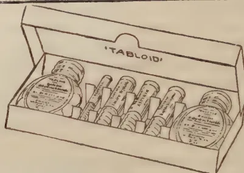

# THE TROPICAL AGRICULTURIST

---

VOL. LXVII.

PERADENIYA, JULY, 1926.

No. 1.

---

## RUBBER RESEARCH.

---

In our present number are included several articles dealing with various aspects of Rubber Research.

The present position in regard to the Budding of Rubber is briefly reviewed and it is indicated that Ceylon should take early steps to test out a number of selected high yielders as mother trees. A certain amount of budding of rubber has been done in Ceylon but it is of importance that greater attention be given to this question and that further time should not be lost. The value of a mother tree for budding purposes can only be determined by actual tapping of the offspring, and it is not certain that a high-yielding mother tree will produce offspring of equally high-yielding capacity.

The details given in the latest paper issued from the Dutch East Indies indicate that the yields of seedlings and the mixture of buddings from unproved clones are about the same. The importance of proving the value of mother trees in any budding work is thereby emphasised.

A summary is given of work which has been done in the Dutch East Indies on the application of disinfectants used in rubber cultivation. Work on this subject has already been carried out in Ceylon and there are further investigations still in hand. It will be noted that the quality of tars and tar preparations vary considerably and that such preparations should be analysed before use.

1------------------------------------------------

2[ JULY, 1926.

Deep tapping versus shallow tapping is discussed in another paper and it is concluded that deep tapping is considerably more provocative of Brown Bast than shallow tapping of the same frequency, but it is also pointed out that tapping frequency would appear to be the most important factor in the causation of Brown Bast. Trees tapped with shallow cuts on alternate days are not immune from Brown Bast and even the shallowest tapping gave rise to 67 per cent. of the amount of disease provoked by deep tappings at the same interval. These results, as do the results of other experiments, indicate that Brown Bast is bound to occur with tapping in any form.

A summary is also given of the work of the Ceylon Rubber Research Scheme for the past year. In regard to diseases there has been improvement during the year and the problems of "spotting" of crepe and "rust" on sheet appear to have been solved. Formic acid has been introduced as a coagulant to replace acetic acid and the use of paranitrophenol against mould-growth on sheet is becoming more common.

The experimental work in regard to smoking rubber has been completed and the results have been written up. It is also proposed to issue a publication containing recommendations for the construction of smoke houses of various sizes.

High-yielding trees have been kept under observation in co-operation with 18 estates and it has been decided to open up a 50-acre experiment station for the testing of rubber grown from selected seed and for experimental work in regard to budding.

Work has also been done on the prevention of bark rot and in connection with secondary leaf-fall and pod disease, whilst special attention has been given to the determination of the best methods of filling cavities caused by disease.

Investigations have also been continued in London at the Imperial Institute and those dealing with the plasticity of raw rubber and with ageing are of particular interest.

2------------------------------------------------

JULY, 1926.]3

# RUBBER.

## THE BUDDING OF RUBBER.

### THE PRESENT POSITION.

F. A. STOCKDALE, C.B.E., M.A., F.L.S.,

*Director of Agriculture.*

In the *Tropical Agriculturist* for December, 1921, and subsequent numbers, attention was drawn to the possibilities of budding or bud-grafting rubber. Various demonstrations in budding methods were subsequently given. It was pointed out that investigations in different rubber-growing countries had demonstrated the widely differing yielding capacities of plantation rubber trees. Observations made in Sumatra and in Ceylon have shown that yield is most probably an inherent character, as good yielders remain, if disease factors do not interfere, as good yielders, and bad yielders remain bad yielders. This appears to be established under differing soil conditions and though it is possible for yields to be increased by different cultural operations it is improbable that a bad yielder can be transformed into a good yielder.

With these facts established, it therefore became apparent that increased yields from rubber plantations could be looked for if propagation from only high-yielding stock was adopted; and two methods were available, *viz.*, by seed selection and by budding.

The results which can be attained by seed selection are seen in the figures which have been published from the individual tapping experiment on the Peradeniya Experiment Station from the plantation raised from Heneratgoda No. 2 tree. Whereas the average yields from this plot are in excess of yields from trees of mixed parentage, they show that areas planted from seed, the maternal parent of which is known to be a high yielder, will always contain a mixture of high, moderate and low yielders. Difficulties in controlling cross-pollination and the knowledge that seedlings from a known parent gave varying results naturally suggested that budding would provide a more certain, and at the same time a quicker, means of securing plantations of high-yielding capacity.

When budding first attracted public attention extraordinary hopes were entertained by some as to the possibilities of very high acreage yields and the enthusiasm aroused received a severe set-back when the first yields from budded areas in the Dutch East Indies became available. These results did not justify the extravagant expectations of the budding enthusiasts and showed that much more experimental work was required. They came to hand when the rubber industry was in the depths of the slump and these disappointments were interpreted by many as failures. Interest in budding waned and it was only a few who persisted in their efforts.

With the recovery of the industry and the decision to plant up further new areas, interest in budding has again been aroused and a large number of growers are now desirous of undertaking the budding of considerable areas. The latest reports from budded areas in Malaya and the Dutch East Indies indicate that very high yields are being secured from budded areas and in consequence it is essential for every grower desirous of securing

3------------------------------------------------

4[JULY, 1926.

the highest yield from newly planted lands to undertake budding. The future of plantation rubber in the form of large estates depends upon the production of high acreage yields. There is little doubt that the production of rubber by small growers will eventually play a much more important part in the industry than it does at present and will constitute in the long run a factor of enormous importance. The production of rubber by small growers has during the past few years increased enormously and although this output in many rubber-growing countries reacts with the price of the commodity there is no doubt that the industry will in the future secure from small growers those supplies which will keep prices on a reasonable basis. All estates therefore desirous of being prepared for the time when production will be equal to or even in excess of demand must look to either cheaper production or increased production per acre. The former may be attainable in certain cases, but is unlikely to be generally possible, and therefore those who desire to look to the future would be advised to explore the possibilities of higher acreage yields.

Budding offers these possibilities provided that certain necessary and essential preliminaries are given heed to. It is, therefore, proposed to review the results that have been secured up to date and to summarise the conclusions that are to be drawn therefrom. Production figures from large acreages of buddings have not been published but they are reported to have been in many cases 50 per cent. in excess of yields from seedlings.

It has been demonstrated that high yielders do not invariably give rise to high-yielding offspring. Some high-yielding mother trees do not produce uniformly high-yielding progeny. The value of a mother tree for budding purposes can only be determined by actual tapping of the offspring. All the budded offspring of a single mother tree are referred to collectively as a "clone" and the feature which has been shown by tappings of budded areas is the uniformity of the yields of the individual members of any one clone. All are either high yielders, moderate yielders or poor yielders. It also appears that there are high-yielding trees which give rise, under varying conditions, to clones of offspring which are uniformly high yielding.

A small number of results from the Central Experiment Station at Java indicate that there may be some influence between stock and scion. The figures available are limited and therefore the conclusions drawn from them can only be tentative. They do however indicate that the growth of the root stock is related to the vigour of the scion used and that the yield values of the stock and scion show some relation to one another. These indicate that care must be taken in the choice of stocks and that budding should be done on stock of good quality grown from seed of selected trees. It is quite possible that certain combinations of stocks and scions will give better results than others and therefore it is essential that some knowledge of the origin of the stock on which buddings are done should be available.

Tappings of budded trees have shown that yields do not increase as the cut approaches ground level as is the case with seedlings and there are indications that bark can be productively tapped at greater heights than with seedlings.

4------------------------------------------------

JULY, 1926.]5

Budded trees appear to be cylindrical in shape and in this respect differ from seedlings.

### YIELDS.

The following summary of yields which have been published up to date may be of general interest:—

#### MALAYA.

##### Kajang Estate.

- (a) *Age.* Of stock 5 years, of bud shoot 4 years.
- (b) *Girth.* 21.66 inches at 17 inches from ground and only 1.17 inches less at 39.37 inches from ground.
- (c) *Mother Trees.* 13 years old.
- (d) *Stocks.* Miscellaneous—not selected seed.
- (e) *Control* trees from same stock non-budded.
- (f) *Tapping System.* Half spiral, daily tapping for 5½ weeks followed by rest for same period, then changed to alternate-day tapping.
- (g) *Yields.* Clone 1 Average 16.3 grams per tapping.  
  Mixed Clones 1 & 9 " 19.9 " " "  
  Control trees " 5.8 " " "

In Clone 1 the highest yielder gave 24.5 grams, and the poorest 9.1 grams per tapping.

In mixed Clones 1 and 9 the highest yielder gave 28.7 grams, and the poorest 12.3 grams per tapping.

In the Control Block the highest yielder gave 12.6 grams and the poorest 2.3 grams per tapping.

Taking 80 trees per acre tapped on 160 days per annum Clone 1 would give 459 lb. per acre per annum. Mixed Clones 1 and 9 would give 561 lb. per acre per annum and the Control would give 163 lb. per acre per annum.

These yields are from 5 year old rubber (4 years budded).

#### SUMATRA.

##### A. V. R. O. S.

- (a) *Age.* Of stock average 6 years. Of bud shoot average 5½ years.
- (b) *Girth.* Average about 21 inches to 25 inches at 20 inches above union of scion and stock.
- (c) *Mother Trees.* Age not stated.
- (d) *Stocks.* From selected seed.
- (e) *Control Trees or Seedlings.* From same selected seed as the stocks.
- (f) *Tapping System.* Alternate monthly on daily cuts over half the circumference.
- (g) *Yields.* Average yield from seedlings is 8 grams per tree per tapping which, on the basis of 160 tapping days and 80 trees per acre, gives 225 lb. per acre per annum.  
  *Clone 33.* Average 14.65 grams per tree per tapping equalling on above basis 413 lb. per acre per annum.  
  *Clone 36.* Average 11.66 grams per tree per tapping equalling on above basis 314 lb. per acre per annum.  
  *Clone 50.* Average 20.11 grams per tree per tapping equalling on above basis 567 lb. per acre per annum.  
  *Clone 52.* Average 12.98 grams per tree per tapping equalling on above basis 366 lb. per acre per annum.  
  *Clone 80.* Average 13.04 grams per tree per tapping equalling on above basis 367 lb. per acre per annum.

5------------------------------------------------

6[ JULY, 1926.JAVA.Malambao Estate.

(a) *Age.* Of stock 5 years, of bud shoot  $4\frac{1}{2}$  years.  
 (b) *Mother Trees.* Average age 9 years at time buds were taken from them.  
 (c) *Stocks.* Selected seed from trees of good girth measurement.  
 (d) *Control Trees.* Same seed as stocks on which buds were grafted.  
 (e) *Tapping System.* Single cut on half circumference.  
 (f) *Yields.* Expressed in terms of percentage of the average yield of the control trees.

<table border="1">
<thead>
<tr>
<th>Clone</th>
<th>A.</th>
<th>B.</th>
<th>C.</th>
<th>D.</th>
<th>E.</th>
<th>F.</th>
<th>Control</th>
</tr>
</thead>
<tbody>
<tr>
<td>Percentage</td>
<td>87</td>
<td>138</td>
<td>162</td>
<td>122</td>
<td>195</td>
<td>90</td>
<td>100</td>
</tr>
</tbody>
</table>

Clones A and F are, therefore, poorer yielders than the control cut, B, C, D and E are higher.

Expressed in terms of yield per centimeter of tapping cut :—

<table border="1">
<thead>
<tr>
<th>Clone</th>
<th>A.</th>
<th>B.</th>
<th>C.</th>
<th>D.</th>
<th>E.</th>
<th>F.</th>
<th>Control</th>
</tr>
</thead>
<tbody>
<tr>
<td>Percentage</td>
<td>101</td>
<td>174</td>
<td>191</td>
<td>157</td>
<td>253</td>
<td>111</td>
<td>100</td>
</tr>
</tbody>
</table>

It is pointed out that the bud shoot is 6 months younger than the control shoot.

CONCLUSIONS.

From the above it is clear that in Ceylon general budding cannot yet be undertaken with certainty of success. It is not possible by external characters to recognize a high-yielder which will produce offspring of high-yielders. What has to be done on estates is first the selection of a number of high-yielders and the setting apart of some of these to provide bud-wood and of others to provide seed for the stocks. Nurseries from the seed of those reserved for stocks should be planted this year or the seed should be planted out at stake and those trees reserved for buds should be pollarded in order to provide good bud-wood from which to bud the stocks being grown. It has been found that the best results are secured when buds are taken from bud-wood which is the same age as the bark of the stock on to which it is to be bud-grafted. An accurate record of the bud-dings should be kept in order that definite data will be available as to those combinations which give the most satisfactory results. It is only when the behaviour of mother trees is known as tested by the tapping results that progress on sound lines can be made.

The latest report just received from Sumatra shows that the yields of seedlings and of a mixture of buddings from unproved clones are about the same. The experiment reported on shows that the method of using bud-dings from unproved mother trees on a large scale should not be applied when laying out a plantation with budded plants. Such experiments should only be laid down by estates on limited acreages in order to secure data on the estates' own land regarding the value of different mother trees for future plantings and budding work. For such experiments at least one half acre of buddings should be planted from each selected tree and the likely mother trees which it is desirable to test should not be less than 20 if the estate contemplates planting out in future years anything in excess of 100 acres of budded rubber.

The Rubber Research Scheme has commenced the development of an experiment station of 50 acres in extent in the Kalutara district for investigation work in the budding and selection of rubber, but estates should not await the results from these experiments. They should lay down experiments of their own and advice as to how these experiments should be designed to yield the information required can be secured from the officers of the Department of Agriculture or of the Rubber Research Scheme.

6------------------------------------------------

JULY, 1926.]7

## WORK OF CEYLON RUBBER RESEARCH SCHEME DURING 1925.

J. MITCHELL, A.R.C.Sc.,

*Organising Secretary of the Scheme.*

The following account has been abstracted from the Reports which were presented at the Fourth Ordinary General Meeting of the Ceylon Rubber Research Scheme held at the Chamber of Commerce Rooms, Colombo, on April 16th, 1926:—

### MEMBERSHIP.

At December 31st, 1925, there were 104 Rubber Growers' Association Members and 95 Rubber Research Scheme Members making a total of 199 Members in all as compared with 193 Members at December 31st, 1924.

### BUILDINGS.

(a) *Laboratories.*—The laboratory buildings have been kept in good repair and the necessary additional equipment has been secured. The laboratories are now well equipped and provide adequate accommodation for the scientific staff, except for the chemical section which is becoming congested and it will be necessary to consider an extension of this section of the laboratories during the coming year.

(b) *Bungalows.*—The two staff bungalows on Heatherley and Culloden Estates were completed in March-April and are now occupied by the Chemist and Physiological Botanist respectively. The bungalow handed over by the Rubber Growers' Association at the inauguration of the Scheme on its present basis has been improved and is now occupied by the Mycologist. These bungalows have been equipped with the necessary heavy furniture that is usually supplied to bungalows on estates.

(c) *Water Services.*—Each bungalow has been equipped with the necessary water service and these are in satisfactory working order.

### EXPERIMENT STATION.

Fifty acres of Crown land at Navitigalakele near Matugama in the Kalutara District has been secured and provision has been made in the 1926 estimates for the development of this land. Problems relating to seed selection, budding, cover plants, and contouring in relation to the prevention of soil erosion are to be specially investigated on this Experiment Station.

### SPRAYING OF RUBBER.

In view of the annual occurrence of secondary leaf-fall, arrangements have been made for the Mycologist (Mr. R. H. Stoughton-Harris) to visit South India during March, 1926, prior to commencing experiments in Ceylon in order to acquaint himself with the work already carried out on estates in South India under the guidance of Mr. Ashplant. Several Ceylon estates will commence spraying rubber this year, but it is necessary for the Scheme thoroughly to test machines under Ceylon conditions and to ascertain the cost of the operations before making definite recommendations.

### CO-OPERATION OF RESEARCH STAFFS.

The arrangements for an exchange of Technical Reports between the Research Staff of the Rubber Research Scheme and the Research Staff of the Rubber Growers' Association working in Malaya and South India have proved satisfactory and will be continued during 1926.

7------------------------------------------------

8[JULY, 1926.

### DISTRICT MEETINGS.

Officers of the Research Scheme have addressed Meetings of planters in the Ratnapura and Kalutara Districts. These Meetings were largely attended and discussions took place on questions of diseases and disease control, budding and selection, manuring, hydrometers for latex, the use of Formic Acid as a coagulant and paranitrophenol as a preventive of mould. These Meetings were highly successful and it is proposed to continue them.

### PROGRESS OF WORK.

#### A.—ORGANISING SECRETARY.

Mr. J. Mitchell has continued his duties as General Secretary of the Research Scheme and as Secretary of the Executive and Technical Committees and a considerable volume of correspondence has been dealt with.

In addition Mr. Mitchell visited 55 estates and issued reports thereon to the Agents and Superintendents of the estates visited. The following notes are taken from Mr. Mitchell's Annual Report and represent the writer's view of general conditions on Ceylon estates at the present time.

(a) *Root Diseases*.—With regard to root diseases there has been a steady improvement, but the disease caused by *Ustilina zonata* will call for much attention during the next few years. This disease is becoming more prevalent on the older properties and attention is drawn to the need for early diagnosis at which time treatment can be carried out with every hope of success. A method of filling the cavities produced by this disease is illustrated and described in the 4th Quarterly Circular for 1925. *Fomes lignosus*, *Poria hypobrunnea* and *Fomes lamaoensis* have been noted on most estates visited but with a few exceptions are not causing serious loss. *Sphaeorostilbe repens* has not been as much in evidence as it was during 1924.

(b) *Stem Diseases*.—With regard to stem diseases there has been a marked improvement in connection with both *Bark Rot* and *Patch Canker*. The systematic preventive painting of the tapping cut with disinfectants has proved very successful and with a more universal adoption of the practice of disinfectant painting, *after every tapping*, there is reason to anticipate that the worst of the bark diseases in Ceylon will be kept completely under control. It is considered that a reduction in the amount of Patch Canker has been brought about by the greater care taken in scraping and as a result of employing more intelligent coolies to carry out the operations.

There does not appear to have been any marked increase in the prevalence of Brown Bast during 1925, but it is to be expected that on resumption of full tapping this disease will again become more prevalent. On most estates which have been re-visited it was noted that the work on this disease has been carried out satisfactorily and there are indications that the majority of the trees treated will be tappable within the next two to three years. A combination of the usual scraping methods and the "isolation" method advised by Keuchenius is now being adopted.

*Corticium Salmonicolor* (Pink Disease) has been noted on young trees, but has not proved serious on any estate. Die-back has given very little trouble during the year.

(c) *Leaf Diseases*.—A leaf-fall caused by a species of *Oidium* appeared in most districts of the Island in March and April (see 1st Quarterly Circular, 1925) and the possible further development of this disease is being carefully watched.

8------------------------------------------------

JULY, 1926.]9

Secondary leaf-fall and pod disease (*Phytophthora* sp.) has again been prevalent in the Kalutara District, but much less so in the other districts of the Island. The manuring experiments which have been in progress on Gallawatte Estate for the past three years have given indications that a considerable improvement in the foliage cover can be secured by manuring (see 3rd Quarterly Circular, 1925) and the Gallawatte Company has kindly agreed to continue these experiments during 1926.

(d) *Manufacture*.—With regard to manufacture, fewer complaints have been received during 1925 than in any previous year and the problems of “spotting” of crepe and “rust” on sheet appear to have been satisfactorily solved. With the introduction of paranitrophenol it is believed that the problem of mould on sheet (the most prevalent trouble at the present time) will also be settled.

The introduction of Formic Acid to replace Acetic Acid as a coagulant is the only change in the methods of manufacture of crepe or sheet to record during the year.

The following notes are taken from Mr. T. E. H. O’Brien’s Annual Report:—

B.—CHEMIST.

(a) *Smoking Experiments*.—The series of experiments to study the effect on mould growth of varying conditions of smoking is now nearing completion.

During the past year a comparison has been made between “combusted” smoke and “uncombusted” smoke. It is found that by varying the amount of ventilation of the fire the character of the smoke can be markedly altered. “Combusted” smoke produced when the wood glows and burns, has an acrid smell and irritates the nose and eyes. “Uncombusted” smoke, produced when the wood is only allowed to smoulder, has a soft tarry smell and little effect on the eyes. When sheet smoked with these two types of smoke are tested for resistance to mould, it is found that “uncombusted” smoke is considerably more effective in preventing mould than “combusted” smoke.

It has also been established that heavily smoked sheet is more resistant to mould than lightly smoked sheet.

The full results will shortly be published in a bulletin.

(b) *Paranitrophenol*.—One of the chief conclusions reached from the smoking experiments is that whilst liability to mould growth can be minimised by attention to various points during manufacture, sheet cannot be made entirely immune to mould by such means. This can probably only be effected by the addition of some disinfectant substance to the rubber. The Staff of the Rubber Growers’ Association have worked on this subject and have introduced paranitrophenol as a suitable substance for the purpose. This has been tested by the Research Scheme and the results recorded by the Rubber Growers’ Association have been confirmed.

Paranitrophenol is cheap, effective in small quantities, and has no detrimental effect on the rubber. Under Ceylon conditions the best method of use consists of soaking the freshly rolled sheets, after washing, in a 0.1 per cent. solution of the chemical. This treatment is now recommended to Members of the Research Scheme and paranitrophenol can now be obtained from the Colombo Commercial Co., Ltd., Colombo.

9------------------------------------------------

12[ JULY, 1926.

## RESEARCH WORK AT THE IMPERIAL INSTITUTE.

The following notes are taken from the Annual Report of the London Advisory Committee:—

1. *Wet Rubbers.*—In continuation of previous investigations of wet rubbers, a study was made of the vulcanising and mechanical properties of crepe and unsmoked sheet kept in a wet condition, chiefly with a view to determining the effect of different amounts of moisture. The samples were prepared on four different estates and each set consisted of (a) air-dried crepe and crepe blocked immediately and 1, 2, 4 and 8 days after machining; (b) air-dried unsmoked sheet and sheet rolled up immediately and 1, 2, 4 and 8 days after machining. In the case of the crepe samples, with one exception, only those blocked immediately after machining contained more than 1.0 per cent. of moisture on arrival at the Imperial Institute; most of the rolled sheets however contained appreciable amounts of moisture, viz., from 1.8 to 8.50 per cent.

The samples were submitted to vulcanising and mechanical tests in a rubber-sulphur mixing (90: 10) at a less advanced state of cure than that formerly used, chiefly with a view to carrying out ageing tests on the same specimens. They were also examined in the following mixing—90 rubber, 5 zinc oxide, 5 sulphur, 1 diphenyl guanadine—in continuation of the study of the behaviour of plantation rubber in different technical mixings.

A report giving details of the results obtained has been published in Research Scheme Bulletin No. 40.

It was found that in the rubber-sulphur mixing :

(a) The wet blocked crepes were more variable in time of vulcanisation than the controls, whereas the wet rolled sheets were slightly more uniform.

(b) On the average, samples containing the most moisture had the shortest time of vulcanisation, but the effect of the moisture was more pronounced in the case of one estate than in the others.

(c) The tensile strengths of the wet samples did not differ from those of the corresponding controls to any marked extent.

All the samples gave similar tensile strengths and elongations when vulcanised for a fixed period in the accelerator-zinc oxide mixing.

This investigation, in conjunction with those previously carried out on wet rubbers, indicates that on the whole crepe blocked wet and unsmoked sheet rolled up wet possess no important advantages over dry crepe and sheet either as regards tensile strength or uniformity in time of vulcanisation.

2. *Plasticity of raw rubber.*—The investigation of the plasticity of plantation rubber has been continued.

A large number of experiments have been carried out chiefly on the lines indicated in the last annual report, viz. :—(a) measurement of the amount of power consumed during mastication and mixing; (b) determination of the rate at which masticated and mixed rubber can be forced through a small orifice under a constant load at constant temperature; (c) determination of the viscosity of solutions of masticated rubbers in benzene at a constant temperature.

The results of preliminary experiments made with the wet rubbers

10------------------------------------------------

JULY, 1926.]13

referred to in section (1) indicated that:

- (a) Air dried crepe was more plastic than air-dried unsmoked sheet,
- (b) blocking the crepe and rolling up the sheet had no effect on plasticity,
- (c) keeping the blocked crepe and rolled sheet in a wet condition for a considerable period had also no effect.

As a result of the experience gained in these tests, a number of important modifications in the apparatus have recently been made. In addition the scheme of testing is being extended to include comparative tests with an Ira Williams' type of plastometer which was obtained towards the close of the year. In this apparatus a small ball of rubber of standard weight is submitted to constant pressure at constant temperature for a definite time, and the relative plasticity of the rubber is indicated by the decrease in the thickness of the ball. This method of determining plasticity, which is used by a number of other investigators, has the particular advantage that it can be utilised for tests on raw unmasticated rubber as well as on masticated and mixed rubber.

An investigation is now in progress with a view to determining the extent and cause of variability in the plasticity of Ceylon estate grades.

3. *Ageing Tests*.—Although vulcanised articles always deteriorate eventually on keeping, few experiments have been made to determine the effect of the method of preparation of rubber on the ageing properties of the vulcanised product. In view of the importance of the subject it is proposed to make a detailed study of the behaviour of plantation rubber on ageing and to compare the results obtained with those given by fine hard Para. For the first set of experiments the wet rubbers referred to in paragraph 1 have been submitted to artificial ageing tests at 70° C after vulcanisation. The results showed that the unsmoked sheet samples were superior to the crepe, as they were stronger, had a longer life when vulcanised to the same standard and also a greater latitude of cure. It was found that the wet blocked crepe and the wet rolled sheet did not differ in ageing properties from the corresponding samples of dry crepe and sheet.

Experiments are now in progress with smoked sheet and fine hard Para. The examination of fine hard Para should be of special interest, as one of the reasons suggested for the preference for this rubber in the manufacture of golf ball tape and elastic thread is that it has better ageing properties than plantation rubber in a rubber-sulphur mixing.

Reference was made in the last annual report to the poor ageing properties of crepe prepared from ammonia-preserved latex by coagulation with acetic acid. This subject has been further investigated and in recent experiments glue was added to the latex before coagulation with acetic acid, but no improvement in the ageing properties of the rubber was produced. On the other hand rubber obtained by the evaporation of the preserved latex possesses excellent ageing properties.

In this connection it has been found that dilute ammonia solution extracts about two per cent. of organic and mineral matter from unsmoked sheet, and that the extracted rubber has poor ageing properties.

Further work on this subject is in progress.

4. *Bordeaux mixture*.—A series of experiments was arranged by the Ceylon Technical Committee with a view to obtaining definite information as to the effect on the vulcanised rubbers of spraying trees with Bordeaux mixture. As the result of tests carried out at the Imperial Institute on samples prepared in Ceylon, it was found that the latex obtained from trees within two days of spraying was contaminated with traces of copper, but that latex obtained a few days later after heavy rain was free from copper. The samples containing copper did not become tacky on storage for 12 months, but on exposure to the sun they became tackier than the others. Moreover on

11------------------------------------------------

14[ JULY, 1926.

masticating and mixing, a more plastic product was obtained in the case of the samples containing copper. The presence of copper had no effect on the rate of vulcanisation, but it resulted in a lower tensile strength and a more rapid deterioration on ageing.

Further experiments have been made in Ceylon, in which known quantities of Bordeaux mixture were added to latex and these samples will be examined in due course.

5. *Smoking experiments.*—In connection with the study which is being made in Ceylon of different conditions of smoking, two sets of smoked sheet rubbers, one prepared with del wood and the other with rubber wood as fuel, were examined with regard to (a) the time taken in a humid atmosphere for visible mould to develop after inoculation, and (b) the time of vulcanisation in a rubber-sulphur mixing.

Comparative tests showed that the heavily smoked samples were more resistant to mould than medium and lightly smoked; and also that the samples smoked with del wood were more resistant than those smoked with rubber wood. There was no marked difference in time of vulcanisation between the lightly, moderately and heavily smoked samples, nor between those smoked with del and rubber wood.

6. *Other Investigations.*—Work on the following subjects has also been carried out during the year and is being continued:—

1. (1) The effect of low temperature on the physical properties of raw rubber;
2. (2) The effect of adding glue to latex when used in the manufacture of paper and;
3. (3) Duplicate experiments in conjunction with other investigators in connection with the standardisation of methods of testing rubber.

The following papers were published by members of the Staff in London:

(a) "The function of rubber 'resin' in the vulcanisation of mixings containing accelerator and zinc oxide," by G. Martin, B.Sc., A.I.C., and W. S. Davey, B.Sc., A.I.C., *Journal of the Society of Chemical Industry*, XLIV, 1925, p. 317T.

(b) "Notes on recent developments in the preparation of raw rubber," by W. S. Davey, B.Sc., A.I.C., *Institution of Rubber Industry, Birmingham Section*, October 15th, 1925.

#### PUBLICATIONS.

*Rubber Research Scheme Bulletins.*—Research Scheme Bulletins Nos. 37, 38 and 39 have been published and distributed to all Members of the Research Scheme and to Scientific Organisations in the various Rubber-growing countries. These deal with investigations carried out at the Imperial Institute on samples of rubber prepared in Ceylon and a full summary with conclusions is given in Bulletin No. 39.

*Rubber Research Scheme Quarterly Circulars.*—Circulars dealing with questions of current interest to the Rubber Planting Industry have been published at quarterly intervals and from the expressions of appreciation received it would appear that they are well serving the desired purpose of establishing a closer link between the Research Scheme and the Rubber Industry of the Island.

*Rubber Growers' Association Bulletins.*—All the Bulletins issued by the Rubber Growers' Association during 1925 have been received and distributed to those estates which do not receive them direct from London. In addition, the Research Scheme has distributed to all Subscribers the booklets "Recent Developments in the Rubber Planting Industry," by Mr. Herbert Ashplant and "Rubber on the Market and in the Factory," by Dr. O. de Vries, which were received from the Rubber Growers' Association.

12------------------------------------------------

JULY, 1926.]15

### REPORTS.

The London Advisory Committee forwarded the following reports:—

- (a) Variability of Rubber from different districts (Series I).
  - (1) 6th Interim Report (R. S. Bulletin No. 38).
  - (2) Final Report (R. S. „ „ 39).
- (b) Wet Rubber (Series II.).
  - (1) Vulcanising and Mechanical Tests (R. S. Bulletin No. 40).
- (c) 1st Interim Report on Ageing Tests on Plantation Rubber (R. S. Bulletin No. 41).
- (d) Ageing properties of Rubber prepared from latex preserved with Ammonia (Research Scheme Quarterly Circular No. 1, 1925).
- (e) The Ageing properties of Rubber extracted with dilute Ammonia (Research Scheme Quarterly Circular No. 4, 1925).
- (f) Plasticity of Raw Rubber (Research Scheme Quarterly Circular No. 3, 1925).
- (g) Effect of different conditions of smoking on liability of sheets to become mouldy (2nd Report).
- (h) Effect produced on Rubber by spraying trees with Bordeaux Mixture.
- (i) Investigation of samples of Rubber prepared by a special process.

## THE APPLICATION OF DISINFECTANTS USED IN THE CULTIVATION OF RUBBER.

Dr. A. STEINMANN and Dr. J. J. B. DEUSS.

### SUMMARY.

There are a great many kinds of tar and tar preparations in use in the cultivation of rubber as disinfectants, which, as far as their suitability as preservatives against infectious diseases are concerned, differ considerably.

These disinfectants can be classified as follows: A. Species of tar; B. All tar preparations not miscible with water; and C. Mixtures of tar or tar preparations with oil, resin, wax or paraffin with the addition of benzene or spirit.

#### A. TAR.

1. Swedish Tar or Wood Tar is entirely unsuitable on the tapping surface, since its power of penetration is far too great and it contains damaging ingredients.

Wood tar is almost completely soluble in alcohol, contains in contrast to coal-tar little or no free carbon, but much phenol and acetic acid. If one is dealing with the so called "blasentar," this then contains as much as 8 per cent. acid. Also species of tar obtained by other processes of wood distillation can contain 5 per cent. acetic acid; tar from resinous wood as much as 12 per cent.; this latter being the kind usually known as Swedish tar.

On account of its high percentage of creosote, wood-tar is an excellent preservative for dead wood.

It appears that this tar can be used in the form of a mixture with fine sand or with boiled waste rubber for combating the attacks of insects (vide A. Steinmann, *De ziekten en plagen van Hevea brasiliensis*, p. 124). The entrance of boring beetles is prevented by the viscous lump which is formed.

2. Coal Tar if of a good quality, can be applied cold to the tapping surface as a preservative, provided that a strip of about 1 cm. is left free above the tapping cut, in order not to foul the scraps with tar.

13------------------------------------------------

16[JULY, 1926]

The objection must also be pointed out (vide Handbook v/d. Rubber-cultuur, 1921, p. 184) that once coal-tar has become mixed with rubber, it cannot be washed out.

The application of tar has the great disadvantage of concealing every thing from view, covering up the surfaces and the tapping wounds and consequently preventing proper control. Furthermore, when tar is used, it is not easy to ascertain whether the tapping surfaces are receiving regular treatment.

The various methods of composing coal-tar differ greatly and depend principally on the origin of the tar.

The fact that about 210 different chemical ingredients are to be found in such a substance shows how complicated the work of analysis becomes.

Water-Gas Tar is something quite different and the composition very variable. The tar is a thin fluid and, since it penetrates to a great depth, can be used with success instead of carbolineum to prevent wood rot.

Water-Gas Tar is easily distinguished from carbolineum by the smell and also by the fact of the former being a thinner liquid.

Creosote, such as is used for disinfecting, is one of the heavier fractions of the dry distillation of coal, wood, etc. If used for disinfectant purposes (such as direct application to dead wood or as a mixture) it must comply with the following demands:

1. It must be free from naphthaline and homologen, as these prevent a good emulsion (this also applies to carbolineum.)

2. For the preservation of dead wood it must contain from 3-20 per cent. phenols. The percentage in every species (also in carbolineum) must be known in order to be able to dilute it to the required grade.

3. The specific gravity must be nearly the same as that of water. The lighter it is, the better it emulsifies. 1.015 at 38°C is good, not higher however than 1.07.

If it is desired to make the creosote a better emulsion, soap should be added—to the cheaper qualities resin soap, and to the better qualities resin soap mixed with vegetable oil soap or merely the latter alone.

There must be no over-measurement of alkali, as this obstructs the disinfectant working of the phenols.

An example of one of these good emulsifying creosotes is:

<table>
<tr>
<td>Resin-soap</td>
<td>26 %</td>
</tr>
<tr>
<td>Light creosote</td>
<td>61 % (specific gravity 1.025, 18 % phenols)</td>
</tr>
<tr>
<td>Petroleum</td>
<td>3 % (s.g. 0.815)</td>
</tr>
<tr>
<td>Caustic soda</td>
<td>2.5 %</td>
</tr>
<tr>
<td>Water</td>
<td>7.5 %</td>
</tr>
</table>

There are also varnishes made of creosote with pitch or bituminous matters. Some are slow-drying, but in general these varnishes quickly crack on becoming dry as a result of the light, whereby an auto-oxidation probably takes place. Tars containing pitch or asphalt also form quick-cracking varnishes. When analysing a tar, this point must therefore also be kept in mind.

14------------------------------------------------

JULY, 1926.]17

Schmitz and Zeller (Journ. Ind. Eng. Chem. 1921, 13, 621-623), concluded that the creosote fraction of 270-315°C., is the fraction with which the most rapid killing of fungi is effected. Above 355°C. distilling material is valueless.

What then are the demands that can be laid down for a good tar?

According to the maxims for Indian purchases coal-tar must be a pure product of coal; it must be of the best quality, unadulterated, and free from foreign ingredients, similarly from an excess of ammoniac-water, it must be about 50 per cent. soluble in benzol; the residue after evaporation of the benzol must be firm. Coal-tar must be homogeneous and must contain no "gall" that could spoil the perfect smoothness; it must be free from acids. Coal-tar must be practically free from water; the proportion of water must not be more than 3 per cent. (the danger exists with coal-tar, which has too high a percentage of water, that on becoming dry no compact and unbroken layer of tar is formed). Coal-tar must be sufficiently viscous to cover the objects treated completely.

Two samples of tar, that showed a viscosity of resp. 57.7°E and 120.7°E at 50°C. and of 5.0°E and 5.6°E at 100°C. were quite satisfactory for the pruning wounds of tea. The limits in this connection are therefore comparatively wide.

It is marketed in barrels of 200 litres = 216 KG net.

A margin of 2 per cent. per barrel is allowed when buying or selling, so that the price may not be increased or decreased if the quantity received per barrel remains within these bounds.

As we have repeatedly noticed, the quality of *sundry* deliveries of coal-tar by the *same* Company or Gas Company can vary considerably. It does not follow that because one parcel is satisfactory the next delivery will be of the same quality.

When inspecting tar, with a view to using it on live trees, it is always sufficient to assay the efficiency by biological methods. By these methods, which are also put into practice on the English side, it is possible to form an idea of the serviceableness of the different preparations.

The test is easy to make and every planter can carry it out himself. A healthy tree is shaved in two places; in the one place sufficiently deep for the so called hard stone-cell-containing-bark to be visible, in the other place deeper—through the bark, until the soft latex-vessels-containing-bark is laid bare. One must be careful that a layer of bark at least 1mM thick remains. One waits until the latex, which exudes, has coagulated and then, after removing the rubber, one smears on some of the trial-sample tar. After ten days a piece of the bark is removed (with an ordinary bark-drill such as is commonly used for taking bark samples), is cut through, and with the help of a magnifying glass the thickness of the discoloured bark is measured. If on the sample the discolouring has penetrated to the wood then this quality of tar is unsuitable.

If a stricter test is required, one can determine by examination under a microscope how far the preparation has sunk into the tissues. It is always able to sink further into the stone-cell-containing, *i.e.* the hard, bark which is exceptionally porous, than into the soft inner-bark.

15------------------------------------------------

18[JULY, 1926.

From the undermentioned results of the biological examination of a few tar samples, which were sent to us during the last few years, it is most clearly illustrated how extensively the tars in use on the estate vary in quality.

<table border="1">
<thead>
<tr>
<th rowspan="2"></th>
<th colspan="2">Penetrating Power</th>
<th rowspan="2"></th>
</tr>
<tr>
<th>Hard</th>
<th>Soft</th>
</tr>
</thead>
<tbody>
<tr>
<td>Woodtar</td>
<td>2.0 mM</td>
<td>2.0 mM</td>
<td></td>
</tr>
<tr>
<td>Tar L. T.</td>
<td>2.0-3.0 „</td>
<td>2.0 „</td>
<td></td>
</tr>
<tr>
<td>„ 3 N.</td>
<td>3.0 „</td>
<td>2.0 „</td>
<td></td>
</tr>
<tr>
<td>„ 2 N.</td>
<td>1.0-1.5 „</td>
<td>1.0 „</td>
<td></td>
</tr>
<tr>
<td>„ 1 N.</td>
<td>1.5 „</td>
<td>1.0 „</td>
<td></td>
</tr>
<tr>
<td>„ W.</td>
<td>2.0 „</td>
<td>1.0 „</td>
<td></td>
</tr>
<tr>
<td>„ Tjr.</td>
<td>0.8-1.0 „</td>
<td>0.6 „</td>
<td></td>
</tr>
<tr>
<td>„ Tjp.</td>
<td>1.0 „</td>
<td>0.7 „</td>
<td></td>
</tr>
<tr>
<td>„ V.</td>
<td>0.7 „</td>
<td>0.7 „</td>
<td></td>
</tr>
<tr>
<td>„ B.</td>
<td>0.7 „</td>
<td>0.7 „</td>
<td></td>
</tr>
<tr>
<td>Cambisan</td>
<td>0.7 „</td>
<td>0.5 „</td>
<td></td>
</tr>
</tbody>
</table>

Of these various sorts of tar, therefore, only the latter 5 were suitable.

*Cambisan* is a neutral-tar, which gives rise to no burning phenomena on the bark (Vide Gandrup, Rubberarchief, 1921, p.558). It is, as a matter of fact, more expensive than ordinary tar, and also difficult to work with in a cold state on account of its thick fluidity, to which point Gandrup has drawn attention.

An experiment was made of adding to cambisan-tar the ingredients, in the same quantities, contained in normal tar.

<table border="1">
<thead>
<tr>
<th rowspan="2">20. XI.</th>
<th colspan="2">Penetrating power</th>
<th rowspan="2">Quantities corresponding with those in normal tar</th>
</tr>
<tr>
<th>Soft mM</th>
<th>Hard mM</th>
</tr>
</thead>
<tbody>
<tr>
<td>1. cambisan</td>
<td><math>\frac{1}{2}</math></td>
<td><math>\frac{1}{2}</math>—<math>\frac{3}{4}</math></td>
<td>—</td>
</tr>
<tr>
<td>2. cambisan 600 gr. phenol 12 „</td>
<td><math>\frac{1}{2}</math>—1</td>
<td>—</td>
<td>2% phenol</td>
</tr>
<tr>
<td>3. cambisan 730 gr. pyridine 3 „</td>
<td>up to 1</td>
<td>—</td>
<td><math>\frac{1}{4}</math>% pyridine</td>
</tr>
<tr>
<td>4. cambisan 760 gr. anthracene 15 „</td>
<td>1—<math>1\frac{1}{4}</math></td>
<td>—</td>
<td>2% anthracene</td>
</tr>
<tr>
<td>5. cambisan 530 gr. phenol 6 „</td>
<td>up to 1</td>
<td>—</td>
<td>1% phenol</td>
</tr>
<tr>
<td>6. tar oil and caustic potassium</td>
<td><math>\frac{3}{4}</math></td>
<td><math>\frac{1}{4}</math></td>
<td>—</td>
</tr>
</tbody>
</table>

The penetrating-power proved to be too great.

A watery latex was only observed to exude from No. 4 (760 gr. cambisan \* 15 gr. anthracene).

Further experiments were made to determine whether perhaps the quantity of soda, necessary for emulsifying tar preparations, could be the cause of burning.

\* Test 2 is the average of the results on 4 trees

16------------------------------------------------

JULY, 1926.]19

The first series of tests were made on only one tree, whilst at the repetition each mixture was tried on four trees so that the figures show the average powers of penetration of the trial samples.

<table border="1">
<thead>
<tr>
<th rowspan="3"></th>
<th rowspan="3"></th>
<th colspan="4">Penetration</th>
</tr>
<tr>
<th colspan="2">Hard</th>
<th colspan="2">Soft</th>
</tr>
<tr>
<th>Test 1</th>
<th>Test 2 *</th>
<th>Test 1</th>
<th>Test 2 *</th>
</tr>
</thead>
<tbody>
<tr>
<td>A.</td>
<td>Mixture of 25 gr. taroil (2% phenol), 600 gr. water and 6 gr. soda</td>
<td>1.0 mM</td>
<td>1.0 mM</td>
<td>0.75 mM</td>
<td>1.0 mM</td>
</tr>
<tr>
<td>B.</td>
<td>Mixture of 260 gr. taroil, 600 gr. water &amp; 4.5 gr. caustic soda.</td>
<td>1.0 "</td>
<td>1.2 "</td>
<td>0.5 "</td>
<td>0.8 "</td>
</tr>
<tr>
<td>C.</td>
<td>" of tar (2% phenol), water and caustic soda.</td>
<td>1.0 "</td>
<td>—</td>
<td>0.5 "</td>
<td>0.7 "</td>
</tr>
<tr>
<td>D.</td>
<td>" similar to C. but 3 times diluted.</td>
<td>1.25 "</td>
<td>1.5 "</td>
<td>0.75 "</td>
<td>0.8 "</td>
</tr>
<tr>
<td>E.</td>
<td>" of tar, water and soda.</td>
<td>1.125</td>
<td>—</td>
<td>0.5 "</td>
<td>—</td>
</tr>
</tbody>
</table>

It appeared that this is not the case. The addition of soda in the quantities used in these instances had no abnormally high effect on the powers of penetration, except with A, where the penetrating power of the sample being 1mM. was in test 2 too great.

Finally we made a series of tests by applying the various ingredients of tar, which were obtained by fractional distillation, to a tree and inspecting their penetrating powers on the bark.

In this instance tar of the Gas Company, Buitenzorg, was used for distillation. The various items were brought to an emulsion with common soap.

<table border="1">
<thead>
<tr>
<th rowspan="2">Concentration.</th>
<th rowspan="2">Ingredient of the Tar.</th>
<th colspan="2">Penetration Power.</th>
</tr>
<tr>
<th>Hard</th>
<th>Soft</th>
</tr>
</thead>
<tbody>
<tr>
<td>1%</td>
<td>Lowest fraction taroil</td>
<td>1.0 mM</td>
<td>1.0 mM</td>
</tr>
<tr>
<td>2%</td>
<td>" " "</td>
<td>1.5 "</td>
<td>0.75 "</td>
</tr>
<tr>
<td>5%</td>
<td>" " "</td>
<td>1.5 "</td>
<td>1.0 "</td>
</tr>
<tr>
<td></td>
<td>Residue taroil</td>
<td>1.5 "</td>
<td>1.0 "</td>
</tr>
<tr>
<td>1%</td>
<td>fraction 200°C.—210°C. taroil</td>
<td>3.0 "</td>
<td>dead</td>
</tr>
<tr>
<td>2%</td>
<td>" 210°C "</td>
<td>2.0 "</td>
<td>Not determ.</td>
</tr>
<tr>
<td>5%</td>
<td>" 200° —210°C "</td>
<td>2.0 "</td>
<td>" "</td>
</tr>
</tbody>
</table>

As the above table shows, the low-boiling fractions of the tar (up to 200°C.—210°C) are not suitable for treatment of the tapping surface; they soak far too deep into the bark, which for that reason becomes burnt.

It is therefore probably principally the elements present in these fractions, which give rise to the burning phenomena in tar of poor quality.

17------------------------------------------------

20[JULY, 1926.

In view of the fact that the composition of the kinds of tar, available on the market differs so widely, and that we have often had occasion, when using tar as fungicide on tapping surfaces, to see dead places and wood-wounds occur from being burnt, cases of which are also frequently recorded elsewhere. We prefer for this purpose other preparations, for example a diluted tar preparation or mixture of resin and spirits.

Besides for disinfecting tapping surfaces, coal-tar is, in the cultivation of rubber, also used:

1. 1. On the tapping surface for covering over tapping wounds:
2. 2. For the treatment of branches attacked by djamoer æpas and divers root diseases, in particular by dry collar rot.
3. 3. For covering stumps of branches and other large wood-wounds on the trunk.

We would mention here the results of several tests we made a few years ago in connection with the use of coal-tar for the treatment of tapping wounds.

On 10 trees in the agricultural garden at Tjikeumeuh, which had previously been tapped from two cuts, one above the other, of about  $\frac{1}{4}$  of the circumference, but which at the time of the tests had not been tapped for about  $2\frac{1}{2}$  months—we made on the tapping surfaces a number of large round wounds (from 2 cm. diameter) right through to the wood. These wounds were made with a hollow pipe, such as is used for taking bark samples.

The next day, after removal of the coagulated latex which had oozed out of the wounds, these, by then dry, were subjected to various treatments. One wound was tarred cold (A tar was used which was ascertained by chemical analysis to be well qualified for the purpose), another was painted with a paraffin which had a boiling point of  $60^{\circ}$  C. and which had been heated just enough to make it liquid; while yet another was left untouched and thus acted as a control.

After a period of about  $2\frac{1}{2}$  months the distances between the closing edges of the callus tissues of all the wounds were measured.

It is a recognised fact, that the speed, with which the tissues regenerate, is different for every tree in relation to its age and the external circumstances to which it is subjected, etc., etc., and must be judged separately.

Therefore for comparison it is necessary to show the results of each tree treated with the various preparations separately.

In total 86 test-wounds were made, distributed over the upper and lower tapping surfaces, of which 21 were for control, 37 for tar and 28 for paraffin treatment.

In many cases, according to the circumstances, more than 3 wounds per tree were made, sometimes as many as 5 or 6.

18------------------------------------------------

JULY, 1926. ]21

<table border="1">
<thead>
<tr>
<th rowspan="2">No. of tree</th>
<th colspan="4">Distance between closing tissues in mM.</th>
<th rowspan="2">No. of tree</th>
<th colspan="4">Distance between closing tissues in mM.</th>
</tr>
<tr>
<th>Control</th>
<th colspan="2">Tar</th>
<th>Paraffin</th>
<th>Control</th>
<th colspan="2">Tar</th>
<th>Paraffin</th>
</tr>
</thead>
<tbody>
<tr>
<td>Upper surface 62</td>
<td>5</td>
<td colspan="2">10</td>
<td>—</td>
<td rowspan="2">75</td>
<td>11</td>
<td>10</td>
<td>14</td>
<td>10</td>
</tr>
<tr>
<td>Lower surface</td>
<td>4</td>
<td>10</td>
<td>7</td>
<td>—</td>
<td>10</td>
<td>8</td>
<td>10</td>
<td>11</td>
<td>12</td>
</tr>
<tr>
<td>Upper surface 63</td>
<td>10</td>
<td>10</td>
<td>12</td>
<td>10</td>
<td rowspan="2">76</td>
<td>—</td>
<td colspan="2">18</td>
<td>11</td>
<td>14</td>
</tr>
<tr>
<td>Lower surface</td>
<td>1</td>
<td>7</td>
<td>9</td>
<td>8</td>
<td>9</td>
<td>11</td>
<td>12</td>
<td>12</td>
<td>15</td>
</tr>
<tr>
<td>Upper surface 70</td>
<td>11</td>
<td colspan="2">—</td>
<td>10</td>
<td rowspan="2">85</td>
<td>6</td>
<td>9</td>
<td>10</td>
<td>8</td>
<td>8</td>
<td>9</td>
</tr>
<tr>
<td>Lower surface</td>
<td>13</td>
<td colspan="2">14</td>
<td>—</td>
<td>7</td>
<td>8</td>
<td>8</td>
<td>9</td>
<td>8</td>
<td>9</td>
</tr>
<tr>
<td>Upper surface 72</td>
<td>4</td>
<td>5</td>
<td>6</td>
<td>1</td>
<td>3</td>
<td rowspan="2">86</td>
<td>9</td>
<td>5</td>
<td>9</td>
<td colspan="2">2</td>
</tr>
<tr>
<td>Lower surface</td>
<td>5</td>
<td colspan="2">7</td>
<td>—</td>
<td>4</td>
<td colspan="2">7</td>
<td>4</td>
<td>4</td>
</tr>
<tr>
<td>Upper surface 73</td>
<td>5</td>
<td>9</td>
<td>12</td>
<td>—</td>
<td rowspan="2">84</td>
<td>11</td>
<td>12</td>
<td>15</td>
<td colspan="2">11</td>
</tr>
<tr>
<td>Lower surface</td>
<td>4</td>
<td colspan="2">10</td>
<td>—</td>
<td>—</td>
<td colspan="2">15</td>
<td>11</td>
<td>12</td>
</tr>
<tr>
<td>Upper surface 74</td>
<td>7</td>
<td colspan="2">9</td>
<td>10</td>
<td rowspan="2">28</td>
<td>12</td>
<td>12</td>
<td>15</td>
<td>15</td>
<td>8</td>
<td>13</td>
</tr>
<tr>
<td>Lower surface</td>
<td>9</td>
<td colspan="2">—</td>
<td>5</td>
<td>8</td>
<td></td>
<td></td>
<td></td>
<td></td>
</tr>
</tbody>
</table>

From these statistics it is apparent that the tar, although of a good quality, that is to say with a small power of penetration (0.3—0.5 mM.), exercised a *detractory* effect on the healing of the callus wounds.

In most cases the distance between the edges of the closing callus-tissues of the wounds treated with tar was much greater than that between the tissues of the control wounds, while the figures for the paraffin treated wounds differed so much that no definite conclusion could be drawn from them.

The same experiment was repeated on the Estate Kedong-Alang on seven trees, which were tapped in the normal way, with a cut over  $\frac{1}{2}$  the circumference, during the period of the test. After 3 months the wounds were examined and measured; the following table shows that during that period several of the control wounds had already become closed, as also had some of the wounds treated with paraffin, whilst the tarred wound, with the exception of tree No. 26, in comparison with the others were behindhand.

19------------------------------------------------

22[ JULY, 1926.

<table border="1">
<thead>
<tr>
<th rowspan="2">No. of Tree</th>
<th colspan="5">Distance between callus-tissues in mM</th>
</tr>
<tr>
<th>Control</th>
<th colspan="2">Tar</th>
<th colspan="2">Paraffin</th>
</tr>
</thead>
<tbody>
<tr>
<td>26</td>
<td>2</td>
<td colspan="2">0.5</td>
<td colspan="2">closed</td>
</tr>
<tr>
<td>40</td>
<td>closed</td>
<td colspan="2">0.5</td>
<td colspan="2">closed</td>
</tr>
<tr>
<td>66</td>
<td>closed</td>
<td colspan="2">4</td>
<td colspan="2">closed</td>
</tr>
<tr>
<td>68</td>
<td>2</td>
<td colspan="2">3—4</td>
<td>1</td>
<td>2—3</td>
</tr>
<tr>
<td>70</td>
<td>1</td>
<td>2</td>
<td>4</td>
<td>closed</td>
<td>3</td>
</tr>
<tr>
<td>43</td>
<td>1</td>
<td colspan="2">6</td>
<td colspan="2">1</td>
</tr>
<tr>
<td>77</td>
<td>closed</td>
<td>1</td>
<td>1</td>
<td colspan="2">closed</td>
</tr>
</tbody>
</table>

As Vischer\* has already advised, it is superfluous to tar tapping-wounds since they are, in any case, provided that the tapping surface is treated, also disinfected.

On the other hand in the case of tea as a result of pruning, although burning of the live tissues has also been recorded and as Bernard showed, the tissues become wounded *under* the cell-layers, where the tar has penetrated, this disadvantage is of less import than it is in the case of a tapping surface since it is heavily outweighed by the advantages which are connected with the treatment, namely: the prevention of rot and of the entrance of white ants, etc., the same can also be said of the treatment of djamoer cepas. and certain root-diseases of tea and rubber, and furthermore of the closing-over of branch stumps: coal-tar can in these instances also be used to a good purpose, provided that it fulfils the maxims laid down on page 16.

#### B. TAR PREPARATIONS.

In the cultivation of rubber these, besides being used for disinfecting roots and also canker attacks on the trunk, are principally used for the treatment of the tapping surface against mould-diseases such as mouldy-rot and stripe canker.

There are a great many of these preparations on the market. Some of which, such as carbolineum, solignum, agrisol and izar, are in general use, whilst we have insufficient experience of others, such as dougalite, noxonia, Jeyes fluid, jodelite, etc., which are less commonly used.

\* W. Vischer, Het een en ander over de genezing van tapwonden (Rubberarchief) 1922, p.49.

20------------------------------------------------

JULY, 1926.]23

Tar preparations are nothing other than the products of tar distillation, which have been dissolved by means of soap, alkali, etc. Sometimes in certain kinds special disinfectants are added (vide paragraph dealing with creosote). Izal, on the other hand, is most probably a carbolic acid solution with lime or resin-soap and is already obtainable on the market in a milky-white emulsified condition; the homogeneous liquid obtained by diluting it with water is ready for immediate use.

Trees were experimented upon with mixtures of 2 per cent. phenol and the relative sodium hydroxide, sodium carbonate, etc., and the following results were obtained.

<table border="1">
<thead>
<tr>
<th rowspan="2"></th>
<th colspan="2">Penetration</th>
<th rowspan="2"></th>
</tr>
<tr>
<th>Hard</th>
<th>Soft</th>
</tr>
</thead>
<tbody>
<tr>
<td>1. Phenolsoda</td>
<td>1.0-1.7</td>
<td>0.50-0.7</td>
<td rowspan="6">Average of two measurements on different trees</td>
</tr>
<tr>
<td>2. Phenolnatron and chalk</td>
<td>1.0-2.0</td>
<td>0.50-1.0</td>
</tr>
<tr>
<td>3. Phenol-lime</td>
<td>1.2-2.0</td>
<td>0.75-1.0</td>
</tr>
<tr>
<td>4. Phenol chalk</td>
<td>1.0-1.5</td>
<td>0.70-1.0</td>
</tr>
<tr>
<td>5. Phenol and NaOH</td>
<td>1.0-1.5</td>
<td>0.50-1.0</td>
</tr>
<tr>
<td>6. Phenolsoda and chalk</td>
<td>1.0-1.5</td>
<td>0.50-1.0</td>
</tr>
</tbody>
</table>

Although in the cases of Nos. 2 (phenolnatron and chalk) and 5 (phenol and NaOH) the bark was partly dried and coloured, it is apparent that the powers of penetration are on the whole not very great. On the other hand the disinfectant powers proved to be very small, as all the treated strips of bark were mouldy.

The experiment took place during the wet season and in exceptionally damp weather; in view of the fact that a mould growth appeared on the pieces of bark treated with the disinfectant preparations, it is obvious that watery solutions of phenol are of no great value as preventatives of mould, at any rate on trees.

Carbolinum is principally obtained from the heavy tar oils, from coals, which over distil between 240° and 260° or from the so-called vegetable oil or filtered anthracene oil. It has already been mentioned what this contains. For the manufacture of carbolinum some of the heavy tar-oil is often mixed with medium oil. There are many very different species of carbolinum—for instance: the kinds for impregnating wood, for disinfectant washes (or paints), for use on fruit-trees, etc.

There are also certain specific manufactures, such as the carbolinum "Avenarius," which is made from the ordinary market product by the introduction of chlorine. In manufactures, that are used for impregnating wood, chloride of zinc or common resin is often added. Resin soaps make ordinary carbolinum emulsive in water.

Various sorts of carbolinum or liquids, which we have analysed and which appear on the market under fantastic names, contain soda and lime, elements which are sometimes apparently necessary for the process of emulsifying.

A method, by which one can determine the efficiency and harmlessness of a quality of carbolinum, remains to be discovered.

21------------------------------------------------

24[JULY, 1926]

For that reason there are absolutely no definite maxims known for carbolineum. The main stipulations that are usually insisted upon for a good quality are: that carbolineum should emulsify *entirely* in water\* and that it should form a milky liquid,† furthermore that it should not soak deeper into the bark than 0.75 mm. (Petch).

Several writers state that: carbolineum has a specific gravity not lower than 1.12, does not begin to boil at a lower temperature than 230° C, has a very great viscosity a flash point above 120° C, and is free from naphthaline and other firm excretions. So one can determine what quantity of carbolineum evaporates, by pouring a known weight on to a piece of filter paper and then ascertaining the weight evaporated. This must be carried out as accurately as possible. The demands laid down above for creosote, can also be partly applied to carbolineum.

For particulars in connection with the analysis of tar preparations we would refer to the appendix, wherein the methods which should be followed for analysing are given.

Finally we would mention that every year new preparations are placed on the market; the majority of these are, in reality, old makes under a new cloak; for example, in place of the old solignum the new preparation silver-town has been introduced.

New kinds of which we have tested the penetrating powers are: morbifugo, diphenso and panto.

The results of our tests on the samples sent to us were as follows:

<table border="1">
<thead>
<tr>
<th rowspan="2"></th>
<th colspan="2">Penetration after 10 days</th>
</tr>
<tr>
<th>Hard</th>
<th>Soft</th>
</tr>
</thead>
<tbody>
<tr>
<td>Silvertown</td>
<td>1.1 mM</td>
<td>0.6 mM</td>
</tr>
<tr>
<td>Diphenso pure</td>
<td>1.0 "</td>
<td>0.7 "</td>
</tr>
<tr>
<td>Morbifugo pure</td>
<td>2.0 "</td>
<td>1.5 "</td>
</tr>
<tr>
<td>" 2%</td>
<td>1.0 "</td>
<td>—</td>
</tr>
</tbody>
</table>

Morbifugo can therefore only be used in a concentration of, at the most, 10 per cent. Diphenso up to 20—50 per cent. with wax.

Panto is a fraction of tar-oil dissolved in alkali soap, to which nitrobenzol is added. It is soluble in water and forms a yellowish fluid.

The penetrating powers of a sample, which was sent to us, were on Hevea bark as follows:

<table border="1">
<thead>
<tr>
<th rowspan="2"></th>
<th colspan="2">Penetration.</th>
</tr>
<tr>
<th>Hard</th>
<th>Soft</th>
</tr>
</thead>
<tbody>
<tr>
<td>Pure</td>
<td>1.5 mM</td>
<td>1.5 mM (dead)</td>
</tr>
<tr>
<td>Solution 2%</td>
<td>1.0 "</td>
<td>0.5 "</td>
</tr>
</tbody>
</table>

\* Kinds of carbolineum are often brought forward which do not emulsify or at any rate quite insufficiently, in fact they have a more or less firm unguent constitution (Archief, 1918, p. 210).

† Meded. v.d. Phytopath. Dienst te Wageningen (information of the Phytopath. Service at Wageningen) No. 5, Nov., 1917, p. 22.

22------------------------------------------------

JULY, 1926.]25

This penetration is too great for this preparation to be used undiluted, and furthermore, even undiluted, it is not a sufficient preventative of mould on Hevea bark, since after only a few days mould appeared on the wounds which had been treated with this preparation.

We can group the preparations thus :

1. 1. Those that can be emulsified with water and
2. 2. Those that cannot be emulsified with water except with the aid of further mixable preparations.

To the first group belong :

<table border="1">
<thead>
<tr>
<th rowspan="2">Name</th>
<th rowspan="2">Obtainable from</th>
<th colspan="2">Usual concentrations</th>
</tr>
<tr>
<th>Preven- tative</th>
<th>Curative</th>
</tr>
</thead>
<tbody>
<tr>
<td>Carbolinum plantarium</td>
<td>Lindeteves-Stokvis</td>
<td>5% *</td>
<td>20% *</td>
</tr>
<tr>
<td>" excelsior</td>
<td>" "</td>
<td>5 "</td>
<td>20%</td>
</tr>
<tr>
<td>" heveaum</td>
<td>Harrisons &amp; Crosfield</td>
<td>5 "</td>
<td>20%</td>
</tr>
<tr>
<td>Brunolinum plantanarium</td>
<td></td>
<td>5 "</td>
<td>20 "</td>
</tr>
<tr>
<td>Izal</td>
<td>Rowley Davies</td>
<td>3 "</td>
<td>5 "</td>
</tr>
<tr>
<td>Agrisol</td>
<td>" "</td>
<td>5-10 "</td>
<td>20-25 "</td>
</tr>
<tr>
<td>Morbifugo</td>
<td></td>
<td>5 "</td>
<td>10 "</td>
</tr>
</tbody>
</table>

The objection has indeed been raised that those preparations mixable with water become quickly washed off by rain. This objection is however almost entirely imaginary, since the fluid soaks immediately upon application into the young green bark, which is not yet covered with a layer of cork, so that a later washing off by rain is really out of the question. On other portions of the tapping surface, where a cork layer is already formed, the disinfectant preparation only sinks in through the fissures and cracks and *these* are the very places where the infectious germs are able to develop.

The preparations which cannot be emulsified with water alone, must first be brought to a liquid state by the addition of soft soap.

This state of liquidity does not, as a rule, last long. They usually re-harden after a short time and must consequently always be re-prepared before use by being stirred up. It follows of course that when this work has to be left to coolies, the risk is run that it is not carried out efficiently. The danger exists then that using a partly solidified mixture, some portions of the tapping surface are treated with a disinfectant of either too strong or too weak concentration, whereby in the former case the bark is burnt and in the event of the latter the bark is insufficiently disinfected.

\* According to Petch

† The Agrisol-treatment of Rubber tree disease—Major & Co., Ltd., Hull, England

‡ Bulletin F. M. S. No. 31. Keuchenius in *Archief v. d. Rubber cult* Vol. VI, page 403, 1912, Maas, *ibidem*. p 513,

23------------------------------------------------

26[JULY, 1926.

Hereunder is given a list of the most commonly used preparations.

<table border="1">
<thead>
<tr>
<th rowspan="2">Name</th>
<th rowspan="2">Obtainable from</th>
<th colspan="2">Usual Concentration</th>
</tr>
<tr>
<th>Preventative</th>
<th>Curative</th>
</tr>
</thead>
<tbody>
<tr>
<td>Solignum</td>
<td>Sime, Darby &amp; Co., Singapore Kock, Sparkes &amp; Co., Bandoeng</td>
<td>5% *</td>
<td>20%</td>
</tr>
<tr>
<td>Silvertown †</td>
<td>Harrisons &amp; Crosfield</td>
<td>5 ,,</td>
<td>10 ,,</td>
</tr>
<tr>
<td>Brunolinum ‡</td>
<td></td>
<td>5 ,, *</td>
<td>20 ,, *</td>
</tr>
<tr>
<td>Jodelite</td>
<td></td>
<td>5 ,, *</td>
<td>20 ,, *</td>
</tr>
<tr>
<td>Dougalite</td>
<td></td>
<td>5 ,,</td>
<td>20 ,,</td>
</tr>
<tr>
<td>Jeye's fluid</td>
<td>Harrisons &amp; Crosfield</td>
<td>10 ,, *</td>
<td>20 ,, *</td>
</tr>
<tr>
<td>Diphenso</td>
<td>Rowley Davies</td>
<td>10 ,,</td>
<td>20-25 ,,</td>
</tr>
</tbody>
</table>

Less known preparations, such as harbas, arboretus, noxonia, etc., we do not make mention of here.

We had occasion to test on Hevea bark the penetrating powers of several of the above preparations and obtained the following figures:

<table border="1">
<thead>
<tr>
<th rowspan="2"></th>
<th colspan="2">Penetration</th>
</tr>
<tr>
<th>Hard</th>
<th>Soft</th>
</tr>
</thead>
<tbody>
<tr>
<td>Solignum A.</td>
<td>1.0</td>
<td>0.5 — 0.7</td>
</tr>
<tr>
<td>Solignum B.</td>
<td>1.4</td>
<td>0.7</td>
</tr>
<tr>
<td>Silvertown</td>
<td>1.1</td>
<td>0.6</td>
</tr>
<tr>
<td>Dougalite</td>
<td>1.7</td>
<td>0.9</td>
</tr>
<tr>
<td>Diphenso</td>
<td>1.0</td>
<td>0.7</td>
</tr>
</tbody>
</table>

We also tested the penetrating powers of the lowest fractions obtained by the distillation of solignum and brought to an emulsion with soft soap in different concentrations.

<table border="1">
<thead>
<tr>
<th rowspan="2"></th>
<th colspan="2">Penetration</th>
</tr>
<tr>
<th>Hard</th>
<th>Soft</th>
</tr>
</thead>
<tbody>
<tr>
<td>1% lowest fraction solignum</td>
<td>1 mM.</td>
<td>1 mM. and more</td>
</tr>
<tr>
<td>2 " " " "</td>
<td>1 "</td>
<td>1 " " "</td>
</tr>
<tr>
<td>5 " " " "</td>
<td>1 "</td>
<td>1 " " "</td>
</tr>
</tbody>
</table>

\* According to Petch

† This tar preparation was lately introduced and brought on the market to replace the former Solignum.

‡ 1 lb. black soap in 4.5 litres (1 gal.) brunolinum. (See Fungoid and other Diseases of Rubber Trees and their Prevention and Cure. The Standard Disinfectant Co., London.)

24------------------------------------------------

JULY, 1926.]27

Here also the powers of penetration, which even in the case of a weak 1 per cent. emulsion amounted to 1 mM. and more, were far too great.

As with tar, the burning of the bark can most probably be put down to the matters present in the lowest fractions.

An old recipe, which can always be recommended for emulsifying these disinfectants, is the following: (H. J. Quanjer. De Ind. Cultuur-almanak, 1912, p. 233).

One makes a concentrated "standard" solution, from which one can obtain the quantities of disinfectant, as required, by dilution: Mix 1 KG of soft soap with 6 litres boiling water, while continually stirring add to this 1, 2 litres of the disinfectant material. From this standard emulsion, which remains in a good emulsive state for a long time, one can make emulsions of any required concentration by adding the necessary proportion of water.

Another recipe which is used in the Straits and from which one obtains an approximate 5 per cent. solution, is as follows:

<table>
<tr>
<td>Disinfectant</td>
<td>1 litre</td>
<td>(2 pints)</td>
</tr>
<tr>
<td>Soft soap</td>
<td>113 grams</td>
<td>(4 ounces)</td>
</tr>
<tr>
<td>Water</td>
<td>18 litres</td>
<td>(4 gallons)</td>
</tr>
</table>

In order to bring solignum to an emulsion the following can be recommended:

1 part soft soap, 10 parts solignum and 40 parts water \*

In order to be able to control whether the coolies give regular treatment, some lime should be added to the disinfectant preparation. According to Keuchenius the following proportions are the best: 1 part izal, 1 part unslaked lime and 30 parts water. It is, as a matter of fact, better to mix a small quantity of Fuchsine-colouring-matter with the preparation; this leaves a good red colour on the tapping surface, which disappears after a short time.

For an izal solution fuchsine should be used in a 1 per cent. concentration and for carbolineum in a 3 per cent. concentration. The necessary amount of colouring material should first be dissolved separately in a small quantity of methylated spirits, in doing which one should be careful that no grains of the colouring matter remain undissolved. This fuchsine solution is then poured into the already diluted disinfectant preparation. These solutions keep in a good state for about 2 months. Fuchsine is obtainable from the Besoekisch Proefstation, Djember, at f 14.50 per tin of 1 KG.†

Using a 1 per cent. concentration of the colouring matter, when about  $2\frac{1}{2}$  cM3 of the disinfectant preparation is used per tree, the cost-price for the treatment of 800 trees works out at from 3-5 cents.

The firm Behn Meyer & Co. have at present for sale a grade of fuchsine, the price of which is higher (1 KG f 19.—), but which in practice is more economical than the other fuchsine, on account of its colouring power being so intensive.

Besides these preparations there are other mixtures with wax and fats, which in addition to the disinfectant qualities of the mixture provide a covering and screening influence.

A mixture, that has for a number of years been employed with success on several estates in West Java for combating stripe-canker and which has

\* Ultee, A. J. Rubberarchief, 1917. p. 411.

† Circular No. 4 Besoekisch Proefstation, 1922.

25------------------------------------------------

28[JULY, 1926.

up till now always been recommended, is the following :

1 part solignum and 3 parts melted battik-wax (malam) are heated over charcoal in a tin, that has a handle of iron wire, and thus liquified: The tapping surface is then smeared with this mixture by coolies using a small brush of sepet. Provided that the mixture is sufficiently warm it can be applied thinly and is therefore economical in use.

Tests which we made on the same tree with mixtures of wax and different disinfectant preparations, which naturally require heating before use, gave the following results.

<table border="1">
<thead>
<tr>
<th rowspan="2"></th>
<th colspan="2">Penetration in mM.</th>
</tr>
<tr>
<th>Soft</th>
<th>Hard</th>
</tr>
</thead>
<tbody>
<tr>
<td>Solignum + 20 % battik-wax</td>
<td>0.5</td>
<td>0.5</td>
</tr>
<tr>
<td>Solignum, pure</td>
<td>1.0</td>
<td>1.0-0.2</td>
</tr>
<tr>
<td>Silvertown + 20 % battik-wax</td>
<td>1.0</td>
<td>1.0</td>
</tr>
<tr>
<td>Carbolinum heveum + 20 % wax</td>
<td></td>
<td>1.5</td>
</tr>
<tr>
<td>" " pure</td>
<td>1.5</td>
<td>2.0-3.0</td>
</tr>
<tr>
<td>Diphenso + 20% battik-wax</td>
<td>0.75</td>
<td>0.75</td>
</tr>
</tbody>
</table>

From these figures it is apparent that solignum is the least harmful of the tested preparations and that mixed with 20 per cent. wax it does not burn the bark.

The greatest objection with such preparations, the application of which must be left in the hands of the coolies, lies in the fact that they need heating before use to make them liquid.

For that reason we would in every respect prefer a preparation with the same good qualities that does not require heating prior to use.

In Ceylon mixtures of tar and fat are used, for example 90 parts fat and 5 parts tar; sometimes indeed 60 parts fat and 40 parts tar. Mixtures of resin, benzine with solignum or carbolinum are sometimes recommended; these preparations form a transparent layer of varnish on the tapping surface, but they do not seem to have given satisfaction.

Of other mixtures which are used in West Java for combating mouldy-rot, we mention the following: 9 katti resin,  $1\frac{1}{2}$  katti wax, 750 grams creoline, 200 grams tar and 12 litres spirits: further mixtures of tar and animal (cow) fat: solignum and asphalt residue; brunolinum or solignum with paraffin; carbol, tar and fat, etc.

Resin and benzine in the proportions of 1:5 have for some time been used with success in several countries for giving a covering layer to the tapping surface. The layer of varnish which is formed prevents any kind of mouldy growth and furthermore the mixture does not require heating.

As a matter of a fact we prefer a mixture of *resin and spirits*, to which can be added one or another of the tar preparations, for instance carbolinum or as Gandrup\* has suggested 10—15 per cent. solignum.

\* Gandrup, J. N. I. Rubber en The—tijdschrift No. 11, 1924, p. 349.

26------------------------------------------------

JULY, 1926.]29

It appears, according to Hartley, \* that success has been obtained in Java by using this mixture (resin and spirits, 1 : 1) for the treatment of cacao pruning and canker wounds.

In West Java a similar preparation is used, which is composed of: 12 litres spirits, 1 litre creoline and 6 KG resin (since altered to: 18 litres spirits,  $2\frac{1}{2}$  litres creoline and 6 KG resin, which brings the proportion of creoline to about 10 per cent.).

The penetration powers of the first mixture on Hevea bark proved after 10 days to be: in hard bark 0.75 mM. and in soft bark 0.5 mM

It is thus absolutely harmless and at the same time the bark surface is excellently shut off by it.

With the altered mixture the following figures were obtained:

<table>
<thead>
<tr>
<th></th>
<th>Soft Bark.</th>
<th>Hard Bark.</th>
</tr>
</thead>
<tbody>
<tr>
<td>Mixture containing 10% creoline ...</td>
<td>0.7—1.0 mM.</td>
<td>0.8—1.0 mM.</td>
</tr>
<tr>
<td>Watery emulsion of 10% creoline ...</td>
<td>0.7—1.0 ,,</td>
<td>1.0—1.2 ,,</td>
</tr>
</tbody>
</table>

The objection, which is occasionally raised, to the effect that such resin mixtures are too expensive is mere imagination.

According to our calculations this mixture costs at present about 37 cents per litre. Assuming that about 3 c cm. are used per tree, then 1 litre is sufficient for treating about 300 trees which works out at about a cost of only  $\frac{1}{8}$  cent per tree.

A preparation introduced to this market a short time ago under the name of "wondlijm" probably serves the same objects equally well.

The penetrating power is small, namely:

<table>
<thead>
<tr>
<th>Hard Bark.</th>
<th>Soft Bark.</th>
</tr>
</thead>
<tbody>
<tr>
<td>0.5 mM.</td>
<td>0.5 mM.</td>
</tr>
</tbody>
</table>

Further tests in this direction would be welcome, also in connection with good fractional distillations, with which soaps can be mixed to obtain good emulsions.

The contents of the foregoing paper can be summarized as follows:

1. By biological tests it can be shown that the quality of tars and tar preparations varies considerably and that a preparation should still be analysed before use.

2. We have attempted to lay down fixed conditions with which these preparations should comply in order to be of utility for combating diseases and we have given a method for analysing these preparations.

Wood tar is entirely unsuitable for treatment of the tapping surface.

Coal-tar, if of a good quality, can be used for that purpose, but there are so many disadvantages that it is not advisable to use it either for this purpose or for the covering over of tapping wounds. On the other hand a good tar can be used for the treatment of branch-stumps, large wounds, djamoer cepas and root-diseases.

The signs of burning, which are frequently apparent, when using coal-tar, are in all probability due to the elements present in the low boiling fraction (up to 200—210°) of the tar.

3. We further attempted to find a preparation which has strong disinfectant properties and at the same time small powers of penetration and we dwelt on the possibility of mixtures of resin, spirits and creoline or solignum, or "wondlijm" meeting this requirement.

\* Hartley C. Wondbescherming ("De Ind. Culturen 24 Dec. 1925, p. 745)

27------------------------------------------------

30[JULY, 1926.

## APPENDIX.

### Methods of differentiating for tar, creosote and distillations thereof.

*Water.*—Take 100 gr. crude oil and add to this xylol, which has been shaken with water—until thoroughly mixed. Distil the mixture (after adding some pieces of pummice-stone) until 80—90 c.c. have been transferred to a measuring glass, following the Hofmann-Macusson method. Wash the cooler with xylol and collect together by means of a stirring-rod all the drops of water. The quantity of water transferred can then be directly read.

Creosote should be distilled in the usual manner with care.

*Specific gravity.*—The Twaddell areometer can be used at 15.5°C. Or take 500 c.c. oil in a large beaker and warm the whole in a water-bath to 5°C. The ammoniac-water rises to the top and is removed with a filter paper. The remainder is placed in a Renault-bottle for determining the specific gravity at 15.5°C.

*Naphthaline* is determined by letting it freeze, filtering and placing under pressure, after which the crystals are weighed.

With creosote, first wash the bottles out with caustic-soda lye and allow the oil to cool to 4—5°C. The naphthaline then crystallizes of itself and is treated in the above manner.

*Ash* is determined by reducing it to ashes in the ordinary way and with the necessary care in a porcelain or platinum crucible.

*Free carbon.*—Heat in a small evaporating dish 1 gram tar with 5 grams aniline and pour the thin liquid mass into an unglazed porcelain plate, the soluble ingredients of the tar and the aniline are absorbed and the free carbon left behind. Wash the basin out with 2 grams pyridine and place the carbon-crust on a tared watch glass. When dry, weigh (vide Kraemer and Spelker, Umspratt's Chemie). The free carbon shows the quantity of pitch.

*Distillation.* From this one obtains:—

<table>
<tbody>
<tr>
<td>light oil</td>
<td>to 170°</td>
<td>or according to English classification</td>
<td>crude naphthaline</td>
</tr>
<tr>
<td>medium oil</td>
<td>„ 230°</td>
<td>„ „ „</td>
<td>high oil</td>
</tr>
<tr>
<td>heavy oil</td>
<td>„ 270°</td>
<td>„ „ „</td>
<td>medium oil</td>
</tr>
<tr>
<td></td>
<td>350°</td>
<td>„ „ „</td>
<td>heavy oil</td>
</tr>
<tr>
<td>anthracene oil</td>
<td>to end and above</td>
<td></td>
<td>pitch</td>
</tr>
</tbody>
</table>

*Proportions of phenols and pyridines.* The different fractions are shaken in a graduated measuring-glass with 100 cM3 natronlye (spec. gr. 1.1) and the volume of the lye is noted. For every cM3 gain 1% phenol is registered.

In order to find the pyridine bases, the oil, which is extracted by the lye, is treated with 30 cM3 sulphuric acid and the volume gain of sulphuric acid is measured:—*Archief Voor De Rubbercultuur*, 10 e Jaargang, No. 5.

28------------------------------------------------

JULY, 1926.]31

## THE MANURING OF RUBBER GARDENS WITH ARTIFICIAL MANURES, IN JAVA.

Dr. A. J. ULTEE\*

(Translated from Mededeeling No. 50 of the Proefstation Malang, by H. Ludowyk, Librarian, Department of Agriculture, Ceylon.)

When the cultivation was yet young and tapping was quite out of the question, inquiries were already being made as to whether increase in girth could be accelerated by manuring so as to hasten the maturity of the tree for tapping. Mr. Hamaker and those other pioneers of rational rubber cultivation sought my advice regarding this matter as early as the year 1910, and in the same year a comparative manurial experiment was initiated on the estate of the former. The result, which was an increase in girth of 1 cm. in 7 months, was published in 1912 in No. 1 of the Mededeelingen van het Besoekisch Proefstation. I also drew attention to the fact that  $1\frac{1}{2}$  years later the manured trees had gained 0·2 cm. from their backward condition. So, obviously, the manure (400 grammes bean cake + 200 grammes double superphosphate + 100 grammes sulphate of potash per tree) had been effective. To all appearances, it seemed as if the manure, to use a popular planters' expression, had given a stimulus that should be regularly repeated.

In the same year, a few months later, Mr. Zuiderhoff communicated the results of an experiment he had tried with Perlis-guano.† This fertiliser brought on no increase in girth as a result, possibly because Perlis-guano is in fact only a phosphoric acid containing fertiliser, and a nitrogenous manure in the first place is favourable to growth. A full manuring that was served on Taman Gloegah Estate in Besoeki gave even a less profitable result—only an increase of 0·2 cm. above the girth of the control trees after a period of one year. This is the reason why the results of this experiment have never been published by me in detail, just as the negative results of other experiments—we shall designate them later—which remain in the form of notes.

In 1913 De Jong published the records of detailed manurial experiments in which especially nitrogen (sulphate of ammonia) seemed to be favourable in effecting increase in girth. We are indebted to the same experimenter for the first experiment made in order to observe the influence that manuring has on yield. The fact that increase in girth follows as a result of manuring will be of little interest to us if we do not know that this increase is accompanied by higher production. The experiment was undertaken only on a small scale. The results, however, justified the starting of experiments on estates. But, after De Jong's publication in 1914, we have for years read nothing more on manurial experiments with rubber in the Netherlands Indies, and this, in spite of the fact that it is not so difficult to carry on such experiments.

\* Part of an address, "The Manuring of Coffee and Rubber Gardens with artificial manures," given before the general meeting of the Kedirisch Agricultural Union, on Saturday, 13 Dec., 1921, at Blitar.

† Publications of the Ned.—Ind. Agricultural Syndicate, 5th Year, 1913, pp. 109 and 395.

29------------------------------------------------

32[JULY, 1926.

After De Jong's first experiment many others were started, but as the results were negative they were not published. Thus, manuring on a small scale with bean cake (1 Kg. per tree) on Poerwodjojo Estate, Besoeki, in 1917, did not result in any increase in production. Further, I found in the records of the Proefstation Malang the report of a manurial experiment undertaken on Gloensing Estate, begun by Mr. Menting, the Agriculturist of the Proefstation, and continued by Dr. Arens after the departure of the former. I think it desirable to reproduce here, verbatim, Dr. Arens's report of September, 1921.

**" Results of a Manurial Experiment conducted on Gloensing Estate in the years 1918-1920.**

" The estate of Gloensing lies in the Zuidergeberte of Malang. Its soil consists of a heavy red clay that has originated from the weathering of tertiary coral banks and the materials of volcanic origin that are contained therein. The major part of the soils of the Zuidergeberte of Malang has thus originated.

" The experiment that is described below was started because preparations were being made to manure the estate of Gloensing and it was thought desirable to know beforehand whether the great expenditure to be involved would be profitably laid out.

" The experiment was begun by Mr. L. C. Menting, the then Agriculturist of the Proefstation Malang, and was continued by the writer after the departure of the former in May, 1919.

" In order to carry out the manurial experiment in the most simple manner a complete tapping task, instead of a certain number of trees, was chosen for each plot. Altogether there were ten such tapping tasks of which five were manured and five served as control plots. The division of the different plots may be observed in the accompanying sketch.

" The land on which the experimental plot lay was pretty flat. On the whole, the land sloped equally from East to West. In the plots 68, 84, 86 and 120 there were some steeper portions. The following reviews the lie of the land of each individual plot.

30------------------------------------------------

JULY, 1926.]33

Plot 120.—Eastern portion fairly flat; on the west rather steep slopes.

Plot 84.—Rather undulating; rather steep slopes on the West.

Plot 86.—Northern portion having many small abrupt slopes; Southern portion flat.

Plot 77.—Fairly flat.

Plot 173.—Slopes gradually towards the West.

Plot 174.—Slopes gradually towards the West.

Plot 58.—Almost flat.

Plot 59.—Somewhat more sloping than 58.

Plot 57.—Fairly flat.

Plot 68.—Somewhat steeper than 57.

“ The soils of the various plots was to all appearances the same. Since the sub-soil was poorly porous, the flat portions were provided with deep drains in order to avoid the stagnation of water on the land. The plots 120, 84 and 173 partly adjoined a young plantation. The number of trees in the various experimental plots were:

<table>
<thead>
<tr>
<th>Plot.</th>
<th>In Tapping.</th>
<th>Not in Tapping.</th>
</tr>
</thead>
<tbody>
<tr>
<td>120</td>
<td>357</td>
<td>81</td>
</tr>
<tr>
<td>86</td>
<td>356</td>
<td>37</td>
</tr>
<tr>
<td>84</td>
<td>373</td>
<td>49</td>
</tr>
<tr>
<td>77</td>
<td>364</td>
<td>27</td>
</tr>
<tr>
<td>173</td>
<td>329</td>
<td>44</td>
</tr>
<tr>
<td>58</td>
<td>355</td>
<td>37</td>
</tr>
<tr>
<td>174</td>
<td>306</td>
<td>44</td>
</tr>
<tr>
<td>57</td>
<td>321</td>
<td>16</td>
</tr>
<tr>
<td>68</td>
<td>287</td>
<td>5</td>
</tr>
<tr>
<td>59</td>
<td>326</td>
<td>46</td>
</tr>
</tbody>
</table>

“ The plots 84, 77, 174, 57 and 59 were manured, and the plots 120, 86, 173, 58 and 68 served as control plots and were not manured. They underwent, however, precisely the same course of tilling as the manured fields.

“ In order to ascertain the productivity of the various plots, starting from the 13th of April, before the manuring had begun, until the 13th of January, the produce of each plot was separately determined.

“ The manure was applied from the 13th to the 16th of January, 1919, and, in the manured plots, every tree, whether tappable or not, received—

600 gr. of pure superphosphate  
900 gr. of blood meal (12% N.)

“ The manure was served in a shallow circular drain that was about one foot wide, and at a metre's distance from the tree. After the gardens were manured, the whole surface was lightly tilled. Tilling was done in the same manner on the control plots too.

“ The yield was determined in the following way: As soon as the tappers returned, a specimen of 500 cc. of the latex brought by each tapper was taken and coagulated in a trough that was provided with the respective number of the experimental plot. At the same time the quantity of latex gathered was carefully taken over. Each sample was made into crêpe separately, marked, and, after it was dry, sent over to the Experiment Station for weighing. From the weight of the sample and the quantity of measured latex, the produce of each plot was reckoned.

“ Since every one of the tappers did not turn up regularly through the whole period, and thus, in the statement of the total produce per month, a considerable number of tapping days would be left out of consideration in obtaining the result, the average daily yield, and not the total monthly yield, per experimental plot was reckoned. All tapping days on which there was rain during the tapping time were left out of the calculation.

31------------------------------------------------

34[JULY, 1926.

" It is in this manner that the figures given in Table I were obtained.

**TABLE I.**

" Placing the collective produce of the five control plots at 100, we find that, for the total produce of the five experimental plots during the various months, we obtain the following relative figures :

**Total Produce of the Experimental Plots—(Control Plot—100)**

<table border="1">
<thead>
<tr>
<th></th>
<th>Before manuring</th>
<th>1st Year after manuring</th>
<th>2nd Year after manuring</th>
</tr>
</thead>
<tbody>
<tr>
<td>January</td>
<td>—</td>
<td>103.2</td>
<td>99.7</td>
</tr>
<tr>
<td>February</td>
<td>—</td>
<td>106.2</td>
<td>103.8</td>
</tr>
<tr>
<td>March</td>
<td>—</td>
<td>112.1</td>
<td>108.2</td>
</tr>
<tr>
<td>April</td>
<td>105.1</td>
<td>97.6</td>
<td>101.8</td>
</tr>
<tr>
<td>May</td>
<td>90.7</td>
<td>97.8</td>
<td>116.7</td>
</tr>
<tr>
<td>June</td>
<td>108.3</td>
<td>99.1</td>
<td>98.5</td>
</tr>
<tr>
<td>July</td>
<td>105.0</td>
<td>99.1</td>
<td>97.8</td>
</tr>
<tr>
<td>August</td>
<td>104.9</td>
<td>109.1</td>
<td>83.1</td>
</tr>
<tr>
<td>September</td>
<td>100.8</td>
<td>90.8</td>
<td>96.2</td>
</tr>
<tr>
<td>October</td>
<td>100.3</td>
<td>97.0</td>
<td>104.3</td>
</tr>
<tr>
<td>November</td>
<td>101.3</td>
<td>102.8</td>
<td>91.0</td>
</tr>
<tr>
<td>December</td>
<td>94.9</td>
<td>110.0</td>
<td>—</td>
</tr>
<tr>
<td>January</td>
<td>94.9</td>
<td>—</td>
<td>—</td>
</tr>
<tr>
<td>Average</td>
<td>101.0</td>
<td>102.3</td>
<td>100.5</td>
</tr>
</tbody>
</table>

" Manuring has therefore had no influence on the yield. It prominently appears in the first three months after manuring as if the yield of the manured experimental plots had increased, but the rise was probably due to chance, for we see in the second year after manuring some very high relative figures.

" Besides the records of the yield, notes were made of the fresh incidence of Brown Bast on the various plots.

" It was ascertained that in the control plots 22, 16, 11, 12, 8, and in the experimental plots 13, 20, 3, 12, 10, new infections of Brown Bast appeared. Therefore on an average there appeared in the control plots  $13 \cdot 10 + 2 \cdot 16$ , and in the experimental plots  $11 \cdot 60 + 2 \cdot 44$  new cases. The difference between these two averages,  $2 \cdot 20 + 3 \cdot 26$ , is therefore not appreciable. Therefore manuring has not had any influence even on the incidence of Brown Bast.

" It is quite singular that hitherto nearly all manurial experiments with Hevea, with one exception, have given a negative result. But when one considers that Hevea thrives even on poor soils on which other cultivated plants will not grow, and that therefore, Hevea probably makes a smaller demand than other plants on the nutrient salts of the soil, we would not be surprised that on soils on which other crops can be grown with success the manuring of Hevea is profitless.

" It will be well, therefore, before manuring is resorted to on a large scale on an estate, first, by means of an examination of the estate, to orientate one's position so as to be convinced that manuring will give real results and also that the money laid out is not spent in vain."

(Sgd.) P. ARENS.

32------------------------------------------------

JULY, 1926.]35

According to our present knowledge the tapping experiments would perhaps have been carried out in a somewhat different way, and the reckoning of the results too would be done in a somewhat different method.

Mr. Hoedt, Agriculturist of our Experiment Station, has made the calculations according to the method employed at the present time and reports as follows.

“ At first is reckoned to what extent (per cent.) the proportion of the two sets of five plots may vary as a result of chance within a period of five consecutive months.

“ Therefore, primarily, the standard variation was reckoned from the relative figures of all the plots in the periods April—August, 1918, and September, 1918—January, 1919. This came to 9.9%.

“ The mean error of the average of 5 relative figures will then be  $\frac{9.9}{\sqrt{5}} = 4.1\%$ .

“ The mean error of the difference between two sets of five figures will therefore come to  $\sqrt{(4.1)^2 + (4.1)^2} = 4.1 \sqrt{2} = \pm 5.7\%$ .

“ Variations of  $3 \times \pm 5.7\% = 17.1\%$  are therefore permitted so that greater differences show the influence of manuring favourably.

“ Now the total yields of the experimental plots as well as those of the control plots for each of the periods of five consecutive months of the experiment were estimated.

“ The results are summed up in the following table:

<table border="1">
<thead>
<tr>
<th rowspan="2"></th>
<th colspan="2">Yield of Rubber</th>
<th colspan="2">Proportion of Yield</th>
</tr>
<tr>
<th>Unmanured</th>
<th>Manured</th>
<th>Unmanured</th>
<th>Manured</th>
</tr>
</thead>
<tbody>
<tr>
<td>January 1919—May</td>
<td>48,480</td>
<td>49,980</td>
<td>100</td>
<td>103.0</td>
</tr>
<tr>
<td>June—October</td>
<td>38,870</td>
<td>38,550</td>
<td>100</td>
<td>99.1</td>
</tr>
<tr>
<td>November—March, 1920</td>
<td>50,430</td>
<td>52,950</td>
<td>100</td>
<td>104.9</td>
</tr>
<tr>
<td>April—August</td>
<td>52,940</td>
<td>53,160</td>
<td>100</td>
<td>100.4</td>
</tr>
</tbody>
</table>

From this we may conclude that we cannot be certain in the least that the manure had effect.”

Various articles that appeared in the August and September numbers of the 1924 volume of the *Archief Voor de Rubbercultuur*, which were instrumental in inducing estates in our district to evince a desire to undertake experiments, have been contributions of lively interest to the subject of Hevea manuring. Brilliant results were obtained on the so-called white clay soils that are peculiar to a portion of the East Coast of Sumatra. The yield which was originally *bad* could be increased, by the application of nitrogenous fertilisers, to more than three times that of the control plots. This was also accompanied by increase in the girth of the tree and an increase in the thickness of the renewed bark which was, in addition, richer in latex vessels.

Since this experiment, which is thoroughly trustworthy, was described very lately in the *Archief* I may here omit the details regarding it.

33------------------------------------------------

36[JULY, 1926.

In the September number of the *Archief* for 1924 the photograph too, which makes one clearly see the difference in tree development between the unmanured plots and the plots 20 months after manuring, is interesting. In the manured plot are seen fine fully foliated crowns, while in the others is a typical retrograde plot much affected by Dieback.

It had already been remarked by Mr. Hamaker that the manured trees were recognisable even at a distance owing to the fine dark-green colour of their leaves, and also later experimenters have remarked how much more healthy a manured plot appears. It is therefore natural to conclude that manuring can make trees more resistant to diseases.

It is obvious that these favourable reports of the past two years incite us to undertake experiments, and this is a thing we should only rejoice over. However, we should not forget that the experiments which gave such fine results have been carried out on anything but ideal soil, and soils like those are luckily not common in our district. On the better, so-called red soils of the same estate on the East Coast of Sumatra manuring did not meet with any success. It is always dangerous to assume the rôle of a prophet, but I believe, however, that I am able correctly to foretell that there are few estates in our district on which the yield could be increased threefold as a result of manuring. We will, however, be satisfied with a less fine result, and the ardour for undertaking experiments will certainly not be cooled by my forecast. On the other hand, my aim was to spur you on to follow the example of some of your colleagues in our district and carry on experiments with manures upon your estates.

## DEEP TAPPING VERSUS SHALLOW TAPPING.\*

HERBERT ASHPLANT, A.R.C.S.,

*Rubber Specialist, U.P.A.S.I.*

### A. INCIDENCE OF BROWN BAST.

Although, owing to the diversity of systems of tapping practised and their varying frequency and depth, nothing that could be termed real evidence has been available, on the influence of the quality of the tapping upon Brown Bast, one's general experience on estates has always suggested that deeply tapped trees are more liable to develop Brown Bast than trees that are lightly tapped. In order to settle the point an experiment was started in December, 1921, under the direction of the writer on the Mooply Experimental Station.

Two groups of fifty trees were selected, and the ordinary half sector divided by vertical channels into two equal regions (thus making two adjacent quarters). The back quarter of each of these trees was, during the course of the experiment, regularly tapped by means of a deep cut reaching to within about three-quarters to half millimetre from the Cambium. On the front quarter, which was always tapped on the same days as its fellow, the tapping was kept shallow. The instructions were that on the shallow sector the tapping should not go deeper than to within two or three millimetres from the cambium. One group of fifty trees was tapped by deep and shallow cuts in this way daily. The other group of fifty trees was similarly tapped on alternate days only. In view of Keuchenius's work on metastasis Brown Bast, the dividing channel between the deep and shallow sector was, on all trees, made right to the cambium in November, 1922.

\* Circular No. 2 of the Rubber Specialist, U. P. A. S. I.

34------------------------------------------------

JULY, 1926.]37

From the start of the experiment until March 31 last, when the Station was closed, tapping on the alternate day trees has continued on the same side, but as by the end of January, 1925, the original sector on the trees in daily tapping had been exhausted, the cuts were changed over on this date to the opposite half. After the change over on the daily tapped trees, the dividing channel between the halves was also deepened to the cambium.

According to the Farm Manager, an examination of the trees in December, 1921, showed no Brown Bast to be present. The writer, however, is not able to guarantee this, as the trees had previously been in tapping for a time, and were unlikely to be entirely free from the affection. Although there is no reason to assume in regard to whatever Brown Bast was present originally that it affected one sector more than another, it may be best, in view of the uncertainty, to take May 1923 as the starting point. The percentages of Brown Bast recorded for this date were obtained by the writer personally in a very careful tree to tree inspection.

Examinations made on three occasions showed the percentages of Brown Bast present to be as follows:

<table border="1">
<thead>
<tr>
<th rowspan="2"></th>
<th colspan="2">Daily Tapping</th>
<th colspan="2">Alternate day Tapping</th>
</tr>
<tr>
<th>Deep Cut</th>
<th>Shallow Cut</th>
<th>Deep Cut</th>
<th>Shallow Cut</th>
</tr>
</thead>
<tbody>
<tr>
<td>May 31, 1923</td>
<td>18 %</td>
<td>18 %</td>
<td>14 %</td>
<td>8 %</td>
</tr>
<tr>
<td>January 31, 1925</td>
<td>44 %</td>
<td>30 %</td>
<td>28 %</td>
<td>18 %</td>
</tr>
<tr>
<td>March 31, 1926</td>
<td>52 %</td>
<td>36 %</td>
<td>32 %</td>
<td>20 %</td>
</tr>
</tbody>
</table>

#### Comparative Yields from Deep and Shallow Tapped Cuts

<table border="1">
<thead>
<tr>
<th rowspan="2">Month</th>
<th colspan="2">Daily Tapping</th>
<th colspan="2">Alternate Day Tapping</th>
</tr>
<tr>
<th>Deep Cut lb.</th>
<th>Shallow Cut lb.</th>
<th>Deep Cut lb.</th>
<th>Shallow Cut lb.</th>
</tr>
</thead>
<tbody>
<tr>
<td>January 1922</td>
<td>30.31</td>
<td>5.25</td>
<td>15.81</td>
<td>2.63</td>
</tr>
<tr>
<td>February "</td>
<td>25.13</td>
<td>5.25</td>
<td>13.25</td>
<td>2.50</td>
</tr>
<tr>
<td>March "</td>
<td>33.13</td>
<td>5.56</td>
<td>15.56</td>
<td>2.50</td>
</tr>
<tr>
<td>April "</td>
<td>46.25</td>
<td>6.25</td>
<td>23.31</td>
<td>3.19</td>
</tr>
<tr>
<td>May "</td>
<td>44.63</td>
<td>6.13</td>
<td>26.13</td>
<td>3.13</td>
</tr>
<tr>
<td>June "</td>
<td>30.06</td>
<td>5.63</td>
<td>20.56</td>
<td>3.06</td>
</tr>
<tr>
<td>July "</td>
<td>21.69</td>
<td>4.36</td>
<td>13.81</td>
<td>2.36</td>
</tr>
<tr>
<td>August "</td>
<td>27.94</td>
<td>4.44</td>
<td>16.88</td>
<td>2.44</td>
</tr>
<tr>
<td>September "</td>
<td>24.75</td>
<td>4.06</td>
<td>13.44</td>
<td>2.19</td>
</tr>
<tr>
<td>October "</td>
<td>26.56</td>
<td>4.75</td>
<td>16.00</td>
<td>2.50</td>
</tr>
<tr>
<td>November "</td>
<td>29.63</td>
<td>5.63</td>
<td>16.50</td>
<td>3.00</td>
</tr>
<tr>
<td>December "</td>
<td>33.36</td>
<td>6.13</td>
<td>19.56</td>
<td>3.13</td>
</tr>
<tr>
<td>Total ...</td>
<td>373.50</td>
<td>63.44</td>
<td>210.81</td>
<td>32.63</td>
</tr>
</tbody>
</table>

35------------------------------------------------

38[JULY, 1926.Comparative Yields from Deep and Shallow Tapped Cuts:—(Contd)

<table border="1">
<thead>
<tr>
<th rowspan="2">Month</th>
<th rowspan="2"></th>
<th colspan="2">Daily Tapping</th>
<th colspan="2">Alternate Day Tapping</th>
</tr>
<tr>
<th>Deep Cut lb.</th>
<th>Shallow Cut lb.</th>
<th>Deep Cut lb.</th>
<th>Shallow Cut lb.</th>
</tr>
</thead>
<tbody>
<tr>
<td>January</td>
<td>1923</td>
<td>19.31</td>
<td>4.94</td>
<td>12.63</td>
<td>2.69</td>
</tr>
<tr>
<td>February</td>
<td>"</td>
<td>17.40</td>
<td>5.58</td>
<td>7.90</td>
<td>2.74</td>
</tr>
<tr>
<td>March</td>
<td>"</td>
<td>30.36</td>
<td>10.44</td>
<td>12.90</td>
<td>4.68</td>
</tr>
<tr>
<td>April</td>
<td>"</td>
<td>35.16</td>
<td>7.74</td>
<td>17.28</td>
<td>3.92</td>
</tr>
<tr>
<td>May</td>
<td>"</td>
<td>32.96</td>
<td>5.96</td>
<td>18.00</td>
<td>3.24</td>
</tr>
<tr>
<td>June</td>
<td>"</td>
<td>22.12</td>
<td>5.30</td>
<td>13.50</td>
<td>3.00</td>
</tr>
<tr>
<td>July</td>
<td>"</td>
<td>15.26</td>
<td>5.16</td>
<td>8.56</td>
<td>2.54</td>
</tr>
<tr>
<td>August</td>
<td>"</td>
<td>17.72</td>
<td>3.78</td>
<td>9.48</td>
<td>2.20</td>
</tr>
<tr>
<td>September</td>
<td>"</td>
<td>24.10</td>
<td>5.50</td>
<td>14.70</td>
<td>2.82</td>
</tr>
<tr>
<td>October</td>
<td>"</td>
<td>32.30</td>
<td>6.64</td>
<td>16.58</td>
<td>3.28</td>
</tr>
<tr>
<td>November</td>
<td>"</td>
<td>29.16</td>
<td>6.14</td>
<td>16.20</td>
<td>3.10</td>
</tr>
<tr>
<td>December</td>
<td>"</td>
<td>33.58</td>
<td>7.96</td>
<td>17.94</td>
<td>4.08</td>
</tr>
<tr>
<td></td>
<td>Total</td>
<td>309.43</td>
<td>75.14</td>
<td>165.67</td>
<td>38.29</td>
</tr>
<tr>
<td>January</td>
<td>1924</td>
<td>28.80</td>
<td>7.64</td>
<td>16.28</td>
<td>4.26</td>
</tr>
<tr>
<td>February</td>
<td>"</td>
<td>12.48</td>
<td>4.08</td>
<td>6.86</td>
<td>2.16</td>
</tr>
<tr>
<td>March</td>
<td>"</td>
<td>19.20</td>
<td>5.08</td>
<td>9.68</td>
<td>2.46</td>
</tr>
<tr>
<td>April</td>
<td>"</td>
<td>31.54</td>
<td>5.38</td>
<td>16.88</td>
<td>2.70</td>
</tr>
<tr>
<td>May</td>
<td>"</td>
<td>31.92</td>
<td>7.60</td>
<td>21.78</td>
<td>4.06</td>
</tr>
<tr>
<td>June</td>
<td>"</td>
<td>15.46</td>
<td>5.32</td>
<td>10.88</td>
<td>2.80</td>
</tr>
<tr>
<td>July</td>
<td>"</td>
<td>10.66</td>
<td>3.18</td>
<td>7.06</td>
<td>2.04</td>
</tr>
<tr>
<td>August</td>
<td>"</td>
<td>16.68</td>
<td>4.66</td>
<td>10.40</td>
<td>3.18</td>
</tr>
<tr>
<td>September</td>
<td>"</td>
<td>18.56</td>
<td>4.88</td>
<td>12.88</td>
<td>3.42</td>
</tr>
<tr>
<td>October</td>
<td>"</td>
<td>18.94</td>
<td>4.38</td>
<td>14.31</td>
<td>3.26</td>
</tr>
<tr>
<td>November</td>
<td>"</td>
<td>19.82</td>
<td>4.34</td>
<td>17.41</td>
<td>3.15</td>
</tr>
<tr>
<td>December</td>
<td>"</td>
<td>23.78</td>
<td>4.34</td>
<td>19.54</td>
<td>3.19</td>
</tr>
<tr>
<td></td>
<td>Total</td>
<td>247.84</td>
<td>60.88</td>
<td>163.96</td>
<td>36.68</td>
</tr>
<tr>
<td>January</td>
<td>1925</td>
<td>17.88</td>
<td>3.72</td>
<td>18.70</td>
<td>3.13</td>
</tr>
<tr>
<td>February</td>
<td>"</td>
<td>18.86</td>
<td>5.52</td>
<td>14.83</td>
<td>4.33</td>
</tr>
<tr>
<td>March</td>
<td>"</td>
<td>23.12</td>
<td>5.82</td>
<td>16.87</td>
<td>4.67</td>
</tr>
<tr>
<td>April</td>
<td>"</td>
<td>23.08</td>
<td>4.60</td>
<td>18.02</td>
<td>3.70</td>
</tr>
<tr>
<td>May</td>
<td>"</td>
<td>29.86</td>
<td>5.58</td>
<td>22.72</td>
<td>4.94</td>
</tr>
<tr>
<td>June</td>
<td>"</td>
<td>23.42</td>
<td>5.64</td>
<td>16.65</td>
<td>3.70</td>
</tr>
<tr>
<td>July</td>
<td>"</td>
<td>20.78</td>
<td>5.20</td>
<td>17.54</td>
<td>3.22</td>
</tr>
<tr>
<td>August</td>
<td>"</td>
<td>25.10</td>
<td>6.50</td>
<td>18.65</td>
<td>4.35</td>
</tr>
<tr>
<td>September</td>
<td>"</td>
<td>27.32</td>
<td>7.00</td>
<td>21.50</td>
<td>5.00</td>
</tr>
<tr>
<td>October</td>
<td>"</td>
<td>29.00</td>
<td>7.00</td>
<td>21.52</td>
<td>5.43</td>
</tr>
<tr>
<td>November</td>
<td>"</td>
<td>30.70</td>
<td>6.04</td>
<td>22.28</td>
<td>4.43</td>
</tr>
<tr>
<td>December</td>
<td>"</td>
<td>31.70</td>
<td>6.90</td>
<td>23.15</td>
<td>5.11</td>
</tr>
<tr>
<td></td>
<td>Total</td>
<td>300.82</td>
<td>69.52</td>
<td>232.43</td>
<td>52.01</td>
</tr>
<tr>
<td colspan="2">Grand Total for four years (from January 1922 to December, 1925)</td>
<td>1231.59</td>
<td>268.98</td>
<td>772.87</td>
<td>159.61</td>
</tr>
<tr>
<td>January</td>
<td>1926</td>
<td>27.00</td>
<td>6.50</td>
<td>17.93</td>
<td>4.27</td>
</tr>
<tr>
<td>February</td>
<td>"</td>
<td>18.00</td>
<td>4.50</td>
<td>11.96</td>
<td>2.72</td>
</tr>
<tr>
<td>March</td>
<td>"</td>
<td>18.50</td>
<td>5.10</td>
<td>11.85</td>
<td>2.72</td>
</tr>
<tr>
<td></td>
<td>Total</td>
<td>63.50</td>
<td>16.10</td>
<td>41.74</td>
<td>9.79</td>
</tr>
<tr>
<td colspan="2">Grand Total to end of March, 1926</td>
<td>1295.09</td>
<td>285.08</td>
<td>814.61</td>
<td>169.40</td>
</tr>
<tr>
<td colspan="2">Comparative yield for 44 years taking deep cut daily as 100</td>
<td>100</td>
<td>22.12</td>
<td>62.90</td>
<td>13.08</td>
</tr>
</tbody>
</table>

36------------------------------------------------

JULY, 1926.]39

It may not be very remarkable where the experiment has been carried out over a long period such as this to find how closely the relative yields from the deeply tapped alternate day and deep daily cuts agree with the well-known 60 to 100 ratio established by many previous experiments for alternate day and daily tappings. It is, however, of some interest to note, since it shows an unexpected uniformity in the tapping, that the yields from the shallow tapped alternate day cuts also work out at about sixty per cent. of those from the shallow tapped daily cuts. The actual proportion is 61 to 100.

*The Brown Bast Results.*—It is not proposed here to discuss at any length the Brown Bast results and their implications, but one or two comments are called for. The final condition of the different sectors permit of no doubt as to the main question under investigation. Even allowing a large margin for the inevitable errors of experiment and personal judgment, there is no escaping the conclusion that deep tapping is considerably more provocative of Brown Bast than shallow tapping of the same frequency.

There are some truths that in the interests of one's peace of mind are better left at the bottom of the proverbial well, and the particular truth revealed above will, by many rubber planters, be placed in this class. In so far as any satisfaction is to be derived from the results, it may be got from the demonstration that the now generally favoured system of deep alternate day tapping is no more conducive to Brown Bast than a shallow tapped system of daily frequency. Though so mild as seemingly to constitute no strain worth speaking of on the tree, these daily shallow tappings, which withdrew only from  $\frac{3}{4}$  to 1 lb. of rubber per tree per annum provoked quite as much Brown Bast as the alternate day deeper tappings that withdrew from 3 to 4 lb. per tree. For comparative purposes, it may be useful to have the Brown Bast percentages and the annual yields in one table:

<table border="1">
<thead>
<tr>
<th rowspan="2"></th>
<th colspan="2">Daily Tapping</th>
<th colspan="2">Alternate day Tapping</th>
</tr>
<tr>
<th>Deep Cut</th>
<th>Shallow Cut</th>
<th>Deep Cut</th>
<th>Shallow Cut</th>
</tr>
</thead>
<tbody>
<tr>
<td>Average Annual Yield per 100 trees (<math>\frac{1}{4}</math> cuts.)</td>
<td>lb. 616</td>
<td>134</td>
<td>386</td>
<td>80</td>
</tr>
<tr>
<td>Percentage of trees developing Brown Bast per annum</td>
<td>12 %</td>
<td>6.3 %</td>
<td>6.3 %</td>
<td>4.2 %</td>
</tr>
</tbody>
</table>

In calculating the annual percentage of Brown Bast the 1923 figures have been taken as the starting point.

According to these results, the tapping frequency would appear to be the most important factor in the causation of Brown Bast, though precisely in what way this upsets the mechanism of the tree, on any physiological theory, still remains as much of a mystery as ever. We have evidently to do with other factors than excessive latex withdrawals, for there is no proportionate relation between the percentage of Brown Bast and the amounts of latex removed. Frequent tapping, and deep tapping, have this in common, that with both, the interference with the normal processes of the tree

37------------------------------------------------

40[JULY, 1926.

is accentuated. More conductive tracts are severed and more essential nutritive substances removed in the cell sap. There are also the abnormal excitation, and the exposure of the delicate cortical tissues, to consider as possible factors.

With regard to organismal theories of Brown Bast, deep tapping, not so much because it lays bare additional latex tubes, but because it exposes the more delicate internal cortex, obviously affords greater chances of infection than does shallow tapping. A perusal of the Stripe Canker results which follow, should leave no doubt on this point.

To any one who is inclined to look upon the greater percentage of Brown Bast associated with deep tapping as an argument in favour of lighter tapping, the relative yields of the two methods should be a sufficient deterrent. Only absolute immunity from Brown Bast would justify the mere contemplation of such uneconomic methods, and, as we have seen, even the shallowest alternate day tapping gave rise to 67 per cent. of the amount of Brown Bast provoked by deep tappings at the same interval. Had the shallow cuts been made slightly less shallow, it is probable that the Brown Bast proportion would have been higher. Owing to the peculiar disposition of the laticiferous system in Hevea, tapping, to be efficient, must be deep, and by this time most rubber planters recognize the necessity. The withdrawal of its latex from the Hevea tree is an unnatural operation which the tree apparently does not take kindly to. Be the tapping ever so mild and carefully done, we shall not escape a certain amount of Brown Bast. The lesson of this and other experiments is that Brown Bast is an inseparable concomitant of tapping in any form.

#### B. Incidence of Stripe Canker on Deep and Shallow Tapped Cuts.

Some data on this point derived from the experiment described above were reported during 1923. As this is the final report on the experiment, the Mooply Station now having been closed, it may be convenient to have all the results together in one paper:—

#### Percentage of Cuts progressively infected with Stripe Canker during the Monsoon.

<table border="1">
<thead>
<tr>
<th rowspan="2">Months</th>
<th colspan="2">Daily Tapping</th>
<th colspan="2">Alternate day Tapping</th>
</tr>
<tr>
<th>Deep Cuts</th>
<th>Shallow Cuts</th>
<th>Deep Cuts</th>
<th>Shallow Cuts</th>
</tr>
</thead>
<tbody>
<tr>
<td>Up to end of June</td>
<td>36 %</td>
<td>22 %</td>
<td>22 %</td>
<td>18 %</td>
</tr>
<tr>
<td>" July</td>
<td>90 %</td>
<td>38 %</td>
<td>82 %</td>
<td>32 %</td>
</tr>
<tr>
<td>" August</td>
<td>100 %</td>
<td>44 %</td>
<td>96 %</td>
<td>40 %</td>
</tr>
<tr>
<td>" September</td>
<td>100 %</td>
<td>44 %</td>
<td>96 %</td>
<td>40 %</td>
</tr>
</tbody>
</table>

Since the object of the experiment was to get reliable information on the relative chances of infection afforded by deep and shallow tapping, the preventative disinfection of the Cuts was not attempted owing to fear of invalidating the comparisons.—The Planters' Chronicle, Vol. XXI, No. 22.

38------------------------------------------------

JULY, 1926.]41

## COMPARATIVE EXPERIMENTAL TAPPINGS ON HEVEA SEEDLINGS AND BUDDINGS FROM UNPROVED CLONES.

E. DURHEIM and Dr. C. HEUSSER.

### INTRODUCTION.

This report concerns an experiment, which was originally started by Mr. Durheim, Manager of the Tamiang Rubber Estates. The experimental area on Tanah Terbang Estate was chosen by him and planted with material which he selected himself. Further the experimental tapping and the determination of the yields were carried out under his supervision. Dr. Heusser rendered some assistance and afterwards worked up the results.

### The Planting Material and the Experimental Area.

Nurseries were laid out in 1919 and planted with ordinary seed from the old plantation of Tanah Terbang Estate. About half of the seedlings were budded during the month of July 1920, whilst the other half were reserved to be planted out as ordinary stumps.

The wood which was used for budding, originated from Tanah Terbang trees, which were selected on the basis of measurements of the latex production. However these yield records were kept for a short time only and it afterwards became evident, that the high production of several of the trees was only temporary; some of them developed brown bast disease, or deteriorated in yield from other causes.

During the planting season of 1920, about the month of October, half of the experimental area was planted with buddings and the other half with stumps.

Therefore the planting material which was used is strictly comparable; the root systems are of the same mixed origin and of the same age, whilst the shoots of stumps and buddings are also of the same age.

On account of the slump, which made itself felt about that time and necessitated radical measures of economy, no records were kept during transplanting regarding the origin of the various buddings. The distribution of the clones over the area was therefore quite fortuitous; sometimes they occur in small groups.

The experimental area is level and consists of a sandy, yellow clay; ostensibly there are no differences in uniformity. The planting distance was 20 x 20 ft. square. Buddings and seedlings are planted in alternate strips. In connection with the shortage of food during 1920 rice was grown once on the experimental field at the same time that it was planted. Consequently the young Hevea plants were at first somewhat neglected. This had no perceptible unfavourable influence on the seedlings, but it did have on the buddings. Several made shoots again beneath the buds and these shoots, which were not removed early enough, secured an opportunity to gain an advantage over the shoots of the buddings and subsequently, by

39------------------------------------------------

42[JULY, 1926.

withdrawing foodstuffs, causing them to die off. Therefore the plots with buddings are mixed with buddings, which did not succeed, *i.e.* ordinary seedlings. On the contrary some stumps which died were replaced by buddings. So the original plots are more or less mixed.

Before the results were compiled, the trees were examined one by one to see if they were seedlings or buddings. Such an examination of 5 years old Hevea's is not easy. The cylindrical shape of the stem appeared to be a useful characteristic for buddings at this age. The decline of the circumference of the stem with height on Tanah Teibang estate was 1.2 per cent.\* for the buddings and 4.4 per cent. for the seedlings. If for instance the circumference of a budding at 1 M. above the union of scion and stock is 60 cm., the circumference at a height of 20 cm. will be  $\pm 66$  cm., whilst the circumferences of a seedling will be 60 cm. and  $\pm 81$  cm., respectively.

The best characteristic of buddings from a well defined clone are the seeds, whilst the form of the crown, the branching, the outward appearance of the bark and the leaves are good, often infallible, indications. The elephant foot, by which young buddings can be recognised, is not typical for older plants; there are clones which unite as perfectly as stumps which shoot at the base, and such clones can no longer be recognised by this characteristic.

The experimental area covers 20 acres. The first 20 rows (A—U) with 98 trees each were chosen for the experimental tapping. The first tapping was done during July 1924; counted from the time of transplanting the trees were  $3\frac{3}{4}$  years old. Tapping was done with a left cut over  $\frac{1}{3}$  of the circumference, at a height of  $\frac{1}{2}$  M. The yield was recorded during the first 20 days. The latex was coagulated in the cups, the rubber strung on a wire in the order of the rows and brought to the smoke house. After the rubber had been dried completely the yield of each tree was weighed, and in this way the individual yield per tapping was calculated.

From the month of May 1925 the experimental trees were tapped regularly every alternate month; after the second tapping period, thus from July 1925, the tapping cut was lengthened to half of the circumference. During the first 20 days of the 4th tapping period the individual yields of the trees were recorded for the second time, in the same way as during the first tapping period. The results mentioned hereunder are based therefore on the data obtained during two production measurements of 20 days duration, during the 1st and 4th tapping period. The time which elapsed between both measurements was 14 months, the difference in tapping height 15 cm.

Diseases and damage by wind caused a number of trees to drop out between the first and the second yield measurements, seedlings as well as buddings. Ultimately the total number of experimental trees was 764 seedlings and 545 buddings.

---

\* Calculated from the difference of diameter, divided by the distance between the measurements, viz. 0.8 M.

40------------------------------------------------

JULY, 1926.]43

### The Growth of the Experimental Plot.

The vegetative development of the experimental trees is very good. In order to express this in figures the circumferences at a height of 1 m. above ground of all trees were measured in the beginning of January, 1926; the following averages were found:

<table>
<tr>
<td>Seedlings</td>
<td>63.12 cm.</td>
</tr>
<tr>
<td>Buddings</td>
<td>60.15 cm.</td>
</tr>
</table>

The circumferences of the seedlings varied between 41 and 93 cm., those of the buddings between 44 and 80 cm. Classifying the trees into groups of 10 cm., the following percentages were found:

<table>
<thead>
<tr>
<th>Group</th>
<th>41—50</th>
<th>51—60</th>
<th>61—70</th>
<th>71—80</th>
<th>81—90</th>
<th>91—100</th>
<th>cm.</th>
</tr>
</thead>
<tbody>
<tr>
<td>Seedlings</td>
<td>5—</td>
<td>35—</td>
<td>40.4</td>
<td>17.5</td>
<td>2—</td>
<td>0.1</td>
<td>%</td>
</tr>
<tr>
<td>Buddings</td>
<td>7.3</td>
<td>47.5</td>
<td>36.2</td>
<td>9—</td>
<td>—</td>
<td>—</td>
<td>%</td>
</tr>
</tbody>
</table>

The average circumference at a height of 1 m. of the seedlings was 5 per cent. larger than that of the buddings. The variation in girth of the buddings is smaller.

### The Results of Yield Measurements.

1. The average yield per tree per tapping is given in the following table.

#### Average yield per tree per tapping in grams of dry rubber.

<table border="1">
<thead>
<tr>
<th rowspan="2"></th>
<th colspan="2">1st yield measurement</th>
<th colspan="2">2nd yield measurement</th>
<th colspan="2">Average</th>
</tr>
<tr>
<th>Gr.</th>
<th>%</th>
<th>Gr.</th>
<th>%</th>
<th>Gr.</th>
<th>%</th>
</tr>
</thead>
<tbody>
<tr>
<td>Seedlings</td>
<td>2.58</td>
<td>100</td>
<td>6.64</td>
<td>100</td>
<td>4.61</td>
<td>100</td>
</tr>
<tr>
<td>Buddings</td>
<td>3.06</td>
<td>118</td>
<td>6.26</td>
<td>94</td>
<td>4.66</td>
<td>101</td>
</tr>
</tbody>
</table>

Taking the yield of the seedlings as 100, the relative figures for the buddings are 118 for the first yield measurement, 94 for the second and 101 for the average.

So the average yield of the buddings was 18 per cent. higher during the first experimental tapping and 6 per cent. lower during the 7th tapping period (2nd yield measurement) than that of the seedlings. Further the latter show an increase in yield from the first to the second measurement of 4.06 grams, whilst this increase of the former is 3.2 grams only. This concurs with the well known experience, that the yield of buddings increases less with a lower tapping cut as compared with that of seedlings.

2. The complete tables with the individual yields from the experimental trees are not published, because we are of opinion, that a classification into five groups according to yield suffices. This classification is based on the average yield of both experimental tapplings, viz., 4.6 grams.

#### Division of seedlings and buddings into yield classes.

<table border="1">
<thead>
<tr>
<th>Yield classes</th>
<th>0-2,3 G</th>
<th>2,3-4,6 G.</th>
<th>4,6-6,9 G.</th>
<th>6,9-9,2 G.</th>
<th>9,? G.</th>
</tr>
</thead>
<tbody>
<tr>
<td>Seedlings</td>
<td>8.6 %</td>
<td>49.2 %</td>
<td>30.8 %</td>
<td>8.8 %</td>
<td>2.6 %</td>
</tr>
<tr>
<td>Buddings</td>
<td>12.3 %</td>
<td>45.5 %</td>
<td>26.6 %</td>
<td>10.8 %</td>
<td>4.8 %</td>
</tr>
</tbody>
</table>

41------------------------------------------------

44[JULY, 1926.

3. It was impossible to determine the yield of the different clones, because, as already mentioned above, no records were kept about their origin after transplanting. However several buddings could be classified as belonging to well defined clones by means of the seeds. In the following table the average yields per tree per tapping are given for 4 of these clones.

**Average yield per tapping per tree of 4 Tanah Terbang clones.**

<table border="1">
<thead>
<tr>
<th>Origin</th>
<th>Number of trees</th>
<th>1st yield measurement</th>
<th>2nd yield measurement</th>
<th>Average</th>
</tr>
</thead>
<tbody>
<tr>
<td>Buddings (mixture)</td>
<td>545</td>
<td>3.06</td>
<td>6.26</td>
<td>4.66</td>
</tr>
<tr>
<td>Clone I</td>
<td>21</td>
<td>2.02</td>
<td>4.79</td>
<td>3.41</td>
</tr>
<tr>
<td>Clone II</td>
<td>47</td>
<td>5.38</td>
<td>7.96</td>
<td>6.67</td>
</tr>
<tr>
<td>Clone III</td>
<td>7</td>
<td>1.49</td>
<td>3.71</td>
<td>2.60</td>
</tr>
<tr>
<td>Clone IV</td>
<td>9</td>
<td>10.69</td>
<td>13.64</td>
<td>12.16</td>
</tr>
<tr>
<td>Seedlings</td>
<td>764</td>
<td>2.58</td>
<td>6.64</td>
<td>4.61</td>
</tr>
</tbody>
</table>

Once all buddings have borne fruit, it will not be difficult to identify the whole mixture according to clones and to increase the number of trees belonging to the clones already identified.

The superior clone IV, registered under number T.T.I., is a vigorously growing type with large leaves. The buddings in question are located in a group; these are trees 1,3,4,7, in row T. and 3,4,5,6,8, in row U. Judged by the form, there are still more trees belonging to this clone; the following harvest of seeds will bring certainty in this respect.

The representatives of the bad clone I are to be found in the first strip of buddings, scattered over rows A.—H. and numbers 4-15; the buddings of clone III are to be found in the neighbourhood of numbers 30 and 50 of rows A.—H.

A group of high yielding buddings, not yet identified, is to be found in the vicinity of L. 10.

#### **Survey of the results secured.**

The yields of the seedlings and the mixture of buddings from unproved clones are about the same. It may be accepted for the present that the buddings will yield more with a high tapping cut, the seedlings with a low one.

When the experimental plot is thinned out selectively, the buddings will gain an advantage over the seedlings, because more bad, but also more good yielders are present amongst the buddings as compared with the seedlings.

It goes without saying that the method, used in planning the experiment on Tanah Terbang Estate 6 years ago, should no longer be applied when laying out a plantation of buddings. The experiment shows, that unknown clones should not be used on a large scale, but demonstrates on the other hand what may be expected from buddings of clones with the qualities of T.T.I. clone.

No doubt the most important result of this experiment is, that some superior clones were found. Outside the plot used for the experimental tappings, some good clones were also found; one amongst them seems to be even better than T.T.I. These clones, proved on the estate's own terrain, are of great value for the estate; planted out as buddings in the new clearing, they will amply repay all the trouble bestowed on this experiment.—Archief Voor de Rubbercultuur, 10e, Jaargang, No. 5.

42------------------------------------------------

JULY, 1926.]45

# PESTS AND DISEASES.

## CALCIUM CYANIDE AND ITS UTILIZATION IN THE CONTROL OF INSECT PESTS IN CEYLON.

W. H. BRITTAIN, Ph.D

During the course of a world trip undertaken for the purpose of investigating uses for calcium cyanide in the different countries visited, the writer has spent several weeks in Ceylon. As the time available was strictly limited, the material was tested against as many pests as were available at the particular season in which the tests were made, with a view to determining possibilities that might later be followed up by the proper authorities. Fortunately for the writer, the Honourable Mr. F. A. Stockdale Director of Agriculture, extended every facility for the carrying on of the work and the Government Entomologist and his staff co-operated in the actual carrying out of the tests, as well as in taking the records therefrom and showed the keenest interest in the development of the experiments.

It is the purpose of this paper to describe briefly the composition and uses of calcium cyanide, to summarize the results of tests undertaken in Ceylon, to call attention to other pests the control of which has already been clearly demonstrated elsewhere, and to indicate others, not available at the time that, from analogy with related forms, might be expected to yield to the treatment. The tabulated results of all experiments undertaken are on file at the office of the Government Entomologist.

### COMPOSITION AND USES.

As most commonly used calcium cyanide is a fine grey powder, 80% of which will pass through a 200 mesh screen, though coarser grades are also available for certain special purposes. This chemical owes its value to the fact that, on exposure to the air it reacts with the atmospheric water vapour to form hydrocyanic (prussic) acid gas leaving behind ordinary calcium hydroxide (hydrated lime) as a residue. The value of this gas in insect control has long been known, but this simple method of using it, doing away with the pots, and acid required by the generation of the gas from sodium or potassium cyanide, enables it to be employed for a long range of uses never before possible. Easy to transport in airtight tins, simple to apply and extremely deadly to insect life, calcium cyanide has a wider range of uses in pest control than any other known insecticide. The advantage of being able to use it in powdered form is particularly advantageous in a country like Ceylon, where the difficulties connected with securing water and the trouble experienced with the machinery of spraying are acute.

Though only on the market for about three years the research conducted with the chemical has been intense and its adoption in actual practice for various purposes in all parts of the world has been rapid. It has proven especially efficacious for all sorts of burrowing animals such as rats, rabbits, moles, ground squirrels, termites, ants, land crabs, etc. It is the recognized method for fumigating citrus and olive trees under tents in certain parts of the world for such pests as scale insects, thrips, etc. It is used in ordinary open air dusting for many species of aphids, psyllas, thrips,

43------------------------------------------------

46[JULY, 1926.

leaf hoppers and other sucking insects. As a barrier for migrating insects such as locusts, noctuid caterpillars and certain bugs it has attained wide favour. It is the only practical method so far developed for soil sterilization for cockchafer grubs and elaterid larvæ. It has lately been determined that as small a quantity as ten grains buried by each plant in a non-irrigated sugar-cane nursery will destroy the grubs that attack that plant. It has also been recently discovered that the dusting of plants and trees for certain species of leaf-eating beetles is attended with most satisfactory results.

#### EXPERIMENTS IN CEYLON.

*Scavenger Termites.*—These universal pests of the tropics are found everywhere in lawns, gardens, golf links, buildings, etc. and are a great nuisance wherever found. In tea gardens they are frequently present feeding on dead wood. It has been stated by some that they are actually beneficial in eating away all traces of "branch canker," but many planters contend that their work goes beyond this. It is stated that the covering-over of the bush with the mud runways of the insect tends to keep the bark wet during the rains, actually inducing or favouring decay, which the termites then feed upon.

It has been shown that wherever the colonies can be reached they can be readily treated by this material, applied with what is known as the "Cyanogas Foot Pump," by means of which the material is pumped into one or more openings of the nest, which are then sealed up with damp earth.

The experimental work in Ceylon was all carried out on the golf course at Peradeniya and at the Royal Botanic Gardens. In all, 163 distinct colonies were "gassed," the species involved being *Odontotermes redemanni* and *Odontotermes obscuriceps* and all forms and sizes of nests were treated. The colonies of these species are frequently diffuse, spread over considerable territory and contain numbers of distinct "nests." If any of the latter are missed or are insufficiently treated, they will spring up again and the colony will eventually be re-established. The idea that it is only necessary to destroy the queen in order to exterminate the colony is erroneous, owing to the presence in the colonies of "substitute queens."

In order to get the best results it is necessary to introduce the dust into a number of holes, in all but the smallest colonies. These should be chosen with care to give the major amount of "gassing" to the colony and the main pumping given to the opening that appears to give the best results, as evidenced by the dust emerging from the other openings. While the pumping is going on it was found advisable to place damp earth around the delivery pipe and plug up all holes through which dust is seen emerging. If the soil was too dry some wet mud was made with the aid of some water.

In the case of the experiments conducted in the Royal Botanic Gardens, which being done last gave us the results of considerable past experience as a guide, 103 colonies failed to show any sign of revival out of a total of 106 treated. This result was attained by the use of an average quantity of 4 ounces per nest, this including the treatment of a number of very large long-established colonies requiring a relatively excessive amount of material.

44------------------------------------------------

THE OPEN-AIR DUSTING OF TEA WITH CALCIUM CYANIDE

TREATING A TERMITE COLONY  
IN THE ROYAL BOTANIC GARDENS, PERADENIYA.

45------------------------------------------------

46[JULY, 1926.

leaf hoppers and other sucking insects. As a barrier for migrating insects such as locusts, noctuid caterpillars and certain bugs it has attained wide favour. It is the only practical method so far developed for soil sterilization for cockchafer grubs and elaterid larvæ. It has lately been determined that as small a quantity as ten grains buried by each plant in a non-irrigated sugar-cane nursery will destroy the grubs that attack that plant. It has also been recently discovered that the dusting of plants and trees for certain species of leaf-eating beetles is attended with most satisfactory results.

#### EXPERIMENTS IN CEYLON.

*Scavenger Termites.*—These universal pests of the tropics are found everywhere in lawns, gardens, golf links, buildings, etc. and are a great nuisance wherever found. In tea gardens they are frequently present feeding on dead wood. It has been stated by some that they are actually beneficial in eating away all traces of "branch canker," but many planters contend that their work goes beyond this. It is stated that the covering-over of the bush with the mud runways of the insect tends to keep the bark wet during the rains, actually inducing or favouring decay, which the termites then feed upon.

It has been shown that wherever the colonies can be reached they can be readily treated by this material, applied with what is known as the "Cyanogas Foot Pump," by means of which the material is pumped into one or more openings of the nest, which are then sealed up with damp earth.

The experimental work in Ceylon was all carried out on the golf course at Peradeniya and at the Royal Botanic Gardens. In all, 163 distinct colonies were "gassed," the species involved being *Odontotermes redeinanni* and *Odontotermes obscuriceps* and all forms and sizes of nests were treated. The colonies of these species are frequently diffuse, spread over considerable territory and contain numbers of distinct "nests." If any of the latter are missed or are insufficiently treated, they will spring up again and the colony will eventually be re-established. The idea that it is only necessary to destroy the queen in order to exterminate the colony is erroneous, owing to the presence in the colonies of "substitute queens."

In order to get the best results it is necessary to introduce the dust into a number of holes, in all but the smallest colonies. These should be chosen with care to give the major amount of "gassing" to the colony and the main pumping given to the opening that appears to give the best results, as evidenced by the dust emerging from the other openings. While the pumping is going on it was found advisable to place damp earth around the delivery pipe and plug up all holes through which dust is seen emerging. If the soil was too dry some wet mud was made with the aid of some water.

In the case of the experiments conducted in the Royal Botanic Gardens, which being done last gave us the results of considerable past experience as a guide, 103 colonies failed to show any sign of revival out of a total of 106 treated. This result was attained by the use of an average quantity of 4 ounces per nest, this including the treatment of a number of very large long-established colonies requiring a relatively excessive amount of material,

46------------------------------------------------

THE OPEN-AIR DUSTING OF TEA WITH CALCIUM CYANIDE

TREATING A TERMITE COLONY  
IN THE ROYAL BOTANIC GARDENS, PERADENIYA.

47------------------------------------------------

This image is a scan of a blank page. The paper has a light beige or cream-colored tint. There are some very faint, blurry marks scattered across the surface, which appear to be scanning artifacts or minor imperfections in the paper itself. No text, lines, or other graphical elements are present.

48------------------------------------------------

JULY, 1926.]47

Some of these colonies were established around or about valuable trees and plants and nothing could be done with them in any other way without injury to the plants concerned. The initial amount required in such an area, where the termites have flourished for years unchecked, is much greater than would be needed for the routine treatment of the same area after it had once been gone over, and the retreatment of partial failures is accomplished by means of a much smaller outlay than the original treatment. The destruction of incipient colonies as soon as their presence is detected is usually accomplished by a few strokes of the pump.

Summing up the requirements for the destruction of termite colonies by means of this material, we may say that (1) an adequate amount of material, (2) the careful preparation of the ground and the introduction of the pipe into a number of holes, so as to bring the dust into actual contact with all the fungous gardens, (3) good pressure obtained by vigorous pumping of a machine in good working order, (4) proper sealing up of holes and (5) the prompt retreatment of colonies showing renewed activity and of new colonies are the main essentials. Best results cannot be expected if the work is done in very dry weather, when the insects are inactive or not working near the surface.

*Tea Termites*.—Small tests were carried out against the true tea termite *Calotermes militaris* and *Calotermes dilatatus*. The material certainly destroyed those individuals of the colonies that came in contact with the gas, but as no practical method has as yet been devised for introducing it into the bushes, it cannot for the present be advised against these pests.

*The Fringed Nettle Grub (Natada nararia Moore.)*.—Open air dusting was attempted against this insect on a small scale only, as a heavy infestation was difficult to secure. As a fresh breeze was blowing at the time the dust was projected beneath a cotton sheet dragged over the bushes by a couple of coolies, the operator standing behind one of these coolies and pumping the dust sideways under the sheet. The sheet was a light cotton six feet wide and fifteen long. With this equipment and inexperienced help it was possible to secure a kill of 75%. With a proper trailer of closely woven duck of 25 or 30 feet long to prevent the dust from blowing away and to assist in retaining the gas, it is reasonable to hope that even better results may be obtained. The method is certainly worthy of further trial when a satisfactory outbreak is available. In using a canvas trailer of the type described, the front end should be tacked to a pole considerably wider than the sheet so that the two coolies carrying it forward will be well to one side and the dust will not blow in their faces. Where possible dusting is always carried out in still air.

*The Shot-Hole Borer of Tea (Xyleborus fornicatus Eich.)*.—Since Mr. F. P. Jepson, Assistant Entomologist, in his investigations into the control of this pest, gave much attention to the treatment of buried prunings, the possibility at once suggested itself of testing the utility of this material, since it had not been available for use at the time that his investigations were conducted.

Dosages as low as  $\frac{1}{2}$  oz. per hole gave, in these preliminary tests, such a high degree of control that the necessity of further work is indicated, and

49------------------------------------------------

48[JULY, 1926.]

the method is commended to the attention of those who follow the practice of burying the prunings.

*Mites (Tetranychus bioculatus, etc.)*.—Various species of mites attack the tea and other plants in Ceylon. For the control of these pests the grades known as "Citrus" Dust and "S" Dusting mixture have been successfully used in various countries. While it has not been possible to demonstrate this fact in Ceylon, it has been thought well to call the matter to the attention of those interested. Citrus Dust contains 25% and S-Dusting Mixture 50% of superfined dusting sulphur, so that by using this combination it is often possible to destroy more than one class of pest with the same application.

*Green Bug of Tea (Coccus viridis)*.—It would hardly be expected that this notoriously "tough" insect would yield to ordinary open air dusting; nevertheless a trial was made. It was found that all the small "crawlers," a large proportion of the undeveloped insects and a small proportion of the adults were apparently killed. It is recommended that the experiment be repeated using a good type of canvas trailer.

*The Tea Tortrix (Homona coffearia Nietner)*.—This is not a pest that would be expected to yield to this treatment. Even in northern countries where arsenicals are freely used, these have not proven satisfactory for related insects with similar habits, and recourse has been had to treatment of the egg-masses with certain liquids during the growing season. There being no dormant season in Ceylon, even this method is excluded from consideration and the control of this pest is still considered a problem. During dusting with calcium cyanide for other purposes tortrix larvæ were seen to fall from the bushes in a dead or dying condition. Being anxious not to overlook any possibility, a definite area was selected for a special test against this insect. As was expected the treatment was not a success, there being little difference between the treated and the control plots. Obviously, only those larvæ that were exposed on the surface of the leaves were in the least affected.

*Experiments with Miscellaneous Garden Pests*.—Small tests against various pests found in the vegetable and flower garden indicate that calcium cyanide may have a useful place about every private or public garden.

(1) *Anis*.—On an estate near Peradeniya a species of black ant (*Camponotus* sp.) was stated to be a great nuisance, eating out the pistils of flowers and injuring the plants in other ways. These ants live in the ground the nest being from several inches to a foot or more below the surface. They do not build large mounds and the openings of the nest are sufficiently large to admit the pipe of a "cyanogas" foot-pump, except in cases where the nests were located in the concrete steps.

Nests in the open were treated by means of blowing a little dust into the openings with the pump or by pouring in granular material with a small funnel. In the case of those under the steps we had the tin-smith make a "reducer" to go over the end of the delivery pipe, that would fit into the smaller openings of these nests.

The result was in all cases the same, viz., 100% of the insects were destroyed.

50------------------------------------------------

JULY, 1926.]49

(2) *One Plant Bug* (*Riptortus pedestris*), said to be doing serious injury by stinging beans and peas, a common blister beetle (*Zonabris pustulata*) and a caterpillar (*Polytelea gloriosæ*) feeding on lilies, were found to be susceptible to a good dusting with the material.

(3) *The African or Kalutara Snail* (*Achatina fulica*)—If this serious pest of the garden could be destroyed by means of a powder projected on to the affected plants with a duster, it would be a more convenient method than the liquid treatments now used, to a certain extent, to control these pests.

Of the small number treated about the Entomological Laboratory, all eventually succumbed. Apparently only a very small quantity actually coming in contact with the insect was sufficient to produce the desired result.

*Other Pests.*—It only remains to mention a number of other pests the control of which by means of calcium cyanide has already been demonstrated elsewhere, or pests so closely related to such species, that their control by similar means may with a reasonable degree of safety, be assumed.

(1) *Rats.*—Calcium cyanide has had one of its most conspicuous successes in the treatment of rats. For the mole-rat or bandicoot it is the only effective and economical remedy, the dust being driven by the foot pump all through the complicated burrows of these animals, killing the occupants almost instantly. For other species it is equally effective and is usually applied with the foot-pump, though when the soil is very soft, as in the bunds of paddy fields during the wet weather, it may be better to apply it with a spoon, placing the material well into the holes and closing the opening by pressing down the soil with the heel.

(2) *Land Crabs.*—These animals are everywhere great pests in paddy fields, not only in feeding upon the rice plants but by burrowing in the bunds. The treatment consists in placing one half a tea-spoon well down into the burrow and closing same with mud. The treatment is both simple and effective.

(3) *Paddy Swarming Caterpillar* (*Spodoptera mauritia* Boisd).—Though this pest was not available for experiment there can be little doubt that calcium cyanide would have the same value, used as a barrier to protect uninjured fields as it now has against related insects in other countries. Ditches or furrows should be used as at present recommended for this pest. The caterpillars, thus trapped, are taken care of and prevented from getting out by the distribution in the bottom of the furrow of a strip of calcium cyanide flakes about three inches wide, using one pound to each sixty feet. The distribution of the material should be made at the time of the movement into the ditch starts and if the movement continues for more than a day renewals may possibly be necessary.

(4) *Paddy Fly* (*Leptocorisa varicornis* F.)—The open air dusting of the paddy is suggested as an experiment against this pest as there were none available for testing at the time that these tests were made.

#### CONCLUSION.

While it is not to be imagined that a visit of six weeks could possibly exhaust the possibilities of the subject, enough has been presented in the foregoing to indicate the wide applicability of the material. Aside from the ease and simplicity of its transportation and application, the factor that will most commend it in this country is the fact that no poisonous residue is left upon the plants treated—only harmless hydrated lime.

51------------------------------------------------

50[JULY, 1926.

*“To be prepared is  
half the victory”*

**If you have a**

TRADE MARK **'TABLOID'** BRAND **EMERGENCY OUTFIT**

for use in

# MALARIA

You can deal with an attack immediately.  
It is indispensable to those who live a  
great distance from medical aid.

Price in Bombay, Rs. 6

All Chemists and Stores

**BURROUGHS WELLCOME & CO.**  
LONDON

xx 4251

All Rights Reserved

---

## CO-OPERATION.

---

### A SCHEME TO RAISE LONG-TERM MONEY.

The following note on a scheme for raising long term money for the Co-operative movement by M. R. Ry. Rao Saheb K. Devivasikhamani Mudaliyar Avargal is taken from the Madras Bulletin of Co-operation, Vol. XVII. Nos. 10 and 11, in which it is published as an appendix to the Proceedings of Sub-Committee No. 1 of the Fourteenth Madras Provincial Co-operative Conference:—

#### A SCHEME TO RAISE LONG TERM MONEY.

The Co-operative movement in this Province is predominantly a credit movement. It is also largely a ryots' movement. Credit societies have been started in villages to give the ryot loans to enable him to improve his economic position. But the societies so started were (and are still) not able to attract all the money required by them locally. A link was therefore necessary to connect them with the outside money market. This link was supplied by starting at market centres what are called central banks. These

52------------------------------------------------

JULY, 1926.]51

banks have proved a remarkable success as deposit banks and are able to attract large sums of money from the investing public. Though they can raise large sums of money, they are not in a position to make themselves more useful to the ryot. The ryot requires money not merely for his current expenses, such as purchase of seed or manure and payment of kist, but also for other purposes such as sinking of wells, purchase of cattle, construction of houses and payment of prior debts. The loans given for purchase of seed, manure, etc., can be repaid out of the sale proceeds of the next harvest. But the loans given for sinking of wells, purchase of land and payment of prior debts can be repaid only out of the sale-proceeds of surplus stock of several years. Past experience has shown that the margin of profits that could be set apart for the discharge of this kind of debt is such that unless a period of 2 to 20 years is allowed for repayment, he will not ordinarily be able to pay without default. But, on the other hand, the depositor in a central bank—it being at present only a deposit bank—is not prepared to leave his money with the bank for more than a year or two or at the most three years. The position therefore is this:—

The central bank can get money only for periods of 1 to 5 years but has to lend to village societies for periods ranging from 1 to 20 years, *i.e.*, for periods much longer than those for which the bank obtains money. This is not a satisfactory arrangement. In practice, however, the banks adopt a compromise or a middle course. They do not lend for more than five years, though in some cases they lend up to seven years. The period given does not satisfy the ryot and his village society cannot therefore serve most of his needs. If the Co-operative movement is to be of real help to the ryot, it must devise some method by which long term money can be tapped.

It is a well-known fact that the monyed man in this province, particularly the man who lives in the rural area, prefers to invest his money in some tangible security such as the mortgage of land. Generally his investment is nominally at call or payable after a short period. But he knows full well that he cannot get back his money in most cases at will and that it would take time, in some cases even years, before he can recover his money even if he resorts to coercive action. It will thus be clear that what he is concerned with is not the period within which he expects to get the money back, but the security, a security which should be visible to his eyes. If the security is good, he will be content to leave the money for a longer period. If the co-operative movement can devise any scheme which would give him this kind of security, we may take it that his money will become available to the movement for long periods. If in addition to this security, facilities are afforded to give back the money whenever the investor wants it, we may be pretty certain that long term money can be obtained for the movement. With the materials available in the co-operative movement at present it seems feasible to give both the facilities above-mentioned to the investor.

In village credit societies about 40 to 50 per cent. of loans are given on mortgage of immovable property. If the interest of the village societies in these mortgages be offered as security for the long term money which the movement wants, debentures may be floated on security of such mortgages. Although the redemption period for these debentures will vary from 15 to 20 years, it is possible for an investor to discount his debentures

53------------------------------------------------

52[JULY, 1926.

in the market whenever he is in need of money inasmuch as debentures are negotiable instruments. Consequently these debentures will soon become popular in the open market.

The scheme is briefly as follows and before describing this the definition of the expression " society and central bank " referred to in the scheme may be necessary.

The expression " society " as used in the scheme denotes a primary credit society registered on the unlimited basis and intended for agriculturists only.

The expression " Central Bank " denotes a bank which finances a primary society which participates in the scheme.

The loan business of the central bank as well as that of the primary society which wishes to participate in the scheme will be divided into two distinct departments, one for the issue of short term loans and the other for the issue of long term loans. Each department shall have a distinct borrowing limit. In the case of the central bank, all moneys raised by way of deposits shall belong to the short term loan department and shall be utilised, if utilised in giving loans to societies, only for periods of five years and less. In other words, the total amount of loans given for periods of not more than five years and outstanding against primary societies including any investment made out of such deposits shall not, at any time, be less than the total amount of deposits outstanding against the bank at that time. The borrowing limit for the short term loan department shall not exceed eight times the paid up share capital and the reserve fund of the bank. All moneys raised on debentures shall belong to the long term department and shall be utilised in giving loans to primary societies for periods ranging from 5 to 20 years. The borrowing limit for this department shall be another eight times the paid up share capital and reserve fund of the bank. Thus the total borrowing power will be in all 16 times the paid up share capital and reserve fund. The paid up share capital and the reserve fund shall in common be available as the margin of security for the creditors in both the departments.

Similarly in the case of a primary society, all moneys raised by way of deposits and all moneys borrowed from the central bank as short term loans shall belong to the short term loan department and shall be utilised in giving loans to members for periods not exceeding five years. The security taken for these loans may be either the mortgage of immovable property or the surety system. All loans borrowed from the central bank out of the money realized on debentures shall belong to the long term loan department and shall be utilised in giving loans to members for more than five years but not for more than 20 years. The borrowing limit for the purpose of the short term loan department shall not ordinarily exceed one-eighth of the value of the total net assets of members excluding the value of the property pledged to the society on account of the loans given out of the money belonging to the long term loan department. The borrowing limit for the purpose of the long term loan department shall not exceed one-half of the value of the property pledged to the society for loans issued from that department or to the total amount of loans given on the pledge of those properties, whichever is

54------------------------------------------------

JULY, 1926.]53

less. All loans given for more than five years shall be on the security of immovable property. The interest of the society on the immovable property secured on all loans given for more than five years shall be assigned to the central bank as collateral security for the loan taken from it. The transactions of the short term loan and long term loan department both in the central bank and in the primary societies shall be kept distinct and separate. No money received in one department shall be used for the other department.

After differentiating the two functions of the central bank and the primary society in the manner indicated above and after amending the by-law suitably, the central bank will proceed to issue debentures in the manner indicated below:—

A primary society which wishes to participate in the scheme will separate the mortgaged bonds taken for loans given for periods of more than five years, scrutinise once again the immovable properties covered by such mortgages so separated, and select the properties which satisfy the following conditions:—

(a) The properties mortgaged should be agricultural lands actually under cultivation and should not include houses or other properties.

(b) The value of the properties mortgaged should not be less than twice the value of the loan given.

(c) The properties mortgaged should be free of all encumbrances. For this purpose the society shall obtain encumbrance certificates for all properties included in the mortgage.

(d) The borrowers concerned in the mortgages should have an unquestionable title to the properties mortgaged. For this purpose the society shall obtain all documents which would prove the title.

(e) The loan proposed to be taken from the central bank shall not exceed the total value of the interest of the society in the mortgages proposed to be transferred to the central bank.

The society shall thereupon prepare a schedule of the mortgage deeds proposed to be transferred to the central bank showing the amount still outstanding of the principal money as secured by each mortgage deed together with a certificate signed by the panchayadars of the society that the amounts so entered are correct. The schedule along with the mortgage deeds and other documents relating to the title of the properties concerned shall be sent to the central bank. On receipt of these documents, the central bank shall proceed to examine them and see whether they are in order. It shall take particular care to see that the title deeds accompanying the documents are sufficient to establish completely the title in mortgaged lands to the person or persons executing the deed, and that the procedure of the society in relation to the mortgage and the loans secured by it and the valuation of the properties mortgaged is regular in every respect and that the valuation is apparently reasonable. If the central bank is satisfied that the mortgages are in order and can be accepted as security for the loan which the society wishes to take from the central bank under the scheme, the bank shall inform the society accordingly. Thereupon the primary society shall execute a pro-note for the amount of the loan which it wishes to take from the central bank under the scheme. This is to indicate that the primary security for the loan is the unlimited liability of the members of the society,

55------------------------------------------------

54[JULY, 1926.

the mortgage assigned being only collateral. The central bank shall be at liberty to assess the value of a property mortgaged at a lower figure than the one fixed by a society and reduce the amount of the loan to be given to the society on that account or for any other reason.

When the central bank gets sufficient mortgages from the primary societies, it will proceed to issue debentures on the strength of the mortgages held collectively by it. The debentures so issued shall have the following characteristics :—

(1) Debentures issued may be of varying periods. The periods will generally be from ten to twenty years.

(2) The debentures shall bear interest at a rate not exceeding  $6\frac{1}{2}$  per cent. per annum.

(3) The bank shall have the right to call in any debenture at any time by giving not less than three months' notice to the debenture holder. Ordinarily a certain number of debentures will be redeemed year after year to cover advance repayment of loans given to societies.

(4) No debenture holder shall be entitled to demand payment of the value of his debenture before the expiry of the period for which it was issued.

(5) The debentures shall be free from any equities or claims as between the bank and the holder except such as are expressed in the debenture.

(6) Debentures may be issued payable to bearer or to the registered holder. Debentures payable to bearer shall be negotiable by delivery. Debentures payable to order shall be negotiable by endorsement and delivery. Debentures payable to the registered holder shall be transferable by a deed of transfer registered in the books of the bank.

(7) Every debenture shall be a floating charge upon the whole of the interest of the bank in the lands assigned to it at the time of the issue of the debenture or mortgaged to it at any subsequent time.

(8) All debentures shall rank equally in the charge upon the interest of the bank in the lands mortgaged without reference to the date upon which they may have been issued.

(9) In addition to these specific securities the debentures shall also be secured on the general assets of the bank along with other secured or unsecured creditors.

(10) The bank shall not create any charge upon the mortgages which shall rank prior to debentures.

(11) The total amount of debentures in circulation at any time shall not exceed the sum of :—

(a) the cash deposited by the bank with any bank approved by the Registrar in his behalf and ear-marked for the benefit of the debenture holders.

(b) the value of any securities held by the bank approved by the Registrar and ear-marked for the benefit of the debenture holders.

(c) the total amount outstanding of the principal moneys of loans granted by societies on the lands and transferred to the bank.

(12) The bank shall have power to issue debentures up to any amount provided that the condition imposed in the preceding clause is satisfied.

56------------------------------------------------

JULY, 1926.]55

(13) The bank shall also have power to keep alive and reissue any bond redeemed by it.

(14) The bank shall appoint a trustee whose duty will be to see that the bank fulfils its obligations to the debenture holders and carries out the conditions under which debentures are issued. To enable the trustee to carry out his duties all properties mortgaged to societies and transferred to the bank shall vest in the trustee. Similarly all moneys invested in other securities and ear-marked for the benefit of the debenture holders shall vest in him. He shall step into the shoes of the bank and take such action as he may deem necessary in the interest of the debenture holders, in the event of the bank failing to fulfil any of the obligations to the debenture holders or to carry out the terms under which debentures were issued.

(15) A trustee once appointed can be replaced by another with the approval of the Registrar of Co-operative Societies.

(16) The trustee shall issue a quarterly certificate that the bank has in its possession mortgaged bonds and other approved securities in accordance with clause (11) not less than the value of the debentures actually in circulation.

(17) A society shall at all times have the right in the substitute for any mortgaged deed deposited by it with the bank any other mortgaged deed of equal or greater value, qualified as collateral security and approved for the purpose by the bank.

(18) All payments for the amortization of loans which are secured by mortgage deeds deposited with the bank by societies shall be made to the bank in the manner prescribed by the bank and all such payments from the time when they are received by the societies to the time when they are received by the bank shall be the property of the bank held by the societies in trust for the bank.

If the scheme as above is accepted, legislation will be necessary in regard to two matters—

(1) To dispose with the execution of deeds of assignment by societies to effect the transfer of mortgages to the bank and to the trustee and to vest the mortgages with the bank and the trustee without any such deeds, but by the mere deposit of the documents concerned with them, and

(2) to state that the moneys collected by primary societies towards the amortization of loans secured by mortgages assigned to the central bank by such societies shall be held in trust by the societies for the bank during the period in transit.

*Note.*—It is with a view to meet the objection that short-term deposit banking should not be mixed up with the long term loan system that I suggest the division of the transactions of the Central Bank in two distinct departments. No harm will, however, result even if such division is not made, provided that the amount lent by the Central Bank and outstanding against societies in the shape of long-term loans does not at any time exceed the amount of debentures actually in circulation. The transactions in primary societies should however be kept distinct and separate as indicated in the above note.

K. DEIVASIKHAMANI,  
Personal Assistant.

57------------------------------------------------

56[JULY, 1926.

# GENERAL.

---

## A REVIEW OF RECENT WORK ON THE MINERAL CONTENTS OF PASTURE GRASS AND OTHER FEEDING STUFFS, AND THEIR EFFECT ON LIVE STOCK.

A. W. R. JOACHIM, B.Sc., Dip. Agric. (Cantab.),

*Chemist, Department of Agriculture, Ceylon.*

From the earliest days of Agricultural Chemistry a great deal of the time and attention of its exponents has been devoted to the study of the nutritive values of feeding stuffs, one of the most important of which is pasture grass. Investigation was however confined to a very large extent to the organic constituents of feeding stuffs and their energy values, and it is only within comparatively recent times that research has been carried out on the rôle of the inorganic constituents of these feeding stuffs in animal nutrition. Such information as has been obtained has thrown an entirely new light on the subject, as a result of which it has come to be regarded as one of great economic importance in the science of animal husbandry. To the British Empire in particular any conclusive results in this field of research must have far-reaching effects as statistics show that there are no less than 128 million sheep in Australia and the British Isles alone, 188 million cattle in India and the British Isles, in addition to the millions of herbivora in Canada, South and East Africa and other parts of the Empire.

That deficiency in the mineral contents of pasture grass and other constituents of the rations of herbivora and other farm animals has had distinctly harmful effects on the animals so fed, the following examples would conclusively demonstrate. Thus Theiler, Green and du Toit (8) have shown that deficiency in phosphorus in the Veld soils of South Africa resulting in a corresponding deficiency in the pasture "is the cause of pica (depraved appetite) which is prevalent in cattle in certain districts there and leads to the ingestion of the organism which causes lamziekte; and that this condition can be prevented by feeding bone meal or any foodstuff rich in phosphorus." Aston (10) has shown that deficiency in iron in the pasture in certain districts in New Zealand is the cause of malnutrition in the animals grazing on it. The symptoms of the disease are relieved by feeding iron salts and the condition entirely avoided if the animals are transferred to an area where the pasture is richer in iron. Munro (11) has drawn attention to the high mortality among sheep in the Falkland Islands as a result of deficiency in calcium and phosphorus in the pasture. Ingle (2) has shown that 'osteoporosis' which affects horses, donkeys and mules in certain districts in Transvaal, is due to the great excess of phosphorus and the deficiency in calcium in the pasture and fodder crops. Davis (9) as a result of his investigation concludes that the very low percentage of phosphorus in the crops and soils of the Bihar district in India is the cause of the very low milk yield

58------------------------------------------------

JULY, 1926.]57

of cows in this State. Tuft (13) has shown that the most frequent cause of 'osteomalacia' in cattle in Norway is an insufficiency of supply of minerals, particularly lime and phosphoric acid. Elliot and Crichton (3) of the Rowett Institute, Aberdeen, have more recently demonstrated that 'bent-leg' in sheep is due to mineral deficiency and can be averted by a mineral supplement. Hart, Steenbock, and Humprey (1) have noted "that deficiency of calcium in the diet of cows may lead to the birth of dead or weakly calves, and Ennis Smith has shown that the deficiency of iodine in the food of pigs may lead to the birth of dead young, although there is not in either case, any obvious pathological condition apparent in the mothers."

Sufficient evidence has therefore been furnished to show that deficiency in the rations of animals may have very harmful effects on them. In many, if not in most cases, however, improvement follows the adjustment of the mineral balance in the food, instances of which have already been cited. Besides these, others may be mentioned. Thus Kellner has obtained an increased rate of growth in calves by the addition of calcium salts to the diet on which the animals grew at an average rate (1). In Ohio, Scotland and North Ireland, egg-production in poultry has been increased by the addition of salts which are present in but small quantities in the rations (1). Again at Ohio and at Aberdeen addition of salts lacking in the rations of dairy cattle has resulted in a rather greater yield of milk, and in an increase in breeding capacity and decrease in disease.

Within recent years a great deal of work on the subject has been done at the Rowett Research Institute, Aberdeen, by W. Elliott and his co-workers, and the results of their investigations have been published in a series of articles in a recent number of the *Journal of Agricultural Science*, Vol. XVI., Part 1. Their work was comprised of a study of the mineral contents of pasture grasses of Scotland, England and Wales; the differences in composition between 'natural or uncultivated' pasture and 'cultivated' pasture; the effect of the addition of mineral salts on the rations of sheep and the seasonal variations in, and the effect of fertilisers on, the mineral content of pastures. The results of these investigations are summarised by Dr. Elliott thus:—

"(1) The results of previous investigations, showing that there is no striking difference in the energy value between good and pure pastures, are fully confirmed.

(2) Wide differences, however, do exist in the proportions in which the mineral constituents are present in different pastures.

(3) These differences correspond closely with the respective value to the stockman of the pastures in which they occur, a high mineral content being associated with a higher nutritive value.

(4) The demonstration that the non-energy yielding constituents of the pasture is of an importance at least equal to that of the energy yielding constituents opens up possibilities of a very far-reaching kind, both economic and scientific."

To turn now to some of the individual investigations. Elliot and Crichton (3) carried out a series of experiments on the effect of the addition of mineral salts to the rations of sheep. 'Bent-leg' in sheep was definitely shown to be due to mineral deficiency in the pasture, "which may be averted

59------------------------------------------------

58[JULY, 1926.

or postponed by the addition of mineral supplements or of cod liver oil which increases the assimilation of the mineral matter already present in the ration. Pasture analysis indicated that grave mineral deficiencies do occur in large pastoral areas, and that these areas are correlated with high stock death rates." Godden (4) reports on the chemical analysis of pasture from various areas in the British Isles. He divided the samples into the following groups:—(1) grass grown on cultivated (*i.e.*, fertilised land), (2) "Grass eaten" by herbivora from hill pasture, and (3) the corresponding "grass not eaten." The results of numerous analyses of each group as shown in the table below conclusively demonstrate that (a) cultivated pasture is decidedly richer in nitrogen, silica-free ash, calcium, potassium and phosphorus, and poorer in sodium than the natural hill pasture grasses; (b) the "grass not eaten" is much poorer in nitrogen, silica-free ash, and in each of the other elements than is "grass eaten."

<table border="1">
<thead>
<tr>
<th></th>
<th>Calcium Oxide.</th>
<th>Phosphoric Acid.</th>
<th>Sodium Oxide.</th>
<th>Potass Oxide.</th>
<th>Chlorine.</th>
<th>Nitrogen.</th>
</tr>
</thead>
<tbody>
<tr>
<td>Average for Cultivated Pastures</td>
<td>1.004</td>
<td>.735</td>
<td>.246</td>
<td>3.178</td>
<td>.95</td>
<td>2.83</td>
</tr>
<tr>
<td>Average Hill Pasture (grass eaten).</td>
<td>.648</td>
<td>.673</td>
<td>.366</td>
<td>2.66</td>
<td>.64</td>
<td>2.50</td>
</tr>
<tr>
<td>Pasture (grass not eaten).</td>
<td>.304</td>
<td>.371</td>
<td>.166</td>
<td>1.61</td>
<td>.33</td>
<td>1.82</td>
</tr>
<tr>
<td>Rich Pasture.</td>
<td>2.47</td>
<td>.997</td>
<td>.70</td>
<td>2.40</td>
<td>.50</td>
<td>3.56</td>
</tr>
<tr>
<td>Very poor Pasture (Falkland Islands).</td>
<td>.225</td>
<td>.49</td>
<td>.29</td>
<td>1.98</td>
<td>.58</td>
<td>1.65</td>
</tr>
</tbody>
</table>

In the above table are also given for comparison the mineral compositions of a typical rich pasture and of a very poor pasture, *e.g.*, the pasture from the Falkland Islands. It will be noted that wide differences in the mineral contents of the two types do exist. Miss Cruickshank (5) studied the seasonal variations in the mineral contents of pastures. That the mineral content of pasture will vary with the season is only to be expected, and analyses of pasture carried out at Aberdeen at various seasons bear out this expectation. Previous to this other workers had found seasonal variations in the mineral content of pastures. Theiler (8) found that the phosphorus content of the herbage of the South African veld steadily decreased from 6 per cent. Phosphoric Acid in the dry matter in November to .09 per cent. in June. Armstrong (7) studying the variations in the dry matter of Leicestershire pastures found that the highest percentage of nitrogen and phosphorus in the dry matter occurred in May-June. Miss Cruickshank's results and conclusions are summarised thus " (1) There is a definite seasonal variation in the mineral content of the pastures examined between the months of May and October, which is most clearly shown by the calcium oxide which rises to a maximum and then steadily falls, and to a less extent by the silica-free ash, phosphoric acid and sodium oxide. (2) The chlorine content did not show a corresponding variation: its tendency being to maintain its high percentage through the later part of the season. (3) The nitrogen, on the whole, showed a variation corresponding with the calcium, though the range was markedly less. (4) The range of the seasonal variation was definitely greater

60------------------------------------------------

JULY, 1926.]59

in the good types of pasture than in those of inferior quality. (5) The period at which the maximum content was reached varied in the different fields, and it is suggested that it was influenced to a considerable extent by the nature of the grazing." Godden (6) investigated the effect of fertilisers on the mineral content of pastures. His results indicate that "the application of artificial fertilisers to grassland may result in considerable modifications in the mineral content of the herbage of pastures. The constituents which appear to show the biggest variations are calcium and potassium, and to a certain extent, phosphorus." Liming resulted in an increase in the percentage of calcium, a tendency for the phosphorus to remain constant or to be depressed, and in a slight rise in the percentage of nitrogen. The application of slag or super in certain types of pastures result in a marked increase of crop.

An instance quoted by Godden of how manuring may affect the mineral constitution of pasture grass is that of two adjacent fields A and B on similar soil. B was sown down in 1910 and received no manure since. A was sown in 1916, manured with 10 cwt. slag per acre and a further 5 cwt. in 1919. In 1915 it had received, when carrying a root crop, 5 cwt. phosphates and 2 tons waste lime. Analyses of the herbage carried out in 1914 revealed wide differences in the composition and mineral contents of the pasture of the unmanured and manured plots as the following table will show:—

<table border="1">
<thead>
<tr>
<th></th>
<th>A (manured).</th>
<th>B (unmanured).</th>
</tr>
<tr>
<th></th>
<th>% on dry matter.</th>
<th>% on dry matter.</th>
</tr>
</thead>
<tbody>
<tr>
<td>Calcium oxide</td>
<td>1.42</td>
<td>0.56</td>
</tr>
<tr>
<td>Phosphoric acid</td>
<td>.70</td>
<td>.52</td>
</tr>
<tr>
<td>Sodium oxide</td>
<td>.84</td>
<td>.36</td>
</tr>
<tr>
<td>Potassium oxide</td>
<td>2.90</td>
<td>1.96</td>
</tr>
<tr>
<td>Chlorine</td>
<td>.92</td>
<td>.55</td>
</tr>
<tr>
<td>Nitrogen</td>
<td>3.33</td>
<td>1.75</td>
</tr>
<tr>
<td>Ether extract (fat)</td>
<td>3.96</td>
<td>2.22</td>
</tr>
<tr>
<td>Fibre</td>
<td>20.7</td>
<td>28.1</td>
</tr>
<tr>
<td>Silica-free ash</td>
<td>8.09</td>
<td>4.48</td>
</tr>
</tbody>
</table>

### CONCLUSION.

In the foregoing pages are summarised the results of scientific investigations on the mineral contents of pasture grass and other feeding stuffs and their effect on herbivora and other farm animals. Sufficient has been written to show the economic importance of this aspect of the science of animal husbandry. To the stock-breeder these results must decidedly be of very

61------------------------------------------------

60[ JULY, 1926.

great interest and importance, in as much as they would reveal to him a probable cause of the symptoms of malnutrition he may have observed among his stock. Even to a country like Ceylon, where live-stock are not of such economic importance as in many of the other British Dominions and Colonies these results must be of some significance. It does not require much observation to note that our local breed of cattle to a great extent, show many of the symptoms of malnutrition, *e.g.*, slow and stunted growth, low milk yields, high mortality, etc., which recent research has associated with deficiency in the pasture and other constituents of the rations of essential mineral elements. Cases of "osteoporosis" in horses have also been reported as being of not infrequent occurrence in Ceylon, and it is probable that as in South Africa, deficiency of mineral elements in the pasture and fodder may be the cause of the disease. Our soils are well known to be poor in phosphorus and lime, and it seems reasonable to expect a corresponding deficiency in these elements in the pasture. Analyses have already been made of the mineral contents of "cultivated" grasses from the Experiment Station, Peradeniya, but the number of such analyses has not been sufficiently great to warrant a definite statement being made on the results obtained. Besides these analyses of samples of grasses from the different parts of the island will have to be made before "average" figures for the mineral contents of Ceylon "cultivated" grasses could be secured. The results so far obtained seem however to indicate that our grasses are deficient in phosphorus and to a lesser extent in lime. What is perhaps of equal importance is the analysis of the mineral contents of the ordinary "uncultivated" pasture grass, on which it is presumed the majority of our cattle feed, as undoubtedly, malnutrition is more rampant among these unfortunate animals than among those more carefully tended. The seasonal variation in, and the effect of manuring on, the mineral contents of both cultivated and uncultivated grasses are also problems that need investigation. These have not been lost sight of, and it is hoped to deal with them as the opportunities present themselves.

#### REFERENCES TO LITERATURE.

1. 1. T. B. Orr.—The Mineral elements in Animal Nutrition. Reprinted in Tropical Agriculturist, Vol. LXV., No. 6 of 1925.
2. 2. W. Elliot, J. B. Orr and T. B. Wood.—Investigation on the mineral content of pasture grass and its effect on herbivora. 1. General Report by W. Elliot. Journal of Agricultural Science, Vol. XVI., Part 1.
3. 3. W. Elliot, J. B. Orr and T. B. Wood.—Investigation on the mineral content of pasture grass and its effect on herbivora. II. Report on the effects of the addition of mineral salt to the ration of sheep W. Elliot and A. Crichton. Journal of Agricultural Science, Vol. XVI., Part 1.
4. 4. W. Elliot, J. B. Orr and T. B. Wood.—Investigation on the mineral content of pasture grass and its effect on herbivora III. Report on the Chemical analyses of samples of pasture from various areas in the British Isles. W. Godden. Journal of Agricultural Science, Vol. XVI., Part 1.

62------------------------------------------------

JULY, 1926.]61

1. 5. W. Elliot, J. B. Orr and T. B. Wood.—Investigation on the mineral content of pasture grass and its effect on herbivora. IV. Report on the seasonal variations in the mineral content of pastures. E. Cruickshank. *Journal of Agricultural Science*, Vol. XVI., Part 1.
2. 6. W. Elliot, J. B. Orr and T. B. Wood.—Investigation on the mineral content of pasture grass and its effect on herbivora. V. Report on the effect of fertilisers on the mineral content of pastures. W. Godden. *Journal of Agricultural Science*, Vol. XVI., Part I.
3. 7. Armstrong (1907-08).—*Journal of Agricultural Science*, Vol. II., Page 283.
4. 8. Theiler, Green and du Toit.—*Journal of the Department of Agriculture, South Africa*, May, 1924.
5. 9. Davis.—*Agricultural Journal of India*, Vol. XII., Page 181, 1917.
6. 10. Aston (1924).—*Journal of Science and Technology, New Zealand*, Vol. VII., Page 216.
7. 11. Munro.—*Report on the Falkland Islands*, 1924.
8. 12. Ingle (1908).—*Journal of Agricultural Science*, Vol. III., Page 22.
9. 13. Tuff (1923).—*Journal of Comparative Pathology*, Vol. XXXVI., Page 143.

---

## PADDY CULTIVATION COMPETITION IN KEGALLE DISTRICT.

A paddy cultivation competition for Beligal Korale, Galboda-Kinigoda Korales and Paranakuru Korale of the Kegalla District was held during Maha season of 1926, and the following have been adjudged winners:

### **Beligal Korale :**

<table style="width: 100%; border-collapse: collapse;">
<tr>
<td style="width: 15%;">1st prize</td>
<td style="width: 15%;">...</td>
<td style="width: 55%;">W. M. Ukku Banda of Yatthawala,</td>
<td style="width: 15%;">Rs. 30.</td>
</tr>
<tr>
<td>2nd prize</td>
<td>...</td>
<td>S. A. Ausadahamy of Kehelwatugoda,</td>
<td>,, 20.</td>
</tr>
<tr>
<td colspan="4" style="text-align: center;">No. of Competitors : 29.</td>
</tr>
</table>

### **Galboda-Kinigoda Korales :**

<table style="width: 100%; border-collapse: collapse;">
<tr>
<td style="width: 15%;">1st prize</td>
<td style="width: 15%;">...</td>
<td style="width: 55%;">H. Tikiribanda of Kumbaldiwella,</td>
<td style="width: 15%;">Rs. 30.</td>
</tr>
<tr>
<td>2nd prize</td>
<td>...</td>
<td>D. Punchirala of Kadigamuwa,</td>
<td>,, 20.</td>
</tr>
<tr>
<td colspan="4" style="text-align: center;">No. of Competitors : 14.</td>
</tr>
</table>

### **Paranakuru Korale :**

<table style="width: 100%; border-collapse: collapse;">
<tr>
<td style="width: 15%;">1st prize</td>
<td style="width: 15%;">...</td>
<td style="width: 55%;">N. U. Arachchie of Rahala,</td>
<td style="width: 15%;">Rs. 30.</td>
</tr>
<tr>
<td>2nd prize</td>
<td>...</td>
<td>W. R. Mudalihamy of Malawita,</td>
<td>,, 20.</td>
</tr>
<tr>
<td colspan="4" style="text-align: center;">No. of Competitors : 44.</td>
</tr>
</table>

In the above competition there was a marked improvement in the methods of cultivation adopted, and the competitors showed great keenness. The crop was good.

63------------------------------------------------

62[JULY, 1926,

## SOME RESULTS WITH COTTON CULTIVATION.

*Compiled by the Imperial College Department of Agriculture, West Indies.*

During the season just over, the College Department of Agriculture had an area of about three-quarters of an acre under Sea Island cotton on College lands at St. Augustine. The bulk of this was grown from Montserrat seed, planted on the last day of October, 1925. The field had hitherto been in abandoned savannah and scrub and was recognised as low in fertility, the soil being of a light silty nature. It was broken with a plough in late July, 1925. Nothing further could be done until September when it was ploughed again in the opposite direction, harrowed and banked, pen manure at the rate of ten tons per acre being worked in. Shallow drains were dug fifty feet apart. At the same time, a thick pigeon pea windbreak was sown. The banks were all made four feet apart and the field laid out in plots to enable one of our post-graduate students to carry out special work on spacing, growth development, flowering and bolling studies, &c.

It was thought desirable to adopt the bank method as previous experience had shown that where there was a likelihood of considerable observation work being done, banking would reduce the damage to plants from trampling, &c. The banks were first formed by the plough, then levelled up by hand labour. Care was taken to avoid the high, narrow type of bank which dries out easily and is prejudicial to a crop like cotton. The seed on the whole germinated well, though somewhat unevenly : it would probably have been worse on the flat, land for this type taking some time before optimum tilth can be established. A minimum of after-cultivation was practised. When the plants had made sufficient growth, two weedings with light moulding up were given. Thereafter, they were not disturbed except for measurements and observations and during the search for pests and diseases which were regularly made. By mid-April, 1926, practically the whole crop had been removed.

Of the six spacings adopted, the widest—24 in.—gave the lowest yield, and the closest—12 in.—gave the highest. These yields were at the rate of 1,210 lb. and 1,575 lb. seed cotton per acre respectively. The difference being statistically significant. The yields from the intermediate spacings were in all cases significantly better than from 24 in., but showed insignificant differences between themselves. Nor was there any marked difference between the yield obtained by direct planting at 12 in., and that obtained by continuous planting and subsequent thinning out to 12 in., on the appearance of the first flower bud.

The outstanding feature is the high yield obtained from the close spacing. Complete results on all the points studied will be available in due course, but in the meantime it is of practical interest to note that these yields were obtained over a total period of approximately five and a half months, the rainfall for the first two months of growth being 12.05 in. and for the remainder of the period 2.29 in. It may fairly be claimed that the crop has been economically produced from the point of view of both plant and planter, due, it would appear to a combination of factors, of which seed strain, late planting (for dry season maturity) and close spacing are not the least important.—*Tropical Agriculture*, Vol. III, No. 6.

64------------------------------------------------

JULY 1926.]

63

# MARKET RATES.

## MARKET RATES FOR SOME CEYLON PRODUCTS.

(FROM THE CEYLON CHAMBER OF COMMERCE WEEKLY PRICE CURRENT, DATED 14th JUNE, 1926.)

<table border="1">
<thead>
<tr>
<th rowspan="2">NAME OF PRODUCE</th>
<th colspan="4">CURRENT PRICE</th>
<th rowspan="2">REMARKS</th>
</tr>
<tr>
<th>Rs.</th>
<th>Cts.</th>
<th>at</th>
<th>Rs.</th>
<th>Cts.</th>
</tr>
</thead>
<tbody>
<tr>
<td colspan="6"><b>CACAO—(At Buyer's Stores)</b></td>
</tr>
<tr>
<td>Estate—Finest</td>
<td>43</td>
<td>00</td>
<td>"</td>
<td>48</td>
<td>00</td>
</tr>
<tr>
<td>Do Medium</td>
<td>35</td>
<td>00</td>
<td>"</td>
<td>42</td>
<td>00</td>
</tr>
<tr>
<td>Do Common (Black)</td>
<td>10</td>
<td>00</td>
<td>"</td>
<td>25</td>
<td>00</td>
</tr>
<tr>
<td colspan="6"><b>CARDAMOMS—</b></td>
</tr>
<tr>
<td>All round parcel well bleached</td>
<td>—</td>
<td>—</td>
<td>"</td>
<td>—</td>
<td>—</td>
</tr>
<tr>
<td>Do do medium</td>
<td>—</td>
<td>—</td>
<td>"</td>
<td>—</td>
<td>—</td>
</tr>
<tr>
<td>Special Assortment 0 &amp; 1 only</td>
<td>—</td>
<td>—</td>
<td>"</td>
<td>—</td>
<td>—</td>
</tr>
<tr>
<td>Seeds</td>
<td>—</td>
<td>—</td>
<td>"</td>
<td>—</td>
<td>—</td>
</tr>
<tr>
<td>Green</td>
<td>1</td>
<td>80</td>
<td>"</td>
<td>1</td>
<td>90</td>
</tr>
<tr>
<td colspan="6"><b>CINNAMON QUILLS—(At Buyer's Stores)</b></td>
</tr>
<tr>
<td>Ordinary assortment (in bales of 100 lb. nett)</td>
<td>1</td>
<td>16</td>
<td>"</td>
<td>1</td>
<td>20</td>
</tr>
<tr>
<td>No. 1</td>
<td>1</td>
<td>20</td>
<td>"</td>
<td>1</td>
<td>23</td>
</tr>
<tr>
<td>No. 2</td>
<td>1</td>
<td>17</td>
<td>"</td>
<td>1</td>
<td>20</td>
</tr>
<tr>
<td>No. 3</td>
<td>1</td>
<td>11</td>
<td>"</td>
<td>1</td>
<td>18</td>
</tr>
<tr>
<td>No. 4</td>
<td>1</td>
<td>05</td>
<td>"</td>
<td>1</td>
<td>15</td>
</tr>
<tr>
<td colspan="6"><b>CINNAMON CHIPS—Maradana, (At Buyer's Stores) (in bags of 56 lb. nett) per candy of 560 lb.</b></td>
</tr>
<tr>
<td></td>
<td>85</td>
<td>00</td>
<td>"</td>
<td>90</td>
<td>00</td>
</tr>
<tr>
<td colspan="6"><b>CITRONELLA OIL—(ex-Seller's Stores without packages)</b></td>
</tr>
<tr>
<td></td>
<td>1</td>
<td>00</td>
<td>"</td>
<td>1</td>
<td>06</td>
</tr>
<tr>
<td colspan="6"><b>COCONUT—(Desiccated) Granulated goods (Delivered at Wharf or Buyer's Stores)</b></td>
</tr>
<tr>
<td>Assortment: Medium 50 per cent. Fine 50 per cent.</td>
<td>0</td>
<td>20½</td>
<td>"</td>
<td>0</td>
<td>21</td>
</tr>
<tr>
<td colspan="6"><b>COCONUT OIL—</b></td>
</tr>
<tr>
<td>White Oil f.o.b</td>
<td>—</td>
<td>—</td>
<td>"</td>
<td>—</td>
<td>—</td>
</tr>
<tr>
<td>Ordinary Oil do</td>
<td>—</td>
<td>—</td>
<td>"</td>
<td>570</td>
<td>00</td>
</tr>
<tr>
<td colspan="6"><b>COPRA—</b></td>
</tr>
<tr>
<td>Calpentyn</td>
<td>85</td>
<td>00</td>
<td>"</td>
<td>87</td>
<td>00</td>
</tr>
<tr>
<td>Estate</td>
<td>"</td>
<td>"</td>
<td>"</td>
<td>"</td>
<td>"</td>
</tr>
<tr>
<td>Ordinary quality (Maravila)</td>
<td>"</td>
<td>"</td>
<td>"</td>
<td>"</td>
<td>"</td>
</tr>
<tr>
<td>Cart Do do</td>
<td>"</td>
<td>"</td>
<td>"</td>
<td>"</td>
<td>"</td>
</tr>
<tr>
<td colspan="6"><b>FIBRES—(At Buyer's Stores)</b></td>
</tr>
<tr>
<td>Coconut Bristle No. 1</td>
<td>6</td>
<td>90</td>
<td>"</td>
<td>7</td>
<td>25</td>
</tr>
<tr>
<td>Do No. 2</td>
<td>2</td>
<td>75</td>
<td>"</td>
<td>3</td>
<td>25</td>
</tr>
<tr>
<td>Coconut Mattress No. 1</td>
<td>9</td>
<td>00</td>
<td>"</td>
<td>21</td>
<td>00</td>
</tr>
<tr>
<td>Do No. 2</td>
<td></td>
<td></td>
<td></td>
<td></td>
<td></td>
</tr>
<tr>
<td>Coir Yarn, Kogalla Nos. 4 to 9</td>
<td></td>
<td></td>
<td></td>
<td></td>
<td></td>
</tr>
<tr>
<td>Do Colombo Nos. 3 to 7</td>
<td></td>
<td></td>
<td></td>
<td></td>
<td></td>
</tr>
<tr>
<td colspan="6"><b>PLUMBAGO—</b></td>
</tr>
<tr>
<td></td>
<td>Rs.</td>
<td>cts.</td>
<td>Rs.</td>
<td>cts.</td>
<td>Rs.</td>
<td>cts.</td>
<td>Rs.</td>
<td>cts.</td>
</tr>
<tr>
<td>Ordinary Lumps</td>
<td>400</td>
<td>00</td>
<td>at</td>
<td>450</td>
<td>00</td>
<td>350</td>
<td>00</td>
<td>at</td>
<td>410</td>
<td>00</td>
<td>250</td>
<td>00</td>
<td>at</td>
<td>325</td>
<td>00</td>
</tr>
<tr>
<td>Chips</td>
<td>300</td>
<td>00</td>
<td>"</td>
<td>375</td>
<td>00</td>
<td>250</td>
<td>00</td>
<td>"</td>
<td>315</td>
<td>00</td>
<td>185</td>
<td>00</td>
<td>"</td>
<td>250</td>
<td>00</td>
</tr>
<tr>
<td>Dust</td>
<td>225</td>
<td>00</td>
<td>"</td>
<td>325</td>
<td>00</td>
<td>200</td>
<td>00</td>
<td>"</td>
<td>275</td>
<td>00</td>
<td>100</td>
<td>00</td>
<td>"</td>
<td>200</td>
<td>00</td>
</tr>
<tr>
<td>Do Flying</td>
<td>150</td>
<td>00</td>
<td>"</td>
<td>250</td>
<td>00</td>
<td>175</td>
<td>00</td>
<td>"</td>
<td>200</td>
<td>00</td>
<td>100</td>
<td>00</td>
<td>"</td>
<td>125</td>
<td>00</td>
</tr>
</tbody>
</table>

65------------------------------------------------

64

[JULY, 1926.

**METEOROLOGICAL**  
JUNE, 1926.

<table border="1">
<thead>
<tr>
<th rowspan="2">Station</th>
<th colspan="2">Temperature</th>
<th rowspan="2">Mean Humidity %</th>
<th rowspan="2">Mean amount of Cloud or clear 10=overcast</th>
<th rowspan="2">Mean Wind Direction during Month</th>
<th rowspan="2">Daily Mean Velocity Miles</th>
<th colspan="3">Rainfall</th>
</tr>
<tr>
<th>Mean Daily Shade</th>
<th>Difference from Average</th>
<th>Amount Inches</th>
<th>No. of Rainy Days</th>
<th>Difference from Average</th>
</tr>
</thead>
<tbody>
<tr>
<td>Colombo Observatory</td>
<td>82.0</td>
<td>0</td>
<td>84</td>
<td>8.8</td>
<td>SW</td>
<td>170</td>
<td>13.25</td>
<td>28</td>
<td>+ 5.28</td>
</tr>
<tr>
<td>Puttalam</td>
<td>83.2</td>
<td>+1.0</td>
<td>77</td>
<td>4.3</td>
<td>SW</td>
<td>287</td>
<td>1.77</td>
<td>8</td>
<td>+ 0.05</td>
</tr>
<tr>
<td>Mannar</td>
<td>85.9</td>
<td>+1.1</td>
<td>74</td>
<td>6.6</td>
<td>SSW</td>
<td>269</td>
<td>0.00</td>
<td>0</td>
<td>0.56</td>
</tr>
<tr>
<td>Jaffna</td>
<td>84.0</td>
<td>+0.2</td>
<td>82</td>
<td>5.0</td>
<td>SSW</td>
<td>433</td>
<td>2.29</td>
<td>1</td>
<td>0.37</td>
</tr>
<tr>
<td>Trincomalee</td>
<td>86.4</td>
<td>+0.8</td>
<td>66</td>
<td>5.7</td>
<td>WSW</td>
<td>338</td>
<td>0.56</td>
<td>2</td>
<td>0.70</td>
</tr>
<tr>
<td>Batticaloa</td>
<td>86.4</td>
<td>+1.2</td>
<td>84</td>
<td>6.0</td>
<td>SW</td>
<td>273</td>
<td>3.83</td>
<td>14</td>
<td>+ 1.46</td>
</tr>
<tr>
<td>Hambantota</td>
<td>81.6</td>
<td>0</td>
<td>86</td>
<td>6.4</td>
<td>W</td>
<td>274</td>
<td>10.27</td>
<td>24</td>
<td>+ 1.95</td>
</tr>
<tr>
<td>Galle</td>
<td>81.1</td>
<td>+0.5</td>
<td>84</td>
<td>8.2</td>
<td>—</td>
<td>—</td>
<td>24.76</td>
<td>30</td>
<td>+ 4.95</td>
</tr>
<tr>
<td>Ratnapura</td>
<td>83.8</td>
<td>+0.6</td>
<td>76</td>
<td>7.0</td>
<td>—</td>
<td>—</td>
<td>0.00</td>
<td>0</td>
<td>— 1.34</td>
</tr>
<tr>
<td>Anu pura</td>
<td>81.4</td>
<td>+0.6</td>
<td>82</td>
<td>8.0</td>
<td>—</td>
<td>—</td>
<td>7.77</td>
<td>26</td>
<td>0.34</td>
</tr>
<tr>
<td>Kurunegala</td>
<td>77.8</td>
<td>+1.2</td>
<td>81</td>
<td>8.3</td>
<td>—</td>
<td>—</td>
<td>5.65</td>
<td>25</td>
<td>3.87</td>
</tr>
<tr>
<td>Kandy</td>
<td>77.0</td>
<td>+1.6</td>
<td>77</td>
<td>5.6</td>
<td>—</td>
<td>—</td>
<td>0.93</td>
<td>4</td>
<td>1.33</td>
</tr>
<tr>
<td>Badulla</td>
<td>72.7</td>
<td>+2.2</td>
<td>70</td>
<td>6.9</td>
<td>—</td>
<td>—</td>
<td>0.48</td>
<td>7</td>
<td>1.64</td>
</tr>
<tr>
<td>Diyalawala</td>
<td>64.4</td>
<td>+2.6</td>
<td>86</td>
<td>6.8</td>
<td>—</td>
<td>—</td>
<td>5.77</td>
<td>28</td>
<td>1.88</td>
</tr>
<tr>
<td>Hakgala</td>
<td>62.6</td>
<td>+2.6</td>
<td>84</td>
<td>9.0</td>
<td>—</td>
<td>—</td>
<td>8.90</td>
<td>28</td>
<td>3.79</td>
</tr>
<tr>
<td>N. Eliya</td>
<td></td>
<td></td>
<td></td>
<td></td>
<td></td>
<td></td>
<td></td>
<td></td>
<td></td>
</tr>
</tbody>
</table>

The rainfall of June 1926 was considerably above average in the Kelani Valley and on such western faces of the main hills as the Ambegamuwa, and Ratnapura to Adam's Peak, districts. Actual figures for the month include Ingoya 58.9 inches, Padupola 54.6, Blackwater 50.8, Carney 49.0, while the highest figures for 24 hours were led by Carney with 13.35 on the 1st. Blackwater 8.53 and Ingoya 7.90 inches on the 8th.

Rainfall was also above average, though to a lesser extent, in the Western Province, the remainder of Sabaragamuwa, and about half of each of the North-Western and Southern Provinces. In the Central Province, apart from Abegamuwa, the majority of stations were slightly below average in total rainfall, though it was noticeable that many stations that were below average in quantity, had more than their usual number of rainy days and there were numerous cases in which some rain was recorded on each of the thirty days of the month. In the remainder of the Island, comprising roughly those areas whose average for June is low, the rainfall of June 1926 was still lower, and no rain was recorded at most of the stations in Northern Uva, the North-Central Province, and the Northern Province, excluding the Jaffna Peninsula.

Temperatures and amount of cloud were on the whole above average. Wind velocity was below average on the south coast but slightly above average elsewhere.

A. J. BAMFORD.  
Supdt. Observatory.

**ANIMAL DISEASE RETURN FOR THE**  
MONTH ENDED 30th JUNE, 1926.

<table border="1">
<thead>
<tr>
<th>Province, &amp;c.</th>
<th>Disease</th>
<th>No. of Cases up to date since Jan. 1st, 1926</th>
<th>Fresh Cases</th>
<th>Recovered</th>
<th>Deaths</th>
<th>Balance III</th>
<th>No. Shot</th>
</tr>
</thead>
<tbody>
<tr>
<td rowspan="2">Western</td>
<td>Rinderpest</td>
<td>5</td>
<td>...</td>
<td>...</td>
<td>...</td>
<td>...</td>
<td>...</td>
</tr>
<tr>
<td>Foot-and-mouth disease</td>
<td>6</td>
<td>...</td>
<td>...</td>
<td>...</td>
<td>...</td>
<td>...</td>
</tr>
<tr>
<td rowspan="2">Colombo Municipality</td>
<td>Anthrax Rabies</td>
<td>2</td>
<td>...</td>
<td>...</td>
<td>...</td>
<td>...</td>
<td>3</td>
</tr>
<tr>
<td>Rinderpest</td>
<td>3</td>
<td>...</td>
<td>...</td>
<td>...</td>
<td>...</td>
<td>...</td>
</tr>
<tr>
<td rowspan="2">Central</td>
<td>Foot-and-mouth disease</td>
<td>10</td>
<td>...</td>
<td>...</td>
<td>...</td>
<td>...</td>
<td>7</td>
</tr>
<tr>
<td>Anthrax Rabies</td>
<td>2</td>
<td>...</td>
<td>...</td>
<td>...</td>
<td>...</td>
<td>...</td>
</tr>
<tr>
<td rowspan="2">Southern</td>
<td>Rinderpest</td>
<td>119</td>
<td>...</td>
<td>...</td>
<td>...</td>
<td>...</td>
<td>...</td>
</tr>
<tr>
<td>Foot-and-mouth disease</td>
<td>3</td>
<td>...</td>
<td>...</td>
<td>...</td>
<td>...</td>
<td>...</td>
</tr>
<tr>
<td rowspan="2">Northern</td>
<td>Anthrax Rabies</td>
<td>1,646</td>
<td>...</td>
<td>...</td>
<td>...</td>
<td>...</td>
<td>...</td>
</tr>
<tr>
<td>Rinderpest</td>
<td>...</td>
<td>...</td>
<td>...</td>
<td>...</td>
<td>...</td>
<td>...</td>
</tr>
<tr>
<td rowspan="2">Eastern</td>
<td>Foot-and-mouth disease</td>
<td>758</td>
<td>...</td>
<td>...</td>
<td>...</td>
<td>...</td>
<td>...</td>
</tr>
<tr>
<td>Anthrax Rabies</td>
<td>...</td>
<td>...</td>
<td>...</td>
<td>...</td>
<td>...</td>
<td>...</td>
</tr>
<tr>
<td rowspan="2">North-Western</td>
<td>Rinderpest</td>
<td>71</td>
<td>...</td>
<td>...</td>
<td>...</td>
<td>...</td>
<td>...</td>
</tr>
<tr>
<td>Foot-and-mouth disease</td>
<td>...</td>
<td>...</td>
<td>...</td>
<td>...</td>
<td>...</td>
<td>...</td>
</tr>
<tr>
<td rowspan="2">North-Central</td>
<td>Anthrax Rabies</td>
<td>45</td>
<td>...</td>
<td>...</td>
<td>...</td>
<td>...</td>
<td>...</td>
</tr>
<tr>
<td>Rinderpest</td>
<td>...</td>
<td>...</td>
<td>...</td>
<td>...</td>
<td>...</td>
<td>...</td>
</tr>
<tr>
<td rowspan="2">Uva</td>
<td>Foot-and-mouth disease</td>
<td>102</td>
<td>...</td>
<td>...</td>
<td>...</td>
<td>...</td>
<td>...</td>
</tr>
<tr>
<td>Anthrax Rabies</td>
<td>1@ 5</td>
<td>...</td>
<td>...</td>
<td>...</td>
<td>...</td>
<td>...</td>
</tr>
<tr>
<td rowspan="2">Sabaragamuwa</td>
<td>Rinderpest</td>
<td>205</td>
<td>...</td>
<td>...</td>
<td>...</td>
<td>...</td>
<td>41</td>
</tr>
<tr>
<td>Foot-and-mouth disease</td>
<td>9</td>
<td>...</td>
<td>...</td>
<td>...</td>
<td>...</td>
<td>...</td>
</tr>
<tr>
<td></td>
<td>Anthrax Rabies</td>
<td>...</td>
<td>...</td>
<td>...</td>
<td>...</td>
<td>...</td>
<td>...</td>
</tr>
<tr>
<td></td>
<td>Hemorrhagic Septicæmia</td>
<td>...</td>
<td>...</td>
<td>...</td>
<td>...</td>
<td>...</td>
<td>...</td>
</tr>
</tbody>
</table>

G. W. STURGESS.  
Government Veterinary Surgeon.

Colombo, 6th July, 1926.