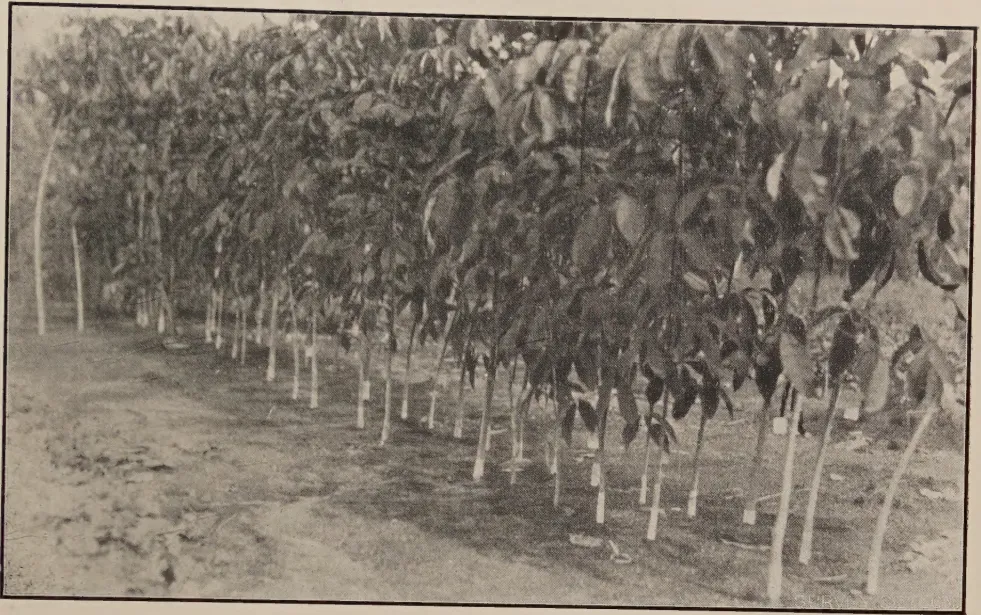
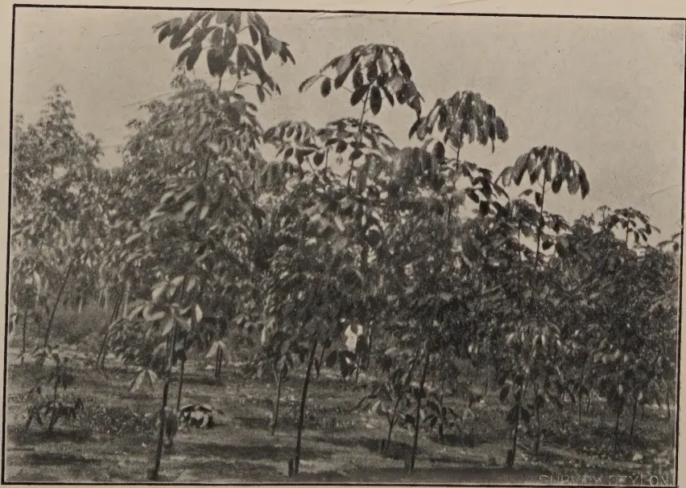
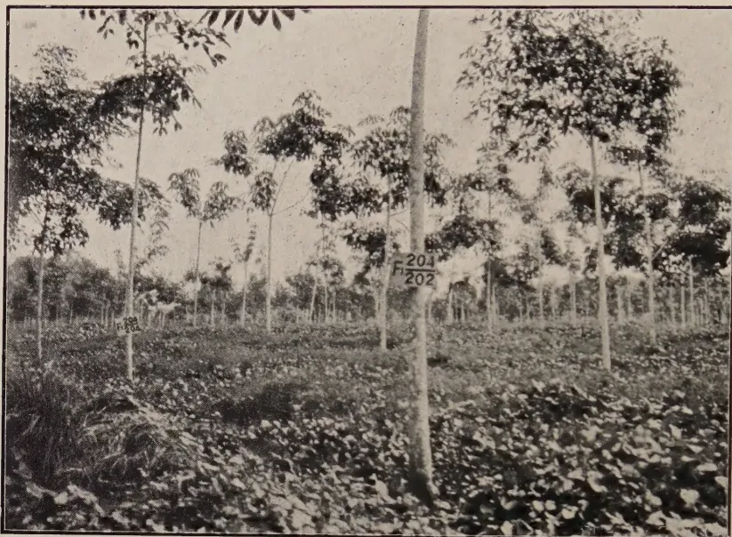
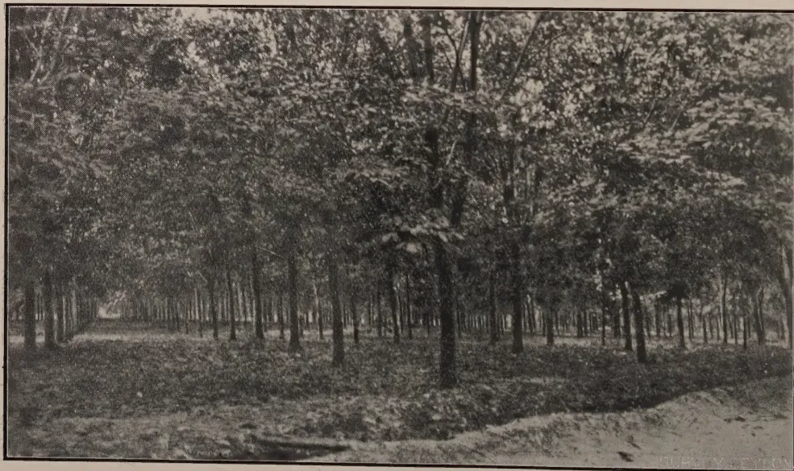
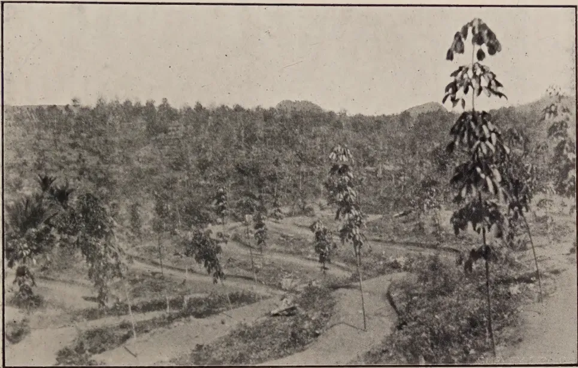
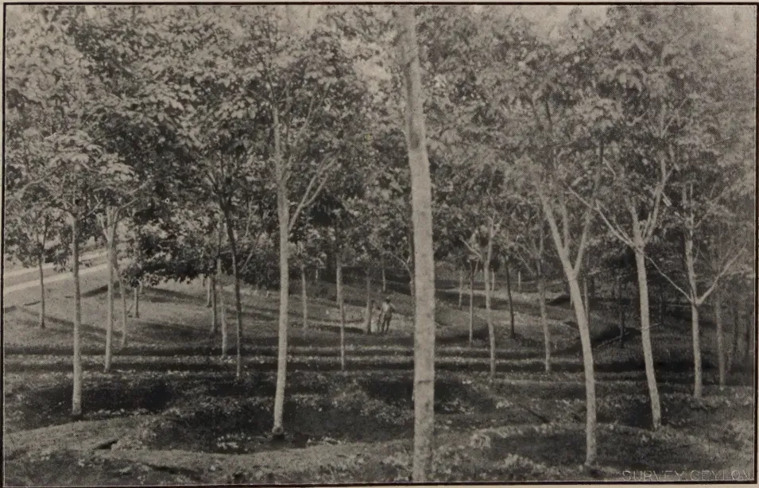
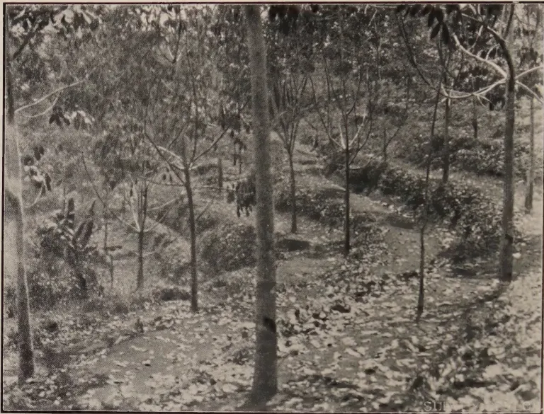
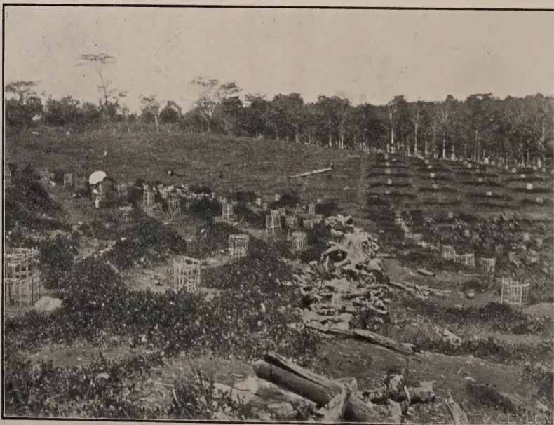
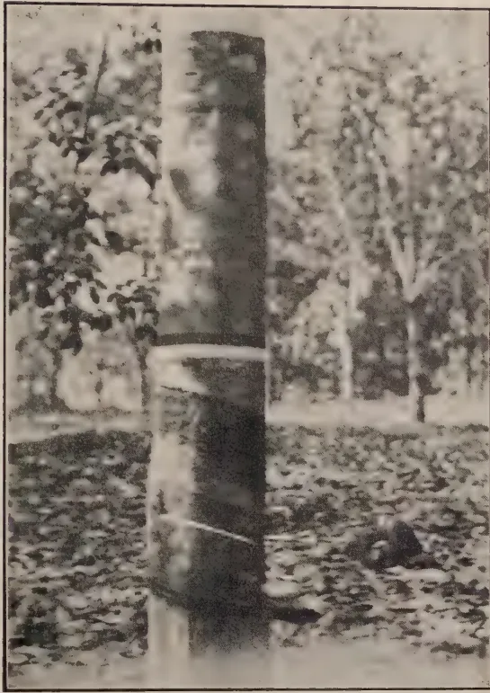
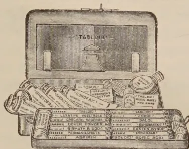

# THE TROPICAL AGRICULTURIST

---

VOL. LXVII. PERADENIYA, NOVEMBER, 1926 No. 5.

---

## THE IMPROVEMENT OF *HEVEA BRASILIENSIS* BY BUDDING AND SEED SELECTION.

---

In previous numbers of the *Tropical Agriculturist* reference has been made to the possibilities before the budding of rubber and to the work that has already been done in this connection in the Dutch East Indies. Details have also been given as to the methods of budding which have been evolved as the result of experience and some of the results which have been secured up-to-date.

In the present number is included the report of Messrs. C. E. A. DIAS and H. W. ROY BERTRAND on their recent visit to Java and Sumatra.

This report indicates what has been done in the Dutch East Indies and it is stated that the total acreage under budded rubber and selected seed is between 50,000 and 100,000 acres. The exact acreage of budded rubber is not stated as the policy appears to be to plant up clearings with budded plants mixed with seedlings from selected seed.

The advantages of the use of selected seed have been clearly demonstrated by the analyses of the yield results secured from the areas of rubber which is the progeny of Henaratgoda No. 2 tree on the Experiment Stations of the Department of Agriculture in Ceylon. Individual records have been kept for several years from plots of seedlings from Henaratgoda No. 2 tree at both Peradeniya and Henaratgoda, and further records from younger areas grown from the same tree are also becoming available. These records clearly indicate that the yield is an inherent character of the tree, that the coefficient of variation

1------------------------------------------------

258[NOVEMBER, 1926.

in yield is much lower than that found on plots of trees of mixed parentage and that a latex-vessel row count is of more value in old trees than in very young trees.

The rubber industry in Ceylon is now beginning to demand selected seed for its new clearings and the Department of Agriculture has been able this year to supply from its plantations 93,870 selected seed from high yielders and 93,515 seed from blocks which are the progeny of No. 2 tree.

Similar supplies should be available in certain districts from the high yielding trees on estates if such trees were carefully ascertained and marked.

This cannot be considered, however, to be sufficient as the parentage on one side only is known and in consequence Messrs. DIAS and BERTRAND lay great stress upon the necessity for isolated seed gardens. These should be situated as far away from other rubber as possible, in order that cross fertilization be prevented. The writers of this report are convinced that if Ceylon's rubber industry is to be safeguarded in the future, steps should be taken immediately to establish an Experiment Station for testing different buddings, for supplying bud-wood and budded plants and for raising pedigree seed. The beginning which has been made by the Department of Agriculture and the Rubber Research Scheme is not considered to be on a sufficiently large scale, and a much more ambitious programme of work is asked for.

There is no doubt that work in connection with budding and with seed selection should be pushed on as rapidly as possible if Ceylon desires to safeguard its future, and good progress could be made if adequate funds were available. The fullest co operation from estates will be essential so that initial supplies of bud-wood and seed from the highest yielders in the Island may be secured, and, therefore, it is urged that all estates should commence selecting their highest yielders in order that they may act as mother trees.

2------------------------------------------------

NOVEMBER, 1926 ]259

# RUBBER.

---

## BUDDING AND SEED SELECTION OF HIGH YIELDING VARIETIES OF HEVEA.

---

By Messrs. C. E. A. DIAS and H. W. ROY BERTRAND.

The whole of the Rubber plantation industry has grown from a few seeds brought from the jungles of Brazil. The progeny of these seeds has produced many different types and in all the world there is probably no greater agricultural industry which offers greater scope for the plant breeder. We have different types of trees capable of producing anything from one pound to 80 lbs. per annum and our present plantations are an indiscriminate mixture of these. Future plantations will not only comprise a higher percentage of high yielders but the methods of planting and exploiting these will be more efficient. In Borneo and Sumatra there are vast undeveloped areas with a deep rich soil and a highly suitable rainfall. Their rubber comes into bearing in four to five years and the subsequent growth and bark renewals are remarkable. To these undoubted advantages the Dutch are adding the all-important one of high yielding types. They have found not only that all high yielders do not give high yielding buds but that many clones develop undesirable characteristics. Keen interest is being taken in selecting and proving Mother trees by actual buddings and it would hardly be an exaggeration to say that they are combing out the majority of the large company-owned areas in their endeavours to find the best clones. Herein lies the menace to Ceylon. If our future plantings are to compete, steps must be taken to ensure that the widest possible selection is made and that fuller opportunities are given for testing these.

### MOTHER TREES.

It has been found that not 10 per cent. of the mother trees produce satisfactory budded offspring. On such as do however a very high value is placed. Likely trees are marked with large coloured bands and the yields carefully taken over a long period by coagulating in the cup. Bark examinations and drawings are made at various heights. The girths and heights of tapping cuts are recorded and samples of the seed are kept for reference. Generally speaking, Mother trees are selected on a basis of four times the average yield of the field. They do not discriminate between large and small trees, though the ratio of yield to length of cut is recorded. On one estate some 20 trees were seen, the first offspring of Wickham's plants. They were larger than the original Heneratgoda trees and perfectly healthy. One of these is a Mother tree giving 250 gms. (nearly 9 ozs.), dry per tapping which is done every alternate day, on opposite quarters. It is 44 years old and measures 3.5 metres at 1.5 m. high. It is the smallest of the group. A second mother tree (No. 24) on the same estate is 10 years old, and gives 300 gms. dry, (10½ ozs.) per tapping, ½ spiral, alternate day, length of tapping cut 94.5 cm., 45 complete rows of vessels, bark 12 m.m. thick. Some 3,000 buds have been taken from unpruned branches of this tree. It is now being tapped every 6 days. On another estate two other large trees were seen said to be giving 300 gms. dry per tapping. The thickness of bark and number of

3------------------------------------------------

260[NOVEMBER, 1926.

vessels was in both cases remarkable. These are instances of some of the best trees examined, but throughout their rubber districts we saw great numbers distinctively marked. Both large coloured bands and numbers are used. They realise that meticulous care is necessary to keep separate the different clones and the work is now becoming so standardised and simplified that mistakes are seldom made. On one estate the best Mother tree was selected from 200,000 but it has not given progeny up to expectations. On the other hand the few clones which have come true fully justify the interest being taken and the ungrudged expense.

### SEED.

Both for seed propagation and for budding nurseries rigorous selection is made. Standard types of seed from Mother trees are kept in special filing cabinets. The colour markings are not considered so important as the size, shape, indentations caused by the shell, and the position of the micropyle.

*Nurseries* for budding are laid out 18 by 18 inches, 3 rows and a path. Each bed is labelled showing origin of seed. Buds are put on to 9 months seedlings. The  $\frac{1}{2}$  Forckert method is mostly used. In Java they use yellow wax and banana fibre and get 90-100 per cent. successes. Every bud is labelled showing Mother tree and stock. Buds may be left dormant until weather suits planting. The stock is then cut 6 in. above the bud and either planted at once or, in some cases, one week later. After the shoot is well established the stump is sawn off close and the wound waxed. In Sumatra a large estate was planting in the field four seedlings per hole and budding on to these. They got 50-60 per cent. successes but with the four seedlings were able quickly to establish a uniform stand of plants.

*Bud Wood Nurseries.*—A very high value is placed on tested bud-wood which in fact finds a ready sale at from Re. 1 to Rs. 5 per metre. A metre gives an average of 16 buds. Nurseries are established for reproducing bud-wood. They are planted 3 by 3 ft. or 4 by 4 ft. The shoot, when ripe for sale, is cut off 6 ins. above the junction and from this point a number of fresh bud-shoots spring.

*Seed Gardens.*—Attention is being given to the breeding of a pure line of seed. The seed gardens are contoured. Plots of seedlings from different mother trees are laid out and buds either from the same or from other mother trees are put on at 3 feet in different clones. These gardens are miles away from other rubber. In Sumatra there are many small clones, either single or mixed, planted on tobacco lands, far from foreign pollen infection. Where gardens are composed of many clones controlled pollenization with gauze cages (Klamboes) is being done. Dr. Heusser has now, in fact, second filial generations of such crosses shortly coming into bearing. Buds grafted at 3 feet or higher produce seed sooner than lower buddings. Coloured gauze have been found to produce more fertile seeds than plain white. Two different plots of seedlings from M. 24 are giving in their fourth year 12 gms. and 9.8 gms. respectively against an average of 4 gms. for ordinary seedlings. Trees budded at 3 feet will be tapped on stock and scion to test relative yields. The seedlings from these controlled crosses differ widely in yield and vegetative characteristics.

We visited a garden of 100 acres planted up with various crossings and differences in type were most marked, e.g., all the offspring from one particular combination were noticeably larger and more robust than the rest,

4------------------------------------------------

A black and white photograph showing a row of young trees in a nursery. The trees are supported by white stakes or poles. The ground is dirt, and the trees have large, dark leaves. The image is framed by a black border.

BUDDING IN NURSERY—MEDAN

A black and white photograph showing a dense group of young trees in a nursery. The trees are supported by white stakes or poles. The ground is dirt, and the trees have large, dark leaves. The image is framed by a black border. In the bottom right corner, the text "SURVEY Ceylon" is visible.

A BUD-WOOD NURSERY

5------------------------------------------------

A black and white photograph showing a field of young rubber trees. The trees are planted in neat rows and have thin trunks with sparse leaves. The ground between the trees is covered with low-lying, leafy cover crops. Several small white tags are attached to the trunks of the trees, with one clearly visible in the center-right foreground labeled 'F 204' and 'F 202'.

SEEDLINGS FROM CONTROLLED FERTILIZATION—A. V. R. O. S.  
Note:—Cover Crops.

A black and white photograph of a large, dense plantation of rubber trees. The trees are arranged in a regular grid pattern, creating a sense of depth and scale. The canopy is thick, and the ground is covered with grass and some fallen leaves. In the bottom right corner, the text 'SURVEY Ceylon' is visible.

PART OF 300-ACRE FIELD OF BUDDED RUBBER—SUMATRA

6------------------------------------------------

NOVEMBER, 1926.]261

Seed from the tested mother trees is selling at from 20 to 30 Rupee cents each—a sufficient indication of the value placed on type.

*Budded Rubber.*—The first buddings were made in 1917 and 1918 by Dr. Cramer. On one Estate we saw clones being tapped and noted the full cups of latex. These clones were tapped at one metre each tree, and all the cups and buckets used were marked with distinctive colour bands. These clones were originally mixed but have since been separated out and identified on seed and vegetative types. We saw clones giving from 20 up to 60 gm. per tree per tapping or say from 7 to 21 lb. in their sixth to seventh year.

Full details of yield records cannot be given as, in a number of cases, publications are pending. On one Estate, on the day of our visit, one clone gave 28 gms. average. This was after three months' severe drought, and rubber in the districts was wintering. The normal yield in this clone is 40 gms. dry. It should be noted that the normal annual rainfall is 120 inches, the recent rainfall was as follows:—May 6 inches, June 4 inches, July 1.75 inches, August nil. In such drought conditions yields fall off considerably and we are in fact informed that they were only 75 per cent. of what was being got during the previous months.

Beside the above several hundred acres of buddings of various ages were seen. Where these had been planted with untested buds yields were only slightly in excess of ordinary seedlings. They are now endeavouring by careful examination of all characteristics of the buds, to separate out the different clones.

In Sumatra, the first budded plantation of a very large Estate was 70 acres—7 to 8 years old. Bud-wood was supposed to have been taken from 12 mother trees but they have since identified 71 different types. Yields from this field are naturally disappointing and the instance is quoted to show that the most careful control of coolies engaged on this work is essential. These mixed clones are now giving in the eighth year 600 lb. per acre. The five year old clearing, mixed clones, 300 acres gave in the fourth year 278 lb. as against 178 lb. by mixed seedlings of the same age. This clearing will give 500 lb. in the second or present year. On this Estate there is a clone of  $\frac{1}{2}$  acre giving 60 gm. or say 1,820 lb. per acre in the first year now 4 years old. A single individual from another clone of quite distinct type has been found giving a much higher yield, the mother tree cannot be traced. It is being tested by secondary buddings.

In the foregoing figures it may be objected that the clones are too small to place any reliance on the yields obtained. Were there great variation in the individual yields of the trees composing these the objection would be valid. Such however is not the case, both the yields and the vegetative characteristics of the trees in each clone so closely agree that two well-known scientists were of opinion that even as few as 20 trees might be considered a fair test though clones of not less than 100 are recommended.

The importance of testing a large number of mother trees is obvious and where land is limited a large number of clones with say 50 trees each would probably be preferable to a less number of clones composed of more trees.

#### DIFFERENCE IN TYPES OF CLONES.

These are most marked, even to the casual visitor. Differences in type and size of leaf and in the style of branching are the most obvious features.

7------------------------------------------------

262[NOVEMBER, 1926.

The seed from buds closely resembles that of the mother tree. Certain detrimental characteristics were noticed as follows:—

- Clone A. The majority got Brown Bast.
- „ B. Unhealthy junction.
- „ C. Bad bark renewal.
- „ D. Pink disease.
- „ E. Large lumps or excrescences appeared on the tapped surface.  
  The renewed bark cannot be tapped.
- „ F. Weak stems subject to wind breakage. (Much above the junction.
- „ G. Fasciation or contorted and deformed branches.
- „ H. Very low yields at first but later increasing.

<table>
<tr>
<td>1st year 1924</td>
<td>...</td>
<td>...</td>
<td>5 gm.</td>
</tr>
<tr>
<td>2nd year 1925</td>
<td>...</td>
<td>...</td>
<td>14 gm.</td>
</tr>
<tr>
<td>3rd year 1926</td>
<td>...</td>
<td>...</td>
<td>34 gm.</td>
</tr>
</table>

Another Clone from the best tree out of 200,000.

<table>
<tr>
<td>1st year 1924</td>
<td>...</td>
<td>...</td>
<td>5 gm.</td>
</tr>
<tr>
<td>2nd year 1925</td>
<td>...</td>
<td>...</td>
<td>18 gm.</td>
</tr>
<tr>
<td>3rd year 1926</td>
<td>...</td>
<td>...</td>
<td>35 gm.</td>
</tr>
</table>

Dr. Heusser considers these 'delayed' clones uneconomical and they point to the need for taking yields of mother trees over as long a period as possible.

Sufficient has been written to show that only a very few (perhaps 8 per cent.) of mother trees give useful types. These best clones are undoubtedly a great advance on our present trees but only the widest and most rigorous selection will give us these.

#### DIFFERENT SPECIES OF HEVEA.

In Ceylon we have one species only—*Braziliensis*, for our present purpose, the most useful. The Dutch have imported four other species, *H. confusa*, *H. collina*, *H. Spruceana*, and *H. guayanensis*. The latex yields of none of these compare with *Braziliensis* but they realise that a composite tree may possibly be built up, or a hybrid produced highly suitable to some especial environment.

Dr. Cramer is investigating this question and has made buddings of various combinations of root stock, stem, and canopy. The object being to bud into a vigorous root stock a high yielding laticiferous system. Into this is budded a crown which is immune from disease. A few such buddings were seen. The work is, however, in its infancy but it is an aspect not to be neglected, especially in countries such as S. India where leaf-fall is the limiting factor.

On the largest group of Estates in Sumatra the present policy is to plant 300 to 400 mixed proved buds and selected seeds per acre. When these are 3 years and 8 months old a trial daily tapping of 3 weeks is made at 18 inches high for seedlings and 42 inches for buds. The yields of the last two weeks are recorded on the trees which are then thinned down to 130 per acre. Such fields are giving, in their fourth year of age and first year of tapping 300 to 400 lbs. per acre. Subsequent thinning is done on individual merits.

8------------------------------------------------

A black and white photograph showing a wide view of a rubber plantation in Java. The foreground and middle ground are filled with young rubber trees, many of which are planted in neat, horizontal rows on terraced slopes. The trees are relatively small, with some showing clusters of leaves. In the background, a dense forest covers rolling hills. The overall scene depicts a systematic agricultural approach to rubber cultivation on a hillside.

BUDDED RUBBER, JAVA, 18 MONTHS OLD,  
Showing Platform Terraces.

A black and white photograph showing a closer view of a rubber plantation in Sumatra. The image focuses on rows of young rubber trees planted on a slope. The trees are taller and more established than those in the Java photo, but still appear young. The ground between the trees is dark and appears to be covered with mulch or low-lying vegetation. The terracing is more pronounced here, with distinct horizontal lines following the contours of the hillside. The dense foliage of the trees creates a textured appearance across the landscape.

BUDDED RUBBER, SUMATRA,  
Showing Terracing to conserve moisture.

9------------------------------------------------

A black and white photograph showing a hillside with rubber trees planted in a contour planting pattern. The trees are planted along the ridges of the hill, creating a series of parallel rows that follow the natural curves of the land. The ground is covered with fallen leaves and some low-lying vegetation. The trees are relatively young, with thin trunks and sparse leaves. The overall scene is one of a carefully managed agricultural landscape.

BUDDED RUBBER, JAVA,  
Showing Contour Planting.

A black and white photograph showing a hillside with young rubber trees. The trees are planted in individual platforms or stakes, which are visible as small, rectangular structures around the base of each tree. The trees are relatively young, with thin trunks and sparse leaves. The ground is covered with fallen leaves and some low-lying vegetation. The overall scene is one of a carefully managed agricultural landscape.

YOUNG RUBBER, JAVA,  
Showing Individual Platforms.

10------------------------------------------------

NOVEMBER, 1926.]263

The bark of most buds seen is thin and renewals are, in many cases, poor. This is partly due to tapping right down one side. A twice yearly change-over would be advantageous. The present system is the more severe in that trees are not rested. The cylindrical type of stem together with the fact that yields at 3 meters are 70 per cent. of those at one metre allow of a longer period for renewal. The tapping system is based for seedlings on an 8-year renewal and for buds 12 years. One clone was seen with two cuts,  $\frac{1}{2}$  spiral, at 1 and 2 metres. The yield of these 2 cuts combined has given 170 per cent. of the lower cut. The trees were healthy and no Brown Bast had developed.

Beyond the need for young and vigorous stock the consensus of opinion appeared to be that the influence of stock on scion was not so great as has been thought, though the reverse is noticeable. Dr. Heusser found no significant difference in yields of marcots and buds from the same tree.

#### REPLANTING.

As our older areas become economically unproductive the policy for replanting will require careful thought. That policy cannot now be decided, but the following instance of successful re-planting may be given. A field of 70 acres was chosen. Yields of every tree were recorded over a long period. The field was then cut down to 9 trees per acre and re-planted with buds. These 9 trees are now giving 40 per cent. of the original yield and the young plants, except those shaded by the big trees, are doing well.

#### TOTAL ACREAGE UNDER BUDDED RUBBER AND SELECTED SEEDLINGS.

It appears that the total acreage under budded rubber and selected seed is between 50,000 and 100,000 acres. Of this area one Company alone possesses some 23,000 acres planted with mixed buds and selected seed. All future plantings will be with selected seed and buds. Many companies which possess vast reserve lands are awaiting supplies of tested buds and seed to extend. Within the next few years considerable additions to the present planted acreage will be made with more efficient types. For the present these extensions are likely to comprise a large number of mixed buds and selected seed thinned down on yields to about 100 trees per acre. Seed selection will ultimately be more important and, combined with budding, may give us the most useful types.

#### PREVENTION OF SOIL EROSION.

Throughout Java and Sumatra practically all the clearings are being opened on the contour platform principle and cover plants are universally used. Of these *Vigna*, *Calopogonium* and *Pueraria* are the most common. Apart from soil erosion the new system is valued as means of water conservation and even in old fields platforms and water traps are being cut. In certain old washed-out soils, *Albizzias* are being used and there is evidence that these trees assist reclamation.

11------------------------------------------------

264[NOVEMBER, 1926.

### SUMMARY.

1. All present rubber estates are planted with seeds brought from the jungles of Brazil.

2. The offspring of these seeds has given us many different types.

3. These types vary greatly in their productivity.

Yields of individual trees vary from one pound up to 80 lb. per annum. The average plantation trees yield about 5 lb. Were it possible to raise that average to say 20 lb., small differences in the price of labour and other economics would be relatively insignificant. The cost of production mainly depends on the yield and the price of the product will ultimately be decided by the yield of the major producing area. The Dutch are taking advantage of the variability of Hevea to raise their standard of production.

4. It may be accepted that even now large areas are being planted with types and by methods which will ensure a 50 per cent. increase over present yield and there can be little doubt that within the next few years even larger yields will be obtained.

## SOME REMARKS CONCERNING STORING AND PACKING OF BUDDINGWOOD.

Dr. J. G. J. A. MAAS.

### EXPERIMENTS ON GOENOENG PAMELA ESTATE.

Careful experiments were made on Goenoeng Pamela Estate with buddingwood from clone Avros No. 36. The wood was cut in Medan, packed and stored in different ways, and then sent by rail to the estate, where the budding was done by two mandoorers from the experiment station. Both mandoorers used equal quantities of wood from each lot, on the same days. The final success was ascertained 1 month after opening the bandages. The wood remained packed as indicated until the days it was used.

A distinction was made between old and young material, both kinds being used separately. Part of the young wood was green. Usually the wood was used up to the 3rd or below the 2nd leaf whorl, calculated from the top of the branch.

The different treatments and packing, and the results from the budding, are compiled in Table I.

It appears from the Table: that storing in a refrigerator during 14 days at a temperature of 1°—2° C. has a detrimental effect; that completely paraffining the branches is not to be recommended, the success decreasing more quickly than with unparaffined branches; that paraffining the ends only of the branches offers no advantages in comparison with not paraffining, certainly not with old wood; that, if packed immediately and used within one week, young wood yields equally good results as old wood; that, when stored for a longer period, young wood deteriorates much more quickly than old wood, but the latter also gives a considerably lower percentage of successful buddings when used after 14 days than within one week; that results with young as well as with old wood were better when used after 3-5 days than after 6-9 days but in the latter case the percentage of success was still quite satisfactory.

Therefore the method of packing used in this experiment is satisfactory if the voyage does not last too long.

12------------------------------------------------

BUDDED RUBBER  
7—8 Years old, giving 40 Grammes Dry Rubber per Tapping.

300 GRAMMES MOTHER TREE

13------------------------------------------------

This image is a scan of a blank page. The paper has a light beige or cream-colored tint. There are a few very small, dark specks scattered across the surface, which appear to be scanning artifacts or dust particles. No text, lines, or other markings are present on the page.

14------------------------------------------------

NOVEMBER. 1926.]265TABLE I.

<table border="1">
<thead>
<tr>
<th rowspan="2">Treatment of the buddingwood</th>
<th rowspan="2">Young or Old</th>
<th rowspan="2">Total Meters</th>
<th colspan="2">Number of days between cutting and</th>
<th rowspan="2">Number of buds used per 1 M.</th>
<th colspan="2">Number of buddings</th>
<th rowspan="2">Successful buddings per 1 M.</th>
<th rowspan="2">Percentage successful buddings</th>
</tr>
<tr>
<th>despatch *</th>
<th>budding</th>
<th>Made</th>
<th>Successful</th>
</tr>
</thead>
<tbody>
<tr>
<td rowspan="2">A I. Packed in banana leaf sheaths, in chests intervening spaces filled with dry saw-dust</td>
<td>Young</td>
<td>20</td>
<td>1—3</td>
<td>3—5 6—9</td>
<td>16.8</td>
<td>128 208 336</td>
<td>114 155 269</td>
<td>13.45</td>
<td>89% 74.5%</td>
</tr>
<tr>
<td>Old</td>
<td>20</td>
<td>1—3</td>
<td>3—5 6—9</td>
<td>18.05</td>
<td>147 214 361</td>
<td>131 165 296</td>
<td>14.80</td>
<td>89% 77%—%</td>
</tr>
<tr>
<td>B I. Packed as A, but despatched and used later</td>
<td>Young</td>
<td>20</td>
<td>8—9</td>
<td>13—16</td>
<td>8.05</td>
<td>161</td>
<td>29</td>
<td>1.45</td>
<td></td>
</tr>
<tr>
<td>B II.</td>
<td>Old</td>
<td>20</td>
<td>8—9</td>
<td>13—16</td>
<td>14.1</td>
<td>282</td>
<td>140</td>
<td>7.00</td>
<td></td>
</tr>
<tr>
<td rowspan="2">C I. Ends paraffined, packed as A.</td>
<td>Young</td>
<td>20</td>
<td>1—3</td>
<td>3—5 6—9</td>
<td>17.6</td>
<td>144 208 352</td>
<td>130 168 298</td>
<td>14.9</td>
<td>90% 80.5%</td>
</tr>
<tr>
<td>Old</td>
<td>20</td>
<td>1—3</td>
<td>3—5 6—9</td>
<td>17.2</td>
<td>149 195 344</td>
<td>134 143 277</td>
<td>13.85</td>
<td>90% 73.5%</td>
</tr>
<tr>
<td>D I. Treated and packed as A, but despatched and used later</td>
<td>Young</td>
<td>20</td>
<td>8—9</td>
<td>13—16</td>
<td>6.05</td>
<td>121</td>
<td>32</td>
<td>1.6</td>
<td></td>
</tr>
<tr>
<td>D II.</td>
<td>Old</td>
<td>20</td>
<td>8—9</td>
<td>13—16</td>
<td>11.75</td>
<td>235</td>
<td>88</td>
<td>4.4</td>
<td></td>
</tr>
<tr>
<td rowspan="2">E I. Completely paraffined, packed as A.</td>
<td>Young</td>
<td>20</td>
<td>1—3</td>
<td>3—5 6—9</td>
<td>16.55</td>
<td>130 201 331</td>
<td>104 147 251</td>
<td>12.55</td>
<td>84% 72.5%</td>
</tr>
<tr>
<td>Old</td>
<td>20</td>
<td>1—3</td>
<td>3—5 6—9</td>
<td>17.1</td>
<td>141 201 342</td>
<td>122 112 234</td>
<td>11.7</td>
<td>86% 56.5%</td>
</tr>
<tr>
<td>F I. Treated and packed as E, but despatched and used later</td>
<td>Young</td>
<td>20</td>
<td>8—9</td>
<td>13—16</td>
<td>7.3</td>
<td>146</td>
<td>33</td>
<td>1.65</td>
<td></td>
</tr>
<tr>
<td>F II.</td>
<td>Old</td>
<td>20</td>
<td>8—9</td>
<td>13—16</td>
<td>10.85</td>
<td>217</td>
<td>72</td>
<td>3.6</td>
<td></td>
</tr>
<tr>
<td rowspan="2">G I. Treated and packed as E, but despatched and used still later</td>
<td>Young</td>
<td>20</td>
<td>17—18</td>
<td>18—19</td>
<td>2.65</td>
<td>53</td>
<td>1</td>
<td>0.05</td>
<td></td>
</tr>
<tr>
<td>Old</td>
<td>20</td>
<td>17—18</td>
<td>18—19</td>
<td>4.55</td>
<td>91</td>
<td>16</td>
<td>0.8</td>
<td></td>
</tr>
<tr>
<td>H I. Treated and packed as A (not paraffined), stored during 14 days</td>
<td>Young</td>
<td>20</td>
<td>17—18</td>
<td>18—19</td>
<td>0.8</td>
<td>16</td>
<td>1</td>
<td>0.5</td>
<td></td>
</tr>
<tr>
<td rowspan="2">H II. At a temperature of 1° to 2° C.</td>
<td>Old</td>
<td>20</td>
<td>17—18</td>
<td>18—19</td>
<td>0.5</td>
<td>10</td>
<td>0</td>
<td>0</td>
<td></td>
</tr>
<tr>
<td>Young</td>
<td>20</td>
<td>17—18</td>
<td>18—19</td>
<td>0.35</td>
<td>7</td>
<td>0</td>
<td>0</td>
<td></td>
</tr>
<tr>
<td>J I. Treated and packed as C (ends paraffined), further as H.</td>
<td>Old</td>
<td>20</td>
<td>17—18</td>
<td>18—19</td>
<td>0</td>
<td>0</td>
<td>0</td>
<td>0</td>
<td></td>
</tr>
<tr>
<td>J II.</td>
<td>Young</td>
<td>20</td>
<td>17—18</td>
<td>18—19</td>
<td>0</td>
<td>0</td>
<td>0</td>
<td>0</td>
<td></td>
</tr>
<tr>
<td>K I. Treated and packed as E completely paraffined), further as H.</td>
<td>Old</td>
<td>20</td>
<td>17—18</td>
<td>18—19</td>
<td>0</td>
<td>0</td>
<td>0</td>
<td>0</td>
<td></td>
</tr>
<tr>
<td>K II.</td>
<td>Young</td>
<td>20</td>
<td>17—18</td>
<td>18—19</td>
<td>0</td>
<td>0</td>
<td>0</td>
<td>0</td>
<td></td>
</tr>
</tbody>
</table>

\* Packed immediately after cutting

15------------------------------------------------

This image is a scan of a blank page. The background is a uniform light beige or tan color. There are several small, dark specks scattered across the surface, which appear to be dust or scanning artifacts. No text, lines, or other graphical elements are present.

16------------------------------------------------

NOVEMBER, 1926.]266

### EXPERIMENTS AT MEDAN.

After the conclusion of the experiments on Goenoeng Pamela Estate others were made at Medan in order to obtain indications as to the best method of storing buddingwood after arrival on the estate until it is used.

Buddingwood from clone Avros No. 50 was used in these experiments. All buddings were made by the same mandoor.

TABLE II.

<table border="1">
<thead>
<tr>
<th rowspan="2">Treatment of the Buddingwood</th>
<th rowspan="2">Total Meters</th>
<th colspan="2">Number of Buddings</th>
</tr>
<tr>
<th>Made</th>
<th>Successful</th>
</tr>
</thead>
<tbody>
<tr>
<td>A. Used directly after cutting -</td>
<td>5</td>
<td>78</td>
<td>49</td>
</tr>
<tr>
<td>B. Stored 5 days at the laboratory before use - - - -</td>
<td>5</td>
<td>49</td>
<td>36</td>
</tr>
<tr>
<td>C. Stored 5 days at the laboratory, lower ends in water, daily renewed -</td>
<td>5</td>
<td>66</td>
<td>57</td>
</tr>
</tbody>
</table>

TABLE III.

<table border="1">
<thead>
<tr>
<th rowspan="2">Treatment of the Buddingwood</th>
<th rowspan="2">Total Meters</th>
<th colspan="2">Number of Buddings</th>
</tr>
<tr>
<th>Made</th>
<th>Successful</th>
</tr>
</thead>
<tbody>
<tr>
<td>A. Used directly after cutting -</td>
<td>5</td>
<td>77</td>
<td>45</td>
</tr>
<tr>
<td>B. Lower end 1 day in water; used 1 day after cutting -</td>
<td>5</td>
<td>52</td>
<td>44</td>
</tr>
<tr>
<td>C. Ends paraffined; stored 5 days -</td>
<td>5</td>
<td>35</td>
<td>22</td>
</tr>
<tr>
<td>D. Lower end 1 day in water, after that ends paraffined; stored 5 days -</td>
<td>5</td>
<td>48</td>
<td>35</td>
</tr>
<tr>
<td>E. As D, but after storing for 5 days paraffin removed, lower end 2 days in water - - -</td>
<td>5</td>
<td>41</td>
<td>33</td>
</tr>
</tbody>
</table>

Buddingwood not used directly on arrival should be stored with the lower end placed in water.

Placing the buddingwood with the lower end in water during the time between cutting and packing is also to be recommended.

### EXPERIMENTS ON AER TEMAM ESTATE (UPPER PALEMBANG).

On 28th November, 1925, 32 chests with buddingwood from clone Avros No. 36 were shipped to Aer Temam Estate in Upper Palembang *via* Singapore, Palembang and Moeara Klingi. Each chest contained 10 M. young and 10 M. old wood, treated and packed in different ways by the experiment station. The different methods of packing were kept separate. The results were recorded by the acting manager of the estate, Mr. H. van Heutz. The wood was cut on 25th November, arrived on Aer Temam on 8th December and was used on 9th and 10th December, *i.e.*, 14 and 15 days after cutting. The preliminary results were ascertained on opening the bandages; the final results after two weeks or more.

The results of this experiment are compiled in Table IV.

17------------------------------------------------

267[NOVEMBER, 1926.

It appears from this Table: that generally speaking young wood is little adapted for shipment over considerable distances; that it is better to pack buddingwood, wrapped either in jute bags or in banana leaf sheaths, in chests than in crates (B, D compared with A, C); that wrapping in banana leaf sheaths was not advantageous as compared with wrapping in jute bags (C, D *versus* A, B);—banana leaf sheaths will rot during a voyage of 14 days; that dry saw-dust is useful as packing material, but moist saw-dust has a detrimental effect if the saw-dust (or extract) has direct contact with the wood (E. *versus* F.);\* that moist charcoal is much better adapted as packing material than moist saw-dust, when a moist packing material is wanted in order to prevent drying up (H. *versus* F.); that for the most desirable methods of packing complete paraffining is inferior to paraffining the ends only of the branches.

A few remarks on disinfecting the buddingwood will be made at the conclusion of this paper.

Some time afterwards three lots of buddingwood were shipped from Aloer Djamboe Estate (Tamiang, Atjeh) to Aer Temam Estate, the wood being treated in different ways.

One lot, consisting exclusively of buddingwood from clone Avros No. 80, was prepared in order to determine the desirability of wrapping buddingwood, packed in charcoal, with banana leaf sheaths or jute bags, or packing it without wrapping.

Both ends of the branches were paraffined and the wood was then packed with moist charcoal in chests with a few holes for ventilation, closed by wire gauze (system Aloer Djamboe).

The results are given in Table V.

TABLE V.

<table border="1">
<thead>
<tr>
<th rowspan="2">Treatment of the buddingwood</th>
<th colspan="3">Date of</th>
<th rowspan="2">Total Meters.</th>
<th rowspan="2">Number of finally successful buddings.</th>
<th rowspan="2">Successful buds per 1 M.</th>
</tr>
<tr>
<th>Cutting</th>
<th>Arrival</th>
<th>Budding</th>
</tr>
</thead>
<tbody>
<tr>
<td>1. Old Wood</td>
<td></td>
<td></td>
<td></td>
<td></td>
<td></td>
<td></td>
</tr>
<tr>
<td>A. Packed in banana leaf sheaths in chest with moist charcoal</td>
<td rowspan="3">10th March, 1926.</td>
<td rowspan="3">25th March, 1926.</td>
<td>27-30.3. 1926</td>
<td>200</td>
<td>422</td>
<td>2.11</td>
</tr>
<tr>
<td>B. Packed in jute bags in chest with moist charcoal</td>
<td>26-30.3. 1926</td>
<td>200</td>
<td>525</td>
<td>2.63</td>
</tr>
<tr>
<td>C. Packed unwrapped in chest with moist charcoal</td>
<td>30-31.3. 1926</td>
<td>200</td>
<td>337</td>
<td>1.35</td>
</tr>
<tr>
<td>11. Young Wood</td>
<td></td>
<td></td>
<td></td>
<td></td>
<td></td>
<td></td>
</tr>
<tr>
<td>D. Packed as A</td>
<td></td>
<td></td>
<td>30.3.'26</td>
<td>100</td>
<td>18</td>
<td>0.18</td>
</tr>
<tr>
<td>E. " " B</td>
<td></td>
<td></td>
<td>33.3.'26</td>
<td>100</td>
<td>18</td>
<td>0.18</td>
</tr>
<tr>
<td>F. " " C</td>
<td></td>
<td></td>
<td>30.3.'26</td>
<td>05</td>
<td>0</td>
<td>—</td>
</tr>
</tbody>
</table>

\* The influence of moist saw-dust probably depends on the species of wood. Whilst meranti-dust may be quite harmless, for instance marbau-dust may have a detrimental effect.

The saw-dust used in this experiment was a mixture originating from different kinds of wood.

18------------------------------------------------

268[NOVEMBER, 1926.TABLE IV.

<table border="1">
<thead>
<tr>
<th rowspan="2">PACKING</th>
<th rowspan="2">Treatment of the Buddingwood</th>
<th rowspan="2">Total Buddings made</th>
<th rowspan="2">Preliminarily successful</th>
<th colspan="2">Preliminarily successful from 10 M.</th>
<th rowspan="2">Finally successful</th>
</tr>
<tr>
<th>Young wood</th>
<th>Old wood</th>
</tr>
</thead>
<tbody>
<tr>
<td rowspan="5">A. In Jute bag and crate ...</td>
<td>1. Ends Paraffined ...</td>
<td>19</td>
<td>15</td>
<td>—</td>
<td>15</td>
<td>13</td>
</tr>
<tr>
<td>2. Completely paraffined ...</td>
<td>32</td>
<td>17</td>
<td>9</td>
<td>8</td>
<td>13</td>
</tr>
<tr>
<td>3. Disinfected 3% Izal, ends paraffined ...</td>
<td>39</td>
<td>27</td>
<td>6</td>
<td>21</td>
<td>14</td>
</tr>
<tr>
<td>4. Disinfected 3% Izal, completely paraffined ...</td>
<td>53</td>
<td>21</td>
<td>12</td>
<td>9</td>
<td>11</td>
</tr>
<tr>
<td></td>
<td>143</td>
<td>80</td>
<td>27</td>
<td>53</td>
<td>51</td>
</tr>
<tr>
<td rowspan="5">B. In Jute bag and chest ..</td>
<td>1. Ends paraffined ...</td>
<td>47</td>
<td>31</td>
<td>13</td>
<td>18</td>
<td>24</td>
</tr>
<tr>
<td>2. Completely paraffined ...</td>
<td>98</td>
<td>56</td>
<td>17</td>
<td>39</td>
<td>33</td>
</tr>
<tr>
<td>3. Disinfected 3% Izal, ends paraffined ...</td>
<td>69</td>
<td>28</td>
<td>17</td>
<td>11</td>
<td>16</td>
</tr>
<tr>
<td>4. Disinfected 3% Izal, completely paraffined ...</td>
<td>48</td>
<td>32</td>
<td>5</td>
<td>27</td>
<td>22</td>
</tr>
<tr>
<td></td>
<td>262</td>
<td>147</td>
<td>52</td>
<td>95</td>
<td>95</td>
</tr>
<tr>
<td rowspan="5">C. In banana leaf sheath and crate</td>
<td>1. Ends paraffined ..</td>
<td>16</td>
<td>14</td>
<td>6</td>
<td>8</td>
<td>10</td>
</tr>
<tr>
<td>2. Completely paraffined ...</td>
<td>35</td>
<td>32</td>
<td>7</td>
<td>25</td>
<td>12</td>
</tr>
<tr>
<td>3. Disinfected 3% Izal, ends paraffined ...</td>
<td>45</td>
<td>27</td>
<td>6</td>
<td>21</td>
<td>11</td>
</tr>
<tr>
<td>4. Disinfected 3% Izal, completely paraffined</td>
<td>12</td>
<td>9</td>
<td>6</td>
<td>3</td>
<td>4</td>
</tr>
<tr>
<td></td>
<td>108</td>
<td>82</td>
<td>25</td>
<td>57</td>
<td>37</td>
</tr>
<tr>
<td rowspan="5">D. In banana leaf sheath and chest</td>
<td>1. Ends paraffined ...</td>
<td>56</td>
<td>27</td>
<td>11</td>
<td>16</td>
<td>21</td>
</tr>
<tr>
<td>2. Completely paraffined ...</td>
<td>27</td>
<td>12</td>
<td>7</td>
<td>5</td>
<td>11</td>
</tr>
<tr>
<td>3. Disinfected 3% Izal, ends paraffined ...</td>
<td>75</td>
<td>56</td>
<td>18</td>
<td>38</td>
<td>39</td>
</tr>
<tr>
<td>4. Disinfected 3% Izal, completely paraffined ...</td>
<td>35</td>
<td>23</td>
<td>7</td>
<td>16</td>
<td>12</td>
</tr>
<tr>
<td></td>
<td>193</td>
<td>118</td>
<td>43</td>
<td>75</td>
<td>83</td>
</tr>
<tr>
<td rowspan="5">E. In chest with dry saw-dust ...</td>
<td>1. Ends paraffined ...</td>
<td>71</td>
<td>49</td>
<td>15</td>
<td>34</td>
<td>23</td>
</tr>
<tr>
<td>2. Completely paraffined ...</td>
<td>61</td>
<td>18</td>
<td>10</td>
<td>8</td>
<td>11</td>
</tr>
<tr>
<td>3. Disinfected 3% Izal, ends paraffined ...</td>
<td>45</td>
<td>32</td>
<td>—</td>
<td>32</td>
<td>38</td>
</tr>
<tr>
<td>4. Disinfected 3% Izal, completely paraffined ...</td>
<td>12</td>
<td>12</td>
<td>—</td>
<td>12</td>
<td>8</td>
</tr>
<tr>
<td></td>
<td>189</td>
<td>111</td>
<td>25</td>
<td>86</td>
<td>60</td>
</tr>
<tr>
<td rowspan="5">F. In chest with moist saw-dust ...</td>
<td>1. Ends paraffined ...</td>
<td>18</td>
<td>3</td>
<td>3</td>
<td>—</td>
<td>3</td>
</tr>
<tr>
<td>2. Completely paraffined ...</td>
<td>19</td>
<td>6</td>
<td>6</td>
<td>—</td>
<td>6</td>
</tr>
<tr>
<td>3. Disinfected 3% Izal, ends paraffined ...</td>
<td>25</td>
<td>9</td>
<td>4</td>
<td>5</td>
<td>7</td>
</tr>
<tr>
<td>4. Disinfected 3% Izal, completely paraffined ...</td>
<td>38</td>
<td>17</td>
<td>14</td>
<td>3</td>
<td>14</td>
</tr>
<tr>
<td></td>
<td>100</td>
<td>35</td>
<td>27</td>
<td>8</td>
<td>30</td>
</tr>
<tr>
<td rowspan="5">G. In chest with dry charcoal ..</td>
<td>1. Ends paraffined ...</td>
<td>83</td>
<td>50</td>
<td>12</td>
<td>38</td>
<td>34</td>
</tr>
<tr>
<td>2. Completely paraffined ...</td>
<td>45</td>
<td>36</td>
<td>9</td>
<td>27</td>
<td>24</td>
</tr>
<tr>
<td>3. Disinfected 3% Izal, ends paraffined ...</td>
<td>30</td>
<td>22</td>
<td>—</td>
<td>22</td>
<td>14</td>
</tr>
<tr>
<td>4. Disinfected 3% Izal, completely paraffined ..</td>
<td>74</td>
<td>29</td>
<td>16</td>
<td>13</td>
<td>19</td>
</tr>
<tr>
<td></td>
<td>232</td>
<td>137</td>
<td>37</td>
<td>100</td>
<td>91</td>
</tr>
<tr>
<td rowspan="5">H. In chest with moist charcoal ...</td>
<td>1. Ends paraffined ...</td>
<td>75</td>
<td>72</td>
<td>—</td>
<td>72</td>
<td>41</td>
</tr>
<tr>
<td>2. Completely paraffined ...</td>
<td>41</td>
<td>32</td>
<td>5</td>
<td>27</td>
<td>23</td>
</tr>
<tr>
<td>3. Disinfected 3% Izal, ends paraffined</td>
<td>70</td>
<td>23</td>
<td>12</td>
<td>11</td>
<td>20</td>
</tr>
<tr>
<td>4. Disinfected 3% Izal, completely paraffined ...</td>
<td>62</td>
<td>41</td>
<td>17</td>
<td>24</td>
<td>27</td>
</tr>
<tr>
<td></td>
<td>248</td>
<td>168</td>
<td>34</td>
<td>134</td>
<td>111</td>
</tr>
</tbody>
</table>

19------------------------------------------------

<!-- stage4: FAINT old-images-only -->

[Faint page: no legible print of its own could be verified; text withheld (stage 4 review list)]

This image is a scan of a blank page. The background is a uniform light beige or tan color. There are a few very small, dark specks scattered across the surface, which appear to be scanning artifacts or dust particles. No text, lines, or other graphical elements are present.

20------------------------------------------------

NOVEMBER, 1926.]269

About three weeks elapsed between cutting and using the buddingwood. Nevertheless the result of methods of packing A and B was more than 2 successful buds per Meter, with rather inexperienced estate coolies. In practice on Sumatra's Eastcoast the success is usually estimated at  $\pm 8$  per Meter.

Therefore buddingwood can be sent over considerable distances. It is true that the buddings will be expensive, but this is of secondary importance, since usually only material for further propagation in nurseries will be sent.

Further it appears again from Table V. that young wood is not well adapted for transport over long distances; it seems that wrapping in jute bags is better for voyages of some duration than wrapping in banana leaf sheaths, which rot during transport; both methods were better than packing without wrapping.

It appears from Table I., that if the buddingwood is used within 9 days after cutting, the results from paraffining the ends of the branches—certainly of old wood—are not better than those from not paraffining; therefore this method may be dropped for normal deliveries by the experiment station or estates on Sumatra's Eastcoast.

The undermentioned results from an experimental lot sent from Aloer Djamboe to Aer Temam, in which case the wood was used after 18—20 days and possibly met with unfavourable conditions en route, seem to prove, that it is advisable to use this method for long voyages, for the sake of security. The shipment was perhaps exposed to the sun, and at least 100 M. of young wood arrived quite dried up and had become useless.

Buddingwood from three clones was packed in banana leaf sheath and chest (system Aloer Djamboe) with moist charcoal. Part of the branches were paraffined at the ends and part not. The results, as reported by the acting manager, are compiled in Table VI.

TABLE VI.

<table border="1">
<thead>
<tr>
<th rowspan="2">Treatment of the buddingwood (old)</th>
<th colspan="3">Date of</th>
<th rowspan="2">Clone No.</th>
<th rowspan="2">Total Meters</th>
<th rowspan="2">Successful buddings</th>
<th rowspan="2">Successful buds per 1 M.</th>
</tr>
<tr>
<th>Cutting</th>
<th>Arrival</th>
<th>Budding</th>
</tr>
</thead>
<tbody>
<tr>
<td>A. Ends paraffined</td>
<td></td>
<td></td>
<td>14-15.3. 1926</td>
<td>49</td>
<td>200</td>
<td>213</td>
<td>1.07</td>
</tr>
<tr>
<td>B. " not "</td>
<td rowspan="3">24th February, 1926.</td>
<td rowspan="3">10th March, 1926.</td>
<td>15-16.3, 1926</td>
<td>49</td>
<td>150</td>
<td>90</td>
<td>0.60</td>
</tr>
<tr>
<td>A. " "</td>
<td>16.3-'26</td>
<td>31</td>
<td>50</td>
<td>70</td>
<td>1.40</td>
</tr>
<tr>
<td>B. " not "</td>
<td>16.3-'26</td>
<td>31</td>
<td>100</td>
<td>34</td>
<td>0.34</td>
</tr>
<tr>
<td>A. " "</td>
<td></td>
<td></td>
<td>11-13.3 1926</td>
<td>50</td>
<td>100</td>
<td>374</td>
<td>3.74</td>
</tr>
</tbody>
</table>

21------------------------------------------------

270[NOVEMBER, 1926.

The results obtained with wood from clone No. 50 are not comparable with those obtained with wood from the other clones. All buddingwood No. 50 was paraffined at the ends, moreover this wood was used first on arrival on the estate.

The experiments on Aer Temam Estate have given indications only, because budding was done on a large scale and we do not know, whether the personal influence of the cooly has been sufficiently eliminated; they are less exact for instance than the experiments of the experiment station on Goenoeng Pamela Estate. However several confirmatory observations, though each by itself is not reliable, give a valuable indication. During the present season large quantities of buddingwood are being sent from Sumatra's East coast to Java; therefore it is important that the experience obtained with this transport should be published.

Summarizing, the following can be said concerning the packing of budding wood, based on the experiments mentioned in this paper.

A. If the buddingwood is used within one week after cutting :

1. 1. Young wood is as good as old;
2. 2. Paraffining—at least old wood—is not necessary;
3. 3. Banana leaf sheaths are a quite suitable and easy packing material;
4. 4. Nevertheless it is desirable to use the wood as quickly as possible;
5. 5. The placing of the branches with the lower ends in water, to be refreshed daily, during the time between arrival and use, is to be recommended. It goes without saying that the paraffin and a small part of the ends of paraffined branches should be removed before placing them in water.

B. If more than one week must elapse between cutting the wood and actual use :

1. 1. Old wood should be used exclusively;
2. 2. The ends of the wood should be paraffined;
3. 3. The small bundles should be wrapped, *e.g.*, in jute bags (better than banana leaf sheaths, which rot during transport);
4. 4. The wrapped up wood should be packed in closed chests;
5. 5. The intervening spaces between the bundles of branches should be filled with moist charcoal;
6. 6. On arrival on the estate the paraffin and a small piece of wood should be immediately removed and the branches placed in water till the moment it is used, the water to be refreshed daily.

If the wood is cut in the afternoon, it is probably desirable to place it in water during the night and to pack the next morning.

Lastly a few remarks on treatment of buddingwood with disinfectants.

The purpose of this treatment may be of two kinds : 1st disinfecting the wood in order to prevent transport of diseases ; 2nd prophylactic treatment of the wood in order to decrease the chance of attack by fungi during transport.

22------------------------------------------------

NOVEMBER, 1926.]271

In the latter case less strong agents will suffice than in the former.

Besides treatment before packing, a treatment on arrival should be considered. It may happen that the wood has grown more or less mouldy during transport and in this case perhaps disinfection before use will be advantageous. For this purpose weak disinfectants will be necessary.

A few results of treatment with 3 per cent. Izal before packing are mentioned in Table VI. Considering only the results obtained with wood paraffined at both ends (3 *versus* 1), it appears that these results may differ widely.

If airily packed in jute bags and crates little advantage or disadvantage is evident. If packed in banana leaf sheath and crates disinfecting old wood is probably advantageous.

Disinfection probably has an unfavourable influence on old wood which is packed in jute bags and chests and a favourable influence when it is packed in banana leaf sheaths and chests.

It seems therefore that the disinfectant protects the wood against the damage caused by rotting banana leaf sheaths. Disinfection was also advantageous in the case of packing in moist saw-dust.

It was found that disinfection had an unfavourable influence on wood packed in dry, and still more on wood packed in moist charcoal, which otherwise proved to be the most suitable material.

In another shipment sent to Aer Temam Estate some time afterwards, disinfection with 1 per cent. Izal had a considerable advantage over non-disinfection.

It is desirable however that more experiments be made with disinfection of buddingwood.—*Archief Voor de Rubberculture*, 10e Jaargang, No. 3.

## BUDDING OF RUBBER.

It has been emphasized that the best results are only to be secured when bud wood is in a satisfactory condition. This means that the high yielders have to be pollarded. Experience upon one estate which has pollarded a number of trees has shown that 70% of these pollarded trees have developed large sun cracks on their roots and in these cracks various fungi can at present be found. It is therefore important that when trees are pollarded for the purpose of securing bud-wood all exposed roots should be carefully covered before the top shade is removed.—*Department of Agriculture, Ceylon, Press Communiqué*.

23------------------------------------------------

272[NOVEMBER, 1926.

# PADDY.

## THE PRELIMINARY TESTING OF PURE LINE SELECTIONS OF RICE.

L. LORD, M.A.,

*Economic Botanist, Ceylon.*

### Introduction.

The methods, reliability and statistical interpretation of plot tests of field crops have been studied by a large number of workers. As a result of their investigations a sufficiently accurate field plot technique has been evolved, but mainly from experiments on dry land crops. Batchelor and Reed (1918) have summarised the work up to that date. At the present time there is an increasing tendency to use "Student's" method (1911). "Student's" method, which in the great majority of experiments materially reduces the standard deviation of the yields, was first used in field trials by Beaven (1922). Faulkner (1923) in India and Collison and Harlan (1923) in the United States also used this method; and the writer in Burma (1924) used "Student's" method with irrigated rice.

Whatever method of interpreting results is used, the investigator of the relative yielding powers of new selections is faced by two difficulties:—

1. (1) the restricted amounts of seed available.
2. (2) the large number of selections to be tested.

Small supplies of seed mean that to have a reasonable number of replications (without which standard errors cannot be reduced to workable limits) plots must be very small. The large number of selections to be tested takes up a large area of land and a large amount of time. The sooner the number of selections of any variety is reduced to four or five the better. The problem is, therefore, to discover a suitable technique which has for its basis the utilisation of results from small plots, and by the use of which early discarding of all but the best few selections can be made with reasonable certainty that potential good selections have not been overlooked.

Small plots of three or five rows from 15 to 20 ft. long (the so-called rod-row plots) have been used in the United States for the preliminary testing of cereals, see Stadler (1921), and it was decided to determine the efficacy of such plots for testing rice selections. Parnell (1919) in Madras had previously tried two-row plots of 50 plants but these were a failure owing to an exceptionally bad attack of crabs.

This paper is an account of the results obtained from three-row plots with standard errors determined by "Student's" method. Yields of plots were

24------------------------------------------------

NOVEMBER, 1926.]273

worked out to yields per hundred plants and the standard errors calculated by the formula given by Engledow and Udny Yule (1926).

### Material used in the investigation.

This consisted of 16 pure line selections of the Ceylon rice *Sudu hinati* and 20 selections of the Ceylon rice *Kalu hinati*. The *Sudu hinati* selections are labelled 1-CPY and the *Kalu hinati* selections 2-CPY. The selections were in their second year after isolation and about five or six oz. of seed were available of each selection. The number of selections of one variety which can usefully be dealt with in preliminary trials will be mentioned later under the heading "A consideration of the results."

### Field technique.

The plots used were three-row plots 14.5 ft. long. The distance between the outside rows of adjacent plots was 4 ft. This distance allowed of easy examination of the plots, rendered harvesting easier where there was lodging and tended to reduce the possibility of cross pollination. Rows were 6 in. apart and plants 6 in. apart in the rows. There were thus 90 plants per plot. Each variety was put down separately. The selections of each variety were planted consecutively and each selection was replicated ten times which was as many times as the available seed allowed.

The plots were transplanted, and one healthy seedling was planted in each place, not two or three as is the local practice. The nurseries were laid down in one field and about five oz. of seed of each selection were sown in a nursery 5 ft. by 5 ft. Transplanting took place a month after sowing. In accordance with the local custom germinated seed was sown in the nurseries. Plots were kept 3 ft. away from the bunds of the fields as it was found in Burma that proximity to bunds increases the yield. Weeding both in the plots and the interspaces was carried out by hand whenever necessary. Land crabs are a more or less serious pest of rice in the East during the first week or so after transplanting. Wherever possible in these trials crabs were collected by boys and destroyed. One of the chief pests of rice in Ceylon is the Paddy Fly (*Leptocorisa varicornis*) which attacks the plant when the grain is in the milk stage and by sucking the immature grains prevents their development. During the milk stage of the grain boys were employed continually in netting the "flies."

Between two and three months after transplanting the number of plants per plot was recorded. The plants were continually submerged from a week after transplanting until the grains entered the milk stage. Threshing was carried out by hand, and the grain was weighed after being sun-dried to constant weight.

### The statistical treatment of the results.

At the outset of the investigation it was intended to treat the result by "Student's" method (by comparing a selection of pairs of plots) and using "Student's" Tables.\* This would have meant that standard deviations.

---

\* Biometrika, XI. p. 416.

25------------------------------------------------

274[NOVEMBER, 1926.

would have been calculated from a sample of ten. Engledow and Yule state (*op. cit.* p. 124) "But even if as many as eighteen or twenty plots are given to each variety, this is a small number of observations on which to base a standard deviation, and little confidence can be placed on the differences between the rather diverse standard deviations that will be obtained from different pairs of varieties." The point to emphasize is the unreliability of standard deviations obtained by the use of small samples. After the publication of Engledow and Yule's paper it was decided to use their method of considering all possible pairs of varieties and thus ensure having a large sample. A brief method of calculating the standard deviation for all possible pairs of varieties has lately been evolved by "Student" (*Biometrika*, XV.), with the aid of R. A. Fisher.

The formula as slightly modified by Engledow and Yule, and which has been used in this paper is as follows:—

$$\sigma_d^2 = \frac{2m}{m-1} (\sigma_v^2 - \sigma_p^2)$$

where  $\sigma_d^2$  = mean variance\* of the differences between comparable plots.

$\sigma_v^2$  = mean variance of yield for a variety round its own mean.

$\sigma_p$  = standard deviation of means for plots of the same number. In these results plots = fields.

and  $m$  = number of varieties.

The standard error of the difference, therefore is:—

$$E_d = \frac{\sigma_d}{\sqrt{n}}$$

where  $n$  is the number of pairs of plots from which  $d$  is found.

Results have been worked out in terms of standard error. "Statement of the probable error in modern work is an unmitigated nuisance, and the investigator is recommended to confine himself to the standard error and accustom himself to thinking in terms of it." (Engledow and Yule, *op. cit.*). Ten replications of the selections of each variety were put down but in a few of the replications all the selections were not in the same banded field, *i.e.*, 2-CPY 1 to 10 might have been in one field and 11 to 18 in another. Such replications have been discarded and the results given are from replications which were complete within one banded field. One of the fields contained as many as three replications of the complete series of selections. In future work all replications will be complete in one field but at the time this experiment was started the writer had not seen Engledow and Yule's paper.

\* Variance = square of the standard deviation (R. A. Fisher.)

26------------------------------------------------

NOVEMBER, 1926.]

275

TABLE I. Yield of grain (in lbs. per 100 plants) from rod-row plots of 2-CPY.

<table border="1">
<thead>
<tr>
<th rowspan="2">Field No.</th>
<th colspan="12">Pure Line - 2-CPY -</th>
<th rowspan="2">Mean</th>
</tr>
<tr>
<th>1</th>
<th>2</th>
<th>3</th>
<th>4</th>
<th>6</th>
<th>7</th>
<th>8</th>
<th>9</th>
<th>10</th>
<th>11</th>
<th>12</th>
<th>13</th>
<th>15</th>
<th>16</th>
<th>17</th>
<th>18</th>
</tr>
</thead>
<tbody>
<tr>
<td>11 (b)</td>
<td>3.05</td>
<td>3.67</td>
<td>3.51</td>
<td>2.48</td>
<td>3.39</td>
<td>3.66</td>
<td>4.21</td>
<td>2.56</td>
<td>2.51</td>
<td>2.85</td>
<td>2.91</td>
<td>3.22</td>
<td>5.46</td>
<td>3.19</td>
<td>3.08</td>
<td>2.52</td>
<td>3.27</td>
</tr>
<tr>
<td>11 (c)</td>
<td>1.92</td>
<td>1.80</td>
<td>1.62</td>
<td>1.91</td>
<td>2.13</td>
<td>3.48</td>
<td>3.17</td>
<td>2.88</td>
<td>2.75</td>
<td>3.46</td>
<td>4.11</td>
<td>2.34</td>
<td>3.91</td>
<td>3.33</td>
<td>3.35</td>
<td>3.67</td>
<td>2.86</td>
</tr>
<tr>
<td>12 (d)</td>
<td>2.86</td>
<td>2.15</td>
<td>2.48</td>
<td>2.79</td>
<td>2.45</td>
<td>2.77</td>
<td>2.92</td>
<td>2.18</td>
<td>2.58</td>
<td>2.37</td>
<td>1.71</td>
<td>2.68</td>
<td>3.04</td>
<td>2.61</td>
<td>3.68</td>
<td>2.87</td>
<td>2.63</td>
</tr>
<tr>
<td>12 (e)</td>
<td>1.94</td>
<td>3.25</td>
<td>2.35</td>
<td>2.14</td>
<td>2.64</td>
<td>2.99</td>
<td>3.07*</td>
<td>2.95</td>
<td>3.49</td>
<td>3.84</td>
<td>3.28</td>
<td>3.31</td>
<td>3.26</td>
<td>2.75</td>
<td>3.54</td>
<td>2.31</td>
<td>2.94</td>
</tr>
<tr>
<td>12 (f)</td>
<td>2.99</td>
<td>2.75</td>
<td>3.44</td>
<td>1.83</td>
<td>2.37</td>
<td>2.97</td>
<td>2.85</td>
<td>2.44</td>
<td>2.74</td>
<td>4.69</td>
<td>3.56</td>
<td>2.88</td>
<td>3.27</td>
<td>2.86</td>
<td>3.16</td>
<td>3.43</td>
<td>2.95</td>
</tr>
<tr>
<td>13 (g)</td>
<td>2.64</td>
<td>2.37</td>
<td>3.25</td>
<td>2.55</td>
<td>3.43</td>
<td>3.59</td>
<td>2.23</td>
<td>2.93</td>
<td>1.48</td>
<td>3.85</td>
<td>2.66</td>
<td>2.72</td>
<td>3.33</td>
<td>2.29</td>
<td>3.79</td>
<td>2.26</td>
<td>2.84</td>
</tr>
<tr>
<td>13 (h)</td>
<td>2.17</td>
<td>3.06</td>
<td>3.22</td>
<td>2.51</td>
<td>3.80</td>
<td>3.31</td>
<td>2.42</td>
<td>2.09</td>
<td>3.24</td>
<td>2.96</td>
<td>2.87</td>
<td>3.58</td>
<td>2.87</td>
<td>2.59</td>
<td>3.92</td>
<td>2.81</td>
<td>2.96</td>
</tr>
<tr>
<td>13 (i)</td>
<td>3.14</td>
<td>2.97</td>
<td>2.71</td>
<td>4.11</td>
<td>2.36</td>
<td>3.08</td>
<td>2.60</td>
<td>2.66</td>
<td>3.09</td>
<td>3.62</td>
<td>2.71</td>
<td>3.35</td>
<td>3.09</td>
<td>2.09</td>
<td>3.27</td>
<td>3.03</td>
<td>2.95</td>
</tr>
<tr>
<td>Mean</td>
<td>2.59</td>
<td>2.75</td>
<td>2.82</td>
<td>2.54</td>
<td>2.82</td>
<td>3.23</td>
<td>2.93</td>
<td>2.51</td>
<td>2.73</td>
<td>3.45</td>
<td>2.98</td>
<td>3.01</td>
<td>3.53</td>
<td>2.71</td>
<td>3.47</td>
<td>2.74</td>
<td>2.93</td>
</tr>
</tbody>
</table>

27------------------------------------------------

276

[NOVEMBER, 1926.

TABLE II. Deviations of the yields in Table I from the means of the respective varieties.

<table border="1">
<thead>
<tr>
<th rowspan="2">Field No.</th>
<th colspan="12">Pure line, and 'rough mean'</th>
<th colspan="6">2-CPY.</th>
</tr>
<tr>
<th>1</th>
<th>2</th>
<th>3</th>
<th>4</th>
<th>6</th>
<th>7</th>
<th>8</th>
<th>9</th>
<th>10</th>
<th>11</th>
<th>12</th>
<th>13</th>
<th>15</th>
<th>16</th>
<th>17</th>
<th>18</th>
</tr>
</thead>
<tbody>
<tr>
<td></td>
<td>+</td>
<td>+</td>
<td>+</td>
<td>+</td>
<td>+</td>
<td>+</td>
<td>+</td>
<td>+</td>
<td>+</td>
<td>+</td>
<td>+</td>
<td>+</td>
<td>+</td>
<td>+</td>
<td>+</td>
<td>+</td>
</tr>
<tr>
<td>11 (b)</td>
<td>0.46</td>
<td>0.92</td>
<td>0.69</td>
<td>0.06</td>
<td>0.57</td>
<td>0.43</td>
<td>1.28</td>
<td>0.05</td>
<td>0.22</td>
<td>0.60</td>
<td>0.07</td>
<td>0.21</td>
<td>1.93</td>
<td>0.48</td>
<td>0.39</td>
<td>0.22</td>
</tr>
<tr>
<td>11 (c)</td>
<td>0.67</td>
<td>0.95</td>
<td>1.20</td>
<td>0.63</td>
<td>0.69</td>
<td>0.25</td>
<td>0.24</td>
<td>0.37</td>
<td>0.02</td>
<td>0.01</td>
<td>1.13</td>
<td>0.67</td>
<td>0.38</td>
<td>0.62</td>
<td>0.12</td>
<td>0.93</td>
</tr>
<tr>
<td>12 (d)</td>
<td>0.27</td>
<td>0.60</td>
<td>0.34</td>
<td>0.25</td>
<td>0.37</td>
<td>0.46</td>
<td>0.01</td>
<td>0.33</td>
<td>0.15</td>
<td>1.08</td>
<td>1.27</td>
<td>0.33</td>
<td>0.49</td>
<td>0.10</td>
<td>0.21</td>
<td>0.13</td>
</tr>
<tr>
<td>12 (e)</td>
<td>0.65</td>
<td>0.50</td>
<td>0.47</td>
<td>0.40</td>
<td>0.18</td>
<td>0.24</td>
<td>0.14</td>
<td>0.44</td>
<td>0.76</td>
<td>0.39</td>
<td>0.30</td>
<td>0.30</td>
<td>0.27</td>
<td>0.04</td>
<td>0.07</td>
<td>0.43</td>
</tr>
<tr>
<td>12 (i)</td>
<td>0.40</td>
<td>0.62</td>
<td>0.71</td>
<td>0.45</td>
<td>0.26</td>
<td>0.08</td>
<td>0.07</td>
<td>0.01</td>
<td>1.24</td>
<td>0.58</td>
<td>0.13</td>
<td>0.26</td>
<td>0.15</td>
<td>0.31</td>
<td>0.31</td>
<td>0.31</td>
</tr>
<tr>
<td>13 (g)</td>
<td>0.05</td>
<td>0.38</td>
<td>0.43</td>
<td>0.01</td>
<td>0.61</td>
<td>0.36</td>
<td>0.70</td>
<td>0.42</td>
<td>1.25</td>
<td>0.40</td>
<td>0.32</td>
<td>0.29</td>
<td>0.20</td>
<td>0.42</td>
<td>0.32</td>
<td>0.48</td>
</tr>
<tr>
<td>13 (h)</td>
<td>0.42</td>
<td>0.31</td>
<td>0.40</td>
<td>0.03</td>
<td>0.98</td>
<td>0.08</td>
<td>0.51</td>
<td>0.42</td>
<td>0.51</td>
<td>0.49</td>
<td>0.11</td>
<td>0.57</td>
<td>0.66</td>
<td>0.12</td>
<td>0.45</td>
<td>0.07</td>
</tr>
<tr>
<td>13 (i)</td>
<td>0.55</td>
<td>0.22</td>
<td>0.11</td>
<td>1.57</td>
<td>0.46</td>
<td>0.15</td>
<td>0.33</td>
<td>0.45</td>
<td>0.36</td>
<td>0.17</td>
<td>0.27</td>
<td>0.34</td>
<td>0.44</td>
<td>0.62</td>
<td>0.20</td>
<td>0.29</td>
</tr>
<tr>
<td>Check Totals</td>
<td>1.73</td>
<td>1.74</td>
<td>1.95</td>
<td>1.93</td>
<td>2.14</td>
<td>2.12</td>
<td>1.83</td>
<td>1.83</td>
<td>2.16</td>
<td>2.15</td>
<td>1.12</td>
<td>1.11</td>
<td>1.66</td>
<td>1.63</td>
<td>1.28</td>
<td>1.27</td>
</tr>
<tr>
<td></td>
<td>1.73</td>
<td>1.74</td>
<td>1.95</td>
<td>1.93</td>
<td>2.14</td>
<td>2.12</td>
<td>1.83</td>
<td>1.83</td>
<td>2.16</td>
<td>2.15</td>
<td>1.12</td>
<td>1.11</td>
<td>1.66</td>
<td>1.63</td>
<td>1.28</td>
<td>1.27</td>
</tr>
<tr>
<td></td>
<td>1.73</td>
<td>1.74</td>
<td>1.95</td>
<td>1.93</td>
<td>2.14</td>
<td>2.12</td>
<td>1.83</td>
<td>1.83</td>
<td>2.16</td>
<td>2.15</td>
<td>1.12</td>
<td>1.11</td>
<td>1.66</td>
<td>1.63</td>
<td>1.28</td>
<td>1.27</td>
</tr>
</tbody>
</table>

28------------------------------------------------

NOVEMBER, 1926.]277

TABLE III. Squares of the deviations of Table II for calculation of  $\sigma_v$

<table border="1">
<thead>
<tr>
<th rowspan="2">Field No.</th>
<th colspan="9">Pure Line</th>
<th colspan="9">2-CPY</th>
</tr>
<tr>
<th>1</th><th>2</th><th>3</th><th>4</th><th>6</th><th>7</th><th>8</th><th>9</th><th>10</th>
<th>11</th><th>12</th><th>13</th><th>15</th><th>16</th><th>17</th><th>18</th>
</tr>
</thead>
<tbody>
<tr>
<td>11 (b)</td>
<td>0.2116</td>
<td>0.8464</td>
<td>0.4761</td>
<td>0.0036</td>
<td>0.3249</td>
<td>0.1849</td>
<td>1.6384</td>
<td>0.0025</td>
<td>0.0484</td>
<td>0.3600</td>
<td>0.0049</td>
<td>0.0441</td>
<td>3.7249</td>
<td>0.2304</td>
<td>0.1521</td>
<td>0.0484</td>
</tr>
<tr>
<td>11 (c)</td>
<td>0.4489</td>
<td>0.9025</td>
<td>1.4400</td>
<td>0.3969</td>
<td>0.4761</td>
<td>0.0625</td>
<td>0.0576</td>
<td>0.1369</td>
<td>0.0004</td>
<td>0.0001</td>
<td>1.2769</td>
<td>0.4489</td>
<td>0.1444</td>
<td>0.3844</td>
<td>0.0144</td>
<td>0.8649</td>
</tr>
<tr>
<td>12 (d)</td>
<td>0.0729</td>
<td>0.3600</td>
<td>0.1156</td>
<td>0.0625</td>
<td>0.1369</td>
<td>0.2116</td>
<td>0.0001</td>
<td>0.1089</td>
<td>0.0225</td>
<td>1.1664</td>
<td>1.6129</td>
<td>0.1089</td>
<td>0.2401</td>
<td>0.0100</td>
<td>0.0441</td>
<td>0.0169</td>
</tr>
<tr>
<td>12 (e)</td>
<td>0.4225</td>
<td>0.2500</td>
<td>0.2209</td>
<td>0.1600</td>
<td>0.0324</td>
<td>0.0576</td>
<td>0.0196</td>
<td>0.1939</td>
<td>0.5776</td>
<td>0.1521</td>
<td>0.0900</td>
<td>0.0900</td>
<td>0.0729</td>
<td>0.0016</td>
<td>0.0049</td>
<td>0.1849</td>
</tr>
<tr>
<td>12 (f)</td>
<td>0.1600</td>
<td>—</td>
<td>0.3844</td>
<td>0.5041</td>
<td>0.2025</td>
<td>0.0676</td>
<td>0.0064</td>
<td>0.0049</td>
<td>0.0001</td>
<td>1.5376</td>
<td>0.3364</td>
<td>0.0169</td>
<td>0.0676</td>
<td>0.0225</td>
<td>0.0961</td>
<td>0.0961</td>
</tr>
<tr>
<td>13 (g)</td>
<td>0.0025</td>
<td>0.1444</td>
<td>0.1849</td>
<td>0.0001</td>
<td>0.3721</td>
<td>0.1296</td>
<td>0.4900</td>
<td>0.1764</td>
<td>1.5625</td>
<td>0.1600</td>
<td>0.1024</td>
<td>0.0841</td>
<td>0.0400</td>
<td>0.1764</td>
<td>0.1024</td>
<td>0.2304</td>
</tr>
<tr>
<td>13 (h)</td>
<td>0.1764</td>
<td>0.0961</td>
<td>0.1600</td>
<td>0.0009</td>
<td>0.9604</td>
<td>0.0064</td>
<td>0.2601</td>
<td>0.1764</td>
<td>0.2601</td>
<td>0.2401</td>
<td>0.0121</td>
<td>0.3249</td>
<td>0.4356</td>
<td>0.0144</td>
<td>0.2025</td>
<td>0.0049</td>
</tr>
<tr>
<td>13 (i)</td>
<td>0.3025</td>
<td>0.0484</td>
<td>0.0121</td>
<td>2.4649</td>
<td>0.2116</td>
<td>0.0225</td>
<td>0.1089</td>
<td>0.2025</td>
<td>0.1296</td>
<td>0.0289</td>
<td>0.0729</td>
<td>0.1156</td>
<td>0.1936</td>
<td>0.3844</td>
<td>0.0400</td>
<td>0.0841</td>
</tr>
<tr>
<td>Totals</td>
<td>1.7973</td>
<td>2.6478</td>
<td>2.9940</td>
<td>3.5930</td>
<td>2.7169</td>
<td>0.7427</td>
<td>2.5811</td>
<td>1.0021</td>
<td>2.6012</td>
<td>3.6452</td>
<td>3.5085</td>
<td>1.2334</td>
<td>4.9191</td>
<td>1.2241</td>
<td>0.6565</td>
<td>1.5306</td>
</tr>
<tr>
<td>Grand Total</td>
<td></td><td></td><td></td><td></td><td></td><td></td><td></td><td></td><td></td><td></td><td></td><td></td><td></td><td></td><td></td>
<td>37.3935</td>
</tr>
</tbody>
</table>

29------------------------------------------------

278[NOVEMBER, 1926.

**TABLE IV.** Calculation of  $S_p$  the Standard Deviation of the Fields.

<table border="1">
<thead>
<tr>
<th>Field No.</th>
<th>Data Table 1.)</th>
<th colspan="2">Deviations</th>
<th>Squares</th>
</tr>
</thead>
<tbody>
<tr>
<td>11 (b)</td>
<td>3.27</td>
<td>0.34</td>
<td>—</td>
<td>0.1156</td>
</tr>
<tr>
<td>11 (c)</td>
<td>2.86</td>
<td></td>
<td>0.07</td>
<td>0.0049</td>
</tr>
<tr>
<td>12 (d)</td>
<td>2.63</td>
<td></td>
<td>0.30</td>
<td>0.0900</td>
</tr>
<tr>
<td>12 (e)</td>
<td>2.94</td>
<td>0.01</td>
<td></td>
<td>0.0001</td>
</tr>
<tr>
<td>12 (f)</td>
<td>2.95</td>
<td>0.02</td>
<td></td>
<td>0.0004</td>
</tr>
<tr>
<td>13 (g)</td>
<td>2.84</td>
<td></td>
<td>0.09</td>
<td>0.0081</td>
</tr>
<tr>
<td>13 (h)</td>
<td>2.96</td>
<td>0.03</td>
<td></td>
<td>0.0009</td>
</tr>
<tr>
<td>13 (i)</td>
<td>2.95</td>
<td>0.02</td>
<td></td>
<td>0.0004</td>
</tr>
<tr>
<td></td>
<td>2.93</td>
<td>0.42</td>
<td>0.46</td>
<td>0.2204</td>
</tr>
</tbody>
</table>

**Statement of results.**

Working with the yields of the plots in terms of yields per 100 plants the results obtained are as follows:—

<table border="1">
<thead>
<tr>
<th></th>
<th>1-CPY</th>
<th>2-CPY</th>
</tr>
</thead>
<tbody>
<tr>
<td>Mean of all plots</td>
<td>2.61 lbs.</td>
<td>2.93 lbs.</td>
</tr>
<tr>
<td>Standard deviation of the difference (Engledow and Yule's formula)</td>
<td>0.67 ,,</td>
<td>0.75 ,,</td>
</tr>
<tr>
<td>Standard error of average difference :</td>
<td></td>
<td></td>
</tr>
<tr>
<td>    1 CPY=6 replications</td>
<td>0.27 ,,</td>
<td>—</td>
</tr>
<tr>
<td>    2 CPY=8 replications</td>
<td>—</td>
<td>0.265 ,,</td>
</tr>
<tr>
<td>Standard error of difference, ordinary method</td>
<td>0.36 ,,</td>
<td>0.27 ,,</td>
</tr>
</tbody>
</table>

That is, the average yield of 1 CPY selections is 2.61 lb. with a standard error of 0.27 lb. By the ordinary method the standard error is 0.36 lb., a considerably higher figure due to the less uniformity between the different fields used for the 1 CPY series. The 2 CPY selections show a standard error almost the same by both methods, which is due to the greater uniformity of the fields used in the 2 CPY series. The variance of these fields was 0.0275

30------------------------------------------------

NOVEMBER, 1926.]279

only, whereas the variance of the fields used for the 1 CPY series was 0.1924. Naturally, the reduction of the standard error by "Student's" method is greater when fields are less uniform in fertility. To save space the results of the variety 2 CPY only are given in detail.

Table I. shows the yield of grain in lb. per 100 plants of each plot, together with the means of each selection and the means of each series. Table II. gives the deviations of each plot from the mean of the respective selections. Table III. gives the squares of the above.

$$\begin{aligned}\sigma_v^2 &= \frac{37.3935}{128} \\ &= 0.2916 \\ \sigma_v &= 0.54\end{aligned}$$

$$\begin{aligned}\epsilon_{12} &= \frac{0.54 \sqrt{2}}{\sqrt{8}} \\ &= 0.27\end{aligned}$$

Table IV. shows the calculations for  $\sigma_p$  the standard deviations of the fields.

$$\begin{aligned}\sigma_p^2 &= \frac{0.2204}{8} \\ &= 0.0275\end{aligned}$$

Therefore, according to Engledow and Yule's formula

$$\begin{aligned}\sigma_d^2 &= \frac{2m}{m-1} (\sigma_v^2 - \sigma_p^2) \\ &= \frac{2 \times 16}{15} (0.2916 - 0.0275) \\ &= 0.564\end{aligned}$$

$$\text{and } \sigma_d = 0.75$$

The standard error of the mean difference between any pairs of plots is

$$\begin{aligned}\epsilon_d &= \frac{\sigma_d}{\sqrt{n}} \\ &= \frac{0.75}{\sqrt{8}} \\ &= 0.265\end{aligned}$$

31------------------------------------------------

280[NOVEMBER, 1926.

### The Legitimacy of Basing Calculations on yield per Hundred Plants.

One method of working out the standard deviations of these results would be to use the actual grain weights per rod-row plot. It was found, however, that within two or three months after transplanting the full number of 90 plants per plot was not growing. In one plot the number was as low as 61, in some plots there were 89 plants and in one plot 90. Plants were destroyed by crabs in the early stages, field mice in the later, and a certain number did not survive after transplanting. It would appear to be unfair to compare the yield of 61 plants with that of 89 plants: accordingly, yield per 100 plants was taken, but it was not forgotten that effective tillering might be greater in the plots with fewer plants. Effective tillering means tillers bearing mature ear-heads. A certain number of late tillers bear immature ear-heads. These have no effect on the yield (in Ceylon they are actually harmful as they extend the period during which the Paddy Fly has available grain in the milk stage on which it can feed).

Greater space in the plots, with fewer number of plants, if followed by more effective tillering, and no corresponding decrease in the size of ear-heads would give a yield per 100 plants higher than the average. Has this happened? It was considered necessary, therefore, to determine the legitimacy of using yields per 100 plants by working out the correlation coefficient between number of plants per plot and deviation from the means of the respective selections. Table V. is the correlation table for these two factors for the selections of the variety 2 CPY. The coefficient of correlation works out to  $-0.264 \pm 0.055$ . There is, therefore, negligible correlation between the two factors and the use of yields per 100 plants would, therefore, appear legitimate. The coefficient of correlation is more than four times the probable error; moreover, it is very low, so notwithstanding the fact that rather large class intervals were used, it can definitely be stated that there is no correlation. The 1 CPY selections give a coefficient of correlation of  $-0.75 \pm 0.06$ . The fact that in these plots a smaller number of plants per plot did not result in a higher yield per plant has two possible explanations:

1. (i) the gaps in the plots may have occurred too late in the growing period of the plant to have influenced effective tillering and
2. (ii) the four-foot space between plots may have resulted in most of the plants in the plots having the maximum number of tillers.

Border effect is discussed in the next paragraph. Where the inner three rows of five-row plots are used in preliminary tests it may be found that the number of harvested plants per three inner rows is correlated with the yield per plant as in this method there is no large border to encourage maximum tillering. When inner rows are used this point must be kept in mind and the results must be critically examined before deciding whether to use yields per hundred plants or actual yields per plot.

32------------------------------------------------

NOVEMBER, 1926.]

281

**TABLE V. Showing correlation between yield of grain per 100 plants and number of plants per plot**

<table border="1">
<thead>
<tr>
<th rowspan="2">No. of plants per plot</th>
<th colspan="11">Differences from mean of respective selection</th>
<th rowspan="2">Totals</th>
</tr>
<tr>
<th>-1'6,-1'4</th>
<th>-1'3,-1'1</th>
<th>-1'0,-0'8</th>
<th>-0'7,-0'5</th>
<th>-0'4,-0'2</th>
<th>-0'1,-0'1</th>
<th>-0'2,-0'4</th>
<th>-0'5,-0'7</th>
<th>-0'8,-1'0</th>
<th>-1'1,-1'3</th>
<th>-1'4,-1'6</th>
<th>-1'7,-1'9</th>
</tr>
</thead>
<tbody>
<tr>
<td>90-92</td>
<td></td>
<td></td>
<td></td>
<td></td>
<td></td>
<td>1</td>
<td></td>
<td></td>
<td></td>
<td></td>
<td></td>
<td></td>
<td>1</td>
</tr>
<tr>
<td>87-89</td>
<td></td>
<td>1</td>
<td></td>
<td>1</td>
<td>3</td>
<td>6</td>
<td>1</td>
<td></td>
<td></td>
<td></td>
<td></td>
<td></td>
<td>12</td>
</tr>
<tr>
<td>84-86</td>
<td></td>
<td></td>
<td>1</td>
<td>1</td>
<td>7</td>
<td>10</td>
<td>4</td>
<td>3</td>
<td>3</td>
<td></td>
<td></td>
<td></td>
<td>29</td>
</tr>
<tr>
<td>81-83</td>
<td></td>
<td>1</td>
<td>1</td>
<td>4</td>
<td>10</td>
<td>3</td>
<td>8</td>
<td>2</td>
<td></td>
<td>3</td>
<td></td>
<td></td>
<td>32</td>
</tr>
<tr>
<td>78-80</td>
<td></td>
<td></td>
<td></td>
<td>3</td>
<td>6</td>
<td>3</td>
<td>3</td>
<td></td>
<td></td>
<td></td>
<td></td>
<td></td>
<td>15</td>
</tr>
<tr>
<td>75-77</td>
<td></td>
<td>1</td>
<td></td>
<td>2</td>
<td>3</td>
<td>6</td>
<td>3</td>
<td>3</td>
<td></td>
<td></td>
<td></td>
<td></td>
<td>18</td>
</tr>
<tr>
<td>72-74</td>
<td></td>
<td></td>
<td></td>
<td></td>
<td>3</td>
<td></td>
<td>2</td>
<td>2</td>
<td></td>
<td></td>
<td>1</td>
<td></td>
<td>8</td>
</tr>
<tr>
<td>69-71</td>
<td></td>
<td></td>
<td></td>
<td>1</td>
<td>1</td>
<td></td>
<td>2</td>
<td>1</td>
<td></td>
<td></td>
<td></td>
<td></td>
<td>5</td>
</tr>
<tr>
<td>66-68</td>
<td></td>
<td></td>
<td></td>
<td></td>
<td>1</td>
<td>1</td>
<td>3</td>
<td></td>
<td></td>
<td></td>
<td></td>
<td></td>
<td>5</td>
</tr>
<tr>
<td>63-65</td>
<td></td>
<td></td>
<td></td>
<td></td>
<td>1</td>
<td></td>
<td>1</td>
<td></td>
<td></td>
<td></td>
<td></td>
<td></td>
<td>2</td>
</tr>
<tr>
<td>60-62</td>
<td></td>
<td></td>
<td></td>
<td></td>
<td></td>
<td></td>
<td></td>
<td></td>
<td></td>
<td></td>
<td></td>
<td>1</td>
<td>1</td>
</tr>
<tr>
<td><b>Totals</b></td>
<td><b>—</b></td>
<td><b>3</b></td>
<td><b>2</b></td>
<td><b>12</b></td>
<td><b>35</b></td>
<td><b>30</b></td>
<td><b>27</b></td>
<td><b>11</b></td>
<td><b>3</b></td>
<td><b>3</b></td>
<td><b>1</b></td>
<td><b>1</b></td>
<td><b>128</b></td>
</tr>
</tbody>
</table>

33------------------------------------------------

282[NOVEMBER, 1926.

### Competition and Border Effect.

To facilitate the study of the different selections and to reduce the chance of natural crossing spaces four feet wide were left between the plots. There was, therefore, no chance of competition, but there must have been a certain border effect because of these spaces. Ramiah (1924) has shown that there is a definite border effect with rice; he has also shown that "the Probable Error.....is found to be very nearly the same both for the yields of the seven middle rows only and for all the nine rows." Border effect is not, primarily, concerned with the object of this paper which is to find out the magnitude of the standard deviations in three-row plots with rice, when their standard deviations are determined by Engledow and Yule's formula.

It is not at all sure that border effect with transplanted rice is going materially to influence the *comparative* yields of different selections so long as the conditions of growth for each selection are the same. Ramiah's results, (*op. cit.*) would not indicate very much effect on comparative yields. He was dealing with nine-row plots. Three-row plots would show a relatively greater border effect. An experiment has now been laid down by the writer to determine the effect of a border on the comparative yields of different rice selections in rod-row plots and also to compare yields from rod-row plots with yields of field plots as eventually it is yield under field conditions which matters. If border effect proves to be important it will be a simple matter to put down five-row plots and to harvest the middle three only. In the early stages of a selection when seed is limited, this would mean, unfortunately, decreasing the number of replications.

If border effect is found to be important and if the inner three rows of five-row plots are utilised for determining the yields it will be necessary to re-examine the legitimacy of using yields per 100 plants under such conditions. With border effect having full play—as it does in the three-row plots—a slight decrease in the number of plants per plot would obviously tend to have little effect on the yield per plant. A decrease in the number of plants in the inner three rows of a five-row plot *may* exercise some effect on the yield per plant. The problem will be kept in mind when dealing with the effect of borders.

### Seasonal effect.

The seasonal effect on the relative performance of rice selections is very probably not so important as with crops which rely entirely on rainfall *in situ*. In most countries rice is irrigated to a greater or lesser extent and seldom relies entirely on direct rainfall. In Ceylon (as elsewhere) the rice cultivator is particularly ingenious in utilising all possible supplies of water. It is hoped within the next few years to determine the magnitude of the seasonal errors with rice in Ceylon.

34------------------------------------------------

NOVEMBER, 1926.]283TABLE VI.

Showing Yields of the Selections of the two varieties in order of merit.

<table border="1">
<thead>
<tr>
<th colspan="3">1 CPY. <math>E_d = 0.27</math></th>
<th colspan="3">2 CPY. <math>E_d = 0.265</math></th>
</tr>
<tr>
<th>Selection</th>
<th>Av. yd. per 100 plants</th>
<th>Difference</th>
<th>Selection</th>
<th>Av. yd. per 100 plants</th>
<th>Difference</th>
</tr>
</thead>
<tbody>
<tr>
<td></td>
<td>lb.</td>
<td></td>
<td></td>
<td>lb.</td>
<td></td>
</tr>
<tr>
<td>19</td>
<td>3.99</td>
<td></td>
<td>15</td>
<td>3.53</td>
<td>—</td>
</tr>
<tr>
<td>16</td>
<td>3.32</td>
<td>0.67</td>
<td>17</td>
<td>3.47</td>
<td>0.06</td>
</tr>
<tr>
<td>17</td>
<td>3.29</td>
<td>0.03</td>
<td>11</td>
<td>3.45</td>
<td>0.02</td>
</tr>
<tr>
<td>18</td>
<td>3.23</td>
<td>0.06</td>
<td>7</td>
<td>3.23</td>
<td>0.22</td>
</tr>
<tr>
<td>5</td>
<td>3.12</td>
<td>0.11</td>
<td>13</td>
<td>3.01</td>
<td>0.22</td>
</tr>
<tr>
<td>3</td>
<td>2.83</td>
<td>0.29</td>
<td>12</td>
<td>2.98</td>
<td>0.03</td>
</tr>
<tr>
<td>6</td>
<td>2.78</td>
<td>0.05</td>
<td>8</td>
<td>2.93</td>
<td>0.05</td>
</tr>
<tr>
<td>15</td>
<td>2.73</td>
<td>0.05</td>
<td>6 &amp; 3</td>
<td>2.82</td>
<td>0.11</td>
</tr>
<tr>
<td>20</td>
<td>2.68</td>
<td>0.05</td>
<td>2</td>
<td>2.75</td>
<td>0.07</td>
</tr>
<tr>
<td>13</td>
<td>2.60</td>
<td>0.08</td>
<td>18</td>
<td>2.74</td>
<td>0.01</td>
</tr>
<tr>
<td>2</td>
<td>2.56</td>
<td>0.04</td>
<td>10</td>
<td>2.73</td>
<td>0.01</td>
</tr>
<tr>
<td>7</td>
<td>2.49</td>
<td>0.07</td>
<td>16</td>
<td>2.71</td>
<td>0.02</td>
</tr>
<tr>
<td>21</td>
<td>2.38</td>
<td>0.11</td>
<td>1</td>
<td>2.59</td>
<td>0.12</td>
</tr>
<tr>
<td>4</td>
<td>2.30</td>
<td>0.08</td>
<td>4</td>
<td>2.54</td>
<td>0.05</td>
</tr>
<tr>
<td>9</td>
<td>2.29</td>
<td>0.01</td>
<td>9</td>
<td>2.51</td>
<td>0.03</td>
</tr>
<tr>
<td>22</td>
<td>2.23</td>
<td>0.06</td>
<td></td>
<td></td>
<td></td>
</tr>
<tr>
<td>14</td>
<td>2.11</td>
<td>0.12</td>
<td></td>
<td></td>
<td></td>
</tr>
<tr>
<td>8</td>
<td>1.97</td>
<td>0.14</td>
<td></td>
<td></td>
<td></td>
</tr>
<tr>
<td>12</td>
<td>1.85</td>
<td>0.12</td>
<td></td>
<td></td>
<td></td>
</tr>
<tr>
<td>1</td>
<td>1.60</td>
<td>0.25</td>
<td></td>
<td></td>
<td></td>
</tr>
</tbody>
</table>

#### A Consideration of the results.

In Table VI. the yield of the selections of the two varieties are shown in order of merit together with successive differences. Engledow and Yule

35------------------------------------------------

284[NOVEMBER, 1926.

state that a difference cannot be very significant unless it is three times the standard error. Applying this criterion we find that in the 1 CPY selections 19 can be stated to be superior in yield to 5 and down but not to 16, 17 and 18. In the 1 CPY selections 16 is superior to 18 and down but not to the others. It could not, for instance, be stated that 2 CPY 15 is undoubtedly superior to 6 or even to 2 if we insist on a difference of three times the standard deviation. We might be satisfied, say with a difference of 2.15 times the s.d. which would give odds of 30 to 1. Then 1 CPY 19 \* is superior to all in that series and 2 CPY 15 superior to 2 CPY 8 and down.

The problem in rice selection work is to make early discards—the more selections under trial the more space and labour are wanted. Does the method described enable us to discard with certainty sufficient of the poor yielders? Employing odds of 30—1 (*i.e.* 2.15 times the s.d.) the method, even with only 6 and 8 replications, is satisfactory. Increasing the number of replications to ten or twelve would make it possible to insist on differences of three times the s.d. and the writer recommends this number of replications whenever possible in preliminary trials. In later trials when more seed is available selections can be replicated sufficiently to detect accurately small differences. But the technique described makes it fairly certain that the best selection of any series is within the first five or six.

No arbitrary figure can be laid down as to the original number of selections which ought to be made from the mixed population. Space and labour must be considered. The writer suggests an initial selection of 50 lines grown the first season on the "ear to row" method and reduced after harvest to about 20 lines by means, *inter alia*, of observation and a consideration of grain weight per plant. In the second season these remaining lines would be put down for preliminary tests on the method described in this paper. No practical method will make absolutely sure of finding the best selection; there should, however, be little difficulty in finding a selection greatly superior to the mixed population if a correct technique is adopted.

#### Acknowledgments.

I am indebted to Mr. K. D. S. S. Nanayakkara for careful supervision of the field work and to Mr. L. Abeyesundera for assistance in working out the results.

#### Summary.

1. 1. This paper describes a method for the preliminary testing of rice selections.
2. 2. Three-row plots 14.5 ft. long containing 90 plants, evenly spaced, were used.
3. 3. Plot yields were worked out to yield per 100 plants and an attempt has been made to show the legitimacy of this procedure.

---

\* A further examination of the results of the 1 CPY selections brings out the fact that the average number of plants in 1 CPY 19 is 55 only whereas the average for all the plots is 78. It would appear, therefore, that some special unexpected and hitherto unnoticed factor has affected the growth of this selection e.g. disease in the nursery. In such an exceptional case it would be safer not to place too much reliance on the calculated results. In the future course of this work 1 CPY 19 will again be tested against the other top yielders. Tabulation of the results of preliminary tests would advisedly be in such a form as would easily make evident any extreme variation from the normal of the average number of plants in the plots of any selection. Where nurseries are all grown in one field (as in this investigation) such extreme variation should be very rare.

36------------------------------------------------

NOVEMBER, 1926.]285

1. 4. Standard deviations of plot yields have been determined from all possible pairs of plots by means of the brief method evolved by "Student" and R. A. Fisher, using the modified formula of Engledow and Yule.
2. 5. The use of the above technique is shown to be satisfactory. Ten to twelve replications of each selection tested are recommended.

#### Literature Cited.

<table border="0">
<tbody>
<tr>
<td>Batchelor, L. D. and Reed, H. S.</td>
<td>Relation of the variability of yields of fruit trees to the accuracy of field trials. <i>Jour. Agric. Res.</i>, XII., 5, pp. 245-283, 1918.</td>
</tr>
<tr>
<td>Beaven, E. S.</td>
<td>Trials of new varieties of cereals. <i>Jour. Ministry of Agriculture</i>, July and August, 1922 and Supplement.</td>
</tr>
<tr>
<td>Collison, R. C. and Harlan, J. D.</td>
<td>Final report on the co-operative experiments in orchard fertilization. <i>New York Expt. Stn., Bull.</i>, 503, 1923.</td>
</tr>
<tr>
<td>Engledow, F. L. and Yule, Udny G.</td>
<td>The principles and practice of yield trials. <i>Empire Cotton Growing Review</i>. III. No. 2. 1926.</td>
</tr>
<tr>
<td>Faulkner, O. T.</td>
<td>Unavoidable error of field experiments. <i>Agric. Jour. India</i>, XVIII., 3. pp. 238-248, 1923.</td>
</tr>
<tr>
<td>Lord, L.</td>
<td>Irrigated paddy: a contribution to the study of field plot technique. <i>Agric. Jour. India</i>, XIX. Pt. I., pp. 20-27, 1924.</td>
</tr>
<tr>
<td>Mercer, W. B. and Hall, A. D.</td>
<td>The experimental error of field trials, with appendix by "Student." <i>Jour. Agric. Sci.</i>, IV., 2. pp. 107-132, 1911.</td>
</tr>
<tr>
<td>Parnell, F. R.</td>
<td>Experimental error in variety tests with rice. <i>Agric. Jour. India</i>, XIV., 5. pp. 747-757, 1919.</td>
</tr>
<tr>
<td>Ramiah, K.</td>
<td>Some experiences in the technique of laying out comparative trial plots in rice breeding work. <i>Madras Agric. Dept., Year Book</i>, 1924.</td>
</tr>
<tr>
<td>Stadler, L. J.</td>
<td>Experiments in field plot technique for the preliminary determination of comparative yields in the small grains. <i>Univ. Miss. Coll. Agric. Res., Bull.</i> 49, 1921.</td>
</tr>
<tr>
<td>"Student" (1911)</td>
<td>See Mercer and Hall.</td>
</tr>
</tbody>
</table>

---

## THE EFFICIENCY OF CERTAIN NITROGENOUS MANURES FOR PADDY.

L. LORD, M.A.

*Economic Botanist, Ceylon.*

A considerable amount of evidence is now available on the effect of different nitrogenous manures on the yield of paddy. While it is generally accepted that, for lowland rice, nitrate nitrogen is either useless or deleterious, there is not the same agreement as to what is the best nitrogenous manure to use. There are two factors to consider:

1. (1) the increase of yield per unit of nitrogen in the different forms.

37------------------------------------------------

286[NOVEMBER, 1926.(2) the unit cost of the nitrogen

The latter point will be dealt with later; but it is, of course, of paramount importance. Nitrogenous manuring is always expensive and such manuring can only be carried out when the cost per unit of nitrogen is such that it will be more than covered by the *value* of the increased yield of paddy. The object of this article is primarily to show the relative efficiency of certain forms of nitrogen; it will show at the same time, the increases which have been obtained. A study of these figures along with the present unit costs of the nitrogen and the market price of paddy will indicate the profitableness or otherwise of this form of manuring. Vibar, 1926 (1), as a result of a series of pot experiments has drawn —*inter alia*—the following conclusions :-

1. 1. Dried blood increased the yield of grain and straw of rice very greatly.
2. 2. Ammonium sulphate was effective in increasing the yield of straw and grain of rice both lowland and upland (hill paddy).
3. 3. Dried blood was a more effective nitrogenous fertilizer than either ammonium sulphate or sodium nitrate. He states also that nitrate of soda while proving to be an effective fertilizer for hill paddy was toxic to lowland paddy.

Pot experiments need supplementing by field trials, and the efficiency of certain nitrogenous manures can be determined from the results of certain field experiments which were carried out in Burma (2). Three nitrogenous fertilizers were used :—

Cotton cake, sulphate of ammonia and ammonium bicarbonate. The last named was tested as it was then being manufactured in Germany in place of sulphate of ammonia owing to the high cost of sulphuric acid.

1. 1. *Cotton cake*.—Applied at the rate of 30 lb. N. per acre. Plots 0.02 acre in area.

<table>
<tr>
<td>Average yield per acre of the 6 control plots</td>
<td>2835 lb.</td>
</tr>
<tr>
<td>" " " " " 6 treated "</td>
<td>3393.5 lb.</td>
</tr>
<tr>
<td>Increase</td>
<td>558.5 lb.</td>
</tr>
</table>

1. 2. *Ammonium bicarbonate*.—Applied at the rate of 1 cwt. per acre (17.66 per cent. N.). Plots 0.0165 acre.

<table>
<tr>
<td>Average yield per acre of 10 control plots</td>
<td>1985 lb.</td>
</tr>
<tr>
<td>" " " " " 8 treated "</td>
<td>2249.99 lb.</td>
</tr>
<tr>
<td>Increase</td>
<td>264.99 lb.</td>
</tr>
</table>

1. 3. *Sulphate of ammonia*.—Applied at varying rates (N. 20.24 per cent.). Plots 0.0165 acre.

<table border="1">
<thead>
<tr>
<th>Application per acre Cwt.</th>
<th>Average yield of 4 treated plots per acre Lb.</th>
<th>Average yield of 8 control plots per acre Lb.</th>
<th>Increase Lb.</th>
</tr>
</thead>
<tbody>
<tr>
<td><math>\frac{1}{2}</math></td>
<td>1583.89</td>
<td>1427.19</td>
<td>156.7</td>
</tr>
<tr>
<td>1</td>
<td>1659.51</td>
<td>1353.38</td>
<td>306.13</td>
</tr>
<tr>
<td>2</td>
<td>1890.62</td>
<td>1292.88</td>
<td>597.74</td>
</tr>
<tr>
<td>4</td>
<td>2283.87</td>
<td>1328.58</td>
<td>955.29</td>
</tr>
</tbody>
</table>

38------------------------------------------------

NOVEMBER, 1926 ]287

(To make the results more accurate control plots were laid down on either side of the treated plots. In all the trials, long narrow plots were used). In the sulphate of ammonia trials it is interesting to note the falling off in the rate of increase as the doses of fertilizer become larger.

From the foregoing results it is possible to compile a table showing the comparative efficiency of the three fertilizers but before doing this the fact that cotton cake contains phosphoric acid must be taken into account and allowed for. This can be done to a certain extent by working out the increase in the yield of paddy that can be expected by the application of phosphoric acid. In Burma (*op. cit.*) the following results were obtained:—

**Superphosphate.**

<table>
<tr>
<td>Total <math>P_2O_5</math></td>
<td>24.68 %</td>
</tr>
<tr>
<td>Water soluble</td>
<td>13.79 %</td>
</tr>
</table>

Applied at varying rates.

Plots 0.0165 acre

<table border="1">
<thead>
<tr>
<th>Application per acre Cwt.</th>
<th>Average yield per acre of 4 treated plots Lb.</th>
<th>Average yield per acre of 8 controls Lb.</th>
<th>Increase Lb.</th>
</tr>
</thead>
<tbody>
<tr>
<td>1</td>
<td>1996.50</td>
<td>1807.13</td>
<td>189.37</td>
</tr>
<tr>
<td>2</td>
<td>2060.63</td>
<td>1839.20</td>
<td>221.42</td>
</tr>
<tr>
<td>4</td>
<td>2128.39</td>
<td>1879.13</td>
<td>249.26</td>
</tr>
<tr>
<td>8</td>
<td>2378.25</td>
<td>1879.13</td>
<td>499.12</td>
</tr>
</tbody>
</table>

The most efficient rate of application was one cwt. per acre, *i.e.*, 27.64 lb. of  $P_2O_5$  which works out at an increase of 6.8 lb. of grain per lb. of  $P_2O_5$ .

In the following table the increase due to the application of 30 lb. N. in cotton cake is shown to be 462 lb. The total increase due to the application of cotton cake (see above) was 558.50 lb.

The increase was presumably due to two causes:—

1. (1) the 30 lb. of N. and
2. (2) the 14.5 lb. of  $P_2O_5$  also contained in the manure.

One pound of  $P_2O_5$ , it has been shown, may be expected to increase the yield of grain by 6.8 lb., therefore 14.5 lb. may be expected to give an increase of  $14.5 \times 6.8$  lb. = 96.6 lb. The increase due to the nitrogen, therefore, is 558.5 lb. — 96.6 lb. = 462 lb. This figure is given as being only approximately accurate and it may be held that nitrogen is more efficient in the presence of added phosphoric acid. That this was not so under the conditions where the experiments were carried out was shown in the report (*op. cit.* p. 9) where it is stated—"A comparison of these results" (the results from varying quantities of sulphate of ammonia and superphosphate on the yield of paddy), with the ones in Tables IV. and V. would indicate

39------------------------------------------------

288[NOVEMBER, 1926.

that sulphate of ammonia when applied singly on this soil will act with maximum efficiency, *e.g.*, 1 cwt. of sulphate of ammonia has given an increase of 306 lb.; 1 cwt. of superphosphate has given an increase of 189 lb. The total of these increases = 495 lb. One cwt. each of these manures applied together has given an increase of 453.7 lb.” There would, therefore, appear to be no serious objection to the method used here to determine the efficiency of cotton cake.

**Table showing the Comparative Efficiency of certain Nitrogenous Manures for Paddy.**

<table border="1">
<thead>
<tr>
<th>Manure</th>
<th>Lb. N. per acre</th>
<th>Increase due to Nitrogen Lb.</th>
<th>Increase per lb</th>
</tr>
</thead>
<tbody>
<tr>
<td>Cotton cake -</td>
<td>30</td>
<td>462</td>
<td>15.4</td>
</tr>
<tr>
<td>Sulphate of Ammonia -</td>
<td>11.3</td>
<td>156.7</td>
<td>13.8</td>
</tr>
<tr>
<td>Do -</td>
<td>22.6</td>
<td>306.13</td>
<td>13.5</td>
</tr>
<tr>
<td>Ammonium bicarbonate -</td>
<td>19.7</td>
<td>265.99</td>
<td>13.4</td>
</tr>
</tbody>
</table>

These results would indicate that an organic form of nitrogen is most efficient—*cf.* Vibar’s results with dried blood; that a small dose ( $\frac{1}{2}$  cwt.) of sulphate of ammonia is more efficient than a larger dose (1 cwt.); and that there is no appreciable difference between the efficiency of sulphate of ammonia and ammonium bicarbonate.

**Unit prices of nitrogen** (Colombo, September, 1926).

Prices of cotton cake could not be obtained in Colombo but castor cake may be taken as comparable. Unfortunately no analysis of  $P_2O_5$  is given but 2.75 per cent. has been assumed on the basis of Indian analyses.

<table border="1">
<thead>
<tr>
<th>Manure</th>
<th>Price per ton</th>
<th>% N</th>
<th>Price per unit of nitrogen</th>
</tr>
</thead>
<tbody>
<tr>
<td>Sulphate of ammonia</td>
<td>Rs. 215</td>
<td>20</td>
<td>Rs. 10.75</td>
</tr>
<tr>
<td>Castor cake</td>
<td>„ 120</td>
<td>4</td>
<td>„ 27.50</td>
</tr>
<tr>
<td>Less value of say 2.75 units* <math>P_2O_5</math> @ Rs. 4.00 per unit (Rs. 10) Rs. 110</td>
<td></td>
<td></td>
<td></td>
</tr>
<tr>
<td>Blood meal. Less value of say 1 unit <math>P_2O_5</math> @ Rs. 4.00 = Rs. 226.0</td>
<td>„ 230</td>
<td>11</td>
<td>„ 20.50</td>
</tr>
</tbody>
</table>

With paddy at Rs. 2.50 per bushel the profitableness of applying nitrogenous fertilizers to paddy is perhaps not quite so certain as might be desired but  $\frac{1}{2}$  cwt. applications per acre of sulphate of ammonia would be

\* The unit price of  $P_2O_5$  is calculated from the price of superphosphate.

40------------------------------------------------

NOVEMBER, 1926.]289

profitable unless the fertilizer had to be transported a very great distance from Colombo. Sources of a cheaper form of nitrogen must be investigated and it is hoped to inaugurate this season experiments to determine the efficiency of the nitrogen in green manures and also the value of the increase due to their use.

The object of this paper, as stated before, is to discuss the efficiency of certain nitrogenous manures for paddy. The putting into practice of these experimental results in Ceylon is attended by one great drawback, the tendency of Ceylon paddies to lodge badly prior to harvest. Where lodging is general it will only be increased by the application of nitrogenous fertilizers. In such places and under present conditions nitrogen should not be given.

This is not the place for a discussion of the problem of lodging but it may be added that with the isolation of stiffer strawed pure-line paddies and the adoption of transplanting (or at least of cleaner cultivation and a thinner seed rate) it is hoped that lodging can be largely prevented in all but the most fertile soils.

#### References.

1. (1) Vibar, Toribio, 1926.—Effect of Commercial Fertilizers on Upland and Lowland Rice. Philippine Agriculturist, XV. I. 13-28.
2. (2) Lord, L.—Report on the Mandalay Agricultural Station for the year ended 30th June, 1924. Government Printing, Burma.

## THE POONAKHARI CO-OPERATIVE PADDY BANK.

The Poonakhari Co-operative Grain Bank deals entirely in paddy. This Bank was organised in 1923. The members pay for their shares in paddy and the Society lends paddy. Repayments are made in paddy and interest is calculated in paddy. The Society has done three years' continuous work and the results are fairly satisfactory. The following is a statement of its accounts at the end of the third year :—

<table border="0">
<thead>
<tr>
<th></th>
<th colspan="2">ASSETS.</th>
<th colspan="2">LIABILITIES.</th>
</tr>
<tr>
<th></th>
<th>Bushels.</th>
<th>Measures.</th>
<th>Bushels.</th>
<th>Measures.</th>
</tr>
</thead>
<tbody>
<tr>
<td>Balance of paddy in hand</td>
<td>6</td>
<td>0</td>
<td>Shares</td>
<td>599 22</td>
</tr>
<tr>
<td>Loans outstanding</td>
<td>896</td>
<td>05½</td>
<td>Bonus distributed and carried to members a/c</td>
<td>219 16½</td>
</tr>
<tr>
<td>Reserve fund Invested</td>
<td>72</td>
<td>13</td>
<td>Reserve fund</td>
<td>91 18</td>
</tr>
<tr>
<td></td>
<td></td>
<td></td>
<td>Profits to be distributed</td>
<td>63 22</td>
</tr>
<tr>
<td></td>
<td><u>974</u></td>
<td><u>18½</u></td>
<td></td>
<td><u>974</u></td>
</tr>
<tr>
<td></td>
<td></td>
<td></td>
<td></td>
<td><u>18½</u></td>
</tr>
</tbody>
</table>

Poonakhari is a division in the Jaffna District and situated on the mainland. Its inhabitants are all village agriculturists.

N. W.

41------------------------------------------------

290[NOVEMBER, 1926.

# PESTS AND DISEASES.

## PRICKLY-PEAR AND COCHINEAL INSECTS.

J. C. HUTSON, B.A., Ph.D.,

Entomologist.

There appear to be at least two species of prickly-pear or cactus which grow wild in the drier districts of Ceylon, namely *Opuntia monacantha* and *Opuntia dillenii*.\* Many years ago one of the wild cochineal insects, *Dactylopius indicus*, was introduced into India and Ceylon and almost completely exterminated one species of prickly-pear, *Opuntia monacantha*. This fact was established by the researches of the Queensland Government's Prickly-pear Travelling Commission which visited India and Ceylon. The members of that Commission obtained living specimens of the cochineal, *Dactylopius indicus*, in Ceylon and were successful in introducing this scale insect into Australia and South Africa, in both of which countries it has almost exterminated *Opuntia monacantha*.

The control of *Opuntia monacantha* by *Dactylopius indicus* has been maintained within recent years, but unfortunately this cochineal insect is unable to feed and breed on the other Ceylon species of prickly-pear, *Opuntia dillenii*, with the result that this prickly-pear has become a pest in various districts in the northern portion of the island, notably Trincomalee, Jaffna, Mannar, etc.

Meanwhile the Commonwealth Prickly-pear Board was established in 1920 to investigate the possibility of controlling by insect agency the other species of prickly-pear which are such serious pests in Australia. In the course of their investigations they have experimented with a number of American cactus-feeding insects, including other species of cochineals. In December, 1923, they reported that one of the American cochineals, *Dactylopius tomentosus*, was found to be capable of living and thriving on *Opuntia dillenii* in Australia. This cactus is apparently not one of the prickly-pears which have become pests in Australia, but the Travelling Commission of 1913 found that this cactus was a pest in Ceylon. The Commonwealth Prickly-pear Board informed this Department that in recognition of the assistance rendered by officials of the Ceylon Government to the Members of the Travelling Commission in 1913 they would be pleased to supply this Department with cultures of *Dactylopius tomentosus* on *Opuntia dillenii*.

In making this offer the Board pointed out that there is very strong evidence derived from observations extending over many years in various parts of the world that the various species of cochineal are confined in their feeding habits to plants of the cactus family. They stated, further, that tests have been carried out with *Dactylopius tomentosus* by officers of the Board, both in America and Australia, with a very large number of plants of economic importance including all the principal field and garden crops, fruits and vegetables, and in every case a negative result has been obtained. They therefore considered that there is no danger that the insect in question will attack any plant other than Cactaceae and had sanctioned the liberation of *Dactylopius tomentosus* in Australia.

\* See Plate I. and the description at the end of this article

42------------------------------------------------

PLATE I. CEYLON PRICKLY-PEARS (About  $\frac{1}{2}$  nat. size)  
*Opuntia monacantha* on left, *Opuntia dillenii* on right.

43------------------------------------------------

PLATE II. LEAF OF *OPUNTIA DILLENII* being attacked by the imported Cochineal  
*Dactylopius tomentosus*

44------------------------------------------------

NOVEMBER, 1926.]291

The Board further mentioned that in America the cochineals are kept in check by numerous parasites and predators and that an important part of the work of the Board's officers has been the elimination of these enemies before shipment to Australia. In a few cases some of the enemies reached Australia, but in every such case they have been finally eliminated. So that they were able to state with every confidence that the material of *Dactylopius tomentosus* offered to Ceylon would be entirely free from enemies of every kind.

Early in 1924 the Director of Agriculture, as the result of a visit to the Island of Delft, found that prickly-pear was a great pest in the island. A report was some time later received from the Irrigation Department that Fort Frederick, Trincomalee, was being overrun by prickly-pear. This was identified later by the Botanist and Mycologist as *Opuntia dillenii*, as also was the cactus infesting the Island of Delft. In neither of these localities was there any local natural enemy to control the prickly-pear, since the local cochineal *Dactylopius indicus* does not feed on *Opuntia dillenii*.

It was decided therefore by the Department of Agriculture to accept the generous offer of the Commonwealth Prickly-pear Board, and eventually towards the end of 1924 living specimens of *Dactylopius tomentosus* were received from Australia. Sufficient material arrived alive to enable us to start a few small cultures on fresh prickly-pear in the Entomological laboratory at Peradeniya. These were carefully bred for several weeks until material was available for distribution to Trincomalee.

A small consignment of this cochineal was sent to the Director of Irrigation early in March, 1925, with the request that the infested prickly-pear leaves should be put out in the shady portion of healthy prickly-pear plants so that the young cochineals, on hatching, would be able to crawl on the growing plants and settle down. It may be mentioned that the cochineal insects spread to new areas only in the young crawling stage and once these crawlers have settled down they remain stationary, only feeding, growing and eventually producing another generation of crawlers, which in their turn spread to new leaves. New centres of infestation can be started by periodically cutting off infested leaves and transferring them to new plants. In starting new centres it is best to attach the infested leaves to shady portions of the plants.

In June 1925, the Director of Agriculture, after inspecting the treated area, reported that the cochineal had established itself well and appeared to be thriving and spreading.

The Director of Irrigation in a recent report states that at first the rate of increase was very slow and that it was not until nearly three months after the receipt of the insect that it had spread sufficiently to be able to distribute infected leaves among healthy plants. At the end of 14 months the insect had spread very extensively, and the earlier infected areas had been destroyed, leaving a mass of decaying leaves. No signs are yet apparent of new prickly-pear plants in these areas. After eighteen months there now remains practically no unaffected pear in an area of thirty acres where formerly the pest was rampant.

During the course of the experiment it was found necessary to employ coolies to spread the insect artificially since it is apparently unable to spread where there are gaps between clumps of prickly-pear. The Director of Irrigation estimates that the infection probably required 100 cooly-days to effect.

45------------------------------------------------

292[NOVEMBER, 1926.

A successful introduction into Jaffna has also already been made and the results are reported to be satisfactory. The introduction into Delft has not so far been as satisfactory as could have been hoped for.

It will be seen from the above experiment that the imported cochineal, *Dactylopius tomentosus*, should give promising results provided that it can receive careful attention in the early stages and that it can be periodically assisted in its spread by artificial means in areas where the cactus plants are somewhat scattered.

The following table of characters distinguishing the two species of prickly pear mentioned earlier has been kindly supplied by the Systematic Botanist.

***Opuntia monacantha***

Spines usually solitary  
Spines straight  
Spines dark coloured at apex  
Segments bright green  
Petals of flowers reddish outside

***Opuntia dillenii***

Spines 2-5 together  
Spines often curved  
Spines straw-coloured  
Segments grey green.  
Petals of flowers yellow outside.

---

## ARSENIC PENTOXIDE AS A POISON FOR PRICKLY-PEAR.

---

A. H. E. McDONALD.

*Superintendent of Agriculture*

Arsenic pentoxide is distributed in a powder form by the Prickly-Pear Land Commission of Queensland and has been found to be most efficacious and the cheapest form of poison for the destruction of prickly-pear. The Department has not carried out any tests with arsenic pentoxide in the powder form, but tests which have been made by the Queensland Prickly-Pear Commission indicate that it is cheaper and more convenient than any other form provided it can be applied by an injection. It has the advantages that when once introduced into the pear plant it circulates both to the extreme segments and to the extremities of the roots, and then completely destroys the plant. Unlike arsenic, it is soluble in water. It is not dangerous to handle, is economical in use, and may be supplied to land-holders in a concentrated powder form.

Experiments have shown that the poison is so powerful that one-twelfth of an ounce will destroy pear plants weighing 1 cwt. The poison does not entail danger to stock. The powder, before being used, is mixed in three to four times its weight of water. The present price is about 6d, per pound.—*Agricultural Gazette of N. S. W.*, Vol. XXXVII. Part 3,

46------------------------------------------------

ER, 1926.]293

# SOILS AND MANURES.

## ARTIFICIAL FARM-YARD MANURE.

D. C. MUNRO, B.Sc.,

*General Scientific Officer, U.P.A.S.I.*

Artificial Farm-yard Manure experiments have been carried out for a number of years on the Experimental Stations and on Estates with various materials. All experiments were carried out in consultation with the Government Agricultural Chemist by whom all analyses were done. The first set of experiments were conducted at Sidapur in 1922 while the Government Agricultural Chemist carried out similar experiments at Coimbatore. The material used in both cases was paddy straw 1,500 lb. and 6.7 per cent. Calcium Cyanamide as starter. The manures rotted well and a really good stuff resembling Farm-yard Manure was obtained in both cases. The loss of nitrogen at Sidapur was 29.5 per cent. and 13.66 per cent. at Coimbatore.

The method followed at Sidapur was as follows:—

Experiment began:—2nd February, 1922.

1,400 lb. Paddy Straw stacked 10 ft. x 6 ft. x 6 ft.

Straw piled loosely and at every foot 5 watering cans of water sprinkled over the layer; 30 cans of water being used altogether.

When the stack was complete, 10 cans of water were added from the top to thoroughly moisten it and 56 lb. of Calcium Cyanamide were spread on the top in the two applications; and, after each, 10 cans of water were added to wash this into the stack.

Total water added 60 cans = 160 gallons.

Daily watering was carried out as follows:—

<table style="border-collapse: collapse; margin-left: 20px;">
<tr>
<td style="padding-right: 20px;">7 a. m.</td>
<td style="padding-right: 20px;">..</td>
<td style="padding-right: 20px;">3 cans</td>
<td rowspan="3" style="font-size: 3em; vertical-align: middle;">}</td>
<td rowspan="3" style="vertical-align: middle;">12 cans = 32 gallons.</td>
</tr>
<tr>
<td>Noon</td>
<td>..</td>
<td>6 cans</td>
</tr>
<tr>
<td>5 p. m.</td>
<td>..</td>
<td>3 cans</td>
</tr>
</table>

One pound of dry straw was sent for analysis and represented the materials started with.

Climatic conditions dry and hot with drying winds. Stack in open and full sun.

<table style="border-collapse: collapse;">
<tr>
<td style="padding-right: 10px;">5th day</td>
<td style="padding-right: 10px;">...</td>
<td>Fermentations began in the middle of the heap with development of heat. Colour change noticed.</td>
</tr>
<tr>
<td>6th</td>
<td>„</td>
<td>Straw black in centre of heap.</td>
</tr>
<tr>
<td>9th</td>
<td>„</td>
<td>Stack reduced in height to 4 feet. Very hot.</td>
</tr>
<tr>
<td>10th</td>
<td>„</td>
<td>Fumes arising from the centre.</td>
</tr>
<tr>
<td>13th</td>
<td>„</td>
<td>Smell of ammonia noticed.</td>
</tr>
<tr>
<td>14th</td>
<td>„</td>
<td>Heap fuming.</td>
</tr>
<tr>
<td>16th</td>
<td>„</td>
<td>Watering reduced to 16 gallons per day.</td>
</tr>
<tr>
<td>17th</td>
<td>„</td>
<td>Colour yellowish black: smell of ammonia strong. Wet in centre.</td>
</tr>
</table>

47------------------------------------------------

294[NOVEMBER, 1926.

19th " ... Height of stack reduced to 3 feet getting compressed.  
Great heat still developed.

31st " ... Still hot. Stuff in centre rotting and stinking.

32nd " ... Watering stopped.

36th " ... Stuff mixed and sampled.

Water added:—

<table>
<tr>
<td>Initial watering</td>
<td>..</td>
<td>160</td>
<td>gallons</td>
</tr>
<tr>
<td>Daily watering</td>
<td>..</td>
<td>152</td>
<td>"</td>
</tr>
<tr>
<td>Total</td>
<td></td>
<td><u>312</u></td>
<td>gallons</td>
</tr>
</table>

Weight of final material ... 3,402 lb. 14 oz.

Weight of sample sent ... 2 lb. 4 oz.

Throughout the sides of the stack were dry, as they dried out soon after watering. Fermentation does not appear to have reached the sides to any extent.

The Government Agricultural Chemist's report is as follows:—

" The sample of analysis was found to contain 78.65 per cent. moisture and 0.335 per cent. nitrogen. As the heap at the time of sampling weighed 3,403 lb. the total amount of nitrogen at the end of the experiment was 11.4 lb.

" The total amount of nitrogen at the beginning of the experiment was :

<table>
<tr>
<td></td>
<td>lbs.</td>
</tr>
<tr>
<td>In straw</td>
<td>.. 6.3</td>
</tr>
<tr>
<td>In Nitrolim</td>
<td>.. 9.9</td>
</tr>
<tr>
<td>Total</td>
<td><u>16.2</u></td>
</tr>
</table>

" There was therefore a loss during the experiment of 4.78 lb. or 29.5 per cent. of the original nitrogen.

" The straw was not so much rotted as was expected, and different methods will have to be tried. In view of the high temperature in this country it is possible it may be desirable to reduce the amount of soluble nitrogen added. The Farm Manager's note would appear to indicate a too rapid formation of Ammonium Carbonate."

In view of the results of the 1922 experiments, it was decided to carry on some experiments in pits in order to try and slow down the rate of fermentation and avoid such big losses of nitrogen. The results of experiments in 1923 are as follows:—Lemon grass was used and Calcium Cyanamide as starter.

<table>
<thead>
<tr>
<th></th>
<th>Percentage loss Nitrogen</th>
<th>Percentage loss dry matter.</th>
</tr>
</thead>
<tbody>
<tr>
<td>Mr. J. J. Murphy's Estate (Yendayar, Mundakayam), with dry weeds and grass and nitrolim as starter.</td>
<td></td>
<td></td>
</tr>
<tr>
<td>Heap on surface .. ..</td>
<td>40.97</td>
<td>35.23</td>
</tr>
<tr>
<td>Mr. J. R. Vincent's Estate (Kuttikal and Nennenny) Lemon grass from which oil has been distilled, starter nitrolim .. ..</td>
<td>37.96</td>
<td>60.52 (very high)</td>
</tr>
</tbody>
</table>

48------------------------------------------------

NOVEMBER, 1926.]295

*Peermade:*—Wild lemon grass and nitro-

<table>
<tr>
<td>lim. Heap on surface ..</td>
<td>54.94</td>
<td>71.23</td>
</tr>
<tr>
<td></td>
<td></td>
<td>(abnormal)</td>
</tr>
</table>

<table>
<tr>
<td>Pit .. .. .</td>
<td>57.2</td>
<td>50.79</td>
</tr>
</table>

<table>
<tr>
<td>Heap on surface. Wild lemon grass and lantana in equal proportions ..</td>
<td>42.0</td>
<td>65.5</td>
</tr>
</table>

*Tenmalai:*—Lantana and nitrolim

<table>
<tr>
<td>Heap on surface .. ..</td>
<td>41.50</td>
<td>26.20</td>
</tr>
</table>

It may be noted that the heap on Yendayar had a thatched roof over it, while on Kuttikal there was no roof. As the rainfall was high (141.5 inches in five months) there was probably a considerable amount of seepage and loss of nitrogen from this source.

In experiments carried out at Coimbatore in the same year the loss of nitrogen from the pits was less in every case than from the heaps, but at Tenmalai it was slightly more. The losses of nitrogen and air-dry material at Peermade and Tenmalai are also larger than was found at Coimbatore; showing that fermentation had gone further.

Coimbatore results are shown below:—

<table>
<thead>
<tr>
<th></th>
<th>Per cent.</th>
</tr>
</thead>
<tbody>
<tr>
<td>The losses of nitrogen from surface heaps</td>
<td>26.46</td>
</tr>
<tr>
<td>The losses of nitrogen from pits</td>
<td>16.34</td>
</tr>
<tr>
<td>The loss of dry matter in the surface heaps</td>
<td>36.46</td>
</tr>
<tr>
<td>The loss of dry matter in pits</td>
<td>27.33</td>
</tr>
</tbody>
</table>

In all these experiments the loss of nitrogen was still very high, and it was thought that some of the nitrogen losses might be due to portion of the liquid seeping into the soil and carrying some nitrogen with it. It was also decided to reduce the amount of starter used in order to try and fix the exact amount that could be usefully employed. The amount of starter was therefore reduced from 100 lb. per ton to 50 lb.

In 1924, experiments at Peermade were carried on pit and heap systems. Details of experiments are as follows:—

1. Surface Heap System : Started on April 7, 1924.  
   Closed on October 3, 1924.

Quantity of air-dry lemon grass taken for experiment ... 1,750 pounds.

Nitrolim added ... 39.1 pounds (at 50 lb. per ton of grass).

Water used for experiment at commencement ... 50 rose cans or 137½ gallons.

Dimensions of the stack 10 ft. x 6 ft. x 6 ft. or 360 c. ft.

Total quantity of water used including the 50 gallons used at commencement ... 481¼ gallons.

Dimensions when the stuff was unstacked ... 9 ft. 4 in. x 6 ft. x 1 ft. 9 in. or 98 c. ft.

Total quantity of stuff obtained ... 2,664 pounds.

49------------------------------------------------

296[NOVEMBER, 1926.

<table>
<tr>
<td>2. Pit System :</td>
<td>...</td>
<td>Started on April 7, 1924. Closed on October 4, 1924.</td>
</tr>
<tr>
<td>Quantity of air-dry grass taken to start the experi- ment</td>
<td>...</td>
<td>1,750 lb.</td>
</tr>
<tr>
<td>Nitrolim added</td>
<td>...</td>
<td>39 1 pounds.</td>
</tr>
<tr>
<td>Water used while starting the experiment</td>
<td>...</td>
<td>50 rose cans or 137½ gallons.</td>
</tr>
<tr>
<td>Dimensions of the stack</td>
<td>...</td>
<td>10 ft. x 5½ ft. x 5 ft. or 275 c. ft.</td>
</tr>
<tr>
<td>Total quantity of water used until the hot season and the water used at stacking</td>
<td>...</td>
<td>120 rose cans or 467½ gallons.</td>
</tr>
<tr>
<td>Dimensions of the stack when removed</td>
<td>...</td>
<td>10 ft. x 5½ ft. x 3 ft. or 165 c. ft.</td>
</tr>
<tr>
<td>Total quantity of stuff obtained</td>
<td>...</td>
<td>3,420 pounds.</td>
</tr>
</table>

Fermentation started on the fifth day of the experiment, and continued till the end of June in the first experiment. During the heavy rains, there was no warmth in either of the stacks. From about the middle of August, the one under the pit system again began to ferment, and the stuff was quite warm even when it was removed while the other one had stopped all decaying. The latter was well rotten throughout except a little on the surface. The stuff was jet black in colour. The stuff under the Surface Heap System had not decayed uniformly and the sides and the top were quite dry.

The big difference in weight in the second experiment (Pit system) is due partly to the soil particles deposited within the pit during the heavy rains—when the shed over it was blown down by the wind and rain.

The pit system manure was decidedly better than the other and looked very like cattle manure.

Analyses and remarks are as follows:—

<table>
<thead>
<tr>
<th>Analyses:</th>
<th>Pit system</th>
<th>Heap system</th>
</tr>
<tr>
<td></td>
<td>%</td>
<td>%</td>
</tr>
</thead>
<tbody>
<tr>
<td>Moisture ..</td>
<td>73.03</td>
<td>78.39</td>
</tr>
<tr>
<td>Loss on ignition ..</td>
<td>13.53</td>
<td>14.68</td>
</tr>
<tr>
<td>Insoluble mineral matter</td>
<td>7.81</td>
<td>4.31</td>
</tr>
<tr>
<td>Soluble mineral matter</td>
<td>5.63</td>
<td>2.62</td>
</tr>
<tr>
<td style="text-align: right;">Total</td>
<td><u>100.00</u></td>
<td><u>100.00</u></td>
</tr>
<tr>
<td>Nitrogen ..</td>
<td>0.30</td>
<td>0.22</td>
</tr>
<tr>
<td rowspan="3">Phos. Acid ( P O ) 2 5 {</td>
<td>Total</td>
<td>0.95</td>
</tr>
<tr>
<td>Citrate soluble</td>
<td>0.073</td>
</tr>
<tr>
<td>Water soluble</td>
<td></td>
</tr>
<tr>
<td>Potash (K2O)</td>
<td>0.047</td>
<td>0.034</td>
</tr>
<tr>
<td>Lime (C a O)</td>
<td></td>
<td></td>
</tr>
</tbody>
</table>

**Remarks:**

The insoluble matter (of which the 'Pit' manure contains more) is mostly sand. Eliminating this and the moisture in the two samples, the values

50------------------------------------------------

NOVEMBER, 1926.]297

for organic matter and nitrogen calculated on the residual dry matter are :

<table>
<thead>
<tr>
<th></th>
<th></th>
<th>Pit.</th>
<th>Heap.</th>
</tr>
</thead>
<tbody>
<tr>
<td>Organic matter</td>
<td>..</td>
<td>70.63</td>
<td>84.87</td>
</tr>
<tr>
<td>Nitrogen</td>
<td>..</td>
<td>1.57</td>
<td>1.27</td>
</tr>
</tbody>
</table>

which point to the 'Pit' manure having reached a more advanced stage of decomposition. On the other hand neither appears to have reached the limit of rotting, the Nitrogen value (on dry basis) for well rotted manure should be about 2 per cent. This is also evident from the still fibrous conditions of the samples.

The time for this experiment was just about 6 months.

In 1925, experiments were carried out both at Peermade and Tenmalai. A pukka floor was built for the heap system in order to avoid any loss by seepage.

#### Peermade :

A ton of dry lemon grass was taken for each of the experiments. The grass obtained for the experiment was still young and not old or matured. Though air-dried for some time the grass still contained a considerable amount of moisture when the experiment was started—owing to dew and drizzling rains then experienced. The stuff was loosely spread layer after layer and sprinkled with Nitrolim at 50 pounds per ton and sprinkled with water every layer.

The water used was just the quantity required to allow the nitrolim to form into a solution to soak through every bit of grass. Fifty rose cans of water were used to each heap, when the stacking was finished. The fermentation started on the third evening in both stacks; and at the end of the period the stuff was fairly well decomposed in both, although it was more uniform in the pit.

#### Heap System :

Started May 7, 1925.

Closed October 26, 1925.

<table>
<tbody>
<tr>
<td>Quantity of lemon grass taken for the experiment</td>
<td>...</td>
<td>2,240 pounds.</td>
</tr>
<tr>
<td>Nitrolim added</td>
<td>...</td>
<td>50 pounds.</td>
</tr>
<tr>
<td>Water used at the commencement</td>
<td>...</td>
<td>50 rose cans or 137½ gallons.</td>
</tr>
<tr>
<td>Dimensions of the stack</td>
<td>..</td>
<td>10 ft. x 8 ft. x 6 ft. or 480 c. ft.</td>
</tr>
<tr>
<td>Total quantity of water used</td>
<td>...</td>
<td>218 rose cans or 599½ gallons.</td>
</tr>
<tr>
<td>Dimensions of the stack when removed</td>
<td>...</td>
<td>10 ft. x 6 ft. x 2 ft. or 120 c. ft.</td>
</tr>
<tr>
<td>Total quantity of stuff obtained</td>
<td>...</td>
<td>3,260 pounds.</td>
</tr>
</tbody>
</table>

#### Pit System :

Started on May 7, 1925.

Closed on October 26, 1925.

<table>
<tbody>
<tr>
<td>Quantity of dry lemon grass taken for the experiment</td>
<td>...</td>
<td>2,240 pounds.</td>
</tr>
<tr>
<td>Nitrolim added</td>
<td>...</td>
<td>50 pounds.</td>
</tr>
<tr>
<td>Water used at the commencement</td>
<td>...</td>
<td>50 rose cans or 137½ gallons.</td>
</tr>
<tr>
<td>Dimensions of the stack</td>
<td>..</td>
<td>10 ft. x 8 ft. x 6 ft. or 480 c. ft.</td>
</tr>
<tr>
<td>Total quantity of water used</td>
<td>...</td>
<td>183 rose cans or 503¼ gallons.</td>
</tr>
<tr>
<td>Dimensions of the stack when removed</td>
<td>...</td>
<td>10 ft. x 6 ft. x 1¾ ft. or 105 c. ft.</td>
</tr>
<tr>
<td>Total quantity of stuff obtained</td>
<td>...</td>
<td>3,673 pounds.</td>
</tr>
</tbody>
</table>

51------------------------------------------------

298[NOVEMBER, 1926.**Tenmalai :****Artificial Farm-yard Manure on Pukka Floor.**

<table>
<tr>
<td>1. Place</td>
<td>...</td>
<td>Tenmalai—Travancore.</td>
</tr>
<tr>
<td>2. Date of commencement</td>
<td>...</td>
<td>Stacking started on December 9, 1924.</td>
</tr>
<tr>
<td>3. Material used</td>
<td>...</td>
<td>Stacking finished December 10, 1924. Forest grass. The grass has flowered and stalks 10 to 12 feet long—fairly thick were used.</td>
</tr>
<tr>
<td>4. Weight of material</td>
<td>...</td>
<td>One ton. Partly dry.</td>
</tr>
<tr>
<td>5. Analysis of material</td>
<td>...</td>
<td>Original moisture—9.0 per cent. Total nitrogen—0.4432 per cent.</td>
</tr>
<tr>
<td>6. Name of starter</td>
<td>...</td>
<td>Nitrolim.</td>
</tr>
<tr>
<td>7. Quantity of starter</td>
<td>...</td>
<td>50 lb. (50 lb. per ton.)</td>
</tr>
<tr>
<td>8. Quantity of water at different times</td>
<td>...</td>
<td>1001.6 gallons.</td>
</tr>
<tr>
<td>9. Approximate cost of manure</td>
<td>...</td>
<td>Rs. 16-13-6 or Rs. 17-13-3 for a ton of manure.</td>
</tr>
<tr>
<td>10. Experiment finished on</td>
<td>...</td>
<td>February 10, 1926.</td>
</tr>
<tr>
<td>11. Manure obtained</td>
<td>...</td>
<td>2,116 lb.</td>
</tr>
</table>

**Pit System :**

<table>
<tr>
<td>1. Place</td>
<td>...</td>
<td>Tenmalai—Travancore.</td>
</tr>
<tr>
<td>2. Date of commencement</td>
<td>...</td>
<td>Stacking began December 9, 1924. Finished on December 10, 1924.</td>
</tr>
<tr>
<td>3. Material used</td>
<td>...</td>
<td>Forest grass partly air-dried. The grass had flowered and stalks 10 to 12 feet long and fairly thick</td>
</tr>
<tr>
<td>4. Weight of material</td>
<td>...</td>
<td>Two tons grass.</td>
</tr>
<tr>
<td>5. Analysis of grass</td>
<td>...</td>
<td>Original moisture 9.0 per cent. Total nitrogen 0.4432 per cent.</td>
</tr>
<tr>
<td>6. Name of starter</td>
<td>...</td>
<td>Nitrolim.</td>
</tr>
<tr>
<td>7. Quantity of starter</td>
<td>...</td>
<td>100 lb. (50 lb. per ton of grass).</td>
</tr>
<tr>
<td>8. Quantity of water at different times</td>
<td>...</td>
<td>1,870 gallons.</td>
</tr>
<tr>
<td>9. Approximate cost of the manure</td>
<td>...</td>
<td>Rs. 31-14-0 or Rs. 16-4-4 a ton of manure.</td>
</tr>
<tr>
<td>10. Experiments finished on</td>
<td>...</td>
<td>February 10, 1926.</td>
</tr>
<tr>
<td>11. Manure obtained</td>
<td>...</td>
<td>4,389 lb.</td>
</tr>
</table>

The Government Agricultural Chemist's analyses and remarks on the finished product are shown below:—

**Peermade**

<table border="1">
<thead>
<tr>
<th></th>
<th>A. F. Y. Manure. Heap System</th>
<th>A. F. Y. Manure. Pit System</th>
<th>Lemon grass for A. F. Y. M.</th>
</tr>
</thead>
<tbody>
<tr>
<td>1. Moisture</td>
<td>4.11</td>
<td>5.125</td>
<td>2.09</td>
</tr>
<tr>
<td>2. Phosphoric acid (P2O5)</td>
<td>0.72</td>
<td>0.80</td>
<td>0.195</td>
</tr>
<tr>
<td>3. Potash (K2O)</td>
<td>0.28</td>
<td>0.19</td>
<td>0.01</td>
</tr>
<tr>
<td>4. Nitrogen</td>
<td>1.26</td>
<td>3.30</td>
<td>1.83</td>
</tr>
<tr>
<td>5. Per cent. loss of nitrogen</td>
<td>75.99</td>
<td>19.87</td>
<td>—</td>
</tr>
<tr>
<td>6. Per cent. loss of dry matter</td>
<td>58.52</td>
<td>47.68</td>
<td>—</td>
</tr>
<tr>
<td>7. Original moisture</td>
<td>75.06</td>
<td>71.81</td>
<td>12.3</td>
</tr>
</tbody>
</table>

52------------------------------------------------

NOVEMBER, 1926.]299Tenmalai

<table border="1">
<thead>
<tr>
<th></th>
<th>Artificial F. Y. Manure. Pit System</th>
<th>Artificial F. Y. Manure Pukka Floor System</th>
</tr>
</thead>
<tbody>
<tr>
<td>Moisture</td>
<td>2.86</td>
<td>5.09</td>
</tr>
<tr>
<td>Loss on ignition</td>
<td>35.07</td>
<td>50.54</td>
</tr>
<tr>
<td>Insoluble mineral matter</td>
<td>44.04</td>
<td>24.25</td>
</tr>
<tr>
<td>Soluble mineral matter</td>
<td>18.03</td>
<td>20.12</td>
</tr>
<tr>
<td>Total</td>
<td>100.00</td>
<td>100.00</td>
</tr>
<tr>
<td>Nitrogen</td>
<td>0.87</td>
<td>1.52</td>
</tr>
<tr>
<td>Phosphoric acid (<math>P_2O_5</math>)</td>
<td>0.18</td>
<td>0.33</td>
</tr>
<tr>
<td>Potash (<math>K_2O</math>)</td>
<td>0.79</td>
<td>1.42</td>
</tr>
<tr>
<td>Original moisture</td>
<td>66.35</td>
<td>70.24</td>
</tr>
<tr>
<td>Per cent. loss of nitrogen</td>
<td>61.32</td>
<td>42.97</td>
</tr>
<tr>
<td>Per cent. loss of dry matter</td>
<td>62.32</td>
<td>68.84</td>
</tr>
</tbody>
</table>

"The loss of nitrogen in the four experiments conducted in the two places is in agreement with the results obtained in the pot experiments conducted in this Laboratory. Not only almost all the nitrogen added in the form of starter is lost, but in some cases even a portion of the nitrogen of the basic material also disappears. This loss is further accentuated when fermentation is allowed to proceed beyond a certain limit, *i.e.*, when the loss in dry matter exceeds 50 per cent. of the original dry matter, and this loss of nitrogen is not strictly proportional to the loss of dry matter. This fact is observable by comparing Peermade figures, in which loss from heap which has exceeded the limit of fermentation is more than three times the loss from pit which is very near the fermentation limit.

"At Tenmalai both systems have exceeded the limit and hence the loss is considerable."

On scrutinizing last year's results obtained at Peermade and Tenmalai, the following points may be noted:—

The pit system at Peermade has given much the best results with a nitrogen content of 3.3 per cent., a loss of nitrogen of 19.87 per cent., loss of dry matter 47.68 per cent. The amount of water used was 503 $\frac{1}{2}$  gallons for the whole period of 5 months and 20 days. From 1 ton of air-dry material lemon grass with 50 lb. starter (Nitrolim) the outturn of manure was 3,673 lb., *i.e.*, 1 ton 12 $\frac{3}{4}$  cwt.

The Heap System gave much poorer results. Nitrogen content is 1.26 per cent. and loss of nitrogen amounted to 75.99 per cent. and loss of dry matter 58.52 per cent.

The total quantity of water used was 599 $\frac{1}{2}$  gallons nearly 20 per cent. more than was used in the pit system. The outturn of manure was 3,260 lb. or 1 ton 9 cwt. from 1 ton dry material.

Turning to Tenmalai results, it is found that results are much poorer than at Peermade even with a pukka floor in the heap system. The experiment was carried on for nearly 14 months and the amount of water used was

53------------------------------------------------

300[NOVEMBER, 1926.

1,000 gallons per ton of material on the pukka floor heap system and 935 gallons per ton in the pit system.

In this case the content of nitrogen in the pukka floor heap system is higher than in the pit system being 1.52 per cent. as against 0.87 per cent. The nitrogen losses amount to 42.97 per cent. and 61.32 per cent. respectively while the loss of dry matter amounts to 68.84 per cent. in the heap system and 62.32 per cent. in the pit system.

The outturn of manure in this case was actually less than was put in as dry material, viz., 2,194 lb. per ton of dry material in the pit system and 2,116 lb. per ton in the heap system. In Peermade experiments the outturn was 1 ton  $12\frac{3}{4}$  cwt. in the pit system and 1 ton 9 cwt. in the heap system.

This shows that at Tenmalai, fermentation had proceeded much too far and the losses of organic matter were much too great. The amount of water used was too high and probably caused considerable loss of nitrogen by seeping.

Taking the results as a whole the two main facts which emerge are:—

1. 1. Too much starter should not be used.
2. 2. The rate of fermentation should be controlled.

(1) Even with the reduction in amount of starter (Nitrolim) used from 100 lb. per ton of dry material to 50 lb. per ton large losses of nitrogen still occur. Later experimental work by the Government Agricultural Chemist has gone to show that very little starter especially in the case of green material is required. It is found that as little as 200—300 lb. cattle manure in suspension or 50—100 lb. fine Bone Meal is sufficient starter per ton. With the latter material the phosphate percentage is also considerably increased and there is no fear of the loss of the phosphate so supplied. For green material, the rate may be about  $\frac{1}{4}$  of the above amounts.

As very little nitrogen is added—only sufficient to start the fermentation,—there can be practically no loss of Nitrogen from this source. While the manure thus made may be lower in nitrogen content than one to which larger quantities of starter are added, yet as loss of nitrogen is eliminated and nitrogen is expensive to buy it serves the purpose.

The main thing is to get a bulk manure at reasonable cost. If it is a little lower in actual food materials, Nitrogen, Phosphoric Acid and Potash, these can be augmented *after* the manure has been made and just before application to the soil or the bulk manure or the artificial may be applied separately. Once in the soil there is much less risk of loss than seems to be the case when the nitrogen is added as starter. The content of the manure, therefore, will depend almost wholly on the nitrogen content of the original material.

Jungle grass of which there is a plentiful supply in a number of the Planting Districts should be cut before it seeds. If cut about July and August when crops are short any way and made up in the usual way, application of bulk manure could be made in December—March during the dry weather when crops are again short. It could thus be worked into present estate practice and better use made of the labour force.

(2) The rate of fermentation should be controlled. The pit system on the whole offers better opportunities than the heap system. When the heap

54------------------------------------------------

NOVEMBER, 1926.]301

is on the surface there is greater trouble in keeping the sides and top of the heap thoroughly moist as is necessary, and while the centre of the heap may be thoroughly rotted the sides are not. The pit system obviates this as it prevents evaporation to the same degree as in the heap; and so less water is used and a more even fermentation obtained all through the heap. The rate of fermentation is also controlled and lowered so that there is less chance of loss of Nitrogen.

The pit may be dug about 3 feet and the soil from it should be thrown up on the sides and consolidated to form a low wall all round to a height of 3 or 4 feet. The walls need not have perpendicular sides, but may slope from both sides towards the centre, as owing to the shrinkage of the material on rotting, the heap will sink even though it is broader at the top than at the bottom. The heap can be made a foot or two higher than the mud wall to allow for settling down. The wall so made prevents any surface water from entering the pit.

Generally speaking 20—30 cubic yards of air-dry material represent 1 ton; and 7—10 cubic yards of green material, depending on the degree of wetness or dryness. The heap is made layer by layer taking care that all sheaves are broken up and evenly spread. Each layer is watered and the necessary amount of starter added. The amount of water required varies but generally runs about 500 gallons per ton. Most of this water is supplied when the heap is being made and the remainder as and when it is necessary to keep up the moisture content which should be kept between 75—80 per cent.

It should be used when the loss of dry matter has not exceeded 50 per cent. Roughly the individual stalks should be so rotted that while still retaining their shape, the slightest pull will break them and practically no resistance is given, when a forkful of the manure is pulled out of the heap.

The total cost incurred at Tenmalai amounted to Rs. 16-6-0 per ton of dry material and the cost of the finished manure works out at Rs. 17 per ton. On the same basis which is comparatively high, the cost of the finished article at Peermade would amount to Rs. 10 per ton for the pit system and Rs. 11-4-0 per ton for the heap system. With a moisture content of 75 per cent. and a nitrogen content of 1 per cent. on dry matter the manure should contain 0.25 per cent. nitrogen. Valuing the manure on the same basis as Groundnut Poonac containing 7 per cent. nitrogen at Rs. 120 per ton, the unit cost works out at Rs. 17 and on this basis the Artificial Farm-yard Manure is worth Rs. 4-4-0.

If, however, as at Peermade the nitrogen content increases to over 3 times the amount calculated above, the value of the manure increases to Rs. 12-12-0 per ton on nitrogen content alone; and it becomes an economic proposition as the actual cost of production amounted to only Rs. 10.

With this reduction in the amount of starter advocated the manure will cost still less; and could therefore be produced economically.

This method of making Artificial Farm-yard Manure will no doubt appeal to many who have large areas of jungle grass near by and it should prove a useful and easily worked source of the all-important organic matter for soils which are in need of it. Urine would make an excellent starter; and if it were possible to utilize this source of nitrogen large amounts of grass and other organic material could be turned into bulk manure with a high nitrogen content at low cost. For those having cattle the obvious thing to do is to use as much bedding as possible to soak up all the urine, and soak it well with water before putting it into the manure pit.—*The Planters' Chronicle*, Vol. XXI., Nos. 38 and 39.

55------------------------------------------------

302[NOVEMBER, 1926.

## CEYLON AGRICULTURE.

### WRIGHT PRIZE COMPETITION IN THE NORTH-WESTERN DIVISION.

Twenty-four school gardens in the Kurunegala district, ten in the Chilaw and six in Puttalam districts took part in the competition. All the the gardens were inspected both during the Maha season, 1925-26, and Yala season, 1926.

As in previous years all factors such as soil, climate, proximity of the source of water supply, availability of manures, area of land available for cultivation, the variety of crops cultivated and their growth were taken into consideration.

Considerable improvement in the cultivation of vegetables and curry-stuffs has been made as a result of this competition. Sixty-seven varieties of vegetables including curry-stuffs were cultivated both during the Maha and Yala seasons in school gardens in the Kurunegala district—and in Chilaw over 36 varieties. The curry stuffs were mostly cultivated during the Maha season, and it appears that the Maha season is more suited for curry-stuff cultivation than the Yala in the drier parts of the Province.

Nakkawatta Boys' School, which grew the largest number (67) of varieties of vegetables has again scored the highest number of marks. Special attention has been paid to the cultivation of up-country vegetables.

Moragane grew 12 varieties of chillies, 8 of beans, 5 of ladies' finger, 5 of tomatos and 13 of yams.

Kelegama (situated in the driest part of the Chilaw district) with a low attendance successively grew the largest number of varieties of vegetables in the Chilaw-Puttalam districts. The success of this garden is due to the keenness and enthusiasm displayed both by the Head Teacher and the school Mistress. At Maiyawa better work has been shown in all the sections: ornamental fruit and vegetable.

Medagama has been a keen competitor for the Wright Prize and a new portion of the school garden has been brought under cultivation.

The following list of curry-stuffs, grown very successfully in school gardens, indicate the continued success of the special effort made last year to increase the cultivation of curry-stuffs in the school gardens of the North Western Division. The following curry-stuffs have been grown successfully.

*Fenugreek* :—Hettipola, Nakkawatta b. Ehetuwewa b. Meddegama, Wadakada, Moragane, Kobeigane, Kirindewa, Nikawewa, Wariyapola.

*Aniseed* :—Wadakada, Moragane, Kirindewa, Nakkawatta, Ehetuwewa, Meddegama, Hettipola, Dahanagedara, Kobeigane, Nikawewa, Hunupola, Weerapokuna, Wariyapola, Pannala b.

*Cumin* :—Kirindewa, Nakkawatta, Ehetuwewa, Meddegama, Hunupola, Weerapokuna, Madahapola.

*Coriander* :—Wadakada, Moragane, Hettipola, Kobeigane, Kirindewa, Nakkawatta, Ehetuwewa, Kankaniyamulla, Weerapokuna.

56------------------------------------------------

NOVEMBER, 1926.]303

*Turmeric* :—Moragane, Hettipola, Dahanagedara, Kobeigane, Kirindewa, Nakkawatta, Itanawatta, Medagama, Weerapokuna, Wadakada, Ehetuwewa, g. Pilessa, Medamulla, Nikawewa.

*Bombay Onions* :—Kirindewa, Nakkawatta b. Ehetuwewa, b. and g., Meddegama, Awlegama, Wadakada, Moragane, Hettipola, Kobeigane, Medamulla, Wariyapola.

*Garlic* :—Awlegama, Wadakada, Moragane, Hettipola, Kobeigane, Kirindewa, Nakkawatta b., Ehetuwewa b and g., Meddegama, Nikawewa, Wariyapola.

*Chillies* :—Moragane (cultivated 12 varieties) and all the other school gardens.

*Red Onions* :—Cultivated in all the school gardens. Best yields obtained at Awlegama, Moragane, Nakkawatta b., Ehetuwewa, Kudakatnoruwa.

*Pepper* :—Kobeigane, Meddegama, Kankaniyamulla.

The Prize winners are :

In the Kurunegala District 1. Nakkawatta b. ... Rs. 50/-

2. Moragane b. ... Rs. 25/-

In the Chilaw-Puttalam ,, 1. Kelegama b. ... Rs. 25/-

Sgd. K. S. Arumugam

,, A. C. W. Jayawardene.

## AGRICULTURAL COMPETITIONS IN THE SOUTHERN DIVISION.

The following are the results of the competitions held in the Southern Division :—

### MATARA DISTRICT.

#### 1. Paddy Sheafs Competition.

*Kandaboda Pattu*

1st—D. D. W. Rajapakse ; 2nd—D. C. J. Dhanayake

*Wellaboda Pattu*

1st—W. Don Deonis Abeygunawardana ; 2nd—D. T. M. Abeysekera

#### 2. Vegetable Gardens Competitions

*Wellaboda Pattu*

1st—A. D. Gunasekera ; 2nd—Don Davith Samarasingha

*Gangaboda Pattu*

1st—T. D. Nicholas ; 2nd—B. A. Wickramasinghe

*Four Gravets*

1st—K. G. D. P. Weerasinghe ; 2nd—P. S. M. P. James Perumal

*Weligam Korale*

1st—K. G. P. Abeysuriya ; 2nd—Weerasinghe Constable Aratchi.

### CALLE DISTRICT.

#### Paddy Competition

*Elpitiya Co-operative Society*

1st—S. O. Sirimane ; 2nd—S. D. S. Wijewickrema

57------------------------------------------------

304[NOVEMBER, 1926.

### KALUTARA DISTRICT.

#### Vegetable Gardens Competitions.

*Rayigam Korale & Panadura Totamune.*

1st—H. Amis Pieris; 2nd—D. L. Dissanayake.

*Pasdum Korale West & Kalutara Totamune*

1st—Sirimal Assary; 2nd—Hendrick Sinno.

#### Paddy Competitions.

*Rayigam Korale & Panadura Totamune.*

1st—N. Prolis Perera; 2nd—T. S. Ruberu.

*Pasdum Korale West & Kalutara Totamune.*

1st—Don David Siriwardane; 2nd—Don Penis Wijegurusinghe.

*Pasdum Korale East.*

1st—A. D. S. Gunatileke; 2nd—J. D. H. Wijeratne.

## DEWAMEDI HAT PATTU PADDY GROWING COMPETITION.

### YALA SEASON, 1926.

The total number of applications received for this season (1926) was 33 as compared with 16 of the previous Yala competition. This itself clearly indicates the keener interest taken by the goiyas in paddy cultivation apart from the improved methods adopted by them for obtaining higher yields. Paddy cultivation during this season is not so widely carried out as in the Maha season, as a result of which many cultivators could not take part in this competition.

During inspections it was observed that in all the competing fields 3 or more ploughings have been carried out. Now cultivators have realised the benefits of good ploughing; the practice is extending to non-competing fields.

Twenty-four competitors have applied manures. Nine of them have applied cow-dung, 11 green manures and the remaining four have applied both. Fourteen competitors have weeded their plots satisfactorily, and 15 have filled up the vacancies at different periods. Still much more attention should be paid in this respect. Many competitors lost marks due to neglect in weeding and filling vacancies.

The prize winners are:—

First: Karunanayake Mudiyanse Ukkum Banda of Mahawela.

Second: Bamunugamaralalage Mudiyanse of Hettipola.

Third: Malmithamilage Appuhamy of Madulla.

## NIKAWERATIYA PADDY CULTIVATION COMPETITION.

### YALA SEASON, 1926.

This competition was organized by the Ratemahatmaya of Wanni Hat Pattu, Mr. J. N. Ilangantileke and the ex-President of the Nikaweratiya Co-operative Society.

Fifteen persons took part in it. All the fields were inspected except two which were destroyed by wild animals.

The cultivation on the whole was satisfactory. All the competitors ploughed their fields thrice, two of whom made use of the Weston Plough.

The first and second prize winners have dug up their fields twice in addition to ploughing.

Seven competitors applied ash, green leaves and decayed straw, while the rest used green leaves alone.

The fields belonging to Messrs. R. D. Silva, Dingiri Banda, Vidane and B. N. Ranhamy were weeded and have secured the first, second and third places.

58------------------------------------------------

NOVEMBER, 1926.]305

## CURRY-STUFFS CULTIVATION COMPETITION BY SCHOOL GARDENS IN THE CHILAW DISTRICT.

In order to encourage the cultivation of curry-stuffs in the schools in the Chilaw District this competition was organized through the kindness of Mr. Charles Chitty of Marawila, who offered a prize of Rs. 20 for the best plot of curry-stuffs grown in any school.

Several out of the registered schools entered the competition and showed good work, a great drawback being that the seeds obtained locally were poor in germination, with the result that fennel and mustard were a failure in practically every school.

The cultivation of onions was a success in several schools. The yield in the Walahapitiya school was comparatively poor, but the bulbs were the best in quality. The other curry-stuffs, which did well, were ginger, turmeric and garlic.

Marks were allotted for cultivation, for neatness of beds, for varieties grown or attempted to be grown and for disadvantages. The Government Vernacular School, Medagama, did best. The Head Teacher, who took great interest in the competitions, realized a yield of 12-fold, whereas at Walahapitiya it was only 3-fold.

---

## WATAREKA CURRY-STUFFS CULTIVATION COMPETITION.

### YALA SEASON, 1926.

This competition was organized for its members by the Watareka Co-operative Society during the Yala season, 1926. Every competitor was required to cultivate 1/8th of an acre with not less than ten varieties of curry-stuffs.

Twenty applications were received, but owing to unfavourable weather, only nine applicants contested.

Preliminary judging was done by a specially appointed sub-committee of the Society, and the final judging was done by the Agricultural Instructor, Kurunegala, when the plots recommended by the sub-committee were inspected. All the plots were well prepared, and liberally manured with cattle manure, green leaves, ash and straw. W. J. M. Appuhamy applied goat manure in addition to the other manures.

Germination percentage of coriander, cumin and fenugreek was not satisfactory in most cases.

K. U. Punchi Banda, the 1st prize winner, had plants of uniform and satisfactory growth in all the plots, by filling up vacancies repeatedly. Cumin was growing very well in his plots.

W. J. M. Appuhamy obtained seeds of good quality from Colombo; the germination percentage of all the varieties of curry-stuffs was very high in his plots.

This competition has created a good deal of interest amongst the members of the Society and cultivators. Though only a few took part in the competition this year, many hope to do so next year.

59------------------------------------------------

306[NOVEMBER, 1926.

## REPORT OF CHILAW VEGETABLE GARDENS COMPETITIONS.

Thirty cultivators submitted their names for the above competition, but on account of the heavy rain ten withdrew.

In spite of the damage caused by the rains the cultivation was of a higher standard than in the previous years, and the vegetables were of a better quality. All the gardens entered were heavily manured with cattle manure procured from distances of six to eight miles and at great expense.

Happily there was very little trouble from pests, which, I think, is due to clean cultivation, one appreciable effect of those competitions, for every cultivator endeavoured to keep his garden clean.

Almost all the ordinary country vegetables were grown such as snake-gourds, bottle-gourds, brinjals, okra, loofa, etc. One cultivator had several good beds of onions, and no garden had less than 300 chilli plants.

This year again J. Albert Fernando the winner of the first prize since the inception of the competition had the best garden. In his garden he had 1,200 chilli plants, 60 snake-gourds, 20 beds of onions, 23 beds of radish, 200 okra plants, 120 tomato plants, 60 loofa, 15 bottle-gourd and 75 brinjal plants. During the cultivation period he paid special attention to every detail required to make his efforts profitable and successful.

---

## COMPETITIONS IN MANNAR DISTRICT, 1926.

---

Garden and Paddy Manuring Competitions for Kalapokam, 1926, were held in Mantai North and South and Nanaddan East and West, in Mannar District, and the following have been adjudged the prize-winners:—

### Paddy Manuring Competitions.

#### *Mantai South.*

1st Prize.—Philippu Thevar Gaspar of Nilasenai  
 2nd Prize.—Anthoni Suvanthu of Uylankulam  
 3rd Prize.—Thavithu Gabriel Perera of Nochchikkulam

#### *Mantai North.*

1st Prize.—N. Kalivassibu of Kaddaikkadu  
 2nd Prize.—Vaitthi Philippu of Pillaiyarpiddi  
 3rd Prize.—Svaripillai Nikkilappillai of Ilantaivan

#### *Nanaddan East and West.*

1st Prize.—Anthoni Mottam Pethiru of Sirukkandai  
 2nd Prize.—Nikkilan Pethiru of Ponthikandal  
 3rd Prize.—Migale Alasu of Suriyathevarkaddaikkadu

### Garden Competitions.

#### *Mantai North and South.*

1st Prize.—Anthoni Manuel of Periyनावatkulam  
 2nd Prize.—Pilippukkuddi Parananthu of Periyनावatkulam  
 3rd Prize.—Thevasakayam Anthoni of Palaperumalkaddu.

60------------------------------------------------

NOVEMBER, 1926.]307

## BOARD OF AGRICULTURE.

*Minutes of a Meeting of the Board of Agriculture held in the Committee Room of the Planters' Association of Ceylon, Kandy, on Wednesday, 20th October 1926, at 5.30 p.m.*

The following members of the Board of Agriculture were present:—  
The Hon. Mr. F. A. Stockdale, Messrs. J. A. M. Bond, H. W. Roy Bertrand, R. G. Coombe, Allan Coombe, the Chairman, Planters' Association of Ceylon, Divisional Agricultural Officer, Central Division, Divisional Agricultural Officer, Southern Division, the Economic Botanist, the Entomologist, Gate Mudaliyar G. A. Goonetilleke, Mr. G. W. Hunter Blair, Hon. Mr. T. B. L. Moonemalle, the Mycologist, the Manager Experiment Station, Peradeniya, Messrs. J. S. Patterson, H. Scott, A. T. Sydney Smith, H. A. Webb, D. Whitelaw, J. I. Gnanamuttu (Secretary).

The Director of Agriculture explained that both His Excellency the Governor, the President, and the Hon. the Colonial Secretary, the Vice-President of the Board, were unable to be present. Thereupon the Hon. Mr. F. A. Stockdale was voted to the chair.

The Chairman explained that the meeting was an emergency meeting called at short notice to appoint a Committee to consider the proposals for the further extension of the work of the Department of Agriculture as set forth in Sessional Paper XXIII. of 1926. The scheme was to divide the whole of the Island into six Agricultural Divisions, to appoint a Divisional Officer and a Plant Pest Inspector for each Division and to establish therein experiment stations. Difficulties of finance and of securing trained and suitable officers had stood in the way. It would be remembered that the Legislative Council, while turning down the proposed Coconut Research Scheme, was strongly of the opinion that the provincial aspect of the Department of Agriculture should be pushed forward as fast as possible and that they desired proposals for the extension of that part of the work. How far the development of provincial work has gone up to date was indicated in the Sessional Paper, and definite proposals were now put forward for further extension. Before putting those proposals into operation it was necessary that they should be considered by the Board and the most sensible way to proceed was to appoint a small Committee to deal with them and to make definite recommendations for consideration. The life of the present Board would expire on 31st December, 1926, when new nominations would be made. It was therefore desired to get that matter through before the end of the year.

The appointment of the following Committee was proposed from the chair and was unanimously adopted:—

Director of Agriculture—Chairman  
Hon. Mr. W. A. de Silva  
Hon. Mr. D. S. Senanayake  
Hon. Sir James Peiris  
Mr. N. D. S. Silva  
Mr. Geo. Brown  
Mr. R. G. Coombe  
Gate Mudaliyar A. E. Rajapakse.

JOS. I. GNANAMUTTU,  
Secretary, Board of Agriculture.

Peradeniya, 21st October, 1926.

61------------------------------------------------

308[NOVEMBER, 1926.

## TEA RESEARCH INSTITUTE OF CEYLON.

### FOURTH MEETING OF BOARD.

*Minutes of the Fourth Meeting of the Board of the Tea Research Institute of Ceylon, held in the Victoria Commemoration Buildings, Kandy, at 1 p.m. on Wednesday, the 25th August, 1926.*

*Present* :—The Hon'ble Mr. J. W. Oldfield (Chairman), the Hon'ble the Colonial Treasurer, the Hon'ble Mr. F. A. Stockdale, Messrs. Geo. Brown, H. F. Parfitt, John Horsfall, M. L. Wilkins, P. A. Keiller, J. D. Finch Noyes, C. C. Du Pre Moore, Col. T. G. Jayawardene and A. W. L. Turner (Secretary); Mr. T. Petch, Director of the Institute, was also present.

Mr. Panabokka telephoned regretting his inability to attend the Meeting.

Minutes of the Third Meeting, which was held in Colombo on Friday, the 28th May, 1926, were confirmed.

### FINANCE.

(a) The Statement of Accounts, as at 31st July, 1926, was tabled and passed without comment.

(b) *London Disbursements*.—An account rendered by the Ceylon Association in London was tabled.

(c) *Nuwara Eliya Branch of the National Bank of India, Ltd.*.—The Director explained that it would save much trouble if the Institute opened a small account with the Nuwara Eliya Branch of the National Bank of India, on which he could operate for petty expenses.

It was decided to open an account, limited to Rs. 500 per mensem.

(d) *Commission on Salary Cheques*.—The Director explained that owing to the National Bank charging commission on Colombo cheques the Staff of the Institute lost a percentage of their salary and he asked that in future salaries might be paid plus the Bank commission. This was agreed to where Officers had no banking account with a Colombo Bank.

### TRAVELLING ALLOWANCES.

(a) *Members of the Board*.—A statement was tabled shewing the amount at Government rates due to each member of the Board for attendance at meetings.

This statement, subject to one or two minor amendments, was adopted.

(b) *Scientific Staff*.—The Chairman stated that extracts from the General Orders of the Ceylon Government Orders, 1926, shewing amounts claimable by Government Officers for travelling, etc., had been circulated to all members.

It was decided that this scale, as set forth below, should be applicable to the Director and Scientific Staff of the Institute.

### EXTRACTS FROM GENERAL ORDERS OF CEYLON GOVERNMENT, 1926.

<table border="1">
<thead>
<tr>
<th>Salary.</th>
<th>Subs. Allow.</th>
<th>Lodging.</th>
<th>Railway.</th>
<th colspan="3">Mileage.</th>
</tr>
</thead>
<tbody>
<tr>
<td>£ 1,400 and over</td>
<td>Rs. 9-00</td>
<td>Rs. 3-00</td>
<td>1st Class</td>
<td>Private Car over 15 cwt.</td>
<td></td>
<td>-55 Cts.</td>
</tr>
<tr>
<td>" 840</td>
<td>" 8-00</td>
<td>" 2-50</td>
<td>do</td>
<td>" "</td>
<td>10 "</td>
<td>-45 "</td>
</tr>
<tr>
<td>" 450</td>
<td>" 7-00</td>
<td>" 2-00</td>
<td>do</td>
<td>" "</td>
<td>10 "</td>
<td>-37½ "</td>
</tr>
<tr>
<td>" 300</td>
<td>" 6-00</td>
<td>" 1-50</td>
<td>do</td>
<td>Hired Car</td>
<td>or less</td>
<td>-50 "</td>
</tr>
<tr>
<td>Rs. 2,840</td>
<td>" 5-00</td>
<td>" 1-50</td>
<td>2nd Class</td>
<td></td>
<td></td>
<td></td>
</tr>
<tr>
<td>" 1,600</td>
<td>" 4-00</td>
<td>" 1-50</td>
<td>do</td>
<td></td>
<td></td>
<td></td>
</tr>
<tr>
<td>" 1,250</td>
<td>" 3-50</td>
<td>" 1-00</td>
<td>do</td>
<td></td>
<td></td>
<td></td>
</tr>
</tbody>
</table>

62------------------------------------------------

NOVEMBER, 1926.]309

No subsistence allowance may be claimed in respect of any shorter period of absence at a time than 6 hours.

For a period of necessary absence which exceeds 6 hours subsistence allowance may be paid at the following scales:—

<table>
<tr>
<td>For each complete 24 hours</td>
<td>...</td>
<td>1 day</td>
</tr>
<tr>
<td>For part of 24 hours not less than 6 hours</td>
<td>...</td>
<td><math>\frac{1}{2}</math> day</td>
</tr>
<tr>
<td>For part of 24 hours not less than 12 hours</td>
<td>...</td>
<td>1 day</td>
</tr>
</table>

Travelling expenses may be claimed for journeys 7 miles and over (out and home).

Fare of conveyance between temporary and permanent residence and a Railway Station, or *vice versa*, may be claimed, up to a maximum of Rs. 1.50.

Two officers cannot claim mileage for the same conveyance.

Officers cannot claim mileage when travelling by the Tea Research Institute Car.

ARTHUR W. L. TURNER,  
Secretary, T.R.I.O.C.

(c) *Secretary*.—It was decided that the Secretary when travelling on business connected with the Tea Research Institute of Ceylon should draw expenses in the same manner as the Director and Scientific Staff and that his total salary from all sources be taken as a basis for his claims.

(d) *Form for Travelling Claims*.—The form as submitted by the Director was adopted.

#### MOTOR CAR.

The Chairman recorded the purchase of a 14 H.P. Armstrong-Siddeley Car for the use of the Scientific Staff. The cost of the car was Rs. 4,830, registration and insurance Rs. 225 and taxes Rs. 40.

#### SCIENTIFIC STAFF.

*Senior Chemist*.—A letter written by the Hon'ble Mr. Stockdale to Sir John Russell was read. Mr. Stockdale added that up to date he had had no answer from Sir John Russell and suggested cabling for an early reply. This was agreed to.

The Chairman announced that the Director's Memorandum on the qualifications of the Senior Chemist had been circulated to all members of the Board.

The Hon'ble Mr. Stockdale suggested the deletion of the words "or should possess equivalent qualifications," and added that University qualifications should be required and only those with these qualifications should be considered.

Mr. P. A. Keiller proposed that "experience in determining hydrogenion concentrations as applied to soils is very desirable" should be added.

After some discussion it was decided to adopt the Director's Memorandum so amended as to include the above suggestions, and it was also agreed that Fellowship of the Institute of Chemistry should be regarded as a suitable qualification. The qualifications agreed upon are therefore:—

"Senior Chemist (agricultural) candidates should be graduates in honours of a British University or be Fellows of the Institute of Chemistry. They should have received special training in soil chemistry,

63------------------------------------------------

310[NOVEMBER, 1926.

should have had experience in determining hydrogenion concentration as applied to soils, and preferably should have undertaken post-graduate research. Previous experience is desirable.

“ The Chemist will be required to carry out investigations in soil chemistry, *e.g.*, the changes undergone by manures in the soil, nitrification, losses by leaching, lysimeter experiments, etc., to institute and supervise experiments, on the manuring of Tea; to carry out a soil survey of the Tea districts; and in course of time, to give advice on the manuring of Tea.”

*Correspondence with Mr. J. Charlton.*—The circulation of Correspondence with Mr. J. Charlton was recorded.

*Bacteriologist.*—Read the following letter from the Director:—  
No. 56.

Nuwara Eliya, July 23rd, 1926.

Sir,

I agree that the question of the Bacteriologist should wait until we have engaged a Senior Chemist. Indeed, in my opinion, the appointment of a Bacteriologist should be postponed until we have established our permanent laboratories, as it is very difficult to do accurate bacteriological work under temporary conditions, and there are no urgent problems requiring bacteriological investigation. Further, I see no point in unnecessary expenditure, when we shall require several lakhs of rupees for buildings and apparatus as soon as we acquire an estate.

I would also recommend that when this appointment is made, it should be an appointment for a definite period only, say for five years, without the right of renewal. At the end of that time, the Board would be able to judge of its value, and the appointment could, if desired, terminate, without the odium entailed by a six months' notice.

With reference to the reasons put forward in the Minutes in support of the appointment of a Bacteriologist, I desire to point out that the bacteriological investigation of the processes of nitrification in the soil is academic only.

I deduce that the Board has decided that it will not have a Physiological Botanist on the staff of the Institute.

Yours faithfully,

(Sgd.) T. PETCH,

Director,

Tea Research Institute of Ceylon.

It was decided that no action need be taken at present.

*Correspondence with Government concerning the appointment of the Mycologist.*—The Secretary was instructed to circulate this correspondence to all members.

#### STANDARD AGREEMENT.

The Chairman announced that the Standard Agreement as finally amended in accordance with the lawyer's recommendations had been circulated to all members, and he moved that it be adopted. This was agreed to.

64------------------------------------------------

NOVEMBER, 1926.]311

### TEMPORARY LABORATORY.

The Chairman stated that the draft lease of the premises in Nuwara Eliya, known as "Lindfield," had been circulated to all members of the Board. The Director of Agriculture suggested that the lease should contain a clause to enable the Institute to sub-let the property in case circumstances arose which might make this necessary. With the addition of this clause the draft lease was approved.

### PURCHASE OF AN ESTATE.

The Chairman suggested that it might be possible to acquire blocks of say fifty acres more or less contiguous from neighbouring estates.

Mr. P. A. Keiller was in favour of an estate at a lower elevation than 4,000 feet as being more suitable for investigations, giving quicker results and probably presenting a better field for the study of pests and diseases.

The Chairman remarked that the Board at a previous meeting had decided that an estate at an elevation of about 4,000 feet would be most suitable.

Mr. Wilkins agreed with Mr. Keiller that the estate should be situated where there are most problems to investigate.

The Director of Agriculture again suggested the Board should secure fifty acres only. The Chairman considered that the difficulties that would arise when using someone else's factory and the question of labour would be insurmountable.

Mr. P. A. Keiller remarked that at a former meeting he understood that the Board hoped, that when they had acquired an estate, to be able to run it at a profit commercially. He did not consider that this was the right spirit and hoped that when an estate had been acquired the whole of it would be used for experimental purposes.

The Chairman stated that it was the Board's intention that the estate should be for experimental purposes, and there was no idea of considering profit-making as one of the objects of the Institute.

Mr. H. F. Parfitt agreed with the Chairman and suggested that the depreciation of assets should not be considered in this connection. He suggested that the Institute might acquire two or more small areas in different localities.

The Hon'ble Mr. Stockdale pointed out that the staff must be concentrated in one Headquarters and later on it might be found advisable to have sub-stations.

Mr. P. A. Keiller suggested that it might be possible to purchase a small estate at a medium elevation and he considered that if such estate had not been too highly cultivated it would be more suitable for their purpose.

The Hon'ble the Colonial Treasurer said he understood that for the purpose of purchasing an estate the Board proposed to float a Company, and he wished to know that if this was done, who would control the estate.

The Chairman explained that the idea of forming a Company emanated from the Ceylon Association in London. That body had suggested that the London Companies would be willing to subscribe and that the Company could be entirely under the control of the Board of the Tea Research Institute.

The Hon'ble the Colonial Treasurer thought that it was desirable to have more definite terms and the Chairman promised to write to the Ceylon Association in London on the subject.

65------------------------------------------------

312[NOVEMBER, 1926.

After some discussion it was decided to make enquiries about:—

(a) Advertise in the local press for 100—150 acres of tea at any elevation between about 2,500 and 4,500 feet.

(b) To ask the Ceylon Tea Plantations Company, the Galaha Tea Co., the Anglo-Ceylon Tea Co., Dimbula Tea Co., Rajawella Tea Co., the Uplands Tea Co., Alliance Tea Co., Carolina Tea Co., Ceylon Proprietary Tea Estates Co., Eastern Produce & Estates Co., Ltd., Imperial Ceylon Tea Estates Co., and United Planters Co., if they would consider an offer to purchase or lease about 150 acres of tea.

In the event of leasing an estate it was decided that this should be for twenty years with the option of renewal.

### BYE-LAWS.

The Chairman announced that printed copies of the suggested Bye-laws, as amended, had been sent to all members and he asked if anyone had any further suggestions to make.

No suggestions were brought forward and the Bye-laws were adopted.

### PROGRAMME OF WORK FOR SCIENTIFIC OFFICERS.

The Chairman announced that the Director's programme of work had been circulated to all members of the Board as also had the Hon'ble Mr. Stockdale's letter dated the 7th July, 1926, covering suggestions for additions to the programme of work.

The Director agreed that the Department of Agriculture should continue their investigations on Termites and Wood Rot.

The Hon'ble Mr. Stockdale suggested that the investigations on Scarlet Mite might be deleted from the Director's programme, but this was not agreed to.

The Hon'ble Mr. Stockdale asked that the Institute take over the investigations on Tortrix, and this was agreed to.

The Director asked for the Members' opinion on the subject of co-operative manurial experiments. After some discussion it was decided that these had not been satisfactory in the past and should not be undertaken except such as could be carried out under the immediate control of the Institute's Chemist.

At the Chairman's request Mr. P. A. Keiller kindly undertook to write a short treatise on the history of artificial manuring in the Island, which the Chairman stated would be of great assistance to the Officers of the Institute entrusted with this work.

The Director's Programme amended in accordance with the discussion was approved, and is as follows:—

### PROGRAMME OF WORK DRAWN UP BY THE DIRECTOR OF THE TEA RESEARCH INSTITUTE OF CEYLON.

#### Initial Programme of Work, as Amended 25-8-26.

*Biochemist.*—The Biochemist should begin his investigations of the manufacture of Tea by a study of the Chemistry of the Tea Leaf, whereby he can test out methods of analysis and select standard methods for adoption in all subsequent work. The following appears to afford a suitable

66------------------------------------------------

NOVEMBER, 1926.]313

beginning :—

Investigation of the variation in the chemical composition of the Tea Leaf (flush) with the season, taking into account also the age of the bush from pruning and varying conditions of shade. This will require determinations of the constituents of the leaf at each plucking—the bud, first leaf, second leaf, etc., being treated separately. At the same time similar examinations to be made of the leaf after withering. Investigation of Hydrogen ion concentration of soils in relation to yield and quality.

These may be expected to yield some information on the cause of variation of quality with the season, the changes normally undergone by the leaf during withering, the alleged increase of the enzyme during withering, the loss of soluble matter by conversion during withering, and will lead on to such questions as the effect of damage to the leaf in the field, wire netting versus jute hessian tats, the effect of over or under withering, etc.

*Soil Chemist.*—Investigation of the decomposition of manures, nitrification, losses by leaching, etc., co-operative manurial experiments and experiments on soil erosion which can be carried out under the immediate control of the Institute's Chemist.

*Mycologist.*—Investigation of the Cercospora leaf disease and its relation to Acacias and other green manure plants.

Investigation of the Diplodia root disease, especially as regards the curative action of lime. Determination of the reaction of the fungus to "acidity" of the soil, and the action of lime on the fungus and the cell sap of the bush. Investigation of diseases of tea seedlings. Hydrogen ion concentration of soils in relation to disease.

Determination of the micro-organisms present on the flush at different seasons before and after withering.

Investigation of the Ambrosia fungus of the Shot-hole Borer beetle and the determination of the relations between the fungus and the bush, with a view to a possible method of control of the beetle.

*Entomologist.*—Investigation of Scarlet Mite (the "Red Rust" of the Haputale District), Tea Tortrix, Nettle Grub.

Formation of a reference collection of Tea Pests.

Preparation of a catalogue of Tea Pests, with abstracts of information up to date, methods of treatment, and references to literature.

*Director.*—My time will be occupied for a considerable period in the equipment of the laboratory, visits to Planters' Associations, indexing scientific information available regarding Tea Research, preparing abstracts from foreign literature for the use of the Staff, and general advisory correspondence.

(Sgd.) T. PETCH,  
Director,  
Tea Research Institute of Ceylon.

67------------------------------------------------

314[NOVEMBER, 1926.

The Department of Agriculture will continue the following investigations, Tea Termites, Brown Bug, and Green Bug, Wood Rot, Root Diseases caused by or associated with *Sclerotium Bataticola*, General chemical investigations on leaching of manures and on decomposition of organic and green manures under Peradeniya Conditions, Soil Erosion experiments on Peradeniya Experiment Station.

*Director's Reports on Visits to District Planters' Associations.* Recorded the circulation of the Director's Reports on his visits to the following Districts Planters' Associations:—

1. 1. Uva P. A.
2. 2. K. K. & Panwila P. A.
3. 3. Kalutara P. A.
4. 4. Dickoya P. A.
5. 5. Maskeliya P. A.

The Board decided that the Director's reports which are circulated to members of the Board should not be published, and the Director was asked to make arrangements with Chairmen of District Planters' Associations whereby he should edit the addresses he delivers before they are published in the Press.

The Hon'ble Mr. F. A. Stockdale suggested that all publications of the Institute should be published in *The Tropical Agriculturist*.

This was agreed to with the exception of Bulletins, etc., which it might be considered desirable to publish separately when the occasion arose.

#### LIBRARY LIST.

The Library List was tabled.

The Chairman stated that there was now a small room set aside as a library at the Laboratory and anyone interested in the Tea Industry would be allowed free use of the reference library, but books could not of course be removed.

#### APPARATUS.

The Chairman announced that a D. 6 Willett Petrol Gas Generator, complete with pulleys and accessories, had been ordered from Messrs. Baird & Tatlock, London. The total cost thereof would be approximately £ 130-8s-0d.

#### MISCELLANEOUS.

*Extract from "De Thee."*—Recorded the circulation of an extract from the *De Thee* with reference to the inauguration of the Tea Research Institute of Ceylon.

*Motor Drivers' Log Book, etc.*—Sample sheets were tabled and approved.

*Sessional Paper No. 23 of 1926.*—The Chairman drew attention to this Paper in so far as it affected the work of the Institute.

The Board expressed the wish that the fullest co-operation should exist between the Institute and the Department of Agriculture.

The Meeting closed with a vote of thanks to the Chair.

A. W. L. TURNER,  
Secretary.

68------------------------------------------------

NOVEMBER, 1926.]315

## TRINCOMALEE DISTRICT FOOD PRODUCTION COMMITTEE.

*Minutes of a Meeting of the Food Production Committee, Trincomalee District,  
held at the Kachcheri on 2nd October, 1926, at 10 a.m.*

*Present.*—Mr. R. M. Davies, Assistant Government Agent, Chairman, Mr. W. G. Vallipuram, Office Assistant, Secretary, Mr. M. C. Petersz, D.F.O., E.D. (N), Mr. K. Somasundram, Town Vanniah, Mr. A. Canagasingham, Vanniah Tamblegam, Mr. Rasiah, Vanniah Kaddukulampattu and Mr. V. Ramanathan, Agricultural Instructor.

1. Read and confirmed minutes of the last meeting held on 13-2-1926.

2. *Paddy Plots Competition.*—(a) Resolved that Paddy Competition Plots be cultivated for Munmari, Manavari and for Pinmari in the whole District and that 4 and 5 months paddy be sown for Munmari and Manavari, and 3 and 4 months paddy for Pinmari (or Ethali).

(b) Intending competitors should have their names registered on or before the 31st October, 1926 for Munmari and Manavari cultivation and on or before 1st April, 1927, for Pinmari cultivation.

(c) Competition Plots of Munmari and Manavari will be inspected between January and February, 1927, and those of Pinmari between July and August, 1927.

3. *Vegetable and Plantain Garden Competition.*—(a) Resolved that vegetable and plantain competition gardens be cultivated in the District and that names of competitors be registered on or before 31st October, 1926.

(b) Vegetable gardens will be inspected in June and plantain gardens in August, 1927.

4. *Sub-Committee.*—Resolved that a sub-committee consisting of the Assistant Government Agent, Office Assistant, Agricultural Instructor, and the Town Vanniah be appointed to frame rules for competition plots.

5. *Judges.*—Resolved that the Assistant Government Agent, Agricultural Instructor, Divisional Forest Officer and the Kachcheri Mudaliyar be appointed judges of Paddy and Garden Competition plots.

6. *Agricultural and Industrial Show, 1927.*—(a) Resolved to hold an Agricultural and Industrial Show in March, 1927, provided there is promise of its being a success.

(b) Resolved to appoint a sub-committee to frame rules and to make necessary arrangements when the show is finally decided on.

(c) Resolved that the Assistant Government Agent, Office Assistant, District Engineer and the Divisional Agricultural Officer, N.D., be appointed judges of the Show and Mrs. Davies and Mrs. Vallipuram judges of needle work.

7. *Funds.*—Letter No. 2108 of 22-9-26 from the Divisional Agricultural Officer, N.D. allowing grant of Rs. 200 for shows and competitions was tabled.

Resolved that the collection of subscriptions be deferred till about the early part of November, 1926, pending receipt of applications from intending competitors for paddy and garden plots.

8. *Improved conditions of Tenancy for Cultivators.*—Letter dated 6-9-26 from the Director of Agriculture was tabled.

The Committee is of opinion that the question is an economic one, which should be allowed to adjust itself in course of time when the principles of co-operation are more widely known and practised in Ceylon.

9. *Awards to Plantain Garden Competitors, 1926.*—Sanctioned awards of Rs. 10 and Rs. 7.50 respectively to the 1st and 2nd successful competitors of plantain gardens, viz., (1) N. Rasiah and (2) K. Konamalai, both of Trincomalee.

69------------------------------------------------

316[NOVEMBER. 1926.

# GENERAL.

---

## PEA-NUT GROWING—PREPARATION AND PLANTING.

---

Pea-nut seed for planting may consist of—(a) unshelled nuts, (b) nuts broken in half, (c) shelled nuts (kernels). Of these three, the last is the most desirable, for although it is not essential to plant shelled seed, the practice of sowing in the shell cannot be recommended for the following reasons:—

1. 1. Planting whole pea-nuts will result in a slow and irregular germination, particularly if conditions are dry at seeding time. This will mean later maturity, which is undesirable.
2. 2. With varieties such as Valencia, which contain three to four kernels, the seeding would be far too heavy.
3. 3. Immature, diseased, damaged, and poorly developed kernels cannot be discarded.
4. 4. There is uncertainty of obtaining a good stand.
5. 5. There is greater expenditure of seed.

If a planter is used for sowing, it is essential to use only shelled nuts.

In the case of the small-podded varieties, such as White Spanish, shelling is not so necessary for if good seed is selected the pods will invariably be found to contain sound, well-developed kernels. There is little danger of overcrowding, as this variety requires much thicker seeding than some of the later and more vigorous types. Sometimes pods containing only one kernel are graded out and reserved for sowing. Another method is to break in half the pods containing two kernels. This method is quick and effective, and has the advantage of saving considerable time, although it will not give results equal to the shelled seed. When unshelled nuts are used they may be soaked for a few hours previous to planting, so as to encourage a more rapid germination, provided they are to be planted in a moist seed-bed. This practice must not be adopted when kernels are planted, as there is a danger of considerably damaging the seed.

Shelling should be delayed until as late as possible before planting (two or three weeks), since less damage is likely to be done to the kernels and a better germination will be obtained. If reasonable care is taken in preparing the seed for planting there will be no difficulty in obtaining a good germination. Hand-shelled seed, although the operation is a somewhat slow and tedious one, is superior to machine-shelled seed. Machines have a tendency to damage or bruise the kernels, causing rotting in the ground of kernels otherwise sound.—*Queensland Agricultural Journal*, Vol. XXVI. Part 4.

70------------------------------------------------

NOVEMBER, 1926.]

317

*Be prepared  
for emergency*

Trifling mishaps may become  
serious if neglected

*Reduced facsimile*

TRADE MARK **'TABLOID'** BRAND

**Medicine Case, No. 261**

A reliable outfit of medicaments, dressings  
and other medical requisites. Convenient,  
comprehensible and portable.

*Measurements: 7½ × 4¼ × 2 in.*

*Literature, describing this and other Cases, free on request*

**BURROUGHS WELLCOME & CO.**  
SNOW HILL BUILDINGS  
LONDON

xx 4400

COPYRIGHT

**LIBRARY.**

**A PATHOLOGICAL SURVEY OF THE PARA  
RUBBER TREE (*HEVEA BRASILIENSIS*) IN  
THE AMAZON VALLEY.**

**BY JAS. R. WEIR,**

*U.S.A. Department of Agriculture.*

*(Department Bulletin No. 1380).*

The interest taken by the practical planter in the scientific side of his work, for example, in the diseases and pests to be found on his estate, in the nature and requirements of his soils or in his finished product, has increased of recent years and has led, on the one hand, to the establishment of diseases and pests gangs and to an increased expenditure on manuring and the control and eradication of parasitic fungi and insects, and, on the other, to the founding of special institutes and laboratories where the study of the

71------------------------------------------------

318[NOVEMBER, 1926.]

scientific side of planting and its products may be continued for the benefit of the industry. It is likely to have occurred to the planter to wonder what his estate and his product would be like if no attention were paid, for instance, to diseases and pests in the field or if his final product were put on the market without regard to the methods of obtaining it or of ensuring continued supplies of it; if, in other words, he worked entirely by uneconomic and wasteful methods. He will therefore read the Bulletin under notice with great interest. Its attention is confined to Para rubber and its immediate purpose is to give an account of the diseases of *Hevea* in its native habitat, a purpose which it successfully carries out, but it also gives a realistic picture of the conditions under which rubber is grown and obtained in the Amazon Valley. The crop receives little or no care after planting; in fact, "consideration of future economy by conservative methods of tapping and general care of trees, with a view to the promotion of future yields on the same site, is not a part of the plan for collecting rubber by the present owners of the estrades. The rubber operator slashes right and left, and when the trees no longer respond to the methods employed he moves to unworked areas. This treatment of the more accessible trees has resulted in enormous damage, so that a large percentage of the wild rubber growth near the streams is in a condition no longer suitable for tapping."

Mr. Weir's investigation of the Amazon diseases of *Hevea* has been very thorough, and the Bulletin includes short discussions of the host relationships of certain fungi, regional peculiarities, intercrops and destruction of jungle debris. The particular diseases of *Hevea* are listed and discussed at length, and it may be of interest to note some of the more important fungi which cause *Hevea* disease in Ceylon and the Amazon and certain other troubles that are common to East and West. Of root disease fungi *Fomes lignosus*, *Ustulina zonata* and probably *Sphaerostilbe repens*, of stem and branch diseases pink disease, *Diplodia* die-back and black thread, of leaf fungi *Gloesporium alborubrum* and *Phytophthora*, and *Phytophthora* pod-rot are common to both countries, while brown bast which can be so severe in the East occurs in South America in a mild form. The Amazon method of tapping by wounding with a small axe leads to a full discussion of the nature of wounds and the protection of the tree, and nodules, abnormal exudations of latex, rubber pads and fungi on prepared rubber, all of which are known in the East, are given adequate mention. The Bulletin closes with a useful list of the fungi known on *Hevea* and a very good bibliography. Mr. Weir is to be congratulated on the successful manner in which he has carried out his task of investigating the *Hevea* diseases of the Amazon Valley in the remarkably short time at his disposal, and the United States Departments of Agriculture and Commerce on their scientific efforts to investigate the sources of crude rubber in the same district.—W.S.

72------------------------------------------------

NOVEMBER, 1926.]

319

# MARKET RATES.

## MARKET RATES FOR SOME CEYLON PRODUCTS.

(FROM THE CEYLON CHAMBER OF COMMERCE WEEKLY PRICE CURRENT, DATED 18th OCTOBER, 1926.)

<table border="1">
<thead>
<tr>
<th rowspan="2">NAME OF PRODUCE</th>
<th colspan="3">CURRENT PRICE</th>
<th rowspan="2">REMARKS</th>
</tr>
<tr>
<th>Rs.</th>
<th>Cts.</th>
<th>at</th>
</tr>
</thead>
<tbody>
<tr>
<td colspan="5"><b>CACAO—(At Buyer's Stores)</b></td>
</tr>
<tr>
<td>Estate—Finest</td>
<td>...</td>
<td>...</td>
<td>...</td>
<td>...</td>
</tr>
<tr>
<td>Do Medium</td>
<td>...</td>
<td>...</td>
<td>...</td>
<td>...</td>
</tr>
<tr>
<td>Do Common (Black)</td>
<td>...</td>
<td>...</td>
<td>...</td>
<td>...</td>
</tr>
<tr>
<td colspan="5"><b>CARDAMOMS—</b></td>
</tr>
<tr>
<td>All round parcel well bleached</td>
<td>...</td>
<td>...</td>
<td>...</td>
<td>...</td>
</tr>
<tr>
<td>Do do medium</td>
<td>...</td>
<td>...</td>
<td>...</td>
<td>...</td>
</tr>
<tr>
<td>Special Assortment 0 &amp; 1 only</td>
<td>...</td>
<td>...</td>
<td>...</td>
<td>...</td>
</tr>
<tr>
<td>Seeds</td>
<td>...</td>
<td>...</td>
<td>...</td>
<td>...</td>
</tr>
<tr>
<td>Green</td>
<td>...</td>
<td>...</td>
<td>...</td>
<td>...</td>
</tr>
<tr>
<td colspan="5"><b>CINNAMON QUILLS—(At Buyer's Stores)</b></td>
</tr>
<tr>
<td>Ordinary assortment (in bales of 100 lb. nett)</td>
<td>...</td>
<td>...</td>
<td>...</td>
<td>...</td>
</tr>
<tr>
<td>No. 1</td>
<td>...</td>
<td>...</td>
<td>...</td>
<td>...</td>
</tr>
<tr>
<td>No. 2</td>
<td>...</td>
<td>...</td>
<td>...</td>
<td>...</td>
</tr>
<tr>
<td>No. 3</td>
<td>...</td>
<td>...</td>
<td>...</td>
<td>...</td>
</tr>
<tr>
<td>No. 4</td>
<td>...</td>
<td>...</td>
<td>...</td>
<td>...</td>
</tr>
<tr>
<td colspan="5"><b>CINNAMON CHIPS—Maradana, (At Buyer's Stores) (in bags of 56 lb. nett) per candy of 560 lb.</b></td>
</tr>
<tr>
<td></td>
<td>95</td>
<td>00</td>
<td>..</td>
<td>105 00</td>
</tr>
<tr>
<td colspan="5"><b>CITRONELLA OIL—(ex-Seller's Stores without packages)</b></td>
</tr>
<tr>
<td></td>
<td>0</td>
<td>90</td>
<td>..</td>
<td>0 95</td>
</tr>
<tr>
<td colspan="5"><b>COCONUT—(Desiccated) Granulated goods (Delivered at Wharf or Buyer's Stores)</b></td>
</tr>
<tr>
<td>Assortment: Medium 50 per cent. Fine 50 per cent.</td>
<td>...</td>
<td>...</td>
<td>...</td>
<td>...</td>
</tr>
<tr>
<td></td>
<td>0</td>
<td>20</td>
<td>..</td>
<td>0 21½</td>
</tr>
<tr>
<td colspan="5"><b>COCONUT OIL—</b></td>
</tr>
<tr>
<td>White Oil f.o.b</td>
<td>...</td>
<td>...</td>
<td>...</td>
<td>...</td>
</tr>
<tr>
<td>Ordinary Oil do</td>
<td>...</td>
<td>...</td>
<td>...</td>
<td>...</td>
</tr>
<tr>
<td></td>
<td>530</td>
<td>—</td>
<td>..</td>
<td>532 50</td>
</tr>
<tr>
<td></td>
<td>525</td>
<td>00</td>
<td>..</td>
<td>535 00</td>
</tr>
<tr>
<td colspan="5"><b>COPRA—</b></td>
</tr>
<tr>
<td>Calpentyn</td>
<td>...</td>
<td>...</td>
<td>...</td>
<td>...</td>
</tr>
<tr>
<td>Estate</td>
<td>...</td>
<td>...</td>
<td>...</td>
<td>...</td>
</tr>
<tr>
<td>Ordinary quality (Maravila)</td>
<td>...</td>
<td>...</td>
<td>...</td>
<td>...</td>
</tr>
<tr>
<td>Cart Do do</td>
<td>...</td>
<td>...</td>
<td>...</td>
<td>...</td>
</tr>
<tr>
<td></td>
<td>77</td>
<td>00</td>
<td>..</td>
<td>79 75</td>
</tr>
<tr>
<td colspan="5"><b>FIBRES—(At Buyer's Stores)</b></td>
</tr>
<tr>
<td>Coconut Bristle No. 1</td>
<td>...</td>
<td>...</td>
<td>...</td>
<td>...</td>
</tr>
<tr>
<td>Do No. 2</td>
<td>...</td>
<td>...</td>
<td>...</td>
<td>...</td>
</tr>
<tr>
<td>Coconut Mattress No. 1</td>
<td>...</td>
<td>...</td>
<td>...</td>
<td>...</td>
</tr>
<tr>
<td>Do No. 2</td>
<td>...</td>
<td>...</td>
<td>...</td>
<td>...</td>
</tr>
<tr>
<td>Coir Yarn, Kogalla Nos. 4 to 9</td>
<td>...</td>
<td>...</td>
<td>...</td>
<td>...</td>
</tr>
<tr>
<td>Do Colombo Nos. 3 to 7</td>
<td>...</td>
<td>...</td>
<td>...</td>
<td>...</td>
</tr>
<tr>
<td></td>
<td>7</td>
<td>25</td>
<td>..</td>
<td>7 75</td>
</tr>
<tr>
<td></td>
<td>3</td>
<td>00</td>
<td>..</td>
<td>3 50</td>
</tr>
<tr>
<td></td>
<td>9</td>
<td>50</td>
<td>..</td>
<td>20 50</td>
</tr>
<tr>
<td colspan="5"><b>PLUMBAGO—</b></td>
</tr>
<tr>
<td></td>
<td>Rs.</td>
<td>cts.</td>
<td>Rs.</td>
<td>cts.</td>
</tr>
<tr>
<td></td>
<td>Rs.</td>
<td>cts.</td>
<td>Rs.</td>
<td>cts.</td>
</tr>
<tr>
<td></td>
<td>Rs.</td>
<td>cts.</td>
<td>Rs.</td>
<td>cts.</td>
</tr>
<tr>
<td>Ordinary Lumps</td>
<td>350</td>
<td>00</td>
<td>at</td>
<td>425 00</td>
</tr>
<tr>
<td>Chips</td>
<td>275</td>
<td>00</td>
<td>..</td>
<td>350 00</td>
</tr>
<tr>
<td>Dust</td>
<td>175</td>
<td>00</td>
<td>..</td>
<td>275 00</td>
</tr>
<tr>
<td>Do Flying</td>
<td>120</td>
<td>00</td>
<td>..</td>
<td>200 00</td>
</tr>
<tr>
<td></td>
<td>300</td>
<td>00</td>
<td>at</td>
<td>365 00</td>
</tr>
<tr>
<td></td>
<td>220</td>
<td>00</td>
<td>..</td>
<td>275 00</td>
</tr>
<tr>
<td></td>
<td>100</td>
<td>00</td>
<td>..</td>
<td>200 00</td>
</tr>
<tr>
<td></td>
<td>75</td>
<td>00</td>
<td>..</td>
<td>150 00</td>
</tr>
<tr>
<td></td>
<td>200</td>
<td>00</td>
<td>..</td>
<td>250 00</td>
</tr>
<tr>
<td></td>
<td>160</td>
<td>00</td>
<td>..</td>
<td>225 00</td>
</tr>
<tr>
<td></td>
<td>75</td>
<td>00</td>
<td>..</td>
<td>150 00</td>
</tr>
<tr>
<td></td>
<td>70</td>
<td>00</td>
<td>..</td>
<td>100 00</td>
</tr>
</tbody>
</table>

73------------------------------------------------

<!-- stage4: UNRESOLVED  -->

[Page not transcribed: OCR unreliable (stage 4 review list)]
