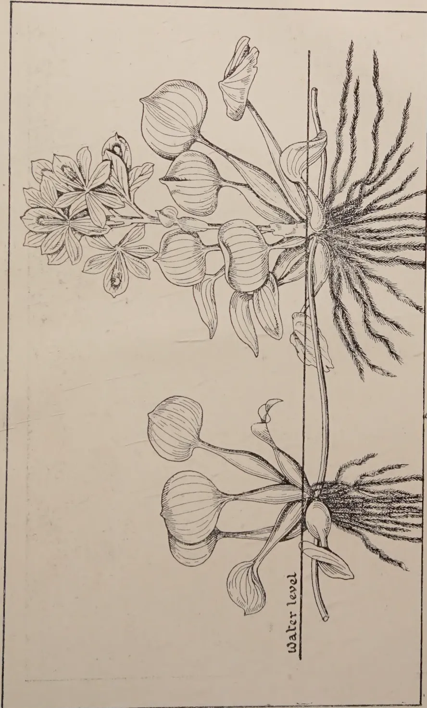
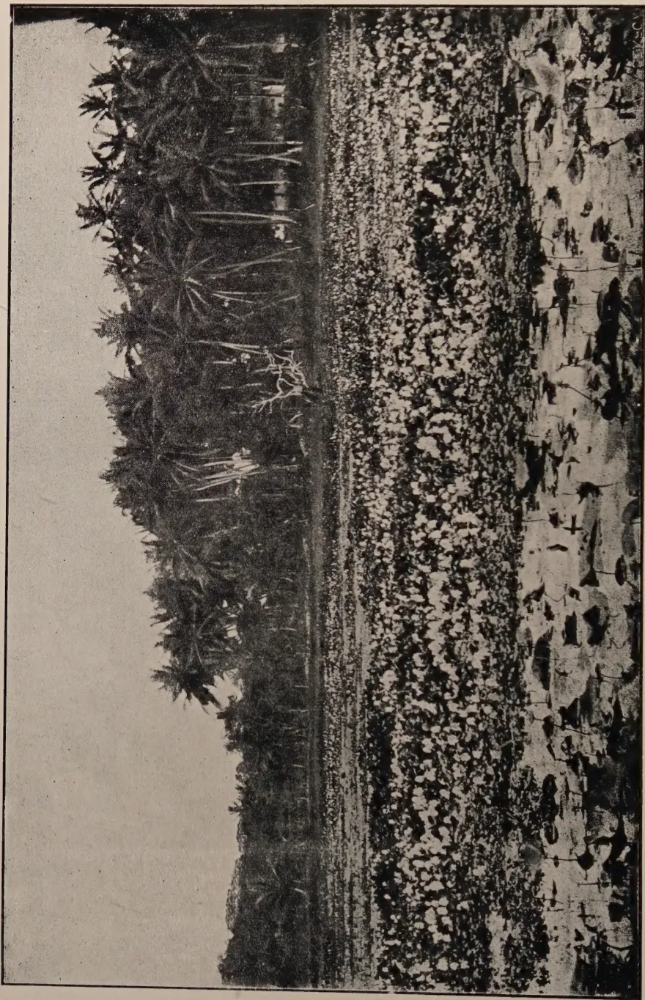
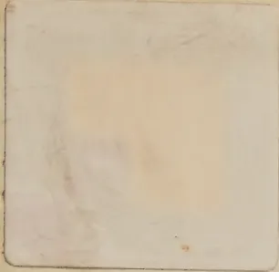

# THE TROPICAL AGRICULTURIST

---

VOL. LXVII. PERADENIYA, DECEMBER, 1926 No. 6.

---

## THE WATER HYACINTH.

---

The water hyacinth has become a serious nuisance in many parts of the world and in the East it has become excessively troublesome in Bengal, Burma and Indo-China. In many parts, it has completely blocked up canals and water-ways and made navigation and transport upon them well-nigh impossible.

In Indo-China, the position has become extremely serious and the administration after spending considerable sums on cleaning out channels and water-ways finds themselves faced with a position almost impossible to tackle. In Bengal, the situation is also serious and has caused considerable hardship to the peasant cultivators.

Nor is the menace of the water hyacinth limited to the East. It exists in the Southern United States of America, in South Africa and in Australia. And in none of these countries where the water hyacinth has become established over large areas have the efforts of man been able satisfactorily to cope with the spread of this pestilential weed.

In Ceylon also, the water hyacinth has been spreading in recent years in certain areas. It was introduced in 1905, and had begun to be distributed in 1908. The trouble that was likely to arise if this weed become widely distributed was then recognised and a legislative enactment for its control was passed in 1909. This enactment however gave to no particular Department of Government executive powers, and in consequence, although it has been possible by co-operation between the Revenue and Agricultural Departments to prevent to a large extent its spread in several areas, it has gained a firm foothold in certain parts of the Southern Province.

1------------------------------------------------

322[DECEMBER, 1926.

The spread of the pest in this area has become more and more wide-spread in recent years and it was therefore decided that a determined campaign for its eradication should be inaugurated.

It has been observed in the Southern Province, the nuisance that this weed could become in tanks providing water for paddy-fields. Paddy-fields have gone out of cultivation in some instances, and watercourses, elas and drainage channels were becoming blocked with this weed. There was no doubt that its spread would become an increasing curse to the village cultivator and from the Southern Province would spread to others. If this pest gained an entrance and became established in the canal systems in the Western Province, or in the mouths of the rivers a serious situation would arise, and it would be improbable that it could then be tackled.

The water hyacinth has been declared a weed under the Plant Protection Ordinance and the Department of Agriculture has been definitely charged with its eradication if possible from the colony. Much progress has already been made in the Southern Province but there is one swampy area from which it may not be possible, at any reasonable cost, to clear out the weed.

Progress with eradication will be assisted if all would co-operate in this effort to save the Island from the spread of a menacing weed. Reports of its occurrence in any part of the country should be made to an officer of the Department of Agriculture and all owners or occupiers of land should recognise that it is their duty to pull out all plants from places in which they are growing and bury them in pits or pile them up on high land in heaps to be burnt.

Those who know of the serious economic damage this weed has caused in many countries or who have seen the hardships which peasant cultivators in Bengal have to undergo by reason of its uncontrolled spread recognise the necessity of checking its further spread in Ceylon and therefore appeal for the fullest co-operation in the work which has recently been begun and for which the Legislative Council has provided funds.

2------------------------------------------------

DECEMBER, 1926.]323

# PESTS AND DISEASES.

## MYCOLOGICAL NOTES.

FURTHER OCCURRENCES OF *RHIZOCTONIA BATATICOLA* (Taub.) Butler.

W. SMALL, M.B.E., M.A., B.Sc., Ph.D., F.L.S.,

*Mycologist, Department of Agriculture, Ceylon.*

These notes are arranged under the headings of the various host plants of the *Rhizoctonia*. Certain of the hosts have been reported previously (1), but new facts regarding the *Rhizoctonia* have come to light. Other hosts are new records for Ceylon.

(1) **Tea.**—It was mentioned in the October Mycological Notes that *Rhizoctonia bataticola* had been found to occur on tea along with *Diplodia*, *Fomes lamaoensis* (the fungus of brown root disease), *Fomes lucidus*, *Rosellinia*, *Ustulina* and *Polyporus interruptus*, and that it had not been found in association with *Poria*. Lately, however, several cases have been encountered in which the *Rhizoctonia* and *Poria* are in association, and *Poria* may be added now to the list of fungi which occur on tea along with the *Rhizoctonia*. In the majority of cases of tea root disease in which another fungus accompanies the *Rhizoctonia*, the latter is much less conspicuous than the fungus accompanying it, and the specimens therefore have to be examined with care in order that all the factors present may be taken into account. *Rhizoctonia bataticola* has been found also to be present in further cases of apparent brown root disease and *Diplodia*.

Several cases of deaths of young tea in new clearings have been examined recently. They may be divided into three classes: (a) specimens in which *Rhizoctonia bataticola* occurs alone and which show no collar-rot, (b) those in which the *Rhizoctonia* is accompanied by *Poria* and which also have no collar-rot, and (c) those which may be called clear cases of collar-rot. The deaths of the plants placed in (a) and (b) are due solely to fungus attack. The exact causes of the collar-rot of (c), however, are not known, nor is it clear that the actual rot of the collar tissues is closely connected with the cause of death. The outstanding indication of collar-rot is a ringing of an inch or two of the stem to the wood at ground level; in many cases the area from which the bark and cortex are missing is bordered above and below by a protruding growth of callus from the uninjured cortical tissues. The recent cases of collar-rot did not show the constricted and blackened stem described by Petch and attributed by him to fungus attack (2), and there may therefore be more than one type of collar-rot and more than one cause of it. In Ceylon, *Rhizoctonia bataticola* may be one of the causes, for the fungus has been found in both roots and stems of several recent collar-rot specimens, but other examples of collar-rot seem to have no connection with fungus attack. It is probable, therefore, that collar-rot is due at times to other than fungus agency. It may be, for example, the work of insects, and it has also been attributed primarily to mechanical injury due to wind friction or

3------------------------------------------------

324[DECEMBER, 1926.

overheating of the surface of the soil. With regard to the suggestion of an insect cause, Petch has stated that the ultimate death of the plants involves the presence of a fungus parasite, but it should be noted on the other hand that the girdling of the stems of young coffee plants at the surface of the soil by "cutworms" in Tropical Africa leads to the death of many of the affected plants without the intervention of a fungus parasite. The writer is informed that certain cockchafer grubs (*Lepidiota* and *Anomala* spp.) and an ant (*Dorylus orientalis* Westw.) are suspected of causing a ringing of young tea stems which might pass into the condition known as collar-rot, and the relation of these insects to young tea is perhaps worthy of investigation.

(2) **Citrus.**—A large plot of lime trees (*C. medica* L. var. *acida*) at the Anuradhapura Experiment Station is affected by a general die-back or wither-tip of the branches and by a gumming of the stems. Both of these pathological conditions have been reported from citrus-growing countries, and the former of them has been attributed to a definite cause in Florida, namely, attack of *Colletotrichum gloeosporioides*. The latter, again, has been attributed to certain fungi in the case of the lime. It has been found that the wither-tip material from Anuradhapura will yield a species of *Colletotrichum* and also *Diplodia*, and that the stem gumming is accompanied by a bacterium. The wither-tip fungi have not been tested in inoculation experiments, but tests of the pathogenicity of the stem bacterium have proved it to be incapable of infecting or affecting in any way either citrus leaves or stems.

Meanwhile, examination of the roots of Anuradhapura limes has disclosed the presence of *Rhizoctonia bataticola* on the roots of sickly trees, and it therefore is possible that the root fungus is the basic cause of the local wither-tip or die-back and gumming of citrus and that the fungi and bacteria associated with these conditions are mere saprophytes. Orange trees are affected in the same way as limes, but only a few orange roots have been examined and the *Rhizoctonia* has not yet been found upon them. The writer is confident, however, that the disease of both lime and orange trees is due to one cause. Further, it will cause no surprise if *Rhizoctonia* disease of citrus is found to be wide-spread in Ceylon. *Ustulina* and *Diplodia* occur on occasional roots of lime trees attacked by the *Rhizoctonia*.

(3) **Cacao.**—Since the report of *Rhizoctonia bataticola* as a cause of cacao root disease in Ceylon, two consignments consisting of fifteen diseased stumps from the Experiment Station, Peradeniya, have been examined. Typical symptoms of *Rhizoctonia* attack were found on every specimen, and the fungus itself on a large proportion of them, namely, those which had the smaller roots *in situ*. As before, other fungi were present at times, particularly a *Rosellinia* which grows between the bark and wood of both the stem and the upper part of the tap-root and a *Nectria* which occurs on the bark of the stems.

(4) **Hevea brasiliensis.**—In recent cases of *Hevea* root disease, *Rhizoctonia bataticola* has been associated with the fungus of brown root disease (*Fomes lamaoensis*), with both *Ustulina* and *Sphaerostilbe*, and with *Fomes lignosus*, *F. lamaoensis* and *Poria*. In the second case, the penetration of the *Rhizoctonia* was very complete, large numbers of its sclerotia being found in the wood of a root which was attacked externally by *Ustulina*

4------------------------------------------------

DECEMBER, 1926.]325

and *Sphaerostilbe*. Curiously enough, the tree from which the root was taken appears to be healthy, and it will be interesting to note future developments. The last case is of particular interest because the three fungi mentioned, *Poria* and the two species of *Fomes*, occurred on different roots of a single tree which had been attacked by the *Rhizoctonia*. All its smaller roots and many of the larger were full of the sclerotia and black lines of the fungus.

(5) **Chillies.**—*Rhizoctonia bataticola* has been reported as a root parasite of chillies in the North-Western Division. In a recent case from the Experiment Station, Peradeniya, the *Rhizoctonia* on the roots was accompanied by certain pathological conditions of the aerial parts of the plants, namely, a die-back of the branches with which was associated a species of *Vermicularia*, a pod anthracnose with which was associated a *Gloeosporium*, and an *Oidium* leaf mildew. It is unnecessary to enlarge in these Notes upon the possible significance of the co-occurrence of those foot, stem, pod and leaf fungi of chillies, but one result of the discovery of the *Rhizoctonia* under those circumstances is to indicate that an examination which does not include an inspection of the condition of the roots of the plant may be incomplete. It ought to be carried beyond the disease that is evident, for example, pod anthracnose, lest it lead to a wrong conclusion. It is not asserted that every case of die-back or pod anthracnose is accompanied by or due primarily to the presence of a root fungus, but it is asserted that it is necessary to examine the roots as well as the upper parts of diseased plants. This remark applies to other plants as well as to chillies.

(6) **Hakgala Botanic Garden Trees.**—*Rhizoctonia bataticola* has attacked and proved fatal to examples of *Acacia elata* A. Cunn. (Mountain Hickory), *Tristania conferta* R. Br. (Queensland Box) and *Cupressus macrocarpa* Hartw. (Monterey Cypress) at Hakgala. All three hosts are introduced species. *Cupressus macrocarpa* was a victim of the *Rhizoctonia* in Uganda, and root disease of the *Acacia* is accompanied by stem gumming as in *Acacia decurrens*. The three trees were growing at distances of about fifty yards from each other so that the different infections must have taken place independently. In each case, the smaller roots and some of the larger were remarkable for the numbers of sclerotia of the fungus.

The data derived from the continued examination of cases of root disease, particularly those examined carefully in the field, lead to the conclusion that *Rhizoctonia bataticola* is present either singly or in company of another fungus or fungi in a greater percentage of cases than was suspected. The many cases of root disease of tea, rubber, cacao and other plants that have been examined in the last six months may be divided into three classes; (a) those in which *Rhizoctonia bataticola* is present alone, (b) those in which the *Rhizoctonia* is accompanied by another fungus or fungi, for example, the cases of tea and *Hevea* root disease mentioned in these Notes, and (c) those which appear to be due to other fungi because no *Rhizoctonia* appears to be present. Regarding the first class it may be said that *Rhizoctonia bataticola* is solely responsible for the deaths of the affected plants and that the cases of this class number more than fifty per cent. of the total number of cases. The cases of (b) become a question of the succession of fungi, that is, of the priority of one form over the others present. In order to allocate responsibility for root disease in such cases, one fungus must be shown to

5------------------------------------------------

326[DECEMBER, 1926.

have attacked before the other. A certain amount of evidence which points to the priority of *Rhizoctonia* over fungi like *Poria*, *Fomes* and *Ustulina* has been acquired, and it is hoped that the inoculation experiments in progress will shed additional light on the point. The specimens of class (c) appear to be clear cases of, say, *Poria* or *Fomes* or *Ustulina* disease at first sight, but it is found that the symptoms of *Rhizoctonia* attack (particularly the hard dry condition induced in the wood of invaded roots) are also present although the *Rhizoctonia* itself may not be found in the form of sclerotia or "black lines." This latter condition has aroused a certain suspicion and has led the writer to make special field investigations and to have material dug and collected in accordance with special instructions, and it has been found in every case to date that the *Rhizoctonia* is present in addition to the more easily seen fungus which was supposed to be the only fungus at work. Investigation is being continued on these lines. In the meantime, it can be said that cases of (c) type of root disease are becoming more and more scarce; in other words, the (c) class is being merged into (b) and is disappearing gradually. As has been said, the *Rhizoctonia* is present more often than was suspected.

There is therefore more need than before for a determination of the status of *Rhizoctonia bataticola*. In connection with that remark, it may be pointed out that the parasitic status of fungi like *Fomes* and *Poria* is based on their supposed sole association with root diseases rather than upon experimental proof of their parasitism, and that there is therefore as much need for a determination of their status as for an investigation into that of *Rhizoctonia*. The fact that they are accompanied frequently, if not always, by *Rhizoctonia bataticola* calls for enquiry into their capabilities for parasitism, if it does not justify scepticism of their parasitism, for the *Rhizoctonia* is at least as worthy of blame for root disease as the older-established fungi like *Poria* and *Fomes*. It is not overlooked that the *Rhizoctonia* may be a common soil saprophyte which is able to enter only dead and dying tissues, but it is just as probable that *Fomes* and *Poria* are common soil saprophytes which can attack only dead and dying plants killed or weakened by the *Rhizoctonia*. It may be repeated that the *Rhizoctonia* is more consistently present than the other fungi and that it can be found to be the sole cause of root disease and death in more than fifty per cent. of the total number of cases examined recently. As the relative responsibility of the various fungi can be settled best by experiment, a large number of inoculations with *Rhizoctonia* and the other fungi has been performed.

#### REFERENCES.

1. (1) Tropical Agriculturist, LXVII., Nos. 2 and 4, August and October, 1926.
2. (2) Diseases of the Tea Bush, p. 119.

6------------------------------------------------

DECEMBER, 1926.]327

## THE WATER HYACINTH PEST.

W. C. LESTER-SMITH, B.A.,

*Plant Pest Inspector, Southern Division.*

*Department of Agriculture, Ceylon, Leaflet No. 40.*

### INTRODUCTORY.

The Water Hyacinth (*Eichornia crassipes* Solms.) or "Lilac Devil" is a water-plant native of Brazil which was introduced into Ceylon about 1905. It has now become naturalized and is a serious and menacing weed in the Southern Province. Its habitat is in swamps, lagoons, tanks, irrigation channels, drains, the slowly flowing parts of rivers, pools, and other similar places where there is enough water during part of the year for the plant to grow. It will float and thrive in water of any depth, provided that the current is sluggish enough. It will also grow and thrive as a land plant in places where there is little or no visible water but where its roots are more or less continuously kept moist. Its adaption to such conditions and its ability to survive short periods of drought render it all the more difficult to eradicate. The plant is a declared weed and its importation and cultivation in Ceylon are prohibited by legislative measures.

### VERNACULAR NAMES.

In the Southern Province generally the plant is known to the Sinhalese as "Japan Jabara," and to some simply as "Jabara" which latter name has also a number of local variants, such as "Yabara," "Yapura," "Sabara," and "Habara" or "Habarala." In 1914 it was known in the Tangalla District as "Japan Yabara," in the Kadugannawa District in 1916 as "Diya-Kehel," and in 1917 the name "Diya-Manel" was recorded for it in the Polgahawela district.

### REASONS FOR WHICH THE PLANT IS A DECLARED PEST.

For many reasons this plant should not be allowed to grow freely. The primary ones, and those which should appeal most strongly to all, are intimately concerned with the cultivation of paddy. Once the Water Hyacinth becomes established as a common paddy-field weed, it is inevitable that it will cause an increasing reduction in yield year after year. Other damage occurs owing to the choking up, by its rapid growth, of irrigation channels and watercourses. In infested areas these channels may be completely blocked up, causing a serious reduction in the flow of water either into or out of the paddy-fields at times when such is undesirable. If this occurs to any appreciable extent it may result in the failure of the crop, due either to a lack or to an excess of water at a critical period in its growth. This factor of the control of water is one of the most important in the cultivation of paddy, and the infestation of watercourses by this water-weed may remove all possibility of such control. In view of the desirability of increasing both the yield of and the acreage under paddy in Ceylon strenuous efforts should be made to eradicate the Water Hyacinth. Further reasons unconnected with paddy cultivation can also be advanced in favour of its eradication. Of these the chief are perhaps on the grounds of health and sanitation. The effect on health of such vegetation growing in ditches and watercourses, especially when these are in the neighbourhood of houses and villages, cannot be other

7------------------------------------------------

328[DECEMBER, 1926.]

than detrimental. There is no doubt that its presence in some areas causes water stagnation. In this way the Water Hyacinth is an indirect source of danger through the encouragement it offers for the breeding of mosquitos and other disease-carrying insects. In some places, also, it may seriously interfere with sewage disposal. By such means the Water Hyacinth can render infested neighbourhoods feverish and insanitary.

#### METHODS OF ERADICATION.

The following approved methods for dealing with the Water Hyacinth are herewith set out. All Water Hyacinth plants must be pulled out from the places where they are growing and piled up on some adjoining or near-by high ground for proper disposal. Further, it must be noted that one clearing will not suffice and that at least two clearings and probably more, with short intervals of a week or ten days between each, are necessary. This is because a certain number of the plants (or parts of the plant) which can go on growing, are either missed, dropped, or develop after each primary clearing. One of the two following methods of disposal must then be proceeded with: the plants must be dried in heaps and subsequently all burnt with fire, this method will be found most practicable in the drier parts of the Island; or alternatively, the plants must be rotted in pits dug in the ground in preparation for this purpose, this method will be found to be of general application. The pits when full should be covered with a layer of earth or sand. If the pit method of disposal be adopted it is recommended that a little quicklime be thrown in with the plants to accelerate decomposition. The eradication of the Water Hyacinth cannot be effected in one season, it is a task requiring much patience, but it is one that must be very carefully and regularly attended to. The individual attention of owners to the work is recommended, and for the clearing of adjoining infested areas both co-operation and continuity in the work are essential for success.

#### DESCRIPTION OF THE PLANT.

The Water Hyacinth is a small, herbaceous, perennial, water-loving plant. It rarely if ever exceeds three feet in height from the ground or water level. It grows with its vegetative parts (*i.e.*, leaves and flowers) floating on the surface of the water, if deep enough, and with its roots submerged (but not rooted) and serving to maintain the equilibrium of the plant. If the water is shallow, or in moist places, it grows with its roots in the mud but not penetrating the soil to any extent. The roots are thin and wire-like. They are feathery in appearance on account of the almost regular outgrowth of numerous short secondary rootlets. The extent of the root development depends largely upon the age of the plant, the depth of the water, and the amount of congestion due to the proximity of other plants. In mature plants the primary roots may vary from about six inches to over two feet in length. Sometimes the reduced and almost inconspicuous stem, which is often hidden by the junction of the leafstalks, becomes enlarged into a stout fleshy rhizome. From the base of the plant and from this rhizome often arise one or more stolons (or runners) which serve as the chief means of vegetative reproduction. The thick, fleshy, ovoid or elliptically shaped leaves, when the plants are free floating, serve as sails and with the wind aid in the dispersal of the plant by water to new areas. The smooth, round,

8------------------------------------------------

A detailed botanical line drawing of a Water Hyacinth plant, oriented horizontally. The plant is divided by a horizontal line labeled 'Water level' on the left. Above the water level, the plant has several large, heart-shaped leaves with prominent veins and a cluster of flowers at the top. Below the water level, the plant's root system is shown, consisting of a dense mass of fine, fibrous roots. A vertical stem extends from the water level down to the roots. The illustration demonstrates the plant's ability to reproduce vegetatively, as the stem is shown breaking at the water level to form new plants.

Block by Survey Dept. Ceylon.

WATER HYACINTH SHOWING ROOT SYSTEM AND METHOD OF VEGETATIVE PROPAGATION.  
(Adapted from Illustrations in *Journal of the Department of Agriculture, South Africa.*)

9------------------------------------------------

A black and white photograph showing a vast field of water hyacinth in full bloom. The flowers are numerous and light-colored, creating a dense, textured carpet across the foreground and middle ground. In the background, a thick line of tall palm trees stands against a pale sky. The overall scene is a tropical landscape.

WATER HYACINTH IN FLOWER.  
Maha-wewa in the Weerakeliya-Walasmulla Area.

10------------------------------------------------

DECEMBER, 1926.]329

petioles (or leafstalks) thicken gradually toward the base. In the case of mature plants floating individually in deep water and young plants in shallow water, the leafstalks develop into characteristic bladder-like or spindle-shaped expansions just above their junction to the stem at the base of the plant. The inflorescence, which is usually elevated an inch or two above the leaves, consists of a flower stalk, with several wavy margined sheaths (bracts) at and above the middle, and terminates in a simple spike, bearing from six to twenty iris-like flowers. Each of these mauve or pale lilac flowers consists of six parts which join below the spread out part to form a funnel-shaped base where the flower joins the flower stalk. The upper one of these six parts differs from the rest by being larger and possessing a large patch of blue with a pear-shaped spot of bright yellow in the centre. The six stamens are attached to the funnel-shaped tube at different heights, three being long and three being short. The style is slender with a terminal stigma. The inflorescence is of short duration lasting only about a day after which the flower stalk bends slowly over and carries with it the withered flowers which do not fall off. Seeds have not been found to be regularly produced. When they are, their germination is dependent upon the presence of water preceded by some desiccatory influence, such as a thorough drying out caused by a short period of drought. The usual means of reproduction are vegetative—generally by means of runners, but occasionally by the detachment of a vegetative bud possessing roots and shoots.

#### CO-OPERATION AND NOTIFICATION.

The cleaning of infested areas belonging to the Crown has already been commenced. In some areas this work must go hand in hand with the clearing of privately owned infested areas. For the purpose of co-operation in this work the Department of Agriculture will take the initiative and inform the owners concerned the dates on which the work should commence. Further, as it is most desirable that no infested areas be overlooked, it is hoped that persons will notify the Agricultural Department of any infested areas which come to their notice. It is sincerely to be hoped that all will co-operate to the full in the efforts being made to free Ceylon of this pest.

### INOCULATION EXPERIMENTS IN RELATION TO "SUN-SCORCH" ON EXPOSED LATERAL ROOTS OF *HEVEA BRASILIENSIS*.

F. S. WARD, B.S.A., (McGill),

*Assistant Mycologist, Department of Agriculture, S. S. & F. M. S.*

Numerous experiments have recently been carried out with the view of artificially approximating the conditions bringing about the occurrence of "Sun-Scorch" on the exposed lateral roots of *Hevea brasiliensis*.

The first impression of this outbreak of "Sun-Scorch" was, that the blackened condition of the upper surfaces of the roots was caused by some form of burning. The origin of such scorching effects may be due to several causes such as "leaf fires" or "lightning strike;" in this case, however, these possible causes have upon further investigation been eliminated. It

11------------------------------------------------

330[DECEMBER. 1926.

has been shown to be possible, however, by means of artificial leaf fires, to bring about a similar condition of "Sun-Scorch." The cause of this attack of "Sun-Scorch" in 1926, which is the first recorded account in Malaya, has been attributed to the unusually dry weather conditions prevalent during the last wintering season.\*

It was necessary in the first experiment to find out whether the *Diplodia* sp. found in the attacked tissue in roots affected with "Sun-Scorch" was capable of directly infecting healthy root tissue or whether it acted as a wound parasite. Six wounds were made in the following manner on six individual lateral roots. Areas about four inches long and an inch wide were cut into the woody tissue of the roots. The coagulated latex produced at these wounding points was removed on the following day so that the inoculum would have as favourable conditions as possible under which to react. Six pieces of "Sun-Scorch" tissue were then placed on these wounds, the size of these pieces being about the same area as the wounds. These inoculations were then wrapped up in cotton wool, to prevent outside contamination as far as possible and were allowed to remain thus for fourteen days. The results at the end of two weeks were negative. Other similar inoculations were allowed to remain for five weeks and the results were again negative.

The next experiment was to determine the effect of scorching on exposed lateral roots together with subsequent inoculation with tissue from roots affected with so-called "Sun-Scorch." Twelve leaf fires were made on twelve separate roots and the leaves were allowed to burn for approximately five minutes on each root. The leaf fires were made by collecting a couple of handfuls of leaves and placing them on top of each root to be scorched. The following treatment was then carried out:—

1. (1) Six roots scorched, inoculated with small portions of "Sun-Scorch" tissue.
2. (2) Six roots scorched, not inoculated (controls).

After two weeks these roots were split open and examined. The roots which had been burnt but not inoculated showed the very early symptoms of "Sun-Scorch," that is, the characteristic discolouration associated with "Sun-Scorch" had only just penetrated into the woody tissue, excepting in two cases where the penetration had gone a little further than in the other cases. Where the roots had been scorched as well as inoculated, the woody tissue in five cases had been well impregnated with the typical discolouration which is found in the more advanced cases of "Sun-Scorch." In these inoculations the *Diplodia* fungus was also found to be present in the woody tissue.

The discolouration of the root tissue, due to "Sun-Scorch," is very typical of the grey discolouration found in the tissue of branches of *Hevea brasiliensis* attacked by the *Diplodia* sp. causing Die-Back.

Similar scorching and inoculations with pure cultures of the *Diplodia* fungus were then carried out. This was done in order to find out whether the *Diplodia* inoculations had any more pronounced effect than inoculations with tissue from affected "Sun-Scorch" roots. In this series of inoculations

---

\* Sharples A.—"Sun-Scorch" of exposed lateral roots of *Hevea brasiliensis* (See "Tropical Agriculturist" for September, 1926.—Ed. T. A.)

12------------------------------------------------

DECEMBER, 1926.]331

it was found that typical symptoms of "Sun-Scorch" were pronounced in the following experiments where six roots were scorched by means of leaf fires for five minutes in each case:—

1. (1) Roots scorched and inoculated with a pure culture of *Diplodia*.
2. (2) Roots scorched and inoculated with tissue from roots affected with "Sun-Scorch."
3. (3) Roots scorched, not inoculated (controls).

These inoculations together with the controls were then wrapped in cotton wool and examined three weeks later. The results of No. (1) and (2) of the above showed equally typical symptoms of "Sun-Scorch." In these experiments the results of some of the controls is noteworthy. Instead of all of the roots showing the demarcation immediately below the burnt surface, two roots had this typical discolouration accompanying the presence of *Diplodia* some distance away from the scorched area. It seems probable that these instances may be due to fissures produced in the cortex, as the result of the expansion of the tissue, after scorching, which proved more suitable for the entrance of the *Diplodia* fungus than openings which might be present in the more severely scorched bark.

Scorches of much less severity were then carried out in order to ascertain the approximate amount of scorching required to cause the *Diplodia* fungus readily to gain an entrance into the tissue of the root. This was done by heating an iron bar until it was red hot and placing it on the roots. Each root was scorched in this manner for five seconds, the scorched area on the root being about half an inch square in each case. Eighteen scorches of this type were made as follows:—

1. (1) Six were left as controls and not wrapped up in cotton wool.
2. (2) Six were wrapped up in cotton wool and kept moist.
3. (3) Six were inoculated with small portions of *Diplodia* and wrapped up in cotton wool.

These were all left for three weeks, after which time the results were found to be practicably negligible. Two inoculations in (2) of the above showed a slight discolouration in the woody tissue but no *Diplodia* was found to be present. This experiment indicated that the scorching was insufficient so that a similar type of experiment was carried out excepting that each root was scorched for thirty seconds. Twelve scorches of this kind were made and treated in the following manner:—

1. (1) Six were inoculated with *Diplodia* and wrapped up in cotton wool.
2. (2) Six were left as controls and not wrapped up in cotton wool.

In the case of the controls there was only one instance where the *Diplodia* had penetrated into the wood. In number (1) of the above there were three cases where the *Diplodia* had started to penetrate into the wood. It seems probable that if in these latter inoculations the roots had been scorched for about a minute and allowed to remain for the same number of days as in the previous experiment, all of the results would have been positive.

A few preliminary experiments were carried out on the branches of *Hevea brasiliensis* in order to find out whether similar effects to those produced in the roots could be produced in the branches. Four scorches were made with

13------------------------------------------------

332[DECEMBER, 1926.

a heated iron bar, each scorch lasting for thirty seconds. Inoculations were then made with pure cultures of the *Diplodia* fungus. After leaving these inoculations for three weeks similar symptoms were found to those in the roots which had been treated in the same way. The progress of the fungus here, as in the roots, was found to be along through the woody tissue and not in the cortex. Branches of *Hevea brasiliensis* were also inoculated with *Diplodia* without these branches being previously scorched. Although these inoculations have been going on for over six weeks, the fungus has not as yet penetrated into the wood.

These inoculation experiments indicate that the *Diplodia* sp. usually found associated with affections of *Hevea brasiliensis*, i.e. "Lightning strike," "Die-Back," "Sun-Scorch" of exposed lateral roots, is not an ordinary wound parasite as is commonly assumed, but is rather a special type of wound parasite which under certain conditions allowing for sufficient heating of localised areas of cortical tissue, results in a strong infection and in the fungus making rapid headway in the woody tissue of *Hevea brasiliensis*. In these experiments there is also suggested the possibility of explaining the common occurrence of "Die-Back" in Malayan plantations after wintering.

The so-called "Die-Back" on hilly lands which have suffered badly from soil wash or on rubber growing areas which have been neglected in other ways, is of considerable importance in Malaya. The experiments which have been just recently undertaken in connection with "Sun-Scorch" suggested an enquiry as to whether the *Diplodia* sp. was the prominent fungus present in this particular kind of affection. One hundred and five branches of *Hevea brasiliensis* suffering from "Die-Back" were split open, the results are given below:—

<table>
<tr>
<td>(1)</td>
<td>Typical <i>Diplodia</i></td>
<td>11 cases</td>
</tr>
<tr>
<td>(2)</td>
<td><i>Diplodia</i> present with other fungi or insects</td>
<td>22 "</td>
</tr>
<tr>
<td>(3)</td>
<td>No <i>Diplodia</i> present</td>
<td>72 "</td>
</tr>
</table>

In these branches killed by "Die-Back" numerous fungi occur. One of the most common fungi present is *Polytictus hirsutus* Fr., another is *Hexagonia tenuis* Hook. This species differs from the type species of *Hexagonia tenuis* Hook, and may be new species. Another common fungus is a white *Poria* sp. which has not yet been determined. A further detailed report upon these fungi will be issued later.

Thanks are due to Mr. Holttum, Acting Director, Botanic Gardens, Singapore, for identification.—*The Malayan Agricultural Journal*, Vol. XIV., No. 9.

## VIGNA OLIGOSPERMA.

*Vigna oligosperma* was introduced into Ceylon from Sarawak in 1918 and subsequently from the Federated Malay States in 1923.

It has been tried at different elevations, and was found suitable for the low country. It is the best cover plant at present known for use against soil erosion in Ceylon, under the heavy shade of old rubber.

A very useful booklet containing suggestions for the establishment of this cover plant has been issued by Mr. Bernard H. Grigsby, of Cuilcagh, Mahagama, and is obtainable at Messrs. H. W. Cave & Co., Colombo, at Rs. 3 per copy.

14------------------------------------------------

DECEMBER, 1926.]333

## CUTWORM CONTROL.

The following note on "Cutworm Control" is taken from *Queensland Agricultural Journal*, Vol. XXVI., Part 4:—

The Entomological Branch of the Department of Agriculture and Stock has received numerous inquiries relating to the control of cutworms, and it seems desirable to give further publicity to the details of the control measure generally adopted against these serious pests. Poisoned baits are the standard remedy for cutworms, but, to be thoroughly effective, they should be used as soon as the attack is noticed. The bait may be made as follows:—

Bran, 50 lb. ; Paris green, 2 lb. ; molasses, 2 quarts ; oranges, 3 fruits ; water, 4 (approximately) gallons.

The Paris green and bran should be thoroughly mixed together, dry ; the juice of the oranges, the finely chopped up fruit, and the molasses should then be added to some of the water. The latter mixture should now be combined with the Paris green and bran and should be thoroughly stirred, enough water being added to produce the right consistency. The right consistency must be determined by the user, but only sufficient water should be added to leave the mixture in a crumbly condition and thus dry enough to permit of being scattered broadcast on the ground ; at the same time the quantity of water added must be such as to ensure that each flake of bran has been moistened by the molasses sufficiently to make it attractive and also to enable it to carry a small quantity of Paris green. It is better to have a barely moist bran mash than a thoroughly wet one because an unduly wet one becomes baked by the sun and rendered unattractive.

The baits should be distributed towards evening so that they will not lose their attractiveness to the cutworms when they come out to feed at night. Do not use these baits where fowls or other animals have access to the ground treated, and remember that Paris green is very poisonous and must be handled with corresponding care. The quantity mentioned above is sufficient for several acres ; smaller quantities can be, of course, made up if smaller areas are to be treated. Where only garden plots or very small areas are to be dealt with broadcasting may be abandoned in favour of distribution by placing a teaspoonful of the mixture near the base of each plant likely to be attacked. If no fruit is available the bran mash can still be used, but it is always desirable to have it sweetened.

## A NEGLECTED ASPECT OF THE WEED PROBLEM.

In the past far too much emphasis has been given to the menace that large areas of any particular weed may exercise in the invasion of clean land, and too little emphasis to the practices that must be adopted in order to keep clean land clean. A better knowledge and better application of the principles involved—all of which are connected with pasture maintenance and improvement—would do much towards the solution of the weed problem in connection with our grass land.—A. H. Cockayne, in the *New Zealand Journal of Agriculture*.

15------------------------------------------------

334[DECEMBER, 1926.

# TEA.

---

## SHADE TREES.

---

Mr. H. R. Cooper contributes an article in the Quarterly Journal of the Indian Tea Association on the effect of shade trees in tea cultivation, of which the following is a summary:—

Shade trees are generally believed to be favourable to the growth of tea. Perhaps the shaded tea happens to be better owing to the better quality of soil which favoured the growth of the shade tree as well. Many cases are however known where the soil fertility was similar and the shaded tea was invariably better. Thus under normal conditions shade trees are an advantage. Shade trees also besides needing labour and expense for their establishment have their disadvantages.

Absolutely first-class tea has been grown at Tocklai and Borohetta Experimental Stations with practically no shade trees. The plots in these places are small and the presence of a tree would vitiate the results by affecting the plots unequally. Very large plots would be required for actual experiments on shade trees. In the absence of direct experiments recourse must be had to the available evidence on the use of shade trees.

Shade trees are advantageous (1) by the addition of plant food to the soil.

The elements of fertility in the soil are added to by the leaves of the shade tree which fall annually and are buried by cultivation; these added elements are also in a more readily available form. Analyses of soils under shade trees reveal but little increase in their nitrogen content and this is probably because the nitrogen has been used up as fast as it was added to the soil.

These elements of fertility can however be added to the soil either as a combination of artificial manures or as green or cattle manures and thus shade trees can be dispensed with. Shade trees are of enormous value where little or no manures have been used and gardens are known where good yields have been maintained over many years by shade trees alone in the absence of other fertilisers.

(2) Shade keeps down jungle growth.

Under shade, shallow-rooted weeds and fine grasses which are easily removed and do relatively little harm, replace the deep-rooted, coarse, high-growing grasses. One often sees in the open of long-neglected gardens, poor stunted bushes among thatch-grass, while really good tea is found among shallow-rooted grass under occasional shade; these marked differences are not noticed where weeding is the rule; the heavier flushing tea is here not under the shade, where the bushes are dark and healthy looking. Thus shade trees are only of value where cultivation is deficient.

(3) Root action.

The roots of the shade tree open out the soil and helps in the weathering of the soil by air, water and carbon dioxide. They also increase the depth

16------------------------------------------------

DECEMBER, 1926.]335

of the soil and prevent pan formation. The range of roots of shade trees is however limited by the presence of a hard pan. The roots of shade trees used in tea also generally tend to grow horizontally and occupy the space meant for the tea roots. Hard pans are also prevented by vigorous growing tea.

The three advantages discussed above are not peculiar to shade trees but are also derived by cultivating and manuring.

(4) Effect on the bush itself.

A certain amount of shade benefited the tea itself specially during the hot weather. This is due to the (a) cutting off of the direct rays of the sun, (b) the cooling action of the air, under the shade tree, which is saturated with moisture, (c) the relief given to weak and diseased bushes. These benefits to tea can however be obtained by planting tea of good jâts and cultivating them carefully.

The general conclusion from the available evidence, then, is that it is much easier to grow tea under shade than without it, but that if it were necessary, tea could be grown very well, in good climates without shade, so long as cultivation and manuring and general treatment are of the best, particularly if dark-leaved varieties are used.

Where temporary shade is needed as on young or pruned tea, semi-permanent crops like Boga medeloa should be used.

Disadvantages of shade trees.

1. When too old, shade trees are liable to canker and other diseases and have either to be cut down or rooted up and this means expense.

2. Most shade trees are deciduous and they do not come into leaf till after the hot dry spells are over. These leafless trees still transpire through the bark and help to dry the soil. Thus the tea itself suffers from lack of soil water. This is specially evident in shallow or sandy soils where some of the tea may even die.

3. Shade trees compete with the tea for plant foods and water and exercise the normal bad effect of any plant growing in the neighbourhood of another. This bad effect is noticeable not in young, but in older high-yielding tea. This bad effect is also more strongly marked in some species of shade trees, e.g., *Albizia moluccana* which should be pruned to 8 feet when about 2 years old.

4. Effect on quality.

Over-heavy shade reduces the strength and pungency of the tea grown under it.

**Methods of using advantages of shade, while reducing drawbacks to a minimum.**

Plant the shade trees 40—60 feet apart and not between but in place of a tea bush. Thus they give enough shade and are easily removed, if not wanted, and do not interfere with the cultivation of the tea. The shade trees should however when young be supplemented by Boga medeloa.

If the soil is poor and seedlings or seeds at stake of shade trees are hard to establish, plants big enough to be carried and not requiring to be cut back give good results. In such cases sow in a nursery and transplant with a clod

17------------------------------------------------

336[DECEMBER, 1926.

of soil when large enough after the first rains, in prepared holes. Should dry weather come on after the planting out, water the plants. They should be manured with cattle-manure free from the grubs of cockchafers and dung-rolling beetles, as the latter may if present in the manure attack the roots of the shade tree and kill it. If good cattle manure is not available use: 2 oz. bone siftings, 4 oz. oilcake,  $\frac{1}{2}$  oz. sulphate of potash per plant, or 5 oz. of animal meal, with 1 oz. bone meal would do well. Manures are best as a top dressing or by forking 4—6 inches deep in a wide circle round the tree.

## THE PACKING AND STORAGE OF TEA SEED.

In the *Quarterly Journal* of the Indian Tea Association, Mr. C. J. Harrison, one of the Chemists, contributes an article on the "Packing and Storage of Tea Seed" of which the following is an abstract:

Among the many problems which arise in the transport of tea seed is that of ascertaining the best conditions for packing which will ensure maximum vitality in the seed. The seed is actually packed in sand, charcoal or clay, which should be slightly damp to prevent desiccation of the seed, but not so damp as to induce germination, or the growth of moulds.

While this type of packing is satisfactory for samples which are to be opened and germinated after a fortnight or three weeks, it has been found unsuitable for seed kept over longer periods. Moulds inevitably make their appearance, and the vitality of the seed is lowered considerably.

A method of packing, which seems to offer many advantages over the foregoing method, has been tried on a small scale at Tocklai and has proved successful in that after six months, seed packed under the particular conditions lost none of its original vitality, and was quite free from mould.

The method consists in sealing up the seed in tins without packing of any sort, immediately after collection from the tea seed garden.

Seed taken from the Borbhetta Experimental Tea Garden immediately after collecting was tested and gave the following results:—

<table>
<tr>
<td>Sinkers</td>
<td>57</td>
<td>per cent.</td>
<td rowspan="2">} after 5 minutes' immersion.</td>
</tr>
<tr>
<td>Floaters</td>
<td>43</td>
<td>per cent.</td>
</tr>
</table>

In addition to packing in tins, the following methods of packing were tried for purposes of comparison:—

<table>
<tr>
<td>Packing in dry sand</td>
<td rowspan="3">} 0.14 per cent. moisture</td>
</tr>
<tr>
<td>" .. moist sand</td>
<td>4 per cent. "</td>
</tr>
<tr>
<td>" .. moist clay</td>
<td>16 per cent. "</td>
</tr>
</table>

In each of these three cases no effort was made to exclude moulds or fungi by sterilisation before packing, and as a result moulds had developed to a certain extent on the seeds after keeping one month. After two months the seeds were covered with mould, and their vitality, as measured by percentage germination in a certain time, was very low.

Another interesting point in connection with germination was connected with the "starring" of tea seed, caused by puncture of the seed in its early

18------------------------------------------------

DECEMBER, 1926.]337

stages, by the "tea seed bug" (*Poecilocorus latus*). All the seeds which had not germinated after a month or six weeks were opened and examined and more than 90 per cent. were "starred." Of course, many starred seeds germinate more or less normally, though the time taken to do so is nearly always longer than in the case of "unstarred" seed. These facts, taken in conjunction with the fact that a puncture by the "tea seed bug," forms a channel in the seed coat for the entrance of fungus diseases (which are found only in "starred" seed), form sound reasons for the eradication of the bug from seed garden.

With regard to the effect of the size of the tea seed on its vitality, it has been observed that, apart from such considerations as starring, etc., the medium size seed germinates quickest; abnormally large and small seeds take longer to germinate, and often do not germinate at all.

On a practical scale, a method of packing seed which is simple and at the same time inexpensive would be to fill clean, dry kerosene tins with dry, freshly collected seed and to solder the tins up carefully so as to make them perfectly airtight.

Another use to which this method of packing could be put, is the storage of seed from October or November, when it is collected from the seed-bari, until about the end of March when it can be planted at stake. Owing to the high percentage germination which is found in samples of seed stored in sealed tins, one could be confident, in planting such seed at stake, that there would be a minimum number of vacancies owing to non-germination. Some of the seed which had been stored in tins for six months in the laboratory and then germinated was planted out under shade and had, after three months, produced sturdy plants.

As a comparison with the seed samples kept for six months under the conditions described above, two samples of seed—

- (a) Stored in dry sand
- (b) Stored in moist clay

were kept for six months and examined at the end of this period. In the first case the seed appeared good and there were 80 per cent. sinkers. Some fungus or bacteria had however been at work and a vinegar-like odour was apparent. None of the seed germinated even after a month.

In the second case germination had taken place during storage, and on opening the tin there was a mass of twisted rootlets mixed up with clay, seed and fungus growth, rendering the whole sample useless. About 60 per cent. of the total seeds had germinated during storage and the remaining 40 per cent. was rotten.

It is evident that storage of seed in sand or clay is unsuitable for protracted periods, while storage in hermetically sealed tins without any packing material, offers many advantages, not only where the seed is destined for sale abroad but for use where it is to plant seed at stake at a time when weather conditions will be most favourable.

19------------------------------------------------

338[DECEMBER, 1926.

To be sure that you have the  
purest and most soluble quinine  
obtainable, always ask for

TRADE  
MARK

**'TABLOID'** BRAND

**QUININE**

*Bottles of 25 and 100, plain or sugar-  
coated, at all Chemists and Stores*

The booklet—"Quinine and  
Malaria"—will be sent free to  
planters, managers of estates,  
etc. Send a post card to

**BURROUGHS WELLCOME & CO.**  
25, SNOW HILL BUILDINGS  
LONDON, E.C. 1

*Reduced facsimiles*

xx 4549

*All Rights Reserved*

## RUBBER.

### PERIODIC TAPPING WITH PERIODICITY OF FLOW PREVIOUSLY ASCERTAINED.

Th. G. E. HOEDT,

*Agriculturist.*

#### THE EXPERIMENT AND ITS RESULTS.

Bally conducted an experiment\* on Kroewoek Estate in order to compare the results of tapping in alternate months and in alternate days.

A preliminary trial was taken during a period of four months, when all necessary precautions were observed as regards tappers, tapping height, etc. The experiment proper ran from March, 1924, to December, 1925, in that period divisions I 4, J 5, J 7, I 8 and I 9 were tapped in alternate months and J 4, I 5, J 6, I 7 and J 9 in alternate days.

From the yields in the flow-periods of I 4, J 5, J 7, I 8 and I 9, I found that after about 15 to 16 days the maximum daily average occurred, I argued

\* The results of this experiment will be published in detail later. A preliminary statement was made at the General Meeting of the Malang Experiment Station on 26th February, 1926.

20------------------------------------------------

DECEMBER, 1926.]339

theoretically that tapping in alternate periods of 15 days must yield about 12 to 13 per cent. more than tapping in alternate months.

When the termination of Bally's experiment showed that no reliable difference could be found between tapping in alternate periods of 30 days and alternate-day tapping, I determined to have tapping done in I 4, J 5, J 7, I 8 and I 9 in alternate periods of 15 days in order to see whether an increase of 12 to 13 per cent. would actually be found. This difference it would not be possible to establish in comparison with tapping in alternate months, but with alternate-day tapping in the same divisions, namely J 4, I 5, J 6, I 7 and J 9, which may in any case be considered to give nearly the same results as I 4, J 5, J 7, I 8 and I 9 with alternate-monthly tapping.

I did not, of course, expect an increase of exactly 12 to 13 per cent., as that percentage was determined under conditions that differed totally from the conditions of the experiment of alternate 15-day periods. But, speaking generally, an *increase* was expected, which had to correspond to the index of 12 to 13 per cent.

This expectation, based from the beginning on theory, has now been proved perfectly sound in practice.

In the period January to June, 1926, the percentage difference in yields between divisions tapped in alternate periods of 15 days and divisions tapped alternate-day has been found experimentally to be  $20.6 \pm 4.99$ . (From March to June it averaged  $29.1 \pm 3.63$ .)

In the preliminary experiment the difference was  $1.6 \pm 1.23$ .

The difference of 19 per cent. with a probable error of 5.13 to the advantage of 15-day periods over alternate-day may thus be considered not to be accidental. (In the last four months the difference averaged  $27.5 \pm 3.83$ ).\* The favourable effects of 15-day tapping only began to manifest themselves in the third month; the trees were probably still under the influence of the earlier 30-day rhythm in the first two months.

Although there is an advantage in 15-day tapping over alternate-day to be deduced from this experiment, one must above all not lose sight of the fact that the results were obtained in a plantation of about 12 years on light Kloet soil (elevation 1,600 feet). For the present, therefore, tapping in alternate periods of 15 days may be applied in plantations of an entirely *similar* class, with a certainty of an increased yield. The most economical flow-period for such a plantation, although not positively established, has been obtained with a good degree of approximation.

\* Since the termination of the experiment at the end of June, the results of July and August have come in showing differences of 20.2 and 39.9 per cent. respectively

The differences for the respective months were as follows:

<table>
<thead>
<tr>
<th>January 1926</th>
<th>0.9 per cent.</th>
</tr>
</thead>
<tbody>
<tr>
<td>February</td>
<td>6.1 "</td>
</tr>
<tr>
<td>March</td>
<td>37.2 "</td>
</tr>
<tr>
<td>April</td>
<td>32. "</td>
</tr>
<tr>
<td>May</td>
<td>20.2 "</td>
</tr>
<tr>
<td>June</td>
<td>26.9 "</td>
</tr>
<tr>
<td>July</td>
<td>20.2 "</td>
</tr>
<tr>
<td>August</td>
<td>39.9 "</td>
</tr>
</tbody>
</table>

Bark consumption in the 15-day and alternate-day divisions amounted to about 13 cM in 7 months. Length of tapping cut  $\frac{1}{2}$  circumference.

21------------------------------------------------

340[DECEMBER, 1926.

This experiment is comparatively a "random" one. It is one of the large number of experiments, that as I have already explained are necessary in order to establish the most economical periodicity of flow in a given class of plantation, that is to say according to age, soil and elevation.

In no case can the results be declared to be applicable with any guarantee of correctness for other plantations.

The practical planter cannot however await the results of systematic experiments, so that we must for the present be satisfied with an approximate calculation of the economic flow-period. As appears from the experiment, that approximation can always give a considerable increase in production, so that for the present a rough calculation of the periodicity must suffice.

### SUMMARY AND CONCLUSIONS.

An economic flow-period of 15 days (theoretically determined out of 30-day periods) was experimentally compared with alternate-day tapping. The divisions tapped in alternate periods of 15 days for the purpose of this experiment had been tapped in 30-day periods in a previous experiment, while in both the experiments the same divisions were tapped alternate-day. In the earlier experiment to compare 30-day and alternate-day tapping, the two methods did not show any advantage, the one over the other. From the yields of the 30-day periods, however, I calculated that 12 to 13 per cent. more production would result if tapping was done in alternate 15-day periods.

The experiment instituted to check my theoretical calculations by a comparison of alternate-day and alternate 15-day periods showed an advantage of 19 per cent. for the latter in six months' time. In the last four months of the experiment the difference averaged as much as 27 per cent. The difference between the theoretical and actual figures\* must be explained by conditions of production and weather.

It can be deduced from the above that if *periodic tapping* is applied it is desirable to ascertain from totals of yields just when the *highest daily average* occurs. In this way it is possible to establish a periodicity by means of which one might employ most economically the number of tapping days appertaining to a given tapping system, e.g., 180 tapping days in the A.B.—system, etc.

So long as systematic investigations have not been made into the behaviour of the daily average in flow-periods of various durations one cannot say with certainty whether in determining the periodicity, as I have done, one has hit the most economical flow-period. But a satisfactory approximation to it has been attained.

As regards the occurrence of the maximum daily average, one can only conclude from the experiment, in the matter of the effect of the number of resting days on it, that in halving the flow-period of the A.B.—system (30 days to 15 days) the interval before the maximum occurs is not curtailed.

In conclusion one must lay stress on the fact that the results of this experiment may be considered to be applicable exclusively to fields of about the same age, with nearly similar soil and of about the same elevation.

For other plantations an economic periodicity may be determined by a simple calculation.—*Archief Voor de Rubbencultuur*, Vol. X., No. 11.

---

\* The theoretical and actual figures are not strictly comparable. The 12 per cent. states the difference between divisions tapped in 30-day periods and the same tapped (theoretically) in 15-day periods. 19 per cent. is the difference between 15-day and alternate-day tapping.

As, however, Bally's experiment has shown that alternate-day tapping gives the same results as 30-day periods, we may loosely regard the 19 per cent. as the difference between tapping in 15-day and 30-day periods. Under these circumstances, a comparison between the theoretical and actual figures is justified.

22------------------------------------------------

DECEMBER, 1926.]341

# SOILS AND MANURES.

## THE SOIL IN RELATION TO CROP PRODUCTION.

### FACTORS WHICH DETERMINE FERTILITY.

The fertility of a soil depends only partly on the amount of plant-food (potash, lime, phosphoric acid and nitrogen), and partly on the power the soil possesses of making use of these compounds. We have to take into account the other characteristics which induce to fertility, especially the power possessed by the soil of changing the condition of the plant-food.

The soil is not an inert mass of material, out of which the plant picks whatever material is present for its nourishment, and, having exhausted that, dies. When we talk of changes that take place in the soil, we must realise that the changes are constantly going on, that the material of which the soil is composed is continually changing, that the growth and decay of the plants, the movements of underground animals and of minute organisms, the fall of rain, the evaporation of moisture, alterations of temperature, of night and day, of summer and winter, even alterations of atmospheric pressure, the passing of clouds, and countless other phenomena of which we take no heed, or whose action we do not yet fully understand, all these agencies produce an incessant series of changes within the soil. When we add to these the changes produced by human agencies—by cultivation, by ploughing, liming, manuring, etc., etc.,—it will be seen at once that a mere statement of the amount of fertilising material in the soil, even if we could say how much was actually available for any particular crop, is not all that is wanted if we are to judge of the soil's fertility.

The fertility of a soil depends then, in the first place, upon the presence of a sufficiency of plant-food, and, secondly, upon certain physical characteristics, possessed more or less by all soils, which effect the splitting up of the mineral ingredients and nitrogenous matter in such a way as to render them available to plants, as well as regulating the supply of water, warmth, etc.

Of these physical characteristics the most important are:—

The texture or porosity of the soil. On this characteristic depends a large number of the properties conducive to fertility.

By the porosity of the soil is meant the fineness and the number of its pores. We must distinguish between this and permeability to water; a coarse sand, for example, is permeable to water, but possesses properties exactly opposed to those of a porous soil. Humus soils are especially porous. On the fineness of texture depend the following characteristics:—

The capillary power, by which is understood the power of imbibing water. This property maintains a continual circulation of water within the soil, and consequent aeration. It is, moreover, largely through the agency of this circulating water, which is charged with carbonic acid and different salts, that the mineral and, in a less degree, the organic matter of the soil is rendered available for plant-food, and presented in solution to the plant.

23------------------------------------------------

342[DECEMBER, 1926.

The capillary power of a soil depends very largely upon the fineness of its texture. The nearer the texture approaches that of a sponge the greater will be its capillarity.

Humus has a very high capillary power, which is not possessed to any extent by either coarse sand or clay.

The capacity of the soil for water is also of special interest, and depends partly upon its porosity and partly on its content of organic matter. Peaty and humus soils, other things being equal, have the highest capacity for water, followed in order by marls, clays, loams and sand.

The phytoscopic power—that is, the power of attracting water vapour—is of practical importance, in that it prevents undue evaporation, and prevents the soil from becoming parched up. It also serves as a guide to the absorptive power for other gases. This property, like capillarity, is due entirely to the fineness of texture, and the order is the same—humus, clay, loam, marl, sand and coarse sand.

The absorptive power of the soil for salts is another factor of very great importance in determining the fertility of a soil. This power which soils possess of removing saline matter from solution and retaining it within their pores is, due partly to the chemical nature of the soil, resulting in a chemical interchange of basic constituents, and partly to its mechanical structure, the fineness of its texture, substances such as humus and clay possessing the power in a remarkable degree.

### NITRIFICATION.

We now come to the most important property possessed by soils as affecting their fertility and, at the same time, the most obscure, namely their power of nitrification. This property depends upon a number of points on some of which our information is not very clear.

From what we know of the process of nitrification, we can lay down with tolerable certainty the following conditions as being favourable to the process:—

We must have free access of air, and moisture, a certain degree of warmth, the presence of nitrogenous organic matter prone to oxidation (represented by humus). The presence of reducible mineral matter, such as sesquioxide of iron or metallic sulphates, is also favourable. A sufficiency of basic substances to combine with the nitric acid appears also to be advantageous to nitrification.

Putting on one side the bacteriological aspect of the phenomena involved, we shall find that the formation of nitrates within the soil is due primarily to oxidation, that within certain limits the power of oxidation which the soil possesses is also the measure of its nitrifying power.

We are, therefore, justified in assuming that a soil will be most favourable to the development of the nitric ferment which combines the following characteristics:—

1st.—A proportion of humus

2nd.—Warmth

3rd.—Provision for free access of air and of moisture (these depend upon its porosity, and are determined by its capillary power).

24------------------------------------------------

DECEMBER, 1926.]343

4th.—Good drainage, to prevent stagnant water accumulating.

5th.—A certain proportion of basic substances.

These conditions are more fully discussed elsewhere, but it will be seen that, beyond the presence of certain mineral and organic matter, the conditions favourable to nitrification are those whose presence otherwise indicates fertility—namely, fineness of texture and absence of excessive water. If the capillary power of a soil is low, it indicates an unfavourable condition of nitrification.

It has been stated that the presence of nitrates in the soil assist in rendering soluble the potash in such insoluble combination as felspar, which is an additional mode by which the nitric organism promotes fertility.

Provided, then, that the condition of the soil, as indicated by the physical properties above enumerated, is favourable to the metabolism of plant-food, its fertility will depend upon the amount of that plant-food, and it is immaterial whether that food be now in a soluble state or not. If the mineral and nitrogenous matter are present in sufficient quantity, and the soil possesses high absorptive capacity, high capillary power—in short, is of good texture, and possesses the conditions conducive to nitrification—it may be fairly expected to prove a fertile soil; and, in cases where one or more of the conditions conducive to fertility are absent, we may look to improved methods of cultivation to attain that fertility.

The above considerations lead us to attach special importance to two factors in particular besides the chemical nature of the soil. One factor is the texture of the soil, its porosity, and the second is the amount of humus or decaying organic matter it contains.

It may be worth to study these two points a little more in detail.

### TEXTURE OF SOIL.

We have seen that the texture is of first importance in determining the fertility of the soil. We will now discuss some of the conditions which affect the texture and some of the means to be adopted to promote the desired porosity of texture.

### RELATION OF TEXTURE TO MOISTURE.

The ideal condition of the soil as regards moisture is obtained when the soil contains about half the amount of water which it is capable of holding.

For example, a fairly heavy clay soil will have on the average a capacity for water of about 40 per cent.—that is to say, 100 lb. of such soil will contain, when fully saturated with moisture, about 40 lb. of water. It is generally agreed that the amount of moisture most favourable to plant growth is something under half this amount, namely, about 18 per cent. If a much larger proportion of water exists than this, the interstices of the soil are filled with water instead of air, consequently there is a deficiency of oxygen, which we have seen is one of the prime agents in promoting chemical action within the soil. The soil becomes what is called water-logged, and the chemical action which we have recognised as essential to fertility is at a standstill. The roots of the plants, moreover, are immersed in water.

The condition of things in a soil containing the proper amount of water, and in good tilth, is pretty much as follows:—The minute grains of which the soil is composed do not form a compact mass, but the intervening spaces are

25------------------------------------------------

344[DECEMBER, 1926.

so small that they act as capillary tubes, of the same nature as the pores of a sponge or the little tubes of an ordinary wick, and their effect upon the water present is exactly the same as the bundles of hollow tubes in the wick—that is to say, they draw the water up by the attraction of the sides of the tubes. Each grain of the soil will be then surrounded by a thin film of water, which in its turn encloses and surrounds small bubbles of air. (In the case of a water-logged soil, these bubbles are driven out, and there is little or no air in the soil). In and out amongst the grains of soil the plant pushes its roots and its root-hairs in search of food and moisture.

If the above rough description is at all clear it is obvious that the water in the soil is continuous—that is to say, a sufficiently minute organism could pass through the entire soil in the water, without ever having to touch a particle of soil, or pass through a bubble of air. The result of this is that, supposing a particle of water be removed at any point, either by evaporation at the surface or by absorption by means of the root-hairs, its place is at once taken by adjacent water, and the whole of the water in the soil is at once set in motion until equilibrium is again restored. It follows from this that a crop with well-developed roots is itself an important factor in retaining moisture within the soil, for, as the water is absorbed by the root-hairs at any point and circulates through the plant, its place is taken by adjacent particles of water, so that a steady flow of water is set up towards that point.

The evil effects of too much moisture, which cannot get away, have been already mentioned. In addition, it is to be noted that this is one of the most common causes of sourness in the soil. Sourness—that is, the formation of certain acids within the soil—is directly due to the absence of air and oxygen, and can be remedied by the free admission of air, as by turning over and exposing to the atmosphere.

To prevent this accumulation of water, the remedy is to drain. In many cases where it is due to the presence of a stiff clay subsoil, through which the water cannot penetrate, subsoiling is resorted to; but, it is also possible to have too little water in the soil, with the result that the crops wither and die, and this takes place when the evaporation equals or exceeds the absorption by the roots. Plants absorb water only through their roots and root-hairs.

### EVAPORATION.

The soil-water evaporates in two ways. The water absorbed by the root diffuses throughout the cell-system of stems and leaves, and evaporates through the breathing-pores of the leaf. Water is also lost by evaporation from the surface of the soil.

Both kinds of evaporation are increased by high temperature, dryness of the atmosphere, or a high wind—that is to say, evaporation is most rapid in hot, dry weather and a windy day; it is slowest in cool, moist weather and calm air.

The advantage of shelter in the shape of trees is, therefore, quite obvious as a means of cooling and moistening the air and breaking its force and thus preventing too rapid evaporation. It is, unfortunately, universally ignored in South Africa, where every tree is religiously "cleared" and the crops protect themselves against drought as best they can.

26------------------------------------------------

DECEMBER, 1926.]345

I do not know of any other method for checking the evaporation from the leaves which has been successful, though one or two have been suggested.

With regard to the evaporation from the surface soil, the case is different. Evaporation from the surface can be checked by mulching. A covering of leaves or farmyard manure or any other form of mulch, protects the surface-soil from the heat and the dry winds which cause rapid evaporation, and prevent the too great loss of moisture; or the same result can be obtained by hoeing or stirring the surface-soil, which has the effect of breaking or widening the capillary tubes at the surface, and by this means preventing the upward motion of the water, for a time at least, and until the water has found out the new channels. Hoeing, therefore, which is generally practised for the removal of weeds, has another equally beneficial action, and it should be done, even where there are no weeds. The above remarks show how important a matter is the texture of a soil in its relation to moisture, the ideal soil being of a fine tilth, from which excessive moisture drains readily away, in which there is free movement of air and water, and in which too rapid evaporation is checked.

### HUMUS.

Closely connected with the soil's texture and its consequent relation to moisture is its content of humus. Humus is the black or brownish matter in the soil produced by the slow decay of organic matter, whether of animal or vegetable origin. It is not a definite chemical compound, but a mixture of a number of different compounds, the nature of which varies, both with the original matter and with the age of the product.

Over that considerable portion of arable land on which the rainfall is limited or uneven, the need of retaining within the soil whatever moisture is received as rain is one of paramount importance in the treatment of the land. The maintenance of the soil's fertility in these areas becomes largely a question of conserving this sometimes scanty supply, and soil treatment having for its object suitable means of maintaining the most favourable conditions as to moisture will claim the most serious consideration of the farmer.

As the land taken into cultivation gradually extends so as to include more of the area within the belt of reduced rainfall and approaching to semi-arid conditions, this question of the conservation of soil moisture becomes of increasing importance.

It far exceeds in importance the question of manuring, and it is safe to say that unless the conditions as to moisture are satisfactory the application of manure is not likely to be of any benefit, and the money expended on their use is practically thrown away.

Apart from the question of cultivation and drainage, the maintenance of the best conditions as to water within the soil depends to a very large extent upon the presence of humus. Humus, which is derived from the gradual decay of animal or vegetable matter within the soil, is one of the most important of the soil's constituents, and any great variation in its amount affects profoundly the value of the soil for agricultural purposes.

### FUNCTIONS OF HUMUS.

The presence of humus in the soil increases the fertility in the following ways:—

In the first place it absorbs and retains moisture in the soil, and prevents surface evaporation. A surface soil, fairly rich in humus exercises much the

27------------------------------------------------

346[DECEMBER, 1926.

same influence on the underlying soil as does a mulch of dead leaves or other vegetable matter. During dry spells, and under the influence of the hot winds usually prevalent under such conditions, the loss of moisture from the soil by surface evaporation is enormous, and in soils destitute of humus this loss is so rapid as to result in the drying up of the soil and the wilting of the crops. The final result of such conditions is the formation of scalded spots and the complete removal of the fine surface soil in the form of dust.

The humus in the soil is the ingredient which is most subject to alteration and destruction, and under dry conditions it is more or less rapidly destroyed. As soon as it has lost its moisture and become dry it is rapidly burnt out by the combined action of sun and air. So that it is exactly in those circumstances where its presence is most essential that it is most liable to destruction, and the necessity for renewing it most urgent.

The presence of humus in the soil also tends to improve its texture, lightening and loosening it, and preventing compaction of the surface, so that it is of special value in the amelioration of stiff soils.

It is the principal source of nitrogen in the soil, and by its decay under the influence of soil organisms, ammonium salts and nitrates are produced, which are the forms in which this important element is assimilated by the plant. It is of interest to remember that the humus or arid or semi-arid regions is richer in nitrogen than that of the moister districts. This is a point of great importance with reference to the potential fertility of these soils. In point of fact from a variety of causes acting together, the soils of the dry climates are richer in plant-food of all kinds than are the soils in regions of greater rainfall, consequently nothing but the absence of water prevents these from being extremely reproductive. There is, therefore, no problem which exceeds in importance that of retaining in soil the little moisture that it receives, and any operation that succeeds in arresting even partially the unavoidable loss of that moisture deserves the highest consideration.

### METHODS OF SUPPLYING HUMUS.

There are three ways of supplying humus to soils in need of this constituent, namely, by the application of generous additions of farmyard manure (in cases where this is available), by the application of compost manure, and by green-manuring, or the ploughing-under of a quickly-growing green crop (leguminous for choice).

#### (a) FARMYARD MANURE.

Except in the dairies or such farms on which the animals are stall-fed the material known as farmyard manure is nothing more than the solid excrements of animals, and does not contain either the urine or the vegetable matter used as bedding which is the characteristic of farmyard manure made and used in Europe and colder countries.

Owing to the absence of vegetable matter such manure has very little value in the formation of humus, and it is probably more economically used in the compost heap.

28------------------------------------------------

DECEMBER, 1926.]347

### (b) THE COMPOST HEAP.

The compost heap is a most valuable adjunct to the farm, and it is a very great pity that it is not more frequently to be found.

A heap or pit can be made very economically, and is of special value in that it utilises all sorts of vegetable and animal refuse, which would otherwise be wasted, and converts it into a valuable manure, rich in organic matter, and eminently suited for soils low in humus or subject to droughty conditions.

The principle of the compost heap is the fermentation of easily-decomposed vegetable material in the presence of earth and lime. It is not only substances like peat and straw, which form the usual basis of compost heaps that are thus decomposable, but almost every kind of organic substance, both of vegetable and animal origin, can be thus composted. Dead leaves, bush scrapings, saw dust, weeds, tops and stalks of vegetables, as well as bone and animal refuse, can be treated in this manner. In the case of animal refuse the operation is much slower, and substances like bones should be first crushed. It is also important to be sure that animal refuse so treated is not derived from a diseased source.

The best way of making and maintaining the compost heap will depend largely upon local surroundings.

As a general method of procedure the following will be found satisfactory: Make a heap with alternate layers of earth, refuse and lime. Under the term refuse is included all the refuse material of animal or vegetable material mentioned above. Cover the whole with a layer of earth. When a sufficient quantity of refuse is again collected place it on top of the heap and cover with a layer of lime, and lastly of earth, until the heap is three or four feet high. The heap should be kept moist, and for this purpose all refuse water from the house, slops, urine, etc., should be added. The heap may be conveniently watered by making a hole into the interior and pouring the liquid in. The outer covering of earth has the object of absorbing any ammonia which is evolved in the process of fermentation and by the action of the lime.

When the heap has been prepared it must be left to itself to ferment for some time. Probably a few months will be sufficient unless very refractory substances, such as bone, etc., are present.

In a few months' time it should be well forked over and another layer of lime and finally of earth should be added. In the course of another month or two it should be ready for use and you will have provided yourself at a very slight cost with an excellent manure, rich in humus, and will have utilised for the purpose a great amount of refuse material which would otherwise be lost or burnt. When refuse material is burnt, the ashes, though still possessing manurial value on account of the lime and potash and phosphates they contain, are of incomparably less value than the original substances out of which they are derived, owing to the absence of humus material and of nitrogen, both of which have lost in the process of burning.

Instead of a heap the compost may be conveniently prepared in a pit. In either case the bottom should be cemented, or so drained that the liquid escaping from the mass can be collected and returned to the compost.

29------------------------------------------------

348[DECEMBER, 1926.

It will be found advantageous to prepare a second heap while the first one is ripening and being used. It will also be found that if it is desired to use more concentrated fertilisers, such as superphosphates, potash, and ammonium salts, these can be mixed with advantage with the compost manure before being applied to the land. Used in this way they will be in less danger of leaching away and will be of greater benefit than if applied directly to the land.

### (c) GREEN-MANURING.

Amongst the most effective methods of supplying humus to the soil and increasing its fertility is the practice of green-manuring—that is, the ploughing-under of a green crop. The beneficial action of this operation is a two-fold one; it enriches the soil, in the first place, by supplying it with a considerable proportion of readily-available plant-food, and, in the second place, by adding humus, and thus, improving the soil's texture and its power of absorbing and retaining moisture. When such a crop is buried, the surface soil becomes enriched by the nourishing materials which the crop during the period of its growth has drawn from the air and from the lower portions of the subsoil, and this material is now placed within the reach of the succeeding crop.

During the growth of the plant the soil has, in addition, been stirred up and disintegrated by the development of the roots. When ploughed under, provided that sufficient moisture and warmth are present, the buried mass decomposes with more or less rapidity, and the succeeding crop gets the benefit of the fertilising ingredients contained in the decaying mass of vegetation in a readily-available form. The resulting humus is of the greatest value, not only as a source of plant-food, but in improving the soil's texture, in preventing too rapid evaporation, and in enabling the soil to absorb and retain water, thus rendering it less liable to suffer during dry spells.

A further important result is the formation of carbonic acid by the decomposition of the buried crop. Carbonic acid is given off abundantly in the fermentation of the mass and assists in the disintegration of the soil and in rendering available the plant-food contained in it.

Green-manuring is effective both in sandy and in heavy clay soils, and, indeed, on all soils deficient in humus. On sandy soils the effect of green-manuring is to consolidate the soil, the humus formed binding the particles together. On clay soils, the effect of the addition of humus and the other production of carbonic acid is to loosen and aerate them. When conditions as to warmth and moisture are favourable, and the crop decomposes fairly rapidly, the production of soluble plant-food proceeds with considerable rapidity. This is especially the case in respect of nitrogen, which is the principal manurial ingredient. Nitrification (that is, the conversion of the nitrogenous material of the plant into soluble nitrates) takes place quite rapidly. In sandy soils, green manures nitrify more rapidly than manures like dried blood, bone-dust, etc., and only less slowly than ammonium sulphate; while in stiff clay soils the green crop nitrifies very much more rapidly than either sulphate of ammonia or animal manures.

30------------------------------------------------

DECEMBER, 1926.]349

With regard to the kind of crop to be used for the purpose of green-manuring, a good deal of latitude is permissible. Any crop that is rapid and luxuriant in growth, and that can be readily turned under, is suitable for the purpose, and the selection will be guided by considerations such as the time of year at which it is to be grown, its suitability to soil and district, etc. Amongst the most effective class of crops for the purpose are leguminous plants, such as clover, cowpea, lupins, etc., since these are specially valuable on account of their power of obtaining their nitrogen from the air. They are, therefore, especially suitable for soils poor in nitrogen, and are of high value in enriching the soil with this ingredient. There are, however, many other crops which are suitable for the purpose, and frequently used, such as mustard, buckwheat, etc. These are all rapid growers, and can be grown as catch-crops—that is to say, after the main crop has been harvested and before the succeeding one is sown. The practice of growing a crop of tares or vetches after the wheat crop has been harvested is very common in Europe, and can be followed successfully in districts where the autumn rainfall is sufficient. Such a catch-crop occupies the ground only at a time when it would be otherwise unoccupied, and, during its growth, is collecting plant-food from air and soil, which is utilised for manuring the succeeding crop.

The practice of green-manuring is of special value in orchard work, where the green crop can be grown and ploughed under between the rows.

It must be borne in mind, in all cases, that green-manuring depends for its success upon conditions favourable to the decomposition of the buried green crop, namely, sufficient warmth and moisture. A crop ploughed under in the late Autumn or Winter will nitrify only slightly, and the same applies to ploughing-under a crop in a dry season. If the land is quite dry the crop will remain buried without decomposition for a considerable period, and its benefit is lost.—*The South African Sugar Journal*, Vol. X., No. 9.

---

## MANURING OF VINES.

---

Speaking generally, it may be said that sickly vines produce poor-quality fruit and light crops, and in order to maintain quality and quantity, manuring is deserving of every consideration where vines exhibit any inclination to weakness and low yields. Diminished yields from debility represent a loss in value of the crop which would fertilise the vineyard for some years. It is easier to maintain vigour than to renew it once the vines have been appreciably weakened.

It is estimated that vines will remove annually per acre from the soil approximately 40 lb. of potash, 45 lb. nitrogen, and 10 lb. phosphoric acid, and it would appear only reasonable to replace at any rate a portion of this each season.—*Agricultural Gazette of N.S.W.*, Vol. XXXVII, Part 2.

31------------------------------------------------

350[DECEMBER, 1926.

# CEYLON AGRICULTURE.

## PROGRESS REPORT OF THE EXPERIMENT STATION, PERADENIYA.

*For the Months of September and October, 1926*

### TEA.

A year has now elapsed since the planting of *Indigofera endecaphylla* in 10 acres of tea.

The tea in question was pruned in October and November, 1923 and 1925, and may be said to have been in full bearing again in the months of March, 1924 and 1926.

Below are given the yields of green leaf per plot for the 6 months March to August, 1924 and March to August, 1926.

<table border="1">
<thead>
<tr>
<th rowspan="2">Plot</th>
<th rowspan="2">Area</th>
<th colspan="2">Lbs. Green leaf per Plot</th>
</tr>
<tr>
<th>March to August, 1924</th>
<th>March to August, 1926</th>
</tr>
</thead>
<tbody>
<tr>
<td>141 A</td>
<td><math>\frac{1}{2}</math> acre</td>
<td>720</td>
<td>868</td>
</tr>
<tr>
<td>141 B</td>
<td>" "</td>
<td>752</td>
<td>876</td>
</tr>
<tr>
<td>142 A</td>
<td>" "</td>
<td>906</td>
<td>932</td>
</tr>
<tr>
<td>142 B</td>
<td>" "</td>
<td>812</td>
<td>912</td>
</tr>
<tr>
<td>143 A</td>
<td>" "</td>
<td>640</td>
<td>774</td>
</tr>
<tr>
<td>143 B</td>
<td>" "</td>
<td>670</td>
<td>746</td>
</tr>
<tr>
<td>145</td>
<td>1 acre</td>
<td>1,682</td>
<td>1,925</td>
</tr>
<tr>
<td>146 A</td>
<td><math>\frac{1}{2}</math> "</td>
<td>1,093</td>
<td>1,273</td>
</tr>
<tr>
<td>146 B</td>
<td>" "</td>
<td>1,090</td>
<td>1,265</td>
</tr>
<tr>
<td>147 A</td>
<td>" "</td>
<td>1,000</td>
<td>1,235</td>
</tr>
<tr>
<td>147 B</td>
<td>" "</td>
<td>919</td>
<td>1,190</td>
</tr>
<tr>
<td>148 A</td>
<td>" "</td>
<td>648</td>
<td>785</td>
</tr>
<tr>
<td>148 B</td>
<td>" "</td>
<td>706</td>
<td>846</td>
</tr>
<tr>
<td>149</td>
<td>1 acre</td>
<td>2,237</td>
<td>2,758</td>
</tr>
<tr>
<td>163</td>
<td>" "</td>
<td>921</td>
<td>914</td>
</tr>
<tr>
<td>164</td>
<td>" "</td>
<td>692</td>
<td>654</td>
</tr>
<tr>
<td>Rainfall</td>
<td></td>
<td>48.08</td>
<td>56.25</td>
</tr>
</tbody>
</table>

It will be noted that only in plots 163 and 164 do the 1926 yields fall short of the 1924 yields; in the remainder of the plots the 1926 yields are substantially superior. Plot 163 is a poor steep plot where the *Indigofera* has made probably a poorer growth than in any of the other plots. Plot 164 has been badly overshadowed with *Gliricidia* and the *Indigofera* has in consequence made practically no growth. The comparison of one season's yields with another season's is always fallacious. In 1924 the tea had not as yet fully recovered from the severe pruning in 1921. The rainfall moreover was higher in 1926. It is not then sought to argue that the improved yields have been caused by the presence of the *Indigofera*, but the figures seem a sufficient indication that its presence has not exerted any depressing effect on yield,

32------------------------------------------------

DECEMBER, 1926.]351

The percentage of casualties among the tea supplies planted this year is negligible: in this respect the season has been the most successful experienced for many years.

### RUBBER.

A portion of the Bandarattenne rubber has been under a cover of *Mikania scandens* for over 2 years. This portion showed such a marked inferiority in growth and appearance to an adjoining portion which, owing to the presence of interplanted coffee, has been clean weeded that the *Mikania scandens* has now been uprooted. The inferior portion was more exposed to wind but this is not sufficient to account for the distinct line of demarcation. The land is flat and there is consequently no question of soil erosion involved.

A portion of the Hillside Rubber was planted last August with *Vigna oligosperma*. Part was planted in trenches which were half filled with ashes, and part in fork holes. All cuttings were planted in the silt that had accumulated immediately above stone terraces. Not a single cutting is now alive. The difficulty of establishing cover crops under the thick shade of old rubber on this station is again demonstrated.

An area of land  $3\frac{1}{3}$  acres in extent formerly covered with abandoned Cacao, Dadaps, Coconuts and cheddy has been cleared with a view to planting with Budded Rubber.

An examination of the trees used in the "Brown Bast Exhaustion Theory Experiment" was made on September 1st after the experiment had been in progress for 5 months.

Two daily cuts are made on each tree. On the X cuts the latex is collected in the ordinary manner. On the Y cuts the flow of latex is partially stopped by the application of Methylated spirit to the cut immediately after tapping. The following figures were recorded.

<table>
<thead>
<tr>
<th></th>
<th>X Cuts.</th>
<th>Y Cuts.</th>
</tr>
</thead>
<tbody>
<tr>
<td>Trees nearly dry ... ..</td>
<td>20</td>
<td>22</td>
</tr>
<tr>
<td>Trees gone dry and showing the watery appearance of the cortex indicative of Brown Bast ... ..</td>
<td>21</td>
<td>10</td>
</tr>
<tr>
<td>Total showing any indications of Brown Bast ... ..</td>
<td>41</td>
<td>32</td>
</tr>
<tr>
<td>Percentage of total trees tapped ... ..</td>
<td>40 %</td>
<td>31 %</td>
</tr>
</tbody>
</table>

It will be noted that up to date the incidence appears to be less on those cuts which are treated to prevent the complete withdrawal of the latex.

### CACAO.

Propagation by layering with the object of obtaining trees true to type for the Economic collection has not been found successful. Out of 359 layers put on during 1924 and 1925 only 18 per cent. rooted and were planted out, and the survivors of these only amounted to 6 per cent. of the original number of layers put on. Budding will now be tried.

Trees and portions of trees have continued to die off throughout the Cacao area. *Rhizoctonia bataticola* has been found on specimens sent for examination and the Mycologist is inclined to regard this disease as the primary cause of death in a number of cases.

33------------------------------------------------

352[DECEMBER, 1926.

### COFFEE.

A simple cultivation experiment was commenced on October 1st in 18 small plots of Quillou coffee from which the yields have been separately recorded for a year.

Six plots are to receive envelope forking twice yearly.

Six plots are to receive cattle manure twice annually at the rate of 3 baskets per bush.

Six plots are to receive no manure and no cultivation. The following is a summary of the yields per bush of coffees grown on the station up to and including the year ending September, 1926.

#### Pounds fresh berries per bush.

<table border="1">
<thead>
<tr>
<th>Variety.</th>
<th>1919-20</th>
<th>1920-21</th>
<th>1921-22</th>
<th>1922-23</th>
<th>1923-24</th>
<th>1924-25</th>
<th>1925-26</th>
</tr>
</thead>
<tbody>
<tr>
<td>Robusta</td>
<td>1.34</td>
<td>1.37</td>
<td>1.83</td>
<td>3.99</td>
<td>2.23</td>
<td>4.01</td>
<td>3.23</td>
</tr>
<tr>
<td>Canephora</td>
<td>1.87</td>
<td>1.57</td>
<td>1.95</td>
<td>4.88</td>
<td>3.01</td>
<td>3.88</td>
<td>3.09</td>
</tr>
<tr>
<td>Uganda</td>
<td>2.06</td>
<td>2.26</td>
<td>2.05</td>
<td>5.47</td>
<td>3.34</td>
<td>5.29</td>
<td>2.06</td>
</tr>
<tr>
<td>Quillou</td>
<td>2.81</td>
<td>1.17</td>
<td>2.31</td>
<td>4.98</td>
<td>6.91</td>
<td>3.41</td>
<td>3.91</td>
</tr>
<tr>
<td>Hybrid</td>
<td>—</td>
<td>1.21</td>
<td>5.41</td>
<td>10.73</td>
<td>8.38</td>
<td>5.62</td>
<td>9.78</td>
</tr>
<tr>
<td>Excelsa</td>
<td>—</td>
<td>—</td>
<td>—</td>
<td>10.09</td>
<td>5.65</td>
<td>19.82</td>
<td>14.00</td>
</tr>
<tr>
<td>Abeokuta</td>
<td>—</td>
<td>—</td>
<td>—</td>
<td>3.78</td>
<td>9.16</td>
<td>12.84</td>
<td>15.26</td>
</tr>
<tr>
<td>Liberia Pasir Pogor</td>
<td>—</td>
<td>—</td>
<td>—</td>
<td>4.53</td>
<td>6.68</td>
<td>11.34</td>
<td>11.71</td>
</tr>
</tbody>
</table>

#### Green Manures and Cover Crops.

The following scheme for an experiment has been worked out and will be put into operation during the North-East monsoon if the necessary plots can be got ready in time.

The object of the experiment is to compare the nitrification in (a) soils in which a leguminous plant is growing the leaves of which are lopped and incorporated in the soil. (b) Soils in which a leguminous plant is growing without any lopping or burial of green material (c) Bare, unplanted, clean weeded soils.

*Dadaps*.—10 plots each of approximately 1/20 acre to be planted with dadap cuttings 12 x 12 feet. In 5 of these plots the dadaps will be lopped as soon as and whenever ready and the loppings cut up and buried by envelope forking.

*Gliricidia*.—As for Dadaps.

*Tephrosia candida*.—10 plots each of approximately 1/24 acre to be lopped as soon as and whenever ready and the loppings cut up and buried by envelope forking.

*Crotalaria anagyroides*.—As for *Tephrosia candida*.

*Vigna oligosperma*.—10 plots each of approximately 1/48 acre to be planted with cuttings. In 5 of these plots the creeper to be cut twice a year and the green material buried by envelope forking. In the other 5 plots no cutting or forking to be done.

34------------------------------------------------

DECEMBER, 1926.]353

*Indigofera endecaphylla*.—As for *Vigna oligosperma*.

Soil samples to be taken when the plots are ready for sowing or planting and subsequently every fortnight.

Since the previous treatment of the plots has differed, results will have to be based on increase or decrease of fertility over the initial fertility sample.

#### Fodder Grasses.

It was formerly reported that most cattle refuse to eat *Efwatakala* grass, *Melinis minutiflora*, a grass which has a peculiar pungent smell.

The Experiment Station cattle have now however got used to this grass and eat it well. As the grass promises to be a heavy yielder it may prove of value.

Another very promising grass is *Guatamela* grass, *Tripsicum laxum*, cuttings of which were recently imported from the Phillipines. The growth of this grass is most luxuriant.

#### Fibres.

In the Economic collection all sisal plants in a plot planted in June, 1921 from bulbils grown in nurseries have now poled. Poling started at four years from planting. In some of the plants the poles were cut off when they appeared and the value of this procedure in saving for harvesting leaves which would otherwise have rapidly died off has been demonstrated.

120 leaves of Columbian pita grown in the Fruit plots were cut for extraction of fibre. The leaves were retted for three weeks, decomposition being extremely slow. The average length of the leaves was 5 ft. 5 ins. Out of 120 leaves only  $\frac{1}{2}$  lb. of dried fibre was obtained, equal to an outturn of 1·2 per cent. on the weight of the fresh leaves.

#### Curry Stuffs.

The following crops were grown this South-West monsoon, with the results noted:—

*Cummin*.—Seed failed to germinate.

*Coriander*.—A very poor crop of 32 lb. per acre.

*Fenugreek*.—Practically no crop.

*Chillies*.—Out of three selections from Jaffna two are making fair growth and are now fruiting.

*Ginger*.—The crop is making good growth.

*Turmeric*.—Good growth.

#### Revenue and Expenditure.

The Revenue of the Station and the expenditure—less monthly paid salaries—is given below for the years 1924-25 and 1925-26:—

<table>
<thead>
<tr>
<th><i>Year.</i></th>
<th></th>
<th><i>Revenue.</i></th>
<th></th>
<th><i>Expenditure.</i></th>
</tr>
</thead>
<tbody>
<tr>
<td>1924-25</td>
<td>...</td>
<td>33,546·44</td>
<td>...</td>
<td>32,446·08</td>
</tr>
<tr>
<td>1925-26</td>
<td>...</td>
<td>29,731·13</td>
<td>...</td>
<td>32,967·60</td>
</tr>
</tbody>
</table>

Since 1919 all the tea has been pruned at the same time. The Revenue has therefore generally been higher in the years in which the tea was in bearing throughout the financial year, and lower in the alternate years.

T. H. HOLLAND,

Manager,

Experiment Station, Peradeniya.

35------------------------------------------------

354[DECEMBER, 1926.

## ESTATES PRODUCTS COMMITTEE.

*Minutes of the Thirty-first Meeting of the Estates Products Committee of the Board of Agriculture held at the Head Office of the Department of Agriculture at 1-45 p. m. on Thursday, November 11th, 1926.*

*Present.*—The Director of Agriculture (Chairman), the Government Entomologist, the Government Mycologist, the Government Agricultural Chemist, the Divisional Agricultural Officer, Central Division, Sir Solomon Dias Bandaranaike, Messrs. G. Pandittasekera, J. B. Coles, G. W. Hunter-Blair, J. H. Titterington, R. G. Coombe, E. Maberley Byrde, R. P. Gorton, E. C. Villiers, Geo. Brown, H. W. Roy-Bertrand, and T. H. Holland (Secretary).

As visitors, Dr. G. E. Cooke, Messrs. Martin M. Smith, R. M. Ash, H. Wilkinson and J. Mitchell.

Letters or telegrams regretting inability to attend were received from the Hon. the Controller of Revenue, the Hon. Sir James Peiris, Messrs. J. D. Dunlop, C. B. Loudoun-Shand, A. W. Reid, J. S. Patterson, N. D. S. Silva, H. L. De Mel, A. T. Sydney-Smith, H. D. Bartlett, and J. Horsfall.

The minutes of the previous meeting having been circulated to members were taken as read and confirmed.

### **Agenda Item 1.—Progress Report of the Experiment Station, Peradeniya, for the months of September and October, 1926.**

This was tabled and was reviewed by the Chairman.

Mr. Brown enquired whether there was any *Oxalis* in the tea which had been planted with *Indigofera endecaphylla*.

Mr. Holland replied that there had been some *Oxalis corniculata*, but that this had been weeded out before the planting of the *Indigofera*.

### **Agenda Item 2.—The Control of Prickly Pear by Cochineal Insects.**

Dr. Hutson reviewed his report which was tabled.

Mr. Roy-Bertrand asked if the insect in question was known in India.

The Chairman replied that it was not; supplies had been asked for by the South Indian Railway.

He now proposed starting a campaign against prickly-pear in Ceylon sending supplies of the insect from Trincomalee and Peradeniya to infected districts for distribution through the Revenue Officers and Agricultural Instructors. It was evident from the Director of Irrigation's report that a certain amount of artificial aid was required in the distribution of the insect.

### **Agenda Item 3.—The Cultivation of Grape Fruit in Ceylon.**

The Chairman drew the attention of the Committee to the trials made by the Department in the growing of grape fruit.

It had been shown that fruit of good quality could be grown in a number of districts. There were several trees at Peradeniya bearing fruit of first class quality. Fruit had been sold to Messers Miller and Co., at 20 and 25 cents per fruit, and the demand was now greater than the supply.

The Department had disposed of 700 plants and had another 150 for disposal.

36------------------------------------------------

DECEMBER, 1926.]355

The consumption of grape fruit had increased enormously throughout the world and there was a possibility of building up an export trade.

Mr. R. G. Coombe enquired up to what elevation grape fruit would grow.

The Chairman replied that plants were growing well at Hakgala but had not yet fruited.

Mr. Pandittasekera enquired if grape fruit would grow in the North-Western Province.

The Chairman replied that the fruit would grow in the North-Central Province so that success might be expected in the North-Western.

Mr. Titterington enquired if the Galle district was too wet for grape fruit.

The Chairman replied that he did not think so.

Mr. Villiers enquired if there were many different varieties.

The Chairman replied that there were several different kinds.

There was a round variety and an oval: the former were universally preferred. There was considerable variation in the character of the fruits from individual trees.

#### **Agenda Item 4.—Rubber Research.**

After a full discussion of the needs of the Rubber industry in Ceylon as regards further research the following resolutions were passed by the meeting to be forwarded to Government:—

That this Committee in view of the importance of the Rubber Industry to the Colony desires to emphasise the importance of budding and seed selection to that industry and is most strongly of the opinion that:—

1. (1) An Experiment Station of about 200 acres in extent should be established for testing out the relative value of mother trees for budding purposes and that Government should make a grant to the Rubber Research Scheme of the land required for this station.
2. (2) That isolated seed gardens should be established for the purpose of providing selected seed from high yielders and that Government should make grants to the Rubber Research Scheme of the necessary land for their establishment.
3. (3) That at least one half of the accumulated funds at present standing to the credit of the Rubber Restriction Fund should be placed at the disposal of the Rubber Research Scheme for the development of the above station and seed gardens.
4. (4) That the Rubber Research Scheme should be asked to secure the services of a Geneticist with the least possible delay.

The Committee also recommends that Government should consider a further increase of its grant to the Rubber Research Scheme for the maintenance and development of the above work.

T. H. HOLLAND,  
Secretary,  
Estates Products Committee,  
Peradeniya.

37------------------------------------------------

356[DECEMBER, 1926.

## NUWARA ELIYA DISTRICT AGRICULTURAL COMMITTEE.

*Minutes of the District Agricultural Committee Meeting held at 2 p.m. on the 7th October, 1926, at the Nuwara Eliya Kachcheri.*

*Present.*—Mr. C. Harrison-Jones, Assistant Government Agent, in the chair. Others present were:—Messrs. F. Burnett, Divisional Agricultural Officer, A. C. Wilson, G. Binns, T. J. Wilson, A. J. Hamilton-Harding, D. C. Jayawardene, U. B. Unamboowe, Ratemahatmaya, Kotmale, and C. B. Herat, Hony. Secretary.

1. *Minutes.*—The minutes of the last meeting which was held on the 14th July, 1926, were read and confirmed.

2. *Results of Competitions.*—The following statement was tabled by the Divisional Agricultural Officer for the information of the members.

<table border="0">
<thead>
<tr>
<th style="text-align: left;"><i>Competition</i></th>
<th style="text-align: left;"><i>Prize winner</i></th>
<th style="text-align: left;"><i>Award</i></th>
</tr>
</thead>
<tbody>
<tr>
<td rowspan="2">Paddy Cultivation Competition, Walapane</td>
<td>1. Heen Siyatu of Udamadura</td>
<td>Rs. 50/ 1st prize</td>
</tr>
<tr>
<td>2. Walaskumburegedera Appuhamy of Kumbalgamuwa</td>
<td>„ 25/- 2nd do</td>
</tr>
<tr>
<td rowspan="2">Cotton Cultivation Competition, Walapane</td>
<td>1. Welaconawatte- gedera K. B Seneviratne of Teripeha</td>
<td>„ 50/- 1st do</td>
</tr>
<tr>
<td>2. W. M. K. Banda of Udamadura</td>
<td>„ 25/- 2nd do</td>
</tr>
</tbody>
</table>

3. *Competitions and Shows, 1926-1927.*—Mr. F. Burnett, Divisional Agricultural Officer, informed the meeting that Rs. 300 has been allotted for this District for competitions during 1926-27 and Rs. 100 for Shows. The meeting decided that the Rs. 100 meant for shows, should also be used for competitions, and the following list of competitions was approved:—

### CHILLIE CULTIVATION COMPETITION.

For the best plot of chillies (not less than  $\frac{1}{4}$  acre in extent) grown during the Maha season, 1926-27.

<table border="0">
<tbody>
<tr>
<td>Kotmale Division</td>
<td>1st prize</td>
<td>Rs 50/-</td>
<td>(from various donors)</td>
</tr>
<tr>
<td>Do</td>
<td>do 2nd do</td>
<td>„ 25/-</td>
<td>(kindly given by Mr. Hamilton-</td>
</tr>
<tr>
<td>Do</td>
<td>do 3rd do</td>
<td>„ 10/-</td>
<td style="text-align: right;">Harding)</td>
</tr>
<tr>
<td>Walapane Division</td>
<td>1st prize</td>
<td>Rs. 50-00</td>
<td></td>
</tr>
<tr>
<td>Do</td>
<td>do 2nd do</td>
<td>„ 25-00</td>
<td>(kindly given by Mr. K. B. Alawatugoda)</td>
</tr>
<tr>
<td>Do</td>
<td>do 3rd do</td>
<td>„ 10-00</td>
<td>(kindly given by Mr. W. M. Appusingho)</td>
</tr>
</tbody>
</table>

### CURRY-STUFFS CULTIVATION COMPETITION.

For the best garden of curry-stuffs (not less than  $\frac{1}{2}$  an acre in extent) grown in the Kotmale Division during May, June, July and August, 1927.

38------------------------------------------------

DECEMBER, 1926.]357

Any six of the following must be grown:—Fenugreek, Aniseed, Cumin, Coriander, Chillie, Turmeric, Ginger, Onion and Garlic:—

<table>
<tr>
<td>1st prize</td>
<td>..</td>
<td>Rs.</td>
<td>40-00</td>
</tr>
<tr>
<td>2nd do</td>
<td>..</td>
<td>"</td>
<td>30-00</td>
</tr>
<tr>
<td>3rd do</td>
<td>..</td>
<td>"</td>
<td>20-00</td>
</tr>
</table>

#### PLANTAIN CULTIVATION COMPETITION.

For the best garden cultivated with plantains, the extent being not less than  $\frac{1}{2}$  an acre.

<table>
<tr>
<td>Kotmale Division</td>
<td>..</td>
<td>1st prize</td>
<td>..</td>
<td>Rs.</td>
<td>25-00</td>
</tr>
<tr>
<td>Do do</td>
<td>..</td>
<td>2nd do</td>
<td>..</td>
<td>"</td>
<td>15-00</td>
</tr>
<tr>
<td>Do do</td>
<td>..</td>
<td>3rd do</td>
<td>..</td>
<td>"</td>
<td>10-00</td>
</tr>
<tr>
<td>Walapane Division</td>
<td></td>
<td>1st do</td>
<td>..</td>
<td>"</td>
<td>25-00</td>
</tr>
<tr>
<td>Do do</td>
<td>..</td>
<td>2nd do</td>
<td>..</td>
<td>"</td>
<td>15-00</td>
</tr>
<tr>
<td>Do do</td>
<td>..</td>
<td>3rd do</td>
<td>..</td>
<td>"</td>
<td>10-00</td>
</tr>
<tr>
<td>Uda Hewaheta Division</td>
<td></td>
<td>1st do</td>
<td>..</td>
<td>"</td>
<td>25-00</td>
</tr>
<tr>
<td>Do do</td>
<td>..</td>
<td>2nd do</td>
<td>..</td>
<td>"</td>
<td>15-00</td>
</tr>
<tr>
<td>Do do</td>
<td>..</td>
<td>3rd do</td>
<td>..</td>
<td>"</td>
<td>10-00</td>
</tr>
</table>

#### VEGETABLE GARDEN COMPETITION.

For the best vegetable garden (not less than  $\frac{1}{2}$  an acre in extent) grown on paddy-fields not cultivated for the Yala season on the Walapane Division:

<table>
<tr>
<td>1st prize</td>
<td>..</td>
<td>Rs.</td>
<td>50-00</td>
</tr>
<tr>
<td>2nd do</td>
<td>..</td>
<td>"</td>
<td>30-00</td>
</tr>
<tr>
<td>3rd do</td>
<td>..</td>
<td>"</td>
<td>20-00</td>
</tr>
</table>

4. *Kotmale Paddy Seed Station.*—Mr. F. Burnett, Divisional Agricultural Officer, informed the meeting that with a view to getting better paddy seed for distribution in the district 2 acres of land were opened out at Kotmale as an experiment, with six varieties of seed. Mr. Burnett promised to make a further report on the results of the experiment after the next harvest.

5. *Work of the Vernacular Agricultural Instructor.*—Mr. Burnett, Divisional Agricultural Officer, informed the meeting that a Vernacular Agricultural Instructor has been appointed for this District, with the object of creating a bias for agriculture amongst students in Vernacular Schools. Mr. Burnett added that the Instructor would devote his entire time to giving students a training in natural science and agriculture and 8 schools of the District had been selected for the present for this purpose. The Instructor will carry on this training for a year after which the question will be reconsidered.

6. *Improved conditions of Tenancy.*—The Chairman informed the meeting that the memorandum on the subject had been referred to the Ratemahatmayas and it was decided to await the receipt of their reports.

7. *Registration of School Gardens.*—Resolved to recommend to the Education District Committee, Nuwara Eliya, that as many school gardens as possible be registered.

39------------------------------------------------

358[DECEMBER, 1926.

8. *Cotton Nursery Plot at Kumbalgamurwa.*—Resolved that it be converted into a supply nursery for fruit trees, ornamental trees and other plants; also to recommend to the Director of Agriculture that similar nurseries be established in each Ratemahatmaya's Division in the District.

9. *Agricultural Shows.*—A letter from the Chairman, District Agricultural Committee, Matale, regarding Agricultural Shows was then tabled and the meeting approved of the reply sent by the Chairman of this Committee.

## **KEGALLE DISTRICT AGRICULTURAL COMMITTEE.**

*Minutes of the Meeting of the District Agricultural Committee, Kegalle, held at the Kegalle Kachcheri on 14th October, 1925.*

*Present.*—The Assistant Government Agent (in the chair), Messrs. F. Burnett, Divisional Agricultural Officer, Central, M. B. Mapitigama, Ratemahatmaya, P. C. Dedigama, Ratemahatmaya, C. L. Ratwatte, Ratemahatmaya and A. F. Gunaratne, Kachcheri Mudaliyar (Hony. Secretary).

1. 1. Minutes of the last meeting were read and confirmed.
2. 2. Report on the shows and competitions for 1926 was read by the Divisional Agricultural Officer.
3. 3. It was decided that the competitions for 1927 should be as follows:—

### **CURRY-STUFFS CULTIVATION COMPETITIONS.**

(a) Three Korales and Lower Bulatgama Division.

<table style="margin-left: auto; margin-right: auto;">
<tr>
<td>1st prize</td>
<td style="text-align: right;">Rs. 50-00</td>
</tr>
<tr>
<td>2nd ,,</td>
<td style="text-align: right;">,, 25-00</td>
</tr>
<tr>
<td>3rd ,,</td>
<td style="text-align: right;">,, 15-00</td>
</tr>
</table>

(b) Galboda and Kinigoda Korales and Tunapalata Pattu East and West.

<table style="margin-left: auto; margin-right: auto;">
<tr>
<td>1st prize</td>
<td style="text-align: right;">Rs. 50 00</td>
</tr>
<tr>
<td>2nd ,,</td>
<td style="text-align: right;">,, 25-00</td>
</tr>
<tr>
<td>3rd ,,</td>
<td style="text-align: right;">,, 15-00</td>
</tr>
</table>

(c) Beligal Korale, Mawata and Kanduaaha Pattu Division.

<table style="margin-left: auto; margin-right: auto;">
<tr>
<td>1st prize</td>
<td style="text-align: right;">Rs. 50-00</td>
</tr>
<tr>
<td>2nd ,,</td>
<td style="text-align: right;">,, 25-00</td>
</tr>
<tr>
<td>3rd ,,</td>
<td style="text-align: right;">,, 15-00</td>
</tr>
</table>

### **PLOUGHING COMPETITION AT DEDIGAMA AND KARADUPONA.**

<table style="margin-left: auto; margin-right: auto;">
<tr>
<td>For each place</td>
<td>1st prize</td>
<td style="text-align: right;">Rs. 25-00</td>
</tr>
<tr>
<td></td>
<td>2nd ,,</td>
<td style="text-align: right;">,, 10-00</td>
</tr>
<tr>
<td></td>
<td>3rd ,,</td>
<td style="text-align: right;">,, 5-00</td>
</tr>
</table>

The conditions of competitions to be drafted by the Divisional Agricultural Officer.

### **VILLAGE FAIRS.**

Rs. 50 voted for prizes to be given at Sunday Fairs at Aranayake, Morontota and Atale in the same manner as in 1926.

40------------------------------------------------

DECEMBER, 1926.]359

The conditions of competitions (a) (b) (c) should be:—

(1) that 4 out of the following 10 varieties of curry-stuffs should be grown during the next Yala season on a plot of land not less than  $\frac{1}{8}$  of an acre in extent.

(2) That those desirous of joining in the competition should send in their names and addresses to the Divisional Agricultural Officer through the Ratemahatmaya before 31st March, 1927.

(3) That the necessary seed should be supplied by the Divisional Agricultural Officer.

(4) That the cultivation should be done according to the directions of the Agricultural Officer.

(5) That the preliminary judging should be done by the Agricultural Officer and the Ratemahatmaya and the final judging by the Assistant Government Agent, Divisional Agricultural Officer and the Kachcheri Mudaliyar.

The Divisional Agricultural Officer undertook to prepare a leaflet in Sinhalese giving the above particulars and have it published in the district.

#### NAMES OF CURRY-STUFFS.

1. Coriander, 2. Chillies, 3. Turmeric, 4. Ginger, 5. Garlic, 6. Onion, 7. Aniseed, 8. Cumin, 9. Fenugreek, 10. Mustard.

4. The Divisional Agricultural Officer gave an account of the pure-line paddy experiments carried on at Dedigama.

5. It was decided to postpone the consideration of the paper by N. D. S. Silva on "Improved conditions of tenancy for the cultivators" for the next meeting as some of the members had not seen the paper.

6. The Divisional Agricultural Officer explained the arrangement made for giving lessons in Agriculture to the children of certain schools in the district by the new Vernacular Agricultural Instructor.

7. The Divisional Agricultural Officer explained the object of the proposed experimental and seed station at Wagolla in Yodagama.

### KANDY DISTRICT AGRICULTURAL COMMITTEE.

*Minutes of a meeting of the Kandy District Agricultural Committee held at the Kachcheri on 21st October, 1926, at 2 p. m.*

*Present.*—Mr. R. A. G. Festing (in the chair), Messrs. F. Burnett, Divisional Agricultural Officer, H. Nugawela, Ratemahatmaya, Harispattu; T. B. Nugawela, Ratemahatmaya, Udu Nuwara; T. B. Panabokke, T. B. Mampitiya, Ratemahatmaya, Yatinuwara; A. B. Talgodapitiya, Chief Interpreter, and H. P. Keppitipola, Ratemahatmaya, Udapalata.

1. Minutes of previous meeting were confirmed.

2. It was agreed that it is advisable to have one Central Show in Kandy when occasion demands, and that small shows in local centres held more frequently do more good than a big central show.

3. Considered letter No. 1908 received from the Director of Agriculture and read replies to the circular received from various members of the

41------------------------------------------------

360[DECEMBER, 1926]

Committee and resolved that as an experiment Agricultural Advisory Sub-Committees be appointed for the division of Uda Palata one for each korale, of which the Ratemahatmaya should be Patron, and the Organizing Secretary shall be the Agricultural Instructor—the Organizing President to be the Divisional Agricultural Officer with an elected local President. The local Secretary to be elected by the Society with a Committee of 2 minor headmen nominated by the Ratemahatmaya and with 4 to 6 local members to be elected by the people of the korale. The Divisional Agricultural Officer undertook to arrange with the Ratemahatmaya to hold meetings for the election of these committees.

#### **4. Paddy Seed Station, Katugastota.**

The Divisional Agricultural Officer made report on the matter, as well as regarding green manures, experiments with which are open for inspection at Katugastota, and seeds are available for supply free. It was noted that green manures must be grown on dry lands and not marshy lands.

5. Report of the Divisional Agricultural Officer tabled on the competitions of past year.

6. Resolved that the Ratemahatmayas be consulted as to whether local shows should be held and if so where. The total vote allowed for the Kandy District is only Rs. 200 so that the funds will have to be almost entirely raised by local subscriptions.

#### **7. Agricultural Competitions, 1926-27.**

Resolved that the Divisional Agricultural Officer's suggestions be adopted—the Ratemahatmayas concerned be circulated accordingly.

#### **8. School Garden Awards.**

The Divisional Agricultural Officer explained what should be done.

#### **9. Home Garden Awards.**

The Divisional Agricultural Officer explained what should be done.

10. Resolved that the 5 school gardens as recommended by the Divisional Agricultural Officer be registered and that funds be applied for from the Education District Committee.

#### **11. Work of the Vernacular Agricultural Instructor.**

The Divisional Agricultural Officer explained what was being done.

12. Considered Director of Agriculture's letter No. 3,568 of 13-10 26 and it was unanimously agreed to recommend Mr. T. B. Panabokke to represent Kandy District Agricultural Committee in the Board of Agriculture vice Mr. P. B. Nugawela.

13. Tabled letter No. 2113 of 24-8-26 from the Director of Agriculture re supplies of manure and discussed the subject. The difficulties appear chiefly to be the cost of transport, the difficulty of storing manure, and the difficulty of getting reliable middle dealers. The Committee was unable to make any definite recommendations.

42------------------------------------------------

DECEMBER, 1926.]361

# POULTRY

## HOUSING AND FEEDING OF POULTRY.

E. VAN MANEN.

After careful experiments it has been found that the maintenance of growth and production of birds depend largely upon the conditions of housing. The birds must be comfortably housed.

To obtain production of a fine class, the poultry-house, which is the home of the bird, should have proper sanitation and sunlight. The house should be in a position where it will receive the maximum sunlight, and should have an open front with shed roof. At the back of the house, in a corner, there should be a square opening so that the air which comes in at the front may again pass out, and this opening also acts as an outlet for the foul air. The air is thus able to circulate. The house should not be too deep, otherwise the sunlight will not penetrate to the back. Every house should have dropping boards and perches, and the former should be scraped every morning and some sand scattered on them.

In order to have clean eggs for the market, nest boxes are required; these can easily be made from petrol cases. The boxes should be placed in such a position as to avoid molesting the birds.

The more floor space a bird can have the better. Always try to allow at least four square feet for each bird. A house 14 ft. by 16 ft. will comfortably house 50 birds. Front height of house should be about  $6\frac{1}{2}$  ft. and back  $5\frac{1}{2}$  ft. Both water troughs and mash boxes should be placed on little tables, because if placed on the floor they will undoubtedly soil the chaff, and another reason for doing this is to give the birds a certain amount of exercise when jumping up for their food and water.

An open-fronted house will be successful in any climate. One of the causes of cold and various other diseases among poultry is a ground (earth) floor; it is also the home of fleas and other insects. The cement floor is best; there are no crevices in which insects can abide. The floor should be covered with a little of straw. It is only when the house becomes dark that the birds will scrape the litter into a pile at the back of the house.

In order to keep the house pure and free from germs, it should be sprayed with a disinfectant, such as carbolinium, coal tar, Hycol, etc.

In egg production, type is the biggest factor. A bird with a deep body and widely serrated comb may readily be recognised as a good egg-producer. It will be noticed that a good layer will always have her beak open in order to obtain as much fresh air as possible. Thus we find that fresh air is essential for egg production. Weight is a minor consideration in egg-production. If the head of a bird is good, the rest of the body will also be good, that is, the general type is indicated in the head. The eye should be large and moving. The quality of the skin should be fine.

43------------------------------------------------

362[DECEMBER, 1926.

### FEEDING.

In order to feed a bird correctly we must know the requirements of the bird. For every bird wholesome food is necessary, that is, food which can be easily digested. Fibrous food, such as lucerne meal, is useless, as the bird cannot digest it. A variety of food should be given so that digestibility may be helped. Meat meal is extremely palatable and also digestible, and if given along with grain and green food should make an excellent feed for poultry. Water is a prime consideration, as about 69 per cent. of the egg is made from water. It also acts as a solvent.

The requirements of a laying hen are: Fibre  $3\frac{1}{2}$  to 5 per cent., digestible protein, 12 to 15 per cent.; total digestible nutriment, 70 to 75 per cent.; nutritive ratio, 1:4—1:5.

Rye is not a very palatable feed for poultry. Kaffir-corn, if given in large quantities, may act as poison. The nutritive ratio is not affected by any additional green food.

Lucerne in the green is very good for poultry, but when dried and made into meal contains too much fibre and therefore, not palatable. Animal protein is necessary in the feeding of birds. The mash should always be seasoned with salt. Some kind of grit is necessary so that the bird can grind the food in the gizzard. Lime or oyster-shell should also be given, because it provides calcium for the shell of the egg. The yellow mealie has something under the shell called vitamin, which the white mealie lacks. Thus birds fed on yellow mealies thrive better than those fed on white mealies.

The chick requires almost the identical feed given to hens, except that more wheat bran should be given to chicks. Chicks should not be fed until they are at least three days old because the yolk of the egg is not quite absorbed and remains, if food is given, as an obstruction in the abdomen. After, or on the third day a raw egg beaten up with milk may be given; this is more digestible than a hard-boiled egg. It is a common occurrence in America for day old chicks to be transported across the continent, a journey taking five days, without being fed until they reach their destination.

Leg weakness among chicks is due to lack of vitamin, for which bone meal is necessary.—*The South African Poultry Magazine and Small-Holder*, Vol. XXII., No. 175.

---

### THE SLOPE OF THE POULTRY HOUSE ROOF.

---

What is the correct slope to have in the roof of a chicken house, when making one at home? Well, the steeper the better, in reason. But as a guide, one of 1 in 4 may be mentioned. This means a drop of one foot from back to front in a house 4 feet wide, which might thus be 3 feet high at the front and 4 feet at the back. Such a slope shoots the rain water off very well, which a more gradual one will hardly do—where a thunder shower is concerned, at any rate.—*The South African Poultry Magazine and Small-Holder*, Vol. XXXII, No. 177.

44------------------------------------------------

DECEMBER, 1926.]363

# CO-OPERATION.

## CO-OPERATION: ITS PRINCIPLES AND FORMS.\*

In the olden days man lived in and worked with nature. He made his own utensils, he formed them in the most suitable ways. He used his thought-power to make them as fit as possible for use, and later on he used his creative power to make them as beautiful as possible. He sang to his work, and the joy in him was transferred from him through his work to his surroundings. He loved work for the sake of the work, and as a result he created good and beautiful things.

Till the beginning of the 19th century, work was done by individuals; there was no competition; but every man did his best to create beautiful and useful things. Then the engine was discovered, and as time passed on, the engine was used not for making work easier for the workman, but for one man getting the profit of the work of his fellowmen; and the economic life of society degenerated into a demoralising routine of monotony. The reason for production was not the demand for goods, but one man's demand for money. No longer do the workers find great joy in their work. Their thoughts are not given to the use and the beauty of the objects they make, but merely to produce the objects. Work which in olden days was the joy of life is reduced to an act of working for wages or profit. That is the level to which humanity has actually fallen.

It is an unhappy circumstance, that people are giving most of their energy and using most of their time each day not to living, not in doing that which would make life worth while, but in earning means which are scarcely sufficient to provide the simple necessities of life. Besides, men are so busy that they have few thoughts left for culture. Well-wishers of humanity are aware of the defects of the profit-motive in industry; there is running through society a sense of revolt against certain of its injustices, and a hunger for something better has become so strong that it has given rise to many schemes both for reform and for radical changes.

There is one movement which is adapting the ancient and natural principle of service to the present economic system. It is called the Co-operative Movement. It is a movement, where the motive of production and distribution is Service, not profit, and in which it is the aim, that the performance of useful labour shall give access to the best reward. The performance of service must be harmonious and equalised with the consumption of things, that is the ultimate function of the co-operative movement.

The ideal co-operative movement should be that, where the craftsman is helped by the society to perform the best work he can, to make the best

---

\* A Lecture on "Co-operation: Its Principles and Forms" delivered by Miss Anna Ornsholt, D. T. (Copenhagen), at 4.15 p.m., on Monday, the 22nd February, 1926, at the Clive's Hall, Accountant-General's Office, Fort St. George, Madras, under the auspices of the Madras District Educational Council.

45------------------------------------------------

364[DECEMBER, 1926.

things he can. His living should be guaranteed, the things he makes should not be sold in the market for profit. They belong to the society for which he works, and of which he is an equal member. The members who use the products of the society pay the price they cost. Work under these circumstances is true service. The worker gets all the value of the wealth they create, minus what is reserved for the social and the common purpose in which he shares. In this way, service is elevated. It would not be possible for an individual by the ownership of property to have more power and escape the performance of service. The ideal aim of co-operation is to set everybody to work : it is to glorify service instead of property, to eliminate the parasites and the exploited proletariat, and by so doing to establish not the dictatorship of the proletariat but the dictatorship of humanity. An important factor comes in as soon as we begin working with co-operation, and that is education, because only those who know can serve. We must prepare ourselves, we must learn, we must be efficient, if we want to help humanity to greater happiness. If we have co-operation on our programme we must have education also. It is never too late to learn, in fact the whole of life is a school. If we are old, let us start at once with ourselves, but at the same time let us not forget the children, let us use all our power and our means to give the children education. And how can we serve the world better than by serving the children, who are the future of the world? In the same way as we serve them, in the same way do we serve the future.

Co-operation rests on the principle that we human beings need one another. We need not only to be helped by others, but we need to help others in order that we ourselves may rise to the highest fulfilment of life.

Let us see what the co-operative method does :

1. 1. It substitutes service motive for the profit motive.
2. 2. It makes impossible the large privileged incomes from rents, interests and dividends.
3. 3. It makes everyone a worker.
4. 4. It makes everyone an owner.
5. 5. It encourages thriftiness and the sense of responsibility that goes with ownership and that makes character.
6. 6. It sets the people as neighbours working together for their own interests.
7. 7. It substitutes mutual aid for rivalry and antagonism.
8. 8. It trains the people to administer their own industries in their own interests.
9. 9. It wins back for the worker the long-lost control of his food-supply and of his other natural needs.

Each creative mind takes from the past and gives to the future; each generation stands upon the shoulders of the preceding generation, and we as the present are building the future.

An ascetic once said : " I will go away from the wicked world and live alone." Another man said : " I would be good and happy, were it not for my neighbours." But just as long as our fellowmen are unhappy there is work for us to do ; it is through them, we may find the higher life. They

46------------------------------------------------

DECEMBER, 1926.]365

need us, and we need them. So long as our neighbours have need, our place is with them and not out in the forest. Man belongs where mankind is with its problems and its hungers.

It is not true, that man is hostile to man. The dominant natural tendency is to be kind, sympathetic and helpful. Were it not so, the human race would have perished long ago. It is impossible to follow the light of high ideals without contact with others, who have needs. The great inspirations come from our catching the glimpses of the needs of others.

The co-operative movement stands in contrast to antagonistic spirit. It rests upon the natural and loftiest of human impulses. It is creative and not destructive. It has within it the power to enlarge the sphere of the necessities until its operations shall embrace all that is useful and beautiful. This it proceeds to do, not by restricted and competitive methods of business, but through a movement so wide and democratic, that it invites all the people of the world to join it—irrespective of occupation, race, religion or social standing—and to enjoy equal rights in its administration. No new qualifications are necessary. Everybody as he stands to-day as a consumer is eligible. This movement does not demand an exploited class. It desires that all shall come in. The more who join, the greater is the success. This is the text of its humanity. It creates no privileged class, it is all embracing. It deals with food, clothing, housing and all the material things that the human beings want. And the most important thing with which co-operation deals is the human being itself. To supply this human being with the things for which it hungers and to place it in a more harmonious relation with one another are the functions of co-operation.

There is an impulse which expresses a primitive instinct found buried away in the soul of every individual: it is the desire to serve others, it is a natural impulse. It is suppressed, because it is expensive, but it breaks through the crust of economic determinism now and then and insists on expression. If we want to live an honest life, we must give back to society as much as society gives to us. The unbalancing of this relation one way or other breeds injustice. In co-operative democracy, the individual discovers that the other members in working for themselves are working for him. Everybody was a common interest. All are serving each, each is serving all. This is the motive which must become universal. As mankind adapts this purpose, humanity will enter upon the era of brotherhood. Society is not organised to promote the best life as long as men find reward in acting selfishly as against the rest of society. The time must come when the individual must ask himself the question: Am I producing good things? Am I teaching well? Will these shoes give comfort to those who are going to wear them? The individual must get away from the idea of producing in the interest of self alone, he must translate his interest into the good of his fellowmen in order that his fellowmen may translate their interests into his good. Man needs not only to bring out the best in himself but also so to act as to bring out the best in others. The function of a merchant should be to distribute goods of good qualities to the people who need them, he should not induce people to take goods which they do not need.

Through co-operation, we discover that it is possible for the people to change from self-centred aims to aims that are as broad and wide a humanity. It is slowly driving home by demonstration the idea of a new standard of

47------------------------------------------------

366[DECEMBER, 1926.

success. People will have better relation to one another, and the hardness of human contacts will be ameliorated, when men talk more in terms of mutual aid. Co-operation can be lived: it is demonstrating its practical application to-day.

The leaders and most active workers in the co-operative movement in the beginning were working people, socially minded intellectuals, and philanthropists of every persuasion. Many persons of intelligence, who are not satisfied with the state of things as they are and who desire to perform or re-organise the methods of society, have by study and observations been led to look upon the co-operative movement as offering the best hope for the world. Every country has furnished such workers for the movement from outside the ranks of labour. In some countries these have become the leaders. In Great Britain, Germany, France, Switzerland, Holland, Hungary, Finland and in my own country individuals of the so-called leisure class have been leaders for co-operative movements.

Co-operation cannot progress faster than the people can be trained to understand it and administer its business. It cannot be handed to the people ready made. The co-operators themselves need a large understanding of their movement. Some people say, all that is required of a co-operative undertaking is that it be a financial success, that it save the people money. This point of view entirely loses sight of the great idea and leaves the minds of the people empty and unsatisfied. Running a cheap store is not a great social aim, it has little social significance. Co-operation truly succeeds only when the people see in it a great social enterprise and are gripped by the desire for justice and the will to make the world a better place to live in.

One of the smallest countries in Europe is my own country Denmark. It stands out to-day in bold relief because of its prosperity, education and contentment. The force which has chiefly helped to raise Denmark to this position has been co-operation. We say it is the keynote of Denmark. Already 70 years ago, a man named Kristen Kold, inspired by the ideas of his friend Bishop N. F. S. Grundvig started co-education amongst the farmers' children. Several farmers engaged a teacher for their children, and both girls and boys worked together. They did not sit in the schoolroom the whole day, but went out into the fields, the forest, the barn and the stable, and at the same time as they learned the technical side of things, they also saw the practical side of them. This movement expanded and High Schools were built, where the farmers send their young people from their 18-22 year after they had had some years of real practical work. It is because of the good and practical education the farmers got, that they took up the co-operative work, and it is from them that the movement expanded. Denmark leads the world in percentage of co-operators in its population. Amongst the farmers you will find co-operation in all possible ways. They have their own dairies, sugar factories, banks, and stores, where everything can be obtained, from foodstuff to machinery, clothing, etc. There is one way in which co-operation also works amongst the farmers. In the big farms, they usually have their own thrashing-machines, but in the smaller farms

48------------------------------------------------

DECEMBER, 1926.]367

where it would be too expensive to have a machine of their own, some farmers) buy a machine, and during the harvest time this machine goes from one farm to another, every farmer sharing his workers with his neighbours.

Alongside co-operation goes co-education. You will scarcely find a school in Denmark where co-education is not introduced. The children start school when they are 7 years old. Most of the schools are public schools, where children from all different homes meet together. After 5 years' training, the children are divided into two sections, those who are leaving school at 14 years and those who are going in for examinations or for University-training. Here is one thing I want to point out to you and that is, that the children are divided after their capacities and not after the fortune of their parents. If the parents cannot afford to support the children during the High School, they are helped by the school with an annual sum of money. The other children who leave school at the age of 14, are in for a lot of practical work before leaving. The girls learn sewing their own clothes, washing, ironing, darning, cooking. The boys learn wood-work, basket-work, bookbinding and gardening. To every big school, a Doctor is attached. Twice a year, the children are examined by him, their measurement is taken, their weight, etc., and if any child has any trace of consumption, it is sent out into the country to an open-air-school, where the consumptive children are kept, and where they live an out-of-door life. A nurse is attached to that school as well as to the big school in the town and also a dentist. Big baths are built in connection with the drill-hall so that the children can get a showerbath after their drill lesson, and once a week, they get a hot bath. As almost all the bigger towns in Denmark are situated near the sea, the children during the summer get swimming lessons instead of drill. In the winter-time, the children, whose parents go out working, get at least one hot meal a day, and homes are provided, where they can stay from 8 a.m. till 6 p.m. where they are taught handwork in the winter and gardening in summer. And all that is done, because in the management of the school there we again find co-operation. The parents and the teachers meet and discuss the problems of the school. After the war, the profit-method of providing houses for people was paralysed, and private building as well as that of Government and Municipalities ceased. But co-operative societies in many countries continued to acquire land and construct houses and thus solving the housing problem for many of their members.

In Copenhagen, we have lots of these co-operative houses. Some of them are big blocks of dwellings on the principal of a hollow square around a garden court, covering about 80,000 to 90,000 square feet.

The buildings are often 5-6 floors high. These blocks sometimes contain over 200 departments, some with 2-3 rooms, bathroom and kitchen, others with 6 rooms, bathroom and kitchen. Each room looks either to the street or to the court. In all these houses, we find electricity, gas stoves, modern plumbing, central heat, white tiled kitchens and fireproof stairs. In the centre of the big court are beautiful flower-beds, a clock-tower with clock-dials facing four ways. At the four corners are the children's playgrounds with swings, see-saws and athletic bars, in one corner sand-boxes for the smaller children. There are also some sheltered seats, where the

49------------------------------------------------

368[DECEMBER, 1926.

mothers or nurse can watch the children. A cement-work encircles the garden and play-grounds, and is used by the children for rollarscating, cycling or playing.

It is an interesting fact, that the co-operative houses in Europe are better, cleaner, more homely, less expensive and more beautiful than similar houses owned by municipal governments; it is because of the people who live in them, they are the owners of the buildings and they themselves run them. In some of the co-operative buildings, there are also co-operative laundries and restaurants. In many towns, the societies have built small houses each one surrounded by a garden. These houses contain 3 rooms bathroom and kitchen, and have also electricity and running water. During the war and ever since, the co-operative societies have rented land, and every member who wanted, could get a garden. It is impossible to say, how much good these gardens have done the working classes. On all holidays you could see the whole family out in the garden from morning till night. The man built a little shelter of wood, where the wife could make the food for the family. All were busy working in the garden, and it was a joy for them. The wife and children who were otherwise compelled to live in a flat open in a narrow street, now went out on "their land" as they called it. The man who perhaps often in his leisure hours would go to a restaurant now instead went to his garden. Every day after having finished his day's work, he would go out there and stay till 10 o'clock at night. This of course is only possible in the northern countries, where they have sunset late. I have known people who went to their garden at 3 or 4 o'clock in the morning. I am sure we do not sufficiently realise how much good these gardens have done for the future generation. First, they have kept the father of a family away from the restaurant life with its drinking, and smoking, secondly it has made it possible for the wife to provide cheaper and also better food for the family, and brought many of them away from meat-eating, and thirdly it has made the whole family healthier by giving them opportunity to do out-door work. In the banking affairs we also have co-operation, over 100 banks belong to the Danish Co-operative Bank, which has one of the finest buildings in Copenhagen. Why has the co-operative movement come into existence? The world is evolving, and if we want to help in evolution, we can do that through co-operation, because it works for happiness and for the good of the many, and only what is good for the many can be good for the one. I have spoken to you about co-operation in so many different ways, but we must bring co-operation into every detail in life, if we want happiness. And there is still one place, which for me seems the most important, where we must work for co-operation, and that is the home. Perhaps some will say "there we have got co-operation," but I am not certain of it. There is only co-operation in a home, where husband and wife work in harmony, otherwise there is suppression on the one side or the other. What is the good of a man working in the outside world for co-operation, if he is not working in harmony with his own family? What I mean is, a man must recognise a woman's work in the home, whatever it may be, as equal to his own work. I have often heard men saying: "We are the ones who keep up the homes by our work; we earn the money from which to educate the children. When man says he is making himself superior to his wife, he puts himself on a higher level and forgets that the woman has given her whole life to her work, she bears the children, she it is who makes the home for the children to live in. It is she that makes the future through the children. And what will the future be, if the woman in the home is not happy, if she is not accepted as

50------------------------------------------------

DECEMBER, 1926.]369

equal to the man? It is the man's duty to introduce the feeling of co-operation and equality in the home. The woman is on the same level as the man, and he must let her feel it.

I have been travelling much in Europe because I wanted to know how people lived in the different countries. I lived amongst the people to learn from them, and I found not in one land, but in them all, that where the husband and wife lived and worked in co-operation, there one found the greatest happiness and the best children. If you read history, you will find that where women were regarded as equal to men, the country developed in every way to a much higher extent than anywhere else. I think myself very fortunate in having been born in a country where women's equality to men was recognised without fight from the women's side.

To make you realise why we should start co-operation in the home, I will ask you to imagine a picture of a calm lake. Throw a stone into the water, and you will see small ripples arise in circles from the place, where the stone touched the surface, and from there spread out unbroken to all sides. This will happen if you throw the stone in the middle of the lake, but if you throw it at the one side, the circles will not continue unbroken and we will not get that wonderful harmony as from the first stone. It is the same with co-operation. We must throw the stone in the centre, we must begin co-operation in the centre of all, "the home." We know from history, that it was the family-life, which first came into existence, then the village, county-life and national-life. If we do not start co-operation in the home, we shall not get harmony throughout the village, the town, the county, the nation and at last through the whole world. We must begin in the homes, and the waves will spread out to all sides, we will not be able to stop them, they will reach the shore without great difficulty.

Naturally the woman in the house has her own work, which she must fulfil, but the man must recognise her work as equally important to his, he must look upon the work of his wife, his mother, his sister or his daughter as equally important as his own work outside the house. He must realise that the mother is preparing the future of his country through the children. And how can the future be good and happy if the woman does not work under happy conditions: if she is not recognised by her husband as equal to him, if she is a slave. It is the attitude of the man towards the woman which counts. It does not help her, that she is dressed in beautiful clothes and wears costly jewels, if she is treated as an inferior. The woman must feel herself free, she must have the right over her own body, over her own life, she must have the right to know something about life before she is tied by marriage, she must be an equal to the man, only then will the co-operative movement be of real value to the world. We will find, when we study co-operation, that education goes alongside. In Denmark, we have for many years had co-operation, co-education and women's equal right to men in daily life, and it is perhaps the country, where you will find the least poverty but also very few rich people. Some men perhaps will say "but we do not want the women to take up our work in the outside world." If they think like that, then they have quite misunderstood the woman's demand for equality. If the man recognises a woman as his equal, she will with her intuitive power do her very best work for her home, and she will feel the happiness, which will expand to those around her and through them again in bigger and bigger circles to the whole world.

We always compare the man with the head and woman with the heart, and we can be sure that the head will not be able to work well, if the heart is maltreated. We must develop equally the head and heart, then happiness will be the keynote of our work, and the terrible poverty which pervades so many countries will disappear.—*The Madras Bulletin of Co-operation*, Vol. XVIII., No. 4.

51------------------------------------------------

370[DECEMBER, 1926.

# GENERAL.

---

## THE ARRANGEMENTS OF THE FIELD EXPERIMENTS.

---

R. A. FISHER, Sc.D.,

*Rothamsted Experimental Station.*

*The Present Position.*—The present position of the art of field experimentation is one of rather special interest. For more than fifteen years the attention of agriculturists has been turned to the *errors* of field experiments. During this period, experiments of the uniformity trial type have demonstrated the magnitude and ubiquity of that class of error which cannot be ascribed to carelessness in measuring the land or weighing the produce, and which is consequently described as due to “soil heterogeneity;” much ingenuity has been expended in devising plans for the proper arrangement of the plots; and not without result, for there can be little doubt that the standard of accuracy has been materially, though very irregularly, raised. What makes the present position interesting is that it is now possible to demonstrate (a) that the actual position of the problem is very much more intricate than was till recently imagined, but that realising this (b) the problem itself becomes much more definite and (c) its solution correspondingly more rigorous.

The conception which has made it possible to develop a new and critical technique of plot arrangement is that an estimate of field errors derived from any particular experiment may or may not be a valid estimate, and in actual field practice is usually not a valid estimate, of the actual errors affecting the averages or differences of averages of which it is required to estimate the error.

*When is a Result Significant?*—What is meant by a valid estimate of error? The answer must be sought in the use to which an estimate of error is to be put. Let us imagine in the broadest outline the process by which a field trial, such as the testing of a material of real or supposed manurial value, is conducted. To an acre of ground the manure is applied; a second acre, sown with similar seed and treated in all other ways like the first, receives none of the manure. When the produce is weighed it is found that the acre which received the manure has yielded a crop larger indeed by, say, 10 per cent. The manure has scored a success, but the confidence with which such a result should be received by the purchasing public depends wholly upon the manner in which the experiment was carried out.

The first criticism to be answered is—“What reason is there to think that, even if no manure had been applied, the acre which actually received it would not still have given the higher yield?” The early experimenter would have had to reply merely that he had chosen the land fairly, that he had no reason to expect one acre to be better than the other, and (possibly) that he had weighed the produce from these two acres in previous years and had never known them to differ by 10 per cent. The last argument alone carries

52------------------------------------------------

DECEMBER, 1926 ]371

any weight. It will illustrate the meaning of tests of significance if we consider for how many years the produce should have been recorded in order to make the evidence convincing.

First, if the experimenter could say that in twenty years' experience with uniform treatment the difference in favour of the acre treated with manure had never before touched 10 per cent., the evidence would have reached a point which may be called the verge of significance; for it is convenient to draw the line at about the level at which we can say: "Either there is something in the treatment, or a coincidence has occurred such as does not occur more than once in twenty trials." This level, which we may call the 5 per cent. point, would be indicated, though very roughly, by the greatest chance deviation observed in twenty successive trials. To locate the 5 per cent. point with any accuracy we should need about 500 years' experience, for we could then, supposing no progressive changes in fertility were in progress, count out the twenty-five largest deviations and draw the line between the twenty-fifth and the twenty-sixth largest deviation. If the difference between the two acres in our experimental year exceeded this value, we should have reasonable grounds for calling the result significant.

If one in twenty does not seem high enough odds, we may, if we prefer it, draw the line at one in fifty (the 2 per cent. point), or one in a hundred (the 1 per cent. point). Personally, the writer prefers to set a low standard of significance at the 5 per cent. point, and ignore entirely all results which fail to reach this level. A scientific fact should be regarded as experimentally established only if a properly designed experiment rarely fails to give this level of significance. The very high odds sometimes claimed for experimental results should usually be discounted, for inaccurate methods of estimating error have far more influence than has the particular standard of significance chosen.

Since the early experimenter certainly could not have produced a record of 500 years' yields, the direct test of significance fails; nevertheless if he had only ten previous years' records he might still make out a case, if he could claim that under uniform treatment, the difference had never come near to 10 per cent. His argument is now much less direct; he wishes to convince us that such an error as 10 per cent. would occur by chance in less than 5 per cent. of fair trials, and he can only appeal to ten trials. On the other hand, for those ten years he knows the actual value of the error. From these he can calculate a standard error, or rather an estimate of the standard error, to which the experiment is subject; and, if the observed difference is many times greater than this standard error, he claims that it is significant. At how many times greater should he draw the line? This factor depends on the amount of experience upon which the standard error is based. If on ten values, we look in the appropriate published table for "the 5 per cent., value of  $t$ , when  $n=10$ " and find (1 p. 137) the value 2.228. If, then, the standard error is only 3 per cent., the 5 per cent. point is at 6.684 per cent., and we can admit significance for a difference of 10 per cent.

If we thus put our trust in the theory of errors, all the calculation necessary is to find the standard error. In the simple case chosen above (in which, for simplicity, it is assumed that each of the two acres beats the

53------------------------------------------------

372[DECEMBER, 1926.

other equally often) all that is necessary is to multiply each of the ten errors by itself, thus forming its square, to find the average of the ten squares and to find the square root of the average. The average of the ten squares is called the variance, and its square root is called the standard error. The procedure outlined above, relying upon the theory of errors, involves some assumptions about the nature of field errors; but these assumptions are not in fact disputed, and have been extensively verified in the examination of the results of uniformity trials.

*Measurement of Accuracy by Replication.*—It would be exceedingly inconvenient if every field trial had to be preceded by a succession of even ten uniformity trials; consequently, since the only purpose of these trials is to provide an estimate of the standard error, means have been devised for obtaining such an estimate from the actual yields of the trial year.

The method adopted is that of replication. If we had challenged, as before, the result of an experiment performed, say, ten years ago, we should not probably have been referred to the experience of previous years, but should have learnt that each trial acre was divided into, say, four separate quarters; and that the two acres were systematically intermingled in eight strips arranged A B B A A B B A, where A is the manured portion, and B is the unmanured.\*

Besides affording an estimate of error such intermingling of experimental plots is of value in diminishing the actual error representing the difference in actual fertility between the two acres. For it is obvious that such differences in fertility will generally be greater in whole blocks of land widely separated, than in narrow adjacent strips. This important advantage of reducing the standard error of the experiment has often been confused with the main purpose of replication in providing an estimate of error; and, in this confusion types of systematic arrangement have been introduced and widely employed which provide altogether false estimates of error, because the conditions, upon which a replicated experiment provides a valid estimate of error, have not been adhered to.

*Errors Wrongly Estimated.*—The error of which an estimate is required is that in the difference in yield between the area marked A and the area marked B, *i.e.*, it is an error in the difference between plots treated differently in respect of the manure tested. The *estimate* of error afforded by the replicated trial depends upon differences between plots treated alike. An estimate of error so derived will only be valid for its purpose if we make sure that, in the plot arrangement,—pairs of plots treated alike are not nearer together, or further apart than, or in any other relevant way, distinguishable from pairs of plots treated differently. Now in nearly all systematic arrangements of replicated plots care is taken to put the unlike plots as close together as possible, and the like plots consequently as far apart as possible, thus introducing a flagrant violation of the conditions upon which a valid estimate is possible.

One way of making sure that a valid estimate of error will be obtained is to arrange the plots deliberately at random, so that no distinction can creep in between pairs of plots treated alike and pairs treated differently;

---

\* This principle was employed in an experiment on the influence of weather on the effectiveness of phosphates and nitrogen alluded to by Sir John Russell (3). The author must disclaim all responsibility for the design of this experiment, which is, however, a good example of its class.

54------------------------------------------------

DECEMBER, 1926.]373

in such a case an estimate of error, derived in the usual way from the variations of sets of plots treated alike, may be applied to test the significance of the observed difference between the averages of plots treated differently.

The estimate of error is valid, because, if we imagine a large number of different results obtained by different random arrangements, the ratio of the real to the estimated error, calculated afresh for each of these arrangements, will be actually distributed in the theoretical distribution by which the significance of the result is tested. Whereas if a group of arrangements is chosen such that the real errors in this group are on the whole less than those appropriate to random arrangements, it has now been demonstrated that the errors, as estimated, will, in such a group, be higher than is usual in random arrangements, and that, in consequence, within such a group, the test of significance is vitiated. It is particularly to be noted that those methods of arrangement, at which experimenters have consciously aimed, and which reduce the real errors, will appear from their (falsely) estimated standard errors to be not more but less accurate than if a random arrangement had been applied; whereas, if the experimenter is sufficiently unlucky, as must often be the case, to *increase* by his systematic arrangement the real errors, then the (falsely) estimated standard error will now be smaller, and will indicate that the experiment is not less, but more accurate. Opinions will differ as to which event is, in the long run, the more unfortunate; it is evident that in both cases quite misleading conclusions will be drawn from the experiment.

*A Necessary Distinction.*—The important question will be asked at this point as to whether it is necessary, in order to obtain a valid estimate of error, to give up all the advantage in accuracy to be obtained from growing plots, which it is desired to compare, as closely adjacent as possible. The answer is that it is not necessary to give up any such advantage. Two things are necessary, however: (a) that a sharp distinction should be drawn between those components of error which are to be eliminated in the field, and those which are not to be eliminated; and that while the elimination of the one class shall be complete, no attempt shall be made to eliminate the other; (b) that the statistical process of the estimation of error shall be modified so as to take account of the field arrangement, and so that the components of error actually eliminated in the field shall equally be eliminated in the statistical laboratory.

In reconciling thus the two *desiderata of the reduction of error* and of the *valid estimation* of error, it should be emphasised that no principle is in the smallest degree compromised. An experiment either admits of a valid estimate of error, or it does not; whether it does so, or not, depends not on the actual arrangement of plots, but only on the way in which that arrangement was arrived at. If the arrangement A B B A A B B A was arrived at by writing down a succession of "sandwiches" A B B A, it does not admit of any estimate of certain validity, although "Student" (2) has shown reasons to think that by treating each "sandwich" as a unit, the uncertainties of the situation are much reduced. If, however, the same arrangement happened to occur subject to the conditions that each pair of strips shall contain an A and a B, but that which came first shall be decided by the toss of a coin, then a valid estimate may be obtained from the four differences in yield in the four pairs of strips. It is not now the "sandwiches" but the pairs of strips which provide independent units of information, and these units are double the number of the "sandwiches."

55------------------------------------------------

374[DECEMBER, 1926.

Moreover, if the experiment is repeated, either by replication on the same field, or at different farms scattered over the country, the arrangement must be obtained afresh by chance for each replication, so that in only a small and calculable proportion of cases will the sandwich arrangement be reproduced.

Thus validity of estimation can be guaranteed by appropriate method of arrangement, and on the other hand there is reason to think that well-designed experiments, yielding a valid estimate of error, and therefore capable of genuine significance tests, will give actual errors as small as even the most ingenious of systematic arrangements. It is difficult to prove this assertion save by experimenting on the data provided by uniformity trials, because, in the absence of any satisfactory estimate of error, it is impossible to tell for certain how accurate, or inaccurate, such systematic arrangements really are; while the aggregate of the uniformity trial data, hitherto available, is scarcely adequate for any such test. What can be said for certain is, that experiments capable of genuine tests of significance can easily be designed to be very much more accurate than any experiments ordinarily conducted.

*A Useful Method.*—The distinction between errors eliminated in the field, and the errors which are to be carefully randomized in order to provide a valid estimate of the errors which cannot be eliminated, may be made most clear by one of the most useful and flexible types of arrangement, namely, the arrangement in “randomized blocks.” Let us suppose that five different varieties are to be tested, and that it is decided to give each variety seven plots, making thirty-five in all. It would be a perfectly valid experiment to divide the land into thirty-five equal portions, *in any way one pleased*, and then to assign seven portions chosen wholly at random to each treatment. In such a case, as has been stated above, no modification is introduced in the process of estimating the standard error from the results for no portion of the field heterogeneity has been eliminated. On most land, however, we shall obtain a smaller standard error, and consequently a more valuable experiment, if we proceed otherwise. The land is divided first into seven blocks, which, for the present purpose, should be as compact as possible; each of these blocks is divided into five plots, and these are assigned in each case to the five varieties, independently, and wholly at random. If this is done, those components of soil heterogeneity which produce differences in fertility *between plots of the same block* will be completely randomized, while those components which produce differences in fertility between different blocks will be completely eliminated. In calculating an estimate of error from such an experiment, care must of course be taken to eliminate the variance due to differences between blocks, and for this purpose exact methods have been developed (1.pp. 176-232).

Most experimenters on carrying out a random assignment of plots will be shocked to find how far from equally the plots distribute themselves; three or four plots of the same variety, for instance, may fall together at the corner where four blocks meet. This feeling affords some measure of the extent to which estimates of error are vitiated by systematic regular arrangements, for, as we have seen, if the experimenter rejects the arrangement arrived at by chance as altogether “too bad,” or in other ways “cooks”

56------------------------------------------------

DECEMBER, 1926.]375

the arrangement to suit his preconceived ideas, he will either (and most probably) increase the standard error as estimated from the yields; or, if his luck or his judgment is bad, he will increase the real errors while diminishing his estimate of them.

*The Latin Square.*—For the purpose of variety trials, and of those simple types of manurial trials in which every possible comparison is of equal importance, the problem of designing economical and effective field experiments, reduces to two main principles (*i*) the division of the experimental area into the plots as small as possible subject to the type of farm machinery used, and to adequate precautions against edge effect; (*ii*) the use of arrangements which eliminate a maximum fraction of the soil heterogeneity, and yet provide a valid estimate of the residual errors. Of these arrangements, by far the most efficient, as judged by experiments upon uniformity trial data, is that which the writer has named the Latin Square.

Systematic arrangements in a square, in which the number of rows and columns is equal to the number of varieties, such as—

<table>
<tbody>
<tr>
<td>A</td><td>B</td><td>C</td><td>D</td><td>E</td>
<td>A</td><td>B</td><td>C</td><td>D</td><td>E</td>
</tr>
<tr>
<td>E</td><td>A</td><td>B</td><td>C</td><td>D</td>
<td>D</td><td>E</td><td>A</td><td>B</td><td>C</td>
</tr>
<tr>
<td>D</td><td>E</td><td>A</td><td>B</td><td>C</td>
<td>B</td><td>C</td><td>D</td><td>E</td><td>A</td>
</tr>
<tr>
<td>C</td><td>D</td><td>E</td><td>A</td><td>B</td>
<td>E</td><td>A</td><td>B</td><td>C</td><td>D</td>
</tr>
<tr>
<td>B</td><td>C</td><td>D</td><td>E</td><td>A</td>
<td>C</td><td>D</td><td>E</td><td>A</td><td>B</td>
</tr>
</tbody>
</table>

have been used previously for variety trials in, for example, Ireland and Denmark; but the term "Latin Square" should not be applied to any such systematic arrangements. The problem of the Latin Square, from which the name was borrowed, as formulated by Euler, consist in the enumeration of *every possible* arrangement, subject to the conditions that each row and each column shall contain one plot of each variety. Consequently, the term Latin Square should only be applied to a process of randomization by which one is selected at random out of the total number of Latin Squares possible; or, at least, to specify the agricultural requirement more strictly, out of a number of Latin Squares in the aggregate, of which every pair of plots, not in the same row or column, belongs equally frequently to the same treatment.

The actual laboratory technique for obtaining a Latin Square of this random type, will not be of very general interest, since it differs for 5 x 5 and 6 x 6 squares, these being by far the most useful sizes. They may be obtained quite rapidly, and the Statistical Laboratory at Rothamsted is prepared to supply these, or other types of randomized arrangements, to intending experimenters; this procedure is considered the more desirable since it is only too probable that new principles will, at their inception, be, in some detail or other, misunderstood and misapplied; a consequence for which their originator, who has made himself responsible for explaining them, cannot be entirely free from blame.

*Complex Experimentation.*—Only a minority of field experiments are of the simple type, typified by variety trials, in which all possible comparisons are of equal importance. In most experiments involving manuring or cultural treatment, the comparisons involving single factors, *e.g.*, with or without phosphate, are of far higher interest and practical importance than the much more numerous possible comparisons involving several factors.

57------------------------------------------------

376

[DECEMBER, 1926

This circumstance, through a process of reasoning, which can best be illustrated by a practical example, leads to the remarkable consequence that large and complex experiments have a much higher efficiency than simple ones. No aphorism is more frequently repeated in connection with field trials, than that we must ask Nature few questions, or, ideally, one question, at a time. The writer is convinced that this view is wholly mistaken. Nature, he suggests, will best respond to a logical and carefully thought out questionnaire; indeed, if we ask her a single question, she will often refuse to answer until some other topic has been discussed.

A good example of a complex experiment with winter oats is being carried out by Mr. Eden at Rothamsted this year, and is shown in the diagram.

<table border="1">
<tbody>
<tr>
<td>X</td>
<td>2 M EARLY</td>
<td>2 S LATE</td>
<td>X</td>
<td>2 S LATE</td>
<td>X</td>
<td>X</td>
<td>1 S EARLY</td>
</tr>
<tr>
<td>1 S EARLY</td>
<td>1 M EARLY</td>
<td>1 M LATE</td>
<td>1 S LATE</td>
<td>2 M EARLY</td>
<td>2 M LATE</td>
<td>1 M EARLY</td>
<td>1 M LATE</td>
</tr>
<tr>
<td>X</td>
<td>2 M LATE</td>
<td>X</td>
<td>2 S EARLY</td>
<td>X</td>
<td>1 S LATE</td>
<td>X</td>
<td>2 S EARLY</td>
</tr>
<tr>
<td>2 S EARLY</td>
<td>2 M EARLY</td>
<td>X</td>
<td>1 M LATE</td>
<td>X</td>
<td>2 S EARLY</td>
<td>2 S LATE</td>
<td>2 M LATE</td>
</tr>
<tr>
<td>X</td>
<td>1 S LATE</td>
<td>1 S EARLY</td>
<td>1 M EARLY</td>
<td>1 M LATE</td>
<td>X</td>
<td>X</td>
<td>1 S LATE</td>
</tr>
<tr>
<td>2 M LATE</td>
<td>X</td>
<td>2 S LATE</td>
<td>X</td>
<td>2 M EARLY</td>
<td>X</td>
<td>1 M EARLY</td>
<td>1 S EARLY</td>
</tr>
<tr>
<td>2 S EARLY</td>
<td>2 M LATE</td>
<td>1 S EARLY</td>
<td>2 M EARLY</td>
<td>2 S LATE</td>
<td>2 S EARLY</td>
<td>2 M EARLY</td>
<td>X</td>
</tr>
<tr>
<td>X</td>
<td>X</td>
<td>1 M LATE</td>
<td>X</td>
<td>1 M EARLY</td>
<td>2 M LATE</td>
<td>X</td>
<td>1 M LATE</td>
</tr>
<tr>
<td>2 S LATE</td>
<td>1 M EARLY</td>
<td>X</td>
<td>1 S LATE</td>
<td>X</td>
<td>X</td>
<td>1 S EARLY</td>
<td>1 S LATE</td>
</tr>
<tr>
<td>2 M EARLY</td>
<td>1 M EARLY</td>
<td>2 M LATE</td>
<td>2 S LATE</td>
<td>1 S EARLY</td>
<td>X</td>
<td>X</td>
<td>1 S LATE</td>
</tr>
<tr>
<td>1 S LATE</td>
<td>X</td>
<td>X</td>
<td>1 M LATE</td>
<td>1 M EARLY</td>
<td>2 S EARLY</td>
<td>2 M LATE</td>
<td>X</td>
</tr>
<tr>
<td>1 S EARLY</td>
<td>X</td>
<td>2 S EARLY</td>
<td>X</td>
<td>X</td>
<td>2 M EARLY</td>
<td>2 S LATE</td>
<td>1 M LATE</td>
</tr>
</tbody>
</table>

### A COMPLEX EXPERIMENT WITH WINTER OATS,

Nitrogenous manure in the form of Sulphate (S), or Muriate (M) of ammonia, is applied as a top dressing *early*, or *late* in the season, in quantities represented by O, 1, 2. When no manure is applied, we cannot, of course, distinguish between sulphate and chloride, or between early and late applications; nevertheless, since the general comparison O *versus* 1 dose is one of the important comparisons to be made, the number of plots receiving no nitrogenous manure (corresponding roughly to the so-called "control" plots of the older experiments) are made to be equal in number to those plots receiving one or two doses. This makes twelve treatments, and these

58------------------------------------------------

DECEMBER, 1926.]377

are replicated in the above sketch in eight randomized blocks. Note what a "bad" distribution chance often supplies; the chloride plots are all bunched together in the middle of the first block, while they form a solid band across the top block on the right; in the bottom block on the right, too, all the early plots are on one side, and all the late plots on the other.

The value of such large and complex experiments is that all the necessary comparisons can be made with known and with, probably, high accuracy; any general difference between sulphate and chloride, between early and late application, or ascribable to quantity of nitrogenous manure, can be based on thirty-two comparisons, each of which is affected only by such soil heterogeneity as exists between plots in the same block. To make these three sets of comparisons only, with the same accuracy, by single question methods, would require 224 plots, against our 96; but in addition many other comparisons can also be made with equal accuracy, for all combinations of the factors concerned have been explored. Most important of all, the conclusions drawn from the single-factor comparisons will be given, by the variation of non-essential conditions, a very much wider inductive basis than could be obtained, by single question methods, without extensive repetitions of the experiment.

In the above instance no possible interaction of the factors is disregarded; in other cases it will sometimes be advantageous deliberately to sacrifice all possibility of obtaining information on some points, these being believed confidently to be unimportant, and thus to increase the accuracy attainable on questions of greater moment. The comparisons to be sacrificed will be deliberately confounded with certain elements of the soil heterogeneity, and with them eliminated. Some additional care should, however, be taken in reporting and explaining the results of such experiments.

*References.*—(1) R. A. Fisher: *Statistical Methods for Research Workers*. (Oliver & Boyd, Edinburgh, 1925); (2) "Student": *On Testing Varieties of Cereals*. (*Biometrika*, XV., pp. 271-293, 1923); (3) Sir John Russell: *Field Experiments: How They are Made and What They are*. (*Jour. Min. Agric.*, XXXII., 1926, pp. 989-1001.)—*The Journal of the Ministry of Agriculture*, Vol. XXXIII., No. 6.

## BOOKBINDING FOR THE TROPICS.

**Sir ARTHUR E. SHIPLEY, C.B.E., F.R.S.**

Since I wrote an article on "Enemies of Books" in the October and November (1925) numbers of *Tropical Agriculture*, I have accumulated a certain number of further facts as to the treatment of books in the Tropics. Dr. T. E. Snyder, Entomologist in the Bureau of Entomology, United States Department of Agriculture, has been good enough to send me the following paragraphs which are of considerable value in dealing with this difficult problem.

In 1908 a joint commission of the Bureau of Standards and the Library of Congress issued a memorandum in regard to certain experiments conducted by the Bureau of Standards, entitled, "Memoranda Relating to the Binding of Publications for Distribution to State and Territorial Libraries and Designated Depositories." This memorandum was published in 1908 by the Joint

59------------------------------------------------

378[DECEMBER, 1926.

Committee on Printing, giving the recommendations based on the results of these experiments. Certain binding materials were found to be superior to others. The results of the experiments with poisons are also to be found in this memorandum which was published unnumbered. It may be stated with reference to these results that they are by no means conclusive.

One of the principal types of serious insect injury to books and paper in the Tropics is that caused by termites or "white ants." These insects usually infest books and paper when they are piled on modern shelving, in wooden book cases, or on flooring. Hence, injury by them is secondary to the injury to the woodwork.

There are various references in entomological literature to solutions for preserving books in the Tropics from attack by insects. The following is said to be effective:—

- 1 oz. corrosive sublimate
- 1 oz. carbolic acid
- 1 qt. alcohol.

This solution should be lightly painted on both the outside and inside covers, especially along the margin and backs where paste has been used. It is reported to be effective in Jamaica for any kind of book cover and after the mixture has dried the books may be handled with perfect safety. Bookbinders in the Tropics are recommended to use a paste poison by adding one-half ounce of copper sulphate or blue-stone to every pound of paste.

It is reported that in Porto Rico protection for a year or more can be obtained by painting the books and covers inside and out with the following solution:—

- 1 oz. corrosive sublimate
- 1 oz. carbolic acid
- 1 pt. alcohol.

The books should not be handled until they are thoroughly dry.

In Cuba it is reported that books brushed lightly over the covers with

- 1,000 cc. methylated spirit
- 20 grms. bichloride of mercury
- 25 cc. phenic acid,

adding sufficient shellac to produce a slightly adhesive liquid, is an effective preservative against insect attack.

A strong solution of shellac in spirit has also been recommended for use in other tropical countries. A solution of corrosive sublimate and thymol is reported to be an effective preservative as is also the addition of alum to the paste.

The Bureau of Entomology has experimented with various poisons which are to be added in the manufacture of various wood pulp products, such as the various composition wood fibre boards. Crude carbolic acid at the rate of one gallon per thousand square feet has proved effective in preventing attack by termites. Bichloride of mercury at the rate of 0.049 ounces per square foot has proved effective against these insects. Copper sulphate at the rate of 0.113 ounces per square foot has proved effective against termites. Additional experiments are being conducted with sodium fluoride, chlorinated naphthalene and dead oil or coal tar creosote. This Bureau's results with the latter substances are not as yet conclusive.

60------------------------------------------------

DECEMBER, 1926.]379

We would suggest that it may be found advisable to use binders made of asbestos as covers for books and paper in the Tropics and that these be bound together by metal—either spring or clips. If this is not practicable, we suggest that you use covers made of a wood fibre board treated with a chemical preservative, following the suggestions as outlined above.

I have also heard from Mr. Frank Cundall of the Institute of Jamaica to the following effect:—

“With regard to Mr. Dunlop’s experience that French and German bound books are absolutely immune, it may interest you to know that in the binding of books for the Institute of Jamaica the preparation referred to by Dr. Thorpe has been in use for upwards of thirty-five years. It was efficacious until recently. When I complained to the Institute’s Agents they sent me the astounding reply from the binders that whereas before the War they obtained their ingredients from Germany they had since obtained them in England, and they could only assume that they were less efficacious.”

He further informs me that he is preparing a memorandum for the next issue of the *Handbook of Jamaica* on the “Preservation of Books in the Tropics” which will undoubtedly be of great value.

Finally, Mr. Cedric Chivers read a most able and helpful paper before the Royal Society of Arts on 22nd April of last year. Mr. Emery Walker, F.S.A., who was in the chair introduced Mr. Chivers as the most important binder outside London and a binder who had more to do with library binding than anyone else in the trade. Mr. Chivers does not deal with binding for the Tropics but his paper is full of interest. He has investigated all the qualities of papers used in binding, and it is sad to reflect that these have been steadily deteriorating. He has experimented with the tearing strain of papers and has made many improvements in the actual method of binding; these are fully illustrated in the *Journal of the Royal Society*.

Some of the results regarding the actual binding are most surprising, and one fact becomes quite evident—that Nigerian leather is in every respect (with the solitary exception of vellum) the most capable of resisting the strain of various usages. The high value which is shewn by the Niger leathers is not a little surprising, when it is remembered that these leathers have been tanned by the natives of Nigeria. The Nigerian tanner, in his so-called ignorance, has been working along the lines of least resistance, allowing atmospheric conditions, temperature and time to operate, with results which give a more satisfactory result than can be obtained under civilised conditions. Further, severe tests under extreme conditions of heat, dryness and moisture have demonstrated that the native tanning of Nigerian leather more effectually preserves it from injury under bad conditions than any European tanning. Under conditions in which

<table>
<thead>
<tr>
<th>Cowhide and Calf</th>
<th>Lost</th>
<th>99 %</th>
<th>of its original strength</th>
</tr>
</thead>
<tbody>
<tr>
<td>French Levant Morocco</td>
<td></td>
<td>87 %</td>
<td>do</td>
</tr>
<tr>
<td>Persian hard grain Morocco</td>
<td></td>
<td>83 %</td>
<td>do</td>
</tr>
<tr>
<td>Thin Pigskin</td>
<td>...</td>
<td>75 %</td>
<td>do</td>
</tr>
<tr>
<td>Morocco</td>
<td>...</td>
<td>70 %</td>
<td>do</td>
</tr>
<tr>
<td>Thick Calf</td>
<td>...</td>
<td>50 %</td>
<td>do</td>
</tr>
<tr>
<td>Thick Hogskin</td>
<td>...</td>
<td>27 %</td>
<td>do</td>
</tr>
<tr>
<td>Niger Leather</td>
<td>...</td>
<td>12 %</td>
<td>do</td>
</tr>
</tbody>
</table>

61------------------------------------------------

380[DECEMBER, 1926.

vellum comes out first as having the highest resistance to tearing strain, but after that Nigerian un-pared comes second. Nigerian sheep skins third, Nigerian goat skins fourth, pared Nigerian leather fifth, soft Nigerian leather sixth. Pigskin comes twelfth, cow-hide and calf-hide come eighteenth. There is no doubt that Civilisation has much to answer for—at any rate in the preparation of leathers used for book-binding.—*Tropical Agriculture*, Vol. III., No. 7.

## THE RELATION BETWEEN FORESTS AND RAINFALL.

COL. SIR HENRY C. LYONS, R.E., F.R.S.

The occurrence of dense forest growth in regions of heavy rainfall, and the humid atmosphere and damp soil which prevail in many forest regions suggest a relation between forestation and rainfall which has often been constructed to mean that forests cause the quantity of rain falling in their immediate neighbourhood to be larger than that falling on a corresponding area on which no trees are growing.

Proof of this is difficult to obtain and even the records provided by rain-gauges exposed within and without the forested area need care in their interpretation; the trees reduce the velocity of the wind blowing over the forested area and tend to cause the amount collected in the gauges to be larger than on treeless and more wind-swept land. Again, when rain falls on trees a proportion, estimated by some at 25 per cent., is temporarily held on the surfaces of leaves and branches where the drops evaporate more freely than on the ground, thus making comparison more difficult.

The relation of forests to climate, and especially to rainfall, has been investigated on many occasions and in many parts of the world without any satisfactory proof being furnished that they influence materially the rainfall of a district. Even where reliable measurements of rainfall are available, these vary considerably from year to year, and a long series of observations is necessary before they can be expected to furnish reliable evidence of climatic change.

The Government of India carried out an exhaustive enquiry during the ten years from 1906 to 1915 in order to ascertain whether there was evidence of any relation between forests and atmospheric and soil moisture in India. The results were published in Forest Bulletin No. 33 (Calcutta, 1916) where it is stated that the influence of forests on rainfall is probably very small, the Director-General of Observatories giving as his opinion that probably it did not reach 5 per cent.

In 1910, Dr. W. L. Moore, then Chief of the United States Weather Bureau, published a report on the influence of Forests on Climate and Floods in which he and Professor Cleveland Abbe record their opinion that forests have little or no effect on the quantity of rain falling. Similar conclusions have been reached by other investigators working other regions.

62------------------------------------------------

DECEMBER, 1926.]381

Let us now consider the meteorological conditions which prevail in and near a forest region. Summer temperature is usually slightly less in the forests, and winter temperature slightly higher than in the open country. Sheltered by the leaves and branches the soil loses less by evaporation than does treeless land, and so conserve the rain that it receives longer. Growing vegetation transfers a large amount of water to the air by transpiration through its surface pores, and from his experiments at Mariabrumn near Vienna, von Hohnel estimated that an acre of oak forest 115 years old contributed to the air in this way about 10 tons of water daily on the average.

In the marsh region of the Upper Nile (Bahr el Jebel), the loss of water through the vegetation and by evaporation from the open water surface of lagoons, over some 600 kilometers of valley, reaches about 220 cubic metres per second at low stage and 600 cubic meters per second in flood. The water vapour in the air immediately over the forest or the valley is thus increased but it is being continually removed by the air currents and no additional precipitation can be traced to this cause.

It is now generally recognised that rain falls continuously when a current of moist air flows into a region where it comes under reduced atmospheric pressure; the expanding air is unable to contain all the water vapour so that a proportion of it is condensed to form clouds and finally rain.

Such conditions occur when a moisture-laden current striking against a hill range is deflected upwards into higher altitudes; or when a colder and heavier air current pushes underneath a warm moist current forcing the latter upwards; or when the heating of a mass of air in contact with the ground gives rise to an ascending current of warm moist air as in the case of hot weather thunder-storms. So long as such conditions continue and the supply of moist air is maintained to be carried up to altitudes at which it can no longer retain all its water vapour rain will continue to fall.

But such conditions are not provided by forests. Forests on a hillside may gain by the heavier rainfall on that slope which is the more exposed to moist air currents, and tropical forests flourish in the heavy rainfall provided by the upward movement of masses of moist heated air near the equator, but the forest is not the determining cause of the precipitation.

Forest covered hill-tops standing in a moist air current will often be covered with a cloudcap and the water particles will condense freely on the leaf surfaces of the trees. In this case the forest may cause an appreciable amount of water to be condensed and so become available, as on the Ascension Island, which on a bare hill-top would probably evaporate in the drier air on the leeward side of the hill.

Thus it will be seen that forests alone cannot provide the energy needed to raise a moist air current to such an altitude as will ensure a proportion of its moisture being precipitated as rain. A hill range whether forested or not may do this as also may a colder current with its greater density pushing under the warmer current and raising it; either on the secant and do provide that continuance of suitable conditions which results in a steady rainfall. There is nothing which forests apart from the mountainous country in which they may occur possess which can produce like results.—*Tropical Agriculture*, Vol. III., No. 10.

63------------------------------------------------

[DECEMBER, 1926]

# THE POLLINATION OF THE OIL PALM

(*ELAEIS GUINEENSIS*.)

A. C. C. HILL, B.A., Agr.B., A.R.C.Sc.I.,

and

T. C. MASON, M.A., Sc.D., Agr.B.

The first step in the propagation of superior types of oil-palm is evidently the elaboration of a method for growing trees of known parentage. Inasmuch as vegetative propagation is impossible the need of controlling pollination is evident. The oil-palm is monoecious, male and female spadices occurring on the same tree but at different periods; bisexual inflorescences are rare (cf. I). Inasmuch as the flowers are visited by numerous weevils, it was thought probable that pollination was normally dependent on insects. Proceeding on this assumption, calico bags were employed in the first instance to prevent cross-pollination. It was found, however, that even when the flowers were not artificially pollinated, fruits developed. It became evident therefore that not only were insects not essential for pollination but that a new type of bag was required. The calico bags were accordingly replaced by green Willesden canvas bags treated with mineral oil. In order to facilitate inspection of the spadices without exposure, small circular windows were let into the bags. The bags, which were approximately twice as large as the inflorescences, were fitted some four days before the stigmas became receptive. Before bagging the spathe and encumbering leaves were cut away. The spadix when exposed was washed with 0.1 per cent. formalin and the bag securely tied over a grease band on the peduncle. Supports were placed inside the bag in order to prevent it touching the flowers. When the stigma were judged to be receptive, the window was removed and the pollen introduced through a glazed paper pipe. The pollen was stored in calcium chloride desiccators. The controls, which were not pollinated, were opened when the stigmas became receptive as in the case of the inflorescences that were pollinated. The bags were removed when the stigma withered, and all immature flowers removed.

The results which are shown in Table I. seem to indicate that the method is satisfactory and that the pollen may be stored for a very considerable period. The paucity in the number of inflorescences handled is due to the fact that the method finally elaborated was not ready until the close of the autumn flowering cycle. The results are presented as they appear to be conclusive. It is interesting to note that self-sterility is not apparently an obstacle to self-pollination.

TABLE No. 1.

<table border="1">
<thead>
<tr>
<th>TREATMENT</th>
<th>No. of Spadix</th>
<th>No. of fruits developed</th>
<th>Age of pollen in days</th>
</tr>
</thead>
<tbody>
<tr>
<td rowspan="6">Controls Not Pollinated</td>
<td>1</td>
<td>—</td>
<td>—</td>
</tr>
<tr>
<td>2</td>
<td>—</td>
<td>—</td>
</tr>
<tr>
<td>3</td>
<td>—</td>
<td>—</td>
</tr>
<tr>
<td>4</td>
<td>—</td>
<td>—</td>
</tr>
<tr>
<td>5</td>
<td>—</td>
<td>—</td>
</tr>
<tr>
<td>6</td>
<td>—</td>
<td>—</td>
</tr>
<tr>
<td rowspan="6">Pollinated</td>
<td>7</td>
<td>570</td>
<td>16</td>
</tr>
<tr>
<td>8</td>
<td>54</td>
<td>3</td>
</tr>
<tr>
<td>9</td>
<td>830</td>
<td>1</td>
</tr>
<tr>
<td>10</td>
<td>338</td>
<td>30</td>
</tr>
<tr>
<td>11</td>
<td>17</td>
<td>60</td>
</tr>
<tr>
<td rowspan="3">Self-Pollinated</td>
<td>12</td>
<td>517</td>
<td>22</td>
</tr>
<tr>
<td>13</td>
<td>60</td>
<td>84</td>
</tr>
<tr>
<td>14</td>
<td>118</td>
<td>80</td>
</tr>
</tbody>
</table>

## LITERATURE CITED.

(1) Mason, T. G. and Lewin, C. J. (1925).

Sex and Correlation in the Oil-Palm *Elaeis guineensis*. Annals of Applied Biology.—*Tropical Agriculture*, Vol. III., No. 10.

64------------------------------------------------

DECEMBER, 1926.]

383

# MARKET RATES.

## MARKET RATES FOR SOME CEYLON PRODUCTS.

(FROM THE CEYLON CHAMBER OF COMMERCE WEEKLY PRICE CURRENT, DATED 22nd NOVEMBER, 1926.)

<table border="1">
<thead>
<tr>
<th rowspan="2">NAME OF PRODUCE</th>
<th colspan="3">CURRENT PRICE</th>
<th rowspan="2">REMARKS</th>
</tr>
<tr>
<th>Rs.</th>
<th>Cts.</th>
<th>at</th>
</tr>
</thead>
<tbody>
<tr>
<td>
<b>CACAO</b>—(At Buyer's Stores) 
                    Estate—Finest ... .. per cwt. 43 00 
                    Do Medium ... .. do 35 00 
                    Do Common (Black) ... .. do 10 00
                </td>
<td></td>
<td></td>
<td></td>
<td></td>
</tr>
<tr>
<td>
<b>CARDAMOMS</b>— 
                    All round parcel well bleached ... .. per lb. — — 
                    Do do medium ... .. do — — 
                    Special Assortment 0 &amp; 1 only ... .. do — — 
                    Seeds ... .. do — — 
                    Green ... .. do 2 00
                </td>
<td></td>
<td></td>
<td></td>
<td></td>
</tr>
<tr>
<td>
<b>CINNAMON QUILLS</b>—(At Buyer's Stores) 
                    Ordinary assortment (in bales of 100 lb. nett) ... .. per lb. 
                    No. 1 ... .. do 1 04 
                    No. 2 ... .. do 1 08 
                    No. 3 ... .. do 1 05 
                    No. 4 ... .. do 1 01 
                    No. 5 ... .. do 0 97
                </td>
<td></td>
<td></td>
<td></td>
<td></td>
</tr>
<tr>
<td>
<b>CINNAMON CHIPS</b>—Maradana, (At Buyer's Stores) (in bags of 56 lb. nett) per candy of 560 lb. ... .. 90 00
                </td>
<td></td>
<td></td>
<td></td>
<td></td>
</tr>
<tr>
<td>
<b>CITRONELLA OIL</b>—(ex-Seller's Stores without packages) ... per lb. 0 80
                </td>
<td></td>
<td></td>
<td></td>
<td></td>
</tr>
<tr>
<td>
<b>COCONUT</b>—(Desiccated) Granulated goods (Delivered at Wharf or Buyer's Stores) ... .. per lb. 
                    Assortment: Medium 50 per cent. Fine 50 per cent. ... .. 0 20½
                </td>
<td></td>
<td></td>
<td></td>
<td></td>
</tr>
<tr>
<td>
<b>COCONUT OIL</b>— 
                    White Oil f.o.b ... .. per ton — — 
                    Ordinary Oil do ... .. do 515 00
                </td>
<td></td>
<td></td>
<td></td>
<td></td>
</tr>
<tr>
<td>
<b>COPRA</b>— 
                    Calpentyn No. 1 quality per candy of 560 lb. } 78 00 
                    Estate " " " } 
                    Ordinary quality (Maravila) " " " } 
                    Cart Do do " " " }
                </td>
<td></td>
<td></td>
<td></td>
<td></td>
</tr>
<tr>
<td>
<b>FIBRES</b>—(At Buyer's Stores) 
                    Coconut Bristle No. 1 ... .. per cwt. } 8 50 
                    Do No. 2 ... .. do } 
                    Coconut Mattress No. 1 ... .. do } 3 25 
                    Do No. 2 ... .. do } 
                    Coir Yarn, Kogalla Nos. 4 to 9 ... .. do } 9 00 
                    Do Colombo Nos. 3 to 7 ... .. do }
                </td>
<td></td>
<td></td>
<td></td>
<td></td>
</tr>
<tr>
<th colspan="5">PLUMBAGO—</th>
</tr>
<tr>
<th></th>
<th colspan="2">X. B.</th>
<th colspan="2">B.</th>
</tr>
<tr>
<th></th>
<th>Rs.</th>
<th>cts.</th>
<th>Rs.</th>
<th>cts.</th>
</tr>
<tr>
<td>
                    Ordinary Lumps ... .. per ton 350 00 at 425 00 
                    Chips ... .. do 250 00 " 325 00 
                    Dust ... .. do 175 00 " 275 00 
                    Do Flying ... .. do 120 00 " 200 00
                </td>
<td></td>
<td></td>
<td>
                    300 00 at 325 00 
                    220 00 " 275 00 
                    100 00 " 200 00 
                    75 00 " 150 00
                </td>
<td></td>
</tr>
<tr>
<th></th>
<th colspan="2">B. E.</th>
<th colspan="2">B. E.</th>
</tr>
<tr>
<th></th>
<th>Rs.</th>
<th>cts.</th>
<th>Rs.</th>
<th>cts.</th>
</tr>
<tr>
<td>
                    Ordinary Lumps ... .. per ton 200 00 at 250 00 
                    Chips ... .. do 160 00 " 210 00 
                    Dust ... .. do 70 00 " 150 00 
                    Do Flying ... .. do 50 00 " 100 00
                </td>
<td></td>
<td></td>
<td></td>
<td></td>
</tr>
</tbody>
</table>

65------------------------------------------------

384

[DECEMBER, 1926

**METEOROLOGICAL**  
NOVEMBER, 1926.

<table border="1">
<thead>
<tr>
<th rowspan="2">Station</th>
<th colspan="2">Temperature</th>
<th rowspan="2">Mean Humidity %</th>
<th rowspan="2">Mean amount of Cloud clear 10=overcast</th>
<th rowspan="2">Mean Wind Direction during Month</th>
<th rowspan="2">Daily Mean Velocity Miles</th>
<th colspan="3">Rainfall</th>
</tr>
<tr>
<th>Mean Daily Shade</th>
<th>Difference from Average</th>
<th>Amount Inches</th>
<th>No. of Rainy Days</th>
<th>Difference from Average</th>
</tr>
</thead>
<tbody>
<tr>
<td>Colombo</td>
<td>0</td>
<td>0</td>
<td>82</td>
<td>6.4</td>
<td>NW</td>
<td>93</td>
<td>10.23</td>
<td>15</td>
<td>—</td>
</tr>
<tr>
<td>Observatory</td>
<td>79.8</td>
<td>+0.2</td>
<td>74</td>
<td>4.6</td>
<td>N</td>
<td>118</td>
<td>5.51</td>
<td>14</td>
<td>—</td>
</tr>
<tr>
<td>Puttalam</td>
<td>79.5</td>
<td>+0.3</td>
<td>84</td>
<td>7.4</td>
<td>N</td>
<td>81</td>
<td>16.84</td>
<td>15</td>
<td>+ 4.58</td>
</tr>
<tr>
<td>Mannar</td>
<td>79.5</td>
<td>—1.0</td>
<td>84</td>
<td>7.4</td>
<td>NNE</td>
<td>164</td>
<td>23.52</td>
<td>17</td>
<td>+ 6.05</td>
</tr>
<tr>
<td>Jaffna</td>
<td>78.6</td>
<td>—0.9</td>
<td>80</td>
<td>6.3</td>
<td>NNE</td>
<td>139</td>
<td>13.79</td>
<td>17</td>
<td>+ 9.16</td>
</tr>
<tr>
<td>Irincomalee</td>
<td>80.0</td>
<td>0</td>
<td>83</td>
<td>6.0</td>
<td>NNW</td>
<td>156</td>
<td>13.48</td>
<td>17</td>
<td>+ 0.31</td>
</tr>
<tr>
<td>Batticaloa</td>
<td>78.8</td>
<td>+0.7</td>
<td>81</td>
<td>5.4</td>
<td>Var:</td>
<td>9.88</td>
<td>8.22</td>
<td>12</td>
<td>+ 3.00</td>
</tr>
<tr>
<td>Hambantota</td>
<td>79.6</td>
<td>+0.1</td>
<td>84</td>
<td>6.8</td>
<td>Var:</td>
<td>158</td>
<td>9.82</td>
<td>20</td>
<td>+ 7.56</td>
</tr>
<tr>
<td>Galle</td>
<td>79.5</td>
<td>+0.3</td>
<td>78</td>
<td>5.9</td>
<td>—</td>
<td>—</td>
<td>7.88</td>
<td>16</td>
<td>—</td>
</tr>
<tr>
<td>Ratnapura</td>
<td>80.4</td>
<td>+0.5</td>
<td>76</td>
<td>5.8</td>
<td>—</td>
<td>—</td>
<td>10.09</td>
<td>12</td>
<td>+ 5.52</td>
</tr>
<tr>
<td>Anu pura</td>
<td>78.2</td>
<td>—0.6</td>
<td>80</td>
<td>6.2</td>
<td>—</td>
<td>—</td>
<td>12.22</td>
<td>13</td>
<td>+ 0.64</td>
</tr>
<tr>
<td>Kurunegala</td>
<td>78.9</td>
<td>—0.5</td>
<td>78</td>
<td>7.0</td>
<td>—</td>
<td>—</td>
<td>11.29</td>
<td>15</td>
<td>+ 0.71</td>
</tr>
<tr>
<td>Kandy</td>
<td>75.4</td>
<td>0</td>
<td>84</td>
<td>6.0</td>
<td>—</td>
<td>—</td>
<td>8.03</td>
<td>17</td>
<td>+ 1.52</td>
</tr>
<tr>
<td>Badulla</td>
<td>71.4</td>
<td>—1.1</td>
<td>78</td>
<td>7.3</td>
<td>—</td>
<td>—</td>
<td>8.14</td>
<td>14</td>
<td>—</td>
</tr>
<tr>
<td>Diyatalawa</td>
<td>66.3</td>
<td>—0.7</td>
<td>78</td>
<td>6.4</td>
<td>—</td>
<td>—</td>
<td>13.48</td>
<td>17</td>
<td>+ 1.39</td>
</tr>
<tr>
<td>Hakgala</td>
<td>59.9</td>
<td>+0.2</td>
<td>90</td>
<td>6.5</td>
<td>—</td>
<td>—</td>
<td>9.44</td>
<td>17</td>
<td>+ 2.12</td>
</tr>
<tr>
<td>N. Piliya</td>
<td>59.0</td>
<td>—0.2</td>
<td>78</td>
<td>6.5</td>
<td>—</td>
<td>—</td>
<td>—</td>
<td>17</td>
<td>+ 0.38</td>
</tr>
</tbody>
</table>

During the first week of November a depression formed over Ceylon and was responsible for fairly widespread rain particularly on the 5th when Chavachcheri recorded 8.9 inches and Jaffna and Vedamarachchi over 6 inches each. (This depression moved westward and subsequently developed as a storm in the Gulf of Aden on the 15th.)

From the 8th to the 18th was, on the whole, a period of light rainfall, but from the 18th a second depression appeared which apparently contained at least two minima. The more westerly one of these passed over Ceylon on the 20th—21st and was responsible for a good deal more wind than its predecessor, while rainfall on the 20th included Kanukkeni 9.4 inches, Kebitagolawa and Iranamadu 8.0 each, and Mankulam and Mullaitivu both over 7 inches. The second, and more important, minimum in this depression kept north of Ceylon and developed into a cyclone in the Bay, where its effect on Ceylon was to make the last week of the month unusually dry.

Rainfall totals for the month can be summarised as above average north of a line from Marichchukadi through Maho, Dambulla, and Bibile to Batticaloa, and below average south of this line with the exception that a few stations were slightly above average round Hambantota, and also on the northern face of the main hills between Kandy and Nuwara Eliya, (e.g. in Pussellawa and Maturata) and also in a few cases in Uva.

A. J. BAMFORD.

*Suppl. Observatory.*

**ANIMAL DISEASE RETURN FOR THE**  
MONTH ENDED 30th NOVEMBER, 1926.

<table border="1">
<thead>
<tr>
<th>Province, &amp;c.</th>
<th>Disease</th>
<th>No. of Cases up to date since 1st. Janst. 1926</th>
<th>Fresh Cases</th>
<th>Recoveries</th>
<th>Deaths</th>
<th>Balance III</th>
<th>No. Shot</th>
</tr>
</thead>
<tbody>
<tr>
<td rowspan="3">Western</td>
<td>Rinderpest</td>
<td>19</td>
<td>...</td>
<td>19</td>
<td>...</td>
<td>...</td>
<td>...</td>
</tr>
<tr>
<td>Foot-and-mouth disease</td>
<td>6</td>
<td>...</td>
<td>...</td>
<td>...</td>
<td>...</td>
<td>3</td>
</tr>
<tr>
<td>Rabies</td>
<td>...</td>
<td>...</td>
<td>...</td>
<td>...</td>
<td>...</td>
<td>...</td>
</tr>
<tr>
<td rowspan="3">*Colombo Municipality</td>
<td>Rinderpest</td>
<td>2</td>
<td>...</td>
<td>2</td>
<td>...</td>
<td>...</td>
<td>...</td>
</tr>
<tr>
<td>Foot-and-mouth disease</td>
<td>3</td>
<td>...</td>
<td>...</td>
<td>...</td>
<td>...</td>
<td>...</td>
</tr>
<tr>
<td>Anthrax Rabies</td>
<td>14</td>
<td>...</td>
<td>...</td>
<td>...</td>
<td>...</td>
<td>64</td>
</tr>
<tr>
<td rowspan="3">*Little Quarantine Station</td>
<td>Rinderpest</td>
<td>10</td>
<td>...</td>
<td>3</td>
<td>...</td>
<td>...</td>
<td>7</td>
</tr>
<tr>
<td>Foot-and-mouth disease</td>
<td>2</td>
<td>...</td>
<td>2</td>
<td>...</td>
<td>...</td>
<td>...</td>
</tr>
<tr>
<td>Anthrax</td>
<td>1130</td>
<td>167</td>
<td>...</td>
<td>1:30</td>
<td>...</td>
<td>...</td>
</tr>
<tr>
<td rowspan="3">Central</td>
<td>Rinderpest</td>
<td>119</td>
<td>...</td>
<td>119</td>
<td>...</td>
<td>...</td>
<td>...</td>
</tr>
<tr>
<td>Foot-and-mouth disease</td>
<td>4</td>
<td>...</td>
<td>...</td>
<td>...</td>
<td>...</td>
<td>...</td>
</tr>
<tr>
<td>Anthrax Rabies</td>
<td>7</td>
<td>...</td>
<td>...</td>
<td>...</td>
<td>...</td>
<td>...</td>
</tr>
<tr>
<td rowspan="3">Southern</td>
<td>Rinderpest</td>
<td>1,960</td>
<td>23</td>
<td>486</td>
<td>1,445</td>
<td>+</td>
<td>55</td>
</tr>
<tr>
<td>Foot-and-mouth disease</td>
<td>...</td>
<td>...</td>
<td>...</td>
<td>...</td>
<td>...</td>
<td>...</td>
</tr>
<tr>
<td>Anthrax</td>
<td>...</td>
<td>...</td>
<td>...</td>
<td>...</td>
<td>...</td>
<td>...</td>
</tr>
<tr>
<td rowspan="3">Northern</td>
<td>Rinderpest</td>
<td>3</td>
<td>...</td>
<td>...</td>
<td>...</td>
<td>...</td>
<td>2</td>
</tr>
<tr>
<td>Foot-and-mouth disease</td>
<td>...</td>
<td>...</td>
<td>...</td>
<td>...</td>
<td>...</td>
<td>...</td>
</tr>
<tr>
<td>Anthrax</td>
<td>...</td>
<td>...</td>
<td>...</td>
<td>...</td>
<td>...</td>
<td>...</td>
</tr>
<tr>
<td rowspan="3">Northern</td>
<td>Rinderpest</td>
<td>11</td>
<td>...</td>
<td>...</td>
<td>...</td>
<td>...</td>
<td>...</td>
</tr>
<tr>
<td>Foot-and-mouth disease</td>
<td>...</td>
<td>...</td>
<td>...</td>
<td>...</td>
<td>...</td>
<td>...</td>
</tr>
<tr>
<td>Hemorrhagic Septicæmia</td>
<td>...</td>
<td>...</td>
<td>...</td>
<td>...</td>
<td>...</td>
<td>...</td>
</tr>
<tr>
<td rowspan="3">Eastern</td>
<td>Rinderpest</td>
<td>760</td>
<td>...</td>
<td>749</td>
<td>...</td>
<td>...</td>
<td>...</td>
</tr>
<tr>
<td>Foot-and-mouth disease</td>
<td>...</td>
<td>...</td>
<td>...</td>
<td>...</td>
<td>...</td>
<td>...</td>
</tr>
<tr>
<td>Anthrax</td>
<td>...</td>
<td>...</td>
<td>...</td>
<td>...</td>
<td>...</td>
<td>...</td>
</tr>
<tr>
<td rowspan="3">North-Western</td>
<td>Rinderpest</td>
<td>71</td>
<td>...</td>
<td>71</td>
<td>...</td>
<td>...</td>
<td>...</td>
</tr>
<tr>
<td>Foot-and-mouth disease</td>
<td>...</td>
<td>...</td>
<td>...</td>
<td>...</td>
<td>...</td>
<td>...</td>
</tr>
<tr>
<td>Anthrax Rabies (Dogs)</td>
<td>2</td>
<td>...</td>
<td>...</td>
<td>...</td>
<td>...</td>
<td>...</td>
</tr>
<tr>
<td rowspan="3">North-Central</td>
<td>Rinderpest</td>
<td>45</td>
<td>...</td>
<td>45</td>
<td>...</td>
<td>...</td>
<td>...</td>
</tr>
<tr>
<td>Foot-and-mouth disease</td>
<td>...</td>
<td>...</td>
<td>...</td>
<td>...</td>
<td>...</td>
<td>...</td>
</tr>
<tr>
<td>Anthrax</td>
<td>...</td>
<td>...</td>
<td>...</td>
<td>...</td>
<td>...</td>
<td>...</td>
</tr>
<tr>
<td rowspan="3">Uva</td>
<td>Rinderpest</td>
<td>102</td>
<td>...</td>
<td>99</td>
<td>...</td>
<td>...</td>
<td>...</td>
</tr>
<tr>
<td>Foot-and-mouth disease</td>
<td>14</td>
<td>...</td>
<td>...</td>
<td>...</td>
<td>...</td>
<td>...</td>
</tr>
<tr>
<td>Anthrax</td>
<td>5</td>
<td>...</td>
<td>...</td>
<td>...</td>
<td>...</td>
<td>...</td>
</tr>
<tr>
<td rowspan="3">Sabaragamuwa</td>
<td>Black Quarter Rabies</td>
<td>2</td>
<td>...</td>
<td>...</td>
<td>...</td>
<td>...</td>
<td>1</td>
</tr>
<tr>
<td>Rinderpest</td>
<td>205</td>
<td>...</td>
<td>9</td>
<td>155</td>
<td>...</td>
<td>41</td>
</tr>
<tr>
<td>Foot-and-mouth disease</td>
<td>...</td>
<td>...</td>
<td>...</td>
<td>...</td>
<td>...</td>
<td>...</td>
</tr>
<tr>
<td rowspan="3">Sabaragamuwa</td>
<td>Anthrax</td>
<td>...</td>
<td>...</td>
<td>...</td>
<td>...</td>
<td>...</td>
<td>...</td>
</tr>
<tr>
<td>Hemorrhagic Septicæmia</td>
<td>9</td>
<td>...</td>
<td>...</td>
<td>...</td>
<td>...</td>
<td>...</td>
</tr>
</tbody>
</table>

\* Figures up to end of October, 1926.  
† 4 horses shot, 2 positive and 2 doubtful.

‡ 1 horse  
§ 2 horses  
|| 1 goat

G. W. STURGESS.

Government Veterinary Surgeon.

Colombo, 3rd December 1926.

66------------------------------------------------

This image shows a blank, aged page with a light beige or cream color. The surface has a subtle texture and a few small, dark blemishes or spots, characteristic of old paper. There is no text or other content on the page.

67------------------------------------------------

This image shows a blank, aged, cream-colored page, likely an endpaper or flyleaf from an old book. The paper has a slightly textured appearance with some minor discoloration and faint smudges, characteristic of old paper. There is no text or other markings on the page.

68------------------------------------------------

A small, rectangular, light-colored label or sticker is positioned in the top-left corner of the page. The label appears to be slightly translucent or off-white, with some faint, illegible markings or a faded image on its surface. It is affixed to the paper with a small amount of adhesive visible at its edges.

69------------------------------------------------

