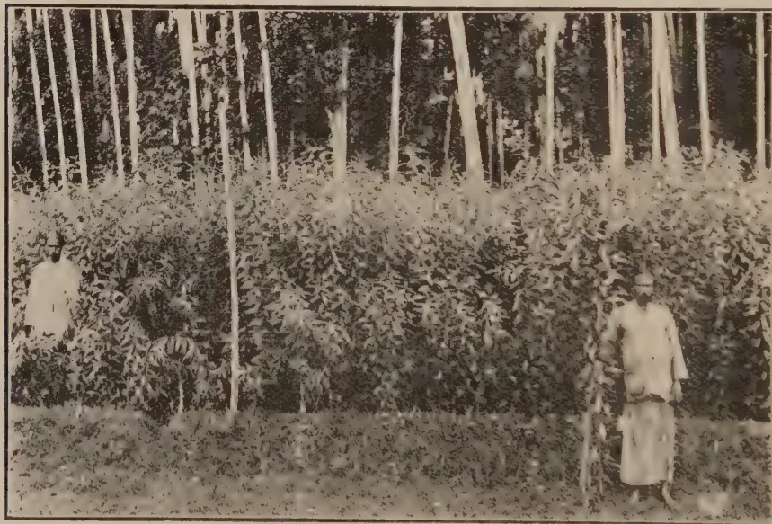
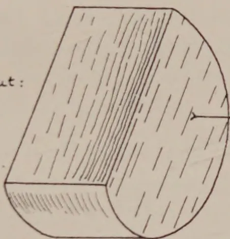
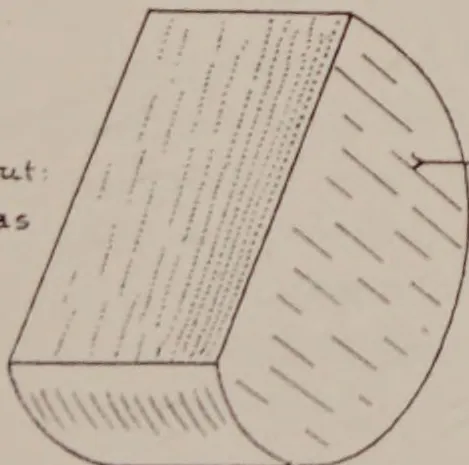

# The Tropical Agriculturist

January, 1927

---

## Editorial.

COMMENCING with the present number it has been decided to introduce certain changes in the form of the *Tropical Agriculturist*. As the year advances, it is expected that these features will become more and more developed, as it is the hope of the Department that it may keep in touch with the agriculturists of Ceylon through its monthly publications.

It is impossible for the Department satisfactorily to deal with the individual agriculturist except through the printed word, and the results of experiments and investigations which have been designed for securing better agriculture can only be communicated to the various estates and holdings by means of a journal. It will be the endeavour of the *Tropical Agriculturist* to place this data before its readers and it is the wish of the Department to make the journal as serviceable as possible.

Any suggestions for the improvement of the journal will be welcomed and contributions from agriculturists themselves are invited. The Department will endeavour to carry out its part by making available the knowledge that it has gained and will welcome assistance from experienced agriculturists.

No definite editorial staff is maintained by the Department and therefore it cannot be expected that the improved features

1------------------------------------------------

2

which it is desired to see incorporated in the Agricultural Journal for Ceylon can be effected except gradually.

Scientific officers of the Department will contribute original articles from time to time and extracts and abstracts from other journals will be continued. It is also hoped to include extracts from correspondence when the basis for the new form for the *Tropical Agriculturist* has become established. It is then proposed to improve the form of the periodicals issued in the vernaculars. Much remains to be done by means of regular publications to introduce to the vernacular-speaking agriculturists the results of experimental work. At the last Budget debate, an appeal was made for the knowledge available at the Headquarters of the Department to be brought down to the village. This is being attempted through the agricultural instructors and by means of small experimental stations. It must however be realized that the country is not small and that the villages are scattered. To bring adequately to the individual villager the advice of the Department, recourse must eventually be had to the printed word and if this can be put into such a form as to be appreciated success is assured.

The value of demonstration is recognised and must be the basis of progress in any country which is not completely literate, but demonstrations cannot be arranged in every village and therefore resource must be had to the written word if the field for agricultural knowledge is to be widened.

The desire of every Agricultural Department must be to make itself as serviceable as possible to all classes of agriculturists and the country has a right to demand to the full an account for the public money spent in developing the agricultural industries. The Department of Agriculture of Ceylon feels that it is attempting to fulfil its part. Agriculturists are invited to keep in touch with their Department through its publications and by so doing will not only be helping themselves but also the Department.

2------------------------------------------------

3

## Original Articles.

# The Cultivation of Papaya and the Preparation of Papain.

**F. A. STOCKDALE, C.B.E., M.A., F.L.S.,**

*Director of Agriculture, Ceylon.*

**T**HE demand for papain continues to increase and the present prices make the cultivation of papaya remunerative. The Department is continuously being asked for information, and in consequence the following data have been collected together.

The papaya is one of the most common of Ceylon's fruits and thrives from sea-level up to about 3,000 feet on the south-west side of the Island. Papain is a digestive enzyme which is valued in medicine, in the preparation of chewing gum and special foods and in various other commercial businesses. It is obtained by making shallow incisions in the fully grown but green fruit and collecting the milky juice which exudes and drying the same. The exports of papain from Ceylon have increased regularly in recent years and amounted to the following in 1924 and 1925.

<table>
<thead>
<tr>
<th></th>
<th></th>
<th><i>Lbs.</i></th>
<th><i>Value.</i></th>
</tr>
</thead>
<tbody>
<tr>
<td>1924</td>
<td>...</td>
<td>51,235</td>
<td>Rs. 317,893</td>
</tr>
<tr>
<td>1925</td>
<td>...</td>
<td>60,995</td>
<td>„ 434,458</td>
</tr>
</tbody>
</table>

The greater part of this goes to the United States of America and is used in the manufacture of chewing gum.

### Soil Condition and Cultivation.

The papaya grows best in the soil of heavy forest recently felled and burnt. Its cultivation need not be limited to such land as it will also thrive in any soil which is deep and well drained. The best results are secured in loamy soils which are flat or gently undulating, but papaya cultivations on hilly land have been known to do well in Ceylon particularly if planted when the land is first opened. Papaya has been grown most successfully as a catch crop in young rubber plantations and has also been grown on lands which are under re-afforestation. It does not grow

3------------------------------------------------

4

satisfactorily in lands which have been continuously chenaed nor in those which are insufficiently drained. It also does not prosper in wind-swept areas and should therefore preferably be grown in well-sheltered situations.

Cultivations on flat or gently sloping lands should be kept free from weeds but on hilly lands cover plants such as *Vigna*, *Centrosema*, or *Indigofera endecaphylla* should be grown to prevent soil erosion.

Manuring is not necessary for cultivations on new lands but would pay when the cultivations are on old lands. Nitrogenous manures should be used and applications of such manures at rates varying between  $\frac{1}{4}$  to  $\frac{1}{2}$  lb. per plant according to age and planting distances can be recommended.

### Planting out.

Planting may be done by seed at stake, allowing 5-6 to each hole and eventually thinning to one good plant per hole, or seedlings may be raised in beds or pots and planted out when about 3-4 inches high. An experienced cultivator of papaya recommends the raising of plants in baskets. Tea supply-baskets are suitable. In each basket filled with soil 4 to 5 seed should be sown. The baskets of seedlings should be planted out when the young plants are 4 to 6 inches high. This grower writes as follows:—

“ I have completely abandoned seed at stake, sowing broadcast, etc., and find far and away the best plan is tea supply-baskets. You are not so dependent on the weather. I germinate my seed first and always put in double the number of baskets required. That is for 1 acre 10 ft. by 10 ft. requires 430 baskets. I prepare 800 baskets and only put those out containing 4 to 5 plants to a basket. This is very important, as it reduces your vacancies to not more than 1 or 2 per cent. on suitable soils. Very often you get 3 or 4 male trees in a basket, I have even had all 5, but this is very rare.”

Fresh seed takes from 10-50 days to germinate but old and dried seed may take from 4-6 weeks. About 4,000 fresh seeds go to a mound or 6,000 when the seeds are partly dried, and up to 10,000 if fully dried. One half pound of fresh seed or  $\frac{1}{4}$  lb. of the dried seed may be relied upon to give sufficient plants to plant up one acre, and the size of the nursery bed, if such a system is used, should not be less than 60 feet long by 3 feet wide for each acre to be planted. Nursery beds or baskets should be

4------------------------------------------------

5

slightly shaded to break the force of the sun's rays and to protect the seed from being washed away and the young plants from being beaten down and damaged in heavy rains. When the seedlings in the nursery beds are 3 inches high they are fit for transplanting. Planting either from beds or in baskets should only be attempted in wet and dull weather. If bright sunshine is experienced some shading of the young plants for their first week is advisable.

The planting distance should not be less than 10 feet by 10 feet. The plants require adequate room in which to develop and close planting may result in disease. In wet districts and in very good soil planting 12 feet by 12 feet is strongly to be recommended. And when papaya is used as a catch crop in young rubber, distances of less than 12 feet by 12 feet should not be employed. Planting may be done in either monsoon.

### Seed.

The ordinary oblong papaya, locally known as the Ceylon kind, in distinction to other forms which are labelled Madagascar, Egyptian or West Indian, is the best type for latex production. Yields of latex from the oval type are generally in excess of yields from the long types. The oblong type is generally thought to be preferable to the round type.

Seed should only be secured from well-grown fruit and from plants which have borne good crops. It is important that careful selection of seed should be adopted if good yields are to be anticipated. The number of seeds per fruit varies so considerably that it is not possible to estimate accurately the number of fruit required to provide sufficient seed to plant up one acre.

### Fruiting.

The papaya begins to come into bearing in good soil and under favourable conditions in 8 months but generally it takes 10-12 months on the average before fruiting commences and fruits are tappable when they are 3 months old.

Fully grown fruit alone should be tapped as the latex from immature fruit gives a lower proportion of papain of an inferior quality.

The flowers are usually unisexual and there are therefore "female" and "male" plants. Some plants do however produce bi-sexual flowers. And male plants as they flower should be cut or pulled out from a plantation. Male plants amount

5------------------------------------------------

6

to 50 per cent. on the average and it is on account of the necessary removal of these "male" plants that the leaving of two or three plants per hole is recommended.

### How to Extract the Latex

The latex is procured by making a scratch or shallow incision in the skin of the fruit while still green. Steel knives are sometimes used but they are not recommended; bone, glass or a sharp-edged piece of bamboo is more usually employed. The milky latex exudes and should be caught in containers which may be made out of the leaf sheaths of areca palms. Fruits may be tapped every 4-5 days or at longer intervals until they cease to yield, and a plantation is reported to be profitable until the end of its third year if the soil is good and the general conditions favourable. Tapping must be done in the early morning and in every case should be completed before 10 a.m.

The latex soon becomes coagulated and forms a white curd possessing a somewhat pungent smell. Drying must be effected as speedily as possible; otherwise decomposition sets in. When considerable quantities of latex are being collected this work should be undertaken early in the morning so that drying may begin before midday. This ensures that by evening the material is in a sufficiently dry condition to keep without deterioration until the following morning when the drying can be completed.

Drying can be hastened if the coagulated curd is pressed through a cullender so as to come out in the form of small worms. When small quantities are being prepared a potato squeezer has been used with great advantage.

### Drying of Latex.

Drying of latex must be effected without delay but should not be too rapid. In dry weather, drying in the open may be adopted. Drying in the sun is not to be recommended as the product becomes darkened. Some form of drying apparatus is necessary when large quantities of latex have to be dealt with and is generally to be advised in Ceylon on the south-west side of the Island where weather conditions are rather uncertain.

6------------------------------------------------

A black and white photograph showing a person in a tropical setting, using a tool to collect milky juice from a large, spiky fruit cluster on a plant. The person is wearing a headband and a light-colored shirt, and is holding a small dish to catch the dripping liquid. The plant has long, thin, radiating stems and large, lobed leaves. The ground is covered with fallen leaves and debris.

*Photo by H. F. Macmillan.*

Collecting the Milky Juice by Scarification.

7------------------------------------------------

10. 11. 12.  
10. 11. 12.

8------------------------------------------------

7

## Yields.

The following is a summary of experiments which were carried out at the Experiment Station, Peradeniya:—

<table border="1">
<thead>
<tr>
<th>Method of tapping</th>
<th>No. of trees</th>
<th>No. of tap-pings</th>
<th>No. of fruits tapped per month</th>
<th>Total weight of dry papain</th>
<th>Average yield per tree</th>
</tr>
<tr>
<td></td>
<td></td>
<td></td>
<td></td>
<td>grams.</td>
<td>oz.</td>
</tr>
</thead>
<tbody>
<tr>
<td>Long papaya trees tapped every 8th day ... ..</td>
<td>12</td>
<td>34</td>
<td>1,460</td>
<td>722.95</td>
<td>2.08 in 34 tappings</td>
</tr>
<tr>
<td>Round papaya trees tapped every 8th day ... ..</td>
<td>12</td>
<td>34</td>
<td>1,126</td>
<td>726.0</td>
<td>2.08 in 34 tappings</td>
</tr>
<tr>
<td>Long papaya trees tapped every 5th day ... ..</td>
<td>12</td>
<td>52</td>
<td>1,682</td>
<td>784.9</td>
<td>2.25 in 52 tappings</td>
</tr>
<tr>
<td>Long papaya trees tapped once a week ... ..</td>
<td>12</td>
<td>35</td>
<td>1,003</td>
<td>495.5</td>
<td>1.41 in 35 tappings</td>
</tr>
<tr>
<td>Papaya trees tapped every 10th day ... ..</td>
<td>204</td>
<td>17</td>
<td>7,781</td>
<td>5,689.15</td>
<td>3.88 in 17 tappings</td>
</tr>
</tbody>
</table>

It is generally estimated that a good yield is 175 lb. per acre but growers have informed the Department of Agriculture that average yields of 100 lb. per acre per annum for first year after coming into bearing would be satisfactory for flat lands and 80 lb. per acre per annum for hilly or rocky lands. In the second year the yield is roughly one half of that of the first year.

## Prices and Costs.

Costs of production are reported now to average about Rs. 3.00 per lb.—half of the cost being for cultivation expenses and half for tapping and drying.

The market is now demanding a much lighter coloured product, and discoloured and dark coloured papain only fetches at the present time poor prices. A good light coloured—almost white—papain can be obtained by drying in a hot air chamber, but such a procedure could only be adopted on large estates.

9------------------------------------------------

8

For the small producer a drying stove can be erected. This may be constructed by building in brick a chamber about 3 feet high, 3 feet wide and 6 feet long, in accordance with the following plan which was recommended in the West Indies by Sir Francis Watts:—

The coagulated latex should be placed in thin layers on frames made by stretching clean cloth on light wooden frames across the space marked A. Glass is not recommended.

Smoking will spoil the latex and therefore coconut shells or charcoal are recommended as the fuel for drying. A simple apparatus on the lines of a small copra drying shed, with the coagulated latex spread on clean cloth, has been seen and appeared to be answering well.

Drying should not be carried out at a temperature above 100°F. as overheating destroys the active principle and a carelessly prepared product becomes useless and valueless.

As the substance becomes dry it shrinks in bulk and the contents of several trays may now be emptied into one and the drying continued. Drying must continue until the substance is crisp, and may take, if heat is not used, 24 hours under favourable conditions or between 2-3 days if weather conditions are unfavourable. If heat is used drying can be effected in about six hours.

The dried powder should be white or pale cream, with a characteristic odour. It should be packed in tins which are properly soldered so as to make them completely air-tight.

10------------------------------------------------

9

# Methods for Determining the Proteolytic Activity of Papain.

**T**HE question of the correct methods of testing the purity and value of papain has been under the consideration of the Agricultural Chemist.

Adulteration usually takes the form in Ceylon of the addition of starches. These can readily be detected by microscopical examination or by applying the usual iodine test. In the same way, the addition of mineral matter to the papain can be detected by determining the yield of ash and comparing the result with the amount usually given by genuine samples of papain.

The proteolytic activity of papain is usually destroyed if drying is done at two high a temperature and therefore the following memorandum from the Imperial Institute dealing with this subject will be of general interest:—

## Memorandum from the Imperial Institute.

Various methods of determining the proteolytic activity of papain have been suggested, which differ chiefly in the choice of the protein to be used.

The method given in the British Pharmaceutical Codex is as follows:—

“ For the determination of the digestive power, blood fibrin in slightly alkaline solution is mostly used, and the digestion carried on at a temperature of about 45° to 50°. A good sample should dissolve 200 to 250 times its weight of blood fibrin in four to five hours.”

The following method employing beefsteak as the protein (in a neutral solution) is sometimes used by manufacturers in this country and in the United States:

Add 0.325 gram of the powdered sample of papain to 10 grams of fresh, lean, raw beef (freed from all fat and gristle),

11------------------------------------------------

10

which has been finely chopped, passed through a sausage machine, and placed in a 6 oz. bottle. Now add 100 cc. of distilled water, insert the stopper and shake the bottle thoroughly. Place it in a water-bath at 50-55° C for 5 hours, shaking gently for 1 minute at 15 minute intervals. Pour the contents of the bottle into a long graduated tube and after allowing the residue to settle, read off its volume. Owing to variations which may occur in the conditions in which this digestion is carried out (such as variation in the quality of the meat, or a fluctuation in the temperature of the bath), the same sample of papain may give different results at different times. A sample of papain known to possess a high digestive power is therefore taken as a standard and duplicate tests are carried out with this using the same meat and heating in the same bath as the samples under examination. The results are reported in terms of the standard; thus if the standard gave a residue of 6.3 cc. and the sample under test gave 7 cc., the latter sample would be reported as 90 per cent. activity or 90 per cent. papain. It is stated that the above method if applied in a neutral solution gives better results than in either acid or alkaline media, and that meat is the best material to use on account of its easy preparation and the small residue left after digestion.—*Journal of Industrial and Engineering Chemistry*, (1914, 6, 670).

Another method, employing egg albumen as the protein, is as follows:—

Introduce into a 4 oz. bottle 40 cc. of 0.1 per cent. solution of sodium hydroxide and add 10 gram of egg albumen.\* Insert the stopper and shake the bottle vigorously until the albumen is broken up. Then add 0.1 gram of papain, finely powdered, and mix by shaking gently. Digest in a water-bath at 52° C for 6 hours, removing the bottle every 10 minutes and shaking gently. At the end of the 6 hours the mixture is transferred to a 100 cc. graduated cylinder, and the volume made up to 70 cc. with water. After standing for an hour (or better still after standing overnight) the volume of the deposit is read off. A standard sample of papain is used for comparison as in the method described above.—*Journal of Industrial and Engineering Chemistry*, (1912, 4, 517).

---

\* To prepare the egg albumen, boil a fresh egg for 15 minutes, remove all except the white, and rub the latter through a No. 40 sieve.

12------------------------------------------------

11

A method largely used in the Philippines involves the use of casein as the protein. Readily available material containing casein, such as condensed milk (separated) is employed and the process is as follows:—

The papain is first digested at 40° C for thirty minutes with water, and the solution filtered, using 0.75 gram of papain per 150 cc. of water. Twenty-five cc. of a 40 per cent. solution of sweetened condensed separated milk and 23 cc. of water are mixed with 2 cc. of the filtered papain solution, equivalent to 10 milligrams of the dry sample, and the mixture is digested for 30 minutes at 40° C. At the end of this time, 20 cc. of ice-water are added, and the flask is immediately cooled in an ice-bath. The liquid is transferred to a beaker and the undigested protein precipitated by slowly adding 0.5 cc. of copper sulphate solution (60 grams per litre), followed by 0.5 cc. of glacial acetic acid, and stirring vigorously. The contents of the beaker are placed in a 100 cc. measuring cylinder, allowed to settle and filtered through an ashless filter paper, previously dried at 100° C and tared. The curd is broken up with a rod, washed with water at 60° C, then dried at 100° C, and weighed. The protein digested is calculated by comparison with a blank experiment, and the proteolytic activity is expressed in terms of protein digested per unit weight of the sample.—*Philippine Journal of Science* (1915, 10, 1).

### List of References.

1. (1) H. T. Graber.—“Some observations upon the assay of digestive ferments.”—*Journal of Industrial and Engineering Chemistry*, 1911, Vol. III., p. 919.
2. (2) J. R. Rippetoe.—“A note on the determination of the digestive value of papain.”—*Journal of Industrial and Engineering Chemistry*, 1912, Vol. IV., p. 517.
3. (3) H. M. Adams.—“Commercial papain and its assay.”—*Journal of Industrial and Engineering Chemistry*, 1914, Vol. VI., p. 669.
4. (4) P. F. Shelley.—“Standardisation of Dried Carica Papaya Juice.”—*Analyst*, 1914, Vol. XXXIX., p. 170.
5. (5) D. S. Pratt.—“Papain: its commercial preparation and digestive properties.”—*Philippine Journal of Science* (General Science), 1915, Vol. X., p. 1. (Abstract in *Analyst*, 1915, Vol. XL., p. 405).
6. (6) V. K. Chesnut.—“Report on Papain.”—*Journal of the Association of Official Agricultural Chemists*, 1917-20, Vol. III., p. 367.
7. (7) H. C. Brill and R. E. Brown.—“The digestive properties of Philippine papain.”—*Philippine Journal of Science*, 1922, Vol. XX., p. 185 (Abstract in *Analyst*, 1922, Vol. XLVII., p. 444).

13------------------------------------------------

12

# Mineral Requirements of Ceylon Cattle.

**M. CRAWFORD, M.R.C.V.S.,**

*Deputy Government Veterinary Surgeon, Ceylon.*

**O**F recent years, attention has been directed towards the importance of an adequate supply of mineral elements in the food supply of domestic animals, and it has been conclusively shown that deficiency of certain mineral elements in the diet may produce serious disturbances.

The mineral elements, which appear to be of greatest importance, are Calcium, Phosphorus, Chlorine, and to a lesser extent, Iron and Iodine.

The symptoms produced by deficiency of these elements are as follows.—

**Deficiency of Calcium.**—Stunted growth, especially of the skeleton; the bones are small and light, and the hind-quarters particularly are poorly developed; delayed maturity; reduced milk yield; small calves at birth; decreased fertility shown by difficulty in getting cows in calf. In bad cases it is impossible to get the cow in calf until lactation has ceased for some months, giving the cow a chance to build up her depleted stores of Calcium. A very constant symptom is an abnormal or depraved appetite. The cattle show a great desire to eat sand, gravel, earth from ant hills, lime wash off walls, etc. Cattle breeders in Ceylon will at once recognise, in the above train of symptoms, a condition of affairs very common among their cattle. In horses there can be little doubt that a deficiency of Calcium is a very important factor in the production of Osteoporosis.

**Deficiency of Phosphorus.**—The symptoms are very similar to those of Calcium deficiency, but, in addition, in some cases, cattle show a particular form of depraved appetite, in which they will eat any bones which they may come across. The only part of Ceylon, in which this symptom appears to be at all common,

14------------------------------------------------

13

is the Northern Province, especially in the Islands, such as Delft, Iranaitivu, etc., and during times of drought. It has also been reported as occurring occasionally in parts of the Western Province.

**Deficiency of Chlorine.**—No particular distinctive train of symptoms has been associated with deficiency of this element. The cattle do not thrive well, and show a craving for salt. The need for addition of salt to the ration of cattle and horses, and the beneficial results following its use have been recognised by breeders in all parts of the world, and it is a very common practice to add salt to the food, or to provide rock salt for the animals to lick.

**Deficiency of Iodine.**—Is shown by the prevalence of Goitre among animals in districts, where Iodine is deficient in the soil and drinking water. This condition is not common in Ceylon.

**Deficiency of Iron.**—In certain districts in New Zealand the pasture is to all appearances luxuriant and abundant, but cattle and sheep cannot survive on such pastures for more than a short time (6 months to 1 year). Addition of iron salts enables the animals to live and thrive normally. There is no evidence of such a condition in Ceylon, but a curious fact is that Colombo milk contains considerably less iron than European milk.

Analyses of English milks show on an average that the ash contains 0.53 per cent. Ferric Oxide, while average analyses of Colombo milks show only a trace. In view of these figures it will be of interest to ascertain whether the addition of small amounts of iron salts to the ration of dairy cattle is followed by beneficial results. This deficiency in iron may be the reason why doctors often complain that babies do not thrive as they should on cow's milk in Ceylon. This deficiency is noted also in buffalo milk in Colombo.

Mineral deficiency in the food is dependent on a deficiency of mineral constituents in the soil, and therefore, the most injurious results will be seen in animals, which subsist entirely on natural grazing without any artificial feeding.

The small size, slow growth rate and poor milk yield of native Ceylon cattle is well known to all. Yet the cattle are comparatively healthy. The probable reason is that through the course of centuries the indigenous breeds have adapted themselves to the available supply of minerals in the grazing.

15------------------------------------------------

14

The utter impossibility of rearing cattle of the larger, quicker growing and deeper milking breeds, such as European cattle, entirely on natural grazing in Ceylon, is known to all cattle breeders. The cattle on account of their larger size, quicker rate of growth, and greater milk producing powers, find the available supply of minerals insufficient for their needs, and so rapidly deteriorate. This deterioration is not entirely due to insufficient quantity of food, for it is observed in districts, where the rainfall is good and pasture fairly plentiful practically the whole year round. Nor can it be attributed entirely to climatic conditions, for such cattle can be kept satisfactorily even in low country districts such as Colombo when they are properly fed.

The following table taken from Bruce's report on the Composition of Forest Soils of Ceylon (Department of Agriculture Bulletin No. 61) shows the Provinces arranged in order according to the richness of their soils in Calcium and Phosphorus.

<table border="1">
<thead>
<tr>
<th>Province</th>
<th>Average per cent.<br/>Calcium Oxide</th>
<th>Average per cent.<br/>Phosphoric Acid</th>
</tr>
</thead>
<tbody>
<tr>
<td>1 Eastern</td>
<td>0.425</td>
<td>0.173</td>
</tr>
<tr>
<td>2 North-Western</td>
<td>0.410</td>
<td>0.115</td>
</tr>
<tr>
<td>3 Central</td>
<td>0.355</td>
<td>0.098</td>
</tr>
<tr>
<td>4 North-Central</td>
<td>0.290</td>
<td>0.096</td>
</tr>
<tr>
<td>5 Uva</td>
<td>0.225</td>
<td>0.102</td>
</tr>
<tr>
<td>6 Sabaragmuwa</td>
<td>0.211</td>
<td>0.132</td>
</tr>
<tr>
<td>7 Southern</td>
<td>0.161</td>
<td>0.099</td>
</tr>
</tbody>
</table>

Figures for Northern and Western Provinces are not given in this report.

It will be seen that the Eastern Province comes first. The Eastern Province cattle are not well developed, but here the cause is undoubtedly the severe droughts to which this district is subject, and also to overstocking. I was particularly struck in this Province by the rapidity with which the cattle improved in condition with the onset of the rains and the growth of the grasses.

The North-Western Province is second best. This is one of the best cattle-breeding provinces in the island.

The Central and North-Central are third and fourth. These are also recognised cattle-breeding districts,

16------------------------------------------------

15

The Southern Province is worst, and its cattle are amongst the worst in the island. An interesting point arises here, however. While the average for the Province is low, yet in the Hambantota district (which includes the Game Sanctuary) Calcium was as high as 0.660 per cent. and Phosphoric Acid 0.179 per cent., among the highest in the series of analyses.

The number of analyses, from which the above average figures for the provinces were calculated, is small, and refers only to forest soils. They cannot, therefore, be taken as affording an accurate estimate of the soil condition for the whole province. At the same time, the forests are largely availed of for cattle grazing, and the figures have a certain value as an indication of the probable condition of the soils for the various provinces. In any case, the analogy between the richness of the soils in Calcium and Phosphorus and the condition of the cattle is sufficiently close to indicate the necessity for further work on these lines.

Any one, who has seen the wild buffalos and deer in the Game Sanctuary, will agree that they are well developed, and show no signs of stunted growth. This, in spite of severe droughts, and, of recent years, a certain degree of overcrowding. Even in times of drought, it is remarkable how buffalos and deer in the Sanctuary maintain their condition on the shrunken up and scanty pasture.

Analyses of a small number of Ceylon cultivated grasses, such as Mauritius, Guinea, *Paspalum* and Napier Grasses, made by the Government Agricultural Chemist,\* show that they are poor in Calcium and Phosphorus, as compared with British pasture grasses. They are particularly deficient in Phosphoric Acid. If this is the case with cultivated grasses, in all probability, uncultivated grasses will be more deficient.

The mineral content of grass grown on a particular soil shows considerable variation with the season of the year, and age of the grass. Sir Arnold Theiler in South Africa showed that grass from a farm, the soil of which was known to be deficient in Phosphorus varied as regards its Phosphoric Acid content from 0.60 per cent. during wet weather, when the grass was growing well to 0.07 per cent. during the dry season. Calcium on the other hand showed a higher percentage during

\* A short paper on the subject of the mineral contents of Ceylon Cultivated Grasses is being prepared for the Year Book of the Department of Agriculture, 1927. *Ed. T.A.*

17------------------------------------------------

16

the dry season (0.59 per cent. as compared with 0.31 per cent.). Mature grass, that is, at the seeding stage, contains a higher percentage of Calcium than young growing grass. This probably is one of the chief reasons, why good hay is such a valuable food-stuff for cattle and horses. In Ceylon, hay is never made, the grass being cut and fed while green and actively growing.

From a consideration of the above facts, there is little doubt that mineral deficiency, especially, of Calcium and Phosphorus, is an important factor as a cause of the poor standard of the Ceylon bred cattle.

With regard to dairy cattle, which, in addition to grass, get artificial foods, the position is rather different. Dairy cattle are usually of European or Indian breeds or crosses between these breeds. They are much larger than the native breed, and better milkers. Their mineral requirements are therefore greater. For maintenance of her body an average cow requires 1.05 oz. Calcium Oxide and 0.89 oz. Phosphoric Acid per day. In addition, for each gallon of milk she produces she requires 0.720 oz. Calcium Oxide and 0.960 oz. Phosphoric Acid. A cow giving two gallons (12 bottles) of milk per day, will, therefore, require a total of 2.94 oz. Calcium Oxide and 2.72 oz. Phosphoric Acid per day.

The following is a ration used in a large dairy in Colombo, which is richer than the usual ration fed to dairy cows in Ceylon. If we estimate the amounts of Calcium Oxide and Phosphoric Acid in it, we get the following results:—

<table border="1">
<thead>
<tr>
<th></th>
<th></th>
<th>Calcium Oxide.</th>
<th>Phosphoric Acid.</th>
</tr>
</thead>
<tbody>
<tr>
<td>Gingelly Poonac</td>
<td>... 1 lb. =</td>
<td>.021 lb.</td>
<td>.013 lb.</td>
</tr>
<tr>
<td>Coconut Poonac</td>
<td>... 2 lb. =</td>
<td>.020 lb.</td>
<td>.030 lb.</td>
</tr>
<tr>
<td>Linseed Poonac</td>
<td>... 1 lb. =</td>
<td>.006 lb.</td>
<td>.014 lb.</td>
</tr>
<tr>
<td>Pollard</td>
<td>... 3 lb. =</td>
<td>.006 lb.</td>
<td>.048 lb.</td>
</tr>
<tr>
<td>Dhall Husks</td>
<td>... 2 lb. =</td>
<td>.020 lb.</td>
<td>.004 lb.</td>
</tr>
<tr>
<td>Ulundu</td>
<td>... <math>\frac{1}{2}</math> lb. =</td>
<td>.001 lb.</td>
<td>.008 lb.</td>
</tr>
<tr>
<td>Tatta Pairu</td>
<td>... <math>\frac{1}{2}</math> lb. =</td>
<td>.001 lb.</td>
<td>.006 lb.</td>
</tr>
<tr>
<td>Mauritius Grass</td>
<td>... 50 lb. =</td>
<td>.047 lb.</td>
<td>.056 lb.</td>
</tr>
<tr>
<td></td>
<td></td>
<td><hr style="width: 100%; margin-left: auto; margin-right: 0;"/>.104 lb.</td>
<td><hr style="width: 100%; margin-left: auto; margin-right: 0;"/>.179 lb.</td>
</tr>
<tr>
<td></td>
<td></td>
<td>Total = 1.66 oz.</td>
<td>= 2.72 oz.</td>
</tr>
</tbody>
</table>

That is, cows giving two gallons of milk per day, and therefore requiring 2.94 oz. of Calcium Oxide per day, are receiving in their food a total of 1.66 oz. all of which is not in a form,

18------------------------------------------------

17

which can be made use of by the animal body. They are, therefore, depleting their bodies of more than 1 oz. of Calcium Oxide per day.

The total supply of Phosphoric Acid in the above ration, if completely available, just covers their requirements. The grass in the above ration is grown on land heavily manured with cattle dung. Grass grown on unmanured land is probably poorer in Calcium, and certainly poorer in Phosphoric Acid.

As cattle on the above ration, which contains ample supplies of carbohydrates, fats and proteins, are depleting their bodies of Calcium, it will be obvious that cattle on a poorer diet, as most Ceylon dairy cattle are, are doing so to a much greater extent.

The figures in the above table are from analyses made by Mr. Joachim, Agricultural Chemist to the Department of Agriculture, to whom my best thanks are due.

Various classes of food-stuffs agree very closely as regards their content of Calcium Oxide and Phosphoric Acid, and may be classified as follows:—

Calcium deficient in:—straw, chaff, roots, cereals and their by-products such as bran and pollard, and also in poonacs (with the exception of Gingelly). It is more abundant in clover, lucerne, peas, good hay and Gingelly poonac. Phosphorus is deficient in poor grass, but is present in abundance in cereals, bran, pollard and poonac.

It will be seen that of the food-stuffs commonly used in Ceylon only Gingelly poonac and Dhall husks can be classified as good suppliers of Calcium, but most of them contain a sufficiency of Phosphoric Acid.

If good hay or lucerne were available in Ceylon, it would do much to supply the deficient Calcium, but in its absence, it is obvious that many of our cows must be on a Calcium deficient diet.

The Calcium and Phosphoric Acid content of milk does not show any great variation with the quality of the food-stuffs. In spite of receiving a diet poor in Calcium and Phosphorus, the cow's milk contains the normal quantity of these substances. This means that the cow is forced to draw upon the stores of these materials in her body, especially her bones. When the cow goes dry, provided she continues to be well fed, she will build up again her depleted stores in preparation for the next

19------------------------------------------------

18

lactation period. This shows the necessity of feeding a dry cow well. Yet the common practice among Colombo dairy men is to send the dry cow to some coconut estate, there to subsist as best she may on the scanty pasture (in some cases eked out by a pound of coconut poonac per day). Is it to be wondered at that such cows come back to the dairy in bad condition, give birth to a weakly calf, milk badly, and that only for a short period? In addition, if properly managed, a dairy cow should be well advanced in pregnancy by the time she goes dry. At this time the developing calf in the uterus is making heavy demands on the mother for mineral matters for the formation of its bones. So that although the cow has ceased milking, she still requires abundant supplies of Calcium and Phosphorus. First to nourish the developing calf in her uterus, second to build up her body and constitution in preparation for the next milking period, and third to lay up a store in order that her milk may maintain its proper percentage of Calcium and Phosphorus during the coming lactation, when she will be fed a diet, which does not supply her requirements of lime and phosphate.

### Methods of Supplying the Deficient Materials.

**(1) Use of Food-Stuffs rich in Mineral Matters:—**The food-stuffs in common use contain a fair supply of Phosphorus, but are deficient in Calcium. Good hay, lucerne and bean meal would be of value here, but at present cannot be obtained in Ceylon; so other methods must be sought. Gingelly poonac and Dhall husk should be more largely used than they are at present.

**(2) Addition of Bone Meal to the Ration:—**This will supply both Calcium and Phosphorus, and in a form, which is probably largely assimilable by the animal body. The addition of a few ounces of bone meal, varying in quantity with the yield of milk, to the ration of dairy cows, and also to the ration of calves and young stock has given very good results in South Africa, England and America. The effect of adding bone meal to the ration of a dairy cow may not be immediately shown by an increase in the milk yield, but in the next lactation its good results will be shown by the birth of a stronger calf, and an increase in the milk yield.

In using bone meal *it is absolutely necessary that it be guaranteed sterile and free from anthrax.* The ordinary quality bone meal used for manuring purposes should not be used on

20------------------------------------------------

19

account of the risk of anthrax infection. Special brands of bone meal for feeding purposes, thoroughly sterilised and guaranteed free from anthrax, are now on the market, and only such brands should be used.

**(3) Addition of Lime to Food and Drinking Water:—**This is a useful and inexpensive method. It has had beneficial results in cattle under my charge, particularly in lessening the eating of sand and gravel by young stock. Calcium in the form of lime, however, is not in a form which is readily available by the animal body, and bone meal should give better results.

**(4) Treatment of Grass Lands** with such manures as Lime, Basic Slag, Superphosphates, Bone Meal, etc. This combined with drainage and proper cultivation, will result in great improvement in the grass, and is probably the best possible way of correcting mineral deficiency. Its drawback, however, is the heavy expense. It should be pointed out here that money spent on better food-stuffs, on bone meal and on lime for addition to the drinking water, will, to a certain extent, be recovered in the greater value of the cattle manure, particularly if such is used for manuring crops, and if used for manuring grass, benefit will be derived from the improved quality of the grass.

**(5) The Addition of What is known as a Mineral Mixture to the Food:—**The practice of adding a mixture of such salts as Calcium Carbonate, Calcium Phosphate, Sodium Chloride, Magnesium Sulphate, Sodium Sulphate, Ferrous Sulphate, Potassium Iodide, etc., has become fashionable in America. Many of the constituents of such mixtures are unnecessary and may even be harmful. If it is desired to use such a mixture, it should be compounded with the help of expert advice, and with the object of supplying such elements as may be deficient. The compounding of a suitable mixture entails an examination of the food-stuffs used, the appearance, milk yield and susceptibility to disease of cattle, analysis of the pasture, the purpose for which the cattle are kept, etc., etc.

**(6) Greatly Increasing the Quantity of Food-stuff** even if they are poor in mineral matters, will, of course, make good a deficiency. But with many of the food-stuffs in use in Ceylon they would require to be fed in such large quantities that the cattle would be unable to deal with them, before an adequate amount of Calcium, for instance, was being fed. Moreover, this would entail feeding larger quantities of protein, carbohydrates and fats than the animals require, and would be expensive and uneconomical.

21------------------------------------------------

20

# Sunnhemp as Green Manure for Paddy.

**W. MOLEGODE,**  
*Agricultural Instructor.*

**T**HE accompanying photograph shows one of the five plots of sunnhemp (*Crotalaria juncea*) grown on paddy-fields, in the Katugastota area during the last yala season, on which yala crops of paddy are not usually grown owing to lack of irrigation facilities.


 A black and white photograph showing a field of sunnhemp plants growing between rows of tall, thin trees. Two people are standing in the field, one on the left and one on the right, providing a sense of scale for the large plants.

The growth of the sunnhemp was extraordinarily good—the plants grew to a height of over six feet and yielded a considerable amount of green material.

Applications of green manures to paddy-fields are being practised to varying extents in the Kandy district depending on the amount of materials as are able to be collected in the adjoining gardens. Efforts are now being made to encourage the growing of green manure crops on the field itself, during the interval between paddy growing seasons. During the next yala season it is hoped that a large number of cultivators will grow sunnhemp on their paddy-fields. Already applications for seed from twenty-two cultivators have been received.

22------------------------------------------------

21

## Selected Articles.

# The Grape Fruit.

(Department of Agriculture, Ceylon, Leaflet No. 41.)

**T**HE grape fruit which is a favourite fruit in the United States of America is also fast becoming a popular fruit in other countries of the world. The imports into the United Kingdom were six times as large in 1924 as in 1920, and the demand is continuing to increase. South Africa has taken up the cultivation of grape fruit extensively and is now making, together with the British West Indies, regular exports to the United Kingdom. The growing of grape fruit is also extending in Australia but the exports up to date are comparatively small.

The grape fruit is a fruit which can be admirably grown in Ceylon and the demand from both residents in the Island and from the shipping is bound to be considerable—whilst an export trade has prospects before it.

The first grape fruit plants were imported by the Agricultural Society in 1913 and these were distributed to Colombo, Kegalle and Kandy. In 1919, there were probably not more than 6 plants growing in the Island.

It was then decided by the Department of Agriculture that further trials should be carried out. A number of plants were put out on the Experiment Station, Peradeniya, and at Anuradhapura. These trees have now fruited and produced heavy crops. These trials have clearly indicated the possibilities before the cultivation of this fruit, and crops of good quality can be obtained if selection is rigidly adhered to. Up to the present, the Department of Agriculture has had to depend upon seedling stock and has sold a considerable number of such plants grown from seed specially imported from Jamaica and Florida. Steps are now being taken to secure budded plants from the best trees on the Experiment Station, Peradeniya. Orders can also be booked for budded plants from South Africa and Australia.

The grape fruit is a native of the Malayan and Polynesian Islands. It is a variety of pumelo which has arisen naturally and which in recent years has been improved by cultivators and horticulturists. By the majority of botanists the grape fruit is looked upon as the representative of the small types of pumelos, but there are others that maintain that it should be classed as distinct from the pumelo. The pumelo is well-known throughout the East and some varieties are well appreciated. The grape fruit would become popular if good varieties were available.

Residents in Ceylon who have tasted grape fruit grown in Ceylon were disappointed until the correct method of preparation was explained. It was found that the fruits were too bitter. The ideal grape fruit has a pronounced taste, but if the papery membranes separating the various pulp sacks are removed, the flavour is pleasant and distinctive.

23------------------------------------------------

22

The Jamaican and Florida grape fruit are the most esteemed although particular varieties are being developed from the Californian conditions. In Jamaica the best fruits are produced in the hills at elevations of from 2000-4000 feet but in South Africa the best fruit come from a coastal strip. It may be safely assumed that where oranges can be grown in Ceylon grape fruit can also be grown and in some soils it will thrive whereas oranges grow with difficulty and become affected by various diseases.

### Soil.

A deep well-drained sandy loam is the most suitable soil. It is most essential that the drainage should be good. Wet, undrained soils are most unsuitable, nor can success be anticipated on hard cabooky soil.

### Distances of Planting and Cultivation.

Planting should be done in holes 14, 15 or 16 feet apart. The planting holes should be not less than 2 feet square and 2 feet six inches deep and should be filled with good top soil mixed with a small quantity of well-rotted manure or leaf mould. After planting the soil around the young plant should be well rammed down and the ground around the plants should subsequently be stirred at intervals and never allowed to harden.

Mulching around the plants, particularly in dry weather, is essential.

### Manuring.

Potash and phosphates produce the best results and the following general mixture can be recommended under average conditions:—

- 1 part dried blood
- 1 part superphosphate
- 1 part steamed bone meal
- 1 part sulphate of potash

This mixture should be applied in a circle around the tree, not nearer than 2 feet from the stem at the following rates:—

- One year—  $\frac{1}{2}$  lb. each
- Two years— 1 lb. each
- Three years—  $1\frac{1}{2}$  lb. each
- Four years— 2 lb. each
- Five years— 3 lb. each
- Six years and over— 4 lbs. each.

### Maturity and Pruning.

Seedling grape fruit at Peradeniya take 6-7 years to fruit but it may be confidently expected that budded trees will fruit at an earlier period and in localities in the low country fruit might be expected in about 4 years from planting.

Young trees should be topped at about 3 feet so as to induce a spreading and evenly balanced form. Pruning should be light and directed mainly towards thinning out superfluous, distorted or dying branches.

### How to Prepare Grape Fruit.

Many residents in Ceylon who have eaten Ceylon grown fruit have often expressed their disappointment. The grape fruit—especially when fresh—is unpleasantly bitter unless the papery membranes which separate the

24------------------------------------------------


Photo by

L. S. Bertus

Grape Fruit at Peradeniya Experiment Station.

25------------------------------------------------

This image is a scan of a blank page. The background is a uniform light beige or off-white color. There are a few very small, faint dark specks scattered across the surface, which appear to be scanning artifacts or dust particles. No text, lines, or other graphical elements are present.

26------------------------------------------------

23

various pulp sacks are carefully removed. If this is done, there are some fruit in Ceylon which compare most favourably with the average grape fruit of other countries.

To prepare for the table, the following procedure should be followed:—

1. 1. Wipe the fruit and cut it crosswise into halves.
2. 2. As the pith is bitter, it is important that the fruit pulp should be carefully removed from the outer skin and from the papery membranes which divide the fruit into sections. To do this use a sharp pointed knife.
3. 3. Remove the seeds first.
4. 4. Then separate the fruit pulp from the tough membranes by cutting round each segment. This will separate the fruit pulp from the tough membranes which will be left attached to the outside skin and the core.
5. 5. Now cut round the inside of the outside skin and cut the centre core from the bottom of the half of the fruit.
6. 6. It should now be possible to lift out the centre core, with all the tough membranes which divide the fruit into sections and to leave only the fruit pulp in the skin.
7. 7. To serve. Sprinkle the fruit liberally with sugar and leave for not less than one half hour before consumption.

F. A. STOCKDALE,  
Director of Agriculture.

Department of Agriculture,  
Peradeniya, October 26th, 1926.

27------------------------------------------------

24

# Recent Trials with Pineapples.

(Department of Agriculture, Ceylon, Leaflet No. 42.)

IN Bulletin No. 50 the Director of Agriculture reviewed the possibilities before the cultivation of pineapples for canning, and detailed those cultivation methods which usually give the most satisfactory results. Trials were inaugurated at various Experiment Stations, and the results secured up to date are now published.

## 1.—At Peradeniya.

The Manager of the Experiment Station, Peradeniya, reports as follows:—

Recent experience at Peradeniya has shown that, where the entire crop can be sold locally, the cultivation of Kew pineapples can be a very profitable undertaking.

Early in 1924 a  $\frac{1}{4}$ -acre plot was selected for pineapples. The plot had been previously under sugar-cane since August, 1920. The sugar-cane roots were dug out in February, 1924. The plot was then ploughed, and in April, ten cart-loads of ash and decayed residue from the rubbish heap were applied and mixed with the soil by means of a disc-harrow.

In May three double rows were planted with Kew pine suckers from the Experiment Station. The plants were spaced  $1\frac{1}{2}$  ft. by  $1\frac{1}{2}$  ft. with 3 ft. between the double rows. The middle row of these was planted through a 3 ft. wide strip of Pabco mulch paper, a material used in some large pineapple producing countries for the purpose of keeping down weeds, conserving moisture, and improving the crop. The remainder of the plot was planted in July with Kew pine suckers purchased from the Kegalla District.

No shade was provided.

Weeding was regularly attended to.

The first fruits were gathered in July, 1925, a year after the completion of planting.

The yields mentioned below were obtained in a period of one year from July 1st, 1925, to June 30th, 1926.

The cultivation costs include the period April, 1924, to June 30th, 1926.

28------------------------------------------------

25*Cost of Cultivation.*

<table border="1">
<thead>
<tr>
<th></th>
<th></th>
<th colspan="2">Per <math>\frac{1}{4}</math>-acre Plot.</th>
<th colspan="2">Per Acre.</th>
</tr>
<tr>
<th></th>
<th></th>
<th>Rs.</th>
<th>c.</th>
<th>Rs.</th>
<th>c.</th>
</tr>
</thead>
<tbody>
<tr>
<td>Ploughing ..</td>
<td>..</td>
<td>9</td>
<td>00</td>
<td>36</td>
<td>00</td>
</tr>
<tr>
<td>Carting of manure ..</td>
<td>..</td>
<td>7</td>
<td>32</td>
<td>29</td>
<td>28</td>
</tr>
<tr>
<td>Purchase of suckers ..</td>
<td>..</td>
<td>115</td>
<td>80</td>
<td>463</td>
<td>20</td>
</tr>
<tr>
<td>Planting ..</td>
<td>..</td>
<td>8</td>
<td>55</td>
<td>34</td>
<td>20</td>
</tr>
<tr>
<td>Weeding ..</td>
<td>..</td>
<td>28</td>
<td>61</td>
<td>114</td>
<td>44</td>
</tr>
<tr>
<td>Harvesting and transport ..</td>
<td>..</td>
<td>6</td>
<td>30</td>
<td>25</td>
<td>20</td>
</tr>
<tr>
<td>Cost Total ..</td>
<td>..</td>
<td>175</td>
<td>58</td>
<td>702</td>
<td>32</td>
</tr>
</tbody>
</table>

*Income.*

<table border="1">
<tbody>
<tr>
<td>Sale of 841 pineapples at an average price of 38 cents ..</td>
<td>..</td>
<td>321</td>
<td>47</td>
<td>1,285</td>
<td>88</td>
</tr>
<tr>
<td>Sale of 475 suckers ..</td>
<td>..</td>
<td>32</td>
<td>50</td>
<td>130</td>
<td>00</td>
</tr>
<tr>
<td><i>Total Income</i> ..</td>
<td>..</td>
<td>353</td>
<td>97</td>
<td>1,415</td>
<td>88</td>
</tr>
<tr>
<td>Less expenditure ..</td>
<td>..</td>
<td>175</td>
<td>58</td>
<td>702</td>
<td>32</td>
</tr>
<tr>
<td>Balance profit ..</td>
<td>..</td>
<td>178</td>
<td>39</td>
<td>713</td>
<td>56</td>
</tr>
</tbody>
</table>

The above yield is equivalent to 20,840 lb. or over 9 tons per acre in the first year of fruiting.

The entire crop was sold to the staff and labour force of the Experiment Station, and to other officers of the Department of Agriculture. There were, therefore, practically no transport or marketing charges. The demand was almost always in excess of the supply.

The average weight of the fruits harvested was as follows:—

<table border="1">
<tbody>
<tr>
<td>One close planted row with Pabco mulch paper ..</td>
<td>5</td>
<td>6</td>
<td>lb.</td>
</tr>
<tr>
<td>Two close planted rows without Pabco mulch paper ..</td>
<td>4</td>
<td>1</td>
<td>"</td>
</tr>
<tr>
<td>The remainder of the plot planted 3 ft. by 3 ft. ..</td>
<td>0</td>
<td>7</td>
<td>"</td>
</tr>
</tbody>
</table>

The weight of fruits harvested from the Pabco rows was 45 lb. in excess of the average from the non-pabco rows planted at the same distance. The value of this increase would not be sufficient to cover the cost of the Pabco mulch paper.

It will be noted that much heavier fruits were obtained from the plants spaced 3 ft. by 3 ft. The smaller number of fruits obtained per acre, however, must be set against the greater weight of individual fruits. Moreover, when planted thus singly the fruits fall over and one side gets scorched by the sun. Three feet does not allow sufficient space for weeding. A suitable method of planting would be in double rows 1 ft. 10 in. by 1 ft. 10 in. with 4 ft. between the double rows. This would give the plants a little more space than in the methods described above, would furnish support to the fruits, and would give sufficient room for weeding between the double rows.

Contrary to expectation very little trouble was experienced from crows.

After a year's fruiting the primary crop was practically over; the old leaves were cut off and the plants cleaned up to allow new suckers to develop strongly.

29------------------------------------------------

26

## 2.—At Anuradhapura.

The Manager of the Experiment Station, Anuradhapura, has supplied the following information:—

Two old plots of  $\frac{1}{2}$ -acre each, one of Kew and one of Mauritius pines, were uprooted and replanted in November, 1921, after manuring. Planting was done in triple rows, the plants being  $1\frac{1}{2}$  ft. apart each way with 4 ft. between the triple rows.

In 1924 farmyard manure was applied to the plots at the rate of 50 cartloads per acre, and worked in with mamoty forks.

Part of the area was shaded with *Glicidia maculata* and *Leucaena glauca*.

It was found that the fruits grown under light shade were larger than those grown without shade, but the latter were sweeter and more juicy.

As at Peradeniya the greater part of the crop was obtained in June, July, and August. Since planting in that district is necessarily done in the north-east monsoon, 18 months generally elapses before the first fruits are harvested. The first pines were harvested in May, 1923, but the crop obtained in that year was a small one, the full crop not being obtained till June, July, and August, 1924. In the first year of fruiting only 1,020 Kew pines per acre were harvested, compared with 3,368 pines per acre in a similar period at Peradeniya.

In the second year of fruiting (May, 1924, to April, 1925) 2,835 Kew pines per acre were harvested—nearly three times the first year's crop. In the third year of fruiting, 2,005 Kew pines per acre were harvested, and the plot was dug up for replanting in January, 1925. The yields of Mauritius pines were, in every case, much lower than those of the Kew pines, and the average price realized for these fruits was only 10 cents each, compared with 25 cents for the Kew pines. The latter is certainly the most profitable variety, of those so far tried, to grow in Ceylon.

During the financial years 1923-24 and 1924-25 the net profits realized from the cultivation of Kew pineapples on the Anuradhapura Experiment Station were Rs. 609 25 per acre and Rs. 495 per acre, respectively.

All fruits were sold locally, and the demand was always greater than the supply.

## 3.—At Jaffna.

The Farm Manager, Jaffna, has furnished the following information of trials carried out on the Jaffna Experiment Station:—

Holes  $1\frac{1}{2}$  ft. deep were dug 4 ft. apart, and filled with tobacco stumps and rotted village refuse and earth. Suckers of both Kew and Mauritius pines were planted with the first rains in September, 1924. *Glicidia maculata* and Murakan (*Erythrina indica*) cuttings were planted 6 ft. apart to provide shade. Four rows were left unshaded. During the dry windy weather some of the plants were choked with sand. To prevent this, the tobacco refuse was placed round the base of the plants. The shade trees were lopped in November, 1925, and the leaves fed to cattle.

The first fruits were harvested in April, 1926, 19 months after planting.

At the end of July, 1926, 56 Kew pines and 66 Mauritius pines had been gathered from the shaded portion, but none from the unshaded portion. Shade would, therefore, appear essential for pineapples in Jaffna.

30------------------------------------------------

27

The average weight of the Kew pines harvested was 3 lb., and of the Mauritius 2 lb. Here again the Kew pine proved superior, though the fruits were small, compared to those grown in the wetter parts of the Island.

#### 4.—At Batapola, Galle District.

The Divisional Agricultural Officer, Southern Division, reports as follows:—

At the newly opened Batapola Experiment Station, in September, 1922, a 1-acre block of low jungle was felled and cleared.

In November after the land had been dug over, the plot was planted with Kew pineapple suckers obtained from Henaratgoda Botanic Gardens. The suckers were planted in double rows with a path 3 ft. in width between each double row—the spacing between rows and between suckers in the rows being 2 ft.

No manure was applied, neither was any shade provided, but weeding was attended to as required.

The plants, which developed rapidly after a few months, soon covered the ground so as to check weed growth appreciably. One of the objects of the trial was to ascertain how long a pineapple crop would remain in more or less profitable bearing. In April, 1924, i.e., 17 months after planting, the earliest fruits began to mature, and fruiting continued uninterruptedly over a period of 28 months.

There appear, however, to be two well defined fruiting seasons in the year—April to June inclusive, and December to February inclusive.

In September, 1926, by which time it had degenerated to a considerable extent, the pineapples were uprooted, and the land which was found still to be in excellent condition, prepared for cinnamon planting.

#### *Details of Expenditure and Income.*

*November, 1922—August, 1926.*

##### *Cost of Cultivation.*

<table>
<thead>
<tr>
<th></th>
<th></th>
<th>Per <math>\frac{1}{2}</math>-acre Plot.</th>
<th>Per Acre.</th>
</tr>
<tr>
<th></th>
<th></th>
<th>Rs. c.</th>
<th>Rs. c.</th>
</tr>
</thead>
<tbody>
<tr>
<td>Suckers</td>
<td>.. ..</td>
<td>168 50</td>
<td>337 00</td>
</tr>
<tr>
<td>Planting</td>
<td>.. ..</td>
<td>15 48</td>
<td>30 96</td>
</tr>
<tr>
<td>Weeding</td>
<td>.. ..</td>
<td>15 83</td>
<td>13 66</td>
</tr>
<tr>
<td>Covering fruits</td>
<td>.. ..</td>
<td>0 50</td>
<td>1 00</td>
</tr>
<tr>
<td>Harvesting</td>
<td>.. ..</td>
<td>2 50</td>
<td>5 00</td>
</tr>
<tr>
<td></td>
<td></td>
<td><hr/>202 81</td>
<td><hr/>3,405 62</td>
</tr>
</tbody>
</table>

*May, 1924—April, 1925.*

##### *Income.*

<table>
<tbody>
<tr>
<td>(1) Sale of 682 fruits of a weight of 3,979<math>\frac{1}{2}</math> lb.<br/>(1 ton 15 cwt. 2 qr. 3<math>\frac{1}{2}</math> lb.) 5<math>\frac{1}{4}</math> lb. per fruit<br/>at an average price of 6 cents per lb.</td>
<td>236 27</td>
<td>..</td>
<td>472 54</td>
</tr>
<tr>
<td>(2) 30 suckers</td>
<td>1 50</td>
<td>..</td>
<td>3 00</td>
</tr>
<tr>
<td></td>
<td><hr/>237 77</td>
<td></td>
<td><hr/>475 54</td>
</tr>
</tbody>
</table>

31------------------------------------------------

28

*May, 1925—April, 1926*

<table>
<thead>
<tr>
<th></th>
<th>Per <math>\frac{1}{2}</math>-acre Plot.</th>
<th>Per Acre.</th>
</tr>
<tr>
<th></th>
<th>Rs. c.</th>
<th>Rs. c.</th>
</tr>
</thead>
<tbody>
<tr>
<td>(1) Sale of 1,102 fruits of a weight of 5,926 lb.<br/>(2 ton 12 cwt. 3 qr. 21 lb.) 5<math>\frac{1}{2}</math> lb. per fruit<br/>at an average price of 6 cents per lb. ..</td>
<td>351 79 ..</td>
<td>703 58</td>
</tr>
<tr>
<td>(2) 328 suckers .. ..</td>
<td>16 40 ..</td>
<td>32 80</td>
</tr>
<tr>
<td></td>
<td><hr/>368 19</td>
<td><hr/>736 38</td>
</tr>
<tr>
<td></td>
<td><hr/></td>
<td><hr/></td>
</tr>
</tbody>
</table>

*May, 1926—August, 1926.*

<table>
<tbody>
<tr>
<td>(1) Sale of 243 fruits of a weight of 1,214 lb.<br/>(10 cwt. 3 qr. 10 lb.) 5 lb. per fruit at an<br/>average price of 6 cents per lb.</td>
<td>72 84</td>
<td>145 68</td>
</tr>
<tr>
<td>(2) 219 suckers .. ..</td>
<td>10 95 ..</td>
<td>21 90</td>
</tr>
<tr>
<td></td>
<td><hr/>83 79</td>
<td><hr/>167 58</td>
</tr>
<tr>
<td></td>
<td><hr/></td>
<td><hr/></td>
</tr>
<tr>
<td>1924-1925 .. ..</td>
<td>237 77 ..</td>
<td>475 54</td>
</tr>
<tr>
<td>1925-1926 .. ..</td>
<td>368 19 ..</td>
<td>736 38</td>
</tr>
<tr>
<td>1926 .. ..</td>
<td>83 79 ..</td>
<td>167 58</td>
</tr>
<tr>
<td></td>
<td><hr/></td>
<td><hr/></td>
</tr>
<tr>
<td></td>
<td>689 75</td>
<td>1,379 50</td>
</tr>
<tr>
<td>Expenditure .. ..</td>
<td>202 81</td>
<td>405 62</td>
</tr>
<tr>
<td></td>
<td><hr/></td>
<td><hr/></td>
</tr>
<tr>
<td>Profit .. ..</td>
<td>486 94</td>
<td>973 88</td>
</tr>
<tr>
<td></td>
<td><hr/></td>
<td><hr/></td>
</tr>
</tbody>
</table>

The total of the above yields is equivalent to 22,245 lb. or nearly 10 tons per acre by the continuous cropping method after 2 $\frac{1}{2}$  years in bearing.

There was a good demand for the fruit which was disposed of locally.

## Conclusions.

These results indicate that the cultivation of pineapples in Ceylon is a profitable undertaking. The local demand for fresh fruits at present greatly exceeds the supply, and there should be considerable possibilities before the growing of this crop for the supply of fruit to the shipping in the harbour. It is also possible that the growing of pineapples for a canning industry would be worthy of development.

T. H. HOLLAND,  
Manager,  
Experiment Station, Peradeniya.

32------------------------------------------------

29

# The Selection of High Yielding Trees on Rubber Estates.

(Department of Agriculture, Ceylon, Leaflet No. 43.)

**F**OR any estate which contemplates the planting of new areas, or the replanting of old areas, with budded plants, the first essential is that a means should be devised of selecting the highest yielding trees on the estate and ascertaining whether the yield of such trees is sufficiently large to warrant their reproduction by means of budding.

Two methods may be employed:—

1. 1. The actual recording of yields
2. 2. "Bark" examination.

1. **The Recording of yields.**—The rubber content of latex is considered to be sufficiently constant to warrant the assumption that latex measurement is a sufficient guide to the rubber producing powers of a tree.

In this paper two methods of procedure are suggested, but either could be modified to suit the needs of an individual estate.

## Method A.

**Preliminary Selection.**—The tapper should be asked to select six or less trees as being the highest yielders in h's or her block and to mark these trees with an easily distinguishable mark such as a black or white band at about five feet from the ground. If the trees of the estate are not already numbered as a matter of routine, such selected trees should be numbered forthwith.

**Measurement.**—A sufficient number of measurers must then be trained to use a glass cylinder graduated up to 250 cubic centimetres. A tapping K. P. would be a suitable person for this work. Such cylinders may now be obtained from:—

The Colombo Stores, Colombo.

Two measurements should be made in a month. Measuring must be done after the flow of latex has ceased and before the collection starts and can only be done on days where no rain has fallen during or immediately before tapping. It is estimated that one "measurer" could measure the marked trees in three or probably four blocks in one day without unduly holding up the collection of latex.

Measuring three blocks in a day, one measurer would complete forty-two blocks in a fortnight if it were possible to measure every day. As this would seldom be possible one measurer should be allowed to every thirty tapping blocks.

Each measurer should report daily to the Assistant or Conductor the numbers of the blocks he has measured and the latter must maintain a register of blocks measured.

Each measurer will go to each marked tree in the blocks allotted to him, measure the latex in the cups, and make the following marks on the tree by

33------------------------------------------------

30

shallow cuts with a tapping knife:—

Below 50 ccs:—

Between 50 ccs and 100 ccs:—

Do 100 ccs and 150 ccs:—

Do 150 ccs and 200 ccs:—

Over 200 ccs:—

—  
V  
^  
+

To make the reading of the graduated cylinder more fool-proof it might be marked with enamel as shown in the sketch below:—


The two marks in a month could be made in the same line and the following is a specimen of the possible marks on a tree at the end of a year:—

![A diagram of a tree trunk showing a vertical column of marks. At the top, there is a hatched band labeled 'Band marking selected tree.'. Below this band, there are two columns of marks. The left column contains marks for January through December: V, V, -, V, ^, V, V, V, V, ^, ^, ^, +, +, ^, ^. The right column contains marks for January through December: ^, (blank), (blank), V, V, V, V, ^, ^, +, +, ^, ^. The marks are arranged in pairs, with the left mark of each pair on the left column and the right mark on the right column.](6675cf8fd699d409b3bb088add64a7df_12_img.webp)

Band marking selected tree.

January, 2 readings.

February, 1 reading and a blank space owing to cessation of tapping during wintering.

March, A blank space and 1 reading. tapping resumed in the middle of the month.

April, 2 readings.

May, 2 readings.

June, 2 readings.

July, 2 readings.

August, 2 readings.

September, 2 readings.

October, 2 readings.

November, 2 readings.

December, 2 readings.

Block by Survey Dept. Ceylon.

34------------------------------------------------

31

For facility in comparing results every tree should have received the same number of measurements. At the end of the year results could be tabulated by giving points for each class of marks:—

+ , 5 points ;  $\Lambda$  , 4 points ;  $V$  , 3 points ;  $=$  , 2 points ;  $\cdot$  1 point.

The following is a specimen table for a block:

Block 8

<table border="1">
<thead>
<tr>
<th rowspan="2"></th>
<th colspan="2">Tree 6</th>
<th colspan="2">Tree 13</th>
<th colspan="2">Tree 41</th>
</tr>
<tr>
<th>No. of Marks</th>
<th>Points.</th>
<th>No. of Marks</th>
<th>Points</th>
<th>No. of Marks</th>
<th>Points.</th>
</tr>
</thead>
<tbody>
<tr>
<td>(+ = 5 points)</td>
<td>—</td>
<td>—</td>
<td>18</td>
<td>90</td>
<td>2</td>
<td>10</td>
</tr>
<tr>
<td>(<math>\Lambda</math> = 4 points)</td>
<td>14</td>
<td>56</td>
<td>3</td>
<td>12</td>
<td>19</td>
<td>76</td>
</tr>
<tr>
<td>(<math>V</math> = 3 points)</td>
<td>6</td>
<td>18</td>
<td>1</td>
<td>3</td>
<td>1</td>
<td>3</td>
</tr>
<tr>
<td>(<math>=</math> = 2 points)</td>
<td>2</td>
<td>4</td>
<td>—</td>
<td>—</td>
<td>—</td>
<td>—</td>
</tr>
<tr>
<td>(<math>\cdot</math> = 1 point)</td>
<td>—</td>
<td>—</td>
<td>—</td>
<td>—</td>
<td>—</td>
<td>—</td>
</tr>
<tr>
<td>Total</td>
<td>22</td>
<td>78</td>
<td>22</td>
<td>105</td>
<td>22</td>
<td>89</td>
</tr>
</tbody>
</table>

Such tables will give the relative value of the trees. It is always possible however that even the best yielding trees on the estate are not outstanding yielders worthy of selection as mother trees, and therefore an approximate calculation of the yield of dry rubber must be made in the case of the best trees.

In the above table Tree No. 13 has gained the highest number of points. If we adopt the minimum reading in each case then this tree has given:—

<table>
<tbody>
<tr>
<td>18 measurements of 200 ccs <i>i. e.</i></td>
<td>3,600 ccs</td>
</tr>
<tr>
<td>3 do 150 ccs</td>
<td>300 ccs</td>
</tr>
<tr>
<td>1 do 100 ccs</td>
<td>100 ccs</td>
</tr>
<tr>
<td>Total</td>
<td><u>4,000</u></td>
</tr>
</tbody>
</table>

4,000 ccs in 22 tappings give an average of 182 ccs per tapping. If 140 tappings were made during the year we get  $182 \times 140 = 25,480$  ccs of latex.

Taking an outturn of 35 grams of dry rubber per 100 ccs of latex (the outturn figures for the estate will generally be known and can be adopted) this is equal to a yield of 8,916 grams. To convert grams to pounds and ounces, multiply by 20 and divide by 567; the result is in ounces. 8,916 grams is thus equal to 19 lb. 10 oz.

The tree may of course have given a higher yield than this but in any case can be ranked as a high yielder.

After adopting some such system as the above for six months or a year it would probably be advisable to subject a few of the best trees to a more accurate system of yield measurement. Such a method is described below.

## Method B.

This is a method suggested for use where a smaller number of trees is being considered or for the more accurate recording of the yields of the best trees selected by the first method.

## Instruments Required.

(1) **One glass cylinder** graduated in cubic centimetres and reading up to 250 ccs. at intervals of 2 cm.

35------------------------------------------------

32

(2) **Latex Cups.**—Sufficient cups, aluminium are suggested, to collect the latex, and these should have the same distinctive marks or numbers as the trees.

(3) **Collecting Tins.**—Holding about 1 pint, also marked to correspond to the trees, one for each tree.

(4) **Record Book.**—The method is in essentials identical with the foregoing. Yield is measured as volume of Latex but measurements are made after every tapping.

Each tree is tapped by the tapper whose block it happens to be in and the latex collected in the aluminium cups. These ought to be kept clean. On collection the latex from each tree is brought separately to the factory by the tapper in its own collecting tin. There it is measured as accurately as possible by some competent person and the yield entered against the date in the Record Book.

Results at the end of the period can be calculated as in the previous method. 100 ccs. of latex can be reckoned as 35 grams of rubber and 28.35 grams = 1 oz. so that a tree giving an average of 200 ccs. a tapping will in 120 tappings yield approximately 30 lb. of dry rubber.

2. **Examination of Bark.**—Although trees cannot be graded exactly by the counting of latex rows in the bark this operation provides a valuable check on the yields recorded. As a general rule trees with large numbers of rows are better yielders than trees with few and also it is not advisable to propagate trees with too thin bark, as tapping cannot be carried out beyond a certain depth. The following is suggested as a simple method of making this examination.

Required—

1. (1) Spirit (methylated will do).
2. (2) Eau de Javelle (obtainable at Colombo Apothecaries, Co., Ltd.).
3. (3) Lens, preferably mounted, magnifying 10 times.

Plugs of untapped bark are removed from the trees at a uniform height from the ground (3 ft. is suggested) by means of a piece of metal tubing about  $\frac{3}{4}$  in. in diameter, used in the same way as a wadpunch, and are placed in the spirit overnight or until required for examination.

Next they are cut through the middle with an old razor blade in a direction either exactly longitudinal or exactly transverse to the axis of the tree. This can be done by studying the marks of the graining of the wood which can be seen on the inner or cambium side. A cut parallel to these lines will be in a longitudinal direction and one at right angles to them will be transverse.

The plugs are then immersed in the Eau de Javelle for a time varying between 5-15 minutes, depending on the strength, and afterwards washed in running water or several changes for about 2-3 hours.

The rows can then be counted under the lens.

They appear in longitudinal sections as white lines and in transverse sections as rows of white dots.

Eau de Javelle cannot be used satisfactorily for a second batch of samples, but sufficient to cover the plugs is all that need be added.

It is essential of course that the bark samples be carefully numbered so as to avoid any mixing up. Bark can be written on with soft lead pencil if the outer loose corky layers are carefully scraped away down to the thin green layer which is the cork cambium. Such marks do not wash off in alcohol or in Eau de Javelle.

R. A. TAYLOR,  
*Physiological Botanist, Rubber Research Scheme (Ceylon)*

T. H. HOLLAND,  
*Manager, Experiment Station, Peradeniya.*

36------------------------------------------------


<!-- stage4: ACCEPT r2J/J_008:90 -->

Diagrams showing how the plugs of bark are cut.

A.

Longitudinal cut:  
latex rows as  
white lines.

A hand-drawn diagram of a cylindrical bark plug in longitudinal section. The left side is a flat rectangular face with diagonal hatching. The right side is a curved face representing the bark, with diagonal hatching. A line points from the text 'Graining of the wood seen on the cambium side.' to the curved face.

Graining of the wood seen  
on the cambium side.

B.

Transverse cut:  
latex rows as  
rows of  
white dots.

A hand-drawn diagram of a cylindrical bark plug in transverse section. The left side is a flat rectangular face with diagonal hatching. The right side is a curved face representing the bark, with diagonal hatching. A line points from the text 'Graining' to the curved face.

Graining

Block by Survey Dept. Canyon


37------------------------------------------------

This image is a scan of a blank page. The paper has a light beige or cream-colored tint. There are a few very small, dark specks scattered across the surface, which appear to be scanning artifacts or dust particles. No text, lines, or other markings are present on the page.

38------------------------------------------------

33

# Preparation of Smoked Sheet. Estate Factory Practice in Sumatra.

H. N. BLOMMENDAAL (Chem. Eng.)

**W**RITING in communications of the General Experimental Station of the A. V. R. O. S. Rubber Series No. 48, Mr. H.N. Blommendaal (Chem. Eng.), has the following very interesting description of Dutch methods in Java.

Estates in Sumatra have always had a preference for the manufacture of sheet. It is the intention to crystallise here something of the experience obtained in sheet manufacture. As far as possible questions already fully discussed in literature will be avoided.

## Anti-Coagulants.

The big difficulty in sheet manufacture, which occurs again and again, is the trouble of air-bubbles. This need occasion no astonishment, since the opportunities for its occurrence are manifold. The latex may arrive at the factory in excellent condition and still obtain bubbles as a result of drying too slowly. On the other hand, the manufacture may be perfectly organised, but the latex may be collected under unfavourable conditions and transport may last a long time. All trouble and care bestowed on the manufacture is then without avail and bubbles will occur in any case. Although various investigations have shed some light upon this problem it has not yet been satisfactorily solved. That tapping utensils should be kept as clean as possible, and the latex transported to the factory as quickly and in as cool a condition as possible and immediately worked up, has become the common opinion of planters. In this way the growth of undesirable micro-organisms in the latex is prevented as far as possible. Notwithstanding the usual precautions, it may happen that the latex arrives at the factory in an actively fermenting condition. It is practically impossible to bring the latex sterile to the factory, since the spores of the micro-organisms are present everywhere. Therefore, means have been sought to inhibit the fermentation, and have been found disinfectants and anti-coagulants. Disinfectants are substances such as formalin with power to kill germs. Ammonia may be reckoned to belong to this class of substance, because latex, preserved with ammonia, shows no further growth of micro-organisms. Alkaline substances such as soda usually have an anti-coagulating effect. These substances neutralise the acid formed by the micro-organisms, and in this way prevent coagulation for some time.

Anti-coagulants are seldom used. Generally speaking, standard sheet is successfully manufactured without the help of such means, thanks to the favourable climatic conditions. Where these conditions are less favourable, e.g., in Tapanoeli, the manufacture of crepe is preferred,

39------------------------------------------------

34

Anti-coagulants are sometimes used during wintering, the first days after re-opening when tapping periodically, and when tapping on wet trees. Ordinary soda and the oldest anti-coagulants, ammonia, are used for this purpose.

Generally they are added in the cups. The usual quantity of soda is 2.5, grams of soda crystals or washing soda per litre of undiluted latex.

If, for instance, a tapper usually collects 20 litres of latex, he gets 50 grams of soda, which he must dilute in a beer bottle with water. The bottle is closed with a punched cork, in which a piece of bamboo is fitted, similar to a Maggi bottle. The contents of the beer bottle are distributed over the cups during tapping. In practice the first cups receive much and the last but little or nothing. However, this is not a serious drawback, because the first cups stand longer and therefore a little extra is not superfluous. When the latex is collected the differences are levelled up again.

That ammonia still holds its own beside soda must be attributed to several causes. In the first place there exists something like the right of the first-born; the use of ammonia was copied by the Deli planters from their colleagues in the F.M.S. Besides, the planter feels more or less familiar with the use of ammonia, on account of the big shipments of latex preserved by this means.

Another reason is that several planters have the impression that the use of soda is a primary cause of bubbles, the addition of acid to latex treated with soda causing the formation of carbon dioxide, which is partly retained, dissolved in water, to the extent of about  $\frac{1}{2}$  per cent. of the volume. When the rubber is coagulated very quickly it may even happen that bubbles are enclosed in the coagulum. These bubbles will be pressed out during rolling. It may happen, however, that the marks of these superficial bubbles remain visible on the surface of the sheet, causing to be "pitted." The bubbles will not, however, remain as such, neither does it seem probable that the dissolved carbon dioxide will leave traces. Usually latex contains dissolved gases, which disappear, however, just like the water, without after-effect. Experiments have been undertaken with the object of causing bubbles artificially in this way, but without success.

The possibility is not precluded, of course, that adding soda alters the biological conditions in such a way that strongly fermenting micro-organisms get a chance to develop. Since biological processes are very sensitive to slight modifications in the media our few experiments could not elucidate this question.

Ammonia is added in varying quantities, from 0.5 cc. to 1 cc. 20 per cent. solution per litre of undiluted latex. As compared with soda, which costs Gls. 30 per 100 kg., the cost of ammonia at Gls. 60 (more or less) per 100 kg. is not high, even lower when 1 cc. per litre of undiluted latex is used. Thus there is every reason why this anti-coagulant should not be forgotten, though it is often considered to be obsolete. It seems advisable to draw attention to this fact on account of the low cost and the good technical results.

40------------------------------------------------

35

For the sake of completeness it is stated here that some estates use formalin ( $\frac{1}{2}$  cc. per litre of undiluted latex), and are very satisfied with the results.

## Receiving the Latex.

Usually the latex, as well as scrap and bark, is received on the division. Very often the latex is weighed with a spring balance; the tare of the latex pail being allowed for. On many estates a sample of 500 cc. latex is also drawn from each cooly, and this sample is diluted with the same quantity of water in a specially constructed tin cylinder. In this cylinder the rubber content of the latex is determined by means of a metrolac, the glass metrolac being favourite.

The sample is then poured back into the can. The exactness of a coagulating test is not obtained, but the system nevertheless gives much satisfaction, and cheating with water, which is so tempting in times of high prices, is in practice detected immediately. That this method of control has become a regular practice must be largely attributed to the psychological side of the question. Each tapper feels himself controlled and dare not risk a scolding. In the case of a coagulating test the assistant who receives the latex in his division does not know the result until the next day.

When the latex is received on the division it is usually poured into special transport receptacles, passing through a coarse sieve. The lump is put in a can assigned for the purpose, whilst bark and scrap are transported in boxes. The cans or tanks are transported to the factory by means of bullock carts, motor trucks, or by rail. Special two-wheeled carts, with tilting iron tank, are also in use. One large estate has special tank trucks in course of construction, not unlike those used by the U.S.R.P. for transporting preserved latex from the estate to the railway station.

The inside of the tank can be painted with ordinary red lead to prevent corrosion of the iron.

## Straining the Latex.

When sheet is manufactured straining should be done, if possible, yet more accurately than in crepe manufacture. Small particles of dirt can always be traced in the translucent sheet. Therefore, the tappers should not empty their pails to the last drop, but a small residue with a sediment of dirt should remain. The dregs should be worked up separately. For straining, perforated copper sheets and copper gauze are used, and sometimes bronze gauze, which is more acid-proof. Perforated copper sheets possess the advantage that they are less liable to wear and tear, and are more easily cleaned. On account of the smaller number of holes per unit of surface the speed of flow is less than that of gauze, which cannot, however, be considered as a serious drawback.

The sieves are placed, one above the other, in a wooden frame. This frame is placed on a gutter which leads to the mixing tank, or better, several mixing tanks. By placing several sieves, one beside the other, on the gutter, more latex can be strained at the same time, and the mixing tank is filled quickly. When a mixing tank is full the supply to another tank is opened and the first can be finished.

41------------------------------------------------

36

In order to prevent froth when the latex flows into the the mixing tank a simple device is sometimes used, which gives very satisfactory results. A zinc sheet, revolving on an axle, is suspended opposite the supply opening of the mixing tank. The flow of latex will try to push aside this sheet, which is prevented for the greater part by a lever with counterweight. The latex is forced to flow along the walls of the tank. In this way much less froth is formed than with a free flow.

## Mixing Tanks.

Generally the mixing tanks are constructed of brick-work, and lined with glazed tiles on the inside. Of course, it is not the intention to give a manual for bricklaying, but since mixing tanks often show defects caused by injudicious bricklaying, some suggestions may follow here.

Generally speaking, the mixing tank should be constructed on a raised level, so that the latex may be easily drawn off. Often a construction is seen consisting of four walls, the space between being filled up with sand. This filling up is not always done carefully, and sinking and cracks often occur. It is much better, therefore, to construct the foundations with arches.

For bricklaying a mixture of 1 Portland cement,  $\frac{1}{2}$  lime, 5 sand or 1 Portland cement, 1 trass, 4-5 sand may be used. It goes without saying that the bricks should be thoroughly soaked in water. A mortar without lime, which is also waterproof, is the best for plastering, e.g., 1 Portland cement, 1 trass, 1 sand. This mortar can also be used for setting in the tiles. The use of 1-1 $\frac{1}{2}$  parts of silicate of soda (water glass) in the mixture is not always satisfactory, because the mortar grows hard very quickly, and consequently is utilised with difficulty. The seams can be coated with water glass, the application of which should be repeated after the first coating has become dry. The tanks should not be put in use before the water glass has become absolutely dry and hard. A very good method is fixing the tiles on asphalt. After the inside of the tank has been smoothed and become dry, it is smeared with a firm layer of asphalt-mastic. On warming this layer by means of a blow lamp, the tiles can be pressed into the asphalt. This work requires some experience, however. A substance specially designed for the purpose, which is now on the market, is plastic wood.

## Coagulation.

**Tanks or Pans.**—No general answer can be given to the question as to whether to use large tanks or separate pans for coagulation. Several estates changed to tank coagulation, but finally gave it up. Others, on the contrary, which had coagulated in pans for many years, are now quite satisfied with tank-coagulation. For several estates it is not a problem at all, because pan coagulation is well known and people shrink from something new, regarding which reports are not always favourable.

If a large number of pans are in use *i.e.*, if the stage has been reached at which tank-coagulation would yield advantages, the pans would have to be disposed of and tank with accessories procured, in order to change to the other method of coagulation. This usually involves expense. In practice people often shrink from the cost, but, on the other hand, let the advantages slip, which might be gained by saving time and labour.

42------------------------------------------------

37

The problem has become of secondary importance for several estates on account of the large latex contracts.

Zinc and tin-plate pans are generally used here; if renewed soon enough, this material is fairly satisfactory. The average duration of life of zinc pans made out of sheet No. 14 may be estimated at 2 years. The drawback of these pans is, that they quickly get rough and consequently cleaning becomes difficult, and also often causes the coagulum to adhere, so that the surface of the sheet is not what it should be. Therefore "pitted" sheet often results when zinc pans are used.

Tin-plate pans may be estimated to last  $\frac{1}{2}$  to  $\frac{3}{4}$  years. If tin-plate in sheets is used, the durability is somewhat increased, because the protecting layer of tin is not corroded so quickly. Material from kerosene tins, which is pressed first and afterwards flattened again, much sooner shows places where the dauted acetic or formic acid can begin to exercise a detrimental effect.

Of later years the aluminium coagulating pan has been introduced. Technically this pan has given complete satisfaction. The surface of the sheet is faultless smooth. Since the pans are pressed, the easiest model to manufacture is that with sloping sides and rounded corners, which gives a sheet without thick edges. The pans are practically non-corrodible and therefore very durable.

Prices are such at present that aluminium pans cost about twice as much as zinc pans with wooden frame. Since the durability (may) be safely estimated to be twice that of zinc, the price is no objection. On account of the high rubber prices ebonite (hard rubber) pans may be left out of consideration and therefore aluminium is the best material.

The circumstance, that pans of a diversity of dimensions are demanded, stands in the way of their introduction. It is impracticable for the manufacturer to comply with all wishes without charging very high prices, which have deterred many already. Both parties will profit by giving and taking a little so that an aluminium coagulating pan of standardised dimensions can be manufactured.

The dimensions given in the *Guide to the Preparation of Rubber* do not meet general approval on the East Coast. This is caused by the fact that sheets are always made a little thicker here than is mentioned in the Guide. Usually sheets are made which are 4 mm. thick over the ribs, and sometimes even a little over. By using pans of the stipulated dimensions the desired breadth is not reached and one feels inclined to use broader pans. Finishing the sheets a little thicker gives them a firmer appearance, whilst, moreover, when a parallel pattern is used, the marker does not press through the sheet so easily as is the case when finished to a thickness of 3 or 3½ mm.

So there are circumstances which make for a conservative attitude. Since aluminium pans are already imported on the East Coast of 26 in. by 12 in. upper and 23 in. by 9 in. lower dimensions, it is self-evident that these pans are bought much more readily. The sheets are finished at the accustomed thickness and the breadth of the chest. The length becomes about  $2\frac{1}{2}$  times the breadth of the chest, which packs advantageously.

43------------------------------------------------

38

**Tank-coagulation.**—Something must be said here of tank-coagulation. Practically rubber is sold on the market exclusively as crepe or smoked sheet, and therefore the main object of the manufacture of plantation rubber is to produce these forms at a minimum cost. The forms in which the rubber is delivered fixes the methods of manufacture. It is therefore difficult to economise in the manufacturing costs. The only possibility along this line is a saving of time and labour. The use of mixing tanks on a raised level, from which the pans or tanks are filled by means of hoses with valves, or system of open gutters, is an effort in this direction. Tank-coagulation should also be considered along these lines. It goes without saying that the full profit of the use of tanks is obtained only when the production has reached a certain level, which may be estimated at 750 kg. of dry rubber per day.

As already mentioned, tank-coagulation is not popular on the East Coast. Naturally technical mistakes were made formerly, which have contributed towards bringing discredit upon tank-coagulation.

We will therefore dwell a little longer on the technical side of the problem.

The advantages of tank-coagulation may be summarised as follows:—

1. 1. The installation is compact and therefore easily supervised and handled.
2. 2. Since larger quantities of latex are handled a very uniform product is obtained.
3. 3. Fine particles of dirt remaining in suspension do not find their way into the sheet or at the most only in the edges, which may be cut off without damaging the outward appearance.\*
4. 4. The principle advantage is to be found, however, in the saving of time and labour and is therefore more of an economic nature.

There are no disadvantages worth mentioning. The drawback that the outward appearance of tank sheets is not quite equivalent to that of sheets prepared in pans occurs only in tanks with wooden partitions. This difficulty may be largely met by choosing a pattern for the marker which veils small defects in the sheet. The spiral pattern is most satisfactory in this respect. When aluminum partitions are used there is virtually no difference in outward appearance.

Tank-coagulation requires care, just as much as other methods of manufacture, especially as regards those details, which experience teaches should be considered. It may be useful, therefore, to discuss how a tank-coagulation plant should be arranged and how it should be used.

**Dimensions of the Tanks.**—First a few remarks will be made on the dimensions which are to be used, starting from the supposition that sheets are manufactured standing on the longest side. In order to manufacture sheets of the standard model, the dimensions of a flat pan of 26 in. by 12 in. cannot be adopted. The reason for this is to be found in a shrinkage which occurs during coagulation.

---

\* E. van Vollenhoven, Publ. Ned. Ind. Landb, X p. 651 (1918).

44------------------------------------------------

39

A coagulum which lies flat shrinks in thickness, whilst a sheet in a tank for coagulation on the side shrinks in the dimension which later becomes the breadth.

It is recommended, therefore, to make the tank 75 cm. broad, and the distance between the partitions 3.5 cm. After acid has been added and the partitions have been placed in position the level of the latex should be 30 cm.

When latex of standard concentration (20 per cent.) is used, sheets weighing exactly 1.5 kg. are obtained.

The number of sheets per tank depends on the arrangement of the installation and the material which is used, and will be discussed under that heading.

**The material of the Tanks.**—"Wooden Tanks with Wooden Partitions"—All kinds of woods are not equally adapted for the purpose. Some kinds are extracted by the slightly acid serum and exude coloured substances. Other kinds become warped too much, or are too coarse, causing the coagulum to stick to the partitions, and giving the sheets an unattractive appearance. The best results are still obtained with utup wood. According to information kindly given by the chief forester on Sumatra's East Coast, Mr. Brandts Buys, this wood is obtained from *Talauma elegans* Miq. The species of tree is found everywhere on Sumatra's East Coast on somewhat dry, not too high soils, thus, generally speaking, in low hilly country. As only odd specimens are scattered here and there, the costs of searching for this tree, felling and sawing are often considerable. Up to the present time no other kind of wood is known which can compete with utup in this respect. However, these tanks are not everlasting. After about two years the first signs of decay become visible, and therefore the durability should not be estimated to exceed two years.

As compared with pan-coagulation such a plant is not very cheap, about gls. 4.50 per sheet, to give a comparable figure. Therefore wood is not completely satisfactory.

A well-constructed wooden tank with wooden partitions may be described here.

The tank was constructed of 2 in. utup wood with flat side walls; these were without slots, the partitions supporting each other. On one side of the 1 cm. thick partitions and following their length were fixed wooden clamps of 10 cm. breadth and 3.5 cm. thickness, corresponding with the spaces between the partitions. By passing two draw-bars with wing nuts through holes, specially made for the purpose, the partitions could be united into one connected whole. In this way for each tank parcels of 30 partitions were made; a larger number of connected partitions would become too heavy to be handled by coolies.

In this way all partitions can be placed in position simultaneously, giving the advantage of precluding the possibility of placing the partitions after coagulation has started. The liquid rises very regularly, so that the partitions are not pushed aslant and quite uniform sheets are obtained.

45------------------------------------------------

40

The difficulty with tank-coagulation is to take out the first partitions after coagulation is ready. For this purpose a wooden block of 10 cm. thickness was fitted at the end of the tank. By pulling out this block and filling the space with water, room was made for taking out the first sheet. It is not so easy, however, to pull this block out because it jams. This difficulty can be met to some extent by making vertical holes in it for air supply. Nevertheless a pulley must be used from time to time, so this solution is not ideal.

Upon loosening the draw-bars the sheets can afterwards be taken from the tank one by one. Since the sheets stick to the partitions it is not feasible to pull them up simultaneously. This may be done with aluminium partitions, but the soft rubber cakes stick together too readily to make this practicable.

When using wooden tanks and partitions care should be taken always to keep them stored immersed in water, otherwise the wood gets too sticky and may also give rise to bubbles from enclosed air.

Very good sheets were obtained with the plant described above, a spiral pattern being used on the marker. When a railway pattern was used, the tank sheets could be recognised by a somewhat rougher surface, but in any case they were of standard quality.

**Brick tanks with wooden partitions.**—In the past the usual material for tanks was brick, lined on the inside with glazed tiles, combined with wooden partitions.

This kind of tank is generally adopted in the F.M.S.

These tanks were perfected by the introduction of slotted tiles, exactly fitting the partitions. Such tiles have, however, some drawbacks. Cleaning is not so easy, and it may occur that a cooly, taking out a partition, unintentionally uses it as a kind of crowbar, the tiles not being proof against this usage. Brick-laying and lining with tiles of this kind should be done very accurately; the recommendations given for mixing tanks also hold good here.

Besides tanks with slots, tanks with smooth walls are also seen. Over the last mentioned a wooden frame is placed, which projects on the inside.

In this projecting part slots are made, fitting the partitions. Wooden partitions often jam. If the slots are made too wide the partitions are loose and the sheets become irregular. Therefore this construction is also not ideal.

Using a loose frame with this kind of tank allows the simultaneous placing in position of the partitions in the latex, after the acid has been added. By fitting the long side of the partitions with a ridge or a long clamp they are prevented from dropping through the slots of the frame. The frame with all partitions can be placed ready beforehand or, better still, be suspended over the tank.

Placing the frame with partitions in position is made easy by suspending it by means of pulleys with counter-weight.

With the construction of a loose frame the level of the latex is raised quite regularly. In a tank with slots the partitions must be placed at gradually decreasing intervals to obtain a reasonably regular rise.

46------------------------------------------------

41

The cost of such tanks amounts to about gls. 5.50 per sheet. The results obtained with these tanks are about the same as those from wooden tanks, but well-laid brick tanks last longer.

**Wooden tanks lined with aluminium and aluminium partitions.**—The good results obtained with aluminium coagulating pans have contributed to the introduction of this material for tank-coagulation. Aluminium partitions of 2 to 2.5 mm. thickness form an ideal material. The partitions should not be made thinner, when a loose frame is used, or they will bend too readily. When slots are used the partitions may be a little thinner.

Tanks are now on the market, completely lined on the inside with aluminium. For lining the side walls a ribbed finish can be used similar to slotted tiles. The partitions fit the aluminium slots exactly. Such tanks are, however, far from cheap, the cost amounting to about gls. 10 per sheet. Since this kind of tank has been introduced but lately, little can be said about the durability, but it may be expected to last a long time.

**Brick tanks with aluminium partitions.**—According to reports from the F.M.S. this combination is satisfactory. A special tile to provide this tank with slots has not yet been placed on the market and therefore wooden frame has to be used. As this will always get warped a little an aluminium frame would be better. By folding the upper side of the sheet and fitting these with a rim the partitions can be suspended over the tank in the frame, and after coagulation is finished be taken out one by one as described for wooden tanks. As construction with draw-bars and wooden clamps, as described for wooden tanks, is also applicable in this case. The cost of brick tanks with aluminium partitions will amount to about gls. 8 per sheet. Further information regarding the durability is not available, but it may be reasonably expected that these tanks will last a very long time.

Recapitulating, we may say that the choice of materials is rather limited. Our own experiments have convinced us of the possibility of preparing faultless sheets when polished hard aluminium partitions are used. A small advantage of wooden tanks with aluminium lining is that they need not be stationary, only mounted exactly horizontally, so that they never form an obstacle. Brick tanks should be fitted with special plugs for the purpose of cleaning.

As mentioned already when discussing the different types of tanks, the dimensions should not be made too large. If the partitions are placed one by one, on no account should there be more than 50 sheets per tank, and when the partitions are placed simultaneously, not more than 30 sheets. In order to save expense of construction and also to save room tanks may be made of twice the breadth with a dividing wall. The daily yield is not always a multiple of the contents of the tank. An advantage of smaller tanks is that the balance of the latex, which must be worked up into crepe or into sheets in pans, is smaller.

## Finishing the Sheet.

The sheets are finished almost without exception on the same day. Apparently the advantages of finishing as quickly as possible are generally recognised. In order to economise on manual labour, *i.e.*, on wages, trials have been made to finish the sheets mechanically as far as possible.

47------------------------------------------------

42

With that aim, on some estates the sheet machines are placed behind each other instead of side by side. By connecting the machines with zinc sheets the coagulum passes regularly from one machine to the next. This runs very easily when water is supplied abundantly. Nevertheless, two coolies must be continually on the watch to act immediately when blocks or tears occur. It is undeniable, however, that a saving of labour is obtained in this way. The adjustment of such a battery requires great precision, because the coagulum is not preliminarily treated in any way such as kneading by hand or by means of a hand roller.

Several machines are in use to avoid hand kneading especially. The machine constructed by Mr. Prins, manager of Goenoeng Pamela Estate, is principally composed of two rollers of extra large diameter, to ensure a sufficient grip to treat the coagulum. After this treatment the coagulum passes the smooth rollers three times. On China Kaish Estate another type of machine is used. Here a roller propelled by an eccentric passes over the coagulum lying on a table, as it were a mechanical hand-kneading.

A more perfect solution is the Tenah Besih Kneading Machine. Since the coagulum is rolled out somewhat more delicately, continually supported by a conveying belt, it hardly ever occurs that a coolie has to intervene.

The machine finishes 500 kg. of sheet per hour easily. The sheets then only need to pass the marker. The estates which use this machine are fully satisfied with the results.

It goes without saying that machine is advantageous only when the production is rather high, *e.g.*, more than 750 kg. per day.

As the sheets are finished exclusively by mechanical devices the dimensions and thickness are very uniform, and thereby smoking is even to a marked degree.

A drawback of secondary importance is that, whilst with hand kneading care may be taken that the upper edges of the coagulum become the outer edges of the sheets, this must be left to chance with mechanical finishing. Of course this drawback does not apply to tank-coagulation.

As to leaching and dripping of the wet sheets reference may be made to the *Guide to the Preparation of Rubber*.

## Smoking Sheet.

The sheets are smoked in smoke-houses. Diverse types of smoke-houses are found on the East Coast, which may be at once divided into two groups, smoke-houses with inside and those with outside furnace.

### Smoke-Houses with Outside Furnace.

With this kind of smoke-house the smoke originates from a furnace situated outside the smoke-house and is conducted to the interior by means of a system of pipes.

Superficially one might be inclined to agree with the opinion that the greater the distance from fire to combustible the less the danger from fire. Upon considering why the furnaces are not built at a distance of several hundred yards, however, the essential error becomes obvious. In spite of intense stoking and a proportional high consumption of fuel it would be hard to smoke and dry the rubber sufficiently. So the distance between

48------------------------------------------------

43

furnace and combustible is not the main point, but the combustion temperature of the inflammable material. The temperature in the smoke-house should be kept and can be kept at 45 deg. C. without the least danger of fire. The most economical way of stoking is to have the source of heat close by. It is surely less dangerous to have a slowly burning fire close by than a furious fire at some distance.\*

The only point in favour of an outside furnace is the greater ease of stoking for the cooly, who does not need to enter a suffocating atmosphere. An inside furnace may, however, be so constructed that this is not necessary. It is, therefore, difficult to find anything in favour of outside furnaces.

## Smoke-Houses with Inside Furnace.

The greater number of the smoke-houses on the East Coast belong to the type with inside furnaces. Here also the influence of the F.M.S is clearly perceptible and most resemble what is called a Petaling Smoke-House.†

The *furnace room* is entirely made of incombustible material. A property of a brick furnace room is that it is incombustible and, moreover, acts as a heat accumulator, so that it is easy to keep the temperature constant. When the walls are not plastered or whitewashed and constructed of bricks, they possess sufficient natural ventilation, so that it is unnecessary to make special ventilation slits. The doors can also be made of incombustible material; iron frames with asbestos cement or corrugated iron may be used for this purpose.

The furnace itself is sunken, so that it cannot be touched by draught, so that the fire is not fanned in an undesirable way, nor does it give off clouds of ashes. The furnace is covered over with a brick cupola or oven, three walls of which have slits to let the smoke pass. This brick oven ensures an even distribution of heat and smoke. The larger part of any ashes or residue is retained here.

The fourth wall, opposite to the door, can be furnished with an iron fire door, through which fuel is supplied to the furnace. This wall has no slits for smoke, so that a smoke-free room like a tunnel can be made between this wall and the door with two walls covered with corrugated iron.

In connection with the cause of fires the *floor* between furnace room and smoke-room is a very delicate point. It is strongly recommended, therefore, to construct this floor of incombustible material. Perforated sheet iron, as used in drying sheds for coffee, is a material quite adapted for the purpose. Current dimensions of these sheets are 6 ft. by 3 ft. by 1 ft. 8 in. In accordance herewith the dimensions of a room are made 18 ft. by 15 ft., so that three sheets exactly fit the length and five the breadth. The sheets are laid on H. iron. For the above-mentioned dimensions profile No. 14 should be used, each sheet being supported at the sides and in the middle of the length. In this way an absolutely incombustible floor is obtained which can be easily cleaned.

\*See also Sidney Morgan. Rubber Growers' Association Malayan Report, No. 14, p. 33 (1915)

† Sidney Morgan and H. P. Stevens. "The Preparations of Plantation rubber, p. 192. (1922).

49------------------------------------------------

44

All sorts of material can be used in the construction of the smoke-room itself. Usually wood will be the cheapest. It is a bad heat conductor, and, therefore, it is easy to maintain an even temperature in the smoke-room. Boards with rabbit joints are best adapted, or to cover the joints with laths, otherwise the wind will play through the fissures and cause an uneven smoking.

The laths for hanging the sheets can be so placed as to project with a square head from the side walls at the side of the middle gangway. The laths can be turned then from the outside, without necessity of letting the smoke escape first. The long round laths should be supported in the middle by means of a board with half-circular notches, in which the laths revolve. In order to facilitate hanging the sheets, laths perpendicular to the gangway in the smoke-room are often preferred but in this case the advantage of turning the laths from the outside in order to prevent "barmark" is lost. Sometimes a construction of the smoke-house is seen so that only one room has laths which can be turned from the outside. This room is used exclusively for wet sheets during the first day, the sheets being subsequently removed to one of the other rooms. By turning the laths at least 8 to 12 times during the first day a sheet is obtained which is absolutely free from barmark.

The *roof* is an important part of the smoke-house, because all moisture, contained in the wet sheets, must escape here. To afford an opportunity for this several solutions are possible. Usually a jack roof is used. Also the roof is often constructed in such a way that a small space is left between roof and side walls.

Slits are left open between the joists, through which moisture and smoke can escape. Sometimes the objection is made, that too much smoke will escape through all these openings. In the first place no more smoke can escape than is supplied from below, in other words, the ventilation is regulated in the furnace room. If no extra ventilation is given here, there is no reason at all why the smoke should escape. In the second place even with strong ventilation the absorption of smoke constituents is amply sufficient to obtain well smoked sheets.

An inner lining, constructed as a Venetian blind may be fitted to prevent tar constituents, which are condensed against the roof, dripping on the sheets.\*

An advantage of an inner lining is that it can easily be cleaned.

A liberal-sized eave prevents as far as possible rain from touching the walls of the smoke-house and cooling them to an undesirable extent. In connection herewith care should be taken for sufficient drains.

When corrugated iron is used for roofing, it should be protected against corrosion due to the smoke constituents by painting it with red lead, bituminous paint or carbolic.

Usually roof files are more expensive, but they are non-corrodible by smoke and therefore practically everlasting. Also tiles conduct heat to a lesser degree and are to be recommended on account of this property.

---

\* Handbook voor de rubbercultuur in Ned. Indies, Fig. 145, p. 395.

50------------------------------------------------

45

## Precautions against Fire.

When discussing the danger of wooden floors, as proved by experience, the necessity of stringent control of the temperature was already pointed out.

The following description of the situation at night in a smoke-house may prove that sufficient care is not always bestowed on this control, notwithstanding the hard lessons of practice. It may be added that the estate had previously seen its former smoke-house consumed by fire.

Our approach was announced by a profuse barking of dogs, but this did not produce any sign of human life. The furnace in the smoke-house was blazing merrily, because the door of the stoking place was open. Seven coolies were stretched out round the fire, sound asleep, amongst them the night watchman with his feet turned towards the fire.

Apparently the furnace room was a favourite night resort on account of the agreeable temperature and the absence of mosquitos. However, the smoke seemed an objection for which reason the door was opened.

A huge pile of wood was placed ready beside the fire, so that the coolie could feed it without being obliged to stand up. This pile gave the impression of a large firelighter, which, once it caught fire would have become disastrous for the smoke-house. The temperature just beneath the floor was 75 deg. C.

This case and many of the same kind convinced us that the staff too often relies implicitly upon the vigilance and sense of responsibility of the watchman.

Apart from the danger from fire, it is very desirable to stoke between certain limits to obtain a good quality of the product. If care is continually bestowed on this detail, vigilance is necessarily intensified.

## Control of the Temperature.

Maximum and minimum thermometers are not quite satisfactory in this respect. When these are hung in the correct place in the smoke-house, viz., between the sheets and not near a door or wall, and if one wants to keep temperature exactly between 40 deg. and 50 deg. C., the following difficulty presents itself. After the sheets have been taken off and fresh ones have been hung, the temperature in the room will be about equal to that of the atmosphere. The float of the minimum thermometer will then indicate this temperature. When the fire is lighted again one has to wait till the temperature is raised above 40 deg. C. and then lower the float of the minimum thermometer with the magnet, otherwise it is not possible to control whether the temperature fell below this point.

This reading should also be taken before the fire is extinguished. In order to be able to do this without being obliged to enter a smoky atmosphere a long inclined wooden shaft may be made, along which the thermometer can slide to the inside. By means of a string or wire the instrument can quickly be taken out for reading or lowering the float. An objection to this sliding up and down is that breakage often occurs, especially when the coolies also want to observe the temperature.

A drawback of thermometers is that the coolie cannot use them for stoking to a given temperature, but must depend on experience.

51------------------------------------------------

46

Long distance recording thermometers give much more satisfaction in this respect (B. J. Eaton, "Agric. Bull., F.M.S.," vol. iii, p. 427, 1915, holds to the same opinion). It is true the price is high (gls. + 150), but a good control of the temperature will never be too expensive, certainly not as compared with the total cost of the smoke-house. The bulb of these instruments can be placed exactly above or below the floor between stoking place and smoke-room. A flexible tube of 2 to 3 in. length conveys the reading to the diagram and clockwork, which are placed outside. A pen arm with writing pen continually records the temperature. By indicating the desired on the diagram with a clearly visible line the cooly charged with stoking always sees what he has to do. It should be borne in mind that if the temperature between the sheets at a height of 1 m. above the floor is to be kept at 45 deg. C., the temperature high up in the smoke-house is + 35 deg. C. and in the furnace room + 60 deg. C. at a distance of 1 m. from the wall. The controlling assistant can see every desired moment if such is the case. The instrument can easily be placed in such a way that incompetent hands cannot touch it and reading remains possible.

### Fire Extinguishers.

A point which is often overlooked is that fire extinguishers may save a smoke-house when a fire is discovered in the initial stage. On some estates pails or kerosene tins with water are placed near each door so that they are always ready for use. This water should be used, however, to subdue the fire when the temperature is raised too high. Sand is better adapted for this purpose. Of course the well-known chemical extinguishers may be very useful to extinguish a beginning of a fire.

One estate even had a sprinkler installation constructed. The usual sprinkler installations consist of water pipes with a large number of spraying holes, which are closed by means of an easily fusible metal. When a fire occurs this metal melts exactly in those places where water is needed first. This installation was not perfected to this extent, however; probably a quite automatic installation would not have been satisfactory in the smoky atmosphere. The construction of a large number of water pipes with open spraying holes high up in the smoke-room was judged sufficient. All pipes were connected with the main conduit cock. In case of fire opening the main cock sufficed and this had already been done once and the danger averted. Of course, continuous vigilance is required to be sure of a correct working of this sprinkler system, and on no account should its presense lead to carelessness.

### Other Precautions.

The larger part of the estates here have smoke-houses with several rooms. In order to prevent all rooms from being burned down when fire occurs in one of them, some have constructed fire-proof walls between the separate rooms. Others have gone even further and built separate smoke-houses of the dimensions of one room. This is expensive, but all danger is prevented if the intervening spaces are made sufficiently large.—*The Malayan Tin and Rubber Journal*, Vol. XV., Nos. 21 and 22.

52------------------------------------------------

47

# Coffea Robusta in Uganda.

*Abstract of a Paper by the Government Botanist, Mr. T. D. Maitland, M.B.E., read before the Annual Conference of the Uganda Planters' Association, held in Kampala in January, 1926.*

## Historical.

**T**HOUGH earlier reference exists to a coffee believed to have been Robusta, it is not until 1898 that we hear the name *Coffea Robusta* applied to specimens of the coffee discovered by the Belgian Botanist, Emil Laurent, and sent from the Congo to Brussels. De Wildeman collected a coffee in the Gaboon which was named, *Coffea Canephora*; Zimmerman named Bukoba coffee, *Coffea bukobensis*; and the coffee of Uganda native shambas was named by some authority, *Coffea ugandae*. Fortunately we are able to reduce all these specific names to one, viz., *Coffea robusta*. There are however such marked variations among robusta plants that it would be justifiable to attach to them varietal names. There is no doubt that the Congo and the Gaboon are the natural home of *Coffea robusta*, but the plant is fairly widely distributed under natural conditions in Central Tropical Africa.

The discovery of Robusta in the Congo was very opportune as the great coffee producing countries of the East were at that time looking for a hardy type to take the place of the Arabica coffee, the exports of which were being gradually diminished owing to the blight, *Hemilecia vastatrix*. In Java in particular Robusta rapidly gained popularity.

## Comparative Exports.

<table border="1">
<thead>
<tr>
<th colspan="4">Java.</th>
<th colspan="2">Bukoba.</th>
<th>Uganda.</th>
</tr>
<tr>
<th rowspan="2"><i>Arabica</i></th>
<th rowspan="2"><i>Robusta</i></th>
<th rowspan="2"><i>Arabica</i></th>
<th rowspan="2"><i>Robusta</i></th>
<th colspan="2"><i>Tanganyika</i></th>
<th rowspan="2"><i>Arabica and Robusta</i></th>
</tr>
<tr>
<th><i>Arabica</i></th>
<th><i>Robusta</i></th>
</tr>
</thead>
<tbody>
<tr>
<td>1900</td>
<td>1909</td>
<td>1920</td>
<td>1920</td>
<td>1924</td>
<td>1924</td>
<td>1924</td>
</tr>
<tr>
<td>Tons</td>
<td>Tons</td>
<td>Tons</td>
<td>Tons</td>
<td>Tons</td>
<td>Tons</td>
<td>Tons</td>
</tr>
<tr>
<td>37,000</td>
<td>213</td>
<td>6,800</td>
<td>41,000</td>
<td>694</td>
<td>2,911</td>
<td>2,054</td>
</tr>
</tbody>
</table>

These figures show how unimportant our position is at present in coffee production.

53------------------------------------------------

48

## Present Market Prospects for Robusta.

It is obvious from Java exports that there is a market for Robusta. The following is the opinion of Vichoever and Lepper quoted in *All about Coffee*.

“ The time when coffee could be limited to beans obtained from plants  
 “ of *Coffea arabica* and *C. liberica* has passed. Other species, with  
 “ qualities which make them desirable, even in preference to the well  
 “ reputed named ones, have been discovered and cultivated. Among  
 “ them, the species or group of *Coffea robusta* has attained a great  
 “ economic significance and is grown in increasing amounts. While it  
 “ has, as reports seem to indicate, not as yet been possible to obtain a  
 “ strain that would be as desirable in flavour as the old ‘Standard’ *Coffea*  
 “ *arabica*, well known as Java or ‘Fancy Java’ coffee, its merits  
 “ have been established.”

In the same book the following remark as to Caffein content is found:—  
 “ As is usual in most coffee species, caffeine is present. The amount  
 “ appears to be, on the average, somewhat larger (even exceeding 2.0  
 “ per cent.) than in the South American coffee species. In no instance,  
 “ however, did the amount exceed the maximum limits observed in coffee  
 “ in general.”

Mincing Lane tasters state that it is the liquoring quality of a coffee which counts: it is nevertheless a fact that size and boldness counts for a great deal.

The ravages of the *Stephanoderes* pest in Brazil have resulted in a rise of price of Brazilian coffee and have undoubtedly given an opportunity to other coffee producing countries to gain an entrance into the markets.

## Robusta as a Crop for Uganda.

Robusta has a wide distribution within the borders of Uganda, it is resistant to the major pests which attack Arabica and it is admirably suited to native cultivation. Moreover if left to grow unchecked in natural conditions perfectly balanced trees will develop which will continue to produce fresh primaries capable of bearing large crops. Hardly any secondary growth or other superfluous wood will be found. The long cropping period is another advantage for native cultivation as well as under European management.

With wider spacing than is given to Arabica the tree could be allowed free development and would reach its maximum vegetative growth in about 10 years. Trees in native compounds have been under observation for 12 years and have been yielding year in an year out without apparently increasing in diameter or height. Picking the berry from these large trees is not a great difficulty; small steps will facilitate the picking of branches which cannot be pulled down.

## Treatment of the Tree.

From the experience of the writer it is a mistake to apply the systems of pruning Arabica coffee to Robusta. Maximum yields can only be obtained by allowing the normal development of the tree.

54------------------------------------------------

49

## Robusta Coffee Development Work of the Department of Agriculture.

Serious work in *Coffea robusta* dates back to 1916. A wide range of Robustas have been tested, for example " Toro robusta," " Java robusta," " 78 and 104," " *Canephora*," " *Quillou*," " *Bwebza* " and " *Bwamba*," " Bukoba," and several other local types. These have been partly dealt with in Circular No. 11.

Samples of many of these were prepared for liquoring tests and valuation. Many were reported to be of poor quality but No. 9 was reported to be a very satisfactory type of coffee, suitable for consumption in the United Kingdom and readily saleable in London. The Department has stuck to this type ever since. Number 9 selections have given a large and bold bean much superior to the ordinary native type in Uganda.

Over-production is a contingency that must be borne in mind. Uganda is not the only country outside Java capable of producing large quantities of Robusta and it is essential that only the very best seed should be used for raising the industry. Although prices are now high the market may become very critical.

T. H. HOLLAND.

55------------------------------------------------

50

# The Agricultural and Commercial Credit Services for the Masses in the Dutch East Indies.

PRECIS OF A REPORT BY M. YVES HENRY,

*Inspector-General of Agriculture, Stock and Forests, Indo-China.*

**T**HIS dates from 1890 when paddy granaries were established as a safeguard against famines and as a means of securing adequate supplies of seed paddy. These granaries had varying fortunes.

In some districts they proved to be indispensable and in others they were useless. They appear never to have been adequately controlled.

2. In 1900, it was decided to establish a regular organization to deal with "Credit populaire." This organization for 13 years was purely an administrative one and it is reported:—

"Experience was not slow in showing up the defectiveness of this system and its incapacity to adapt itself to the object for which it had been created. It lacked suppleness and comprehension of the special needs of agriculture. Its methods were complicated and formal and its conditions regarding loans were onerous and did not suit the multiple needs of the people. Its administration cost annually about 500,000 guilders."

3. In 1913, the Government decided to take off the administrative shackles which paralysed it and made it unpopular. It modified considerably the conditions of loans and decentralized carrying a credit system into the villages themselves.

4. In 1923, judging that the organization ought to live on its own resources, it declined to meet further expenses.

5. Under the commercial form, every year saw a better improvement in details of working and "credit populaire" began to penetrate to the masses of the people and to assume a useful public character.

6. In 1924, the position was roughly as follows:—

## Paddy Granaries.

These began in 1890. The highest total was reached in 1917, viz., 10,858, but in 1924 the total was only 6,864.

These granaries are generally recognized as being prosperous and whereas the number is falling the total business is increasing. To cover costs of administration an average rate of interest around 25 per cent. must be imposed and great precautions are necessary in the initial stages as many mistakes were made at the commencement by administrative officers in opening granaries when they were neither required nor likely to be of use. The granaries were constructed at the expense of a limited number of share-

56------------------------------------------------

51

holders and the rate of interest was fixed at 50 per cent. until they were paid out. This took usually about 5-6 years and then interest was lowered to 25 per cent. and the granary became communal.

A granary is allowed to make loans at the rate of four bushels of paddy per acre. They are opened once every week or once every two weeks during seed and harvest time. A granary is constructed in wood—either bamboo or teak and costs between 300-700 guilders. Stone or cement is not satisfactory as paddy does not keep well in such buildings. It consists of two rooms, which are provided with double locks, the Mayor having the key of one and the Secretary the key of another.

Loans are usually for six months and are repayable with interest within one month after completion of harvest. These granaries are managed by a Commission of three members and they receive 5 per cent. of the paddy brought to the granary as payment. Twenty per cent. is required to meet the salary of the Secretary, the controller and for repairs.

The control of these granaries is carried out by the Credit Service by means of controllers working under European sub-inspectors. Each controller has charge of 50 granaries and 20 village banks. For such a group a payment of 800 guilders per annum has to be contributed towards the pay of Inspectors and Sub-Inspectors and a payment of 1,000 guilders per annum as the salary of the controller. These charges are calculated on a percentage basis upon the loans of paddy in the case of granaries and of money in the case of banks.

## Communal Banks.

These are of two kinds—agricultural and commercial. They were begun in 1900 and marked the second step, viz., the institution of agricultural credit. The agricultural bank is managed by a Commission like the granary and issues loans about twice a year. They prepare a credit sheet which is checked and approved by the Village Committee and this is then deposited with the Provincial Bank. The cultivators requiring loans submit their requests to the Commission of Management and these if approved are sent via the controller and the Sub-Inspector to the Provincial Bank. If these demands are accepted as reasonable one of the members of the management is authorized to fetch the money and this is then distributed—receipts being taken from each recipient in a special register. The interest charges are in general 12 per cent.

These banks issue loans once or twice a year and loans are given for periods which correspond with the cultural periods of the crops. For paddy it is usually 7-8 months duration. For coconuts, tea, coffee, rubber, etc., credit is estimated on the number of trees and repayments are required to be made monthly.

Loans are usually limited and are generally 20 guilders per acre of rice, 65 guilders per acre of tobacco, sugar-cane, etc.

These banks receive deposits, including funds from the village Committee and obtain loans from Provincial Banks on which they pay 6-9 per cent. per annum. These communal agricultural banks numbered 3,735 in 1924. The Commission of management receives remuneration for its services and these banks afford a source of income not to be despised in addition to providing employment for a number of secretaries.

57------------------------------------------------

52

The Commercial banks are also administered by Commissions of three members in the same manner as granaries or agricultural banks. They are opened once a week on fixed days and for fixed hours. They each have a safe and a secretary has charge of six as a general rule. They are authorised to lend for petty trade up to 50 guilders per person, but as a rule this maximum does not exceed 25 guilders and averages between 6 and 12 guilders. The loan is given for 10 weeks at 10 per cent. interest. Repayments with interest have to be made every week. In some banks it has been found possible after a time to reduce interest to 5 per cent.

The funds of these banks are obtained in a manner similar to that of agricultural banks, viz., from the Provincial Bank.

## Provincial Banks.

One such bank has been established in each administrative district and at the beginning Government met all the expenses and provided them direct credit. In 1913 a change was made.

These banks are incorporated but are without shareholders. They receive their capital as follows:—

1. 1. Deposits for 6-12 months at 5 per cent. per annum.
2. 2. Deposits withdrawable at sight at 4 per cent. per annum.
3. 3. Current accounts of village Committees, granaries, communal banks, public or private institutions, corporations, etc., at 2-4 per cent.
4. 4. Loans from the Apex Bank at 5 per cent. per annum.

These banks open every day. They are authorized to issue loans to individuals, but only grant short term loans. These loans are usually for one year to cultivators and for 20 months for commercial undertakings. The maximum period for any loan is three years.

These banks are each managed by a Board of seven members of whom three only are Government members. Interest on loans issued by these banks range from 9-12 per cent. and the Government has the power, if they are not run well to enforce income tax, which otherwise is remitted, stamps duty to withhold through the Apex Bank finance.

If is reported that there is a danger of Directors lending to individuals rather than to communal banks. Experience has clearly shown that communal banks cannot develop without centralized finance to assist them and provincial banks in certain areas are not assisting as far as could have been hoped for.

There were 70 Provincial Banks in Java and 10 in Sumatra in 1914.

## Apex Banks.

This bank is designed to supply Provincial banks with capital, to secure opportunities for the investment of their funds and to assist in their management.

58------------------------------------------------

53

Control is in the hands of a Board of Directors of five members presided over by the Director of the Bank of Java. The control of Provincial Banks is vested in Inspectors in Batavia, and sub-inspectors in the districts.

The Apex Bank assists in the audit of accounts of Provincial Banks and lends only to those which are well run. It charges 5 per cent. interest on loans and allows 3 per cent. on current accounts and 4 per cent. on deposits.

Its capital was 2,875,250 guilders carrying interest to Government at 3 to  $3\frac{1}{2}$  per cent. and an advance without interest of 732,163 guilders.

The Board of Management in 1925 consisted of the Director of the Bank of Java, the Inspector of rural affairs, the Director of the Dutch Indies Banking Corporation and a member of the Board of the Indies Bank.

The tariff of control of Provincial Banks for 1925 was 2·5 per cent. for the first 500,000 guilders lent by the Apex Bank and of the nominal capital of the controlled bank 2 per cent. for the second 500,000 guilders and 1·1 per cent. for the third 500,000 guilders. Deposits are exempted from this charge.

## The Credit Service.

The whole system is shown graphically in the following:—

```

graph TD
    Adviser[Adviser] --- ApexBank[Apex Bank  
(Director, 2 Sub-Directors, 4 Accountants)]
    ApexBank --- Inspectors[Inspectors (4)]
    Inspectors --- S1[Sub-Inspectors]
    Inspectors --- S2[Sub-Inspectors]
    Inspectors --- S3[Sub-Inspectors]
    Inspectors --- S4[Sub-Inspectors]
    S1 --- C1[Controller]
    S2 --- C2[Controller]
    S3 --- C3[Controller]
    S4 --- C4[Controller]
    C2 --- E[15 Europeans]
    C3 --- J[4 Javanese]
    C2 --- C3 --- Total[280 in all]
  
```

The diagram illustrates the hierarchy of the Credit Service system. At the top is the **Adviser**, followed by the **Apex Bank** (comprising the Director, 2 Sub-Directors, and 4 Accountants). Below the Apex Bank are the **Inspectors (4)**. These inspectors are divided into four groups, each represented by a **Sub-Inspector**. Each Sub-Inspector is further divided into **Controllers**. The second Sub-Inspector group is specifically noted as having 15 Europeans and 4 Javanese controllers. A total count of 280 controllers is provided at the bottom of the diagram.

The Director of the Apex Bank (Cause Centrale) is joint adviser on the whole service of Credit.

F. A. STOCKDALE.

59------------------------------------------------

54

## Book Protection.

IN recent numbers of *Tropical Agriculture* there have appeared two articles containing information as to the protection of books from the attacks of certain insects. These were contributed by Sir Arthur Shipley, G.B.E., F.R.S. One of them, entitled "Enemies of Books," is to be found in Vol. II. at pages 223 and 244 and the other "Bookbinding in the Tropics"\* in Vol. III., page 141. In both these articles frequent reference is made to a book solution containing corrosive sublimate, carbolic acid and alcohol. An account of this solution for preserving books was given in the *Agricultural News* for 16th August, 1902 (Vol. I., p. 140) when the statement was made that "This solution does no damage to the books and has been proved by many years' test to be an efficient protection. Books should be repainted with the solution every two or three years." For making this solution the following proportions are there recommended.

1 ounce corrosive sublimate  
1 ounce carbolic acid  
2 pints methylated or rum spirit.

This solution has been in constant use in the library of the Imperial Department of Agriculture and the Imperial College of Tropical Agriculture and its use has given a very fair degree of protection to the books treated with it. The solutions mentioned in Sir Arthur Shipley's articles as being useful for this purpose in the tropics in different parts of the world are the same as this or slight modifications of it.

Professor R. R. Hall, Harrison College, Barbados, some years ago, developed a solution in which arsenic provides the poisonous principle and Professor Hall found it to be much more satisfactory than the other in that it gave a greater degree of protection, that it persisted in its protection for a much longer period, and was more agreeable to use.

Professor Hall has recently been kind enough to forward notes on this arsenical solution from which the following information is taken. The solution is prepared by dissolving 12 grammes (the weight of two half pennies) of white arsenic or arsenious acid, in the smallest possible quantity of ammonia solution, by boiling or digesting over or in a water bath. At least 300 c.c. or  $\frac{1}{2}$  pint of the liquid will be required to effect solution. The arsenic should be moistened with a few drops of alcohol, two fluid ounces of strong ammonia solution and four fluid ounces of water are then added and the mixture boiled till complete solution is obtained, stirring vigorously while heating up to boiling.

This solution is diluted with alcohol to make two quarts of book solution. If strong rum spirit or methylated spirit is used it may be diluted in the proportion of 5 parts of the spirit to 3 parts of water. If desired,  $\frac{1}{2}$  ounce of naphthalene may be dissolved in the spirit before diluting.

\* Reproduced in the "Tropical Agriculturist" for December, 1926.—Ed. T. A.

60------------------------------------------------

55

For use, this solution is applied in the same manner as that containing the corrosive sublimate. With a flat varnish brush the angles of the binding are painted over and the inside and outside of the book also, with a light application of the solution and in the case of very thick books it is recommended that the book should be opened at one or more places and the solution painted into the binding. The treated books are stood up to dry with the covers and leaves opened out to let the air get to the treated surfaces.

The solution being alcoholic is injurious to polished and varnished surfaces, and it is very poisonous and the container should be labelled "Poison."

Professor Hall has found this solution to be equally effective for use on attache and despatch cases, hat boxes, suit cases, trunks, photo frames and, in fact, all articles of paper, card-board, leather and its imitations, and cloth.

In the West Indies, particularly in the Lesser Antilles, the principal injuries to books are inflicted by beetles, cockroaches and the silver fish. The silver fish or bristle tail, eats the paste in bindings and the surface glazing or sizing from certain kinds of paper when exposed to its attack. Cockroaches eat cloth bindings, particularly in certain colours. The beetle lays its eggs in the angle of the bindings or other suitable place in the book and the grub penetrates the binding and card-board of the cover and even bores holes through the pages of the book.

If books are given good care and treated with the book solution from time to time (at intervals of several years) the beetle can be prevented from doing damage. Cloth covered books may be slightly injured even after treatment by the gnawing of the roaches and silver fish before the insects absorb enough poison to cause their death. The dyes producing certain colours in the cloth bindings seem to have an attraction for roaches and even when these are repeatedly treated (with the corrosive sublimate solution) the injury is often progressive.

Injury by termites is of quite a different character. If book-cases stand on wooden floors or are backed against walls or partitions the termites may gain access to the books in spite of any treatment, and once the barrier imposed by poison treatment is passed the termites, by reason of their enormous numbers and their community action, are able to accomplish great havoc in a very short time. In the case of these insects the protection of books is fundamentally a matter of preventing the termites from gaining access to the book-cases. Certain woods are more or less immune from termite attack, and the immune kinds of wool which may be had in any locality are usually well known. If such woods are used for the construction of bookcases, there will be no danger of attack on the books by termites living in the material of the shelves. If in addition, the book-cases are protected from invasion from without by those species of termite that build galleries under cover of which they forage for fresh feeding places, then the books should be free from attack. Termites however are persistent and in localities where these insects are most abundant and most active, eternal vigilance is required to ensure protection against their attack.

In the second part of Sir Arthur Shipley's article, "Enemies of Books" referred to above, mention is made of the difference in the degree of attack by pests on books from different sources, and the statement is made (quoted

61------------------------------------------------

56

from Mr. W. C. C. Dunlop, Barbados) that French and German bound books are absolutely immune. In the experience of the present writer, extending over many years, American bound books are much less liable to attacks of the beetles than books from British publishers, and this difference is to be found in all kinds of card-board material. Books of British and American origin, card-board boxes such as those in which photographic plates and stationery are obtained, photo frames and other articles of which card-board forms a prominent part, when kept on the same shelves or under the same conditions always emphasize this point that the British made material is more quickly and more severely attacked than the American.

Books bound in the West Indies, where copper sulphate is usually added to the bookbinding paste, are much less liable to attack by beetles than most imported books.

On the other hand, roaches seem to have a great preference for certain American bindings in cloth, especially certain black and blue cloths. In some instances attacks by roaches and, perhaps by silver fish also appear to follow the handling of the books for these often show injury at the backs where the cloth might have absorbed perspiration from the hands of the user.

In the case of the roaches, however, there would seem to be no doubt that the quality of the dye used in the cloth is the great attraction. Such bindings and, in fact, all cloth bindings might be protected from these attacks by the addition of a small amount of shellac to the book solution. Fumigation with carbon bisulphide is useful in freeing books from pests, but it can not always be depended on to completely destroy the termites in books as these insects seem to build locks or barriers in their tunnels which check the diffusion of the poison gas.

In book-cases which are tight-built with well fitting doors, a small amount of flake naphthalene on the shelves is a deterrent to many insects. It is largely used in this way in cabinets containing insect storage boxes, as well as in the storage boxes and in exhibition trays.

Another use to which the corrosive sublimate-carbolic solution may be put is the repression of moulds and mildews. It is used in insect collections for the protection of the individual specimen, applied with a fine sable brush to each specimen showing the mould, and is very useful for treating the interior of wooden cabinets in which the storage boxes and trays are kept.

In Trinidad books and papers kept in open shelves suffer minor injury from the mud wasps or mason bees, as they are called, those indefatigable solitary wasps which build mud nests stored with spiders living but paralyzed and helpless, waiting to be devoured by the offspring of the beautiful insect which put them there.

These nests may be built on the outside of the book, but certain species will get down into the binding of the book or into the centre of a roll of paper or into the angle of a fold in papers, and in an incredibly short space of time a very large quantity of mud is built into these places where, to say the least of it, it is not wanted.

Eternal vigilance is the price of liberty in the protection of books in the tropics and when combined with the use of some of the materials suggested in this and the previous articles referred to should provide a fair safeguard from serious attacks.—*H.A.B.—Tropical Agriculture*, Vol. III., No. 10.

62------------------------------------------------

57

# Notes on the Work of the Empire Marketing Board.

From May to September, 1926.

**T**HE following extracts are taken from the "Notes on the Work of the Empire Marketing Board from May to September, 1926," prepared for the use of the Press.

## Scientific Research.

The Board's Research Committee have dealt with a number of scientific problems, allocating them to the Scientific Institutions best qualified to deal with them. Some of these problems arose out of the reports of the Imperial Economic Committee; some had been matured by other bodies before the Board was formed, and were submitted to it for action. Simultaneously with this work of allocation, and largely as a result of the experience derived from it, the Committee have come to lay emphasis on certain general aspects of scientific research work which the economic development of the Empire urgently demands. The following notes give details of some of the particular problems with which the Committee have dealt.

## The Mineral Contents of Natural Pastures.

Upon the advice of the Committee of Civil Research a grant has been made to further the study of those causes which, in widely separated parts of the Empire, underlie persistent symptoms of malnutrition amongst flocks and herds. Preliminary work by the Committee of Civil Research, including the circulation of a questionnaire to all overseas Governments of the Empire, showed that malnutrition of this type was almost universal in natural pasture lands. Work undertaken at the Rowlett Institute, Aberdeen, in connection with sheep in the West of Scotland gave a clue to the solution of the problem, as did also work performed by the Onderstepoort Station in South Africa. With the encouragement of the Empire Marketing Board and in some cases with assistance from the Grant, research into this problem has already been extended to Kenya and is in course of extension to Australia, Southern Rhodesia and, it is hoped, Palestine. As the Imperial Economic Committee lately pointed out, the grass crops of the Empire are as important as its cereal crops. Should research on this problem fulfil its early promise, the value of natural grass crops will have been notably increased throughout the Empire.

63------------------------------------------------

58

## Tropical and Sub-Tropical Agricultural Research Stations.

The Board has been impressed by the need of an organised chain of research stations for the study of the special problems of tropical and sub-tropical agriculture. Every year the importance of the products of such agriculture to the temperate parts of the world increases, and research facilities have not increased at the same rate. The resources of the Empire Marketing Grant should be a valuable reinforcement to both public and private effort in the formation of a chain of stations for this purpose. In two cases action has already been taken.

(1) **The Imperial College of Tropical Agriculture, Trinidad.**—A capital grant of £21,000 has been promised to this College on condition of a like sum being provided by certain cotton interests in the United Kingdom, with whom the Board has discussed its potentialities. The Board will shortly discuss with the governing body of the College its annual maintenance needs.

The system of a £ for £ grant, contemplated in this case is being developed by the Board in other directions and promises to become a valuable means of enhancing the resources available for the furtherance of the Board's policy.

(2) **The Amani Institute, Tanganyika.**—This Institute was built by the Germans before the War. During the War its products were of great value to the German forces operating in German East Africa. After the War it was transferred to British Administration, but circumstances have hitherto prevented its reorganisation as a research centre.

The East African Government having promised to contribute towards its reconstitution and maintenance, the Colonial Office is taking steps to secure the re-opening of the station, and the Board has approved of this process being facilitated by a contribution from the Empire Marketing Grant.

64------------------------------------------------

59

# Departmental Notes.

## Progress Report of the Experiment Station, Peradeniya.

*For the Months of November and December, 1926.*

### Tea.

**T**HE dry conditions which prevailed during the latter half of November and the first part of December resulted in a considerable falling off in crop.

A portion of the Hillside tea in which vacancies had not been supplied in the South-West monsoon owing to lack of plants was supplied with seed at stake during the last wet spell in November. Dry weather followed immediately and a number of the seedlings have died.

### Rubber.

A complete round of treatment of all Brown Bast cases by the isolation and scraping method has been done.

The unexpected dry weather enabled the clearing of plot 174 for planting of Budded rubber to be completed—less the forking of illuk.

An examination was made of the budded trees in plot 165. This consists of 12 small clones, the largest number of trees in one clone being 10. The rubber is 4 years old. The following notes were made:—

No. of Mother Trees. | No. of Clones.

<table border="0">
<tr>
<td>5</td>
<td>10</td>
<td>Trees tall, high branching, vigorous and fairly uniform, except two trees which branch low.</td>
</tr>
<tr>
<td>32</td>
<td>9</td>
<td>Very low branching. Leaves rather small and not vigorous. One tree is high branching with larger leaves. One tree was flowering in November but has not set seed.</td>
</tr>
<tr>
<td>12</td>
<td>9</td>
<td>Medium branching, rather small leaves, growth indifferent.</td>
</tr>
<tr>
<td>160</td>
<td>8</td>
<td>Very low branching except one tree which is a younger supply and has larger leaves.</td>
</tr>
</table>

No. of Mother Trees. | No. of Clones.

<table border="0">
<tr>
<td>138</td>
<td>3</td>
<td>Two low branching, one high branching.</td>
</tr>
<tr>
<td>109</td>
<td>7</td>
<td>Low branching except one tree which is a younger supply. Leaves rather broad.</td>
</tr>
<tr>
<td>83</td>
<td>10</td>
<td>Except one tree, very uniform growth, high branching and rather small narrow leaves. One tree entirely different—low branching and with larger leaves.</td>
</tr>
<tr>
<td>82</td>
<td>9</td>
<td>Fairly uniform. Branching medium to low leaves large and long.</td>
</tr>
<tr>
<td>67</td>
<td>7</td>
<td>Uniform Branching medium to low. Large normal and fairly vigorous.</td>
</tr>
<tr>
<td>54</td>
<td>5</td>
<td>One tree much smaller than the rest. Remainder fairly uniform medium branching with long leaves.</td>
</tr>
<tr>
<td>42</td>
<td>10</td>
<td>Very uniform. Poor, small, stunted, very low branching trees.</td>
</tr>
<tr>
<td>38</td>
<td>8</td>
<td>One tree has much larger leaves than the rest. Remainder fairly uniform. Branching medium to high.</td>
</tr>
</table>

### Cacao.

The autumn crop has been larger than was expected. Its harvesting has absorbed a great deal of labour and other works have been proportionately delayed.

An examination was made of the size and form of pods of those trees from which the individual yields of pods are being recorded. With one exception the trees yielding the largest numbers of pods bore very small pods. It is proposed to make trial of the correlation between average weight of pod and weight of dry cacao during the next cacao year.

65------------------------------------------------

60

## Coffee.

Jackson's Hybrid and Kent's Arabica yielded 875 and 659 lb. of fresh berries per acre respectively during the year 1925-26. These yields are still small but represent a considerable improvement on the previous year.

The initial differences of crop from the 18 plots of Quillou coffee from which separate yields have been recorded for a year appear to be too great to warrant any reliance being placed on the manurial experiment which was planned. Probably the plots are too small.

## Green Manures and Cover Crops.

Records of the weight of loppings from Dadap and Gliricidia of the same age in the Half Acre Tea plot have given the following results over a period of five years, 1922-1926.

<table border="1">
<thead>
<tr>
<th></th>
<th>Average Number of Loppings per Annum.</th>
<th>Average Annual Calculated Weight of Green Loppings per Acre of 170 trees.</th>
</tr>
</thead>
<tbody>
<tr>
<td>Gliricidia</td>
<td>5</td>
<td>24,514 10.7</td>
</tr>
<tr>
<td>Dadap</td>
<td>3.4</td>
<td>14,546 6.5</td>
</tr>
</tbody>
</table>

The Dadaps have now been cut out of one end of this plot and the space planted with

1. Derris Robusta

3. "Mowon" } Two leguminous trees received from Assam.  
 2. "Mukuk" } Not yet identified.

Unfortunately dry weather followed the planting of these trees.

*Indigofera endecaphylla* is now effectually keeping down cora in tea. A large crop of *Indigofera* seed is to be anticipated.

The experiment described in the last report which has for its object the comparison of the nitrate content of (1) land on which leguminous plants are growing uncut, (2) Land on which leguminous plants are growing which are cut and the green material buried in and (3) Bare soil, was started during the last wet spell in November.

The planting and sowing was followed by a long drought and practically all the plots (with the exception of the Dadap and Gliricidia) will have to be resown or planted, and a fresh start made.

## Fodder Grasses.

Pending the arrival of a chaff-cutter the method of letting Napier grass grow up to 5 or 6 ft. in height before cutting would not appear to have been a success.

Though a heavy weight of fodder was

cut a large part of it was too coarse and was rejected by cattle.

## Adlay.

A plot of Adlay Lamoia white was harvested and yielded at the rate of 36 bushels—1,456 lb. of clean grain per acre.

## Curry Stuffs.

Among the Jaffna Chilli selections being grown on the station the following diseases were found by the Mycologist:—

(1) An oideum mildew on the leaves, (2) A *Gleosporium* on the fruits, (3) A *Colletotrichum* on the dieback shoots. In all specimens however *Rhizoctonia bataticola* was found on the roots and the Mycologist considers that the question of the aerial diseases of chillies is thus given a new aspect.

## Pineapples.

An error was found in the table of yields published in the Progress Report for May and June 1926. The columns which are affected are here reproduced in amended form.

<table border="1">
<thead>
<tr>
<th rowspan="3"></th>
<th colspan="4">Weights over Whole year</th>
</tr>
<tr>
<th colspan="2">Weight of fruits.</th>
<th colspan="2">Average weight.</th>
</tr>
<tr>
<th>lb.</th>
<th>oz.</th>
<th>lb.</th>
<th>oz.</th>
</tr>
</thead>
<tbody>
<tr>
<td>Pabco close planted row ...</td>
<td>354</td>
<td>5</td>
<td>5</td>
<td>6</td>
</tr>
<tr>
<td>Two non-pabco close planted row ...</td>
<td>517</td>
<td>11</td>
<td>4</td>
<td>1</td>
</tr>
<tr>
<td>Remainder of plot planted 3 ft by 3 ft, ...</td>
<td>4,388</td>
<td>2</td>
<td>9</td>
<td>7</td>
</tr>
<tr>
<td>Total</td>
<td>5,210</td>
<td>2</td>
<td>6</td>
<td>3</td>
</tr>
</tbody>
</table>

In the table published the weights of fruits from the pabco close planted row was given as 232 lb. 1 oz. The result of the alteration is to show the pabco paper in a slightly more favourable light but it is still considered that the value of the increased yield from the Pabco row—if due to the use of Pabco paper—would not cover the cost of the paper.

## General.

The unusual weather conditions affected the organisation of work. Manures were bought for the Hillside tea but their application had to be suspended. Weeding, cacao picking and clearing work were facilitated but forking of couch and illuk, digging groundnuts and replanting sugar-canes were entirely held up.

T. H. HOLLAND,  
 Manager,  
 Experiment Station,  
 Peradeniya.

66------------------------------------------------

61

# Matale District Agricultural Committee

**A** MEETING of the District Agricultural Committee, Matale, was held at the Matale Kachcheri on October 18th, 1926, at 2-30 p.m.

The following members were present: The Chairman (Mr. W. J. L. Rogerson), Mr. W. Raymond Jacks, Mr. F. Burnett, Divisional Agricultural Officer, Central, Mr. W. A. Udugama, Ratemahatmaya, Matale South, Mr. T. B. Ellepola, Ratemahatmaya, Matale North and the Secretary, Mr. G. F. Abeyakoon, Kachcheri Mudaliyar.

1. The minutes of the meeting held on 19th July were read and confirmed.

2. The question of cacao and rubber licenses, and basis of restriction, which arose out of the minutes of the previous meeting came up again, when the Chairman invited the members to make suggestions. Mr. Burnett, D.A.O., thought the suggestion of issuing coupons, as in the case of rubber, was a good one although he was not certain how it would work. He would recommend a year's trial. Ratemahatmaya, Matale South, enquired how the expenses of the Chief Headmen, who had to report on the gardens, and other clerical assistance were to be met? It was finally decided that the members think over the matter and make suggestions later, if they wished.

3. Report of Ratemahatmaya, Matale North, No. 292 of 17th July last, regarding an experimental paddy plot at Inamalawa Korale in the next Maha season was discussed. It was resolved that this Committee recommends to the Director of Agriculture that an experiment be made in a five-acre block under Etorahena or Inamalawa Tank.

4. Letter No. 1907 of 6th September, 1926, from the Director of Agriculture regarding the improved conditions of tenancy for the cultivators was next taken up. The Divisional Agricultural Officer explained briefly what was being done in Kandy District regarding the suggestion made by Mr. N. D. S. Silva in his paper at the meeting of the Board of Agriculture on 3rd July last, on this subject.

The Divisional Agricultural Officer advocated the formation of local committees in villages assisted by larger District Committees—each Korale managing

its own agricultural affairs. He promised to report in three months' time what was being done in this direction in the Kandy District.

5. **Results of Competitions in 1925-26**, as follows, were tabled:—

## Results of Agricultural Competitions, 1925-26.

### *Paddy Cultivation Competitions*

#### **Kohonsiya, Medasiya and Udasiya Pattus.**

<table>
<thead>
<tr>
<th><i>Name of prize winner.</i></th>
<th><i>Award.</i></th>
</tr>
</thead>
<tbody>
<tr>
<td>M. B. Dissanayake of Nagolla</td>
<td>1st prize Rs. 40'00</td>
</tr>
<tr>
<td>N. M. Punchi Banda of Purijjala</td>
<td>2nd prize ,, 20'00</td>
</tr>
</tbody>
</table>

#### **Gampahasiya and Asgiri Pattus.**

<table>
<thead>
<tr>
<th><i>Name of prize winner.</i></th>
<th><i>Award.</i></th>
</tr>
</thead>
<tbody>
<tr>
<td>Tikiri Banda Aracci of Udugama</td>
<td>1st prize Rs. 40'00</td>
</tr>
<tr>
<td>Bannakgedera Appuhamy of Golahenwatte</td>
<td>... 2nd prize ,, 20'00</td>
</tr>
<tr>
<td><b>Pallesiya Pattu and Ambanganga Korale.</b></td>
<td></td>
</tr>
<tr>
<td>N. M. Keerala of Gurubebila</td>
<td>1st prize Rs. 40'00</td>
</tr>
<tr>
<td>Kawrala, Welmuladeniya of Udaweragama</td>
<td>... 2nd prize ,, 20'00</td>
</tr>
<tr>
<td colspan="2">30 entrants for above 3 divisions.</td>
</tr>
</tbody>
</table>

#### **Gangala and Laggala Korales.**

<table>
<thead>
<tr>
<th><i>Name of prize winner.</i></th>
<th><i>Award.</i></th>
</tr>
</thead>
<tbody>
<tr>
<td>Wewagawagedera Mudiyanse of Illukkumbura</td>
<td>... 1st prize Rs. 40'00</td>
</tr>
<tr>
<td>Dingiri Banda, Welmuladeniya of Pallegama</td>
<td>... 2nd prize ,, 20'00</td>
</tr>
<tr>
<td colspan="2">50 entrants.</td>
</tr>
</tbody>
</table>

#### **Udugoda Udasiya and Pallësiya Pattus and Wagapanaha Udasiya Pattu.**

<table>
<thead>
<tr>
<th><i>Name of prize winner.</i></th>
<th><i>Award.</i></th>
</tr>
</thead>
<tbody>
<tr>
<td>Idangedera Rankira of Palapatwela</td>
<td>1st prize Rs. 40'00</td>
</tr>
<tr>
<td>D. M. Muthu Banda of Koswatte</td>
<td>... 2nd prize ,, 20'00</td>
</tr>
<tr>
<td colspan="2">74 entrants.</td>
</tr>
</tbody>
</table>

#### **Wagapanaha Pallesiya Pattu, Kandapalla and Inamalawa Korales.**

<table>
<thead>
<tr>
<th><i>Name of prize winner.</i></th>
<th><i>Award.</i></th>
</tr>
</thead>
<tbody>
<tr>
<td>E. M. B. Ratnayake of Walasmulla</td>
<td>1st prize Rs. 40'00</td>
</tr>
<tr>
<td>G. C. Ussen Kandu of Galewela</td>
<td>... 2nd prize ,, 20'00</td>
</tr>
<tr>
<td colspan="2">35 entrants.</td>
</tr>
</tbody>
</table>

67------------------------------------------------

62

## Vegetable Gardens Competition, Matale North.

<table>
<thead>
<tr>
<th><i>Name of prize winner.</i></th>
<th><i>Award.</i></th>
</tr>
</thead>
<tbody>
<tr>
<td>Appuhamy Aracci of Dembawa</td>
<td>1st prize Rs. 40.00</td>
</tr>
<tr>
<td>H. Tikiri Appu of Talakiriyyawa</td>
<td>2nd prize ,, 20.00</td>
</tr>
<tr>
<td colspan="2">Entrants not stated.</td>
</tr>
</tbody>
</table>

## Matale East.

<table>
<thead>
<tr>
<th><i>Name of prize winner.</i></th>
<th><i>Award.</i></th>
</tr>
</thead>
<tbody>
<tr>
<td>L. B. Weragama of Weragama</td>
<td>1st prize Rs. 40.00</td>
</tr>
<tr>
<td>J. Goonawardena of Kuruwawa</td>
<td>2nd prize ,, 20.00</td>
</tr>
<tr>
<td colspan="2">25 entrants.</td>
</tr>
</tbody>
</table>

## Matale South.

### Kohonsiya, Medasiya and Udasiya Pattus.

<table>
<thead>
<tr>
<th><i>Name of prize winner.</i></th>
<th><i>Award.</i></th>
</tr>
</thead>
<tbody>
<tr>
<td>H. Lenty of Padiwita—1st prize</td>
<td>Rs. 50.00</td>
</tr>
<tr>
<td>Sena Sulaiman Lebbe—2nd prize</td>
<td>,, 25.00</td>
</tr>
</tbody>
</table>

### Gampahasiya, Asgiri Udasiya and Pallesiya Pattus.

<table>
<thead>
<tr>
<th><i>Name of prize winner.</i></th>
<th><i>Award.</i></th>
</tr>
</thead>
<tbody>
<tr>
<td>G. D. Banda of Madawela</td>
<td>1st prize Rs. 40.00</td>
</tr>
<tr>
<td>W. M. Mudiyanse of Madawela</td>
<td>2nd prize ,, 20.00</td>
</tr>
</tbody>
</table>

Under this head, a petition from an ex Korala named Kiriwastu came up for consideration. It was suggested that a rule be introduced whereby the same person should not be allowed to take prizes in successive years.

6. **Competitions and Shows 1926-27.**—The programme of competitions for 1926-27 was approved with the addition of two prizes of Rs. 40 and Rs. 20 for competition to Ambanganga Korale, to be contributed from the Committee's funds. It was decided to ask for more money next year from the Agricultural Department for this purpose. Special mention was made by the Divisional Agricultural Officer of two big prizes of Rs. 75 and Rs. 25 being included in the next competition for the whole of Matale District for the growing of curry-stuffs. It was the outcome, he said, of the circular issued at the instance of His Excellency the Governor stating that the growth of commodities of this nature should be encouraged since they are used largely by the permanent population of Ceylon.

Ratemahatmaya, Matale North, said what was wanted so far as Matale North

was concerned was rotation crops of cereals in chenas and he was prepared to offer a prize to encourage this project.

**Shows.**—In regard to this question the Divisional Agricultural Officer said that the Director of Agriculture preferred shows for small areas and that big Provincial and District Shows may be held periodically. This was approved by the members.

It was felt that the grant towards shows from the Agricultural Department was insufficient. This question of arranging a show was no easy matter. It was decided to bring up the question of a District Show again early in January. The Secretary was asked to submit figures of probable expenditure at the next meeting.

7. The question of an Experiment Station at Dambulla was discussed. The Divisional Agricultural Officer said that an area of 25 acres was available. The committee agreed that as the Department knew what was being grown and what could be grown, the question of what is to be grown, be left to the Department. The Divisional Agricultural Officer thought that rotation crops and cotton might be experimented on, and perhaps tobacco. He told the meeting that the ex-Korala of Dambulla grew cotton and that his Department arranged for the sale and realised nearly Rs. 1,000 on 50 cwt. at the rate of Rs. 21.50 per cwt., the buyers being the Ceylon Spinning and Weaving Mills, Colombo. It was suggested that 25 acres be reserved for this purpose in Pelwehera and divided into blocks of 5 acres.

The Kachcheri Mudaliyar said that there was a general belief that the ground was not fit for any plantation after the growth of tobacco. The Divisional Agricultural Officer said he hoped to disprove this fallacy at the Dambulla Experimental Station.

8. **Work on Nalanda Experimental Station.**—The Divisional Agricultural Officer invited the members to visit this Station whenever opportunity offered. Experiments were made he said in the growing of Pure Line Seed manured with bone meal. He was anxious that cultivators should observe these results for themselves and he would be only too pleased to demonstrate anything to further the interests of agriculture. In reply to a question from the Chairman the Divisional Agricultural Officer said that sisal hemp was growing very successfully. It took three years to become productive,

68------------------------------------------------

63

Ratemahatmaya, Matale North, said that as the present Instructor's time was confined to the Nalanda Experimental Station, that it would be an advantage if the Inspector could go round with him when occasion arises. The Divisional Agricultural Officer said that the Instructors had definite orders to carry out; that their instructions are not to go round without any definite work to do. The question of an additional Instructor raised by the Ratemahatmaya might be held up for the present, and if recommended, the matter will be considered.

**9. Vernacular Agricultural Instructor for Matale District.**—The Divisional Agricultural Officer said that with a view of advancing the agricultural interests as far as possible it was decided to appoint

an Agricultural Instructor who would be touring the district according to a time table, lecturing at the various vernacular schools. At the end of a year an examination would be held to see whether the experiment had been successful or not.

10. Read letter No. 3568/1279 of October 13th from the Board of Agriculture intimating that the membership of the representative on the Board terminated at the end of the current year and desiring to know before 30th November next the name which this Committee desires to have submitted to His Excellency the Governor for nomination for the triennial period ending 31st December, 1929. It was resolved to ask Mr. J. A. M. Bond, the present representative, whether he would consent to be reappointed.

## Agricultural Competitions in North Central Province.

A SUM of Rs. 200 allotted by the Department for Shows and Competitions for this Province was set apart, as in previous years, for money prizes for a Paddy Cultivation Competition during the Yala harvest of 1926.

The entries for the competition were poor, due perhaps to the villages being remote and far apart from one another. Tamankaduwa had the highest number of entries—25—and Nuwaragam Palata came a close second with 23, while Kalagam Palata and Harala Palata had only 8 and 4 respectively.

The original conditions laid down for these competitions require the fields entered to be more than half an acre and less than two acres in extent, and the cultivation thereof to be by improved methods of manuring, transplanting, etc. But in practice the villager in this Province rarely employs improved methods in cultivation; and the competition in general has so far failed to evoke enthusiasm in the village cultivators.

The judging was done by Chief Heads of the respective divisions, and rewards were given on their recommendation.

## School Gardens' Competition in the Ratnapura District.

Mudaliyar W. Daniel Fernando offered a sum of Rs. 100 for competition amongst school gardens in the Ratnapura District.

The following have been adjudged winners in this competition:—

1. 1st—K. N. Thigonis Gunadasa of Karandana, B.V.S.
2. 2nd—S. D. Wickramanayake of Bambarabotuwa, B.V.S.
3. 3rd—Miss D. C. Kodikara of Opanake, G.V.S.

69------------------------------------------------

# ANIMAL DISEASE RETURN FOR THE MONTH ENDED 31st DECEMBER, 1926.

<table border="1">
<thead>
<tr>
<th>Province, &amp;c.</th>
<th>Disease</th>
<th>No. of Cases up to date since Jan. 1st, 1926</th>
<th>Fresh Cases</th>
<th>Recovery</th>
<th>Deaths</th>
<th>Bat- and Till</th>
<th>No. Shot</th>
</tr>
</thead>
<tbody>
<tr>
<td rowspan="2">Western</td>
<td>Rinderpest Foot-and-mouth disease Anthrax Rabies</td>
<td>49<br/>8</td>
<td>30<br/>2</td>
<td>49<br/>...</td>
<td>...</td>
<td>...</td>
<td>...</td>
</tr>
<tr>
<td>Rinderpest Foot-and-mouth disease Anthrax Rabies</td>
<td>3<br/>1<sup>o</sup><br/>3<br/>78†</td>
<td>1<br/>1<br/>...</td>
<td>...</td>
<td>3<br/>...</td>
<td>...</td>
<td>4</td>
</tr>
<tr>
<td>Colombo Municipality</td>
<td>Rinderpest Foot-and-mouth disease Anthrax Rabies</td>
<td>10<br/>2<br/>1,130</td>
<td>3<br/>2<br/>...</td>
<td>...</td>
<td>...</td>
<td>...</td>
<td>78‡</td>
</tr>
<tr>
<td>$attle Quarantine Station</td>
<td>Rinderpest Foot-and-mouth disease Anthrax</td>
<td>10<br/>2<br/>1,130</td>
<td>3<br/>2<br/>...</td>
<td>...</td>
<td>...</td>
<td>...</td>
<td>7</td>
</tr>
<tr>
<td rowspan="2">Central</td>
<td>Rinderpest Foot and mouth disease Anthrax Rabies</td>
<td>119<br/>4†<br/>9</td>
<td>119<br/>2<br/>...</td>
<td>...</td>
<td>...</td>
<td>...</td>
<td>...</td>
</tr>
<tr>
<td>Rinderpest Foot-and-mouth disease Anthrax</td>
<td>1,996<br/>...</td>
<td>470<br/>...</td>
<td>...</td>
<td>1,456<br/>...</td>
<td>...</td>
<td>5</td>
</tr>
<tr>
<td>Southern</td>
<td>Rinderpest Foot-and-mouth disease Anthrax</td>
<td>3<br/>...</td>
<td>...</td>
<td>...</td>
<td>...</td>
<td>...</td>
<td>57</td>
</tr>
<tr>
<td>Northern</td>
<td>Rinderpest Foot-and-mouth disease Anthrax Haemorrhagic Septicæmia</td>
<td>...</td>
<td>...</td>
<td>...</td>
<td>...</td>
<td>...</td>
<td>2</td>
</tr>
<tr>
<td rowspan="2">Eastern</td>
<td>Rinderpest Foot-and-mouth disease Anthrax</td>
<td>762<br/>...</td>
<td>2<br/>751<br/>...</td>
<td>...</td>
<td>...</td>
<td>...</td>
<td>...</td>
</tr>
<tr>
<td>Rinderpest Foot-and-mouth disease Anthrax Rabies</td>
<td>74†<br/>2<br/>...</td>
<td>3<br/>...</td>
<td>...</td>
<td>...</td>
<td>...</td>
<td>...</td>
</tr>
<tr>
<td>North-Western</td>
<td>Rinderpest Foot-and-mouth disease Anthrax Rabies</td>
<td>45<br/>...</td>
<td>45<br/>...</td>
<td>...</td>
<td>...</td>
<td>...</td>
<td>...</td>
</tr>
<tr>
<td>North-Central</td>
<td>Rinderpest Foot-and-mouth disease Anthrax Black Quarter Rabies</td>
<td>102<br/>11<br/>5<br/>5</td>
<td>99<br/>...</td>
<td>...</td>
<td>...</td>
<td>...</td>
<td>...</td>
</tr>
<tr>
<td>Uva</td>
<td>Rinderpest Foot-and-mouth disease Anthrax Haemorrhagic Septicæmia Rabies</td>
<td>205<br/>...</td>
<td>9<br/>155<br/>...</td>
<td>...</td>
<td>...</td>
<td>...</td>
<td>41</td>
</tr>
<tr>
<td>Sabaragamuwa</td>
<td>Rinderpest Foot-and-mouth disease Anthrax Haemorrhagic Septicæmia Rabies</td>
<td>9<br/>...</td>
<td>3<br/>...</td>
<td>...</td>
<td>...</td>
<td>...</td>
<td>...</td>
</tr>
</tbody>
</table>

\* In November, 1926.

† 2 horses

‡ 4 horses shot, 2 doubtful for Rabies

§ Figures up to end of November, 1926.

|| a goat

||| a horse

Colombo, 11th January, 1927.

G. W. STURGESS,  
Government Veterinary Surgeon.

# METEOROLOGICAL DECEMBER, 1926.

<table border="1">
<thead>
<tr>
<th rowspan="2">Station</th>
<th colspan="2">Temperature</th>
<th rowspan="2">Mean Humidity %</th>
<th rowspan="2">Mean amount of Cloud or clear 10=overcast</th>
<th rowspan="2">Mean Wind Direction during Month</th>
<th rowspan="2">Daily Mean Velocity Miles</th>
<th colspan="2">Rainfall</th>
<th rowspan="2">Difference from Average</th>
</tr>
<tr>
<th>Mean Daily Shade</th>
<th>Difference from Average</th>
<th>Amount Inches</th>
<th>No. of Rainy Days</th>
<th>Inches</th>
</tr>
</thead>
<tbody>
<tr>
<td>Colombo</td>
<td>0</td>
<td>0</td>
<td></td>
<td></td>
<td></td>
<td></td>
<td></td>
<td></td>
<td></td>
</tr>
<tr>
<td>Observatory</td>
<td>79.8</td>
<td>+0.8</td>
<td>78</td>
<td>54</td>
<td>N</td>
<td>129</td>
<td>5.61</td>
<td>12</td>
<td>+ 0.24</td>
</tr>
<tr>
<td>Puttalam</td>
<td>79.1</td>
<td>+1.5</td>
<td>73</td>
<td>38</td>
<td>NNE</td>
<td>139</td>
<td>1.76</td>
<td>11</td>
<td>- 4.60</td>
</tr>
<tr>
<td>Mannar</td>
<td>79.0</td>
<td>+0.2</td>
<td>66</td>
<td>6</td>
<td>NNE</td>
<td>221</td>
<td>5.32</td>
<td>13</td>
<td>- 2.60</td>
</tr>
<tr>
<td>Jaffna</td>
<td>78.5</td>
<td>+0.9</td>
<td>79</td>
<td>54</td>
<td>NE</td>
<td>78</td>
<td>4.06</td>
<td>16</td>
<td>- 6.51</td>
</tr>
<tr>
<td>Irincomalee</td>
<td>79.3</td>
<td>+0.7</td>
<td>82</td>
<td>66</td>
<td>NNE</td>
<td>197</td>
<td>8.07</td>
<td>18</td>
<td>- 6.19</td>
</tr>
<tr>
<td>Batticaloa</td>
<td>78.2</td>
<td>+0.2</td>
<td>82</td>
<td>58</td>
<td>N</td>
<td>203</td>
<td>9.93</td>
<td>18</td>
<td>- 6.76</td>
</tr>
<tr>
<td>Hambantota</td>
<td>79.0</td>
<td>+0.4</td>
<td>82</td>
<td>46</td>
<td>ENE</td>
<td>170</td>
<td>2.64</td>
<td>8</td>
<td>- 2.80</td>
</tr>
<tr>
<td>Galle</td>
<td>79.4</td>
<td>+1.0</td>
<td>82</td>
<td>55</td>
<td>Var:</td>
<td>126</td>
<td>4.56</td>
<td>9</td>
<td>- 2.23</td>
</tr>
<tr>
<td>Ratnapura</td>
<td>81.2</td>
<td>+1.8</td>
<td>78</td>
<td>62</td>
<td>—</td>
<td>—</td>
<td>10.96</td>
<td>14</td>
<td>+ 1.95</td>
</tr>
<tr>
<td>Anu'pura</td>
<td>77.0</td>
<td>0</td>
<td>82</td>
<td>58</td>
<td>—</td>
<td>—</td>
<td>3.73</td>
<td>14</td>
<td>- 5.13</td>
</tr>
<tr>
<td>Kurunegala</td>
<td>80.4</td>
<td>+2.3</td>
<td>73</td>
<td>62</td>
<td>—</td>
<td>—</td>
<td>2.43</td>
<td>12</td>
<td>- 5.05</td>
</tr>
<tr>
<td>Kandy</td>
<td>76.0</td>
<td>+1.5</td>
<td>74</td>
<td>66</td>
<td>—</td>
<td>—</td>
<td>3.21</td>
<td>14</td>
<td>- 5.85</td>
</tr>
<tr>
<td>Badulla</td>
<td>70.8</td>
<td>+0.1</td>
<td>86</td>
<td>66</td>
<td>—</td>
<td>—</td>
<td>12.29</td>
<td>18</td>
<td>- 0.03</td>
</tr>
<tr>
<td>Diyalawawa</td>
<td>65.3</td>
<td>+0.3</td>
<td>82</td>
<td>72</td>
<td>—</td>
<td>—</td>
<td>6.35</td>
<td>17</td>
<td>- 1.61</td>
</tr>
<tr>
<td>Hakgala</td>
<td>60.7</td>
<td>+2.6</td>
<td>84</td>
<td>66</td>
<td>—</td>
<td>—</td>
<td>9.30</td>
<td>23</td>
<td>- 4.29</td>
</tr>
<tr>
<td>N. Eliya</td>
<td>58.8</td>
<td>+0.9</td>
<td>78</td>
<td>68</td>
<td>—</td>
<td>—</td>
<td>5.70</td>
<td>15</td>
<td>- 2.82</td>
</tr>
</tbody>
</table>

The rainfall of December was consistently below average.

If the island is divided into two equal parts by a line running from North-West to South-East, it will be found that almost the whole of the North eastern half was at least 5 inches below average, while deficits of over 10 inches were not uncommon.

Only 17 stations reached their average, or about 5% of the whole, while of these only two (Rayigam and Carney) passed it with as much as two inches to spare.

It has frequently been noticed that while the heaviest cases of rain in November and December are generally due to depressions, a depression in the Bay of Bengal with centre North-East of Ceylon gives a specially dry period over Ceylon. The first few days of December were continuous with dry period at the end of November and the dryness was due to this cause. Rainfall was light to moderate during the middle of the month, but became more vigorous on the 19th—21st when a depression was forming east of the island, but this gave place to a practically dry period from the 24th to the end of the year, as the centre of this depression got further north.

A. J. BAMFORD.

*Supdt. Observatory.*