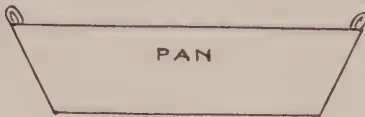
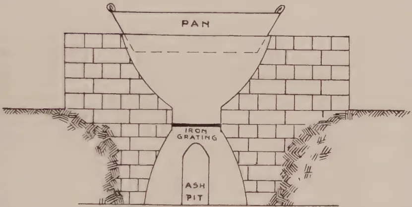
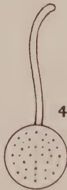

The  
Tropical Agriculturist  
February, 1927

---

Editorial.

SUGGESTIONS have been made that agriculturists in Ceylon would welcome a series of articles in the *Tropical Agriculturist* dealing with the present-day views on soils and manures. Much research work has been done on these aspects of agriculture in recent years and views which were held as recently as twenty years ago have, as the result of such research work, undergone very considerable modification.

The agriculturist is rightly interested in his soil and his cultural operations should be based upon a knowledge of the changes which take place therein and of the effects of such changes upon the plants he grows. In Ceylon little research work on soils and manures has been carried out before the past year and therefore data concerning many important soil questions are not available. Under these circumstances it is only possible to place before our readers articles which are based in the main upon experimental data from other countries and particularly upon the researches of the Rothamsted Experiment Station.

Cultural and manurial operations in Ceylon are, as in most other countries, empirical and have changed from time to time as the result of experience and observation. Scientific work on

1------------------------------------------------

66

soils has been going on in many countries for a considerable number of years and the present knowledge is based upon the results of patient investigations: The necessity for research work in the tropics has only recently been recognised and the true value of such work will be realized only after lengthy investigation. In the meantime, the results of workers in other countries have to be depended upon and translated into conditions prevailing in the tropics. This method is not satisfactory and true progress on a sound basis will only be possible as the result of research work done within the tropics.

In the articles which it is proposed to publish an effort will be made to represent as briefly as possible the present views held in regard to soils, the manner in which plants secure their food constituents, and the use of manures. These articles must be general in character, but an attempt will be made in conclusion to bring together some of the experience of agriculturists in Ceylon and to indicate certain lines of thought which require attention.

In previous numbers, accounts have been given of the results which have been secured from the investigations in the Chemical division, and these will be summarized by the Chemist at the conclusion of the present series of articles. It is thereby hoped to place before readers a series of articles which will assist them in considering the several soil and manure problems upon their plantations. Experimental data is required and estates could carry out a few simple experiments in order to secure data relating to their estates.

Evidence of the value of cultivation and of manuring of certain crops is available from all districts, but the fact that Ceylon is using large quantities of imported artificial manures must not be overlooked. Cannot some of these manures be replaced by more green manures and cover crops and will not the humus-content of our soils be improved thereby? Is not this neglect of the humus-content of our soils in certain areas serious and is it not likely to lead to nitrogen wastage except where applications of manures are extravagantly high?

2------------------------------------------------

67

## Original Articles.

# The Soil.

## Some Present Day Conceptions.

**F. A. STOCKDALE, C.B.E., M.A., F.L.S.,**

*Director of Agriculture, Ceylon.*

**M**OST agriculturists in Ceylon, when one talks about soils, refer to general terms to a classification which includes cabooky soil, clay soil, gravelly soil or sandy soil. An examination of soils as one passes through the country indicates clearly the above-mentioned classes into which the soils can be readily grouped and there are considerable stretches of the different types. A further examination of the various quarries worked by the Public Works Department shows, in some measure, how some of these soils have been formed. They are, generally speaking, the products of the decomposition *in situ* of the gneiss and quartz schists. From solid grey-blue gneissic rock one passes, if one proceeds upwards, into layers—often distinctly defined—where the rock shows signs of decay and of changed colour. Higher, the rock is further decayed and disintegrated and shows some fissures which are filled with earth and stones. Higher still, the disintegrated rock is in a state of decomposition and has crumbled; a greater admixture of earth and stones has taken place and above this we come to what is known as the sub-soil represented generally in Ceylon by a sticky reddish clay containing stones or portions of decomposing rock in greater or lesser quantities. Above this sub-soil is the soil proper—distinguished by its darker colour as the result of admixture with decaying vegetable matter from the plants which are or have been growing upon the surface.

The formation of such soils can readily be studied in quarries and in some road cuttings. In certain places the unchanged rock

3------------------------------------------------

68

comes close to the surface whilst in others it is frequently at considerable depths. Varying degrees of decomposition and disintegration can be found and several different types of rocks can be distinguished.

Under tropical conditions the formation of such sedentary soils is brought about mainly by two agencies. The chief of these is water, which dissolves some of the carbon dioxide from the upper layers of soil, and becomes an effective solvent of the complex minerals which make up the rock. The roots of plants which penetrate into cracks and fissures in the rock in the pursuit of water, as they grow exert a pressure which widens the cracks and later when they die leave behind them a channel for percolation, constitute the second agency of disintegration.

All soils are not however sedentary. They are often moved by water and often deposits of gravel, sand and silt are caused as the result of this transportation. Examples of such soils caused by transportation by water are seen in Ceylon. Similarly sandy soils are liable to be blown by the wind and give rise to drifts. Examples of such sandy drifts can be seen in the Jaffna peninsula and in certain other areas in the dry zone.

The above brief outline has been given in order to indicate the origin of the mineral portion of our soils. It is not proposed at this stage to deal with the chemical composition of such mineral portions but it is necessary to indicate that such portions of soils consist of particles of various shapes and sizes and that they are classified by mechanical analysis into gravel, coarse and fine sand, silt, fine silt and clay. These exist in varying proportions in different soils and in accordance with the variations in these proportions are soils classified.

### The Organic Matter.

From the agriculturists' point of view however the most important constituent of the soil is its organic matter, and the loss of organic matter in soils under tropical conditions is rapid and is that part of a soil to which agriculturists in the tropics should pay special attention. In the writer's view, the success and permanency of permanent crops in the tropics are bound up with the maintenance of the organic matter in the soil. This organic matter arises from the decomposition of plant tissues derived in the main from previous generations of plants. Under forest

4------------------------------------------------

69

conditions, falling leaves, and decaying logs of previous generations of plants provide a steady accumulation of organic matter. These fallen leaves and the short-lived plants or grasses which have died are attacked by numerous micro-organisms in the soil and considerable quantities of plant food are set free. Part of these plant residues are changed into a blackish substance known as humus which assists the mineral particles of the soil to stick together and has the power of helping the soil to hold water and valuable manurial substances.

### Moisture.

Soils always contain a certain quantity of water. The percentage varies with the climatic conditions. According to views held until recently this water was supposed to be surrounding the mineral grains in the form of thin films. This view no longer holds and is being discarded. Soil grains, which are of varying sizes, are coated with a colloidal jelly which is made up of silica, oxides of iron, aluminium, calcium, magnesium, etc. The composition of this jelly is complex. It contains organic substances as well as mineral. It has the power of binding the soil particles together and of holding water. In the absence of sufficient colloid, the soil is unable to retain enough water for the crop or to adhere together sufficiently to prevent being blown by the wind, but if the colloid is in excess the soils become sticky, liable to water logging and unsuitable for root development.

### Micro-Organisms of the Soil.

The soil however is not a dead mass, but is literally full of life. The biological population of the soil consists of bacteria, fungi, algae and protozoa. The bacteria are the smallest and most numerous and from counts made at the Rothamsted Experiment Station number approximately 67,500,000 per gram of soil. These bacteria together with the fungi, decompose the residues of dead plants changing them into water, carbonic acid and plant food. The fibrous parts of the plants are also decomposed and give rise to humus. The role of the algae in the soil is not yet known, but they compete with the plant for food whilst certain protozoa feed upon the bacteria and keep down their numbers.

5------------------------------------------------

70

The latest views in regard to the role of the micro-organisms in the soil are given by Russel \* as follows:—

“Two views have been held of the general nature of the soil population. It was at first thought that the population is formed of specialised groups of organisms, each engaged in carrying out a certain part of the decomposition of plant residues or the manufacture of plant food. As in a well-managed factory there was assumed to be division of labour, each organism carrying out its allotted task. The groups were known as “Ammonifying Organisms,” “Denitrifying Organisms,” “Nitrifying Organisms,” etc. Methods were developed by which they could be picked out of the soil and studied, and these methods gave some remarkable good results and revealed much about the changes going on in the soil.

“The second and later idea is that organisms carry out the various decompositions for the purpose of obtaining food and energy for themselves: a few are restricted to one process only, and a few can bring about changes that most others cannot perform, but the greater number of the organisms can decompose many substances and effect sometimes one change and sometimes another, according as they can best obtain the energy and nutrients they need. This new conception has made the study of the soil organisms much more definite and interesting.

“The application of modern methods to the study of the soil organisms has led to several conclusions of great interest.

“First of all, the composition of the soil population differs remarkably little in the different parts of the world. The characteristic groups of algae, bacteria and especially protozoa are the same in the Arctic as in temperate and tropical climates; there is nothing to correspond with the geographical distribution of plant and animal groups. The explanation lies partly in the nature of the organisms themselves, partly in the soil as an abode for them. Micro-organisms are probably less sensitive to environmental conditions than plants or animals. Vital conditions at a depth from two to seven or eight inches below the soil surface vary less than on the surface itself; the temperature is more even and the atmosphere is almost always saturated or nearly so with water vapour; there are no marked differences in degree of humidity such as influence the distribution of animals and plants.

“So far as present knowledge goes, the soil organisms are living right up to their income in the way of food and energy supply. Any increase in available organic matter capable of supplying energy leads at once to a corresponding increase in activity of the whole population and also in numbers of the individual groups of organisms; this is accompanied by an absorption of ammonia and nitrate from the soil to supply them with nitrogen. Of two plots, one supplied with farmyard manure and the other not, the unmanured

---

\* Sir E. J. Russel in “Soils and Manures” in a special report to the Royal Agricultural Society of England, 1926.

6------------------------------------------------

71

plot always contains fewer organisms, not only a smaller total population, but fewer of every kind yet enumerated.

“ The nature of the organic matter added to the soil greatly affects the amount of ammonia and nitrate present. If the organisms in obtaining their energy consumes more ammonia and nitrate than they produce, the balance obviously has to come from the soil, which thus becomes impoverished. On the other hand, if the material attacked is sufficiently nitrogenous, they produce more ammonia than they need. In general, the line seems to be drawn at about 2 per cent. of nitrogen. If organic matter containing less than this is added, it stimulates the soil population to multiply, but does not give them sufficient ammonia for their requirements, and so they take ammonia and nitrates from the soil. A manure of this kind, therefore, does the plant no good, although it is organic. But if more nitrogen is present the organisms produce ammonia in excess of their requirements; this accumulation of ammonia and nitrates in the soil steadily increases with the percentage of nitrogen in the material decomposed. This explains the well-known fact that organic manures poor in nitrogen are of little use.

“ The organisms in the soil do not appear to work independently of each other. They interact in two opposite ways. Competition is severe, but joint action and symbiosis are common. Winogradsky and Beyerinck have both discovered instances of an aerobic and an anaerobic organism living together to the mutual advantage of both. The bacilli that fix gaseous nitrogen from the air—one of the most important changes in the soil—work better when in company with other organisms than by themselves. Joint action—perhaps one should more strictly say consecutive action—is the normal occurrence in the soil. The by-products or metabolic products of one organism, if they are anything more complex than carbonic acid and water, are the starting-point for activity of other organisms; and this activity is continued by one or other of the population so long as there is any potential energy of oxidation in the products. There is no evidence whatsoever of the slowing down of micro-organic activity in the soil by accumulation of products corresponding to the slowing down in cultures; no “ bacteriotoxins ” can be detected and nothing to show that the “ autointoxication ” of the pure culture ever occurs in the soil. The products that might have these effects are quickly attacked by other organisms; the final products are carbon dioxide and nitrates, and both these are easily washed out from soil.”

The most important bacteria from Ceylon's point of view are the organisms which occupy the nodules of leguminous plants and the *Azotobacter* which fixes gaseous nitrogen from the air. Recent laboratory experiments made by the Chemical Division of the Department of Agriculture indicates that markedly appreciable amounts of nitrates are formed under Ceylon conditions and the advantages of soil cultivation are made clearly evident.

7------------------------------------------------

72

## Aeration.

The maintenance of satisfactory chemical changes and normal bacterial changes in a soil is dependent upon its proper aeration and the full significance of soil-ventilation as it might be called is now being recognised. The pore spaces in the soil between the different particles require to be replenished from time to time with supplies of oxygen and the excess carbon dioxide must make its escape. Unless this is provided for, biological activity necessary for breaking down the organic matter is retarded and valuable nitrogen may be set free as gas and lost to the soil. The effects of the very heavy rains of the monsoon are frequently observed on the plants themselves, and not uncommonly leaf shedding is seen. These effects are due to the cutting off of the air supply to the soil and in all badly aerated soils root development is poor and often shallow. The fixation of nitrogen by *Azotobacter* requires constant aeration and it is certain that an important need for the satisfactory growth of young clearings is adequate soil-ventilation. This is provided by cultivation and by proper attention to drainage. It is essential for successful crop production.

## Erosion.

Sufficient has been said above about the formation of soils to indicate the importance of maintaining the fertile surface soil. This represents the main capital asset of the plantation and must be protected. A great impetus has been given to this question of the prevention of the loss of this surface soil in the past few years and most estates are giving careful thought to their several problems. The provision of silt-pits in surface drains is becoming more and more general and for new clearings systems of terracing are being evolved. There is no doubt that this question is still the most important one for Ceylon's agriculture and every effort should be concentrated on all sloping lands to checking the run-off of the rainfall, to assisting absorption and to preventing or, at least, decreasing erosion. There is little doubt that if attention had been given to this problem years ago the expensive manurial programmes now essential for maintenance of maximum growth and vigour would not have been necessary and there would have been less loss to crops from insect pests and fungus diseases.

*(To be continued)*

8------------------------------------------------

73

# Mycological Notes.

## Further Notes on *Rhizoctonia bataticola* (Taub.) Butler

W. SMALL, M.B.E., M.A., B.Sc., Ph.D., F.L.S.,

*Mycologist, Department of Agriculture, Ceylon.*

SEVERAL new hosts of *Rhizoctonia bataticola* are recorded in these Notes, namely, *Coffea robusta*, *Albizzia* seedlings, plantains, tomato, orange and *Amherstia nobilis*, and additional data are given concerning the occurrences of the fungus on rubber and chilli. The number of Ceylon plants affected by *Rhizoctonia bataticola* is now twenty-seven.

(1) *Coffea robusta*.—This species of coffee was attacked by the *Rhizoctonia* in Uganda, and the symptoms of the single Ceylon case which has been encountered were the same as those found in Uganda.

(2) *Albizzia moluccana* seedlings.—In a recent case of the death of these seedlings in beds *Rhizoctonia bataticola* was the only fungus on the diseased roots. The wood of the roots was typically hardened, and the bark was in the dry cracked condition induced by the *Rhizoctonia*. On the majority of the seedlings the black lines of the fungus were well developed in the wood of the roots and the base of the stem (figure).

(3) Plantains.—Two root diseases of plantains have been encountered recently. One is caused by *Rhizoctonia bataticola* and the other by eelworms (*Heterodera radicicola*). The above-ground symptoms of both diseases are such that affected plants are usually said to be suffering from bunchy-top. If the bunchy-top disease of Australia which has been shown to be due to an insect is found also in Ceylon, it will follow that there are at least three distinct major diseases of plantains in the island in addition to leaf and fruit troubles of minor importance or secondary origin. It will also follow that Ceylon bunchy-top

9------------------------------------------------

74

may be due to one at least of three distinct causes. A *Rhizoctonia* was isolated from Ceylon plantain roots by Bryce several years ago and was regarded by him as a possible cause of local bunchy-top (1). The fungus was not named specifically, but there is no doubt of its identity with the present fungus, *Rhizoctonia bataticola*.

(4) Tomato.—*Rhizoctonia bataticola* attacks and kills tomato plants; the number of examples found to date has been small. The sclerotia of the fungus may be found in the pith of the stem, and the appearance of affected roots is typical.

(5) Orange.—It was remarked in the Mycological Notes of the *Tropical Agriculturist* of December last that *Rhizoctonia bataticola* was suspected of causing disease of orange trees as well as of limes. The fungus has now been found on orange roots collected by the Plant Pests Inspector of the Southern Division. The above-ground symptoms of the *Rhizoctonia* disease of orange are similar to those of the same disease of limes, namely, a dying back or wither-tip of the branches and a gumming of the trunk and larger branches. The fungus is suspected also of attacking grape-fruit.

(6) *Amherstia nobilis* Wall.—A young plant of *Amherstia* about 4 feet in height has died of *Rhizoctonia* root disease. The sclerotia of the fungus were numerous in the bark and on the wood of the roots of the plant, and the effects of the fungus on the roots were typical. No other fungus was present on the roots, but *Diplodia* and a *Nectria* were found on the stem and branches. *Amherstia* is propagated by layering, and it has always been a difficult matter to establish the young plants. It is possible that *Rhizoctonia* root disease has accounted for a proportion of the failures.

(7) *Hevea brasiliensis*.—In the Mycological Notes of last October, a case of rubber root disease was quoted in which *Rhizoctonia bataticola* was concerned. At the original examination and determination of the cause of disease, no other fungi were to be found on the roots of the trees affected by the *Rhizoctonia*, and the trees were left standing in order that a later examination of them might show what fungi, if any, had invaded the roots subsequent to the *Rhizoctonia*. Five months were

10------------------------------------------------

<!-- stage4: ACCEPT r2J/J_008:93 -->

Block by Survey Dept. Ceylon

*Albizzia* seedling with bark removed from roots and collar to show black lines of *Rhizoctonia bataticola* in the wood. Natural size.

11------------------------------------------------

This image is a scan of a blank page. The paper has a light beige or cream-colored tint. There are a few very small, dark specks scattered across the surface, which appear to be scanning artifacts or dust particles. No text, lines, or other markings are present on the page.

12------------------------------------------------

75

allowed to elapse, and it was found then that *Ustulina*, *Fomes lignosus*, *Fomes lamaecensis* and *Diplodia* were present in addition to the original *Rhizoctonia*. These four fungi were clearly secondary to the *Rhizoctonia*, and all four were found together on more than one tree.

A large number of examples of rubber root disease has been examined in recent months, and *Rhizoctonia bataticola* has been associated with every case. There has been little difficulty in disclosing its presence in the cases which the writer has excavated personally, and little more difficulty in those cases in which instructions to follow up the smaller roots have been followed. Certain so-called *Fomes* patches exist on certain estates, and it is the writer's intention to examine as many of them as possible. Only one good example has been investigated to date, and *Rhizoctonia bataticola* was found on every tree. Similarly, all recent cases of *Diplodia* dieback have been shown to be in reality cases of *Rhizoctonia* root disease. The fungus is clearly of economic importance in the growing of rubber in Ceylon, and it is possible that it is present and equally important, though unrecognised as yet, in other rubber-growing regions.

(8) Chillies. —Further cases of *Rhizoctonia* root disease of chillies have been reported. In addition to the root disease, some of the plants were affected by *Vermicularia* dieback and a collar-rot. The latter is of interest in view of the remarks made concerning the collar-rot of young tea in the December *Tropical Agriculturist*. The chillie collar-rot was in an early stage, the bark and cortex of the collar being still present although it was split, cracked and loosened, and the white mycelium of another sclerotial fungus, *Sclerotium rolfsii* Sacc., was found on the rotting areas. The *Sclerotium* may be able to rot the collar tissues of a plant that has already been weakened by *Rhizoctonia* attack, that is, it may be secondary to the *Rhizoctonia* root disease and the cause of a true collar-rot, but the part played by it in the present case is not known with certainty.

## References.

(1) *Tropical Agriculturist*, 57, 374, December, 1921.

13------------------------------------------------

76

# Report on Jaggery Making from Sugar Cane Juice.

**W. P. A. COOKE, M. Sc.,**

*Divisional Agricultural Officer, Northern*

AND

**N. SENATHIRAJA,**

*Farm Manager, Experiment Station, Jaffna.*

**T**HE growing of sugar-cane and the manufacture of jaggery from the juice was tried on this station for the first time during the year 1926. When the canes showed signs of maturity, samples were sent for analysis to the Agricultural Chemist and he reported thus:—

<table border="1">
<thead>
<tr>
<th></th>
<th>Variety.</th>
<th>Gms. juice % Gms. Cane</th>
<th>Specific Gravity of juice at 25 C.</th>
<th>Brix. Tot. Solids Gms. % Gms. Juice.</th>
<th>Sucrose Gms. % cc. Juice.</th>
<th>Glucose Gms. % cc. Juice.</th>
<th>Glucose (Gms. (Glucose % sucrose))</th>
<th>Extracted Sucrose Gms. % Gms. Cane</th>
<th>Purity (Sucrose % Total solids).</th>
</tr>
</thead>
<tbody>
<tr>
<td>1</td>
<td>55P</td>
<td>73.5</td>
<td>1.059</td>
<td>14.2</td>
<td>12.3</td>
<td>6</td>
<td>4.9</td>
<td>9.0</td>
<td>86.6</td>
</tr>
<tr>
<td>2</td>
<td>Striped Tanna</td>
<td>67.7</td>
<td>1.070</td>
<td>16.4</td>
<td>12.5</td>
<td>1.0</td>
<td>8.0</td>
<td>8.5</td>
<td>76.2</td>
</tr>
<tr>
<td>3</td>
<td>Sin Nombre</td>
<td>63.9</td>
<td>1.067</td>
<td>16.0</td>
<td>11.75</td>
<td>8</td>
<td>6.8</td>
<td>7.5</td>
<td>73.5</td>
</tr>
<tr>
<td>4</td>
<td>D. K. 74.</td>
<td>71.1</td>
<td>1.059</td>
<td>14.2</td>
<td>12.45</td>
<td>55</td>
<td>4.4</td>
<td>8.0</td>
<td>87.6</td>
</tr>
<tr>
<td>5</td>
<td>Sealy's Seedling</td>
<td>64.3</td>
<td>1.059</td>
<td>14.2</td>
<td>10.5</td>
<td>1.45</td>
<td>3.8</td>
<td>7.5</td>
<td>74.0</td>
</tr>
<tr>
<td>6</td>
<td>Mauritius</td>
<td>63.9</td>
<td>1.063</td>
<td>14.4</td>
<td>11.8</td>
<td>1.15</td>
<td>10.0</td>
<td>7.5</td>
<td>86.8</td>
</tr>
<tr>
<td>7</td>
<td>Barbados</td>
<td>62.0</td>
<td>1.067</td>
<td>16.0</td>
<td>14.2</td>
<td>9</td>
<td>6.3</td>
<td>8.8</td>
<td>88.8</td>
</tr>
<tr>
<td>8</td>
<td>131 P</td>
<td>67.2</td>
<td>1.070</td>
<td>16.4</td>
<td>14.5</td>
<td>1.0</td>
<td>6.9</td>
<td>9.7</td>
<td>88.4</td>
</tr>
</tbody>
</table>

The following is the remark made by the Director of Agriculture on the above figures:—

"(1) These analyses show a low sucrose content, a high glucose ratio and generally poor purities.

(2) These figures indicate one or several of the following:—

Either the canes were not fully ripe or they were overripe and part of the sucrose had become inverted into invert sugar. This happens in all the lower portions of canes which are allowed to become overripe. On the other hand they may have been cut too long before they were analysed and the analyses do not represent the true value of the canes. Canes should be analysed within 24 hours of their cutting. Otherwise inversion begins to take place

14------------------------------------------------

77

(3) Purities should reach 90 per cent. and I am interested to note that the purities of Barbados 208 and 131 P are the highest. These canes generally have good juices and are easy of manufacture in a factory."

### Extraction of the Juice.

The canes were cut and crushed in the "Hathi" mill imported from Burn & Co. of Calcutta. It is a three-roller iron mill worked by a pair of bulls. It is capable of expressing 200 lbs. of juice in one hour, on an average. The efficiency of the mill as shown by the average of extracted juice is about 65 per cent. The cost of the mill is Rs. 154.92 and the cost of erecting it is Rs. 4.00.

### Erection of the Furnace, Boiling the Juice, and the Manufacture of Jaggery.

After the erection of the cane-mill the first thing attended to was the furnace. The furnace is partly excavated, and partly built up. It is an improved furnace and built up in the Indian single-furnace model. It is provided with an ash chamber and a fire pit. It is a raised structure 3 feet high and the four sides of it are made almost vertical. From one of the sides an opening 14 inches wide and 2 feet high leads into the fire-pit formed in the centre of the structure. It has sloping sides towards the middle and is in the form of a cup. At the bottom of the fire-pit an iron grating about 21 inches square is placed through which ashes fall into the ash chamber. The above opening is situated on the windward side and fuel is fed from this opening. A tunnel passes out of the ash chamber at right angles to the opening of the fire-pit above, through which deposits of ashes can be removed by means of a mamoty or a small shovel whenever required. This is placed in the windward side to admit good draught into the fire-pit through the grating and facilitate complete burning of the fuel. The ash chamber is circular about 4 feet at the base and ending at 1½ feet at the top and 4 feet deep. It is in the form of an inverted cup. The grating has 10 holes each 3 inches in diameter. The top of the furnace is somewhat smaller than the bottom of the pan and the bottom of the pan rests on the edge of the oven exposing the maximum surface to the fire.

The cost of constructing the furnace is as follows:—

<table>
<tbody>
<tr>
<td>(1)</td>
<td>1,000 Bricks</td>
<td>...</td>
<td>Rs.</td>
<td>18.00</td>
</tr>
<tr>
<td>(2)</td>
<td>Lime</td>
<td>...</td>
<td>„</td>
<td>4.50</td>
</tr>
<tr>
<td>(3)</td>
<td>Iron grating</td>
<td>...</td>
<td>„</td>
<td>1.90</td>
</tr>
<tr>
<td>(4)</td>
<td>Mason</td>
<td>...</td>
<td>„</td>
<td>3.00</td>
</tr>
</tbody>
</table>

---

Total ... Rs. 26.50

The plan of the furnace is annexed herewith (see Fig. 2.).

15------------------------------------------------

78

The pan that is being used here is a shallow one and the dimensions are as follows:—

Length 4 ft. 3 inches  
Breadth 3 ft. 3 inches  
Depth 10 inches

The expressed juice is collected in kerosene tins and carefully strained through strainers (see Fig. 3) and poured into the pan which is now placed over the furnace. About 12 tinsfuls or 480 lb. of juice is a fair charge. Small quantities of milk of lime is then added to the juice to neutralize the acidity. The quantity of lime to be used varies according to the variety of cane, richness of juice maturity, etc. The proper quantity to be added can be only judged by experience. But our experience shows that 1/8 measure of thick milk of lime is sufficient for a charge. An excess of lime deteriorates the colour and quality of the jaggery as seen from the trial boilings conducted here.

Every day care was taken to spread out in the sun the megass or the remains of the cane after the juice had been expressed out so that it can be used as fuel on the following day. Megass and trash formed the major part of the fuel while firewood was used sparingly. It was observed that very hot flames were required to make the juice boil. Then the fire must be lowered, especially so when the juice has begun to thicken. When the juice has begun to boil frothing is produced and the scum and other impurities come up to the surface. The scum should be removed without in any way disturbing the liquid down below and this is done by a scum remover (see Fig. 4). The scum could be profitably utilized in feeding cattle. After the removal of the first layer of scum the juice begins to boil briskly and a second layer appears. This must be carefully removed. Small quantities of scum are now observed to collect on the side of the pan and these too must be removed occasionally. In about 3 hours' time, the juice begins to rise almost to the top of the pan and again boils down forming large bubbles. At this stage a little ghee and gingelly oil is added to give some flavour to the jaggery as the consumers in Jaffna did not at first appreciate sugar-cane jaggery. At this stage the fire must be gradually lowered. At the completion of the evaporation the syrup assumes a yellow tint when it should be constantly stirred by means of a wooden hoe as shown in Fig. 5.

16------------------------------------------------

PAN

1

PAN

IRON  
GRATING

ASH  
PIT

2

JUICE  
STRAINER

3

4

5

Block by Survey Dept. Ceylon

1. 1. Coimbatore Pan.
2. 2. Furnace.
3. 3. Juice Strainer (wire gauze sieve).
4. 4. Scum Remover iron.
5. 5. Wooden Paddle.

17------------------------------------------------

This image is a scan of a blank page. The paper has a light beige or cream-colored tint. There are a few very small, dark specks scattered across the surface, which appear to be scanning artifacts or dust particles. No text, lines, or other markings are present on the page.

18------------------------------------------------

79

The following test is made to see whether the juice has come to the required consistency. Cold water is kept in an earthen tray and a few drops of the syrup are poured into it in the form of a circular thread. If this forms into a hard ball the pan must be immediately removed from the oven and contents cooled and stirred constantly with the wooden paddle.

The solidifying juice is then run into the moulds which consists of a large log of wood on one side of which numerous square holes are made. The jaggery is thus produced in small cubes which are convenient for handling and marketing—4-6 cubes of this type weighed 1 lb. and could be sold at Rs. 3.00 per 100. When large quantities are available the juice is run into lined pits. Such lumps could be sold as they are or crushed into pieces before disposal.

The statement below shows the results of the different varieties of cane grown on this station.

<table border="1">
<thead>
<tr>
<th rowspan="2">Variety of cane.</th>
<th rowspan="2">Number of canes</th>
<th>Weight of canes</th>
<th>Weight of Juice</th>
<th>Weight of Jaggery</th>
<th rowspan="2">Sucrose percentage</th>
</tr>
<tr>
<th>lb.</th>
<th>lb.</th>
<th>lb.</th>
</tr>
</thead>
<tbody>
<tr>
<td>55 P</td>
<td>504</td>
<td>1561</td>
<td>818</td>
<td>111</td>
<td>13.5</td>
</tr>
<tr>
<td>Red Mauritius</td>
<td>1050</td>
<td>1782</td>
<td>810</td>
<td>81</td>
<td>10</td>
</tr>
<tr>
<td>Barbados 208</td>
<td>550</td>
<td>2024</td>
<td>1150</td>
<td>131</td>
<td>11.3</td>
</tr>
<tr>
<td>131 P</td>
<td>1560</td>
<td>3520</td>
<td>1752</td>
<td>239</td>
<td>13.41</td>
</tr>
<tr>
<td>Sealy's seedling</td>
<td>2100</td>
<td>2254</td>
<td>1270</td>
<td>111</td>
<td>8.6</td>
</tr>
<tr>
<td>Sin nombre</td>
<td>2000</td>
<td>3070</td>
<td>1300</td>
<td>120</td>
<td>9.2</td>
</tr>
<tr>
<td>Stripped Tanna</td>
<td>1000</td>
<td>1981</td>
<td>780</td>
<td>107</td>
<td>13.7</td>
</tr>
<tr>
<td>D. K. 74</td>
<td>1600</td>
<td>3176</td>
<td>1280</td>
<td>80</td>
<td>6.25</td>
</tr>
<tr>
<td style="text-align: right;">Total</td>
<td>10 364</td>
<td>19 368</td>
<td>9160</td>
<td>980</td>
<td></td>
</tr>
</tbody>
</table>

### Cost of Manufacture.

1. (1) Cost of labour for cutting canes, feeding the mill, etc. (45 hours) ... Rs. 3.75
2. (2) Extracting 9,160 lb. of juice (hire of bulls for 45 hours) ... ,, 7.50
3. (3) Cost of lime ... ,, .90
4. (4) Cost of fuel ... ,, 11.70
5. (5) Cost of labour and supervision of the work in the furnace ... ,, 15.75

Cost of manufacture of 1 lb. Jaggery 4.7 cents

Outturn of sugar 980 lb. from 7/16 acre at 18 cents per lb. ... ,, 176.40

19------------------------------------------------

80

# Hibiscus Sabdariffa, Altissima.

**L. KOCH,**

*Chief of the Section for Plant Breeding Annual Crops, General Experiment Station, Department of Agriculture, Industry and Commerce, Buitenzorg, Java.*

**F**OR a long time we looked out for plants that could provide a fibre suitable for weaving burlaps, etc. Many years ago *Hibiscus cannabinus* (Deccan hemp) was tried. This plant, however, though yielding a good fibre of sufficient length, proved to be very susceptible of several diseases and unfavourable conditions, such as stagnant water. Under favourable conditions *Hibiscus cannabinus* may yield a good crop; the chance of failure is however too great. In the Dutch East Indies up till now no really good yield has been obtained.

In 1918 a closely allied species *Hibiscus sabdariffa, altissima* was tried and proved less susceptible.

*Hibiscus sabdariffa, altissima*, the red as well as the green stemmed type, grows in the same way as *Hibiscus cannabinus*, yielding long practically unbrached stems, when some months old, without any leaves save on the upper 2 or 3 feet. *Hibiscus cannabinus* flowers at any time during the year, rosella (*Hibiscus sabdariffa altissima*) never flowers during the rainy season in Java. This is an advantage, as the short branches bearing the flowers are apt to split up the fibre cylinder, forming the outer layer of the stem.

In Java the rainy moesson lasts from the beginning of December to the end of April. If rosella is sown in the month of October no flowering takes place before April. A crop about five months old may then be got safely without any branching to speak of. Recent investigations have shown that it is better to defibre at an earlier stage; the quality of the fibre is then better and retting is far easier. The fibre roselle is sown in rows, with 1 foot between the rows and 4-5 inches between the plants in the row.

20------------------------------------------------

81

Sown in the end of April, flowering usually begins after 2-2½ months, resulting in heavy branching. Such plants then resemble shrubs and attain a height of only 1½-2 M., while rainy season plants may grow up to 4-5 M.

*The defibring process.*—One of the principal difficulties in growing rosella and similar plants is defibring. The method used in British India with *Corchorus capsularis* (jute) is only possible, if on small farms every one may be put to working on defibring and if the cost of living is cheap.

In Java the same method was tried, but proved far too costly.

Mr. van der Meulen, who has done a good deal of work on the subject, tried out another method, using also only hand-labour.

This method consists of the following:—

1. 1. The plants are pulled out or cut off with a knife just above the ground.
2. 2. The plants are bundled.
3. 3. The leaves are stripped from the top downwards.
4. 4. The base of the stem is crushed by blows from a hammer or a piece of wood.
5. 5. If the plants are pulled out, the crushed stem is broken on the knee. The roots are gripped firmly, the fingers of the left hand open the splitted bast, the woody part sticks out, two fingers of the left hand are put under it, then the bark is drawn in a downward direction by the right hand, the woody part gliding over the fingers of the left hand.

If the plants are cut, the working is similar. The whole process resembles the pealing of a banana when the skin is slashed with a knife.

1. 6. The bark is arranged in bundles.
2. 7. The bundles are brought to the water for retting.
3. 8. After retting the bundles are washed.
4. 9. The washed bundles are dried in the sun.

21------------------------------------------------

82

In a small experiment the duration of these details was studied. Per 1,000 kg. green plants it took:—

<table>
<tr>
<td>to pull out</td>
<td>1.69</td>
<td>man-hour *</td>
<td>(f 0.0965)</td>
</tr>
<tr>
<td>to cut</td>
<td>1.164</td>
<td>" "</td>
<td>(f 0.0665)</td>
</tr>
<tr>
<td>to bundle</td>
<td>1.201</td>
<td>" "</td>
<td>(f 0.0689)</td>
</tr>
<tr>
<td>to strip the leaves</td>
<td>10.095</td>
<td>women-hour</td>
<td>(f 0.8602)</td>
</tr>
<tr>
<td>to strip the bark</td>
<td>10.136</td>
<td>" "</td>
<td>(f 0.3683)</td>
</tr>
<tr>
<td>to wash</td>
<td>4.900</td>
<td>" "</td>
<td>(f 0.1749)</td>
</tr>
</table>

Per hectare a yield of about 50,000 kg. green plants was obtained. The costs per hectare amounted to:—

<table>
<tr>
<td>cutting</td>
<td>f 3.50</td>
</tr>
<tr>
<td>bundling</td>
<td>3.50</td>
</tr>
<tr>
<td>stripping the leaves</td>
<td>19.50</td>
</tr>
<tr>
<td>stripping the best</td>
<td>18.--</td>
</tr>
<tr>
<td>washing</td>
<td>9.50</td>
</tr>
<tr>
<td></td>
<td><u>f 54.00</u></td>
</tr>
</table>

(one guilder N.I. currency is equivalent to 1s. 8d.)

The green plants yielded  $\pm$  2.35 per cent. fibre. This method though not very costly, takes a great deal of hand-labour. Per hectare about 15 man-days and 164 woman-days are necessary.

When the plants are thin, the costs are much higher than the figures given above; these were for rather thick stems.

Green manuring the crop seems to be profitable as the plants are very sensitive to nitrogen. Good green manures are probably *Mimosa invisa* and *Crotalaria anagyroides*, but this depends on external conditions.

Different difficulties in growing as well as in defibring rosella are not yet solved. A mechanical way for threshing out the woody parts is now tried. Probably the same machinery as used in sisal growing may be used. Retting however seems necessary.

\* The word "man-hour" means the amount of labour obtained from one man working during one hour.

22------------------------------------------------

83

## Selected Articles.

# The Plantation Rubber Industry.\* Botanical and Chemical Developments.

J. W. BICKNELL,

*Vice-President, U. S. Rubber Plantations, Inc.*

IT is unnecessary to call attention to the extreme youth of the plantation industry in the Far East. In this short time important strides have been made in our knowledge of Hevea cultivation, but much more remains to be learned.

Not one per cent. of the 4,250,000 acres of Hevea trees planted in the East was set out with any great degree of scientific knowledge of the most favourable conditions or of the best methods of cultivation and care. Desire to share in the large profits at first accruing to the rubber estates inspired British and European investors to pour their money into Ceylon, Malaya and the Indies. Naturally, the most available land was taken up and seeds for planting were obtained wherever possible. No one could discriminate because no one knew, and in any event there wasn't time. Years might have been lost if they had waited for the scientist to tell them just how to proceed. Common horse-sense was used, and the experience of tea, coffee and cacao planters was called upon to show the way in the new industry. How good these first practical planters were is evidenced by the record of the industry to date.

In any undertaking, early methods must give way to fuller knowledge and altered conditions, and the rubber-planting business is no exception. Competition within the industry must be met as well as threats from the outside. Synthetic rubber and native production need not worry the investor in plantation securities if sufficient knowledge can be secured through scientific research. Indications can already be seen of increased production and lower costs not dreamed of a few years ago.

We must, then, picture the millions of acres of Hevea trees in the East as having been planted up by practical men of affairs without any special scientific guidance. The industry was new to everyone and methods of planting, upkeep and tapping were developed gradually as day-to-day experience indicated. Profits were large in the early days, and it perhaps paid to get as much rubber out as possible. Theories of cultivation and tapping were developed as numerous as there were visiting agents or estate managers. Some theories were right, but many have been shown to be anything but correct.

\* A paper read before the Crude Rubber Conference organised by the Rubber Division of the American Chemical Society.

23------------------------------------------------

84

No doubt every scientist feels that his own particular problem presents more variable factors interfering with his search for fundamental principles than do the problems which other men are endeavouring to unravel. So in the name of, but without the authority of, the rubber tree scientist, the writer claims that the search for the truth about rubber is one of the most difficult of all. Five hundred acres of rubber trees in one spot may have quite different conditions as to chemical and physical properties of the soil, climate, drainage, and even labour than another 500 acres a comparatively short distance away. These factors cannot be altered materially, and undoubtedly had a great influence on the methods and theories developed. Perhaps more troublesome is the time factor. In many industrial enterprises results can be seen in a short period of time. Even in most forms of agriculture one does not have to wait more than a year or two for some indication of how to proceed, but the rubber scientist may have to wait five or even ten years to prove or disprove the correctness of an idea.

## Diseases.

When men are well they seldom pay much attention to the theory or practice of medicine or physiology, but let the first pain come and then in comes the doctor. Thus it was with plantation rubber. The practical planters felt that they could fell jungle, clear and burn it, plant trees and keep up their gardens, tap the trees, and make smoked sheet or crepe without learned advice. It was a case of common-sense. However, when good trees began to die with root disease, or white-ants destroyed others, or when canker attacked the branches, or the leaves fell prematurely, then came the call for the Bachelors of Science and the Ph. D.'s. Probably the first wide-spread interest taken by the plantation owners in science was on account of tree diseases.

Most of the estates in the Far East have been planted on jungle land or on land previously under some other cultivation. It was, and still is, impossible to keep disease out of a rubber garden. All manner of fungus diseases and animal pests flourish in the moist, humid climate best suited for rubber. The problem is to minimise the dangers and control them when once found; and so far the Mycologist and Entomologist have met with a great measure of success. *Fomes scimitestus*, the dreaded root disease, is well under control. White-ants no longer keep Boards of Directors awake at night, and diseases of the tapping surface, notably brown bast, can, thanks to scientific research, be detected at an early stage and their ravages minimised.

This does not mean that danger does not exist or that constant watchfulness is unnecessary. Quite the contrary. The present freedom from major troubles is the very best argument for the employment of the best brains on the subject. Only recently the scientists of the U. S. Government who studied conditions in South America have warned us of the dangers of wide-spread epidemics and we all know of the devastating effects of leaf disease in several South American countries. But above all, the most potent factor which should make us ever watchful is the close proximity of millions on millions of trees of the same species. In other words, the conditions are favourable for the easy spread of a devastating epidemic.

24------------------------------------------------

85

## Difficulties in Field Experimentation.

Important as the work of the disease experts has been, the advance in knowledge concerning tapping methods, manuring, tree selection, and the propagation of high-yielding trees may have more interest for the rubber producer. During the early years of the industry a very considerable amount of information about planting, thinning, tapping, etc., had been acquired, but unfortunately a large part of the information could not be relied upon as it usually had been the result of unscientific methods. Planters and even scientists drew conclusions from insufficient data.

A few men realised this lack of a sound, broad basis on which field experiments could be conducted. Most experimental work on the plantations must be measured by the one standard—namely, yield per acre per year. Rubber trees are not grown for ornament or shade, but for the sole purpose of producing rubber, and a fine-looking tree may not be a good yielder. The proverb "Handsome is as handsome does" is very applicable to *Hevea* trees.

Agriculturists, dealing chiefly with annual crops, long ago realised that differences in results of treatments given to, say, two fields of grain could not necessarily be given too much weight, and mathematical methods were developed to assist in the laying out of field experiments. No such basis existed for rubber. In 1915, however, Petch\* referred briefly to this matter and in 1916 Coombs and Grantham† published a paper on "Field Experiments and the Interpretation of their Results." These papers indicated the need for a solid basis, but did not provide it.

In November, 1917, Bishop, Grantham and Knaap,‡ after a study of the papers previously referred to and also of an article by Wood and Stratton.§ published a paper which laid down what are considered sound principles for experimental work in rubber. They had as a basis for their study an amount of data not probably available to others.

Their theory of probable errors is stated clearly in their introduction:

The results of a single experiment are very often misleading.

In interpreting experimental results the need of attempting to allow for errors that are present in all field experimentation work is evident. Such errors are those of manipulation, difference of site (meaning the intrinsic properties of the soil, its condition and situation), and variations among the individuals.

By the application of certain mathematical methods, one of which is "the method of least squares," to the results of experiments, a single numerical expression, usually referred to as the "probable error," may be calculated for all errors. With its aid results may be interpreted with more accuracy. The probable error is a measure of the reliability of a result, and is such that the chances are even that the difference between any single result taken at random and the mean or average of the results will be greater or less than the amount of the probable error.

\* Tropical Agriculturist, February, 1915.

† Agricultural Bulletin, Federated Malay States, April 1916.

‡ Arch, Rubbercultural 1,335 (1917).

§ J, Agric. Science 3, Part 4, (1909).

25------------------------------------------------

86

Increasing the size of the plot, beyond a certain limit, does not decrease the probable error. When this limit is reached the error can be reduced by duplication only of experiments.

Then using "the method of least squares," the authors apply their theory to a mass of experimental data and conclude that a basis can be found. They point out, however, certain general considerations on its use in rubber:

In experiments with annual agricultural crops, Wood and Stratton found that the probable error between different plots, where the plot was  $1/80$  of an acre in size or larger, amounted to 5 per cent. of the entire crop. These figures may not be applied to rubber because:

1st. With rubber the variations in the yields of individuals are large and the number of individuals on any given area comparatively small. The minimum size of plot that will give the maximum reduction in probable error is, therefore, likely to be large compared with annual agricultural crops and must be established for rubber.

2nd. Variations in the quality of tapping are unavoidable and cause corresponding variations in yield. Variations due to the operations of collection do not obtain in gathering the yield of an annual crop from which it is always possible to obtain the total yield.

3rd. With yearly crops the probable error, when once determined, can be applied in general, because the entire life of the crop is dealt with and consequently the total effect of site on the crop is taken into consideration. In dealing with rubber a probable error over a period of one year takes into account the effect of site upon the crop at a certain age and under conditions existing at that age only. Local site conditions may cause similar areas to alter their relative yields with increasing age in such a manner as to cause variation in probable error among the same plots at different ages. Further, if the probable error is known for a series of ages for one set of conditions of planting (such as spacing, holing, season of planting, material used, etc.) on a given site, this may be incorrect for other planting conditions on a similar site and for the same planting conditions on a different site.

A probable error that would be standard for yield of rubber should be worked out on a large number of plots in one block on a given site. As has been indicated, the minimum size of plot, beyond which duplication only will reduce the probable error, is likely to be large. It may be expected that several hundred acres of the same age, planting and treatment would be necessary to secure conclusive results. Such an area would unavoidably contain local variations of site, even though obviously abnormal plots were excluded.

After further illustration and discussion they drew conclusions which pointed the way for the further studies necessary to establish something definite. This first rather theoretical paper was followed later by an article by Grantham and Kuapps\* which laid down definite suggestions for conducting field experiments. In summarising their studies, the authors say:

---

\* Arch. Rubbicultur, 2, 514 (1918).

26------------------------------------------------

87

An analysis of these data shows that a 100 tree plot is the optimum size, except in special cases; that, a probable error of 6 per cent. can be used for a 100 tree plot; that, in general, it is undesirable to exceed 10 to 15 duplications; that odds of 30 to 1 shall be taken as giving practical certainty; and that a precision of less than 5 per cent. is impractical.

This important work has formed the basis on which the field work of our Plantations Research Department has been laid out, and has also been adopted by most experiment stations. We now know how much credence can be given to former and present field work.

## Latex-Yielding Capacity.

One of the most interesting and important additions to our knowledge of Hevea which has been made in the past few years is in connection with the latex-yielding capacity of different trees. Eastern estates were planted with varying numbers of trees per acre ranging from two hundred and fifty to one hundred, the average being possibly about one hundred and fifty. It soon became evident that an acre of land could not carry one hundred and fifty well developed trees, and much controversy was heard as to the correct number and especially as to how the superfluous trees should be thinned out. The optimum number per acre is not yet known, but we do know better how to thin. Many old planters advised cutting out alternate rows in some instances, on the theory that in the long run an average of good trees would be left. Others attempted to select the trees by choosing the best developed specimens and then removing surrounding inferior ones which might interfere with the good trees. This was difficult, of course, in good stands where all the trees were about of a size. Although it was common knowledge that some trees yielded more latex than others, the absence of sufficient records for a large number of trees in tapping for long periods concealed the truth about variation in rubber-producing capacity.

Some ten years ago tests on a large scale were made by different organisations. Bateson in 1921, reporting to the Agricultural Department of British North Borneo on "Rubber Research in Sumatra," said:

A yield test carried out by the Avors Proefstation on 1,467 trees gave the following results:—

- 9 per cent. of the total number gave 24 per cent. of total yield.
- 39 per cent. of the total number gave 52 per cent. of total yield.
- 25 per cent. of the total number gave 17 per cent. of total yield.
- 27 per cent. of the total number gave 7 per cent. of total yield.

Thus 48 per cent. of the trees, or roughly half, gave 76 per cent. of the total yield, or roughly three-quarters.

In another test, with 4,453 trees, 20 per cent. of the trees gave 50 per cent. of the crop; and in a third test, with 3,860 trees, 26 per cent. of the trees gave 58 per cent. of the crop.

These facts were interesting, but it was possible that a tree which gave a good yield at one time might sooner or later become a poor yielder, and *vice-versa*. Variation could be of no practical use without proof that the yield from some trees could be trusted to remain constant.

27------------------------------------------------

88

At the time of my previous visit to Sumatra yield tests had been going on for two years, and in July, 1921, that period had been extended to a total of four and half years. On the Holland-American Plantations for about the last three years the test has been on a huge scale, every tree in an area of some 40,000 acres having been examined once a month.

The result of the tests has been very satisfactory; the yield of all but a small percentage of the trees has remained constant. Some trees have given a high yield every time they were tested, and large numbers of poor trees have invariably yielded very little. Thus, although of course four and a half years is but a brief period in the life of a rubber tree, it seems justifiable to assume that yielding capacity is an inherent quality that can be trusted not to fluctuate: or, as the fact may be expressed with regard to trees at one end of the scale, "once a good yielder, always a good yielder."

Such experiments pointed the way to more intelligent thinning. Experience in making the tests showed that it was not necessary to measure the yield of every tree every day. Test measurements of each tree at monthly intervals over a period were found to be adequate for selection of trees which should be left. Much work has been done and is being done in an endeavour to choose high-yielding trees by some quicker method. Correlation between the number of the latex cell rows, or size of latex cells, in the bark and yield has been sought, but to date the only practical, reliable method of picking the "great milkers" is by tapping and measuring the latex over a period.

The knowledge of the striking variations in yielding capacity, and especially the fact that it is generally true that a high-yielding tree remains high-yielder, naturally led to a desire to establish plantations containing only the very best stock. Much work has been done and is being done to devise methods for propagating high-yielding strains. For many years "selected seeds" were talked about and sold to hopeful planters, but the chances of even the most carefully selected seeds reproducing high-yielders could not be calculated or guaranteed. The enormous opportunities for cross fertilisation made this method impractical. In the first place, it had to be demonstrated that the latex-yielding capacity was an inheritable characteristic. The chances were certainly in favour, but methods of propagation had to be devised and then test tapping had to be carried out, not only on the first offspring, but at least as far as the next, or the third generation. Here one gets a glimpse of the value of patience in the rubber tree scientist.

## Budding.

Much work, especially in Sumatra and Java, has been done on this problem. The most rapid and practical means of propagation so far has been the budding method. By this method a small rectangle of bark containing a latent bud is cut from a branch of a proved high-yielding mother tree and inserted against the wood of a young seedling in which a strip of the same size rectangle has been cut. In due course, if the union is successful, the top of the seedling is cut off and the new latent bud shoots cut and eventually becomes the stem of the seedling. Three or four years must then elapse before reliable test tappings can begin. Very interesting results have been obtained in this way and the inheritable characteristic of high

28------------------------------------------------

89

yielding capacity has been established. As was to be expected, this trait does not always descend from mother tree to be the second generation. Some clones are excellent yielders, while others from equally generous mothers are mediocre or poor. A selection of the true breeding clones must therefore be made, and even among these a further discrimination is necessary, since some good-yielding clones seem to be especially susceptible to diseases, particularly to brown bast.

By the budding method duplication is comparatively easy; that is to say, when a clone has been established, cuttings from the bark can be made at an early age and another generation started before the first clone has matured. Thus, given a sufficient stock of proved clones, materials for large-scale plantings can be obtained.

The possibilities in budding seem most alluring for the plantation owner. If estates can be laid out with full stands of consistent high-yielders, the old standards of yield per acre will have to be revised. It is too early, however, to make definite predictions. Tapping must be carried out over large areas for long periods really to establish the worth of budding. Scientists most familiar with this work speak of yields up to and even exceeding 1,000 pounds of rubber per acre per annum. Compared with a good average yield of 400 pounds per annum from the best ordinary stock, this estimate seems remarkable.

In 1925 on the Holland-American Plantations several thousand budded trees representing fifty-five known clones were tapped. The trees were between six and seven years of age and the range in yield for the fifty-five clones was from 15.9 to 1.6 pounds per tree, or from twice the average of the ordinary control seedlings to less than one quarter. Mr. Blair, in reporting on this work, says, "the best clones may be expected to yield 900 pounds per acre or better when six to seven years old."

In spite of the alluring possibilities of budding, some possible drawbacks are already quite evident, and undoubtedly more will come with fuller knowledge and have to be proved or disproved by experience. In the first place it is said that trees from buddings have branch characteristics in as much as they derive from branches. Budded trees certainly have a different appearance than ordinary trees, especially in the cylindrical form of the stem; the familiar flaring base of normal trees being absent. A tendency in some clones to bulge and furrow at the renewing tapping panel has been noted and, most important perhaps of all points to be learned through experience, is the behaviour of budded trees after one, two, or three tapings on the same surface have been made.

The difficulties in obtaining seed of known parentage have been mentioned. Much time is being expended on attempts at artificial pollination. A minimum of success has been obtained so far, but this should not discourage us in the attempt to obtain the best trees by what seems to be the natural and normal manner of reproduction. As an illustration of the difficulties of obtaining "pure" seeds by artificial pollination, Barclay, in reporting on his work along this line during 1925, summarises by saying that "1,030 flowers of 18 clones were pollinated, 22 fruits resulted. Sixteen fruits were harvested and 46 of the 48 seeds germinated. The percentage success for individual mother trees varied from 0 to 23.1." Not exactly the encouraging and quick result which the business man would like to see. But Lloyd, after reading many optimistic reports of the budding

29------------------------------------------------

90

method and cognisant of the meagre results of reproduction from seed writes:

One is impressed with the large amount of work of very meticulous nature represented by this budding work. From a scientific point of view this study, as well as that of tapping, etc., is of very great interest and, I hope, will be made available for publication at some future time.

It must be admitted that it is highly important from your (the business man's) point of view to leave no part of this project overlooked. The results in general, however, continue to confirm one in the theory that the production of seed of known parentage is of the utmost importance. As we know from the reports on this head this work has not been conspicuously successful yet, but some of the material was lost from being where the drainage was not good or other mishap occurred. I may be wrong, but I am under the impression that efforts in this direction are somewhat secondary to the major effort of budding. I am strongly of the opinion that it would be well to magnify the importance of the production of seed of known ancestry.

## Tapping.

Perhaps no subject has had greater attention paid to it, or provoked more controversy, than tapping. Every conceivable system has been tried out. Daily tapping, alternate day, every third day, alternate fortnight, alternate month, and so on. Varying numbers of cuts have been put on the trees and at varying angles and embracing one half, one-third, and one-fourth of the circumference. Varying lengths of time for bark renewal have been allowed, but in spite of a mass of experience it has been difficult for the average planter to judge which was the best in the long run. In the first place, comparative results are impossible between one estate and another without the greatest attention being paid to the factors influencing the tests. Moreover, trees on one type of soil may react differently from trees on another type.

In Sumatra the general practice for some years was daily tapping with one cut on one-third of the circumference. A four year bark renewal period was commonly allowed. In order to compare this standard system with other methods used elsewhere, extensive experiments under proper control were laid out in 1918 on very uniform soils on the Holland-American Plantations. Five different systems, as follows, were compared over a six and one-half year period:—

1. (1) Tapping one-third circumference, 1 left-hand cut, 30-degree angle, daily.
2. (2) Tapped one-fourth circumference, 1 left-hand cut, 30-degree angle, daily.
3. (3) Tapped one-fourth circumference, 1 left-hand cut, 30-degree angle, daily changing, to opposite one-fourth every 2 months.
4. (4) Tapped opposite one-fourth circumference, 2 left-hand cuts, 30-degree angle, alternate days.
5. (5) Tapped one-half circumference, 1 left-hand cut, 30-degree angle, alternate days.

The yields from the first, or one-third daily, system were taken as standard 100 per cent. A percentage difference of 6 per cent. was required for significance. During the first six-month period of the experiment the yields were decidedly in favour of the standard method. As time went on

30------------------------------------------------

91

the less severe systems improved in their relationship, until in the sixth full year of tapping the percentages were: (1) 100, (2) 94.7, (3) 97.1, (4) 107.3, and (5) 105.8 per cent. The final result for the entire six and one-half year period showed the following: (1) 100, (2) 85, (3) 88.5, (4) 95, and (5) 97, per cent. Although the percentage differences were not great enough for special significance, the alternate-day, longer cut systems were favoured particularly on account of savings in labour and administration.

During the period of these experiments a longer rest period had met with favour in many quarters and other test plots were started to compare alternate-day tapping on one-half cut with alternate-month on the same circumference. During the first ten months of these experiments the alternate-month system gave a yield of 96.2 per cent. of alternate-day. In the second year the longer rest period system stood at 104.4 per cent. and in the third at 108.6 per cent.

Although the difference was not startling, the advantages in estate operation brought the alternate month system into quite general favour, and it is being widely adopted.

In order to learn whether or not a monthly rest period was the best possible interval, other large-scale experiments were instituted, and the results for the first two years were very interesting. The percentage relationships of the various systems were as follows:

<table>
<thead>
<tr>
<th>Tapping.</th>
<th>Rest.</th>
<th>Per cent.</th>
</tr>
</thead>
<tbody>
<tr>
<td>2 week</td>
<td>2 weeks</td>
<td>100.0</td>
</tr>
<tr>
<td>1 month</td>
<td>1 month</td>
<td>100.0</td>
</tr>
<tr>
<td>2 months</td>
<td>2 months</td>
<td>99.5</td>
</tr>
<tr>
<td>4 months</td>
<td>4 months</td>
<td>91.6</td>
</tr>
<tr>
<td>6 months</td>
<td>6 months</td>
<td>86.8</td>
</tr>
</tbody>
</table>

In other words, the alternate fortnightly, monthly and two-monthly plots gave practically equal yields, while the four-monthly and six-monthly plots gave inferior yields.

Blair, in reporting on these experiments, says:

In all cases the maximum yield was given in the second fortnight's tapping and for the longer tapping periods the yield in the succeeding fortnights fell off until the fifth fortnight, after which it was more or less constant.

The percentage concentration (i.e. dry rubber content) was, in all cases highest in the first fortnight's tapping and (for the longer periods) fell off rapidly until the fifth fortnight after which it was more or less constant.

Fortunately, the rubber derived from the various experiments described was saved and examined by chemists in the Agricultural Department of the Federated Malay States, and reported by Grantham, Eaton and Bishop.\* Similar work by de Vries and Spoon is cited. The principal conclusion is "that the alternation of tapping and resting affects the time of vulcanization of the rubber."

In this connection Lloyd says:

It is not only of practical, but much theoretical importance. The physiology of latex is one of the most obscure phases of plant physiology. The most recent work done indicates that latex is either protective or of the

\* Malayan Agricultural Journal, 13, 342 (1925)

31------------------------------------------------

92

nature of nutriment: the former is purely teleological and the latter not proved. The fact that alternate period tapping can afford a yield scarcely inferior to every day tapping shows at least that a resting period permits a restoration of vigour, and the vulcanization tests indicate that resting periods are periods during which there is a change of the composition of the latex. The further fact that the maximum yield is reached in the second week of tapping after rest (in some cases, at least) helps to confirm the opinion that there is an active physiological process taking place and rather strengthens the idea that the latex is of some physiological importance.

## The Soil Chemist's Contributions.

Some reference must be made to the very valuable contributions to rubber planting made in recent years by the soil chemists.

The manuring of Hevea with artificial fertilisers is not new, but more exact and intelligent procedures have been followed only quite recently. For many years Ceylon planters have been familiar with artificial manures, mainly perhaps, from tea-planting practices. The writer, however, is not aware of published figures of properly conducted experiments illustrating the benefits derived which are solely attributable to the application of manure. It is self-evident that success on one estate may not be attainable on another if different soil conditions exist. However, the striking success of scientific experiments on certain poor Sumatra soils gives promise of aid to others if the proper studies are made before any manuring programme is undertaken.

All promising manures were tested over several years in ten or more plots, interspersed with an equal number of controls. The chief soil dealt with and the one on which the best results were obtained was a whitish clay, cement-like soil quite common in the alluvial districts of Sumatra. In this instance it was shown that nitrogen was the needed constituent. Favourable results were obtained with sodium nitrate, ammonium sulphate, calcium nitrate, etc. Potash scarcely affected the yields.

The importance to the rubber planter of proper manures on poor soil can be illustrated by the following summary of results of application of manures over a comparatively long period.

<table border="1">
<thead>
<tr>
<th colspan="2">Yearly Application</th>
<th colspan="2">Manure applied every Two Years</th>
</tr>
<tr>
<th>Year</th>
<th>Crop Improvement Per cent.</th>
<th>Year</th>
<th>Crop Improvement Per cent.</th>
</tr>
</thead>
<tbody>
<tr>
<td>1</td>
<td>15</td>
<td>1 (manure)</td>
<td>14</td>
</tr>
<tr>
<td>2</td>
<td>27</td>
<td>2 (no manure)</td>
<td>57</td>
</tr>
<tr>
<td>3</td>
<td>96</td>
<td>3 (manure)</td>
<td>56</td>
</tr>
<tr>
<td>4</td>
<td>79</td>
<td>4 (no manure)</td>
<td>102</td>
</tr>
<tr>
<td>5</td>
<td>146</td>
<td></td>
<td></td>
</tr>
</tbody>
</table>

The benefit to the estate owner derived from proper manuring practice can perhaps be shown by the results obtained on one property in 1924. The yield of annually manured plots was at the rate of 514 pounds per acre, that from biennially manured plots 447 pounds per acre as against 235 pounds on unmanured control plots.

The manuring of good soils has not so far yielded such striking results; in fact, very little increase has been shown. Whether or not benefit can be obtained remains to be determined by careful experiment.—*The India Rubber Journal*, Vol LXXII., No. 24.

32------------------------------------------------

93

## Further Results of Yields of Rubber from Bud-grafted Trees on Kajang Estate.

F. G. Spring, Agriculturist, Rubber, gives in the *Malayan Agricultural Journal*, Vol. XIV, No 11, in continuation of his article on the "Results of Yields of Rubber from Bud-Grafted Trees on Kajang Estate," records of yields from 21st September, 1926, approximately 4 years and 10 months after the budded seedlings were cut back.

The mother trees were consistent high yielders for a number of years and were 13 years old when buds were taken from them. Their latex vessels were also much above the average. The stock was from miscellaneous unselected seed planted at stake 20 feet  $\times$  20 feet, and budded when one year old. The land, 40 acres in extent, was opened up from virgin forest and has a light clayey loamy soil with an undulating aspect. Wash was minimised by a system of catch pits and a cover of *Centrosema Plumieri* in the early stages of the development of the property.

The tapping was started about 4 years after budding, some on the half spiral 20 inches from the base daily for five and a half weeks and rested for a similar period. Then the half spiral left cut was re-opened and the alternate day system adopted. On the opposite panel tapping at 40 inches from the base on alternate days was started in the first week of June 1926 and up to the 12th October, 1926, nearly 4.5 inches bark were consumed. Other trees were tapped at 20 inches from the base on the half spiral on alternate days.

Of twelve records of yields made by the writer himself at random, trees tapped on the first system show average yields ranging from 25.5—32.5 grammes of dry rubber, whereas those tapped on the 2nd system show averages ranging from 82—109 c. c. of latex per tree. The highest yielder on the 1st system gave 37 grammes, the lowest 21.8 grammes of dry rubber. The corresponding figures on the 2nd system were 152 c. c. and 52 c. c. of latex per tapping.

This increase in about eight months is very high and it is not to be expected that this proportional rise in production can be continued. It will be seen from the figures that the dry weights of rubber obtained from all the trees are remarkably high, an average of approximately 30 grams. of dry rubber per tree, per tapping.

33------------------------------------------------

94

# The Cultivation of Tobacco.

**T. A. ARCHER,**

*District Agricultural Instructor.*

**T**OBACCO plants grow from seeds which are very much smaller in size than mustard seeds.

The seeds are often sown on nursery beds, when the cultivation is to be somewhat extensive, and in well-prepared boxes, if only a small plot is to be attempted. They take from five to seven days to germinate under good conditions, but many more days when conditions are unsuitable.

The plantlets are to be carried to the field when they are seven and eight weeks old, by which time they will be about three or four inches in height. After the ninth week the remaining plants will be too old and will not do well if planted.

While the tobacco plants, when once they are well established on good soil and under favourable atmospheric conditions, are fairly hardy, they are not so in their earlier stages. At this period the young, tender plants need the most careful attention. Even then, from ten to thirty per cent. of the number planted out often die, or are destroyed by worms or crickets. To meet this contingency, 50 per cent. more plants should always be estimated for than would be actually needed to plant a given area. Failure to provide for this eventuality would be disastrous.

The nursery beds are to be kept scrupulously free of weeds or grass, and must be constantly watched and examined for the enemies of the plants. No known plant has more enemies than the tobacco plant, especially at the earlier stages. These enemies do not come as spies, but in battalions. They must be pursued, captured and destroyed summarily. Every reinforcement of them should be similarly dealt with.

With proper care, a crop can be reaped in the space of three months after the planting has been done. The second and third crops, or ratoons from the stools, will, with careful attention and proper cultivation, aided by a liberal supply of good farmyard manure, be ready in 6 and 12 weeks respectively after the reaping of the first crop. After this a general stumping and replanting will be advisable. The plants, as a rule, respond admirably well to manurial influences, and the grower should be very liberal to them in this respect. To set the seeds, a bed, six inches higher than the general level of the land, running north and south, should be made. It should be three feet wide. Its length to depend upon the amount of seedlings required or the area to be put under cultivation. Select good seeds for sowing always

34------------------------------------------------

95

beforehand, and at same time decide the area to be planted. The land for this purpose should be very well ploughed and pulverized, removing all pebbles and hard lumps of earth. Now spread a good layer of dry twigs over the bed and permit it to remain for a week or ten days, and then burn off. This operation is for the purpose of ridding the prepared surface of any rank weed that will by this time be growing up. Now put on a good layer of well-cured farmyard manure and mix well to a depth of three or four inches. Then mix one or two spoonfuls of selected seeds, according to the length of the bed to be sown, with slaked lime, or cornmeal in the proportion of one to six, and sprinkle evenly over the prepared surface, press down lightly with a flat smooth piece of board, water lightly and the sowing is done.

Now erect a suitable lean-to over the bed with the higher side looking east, and cover with coconut leaves. Water daily with a watering can, the holes on the nozzle of which must be very small, so as not to uproot the plant. Continue this operation, except when it rains, until the plants are removed to the field. The covering over the bed should be removed for a few hours every day, a week or two before the time for planting, in order to harden the plants by exposing them to the sun.

### How the Planting is done.

As the tobacco plants take the nature of garden plants, it is always advisable to make beds for them for the reason that they must be watered, when there is no rain, at least twice daily. The beds enable the watering to be done without trampling on the soil round and about the plants for the drains between them would be used as so many path-ways in which to walk while the watering is carried on. The beds, after a good, deep ploughing has been done, should be made four feet wide and at least 6 inches high, with a two-foot wide drain between every two of them. Any length of bed would do. Now make holes 12 inches in diameter, 3 feet apart on both sides of each bed six inches from the edges. Fill these holes, which should not be less than 5 inches deep, with well-cured farmyard manure. Mix well together the earth with the manure and form hillocks in the centre of the mixture. Now make holes in the middle of these tiny hills with a piece of stick or the fore-finger and put in only the roots of the plants. Ram them very gently all round. Water them at once, and the planting is done.

It is better to plant in the evening time or during a cool, wet day. To insure success every plant put down should be sheltered for a few days. Keep the plants clean, and mould them in the shape of a whorl, when moulding is needed.

### How to Remove the Plants.

The nursery beds must be well watered about ten minutes or so before the planting commences, so as to soften the earth, thus permitting the removal of the plants with as little injury to their tiny roots as possible. Now take hold of the plants one by one, with the thumb and index finger of one hand and pull gently by slight, jerking motions until the number of plants required are removed. Do not handle the tiny roots, but shake gently all the earth from them that you possibly can before planting them.

35------------------------------------------------

96

## Soil.

A rich loam is best for the plants. Heavy clay is not good, nor are sandy and calcareous soils. A sandy loam rich in vegetable matter will also do.

## Drainage and Tillage.

These must be very good in order to secure the well-being of the plants. A good water-supply is indispensable.

## Harvesting.

As all the leaves of the tobacco trees do not mature together, reaping will perforce go on for some time before the final cutting down of the trees takes place. The ripe leaves are gathered as they appear from time to time and taken to the drying-house. The ripe or matured leaves exhibit the following characteristic features:—they curl, are sticky to the touch; have yellowish spots on the surface of the leaf-blades and when the tips of them are suddenly bent they break with a sharp cracking sound.

## Topping.

This is the term used for nipping off the tobacco blossoms as soon as they appear. The object of this operation is to arrest the fruit-bearing energy, and divert it towards the foliage.

## Disbudding.

After topping the plant, the dormant buds, at the axils of the leaves, which by the way, are alternate, sessile and hairy, will start to grow rapidly. These are to be removed constantly, or the energy arrested from the blossoms will go into the young shoots instead of the leaves for which it was intended and the crop would be spoiled to a great extent. Care should be taken to leave few robust trees untopped, so as to secure seeds for future planting.

When all the upper leaves of the plants are ripe all the plants are cut down with a sharp implement to within 4 inches of the bases of the trees. The ratoón, if any, should not be damaged. Three or two, according to the strength of the stools, of the most promising ones, should be left on each stool.

## How the Drying is done.

The leaves are hung in pairs three or four inches apart when they reach the drying house.

When reaped in the field, both trees and leaves must be left to wither for some time before they are removed to the drying house. They will become somewhat tough, and will not so easily break when handled in transit. The tree should be suspended singly. The leaves should barely touch one another. The distance apart in this case depends on the size of the leaves on the trees. In 30 or 35 days the mid-ribs of the leaves will be quite dry. The leaves must now be put through the fermenting process, which is the most important of all, since, if it be not properly done, the whole crop will be good for nothing.

36------------------------------------------------

97

## How to Ferment the Leaves.

Strip the leaves off the stems and separate the fillers from the wrappers. Open them evenly and place them one on the other on different piles, on a suitable platform, with their tails all in the same direction. Cover the piles with dry banana leaves thickly. Then cover these with clean sacks, and put on heavy weights over them. After 24 hours the heaps must be broken up properly to allow the leaves that were in the middle to get to the top and those that were on the top to get to the bottom and those from the bottom to get to the middle. Repeat this operation for three successive days and after, at intervals of two or three days for 30 days, when all the heat will have passed off and the necessary chemical changes taken place.

Select a cool moist day for this work.

## Worming.

In the drying house great care must be taken with the leaves. The voracious sphinx moth caterpillars often play havoc with the leaves. By keeping the floor of the house clean always, the droppings from them would be easily seen, and their exact position discovered. They must be hand-picked and destroyed. They must be looked for at least twice a day.

## The Drying House.

This should be well constructed with doors and windows. The frames for the leaves and trees should run across the building in tiers one above the other, with a clear space of four feet between any two tiers in order to facilitate attention to the leaves. Accordingly the building must be of fair altitude, and good dimensions, which are factors productive of good ventilation. With bad ventilation the midribs of the leaves will sponge and finally the leaves. Mildew, too, grows rapidly in badly ventilated places especially in wet weather, so that all this should be borne in mind when constructing a drying house for tobacco.

Finally, after the fermenting process is over, the piles of tobacco must now be broken up and made into hands.

This is the term used for tying together, with an unsound leaf, the heads of from 12 to 30 leaves. The hands are then well packed into airtight chests or barrels, using much force in the operation in order to exclude all the air possible. Cover the vessels hermetically and the product is ready for the market, or it can be kept indefinitely. — *The Journal of the Board of Agriculture, British Guiana*, Vol. XIX., No. 4.

37------------------------------------------------

98

## Research Work Done by the Agricultural Research Institute, Pusa, 1925-26.

**T**HE following sections abstracted from the *Scientific Reports* of the Agricultural Research Institute, Pusa, for the period 1925-26 are of general interest to agriculturists in Ceylon :—

Further trials with the American tobaccos Adcock and Burley have shown that these exotics can be grown successfully in Bihar, and that it may be possible to produce a bright cigarette tobacco with the curing methods devised.

Observations made on loquat trees in the Botanical Area have indicated that both Pale Yellow and Golden Yellow varieties are self-sterile, and that one will only set fruit when pollinated from the other.

A further study of the movements of nitrates in the soil and the subsoil, which was carried out in four areas treated as pasture, fallow, unirrigated cropped land, and cultivated land receiving irrigation has confirmed the previous year's conclusion that the distribution of nitrates in the soil, besides being regulated by rainfall and the physical character of the subsoil layers, is profoundly modified by the growth of crops and cultural operations. It also appears that very considerable quantities of nitrates are washed into the subsoil and ultimately lost, and that there is only a very restricted upward movement of these subsoil nitrates.

Estimations of total nitrogen to a depth of one foot and of nitrates to a depth of three feet in four fallow plots, two of which got a dressing of farmyard manure, during a period of three years, point to the conclusion that, under certain conditions, nitrogen fixing bacteria become very active, adding to the soil large quantities of nitrogen which is, however, easily lost unless conditions are such that it is nitrified and taken up by a growing crop. The decomposition of a compost of mustard cake is hastened if a quantity of charcoal equal to 5 per cent. of the weight of cake is added.

38------------------------------------------------

99

Not only is the efficiency of the resultant manure increased, but the objectionable odour of the fermented cake is considerably modified. Similarly when 6 per cent. of charcoal is added to a bonemeal-sulphur-sand compost, the solubilization of phosphoric acid is more efficient and proceeds for a longer time. Further experiments with different leguminous plants have confirmed the conclusion previously arrived at, that higher yields are obtained by green-manuring with only the leafy portions than with whole plants.

---

The study of fruit rot disease of various Cucurbitaceae caused by a species of *hythium* has been concluded, and it has also been definitely ascertained that the fungus responsible for deaths among young berseem plants is *Rhizoclonia Solani*.

---

Calcium cyanide was demonstrated to be the most effective chemical among various insecticides used in spraying and dusting experiments against mango-hoppers.

---

Having produced a cross of good milking capacity by adding Ayrshire blood, the present policy is to adapt that strain to the needs of the country by mating the cross-bred dams with Sahiwal bulls of good milch pedigree.

---

Experiments on the nutrition of growing animals indicate that the total amount of organic matter digested and the percentage digestion are very important measures of the actual value of a ration, and that the proportion of protein may vary within wide limits without influencing the rate of growth. Results of great significance were obtained in experiments with some Indian coarse foodstuffs. Of the four roughages, viz., hay, rice-straw, sorghum-straw and wheat straw, fed to calves at Karnal, rice-straw gave the highest live-weight increase, a result contrary to local opinion which holds that wheat-straw is preferable. In digestion experiments at Bangalore rice-straw was found to have decidedly a higher net energy value than that assigned to the American product. It was incidentally noticed that, due to its high potash content rice-straw produces persistent diuresis.

---

39------------------------------------------------

100

## Adcock Tobacco.

**T**HE following extract is taken from the Report of the Imperial Economic Botanist published in the "Scientific Reports of the Agricultural Research Institute, Pasa," for the year 1925-26.

Adcock tobacco does not ripen to a yellow colour on the field, and we have not succeeded in obtaining a satisfactory colour by placing the plants directly on racks in the air. If the weather happens to be dry when the plants are placed on the racks, the leaves dry up very quickly without much change and a large proportion of green leaves results in the cured product. If the weather happens to be moist, the leaves darken to a reddish brown colour on the racks. To overcome this difficulty the following method was adopted. After harvesting as soon as the plants were sufficiently wilted to bear transhipment to the vicinity of the racks they were placed in long narrow heaps on the ground. The heaps were about 4 feet wide and 9 inches high and were covered with a thin layer of dry grass, so as to prevent rapid evaporation. About 48 hours the leaves were a uniform bright yellow colour and the plants were then transferred to the racks. If the temperature is high, about 90 Far., and the humidity is low, 30 to 70 per cent., during the first four days on the racks, then the bright yellow colour which is required in Adcock tobacco for cigarette purposes will be fixed. On the other hand, if a moist atmosphere and low temperature prevail after the plants are placed on the racks, then the leaf darkens to a reddish brown colour. Both these conditions were well demonstrated during the past season. The first lot of Adcock which was placed on the racks cured to a very unsatisfactory colour as the weather was moist, whereas when the second lot of Adcock was placed on the racks the weather conditions were much drier, the humidity during the greater part of the day ranging from 54 to 34 per cent. This tobacco cured to a satisfactory bright colour. As a result of this year's work we conclude that Adcock can be cured to a bright colour in Bihar by first wilting of the leaf in a grass heap and then placing on racks in a dry warm atmosphere. Experience of the Bihar climate, however, shows that we can by no means rely on a prevalence of dry west winds during the curing season, and it appears that some method of controlling air temperature and humidity must be adopted if we are to be certain of the quality of our product.

With the object of testing the results which might be obtained by controlling the air temperature and humidity during curing, a small quantity of Adcock tobacco which had been wilted to a yellow colour in a grass heap, as described above, was placed on racks in a room which was heated by a closed stove. The stove was kept burning for three days during which time the temperature in the room rose from 80 to 100 Far., and the humidity fell from 75 per cent. to 36 per cent. Under these conditions the bright yellow colour was fixed in the leaf.

The smoking and burning qualities of the Adcock tobacco cured in this manner have been tested by an expert and pronounced to be very good.

40------------------------------------------------

101

## The Cotton Industry and its Relation to Rural Economy in the British Colonies of East Africa.

**A**N article by Mr. A. C. Sampson, formerly Director of Agriculture, Madras, appears in the Empire Cotton Growing Review for January, 1927. The present position is reviewed and it is clearly demonstrated that if the rain-fed cotton industry in tropical Africa is to be laid on a sound foundation, that more definite ideas of farming must be inculcated among the growers. The system of farming should be made more elastic and the grower encouraged to grow alternative crops in rotation with his cotton. This practice is necessary in order to avoid the spread of pests and diseases and to ensure that the fertility of the soil is conserved. Reference is made to the chena habit of Ceylon and certain parts of India and the damage which is occasioned to a country's assets by such a system of fugitive cultivation is emphasised. Better farming methods are required and the rotation of crops introduced. The main essentials for the establishment of such an improvement appear to the writer to be a definite individual tenure of land and adequate provision for the disposal of the rotation crops which will be raised. Attention is drawn to the variety of crops grown, in the more populated parts of India, upon the holdings held in permanent tenure and to the desirability of encouraging such a system for the newer areas in Africa in conjunction with cotton cultivation. The article is of value to those interested in the development of the dry zone areas of Ceylon and particularly to those concerned with the efforts being made to establish cotton cultivation in the Hambantota district of the Southern Province.

F. A. S.

41------------------------------------------------

102

# The Kapok Industry of Java.\*

VICENTE C. BARTOLOME.

**T**HE kapok tree, as here in the Philippines, may be seen growing not only on native holdings, but everywhere in the fields and along the roads in Java. It is very seldom, if ever, planted alone and in small patches. In the big estates under European management, it is used as a shade tree and therefore planted in rows at uniform distance apart, the space between depending on whether trees of the "reuzen randoe" (big kapok) are used between the rows of coffee plants or the small kapok trees are set out between the rows of cacao plants.

Kapok is also planted as a secondary crop in many other islands of the Dutch East Indies, but Java alone is responsible for seven-eighths of the total exports of kapok therefrom.

Java kapok, considered to be by far the best quality of kapok produced in the Tropics, comes from the tree known as *Ceiba pentandra*, L. (*Eriodendron anfractuosum*, D. C.), the same tree which may be found growing in all parts of the Philippine Islands, whereas kapok floss of less value comes from British India, Cochin-China, etc. This floss is the product of the plant *Bombax malabaricum* and other varieties. The latter species and varieties may also be found in the Philippines, though are not so common.

*Ceiba pentandra* and *Bombax malabaricum* belong to the same family, bombacææ. The family is numerous and very widely distributed over the Tropics. Its fruits contain a large quantity of silk-like fibre which surrounds the seeds.

It is said that even centuries ago these fibres were collected by the Javanese and used for various purposes, but it was only during the latter part of the nineteenth century, when by way of experiment small parcels of these fibres were exported from Java to the Netherlands, that these vegetable silks became of more than local importance.

As soon as the extraordinary properties of these fibres became better known, the demand increased very markedly. Other tropical countries producing the same fibres soon followed Java's example and paid special attention to the export of kapok.

The fibres obtained from the *Bombacææ* have various names in commercial circles, such as kapok, silk cotton, pflanzendauen, etc. Of the above names, that of kapok, under which the product of Java was put on the market, has become the one most generally adopted, while the other names are very rarely used. Kapok fibre varies considerably in its peculiar properties, depending of course upon the species from which it originated. This is shown by the great difference in the prices paid for the various fibres.

---

\* The materials used in this paper were taken from a report of the writer covering his visit to Java in 1920.

42------------------------------------------------

103

It has been found in Java that the kapok tree requires not more than 2 metres total annual rainfall. A climate with a pronounced difference between the dry and wet monsoon is preferable, as well as a decayed volcanic soil or a porous, muddy soil. It is propagated much more often by seed than by cuttings, as the former gives more robust and better plants while the latter are susceptible to the attacks of termites. The former method is always followed on the big estates managed by Europeans.

The seeds are planted first in seed beds and then transplanted when they attain a height of about one meter. The seedlings of the big variety are planted between the rows of coffee plants about 72 feet apart while about 24 feet is the usual distance for the small variety planted between the rows of cacao plants. Thus in a bouw (17536 acres) of coffee plants there are only 20 trees of the big variety and on the same area planted with cacao there are 125 trees of the small variety.

There is no difference between the two varieties except that the large variety attains a considerable height and of course has a bigger trunk with many more branches than the smaller variety, hence a larger number of pods. According to the manager of one of the big estates the floss produced by one tree is identical with that produced by the other.

The trees are never topped; this practice, which is almost general here in the Philippines, being considered objectionable. They are never fertilized either, but weeding about the young trees is always done.

On the big estates there are no known insect pests as yet, due probably to the care given the plantations by the managers. The following insects known to exist in Java may be of interest to Philippine planters and should be watched for and promptly exterminated if they appear here.

*Alades lecuweni* Heller. This causes considerable damage to young branches.

*Balocera hector*. A beetle which bores holes in the trunks of the kapok trees.

*Helopeltis*. Destroys leaves and young branches.

The most important enemies of the kapok tree are the several species of *Loranthus*. This is a parasite which attacks the bark and wood of the plant,

The pods are picked as soon as they are ripe and never left to open on the trees as is usually the case in the Philippines, a practice which lowers the quality of the Philippine kapok. As soon as the pods are picked they are opened in sheds and the fibre or floss is thereupon cleaned and partially graded before being sent to special factories where the remaining seeds, husks and core are extracted; the separation of the fibre from the seeds and other foreign matter is done either by hand or by machinery. Whether it is cleaned by machinery or not the major operation of opening of the pods and picking out part of the seeds, husks, and core is always done by hand.

The yield per bouw (17536 acres) is from  $\frac{1}{4}$  to 5 piculs of clean kapok. It requires 4 piculs of pods, or about 18,000 pods, to produce one picul of clean kapok and two piculs of seed—according to the manager of the biggest coffee, cacao, and kapok estate in Java, about 5 miles from Samarang.

43------------------------------------------------

104

The bulk of the kapok produced in Java is still being prepared by hand apparatus which is described by Mr. M. M. Saleeby in his bulletin and his circular on kapok issued by the Bureau of Agriculture.

The machines used in Java are those invented by Mr. Bley. They were also described in Bulletin No. 26 entitled "The Kapok Industry," and are the same kind as the one to be found at the Singalong Experiment Station of the Bureau of Agriculture.

Mr. Bley's machine may be ordered from Lindeteves-Stokvis, Batavia, for f 400 or £320. This machine will clean 180 kilos of clean kapok per hour and it requires an engine of  $1\frac{1}{2}$  horse power and 600 revolutions per minute.

It is due to the low wages paid men, women, and children labourers in Java, that the kapok of Java is very much better cleaned and prepared than Philippine kapok. Even those fibres supposed to be cleaned by machines are first cleaned by hand as soon as they are picked from the trees and graded as No. 1 or No. 2 depending on the colour and amount of foreign matter, then dried in the sun and beaten with sticks—not vertically as everyone9 would expect who did not know the process, but with a horizontal motion. When the floss is sufficiently dried it is then fed into the machine where it is finally freed from the seeds before it is packed in bales.

The size of the bales for export is about 64 centimeters across and 62 or 63 centimeters in height; the weight is about 40 to 50 kilos depending on whether the bales are to be shipped to Australia or to the United States of America and Europe. The Australian coolies will not carry a load of more than three-fourth of a picul. The floss is covered with gunny sacks, and iron bands put around the bales. It requires  $4\frac{1}{2}$  piculs per square meter pressure for the United States and 3 piculs per square meter pressure for Australia. The cost of bailing according to the manager of the biggest estate in Java, is about f 0.70.

There are three grades of Java kapok, as follows:—

Superior Java Kapok  
Prima Java Kapok  
Fair Average Java Kapok

On big estates, due to the care taken in the preparation of kapok the bulk of the floss is No. 1 (Superior Java Kapok) and only about 6 per cent. No. 2 (Prima Japata Kapok).

There are no laws which regulate the grading of kapok, but there is an association of kapok exporters which regulate the grades according to a fixed standard set by them from season to season.

The market quotations vary from season to season depending on the market requirements and the places it is sold. (There is a difference of about 2 or 3 guilders per picul between grades.) These differences may be seen by the following table:—

*Cost per Picul of Superior Java Kapok and Seeds.*

<table>
<thead>
<tr>
<th></th>
<th></th>
<th>Batavia.</th>
<th>Soerabaya</th>
<th>Samarang,</th>
</tr>
</thead>
<tbody>
<tr>
<td>1918</td>
<td></td>
<td></td>
<td></td>
<td></td>
</tr>
<tr>
<td></td>
<td>Floss ...</td>
<td>f400</td>
<td>p.p. f40</td>
<td>f56</td>
</tr>
<tr>
<td></td>
<td>Seeds ...</td>
<td>f40 35</td>
<td>—</td>
<td>—</td>
</tr>
<tr>
<td>1919</td>
<td></td>
<td></td>
<td></td>
<td></td>
</tr>
<tr>
<td></td>
<td>Floss ...</td>
<td>f430 00</td>
<td>f62</td>
<td>f65</td>
</tr>
<tr>
<td></td>
<td>Seeds ...</td>
<td>f50 90</td>
<td>f60 25</td>
<td>f50 50</td>
</tr>
</tbody>
</table>

44------------------------------------------------

105

The receipts from the sale of the seeds pay for the working of the kapok. These seeds are sent to Marseilles in ganny sacks of about 1 picul. They contain about 23 per cent. of oil which is used as palm oil in the manufacture of soap and for food, and the press-cake or "boengkil" is used as fertiliser or as food for cattle.

Due to the great care given to the preparation of kapok in Java it contains very little foreign matter and consequently the manufacturers in Europe have little to remove before proceeding with the carding.

The consumption of kapok is rapidly increasing in the different countries in which it is used.

The chief markets for Java kapok are the Netherlands and Australia, but direct to shipment America, France, Italy, and Spain, has shown a considerable increase during the last few years. Other European countries get what they require from Amsterdam. Germany in particular purchases a considerable amount.

Formerly it was the general idea that horsehair was the best and most sanitary stuffing for mattresses, but now that kapok has come in the market it has gradually taken the place of horsehair.

The crin vegetal, and African grass variety, which is sold in skeins, and which was for a considerable time a keen competitor of kapok, is sharing the same fate as horsehair, as a stuffing material for mattresses, being supplanted by kapok, which although certainly more expensive per pound, is superior in every respect.

Kapok has an advantage over all other stuffing material in being a very elastic fibre, owing to which fact it has a great capacity for filling, that is to say, small quantities of the fibre are sufficient to fill large spaces, and moreover its elasticity is more lasting. It is needless to say how important this quality is when kapok is used as a stuffing material. There is no hardening after long use mattresses stuffed with kapok and consequent necessity of opening and remaking them as is the case with those made from horsehair, crin vegetal, wood shavings, or seaweed. Kapok, if well cleaned, will as a rule keep free from insects, which is not the case with other stuffing materials, horsehair in particular.

Owing to its great capacity for filling, the mattresses are light and have the advantage of being easily handled.

As a result of this characteristic, clearly shown in the table below, the weight of kapok necessary for a mattress of certain dimensions is less than in the case of the other stuffing materials mentioned below, and therefore, the cost of a kapok mattress is about half that of a horsehair mattress.

A single mattress of  $3\frac{1}{2}$  feet needs :—

<table>
<thead>
<tr>
<th></th>
<th></th>
<th>Pounds.</th>
</tr>
</thead>
<tbody>
<tr>
<td>Java Kapok</td>
<td>... ..</td>
<td>17.6—19.8</td>
</tr>
<tr>
<td>Horsehair</td>
<td>... ..</td>
<td>26.4—28.6</td>
</tr>
<tr>
<td>Seaweed</td>
<td>... ..</td>
<td>33.0—35.2</td>
</tr>
<tr>
<td>Wood shavings</td>
<td>... ..</td>
<td>33.0—38.0</td>
</tr>
<tr>
<td>Crin vegetal</td>
<td>... ..</td>
<td>26.4—28.6</td>
</tr>
<tr>
<td>Alpine grass</td>
<td>... ..</td>
<td>25.4—28.6</td>
</tr>
<tr>
<td>Straw</td>
<td>... ..</td>
<td>28.6—32.0</td>
</tr>
</tbody>
</table>

45------------------------------------------------

106

It might here be mentioned that when box mattresses of horsehair, crin vegetal, or other like material are used, the stuffing is sometimes covered with a thin layer of kapok or cotton wool to give them the necessary softness.

Kapok from different sources shows a great variation in elasticity and filling capacity, i.e., in the two properties which give it its particular value. It is claimed that no kapok on the market is so elastic or has so great a filling capacity as the Java kapok, so that a mattress filled with that of other origin is less valuable than one filled with Java kapok. It is of course of interest to know that the Philippine kapok is the same as the Java kapok. It belongs to the same family and species. Only the careful preparation of Java kapok accounts for its superiority over ours. Twenty pounds of Java kapok will do the same work as 29 pounds of British India kapok, and therefore a mattress filled with the Java kapok is more in demand than one filled with the cheaper British India kapok. The British India kapok is a species of the Bombaceas entirely different from Java and Philippine kapok, hence its inferiority in comparison with Java kapok and that from the Philippines. Objectors to the use of kapok mattresses declare that one of the disadvantages of a kapok mattress is that it is less cool in summer. The assertion of course is groundless as it is a well-known fact that kapok is used universally in tropical and subtropical regions for mattresses, cushions, and pillows.

In addition to its great elasticity kapok fibre has several other proper ties, which give it the preference over other stuffing material for mattresses.

Among these properties there must be mentioned first the non-absorptive quality of kapok. Kapok mattresses do not easily become damp and, consequently, if wet are soon dried and ready for use again, and kapok once wet, does not lose its former elasticity when it dries. The slowness in drying of other materials, such as seaweed, and the consequent rapid rotting of the covers of the mattresses need not be feared when kapok is used.

The non-absorbent properties of kapok are possessed by none of the other materials mentioned.

Kapok can, without losing any of its properties, be often dry sterilized and it should therefore always be used as a stuffing material for mattresses in hospitals.

Due to these qualifications, in which surpasses all other stuffing materials, the use of its fibre for this purpose is rapidly increasing.

Kapok mattresses are coming into use not only in the case of private individuals but also in the armies of various countries. For some years trials were made in the German army to compare kapok mattresses with others, the result of which trials, as anticipated, was that the superiority of kapok was so clearly demonstrated that it was soon definitely decided to use no other mattresses in the German army.

The qualifications of kapok which give it the preference over other materials cause it to be far preferable to horsehair as a stuffing material for furniture.

For the same reason Java kapok as well as the Philippine kapok are superior to kapok of other origin.

As stuffing for bandages kapok is also being found more and more suitable for the following reasons:—Kapok is elastic and does not become compact after long use: it does not absorb moisture; and it can be dry sterilized.

46------------------------------------------------

107

Kapok is voluminous and consequently bandages stuffed with it are light.

Just as is the case with other purposes for which kapok is used, so its use as stuffing for life-saving appliances (a comparatively new discovery, which was first made in 1889) is increasing, which is only natural, considering the peculiar suitability of the fibre.

The following qualifications are particularly necessary in the stuffing material of lifebelts and lifebuoys.

1. 1. Great buoyancy.
2. 2. That buoyancy be still retained, even after submersion for some days.
3. 3. After being dried, life-saving appliances should regain their original buoyancy as much as possible.

To what extent do the generally used stuffing materials comply with these demands?

If one compares the proved buoyancy of the different stuffing materials to ascertain how many times their own weight they can carry when submerged, one gets the following results:—

Java Kapok—20 to 30 times its own weight.

British India Bombax, "Kapok"—10 to 15 times its own weight.

Reindeer hair—11 times its own weight.

Cork—6 times its own weight.

The buoyancy of kapok is therefore about five times as great as that of cork and about three times that of reindeer hair.

With these figures it is obvious that kapok is far preferable to cork and reindeer hair for this purpose.

The buoyancy of cellulose is also much less than that of kapok. A life-belt stuffed with 2 pounds of kapok has a carrying capacity of 50 pounds.

All stuffings have the fault that their buoyancy decreases with long submersion, but, whereas in the case of cork and reindeer hair, this deterioration takes place quickly, with kapok the decrease is only 10 per cent. after 30 days' submersion. As it will of course actually often happen that a life-saving appliance is submerged for several days kapok is therefore to be preferred to other materials for the purpose.

Kapok also regains its original buoyancy after drying, a peculiarity which no other stuffing possesses, and is of course of great importance in life-saving appliances.

As shown above, Java kapok is capable of carrying 20 to 30 times while British-India kapok can only support 10 to 15 times its own weight and is therefore much the same in value as reindeer hair.

Another advantage of kapok for this purpose is its disinclination to absorb moisture, as before said, owing to which damp kapok dries quickly and therefore the rotting of the covers of the life-belts, etc., is very unusual.

As a little kapok does the work of a big bulk of other material life-saving appliances filled with this material will not adhere to and impede the movements of a drowning person. This cannot be said of all other materials.

For three years kapok has been used for spinning, and a German concern has succeeded in spinning this fibre, which was formerly considered useless for spinning, into yarns of various thickness.

Kapok yarn is now on the market under the name of "Pure Kapok" and is used for carpets, clothes, in the lace industry, and so on.

Kapok is also used in the manufacture of felt hats and of gun cotton.—

*The Philippine Agricultural Review*, Vol. XIX. No. 3.

47------------------------------------------------

108

## Bunchy-top or Root-rot Disease of Manilla Hemp.

---

**T**HE following extract on the Bunchy-Top or Root-Rot Disease of Manilla Hemp is taken from the article on "Abaca (Manilla Hemp) Heart-Rot and Bunchy-Top Diseases and their Control" by N. G. Teodoro, Phytopathologist, and F. B. Serrano, Assistant Phytopathologist, Plant Pests Control Division of the Philippine Department of Agriculture, in the *Philippine Agricultural Review*, Vol. XIX., No. 3 :—

*Symptoms* :—Externally the disease is characterized by the general stunting of the leaves and stem. The leaves of the diseased plants are short, narrow, slender, stiff, brittle, and the blades gradually discolour from the rim inward, and sooner or later dry up and turn back. In advanced cases, stunting of the leaves is so marked that the youngest will be found almost bladeless and very short. The pseudo stem does not develop its normal size, although it is perfectly healthy inside.

All plants showing these symptoms when dug up will be found with their roots decayed or partly decaying and oftentimes with galls. In old cases the rhizome when cut open will show reddish-brown discolouration originating from the decaying roots.

Infected plants never recover and once a member of a stool is attacked the entire stool perishes, usually before it is half-grown or shortly afterwards, so that it is only a question of time until infested plantations are completely devastated.

*Cause : Life history and dissemination.*—The disease is believed to be caused, in part at least, by a microscopic organism called a nematode.

The life cycle of the nematode, from egg to egg, may be complete in from four to five weeks, and its female may lay as many as 500 or more eggs. The larval stage is that in which entry into the host takes place. When invaded by larvae (the worms) the roots become enlarged, distorted, or deformed, which stunts the plant. On account of their minuteness, the nematode larvae are invisible to the naked eye. They bore through the soil and, on finding a root, bore their way into it, usually near its tip. Once inside, the young nematode ceases its active movement, begins to enlarge, and by means of a hollow, spear-like organ, within its mouth, absorbs its nourishment, from the root. As stated, the presence of the nematode in the root irritates the tissues in such a way that the root enlarges forming a swelling (root-gall) that may be two or three times as thick as the diameter of the root. These swellings may become very large, especially as the root gets older.

48------------------------------------------------

109

The conditions favourable for the growth and development of the nematode are : (1) a certain degree of warmth ; (2) loose-textured soil ; (3) abundant moisture ; and (4) a suitable host plant, like Manila hemp.

The larvae of the nematodes move through the soil by their own motion and may also be disseminated from field to field by the earth clinging to implements, the hoofs of animals, the feet of labourers, etc., by heavy rains that wash infested soil to non-infested fields; by the roots of affected Manila hemp suckers; and by manure which has stood on infested soil.

## Control Measures.

In the light of what is known about the life histories of the pathogens, the difficulty of combating these maladies successfully becomes plain. It is still further augmented when one considers the fact that, unlike other annual crops, Manila hemp cannot be replaced year after year, and crop rotation cannot be practised to advantage without effecting a great diminution in the yearly output of the fibre. The use of any chemical compound known to be efficacious in checking other diseases is not advisable and is in fact impracticable. The main hope lies in the development of resistant varieties. For this reason, a search is being made to discover more resistant varieties to supplant the susceptible ones.

Control measures, therefore, for these diseases may be sought along the following general methods :

1. 1 Exclusion (quarantine).
2. 2. Eradication.
3. 3. Inhibition.
4. 4. Cultural improvements.
5. 5 Disease resistance.

It must be understood that some of these methods may not be very effective. Nevertheless, pending the discovery of more specific practical means of controlling these diseases, they will help.

*Exclusion (Quarantine)* — These diseases may be kept out by provincial or local quarantine, but it must be understood that quarantining is valuable only in localities where the diseases are not present or where they are not yet firmly established. In other words, the very general distribution of the diseases in a particular locality makes exclusionary measures futile there. However, to prevent the introduction of suckers into other localities the effected region or regions should be put under quarantine.

*Eradication* — Eradicatory measures are possible but very difficult of successful execution. However, attempts should be made in this direction.

Complete eradication of all infested plants should be done to control both diseases. Badly infected fields should be completely cleared out by digging up the plants, chopping them into pieces, and burning them.

In dealing with newly infected plantations where only a few scattered stools are infected, the thing to be done is to cut down all diseased stools as well as other apparently healthy stools within a radius of ten meters from the diseased plants. This must be done due to the fact that the diseases may be present but it will take several months for the plants to show any suspicious external symptoms.

49------------------------------------------------

110

Vigilance against the recurrence of the disease is necessary and when a case is noted the plant should be eradicated with the least possible delay. The hands and shoes of the labourers as well as the tools used in the operation should be disinfected with mercuric chloride solution (1:1000) or some other disinfectant soon after eradication on one spot is finished or before moving to another spot, so as to avoid the danger of spreading the pathogene.

Covering the chopped material with lime will perhaps help to exterminate the pathogenes.

After making a clearing the grower should estimate the amount of lime required. The plants then are dug out by the roots, chopped into three-inch pieces, and well mixed with lime. The holes should be treated last: if few in number the plants should be dug up and burnt, until each piece is charred to the center: if numerous and burning is impracticable owing to the amount of sap in the plants they should be treated with lime. By burning the diseased material a great reservoir of potential infection is destroyed at once. Lime is less certain in its action. As infected soil, especially if wet and sticky, can be easily carried away by persons working on a treated area, the workers' clothes should be scraped clean and the tools used wiped and passed through flame before the men leave the spot and their feet and boots washed in a disinfectant prepared at the edge of the place. The area should finally be securely fenced around and left to itself. No cultivation should be done on the infested land for at least three years.

*Inhibition.*—Keeping the land free from vegetation of all kinds from two to three years, so as to starve out the nematodes is recommended. This is the most effective method, though it seems impracticable from the cultivators' view-point, since most of them cannot afford to let their lands lie fallow so long.

Planting the land to non-susceptible crops in succession for a few years, say at least two (perhaps better three) years, using rice, corn, peanut, camotes, etc.. This will renovate the land and restore its fertility, as well as check the organisms present in the soil.

*Cultural improvements* —Making heavy applications of fertilizers, especially those containing potash, except where the soil already contains this in abundance. This treatment is said to be often most effective in reducing nematode injury.

Where rain is not likely to interfere, ploughing and allowing the soil to dry out for several months.

Preventing by the use of embankments, ditches, etc., the washing of soil from infected to clean fields. The introduction of the pest by tools, wagons, farm animals, etc., should be prevented.

Clean cultivation is absolutely essential in any plantation to keep out pests and diseases.

*Immunization* (disease resistance).—The solution of the problem of the control for these diseases seems to lie finally in the development of resistant, commercially valuable varieties. This consists of the securing of Manila hemp varieties that will not succumb to these diseases.

50------------------------------------------------

111

# Rural Co-operative Societies.

RAO SAHIB T. SRINIVASA RAU,

*Retired Assistant Registrar of Co-operative Societies.*

**T**HE Indian ryot is generally indebted. For this and other reasons he is unable to avail himself of the benefits of his labour to the fullest extent. He needs in the first instance to be relieved of the heavy rate of interest he is paying on his debt. He needs facilities for purchase, at reasonable price, and in proper time, of seed grain, manure, and agricultural implements. He needs advice preferably by actual demonstration, as to the use of better seed grain, suitable and effective manures, and improved implements, in fact, as to better farming in general. The holding of an average Indian ryot being small, he needs to recognize the necessity for intensive cultivation. He requires facilities for disposal of his surplus produce to the best advantage. For securing these objects he needs to be provided with credit accommodation, expert agricultural advice, ready means for supply of agricultural requisites and in proper time, and facilities for disposal of his surplus produce to his utmost benefit. In these ways his earnings from his holding may be increased. This by itself, however, will not serve much useful purpose, unless he is enabled to purchase his several domestic requirements, such as articles of food and other necessaries of life not grown by him on his farm, articles of clothing, etc. in proper market and at reasonable rates. Something more remains to be done and this by no means is less important. For some months in the year, the ryot and the working members of his family are obliged to remain idle without any remunerative employment. Suitable home industries require to be introduced, such as spinning yarn, weaving cloth, making mats, etc. In fact every measure of improvement and reform should be introduced which will at once have the effect of augmenting income and reducing expenditure by elimination of middlemen in purchase and sale. As regards reduction of expenditure, much can be achieved by the ryot himself by practising economy in expenditure on marriages and ceremonies. His ways of living are no doubt simple but the same thing cannot be said as regards his scale of expenditure on ceremonial occasions. Though individually reluctant to spend much, he is often obliged to do so under pressure of local public opinion. Alongside individual instruction in this respect, a healthy public opinion requires to be fostered which will enable individuals to feel that they are at liberty to regulate expenditure with reference to their income, notwithstanding long established custom and usage to the contrary.

51------------------------------------------------

112

All these mean an amount of intelligent initial survey, careful organization, and incessant propaganda. A credit society started in a village, in the way that such societies are generally started, hardly serves much useful purpose. It results, as it has actually done in several districts, in engagements remaining unfulfilled for long after the due date, as evidenced by the ever increasing overdues. Not only this. Thanks to those in charge of financing banks, the deposits from the public are ever increasing, so much so that owing to want of capacity to assimilate, to the required extent, on behalf of rural credit societies, surpluses are increasing in financing banks for which immediate outlet is not forthcoming. The anomaly of overdues which it is found difficult to recover on one side, and surpluses which it is found necessary to invest elsewhere even at unremunerative rates on the other, is by no means pleasant; but it is a lesson, a stern lesson which credit Co-operation in Madras has to teach Co-operators elsewhere. Too much emphasis cannot be laid on the necessity for a proper survey and co-ordinated organization before starting credit societies, and incessant propaganda, both before and after that event, till the ideals sought are well nigh in view.

The credit society is generally the first in the field of co-operative activity. It serves a comparatively small area, the residents of which know each other so as to be able to bear unlimited liability. The credit society can at best supply credit accommodation. Another organization, however, is needed for supply of agricultural and domestic requirements and for sale of surplus stock of produce. For these unlike credit societies, societies with much wider local jurisdiction are wanted. Business in those lines requires efficient expert management. Such management means a certain minimum cost, which, however, can be incurred only when the business to be transacted reaches a certain magnitude. Months of careful survey may be required to find out whether a given area satisfies these conditions but the survey itself cannot be dispensed with. Unless credit and non-credit activities are thus organised more or less simultaneously, there is not much hope of useful results ensuing from mere credit societies.

As regards rural credit societies, one thing in particular has to be remembered by the organiser as well as the prospective members. A rural credit society can only be helpful to the ryot who has the means to earn, and the willingness to work and earn, and the readiness, whatever his past, to conform to Co-operative principles at least in future. There is no use in admitting as members those not answering to this description or those who being immersed in debt are past redemption. In the early stages of the society and of the movement in the area, when the available financial resources may not be unlimited, only those whose needs the society can adequately meet should be admitted, as otherwise, dissatisfaction will ensue and the society become unpopular. As the working of the society (within the initial limited sphere) improves, as the Panchayat gains experience, as the management of the society commands confidence with the financing bank and other creditors, and popularity in the village, and as the available financial resources multiply, it will be time for the society to bring within its sphere all the residents of the locality and satisfy their needs in various directions. The accomplishment of this purpose is no easy task. It involves hard sustained, disinterested work for a pretty long period.

52------------------------------------------------

113

A Co-operative credit society without genuine co-operative spirit pervading the members is no good. It will then only be another money-lending shop for the maintenance of which so much expenditure of public revenue and so much sacrifice of income to Government will not be justified. The Co-operative spirit does not end with members raising credit on their joint assets or helping each other by standing surety for one another. These activities are of one kind of the kind which at once gets members the loans they require. There, they have their privileges complied with. But later, comes their obligations to repay their loans. And it is here, that members fail in their duty both individually and collectively. The member defaults individually; and members collectively, in their corporate capacity as the society fail to keep their obligations. Co-operators must realize that, though a member here and a member there might default, all of them acting together in their corporate capacity as the society should make up their minds never to default. When once this business habit and punctuality are cultivated and maintained, improvement of the society in various other directions will follow as a matter of course.

The Co-operative organization as has been or is being built up in our country is a grand edifice, the proper upkeep of which costs money. For this purpose, either the movement should provide itself with the requisite funds or the State should grant subsidy. Institutions may not be organised until co-operators are sure of finding funds from one source or another for running them efficiently. State help may not as far as possible be sought except for co-operative education and propaganda, for which purposes, however, co-operators have a claim upon the State for help.

Experience suggests that from early stages, the Co-operative institutions will be well advised, in depending upon themselves for getting on with their day-to-day work relying as little as possible on State help for their management, though no doubt the State will ever be ready to lend its helping hand by way of advice and guidance.

The spirit of self-help and self-reliance should be cultivated from the very beginning.

Co-operative societies, credit or non-credit, come into existence not for meeting the present requirements of a handful of persons who care to join them in the early stages, but to meet the requirements of the future as well. One of the fundamental principles is to build capital out of business, so that the credit society may enable the village community to emerge from a state of perpetual dependance on the village Sowker which has been the curse of the villager for generations; and also the non-credit society with a capital of its own may in fulness of time organize production and supply to the consumer at minimum cost.

These are high ideals, noble ideals, for the attainment of which in due course provision is doubtless made in the Act and rules and By-laws. These far-reaching aims are often ignored. These and other first principles mentioned above should be scrupulously observed. The importance of doing so, cannot be overrated. Departure therefrom will only be courting disaster. The ill effects may not be perceptible in the early stages; but when, with the advance of time, they assume big proportions, it may become difficult to mend matters. To avoid such contingencies, there should be ceaseless propaganda on the importance of adhering to first principles and there should also be efficient and effective supervision.

Co-operative societies organized and worked on these lines will doubtless elevate the ryot socially, economically and materially. Moral principles will incidentally be practised, for without a spirit of morality adherence to principles will not be possible.—*Rural India*, Vol. 1, No. 5.

53------------------------------------------------

114

# The Need for the Development of Dairying as a Village Industry and Some of the Probable Results.\*

**C. H. PARR, B.Sc.,**

*Deputy Director of Agriculture in charge of Cattle-Breeding Operations,  
United Provinces.*

**Z**EMINDARS and cultivators who undertake cattle-breeding and stock-raising in this country usually consider it a business subsidiary to the more profitable business of food grain production. In consequence all land that can be profitably cultivated for food grain production is usually so utilized, the cattle of the country being maintained chiefly on the by-products of food grain crops such as *bhusa* (strawchaff), *chari* (dry sorghum stalks) and on such grazing as bare fallows and land which is never cultivated can produce.

In spite of the frequency of periods of severe fodder shortage, and the cattle losses which such periods cause, the cultivation of land for fodder crops to serve the sole purpose of fodder for cattle is limited to very small areas which are practically negligible when compared with the total area under cultivation.

In those parts of India where there are large areas of uncultivated land large herds of cattle are usually raised. The type of animal so raised varies with the local conditions. Where these are favourable as in the Punjab and Rajaputana States some good cattle are to be found; under unfavourable conditions such as prevail in the terai tracts of the United Provinces, Bihar and Bengal cattle of inferior type are the rule. It is unfortunate that it is usually those parts which climatically are the most favourable for cattle, namely, the drier tracts, that are the most liable to suffer from periods of fodder shortage, repetitions of which form a very serious obstacle to progressive breeding and improvement of type.

Like all other animals cattle require a regular supply of suitable food nutrients for their proper maintenance. The majority of cattle of India do not get throughout the growing and productive periods of their lives a regular and adequate supply. The grazing grounds on which the majority are raised produce a sufficiency of grass for a few months of the year only, and every year during the dry and hot weather cattle not only subsist on a short supply but on a short supply of inferior feeding value. Deficient monsoons in some of our best cattle-breeding tracts often result in whole years of fodder shortage.

---

\* Paper read at the Indian Science Congress, Bombay, 1926.

54------------------------------------------------

115

Years of these conditions assisted by other circumstances have given rise to cattle of considerable hardiness but which for the most part are very poor breeders and poor milk producers, which very qualities operate largely to make cattle-breeding a business of small profit.

The questions which first come to the minds of those interested in cattle breeding and cattle improvement are, "Can the effects of fodder famine years and these seasons of fodder shortage be minimized?" Can cattle-breeding not be carried on under conditions which will guarantee a regular supply of fodder?"

A regular supply of fodder can be produced only by the use of cultivated land and by the production of fodder in large quantities in suitable seasons for storage against periods of scarcity. Cultivated land, however, can be put to this use only when the production of fodder can be made as profitable as the production of food grain crops.

The income derivable from fodder production is not direct but is derived from the sale of cattle and dairy products.

The average cattle-owner when calculating the probable income from his cattle-breeding can include such items as the sale of young male stock and dairy products, the chief being the sale of *ghi* (clarified butter). With regard to the receipts for sale of young stock it is probable that the breeder generally derives a price more or less commensurate with their market value, provided the market is not at the time flooded with cattle on account of a fodder shortage being imminent.

With regard to the dairy produce the case appears somewhat different. In spite of the fact that most cities suffer from a shortage of milk and that the city price of whole milk is often double the price of similar milk in a village ten miles distant, only an infinitesimally small portion of the milk produced finds its way as such into city markets; practically the whole of the milk produced in villages which is marketed outside the village is sold in the form of *ghi*.

In the United Provinces the average village price for pure milk is eight or more seers per rupee and the city price 4 seers per rupee. It is not known how much village milk the cities are capable of consuming or how much of the milk which is now converted into *ghi* at the rate of 8 seers per rupee would find a market to city consumers at 4 seers per rupee. The demand is without doubt large, and by the organization of a purer supply this demand might possibly be further increased. Be this as it may, it is certain that there is a better market open for a considerable quantity of milk, which owing to the absence of transport facilities and suitable purchasing and distributing agencies, is within the reach of a very small number of villages, namely, those closely situated to the town market. The margin of difference between the average village price of 8 seers per rupee and the city price of 4 seers per rupee seems large enough to provide opportunities to collecting and distributing agencies to develop a town milk supply similar to that existing in other countries where more up-to-date dairy practices are in vogue.

55------------------------------------------------

116

The benefit of such development to city consumers is obvious. This note is concerned with the possible effect on the practices of village cattle-owners and cattle-breeders.

In a village in a canal-irrigated tract in the Agra District eight miles from the Agra city, where an attempt has been made at organized village milk collection, it has been found that where, previous to the inception of the scheme, the whole of the milk produced in the village was converted into *ghi*, practically the whole of the milk now produced in the village, an average of 10 maunds daily, is now sold as whole milk at a rate varying from 7-8 seers per rupee to the collecting agency for sale in the Agra city market. Last year from the single village which has on an average an area of 450 acres under *rabi* cultivation the outturn of milk for direct consumption when valued at 8 seers per rupee equalled in value to half the total *rabi* crop of the village.

The business now admits of expansion and other neighbouring villages are being drawn upon. The middleman who operates the scheme is an enterprising zemindar with an Agricultural College training. The scheme has been handicapped for want of capital, but this year Government have provided a small grant for the establishment of a dairy equipped with a small pasteurizing plant, which, it is hoped, will make it possible to draw upon all other villages within a radius of 5 miles of the central village in which the dairy and pasteurizing plant are established.

In most villages in the Agra District there are a number of good cows capable of giving a fair quantity of milk. This number, however, is not sufficient to produce 9-10 maunds of milk daily from a single village. The promoter of the scheme, however, by giving advances for the purchase of good cows and buffaloes, was soon able to secure the amount of milk required. Repayment of the advances being made in the form of milk, the debt incurred did not become a burden in fact it was hardly felt by the villagers taking the loan. The promoter at the same time set aside as much of his own loan as possible for fodder cultivation during the *kharif* and for oats during the *rabi*, and has stored a considerable amount of fodder annually in the central village for sale at periods of scarcity to the village-milk-producers. The provision of cheap fodder for the cattle and the provision of capital for the purchase of good cows guarantee him the required amount of milk to meet the requirements of the city market. The villagers have realized the need of good cows and the necessity for improving their herds, and Government stud bulls have been located there.

The view is occasionally expressed that much improvement in the milking capacity of Indian cows is needed before the dairy industry can be developed to meet the requirements of city consumers and before milk production can be made a profitable business. If the necessary milk is to be produced on large dairy farms as understood in other countries and as usually suggested

56------------------------------------------------

117

for municipal dairy schemes, I think this view is correct ; but in villages milk is produced so economically and at so low a cost that with good average cattle such as are available in the main cattle-breeding tract of Northern India, it is possible, as the above cited case shows, to stimulate a considerable scale of production, provided a ready market is available. The business is one which is likely to prove very attractive to cultivators. The labour of attending to the cattle can be undertaken by their families and the regular return of cash which daily sales provide is a very strong inducement. This regular daily return throughout the year gives the villagers considerable security, since milk production as a business is less likely to be immediately affected by the vagaries of the season than cereal crop production. The climate of India to a large extent lends itself to the production of useful heavy yielding fodder crops, and a heavy yield of fodder can be grown at low cost. If a ready market were provided for milk produced in villages where fodder crops can be readily grown, a means would be provided of converting fodder into a saleable and marketable commodity, and consequently the area of cultivated fodder crops would rapidly extend to provide the necessary fodder to produce the supply of milk to meet the demand of the market.

The introduction of fodder crop cultivation into village agricultural practice does not necessarily mean that land will be diverted from food crop production for this purpose. The land lying immediately around villages is capable of giving very heavy yields of fodder and often at periods when they are otherwise lying out of cultivation, and very small areas of such land are required to yield the necessary supply. At present the cultivator requires to grow fodder for his bullocks and usually such provision is made. There is no profit in growing fodder specially for purely breeding stock and consequently very little is set aside for this purpose. The development of collecting agencies to provide a market for village milk will make fodder growing for milking cows and breeding stock profitable, and when this is the case the necessary amount will be forthcoming. Mixed farming has its virtues in countries more favoured with seasons suited to the requirements of agriculture than India. Its development in this country where season can be so unfavourable as to bring crop production except in irrigated tracts practically to a standstill, and where agriculture draws its power for cultivation from cattle, seems an absolute necessity. There seems no doubt that the provision of facilities for the proper transport of milk to enable a better market for milk to be put at the service of the village producer is the first step to the introduction of mixed farming practices and the consequent improvement in the condition of cattle husbandry. *The Agricultural Journal of India*, Vol. XXII., Part I.

57------------------------------------------------

118

# Departmental Notes.

## Reports on Trials with *Albizzia Stipulata*. *Dalbergia Assamica* and *Derris Robusta*.

THESE reports have recently been secured from various estates. The seed was imported early in the year, and with the hope of interesting others in these green manure plants the following summaries of reports are published:—

### *Albizzia Stipulata*.

#### **Panwila.**

Little success owing to severe drought in August last after the young plants were planted out in the field.

#### **Kahawatte.**

Germination was quite good, but the young plants when transplanted in the field did not do so well, and only a few are showing signs of growing.

#### **Galaha.**

The plants which have been planted out are not thriving well.

#### **Kandapola.**

The seed germinated very badly, and the young plants have not grown nearly as well as the *A. moluccana*.

#### **Nagoda.**

Seeds were planted along the edges of newly opened drains, and not more than half the seed germinated.

### *Derris Robusta*.

#### **Ukuwela.**

Seed germinated well and growth has been good.

In August plants 2 inches in height and of pencil thickness were planted throughout 14 acres of Tea New Clearings (planted in July) in cylindrical holes 2 ft. x 2 ft.

The plants shed their leaves and generally died back, there being about 50 failures. The surviving plants are now sprouting again.

#### **Lunugalla.**

Seeds germinated very well, and the plants came up in the nurseries splendidly. 2,800 plants have been planted.

#### **Mahagama.**

The germination and growth were poor.

#### **Hatton.**

Germination was very poor.

### *Dalbergia Assamica*.

#### **Hakgala.**

Germination good and the plants are 4-6 inches.

### *D. Assamica* and *D. Robusta*.

#### **Dickoya.**

Germination was poor, but young plants have grown well and are very healthy looking. They are now about 18-24 ins. high. *D. Assamica* plants are healthier and better grown.

#### **Badulla.**

Germination was satisfactory and the plants have come up well.

#### **Bandarawela.**

Germination was good and 1,000 plants have been raised. *Derris* has grown extremely well. *Dalbergia* has been slow, the plants are about 4 inches high.

#### **Halgranoya.**

Seeds did not germinate well and the young plants are very poor.

#### **Peradeniya.**

Seed of *D. assamica* failed to germinate. *D. robusta* germinated fairly well.

### *A. Stipulata*, *D. Assamica* and *D. Robusta*.

#### **Haputale.**

The germination of all the seed was very good. The plants have grown well and the plants have been planted out in the field. Introduction of further seed recommended.

58------------------------------------------------

119

## *Taraktogenus Kurzii* and *Hydnocarpus Wightiana*.

THE following extract is taken from the bi-monthly report of the Curator, Royal Botanic Gardens, Peradeniya, for the months of November-December, 1926:—  
Seedlings of *Taraktogenus Kurzii* and

*Hydnocarpus Wightiana* recently raised have been potted up into large bamboo pots and are being grown on for planting at Henaratgoda and Experiment Station, Peradeniya. The number potted are approximately 100 and 400 respectively.

## Correspondence of Interest.

### Dadap Foliage.

ASKELIYA. There is no doubt whatever that the burying of dadap foliage in soil results in a marked increase in its nitrate content during a period of about six months the maximum effect being obtained about the sixth week. This nitrate production is a result of the decomposition of the nitrogen contained in the foliage itself and the work of the nitrogen fixing bacteria. The experiments carried out in this connection,

an account of which appeared in *Tropical Agriculturist*, April-May, 1926 and October, 1926, show this conclusively. There is therefore no doubt that tea grown on soils which have been green-manured with dadap foliage, must be benefited thereby.

Analysis of leaf mould from dadap has not been made but the analysis of dadap foliage shows that it has a nitrogen percentage of about 4.2 per cent. on the dried material at 100° C. or about 1 per cent. of the green material.

### Leguminous Plants.

UNDUGODA.—The principal benefits to be derived from growing leguminous plants may be tabulated as follows:—

1. Such plants generally form nodules on their roots and in these are bacteria which have the power of drawing Nitrogen from the atmosphere so that the plants do not to any extent deplete the supply in the soil.

2. The leaves and loppings will in time decompose and add humus to the soil, thus improving its physical condition, accelerating bacterial action resulting in the formation of more available plant-food, and increasing the power of the soil to retain moisture.

3. The soil will be shaded, thus saving destruction of humus by the action of the sun and at the same time keeping down weeds.

4. The action of the roots will tend to keep the soil open.

With regard to the plants you mention:

1. All these form nodules freely on their roots. The nodule formation will of course vary with the vigour of the plants. An experiment has been laid

down on the Experiment Station, Peradeniya, this year to test the value, as measured by the increase of nitrates in the soil, of Dadap, *Gliricidia*, *Tephrosia candida*, *Crotalaria anagyrooides* *Vigna oligosperma* and *Indigofera endecaphylla*, both when cut and buried and when left uncut.

At present no exact Ceylon figures are available of the comparative value of the plants you mention as measured by increase in available nitrogen or absence of loss of nitrogen in the soil under similar conditions.

2. The value of a plant in this connection (provided of course it is suitable to the locality) is measured by

- (a) Its power of standing lopping.
- (b) The weight of loppings given.
- (c) The analysis of the loppings.

(a) Of the plants you mention I would place *Gliricidia maculata* first and Dadap second. *Tephrosia candida* varies a good deal in its power of standing lopping: in some cases the plants begin to die out after four years' lopping, in other cases they will go on for seven years or more. The *Albizia* requires light and careful

59------------------------------------------------

120

pruning and will not stand the treatment that can be safely meted out to the *Gliricidia*. *Crotalaria usaramoensis* (formerly known as *Crotalaria muijssii*) has not been found to stand lopping well at Peradeniya.

(b) The following maximum figures have been obtained at Peradeniya, though, not having been all obtained in the same season, they are not strictly comparable.

<table border="1">
<thead>
<tr>
<th rowspan="2">Plant.</th>
<th colspan="2">Lbs. Green Material</th>
</tr>
<tr>
<th>per acre</th>
<th>per annum.</th>
</tr>
</thead>
<tbody>
<tr>
<td>Gliricidia</td>
<td>...</td>
<td>20,740</td>
</tr>
<tr>
<td>Dadaps</td>
<td>...</td>
<td>23,170</td>
</tr>
<tr>
<td>Albizzia</td>
<td>...</td>
<td>4,269</td>
</tr>
<tr>
<td>Tephrosia candida</td>
<td>...</td>
<td>22,572</td>
</tr>
</tbody>
</table>

*Crotalaria usaramoensis*. No figure available but plant not found suitable for lopping.

It will be noted that a higher figure is quoted for Dadap than *Gliricidia*. Comparative records over four years of the loppings given by the two trees from the same plot however showed that in similar conditions the weight of loppings given by *Gliricidia* was nearly double that given by Dadaps of the same age.

(c) Analyses of the loppings of the

plants you mention are given below.

<table border="1">
<thead>
<tr>
<th>Sun dried samples.</th>
<th>Dadap per cent.</th>
<th>Gliricidia per cent.</th>
<th>Albizzia per cent.</th>
<th>Tephrosia candida per cent.</th>
<th>Crotalaria usaramoensis per cent.</th>
</tr>
</thead>
<tbody>
<tr>
<td>Moisture</td>
<td>8.75</td>
<td>8.50</td>
<td>—</td>
<td>—</td>
<td>10.47</td>
</tr>
<tr>
<td>Organic matter</td>
<td>82.40</td>
<td>82.65</td>
<td>—</td>
<td>82.84</td>
<td>83.25</td>
</tr>
<tr>
<td>Ash</td>
<td>8.85</td>
<td>8.85</td>
<td>—</td>
<td>5.16</td>
<td>6.28</td>
</tr>
<tr>
<td></td>
<td>100.00</td>
<td>100.00</td>
<td>5.60</td>
<td></td>
<td>100.00</td>
</tr>
<tr>
<td>Containing nitrogen</td>
<td>3.09</td>
<td>1.79</td>
<td>1.13</td>
<td>2.80</td>
<td>4.06</td>
</tr>
<tr>
<td>Ash</td>
<td>—</td>
<td>—</td>
<td>—</td>
<td>—</td>
<td>—</td>
</tr>
<tr>
<td>Lime</td>
<td>1.68</td>
<td>2.41</td>
<td>1.26</td>
<td>1.03</td>
<td>1.27</td>
</tr>
<tr>
<td>Potash</td>
<td>2.62</td>
<td>2.53</td>
<td>1.16</td>
<td>1.63</td>
<td>1.75</td>
</tr>
<tr>
<td>Phosphoric acid</td>
<td>.70</td>
<td>.29</td>
<td>.51</td>
<td>.37</td>
<td>.35</td>
</tr>
</tbody>
</table>

Analysis figures will be found to vary considerably with the stage and condition of growth of the plants, climatic conditions, etc. In other analyses, for instance, the nitrogen content of *Gliricidia* loppings has been found to be slightly superior to that of Dadaps.

(3) The shade afforded to the soil will of course vary with the distance of planting. Of the plants you mention probably *Tephrosia candida* will shade the soil most effectively.

(4) For its size the root penetration of *Tephrosia candida* is probably greater than that of other plants mentioned.

## Prickly Pear.

**B**ATTICALOA.—The question of the use of Prickly Pear as fodder has been carefully investigated by this Department on more than one occasion during the past ten years and the experience of Bombay has been fully gone into.

In brief, the Prickly Pear can only be of value when actual starvation faces the animals and can also only be used after the thorns have been burnt off with special blow lamps. In South Africa it is now reported that the cost of using these lamps is excessive, and that few farmers there now think that the method is worth while. In desert countries the Prickly Pear may be of value for cattle, but such conditions prevail nowhere in Ceylon—not even in Mannar and Jaffna

and even less so in Batticaloa where paddy straw, stubble and dry grasses are always to be found.

The best solution in Batticaloa is to make use of the green grasses during the North-East monsoon. These grasses could be cut, chaffed green and siloed. A small experiment was made at Potuvil by the Deputy Veterinary Surgeon, but the silo was not properly made.

Cactus does not at present exist in the Batticaloa district, and I would certainly advise anyone against introducing it. It is hoped to secure some plants of the Burbanks spineless Cactus for trial at Mannar, and if they are successful then it might be worth considering a further trial at Batticaloa.

60------------------------------------------------

121

# Agricultural Competitions.

## Southern Division.

### Kalutara District.

The following Prizes will be offered for Competition in the Kalutara District:

#### Yala Season, 1927.

For the best plot of paddy:—

(1) *Raigam Korale*

<table>
<tr>
<td>1st Prize</td>
<td>...</td>
<td>Rs. 30.00</td>
</tr>
<tr>
<td>2nd Prize</td>
<td>...</td>
<td>Rs. 17.50</td>
</tr>
<tr>
<td>3rd Prize</td>
<td>...</td>
<td>Rs. 10.00</td>
</tr>
</table>

(2) *Pasdun Korale East*

<table>
<tr>
<td>1st Prize</td>
<td>...</td>
<td>Rs. 30.00</td>
</tr>
<tr>
<td>2nd Prize</td>
<td>...</td>
<td>Rs. 17.50</td>
</tr>
<tr>
<td>3rd Prize</td>
<td>...</td>
<td>Rs. 10.00</td>
</tr>
</table>

(3) *Pasdun Korale West*

<table>
<tr>
<td>1st Prize</td>
<td>...</td>
<td>Rs. 30.00</td>
</tr>
<tr>
<td>2nd Prize</td>
<td>...</td>
<td>Rs. 17.50</td>
</tr>
<tr>
<td>3rd Prize</td>
<td>...</td>
<td>Rs. 10.00</td>
</tr>
</table>

(4) *Panadure and Kalutara Totamunes*

<table>
<tr>
<td>1st Prize</td>
<td>...</td>
<td>Rs. 30.00</td>
</tr>
<tr>
<td>2nd Prize</td>
<td>...</td>
<td>Rs. 17.50</td>
</tr>
<tr>
<td>3rd Prize</td>
<td>...</td>
<td>Rs. 10.00</td>
</tr>
</table>

#### Maha Season, 1926-1927.

For the best miscellaneous vegetable garden:—

(1) *Raigam Korale*

<table>
<tr>
<td>1st Prize</td>
<td>...</td>
<td>Rs. 30.00</td>
</tr>
<tr>
<td>2nd Prize</td>
<td>...</td>
<td>Rs. 17.50</td>
</tr>
<tr>
<td>3rd Prize</td>
<td>...</td>
<td>Rs. 10.00</td>
</tr>
</table>

(2) *Pasdun Korale East*

<table>
<tr>
<td>1st Prize</td>
<td>...</td>
<td>Rs. 30.00</td>
</tr>
<tr>
<td>2nd Prize</td>
<td>...</td>
<td>Rs. 17.50</td>
</tr>
<tr>
<td>3rd Prize</td>
<td>...</td>
<td>Rs. 10.00</td>
</tr>
</table>

(3) *Pasdun Korale West*

<table>
<tr>
<td>1st Prize</td>
<td>...</td>
<td>Rs. 30.00</td>
</tr>
<tr>
<td>2nd Prize</td>
<td>...</td>
<td>Rs. 17.50</td>
</tr>
<tr>
<td>3rd Prize</td>
<td>...</td>
<td>Rs. 10.00</td>
</tr>
</table>

(4) *Panadure and Kalutara Totamunes*

<table>
<tr>
<td>1st Prize</td>
<td>...</td>
<td>Rs. 30.00</td>
</tr>
<tr>
<td>2nd Prize</td>
<td>...</td>
<td>Rs. 17.50</td>
</tr>
<tr>
<td>3rd Prize</td>
<td>...</td>
<td>Rs. 10.00</td>
</tr>
</table>

The Competitions will be subject to the following conditions:—

1. The extent of the land entered for the Paddy Competition must not be less than one acre, and for the Vegetable Garden Competition not less than one quarter of an acre.

2. The competitors for the Garden Competitions must send in their names on or before January 31st, 1927, for the Paddy Competition on or before May 31 1927, to the Divisional Agricultural Officer, Southern Division, Galle, through the respective Mudaliyars or the Agricultural Officers of their Districts or the Secretaries of their local Co-operative Societies if the competitor is a member.

3. The judging will be carried out by officers of the Agricultural Department. The plots will be inspected at least twice.

G. HARBORD,

Divisional Agricultural Officer,  
Southern Division.

### Galle District.

The following Prizes will be offered for Competition in the Galle District:—

#### Maha Season, 1926-1927.

For the best miscellaneous vegetable garden:—

(1) *Four Gravets and Akmimana*

<table>
<tr>
<td>1st Prize</td>
<td>...</td>
<td>Rs. 30.00</td>
</tr>
<tr>
<td>2nd Prize</td>
<td>...</td>
<td>Rs. 17.50</td>
</tr>
<tr>
<td>3rd Prize</td>
<td>...</td>
<td>Rs. 10.00</td>
</tr>
</table>

(2) *Gangaboda Pattu*

<table>
<tr>
<td>1st Prize</td>
<td>...</td>
<td>Rs. 30.00</td>
</tr>
<tr>
<td>2nd Prize</td>
<td>...</td>
<td>Rs. 17.50</td>
</tr>
<tr>
<td>3rd Prize</td>
<td>...</td>
<td>Rs. 10.00</td>
</tr>
</table>

(3) *Talpe Pattu and Hinidum Pattu*

<table>
<tr>
<td>1st Prize</td>
<td>...</td>
<td>Rs. 30.00</td>
</tr>
<tr>
<td>2nd Prize</td>
<td>...</td>
<td>Rs. 17.50</td>
</tr>
<tr>
<td>3rd Prize</td>
<td>...</td>
<td>Rs. 10.00</td>
</tr>
</table>

(4) *Wellaboda Pattu and Bentota Walallawiti Korale*

#### Yala Season, 1926.

<table>
<tr>
<td>1st Prize</td>
<td>...</td>
<td>Rs. 30.00</td>
</tr>
<tr>
<td>2nd Prize</td>
<td>...</td>
<td>Rs. 17.50</td>
</tr>
<tr>
<td>3rd Prize</td>
<td>...</td>
<td>Rs. 10.00</td>
</tr>
</table>

61------------------------------------------------

122

For the best plot of paddy:—

(1) *Four Gravets and Akmimana*

<table>
<tr>
<td>1st Prize</td>
<td>...</td>
<td>Rs. 30.00</td>
</tr>
<tr>
<td>2nd Prize</td>
<td>...</td>
<td>Rs. 17.50</td>
</tr>
<tr>
<td>3rd Prize</td>
<td>...</td>
<td>Rs. 10.00</td>
</tr>
</table>

(2) *Gangaboda Pattu*

<table>
<tr>
<td>1st Prize</td>
<td>...</td>
<td>Rs. 30.00</td>
</tr>
<tr>
<td>2nd Prize</td>
<td>...</td>
<td>Rs. 17.50</td>
</tr>
<tr>
<td>3rd Prize</td>
<td>...</td>
<td>Rs. 10.00</td>
</tr>
</table>

(3) *Talpe Pattu and Hinidum Pattu*

<table>
<tr>
<td>1st Prize</td>
<td>...</td>
<td>Rs. 30.00</td>
</tr>
<tr>
<td>2nd Prize</td>
<td>...</td>
<td>Rs. 17.50</td>
</tr>
<tr>
<td>3rd Prize</td>
<td>...</td>
<td>Rs. 10.00</td>
</tr>
</table>

(4) *Wellaboda Pattu and Bentota  
Walallawitti Korale*

<table>
<tr>
<td>1st Prize</td>
<td>...</td>
<td>Rs. 30.00</td>
</tr>
<tr>
<td>2nd Prize</td>
<td>...</td>
<td>Rs. 17.50</td>
</tr>
<tr>
<td>3rd Prize</td>
<td>...</td>
<td>Rs. 10.00</td>
</tr>
</table>

The Competitions will be subject to the following conditions:—

1. The extent of land entered for the Vegetable Garden Competition must not

be less than half an acre, and for the Paddy Competition not less than one acre.

2. The competitors for the Garden Competitions must send in their names on or before January 31, 1927, and for the Paddy Competitions on or before May 31, 1927, to the Divisional Agricultural Officer, Southern Division Galle, through the respective Mudaliyars or the Agricultural Officers of their Districts or the Secretaries of their local Co-operative Societies if the competitor is a member.

3. The judging will be carried out by officers of the Agricultural Department. The plots will be inspected at least twice.

G. HARBORD,  
*Divisional Agricultural Officer,  
Southern Division.*

## School Garden Competition in Matara District.

OUR school garden competitions were held in 1926 in the Matara District, namely in Wellaboda Pattu, Gangaboda Pattu, Weligam Korale and Morawak Korale, for prizes of Rs. 15 each by the Mudaliyars of the two Pattus and by Mr. D. Samaraweera and Mr. K. J. Buuljens: The last two were assigned to Weligam Korale and Morawak Korale. These prizes were for the best school garden with the largest number of home gardens attached to it.

Five school gardens in Wellaboda Pattu, seven in Gangaboda Pattu, eight in Weligam Korale and ten in Morawak

Korale competed and the following have been adjudged winners:—

1. 1. Wellaboda Pattu: MR.—Aparokka, B.V.S.
2. 2. Gangaboda Pattu: MR.—Narandeniya, B.V.S.
3. 3. Weligam Korale: MR.—Akuressa, B.V.S.
4. 4. Morawak Korale: MR.—Kotapola, B.V.S.

The teachers had taken a keen interest in their gardens as a result of these competitions, and the ornamental and economic sections of the different gardens had received careful attention. The number of home gardens had also increased.

62------------------------------------------------

123

# Minutes, Conferences, etc.

## Tea Research Institute.

**M**INUTES of the fifth meeting of the Board of the Tea Research Institute of Ceylon held in the Chamber of Commerce (Secretary); Mr. T. Petch, Director of the institute, was also present.

*Present.*—The Hon. Mr. J. W. Oldfield (Chairman), the Hon. the Colonial Treasurer, the Hon. Mr. F. A. Stockdale (Director of Agriculture), Messrs. George Brown, John Horsfall, J. D. Finch Noyes, H. Hopwood, W. Coombe and A. W. L. Turner (Secretary); Mr. T. Petch, Director of the Institute, was also present.

Notice calling the meeting was read.

Minutes of the fourth meeting which was held in Kandy on Wednesday, the 25th August, 1926, were confirmed.

Letters and telegrams regretting inability to be present at the meeting were received from the following members, viz:—Messrs. T. G. Jayawardene, T. B. Panabokke, M. L. Wilkins and D. S. Cameron.

### Changes on the Board.

The Chairman announced that Mr. D. S. Cameron had returned to the Island and would relieve Mr. John Horsfall, who had been acting for him. Mr. R. G. Coombe had also returned and relieved Mr. C. C. Du Pre Moore. Unfortunately owing to ill-health Mr. Coombe had again found it necessary to leave the Island and the Chairman of the Planters' Association of Ceylon had nominated (subject to confirmation by the General Committee of the Planters' Association of Ceylon), Mr. John Horsfall to act for Mr. Coombe.

### Finance.

(a) A statement of accounts as at 31st October, 1926, was tabled and passed without comment.

The Chairman stated that two sums of Rs. 25,000 each had been placed on a short term of fixed deposit. One period had expired at the beginning of November and the other would expire early in December, 1926. He also stated that papers with reference to investing surplus funds in mortgages had been circulated to

all members and the opinion of the majority of the Board was that at present funds should be invested in easily realizable securities.

After a short discussion it was decided to place Rs. 100,000 on fixed deposit for a period of one year.

(b) Estimates for 1927:—These were gone through item by item and were passed subject to one or two minor alterations.

### Experimental Station.

The Chairman then referred to a statement which had been sent to all members and which showed that sixteen estates had been under consideration.

Mr. W. Coombe said he was enquiring about another property but would report later.

### Temporary Laboratory.

(a) The Board authorised the affixing of the seal to the lease of "Lindfield."

(b) The Board authorised the affixing of the seal on documents necessary for insuring furniture and apparatus in "Lindfield."

(c) The Chairman stated he had given sanction for the erection of a garage at "Lindfield," the estimated cost of which was Rs. 725.

The Board approved the Chairman's action.

(d) The Chairman stated that the Director has asked for an additional Rs. 250 for extra apparatus and chemicals for the Chemist. He had sanctioned this extra expenditure.

The Board approved the Chairman's action.

### Mr. P. A. Keiller's Pamphlet.

The Chairman read a summary of the replies received from the members of the Board with reference to this pamphlet.

The Director of Agriculture's letter No. 3669 2349, dated the 26th October, 1926, was also read. This letter was to the effect that Mr. Keiller's pamphlet was not suitable for publication as a Research Bulletin or Memoir but would be very acceptable for publication in the *Tropical Agriculturist*.

63------------------------------------------------

124

The letter also stated that regular contributions from the scientific members of the Institute's staff would be welcomed and suggested that reprints of these contributions might be issued free to those who registered their names with the Secretary of the Institute.

The Chairman stated that Mr. Keiller had told him that he offered the pamphlet to the Board as a bulletin, but if the Board do not accept it, he reserved the copyright.

After some discussion, the Board agreed that the Institute should only issue bulletins which had been written by the scientific staff, and therefore the Board regretted that it could not accept Mr. Keiller's very interesting pamphlet. The Board passed a very hearty vote of thanks to Mr. P. A. Keiller for the great trouble he had taken.

#### **The Director's Address to District Planters' Associations.**

Recorded the circulation of reports on the Director's visits to the following District Planters' Associations:—Dimbula Planters' Association, Kandy District Planters' Association, Pusselawa Planters' Association, Sabaragamuwa Planters' Association, and Udapussellawa Planters' Association.

#### **Progress Reports from Officers.**

The Chairman suggested that the scientific staff should render progress reports either fortnightly, monthly or quarterly.

It was decided that the staff should render monthly reports, and that these should be embodied by the Director in a report to the Board.

On the Chairman's invitation Mr. Horsfall put forward a suggestion of collecting data from two or more estates in the same district, the prices of whose teas varied considerably. He pointed out that it frequently happened that of two adjoining estates, one obtained considerably higher prices for their tea than the other, and he thought the scientific staff might be able to find an explanation for this.

After some discussion, it was decided to postpone the subject till later.

#### **Dr. C. H. Gadd's Agreement.**

The Chairman announced that this

agreement had been circulated to the members of the Board, and they agreed with the Colonial Treasurer.

#### **Senior Chemist.**

Mr. T. Eden: The Chairman stated that all members had copies of letters from Sir John Russell and the Hon. Mr. F. A. Stockdale, Mr. Eden's qualifications and the Directors' remarks thereon.

After a short discussion it was agreed that a copy of the correspondence be sent to Mr. G. H. Masefield and that he be asked to interview Mr. Eden.

#### **Miscellaneous.**

(a) Junior Chemist:—The Chairman announced that Dr. D. I. Evans arrived in Colombo on the 6th September, 1926.

(b) Passage for Mrs. Petch:—The Chairman stated that in accordance with Mr. Petch's agreement, the Ceylon Association in London had been authorised to pay the return passage, London to Ceylon *via* Marseilles (overland) for Mrs. T. Petch.

(c) Board's Travelling Expenses: The Chairman said that Mr. R. G. Coombe had written suggesting that members of the Board should receive travelling expenses for all meetings, which had been held in 1926, instead of only for the meetings subsequent to the passing of the resolution at the August meeting.

It was agreed that the payment of travelling expenses be made retrospective as from January last.

(d) Annual Report:—The Chairman announced that the draft annual report would be circulated to all members for their opinion on the form of the report and he hoped they would pass it on to the next on the list with the least possible delay.

#### **Appointment of Chairman.**

The Hon. Mr. J. W. Oldfield said that he was shortly going on leave and it would be necessary for the Board to appoint some one as Chairman in his place.

Mr. George Brown suggested that Mr. W. Coombe take the Chair. This met with unanimous approval.

Mr. W. Coombe stated that he really could not undertake the extra work entailed.

64------------------------------------------------

125

It was finally decided to ask Mr. R. G. Coombe to take the Chair and Mr. John Horsfall consented to act until Mr. R. G. Coombe returned to Ceylon early in 1927.

Mr. W. Coombe said that before the meeting closed, he thought the Board should put on record their very sincere appreciation of Mr. J. W. Oldfield's untiring efforts in bringing about the formation of the Tea Research Institute of

Ceylon, and also thank him for the great amount of work he had done as Chairman.

This met with the hearty approval of the Board.

The meeting closed with a vote of thanks to the Chair.

A. W. L. TURNER,  
Secretary,

Tea Research Institute of Ceylon.

## Colombo District Food Production Committee.

**M**INUTES of a Meeting of the Colombo District Food Production Committee held at the Kachcheri on 13th December, 1926, at 11 a.m.

*Present.*—The Hon'ble Mr. R. N. Thaine, Government Agent, Western Province (in the chair), Mr. D. T. J. Weerasooriya, Agricultural Instructor, Veyangoda, representing the Director of Agriculture, the Hon'ble Mr. W. A. de Silva, Mr. W. Samarasinghe, Atapattu Mudaliyar, W.P., Mr. L. A. Dassanaiké, Mudaliyar, Hapitigam Korale, Mr. J. P. Obeyesekera, Mudaliyar, Siyane Korale East, Mr. D. C. R. Wijesinghe, Mudaliyar, Siyane Korale West, Mr. A. E. Abhayaratne, Mudaliyar, Hewagam Korale, Mr. A. C. P. Abeykoon, Muhan-

diram, representing the Mudaliyar, Alutkuru Korale North, and Mr. Maurice Perera, Acting Mudaliyar of Colombo.

Submitted letter from the Director of Agriculture intimating allotment of Rs. 400 for Shows and Competitions for the year 1926-27.

The different Mudaliyars and other members expressed their views on the subject.

Resolved that the allotment be shared among the different Korales so that each Korale may put its money to the best use possible in connection with a Show or Competition.

The Mudaliyars undertook to make definite recommendations to the Government Agent.

65------------------------------------------------

126

# Reviews.

## Recent Books Received.

### "A Tea Manual for Beginners" by J. W. S.

Published by the Ceylon Advertising Co., Colombo, Price, Rs. 7-50.

**T**HIS useful little book has been prepared by one who has had many years of practical experience with tea in Ceylon and in consequence it should prove a most useful book to those who are commencing their careers upon tea estates and to members of estates' subordinate staffs. The advice contained therein is the result of years of experience and of keen observations. Several field operations recom-

mended may not be accepted by all and some of them are at present in a state of change; one would have liked to have seen greater emphasis given to the methods which should be used for the prevention of soil erosion. There are also certain statements which cannot find acceptance by the scientific workers, but these do not detract from the value of this book to a beginner on a tea estate.

### "Practical Budgrafting and Seed Selection of Hevea Brasiliensis."

**T**HIS book by Major H. Gough is based upon experience in the budding of about 1,500 acres of rubber in Malaya and upon information gathered during visits to estates and Experiment Stations in the Dutch East Indies. It is essentially practical and can be confidently recommended to all rubber growers or directors who are contemplating the planting of new areas with budded stocks. The selection of mother trees and the testing of the same is fully discussed and all the practical operations of budding are clear-

ly and concisely described. A system of planting of budded rubber in order to secure accurate tests of the value of the different mother trees is described, and although it is possible that this system can be improved upon, the description should indicate to the practical planter the methods that should be considered. This book should be in the hands of every rubber planter in the Island and copies may be secured from Messrs. Kelly & Walsh, Ltd., Raffles Place, Singapore, at \$ 3.50 each.

### "Rutherford's Planter's Note Book."

**T**HIS well known book has recently been completely revised and issued as the Eighth Edition by the "Times of Ceylon" Company, Colombo, at Rs. 20.00.

The first chapter deals with Land and Survey and details the various operations for the successful grading of roads and for the drainage of estates. Planting distances are discussed and sowing quantities for grains are also mentioned.

The second chapter deals with machinery notes and is followed by another full chapter on Buildings and their construction. Rates of work in different districts are itemized and should serve

as a very useful guide to estate superintendents.

The next chapter deals with Transport and Packing and discusses the cost of the various forms of transport used in the island. The chapter headed Miscellaneous contains a collection of data which is of value to all estate superintendents and assistants resident in the Middle East.

Labour has a chapter to itself and has been extracted from the Tea Planters' Hand Book which was published in 1926. The various details concerned with rates of pay, labour legislation, recruitment, etc., are dealt with in this chapter.

66------------------------------------------------

127

In the second part of the book, the main industries of tea, rubber and coconuts are necessarily dealt with and much of these sections have been contributed by agriculturists well-known in the island. Various bulletins and leaflets of the Department of Agriculture dealing with pests and diseases of these crops are also reproduced. A chapter on Cultivation and Manuring by Mr. P. A. Keiller is of special interest and should be read by all interested in the improvement of Ceylon's agriculture. It discusses the values of soil analyses, crop analyses, green manuring, mulching, manuring, etc., and embodies the experience of years of work in connection with the Estate Agriculture of Ceylon.

A circular of the Royal Botanic Gardens, Peradeniya, on Selected trees suitable for shade, wind-belts, timber and fuel reserves is reproduced and the book concludes with chapters dealing with Medical information, Legal questions, Electrical

supplies and the Diseases of Animals.

The whole book is well printed and is a fund of information which should be of value to agriculturists not only in Ceylon but also in the East generally. It is to be regretted that old regulations relating to Plant Pests and Diseases have been incorporated in this volume, and that the most recent Ordinance dealing with this matter together with the regulations made thereunder have not been reproduced. On the scientific side, the book could be improved by a much closer editing by the compilers and it is suggested that the time has come when the volume could be reduced in size if arrangements could be made for the revision of the portions dealing with pests and diseases by scientific workers in the island. Such a revision would tend to improve very greatly a work which has proved its worth to the planting community of Ceylon, and which should continue to have a useful future before it.

67------------------------------------------------

128

**ANIMAL DISEASE RETURN FOR THE  
MONTH ENDED 31st JANUARY, 1927.**

<table border="1">
<thead>
<tr>
<th>Province, &amp;c.</th>
<th>Disease</th>
<th>No. of Cases up to date since Jan. 1st, 1927</th>
<th>Fresh Cases</th>
<th>Recoveries</th>
<th>Deaths</th>
<th>Bal- ance Ill</th>
<th>No. Shot</th>
</tr>
</thead>
<tbody>
<tr>
<td rowspan="2">Western</td>
<td>Rinderpest</td>
<td rowspan="2">} REE</td>
<td rowspan="2">...</td>
<td rowspan="2">...</td>
<td rowspan="2">...</td>
<td rowspan="2">...</td>
<td rowspan="2">...</td>
</tr>
<tr>
<td>Foot-and-mouth disease</td>
</tr>
<tr>
<td rowspan="2">Colombo Municipality</td>
<td>Anthrax</td>
<td rowspan="2">} 2°</td>
<td rowspan="2">...</td>
<td rowspan="2">...</td>
<td rowspan="2">...</td>
<td rowspan="2">...</td>
<td rowspan="2">...</td>
</tr>
<tr>
<td>Rinderpest</td>
</tr>
<tr>
<td rowspan="2">Cattle Quarantine Station</td>
<td>Foot-and-mouth disease</td>
<td rowspan="2">} Figures not yet to hand</td>
<td rowspan="2">...</td>
<td rowspan="2">...</td>
<td rowspan="2">...</td>
<td rowspan="2">...</td>
<td rowspan="2">...</td>
</tr>
<tr>
<td>Anthrax</td>
</tr>
<tr>
<td rowspan="2">Central</td>
<td>Rinderpest</td>
<td rowspan="2">} 2</td>
<td rowspan="2">...</td>
<td rowspan="2">...</td>
<td rowspan="2">...</td>
<td rowspan="2">...</td>
<td rowspan="2">...</td>
</tr>
<tr>
<td>Foot-and-mouth disease</td>
</tr>
<tr>
<td rowspan="2">Southern</td>
<td>Anthrax</td>
<td rowspan="2">} 25</td>
<td rowspan="2">...</td>
<td rowspan="2">...</td>
<td rowspan="2">...</td>
<td rowspan="2">...</td>
<td rowspan="2">...</td>
</tr>
<tr>
<td>Rinderpest</td>
</tr>
<tr>
<td rowspan="2">Northern</td>
<td>Foot-and-mouth disease</td>
<td rowspan="2">} FREE</td>
<td rowspan="2">...</td>
<td rowspan="2">...</td>
<td rowspan="2">...</td>
<td rowspan="2">...</td>
<td rowspan="2">...</td>
</tr>
<tr>
<td>Anthrax</td>
</tr>
<tr>
<td rowspan="2">Eastern</td>
<td>Rinderpest</td>
<td rowspan="2">} FREE</td>
<td rowspan="2">...</td>
<td rowspan="2">...</td>
<td rowspan="2">...</td>
<td rowspan="2">...</td>
<td rowspan="2">...</td>
</tr>
<tr>
<td>Foot-and-mouth disease</td>
</tr>
<tr>
<td rowspan="2">North-Western</td>
<td>Anthrax</td>
<td rowspan="2">} FREE</td>
<td rowspan="2">...</td>
<td rowspan="2">...</td>
<td rowspan="2">...</td>
<td rowspan="2">...</td>
<td rowspan="2">...</td>
</tr>
<tr>
<td>Rinderpest</td>
</tr>
<tr>
<td rowspan="2">North-Central</td>
<td>Foot-and-mouth disease</td>
<td rowspan="2">} FREE</td>
<td rowspan="2">...</td>
<td rowspan="2">...</td>
<td rowspan="2">...</td>
<td rowspan="2">...</td>
<td rowspan="2">...</td>
</tr>
<tr>
<td>Anthrax</td>
</tr>
<tr>
<td rowspan="2">Uva</td>
<td>Rinderpest</td>
<td rowspan="2">} FREE</td>
<td rowspan="2">...</td>
<td rowspan="2">...</td>
<td rowspan="2">...</td>
<td rowspan="2">...</td>
<td rowspan="2">...</td>
</tr>
<tr>
<td>Foot-and-mouth disease</td>
</tr>
<tr>
<td rowspan="2">Sabaragamuwa</td>
<td>Anthrax</td>
<td rowspan="2">} FREE</td>
<td rowspan="2">...</td>
<td rowspan="2">...</td>
<td rowspan="2">...</td>
<td rowspan="2">...</td>
<td rowspan="2">...</td>
</tr>
<tr>
<td>Rinderpest</td>
</tr>
</tbody>
</table>

\* 1 in a ball

G. W. STURGESS,  
Government Veterinary Surgeon.  
Colombo 8th February, 1927.

**METEOROLOGICAL**

JANUARY, 1927.

<table border="1">
<thead>
<tr>
<th rowspan="2">Station</th>
<th colspan="2">Temperature</th>
<th rowspan="2">Mean Humidity %</th>
<th rowspan="2">Mean amount of Cloud 10=overcast</th>
<th rowspan="2">Mean Wind Direction during Month</th>
<th rowspan="2">Daily Mean Velocity Miles</th>
<th colspan="3">Rainfall</th>
</tr>
<tr>
<th>Mean Daily Shade</th>
<th>Difference from Average</th>
<th>Amount Inches</th>
<th>No. of Rainy Days</th>
<th>Difference from Average</th>
</tr>
</thead>
<tbody>
<tr>
<td>Colombo Observatory</td>
<td>79.4</td>
<td>+0.3</td>
<td>80</td>
<td>5.8</td>
<td>N</td>
<td>114</td>
<td>5.66</td>
<td>9</td>
<td>+ 2.21</td>
</tr>
<tr>
<td>Puttalam</td>
<td>78.4</td>
<td>+1.0</td>
<td>74</td>
<td>3.8</td>
<td>NE</td>
<td>154</td>
<td>4.31</td>
<td>12</td>
<td>+ 1.56</td>
</tr>
<tr>
<td>Mannar</td>
<td>78.8</td>
<td>0</td>
<td>80</td>
<td>5.5</td>
<td>NNE</td>
<td>214</td>
<td>6.29</td>
<td>14</td>
<td>+ 3.52</td>
</tr>
<tr>
<td>Jaffna</td>
<td>78.4</td>
<td>+1.0</td>
<td>78</td>
<td>5.4</td>
<td>ENE</td>
<td>93</td>
<td>7.17</td>
<td>12</td>
<td>+ 4.39</td>
</tr>
<tr>
<td>Irincomalee</td>
<td>79.2</td>
<td>+0.5</td>
<td>80</td>
<td>5.6</td>
<td>NE</td>
<td>205</td>
<td>3.34</td>
<td>13</td>
<td>+ 3.33</td>
</tr>
<tr>
<td>Batticaloa</td>
<td>78.2</td>
<td>+0.4</td>
<td>82</td>
<td>5.9</td>
<td>NNE</td>
<td>235</td>
<td>9.97</td>
<td>18</td>
<td>+ 0.38</td>
</tr>
<tr>
<td>Hambantota</td>
<td>78.7</td>
<td>+0.3</td>
<td>82</td>
<td>5.1</td>
<td>ENE</td>
<td>225</td>
<td>3.44</td>
<td>10</td>
<td>+ 0.08</td>
</tr>
<tr>
<td>Galle</td>
<td>79.4</td>
<td>+1.1</td>
<td>82</td>
<td>5.4</td>
<td>Var :</td>
<td>109</td>
<td>3.10</td>
<td>10</td>
<td>+ 1.15</td>
</tr>
<tr>
<td>Ratnapura</td>
<td>81.0</td>
<td>+1.2</td>
<td>76</td>
<td>5.7</td>
<td>—</td>
<td>—</td>
<td>10.65</td>
<td>18</td>
<td>+ 5.33</td>
</tr>
<tr>
<td>Anu-pura</td>
<td>76.7</td>
<td>+0.3</td>
<td>80</td>
<td>5.5</td>
<td>—</td>
<td>—</td>
<td>2.03</td>
<td>15</td>
<td>+ 1.38</td>
</tr>
<tr>
<td>Kurunegala</td>
<td>78.1</td>
<td>+0.2</td>
<td>78</td>
<td>5.6</td>
<td>—</td>
<td>—</td>
<td>10.72</td>
<td>14</td>
<td>+ 7.01</td>
</tr>
<tr>
<td>Kandy</td>
<td>75.8</td>
<td>+1.3</td>
<td>74</td>
<td>6.0</td>
<td>—</td>
<td>—</td>
<td>12.57</td>
<td>17</td>
<td>+ 7.39</td>
</tr>
<tr>
<td>Badulla</td>
<td>70.4</td>
<td>+0.2</td>
<td>84</td>
<td>6.2</td>
<td>—</td>
<td>—</td>
<td>16.13</td>
<td>19</td>
<td>+ 6.47</td>
</tr>
<tr>
<td>Diyalawala</td>
<td>64.8</td>
<td>+0.2</td>
<td>88</td>
<td>6.0</td>
<td>—</td>
<td>—</td>
<td>11.62</td>
<td>17</td>
<td>+ 5.56</td>
</tr>
<tr>
<td>Hakgala</td>
<td>60.4</td>
<td>+3.4</td>
<td>88</td>
<td>6.4</td>
<td>—</td>
<td>—</td>
<td>21.15</td>
<td>19</td>
<td>+ 11.36</td>
</tr>
<tr>
<td>N. Eliya</td>
<td>59.1</td>
<td>+1.7</td>
<td>80</td>
<td>6.2</td>
<td>—</td>
<td>—</td>
<td>13.04</td>
<td>17</td>
<td>+ 7.31</td>
</tr>
</tbody>
</table>

The rainfall of January was above average over nearly all the hill country of Ceylon and the more central low-country. The excess was very marked on the main North-east shoulder of the hills, where figures included St. Martin's 64.75 inches, and Hendon 61.56, the former being twenty-eight inches above its own average. Other totals of over forty inches were reported at each of Uva Estate, Keenakelle, Arawa and Ooroo-madella.

In the low-country variations were not so great. The main area below average was in the North East—roughly marked out by the line Mullaitivu, Anuradhapura, Dambulla, Kalmunai, while the next most important area of deficit was in the extreme South-West, including Galle, Morawaka, Kanana (Bentota). Hence if we think of the normal air movement in January as from north-east the distribution can be summarised as well above average on the hills, moderately so on the flanks of the hills, and below average both to windward of them and well to their lee.

Falls of over five inches in a day were far too numerous to refer to individually. Falls of over eight inches were recorded at Hendon and Nalanda on the first while falls of over seven inches in a day were reported at St. Martin's (three times), Kurundu Oya and Kanakasanturai.

A. J. BAMFORD,  
Supdt. Observatory

68------------------------------------------------

This image is a scan of a blank page. The background is a uniform light beige or tan color. There are several small, dark specks scattered across the surface, which appear to be dust or scanning artifacts. No text, lines, or other markings are present on the page.

69------------------------------------------------

A black and white photograph showing two cross-sections of a coconut. The coconut is divided into three segments (carpels). The left segment is a cross-section showing a large, dark, hollowed-out area. The right segment is a cross-section showing a large, dark, hollowed-out area with a smaller, lighter-colored area in the center. The coconut is placed on a dark surface. The image is framed by a dark border. In the bottom right corner of the image, the text 'SURVEY, CEYLON.' is visible.

## A Freak Coconut.

The fruit was divided into three, and two of the carpels were not as is usual in the coconut absorbed. It was forwarded to the Department of Agriculture by Mr. A. E. M. Abayasekera of Kalutara.