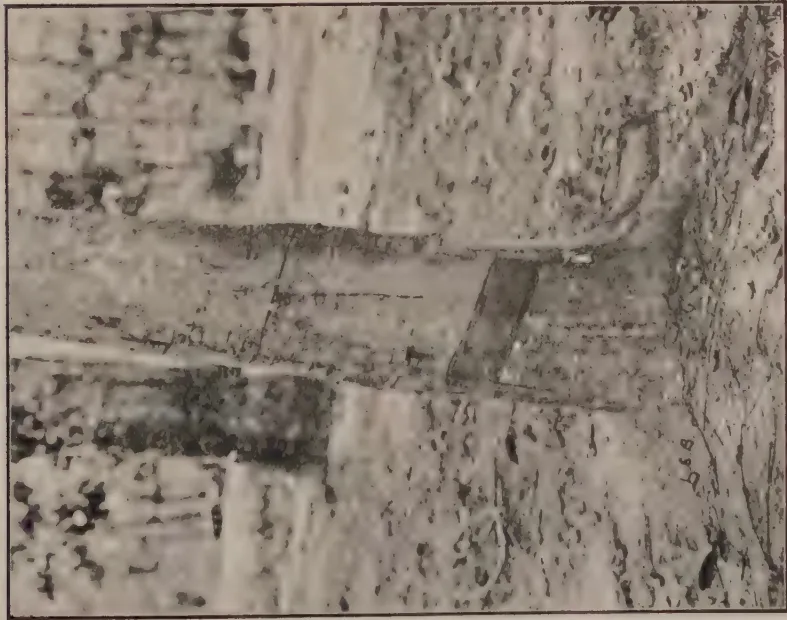
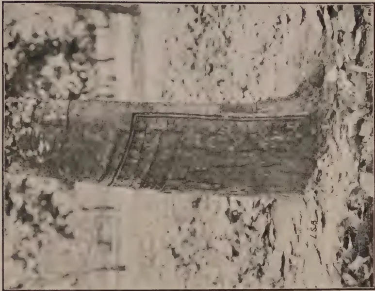
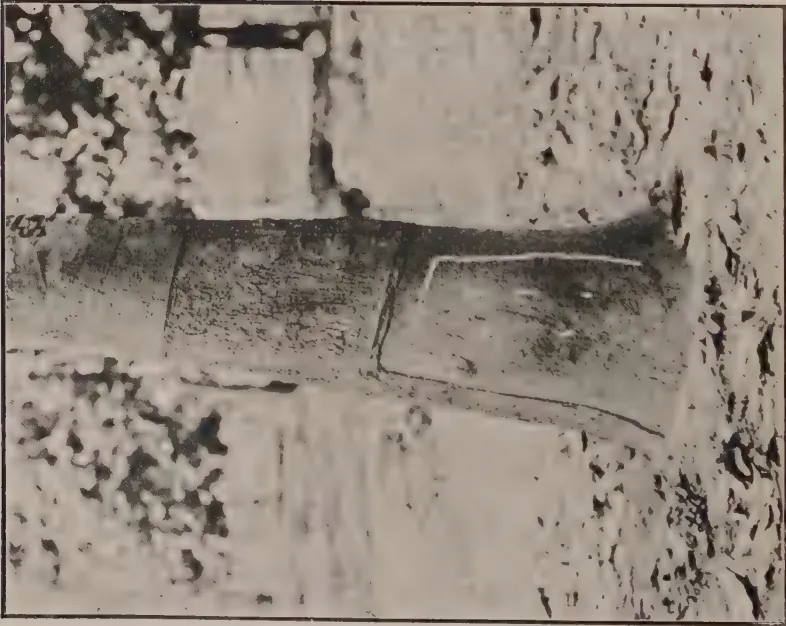

# The Tropical Agriculturist

April, 1927.

---

Editorial.

---

## Agricultural Conference.

**T**HE Second Agricultural Conference was opened by His Excellency the Governor (Sir Hugh Clifford, G.C.M.G., G.B.E.) on March 9th and a number of important questions were dealt with during its several sessions. The attendance at the opening meetings was greater than during the previous year, but at the meeting dealing with Village Agriculture on March 11th, the attendance did not come up to expectations. It was unfortunate that a meeting of the Legislative Council had to be fixed for March 10th,—to consider an urgent and important question relating to the Hydro-Electric Scheme—and thereby prevented members from attending the Conference.

The general concensus of opinion was that the Conference was a greater success than the one held in the previous year and that it served a very useful purpose in enabling the Department of Agriculture and the general agricultural public to discuss various problems together.

It is intended to reproduce the Proceedings of the Conference in the April and May issues of the *Tropical Agriculturist*.

1------------------------------------------------

194

# Programme of Agricultural Conference at Peradeniya.

## Estate Products.

### Wednesday, March 9, 1927.—Morning Session.

Opening of Conference by His Excellency the Governor.

#### Papers:—

1. 1. A review of recent work on root diseases of economic crops by Dr. W. Small, M.B.E., Mycologist, Department of Agriculture.
2. 2. Some diseases of tea by Dr. C. H. Gadd, Mycologist, Tea Research Institute.
3. 3. Recent work on pests of economic crops by Dr. J. C. Hutson, Entomologist, Department of Agriculture.
4. 4. Tea mites by Mr. S. Stuart Light, Entomologist, Tea Research Institute.

### Wednesday, March 9, 1927.—Afternoon Session.

#### Papers:—

1. 1. Brown bast of rubber and its treatment by Mr. J. Mitchell, Organizing Secretary, Ceylon Rubber Research Scheme.

#### Rubber:—

1. 2. The Importance of bark examinations in the selection of prospective mother trees by Mr. R. A. Taylor, Physiological Botanist, Ceylon Rubber Research Scheme.

#### Discussion:—

1. 3. A discussion on the manuring of rubber opened by Mr. H. W. Roy Bertrand.

#### Papers:—

1. 4. Pests and diseases of coconuts in the North-Western Province by Mr. C. N. E. J. de Mel, Plant Pest Inspector, North-Western Division.

## Meeting of the Board of Agriculture.

### Thursday, March 10, 1927.—Morning Session.

#### Agenda:—

- Election of Committees.
- Consideration of report of Special Committee on the further extension of the work of the Department of Agriculture.

## General Agriculture.

### Thursday, March 10, 1927.—Afternoon Session.

#### Papers:—

1. 1. Report on the work on the decomposition of green and organic manures by Mr. A. W. R. Joachim, Agricultural Chemist, Department of Agriculture.
2. 2. Cover crops and the possibilities of utilizing indigenous plants by Mr. T. H. Holland, Manager, Experiment Station, Peradeniya.
3. 3. The mineral constituents of Ceylon's fodder grass and the effect of deficiencies on animal growth, nutrition, and health.
   1. (a) The chemical aspect by Mr. A. W. R. Joachim, Agricultural Chemist, Department of Agriculture.
   2. (b) The influence of the various mineral constituents on animal nutrition and the effects of deficiencies and evidence of such in Ceylon by Mr. M. Crawford, Government Veterinary Department.

## Village Agriculture.

### Friday, March 11, 1927.—Morning Session.

#### Papers:—

1. 1. The selection of pure line strains of paddy by Mr. L. Lord, Economic Botanist, Department of Agriculture.
2. 2. Reviews of some of the Divisional work for the improvement of village agriculture by Messrs. G. Harbord, F. Burnett, G. E. J. Hulugalle, W. P. A. Cooke, Divisional Agricultural Officers.
3. 3. The work of eradication of the Water Hyacinth by Mr. W. C. Lester Smith, Plant Pest Inspector, Southern.
4. 4. The introduction of elementary agriculture in the vernacular schools by the Director of Agriculture.

## Inspections.

### Saturday, March 12, 1927.—Morning.

Inspections of the laboratories of the Department and of the Experiment Station, Peradeniya.

2------------------------------------------------

195

## The Second Agricultural Conference at Peradeniya.

March 9th, 1927.—Morning Session.

**T**HE Second Agricultural Conference was opened this morning at the Board Room of the Department of Agriculture. His Excellency the Governor (Sir Hugh Clifford, G.C.M.G., G.B.E.), presided, and there were also present Mr. W. L. Kindersley, Government Agent, Central Province, the Hon. Mr. F. A. Stockdale, C.B.E., the Director of Agriculture, the Hon. Mr. P. B. Rambukwella, the Hon. Mr. A. Mahadeva, Messrs. John Horsfall, J. P. Blackmore, N. D. S. Silva, Gate Mudaliyar A. E. Rajapakse, Mrs. F. A. Stockdale, Mrs. T. H. Holland, Messrs. R. G. Coombe, C.E.A. Dias, E. F. Trevaldyn, R. L. McConnell, Allan Coombe, A. Tait, Gordon Pyper, T. H. Holland, George Brown, S. Pararajasingam, J. T. Worthington, W.P.A. Cooke, J.I. Gnanamuttu, A. W. R. Joachim, W. C. Lester Smith, A. L. Anderson, Dr. W. Small, Dr. J. C. Hutson, Messrs. R. P. Gaddum, F. P. Jepson, S. Stuart Light, N. K. Jardine, J. C. Drieberg, Dr. C. H. Gadd, Messrs. H. A. Webb, Arthur H. G. Campbell, J. C. Haigh, J.D. Sargent, F. Burnett, A. H. G. Alston, L. Lord, Cecil de Mel, G. V. Wickremasekere, Bruce Gibbon, W. Paterson, F. J. S. Turner, J. C. Ratwatte, Dissawe, Henry L. De Mel, C.B.E., J.P. Obeyesekera, J. Mitchell, R. A. Taylor, T. E. H. O'Brien, Mrs. G. V. Wickremasekere, Messrs. A. J. Hamilton Harding, John Josef, Frank Solomons, H. B. Paine, G. E. J. Hulugalle, H. W. Malcomson, D. Malcomson, G. B. Foote, I. L. Cameron, P. Weerasekera, Chas. A. M. de Silva, G. Robert de Zoysa, Wace de Niese, W. R. Fernando, P. B. Keppitipola, J. R. Thistle, S. B. Udurawana, A. T. Sydney Smith, L. M. M. Dias, W. H. Fitzpatrick, A. N. Philbrick, D. J. Williamson, and others.

### Governor's Opening Remarks.

In opening the second Agricultural Conference at Peradeniya this morning, His Excellency the Governor stated that he would enumerate some of the various activities which were exciting the interest and emulation of the agriculturist of Ceylon.

3------------------------------------------------

196

To begin with, there was the question of soil erosion, which was the subject of several interesting papers at the last conference. Since then, he had had the privilege of inspecting the estates of Mr. C. E. A. Dias and examining for himself the work that was being done. He congratulated Mr. Dias on being one of the pioneers in this respect, though he thought the earlier pioneers still were the Kandyan peasantry, who had built their terraced rice fields up the sides of the mountains, as we saw them to-day. He was very glad to learn that terracing and contour planting was being undertaken in Ceylon on an ever expanding scale, and that seed for cover crops were being asked for in increasing quantities. He believed that Mr. Dias was supplying some of this demand for seed. It was one of the many public services Mr. Dias was rendering to the agriculture of the country.

The matter was exciting very considerable interest beyond the limits of Ceylon and he had recently received a despatch from the Secretary of State, Mr. Amery, informing him of this fact and saying that the passages in the administration report of the Director of Agriculture dealing with this question had excited very wide interest, and sending him instructions to forward copies of the report to practically all the agricultural Colonies in the Empire.

### Tea and Rubber Pests.

The Governor hoped that the experiments which the scientific staff were engaged in, in connection with wood-rot and the ravages of termites in connection with the tea industry and in Brown Bast in the matter of rubber, would eventually provide some means of dealing with them, but in the meantime as regards Brown Bast he was informed that during the last year it was still on the increase.

### Helping the Peasant.

The Governor next referred to what in his own estimation was the principal of the activities of the Department of Agriculture, and that was the assistance which it was affording to the peasantry of the country to improve their agricultural conditions. His experience of the European planting community and the Ceylonese estate owners, who, in increasing numbers were joining their ranks to-day, was that they were to a great extent capable of taking care of themselves, and though he had no doubt they derived a great deal of assistance from Mr. Stockdale and his staff, they had no such urgent need of their help as the peasantry of the country. Coming from Nigeria he had been specially interested to find that through the instrumentality of Mr. Stockdale and his colleagues, the planting of cotton in the Southern Province had made considerable progress. They in Ceylon who

4------------------------------------------------

197

were not as interested in this product as in West Africa, had perhaps marked without very great perturbation the recent unfortunate fall in the price of cotton. That sudden decline in price would certainly render the crops that the people were to-day raising in the Southern Province quite unremunerative, and after full consideration, acting on the advice tendered by Mr. Stockdale, the members of the Executive Council and himself had recently decided to ask the Finance Committee of the Legislative Council to provide the necessary funds to subsidise the crops for the current year, in order that those who had grown them would not lose. Economically, may be, this was not a sound act, and once the industry was thoroughly started in this country, it would have to stand upon its own feet and continue as a sound and lucrative business or else go out of business altogether. In the meantime, however, he very strongly felt that no great subservience to economic principles should be suffered to prevent the encouragement of a practical financial character being afforded to the pioneers of an industry which in many parts of the world had proved to be of such enormous advantage to agricultural peasantry. He felt therefore that the public funds which it was proposed to spend in order to tide cotton growing in the Southern Province over a precarious period in its infancy, would prove to be money well expended, as it might perhaps save from extinction a nascent industry which if it could be nursed through this crisis might later confer benefits upon the cotton growers and eventually upon Ceylon.

### White Burley Tobacco.

The Governor next noted the progress made with regard to tobacco cultivation, especially of white burley, the export of which for last year totalled Rs. 15,000.

### Seed Paddy.

His next reference was to the improvement of seed paddy. In some quarters there was a certain amount of impatience amongst critics of the Department who thought too little progress was being made in this matter but he would suggest to these gentlemen that Rome was a fine city, but that it was not built in a day. If some hurried person had put it together with a child's box of bricks, it possibly would not have been the city of such repute as that to which it had subsequently attained. The Governor explained that very careful and prolonged experiments were essential before the Agricultural Department could prudently or usefully advise paddy growers to adopt any one high-yielding type of seed. In the first place, the high-yielders had to be discovered and isolated, and their reputed

5------------------------------------------------

198

qualities had to be proved by searching investigation. Even when this had been done, the proved high-yielders could not be recommended promiscuously for adoption and use by rice cultivators in all parts of Ceylon. Instead, further experiments had to be made in order to determine the conditions in which any high-yielding type of paddy seed, which had been successfully isolated and tested, was best suited, and the localities in which its use could be recommended with confidence and without the risk of disappointing results discouraging the cultivator and destroying his trust in the advice given to him by the Department. All this his hearers would understand was a long process. It would be fatal to attempt to hurry it or to scamp work of such a highly responsible character. The Governor would, therefore, appeal to those who complained of delay to exercise patience as he had assured himself that work of real and permanent value was being done in this matter, but that to be of value it must necessarily be slow.

### Chena Cultivation.

There was one other point which was discussed at last year's Conference, and that was the matter of Chena Cultivation. Nobody, who knew the conditions which prevailed in many parts of Ceylon, could doubt that the cultivation of Chena was something which in those localities was an absolute necessity to the peasantry and he felt that in dealing with the granting of Chena lands, a spirit of liberal generosity should be exercised by those responsible for the custody of that great public asset of the colony, the unowned land. Although not wishing to criticise his predecessors, or his colleagues in the public service, he thought that something like over zeal for the Government share in the matter had characterised in the past, some of their dealings with the would-be Chena planter, and he thought that in the future Government should deal with him far more leniently and with more tolerance, sympathy and consideration. On the other hand they would agree that persistent Chena cultivation was open to serious objection and should not be indefinitely prolonged.

### Rotation of Crops.

The Department was at present engaged in a series of experiments with regard to the rotation of crops. In Nigeria he had witnessed successful experiments in the rotation of crops, introduced by the Nigerian Department of Agriculture, by which the same plot of land had been successfully worked under three rotating crops.—Cotton, Guinea corn, and ground nuts. It was his earnest hope that Mr. Stockdale and his scientific advisers and investigators would succeed eventually in working out a formula similar to that.

6------------------------------------------------

199

## Bud-Grafting of Rubber.

Referring to the visit of Messrs. Dias and Roy Bertrand to the Dutch Indies, the Governor said that they had come back with a tale that had made the hair of those who still possessed any stand erect upon their scalps (laughter). Personally he was inclined to think that the story told was rather more dreadful than the actual facts, but perhaps the hope was in some measure father to the thought and no doubt the question of bud-grafting would be extensively discussed during the sessions of the Conference.

He had noted, however, in a speech made by the President of the Ceylon National Congress a reference to bud-grafting, in which it had been suggested that the Government might pack the Commission, which was forthwith to be appointed to consider the land question, for the purpose of devoting to bud-grafting areas which ought to be made to carry a thriving peasantry.

Alarmed by that note of warning the Governor said he had made the necessary enquiries and had been relieved to find, on the authority of the Director of Agriculture, that 200 acres would be all that was necessary for the nurseries required for bud-grafting experiments in Ceylon. He did not think that in a colony where only one-third was, at present, under cultivation it would be any serious injury to prospective peasant proprietors if 200 acres of land were to be set apart for experiments that might be of lasting benefit to the rubber industry of Ceylon.

## Conclusion.

The Governor finally referred again to the speech made by the President of the Ceylon National Congress at Galle, who had said that in a country of white elephants the greatest white elephant was the Agricultural Department, and that he and others proposed ere long either to end it or mend it. The Governor said he could not help feeling that some of his friends might conceivably put him in the class of the white elephants of this country, more especially since his utility was less openly visible than that of his predecessors, under a constitution which had imposed upon the Governor less direct authority and responsibility than of old. As regards the Department of Agriculture, however, it would be sad to think that they had gathered there to celebrate its last illness and premature demise, even if it could be fairly described as a White Elephant. He suggested that if anybody wished to condemn any Department he should, at least, see for himself what its activities were.

7------------------------------------------------

200

The Governor said he had ascertained that the President of the Ceylon National Congress, who had spoken so glibly and with such bitterness of that Department, had never yet done it the honour of paying a personal visit to its headquarters and of satisfying himself concerning the activities carried on in its laboratories.

He had been in the Public Service for more than four decades, and had found it both a good and sound scheme, before he condemned anyone or anything, to put himself to some pains in the matter of preliminary investigation. He would, in a most friendly spirit, suggest the adoption of a similar plan to his friend, Mr. E. W. Perera.

In conclusion, the Governor said that he hoped these annual conferences of which this was only the second, would become a permanent annual event. The opportunities, which it afforded for the agricultural experts of the country to meet in debate the practical agriculturists who were carrying on the actual planting industries of the Island, were he considered, likely to prove to be of the greatest utility.

---

His Excellency then called upon Dr. Small, Mycologist to the Department of Agriculture, to read his paper on Recent work on root diseases of economic crops.

8------------------------------------------------

201

## Recent Work on Root Disease of Economic and Other Plants in Ceylon.

W. SMALL, M.B.E., M.A., B.Sc., Ph.D., F.L.S.,

*Mycologist, Department of Agriculture.*

**R**OOT disease of plants of economic and other importance in the tropics is of common occurrence, and a large amount of study has been given to it in various parts of the world. It has been found that certain fungi occur regularly on diseased roots, and it has been concluded that these fungi are the primary causes of the disease or diseases with which they are associated. Among the fungi in question may be mentioned the following,—*Fomes lignosus*, *Fomes lamaoensis* (the fungus of brown root disease of tea and rubber and other plants), *Ustilina*, *Poria*, *Rosellinia*, and *Diplodia*. These are well-known examples of the fungi referred to; in fact, these names are known to every tropical agriculturist who takes an interest in the question of root disease. Other fungi might be mentioned, but it is unnecessary for our purpose to extend the list. These fungi, then, may be taken as chief among the fungi regarded as the cause of root disease of tropical plants, especially of two plants of great economic importance in Ceylon, namely, tea and rubber. Their reputation as the cause of root disease seems to be well-founded and thoroughly established, and he who ventures to question it must expect to encounter opposition and criticism. As the result, however, of certain investigations carried out in recent months, reason for doubt concerning the primary parasitism of these well-established fungi has arisen. The investigations have led to certain conclusions which ought to be ventilated; they may not meet with immediate acceptance, but it is hoped they will be discussed.

When it is desired to examine the roots of a tree or bush which has died, it is customary to begin the necessary excavation at the trunk of the specimen. As he digs downwards and exposes the collar and the larger lateral roots of the plant, the investigator may meet at once with certain signs of the presence of root disease of fungus origin. In the case of a dead Para rubber tree or tea bush, for example, he may encounter a collar rot and by using his knife and his fingers, he may disclose without

9------------------------------------------------

202

difficulty the presence of the mycelial fans and black lines of the fungus known as *Ustulina*. He may think that he has found the cause of the loss of his tree or bush, and he may therefore stop his investigation at this point. Again, he may find on the stem and the larger roots the crust of soil and small stones which is characteristic of the presence of *Fomes lamnoensis*, the fungus of brown root disease, or he may find on the larger roots the mycelium of *Poria* or of *Fomes lignosus* or the characteristic appearance of *Rosellinia* or the grey staining of wood due to *Diplodia*, and he may again imagine that he has disclosed the cause of the disease and death of his tree or bush and that there is nothing further to be said about the particular case under investigation. In other words, he stops his investigation and comes to the conclusion that the fungus which he has found is the cause of the death of the tree or bush. The matter seems to be plain sailing and devoid of special difficulty, but is it really so? Has the investigator taken into account the fact that there may be present a fungus cause of disease other than the one he has found? There is a possibility that, if he continued his examination beyond the fungus found at once on the stem or larger roots and inspected carefully the smaller roots, he might find another fungus to be present. Such is indeed the case. Examples of root disease which appear to be clear and simple one-fungus cases are apt to prove on fuller investigation to be more complicated than they seem; in fact, it has been found in every recent case of *Fomes*, *Poria*, *Ustulina*, *Rosellinia* or *Diplodia* root disease that another fungus is present besides those mentioned. The name of the newly found fungus is *Rhizoctonia bataticola*, and, in order to disclose its presence, it is necessary to carry a root disease investigation beyond the apparent cause of disease which is usually to be found plainly on the larger roots in the forms mentioned. It is necessary to examine the larger roots internally and also the smaller roots and sometimes the smallest.

Since it has been suspected that root disease cases are not as simple as they seem, special attention has been given to root disease of tea and rubber and other crops in this country. It has been found that the cases may be divided into two classes. The first of the classes is those cases in which one fungus only is concerned, and the second those in which more than one fungus is present. The simple one-fungus examples of root disease are not cases of *Fomes* or *Ustulina* or *Diplodia* or *Poria* or *Rosellinia*; they are cases in which only *Rhizoctonia bataticola* is present and they are simple in the sense that the *Rhizoctonia* alone is to be blamed for the loss of the diseased tree or bush. In the case of the second class, that in which more than one fungus is present, it is to be noted particularly that *Rhizoctonia bataticola* has been found to be present in every case. Its companion may be *Fomes*

10------------------------------------------------

203

*lignosus* or *Fomes lamaocensis* or *Ustulina* or *Poria* or *Rosellinia* or *Diplodia*. In these two-fungus or complicated cases, it may be possible but it is unlikely that disease is primarily due to the simultaneous attack of more than one fungus, and the question therefore arises as to which of the two fungi, say, *Rhizoctonia* and *Fomes* or *Rhizoctonia* and *Ustulina*, is the real or primary cause of disease and which is only secondary to the attack of the other, a question that can be settled only by determining which fungus precedes the other in time of attack or, in plain language, which has got there first. *Fomes*, *Poria*, *Ustulina* and the other fungi mentioned have been regarded hitherto as sufficient in themselves to cause root and other disease, and the introduction of another fungus into the company may seem to be superfluous. The presence of *Rhizoctonia bataticola*, however, cannot be ignored. It must be taken into account, and there is more in the question than the mere adding of one more fungus to the list of those capable of causing root disease, for my interpretation of the meaning of the presence of the *Rhizoctonia* involves a complete change from the accepted view of the causation of root disease in the tropics. As already mentioned, the *Rhizoctonia* is often the sole cause of disease, and, I would repeat, it has been found to be present in every case of supposed *Fomes*, *Poria*, *Ustulina*, *Rosellinia* and *Diplodia* disease that has been examined in recent months. It is so consistent in its occurrence along with the fungi that have been supposed to be the only causes of root disease, that is, with *Fomes*, *Poria*, *Ustulina* and the others, that it is doubtful if those fungi ever occur alone.

Of the parasitism of the older-established fungi like *Fomes*, *Poria*, *Ustulina*, etc., there is little or no experimental proof; only *Ustulina* and *Diplodia* have been tested in inoculation experiments and they were shown to be only weak or wound parasites. *Fomes* and *Poria*, to mention others, are presumed to be truly parasitic because of their supposed sole association with frequent cases of root disease, but, as already indicated, recent investigation has shown that they are never in sole association with cases of root disease, and that, in fact, they have been accompanied by *Rhizoctonia bataticola* in every case examined of late. There is therefore good reason for an enquiry into the position of the older fungi. It is possible that they ought to be regarded, like *Ustulina* and *Diplodia*, as parasites of only weak or secondary capabilities, and it is also possible that the primary parasite which does the initial harm and so enables the other weaker fungi to attack with success is the one that is present in every case, namely, *Rhizoctonia bataticola*. In other words, *Rhizoctonia bataticola* may prove to be of greater significance as a cause of root disease than any of the fungi which have been

11------------------------------------------------

204

regarded till now as deadly parasites. *Fomes lignosus*, for example, is spoken of with bated breath. I doubt very much whether *Fomes lignosus* deserves its reputation or is capable of living up to it. It is a significant fact that *Rhizoctonia bataticola* has been clearly present in every recent case of supposed *Fomes* disease. Further, I have had the opportunity of examining recently two of the so-called patches of *Fomes lignosus* disease of rubber that exist in parts of Ceylon, and I have found that *Rhizoctonia bataticola* is present on every supposed *Fomes*-infected root. Under these circumstances, one's ideas regarding the harmfulness of *Fomes* must be reconsidered at least, if not drastically altered.

Leaving aside, on the one hand, the fact that there is little or no proof of the primary parasitism of the older-established fungi, it is pertinent to enquire, on the other hand, on what grounds it is claimed that *Rhizoctonia bataticola* may be a primary parasite and the other fungi only secondary. About half the number of cases of root disease of tea which have been investigated during the last nine months are clear cases of attack by *Rhizoctonia bataticola* alone, and, if no attention be paid for the moment to the reasons why the plants should be susceptible to the attack of the fungus, there is no reason why the *Rhizoctonia* should not be blamed for the loss of the bushes. In other words, it is the plain cause of root disease. The other half of the cases are complicated in as much as another fungus is present with the *Rhizoctonia* and it has then to be decided, as already pointed out, which of the fungi is of primary importance and which of only secondary account. In the majority of laboratory cases of tea root disease in which more than one fungus is present, it is impossible to say which fungus preceded the other in time of attack, for both may be found in equally advanced stages, as far as can be judged in the absence of standards of comparison. The reason for this is that diseased plants are seldom pulled up and sent for examination while they are still in the early stages of root disease. In other cases, however, the evidence points to the priority of *Rhizoctonia bataticola* over the other fungus. *Ustilina* has been found in an incipient stage at the collar of the plant while the *Rhizoctonia* was well-established in the roots. *Poria* causes a soft rot of attacked tea wood while *Rhizoctonia* hardens it and renders it brittle. Several *Poria* and *Rhizoctonia* cases have been found in which the upper part of the tap root which was covered with *Poria* mycelium was unaffected by *Poria* rot and still in the hard dry state induced by *Rhizoctonia* attack at a lower point. In the case of a number of tea plants which died in a group, *Rhizoctonia bataticola* had attacked every plant and the brown root fungus (*Fomes lamaoensis*) had occurred in addition to the *Rhizoctonia* on only one of them.

12------------------------------------------------

205

In the case of rubber root disease, a group of dying trees was found on the roots of which only *Rhizoctonia bataticola* was present. The fungus had invaded a number of the smallest roots and was slowly working its way inwards, so to speak, and killing the trees as it went. It was determined by a careful examination that no other fungus was present, and several of the dying trees were left standing in order that a future examination of their roots might show what fungi, if any, had followed in the wake of the *Rhizoctonia* which had already attacked the roots. After the lapse of five months it was found that the *Rhizoctonia* had been followed by *Fomes lignosus*, *Fomes lamaoensis*, *Ustulina* and *Diplodia*, and these four fungi were found together on more than one tree along with the original attacker, the *Rhizoctonia*. Further, these four fungi were confined to roots which had already been attacked and weakened or poisoned by the *Rhizoctonia*. Several similar cases have been found in which *Poria*, *Fomes lignosus* and *Fomes lamaoensis* have occurred together on different roots of a single tree while *Rhizoctonia bataticola* occurred in all the diseased roots. In another case, the *Rhizoctonia* was found to have permeated completely large rubber roots on which *Ustulina* was confined to the inner cortical layer in the form of mycelial fans. The *Ustulina* had not penetrated the wood, and its attack was evidently of later origin than that of the *Rhizoctonia*. Similarly, cases of incipient *Fomes lignosus* attack have been found on rubber roots already permeated by the *Rhizoctonia* or attacked by the *Rhizoctonia* at a lower point, and there has seemed to be no doubt that the *Fomes* followed the *Rhizoctonia* or, in other words, attacked roots which were already dying or weakened. Other cases can be quoted, but perhaps enough has been said to show that there is considerable field evidence in favour of the view that the *Rhizoctonia* precedes in time of attack the other fungus, *Fomes* or *Poria* or *Ustulina*, which may occur along with it. The significance of the fact that, in the case of rubber root disease, *Fomes* and *Poria* and *Ustulina* occur only on roots already attacked by *Rhizoctonia bataticola* must not be overlooked. These supposed parasitic fungi have not been found on roots which have not been affected by the *Rhizoctonia*; in fact, roots unattacked by the *Rhizoctonia* are usually healthy and full of latex although the upper parts of the tree may be dying back, and other diseased roots may be dead.

In cases of root disease in which two fungi are present, say, *Rhizoctonia* and *Fomes* on rubber, it may be asked why the *Fomes* should not be regarded as the primary parasite and the *Rhizoctonia* as secondary; in other words, why the *Fomes* should not retain its time-honoured reputation as a cause of disease and

13------------------------------------------------

206

why the *Rhizoctonia* should not be regarded as a saprophytic fungus which can attack only dead or dying roots. In reply to that question, I have attempted to show that in many cases the *Fomes* is clearly secondary to the *Rhizoctonia* in time of attack. Further, the fact that the *Rhizoctonia* may occur alone as a parasite and that the *Fomes* apparently never does so is of great significance, and, in my opinion, stress should be laid on the method of attack practised by the *Rhizoctonia*. It adopts the most natural means of entry into its host, namely, the smallest feeding roots, and, after establishing itself, so to speak, it grows inwards and upwards, always getting nearer the larger roots and killing or poisoning as it goes. In this way, it may be conceived as providing by its lethal effects on the larger roots and eventually on the collar of the attacked tree an easy means of entry for the secondary fungi of this country which prove to be *Fomes*, *Ustulina*, *Poria*, etc. The *Rhizoctonia* has been noted to kill or poison well in advance of its actual penetration its host or the part of its host that it has attacked, and it is likely that it is enabled to do so by the production of a toxin which is poisonous to the plant attacked. It is hoped to investigate soon the question of the toxin of *Rhizoctonia bataticola*, and to attempt to reproduce in experiment what is supposed to happen in nature. At the same time, the penetration of the *Rhizoctonia*, as shown by its presence in the tissues in the forms mentioned later, is so complete, even in cases complicated by the presence of another fungus, that it cannot be regarded as anything but the work of a parasitic fungus.

If we are to consider seriously the possibility of the priority of *Rhizoctonia bataticola* over the fungi found in its company, it is necessary to know with certainty that the *Rhizoctonia* is primarily a parasitic fungus, and we may consider now what evidence we have of its actual parasitism. First, there is the evidence of cases of root disease in which there are no complications, that is, cases in which the *Rhizoctonia* occurs alone and must therefore take all the blame for the disease caused. As far as Ceylon is concerned, there is no lack of examples of plain uncomplicated *Rhizoctonia* root disease. In Uganda where the *Rhizoctonia* was first found as a root parasite of woody plants like coffee, tea, cacao, *Albizia*, *Grevillea*, dadap and so on, the great majority of the cases are simple in the sense that the *Rhizoctonia* alone is found to have caused disease and death. Complicated cases are very rare; in fact, the only fungus of importance found to occur along with the *Rhizoctonia* was *Diplodia*. The difference, therefore, between Ceylon and Uganda cases of *Rhizoctonia* root disease lies, not in the fact that they are caused by different fungi, for *Rhizoctonia bataticola* is present in all cases in both countries, but in the fact that in Ceylon the dying roots are

14------------------------------------------------

207

attacked commonly by other fungi whereas in Uganda they are not so attacked. It must be concluded also that the other fungi, *Fomes*, *Poria*, *Ustulina*, etc., are far more common in the planting soils of Ceylon than in those of Uganda, and a probable reason for that is that the flora of the land used for planting in Ceylon differs from that of the grassland used in Uganda. On the whole, the Uganda evidence of the parasitism of *Rhizoctonia bataticola* is very striking. I may mention only two cases. In one, a certain coffee estate of 300 acres was shaded by hundreds of *Albizia* trees of two species, *moluccana* and *stipulata*, and every one of the *Albizia* trees died of *Rhizoctonia* root disease when it was five or more years of age, well-grown and useful as shade. In another, the numerous gaps in certain rows of *Grevillea robusta* trees planted as windbreaks to coffee show how deadly is the parasitism of *Rhizoctonia bataticola* on their roots. In fact, *Grevillea robusta* was the first recorded woody host of the *Rhizoctonia*, and attention was first drawn to the fungus by the frequent deaths of *Grevillea* trees. Like *Albizia*, they may succumb when they are well-grown trees, a process that is being repeated in Ceylon.

It is to be noted, on the other hand, that the parasitism of *Rhizoctonia bataticola* has been proved by experiment with more reference to herbaceous plants like beans than to woody plants like tea, rubber, coffee and cacao. Infection of coffee and *Eucalyptus* seedlings was obtained in Uganda, but the experiments were few and the intention to extend them could not be carried out. It should be remembered also that the finding of *Rhizoctonia bataticola* as a parasite of woody plants and trees is of comparatively recent date and that the only work upon this aspect of the subject has been done in Uganda and Ceylon with the exception perhaps of experiments with cotton seedlings in Egypt. Experiments are in progress here, but results are not yet available. Both seedlings and older plants in the field have been inoculated, and the experiments include inoculations with the older-established fungi, *Fomes*, *Poria*, *Ustulina*, etc., as well as with the *Rhizoctonia*. The action of the *Rhizoctonia* is known to be slow in many cases, and results may not be available for some time. To date no positive results have accrued from the *Fomes*, *Poria*, *Ustulina*, *Rosellinia* and *Diplodia* experiments. On the whole, I have been so impressed by the universal occurrence of *Rhizoctonia bataticola* in cases of root disease and by the conditions under which it occurs that I conceive of *Rhizoctonia bataticola* as the basic cause of root disease in Ceylon. It is, as it were, the foundation on which the other fungi build. While the other fungi, that is, *Fomes*, *Ustulina*, *Poria*, etc., may not be entirely blameless inasmuch as they may accelerate the work of harm begun by the *Rhizoctonia* and lead to a more rapid death than the *Rhizoctonia* alone, in my view they are to be regarded

15------------------------------------------------

208

as of secondary importance. I am prepared to be sceptical of their unaided ability to cause root disease until I find at least one case in which one of them occurs as the sole cause of disease either in the field or among my experimental plants.

A certain number of the Ceylon hosts of the *Rhizoctonia* has been mentioned; the complete list of victims is now about thirty in number. It includes tea, rubber, cacao, coffee, beans, dadap, *Albizia*, *Acacia*, *Grevillea*, *Tephrosia* (boga medeloa), *Clitoria*, sour sop, custard apple, chillies, tomato, lime, orange, plantains and several ornamental and useful trees and plants. I should like to add to what I have said concerning root disease caused by *Rhizoctonia bataticola* and its followers that I have found lately that certain fungi which occur on the aerial parts of certain plants may be regarded in the same light as the secondary root fungi mentioned. *Diplodia* dieback of rubber, for example, has been found in all recent cases to be accompanied by *Rhizoctonia* root disease. In other words, it is conceivable that the *Diplodia* dieback is nothing more or less than a symptom of the presence of root disease underground, the *Diplodia* fungus which is only a weak parasite being unable to cause a dieback unless the tree is in failing health from another cause. Similarly, the common dieback and gumming of lime trees may be attributed to *Rhizoctonia* root disease, and so also may the gumming of *Acacia*, *Grevillea* and other stems. Dieback of the aerial parts of a tree is to be regarded, on the whole, as a symptom of other trouble, most probably of root disease, and I am not prepared to believe in an independent fungus cause of dieback of local woody plants unless I am convinced that root disease is not present, especially *Rhizoctonia bataticola* root disease. The fact that dieback fungi are often found to be only weak or wound parasites supports this view.

These remarks apply particularly to Ceylon, but I shall not be surprised if they prove to have a much wider application. There are many countries in which I personally have no doubt that *Rhizoctonia bataticola* is present and undetected on such crops as tea, rubber, cacao, and citrus, and I think it is only a question of time and investigation until the fungus is run to earth, so to speak, and until its suspected great economic importance is realised in full.

I have attempted to show, first, that *Rhizoctonia bataticola* has been found to be present in every recent case of root disease, either alone or accompanied by another fungus; secondly, that the fungus that frequently accompanies it may have followed its attack and owed its ability to attack entirely to the previous harm wrought by the *Rhizoctonia*, and, thirdly, that *Rhizoctonia bataticola* must be regarded as a destructive parasite of woody plants and trees, in fact, as the only parasite of present import-

16------------------------------------------------

209

ance in the causation of root disease and its secondary results, for example, dieback and stem-gumming, in Ceylon. As I have said, this view of the causation of root disease is new, and I hope its announcement at this Conference will lead to a discussion upon it.

I shall conclude this paper with a short mention of two points of importance to the agriculturist. One is the question of the local distribution of the *Rhizoctonia*, and the other is the means of identification of the fungus. With regard to distribution, it has been found that *Rhizoctonia bataticola* occurs in the soil of all the planting districts of Ceylon. Cases of its attack on various host plants have been reported from Nuwara Eliya to Galle. It does not seem to be confined to certain types of soils or more common in certain soils than in others, and elevation has no influence on its distribution. Its universal occurrence throughout this island raises an interesting point, namely, the question of the mechanism which enables the fungus to scatter itself, as it were, so widely. It possesses a pycnidial stage which grows upon the aerial parts of plants, for example, the stems of jute in India. It is a species of the genus *Macrophoma*, but it is likely that its name will be changed. This pycnidial stage produces spores, and, when the spores fall to the ground and germinate, they give rise to the *Rhizoctonia* stage of the fungus. It is therefore conceivable that the distribution of the pycnidial spores by natural agencies like wind and rain and their germination in the soil when conditions are favourable account for the wide distribution of the *Rhizoctonia*. If this hypothesis proves to be sound, it will follow and will be proved, I hope, that the pycnidial stage of the *Rhizoctonia* is fairly common in Ceylon. In other parts, the pycnidial stage of *Rhizoctonia bataticola* is known on jute, beans and *Sesamum* (gingelly), and it is likely that other small pycnidial fungi which resemble those already proved to belong to the *Rhizoctonia* and which occur on other plants, for example, pigeon-pea, are also connected with the *Rhizoctonia*. A search is being made in Ceylon for the pycnidial aerial stage of the *Rhizoctonia* on both woody and herbaceous plants, the results of which piece of work may prove to be of importance in the control of the *Rhizoctonia*. Another point which demands investigation is that of the independent occurrence of the pycnidial stage of the *Rhizoctonia*; that is to say, it is important to know whether the pycnidial stage may occur on the aerial parts of plants which have not been attacked by *Rhizoctonia* root disease. If the pycnidial stage of the *Rhizoctonia* occurs independently of the root *Rhizoctonia* form, it is possible that the focus of attention may have to be moved from the soil *Rhizoctonia* which causes root disease to the aerial pycnidial fungus which originates new centres of the *Rhizoctonia* in the soil and so distributes a harmful fungus. The means of

17------------------------------------------------

210

control of *Rhizoctonia bataticola* may thus prove to be indirect. It is not a practicable measure to attempt to eradicate the fungus from the soil, but it may prove to be vulnerable at its source when found. Meanwhile, the only measure that can be recommended to the practical planter is that he should promote the health of his plants by all means in his power. Unfortunately, success in avoiding *Rhizoctonia* root disease cannot be guaranteed to follow that measure, for it is clear that healthy well-grown trees and bushes fall victims to the fungus and it is to be feared that they will continue to do so. In other words, there is no doubt that *Rhizoctonia* root disease will always occur when the fungus is present in the soil. As the actual factors which govern susceptibility to the attack of the fungus are not known, it is difficult to give advice of scientific value on means of increasing the resistance of plants exposed to the fungus in the soil. It was clear in Uganda that only introduced plants were attacked, and the same state of affairs may be found to hold in Ceylon when more data regarding the local host-range of the *Rhizoctonia* are collected, but, in the present incomplete state of our knowledge, it is impossible to foretell if that fact will have any real value or if it will point to profitable lines of investigation.

It has been indicated already that *Rhizoctonia bataticola* enters the root system of the plant by the smallest feeding roots and advances slowly through the small roots to the larger. If the larger roots are attacked by secondary fungi, as they often are, it may be difficult to find the *Rhizoctonia* in them; in fact, it often cannot be found. It may be cloaked by the secondary fungus, but it is more likely that it has not yet entered the larger root although its presumed toxic effects on the larger root have led to the attack of a secondary fungus. Its presence can be more easily disclosed on the smaller roots. The *Rhizoctonia* does not cause a rot or softening of attacked wood, and therefore small roots which are dead and hard and firm and which show transverse cracks in the bark should be suspected of *Rhizoctonia* attack. The bark of affected roots is easily detachable as a rule, and the wood will be found to be hard, dry and brittle and stained a brownish or grey-brown colour. All the roots of a diseased tree may not contain the *Rhizoctonia*; in fact, it is usual to find that only a proportion of them has been entered. The fungus itself appears in two forms,—small, black, pin-head dots which are termed sclerotia and thin, fine, black lines which pursue an irregular course in affected tissues. Both the sclerotia and the lines are found in and on both bark and wood, but they are more easily identified in and on the wood than the bark. It is to be noted that *Rhizoctonia bataticola* has no external mycelium or crust or manifestation other than the lines and sclerotia in the bark and that all small black dots are not sclerotia and all thin black lines are not necessarily the lines of *Rhizoctonia bataticola*.

18------------------------------------------------

211

## Discussion.

MR. JOHN HORSFALL wished to know whether a systematic rotation of their crops of green manures, such as Grevillea, Dadap, Tephrosia, etc., say for a period of 5 or 6 years, would avoid the occurrence of *Rhizoctonia bataticola*. He thought by going in for a rotation of green manures there would be a possibility of the prevention of *Rhizoctonia bataticola* as far as their nitrogenous crops were concerned.

DR. SMALL agreed with the suggestion of Mr. Horsfall and said that it might be experimentally useful. He also pointed out that several of the plants mentioned by Mr. Horsfall were not leguminous plants.

DR. GADD: I would first congratulate Dr. Small on his very interesting paper. His researches have undoubtedly required infinite patience and persistent effort. He has accumulated much data concerning the fungus *Rhizoctonia bataticola* and from these data he has drawn certain conclusions. I would submit, however, that the hypothesis that this fungus is a common soil saprophyte and not a parasite at all would fit the observed facts just as well as the hypothesis Dr. Small has enunciated. No doubt *Rhizoctonia bataticola* under certain conditions does cause disease, but that this fungus should be the primary cause of diseases which have previously been ascribed to other fungi is open to doubt.

I gather from Dr. Small that he would regard *Rhizoctonia bataticola* as the primary cause of those diseases commonly known as Brown Root disease, *Fomes* and *Poria*; and that the fungi *Fomes lamaoensis*, *Poria hypolateritia* and *Fomes lignosus*, which previously have been regarded as the cause of these respective diseases, are of secondary and not primary importance. If that is so, one would expect some resemblance between the spread of these diseases in the field as they are due to the same primary cause. Those planters who have had experience of *Poria* or *Rosellinia* in tea or *Fomes* in rubber know only too well how difficult they are to eradicate, how tree after tree succumbed to these diseases until whole areas are wiped out. On the other hand, Brown Root disease is very amenable to treatment. It commonly attacks solitary trees, usually adjacent to old stumps and as a rule does not spread to any great extent. I have never seen Brown Root disease working through a patch, destroying tree after tree such as is only too common on many tea estates where *Poria* or *Rosellinia* is at work, or in rubber estates where *Fomes* is prevalent. To assume that these trees were first attacked by *Rhizoctonia* is to beg the whole question. Granting that *Rhizoctonia* is present on the roots of all these diseased trees, it does not follow that they would have died or even has appeared sickly had not *Poria* or other well known diseases come along and killed them. If it is persisted that the deaths are primarily due to *Rhizoctonia bataticola*, it seems strange that Brown Root Disease should crop up when solitary trees are to be "finished off" while *Poria* and *Fomes* occur only when a large patch has been prepared by the ravages of *Rhizoctonia bataticola* for slaughter.

I think that Dr. Small rather over-emphasizes the importance of the question as to which organism arises first, *Rhizoctonia* or *Fomes*, I would take a simple example from medicine. A man gets a cold, later pneumonia intervenes and the man dies. I would ask what organism killed the man—the pneumonia germ or the cold in the head? *Rhizoctonia bataticola* is equivalent to the cold in the head.

The most serious view that I can take of *Rhizoctonia bataticola* is that it is one more fungus to be added to an already long list of fungi causing disease. That it is of itself very serious I cannot accept at present. It may, like the *Diplodia* disease of tea be serious under certain conditions, and it is possible that a fuller knowledge of the conditions which favour fatal attacks by *Rhizoctonia bataticola* will give us a fuller insight into the disease of tea commonly known as *Diplodia*.

19------------------------------------------------

212

Though differing fundamentally from Dr. Small as regards his conclusions, I realize the importance and value of his investigations. Much however remains to be done before the true value of *Rhizoctonia bataticola* can be accurately gauged and it is hoped that Dr. Small will be afforded opportunities of continuing his researches.

DR. SMALL said that Dr. Gadd had brought up too many points at once and that he would like to take them up one by one.

DR. GADD then mentioned the cases of Brown Root and *Poria* referred to in his remarks, and Dr. Small replied that he could not explain why one fungus (brown root) should occur singly and the other (*Poria*) in groups, but that he must emphasize the fact that *Rhizoctonia bataticola* occurred in all.

MR. G. BRUCE FOOTE inquired if *Rhizoctonia bataticola* was the same disease that attacked Vigna.

DR. SMALL replied that the species of *Rhizoctonia* of his paper (*bataticola*) was distinct from the species that attacked Vigna (*solani*).

THE DIRECTOR OF AGRICULTURE said that he would like to offer a few remarks on Dr. Small's paper and the discussion that had taken place. Dr. Small had indicated to the Conference that day the results of his observations on *Rhizoctonia bataticola* during the past year. Soon after Dr. Small's arrival here he found the presence of *Rhizoctonia bataticola* on small rootlets of plants suffering from root diseases; and a number of these diseased specimens which were sent in for examination to the mycological laboratory were examined as carefully as possible in order to test the frequency of occurrence of this particular fungus. He placed his facts before the Conference that day, and there was still a considerable amount of work to be done. There were also a number of experimental investigations being carried on in the Mycological Division to elucidate some of these points. The parasitism of *Rhizoctonia* was being ascertained experimentally and if the supposition that *Rhizoctonia* is responsible, and primarily responsible, for our root diseases of economic crops, a considerable change of view on certain field practices would have to take place. In Uganda this disease attacked very largely introduced plants and it was said to be doing no harm to indigenous plants. If this were the case they would have to review their position with regard to shade plants and they might have to look to the use of some of their indigenous flora. He intimated that these investigations would be carried further and he hoped that it would be possible to give every facility for this work as he thought this problem to be one of primary importance to the planting industries of this Colony. Dr. Gadd had indicated to them that he held different views, but it was the intention of Dr. Small to further carry out his investigations. In concluding his remarks the Director said that that fungus for the greater part attacked the small rootlets and every one knew the loss which resulted from root diseases. The fullest attention should be given to this problem at an early date.

HIS EXCELLENCY THE GOVERNOR in winding up the discussion stated that there was obviously a difference of opinion. That reminded him of his experience in West Africa where a school of medical men who were there at the time of his arrival, held that malaria was responsible for the ill-health of many of the European inhabitants in that country. Another school of thought, however, held that the cause of that ill-health was yellow fever. When Lady Clifford and his Private Secretary went down shortly after arrival with a clear case of yellow fever, those who held the malaria theory had to change their views. It was probable that a new comer like Dr. Small had seen what had been overlooked in the past, and that a change of views might have to take place. The investigation was still in its infancy, and required careful consideration. However, he was glad that the two shades of opinion were presented at that Conference, and he thought that was a very good sign. They would have the views of both sides, when the matter was fully gone into. He thanked both Dr. Small and Dr. Gadd for their views.

20------------------------------------------------

213

## Some Diseases of the Tea Bush.

C. H. GADD, D.Sc. (Birm.),

*Mycologist, Tea Research Institute of Ceylon.*

**A**LTHOUGH I have selected as the title of my paper "Some Diseases of the Tea Bush" it is not my intention to describe in detail certain ailments which affect this bush. Instead, I propose to consider the question of plant diseases in general terms, making special reference to Tea.

First I would consider what is meant by disease. It may be looked upon as an unwholesome condition, a derangement of, or departure from the normal in structure, in function or in both combined. It is a condition in which one or more organs are incapable of carrying out their proper functions in an efficient manner. And it often results in death.

Practically all the diseases of Tea with which we are acquainted are accompanied by definite symptoms by which the diseases may be recognised. Dead areas on a leaf indicate a leaf disease; galls and lesions on stems a stem disease, and so on. Usually associated with the dead tissues are fungi, bacteria, insects or other living organisms, and suspicion is first directed to such organisms as the cause of the disease. Sometimes no definite organism is associated constantly with the diseased condition; then the cause is usually attributed to some unfavourable environmental condition, which in some way or other has impaired the proper functioning of one or more organs. The latter diseases are termed physiological diseases.

Thus we can divide plant diseases into two types:—

1. 1. **Organic diseases** due to attacks of living organisms.
2. 2. **Physiological diseases** due to unfavourable conditions such as unsuitable soil, excess of water, etc.

Such division would appear to be precise and definite, particularly when one realises that an organic disease radiates from a centre in ever enlarging circles, while a physiological disease strikes a whole area at once and does not spread.

Owing to their ability to spread, in many cases to spread rapidly, organic diseases must be regarded as most serious. The havoc that a rapidly spreading disease may cause is well known; and it will be sufficient to mention the coffee leaf disease as an example of an organic disease which brought disaster to a great planting industry.

21------------------------------------------------

214

The fungus parasites of tea are numerous, as may be seen by reference to Mr. Petch's excellent book on "The diseases of the tea bush." Some of us may have wondered why this bush is able to survive in Ceylon where there are so many and varied fungus parasites present and capable of attacking it. The reason is that the mere bringing together of host and parasite does not necessarily result in disease. We know that certain diseases of the human body are highly infectious and that normal healthy people are liable to infection by them. There are also other less highly infectious diseases with which a fit person may come into contact without acquiring the disease, whereas another, feeling off colour or run down, may become infected. The same applies to plants. There are fungi which will attack healthy bushes under almost any condition and cause disease, while others can only attack a bush when there is something wrong with it, a lack of vigour or general weakness.

We can therefore divide the organic diseases into two classes. (1) Those caused by organisms which can attack healthy plants under a wide range of conditions. (2) Those caused by organisms which can only attack bushes which are lacking in vigour, or in which one or more organs is not functioning normally.

It may be argued that the second group should be classified with the Physiological diseases, because the primary cause of disease is some factor which affects adversely the physiological processes of the bush and reduces its power of resistance to the attacks of certain fungi. As the damage caused by the invading fungus is usually infinitely greater than that resulting from the primary cause, and because the disease is most readily identified by the fungus associated with it, it appears advisable to keep this group distinct from the purely physiological diseases.

**Highly infectious organic diseases.**—Fortunately the fungi which can attack healthy tea under all sorts of conditions are numerically few. The diseases belonging to this class must be considered as the most serious and every effort made to eradicate them and to prevent their spread. The root disease caused by *Poria hypolateritia* is a good example of this type. It is known to occur in new clearings in all types of soil, and in districts with different climatic conditions. It spreads slowly but surely through the soil in ever enlarging circles. Treatment for this disease must be drastic to be effective. Suspected bushes must be sacrificed and every effort made to remove all the roots so that they and any fungus they may contain may be burnt. Trenches must be constructed to prevent the spread to neighbouring bushes, of any fungus which may have been left in the soil. A trench must therefore enclose all the infested soil; if soil outside the trench is infected the value of the trench is nil. As

22------------------------------------------------

215

there is no sure means of recognising whether the soil is or is not infected, it is advisable to construct two trenches, the inner one outside the suspected boundary of the infected soil, and the outer so that it will enclose a further belt of healthy bushes, 2 or 3 rows deep. The failure to construct a trench so that it enclosed the whole of the infected soil has resulted on many estates in the continuance of the disease and the loss of more bushes.

I am sometimes asked whether it is not possible to apply some disinfectant to the soil which will destroy the fungus without necessitating the removal of all the roots. Unfortunately to my knowledge there is no such disinfectant, and the one which has been most frequently suggested to me, viz. Bordeaux mixture, is one of the worst. An infected root, no matter how slightly infected it may be, has the invading fungus within its tissues. Any disinfectant to be effective must penetrate the root tissue in order to reach and destroy the fungus. What is required, therefore, is some disinfectant which will penetrate root tissues and will destroy the fungus protoplasm without hurting the protoplasm of healthy living roots. I am afraid that the prospects of finding such a disinfectant which will be suitable for application to the soil, are very small.

Infectious root diseases which spread slowly through the soil are much easier to cope with than are fungi which attack the above ground organs, and which are dispersed by the wind. The latter spread more rapidly and are consequently more difficult to control. The usual method for combatting such diseases is to coat the plants with a poisonous deposit so that any fungus spore finding lodgment there will be killed by the poison. There are obvious objections to such treatment for tea, particularly when the part attacked is the flush. To protect the tea plant against a fungus disease affecting the flush, spraying would have to be carried out at very short intervals so that the newly grown shoots may be protected. It must be evident that the combatting of such a disease would be a very difficult and expensive matter. Fortunately the tea bush in Ceylon is relatively free from such diseases, there being but one which can be included under this heading. That is the disease caused by *Cercospora Theae* which occurs in up-country districts.

This disease, although fairly wide spread, becomes serious only in those regions where heavy mists occur for long periods during the monsoons. Then, the flush over large areas may be destroyed and the loss resulting therefrom may assume serious proportions. One estate of about 400 acres lost 50,000 lb. of leaf from this disease alone in 1925. With an improvement in the weather conditions the disease disappears and the bushes recover. The weather, then, is the main controlling factor. This disease also occurs on certain shade trees and trees grown for

23------------------------------------------------

216

manure, particularly Acacias. In fact the fungus may be regarded more as a disease of shade trees than of tea. By this I mean that the fungus grows more readily on certain shade trees than it does on tea, and that except under exceptional conditions, the spread is always from the shade trees to the tea and rarely from tea to tea. Consequently great attention has to be given to the selection of shade trees in districts liable to attacks of *Cercospora*. The choice of suitable shade trees is often a difficult problem but trees liable to this disease should not be selected for localities where *Cercospora* occurs. Experiments in the laboratory and observations in the field have shown that the recently introduced *Albizzia lopantha* is equally susceptible to this disease as is *Acacia decurrens*, and consequently is not to be recommended for *Cercospora* districts.

A problem which requires solution is "How and where does *Cercospora* survive during the drier periods?" Recently, a further stage in the life history of this fungus has been discovered and it is suspected that the fungus is able to carry on from one monsoon to the next in this stage. At present, no practical use can be made of this discovery, as this stage is unknown in nature, but there is every reason to believe that it is to be found in nature if only we knew just where to look for it, as it is produced readily under laboratory conditions.

**Slightly infectious diseases.**—Turning now to the larger group of less highly infectious diseases which are dependent to greater or less extent on some derangement of the physiological processes of the bush before they can initiate their attack, we are confronted with a large number of problems which require solution. I think I am correct in stating that our knowledge of the fungi which attack the tea bush is in a more advanced state than our knowledge of the tea bush itself. What we know of the physiological processes occurring in the bush has been derived, in the main, from deductions made from the results of investigations carried out on other plants. Our first hand knowledge of the life processes of the tea bush is at present small, but it is hoped that this state will soon be remedied.

Certain diseases are usually associated with the process of pruning, and there is reason to believe that in some way or other the derangement caused by pruning is the primary cause. The root disease, commonly known as the *Diplodia* root disease, usually becomes evident in some districts after pruning. *Botryodiplodia theobromae* is commonly found on the dead roots, and Dr. Small's researches have brought to light the presence of another fungus, *Rhizoctonia bataticola*. As yet, neither of these fungi have been proved capable of causing this disease under experimental conditions, and one can only suspect that pruning itself is the important factor. The present methods of pruning are

24------------------------------------------------

217

the result of the combined experience of practical agriculturists and are adapted to the needs and conditions of different districts, but their immediate effects on the bush are not known in detail. Do the roots die back, as is often stated, as a result of cutting off the stems ? If so, the dead roots may form places of entry for fungi which may cause the disease. Or, does the constant plucking and pruning of the bush result in a depletion of the food reserves until a point is reached when the recovery from pruning is slow and the vitality of the bush reduced to such an extent that it falls a ready victim to weakly parasitic fungi ? To these and other questions relating to the effects of pruning the answers are obscure.

The part which pruning plays in the initiation of Wood rot or Branch canker is more obvious. In this case, the wounds made during pruning expose the wood to the attacks of wood rotting fungi. The only efficient protection for such wounds is the callus formed by the bush itself. It has been shown by experiment that the healing of shot-hole-borer galleries is accelerated by a proper manuring system, and it is to be assumed that a correct manuring system will similarly speed up the callus formation over pruning cuts. But is it purely a question of manuring ? Will not such factors as the methods of plucking and pruning play their parts ? The determination of all the factors which affect the process of healing is another big physiological problem requiring solution.

Large pruning cuts, even under ideal conditions, will take several years to heal over completely. During this time the exposed wood is liable to attack. Consequently, a temporary cover is needed to protect the wood until a complete callus can be developed. For this purpose washed gas tar is at present recommended, not because it is the ideal temporary cover but because we do not know of a better one for general economic use. It has been suggested that such a temporary cover is not necessary, because the bush, when supplied with suitable food materials in the form of manures, can form an efficient barrier below the cut, such that invading fungi cannot pass it. I have examined many sections through pruned stems but have never seen anything resembling such a barrier, and the prevalence of wood-rot on estates leaves me to doubt that the formation of a fungus-resisting barrier is normal in tea. Recent work in England in connection with the silver leaf disease of the plum has shown conclusively that the plum forms a barrier of wound gum which the fungus *Stereum purpureum*, which causes "Silver leaf," cannot penetrate. The plum forms wound gum very readily but tea does not; moreover, the gum is for the main part derived directly from the reserves of starch accumulated in the wood. Tea in plucking, as far as my own researches have gone, has very little starch stored in the

25------------------------------------------------

218

main stem and consequently has very little material to draw upon for the formation of a barrier when the cut is made on the main stem. I mention this to show how unsafe it is to argue that because a natural barrier may be impermeable to one fungus it will also be impermeable to other fungi. The suggestion of the natural barrier is no doubt worthy of further investigation, but in the present state of our knowledge I cannot personally recommend any planter to rely on the formation of this unknown barrier in tea in preference to using washed coal tar or other temporary cover.

**Physiological diseases.**—Lastly, I have to refer to diseases which are caused solely by environmental conditions and in which fungi or other organisms play little or no part. The immediate cause of some diseases belonging to this category is often quite obvious, *e.g.*, frost, drought, water-logging, etc. The direct cause of other diseases is very obscure. The Witches' Broom disease of Tea is a case in point. The available evidence concerning that disease indicates that it is a result of some adverse factor associated with soil. Under the term "Soil conditions" are included innumerable factors besides chemical and physical condition. The best soil analyst is the plant; the plant will detect small differences in soil fertility which cannot be detected by the finest technique of a chemical laboratory. But the opinions of different plants regarding the fertility of a certain soil are as different as expert opinions may be. The saying "One man's meat is another man's poison" is equally applicable to plants. On one estate the tea may be dying of a physiological disease, a chlorosis exhibited by the yellowing leaves, which is one phase of the Witches' Broom disease, while the interplanted *Tephrosia* thrives well. This may be due to the fact that although a certain food element is present in the soil, the one plant cannot get it whereas the other can. Or there may be present some chemical substance in such concentration that it is toxic to one plant but not to another. Or again, the chemical composition of the soil may have little to do with the disease; a physical factor may be the direct cause. This implies that a knowledge of the various factors which together we call environment is insufficient without the knowledge how the individual plant will react to them.

It is sometimes stated that tea will not stand lime. That conclusion is no doubt based upon the observations of experienced planters and there may be good reason for such a statement. It has been shown experimentally that the application of lime depresses the cropping capacity of the tea plant; no doubt the reduction in crop is the visible result of some derangement of the life processes of the bush. But whether that derangement is due to a toxic action of excess Calcium or whether the lime brings about some alteration in the chemical or physical properties of the soil which renders it less suitable to tea has yet to be

26------------------------------------------------

219

determined. We started by defining a diseased condition as a departure from the normal in function; if that is correct the derangement of the tea bush following the application of lime must be regarded as a diseased condition, and it is possible that, in an aggravated form, the bush may exhibit more obvious symptoms than just reduction in crop.

Before it is possible to recognise a departure from normal, one must be thoroughly acquainted with the normal condition itself. In this case normal is synonymous with healthy. Thus a complete knowledge of the diseases of the tea plant is dependent upon a full knowledge of the healthy bush.

**Conclusion.**—It has been my purpose in this short paper to direct attention to the need of a fuller knowledge of the life processes of the bush. A study of the physiology of the tea bush, I feel sure, would indicate the true value of the various operations performed during the cultivation of the bush, as well as give us a better knowledge of its diseases and the way to control them. At the same time, further study of the parasites which are associated with diseased conditions is necessary. Every effort has to be made to check the spread of organic diseases which may bring disaster to a flourishing industry, and that necessitates a close study of the organisms capable of causing disease. These organisms are the enemies of the tea industry. But in a struggle for existence it is well to know friends as well as enemies, and I submit that a fuller knowledge of the physiology of the tea bush would bring to light the various friendly agencies in this struggle as well as the factors which favour disease.

## Discussion.

MR. A. T. SYDNEY SMITH said that his experience of the use of tar on wounds of the tea bush was that it too frequently burnt the cortex.

DR. GADD stated that he had recommended washed gas tar. Washed gas tar was less injurious.

MR. JOHN HORSFALL remarked that the planters of North India were rather against the use of tar. There they practised a method which seemed to have resulted in a considerable measure of success. Equal proportions of cattle dung and earth were mixed and applied to the pruning-cut. In this way they appeared to ensure a satisfactory healing of pruning cuts. He thought the Director of Agriculture would support his observations.

THE DIRECTOR OF AGRICULTURE stated that Dr. Gadd had raised an important point with regard to the physiology of the tea bush. There was no doubt that there was a very real necessity for increased work on the physiological functions of the plant.

MR. R. G. COOMBE, the present Chairman of the Board of the Tea Research Institute, stated that the Board was considering the question of employing the services of a bacteriologist or a physiologist. Work on both lines appeared to be necessary and desirable, but the Board had not arrived at a decision as to which was to receive preference.

27------------------------------------------------

220

## Recent Work on Some Pests of Economic Crops. W.

J. C. HUTSON, B.A., Ph.D.,

*Entomologist, Department of Agriculture.*

I PROPOSE to discuss as briefly as possible a few points relating to the habits of some of the insect pests with which the Division of Entomology has been concerned during the past year or so and to touch on some of the measures which may be adopted for their control.

### Some Tea Pests.

We shall first consider some of the tea pests. As you are aware, the Tea Research Institute has taken over from the Department of Agriculture the investigation of most of the tea insects, but the Department has retained for the present the investigation of two pests or groups of pests, namely, termites and two of the scale insects.

**Tortrix.**—Before touching upon these I should like to mention one or two points about the habits and control of tortrix. There is not sufficient time at my disposal to give an outline of the article on Tortrix in the *Year-book* of this Department for 1927, so I will simply confine myself to a brief discussion of certain observations on the life history of tortrix which may be of interest in connection with two of the suggested control measures, namely (1) the collection of egg-masses and (2) the collection of caterpillars and pupae.

1. **Collection of egg-masses.**—Those of you who have had experience of tortrix under field conditions will know that in the case of tea the egg-masses are usually laid on the older leaves and almost invariably on the upper surface of such leaves. Their conspicuous position makes it fairly easy for plucking coolies to spot them and after a little practice even the smaller masses can be detected. To illustrate this, I may mention that during the life history work on tortrix I got down several hundred egg-masses from three estates in the Maskeliya district as brought in by the egg-collecting coolies. It should perhaps be mentioned that on one of these estates the collection of egg-masses and caterpillars is part of the plucking routine, while on the other two no regular egg-collecting is done, and coolies familiar with the appearance and usual positions of the masses were put on to collect what masses they could find. I took counts of the first 1,000 of these egg-

28------------------------------------------------

221

masses and the results showed that the number of eggs in a mass ranged from 29 to 400, the average number of eggs in a mass being about 122. Of these 1,000 masses, 56 per cent. were masses ranging between 29 and 120 eggs, that is, were small to average size masses, about 33 per cent. were masses between about 125 and about 200 eggs, while the remaining 11 per cent. were masses between about 205 and about 400 eggs. These figures, although on a small scale, indicate that observant coolies can spot even the smaller masses. They also illustrate the great range in size of tortrix egg-masses.

It is not my intention to discuss all the arguments for and against egg-collecting, but I may mention that those who have tried it for continuous periods of at least one year are satisfied with the results, which, it is claimed, would have been still more satisfactory had neighbouring estates co-operated in a programme of concerted action. Experience has shown that the spasmodic and irregular collections of egg-masses and caterpillars, usually employed as emergency measures, are of little avail in checking sudden outbreaks of tortrix. Continuous egg-collecting trials have indicated that egg-masses can be found in appreciable numbers during every month in the year and that there are periods of three or four months at a time during which the eggs may be laid in larger numbers. The main egg-laying season may be either during the north-east or during the south-west monsoon depending on the district, and some districts may experience two periods of intensity. I would suggest that if any beneficial results are to be expected from egg-collecting it should be given a thorough trial throughout the whole of two years at least. Furthermore, that all estates in a given district should co-operate to give the trial a chance of showing definite results.

**2. Collection of caterpillars and pupae.**—I have indicated above that this measure should be carried out in conjunction with egg-collecting as part of the estate routine, the object being to destroy not only those larvae which may have hatched from masses previously undetected or laid since the last round, but also any surviving pupae.

The incubation period of tortrix egg-masses under field conditions is given in Bulletin No. 40 of this Department as being from 10 to 12 days at elevations of 3,000 to 4,500 feet, and much of the tea area liable to severe attacks of tortrix is situated between these two elevations. The incubation period of tortrix egg-masses at these higher elevations may be said to correspond roughly with the plucking interval for the same elevations, so that it should be possible, by collecting egg-masses at plucking rounds, to get most of the eggs laid since the last plucking round

29------------------------------------------------

222

before they hatch, except perhaps those laid within 24 hours after plucking. In Bulletin No. 40 it is stated in one place that "the larvae remain on the undersides of the matured leaves until the first moult is passed—a matter of five to eight days." In another place in the same bulletin we find it stated that "directly the first instar is over the larvae become solitary in their habits; they distribute themselves at night over the bush, generally ascending to the flush where they spin two or more leaves together to form a shelter for themselves during the day." Now, if the young tortrix larvae remain on the older leaves for the first few days of their life it means that they escape collection at the first round after hatching and some of them are able to get up into the flush and do some damage before the next collecting round. If on the other hand some of them find their way up to the flush within a day after hatching they may be just in time to be removed by the pluckers before they have done much damage. In a recent article on tortrix in the *Year-book* of this Department for 1927 mention is made of one or two small experiments made to try and discover what happens to the newly hatched tortrix larvae. I will not go into all the details here, but it will be sufficient to say that these experiments indicated (1) that there is a high mortality of young larvae of the first stage; (2) that a small percentage of newly hatched larvae ascend to the flush within 24 hours after hatching and web themselves up within the younger leaves; and (3) that larvae hatching under windy conditions may be spread by the wind for at least three or four bushes to leeward of their hatching point. The larvae were allowed to develop undisturbed for three weeks, after which all the surviving larvae were removed and counted. In one experiment out of the 150 larvae which originally hatched from an egg-mass put on to an uninfested bush only 34 larvae had survived on four bushes and 29 of these were in the flush; in another similar experiment 37 larvae out of the original 100 were alive on five bushes, 23 being in the flush. The bushes were left unplucked during the experiments, but in the ordinary course of events the larvae in the flush would have been removed by plucking or by special collecting.

In conclusion, it is suggested that if any concerted action is taken with regard to the collection of eggs, caterpillars and pupae, the campaign might with advantage be started during the tortrix off-season in any given district rather than at a time when the pest is seriously prevalent. Further, that the campaign once started should be carried on without a break for at least two years, or until such a time as more efficient measures are discovered. It would be of great interest and value for estates to keep an account of the number of egg-masses brought in at each collecting round. This would serve to indicate not only the

30------------------------------------------------

223

seasonal distribution of tortrix in any given district but the actual value of the experiment.

**Green bug and brown bug.**—I must now pass to those pests of tea which are still being investigated by this Department. Before mentioning the recent work on tea termites I should like to refer briefly to the two scale insects, green bug and brown bug, which have been the subject of further investigation during the past year. Those of you who have attended the meetings of the Estates Products Committee within recent years are aware that these two insects are prevalent as pests mainly on some estates in the Haputale and Bandarawela districts. They have occurred year after year in certain definite patches of tea, causing leaf fall, checking the growth of flush and affecting the yield adversely; in some years the infested areas have become larger or the pests may have appeared for a time in new areas, only to disappear later.

As a preliminary to further investigation, a circular letter was sent to several estates at the end of 1925 asking for information about the pests and the subject was discussed at the January, 1926, meeting of the Estates Products Committee. This was followed up in March by an investigation of the pests under field conditions, and a suggested programme of control measures was laid before a meeting of planters at Haputale in April. This programme was discussed in detail and it was agreed that the suggested measures would be given a thorough trial by all estates concerned.

Recent inquiries made to infested estates in the two districts have indicated that all infested estates are taking up the suggested programme with considerable energy. Infested areas are being sprayed on some estates; the pruning interval is being reduced to 2 or  $2\frac{1}{2}$  years; constant attention is being given to the improvement of the established drainage system and to the provision of more drains where needed; green manure plants, mainly dadap, are being supplied where required; terracing is being done where necessary and boga medeloa is being planted in contours to prevent soil wash; and special manuring programmes have been started. In connection with the planting of green manures I would advise against the planting of gliricidia in the Haputale and Bandarawela districts, since the plant seems to be specially attractive to green bug in some other districts.

**Tea termites.**—The investigation of tea termites has been continued by the Assistant Entomologist during the year, special attention being paid to the three species of *Calotermes*, which he points out are directly injurious to tea, since they penetrate into and feed upon the heartwood of living and, it is believed, healthy bushes. Breeding experiments in the laboratory with the three

31------------------------------------------------

224

species have been carried on, and experiments have been made under field conditions with certain insecticides, but none of these has been really successful. An account of these preliminary investigations was given in the *Tropical Agriculturist* for August, 1926, pp. 67-79. Since it has become evident that *Calotermes dilatatus* (and possibly *C. militaris*) utilizes wounds through which to enter the bushes, two experiments have been started to see whether bushes can be induced to heal over wounds due to wood-rot by the application of manure. About 160 pruned bushes at Peradeniya and about 6,000 pruned bushes on an estate in the Hewaheta district have been treated in small plots with different manures in varying dosages. Both experiments are being supervised by the Assistant Entomologist who has taken photographs of typical cankered bushes in each plot after pruning; the same bushes will be photographed again at the end of two years, that is, after the next pruning. Many new records of the occurrence of *C. militaris* and *C. dilatatus* have been obtained during 1926 and a brief note on the distribution of *Calotermes* in Ceylon has appeared with a map in the *Year-book* of this Department for 1927.

### Some Pests of Green Manure and Shade Trees.

The increasing interest which has been taken in the provision of green manures for the main crops of the island within recent years has led to the interplanting of large areas of old tea, rubber, coconuts and cacao with various leguminous plants and to an adequate provision of these plants in all new clearings. This vast extension of the area under leguminous plants has been followed not only by a marked increase in the prevalence of certain insects already known to attack these plants but also by the appearance of other insects not previously recorded on them.

Another disturbing feature is what may be termed the gradual interchange of the pests of the main crops and those of the interplanted green manures, by which is meant that some of the green manure pests appear to be adapting themselves to the main crops and *vice versa*. For example, the dadap caterpillar (*Taragama dorsalis*) will feed to some extent on cacao, the albizzia caterpillars (*Terias silhetana* and others) are becoming addicted to tea; one of the tea bagworms (*Chalia doubledayi*) has recently been reported as attacking albizzia; and green bug (*Coccus viridis*) is becoming prevalent on gliricidia.

We will now pass on to a brief consideration of some of the more important pests of green manure crops which have been the subject of recent investigation or report by the staff of the Division of Entomology.

**Leaf-eating pests.**—One of the most serious of these is the large hairy caterpillar of *Taragama dorsalis*. The full-grown caterpillars may sometimes be 4 inches in length and if allowed

32------------------------------------------------

225

to become numerous they rapidly defoliate large areas of dadap and may do some injury to the main crop whether it be tea, rubber or cacao. In the case of a widespread outbreak where the dadaps are being stripped bare the most effective remedy is to lop all the dadaps within and bordering on the attacked area and burn the loppings together with all caterpillars and cocoons which can be found within the area. An account of this pest appeared in the *Tropical Agriculturist* for July 1925, pp. 27-32.

Another caterpillar pest of dadap is the small tussock caterpillar (*Notolophus posticus*). This is also a hairy caterpillar, but it is much smaller than Taragama and bears along its back four tufts, or tussocks, of yellowish to brown hairs which suggest its name. The caterpillars feed on dadap, albizzia and tea, besides many other plants of economic importance. The cocoons are formed on the leaves and the eggs are often laid on the outside of the cocoons, so that the pest can be controlled by hand-picking or lopping. One peculiarity of this insect is that while the male is an ordinary winged moth the female is just a sac for eggs and has no functional wings. An article on this pest was published in the *Year-book* of this Department for 1926, pp. 19-21.

The most serious leaf-eating pests of albizzia are the larvae of some three or four species of *Terias*, a group of small yellow butterflies with dark edges to the wings. For convenience these are usually referred to under the name of *Terias silhetana*, but there are many variations in colour markings within the group, since wet and dry season forms of the various species are usually found together.\* The caterpillars are dull-green with either green or black heads and feed voraciously on albizzia interplanted among tea at various elevations. Recent reports indicate that the caterpillars may do some damage to tea under infested albizzias. The pupae are somewhat boat-shaped, pointed at both ends and usually range in colour from pale to dark brown, but the pupae found on the underside of tea leaves may be green. The pupae are usually attached in large numbers to the bare leaf-ribs of defoliated albizzia or to any convenient object under or near the trees. These pests are controlled to some extent by their natural enemies, such as parasites, but albizzia is constantly liable to attack owing to the vast flights of the butterflies from the jungles across cultivated areas. Local outbreaks may sometimes be controlled by lopping the branches with the larvae and pupae and burning them. Tall albizzia trees may sometimes be completely defoliated.

The spotted locust (*Aularches miliaris*) is an example of a pest which has become prevalent on a green manure crop within comparatively recent years. From being a pest of mixed village crops it has become established on interplanted dadap in some

\* Ormiston, W. *The Butterflies of Ceylon*, pp. 85-91.

33------------------------------------------------

226

districts, although so far it has done no serious damage to the main crops of the island. A full account of this pest was published in the *Year-book* of this Department for 1926, pp. 36-44. The usual control measures include the collection and destruction of the winged locusts on their breeding grounds during October to December, the digging over of the egg-laying areas to expose the egg-masses in the soil, and the destruction of the newly hatched hoppers in masses on low-growing vegetation during March and April. It is requested that the Entomologist be informed as soon as these young hoppers appear on estates so that, if possible, arrangements be made to dust the insects with calcium cyanide.

**Borers.**—The dadap shoot-borer (*Terastia meticulosalis*) probably occurs in most districts where dadap is grown as a green manure crop and its damage is well known. The dying-back of the first shoots usually causes the plants to throw out several side shoots resulting in the production of more leaf, but sometimes these secondary shoots may also be attacked. This pest can usually be controlled by the ordinary periodical lopping, but individual attacked shoots can be removed and burnt at any time if the borer threatens to increase. An article on this borer has recently appeared in the *Year-book* of this Department for 1927, pp. 54-55.

The bark-eating borer (*Arbela quadrinotata*) is sometimes a pest of albizzia and dadap and is known to attack tea and cacao. The eggs are probably laid in crevices in the bark and the larva makes a tunnel in the stem or at a fork within which it lives, coming out to feed on the bark under cover of a silken gallery covered with frass. During an outbreak of this pest on albizzia last year at the Experiment Station, Peradeniya, the Manager found that it could be effectively controlled by stopping the holes with "Plascom" and liquid fuel. This melted in the sun, but the caterpillars, while attempting to emerge, were caught in the sticky material and almost all accounted for.\*

An estate in Uva reported last year that dadaps were being attacked by boring grubs. Samples of injured stems showed that the grubs were working mainly just under the bark which was dying in patches, and in some cases the stem may be completely girdled, causing the plants to die back above the injury. The grubs are the immature stage of one of the smaller long-horned beetles, probably *Coptops aedificator*. It has not yet been determined whether this starts on perfectly healthy plants or whether the beetles are attracted to lay their eggs in cracks on diseased areas of bark. The attention of the planting community is directed to this borer with the request that other cases of similar injury be reported to the Entomologist with samples of attacked plants.

\* Progress Report of the Experiment Station, Peradeniya, July and August 1926. *Tropical Agriculturist*, October 1926, p. 248.

34------------------------------------------------

227

**Sucking insects.**—The most important of the sucking insects attacking green manure crops are scale insects and mealy-bugs. The shoots of dadap are sometimes attacked by mealy-bugs (*Pseudococcus* spp.) which cause stunting and distortion of the shoots and leaves. In cases of severe infestation the mealy-bugs may get on to the tea underneath without doing any serious injury to the latter. The affected dadap shoots can be lopped and burnt and the area should receive special attention in cultural methods.

A few years ago the fluted scale (*Ichneumon purchasi*) became seriously prevalent on acacia in some areas in the Agras, and around Ambawela, in Galaha and Hewaheta, and was declared a pest under the Ordinance. The pest was gradually controlled by the systematic lopping and burning of the branches in affected areas and was reduced to a position where its natural enemies, mainly lady-bird beetles, could assist in its control. This scale was subsequently removed from the list of declared pests. Mention is made of this scale in order that those in charge of estates and forest reservations in the old infested districts may be on their guard against any possibility of its reappearance over large areas.

The recent extension of the areas under gliricidia as a green manure for tea has been followed by the appearance of at least four kinds of sucking insects on this leguminous plant, namely green bug (*Coccus viridis*), two species of mealy-bug, *Pseudococcus virgatus* and *P. citri*, and an aphid. The most conspicuous feature of such attacks is the blackened appearance of the leaves of both the gliricidia and the tea popularly termed "black blight" or "black bug." This unsightly condition of the plants is due to "sooty mould," a non-parasitic fungus which develops wherever the secretions from the insects happen to fall. It merely forms a superficial film on the surface of the leaves and twigs and is of no special importance except that it often calls attention to the presence of the insects.

The green bug usually gets on to the tea from the gliricidia and under favourable conditions it may establish itself there, but so far neither of the mealy-bugs, which are not known to be tea pests, has given any trouble on the tea under or near infested gliricidia.

I do not intend to suggest that the planting of either dadap or gliricidia should be curtailed in any way in districts where these plants can be grown satisfactorily, since the chances are that they will not suffer to any great extent from the attacks of sucking insects in localities where the growth of the plants is normally vigorous. Each superintendent should determine for himself by experiment which particular green manure is suitable to his estate.

35------------------------------------------------

228

*Boga medeloa* (*Tephrosia candida*) is particularly subject to heavy infestations of a scale insect known as *Ceroplastodes cajani*, which causes the plants to lose their vitality; the lopping of the infested branches and an application of manure will sometimes enable the plants to recover. In cases where the scale-infested boga plants die out entirely there is usually some evidence of a root disease as well.

### Cotton Pests.

I will only mention two leaf-eating caterpillars of cotton, not because they are the most important pests of this crop in Ceylon, but because they are the two which usually give the most trouble in the early stages of any new areas of cotton. The leaf caterpillar (*Cosmophila erosa*) breeds normally in small numbers on the wild relatives of cotton found in the drier districts and as soon as a new area of cotton is opened up the young plants are often seriously damaged by this pest unless precautions are taken to clear away the weeds first. The young caterpillars usually rest on the upper surface of the young leaves, but are not very conspicuous, being the same colour as the leaves, and often escape detection until numerous small holes in the leaves indicate that something is wrong. Hand-picking or an application of Paris green and lime should be resorted to before any serious damage can be done. The cocoons are formed on the plants, usually between two leaves, and should be crushed or removed.

The leaf-folder (*Sylepta derogata*) is not such a serious pest as *Cosmophila*, but it spoils a number of the leaves by folding them over and feeding within the folds. The caterpillars and cocoons can be squashed within the folds or hand-picked, or Paris green and lime can be applied.

It has been found in India that both these caterpillars show a marked preference for exotic cottons and the same may be said of their habits in Ceylon, since they are especially troublesome in experimental plots.

### The Beanfly (*Agromyza phaseoli*)

Special attention has been given to this pest by one of the officers of the Entomological Division during the past year or so, and a series of experiments has been carried out for the control of this pest.

Out of sixteen varieties of beans grown in experimental plots it has been found that two varieties appear to be practically immune, while two other varieties have been heavily attacked and killed out. Various insecticides were tried on young plants of Lima bean with the object of preventing oviposition by the flies, but these gave no satisfactory results. The control plots indicated that this variety is capable of surviving attacks of the fly provided that the soil is manured. Similar trials are to be made with the two susceptible varieties. There are indications that manuring is an important factor in enabling bean plants to survive attacks and produce good crops.

36------------------------------------------------

229

# Mites as Pests of the Tea Plant. W

**S. STUART LIGHT, A.R.C.S., D.I.C., F.E.S.,**

*Entomologist, Tea Research Institute of Ceylon.*

**Introduction.**—The group of minute creatures known as Mites or Acarina, although not properly included with the Insects, are closely allied to the latter, and since they are responsible, like the Insects, for causing considerable damage to various crops, they fall within the scope of the economic entomologist.

Owing to their minute size and their frequent habit of living concealed beneath the foliage of the host plant, mites are not so familiar to the planter as are the larger pests like bugs and caterpillars. In addition, the usually slow and insidious manner in which the injury is performed, and the familiarity of their occurrence year after year, have caused the damage that they produce to be attributed often to some other cause, of insect or fungus origin.

This paper presents a broad view of the species that attack tea, with special reference to the Ceylon forms, and indicates the importance of mites as pests of the tea plant.

## Tea Mites in Ceylon.

I do not propose to give here a detailed description of the Ceylon species, for this has already been done by Green and Rutherford. Rather, I propose to show how the species may be most easily distinguished from one another, since I consider this to be of more value to the practical planter. With this object, I present a table showing how to determine which species is responsible for damage encountered in the field.

Older leaves coppery or purplish-bronze, dusted thickly, over upper surface, with fine white specks...Purple Mite.

Leaves with brown patches on upper surface, especially around the margin; white specks (larger than in Purple Mite) dotted about on the brown patches.

(Examined closely, dull red mites seen moving about actively on upper surface when disturbed).....Red Spider.

Bush thinned out, leaves looking yellowish and sickly. Leaves brownish and discoloured beneath, especially at base, where the stalk shows blackening, which often extends down into the stem. Leaves often fall at a touch. Mites seen as bright red specks on under side of leaf...Scarlet Mite.

37------------------------------------------------

230

Leaves somewhat curled and distorted, brown, scurfy appearance on under side; younger leaves below flush often with two parallel brown lines beneath, on either side of midrib.

(Examined closely, tiny white creatures seen moving about actively on flush).....Yellow Mite.

The following are some additional notes on the habits and life histories of the four species:—

**Purple Mite** (*Eriophyes (Phytoptus) carinatus*, Green). The coppery or purplish discolouration that accompanies the attack of this mite is usually seen to affect most of the older leaves, and is generally confined to these. Rutherford, in 1914, stated that in serious attacks every leaf "except the flush" might be thus affected, but I have seen, in one locality, even the youngest growth on infected bushes of a coppery hue. On another occasion I have observed living mites actually feeding on the flush. It must be admitted, however, that these cases are probably exceptional.

The mite is very minute, of a purplish-grey colour, with five white, waxy ridges running the length of its body, most accentuated in the adult stage. It is found on both sides of the leaf, with, however, a marked preference for the upper surface, infesting especially the midrib and margins of the leaf. The eggs have not so far been recorded, and it is thought that the mite may be parthenogenetic.

I have not been able, as yet, to ascertain the correct distribution of the various species, but it would appear from personal observation and such data as is available, that all the species are liable to occur practically wherever tea is grown in this island, since they have been recorded on estates from over 6,000 ft. down to sea level. It is probable that the Eastern, the dry side of the island, which receives only one monsoon in the year, is more favourable to their occurrence.

Purple Mite is certainly widely distributed, and I have seen it very abundantly in parts of Uva. The fact that it is perhaps the least harmful of the Ceylon species has caused it to be reported to a lesser extent than the others; it is, however, with Yellow Mite, probably the commonest of the four species.

**Yellow Mite** (*Tarsonemus translucens*, Green).—The living mites are found only on the flush and a few leaves immediately below. The brownish, scurfy appearance already alluded to appears, in the course of development, on leaves that have been attacked, and may cover the whole of the lower surface, or else be confined to a band passing along the midrib of the leaf. The mites are readily recognisable on account of their activity, and the glistening appearance that they present by reflected sunlight.

38------------------------------------------------

231

They occur on both sides of the leaf, though mainly beneath, where in bad attacks they may be found thickly clustered, accompanied by their white, oval, ornamented eggs.

This destructive species is widely distributed, being frequently reported from estates in various districts.

**Scarlet Mite** (*Tenuipalpus (Brevipalpus) obovatus*, Donn.). This mite is found on the flush and younger leaves, and seldom on the older growth. A dry, brown discolouration is produced on the under surface of the leaves, resembling the injury caused by Yellow Mite. In severe attacks, the leaves often become affected with brown spots on either surface.

In some cases, where few or no mites are present, the attack of this species may be confused with that of Red Spider. An examination, with a hand lens, of the white specks on the leaf, which are in reality the cast skins of the mites, reveals a distinction. In both species, four of the eight legs are extended straight out in front of the body; in the case of Scarlet Mite, it will be seen that the two outer legs are noticeably longer than the other pair, while in Red Spider the inner legs are the longer. Turning to the mites themselves, Red Spider is, when full grown, considerably larger than Scarlet Mite, while the dull red colour of the former is in contrast with the bright, almost orange-red of the latter. The eggs of the two species are quite distinct. In Scarlet Mite they are roundly oval in shape, laid in clusters largely at the base of the leaf, or in crevices provided by wounds in the leaf surface, by leaf scars, etc. The eggs of Red Spider are globular, on a flat base, tapering into a fine filament at the top. They are usually laid singly, chiefly along the midrib and side veins of the upper leaf surface.

Scarlet Mite spins a series of fine threads which adhere closely to the leaf, and can be seen only by strong reflected light.

Like the Yellow and Purple species, Scarlet Mite is often found over considerable areas of land. It is, at the present time, the most destructive of the native species, and an important pest of tea. It has also been recorded on Camphor, Grevillea and Orange in Ceylon.

**Red Spider** (*Tetranychus bioculatus*, W. M.).—This species attacks only the older leaves. The brownish patches on the upper surface caused by the feeding of the mites are sometimes further attacked by fungi, Grey Blight (*Pestalozzia Theae*) or Brown Blight (*Colletotrichum Camelliae*), the former causing a typical ash-grey extension of the area damaged by the mites.

Red Spider spins a loose web over the portion of the leaf on which it lives. The strands of the web frequently pass across the channel formed by the midrib, and are of coarser texture than in the case of Scarlet Mite, so that they can readily be seen with

39------------------------------------------------

232

the naked eye. These strands may, on occasion, be seen passing from leaf to leaf, and even, I believe, bridging the gap (if small) between adjacent bushes, so that they may act as a means of distribution of the mites.

Red Spider is of wide occurrence, but, unlike the other species, seldom occurs over extended areas, being found normally on small patches situated in different parts of an estate. It is found frequently in company with Scarlet Mite, the former occupying the upper surface of the leaf and the latter the lower surface.

In the past a great deal of confusion has arisen in connection with Red Spider. At one time this pest was alluded to as Red Rust, on account of the red-brown appearance of injured leaves, but this term should properly be applied only to an algal disease that causes rusty red spots to appear on the leaf surface. On this account, too, owing to the coppery or bronzy hue sometimes assumed by the leaves, Purple Mite has been mistaken for Red Spider.

A careful study of the table that I have given should readily dispel such confusion.

Red Spider has also been taken in this country on camphor, Grevillea, *Aristolochia* and *Eugenia Jambolana*.

**Purple Mite** (*Eriophyes carinatus*, Green).—This species has for long been known as a pest of tea in both India and the Dutch Indies. In 1903, Watt and Mann described it as "doing very considerable damage in India, more especially in the Duars," but its importance must have lessened since that time, for little mention has been made of it for some years past in the publications of the Indian Tea Association.

In the Dutch Indies its first serious outbreak was recorded in 1925. Purple Mite can hardly, therefore, be described as a tea pest of much importance at the present time, although occasionally severe outbreaks occur.

### Tea Mites in Other Countries.

**Yellow Mite** (*Tarsonemus translucens*, Green).—Although first discovered in 1895 on tea in India, Yellow Mite is probably no more serious a pest on Indian tea than the preceding species. It has, however, been proved to be the cause, in that country, of the "Murda" disease of chillies and the "Tambera" disease of potatoes.

On occasion, severe attacks of this species are experienced on tea in the Dutch Indies, as occurred in 1916; nevertheless, it is not habitually a serious pest. It causes, however, much damage to cinchona, and has also been recorded on the leaves of rubber.

From the West Indies it has been reported on capsicum.

40------------------------------------------------

233

**Scarlet Mite** (*Tenuipalpus obovatus*, Donn.).—This species is occasionally reported as causing damage in India, though to a far lesser extent than the Red Spider.

In the Dutch Indies, under the title of the Orange Mite, it is a serious pest on plantations at or above a level of 3,300 feet. In the island of Sumatra, however, the plantations lie below this level, so that the attacks of Orange Mite are little to be feared.

From Java it has also been recorded on cinchona and a species of *Jasminum*.

**Red Spider** (*Tetranychus bioculatus*, W.M.).—A tea pest of the greatest importance in India, where its ravages have been known for the last sixty years. It has been described as the most widely spread of the major pests of N.E. India.

In that country it also attacks cotton, jute, castor, indigo, orange, mulberry, *Hibiscus* spp., and other wild and cultivated plants.

Although commonly found on tea in the Dutch Indies, Red Spider (or Red Mite, as it is known there) has only recently become a pest of any account, since a severe outbreak was recorded for the first time in W. Java in 1922. In that country it attacks, in addition, a variety of plants, including rubber, coffee, dadap, lamtoro, *Ixora* spp., etc.

Red Spider has been recorded as a tea pest in Transcaucasia and in Japan; in the latter case, it appears especially during May, if dry.

A species of *Tetranychus*, which may be *T. bioculatus*, has been reported as attacking tea in Nyassaland.

Allied very closely to each other and to the Red Spider of tea, are two other species of Red Spider, *Tetranychus bimaculatus*, Harvey (Spinning Mite or Cassava Mite) and *Tetranychus telarius*, L. (European Red Spider), both of which are of almost world-wide distribution, and attack a very wide range of food plants. In Java, *T. bimaculatus* attacks cassava, rice, cinchona, Papaya and many weeds and grasses. These two species are mentioned here as potential pests of tea, on account of their polyphagous habits.

**Pink Mite** (*Eriophyes (Phytoplus) theae*, Watt.).—Although not occurring in Ceylon, this species attacks tea in India and Java, causing at times, considerable damage. In Java it is known as the Rose Mite or Flesh-coloured Mite.

Minute and pink-coloured, it is allied to the Purple Mite, but unlike that species, it is found mainly on the lower surface of the leaves. The leaves at first become dry and pale-coloured, later assuming a brown or bronzed appearance, but they do not fall from the bush. The sickly appearance of the bushes, which is frequently the only sign of attack, makes this pest by no means easy to identify.

41------------------------------------------------

234

## Damage Caused by Tea Mites.

In Ceylon the two species to be feared most are, at present, undoubtedly Scarlet Mite and Yellow Mite. In the case of the former, the leaves become yellow and sickly, and the feeding of the mites at the leaf bases causes their early fall from the bush, so that in prolonged attacks the bush gets thinned out, the shoots follow the fate of the leaves, the bush becomes smaller and smaller, and finally dies out altogether.

On one estate with which I am acquainted a large area has become chronically affected by this mite, and the bushes have reached such a condition that flushing has been very considerably reduced, and as a consequence the yield from that area is only a fraction of the normal. Many of the bushes have been killed out entirely. On a small area on another estate nearly every bush showed a die-back of the young shoots, accompanied by a blackening of the affected tissues; this was evidently caused by the large number of Scarlet Mite present on the bushes. There is little doubt that this mite must be regarded as one of the major pests of tea both here and in Java.

Yellow Mite and Red Spider produce much the same ultimate effect on the bush, although the former is confined to the flush, while the latter commences on the older leaves and works upwards toward the flush. In both cases, the leaves eventually become dry and curled, the flush gets small and stunted, and the bush finally ceases to shoot. The leaves may fall off, and if the attack is prolonged, the bush may even die out. Yellow Mite has at times been reported as causing considerable damage in Ceylon, and occasionally breaks out similarly in Java. Red Spider, although of little importance in either of these countries, is, as already stated, one of the chief tea pests of India, and a great deal of money and labour has been expended in the endeavour to deal with its depredations.

Although Purple Mite has seldom been recorded as causing serious injury in Ceylon, it is always liable to break out as it has recently done in Java, so that it must not be treated as a pest of no consequence. The chief trouble that it has caused in this country is probably in connection with tea seedlings, on which it frequently occurs.

The damage caused by Pink Mite has already been referred to.

Two quotations from past entomologists in Ceylon will serve to emphasise the importance that must be attached to mites as pests of the tea plant. Green, in 1900, stated that "the annual loss of flush due to the attacks of the various species of tea mites would be startling, could it be accurately gauged." Rutherford, fourteen years later, wrote as follows:—".....the condition of individual (tea) bushes and patches of bushes in the neighbourhood of Peradeniya convince me that a considerable amount of

42------------------------------------------------

235

injury is done by mites that never reaches the attention of the Superintendent or of the Entomologist."

**Mode of Infection of the Bushes.**—The manner in which infection occurs is a matter of importance, as having a possible bearing on the most suitable method of control. Distribution certainly takes place to some extent by the mites passing directly from bush to bush across the intervening soil. That this may occur with some rapidity is evidenced by the fact that the Spinning Mite, *Tetranychus bimaculatus*, has been shown to traverse from 10 to 60 ft. of bare earth, according to its roughness, in the space of ten hours. Migration may also occur sometimes from shoot to shoot of bushes that lie in immediate contact with each other; here again, rapidity of movement may take place, for the same species of mite has been proved to be capable of covering (on the hop vine) over 200 feet of leaf surface in ten hours. But the fact that in most cases affected bushes do not occur "en masse," but scattered here and there in the infested fields, strengthens the idea that a great deal of the infection must be caused by fallen leaves, still bearing living mites, being carried by the wind to different parts of the field.

I have observed, in the case of Scarlet Mite, that on leaves which have been recently picked, or which are just about to fall, the mites appear to have laid unusually large numbers of eggs. This is with the intention, presumably, of providing the most favourable state to weather the adverse conditions to which the leaf must be subject until it comes to rest beneath the shelter of another bush, where the young mites, on hatching, may readily crawl up into fresh feeding grounds.

It has been suggested also that coolies may aid in the distribution of the mites by carrying them on their clothing, but this is probably a very minor factor in the process of infection.

**Effect of Rainfall.**—It is a fact well-known amongst planters that rainfall has a controlling effect on mite pests. This is particularly the case with Red Spider and Purple Mite, which live on the upper surface of the leaves, and are therefore readily washed away by rainfall. The other species, however, with their habit of lying concealed beneath the foliage, are not affected to the same extent; Yellow Mite, especially, is protected by the abundant hairs on the young leaves that it inhabits.

The part that rainfall plays in the incidence of these pests is shown by the fact that the main outbreaks of mites in this island correspond roughly with the periods of drought. But although rainfall frequently has the effect of driving the mites from the infested bushes, this action is often only of a temporary nature, so that a short spell of drought may cause the mites to reappear on the bushes. Bernard and Kerbosch, in Java, have sought to

43------------------------------------------------

236

account partly for this persistence by the explanation that the mites seek shelter from the rain in the various weeds that grow in the neighbourhood of the tea bushes,—some factor, as yet unknown, causing them to return later to the cultivated plants.

It has been shown, in the case of *Tetranychus bimaculatus*, (and the same probably applies to the Red Spider of tea), that the mites are not always killed when washed off by rainfall, but sometimes require a submergence for 9 hours for death to ensue.

The peculiar persistence and wide distribution of these mites are also partially explained by the polyphagous habits of some of the species, and by the evidence that they are, as a group, remarkably resistant to extremes of temperature.

### Remedial Measures.

**Cultural.**—It is recognised generally that high cultivation and consistent manuring cause the bushes to become more vigorous, and therefore more resistant to the attacks of insect pests. Mites prove no exception to this rule, and bushes maintained in a healthy condition will often outgrow an attack and prevent it from developing to any serious extent. This is partly due to the rate at which flushing takes place, throwing off the ill-effects by the vigour of its growth, and also to the fact that the larger leaves that are formed by healthy bushes are often unsuitable for the feeding of the mites.

The importance of efficient drainage is emphasised by the attacks of Red Spider in India being observed especially on tea gardens that are difficult to drain, or that have been affected by floods. In 1922 an outbreak of Purple Mite on an Indian estate was suppressed by deepening the drains.

The effect of pruning on the control of tea mites has been subject to the most diverse opinions. At one time there appeared to be evidence to show that late pruning has a distinct effect in checking attacks, especially of Red Spider; Green found that pruning in April gave the best results for Ceylon. But little progress appears to have been made in this direction since then, nor does it seem that much promise is to be expected from pruning as a means of control.

In the case of species such as Yellow Mite, that feed on the flush, it is possible that some advantage may be gained by stripping off and destroying the younger growth. But, as Bernard has shown in Java, this method does not provide sufficient advantage to warrant its application over large areas, owing to the loss of leaf involved. It might, however, be tried on small areas, in order to prevent the spread of the mites.

**Insecticidal.**—In India and the Dutch Indies, where conditions are very different from what obtains in this country, spraying is relied upon to a large extent in controlling tea mites. The following spray fluids are among those that have been used successfully in India:—lime sulphur, potassium sulphide, crude oil

44------------------------------------------------

237

emulsion, kerosene emulsion. Various combinations of lime, sulphur, cowdung and mud are also reported to have brought success.

In Java, a preparation of "Saponion" is often employed, consisting of an extract of the fruit of *Sapindus rarak* diluted with water.

Various fluids containing sulphur have been successfully tried in America, varying from plain sulphur-water to mixtures containing soap, glue or other substances as "stickers" for the sulphur. To increase the spreading power of the spray fluid, calcium caseinate, flour or skimmed milk are commonly employed.

A very effective spray, much used in the United States, is flour paste, which has been claimed to be superior to sulphur in the suppression of some mite pests.

For the destruction of Purple Mite on tea seedlings, Green suggested the use of much-diluted phenyle or kerosene emulsion, the seedlings being dipped in the fluids before being planted out.

Owing to the hilly nature of the tea growing districts in this country, spraying has been almost "taboo," so that dusting has naturally been resorted to. For many years past flowers of sulphur have been recommended for use against mites. Rutherford stated that this country possessed the necessary requirements for the successful use of sulphur, and some beneficial results have been recorded. On the other hand, sulphur has often been reported to have failed in its purpose. Little, therefore, can at present be said with regard to the effectiveness of this substance.

In Java, sulphur has been found effective on small areas only, especially on seed beds.

It would appear that several successive treatments should be made, at intervals of a week or ten days, in order to destroy the mites surviving from the preceding applications.

The difficulty of dealing with species such as Scarlet Mite, which inhabit the lower surface of the leaves, is easily apparent. Dusting should, therefore, be carried out with great care, and should, if possible, be preceded by spraying with water, to enable the particles to adhere more readily to the bushes. Failing this preliminary spraying, which will prove in many cases unfeasible, on account of labour and cost, the dust should be applied in the early morning, when the dew is still on the plants.

In recent years, the standard recommendation for mites in this island has been a mixture of sulphur and finley-powdered slaked lime, in the proportions of one part of lime to three parts of sulphur; this mixture is applied at the rate of 10 lb. to the acre. No records are available of the success of this treatment, but I do not believe, from my own observations, that the rate recommended is sufficient to deal effectively with these pests.

45------------------------------------------------

238

One more point in connection with sulphur. One of the objections that have been levelled against the use of this substance is the possibility of tainting occurring, through the sulphur particles entering into the manufacture of the leaf. Some planters have abandoned sulphur dusting for this reason. But I am of the opinion that if normal precautions be adopted, no tainting will occur. The dusting should always be done immediately after plucking, so as to allow from 8-10 days before the next leaf is removed from the bush. In this way, the new flush which has not appeared during the process of dusting will not, in any way, be affected by the sulphur. In one case from my own experience, where nearly an acre was dusted at the rate of 1 cwt. to the acre (many times the rate normally recommended,) no tainting whatever resulted.

Calcium cyanide "S" Dust, containing 50 per cent. finely divided sulphur, is now being tested on mites in America. I am doubtful, however, if this substance will be of practical value in this country, partly because of the cost of treatment, and partly because mites are (probably on account of their different respiratory apparatus) considerably more resistant than are insects to the effects of fumigation. Preliminary trials with Calcium cyanide on mites, which have been conducted here recently, have not yielded favourable results. However, further experimentation is necessary in order to establish definite conclusions with regard to this substance.

It is at once obvious, then, that a considerable field of research lies in this direction, namely, the testing out of various sprays and dusting mixtures for the control of tea mites. Until this is done, no definite recommendation can be given beyond what already exist.

## Discussion.

THE DIRECTOR OF AGRICULTURE, on behalf of the Department of Agriculture, emphasised the importance of watching the attacks of Green Bug on *Gliricidia*, which he stated it would not be advisable to grow in districts subject to the depredations of this pest. *Gliricidia* was being used as a shade tree in various plantations in the drier parts of the country and it was replacing *Albizzias* in the Southern Province where *dadap* was not successful but it ought to be watched very carefully in the drier areas for signs of Green Bug attack.

The question of Tea Termites had been exhaustively investigated during the year by Mr. Jepson and on Saturday it would be possible to inspect the various specimens in the Laboratories. He would like to congratulate Mr. Stuart Light on his having placed before the tea industry an able and interesting survey of the Tea Mites of Ceylon. He had clearly described the different species and their peculiar methods of attack and damage and had recommended measures that could be tried over extended areas for their successful control.

Concluding the morning session, HIS EXCELLENCY THE GOVERNOR thanked Dr. Hutson and Mr. Stuart Light for their interesting papers.

46------------------------------------------------

239

## Afternoon Session.

HIS EXCELLENCY THE GOVERNOR presided, and called upon Mr. J. Mitchell to read his paper on "Brown Bast of Rubber and its Treatment."

# Brown Bast of Rubber and Its Treatment.

**J. MITCHELL, A.R.C.Sc.,**

*Organising Secretary, Rubber Research Scheme (Ceylon).*

**Introduction.**—The disease which is known under the name of "Brown Bast" has probably existed from the earliest days of tapping and there is little doubt that it will continue to be a source of trouble and loss so long as rubber is cultivated. That is to say a certain number of cases are certain to develop each year on all existing rubber estates no matter what the conditions may be.

When this disease was first observed, estates were in the fortunate position of being able to remove such trees in the ordinary course of thinning out operations but there was a limit to this procedure and that limit has now been reached on most estates in Ceylon. Consequently we are faced with the problem of treating this disease or inevitably losing valuable trees and of reducing the number of trees per acre to such an extent as to have a very serious effect on the producing capacity of our estates. In view of this position there should be no further delay in this matter if serious consequences to the Industry in Ceylon are to be avoided.

Recently, there has been a considerable increase in the interest taken in the subject of Budding and Selection for the improvement of the yielding power of our plantations but it has to be remembered that for the next 15 years, at least, the main supply of rubber must come from existing plantations and it will be necessary to preserve these in the highest state of efficiency if such supplies are to be assured. Again, these future estates of high yielding trees will be as liable to attack from this disease as the existing ones and we have, therefore, to prepare to safeguard these valuable areas of rubber. This can be done only by the acquisition of a better knowledge of this disease and of its treatment.

During the period of restriction the shutting down of portions of estates and the cessation of tapping of trees which showed signs of reduced yielding power had the effect of masking the seriousness of this disease as a factor in reducing production in the rubber-growing countries where restriction has been in opera-

47------------------------------------------------

240

tion. During 1926, however, when 100 per cent. production was permitted for the greater part of the year there were indications that Brown Bast had again begun to assume more serious proportions and the writer's observations lead him to the belief that when estates again resume full production this disease will become a factor of increasing importance in the rubber industry.

**Symptoms.**—The onset of Brown Bast development is usually indicated by the failure of the tapper to produce the normal amount of latex from the tapping cut. An examination will show that portions of the cut remain dry except where the cut is made very close to the cambium. At this stage it frequently happens that the latex bubbles on the cut and fails to run in the usual way so that one or two pads of coagulated scrap are formed with intervals between which are quite dry. It is important that the disease should be located at this stage and this can only be done if a system of regular inspections is carried out.

The tapper may continue to tap the tree but the only result will be a steadily diminishing flow of latex until the whole cut goes dry. A close examination of the cut will then show that the tissues are yellowish green and speckled with dark brown spots. Instead of the bark having a gritty texture it is smooth and cheese-like and often watery. A cut made when the sun is shining on to it will show quite clearly the watery condition of the bark.

Later on longitudinal cracks appear in the bark and sections of varying size can be prized off. When once seen this condition is not likely to be confused with the simple scaling of bark which is common on a large majority of trees. If a scraping is made at this time the Brown Bast discolourations are more noticeable than at any other time and leave no shadow of doubt as to the cause of the drying up of the tapping panel. The tree may remain in this condition for the rest of its existence, steadily throwing off sections of bark but still remaining dry and diseased.

In other cases computed to be about 30 per cent. of affected trees, nodular growths appear and this is the stage with which everyone is familiar. These nodules show an infinite variety of shape and size and if left untreated they eventually unite with the wood of the tree and removal without injury is an impossibility. Unless treatment is carried out at an early stage the great majority of trees which reach the nodular stage are completely ruined and have to be removed.

It will be seen from the above sequence of events that it is of the utmost importance that the disease should be located in the early stages and after a little training an intelligent coolie becomes very quick to detect cases. Where there is any doubt such trees should be marked for re-examination at a later date. The necessity for such re-examination arises out of the fact that

48------------------------------------------------

A black and white photograph showing a cross-section of a tapping cut. The cut is a rectangular excavation in the ground, revealing a horizontal layer of material. Below this layer, several vertical cracks are visible, extending downwards into the surrounding soil. The soil appears dry and crumbly. The photograph is oriented horizontally.

Photo by

L. S. Bertus

Showing dry sections on tapping cut, with cracks appearing below.

A black and white photograph showing a cross-section of a tapping cut. The cut is a rectangular excavation in the ground, revealing a horizontal layer of material. Below this layer, several vertical cracks are visible, extending downwards into the surrounding soil. The soil appears dry and crumbly. The photograph is oriented horizontally.

Photo by

L. S. Bertus

Showing longitudinal cracks from tapping cut downwards and isolation cut surrounding the affected area.

49------------------------------------------------

Photo by

L. S. Bertus

Showing nodular phase of development.

Photo by

L. S. Bertus

Showing operator at work and panel almost completed.

50------------------------------------------------

241

many trees suffer from time to time with "temporary" dryness and it is difficult to make a correct diagnosis. If due to Brown Bast the typical symptoms will appear in due course but if not the trees will after a time renew their normal flow.

**Treatment.**—In spite of statements to the effect that some affected trees recover without treatment such cases must be extremely rare for the mass of evidence is entirely against such self-recovery. Similarly the simple resting of trees which show the early symptoms has proved a failure as the disease has been found to extend its area during such resting period. It has, therefore, become necessary to adopt some method of treatment in order that affected trees may again be brought into tapping and become of value to the estates.

Three methods of treatment have up to the present time been practised, namely, (a) Stripping, (b) Scraping, and (c) Isolation.

(a) The stripping method consists of the complete removal of the bark to the cambium but for success it is necessary that the bark should be well developed and not too hard. The only tools necessary are a tapping knife, a sharp knife with a convex cutting edge and a broad chisel. When the limits of the disease have been located by test scrapings a marginal channel is made with a tapping knife all round the area which it is proposed to strip. The sharp knife is then inserted into the channel and a cut to the cambium is made. Then the chisel is carefully inserted and the bark is loosened all along the edge so that the whole section can be torn off with the fingers. The chisel edge and the fingers should not be allowed to touch the cambium more than is necessary as the slightest touch will destroy it. If the section is too large to remove in one piece the marginal grooves can be cut at closer intervals and the operation be repeated.

Where the bark is hard and difficult to remove it is sometimes possible to secure a good stripping by first making a preliminary light scraping of the bark and then allowing a month or so to elapse before the actual stripping operation is carried out, but many trees will not strip under any circumstances. After the bark has been removed the exposed cambium is extremely delicate and exposure to rain or to strong sunlight may destroy it and cause large injuries. Consequently it is not advisable to strip during wet weather. In dry weather it is usually sufficient adequately to protect the surface by providing shade for a few days.

(b) The scraping method is the one which has been found most suitable for Ceylon conditions and in the writer's experience has proved to be the most successful. The tools required for this operation are a 9-inch draw knife or spokeshave, a large

51------------------------------------------------

242

scraper such as the "Ideal" scraper, and a small canker scraper. To ensure success great patience and care must be exercised by the operator. The outer bark is removed with the draw knife and then the diseased tissues are carefully removed with the large and small scrapers. The scraping must be continued until the latex appears in small pin points and when this stage is reached the scraping should cease even though there are still small lines and points of discoloured tissue to be seen. To endeavour to remove every trace of discoloured tissue usually results in the production of wounds. In practice it has been found that the last traces of such tissue are removed in the scaling which takes place when the bark renews. This scaling is further encouraged by the application of 5 per cent. Brunolinum to the scraped surfaces.

The scraping method enables the operator to locate the limits of the disease and on completion of the work it is now considered advisable to make an "isolation" cut all round the treated area. This is done with a sharp firm-bladed knife such as a non-clasp hunter's knife. The cut should be cleanly made and penetrate to the wood and the position of this cut should be marked with a smear of Cargillineum Mixture.

It is strongly recommended for Ceylon conditions that a combination of the scraping and "isolation" methods be adopted and very satisfactory results have been secured on a number of estates where these methods have been practised.

(c) The isolation method is the one which was introduced by Mr. Keuchenius (Mycologist of the Holland-America Plantations in Sumatra) and it has proved very successful on the properties of that Company.

The actual operation is simple but success is dependent on the ability of the operator accurately to determine the limits of the disease and the best results are obtainable only when a highly trained staff is kept constantly employed in locating the disease.

By test scrapings the outside limits to which the disease has spread are defined. Then a deep groove is made with a tapping knife just outside the area known to be diseased. This is followed by a cut to the wood with a sharp knife such as the hunter's knife referred to above. It is advisable to mark the cut with a smear of Cargillineum Mixture so that at a subsequent date a further examination can be made to determine if the operation has been successful. The writer considers that while this method will effectually prevent the spread of the disease it is desirable to assist the tree in its efforts to throw off the diseased tissues and to hasten the production of new bark. The scraping method undoubtedly stimulates the renewal of bark. By so doing a new tapping surface is produced in the minimum of time

52------------------------------------------------

Photo by L. S. Bertus

Showing completed treatment and isolation cut surrounding the treated area.

Photo by L. S. Bertus

Showing two areas of affection each treated and isolated.

53------------------------------------------------

Photo by

L. S. Bertus

Treated surface after 7 months renewal showing latex flowing freely from cut and punctures.

Photo by

L. S. Bertus

Tools for Brown Bast Treatment:

1. 1. Socket Parang.
2. 2. Small Parang.
3. 3. Isolation Knife.
4. 4. Large Scraper.
5. 5. Drawknife.

54------------------------------------------------

243

and the isolation cut after scraping ensures that the disease will not spread during the time renewal of the scraped surface is taking place.

When estates have established a routine system of Brown Bast treatment it will no doubt be possible to apply the simple "isolation" method to new cases which are located by the expert operators but until then the "scraping plus isolation method" appears to the writer to promise the best results.

**Nodules.**—The appearance of nodules is the final stage of Brown Bast development but it is estimated that only about 30 per cent of cases develop nodules. Where frequent inspections for Brown Bast are made it is possible to locate the appearance of nodules at an early stage and these can be removed quite easily and without injury. If, however, there is any delay the nodules become attached to the wood of the tree and removal becomes difficult and injury is inevitable. The writer is of the opinion, however, that many apparently ruined trees can be greatly improved by careful removal of these nodules and in other cases portions of such trees can be brought to a condition which will secure for them from 5 to 10 or even more years of tapping life. It is considered that no nodular trees should be discarded as useless until a serious effort has been made to treat such cases.

The tool which gives the most satisfactory results is that known as a "socket parang." This is a long firm-bladed knife with a short handle. The essential feature of this knife is its rigidity for much of the work on the removal of nodules is rendered useless if the knife is at all flexible.

The surface is pared down until the whole of the nodular growth is exposed. The point of the knife is then inserted and the growth is levered off. Further paring should be done if the growth holds firmly and it is inadvisable to use undue force in an endeavour to remove such growths. This merely results in the tearing away of large sections of bark and severe injury. A good deal of practice is required before success is assured but the results are often surprisingly good. It is necessary to emphasise that trees which are developing nodules should be attended to without delay and that each month makes the task more difficult until eventually it may be quite impossible to effect any improvement. It need hardly be stated that the most advanced cases are usually far beyond the possibility of cure and such trees should be removed.

## Discussion.

Before the discussion began the DIRECTOR OF AGRICULTURE thanked the Agents and the Superintendent of an Estate on which work on Brown Bast had been carried out for having allowed the Department of Agriculture

55------------------------------------------------

244

and the Rubber Research Scheme to take the photographs which were shown round while the paper was being read. Those photographs had been taken by Mr. Bertus, an assistant in the Mycological Department of Agriculture.

HIS EXCELLENCY THE GOVERNOR remarked that the photographs were very good, indeed.

MR. BRUCE FOOTE asked if figures were available to show what percentage of trees scraped showed signs of permanent cure.

MR. MITCHELL said that figures were not available at the present moment. There had not been sufficient time to obtain records, but he hoped that some figures would be available in the near future.

MR. BRUCE FOOTE stated that he "stripped" some trees nine years ago and he found that Brown Bast had developed again before tapping. The renewed bark, before ready for tapping, was found to be infected with Brown Bast.

MR. MITCHELL replied that he did not understand how the trees could have been affected after "stripping." The only explanation of the recurrence of the disease he could offer was that the affected areas had not been isolated.

MR. C. E. A. DIAS said that with regard to the budding of rubber, on one estate he had examined there were several diseases and one of them was Brown Bast. He examined the budded tree and found that it had Brown Bast, and next examining the mother-tree found it similarly affected. That seemed to him to indicate that Brown Bast was hereditary. Relating to the question of isolation he would suggest the use, not of a straight knife, but of a curved one.

HIS EXCELLENCY THE GOVERNOR: Mr. Mitchell, you showed us the photograph of one tree which had recovered. What sort of percentage of complete recoveries will you get by the scraping method?

MR. MITCHELL replied that he had no definite information on the point at the present time. Perhaps, during the next year this data would be available. It was yet too early to make a definite statement.

HIS EXCELLENCY THE GOVERNOR: Are you in a position to say how far the scraping method is effective?

MR. MITCHELL said that he hoped to be able to determine this definitely in the next year.

MR. A. T. SYDNEY SMITH asked what Mr. Mitchell thought of the recommendation made by one or two well-known people in regard to taking no action for the eradication of Brown Bast otherwise than by manuring.

MR. MITCHELL replied that he had expected he would be asked that question. He felt certain that, taking account of the anatomy and physiology of Brown Bast, manuring alone would not cure an affected tree. All the evidence was opposed to the self-healing of trees affected by Brown Bast.

HIS EXCELLENCY THE GOVERNOR said that he would like to thank Mr. Mitchell for his interesting paper. He also wished to congratulate the Rubber Research Scheme on the fact that it had been fortunate in securing the services of Mr. Mitchell for a further period.

56------------------------------------------------

245

# Importance of Bark Examination in the Selection of Prospective Mother Trees.

R. A. TAYLOR, B.Sc.,

*Physiological Botanist, Rubber Research Scheme (Ceylon).*

**T**HE tapping of young budded trees has now shown that rather less than 10 per cent. of the high-yielding trees from which buds have been taken prove to be good mother-trees. In the other 90 per cent. either the yield falls far below expectations, or some objectionable feature presents itself, such as the production of excessively thin bark, or the fluting of the tapped surface, etc., and it must be our endeavour when selecting prospective mother-trees to avoid as many of these as possible.

It is not contended that all these undesirable trees can be rejected after bark examination, as characters such as fluting of the tapped panel appear only in the adult tapped budgraft, but it is thought that careful selection may have an effect on the number of trees which produce high-yielding offspring with normally thick bark.

A number of papers have appeared recently showing the relationship between yield and the bark characters, viz., number of Latex rows and bark thickness, and in general these have proved that the best criterion of the value of a tree, short of the actual recording of yield over a period of time, is a count of the number of Latex rows in the bark. Figures have also been given to show the effect of girth on Yield but in all cases except one tapping has been carried out on a certain fraction of the circumference rather than on equal lengths of cut and it is thought that, in the selection of mother-trees, yield per unit length of tapping cut ought to be used.

The figures in all these papers show these relationships as coefficients of correlation. This coefficient may vary between +1 and -1. The relationship indicated by +1 means that the two characters compared are governed by the same factor and, as one varies, the other varies in direct proportion.—1 would mean that, as the magnitude of one character varies, the magnitude of the other varies in the other direction, *i.e.*, in inverse proportion. It is very seldom, however, that results obtained approach either of these extremes.

57------------------------------------------------

246

As noted above the character most closely related to yield is number of Latex rows but there are smaller but definite relationships between yield and girth and between yield and bark thickness. There are also certain relationships between the three characters: girth, number of Latex rows and bark thickness, suggesting that the same factor in the composition of the trees may have power in determining the magnitude of more than one character. Thus girth and bark thickness show a high correlation. It is therefore possible that when correlating yield with girth we are really obtaining another measure of the relationship between yield and bark thickness or at least the real relationship between yield and girth is modified.

This has apparently been overlooked by other workers on the subject, and what is really required is some means of ascertaining the actual relationships between yield and each of the characters individually.

A means is provided by the method of Partial Correlation. I need not go into the details of calculation but shall merely say that these actual correlations are calculated from the figures obtained by the general correlations mentioned above.

The figures which have been obtained by applying this method average as follows:—

<table>
<tr>
<td>Correlation yield with number of Latex rows +</td>
<td>47 (eliminating effect of girth and bark thickness)</td>
</tr>
<tr>
<td>Do      do      do girth</td>
<td>+ '21 (elim. effect of number of Latex rows and bark thickness)</td>
</tr>
<tr>
<td>Do      do      do bark thickness</td>
<td>+ '19 (elim. effect of number of Latex rows and girth.)</td>
</tr>
</table>

In mother-tree examination we are not concerned with girth except for the calculation of yield per unit length of cut.

These figures certainly show the effect of number of latex rows on yield. It is difficult to give a definite number of rows which should be used as a minimum in this selection but as a working figure 30 is suggested.

The effect of bark thickness on yield probably comes under a different category. Thin barked trees may have in some cases a large number of Latex rows but only a limited number can be drawn on during tapping otherwise we run the risk of serious wounds, and so it will be seen that in all probability a tree with an equal number but with thicker bark will give a higher yield.

Here again no definite minimum thickness can be stated but anything less than 8 mm. will be likely to prove unsatisfactory.

58------------------------------------------------

247

These figures, 30 Latex rows and 8 mm. thickness refer to samples taken at 3 feet from the ground. In making this comparison of trees by bark examination it is essential that the samples be taken at a uniform height. 3 feet is suggested but this height should be regulated so that only untapped bark is sampled.

The above examination is of course to be considered as quite apart from the other factors which must be taken into account. No tree showing special proneness to brown bast or other disease should be selected and it will be well to reject trees growing in specially favoured positions. The high yield in these trees may be due to environment and unless this special treatment is repeated with the offspring the high yield is unlikely to be repeated.

### Discussion.

HIS EXCELLENCY invited discussion on what he said was a highly technical paper.

MR. ROY BERTRAND said that the advice given by Mr. Taylor now was not similar to that given some time ago.

HIS EXCELLENCY replied that knowledge was advancing.

THE DIRECTOR OF AGRICULTURE said that the first figures obtained from an examination of yields of trees from Heneratgoda No. 2. indicated that it was perhaps not necessary to pay in practice too great a regard for the number of latex rows. Latex yield figures however showed that this initial opinion required modification and Mr. Taylor had in his paper indicated the correlation between the number of latex rows and yield. The figures given clearly show the effect of the number of latex rows on yield.

THE DIRECTOR OF AGRICULTURE also stated that anyone interested in the subject who would like to see the methods the Department employed in the examination of bark samples would be welcome to visit the Mycological Laboratory where they would find various samples that had been treated. He was certain that Mr. Taylor and Mr. Haigh would be pleased to meet them there on Saturday morning and explain any details of the methods used.

59------------------------------------------------

248

## The Manuring of Rubber.

MR. H. W. ROY BERTRAND opened a discussion on the manuring of rubber. He said that he had asked the Planters' Association to have this question of the manuring of rubber put on the Agenda, but had little anticipated that he would be asked to speak on the subject. It had struck him as being a very important question but one on which there existed great diversity of opinion.

Mr. Bertrand then proceeded to deal with the subject at length, the following being a summary of his remarks:—

He mentioned that there were two initial problems. They were, firstly, how to obtain and plant the best and highest-yielding stand of trees and secondly, how to cultivate them afterwards. For the present the latter was, in view of the already large planted acreage, possibly of first importance. Although the industry had now been going some twenty years or more, the all-important question of manuring had, in Ceylon, not yet been properly worked out. While there were many who firmly believed that manuring paid, there were others who begrudged any expenditure on it.

It was unfortunate that the manuring of rubber had been influenced by experience in tea. The two conditions were so totally different, as a moment's consideration would show. First of all, the tea-leaf was plucked and removed from the land, whereas the rubber-leaf persisted, or should do so, throughout the year. Secondly, in tea, there was a vast amount of potential fertility removed from the land, whereas in rubber the amount removed was negligible. He was indebted to Mr. R. A. Taylor for the following figures: in 1,000 gallons of latex, or say 3,500 lb. of dry rubber or from nearly 10 acres there were removed about 40 lb. of nitrogen, 12 lb. of phosphoric acid and  $2\frac{1}{2}$  lb. of potash. The amounts per acre were too small to be worth considering when their methods of manuring the soil made for vastly greater losses.

What happens in the beginning? Mr. Bertrand asked. "We fell an evergreen jungle with a dense undergrowth and a depth of humus which has taken years of work on the part of plants, insects and of the micro-fauna and micro-flora of the soil to accumulate. We have a good burn and destroy three-fourths of that work. We then plant a deciduous tree, a comparatively unknown type of plant in the wet zone tropics, and we "clean-

60------------------------------------------------

249

weed " the soil. We thus expose a previously balanced soil to exceptional conditions of isolation, drip and the erosive power of torrential rains running off an imperfectly absorbent and unprotected surface. Such conditions make not only for great losses of humus by physical and mechanical means, but they induce conditions of rapid nitrification which the young plants are unable fully to take advantage of. But if nitrates cannot be taken up they are rapidly leached and lost. Losses of phosphoric acid and potash are not so great and owing to the many deep roots which the tree puts out it can probably, for some time at least, get as much as these, especially potash, as it requires. In view of many pronouncements to the contrary it would seem necessary to explain on what grounds manuring may be expected to pay. First of all, irrespective of cost, can manuring improve yields? The H.A.P.M. results show that on a soil deficient in Nitrogen it can. In their case the control plants are literally dying out, whereas the manured have increased from 380 lb. per acre to 460 lb., and are still improving. A census of the trees around my coolie lines was taken, discarding all trees which had benefited by extra light. It was found that, whereas the average yield per tree per tapping for the estate was 65 oz., the yield of the line-trees was 132 oz. Now, I trust nobody will go off the deep end and imagine that I believe such a yield possible for a whole estate. It is merely quoted to show that yields are definitely affected by plant food. Again, a small experiment has been carried out on Remuna for four years past. 'A' is manured with 300 lb. Nitrate of Soda; 'B' is Control; and 'C' is Nitrate of Soda plus minerals. The amounts supplied were quite inadequate for the rapid reconstruction of a washed-out area and for the first two years there was little advantage. In the third year, however, the complete-mixture plot exceeded the rest of the field by 31 per cent. Moreover, anyone who visits estates will soon find that people who do not manure and who think that by rubbing two cents together they have discovered the Philosopher's Stone, get down to a low yield, yellow foliage and bad bark renewals. Whereas the highly-cultivated estates are not only yielding more but have bark to spare. It may be contested that people who manure generally run their estates in other ways more efficiently. Almost universally, this is true—a high testimony to the value of manuring—but one often meets with unmanured, but otherwise carefully tapped, estates where, though there was a pleasing absence of wounds, neither yield nor foliage was comparable.

In the course of his remarks Mr. Bertrand adverted to an apparently important aspect of the question to which he gave much attention. In examining the various manure mixtures, he said, it had struck him that there was a great variety in the nature of the ingredients. Some used purely inorganic mixtures and

61------------------------------------------------

250

others expensive organic mixtures, with apparent disregard of the relative cost of units. There was a very wide variation in the relative amounts of Nitrogen, Phosphoric Acid and Potash in the different mixtures, but it was clear that there was no unanimity about their value among planters. With regard to Nitrogen, for example, there must be an economical maximum or minimum amount. While the minimum affected the metabolism of the plant there was an economical beyond which it would cause damage or, at any rate, which the increase in yields would not pay for. Again, in the case of Phosphoric Acid, there was a considerable difference in the value of the unit and, whereas a unit of rock phosphate was worth Rs. 2.80, a unit of concentrated superphosphate was worth Rs. 3.80. Adding the cost of rail-freight and field transport, he computed that a unit of Nitrogen in Castor Cake was Rs. 35 as compared with the value of a unit of Nitrogen in sulphate of ammonia which was only Rs. 11.25. In other words this meant that the cost of Nitrogen in Castor Cake was three times that of the Nitrogen in sulphate of ammonia.

After giving more examples of these variations Mr. Bertrand said that he had asked some planters why they were prepared to pay these vast differences in price and learnt that it was for two reasons: firstly, that it added bulk and humus to the soil and secondly that organic manures were more slowly available. In the case of the first explanation Mr. Bertrand adduced figures to show that a negligible quantity was added to the soil, or one part in seven thousand. He sought to dispose of the second theory with regard to the rate of availability by describing certain experiments he had conducted on his lawn which proved that the maximum was reached within three months of the date of application.

Mr. Bertrand had a suggestion to make to rubber-planters who could combine enquiry with utility by dividing their estates into, say, 20-acre blocks, scrapping old and useless estate records and thereafter proceeding on lines which would provide them with useful statistical records.

### Discussion.

THE DIRECTOR OF AGRICULTURE remarked that Mr. Bertrand had opened a discussion which covered a very wide field. He would, therefore, limit himself to one or two of the questions involved in it. Mr. Bertrand had, first of all, given some data which indicated that the manuring of rubber did pay. On the other hand the Department had had a large number of figures presented to it in which the converse was clear. There were several estates which had manured their trees for a considerable period without having obtained increased yields. The Department, therefore, at the present time, took its stand on the belief that increased yields of rubber were not secured from manuring, though it did hold the belief that manuring assisted and helped in the development of the tree. It was, therefore, desirable in many areas of Ceylon, particularly on the bare, washed-out laterites, to manure rubber in order to maintain a satisfactory

62------------------------------------------------

251

bark renewal and perhaps to afford some resistance against fungus diseases. It was probable, and quite possible, that that view would be changed as time went on and as more data was available. The difficulty was that in this branch of work there were insufficient data available which could be examined statistically. The Rubber Research Scheme, however, with a view to obtaining the necessary data, had initiated a comprehensive experiment. Until data was available it was impossible for the Department to make a definite pronouncement. Mr. Bertrand had, however, brought up in his paper a very important aspect, namely, that of the unit value of manures, the importance of which was not sufficiently realised in planting circles. He would not go so far as Mr. Bertrand and advise the elimination of organic manures while recommending the use of mineral mixtures. There was one aspect of the matter that Mr. Bertrand had completely overlooked. He had dismissed the question of bulk and the apparent advantage in the rate of availability of organic manures over inorganic. The work of Mr. Joachim, the Agricultural Chemist, had shown that the nitrification of organics took place within four to eight weeks, but that there was a further increase later on. It was difficult to explain, but it was more than probable that the bacteria which were using the organic manures in the earlier stages had died and later on their bodies were nitrified. Mr. Bertrand had omitted to take into consideration the action of bacterial flora and the fauna of the soil.

With regard to what the plant loses as a result of the absorptive power of the soil the views in England were undergoing a considerable change. It was now generally held that the plant was more or less a passive agent. It could not exercise a selective action as was at one time thought possible.

MR. HOLLAND gave information of results obtained and opinions held on the subject of rubber manuring in other countries. In the Dutch East Indies remarkable increases of yield and improvement in bark renewal had been obtained by the use of inorganic nitrogenous manures on white soils found on the H. A. P. M. estates in Sumatra. On the red soils manuring had practically no effect. The opinion of the Dutch Scientists, however, was that there was a chance that nitrogenous manuring might be beneficial in certain circumstances in red soils, but that no estate should undertake expenditure on manuring until it had definitely proved by experiment that such manuring would be profitable.

He alluded further to Dutch publications which discussed the most profitable manures to use and the best means of applying them, especially where a cover crop was in possession of the land. It appeared no general definite opinion had been formed on these points and much experiment was still needed.

In the F. M. S. no definite information as to the value of manuring rubber was available and Scientists in that country advised estates to carry out experiments before embarking on a manuring programme.

In South India it appeared that in general planters were not so convinced of the value of manuring rubber as in Ceylon.

The use of Urea had in certain experiments resulted in a definite improvement as regards secondary leaf-fall.

MR. HOLLAND finally referred to the two manurial experiments in progress on the Experiment Station, Peradeniya, and remarked that there were indications that manuring had affected neither the yield nor the growth of the trees to any material extent.

At the close of the discussion which terminated with the last speaker's observations, His Excellency the GOVERNOR thanked Mr. Bertrand for his interesting contribution. A couple of years later, when the experiments Mr. Bertrand was conducting, had matured he would no doubt be able to speak with greater confidence than he had done that day. He was sure the audience was quite grateful to Mr. Bertrand for bringing up the question.

63------------------------------------------------

252

## Pests and Diseases of Coconuts in the North-Western Province. *W.*

**C. N. E. J. de MEL, B.Sc., B. Agr.,**

*Inspector for Plant Pests and Diseases, North-Western.*

**T**HE North-Western Province, the pre-eminent Coconut Province in this Island, is also the most affected by the Pests and Diseases of this tree. During the year 1926, the first year of the existence of the Plant Pest Inspectorate in the North-Western Division, attention has been directed to ascertain the nature and prevalence of pests and diseases in the Division, and two hundred and fifty-four Coconut Estates and gardens with an acreage of 47,957 acres have been inspected in addition to the work on other Economic crops.

The chief pests are the Black Beetle, Red Weevil and the Coconut Caterpillar.

The Black Beetle is prevalent everywhere, and its very familiarity has been the cause of its neglect. Though the damage done to the tree by this Beetle is little in general, several instances of severe damage have been noted. There is also reason to suppose that what are termed "Freaks" in Coconut trees have in some instances been directly induced by damage by this beetle to the growing point or even bud of the tree. Also, it prepares the way for the far more destructive Red Weevil.

The Red Weevil is found in most parts of the province, and does some damage among young plantations. The control of both these pests is so direct and easy as has been shown by the study of their life histories, that there is every possibility of minimising the damage and checking their increase and prevalence if Planters will give greater attention to the very simple control measures recommended, which are no more than plant sanitation will demand.

Dissemination of knowledge among less informed cultivators on these and other pests, as well as on diseases and all matters affecting the health of trees, is being steadily carried on by educational lectures and regular inspections.

The Coconut Caterpillar Pest has engaged considerable attention in the Province. It has been found in eight well marked centres, and there are several instances of areas from 20 to 50 acres which have sustained severe damage. In a few areas the leaves have been so badly damaged that the areas appeared brown in contrast with the green plantation around. In

64------------------------------------------------

253

other cases the Caterpillar was freely distributed over several hundred acres, but without much damage.

A small investigation was conducted on one of the worst infested areas, and a few facts ascertained are as follows:—

<table>
<tr>
<td>Plot A.</td>
<td>Age of infestation</td>
<td>2-2½ years.</td>
<td>Area</td>
<td>20 acres,</td>
</tr>
<tr>
<td>" B.</td>
<td>"</td>
<td>1-1½ "</td>
<td>"</td>
<td>7 "</td>
</tr>
<tr>
<td>" C.</td>
<td>"</td>
<td>6-8 months</td>
<td>"</td>
<td>3 "</td>
</tr>
</table>

Inmates.—Caterpillars, pupae and empty pupae from which moths have escaped.

<table border="1">
<thead>
<tr>
<th>PLOT</th>
<th>Average number of fronds infested per tree</th>
<th>Mean % of infested fronds per tree</th>
<th>Inmates per 100 leaflets infested</th>
<th>Inmates Parasitised per 100 leaflets infested</th>
<th>Percentage of inmates parasitised</th>
<th>Percentage of total inmates parasitised</th>
</tr>
</thead>
<tbody>
<tr>
<td rowspan="3">A 2-2½ yrs.</td>
<td rowspan="3">26</td>
<td rowspan="3">82 %</td>
<td>Caterpillars 25</td>
<td>6</td>
<td>24 %</td>
<td rowspan="3">61 %</td>
</tr>
<tr>
<td>Pupae 39</td>
<td>28</td>
<td>70 %</td>
</tr>
<tr>
<td>Empty pupae 93</td>
<td>62</td>
<td>85 %</td>
</tr>
<tr>
<td rowspan="3">B 1-1½ yrs.</td>
<td rowspan="3">27</td>
<td rowspan="3">87 %</td>
<td>Caterpillars 232</td>
<td>7</td>
<td>3 %</td>
<td rowspan="3">18 %</td>
</tr>
<tr>
<td>Pupae 50</td>
<td>30</td>
<td>60 %</td>
</tr>
<tr>
<td>Empty pupae 66</td>
<td>25</td>
<td>38 %</td>
</tr>
<tr>
<td rowspan="3">C 6-8 months</td>
<td rowspan="3">30</td>
<td rowspan="3">83 %</td>
<td>Caterpillars 157</td>
<td>5</td>
<td>3 %</td>
<td rowspan="3">9 %</td>
</tr>
<tr>
<td>Pupae 40</td>
<td>13</td>
<td>33 %</td>
</tr>
<tr>
<td>Empty pupae 49</td>
<td>6</td>
<td>13 %</td>
</tr>
</tbody>
</table>

Three types of parasites were found belonging to the families Eulophidae, Chalcidae and Braconidae. The intensity of infestation appears to work to a climax at the end of 1-1½ years as seen from the numbers of unparasitised Caterpillars and pupae which taken per 100 leaflets infested were 197 at the end of 6-8 months, 283 at the end of 1-1½ years, and only 64 at the end of 2-2½ years.

In the North-Western Province, unlike in the Eastern, the pest is thus seen to be gradually brought under control by naturally occurring parasites. But at the same time the examples mentioned show to what extent the Caterpillar can increase and cause damage before the parasites appear in numbers sufficient to add as efficient control.

As regards control measures, these have to vary according to the circumstances of the case. In old advanced cases where parasitic control is efficient, it is considered best to allow the parasites to complete the destruction of the pest, and not to resort to the cutting and burning of fronds. This is advised for two reasons. In these advanced cases, where most of the branches of the tree are already entirely withered, cutting and burning of them would involve considerable labour and cost, unless the affected area is small. Also, the destruction of branches in these

65------------------------------------------------

254

cases would at the same time destroy the parasites. So that in these cases it is best to allow the parasites to increase in numbers and spread in the District, while the pest will in time be fully controlled by the parasites.

In cases where either parasitic control is not efficient, or where the attack is in its early stages, it will be evident that the best procedure is to control the pest artificially by cutting and burning infested branches or leaflets as required. For in these cases the pests may gain a permanent hold and the Caterpillars have a good start before the parasites begin to operate efficiently. Early action will therefore prevent much damage to the trees which may have permanent effects or at least reduce the yields of succeeding crops.

**Diseases.**—These include Bleeding disease, Grey Blight, Bud Rot, Nut-fall, Leaf-break, and “Root disease.”

True Bud Rot has been of rare occurrence this year, but should receive prompt attention at all times.

Bleeding disease and Grey Blight have been the subjects of a few inquiries by Planters. The former occurs to a very small extent in this Province, but is common in the Negombo District. It does damage only to young plants with immature wood; but the prescribed treatment will prevent this secondary damage to the decay of wood wherever the outside bark has fallen off. Grey Blight is of universal occurrence and proves harmful only to ill nourished trees. The only measure generally needed is a supply of nitrogenous manure.

The subject of Tapering trees and “Root Disease” is a matter of growing importance, and has awakened great interest among planters.

Evidence of Root Disease is recorded by Mr. Petch in the year 1910, when he mentions that a section of a diseased Coconut tree taken near the bole developed the mycelium of a fungus which later proved to be *Fomes lucidus*. He proceeds to describe the general symptoms that may result from disease of the root.

Tapering trees are to be observed in all parts of the North-Western Province, nor are they limited to this province. The subject first attracted notice by reason of the large number of such trees that occurred on one Estate. In this instance it had been noticed that many healthy trees which had been good bearers showed a gradual tapering of the uppermost part of the trunk. This Tapering proceeded in spite of manuring and good cultivation. The branches next began to decrease in size and to be fewer in number, while the yield fell off entirely. The leaves gradually turned a greenish yellow, and in the final stages the number of branches was reduced to seven or less. The Tapering

66------------------------------------------------

255

had meanwhile proceeded so far that the slender trunk could no more support the palm, which then fell off altogether. At this stage the budwood often would be found to be rotting. This however was distinct from true Bud Rot. The period that elapsed from the first signs of tapering to the death of the tree was from two to three years.

A second type of diseased tree is equally well distributed. In this no signs of tapering are evident. The first symptoms are a faint yellowing of the uppermost fronds. The number of fronds become gradually less in number and smaller in size, and soon the tree ceases to bear.

Trees in both these types range in age from 20-40 years, and in most cases have been good bearers, of healthy growth, good girth, and in all respects normal. The sudden change, therefore, points to some cause of disease independent of soil conditions or of such normally recurring climatic conditions as droughts.

These, or very similar symptoms, can be expected from a variety of causes, all of which can physiologically react on the tree in much the same way. Such causes are malnutrition, rock-pan, an impervious clay bottom, and water-logging conditions; though in the last case a very distinct yellowing of leaves results. It is not infrequent to see stunted and tapering trees on neglected lands.

However, the situations in which the two types of diseased trees have been found vary from the sandy soils of Puttalam and Chilaw through fertile sandy loam, gravelly soils, cabooky soils to the rocky soils of parts of Kurunegala District.

These diseased trees have been found in good soil and situation, on well cultivated Estates where other possible unfavourable causes are eliminated, leading to the possibility of root disease.

The Mycological Division, with whom this Division is co-operating in the investigation of Root Diseases, has reported that six fungi have been found associated with these diseases, viz:—*Diplodia*, *Poria*, three species of *Fomes*, and *Polyporus zonalis*. This subject continues to receive the attention of the Mycologist.

Besides the above, three diseases previously unrecorded have come under the notice of this Division, the last of these only last month. Their symptoms may prove of interest.

In the first case the tree was about 15 years old. The branches began to show gradual diminution in size and were growing thickly tufted together in the crown. The inflorescences were withered and turned black. This case was considered probably due to physiological causes. In the next case, a tree about

67------------------------------------------------

256

18 years old, the trunk showed flutings all round and there was a cleavage running through the wood internally in the upper part of the trunk. Both trees were dead and one already cut down at the time of inspection. Both cases had gone too far to enable any satisfactory observations to be made on them. It will be helpful if planters will draw the attention of the Department when they first observe symptoms of disease.

The third and last case was a very healthily grown tree about 25 years old. The branches were of normal size but had turned yellow though the tree stood on soil with no chance of water-logging. All the young inflorescences had turned black and were rotting. Two weeks later the bud too was found to have rotted. The cause of the disease here was in the crown itself, but has not been determined; and the symptoms are different from those of Bud Rot.

### Discussion.

HIS EXCELLENCY THE GOVERNOR said that he would like to congratulate Mr. de Mel upon the work he had done, of which the paper he read was the result. Mr. de Mel had undergone a course of instruction at the Wye Agricultural College. It was very encouraging to see young Ceylonese taking up agriculture upon which the prosperity of Ceylon depended. He hoped that Mr. de Mel and his other Ceylonese colleagues in the Agricultural Department would have distinguished careers, and would do valuable service for the agriculture of the country.