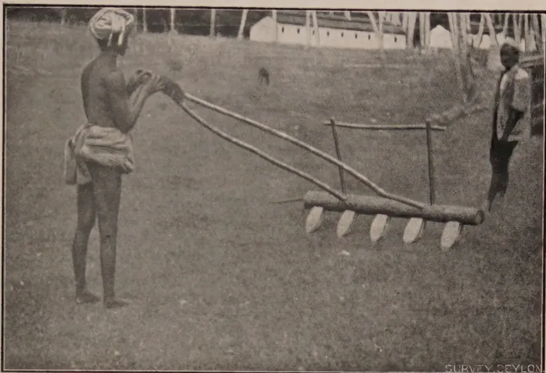
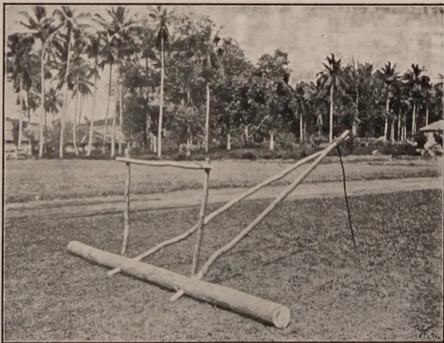
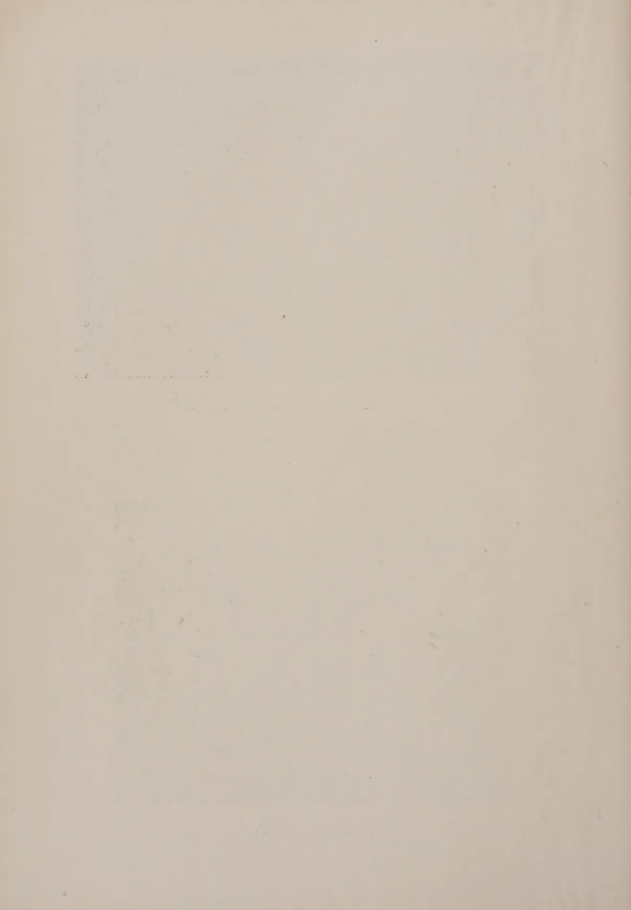

# The Tropical Agriculturist

July, 1927.

---

## Editorial.

---

### The Handling of Young Tea.

**I**N the present number of the *Tropical Agriculturist* is included an article on the handling of young tea by MR. JOHN HORSFALL, Superintendent of Craig Estate, Bandarawela.

For some years MR. HORSFALL has been experimenting on the young tea clearings which have been established upon Craig Estate, and after several methods had been tried out he concluded that the system described in his present article was giving interesting and promising results. It is a complete break away from Ceylon traditions and has been discussed with officers of the Department of Agriculture during the past two or three years.

The new clearings treated by this system have undoubtedly made most striking progress and it was interesting to find during the Ceylon delegation's visit to Assam that this system, new to

1------------------------------------------------

2

Ceylon, did not vary greatly from a practice common to several districts in the tea-growing areas of Northern India. This fact gave encouragement to MR. HORSFALL to continue his experiments and to make use of his system over larger areas of clearings than was originally contemplated. These clearings are undoubtedly a most interesting study and have come along exceptionally well.

After a visit to these clearings by the Director of Agriculture at Easter this year, MR. HORSFALL was induced to give a short account of the system to the members of the Estates Products Committee of the Board of Agriculture and at the request of certain members has written up the present account for the *Tropical Agriculturist*.

The account of these experiments has aroused a considerable amount of interest amongst tea planters in the island and the publication of the present article may stimulate other trials being made and progressive changes effected.

It is not yet claimed that this system will be the best suitable for all classes of soils and for all districts, but the results so far obtained upon Craig Estate justify the belief that it is an advance upon the orthodox system of handling young tea in Ceylon. Its whole object is to secure a wide spread of the bush—a difference which is noticeable between tea in Assam as compared with Ceylon. This wide spread of the bush gives eventually a wider flushing area and also so completely covers the soil as to break the force of any rain that falls and thereby reduces soil erosion very considerably.

It is hoped that this article will be of general interest to growers of tea in the island and that its publication will persuade other agriculturists who are or have been carrying on experiments upon their estates to contribute to the *Tropical Agriculturist* the results of such experiments. It is thus that progress is effected and the hope expressed when the change in form in this Journal was made at the commencement of this year will be realized.

2------------------------------------------------

3Original Articles.The Transplanting of Paddy.

L. LORD, M.A.,

*Economic Botanist, Ceylon.*

**T**O what extent the Ceylon cultivator will practise the transplanting of paddy depends *inter alia* on the following factors:—

1. (1) The supply of labour
2. (2) The increased financial return.

With the conclusion of experiments laid down during Maha 1926-27 a considerable amount of data is now available to show the nature of the increase of yield due to transplanting. The extra cost of transplanting will be determined during Maha 1927-28; but as various enquiries have been received about the increased yield due to transplanting it has been thought advisable to publish the results up to date. The results refer to six months Maha paddies. The effect of transplanting short-aged Yala paddies is now being determined. Summers (1921) first studied the tillering of certain Ceylon rices and the effect of different methods of planting on tillering power and yield.

Experiments with different methods of planting paddy were started at Anuradhapura in Maha, 1921-22, and the results of those experiments together with more elaborate ones in Maha, 1922-23, have already been published by Iliffe (1924). The different methods of planting used in the latter experiments were broadcasting, broadcasting and thinning, transplanting and sowing individual seeds 6 in. apart. The 1926-27 experiment differs from the previous ones in that larger plots were used; seeds were planted or sown at the same time (except that the transplanted seeds were sown a little earlier as transplanting lengthens the age of a paddy) and the method of planting individual seeds was not included as it was considered of less immediate practical importance than the other three.

Long narrow 1/100 acre plots were used and put down in the following manner:—

1. (a) Transplanted
2. (a) Broadcasted
3. (b) Transplanted
4. (b) Broadcasted and thinned
5. (c) Transplanted, etc., etc.

3------------------------------------------------

4

That is, considering the transplanted plots as the controls, each different treatment had a control plot next to it. The broadcasted plots were sown at the rate of 70 lb. (about  $1\frac{1}{2}$  bushels) of seed per acre (considerably less than the local rate) and the transplanted plots at the rate of one bushel per acre. Transplanting took place 30 days after sowing the nursery. All plots were weeded; and during the weeding the plants in every alternate broadcasted plot were thinned to about 6 in. apart. The hills in the transplanted plots were about 6 in. apart with two to four plants per hill as would be the case in a cultivator's field.

Tables I. and II. show the results.

Table I.

Broadcasting and Transplanting Experiment.

Yield of Grain in lbs. per 1/100 acre Plot.

<table border="1">
<thead>
<tr>
<th rowspan="2">Block No.</th>
<th colspan="3">Treatment</th>
</tr>
<tr>
<th>Transplanted</th>
<th>Broadcasted</th>
<th>Broadcasted and thinned</th>
</tr>
</thead>
<tbody>
<tr>
<td>1 a</td>
<td>48.00</td>
<td>25.50</td>
<td></td>
</tr>
<tr>
<td>1 b</td>
<td>47.00</td>
<td></td>
<td>35.50</td>
</tr>
<tr>
<td>1 c</td>
<td>48.00</td>
<td>30.00</td>
<td></td>
</tr>
<tr>
<td>1 d</td>
<td>47.50</td>
<td></td>
<td>33.00</td>
</tr>
<tr>
<td>1 e</td>
<td>42.00</td>
<td>29.50</td>
<td></td>
</tr>
<tr>
<td>1 f</td>
<td>38.75</td>
<td></td>
<td>31.00</td>
</tr>
<tr>
<td>1 g</td>
<td>39.25</td>
<td>35.00</td>
<td></td>
</tr>
<tr>
<td>2 h</td>
<td>43.50</td>
<td></td>
<td>34.50</td>
</tr>
<tr>
<td>2 i</td>
<td>44.00</td>
<td>32.00</td>
<td></td>
</tr>
<tr>
<td>2 j</td>
<td>43.50</td>
<td></td>
<td>36.50</td>
</tr>
<tr>
<td>2 k</td>
<td>36.00</td>
<td>32.00</td>
<td></td>
</tr>
<tr>
<td>2 l</td>
<td>40.25</td>
<td></td>
<td>32.00</td>
</tr>
<tr>
<td>2 m</td>
<td>42.00</td>
<td>29.50</td>
<td></td>
</tr>
<tr>
<td>2 n</td>
<td>40.50</td>
<td></td>
<td>37.50</td>
</tr>
<tr>
<td>3 o</td>
<td>39.75</td>
<td>35.00</td>
<td></td>
</tr>
<tr>
<td>3 p</td>
<td>32.50</td>
<td></td>
<td>25.25</td>
</tr>
<tr>
<td>3 q</td>
<td>30.25</td>
<td>27.75</td>
<td></td>
</tr>
<tr>
<td>3 r</td>
<td>34.50</td>
<td></td>
<td>24.75</td>
</tr>
<tr>
<td>3 s</td>
<td>36.00</td>
<td>30.25</td>
<td></td>
</tr>
<tr>
<td>3 t</td>
<td>33.00</td>
<td></td>
<td>23.50</td>
</tr>
<tr>
<td>Total</td>
<td>806.25</td>
<td>306.50</td>
<td>313.50</td>
</tr>
<tr>
<td>Average</td>
<td>40.31</td>
<td>30.65</td>
<td>31.35</td>
</tr>
</tbody>
</table>

4------------------------------------------------

5Table II.

<table border="1">
<thead>
<tr>
<th rowspan="2">Treatment</th>
<th rowspan="2">Yield in lbs</th>
<th colspan="3">Yield as percentage of broadcasted yield</th>
</tr>
<tr>
<th>1926-27</th>
<th>1921-22</th>
<th>1922-23</th>
</tr>
</thead>
<tbody>
<tr>
<td>Transplanted</td>
<td>4031</td>
<td>131</td>
<td>130</td>
<td>132</td>
</tr>
<tr>
<td>Broadcasted and thinned</td>
<td>3135</td>
<td>102</td>
<td>—</td>
<td>98</td>
</tr>
<tr>
<td>Broadcasted</td>
<td>3065</td>
<td>100</td>
<td>100</td>
<td>100</td>
</tr>
</tbody>
</table>

**Discussion of the results.**—The increase of yield of grain due to transplanting is definite; the increase is 31 per cent. over the broadcasted plot and is in such close agreement with the results of previous experiments that there can be no doubt as to the significance of the increase. The mean difference of the ten pairs of plots (transplanted and broadcasted) is 9.7 lb. with a standard error of 2.07 lb. The value of  $t^*$  is 4.6 and with  $n=9$  only, one value in 100 will exceed 3.250 by chance. This, however, is hardly a valid estimate of the error of the experiment as the position of the plots in each pair was not "randomized" (see Fisher, 1926). The small increase in the thinned plots is not significant. It would show, however, that the seed rate of the broadcasted plots was ample although it was only a little more than half the amount usually sown by the cultivator. (But it must not be overlooked that cultivators' seed contains dirt and empty grains through faulty winnowing.) Again there is close agreement with the previous result in 1922-23. With a seed rate of 3 bushels an acre thinning would probably have produced a significant difference. The results show that with a proper seed rate thinning is not necessary. There is no doubt that with long-aged paddies transplanting will materially increase the yield of grain; 20 per cent. would be a fair estimate of the increase.

**Financial Returns.**—As mentioned above, costs have not yet been determined but it is possible to calculate the credit side of the account. Gains are made under two heads, first, by the increased yield and secondly, by the saving of seed. If we take the increased yield as being no more than 20 per cent., in a 60 bushel crop the increase would be 12 bushels, worth Rs. 30 at Rs. 2.50 a bushel. The saving of seed is at least  $1\frac{1}{2}$  bushels, i.e., Rs. 3.75 making a total of Rs. 33.75 out of which to meet the extra cost of transplanting. There is a very appreciable saving of seed by transplanting; experiments in Burma (Lord, 1924 and Clark, 1925) have shown that a seed rate of 25 lb. an

\* See Fisher, R. A.—*Statistical Methods for Research Workers*. p. 137.

5------------------------------------------------

6

acre is as effective as a seed rate of 75 lb. per acre. Even if we allow 45 lb. (one bushel) per acre there is still a saving of seed of from one and a half to two bushels per acre.

A rough estimate of the extra cost of transplanting per acre is as follows:—

<table>
<tr>
<td>Extra cost of nursery (nursery is planted up after plants pulled with little additional preparation) say ...</td>
<td>Rs.</td>
<td>3.00</td>
</tr>
<tr>
<td>Pulling seedlings, 7 men days @ 75 cts.</td>
<td>„</td>
<td>5.25</td>
</tr>
<tr>
<td>Transplanting, 15 women days @ 35 cts.</td>
<td>„</td>
<td>5.25</td>
</tr>
<tr>
<td>Total ...</td>
<td>Rs.</td>
<td>13.50*</td>
</tr>
</table>

There would thus appear to be a profit of at least Rs. 15 per acre by transplanting paddy instead of by broadcasting. The adoption of transplanting by the cultivator depends not alone on the financial return but also on the supply of labour for transplanting; and it may be a long time before the women of a village are prepared or are trained to supply the necessary labour.

**Other Advantages of Transplanting.**—When paddy is transplanted the cultivator has more time available for the thorough preparation of his fields, that is, he has the time during which seedlings are in nursery, about thirty days. The water necessary for this preparation is frequently more easily obtained during this time. Thorough preliminary preparation of the fields reduces the number of weeds and hence lowers the cost of weeding the crop. The photographs show two buffalo or bullock drawn implements, the Burmese Harrow and the Leveller, which are effective on the heavier types of soil in reducing the cost of preparation and in preparing a better seed bed. These implements are successfully used at the Experiment Stations at Anuradhapura and Peradeniya.

Finally, transplanted paddy does not lodge so badly as the more thickly sown broadcasted paddy and this is probably one of the reasons for the increased yield.

### Literature Cited.

CLARK, W. M.—*Report on the Mandalay Agricultural Station*, 1925. p. 5.

FISHER, R. A.—The arrangement of Field Experiments, *Journ. Ministry of Agriculture*, XXXIII., 6.

LIFFE, R. O.—Trials with different methods of planting paddy. *Year-book, Dept. of Agriculture, Ceylon*, 1924, p. 24. *et seq.*

LORD, L.—*Report of the Mandalay Agricultural Station*, 1924. p. 15.

SUMMERS, F.—The tillering of Ceylon rices. *Tropical Agriculturist*, Feb., 1921.

\* Allowing for the increased cost of labour this figure is higher than, but agrees fairly closely with, the figures for the cost of transplanting given in the *Tropical Agriculturist* for Sept. 1919 (p. 155, *et seq.*) and October 1920 (p. 202).

6------------------------------------------------

A black and white photograph showing a person using a traditional wooden harrow in a field. The harrow has a long handle and a series of curved wooden teeth. Another person is visible in the background near a building. The text "SURVEY CEYLON" is visible in the bottom right corner of the image.

The Burmese Harrow.

A black and white photograph of a wooden leveller tool, which consists of a long horizontal beam supported by a wooden frame. It is shown lying on the ground in a field with palm trees in the background. The text "SURVEY CEYLON" is visible in the bottom right corner of the image.

The Leveller.

7------------------------------------------------

This image shows a blank page with a light beige or cream-colored background. There are some very faint, blurry horizontal lines near the top and bottom edges, which appear to be scanning artifacts or bleed-through from the other side of the paper. The overall texture is slightly grainy, typical of a scanned document page.

8------------------------------------------------

7

## Mycological Notes (5).

### On the Occurrence on Coconut of *Rhizoctonia bataticola* (Taub.) Butler.

MALCOLM PARK, A.R.C.S.,

Assistant Mycologist, Department of Agriculture.

THE following notes are of a preliminary nature to announce the discovery of *Rhizoctonia bataticola* in association with a root disease of coconut. The investigation of this disease and of other supposed manifestations of coconut root disease, for example, tapering, is in progress, but it is not yet possible to make a definite pronouncement as to the cause or causes or as to whether one cause is operative in all cases.

A visit was paid to Mannar on April 1st, 1927 in order to investigate a disease of coconuts. A considerable area was found to be affected on low-lying land bordering the main road. The soil conditions were poor, the soil being of a very sandy and dry nature with pools of brackish water in the vicinity. The palms were young, up to four years old, and it was stated that considerable difficulty had been encountered in establishing palms in the area in which disease was found.

The symptoms of the disease of the young palms were a yellowing and subsequent death of the outer leaves which progressed inwards, dwarfing of the young central leaves, and, in extreme cases, a rotting of the central bud followed by death of the palm. In association with the rotting of the bud were large numbers of snails (*Helix vittata*) which were feeding on the moribund tissue. These snails are reported to be very common in Mannar district and are regarded as secondary agents of destruction. A general inspection, however, indicated that the trouble was due to an affection of the roots.

Three palms in various stages of disease were removed carefully and a study of their roots was made. It was found that a number of the roots of each palm was dead, the cause being apparently mycological. In the healthiest of the trees removed, the proportion of diseased roots was small but the fungus *Rhizoctonia bataticola* was found in the dead roots at the time of excavation. A later examination of the roots of all three palms at the laboratory disclosed the fact that the fungus was present on the majority of the dead roots. In the primary roots, which were about 0·25 inch in diameter, it was found that the cortex of

9------------------------------------------------

8

diseased roots had become separated from the central vascular strand and that the fungus was present in the form of sclerotia. These were very numerous on the inner surface of, and embedded in the tissue of, the dead cortex. Only a few sclerotia were observed on the outer surface of the central vascular cylinder, and none at all on the outer surface of the cortex. In the case of the small secondary roots of about 0.05 inch diameter the separation of cortex did not occur and sclerotia were found scattered irregularly through the cortical tissues.

Pure cultures of *Rhizoctonia bataticola* were obtained readily from sclerotia removed with a sterile needle from the cortical tissue of young diseased roots. On maize-meal agar an abundance of sclerotia was formed, and the sclerotia when examined microscopically, were seen to be spheroid in shape when occurring singly or in irregular agglomerations caused by the fusion of two, three or more single sclerotia. Measured from a culture on maize-meal agar seven days old, single sclerotia averaged about 80 by 95 microns in size.

No other organisms known to be parasitic on woody tissue have been isolated from the diseased tissue, but at this stage of the investigation it is not possible to conclude that *Rhizoctonia bataticola* is the causal agent. Experiments are in hand to test the pathogenicity of the fungus on coconut palms and in the course of time it should be possible to make a more definite statement. In the meantime, it is safe to say that the disease of the young palms is due to the action of a soil parasite probably assisted by the poor soil conditions prevailing. The evidence obtained from the material indicates the possibility of this parasite being *Rhizoctonia bataticola*.

Without full investigation it is not possible to give definite recommendations for the control of the disease but the following measures are advocated. Dead palms should be removed with all roots and burned. The areas from which the palms are removed should be allowed to lie fallow for several months at least before replanting. The soil should be turned over at intervals and exposed to the sun and air but should not be scattered. It should be borne in mind that if the disease is caused by *Rhizoctonia bataticola*, the fungus, by virtue of its production of a large number of sclerotia which would remain in the soil, is of such a nature that direct attack by the addition of fungicides to the soil is not practicable. Control measures therefore should be directed towards making the plant more robust and resistant to the parasite by the improvement of cultural conditions. Evidence in favour of this last recommendation is deduced from the fact that young palms which are adjacent to the area under observation and which are on slightly higher ground and in better soil are not affected by the disease.

10------------------------------------------------

# Mycological Notes (6).

## Further Notes on *Rhizoctonia bataticola* (Taub.) Butler.

W. SMALL, M.B.E., M.A., B.Sc., Ph.D., F.L.S.,

Mycologist, Department of Agriculture.

IN the following notes several new hosts of *Rhizoctonia bataticola* are recorded and a few points of interest in connection with occurrences of the fungus on other plants are set forth.

(1) *Cassia multijuga* Rich.—Examination of the roots of a sickly specimen of this tree in the Royal Botanic Gardens, Peradeniya showed them to be attacked by *Rhizoctonia bataticola* and the fungus of brown root disease, *Fomes lamaoensis* Murr.

(2) *Cupressus Lawsoniana* Murr. (Lawson's Cypress).—Examples of diseased seedlings of Lawson's Cypress were provided by the Divisional Forestry Officer, Nuwara Eliya. The presence of *Rhizoctonia bataticola* was not immediately apparent, but the fungus was found eventually to be common in the bark and cortex of the roots of the seedlings in the form of small sclerotia.

(3) *Tibouchina (Lasiandra)* sp. (Glory Bush ?).—The *Rhizoctonia* has occurred on the roots of this plant along with *Diplodia*.

(4) *Dahlia* (hort.)—A number of dahlia plants died in a bed in a garden which had provided examples of *Rhizoctonia bataticola* root disease of several other plants. The sclerotia of the *Rhizoctonia* were found in both roots and stems of the dahlias, and the fungus also developed on the skin of apparently healthy tubers of plants which had diseased stems and roots.

(5) *Garcinia mangostana* L. (Mangosteen).—To date only one case of *Rhizoctonia bataticola* root disease of this valuable fruit tree has been encountered. The fungus was present in the smaller roots. The collar of the tree was cracked but no fungus was found in association with the cracks.

(6) *Artocarpus integrifolia* L. (Jak).—Young jak stumps planted for re-afforestation purposes have died of root disease. Examination of their roots showed that *Rhizoctonia bataticola* and *Diplodia* were present.

11------------------------------------------------

10

(7) *Cocos nucifera* L. (Coconut).—*Rhizoctonia bataticola* has been found on roots of young coconuts in Mannar by Mr. Park, Assistant Mycologist (1), and also by Mr. Ragunathan, Assistant in Mycology, on coconut roots included by chance in a consignment of diseased plantains (bunchy-top) from the Rambukkana Observation Plots. Although the possibility of the presence of *Rhizoctonia bataticola* in coconut roots was indicated by the writer at a meeting of the Estate Products Committee in July, 1926, it has been possible to devote full attention to the study of coconut root fungi only since Mr. Park's recent return from leave. His work on coconut root disease is being continued, and it is hoped to extend it to include root disease of the areca palm. The discovery of the *Rhizoctonia* on coconut roots is further evidence of the wide distribution of the fungus in Ceylon and of the fact that it is present in different types of soil.

(8) *Phaseolus vulgaris* L. (French beans).—An interesting specimen of bean disease has been provided by the Divisional Agricultural Officer, Central. The disease takes the form of a stem blight with which is associated a pycnidial fungus called *Macrophoma phaseoli* Maubl. The same blight has attracted attention of late in the United States of America (2) where it is stated to be doing considerable damage to the bean crops of Georgia, Mississippi and South Carolina. It is called "ashy stem blight." The point of interest in the occurrence of the bean blight in Ceylon is not that it is caused by the same fungus as the bean blight of America but rather that the blight fungus of both Ceylon and America, *Macrophoma phaseoli*, is the pycnidial stage of the soil sclerotial fungus, *Rhizoctonia bataticola*. That the aerial stem-attacking *Macrophoma* of the bean is related genetically to the soil root-attacking *Rhizoctonia* of some thirty-four Ceylon plants has been proved in the laboratory by growing single spores of the bean *Macrophoma* in culture media. In each case the *Macrophoma* spore has given rise to growths of the sclerotial fungus, *Rhizoctonia bataticola*. As beans attacked by *Macrophoma phaseoli* are thus a possible source of supply of *Rhizoctonia bataticola* to the soil, blighted plants should be up-rooted and burned. It is possible that the pycnidial *Macrophoma* occurs on plants other than beans in Ceylon, and a search for it is in progress. It may be added that the writer is informed by Mr. S. F. Ashby, Mycologist of the Imperial Bureau of Mycology, that the *Macrophoma* may be renamed *Macrophomina phaseoli* (Maubl.) comb. nov.

Root disease of beans caused by *Rhizoctonia bataticola* also occurs in Ceylon. As far as is known, the root disease may occur independently of the *Macrophoma* stem blight. Again, an examination of the roots of the specimen of the *Macrophoma*

12------------------------------------------------

11

stem blight shows that the root *Rhizoctonia* form of the fungus is not present on the same plant. It therefore seems as if the *Rhizoctonia* and *Macrophoma* forms, although they are in reality stages in the life-history of a single fungus, need not occur together on a bean plant attacked by one of them; in addition, they may attack independently and cause distinct diseases of the bean. On the other hand, it is shown in the following paragraph that they may occur together on the same plant and be associated with the same case of disease.

(9) *Sesamum indicum* L. (Gingelly).—The writer had experience in Uganda of the attack of *Rhizoctonia bataticola* on the roots of gingelly, a plant which seems to be susceptible to the fungus, and he has recently been enabled to examine diseased gingelly from Burma. The material was typical of *Rhizoctonia bataticola* disease, and the sclerotia of the fungus were present in large numbers on the roots and stems of the specimens. Further, pycnidia which resembled strongly those of *Macrophoma phaseoli* of the bean stem blight discussed above were present among the sclerotia of the *Rhizoctonia*. Attempts were made to germinate the spores of the pycnidia but they were unsuccessful. The material was collected in September 1925 and was therefore old. The fact that the *Macrophoma* spores refused to germinate in May 1927 throws a little light on the length of time for which they may remain viable. The *Macrophoma* has been found among *Rhizoctonia* sclerotia on Uganda gingelly material and has been proved to give rise, as in the case of the bean fungus, to the sclerotial *Rhizoctonia bataticola* form. The record of *Rhizoctonia bataticola* in Burma and a recent record of its parasitism on cotton in Trinidad by Professor Briton-Jones of the Imperial College of Tropical Agriculture (3) are extensions of the known distribution of the fungus which are of interest inasmuch as they support the writer's contention that *Rhizoctonia bataticola* is more widely distributed in tropical and sub-tropical regions than is realised.

(10) **Tobacco.**—In the list of pests and diseases recorded during 1926 which was published in the *Tropical Agriculturist* for March (page 187), *Rhizoctonia bataticola* was recorded as having occurred on tobacco. The fungus was only suspected to be present, and, as it was not found, the citation is an error which ought to be corrected. Tobacco, however, has been reported as a host plant of *Rhizoctonia bataticola* in India, and it may prove to be a host plant also in Ceylon.

(11) **Tea.**—*Sphaerostilbe repens* is well known in Ceylon as a supposed parasite of the roots of rubber trees growing in damp soils, but it has not been recorded hitherto on tea roots in this country. It occurs on tea in India, however, and has also

13------------------------------------------------

12

been found lately on tea in Ceylon. In both cases, tea and rubber, it is accompanied by *Rhizoctonia bataticola*. The *Rhizoctonia* is regarded as the primary cause of root disease and the *Sphaerostilbe* as a fungus of only secondary account.

(12) **Plantains.**—The fact that *Rhizoctonia bataticola* and an eelworm (*Heterodera radicicola*) cause root disease of plantains and so may lead to the condition known locally as bunchy-top has been published (4). Numerous further cases of bunchy-top have been examined in recent months, and the evidence from the frequent presence of the fungus and the eelworm is strongly in favour of the view that Ceylon bunchy-top disease of plantains is more likely to be due primarily to root disease than to any other cause. It has been noted that, whereas the roots of plants affected by bunchy-top are attacked consistently by *Rhizoctonia* or eelworm, the associated insects, that is, the aphid (*Pentalonia nigrinervosa* Coq.), the borer (*Cosmopolites sordidus* Germ.) and the stem-boring weevil (*Odoiporus longicollis* Oliv.), may be present in small amount or altogether absent. In other words, the insect pests associated with bunchy-top disease are less consistently present on affected plants than the fungus and eelworm which attack the roots of the same plants. It is worthy of note that both fungus and eelworm have been found lately to attack different roots of the same bunchy-top plant. At the same time, it is realised that an exhaustive study of the symptoms and development of local bunchy-top and of the parts played by the various causal factors is required.

### References.

1. (1) *Tropical Agriculturist*, 69, No. 1, p. 7, July, 1927.
2. (2) *Review of Applied Mycology*, 6, p. 138, March, 1927.
3. (3) *Tropical Agriculture*, 4, No. 5, p. 88, May, 1927.
4. (4) *Tropical Agriculturist*, 68, No. 2, p. 73, February, 1927.

14------------------------------------------------

13

Contributions from the Ceylon  
Rubber Research Scheme.

## Explanatory Notes on Vulcanisation Testing of Rubber.

**T. E. H. O'BRIEN, B.Sc., A.I.C.,**

*Chemist, Rubber Research Scheme, Ceylon.*

**E**STATE Superintendents and others have frequently asked for a simple explanation of the meaning of figures given in reports dealing with the vulcanising properties of rubber samples. It is thought that the following notes may increase the value of such reports to non-technical readers.

With the exception of crepe soles and one or two minor products rubber is always used in the vulcanised form, and it has not been found possible by examination of raw rubber to predict what its properties will be after vulcanisation. Consequently in order to test the quality of a sample of rubber, it is necessary to vulcanise it under suitable conditions and then submit it to certain tests. Of recent years the question of "plasticity" of raw rubber has become of increased importance. This property is judged before vulcanisation, but can conveniently be included under the heading of vulcanisation tests.

From the point of view of the layman it is fairly accurate to say that "vulcanisation" or "curing" consists of causing rubber to combine with a certain proportion of sulphur. Under certain conditions this can be done without heat, being known as "cold vulcanisation," but more usually it is effected by heating a mixture of rubber and sulphur at a temperature of 140-150°C. If certain substances known as "accelerators" are added to the rubber the process takes place more rapidly, or alternatively can be carried out at a lower temperature.

For commercial purposes, rubber before vulcanisation is almost invariably "compounded" with various ingredients in addition to sulphur, which have the effect of modifying the properties of the vulcanised rubber to make it suitable for various uses. For testing purposes it was usual until recently to make the tests on rubber vulcanised with sulphur only, as this brings out differences between various samples of rubber. Since the introduction of organic accelerators it has been found advisable to make comparative tests of samples when vulcanised with sulphur only, and when vulcanised in presence of an accelerator. Certain accelerators only function in the presence of compounding ingredients so it is necessary for a suitable substance (usually

15------------------------------------------------

14

zinc oxide) to be added to the accelerator mix. Thus in a typical report from the Imperial Institute (see table I.) we find the tests given under two headings.

A. **Mixing** 90 Rubber, 10 Sulphur,

B **Accelerator Mixing** 90 Rubber, 5 Sulphur, 90 Zinc oxide, 1 Hexamine (accelerator).

### Mastication Mixing.

Preparation of the raw rubber for vulcanisation consists of rolling through heated differentially geared rollers until the rubber becomes sufficiently soft and plastic to mix in the sulphur, etc. This process is known as "mastication." The sulphur and any other compounding ingredients are then added gradually and rolling is continued until they are thoroughly mixed with the rubber. Samples of plantation rubber vary in the amount of working required to soften the rubber, or in other words they vary in plasticity. This variability causes great inconvenience in manufacturing process. For many purposes such as manufacture of tubing, solid tyres, etc., the rubber after being mixed is "extruded" or forced through dies of the required shape, and if insufficiently plastic it emerges from the machine with a rough and uneven surface instead of being smooth and even. It has then to be sent back and reworked.

### Plasticity Tests.

Two methods of measuring plasticity are in use at the Imperial Institute. In the first case a small piece of rubber of known size is heated to 100° C. and submitted to a known pressure for 30 minutes. The thickness of the sample after this treatment is a measure of the plasticity. Referring to Table 2 it will be seen that the figure for this test is given under the heading "D 30" (D 30 can be taken to mean diameter after 30 minutes.) In this test the lower the figure obtained, the more plastic the rubber. It will be noticed that this test is made on the raw rubber and also after masticating and finally after mixing. Another test of plasticity which is now adopted, and which is much more sensitive than the foregoing, consists of extruding or forcing the rubber through a hole of given size under given pressure. The time taken to extrude a given weight is a measure of the plasticity of the rubber. In the table referred to, figures for this test are given under the heading "E.t." (E.t. can be taken to mean time of extrusion). This test is made after mastication and after mixing. In this case again a low figure represents rubber of good plasticity.

The amount of power consumed in masticating and mixing the rubber is also to some extent a measure of plasticity and in preparing the samples for plasticity tests mastication is carried out on rollers driven by an electric motor of which the power

16------------------------------------------------

<!-- stage4: ACCEPT r2J/J_008:99 -->

DIAGRAM 1.

GRAPH DRAWN BY "SCHOPPER TESTING MACHINE."

A, POINT AT WHICH THE RING BROKE.

B, C. PORTION OF CURVE USED FOR MEASUREMENT OF "SLOPE"

LOAD IN LBS. PER SQUARE INCH.

% ELONGATION (STRETCH) OF THE RUBBER.

<table border="1"><thead><tr><th>Point</th><th>Load (LBS. PER SQUARE INCH.)</th><th>% Elongation (STRETCH) OF THE RUBBER.</th></tr></thead><tbody><tr><td>A</td><td>2000</td><td>900</td></tr><tr><td>B</td><td>1500</td><td>850</td></tr><tr><td>C</td><td>1000</td><td>750</td></tr></tbody></table>

17------------------------------------------------

This image is a scan of a blank page. The paper has a light beige or cream-colored tint. There are a few very small, dark specks scattered across the surface, which appear to be scanning artifacts or dust particles. No text, lines, or other markings are present on the page.

18------------------------------------------------

15

consumption can be measured. Rolling is continued until a certain fixed amount of current has been consumed. In Table 2, under the appropriate heading, is given the number of minutes required by each sample to consume the fixed amount of power. A high figure under this heading represents an easily workable rubber.

### Time of Vulcanisation.

To turn from plasticity to vulcanisation tests, the first factor on which information is required is the rate of vulcanisation of the sample, *i.e.*, the length of time which the rubber must be heated with a fixed amount of sulphur at a fixed temperature in order to develop its maximum strength. Variability in rate of vulcanisation is a feature of plantation rubber and previously caused great inconvenience to the manufacturer, but since the introduction of organic accelerators it has lost some of its significance as suitable accelerators tend to equalise the rate of vulcanisation of different samples.

In Table I. it will be noted that there are two headings "standard cure" and "tensile optimum cure." Before explaining the meaning of these terms it is necessary to proceed to the next stage and describe the way in which the rubber is tested after vulcanisation.

### Tensile Strength.

When vulcanisation is completed the sheets of rubber are allowed to stand for 24 hours, after which ring test pieces of accurately measured diameter and thickness are cut by means of a machine. The ring is placed in a machine known as the "Schopper" testing machine, and is stretched by applying a gradually increasing load. Stretching is continued until the ring breaks and the machine records the load required to break it, and also the amount which the rubber stretched before breaking. The thickness of the ring used for the test is only about  $\frac{1}{4}$  inch but by calculation the breaking load or "tensile strength" per sq. inch is calculated. The amount of stretch is recorded under the heading "Elongation (per cent.) at break." While the ring is being stretched the Schopper machine automatically draws a graph representing the amount that the rubber stretches as the load is gradually increased, and a typical curve is shown in diagram I. The end of the curve represents the point at which the ring broke.

Under-vulcanised rubber stretches very easily. As vulcanisation proceeds, so the rubber becomes tougher, *i.e.*, to stretch it to a given extent a greater load is required. When over-vulcanised it becomes brittle. Vulcanisation to "standard cure" (in a rubber-sulphur mixing) is defined as vulcanising to a stage at which a load of 1,500 lb. per sq. inch (1.04 kg. per sq. mm) is required to stretch the rubber to 775 per cent. of its original length. "Tensile optimum cure," as the name implies,

19------------------------------------------------

16

consists of vulcanising to a stage at which the sample gives the highest tensile strength. For most purposes of comparison standard cure gives all the information that is required, and entails less work than the tensile optimum cure.

In general the tensile strength of a correctly vulcanised sample of plantation rubber will exceed 2,000 lb. per sq. inch. When a low figure for tensile strength is given in a report it must be studied in connection with the figure for "Elongation (stretch) at standard load." If this figure is higher than 775 per cent. it implies that the sample is under-vulcanised, and it is then known that if the time of vulcanisation had been increased, improved figures for tensile strength would result. For example in Table 3 a result is given for a sample in which the tensile strength is 1,570 lb. per square inch which is a very low figure. The figure for "elongation at standard load" however is very high—943 per cent., showing that the sample is under-vulcanised and would have developed better tensile strength if vulcanised for a longer period. In this case it was not necessary to repeat the vulcanisation as the two samples under comparison were vulcanised to approximately the same extent (stretch at standard load 943 per cent. and 957 per cent. respectively) and could thus fairly be compared.

### Slope.

Another heading given in reports is "slope" (see Table 3). Actually "slope" refers to the slope of the Schopper machine curve at a certain stage of stretching, shown in diagram I. It has been shown by Investigators that the slope of the curve at this stage of the test is to some extent an index of the quality of the rubber. A low figure for slope indicates rubber of good quality and "slope" figures for good quality plantation rubber in a rubber-sulphur mix are usually not higher than 40. In an accelerator mixing (Table I.) the "slope" figure has a different value.

### Ageing Tests.

Another heading in reports is "Ageing Tests." It is common knowledge to every user that rubber gradually perishes, particularly when exposed to light and air, and it will be appreciated that it is of importance to compare the properties of different samples of rubber in this respect. Perishing of rubber takes place slowly and it would be a great handicap if the Investigator had to wait 12 or 18 months to observe the effects of keeping the rubber, in addition to the fact that conditions of storage would have a considerable influence on the result. It has been found that if the sample is heated in an oven at 70° C. in a current of air, a change in tensile strength takes place similar to that which occurs during ordinary storage or use, and this is known as "artificial ageing." Heating in the oven for 24 hours has

20------------------------------------------------

17

approximately the same effect as 6 months natural ageing. From Table 4 it will be seen that tests are made after 48, 96, and 144 hours' artificial ageing. An average sample of plantation rubber begins to show some deterioration in tensile strength after 96 hours' ageing. It will be noted in this case that the samples actually showed improvement of strength after 48 hours' ageing and it is necessary to explain that for ageing tests the samples are purposely somewhat under-vulcanised. This corresponds with commercial practice, as full vulcanisation to the standard used for physical testing would give a product with impaired ageing properties.

It is hoped that the above notes will be of assistance in explaining in a general way the meaning of the figures given in reports of vulcanisation tests. In certain respects the explanations are necessarily incomplete, as full explanation would involve technical discussion which would not be of interest to the reader for whom these notes are intended.

Table I.

(Extract from "First report on rubber prepared with sodium silico fluoride as a coagulant." R.R.S. 4th Quarterly Circular for 1924, p. 8).

A. Mixing 90 Rubber, 10 Sulphur.

<table border="1">
<thead>
<tr>
<th rowspan="2"></th>
<th rowspan="2">Time of cure (mins.)</th>
<th rowspan="2">Tensile strength (lbs./sq. in)</th>
<th colspan="2">Elongation.</th>
<th rowspan="2">Slippe.</th>
</tr>
<tr>
<th>At Break. per cent.</th>
<th>At standard load per cent.</th>
</tr>
</thead>
<tbody>
<tr>
<td colspan="6"><b>Standard Cure</b></td>
</tr>
<tr>
<td colspan="6">(Elongation at load of 1.04 kgs sq. mm. = 775 per cent.)</td>
</tr>
<tr>
<td>Present sample ..</td>
<td>150</td>
<td>2,390</td>
<td>874</td>
<td>784</td>
<td>39</td>
</tr>
<tr>
<td>(Smoked Sheet average of 5 recent samples) ..</td>
<td>107</td>
<td>2,440</td>
<td>867</td>
<td>777</td>
<td>40</td>
</tr>
<tr>
<td colspan="6"><b>Tensile Optimum Cure</b></td>
</tr>
<tr>
<td colspan="6">(Maximum tensile strength developed 72 hours after vulcanisation.) ..</td>
</tr>
<tr>
<td>Present sample ..</td>
<td>150</td>
<td>2,390</td>
<td>—</td>
<td>784</td>
<td>—</td>
</tr>
<tr>
<td>Smoked Sheet (average of 5 recent samples) ..</td>
<td>113</td>
<td>2,510</td>
<td>—</td>
<td>754</td>
<td>—</td>
</tr>
</tbody>
</table>

21------------------------------------------------

18

## B. Accelerator Mixing.

90 Rubber, 5 Sulphur, 90 Zinc oxide, 1 Hexamine.

<table border="1">
<thead>
<tr>
<th rowspan="2"></th>
<th rowspan="2">Time of Cure (mins)</th>
<th rowspan="2">Tensile strength (lbs./sq. in)</th>
<th colspan="2">Elongation.</th>
<th rowspan="2">Slope.</th>
</tr>
<tr>
<th>At Break per cent.</th>
<th>At standard load per cent.</th>
</tr>
</thead>
<tbody>
<tr>
<td colspan="6"><i>Standard Cure</i> (Elongation at load of 1.04 kgs/sq. mm. = 480 per cent.)</td>
</tr>
<tr>
<td>Present sample ...</td>
<td>60</td>
<td>2,850</td>
<td>633</td>
<td>475</td>
<td>46</td>
</tr>
<tr>
<td>Smoked Sheet (average of 5 recent samples) ...</td>
<td>37</td>
<td>2,420</td>
<td>604</td>
<td>481</td>
<td>47</td>
</tr>
<tr>
<td colspan="6"><i>Tensile Optimum Cure</i> (Maximum tensile strength developed 72 hours after vulcanisation).</td>
</tr>
<tr>
<td>Present Sample ...</td>
<td>50</td>
<td>2,960</td>
<td>—</td>
<td>495</td>
<td>—</td>
</tr>
<tr>
<td>Smoked Sheet (average of 5 recent samples.) ...</td>
<td>45</td>
<td>2,760</td>
<td>—</td>
<td>458</td>
<td>—</td>
</tr>
</tbody>
</table>

Table II.

(Extract from "Report on the effect of para-nitrophenol on the plasticity, vulcanising, and ageing properties of blanket crepe." R.R.S. 4th Quarterly Circular for 1926, p. 11.)

### (I). Plasticity Tests.

<table border="1">
<thead>
<tr>
<th rowspan="2">Sample No.</th>
<th rowspan="2">Form of Rubber</th>
<th rowspan="2">Time of mastication for power consumption of 450 watt hours</th>
<th rowspan="2">Time of mixing for power consumption of 150 watt hours</th>
<th colspan="3">Plasticity</th>
</tr>
<tr>
<th>Raw Rubber</th>
<th>Masticated Rubber</th>
<th>Rubber sulphur Mixing (90-10)</th>
</tr>
</thead>
<tbody>
<tr>
<td>1261</td>
<td>Blanket crepe (control) ...</td>
<td>(mins) 23½</td>
<td>(mins) 11</td>
<td>D 30 167</td>
<td>D30 E.t. 80 70.8</td>
<td>30 E.t. 72 48.6</td>
</tr>
<tr>
<td>1262</td>
<td>Blanket crepe soaked in 0.1 per cent. para-nitrophenol for 30 minutes ...</td>
<td>23½</td>
<td>11</td>
<td>171</td>
<td>86 72.5</td>
<td>73 46.6</td>
</tr>
<tr>
<td>1263</td>
<td>Blanket crepe from latex coagulated with acetic acid and 0.1 per cent. para-nitrophenol (calculated on dry rubber) ...</td>
<td>22½</td>
<td>10½</td>
<td>174</td>
<td>87 75.3</td>
<td>72 46.5</td>
</tr>
</tbody>
</table>

D 30 = Thickness (in hundredths of a millimetre) of sphere 0.4 gram in weight after pressing in plasticity press at 100°C for 30 minutes.

E. t. = Time (in minutes) required to extrude fixed volume at 90°C

22------------------------------------------------

19Table III.

(Extract from "Third report on rubber prepared with sodium silico fluoride as a coagulant." R.R.S. 4th Quarterly Circular for 1924, p. 12).

Rubber Sulphur Mixing: 90: 10.

<table border="1">
<thead>
<tr>
<th rowspan="2">Coagulant.</th>
<th rowspan="2">Time of cure (mins)</th>
<th rowspan="2">when tested</th>
<th rowspan="2">Tensile strength (lb. sq.in)</th>
<th colspan="3">Elongation</th>
</tr>
<tr>
<th>At Break (percent.)</th>
<th>At standard load (percent.)</th>
<th>slope</th>
</tr>
</thead>
<tbody>
<tr>
<td rowspan="2">Sodium-silico fluoride</td>
<td rowspan="2">92</td>
<td>Before ageing</td>
<td>1,570</td>
<td>953</td>
<td>943</td>
<td>40</td>
</tr>
<tr>
<td>After ageing</td>
<td>1,930*</td>
<td>931</td>
<td>877</td>
<td>39</td>
</tr>
<tr>
<td rowspan="2">Acetic acid (control)</td>
<td rowspan="2">80</td>
<td>Before ageing</td>
<td>1,480</td>
<td>960</td>
<td>957</td>
<td>41</td>
</tr>
<tr>
<td>After ageing</td>
<td>2,070*</td>
<td>957</td>
<td>893</td>
<td>40</td>
</tr>
</tbody>
</table>

\* By heating for 20 hours at 70°C. in a current of air.

Table IV.

(Extract from "Report on the effect of para-nitrophenol on the plasticity, vulcanising, and ageing properties of blanket crepe." R.R.S. 4th Quarterly Circular for 1926, p. 12).

Vulcanising and Ageing Tests.

<table border="1">
<thead>
<tr>
<th rowspan="2">Sample No.</th>
<th rowspan="2">Form of Rubber</th>
<th>Time of vulcanisation.</th>
<th>Period of ageing at 70°C</th>
<th>Tensile strength</th>
<th>Elongation at load of 1.04 kgs. /sq mm.</th>
</tr>
<tr>
<th>(mins)</th>
<th>(hrs)</th>
<th>(lbs. /sq. in.)</th>
<th>(per cent.)</th>
</tr>
</thead>
<tbody>
<tr>
<td rowspan="4">1261</td>
<td rowspan="4">Blanket crepe (control)</td>
<td rowspan="4">120</td>
<td>nil</td>
<td>1780</td>
<td>890</td>
</tr>
<tr>
<td>48</td>
<td>2240</td>
<td>793</td>
</tr>
<tr>
<td>96</td>
<td>1880</td>
<td>749</td>
</tr>
<tr>
<td>144</td>
<td>280</td>
<td>—</td>
</tr>
<tr>
<td rowspan="4">1262</td>
<td rowspan="4">Blanket crepe soaked in 0.1 per cent. para-nitrophenol for 30 minutes.</td>
<td rowspan="4">120</td>
<td>nil</td>
<td>1910</td>
<td>887</td>
</tr>
<tr>
<td>48</td>
<td>2080</td>
<td>786</td>
</tr>
<tr>
<td>96</td>
<td>1790</td>
<td>744</td>
</tr>
<tr>
<td>144</td>
<td>340</td>
<td>—</td>
</tr>
<tr>
<td rowspan="4">1263</td>
<td rowspan="4">Blanket crepe from latex coagulated with acetic acid and 0.1 per cent. para-nitrophenol (calculated on dry rubber)</td>
<td rowspan="4">120</td>
<td>nil</td>
<td>2120</td>
<td>860</td>
</tr>
<tr>
<td>48</td>
<td>2390</td>
<td>768</td>
</tr>
<tr>
<td>96</td>
<td>1680</td>
<td>726</td>
</tr>
<tr>
<td>144</td>
<td>330</td>
<td>—</td>
</tr>
</tbody>
</table>

23------------------------------------------------

20

# The Effect on Yield of Manuring Rubber with Nitrate of Soda.

**R. H. STOUGHTON-HARRIS, B.Sc., A.R.C.S.,**

*Mycologist, Rubber Research Scheme, Ceylon.*

**T**HE importance of nitrogen in the life of plants has for many years been well recognised, and as a constituent of manures its effect has been closely studied. It has been found that this effect is mainly upon the green parts of the plant, particularly the foliage, which in the majority of cases becomes more luxuriant and darker in colour under applications of nitrogen in an available form to the roots. The effects are most easily observed when the nitrogen is supplied alone in a chemical which contains no other substance of important nutritive value to the plant. Such a material is provided by nitrate of soda or "chili saltpetre."

In an attempt to determine the effect, if any, of nitrate of soda applied as a manure to rubber an experiment was carried out on an estate in the Kalutara District in collaboration with the Mycologist of the Rubber Research Scheme. The points to be investigated were primarily the effect on the incidence of secondary leaf-fall and secondarily on the yield. The effect on secondary leaf-fall was reported in the 3rd Quarterly Circular for 1925. The present report is concerned with the effect on yield.

**Description of Experiment.**—A plot was chosen containing some seventeen hundred trees planted in well defined rows of about thirty trees each. This area was divided into ten two-acre blocks numbered from the beginning 1B, 1A, 2B, 2A, 3B, 3A, 4B, 4A, 5B, 5A. The whole area includes a valley, so that the field slopes gently down from one end (plots 5A and B) to the other while the individual blocks slope steeply on each side of a central stream. The plots were treated as follows:—

- 1B. Control, untreated.
- 1A. Manured, nitrate of soda 5 cwt. per acre.
- 2B. Manured, nitrate of soda 5 cwt. per acre.
- 2A. Control, plain forked.
- 3B. Control, plain forked.
- 3A. Manured, nitrate of soda 5 cwt. per acre.
- 4B. Manured, nitrate of soda 5 cwt. per acre.
- 4A. Control, untreated.
- 5B. Control, untreated.
- 5A. Manured, nitrate of soda 5 cwt. per acre.

24------------------------------------------------

21

The manure was applied in two doses of  $2\frac{1}{2}$  cwt. per acre in March, 1923, March, 1924, and again in February-March, 1925. The ground was "enveloped forked" and the manure spread in the furrows. Prior to the experiment the area was last manured in 1920.

All trees were tapped on a  $\frac{1}{2}$  circumference on alternate days, and yield figures for each block in pounds of dry rubber per tapping were recorded from the beginning of the experiment.

In the examination which follows the yields for each set of blocks of the same kind are considered together and the average yield per one hundred trees per tapping calculated. (This is taken as the basis, as it gives figures of an order convenient to deal with.)

It should be pointed out that it is necessary to consider all the plots of one kind together because no reliance can be placed on figures obtained from single, unduplicated plots or by the comparison of the plots in pairs. Too many factors other than the one under consideration may be concerned in producing any difference there may be between any pair of single plots. The existence of only two forked and three unforked control plots tends to impair the values of the figures.

The Total Yields for the three years are as follows:—

### Manured Blocks.

<table>
<thead>
<tr>
<th></th>
<th>Total Yield in lbs.</th>
<th>No. of trees.</th>
<th>No. of tappings.</th>
<th>Yield per 100 trees per tapping.</th>
</tr>
</thead>
<tbody>
<tr>
<td>1A.</td>
<td>2580.5</td>
<td>195</td>
<td>363</td>
<td>3.646</td>
</tr>
<tr>
<td>2B.</td>
<td>2644.6</td>
<td>183</td>
<td>362</td>
<td>3.931</td>
</tr>
<tr>
<td>3A.</td>
<td>2473.5</td>
<td>178</td>
<td>349</td>
<td>3.982</td>
</tr>
<tr>
<td>4B.</td>
<td>2490.7</td>
<td>176</td>
<td>363</td>
<td>3.898</td>
</tr>
<tr>
<td>5A.</td>
<td>1963.4</td>
<td>175</td>
<td>354</td>
<td>3.170</td>
</tr>
<tr>
<td></td>
<td></td>
<td></td>
<td></td>
<td>
5/18.687
</td>
</tr>
<tr>
<td></td>
<td></td>
<td></td>
<td></td>
<td>3.737 lb.
</td>
</tr>
</tbody>
</table>

### Forked Control Blocks.

<table>
<thead>
<tr>
<th></th>
<th>Total Yield in lbs.</th>
<th>No. of trees.</th>
<th>No. of tappings.</th>
<th>Yield per 100 trees per tapping.</th>
</tr>
</thead>
<tbody>
<tr>
<td>2A.</td>
<td>2319.6</td>
<td>162</td>
<td>349</td>
<td>4.103</td>
</tr>
<tr>
<td>3B.</td>
<td>2280.9</td>
<td>175</td>
<td>356</td>
<td>3.662</td>
</tr>
<tr>
<td></td>
<td></td>
<td></td>
<td></td>
<td>
2/7.765
</td>
</tr>
<tr>
<td></td>
<td></td>
<td></td>
<td></td>
<td>3.888 lb.
</td>
</tr>
</tbody>
</table>

25------------------------------------------------

22

### Unforked Control Blocks.

<table>
<tbody>
<tr>
<td>1B.</td>
<td>2201.4</td>
<td>191</td>
<td>369</td>
<td>3.124</td>
</tr>
<tr>
<td>4A.</td>
<td>2065.7</td>
<td>178</td>
<td>348</td>
<td>3.335</td>
</tr>
<tr>
<td>5B.</td>
<td>1518.5</td>
<td>164</td>
<td>352</td>
<td>2.631</td>
</tr>
<tr>
<td colspan="4"></td>
<td>
</td>
</tr>
<tr>
<td colspan="4"></td>
<td>3.9090</td>
</tr>
<tr>
<td colspan="4"></td>
<td>
</td>
</tr>
<tr>
<td colspan="4"></td>
<td>3.030 lb.</td>
</tr>
<tr>
<td colspan="4"></td>
<td>
</td>
</tr>
</tbody>
</table>

Comparing the figures in the last column we have the following results:—

### Manured Blocks Compared with Unforked Controls.

Difference in mean yield per 100 trees per tapping.

$$= 3.737 - 3.030$$

$$= 0.707$$

$$= 23.3\% \text{ increase on controls.}$$

### Manured Blocks Compared with Forked Controls.

Difference in mean yield per 100 trees per tapping.

$$= 3.737 - 3.883$$

$$= 0.146$$

$$= 3.76\%$$

i.e., there is a *decrease* of 3.76 per cent. for the manured as compared with the control blocks.

### Forked Controls Compared with Unforked Controls.

Difference in mean yield per 100 trees per tapping.

$$= 3.883 - 3.030$$

$$= 0.853$$

$$= 28.15\% \text{ increase}$$

It is apparent that the only real difference in yield is between the forked and unforked plots, for the manured plots (which are, of course, forked) while showing a considerably higher yield than the unforked controls, are rather *lower* than the average of the forked controls.

It cannot therefore be said from this experiment that nitrate of soda applied as a manure results in any definite increase in yield through its own direct action. There is, however, some evidence that the operation of forking has some stimulating effect reflected in an increase in yield.

26------------------------------------------------

23

# Possible Contamination of Latex with Copper Compounds as a Result of Spraying the Trees with Bordeaux Mixture.

Report from the Imperial Institute.

**S**UBSTANCES containing copper are known to have a harmful effect upon rubber, and recent experiments carried out by the Ceylon Rubber Research Scheme have demonstrated that Bordeaux mixture, if introduced into latex, causes the rubber to become soft and plastic on keeping and to perish quickly when vulcanised (Fourth Quarterly Circular, 1926, p. 13). Even a trace of Bordeaux mixture in the latex has an appreciable effect upon the keeping properties of both the raw and vulcanised rubber.

In these circumstances it was considered desirable in Ceylon to determine whether spraying the crown of the trees with Bordeaux mixture in the usual way is likely to introduce copper into the rubber.

Two series of experiments were carried out to determine this point. In the first no rain fell between spraying and tapping, and the ageing properties of the rubber prepared from latex collected 1 day after spraying were as good as those of a control sample prepared before spraying, showing that no copper from the Bordeaux mixture had entered the latex.

In the second series of experiments, a certain amount of rain fell after spraying and the ageing properties of the rubber prepared 1 and 3 days afterwards were not quite as good as those of the control sample prepared before spraying. The difference between the samples however was not sufficiently marked to suggest the presence of copper compounds. Previous experiments have shown that the smallest amount of copper which can be detected by chemical means has an appreciable effect on the ageing qualities.

The results of the tests, details of which are given below, show that in these experiments spraying the trees with Bordeaux mixture did not introduce sufficient copper into the latex to cause deterioration of the rubber on keeping. It cannot be too strongly emphasised, however, that great care should be exercised in preparing rubber after spraying operations, as the presence of even traces of copper in rubber is detrimental. While the rubber is in the raw state the effect may not become obvious for many months but nevertheless all articles manufactured from such rubber will quickly perish.

27------------------------------------------------

24

## Details of Experiments and Results of Tests.

**Experiment No. 1.**—A control sample of crepe (No. 1269) was prepared from the bulked latex from a group of 100 trees. The trees were sprayed with normal Bordeaux mixture the next day (3 gallons per tree) and a second sample of crepe (No. 1270) was prepared the day after spraying.

**Experiment No. 2.**—A control sample of crepe (No. 1271) was prepared from a group of 100 trees three days before spraying. The next sample (No. 1272) was prepared the day after spraying; in the interval between spraying and tapping 0.1 inch rain fell. During the next two days 1.1 inch rain fell after which a third sample (No. 1273) was prepared.

On arrival at the Imperial Institute all the samples appeared to be of good quality.

The samples were submitted to plasticity, vulcanising and ageing tests six months after preparation.

The results of the plasticity tests are as follows:—

Table I.

<table border="1">
<thead>
<tr>
<th rowspan="2">Experiment</th>
<th rowspan="2">Sample No.</th>
<th rowspan="2">Particulars</th>
<th rowspan="2">Time of mastication for power consumption of 450 watt hours</th>
<th rowspan="2">Time of mixing for power consumption of 150 watt hours</th>
<th>Raw Rubber</th>
<th colspan="2">Masticated Rubber</th>
<th colspan="2">Mixed Rubber</th>
</tr>
<tr>
<th>D30*</th>
<th>D30*</th>
<th>Et †</th>
<th>D30*</th>
<th>Et †</th>
</tr>
<tr>
<td></td>
<td></td>
<td></td>
<td>(mins)</td>
<td>(mins)</td>
<td></td>
<td></td>
<td></td>
<td></td>
<td></td>
</tr>
</thead>
<tbody>
<tr>
<td rowspan="2">1</td>
<td>1269</td>
<td>Control</td>
<td>25½</td>
<td>10½</td>
<td>146</td>
<td>68</td>
<td>35.1</td>
<td>59</td>
<td>24.1</td>
</tr>
<tr>
<td>1270</td>
<td>Prepared 1 day after spraying</td>
<td>25</td>
<td>10½</td>
<td>143</td>
<td>74</td>
<td>41.4</td>
<td>64</td>
<td>31.2</td>
</tr>
<tr>
<td rowspan="3">2</td>
<td>1271</td>
<td>Control</td>
<td>24</td>
<td>11</td>
<td>150</td>
<td>70</td>
<td>49.7</td>
<td>63</td>
<td>34.1</td>
</tr>
<tr>
<td>1272</td>
<td>Prepared 1 day after spraying during which 0.1 inch rain fell</td>
<td>26</td>
<td>11</td>
<td>117</td>
<td>69</td>
<td>33.3</td>
<td>60</td>
<td>24.0</td>
</tr>
<tr>
<td>1273</td>
<td>Prepared 3 days after spraying during which 1.2 inch rain fell</td>
<td>26</td>
<td>11</td>
<td>141</td>
<td>66</td>
<td>41.8</td>
<td>61</td>
<td>24.0</td>
</tr>
</tbody>
</table>

\* D30 = Thickness (in hundredths of a millimetre) of sphere 0.4 grams in weight after pressing in plasticity press at 100°C for 30 minutes.

† Et = Time in minutes required to extrude fixed volume at 90°C.

28------------------------------------------------

25

All the samples, including the controls, are more plastic than the average figures for estate crepe.

In the first experiment, in which no rain fell between spraying and tapping, the crepe prepared after spraying was less plastic than the control. In the second experiment the two samples prepared after spraying are more plastic than the control and it is possible that the rain washed traces of copper on to the tapping surface. The differences in plasticity however are only small.

The following are the results of vulcanising and ageing tests:—

Table II.

<table border="1">
<thead>
<tr>
<th rowspan="2">Experiment</th>
<th rowspan="2">Sample No</th>
<th rowspan="2">Particulars</th>
<th>Time of vulcanisation.</th>
<th>Period of ageing at 70°C</th>
<th>Tensile Strength</th>
<th>Elongation at load of 1.04 kgs./sq. mm.</th>
</tr>
<tr>
<th>(mins.)</th>
<th>(hrs.)</th>
<th>(lbs./sq. in.)</th>
<th>(per cent)</th>
</tr>
</thead>
<tbody>
<tr>
<td rowspan="10">1</td>
<td rowspan="5">1269</td>
<td rowspan="5">Control</td>
<td rowspan="5">120</td>
<td>nil</td>
<td>2130</td>
<td>855</td>
</tr>
<tr>
<td>48</td>
<td>2230</td>
<td>747</td>
</tr>
<tr>
<td>96</td>
<td>1780</td>
<td>712</td>
</tr>
<tr>
<td>144</td>
<td>290</td>
<td>—</td>
</tr>
<tr>
<td></td>
<td></td>
<td></td>
</tr>
<tr>
<td rowspan="5">1270</td>
<td rowspan="5">Prepared 1 day after spraying</td>
<td rowspan="5">124</td>
<td>nil</td>
<td>1800</td>
<td>867</td>
</tr>
<tr>
<td>48</td>
<td>2300</td>
<td>750</td>
</tr>
<tr>
<td>96</td>
<td>1900</td>
<td>710</td>
</tr>
<tr>
<td>144</td>
<td>200</td>
<td>—</td>
</tr>
<tr>
<td></td>
<td></td>
<td></td>
</tr>
<tr>
<td rowspan="10">2</td>
<td rowspan="5">1271</td>
<td rowspan="5">Control</td>
<td rowspan="5">124</td>
<td>nil</td>
<td>2110</td>
<td>853</td>
</tr>
<tr>
<td>48</td>
<td>2200</td>
<td>760</td>
</tr>
<tr>
<td>96</td>
<td>2040</td>
<td>707</td>
</tr>
<tr>
<td>144</td>
<td>290</td>
<td>—</td>
</tr>
<tr>
<td></td>
<td></td>
<td></td>
</tr>
<tr>
<td rowspan="4">1272</td>
<td rowspan="4">Prepared 1 day after spraying during which 0.1 inch rain fell</td>
<td rowspan="4">135</td>
<td>nil</td>
<td>1920</td>
<td>840</td>
</tr>
<tr>
<td>48</td>
<td>2300</td>
<td>727</td>
</tr>
<tr>
<td>96</td>
<td>1520</td>
<td>676</td>
</tr>
<tr>
<td>144</td>
<td>260</td>
<td>—</td>
</tr>
<tr>
<td rowspan="4">1273</td>
<td rowspan="4">Prepared 3 days after spraying during which 1.2 inch rain fell</td>
<td rowspan="4">125</td>
<td>nil</td>
<td>2070</td>
<td>841</td>
</tr>
<tr>
<td>48</td>
<td>2330</td>
<td>756</td>
</tr>
<tr>
<td>96</td>
<td>1670</td>
<td>676</td>
</tr>
<tr>
<td>144</td>
<td>280</td>
<td>—</td>
</tr>
</tbody>
</table>

29------------------------------------------------

26

There is no important difference between the vulcanising and ageing properties of any of the samples. Samples 1272 and 1273 are slightly inferior to the control (1271), again suggesting that a trace of copper may have been washed by the rain on to the tapping surface. The difference between the results given by the three samples (1271-1273) however is so small as to be of no practical importance.

IMPERIAL INSTITUTE, LONDON,

March 23rd, 1927.

**Note added in Ceylon.**

The samples referred to above were prepared in connection with a spraying experiment which was carried out under scientific supervision. It was considered desirable by the Technical Committee of the Rubber Research Scheme, that these results should be amplified by tests on rubber from areas sprayed under routine estate conditions. A South Indian Estate has kindly supplied samples for the purpose and these are being forwarded to the Imperial Institute for examination.

(Sgd.) T. E. H. O'BRIEN,  
Chemist,  
Rubber Research Scheme.

30------------------------------------------------

27

# Synthetic Nitrogen with Special Reference to the Calcium Cyanamide Process.

**W. R. THOMSON,**

*Agricultural Officer, Agricultural Service Bureau  
for Calcium Cyanamide, Ceylon.*

**I**T is perhaps not generally recognised to what extent agriculture at the present time is dependent on the air for its supplies of combined Nitrogen. There are at present 59 factories operating in various parts of the world producing some form of combined Nitrogen. Of these 59 factories, 25 are producing Calcium Cyanamide, 26 Ammonia, 6 Nitric Acid and Nitrates while the remaining two produce Cyanide.

It is unlikely that any further factories will be built to produce Nitrates as the process on which they work (The Berklund Eyde process) is expensive in current per unit of Nitrogen fixed.

The modern processes for the production of Ammonia are now highly efficient and the price of Nitrogen in this form depends to some extent on whether it is marketed as Sulphate, Chloride or Nitrate of Ammonia. The common form is, of course, Sulphate, which is the most easily handled but which depends, of course, on the cheap supply of Sulphuric Acid.

The manufacture of Calcium Cyanamide (Caro and Franck process) is the most economical in current, more Nitrogen being combined for a given amount of current than by any other method. The raw materials required are, however, bulky and great deal depends on the nearness of these raw materials, to suitable conditions of electric supply.

In view of the fairly wide-spread use of Calcium Cyanamide at the present time, the following account of the manufacture of this substance as seen at a typical factory may be of interest:—

The first step in the manufacture is the production of Calcium Carbide, for which pure freshly burnt lime and good coke which is light and porous are necessary. The combination of these two materials to form Calcium Carbide is, of course, brought about by electricity and, on a tour of the factory, it is by far the most spectacular of the processes to be seen. The lime and coke are fed into the open top of an electric furnace

31------------------------------------------------

30

# Soil Erosion.

NOTES by Mr. M. BREMER,

**A**S far back as 1906 the Chief Scientific Officer of the Indian Tea Association condemned our unscientific method of linear planting.

In the *Tropical Agriculturist* for April-May, 1926, Mr. Holland of the Peradeniya Experiment Station supplies most interesting information on *contour planting of tea* and the matter was taken up by the Board of Agriculture and various special Committees of District Associations for several years, but it must be evident to any one travelling through the planting districts by rail or road, that no progress on any large scale has so far been made to deal with the question. Here and there a few estates have opened new clearings of small acreage, with terraces and drains of an easy gradient, and a certain amount of planting creeping cover plants has been done and silt pit-digging, but there has been no general effort at saving the situation by *systematic contouring*.

The excuse for having done so little is that our linear method of planting and plucking cannot now be altered, but *it can be*, as I propose to show. The reason why linear planting was ever adopted was that our pioneer planters in the coffee days had never seen any other planting but the fields ploughed in furrows at home, and did not realise how impossible it was to carry out their method in this hilly country without sacrificing our valuable surface soil. Attempting to compensate for this loss by applying constant and expensive doses of manure will not replace the humus lost. A fresh soil, rich in organic matter, is wanted and this can only be done by the planting of trees and leguminous plants and the consequent production of humus, *which must be protected by contouring*.

The introduction of contouring will mean a complete and also a very beneficial change in the working of tea estates—the bushes in becoming so much easier of access will receive much more attention than is possible now.

The saving of time and trouble is everything. Even the sheen in search of their daily food work along in contours on a hillside and not everlastingly up and down hill as our coolies have to work for their food.

32------------------------------------------------

31

A quick and easy method of starting a system of contouring would be to saw off all thick primaries and shoots from Grevilleas and Dadaps, etc. These should be laid across the stems of two bushes in the same level, the secondary branches having been previously lopped off and made small, then piled above them with twigs of pruning and other surface sweepings, which should be strengthened with either rows of stones, stakes, hedging, etc. To start with and get over a large acreage quickly, these contours might be quite wide apart. The quick disposal of Dadap loppings etc., in this way would prevent the accumulation of loppings and prunings, which at present hampers the freedom of movement amongst the tea bushes. They block up the drains and ravines and are constantly being thrown from one tea bush to another.

Simultaneously with the building up of these temporary contours forkers should be prising the soil open to a depth of at least eight to ten inches in say two or three parallel lines above and below the contour hedge and also fairly wide apart.

Stone steps upon each ridge, from which these parallels would start, should make them easy of approach.

Coolies will no longer have to climb up steep hill sides, breaking off branches in doing so and breaking down the lower side of drains and terraces. They will walk along a level and will be able, by the energy and time so saved, to devote more time to the work in hand, their supervision will be easier and the planter will see more of the estate than he ever did before, and with less effort.

To the objection sometimes raised that the plucking could not be so easily supervised, the reply is that it is not even now properly supervised on steep and not easily accessible faces and that the plucking is much more likely to be better done when the coolie knows that the kangany or planter can get to him so much more comfortably than he can now.

Manuring in levels could be commenced at once, also weeding and pruning, and later on plucking.

Mr. Stockdale, the Director of Agriculture, on page 4 of the Year Book for 1926, which has just been issued, writes as follows on the absolute necessity for contours on tea estates:—"I am convinced that contour planting *must* be adopted, if soil erosion in new clearings of tea is to be checked."

When contours are so necessary in *new* clearings, how much more necessary must it be to save the soil still left in the old clearings ?

33------------------------------------------------

32

To the objection sometimes raised to working linear-planted tea in contours because it might affect the bush, if it led to covering up the stem above the collar, the answer is that there would be no need to do so. The contour should be at least eight to ten feet wide. This would allow plenty of room for a fairly level path for workers passing along. China jât and weakly tea bushes, of which there is always a certain percentage, might be pulled up to make room for more Dadaps, etc.

Pluckers would have probably twice as many bushes to pluck in the same distance as in single rows, but they would be easier of access and supervision, and there would be no loss of topsoil as at present. The use of scrapers for weeding, which it seems impossible to prevent, would then do no harm, neither would any manure be wasted, as at present.

It is now over twenty years since agricultural and scientific experts drew attention to the inevitable consequences, (*viz: Soil erosion*) which must result from our linear planting and all those who are responsible to shareholders for the safeguarding of their interests, should give this matter their serious consideration and a trial. Have they done so ? If not, why not ?

34------------------------------------------------

33

## Manuring Tea Under a Cover Crop.

**T. H. HOLLAND, M.C., M.S.E.A.C.,**

*Manager, Experiment Station, Peradeniya.*

**I**N March, 1927, six acres of tea under a thick cover of *Indigofera endecaphylla* were manured with artificials according to scheme in vogue before the planting of the cover crop in November, 1925.

Manures are applied annually, but in March, 1926, the *Indigofera* had not made sufficient growth to necessitate any special measures, and the manure was spread over the ground between the *Indigofera* plants and forked in with envelope forking in the normal manner. By March, 1927, however a thick continuous cover was formed all over the ground and the following procedure was adopted:—gangs consisting of one man and one woman were put into alternate rows. The man was provided with a small grass knife—such as is used for cutting fodder for cattle—and with this made a single vertical cut through the tangled mass of creeper down the middle of the row. The woman who followed was provided with a mamoty fork and with this dragged away the creeper from the centre to both sides of the row. This operation was first done by hand, but a mamoty fork was found easier—a crooked stick would also serve the purpose.

The effect of this operation was to drag away most of the creeper from the row to be manured, leaving a certain number of roots undisturbed in the middle.

The soil thus exposed was covered with a layer of decaying leafy material and appeared to be in a good and friable condition, immensely superior to the hard baked appearance of neighbouring clean weeded plots.

Although no rain had fallen for a week and the soil in bare places was getting hard, a fork penetrated easily in the *Indigofera* plots, and it was possible to proceed with the application of the manure at a time when, if not for the cover crop, postponement would probably have been necessary.

The subsequent application of the manure was by the normal method and calls for no comments.

After applying the manure the creeper was dragged back into place again by hand. This work was done by women.

35------------------------------------------------

34

To cut and drag back the indigofera from alternate rows over 6 acres took 30 men at 60 cents and 30 women at 35 cents—Total cost Rs. 28.50 = Rs. 4.75 per acre. To lay back the creeper took  $26\frac{1}{2}$  women at 35 cents—total cost Rs. 9.20 Rs. 1.53 per acre.

A good deal of the creeper that had been dragged back died; though not all.

It would be quite possible to dispense with the operation of relaying the creeper since it is certain that a fresh cover would fairly soon be formed by the creeper growing in from the undisturbed rows and by fresh growth from the roots left in the bared rows. Relaying the creeper however accelerated the formation of a fresh cover.

In addition then to the normal cost of manuring, an expenditure of Rs. 6.28 per acre was incurred, of which Re. 1.53 could be avoided without any great disadvantage. No attempt was made on this occasion to cut up and bury in the creeper and it is thought that owing to its habit and tangled growth this operation would involve considerable additional expenditure.

It was obvious that without this operation the soil was gradually gaining a considerable amount of additional humus, apart from the obvious improvement in physical texture.

Further, an improvement in nitrogen content may be anticipated from forking among and breaking up the Indigofera roots.

36------------------------------------------------

35

# Handling of Young Tea.\*

JOHN HORSFALL,

*Craig Estate, Bandaranwela.*

As the result of having serious casualties in young Tea clearings from 1919 onwards, I started some experiments in 1922: originally with the object of trying to eliminate those that I considered avoidable, *i.e.*, deaths from ringing by the wind.

It should first be stated that these experiments are on typical Uva patna generally very poor but with good patches. The elevation is 4200-4500 feet: the exposure to wind extremely severe (the blocks all lie round what is known locally as windy corner) and the rainfall is considerably below the estate average of 68 inches per annum. The land is on the southern edge of a notoriously dry triangle. I put forward my experience and the result of my experiments for comment and criticism as I cannot help thinking that others have tried these methods or something very similar to them, and I should be glad to hear their views, more particularly as to whether they were successful or why they gave up the method.

My first trial was on three bushes only (basket plants put out in November-December, 1922) side by side. These were first cut down at approximately 5, 10 and 12 months old: and I will now follow their history. The 10 month old cut (October, 1923) seemed most promising at first and the 5 month cut the least, but I continued to cut them roughly every six months, *i.e.* April and October and to-day at 4½ years the bushes are rather striking. They are all a table at approximately 30 inches, but the one cut originally at 12 months has one big stem in the middle thicker than one's thumb and a number of smaller branches spreading outward but the flush is on the big stem only. The 10 month cut is slightly better and has three good stems as thick as the middle finger and several others but again the flush is almost entirely on the three stems. This is the bush that promised best originally.

The 5 month cut bush is 5½ by 4½ feet across, has a dozen or more stems all of good thickness, practically equal and has flush all over the plucking table. This bush was originally the least promising of the three and has turned out far and away the best. These bushes are facing west in the teeth of the wind.

\* A paper read before the Meeting of the Estates Products Committee of the Board of Agriculture, held on May 12th, 1927

37------------------------------------------------

36

In 1923 I planted a six-acre block rather more sheltered and with better than average soil. This was cut at 10 months as the evidence of the 1922 bushes pointed to that as the most promising. This 1923 Clearing was in light plucking (once a month) at 30 months and has been in regular rounds ever since. It makes a good cover of tea with plucking tables about three feet across.

By the time I planted in 1925 (30 acres) I had found the 5 month cut on the 1922 bushes was the best and I adopted this for the whole clearing cutting it in April, 1926, and again in October, 1926. In November, 1926, I found casualties were under two per cent. and to-day practically every bush has a small frame.

To describe the method in detail. It will of course be understood that the periods between cuttings (6 months), the months when it is done (April and October) and the height of the cut apply to conditions here and will of course vary elsewhere at other elevations. The main point to keep in mind is never to cut into red wood, but always at an 'outward' eye on wood still green. It is practically nothing but plucking but it should be done with a pen-knife and the cuts should be perfectly clean at the axil not leaving a bit of stalk above it. This ensures a perfect callus. The last tipping level should be invisible or practically so.

The normal growth from seed is first a fish leaf and then two large leaves and it is generally at this stage that a basket plant is put out in say November-December. When new growth starts it is generally another fish leaf and then more large leaves. The first tipping should be down to the nursery level, *i.e.*, take out the new growth entirely including the fish leaf. This is done about April, *i.e.*, six months after planting: it should be earlier if the wood at that point is red before that time. The cut must be into green wood.

This usually starts two eyes from the axils of the original two big leaves of nursery growth. If it starts more, so much the better. If less, never mind. Go on cutting 'up,' the lower eyes will start before long. Plants on my 1925 Clearing that looked like going into single stems for the first twelve months, are now throwing out shoots from the bottom. Don't cut it down: *e.g.*, into red wood.

To return again to the first cut. We will take the two shoots from the two axils. These are left to grow till about October-November at this elevation. They are again cut into green wood at an 'outward' eye: levels about 9 or 10 inches. Should there be signs of shoots from these branches going inwards, take them away completely at the axil: and leave nothing but outward growth. You now have a small frame 9-10 inches high of two or more branches at one year from planting.

38------------------------------------------------

6 months

6 inches: may be only 4.

11-12 months

9-10 inches outward eye

14-15 inches

18 months

18 inches outward eye: still take out inside growth

24 months

24 inches outward eye: allow inside growth if not obviously taking all strength from outward growth.

30 months

← = inward growing shoots removed.

Block by Survey Dept. Ceylon.

Diagrams Showing Method of Handing Young Tea.

39------------------------------------------------

This image is a scan of a blank page. The paper has a light beige or cream-colored tint. There are some very faint, blurry marks scattered across the surface, which appear to be scanning artifacts or minor imperfections in the paper itself. No text, lines, or other graphical elements are present.

40------------------------------------------------

37

In the following April (18 months old) it is probable you will have two or more branches from each of these two and possibly others shooting from below the original fork. Leave the latter if they are below the new tipping level. If they are up to it, treat them as the others. I have found that in April the cut should be at about 14 inches from the ground but it must be at an 'outward' eye and into green wood. Don't hesitate to take out any shoot going inwards or crosswise. Keep the growth like a star-fish when looked down on from above and keep the whole strength of the bush for outward growth. This brings us to 18 month old frames at about 14-18 inches high. The following November (two years from planting) do the same again at about 18 inches, cutting into green wood at an outward eye: and again take out all 'inward' shoots and those going crosswise.

This process is repeated again at 30 months and 36 months when one arrives at a 27 in. frame more or less, but it will probably be advisable not to remove inward shoots any more unless there is evidence that the strength of the branch is going to feed the inward shoot to the detriment of the outward one. It should then be removed.

Now consider the position. You have a formed bush three years from planting. But look at the frame of the bush. It hasn't got a wound of any kind below its plucking surface. The 'centering' was done at 6 months and all sign of it has long since disappeared, it is completely healed and so are the other cuts. I anticipate plucking this bush for two years or possibly more before it gets a real pruning at all (I have not pruned the 1922 bushes yet) and when pruning time comes, I expect to prune 'up' for several cycles. The time will come when the frame gets too high and it has to come down. Where? Just below the original real pruning because you have perfectly clean unknotted wood below it, *i.e.*, the first cut down after several cycles of pruning up would be at about 22 to 24 inches from the ground. Then you prune up again for several cycles: and at the end of that, it would only be necessary to come 'down' to 20 to 22 inches for the same reason that the wood below it is perfectly clean. It would seem that collar pruning is eliminated because there is no bole. Among the attractions of this method that strike me are the following:—

Firstly, as young tea, casualties are reduced to a minimum. Later on, any danger of stump rot must be next to nil: there is no stump.

Any disease entering through wounds can be easily dealt with as there is ample clean wood below it without wounds.

The cover of tea is good and helps to save:—

1. 1. Soil wash from rain as the rain strikes the bush: not directly on to the soil.

41------------------------------------------------

30

## 2. Soil baking from the sun.

I found great stress laid on these two points in Assam where a 'cover' of tea as protection against the action of rain and sun are considered of the first importance.

With regard to training coolies to do the work, I employ women with pen-knives. It originally took six or more coolies per acre even for the simple first cuts, but now that they understand the idea, the cost is only two coolies an acre.

In conclusion I would like to add that I would be very pleased to show the work to anybody interested. It is extremely difficult to describe it even with sketches: and photographs are next to useless as the small frames are concealed by the leaves. On the other hand once seen, it is quite simple.

## Discussion.

MR. R. G. COOMBE stated that his experiences were the same as was described by Mr. Horsfall. One point that Mr. Horsfall had not mentioned, and which to his mind was of the greatest importance, was that he had thoroughly forked every inch of the ground and not merely every alternate line. Taking everything all round he could not help feeling that Mr. Horsfall was working in the right direction. What was particularly noticeable about the bushes was the very fine callus formation. There was not a single wound to speak of and this condition was of peculiar value in the low-country, where one had to deal with the all-ravaging termite.

MR. D. S. CAMERON asked whether Mr. Horsfall could give him an idea of the cost of this work.

MR. HORSFALL replied that the original cost was about Rs. 3-4 per acre, but that the cost now was about Re. 1/- per acre. The work was all done by women with pocket knives. Considerable patience and time had of course been required at first to train the coolies. He added that he could now do 30 acres with 60 coolies.

MR. J. W. SCOTT enquired how this method could be adopted if stumps were planted.

MR. HORSFALL replied that it was only possible with seed at stake or when small basket plants were planted.

THE DIRECTOR OF AGRICULTURE said that he was recently in Uva and saw the fields on which Mr. Horsfall had been carrying out his experiments and, like Mr. Coombe, had been greatly impressed by all he had seen. It was in view of the treatment differing from the orthodox that he had invited Mr. Horsfall to give a description of his experiments to the Committee. Mr. Horsfall had stated that his method was useful against soil erosion. What he meant was that by training the lateral spread of the bushes in the manner recommended, the force of the rain was broken. This was brought to the attention of the Ceylon delegation which visited Assam, where they attempt to secure as wide a lateral spread on their bushes as possible. It was a sound practice.

THE DIRECTOR OF AGRICULTURE in concluding his remarks proposed a very hearty vote of thanks to Mr. Horsfall for the able description of his experiments and hoped that it would stimulate the interest of all who were connected with the tea industry.

The vote of thanks was carried with acclamation.

MR. GORDON PYPER enquired whether it would be possible to record these experiments with diagrams in the "Tropical Agriculturist."

THE DIRECTOR OF AGRICULTURE said that Mr. Gordon Pyper had hit the nail on the head and added that it would be very useful if these experiments were reproduced, together with sketches, in the "Tropical Agriculturist."

MR. HORSFALL undertook to furnish details of his experiments for publication in the "Tropical Agriculturist."

42------------------------------------------------

39

# The History of the Silkworm Industry.

**N. K. JARDINE, F.E.S.,**

*Inspector for Plant Pests and Diseases, Central.*

**F**EW industries can claim so ancient an origin as that of silk. The industry originated in China, and according to the records it has existed there from a very remote period. The Empress, known as the lady of Si-ling, wife of a famous Emperor, Huan-ti (2640 B.C.) encouraged the cultivation of the mulberry tree, the rearing of the worms, and the reeling of the silk. The Empress is said to have devoted herself personally to the care of silkworms, and is by the Chinese credited with the invention of the loom.

The Chinese guarded the secrets of their valuable art with vigilant jealousy: and there is no doubt that many centuries passed before the culture spread beyond the country of its origin.

In the early part of the 3rd century a knowledge of the silkworm and its produce reached Japan. One of the most ancient books of Japanese history, the *Nihongi*, states that towards A.D. 300 some Koreans were sent from Japan to China to engage competent people to teach the arts of weaving and preparing silk goods. They brought with them four Chinese girls, who instructed the court and the people in the art of plain and figured weaving.

At a period probably little later, a knowledge of the working of silk travelled westward, and the cultivation of the silkworm was established in India. According to one tradition the eggs of the insect and the seeds of the mulberry tree were carried to India by a Chinese princess concealed in the lining of her head-dress.

The fact that sericulture was in India first established in the valley of Brahmaputra and the tract lying between that river and the Ganges renders it probable that it was introduced over-land from China.

From the Ganges valley the silkworm was slowly carried westward and spread in Kotan, Persia and the States of Central Asia.

The first mention of the silkworm in Western literature occurs in Aristotle, *Hist. anim.* v. 19 (17), 11 (6). Aristotle's

43------------------------------------------------

40

vague knowledge of the worm may have been derived from information acquired by the Greeks with Alexander the Great: but long before this time raw silk was imported at Cos where it was woven into a gauzy tissue.

Towards the beginning of the Christian era raw silk began to form an important and costly item among the prized products of the East which came to Rome. Allusions to silk are common in the classical literature of the period, but very vague are references to its source. Under Justinian a monopoly of the manufacture of material from raw silk was reserved to the emperor, and looms, worked by women, were set up within the imperial palace at Constantinople. Justinian endeavoured, through the Christian prince of Abyssinia, to divert the trade from the Persian route along which silk was then brought into the east of Europe. In this he failed, for two Persian monks, long resident in China and learned in the whole art of silkworm rearing, arrived in Constantinople in the year 550 with the eggs of the silkworm concealed in a hollow cane.

From the precious contents of that hollow bamboo tube, were produced all the races and varieties of silkworm which stocked and supplied the Western world for more than twelve hundred years.

Under the care of the Greeks the silkworm took kindly to its Western home and flourished, and the silk textures of Byzantium became famous. At a later period the conquering Saracens obtained a mastery over the trade and by them it was spread both east and west. They established the trade in the thriving towns of Asia Minor, and it reached as far west as Sicily.

The cultivation and manufacture spread northwards to Florence, Milan, Genoa and Venice. In 1480 silk weaving was begun under Louis XI. at Tours, and in 1520 Francis I. brought silkworm eggs from Milan to the Rhone Valley.

Silk manufacture was introduced into England by Henry VI., but the trade did not receive an impetus until 1585 when a large body of Flemish weavers fled from the low countries, in consequence of the struggle with Spain then devastating their land, and immigrated to England. Precisely 100 years later the revocation of the edict of Nantes sent a vast body of silk manufacturers to Switzerland, Germany and England, and in these countries were planted the silk weaving colonies which are today the principal rivals of the French manufacturers. The bulk of the French Protestant weavers settled in Spitalfields, London, an incorporation of silk weavers having been there formed in 1629.

44------------------------------------------------

41

Up to the year 1718 England depended on the thrown silks of Europe for manufacturing purposes. In that year Lombe of Derby, disguised as a common workman, obtained entrance into one of the Italian throwing mills, made drawings of the machinery used for this purpose, returned to England and built and worked, on the banks of the Derwent, the first throwing mill in England. In 1825 a public company was formed and incorporated under the name of the British, Irish and Colonial Silk Company with a capital of £1,000,000. This proved a failure and the rearing of the silkworm cannot be said to have been a branch of British industry.

An endeavour was made to introduce the industry into Mexico in 1522, but all trace of the culture died out before the end of the century. Another endeavour was made to reinstate the silkworm in America in 1609, but the reintroduction of the worm failed through shipwreck. A still further effort was made in 1619, and sericulture was enjoined under penalties by statute, but from the prospectus of Laws' great *Campagne des Indes Occidentales* (West Indian Company), we learn that the cultivation of silk allured many to disaster. Onward till the period of the War of Independence bounties and rewards for the rearing of the silkworm were offered. After the cessation of hostilities further stimulus to encourage the trade was exerted by Connecticut in 1783, and such sporadic efforts have been continued down almost to the present day. About 1835 a speculative mania for the cultivation of silk developed with remarkable severity in the United States. Samuel Whitmarsh was responsible, in representing the South Sea Islands mulberry (*Morus multicaulis*) as a food for feeding silkworms. Crops and plants of all kinds were displaced to make room for *Morus multicaulis*, and young plants of the mulberry were sold two, and three, times at ever increasing prices. The boom however did not last long for in 1839 the speculation collapsed and the costly plantations were uprooted.

One of the most remarkable features in connection with the history of silk is the persistent efforts which have been made by monarchs and other potentates to stimulate sericulture within their dominions, and these efforts continue to this day in British colonies, India and America.

The fact that China, Japan, Bengal, Piedmont and the Levant are the silk producing centres of the world to-day, prove to us that profitable and progressive sericulture is however entirely dependent upon abundant and cheap labour.

45------------------------------------------------

42

# The Curing of Ginger.

**T. H. HOLLAND, M.C., M.S.E.A.C.,**  
*Manager, Experiment Station, Peradeniya.*

**A**CROP of ginger was recently harvested on the Experiment Station, Peradeniya. The total crop from,  $\frac{1}{4}$  acre was 1296 lb. This crop was divided into three equal lots of 432 lb. and treated as follows:—

**Lot 1. Ceylon curing.**—After washing off the earth the rhizomes were immersed in a cauldron of boiling water for five minutes. They were then spread in the sun on mats daily for five days until partially dry. They were then again immersed in boiling water for five minutes and thereafter spread in the sun again daily for eleven days till thoroughly dry. The whole process occupied sixteen days.

**Lot 2. Jamaica curing.**—After brushing off the earth the rhizomes were peeled by women with pocket-knives. They were then immersed in cold water for a night and thereafter spread on mats in the sun for six days. They were then again immersed in cold water for one night and again spread in the sun for a further five days, by which time the rhizomes were thoroughly dry. The whole process occupied eleven days.

**Lot 3. No curing.**—This lot was stored in a covered building. After four weeks the three lots were sold at a public auction at which a fair number of local traders were present.

The weights of the three lots together with the prices realised and cost of curing will be found below.

<table border="1">
<thead>
<tr>
<th rowspan="2">Lot</th>
<th rowspan="2">Original fresh Weight lb.</th>
<th rowspan="2">Weight before sale lb.</th>
<th rowspan="2">Percentage outturn on fresh weight</th>
<th colspan="2">Price realised per lb.</th>
<th colspan="2">Value of lot</th>
<th colspan="2">Cost of curing lot</th>
<th colspan="2">Value of lot less cost of curing</th>
</tr>
<tr>
<th>Rs.</th>
<th>cts.</th>
<th>Rs.</th>
<th>cts.</th>
<th>Rs.</th>
<th>cts.</th>
<th>Rs.</th>
<th>cts.</th>
</tr>
</thead>
<tbody>
<tr>
<td>1</td>
<td>432</td>
<td>97</td>
<td>22</td>
<td>—</td>
<td>16</td>
<td>15</td>
<td>52</td>
<td>1</td>
<td>50</td>
<td>+ 14</td>
<td>02</td>
</tr>
<tr>
<td>2</td>
<td>432</td>
<td>78</td>
<td>15</td>
<td>—</td>
<td>16</td>
<td>12</td>
<td>48</td>
<td>17</td>
<td>25</td>
<td>- 6</td>
<td>77</td>
</tr>
<tr>
<td>3</td>
<td>432</td>
<td>373</td>
<td>86</td>
<td>—</td>
<td>04</td>
<td>14</td>
<td>92</td>
<td>—</td>
<td>—</td>
<td>+ 14</td>
<td>92</td>
</tr>
</tbody>
</table>

It will be seen that the peeled ginger had no superior attraction for the traders who were present over the unpeeled ginger, and that the price realised for lot 2 did not cover the cost of curing.

It appeared moreover that up to a month from harvesting it was equally profitable to sell the ginger in the uncured state.

The women employed in peeling were not used to the work, the knives were probably not the most suitable, and there is little doubt that the process could be cheapened. Unless however a preference is shown for peeled ginger it cannot be profitable.

46------------------------------------------------

43

# The Cashew Nut.

H. LUDOWYK,

*Librarian, Department of Agriculture.*

THE Cashew Tree (*Anacardium occidentale*) is a fairly common tree in Ceylon and grows especially on the sea board and at low elevations in village gardens. It is not cultivated at all on a fair scale, and it is surprising that even the quantities of the kernel supplied to the Ceylon market could be raised from isolated trees scattered in mixed gardens or from the plants growing wild. This plant shares the fate of all Ceylon fruit plants. The growing of a regular orchard for fruit supply never seems to meet with the approval of the ordinary cultivator in Ceylon. Rather, he suffers a few fruit trees in his garden as he thinks they do not interfere with his jak, breadfruit and coconut trees, and takes the crop of fruit as a matter of course. The result is that for want of horticultural care most of our fruits have so deteriorated that real scientific care only could establish high level of production of the best.

But plants like the cashew which can find a market abroad, and for which market only the larger agriculturist seems to have any regard, should really be cultivated as an auxilliary permanent crop. The Director of Agriculture who sent a trial consignment of cashew nuts to England, gave the following communication to the press on January 28th, 1926:—

“The trial consignment of cashew nuts made by the Department of Agriculture from Batticaloa District has been sold through the Crown Agents for the Colonies at 70 shillings per cwt. less freight and brokerage.

“The Department has also received a request from the representative of an American firm, which is probably the largest exporter of cashew nuts from India, asking to be put in touch with firms in Ceylon that are prepared to undertake export trade in cashew nuts. Such Ceylon firms should communicate with the Director of Agriculture stating the quantity of cashew nuts they could reasonably expect to deal in annually.”

The cashew plant is a native of America and the West Indies. It was introduced into the East by the Portuguese, as nearly every name given to it in the East testifies: Latin, *Cassuvium*; Malay *Cadju*; Amboynian, *Bra-Franji*; i.e., Portuguese Fruit.

47------------------------------------------------

44

It is claimed that there are two varieties of the plant: *var. Indicum*, the plant naturalised in the Indies and *var. Americana*, the plant in its natural habitat. The difference lies only in the relative sizes of the fruit. In the Indian variety the "apple" is three times the size of the nut and in the other variety it is 10 times the size of the nut. The difference, it is stated, however, is not always present. In Ceylon the difference has never been noticed and would not be, as no late introductions of this plant have been made and what we have is the variety that must have undergone the generations of gradual deterioration. Mr. Petch in the *Ceylon Literary Register Notes and Queries*, Vol. VIII. 158, 1922, states:—"As far as I am aware there is only one species of 'Caju' in Ceylon, and it is not known what constitutes the alleged difference between 'Caju' and 'Rata Caju.' All caju trees in Ceylon were descended from introduced stock."

Rata Caju is the ground-nut.

The tree is short with a thick bent stem with oval or elliptically oval leaves. It attains a height of about 30 to 40 feet. It is heavily foliated and its stellated paniculated blossoms, of a pale yellow colour with a tinge of pink, prominently set on the branches, are striking. The fruit parts are rather peculiar, for what we know as the apple is no fruit at all, but only an expanded, swollen and sappy stalk bearing the real fruit which we call the nut. Its characteristic shape has obtained for it the botanical name *Anacardium* (Greek *ana*, resemblance; *kardia*, heart).

The plants may generally begin to bear from the third or fourth year, though not in great quantity till the 8th, and continue till the age of about 15, at which stage the trees begin to exude a gummy substance in large quantities, and may die.

Dr. De Loos in the Catalogue of the Colonial Institute Museum says that both physically and chemically the gum that is collected in Martinique, Guadeloupe and Brazil closely resembles gum acacia. The colour is topaz yellow. The pure product dissolves entirely in water and becomes a very adhesive solution containing arabin and dextrine. J. W. Bennett too in his *Ceylon and its Capabilities* thinks the gum valuable even as a substitute for gum arabic, and deplores the neglect of this useful plant.

Cashew wood is white, sappy and valueless as timber. Cazeneuve and Latour found in the wood catechine, a component of catechu.

The "apple" is sometimes eaten raw. The juice of the "apple" expressed pure or with water, sometimes fermented with sugar, is the reputed drink known as "Cajudo" by the Brazilian or "Vino de Maranon" by the Spaniards. It is re-

48------------------------------------------------

45

puted as a sudorific and antisyphilitic. A brandy and vinegar of medium quality can also be obtained from it.

The cashew is one of the most palatable things in nuts one could hope to get, but as in the case of most oily nuts, it may not be easily digestible when eaten in quantity. Yet it in no way deserves the terms such as "coffin nails" and "promotion nuts" often applied to it in Ceylon. The nut is either burnt to take off the oil from the shell and then the kernel taken, cleaned and eaten, sometimes after a second toasting, or directly, or the nut is cut without burning, the kernel taken and boiled and eaten. The second way is inconvenient as the oil in the shell is a great hindrance. The kernel is also splendid for making confections and replacing almonds.

### Chemistry.

Georgi in the *Malayan Agricultural Journal*, Vol. XII., 1924, states that the Imperial Institute reports show that cashew nut kernel oil resembles almond oil in most constants with only a difference in the solidifying points. Refining and removing of stearine would make cashew nut oil quite edible, although unsuited to replace almond oil in pharmaceutical preparations.

According to Greshoff the kernel has 40-50 per cent. oil of a light yellow colour and a sweet taste. It is non-drying and may be used as a food oil if prepared carefully enough, preferably from roasted nuts, so that it may not be contaminated by the cardol of the pericarp.

In 1847, the shell of the nut was examined by Staedeler and later by D. Hooper and C. Dobrin. In the extract 90 per cent. Anacardic acid and 10 per cent. cardol is present. These are separated by treating a spirit solution of the extract with lead hydroxide which passes the cardol into solution fixing the anacardic acid.

Anacardic acid ( $C_{11}H_{32}O_6$ ) is a colourless crystalline substance, melting at 26°, insoluble in water and soluble in ether and alcohol.

Cardol ( $C_{21}H_{36}O_2$ ) which is the chief caustic principle is a colourless liquid easily becoming viscous and resinous. It is neutral, oily and very effervescent, lighter than water, specific gravity 0.978 at 23° C., insoluble in water, but soluble in ether or alcohol.

Refined cardol differs from the crude cardol of the market which is obtained by distilling a well pressed collection of the pericarps with a mixture of ether and alcohol. This distillate is impure, containing 90 per cent. anacardic acid.

Dr. Peekolt of the Rio de Janeiro Botanic Gardens found in the leaves an anacardic tannic acid besides a gallic acid.

49------------------------------------------------

46

## Other Uses.

The root is used in Martinique as a purgative, the clean bark in the preparation of a mouth wash, and the leaves cooked in small quantities are said to act as a narcotic. The caustic juice contained in the pericarp is also used to remove warts.

## Diseases and Pests.

Dr. W. Small, when he was Mycologist of the Department of Agriculture, Uganda, discovered that the cashew seedlings were subject to a wilt which his investigations showed to be due to a species of *Fusarium* indistinguishable in culture from *F. sedum* attacking pigeon peas in India, and some carnations.

F. Vincennes describes a leaf disease of the tree caused by *Dendrodochium paraense*, and Mr. T. Petch, Mycologist, Dept. of Agriculture, Ceylon, mentions the leaf disease caused by *Cephaleuros parasiticus*.

F. W. Urich of the Department of Agriculture, Trinidad, has discovered that cashew tree is attacked by the cacao thrips, *Heliothrips rubrocinctus* Giard. Its attack on the tree causes leaf fall.

## Bibliography.

1. 1. Bennett, J. W.—Ceylon and its Capabilities, London, 1843.
2. 2. Bulletin of the Imperial Institute, 1916: 116.
3. 3. Cordiner.—Description of Ceylon, Vol. 1: 372.
4. 4. Crevost et Lemeire—Catalogue des Produits de Indo-chine, 1917.
5. 5. Georgi.—Cashew nut oil, Malayan Agricultural Journal, XII: 140, (1924).
6. 6. Geoshoff, M.—Nuttege Indische pflanzen. Afz. 1 (1894), p. 5.
7. 7. Patel, Subdorough and Watson—Cashew Kernel Oil, Journal Indian Institute of Science, Vol. VI: 119 (1923).
8. 8. Petch, T.—List of Plant Diseases in Ceylon, Dept. of Agri., Bul. 52-1923.
9. 9. Popenoe—Tropical and Sub-Tropical Fruits, p. 151.
10. 10. Rumphins Herbarium Amboinease, I: 177.
11. 11. Vincennes, F.—Quelques maladies des Plants Cultivée au Para, Bresil, Bulletin Soc. Pathol. Veg., V: 44.
12. 12. Small, W.—Report of the Government Mycologist, Uganda, 1921.
13. 13. Urich, F. W.—Dept. of Agriculture, Trinidad and Tobago Bulletin, Vol. X. 66-73 (1921).
14. 14. Wilcox.—Tropical Agriculture, p. 140-141.

50------------------------------------------------

47

## Selected Articles.

# Tea in India.

**T**HE following section on Tea is taken from the *Review of Agricultural Operations in India*, 1925-26:—

Eighty-two per cent. of the total area under tea lies in Assam and the two contiguous districts (Darjeeling and Jalpaiguri) of Northern Bengal, while the elevated region over the Malabar Coast in Southern India contains 14 per cent. The area of 728,800 acres occupied by the tea bush during 1925 was nearly 2 per cent. greater than in the preceding year. Although the area plucked was also higher by 6,000 acres the estimated yield of 363,507,000 lb. worked out at 529 lb. as against 550 lb. in 1924. The reduction is due to the gradual abandonment of coarse plucking which has become unprofitable in the absence of a demand for poor grades marketed in Russia before the war.

There was a slight falling off in the record average price of almost a rupee per pound obtained in the previous year, but the industry continued to prosper. The exports by sea, of 326,545,000 lb., valued at Rs. 2,712 lakhs, were higher than the pre-war average by 37 per cent. in quantity and by over 100 per cent. in value. In addition, 10,769,500 lb. were sent out by land. The bulk of India's production is thus absorbed abroad, but local consumption is also gradually increasing.

The scientific staff of the Indian Tea Association has been investigating not only problems relating to the improvement of yield through soil treatment and the control of diseases and pests, but also those connected with the quality of tea. The effect of plucking and pruning on quality appears to be correlated to the fact that leaf plucked off a long growth of new wood is inferior in tannine content to that plucked close to the old wood. Certain yeast cells naturally present on fresh leaf, which are known to improve the quality of tea manufactured, have been observed to decrease considerably in number in dry seasons and to increase as the humidity of the air rises. By proper pruning it has been found possible to avoid the stem diseases common in the Surma Valley.

In Southern India, where tea is gradually replacing coffee in some places, the crop is dealt with by the scientific staff of the United Planters' Association. The tea experiment station at Peermade has been shut down, and a new one opened at Nellakotta in charge of the newly appointed Tea Specialist. Earlier pruning in August or September, instead of in December as is the general practice, has been proved to be an effective remedy against branch canker. For the prevention of die-back, pruning wounds are treated with Bordeaux paste or coal-tar. Neither spraying nor manuring with potash has proved effective against *Helopeltis* bugs.

51------------------------------------------------

48

# The Introduction of Foreign Milk Stock into India for Cross-Breeding.

**G. S. HENDERSON, N.D.D., N.D.A.,**

*Imperial Agriculturist.*

**T**HIS very important subject requires much more investigation than has been given to it in the past. Frequently the opponents of this policy have condemned it without any knowledge of the results already attained by cross-breeding. There are reliable data available which, if collated and analysed, would form a basis for discussion as to the success or failure of this policy. In this connection, the history of the evolution of the Montgomery and cross-bred Ayrshire-Montgomery herds at Pusa is interesting.

Cattle-breeding work at Pusa began with the stock of Montgomery or Sahiwal cattle bought at various district fairs in the Punjab. There is no information regarding the previous history of these animals. They were simply an average lot of ordinary district cattle.

Experience has proved that in the case of these Montgomery cattle brought from the Punjab to Pusa, the change of environment, that is to say from a dry climate to a generally hot moist climate, has not caused any deterioration in the size, bone or constitution of their progeny.

These Montgomery cattle were gradually improved by selection and better feeding. The average yield per cow has risen as follows: 1913, the average daily yield of milk given by the whole herd was 5.8 lb., in 1926 the average daily yield had risen to 12.3 lb. Very little new blood has been introduced into the herd since it was first established. A few stud bulls only have been obtained from the military dairy farms.

For some years the practice has been to reject all animals giving less than 4,000 lb. of milk in a lactation period of 10 months. The number of rejections has been nearly 75 per cent. These rejected cows were either sold or crossed by an imported pedigree Ayrshire bull. Almost all the "first" crosses have been very good; ten of those in milk at present have averaged 7,651 lb. of milk in a 10-month lactation period. This represents an average increased yield over their Montgomery dams of 4,627 lb. each per lactation of 10 months. These half-bred animals are hardy and "good doers." In a recent outbreak of foot-and-mouth they were actually less affected than the pure Montgomery stock. The "half breeds" give on an average a calf in 13½ months: weaned Montgomery cows give on an average one calf in 15 months, and unweaned Montgomery cows one calf in 18 months.

52------------------------------------------------

49

Unfortunately these excellent results are not maintained when the "half-bred" are mated with "half-breds." The so-called double crosses thus produced are poor milkers and lack uniformity of type. They are in fact failures from the breeder's point of view. At present the crossing of the Indian bull with the half-bred cow is under trial and the results seen distinctly promising. There is a number of very good heifers at Pusa of this "cross" and interesting results will be available after a few years.

Briefly it may be said that while there are many excellent milk animals to be found in herds of the various Indian dairy types, there is but little uniformity. Very hard work, expensive work and continuous work are required to establish a pure-bred Indian dairy herd. The method of utilizing rejected animals while the herd is under formation by means of crossing with foreign blood, gives a much quicker financial return, and is thus much more likely to make cattle-breeding and dairying a practical proposition.

It is very desirable that great care should be exercised in the selection of the foreign bull. Many unsuitable animals have been brought into India in the past. It is also essential that uncastrated cross-bred males should not be allowed into village herds.—*The Journal of the Central Bureau for Animal Husbandry and Dairying in India*, Vol. I., Part 1.

53------------------------------------------------

50

## Some Soil Problems in Kenya.

**T**HE following extract from a paper on "Some Soil Problems in Kenya" by V. A. Beckley, Agricultural Chemist, Kenya, is taken from the Proceedings of the Technical Conferences of the East African Dependencies, 1926:—

Soil investigations in Kenya is a very young branch of scientific endeavour, and in this paper only the superficial aspects are considered. On the whole the soil problems of the Kenya Highlands are general in character but their application to any particular soil is intimately connected with the origin of that soil. A very great deal of the part of Kenya under European settlement is situated upon rock formations associated with the volcanic disturbances that accompanied the subsidences which have given rise to the Great Rift Valley. It is only with soils derived from these formations that it is proposed to deal as far as the fragmentary information regarding the geology of the Colony allows.

The Kapitian formation is the first of the lava flows. It forms the foundation of the Athi and Kapiti plains, and probably the greater part of the Uasin Gishu Plateau. It also appears in the neighbourhood of Mount Kenya and at Kisumu. The soil derived from this formation is a very dark coloured clay or clay-loam, generally spoken of as "black cotton soil." The vegetation carried by this class of soil is usually pure grass.

The Kapitian formation is overlain by the Doinyan basalts. As far as it has been possible to ascertain, the soils derived from this formation are sandy clays, light grey in colour when dry and black when wet. These soils are apparently poorly supplied with plant nutrients and are hungry soils.

The Nyassan formation, a mixture of lake deposits and small lava flows, has, so far, only been studied in the Rift Valley. The soils are silty in character. Later æolian deposits have, to a large extent, covered the Nyassan soils, greatly modifying their nature. These soils, as far as it has been possible to characterise them, carry a mixed vegetation of thorn bush and grass.

The Laikipian lavas, which are the next in age, form the ridged lips of the Rift Valley and also occur in the neighbourhood of Mount Kenya. As their name infers, they form the Laikipia Plateau. In the more settled areas, the soils of the Kikuyu Highlands and those along the Mau and Elgeyo Escarpments are derived from this group of lavas. These soils have a high clay content, but so wonderful in their crumb structure that they work like medium loams. Their original vegetation was forest but much has been cleared. Most of the coffee plantations are on this type of soil.

The Naivashan lavas in all probability give rise to much of the soil of the Trans-Nzoia. Unfortunately little is known of the geology of this area but if Professor Gregory is correct in his estimate of the age of Mount Elgon, there can be no doubt but that much of this area is derived from this series. Little can be said regarding the soils of the Trans-Nzoia.

During the Pleistocene period the volcanoes of Longonot, Suswa, and Menengai, among others, were active. Ash and scœre from them covered the soils then in existence. In parts, this is especially marked on the upper slopes of Menengai and in the Kedong Valley, the particles of ash remain

54------------------------------------------------

51

unchanged. Lower down the slopes of Menengai the character of the soil changes considerably. The fresh scoriae disappear, the soil becomes more clayey and possesses a certain structure absent from the soil above. These modifications are probably due to admixture with the Nyassan series and the action of water weathering some of the finer ash particles to a colloidal condition. The vegetal relationships on the soils in the area are most interesting.

The mechanical composition of these soils has been considerably influenced by climatic conditions. In the more arid regions the original particles are hardly effected and the humus content of the soil is low. Where moisture conditions have obtained, weathering changes have proceeded far with the formation of inorganic coloids, besides there has been a tendency for humus to collect. The soils of the drier parts are thus liable to pass into the single grain condition very readily under cultivation, where similarly derived soils containing more humus and fine fractions would retain their crumb structure longer.

There is a general idea that volcanic soils are extremely rich in all plant nutrients and that all the farmer has to do is to till the soil and plant his seed when wonderful crops will be returned indefinitely. It being known that the soils of the Kenya Highlands are volcanic in origin, this idea had a great deal to do with the origin of the pernicious system of single crop farming practised, in which the farmer has kept his soil under the same crop continuously without the addition of any manure whatsoever. If it had been possible, not even the bare fallowing, that the climate has necessitated, would have been allowed. It has been noticed by some farmers, that the drop in crop production cannot be ascribed solely to the African scape-goat—decreasing rainfall. There was, they concluded, a lack of plant nutrients; manuring has followed.

The soils of Kenya, in common with the majority of African soils, are, on the whole, deficient in phosphates. Although it has not been possible, until recently, to conduct any manurial experiments, the use of phosphates has been widely recommended. Wherever such manuring has been practised good results have followed, but, so far, no reliable figures have been available. Nitrogen deficiency has been indicated in certain parts and crops have responded to dressings of nitrogenous manure. These deficiencies of nutrients are easily rectified. The deterioration in physical condition, that the farming practices in Kenya have, and are, causing will give more difficulty.

The coffee plantations are mainly situated on the soils derived from the Laikipian lavas. These have weathered into steeply sloped ridges upon which coffee has been planted. On such slopes the possibility of surface erosion is evident; however, in newly established plantations the danger is small. The soil possesses a wonderful crumb structure, which allows water to be absorbed most freely. Practically no water collects on the surface and, thus, there is no run off to cause wash. Unless kept cleanly cultivated coffee plantations are very readily overgrown by weeds. The continuous clean cultivation demanded breaks down the crumbs to a fine condition, rather like that of fine sand, which does not allow of rapid absorption of water. Surface water collects and wash becomes alarming.

It is of interest to note that, in native shambas, even though the slope may, and often is, greater than in most coffee shambas, the wash is negligible. Under native agriculture, the soil is forced to carry more than one crop: maize is inter-planted with pulse crops, sweet potatoes, and other low growing crops. Continuous cultivation is impossible and the mechanical destruction of the crumbs does not occur. Instead of removing or burn-

55------------------------------------------------

52

ing the crop residues, the greater part is dug into the soil, maintaining the supply of humus, which being freshly produced, re-cements the soil particles, encouraging the regeneration of the crumbs. In order to prevent wash on newly prepared slopes, stops of grass or rushes are placed across the slope. A system of green manuring, primitive it is true, is practised, the plant being a lush growing labiate.

These native methods of agriculture are not possible in coffee plantations or on other European farms. The intermingling of crops is not an economical practice. Other means of preventing wash have to be employed. The commonest of the methods consists in cultivating roughly along the contour lines so as to form shallow terraces on which the coffee grows, and in the planting of low growing plants as hedges across the slope. Neither of these methods can restore to the soil its highly absorbent nature, upon which the complete prevention of wash depends. The regeneration of the crumb structure is essential.

The cementing colloids in the Laikipian soils are ferric hydroxide and ferric humate. The first acts as a permanent cement and is probably derived from the latter. The particles are tenaciously cemented together, but when broken apart the re-cementation by ferric hydroxide *per se* is a very slow process. Humic acid, capable of forming ferric humate, is necessary to bring about the regeneration of the crumbs. Under the continuous cultivation the soils receive the aeration is most thorough; the greater part of the humus capable of reacting with the iron compounds of the soil has been oxidised and lost to the soil. The cultivations, necessary to keep the plantations free from weeds, at the same time are rapidly decreasing the water absorbing powers of the soil. It is essential, if wash is to be properly prevented, and the absorbent qualities improved, that organic manures, which will provide the fresh reacting humus, be used in conjunction with contour cultivation.

Another factor, that seems connected with the continuous cultivation in coffee plantations, is a decrease in the water retaining power. Soils that carried a heavy virgin growth of forest, now, under coffee, are unable to meet the water requirements of the crop. What the cause for this decrease may be is at present a matter of mere conjecture, and will early be made the subject of investigation.

But little is known of the soils derived from the Kapitian and Doinyan series. Both are heavy clays and are dark coloured. From a cursory examination it would appear that these soils are well supplied with organic matter. In the virgin state these soils are apt to crack badly but, under cultivation, the soils derived from the Kapitian lavas, and probably those of Doinyan origin, improve in condition: they lose their compactness and become mellow and friable. Observations on these soils under cultivation have not been continued long enough for data regarding their behaviour to be obtained.

The soils of the Rift Valley proper, derived from formations of varying age, are very interesting in their behaviour. The area around Nakuru has been under cultivation for a sufficient period for peculiarities in property to become marked. The soils vary considerably in character from sandy loams to silts and clay loams. The main crop, practically the only crop, has been maize year after year continuously. Ploughing and the various cultivations demanded by the growing of maize have been to the same depth season after season. In the sandy and silty soils a plough-sole pan has formed, which pan is overlain by a structureless soil apt to run into a hard surface after rain. The more clayey soils also form a pan but not so markedly as the lighter soils nor has the surface soil become broken down; at the same time

56------------------------------------------------

53

the zone of wetness during which these soils can safely be tilled has become considerably reduced. On large farms, where it is impossible to complete the ploughing in a few days; this condition has made the preparation of a good seed-bed extremely difficult; clodding has come to be regarded as a necessary evil.

In the system of farming practised the maize stalks are burnt in the field, weeds are likewise burnt. No, or at the best very little, organic matter is added to the soil in the form of crop residues with the result that the humus content has decreased considerably leading to loss of structure. A rotation of crops, in which one crop would be used as green manure, is required, but, until it can be proved that such a rotation does not lead to a monetary loss, not over a period of years but over the period of the rotation, it will be extremely difficult to persuade farmers to follow a rotation. Another difficulty in this area is that pure arable farming only is practised; mixed farming is not suited to the conditions. Any minor crop grown in the rotation, in place of maize, would have to be saleable and to produce a nett return equal to that from maize. Such a crop is not easy to find; experiments are in progress.

57------------------------------------------------

54

## Chick Feeding.

The following extract on Chick Feeding is taken from the report of the Macdonald College, Quebec, for the session of 1925-26 :—

A new method of chick feeding has been developed at the Wisconsin Agricultural Experiment Station through the co-operating efforts of Professor Halpin of the Poultry Department with Doctors Hartt and Stionbock of the Agricultural Chemistry Department. The ration developed is a complete one for normal chick growth during the first eight to ten weeks with the minimum of mortality where properly handled. This ration is simple in its make up and economical in its cost. Because of the simplicity and economy of the ration combined with the feeding value of same it will no doubt be received with great appreciation by most poultry producers.

The ration :—

<table>
<tr>
<td>Yellow Corn-meal</td>
<td>...</td>
<td>80 pounds</td>
</tr>
<tr>
<td>Wheat middlings</td>
<td>...</td>
<td>20 ,,</td>
</tr>
<tr>
<td>Green bone-meal</td>
<td>...</td>
<td>5 ,,</td>
</tr>
<tr>
<td>Pearl grits (chick size)</td>
<td>...</td>
<td>5 ,,</td>
</tr>
<tr>
<td>Common salt (fine)</td>
<td>...</td>
<td>1 ,,</td>
</tr>
</table>

Yellow corn-meal must be used, as white corn does not carry the Vitamin A content as does the yellow corn. The green bone-meal may be replaced by four and one-fifth pounds of steamed (poultry) bone-meal, (that is feed bone-meal prepared for poultry or stock feeding). Chick size grit and oyster shell are similar to pearl grits. The salt must be fine, as coarse salt would be objectionable.

The above ration has been highly recommended and widely used by poultrymen all over the continent. The poultry department adopted this ration because of its simplicity in make-up, low cost, and value in keeping brooder mortality to a minimum.

*Method of Feeding.*—This ration is fed dry in an open trough four or five times daily from the first day on until the chicks are about two weeks of age, when a small amount of chick scratch grain can be fed morning and night to encourage exercise. The dry mash is also fed at the morning and evening feed as well as the scratch grain. The scratch grain must be fed carefully or otherwise too much will be given and part of it will be wasted. Never allow the mash troughs to be left before the chicks any longer than about twenty minutes. Of course be sure sufficient feeding space in the troughs is provided for all the chicks. Skim milk is fed as a drink at all times, no water being given. This forces the chick to take more milk than would be the case if water also was given.

58------------------------------------------------

55

*Chick Growth by Weeks up to the Eight Week Stage.*  
*Weight at end of each week in Ounces.*

<table border="1">
<thead>
<tr>
<th>Lot No.</th>
<th>Breed</th>
<th>No. of Chicks</th>
<th>Initial Weight</th>
<th>1st wk.</th>
<th>2nd wk.</th>
<th>3rd wk.</th>
<th>4th wk.</th>
<th>5th wk.</th>
<th>6th wk.</th>
<th>7th wk.</th>
<th>8th wk.</th>
<th>Percent. Mortality in 8 weeks.</th>
</tr>
</thead>
<tbody>
<tr>
<td>1</td>
<td>B. P. R.</td>
<td>100</td>
<td>1.24</td>
<td>1.63</td>
<td>2.26</td>
<td>3.67</td>
<td>5.65</td>
<td>7.08</td>
<td>9.13</td>
<td>11.74</td>
<td>13.85</td>
<td>9.00</td>
</tr>
<tr>
<td>2</td>
<td>B. P. R.</td>
<td>104</td>
<td>1.29</td>
<td>2.07</td>
<td>3.49</td>
<td>5.22</td>
<td>7.30</td>
<td>9.33</td>
<td>11.62</td>
<td>15.14</td>
<td>19.13</td>
<td>3.85</td>
</tr>
<tr>
<td>3</td>
<td>R. I. R.</td>
<td>100</td>
<td>1.31</td>
<td>1.78</td>
<td>2.56</td>
<td>3.90</td>
<td>5.30</td>
<td>6.70</td>
<td>7.30</td>
<td>11.36</td>
<td>15.27</td>
<td>12.00</td>
</tr>
<tr>
<td>4</td>
<td>W. Leg.</td>
<td>68</td>
<td>1.29</td>
<td>1.88</td>
<td>2.73</td>
<td>3.85</td>
<td>5.50</td>
<td>7.00</td>
<td>9.25</td>
<td>11.76</td>
<td>14.29</td>
<td>0.00</td>
</tr>
</tbody>
</table>

The above table shows the development in body weight and mortality in eight weeks of chicks fed on the Wisconsin ration as outlined above. The three breeds of poultry—Barred Plymouth Rocks, S. C. Rhode Island Rods, and S. C. White Leghorns which are the popular breeds in the Province of Quebec are represented. It should be noted that the Leghorn chick weight up to the eight week stage is approximately as heavy as either of the two general purpose breeds. This fact points out the value of the Leghorn as a broiler. Lots 1, 3 and 4 show approximately the same average chick weights all through their development whereas lot 2 shows a heavier weight. The apparent reason for the heavier weight was due to a larger percentage of the flock being males. Sixty-eight per cent. of lot 2 at the finish of the test were cockerels whereas the other lots were about half and half, males and females.

The mortality figures are significant of the value of the ration in promoting normal chick health and development thus keeping the mortality at the minimum. The Leghorn lot went through with no mortality whereas the Rhode Island Rods showed 12 per cent. and the Barred Rocks 9 and 3.85 per cent. respectively.

Such results as the above are sufficient to warrant the recommendation of the ration for general use.

59------------------------------------------------

56

## Manufacture of Rubber.

The following extract on the New Anode Process in Rubber Manufacturing is taken from the Booklet—*Rubber and Textiles*— issued by the Rubber Growers' Association, and will doubtless be of interest to rubber growers in Ceylon :—

In addition to new processes which have attained commercial dimensions, mention may be made of experiments which are in active prosecution with the idea of utilizing rubber suspensions or rubber latex directly. Thus instead of evaporating the moisture from latex and so producing a dry rubber film it is possible, according to a recent invention, to deposit the rubber particles by passage of an electric current. This is not an electrolytic process but an electrophoretic process. The particles of latex become charged with electricity and travel to the anode on which they are deposited. The anode must, of course, be a conductor or be coated with a conducting material. Mineral and other ingredients can be deposited with the rubber. No doubt vulcanised latex could also be used. Such a process, if it can be developed for proofing, would possess some advantages over an evaporation process, as the rubber and ingredients would be deposited substantially free from much of the water soluble matter in the latex which is of no value.

60------------------------------------------------

57

# Departmental Notes.

## Report on Rubber Tapping Experiments, Experiment Station, Peradeniya, 1926.

### Old Two- versus Three-Day Tapping Trials.

#### Plots 151—154.

The following are the yields per tree of dry rubber, including scrap, from 1919 to the end of 1926:—

have reached in any particular year. Over a prolonged period however a fair comparison of yields can be made.

The 1925 yields showed a decrease compared with 1924, and this was put down to the excessive rainfall in that year. A further general falling off is however apparent in 1926.

<table border="1">
<thead>
<tr>
<th rowspan="2">Year.</th>
<th colspan="4">Two-day tapping</th>
<th colspan="4">Three-day tapping</th>
<th rowspan="2">Percent- age of two-day tapping yields.</th>
</tr>
<tr>
<th>Series 1 lb. oz.</th>
<th>Series 3 lb. oz.</th>
<th>Series 5 lb. oz.</th>
<th>Average of three series. lb. oz.</th>
<th>Series 2 lb. oz.</th>
<th>Series 4 lb. oz.</th>
<th>Series 6 lb. oz.</th>
<th>Average of three series lb. oz.</th>
</tr>
</thead>
<tbody>
<tr>
<td>1919</td>
<td>3 2</td>
<td>3 4</td>
<td>3 4</td>
<td>3 3</td>
<td>2 5</td>
<td>2 4</td>
<td>2 8</td>
<td>2 6</td>
<td>73.6</td>
</tr>
<tr>
<td>1920</td>
<td>3 12</td>
<td>3 7</td>
<td>3 7</td>
<td>3 9</td>
<td>2 7</td>
<td>2 10</td>
<td>2 8</td>
<td>2 8</td>
<td>70.9</td>
</tr>
<tr>
<td>1921</td>
<td>4 3</td>
<td>4 2</td>
<td>4 5</td>
<td>4 3</td>
<td>2 15</td>
<td>2 12</td>
<td>3 3</td>
<td>2 15</td>
<td>69.6</td>
</tr>
<tr>
<td>1922</td>
<td>4 0</td>
<td>4 5</td>
<td>5 1</td>
<td>4 9</td>
<td>3 4</td>
<td>3 5</td>
<td>4 3</td>
<td>3 9</td>
<td>80.3</td>
</tr>
<tr>
<td>1923</td>
<td>3 9</td>
<td>4 7</td>
<td>3 13</td>
<td>3 15</td>
<td>1 15</td>
<td>2 6</td>
<td>3 1</td>
<td>2 7</td>
<td>57.5</td>
</tr>
<tr>
<td>1924</td>
<td>3 14</td>
<td>4 13</td>
<td>5 6</td>
<td>4 11</td>
<td>3 3</td>
<td>3 2</td>
<td>3 14</td>
<td>3 8</td>
<td>66.6</td>
</tr>
<tr>
<td>1925</td>
<td>3 10</td>
<td>3 13</td>
<td>4 5</td>
<td>3 15</td>
<td>2 13</td>
<td>2 11</td>
<td>2 15</td>
<td>2 13</td>
<td>71.2</td>
</tr>
<tr>
<td>1926</td>
<td>3 3</td>
<td>3 3</td>
<td>3 11</td>
<td>3 6</td>
<td>2 4</td>
<td>2 1</td>
<td>2 6</td>
<td>2 4</td>
<td>66.6</td>
</tr>
<tr>
<td>Total</td>
<td>29 5</td>
<td>31 6</td>
<td>33 4</td>
<td>31 4</td>
<td>21 2</td>
<td>21 3</td>
<td>24 10</td>
<td>22 6</td>
<td>71.7</td>
</tr>
</tbody>
</table>

Since the start of the experiment 14 trees have been lost from *Fomes lignosus* and the balance of the plots has been thus somewhat upset.

The two and three-day tapping blocks are arranged alternatively. It will be noticed that the yields generally tend to increase when passing from series 1 to series 6.

Since in both methods of tapping the cuts are started at the same height from the ground it follows that the relative yields obtained by the two methods will fluctuate according to the distance down the tree that the cuts in each method

The block is the poorest on the station. The rubber was planted among tea in 1908 and has not been manured since the tea was cut out.

It will be seen that up to date 71.7 per cent. of the two-day tapping yield has been obtained by tapping every third day. This proportion is less than that obtained in another similar experiment of slightly different design of which an account follows.

It is proposed to terminate this experiment at the end of 1927 when the present three-day panel will be finished.

A census of diseased trees taken at the end of the year gave the following figures:—

61------------------------------------------------

58

<table border="1">
<thead>
<tr>
<th rowspan="2"></th>
<th colspan="3">Number of Trees Showing Symptoms</th>
<th rowspan="2">Percentage of Total number of Tapped Trees</th>
<th colspan="3">Number of Trees showing Symptoms</th>
<th rowspan="2">Percentage of Total number of Tapped Trees</th>
</tr>
<tr>
<th>Series 1</th>
<th>Series 3</th>
<th>Series 5</th>
<th>Series 2</th>
<th>Series 4</th>
<th>Series 6</th>
</tr>
</thead>
<tbody>
<tr>
<td>Brown Bast</td>
<td>4</td>
<td>2</td>
<td>3</td>
<td>10.8</td>
<td>3</td>
<td>2</td>
<td>1</td>
<td>7.2</td>
</tr>
<tr>
<td>Bark Rot</td>
<td>—</td>
<td>1</td>
<td>—</td>
<td>1.2</td>
<td>—</td>
<td>—</td>
<td>—</td>
<td>—</td>
</tr>
<tr>
<td>Canker</td>
<td>2</td>
<td>—</td>
<td>1</td>
<td>3.6</td>
<td>—</td>
<td>—</td>
<td>—</td>
<td>—</td>
</tr>
</tbody>
</table>

The incidence of Brown Bast appears slightly heavier in the trees tapped on alternate days.

The conditions and lie of the land on which these blocks are planted are not similar.

### THE HILL TOP RUBBER.

In this block three experiments are in progress:—

1. 1. Comparison of 3 methods of planting.
2. 2. Comparison of V cut with single cut.
3. 3. New two- versus three-day tapping trials.

Block A is on gently sloping land, Block B on flat land, and Block C on fairly steep and rocky land. The yields therefore are not truly comparable. The yields per tree of the trees planted in widely spaced clumps however are

<table border="1">
<thead>
<tr>
<th rowspan="2">Block and method of Planting</th>
<th rowspan="2">No. of Trees per acre</th>
<th colspan="2">Yield per Tree 1926.</th>
<th colspan="2">Previous</th>
<th colspan="2">Total to Date</th>
<th colspan="2">Calculated Yield per acre 1926.</th>
<th colspan="2">Previous</th>
<th colspan="2">Total to Date</th>
</tr>
<tr>
<th>lbs.</th>
<th>oz.</th>
<th>lbs.</th>
<th>oz.</th>
<th>lbs.</th>
<th>oz.</th>
<th>lbs.</th>
<th>lbs.</th>
<th>lbs.</th>
<th>lbs.</th>
<th>lbs.</th>
</tr>
</thead>
<tbody>
<tr>
<td>A. Clumps of 4 Trees 12 feet x 15 feet with 40 ft. between Clumps ... ..</td>
<td>69</td>
<td>4</td>
<td>8</td>
<td>14</td>
<td>0</td>
<td>18</td>
<td>8</td>
<td>310</td>
<td>1106</td>
<td></td>
<td></td>
<td>1416</td>
</tr>
<tr>
<td>B. Avenues. Trees 12 feet x 15 feet with 40 ft. between avenues ... ..</td>
<td>112</td>
<td>3</td>
<td>0</td>
<td>9</td>
<td>15</td>
<td>12</td>
<td>15</td>
<td>335</td>
<td>1080</td>
<td></td>
<td></td>
<td>1415</td>
</tr>
<tr>
<td>C. Square Planting 20 ft. x 20 ft. ...</td>
<td>109</td>
<td>3</td>
<td>3</td>
<td>12</td>
<td>1</td>
<td>15</td>
<td>4</td>
<td>353</td>
<td>1284</td>
<td></td>
<td></td>
<td>1637</td>
</tr>
</tbody>
</table>

### 1. METHODS OF PLANTING.

Comparison is only made between those trees in each block which are tapped with a single cut on alternate days. Tapping was started in every case on April 7th, 1922.

markedly superior to the others, and it is possible that a modification of this system might be evolved to produce higher yields per acre.

The average girths of all trees in tapping in these three blocks are given below.

<table border="1">
<thead>
<tr>
<th></th>
<th>December 1921 inches</th>
<th>December 1926 inches</th>
<th>Increase in 5 years inches</th>
</tr>
</thead>
<tbody>
<tr>
<td>Block A ... ..</td>
<td>28.5</td>
<td>40.7</td>
<td>12.2</td>
</tr>
<tr>
<td>Block B ... ..</td>
<td>29.5</td>
<td>39.0</td>
<td>10.5</td>
</tr>
<tr>
<td>Block C ... ..</td>
<td>27.5</td>
<td>37.1</td>
<td>8.6</td>
</tr>
</tbody>
</table>

The trees planted in widely spaced clumps have shown a greater increase in girth.

62------------------------------------------------

50

### II. V. CUT VERSUS SINGLE CUT.

Half the trees in Blocks A and B are tapped with a single cut, and half with a V cut. All cuts are at 24 inches from the ground at the lowest point, and on the half circumference. Tapping was started on April 7th, 1922.

The table shows the yields per tree of dry rubber since the start:—

#### Single Cut.

<table border="1">
<thead>
<tr>
<th rowspan="2">Year</th>
<th colspan="2">Block A.</th>
<th colspan="2">Block B.</th>
<th colspan="2">Average</th>
<th colspan="2">Block A.</th>
<th colspan="2">Block B.</th>
<th colspan="2">Average</th>
<th rowspan="2">Average increased yield from V. cut.</th>
</tr>
<tr>
<th>lb.</th>
<th>oz.</th>
<th>lb.</th>
<th>oz.</th>
<th>lb.</th>
<th>oz.</th>
<th>lb.</th>
<th>oz.</th>
<th>lb.</th>
<th>oz.</th>
<th>lb.</th>
<th>oz.</th>
</tr>
</thead>
<tbody>
<tr>
<td>1922</td>
<td></td>
<td></td>
<td></td>
<td></td>
<td></td>
<td></td>
<td></td>
<td></td>
<td></td>
<td></td>
<td></td>
<td></td>
<td></td>
</tr>
<tr>
<td>April to December</td>
<td>2</td>
<td>7</td>
<td>1</td>
<td>12</td>
<td>2</td>
<td>1</td>
<td>2</td>
<td>5</td>
<td>1</td>
<td>12</td>
<td>2</td>
<td>0</td>
<td>— 1 oz.</td>
</tr>
<tr>
<td>1923</td>
<td>3</td>
<td>11</td>
<td>2</td>
<td>4</td>
<td>3</td>
<td>0</td>
<td>4</td>
<td>0</td>
<td>2</td>
<td>12</td>
<td>3</td>
<td>6</td>
<td>+ 6 "</td>
</tr>
<tr>
<td>1924</td>
<td>4</td>
<td>14</td>
<td>2</td>
<td>13</td>
<td>3</td>
<td>13</td>
<td>5</td>
<td>10</td>
<td>3</td>
<td>7</td>
<td>4</td>
<td>8</td>
<td>+ 11 "</td>
</tr>
<tr>
<td>1925</td>
<td>5</td>
<td>—</td>
<td>3</td>
<td>2</td>
<td>4</td>
<td>1</td>
<td>5</td>
<td>7</td>
<td>3</td>
<td>10</td>
<td>4</td>
<td>9</td>
<td>+ 8 "</td>
</tr>
<tr>
<td>1926</td>
<td>4</td>
<td>8</td>
<td>3</td>
<td>0</td>
<td>3</td>
<td>12</td>
<td>5</td>
<td>3</td>
<td>3</td>
<td>0</td>
<td>4</td>
<td>1</td>
<td>+ 5 "</td>
</tr>
<tr>
<td>Total</td>
<td>20</td>
<td>8</td>
<td>12</td>
<td>15</td>
<td>16</td>
<td>11</td>
<td>22</td>
<td>9</td>
<td>14</td>
<td>9</td>
<td>18</td>
<td>8</td>
<td>+ 1 lb. 13 oz.</td>
</tr>
</tbody>
</table>

The superiority of the yields from the V cuts is maintained and now amounts to 1 lb. 13 oz. per tree for the whole period.

The percentage of scrap to rubber manufactured from latex from these two methods of tapping has been as follows:—

<table border="1">
<thead>
<tr>
<th></th>
<th>Single cut per cent.</th>
<th>V cut per cent.</th>
</tr>
</thead>
<tbody>
<tr>
<td>1922</td>
<td>... 11.0</td>
<td>11.6</td>
</tr>
<tr>
<td>1923</td>
<td>... 10.7</td>
<td>18.9</td>
</tr>
<tr>
<td>1924</td>
<td>... 16.8</td>
<td>14.4</td>
</tr>
<tr>
<td>1925</td>
<td>... 17.7</td>
<td>10.0</td>
</tr>
<tr>
<td>1926</td>
<td>... 23.8</td>
<td>19.0</td>
</tr>
</tbody>
</table>

#### V Cut

Since in this case both cuts reach the bottom of the panel and are changed over to the opposite side of the tree at the same time, the relationship in yield between the two methods is much more constant. And, as in the three-day tapping the cut is confined to a lower level than in the two-day tapping, a higher ratio is obtained by three-day tapping than is the case in the other experiment. In this experiment a six years' renewal period is obtained by both methods while

<table border="1">
<thead>
<tr>
<th rowspan="3">Year</th>
<th colspan="4">Two-day tapping</th>
<th colspan="4">Three-day tapping</th>
<th rowspan="3">Percentage of two-day tapping.</th>
</tr>
<tr>
<th>Series 1</th>
<th>Series 3</th>
<th>Series 5</th>
<th>Average</th>
<th>Series 2</th>
<th>Series 4</th>
<th>Series 6</th>
<th>Average</th>
</tr>
<tr>
<th>lb. oz.</th>
<th>lb. oz.</th>
<th>lb. oz.</th>
<th>lb. oz.</th>
<th>lb. oz.</th>
<th>lb. oz.</th>
<th>lb. oz.</th>
<th>lb. oz.</th>
</tr>
</thead>
<tbody>
<tr>
<td>1922</td>
<td></td>
<td></td>
<td></td>
<td></td>
<td></td>
<td></td>
<td></td>
<td></td>
<td></td>
</tr>
<tr>
<td>April to December.</td>
<td>2 2</td>
<td>2 3</td>
<td>1 13</td>
<td>2 1</td>
<td>1 10</td>
<td>1 9</td>
<td>1 9</td>
<td>1 9</td>
<td>75.5</td>
</tr>
<tr>
<td>1923</td>
<td>3 0</td>
<td>3 2</td>
<td>2 10</td>
<td>2 15</td>
<td>2 10</td>
<td>2 4</td>
<td>2 10</td>
<td>2 8</td>
<td>85.1</td>
</tr>
<tr>
<td>1924</td>
<td>3 6</td>
<td>4 1</td>
<td>3 5</td>
<td>3 9</td>
<td>2 12</td>
<td>2 13</td>
<td>2 15</td>
<td>2 13</td>
<td>79.0</td>
</tr>
<tr>
<td>1925</td>
<td>3 6</td>
<td>3 12</td>
<td>3 13</td>
<td>3 11</td>
<td>2 15</td>
<td>2 15</td>
<td>3 1</td>
<td>2 15</td>
<td>81.4</td>
</tr>
<tr>
<td>1926</td>
<td>3 3</td>
<td>3 4</td>
<td>3 1</td>
<td>3 3</td>
<td>2 14</td>
<td>2 12</td>
<td>2 8</td>
<td>2 11</td>
<td>80.4</td>
</tr>
<tr>
<td>Total</td>
<td>15 1</td>
<td>16 8</td>
<td>14 12</td>
<td>15 7</td>
<td>12 13</td>
<td>12 5</td>
<td>12 11</td>
<td>12 8</td>
<td>80.9</td>
</tr>
</tbody>
</table>

For the last three years the proportion of scrap obtained from the V cuts has been less than from the single cuts.

### III. NEW TWO- VERSUS THREE-DAY TAPPING TRIALS.

Tapping with a single cut at 16° on the half circumference was started on April 7th, 1922. The cuts on the trees tapped

in the older experiment a 9 years' renewal period is obtained for the three-day tapping.

Judging from the figures obtained in this experiment three-day tapping forms an economical method of restricting output.

63------------------------------------------------

60

The disease figures from the 1926 census are given below:—

<table border="1">
<thead>
<tr>
<th rowspan="3"></th>
<th colspan="3">Two-day tapping. Number of trees showing symptoms.</th>
<th rowspan="3">Percentage of trees affected.</th>
<th colspan="3">Three-day tapping. Number of trees showing symptoms.</th>
<th rowspan="3">Percentage of trees affected.</th>
</tr>
<tr>
<th>Series. 1</th>
<th>Series. 3</th>
<th>Series. 5</th>
<th>Series. 2</th>
<th>Series. 4</th>
<th>Series. 6</th>
</tr>
</thead>
<tbody>
<tr>
<td>Brown Bast</td>
<td>8</td>
<td>3</td>
<td>1</td>
<td>7.1</td>
<td>—</td>
<td>—</td>
<td>1</td>
<td>.6</td>
</tr>
<tr>
<td>Bark Rot</td>
<td>—</td>
<td>1</td>
<td>4</td>
<td>2.4</td>
<td>1</td>
<td>—</td>
<td>—</td>
<td>.6</td>
</tr>
<tr>
<td>Canker</td>
<td>—</td>
<td>1</td>
<td>1</td>
<td>1.2</td>
<td>2</td>
<td>3</td>
<td>—</td>
<td>2.4</td>
</tr>
</tbody>
</table>

From the figures in both experiments there seems little doubt that the more frequent tapping has increased the incidence of brown bast.

#### THE HILLSIDE RUBBER.

The experiment here in progress is a comparison between

1. (1) Tapping on alternate days throughout the year.
2. (2) Tapping daily in the months of January, March, May, etc.
3. (3) Tapping daily in the months of February, April, June, etc.

affected against 3 per cent. of those tapped on alternate days throughout the year.

With daily tapping in alternate months the tapping force would be more concentrated during any given period and supervision might thus be facilitated.

#### CHANGE OVER EXPERIMENT.

This experiment was started in plots 78-82 on April 1st, 1926. 384 trees are being used and these are divided into 24 plots of 16 trees each.

In eight of these plots the cut is changed to the opposite side of the tree every six months, in eight plots once a year, while in the remaining eight plots

<table border="1">
<thead>
<tr>
<th rowspan="2">Year</th>
<th colspan="3">Alternate days throughout the year.</th>
<th colspan="3">Daily in January, March, May, etc.</th>
<th colspan="3">Daily in February, April, June, etc.</th>
<th rowspan="2">Average of daily tapped blocks. lb. oz.</th>
</tr>
<tr>
<th>Series 1 lb. oz.</th>
<th>Series 6 lb. oz.</th>
<th>Average lb. oz.</th>
<th>Series 2 lb. oz.</th>
<th>Series 4 lb. oz.</th>
<th>Average lb. oz.</th>
<th>Series 3 lb. oz.</th>
<th>Series 5 lb. oz.</th>
<th>Average lb. oz.</th>
</tr>
</thead>
<tbody>
<tr>
<td>1922 April to December</td>
<td>1 14</td>
<td>1 14</td>
<td>1 14</td>
<td>1 13</td>
<td>2 0</td>
<td>1 14</td>
<td>1 15</td>
<td>1 15</td>
<td>1 15</td>
<td>1 15</td>
</tr>
<tr>
<td>1923</td>
<td>3 8</td>
<td>3 —</td>
<td>3 4</td>
<td>3 —</td>
<td>3 3</td>
<td>3 2</td>
<td>2 14</td>
<td>3 —</td>
<td>2 15</td>
<td>3 —</td>
</tr>
<tr>
<td>1924</td>
<td>4 1</td>
<td>3 11</td>
<td>3 14</td>
<td>3 9</td>
<td>3 8</td>
<td>3 8</td>
<td>3 14</td>
<td>3 14</td>
<td>3 13</td>
<td>3 11</td>
</tr>
<tr>
<td>1925</td>
<td>3 13</td>
<td>3 4</td>
<td>3 9</td>
<td>3 10</td>
<td>3 9</td>
<td>3 9</td>
<td>3 12</td>
<td>3 15</td>
<td>3 14</td>
<td>3 11</td>
</tr>
<tr>
<td>1926</td>
<td>3 10</td>
<td>3 5</td>
<td>3 8</td>
<td>3 11</td>
<td>3 9</td>
<td>3 10</td>
<td>4 5</td>
<td>3 8</td>
<td>3 15</td>
<td>3 13</td>
</tr>
<tr>
<td>Total</td>
<td>16 14</td>
<td>15 2</td>
<td>16 1</td>
<td>15 11</td>
<td>15 13</td>
<td>15 11</td>
<td>16 11</td>
<td>16 4</td>
<td>16 6</td>
<td>16 —</td>
</tr>
</tbody>
</table>

Tapping was started on April 7th, 1922, but the yields for that year are only recorded from May onwards so as to include 4 tapping months from each of the daily tapped blocks. The yields of dry rubber per tree including scrap are shown in the table.

It will be seen that in 1922 the yields from the two methods of tapping were almost identical. In 1923 and 1924 there was a slight gain in favour of the alternate-day tapping. In 1925 and 1926 this position was reversed, while for the total period the yields are almost identical.

In the matter of brown bast incidence, however, we now find 9 per cent. of the trees tapped daily in alternate months

no change-over is made until the panel is completed.

Since during the course of the experiment the cut will be of necessity at different heights from the ground, it will not be possible to form any reliable opinion as to comparative yields obtained till both panels have been completed at the end of 6 years.

Measurements of bark renewal of the same age, will however be made every two years—the first measurement will be taken on April 1st, 1928.

All trees are tapped on alternate days with a single cut on the half circumference at 22½". The lower end of the cut is 21 inches from the ground.

64------------------------------------------------

61

### BROWN BAST EXHAUSTION THEORY EXPERIMENT.

This Experiment was started on the suggestion of the Physiological Botanist of the Rubber Research Scheme, on April 1st, 1926 on 103 untapped trees in plot 77.

Two cuts, each on 1/3 circumference, are put on each tree, one on each side. All cuts are tapped daily. On one set of cuts, called the Y cuts, methylated spirit is applied immediately after tapping. The spirit acts as a coagulant and partially stops the flow of latex from these cuts. The latex from the other cuts, called X cuts, is allowed to flow in the ordinary

from the Y cuts. From April 1st, 1927, instead of one application of spirit, each Y cut has received three applications during the time that the latex is flowing, and it is expected that, if the application of spirit is in fact responsible for the decrease in Brown Bast incidence, a more marked difference between the X cuts and Y cuts will be apparent at the next examination.

It is to be remarked that though the ratio of incidence in the X cuts and Y cuts was the same at the second examination as at the first, the same trees

<table border="1">
<thead>
<tr>
<th></th>
<th>X cuts</th>
<th>Y cuts</th>
</tr>
</thead>
<tbody>
<tr>
<td>Trees partially dry ... ..</td>
<td>20</td>
<td>22</td>
</tr>
<tr>
<td>Trees gone dry and showing more advanced symptoms of Brown Bast ... ..</td>
<td>21</td>
<td>10</td>
</tr>
<tr>
<td>Total number of trees showing symptoms of Brown Bast ... ..</td>
<td>41</td>
<td>32</td>
</tr>
<tr>
<td>Percentage of total number of trees tapped ... ..</td>
<td>40%</td>
<td>31%</td>
</tr>
</tbody>
</table>

way, but methylated spirit is applied to the cuts when the latex is collected, in order to equalise the treatment.

The object of the experiment is to ascertain whether the actual excision or the withdrawal of latex is the predominant factor in inducing Brown Bast.

The first examination of these trees was made on September 1st, 1926, when the experiment had been in progress for 5 months. The results of this examination are given in the table.

Another examination was made in April, 1927, after the experiment had been in progress for a year.

The results are given below:—

<table border="1">
<thead>
<tr>
<th></th>
<th>X cuts</th>
<th>Y cuts</th>
</tr>
</thead>
<tbody>
<tr>
<td>Trees partially dry ... ..</td>
<td>22</td>
<td>17</td>
</tr>
<tr>
<td>Trees gone dry and showing more advanced symptoms of Brown Bast ... ..</td>
<td>15</td>
<td>16</td>
</tr>
<tr>
<td>Bad cases, accompanied by cracking ... ..</td>
<td>6</td>
<td>1</td>
</tr>
<tr>
<td>Total number of trees showing symptoms of Brown Bast ... ..</td>
<td>43</td>
<td>34</td>
</tr>
<tr>
<td>Percentage of total number of tapped trees ... ..</td>
<td>42%</td>
<td>33%</td>
</tr>
</tbody>
</table>

It is apparent that daily tapping has in both cases resulted in a very high percentage of Brown Bast incidence in a short time. It is indicated that partial stoppage of the flow of latex by the application of methylated spirits has resulted in a lower incidence, or that the trees thus treated have developed the disease less rapidly. The application of spirit has not however completely stopped the flow of latex and it is estimated that 50 per cent. of the normal flow has issued

are not in every case implicated. Thus, a number of trees marked down as partially dry at the first examination were found at the second examination to be giving a normal flow, while a number of trees that were normal at the first examination were at the second examination showing symptoms of the disease.

### LEFT CUT VERSUS RIGHT CUT.

This experiment was started on April 1st, 1926, on 114 old trees in plot 87 which had not been tapped for 10 years or more. One right cut and one left cut was put on each tree, each cut occupying 1/4 cir-

cumference. All cuts are tapped on alternate days by the same tapper and the latex from all the right cuts and all the left cuts is collected separately.

In the first year of tapping the total dry rubber from cuts sloping from right to left amounted to 150,119 grammes and from cuts sloping from left to right (the normal method) 162,681 grammes, a difference of 8 per cent. in favour of the latter method.

65------------------------------------------------

62

# Report on a Bark Examination of Peradeniya and Heneratgoda Rubber Trees.

J. C. HAICH, B.Sc., A.R.C.S., A.I.C.T.A.,

*Assistant Mycologist.*

THE first essential in an attempt to improve yield in rubber on a large scale is to select trees of a known high yield for propagation by seed or budwood. On estates where yield records of the more productive trees have been kept for a considerable period, selection is an easy matter. Where individual yields are not available, however, or where the yield potentiality of trees which are only just coming into tapping is desired, estimation of actual yield is likely to be a long process. At least three years' records are required to give a reasonable estimate of the yield of a tree.

Under these circumstances a quicker method is desirable. The method is to hand; it takes the form of a latex-vessel row count. Bryce and Gadd (1) and Taylor (2) have shewn that there exists a correlation between yield and the number of rows of latex-vessels present in the bark of the tree. The correlation is only weak, it is true, but it is stronger than the relationship existing between yield and any other single vegetative character so far examined, and it is considered to be sufficiently reliable to indicate trees of high promise.

Examination by the counting method of all untapped trees at Peradeniya and Heneratgoda has been undertaken at the request of the Director of Agriculture, and the results of the examination embodied in a report of which this is a summary. In all, 2,346 trees were examined, —1,766 at the Experiment Station, Peradeniya, 552 at the Heneratgoda Gardens, and 28 at the Royal Botanic Gardens, Peradeniya.

If Taylor's figure of 30 latex-vessel rows and a bark thickness of 8 millimetres is taken as a criterion of suitability of a mother tree, the examination shows that few trees in these stations reach the necessary standard out of all the trees sampled, only 37 fulfil the required conditions and only 55 have 28 or more rows of latex vessels. For convenience of record, the location of these trees is given separately at the end of the report.

The method used was that of Taylor and Holland (3) and longitudinal sections were prepared for examination. A second method was tried but was abandoned as being unsuitable for the examination of a large number of samples. Original bark only was sampled, and the samples were taken at a uniform height, to make the results comparable. In the majority of

cases the plugs were taken at three feet from the ground, but a few of the Heneratgoda trees had to be sampled at a greater height in order that original bark might be obtained. Three samples, all at the same height, were taken from each tree, in order to obtain a fair mean, and this precaution was justified. Variation in all ways was found in samples from the same tree. Variations in bark thickness, in number of latex-vessel rows, and in their arrangement in the bark, are considered briefly in the report.

The report further attempts to deal with possible causes of the weakness of the correlation between yield and the number of latex-vessel rows. By means of photographs, counts have been made of the percentage of total latex rows available to the tapper, assuming that a fixed amount of bark (1/16 ins. or 1.6 m.m.) is left untapped. It is shewn that on the average 55 per cent. of the total rows present are within reach of the tapper, and that this figure is independent of the total number of rows present or of their arrangement in the bark. Counts have also been made of the occurrence of non-productive vessels, which are distinguishable by their reaction to the stain acetic sudan III. This fact was established by Mr. H. W. Roy Bertrand, to whom the writer is indebted for the loan of photographs. It is found that these non-productive vessels are haphazard in their occurrence and distribution, and that their presence may account in part for the weakness of the correlation between yield and number of latex-vessel rows, since such useless vessels are undetectable in an ordinary latex row count, but contribute nothing to the yield of the tree.

The full report, including the number of latex-vessel rows of each and graphs of the frequency distribution of each plot examined, will be published in the Ceylon Journal of Science (Annals of Peradeniya).

## References.

1. Bryce and Gadd.—Yield and Growth in *Hevea brasiliensis*, Bulletin 68, Department of Agriculture, Ceylon.

2. Taylor.—The Inter-relationship of Yield and the various Vegetative Characters in *Hevea brasiliensis*, Bulletin 77, Department of Agriculture, Ceylon.

3. Taylor and Holland.—The Selection of High-yielding Trees on Rubber Estates, Leaflet 43, Department of Agriculture, Ceylon.

66------------------------------------------------

63

# Progress Report of the Experiment Station, Peradeniya.

*For the Months of May and June, 1927.*

## Tea.

All vacancies in the Dark Leaf Manipuri plots were supplied in favourable weather.

Two months after the *Indigofera* had been cut and turned back for manuring a complete fresh cover had formed and it was impossible to distinguish the rows thus treated.

## Rubber.

In plots 11-13 where individual yields are being recorded 101 trees have been tapped down to the wood from June 1st. The object of this treatment is to ascertain the correlation between yield and number of rows of latex vessels where all the vessels are tapped.

Stone terraces in the Hillside Rubber are being raised by one foot.

An examination was made of a number of trees in the Hillside Rubber one year after treatment for Brown Bast by the scraping and isolation method. The state of the trees is indicated in the table.

Since November, 1926, the method of recording yields of trees described in leaflet No. 43 has been applied to all trees selected by the tappers as high yielders. The calculated minimum yields of dry rubber of the seven best trees over a period of 6 months are as follows:—8 lb. 1 oz.; 7 lb. 8 oz. (2 trees), 6 lb. 11 oz.; 6 lb. 6 oz.; 5 lb.; 4 lb. 5 oz.

Individual yields of 18 trees grown from seed from No. 36 tree Heneratgodā have been recorded since 1925; no high yielder has appeared in this group.

<table border="1">
<thead>
<tr>
<th>Number of the tree.</th>
<th>State of treated area.</th>
<th>Thickness of untapped cortex.</th>
<th>Average thickness of cortex over treated area.</th>
</tr>
</thead>
<tbody>
<tr>
<td>108</td>
<td>Two gaps</td>
<td>10.7</td>
<td>4</td>
</tr>
<tr>
<td>75</td>
<td>Complete cover</td>
<td>10.</td>
<td>6</td>
</tr>
<tr>
<td>221</td>
<td>" " " "</td>
<td>12</td>
<td>8</td>
</tr>
<tr>
<td>133</td>
<td>Few gaps "</td>
<td>10</td>
<td>4.7</td>
</tr>
<tr>
<td>134</td>
<td>Complete cover</td>
<td>11</td>
<td>5.3</td>
</tr>
<tr>
<td>292</td>
<td>A big gap</td>
<td>11</td>
<td>6.7</td>
</tr>
<tr>
<td>255</td>
<td>Few gaps</td>
<td>10.3</td>
<td>5.3</td>
</tr>
<tr>
<td>291</td>
<td>Complete cover</td>
<td>18.3</td>
<td>7.7</td>
</tr>
<tr>
<td>264</td>
<td>Two gaps</td>
<td>11.3</td>
<td>5.3</td>
</tr>
<tr>
<td>326</td>
<td>Several gaps</td>
<td>14</td>
<td>7</td>
</tr>
<tr>
<td>276</td>
<td>Complete cover</td>
<td>15</td>
<td>7.7</td>
</tr>
<tr>
<td>424</td>
<td>Complete cover</td>
<td>12.7</td>
<td>6.3</td>
</tr>
<tr>
<td>369</td>
<td>One gap</td>
<td>12.7</td>
<td>7.3</td>
</tr>
<tr>
<td>362</td>
<td>Complete cover</td>
<td>13.7</td>
<td>6.7</td>
</tr>
<tr>
<td>396</td>
<td>" "</td>
<td>11.7</td>
<td>7.3</td>
</tr>
<tr>
<td>407</td>
<td>" "</td>
<td>7.7</td>
<td>6</td>
</tr>
<tr>
<td>371</td>
<td>Gaps</td>
<td>11</td>
<td>5</td>
</tr>
<tr>
<td>449</td>
<td>Complete cover</td>
<td>9.7</td>
<td>5.7</td>
</tr>
<tr>
<td>483</td>
<td>One gap</td>
<td>13</td>
<td>6</td>
</tr>
<tr>
<td>532</td>
<td>Gaps</td>
<td>12.7</td>
<td>7.7</td>
</tr>
<tr>
<td>451</td>
<td>Complete cover</td>
<td>12.3</td>
<td>8</td>
</tr>
<tr>
<td>452</td>
<td>Few gaps</td>
<td>14</td>
<td>6.3</td>
</tr>
<tr>
<td>562</td>
<td>Complete cover</td>
<td>13.7</td>
<td>8</td>
</tr>
<tr>
<td>368</td>
<td>Few small gaps</td>
<td>12.7</td>
<td>5.8</td>
</tr>
</tbody>
</table>

67------------------------------------------------

64

## Cacao.

The following information compiled from the Cacao records of the station is recapitulated up to the end of the cacao year 1926-27.

Each plot is approximately 1/35 acre. On June 3rd plots A 1 and A 4 were planted with cuttings of *Indigofera endecaphylla*, plots A 2 and A 5 with thick contour hedges of *Clitoria cajanifolia*

<table border="1">
<thead>
<tr>
<th></th>
<th>1921-22</th>
<th>1922-23</th>
<th>1923-24</th>
<th>1924-25</th>
<th>1925-26</th>
<th>1926-27</th>
<th>Average.</th>
</tr>
</thead>
<tbody>
<tr>
<td>Number of good pods required to make 1 cwt. good cacao.</td>
<td>1328</td>
<td>1391</td>
<td>1593</td>
<td>1429</td>
<td>1458</td>
<td>1410</td>
<td>1434</td>
</tr>
<tr>
<td>Number of canker pods required to make 1 cwt. black cacao.</td>
<td>1724</td>
<td>2194</td>
<td>2664</td>
<td>2605</td>
<td>2309</td>
<td>2014</td>
<td>2262</td>
</tr>
<tr>
<td>Percentage of dry good cacao to wet good cacao.</td>
<td>40.74</td>
<td>38.11</td>
<td>38.31</td>
<td>36.42</td>
<td>37.12</td>
<td>38.74</td>
<td>38.24</td>
</tr>
<tr>
<td>Percentage of dry black cacao to wet black cacao.</td>
<td>23.29</td>
<td>21.49</td>
<td>21.44</td>
<td>19.35</td>
<td>21.69</td>
<td>22.30</td>
<td>21.59</td>
</tr>
</tbody>
</table>

## Coffee.

The Kent's Arabica and Jackson's Hybrid bushes were pruned.

## Green Manures and Cover Crops.

The Bandarattenne Rubber was planted with *Vigna oligosperma* with a view to initiating an experiment for the comparison of the yield of trees surrounded by *Vigna* and trees in clean weeded areas.

Of the *Derris Robusta* plants planted in Half-acre tea plot only 3 survived the attacks of snails in the early stages. These three are now making very rapid growth. It would appear better to plant large plants in districts where snails are troublesome.

## Soil Erosion Experiments.

Records of the six plots in area A for a period of one year ending May 31st, 1927, show the following losses of dry soil.

<table>
<thead>
<tr>
<th></th>
<th>Lbs. oz.</th>
</tr>
</thead>
<tbody>
<tr>
<td>A 1 ..</td>
<td>256. 5</td>
</tr>
<tr>
<td>A 2 ..</td>
<td>631.12</td>
</tr>
<tr>
<td>A 3 ..</td>
<td>516. 9</td>
</tr>
<tr>
<td>A 4 ..</td>
<td>481.13</td>
</tr>
<tr>
<td>A 5 ..</td>
<td>424. 0</td>
</tr>
<tr>
<td>A 6 ..</td>
<td>347. 4</td>
</tr>
</tbody>
</table>

while plots A 3 and A 6 were left in their present state as controls. The *Indigofera* cuttings and *Clitoria* hedges are growing well.

## Chaulmoogra oil

150 plants of *Hydnocarpus Wightiana* and 48 plants of *Taraktogenus Kurzii* were planted in the area now known as the Terraced Valley. All these plants are looking well.

## Fruit.

Nine Loquat plants and nine Avocado pear plants from California were planted in the fruit plots: nearly all of these are doing well.

The grape fruit crop appears likely to be much smaller than last year's.

## Visits to Estates.

The Manager visited Ettie Estate, Kegalle, and Sanquhar Estate, Gampola.

T. H. HOLLAND,  
Manager,  
Experiment Station, Peradeniya.

68------------------------------------------------

65

## Paddy Cultivation Competition, Matale South.

A PADDY cultivation competition which was well advertised through the headmen and by the Agricultural Instructor was held in Matale South division, when no less than 290 cultivators competed—the highest number who have so far entered for the competition; it may also be mentioned that the number of entries is increasing yearly. Out of this number, 60 had sown nurseries and transplanted, whilst the others had applied green manures, broadcasted their fields and thinned out later. The results were very satisfactory in view of the bad weather

conditions which prevailed during the season.

2. The prize-winners were as follows:—

- (1) Ukku Banda of Golahenwatte,  
  1st Prize ... Rs. 40.00
- (2) Ukku Banda of Dorakumbura  
  2nd Prize ... Rs. 20.00
- (3) Sujatu Aluwihare of Dorakumbura, 3rd Prize Rs. 15.00

3. The competitions of this nature are becoming popular, partly due to attractive prizes offered and partly due to the people realising the advantages of manuring and transplanting.

## Paddy Cultivation Competition, Matale North.

The following have been adjudged prize-winners in the paddy cultivation competition held in Matale North:—

- (1) Udagedera Omaru Lebbe of Nabadagahawatte, 1st Prize Rs. 40.00
- (2) Manuel Appu of Wahakotte, 2nd Prize ... Rs. 20.00

- (3) Wedagedera Omaru Lebbe of Nabadagahawatte, 3rd Prize Rs. 15.00

Great interest was taken by the villagers in the competition, and 284 entered for same.

69------------------------------------------------

# ANIMAL DISEASE RETURN FOR THE MONTH ENDED 30th JUNE, 1927.

<table border="1">
<thead>
<tr>
<th>Province, &amp;c.</th>
<th>Disease</th>
<th>No. of Cases up to date since Jan. 1st, 1927</th>
<th>Fresh Cases</th>
<th>Recovered</th>
<th>Deaths</th>
<th>Bal-ance Ill</th>
<th>No. Shot</th>
</tr>
</thead>
<tbody>
<tr>
<td rowspan="3">Western</td>
<td>Kinderppest</td>
<td>596</td>
<td>185</td>
<td>494</td>
<td>4</td>
<td>58</td>
<td>...</td>
</tr>
<tr>
<td>Foot-and-mouth disease</td>
<td>5</td>
<td>...</td>
<td>...</td>
<td>...</td>
<td>...</td>
<td>5</td>
</tr>
<tr>
<td>Anthrax Rabies (Dogs)</td>
<td>...</td>
<td>...</td>
<td>...</td>
<td>...</td>
<td>...</td>
<td>...</td>
</tr>
<tr>
<td rowspan="3">Colombo Municipality*</td>
<td>Kinderppest</td>
<td>117</td>
<td>39</td>
<td>110</td>
<td>2</td>
<td>4</td>
<td>1</td>
</tr>
<tr>
<td>Foot-and-mouth disease</td>
<td>18o</td>
<td>9</td>
<td>...</td>
<td>...</td>
<td>...</td>
<td>18</td>
</tr>
<tr>
<td>Anthrax Rabies (Dogs)</td>
<td>...</td>
<td>...</td>
<td>...</td>
<td>...</td>
<td>...</td>
<td>...</td>
</tr>
<tr>
<td rowspan="3">Cattle Quarantine Station †</td>
<td>Kinderppest</td>
<td>28</td>
<td>...</td>
<td>28</td>
<td>...</td>
<td>...</td>
<td>...</td>
</tr>
<tr>
<td>Foot-and-mouth disease</td>
<td>12</td>
<td>...</td>
<td>...</td>
<td>12</td>
<td>...</td>
<td>...</td>
</tr>
<tr>
<td>Anthrax</td>
<td>...</td>
<td>...</td>
<td>...</td>
<td>...</td>
<td>...</td>
<td>...</td>
</tr>
<tr>
<td rowspan="3">Central</td>
<td>Kinderppest</td>
<td>54</td>
<td>43</td>
<td>16</td>
<td>...</td>
<td>38</td>
<td>...</td>
</tr>
<tr>
<td>Foot-and-mouth disease</td>
<td>7</td>
<td>5</td>
<td>...</td>
<td>7</td>
<td>...</td>
<td>4</td>
</tr>
<tr>
<td>Anthrax Rabies (Dogs)</td>
<td>14</td>
<td>...</td>
<td>...</td>
<td>10</td>
<td>...</td>
<td>...</td>
</tr>
<tr>
<td rowspan="3">Southern</td>
<td>Kinderppest</td>
<td>32</td>
<td>...</td>
<td>8</td>
<td>23</td>
<td>...</td>
<td>1</td>
</tr>
<tr>
<td>Foot-and-mouth disease</td>
<td>...</td>
<td>...</td>
<td>...</td>
<td>...</td>
<td>...</td>
<td>...</td>
</tr>
<tr>
<td>Anthrax</td>
<td>...</td>
<td>...</td>
<td>...</td>
<td>...</td>
<td>...</td>
<td>...</td>
</tr>
<tr>
<td rowspan="3">Northern</td>
<td>Kinderppest</td>
<td>8</td>
<td>...</td>
<td>8</td>
<td>...</td>
<td>...</td>
<td>...</td>
</tr>
<tr>
<td>Foot-and-mouth disease</td>
<td>1</td>
<td>...</td>
<td>...</td>
<td>...</td>
<td>...</td>
<td>1</td>
</tr>
<tr>
<td>Anthrax Rabies (Dogs)</td>
<td>...</td>
<td>...</td>
<td>...</td>
<td>...</td>
<td>...</td>
<td>...</td>
</tr>
<tr>
<td rowspan="3">Eastern</td>
<td>Kinderppest</td>
<td>233</td>
<td>138</td>
<td>218</td>
<td>15</td>
<td>...</td>
<td>...</td>
</tr>
<tr>
<td>Foot-and-mouth disease</td>
<td>...</td>
<td>...</td>
<td>...</td>
<td>...</td>
<td>...</td>
<td>...</td>
</tr>
<tr>
<td>Anthrax</td>
<td>...</td>
<td>...</td>
<td>...</td>
<td>...</td>
<td>...</td>
<td>...</td>
</tr>
<tr>
<td rowspan="3">North-Western</td>
<td>Kinderppest</td>
<td>26</td>
<td>26</td>
<td>14</td>
<td>...</td>
<td>12</td>
<td>...</td>
</tr>
<tr>
<td>Foot-and-mouth disease</td>
<td>2</td>
<td>1</td>
<td>...</td>
<td>...</td>
<td>...</td>
<td>2</td>
</tr>
<tr>
<td>Anthrax Rabies (Dogs)</td>
<td>...</td>
<td>...</td>
<td>...</td>
<td>...</td>
<td>...</td>
<td>...</td>
</tr>
<tr>
<td rowspan="3">North-Central</td>
<td>Kinderppest</td>
<td>140</td>
<td>13</td>
<td>135</td>
<td>5</td>
<td>...</td>
<td>...</td>
</tr>
<tr>
<td>Foot-and-mouth disease</td>
<td>...</td>
<td>...</td>
<td>...</td>
<td>...</td>
<td>...</td>
<td>...</td>
</tr>
<tr>
<td>Anthrax</td>
<td>6</td>
<td>...</td>
<td>...</td>
<td>6</td>
<td>...</td>
<td>...</td>
</tr>
<tr>
<td rowspan="3">Uva</td>
<td>Kinderppest</td>
<td>...</td>
<td>...</td>
<td>...</td>
<td>...</td>
<td>...</td>
<td>...</td>
</tr>
<tr>
<td>Foot-and-mouth disease</td>
<td>1</td>
<td>...</td>
<td>...</td>
<td>...</td>
<td>...</td>
<td>...</td>
</tr>
<tr>
<td>Anthrax Rabies (Dogs)</td>
<td>12</td>
<td>...</td>
<td>...</td>
<td>...</td>
<td>...</td>
<td>...</td>
</tr>
<tr>
<td rowspan="3">Sabaragamuwa</td>
<td>Kinderppest</td>
<td>30</td>
<td>13</td>
<td>17</td>
<td>...</td>
<td>12</td>
<td>...</td>
</tr>
<tr>
<td>Foot-and-mouth disease</td>
<td>...</td>
<td>...</td>
<td>...</td>
<td>...</td>
<td>...</td>
<td>...</td>
</tr>
<tr>
<td>Anthrax</td>
<td>...</td>
<td>...</td>
<td>...</td>
<td>...</td>
<td>...</td>
<td>...</td>
</tr>
</tbody>
</table>

\* 1 case in a bull and 1 in a horse.

† Figures for May, June figures not yet to hand.

# METEOROLOGICAL

JUNE, 1927.

<table border="1">
<thead>
<tr>
<th rowspan="3">Station</th>
<th colspan="3">Temperature</th>
<th rowspan="3">Mean Humidity %</th>
<th rowspan="3">Mean amount of Cloud 10=overcast</th>
<th rowspan="3">Mean Wind Direction during Month</th>
<th rowspan="3">Daily Mean Velocity</th>
<th colspan="3">Rainfall</th>
</tr>
<tr>
<th rowspan="2">Mean Daily Shade</th>
<th rowspan="2">Difference from Average</th>
<th rowspan="2">Mean Humidity %</th>
<th rowspan="2">Amount</th>
<th rowspan="2">No. of Rainy Days</th>
<th rowspan="2">Difference from Average</th>
</tr>
<tr>
<th>Inches</th>
<th>Inches</th>
</tr>
</thead>
<tbody>
<tr>
<td>Colombo Observatory</td>
<td>81.3</td>
<td>-0.3</td>
<td>84</td>
<td>9.0</td>
<td>SW</td>
<td>155</td>
<td>8.64</td>
<td>24</td>
<td>+</td>
<td>0.39</td>
</tr>
<tr>
<td>Puttalam</td>
<td>81.7</td>
<td>-0.5</td>
<td>82</td>
<td>5.1</td>
<td>SW</td>
<td>239</td>
<td>1.26</td>
<td>6</td>
<td>-</td>
<td>0.46</td>
</tr>
<tr>
<td>Mannar</td>
<td>84.4</td>
<td>-0.4</td>
<td>79</td>
<td>7.6</td>
<td>SW</td>
<td>236</td>
<td>0.03</td>
<td>1</td>
<td>-</td>
<td>0.52</td>
</tr>
<tr>
<td>Jaffna</td>
<td>83.0</td>
<td>-0.8</td>
<td>77</td>
<td>6.0</td>
<td>SW</td>
<td>367</td>
<td>0.47</td>
<td>1</td>
<td>-</td>
<td>0.18</td>
</tr>
<tr>
<td>Irincomalee</td>
<td>85.1</td>
<td>-0.5</td>
<td>68</td>
<td>6.3</td>
<td>WSW</td>
<td>283</td>
<td>1.64</td>
<td>7</td>
<td>+</td>
<td>0.39</td>
</tr>
<tr>
<td>Batticaloa</td>
<td>85.3</td>
<td>0</td>
<td>66</td>
<td>5.6</td>
<td>Var:</td>
<td>139</td>
<td>0.31</td>
<td>3</td>
<td>-</td>
<td>0.66</td>
</tr>
<tr>
<td>Hambantota</td>
<td>81.1</td>
<td>-0.5</td>
<td>83</td>
<td>5.6</td>
<td>WSW</td>
<td>267</td>
<td>2.80</td>
<td>11</td>
<td>+</td>
<td>0.40</td>
</tr>
<tr>
<td>Galle</td>
<td>80.2</td>
<td>-0.4</td>
<td>87</td>
<td>8.0</td>
<td>WNW</td>
<td>265</td>
<td>9.00</td>
<td>28</td>
<td>+</td>
<td>0.64</td>
</tr>
<tr>
<td>Rahapura</td>
<td>80.2</td>
<td>-0.4</td>
<td>84</td>
<td>7.8</td>
<td>—</td>
<td>—</td>
<td>20.52</td>
<td>28</td>
<td>+</td>
<td>0.62</td>
</tr>
<tr>
<td>Anu pura</td>
<td>82.5</td>
<td>-0.7</td>
<td>84</td>
<td>6.9</td>
<td>—</td>
<td>—</td>
<td>0.42</td>
<td>5</td>
<td>-</td>
<td>0.90</td>
</tr>
<tr>
<td>Kurunegala</td>
<td>80.2</td>
<td>-0.7</td>
<td>82</td>
<td>8.0</td>
<td>—</td>
<td>—</td>
<td>5.60</td>
<td>24</td>
<td>-</td>
<td>2.50</td>
</tr>
<tr>
<td>Kandy</td>
<td>76.5</td>
<td>-0.1</td>
<td>84</td>
<td>9.0</td>
<td>—</td>
<td>—</td>
<td>6.62</td>
<td>25</td>
<td>-</td>
<td>2.83</td>
</tr>
<tr>
<td>Badulla</td>
<td>75.6</td>
<td>+0.2</td>
<td>80</td>
<td>6.4</td>
<td>—</td>
<td>—</td>
<td>2.17</td>
<td>5</td>
<td>-</td>
<td>0.07</td>
</tr>
<tr>
<td>Diyyatalawa</td>
<td>70.4</td>
<td>-0.2</td>
<td>72</td>
<td>7.2</td>
<td>—</td>
<td>—</td>
<td>0.96</td>
<td>8</td>
<td>-</td>
<td>1.10</td>
</tr>
<tr>
<td>Hakgala</td>
<td>64.2</td>
<td>+2.3</td>
<td>84</td>
<td>6.5</td>
<td>—</td>
<td>—</td>
<td>14.71</td>
<td>28</td>
<td>+</td>
<td>7.11</td>
</tr>
<tr>
<td>N. Eliya</td>
<td>60.9</td>
<td>+0.8</td>
<td>87</td>
<td>9.1</td>
<td>—</td>
<td>—</td>
<td>14.64</td>
<td>28</td>
<td>+</td>
<td>2.02</td>
</tr>
</tbody>
</table>

Monsoonal activity was distinctly above average up to the 20th, but from then till the end of the month it was definitely weak. At Nuwara Eliya the change in type was marked by a hailstorm. The resultant total rainfall of the month was above average over most of the south-west slopes of the main hill country and also in the Kalutara and Matara districts.

The wettest figures include Watawala 57.7 inches or 16.8 above its average, and St. Andrew's Nawalapitiya 45.5 (16.0 above average). The heaviest rain was on the 6th (Watawala 6.04, Panadure 5.32, Maliboda 5.30) and 9th (Watawala 6.50, Padupola 6.10).

Deficits of more than a couple of inches were common throughout the North-Western Province and in the north of the Western Province and Sabaragamuwa, but over the remainder of the island—comprising four-fifths of the whole area—variations from average were less than a couple of inches, deficits being a trifle more common than excesses.

The amount of cloud was above average at nearly all stations.

A. J. BAMFORD,

Supdt. Observatory.

G. W. STURGESS,

Government Veterinary Surgeon.

Colombo, 8th July, 1927.