The  
Tropical Agriculturist  
September, 1927.

---

The  
Imperial Agricultural Conference.

TOWARDS the end of 1925, the question of the co-ordination of agricultural research engaged the attention of the Agricultural Research Council of the United Kingdom and as a result it was recommended that an Imperial Agricultural Conference should be held in the autumn of 1927 to which representatives of all parts of the Empire should be invited. This proposal was considered by the Imperial Conference of 1926 and by the Colonial Conference of 1927, and was fully endorsed by them. The various component parts of the Empire have been invited to give this conference their fullest support and to send delegates to it.

The Conference will be formally opened in London in October and will last for a period of one month. The main questions which will occupy the attention of the Conference will be whether the system of bureaux now exemplified by the Bureaux of Entomology and Mycology be extended to other branches of agricultural science; the training, recruitment and interchange of research officers; the establishment of a chain of Central Research Stations; the provision for more satisfactory methods of circulation and publication of the results of research; and other questions

1------------------------------------------------

132

affecting agricultural organization. It is expected that visits will be made to a large number of Research Institutes in the United Kingdom and the Headquarters of the Conference will be in London, Cambridge and Edinburgh for respective periods. Other centres, several of which are devoted to specialized research problems, will be visited by those specialist delegates to the Conference interested in specific branches of work.

It is expected that this Conference will be the starting point in the efforts that are to be made to secure closer co-ordination in agricultural research, for it is becoming recognised that every country, and particularly those dependent upon agricultural industries for their welfare, must provide for agricultural research and education if they are to be sufficiently efficient to meet the world's increasing competition with agricultural products.

Agricultural research is an insurance against the future and agricultural development and advancement cannot satisfactorily take place without it. It involves the patient examination of agricultural problems and its results are sometimes slow in being secured. Many of the problems are common to various parts of the Empire and it is with a view to avoiding any overlapping of work that a comprehensive organization is under consideration. In the United Kingdom, it has been found desirable to divide agricultural research into groups of related problems and then to allocate these problems to the various research institutes. Similarly some co-ordinating scheme for the Colonies of the Empire would be advantageous and desirable. It has been recommended by a Colonial Office Committee, and was supported by the recent Colonial Conference. The present Conference of research workers will make it possible to elaborate the proposals and to ensure that they be given close consideration at an early date. In the light of the efforts which have been made in other countries in the provision for adequate agricultural research, it is important that the tropical portions of the Empire should similarly make suitable provision for research work into their agricultural industries and problems.

The Ceylon Government service will be represented at the Conference by Mr. F. P. Jepson, Assistant Entomologist, Department of Agriculture, and Mr. M. Crawford, Assistant Government Veterinary Surgeon; and the Ceylon Rubber Research Scheme by Mr. R. A. Taylor, Physiological Botanist.

2------------------------------------------------

133

Original Articles.

## Considerations on Some Soil and Manurial Problems in Ceylon (II.).

A. W. R. JOACHIM, B.Sc., A.I.C., Dip. Agr., (Cantab),

*Agricultural Chemist, Department of Agriculture.*

IN the last issue of this Journal was published an article on topics of live interest to agriculturists in Ceylon, in which reference was made to results of investigational work carried out in Ceylon and other countries on the same or related subjects of research. The present article will be more theoretical in nature, and will deal with recent developments in some of the more important branches of soil science not already dealt with, so that the practical agriculturist in Ceylon may have a more correct understanding of the principles underlying such agricultural operations as manuring, cultivation, etc. Such matters as the nature of soil "colloids" and their relationship to the moisture equilibrium in the soil, the absorption of fertilisers by soils, soil acidity or "sourness," and "pan-formation" will be discussed—in other words the soil phenomena grouped under the term "absorption" or "basic exchange." Whenever possible references will be made to conditions in Ceylon. An outline of the principles underlying the manuring of tropical crops in general and of paddy, rubber, tea and coconuts in particular will conclude the article.

**The Nature and Importance of Soil Colloids.**—The term "Colloid" was first used by Graham to distinguish those substances like starch, gelatine, iron hydroxide, silicic acid, etc., which, unlike salts, mineral acids, sugars, etc., diffused very slowly in solution and were unable to pass through animal and vegetable membranes. The latter were called "crystalloids." It has however to be pointed out that the colloidal state is a condition into which practically all chemical substances can be brought by suitable methods, as colloidal solutions differ among other respects from suspensions of muddy liquids, etc., in their fineness of grain and intimacy of contact with water. In their ordinary or "sol" condition colloidal solutions are very stable, but this

3------------------------------------------------

134

stability can be increased by dilute solutions of sodium or ammonium hydroxide, which are said to "deflocculate" colloids. On the other hand, salts and mineral acids bring about a precipitation or "flocculation" of the colloids into a gelatinous mass which is known as a "gel." On drying the "gel" shrinks into a hard, non-crystalline mass. The flocculation of colloids by salts, etc., is believed to be due to the neutralization of the electric charge on the colloid particles by the salts added. Colloids have also the important property of absorbing moisture and salts from solution.

Soil is composed of mineral particles of varying sizes held together by cementing materials like clay and humus. A part of the clay content of soils is colloidal in nature, and it is this colloidal clay which accounts for many of the characteristic properties of soil. Humus is also a soil colloid. The present day view is that these two soil colloids form a jelly-like coating around the soil particles especially the smaller ones. Some of the particles are so small that they are almost entirely composed of the colloidal complex. Chemically, the colloid clay consists of a group of salts of the alumino-silicic acids produced by the weathering of soil minerals. The bases it contains are chiefly alumina-calcium oxide, magnesia, potash, soda and ammonia. From a consideration of the properties of colloids in general, it can be understood how the soil colloids may account, partly at least, for the plasticity and cohesion of soils, and why, where they exist in large quantities as in heavy clays, the soils are difficult to cultivate.

Flocculation and deflocculation play an important part in the cultivation of soils. Lime flocculates the colloidal clay of a heavy clay soil into the "gel" condition and thus makes the latter easier to cultivate, while salts which contain soda and potash deflocculate the clay and render cultivation extremely difficult.

### **The Soil Moisture Equilibrium as Affected by Colloids.—**

The soil colloids in the "gel" condition have, as stated before, the power of absorbing moisture from the soil water and exercise a profound effect on the moisture relations of the soil. Evaporation from the soil is mainly controlled by the colloidal portion of the clay fraction. Keen (4) has shown that, contrary to what was generally believed, the evaporation curve is continuous, and shows no breaks or abrupt changes of direction. Ignition of the soil destroys all its colloidal properties, and moisture is lost from the ignited soil as quickly as from sand. In connection with the soil moisture relationship of colloids reference may be made to an investigation being made at present in the Chemical Laboratory, Peradeniya, as to the reason why

4------------------------------------------------

135

tobacco can be grown on virgin soils in Jaffna without irrigation, while soils which have been irrigated for several years in the cultivation of tobacco, cannot now grow that crop unless the soil is irrigated. Mechanical analyses revealed the presence of increasing quantities of clay in the lower layers of soil as a result of irrigation. Experiments carried out on the rate of loss of soil moisture from the two soils seem to indicate that whilst the unirrigated soils give up more of their moisture than the irrigated soils at the start, later on the irrigated soils lose more. The question is still under investigation, but that colloidal clay is closely connected with it, appears to be clearly indicated.

**Absorption of Fertilisers by Soils.**—It is well known that sulphate of ammonia, salts of potash and phosphates though very soluble in water are retained by the soil and are only very slightly leached out as such in drainage waters, whereas nitrates are not absorbed by the soil. This characteristic power of absorption is traceable to the soil colloids and may partly be explained by the fact that the "bases" contained in the soil colloidal complex are "exchangeable." Thus when sulphate of potash is added to soil, the potash base replaces the calcium base which is set free. Likewise with ammonium, but the affinity of the soil for sodium base is not so great. There is also in the soil a selective "adsorption" of the bases by the colloids, potassium, ammonium, and phosphate being thus "adsorbed" but not such radicles as nitrate, chloride, etc.

**Soil Reaction—Sourness and Alkalinity.**—Most practical agriculturists are acquainted with "sour" soils which generally have harmful effects on plants. The idea is prevalent that sourness is solely due to "free acids" such as organic acids, clay acids and to continuous manuring with sulphate of ammonia and other acid fertilisers. It is true that "sour" soils may contain free acids, but there are other causes which may account for their "sourness." They may contain soluble aluminium, iron and manganese compounds harmful to plants, and little "available" calcium, either free or in the form of "exchangeable" base (2). It is probable that lack of "available" calcium is the chief cause of "sourness." But many plants can grow in a slightly acid medium and some plants actually prefer it, for example tea which grows best on slightly acid soils. Acidity or alkalinity may be explained by the "Basic-exchange" or "Exchangeable Base" Theory. Readers who wish to have a more detailed account of this are referred to papers by E. M. Crowther (5) and V. E. Wilkins (6). Acid soils are unsaturated with respect to exchangeable bases: they absorb more base than they give up to the soil solution. In alkali soils the base calcium in the soil colloid is replaced partly or wholly by sodium. The application of calcium carbonate or lime to the soil

5------------------------------------------------

136

is used to correct soil acidity. These are converted in the soil to soluble calcium bicarbonate, from which the calcium base is absorbed. Many Ceylon soils especially those up-country and in moist climates are generally on the acid side as they are deficient in calcium, both free and replaceable. Besides, under our conditions the free calcium present is constantly being changed into the bicarbonate and other salts, in which form it is easily lost in drainage waters. As this free calcium is exhausted, the reserve from the colloidal clay is drawn upon, leaving the soil acid. The soils of the Jaffna peninsula and of other areas where limestone is widely prevalent are far from being acid. In these areas an occasional alkali soil may be found. These alkali soils are due to the calcium base having been replaced by sodium, which has very harmful effects on the physical condition of the soils.

**Pan and Laterite Formation.**—One possibly very important effect of the colloidal properties of clay is “pan-formation.” By a “pan” is meant a layer of hard impermeable rock formed below the surface of the soil under certain conditions. It is often a limiting factor in plant growth. Its effect is to confine the roots to the layer of soil above the pan and to prevent the natural supply of water to the plant. There are two types of pan—those caused by long-continued cultivation to a given depth resulting in the formation of a hard compact layer of clay or those due to other causes. The effect of the former can be overcome by sub-soil ploughing. The latter is extensively found in certain parts of Europe and America, and is there a problem to be reckoned with. To overcome the disadvantages of the pan, blasting is often resorted to. (7) The upper layer of soil above these pans is practically devoid of all fertilising constituents, and the pan itself is much richer in iron and aluminium oxides and organic matter than the layers of soil above or below it. The conditions determining the formation of pan (8) seem to be a supply of organic matter, permeability of soil (quartz sandy soils being characteristically noted for pan-formation), low content of soluble mineral matter and absence of calcium carbonate. The cause of pan-formation is attributed by Sothers (4) to the formation first of a “sol” of ferric hydroxide and humus which is washed down to the lower layers of soil and there accumulates. Subsequently this is changed to a “gel” chiefly owing to desiccation during the dry months. Mudge (7) however puts forward the view that iron bacteria may be one of the factors in pan-formation. In Ceylon, the writer has come across these pans in different parts of the country—in cultivated coconut land in the Jaffna peninsula, in virgin soil near Anamaduwa in the Puttalam district, and more recently not far from Kadugannawa, in land which was planted with tea. The tea has been in existence for

6------------------------------------------------

137

a few years, but is now dying out. The areas under coconut have been found to improve after deep drainage and ploughing. Where the pan is very hard, as in the area under tea, dynamiting alone can ameliorate the soil condition. Pan-formation should be distinguished from the hardness of some "laterite" or cabook soils which cannot be used for the cultivation of any crop. The writer has known of cases where hard cabooky soils have been responsible for the failure of papaws at Polgahawela, and of rubber somewhere near Horana. Many Ceylon soils are largely composed of laterite or cabook and it will not be out of place to deal here with its origin and formation. Laterite is a mixture of varying proportions of the hydroxides of iron and aluminium. It is formed as a result of the weathering of basic igneous rocks, granites, gneisses and schists under characteristic tropical climatic conditions with distinct wet and dry seasons. The silica of the original rock has been removed in solution. On the other hand the soils of moist temperate climates, have silica in excess and the bases including iron and aluminium oxides have to a great extent been reduced in quantity. It has been suggested by some geologists that laterite formation may be due to bacteria, and this view is not altogether untenable.

**The Manuring of Tropical Crops.**—In the previous article the general principles of manuring tropical crops was dealt with at length, but there are one or two points on this subject which need emphasis and a few others on which information should be supplied. The chief need of tropical soils is "humus," on account of the rate at which it decomposes under our climatic conditions and the increased activities of the soil micro-organisms. Green-manuring is therefore by far the best and cheapest method of manuring. Cattle manure and bulky organic manures are also suitable. In addition, the use of artificials is to be encouraged, as it stimulates plant growth, and supplies in a quickly available form what is taken up by the plant from the soil's food reserve. In this connection it has to be pointed out, as it has perhaps escaped attention, that with the present tendency for securing increases in the supply of foodstuffs and other products by means of heavier-yielding, pure-line strains in paddy, and by seed selection and budding, etc., in rubber, greater demands are made on the plant-food reserves in the soil. In proportion as increased yields are secured, the quantity of plant-food taken increases. This loss of plant-food from the soil will have to be made up by manuring. The more intensive the cultivation and the more prolific the yields the more imperative is the need for an extended and judicious use of manuring. In Ceylon attempts are being made to increase paddy yields by growing pure-line, high-yielding strains. These, in the writer's opinion, cannot produce persistent high yields year after year, unless they

7------------------------------------------------

138

are supplemented by liberal manuring. Otherwise soil impoverishment is bound to follow sooner or later and yields must fall. The use of pure-line seed should certainly be encouraged, but in conjunction with systematic manuring.

## The Manuring of Paddy, Rubber, Tea and Coconuts.

**Paddy Manuring** in Ceylon has been confined almost solely to green-manuring and the use of steamed-bone meal. These have given increased yields in many districts and their extended usage is to be recommended, as a liberal supply of phosphoric acid is one of the chief needs of the rice plant. In India too steamed bones and green manures are widely used and with good results. Sulphate of ammonia used in demonstration plots has given encouraging results, but care will have to be taken that the manure is applied at the correct time, otherwise the young paddy seedlings are liable to be burnt. In Japan paddy is manured very extensively with sulphate of ammonia, and the yields obtained there are highest of all rice-producing countries. Lord (10) found in Burma that sulphate of ammonia and superphosphate can advantageously be used for manuring paddy. Experiments at Madras (1) showed that the application of 1 cwt. calcium cyanamide and  $1\frac{1}{2}$  cwt. superphosphate to paddy gave a nett profit of about Rs. 30 per acre. Field observations in India have confirmed the opinion that manuring with phosphates increases the transpiration rate of rice. "It therefore appears that in years of deficient rainfall, phosphates are particularly helpful in maturing a crop which would otherwise suffer from shortage of water (1)." In connection with the use of superphosphate as a manure, it has generally been believed that this fertilizer causes soil acidity but Dr. Kappen has refuted the charge and gives evidence that superphosphate is incapable of causing soil acidity (11).

**Manuring of Rubber.**—With regard to the increases in yields of latex obtained by manuring rubber, though experiments in Ceylon have not shown definitely to what particular fertilizing element rubber will respond best, one may safely state, that in general rubber should be manured to maintain the trees in healthy and vigorous growth. In poor lateritic soils especially is manuring desirable. In Sumatra increases in yields have been obtained by manuring rubber with nitrogenous fertilisers on the whitish, clay, cement-like soils common in the country (3). Experiments on red and yellow soils have shown that a nitrogenous manure gives an increase of yield on some soils but has no effect on many others. The growth of cover crops should be encouraged on rubber estates, especially on steep, slopy land. It has

8------------------------------------------------

139

been found in the Dutch Indies that phosphoric acid is one of the most important foodstuffs which young rubber needs (3). In South India, Urea, a nitrogenous manure containing 46 per cent. nitrogen and forming the chief nitrogenous constituent of human urine, has been used as an ameliorant against secondary leaf-fall, and encouraging results have been reported.

**Manuring of Tea.**—Little need be said about this. Experience has been the guide in the manuring of tea in Ceylon in the past and up to the present but little exact scientific data on the manuring of tea in the island has been secured. The principles underlying tea manuring are now more generally understood than in the past. It is recognised that nitrogen should form the basis of the general mixture, as leaf production is the object in view. Nitrogen in soluble form, in addition to phosphoric acid and potash, is also being used in pruning mixtures, as recent work has shown that healing and growth are promoted by nitrogen. Phosphoric acid encourages root development. One fact seems clear, and that is tea does not respond to excessive liming, which on the contrary affects tea adversely. The tendency to apply manure mixtures yearly and not once in two years as before, is to be encouraged, in view of the results of our work on the decomposition of green and organic manures under Ceylon conditions. Whenever possible, green-manuring—a practice which is now almost universally followed on Ceylon tea estates—should be repeated more frequently than before, every six months preferably. Now that the Tea Research Institute has been established, definite scientific data in regard to tea manuring is expected.

**Manuring of Coconuts.**—On this too but little need be written. The experiments carried out by Gate Mudaliyar A. E. Rajapakse at Negombo on characteristically poor sandy soil—the so-called cinnamon soil—point to the very beneficial effects on the crop of manuring with a general mixture and with potash and phosphoric acid in particular. The incorporation of organic matter in the soil has also proved of great value to the crop. The experiments at the Chilaw Coconut Experiment Station have confirmed, in a general way the advantages of manuring coconuts, the average yields for manured plots being 43% in excess of non-manured plots. The climatic conditions have however considerable influence on yields. The plots receiving a complete mixture have shown best yields, while those that received potash, sulphate of ammonia and steamed bone meal gave steadiest yields. From general principles it would appear that phosphoric acid and potash are the chief needs of the coconut palm and manure mixtures with phosphoric acid and potash as their chief ingredients have given very satisfactory results. Mention has

9------------------------------------------------

140

also to be made of the manurial experiments carried out by Mudaliyar Rajapakse in co-operation with the Department of Agriculture, on coconut in the dry zone, near Anamaduwa in the Puttalam district. Some results are expected early next year. But not until a Coconut Research Scheme comes into being, and has carried out systematic and well-planned experiments can one look forward to a much further advance in our knowledge of the special manurial needs of the coconut palm.

### References.

1. 1. Review of Agricultural Operations in India, 1925-26. D. Clouston.
2. 2. Soils and Manures. E. J. Russell. Agricultural Research in 1925.
3. 3. Considerations on Manuring our Perennial Cultivations. Dr. A. W. K. de Jong. Communications from the General Experiment Station of the A.V.R.O.S. General Series No. 28.
4. 4. Physico-Chemical Problems Relating to the Soil. *Trans. of the Faraday Society*. Vol. XVII. Pt. 2, Feby., 1922.
5. 5. Chemical Aspects of Soil Cultivation. E. M. Crowthor. *The Empire Cotton Growing Review*. Vol. IV., No. 3.
6. 6. Research and the Land. V. E. Wilkins, 1926.
7. 7. The Possible Rôle of Iron Depositing Bacteria in the Formation of Hard-pan. C. S. Mudge. *Soil Science*. Vol. XXIII., No. 6.
8. 8. Soil Conditions and Plant Growth. E. J. Russell, p. 163.
9. 9. The Technique of Rice Growing in Japan. Dr. P. J. S. Cramer. Communications of G.E.S. for Agriculture. No. 22. Reprod. T.A., Vol. LXVII., No. 3, September, 1926.
10. 10. The Efficiency of Certain Nitrogenous Manures for Faddy. L. Lord. T.A. Vol. LXVII., No. 5, November, 1926.
11. 11. Soil Acidity and Phosphoric Acid Fertilization. Kappen. *Chemical Abstracts*. Vol. XXI., No. 10.
12. 12. The Use of Urea as an Ameliorant against Secondary Leaf Fall. H. Ashplant. *Planters' Chronicle*. Vol. XXI., No. 38, September, 1926.

10------------------------------------------------

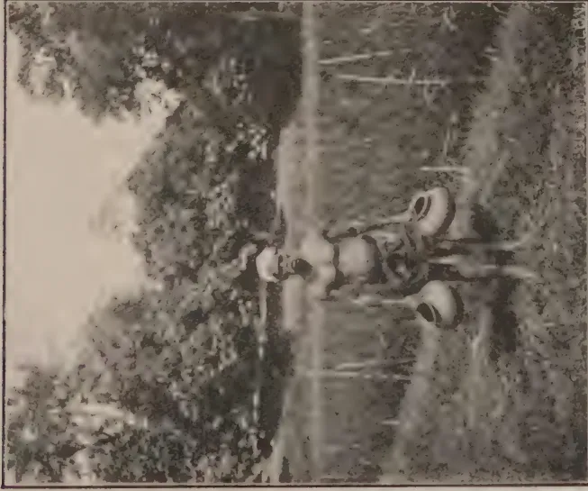

L. Long

Pots used in the Experiments.

1896.

Photo by

L. S. Bertus

*Paratelphusa (Oziotelphusa)*  
*Hydrodromus*, Herbst.

11------------------------------------------------

This image is a scan of a blank page. The paper has a light beige or cream-colored tint. There are a few very small, dark specks scattered across the surface, which appear to be scanning artifacts or dust particles. No text, lines, or other markings are present on the page.

12------------------------------------------------

141

## Paddy Notes.

### I. Land Crabs in Paddy Fields.

### II. Tillering of Rice.

L. LORD, M.A.,

*Economic Botanist, Ceylon.*

#### I. Land Crabs in Paddy Fields.

IN Ceylon, as in India and Burma, land crabs are a pest of varying degrees of seriousness to the paddy grower. Crabs feed largely on young paddy seedlings and during the early part of the growing season do an appreciable amount of damage. Where, as in Ceylon, the seed rate is heavy in order to combat weeds, this damage is not serious but with transplanted paddy and particularly in careful experimental work the damage through cut seedlings is frequently of sufficient importance to warrant the adoption of control measures.

In the terraced paddy cultivation of the hill districts of Ceylon crabs are largely responsible for breaches of the bunds. Crabs inhabit burrows in the bunds of paddy-fields and their continual burrowing, in course of time, so weakens the bund that a heavy shower of rain breaches it. Plants beneath the breach are destroyed and the cultivators' time is wasted in repairing the damage. A sudden rush of water from a field takes with it, also, some of the finer soil particles. At the Experiment Station, Peradeniya, during the Yala season of 1926 the loss of seedlings due to crabs\* was very apparent in the plots where single planting had been practised. It was decided, therefore, to try control measures the following season.

Possible control measures are several. Ghosh (1924) advocates trapping in wide-mouthed earthenware pots (chatties) baited with rice bran or gingelly poonac. Wagle (1924) recommends fumigation of burrows with carbon bisulphide and suggests also that poison bait may be tried. He also advocates reducing as far as possible the size of the bunds. Trapping in pots is comparatively simple; pots with mouths 4-6 in. diam.

\* Specimens of these crabs have kindly been identified by Dr. J. Pearson, Colombo Museum, as *Paratelphusa* (*Oziotelphusa*) *hydrodromus*, Herbst.

13------------------------------------------------

142

(about one-half of the maximum diameter of the pots) are sunk in the paddy-fields until their rims are about 2 in. or 3 in. below the level of the water. The bait is placed in the pots, preferably in the evening, and the trapped crabs are lifted out in the morning by hand and killed. The pots are sunk in the ground a few days after sowing or transplanting. Because of its simplicity and its success at Mandalay (where Ghosh, *op. cit.*, states that 20,000 crabs were caught in 16 acres in the course of about two months) it was decided to adopt this method.

At the outset, different pots were baited with boiled rice, boiled sweet potato, coconut refuse, dry fish and crushed Kalutara snails (*Achantia fulica*). After a month's trial none of these baits showed any superiority over boiled rice so at that time all the ten pots in use were baited with boiled rice. The area covered by the pots was about half an acre. Trapping began on October 21st and was discontinued on December 20th at which time the plants were large enough to be immune from attack and the daily catch had tailed off into very small figures. During these two months a total of 1,443 crabs were trapped, a figure which for half an acre is higher per unit area than the Mandalay figure of 20,000 for 16 acres. Table I. shows the daily catch and rainfall. The effect of rain on the activity of crabs is clearly shown by the two graphs. The advent of rain encourages crabs to leave their burrows (cf. Wagle, *op. cit.*, p. 13) for the fields where they are liable to be trapped.

No record of the cost of the bait was kept for the 1926 experiments, so it was decided to remedy this omission during the 1927 Yala season, and, at the same time, to test the merits and costs of different baits. Five pots were used, four baited respectively with rice bran, boiled rice, *Kekuna* poonac (residue of the seeds of *Aleurites moluccana*), and gingelly poonac (*Sesamum* cake). The fifth pot was not baited. The rice bran and the two poonacs were fried, without oil, just before being used. The experiment began on April 6th and ended on June 15th. The results were as follows:—

<table border="1">
<thead>
<tr>
<th rowspan="2">Pot No.</th>
<th rowspan="2">Bait used.</th>
<th rowspan="2">No. of crabs caught.</th>
<th colspan="2">Total cost</th>
</tr>
<tr>
<th>Rs.</th>
<th>Cts.</th>
</tr>
</thead>
<tbody>
<tr>
<td>1</td>
<td>Rice bran</td>
<td>163</td>
<td>—</td>
<td>6</td>
</tr>
<tr>
<td>2</td>
<td>Boiled rice</td>
<td>118</td>
<td>—</td>
<td>8</td>
</tr>
<tr>
<td>3</td>
<td><i>Kekuna</i> poonac</td>
<td>162</td>
<td>—</td>
<td>6</td>
</tr>
<tr>
<td>4</td>
<td>Gingelly poonac</td>
<td>171</td>
<td>—</td>
<td>12</td>
</tr>
<tr>
<td>5</td>
<td>None</td>
<td>85</td>
<td>—</td>
<td>—</td>
</tr>
</tbody>
</table>

The total number of crabs caught was 699. The results show there is little to choose between gingelly poonac, rice bran and *Kekuna* poonac as baits. Rice bran can be obtained anywhere, so it is recommended.

14------------------------------------------------

# RECORD OF CRABS

## TRAPPED

### TABLE 1.

1926

4 POTS OCT. 21-25.

10 POTS OCT. 25 ONWARDS.

CRABS —  
RAINFALL - - -

<table border="1">
<thead>
<tr>
<th>Date</th>
<th>No. of crabs trapped</th>
<th>Rain fall (inches)</th>
</tr>
</thead>
<tbody>
<tr>
<td>Oct. 21</td>
<td>0</td>
<td>0</td>
</tr>
<tr>
<td>Oct. 22</td>
<td>10</td>
<td>0</td>
</tr>
<tr>
<td>Oct. 23</td>
<td>15</td>
<td>0</td>
</tr>
<tr>
<td>Oct. 24</td>
<td>45</td>
<td>0</td>
</tr>
<tr>
<td>Oct. 25</td>
<td>60</td>
<td>0</td>
</tr>
<tr>
<td>Oct. 26</td>
<td>65</td>
<td>0</td>
</tr>
<tr>
<td>Oct. 27</td>
<td>60</td>
<td>0</td>
</tr>
<tr>
<td>Oct. 28</td>
<td>55</td>
<td>0</td>
</tr>
<tr>
<td>Oct. 29</td>
<td>50</td>
<td>0</td>
</tr>
<tr>
<td>Oct. 30</td>
<td>45</td>
<td>0</td>
</tr>
<tr>
<td>Oct. 31</td>
<td>40</td>
<td>0</td>
</tr>
<tr>
<td>Nov. 1</td>
<td>35</td>
<td>0</td>
</tr>
<tr>
<td>Nov. 2</td>
<td>30</td>
<td>0</td>
</tr>
<tr>
<td>Nov. 3</td>
<td>25</td>
<td>0</td>
</tr>
<tr>
<td>Nov. 4</td>
<td>20</td>
<td>0</td>
</tr>
<tr>
<td>Nov. 5</td>
<td>15</td>
<td>0</td>
</tr>
<tr>
<td>Nov. 6</td>
<td>10</td>
<td>0</td>
</tr>
<tr>
<td>Nov. 7</td>
<td>15</td>
<td>0</td>
</tr>
<tr>
<td>Nov. 8</td>
<td>20</td>
<td>0</td>
</tr>
<tr>
<td>Nov. 9</td>
<td>25</td>
<td>0</td>
</tr>
<tr>
<td>Nov. 10</td>
<td>30</td>
<td>0</td>
</tr>
<tr>
<td>Nov. 11</td>
<td>35</td>
<td>0</td>
</tr>
<tr>
<td>Nov. 12</td>
<td>40</td>
<td>0</td>
</tr>
<tr>
<td>Nov. 13</td>
<td>45</td>
<td>0</td>
</tr>
<tr>
<td>Nov. 14</td>
<td>50</td>
<td>0</td>
</tr>
<tr>
<td>Nov. 15</td>
<td>55</td>
<td>0</td>
</tr>
<tr>
<td>Nov. 16</td>
<td>60</td>
<td>0</td>
</tr>
<tr>
<td>Nov. 17</td>
<td>65</td>
<td>0</td>
</tr>
<tr>
<td>Nov. 18</td>
<td>70</td>
<td>0</td>
</tr>
<tr>
<td>Nov. 19</td>
<td>75</td>
<td>0</td>
</tr>
<tr>
<td>Nov. 20</td>
<td>80</td>
<td>0</td>
</tr>
<tr>
<td>Nov. 21</td>
<td>75</td>
<td>0</td>
</tr>
<tr>
<td>Nov. 22</td>
<td>70</td>
<td>0</td>
</tr>
<tr>
<td>Nov. 23</td>
<td>65</td>
<td>0</td>
</tr>
<tr>
<td>Nov. 24</td>
<td>60</td>
<td>0</td>
</tr>
<tr>
<td>Nov. 25</td>
<td>55</td>
<td>0</td>
</tr>
<tr>
<td>Nov. 26</td>
<td>50</td>
<td>0</td>
</tr>
<tr>
<td>Nov. 27</td>
<td>45</td>
<td>0</td>
</tr>
<tr>
<td>Nov. 28</td>
<td>40</td>
<td>0</td>
</tr>
<tr>
<td>Nov. 29</td>
<td>35</td>
<td>0</td>
</tr>
<tr>
<td>Nov. 30</td>
<td>30</td>
<td>0</td>
</tr>
<tr>
<td>Dec. 1</td>
<td>25</td>
<td>0</td>
</tr>
<tr>
<td>Dec. 2</td>
<td>20</td>
<td>0</td>
</tr>
<tr>
<td>Dec. 3</td>
<td>15</td>
<td>0</td>
</tr>
<tr>
<td>Dec. 4</td>
<td>10</td>
<td>0</td>
</tr>
<tr>
<td>Dec. 5</td>
<td>5</td>
<td>0</td>
</tr>
<tr>
<td>Dec. 6</td>
<td>0</td>
<td>0</td>
</tr>
</tbody>
</table>

Block by Survey Dept. Ceylon.

15------------------------------------------------

TABLE 2

1927

5 POTS.

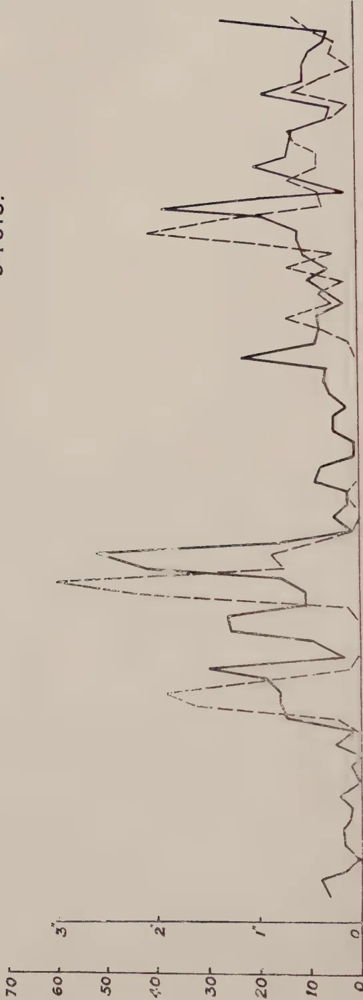

The graph displays two data series over time from April 6 to June 6, 1927. The left y-axis represents a scale from 0 to 70, and the right y-axis represents a scale from 0 to 3. The x-axis is marked with dates: April 6, May 6, and June 6. The solid line series starts at approximately 10 on the left axis (0.3 on the right axis) in early April, fluctuates, and then shows a sharp increase to a peak of about 65 (2.2) in late May. The dashed line series starts at approximately 15 on the left axis (0.5 on the right axis) in early April, peaks at about 55 (1.8) in late April, and then fluctuates between 10 and 25 on the left axis (0.3 to 0.8 on the right axis) through June.

<table border="1"><thead><tr><th>Date</th><th>Solid Line (Left Axis)</th><th>Solid Line (Right Axis)</th><th>Dashed Line (Left Axis)</th><th>Dashed Line (Right Axis)</th></tr></thead><tbody><tr><td>April 6</td><td>10</td><td>0.3</td><td>15</td><td>0.5</td></tr><tr><td>April 15</td><td>15</td><td>0.4</td><td>20</td><td>0.6</td></tr><tr><td>April 25</td><td>20</td><td>0.5</td><td>25</td><td>0.7</td></tr><tr><td>May 6</td><td>25</td><td>0.6</td><td>30</td><td>0.8</td></tr><tr><td>May 15</td><td>30</td><td>0.7</td><td>35</td><td>0.9</td></tr><tr><td>May 25</td><td>40</td><td>0.8</td><td>40</td><td>1.0</td></tr><tr><td>June 6</td><td>50</td><td>0.9</td><td>45</td><td>1.1</td></tr></tbody></table>

April 6 . . . . . May 6 June 6 . . . . .

16------------------------------------------------

143

Table II. shows the total number of crabs caught daily and the daily rainfall. Again, there is the same marked effect of rain. When careful paddy experiments are laid down in an area where crabs are numerous, trapping is essential. It may also be an economic proposition in terraced cultivation in certain places. In transplanting paddy the drying of the fields for four or five days, immediately after transplanting, serves to lessen damage by crabs, as they prefer to swim about the fields.

### Acknowledgment.

I am indebted to Mr. K. D. S. S. Nanayakkara for the supervision of these experiments and the careful recording of the results.

### Summary.

1. 1. This article describes the successful use of earthenware pots as traps for crabs in paddy-fields.
2. 2. The merits and costs of different baits are shown.
3. 3. The use of rice bran as a bait is recommended.

### Literature Cited.

Gosh, C. C.—Crabs in paddy fields. *Leaflet No. 24. Dept. of Agric., Burma*. (1924).  
 Wagle, P. V.—Land crabs as agricultural pests in Western India. *Bul. 118 of 1924. Dept. of Agric., Bombay*. (1924).

## II. Tillering of Rice.

With the publication of a paper\* on the subject of tillering in rice it seems opportune to draw attention to the importance of a more critical examination of the results of tillering experiments and to the necessity of adopting a technique which will eliminate the very large errors due, among other factors, largely to soil heterogeneity. The paper in question gives an interesting account of experiments laid down to determine the variability in tillering habits of different lowland rice varieties; to compare the difference of tillering in planted and transplanted rice; to determine the effect of spacing and seed rate on tillerings and finally to see the effect on tillering of transplanting seedlings of different ages. Like Summers (1921) the author finds that different varieties have different tillering powers. He also finds that transplanted seedlings produced more tillers than seedlings grown from planted seeds (not transplanted). This result agrees neither with Summers (*loc. cit.*) nor with Joshi and Gadkari (1924) who found that planted seeds produced more tillers than

\* Tillering of Rice by Dionisio Calvo, *Phillipine Agric.* XVI, 2, July, 1927.

17------------------------------------------------

144

transplanted seedlings and the latter of whom conclude there is no proof that tillering is encouraged by the stimulus of root pruning. Calvo finds that increasing the space allotted to each plant up to a maximum of 50 by 50 cm. increases tillering; and that under the conditions of the experiment, the older the seedlings were, up to six weeks, before transplanting, the greater the tillering. It must not be thought, however, that maximum tillering is a *desideratum*. Heavy tillering results in the late tillers producing ears that fail to mature and which thus reduce the yield per unit area. In addition, in places where the Paddy Fly (*Leptocorisa varicornis*) is common, such late tillers are actually harmful as the late immature ear heads extend the period during which the Paddy Fly finds grain in the milk stage.

Unless paddy-field soils in the Philippines are remarkably homogeneous the methods used in the experiments under review are open to one serious criticism when they are used for experiments which are laid down in more than one banded field or even which cover more than a small area of one banded field. The criticism is that in such cases, the absence of replications has introduced what may easily be very large errors due to soil heterogeneity.

Where an experiment is complete in two or three closely adjacent lines of any length the soil error is small or negligible, and the criticism does not apply with such force but even here, the randomisation of the plots of different treatments within five or six "blocks" or replications would be an advantage as it would permit of a valid estimation of the error of the experiment besides eliminating errors due to soil differences (see Fisher, 1926).

Summers (p. 84, *op. cit.*) writes "It has been shown, however, in the case of the Pure Lines worked upon, that when paddy seeds are sown at such intervals as to give the plants the same amount of space for development as seedlings which are transplanted into the same field, *where naturally all soil factors are equivalent*, the transplanted plants are very inferior both as to tillering capacity and individual yield to these former." The italics are the present writer's. At Peradeniya during the *Maha* season of 1926-27 for the purposes of a field plot technique experiment two fields were filled with rod-row plots (2 ft. by 14.6 in.) of 150 plants equally spaced. Alternate plots were planted with two pure lines P-16 and W-10, and for interest a tiller count of five plots of each pure line was made. The results are shown in Table I.

18------------------------------------------------

145

Table. I.  
The Tillering of P-16 and W-10.

<table border="1">
<thead>
<tr>
<th rowspan="2">Replication</th>
<th rowspan="2">Selection</th>
<th rowspan="2">No. of Plants</th>
<th colspan="2">No. of Fruiting culms</th>
<th colspan="2">Yield of grain in lbs. per 100 plants</th>
</tr>
<tr>
<th>Total</th>
<th>Per Plant</th>
<th>Total</th>
<th>Per Plant</th>
</tr>
</thead>
<tbody>
<tr>
<td>a</td>
<td>P-16</td>
<td>132</td>
<td>580</td>
<td>4.4</td>
<td>1.68</td>
<td></td>
</tr>
<tr>
<td>a</td>
<td>W-10</td>
<td>150</td>
<td>720</td>
<td>4.8</td>
<td>2.88</td>
<td></td>
</tr>
<tr>
<td>b</td>
<td>P-16</td>
<td>140</td>
<td>768</td>
<td>5.5</td>
<td>2.61</td>
<td></td>
</tr>
<tr>
<td>b</td>
<td>W-10</td>
<td>150</td>
<td>915</td>
<td>6.1</td>
<td>2.92</td>
<td></td>
</tr>
<tr>
<td>c</td>
<td>P-16</td>
<td>139</td>
<td>800</td>
<td>5.7</td>
<td>2.65</td>
<td></td>
</tr>
<tr>
<td>c</td>
<td>W-10</td>
<td>145</td>
<td>809</td>
<td>5.6</td>
<td>3.49</td>
<td></td>
</tr>
<tr>
<td>s</td>
<td>P-16</td>
<td>146</td>
<td>659</td>
<td>4.5</td>
<td>1.98</td>
<td></td>
</tr>
<tr>
<td>s</td>
<td>W-10</td>
<td>149</td>
<td>1016</td>
<td>6.8</td>
<td>2.71</td>
<td></td>
</tr>
<tr>
<td>t</td>
<td>P-16</td>
<td>134</td>
<td>915</td>
<td>6.8</td>
<td>3.11</td>
<td></td>
</tr>
<tr>
<td>t</td>
<td>W-10</td>
<td>143</td>
<td>715</td>
<td>5.0</td>
<td>1.87</td>
<td></td>
</tr>
</tbody>
</table>

Replications a, b, and c were in one field and replications s and t in the other. The variation in one field is as follows:—

P-16      4.4 - 5.7      W-10      4.8 - 6.1

In the other field:—

P-16      4.5 - 6.8      W-10      5.0 - 6.8

These variations are appreciable, in one case over, and in another case almost, 50%, and within the same bounded field, where soil factors, one would expect, would be equivalent. They, or other factors, are obviously not equal and it was a study of the above figures which made a more careful arrangement of tillering experiments seem so desirable. The average number of fruiting culms per plant were obtained from counts of from 132 to 150 plants. Calvo (op. cit.) used the plants from 100 hills which, with single planting, is a smaller number of plants. A count of 100 plants or hills would appear to be ample.

If the tillering of any one pure line varies as much as 50% in one field the variation when the pure line is grown in several fields may be much greater. Hence, if a study of the tillering capacities of a number of varieties or pure lines or the determination of the effect on tillering of a number of treatments is contemplated, a careful system of organised replications and of randomised plots within the replication blocks is essential.

During the *Maha* season of 1927-28 experiments will be started to determine (a) the variation in tillering capacity between plants in small areas, (b) the magnitude of the standard errors of varying numbers of replications and (c) the effect of soil fertility on comparative tillering capacity.

Tillering experiments can be comparative only: they cannot produce absolute results. Transplanting seedlings at five weeks

19------------------------------------------------

146

old instead of at three weeks old cannot be said to raise the tillering capacity by, say, two tillers a plant. It can only be said to raise the tillering capacity by two tillers a plant under the conditions of soil fertility, water supply, etc., that prevail in the area of land on which the experiment is carried out and with the tillering capacity of different varieties. It can be shown what are the average number of tillers per plant for the conditions ruling in the experimental area—provided, of course, precautions are taken to ensure the elimination of soil errors, etc. It cannot be determined that variety A will produce six tillers and B eight. It cannot even be said A will always produce two tillers less than B, but it can be stated with accuracy that B will always produce more tillers than A under normal conditions. It will probably be possible to determine within close limits of error the percentage increase in tillering capacity of one variety over another.

### Literature Cited.

Fisher, R. A.—The arrangement of field experiments. *Jou. Ministry Agric.* September, 1926. pp. 503-513.

Joshi, K. V. and Gadkari, M. V.—Studies on the rice plant and on rice cultivation. *Dept. of Agric., Bombay, Bul. 114 of 1923.* Bombay, 1924.

Summers, F.—The tillering of Ceylon rices. *Tropical Agric.* LVI., No. 2. 1921.

20------------------------------------------------

147

## Mycological Notes (7).

### *Oidium* Leaf Disease of *Hevea*.

MALCOLM PARK, A.R.C.S.,

*Assistant Mycologist, Department of Agriculture.*

INTEREST has been aroused in Ceylon by the report that a leaf disease of *Hevea* has caused of late a certain amount of perturbation in Java. Enquiries addressed to the Department of Agriculture in Java have elicited the information that the unusually dry weather conditions of the last two years have led to an increase in the incidence of a leaf disease of *Hevea* in certain areas of that country. The disease in question is caused by a species of *Oidium* or powdery mildew; it has been known in Java for a number of years. As diseases of the type caused by *Oidium* are considered to be "dry-weather" rather than "wet-weather" diseases, it is of interest to note that the weather conditions associated with the reported increase of disease were abnormally dry.

The interest aroused by the report from Java has drawn more attention than usual to leaf disease of rubber in Ceylon, and reports have been received that certain estates are suffering from severe attacks. Investigation of such claims has shown the necessity for indicating clearly the symptoms and effects by which *Oidium* disease may be recognised, for damage caused by wind, rim-blights and root disease has been attributed in error to *Oidium*.

*Hevea* mildew, as *Oidium* disease has been called, attracted attention in 1925 for the first time in Ceylon, and articles on the disease were written by Stoughton-Harris (1) and Gadd (2). Since that time *Oidium* disease has become of common occurrence. Its effects are more marked than formerly and they appear to be more or less serious in certain districts and at certain elevations. The best-known form of attack occurs on young leaves at the time of their early growth and rapid expansion. Their leaflets become discoloured, curl from the margins and fall, and examination with a lens discloses the white, powdery superficial covering of the fungus *Oidium*. This form of attack is the most serious because it causes defoliation, but it has been

21------------------------------------------------

148

found that trees partially or wholly defoliated in this manner put out fresh leaves and so recover. The latter, however, may or may not be attacked in turn at the time of unfolding.

Leaves which are older than the very young leaves mentioned above, but which are still in an immature state may also be attacked, but in their case the whole area of the leaf need not necessarily become diseased. Areas at the margin, tip or about the midrib may become discoloured; the leaves may or may not fall as the result of attack. If they remain on the tree, the healthy portion of the leaf continues to expand while the diseased area cannot do so, and the consequence is a malformation which is one of the most characteristic symptoms of *Oidium* disease in Ceylon. The distortion persists throughout the life of the leaf although the fungus may have ceased to be in a condition of active parasitism upon it. This second type of attack is not considered to be as serious as that on the very young leaves since diseased older leaves do not fall from the trees in the same large numbers as young leaves.

The symptoms enumerated above describe briefly *Oidium* disease as it has been known in Ceylon. The term "primary attack" may be adopted to indicate them. Primary attack is most prominent at the period immediately after wintering, and observations in Ceylon have tended to show hitherto that the attack is arrested when the leaves attain maturity. Recent investigations, however, have shown that this view may be erroneous and that the fungus may attack fully-developed leaves. The symptoms noted in certain cases are described below. In these cases, *Oidium* disease has occurred on mature leaves in the months of June and July, a fact which is not in accord with the view that the disease occurs in dry rather than wet weather. The South-West Monsoon of the present year has been of average intensity in the districts in which the attack on mature leaves has been observed.

The symptoms of this "secondary attack" or attack on full-grown leaves differ from those of primary attack. Irregular yellowish translucent spots are scattered over the surfaces of the leaves. Such spots are best seen when the affected leaf is held up to the light; they give the leaflets an irregularly mottled appearance. The accompanying photograph shows a typical appearance. In advanced cases the powdery mildew which is made up of the hyphae and spores of the *Oidium* can be discerned readily with a lens on the undersides of the spots. Seen under the microscope the spores are indistinguishable from those of the *Oidium* that is found in primary attacks. As the spots grow older, they turn purple-brown in colour and eventually dry up, forming irregular brown areas the centres of which may fall out and leave small irregular holes with a brown margin.

22------------------------------------------------

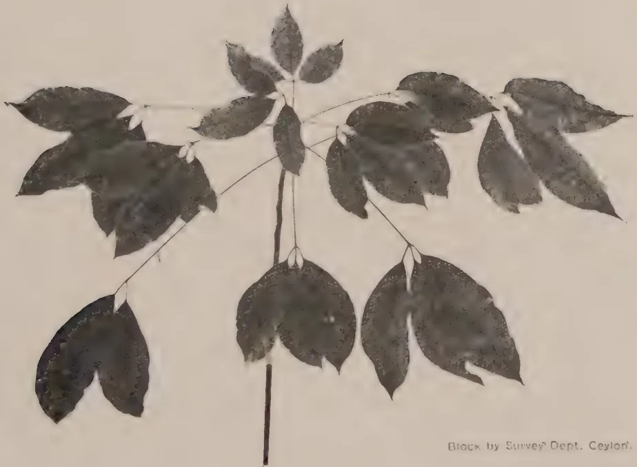A black and white photograph of a Hevea branch. The branch has several large, ovate leaves with serrated margins. Some leaves show signs of damage, including small white spots and some leaf drop. The branch is shown against a light background.

Block by Survey Dept. Ceylon.

Photo by

L. S. Bertus

Photograph Showing Symptoms of "Secondary Attack"  
of *Oidium* Leaf Disease of *Hevea*.

23------------------------------------------------

This image is a scan of a blank page. The paper has a light beige or cream-colored tint. There are some very faint, blurry marks scattered across the surface, which appear to be scanning artifacts or minor imperfections in the paper itself. No text, lines, or other graphical elements are present.

24------------------------------------------------

149

In no case has secondary attack been noted to cause defoliation. In this respect it is less serious than primary attack. It may be wide-spread; on a certain estate recently inspected the majority of the leaves showed typical spots. *Oidium* disease appears to be more serious in its effects at mid country elevations but that may be explained on the ground that attack in the low-country rubber districts is masked by the leaf and pod disease caused by *Phytophthora Faberi*.

The effects of a primary attack of *Oidium* disease are to be seen in the sparsity of the foliage. The foliage put forth by a tree after more or less complete defoliation as a result of *Oidium* disease may be poor and the leaves smaller and more yellow in colour than the normal. It is obvious that defoliation of this nature must be a considerable drain on the resources of the tree. On the other hand, damage caused by the secondary form of attack may not appear to be so serious. No defoliation is caused but a proportion of the leaf surface must cease to function in the processes of photosynthesis and, as the proportion of diseased to healthy area becomes greater, the effects of secondary attack may be more serious.

There are no records in Ceylon to indicate that *Oidium* disease causes a decrease in the yield of latex. It is possible, however, that the cumulative effects of consecutive attacks may result in a lowering of the vitality of the trees and a reduction in yield. This possibility should be borne in mind when considering treatment for the disease.

Diseases of the mildew type of other crops, for example, the grape-vine, have been controlled by spraying with Bordeaux Mixture or a similar fungicide. Spraying is a *preventive* measure and the essential for successful control of disease is that the sprayed surface should have a complete coating of fungicide in order that the parasite may be prevented from attacking and entering the plant tissues. It is obvious that in the case of primary attack of *Hevea* by *Oidium* such a condition can be fulfilled only by constant spraying, since the leaves at the time of attack are expanding and a superficial film of fungicide will remain complete only for a very short time. Satisfactory spraying for control of primary attacks with the present form of sprayers is therefore impracticable under Ceylon conditions. Once the leaves have reached their full-growth, however, a single spraying, if well applied, should be sufficient to control secondary attack. The secondary form of attack, however, is at the present time less serious in its effects than the attack on young expanding leaves.

Direct control, therefore, is hardly feasible in practice, and indirect treatment is indicated. It is a well known agricultural principle that nitrogenous manures tend to increase the amount and better the condition of the foliage of plants, but there is no

25------------------------------------------------

150

record that rubber trees which are heavily manured with quick-acting nitrogenous manures are more immune or resistant to leaf disease than unmanured trees. There is little doubt, however, that such treatment results in a better cover of leaves *after* an attack of leaf disease. No experiments have been carried out to confirm this statement in regard to *Oidium* leaf disease but inspection of fields manured with nitrogenous manure and their comparison with similarly situated unmanured areas has demonstrated a marked improvement in the former.

From the above it may be concluded that since primary attack of *Oidium* leaf disease of *Hevea* is not directly and easily controllable under field conditions, indirect control should be attempted by cultivation and the application of quick-acting nitrogenous manures at or about wintering time. Badly affected trees may have to be rested. To control secondary attack spraying with Bordeaux Mixture at the time when leaves are just attaining maturity may be advised; in certain districts this spraying would serve the double purpose of controlling secondary attack of *Oidium* leaf disease and leaf and pod disease due to *Phytophthora Faberi*.

### References.

1. 1. Stoughton-Harris, R. H.—1st Quarterly Circular for 1925, Rubber Research Scheme (Ceylon), p. 8.
2. 2. Gadd, C. H.—Year Book of Department of Agriculture for 1926, p. 22.

26------------------------------------------------

151

## Contour Terracing on the Experiment Station, Peradeniya.

**T. H. HOLLAND, M.S.E.A.C.,**

*Manager, Experiment Station, Peradeniya.*

**A**S this subject is at present engaging the attention of those who are opening new clearings, particularly in rubber, it is thought that the details of a piece of work of this nature recently completed on the Experiment Station, Peradeniya, might prove of interest.

The piece of land in question was actually planted with *Hydrocarpus whightiana* and *Taraktogenus Kurzii*, two plants used in the production of Chaulmoogra oil. The conclusions formed and the lessons drawn from the work, however, are equally applicable to similar work done with the object of planting rubber.

The area comprised two sides of a valley, one side of which was considerably steeper than the other. The area of the portion actually terraced was 2.87 acres.

Work was commenced in January, 1927, on the less steep side of the valley. The instructions being that the trees should be planted approximately 25 ft. by 25 ft., the tracing of each terrace was started 25 ft. from the next one.

Tracing was done with a road tracer, pegs being put in about every 17 feet.

A contract was then given out for digging the terraces, the conditions being that the terraces should be cut back a distance of 6 feet from the pegs and sloped back into the hill at an angle of one in five.

A wooden triangle was provided to the contractor of which the lower side was six feet in length and sloped down at an angle of one in five when the top side was horizontal. This served the double purpose of checking the width and the slope of the terraces.

This work was paid for at Rs. 4.50 per chain of 66 feet, and judging by the alacrity with which the contractor completed the work he was no loser over the transaction.

The slope on this side of the valley varied between 23° and 24°.

27------------------------------------------------

152

The average distance between the terraces, measured from the back of one terrace to the top of the bank at the back of the next terrace, turned out to be 22 feet. The terraces being dead level, the distances between them varied at different points according to the lie of the land.

Owing to a portion of the earth cut out lodging on the immediate edge of the terrace and thus increasing its width, the average width of these completed terraces—measured 5 months after completion—was 8 feet 2 inches.

On this slope the earth cut from one terrace fell about half way down to the next terrace.

The other side of the valley was very much steeper, so much so that the writer was doubtful of the practicability of terracing this slope which varied between 30° and 35°. On the steepest portion it was apparent that to obviate the earth dug out from one terrace falling on to the next terrace, or the place where the next terrace should be dug, either the width of the terraces would have to be reduced so as to dig out less earth, or the distance between the terraces would have to be increased. As the latter course involved a considerable reduction in the number of trees that could be planted per acre, the former alternative was adopted and a contract was given to dig terraces 3 feet 6 inches wide sloping back at one in five at Rs. 2.00 per chain.

These terraces were pegged out at distances which, according to the slope, the writer judged by eye to be sufficient to allow room for the earth dug out from the terrace above to lie without an undue amount falling or being washed on to the next terrace below. The average distance between the terraces worked out to 21 feet 2 inches, so that, at the expense of width of terrace, an equal number of trees per acre could be planted on this steep slope as on the lesser slope.

The average width of these narrower terraces when completed was 3 feet 9 inches, i.e., only 3 inches more than the distance cut back from the pegs, whereas in the lesser slope an additional final width of 2 feet 2 inches was obtained. This was of course due to the cut earth sliding further down the steeper slope and demonstrates the fact that the final width of a terrace cut to a stipulated distance from the pegs will vary in inverse proportion to the steepness of the slope.

*Indigofera endecaphylla* was planted from the edges of each terrace downwards over the new earth at the earliest opportunity and has, over most of the area, made excellent growth.

Terracing was completed early in March and some heavy precipitations of rain during April gave the desired opportunity of testing the efficiency of the terraces. No trouble was antici-

28------------------------------------------------

A black and white photograph showing a steep, rocky slope with terraces. The terraces are visible as horizontal lines across the slope. The image is framed by a thin black border. In the bottom right corner of the photo, there is a handwritten signature 'L.S.B.'.

Photo by

L. S. Bertus

A View of the less Steep Slope, Showing the 6 foot Terraces.

29------------------------------------------------

A black and white photograph showing a cross-section of a hillside. A prominent, light-colored, horizontal terrace cut is visible, appearing as a distinct layer within the darker, textured soil or vegetation. The cut is relatively flat and extends across the width of the visible area. The surrounding terrain is uneven and dark, suggesting a natural or recently disturbed landscape. The photograph is oriented horizontally on the page.

L.S.B.

Photo by

L. S. Bertus

A Newly Cut 3 foot 6 inch Terrace.

30------------------------------------------------

153

pated on the lesser slope and the advent of heavy rain proved that all water that ran down the slope was easily retained by the 6 ft. terraces, and in a surprisingly short space of time sank into the ground.

Considerable doubts were however entertained as to the efficiency of the 3 foot 6 inch terraces and some damage from overflowing was anticipated. In practice however these terraces have generally surpassed expectations: only in two places where natural depressions caused an extra accumulation of water has any serious overflowing taken place. A good many minor earth slips from the bank above occurred. Five months after completion the spaces intervening between the terraces were completely covered either by *Indigofera endecaphylla* or by the natural vegetation which had been allowed to grow unchecked. It being judged that further slips were not therefore likely to occur the terraces were cleaned out where slips had occurred, the earth being spread along the outer edge of the terraces.

The cost of terracing the whole area of 2.87 acres was as follows:—

<table>
<tr>
<td>Digging <math>51\frac{1}{2}</math> chains of 6 ft. terraces</td>
<td>@ Rs. 4.50 per chain = Rs. 231.75</td>
</tr>
<tr>
<td>Digging 20 chains of 3 ft. 6 in. terraces</td>
<td>@ Rs. 3.00 per chain = Rs. 40.00</td>
</tr>
<tr>
<td style="text-align: right;">Total</td>
<td style="text-align: right;"><u>Rs. 271.75</u></td>
</tr>
</table>

Total initial cost per acre = Rs. 80.75.

The cost of cleaning out and repairing the terraces after five months was Rs. 3.93 per acre. Owing to the vegetation with which the slopes are now clothed it is not anticipated that any more repair work will be necessitated during this year, so that the cost of the making and upkeep of the terraces for the first year may be put at Rs. 84.68 per acre.

In the wider terraces the holes were dug four feet from the back of the terraces; in the narrower ones they were dug in the middle of the terraces.

Holes were dug 25 feet apart giving, in the present instance, an average of 86 trees per acre. If rubber had been planted the trees would have been planted closer in the terraces.

If a hypothetical acre block is taken measuring 396 feet long and 110 feet up and down the slope, such a block could contain 5 terraces dug at an average distance of 22 feet apart, as they were in the present instance. If the holes were dug at 16 feet apart in the terraces a stand of 125 trees per acre could be obtained. In the case of the lesser slope of  $23^{\circ}$ - $24^{\circ}$  however, it has

31------------------------------------------------

154

been mentioned that the earth from one terrace only fell about half way down the slope to the next, and there would be therefore no difficulty in digging these terraces closer together. If they were spaced 18 feet apart and the trees planted 18 feet apart in the terraces, 132 trees per acre could be obtained.

On the steeper slope of  $30^{\circ}$ - $35^{\circ}$ , as explained, it was scarcely possible to dig even 3 foot 6 inch wide terraces nearer than 21 feet so that closer planting in the terraces would be necessitated to get a larger number of trees per acre.

### Conclusions.

1. On a slope of up to  $27^{\circ}$  contour terraces 6 ft. or more wide and sloped back at an angle of one in five form an excellent means of checking soil erosion and retaining nearly all the rain water which falls on the land. There is no difficulty in planting a sufficient number of rubber trees per acre. The initial cost is fairly high, but after the first year the cost of upkeep will be negligible.

2. On a steep slope of  $30^{\circ}$ - $35^{\circ}$  terraces 3 ft. 6 inches wide cannot be dug nearer than 20 ft. apart. If wider terraces are made they must be spaced at a still greater distance. Close planting will then be required in the terraces to obtain a fair number of trees per acre.

Terraces 3 ft. 6 inches wide sloped back at an angle of one in five have been found to be just sufficient to achieve the objects in view, but only by a narrow margin.

In exceptional falls of rain some damage may be expected.

3. It is not considered feasible to terrace land steeper than  $35^{\circ}$ .

32------------------------------------------------

155

## Experiments on the Preservation of Lime Juice at Peradeniya.

**A. W. R. JOACHIM, B.Sc., A.I.C., Dip. Agr., (Cantab.),**  
*Agricultural Chemist, Department of Agriculture.*

**L**IME cultivation in Ceylon has not, up to the present, progressed to that extent as to warrant the expenditure of large sums of money on the manufacture and preservation of lime juice. It is quite likely however that after the local demand has been met, a small proportion of the crop may remain over and the problem of its preservation in some form or other would present itself. Attempts to utilise the excess limes for the preparation of lime juice have doubtlessly been made, and these have evidently been unsuccessful—to judge by the enquiries made from the Department as to how these juices could best be preserved with least cost. Experiments were therefore undertaken at the Chemical Laboratory, Peradeniya, to work out a simple but effective method of lime juice preservation. In the West Indies (1) where the cultivation of limes and the manufacture of lime-products are of great economic importance, raw lime juice for shipment to the makers of beverages is prepared by a very simple process. The juice is expressed from *sound, ripe* fruit, which have been previously thoroughly washed, by passing them through mills provided with rollers. It is then passed through rotating strainers made of brass or copper wire to remove seeds and pulp, and then stored in well-filled, clean, sound, closed casks. In this way the juices are preserved for several months without any loss of acid or development of mould, if they are from good, ripe fruit. If not, deterioration rapidly sets in.

In America more elaborate methods have been adopted for the preservation of the juice and pasteurisation or sterilisation by heat, treatment with sulphurous acid, defecation, and filtration are operations commonly adopted (2).

The limes for the experiments used at Peradeniya were obtained from the Experiment Station, Anuradhapura, and were well-picked and well-ripened. On receipt in the laboratory they were thoroughly washed, divided into three lots and then cut into halves. The juice was extracted from each lot separately (a) by a small fruit press, (b) by hand, (c) by a hand rubber-

33------------------------------------------------

156

roller. The percentages of juice obtained by the three methods are as follows:—

<table>
<thead>
<tr>
<th></th>
<th></th>
<th>Number of fruits to the lb.</th>
<th>% of juice on weight of fruit</th>
</tr>
</thead>
<tbody>
<tr>
<td>(a)</td>
<td>Mill pressed</td>
<td>... 8</td>
<td>... 28.7</td>
</tr>
<tr>
<td>(b)</td>
<td>Hand pressed</td>
<td>... 8</td>
<td>... 38.4</td>
</tr>
<tr>
<td>(c)</td>
<td>Roller pressed</td>
<td>... 8</td>
<td>... 45.0</td>
</tr>
</tbody>
</table>

Although the roller-press was found to give the best results its use had to be discontinued owing to its having iron and not granite rollers. The expression of juice by the hand was found to be quicker and more effective than by the mill press, and would therefore be most convenient for the small owner.

### Preservation Experiments.

The juices were first filtered through a clean brass-wired sieve of fine mesh to remove the seeds and pulp residues, and then through clean muslin or other coarsely woven fabric. They were then left to stand for about 72 hours to defecate and clear, as experiments in America (2) with orange juice had shown that a period of 76 hours was needed for the filtrate to clear before it could be filtered easily. The clear juice was then decanted off and filtered through coarse filter paper. A fairly clear golden-coloured liquid was obtained. Subsequent experiments have shown that filtration through filter paper is not necessary, but that any fine-woven fabric will suffice. The solution in this case is rather cloudy, but on standing it clarifies considerably. In these latter experiments where filtration through filter-paper was not tried, the juices were left to defecate in some cases for 3-5 days. The filtered juice was in each case divided into two portions. One portion was placed in a vacuum bottle and the air freed from it, and the other portion well-filled into a clean, well-corked bottle. Samples of the hand-pressed and mill-pressed juices were also heated up to 185°F in a closed vessel containing water to sterilize them, and then left to cool. Two other jars of hand-pressed and mill-pressed juices which had not been defecated and filtered, were preserved for comparative purposes. Determinations of the citric acid content of each of the three samples were made. The results were as follows:—

#### Citric Acid.

<table>
<tbody>
<tr>
<td>(1)</td>
<td>Mill pressed juice containing</td>
<td>... 11.7 oz. per gal.</td>
</tr>
<tr>
<td>(2)</td>
<td>Hand pressed juice containing</td>
<td>... 11.9 oz. per gal.</td>
</tr>
<tr>
<td>(3)</td>
<td>Roller pressed juice containing</td>
<td>... 10.2 oz. per gal.</td>
</tr>
</tbody>
</table>

The adverse effect of the iron on the quantity of juice expressed is evident from the above table. West Indian samples generally contain 12 to 14 oz. Citric Acid per gallon (3).

34------------------------------------------------

157

On the samples being tasted, it was observed that they all had a slight 'limey,' bitter, and 'turbentine' taste. The 'limey' or 'musty' taste is inevitable with all pressed juices and has not up to the present been eliminated. The 'turbentine' taste is due to the essential oil from the rind, and cannot be avoided. The presence of the oil increases the keeping power of the juice. The bitter taste is due to oxidation and can be overcome by the use of sulphurous acid, which also prevents fermentation and a darkening of the juices. The use of sulphurous acid is fairly extensive in America, and it has been found there, that if about 2-3 oz. of sulphurous acid or 4-6 oz. of potassium metabisulphite are added to the juice immediately after crushing, the bitter flavour could be avoided. Sulphurous acid was not used in these experiments, as it was not considered quite advisable, or practicable either, when lime juice was being preserved on a small scale only. The bitter taste of the preserved juices increased somewhat on keeping except in the case of the pasteurised juices. Pasteurisation is therefore adopted to prevent fermentation and also mould growth. Pasteurised juices however have a slight 'cloudy' appearance even after a period of 4 months, whilst the other filtered juices become clarified in about a month's time. This 'cloudiness' of sterilised juices has been observed in America as well (2), and has been attributed to the destruction of the coagulating enzyme by heat. But whilst these samples are slightly cloudy they seem to be better flavoured than the unpasteurised juices.

The samples are now 4 months old, and with the exception of those that had not been filtered and defecated and which developed mould after a fortnight or so, and one or two others which were infected by the latter, have kept very well. Determinations of their citric acid contents at the end of two and four months respectively, showed that they had lost no acid whatever during these periods. The mouldy samples on the other hand had considerably less acid, viz., 6.5 and 8.5 oz. per gallon of juice as against 11.9 and 11.7 oz. at the commencement. Great care should therefore be taken that the mouldy juices are kept apart from the well-preserved samples.

On the whole these experiments have shown that if the limes are sound and well-ripened and thoroughly washed before expressing the juice, and if clean, well-filled, closed vessels are used for the storage of the juice, it can be preserved in a satisfactory condition for at least 4 months, and probably longer. It has to be emphasised that the limes should be ripe and in good, sound condition.

35------------------------------------------------

158

## Method.

A process which could conveniently be adopted for the preservation of lime juices on a small scale is as follows:—

After the limes have been thoroughly well washed and the juice expressed by hand or through a press or roller (granite or wooden), the juice should, if possible, be strained through a brass or copper wired sieve to remove seeds, residues of pulp, etc., and then through a clean, coarse-woven fabric. The latter alone would suffice, although the filtration would then be slower. The strained juice should then be left to defecate or settle for 3-5 days, and the clear liquid decanted off and filtered through a finer woven fabric, or coarse filter paper. The addition of sulphurous acid to the juice immediately after crushing to prevent the bitter flavour is not advised for the present. The filtered juice should then be well-filled into clean, well-corked bottles, and if convenient heated up to 185°F. in a closed vessel containing water, to prevent fermentation and mould growth. This latter operation does not seem to be necessary if cleanliness has been observed throughout the process and if the juices are to be kept for a period of not less than 4 months.

## References.

1. 1. Lime Cultivation in the West Indies. Imperial Department of Agriculture, West Indies, Publication No. 72, 1923.
2. 2. Citrus Products. Pt. I. J. B. McNair. Field Museum of Natural History, Chicago, Botanical Series, Vol. VI., No. 1.
3. 3. The Cultivation of Limes. G. G. Auchinleck, Department of Agriculture, Ceylon, Bulletin No. 49.

36------------------------------------------------

159

## Some Notes on Economy in Dairy Farming.

**R. H. SPENCER SCHRADER,**  
*The Wester Seaton Dairy, Negombo.*

**R**ECENTLY the question of the milk supply in Ceylon generally, and in Towns in particular, has been receiving wide attention. Generally speaking, Up-country, in the Planting Districts, the supply of milk—its cleanliness and wholesomeness need not now be discussed—is plentiful. But, Up-country, Dairy farming is more or less incidental to either cattle breeding, or keeping cattle for manure. In Towns, where Dairies are run purely for the supply of milk, the supply is inadequate. The reason seems to be that those Dairies which do not draw a fair percentage of their profit from the local water supply are found, after a time, to be run at a loss. The causes which contribute towards the losses sustained in Dairy farming do not appear to have been investigated, and it is thought that some notes which might clear up a few of the problems which the dairy farmer has to solve would be of interest.

If, in an ordinary business, a proper system of accounting is necessary, it is very much more necessary in Dairying, and the system must, of necessity, be more elaborate than the simple keeping of a Cash Book, Journal, and Ledger. While it would be quite possible to shew from these three books that either a profit or a loss is made, they will not help the farmer to learn whether the profit can be increased, or the loss converted into gain. To learn this it is essential that two records—the Milk Record, and the Food Record—be kept daily, and a statement of costs drawn up once a year.

Before saying anything about the two books mentioned above, it would be well to pay some consideration to the rearing of young stock, which is an inevitable part of Dairy farming. It is obvious that rearing young stock is necessary for one purpose, and one purpose only—to supply the farmer with his future herd. If the cows he raises are worthless, then he is doing bad business. Unless he keeps a very careful account of his expenditure on rearing calves, and gets his young stock valued periodically, he will not know whether he is investing his money wisely or not. He must realize that to rear a heifer that will not develop into a good paying cow is a waste of money, and to rear a bull that will develop into nothing but a scrub is useless. The milk that is fed to

37------------------------------------------------

160

a calf before it is weaned will bring in, if sold, quite a large sum of money. Within three months a calf will consume somewhere in the neighbourhood of a hundred gallons of milk, which if sold in Colombo, will bring in over Rs. 250.00. It must be very obvious that no cross-bred bull of that age, raised in a Dairy, is worth more than a tenth of that sum. To deliberately throw away as large a sum as Rs. 225.00 in three months on rearing a perfectly useless animal is very little short of criminal folly. It is far more economical for the farmer to kill and bury his bull calves, and worthless heifers than it is to rear them and allow them to eat up profit that rightly belongs to him.

The rearing of young stock is an investment pure and simple. It is as much an investment as buying a cow. The expenditure incurred in rearing calves should therefore be a Capital charge. If, when the stock is valued, there is a difference between the actual value and the amount spent on them, this should be written off as a loss if the expenditure is the greater, or added as a profit if it be less. When a heifer calves and comes into the milking herd, the young stock account should be credited with her value, and the herd account debited. It is very necessary to keep a very careful account of expenditure on calves, as unless this is done it would be quite easy to let a lot of useless calves eat up all, or more than all, the profit earned by a herd of good cows.

It is essential to keep a record of the daily yield of every cow in the herd. (It may be stated in passing that this record should not be kept in bottles. Bottles vary in size, and it is never clear what is meant precisely when quantities are spoken of in "bottles." Besides the froth makes it well nigh impossible to measure milk accurately. The best system is the one adopted by every Dairying country in the World—the system of keeping the Milk Record by weight. For all practical purposes it is quite sufficient to calculate the yield at ten pounds to a gallon.) From this record the farmer can draw many inferences. He will know which cows' heifers are worth keeping. He will be able to work out his cost of production per gallon, and per cow. He will have a very sure indication of the health of his herd, since one of the first symptoms of illness in a cow is a drop in the milk yield. Above all, he will be able to raise the average yield of his herd, which is one of the greatest factors in the economical production of milk.

Perhaps the most prolific source of trouble from a financial point of view is caused the farmer by wasteful feeding. In Dairy farming it is obvious that the food given must find its way into the milk pail. If it eventually goes into the manure heap it is wasted. There is only one way of being economical in feeding Dairy cows, and that is by feeding according to the yield. A ration that is properly balanced as regards albuminoids and

38------------------------------------------------

161

carbo-hydrates is a *sine qua non*. The question of well balanced rations cannot be discussed here, but as an example of where waste may easily take place it might be stated that if a deficiency of albuminoids is fed the cow will have to draw on her body for nitrogen, and will lose condition, with the result that her yield will diminish. A deficiency in carbo-hydrates can be made good by feeding an excess of albuminoids, but this is wasteful, as the latter are very much more expensive than the former. If no excess of albuminoids is fed to make up a deficiency in carbo-hydrates, then the cow will draw on her body for albuminoids, which will be split up, the nitrogen being excreted as ammonia, while the residue will supply the deficiency in carbo-hydrates. It will be seen that a deficiency in both albuminoids and carbo-hydrates have the same result—the depletion of albuminoids stored in the body of the cow, with resulting loss of condition and diminution of yield.

Unless an efficient system of costing is adopted there is a danger that the farmer may keep several “thieves” in his herd—cows who will rob him of profit that is legitimately his. The profit made by the whole concern—even the profit per gallon—is not sufficient. The farmer must know what share each cow in his herd is paying towards the total profit, or whether he is keeping any cows which are causing him a loss. Since the quantity of food given to each cow will vary as her yield, it would not be possible to obtain the requisite degree of accuracy by averaging the expenditure on food. A daily record of food given to each cow should therefore be kept, and the value calculated at the end of the year. All other expenditure, which should include depreciation in value of the herd, and any loss in rearing calves, may be averaged. A statement can now be drawn shewing the actual expenditure on each individual cow in the herd. The total income from sale of milk, and all its products, divided by the total recorded yield will give the actual average selling price per gallon. Since the yield of each individual cow has been recorded it would be quite simple to calculate what gross income each cow has given, and the difference between this and the expenditure will shew the profit or the loss made by each cow for the year.

Unless some system as indicated above is adopted it would be impossible for the farmer to know whether he has any cows in his herd who are not worth their keep, and it should be obvious that without this knowledge it would be dangerous in the extreme to attempt to carry on a Dairy business. One often hears it said that Dairy farming is not a paying proposition, and there can be very little doubt that those who embark on the business without any proper system of accounts or costs will come to grief. If, however, a Dairy is run on proper, commonsense business lines, there is no reason, whatsoever, why it should not pay quite as good a dividend as any other paying concern.

39------------------------------------------------

162

## Selected Articles.

# The Eri or Castor Silk-Worm\*

Department of Agriculture, Ceylon. Leaflet No. 46.

### Introduction.

**E**RI silk is obtained from the cocoon of a caterpillar which feeds on the leaves of the castor oil plant. This silk differs from that obtained from other silk-worms in that it cannot be reeled, *i.e.*, a single unbroken thread cannot be obtained from one cocoon, as can be done with a cocoon of the mulberry silk-worm. The cocoon is spun by the Eri-worm in layers and is so constructed that the moth can emerge through one end without breaking the fibres. This means that the moth may be allowed to develop inside the cocoon and come out naturally, so that the cocoons need not be stifled (*i.e.*, steamed or heated to kill the insect inside), as must be done with mulberry or tasar silk-worms. One great advantage of Eri silk is that no life need be taken to obtain it. Another advantage is that all the cocoons reared can be made into thread, and all emerging moths can be used for breeding and producing large broods if necessary.

In the case of mulberry silk some of the cocoons have to be set aside for obtaining eggs or "seed" and cannot be used for silk since the continuous thread is broken by the moths allowed to emerge for breeding purposes.

The rearing of Eri silk-worms can be carried on in Ceylon in any district where the climate is moist and warm for several months in the year and where there are no long periods of dry heat. It is not suggested that Eri-worms should be reared on a large scale, but simply as a village or cottage industry, which could be carried on by cultivators or their wives and children.

No special house is required for the rearing of Eri-worms on a small scale. Any ordinary mud-walled house with a cadjan roof and earthen floor will do quite well, provided it is well ventilated and that the floor is kept clean and free from dust.

### Equipment for Breeding Eri-worms.

Assuming that a plentiful supply of castor leaf is easily available for daily feeding of the worms, the following articles are required before rearing is begun:—

1. **Feeding Trays.**—These can be made of split bamboo or other suitable material, the edges being turned up on all sides and bound with strips of bamboo to make a shallow tray. A convenient size is 3 feet long by 2 feet wide, and three such trays will be required for every thousand worms to be reared. This type of tray can also be used (1) for allowing the moth to spin, and (2) as emergence trays by spreading out the cocoons.

\* Due acknowledgment is here made to Bulletin No. 29 of the Agricultural Research Institute, Pusa, from which much of the information given in this leaflet has been taken.

40------------------------------------------------

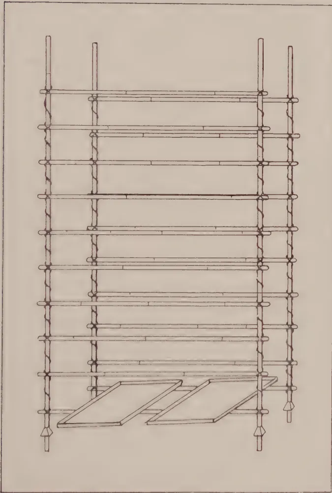A technical line drawing of a bamboo stand. The stand is constructed from four vertical bamboo poles tied together with horizontal cross-pieces. The poles are tied at regular intervals, creating a grid-like structure. At the bottom of the stand, two rectangular trays are shown resting on the horizontal cross-pieces. The drawing is a simple line illustration, likely a technical drawing from a manual or book.

Bamboo Stand.

*(Re-drawn from Mem. Dept. Agric. India, Ent. Set. vol. IV., p. 9, fig.2).*

41------------------------------------------------

This image is a scan of a blank page. The paper has a light beige or cream-colored tint. There are some very faint, blurry marks that appear to be scanning artifacts or dust particles, but no text or other content is present.

42------------------------------------------------

163

The eggs can be kept in any small basket before they hatch.

2. **Spinning baskets** in which the full grown worms can be put to spin their cocoons. These should be about 1 foot deep by about  $1\frac{1}{2}$  feet in diameter, and can be made of the same material as tea-pluckers' baskets with a lid. Two such baskets are required for every thousand worms.

3. **A bamboo stand** (see fig.) is sometimes useful for holding a number of feeding trays, but is hardly necessary if only a few are being used. One advantage of a separate stand is that the trays can be kept free of ants by putting the legs of the stand in kerosene and water.

4. **Materials in which the worms can spin their cocoons.** Such materials as wood shavings, crumpled paper, dry straw or grass, dry leaves, &c., may be used for this purpose.

5. In addition to the above, a small supply of copper sulphate and one or two glazed earthenware wide-mouthed chatties are needed in cleaning the trays, baskets, &c. Copper sulphate solution in water should only be made in glazed earthenware, enamel or wooden vessels. Kerosene tins or other metal vessels must not be used for copper sulphate.

## Life History of the Eri-worm.

In common with all other moths the Eri silk-worm passes through four stages during its development:—(1) the egg, (2) the caterpillar or worm which hatches from the egg and feeds on castor leaves, moulting four times between periods of feeding and growth. When full grown it spins (3) a cocoon of silk, from which (4) the moth emerges to lay its eggs, thus completing the life cycle.

(1) *Eggs.*—These are small, globular, and at first are whitish or yellowish-white, but turn gray before hatching. In moist warm weather they hatch in about 7 to 8 days, but may take longer if the weather is hot and dry or very cool.

(2) *Worms.*—The young worms are greenish-yellow, and after a period of feeding and growth they stop eating for 2 or 3 days, during which time they should not be disturbed; then they moult their skins and feed again for a few days. The worms usually moult four times during their development, and after the fourth moult they feed greedily and grow rapidly until fully developed in about 23 to 25 days after hatching.

(3) *Cocoons.*—At this stage they stop feeding and wander about looking for a place in which to spin their cocoons; they can then be put into the spinning baskets.

(4) After about two or three weeks the moths emerge and lay their eggs for another brood.

## Instructions for Rearing Silk-worms.

### Eggs.

(1) Keep the eggs under moist warm conditions. If the weather is hot and dry, keep the tray or basket covered with a cloth moistened periodically. As soon as the eggs turn gray, indicating that they will hatch in a day or two, then spread them out evenly on paper to hatch.

### Worms.

(2) Supply the young worms on hatching with fresh young castor leaves, and as soon as they have crawled on to these remove the leaves with worms to the breeding trays.

43------------------------------------------------

164

(3) Keep together all worms which hatch on the same day; never keep worms of different ages together.

(4) Never give worms dusty or wet leaves or those which are stale and withered. Dusty leaves can be washed and dried with a cloth. Feed only fresh leaves plucked daily with short stalks, and do not give the worms more leaf than they can eat before it withers.

(5) Feed young worms twice daily with fresh tender leaves. Older worms should be fed from three to five times daily, including once at night, and they can be given older and larger leaves. Last stage worms should be given as much leaf as they will eat.

(6) Never touch or handle the worms unless absolutely necessary. Worms which have dropped from the trays can usually be lifted on a leaf or a piece of stick. When cleaning the trays transfer the worms on the old leaves to trays containing fresh leaves, and when they have crawled on to the new leaves pick out the old leaves.

(7) Clean the trays regularly at least once a day, so that the worms may be kept healthy. Remove all dead worms and burn if possible. Remove all old leaves and refuse and bury in a pit with other refuse to be used for manure later.

(8) Do not crowd the worms together in a small space. Not more than about 50 to 60 full-grown worms should be kept in a square foot of space, or about 300 to 350 in each feeding tray.

(9) When full-grown the worms are about 4 inches long and may be whitish or greenish. They stop feeding, change colour, and begin to wander about in search of a place to spin. Remove these to the spinning baskets which have already been filled to the top with dry leaves or other material in which the worms can spin. If only a few worms are ready to spin daily then feeding trays can be used separately for allowing the worms to spin with the spinning material spread out on them. If a large number of worms are ready to spin about the same time then fill the spinning baskets with alternate layers of material and worms, taking care not to leave any empty space below the lid. Do not put more than 500 worms in a basket of the size given. The filled basket can be closed and the lid weighted down or the whole basket can be turned upside down.

### Cocoons.

(10) After 5 or 6 days the cocoons can be picked out from the spinning material and the baskets used for more worms after being thoroughly cleaned. Use only white cocoons for breeding purposes and destroy the brown cocoons. Spread out the cocoons in rows in trays and keep away from ants, rats, etc.

### Moths.

(11) The moths should emerge in about another 12 to 14 days after the cocoons are laid out and should be left for several hours and then put into an empty covered basket, such as a spinning basket. They will cling to the sides of the basket and mate. Next day pick out the unpaired moths, leaving the mating couples together for another day. Then pick out the females (which have large bodies) and put them into another basket, and throw away the males or feed them to fowls. The cocoons can also be laid out in a feeding tray, the tray being divided by one or two cross pieces of cadjan or split bamboo. The tray is tilted at an angle and the emerging moths crawl up to the lower side of the partition where they cling until their wings expand. They can then be put into the covered basket, as indicated above, to mate and lay their eggs.

44------------------------------------------------

165

(12) The females will lay their eggs on the sides and bottom of the basket, the best eggs being usually laid the first night. If these are sufficient for the next brood then keep these only and kill the moths. If not, then allow the moths to lay for one or two more nights until sufficient eggs have been obtained. Eggs laid after the third night should never be kept as these are inferior and will not produce good worms.

(13) Scrape off the eggs carefully with a blunt knife or flat piece of wood and put into trays or baskets, keeping together all the eggs laid on the same day.

(14) When all the moths have emerged the cocoons should be collected and disposed of as early as possible.

## Notes on the Cultivation of Castor.

For rearing Eri-worms on a small scale castor can be grown among other crops in vegetable gardens, preferably close to the rearing house, so that a daily supply of fresh leaves can be obtained. If castor is grown as a separate crop in small plots then the seeds should be sown in lines about 4 feet apart; with closer sowings the plants will grow too tall to be plucked easily.

When the seeds have germinated, fill in any gaps by hand and keep down weeds by light cultivation or by hand-weeding between rows. When the plants are about a foot above ground thin out all weak plants two or three times until the plants are about four feet apart each way. When they are about 3 feet high, remove the top shoots so as to obtain a bushy growth. The tips of the side shoots can also be removed to encourage the growth of more leaves.

The plants should be ready for plucking in about two months after sowing. Do not strip individual plants of their leaves, but pluck the lower leaves first from a number of plants and then gradually work upwards. Young and tender leaves must, however, be given to the first stage worms, but such leaves should be taken from several plants. All plucking should be carried out systematically and judiciously throughout the castor area in rotation, so that previous pluckings can be replaced by new growth.

45------------------------------------------------

166

# The Cotton Leaf-Caterpillar.

## *Cosmophila erosa.*

Department of Agriculture, Ceylon. Leaflet No. 47.

**T**HE cotton leaf-caterpillar is sometimes a pest of young cotton plants in village cultivations and in experimental plots. It is also known to feed on some other cultivated plants related to cotton, such as ladies' finger (bandakai, S.), and shoe-flower (wadmal, S.), and on certain weeds, such as abutilon (anoda, S., Vaddatutti, T.), which are usually to be found growing within and around cotton areas.

This insect passes through four stages in its development, namely: (1) egg, (2) caterpillar, (3) pupa or cocoon, and (4) moth.

The eggs are pale green, circular and somewhat flattened (see Figs 3 and 4) and are not easily seen on the leaves.

The young caterpillars are very small, pale-green, and usually escape notice. The older caterpillars (Fig. 5) are darker green, with five whitish lines along the back and sides.

The pupa (Figs. 6 and 7) is dark brown, and is formed within a fold of a leaf or between two leaves webbed together, as shown in Fig. 8 (b) and (c).

The moths differ in colour according to the sex. The female (Fig. 1) is pale-brown, while the male (Fig. 2) is brown with darker markings on the outer half of the wings. Both sexes rest with wings closed as seen in Fig. 1.

### Life History and Habits.

The eggs are laid singly on the young leaves and shoots, and hatch in about four days. (The caterpillars are very active in all stages and are sometimes known as "semi-loopers" from their habit of walking by partly arching the middle of the body. They may also be seen standing up on their hind legs and waving their bodies around like leeches. When disturbed they may drop to the ground. The presence of the pest is indicated by the gradual appearance of holes in the leaves, mainly the older leaves, and eventually the plants, especially those growing near unweeded edges of the fields, may have most of their outer leaves stripped bare. It is fortunate that the pest prefers the older leaves, since vigorous and well-grown plants may undergo a fairly bad attack without being vitally injured. The caterpillars are full-grown in about three to four weeks, after which they usually fold over a portion of a leaf or web two or more leaves together and form the pupa or resting stage within the fold. The pupal stage lasts about ten days, after which the moths emerge. The females begin egg-laying within a week after emergence and a single female may lay more than 800 eggs. Under favourable conditions a female moth lives about two to four weeks, while a male may live about three to four weeks.

46------------------------------------------------

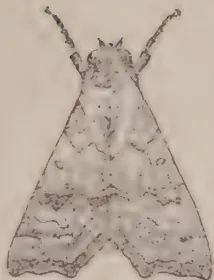

1

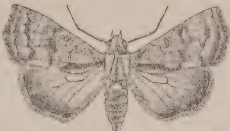

2

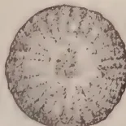

3

4

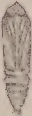

6

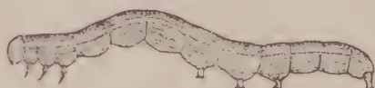

5

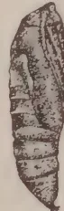

7

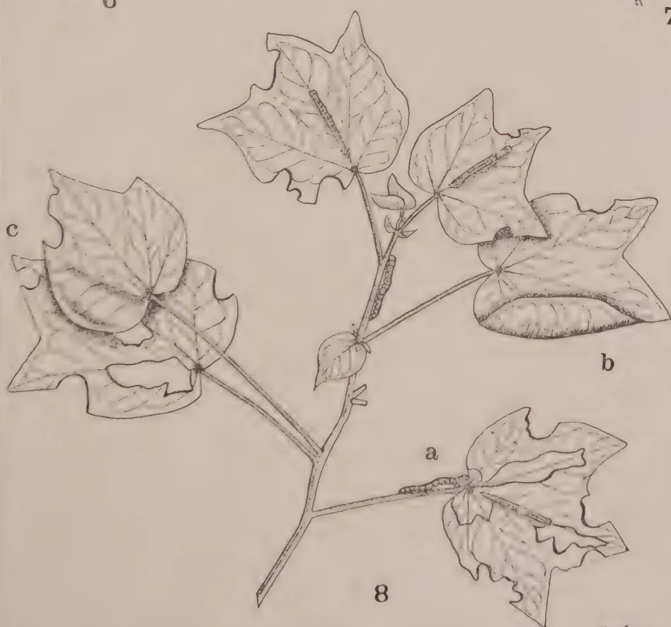

8

Geo L. de Silva

Block by Bureau Dept. Caption.

# The Cotton Leaf Caterpillar.

- 1. Female moth, resting position  $\times 2$ .
- 2. Male moth, flying position  $\times 2$ .
- 3. Egg, from above, much enlarged.
- 4. Egg, side view, much enlarged.
- 5. Full-grown caterpillar,  $\times 2$ .
- 6. Pupa, removed from leaf.
- 7. Pupa, side view.
- 8. Cotton twig, half natural size, showing—
  - (a) Caterpillars on leaves.
  - (b) Cocoon within fold of leaf, and
  - (c) Cocoon between two leaves.

47------------------------------------------------

This image is a scan of a blank page. The paper has a light beige or cream-colored tint. There are a few very small, dark specks scattered across the surface, which appear to be scanning artifacts or dust particles. No text, lines, or other markings are present on the page.

48------------------------------------------------

167

## Control.

**Preventive Measures.**—(1) Cultivate and manure the land thoroughly before planting, so as to produce a vigorous early growth which will enable the plants to recover from any injury caused by this pest. (2) Practise clean weeding within and around the cotton area not only before the crop is planted but during the early stages of growth. The removal of all weeds, especially those related to cotton, will tend to prevent outbreaks not only of this caterpillar but of many other insect pests of cotton. (3) Do not grow such crops as ladies' finger (*bandakai*, S.) or roselle (*ratibilincha*, S.) anywhere near cotton areas.

**Remedial Measures.**—Hand-pick the caterpillars and cocoons or shake the plants and collect any caterpillars which fall to the ground. In either case the collection can be put into vessels containing water and a little kerosene.

**Natural Control.**—Birds, such as mynahs, may sometimes be seen in numbers in fields attacked by this pest and probably help to control it. Small parasitic wasps and flies may assist in control, but cannot be relied upon. It has been noticed on several occasions that this pest may completely disappear after heavy rains, but it is not advisable to rely upon rains to control the pest.

J. C. HUTSON,  
Entomologist, Department of Agriculture.

49------------------------------------------------

168

# Report on Kapok from Ceylon.

By the Imperial Institute, London.

**T**HE sample of kapok which is the subject of this report was received for examination at the Imperial Institute on the 4th April, 1927, from the Director of Agriculture and is referred to in his letter No. 571 dated 23rd February, 1927.

It was stated that the kapok represented the first crop from trees raised from seed introduced from the Japura district in Java.

## Description.

The sample weighed 6 lb. and consisted of soft, lustrous floss, of dark cream colour and of rather lumpy and knotty appearance. The fibre was somewhat stained in places, and a few seeds and broken pieces of pod were present.

## Results of Examination.

On examination the fibres were found to have the following dimensions, which are shown in comparison with those obtained from a commercial sample of "Prime" Java kapok.

<table border="1">
<thead>
<tr>
<th rowspan="2"></th>
<th colspan="2">Length</th>
<th colspan="2">Diameter</th>
</tr>
<tr>
<th>Present sample</th>
<th>Java Kapok.</th>
<th>Present sample</th>
<th>Java Kapok.</th>
</tr>
<tr>
<th></th>
<th>ins.</th>
<th>ins.</th>
<th>ins.</th>
<th>ins.</th>
</tr>
</thead>
<tbody>
<tr>
<td>Maximum</td>
<td>1.0</td>
<td>1.1</td>
<td>0.0010</td>
<td>0.0010</td>
</tr>
<tr>
<td>Minimum</td>
<td>0.3</td>
<td>0.5</td>
<td>0.0004</td>
<td>0.0006</td>
</tr>
<tr>
<td>Mostly</td>
<td>0.6 to 0.8</td>
<td>0.7 to 0.9</td>
<td>0.0007 to 0.0008</td>
<td>0.0008 to 0.0009</td>
</tr>
<tr>
<td>Average</td>
<td>0.7</td>
<td>0.8</td>
<td>0.00072</td>
<td>0.0008</td>
</tr>
</tbody>
</table>

These results show that the present sample of kapok was somewhat shorter and finer than the Java kapok.

*Buoyance Trials.*—With a view to ascertaining the buoyancy of the Ceylon kapok compared with that of Java kapok, small scale, experiments were carried out under conditions similar to those specified in the Board of Trade regulations concerning life jackets (*Instructions as to the Survey*

50------------------------------------------------

169

of Life Saving Appliances 1926, pp. 76-78) viz:—

“A life jacket whose buoyancy is derived from kapok must be capable of supporting at least 20 lb. of iron after floating in fresh water for 24 hours with  $16\frac{1}{2}$  lb. of iron attached.”

“At least 24 oz. of kapok must be in each life jacket whose buoyancy is derived from this material.”

In the experiments 4 oz. each of the Ceylon kapok and of the “prime” Java kapok (i.e. one-sixth of the quantity prescribed for a life-jacket in the Board of Trade specification) were tied up tightly in cotton bags (12 in. by 9 in.), which had been thoroughly washed to free them from dressing. The total weight required to sink the bags in water was determined (a) at the commencement and (b) after floating in water for 24, 48 and 96 hours with a weight of 44 oz. attached.

The following results were obtained:—

<table border="1">
<thead>
<tr>
<th></th>
<th></th>
<th>Present sample “Prime” Java of Ceylon kapok.</th>
<th>Java kapok.</th>
</tr>
<tr>
<th></th>
<th></th>
<th>oz.</th>
<th>oz.</th>
</tr>
</thead>
<tbody>
<tr>
<td>Total weight required to immerse bag (including the 44 oz.) at commencement.</td>
<td>...</td>
<td>72</td>
<td>71</td>
</tr>
<tr>
<td>After 24 hours</td>
<td>...</td>
<td><math>67\frac{1}{2}</math></td>
<td><math>67\frac{1}{2}</math></td>
</tr>
<tr>
<td>“ 48</td>
<td>...</td>
<td>67</td>
<td>68</td>
</tr>
<tr>
<td>“ 48</td>
<td>...</td>
<td><math>60\frac{3}{4}</math></td>
<td><math>31\frac{3}{4}</math></td>
</tr>
</tbody>
</table>

These experiments show that the Ceylon kapok amply satisfies the Board of Trade requirements as regards buoyancy and that it is practically identical in this respect with Java kapok.

*Resiliency.*—A series of tests was carried out with a view to determining the comparative resiliency of the samples of Ceylon kapok and “prime” Java kapok both in the original condition and also after being fluffed out. The results indicated that there was little difference in the natural volume and resiliency, but that the Java kapok was rather more easily compressible than the Ceylon sample.

## Commercial Value.

Samples of the Ceylon kapok were submitted to two firms of merchants in London, who furnished the following reports.

One firm stated that:—

“The sample shows a type of kapok that has been shipped from Ceylon for now quite a considerable time, as we have treated with many parcels, we should say for some years now, practically in every way identical with your sample.

“There is another type of Ceylon kapok known under the designation of No. 1 Machine Cleaned Ceylon kapok, which in our opinion is quite as good as your sample, as the staple of the No. 1 Machine Cleaned is longer and of better resiliency than your type, although we would mention that there are a few consumers who prefer Ceylon kapok to be knobby, kapok, as per your sample.

“With the exception of colour, there is not a great resemblance to Java, as of course the Java quality is of long staple and very resilient, whereas the sample under review is as per our report, knobby and piecy, and consequently not of great resiliency.

51------------------------------------------------

170

"It appears more than probable to us that the kapok has possibly been gathered from trees under maturity, and we think that this may account for the shortish staple; we think you should establish from Ceylon as to the age of the trees from which the kapok has been collected—in fact, we should feel indebted to you, on your receiving a reply, if you would kindly let us know as to whether our conjecture is a correct one.

"Furthermore, you might ask as to the manner in which the kapok has been cleaned and treated, as possibly on having a reply, we may be able to advise a cleaning process that should be preferably employed to the manner in which the kapok is at present being cleaned."

They classified the sample as "Usual Ceylon type of knobbly kapok and piecy, practically free from seeds and other impurities. Usual orange-tinged Ceylon colour, of short staple and consequently only fair resiliency." They valued it at  $10\frac{1}{2}d.$  per lb. c.i.f. London when "prime" Java was quoted at 1s. per lb.

The second firm reported as follows:—

"We have taken notice of this new product with much interest and would say that it comes in quality very near the ordinary hand cleaned Ceylon. It does not stand out very much from the hand cleaned and in value would be about equal the same. The "Bulbs" make this quality very attractive for many of our manufactures. In our opinion—and this is founded on repeated personal visits to producing area in Ceylon,—we think that the difference in quality between the Ceylon and Java kapok is not so much in the tree, but mainly due to the preparation of the kapok. It generally is not collected in Ceylon when ripe and the collected pods are allowed to lie about and become damp before they are taken to the factory (that is cleaned more or less). Also, as the time of collection and cleaning coincides with the dampest season in Ceylon, this naturally influences the preservation of the kapok and very often affects the quality. We have given ourselves much trouble to better these conditions and may state that we have had good results in this connection. It is our opinion that with care and perseverance there is good business in Ceylon kapok. The actual crop which we estimate at about 300 tons yearly, may become ten times as large without any real inconvenience to the consuming markets and if produced in perfect quality it will not be far below the prices of Java kapok. Resuming, we would say that if you advise your friends in Ceylon to try to give extension to the output in Ceylon and see to it that the preparation is done with great care, this will mean a great asset for the selling of their kapok. The question from which seeds the kapok is grown is, as far as we can judge from the sample, of secondary importance."

They valued the sample at about  $10\frac{1}{2}d.$  to  $10\frac{1}{4}d.$  per lb. ex warehouse.

## Remarks.

This sample of kapok is of good quality but is of darker colour and slightly shorter and finer than "prime" Java kapok. It also differs from Java kapok in being more lumpy and knotty.

Experiments carried out at the Imperial Institute indicated that the buoyancy and resiliency of the material are practically identical with those of the Java fibre although one of the trade experts regarded the resiliency as inferior to that of Java kapok.

23 June, 1927.

52------------------------------------------------

171

## Experiments with Fertilizers for Coffee in Porto Rico.

**T**HE following is a summary of the information contained in Bulletin No. 31 of the Porto Rico Agricultural Experiment Station, by Mr. T. B. McClelland, Horticulturist, prepared by T. H. Holland, Manager, Experiment Station, Peradeniya:—

Though coffee is an important crop in Porto Rico, production per acre is generally low and enquiries as to the use of fertilizers are frequent.

### Field Experiments.

#### South Field Plots.

The first experiment to be dealt with was carried out on a strip of heavy, almost impervious brown clay soil.

Shade was provided by regularly spaced leguminous trees which furnished a heavy mulch of leaves.

In the following account N = Nitrogen, P = Phosphoric acid and K = Potash.

The coffee was set out in 40 plots of 3 trees each, spaced 6 feet apart, with 9 feet between the plots. The field was divided into 5 divisions, each containing a check plot, a plot which received a complete fertilizer, one plot for each combination of two elements, and one for each element alone. Where one or two elements were applied the quantity used equalled that of the same elements used in the complete fertilizer. Beginning on the west side of the field each division to the east received twice as much fertilizer as the preceding one. Thus in the first division complete fertilizer was used at the rate of  $\frac{1}{2}$  lb. per tree per application, in the second at the rate of  $\frac{1}{2}$  lb., and so on up to the 5th division in which the complete fertilizer was applied at the rate of 4 lb. per tree.

The base of the formula was 1 part N,  $1\frac{1}{2}$  parts P, and 2 parts K. The materials used were ammonium sulphate, superphosphate and potassium sulphate. Applications were made twice a year.

Height measurements made during the first three years of the life of the young plants failed to show any significant difference attributable to the manures used. Later, measurements of trunk circumference were taken at 3 inches above the base and these measurements tended to show that N and K in combination, either with or without P, produced a considerable increase in growth, but that N alone or in combination with P but without K, produced a growth considerably below that of the check plots. The addition of P to N and K failed to produce any increased growth.

Where very heavy applications of N and P were made, e.g., in the 5th division, either singly or in combination, the result was a diminished growth but where K was added this did not occur.

It was further found that trunk circumference and yield were closely correlated.

53------------------------------------------------

172

In the harvesting of the first small crops it appeared that N had increased early production.

The first important crop was gathered four years after sowing the seed and three years after planting out.

During the eight years 1917-1924 inclusive, the N.P.K group and the N.K group out-yielded the unfertilized group.

The K group for seven out of the eight years, and the P.K group for five years out-yielded the check group, whereas the P group and the N.P group surpassed the check only once each and the N group did not surpass it at all.

Heavy applications of N without K very adversely affected fruiting whereas the same quantity used in conjunction with K proved beneficial rather than injurious. Moreover the plots receiving N alone in heavy applications showed poor growth and sparse foliage in contrast to the luxuriant foliation and growth on the plots receiving N and K in combination. The highest yield was given by the N and K plot in the fifth division which received annually (in two applications) 2 lb. 13 oz. ammonium sulphate and 2 lbs. 4 oz. potassium sulphate per tree. This plot during the eight-year period produced nearly three times the yield of the check plot in the same division.

Contrasting all the trees receiving any one element with those not receiving that element, and considering the latter section as a check, it is seen that the K section surpassed its check by 82% and the N section by 4%, while the P section fell below its check by 17%.

## Changes in the Soil Solution as a Result of the Fertilizer Treatments.

An examination of the changes in the soil solution of the plots was made by J. O. Canera, Assistant Chemist of the station. Soil samples were taken from the upper 6 to 8 inches.

In acidity it was found that the reaction was the same for the five untreated plots; and the plots to which the potassium sulphate alone was applied, even in the maximum quantities, showed no change in reaction. Ammonium sulphate alone, and acid phosphate alone and in combination with potassium sulphate, only very slightly increased the soil acidity: the increase in acidity was as great for the smaller as for the larger applications. A greater increase in acidity was produced by ammonium sulphate and acid phosphate in combination, and by the complete fertilizer. Here the rate of acidity only showed a sharp increase with the largest application.

The maximum change in soil reaction was produced by ammonium sulphate and potassium sulphate in combination. Here there was a continuous increase in acidity in harmony with the rate of application. The plot showing the highest acidity also held the record for maximum production.

As yet this acidity has shown no injurious effect on either growth or yield. The length of time required for acidity to increase to the point of injury under continued heavy applications has not as yet been determined.

As regards the physical condition of the soils, acid phosphate was found to be the most effective agent in flocculation. Only a slight improvement in flocculation was found in the plots treated with ammonium sulphate alone, and no improvement in those treated with potassium sulphate alone.

### Padang and Erecta Plots.

Another experiment with Padang and Erecta coffees was conducted on rather steep, but more typical coffee land. The Erecta trees were

54------------------------------------------------

173

grouped into 5 plots running up and down the slope. Individual terraces were provided for the trees. Application of fertilizers twice a year started when the seedlings were one year old. One plot received a complete fertilizer, three plots received fertilizer from which one element was omitted, and one was left unmanured as a check plot. The first application was at the rate of  $\frac{1}{2}$  lb. per tree, and subsequent applications at the rate of 1 lb. per tree.

Height measurements showed a higher average for the plots receiving N; the N.P. plot showed the highest average.

Over a period of 13 years, the application of the complete fertilizer resulted in a pronounced increase in yield.

The results in yield were not consistent over every portion of the 13 year period. In the first four crops the plots receiving N produced three to five times the crop of the check plots or the P.K. plot. The N.P. plot gave the highest yield. For the last six crops the N.P.K. plot produced more than any other two plots combined, and the plot from which N was omitted ranked ahead of the other two plots receiving incomplete fertilizer. For the whole period the N.P.K. plot produced approximately three times as much as the check plot and sufficiently in excess of the plots receiving incomplete fertilizer to indicate the need of supplying all three elements.

The Padang trees were divided into two plots. One received the same complete fertilizer as applied to the Erecta plot thus fertilized plus a liberal quantity of stable manure; the other acted as a check plot. Fifteen pounds of stable manure per tree were given in the first two applications and a five gallon measureful was applied thereafter as a surface mulch subsequent to fertilization.

The application of the complete fertilizer plus stable manure resulted in increased production over the check plot, but not such a comparatively large increase as was obtained by the use of the complete fertilizer in the Erecta plots.

Investigations were also made to determine the effect of fertilizer on size of fruit. In the Erecta plots it appeared that the size of the cherry was in direct relation to the yield. In other words the only observed effect of fertilizer on size of cherry was indirect. A notable increase in yield was accompanied in each case by a slight reduction in the size of cherry.

In the Padang plots the average number of cherries per litre in the check plot differed from that in the manured plot by less than 1 per cent.

## Comparison of Ammonium sulphate and Sodium Nitrate.

### Bourbon Plots.

These experiments were made on 60 trees of Bourbon coffee planted in 12 rows running up and down a steep but fairly uniform slope. The rows were treated alternately with ammonium sulphate and sodium nitrate. There were no check plots. Manures were applied twice a year. The first four applications were of nitrogen only; after that phosphoric acid and potash were provided the ratio, as in the case of the Padang and Erecta plots, being  $7 \cdot 10\frac{1}{2} \cdot 14$ .

The use of Ammonium sulphate produced an increase in height, trunk dimension and yield, compared with sodium nitrate. Over a period of seven years the plots manured with ammonium sulphate gave 63% more

55------------------------------------------------

174

crop than those manured with Sodium nitrate. It is not known what benefit may have been derived from Sodium nitrate since there was no check plot.

### Bischoff and Lopez Plantation Plots.

On the Bischoff plantation two plots were manured with sodium nitrate while a third was kept as a check. War time conditions prevented the continuation of the test but during the brief period in which it was under way no apparent benefit was observed from the use of sodium nitrate.

A group of plots located on the Lopez plantation consisted originally of four 1/10th acre plots to which a fifth was added later. The plots were located on a gentle slope. The number of trees per plot varied at the end of the experiment between 95 and 112. The soil was a stiff reddish-brown clay. From 1916 to 1919 the plots were treated twice a year as follows:—

- Plot 1. Sodium nitrate, 5 lb. per application.
- „ 2. Check plot.
- „ 3. Sodium nitrate, 15 lb. per application.
- „ 4. „ 30 „
- „ 5. Between December 1917 and June 1919 four applications of Sodium nitrate and acid phosphate at the rate of 15 lb. of each per application.

At the end of this period no increase in yield could be attributed to the use of Sodium nitrate and in January 1920 the treatment was changed. Thereafter the following applications were made twice a year:—

- Plot 1. Ammonium sulphate, 11¼ lb. per application.
- „ 2. Check plot.
- „ 3. Ammonium sulphate, 11¼ lb. per application.  
  Acid phosphate 15 lb. „  
  Potassium sulphate 5 lb. „
- „ 4. Sodium nitrate 15 lb. per application.
- „ 5. „ „ 15 „  
  Acid phosphate 15 „  
  Potassium sulphate 15 lb. per application.

The production of plot 4 which received Sodium nitrate alone on the whole fell below that of the check plot. Plot 1 surpassed the check plot in 3 years and approximated it in 1924. Plots 3 and 5 consistently surpassed the check plots, the gain being pronounced in 1923. The effectiveness of ammonium sulphate alone was less pronounced and again no benefit whatever was observed from the use of sodium nitrate alone.

### West Field Plots.

In 1911 a test was laid down with 33 plots of 18 trees each on level uniform soil. Owing to the unsatisfactory growth of the trees due to poor drainage the test was discontinued in 1915.

Five applications of manure were made from 1912 to 1914. In addition to complete fertilizer, combinations of two elements, single elements, lime, guano, coffee pulp, and bulk manure were included in the scheme. Nine plots were given no manure and some varied in cultural treatment.

With regard to growth, measurements taken in October 1913 indicated that N in the form of ammonium sulphate was beneficial. Liming had produced no increase in growth. The plots receiving complete fertilizer ranked first, fourth, eighth and ninth. None of the 10, poorest plots received any mineral fertilizer other than lime or basic slag. The poorest plot was that receiving the heaviest application of lime; these trees averaged only 21 inches in height compared with an average of 45.5 inches in the adjacent plot which received complete fertilizer. The height of the trees receiving ammonium sulphate showed a great superiority to those receiving Sodium nitrate.

56------------------------------------------------

175

When the experiment was discontinued sufficient time had not elapsed to form comprehensive conclusions in the matter of yield. The five highest yields, given in order of merit, were from complete fertilizer, ammonium sulphate and potash, complete fertilizer in double quantity, complete fertilizer and lime. The ten poorest yielding plots included those receiving lime alone, sodium nitrate alone, sodium nitrate in combination with acid phosphate, and the check plots. Again the superiority of ammonium sulphate over sodium nitrate was amply demonstrated, as was the unfavourable effect of lime.

### Experiments in Liming.

An experiment carried out with two plots in 1909 failed to show any appreciable benefit from liming.

Two other tests were made on a smaller scale but produced inconclusive results.

### Pot Tests.

#### Complete and Incomplete Fertilizer.

In 1924 a number of vigorous seedlings were planted in five gallon containers in heavy red soil with coarse gravel in the bottom for drainage.

Fertilizer, at the rate of 1/20th lb. per plot per application was given in May and November, 1914, and in June, 1915. The seedlings received a complete fertilizer with a ratio of N 7, P 10½, K 14, and N, P, and K in combinations of two and singly. N was given as ammonium sulphate P, as acid phosphate, and K as potassium chloride in the first application and potassium sulphate in the two subsequent applications. Each treatment was in triplicate.

Nine months after the first application each group receiving nitrogen surpassed the check group in height and all others fell below it. The beneficial effect of nitrogen in stimulating early growth was further demonstrated in the subsequent period, and this effect was increased when P and K were added in addition to N.

The darkest leaf colour was also shown and the greatest amount of foliage produced by the plants receiving N.

At the end of the experiment the leaves were picked and weighed; the average weight of leaves produced by the plants receiving N considerably exceeded the weights from those not receiving this element. The trunk and branches were also weighed and showed a similar result.

The value of nitrogen in stimulating early growth and development was therefore amply demonstrated.

### Comparison of Ammonium Sulphate, Sodium Nitrate, Lime and Sulphur.

In May 1915 seedlings grown from seed of a single tree were planted in pots as before described and the following treatments given:—

<table border="1">
<tbody>
<tr>
<td>Group</td>
<td>1.</td>
<td>Ammonium sulphate,</td>
<td>8</td>
<td>grams</td>
<td>per</td>
<td>pot</td>
<td>per</td>
<td>application.</td>
</tr>
<tr>
<td>"</td>
<td>2.</td>
<td>Sodium nitrate</td>
<td>4</td>
<td>"</td>
<td>"</td>
<td>"</td>
<td>"</td>
<td>"</td>
</tr>
<tr>
<td>"</td>
<td>3.</td>
<td>" "</td>
<td>18</td>
<td>"</td>
<td>"</td>
<td>"</td>
<td>"</td>
<td>"</td>
</tr>
<tr>
<td>"</td>
<td>4.</td>
<td>" "</td>
<td>10</td>
<td>"</td>
<td>"</td>
<td>"</td>
<td>"</td>
<td>"</td>
</tr>
<tr>
<td>"</td>
<td>5.</td>
<td>" "</td>
<td>12</td>
<td>"</td>
<td>"</td>
<td>"</td>
<td>"</td>
<td>"</td>
</tr>
<tr>
<td>"</td>
<td>6.</td>
<td>" "</td>
<td>16</td>
<td>"</td>
<td>"</td>
<td>"</td>
<td>"</td>
<td>"</td>
</tr>
<tr>
<td>"</td>
<td>7.</td>
<td>Hydrated lime at the equivalent rate of</td>
<td>1,000</td>
<td>lbs.</td>
<td>per</td>
<td>acre.</td>
<td></td>
<td></td>
</tr>
<tr>
<td>"</td>
<td>8.</td>
<td>"</td>
<td>...</td>
<td>...</td>
<td>2,000</td>
<td>"</td>
<td>"</td>
<td>"</td>
</tr>
<tr>
<td>"</td>
<td>9.</td>
<td>"</td>
<td>...</td>
<td>...</td>
<td>4,000</td>
<td>"</td>
<td>"</td>
<td>"</td>
</tr>
<tr>
<td>"</td>
<td>10.</td>
<td>"</td>
<td>...</td>
<td>...</td>
<td>8,000</td>
<td>"</td>
<td>"</td>
<td>"</td>
</tr>
<tr>
<td>"</td>
<td>11.</td>
<td>"</td>
<td>...</td>
<td>...</td>
<td>16,000</td>
<td>"</td>
<td>"</td>
<td>"</td>
</tr>
<tr>
<td>"</td>
<td>12.</td>
<td>"</td>
<td>...</td>
<td>...</td>
<td>32,000</td>
<td>"</td>
<td>"</td>
<td>"</td>
</tr>
<tr>
<td>"</td>
<td>13.</td>
<td>Check,</td>
<td></td>
<td></td>
<td></td>
<td></td>
<td></td>
<td></td>
</tr>
</tbody>
</table>

57------------------------------------------------

176

The lime was applied 5 days prior to transplanting the seedlings, and was twice worked through the upper layers of the soil.

On account of the injurious effect of liming a number of dead plants had to be replaced within the first month.

The N was given in three applications six months apart, beginning two weeks after the seedlings were planted. Records were maintained for two years.

The application of nitrogenous fertilizer showed in leaf colour before an increase in height was recorded. Early in the second year the N fertilized trees began to grow more rapidly than the lime-treated groups. At the sixth measuring each group of fertilized trees surpassed the check in height with one exception whereas the limed trees with one exception fell below it. At the close of the test the trees receiving lime at 2 tons or more per acre measured in height considerably less than the check, and those receiving lime at 1 ton or less per acre measured just below the check. All groups receiving N measured above the check, the difference being most pronounced for those receiving the largest applications. In this test also, the leaves, woody growth and roots were weighed and the results showed the superiority of development of the young trees treated with nitrogenous fertilizer and the depressing effect of heavy applications of lime.

Another test was started in 1922 to further compare the effects of sodium nitrate and ammonium sulphate. 70 pots were divided into 7 groups of 10, of which one was left as a check while of the other 4 received sodium nitrate at the rate of 8, 10, 12 and 16 grams respectively and 2 received ammonium sulphate at the rate of 8 and 12 grams respectively per plot per application. Three applications of fertilizer were made; May and November, 1922 and May, 1923.

2½ months after the first application the Ammonium sulphate groups appeared to be adversely affected by the fertilizer in proportion to the quantity employed.

Five months later, however, these groups had a noticeably darker leaf colour than the others, and a month later this difference was very pronounced. The final results of this test demonstrated the marked superiority of ammonium sulphate over sodium nitrate in stimulating the growth and development of young coffee. The greatest height was attained in each of the fertilized groups by the trees receiving the smallest applications of sodium nitrate and ammonium sulphate respectively.

Another test showed that the efficiency of sodium nitrate was much increased when the same quantity was applied in monthly applications instead of twice a year. Further it was found that the addition of flowers of sulphur to sodium nitrate considerably increased its efficiency. In this test the trees which received sodium nitrate monthly, with the addition of flowers of sulphur twice a year, surpassed in growth and development the trees which received ammonium sulphate twice a year.

If fertilizer was only applied twice a year, however, ammonium sulphate was found more effective.

## Summary and Suggestions.

In the South Field plots the production over an 8-year period showed that potash was effective in increasing yield, and that this was true particularly where nitrogen was used in addition to potash. Heavy applications of nitrogen unaccompanied by potash very adversely affected growth and

58------------------------------------------------

177

fruiting, whereas the same quantity of nitrogen in conjunction with potash proved beneficial. Records of growth and yield failed to show that the addition of phosphoric acid was beneficial. Soil analysis showed that the highest yielding plot was the most acid, thus placing coffee among the acid tolerant crops.

In several other series of plots the use of a complete fertilizer resulted in all cases in moderate to pronounced increases in yield. In one case the yield from the plot receiving complete fertilizer was approximately three times as great as from the check plot over a 13-year period. On this soil all three elements were necessary for maximum yields.

The size of the coffee cherry was observed to be related to yield, a notable increase in yield being accompanied by a slight reduction in size of cherry. The only observed effect of fertilizer on size of cherry was thus indirect.

In field tests nitrogen greatly stimulated early growth and development.

In both field and pot tests ammonium sulphate, applied twice a year for two years on one plantation and for four years on another, no increase in yield attributable to its use was observed. On the latter plantation a change in treatment involving the use of ammonium sulphate and sodium nitrate each singly and in complete fertilizer was followed by an increase in yield of the plots receiving complete fertilizer. Ammonium sulphate alone proved less effective, and sodium nitrate alone produced no benefit. In pot tests Sodium nitrate proved much more effective when applied in small monthly doses and the addition of sulphur proved beneficial. When applications were given twice a year however ammonium sulphate proved superior.

Both pot and field tests failed to indicate any benefit from liming.

It is evident that the coffee tree responds to fertilization. The need for potash is particularly evident, and this is in harmony with analysis of the fruit.

The beneficial effect of potash and nitrogen in combination has been clearly demonstrated, but the most favourable ratio between the two remains to be investigated. Until further evidence is obtained, it is believed that a fertilizer for coffee should run proportionately high in potash, such, for example, as one obtained by mixing ammonium sulphate and potassium sulphate in equal parts by weight and containing approximately 10% nitrogen and 24% potash. This combination may prove adequate without the addition of phosphoric acid on certain soils. In other cases it may be advisable to include phosphoric acid, adding to the mixture an equal part by weight of superphosphate. It is suggested that planters should make comparative trial of these two mixtures. The combination containing only the two elements may be applied at the rate of 300 lb. to the acre, and the complete mixture at the rate of 450 lb.

It is suggested that applications be made twice a year, the first soon after the termination of the collection of the crop and prior to the blossoming of the following crop, and the second when the new crop is in the process of development.

The fertilizer should be well spread over the range of coffee roots and incorporated with the surface soil.

Whether such applications will prove profitable will depend on the prices of coffee and fertilizers at the time.

59------------------------------------------------

178

## Adco Manure.\*

**T**HE soil is the essential medium for the production of crops and although some soils are naturally rich in potential resources there are few which can be cropped economically without the addition of manure. Hence a study of the material which must be added to the soil to increase or maintain its fertility is of the greatest importance to the cultivator.

From time immemorial the standard method of enriching the soil in all the countries has been by the use of stable manure or farmyard manure. With the extensive displacement of the animal by mechanical transport the supply of this type of manure has gradually diminished and growers are faced with the problem of finding a suitable substitute. In looking round for such a substitute it may be well to consider a moment what farmyard manure really is. It is, of course, the waste solid or liquid products of animals, mixed in most cases with a certain amount of litter used for bedding. Incidentally it may be stated that the litter is valuable for absorbing the liquid excreta, as without this the most valuable part of the waste products is frequently washed out and lost. The raw material from which these waste products are directly or indirectly derived is invariably vegetable matter, a cellulosic substance. The processes of digestion and assimilation of food in the animal system are promoted by ferments called enzymes and obviously if we can cause vegetable matter to undergo similar processes independent of the animal we are in a fair way to provide a substitute for farmyard manure. Not only so but the substitute will be better than the original.

In the case of the animal much of the most valuable constituents have been extracted to provide for the growth and energy of the animal. In the case of the substitute, however, the whole of the constituents will be present, and, if the process is successful, in a readily assimilable form. Hence our aim must be to promote the decay of vegetable matter in such a manner that a product similar to farmyard manure is produced, but with all the most valuable constituents retained.

The value of plant tissue as a means of enriching soils with organic matter has long been recognised as shown by the fact that all up-to-date growers use every favourable opportunity of sowing catch-crops of a quick-growing nature and turning them in before the sowing of the next crop. This system of green manuring has been highly developed in certain districts and has resulted in the conversion of large tracts of sandy, barren soil into fertile areas. If it is worth while to grow crops to turn in for green manuring, it is surely worth while to conserve and turn into manure the large amount of waste vegetable matter which is available in such abundance on all plantations and estates.

Although it is known that the chief mineral and nitrogen requirements of a crop can be easily supplied by the application of chemical manures, experience shows that a plentiful supply of organic matter is indispensable

\* A Paper read by Mr. Anton, at the General Meeting of the Agricultural Society of Trinidad and Tobago. 10th February, 1927.

60------------------------------------------------

179

for maintaining the fertility of soils. There is little doubt that the superiority of dung is due not so much to the mineral substance and nitrogen that it contains as to the organic, humus-forming material which forms its bulk. Plant nutrition is a much more complex matter than the mere provision or maintenance of the necessary elements, and it would appear that the chemical or bio-chemical changes which take place in the soil before food of plants is made available for absorption by the roots is largely dependent on its humus content.

Of the exact nature of humus little is known and the term may be considered one of convenience rather than explanation. It is the black substance usually associated with a rich soil, and results from the decomposition of organic matter. Its influence as a fertiliser is mainly indirect, and may be considered conveniently under three headings, namely physical, chemical and as a medium for soil bacteria.

As a physical agent the effect of humus is to improve the drainage and tilth of the soil. This increases to an enormous degree the area suitable for root action and may be illustrated by imagining the difference between an impervious lump of clay and the same intersected in every direction by innumerable channels through which roots, air and moisture may pass. Humus also helps the soil to retain moisture. For example experiments give the following results:—

<table>
<tr>
<td>100</td>
<td>lb. of dry sand</td>
<td>can hold</td>
<td>25</td>
<td>lb. of water.</td>
</tr>
<tr>
<td>100</td>
<td>„ „ clay</td>
<td>„</td>
<td>50</td>
<td>„</td>
</tr>
<tr>
<td>100</td>
<td>„ „ humus</td>
<td>„</td>
<td>190</td>
<td>„</td>
</tr>
</table>

Humus is a non-conductor of heat, hence it fosters that equable soil temperature so desirable for steady growth.

Chemically humus acts probably as a catalytic agent; that is, it promotes chemical re-actions without apparently taking part in them. This type of action is quite common in chemical re-actions. For example the activity of some substances is increased many times when absorbed by charcoal and there can be little doubt that the same kind of re-action occurs in the soil. Besides this all decaying organic matter contains a considerable proportion of elements of direct, nutritive value as plant food. This cannot be disregarded, though it is proportionately less than in artificial manures.

Finally there is the question of soil bacteria importance in promoting certain chemical re-actions essential to soil fertility. These bacteria feed on the decaying vegetable matter which they help to break down and render available as food for plants. They can no more live in a soil without humus than human beings could live in a desert devoid of vegetation.

Having established the importance of humus as a fertilising agent it is necessary to enquire as to the natural supply of this substance in the soil's with which we have to deal. The fibrous loams and parts which are the richest in humus are relatively small areas of the world's surface and even here deterioration starts from the moment cultivation begins and this is particularly rapid in the tropics where growth and decay are phenomenal. Every tropical planter can point to fields which once were fertile but which now are poor or abandoned and the amazing difference in the yield per unit or per area in highly cultivated plantations and those where cultivation is neglected is a striking example of the necessity of maintaining fertility. The centres of high fertility are gradually moving whatever the crop and the extensive use of artificials during the last fifty years has not checked this. That this loss of fertility can be avoided is shown by the manuring trials carried out at the Rothamsted Experimental Station on what is now the most famous wheat field in the world which produced its 75th crop in 1925. One crop in this field has received annually farmyard manure only, during whole period; other plots have been continuously manured with

61------------------------------------------------

180

standard artificials and mixtures. A critical comparison of the records of these plots now reveals the fact that the only plot which shows no deterioration whatever is that which has received farmyard manure, thus it would appear that the only way to maintain fertility is by giving liberal dressings of humus forming manure. The water-holding capacity of humus has already been noted, hence a soil with high humus content is an insurance against drought. Even a fertile soil without water becomes a desert as witness the changes from desert to highly productive areas in Egypt, Southern California and North-West India by the introduction of water. It is safe to say that the crops of the world are more dependent on water than nutrients in the soil and whilst rainfall is beyond human control we possess in humus the power to increase the water-holding capacity of any soil.

It is largely owing to a knowledge of these facts that the Adco process appeals to the thoughtful grower. It has been known to the public for a very short period, yet its fame is already world-wide. The scientific discoveries on which it is based appeared unobtrusively in the scientific Press and notes regarding the process found their way into the agricultural journals. To-day manure is being produced by the Adco process in England, France, Spain, Canada, United States, West Indies, South and West Africa, New Zealand, Malaya, Australia, India, Ceylon, Japan, Rhodesia, and Mauritius while enquiries from all parts of the world increase daily. It has needed no advertising to achieve this success. It appealed immediately to all serious agriculturists for a very simple reason, it offered no novel, artificial fertiliser but simply farmyard manure the value of which every grower understands. We call this manure synthetic farmyard manure or Adco manure because it is produced without the agency of animals.

Standard Adco is a fine powder which embodies late scientific discoveries. Its function is to create the ideal conditions which cause the useful bacteria to work and also to increase the amounts of plant nutrients in the finished manure. It is invaluable in the great grain growing districts where machinery is displacing the animal, and where large quantities of straw, maize stalks, etc., are available. It is ideal for the tropics where weeds and vegetation are plentiful and where fermentation is rapid. Dunging has never been sufficiently possible on the great plantations hitherto, but the Adco process now offers a simple and perfect means of accomplishing this. Adco manure is made by stocking and wetting any type of vegetable refuse layer by layer and mixing with it Adco powder until a pile about six feet high is completed. The stack should have a flat top so as to hold water, not shed it. After the stack has been built there is nothing to do but to keep it moist until it is well rotted and ready for use. The method of stacking the heap; depends to some extent on the type of material being treated and users of the process will soon gain experience as to the best methods. For the benefit of new users it may be helpful to describe more or less in detail the method of stacking a heap of material of say about 5 tons. It may at once be said that in the tropics a shallow trench about 2 ft. deep is a decided advantage. For a heap of this weight about  $7\frac{1}{2}$  cwt. of standard of Adco would be required. Estimate roughly the division of the material into 6 lots and arrange the first lot on a square base with about 7 yards side. Water through a rose or any convenient form of sprayer and when well wetted sprinkle as evenly as possible 1-6th of the Adco. Sprinkle with a little water just sufficient to clean the top of the layer. Spread another layer and continue the process until the whole of the material is in position and partly wetted seeing that the last layer of Adco is covered with a few inches of refuse and well wetted. In a few days the stack should heat to at least  $80^{\circ}\text{F}$ ; when another 1,000 gallons of water may be applied,

62------------------------------------------------

181

and repeat this at intervals of about 3 days until the whole stack has received 4,000 gallons of water in all. The temperature will gradually rise until a maximum of 180° is reached but under certain conditions this may be as long as 3 or 4 weeks. Thorough trampling of the heap as it is built up is desirable and care should be taken that the top of the stack should be left as level as possible and not more than 6 or 8 feet high, the object being to facilitate the taking up and holding of the natural rainfall. The manure should be ready for use in from 3 to 6 months the exact time depending on the nature of the material treated and the state of decomposition required of the finished product. A well made Adco heap can be cut out easily with an ordinary spade. It cannot be too much emphasised that the question of moisture is a controlling factor in the success of the process and uniformity of moisture throughout the heap is absolutely essential. A heap which is uniformly moist and well trampled ferments steadily with an even temperature curve, whereas a heap loosely packed with unmoistured portions is liable to violent fluctuations of temperature and besides seriously affecting the physical condition of the heap, it must not be forgotten that if the temperature rises too high valuable constituents may be lost through volatilisation.

Where large quantities of Adco manure are to be made the provision of water is sometimes a serious problem and it is obvious that Adco stacks should be made near a water supply. Every advantage should be taken of local conditions, however, to meet this problem. For example weeds, grass, cuttings and sandy vegetable trimmings contain about 90% of water in their fresh state. If left exposed to wind and sunshine even for a short time this content is reduced to 15% and the necessity is entailed of applying the balance artificially.

Further such fresh material is richer in nutrients than dried or withered material and it is thus of double advantage to use the fresh material.

In an exposed position the windward side of the heap will dry out quickly and check the fermentation, hence a sheltered spot is to be preferred or, as an alternative, a bank of earth can be thrown up or any other improvised protection can be arranged. In the rainy season in tropical or sub-tropical countries with from 5 to 10 inches of rainfall per month for three consecutive months no additional water is required after the stack is made.

Practically all the refuse from English agriculture and horticulture has been successfully treated and almost every waste known in tropical agriculture has been tested. Some yield better manures than others but all appear to be amenable to treatment. Some idea of the diversity of raw material will be gained from the following list of the more important examples which have proved suitable. Straw, including wheat, barley, oats, and rice; banana leaves, pine-apple leaves, maize stalks, tea prunings, will grasses, including lusenke of Uganda, goura of Brazil, sudd of the Nile, neld of Rhodesia, Lallang of Malaya and rushes of England, sugar cane trash, rice husks, water hyacinth, coffee waste, gayule, a rubber waste of Mexico, bracken hop bines, wild sunflower, and garden refuse of every description.

The cost of making Adco manure is naturally a business concern of the would-be user of the process. Since local conditions overseas vary so greatly it is difficult to give reliable estimates for the cost of making in different countries and for the wide range of materials which are available. On the basis that 1 ton of dry material of a proportionately greater weight of moist material will produce 3 tons of finished product, it will take 2 tons of Standard Adco to produce 100 tons of well-rotted synthetic farmyard manure. The present cost on the site may be taken at £14 10 per ton

63------------------------------------------------

182

thus it would cost to-day £29, plus labour costs on the spot to produce 100 tons of manure. Apart from actual cost, however, there is the advantage in Adco manure that it is more bulky than pen manure and 15 tons per acre is a good dressing, and has actually given better results than 20 tons of ordinary dung. Further, on large estates the heaps can be spaced at convenient distances and thus save part of the cost of transport which would be entailed in moving dung purchased from an outside source.

Mr. C. A. Jones, Agronomist of the Ste. Madeleine Sugar Co., Ltd., stated that some years ago the Local Department of Agriculture tried an experiment to break down organic matter with the use of certain chemicals but that it was not entirely successful. This experiment, however, aroused a considerable amount of interest in the subject of increased output of pen manure on our estates and brought back to memory a letter received from Dr. Tempany, Director of Agriculture, Mauritius, in 1919, which was published in the *Agricultural News* describing a method used in Mauritius for producing pen manure in large quantities.

For the last few years the Ste. Madeleine Sugar Co. have been using a modification of the Mauritius method and by this means have increased their output of pen manure per head of stock very considerably. This modified method is quite simple and can be carried out in the ordinary pens found on sugar estates. The bedding instead of being thrown in the pens in its full length is passed through a cutter and the chopped up material is spread evenly over the surface of the pen. Cattle then trample it down and their droppings supply the material required for breaking down the bedding. The pen manure produced per head of stock is in this way increased at least four-fold. The limiting factor being the amount of bedding that is available, as on most sugar estates the head of stock is ample.

The difficulty, however, on many estates is to get the manure out to all the fields. Many fields are situated at a distance from the railway or gravelled roads and for this reason it is often impossible to cart the manure from the pens to such fields in the wet season, the result being that in the past these fields have never been pen manured, consequently their fertility has been considerably lowered.

By the use of "Adco" it was hoped that fields so situated could be pen manured and it was with this object, mainly in view, that five trial heaps were laid down during the last year on the estates of the Ste. Madeleine Sugar Co.

Mr. Auton has given an account of the method used in setting up the heaps and Prof. Hardy has given the results of the chemical analyses of the resultant manure. At Mr. Auton's request, I have attempted to collect information as to the cost of making the manure, and taking the Union Hall heap as a typical example the following expenditure was incurred:—

<table>
<tr>
<td><i>Labour</i>—Cost of collecting trash in dry season setting, watering, turning and weighing of heaps</td>
<td>$ 45.00</td>
</tr>
<tr>
<td><i>Cost of Adco</i>—6 Cwt. @ £14 10s 0d. per ton</td>
<td>20 88</td>
</tr>
<tr>
<td style="text-align: right;">Total Cost</td>
<td><u>$ 65.88</u></td>
</tr>
</table>

The weight of the final manure made from 6 tons of trash and 6 cwts. of Adco was 21.6 tons. The cost therefore works out at slightly over \$3.00 per ton of manure.

The cost of making Mauritius pen manure is probably less than this and it cannot be claimed that the Adco process is cheap. Indeed pen manure by whatever process it is made is expensive but there is no efficient substitute for it and it is an expenditure that has to be faced. At Ste.

64------------------------------------------------

183

Madeleine we make something like 30,000 tons annually and we are anxious to increase this to 50,000 tons. The money that used to be expended in the purchase of artificial manure is now being used in making more and more pen manure. We are getting convinced that "Adco" will have its place in the future routine work of our estates as one means of adding to the humus content of our soils.

Mr. T. I. Potter asked:—"Will Mr. Auton kindly inform us whether the "Adco" preparation can be applied to coconut husk with the object of converting these into synthetic manure for Coconut Estates? I ask this question because a member, who was unable to be present to-day, and who owns a coconut plantation, is curious to know whether "Adco" can be used for this purpose on coconut estates, where a very large quantity of husks is allowed to decay under the trees. I am also anxious to know this myself."

The Chairman remarked that he did not believe that coconut husks would respond readily to treatment with "Adco" owing to the large percentage of tannin in the fibre, which acted as a preservative or resistant, and consequently delayed decomposition.

Mr. Auton observed that he had not experimented with coconut refuse, therefore he could not readily answer the question.

Mr. Jos. de Verteuil made some observation detailing his experiments at Valsayn, in prefacing which he referred to the question asked by Mr. Potter.

Department of Agriculture,  
Port-of-Spain,  
February 8th, 1927.

## Synthetic Pen Manure prepared at "Endeavour" Estate, Chaguanas by the "Adco" Process.

Mr. Jos. de Verteuil, Agricultural Chemist of the Department of Agriculture, said that he had analysed Synthetic Pen Manure prepared at "Endeavour" Estate, Chaguanas, by the "Adco" Process with the following results:—

Dry grass, which had been cut two or three weeks previously, was used for making the heap.

Started November 10, 1926.

Completed November 16, 1926.

Put out in Field February 1st to 4th, 1927.

Heap 30 by 30 by 4½ feet.—Sunk to 19 inches.

130 lb. of "Adco" was spread over each layer, one foot thick, and last layer covered with 3 to 4 inches dry grass.

The first layer was properly trampled and thoroughly wetted, but no further watering was necessary as there were good rains whilst the heap was being built up.

### Cost.

<table style="width: 100%; border-collapse: collapse;">
<tbody>
<tr>
<td>Cutting grass from field (about 5 acres)</td>
<td style="text-align: right;">$ 9.85</td>
</tr>
<tr>
<td>Heading out grass</td>
<td style="text-align: right;">2.73</td>
</tr>
<tr>
<td>Carting 70 loads dry grass (½ to ¾ mile)</td>
<td style="text-align: right;">3.13</td>
</tr>
<tr>
<td>Building heap</td>
<td style="text-align: right;">3.28</td>
</tr>
<tr>
<td>Wetting heap after being built (3 times)</td>
<td style="text-align: right;">3.20</td>
</tr>
<tr>
<td>Cost of 520 lb. "Adco" at $71.34 per ton</td>
<td style="text-align: right;">16.56</td>
</tr>
<tr>
<td></td>
<td style="text-align: right; border-top: 1px solid black;">$ 38.75</td>
</tr>
</tbody>
</table>

65------------------------------------------------

184

<table>
<tr>
<td>Average weight of a load dry grass 225-250 lb.</td>
<td>7 to 8 tons.</td>
</tr>
<tr>
<td>61 loads manure obtained (7 loads weighed on an average 800 lb. each)</td>
<td>21 tons.</td>
</tr>
<tr>
<td>Cost of manure per ton</td>
<td>$ 1.85</td>
</tr>
</table>

*Analytical Results.*

<table>
<thead>
<tr>
<th></th>
<th>Natural Sample</th>
<th>Dried at 100°C.</th>
</tr>
</thead>
<tbody>
<tr>
<td>Water</td>
<td>77.38</td>
<td>—</td>
</tr>
<tr>
<td>* Organic and volatile matter</td>
<td>15.76</td>
<td>69.67</td>
</tr>
<tr>
<td>† Mineral matter</td>
<td>6.86</td>
<td>30.33</td>
</tr>
<tr>
<td></td>
<td><u>100.00</u></td>
<td><u>100.00</u></td>
</tr>
</tbody>
</table>

<table>
<thead>
<tr>
<th>Containing</th>
<th>per cent.</th>
<th>per cent.</th>
</tr>
</thead>
<tbody>
<tr>
<td>* Nitrogen</td>
<td>0.51</td>
<td>2.25</td>
</tr>
<tr>
<td>† Lime (CaO)</td>
<td>1.10</td>
<td>4.86</td>
</tr>
<tr>
<td>† Potassium oxide K2O</td>
<td>0.26</td>
<td>1.15</td>
</tr>
<tr>
<td>† Phosphoric anhydride P2O5</td>
<td>0.81</td>
<td>2.69</td>
</tr>
</tbody>
</table>

Professor F. Hardy, of the Imperial College of Tropical Agriculture, said that he had tested a sample of Synthetic Pen Manure, which was prepared at the St. Augustine Experiment Station, from Dry Cane Trash and he obtained the following results:—

Thirty-three tons of trash were weighed and treated with 2 tons of the "Adco" reagent.

The analytical results compared with air-dried cane trash and Pen Manure, also prepared at the Experiment Station, are as follows:—

<table border="1">
<thead>
<tr>
<th></th>
<th>"Adco" Manure. per cent.</th>
<th>Pen Manure. Per cent</th>
<th>Cane trash Per cent.</th>
</tr>
</thead>
<tbody>
<tr>
<td>Moisture</td>
<td>74.03</td>
<td>71.65</td>
<td>15.42</td>
</tr>
<tr>
<td>Organic matter</td>
<td>17.38</td>
<td>16.86</td>
<td>75.57</td>
</tr>
<tr>
<td>Ash</td>
<td>9.20</td>
<td>12.50</td>
<td>9.01</td>
</tr>
<tr>
<td>Nitrogen</td>
<td>0.57</td>
<td>0.58</td>
<td>0.95</td>
</tr>
<tr>
<td>Nitrogen calculated on dry material</td>
<td>2.14</td>
<td>1.97</td>
<td>0.98</td>
</tr>
</tbody>
</table>

Proceedings of the Agricultural Society of Trinidad and Tobago, Vol. XXVII, Part 2.

66------------------------------------------------

185

## Cattle Breeding in India.

The following extract on Cattle-breeding is taken from the *Review of Agricultural Operations in India, 1920-26*.

It appears from the report of the second census of live stock held in 1924-25, that there are nearly 101 millions of cattle in British India, and that there has been an increase of 3.5 per cent. during the last five years. If numbers only count, India should be considered rich in her cattle wealth, but unfortunately there are too many scrub half-starved cattle in this country, and the efficiency of both males and females is very low. Cattle-breeding farms on which herds of the principal breeds are being improved by selection, cross-breeding and better feeding have been established in every province, and new fodder crops are being brought to the notice of the people interested in cattle rearing. Methods of storing fodder both as silage and in the dry state are also being demonstrated. Information regarding the digestibility and nutritive values of different fodders is being collected at the Institute of Animal Husbandry and Dairying, Bangalore, where facilities for a thorough training in the theory and practice of animal husbandry and dairying have been provided. In Bengal, the Co-operative Department has organised in Calcutta the sale of milk produced in villages in surrounding districts. In the United Provinces, two private schemes have been promoted for the supply of milk to the cities of Agra and Hathras. Similarly, milk is daily transported from Pusa to Muzaffarpur, a distance of 22 miles, where it finds a ready market.

With a view to stimulating and to some extent co-ordinating the efforts being made in the various provinces and Indian States towards cattle improvement, the Government of India have established a Central Cattle Bureau at Bangalore with the Imperial Dairy expert as Secretary. The question of vesting the control of the Bureau in an expert executive committee nominated by the various Provincial Governments, the larger Indian States and cattle-breeding interests, as recommended by the Board of Agriculture, is under consideration. In the meantime, a commencement has been made in compiling lists of all the pedigree cattle in the country available for sale. These lists will be circulated to all likely buyers. Steps are also being taken to form registers for herd record purposes of all Sahiwal and Scindi cattle suitable for registration.

As explained in previous reviews, cattle-breeding operations at Pusa have been directed along two lines: (1) a herd of Sahiwals is being graded up by selective breeding, and (2) the poorer milkers of the same breed are being crossed with Ayrshire bulls of high milking pedigree with the primary object of obtaining reliable information regarding the inheritance of observable characters in the crosses. In the pure Sahiwal herd of 78 cows, 35 have given over 4,000 lb. of milk per lactation of 300 days, and of these four have yielded over 6,000 lb. and eight over 5,000 lb. The half-bred Ayrshire-Sahiywal herd of 40 cows has given an average daily yield of 20 lb. per head; in this cross-bred herd there are 16 cows which have given over 6,000 lb. in a lactation. The average yield of 15.6 lb. per cow per day for the whole herd is as high as that of a good dairy herd in England. Having produced a cross of good milking capacity by adding Ayrshire blood and

67------------------------------------------------

186

having proved that the sire is prepotent as regard: milk production, our object is to adapt the cross to the needs of the country by mating the cross-bred dams with Sahiwal bulls of good milch pedigree. The resulting progeny, though not such heavy yielders as their half-bred ancestor, should be hardier and less susceptible to disease.

In accordance with the cross-breeding policy adopted at Pusa, the cross-bred cows on the Bangalore and Wellington farms are now sired by Indian bulls of good milch pedigree. At Karnal, pure herds of Thar-Parkar and Hariana cattle and Murra buffalos are being established. Hariana cattle occupy a high position amongst the breeds of India on account of their good draught qualities. The milking records of the Karnal farm, however, show that there are among them also cows which milk well.

Among all the provinces of India, the Punjab is the richest in its live stock. It is the home of the famous Hariana and Dhanni breeds of draught cattle, and also of the Sahiwal whose reputation as a milch breed has now spread all over India. The accepted policy of the Veterinary Department, which is in charge of cattle-breeding operations at present, is to improve these breeds by a process of selection. By the rigid application of this principle, the Hissar breed of Hariana cattle has been established, the progeny of which are very popular throughout the canal-irrigated tracts of the province. During the year under review, 406 bulls of this breed were taken over by District Boards for service in villages: and 16 more were sold to other applicants. The issue of 422 bulls in a single year is a record even for Hissar which is the premier cattle breeding farm in India. With a view to meeting the growing demand for bulls of the Hissar breed, grants of land have been made for three private cattle-breeding farms. Owners of approved bulls in the Hariana tract, which comprises the districts of Rohtak, Gurgaon and Hissar, are also subsidized on condition that their services are available for all local cattle. There are 463 such bulls at stud in Gurgaon alone, the District Board of which purchased 100 bulls from Hissar during the year. For the tract comprising the four districts of Rawalpindi, Attock, Jhelum and Mianwali there is a similar scheme in operation for the improvement of the Dhanni breed.

The improvement of the Sahiwal breed is receiving attention on three cattle-breeding and two dairy farms established by private owners on Government land specially allotted for the purpose. These farms which all maintain milk records are reported to have made good progress during the short term of their existence. Small parcels of land totalling 5,000 acres have also been granted to the Jungalis and Sayads in the original home of the Sahiwal breed on condition that they maintain thereon two approved cows per square of 25 acres. Milk recording societies have been started by the Co-operative Department amongst these smaller grantees.

From these various sources, 616 bulls were put at stud during the year, bringing the total number to 2,253.

In the North-West Frontier Province, 34 bulls belonging to local bodies are at stud. A small but promising herd of Awankari cattle has been built up at Tarnab within the last ten years.

There are two cattle-breeding farms in the United Provinces. The one at Madhurikund in the Muttra District deals with the well known Hissar or Hariana breed. Bulls of this breed have proved themselves very suitable for grading up the local cattle in many of the western districts. With a view to increasing the supply of bulls, the area of the farm is being doubled, and two controlled breeding areas have been started in the districts of Muttra and Etawah, in which approved bulls are located in every village. The interest taken by the ryots in the bulls stationed in the controlled areas

68------------------------------------------------

187

is very encouraging. These areas promise to become large breeding centres for the supply of bulls to other districts. The possibilities of the Hissar breed as milch animals are being investigated both by reserving some animals for dairy purposes and by crossing a few with Holstein-Friesian sires. On the other farm at Manjah are maintained pure herds of the local Kherigarh and Sahiwal cattle and Murra buffaloes. The Kherigarh, like the Hissar, is essentially a draught breed; an attempt is being made to produce dual-purpose types by crossing them with the Sahiwal. The Sahiwal and Murra breeds are standing local conditions well and are getting rapidly acclimatized. There are now 374 selected bulls of various breeds at stud in the province, of which 100 were distributed last year. The two village dairy schemes initiated with the help of Government subsidies in the Agra and Aligarh Districts have both proved profitable to the promoters, and stimulated the cattle-breeding industry in the localities concerned. The dairy at Agra has now been equipped with a pasteurizing plant, and the proprietor has launched a scheme for the supply of milk to Naini Tal from villages in the Terai.

At the Rangpur cattle-breeding farm in Bengal both *desi* and imported Hansi bulls are used for mating with indigenous cows. The cross-bred bullocks are well built and suitable for cart work; the cows, too, are showing considerable improvement in milk yield. The Scindi and Thar-Parkar herds being acclimatized at Dacca are doing very well. A definite cattle-breeding policy for the province will be laid down on the appointment of a Live Stock Expert to the department.

In Bihar, there are dairy farms at Sabour, Monghyr and Kanke, from which bulls of good milch pedigree are supplied to municipalities and private buyers. As recommended by the Cattle Committee appointed in 1925, the future programme includes the establishment of a cattle-breeding and dairy farm at Patna under the Veterinary Department, a buffalo herd on the Sepaya farm in North Bihar, and a herd of local cows on the Cuttack farm in Orissa.

The attempt to grade up a herd of pure Patna cows has produced definite results at the Upper Camong farm in Assam during the last seven years and daily average yield per cow has been more than doubled. Cattle of the Sahiwal breed have been introduced on the farm during the year. The scheme for establishing a cattle farm near Khanapara on the Gauhati-Shillong road has been accepted by Government. The primary object of this farm will be the improvement of draught bullocks required for work on the plains.

The proposed stock-breeding farm at Tatkon in Burma has not yet materialized. The small herd of Scindi cattle established at the Mandalay College is doing well.

Three of the nine cattle-breeding farms in the Central Provinces, viz., those at Telinkheri, Powarkhera and Garhi carry pure herds of Sahiwal, Malvi and Gaoloa breeds, respectively. The last two are well known local draught breeds, good bulls of which are in great demand. The Sahiwal is essentially a dairy breed for urban areas, and it is the intention of the department to maintain bulls of this breed on all farms in close proximity to towns. On the Drug, Chandkhuri and Bilaspur farms local cows are being sired by Malvi bulls, while the bulls used on the Sindewahi, Bargaon and Khandwa farms are of the Sahiwal breed. Cross-breeding has, in both cases, resulted in an improvement in the first generation. The progeny of Malvi bulls have gained in size, while those of Sahiwal sires have gained in milk and draught. The dairy herds at Telinkheri and Nagpur are steadily improving in milk yield. There is a keen demand for cattle bred on Govern-

69------------------------------------------------

188

ment farms; 310 animals, including 59 bulls, were sold during the year. The 12 pure Gaoloa bulls sold from the Garhi farm fetched an average price of Rs. 259 per head, the highest figure being Rs. 390 for a really splendid animal. The premium bull system, for the extension of which there is an almost unlimited field, is working very well; 37 premia were granted during the year, including 18 renewed from the previous year. In some cases bulls of the required standard were allowed to be purchased from private breeding farms.

There are several good indigenous cattle breeds in the Bombay Presidency, and the energies of the department are directed towards their preservation and improvement. The breeds under improvement are the Kankrej at Chharodi and Surat, the Amrit Mahal at Bankapur, and the Scindi and Thar-Parkar at Karachi. A herd has been built up at each centre from which bulls are being supplied to cattle-owners for stud purposes. At Chharodi the milk yield of the Kankrej breed, valued for its draught qualities, has improved, and the cows are maturing nine months earlier. In the pure Scindi herd at Karachi there are two cows giving over 8,500 lb., two over 6,500 lb. and nine over 5,000 lb. per lactation. The herd of Gir cattle established by the Kandivali *gowshala*, with the aid of a subsidy from the department, is also flourishing.

Four cattle farms are maintained in Madras: the largest is at Hosur where pure herds of the Kangayam, Onogole, Scindi and Sahiwal breeds are under improvement. There are also Ayrshire, Shorthorn and Jersey cross-bred cows on this farm: these are being sired by Scindi and Sahiwal bulls of high milch pedigree. The best milkers from the mixed herd are periodically transferred to Coimbatore where a milch herd is maintained for teaching purposes. The Chintaladevi farm is solely devoted to the study of the Onogole breed and the Guntur farm to the breeding of buffaloes.

The Agricultural Department in Mysore having been relieved of the charge of the palace dairy farm at Rayenkera, cattle-breeding work is now concentrated at Hebbal.

On the two cattle farms in the Travancore State, pure herds of Scindi, Onogole and Mysore cattle are being established. The Scindi breed has adapted itself very well to its new environment. Grants were made in the year under report to 19 private persons who are maintaining stud bulls for the benefit of the public.

In Baroda, herds of Gir cattle and Jafferabadi buffaloes are being built up.

70------------------------------------------------

189

# Physiological Experiments on Germination of Coffee Seed.

Dr. J. SCHWEIZER.

(*Summary.*)

## I. Experiments Concerning Phyletical Potencies of Coffee Seed.

**A**CCORDING to Sperlich's theory (phyletical potency) every individual has a fixed quantitative factor, that determines the future existence of offspring of this individual. It follows from this theory, that the offspring of a plant which has few seeds, has this factor in a greater degree, than offspring of the same plant when it produces a large number of seed. The duration of time of fertilisation of the seed, decides the vitality; thus the seed first plucked, would have the said factor in a greater degree than that plucked later.

According to the same theory, abnormalities also appear in a plant, in the growth of the blossom, when the phyletical potency is sufficient.

Germinating experiments with coffee seed have given the following results:—

1. Seeds from a single tree can show distinct differences in germinating energy and strength, generally speaking the germinating energy of later plucked seed was stronger.

2. Seeds from trees having abnormal formations, ("Candle blossom" berries with three seeds) showed a more apparent decrease of germinating strength and energy.

3. Seed from a garden that was sorted into normal and round berries, showed in practice, no difference in germinating strength and energy.

4. Seed from a garden sorted into light and heavy berries, showed, in practice no differences in germinating strength and energy.

5. Seed from a garden sorted into very large and very small berries, showed, for the small seed, a higher degree of germinating energy and strength. These produce, however, much weaker plants of which about half die.

6. The plants obtained from seed of the above-named experiments were, after 1½ years, all similar as regards development. The previous differences thus disappeared.

## II. Experiments on Preserving Coffee Seed.

Coffee seed kept in a dry atmosphere very quickly loses its germinating strength; very probably this is due to the evaporation of water. When we try to prevent this evaporation, by keeping the seed in paraffin oil, then the

71------------------------------------------------

190

germinating strength is very soon weakened; there is in  $2\frac{1}{2}$  months' time a distinct bubble formation, and the air in the preserving jars smells of alcohol. After three months' preservation in paraffin oil, the seed was as good as dead; only 4% germinated.

### III. Experiments on the Stimulation of Coffee Seed.

Peeling and softening of fresh seed is an already long known and used method of stimulation.

Softening in different mixtures, according to the Popoff method caused more harm than good. An increase of germinating energy and strength was never obtained. The 8 months old plants produced from stimulated seed, showed absolutely no difference in development. Under certain conditions (with coffee preserved for a greater length of time) a higher degree of germinating strength and energy could be obtained with formaline. Further experiments of this sort are therefore needful.

### IV. Conclusions.

There is a danger in the generalisation of results of germinating experiments; climate, in which the experiments are carried out, origin of the seed, time of plucking, condition of the seed at the time of the experiment; all these factors are dependent on each other, influence each other mutually, and together influence the internal germinating conditions of the seed.

It can only be found by experiment, whether for certain seeds under determined conditions, there is a safe and beneficial treatment.—*Archief Voor de Koffiecultuur*, Vol. L., No. 6.

72------------------------------------------------

191

## Manuring Citrus Trees for Crop and Vigour.

W. B. STOKES,

*Orchard Inspector.*

### Nitrogen an Important Constituent.

HERE is an axiom very often quoted, "The grower's crop is governed by the amount of manure that is used"—light manuring, light crops—heavy manuring, heavy crops. This may not hold good in all instances in fruit growing, but it is generally accepted in regard to citrus culture.

A belief is gaining ground in some quarters that nitrogen is an important factor in citrus manuring; its value in this regard has been illustrated in a manurial test carried out at Narara. There are six plots in this test, each comprising three rows of lemon trees, which receive manures as follows, twice in each year:—

- Plot No. 1.—Superphosphate, 4 lb. per tree
- Plot No. 2.—Sulphate of ammonia, 2 lb. per tree
- Plot No. 3.—Nitrate of soda, 2 lb. 10 oz. per tree
- Plot No. 4.—Sulphate of potash, 2 lb. per tree
- Plot No. 5.—Superphosphate 4 lb., sulphate of ammonia 2 lb., and sulphate of potash 2 lb. per tree
- Plot No. 6.—No manure.

The trees have been under observation particularly since March, 1926, immediately after a severe drought period and after four applications of the above manures had been given. Trees in Plots Nos. 1, 4 and 6, that is, respectively superphosphate, sulphate of potash and no manure, are yellow, stagnant and the crop of fruit is very poor, while Plots Nos. 2 and 3, namely, sulphate of ammonia and nitrate of soda, stand out green and vigorous. These two plots have carried and are carrying good crops of fruit. The trees on Plot No. 5—complete manure—are in good condition and are carrying satisfactory crops of fruit, but the colour, vigour and crop appears to be no better than the sulphate of ammonia or nitrate of soda plots.

In comparing the potash, superphosphate and no manure plots, no material difference is apparent in colour, vigour, or crop, which indicates, in this instance, that superphosphate alone or potash alone have been of little benefit to citrus trees.

This report is not to be regarded as a recommendation, but as a record. As such it indicates that valuable information would accrue if orchardists in various districts would, by trial on a small scale and careful observation, ascertain the manures best suited to their particular district.—*The Agricultural Gazette of N.S.W.*, Vol. XXXVIII, Part 7.

73------------------------------------------------

192

# Departmental Notes.

## Analyses of Kaduru Leaves.

**I**N view of the extensive use of Goda and Gon Kaduru leaves as a green-manure in paddy cultivation, analyses of these were made at the Chemical Laboratory, Peradeniya, by Mr. D. G. Panditsekere, Assistant in Chemistry, under the supervision of the Agricultural Chemist. The results of

these analyses are given below.

It will be noted that their nitrogen percentages are high for non-leguminous leaves, and compare favourably with those of the leguminous green-manures. The lime and potash contents, like those of most non-leguminous leaves, are good, and the phosphoric acid figures average.

<table border="1">
<thead>
<tr>
<th rowspan="3"></th>
<th colspan="2">Goda Kaduru (<i>Strychnos Nux Vomica</i>)</th>
<th colspan="2">Gon Kaduru (<i>Cerbera Odollam</i>)</th>
</tr>
<tr>
<th>On Air Dry Sample</th>
<th>On Sample @ 100° C</th>
<th>On Air dry Sample</th>
<th>On Sample @ 100° C</th>
</tr>
<tr>
<th>%</th>
<th>%</th>
<th>%</th>
<th>%</th>
</tr>
</thead>
<tbody>
<tr>
<td>Moisture ... ..</td>
<td>12.97</td>
<td>—</td>
<td>20.99</td>
<td>—</td>
</tr>
<tr>
<td>* Ash ... ..</td>
<td>6.68</td>
<td>7.67</td>
<td>8.02</td>
<td>10.15</td>
</tr>
<tr>
<td>† Organic Matter ... ..</td>
<td>80.35</td>
<td>92.33</td>
<td>70.99</td>
<td>89.85</td>
</tr>
<tr>
<td>* Containing</td>
<td></td>
<td></td>
<td></td>
<td></td>
</tr>
<tr>
<td>  Phosphoric Acid ... ..</td>
<td>2.81</td>
<td>3.23</td>
<td>3.42</td>
<td>4.33</td>
</tr>
<tr>
<td>  Potash ... ..</td>
<td>1.10</td>
<td>1.27</td>
<td>1.75</td>
<td>2.21</td>
</tr>
<tr>
<td>  Lime ... ..</td>
<td>2.27</td>
<td>2.61</td>
<td>1.29</td>
<td>1.63</td>
</tr>
<tr>
<td>† Containing</td>
<td></td>
<td></td>
<td></td>
<td></td>
</tr>
<tr>
<td>  Nitrogen ... ..</td>
<td>2.07</td>
<td>2.30</td>
<td>1.89</td>
<td>2.25</td>
</tr>
</tbody>
</table>

## Col. Wright Prize Competition in North-Western Province.

The inspection of school gardens in the Kurunegala and Puttalam-Chilaw Districts for the award of the prize of Rs. 100 offered annually by Lt.-Col. T. Y. Wright were undertaken during the Maha and Yala seasons. In marking points during the judging, attention was paid to the system of cultivation, of manuring and mulching, and special allowance was made for the climatic conditions of the drier parts of the district.

The general appearance of all sections of the school gardens entered for competition was decidedly better than in previous

years, and the cultivation of curry-stuffs is apparently increasing.

In the Kurunegala District Nakkawatta Boys' Vernacular School again won the first prize, and Medagama, B.V.S. was adjudged winner of the second prize for the second time. Nakkawatta has now won the first prize in this competition for four years in succession and the work done in this School Garden is a credit to the teachers of the school.

In the Chilaw-Puttalam District, though the competition was not so keen, Anamaduwa School secured the first place among school gardens in the district.

## Schneider Challenge Cup Competition.

The challenge cup for the above competition for the best School Garden in the Chilaw District has been awarded to Maiyawa School. The schools in the district were inspected during the Maha and Yala Seasons. The general condition of the school gardens showed a marked improvement over previous years, greater

attention having been paid to a judicious distribution of work in every section of the garden, and also to manuring and mulching.

Honourable mention is made of the Medagama and Kirimetiya Boys' School, which had showed great keenness in the garden work.

## White Burley Tobacco.

The following extract is taken from the Quarterly Report of the Divisional Agricultural Officer, Northern:—

5,100 plants of White burley grown as a non-irrigated crop yielded 1,165 lb. of cured leaf.

74------------------------------------------------

193Correspondence of Interest.

## Termites or "White Ants" Attacking Coconut Palms.

**G**AMPAHA and MULLANDIYA-WALA.—The termites or "white ants" usually found attacking young and old coconut palms belong to the so-called "scavenging" termites which feed on any dead and decaying vegetable matter. There are several different kinds of scavenging termites, some of which live in an underground colony or "nest" from which they go to their food. On coconut estates these termites may be attracted to the decaying outer husk of seedling nuts, to diseased and decaying areas on the trunks of older palms and to dead stumps and logs of palms and jungle trees in new clearings and in older plantations, provided that in all cases there is sufficient moisture. They may also cause serious injury to the roots and growing shoots of seedling palms.

**Control.**—The main objects of the control measures should be (1) to destroy the termites in their breeding places and (2) to eliminate as far as possible all dead and decaying vegetable matter which might serve to attract the termites for feeding.

1. The termites can be destroyed in their breeding places by digging out the nests wherever found and destroying the

queens and as many of the inmates as possible.

Recent experiments have indicated that Calcium cyanide "A" dust pumped into the underground nests of termites by means of a special Cyanogas foot-pump will destroy small and recently started nests at the first application, but that larger and old established nests may require a second application if the nests still show signs of activity after the first treatment. It is understood that a small supply of these pumps will be available locally from the Colombo Commercial Company at a later date.

2. In the localities where termites are found to be prevalent they are usually attracted to old stumps and logs of palms and jungle trees, as indicated above and all such material should be removed gradually and burnt.

The actual protection of young coconut plants from attack by termites is a more difficult matter, since the application to the soil around young plants of such deterrents as sawdust or wood-ashes soaked in a solution of phenyle or of 'Jeyes' fluid has only a temporary effect. The gradual eradication of termite nests and the elimination of their food supply elsewhere will tend to lessen their attacks on seedling nuts and young palms.

## The Cultivation of Oil Palms.

**C**OLOMBO.—The oil palms are only grown on a plantation scale at the Anuradhapura Experiment Station. Bulletin No. 62 dealing with oil palm cultivation is enclosed for your information. Oil palms are not recommended for cultivation in Ceylon in areas where coconuts can be successfully grown. Plantations of oil palm must be on a large scale in order to warrant the expensive machinery which it is necessary to install for dealing

with the crops. In the dry-zone yields have not been comparable with the yields which have been secured in Sumatra although the plant seems to grow well. The bunches of fruit are however small compared with those harvested in West Africa or from the plantations in Malaya or the Dutch East Indies.

The Manager of the Experiment Station, Anuradhapura, can supply you with seed if you desire to make an experimental cultivation of this crop.

## Gotukola. (*Hydrocotyle Asiatica*.)

**P**UWAKPITIYA.—"Gotukola" is *Hydrocotyle Asiatica*. This is known to be a very common weed in waste grassy places from sea level to the highest elevation and is generally found in abundance under shade of trees or jungle scrub. It belongs to the *Umbelliferae* and therefore is not leguminous. It has been sent in to the

Department on several occasions from various districts for identification and we have in the past recommended that it might be allowed to grow on slopes in order to assist in preventing wash. We do not think that it does any harm and we would recommend you to allow it to grow as there is little doubt that it will assist in preventing soil erosion, and there is little fear of it doing any harm to rubber.

75------------------------------------------------

194

**ANIMAL DISEASE RETURN FOR THE MONTH ENDED 31st AUGUST, 1927.**

<table border="1">
<thead>
<tr>
<th>Province, &amp;c.</th>
<th>Disease</th>
<th>No. of Cases up to date since Jan. 1st, 1927</th>
<th>Fresh Cases</th>
<th>Recoveries</th>
<th>Deaths</th>
<th>Bal- ance Ill</th>
<th>No. Shot</th>
</tr>
</thead>
<tbody>
<tr>
<td rowspan="3">Western</td>
<td>Rinderpest</td>
<td rowspan="3">91a</td>
<td>67</td>
<td>960</td>
<td>9</td>
<td>9</td>
<td>1</td>
</tr>
<tr>
<td>Foot-and-mouth disease</td>
<td>5</td>
<td>5</td>
<td>3</td>
<td>...</td>
<td>...</td>
</tr>
<tr>
<td>Anthrax</td>
<td>5</td>
<td>3</td>
<td>...</td>
<td>...</td>
<td>...</td>
</tr>
<tr>
<td rowspan="3">Colombo Municipality</td>
<td>Rinderpest</td>
<td rowspan="3">17a</td>
<td>1</td>
<td>70</td>
<td>5</td>
<td>1</td>
<td>1</td>
</tr>
<tr>
<td>Foot-and-mouth disease</td>
<td>1</td>
<td>1</td>
<td>...</td>
<td>...</td>
<td>...</td>
</tr>
<tr>
<td>Anthrax</td>
<td>3</td>
<td>3</td>
<td>...</td>
<td>...</td>
<td>...</td>
</tr>
<tr>
<td rowspan="3">Cattle Quarantine Station</td>
<td>Rinderpest</td>
<td rowspan="3">29</td>
<td>...</td>
<td>29</td>
<td>...</td>
<td>...</td>
<td>...</td>
</tr>
<tr>
<td>Foot-and-mouth disease</td>
<td>12</td>
<td>...</td>
<td>12</td>
<td>...</td>
<td>...</td>
</tr>
<tr>
<td>Anthrax</td>
<td>...</td>
<td>...</td>
<td>...</td>
<td>...</td>
<td>...</td>
</tr>
<tr>
<td rowspan="3">Central</td>
<td>Rinderpest</td>
<td rowspan="3">471</td>
<td>114</td>
<td>369</td>
<td>...</td>
<td>102</td>
<td>...</td>
</tr>
<tr>
<td>Foot-and-mouth disease</td>
<td>8</td>
<td>...</td>
<td>8</td>
<td>...</td>
<td>...</td>
</tr>
<tr>
<td>Anthrax</td>
<td>17</td>
<td>2</td>
<td>...</td>
<td>...</td>
<td>...</td>
</tr>
<tr>
<td rowspan="3">Southern</td>
<td>Rinderpest</td>
<td rowspan="3">32</td>
<td>...</td>
<td>8</td>
<td>23</td>
<td>...</td>
<td>1</td>
</tr>
<tr>
<td>Foot-and-mouth disease</td>
<td>...</td>
<td>...</td>
<td>...</td>
<td>...</td>
<td>...</td>
</tr>
<tr>
<td>Anthrax</td>
<td>...</td>
<td>...</td>
<td>...</td>
<td>...</td>
<td>...</td>
</tr>
<tr>
<td rowspan="3">Northern</td>
<td>Rinderpest</td>
<td rowspan="3">8</td>
<td>...</td>
<td>8</td>
<td>...</td>
<td>...</td>
<td>...</td>
</tr>
<tr>
<td>Foot-and-mouth disease</td>
<td>...</td>
<td>...</td>
<td>...</td>
<td>...</td>
<td>...</td>
</tr>
<tr>
<td>Anthrax</td>
<td>...</td>
<td>...</td>
<td>...</td>
<td>...</td>
<td>...</td>
</tr>
<tr>
<td rowspan="3">Eastern</td>
<td>Rinderpest</td>
<td rowspan="3">241</td>
<td>...</td>
<td>226</td>
<td>...</td>
<td>...</td>
<td>...</td>
</tr>
<tr>
<td>Foot-and-mouth disease</td>
<td>...</td>
<td>...</td>
<td>...</td>
<td>...</td>
<td>...</td>
</tr>
<tr>
<td>Anthrax</td>
<td>...</td>
<td>...</td>
<td>...</td>
<td>...</td>
<td>...</td>
</tr>
<tr>
<td rowspan="3">North-Western</td>
<td>Rinderpest</td>
<td rowspan="3">573</td>
<td>176</td>
<td>512</td>
<td>5</td>
<td>56</td>
<td>...</td>
</tr>
<tr>
<td>Foot-and-mouth disease</td>
<td>1</td>
<td>1</td>
<td>...</td>
<td>...</td>
<td>...</td>
</tr>
<tr>
<td>Anthrax</td>
<td>2</td>
<td>...</td>
<td>...</td>
<td>...</td>
<td>...</td>
</tr>
<tr>
<td rowspan="3">North-Central</td>
<td>Rinderpest</td>
<td rowspan="3">236</td>
<td>47</td>
<td>220</td>
<td>14</td>
<td>2</td>
<td>...</td>
</tr>
<tr>
<td>Foot-and-mouth disease</td>
<td>...</td>
<td>...</td>
<td>...</td>
<td>...</td>
<td>...</td>
</tr>
<tr>
<td>Anthrax</td>
<td>6</td>
<td>...</td>
<td>...</td>
<td>...</td>
<td>...</td>
</tr>
<tr>
<td rowspan="3">Uva</td>
<td>Rinderpest</td>
<td rowspan="3">58</td>
<td>...</td>
<td>56</td>
<td>2</td>
<td>...</td>
<td>...</td>
</tr>
<tr>
<td>Foot-and-mouth disease</td>
<td>...</td>
<td>...</td>
<td>...</td>
<td>...</td>
<td>...</td>
</tr>
<tr>
<td>Anthrax</td>
<td>12</td>
<td>...</td>
<td>...</td>
<td>...</td>
<td>...</td>
</tr>
<tr>
<td rowspan="3">Sabaragamuwa</td>
<td>Rinderpest</td>
<td rowspan="3">115</td>
<td>64</td>
<td>103</td>
<td>1</td>
<td>11</td>
<td>...</td>
</tr>
<tr>
<td>Foot-and-mouth disease</td>
<td>...</td>
<td>...</td>
<td>...</td>
<td>...</td>
<td>...</td>
</tr>
<tr>
<td>Anthrax</td>
<td>...</td>
<td>...</td>
<td>...</td>
<td>...</td>
<td>...</td>
</tr>
</tbody>
</table>

a 1 case in a pig.  
† In July 27.  
 Colombo 9th September 1927.  
 G. W. STURGESS,  
 Government Veterinary Surgeon.

**METEOROLOGICAL AUGUST, 1927.**

<table border="1">
<thead>
<tr>
<th rowspan="2">Station</th>
<th colspan="2">Temperature</th>
<th rowspan="2">Mean Humidity %</th>
<th colspan="2">Mean amount of Cloud</th>
<th rowspan="2">Mean Wind Direction</th>
<th rowspan="2">Daily Mean Velocity Miles</th>
<th colspan="2">Rainfall</th>
</tr>
<tr>
<th>Mean Daily Shade</th>
<th>Difference from Average</th>
<th>0=clear</th>
<th>10=overcast</th>
<th>Amount Inches</th>
<th>No. of Rainy Days</th>
<th>Difference from Average</th>
</tr>
</thead>
<tbody>
<tr>
<td>Colombo Observatory</td>
<td>82.0</td>
<td>+0.9</td>
<td>80</td>
<td>7.8</td>
<td>SW</td>
<td>144</td>
<td>0.52</td>
<td>9</td>
<td>2.73</td>
</tr>
<tr>
<td>Puttalam</td>
<td>82.0</td>
<td>+0.3</td>
<td>78</td>
<td>4.3</td>
<td>SW</td>
<td>218</td>
<td>0.00</td>
<td>0</td>
<td>0.70</td>
</tr>
<tr>
<td>Mannar</td>
<td>83.8</td>
<td>+0.5</td>
<td>75</td>
<td>7.4</td>
<td>SSW</td>
<td>205</td>
<td>0.0</td>
<td>0</td>
<td>0.65</td>
</tr>
<tr>
<td>Jaffna</td>
<td>82.6</td>
<td>-0.2</td>
<td>76</td>
<td>4.1</td>
<td>SSW</td>
<td>305</td>
<td>0.00</td>
<td>0</td>
<td>1.50</td>
</tr>
<tr>
<td>Trincomalee</td>
<td>85.3</td>
<td>+0.5</td>
<td>66</td>
<td>5.0</td>
<td>SW</td>
<td>219</td>
<td>2.33</td>
<td>5</td>
<td>1.66</td>
</tr>
<tr>
<td>Batticaloa</td>
<td>84.1</td>
<td>+0.1</td>
<td>66</td>
<td>5.0</td>
<td>Var.</td>
<td>151</td>
<td>2.08</td>
<td>3</td>
<td>0.10</td>
</tr>
<tr>
<td>Hambantota</td>
<td>82.0</td>
<td>+0.6</td>
<td>78</td>
<td>4.6</td>
<td>WSW</td>
<td>271</td>
<td>1.92</td>
<td>7</td>
<td>0.70</td>
</tr>
<tr>
<td>Galle</td>
<td>80.2</td>
<td>+0.2</td>
<td>87</td>
<td>5.8</td>
<td>WNW</td>
<td>227</td>
<td>4.90</td>
<td>16</td>
<td>0.50</td>
</tr>
<tr>
<td>Rathapura</td>
<td>81.6</td>
<td>+1.4</td>
<td>78</td>
<td>6.4</td>
<td>—</td>
<td>—</td>
<td>4.30</td>
<td>18</td>
<td>7.82</td>
</tr>
<tr>
<td>Anupura</td>
<td>83.0</td>
<td>-0.6</td>
<td>67</td>
<td>5.4</td>
<td>—</td>
<td>—</td>
<td>2.74</td>
<td>3</td>
<td>+1.01</td>
</tr>
<tr>
<td>Kurunegala</td>
<td>81.9</td>
<td>+1.0</td>
<td>72</td>
<td>5.6</td>
<td>—</td>
<td>—</td>
<td>0.91</td>
<td>6</td>
<td>2.58</td>
</tr>
<tr>
<td>Kandy</td>
<td>77.6</td>
<td>+1.7</td>
<td>75</td>
<td>7.2</td>
<td>—</td>
<td>—</td>
<td>1.22</td>
<td>13</td>
<td>4.54</td>
</tr>
<tr>
<td>Badulla</td>
<td>75.0</td>
<td>-0.4</td>
<td>76</td>
<td>5.2</td>
<td>—</td>
<td>—</td>
<td>5.56</td>
<td>11</td>
<td>2.37</td>
</tr>
<tr>
<td>Diyalawa</td>
<td>70.2</td>
<td>0</td>
<td>67</td>
<td>6.1</td>
<td>—</td>
<td>—</td>
<td>2.10</td>
<td>7</td>
<td>1.14</td>
</tr>
<tr>
<td>Hakgala</td>
<td>64.2</td>
<td>+2.4</td>
<td>80</td>
<td>5.8</td>
<td>—</td>
<td>—</td>
<td>6.02</td>
<td>15</td>
<td>+1.35</td>
</tr>
<tr>
<td>N'eliya</td>
<td>60.7</td>
<td>+1.1</td>
<td>82</td>
<td>7.6</td>
<td>—</td>
<td>—</td>
<td>3.54</td>
<td>23</td>
<td>4.53</td>
</tr>
</tbody>
</table>

The rainfall in August was low all over the Island, so that deficits were appreciable throughout the south-west quarter, and were most marked in the areas where the August averages are highest. Blackwater (Ambegamuwa) with an average of over 85 inches recorded only 8.94 and other deficits of over 20 inches were common in that neighbourhood.

In the north, where August averages are small, there were slight variations both above and below. Jaffna, Mannar and several neighbouring stations registered no rain, though some of the inland stations were slightly above average (e.g. Irulamadu was 3 inches above). In the Low-country on the east side deficits were consistent though numerically small.

The chief area whose rainfall was above average was in Uva where some hailstorms occurred in the middle of the month. Rainfall was also above average in the extreme south of the Southern Province, though this does not indicate very heavy rain, since the averages in question are low. Thus Tihagoda recorded the highest total for the month with the very moderate figure of 10.95, the next highest being Gourakel's 9.72.

A. J. BAMFORD,  
 Subd. Observatory.