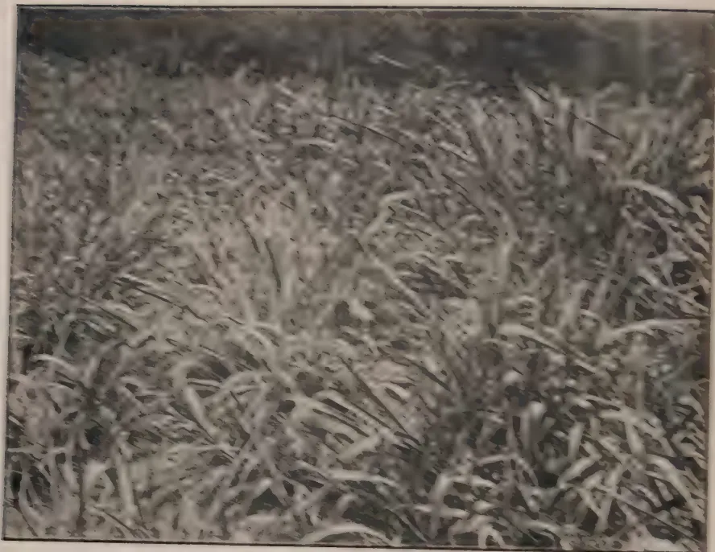
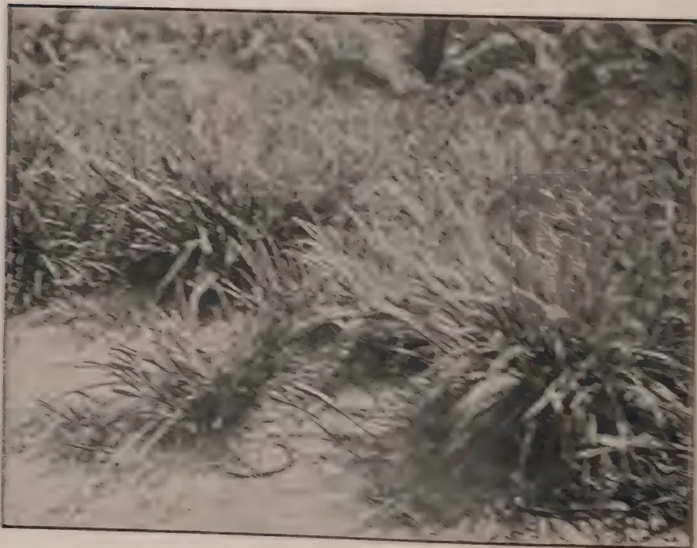
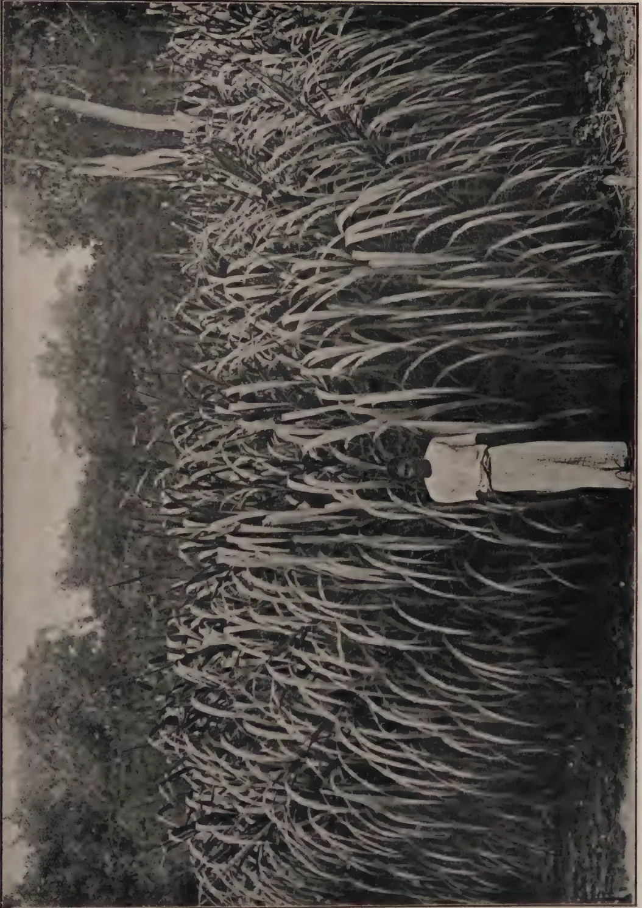
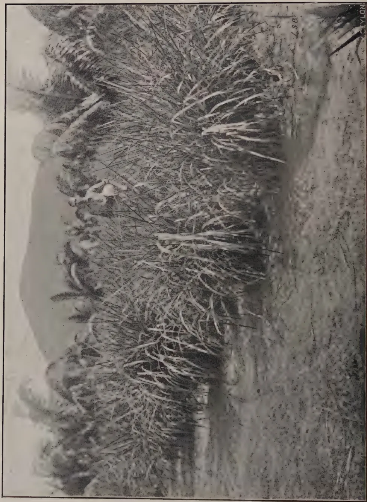
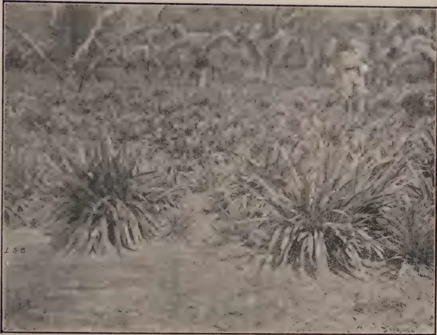
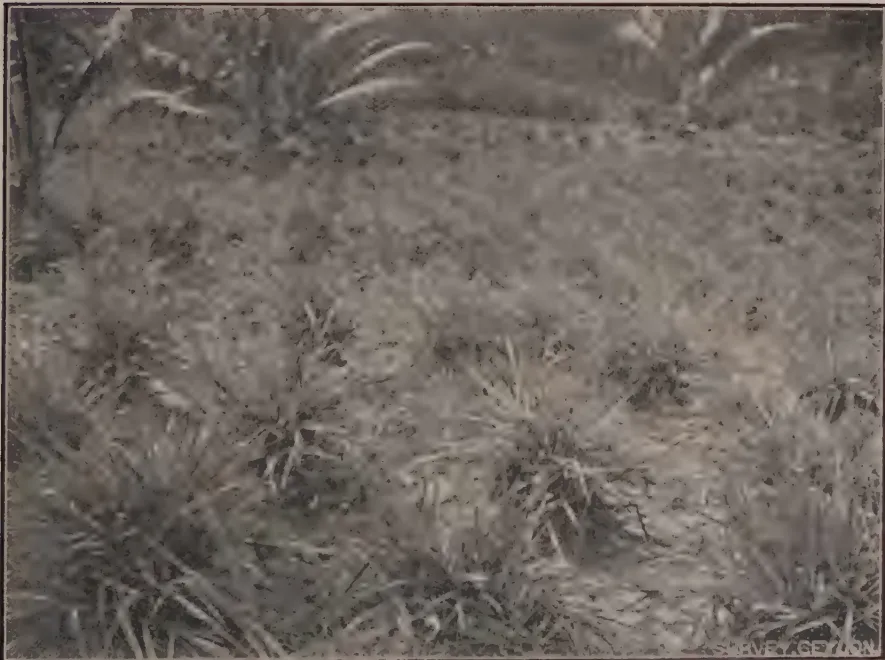

The  
**Tropical Agriculturist**

October, 1927.

---

**Editorial.**

---

## **Trials with Fodder Grasses.**

**I**N our present number are given details of the experiments which have been carried out over a number of years at the Experiment Station, Peradeniya. Details of these trials with fodder grasses have been carefully maintained and an effort made to ascertain the yield value of different grasses under experiment under Peradeniya conditions. Other trials are being conducted by the Department of Agriculture on the patanas adjoining Hakgala and at Experiment Stations at Anuradhapura, Jaffna and Uliyankulam. Trials are also being made by the Veterinary Department at its farm at Ambepussa.

The question of the cultivation of fodder for cattle is one which has been discussed frequently in recent years and it is a question which will assume increasing importance in those districts where an increasing population makes a greater demand upon the amounts of Crown lands available and a closer settlement necessary. In such areas the question of maintaining open spaces as pasture grounds becomes increasingly more difficult and the number of cattle becomes in excess of what the pasture land can reasonably carry. Under these conditions, the provision of satisfactory green fodder in adequate quantity becomes

1------------------------------------------------

196

a necessity and it is with the object of securing data on the most suitable grasses for cultivation that this series of experiments was inaugurated.

The results which have been secured up to date should be closely studied and planting material secured of the more promising grasses. Considerable supplies have already been made by the Experiment Station to agriculturists, but it is felt that much more can be done especially by the small grower.

In addition to these field trials, other investigations in the Chemical Laboratory are indicating the mineral deficiencies in a number of our pasture grasses. The investigations into the mineral composition of pasture grasses are now being carried on in a number of parts of the Empire, as it has been shown that by reason of these deficiencies the malnutrition and a number of diseases in animals have been caused. These investigations should be of very great importance to Ceylon, particularly if the efforts directed towards the establishment of mixed farming in the Dry Zone are to have any tangible results. It is only by securing this exact data, that solid progress on a sound foundation can be secured, and the whole takes time and requires a continued policy.

Considered therefore from the point of view of the crop producer, these experiments and investigations have a considerable value, but from the point of view of the dairyman they are even of greater importance. It is admitted on all sides that the supply of milk in Ceylon is markedly below its actual requirements. From time to time the question of improvement of dairy stock has been considered, but until this fodder question has been satisfactorily settled much progress cannot be anticipated. From all points of view therefore the data which have already been secured should be of value and it is hoped that the experiences of the Peradeniya Experiment Station will be checked by definite trials upon estates and other holdings. The problem in the dry-zone is more difficult of solution, but it is possible that some systems of making ensilage will be evolved. Preliminary trials have been made at Jaffna, and further tests are to be carried out, whilst on the smaller rotation stations other experiments will be conducted. The use of ensilage is rapidly growing in India and there seems to be no reason why its use should not be satisfactorily employed in certain areas of this Island,

2------------------------------------------------

197

Contributions from the Ceylon  
Rubber Research Scheme.

---

## Notes on Rubber Manufacture.

---

### Effect of Disinfectants on Scrap Rubber.

---

**T. E. H. O'BRIEN, M.Sc., A.I.C.,**

*Chemist, Rubber Research Scheme, Ceylon.*

**A** SAMPLE of scrap rubber was received recently which showed distinct signs of tackiness. On the estate from which the sample was sent, disinfectant is applied to the tapping cut on the day after tapping, but the scrap is not removed until the next tapping. It was suggested that the tackiness was due to the action of disinfectant on the scrap.

In order to test this point some fresh scrap rubber was divided into 4 portions, two of which were dipped in 10% *Brunolinum Plantarium* and hung to dry. The treated portions became distinctly darker in colour during the night. One treated and one untreated sample were kept in a shady place, and one treated and one untreated sample were placed in the sun for 12 hours. On examination of the portions exposed to sunlight it was found that the sample treated with disinfectant showed very considerably more tackiness than the untreated sample. The two samples which were kept away from sunlight were free from tackiness after several weeks. The test was repeated with a number of different disinfectants and in each case it was found that the scrap when exposed to sunlight became more tacky than untreated scrap.

It is concluded that scrap should be removed before applying disinfectant to the tapping cut, otherwise tackiness is liable to occur.

### Tacky Spots in Crepe.

A sample of crepe containing red tacky spots was recently received. It was suggested by the sender that the spots were due to fungal infection, but chemical examination revealed the

3------------------------------------------------

198

presence of copper in the rubber. Presumably this originated from oil spots or minute chips of metal from worn bearings in the creping rollers.

Such cases of tackiness due to contamination with copper are not infrequently met with, showing that the danger of worn bearings is not always realised. Apart from actual tackiness it has been shown that 1 part of copper in a million of rubber causes distinct deterioration.

Enquiries are being made with regard to the feasibility of replacing bronze bearings in rubber rollers by cast iron or some other non-copper bearing metal.

### Aluminium Coagulating Pans.

In June, 1925, 6 aluminium pans imported by the Research Scheme were put into use on an estate together with 6 new enamelled dishes, in order to compare the wearing qualities of the two. The dishes were recently examined and it was found that whereas the aluminium dishes were equal to new, all the enamelled dishes were chipped at the inside corners. Once this stage is reached corrosion of the exposed iron takes place rapidly and it can be prophesied that the useful life of the enamelled dishes will be finished in another year. The aluminium dishes referred to were of heavier gauge than those which are at present available in Colombo, but about 100 of the latter have been in use on the same estate for the past year and show no signs of wear except slight dents.

On an estate where formic acid is used as coagulant aluminium dishes have been used during the past year and show only slight dents and pitting of the metal. It was suggested by a writer in Sumatra that aluminium dishes would corrode rapidly with formic acid, but a test carried out here using acid of twice the strength necessary for coagulation, indicates that it would take about 15 years for a dish to corrode through.

The aluminium dishes at present available locally are of low price and correspondingly light construction in order to compete with enamelled dishes. They can be expected to give considerably better service than enamel but in the long run it would amply repay the Planter to demand heavier gauge dishes.

### Methods of Using Para Nitrophenol.

In a report on the use of p.n.p. as a mould preventive (R.R.S. 4th Quarterly Circular for 1925) it was explained that it can be used in two ways.

1. 1. An appropriate quantity can be dissolved in the acid used for coagulation and thus introduced into the latex,

4------------------------------------------------

199

1. 2. The sheets after rolling and washing can be soaked in a dilute solution of the chemical.

It was pointed out that the first method is usually adopted in Malaya where coagulation is carried out in tanks. In Ceylon, however, after addition of acid, the latex has to be transferred to pans or troughs, and there is a danger that clotting might set in before this is complete, thereby spoiling the appearance of some of the sheets. The second method was therefore recommended for adoption in Ceylon.

Experience has shown that the Malayan method can be used successfully on certain Ceylon estates where coagulation takes place slowly. In dry districts, such as Kegalle and Matale, coagulation is rapid and it is unlikely to be satisfactory. It has the advantage of being more "fool-proof" than the soaking method. Once the p.n.p. has been added to the acid there is no fear that some of the sheets have escaped treatment. It is suggested that estates should experiment with this method of treatment and adopt it if satisfactory.

The simplest procedure is to dissolve p.n.p. in undiluted acid (acetic) in the proportion 1 lb. p.n.p. to  $4\frac{1}{2}$  lb. strong acid. The p.n.p. dissolves freely but it is advisable to crush it thoroughly before mixing. The acid is then used in the ordinary way but it must be remembered that by addition of p.n.p. the acid has become diluted, its strength being approximately 85%. Thus if the dose of acid used for coagulation was previously 6 oz. per Shanghai jar, the dose of mixture will be 7 oz. There is no objection to a carboy of acid being mixed at one time, as the p.n.p. does not deteriorate in the acid mixture.

If formic acid is used for coagulation the proportion is 1 lb. p.n.p. to  $2\frac{1}{4}$  lb. 90% formic acid. Some difficulty will be found in dissolving this large amount of p.n.p. in the acid, and it will probably be found simpler in the case of formic acid to dissolve the requisite amount of p.n.p. (1 part p.n.p. to 800 parts dry rubber) in the water used for diluting the acid. If p.n.p. is dissolved in the strong formic acid it should be noted that the strength is thereby reduced from 90% to 67%.

### Ventilation of Air-Drying Sheds.

Successful air-drying of crepe depends on efficient ventilation of the drying shed, but it is the writer's experience that this point does not always receive the attention it deserves. Every thousand pounds of wet crepe contains approximately two hundred pounds of water. In order to dry the rubber, *i.e.*, remove this amount of water, it is calculated that a minimum of one and a half million cubic feet of air is required.\* This is the

\* On the assumption of an average temperature of 85°F. and an average relative humidity of 85%.

5------------------------------------------------

200

theoretical figure assuming that every particle of air comes into contact with the rubber and takes up the full amount of moisture which it is capable of holding. In practice the amount of air required is many times the figures mentioned above, and the problem of air-drying resolves itself into a question of passing the requisite amount of air through the drying sheds in the shortest possible time; in other words efficient ventilation.

S. Morgan, dealing with manufacture in Malaya (*Preparation of Plantation Rubber*, Morgan and Stevens, p. 180) sums up the position as follows: "It is an elementary point in the study of ventilation problems that the best system of natural ventilation is obtained by admitting cool air near or through the floor and providing an exit for the warmer air at the highest point in the building. It is not often that such a rule is infringed in the ventilation of rubber drying houses....."

"It has already been shown in a previous chapter that one type of drying house, viz., that over a factory—stands condemned, except for the drying of low grade rubbers."

It must be admitted that very few Ceylon drying-sheds conform to the above standards. Our drying rooms are frequently situated over the factory, and it is exceptional to see a roof provided with a ventilating ridge. Fortunately we have a comparatively good climate and on most estates good quality crepe can be prepared without serious difficulties. It is safe to say however that if an average Ceylon drying-house could be transported to the more humid atmosphere of Malaya there would very soon be complaints of off-coloured and spotted crepe.

The first requisite of a drying room is good top ventilation and this is best provided by means of a "jack" roof. The ridge should be raised about 12 inches above the main roof and should have an overlap of 18-24 inches to prevent rain from driving in. Bottom ventilation depends on circumstances. In the case of a loft situated over a packing room or other dry portion of the factory, the windows of the lower room should be kept open, and the floor of the drying room opened up in some way such as replacing floor boards by spaced slats of wood, inserting a number of expanded metal gratings in the floor, etc. It will probably be objected that water will drip into the packing room from the wet crepe but this can be avoided by allowing the piles of crepe to drain before removal to the drying room. As a further precaution hessian can be hung over the part used for packing.

If the loft is situated over the factory proper, air cannot be brought up through the floor as the factory air is saturated with moisture. In the case of a corrugated iron building the walls for

6------------------------------------------------

201

2 ft. above the floor of the drying room should be cut out and replaced by expanded metal, and fitted on the outside with hinged shades to prevent rain from driving in. This cannot be done in the case of a brick or stone building but large ventilators can be inserted at intervals. Air thus introduced at floor level is more useful than that which enters through the windows as it passes up through the rubber from the bottom instead of having to penetrate from the sides. The windows however should be retained in order to get the full benefit of any breeze. In the case of a two-storied drying shed the upper floor should be opened up as described above.

The Writer will be pleased to advise on alterations to existing drying sheds and designs for new ones.

### Bulking of Latex.

In the 1st Quarterly Circular for 1927 an account is given of an Experiment dealing with bulking of latex (R. R. S. 1st Quarterly Circular for 1927, p. 10—"Report from the Imperial Institute on samples of Plantation Rubber").

The experiment was carried out at a factory where the latex is coagulated in 10 Shanghai jars. Rubber samples were prepared from latex from each of the jars, and the vulcanising properties of the samples were examined. The various samples were found to be remarkably uniform in properties and the conclusion might hastily be drawn that large scale bulking of latex is proved to be unnecessary.

It should be pointed out however that in this experiment there were certain factors which tend to promote uniformity and that such uniform results could not always be expected.

In the first place, as mentioned in the report, each jar was filled in turn, no attempt being made to separate the latex from different fields. Each jar would therefore contain latex from a number of different fields and this would tend to even up differences in properties of the rubber from different parts of the estate. On some estates latex from different fields is coagulated separately which is very undesirable.

Secondly the estate in question is very uniform in age. All the trees are over 20 years old and it might be expected that the properties of the rubber would be fairly uniform. A similar experiment carried out on an estate composed of fields of varying age would doubtless disclose greater variability of properties.

Further experiments which are now in hand will indicate more clearly whether large scale bulking of latex is necessary in the interests of uniformity.

7------------------------------------------------

202

## Mycological Notes (8).

### Further Occurrences of *Rhizoctonia bataticola* (Taub.) Butler.

**W. SMALL, M.B.E., M.A., B.Sc., Ph.D., F.L.S.,**

*Mycologist, Department of Agriculture, Ceylon.*

**T**HE following notes contain a list of further Ceylon plants on which *Rhizoctonia bataticola* has been found in association with root disease. Points of interest are that the known distribution of the *Rhizoctonia* in Ceylon has been extended to include the Jaffna district, that the host-range of the fungus now includes four monocotyledonous plants, the palmyra palm and guinea grass being added to the coconut and the plantain, and that the *Rhizoctonia* has been found to attack indigenous as well as introduced plants.

(1) *Sesamum indicum* L. (Gingelly). Root disease of gingelly caused by *Rhizoctonia bataticola* has been found in Ceylon. The same disease is known in Uganda and Burma. A sore-shin or collar-rot may accompany the *Rhizoctonia* root disease, the fungus associated with it being *Sclerotium rolfsii* Sacc.

(2) *Eucalyptus* sp. (? *robusta* Sm.) An investigation into the death of young *Eucalyptus* stumps some time after planting out has shown that *Rhizoctonia bataticola* is responsible for their loss. The sclerotia of the fungus occur in numbers in the stringy remains of the cortex of roots and collar and also in groups on the wood.

(3) *Solanum melongena* L. (Egg-plant or brinjal). Several examples of *Rhizoctonia bataticola* root disease of brinjal were found recently on the Jaffna Experiment Station.

(4) *Cajanus indicus* Spreng. (Pigeon-pea or dahl). The note regarding brinjal disease applies to root disease of this host plant. In both cases, sclerotia of the fungus were very numerous on the wood and in the remains of the cortical tissue of roots and collar.

(5) *Zinnia* (hort.) Diseased roots of *Zinnia* become hard, dry and slightly discoloured. They contain sclerotia of the *Rhizoctonia*, and death of the affected plant may follow an attack on only ten per cent. of their number.

8------------------------------------------------

203

(6) *Memecylon grande* Retz., *Litsea zeylanica* Nees and *Burringtonia speciosa* Forst. Examples of root disease of these three trees have been provided by the Curator, Royal Botanic Gardens, Peradeniya. In all three cases sclerotia of *Rhizoctonia bataticola* were found in numbers in the smaller roots; *Fomes laomoensis* Murr., the fungus of brown root disease, occurred on the larger roots and collar of the *Litsea*. It is to be noted that the records of *Rhizoctonia* root disease of *Memecylon* and *Litsea* are the first to pertain to plants truly indigenous to Ceylon if other host-plants which were introduced so long ago that they may be reckoned as indigenous to the island are left out of account.

(7) *Haematoxylon campechianum* L. (Logwood). A young logwood tree died on the Experiment Station, Peradeniya, and its roots were found to be full of the sclerotia of *Rhizoctonia bataticola* in both wood and cortex.

(8) *Panicum maximum* Jacq. (Guinea grass). This useful fodder grass may die out in clumps and patches, and investigation of a recent case has shown that *Rhizoctonia bataticola* occurs on the roots of diseased plants. Diseased roots become hard and dry and they often contain the sclerotial plates of the fungus. A species of *Ophioceras* occurs on the dried-up stems of dead clumps.

(9) *Borassus flabellifer* L. (Palmyra palm). Dead palmyra palms can be found in the Jaffna district in single cases and in small groups. The finding of *Rhizoctonia bataticola* in diseased palmyra roots is of as great interest as the finding of the same fungus in association with coconut root disease, a case of which was recorded by Mr. Park in the July *Tropical Agriculturist*. The *Rhizoctonia* has been recorded also on coconut roots in the Jaffna district.

It may be added for information that the writer has been enabled lately to establish the presence of *Rhizoctonia bataticola* on the roots of rubber (*Hevea*) in Uganda and S. India through the good offices of Mr. C. G. Hansford, Mycologist, Department of Agriculture, Uganda, and Mr. H.W. Roy Bertrand respectively. The fungus is associated with rubber root disease in Uganda and South India, and the circumstances of its occurrence in those regions are similar to the conditions found in Ceylon. Like the record of *Rhizoctonia bataticola* on gingelly in Burma which was given in Mycological Notes (6) in the July *Tropical Agriculturist*, these rubber records support the writer's contention that "*Rhizoctonia bataticola* is more widely distributed in tropical and sub-tropical regions than is realised." They may prove to be of great significance.

9------------------------------------------------

204

## Fodder Grass Trials on the Experiment Station, Peradeniya 1926-27.

**T. H. HOLLAND, M.S.E.A.C.,**

*Manager, Experiment Station, Peradeniya.*

**I**N the 1925-26 report mention is made of the wide divergence found between analyses of different samples of the same fodder grasses. On this score it has been decided that statements of analyses shall be omitted from the reports of these trials until such time as it has been found possible to complete a series of analyses over a considerable period.

The present report therefore deals only with the aspects of yield and palatability. With regard to the latter, *Efwatakala* grass, *Melinis minutiflora*, which has a pungent characteristic odour, was at first generally rejected by the cattle of the Experiment Station: after some time however they got used to it and now eat it well. All the remaining grasses are readily eaten.

The yields of the different plots are not strictly comparable for the following reasons:—

1. 1. There is only one plot of each grass.
2. 2. All plots except two are interplanted with coconuts.
3. 3. It is not thought that the optimum planting distance has been arrived at in every case.

Nevertheless, these trials have given useful information as to the individual performances of a number of grasses under Peradeniya conditions, and, in some instances have resulted in a considerable extension in the area of the grasses planted.

The yields of the grasses which are now under trial for 1926-27 and the average yield to date are as follows: yields from the beginning of the trials are shown graphically.

10------------------------------------------------

The graph displays the production of various grasses in Tons over a six-year period. The y-axis is labeled 'Tons.' and has major grid lines at 10, 20, 30, and 40. The x-axis shows time periods from 1921-22 to 1926-27. The data series are as follows:

- **Guinea grass "A"** (solid line): Starts at ~10 tons in 1921-22, rises to ~25 tons in 1922-23, ~28 tons in 1923-24, ~25 tons in 1924-25, ~22 tons in 1925-26, and ~18 tons in 1926-27.
- **Guinea grass "B"** (solid line): Starts at ~10 tons in 1921-22, rises to ~25 tons in 1922-23, ~28 tons in 1923-24, ~25 tons in 1924-25, ~22 tons in 1925-26, and ~18 tons in 1926-27.
- **Paspalum dilatatum** (dotted line): Starts at ~10 tons in 1921-22, rises to ~25 tons in 1922-23, ~28 tons in 1923-24, ~25 tons in 1924-25, ~22 tons in 1925-26, and ~18 tons in 1926-27.
- **Paspalum larranagai** (dashed line): Starts at ~10 tons in 1921-22, rises to ~25 tons in 1922-23, ~28 tons in 1923-24, ~25 tons in 1924-25, ~22 tons in 1925-26, and ~18 tons in 1926-27.
- **Napier grass** (dash-dot line): Starts at ~10 tons in 1921-22, rises to ~25 tons in 1922-23, ~28 tons in 1923-24, ~25 tons in 1924-25, ~22 tons in 1925-26, and ~18 tons in 1926-27.
- **Napier grass "B"** (dash-dot line): Starts at ~10 tons in 1921-22, rises to ~25 tons in 1922-23, ~28 tons in 1923-24, ~25 tons in 1924-25, ~22 tons in 1925-26, and ~18 tons in 1926-27.
- **Guinea grass "A"** (dash-dot line): Starts at ~10 tons in 1921-22, rises to ~25 tons in 1922-23, ~28 tons in 1923-24, ~25 tons in 1924-25, ~22 tons in 1925-26, and ~18 tons in 1926-27.
- **Guinea grass "B"** (dash-dot line): Starts at ~10 tons in 1921-22, rises to ~25 tons in 1922-23, ~28 tons in 1923-24, ~25 tons in 1924-25, ~22 tons in 1925-26, and ~18 tons in 1926-27.

Block by Survey Dept Ceylon.

11------------------------------------------------

A black and white photograph showing a dense, tall clump of Guinea Grass 'A'. The grass has long, slender leaves and prominent, upright panicles of seed heads. The clump is situated in a field with some darker, indistinct vegetation in the background.

Guinea Grass "A" *Panicum maximum*.

A black and white photograph showing a clump of Guinea Grass 'B'. This variety appears more compact and bushy than 'A', with shorter, more numerous leaves and smaller, more rounded panicles. The clump is growing on a light-colored, sandy or dusty ground.

Guinea Grass "B" *Panicum maximum*.

12------------------------------------------------

267

<table border="1">
<thead>
<tr>
<th rowspan="2">Variety.</th>
<th colspan="2">Yield in Tons per acre.</th>
<th rowspan="2">Number of Years Under trial.</th>
</tr>
<tr>
<th>1927.</th>
<th>Average to date.</th>
</tr>
</thead>
<tbody>
<tr>
<td>Ekwatakala grass, <i>Melinis minutiflora</i></td>
<td>32.5</td>
<td>32.5</td>
<td>1</td>
</tr>
<tr>
<td>Guinea grass A. <i>Panicum maximum</i></td>
<td>17.2</td>
<td>22.1</td>
<td>6</td>
</tr>
<tr>
<td>Guinea grass B. <i>Panicum maximum</i></td>
<td>18.6</td>
<td>24.3</td>
<td>6</td>
</tr>
<tr>
<td><i>Paspalum larranagai</i></td>
<td>24.0</td>
<td>21.6</td>
<td>6</td>
</tr>
<tr>
<td>Nipap grass, <i>Pennisetum purpureum</i></td>
<td>15.5</td>
<td>13.7</td>
<td>2</td>
</tr>
<tr>
<td><i>Paspalum dilatatum</i></td>
<td>12.0</td>
<td>18.1</td>
<td>6</td>
</tr>
<tr>
<td>Bukalo grass, <i>Setaria sulcata</i></td>
<td>15.1</td>
<td>15.1</td>
<td>1</td>
</tr>
<tr>
<td><i>Paspalum commersonii</i></td>
<td>14.4</td>
<td>14.4</td>
<td>1</td>
</tr>
</tbody>
</table>

## Notes on Grasses.

### *Ekwatakala Grass. Melinis minutiflora.*

The comparatively high yield of fodder obtained from this grass must be partly ascribed to the fact that the plot in which it is grown has lain fallow for a number of years, while the other plots concerned have carried a continuous crop of fodder grasses with but little manuring for the last six years. Nevertheless the grass proves to be a heavy yielder and should form a valuable addition to our collection of Ceylon fodder plants.

In fact this grass closely resembles *Mauricia* or Water grass.

The area of this plot (1.67) has been found to be less than an acre but the yield has been calculated so that of a full acre plot. The boundaries, which were irregular, have now been adjusted so that the plot forms a rectangle, and on account of the replanting this grass will have to drop out of the trial for a year.

### *Guinea Grass "A." Panicum maximum.*

This is a vigorous grass with coarse dark coloured leaves. Though a heavy yielder the grass must be not young as the fodder will become too fibrous and a proportion will be rejected by stock.

### *Guinea Grass "B." Panicum maximum.*

This is the well known Guinea grass and has certainly proved one of the best fodders under Perillonea malabarica.

### *Paspalum larranagai.*

This is a grass of coarse habit which was formerly known as *Paspalum virgatum*. It has proved a consistent fodder.

13------------------------------------------------

206

### Napier Grass, *Pennisetum purpureum*.

This grass is gaining recognition as a valuable fodder at higher elevations where guinea grass will not grow and where *Paspalum dilatatum*, a comparatively poor yielder, has up to now been the standard fodder grass. The grass does equally well at lower elevations.

It can be propagated either from root divisions or from cuttings.

If left uncut it will grow to 10-12 ft. high before flowering. During the period under review the grass was once left to grow to about 6 ft. high before cutting. It was found that in this condition stock rejected all the hard stalks and the former practice of low cutting was reverted to. A chaff cutter has now been obtained, however, and during 1927-28 it is proposed to let the grass grow up and chaff it before feeding to cattle.

Owing to its irregular habit of growth, weeding this grass is a little troublesome and it might possibly be better to plant close and let the grass take complete possession of the ground.

### *Paspalum dilatatum*.

This grass is well known on upcountry estates. It has a semi-prostrate habit and is a comparatively poor yielder.

### Buffalo Grass, *Setaria sulcata*.

This grass, a recent importation from Rhodesia, is easily and rapidly propagated from root divisions. Though it appears coarse it is well eaten by stock. The yield for the first year was not high but, as stated, the plot has borne continuous crops of fodder grasses, and under better cultural conditions the grass has the appearance of being a potential high yielder. The coconut plants in this plot are the largest in any plot and have probably competed to some extent with the grass.

### *Paspalum Commersonii*.

This is another importation from Rhodesia. The plot is sandy and rather poor and the growth of the grass has been somewhat disappointing. Two patches of considerable size have died out and had to be replanted.

### Manuring and Cultivation.

A top dressing of cattle manure at the rate of 10 cart-loads per acre was applied to all plots early in 1924 and though this was not forked in, a glance at the graph shows that this application checked the rapid decline of yields. A further top dressing of cattle manure mixed with residue from the rubbish heap was applied in February, 1926, and again the result is apparent in the graph.

14------------------------------------------------

A black and white photograph showing a person standing in a field of tall, dense Napier Grass (Pennisetum purpureum). The grass is very tall, reaching up to the person's waist, and has long, narrow, blade-like leaves. The person is wearing a light-colored shirt and dark trousers. In the background, there are trees and a bright sky. The image is oriented horizontally on the page.

Napier Grass—*Pennisetum purpureum*; just before flowering.  
At Ambepussa.

15------------------------------------------------

A black and white photograph showing a dense field of Napier Grass (Pennisetum purpureum). The grass is tall and has long, slender, drooping seed heads. In the background, there are rolling hills or mountains under a cloudy sky. The photograph is oriented horizontally on the page. There are some handwritten annotations on the image: 'L.S.B.' is written vertically on the right side, and 'CYLON' is written vertically on the far right edge.

Napier Grass—*Pennisetum purpureum*.

16------------------------------------------------

Buffalo Grass—*Setaria sulcata*.

*Paspalum Commersonii*.

17------------------------------------------------

This image is a scan of a blank page. The paper has a light beige or cream-colored tint. There are a few very small, faint dark spots scattered across the surface, which appear to be scanning artifacts or minor imperfections in the paper. No text, lines, or other markings are present.

18------------------------------------------------

207

The plots however have received no cultivation (apart from monthly weeding) from August, 1921, to August, 1927. In August, 1927, the plots were divided into two sub-plots one of which has been manured with 1 cwt. of Calcium cyanamide and 1 cwt. Ephos phosphate per acre, forked in with deep envelope forking, while the other has been plain forked in a similar manner. The Calcium cyanamide was provided free through the agency of Mr. W. R. Thompson.

The graph clearly indicates the need for systematic manuring, and probably cultivation, if high yields are to be maintained.

### Other Grasses.

In addition to the grasses at present included in the yield trials, two other grasses, Guatemala grass (*Tripsacum laxum*), and Merker's grass, (*Pennisetum Merkerii*), are at present in the process of multiplication. These two grasses were imported from the Philippines. Both are large grasses and promise big yields of fodder. Merker's grass in appearance closely resembles Napier grass, and in growth appears fully equal to that grass. Both can be propagated from cuttings in the same manner as Napier grass.

19------------------------------------------------

208

## Selected Articles.

# The Present Position of Bud-grafting.

THE following lecture on the "Present Position of Bud-grafting" by Col. F. Summers of the Rubber Research Scheme, Malaya, delivered at the Fourth Annual Conference of planters, held under the auspices of the Incorporated Society of Planters in Penang, is taken from the *Straits Echo*, August 16, 1927 :—

If we are to arrive at a correct definition of the present position of bud-grafting two things are essential at the outset.

First of all, we must be perfectly clear as to what is meant by bud-grafting; for a good deal of misunderstanding has arisen, and a large number of misconceived ideas have been created as a result of regarding the method as an end in itself and not as a means towards an end. The impression still largely prevails that bud-grafting from a high-yielding tree is bound to give extraordinary results on a plantation scale without any further precaution than a preliminary measurement of the yield of the mother tree over two or three years.

The truth of the matter is that bud-grafting is merely a simple method of plant manipulation which has been applied to woody trees, in temperate horticulture, for an unknown number of centuries. There is, however, with *Hevea* this radical difference. In horticulture generally the method is usually employed to improve the flowering or fruiting qualities of the scion, whereas in *Hevea* the object is the improvement of the yield of latex the production of which is generally held to be due to the activity of the vegetative portions of the plant, that is to say, the non-reproductive portions. On this account we must be careful in drawing analogies from the budding of fruit trees in temperate climates.

## Java Investigations.

While at this point I might remind you that investigations in Java and Sumatra have established the very interesting fact that the trees produced by budding are often strikingly early and vigorous as regards flower and seed production. On this account alone the method must be considered an important feature of modern plantation technique.

In the second place we must have some well-understood standard by which we can measure any progress due to the method and assess its value in normal plantation practice. Such a standard is by no means easy to agree upon. At the present moment it appears the height of folly merely to claim for a method that it will lead to increased yields. Nevertheless, the sole claim made up to date by the most enthusiastic advocate of bud-grafting is that it is the best method for providing the planter with a uniform stand of high-yielding trees. Naturally, certain precautions are advised but we will not go into those at the moment. Unless there is a prospect therefor

20------------------------------------------------

209

of a greatly increased demand for rubber by the time new areas now being planted up will come into full bearing it does seem as though there were some justification, on economic grounds alone, for the attitude of conservatively-minded planters who refuse to regard bud-grafting seriously.

At the other end of the scale are those enthusiasts who see in bud-grafting a cure for all the ills which the rubber plantation suffers from and it is unlikely that the same standard of measurement will be accepted by both these schools of thought.

There are, however, one or two facts which will assist the man with an open mind who wishes to form his own conclusions from the evidence available uninfluenced by the leaders of either school of thought.

First of all we are all agreed that the modern scientifically managed plantation, with its unceasing struggle against such adverse factors as soil exhaustion, soil erosion, leaf, root and bark diseases; with its experimentally developed tapping system; with its constant aim at a high-grade product from the factory; and with its correctly managed staff and labour force is highly superior to the ordinary go-as-you-please small-holding. Secondly, I suppose we shall agree that these modern methods of estate management have been adopted because they are commercially sound and profitable. Thirdly, the aims of modern commercial horticultural practice are consistently directed towards the establishment of a plantation of uniformly high and good quality cropping trees as the surest method of increasing the difference between selling price and cost of production. Side by side goes a decrease of unskilled and an increase of skilled labour corresponding to the increased individual attention claimed by the trees.

No amount of labour expended upon the individual trees of an old fruit orchard will give a return commensurate with the time and money expended. A vigorous thinning out of the semi-derelicts must be practised together with their replacement by known and proved high or good quality yielders. I cannot too strongly emphasize the difference which would be made if all the trees on a plantation were uniformly high yielders so that the yield from a given area could be more or less closely forecasted. Trees could be tapped or rested much more systematically than at present. Imagine for example the convenience of knowing that 50 per cent. of your acreage, tapped on alternate days, would give approximately 50 per cent. of the total yield. Yet, judging from the results of recent research, this is no impracticable ideal.

## A Fundamental Omission.

This brings me to what I consider has been a fundamental and serious omission in all discussions round the subject of bud-grafting. It has been tacitly assumed that the method has its usefulness only in the planting up of newly cleared areas. To my knowledge it has not been considered as an aid to the re-conditioning of areas of old rubber. The economics of the important subject have not been worked out as yet and in doing so the possibility of replacing worn out trees by established high yielders is certainly not one to be lost sight of.

It is often held that the agricultural research worker ought not to be concerned with the economic implications of his work. In an industrial research institute however one is not entitled to pursue a research which a short preliminary investigation would show to have no sign of improving the economic position of the industry. The fact that the Rubber Research Institute is contemplating work on bud-grafting indicates that the progress made up to date in this and other countries warrants further investigation of the method.

21------------------------------------------------

210

I assume that no person who is keenly interested in the rubber-planting industry is prepared either to extol or condemn any method, which seems to have potentialities for good, until he has made a critical examination of the evidence to be obtained from experimental work carried out on a plantation scale. This is the attitude which I myself take up and I am certain it is the same with most members of my audience.

## Bud-grafting Methods.

In an endeavour to gain an indication of what has been accomplished by bud-grafting methods, I have recently inspected experiments and plantings, not only in Malaya, but also in Ceylon and Sumatra. It is with very great pleasure that, at this point, I can acknowledge the great kindness and cordial assistance which I have received throughout. Of one thing I am convinced, namely, that those persons who are trying out the method, whether research workers, or planters, are genuinely inspired with a desire to improve existing methods of plantation practice and that their efforts have met with a considerable degree of success.

The simplest thing at the outset seemed to be to take the objections to budded trees, which have been formulated during the last few years, and examine their significance in the light of the available evidence. These are I assume, very well known to all present.

In the first place, it has been stated that the junction between stock and scion is always likely to be a place of weakness so that bud-grafted areas will always be liable to abnormal wind damage through breakages at the union. From experience with budded and grafted fruit trees this is a result that would scarcely be expected, provided the operation was successfully carried out; rather the reverse. In the case of *Hevea* the union, so far as my experience goes, is very intimate and complete. One would expect this to be the case for the degree of compatibility between stock and scion must, from the nature of things, be very high. A longitudinal section through a bud-graft of *Hevea* three or four years old, shows no signs of weakness or incompleteness of union, while sections through younger bud-grafts show that the bud takes in quite a normal manner, and that subsequent development of the scion progress in precisely the same fashion as in an apple graft.

This also applies to the healing process which results in the "Snag" being thrown off.

Further, I have seen bud-grafted areas which have been exposed to sudden storms and have examined damaged bud-grafted trees 3 to 5 years old. In no case have I seen a union give way while, in two cases, the damage to the trees was so great, showing that the strain must have been enormous, that the union could not have failed to give way had it been in any way weaker than the remaining length of the trunk.

I might sum up by the saying that personal observation leads me to conclude that there is no reason to suppose that the union is a place of weakness.

A second objection is lodged against the unsightliness of bud-grafted trees. In reality, so far as I can make out this only means that they are unlike the trees which we have grown up with and grown accustomed to. A similar objection might be made to every fruit tree in Great Britain for there the signs of grafting—especially of top and double working—can be detected in trees of a considerable age.

The "Elephant foot" of a bud-grafted *Hevea* tree does not interfere with the establishment of a good tapping surface, nor does the cylindrical

22------------------------------------------------

211

shape of the trunk. Moreover the swelling below the union becomes less pronounced as the tree grows older. In some cases it becomes almost unnoticeable at an early age. Moreover, no attempt has yet been made to ascertain whether the swelling cannot be eliminated or reduced by some modification of the method.

From an examination of the results of tapping bud-grafts it appears as though it would be advantageous to begin tapping at a considerably higher level than a seedling tree. Thus, even by tapping alternate days on a half-spiral cut, and allowing for a bark renewal of at least six and a half years, it would not be necessary to approach the union near which it has been proved that the yield falls off considerably.

Thirdly, it has been stated that bud-grafts are likely to be less resistant or more susceptible to disease. I have seen no evidence for this and the general effect of grafting fruit trees is the reverse. In a few cases it has been shown that physiological diseases, for example, the mosaic disease of hops can be transmitted from the stock to the scion—if the latter is susceptible. In California, the English walnut is susceptible to root-rot, it is therefore never grown on its own roots but is grafted on to a black walnut stock which is resistant to root-rot. In such cases the precaution is always obvious; neither infected stocks nor susceptible scions need be utilised, for there are few planters who cannot recognise doubtful planting material. Susceptible stocks or buds of *Hevea* would therefore quickly become known if they existed and it would be a simple matter to avoid their use.

### Longevity.

A fourth objection that has been advanced is that of a possible adverse effect of bud-grafting on the longevity of the resulting tree. It is held that this will have a span of life shorter than the allotted one for *Hevea* by the age of the mother tree from which the bud was taken. I can see no reason for this. The only analogy from fruit growing I am acquainted with is the shortening of life of dwarf bush and standard apples which is usually consequent on years of hard pruning and heavy cropping. In very many cases grafting has the effect of actually lengthening life. Reasoning from analogy is, of course, justifiable here.

### Other Objections.

Other objections to the habit of growth or ridging of the bark and trunk only apply to a few clones and are by no means characteristic of bud-grafts as a whole. In fact, I can see no characteristic disadvantage of bud-grafts and the disadvantages that are apparent at present will no doubt be eliminated in time.

Assuming then that all is right with the method itself let us examine the position from the point of view of the plantation and see what benefit can be safely expected from the application of the method there. It is somewhat easier to indicate what cannot be guaranteed. For example, however good a mother tree may be, it can never be sufficient to rely on the yield records for a few years to give the necessary confidence for planting up a large area of bud-grafts directly from it. The quality of a tree as a mother-tree can only be determined accurately by the tapping of its buddings so that the first planting of a clone can only be regarded as a tapping trial. Even then the tapping should be carried on at least into the eighth year before a true indication can be gained of the yielding capacity of the trees. Conclusions have sometimes been drawn from the tapping results for a few months but this is never safe. A good yielder will remain a good one but a bud-graft which gives a low yield in its fourth or fifth year may improve out of all knowledge during the next two years.

23------------------------------------------------

212

[Col. Summers here referred to a paper by Mr. Grantham which had appeared in the *Planter* of July 1927 and said that he had expressed Mr. Grantham's figures in graphical form to illustrate his point. Col. Summers then explained certain charts on the board.]

These tapping trials will continue to be necessary until we have some method of identifying the high yielder at a much earlier stage. There is pressing need for research work on this point although I cannot say that definite results are bound to accrue. I have always been of opinion that an intensive study of the systematic characters of *Hevea* varieties and forms, combined with an investigation of their latex characters, would be the first line of attack and it was of the greatest interest recently to read in the Press that Hauser had laid the foundation of such work by investigating the hereditary character of latex particles. It is to be hoped that Hauser's work will stimulate activity in research along the above lines in every rubber research institution.

### Common Mistakes.

While these difficulties of testing clones are present it is somewhat surprising to find that, in many plantations trials of bud-grafting, the commonest mistakes to be made are, first, losing all trace of the mother tree from which the bud-wood came and, secondly, trying out simultaneously too many clones. The amount of measuring, book-keeping, supervision and training of personnel involved in trying out four to six clones is, in my opinion, as much as the ordinary Estate staff can undertake if the results are to have the necessary reliability. Pedigree bud-wood is likely to be of considerable value in the future—material of uncertain ancestry is worse than valueless, it is positively dangerous where a perennial crop is concerned.

As you know, the tendency in other rubber-producing countries is to rely on a central, controlled Experiment Station for the supply of proved bud-wood. The success of this procedure is reflected by the large quantities requisitioned by and supplied to estates. Individual Estates are relieved of the responsibility and labour of trying out clones for themselves and can rely on the high quality of the material supplied.

It has been shown beyond doubt that better yields can be obtained from well-proved clones than from trees grown from what is commonly known as selected plantation seed. (In parenthesis I may remark that this seed is never selected in the genetical sense of the word so that the resulting trees must vary in quality to a very great extent.) I do not consider, however that the best method of tapping bud-grafted trees has yet been developed. As I mentioned earlier it has been shown beyond question that the yield falls when the cut approaches the union so that the obvious thing is to begin tapping at such a height that the most suitable period for bark renewal can be secured without the necessity for the panel to reach the region near the union.

What this height should be remains to be worked out and, of course, the problem will be complicated by the difficulty of tapping above a height of four feet. The best period for bark renewal also remains to be worked out.

### Reciprocal Action.

One phase of the bud-grafting problem which urgently calls for investigation is the reciprocal action on one another of the stock and scion. I am apparently begging the question here for such action has not yet been indubitably demonstrated.

24------------------------------------------------

213

Hauser rightly calls this question the dark spot of the vegetative selection of *Hevea*, for, although he has not yet remarked any obvious effect of the stock on the yield of the scion, we must have the following questions settled as early as practicable. Has the stock any effect upon the production of the bud-grafting? Is the union such a disturbance of continuity that the yield must be adversely affected or has the stock the usual property of so increasing the vigour of the scion that the yield of the latter is correspondingly increased? There are ample grounds for suspecting some kind of influence for it has been recognised that the yield from a bud-graft may at times be surprisingly different from expectation. Again in a population of bud-grafts the yield generally shows high degree of uniformity but, now and again, considerable variation is encountered. Such variations are almost certainly not due to heredity and are probably due to some simple cause; but as the buddings are generally on unselected stocks there is always in the back-ground a possible unknown source of variation.

It is even quite possible that, eventually, we may have to select and propagate our stocks as carefully as our bud-wood. Research work in England has shown of recent years that, in the case of apple and plum stocks this is vital to success, although here again I ought to recall the danger of reasoning too closely from analogies.

I have also noticed one or two possible cases of bud-mutations or sports; where the sudden variation of a bud has produced a form quite distinct from that of the mother and capable of being multiplied and retaining its new form. A constant watch should be kept for these which might perchance prove to be of value.

In conclusion, it is frequently asserted that bud-grafting is but a temporary measure which will become superfluous as soon as surplus of seed are available from high-yielding pure lines. I think the up-to-date planter will always find it necessary to have the method at his command for a variety of purposes and most certainly until he is confident that the seed he is producing is pure and not contaminated by cross fertilisation from neighbouring low yielding trees.

Moreover it must be remembered that selection and breeding work on a perennial tree of unknown character like *Hevea* must be a long and laborious proceeding. The view to be taken is a long one and, while awaiting results, no one can afford to stand still. The best means to hand at the present time must be used, that is, careful and cautious application of the bud-grafting method.

My discourse on the present position of bud-grafting has, I am afraid, been somewhat lengthy and diffuse. It might have been summed up in the following sentences.

Bud-grafting is a horticultural operation which has been applied with an encouraging measure of success to the vegetative propagation of *Hevea*. The maximum benefit to the rubber growing industry cannot, however, be obtained without much further research directed towards the improvement of the method itself and the testing of the budded progeny. Much of this work can only be carried out efficiently at a central experiment station in the form of extensive trials under plantation conditions.

The large undertakings which have achieved such a striking measure of success by employing the method owe their success to keeping these principles in the foreground.

25------------------------------------------------

214

## Some Physical Aspects of Soil Conservation.

**T**HE following paper on "Some Physical Aspects of Soil Conservation" read by Dr. William B. Haines, Soils Divisions, Rubber Research Institute of Malaya, before the Conference of Incorporated Society of Planters held on August 14th and 15th, 1927, is taken from *The Malayan Tin and Rubber Journal*, Vol. XVI.,

No. 16 :—

Soil conservation means the art of maintaining soil fertility under the exacting conditions of crop production. Under virgin conditions soils reach a stable level of fertility, the level being high or low according to the nature of the soil and of the normal weather to which it is subjected. The balance is disturbed as soon as cultivation begins and for the most part the new factors which come into play tend to reduce fertility, so that the cultivator must constantly apply himself to methods for keeping the fertility from declining.

The subject may be considered in two main aspects, the physical and the chemical. The physical considerations include all methods of improving the soil condition such as mechanical cultivation, drainage, terracing and so on, while the chemical treatments must take in view the actual plant nutrients in the soil, and by the application of additional material as manure must either make up a deficiency or make more easily available the substances already present. The title of my paper when first arranged was limited to the physical aspects of the subject because Mr. Grantham was down to talk to you on the manuring of rubber, but as that paper has been withdrawn I need not apologise if I overstep my bounds and include some of the chemical considerations in my talk. My aim is just to put before you in review the general properties of soil. My contact with rubber-estate problems is too recent for me to attempt to lay down rules or to discuss practical points in great detail, but I shall be satisfied if my talk enables the practical man to understand better the soil changes which the various methods of treatment are designed to produce, and to understand the differences which make one soil so much better than another.

### Question of Soil Tilt.

The importance of a proper physical texture in soil is in much more danger of being overlooked in rubber cultivation than in most other cases. In the cultivation of annual crops in temperate climates the question of physical condition becomes of the utmost importance at least once in the year, namely at seed-time, so that it cannot possibly be neglected with impunity. The farmer has the question of soil tilt constantly in mind and makes the work required to keep his land in good physical condition his chief item of expenditure. Under rubber there is not the same opportunity to apply soil cultivation methods nor the same apparent necessity to do so. Yet the rubber tree requires the same general conditions for healthy growth

26------------------------------------------------

215

as other plants and if the soil conditions are allowed to deteriorate the effects of neglect become cumulative, and recovery may be gained only at great expense of time and money.

First of all let us examine the production of latex from the most general point of view. Suppose that it were being produced as the end-product of a factory process, then a description of its manufacture would entail answering the questions: What is the energy supply? What are the raw materials taken in and consumed? And what is the efficiency of the process? These queries may be applied to the natural process. The last question as to efficiency plainly concerns the production of better yielding trees, and so is outside my scope, but it will be instructive to consider the other two. The raw materials required by the rubber tree for its growth and from which therefore the latex is produced are drawn from the air through the leaves in the shape of carbon dioxide, and from the soil through the roots in the shape of water and various mineral salts. The energy required for elaborating the latex and plant tissues from these raw materials is absorbed from sunlight by the leaves. This intake of energy corresponds to the coal or oil or electricity, which may give motive power to a factory and it may be expressed in the same terms. That is to say, we can express the amount of energy shed by the sun on an acre of land as equivalent to so many tons of coal. I am not aware of many such measurements having been made in the tropics but even in temperate regions the average amount of solar energy received on an acre during a warm day would be the equivalent of several tons of coal. This supply is obviously so liberal that only a small proportion needs to be absorbed by the tree and a still smaller proportion is actually stored in the latex. Thus we may view the rubber estate as a canopy of leaves spread to catch sunshine from the sky and carbon dioxide from the air while a complementary root-system is spread in the soil to collect water and the various plant nutrients. If conditions exist which check a complete development of leaf or root so that part of the sky space is not covered by leaf or part of the soil space is not explored by roots then we may say that nature's latex factory is not exploiting all its opportunities and so is not producing its maximum output.

## Limiting Factor.

This brings us to the important concept known as the limiting factor. Wherever there is a chain of inter-dependent processes such as we are considering and which we wish to strengthen, then we have first to find the weakest link and pay attention to that. Abundant supply in one direction is of no value if a check is being imposed by a stringency in another direction. Hence the first step in estate improvement is a correct diagnosis of the limiting factor. For the moment we are to deal with those that concern the soil, the conditions which may hinder proper root development or fail to supply the root system with a proper amount of water or plant food. It may be well to remark that when attention has improved some limiting factor and in this way permanently increased the output, then some other factor assumes importance as a new limiting factor. The focus of attention shifts from one point of improvement to another until the remaining limits are such that it is either uneconomic or impossible to remove them.

Consider first the limiting factor in the soil from the chemical standpoint. The chemical nutrients drawn from the soil by the plant received small attention during the earlier history of agriculture, mainly because in the actual bulk of plant tissue they form such a very small proportion. About the middle of last century Lawes and Gilbert by means of plot Ex-

27------------------------------------------------

216

periments at Rothamsted established an understanding of the main facts regarding the part played by soil in plant nutrition and revolutionised agriculture by the introduction of chemical fertilisers. They showed that there are three chief plant foods taken in from the soil namely nitrogen, potash and phosphate and that a deficiency in any one of these may be a severe check on plant development. These soil constituents are present in relatively very small amounts, and although a crop removes only small quantities a deficiency may be readily brought about by persistent cropping. Under virgin conditions the decaying plant ultimately returns to the soil all the mineral constituents which it has removed, but under cultivation these are taken to market with the crop and sold. Compared with other crops rubber removes from the land relatively small amounts of these essential plant foods although a large amount of sunk capital is represented by the permanent parts of the trees. It has been calculated that on an average estate there is removed in the latex from an acre in one year about 4 lb. of nitrogen and a little more than 1 lb. of phosphate and about a quarter of a lb. of potash. The small proportion of the total soil which is here represented can be realised when we remember that the amount of soil which covers an acre to a depth of 9" is 3 million lb. Thus a fairly heavy chemical dressing only adds one part in ten thousand to the soil, yet this is enough to make big differences in plant growth.

## Nitrogen Deficiency.

Modern research is showing the great importance of the question of the availability of these plant foods. A simple chemical analysis of the soil is not alone sufficient to indicate what fertilisers are to be advised, and an appeal to experiment is often the best method of deciding. Thus the soils which have shown such a good response of rubber to manuring with nitrogen are not notably deficient in this constituent. On analysis one might not have diagnosed nitrogen deficiency, but experiment proved this to be the case as far as availability to the plant was concerned.

The nitrogenous plant foods take the place of first importance, and have a most marked effect upon the leafy growth of plants. While potash and phosphates can only arise from the mineral part of the soil, nitrogen can be fixed from the air by biological activity in the soil. In the particular case of leguminous plants a partnership has been struck up with the nitrogen fixing bacteria of the soil so that the growth of such a crop greatly increases their action and may add to instead of depleting the nitrogen in the soil. Needless to say a good supply of air is necessary to the activities of these bacteria. The nitrogen in the soil assumes various forms but it is only as the soluble nitrate that it is available to the plant. Hence it is easily dissolved out and leached away by rain. Thus questions of aeration and drainage of the soil play a most important part in the formation of and loss of nitrates.

## Physical Analysis.

Turning to the physical side of the question it will be necessary first of all to describe what is meant by the physical (or mechanical) analysis of soil. Such an analysis consists in classifying the soil particles into groups according to size and estimating the proportion of each size which is present in a given soil sample. The classes are known as coarse and fine sand, silt, fine silt and clay. The proportions in which they are present will largely determine the physical properties of the soil, particularly that most important property, the rate at which water and air can move through the pores of the soil. Another most important inference can be made from the

28------------------------------------------------

217

mechanical analysis, namely the area of the total surface of the soil particles. Some of the most important modern advances in science have been made by the study of surface films, which show properties quite distinct from the substances in bulk. Even under dry conditions the surface of the particles of soil has a very tenuous film of water spread over it and firmly held, while in this film the dissolved salts of the soil which form plant food tend to a greater concentration. The surface is said to absorb these salts and in this condition they are not washed away under excess of water. Hence if these surface films are extensive enough they play an important part in the behaviour of the soil. The increase in the surface area as the particles become finer is a most striking fact. A stone weighing one pound would have a surface area of several square inches but if it be broken down to the fineness of an average soil sample the surface area (for the same amount of material) will be several thousand square yards. It is easy to see that these special film properties, though they may be unimportant in a coarse sandy soil may assume great importance in soils containing a lot of clay. In a wet clay the total particles surface is so large that a large proportion of the water may be bound by its proximity to this surface and this restricts its freedom of movement. In this way the impervious nature of clay as compared with sand can be partly accounted for. A sand may only contain half the amount of pore space for water movement that is present in a clay, yet it is far more pervious. The absorptive properties of these extensive films also account for the good filtering and deodorising properties of soil.

## Capillary Attraction in Soil.

A property which is connected with this affinity of clay for water, is the swelling and shrinking of clay as it is wetted and dried. This plays an important part in the formation of a crumb structure in soils. While clay soil in a compact mass is so impervious as to be little use agriculturally, the same clay may be made to form into crumbs or granules and so stimulate the more open texture of a sandy soil. It then has the advantages of both. By alternate wetting and drying of a clay under weathering the swelling and shrinking tends to break it up. This action is of course spoiled by working the clay when wet and plastic and is facilitated by the addition of lime. The author found at Rothamsted reductions up to 15 per cent. of ploughing draft produced by this crumbling effect of chalk on soil. Under the conditions of high temperature and rainfall in the tropics lime is generally deficient in the soil, but it must be a matter of experiment to see whether it will prove advantageous to maintain the lime content at a higher level. There can be little doubt that age-long conditions will be reflected in an adaptation of the indigenous plants.

Great interest attaches to the phenomena of capillary attraction in soil. By this is meant the action which all porous substances possess of drawing or sucking liquids into their pores. The action of blotting paper or of a lamp-wick are familiar examples. In soil it creates a tendency for water to move from wet regions towards drier regions. Thus movement may take place upwards during dry weather, and it is a common observation that the soil remains wet for some distance above the level of water in a drain. The force of this suction increases as the texture of the soil becomes finer, but on the other hand the rate of water movement falls off with increasing fineness. Hence there is a particular intermediate texture for which the benefits of capillary suction will be most noticed. The soil must be fine enough to give a good suction value, but coarse enough to allow free movement of water both for drainage under gravitational attraction and

29------------------------------------------------

218

rise under capillary attraction. The action is always present in soil, although the ideal conditions are rarely approached. When they are the effects are striking. The writer remembers a particular case of a market garden which had one spot which never suffered in drought. On examination it was found that the soil there was a deep silty deposit of just the right texture to draw up the ground water from below at a sufficiently fast rate for the plants. Measurements can be made to show that silt may exert a suction pressure of several pounds to the square inch, which would be equivalent to the power of drawing water up to a point from over ten feet below. These points should be borne in mind in deciding on the depth of drains. Drains are sometimes not cut deep enough for fear that the water table will be lowered too far, such a judgment neglecting to take account of the fact that the moisture in the soil is maintained through a region above the free-water level, by this property of capillarity.

## Important Soil Constituents.

When fallen leaves and other decaying vegetable matter get incorporated into the soil they form a most important soil constituent known generally as humus. Its presence has a most marked effect in assisting a crumb-structure and good aeration in the soil and by absorption it considerably improves the water retaining capacity of the soil. But, perhaps the most important role that humus plays may be classed as a chemical effect. Since it represents what was once the living tissue of the plants it has locked in it the plant nutrients which were previously taken from the soil. By its gradual decay these are released again and start once more round the same cycle. The very decaying process itself indicates that the humus is providing food material for a host of tiny organisms in the soil, many of which are playing the vital part of nitrogen fixation which has already been referred to. If the soil is badly aerated, as by water-logging such organisms cannot live and humus decay is prevented so that it accumulates and gives rise to the peaty lands of marshy regions. Hence the importance of proper aeration can hardly be over-estimated for production of fertility, especially in regions of high rainfall. In virgin soil the amount of humus varies according to climatic conditions but it reaches a constant value as a balance between growth and decay, the entire vegetation being returned to the soil. But under conditions of cultivation the tendency is always to a reduction of humus content. Clean weeding and exposure of the soil hasten decomposition and lessen input. While it is probably never economic to endeavour to force up the humus content above the level natural to the soil and climate yet it is often important to prevent its decline by applying organic fertilisers or by green manuring, *i.e.*, the growing of a crop for the specific purpose of returning it to the soil again. A very interesting modern development in regard to organic fertiliser is the synthetic farmyard manure produced by the Adeo process. This process was the outcome of research in the problem of utilising waste vegetable materials which if added to the soil direct, would decay so slowly as to be of little fertilising value. Means of treatment were found by which decomposition in the mass is brought about before applying to the soil, and very good results have been obtained.

30------------------------------------------------

219

## Green Manure's Double Purpose.

A green manure usually serves a double purpose by keeping the land clean from weeds. In the case of rubber this second service is the protection of the soil from wash under the very high and intense rainfall. The cover crop acts in two ways first by protecting the surface from mechanical erosion from the direct impact of rain and secondly by rendering penetration into the soil more easy and reducing surface run-off. The former action may be seen on estates where erosion has exposed a root but all the soil vertically under the shelter of the root remains. Also small stones and sticks may often be seen standing perched on a pillar of soil which their presence has protected while the surrounding soil has been washed away. A cover crop may be very useful also in preventing a bad soil fault known as capping. This describes a condition in which the soil surface forms a hard and impervious cap, and is apt to occur on clay soil exposed to direct wash from rain. The presence of such a cap lessens aeration and causes rain to run off over the soil instead of into it, with consequent bad effects. The growth of any spreading cover very largely prevents such a condition from arising.

In all these questions of physical changes in the soil the most important feature is the rate at which movement can take place. Thus after heavy rainfall with the soil saturated a drain begins to carry off water from the soil in its immediate neighbourhood, and the area affected gradually spreads out from the drain with the passage of time. The rate of spread will depend upon the permeability of the soil, being faster where the texture is more open. When the spread from two neighbouring drains meet and overlap their function for the time being is fulfilled. This stage must be reached before the next period of saturation by rain arrives. In judging the distance between drains, therefore, one must take into account the frequency as well as amount of rainfall and the permeability of the soil. As the water drains away air is drawn into the soil behind it, and this aeration is of vital importance to the living organisms of the soil, which are in turn of such importance to fertility. If water is allowed to stand in such excess as to exclude air from the soil a stagnant state supervenes which makes it quite unsuitable for most plants. The absence of a tap root in trees growing on poorly drained land is very often remarked. Proper drainage, on the other hand, encourages a deep rooting and greatly increases the available resources of the soil.

## The Final Word.

It has already been remarked that with our present limited knowledge of the specific response of rubber to manuring, it is often advisable for estates to experiment under their own conditions. A final word with regard to the lay out of such experiments will not be out of place. It cannot be too strongly insisted that careful planning can greatly increase the value of field tests. Modern statistical examination of the subject shows that a little more elaboration of detail in a trial may often increase its value manifold. A simple experiment may need to be repeated say for ten or fifteen years

31------------------------------------------------

220

before the result can be relied on, while a little elaboration of the same test may give the same degree of certainty in one or two years. The great thing is to be able to eliminate from the results the effects of uncertain factors such as varying skill in the tapper, or varying fertility in different parts of the field under test. The ideal arrangement would be to have individual records, from an equal number of manured and unmanured trees which were dotted about the trial area in a random manner: This would obviously be too troublesome, but a practicable approach to the ideal can be made by dividing up the area under trial into a number of equal strips and making them alternately manured and unmanured. The tapping error can best be got rid of by assigning tasks in strips running across the plots so that each tapper does part of an equal number of manured and unmanured plots. If it is found best to assign tasks along the plots, then the tappers must be moved on to regular intervals from one task to the next in regular rotation. It is also of great advantage if records of yields can be made available, taken from the same plots in the same way, for a period prior to the application of the manures. This gives information as to individual differences in the plots, which can then be allowed for in the final results, thus enabling the effect due to the manures alone to be more clearly discerned.

32------------------------------------------------

221

# Green Crops.

---

P. H. CARPENTER, F.I.C., F.C.S.,

*Chief Scientific Officer, Indian Tea Association.*

## The Need for Organic Manure.

**I**N order that a soil shall maintain its fertility a constant supply of organic matter is necessary. One of the reasons why a jungle soil maintains its high state of fertility is that it annually receives considerable additions of organic matter in the form of falling leaves and withering under-growth.

On land that has been growing tea for many years and which has been consistently cultivated, the rate of loss of organic matter exceeds the supply given by the yearly fall of leaf and the light prunings returned to the soil. On this account the organic matter or humus steadily decreases till it reaches a very low level. The result is a soil giving a small crop. It must be remembered that a jungle soil receives no cultivation, and accordingly the decomposition of the humus proceeds at a slow rate, and is consequently conserved to such an extent that the soil gathers humus as time passes.

It thus follows that as a rule the tea soils of North-East India are deficient in organic matter, and whilst the necessity for replenishing this soil essential is realised, it not infrequently happens that green cropping as a method for supplying organic matter is out of the question because some soils fail to grow such crops. This may be due to the shortage of some soil mineral like lime or phosphoric acid; to the shortage of organic matter and nitrogen; or even to the prevalence of some fungus disease. This latter contingency arose at Borbhetta a few years ago when the presence of *rhizoctonia* in the soil, a root disease attacking some plants but not pathogenic to tea, completely arrested the growth of Boga medeloa.

The increased development of thatch grass on old tea land can be taken as evidence of the necessity for adding organic matter. Not that thatch grass prefers poor soil to rich but that on a poor soil the competition from other weeds is reduced.

In some cases soils rich in organic matter also fail to grow tea and many instances of deteriorated bheels may be quoted where the organic matter of the soil is as much as 20 to 30 per cent. but the tea does not thrive. In these cases the addition of organic matter either as green crop or as cattle manure failed to revive the tea for the fault lay in the physical state of the organic matter in the soil. Bheels which have thus deteriorated have done so because alternate drying and wetting has robbed the humus of its colloidal, "sticking" properties.

Under the climatic conditions experienced in North-East India which include the two factors, heavy rainfall and high temperatures, the steady loss of humus calls for the systematic addition of organic matter to the soil. This can be accomplished in several ways.

33------------------------------------------------

222

Organic matter is best added as cattle manure or good top dressing material, but few gardens are in the happy position of possessing either of these materials in sufficient quantity or in an economically available position. Every endeavour should be made to collect and utilise the cattle and line manure available. This often requires careful organization but such effort is amply repaid in the results obtained. The use of bheel soil as a top dressing should also receive careful consideration but it is necessary here to issue a word of warning that the appearance of such material is often misleading. It is always advisable to have accurate data, obtained from analysis, of the percentage of organic matter and also of the nature of the remainder of the dressing, whether it is a heavy clay or of a sandy nature.

## Green Cropping.

The majority of gardens have to seek some other source of organic matter and this is most conveniently found in green cropping. The supply of any form of green plant material benefits the soil but it has been found most economic to utilise plants able to make use of atmospheric nitrogen in their growth. Such plants belong to the order Leguminosae. Plants other than Leguminosae supply organic matter equally well but are unable to utilise nitrogen directly from the air.

Ordinary plants obtain the nitrogen used in growth from the soil and when they are cut and buried, merely return to the soil the nitrogen which they have previously taken from it. It pays to carry jungle from hallahs and outside areas and to bury it on the garden, but it has been shown that such jungle gains in efficiency if it is rotted off the garden before it is buried.

There are many substances used as nitrogenous manures which also supply organic matter to the soil. Oilcake, fish manure, animal meal and blood meal are manures of this type, but they are expensive, costing from Rs. 3 to Rs. 6 per maund. It is possible to add large quantities of green manure,—4 or 5 tons—for a cost of about Rs. 10. The green crop contains about 80 per cent. moisture so that a five-ton crop represents about one ton of dry organic matter. This corresponds with about two tons cattle manure (containing about 50 per cent. moisture) or about 32 maunds oilcake (containing 10—15 per cent. moisture) so far as organic matter is concerned although no account of the nitrogen content is taken here.

## Systematic Manuring.

It was thought at one time that it might be possible to add all the nitrogen required by the tea plant entirely in the form of green organic matter. Experiments carried out at Tocklai have shown that over a period of five years the annual application of 30 lb. nitrogen in the form of green organic matter brought in from outside and buried in the plot has not resulted in nearly as good a crop increase as that shown by the annual application of the same quantity of nitrogen given in a soluble form. The condition of the soil has however been greatly improved by this constant green manuring and the bushes have a healthier appearance than those receiving only soluble manures.

Whilst then green crops can be used to supply some of the nitrogen needed by the tea plant it is preferable to use it to supply organic matter and to add nitrogen in the artificial form as calcium cyanamide, sulphate of ammonia or nitrate of soda. Taking this principle as a basis it is possible to construct a manuring scheme suitable for gardens where a supply of organic matter in excess of that given by falling foliage and light prunings, is necessary. As examples the following two cycles are suggested.

34------------------------------------------------

223

### Three Year Cycle.

*First Year.*—Quick growing green crop such as cow-peas and phosphoric acid added as 2 mds. basic slag, superphosphate or bone meal, or 2 cwt. Belgian Flour Phosphate.

*Second Year.*—30 lb. readily available nitrogen 20—30 lb. Potash per acre, broadcast with early rain.

*Third Year.*—Rahar in alternate lines, lopped at intervals and buçiel at end of season.

Fork in a quick acting mixture round the bushes which shall give — 30 lb. readily available nitrogen, 20—30 lb. Potash, 20—30 lb. phosphoric acid, per acre.

The heavier dose of Potash and lighter dose of Phosphoric acid should be applied to a sandy soil and the opposite to a clay soil.

### Five Year Cycle.

*First Year.*—As above in three-year cycle.

*Second Year.*—As above in three-year cycle.

*Third Year.*—Boga medeloa in alternate rows; complete mixture as above forked round bushes.

*Fourth Year.*—Complete mixture as above forked round bushes.

*Fifth Year.*—Bury Boga medeloa at beginning of the year.

### Common Green Crops.

It is sometimes difficult to know which green crop should be grown, and in deciding this, local knowledge is most valuable. It is important to obtain the greatest weight of green matter as opposed to woody material, and the crop chosen should be that which is known to grow most luxuriantly upon the particular type of soil. Apart from this there is no particular virtue in one crop over another apart from convenience.

The same crop should not be grown year after year on the same area otherwise the soil may become "sick." If a scheme based on that suggested above is followed then this factor is eliminated.

The table below supplies a few details of the more commonly grown green crops.

<table border="1">
<thead>
<tr>
<th>Name of plant.</th>
<th>Rate of seed per acre.</th>
<th>Planting</th>
<th>Crop</th>
<th>Growing period.</th>
</tr>
</thead>
<tbody>
<tr>
<td>Cow-peas (<i>Vigna catiang</i>)</td>
<td>40 lbs.</td>
<td>every row</td>
<td>3 tons</td>
<td>6-10 weeks</td>
</tr>
<tr>
<td>Mati kalai (<i>Phaseolus mungo</i>)</td>
<td>30 "</td>
<td>"</td>
<td>"</td>
<td>"</td>
</tr>
<tr>
<td>Bhotmas Soy bean (<i>Glycine hispida</i>)</td>
<td>40 "</td>
<td>"</td>
<td>"</td>
<td>"</td>
</tr>
<tr>
<td>Sunn Hemp (<i>Crotolaria juncea</i>)</td>
<td>40 "</td>
<td>"</td>
<td>"</td>
<td>"</td>
</tr>
<tr>
<td>Dhaincha (<i>Sesbania arculeata</i>)</td>
<td>40 "</td>
<td>"</td>
<td>"</td>
<td>"</td>
</tr>
<tr>
<td>Arhar or Rahar (<i>Cajanus indicus</i>)</td>
<td>10 "</td>
<td>alternate rows</td>
<td>5 tons</td>
<td>8-10 month</td>
</tr>
<tr>
<td>Boga medeloa (<i>Tephrosia candida</i>)</td>
<td>10 "</td>
<td>"</td>
<td>"</td>
<td>2 years</td>
</tr>
<tr>
<td>Indigofera dosua</td>
<td>10 "</td>
<td>"</td>
<td>"</td>
<td>4-5 years</td>
</tr>
</tbody>
</table>

Cow-peas, Mati kalai and Soy beans are twining plants whilst Sunn Hemp and Dhaincha grow straight up. Arhar, Boga medeloa and Indigofera need to be well-lopped into an umbrella shape or otherwise a serious

35------------------------------------------------

224

loss in tea crop will be experienced. At the end of one year Boga medeloa should be thinned out to clumps about 12 feet apart. Indigofera is more suited to the hills than the plains.

Both Boga medeloa and Indigofera may be used for filling in trenches but if the woody material is buried there is a danger that root rot may spread along the trench. It is safe when trenches are made to leave a few inches uncut every few yards and this block of soil will act as a stop to diseases which are carried by dead wood in the trenches.

It is not advisable to grow Boga medeloa for more than two years, although if soil is in good condition it may be left up for three years. Indigofera may be grown for several years but it is susceptible to the root disease *Ustulina Zonata*, as it ages. The roots of old Indigofera are difficult to remove from the soil but if left in they may act as a source of infection to the tea.

Both perennial and annual green crops are of particular value in ridding an area of thatch grass although it is recognised that a better method of achieving this end is by a heavy application—15 tons—of cattle manure or by a top dressing of about 20 tons per acre.

Many green crops are failures because the rate of sowing is too small so that when the race between jungle and crop starts with the early rains the jungle is able to choke out the green crop. The seed quantities recommended above are liberal and if a seed bed is well prepared and the seed sown carefully so as to ensure a high percentage of germination then smaller quantities could be used. In some gardens it is found possible to weed the green crop in its early stages and this has been found to pay, especially with crops like Rahar and Boga medeloa, which are left growing for one or two seasons.

With care, good green crops can be grown in fully grown tea which has been ordinarily top pruned. In some cases the soil is so poor in nitrogen that a green crop cannot get a start. In this case a small application of nitrogenous manure, for example, one maund nitrate of soda per acre, is advisable. This, with two maunds of basic slag per acre, will ensure a successful green crop on practically any tea soil in North-East India.—*Quarterly Journal of the Scientific Department of the Indian Tea Association*, Part IV., 1926.

36------------------------------------------------

225

# The Cultivation and Preparation of Ginger.

**T**HE following section dealing on the Cultivation and Preparation of Ginger is taken from the article on "Ginger: its Cultivation, Preparation and Trade" in the *Bulletin of the Imperial Institute*, Vol. XXIV., No. 4, 1926:—

## Climatic Requirements.

For the successful cultivation of ginger the essential requirements as regards climate are a good rainfall and a high temperature during the growing period. In the ginger-growing region of Jamaica the mean annual rainfall is 88 in., whilst in South-West India it is over 100 in. A dry season during the resting period and prior to planting is an advantage, as it facilitates the thorough preparation of the soil required for the crop, but is not essential.

Owing to the fact that a high temperature is needed for the optimum growth of the plant, cultivation is naturally most successful in tropical and sub-tropical regions. It need not be restricted to such areas however. Provided that the heat and sunshine are sufficient during the greater part of the year, a cold winter is immaterial as before this period is reached the rhizomes will have been dug up from the ground, the bulk already prepared for the market and the remainder stored for planting the following season. These are actually the conditions obtaining round Canton and also in parts of Queensland where the crop is grown.

As regards altitude the plant succeeds in Jamaica from sea-level to considerable elevations, and in India also it is grown both in the low country and up to 4,000—5,000 feet in the Himalayas.

## Soil and Manure.

Ginger is an exhaustive crop and, unless manures are readily and cheaply available, the soil in which it is grown must be rich in plant food. The plant will not succeed in land liable to become water-logged or in soil of a gravelly or very sandy nature. The most suitable kind of soil, therefore, is a rich vegetable loam. The land must be well drained, as if water collects about the rhizome the latter is liable to rot.

The best varieties of Jamaica ginger are grown on a sandy loam, and in India the ginger produced on the compact black soils is said to be inferior to that grown on the lighter sandy loams. The amount of sand should probably be not more than 30 per cent., and of clay not above 20 per cent.

In Jamaica the primitive plan of clearing forest lands by fire was largely followed, and on this cleared land ginger was grown until the soil became exhausted, when it was abandoned and a new piece of land put into cultivation. This wasteful method resulted in the production of large tracts of exhausted land, which could only be brought under cultivation once more

37------------------------------------------------

226

after considerable expenditure on chemical manures. In order to avoid this objectionable way of using land, experiments were carried out by the Jamaica Agricultural Society with a view to ascertaining the most suitable manures for ginger. A mixture composed of marl, with 10 per cent. each of soluble phosphates, ammonia, and potash salts, applied at the rate of one ton per acre, gave the best results. On worn-out land a yield equivalent to 2,960 lb. of ginger per acre was obtained with this manure, whilst on the unmanured, exhausted land the plants hardly grew, and gave no return.

In most parts of India manuring is regularly practised, the manures generally employed being oil-cake and dung. In some parts old and well-decayed cow-dung is either applied at the time of the first ploughing or is put in the holes made when planting the crop. During growth the ground is sometimes top-dressed with mustard-cake and castor-cake, whilst the mulch of leaves, etc., often applied to the ground after planting, also serves to enrich the soil.

The principal constituents removed from the soil by ginger are stated to be lime and phosphoric acid, and it is the replacement of these constituents which should be aimed at.

## Cultivation.

In Jamaica two methods of cultivation are adopted. That by which the best ginger is obtained consists in planting in March or April portions of selected rhizomes from the previous year's crop, care being taken that each portion planted contains an "eye" (embryo stem). The land is raised into ridges and the pieces of rhizome are placed a few inches below the surface and about one foot apart, the process being much the same as that observed in planting potatoes. It is advisable thoroughly to clear the land of weeds before planting the rhizomes, as the removal of weeds becomes difficult later on when the ginger plants have developed. Unless the rainfall is good it is necessary to resort to irrigation, as the plants require a good supply of water. The ginger produced in the foregoing way is known as "plant ginger."

"Ratoon ginger" is obtained by leaving in the soil from year to year a portion of a rhizome containing an "eye." This "eye" develops in the normal way, giving rise to a supply of rhizomes in the succeeding season. "Ratoon ginger" is smaller and contains more fibre than "plant ginger," and the product obtained by this means is said to deteriorate steadily from year to year.

In some parts of India it is usual to plant the crop in beds about 10 to 12 feet long and 3 or 4 feet wide, in which the sets are placed about 9 in. to 1 ft. apart. The field is then covered over with the leaves of trees or other green manure to keep the soil moist, and over the leaves organic manure is spread to a depth of about  $\frac{1}{2}$  in. At the end of the rainy season it is necessary to resort to irrigation. During the first three months of the dry season the field is weeded about three times.

Before planting, the land must be thoroughly hoed (or ploughed) and harrowed, in order to produce a fine tilth. In planting large fields it would appear preferable to open up drills about 4 in. deep and 2 ft. apart, much as is done in planting potatoes on a large scale. Artificial manure, such as superphosphate and bone meal, can then be incorporated in the soil at the bottom of the drill, before planting the sets.

On account of the crop taking up such large quantities of plant food a system of rotation should be adopted if possible. This is done in some parts of Jamaica, where much of the ginger is grown in small quantities as a garden plant, in association with bananas, chillies, etc.

38------------------------------------------------

227

The method of growing ginger in the Canton district of China differs considerably from that practised in countries where dried ginger is the objective. Low-lying ground is usually selected for the crop and the cuttings are set at intervals of 6 in. in ridges about 1 ft. high and 2 ft. apart. Water is kept continuously between the ridges. After the shoots have reached a height of from 6 in. to 1 ft. the plants are heavily manured at frequent intervals with urine or nightsoil mixed with water. This favours the formation of the succulent rhizome characteristic of Chinese ginger.

"Ratoon ginger" matures early, and in Jamaica is harvested from March to December; but "plant ginger" is not ready for digging until December or January, the rhizomes being gathered as they mature from that time until March. The rhizomes are known to be ready for digging when the stalks wither, this taking place shortly after the disappearance of the flowers. In Jamaica the plant flowers during September. The rhizomes are twisted out of the ground with a fork or a hoe. In performing this operation great care is necessary, as any injury inflicted on the rhizome depreciates its market value. Considerable experience is necessary in order to lift ginger rhizomes properly.

The "hands" (complete rhizomes and adherent fibrous roots) are piled in heaps, the fibrous roots are broken off, and the soil and dirt removed immediately, as otherwise it is difficult to get the finished ginger white. The rhizomes should not be allowed to lie long in heaps, as they are liable to ferment. The usual plan is, as soon as the rootlets and excess of soil have been removed, to throw the ginger into water to be ready for "peeling" or "scraping." This is done in Jamaica by means of a special knife, consisting merely of a narrow straight blade riveted to a wooden handle; in India the outer skin is scraped off with a shell or piece of broken earthenware. In the case of Sierra Leone ginger of the ordinary grade the flat sides of the hands are scraped with a spoon and the hands are then laid out to dry without washing in water.

The operation of peeling, if carried out in a proper manner, is a very delicate one, the object being to remove the skin without destroying the cells immediately below it, since these cells contain much of the oil upon which the aroma of the best qualities of ginger depends. As the rhizomes are peeled they are thrown into water and washed; and the more carefully the washing is done the whiter will be the resulting product. As a rule the peeled "hands" are allowed to remain in water overnight. Some planters in Jamaica add a small proportion of lime-juice to the wash water at this stage, at the rate of about half a pint to six or seven gallons of water, in order to produce a whiter root.

After washing, the peeled rhizomes are placed in a "barbecue," which consists merely of a piece of levelled ground covered with cement, on which the ginger is placed to dry in the sun. Where a "barbecue" is not available, a "mat," consisting of sticks driven into the ground, across which are laid boards or palm or banana leaves, is used, on which the ginger is exposed until it is dry. Uniform drying of the rhizomes is essential for the production of first-class ginger and to prevent mildew; and to ensure this they should be separately turned over by hand at least once on the first day. Careful planters put their ginger out daily at sunrise, and take it in each night at sundown; conducted in the latter way the operation of drying usually takes from six to eight days. The ginger, if not sufficiently white in appearance, has to be bleached by further washing, and after being re-dried is ready to be packed for export. In some parts of India the peeled rhizomes are bleached by soaking in lime-water for a short time and exposing them for about 12 hours after drying to the fumes of burning sulphur in a specially constructed bleaching-room, at the rate of 7 lb. of sulphur per ton of rhizomes.

39------------------------------------------------

228

The finished ginger is graded according to size and colour of the "hands" — the best grades consisting of the large plump "hands" free from traces of mildew, and the poorest the shrivelled, dark-coloured "hands." As a rule the crop is divided into four or five grades. The best "hands" obtained in Jamaica weigh as much as 8 oz., 4 oz. being an average weight.

Unpeeled ginger is merely freed from its rootlets and excess of soil, and then thoroughly washed in water or scalded in a boiler of hot water, and finally dried in the sun.

*Preparation of Preserved Ginger.*—In China the first crop of ginger is ready about three months after planting. This is known as "young ginger" and is the least pungent and most expensive. Unlike the Jamaica and Indian ginger, the rhizomes are not allowed to mature, as they become too pungent for the purpose for which they are required. After harvesting the roots are washed and the skin carefully scraped off. They are then punctured by means of a fork and afterwards washed in rice water (the water left after washing rice) to improve the colour. The rhizomes are next boiled in three or four changes of refined sugar and water for one or two hours, until thoroughly soaked. They are then placed in barrels or other containers and covered with syrup. In the case of dry preserved ginger, the wet rhizomes are strained till dry and then rolled in sugar placed on bamboo matting.

## Yield.

The yield of ginger varies considerably with the climate, soil, and methods of cultivation employed. In Jamaica the average return is from 1,000 to 1,500 lb. of dried ginger per acre, but as much as 2,000 lb. per acre has been obtained under the best conditions. The recorded yields in different parts of India vary within wide limits. In Bengal it is stated that 1,000 to 1,500 lb. per acre is the average crop, in the Punjab 2,100 lb., in Travancore 2,000 to 2,500 lb., whilst in an experimental cultivation at Surat, Bombay Presidency, the yield was equivalent to over 8,000 lb. per acre. As already mentioned a yield equivalent to nearly 3,000 lb. per acre was obtained in Jamaica on exhausted land by the application of a suitable manure; and there is no doubt that, by careful cultivation and manuring, the yield in all the countries mentioned could be considerably increased. It takes about 4 tons of freshly dug rhizomes to give 1 ton of dried ginger.

## Pests and Diseases.

Owing to the pungent nature of the shoots, the ginger plant is attacked by very few insect pests, and it has even been recommended that the crop should be planted in orchards to prevent the development of pests of fruit trees. At the Rangpur Agricultural Station, Bengal, however, the larva of a Drosophelid fly, which lives on coarse grasses, has been observed to do a good deal of harm to the shoots.

In Southern India the caterpillar of a butterfly, *Udaspes folus*, sometimes does great damage to the leaves, whilst the caterpillar of a moth, *Dichocrocis punctiferalis*, bores into the stem and rhizome, but seldom does serious harm. The latter is better known as a pest of castor plant in Southern India. In Travancore the rhizome is bored by the larva of a small fly (*Calabota* sp.) which deposits its eggs at the base of the plants; when the crop is gathered the larva migrates to wild arrowroot, where it completes its development. The best remedy is stated to be the destruction of the alternative food plant.

40------------------------------------------------

229

The coconut scale, *Aspidiotus destructor*, has been found to occur on ginger in Fiji, but no information appears to be on record as to the extent of the damage caused.

Considerable injury is inflicted on ginger crops in Jamaica by a disease called "black rot," which attacks the underground parts of the plant, and brings about decay of the rhizomes. The first indication of the disease is a yellowing of the leaves, which droop and wither; the bases of the stems become discoloured and rot, and finally decay spreads to the rhizomes, which disintegrate to form a putrefying mass of tissue. A fungus present in the decomposing rhizomes was found to form spores in a similar manner to *Allantospora radicicola*, Wakkar, a fungus which causes a root disease of sugar-cane in Java. It was not clearly shown, however, that the fungus found in the old rhizome was the cause of the disease (Howard, *Bull. Bot. Dept. Jamaica*, 1901, 8, 181; 1902, 9, 42).

A similar rot of the rhizome, caused by a species of *Pythium*, which occurs in India, was first recorded by Butler from Surat and is described by McRae in *Agric. Journ. India* (1911, 6, 139). The disease spreads rapidly through the soil, and to prevent infection of healthy plants every portion of an affected plant must be removed and burnt, whilst the soil itself should be treated with lime, or a light dressing of sulphate of iron may be applied. Isolation of infested soil by a trench has been tried with success, but in the case of a bad attack ginger should not be grown on the land for at least three years. The disease is most serious on wet, heavy soils, or in exceptionally rainy seasons, and it may be prevented to a large extent by draining the land, so that no water lies round the collar of the plant. Great care should be exercised in selecting only healthy rhizomes for planting purposes, any plants with even the slightest trace of disease being rejected. After a bad attack it is advisable to steep the rhizomes for about half an hour in Bordeaux mixture before planting, to destroy any fungus spores or hyphae on their surface or in the soil clinging to them. The fungus, which also occurs on tobacco and papaya in India, was at first thought to be *Pythium gracile*, Schenk, which in Europe is found on fresh water algae. Subramaniam, however, showed that it is a distinct species, which he calls *Pythium Butleri* (*Mem. Dept. Agric., India Bot. Ser.*, 1919, 10, 181).

Another disease of ginger which does some damage in Jamaica is locally called "corkrot." This cannot be detected until the crop is gathered, when the rhizomes are found to be of cork-like texture and quite valueless. The exact nature of this disease does not appear to have been investigated.

A new disease of ginger, caused by *Vermicularia Zingiberoe* and reported from the Gedaveri District, is described by Sundararaman in *Mem. Agric. Journ., India, Bot. Ser.* (1922, 11, 209). The disease begins with small yellowish spots and later the whole leaf turns yellow and rots, resulting in a poor development of the rhizome. It makes rapid progress during a period of continued wet weather and high humidity but the advent of drier conditions checks its growth and the plant may recover. Spraying with Bordeaux mixture was found to be effective against the disease.

41------------------------------------------------

230

# The Control of Insect Pests by Means of Parasites.

Dr. S. A. NEAVE.

**I**N recent years agriculture in its broadest sense has received a powerful stimulus throughout the British Empire owing to the tremendous growth of the demand for vegetable and animal products of all sorts, especially in the more densely populated countries. In consequence more and more attention has been directed to the insect and other pests of crops and domestic animals and some recognition of the vast damage they do is becoming general. One result of this is that entomology, as an applied science, has attained a status and importance that would not have been thought possible a generation ago.

The almost world-wide attention that has been directed of recent years to problems of insect pests has naturally led to the investigations of new methods of controlling them. Though considerable strides on the chemical and physical side have been made in advancing our knowledge of insecticides and of apparatus for using them (even aeroplanes having been adapted for this purpose), it is now fairly widely recognised that such methods are seldom more than palliatives and necessarily involve an annually recurrent expenditure. Indeed, it is not too much to say that the damage done by insects, when the cost of keeping down their numbers is added to it, materially increases the cost to the consumer of nearly everything he eats and much of vegetable and animal origin that he wears or uses in other ways. Artificial control measures have the further disadvantage that most of them are unsuitable for use by the uneducated native populations, who are yearly producing more and more of the crops of cotton and other tropical products that are exported to other countries.

One of the primary causes of an insect becoming sufficiently numerous to reach the status of a pest is the action of man himself, who, in the processes of agriculture, destroys the equilibrium that exists under natural conditions between insects and their various enemies. A pest with a somewhat different origin, and one often most difficult to deal with, is an insect that has been accidentally or thoughtlessly introduced into a new country where the climatic conditions may be specially favourable to it and the natural enemies that kept down its numbers in its native country do not exist. That this should have already occurred in the temperate regions of the New World and of the southern hemisphere is not surprising, and some of the worst pests in Canada, South Africa, Australia, and New Zealand are in fact of European origin, and not indigenous in those countries. Many examples of this might be cited, but one with which most people are probably familiar is that of the Codling Moth, which infests apples. This insect, though not of any great importance in England, and seldom found in numbers except in neglected orchards, is a major pest in all the more temperate parts

42------------------------------------------------

231

of the British Empire. Elaborate spraying operations have to be carried out against it, and these materially enhance the cost of imported apples, while the fact that the best insecticide used for it contains arsenic has caused much loss and confusion to the trade in imported apples owing to the risk of arsenical residues being found on them.

Though every country now has a more or less elaborate code of quarantine laws directed to keeping out insect pests, they can never be an absolute safeguard, and it is too much to expect that what has happened in temperate climates will not repeat itself in tropical ones with the ever-increasing exchange of tropical products that is now going on. Indeed, the history of recent years shows that this is already happening, as can be seen by the spread within the last ten years, of the dreaded Pink Bollworm of cotton into the New World.

Realisation of all this has led the modern entomologist to try to take a leaf out of the book of Nature, and see whether what may be called artificial methods of insect control cannot at least be supplemented, and perhaps in some cases superseded, by utilising parasitic insects or other enemies to reduce the numbers of a given pest. Though this method obviously has great limitations and must be applied with great circumspection, it has the outstanding advantage that, if successful, its results are permanent, and that the expense it involves is limited to the original cost of the preliminary investigation and of the breeding, exportation, and establishment in its new home of the parasite concerned. It is not, however, suggested that this method can be expected to eliminate altogether the necessity for artificial control measures except in rare cases, since a parasite in the nature of things does not normally exterminate its host (a procedure that would involve its own extinction), but merely reduces its numbers to such an extent that a major pest may become one of minor importance.

It is obvious that great care must be exercised in the carrying out of such a scheme, and certain cardinal principles are involved. Perhaps the chief of these is that in the majority of cases the parasite selected for introduction must be a highly specialised one that is unlikely to affect the balance of Nature in its new home by attacking anything but its intended host or a species nearly allied to it. It is also important to discover the most effective parasite of the many that commonly attack a given host. Harm may be done by the importation of several parasites, all of which compete for existence in the same host. Though there is some doubt on the point, it has been stated that in Hawaii, where some of the pioneer work of this character has been carried on, when several parasites of the Mediterranean fruit-fly were simultaneously introduced into those islands, they ultimately proved less effective owing to the numbers of the most efficient species being reduced by competition with the others. Similarly, the utmost care has to be taken to eliminate all hyper-parasites, that is to say, parasites of the parasite itself, for these may practically cancel its effect on the host, and it must be borne in mind that once such minute insects are established in a new country their eradication is impossible. Moreover, a parasite that is only moderately effective in its native country may become vastly more so in a new one if its hyper-parasites are absent. It will therefore be obvious that the successful accomplishment of a scheme of this character involves much careful and often lengthy investigations sometimes extending over several years, and that satisfactory results cannot be guaranteed in advance.

43------------------------------------------------

232

The Government of the United States has devoted large sums in recent years to establishing laboratories where work of this kind may be carried out, and early in the present year it passed an Act that appropriated no less than 10,000,000 dollars for work on the European Corn-borer, an introduced moth that is doing a vast amount of damage to maize, and the parasites of which are being bred in France for export to North America.

In order that a start may be made on these lines in the British Empire, the Empire Marketing Board has recently provided the Imperial Bureau of Entomology with funds to maintain a laboratory at Farnham Royal. Work has just begun there, but it is not to be expected that any important results can be attained before next year at the earliest though it is probable that, as a small beginning, a Braconid parasite of the blow-flies that cause serious losses amongst sheep may be sent in the autumn to Australia, New Zealand, and the Falkland Islands. Several investigations have, however, been begun or are being planned, which, it is hoped, will benefit many other parts of the Empire, including Canada, Australia, New Zealand, South Africa and Kenya Colony.—*Nature*, Vol. CXX., No. 3016.

44------------------------------------------------

233

# Rural Denmark and Its Lessons.

**S. D. JOSHI, B.Sc. Agri. (Lond.), B.Sc., M.S.E.A.C.,**

*Research Assistant to the Plant Pathologist, United Provinces.*

**D**ENMARK is the best living example of how a predominantly agricultural country can be highly prosperous, and of how, with combined efforts, a nation can adjust its farming to altered circumstances within a short period. It is this small country which has to-day become the field laboratory of the student of agriculture and rural and social economics, from every part of the world.

Denmark has a total area of 16,608 square miles, which is less than one-sixth of the area of the United Provinces. Three-fourths of this is agricultural land. It has been an agricultural country from the earliest times. Until the middle of the 19th century it chiefly produced grain, the surplus of which was exported to Germany and other continental countries, and was the main source of income for the farmer. Towards the second half of the last century the Danes found that grain production had become unprofitable and that farming land without sufficient live-stock had depleted the soil fertility. They quickly realized the direction of change. There was Great Britain, separated only by a narrow stretch of sea, with its large demand for butter, bacon and eggs, and a market in Germany for similar produce as well as surplus cattle and horses. Attention was, therefore, turned to dairying as the primary industry, supplementing it with bacon and egg production. In this way her home production is calculated to have increased by about 85 per cent. from 1880 to 1917.

The population, of which the vast majority is engaged in agriculture, is considered to be the most prosperous farming community in Europe and probably in the world. The point that was first impressed on me by all authorities, was the even distribution of wealth in the country. No one is too rich in Denmark and none too poor. A typical farming community, they show unbounded hospitality to strangers, notwithstanding their highly commercialized system of agriculture. They are ever so glad to tell anyone what they have achieved and how, and, in fact, there is not the least amount of secrecy and hesitation in their ways.

They are very industrious and highly cultured people living a high standard of life in an unassuming manner. Owing to the absence of big industrial towns, the people have acquired an extensive love for the soil. Their social life is in complete harmony with the natural environments. Every house has a small garden attached to it, which is always kept up very nicely by the farmer and his family, and not only enhances the beauty of it, but also helps in the economy of the home. The people have a very wholesome recreation in physical exercises, in singing folksongs and patriotic songs in periodical markets, and feast days amusements. The village schools and churches form the centres for organization of meetings, lectures, extension courses, etc.

45------------------------------------------------

234

Farming has come to be regarded as one of the noblest professions. Two essentials for a strong country life have been fulfilled. Returns commensurate with the money and labour invested are obtained from the land, and the daily life of the farm has been made socially attractive and wholesome.

Agriculture has been put on a sound basis and farming is not a drudgery. It is practised more with the brains than with sweating manual labour. I came across a teacher, a young graduate of the Royal Agricultural and Veterinary College at Copenhagen, in one of the agricultural schools, who used to make a little addition to his earnings by working on a neighbouring farm, most of the summer, when he had only part-time lecturing work in the school.

Practically every man is brought up in agricultural atmosphere. I was told that even from the very few so-called industrial towns many boys are sent out by their parents to spend their summer vacations with the farmers in the country.

I have seen statues erected in the open country, depicting the conquest of the land with the plough and a pair of working animals. There are agricultural-history museums situated not in the towns but in the countryside. One of these museums which I was able to visit at Lyngby is a remarkable national collection. The exhibits consist of almost everything connected with agriculture, systematically arranged in the respective order of development. The development of various branches is very instructively explained by beautiful charts and pictures hung on the walls of a big two-storied hall. Old types of farm houses and buildings, water mills, wind mills, etc., have been bodily removed from different parts of the country and placed as exhibits on the spacious grounds included in the museum. Some of those century old houses and conveyances bore a striking resemblance to some of our present day farm houses and *palkees*. Attractive charts showing the organization of holdings could not escape attention. Displayed in the pottery house windows in Copenhagen, one can hardly fail to notice very beautiful China wares with coloured pictures of Danish creameries and certain other phases of farming, which are not infrequently found decorating the parlour of the farmer. All these things but point to the place a truly agricultural country has found for its farming.

The question occurs: how have the Danes achieved all this success? They are a small nation with a homogeneous population which, of course, made their task comparatively easy. The geographical position also offered a very favourable opportunity. The most important factors in the development, however, are the organization of rural and technical education, a satisfactory distribution of land and the application of scientific methods in the production and marketing of the produce.

Co-operation is the watch-word and is very closely interwoven into all the activities of Danish farming, and, indeed, has contributed very largely to the emancipation of the peasantry. That was thought to be the only way for the success and prosperity of the poor peasants and was fully taken advantage of. In the course of a talk, Mr. Herald Faber, the authority on Danish Agricultural co-operation, strongly emphasized on the point that an improvement, to be real, should come from the peasant farmers themselves.

Education is the basis of all improvement. Many hold that even co-operation could not have succeeded in Denmark without universal intelligence and disappearance of illiteracy. Elementary education has long been made compulsory from 7 up to the age of 14. Elementary schools teach

46------------------------------------------------

235

the fundamental subjects, such as reading, writing, grammar, arithmetic, history, geography, singing, gymnastics, etc., but they early inculcate in the boys the love of soil tilling as a life-calling. They have steadily developed into a high state of efficiency, employing well trained teachers who are contended with their lot and very often serve a long time in the same community. They hold a high rank in society and have many chances of becoming community organizers. After the age of 14 those of the boys who intend to take up an agricultural career—a large percentage—go out to learn practical farm work. Ordinarily in most of the elementary schools arrangements are made for evening continuation classes which enable the boys to attend them while working on farms in the day time. Instruction is given in the usual subjects including Danish language. These classes are attended up to the age of 18. Then comes the unique type of school called the Folks' High School, described by some as farmlife school. These schools are characteristic of the Danish system. They began solely by private enterprise with the object of imparting culture to the peasants, and became so popular owing to the desire for education among the masses that about 100 of these schools existing to-day can hardly provide accommodation for an ever-increasing number of applicants. Their aim is to make broad-minded patriotic citizens and prepare the foundation for prospective technical education. The whole success depends upon mutual confidence and sympathy among the teachers and the students. They live in very close association and the work is based upon lectures and discussions rather than text-books. The ability of the teacher to inspire and instruct is, therefore, an important factor.

Kold, who was one of the pioneers of the movement of high schools, always taught the people to despise outward show and value the greatness of the soul. He said that because a man cleans the cattle stalls and milks, it does not mean that his soul cannot be great.

With the small-holding ownership that has been established, the Danes realize that to work successfully through co-operative efforts it is essential to have an enlightened peasantry. Here comes in the influence of the high school in making the people realize how best the interests of the individual and the nation are served by mutual confidence.

It must be remembered that all these high schools are situated in the country, and residence in the school is compulsory. Most of the Folks' High Schools are not co-educational. They have two separate courses of instruction, a 5-month summer course for men and a winter course for women. Besides the general subjects the women are taught dressmaking, embroidery, etc. Considerable attention is given to the physical training of all. The young people, generally of from 18–30 years of age, who comes to these schools from all classes of the country population and even in some cases from the towns, live with the Head Master and his family. There are no examinations at the end of the course and no certificates or diplomas granted. Yet there is an increasing demand for these schools. The Danes have achieved a great success by their system of education in imparting high culture to their people without giving them a contempt for work with hands. They have ennobled manual work in the estimation of the people and at the same time increased their ability to do the work.

When the boys have had practical training on farms for at least three years and thereafter have, in the majority of cases, obtained a general training in one of the Folks' High Schools, they are ready to enter an agricultural school. With the exception of two, all the agricultural and dairy schools offer only a theoretical training in all the branches of the subject, variously arranged to suit the requirements of different districts.

47------------------------------------------------

236

The courses are held in winter usually for 5—7 months and intensive lecturing and discussions give a thorough instruction in scientific farming. These courses are mostly attended by men students only.

An important aspect of the education in these schools is the summer courses in household economics arranged for girls. The Danes believe that women who are destined to become the helpmates of scientific farmers must themselves understand how to manage the farm household economically and scientifically. Thus the subjects taught include cookery, needlework, painting, dressmaking, household hygiene, etc., all that are important for a housewife.

I have a very pleasant recollection of one such summer school at Haslev, where, by the kindness of the Director's wife, who was also a teacher in the school, I was able to see the work going on in different classes, such as the preparation of various meat and vegetable dishes, fruit preserves and syrups, household washing, ironing, embroidering, knitting, dressmaking and ordinary and lacquer painting. It is needless to mention that music and singing form an important part of instruction in all kinds of schools. There was a fine demonstration flower, fruit and vegetable garden surrounding the school buildings.

In late years three small-holders' schools have been catering for the needs of small peasants by combining general cultural education with technical instruction. They emphasize on branches of particular interest to the small-holders and also offer short courses in various subjects.

At the present time there are about 33 of these agricultural, dairy, horticultural and small-holders' schools, each full to its capacity. Besides, nearly 26 of the Folks' High Schools have agricultural subjects included in their courses. About 2,000 pupils have been attending these schools annually during recent years. Except in dairying, practically none of the schools hold any final examinations or award diplomas or certificates in agriculture, the students usually returning to their farms on completion of their training. Here again it is noteworthy that all the schools are located in the open country and form centres of rural social activities.

From the agricultural schools some of the clever students go to the highest agricultural institution in Denmark, the Royal Agricultural and Veterinary College at Copenhagen. It is one of the best of its kind in the world. It has extensive buildings, demonstration fields, laboratories, clinics and a library containing over 72,000 volumes. The courses of instruction in the college are agriculture, veterinary, horticulture, forestry, land surveying and dairying and dairy farming. The college arranges for extension courses and post-graduate work in specialized subjects. Attached to the college are an agricultural research laboratory and a serum laboratory for the manufacture of vaccines. The number of students attending the college for the agricultural course has averaged 150 for the past 5 years. The majority of the students passing out find an opening in State Service or become advisers, while a small proportion return to the land.

A distinctive feature of the Danish agricultural development lies in the direction of the distribution of land. The holdings in scattered strips have early been reorganized and parcelled out into suitable units. The constant need for more intensity of culture and a special desire for social equality and prosperity have continuously striven for the establishment of small holdings throughout the country.

In 1919, only about one-fifth of the agricultural land belonged to large estates, one-fourth to small holdings, and more than one-half comprised of middle-sized peasant farms. Year by year systematic efforts are being made to break up large estates and increase the number of small holdings. Hard

48------------------------------------------------

237

working young men are enabled with the help of mortgage loans to buy and settle on these holdings. That 92 per cent. of the farmers are owners of the land they cultivate is sufficiently indicative of the healthy farming conditions in that country.

A small-holder may be the owner of anything from 1—25 acres of land. A good many, not possessing sufficient land, work as part-time labourers, but successful attempts have been and continue to be made to supplement their land to make it up to at least 15 acres, which is considered just sufficient as an independent family holding.

Milk production is the primary aim of every farmer. Breeds of cows have been evolved which give large quantities of rich milk. The introduction of suitable fodder crops insures a regular supply of milk throughout the year, which is regularly delivered to the nearby co-operative creamery to be made into butter, and brings him cash at regular intervals. On the by-products of butter making he raises pigs and poultry which are similarly sold to the neighbouring co-operative bacon factory and egg export association.

There are over 1,335 creameries working in Denmark to-day. Very efficient power machinery is used in all these creameries. It was an agreeable surprise to hear from a responsible officer of the Danish Agricultural Society that Denmark is not only meeting its own requirements of all the above-mentioned dairy equipment, from her home manufactures, but has also an appreciable export. Thus the country has not been slow to restore a proper balance between its agriculture and industries.

The enlightened Danish small-scale farmer is able to do his work with efficient implements and machinery. In not a few farms electricity is used for driving farm machinery, and is supplied by the co-operative associations at a cheap price. With no water power for generation of electricity efforts are being made to still further cheapen the supply by bringing the water power current from Sweden.

Thousands of small-holders, as also the large owners, are thus producing their commodities at the lowest cost of production, likewise marketing them in the most profitable way.

With what intelligence the land is farmed will be apparent from the fact that an ordinary small-holder could, while showing me round his farm, easily explain to me the scientific principles underlying the fertilizing of his plots and how with the assistance of the agricultural society he had fought out a disease that he had noticed reducing the yields of his barley and oats. On another occasion I met a farmer who had failed to establish lucerne in a particular plot and was trying in conjunction with an adviser to get it established there. In this connection it would not be out of place to mention that lucerne is being widely introduced into the rotations in order to decrease the country's dependence on imported feeding stuffs.

Research work in every branch of agricultural industry is being untiringly carried on. Not satisfied with the progress made by patient work in their own country, the Danes do not fail to send their scholars for special studies abroad, wherever there are better facilities. The educational work by means of numerous shows and demonstrations has not been a little responsible for the rapid progress.

Science has come to the aid of the farmer by placing at his disposal valuable information regarding the best methods of utilizing the soil, and the farmer has been enabled to rise to the occasion. He is constantly in touch with every activity concerning his industry. One of the mottos of Danish agriculture is "Keep close to the Farmer."—*The Journal of the Central Bureau for Animal Husbandry & Dairying in India*, Vol. I., Part 2.

49------------------------------------------------

238

## Scion and Stock.

THE following extract is taken from the *Research and the Land*—an Account of Recent Progress in Agricultural and Horticultural Science in the United Kingdom—by V. E. Wilkins, B. Sc., Assistant Principal, Ministry of Agriculture and Fisheries.

Investigations both at Long Ashton and East Malling carried out on a large scale and over extensive periods, indicate how great a control over the tree can be secured through the use of a suitable stock. The investigations are all of practical importance, and it would be interesting to describe some of them here, but space prevents. They show, for example, the great difference in growth of the same variety which almost immediately results, when growing on its own roots and on different types of stock. They show also that the influence of stock on scion is always associated with the influence of scion on stock; the two must ever be taken into account. These basic principles have been applied in directions too numerous to record, but on reviewing them it is clear that the habit of a tree, its precocity, its fruitfulness, its fruiting season, its health, and, in consequence, its power of resisting disease, can all be influenced by the stock. No amount of care in pruning or manuring or spraying can overcome the handicap of an unsuitable stock.

This subject affords a very excellent example of the obstacles which lie in the path of scientific progress; owing to the lack of that fundamental knowledge which is sometimes condemned by the practical man. In carrying out research on stocks to-day, the investigator has no real basis on which to work; he is limited to the old-fashioned method of trial and error, hit or miss. The classification of stocks which is now being achieved with such success at Long Ashton and East Malling is merely the result of the careful and systematic testing of any and every stock that is on the market, and working them with one or other of the numerous commercial varieties. Each type of stock has to be investigated in quantity, and tried out exhaustively, involving multitudinous statistical records and great patience. Although the ultimate gain to the fruit-grower is out of all proportion to the cost, yet the method is expensive in land, labour and money. And the fact that by empirical means the research centres have been able to secure such a striking range of tree variation on different stocks is an earnest of the progress that could be looked for, did they possess more knowledge of the ways in which the influence of stock on scion, and scion on stock, are brought into play. There are probably few investigations which, if successful, would be of more lasting benefit to fruit production, than the study of this influence.

Now this is a question of physiology, and as we noticed in discussing the question of the growth of a plant, the physiologist must always work from the simple towards the complex: he begins by studying the separate units, and is in this way led to the investigation of the whole. In considering stock influence, his first aim is to try to explain the difference between stocks; later he can bring the scion within the scope of the research. Beginning with stocks, he must examine in turn the possible physiological factors which might have a bearing on the difference in type; and before any factor can be studied a laboratory method has to be evolved in such a way

50------------------------------------------------

239

that the results obtained are uninfluenced by any other factor. In this way the research has been prosecuted at East Malling, with a promising measure of success. The first factor studied was the water relationships of the different stocks. It has been found that the rate of transpiration, *i.e.*, loss of water, varies exceedingly: in the vigorous type it is very low; in the dwarfing type very high. This was connected with the close-set arrangement of the leaves on the vigorous type, which caused one leaf to interfere with another; it was not necessarily a difference in the transpiration efficiency of the leaves. Thus it became necessary to study the single leaves, and it was found that they were equally efficient transpiration agents in the different stocks. If, however, the leaves were subjected to varying conditions of illumination, for example, the leaves of vigorous stocks were much more responsive to such changes. Thus one inherent physiological difference was revealed. The next step was to see if this difference was conveyed to the scion. Three varieties were worked on each of the stocks, but it was found that the scion conceals the difference so far as this particular factor is concerned. In this case, therefore, we have a difference between stocks which play no part in the influence of the stock on the scion.

It has further been found that stocks show considerable differences in their capacity for conducting water. Before exploring the possible significance of this as affecting stock influence on the scion, it was necessary to find out how far the water supply of the scion was obtained through the wood of the stock existing before the graft. The discovery was made that this wood does not conduct water through the graft union, but the scion obtains all its water supply through newly-formed channels which are formed in the region of the graft. Thus the influence of stock on scion in respect of water supply, if it exists at all, must be limited to the very short period before these new conducting channels are laid down.

These examples will serve to illustrate the nature of the research, so far as water relationships are concerned. Another field of study relates to the possible effect of the stock in influencing the supply of food material to the scion. One way of testing this has been to work more than one bud on different scions, and note the effect. If, for example, a stock was vigorous because it supplied more food material to the scion, it might be expected that with several buds to feed it would make them less vigorous and more fruitful. Actually it has been found so far that this only applies to a very small extent, and the hope of finding a significant difference between stocks on these lines is not great. The work is, however, being continued.

We will conclude this chapter by mentioning one or two other directions in which the physiologist is helping in the solution of the stock problem. He is trying, amongst other things, to find some method of securing stocks in cases where, as with the Pershore and Common Mussel plum, propagation is a recurring difficulty in the nursery. By striking cuttings in various types of soil, from sand to clay, under different moisture conditions, he has found that the callusing of the cut end of the wood—which of course is an essential preliminary to rooting—depends mainly on the amount of water in the soil, whereas the actual rooting is governed by texture, and for its success requires good aeration. Methods of securing this aeration, for example, by putting the cuttings into a little block of sphagnum moss, are now being tried. Other possible means of encouraging rooting, such as the use of chemicals or the cutting of wood in unusual places, are being explored. One result which seems to be worth following up is that free-rooting cuttings were obtained from under-ground shoots, which had not of course been exposed to the light, and had therefore developed no green colouring matter. It should be possible to take cuttings from shoots of this sort without doing them permanent injury.

51------------------------------------------------

240

# Estate Forestry.

*An address delivered by Captain R. C. Marshall, Conservator  
of Forests, Trinidad and Tobago, at the General Meeting,  
12th May, 1927.*

## Introduction.

**T**HE right handling of forest trees on the estate will make it more prosperous and will enhance its value as an investment.

The estate forest can be managed to supply timber for buildings and fences, fuel and for the odd jobs for which timber is always being required; in addition there will often be a surplus for sale.

A well managed forest serves in addition in one way or another as a wind-break, as a protection of valuable lands from erosion, as a means of maintaining humidity, as a means of conserving moisture in the soil, as a means of profitable employment for men and animals during otherwise spare or idle time, and as a bird reserve.

The woods need not necessarily occupy good lands; in fact on estates, except where required in a particular position for a special purpose *e.g.* as a wind-break, woods should be located on land unfit for agricultural cultivation, such as rocky land, steep slopes, and poor soils. Unsued corners and small uncultivated spots about the estate are good places for rapid growing trees.

The main economic reason for timber growing on estates is to get a profit from those areas which otherwise would be practically unproductive — in other words make every acre of land earn its living.

There are very few estates in Trinidad which are 100 per cent. cultivated. In very many estates there are areas which would be more profitable under timber than endeavouring to carry agricultural crops on unsuitable soils.

In 1914 pitch pine scantling was \$ 34.00 per 1,000 feet for all sizes 2" x 3" up to 12" x 12". To-day the Government Contract price for such wood is \$ 81.50 for 2" x 3" up to 6" x 6" and for the larger 6" x 8" up to 12" x 12", \$ 110.00. The supply of suitable timber in the world is limited—Canada and the United States at the present rate of cutting have only about 25 years' supply of virgin timber in sight. Prices are morally bound to increase. Timber growing is a profitable enterprise.

## What Trees to Grow.

Be guided if possible by the trees growing naturally on similar soils in the vicinity; but remember that though you may have a similar soil on the ridges to that on the flats drainage will alter the conditions as far as the trees are concerned. Cedar and cypre are essentially trees of the ridges, usually on clay or limestone soils balata and poui will thrive on poor sandy soils—they also tend to like the ridges: crappo will grow almost anywhere: galba does well on poor soils: teak, which does so well in Trinidad, likes a well-drained fairly rich soil; mahogany likewise. Black fiddlewood is a fast growing tree which is not exacting in its soil requirements. The choice of the best species is a matter of the first importance.

52------------------------------------------------

241

## Quality of Plants.

With species which contrive a quick getaway in the first year direct sowing is feasible. If planting is done only healthy vigorous plants should be used: *never put in bad plants*—in the long run it is cheaper to throw them away. The points to look for in judging plants are:—

- (a) healthy general appearance;
- (b) good root system with plenty of fibrous roots;
- (c) well developed buds especially the leading bud;
- (d) a stem neither too tall and thin and whippy, nor too short and stout.

## Size of Plants.

The tendency in the Forest Department is to use larger plants *i.e.* plants from 1' 6"—3' in height. By using small plants the cost of planting is reduced and the plants are established in their permanent home in early life but they require more weeding—and the battle with weeds is apt to be expensive. Larger plants cost more to put out but if they can be successfully transplanted they rapidly get above and kill out the weed. Very satisfactory results have been obtained by transplanting cedar about 4' high.

## Season for Planting.

The ideal time seems to be to get the trees in position just before the rains so that when the rain comes they can grow right away without suffering any further check. The difficulty, of course, is to forecast when the rains will begin. Each case must be treated on its merits as, apart from variation in the behaviour of different species, it makes a lot of difference if young trees are planted under a shelterwood or put out exposed to the full effects of the sun and wind. Cedar transplants very successfully in the dry season when out of leaf; despite the drought of 1926 cedar planted last March came through successfully and many are now 10' high. Cyperus also can be moved in the dry season when the buds are hardened and the plant practically leafless. Crappo and galba seem much happier if moved at the beginning of the rains when the soil is saturated and the skies overcast. If the plants have sent out young shoots it is usually better to prune back to the hard wood. Teak transplants easily by pruning both shoots and roots, and black fiddlewood (botanically a relation of teak) is also hardy. In India it is found for sal that unless plants are transplanted as early as possible in the rains only weakly shoots are obtained. The general question requires detailed investigation and any observation will be welcomed.

## Density of Planting.

To put out odd trees here and there is better than not planting at all. It is well to remember, however, that isolated and semi-isolated trees tend to branch unduly and do not produce the long straight trunks, free from branches which are so valuable. One has but to compare cedar trees grown in the open with those grown in the forest. There is no intention of condemning such planting but rather it is desired to point out that when possible, it is preferable to go for the crop rather than for the individual tree. When one considers the crop rather than the trees the question of weed suppression can be dealt with. Trees with thin crowns will not kill out weed growth; under a tree with a dense crown one will find practically no weed growth, even as in the untouched forest. We cannot do better than learn from nature. Trees with dense crowns may be grown in

53------------------------------------------------

242

pure woods, trees with thin crowns should be grown in mixture with trees with dense crowns. A mixture has certain advantages but should be restrained to, if possible, two species; if disease should attack one species the other may escape; a surface rooted tree which feeds near the surface can be mixed with a tree which has a tap root, etc., etc.

Trees should be planted sufficiently close together to form canopy and kill out the weed growth within if possible, a couple of years. If trees be planted wide apart—

- (a) clearing is necessary for a longer period,
- (b) side branches persist, forming knotting wood
- (c) there is often a tendency for trees to fork.

If trees be planted close together then—

- (a) the weeds are rapidly killed out resulting in—
  - (i) saving in further expenditure in weeding;
  - (ii) all the nourishment in the soil is available for the trees.
- (b) side branches are killed off while still young,
- (c) height growth is stimulated.

People in a crowd cannot stretch out their arms and if they want air and light they must crane upwards for it—so it is with trees.

## Spacing.

The most suitable spacing varies with the species and can only be found out by experiment. In India and Burma more work has probably been done on teak than on any other species. In the last 50 or 60 years a great variety of spacing has been tried and spacing now almost universally adopted for teak is 6' × 6'. The early growth of teak is particularly vigorous, more so probably than most of our native trees and, as a general rule, 5' × 5' may safely be adopted in this colony for species other than teak until more definite information be available.

$$\begin{aligned} 4' \times 4' &= 2,722 \text{ plants per acre} \\ 5' \times 5' &= 1,742 \text{ plants per acre} \\ 6' \times 6' &= 1,210 \text{ plants per acre} \end{aligned}$$

## The Raising of Plants.

Plants can be obtained—

- (a) by hunting around in the forest;
- (b) by underbrushing around known trees;
- (c) by going a stage further and working the soil around known trees;
- (d) by going yet a stage further and raising them in nurseries.

The objection to (a) is that it is costly; that as a rule one does not get plants that conform to the points put forward under "quality of plants;" that if the plants are growing well the owner of the forest will not as a rule wish to get rid of them, (b) and (c) can be considered together. Providing seed trees are readily accessible this method will often give useful results when operations are being conducted on a small scale, especially if the soil be worked. The points to guard against are inadequate root development and particularly, thin whippy plants resulting from too dense a stocking; such plants are frequently slow in coming on after transplanting. Cedar is particularly prone to whippiness when too close together in its early stages,

54------------------------------------------------

243

The Forest Department at various times has experimented with (a), (b) and (c) and the conclusion is that the most economical and efficient working is secured from raising plants in nurseries. This is in accord with the general conclusions obtained whereon forestry planting is practised on any scale.

When nursery work is conducted moderately extensively, the cost of raising plants is decreased and providing seed can be obtained cheaply good plants should be raised for a sum in the neighbourhood of \$ 5.00 per 1,000.

### Tending the Plantation.

If plants be put out at 5' x 5' this means that there are over 1,700 plants per acre. Soon after a leaf canopy has been established overhead the trees start pressing one against the other and a *struggle for existence* commences. Some trees outgrow and dominate the rest; others although dominated still enjoy light from above, the weakly become suppressed and eventually die. A struggle is all to the good but it by no means follows that the result of his struggle is going to be what the owner desires—the maximum production per acre. The forester intervenes therefore and when necessary thins the wood. Thinnings are usually conducted at intervals of 5 to 10 years or longer periods, and once the wood has got past its early youth these thinnings are usually a useful source of revenue. Care must always be taken that in thinning the canopy is not opened up unduly; the object is to provide for each tree left standing that growing space which is best suited for its further development. Thus, where one starts with about 1,700 plants per acre, one may, at maturity end with 50 or 60 trees.

And with the present price of cedar, for instance, five or ten acres like the above would probably be a very welcome present to any here present.—*Proceedings of the Agricultural Society of Trinidad and Tobago*, Vol. XXVII, Part 5.

55------------------------------------------------

244

# Agricultural Education.\*

R. H. BECKETT,

*Offg. Director of Public Instruction, C. P.*

THE introduction of agriculture into the curriculum of ordinary schools is one aspect of general question. To what extent can vocational training be undertaken in schools designed to meet the educational needs of all pupils? That such training should be included is frequently advocated on the ground that the present system of education is too literary and calculated to limit the field of employment to those who have undergone it. In this connection it is important to realise exactly what should be the purpose of an ordinary school. The function of the ordinary school is to provide a liberal education suited to the age and mental capacity of the pupil which will afford him the highest opportunity for developing as a man and a citizen. The curriculum should not be too literary, but should include subjects involving observation and manipulative skill so as to promote a general and not too specialised development. If a purely vocational subject can serve this general educational purpose, there is no objection to its inclusion. On the contrary, if the livelihood of a large majority of the pupils is likely to be connected with that subject, there is much theoretically to be said in its favour. But in practice the extent to which vocational subjects can be introduced into the curriculum of ordinary schools is strictly limited. Vocational training to be of any real utilitarian value must be given by experts in specialised courses of instruction which include a large amount of practical work and which cover a number of years dependent on the type of training to be given. On the other hand, all forms of vocational training demand a certain standard of general education as a foundation on which the knowledge imparted by specialised courses of instruction can be built, the standard of general education required depending on the nature of the vocational course. The ordinary school curriculum has to cater for all classes of boys and certain subjects must be included as an essential groundwork for further education. Little time remains for what may be described as subjects of a vocational character, if the time table is not to be overburdened.

Thus in primary schools the syllabus must include the 3 R's and a little simple geography. In addition to these, in this province, gardening, handwork or drawing are taken as an optional subject where teachers are available who can teach them. Nothing more is possible. Here I should like to lay stress on the fact that by far the most pressing need of the province, even from the point of view of those who wish to increase the agricultural efficiency of the people, is the removal of illiteracy and, where bare literacy has been attained, the improvement of the standard. Until this is done, any general advance, including advance in agriculture, is bound to be slow and handicapped. The removal of illiteracy must be the chief aim of the primary school and the effect of this removal, even on agriculture, will be incomparably greater than could be attained by attempt-

\* Note presented to Royal Commission of Agriculture.

56------------------------------------------------

245

ing to teach agriculture in primary schools to an extent which would involve the partial exclusion of the essential subjects. Most of the schools have their little garden plots and, where the teachers are keen, something can be effected, but, speaking in general terms, the main aim must be to see that the pupil receives an education which removes illiteracy, which enables him to take an intelligent interest in his surroundings and in which the courses of study are suited, as far as possible, to the probable needs of the pupil in later life.

In rural middle schools, elementary science (Nature Study) is taken in addition to ordinary subjects. In these schools I think it possible that something more may be done by the provision of school plots of about one to one and a half acres, according to the size of the school, where conditions are favourable, and the introduction of a more definitely agricultural syllabus in place of the elementary science syllabus at present in force. The difficulty, however, will be to secure the services of suitable teachers. I should regard the instruction given in these classes as not being vocational in character, but rather prevocational, the main object being to interest pupils in agricultural operations and thus implant in them the desire to return to the land and pave the way for future propaganda by the Agriculture Department. Indeed, such plots might be used by the Agriculture Department for demonstrating the benefits derived from improved qualities of seed, improved methods of manure, etc. Experiments should, I think, be made in this direction.

With regard to high schools these are situated in the towns, and I do not think that any agricultural education can or should be attempted. The conditions are not favourable and the majority of pupils have no intention of returning to agriculture. Moreover a general science course is what is needed by those who wish to take up the study of scientific agriculture. I am most strongly opposed to text-book agriculture which is divorced from practical instruction. At one time a simple text-book in agriculture was studied as a subject for the matriculation examination. It was merely taken as an easy option and its value both from the educational and utilitarian points of view was nil. The course was very rightly abolished. These remarks apply to general agriculture. A course has recently been drawn up by the Board of High School Education in agricultural botany, but up to the present time no school has attempted to introduce this subject.

It is a difficult matter to trace the bearing of general education upon the agricultural efficiency of the people. It is my opinion, however, that it has, at the present time, and is destined, in the future, to have a more far reaching effect than is commonly supposed. High school and collegiate education is said to have the effect of making those who have received it out of sympathy with rural life. That there is a large element of truth in this cannot be denied, but it is, I think, only partially true, and perhaps not more true in India than in other countries. When the son of poor parents succeeds in obtaining a high school or collegiate education, he naturally finds that the village offers no opportunities for employment. This he has to seek in the larger towns where there is greater demand for his services in whatever profession he takes up. He also finds village life dull and uninteresting in comparison with life in the larger towns. When the sons of a landlord are educated, some of them take up other professions, but some return to the land and it cannot be doubted that the general education which they have received has the effect of widening their outlook, it enables them to take a more intelligent interest in agriculture, and renders them more capable managers of their farms or estates. I have

57------------------------------------------------

246

met landlords who take a keen interest in the experiments or demonstrations carried out by the Agriculture Department and the fact that they have received a general education enables them to keep abreast of the times and renders them more efficient agriculturists.

It is still more difficult to trace the influence of middle and primary schools on agricultural efficiency. But in a general way it may be said that the education which they give renders the pupils more intelligent and paves the way for propaganda work by the Agriculture Department.

Most rural schools have garden plots attached to them but these are frequently too small and as already stated I think that something more may be done by the extensive introduction of school plots of from 1 to  $1\frac{1}{2}$  acres in extent in rural middle schools. It is easy enough to put down a paper scheme but difficult to devise one which really attains the object aimed at. Much will depend on the ability and enthusiasm of the teacher and on the feeling in the village. This matter is engaging the attention of the Education Department. The primary school course of four years under existing conditions can scarcely establish literacy and the absence of suitable and interesting reading matter in villages tends towards a rapid lapse from even the low standard of literacy acquired. Libraries in villages run in connection with the village schools have so far not caught on in the Central Provinces. In fact, it is the apathy of the people towards improvement and culture which forms the chief stumbling block to progress. A live organisation doing propaganda work illustrated by popular lectures, lantern slides, cinema shows, might do much. It would, however, be expensive.

Compulsory education in rural areas is still in the experimental stage in this province. Up to date it has been introduced altogether in 65 villages. In some cases, as far as can be judged at this early stage, the results are distinctly promising and the anticipated increase in the number of pupils attending schools has been fully realized. In others the term "compulsion" is almost misleading, the attendance authorities having found it difficult to enforce attendance against the wishes of the parents. On the whole, I think that it is a fair statement of the case to say that as far as present experience goes, the results are encouraging.

The explanation of the small proportion of boys in rural primary schools who pass the fourth class is that the children's parents do not yet appreciate the value of the education received and take their boys away from school as soon as they are able to add to the family income by earning a few annas a day in the field . . . . . The regularity of attendance of children at schools is governed by whether or not they are wanted for work in the fields.—*The Mysore Economic Journal*, Vol. XIII., No. 3.

58------------------------------------------------

247

# Departmental Notes.

---

## Progress Report of the Experiment Station, Peradeniya.

---

*For the Months of July and August, 1927.*

### Tea.

Plot 166 was planted with cuttings of *Indigofera endecaphylla* spaced 6 ft. apart. The plot contains a large number of supplies and the object of this wide spacing was to give these young plants a good start before the cover grew thick.

All Dadaps were cut out of the Hillside Tea, the *Gliricidia* cuttings which were planted in August, 1926, to replace the Dadaps, being now well established.

### Rubber.

840 nursery stumps were budded during August. The budwood was obtained from the best yielding trees among the progeny of No. 2 tree, Heneratgoda, from trees No. 2 and 81 at Heneratgoda, and from a high yielding tree on Lavant Estate, Yatiyantota. Separate records are being maintained of the results obtained from green wood from pollarded trees, from brown wood from pollarded trees, and from wood from unpollarded trees.

The supply of budwood obtained from trees pollarded in November, 1926, was very meagre and it appears that under Peradeniya conditions trees should be pollarded fully a year before the budwood is required.

In the Bandarattenne Rubber, where Vigna is being planted with a view to initiating a yield experiment with trees surrounded by Vigna and clean weeded trees, vacancies in Vigna were supplied. Part of this area is infested with cora and weeding while the Vigna is young is proving expensive.

### Coffee.

All the old plots have been given a top dressing of cattle manure at the rate of 2 baskets per tree.

### Green Manures and Cover Crops.

A good cover of *Centrosena pubescens* has been established in plot 165 (budded rubber). This cover crop is easier to establish at Peradeniya than Vigna.

A portion of the *Indigofera endecaphylla* in the New Avenue Rubber was defoliated by snails. It is now believed that damage to this crop previously attributed to caterpillars was caused by snails. The crop easily recovers from such attacks.

### Fodder Grasses.

A separate report for the year August 1st, 1926, to July 31st, 1927, has been submitted.

All plots except one have now been divided into two equal portions and one-half manured with a mixture of equal parts of Calcium cyanamide and Ephos phosphate at the rate of 2 cwt. of the mixture per acre. This manure was forked in with envelope forking while the other half plots received similar plain forking. This is the first cultivation these plots have received since 1920.

### Soil Erosion Experiments.

The initial year's records in area B (the less steep area of the two) were completed on July 31st.

59------------------------------------------------

248

The loss of dry soil during this year was as follows:—

<table>
<thead>
<tr>
<th></th>
<th>lb.</th>
<th>oz.</th>
</tr>
</thead>
<tbody>
<tr>
<td>B 1</td>
<td>741</td>
<td>14</td>
</tr>
<tr>
<td>B 2</td>
<td>318</td>
<td>3</td>
</tr>
<tr>
<td>B 3</td>
<td>455</td>
<td>8</td>
</tr>
<tr>
<td>B 4</td>
<td>553</td>
<td>8</td>
</tr>
<tr>
<td>B 5</td>
<td>923</td>
<td>4</td>
</tr>
<tr>
<td>B 6</td>
<td>1,252</td>
<td>13</td>
</tr>
<tr>
<td>Total</td>
<td>4,254</td>
<td>2</td>
</tr>
</tbody>
</table>

for 6/35 acre = 24,762 lb. or 10.9 Tons per acre.

This quantity will be equal to approximately .08 inch over the whole surface of the ground.

The plan in this area is that after the initial year's comparative records have been taken silt pits are to be dug in the drains in two plots, two plots are to receive envelope forking twice a year, while the remaining two plots are to be kept as controls. The silt pits were dug in August; the first envelope forking will be done in conjunction with the application of a pruning mixture to the tea.

### Chaulmoogra Oil Plants.

A further 49 plants of *Hydnocarpus wightiana* were planted in the Terraced Valley. There are still 21 holes awaiting plants and a further small area has been terraced.

### Pineapples.

Figures published in the progress report of the station for May and June, 1926, and subsequently reproduced in leaflet No. 42 showed that from the time of planting (May-July, 1924) to one year from the time the first fruits were harvested (July 1st, 1925) a profit amounting to Rs. 713.56 per acre had been realised. Figures for a further year—from July 1st, 1926, to June 30th, 1927—give the following results.

#### Expenditure.

<table>
<thead>
<tr>
<th></th>
<th>Per ½ acre plot. R. c.</th>
<th>Per acre. R. c.</th>
</tr>
</thead>
<tbody>
<tr>
<td>Transport and application of residue from rubbish heap</td>
<td>8.61</td>
<td>34.44</td>
</tr>
<tr>
<td>Supplying vancancies, removing dead leaves, etc....</td>
<td>15.00</td>
<td>60.00</td>
</tr>
<tr>
<td>Weeding</td>
<td>13.99</td>
<td>55.96</td>
</tr>
<tr>
<td>Harvesting and transporting</td>
<td>3.00</td>
<td>12.00</td>
</tr>
<tr>
<td></td>
<td>40.60</td>
<td>162.40</td>
</tr>
</tbody>
</table>

#### Income.

<table>
<thead>
<tr>
<th></th>
<th>Per ½ acre plot. R. c.</th>
<th>Per acre. R. c.</th>
</tr>
</thead>
<tbody>
<tr>
<td>Sale of 422 pines at an average of 29.4 cts...</td>
<td>114.18</td>
<td>456.72</td>
</tr>
<tr>
<td>Sale of 420 suckers at 05 cents</td>
<td>21.00</td>
<td>84.00</td>
</tr>
<tr>
<td>Sale of 682 suckers at 10 cents</td>
<td>68.20</td>
<td>272.80</td>
</tr>
<tr>
<td></td>
<td>203.38</td>
<td>813.52</td>
</tr>
<tr>
<td>Less expenditure</td>
<td>40.60</td>
<td>162.40</td>
</tr>
<tr>
<td>Balance profit</td>
<td>162.78</td>
<td>651.12</td>
</tr>
</tbody>
</table>

It will be seen that in spite of the crop during the 2nd year of fruiting falling to less than one-third of that obtained during the first year (see following table of yields) the cultivation has still been profitable.

The first crop was practically over by the end of October, 1926, and thereafter where a healthy sucker was growing from the base of a plant such a sucker was left to grow; where no such sucker was present the plant was uprooted and a fresh sucker planted.

Subsequent crops were therefore partly from these newly planted suckers.

The following information may be deduced from the table of yields.

1. During the second year of fruiting the yield from the plot fell from 5,210 lb. 2 oz. to 1,707 lb. 7 oz. and the average size of fruits from 6 lb. 3 oz. to 4 lb. 1 oz.

2. The majority of the crop is harvested between April and September. June is the heaviest month. There is no crop between October and January.

3. The wider spacing has again resulted in the production of much larger fruits than the close planting. As a result of the experience gained from this plot double rows 1 ft. 10 in. by 1 ft. 10 in. with 4 ft. between the rows is recommended in leaflet No. 42.

4. The pabco paper had completely rotted away before the start of the period under review and had ceased to exert any influence.

60------------------------------------------------

249

Yields of Pineapples from Plot 20 A, ¼ Acre, from July 1st, 1926, to June 30th, 1927.

<table border="1">
<thead>
<tr>
<th></th>
<th colspan="2">July—Sept. 1926 Weight Average of fruits lb. oz. lb. oz.</th>
<th colspan="2">Oct. Dec. 1926 Weight Average of fruits lb. oz. lb. oz.</th>
<th colspan="2">July—March 1927 Weight Average of fruits lb. oz. lb. oz.</th>
<th colspan="2">April—June 1927 Weight Average of fruits lb. oz. lb. oz.</th>
<th colspan="2">Whole year Weight Average of fruits lb. oz. lb. oz.</th>
</tr>
</thead>
<tbody>
<tr>
<td>One pabco close planted row.</td>
<td>21 3</td>
<td>2 10</td>
<td>—</td>
<td>—</td>
<td>6 15</td>
<td>2 8</td>
<td>33 9</td>
<td>2 9</td>
<td>69 12</td>
<td>2 9</td>
</tr>
<tr>
<td>Two non-pabco close planted rows.</td>
<td>10 11</td>
<td>2 12</td>
<td>—</td>
<td>—</td>
<td>25 0</td>
<td>2 4</td>
<td>96 15</td>
<td>3 2</td>
<td>223 10</td>
<td>2 14</td>
</tr>
<tr>
<td>Remainder of plot planted 3 ft × 3 ft.</td>
<td>762 4</td>
<td>5 4</td>
<td>5 0</td>
<td>5 0</td>
<td>220 11</td>
<td>4 9</td>
<td>425 2</td>
<td>3 8</td>
<td>1,414 1</td>
<td>4 8</td>
</tr>
<tr>
<td>Total ...</td>
<td>885 2</td>
<td>4 12</td>
<td>5 0</td>
<td>5 0</td>
<td>252 10</td>
<td>3 14</td>
<td>556 10</td>
<td>3 6</td>
<td>1,707 7</td>
<td>4 1</td>
</tr>
<tr>
<td>Total 1925-26 ...</td>
<td>216 7</td>
<td>4 2</td>
<td>120 2</td>
<td>5 7</td>
<td>890 10</td>
<td>7 0</td>
<td>3,983 15</td>
<td>6 1</td>
<td>5,210 2</td>
<td>6 3</td>
</tr>
</tbody>
</table>

### Cattle.

A pure bred Kangayam bull and 12 heifers were imported from India in August to form the nucleus of a breeding herd of draught cattle. The animals arrived in good condition.

T. H. HOLLAND,  
Manager,  
Experiment Station,  
Peradeniya.

61------------------------------------------------

250

## Mudaliyar Waidiyasekera Prize Competition.

An impetus to the cultivation of medicinal herbs was given by money prizes amounting to Rs. 100 offered by Mudaliyar Waidiyasekera. This being the first competition of the kind, the Department of Agriculture had to undertake preliminary work indicating the conditions of the competition and generally advising prospective competitors in the selection of the herbs, the size of beds, the number of varieties and manuring. As many as 45 schools competed, the largest number of varieties planted in any garden being 119 and the least 30.

The prize winners are:—  
**Kurunegala District.**

<table>
<tr>
<td>First Prize.—Weerapokuna, B.V.S.</td>
<td>Rs. 30.00</td>
</tr>
<tr>
<td>Second Prize.—Nakkawatte, B.V.S.</td>
<td>Rs. 20.00</td>
</tr>
<tr>
<td>Third Prize.—Munnekulama, M.V.S.</td>
<td>Rs. 10.00</td>
</tr>
<tr>
<td>Kobeigane, M.V.S.</td>
<td>Rs. 10.00</td>
</tr>
</table>

**Chilaw District.**

<table>
<tr>
<td>First Prize.—Gaimuruwa, G.V.S.</td>
<td>Rs. 20.00*</td>
</tr>
<tr>
<td>Second Prize.—Walahapitiya, B.V.S.</td>
<td>Rs. 10.00</td>
</tr>
</table>

\*(Special prize presented by Mr. Charles Chitty of Chilaw).

**Pulṭa'am District.**

<table>
<tr>
<td>First Prize.—Anamaduwa, M.V.S.</td>
<td>Rs. 20.00</td>
</tr>
</table>

## Mudaliyar Wijesekera Prize Competition.

An offer of Rs. 100 for the best ornamental section of a school garden was made this year by the late Mudaliyar N. J. C. Wijesekera. Though this section enhances the beauty of a school sustained interest in the work is sometimes not maintained owing to its uneconomic character. Seventeen school gardens in Kurunegala district and a few in the Chilaw-Puttalam district entered for this competition. The general setting of the hedges and beds showed a marked improvement over the previous year. The judging resulted as

follows:—

**1. Kurunegala District.**

<table>
<tr>
<td>1st Prize.—Nakkawatte, B.V.S.</td>
<td>Rs. 30.00</td>
</tr>
<tr>
<td>2nd Prize.—Kalugomuwe, B.V.S.</td>
<td>Rs. 20.00</td>
</tr>
<tr>
<td>3rd Prize.—Nakkawatte, G.V.S.</td>
<td>Rs. 10.00</td>
</tr>
</table>

**2. Chilaw District.**

<table>
<tr>
<td>1st Prize.—Nattandiya, G.V.S.</td>
<td>Rs. 20.00</td>
</tr>
</table>

**3. Puttalam District.**

<table>
<tr>
<td>1st Prize.—Walpaluwa, B.V.S.</td>
<td>Rs. 20.00</td>
</tr>
</table>

## Curry-Stuffs Cultivation Competition.

A GOLD medal offered by Mr. D. S. Gunasekera of Andiambalama and a silver medal offered by Mr. E. J. Samarawickreme, K.C., of Colombo, made it possible to organize a competition for curry-stuffs cultivation again this year. The most popular variety proved to be onions, in that every school had several beds of it. The other varieties grown were turmeric, cummin, fennel, garlic, mustard and coriander. The Medagama school by sustained application and in-

terest in the work secured the first prize, and the Kirimetiyawa school, although handicapped to a great extent by the gravelly nature of the soil, was second best. One of the other schools, Walahapitiya, which started well, produced poor results as the garden was flooded on three occasions.

The revival of interest in curry-stuffs cultivation in school gardens as evidenced in this competition warrants the continuance of the competition in subsequent years.

62------------------------------------------------

251

## Meetings, Conferences, Etc.

# Board of Agriculture.

## Estates Products Committee.

**Minutes of the Thirty-fourth meeting of the Estates Products Committee of the Board of Agriculture held at the Experiment Station, Peradeniya, at 2 p.m. on Tuesday, September 13th, 1927.**

**Present.**—The Director of Agriculture (Chairman), the Government Mycologist, the Government Entomologist, the Government Agricultural Chemist, Messrs. George Brown, D. S. Cameron, H. D. Garrick, R. G. Coombe, R. P. Gaddum, J. Sheridan-Patterson, T. B. Panabokke, A. T. Sydney-Smith, H. L. De Mel, A. Coombe, J. B. Coles, E. C. Villiers, W. Coombe, C. E. A. Dias, G. R. de Sozza, C. A. M. de Silva, R. Copland, W. H. Fitzpatrick, G. Pyper, G. D. Trevaldwyn, J. W. Scott, E. Maberley-Byrde, Hew Kennedy, J. H. Armitage, J. D. Dunlop, Wace de Niese, N. D. S. Silva, A. Mahadeva, S. Pararajasingham, W. Y. Mackintosh, and T. H. Holland (Secy.).

**Visitors.**—Lt.-Col. T. Y. Wright, Messrs. W. Rettie, C. E. Hamilton, E. E. Megget, E. C. Faulkner, B. M. Selwyn, D. R. Macdoland, N. K. Jardine, C. W. Jones, M. Park, J. C. Haigh and R. Gwynn.

Letters or telegrams regretting inability to attend were received from Sir Solomon Dias Bandaranatke, Sir James Peiris and Gate Mudaliyar A. E. Rajapakse.

### **Agenda Item 1.—Progress Report of the Experiment Station, Peradeniya, for the months of July and August, 1927.**

The Chairman briefly reviewed this report.

Mr. Trevaldwyn enquired as to the prospects of establishing isolated rubber seed gardens in suitable localities.

The Chairman replied that the matter was awaiting the release of rubber restriction funds by Government. Government intended to release funds for rubber research work and he anticipated that these funds would be made available shortly. In this anticipation nurseries of

selected seed had been laid down on the Experiment Station, Peradeniya.

Mr. Brown enquired if any further figures were available as to the yields of tea under *Indigofera endecaphylla*.

Mr. Holland quoted figures which showed that up to the end of August, 1927, in spite of a lesser rainfall, there had been a general increase in yield compared with a similar period before the previous pruning, when no *Indigofera* had been planted.

Mr. C. E. A. Dias, referring to the poor growth of budwood reported from pollarded trees, enquired whether the trees in question had received any manure.

The Chairman replied in the negative.

Mr. Dias gave it as his experience that manuring was essential for the vigorous production of budwood.

### **Agenda Item 2.—Consideration of Request by Planter's Association that Tea Tortrix should be declared a Pest under the Plant Protection Ordinance No. 10 of 1924.**

The Chairman said that the problem of tea tortrix had been engaging the attention of the planting community for a long time. Recently the Planters' Association had passed a resolution to the effect that the Director of Agriculture should be asked to take steps to have tea tortrix declared as a pest. He had thought it advisable to submit the matter to the Estates Products Committee of the Board of Agriculture which was constituted to advise Government on such matters. The position was that tortrix appeared to be spreading and extending its range to areas hitherto unaffected. As far as could be seen parasitic control was the eventual solution of the problem but a successful search for a parasite would certainly take time, and the Committee now had to consider whether the pest was sufficiently serious to warrant legislation to enforce such palliative measures as were deemed

63------------------------------------------------

252

likely to be most effective. After a conference with the Entomologist and with Mr. Petch, representing the Tea Research Institute, draft notifications had been drawn up copies of which were in the hands of members. The Committee had to consider whether any alterations or additions to these recommendations were advisable. Unless the co-operation of the majority of the planting community was forthcoming it would be very difficult to effectively carry out any regulations made.

Mr. Trevaldwyn said that he had been asked by Mr. Baynham, Chairman of the Dickoya Districts Planters' Association, to state that he (Mr. Baynham) had done his best to persuade several of those who were in opposition to the proposed measure to attend the meeting, but they had not done so. At the District Planters' Association meeting the voting had been 68 to 43 against Government control.

Mr. D. P. Macdonald said that he had been asked by the Chairman of the Dickoya Districts Planters' Association to represent the Maskeliya point of view. He was personally in favour of legislation. The objections were the probable high cost and the difficulty in providing the necessary labour. He further asked how, if scientists were not in agreement as to the best measures to adopt, was it to be expected that Planters would agree in the matter.

Mr. Sheridan-Patterson contended that legislation had proved ineffective in the matter of eradication of dead coconuts and asked what guarantee there was that the present proposed measures would be any more effective.

Mr. Gordon Pyper strongly opposed legislation, contending that it would be quite impracticable to find out whether the measures laid down had been carried out or not.

Mr. D. S. Cameron strongly supported Mr. Pyper's view and dwelt further on the question of expense. He pointed out the impossibility of finding all tortrix-egg masses in old tea.

Mr. George Brown said that it was a pity that the District Associations had not sent in their opinions to the parent body in the time that had been available for the purpose. The Parent Body advocated government control but if there was any considerable body of opposition to the proposed measures it was not of much use proceeding with them.

Mr. Sydney-Smith supported Mr. Brown. He outlined the history of the Tortrix pest. The Planters' Association had some years ago advocated a final effort at securing general co-operation in dealing with the pest. This had been attempted but the response was not unanimous and they had therefore come to the conclusion that legislation was now desirable. The pest was still spreading to fresh districts. He admitted that the difficulty of enforcing any measures was great. Scientists, however, were now agreed as to the measures to adopt and it was no good having scientists if their recommendations were not put to effect.

Mr. R. G. Coombe spoke in favour of legislation. There were districts which suffered severely from the ravages of termites and shot-hole borer but which had not as yet got Tortrix; for the sake of such districts he advocated any measures which might prevent the spread of the pest to those districts.

Mr. Hew Kennedy gave his early experiences with tortrix in Maskeliya. Mr. Green had then tried all sorts of measures but without avail. He (Mr. Kennedy) had tried the collection of egg masses but did not consider it to be even a palliative. He said that if he thought the declaration of tortrix as a pest would do any good he would support it, but he did not.

Mr. Trevaldwyn thought that yield figures should be furnished in order to test the efficiency of the measures adopted. He stated that Mr. Elwell had found the cost of collecting egg masses to be 14 cents per lb. of made tea.

Dr. Hutson said that the measures advocated were not intended to cope with any sudden serious outbreak of tortrix. To reduce the incidence of the pest they must be employed over a large area for a considerable period. The introduction of parasites was bound to be a lengthy business. The measures now advocated were considered to be the only ones which could be undertaken without unduly interfering with estate routine.

Mr. Pyper said that Mr. Jardine had lived for considerable time in the Maskeliya district when investigating tortrix and asked if he could give his views to the meeting.

64------------------------------------------------

253

Mr. Jardine said that though as an Entomologist he was in favour of the collection of egg masses as a means of reducing the pest he considered it quite impracticable to obtain co-operation by law. He explained the difficulties of ascertaining whether the requirements of the law had been complied with and said that the position would be exactly the same after the declaration of tortrix as a pest.

The Chairman then summed up the discussion. As regards the question of re-infection from the jungle he admitted that this would take place but said that the entomologists were of the opinion that the measures advocated would reduce the incidence of the pest.

He said that the evidence as to the value of high shade was contradictory but this question did not affect the present discussion.

There appeared to be a certain amount of apprehension with regard to Government interference in a matter of this kind. This fear was groundless as without willing co-operation no government measures could become effective. It was possible that a certain amount of passive resistance might be met with and Mr. Jardine had given it as his opinion that it would be impossible to enforce the measures. With willing co-operation, however, a great deal could be done. He would now leave it to the meeting to decide whether tortrix should be declared as a pest or not. Mr. George Brown enquired why the draft notification only stipulated that egg masses should be collected and did not mention caterpillars or pupae.

The Chairman replied that the difficulty of destruction was the reason.

Mr. Sydney-Smith emphasised the moral effect that would result from the passing by the Committee of a resolution in favour of the declaration of tortrix as a pest.

Mr. R. G. Coombe enquired whether the proposed legislation would be for all time or for a given period.

The Chairman pointed out that under the ordinance the Governor in Executive Council could at any time cancel the declaration of a pest.

Mr. Hew Kennedy dwelt again upon the financial aspect of the proposed measures and suggested that proprietary interests should be consulted.

Mr. W. Coombe thought that in this matter proprietors would be willing to be guided by their Superintendents.

Mr. George Brown proposed an amendment to the schedule of the draft notification to enforce the collection of caterpillars and pupae as well as egg masses—the schedule to read "All egg masses, caterpillars and pupae of the tea tortrix on tea must be collected and destroyed by fire within 24 hours of collection."

Mr. J. Sheridan-Patterson seconded this amendment which was carried by 14 votes to 3.

The resolution that Tea Tortrix should be declared a pest under the Plant Protection Ordinance No. 10 of 1924 was then put by the Chairman to the meeting and carried by 20 votes to 5.

Mr. R. G. Coombe proposed a resolution that the matter should be reconsidered in two years' time. This was seconded by Mr. C. A. M. de Silva and carried *nem. con.*

**Agenda Item 3.—To consider Change in Tea Shot-hole Borer Regulations in view of recent reports of Shot-hole Borer Infestations of Tea Seed.**

The Chairman mentioned that shot-hole borer had been found in tea seed in the Uva district and that more recently officers of the Tea Research Scheme had received similarly infested seed in the Kandy district. This matter had been considered carefully. He did not think the time had yet come to introduce any change in the regulations. He would ask all concerned both buyers and sellers carefully to watch all tea seed for any bored seed. The buyers had civil remedies against any supplies of bored seed. The chief thing to avoid was the transference of infested seed to a district now free from the pest.

At the conclusion of the meeting members inspected portions of the Experiment Station.

T. H. HOLLAND,  
Secretary,  
Estates Products Committee,  
Peradeniya.

65------------------------------------------------

254

# Mannar Food Production Committee.

**Minutes of the Meeting of the Food Production Committee held at the Mannar Kachcheri on Monday the 11th July, 1927.**

**Present.**—Mr. C. E. Jones, Assistant Government Agent (in the Chair), District Adigar, Mannar; District Adigar, Mantai; District Adigar, Musali; Agricultural Instructor, Mannar; Irrigation Sub-Inspector, Mannar, Mr. Savunderanayagam, Mr. Ana Chena Marakkai, the Udaiyar of Perunkalippattu, the Udaiyar of Illusppaikkadavai, the Udaiyar of Mannar West, Mr. Neina Marakkayar and Mr. V. Manickam, Kachcheri Mudaliyar (Secretary).

1. Minutes of the last meeting were read and confirmed.

2. The application of the District Adigar Mantai for free transport by rail of barbed wire and staples for the fence round the paddy-fields at Navatkulam was discussed and it was resolved that the Chairman should address the Director of Agriculture with a recommendation that concession rates be granted for the transport by rail from Colombo to Murungan of about 65 cwt. of barbed wire and staples for the construction of the fence.

3. The District Adigar Musali raised the question as to what products should be grown at the Uylankulam Fodder Trial plot; it was decided after discussion that the Director of Agriculture be addressed with a request that the major por-

tion of the Trial Plot be devoted to experiments in the cultivation of fruits and vegetable products the cultivation of which it is very desirable to encourage in the Giant's Tank area.

4. The Motion of Revd. Fr. Francis as to the necessity of taking measures to prevent damage to cultivation by cattle in Musali Division was considered: as the mover of the motion was absent it was decided to postpone discussion until the next meeting.

5. The motion of the District Adigar, Mannar, requesting that Agricultural roads be provided in the Giant's Tank area was considered: after discussion it was resolved that the Chairman should address the Director of Irrigation pointing out the necessity for the construction of agricultural roads in the Giant's Tank area; in particular it was decided to bring to notice the urgent necessity for the completion of the road from Uyi'anku'am—Al-kaddiveli to the Periya Udaippu Channel, the trace of which was made several years ago.

6. The motion of the District Adigar, Mannar, raising the question of the handing over to the Public Works Department of all important minor roads within Giant's Tank area was withdrawn by the mover as the matter is receiving the attention of the Public Works Department.

---

## Alawatugoda Market Show, 1927.

**T**HE fourth Annual Show at the Alawatugoda Sunday Market took place on July 31st and proved a greater success than the Show held last year. The venue of the Show was again the premises of the Circuit Bungalow, owing to unexpected trouble having arisen over the acquisition of the proposed site for a permanent market where, it was hoped last year, to hold the Show in future.

A larger number of village cultivators and Estate coolie gardeners took part in the Show this year. The general collections of garden produce exhibited by the

growers numbered eight and all these were good collections. Chillies of various types were again a feature of the Show—the repeated offer of special prizes by the Government Agent having stimulated great interest in the cultivation of chillies in Harispattu. There were many really good bunches of Plantains of the Anamalu type. Brinjals, Wetakulu, Sweet Potatoes, Bitter gourd, Onions, Cucumber were all good. Ginger and Turmeric were exhibited by many. Some of the cured Turmeric shown was the best seen at any Village Show.

66------------------------------------------------

255

The Poultry, Sheep and Goats were numerous and of good standard. The Director of Agriculture announced last year that he would give a special prize for Kew Pines. This gave an impetus to the villagers to grow more Kew Pines but being "off season" there were not many exhibits. Two of the five exhibitors, however, were able to show good specimens of Kew Pines and the prize of Rs. 10.00 was divided in the proportion of Rs. 7.50 and Rs. 2.50.

The Alawatugoda School showed a fine collection of garden produce and won the first prize of Rs. 10.00. There were 26 collections of home garden produce and nine prizes were awarded to these.

The Plant Pest Inspectorate under the personal supervision of Mr. N. K. Jardine had on view an interesting exhibit of Pests and Diseases of cultivated crops.

One hundred Kew Pine suckers from Peradeniya and Sunhemp (green manure) seed from Katugastota Paddy Station and leaflets dealing on various agricultural subjects were distributed among the prize winners. A special prize of Rs. 10 will be given at the next Show for the best exhibit of green manure seed raised from the seed distributed.

At the conclusion of the Show Mrs. Kindersley gave the awards which consisted of cash prizes and Agricultural Implements. Mr. Molegode in thanking Mrs. Kindersley said that they were very grateful to the Government Agent and the Director of Agriculture for their presence at the Show. This was the fourth successive Annual Show they were having and the presence of these two officials at these regularly, gave them the greatest encouragement. He visited the Village Gardens recently and was surprised at the amount of chillies grown. On being questioned the cultivators told him that they were growing chillies because the Government Agent was interested in the cultivation of chillies. That emphasised the fact whenever the Government Agent of a Province took an interest the results were bound to be very good. He was very glad to note the Government Agent had acknowledged in his Administration Report for last year the fact that these small Shows that they were holding annually in Harispattu, were answering the object and the purpose for which they

were held. He could assure that these Shows were doing the greatest good. They were very small shows and were different to the big Provincial Shows in that the exhibitors and the prize-winners were the actual tillers of the soil. He hoped that whatever the changes in the future may be these Shows will continue to be held in Harispattu annually. They had hoped when they met last year to be able to hold this Show in the permanent market but owing to land acquisition troubles they were not able to get possession of the site. They however hoped that the next Show will be held in the market premises. He would like to take the opportunity of expressing their thanks to Mr. Hugh Nugawela, their Ratemahatmaya, for the assistance he has given and for always co-operating with the agricultural officers. He is a Ratemahatmaya who believes that in co-operating with the agricultural officers he is making the people over whom he administers a more happy and prosperous peasantry. Once again he thanked the Government Agent and the Director and all the prize donors.

Mr. Kindersley thanked Mr. Molegode for inviting him to be present there and asking Mrs. Kindersley to distribute the prizes. He saw a marked improvement in the Agricultural products in that part of the country and it was no doubt due to activities of Mr. Molegode and Mr. Nugawela. He was very glad to see many varieties of chillies. That meant something in the pocket of the villager. He hoped that next year the fair would be held on a larger scale in the market that they have proposed to build in the near future.

There was a very large attendance which included Mr. and Mrs. W. L. Kindersley, the Hon. Mr. F. A. Stockdale, C.B.E., Director of Agriculture, Mr. F. Burnett, M.C., Divisional Agricultural Officer, Mr. and Mrs. C. E. Hamilton, Mrs. Ferguson, Messrs. E. R. Sudbury, Hugh Nugawela, R.M., E. A. Nugawela, J. S. de Silva, C. Dunuwille, Peter de Silva, B. Dunuwille, G. de Silva, G. Madugalle, G. Seneviratne, T. C. de Silva, J. S. T. de Silva, A. C. Rodrigo, J. Samaratunga, P. B. Ranawana, P. B. Othanapitiya, K. B. Nugegoda, T. B. Ratnayake, A. R. T. Arifeen, C. S. Hettiarachy, Abdul Cader, W. Patherane, etc.

67------------------------------------------------

256

# Katugastota (Harispattu South) Show 1927.

**T**HE Katugastota (Harispattu South) Show for 1927 was held at the Sri Rahula School, Katugastota on Saturday 27th August. It was opened by the Director of Agriculture, who, said "I was here at the show last year, and before declaring it open this year I have gone round all the exhibits in order to see how they compared with last year. I can say that it is a much better show in every way this year. The number of exhibits is greater, their quality is better, and the arrangement has very much improved. There are very good exhibits of vegetables, of curry-stuffs and specially of onions. I have also examined with considerable interest the exhibits of paddy, because it was decided that the exhibits of paddy at this show should be limited to pure line paddies and I am very pleased to see such a large number of exhibits of such paddy grown by villagers in this area."

The 1927 Show created a greater interest than the previous show, and was much better supported by all classes of agriculturists. It might easily be described as one of the best Village Shows ever held. In all 168 persons entered exhibits which numbered 743. Cash prizes and agricultural implements to the value of Rs. 320.00 were distributed to the prize winners at the conclusion of the Show. The Government Agent of the province presided at the distribution of the prizes and it was a great encouragement to all.

## Exhibits.

**Paddy and Rice.**—Most of the exhibits in this section were pure line paddy grown in Kondedeniya, Inigala, and Mavilmada areas. The special prize of a Sovereign for the best exhibit in the Show was awarded to an exhibit of pure line paddy of B 11 type grown in Kondedeniya by Paranagamededera Kirihamy. All exhibits under paddy and rice were of a high order.

**Vegetables and Fruits.**—The exhibits of vegetables and plantains were above the average seen at even big Shows. The collections of vegetables exhibited under class 8 indicated that market gardening had attained a high standard. The special prize of half Sovereign for the Second best exhibit in the Show was awarded to a bunch of Ratambala, which contained 136 plantains and was described by the Director of Agriculture as one of the best bunches he had seen in the Island. The limes were good but other fruits such

as pine-apple, papaw and citrus were extremely poor.

**Commercial Products.**—The exhibits of village rubber were very good, and in some cases compared favourably with Estate Rubber. The exhibits of cacao were poor due to cacao not being in season. Coffee and Pepper were not up to the usual standard. Coconuts and Arecanuts were good. There were many exhibits of Arecanuts, The Katugastota Estate, through the kindness of Mr. E. C. Faulkner, sent in samples of Estate Rubber, Pepper and Coconuts to be shown in this section and they were of much interest to the villager.

**Curry-Stuffs.**—The exhibits of Onions, Turmeric, Ginger, and Chillie were on the whole good. There were many exhibits in this section, pointing to the fact that the efforts to encourage the growing of curry-stuffs in Harispattu have received attention.

**Industries.**—In this section there were shown Lacquered articles from Idemegama School; a number of good locally made ploughs, other home made agricultural implements, Rattan works and pottery.

**Scouts Section.**—This section was for exhibits of Scouts crafts and there were some interesting exhibits. The 1st prize was awarded for brushes made by Scout Muttubanda.

**Miscellaneous Section.**—This included Sinhalese Sweets, Pickles, Jaggery, Peni, Oils, etc. The exhibits of coconut oil and jaggery were good. Other exhibits in this section were ordinary.

**Need'e-work.**—There were many good articles in this section.

**School and Home Gardens.**—The following school's took part viz., Nugawela, Alawatugoda, Idamegama, Paranagama and Hedeniya. The exhibits were of a good order. Nugawela and Alawatugoda won the prizes.

The success of the Show was largely due to the interest taken in it, and the assistance given to it by the Ratemahatmaya and his headmen. My thanks are due to them specially for the ready co-operation extended. To the various prize donors, to the Principal and the Scouts of Sri Rahula and to all those who contributed to make the Show a success the thanks of the President are extended.

W. MOLEGODE,  
Hony. Secretary

68------------------------------------------------

257

## Reviews.

### Estate Labour Analysis Diary.

A COPY of a well-bound Diary of Estate Labour Analysis, compiled by Mr. D. H. Rose, M.C., of Sunnycroft Estate, Ruanwella, has been passed on to us by the Publishers—the Colombo Apothecaries Co., Ltd.—at the request of the compiler, for review.

The object of this Labour Analysis Diary, viz., to furnish all details of labour engaged on an estate, at a glance, *e.g.*, resident working coolies, non-workers or

dependents, free issues of rice, number of children fed by the estate, number of school-going children, distribution of labour, etc., can be obtained.

Information concerning labour movements such as arrivals, departures, and cash and rice advances on arrival of new labour, and travelling expenses of new arrivals can also readily be ascertained. It is a useful book for estate use and would enable accurate labour statistics to be available at short notice.

### “Estate Labour and Legal Guide.”

By S. E. N. Nicholas: Published by the Colombo Apothecaries Company Press, Colombo.

THE first chapter of this book is entitled “General Information.” We do not consider the chapter quite justifies its title being more in the nature of an exposition of the views of the author on the subject of estate labour. The author favours the formation of associations to watch and guard the interests of estate labourers. Our view is that such associations come spontaneously into being when a community has advanced sufficiently to be able to formulate and give expression to considered views on subjects relating to its interests. If imposed earlier from without there is some danger of the exploitation of the members of the community by agitators—a state of affairs the author expresses himself as most anxious to avoid.

In the chapter on Estate Labour Recruitment, as well as in some other portions of the book, the author has been somewhat forestalled by the publication of a pamphlet entitled “Hints Regarding

Estate Labour” by the Department of Indian Immigrant Labour in which much of the subject matter of this book is concisely and clearly set forth.

The information given with regard to rice is useful, as is the portion dealing with estate schools.

From the planters’ point of view probably the most valuable part of the book is the digest of ordinances and regulations relating to estate labour.

The statistical tables also give useful information.

The chapter on Indigenous labour might, we think, be omitted: one gathers that the author has not had experience of this class of labour and it is doubtful if the information given—about wages rates for instance,—will be found to be universally accurate.

The arrangement of the book is somewhat confusing and leaves a good deal to be desired; much of the information contained in the notes and appendices might more conveniently have been incorporated in the text.

69------------------------------------------------

258

**METEOROLOGICAL  
SEPTEMBER, 1927.**

<table border="1">
<thead>
<tr>
<th rowspan="2">Station</th>
<th colspan="2">Temperature</th>
<th rowspan="2">Mean Humidity %</th>
<th rowspan="2">Mean amount of Cloud 10 = overcast 0 = clear</th>
<th rowspan="2">Mean wind Direction During Month</th>
<th rowspan="2">Daily Mean Velocity Miles</th>
<th rowspan="2">Amount Inches</th>
<th rowspan="2">No. of Rainy Days</th>
<th rowspan="2">Difference from Average</th>
</tr>
<tr>
<th>Mean Daily Shade</th>
<th>Difference from Average</th>
</tr>
</thead>
<tbody>
<tr>
<td>Colombo</td>
<td>81.0</td>
<td>0</td>
<td>80</td>
<td>8.8</td>
<td>WSW</td>
<td>131</td>
<td>9.18</td>
<td>19</td>
<td>+2.80</td>
</tr>
<tr>
<td>Observatory</td>
<td>81.2</td>
<td>-0.6</td>
<td>79</td>
<td>4.4</td>
<td>SW</td>
<td>196</td>
<td>2.17</td>
<td>7</td>
<td>+1.04</td>
</tr>
<tr>
<td>Puttalam</td>
<td>84.2</td>
<td>+0.8</td>
<td>72</td>
<td>7.4</td>
<td>SW</td>
<td>201</td>
<td>0.25</td>
<td>6</td>
<td>-0.90</td>
</tr>
<tr>
<td>Mannar</td>
<td>82.3</td>
<td>-0.3</td>
<td>79</td>
<td>6.0</td>
<td>SW</td>
<td>301</td>
<td>1.56</td>
<td>4</td>
<td>+1.57</td>
</tr>
<tr>
<td>Jaffna</td>
<td>84.3</td>
<td>-0.3</td>
<td>71</td>
<td>6.2</td>
<td>SW</td>
<td>159</td>
<td>5.80</td>
<td>9</td>
<td>+1.39</td>
</tr>
<tr>
<td>Trincomalee</td>
<td>83.4</td>
<td>-0.1</td>
<td>71</td>
<td>5.4</td>
<td>Var.</td>
<td>154</td>
<td>5.87</td>
<td>7</td>
<td>+3.22</td>
</tr>
<tr>
<td>Batticaloa</td>
<td>81.6</td>
<td>+0.4</td>
<td>87</td>
<td>5.6</td>
<td>WSW</td>
<td>248</td>
<td>9.66</td>
<td>12</td>
<td>+7.28</td>
</tr>
<tr>
<td>Hambantota</td>
<td>79.8</td>
<td>-0.2</td>
<td>88</td>
<td>7.0</td>
<td>W</td>
<td>228</td>
<td>10.05</td>
<td>25</td>
<td>+1.74</td>
</tr>
<tr>
<td>Galle</td>
<td>80.3</td>
<td>+0.3</td>
<td>80</td>
<td>6.8</td>
<td>—</td>
<td>—</td>
<td>16.30</td>
<td>23</td>
<td>+1.11</td>
</tr>
<tr>
<td>Rahnapura</td>
<td>82.5</td>
<td>-0.9</td>
<td>65</td>
<td>7.2</td>
<td>—</td>
<td>—</td>
<td>3.55</td>
<td>8</td>
<td>+0.52</td>
</tr>
<tr>
<td>Anu-pura</td>
<td>80.8</td>
<td>-0.2</td>
<td>74</td>
<td>7.0</td>
<td>—</td>
<td>—</td>
<td>6.49</td>
<td>16</td>
<td>+1.01</td>
</tr>
<tr>
<td>Kurunegala</td>
<td>76.8</td>
<td>+1.0</td>
<td>76</td>
<td>7.0</td>
<td>—</td>
<td>—</td>
<td>7.94</td>
<td>21</td>
<td>+1.92</td>
</tr>
<tr>
<td>Kandy</td>
<td>74.9</td>
<td>-0.2</td>
<td>79</td>
<td>6.3</td>
<td>—</td>
<td>—</td>
<td>9.46</td>
<td>15</td>
<td>+6.00</td>
</tr>
<tr>
<td>Badulla</td>
<td>69.0</td>
<td>-0.5</td>
<td>74</td>
<td>7.7</td>
<td>—</td>
<td>—</td>
<td>6.00</td>
<td>16</td>
<td>+1.99</td>
</tr>
<tr>
<td>Diyalawawa</td>
<td>63.9</td>
<td>+2.1</td>
<td>80</td>
<td>6.0</td>
<td>—</td>
<td>—</td>
<td>12.37</td>
<td>25</td>
<td>+6.26</td>
</tr>
<tr>
<td>Hakgala</td>
<td>59.6</td>
<td>+0.1</td>
<td>84</td>
<td>8.5</td>
<td>—</td>
<td>—</td>
<td>14.73</td>
<td>26</td>
<td>+6.34</td>
</tr>
<tr>
<td>N'Eliya</td>
<td></td>
<td></td>
<td></td>
<td></td>
<td></td>
<td></td>
<td></td>
<td></td>
<td></td>
</tr>
</tbody>
</table>

The first week of September was a dry one, after which rain was rather irregularly distributed, but sufficiently frequent to bring the total for the month to slightly above average on the whole.

The highest totals were 28.5 at Carney and 27.7 at Kenilworth, figures which were only about an inch above their own averages. The largest variation was at Koslanda, where a total of 14.3 was ten inches above average.

The chief areas with five inches or more in excess were in the Western Province, and south-west of the North-Western Province, north of Matale, at Nuwara Eliya, and at a few irregularly distributed stations east of it. Deficits of more than 5 inches were reported from the central parts of the Kelani Valley, from Ambagamuwa and from near Matale.

In the north, offsets were small, but slight deficits preponderated. There were no falls of over 6 inches in a day, but falls of over 5" were reported from Galgamuwa, Gendagala, Periyakulam and Kitulgala.

Strong south-west winds were particularly noticeable on the west coast on the 29th and adjacent days. Hail was reported at Nuwara Eliya and Diyalawawa on the 9th and 10th.

A. J. BAMFORD,  
Supt. Observatory.

**ANIMAL DISEASE RETURN FOR THE  
MONTH ENDED 30th SEPTEMBER 1927.**

<table border="1">
<thead>
<tr>
<th>Province, &amp;c.</th>
<th>Diseas</th>
<th>No of Cases up to date since Jan. 1st. 1927</th>
<th>Fresh Cases</th>
<th>Recoveries</th>
<th>Deaths</th>
<th>Bal- ance Ill</th>
<th>No. Shot</th>
</tr>
</thead>
<tbody>
<tr>
<td rowspan="4">Western</td>
<td>Kinderpst</td>
<td>924*</td>
<td>5</td>
<td>914</td>
<td>9</td>
<td>...</td>
<td>1</td>
</tr>
<tr>
<td>Foot-and-mouth disease</td>
<td>...</td>
<td>...</td>
<td>...</td>
<td>...</td>
<td>...</td>
<td>...</td>
</tr>
<tr>
<td>Anthrax</td>
<td>...</td>
<td>...</td>
<td>...</td>
<td>...</td>
<td>...</td>
<td>...</td>
</tr>
<tr>
<td>Piroplasmosis Rabies (Dogs)</td>
<td>5</td>
<td>...</td>
<td>...</td>
<td>...</td>
<td>...</td>
<td>5</td>
</tr>
<tr>
<td rowspan="3">Colombo Municipality</td>
<td>Kinderpst</td>
<td>179</td>
<td>2</td>
<td>171</td>
<td>3</td>
<td>2</td>
<td>1</td>
</tr>
<tr>
<td>Foot-and-mouth disease</td>
<td>...</td>
<td>...</td>
<td>...</td>
<td>...</td>
<td>...</td>
<td>...</td>
</tr>
<tr>
<td>Anthrax Rabies (Dogs)</td>
<td>34</td>
<td>7</td>
<td>...</td>
<td>1</td>
<td>...</td>
<td>34</td>
</tr>
<tr>
<td rowspan="2">Cattle Quarantine Station</td>
<td>Kinderpst</td>
<td>...</td>
<td>...</td>
<td>...</td>
<td>...</td>
<td>...</td>
<td>...</td>
</tr>
<tr>
<td>Foot-and-mouth disease</td>
<td>29</td>
<td>...</td>
<td>29</td>
<td>...</td>
<td>...</td>
<td>...</td>
</tr>
<tr>
<td rowspan="2">Central</td>
<td>Anthrax</td>
<td>12</td>
<td>...</td>
<td>...</td>
<td>12</td>
<td>...</td>
<td>...</td>
</tr>
<tr>
<td>Kinderpst</td>
<td>...</td>
<td>...</td>
<td>...</td>
<td>...</td>
<td>...</td>
<td>...</td>
</tr>
<tr>
<td rowspan="3">Southern</td>
<td>Foot-and-mouth disease</td>
<td>588</td>
<td>117</td>
<td>490</td>
<td>...</td>
<td>98</td>
<td>...</td>
</tr>
<tr>
<td>Anthrax Rabies (Dogs)</td>
<td>8</td>
<td>...</td>
<td>...</td>
<td>8</td>
<td>...</td>
<td>...</td>
</tr>
<tr>
<td>Kinderpst</td>
<td>17</td>
<td>...</td>
<td>...</td>
<td>13</td>
<td>...</td>
<td>4</td>
</tr>
<tr>
<td rowspan="2">Northern</td>
<td>Foot-and-mouth disease</td>
<td>32</td>
<td>...</td>
<td>...</td>
<td>23</td>
<td>...</td>
<td>1</td>
</tr>
<tr>
<td>Anthrax Rabies (Dogs)</td>
<td>2</td>
<td>2</td>
<td>...</td>
<td>2</td>
<td>...</td>
<td>...</td>
</tr>
<tr>
<td rowspan="2">Eastern</td>
<td>Kinderpst</td>
<td>...</td>
<td>...</td>
<td>...</td>
<td>...</td>
<td>...</td>
<td>...</td>
</tr>
<tr>
<td>Foot-and-mouth disease</td>
<td>8</td>
<td>...</td>
<td>8</td>
<td>...</td>
<td>...</td>
<td>...</td>
</tr>
<tr>
<td rowspan="2">North-Western</td>
<td>Piroplasmosis Rabies (Dogs)</td>
<td>1</td>
<td>1</td>
<td>...</td>
<td>...</td>
<td>1</td>
<td>...</td>
</tr>
<tr>
<td>Kinderpst</td>
<td>...</td>
<td>...</td>
<td>...</td>
<td>...</td>
<td>...</td>
<td>...</td>
</tr>
<tr>
<td rowspan="2">North-Central</td>
<td>Foot-and-mouth disease</td>
<td>241</td>
<td>...</td>
<td>226</td>
<td>15</td>
<td>...</td>
<td>...</td>
</tr>
<tr>
<td>Anthrax Rabies (Dogs)</td>
<td>...</td>
<td>...</td>
<td>...</td>
<td>...</td>
<td>...</td>
<td>...</td>
</tr>
<tr>
<td rowspan="2">Uva</td>
<td>Kinderpst</td>
<td>62</td>
<td>48</td>
<td>...</td>
<td>...</td>
<td>9</td>
<td>...</td>
</tr>
<tr>
<td>Foot-and-mouth disease</td>
<td>...</td>
<td>...</td>
<td>...</td>
<td>...</td>
<td>...</td>
<td>...</td>
</tr>
<tr>
<td rowspan="2">Sabaragamuwa</td>
<td>Anthrax Rabies (Dogs)</td>
<td>2</td>
<td>...</td>
<td>...</td>
<td>...</td>
<td>...</td>
<td>2</td>
</tr>
<tr>
<td>Kinderpst</td>
<td>...</td>
<td>...</td>
<td>...</td>
<td>...</td>
<td>...</td>
<td>...</td>
</tr>
<tr>
<td rowspan="2">Uva</td>
<td>Foot-and-mouth disease</td>
<td>236</td>
<td>...</td>
<td>221</td>
<td>14</td>
<td>...</td>
<td>...</td>
</tr>
<tr>
<td>Anthrax Rabies (Dogs)</td>
<td>6</td>
<td>...</td>
<td>...</td>
<td>6</td>
<td>...</td>
<td>...</td>
</tr>
<tr>
<td rowspan="2">Sabaragamuwa</td>
<td>Kinderpst</td>
<td>...</td>
<td>...</td>
<td>...</td>
<td>...</td>
<td>...</td>
<td>...</td>
</tr>
<tr>
<td>Foot-and-mouth disease</td>
<td>58</td>
<td>...</td>
<td>56</td>
<td>2</td>
<td>...</td>
<td>...</td>
</tr>
<tr>
<td rowspan="2">Sabaragamuwa</td>
<td>Anthrax Rabies (Dogs)</td>
<td>12</td>
<td>...</td>
<td>...</td>
<td>12</td>
<td>...</td>
<td>...</td>
</tr>
<tr>
<td>Kinderpst</td>
<td>1</td>
<td>...</td>
<td>...</td>
<td>...</td>
<td>...</td>
<td>...</td>
</tr>
<tr>
<td rowspan="2">Sabaragamuwa</td>
<td>Foot-and-mouth disease</td>
<td>119</td>
<td>4</td>
<td>114</td>
<td>...</td>
<td>4</td>
<td>...</td>
</tr>
<tr>
<td>Anthrax</td>
<td>...</td>
<td>...</td>
<td>...</td>
<td>...</td>
<td>...</td>
<td>...</td>
</tr>
</tbody>
</table>

\* 1 case in a pig.  
† In July 27.  
G. W. STURGESS,  
Government Veterinary Surgeon.  
Colombo, 9th September, 1927.