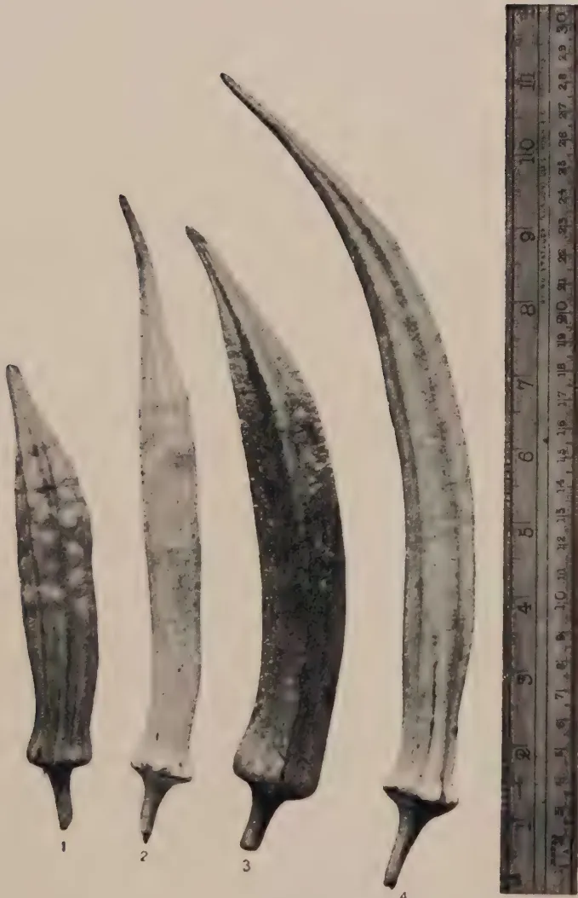

# The Tropical Agriculturist

December, 1927.

---

## Editorial.

---

### The Coconut Industry.

**A**TTENTION has been drawn recently to the coconut industry and to the necessity for a greater amount of scientific research work in connexion with it. There is no doubt as to the necessity for this further research and it is to be hoped that at an early date financial arrangements will be agreed upon which will make this possible.

In the present number is given an analysis of the coconut exports from Ceylon for the past sixteen years, and the progress that the industry has been making can be judged from these figures. Its importance to the material welfare of the peoples of Ceylon is clearly indicated by these figures and the increase in exports in recent years has been marked. As these figures show, there has been an increase in exports during the four-year period 1923-1926 of 77 per cent. over the exports for the four-year period 1911-1914 and an increase in values when the same periods are compared of 78 per cent. Whilst it may be stated that such increases show a remarkable progress, can it be claimed that such progress has been mainly due to an improvement of cultural operations? There is undoubtedly now greater attention being paid to the control of pests and diseases and an extension of cultivation and manuring. The greater part of the area under coconuts is however still very indifferently cultivated and a very large acreage receives no cultivation whatever. It may be presumed therefore that a fair proportion of the increased crops is due to increased acreages coming into bearing and to the replacement of

1------------------------------------------------

324

old worn-out cultivations with young plantations, and it could safely be anticipated that greatly increased crops could be secured if sound cultivation methods were more generally adopted.

Complaints have, within the past year or two, been received as to the quality of copra and this is a matter which requires close investigation if a high standard of output is to be maintained. There is little doubt that a complete investigation of the methods of copra manufacture, of the methods which can be adopted to prevent moulds, of the steps to be taken to prevent deterioration and of the methods of oil manufacture would lead to results of considerable value to the industry. Progress in this aspect of the industry is essential and unless scientific investigation is provided for, stagnation is likely to result.

Another aspect of the industry which requires careful attention is the isolation and selection of high-yielding types of nuts. Work in this connexion has been begun in other countries and Ceylon should likewise see to it that it has tested strains of high-yielding nuts available from a central Research Station for the planting up of new areas and for the replanting of old ones. A certain amount of such selection has been started upon some estates and the Department of Agriculture has a small number of palms planted from known parents on its central experiment station. These have been selected because of their varietal differences but their yielding capacities have not as yet been ascertained. It is clear that there is a wide field for well planned research. The results will not be available for a period of less than twenty years but it is work which must be undertaken if progress is to be assured.

In the question of cultivation much has been done by private owners and recognised systems have been evolved by practical planters. Similarly the question of manures has been tackled upon estates, and upon the Chilaw Trial Ground and in the co-operative experiments carried out by Gate Mudalivar A. E. Rajapakse. There is however much work still to be done in this connexion and large scale scientifically planned experiments are still required. The value of close-growing cover crops such as Vigna—which is proving its worth for the rubber industry—also requires to be tested and general soil questions affecting coconut cultivation investigated.

There is an abundance of work for a Coconut Research Scheme and it is to be hoped that such a scheme will soon be started. The welfare and progress of the industry must depend upon the improvements and developments which scientific investigations show to be necessary and desirable.

2------------------------------------------------

325

Original Articles.

## Ceylon's Coconut Crops.

**F. A. STOCKDALE, C.B.E., M.A., F.L.S.,**

*Director of Agriculture, Ceylon.*

**A**T the meeting of the Estates Products Committee of the Board of Agriculture held at Peradeniya on November 8, 1927, Mr. H. L. De Mel drew attention to the declining exports of coconut products in 1927, and enquired if all was well with the Colony's coconut industry. It was decided that further investigations and enquiries should be made in order to ascertain if the decline in the 1927 crops were due to climatic causes.

A critical examination by Mr. H. K. Rutherford of the exports of coconut produce from Ceylon for the four years 1911-1914 together with comparative figures for the four years of war 1915-1918 was published in the *Tropical Agriculturist* for September, 1919 and figures for the period 1919-1922 were given in the issue for May, 1923 of the same publication.

As Mr. Rutherford explains in his article, the object he had in view in compiling the figures was to elucidate to what extent the coconut industry in Ceylon was increasing its production. Four yearly periods were selected in order to arrange the good and bad yielding years and all the products were converted to a nut basis.

Acreage statistics in regard to coconuts in Ceylon are liable to considerable inaccuracies and consequently are unreliable and it is only through exports that a fair idea of the development which is taking place can be ascertained. Increasing population undoubtedly accounts for increased local consumption. This factor must therefore not be lost sight of in drawing any conclusions from figures available. Mr. Rutherford computes that the average consumption (in all forms) of coconut per head of population is between 130 and 145, but there are no actual data available to check these figures. If these figures are, however, approximately accurate the increase in population in recent years accounts for an increasing local consumption of coconut products which cannot be ignored.

3------------------------------------------------

326

## Exports of Coconut Produce from Ceylon\*

<table border="1">
<thead>
<tr>
<th>Year.</th>
<th>Oil Tons.</th>
<th>Copra Tons.</th>
<th>Desiccated Tons.</th>
<th>Coconuts.</th>
</tr>
</thead>
<tbody>
<tr>
<td>1911 ...</td>
<td>25,251</td>
<td>41,091</td>
<td>14,610</td>
<td>15,723,393</td>
</tr>
<tr>
<td>1912 ...</td>
<td>20,089</td>
<td>30,704</td>
<td>13,940</td>
<td>16,010,809</td>
</tr>
<tr>
<td>1913 ...</td>
<td>27,349</td>
<td>55,865</td>
<td>15,190</td>
<td>16,861,324</td>
</tr>
<tr>
<td>1914 ...</td>
<td>24,314</td>
<td>70,597</td>
<td>15,593</td>
<td>11,429,594</td>
</tr>
<tr>
<td>Total ...</td>
<td>97,003</td>
<td>198,257</td>
<td>59,333</td>
<td>60,025,120</td>
</tr>
<tr>
<td>1915 ...</td>
<td>25,075</td>
<td>60,426</td>
<td>17,450</td>
<td>5,827,669</td>
</tr>
<tr>
<td>1916 ...</td>
<td>16,151</td>
<td>65,497</td>
<td>15,307</td>
<td>4,694,297</td>
</tr>
<tr>
<td>1917 ...</td>
<td>21,735</td>
<td>53,935</td>
<td>13,603</td>
<td>5,289,481</td>
</tr>
<tr>
<td>1918 ...</td>
<td>26,374</td>
<td>63,616</td>
<td>10,168</td>
<td>6,553,278</td>
</tr>
<tr>
<td>Total ...</td>
<td>89,335</td>
<td>243,474</td>
<td>56,528</td>
<td>22,364,725</td>
</tr>
<tr>
<td>1919 ...</td>
<td>33,800</td>
<td>87,976</td>
<td>33,753</td>
<td>3,390,710</td>
</tr>
<tr>
<td>1920 ...</td>
<td>25,376</td>
<td>67,893</td>
<td>25,937</td>
<td>9,776,479</td>
</tr>
<tr>
<td>1921 ...</td>
<td>24,236</td>
<td>68,372</td>
<td>43,526</td>
<td>23,738,542</td>
</tr>
<tr>
<td>1922 ...</td>
<td>27,731</td>
<td>84,329</td>
<td>38,411</td>
<td>22,317,747</td>
</tr>
<tr>
<td>Total ...</td>
<td>111,143</td>
<td>308,570</td>
<td>141,627</td>
<td>59,223,478</td>
</tr>
<tr>
<td>1923 ...</td>
<td>24,027</td>
<td>50,773</td>
<td>40,940</td>
<td>15,693,670</td>
</tr>
<tr>
<td>1924 ...</td>
<td>27,631</td>
<td>88,459</td>
<td>43,567</td>
<td>29,121,041</td>
</tr>
<tr>
<td>1925 ...</td>
<td>30,890</td>
<td>113,686</td>
<td>39,708</td>
<td>23,288,786</td>
</tr>
<tr>
<td>1926 ...</td>
<td>28,523</td>
<td>120,970</td>
<td>37,718</td>
<td>16,951,368</td>
</tr>
<tr>
<td>Total ...</td>
<td>111,071</td>
<td>373,888</td>
<td>161,933</td>
<td>85,054,865</td>
</tr>
</tbody>
</table>

Mr. Rutherford adopted for his conversion of oil, copra and desiccated coconuts the following data:—

<table>
<tr>
<td>1 ton of oil</td>
<td>= 8,125 nuts</td>
</tr>
<tr>
<td>1 ton of copra</td>
<td>= 5,000 nuts</td>
</tr>
<tr>
<td>1 ton of desiccated</td>
<td>= 6,900 nuts</td>
</tr>
</table>

Similar data have been adopted in this survey and the following figures are obtained.

### Statement showing the annual quantity of coconuts utilized in the various products exported from Ceylon.

<table border="1">
<thead>
<tr>
<th>Year.</th>
<th>Oil.</th>
<th>Copra.</th>
<th>Desiccated.</th>
<th>Fresh Nuts.</th>
<th>Total.</th>
</tr>
</thead>
<tbody>
<tr>
<td>1911 -</td>
<td>205,164,375</td>
<td>205,455,000</td>
<td>100,809,000</td>
<td>15,723,393</td>
<td>527,151,768</td>
</tr>
<tr>
<td>1912 -</td>
<td>163,223,125</td>
<td>153,520,000</td>
<td>95,186,000</td>
<td>16,010,809</td>
<td>427,939,924</td>
</tr>
<tr>
<td>1913 -</td>
<td>222,210,625</td>
<td>279,325,000</td>
<td>104,811,000</td>
<td>16,861,324</td>
<td>623,207,949</td>
</tr>
<tr>
<td>1914 -</td>
<td>197,551,250</td>
<td>352,985,000</td>
<td>107,591,700</td>
<td>11,429,524</td>
<td>669,557,474</td>
</tr>
<tr>
<td>Total -</td>
<td>788,149,375</td>
<td>991,285,000</td>
<td>408,397,700</td>
<td>60,025,050</td>
<td>2,247,857,115</td>
</tr>
</tbody>
</table>

Average

p.a. - 197,037,344 - 247,821,250 - 102,099,425 - 15,006,262 - 561,964,281

\* All figures in this article are Customs returns taken from Turner's Handbook of Ceylon, 1926, and vary slightly from those previously published by Mr. Rutherford.

4------------------------------------------------

327

<table border="1">
<thead>
<tr>
<th>Year.</th>
<th>Oil.</th>
<th>Copra.</th>
<th>Desiccated.</th>
<th>Fresh Nuts.</th>
<th>Total.</th>
</tr>
</thead>
<tbody>
<tr>
<td>1915 -</td>
<td>203,734,375 -</td>
<td>302,130,000 -</td>
<td>120,405,000 -</td>
<td>5,827,669 -</td>
<td>632,097,044</td>
</tr>
<tr>
<td>1916 -</td>
<td>131,226,875 -</td>
<td>327,485,000 -</td>
<td>105,618,300 -</td>
<td>4,694,297 -</td>
<td>569,024,472</td>
</tr>
<tr>
<td>1917 -</td>
<td>176,596,875 -</td>
<td>269,675,000 -</td>
<td>93,860,700 -</td>
<td>5,289,481 -</td>
<td>545,422,056</td>
</tr>
<tr>
<td>1918 -</td>
<td>214,288,750 -</td>
<td>318,080,000 -</td>
<td>70,159,200 -</td>
<td>6,553,278 -</td>
<td>609,081,228</td>
</tr>
<tr>
<td>Total -</td>
<td>725,846,875</td>
<td>1,217,370,000</td>
<td>390,043,200</td>
<td>22,364,725</td>
<td>2,355,624,800</td>
</tr>
<tr>
<td>Average</td>
<td></td>
<td></td>
<td></td>
<td></td>
<td></td>
</tr>
<tr>
<td>p.a. -</td>
<td>181,461,719 -</td>
<td>304,342,500 -</td>
<td>97,510,800 -</td>
<td>5,591,181 -</td>
<td>588,906,200</td>
</tr>
<tr>
<td>1919 -</td>
<td>274,625,000 -</td>
<td>439,880,000 -</td>
<td>232,895,700 -</td>
<td>3,390,710 -</td>
<td>950,791,410</td>
</tr>
<tr>
<td>1920 -</td>
<td>206,180,000 -</td>
<td>339,465,000 -</td>
<td>178,965,000 -</td>
<td>9,776,479 -</td>
<td>734,386,779</td>
</tr>
<tr>
<td>1921 -</td>
<td>196,917,500 -</td>
<td>341,860,000 -</td>
<td>300,329,400 -</td>
<td>23,738,542 -</td>
<td>862,845,442</td>
</tr>
<tr>
<td>1922 -</td>
<td>225,314,375 -</td>
<td>421,645,000 -</td>
<td>265,035,900 -</td>
<td>22,317,747 -</td>
<td>934,313,022</td>
</tr>
<tr>
<td>Total -</td>
<td>903,036,875</td>
<td>1,542,850,000</td>
<td>977,226,300</td>
<td>59,223,478</td>
<td>3,482,336,653</td>
</tr>
<tr>
<td>Average</td>
<td></td>
<td></td>
<td></td>
<td></td>
<td></td>
</tr>
<tr>
<td>p.a. -</td>
<td>225,759,219 -</td>
<td>385,712,500 -</td>
<td>244,306,575 -</td>
<td>14,805,869 -</td>
<td>870,584,163</td>
</tr>
<tr>
<td>1923 -</td>
<td>195,219,375 -</td>
<td>253,865,000 -</td>
<td>282,486,000 -</td>
<td>15,693,670 -</td>
<td>747,264,045</td>
</tr>
<tr>
<td>1924 -</td>
<td>224,501,875 -</td>
<td>442,295,000 -</td>
<td>300,612,300 -</td>
<td>29,121,041 -</td>
<td>996,630,216</td>
</tr>
<tr>
<td>1925 -</td>
<td>250,981,250 -</td>
<td>568,430,000 -</td>
<td>273,985,200 -</td>
<td>23,288,786 -</td>
<td>1,116,685,236</td>
</tr>
<tr>
<td>1926 -</td>
<td>231,749,375 -</td>
<td>604,850,000 -</td>
<td>260,254,200 -</td>
<td>16,951,368 -</td>
<td>1,113,804,943</td>
</tr>
<tr>
<td>Total -</td>
<td>902,451,875</td>
<td>1,869,440,000</td>
<td>1,117,337,700</td>
<td>85,054,865</td>
<td>3,974,284,440</td>
</tr>
<tr>
<td>Average</td>
<td></td>
<td></td>
<td></td>
<td></td>
<td></td>
</tr>
<tr>
<td>p.a. -</td>
<td>225,612,969 -</td>
<td>467,360,000 -</td>
<td>279,334,425 -</td>
<td>21,263,716 -</td>
<td>993,571,110</td>
</tr>
</tbody>
</table>

The total nuts exported during the four-yearly periods specified above have been as follows:—

<table>
<tbody>
<tr>
<td>1911-1914</td>
<td>...</td>
<td>2,247,856,125</td>
<td>...</td>
<td>= 100</td>
</tr>
<tr>
<td>1915-1918</td>
<td>...</td>
<td>2,355,624,800</td>
<td>...</td>
<td>= 105</td>
</tr>
<tr>
<td>1919-1922</td>
<td>...</td>
<td>3,482,336,653</td>
<td>...</td>
<td>= 155</td>
</tr>
<tr>
<td>1923-1926</td>
<td>...</td>
<td>3,974,284,440</td>
<td>...</td>
<td>= 177</td>
</tr>
</tbody>
</table>

The war period shows but slight increases undoubtedly due to shortage of freight and to increased local consumption during this period. It is possible that the export averages for the period 1919-1922 were higher than they would have been normally owing to the clearing out of stocks after the termination of war, but it is significant that the average export of coconut products for the 4 yearly period 1923-1926 was 77% higher than for the 4 yearly period 1911-1914. Mr. Rutherford, in 1922, in his calculations eliminated the year 1914 and based his percentage increases upon the average of the three years 1911-1913. He found that the production for export had shown an increase at the rate of 5 per cent. per annum or 60 per cent. in the 12 years. Using the same basis of calculation it is found that the average annual export for the period 1923-1926 was 189 per cent. in excess of the basic averages or a rate of increase equal to 5.6 per cent. per annum.

5------------------------------------------------

328

Allowing, therefore, for the increased local consumption it cannot be held that there has been any decline in the production of coconut products during the past four years. The reverse has been the case and the 1,000 million mark should shortly be attained. This steady increase is due to young plantations coming into bearing and to a higher state of cultivation. If the rate is to be continued there is little doubt that more wide-spread attention must be given to better cultivation and manuring. If the total acreage of Ceylon coconuts was highly cultivated very marked increase in exports would be possible.

### Values.

It may now be interesting to take a survey of the values of the exports over similar periods. They are as follows:—

<table>
<thead>
<tr>
<th>Period</th>
<th>Total Values</th>
<th>Average Value per annum</th>
</tr>
<tr>
<th></th>
<th>Rs.</th>
<th>Rs.</th>
</tr>
</thead>
<tbody>
<tr>
<td>1911-1914</td>
<td>... 155,440,085</td>
<td>... 38,860,021</td>
</tr>
<tr>
<td>1915-1918</td>
<td>... 146,694,681</td>
<td>... 36,673,670</td>
</tr>
<tr>
<td>1919-1922</td>
<td>... 284,832,849</td>
<td>... 71,208,212</td>
</tr>
<tr>
<td>1923-1926</td>
<td>... 277,217,501</td>
<td>... 69,304,375</td>
</tr>
</tbody>
</table>

The ratios of these are as follows:—

<table>
<tbody>
<tr>
<td>1911-1914</td>
<td>... = 100</td>
</tr>
<tr>
<td>1915-1918</td>
<td>... = 94</td>
</tr>
<tr>
<td>1919-1922</td>
<td>... = 183</td>
</tr>
<tr>
<td>1923-1926</td>
<td>... = 178</td>
</tr>
</tbody>
</table>

These figures show clearly the higher values for coconut products in the years immediately following the termination of the war period and a return during the period 1923-1926 to what may be considered normal—the value being only 1 per cent. in excess of the amounts of the exports.

6------------------------------------------------

329

## Paddy Notes (2).

(a) The Preliminary Testing of  
Pure-line Selections of Rice.  
(b) An Account of Two Cultural  
Experiments.

L. LORD, M.A.,

*Economic Botanist, Ceylon.*

(a) Preliminary Testing of Pure-Line Selections  
of Rice.

**T**HE first investigations carried out on this subject were described in the *Tropical Agriculturist*, Vol. LXVII., 5, 1926. The investigations have been continued for the past two seasons and the results have been embodied in a paper which is considered too technical for this Journal, and which will, therefore, be published, in due course, in the *Annals of the Royal Botanic Gardens, Peradeniya*.

The first investigations showed that the so-called rod-row plot (there, three rows of 30 plants each, 6 in. between rows and plants) was distinctly useful in testing new selections of rice at an early stage in their history when seed was available in small quantities only. The outer rows of plots were not discarded and yields were calculated on the basis of yields per hundred plants. Attention was drawn to the fact that the border effect on outside rows may affect the comparative yields of selections and that if the yields of the inner three rows of five-row plots were used (which would eliminate border effect) the legitimacy of using yields per hundred plants would have to be re-examined. The further investigations have shown that border effect may be appreciable and that it is necessary, therefore, to use yields of the inner three rows of five-row rod-row plots. The accuracy of using yields per hundred plants was accordingly examined and it has been concluded that (a) when the mean number of plants

7------------------------------------------------

330

per plot of any selection is much below 80 (the maximum number being 90) the use of both yields per hundred plants and of total yields per inner three rows is inaccurate, and (b) with means of over 80 plants per plot total yields and yields per hundred plants are approximately of equal accuracy. Where rod-row plots are used it is essential that almost all of the seedlings transplanted should reach maturity. This may be attained by filling up vacancies in the plots in the early weeks following transplanting and by lessening ravages by land crabs. Possible preventative measures against crabs are:

1. (1) thoroughly draining fields immediately after transplanting for a period of a week or so.
2. (2) planting a 2 ft.-3 ft. border of plants of any variety of paddy round the fields close to the bunds to attract crabs and keep them away from the plots.
3. (3) trapping crabs in pots according to the method described in the September, 1927, issue of this Journal, and
4. (4) catching crabs during the day time. Boys become expert at this and at Peradeniya a catch of 200 per day per boy is common.

It has been found that the seed of one ear-head when sown in a small nursery and the seedlings transplanted at distances of 6-12 in. between plants will, under good conditions, frequently produce a yield of 2 lb. of seed. This amount of seed is sufficient for from six to eight transplanted  $1/200$  ac. plots allowing for a 12 in. border of plants to be discarded prior to harvest. It is possible, therefore, under such conditions, to conduct the preliminary tests in  $1/200$  ac. plots instead of in rod-row plots. The advantage of doing this lies in the saving of time and in the probable reduction of experimental errors. Disadvantages are the larger area of ground required and the fewer replications necessary. At the commencement of pure-line selection work in a new district when large differences of yield may be expected from the selected strains the writer advocates using  $1/200$  ac. plots for preliminary tests, as a matter of expediency, whenever from fifteen to twenty of the initial selections produce 2 lb. of seed from the ear-to-row multiplication plots. In laying down the  $1/200$  ac. plots transplanting is preferable to broadcasting, but it is realised that in many districts where paddy-fields are entirely rain-fed broadcasting only is possible.

Experimental errors of varietal tests with rice in small plots have been found to be high and replications should be as many as possible. Sixteen replications of rod-row plots and ten replications of  $1/200$  ac. plots with careful cultural methods should detect 10% differences of yield. Two alterations in technique were made during the course of the further investigations; one

8------------------------------------------------

331

was in the method of arranging the different plots in each replication and the other, in the statistical examination of results. Plots are now laid down in what is known as "randomized blocks," a system advocated by R. A. Fisher and described by him in the *Journal of the Ministry of Agriculture*, 1926, pp. 503-513. This article which explains the necessity for this random arrangement was reprinted in this Journal for December, 1926.

The calculation of experimental errors is now made by what is known as the method of analysis of variance described by Fisher in his book *Statistical Methods for Research Workers*. These methods of plot arrangement and of statistical examination of results are the same as those now used in the new field experiments at Rothamsted.

The writer wishes to take this opportunity of thanking Dr. Fisher for his very kind advice and assistance.

### (b.) An Account of Two Cultural Experiments.

**Green Manuring Experiment.**—An experiment was put down at Anuradhapura in 1926 to determine the effect of ploughing in a growing crop of a leguminous green manure on the yield of the succeeding paddy crop. Sunn Hemp (*Crotalaria juncea*) was the green manure used. Five rectangular  $1/5$  ac. fields were divided longitudinally into two equal parts by means of temporary bunds. On one-half of each field *Crotalaria juncea* was sown at the rate of 25 lb. per acre. The diagrammatic plan of the experiment is as follows:—

<table border="1" style="border-collapse: collapse; text-align: center; margin-left: auto; margin-right: auto;">
<tr>
<td style="padding: 5px 10px;">C</td>
<td style="padding: 5px 10px;">M</td>
<td style="padding: 5px 10px;">C</td>
<td style="padding: 5px 10px;">M</td>
<td style="padding: 5px 10px;">C</td>
<td style="padding: 5px 10px;">M</td>
<td style="padding: 5px 10px;">C</td>
<td style="padding: 5px 10px;">M</td>
<td style="padding: 5px 10px;">C</td>
<td style="padding: 5px 10px;">M</td>
<td style="padding: 5px 10px;">N. —→</td>
</tr>
</table>

Irrigation channel

C = the unmanured and M = the manured plots. Each plot was approximately  $1/10$  ac. It will be noticed that the manured plots are always to the north of the control plots. This systematic arrangement of the plots affects to some extent the accuracy of the experiment and the validity of the calculated experimental error. The soil of paddy-fields is so thoroughly mixed, however, during the process of puddling that any differences of fertility in a field are due mainly to proximity to bunds and to water inlets and outlets. Each of the plots of the experiment had equal lengths of bund and each had its own inlet and outlet. It is not thought, therefore, that the systematic, instead of a random plot arrangement, has seriously affected the results. The green manure was sown early in December, 1926. This

9------------------------------------------------

332

sowing failed owing to heavy rains. The second sowing, on 28-12-26, was moderately successful. A 12-18 in. high crop was ploughed in dry on 10-2-27. The strong weed growth on the control plots was ploughed in on 21-4-27. All the plots were puddled on 27-4-27 ( $2\frac{1}{2}$  months after the green manure was ploughed in) and sown with a pure line *Yala* paddy on the same date. The results of the experiment are as follows:—

<table border="1">
<thead>
<tr>
<th rowspan="2">Treatment</th>
<th colspan="3">Mean yields of grain</th>
<th rowspan="2">Mean difference per plot lbs.</th>
<th rowspan="2">Standard Error of difference</th>
</tr>
<tr>
<th>Actual yields per plot lbs.</th>
<th>Per Acre lbs.</th>
<th>Percentage</th>
</tr>
</thead>
<tbody>
<tr>
<td>Manured</td>
<td>213.10</td>
<td>2,131.0</td>
<td>135</td>
<td rowspan="2">55.75</td>
<td rowspan="2">15.09</td>
</tr>
<tr>
<td>Control</td>
<td>157.35</td>
<td>1,573.5</td>
<td>100</td>
</tr>
</tbody>
</table>

The odds that this difference is due to the treatment and not due to chance are nearly 50 to 1.

It is unfortunate that this experiment does not *prove* that the large difference of 35% is directly due to the effects of the green manure as the two sets of plots did not receive the same cultural treatment. The green manure was ploughed in about 10 weeks before sowing whereas the strong weed growth on the control plots was ploughed in just less than a week before. The green manure was ploughed in at that time as growth had ceased. The control plots were ploughed at the normal time of ploughing for the *Yala* crop. The question now arises, did the manured plots give an increased yield because of the extra nitrogen (obtained from the air) added to the soil? Or was the increase due to the fact that in the manured plots the nitrogen in the manure had sufficient time to "become an integral component of the soil before the irrigation season commences?" (Harrison and Aiyar, *loc.cit.*) or again, did the control plots yield less than they might have done under different cultural methods because of the dissipation of most of the nitrogen of the weed growth as nitrogen gas under the puddled and hence anaerobic conditions?

The results of the experiment are a reminder of the fact that the problem of green manuring of paddy is a complicated one. Harrison and Aiyar\* (p. 31) state that "When the green crop is puddled into the soil decomposition occurs and most of the nitrogen contained in it is dissipated as nitrogen gas and becomes valueless from the manurial point of view," and (p. 27) "If, therefore, this nitrogen (the nitrogen on the green manure) is to be utilized, two alternatives are open, either to greatly

\* Harrison, W. H. and Aiyar, P. A. S. The Gases of Swamp Rice Soils, Pt. IV. *Mem. Dept. Agric. India*, Vol. V., No. 1, 1916.

10------------------------------------------------

333

modify, or eliminate, the methods of swamp cultivation, or to apply the manure at such a time and under such conditions that the nitrogen can become an integral component of the soil before the irrigation season commences." The conditions under which the green manure was ploughed in, in this experiment, were such as to allow at least part of the nitrogen of the manure to become an 'integral component' of the soil.

But the puddling in of green manure immediately prior to sowing or transplanting seems general in India, and is probably the cheapest and most convenient method. Its efficacy has been shown by Parnell\* in an experiment where green manure (not, however, grown *in situ*) was both ploughed in dry about six months before planting and puddled in just prior to planting. In discussing the results of the experiment, Parnell says: "It is, of course, impossible to rely on an isolated experiment of this kind, but the odds are distinctly in favour of puddling the green manure before planting, and the figures are simply given as a record of this fact in this particular case." There is reliable evidence (Kelly †), however, that organic substances under puddled, anaerobic conditions develop ammonia, the form in which it is believed nitrogen is mainly assimilated by the rice plant. It would appear, therefore, that the puddling in of green manures must be effective in spite of any loss of gaseous nitrogen. After considering the available evidence it is thought that the increased yield given by the manured plots in the Anuradhapura experiment is due to the added nitrogen supplied by the leaves and roots of the green manure and that, in all probability, puddling in the green manure would also have given similar beneficial results.

It is evident that the problem of the green manuring of paddy requires further investigation. In co-operation with the Agricultural Chemist, it is intended to lay down an experiment to determine (i) the optimum time and conditions for ploughing in green manures and (ii) the magnitude of the increase in yield which may be expected.

**Seed Rate Experiment.**—The average seed-rate for broad-casted paddy in Ceylon is two bushels per acre or more. The object of this heavy seed-rate is, apparently, to keep down the strong weed growth which is found in most districts. A seed-rate experiment was laid down at Anuradhapura during the Yala season of 1927 to determine the effect of different seed-rates un-

\* Parnell, F. R., Green Leaf Manuring of Dry Paddy Land. *Year Book of the Madras Agric. Dept.*, 1919.

† Kelly, W. P. The Assimilation of Nitrogen by Rice. *Hawaii Agric. Expt. Sta. Bull.* No. 24, 1911.

11------------------------------------------------

334

der weeded and unweeded conditions. A pure-line *Hinati* paddy was used in all plots and the plots were  $1/100$  ac. Four different seed-rates  $\frac{1}{2}$ , 1,  $1\frac{1}{2}$  and 2 bushels per acre were used and each replicated four times. Owing to the use of different seed in one replication three replications only can be used. One-half of each plot was thoroughly weeded about five weeks after sowing. The yields recorded are therefore from  $1/200$  ac. plots. The diagrammatic plan of the experiment is as follows:

N.

Irrigation channel  
 A =  $\frac{1}{2}$  bus. per acre  
 B = 1  
 C =  $1\frac{1}{2}$   
 D = 2

The four different seed-rates were put down in what is known as 'randomized blocks,' that is, the position of each seed-rate was at random in each of the four compact blocks. A block holds one complete replication. To simplify weeding the  $1/100$  ac. plots were divided into two halves by a coir rope and those halves to the north were weeded. The two halves were harvested and threshed separately. The distribution of the weeded plots was not at random and the calculated experimental error is therefore not absolutely valid. As mentioned in the account of the previous experiment, the preliminary puddling of paddy-fields results in such a thorough mixing of the soil over the whole field that differences of fertility are due mainly to proximity to the irrigation channel. In this experiment both weeded and unweeded plots are affected equally by this fact. The different seed-rates, which are not affected equally were laid down at random. The mean yields in lb. per  $1/200$  ac. plot and per acre of the different series are as follows:—

<table border="1">
<thead>
<tr>
<th rowspan="2">Seed-rate</th>
<th colspan="2">Weeded</th>
<th colspan="2">Unweeded</th>
</tr>
<tr>
<th>per plot lbs.</th>
<th>per acre lbs.</th>
<th>per plot lbs.</th>
<th>per acre lbs.</th>
</tr>
</thead>
<tbody>
<tr>
<td><math>\frac{1}{2}</math> bushel</td>
<td>14.33</td>
<td>2,866</td>
<td>6.83</td>
<td>1,366</td>
</tr>
<tr>
<td>1 ..</td>
<td>15.83</td>
<td>3,166</td>
<td>11.25</td>
<td>2,250</td>
</tr>
<tr>
<td><math>1\frac{1}{2}</math> ..</td>
<td>17.41</td>
<td>3,482</td>
<td>12.50</td>
<td>2,500</td>
</tr>
<tr>
<td>2 ..</td>
<td>16.25</td>
<td>3,250</td>
<td>12.75</td>
<td>2,550</td>
</tr>
</tbody>
</table>

(The standard error of the difference between any two plots is

12------------------------------------------------

335

0.93,  $Z = 0.6354$ .) Within the limits of the error of the experiment it is possible to state that the  $\frac{1}{2}$  bushel seed-rate is definitely the worst but there is no statistical evidence which of the remaining three is definitely the best. With good seed, a seed-rate of  $1\frac{1}{2}$  bushels per acre is ample. The results of this experiment show the very large increase of yield which may be expected to follow weeding. A comparison of the best weeded plot with the best unweeded shows an increase of 36%. If the 1,  $1\frac{1}{2}$  and 2 bushels seed-rates are compared collectively, weeding has resulted in a 35% increase. A conservative estimate of the increase to be gained through weeding would not be less than 20-25%. It is obvious that if the practice of weeding is universally adopted there will be a large increase in the amount of paddy produced in Ceylon. It is difficult to estimate the cost of weeding to the cultivator who may utilise his own labour, family labour or co-operative labour (a type of labour found to exist near Peradeniya during the time of transplanting). When all labour is paid for in money the costs will vary but should nowhere exceed Rs. 12.00 per acre whereas the least increase in yield should be six bushels of paddy.

13------------------------------------------------

336

# Pure-line Selection Work with *Bandakka, Hibiscus esculentus.*

L. LORD, M.A.,

*Economic Botanist, Ceylon*

and

G. V. WICKRAMASEKERA, Dip. Agric., Poona,

*Assistant in Economic Botany.*

A SMALL collection of *Bandakka* varieties from different parts of Ceylon was made in 1924. The different varieties were sown at Peradeniya during the south-west monsoon of that year. The flowers on all the plants were selfed. This operation is very easily performed by slipping a wire ring of about 0.3 in. to 0.4 in. diameter over the flower bud before it has commenced to unroll. The ring is attached to the plant close to the flower by means of cotton thread. The seed of any fruit which sets without an adjacent hanging ring is not used. Segregation occurred in certain of the varieties and these new types were isolated and numbered. This work continued until at the end of the south-west season of 1926 twenty of the existing selections, which then showed no signs of further segregation, were chosen for comparative trial in the following season. Plate I. shows four of the chief types of *Bandakka* selections. No. 4 is the selection lettered A in Table II. The plots used in the trial measured 6 ft. by 10 ft. and contained normally 15 plants 2 ft. apart each way. As the full number of plants per plot did not always reach maturity the yields mentioned later are the mean yields per plant. The experiment was laid down in what is known as randomized blocks. One block contains one replication and within each block the position of the plots is at random. The number of replications was ten. Table I. shows the arrangement of the experiment. Blocks should generally be as compact as possible but in this experiment the land used is on a slope and the blocks were arranged so that each block was more-or-less on the same level.

14------------------------------------------------

A black and white photograph showing four different varieties of okra pods (Hibiscus esculentus) arranged vertically. Pod 1 is the shortest and thickest, with a dark, textured surface. Pod 2 is slightly taller and thinner, with a lighter, smoother surface. Pod 3 is taller still, with a dark, ribbed surface. Pod 4 is the tallest and thinnest, with a light-colored, smooth surface. To the right of the pods is a vertical ruler with markings from 1 to 30, providing a scale for the pods.

Photo by

L. S. Bertus

Main Types of Bandakka (*Hibiscus esculentus.*)  
Selections.

15------------------------------------------------

This image is a scan of a blank page. The paper has a light beige or cream-colored tint. There are a few very small, dark specks scattered across the surface, which appear to be scanning artifacts or dust particles. No text, lines, or other markings are present on the page.

16------------------------------------------------

337Table I.

Showing the Plan of the Experiment.  
(System of Plot arrangement: Randomized Blocks.)

<table border="1">
<tbody>
<tr>
<td>I.</td>
<td>A</td>
<td>M</td>
<td>Q</td>
<td>F</td>
<td>R</td>
<td>S</td>
<td>T</td>
<td>K</td>
<td>O</td>
<td>I</td>
<td>J</td>
<td>P</td>
<td>D</td>
<td>L</td>
<td>N</td>
<td>H</td>
<td>C</td>
<td>G</td>
<td>E</td>
<td>B</td>
</tr>
<tr>
<td>II.</td>
<td>G</td>
<td>F</td>
<td>K</td>
<td>Q</td>
<td>-</td>
<td>-</td>
<td>M</td>
<td>A</td>
<td>E</td>
<td>B</td>
<td>H</td>
<td>C</td>
<td>D</td>
<td>P</td>
<td>N</td>
<td>J</td>
<td>I</td>
<td>L</td>
<td>O</td>
<td>R</td>
<td>S</td>
</tr>
<tr>
<td>III.</td>
<td>Q</td>
<td>S</td>
<td>C</td>
<td>T</td>
<td>H</td>
<td>B</td>
<td>G</td>
<td>F</td>
<td>A</td>
<td>L</td>
<td>R</td>
<td>J</td>
<td>I</td>
<td>O</td>
<td>M</td>
<td>P</td>
<td>N</td>
<td>E</td>
<td>D</td>
<td>K</td>
<td>-</td>
</tr>
<tr>
<td>IV.</td>
<td>C</td>
<td>I</td>
<td>N</td>
<td>O</td>
<td>D</td>
<td>M</td>
<td>P</td>
<td>Q</td>
<td>A</td>
<td>H</td>
<td>L</td>
<td>R</td>
<td>K</td>
<td>G</td>
<td>F</td>
<td>J</td>
<td>E</td>
<td>S</td>
<td>T</td>
<td>B</td>
<td>-</td>
</tr>
<tr>
<td>V.</td>
<td>T</td>
<td>F</td>
<td>R</td>
<td>J</td>
<td>O</td>
<td>H</td>
<td>C</td>
<td>L</td>
<td>G</td>
<td>K</td>
<td>A</td>
<td>E</td>
<td>Q</td>
<td>D</td>
<td>P</td>
<td>S</td>
<td>N</td>
<td>B</td>
<td>I</td>
<td>M</td>
<td>-</td>
</tr>
<tr>
<td>VI.</td>
<td>K</td>
<td>G</td>
<td>A</td>
<td>T</td>
<td>R</td>
<td>O</td>
<td>H</td>
<td>F</td>
<td>I</td>
<td>B</td>
<td>S</td>
<td>N</td>
<td>R</td>
<td>T</td>
<td>C</td>
<td>L</td>
<td>O</td>
<td>M</td>
<td>D</td>
<td>P</td>
<td>-</td>
</tr>
<tr>
<td></td>
<td colspan="20"></td>
<td>H</td>
<td>J</td>
<td>R</td>
<td>B</td>
<td>N</td>
<td>F</td>
<td>Q</td>
<td>P</td>
<td>G</td>
<td>K</td>
<td>E</td>
<td>C</td>
<td>M</td>
<td>L</td>
<td>I</td>
<td>S</td>
<td>A</td>
<td>T</td>
<td>D</td>
<td>O</td>
</tr>
<tr>
<td></td>
<td colspan="20"></td>
<td>R</td>
<td>G</td>
<td>N</td>
<td>B</td>
<td>H</td>
<td>J</td>
<td>M</td>
<td>O</td>
<td>K</td>
<td>E</td>
<td>C</td>
<td>F</td>
<td>D</td>
<td>A</td>
<td>L</td>
<td>T</td>
<td>P</td>
<td>I</td>
<td>S</td>
<td>Q</td>
</tr>
<tr>
<td></td>
<td colspan="20"></td>
<td>A</td>
<td>P</td>
<td>-</td>
<td>Q</td>
<td>L</td>
<td>K</td>
<td>C</td>
<td>R</td>
<td>I</td>
<td>E</td>
<td>S</td>
<td>B</td>
<td>M</td>
<td>F</td>
<td>D</td>
<td>G</td>
<td>T</td>
<td>H</td>
<td>N</td>
<td>O</td>
<td>J</td>
</tr>
<tr>
<td></td>
<td colspan="20"></td>
<td>E</td>
<td>O</td>
<td>K</td>
<td>I</td>
<td>G</td>
<td>D</td>
<td>R</td>
<td>F</td>
<td>M</td>
<td>H</td>
<td>T</td>
<td>N</td>
<td>A</td>
<td>O</td>
<td>P</td>
<td>L</td>
<td>C</td>
<td>J</td>
<td>B</td>
<td>S</td>
</tr>
<tr>
<td></td>
<td colspan="20"></td>
<td colspan="2"></td>
<td colspan="2"></td>
<td colspan="2"></td>
<td colspan="2"></td>
<td colspan="2"></td>
<td colspan="2"></td>
<td colspan="2"></td>
<td colspan="2"></td>
<td colspan="2"></td>
<td colspan="2"></td>
<td></td>
</tr>
<tr>
<td></td>
<td></td>
<td></td>
<td></td>
<td></td>
<td></td>
<td></td>
<td></td>
<td></td>
<td></td>
<td></td>
<td></td>
<td></td>
<td></td>
<td></td>
<td></td>
<td></td>
<td></td>
<td></td>
<td></td>
<td></td>
<td></td>
<td></td>
<td>VII.</td>
<td>VIII.</td>
<td>IX.</td>
<td>X.</td>
</tr>
</tbody>
</table>

17------------------------------------------------

338Table. II.

Showing mean yield of pods per plant of each pure-line selection of *Hibiscus esculentus* in each replication.

(Selections lettered, replications numbered).

<table border="1">
<thead>
<tr>
<th></th>
<th>A</th>
<th>B</th>
<th>C</th>
<th>D</th>
<th>E</th>
<th>F</th>
<th>G</th>
<th>H</th>
<th>I</th>
<th>J</th>
<th>K</th>
<th>L</th>
<th>M</th>
<th>N</th>
<th>O</th>
<th>P</th>
<th>Q</th>
<th>R</th>
<th>S</th>
<th>T</th>
</tr>
</thead>
<tbody>
<tr>
<td>I.</td>
<td>7.27</td>
<td>4.67</td>
<td>6.93</td>
<td>5.73</td>
<td>2.27</td>
<td>4.33</td>
<td>5.14</td>
<td>4.14</td>
<td>4.86</td>
<td>6.13</td>
<td>8.46</td>
<td>2.26</td>
<td>2.50</td>
<td>3.47</td>
<td>5.13</td>
<td>3.40</td>
<td>4.13</td>
<td>6.67</td>
<td>6.57</td>
<td>8.41</td>
</tr>
<tr>
<td>II.</td>
<td>5.85</td>
<td>4.08</td>
<td>4.53</td>
<td>5.07</td>
<td>4.13</td>
<td>7.13</td>
<td>4.07</td>
<td>4.00</td>
<td>4.07</td>
<td>6.93</td>
<td>5.47</td>
<td>2.73</td>
<td>3.73</td>
<td>2.67</td>
<td>3.27</td>
<td>3.67</td>
<td>5.61</td>
<td>4.07</td>
<td>6.87</td>
<td>5.77</td>
</tr>
<tr>
<td>III.</td>
<td>4.87</td>
<td>8.14</td>
<td>7.20</td>
<td>4.13</td>
<td>3.42</td>
<td>4.13</td>
<td>4.27</td>
<td>6.80</td>
<td>4.13</td>
<td>3.67</td>
<td>3.07</td>
<td>2.42</td>
<td>1.43</td>
<td>2.40</td>
<td>5.00</td>
<td>2.13</td>
<td>6.83</td>
<td>3.93</td>
<td>5.22</td>
<td>5.33</td>
</tr>
<tr>
<td>IV.</td>
<td>5.47</td>
<td>3.36</td>
<td>5.00</td>
<td>5.50</td>
<td>1.20</td>
<td>6.40</td>
<td>4.46</td>
<td>1.93</td>
<td>3.15</td>
<td>6.46</td>
<td>7.33</td>
<td>2.71</td>
<td>3.87</td>
<td>2.07</td>
<td>3.13</td>
<td>2.87</td>
<td>3.57</td>
<td>4.67</td>
<td>1.73</td>
<td>0.57</td>
</tr>
<tr>
<td>V.</td>
<td>4.28</td>
<td>3.60</td>
<td>1.60</td>
<td>7.08</td>
<td>4.07</td>
<td>3.43</td>
<td>3.13</td>
<td>2.64</td>
<td>2.00</td>
<td>4.58</td>
<td>2.67</td>
<td>1.93</td>
<td>1.43</td>
<td>1.67</td>
<td>3.23</td>
<td>3.14</td>
<td>3.47</td>
<td>2.37</td>
<td>3.13</td>
<td>6.21</td>
</tr>
<tr>
<td>VI.</td>
<td>3.50</td>
<td>3.14</td>
<td>4.87</td>
<td>0.61</td>
<td>6.07</td>
<td>5.87</td>
<td>3.87</td>
<td>3.71</td>
<td>3.69</td>
<td>2.86</td>
<td>3.57</td>
<td>3.93</td>
<td>0.27</td>
<td>3.21</td>
<td>2.87</td>
<td>1.50</td>
<td>2.92</td>
<td>1.55</td>
<td>3.60</td>
<td>4.33</td>
</tr>
<tr>
<td>VII.</td>
<td>1.75</td>
<td>3.40</td>
<td>2.50</td>
<td>0.64</td>
<td>0.36</td>
<td>2.87</td>
<td>1.73</td>
<td>3.80</td>
<td>0.60</td>
<td>2.36</td>
<td>1.28</td>
<td>1.00</td>
<td>0.41</td>
<td>2.80</td>
<td>0.77</td>
<td>3.61</td>
<td>2.47</td>
<td>1.45</td>
<td>0.82</td>
<td>0.85</td>
</tr>
<tr>
<td>VIII.</td>
<td>0.43</td>
<td>1.57</td>
<td>0.61</td>
<td>1.25</td>
<td>1.67</td>
<td>2.33</td>
<td>4.13</td>
<td>1.54</td>
<td>1.21</td>
<td>1.15</td>
<td>2.93</td>
<td>1.36</td>
<td>2.08</td>
<td>2.10</td>
<td>1.27</td>
<td>1.50</td>
<td>2.47</td>
<td>1.73</td>
<td>1.70</td>
<td>0.93</td>
</tr>
<tr>
<td>IX.</td>
<td>3.14</td>
<td>3.85</td>
<td>2.20</td>
<td>3.20</td>
<td>3.27</td>
<td>4.07</td>
<td>2.86</td>
<td>0.93</td>
<td>0.67</td>
<td>1.25</td>
<td>2.78</td>
<td>1.53</td>
<td>2.47</td>
<td>1.00</td>
<td>0.50</td>
<td>3.54</td>
<td>3.50</td>
<td>1.14</td>
<td>2.92</td>
<td>1.60</td>
</tr>
<tr>
<td>X.</td>
<td>2.07</td>
<td>2.60</td>
<td>2.87</td>
<td>1.21</td>
<td>0.13</td>
<td>1.33</td>
<td>0.20</td>
<td>1.50</td>
<td>2.07</td>
<td>3.90</td>
<td>3.67</td>
<td>1.67</td>
<td>2.73</td>
<td>2.20</td>
<td>0.20</td>
<td>1.60</td>
<td>1.80</td>
<td>1.43</td>
<td>2.93</td>
<td>3.23</td>
</tr>
<tr>
<td>Mean</td>
<td>3.863</td>
<td>3.841</td>
<td>3.831</td>
<td>3.442</td>
<td>2.659</td>
<td>4.189</td>
<td>3.386</td>
<td>3.099</td>
<td>2.645</td>
<td>3.929</td>
<td>4.123</td>
<td>2.154</td>
<td>2.092</td>
<td>2.359</td>
<td>2.537</td>
<td>2.696</td>
<td>3.677</td>
<td>2.901</td>
<td>3.549</td>
<td>3.743</td>
</tr>
<tr>
<td>Av. length of pod.</td>
<td>8"</td>
<td>7.72"</td>
<td>7.62"</td>
<td>6.31"</td>
<td>8"</td>
<td>5.07"</td>
<td>6.31"</td>
<td>4.97"</td>
<td>5.94"</td>
<td>7.22"</td>
<td>7.10"</td>
<td>6.05"</td>
<td>4.05"</td>
<td>6.06"</td>
<td>5.05"</td>
<td>5.65"</td>
<td>6.44"</td>
<td>7.17"</td>
<td>6.45"</td>
<td>5.25"</td>
</tr>
</tbody>
</table>

18------------------------------------------------

339

The necessity for this random arrangement of plots in accurate experimentation has been described by R. A. Fisher in an article "The Arrangement of Field Experiments" which was reprinted in this Journal for December, 1926. Table II. gives the yields of the different plots. The twenty selections are lettered from A—T and the mean yield per plant of all the ten plots of each selection together with the mean pod length will be found at the foot of the table. Yields are low owing to the poor soil of some of the blocks. There is considerable variation in the mean yields per plant, the highest being 4.189 and the lowest 2.092. The standard error calculated by the analysis of variance method, of the difference between two selections is the high figure of 0.61. This means that differences of 1.22 only are statistically significant. The yield of pods per plant, however, is not the sole criterion of suitability of a *Bandakka* selection, length of pod is also important as the price per hundred pods depends upon their length. Taking into consideration these two factors of yield and length there is evidence for detaining the selections lettered A, B, C and J for further testing and for discarding the remainder.

It is not known to what extent *Bandakka* selections isolated and grown at Peradeniya will prove suitable for the varied climatic conditions of Ceylon. At the end of the North-East season 1927-28 seed should be available in sufficient quantities to test this point.

19------------------------------------------------

340Selected Articles.

# Tea Green Fly.

(*Empoasca flavescens*—Fabr.)

E. A. ANDREWS, B.A.,

*Entomologist, Scientific Department, Indian Tea Association.*

**I**N part IV. of the issue of *Quarterly Journal of the Indian Tea Association*, for 1923, a note was published on certain breeding observations made in connection with green-fly.

These observations have been continued since, and additional points have been brought out which are of sufficient interest to be worthy of note.

The first observation to be made is that the generally accepted idea that green-fly causes stunting of the bush still remains unproven. Attempts have been made, each season, to produce the stunting effect on tea bushes kept in cages, by steadily introducing numbers of the insects into them, but without any apparent result. This confirms the observations of Watt and Wright, in so far as one negative result can confirm another, and adds force to the possibility of the appearance of the stunted effect, at the time when green-fly reaches its most active condition, being only a coincidence.

Further weight is added to these results by the fact that, whereas the period June to July is usually regarded as the "green-fly season," and is, as a matter of fact, a period at which green-fly has reached its maximum activity, yet, although the "green-fly effect" goes off in August and September, the activity of the insects continues undiminished, and it is not until October that their rate of development shows any definite sign of showing slowing down. This is clearly shown by the breeding records.

The evidence so far obtained in this connection, therefore, would appear to sway the balance against the idea that green-fly produces stunting of the flush of the bush.

As a result of the further observations which have been made, it is now possible to modify the tables for the development of the insect in the different stages, given previously, as follows:—

*First Larval Stage.*—The number of days spent in this stage during the various months of the year is as follows:—

<table border="1">
<thead>
<tr>
<th>Month</th>
<th>Longest Period</th>
<th>Shortest Period</th>
<th>Usual Period</th>
</tr>
</thead>
<tbody>
<tr>
<td>January</td>
<td>6</td>
<td>1</td>
<td>3 or 4</td>
</tr>
<tr>
<td>February</td>
<td>5</td>
<td>1</td>
<td>2</td>
</tr>
<tr>
<td>March</td>
<td>3</td>
<td>1</td>
<td>2</td>
</tr>
<tr>
<td>April</td>
<td>3</td>
<td>1</td>
<td>1</td>
</tr>
<tr>
<td>May</td>
<td>3</td>
<td>1</td>
<td>1</td>
</tr>
<tr>
<td>June</td>
<td>3</td>
<td>1</td>
<td>1</td>
</tr>
<tr>
<td>July</td>
<td>3</td>
<td>1</td>
<td>1</td>
</tr>
<tr>
<td>August</td>
<td>3</td>
<td>1</td>
<td>1</td>
</tr>
<tr>
<td>September</td>
<td>3</td>
<td>1</td>
<td>1</td>
</tr>
<tr>
<td>October</td>
<td>3</td>
<td>1</td>
<td>1</td>
</tr>
<tr>
<td>November</td>
<td>3</td>
<td>1</td>
<td>1</td>
</tr>
<tr>
<td>December</td>
<td>6</td>
<td>1</td>
<td>2 or 3</td>
</tr>
</tbody>
</table>

20------------------------------------------------

341

*Second Larval Stage.*—The number of days spent in this stage during the various months of the year is as follows:—

<table border="1">
<thead>
<tr>
<th>Month</th>
<th>Longest Period</th>
<th>Shortest Period</th>
<th>Usual Period</th>
</tr>
</thead>
<tbody>
<tr>
<td>January</td>
<td>7</td>
<td>2</td>
<td>3 or 4</td>
</tr>
<tr>
<td>February</td>
<td>7</td>
<td>2</td>
<td>2</td>
</tr>
<tr>
<td>March</td>
<td>4</td>
<td>1</td>
<td>2</td>
</tr>
<tr>
<td>April</td>
<td>5</td>
<td>1</td>
<td>2</td>
</tr>
<tr>
<td>May</td>
<td>4</td>
<td>1</td>
<td>2</td>
</tr>
<tr>
<td>June</td>
<td>4</td>
<td>1</td>
<td>2</td>
</tr>
<tr>
<td>July</td>
<td>3</td>
<td>1</td>
<td>2</td>
</tr>
<tr>
<td>August</td>
<td>3</td>
<td>1</td>
<td>2</td>
</tr>
<tr>
<td>September</td>
<td>3</td>
<td>1</td>
<td>2</td>
</tr>
<tr>
<td>October</td>
<td>3</td>
<td>1</td>
<td>2</td>
</tr>
<tr>
<td>November</td>
<td>4</td>
<td>1</td>
<td>2 or 3</td>
</tr>
<tr>
<td>December</td>
<td>7</td>
<td>1</td>
<td>3</td>
</tr>
</tbody>
</table>

*Third Larval Stage.*—The number of days spent in this stage during the various months of the year is as follows:—

<table border="1">
<thead>
<tr>
<th>Month</th>
<th>Longest Period</th>
<th>Shortest Period</th>
<th>Usual Period</th>
</tr>
</thead>
<tbody>
<tr>
<td>January</td>
<td>9</td>
<td>2</td>
<td>4</td>
</tr>
<tr>
<td>February</td>
<td>5</td>
<td>2</td>
<td>3</td>
</tr>
<tr>
<td>March</td>
<td>5</td>
<td>1</td>
<td>3</td>
</tr>
<tr>
<td>April</td>
<td>4</td>
<td>1</td>
<td>2</td>
</tr>
<tr>
<td>May</td>
<td>4</td>
<td>1</td>
<td>2</td>
</tr>
<tr>
<td>June</td>
<td>4</td>
<td>1</td>
<td>2</td>
</tr>
<tr>
<td>July</td>
<td>4</td>
<td>1</td>
<td>2</td>
</tr>
<tr>
<td>August</td>
<td>3</td>
<td>1</td>
<td>2</td>
</tr>
<tr>
<td>September</td>
<td>4</td>
<td>1</td>
<td>2</td>
</tr>
<tr>
<td>October</td>
<td>6</td>
<td>1</td>
<td>2</td>
</tr>
<tr>
<td>November</td>
<td>6</td>
<td>1</td>
<td>2</td>
</tr>
<tr>
<td>December</td>
<td>8</td>
<td>1</td>
<td>3</td>
</tr>
</tbody>
</table>

*Fourth Larval Stage.*—The number of days spent in this stage during the various months of the year is as follows:—

<table border="1">
<thead>
<tr>
<th>Month</th>
<th>Longest Period</th>
<th>Shortest Period</th>
<th>Usual Period</th>
</tr>
</thead>
<tbody>
<tr>
<td>January</td>
<td>7</td>
<td>1</td>
<td>3 to 5</td>
</tr>
<tr>
<td>February</td>
<td>5</td>
<td>2</td>
<td>3</td>
</tr>
<tr>
<td>March</td>
<td>5</td>
<td>1</td>
<td>2 &amp; 3</td>
</tr>
<tr>
<td>April</td>
<td>5</td>
<td>1</td>
<td>2</td>
</tr>
<tr>
<td>May</td>
<td>4</td>
<td>1</td>
<td>2</td>
</tr>
<tr>
<td>June</td>
<td>4</td>
<td>1</td>
<td>2</td>
</tr>
<tr>
<td>July</td>
<td>4</td>
<td>1</td>
<td>2</td>
</tr>
<tr>
<td>August</td>
<td>4</td>
<td>1</td>
<td>2</td>
</tr>
<tr>
<td>September</td>
<td>4</td>
<td>1</td>
<td>2</td>
</tr>
<tr>
<td>October</td>
<td>5</td>
<td>1</td>
<td>2</td>
</tr>
<tr>
<td>November</td>
<td>7</td>
<td>1</td>
<td>2 &amp; 3</td>
</tr>
<tr>
<td>December</td>
<td>13</td>
<td>2</td>
<td>4</td>
</tr>
</tbody>
</table>

21------------------------------------------------

542

*Fifth Larval Stage.*—The number of days spent in this stage during the various months of the year is as follows:—

<table border="1">
<thead>
<tr>
<th>Month</th>
<th>Longest Period</th>
<th>Shortest Period</th>
<th>Usual Period</th>
</tr>
</thead>
<tbody>
<tr>
<td>January</td>
<td>7</td>
<td>2</td>
<td>6 or 7</td>
</tr>
<tr>
<td>February</td>
<td>10</td>
<td>3</td>
<td>3 to 5</td>
</tr>
<tr>
<td>March</td>
<td>7</td>
<td>1</td>
<td>4</td>
</tr>
<tr>
<td>April</td>
<td>7</td>
<td>2</td>
<td>3 or 4</td>
</tr>
<tr>
<td>May</td>
<td>4</td>
<td>1</td>
<td>3</td>
</tr>
<tr>
<td>June</td>
<td>4</td>
<td>1</td>
<td>2</td>
</tr>
<tr>
<td>July</td>
<td>4</td>
<td>1</td>
<td>2</td>
</tr>
<tr>
<td>August</td>
<td>4</td>
<td>1</td>
<td>2</td>
</tr>
<tr>
<td>September</td>
<td>4</td>
<td>1</td>
<td>2</td>
</tr>
<tr>
<td>October</td>
<td>6</td>
<td>1</td>
<td>3 &amp; 4</td>
</tr>
<tr>
<td>November</td>
<td>7</td>
<td>2</td>
<td>4</td>
</tr>
<tr>
<td>December</td>
<td>10</td>
<td>2</td>
<td>7</td>
</tr>
</tbody>
</table>

From the above records it is possible to compile a table showing the longest and the shortest periods the insects may take, at different times throughout the year, for development from the egg to the adult stage, and the limits between which development usually takes place. Such a table is given below:—

<table border="1">
<thead>
<tr>
<th>Month</th>
<th>Longest Period</th>
<th>Shortest Period</th>
<th>Usual Period</th>
</tr>
</thead>
<tbody>
<tr>
<td>January</td>
<td>36</td>
<td>8</td>
<td>19 to 24</td>
</tr>
<tr>
<td>February</td>
<td>32</td>
<td>10</td>
<td>13 to 15</td>
</tr>
<tr>
<td>March</td>
<td>24</td>
<td>5</td>
<td>13 or 14</td>
</tr>
<tr>
<td>April</td>
<td>24</td>
<td>6</td>
<td>10 or 11</td>
</tr>
<tr>
<td>May</td>
<td>19</td>
<td>5</td>
<td>10</td>
</tr>
<tr>
<td>June</td>
<td>19</td>
<td>5</td>
<td>9</td>
</tr>
<tr>
<td>July</td>
<td>18</td>
<td>5</td>
<td>9</td>
</tr>
<tr>
<td>August</td>
<td>17</td>
<td>5</td>
<td>9</td>
</tr>
<tr>
<td>September</td>
<td>18</td>
<td>5</td>
<td>9</td>
</tr>
<tr>
<td>October</td>
<td>23</td>
<td>5</td>
<td>10 or 11</td>
</tr>
<tr>
<td>November</td>
<td>27</td>
<td>6</td>
<td>11 to 13</td>
</tr>
<tr>
<td>December</td>
<td>44</td>
<td>7</td>
<td>19 or 20</td>
</tr>
</tbody>
</table>

The question arises as to whether this extreme variation in length of the life history actually takes place, or whether, in cases in which one stage becomes prolonged, a later stage will be passed through in a shorter time and thus maintain the average life cycle. It is known that in certain insects this does occur, while in others the duration of the life cycle may be shortened or prolonged by adjustment of environment conditions.

Having now obtained records of several hundreds of complete life cycles it is impossible to compare the actual figures obtained with those calculated above, and in the following table the actual figures are given for comparison:—

<table border="1">
<thead>
<tr>
<th>Month</th>
<th>Longest Period</th>
<th>Shortest Period</th>
<th>Usual Period</th>
</tr>
</thead>
<tbody>
<tr>
<td>January</td>
<td>28</td>
<td>14</td>
<td>19</td>
</tr>
<tr>
<td>February</td>
<td>21</td>
<td>13</td>
<td>13 to 15</td>
</tr>
<tr>
<td>March</td>
<td>16</td>
<td>11</td>
<td>13</td>
</tr>
<tr>
<td>April</td>
<td>14</td>
<td>7</td>
<td>10</td>
</tr>
<tr>
<td>May</td>
<td>16</td>
<td>6</td>
<td>10</td>
</tr>
<tr>
<td>June</td>
<td>12</td>
<td>5</td>
<td>9 to 10</td>
</tr>
<tr>
<td>July</td>
<td>13</td>
<td>5</td>
<td>9 to 10</td>
</tr>
<tr>
<td>August</td>
<td>13</td>
<td>5</td>
<td>8 to 10</td>
</tr>
<tr>
<td>September</td>
<td>13</td>
<td>6</td>
<td>8 to 10</td>
</tr>
<tr>
<td>October</td>
<td>14</td>
<td>6</td>
<td>9 to 11</td>
</tr>
<tr>
<td>November</td>
<td>18</td>
<td>9</td>
<td>12 to 14</td>
</tr>
<tr>
<td>December</td>
<td>30</td>
<td>14</td>
<td>20</td>
</tr>
</tbody>
</table>

22------------------------------------------------

343

It will be observed that the longest period actually taken to attain maturity falls short of what would be the case if the insect developed at the slowest possible rate during each stage, while at the height of the season certain of the insects pass through each stage at the quickest possible rate, though in the earlier and later months this does not occur. At the same time, the range of variation which is actually found to occur is considerable, so that at the height of the season certain individuals take as long to develop as others passing through their life cycle in the cold weather months.

On the whole, however, the life cycle slows down as the cold weather approaches, and accelerates on the advent of the rainy season, and it might be supposed that in the case of climatic conditions especially unfavourable to the insect the length of the life cycle might tend to approach the longest limit, and *vice versa*.

Observations of climatic conditions, made concurrently with the breeding observations, hardly support this supposition.

There is a distinct seasonal variation, the rate of development increasing as the rainfall and temperature increase, and decreasing as they diminish with the maximum rate of development occurring in June to September, the wettest and hottest months.

It is also found that the only irregularity in the development curve occurs in May, in which month, in this district, there is a check in the rain (between the "Chota bursat" and "Burra bursat") and a distinct increase in the number of hours of bright sunshine; the irregularity consisting in a slight check in the increasing rate of development.

The following table, giving the average rate of development of all the insects reared to maturity, and the mean value of the various climatic factors prevailing during the period of the observation, shows this:—

<table border="1">
<thead>
<tr>
<th>Month</th>
<th>Days to attain maturity (average)</th>
<th>Rainfall (inches)</th>
<th>Average (%)</th>
<th>Average Maximum Temp: (°F)</th>
<th>Average Minimum Temp: (°F)</th>
<th>Hours of Sunshine per day.</th>
</tr>
</thead>
<tbody>
<tr>
<td>January</td>
<td>22.6</td>
<td>0.87</td>
<td>87</td>
<td>72</td>
<td>50</td>
<td>6</td>
</tr>
<tr>
<td>February</td>
<td>16.4</td>
<td>0.49</td>
<td>78</td>
<td>77</td>
<td>53</td>
<td>7</td>
</tr>
<tr>
<td>March</td>
<td>13.3</td>
<td>4.26</td>
<td>78</td>
<td>80</td>
<td>61</td>
<td>6</td>
</tr>
<tr>
<td>April</td>
<td>10.8</td>
<td>9.27</td>
<td>80</td>
<td>82</td>
<td>67</td>
<td>4</td>
</tr>
<tr>
<td>May</td>
<td>10.7</td>
<td>9.13</td>
<td>83</td>
<td>85</td>
<td>71</td>
<td>5</td>
</tr>
<tr>
<td>June</td>
<td>9.5</td>
<td>10.74</td>
<td>84</td>
<td>89</td>
<td>75</td>
<td>4</td>
</tr>
<tr>
<td>July</td>
<td>9.0</td>
<td>16.96</td>
<td>84</td>
<td>90</td>
<td>77</td>
<td>4</td>
</tr>
<tr>
<td>August</td>
<td>8.9</td>
<td>14.04</td>
<td>85</td>
<td>89</td>
<td>76</td>
<td>4</td>
</tr>
<tr>
<td>September</td>
<td>9.2</td>
<td>10.46</td>
<td>86</td>
<td>88</td>
<td>74</td>
<td>5</td>
</tr>
<tr>
<td>October</td>
<td>10.4</td>
<td>3.80</td>
<td>84</td>
<td>85</td>
<td>71</td>
<td>6</td>
</tr>
<tr>
<td>November</td>
<td>13.0</td>
<td>1.12</td>
<td>83</td>
<td>79</td>
<td>59</td>
<td>6</td>
</tr>
<tr>
<td>December</td>
<td>19.7</td>
<td>0.46</td>
<td>88</td>
<td>74</td>
<td>52</td>
<td>5</td>
</tr>
</tbody>
</table>

When however, the behaviour of the insect in one month of any year, as contrasted with its behaviour in the same month of another year, is compared with the corresponding climatic factors, it is found that year by year, in a given month, in spite of variations in climatic conditions, the usual rate of development of the insect remains approximately the same, as

23------------------------------------------------

344

is evidenced, for example, by the following figures for June, the "green-fly month."

<table border="1">
<thead>
<tr>
<th>Year</th>
<th>Days to attain maturity (average)</th>
<th>Rainfall for the Month (inches)</th>
<th>Average Humidity (%)</th>
<th>Average Maximum Temp.</th>
<th>Average Minimum Temp.</th>
<th>Hours of Sunshine per day.</th>
</tr>
</thead>
<tbody>
<tr>
<td>1920</td>
<td>9.7</td>
<td>9.89</td>
<td>91</td>
<td>89</td>
<td>73</td>
<td>—</td>
</tr>
<tr>
<td>1921</td>
<td>9.8</td>
<td>7.71</td>
<td>84</td>
<td>88</td>
<td>78</td>
<td>4</td>
</tr>
<tr>
<td>1922</td>
<td>9.6</td>
<td>11.67</td>
<td>84</td>
<td>90</td>
<td>76</td>
<td>4</td>
</tr>
<tr>
<td>1923</td>
<td>9.8</td>
<td>20.29</td>
<td>89</td>
<td>88</td>
<td>76</td>
<td>5</td>
</tr>
<tr>
<td>1924</td>
<td>8.5</td>
<td>6.36</td>
<td>79</td>
<td>91</td>
<td>78</td>
<td>4</td>
</tr>
<tr>
<td>1925</td>
<td>9.6</td>
<td>9.50</td>
<td>80</td>
<td>90</td>
<td>73</td>
<td>5</td>
</tr>
<tr>
<td>1926</td>
<td>9.1</td>
<td>9.73</td>
<td>82</td>
<td>89</td>
<td>74</td>
<td>4</td>
</tr>
</tbody>
</table>

It will readily be seen that any significance which the small variations shown by the average figures might be supposed to possess disappears when the breeding records are examined more closely, for it is then found that insects which emerge from the egg on the same day (of the same month of the same year) show variations much in excess of any in the above table.

Some of the more extreme of these cases are quoted in the following table:—

<table border="1">
<thead>
<tr>
<th>Date of emergence</th>
<th>Date of attaining maturity</th>
<th>No. of days</th>
</tr>
</thead>
<tbody>
<tr>
<td>June 5</td>
<td>June 10</td>
<td>5</td>
</tr>
<tr>
<td>"</td>
<td>" 14</td>
<td>9</td>
</tr>
<tr>
<td>"</td>
<td>" 18</td>
<td>13</td>
</tr>
<tr>
<td>"</td>
<td>" 17</td>
<td>12</td>
</tr>
<tr>
<td>August 25</td>
<td>September 2</td>
<td>8</td>
</tr>
<tr>
<td>"</td>
<td>" 1</td>
<td>7</td>
</tr>
<tr>
<td>"</td>
<td>" 8</td>
<td>14</td>
</tr>
<tr>
<td>September 27</td>
<td>October 7</td>
<td>10</td>
</tr>
<tr>
<td>"</td>
<td>" 8</td>
<td>11</td>
</tr>
<tr>
<td>"</td>
<td>" 10</td>
<td>13</td>
</tr>
<tr>
<td>"</td>
<td>" 3</td>
<td>6</td>
</tr>
<tr>
<td>"</td>
<td>" 6</td>
<td>9</td>
</tr>
<tr>
<td>"</td>
<td>" 6</td>
<td>9</td>
</tr>
</tbody>
</table>

Variations of three and four days in the time taken to attain maturity, in the case of the insects emerging from the egg on the same day, were common. In all cases insects which emerged on the same day were reared to maturity under identical climatic conditions. It is therefore obvious that these variations are independent of variation in those conditions, and since they are of far greater significance than any variation shown from year to year, it can only be concluded that such climatic variations as are experienced, from year to year, at Tocklai, are well within the limits beyond which an effect would be produced on the development of the insect.

Therefore, climatically speaking, all years are equally favourable for the development of green-fly, and variation in the stunting of the flush of the bush, attributed to green-fly, from year to year, may be due to some cause independent of green-fly.

24------------------------------------------------

345

This adds further weight to the belief, deduced from evidence given above, that green-fly may not be the cause of the stunting of the flush of the bush which has come to be known as the "green-fly effect."

It remains to account for the enormous variation in the rate of development shown by green-fly insects which emerge from the egg on the same day. This may be due to intrinsic physiological differences in the insects themselves, or, which is conceivably possible since each insect in captivity has to be given a separate shoot to feed on, to differences in the food supply.

In the latter event, it might be supposed that, since a fresh shoot is given to the insect each day, its food would on one occasion be more suitable, on another occasion less so, and that on the average things would level up, and retardation of development at one stage of its development be followed by acceleration at another. This would undoubtedly be so, and indeed undoubtedly is so, for in the majority of instances, although in many cases passing through the different stages in different periods, insects hatched on the same day took approximately the same time to attain maturity. Experiments will be carried on during the coming season to ascertain how far the food supply affects the question.

The continued observations have confirmed the remarks previously made with regard to the longevity of green-fly, especially in the cold weather months, during which period they have been kept alive for as long as three months.—*Quarterly Journal of the Scientific Department of the Indian Tea Association*, Part II., 1927.

25------------------------------------------------

346

# Some Observations on Violet Root Rot of Tea.

(*Sphaerostilbe repens*,—B. and Br.)

A. C. TUNSTALL, B.Sc.,

*Mycologist, Scientific Department, Indian Tea Association.*

**I**N most tea gardens some tea bushes may be found to be fading away for no apparent reason. Year by year they become weaker and weaker until finally they give up the struggle. In many cases these mysterious deaths occur in patches. If one of these bushes be dug up it will be found that the roots frequently have a mauve or violet tint. The removal of a portion of the discoloured bark will reveal white to orange coloured bands of fungus mycelium ramifying over the wood just below the bark. In the dead portions of the root these bands become purplish black and here and there on the dead bark little clusters of pin-shaped bodies are often found. These resemble the fructifications of Red rust but they are much larger and have hairs on their stalks. Moreover they are usually produced below ground. Occasionally a second form of fructification may be found, small dark red spherical bodies resembling the fruits of *Nectria*. On the dead portions of the root the mycelium of the fungus often projects in little branching clusters resembling rootlets but usually black in colour. If the soil in the neighbourhood of the infected bush be carefully examined the mycelium of the fungus may be found in rounded strands resembling young roots.

This fungus is very frequently present in soils in North-East India and many jungle tree roots are attacked by it. The roots of the Jak fruit tree are almost invariably attacked in the district round Tocklai. In spite of the presence of the fungus the infected trees do not appear to suffer any serious damage. The fungus is also occasionally found on the roots of vigorous and apparently healthy tea bushes. It would appear therefore that this fungus does not necessarily cause serious damage so long as conditions are otherwise favourable to the infected plants.

It was at one time considered that the presence of this fungus was associated with excessive acidity of the soil, but later investigations showed that it could also thrive in neutral or even alkaline soils. Changing the acidity of the soil did not therefore have any direct effect on the growth of the fungus. It was noticed, however, that the fungus was most prevalent on badly aerated soils. Soils of such a nature are also bad for the tea bush and in most cases the bushes growing on them are being attacked and damaged by this fungus. The bushes on adjoining, better aerated soil, are also frequently attacked but show no apparent signs of damage.

In these circumstances it is obvious that the recognized treatment for root disease, *i.e.*, the removal of diseased bushes and their immediate neighbours, is not likely to do much good.

26------------------------------------------------

347

Sterilization of the soil, by the addition of chemical substances is also impracticable as the fungus is to be found well below the level to which sterilization is likely to be effective. The only reasonable method of treating this disease is by making the tea bush more vigorous and thus better able to withstand the attacks of the fungus.

The improvement of the condition of the tea bush is largely dependent on the improvement of the condition of the soil.

As this fungus is most prevalent on badly aerated soils, improvement in this respect should be the first consideration. Defective drainage should be remedied. The tilth should be improved by taking care to carry out the cultivation when the soil contains the right amount of moisture, and by the addition of organic matter.

The chemical defects of the soil should also be remedied by appropriate manuring with quick acting manures.

Another point of importance is that very poor bushes are unable, by reason of their restricted leaf area, to take immediate advantage of improved conditions. It is only through the agency of the leaves that the plant is able to utilize the substances obtainable from the soil. It is desirable therefore under these circumstances to apply manures in small doses at frequent intervals. In order to give the plant the opportunity of making the most of the improved soil conditions it is desirable to leave it entirely unplucked for at least one year. Dead and moribund wood may with advantage be removed at the commencement of the treatment.

In spite of the careful nursing some of the bushes will in all probability fail to respond. Such bushes should be removed at the end of the first year as experience has shown that it is more satisfactory to replace them.

To summarise :—

1. 1. Remove all dead and very poor bushes.
2. 2. Improve the mechanical condition of the soil by—
   1. 1. better drainage
   2. 2. the addition of organic matter
   3. 3. care in the selection of the times at which cultivation should be carried out.
3. 3. Improve the chemical condition of the soil by the addition of appropriate manures.
4. 4. Allow the poorer bushes to remain unplucked to enable them to take immediate advantage of the improved conditions.—*Quarterly Journal of the Scientific Department of the Indian Tea Association*, Part II., 1927.

27------------------------------------------------

348

# Investigations of *Hevea* Bark Anatomy.

THE above is the title of a Progress Report by Herbert Ashplant, A.R.C.S., Rubber Specialist in South India, which appears in the current number of the Bulletin of the Rubber Growers' Association. As the subject matter of the Report is of interest to rubber planters, an abstract is given below.

The investigations summarised in the Report have been carried on at intermittent periods since 1923. In Mr. Ashplant's words, the points on which information was sought were:—

1. 1. Number of rows of latex vessels in trees at different ages.
2. 2. Quantitative relation between number of rows of latex vessels and bark thickness.
3. 3. Quantitative relation between rows of latex tubes and girth increase.
4. 4. Direction and disposition of latex vessels.
5. 5. Quantitative relation between number of rows and yield of dry rubber given by tree.
6. 6. Assuming relation found is definite enough for utilisation under practical conditions, what is the earliest age at which the enumeration of latex tubes would give a reliable indication of a tree's yielding power?
7. 7. To ascertain whether, apart from the number of rows of latex tubes, there are any other anatomical characters which can be correlated with high or low milking powers.
8. 8. To ascertain whether there are any differences in the calibre of the latex tubes in the various rings, and also whether the capacity of the latex tubes or ring complexes appreciably varies from tree to tree.
9. 9. To settle definitely the mode of origin of latex tubes and ascertain whether the rate of formation of new tubes is susceptible to any external influences which can be brought to bear on the tree.

The data accumulated in connection with points 1 to 6 are found to corroborate the results obtained by other workers. They are not given in the Report and will be published elsewhere. It is claimed, however, that important findings have been made in connection with points 7 and 8, findings which promise to be of practical value.

## New Factors Determining Yield Capacity.

The weakness of the correlation between yield and number of latex-vessel rows stimulated a search for other factors, and led to a study of latex-tube bore, the mechanical aspects of latex flow, and the differences in latex-tube bore.

28------------------------------------------------

349

It is estimated that the diameter of the latex tube varies between  $1/1200$  and  $1/500$  inch. Further, in the conversion of cell-rows into latex tubes in nature, the cross-walls of the one-time separate cells are frequently only partially cleared away, and the existence along such fine tubes of projecting vestiges of wall must constitute a serious impediment to latex flow. The impediment is accentuated by the physical nature of latex, to overcome the high viscosity of which tremendous forces are necessary. The very high rubber content of the latex and its consequently increased viscosity are held to account for the failure of trees to respond fully to tapping for the first few days, and the subsequent increase in flow is attributed to the fall in concentration and lessened viscosity of the latex rather than to a physiological "wound reaction."

The diameter of the tube is equally important from the point of view of capacity. It should be remembered that capacity varies as the square of the diameter, *i.e.*, if the diameter is doubled the capacity increases four-fold. It is therefore conceivable that variation in diameter of tube may affect both actual capacity for latex and rate of flow on tapping.

Measurements of latex-vessel bore are found to present great technical difficulties, which are increased by the observations that the tubes are elliptical rather than circular in cross-section (the ratio between radial and tangential diameters being about 7:10) and that the bore increases from the cambium outwards.

These difficulties, coupled with the realisation of the common mode of origin of latex tubes and ordinary cortical cells, led to an examination of the latter (as being more easy of measurement) and to an attempt to correlate average diameter of cortical cells and yield. The attempt was not without difficulties, as, owing to the great variations in cortical-cell sizes, it proved almost as difficult to detect differences in average cell size as difference in latex-tube bore. It is claimed, however, that close and detailed acquaintance has established definitely that the average cortical-cell diameter differs in individual trees, the diameter being, as a general rule, large in high-yielding trees and small in poor yielders, and that the two characters are to one another in the relation of cause and effect. The degree of correlation between size of cortical cells and yield has not yet been worked out, but, assuming that the correlation is satisfactory, there would here appear to be a relation of diagnostic value. The magnitude of that value turns on the hitherto-undetermined question as to whether cell size is a hereditary and constant factor, for, if it is so, a tree which is to possess large cells in later life will possess those cells in the seedling stage. It should therefore be possible to tell a future high yielder by a microscopic examination of the cortical tissues of the seedling. There is evidence, both in plant and animal cytology, that cell size is hereditary and constant, but it is obvious that, where so great a practical value turns on the truth of this question, it must be worked out in detail and either verified or disproved.

## Correlation between Latex Rings and Yield at Different Heights on the Tree.

It is known that, whereas the ratio of the number of latex rings at three feet from the ground to those at ground level is as 1:1.6, the ratio between the yields at the same levels is as 1:2, a discrepancy which has hitherto been explained on "physiological grounds." It is now claimed that the matter is entirely one of spatial arrangement of latex vessels and that there is no need to invoke the aid of physiology. Examination of a

29------------------------------------------------

350

large number of trees shews that the individual rings stand out further from the cambium in the basal region of the tree than at higher levels. It follows that tapping to an identical depth will open a greater proportion of the total rings present at ground level than at three feet. Examination of 238 trees gives the following relations:—

<table border="1">
<thead>
<tr>
<th data-bbox="244 173 314 188">Height</th>
<th data-bbox="391 164 738 196">Relative No. of latex rings altogether (tappable and untappable)</th>
<th data-bbox="758 156 931 203">Relative No. of latex rings tappable</th>
</tr>
</thead>
<tbody>
<tr>
<td data-bbox="198 229 258 241">3 feet</td>
<td data-bbox="561 229 588 241">75</td>
<td data-bbox="838 229 865 241">64</td>
</tr>
<tr>
<td data-bbox="198 246 271 258">1.5 feet</td>
<td data-bbox="551 246 598 258">100</td>
<td data-bbox="828 246 875 258">100</td>
</tr>
<tr>
<td data-bbox="198 263 334 275">Ground level</td>
<td data-bbox="551 263 598 275">125</td>
<td data-bbox="828 263 875 275">136</td>
</tr>
</tbody>
</table>

It is assumed in computing the figures in column 3 that a constant thickness of 1.5 mm. is left untapped. The figures then show that the numbers of latex-vessel rows present in all but the innermost 1.5 mm. of bark at three feet, at 1.5 feet and at ground level are in the ratio 64:100:136. In column 2 we see that the total numbers of latex-vessel rows at the same heights are in the ratio 75:100:125. Therefore, while the ratio of total latex-vessel rows at three feet and ground level is as 75:125, *i.e.*, as 1:1.67, the ratio of *tappable* latex rows at the same heights is as 64:136, *i.e.*, as 1:2.125, which is near to the ratio of 1:2 for yields at these heights. It is held that the relative number of latex rings in the tappable zone is adequate and more than adequate to explain the differential yield value of *Hevea* cortex at the various tapping heights.

The variation in arrangement of the rings within the bark is pointed out, and attention is drawn to the fact that such variation upsets the correlation between latex rings and yield.

J. C. H.

30------------------------------------------------

351

# The Copra Bug.

*Necrobia Rufipes* De Geer.

C. H. CORBETT, B.Sc., Entomologist

and

CEDRIC DOVER,

Department of Agriculture, F.M.S. & S.S.

**A**BOUT five years ago a Company in Singapore wrote to the Agricultural Department for assistance in eradicating certain beetles which infested their copra godowns, from whence they spread to private houses in the vicinity, thus causing considerable annoyance. Indeed, so troublesome was this insect that the Municipal Commissioners passed the following resolution:—

“That the state of things at the Company’s godown where copra bugs are produced in enormous quantities and hence infest the neighbouring houses constitutes a nuisance of a public nature and that notice be given to the occupiers that unless the same be abated within one month from this date the Commissioners will consider the advisability of proceeding at law for the abatement thereof under Section 237 of Ordinance No. 135 (Municipal).”

As the immediate control of these beetles was therefore necessary, the Company’s godowns were visited and various boats, which carried a cargo of copra, were also inspected in Singapore Harbour. Beetles were found in large numbers in these localities, and proved on examination to be *Necrobia rufipes* De Geer (Order Coleoptera, Family Cleridæ), a cosmopolitan pest of copra and other stored products and foodstuffs. As little is known about *Necrobia rufipes* in Malaya, the following notes are offered in the hope that they will prove of interest to those engaged in the copra industry.

## Systematic Position.

*Necrobia rufipes* is the most injurious species of the family Cleridæ, the larvæ of which are usually predaceous, such as *Callimærus arcater* Chpn. on the Zygænid pest, *Artona caloxantha* Hamp. on coconuts. It was originally described by De Geer (1775) as *Clerus rufipes* and was transferred in 1796 to the genus *Necrobia* by Latreille. A list of references and synonymy is given by Schenkling (1910).

## Distribution and Popular Names.

This species is very widely distributed, and is known as a common pest of copra in the tropics, though little has been done to control it. It is often a nuisance on ships carrying a cargo of copra, J. B. Corporaal (1922) recording an outbreak on a voyage from the Dutch East Indies to Europe, when the beetles devoured considerable quantities of foodstuffs, even attacking candles. In the Seychelles, it attacks salt fish as well as copra, both of which are stored in close proximity to each other. According to Froggatt

31------------------------------------------------

352

(1911), the beetle is known in the Pacific Islands as the "copra bug," the name usually applied to it in Malaya. In America, it is a serious pest of smoked meats, such as ham and bacon and is, therefore, known as the "red-legged ham beetle" or the "ham beetle," these names being apparently commoner in entomological literature than "copra bug."

## The Beetle.

The beetles are of a deep blue colour with a violaceous or greenish lustre, with the legs and first five segments of the antennae brownish; eyes black. They measure about 6 mm. in length and 2.5 mm. in breadth. The females may be distinguished from the males by the fact that each of the elytral punctures gives rise to a stiff black hair, anteriorly inclined, while in the male the hairs are almost recumbent and directed posteriorly. The habits of the adults have not been studied in detail in this country. Like the larvae they are markedly predaceous and are even said to be cannibalistic. They seldom fly, the usual method of progression, being by rapid running. In America, it has been noticed by Simmons and Ellington (1925) that they feign death when roughly handled, and similar observations were made here in 1922.

## The Egg.

The eggs of *Necrobia rufipes* are more or less sausage-shaped and of a shining translucent appearance; they measure about 1 mm. x .25 mm. They are laid in groups, records between 20-7-22 and 4-10-22 showing that 23 eggs may be laid in one group, while in a few exceptional cases they were even laid singly. Towards the end of the incubation period, which was four days in all cases, the eggs become more transparent at the extremities, the shape of the embryo being clearly discerned in the middle.

## Hatching.

On the point of hatching, the larvae stretches itself out, its movements causing the egg at the anal end to be burst open on account of the tubercles on the caudal plate, and the posterior half of the larvae is then extended. The anterior half of the larva may remain within the shell for a considerable period, but the larva, by means of its mandibles, eventually tears the shell open about the middle and works its way out. It is probable that the larva whilst inside is feeding upon the egg-shell. In America Simmons and Allington (1925) observed that the larva generally tears open both ends of the shell with its mandibles and caudal tubercles respectively, often remaining in the shell, as in a short tunnel, for several hours before leaving it.

## The Larva.

The newly hatched larvae are delicate, wrinkled, hairy grubs measuring about 1.25 mm. x .25 mm. and of a more or less uniformly whitish colour. They are quite inactive at the beginning, feeding on unhatched eggs or shells in the vicinity. They are repelled by light and spend most of their time hidden underneath the copra. The full grown larva measures about 10 mm. x 1.50 mm. The head, upper surface of the first segment and anal segment are more or less ochraceous brown, the rest of the upper surface of the body being white with fine brownish spots and numerous hairs. These larvae are able to crawl actively and to seize and kill such living organisms as they can utilize for food.

32------------------------------------------------

353

## The Cocoon.

When fully fed, the larvae attached itself to a dark, dry spot and begins to build a cocoon or a pupal cell. The cocoon is built with a white frothy substance, exuded at will from the mouth of the larva, and is usually completed in about 24 hours. During this period the larva lies curled up within the cell.

## The Pupa.

Before pupating the larva shrinks considerably in size (*i.e.* to about 6 mm.), so that the body consequently appears to be more robust. The head is fixed at right angles to the axis of the body, and the grub changes to a prepupa, the prepupal period lasting about six days. The pupa measures about 4.25 mm. x 1.50 mm., and is of a more or less greyish-white colour with brown eyes. It is covered with short hairs. Pupal movement is restricted to slight riggling of the abdomen. The adult emerges by gnawing an irregular hole in the pupal case, and usually two days or so elapse before it becomes fully pigmented and capable of flight.

## Life Cycle.

In the accompanying table, details of the life-history of eleven specimens at a temperature between 72.1 and 89.8 (F) are given. It will be seen that the incubation period occupies 4 days, the larval period between 69 and 97 days (or an average of 81.54 days), the pre-pupal period between 5 and 10 days (or an average of 6.03 days), and the pupal period between 6 and 8 days (or an average of 6.45 days), while the newly emerged imago remains in a depigmented state for one or two days. In captivity imagines lived for approximately two months, though in America they have lived as long as fourteen months, a single female sometimes depositing more than 2,000 eggs in that period. In America, the larvae were also found to feed on caterpillars of the cheese-skipper (*Piophila Casei* Linn.), sometimes completing their life-cycle in 30 days. The average period of the life-cycle in Malaya, according to the figures below, is 100 days.

Development of *Necrobia rufipes* de Geer in days

*Larvae bred in entomological laboratory on copra.*

<table border="1">
<thead>
<tr>
<th>No</th>
<th>Egg Period</th>
<th>Larval Period</th>
<th>Prepupal Period</th>
<th>Pupal Period</th>
<th>Drying Period</th>
<th>Total Period of life-cycle</th>
</tr>
</thead>
<tbody>
<tr>
<td>1</td>
<td>4</td>
<td>77</td>
<td>6</td>
<td>6</td>
<td>1</td>
<td>94</td>
</tr>
<tr>
<td>2</td>
<td>4</td>
<td>76</td>
<td>7</td>
<td>6</td>
<td>2</td>
<td>95</td>
</tr>
<tr>
<td>3</td>
<td>4</td>
<td>78</td>
<td>7</td>
<td>7</td>
<td>2</td>
<td>98</td>
</tr>
<tr>
<td>4</td>
<td>4</td>
<td>75</td>
<td>6</td>
<td>6</td>
<td>2</td>
<td>93</td>
</tr>
<tr>
<td>5</td>
<td>4</td>
<td>77</td>
<td>7</td>
<td>6</td>
<td>2</td>
<td>96</td>
</tr>
<tr>
<td>6</td>
<td>4</td>
<td>81</td>
<td>5</td>
<td>8</td>
<td>1</td>
<td>99</td>
</tr>
<tr>
<td>7</td>
<td>4</td>
<td>93</td>
<td>7</td>
<td>7</td>
<td>1</td>
<td>112</td>
</tr>
<tr>
<td>8</td>
<td>4</td>
<td>92</td>
<td>10</td>
<td>7</td>
<td>1</td>
<td>114</td>
</tr>
<tr>
<td>9</td>
<td>4</td>
<td>82</td>
<td>6</td>
<td>6</td>
<td>1</td>
<td>99</td>
</tr>
<tr>
<td>10</td>
<td>4</td>
<td>97</td>
<td>5</td>
<td>6</td>
<td>1</td>
<td>113</td>
</tr>
<tr>
<td>11</td>
<td>4</td>
<td>69</td>
<td>7</td>
<td>6</td>
<td>1</td>
<td>87</td>
</tr>
<tr>
<td>Average</td>
<td>4</td>
<td>81.54</td>
<td>6.63</td>
<td>6.45</td>
<td>1.36</td>
<td>100</td>
</tr>
</tbody>
</table>

33------------------------------------------------

354

## Control Measures.

This species is controlled in the Philippines (Froggatt, 1911) by fumigation with carbon bisulphide under a tarpaulin, while in the Dutch East Indies (Rutgers, 1918) it is thought sufficient to constantly turn the copra over, which disturbs the beetles and drives them away (a method which would only aggravate conditions in Singapore, as the beetles would probably take refuge in the neighbouring houses), and to separate the copra from young nuts, which is generally less thoroughly cured and, therefore more liable to attack than copra from old nuts. The best control measure would undoubtedly be to build special fumigation chambers near the customs wharf in each town in which an active trade is carried on in copra (as in Singapore) and to fumigate all incoming copra with hydrocyanic gas. There are numerous difficulties in the way of constructing such a fumigatorium, and thoroughly competent supervision would be essential if copra companies decided to use hydrocyanic gas. The formula for fumigation per hundred cubic feet is as follows:—

<table>
<tr>
<td>Potassium cyanide, 98 per cent.</td>
<td>... 1 oz.</td>
</tr>
<tr>
<td>Commercial sulphuric acid 1.84 sp. gr.</td>
<td>... 1 ,,</td>
</tr>
<tr>
<td>Water</td>
<td>... 3 ,,</td>
</tr>
</table>

The purity of the Potassium cyanide and sulphuric acid to the degree indicated is essential to the success of the fumigation. It was thought that fumigating with hydrocyanic gas may affect the edible and commercial value of the copra. A quantity of copra was, therefore, fumigated for twenty-four hours and then handed over to the Agricultural Chemist (Major B. J. Eaton), who concluded that no ill-effects would result from careful treatment with hydrocyanic gas, provided that the copra was thoroughly aired before use. His report is added as an Appendix to this paper.

For many companies it would perhaps be best to cover the copra with a tarpaulin and fumigate with carbon bisulphide, as is done in the Seychelles and Philippines. Commercial grades of carbon bisulphide may be used with success, about 15 lb. of carbon bisulphide to each 1,000 cubic feet of space being sufficient, though the exact quantity for effective destruction of the pest will depend on the amount of egress permitted by the tarpaulin, and will, therefore, have to be determined by experiment. The tarpaulin must be left on the copra, and the godowns closed, for about two days, during which period they must be carefully guarded, as carbon bisulphide is highly inflammable. It is not, however, injurious to the copra, and evaporates quite cleanly without leaving any residue.

It is obvious that great care must be exercised in using these two gases and copra companies who decide to employ fumigation to control *Necrobia rufipes* are recommended to communicate with the Agricultural Department for detailed advice.

## Summary.

*Necrobia rufipes* De Geer, a blue beetle, with brownish legs, measuring about 6 mm. long, is widely distributed in the warmer parts of the world as a pest of copra and other stored products, often doing considerable damage.

The larvae is whitish with brown spots, and the corneous parts brown; it measures about 10 mm. in length when full grown.

The average period of the life-cycle appears to be 100 days in Malaya, though it may be considerably less or more. Both larvae and adults are actively predaceous.

34------------------------------------------------

355

Various measures have been suggested for the control of this beetle the most successful being thorough fumigation in an air-tight chamber with hydrocyanic gas. The following measures are also useful:

(1) As far as possible thoroughly dried copra should be obtained, as damp and mouldy copra is particularly conducive to the breeding of this insect. It should be remembered that copra from old nuts is less liable to attack than that from young and insufficiently dried nuts.

(2) Where the nature of the locality permits the copra should be constantly turned over to disturb the beetles and drive them away.

(3) Periodic fumigation of the godowns with carbon bisulphide under a tarpaulin would be useful. Normal care must be exercised in its use, and it must be remembered that the gas is very inflammable.

## References to Literature.

1775.—Greer, C. De.—Memoires pour servir a l'histoire des insectes, V. page 165.  
 1796. Latrielle, P. A.—Precis des caracteres generiques des insectes, disposes dans unnatural, p.35.  
 1910. Schnkling, S.—Coleopterorum Catalogus, part 23, Cleridae, pp. 142—143.  
 1911. Froggatt, W. W.—Pests and Diseases of the Coconut Palm. In Dept. of Agri. N. S. Wales, Sci. Bull., 2.  
 1918 Rutgers, A. A. L.—Verslag van den Directeur van Het Algemeen Proefstation der A. V. R. O. S., 1st July. 1917—30th June, 1918. Medan, 1918.  
 1922. Corporaal, J. B.—Ent. Ber. Ned. Ent. Vereen, Amsterdam, VI No. 126, pp. 93-94.  
 1925. Simmons, P. and Ellington, G. W.—The Ham beetle, *Necrobia rufipes* De Geer. In Journal Agricultural Res. Washington, XXX. No. 9, pp. 845-863.

This paper is the most important single contribution to the biology of *Necrobia rufipes*, containing a review and a list of previous literature, etc.

## Appendix.

### Report on the Presence of Prussic (Hydrocyanic) Acid in Copra after Fumigation with the Gas.

**B. J. EATON,**

*Agricultural Chemist.*

The object of this investigation was to ascertain whether hydrocyanic acid was present in copra after treatment with the gas to destroy *Necrobia rufipes*.

This method of fumigation is one of the most efficient, and is practised in the case of other edible products.

*Method of investigation.*—It was found that the only test of sufficient delicacy was the Copper Sulphate-Guaiaicum test, which detects 1 in 3,000,000.

A standard solution of sodium cyanide was prepared containing 0.035 grammes, equivalent to 0.0160 grammes of prussic acid in 2,000 ccs. of acidified water containing 5.9 ccs. of N. 10 sulphuric acid, which was sufficient to liberate the prussic acid.

A series of small filter papers in glass funnels were impregnated with gum guaiacum, dried and then treated with a 0.05 per cent. solution of copper sulphate. 50 ccs. of the above standard solution of prussic acid was raised to boiling point and a funnel with filter paper impregnated as

35------------------------------------------------

356

above was held for 30 seconds over the vapour from the prussic acid solution. A duplicate test gave similar results. The colouration produced corresponds to 1 part of prussic acid in 125,000. Another portion of the solution was diluted ten times and a standard colouration for 1 in 1,250,000 obtained.

Standards were then prepared for distilled water and untreated copra and were identical.

For the test, 20 grammes of the fumigated copra were taken and boiled with 50 ccs. of water and the test carried out as above with the following results, after comparison with standards.

(1) Copra exposed to the atmosphere for 24 hours after previous fumigation. Prussic acid found: 1 part in 250,000.

(2) Similar copra after exposure to the atmosphere for 48 hours, subsequent to fumigation. Prussic acid found 1 in 500,000.

(3) Similar copra after exposure to the atmosphere for 48 hours, followed by exposure to the sun for one day and then exposed to the atmosphere for a further three days. Prussic acid found: *Nil*.

Owing to the samples being received at the week-end, it was not possible to ascertain the effect of one day's exposure to sun plus two days' exposure to the atmosphere, which would probably be sufficient to eliminate all the prussic acid.

*Conclusions* :—The results indicate that, by exposing the copra to the sun and atmosphere as above, the prussic acid is eliminated. After the fumigation period, the copra should be spread in thin layers in the open, provided the weather is dry.

The tests were carried out with the assistance of Mr. J. H. Dennett, Assistant Agricultural Chemist.—*The Malayan Agricultural Journal*, Vol. XV., No. 7.

36------------------------------------------------

357

# A Note on the Methods of Destroying Dead Coconut Palms.

F. R. MASON, Dip. Agr. H.A.A.C.,

*Agricultural Field Officer, Department of Agriculture, F.M.S. & S.S.*

**D**EAD coconut palms, whether standing or lying about, on estates or small holdings, are always a source of danger to living palms in the same locality, as they rapidly become suitable breeding grounds for the "Black" or "Rhinoceros" Beetle (*Oryctes Rhinoceros*), a pest which is capable of seriously damaging palms of almost any age, if allowed to remain uncontrolled for any length of time. For this reason all dead palms, whether death was due to natural causes or deliberate felling, should be disposed of as soon as possible.

There are two methods of destruction in common use.

(a) *Burying*.—The trunks of dead palms are cut up into lengths of 6 feet and buried, the stumps, which should always be uprooted, being treated in a similar manner. It has been found necessary to insist on the burying of dead trunks and stumps to a depth of 3 feet in average soil, though in sandy soil burying to a depth of 2 feet may be allowed. The reason for this is to prevent the access of beetles on an egg-laying expedition, and also to prevent newly emerged beetles from gaining liberty, should they have been present in the form of pupae or larvae when the log was buried.

This method of destruction is not to be recommended for two reasons. It needs careful supervision to see that the burying is always carried out to the required depth. Also, it has been found that buried coconut wood is detrimental to the health of succeeding crops, especially if the latter be rubber, since the decaying logs become infested with two or three of the fungi causing root diseases of rubber and other plants. In Province Wellesley and Krian two or three large estates have, in the past, cut out areas of old coconuts, burying the stumps and trunks *in situ* and afterwards replanting the area with rubber. As the rubber trees were nearing maturity, a large number of cases of root disease developed among them the infected roots being traced in all cases to the decaying coconut logs in the soil. So numerous were the cases of root disease that, in three instances, it was found necessary to dig up all the old coconut wood and dispose of it by other means. (*Agri. Bull.*, F.M.S., Vol. VI., p. 269).

(b) *Burning*.—This is by far the most satisfactory method of disposing of dead palms since, provided it is carried out thoroughly, it ensures complete destruction. When advocating this method, the writer has constantly been met with the reply that burning is easier said than done, that it costs a lot of money, and can only be carried out after long periods of dry weather. Burning dead palms is not a difficult task provided it is undertaken systematically and in the correct manner. One often sees a considerable number of palms felled in one area, either as a result of disease

37------------------------------------------------

358

or to make way for other crops. The usual method of destroying them is to cut up the stems into lengths of 4 or 5 feet, split them, and pile them in small heaps for drying. When the wood is thought to be sufficiently dry, an attempt is made to fire each pile as it stands. More often than not failure results and the wood is merely charred and left to decay naturally. The use of kerosene or tar does not greatly increase the effectiveness of the fire and is expensive.

During recent years large areas of coconuts in Province Wellesley have become old and useless and in many cases the land has been rendered unsuitable for further planting with this crop. Permission having been obtained, many of these areas have been felled and the land subsequently planted with rubber. The problem of destroying the felled palms immediately presented itself. After numerous attempts it was discovered that the following method was the most effective.

The secret of effective burning lies in the building of really large bonfires and in their careful construction. The felled palms, the stumps of which would be entirely uprooted, are cut into lengths of 4-5 feet and conveniently stacked for drying; splitting the stems is not essential, although it facilitates drying. When moderately dry, a number of stumps are placed in two rows, parallel to one another and about 2-3 feet apart. This is to form a kind of flue. Lengths of trunks are placed, as close together as possible, across the space between the rows of stumps, so forming a roof to the flue. On the top of these and around the stumps should be placed other lengths of trunk, split or unsplit, laid lengthwise and closely compacted. Any number of lengths of trunk may also be piled on the top, so long as they are all placed the same way and close together. Logs should never be built up criss-cross fashion with the idea of allowing for circulation of air. This is necessary and, in fact, causes the fire to burn through so quickly that most of the wood is merely scorched.

To start the fire, the flue should be filled with really dry material such as palm leaves, dry fruit branches and any odd pieces of stick or fibre lying about. It is better to fill the "flue" with this material before it is covered on top. If circumstances allow, a few odd lengths of dry rubber wood or other timber should be introduced into the "flue." This gives the fire a much better chance to get a hold. The whole secret is to induce a large body of heat in the centre of the pile. Once this is obtained the fire will continue to burn for hours, even a couple of days, if the pile has been properly built, and should burn through an average rainstorm.

This method of burning has been carried out with great success on two large Estates in Province Wellesley. In one case an area of 250 acres of felled palms was treated by the method described above. Despite the fact that rubber had been planted at stake before burning took place, over the whole area only six seedlings, which were then 1-2 feet high, were injured by scorching. Adequate protection was, of course, given to all young seedlings within range of the bonfire.

By the use of the same method at the Talang Experiment Station, Kuala Kangsar, the Agricultural Field Officer, Perak North, had no difficulty in burning 52 very large old coconut palms recently felled. The stack was built under his personal supervision and was lighted at 6.30 a.m. The fire took hold well and by noon was so hot that it was not possible to place any more material upon it. It is, therefore, desirable to make as big a stack as is conveniently possible, before setting fire to it.

The writer is indebted to the Managers of the two Estates on which successful burning was witnessed for information regarding the method described in this note and for their permission to publish it.—*The Malayan Agricultural Journal*, Vol. XV., No. 8,

38------------------------------------------------

359

## Sericulture in Mysore.

**T**HE following is an abstract of the article on "Sericulture in Mysore" by N. Rama Rao, B.A. B.L., Superintendent of Sericulture in Mysore, in the *Journal of the Mysore Agricultural and Experimental Union*, Vol. VIII., No. 2, 1926.

Mysore is admirably fitted by soil, climate and local conditions for silk production. The industry is at present practised over about a third of the area of the State. There is practically no part of the State where climatic conditions do not admit of extension of the industry; the only limiting factor seems to be economic. The total area under mulberry is about 50,000 acres, the value of silk produced is over a crore of rupees, and the industry in its various branches supports about 200,000 families.

Mysore has a distinct race of silkworm which is polivoltine, and spins a greenish cocoon yielding a beautifully lustrous silk of excellent natural quality. The Mysore worm is hardy and highly resistant to disease, but is slow in arriving at maturity and a poor producer of silk in proportion to the food consumed, as compared with univoltine and bivoltine races. It is, however, one of the best polivoltine worms in existence.

Sericulture has an important place in the agricultural economy of the State. It employs that part of the labour of the home which is prevented by custom or feebleness from participating in the more strenuous work of the field, and also that part of the time of the *raiyyat* which is left unfilled by the operation of the seasons. The utilization of factors which would otherwise go to waste is wholly a gain morally as well as materially, and one may claim for sericulture all that it is claimed for hand spinning of cotton, with this addition, that it is more profitable, as it turns to account certain differential advantages of climate and natural conditions.

The great bulk of Mysore sericulture is *subsidiary* to agriculture. It is practised by small agriculturists, who, as a rule, do not employ paid labour, nor devote exclusively to rearing either time or house-room or other resources. They generally grow their own food, and depend on the returns from sericulture for clothing and condiments, and for the little extras which brighten their lives. But it must be mentioned that in parts of the State, sericulture has established itself as a *main* industry in successful competition with other occupations. This state of things is to be found in almost all the silk-producing parts of the State. In fact, in all important sericultural areas, there is a nucleus where sericulture is the principal industry. It may be noted that the same thing occurs in Japan. This concentration seems to take place under the following conditions:—

1. (1) The soil is more suited for mulberry than for other crops;
2. (2) The population is much greater than the soil can support if used for food crops, and there is in consequence necessity for a quick-yielding money crop which can remunerate intensive application of labour;
3. (3) Vicinity of large towns or important weekly bazaars affords facility for selling silk and buying foodstuffs and clothing;
4. (4) There are no competing industries which draw off labour,

39------------------------------------------------

360

Sericulture practised as a main industry is rather more sensitive to external conditions than the normal form and is therefore the first to suffer from unfavourable variations. This is due to the fact that the competition of other crops with mulberry and of other occupations with the rearing of silkworms is never absent, and makes itself felt when, for some reason, sericulture begins to weaken.

The Mysore rearer has on the average, half an acre mulberry with which he raises six broods of silkworms in the year.

He loses or used to lose about two of these crops owing to bad seed or inadequate knowledge and resources, but is able notwithstanding to make a net gain of about one hundred rupees a year. The average duration of a crop from start to finish is about six weeks.

In spite of obvious advantages, the story of Mysore sericulture is one of vicissitudes. In 1866 it had almost died out owing to disease or deterioration of silkworms, and was temporarily restored by the importation of Japanese seed. The root cause of decay however remained untouched, and one or two bad seasons upset this lightly built restoration. But the vitality due to favourable natural conditions enabled the industry to start with a new lease of life about 1890. It is significant that in this revival the imported worm had disappeared, and the Mysore worm emerged triumphant. Once again the industry declined, till in 1914-15, it reached its lowest point, with an acreage under mulberry of not much over 25,000. As a result of vigorous State action, the decline has been arrested and the growth natural to a healthy industry has been restored during the past ten years.

The efforts made to protect and develop sericulture are a measure of the growing recognition of its importance to the State. Not very long ago, the Education Department was entrusted with teaching sericulture through the agency of village schools with no great success. The subject was then taken up by the Economic Conference, and a few trained men were sent out for work to sericultural taluks. Each step rendered the scope for advance more obvious. Later the work was continued and developed by the Agricultural Committee of the Economic Conference, which did much to popularize disease-free seed and improve the methods of rearing. The causes of the decline of the industry were investigated and remedies proposed. The Committee's labours at this critical period in the history of sericulture proved that the situation was not hopeless, and indicated the lines of useful action. Gradually the work developed sufficiently to necessitate the organization of a Sericultural Department.

The activities of the Department have been based on a close analysis of the structure and requirements of the industry. Investigation placed it beyond doubt that the instability of Mysore sericulture in the past was due to one or more of the following causes:—(i) Bad or insufficient seed, (ii) Faulty methods of rearing and reeling, (iii) Bad methods of purchase and sale—resulting in “sweating” at each stage, (iv) Want of economic stamina. That this analysis is in the main correct, seems borne out by the success of the action based upon it. The work of the Department falls under the following heads:—Education, Expansion, Improvement of seed supply, Demonstration and advice—help in case of silkworm disease. Loans, Formation of Co-operative Societies, Establishment of filature and popularization of Mysore silk, Improvement of reeling machinery and methods, and Investigation of markets for silk.

The sericultural parts of the State are divided into four circles, each provided with a well equipped Central Farm capable of attending to all the activities of the Department allotted to it. The central farms are in the

40------------------------------------------------

361

charge of officers called Senior Inspectors, most of whom have high academic and technical qualifications. Each central farm controls a number of subordinate farms, located at strategic points so as to command the sericultural area. There are altogether ten such subordinate farms. Their function is to keep in close touch with the *rai-yats* to secure them their requirements in the way of mulberry cuttings, silk-worm seed rearing and reeling appliances, and loans, and to advise and guide them when necessary, to procure for them assistance such as disinfection, etc., in case of silkworm epidemics, and to render them generally all possible assistance in making the rearing a success.

In addition to the above, when work develops in a new area sufficiently to require continuous attention, outposts are established dependent on the nearest organized farm. These outposts are shifted from time to time according to requirement.

Every farm of the Department is a school for practical instruction, and profoundly influences rearing methods in the neighbourhood.

In co-operation with the District Board of Mysore and the Education Department, sericulture has been introduced as an examination subject in two selected Middle Schools.

Small rearers, who are frequently in need of loans for short terms have been guarded against the inclemency of the money-lender and are being greatly helped in their work by the following two methods—State aid through *takavi* loans, and the organization of co-operative credit.

Important experiments in silkworm breeding are carried out in the Central Farms at Mysore and Channapatna, covering practically the whole field of sericulture.

Sericulture has its roots in the economic life of the country and is necessary to its progress and happiness. Improvement of seed and technical methods would be barren of result without an organization that secures to the workers the full benefits of their labour. No industry can prosper without a power of adaptation to changing conditions and without the capacity to assimilate new ideas. Its progress depends on the readiness with which it can benefit by the advance of knowledge, and this requires alertness and power of internal adjustment, or in other words, a broad-based organization which can keep abreast of technical progress, and which can safeguard the industry by influencing production, and by securing an appropriate place in markets. The organization must begin in the village, with a co-operative society or panchayat; the co-operative societies, panchayat and leading agriculturists of a taluk may form a Taluk Association, and the process of federation may rise through taluk and district, till it culminates in a Central Silk Association for the State, capable of representing the industry and looking after its interests.

41------------------------------------------------

362

## Manurial Experiments on Paddy.

THE following is an extract from the article on "The Government Experimental Farms in the Mysore State" appearing in the *Journal of the Mysore Agricultural and Experimental Union*, Vol. VIII., No. 2, 1926:—

A large variety of *manurial experiments on paddy* has been in progress for some years, viz.,

1. 1. the use of superphosphate alone and in conjunction with the green manures usual in the tract;
2. 2. the use of nitrogenous manures like sulphate of ammonia combined with supers;
3. 3. the use of oil-cake with supers;
4. 4. the use of ammonium sulphate with bonemeal;
5. 5. the value of basic superphosphate as against ordinary superphosphate;
6. 6. the value of the proprietary manure "Ammophos" of the grade 20-20 in comparison with sulphate of ammonia and super;
7. 7. the effect of varying proportions of nitrogen and phosphoric acid in the manure mixture; and
8. 8. the value of the lantana as a green manure as compared with sunnhemp and wild indigo.

As a result a manure mixture for paddy consisting of sulphate of ammonia and superphosphate has been largely advised in this neighbourhood. Superphosphate alone does not give profitable yields without the addition of nitrogenous manures. "Ammophos" gives very good yields and if it can be supplied cheap would prove a popular manure; and lantana can be profitably utilized as a green manure for paddy.

42------------------------------------------------

363

## Preventive Chemical Destruction of Algae in Rice Fields.

**A**N interesting note appears under the above heading in the *International Review of Agriculture*, Year XVIII., No. 6, July, 1927, with regard to the destruction of rice field weeds by the use of copper sulphate. This chemical control method appears to have been attended with consistent success and it eliminates the serious objections of the mechanical methods (hoeing and drying). The best control measure is the prevention of the algae nuisance before it occurs : a given amount of poison will easily prevent small numbers of young organisms, whereas given later, it will have little effect on great masses of well grown algae. Preventive action is useful, as the irrigation waters carry algae spores and fully grown organisms (especially spirogyra) and these are at once destroyed by a copper sulphate solution put at the mouth of the rice plots. Only the organisms which are actually resting in the ground remain to grow more slowly.

According to the preventive method about 125 acres can be treated with the same amount of copper sulphate that, used later, will only treat about 75 acres. The cost is about Rs. 20 per acre. The sulphate is applied in two ways, either with mildew sprays, or by placing wooden funnels at the place where the water enters the plots, communicating with the irrigation water through leaden sieves. Spraying is expensive and tedious but is useful for small attacks. The use of the funnel is more economical and simpler. One will suffice for about 75 acres if the water does not contain many alkaline-earth salts. Each funnel should be supplied with 1 lb. per  $1\frac{1}{4}$  acres daily. The treatment should preferably be carried out from the sowing of the rice until it appears above the water (20-30 days). The solution being so weak does no damage to fishes or frogs.

43------------------------------------------------

364

# Calf Rearing by Modern Methods.

W. H. DOWNES,

*District Dairy Instructor.*

**T**HIS is a question of interest to most dairy farmers, particularly those separating on the farm, who have skim milk available for the purpose of feeding to stock. There is little doubt that, provided the farmer has the ground available to run the calves until fully grown, it is the most economical method of making replacements in the herd, rendered necessary by deaths, sales, &c. Only the best calves from proved cows and by a bull of some standing should be kept for this purpose.

## Pre-Parturition Treatment.

The treatment the cow received prior to calving has a marked influence on the health of the calf when born. Quietness and a comfortable paddock are essential features in her treatment, as well as ample water and food of a fairly succulent nature, and she should also have access to rock salt or some other lick. These tend to keep the digestive system and bowels in good order, which materially assist her during the critical period. The very common practice of milking the cow close up to her time of calving should be discouraged, because it causes a heavy drain on her system at a time when rest is most necessary. For this reason it is advisable to dry off at least two months before calving.

## Treatment at Birth.

When the calf is first dropped it should be allowed to run with its mother for 24 hours, the object being to allow it to secure the colostrum, beastings, or first milk direct from the cow. This milk, which contains a large proportion of albumen, has medicinal properties of distinct advantage to the alimentary tract of the newly born calf. By allowing a day to elapse, it can generally be assumed that the calf has suckled its mother and secured some of the new milk, but it is inadvisable to allow a longer time to elapse, because they take much longer to forget each other, the calf being disinclined to drink, and the cow holding back her milk. The cow at this time should receive a hot bran mash and a drench of, say, 8 ozs. to 12 ozs. Epsom salts.

## First Week.

After removing the calf from its mother, it should be given the mother's milk at blood temperature (98°—100°F.), because, for a week at least, the milk is still of an abnormal nature, and particularly suited to the building up of bone, muscle, &c. This gives the calf a good start in life but should

44------------------------------------------------

365

the mother die, the addition of the white of one egg to ordinary fresh, warm milk will make a good substitute. During winter months the calf should have warm quarters, with straw bedding, and shade in summer. The quantity of milk the calf receives at this time should be 10 lb. to 12 lb. daily, given, according to the calf's appetite, in two or three separate feeds.

## Feeding Stalls and Equipment.

The long trough for feeding calves has many objectionable features, the chief one being that the greediest calves become over-gorged and develop digestive troubles, whilst the slow drinkers do not receive sufficient nourishment. Separate feeding stalls are advocated because the quantity can be regulated for each calf. The nearer they approach to Nature the better will be the results achieved. For that reason the teat and tube system of feeding has many advantages over other methods. The equipment necessary for each feeding stall consists of a rubber teat, flexible  $\frac{1}{4}$  in. metal pipe 15 in. long (gas tubing), and a milk container made from half of a kerosene tin.

The container or milk receptacle rests on a bench, the tube leading to the teat, which is firmly fixed through a hole in the board at the front of the stall. In this way the calf cannot interfere with the milk container, but is compelled to draw it from the teat and get its food more slowly and more naturally. The teats, tubes, and milk tins should be kept scrupulously clean, or scours and other troubles will quickly result.

## Second Week.

During this period a change can be made in the milk, not necessarily giving the calf its own mother's milk, but it should still be whole milk.

## Third Week.

During the third week the whole milk can be gradually broken down by the addition of increasing quantities of skim milk, until at the end of the third week skim milk only is being fed. It then becomes necessary to add meal to the skim milk in order to replace in some way the butter fat which has been removed. For this purpose any of the following will be found suitable substitutes:—Linseed meal, pollard, cotton seed meal, coconut oil-cake, cod liver oil, but the first mentioned is to be recommended for preference. The meal should be boiled in water until it reaches the consistency of porridge and is free from lumps, and can be added to the milk at the rate of half a pint of meal, which actually amounts to about 2 ozs. per calf. Oat-meal gruel, one part to four of above, makes an ideal porridge.

Should the calf show signs of scouring one should revert back immediately to whole-milk diet until the trouble ceases. The calf will now be commencing to feed on grass, and should be run in a small paddock provided with water and suitable shade and shelter. A trough with a small quantity of chaff and concentrates can also be available. It is a good plan to provide this immediately after the milk ration, because it dries the mouth of the calf, and, to a large extent, prevents the sucking habit.

## Dehorning.

There is no fixed time for painlessly dehorning calves, but if it is to be carried out the operation should be performed when the button horns can be felt, but are not showing through the skin—second or third week.

45------------------------------------------------

368

and for the manipulation and sale of products, in proportion to the business done by each member with the society; (d) in co-operative credit societies, in proportion to the capital.

The law allows a co-operative society to extend its operations, to amalgamate with another society or with other societies of the same type, and permits the formation of a co-operative union of co-operative societies for the purpose of jointly doing business.

Membership of co-operative societies is open to minors of 18 years or over and to married women, without the authorization of the parents or of the husbands.

The second law, which is the complement of the first, empowers the Bank of Argentina and the National Mortgage Bank to make special loans to the co-operative societies. The loans granted by the Bank of Argentina may or may not be amortizable, shall be for a period exceeding six months, and by the regulations in force for the co-operative societies shall take the form and follow the conditions laid down by the Government. The loans made by the National Mortgage Bank must be in accordance with the conditions prescribed by the law constituting the Bank itself and shall be granted for the purposes of building warehouses, granaries, elevators, establishments for the handling of milk, for the manufacture or transformation of the raw materials produced in the country or for the purchase of lands intended to be assigned to members in plots to be used as *chacras* or *grangas*. These loans may be made up to 80 per cent. of the estimated value of the land and the Bank may keep back a certain percentage to be handed over after the work is done for which the loans have been agreed. Grain warehouses and elevators built by co-operative societies may be placed on land of the kind required on railway lines or at railway stations; the railway companies granting to the societies such land.—*The Mysore Economic Journal*, Vol. XIII. No. 8. August, 1927.

46------------------------------------------------

369

## Increasing the Ratio in Resistant Materials by the Addition of Carbohydrates.

THE following is an extract from the article on Cellulosic Materials by Prof. F. Hardy, M.A., Dip. Agr., in *Tropical Agriculture*, Vol. IV., No. 8, August, 1927:—

In connection with the fourth conclusion presented above, namely, that the breakdown of resistant materials (such as wood-saw-dust, cane-megass, coconut-shell, coir, and rice-husk) is *not* assisted materially by the simple expedient of adding certain carbohydrate compounds (such as glucose-sugar, or starch), it is important to note that the problem appears not to be altogether insoluble. Experience with hop-bines as raw material for making "Adco" manure (see *The Brewer's Journal*, 15, Feb., 1927), has proved that the coir string with which the bines are bound, suffers quite breakdown, *provided sufficient hop-leaf material is also present to encourage the development of an abundant cellulose-decomposing micro-organic flora*. In normal waste hop-bines, the proportion of cotton fibre to easily decomposable leaf-material is relatively very low but the results certainly indicate that this very tough, highly lignified material can be properly broken down when a suitable excess of unresistant pentosan-containing material, such as dead leaf-tissues, also accompanies it. Along these lines, the "Adco" investigators hope soon to be able to solve the problem of the utilization of even the most highly resistant cellulosic materials for organic manure-making.

47------------------------------------------------

370

# The Protection of Trees from Wood Rot.

## Preventive and Curative Measures.

G. B. BARNETT,

*Assistant Orchardist, Glenn Innes Experiment Farm.*

**M**ANY of the diseases to which fruit trees (and shade trees) are subject, result in some form of wood rot or decay. The bark of a tree is a natural barrier, as long as it remains unbroken, to turn aside the fungi which would enter and destroy the heart of the tree, but this protecting covering is often broken, during pruning operations (as by the removal of a limb), by cultivating implements, or by boring insects, and eventually it is destroyed by parasitic fungi, and a hollow in the tree is the result.

There are two objects in protecting exposed surfaces, which is best done by the use of paint or tar; first to prevent the infection of the surface by fungous spores, and second, to prevent checking and cracking of the surface which would permit the entrance of water, thus aiding decay. A few moments work at the right time may save expense later on and prevent considerable damage to the tree. When, however, protective measures have not been taken, the treatment must be curative rather than preventive, if the profitable life of the tree is to be spared.

In the case of a tree where wood rot had already set in the first task is to remove all the diseased wood; a chisel and mallet are the handiest tools for the job. After the wood is removed down to white, healthy tissue, the whole surface should be disinfected with some wood preservative such as mercuric cyanide. If the cavity is not filled immediately it is advisable to paint the exposed surface with shellac or grafting wax, which will prevent the wood from drying out. If the cavity is to be filled immediately, then paint the cavity with coal tar.

Experiments have shown that a filling of sawdust and tar had numerous advantages over a cement filling, particularly in that it is pliable after being placed in the cavity; in the case of large ornamental trees where large hollows are to be filled, it will be found that a composition of tar and sawdust bends with the tree. The tar has preservative and antiseptic qualities which tend to preserve the wood with which it comes in contact.

The sawdust is mixed with hot tar and packed tightly into the cavity. Where a long and wide cavity is to be filled, it will be of advantage to tack a piece of fine wire mesh netting over the face of the cavity to prevent the mixture from working out while being rammed in. When the cavity is completely filled, the surface should be given several coatings of tar, or a facing of cement (one of cement to six of clean sand). The surface of the filled cavity is left a little below the barkline, so that the cambium layer may roll (or grow) over, and eventually bury the treated surface with healthy tissue.—*The Agricultural Gazette of New South Wales*, Vol. XXXVIII, Part 9.

48------------------------------------------------

371

# Departmental Notes.

## Rubber Seed Crop, 1927.

The Curator, Royal Botanic Gardens, who is charged with the disposal of the rubber seed crop of the Department, reports on the 1927 crops as follows:—

The season has been a fairly good one on the whole, and a total of 1,152,600 seed has been collected and disposed of.

**Grade A.**—The crop from this grade was under the estimate from the Experiment Station, Peradeniya, but normal at Heneratgoda, the number of seed received from Experiment Station, Peradeniya, being 23,000, and from Heneratgoda gardens 61,000.

**Grade B.**—This grade produced a plentiful supply and ample to meet all requirements, the number of seed received from Experiment Station, Peradeniya, being 108,000, and from Heneratgoda, 39,000.

**Grade C.**—This grade also produced a plentiful crop sufficient for all demands, the number of seed received from the Experiment Station, Peradeniya, being 720,000 and from Heneratgoda Gardens 198,000, the balance being collected at the Royal Botanic Gardens as required.

In addition, seed from high yielding trees have been put into nurseries for the purposes of the Department and of the Rubber Research Scheme, but the quantity of seed from Heneratgoda No. 2 tree was this year very low and considerably below expectations.

F. A. STOCKDALE,  
Director of Agriculture.

Peradeniya,  
November 7, 1927.

## Draw-bar Tests at Peradeniya.

The tests described in the *Tropical Agriculturist* for August, 1927, have been continued with Ransome's "Ceres" plough. This is a light all-steel plough and is similar in construction to the "Victory" plough. Its weight is 24 lb. less than the weight of the "Victory" and its draw-

bar pull from  $\frac{1}{2}$  to  $\frac{1}{3}$  cwt. less. The work done is good and the use of this plough is recommended in place of the "Victory" plough where cattle are on the small side. The "Ceres" plough has successfully been pulled by village buffalos in paddy fields.

## Plantain Cultivation Competition: Walapane.

A Plantain Cultivation Competition for Walapane Division was held during 1926-27. There was difficulty experienced in obtaining suckers but 7 gardens were systematically planted and were clean and free from disease.

The final judging was carried out by the Divisional Agricultural Officer, Cen-

tral, and the following were awarded prizes and certificates:—

1st—B. Juwanis Appuhamy of Ambaliyadde.

2nd—K. A. P. de Silva of Ambaliyadde.

3rd—M. Loku Appuhamy of Kumbalgamuwa.

49------------------------------------------------

372

## Vegetable Garden Competition: Walapane.

A vegetable garden competition for Walapane Division was held during 1926-27. Many varieties of low-country vegetables were successfully planted in paddy fields not cultivated for yala. 11 gardens entered for the competition.

The judging was done by the Divisional Agricultural Officer, Central, and awards

were made as follows:—

- 1st—Oditalaw Mada Kiriwantha of Udumadura.
- 2nd—Welakanawatte Kalu Banda of Udumadura.
- 3rd—M. Keerthi Singho of Kurundagolla.

## Chillie Cultivation Competition: Walapane Division, 1926-27.

A chillie cultivation competition was held in Walapane Division for 1926-27.

Prizes of Rs. 25 and Rs. 10 were donated for this Competition by Mr. K. B. Alawatugoda of Nildannahinna and Mr. W. M. Appu Singho respectively.

There were 23 competitors and the total extent planted, entirely with chillies, was  $19\frac{1}{4}$  acres. Gardens were generally well planted.

Judging was done by Mr. Alawatugoda and the Agricultural Instructor and prizes

and certificates will be awarded as follows:—

<table style="width: 100%; border-collapse: collapse;">
<thead>
<tr>
<th style="text-align: left;"></th>
<th style="text-align: right;">Rs. c.</th>
</tr>
</thead>
<tbody>
<tr>
<td>1.—K. B. Seneviratne of Teripahe</td>
<td style="text-align: right;">... 50.00</td>
</tr>
<tr>
<td>2.—W. M. K. Banda of Udumadura</td>
<td style="text-align: right;">... 25.00</td>
</tr>
<tr>
<td>3.—Udagedera Ukkula Banda of Ambaliyadde</td>
<td style="text-align: right;">... 10.00</td>
</tr>
</tbody>
</table>

The prize donated by Mr. Alawatugoda is to be continued until such time as the cultivation of chillies is well established.

## Plantain Cultivation Competition: Uda Hewaheta.

A plantain cultivation competition for Uda Hewaheta was held during 1926-27. This had been well advertised, and the majority of the gardens which entered for the competition had been systematically planted, drained and weeded.

The final judging was done by the Divisional Agricultural Officer, Central, and the Assistant Government Agent, Nuwara Eliya, and prizes and certificates

were awarded to the following:—

- 1st.—A. H. D. Thomis Appuhamy of Ekiriya.
- 2nd.—K. Dingiri Banda of Kapuwela.
- 3rd.—W. Kiri Hatana of Pallebewela.

A special additional prize was awarded to A. J. B. Lekamgae of Hapuwela. Certificates of merit were issued to:—

- 1st.—P. S. Fernando of Udagama.
- 2nd.—M. Appuhamy of Udagama.

50------------------------------------------------

373

## Vegetable Garden Competition:

Matale South. Yala, 1926-27.

A well contested competition in the growing of vegetables was held in Matale South during the Yala season. Owing to the large number of entrants the competition was divided into two sections. In one section which comprised Konsiya, Gampahasiya and Udasiya pattus, there were 32 competitors; in the other section which consisted of Madasiya, Asgiri Udasiya and Pallesiya Pattus 61 competitors entered.

Most of the gardens were paddy-fields which had not been cultivated for yala, and were manured with farm-yard manure, and were well kept.

All the gardens reached a high standard of cultivation, and the following were awarded prizes:—

<table>
<thead>
<tr>
<th>Section A.</th>
<th>Rs. c.</th>
</tr>
</thead>
<tbody>
<tr>
<td>1. H. Podisinno of Padawita ...</td>
<td>40.00</td>
</tr>
<tr>
<td>2. W. M. G. Menik Appu of Padawita ...</td>
<td>20.00</td>
</tr>
<tr>
<td>3. Lindagawa Mudalihamy of Padawita ...</td>
<td>15.00</td>
</tr>
<tr>
<th>Section B.</th>
<th>Rs. c.</th>
</tr>
<tr>
<td>1. Sulama Lebbe of Raitalawa ...</td>
<td>40.00</td>
</tr>
<tr>
<td>2. Sena Nugu of Raitalawa ...</td>
<td>20.00</td>
</tr>
<tr>
<td>3. Bandia Veda of Raitalawa ...</td>
<td>15.00</td>
</tr>
</tbody>
</table>

## Vegetable Garden Competition:

Matale East. Yala, 1926-27.

A popular vegetable garden competition was organised in Matale East during the Yala season with 28 entries.

In this locality vegetables are usually grown as catch crops in tobacco gardens. The plots entered for competition were well manured, and many varieties of low-country vegetables were grown.

Cash prizes and certificates were

awarded to the following:—

<table>
<thead>
<tr>
<th></th>
<th>Rs. c.</th>
</tr>
</thead>
<tbody>
<tr>
<td>1. Allis Appu of Ambegustenne, Rattota ...</td>
<td>30.00</td>
</tr>
<tr>
<td>2. Udagedera Appuhamy of Ambegustenne, Rattota ...</td>
<td>20.00</td>
</tr>
<tr>
<td>3. Kaurala of Ambegustenne, Rattota ...</td>
<td>15.00</td>
</tr>
</tbody>
</table>

## Curry-Stuff Cultivation Competition, Yala 1927.

With a view to encouraging the cultivation of curry stuffs, the Watareka Co-operative Society in the Kurunegala district organised a competition for its members. There were 19 competitors. Onions of all varieties, coriander, cumin, fennel, fenugreek and chillies were grown by all.

Bombay onions proved the most popular and were successfully grown. The system of cultivation of curry stuffs has improved considerably as a result of this and other competitions, and the competitors have realised that these cultivations are profitable.

51------------------------------------------------

374

## Chilaw Vegetable Garden Competition.

The Mudaliyar, Pitigal Korale South and the Agricultural Instructor, Madampe, examined 22 gardens which entered for the above competition. The gardens had largely grown chillies, tomatos, brinjal, and okra. Chillies proved most popular; there were in all as many as 24,000 plants.

Pests hindered much of the garden work, and instructions were given as to the most effective precautionary measures to be taken. J. A. Fernando was adjudged the winner of the first prize of Rs. 30 and J. M. Perera has been awarded the second prize of Rs. 25.

---

## Hiripitiya Co-operative Society Tobacco Growing Competition, Yala 1927.

The Hiripitiya Co-operative Society organised this year for the first time a competition in order to improve the cultivation of tobacco. There were eleven entrants and their plots were well manured by folding cattle, and the beds and drains well laid out. The severe drought was responsible for much damage to plots which had not been weeded and mulched

sufficiently. Credit is due to the winner of the first prize, S. M. Banda, who transplanted 3,000 seedlings. The second and third prize winners also showed sustained interest in the work.

As the competition has aroused interest among the cultivators, a second competition will be organised during the next cultivating season.

---

## Nikaweratiya Co-operative Society Paddy Growing Competition, 1927.

The second of the series of competitions, organised by the above Society during Yala 1927 attracted 33 competitors, nearly double the number of last year.

The crops of seven competitors failed owing to severe drought, and one competitor was unable even to commence work. The paddy fly also caused some

damage. There was a keen contest; the winner of the first prize had ploughed his field thrice and kept it free from weeds. The results were satisfactory. The following were awarded prizes:—Ranhamy of Bolagollagama, B. R. Senanayake of Nikaweratiya, Appuhamy Aratchi of Hammillawa, Kiri Banda of Timbiriwewa, and T. H. Banda of Nikaweratiya,

52------------------------------------------------

375

## Notes of Interest.

# Pure Line Paddies in Harispattu and Yatinuwara.

Average yields of 32—33 bushels per acre were secured by the cultivators of pure line strain HK 13—a Kalu heenati

during the past Yala season. This type of paddy is becoming popular in this district.

## *Vigna Oligosperma.*

Specimens of *Vigna oligosperma* have been recently sent to the Royal Botanic Gardens, Kew, for definite identification. Information has been received that the correct name of this plant is *Dolichos*

*Hosei* Craib and in subsequent publications of the Department it will be referred to under this identification.

F. A. STOCKDALE,  
Director of Agriculture.

## Destruction of Porcupines.

**U**NDUGODA.—No officer of this Department has had practical experience in dealing with porcupine, but the Plant Pest Inspector recommends the following:—

“Make a solution of  
Lead arsenate ...  $\frac{1}{2}$  lb.  
Rice conjee water 4 gallons.

Dissolve arsenate paste in conjee water, and paint the trees in the porcupine infested area to a height of three feet.

Great care must be exercised in handling the arsenate as it is poisonous.

2. The Director of Agriculture has, however, recently been informed by a well-known Rubber Visiting Agent that he has been able to control porcupines by painting on the bark of young rubber trees a mixture of equal parts of cyanamide (nitrolim) and flour.

## Budding of Rubber.

The Legislative Council has recently agreed to the amendment of the Rubber Restriction Ordinance whereby a certain proportion of the accumulated funds will be liberated for research work for the rubber industry. Proposals are now being

drafted for the further extension of the work of selection of high-yielding rubber trees and for the establishment of an experiment station for the testing of such trees as mother trees.

53------------------------------------------------

376

## Meetings, Conferences, Etc.

# Board of Agriculture.

## Estates Products Committee.

**Minutes of Thirty-fifth Meeting of the Estate Products Committee of the Board of Agriculture held at the Head Office of the Department of Agriculture at 2-30 p.m. on Tuesday, November 8th, 1927.**

*Present* :—The Director of Agriculture (Chairman); The Government Mycologist, The Government Entomologist, The Government Agricultural Chemist, Sir Solomon Dias Bandaranaike, Gate Mudaliyar A. E. Rajapakse, Messrs. D. S. Senanayake, Hew Kennedy, George Brown, R. G. Coombe, H. L. De Mel, J. E. P. Rajapakse, H. D. Garrick, F. C. Villiers, Graham Pandittasekera, S. Pararajasingham, C. E. A. Dias, G. Pyper, R. P. Gaddum, A. T. Sydney-Smith, J. Horsfall, C. A. M. de Silva, G. R. de Zoysa, G. D. Trevaldyn, W. Y. Mackintosh, Wace de Niese, and T. H. Holland (Secretary).

*Visitors* :—Messrs. C. de Mel, W. R. C. Paul, J. C. Haigh, H. J. Temple, B. M. Selwyn, D. Kimber, A. Pieris, and N. K. Jardine.

Letters or telegrams regretting inability to attend were received from Sir Marcus Fernando, Messrs. J. B. Coles, A. Coombe, E. Maberley-Byrde, I. L. Cameron, N. D. S. Silva, L. A. Wright, and W. H. Fitzpatrick.

The minutes of the last meeting having been circulated to members were taken as read and confirmed.

### **Agenda Item No. 1.—Progress Report of the Experiment Station, Peradeniya, for the months of September and October, 1927.**

The Chairman reviewed this report.

Mr. Horsfall remarked that on visiting the tea plots under *Indigofera* he had been much struck by the healthy appearance of young supplies growing among *Indigofera*.

The Chairman said that the experience of the Department was that supplies would do well in *Indigofera* if the creeper was kept clear of the young plants.

### **Agenda Item No. 2.—Coconut Caterpillar and its Parasitic Control.**

The Chairman said that he had been sent the following resolution recently passed by the Chilaw District Planters' Association :—

"Resolved that Mr. C. N. E. De Mel be thanked for attending this meeting and for the interesting remarks he has made, and that the Director of Agriculture be written to requesting that the breeding of the Indian and Ceylon parasite be tried in this district."

Before taking any action in this matter he had thought it right to consult the Estates Products Committee. The problem of the parasitic control of pests was by no means an easy one. He would first ask Dr. Hutson to review the situation and indicate the difficulties in the way and the precautions necessary.

Dr. Hutson explained that in the case referred to in India a serious outbreak occurred in Mangalore. Four parasites were obtained from another part of India, bred at Coimbatore, and distributed in the affected district. Cutting and burning of the affected leaves had been done in the early stages of the attack, there was only one weak parasite present, and the new parasites had a clear field and a good chance of success. An account of this experiment was published in the *Tropical Agriculturist* and attracted the attention of coconut planters who had suggested the introduction of parasites from India.

54------------------------------------------------

377

In Ceylon the position was more or less established: a continuous struggle between pests and parasites had been in progress for a number of years. It had never been found that a single parasite could exterminate a pest; control of 75 per cent. of the pest was the most that could be expected. One pupal parasite and two larval parasites were present in the North-Western Province. The pupal parasite was fairly efficient but did not of course prevent the caterpillars from doing considerable damage. In a large and continuous area of coconuts such as the North-Western Province it could not be expected that these parasites could effectively control the pest over the whole area at any given time.

On the establishment of a Plant Pest Inspectorate for the North-Western Division in 1926 a survey of the whole of the coconut area had been made and it was found that the pest was present over most of the area. There was no evidence that the position was now any more serious than during the last eight or ten years and the question was now brought up by the proprietors of a few badly infested estates. An idea might be prevalent that the more parasites that were introduced the more chance there would be of controlling the pest. This would not be so, as competition between parasites would probably result in a decline in their vitality.

Four parasites of the Mediterranean fruit fly were introduced into Hawaii; only one was found to be really efficient and the other three proved more or less of a hindrance to the effective parasite.

Until more was known about the Indian parasite and until the Ceylon parasites had been further studied he did not advise the introduction of parasites from India but recommended that the Ceylon parasites should be further studied and that possibly steps should be taken to breed up one of these parasites and to keep a stock for distribution when and where required.

In addition cutting and burning of leaves in the early stages of infestation should be vigorously carried out.

The Chairman said that he had also received a report from Mr. De Mel, Plant Pest Inspector, North-Western Division. Mr. De Mel had found that the degree of

parasitism increased progressively and that from the time the presence of parasites was first observed it took about 2½ years for them to effectively control the pest. Mr. De Mel reported that to his knowledge 108 estates were at present affected and in only 5 of these was the pest at all serious.

He invited comments from members.

Mr. Pandittasekera said that the desire of the Chilaw Planters' Association was that some action should be taken; they would be quite satisfied if the proposal to breed up one of the Ceylon parasites was carried out.

Mr. Hew Kennedy enquired if anything had so far been done in the matter of breeding parasites.

The Chairman replied that the only action so far taken had been the transfer of some of the parasites found in the North-Western Province to the Eastern Province.

Mr. H. L. De Mel enquired if the five estates mentioned as being seriously affected were old estates.

Mr. C. E. De Mel replied that if Mr. De Mel inferred that the pest only attacked old or debilitated trees this was not the case.

Mr. Wace de Niese made some enquiries about the transfer of the parasites to the Eastern Province and asked whether when the parasites were sent the pest was on the decline.

Dr. Hutson replied that the area in which the parasites had been distributed was very small and it was not possible to estimate the results achieved.

The Chairman dwelt on the difficulties connected with the parasitic control of insect pests. If the breeding of Ceylon parasites were undertaken a station would have to be maintained for the purpose, and a continuous supply maintained.

Mr. C. E. De Mel said that he had been asked why the breeding of parasites had not been undertaken. The chief reason was that serious outbreaks in the North-Western Province were very rare and had usually been confined to areas of not larger than 20 acres. In these bad areas the pupal parasite was as a rule found to be very numerous. The complete extermination of a pest by the introduction of parasites had never been achieved.

55------------------------------------------------

378

The Chairman said that he took it that the outcome of the discussion was that it was not desired to introduce parasites from India but that further study of the Ceylon parasites should be made and, if necessary, the breeding of the most efficient parasite undertaken.

The meeting agreed to this course.

**Agenda Item No. 3.—Budding of Rubber.**

The Chairman said that his reason for putting this item on the agenda was that at the last Rubber Research Scheme meeting certain questions had been asked and certain apprehensions voiced as the result of rumours that budding was not now favourably viewed in the Straits and elsewhere.

The latest reports showed that the Dutch were going ahead with budding but estates adopted the practice of planting alternate rows of budded plants and seedlings. He quoted figures from the Dutch East Indies showing an average yield of 8 1/3 lb. of dry rubber per annum from budded clones. Some of these clones had given high yields. In the early stages there had been a great lack of systematic records of the origin of the stocks and scions employed, but the situation in this respect was now improving. It was most desirable that careful records should be kept of the number of rows of latex vessels and other characteristics of the mother trees used. It was certain that there were a number of high yielding trees in Ceylon and budding should be proceeded with.

Mr George Brown asked if any information was available about the Rubber Restriction funds which it was expected would be released for research work.

The Chairman replied that the amending ordinance would come before the Legislative Council soon after the termination of the University debate.

Mr. C. E. A. Dias gave his experiences with budded rubber. He had found bark renewal to be good and had obtained high yields from some clones.

Mr. R. P. Gaddum enquired the age of the trees from which an average yield of 8 1/3 lb. per annum was quoted.

The Chairman said he believed the average was 8—10 years but would write to Mr. Gaddum on this point.

Mr. C. E. A. Dias said he had recently read an interesting article in which the

H. A. P. M. experiments were reviewed from the start. The gist of the conclusions reached was that budding from good mother trees produced good results but budding from inferior trees was not worth doing.

Mr. Trewaldwyn asked the Chairman if he looked on budding as a permanency, or as a means towards eventually obtaining pure seed from isolated high yielding trees.

The Chairman said that personally he took the latter view but this opinion was not held by all interested in the budding of rubber.

Mr. Hew Kennedy enquired if there was no method of telling a potential high yielder before it reached the tapping stage.

The Chairman said that there was as yet no such perfected method. Mr. Taylor was working on these lines but was not yet in a position to make a statement.

Dr. Small made reference to a recent publication by Mr. Ashplant in this connection.

The Chairman said Mr. Ashplant had given data regarding the dimensions of latex cells and his contention was that high yielders always had latex cells of large diameter. An abstract of the article will be published in the *Tropical Agriculturist*.

**Agenda Item No. 4.—Fodder Grass Trials on the Experiment Station, Peradeniya, 1926-27.**

Mr. Holland reviewed this report.

Mr. H. L. De Mel said that while appreciating the information given on cultivated grasses assistance was urgently required on the question of natural pastures. In the North-Western Province virgin forest converted into pasture had failed to withstand a six weeks drought. He would like an investigation made of the grasses found round Minneriya where cattle maintained excellent condition, and in the game sanctuary in the Southern Province. He suggested that trial plots of the Minneriya grasses should be started on the Experiment Station, Anuradhapura.

The Chairman replied that the Systematic Botanist had already investigated the grasses in the Tammankaduwa district and he would be glad to furnish Mr. De Mel with a list of these. The Southern Province grasses had not yet been examined.

Mr. Wace de Niese asked if the grasses referred to in the report were deficient in lime.

56------------------------------------------------

379

Mr. Joachim replied that Ceylon grasses were generally deficient in lime.

**Agenda Item No. 5.—Cacao Manurial Experiment.**

Mr. Holland outlined the scheme of an experiment which it was proposed to start during the cacao year 1927-28; the manures to be first employed in January, 1928.

The meeting agreed to the scheme.

**Agenda Item No. 6.—To draw the attention of this Committee to the Reduced Exports of Copra and desiccated and other Coconut Products, and to discuss whether any steps should be taken in the matter.**

Mr. H. L. De Mel said he had recently prepared figures on the export of coconut products during the last few years and was startled to note the decline in exports for the first six months of 1927 compared with the corresponding period in 1926. The decline was particularly marked in the case of copra, and this was not compensated by any increase in the export of oil. Desiccated Coconut alone showed a slight increase. He had now the figures for the first nine months of both years and the 1927 figures showed an enormous decrease compared with 1926. The exports of other products were progressively increasing while coconuts appeared to have received a severe set-back. It was known that the Philippines were gradually supplanting Ceylon in the supply of coconut products to the United States but the British Empire absorbed all Ceylon's production and it was not a case of lack of demand. The situation demanded the serious attention of those responsible for taxation in Ceylon. He felt also that cultivation methods needed much more investigation and everything pointed to the urgent need for the establishment of a Coconut Research Scheme.

Mr. R. de Zoysa questioned whether the decline in exports was due to non-production or to a bigger consumption of coconut products in the Island. He thought Mr. De Mel's figures should be reduced to a common denominator.

Mudaliyar Rajapakse was of the opinion that the shortage of exports was due to shortage of crop which in turn was due to unavoidable climatic conditions.

Mr. Pararajasingham thought that cultivation methods were at fault. He gave his own experiences in cultivation and quoted advice given by a visiting agent. He thought that a Coconut Research Scheme was most necessary.

The Chairman fully agreed as to the necessity for the early establishment of a Coconut Research Scheme. He remarked that the export of fresh nuts had risen considerably of recent years and did not think it fair to draw any far-reaching conclusions from one year's figures. Coconut crops fluctuated largely from year to year. He read a letter from Sir Marcus Fernando who gave it as his opinion that the present decrease was due to climatic conditions. He drew attention to the research work being done on coconuts in the Philippines and to the fact that Fiji, a small Colony, had lately agreed to an export duty of half a crown per ton of copra, while the Government had undertaken to put up a sum equal to that collected from the Industry for research work.

Mr. De Mel contended that the figures he had quoted were significant.

The Chairman thanked Mr. De Mel for bringing the matter to the notice of the committee.

Mr. Hew Kennedy drew attention to the fact that in the case of the coconut almost all the produce was removed from the land. He would like to see analyses of the products thus removed published so that growers could see how the land was being depleted.

The Chairman remarked that this information was published in a book dealing with Coconuts.

Mudaliyar Rajapakse said that 50% of Ceylon estates were over 75 years old and they were declining. The removal of all products from the land was also hastening the decline of crops.

**Tea Termites.**

Mr. R. G. Coombe enquired if any further information was available in the matter of tea termites.

The Chairman said that Mr. Jepson had been in touch with the Imperial Bureau of Entomology in England and had been advised to get in touch with two American workers who had been concentrating on termites.

**Sales of Rubber Seed.**

A statement was tabled giving figures of the rubber seed sold by the Department in 1927.

T. H. HOLLAND,  
Secretary,  
Estates Products Committee.

57------------------------------------------------

380

# Tea Research Institute of Ceylon.

## Minutes of a Meeting of the Board of the Tea Research Institute of Ceylon, held in the Victoria Commemoration Buildings, Kandy, at 11 a.m. on Friday, September 30th, 1927.

*Present*.—Mr. R. G. Coombe (Chairman), Hon'ble Mr. F. A. Stockdale (Director of Agriculture), Messrs. H. Hopwood, D. S. Cameron, T. B. Panabokke, W. Coombe, George Brown, F. E. Mackwood, P. A. Keiller, and A. W. L. Turner (Secretary), and by invitation Mr. T. Petch (Director), and the Hon'ble Mr. H. D. Garrick.

Letters and telegrams regretting inability to be present at the Meeting were received from the following members:—The Hon'ble the Colonial Treasurer and Col. T. G. Jayawardene, V.D.

Notice calling the Meeting was read.

The Chairman proposed a vote of condolence with Mr. Stuart Light, the Institute's Entomologist, in the recent death of his wife.

The vote of condolence was passed, all members standing.

The Minutes of the Meeting of the Board held in Colombo on 30th May, 1927, which had been circulated to all members, were confirmed.

## Finance.

1. The Board confirmed the Chairman's action in that he had sanctioned:—

(a) Payment of Mrs. Petch's train fares, Nanuoya to Colombo, and Marseilles to London.

(b) Cabling £275-0-0 to "London."

2. (a) Statement of Accounts as at 31-8-27 which had been sent to all members was tabled.

(b) *Investments*:—The Chairman stated that there would be about Rs. 200,000 available for investment early in December.

The Secretary was instructed to ask the Hon'ble the Colonial Treasurer for an expression of opinion as to the advisability of purchasing Indian Bonds and also to ascertain the rate of interest payable on 2 lakhs if placed on fixed deposit.

## Purchase of an Estate.

The Chairman regretted he was unable to give little, if any, better report than at the last meeting.

Negotiations re various estates were discussed.

## Director's Reports.

On the invitation of the Chairman the Director gave the following review:—

### Reports of the Mycologist.

Examinations of *Albizia lopantha* have been made in the field. These confirm the results of the laboratory experiments, and show that this tree is severely attacked by *Cercospora* and that the disease spreads from the *Albizia* to the Tea. The Mycologist pointed out in his June Report that there was no reason why this *Albizia* should not be grown in districts where the weather conditions do not strongly favour *Cercospora*, and that it might be possible to diminish the ill-effects of this tree as regards *Cercospora* by a suitable system of lopping.

From field observations on this disease, of which there have been severe outbreaks this year, it appears that fields in the mist zone are more severely attacked than others. It has been suggested that the Forest Department should be approached with a view to ascertaining their policy as regards the planting of *Acacia decurrens* in fuel blocks in the neighbourhood of Tea. It will have been seen in the Press that Dimbula and Ramboda, the districts in which the disease is most severe, favour some restriction regarding Acacias, while Planters on the Uda Pussellawa side of Nuwara Eliya do not. The disease does occur on that side, but its effect is slight, while on the Uva side it has been negligible so far. Whether this distribution is to be attributed to the prevalence or otherwise of mist is not yet certain.

Investigations of the effect of the acidity (Hydrogen ion concentration) on the growth of Tea have been carried on both in water culture and in soil. These have yielded definite data as regards the growth of Tea under these conditions, and have provided suggestions regarding some of the phenomena classed as Witches' Broom, which are now being tested out in the field.

58------------------------------------------------

381

With regard to diseases of tea seedlings, the "Bitten-off" disease has been under investigation, and it has been shown that this form of rot can be produced by water-logging of the soil. The experiments on the acidity of the soil, carried on at the same time, will be described in the September report. They show that, although the growth is affected by alkalinity of the soil, the effect is different from that which is typical of "Bitten-off" disease.

Experiments on the value of various dressings for pruning cuts have been begun on two estates, in the Lindula and Uda Pussellawa districts respectively.

It proved necessary to take up work on the Witches' Broom disease of Tea, and field experiments on the treatment of this have been instituted on an estate in Uda Pussellawa.

Of diseases, not included in the programme of work, a root disease of *Albizia lopantha* was recorded in the report for May. This is caused by an Armillaria, which was previously known to attack *Acacia decurrens*. It has since been found on Tea stumps about to be planted out. It has been recorded on Tea in Java, where it is called the root-splitting disease, and on Cacao in Africa, where it is known as "collar crack." The distinctive feature of the disease is the longitudinally splitting of the root and the lower part of the stem.

An *Oidium* has been recorded on *Acacia decurrens*.

#### Biochemist's Reports.

Work has been continued on the changes in the composition of the flush during the year.

Investigations of the extractable material have been carried on, and some new points concerning the changes undergone by the water-soluble and alcohol-soluble constituents have been brought out. Figures showing the change in the water-soluble constituents of withered and rolled leaf were included in the May and June reports. Estimations of the tannin content have shown that the "tannin" is not a single substance, but can be fractionated into several components, and the relative proportions of these components change during manufacture. The manner in

which these changes occur suggests that they are the result of chemical reactions proceeding at definite rates.

Fresh leaf has been obtained from Scrubs and Pedro Estates for the investigation of seasonal changes, and fresh and rolled leaf from Scrubs for other experiments.

#### Entomologist's Reports.

Investigations have been carried on on Scarlet Mite and other mites. Spraying and dusting experiments have been carried out with Sulphur mixtures, a Kerosene flour mixture, Sodium silicofluoride, etc. Some of these are promising, but it has been difficult to get an exact estimate of their comparative value, owing to the uncertain weather conditions and excessive rainfall this year. Several proprietary insecticides have been obtained and will be tested out when possible. Tests for scorching and tainting have been carried out.

Mr. Elwell kindly detailed one of his staff, who is well acquainted with the surrounding Maskeliya jungle, to watch for the occurrence of Tea Tortrix in the jungle, with a view to informing the Institute when it appeared, but up to the present it has not been observed.

Tortrix was recorded from the Uda Pussellawa district in June. This was the first outbreak in that district.

Nettle Grub has not been reported during the four months under review.

New pests, not included in the programme of work, include maggots infesting tea seed, and a hairy caterpillar which stripped the bark from young shoots.

### *Acacia Decurrens* and *Cercosporella Theae*.

The Chairman explained that in the Mycologist's Report for July Dr. Gadd had recommended that the Board of the Tea Research Institute should approach Government concerning the planting of *Acacia decurrens* in fuel blocks at high elevations in the neighbourhood of tea.

The matter had been referred to the Director of Agriculture, the Chairmen of several Up-Country District Planters' Associations, and to the Conservator of Forests.

59------------------------------------------------

382

The following letter from the Conservator of Forests was read:—

No. M. 5609

Office of the Conservator of Forests,  
Kandy, September 15th, 1927.

*Acacia decurrens*.

Sir,

In continuation of my letter No. M. 5180 of the 27th August, I have the honour to state that the Director of Agriculture's letter No. A. 1053 of the 19th August, 1927, to your address covers much of the ground. I regret that my absence on inspection has prevented me from forwarding an earlier reply.

2. As far as my Department is concerned it is not likely that pure plantations of *Acacia decurrens* will be required in the future, unless for the special purpose of growing wattle bark, for which at present there appears to be insufficient land available. If this project is pursued, however, it would be located in the dry region of the Province of Uva, in which, I believe, the presence of *Cercospora thea* is not found, or at any rate the disease is not virulent.

3. In other cases, *Acacia decurrens* is required to some extent as an understorey in fuel plantations of *Eucalyptus*, for purposes of preserving soil fertility, but whereas this formation is in practice in the region of Ohiya in the Province of Uva, the species is excluded from future operations in our planting programme from Kandapola to Ambawela and Pattipola.

4. At present we have the following areas in which *Acacia decurrens* occurs:—

<table>
<tr>
<td>Kandapola</td>
<td>221</td>
<td>acres</td>
<td>mixed with</td>
</tr>
<tr>
<td></td>
<td></td>
<td></td>
<td>other species</td>
</tr>
<tr>
<td>Conical Hill</td>
<td>120</td>
<td>"</td>
<td>" "</td>
</tr>
<tr>
<td>Pattipola</td>
<td>117</td>
<td>"</td>
<td>" "</td>
</tr>
<tr>
<td>Ambawela</td>
<td>24</td>
<td>"</td>
<td>" "</td>
</tr>
</table>

The species is not being replaced in future clearings.

5. Under the estate fuel blocks scheme there are 102 acres containing *Acacia decurrens* in the vicinity of Nuwara Eliya, Kandapola, Ragala, Mahacoodagala, Gonapitiya, Ramboda, Nanu Oya, and Agrapatnas, but no planting with this species has been done since 1922, and it will not be put down in future.

6. Unless therefore a scheme for growing wattle bark materializes, the De-

partment is not greatly affected by the proposals, except in the Ohiya region, which, I understand, is not objected to, but as it may, in Forestry, be found necessary later to maintain a suitable admixture of *Acacia decurrens* with other species, especially gums, I should deprecate any sudden measure to restrict the growth of this useful, soil improving species, until research has definitely exhausted other causes of *Cercospora* infection.

I am, Sir  
Your Obedient Servant,  
J. D. SARGENT,  
*Conservator of Forests*.

The Secretary,  
Planters' Association of Ceylon,  
Victoria Commemoration Buildings,  
No. 40 & 41, Ward Street,  
Kandy.

In view of this letter the Board decided that no further action was necessary for the present.

### Tea Tortrix.

The Chairman said that this matter, which was discussed at the last meeting, had since been discussed by the Planters' Association of Ceylon at their July Meeting, and the Association had decided to ask Government to declare it a pest. Before taking definite steps in the matter the Director of Agriculture had asked that the Institute's Entomologist should attend a conference at Peradeniya. In this connection the Chairman read correspondence which had passed between himself, the Director of Agriculture and the Director of the Tea Research Institute. The Director of the Tea Research Institute had attended the conference and he (the Chairman) understood that the result had been entirely satisfactory and matters other than Tortrix had been discussed.

The Hon'ble Mr. F. A. Stockdale informed the Meeting that the request to declare Tortrix a pest had been forwarded to Government.

### *Rhizoctonia bataticola*.

The Chairman said it will be remembered that this fungus was mentioned in a paper read by Dr. Small, Government Mycologist, at the last Agricultural Conference held in March of this year.

60------------------------------------------------

383

Dr. Gadd disagreed with Dr. Small's views at the Meeting, and in a strongly expressed paper in the June "Tropical Agriculturist." Dr. Small's further reply appeared in the same number. Another paper by Dr. Gadd was submitted by the Director, but leave to publish it was refused by the Publications Sub-Committee. It was therefore returned to the Director with a covering letter to this effect. The Director has since informed both the Secretary and myself that whilst he agreed with all the facts of Dr. Gadd's paper, he would not have published the paper in that form but in view of the resolution passed at the last meeting he did not consider it his duty to other than pass it on.

In the June report Mr. Brown, Chairman of the Planters' Association, made the following remarks:—

A very interesting report—but the diametrically opposed views of the Mycologists of the two Departments in connection with root diseases are causing much comment in the Planting World and it is time that this question was referred to the Bureau of Mycology in London for their pronouncement on the subject.

Mr. George Brown, speaking with reference to his remarks, said the reason why he wrote the minute he did in connection with the correct diagnosis of root-diseases was, because as Representative of the Planters' Association, generally whilst travelling about he had met many Planters of various shades of opinions. He had felt that the divergence of views on root-disease between Peradeniya and the Tea Research Institute of Ceylon was creating a bad impression, and causing a certain amount of levity which he considered bad in a matter of this sort.

It may be said that it does not much matter what name is applied to the disease in question so long as the treatment is the same, but the treatment is not the same always, though he spoke now under correction. Dr. Small thinks that *Rhizoctonia bataticola* being a fungoid disease of the soil, it is not essential to remove old, decayed tree stumps, such as *Albizia* and *Grevillea*s but as practical planters we are always out for the removal of dead stumps, because we are

certain sooner or later, bushes, or trees in their neighbourhood will get a root disease of a sort and die. Then again if Dr. Small is right, there apparently is no cure for a tree or bush that is affected by *Rhizoctonia*, but again as practical planters we consider that if we apply a big dose of lime to a tea bush partially affected with *Diplodia* we can in 50 per cent. of the cases cure that bush.

Lastly he knew of a particular case where a very fine and healthy rubber tree died in 4 days though there was apparently nothing the matter with it before. He thought it was possibly struck by lightning, but there were no marks of this, nor were there any signs of root disease; however the Superintendent sent rootlets of this tree to Dr. Small, and he traced *Rhizoctonia* on some of the rootlets and pronounced that the rootlets of this tree were affected by *Rhizoctonia bataticola* and that the tree might quite possibly have been killed by this disease. To his mind the disease of a certain amount of rootlets could not have killed that tree in such a short period as 4 days, and he surmised, though he might have been wrong to do so, that death was due probably to lightning and *Rhizoctonia* was secondary.

He thought he had said enough to show why he entered the minute in question. There was a feeling of uncertainty and for that reason he asked for the matter to be put before the Bureau of Mycology for a definite decision, but apparently from the answer of the Director of the Tea Research Institute of Ceylon there was no necessity for this.

The meeting then confirmed the action of the Sub-Committee in refusing publication of Dr. Gadd's last reply to Dr. Small.

## Publications.

The following resolutions from Sabaragamuwa Planters' Association and Uda Pussellawa Planters' Association were read:—

### Sabaragamuwa Planters' Association.

(a) "That the Sabaragamuwa Planters' Association requests the parent Association to recommend to the Tea Research Board that the Department should publish a Quarterly Journal."

61------------------------------------------------

384

### Udapussellawa Planters' Association.

(b) "It was resolved to support strongly the resolution from the Sabaragamuwa Planters' Association regarding the suggestion that the Tea Research Institute should publish a Quarterly Journal.

This Association went a little further and suggested that the *Journal should remain entirely separate from the Tropical Agriculturist and that the editing of it should be left entirely in the hands of the Director of the Tea Research Institute.*

The Chairman referred to the minutes of the meeting of the Board which was held on February 24th, 1927, at which the Director stated that he did not consider, at that time, members of the staff were in a position to make regular contributions to any Journal. He asked the Director for an expression of his present views.

The Director read his letter No. 871 dated 3-9-27 which is as follows:—

No. 871. Nuwara Eliya,  
3rd September, 1927.

The Secretary,  
Planters' Association of Ceylon,  
Victoria Commemoration Buildings,  
Kandy.

Dear Sir,

I am in receipt of your letter of August 29th, transmitting a resolution from the Sabaragamuwa Planters' Association re the publication of a Quarterly Journal by the Tea Research Institute.

I think that the Institute is now in a position to issue a Quarterly Journal and I am prepared to undertake the editing of such a publication.

I am strongly of opinion that this Journal should be produced, from the point of benefit both of the tea industry and the Institute. It should include original articles by the staff on matters of interest to tea planters, and summaries and reviews of work on tea in other countries, thus focussing in one Journal all the available information relating to tea. At

present there is no publication, printed in English, which does this.

The need of such a Journal has been expressed at meetings of the Maskeliya, Nuwara Eliya, and Udapussellawa Planters' Associations, in addition to Sabaragamuwa.

Yours faithfully,

(Sgd.) T. PETCH,

Director,

Tea Research Institute of Ceylon.

Continuing he said that he considered the Journal should consist of not less than 16 pages and that the first issue could be made on 1st February, 1928.

After some discussion it was decided that the Director should go into the matter of cost, etc., and report at the December meeting of the Board.

The Director next referred to his letter dated 29-7-27 which he had addressed to each member of the Board. This letter was in connection with a resolution which had been passed, *nem con.* at the meeting of the Board held on 30-5-27. The extract from those minutes is "In this connection (Publications) the Chairman proposed the appointment of a Publications Sub-Committee consisting of the Chairman, Tea Research Institute of Ceylon, the Director of Agriculture, and the Chairman, Ceylon Estates Proprietary Association."

The Chairman, after explaining his reasons for proposing this resolution, asked if it was the wish of the Board that it should be rescinded.

Mr. W. Coombe said that he imagined that the the Board now realised that the extract referred to was not quite fair on the Director and he proposed "That the decision of the Board with reference to the Publications Sub-Committee be rescinded, but that the decision that no member of the staff of the Institute be permitted to write to the Press" should still remain.

This was seconded by Mr. Hopwood and carried *nem con.*

### Buildings and Laboratories.

The Chairman explained the conclusions reached by the Sub-Committee which had met that morning.

62------------------------------------------------

385

## Lease of Lindfield.

The Director requested that the premises should be fenced off. Col. Jayawardene had been approached and had said that he would be willing to erect the fencing if the lease were renewed for a further period of 2 years.

After a short discussion it was decided that the Institute should erect the necessary fencing.

## Miscellaneous.

(a) *Minutes*.—It was explained that at present the draft minutes of the Board meetings could not be considered to be correct until 10 days after they had been sent to the members of the Board.

Decided that 4 days was a sufficient length of time.

(b) *Library*.—The Director announced that Mr. S. O. Hanbury had presented the following books to the Library:—

1. 1. Tea Cyclopaedia, 1881.
2. 2. Plants as Inventors.
3. 3. Love Life of Plants.

The gift was accepted with thanks.

(c) Ceylon Planters' Provident Society.—The Chairman announced that the Society had altered its rules in order to admit members of the Scientific Staff of the Tea Research Institute, and the Staff had been admitted members as from 1-7-27.

## Scientific Staff.

The Chairman announced that Mr. T. Eden, the newly appointed Agricultural Chemist, was due to arrive in Ceylon on October 17th.

The Meeting closed with a vote of thanks to the chair.

A. W. L. TURNER,  
Secretary,  
Tea Research Institute of Ceylon.

63------------------------------------------------

386

## Food Products Committee, Hambantota District.

Minutes of a meeting of the Food Products Committee, Hambantota District, held on the 31st October, 1927, at 2 p.m. at the Hambantota Kachcheri.

*Present.*—The Assistant Government Agent, Hambantota (Chairman), the Hon'ble Mr. V. S. Wickremanayake, the Divisional Agricultural Officer, Southern, the Mudaliyar, West Giruwa Pattu, the Mudaliyar, East Giruwa Pattu, the Mudaliyar, Magam Pattu, Mudaliyar J. H. Bahar, Revd. Father L. W. Wickremasinghe, the Chena Muhandiram and the Kachcheri Mudaliyar (Secretary).

The Minutes of the previous meeting held on 15-11-26 were read and confirmed.

The following papers prepared by the Divisional Agricultural Officer were tabled:—

(a) List of prize winners of the cotton growing competitions in 1926-27.

(b) A brief review of the work being carried out in the paddy seed stations at Tissamaharama.

(c) A brief review of the progress made at the Cotton Rotation Stations at Bataata and Middeniya.

(d) Results achieved by last season's cotton growing scheme.

(e) A brief review of the preparation made for the coming cotton growing season (1927-28) and the prospects.

The meeting decided to have prizes for cotton cultivation for all the 3 Chief Headmen's divisions on the same lines as last year and to leave the judging in the hands of the Agricultural Department.

The meeting further decided to have paddy competitions in East Giruwa Pattu and Magam Pattu, to run on the same

lines as in other Districts and to award money prizes for the best paddy plots, in extent not less than 2 acres, under the Walawe Right Bank Irrigation Scheme in East Giruwa Pattu and Kirindi Oya Left Bank Irrigation Scheme in Magam Pattu, judging to be done by the Agricultural Department assisted by Pattu Mudaliyar and Vidane Muhandiram in East Giruwa Pattu, and Mudaliyar, Magam Pattu, Rev. Father Wickremasinghe in Magam Pattu. The competition to be in respect of the next yala crop.

The meeting was of opinion that a general paddy demonstration station should be established at Ambalantota under the Walawe Right Bank Scheme to demonstrate to the villagers improved methods of paddy cultivation. It was considered an improved paddy seed supply was one of the best methods of increasing the paddy yield.

The Mudaliyar, East Giruwa Pattu, submitted that special cheap permits should be issued to the poor people of the vicinity of Ambalantota for vegetable cultivation. It was decided not to issue any such permits. The Chairman (as Assistant Government Agent) agreed to allow vegetable to be cultivated on portions of the ordinary chena allowed to each villager without any restrictions.

The Mudaliyar, East Giruwa Pattu, proposed that the Crown Lands of Okandeyaya, Kudagalara and Murungagasayaya should not be sold to people who hold undeveloped lands in these villages. The Chairman agreed to consider the question of chena reserves for these villages.

64------------------------------------------------

387

## District Agricultural Committee, Matale.

Minutes of a meeting of the District Agricultural Committee meeting held on October 7, 1927, at the Matale Kachcheri at 2 p.m.

There were present:—Mr. W. J. L. Rogerson, Assistant Government Agent (Chairman), Mr. F. Burnett, Divisional Agricultural Officer, Mr. W. A. Udugama, Ratemahatmaya, South, Mr. T. B. Ellepola, Ratemahatmaya, North, and Mr. G. F. Abayakoon, Hony. Secretary.

The minutes of the meeting held on 18-10-26 were read and confirmed.

1. *Experimental Stations.*—The Divisional Agricultural Officer gave a brief history of the experiments made at Nalanda and their results. He also informed the meeting that 20 acres of the newly opened experimental station for dry grains at Pelwehera will be cultivated with Kurakkan, Maize, Cotton, etc.

2. *Shows.*—It was resolved to hold two village shows in 1928, one at Iluk-

kumbura in March and the other at Galewela in July. In addition to the grant from the Agricultural Department a sum of Rs. 200 from the Committee's funds was voted towards the expenses.

3. *Chena Problem.*—Papers relating to the continuous cultivation of dry lands in Matale District were tabled.

4. *Allocation of votes for Competitions, 1927-28.*—It was resolved to have the same programme for competitions as for last year and the Committee voted a sum of Rs. 60 toward the grant for Competitions. It was also resolved to advertise the competitions by beat of tom-tom in the villages as early as possible and to distribute leaflets among headmen.

It was unanimously agreed that in future the programme of competitions should be settled not later than June so as to admit of satisfactory judging of plots and of obtaining entries for the Maha paddy crop.

65------------------------------------------------

# ANIMAL DISEASE RETURN FOR THE MONTH ENDED 30th NOVEMBER, 1927.

<table border="1">
<thead>
<tr>
<th>Province, &amp;c.</th>
<th>Disease</th>
<th>No of Cases up to date since Jan. 1st, 1927</th>
<th>Fresh Recoveries</th>
<th>Deaths</th>
<th>Balance III</th>
<th>No. Shot</th>
</tr>
</thead>
<tbody>
<tr>
<td rowspan="3">Western</td>
<td>Rinderpest</td>
<td>1,0338</td>
<td>983</td>
<td>9</td>
<td>40</td>
<td>1</td>
</tr>
<tr>
<td>Foot-and-mouth disease</td>
<td>3</td>
<td>...</td>
<td>...</td>
<td>...</td>
<td>...</td>
</tr>
<tr>
<td>Anthrax</td>
<td>3</td>
<td>...</td>
<td>3</td>
<td>...</td>
<td>...</td>
</tr>
<tr>
<td rowspan="3">Colombo Municipality</td>
<td>Pyroplasmosis Rabies (Dogs)</td>
<td>3</td>
<td>...</td>
<td>...</td>
<td>...</td>
<td>5</td>
</tr>
<tr>
<td>Rinderpest</td>
<td>197</td>
<td>190</td>
<td>5</td>
<td>...</td>
<td>2</td>
</tr>
<tr>
<td>Foot-and-mouth disease</td>
<td>1</td>
<td>...</td>
<td>...</td>
<td>...</td>
<td>...</td>
</tr>
<tr>
<td rowspan="3">Cattle Quarantine Station</td>
<td>Anthrax Rabies (Dogs)</td>
<td>38</td>
<td>1</td>
<td>...</td>
<td>...</td>
<td>38</td>
</tr>
<tr>
<td>Rinderpest</td>
<td>29</td>
<td>29</td>
<td>...</td>
<td>...</td>
<td>...</td>
</tr>
<tr>
<td>Foot-and-mouth disease</td>
<td>12</td>
<td>...</td>
<td>12</td>
<td>...</td>
<td>...</td>
</tr>
<tr>
<td rowspan="3">Central</td>
<td>Anthrax</td>
<td>710</td>
<td>91</td>
<td>621</td>
<td>89</td>
<td>...</td>
</tr>
<tr>
<td>Rinderpest</td>
<td>8</td>
<td>...</td>
<td>8</td>
<td>...</td>
<td>...</td>
</tr>
<tr>
<td>Foot-and-mouth disease</td>
<td>17</td>
<td>...</td>
<td>13</td>
<td>...</td>
<td>4</td>
</tr>
<tr>
<td rowspan="3">Southern</td>
<td>Anthrax Rabies (Dogs)</td>
<td>32</td>
<td>8</td>
<td>23</td>
<td>...</td>
<td>1</td>
</tr>
<tr>
<td>Rinderpest</td>
<td>2</td>
<td>...</td>
<td>2</td>
<td>...</td>
<td>...</td>
</tr>
<tr>
<td>Surra</td>
<td>5</td>
<td>...</td>
<td>5</td>
<td>...</td>
<td>...</td>
</tr>
<tr>
<td rowspan="3">Northern</td>
<td>Black Quarter</td>
<td>6</td>
<td>3</td>
<td>4</td>
<td>...</td>
<td>...</td>
</tr>
<tr>
<td>Haemorrhagic Septicaemia</td>
<td>8</td>
<td>...</td>
<td>8</td>
<td>...</td>
<td>...</td>
</tr>
<tr>
<td>Rinderpest</td>
<td>1</td>
<td>...</td>
<td>1</td>
<td>...</td>
<td>...</td>
</tr>
<tr>
<td rowspan="3">Eastern</td>
<td>Foot-and-mouth disease</td>
<td>241</td>
<td>226</td>
<td>15</td>
<td>...</td>
<td>...</td>
</tr>
<tr>
<td>Anthrax</td>
<td>11</td>
<td>...</td>
<td>9</td>
<td>...</td>
<td>...</td>
</tr>
<tr>
<td>Pyroplasmosis Rabies (Dogs)</td>
<td>11</td>
<td>...</td>
<td>...</td>
<td>...</td>
<td>...</td>
</tr>
<tr>
<td rowspan="3">North-Western</td>
<td>Rinderpest</td>
<td>670</td>
<td>650</td>
<td>6</td>
<td>14</td>
<td>...</td>
</tr>
<tr>
<td>Foot-and-mouth disease</td>
<td>1</td>
<td>...</td>
<td>1</td>
<td>...</td>
<td>...</td>
</tr>
<tr>
<td>Anthrax</td>
<td>3</td>
<td>1</td>
<td>...</td>
<td>...</td>
<td>2</td>
</tr>
<tr>
<td rowspan="3">North-Central</td>
<td>Pyroplasmosis Rabies (Dogs)</td>
<td>342</td>
<td>320</td>
<td>14</td>
<td>8</td>
<td>...</td>
</tr>
<tr>
<td>Rinderpest</td>
<td>6</td>
<td>...</td>
<td>6</td>
<td>...</td>
<td>...</td>
</tr>
<tr>
<td>Foot-and-mouth disease</td>
<td>...</td>
<td>...</td>
<td>...</td>
<td>...</td>
<td>...</td>
</tr>
<tr>
<td rowspan="3">Uva</td>
<td>Anthrax</td>
<td>58</td>
<td>56</td>
<td>2</td>
<td>...</td>
<td>...</td>
</tr>
<tr>
<td>Pyroplasmosis Rabies (Dogs)</td>
<td>12</td>
<td>...</td>
<td>12</td>
<td>...</td>
<td>...</td>
</tr>
<tr>
<td>Rinderpest</td>
<td>1</td>
<td>...</td>
<td>1</td>
<td>...</td>
<td>...</td>
</tr>
<tr>
<td rowspan="2">Sabaragamuwa</td>
<td>Foot-and-mouth disease</td>
<td>119</td>
<td>118</td>
<td>1</td>
<td>...</td>
<td>...</td>
</tr>
<tr>
<td>Anthrax</td>
<td>...</td>
<td>...</td>
<td>...</td>
<td>...</td>
<td>...</td>
</tr>
</tbody>
</table>

\* 1 case in a pig. † Not known

G. W. STURGESS,  
Government Veterinary Surgeon.  
Colombo, 10th December, 1927.

# METEOROLOGICAL NOVEMBER, 1927.

<table border="1">
<thead>
<tr>
<th rowspan="2">Station</th>
<th colspan="2">Temperature</th>
<th rowspan="2">Mean amount of Cloud 10=overcast 0=clear</th>
<th rowspan="2">Mean Wind Direction During Month</th>
<th rowspan="2">Daily Mean Velocity</th>
<th colspan="2">Rainfall</th>
</tr>
<tr>
<th>Mean Daily Shade</th>
<th>Difference from Average</th>
<th>Mean</th>
<th>Inches</th>
</tr>
</thead>
<tbody>
<tr>
<td>Colombo</td>
<td>80.1</td>
<td>+0.5</td>
<td>80</td>
<td>NW</td>
<td>103</td>
<td>7.43</td>
<td>15</td>
</tr>
<tr>
<td>Observatory</td>
<td>78.8</td>
<td>-0.4</td>
<td>84</td>
<td>Var.</td>
<td>97</td>
<td>5.68</td>
<td>16</td>
</tr>
<tr>
<td>Puttalam</td>
<td>81.4</td>
<td>+1.0</td>
<td>76</td>
<td>NNW</td>
<td>185</td>
<td>3.30</td>
<td>12</td>
</tr>
<tr>
<td>Mannar</td>
<td>79.7</td>
<td>+0.2</td>
<td>79</td>
<td>NNE</td>
<td>114</td>
<td>5.26</td>
<td>12</td>
</tr>
<tr>
<td>Jaffna</td>
<td>79.8</td>
<td>-0.2</td>
<td>81</td>
<td>N</td>
<td>166</td>
<td>13.04</td>
<td>21</td>
</tr>
<tr>
<td>Trincomalee</td>
<td>79.1</td>
<td>-0.4</td>
<td>81</td>
<td>NNW</td>
<td>178</td>
<td>20.02</td>
<td>22</td>
</tr>
<tr>
<td>Batticaloa</td>
<td>80.4</td>
<td>+0.9</td>
<td>81</td>
<td>SW</td>
<td>157</td>
<td>7.53</td>
<td>18</td>
</tr>
<tr>
<td>Hambantota</td>
<td>79.6</td>
<td>+0.4</td>
<td>82</td>
<td>SW</td>
<td>150</td>
<td>9.47</td>
<td>17</td>
</tr>
<tr>
<td>Galle</td>
<td>80.4</td>
<td>+0.4</td>
<td>80</td>
<td>SW</td>
<td>—</td>
<td>6.03</td>
<td>17</td>
</tr>
<tr>
<td>Ratnapura</td>
<td>78.0</td>
<td>-0.8</td>
<td>80</td>
<td>7.5</td>
<td>—</td>
<td>13.25</td>
<td>18</td>
</tr>
<tr>
<td>Anuapura</td>
<td>79.2</td>
<td>-0.2</td>
<td>78</td>
<td>7.4</td>
<td>—</td>
<td>6.36</td>
<td>20</td>
</tr>
<tr>
<td>Kurunegala</td>
<td>75.6</td>
<td>+0.2</td>
<td>79</td>
<td>6.8</td>
<td>—</td>
<td>13.11</td>
<td>25</td>
</tr>
<tr>
<td>Kandy</td>
<td>76.3</td>
<td>-0.7</td>
<td>86</td>
<td>7.2</td>
<td>—</td>
<td>13.64</td>
<td>25</td>
</tr>
<tr>
<td>Badulla</td>
<td>61.6</td>
<td>-0.8</td>
<td>83</td>
<td>7.5</td>
<td>—</td>
<td>15.56</td>
<td>27</td>
</tr>
<tr>
<td>Diyalawala</td>
<td>63.0</td>
<td>+3.2</td>
<td>83</td>
<td>6.1</td>
<td>—</td>
<td>8.79</td>
<td>20</td>
</tr>
<tr>
<td>Hakgala</td>
<td>60.6</td>
<td>+1.4</td>
<td>80</td>
<td>8.0</td>
<td>—</td>
<td>—</td>
<td>—</td>
</tr>
<tr>
<td>N'Eliya</td>
<td>—</td>
<td>—</td>
<td>—</td>
<td>—</td>
<td>—</td>
<td>—</td>
<td>—</td>
</tr>
</tbody>
</table>

There was a good deal of depressional activity in November in the neighbourhood of Ceylon but no definite depression passed over the island and hence rainfall totals were below average over three-quarters of it. On the other hand only about 5 per cent. of the stations failed to record as much as 5 inches in the month. The heaviest rain was on the 26th and 27th and included falls of over seven inches in a day at Hendon, Keenakelle, St. Martin's (Upper) and Uva Estate, which stations, with the addition of Gal-Oya, are the only ones whose totals for the month were over 25 inches. Other falls of seven inches in a day occurred at Batalagodawe on the 5th, and Morawaka on the 30th. The stations at which the rainfall averages were passed were chiefly in the eastern part of the Central Province, in Uva, and in the low-country east of these areas extending to the sea to include Batticaloa.

Another fairly definite area of high rainfall was from round Deniyaya to the south coast, while a few stations near Kurunegala just reached their average.

In the remainder of the island deficits were the rule and amounted to more than 5 inches below average throughout most of the South-West quarter, and in the Northern Province, the latter including some deficits of over ten inches in the Jaffna Peninsula.

A. J. BAMFORD,  
Subd. Observatory.