The image is a black and white illustration of the coat of arms of the Agricultural Research Institute PUSA. It features a central shield with a cross and four lions in the quadrants. The shield is supported by a lion on the left and a unicorn on the right. Above the shield is a crown. A ribbon below the shield contains the motto 'DIEU ET MON DROIT'. The shield is encircled by a circular border with the text 'DIEU SOIT QUI MAL Y PENSE'.

**AGRICULTURAL RESEARCH INSTITUTE**

**PUSA**

1------------------------------------------------

2------------------------------------------------

A completely blank white page with no visible content, text, or markings.

3------------------------------------------------

5. OCT.

— **Tropical** —  
**Agriculturist:**  
The Agricultural Journal of  
Ceylon

---

---

*Founded 1881.*

Published by  
**The Department of Agriculture,**  
**Peradeniya.**

*Vol. LXX.—*

.....

17270/136

Containing Numbers I. to VI.  
January to June, 1928.

17270  
IARI

Printers:—Cave, Colombo.

4------------------------------------------------

A completely blank white page with no visible content, text, or markings.

5------------------------------------------------

# Volume LXX. January—June, 1928.

<table style="width: 100%; border-collapse: collapse;">
<thead>
<tr>
<th style="text-align: left;">Number</th>
<th style="text-align: left;">Month</th>
<th style="text-align: right;">Pages.</th>
</tr>
</thead>
<tbody>
<tr>
<td>1</td>
<td>January</td>
<td style="text-align: right;">1-64</td>
</tr>
<tr>
<td>2</td>
<td>February</td>
<td style="text-align: right;">65-128</td>
</tr>
<tr>
<td>3</td>
<td>March</td>
<td style="text-align: right;">129-192</td>
</tr>
<tr>
<td>4</td>
<td>April</td>
<td style="text-align: right;">193-256</td>
</tr>
<tr>
<td>5</td>
<td>May</td>
<td style="text-align: right;">257-361</td>
</tr>
<tr>
<td>6</td>
<td>June</td>
<td style="text-align: right;">362-450</td>
</tr>
</tbody>
</table>

## INDEX.

<table style="width: 100%; border-collapse: collapse;">
<thead>
<tr>
<th style="text-align: left; width: 50%;">A.</th>
<th style="text-align: right; width: 25%;">Page.</th>
<th style="text-align: left; width: 50%;">B.</th>
<th style="text-align: right; width: 25%;">Page.</th>
</tr>
</thead>
<tbody>
<tr>
<td>Address by His Excellency the Governor, Opening (Conference)</td>
<td style="text-align: right;">- 261</td>
<td>Bacteria in Relation to Cultivation and Manuring, Soil</td>
<td style="text-align: right;">- 18</td>
</tr>
<tr>
<td>Address, Governor's</td>
<td style="text-align: right;">- 396</td>
<td>Be Prepared for the Spotted Locust</td>
<td style="text-align: right;">- 121</td>
</tr>
<tr>
<td>Adco</td>
<td style="text-align: right;">- 126</td>
<td>Bee Culture</td>
<td style="text-align: right;">- 419</td>
</tr>
<tr>
<td>Agriculture and Agronomy in the Tropics, Co-ordination of General Agriculture, Birds in Relation to Agriculture, Economic Aspects</td>
<td style="text-align: right;">- 162</td>
<td>Birds in Relation to Agriculture</td>
<td style="text-align: right;">- 240</td>
</tr>
<tr>
<td>Regarding the Place of Live-Stock in Tropical</td>
<td style="text-align: right;">- 168</td>
<td>Board of Agriculture, Minutes of the Meeting of the Estates Products Committee of the</td>
<td style="text-align: right;">123, 250</td>
</tr>
<tr>
<td>Agricultural Chemist, Rice Outturns of Paddies Husked for the</td>
<td style="text-align: right;">- 207</td>
<td>Boga medeola and prevalence of Shot-Hole Borer, Relationship, if any, between</td>
<td style="text-align: right;">- 284</td>
</tr>
<tr>
<td>Agricultural Chemistry, Establishment of a Bureau of Soil and</td>
<td style="text-align: right;">- 161</td>
<td>Branch Canker</td>
<td style="text-align: right;">- 282</td>
</tr>
<tr>
<td>Agricultural Committee, Kegalle, Minutes of the Meeting of the District</td>
<td style="text-align: right;">- 189</td>
<td>Branch Canker (Wood Rot) and its connection with Season of Pruning, Style of Pruning, and Shot-hole Borer Infection</td>
<td style="text-align: right;">- 281</td>
</tr>
<tr>
<td>Agricultural Conference</td>
<td style="text-align: right;">- 257</td>
<td>Breeding of Stock in the Kurunegala District, Dairy Farming and</td>
<td style="text-align: right;">- 363</td>
</tr>
<tr>
<td>Agricultural Conference at Peradeniya</td>
<td style="text-align: right;">260, 362</td>
<td>Brinjal Leaf-Webber.—<i>Psara Pachyconcla bipunctalis</i> Fb.</td>
<td style="text-align: right;">- 87</td>
</tr>
<tr>
<td>Agricultural Organization and Its Work in Ceylon, Memorandum on</td>
<td style="text-align: right;">143</td>
<td>Brown Bast and its Treatment, Notes on</td>
<td style="text-align: right;">- 3</td>
</tr>
<tr>
<td>Agricultural Research in 1926</td>
<td style="text-align: right;">- 127</td>
<td>Bud-wood, Some Notes on the Budding of Rubber and the Transport of</td>
<td style="text-align: right;">- 335</td>
</tr>
<tr>
<td>Agricultural Research Conference, Imperial</td>
<td style="text-align: right;">- 129</td>
<td>Budding of Rubber and the Transport of Bud-wood, Some Notes on the</td>
<td style="text-align: right;">- 335</td>
</tr>
<tr>
<td>Agricultural Research, Empire Co-operation in</td>
<td style="text-align: right;">- 131</td>
<td>Bureau of Soil and Agricultural Chemistry, Establishment of a</td>
<td style="text-align: right;">- 161</td>
</tr>
<tr>
<td>Agricultural Research Work in Hand at Present in Ceylon, Memorandum on</td>
<td style="text-align: right;">- 149</td>
<td style="text-align: center;"><b>C.</b></td>
<td></td>
</tr>
<tr>
<td>Agricultural Shows and Competitions</td>
<td style="text-align: right;">190</td>
<td>Calf Rearing on Modern Lines</td>
<td style="text-align: right;">- 181</td>
</tr>
<tr>
<td>Agronomy in the Tropics, Co-ordination of General Agriculture and</td>
<td style="text-align: right;">- 162</td>
<td>Callus Formation in Tea, Relationship between Manuring and</td>
<td style="text-align: right;">- 288</td>
</tr>
<tr>
<td>Alcohol from Grasses, Straws and Waste Vegetable Materials, Power</td>
<td style="text-align: right;">252</td>
<td>Canadian Wheat Growing, What the Plant Breeder has done for</td>
<td style="text-align: right;">- 253</td>
</tr>
<tr>
<td>Alcohol from Cellulose, Sugar and</td>
<td style="text-align: right;">- 120</td>
<td>Canker (Wood Rot) and its connection with Season of Pruning, Style of Pruning, and Shot-hole Borer Infection, Branch</td>
<td style="text-align: right;">- 281</td>
</tr>
<tr>
<td>Animal Disease Return</td>
<td style="text-align: right;">64, 128, 192, 256</td>
<td></td>
<td></td>
</tr>
<tr>
<td>Applying Fertilizers, Art of</td>
<td style="text-align: right;">- 50</td>
<td></td>
<td></td>
</tr>
<tr>
<td>Art of Applying Fertilizers</td>
<td style="text-align: right;">- 50</td>
<td></td>
<td></td>
</tr>
<tr>
<td>Artificial Colouring of Citrus Fruits</td>
<td style="text-align: right;">- 48</td>
<td></td>
<td></td>
</tr>
<tr>
<td>Avocado—A Valuable Fruit</td>
<td style="text-align: right;">- 94</td>
<td></td>
<td></td>
</tr>
</tbody>
</table>

6------------------------------------------------

# INDEX.—Contd.

<table border="0" style="width: 100%; border-collapse: collapse;">
<thead>
<tr>
<th style="text-align: left; width: 50%;"></th>
<th style="text-align: right; width: 25%;">Page.</th>
<th style="text-align: left; width: 50%;"></th>
<th style="text-align: right; width: 25%;">Page.</th>
</tr>
</thead>
<tbody>
<tr>
<td colspan="2" style="text-align: center;"><b>C.—Contd.</b></td>
<td colspan="2" style="text-align: center;"><b>C.—Contd.</b></td>
</tr>
<tr>
<td>Cattle in India, Cross-Breeding and Grading of</td>
<td style="text-align: right;">38</td>
<td>Crepe Manufacture, Some Notes on Factory Procedure and Efficiency, Especially in Reference to</td>
<td style="text-align: right;">351</td>
</tr>
<tr>
<td>Cellulose, Sugar and Alcohol from</td>
<td style="text-align: right;">120</td>
<td>Crops and Green Manuring in Rubber Cultivation, Cover</td>
<td style="text-align: right;">325</td>
</tr>
<tr>
<td>Ceylon, Germination of Rice Seeds in</td>
<td style="text-align: right;">211</td>
<td>Crops in Tea Cultivation, with Special Reference to <i>Indigofera Endecaphylla</i>, Experience in the Use of Creeping</td>
<td style="text-align: right;">312</td>
</tr>
<tr>
<td>Ceylon, Memorandum on Agricultural Organization and its Work in</td>
<td style="text-align: right;">143</td>
<td>Crops, Effects of Grasses and Other Plants on Permanent Tropical</td>
<td style="text-align: right;">164</td>
</tr>
<tr>
<td>Ceylon, Memorandum on Agricultural Research Work in Hand at present in</td>
<td style="text-align: right;">149</td>
<td>Cross-Breeding and Grading of Cattle in India</td>
<td style="text-align: right;">38</td>
</tr>
<tr>
<td>Ceylon, Memorandum on Work of the Veterinary Department,</td>
<td style="text-align: right;">160</td>
<td>Cultivation and Manuring, Soil Bacteria in Relation to</td>
<td style="text-align: right;">18</td>
</tr>
<tr>
<td>Ceylon Paddies, Rices and Milling Products, Chemical Composition of Some</td>
<td style="text-align: right;">195</td>
<td>Cultivation, Notes on Pineapple</td>
<td style="text-align: right;">34</td>
</tr>
<tr>
<td>Ceylon, Report on Kapok from</td>
<td style="text-align: right;">254</td>
<td>Cultivation, Tomato</td>
<td style="text-align: right;">102</td>
</tr>
<tr>
<td>Ceylon, Some of the Limiting Factors in the Improvement of Paddy Cultivation in</td>
<td style="text-align: right;">374</td>
<td>Cultivation, "Shifting"</td>
<td style="text-align: right;">167</td>
</tr>
<tr>
<td>Chemical Composition of Some Ceylon Paddies, Rices and Milling Products</td>
<td style="text-align: right;">195</td>
<td>Cultivation, with Special Reference to <i>Indigofera Endecaphylla</i>, Experience in the Use of Creeping Crops in Tea</td>
<td style="text-align: right;">312</td>
</tr>
<tr>
<td>Chemist, Rice Outturns of Paddies Husked for the Agricultural</td>
<td style="text-align: right;">207</td>
<td>Cultivation, Cover Crops and Green Manuring in Rubber</td>
<td style="text-align: right;">325</td>
</tr>
<tr>
<td>Chemistry Establishment of a Bureau of Soil and Agricultural</td>
<td style="text-align: right;">161</td>
<td>Cultivation in Ceylon, Some of the Limiting Factors in the Improvement of Paddy</td>
<td style="text-align: right;">374</td>
</tr>
<tr>
<td>Chickens, Rearing of</td>
<td style="text-align: right;">52</td>
<td>Culture, Bee</td>
<td style="text-align: right;">419</td>
</tr>
<tr>
<td>Chinese Market Gardening System, A Report on the</td>
<td style="text-align: right;">117</td>
<td>Cutworms, Sodium Fluoride and</td>
<td style="text-align: right;">115</td>
</tr>
<tr>
<td>Citrus Fruits, Artificial Colouring of</td>
<td style="text-align: right;">48</td>
<td colspan="2" style="text-align: center;"><b>D.</b></td>
</tr>
<tr>
<td>Close of Conference</td>
<td style="text-align: right;">448</td>
<td>Dairy Factory System in India, Need for a Village</td>
<td style="text-align: right;">185</td>
</tr>
<tr>
<td>Coconut Pests, Notes on</td>
<td style="text-align: right;">85</td>
<td>Dairy Farming and Breeding of Stock in the Kurunegala District</td>
<td style="text-align: right;">363</td>
</tr>
<tr>
<td>Coconuts, Investigation of Root Diseases of</td>
<td style="text-align: right;">402</td>
<td>Deterioration of Soils</td>
<td style="text-align: right;">175</td>
</tr>
<tr>
<td>Colonies and Protectorates, Provision for Specialists to visit Other</td>
<td style="text-align: right;">163</td>
<td>Development of the Wannu from the Point of View of the People of Jaffna</td>
<td style="text-align: right;">426</td>
</tr>
<tr>
<td>Colouring of Citrus Fruits, Artificial</td>
<td style="text-align: right;">48</td>
<td>Development of the Dry Zone of the Island, Economic</td>
<td style="text-align: right;">439</td>
</tr>
<tr>
<td>Competitions, Agricultural Shows and</td>
<td style="text-align: right;">190</td>
<td>Dieback of Tea Seedlings—Mycological Notes (10)</td>
<td style="text-align: right;">80</td>
</tr>
<tr>
<td>Competition in Kalutara District, School Garden</td>
<td style="text-align: right;">255</td>
<td>Disease caused by <i>Fomes lamaocensis</i>, Hevea Stem</td>
<td style="text-align: right;">225</td>
</tr>
<tr>
<td>Competition in Pasdun Korale West, Home Garden</td>
<td style="text-align: right;">255</td>
<td>Disease Return, Animal 64, 128, 192,</td>
<td style="text-align: right;">256</td>
</tr>
<tr>
<td>Conference, Imperial Agricultural Research</td>
<td style="text-align: right;">129</td>
<td>Diseases of Coconuts, Investigation of Root</td>
<td style="text-align: right;">402</td>
</tr>
<tr>
<td>Conference, Agricultural</td>
<td style="text-align: right;">257</td>
<td>District Agricultural Committee, Kegalle, Minutes of the Meeting of the</td>
<td style="text-align: right;">189</td>
</tr>
<tr>
<td>Conference at Peradeniya, Agricultural</td>
<td style="text-align: right;">260, 362</td>
<td>Drainage and Leaching Trials at Peradeniya during 1927, Result of</td>
<td style="text-align: right;">302</td>
</tr>
<tr>
<td>Conference, Close of</td>
<td style="text-align: right;">448</td>
<td>Dry Zone of the Island, Economic Development of the</td>
<td style="text-align: right;">439</td>
</tr>
<tr>
<td>Conservation of Humus in Indian Soils</td>
<td style="text-align: right;">28</td>
<td colspan="2" style="text-align: center;"><b>E.</b></td>
</tr>
<tr>
<td>Co-operation in Agricultural Research, Empire</td>
<td style="text-align: right;">28</td>
<td>Economic Aspects Regarding the Place of Live-Stock in Tropical Agriculture</td>
<td style="text-align: right;">168</td>
</tr>
<tr>
<td>Co-ordination of General Agriculture and Agronomy in the Tropics</td>
<td style="text-align: right;">162</td>
<td>Economic Development of the Dry Zone of the Island</td>
<td style="text-align: right;">439</td>
</tr>
<tr>
<td>Corn Ear Worm on Tomatoes</td>
<td style="text-align: right;">112</td>
<td>Effect of Grasses and other Plants on Permanent Tropical Crops</td>
<td style="text-align: right;">164</td>
</tr>
<tr>
<td><i>Cosmopolites sordidus</i> Germ. and <i>Odoiporus longicollis</i> Oliv.</td>
<td style="text-align: right;">216</td>
<td>Elevations of 1,500—3,000 ft., Shade Trees Suitable for</td>
<td style="text-align: right;">284</td>
</tr>
<tr>
<td>Cover Crops in Tea, Use of</td>
<td style="text-align: right;">65</td>
<td></td>
<td></td>
</tr>
<tr>
<td>Cover Crops and Green Manuring in Rubber Cultivation</td>
<td style="text-align: right;">325</td>
<td></td>
<td></td>
</tr>
<tr>
<td>Creeping Crops in Tea Cultivation, with Special Reference to <i>Indigofera Endecaphylla</i>, Experience in the use of</td>
<td style="text-align: right;">312</td>
<td></td>
<td></td>
</tr>
</tbody>
</table>

2

7------------------------------------------------

## INDEX.—Contd.

<table style="width: 100%; border-collapse: collapse;">
<thead>
<tr>
<th style="text-align: left;"></th>
<th style="text-align: right;">Page.</th>
<th style="text-align: left;"></th>
<th style="text-align: right;">Page.</th>
</tr>
</thead>
<tbody>
<tr>
<td colspan="2" style="text-align: center;"><b>E.—Contd.</b></td>
<td colspan="2" style="text-align: center;"><b>H.</b></td>
</tr>
<tr>
<td>Elevations of 1,500 ft., Fuel Trees in</td>
<td style="text-align: right;">284</td>
<td>Hay and Pasture, Manuring of</td>
<td style="text-align: right;">177</td>
</tr>
<tr>
<td>Empire Co-operation in Agricultural</td>
<td></td>
<td>Hevea Stem Disease caused by</td>
<td></td>
</tr>
<tr>
<td>Research</td>
<td style="text-align: right;">131</td>
<td><i>Fomes lamaoensis</i></td>
<td style="text-align: right;">225</td>
</tr>
<tr>
<td>Erosion, Soil—with Special Reference</td>
<td></td>
<td>Home Garden Competition in Pasdan</td>
<td></td>
</tr>
<tr>
<td>to Rubber—</td>
<td style="text-align: right;">319</td>
<td>Korale West</td>
<td style="text-align: right;">255</td>
</tr>
<tr>
<td>Errors in Feeding Live-Stock</td>
<td style="text-align: right;">42</td>
<td>Humus in Indian Soils, Conservation</td>
<td></td>
</tr>
<tr>
<td>Establishment of a Bureau of Soil and</td>
<td></td>
<td>of</td>
<td style="text-align: right;">28</td>
</tr>
<tr>
<td>Agricultural Chemistry</td>
<td style="text-align: right;">161</td>
<td>Humus in Tropical Agriculture</td>
<td style="text-align: right;">1</td>
</tr>
<tr>
<td>Estates Products Committee of the</td>
<td></td>
<td colspan="2" style="text-align: center;"><b>I.</b></td>
</tr>
<tr>
<td>Board of Agriculture, Minutes of</td>
<td></td>
<td>Imperial Agricultural Research</td>
<td></td>
</tr>
<tr>
<td>the Meeting of the</td>
<td style="text-align: right;">123, 350</td>
<td>Conference</td>
<td style="text-align: right;">129</td>
</tr>
<tr>
<td>Experience in the Use of Creeping</td>
<td></td>
<td>Improvement of Paddy Cultivation in</td>
<td></td>
</tr>
<tr>
<td>Crops in Tea Cultivation, with</td>
<td></td>
<td>Ceylon, Some of the Limiting</td>
<td></td>
</tr>
<tr>
<td>Special Reference to <i>Indigofera</i></td>
<td></td>
<td>Factors in the</td>
<td style="text-align: right;">374</td>
</tr>
<tr>
<td><i>Endecaphylla</i></td>
<td style="text-align: right;">312</td>
<td>India, Cross-Breeding and Grading</td>
<td></td>
</tr>
<tr>
<td>Experiment Station, Peradeniya,</td>
<td></td>
<td>of Cattle in</td>
<td style="text-align: right;">38</td>
</tr>
<tr>
<td>Progress Report of the</td>
<td style="text-align: right;">62, 248</td>
<td>India, Need for a Village Dairy</td>
<td></td>
</tr>
<tr>
<td colspan="2" style="text-align: center;"><b>F.</b></td>
<td>Factory System in</td>
<td style="text-align: right;">185</td>
</tr>
<tr>
<td>Factory Procedure and Efficiency,</td>
<td></td>
<td>Indian Soils, Conservation of Humus</td>
<td></td>
</tr>
<tr>
<td>Especially in Reference to Crepe</td>
<td></td>
<td>in</td>
<td style="text-align: right;">28</td>
</tr>
<tr>
<td>Manufacture, Some Notes on</td>
<td style="text-align: right;">351</td>
<td><i>Indigofera Endecaphylla</i>, Tea and</td>
<td style="text-align: right;">67</td>
</tr>
<tr>
<td>Farm School, Peradeniya, Prize-</td>
<td></td>
<td><i>Indigofera Endecaphylla</i>, Experience</td>
<td></td>
</tr>
<tr>
<td>giving at the</td>
<td style="text-align: right;">392</td>
<td>in the Use of Creeping Crops in</td>
<td></td>
</tr>
<tr>
<td>Farming and Breeding of Stock in the</td>
<td></td>
<td>Tea Cultivation, with Special</td>
<td></td>
</tr>
<tr>
<td>Kurunegala District, Dairy</td>
<td style="text-align: right;">363</td>
<td>Reference to</td>
<td style="text-align: right;">312</td>
</tr>
<tr>
<td>Feeding Live-Stock, Errors in</td>
<td style="text-align: right;">42</td>
<td>Infection, Branch Canker (Wood</td>
<td></td>
</tr>
<tr>
<td>Fertilizers, Art of Applying</td>
<td style="text-align: right;">50</td>
<td>Rot) and Its Connection with Season</td>
<td></td>
</tr>
<tr>
<td><i>Fomes lamaoensis</i>, Hevea Stem</td>
<td></td>
<td>of Pruning, Style of Pruning, and</td>
<td></td>
</tr>
<tr>
<td>Disease caused by</td>
<td style="text-align: right;">225</td>
<td>Shot-hole Borer</td>
<td style="text-align: right;">281</td>
</tr>
<tr>
<td>Food Production, Some Aspects of</td>
<td style="text-align: right;">383</td>
<td>Investigation of Root Diseases of</td>
<td></td>
</tr>
<tr>
<td>Fruit, Avacado—a Valuable</td>
<td style="text-align: right;">94</td>
<td>Coconuts</td>
<td style="text-align: right;">402</td>
</tr>
<tr>
<td>Fruits, Artificial Colouring of Citrus</td>
<td style="text-align: right;">48</td>
<td>Investigations, Paddy</td>
<td style="text-align: right;">193</td>
</tr>
<tr>
<td>Fruit with Sulphur Dioxide,</td>
<td></td>
<td>Island, Economic Development of</td>
<td></td>
</tr>
<tr>
<td>Preservation of Whole</td>
<td style="text-align: right;">45</td>
<td>the Dry Zone of the</td>
<td style="text-align: right;">439</td>
</tr>
<tr>
<td>Fuel Trees for Elevations of 1500 ft.</td>
<td style="text-align: right;">284</td>
<td colspan="2" style="text-align: center;"><b>J.</b></td>
</tr>
<tr>
<td>Fungus of Tea Roots, Preliminary</td>
<td></td>
<td>Jaffna, Development of the Wanni</td>
<td></td>
</tr>
<tr>
<td>Note on a Mycorrhizal—Mycological</td>
<td></td>
<td>from the Point of View of the</td>
<td></td>
</tr>
<tr>
<td>Notes (11)—</td>
<td style="text-align: right;">171</td>
<td>People of</td>
<td style="text-align: right;">426</td>
</tr>
<tr>
<td colspan="2" style="text-align: center;"><b>G.</b></td>
<td>Java, Mildew Disease in the East</td>
<td style="text-align: right;">91</td>
</tr>
<tr>
<td>Garden Competition in Kalutara</td>
<td></td>
<td colspan="2" style="text-align: center;"><b>K.</b></td>
</tr>
<tr>
<td>District, School</td>
<td style="text-align: right;">255</td>
<td>Kalutara District, School Garden</td>
<td></td>
</tr>
<tr>
<td>Garden Competition in Pasdan</td>
<td></td>
<td>Competition in</td>
<td style="text-align: right;">255</td>
</tr>
<tr>
<td>Korale West, Home</td>
<td style="text-align: right;">255</td>
<td>Kapok from Ceylon, Report on</td>
<td style="text-align: right;">254</td>
</tr>
<tr>
<td>Gardening System, A Report on the</td>
<td></td>
<td>Kegalle, Minutes of the Meeting</td>
<td></td>
</tr>
<tr>
<td>Chinese Market</td>
<td style="text-align: right;">117</td>
<td>of the District Agricultural</td>
<td></td>
</tr>
<tr>
<td>Germination of Rice Seeds in Ceylon</td>
<td style="text-align: right;">211</td>
<td>Committee</td>
<td style="text-align: right;">189</td>
</tr>
<tr>
<td>Governor's Address (at Agricultural</td>
<td></td>
<td>Kurunegala District, Dairy Farming</td>
<td></td>
</tr>
<tr>
<td>Conference)</td>
<td style="text-align: right;">396</td>
<td>and Breeding of Stock in</td>
<td style="text-align: right;">363</td>
</tr>
<tr>
<td>Grading of Cattle in India, Cross-</td>
<td></td>
<td colspan="2" style="text-align: center;"><b>L.</b></td>
</tr>
<tr>
<td>Breeding and</td>
<td style="text-align: right;">38</td>
<td>Leaching Trials at Peradeniya</td>
<td></td>
</tr>
<tr>
<td>Grasses and Other Plants on</td>
<td></td>
<td>During 1927, Results of Drainage</td>
<td></td>
</tr>
<tr>
<td>Permanent Tropical Crops, Effect of</td>
<td style="text-align: right;">164</td>
<td>and</td>
<td style="text-align: right;">302</td>
</tr>
<tr>
<td>Grasses, Straws and Waste</td>
<td></td>
<td>Leaf-Webber, The Brinjal—<i>Psara</i></td>
<td></td>
</tr>
<tr>
<td>Vegetable Materials, Power</td>
<td></td>
<td><i>Pachyzoncla bipunctalis</i> Fb.—</td>
<td style="text-align: right;">87</td>
</tr>
<tr>
<td>Alcohol from</td>
<td style="text-align: right;">252</td>
<td>Limiting Factors in the Improvement</td>
<td></td>
</tr>
<tr>
<td>Green Manure</td>
<td style="text-align: right;">12</td>
<td>of Paddy Cultivation in Ceylon,</td>
<td></td>
</tr>
<tr>
<td>Green Manuring in Rubber</td>
<td></td>
<td>Some of the.</td>
<td style="text-align: right;">374</td>
</tr>
<tr>
<td>Cultivation, Cover Crops and</td>
<td style="text-align: right;">325</td>
<td>Live-Stock, Errors in Feeding</td>
<td style="text-align: right;">42</td>
</tr>
<tr>
<td></td>
<td></td>
<td>Live-Stock in the Tropics</td>
<td style="text-align: right;">59</td>
</tr>
<tr>
<td></td>
<td></td>
<td>Live-Stock in Tropical Agriculture,</td>
<td></td>
</tr>
<tr>
<td></td>
<td></td>
<td>Economic Aspects Regarding the</td>
<td></td>
</tr>
<tr>
<td></td>
<td></td>
<td>Place of</td>
<td style="text-align: right;">168</td>
</tr>
<tr>
<td></td>
<td></td>
<td>Locust, Be prepared for the Spotted</td>
<td style="text-align: right;">121</td>
</tr>
</tbody>
</table>

3

8------------------------------------------------

## INDEX.—Contd.

<table border="0">
<thead>
<tr>
<th style="text-align: center;">M.</th>
<th style="text-align: center;">Page.</th>
<th style="text-align: center;">N.</th>
<th style="text-align: center;">Page.</th>
</tr>
</thead>
<tbody>
<tr>
<td>Manufacture, Notes on Rubber</td>
<td style="text-align: center;">- 232</td>
<td>Need for a Village Dairy Factory</td>
<td></td>
</tr>
<tr>
<td>Manufacture, "Some Notes on</td>
<td></td>
<td>System in India</td>
<td style="text-align: center;">- 185</td>
</tr>
<tr>
<td>Factory Procedure and Efficiency,</td>
<td></td>
<td>Notes on Brown Bast and Its</td>
<td></td>
</tr>
<tr>
<td>Especially in Reference to Crepe</td>
<td style="text-align: center;">- 351</td>
<td>Treatment</td>
<td style="text-align: center;">- 3</td>
</tr>
<tr>
<td>Manure, Green</td>
<td style="text-align: center;">- 12</td>
<td>Notes on the Budding of Rubber and</td>
<td></td>
</tr>
<tr>
<td>Manures, "Mowra-meal"</td>
<td style="text-align: center;">- 191</td>
<td>the Transport of Bud-wood, Some</td>
<td style="text-align: center;">- 335</td>
</tr>
<tr>
<td>Manuring, Soil Bacteria in Relation</td>
<td></td>
<td>Notes on Coconut Pests.</td>
<td style="text-align: center;">- 85</td>
</tr>
<tr>
<td>to Cultivation and</td>
<td style="text-align: center;">- 18</td>
<td>Notes on Factory Procedure and</td>
<td></td>
</tr>
<tr>
<td>Manuring of Hay and Pasture</td>
<td style="text-align: center;">- 177</td>
<td>Efficiency, Especially in Reference</td>
<td></td>
</tr>
<tr>
<td>Manuring and Callus Formation in</td>
<td></td>
<td>to Crepe Manufacture, Some</td>
<td style="text-align: center;">- 351</td>
</tr>
<tr>
<td>Tea, Relationship Between</td>
<td style="text-align: center;">- 288</td>
<td>Notes (111), Paddy</td>
<td style="text-align: center;">- 211</td>
</tr>
<tr>
<td>Manuring in Rubber Cultivation,</td>
<td></td>
<td>Notes on Pineapple Cultivation</td>
<td style="text-align: center;">- 34</td>
</tr>
<tr>
<td>Cover Crops and Green</td>
<td style="text-align: center;">- 325</td>
<td>Notes (9), (10), (11), (12), (13),</td>
<td></td>
</tr>
<tr>
<td>Market Gardening System, A</td>
<td></td>
<td>Mycological 77, 80, 171, 225, 227</td>
<td style="text-align: center;">- 232</td>
</tr>
<tr>
<td>Report on the Chinese</td>
<td style="text-align: center;">- 117</td>
<td>Notes on Rubber Manufacture</td>
<td style="text-align: center;">- 232</td>
</tr>
<tr>
<td>Marketing of Produce</td>
<td style="text-align: center;">- 409</td>
<td style="text-align: center;">O.</td>
<td></td>
</tr>
<tr>
<td>Meeting of the District Agricultural</td>
<td></td>
<td><i>Odoiporus longicollis</i> Oliv. <i>Cosmo-</i></td>
<td></td>
</tr>
<tr>
<td>Committee, Kegalle, Minutes of the</td>
<td style="text-align: center;">189</td>
<td><i>polites sordidus</i> Germ. and</td>
<td style="text-align: center;">- 216</td>
</tr>
<tr>
<td>Meeting of the Estates Products</td>
<td></td>
<td>Opening Address by His Excellency</td>
<td></td>
</tr>
<tr>
<td>Committee of the Board of</td>
<td></td>
<td>the Governor at Agricultural</td>
<td></td>
</tr>
<tr>
<td>Agriculture, Minutes of the</td>
<td style="text-align: center;">123, 250</td>
<td>Conference</td>
<td style="text-align: center;">- 261</td>
</tr>
<tr>
<td>Meeting of the Tea Research</td>
<td></td>
<td style="text-align: center;">P.</td>
<td></td>
</tr>
<tr>
<td>Institute of Ceylon</td>
<td style="text-align: center;">- 188</td>
<td>Paddies Husked for the Agricultural</td>
<td></td>
</tr>
<tr>
<td>Memorandum on Agricultural</td>
<td></td>
<td>Chemist, Rice Outturns of</td>
<td style="text-align: center;">- 207</td>
</tr>
<tr>
<td>Organization and its Work in</td>
<td></td>
<td>Paddies, Rices and Milling</td>
<td></td>
</tr>
<tr>
<td>Ceylon</td>
<td style="text-align: center;">- 143</td>
<td>Products, Chemical Composition</td>
<td></td>
</tr>
<tr>
<td>Memorandum on Agricultural Research</td>
<td></td>
<td>of Some Ceylon</td>
<td style="text-align: center;">- 195</td>
</tr>
<tr>
<td>Work in Hand at Present in Ceylon</td>
<td style="text-align: center;">149</td>
<td>Paddy Cultivation in Ceylon, Some</td>
<td></td>
</tr>
<tr>
<td>Memorandum on Work of the</td>
<td></td>
<td>of the Limiting Factors in the</td>
<td></td>
</tr>
<tr>
<td>Veterinary Department, Ceylon</td>
<td style="text-align: center;">- 160</td>
<td>Improvement of</td>
<td style="text-align: center;">- 374</td>
</tr>
<tr>
<td>Meteorological Return</td>
<td style="text-align: center;">64, 128, 192, 256</td>
<td>Paddy Investigations</td>
<td style="text-align: center;">- 193</td>
</tr>
<tr>
<td>Mildew Disease in East Java</td>
<td style="text-align: center;">- 91</td>
<td>Paddy Notes (111)</td>
<td style="text-align: center;">- 211</td>
</tr>
<tr>
<td>Milk Yield Varies, Why</td>
<td style="text-align: center;">- 183</td>
<td>Pasdun Korale West, Home</td>
<td></td>
</tr>
<tr>
<td>Milling Products, Chemical</td>
<td></td>
<td>Garden Competition in</td>
<td style="text-align: center;">- 255</td>
</tr>
<tr>
<td>Composition of Some Ceylon</td>
<td></td>
<td>Pasture, Manuring of Hay and</td>
<td style="text-align: center;">- 177</td>
</tr>
<tr>
<td>Paddies, Rices and</td>
<td style="text-align: center;">- 195</td>
<td>Peradeniya, Agricultural</td>
<td></td>
</tr>
<tr>
<td>Minutes of the Meeting of the</td>
<td></td>
<td>Conference at</td>
<td style="text-align: center;">260, 362</td>
</tr>
<tr>
<td>District Agricultural Committee,</td>
<td></td>
<td>Peradeniya During 1927, Results</td>
<td></td>
</tr>
<tr>
<td>Kegalle</td>
<td style="text-align: center;">- 189</td>
<td>of Drainage and Leaching Trials at</td>
<td style="text-align: center;">302</td>
</tr>
<tr>
<td>Minutes of the Meeting of the</td>
<td></td>
<td>Peradeniya, Prize-giving at the</td>
<td></td>
</tr>
<tr>
<td>Estates Products Committee of the</td>
<td></td>
<td>Farm School</td>
<td style="text-align: center;">- 392</td>
</tr>
<tr>
<td>Board of Agriculture</td>
<td style="text-align: center;">123, 250</td>
<td>Peradeniya, Progress Report of the</td>
<td></td>
</tr>
<tr>
<td>Modern Lines, Calf Rearing on</td>
<td style="text-align: center;">- 181</td>
<td>Experiment Station,</td>
<td style="text-align: center;">62, 248</td>
</tr>
<tr>
<td>Moth and Paddy Weevil on the</td>
<td></td>
<td>Pests, Notes on Coconut</td>
<td style="text-align: center;">- 85</td>
</tr>
<tr>
<td>Germination of Rice Seeds, Effect</td>
<td></td>
<td>Pineapple Cultivation, Notes on</td>
<td style="text-align: center;">- 34</td>
</tr>
<tr>
<td>of Attack by Paddy</td>
<td style="text-align: center;">- 211</td>
<td>Plant Breeder has done for</td>
<td></td>
</tr>
<tr>
<td>Mould on Rubber</td>
<td style="text-align: center;">- 90</td>
<td>Canadian Wheat Growing, What</td>
<td></td>
</tr>
<tr>
<td>"Mowra Meal" Manures</td>
<td style="text-align: center;">- 191</td>
<td>the</td>
<td style="text-align: center;">- 253</td>
</tr>
<tr>
<td><i>Musa sapientum</i> L.</td>
<td style="text-align: center;">- 216</td>
<td>Plants on Permanent Tropical Crops,</td>
<td></td>
</tr>
<tr>
<td>Mycological Notes (9), <i>Macrophomina</i></td>
<td></td>
<td>The Effect of Grasses and Other</td>
<td style="text-align: center;">- 164</td>
</tr>
<tr>
<td><i>Phuscoli</i> (Maubl.) Ashby, The</td>
<td></td>
<td>Power Alcohol from Grasses, Straws</td>
<td></td>
</tr>
<tr>
<td>Pyonidial Stage of <i>Rhizoctonia</i></td>
<td></td>
<td>and Waste Vegetable Materials</td>
<td style="text-align: center;">- 252</td>
</tr>
<tr>
<td><i>bataticola</i> (Taub.) Butler</td>
<td style="text-align: center;">- 77</td>
<td>Preservation of Whole Fruit with</td>
<td></td>
</tr>
<tr>
<td>Mycological Notes (10), A Dieback</td>
<td></td>
<td>Sulphur Dioxide</td>
<td style="text-align: center;">- 45</td>
</tr>
<tr>
<td>of Tea Seedlings</td>
<td style="text-align: center;">- 80</td>
<td>Prize-giving at the Farm School,</td>
<td></td>
</tr>
<tr>
<td>Mycological Notes (11), Preliminary</td>
<td></td>
<td>Peradeniya</td>
<td style="text-align: center;">- 392</td>
</tr>
<tr>
<td>Note on a Mycorrhizal Fungus of</td>
<td></td>
<td>Problems for the Tea Research</td>
<td></td>
</tr>
<tr>
<td>Tea Roots</td>
<td style="text-align: center;">- 171</td>
<td>Institute, Some</td>
<td style="text-align: center;">- 271</td>
</tr>
<tr>
<td>Mycological Notes (12), Hevea</td>
<td></td>
<td>Produce, Marketing of</td>
<td style="text-align: center;">- 409</td>
</tr>
<tr>
<td>Stern Disease Caused by <i>Fomes</i></td>
<td></td>
<td>Production, Some Aspects of Food</td>
<td style="text-align: center;">- 383</td>
</tr>
<tr>
<td><i>lamoensis</i></td>
<td style="text-align: center;">- 225</td>
<td>Products, Chemical Composition of</td>
<td></td>
</tr>
<tr>
<td>Mycological Notes (13), Further</td>
<td></td>
<td>Some Ceylon Paddies, Rices and</td>
<td></td>
</tr>
<tr>
<td>Notes on <i>Rhizoctonia bataticola</i></td>
<td style="text-align: center;">- 227</td>
<td>Milling</td>
<td style="text-align: center;">- 195</td>
</tr>
<tr>
<td></td>
<td></td>
<td>Progress Report of the Experiment</td>
<td></td>
</tr>
<tr>
<td></td>
<td></td>
<td>Station, Peradeniya</td>
<td style="text-align: center;">62, 248</td>
</tr>
</tbody>
</table>

4.

9------------------------------------------------

# INDEX.—Contd.

<table border="0" style="width: 100%; border-collapse: collapse;">
<thead>
<tr>
<th style="text-align: left; width: 40%;"></th>
<th style="text-align: right; width: 15%;">Page.</th>
<th style="text-align: left; width: 40%;"></th>
<th style="text-align: right; width: 15%;">Page.</th>
</tr>
</thead>
<tbody>
<tr>
<td colspan="2" style="text-align: center;"><b>P.—Contd.</b></td>
<td colspan="2" style="text-align: center;"><b>S.</b></td>
</tr>
<tr>
<td>Protectorates, Provision for Specialists to Visit Other Colonies and</td>
<td style="text-align: right;">- 163</td>
<td>School Garden Competition in Kalutara District</td>
<td style="text-align: right;">- 255</td>
</tr>
<tr>
<td>Provision for Specialists to Visit Other Colonies and Protectorates</td>
<td style="text-align: right;">- 163</td>
<td>School, Peradeniya, Prize-giving at the Farm</td>
<td style="text-align: right;">- 392</td>
</tr>
<tr>
<td>Pruning, and Shot-hole Borer Infection, Branch Canker (Wood Rot) and its Connection with Season of Pruning, Style of</td>
<td style="text-align: right;">- 281</td>
<td>Seeds in Ceylon, Germination of Rice</td>
<td style="text-align: right;">- 211</td>
</tr>
<tr>
<td colspan="2" style="text-align: center;"><b>R.</b></td>
<td>Shade Trees Suitable for Elevations of 1,500—3,000 ft.</td>
<td style="text-align: right;">- 284</td>
</tr>
<tr>
<td>Rearing of Chickens</td>
<td style="text-align: right;">- 52</td>
<td>"Shifting" Cultivation</td>
<td style="text-align: right;">- 167</td>
</tr>
<tr>
<td>Rearing on Modern Lines, Calf</td>
<td style="text-align: right;">- 181</td>
<td>Short-hole Borer Infection, Relationship, if any, between Boga medeloa and prevalence of</td>
<td style="text-align: right;">- 284</td>
</tr>
<tr>
<td>Relationship Between Manuring and Callus Formation in Tea,</td>
<td style="text-align: right;">- 288</td>
<td>Shot-hole Borer Infection, Branch Canker (Wood Rot) and its Connection with Season of Pruning Style of Pruning, and</td>
<td style="text-align: right;">- 281</td>
</tr>
<tr>
<td>Relationship, if any, between Boga medeloa and Prevalence of Shot-hole Borer</td>
<td style="text-align: right;">- 284</td>
<td>Shows and Competitions, Agricultural</td>
<td style="text-align: right;">- 190</td>
</tr>
<tr>
<td>Report of Vice-Principal, Farm School, Peradeniya</td>
<td style="text-align: right;">- 393</td>
<td>Sodium Fluoride and Cutworms</td>
<td style="text-align: right;">- 115</td>
</tr>
<tr>
<td>Report on Kapok from Ceylon</td>
<td style="text-align: right;">- 254</td>
<td>Soil Bacteria in Relation to Cultivation and Manuring</td>
<td style="text-align: right;">- 18</td>
</tr>
<tr>
<td>Report on "Revertex"</td>
<td style="text-align: right;">- 5</td>
<td>Soil Erosion</td>
<td style="text-align: right;">- 166</td>
</tr>
<tr>
<td>Report on the Chinese Market Gardening System</td>
<td style="text-align: right;">- 117</td>
<td>Soil Erosion—with Special Reference to Rubber—</td>
<td style="text-align: right;">- 319</td>
</tr>
<tr>
<td>Research Conference, Imperial Agricultural</td>
<td style="text-align: right;">- 129</td>
<td>Soils, Conservation of Humus in. Indian</td>
<td style="text-align: right;">- 26</td>
</tr>
<tr>
<td>Research, Empire Co-operation in Agricultural</td>
<td style="text-align: right;">- 131</td>
<td>Soils, Deterioration of</td>
<td style="text-align: right;">- 175</td>
</tr>
<tr>
<td>Research in 1926, Agricultural</td>
<td style="text-align: right;">- 127</td>
<td>Some Aspects of Food Production</td>
<td style="text-align: right;">- 383</td>
</tr>
<tr>
<td>Research Institute of Ceylon, Meeting of the Tea</td>
<td style="text-align: right;">- 188</td>
<td>Some of the Limiting Factors in the Improvement of Paddy Cultivation in Ceylon</td>
<td style="text-align: right;">- 374</td>
</tr>
<tr>
<td>Research Institute, Some Problems for the Tea</td>
<td style="text-align: right;">- 271</td>
<td>Some Notes on the Budding of Rubber and the Transport of Bud-wood</td>
<td style="text-align: right;">- 335</td>
</tr>
<tr>
<td>Research Work in Hand at Present in Ceylon, Memorandum on Agricultural</td>
<td style="text-align: right;">- 149</td>
<td>Some Notes on Factory Procedure and Efficiency, Especially in Reference to Crepe Manufacture</td>
<td style="text-align: right;">- 351</td>
</tr>
<tr>
<td>Results of Drainage and Leaching Trials at Peradeniya, During 1927</td>
<td style="text-align: right;">302</td>
<td>Some Problems for the Tea Research Institute</td>
<td style="text-align: right;">- 271</td>
</tr>
<tr>
<td>Return, Animal Disease 64, 128, 192, 256</td>
<td style="text-align: right;">256</td>
<td>Specialists to Visit Other Colonies and Protectorates, Provision for</td>
<td style="text-align: right;">- 163</td>
</tr>
<tr>
<td>Return, Meteorological 64, 128, 192, 256</td>
<td style="text-align: right;">256</td>
<td>Spotted Locust, Be prepared for the</td>
<td style="text-align: right;">- 121</td>
</tr>
<tr>
<td>"Revertex," Report on</td>
<td style="text-align: right;">- 5</td>
<td>Stem Disease caused by <i>Fomes lamaensis</i>, Hevea</td>
<td style="text-align: right;">- 225</td>
</tr>
<tr>
<td><i>Rhizoctonia bataticola</i></td>
<td style="text-align: right;">- 342</td>
<td>Stock in the Kurunegala District</td>
<td style="text-align: right;">- 363</td>
</tr>
<tr>
<td><i>Rhizoctonia bataticola</i>, Further Notes on</td>
<td style="text-align: right;">- 227</td>
<td>Dairy Farming and Breeding of Straws and Waste Vegetable Materials, Power Alcohol from Grasses</td>
<td style="text-align: right;">- 252</td>
</tr>
<tr>
<td>Rice Outturns of Paddies Husked for the Agricultural Chemist</td>
<td style="text-align: right;">- 207</td>
<td>Sugar and Alcohol from Cellulose</td>
<td style="text-align: right;">- 120</td>
</tr>
<tr>
<td>Rice Seeds in Ceylon, Germination of</td>
<td style="text-align: right;">211</td>
<td>Sulphur Dioxide, Preservation of Whole Fruit with</td>
<td style="text-align: right;">- 45</td>
</tr>
<tr>
<td>Rice Question</td>
<td style="text-align: right;">- 179</td>
<td colspan="2" style="text-align: center;"><b>T.</b></td>
</tr>
<tr>
<td>Rices and Milling Products, Chemical Composition of Some Ceylon Paddies</td>
<td style="text-align: right;">- 195</td>
<td>Tea and <i>Indigofera endecaphylla</i></td>
<td style="text-align: right;">- 67</td>
</tr>
<tr>
<td>Root Diseases of Coconuts, Investigations of</td>
<td style="text-align: right;">- 402</td>
<td>Tea Cultivation, with Special Reference to <i>Indigofera Endecaphylla</i>, Experience in the Use of Creeping Crops in</td>
<td style="text-align: right;">- 312</td>
</tr>
<tr>
<td>Roots, Preliminary Note on a Mycorrhizal Fungus of Tea—Mycological Notes (11)—</td>
<td style="text-align: right;">- 171</td>
<td>Tea, Relationship between Manuring and Callus Formation in</td>
<td style="text-align: right;">- 288</td>
</tr>
<tr>
<td>Rubber and the Transport of Bud-wood, Some Notes on the Budding of</td>
<td style="text-align: right;">- 335</td>
<td>Tea Research Institute, Some Problems for the</td>
<td style="text-align: right;">- 271</td>
</tr>
<tr>
<td>Rubber Cultivation, Cover Crops and Green Manuring in</td>
<td style="text-align: right;">- 325</td>
<td>Tea Research Institute of Ceylon, Meeting of the</td>
<td style="text-align: right;">- 188</td>
</tr>
<tr>
<td>Rubber Manufacture, Notes on</td>
<td style="text-align: right;">- 232</td>
<td></td>
<td></td>
</tr>
<tr>
<td>Rubber Mould on</td>
<td style="text-align: right;">- 90</td>
<td></td>
<td></td>
</tr>
<tr>
<td>Rubber, With Special Reference to—Soil Erosion—</td>
<td style="text-align: right;">- 319</td>
<td></td>
<td></td>
</tr>
</tbody>
</table>

5

10------------------------------------------------

## INDEX.—Contd.

<table style="width: 100%; border-collapse: collapse;">
<thead>
<tr>
<th style="text-align: left;"></th>
<th style="text-align: right;">Page</th>
<th style="text-align: left;"></th>
<th style="text-align: right;">Page</th>
</tr>
</thead>
<tbody>
<tr>
<td colspan="2" style="text-align: center;"><b>T.—Contd.</b></td>
<td colspan="2" style="text-align: center;"><b>V.</b></td>
</tr>
<tr>
<td>Tea Roots, Preliminary Note on a Mycorrhizal Fungus of—Mycological Notes (11)—</td>
<td style="text-align: right;">171</td>
<td>Vegetable Materials, Power Alcohol from Grasses, Straws and Waste</td>
<td style="text-align: right;">252</td>
</tr>
<tr>
<td>Tea Seedlings, A Dieback of</td>
<td style="text-align: right;">80</td>
<td>Veterinary Department, Ceylon, Memorandum on Work of the Vice-Principal, Report of Farm School, Peradeniya,</td>
<td style="text-align: right;">160</td>
</tr>
<tr>
<td>Tea, Use of Cover Crops in</td>
<td style="text-align: right;">65</td>
<td>Village Dairy Factory System in India, Need for a</td>
<td style="text-align: right;">393</td>
</tr>
<tr>
<td>Tomato Cultivation</td>
<td style="text-align: right;">102</td>
<td>Visit Other Colonies and Protectorates, Provision for Specialists to</td>
<td style="text-align: right;">185</td>
</tr>
<tr>
<td>Tomatos, Corn Ear Worm on</td>
<td style="text-align: right;">112</td>
<td></td>
<td style="text-align: right;">163</td>
</tr>
<tr>
<td>Trees for Elevations of 1,500 ft., Fuel</td>
<td style="text-align: right;">284</td>
<td colspan="2" style="text-align: center;"><b>W.</b></td>
</tr>
<tr>
<td>Trees Suitable for Elevations of 1,500—3,000 ft., Shade</td>
<td style="text-align: right;">284</td>
<td>Wanni from the Point of View of the People of Jaffna, Development of the</td>
<td style="text-align: right;">426</td>
</tr>
<tr>
<td>Tropical Agriculture, Economic Aspects Regarding the Place of Live-Stock in</td>
<td style="text-align: right;">168</td>
<td>Weevil on the Germination of Rice Seeds, Effect of Attack by Paddy Moths and Paddy</td>
<td style="text-align: right;">211</td>
</tr>
<tr>
<td>Tropical Agriculture, Humus in Tropical Crops, Effect of Grasses and Other Plants on Permanent</td>
<td style="text-align: right;">1</td>
<td>Weevil Pests of Plantains, Two</td>
<td style="text-align: right;">216</td>
</tr>
<tr>
<td>Tropics, Co-ordination of General Agriculture and Agronomy in the</td>
<td style="text-align: right;">164</td>
<td>What the Plant Breeder has done for Canadian Wheat Growing</td>
<td style="text-align: right;">253</td>
</tr>
<tr>
<td>Tropics, Live-Stock in the</td>
<td style="text-align: right;">162</td>
<td>Wheat Growing, What the Plant Breeder has done for Canadian</td>
<td style="text-align: right;">253</td>
</tr>
<tr>
<td>Two Weevil Pests of Plantains</td>
<td style="text-align: right;">59</td>
<td>Why Milk Yield Varies</td>
<td style="text-align: right;">183</td>
</tr>
<tr>
<td></td>
<td style="text-align: right;">216</td>
<td>Wood Rot—Branch Canker</td>
<td style="text-align: right;">281</td>
</tr>
<tr>
<td colspan="2" style="text-align: center;"><b>U.</b></td>
<td>Worm on Tomatos, Corn Ear</td>
<td style="text-align: right;">112</td>
</tr>
<tr>
<td>Use of Cover Crops in Tea</td>
<td style="text-align: right;">65</td>
<td></td>
<td></td>
</tr>
</tbody>
</table>

## ILLUSTRATIONS APPEARING IN Nos. 1-6 of VOL. LXX.

<table style="width: 100%; border-collapse: collapse;">
<tbody>
<tr>
<td>"Revertex" Ageing Tests</td>
<td style="text-align: right;">10</td>
<td>A Dieback of Tea Seedlings</td>
<td style="text-align: right;">84</td>
</tr>
<tr>
<td>Concrete Water Tank in Relation to Green Manuring</td>
<td style="text-align: right;">13</td>
<td>The Brinjal Leaf-Webber</td>
<td style="text-align: right;">88</td>
</tr>
<tr>
<td><i>Macrophimina Phaseoli</i> (Mauhl.) Ashby. Plate (I)</td>
<td style="text-align: right;">78</td>
<td>Methods of Packing Tomatos,</td>
<td style="text-align: right;">110, 111</td>
</tr>
<tr>
<td><i>Macrophimina Phaseoli</i> (Mauhl.) Ashby. Plate (II)</td>
<td style="text-align: right;">79</td>
<td>The Village Method of Husking Paddy. Plate (I)</td>
<td style="text-align: right;">208</td>
</tr>
<tr>
<td></td>
<td></td>
<td>The Two Plantain Weevils</td>
<td style="text-align: right;">224</td>
</tr>
<tr>
<td></td>
<td></td>
<td>Pots Used in Leaching Experiments</td>
<td style="text-align: right;">310</td>
</tr>
</tbody>
</table>

6

11------------------------------------------------

# The Tropical Agriculturist

---

VOL. LXX PERADENIYA, JANUARY, 1928. No. 1

---

Page.

<table><tr><td>Editorial</td><td>...</td><td>...</td><td>1</td></tr></table>

## Original Articles.

<table><tr><td>Notes on Brown Bast and its Treatment, by J. Mitchell, A.R.C.S.</td><td>...</td><td>...</td><td>3</td></tr><tr><td>Report on "Revertex"</td><td>...</td><td>...</td><td>5</td></tr><tr><td>Green Manure, by W. S. Burnett</td><td>...</td><td>...</td><td>12</td></tr></table>

## Selected Articles.

<table><tr><td>Soil Bacteria in Relation to Cultivation and Manuring</td><td>...</td><td>...</td><td>18</td></tr><tr><td>The Conservation of Humus in Indian Soils</td><td>...</td><td>...</td><td>28</td></tr><tr><td>Notes on Pineapple Cultivation</td><td>...</td><td>...</td><td>34</td></tr><tr><td>Cross-Breeding and Grading of Cattle in India</td><td>...</td><td>...</td><td>38</td></tr><tr><td>Errors in Feeding Live Stock</td><td>...</td><td>...</td><td>42</td></tr><tr><td>Preservation of the Whole Fruit with Sulphur Dioxide</td><td>...</td><td>...</td><td>45</td></tr><tr><td>The Artificial Colouring of Citrus Fruits</td><td>...</td><td>...</td><td>46</td></tr><tr><td>The Art of Applying Fertilisers</td><td>...</td><td>...</td><td>50</td></tr><tr><td>The Rearing of Chickens</td><td>...</td><td>...</td><td>52</td></tr><tr><td>Live Stock in the Tropics</td><td>...</td><td>...</td><td>59</td></tr></table>

## Departmental Notes.

<table><tr><td>Progress Report of the Experiment Station, Peradeniya, for the months of November and December, 1927</td><td>...</td><td>...</td><td>62</td></tr></table>

## Returns.

<table><tr><td>Animal Disease Return for the month ending December, 1927</td><td>...</td><td>...</td><td>64</td></tr><tr><td>Meteorological Return for December, 1927</td><td>...</td><td>...</td><td>64</td></tr></table>

12------------------------------------------------

# Central Seed Store at Peradeniya.

**Available on Application to Manager, P.D. & C.S.S. Dept. of Agriculture:—** R. c.

**Vegetable Seeds—all Varieties (See PINK LIST)** in packets of ... 0 10

**Flower Seeds—** (do do) " ... 0 25

**Green Manures—**

<table border="0">
<tr>
<td>Calopogonium mucunoides (imported)</td>
<td>per lb.</td>
<td>2 00</td>
</tr>
<tr>
<td>Centrosema pubescens (local) Rs. 3-00; (imported)</td>
<td>" "</td>
<td>5 00</td>
</tr>
<tr>
<td>Do " 18 ins. cuttings ... per 1,000</td>
<td>" "</td>
<td>5 00</td>
</tr>
<tr>
<td>Crotalaria anagyroides (local) Re. 1-00; (imported)</td>
<td>" "</td>
<td>2 00</td>
</tr>
<tr>
<td>Do juncea</td>
<td>" "</td>
<td>0 80</td>
</tr>
<tr>
<td>Do striata</td>
<td>" "</td>
<td>0 50</td>
</tr>
<tr>
<td>Do usaramoensis</td>
<td>" "</td>
<td>1 00</td>
</tr>
<tr>
<td>Deris Robusta</td>
<td>" "</td>
<td>3 00</td>
</tr>
<tr>
<td>Desmodium gyroides (erect bush)</td>
<td>" "</td>
<td>3 00</td>
</tr>
<tr>
<td>Dolichos Hosei Craib (see Vigna)</td>
<td>" "</td>
<td>7 50</td>
</tr>
<tr>
<td>Gliricidia maculata—4 to 6 ft. cuttings</td>
<td>per 100</td>
<td>4 00</td>
</tr>
<tr>
<td>Indigofera arrecta</td>
<td>" "</td>
<td>1 00</td>
</tr>
<tr>
<td>Do endecaphylla, 18 ins. cuttings per 1,000, Rs. 3-00; seed</td>
<td>" "</td>
<td>2 00</td>
</tr>
<tr>
<td>Leucaena glauca</td>
<td>" "</td>
<td>0 50</td>
</tr>
<tr>
<td>Sesbania cannabina</td>
<td>" "</td>
<td>0 50</td>
</tr>
<tr>
<td>Tephrosia candida</td>
<td>" "</td>
<td>0 75</td>
</tr>
<tr>
<td>Do Hookeriana</td>
<td>" "</td>
<td>0 75</td>
</tr>
<tr>
<td>Do vogelli (local)</td>
<td>" "</td>
<td>2 50</td>
</tr>
<tr>
<td>Vigna oligosperma (imported) (see Dolichos Hosei)</td>
<td>just received</td>
<td>7 50</td>
</tr>
</table>

**Fodder Grasses—**

<table border="0">
<tr>
<td>Buffalo Grass (Setaria sulcata) cuttings</td>
<td>" "</td>
<td>7 50</td>
</tr>
<tr>
<td>Efwatakala Grass (Melinus minutiflora) cuttings per 1,000</td>
<td>" "</td>
<td>3 00</td>
</tr>
<tr>
<td>Guinea Grass roots</td>
<td>" "</td>
<td>3 00</td>
</tr>
<tr>
<td>Napier Grass (Pennisetum purpureum) 18 ins. cuttings</td>
<td>" "</td>
<td>7 50</td>
</tr>
<tr>
<td>Paspalum dilatatum roots</td>
<td>" "</td>
<td>5 00</td>
</tr>
<tr>
<td>Do commersonii roots</td>
<td>" "</td>
<td>10 00</td>
</tr>
<tr>
<td>Water Grass (panicum muticum) cuttings per 1,000</td>
<td>" "</td>
<td>2 00</td>
</tr>
</table>

**Miscellaneous—**

<table border="0">
<tr>
<td>Adlay, Coix lacryma Jobi</td>
<td>" lb.</td>
<td>0 15</td>
</tr>
<tr>
<td>Anatto</td>
<td>" "</td>
<td>0 20</td>
</tr>
<tr>
<td>Cacao—Pods</td>
<td>each</td>
<td>0 25</td>
</tr>
<tr>
<td>Cassava—cuttings</td>
<td>" 100</td>
<td>0 50</td>
</tr>
<tr>
<td>Clitoria cananifolia</td>
<td>per lb.</td>
<td>5 00</td>
</tr>
<tr>
<td>Coffee—Robusta varieties—fresh berries</td>
<td>per lb.</td>
<td>1 00</td>
</tr>
<tr>
<td>Do Parchment</td>
<td>" "</td>
<td>2 00</td>
</tr>
<tr>
<td>Do do Plants</td>
<td>" 100</td>
<td>2 00</td>
</tr>
<tr>
<td>Cotton</td>
<td>" lb.</td>
<td>0 12</td>
</tr>
<tr>
<td>Cow-peas</td>
<td>" "</td>
<td>0 50</td>
</tr>
<tr>
<td>Croton Oil, Croton tiglium</td>
<td>" "</td>
<td>0 50</td>
</tr>
<tr>
<td>Groundnuts</td>
<td>" "</td>
<td>0 20</td>
</tr>
<tr>
<td>Hibiscus sabdariffa—variety Altissima</td>
<td>" "</td>
<td>1 50</td>
</tr>
<tr>
<td>Do " " Victor</td>
<td>" "</td>
<td>0 50</td>
</tr>
<tr>
<td>Maize</td>
<td>" "</td>
<td>0 20</td>
</tr>
<tr>
<td>Para Rubber seed</td>
<td>" 1,000</td>
<td>5 00</td>
</tr>
<tr>
<td>Do Unselected from Progeny of No. 2 Tree Henaratgoda</td>
<td>" "</td>
<td>7 50</td>
</tr>
<tr>
<td>Do " " Selected from special high yielding trees</td>
<td>" "</td>
<td>10 00</td>
</tr>
<tr>
<td>Pineapple suckers—Kew</td>
<td>" 100</td>
<td>10 00</td>
</tr>
<tr>
<td>Do " —Mauritius</td>
<td>" "</td>
<td>8 00</td>
</tr>
<tr>
<td>Plantain Suckers each</td>
<td>" "</td>
<td>0 50</td>
</tr>
<tr>
<td>Sisal hemp—bulbils, per 1,000, Rs. 2-50; plants</td>
<td>" 1,000</td>
<td>7 00</td>
</tr>
<tr>
<td>Soy Bean—edible</td>
<td>" lb.</td>
<td>0 50</td>
</tr>
<tr>
<td>Sugar-canes, per 100, Rs. 5-00; Tops</td>
<td>" 100</td>
<td>1 00</td>
</tr>
<tr>
<td>Sweet potato—cuttings</td>
<td>" "</td>
<td>0 50</td>
</tr>
<tr>
<td>Velvet Bean (Mucana utilis)</td>
<td>per lb.</td>
<td>2 50</td>
</tr>
<tr>
<td>Vanilla—cuttings</td>
<td>" 100</td>
<td>2 50</td>
</tr>
</table>

*Applications with remittances should be addressed to Manager, P.D. & C.S.S., Dept. of Agriculture, Peradeniya.*

**Available on application to the Curator, Royal Botanic Gardens, Peradeniya:—**

<table border="0">
<thead>
<tr>
<th style="text-align: left;"><b>Plants.</b></th>
<th style="text-align: right;"><b>R. c.</b></th>
<th style="text-align: right;"><b>R. c.</b></th>
</tr>
</thead>
<tbody>
<tr>
<td>Fruit Tree plants</td>
<td style="text-align: right;">0 25</td>
<td style="text-align: right;">0 50</td>
</tr>
<tr>
<td>Gootee plants; as Amherstia, &amp;c.</td>
<td style="text-align: right;">2 50</td>
<td style="text-align: right;">5 00</td>
</tr>
<tr>
<td>Herbaceous perennials; as Alternanthera, Coleus, etc. per plant</td>
<td style="text-align: right;">—</td>
<td style="text-align: right;">0 10</td>
</tr>
<tr>
<td>Layered plants; as Odontodendron, &amp;c.</td>
<td style="text-align: right;">0 50</td>
<td style="text-align: right;">1 00</td>
</tr>
<tr>
<td>Shrubs, trees, palms in bamboo pots each</td>
<td style="text-align: right;">0 25</td>
<td style="text-align: right;">0 50</td>
</tr>
<tr>
<td>Special rare plants; as Licuala Grandis, &amp;c. each</td>
<td style="text-align: right;">2 50</td>
<td style="text-align: right;">5 00</td>
</tr>
<tr>
<td><b>Miscellaneous.</b></td>
<td></td>
<td></td>
</tr>
<tr>
<td>Seeds, per packet—flower</td>
<td style="text-align: right;">—</td>
<td style="text-align: right;">0 25</td>
</tr>
<tr>
<td>Seeds of Para rubber, per thousand</td>
<td style="text-align: right;">—</td>
<td style="text-align: right;">5 00</td>
</tr>
</tbody>
</table>

13------------------------------------------------

# The Tropical Agriculturist

January, 1928.

---

## Editorial.

---

### Humus in Tropical Agriculture.

**F**OR some time the Department of Agriculture has been emphasizing the importance of humus in successful tropical agriculture. Its importance cannot be overstated and it may even be held that success in growing crops in the Tropics depends entirely upon *Humus*. The work which the Department has been attempting in connection with soil conservation in recent years and the establishment of low-growing cover crops is directed towards the preservation of losses by erosion and to the building up of soils which have already been washed.

Example after example can be found in Ceylon of washed out soils and of the consequent reduction in crops. In many instances, yields are being maintained and even increased by liberal manuring, but these results cannot be expected to continue unless careful attention is given to the organic matter in the soils.

Constant ploughing or harrowing of coconut areas without manuring seems to have resulted almost invariably in ultimate reductions in crops and it is now felt that too frequent cultivations are not desirable as it leads to a reduction in the humus content of the soils. It would be far preferable to grow low-growing

14------------------------------------------------

2

cover crops and to plough these in when they commence to flower, and the experiments now being started on some estates with *Vigna (Dolichos Hosei)* should be watched with interest.

The trials of *Indigofera endecaphylla* in the tea plots of the Experiment Station, Peradeniya, are also being watched by the planting community with interest, as also are several other trials now being made upon estates in various parts of the country.

The attention of readers is therefore directed to the papers in the present number which have an important bearing on this question. The paper on Green Manure which was read before the Dickoya Planters' Association by Mr. W. S. Burnett emphasizes the importance of humus in successful tea cultivations and discusses the various measures which can be adopted for its satisfactory maintenance, and the other papers dealing with soil bacteria in relation to cultivation and manuring and with the conservation of humus in Indian soils are worthy of careful attention.

The food requirements of the majority of soil bacteria are organic matter and lime and it is emphasized that the organic matter requirements of bacteria are very large. The value of organic matter as a means of retaining in the surface soil a sufficiency of moisture for the needs of the crop and the value of organic nitrogen as being credited to be more advantageous than inorganic nitrogen is discussed: The preference given by agriculturists all over the world for organic nitrogen is well known and it is yet somewhat difficult to explain for experimental data so far available in temperate countries are in favour of the inorganic sources of nitrogen. The question has been raised, however, whether the carbon dioxide given off in the decomposition of the organic matter is of any value to the plant and experimental tests are now in hand in England and Germany. Tests on this point should also be carried out under tropical conditions.

Very considerable advances are being made annually in our knowledge of soils and of the reactions which certain types of soils have on plant growth. The importance of organic matter in the soil and of humus cannot be over emphasized, especially by those intent upon maximum crop production. Unless adequate care is taken towards the conservation of organic matter in the soils reductions of crops must eventually take place. The importance therefore of green manures and of organic manures should not be overlooked.

15------------------------------------------------

3

## Original Articles.

Contributions from the Ceylon  
Rubber Research Scheme.

# Notes on Brown Bast and its Treatment.

**J. MITCHELL, A.R.C.S.,**

*Organizing Secretary, Ceylon Rubber Research Scheme.*

**A**T the Agricultural Conference held at Peardeniya in March, 1927, a paper was read on "Brown Bast and its Treatment" and this paper was published in the April number of the *Tropical Agriculturist*, 1927.

Many estates have taken a more serious interest in this subject and have commenced operations on the lines laid down in that paper. The writer has had further opportunities of observing the work being done and the results obtained and is now in a position to state that with reasonable care in treatment and close supervision the methods advised are certain to prove satisfactory; in fact, the results so far obtained have been more satisfactory than he had reason to anticipate. At the outset it was feared that the training of coolies to do such delicate work would present insuperable difficulties, but this fear has proved to be unfounded. Both in the diagnosis of the disease and in the treatment coolies have shown remarkable facility and there appears to be no reason why any estate that cares to seriously take up the work should not be able to train the requisite number of coolies to carry out successfully the work that is required.

One of the most frequent questions asked is "How long will it be before the tree can be re-tapped?" The answer to such a question could not be given until some time had elapsed, and a tentative estimate of 4 years was suggested. The writer has since observed cases where tapping has been resumed on the treated surfaces after 13 months and in which an excellent flow of latex was being obtained. It is considered, however, that a longer period should be allowed to ensure a bark thickness suitable for an average tapper. It has been noted however that the texture of the renewed bark was such that tapping was relatively

16------------------------------------------------

4

easier than on ordinary bark. It is not presumed that so short a period will suffice always to allow a treated surface to be tapped but there are definite indications that the period during which the tree must be rested is not likely to be as long as was first anticipated.

With regard to the question of recurrence of Brown Bast after treatment some time must elapse before any reliable statement can be made. The writer is of the opinion however that certain cases of recurrence which have been reported to him could be accounted for as due to incomplete treatment. There is a strong tendency to cease scraping before the full depth is reached and a recurrence in such cases is inevitable. It is necessary, therefore, that careful supervision should be exercised and that no case should be allowed to pass as completed until it is reasonably certain that the outer limits have been reached and that scraping to the right depth has been carried out.

Members of the Rubber Research Scheme are urged to give the matter of Brown Bast and its treatment the most serious consideration for it has now been demonstrated that the practical difficulties are not so great as was anticipated and it is confidently believed that the results will fully justify whatever expense and trouble is incurred.

17------------------------------------------------

5

## Report on "Revertex."

**"R**EVERTEX" is the registered trade mark of a white paste prepared by concentrating latex to which has been added a preservative and an alkaline protective colloid. It is stated to contain between 20 and 30 per cent. of moisture. Samples examined at the Imperial Institute have been found to contain from 18 to 20 per cent. of moisture.

A number of uses have been suggested for Revertex, the most novel and generally applicable being for the preparation of mixings ready for calendering and extruding. For this purpose the Revertex is fed into a dough mixer and the screened compounding ingredients are added and mixed. It is stated that this operation is carried out quickly and that little power is consumed. The mixed paste is next rapidly dried on grooved rolls, which have been previously tightened and heated to between 120°C and 140°C. Compounds which cause coagulation or for other reasons cannot be added in the dough mixer may be added at this stage of the process.

When the percentage of moisture in the mixed rubber has been reduced to less than 1 per cent. the mixing is transferred to plasticising rolls and milled until sufficiently plastic. Sulphur is then mixed in and the material is ready for calendering.

It is claimed that the important advantages of using Revertex in place of crepe or sheet are:—

1. 1. Economy in time and power in incorporating fillers, especially in the case of highly compounded mixings.
2. 2. Economy in accelerator costs. It is stated that the effect of the natural accelerator is increased by the alkaline reaction of the Revertex.
3. 3. Improvement in quality, especially higher breaking load.

A few trials of the process have been made on a small scale at the Imperial Institute and it is proposed to consider each of these claims in turn from the point of view of the results of these experiments.

18------------------------------------------------

6

## 1. Power Consumption.

In the preparation of mixings from Revertex ready for the calender it is necessary to use three different types of machine as compared with one in the preparation of mixings from plantation rubber. The three machines suggested for use in the preparation of Revertex mixings are:—

1. (1) A Werner-Pfleiderer dough mixer.
2. (2) Grooved stem-heated drying rolls.
3. (3) Rolls for plasticising the dry material and mixing in the sulphur.

It is stated that the output per unit of time and power consumption from these machines using Revertex is greater than that obtained from an ordinary mixing mill using dry rubber.

It is to be expected that the saving in power and time claimed for Revertex would be greater with highly compounded mixings than with mixings containing a high percentage of rubber. The experiments at the Imperial Institute were therefore carried out with three types of mixings, viz:—one containing rubber and sulphur only (90:10); one containing rubber, sulphur and a small proportion of zinc oxide (90:5:5); and one containing rubber, sulphur and a high proportion of zinc oxide (90:5:90).

The Revertex paste was found to be difficult to handle cleanly and quantitatively, and it compares very unfavourably with plantation rubber in this respect.

The zinc oxide, made into a paste with water, could be mixed into the Revertex merely by stirring (a Werner-Pfleiderer mixer not being available). There is little doubt therefore that the power costs for this operation should be very small when carried out on a commercial scale.

The mixing was next transferred to tightly-shut, grooved, laboratory washing rolls heated to between 125°C and 135°C. The paste required five to ten minutes to convert it into a dry plastic solid. It was not possible to measure the power consumed during this operation, but as the rolls were tightly shut it was probably appreciable. Even smooth milling rolls when tightly shut are found to consume a considerable amount of power.

Each mixing, as soon as prepared, was plasticised on laboratory mixing rolls and the sulphur then mixed in.

In the case of the rubber-sulphur mixing the Revertex was plasticised until the amount of power consumed was the same as that standardised at the Imperial Institute for the mastication of crepe and sheet. The Revertex at the end of this treatment was somewhat more plastic (14:18) than an average sample of masticated plantation rubber as determined by the rate of extrusion.

19------------------------------------------------

7

In the case of the mixing containing a large quantity of zinc oxide the dry Revertex mixing was plasticised as quickly as possible. For comparison, a composite sample of plantation rubber was masticated and mixed as quickly as possible. In both cases, the conditions as regards quantities of material, temperature of rolls and space between the rolls were the same. The Revertex took 24 minutes to plasticise and the plantation rubber 30 minutes to masticate and mix to approximately the same plasticity as determined by the rate of extrusion. The total amount of power consumed in plasticising the Revertex was 665 watt hours and in masticating and mixing the plantation rubber 1025 watt hours. These figures however include the energy consumed by the machine. In working on a commercial scale a different ratio would undoubtedly be obtained.

It seems clear that for a mixing containing a large quantity of zinc oxide less power is required to plasticise Revertex than is required to masticate and mix plantation rubber. The mastication and mixing of plantation rubber represents however the whole of the power costs but in the case of Revertex, mixing and drying costs have to be added. No satisfactory estimate of these costs can be based on the results of the present experiments.

A further point in connection with the use of Revertex is that a number of largely-used compounding ingredients, including compounds of calcium and magnesium, reclaim, etc., cannot be mixed with the paste and must be added either during the dry or the plasticising process. This factor adds to the difficulty of framing any estimate of the relative costs of treating Revertex and plantation rubber.

It was found that Revertex mixings easily "scorched" after addition of the sulphur, and for this reason it was not possible to extrude them at 90°C. The following values of D30 given by the parallel plate plastimeter show how quickly the Revertex-sulphur mixing hardens on keeping at 100°C.

<table border="1">
<thead>
<tr>
<th colspan="3">Time of heating at 100°C.</th>
<th>D30*</th>
</tr>
<tr>
<th>mins.</th>
<th></th>
<th></th>
<th>mm./100</th>
</tr>
</thead>
<tbody>
<tr>
<td>20</td>
<td>...</td>
<td>...</td>
<td>109</td>
</tr>
<tr>
<td>30</td>
<td>...</td>
<td>...</td>
<td>138</td>
</tr>
<tr>
<td>35</td>
<td>...</td>
<td>...</td>
<td>140</td>
</tr>
<tr>
<td>63</td>
<td>...</td>
<td>...</td>
<td>158</td>
</tr>
<tr>
<td>90</td>
<td>...</td>
<td>...</td>
<td>168</td>
</tr>
</tbody>
</table>

The results show that the longer the rubber is kept at this temperature the harder it becomes.

\* D30 = thickness (in hundredths of a millimetre) of sphere 0.1 grams in weight after pressing in parallel plate plastimeter at 100°C for 30 minutes.

20------------------------------------------------

8

## 2. Accelerator Costs.

The Revertex-sulphur mixing was found to vulcanise more than ten times as quickly as the corresponding sheet or crepe mixing. In the presence of zinc oxide the Revertex vulcanised nearly as quickly as the corresponding sheet or crepe mixings containing 1 per cent of diphenyl-guanidine. It is obvious therefore that the use of Revertex in place of crepe or sheet involves a saving in accelerators in those mixings where they are now used. In the case of an accelerator costing 3s per lb. and used in the proportion of 1 lb. per 100 lb. of rubber, the saving would amount to  $\frac{1}{2}d.$  per lb. of rubber used.

## 3. Quality of Vulcanised Revertex

### (a) Tensile Strength and Elongation.

**Rubber-sulphur mixing.**—The results of vulcanisation and mechanical tests of Revertex in a rubber-sulphur mixing are as follows:—

<table border="1">
<thead>
<tr>
<th rowspan="2"></th>
<th rowspan="2">Time of Vulcanisation (mins.)</th>
<th rowspan="2">Tensile Strength (lb/sq in.)</th>
<th colspan="2">Elongation</th>
<th rowspan="2">Slope</th>
</tr>
<tr>
<th>At Break (per cent.)</th>
<th>At load of 1.04 kgs./sq. mm. (per cent.)</th>
</tr>
</thead>
<tbody>
<tr>
<td>Sample 1</td>
<td>10 ...</td>
<td>2300 ...</td>
<td>893 ...</td>
<td>805 ...</td>
<td>39</td>
</tr>
<tr>
<td>do</td>
<td>15 ...</td>
<td>2280 ...</td>
<td>855 ...</td>
<td>776 ...</td>
<td>34</td>
</tr>
<tr>
<td>do</td>
<td>20 ...</td>
<td>2250 ...</td>
<td>814 ...</td>
<td>731 ...</td>
<td>32</td>
</tr>
<tr>
<td>Sample 2</td>
<td>10 ...</td>
<td>1390 ...</td>
<td>791 ...</td>
<td>800 ...</td>
<td>36</td>
</tr>
<tr>
<td>do</td>
<td>15 ...</td>
<td>2240 ...</td>
<td>795 ...</td>
<td>712 ...</td>
<td>36</td>
</tr>
<tr>
<td>do</td>
<td>20 ...</td>
<td>1910 ...</td>
<td>715 ...</td>
<td>640 ...</td>
<td>38</td>
</tr>
</tbody>
</table>

Plantation crepe and sheet have been found to have a maximum tensile strength in the mixing of approximately 2,400 lb. sq. in. which is developed at an elongation of about 775 per cent. under a load of 1.04 kgs./sq. mm. It will be seen therefore that as regards maximum tensile strength in a rubber-sulphur mixing the Revertex is not greatly different from plantation rubber. It is of interest to note that the two samples of Revertex were obtained at different times and that they behave similarly as regards optimum tensile strength and rate of vulcanisation. They differ however as regards maintenance of tensile strength over a range of cures and in the extent to which the elongation is reduced by increasing the time of vulcanisation from 10 to 20 minutes.

**Zinc oxide mixing (90:5:5).**—The results of vulcanisation

21------------------------------------------------

9

and mechanical tests in this mixing are as follows:—

<table border="1">
<thead>
<tr>
<th rowspan="2">Time of Vulcanisation</th>
<th rowspan="2">Tensile Strength</th>
<th colspan="2">Elongation</th>
<th rowspan="2">Slope</th>
</tr>
<tr>
<th>At Break</th>
<th>At load of 1.04 kgs./sq. mm</th>
</tr>
<tr>
<th>(mins.)</th>
<th>(lb./sq. in.)</th>
<th>(per cent.)</th>
<th>(per cent.)</th>
<th></th>
</tr>
</thead>
<tbody>
<tr>
<td>25 ...</td>
<td>2440 ...</td>
<td>795 ...</td>
<td>694 ...</td>
<td>33</td>
</tr>
<tr>
<td>35 ...</td>
<td>2460 ...</td>
<td>778 ...</td>
<td>680 ...</td>
<td>32</td>
</tr>
<tr>
<td>45 ...</td>
<td>2480 ...</td>
<td>779 ...</td>
<td>678 ...</td>
<td>33</td>
</tr>
</tbody>
</table>

An extended series of tests with the same mixing containing plantation rubber is not available for comparison. Isolated tests do not indicate that plantation rubber would be weaker than Revertex. If a comparison is made however with plantation rubber containing diphenylguanidine (90:5:5:1) the plantation rubber is definitely superior in tensile strength. The average results given by a large number of samples of plantation rubber in the diphenylguanidine mixing are:—

<table border="1">
<thead>
<tr>
<th rowspan="2">Time of Vulcanisation</th>
<th rowspan="2">Tensile Strength</th>
<th colspan="2">Elongation</th>
<th rowspan="2">Slope</th>
</tr>
<tr>
<th>At Break</th>
<th>At load of 1.04 kgs./sq. mm.</th>
</tr>
<tr>
<th>(mins.)</th>
<th>(lb./sq. in.)</th>
<th>(per cent.)</th>
<th>(per cent.)</th>
<th></th>
</tr>
</thead>
<tbody>
<tr>
<td>25 ...</td>
<td>2,950 ...</td>
<td>— ...</td>
<td>576 ...</td>
<td>31.7</td>
</tr>
</tbody>
</table>

It would appear from the elongation results that 1 part of diphenylguanidine added to 90 parts of rubber has a more active effect than the accelerators in Revertex and it is therefore to be expected that plantation rubber containing this proportion of diphenylguanidine will be stronger than Revertex. On the other hand the Revertex-zinc-oxide mixing is not definitely stronger than the corresponding plantation rubber mixing without diphenylguanidine.

It will be noted that this Revertex mixing can be vulcanised from 25 to 45 minutes without much alteration in properties. This is an important point in favour of Revertex. A similar "plateau" effect is induced however by a number of accelerators.

**Zinc oxide mixing (90:5:90).**—The following are the results of the tests in this mixing:—

<table border="1">
<thead>
<tr>
<th rowspan="2">Time of Vulcanisation</th>
<th rowspan="2">Tensile Strength</th>
<th colspan="2">Elongation</th>
<th rowspan="2">Slope</th>
</tr>
<tr>
<th>At Break</th>
<th>At load of 1.04 kgs./sq. mm.</th>
</tr>
<tr>
<th>(mins.)</th>
<th>(lb./sq. in.)</th>
<th>(per cent.)</th>
<th>(per cent.)</th>
<th></th>
</tr>
</thead>
<tbody>
<tr>
<td>25 ...</td>
<td>2690 ...</td>
<td>736 ...</td>
<td>573 ...</td>
<td>41</td>
</tr>
<tr>
<td>35 ...</td>
<td>2780 ...</td>
<td>717 ...</td>
<td>549 ...</td>
<td>41</td>
</tr>
<tr>
<td>45 ...</td>
<td>2660 ...</td>
<td>700 ...</td>
<td>556 ...</td>
<td>41</td>
</tr>
</tbody>
</table>

22------------------------------------------------

10

These results can be compared with the average of those obtained with 90 samples of plantation rubber in the same mixing containing in addition 1 part of hexamethylenetetramine.

<table border="1">
<thead>
<tr>
<th rowspan="2">Time of Vulcanisation</th>
<th rowspan="2">Tensile Strength</th>
<th colspan="2">Elongation</th>
<th rowspan="2">Slope</th>
</tr>
<tr>
<th>At Break</th>
<th>At load of 1'04 kgs./sq. mm.</th>
</tr>
<tr>
<th>(mins.)</th>
<th>(lb./sq. in.)</th>
<th>(per cent.)</th>
<th>(per cent.)</th>
<th></th>
</tr>
</thead>
<tbody>
<tr>
<td>38</td>
<td>2,690</td>
<td>—</td>
<td>480</td>
<td>—</td>
</tr>
</tbody>
</table>

It will be seen that the Revertex mixing in this case is slightly stronger than the plantation rubber mixing and that the elongation is a little greater.

The results of the tests with both zinc oxide mixings indicate that the tensile strength of Revertex mixings containing zinc oxide is not definitely superior and is sometimes definitely inferior to that of the corresponding plantation rubber mixings which contain in addition a suitable organic accelerator. This is particularly the case when the amount of zinc oxide present is small.

### (b) Ageing Properties.

A Revertex-sulphur mixing was vulcanised for 8 minutes at 148°C and artificially aged in the oven at 70°C.

The following table and diagram show the results obtained in comparison with those given by plantation rubber.

<table border="1">
<thead>
<tr>
<th rowspan="2"></th>
<th>Time of Vulcanisation</th>
<th>Period of ageing</th>
<th>Tensile Strength</th>
<th>Elongation at load of 1'04 kgs./sq mm.</th>
</tr>
<tr>
<th>(mins.)</th>
<th>(hrs.)</th>
<th>(lb./sq. in.)</th>
<th>(per cent.)</th>
</tr>
</thead>
<tbody>
<tr>
<td rowspan="9">Revertex</td>
<td rowspan="9">... 8 ...</td>
<td>0</td>
<td>1590</td>
<td>916</td>
</tr>
<tr>
<td>48</td>
<td>2230</td>
<td>751</td>
</tr>
<tr>
<td>96</td>
<td>2260</td>
<td>765</td>
</tr>
<tr>
<td>144</td>
<td>1990</td>
<td>770</td>
</tr>
<tr>
<td>170</td>
<td>2170</td>
<td>791</td>
</tr>
<tr>
<td>200</td>
<td>1440</td>
<td>815</td>
</tr>
<tr>
<td>300</td>
<td>1460</td>
<td>790</td>
</tr>
<tr>
<td>400</td>
<td>1300</td>
<td>800</td>
</tr>
<tr>
<td>600</td>
<td>850</td>
<td>-</td>
</tr>
<tr>
<td rowspan="4">Crepe</td>
<td rowspan="4">... ..</td>
<td>0</td>
<td>2080</td>
<td>863</td>
</tr>
<tr>
<td>48</td>
<td>2020</td>
<td>763</td>
</tr>
<tr>
<td>96</td>
<td>1620</td>
<td>727</td>
</tr>
<tr>
<td>144</td>
<td>390</td>
<td>700</td>
</tr>
<tr>
<td rowspan="4">Smoked sheet</td>
<td rowspan="4">... ..</td>
<td>0</td>
<td>2020</td>
<td>870</td>
</tr>
<tr>
<td>48</td>
<td>2320</td>
<td>771</td>
</tr>
<tr>
<td>96</td>
<td>2060</td>
<td>731</td>
</tr>
<tr>
<td>144</td>
<td>1350</td>
<td>708</td>
</tr>
</tbody>
</table>

23------------------------------------------------

## REVERTEX AGEING TESTS

Revertex sulphur mixing 90:10 vulcanised 8 mins at 14.8°C

Vulcanisation coefficient 2.21

Tensile Strength

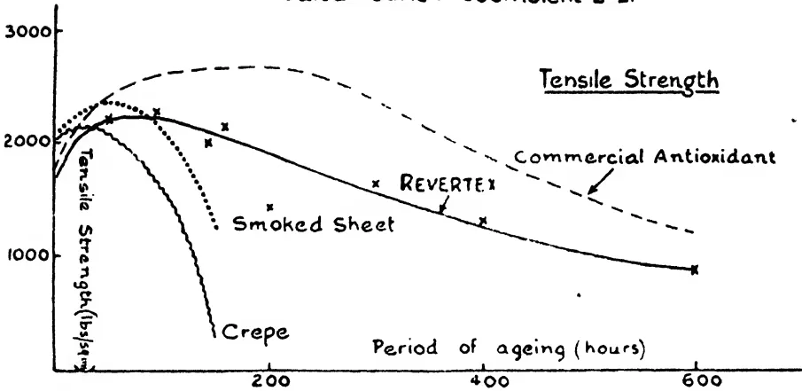

This graph plots Tensile Strength (lb/sq.in) on the y-axis (0 to 3000) against the Period of ageing (hours) on the x-axis (0 to 600). Four curves are shown: Commercial Antioxidant (dashed line), Revertex (solid line with 'x' markers), Smoked Sheet (dotted line), and Crepe (solid line). The Commercial Antioxidant curve peaks at approximately 2700 lb/sq.in at 200 hours. The Revertex curve peaks at approximately 2300 lb/sq.in at 100 hours and then gradually declines to about 900 lb/sq.in at 600 hours. The Smoked Sheet curve peaks at approximately 2200 lb/sq.in at 100 hours and drops sharply to about 500 lb/sq.in by 200 hours. The Crepe curve peaks at approximately 2100 lb/sq.in at 100 hours and drops sharply to about 300 lb/sq.in by 200 hours.

<table border="1"><thead><tr><th>Period of ageing (hours)</th><th>Commercial Antioxidant (lb/sq.in)</th><th>Revertex (lb/sq.in)</th><th>Smoked Sheet (lb/sq.in)</th><th>Crepe (lb/sq.in)</th></tr></thead><tbody><tr><td>0</td><td>1800</td><td>1800</td><td>1800</td><td>1800</td></tr><tr><td>100</td><td>2500</td><td>2300</td><td>2200</td><td>2100</td></tr><tr><td>200</td><td>2700</td><td>2100</td><td>500</td><td>300</td></tr><tr><td>300</td><td>2400</td><td>1800</td><td>-</td><td>-</td></tr><tr><td>400</td><td>2000</td><td>1400</td><td>-</td><td>-</td></tr><tr><td>500</td><td>1600</td><td>1100</td><td>-</td><td>-</td></tr><tr><td>600</td><td>1200</td><td>900</td><td>-</td><td>-</td></tr></tbody></table>

Elongation load 1.04 kgs/sq.mm.

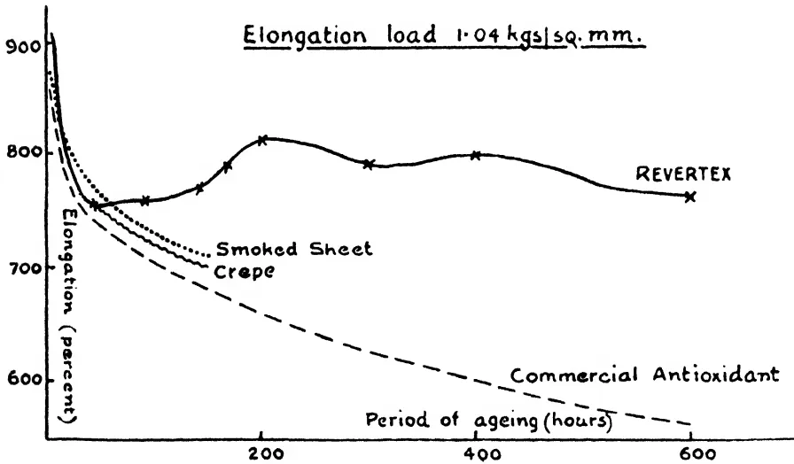

This graph plots Elongation (percent) on the y-axis (600 to 900) against the Period of ageing (hours) on the x-axis (0 to 600). Four curves are shown: Revertex (solid line with 'x' markers), Commercial Antioxidant (dashed line), Smoked Sheet (dotted line), and Crepe (solid line). The Commercial Antioxidant curve shows a steady decline from 900% to about 550%. The Revertex curve starts at 900%, drops to 750% at 100 hours, then rises to a peak of 810% at 200 hours, followed by a slight decline and then a rise to 800% at 400 hours, ending at 760% at 600 hours. The Smoked Sheet curve drops from 900% to about 700% at 200 hours. The Crepe curve drops from 900% to about 650% at 200 hours.

<table border="1"><thead><tr><th>Period of ageing (hours)</th><th>Revertex (percent)</th><th>Commercial Antioxidant (percent)</th><th>Smoked Sheet (percent)</th><th>Crepe (percent)</th></tr></thead><tbody><tr><td>0</td><td>900</td><td>900</td><td>900</td><td>900</td></tr><tr><td>100</td><td>750</td><td>750</td><td>750</td><td>750</td></tr><tr><td>200</td><td>810</td><td>680</td><td>700</td><td>650</td></tr><tr><td>300</td><td>790</td><td>630</td><td>-</td><td>-</td></tr><tr><td>400</td><td>800</td><td>580</td><td>-</td><td>-</td></tr><tr><td>500</td><td>780</td><td>540</td><td>-</td><td>-</td></tr><tr><td>600</td><td>760</td><td>550</td><td>-</td><td>-</td></tr></tbody></table>

24------------------------------------------------

This image is a blank white page. It contains no text, figures, or tables. There are a few very small, dark specks scattered across the page, which appear to be scanning artifacts or dust particles.

25------------------------------------------------

11

The Revertex was somewhat less vulcanised than the other forms of rubber as judged by the extent to which the rubber stretched under a definite load. The Revertex sample however displays such remarkable properties on ageing that there is no doubt that in this mixing (with sulphur only) it is definitely superior to plantation rubber in this respect, for not only does it maintain a good tensile strength for a long period of time, but it also maintains a good elongation.

It is concluded that on account of its good ageing properties products made from Revertex may compare very favourably in quality with those made from plantation rubber. If the properties soon after vulcanisation are compared however the advantage is with plantation rubber, particularly if used in conjunction with an organic accelerator.

### Summary.

The following is a summary of the conclusions drawn from the laboratory tests at the Institute regarding the advantages claimed for Revertex.

(1) **Economy in time and power in incorporating fillers.**—Revertex is difficult to handle quantitatively. To convert it into dry rubber ready for calendering or extruding it has to be treated on three machines instead of one for plantation rubber. The experiments which it has been possible to carry out do not enable a definite conclusion to be drawn as to the relative cost of working Revertex and plantation rubber on a commercial scale. As soon as sulphur was added to Revertex mixings they very easily "scorched."

(2) **Economy in accelerator costs.**—In the case of accelerated mixings, it is not likely that this saving would be much more than  $\frac{1}{3}d.$  per lb. of dry rubber.

(3) **Improvement in quality and higher breaking load.**—No superiority in tensile strength was observed when Revertex mixings were compared with the corresponding dry rubber mixings containing a suitable organic accelerator. The ageing properties of a Revertex sulphur mixing were much superior to those of plantation rubber without the addition of an antioxidant.

The precise advantages and disadvantages of Revertex are dependent upon the mixing used and the processes through which the mixed dry material is put.

Imperial Institute.

18th November, 1927.

26------------------------------------------------

12

## Green Manure.\*

**W. S. BURNETT,**

*Wanaraja Estate, Dickoya.*

**O**NE of the greatest problems the agriculturist has to face all over the world, has to deal with the replenishment of organic matter in his soil, which is so subject to yearly losses. In the tropics these losses occur more rapidly than in temperate climates and the maintenance of the organic matter in the soil under tropical conditions is consequently more difficult.

We in Dickoya are not alone in the problem we have to face, and the factors chiefly involved are leaching and soil erosion. The lay of the land, clean weeding and tropical downpours are chiefly responsible for the latter.

In America, where perhaps conditions are not so unfavourable as those we have to contend with, it is estimated that 4,000,000 acres have already been ruined by soil erosion and 8,000,000 acres greatly damaged.

As the wheat belt moved slowly on, it left in its wake hundreds of thousands of acres of derelict farms, which shows how unsuccessfully the problem was handled there, while it also reflects on their farming methods.

Standing as we do in the gateway to Up-Country tea (Hatton) one may well wonder whether something similar is not occurring in Ceylon. We are surrounded by Estates, which, if one cannot call them derelict or abandoned, are in anything but a flourishing condition, and from an agricultural point of view, one can only regard them as monuments to the lack of prevision on the part of our predecessors and excellent illustrations of the penalties which have been exacted for ignorance or neglect.

With our attention fixed on these, the question I would ask you to-day is, "Are we as a body ensuring that our inevitable yearly losses are being replaced?"

I would ask you to ponder over this. To my mind the answer is an emphatic negative.

The importance of organic matter cannot be over-stressed. When decomposed it forms humus on which the micro-organic

\* Read at a meeting of the Dickoya Planters' Association, held at Adam's Peak Hotel, Hatton, on Monday, 28th November, 1927.

27------------------------------------------------

13

life of the soil depends, and on which we in our turn depend for the full benefit of our artificials. Without it the soil becomes sterile and micro-organic life is stilled.

Authorities all recognise the deficiency of humus in Ceylon soils and such being the case, let us see what this deficiency implies.

An American writer very clearly illustrates his argument by comparing soil to a concrete water tank, one side of which is composed of wooden staves:—

“ The capacity of the tank for holding water represents  
 “ fertility or the power of the soil for producing a good or  
 “ high yield. The staves which determine the water-hold-  
 “ ing capacity of the tank represent the positive factors  
 “ which determine soil fertility. The tank being free from  
 “ any leaks represents the negative factor viz:—the absence  
 “ of harmful agents.”

“ If all the staves were as high as the concrete sides of  
 “ the tank, the tank would then hold its greatest amount  
 “ of water. If all the fertility factors were most favour-  
 “ able, the soil would have power for producing maximum  
 “ yields.”

“ Just as the water-holding capacity of the tank may  
 “ be limited by the shortest stave, so fertility or the produc-  
 “ tive power of a soil may be limited or brought to naught  
 “ by one deficient element or an unfavourable soil condition.  
 “ Thus it is possible for a soil to lose its fertility or produc-  
 “ tive power through the depletion or loss of a single  
 “ fertilizing element.”

![A diagram of a rectangular tank with a wooden frame. The tank is filled with water, represented by horizontal lines. Along the bottom edge of the frame, there are eight vertical staves of varying heights. From left to right, the staves are labeled: Water, Bacteria, Phosphorus, Potassium, Calcium, Good Tilth, Nitrogen, and Air. The staves for Water, Bacteria, Phosphorus, Potassium, Calcium, Good Tilth, and Nitrogen are of equal height, while the staves for Air are shorter, illustrating how a single deficient element can limit the overall capacity of the tank.](a386c2731580508e3ddbd4c11c7ddd9b_8_img.webp)

• He labels his staves, Water, Bacteria, Phosphorus, Potassium, Calcium, good Tilth, Nitrogen, Air, and of these let it be noted, Water, Bacteria, good Tilth, Nitrogen and Air, are wholly dependent or partly dependent on the supplies of humus in the

28------------------------------------------------

14

soil. This then is the limiting factor so far as we are concerned and to ignore the needs of the soil in this respect, while we pour in millions of rupees in the form of artificial fertilisers, is poor agriculture. It is not only poor but extravagant and wasteful.

It is extravagant because one is paying Rs. 100 to 150 per ton for organic manures containing 4% to 6% nitrogen. Rs. 170 to Rs. 250 per ton for inorganic manures containing 15% to 20% nitrogen, when this requirement can be obtained by other methods, at little or no cost at all.

It is wasteful as one is not catering for the micro-organic needs of the soil, the agents which break down and make available as plant food, the expensive mixtures we apply.

Nitrogen is one of the main requirements and moreover the most expensive. It is readily leached out unless abundant supplies of humus are available to retain it.

Having thus briefly indicated the crying need of our soils and the importance to be attached thereto, let us turn to methods of replenishment, and to that form of adding organic matter which is known as green manuring and which is the subject matter of this paper.

This consists of ploughing in or burying organic matter obtained from plants, the favourite ones being those we term "leguminous," and which the text books describe as plants which have the power of taking and fixing free nitrogen from the air.

From our agricultural point of view and for purposes of discrimination we might classify these under headings of "high shade," "low shade" and "ground cover."

As regards the former. When I first came to the District I was impressed with the very limited types available or subject to common knowledge. To an outsider, they appeared to consist of Acacias, condemned by our scientists as tending to spread a leaf disease of tea, Albizzias, a very moribund proposition, and dadaps.

Without disparaging the magnificent mixed cover possessed by individual estates, Dickoya in the main appeared rather dependent for its supply of organic matter on a few diseased and rather miserable Albizzias.

Failing anything better, and at the moment I want nothing better, I decided upon concentrating work on dadaps.

Surely these three leguminous trees are not the only shade trees we can draw on, and if you agree with me that Albizzias are doomed, or at any rate that their chance of survival is a poor one,

29------------------------------------------------

15

we are then reduced to the dadap as the only high shade we have to rely on, a state of affairs, I fancy you will agree, which is extremely unsatisfactory.

One occasionally comes across sporadic outbreaks of energy where other trees have been experimented with.

*Acrocarpus fraxinifolias* is noticed on the road to Dimbula and near Warleigh church. It is ornamental, as it has handsome foliage, while I believe its timber is of a slight value, but on the whole it is in my opinion unsuitable.

One tree however does impress me and that is *Dalbergia Assamica* which is well worth a trial, although it is a little difficult to establish.

In any case I think various types should be introduced and experimented with.

Of low shade, many and various types have been tried; the commoner and more popular ones being Boga medaloa and the *Crotolarias*, while *Tephrosia Vogelii* also grows sturdily in Dickoya.

Though excellent for young rubber, with tea they are inclined to bush out over the plucking surface and interfere with plucking, while loss of crop is brought about by run-up branches or excessive shade.

I would not however lightly dismiss them, as they undoubtedly can be made to serve and to be of immense value in soil management and improvement, if controlled and persisted in. The point to remember about them is that their removal is advisable before excessive woody developmnt of their stem or root system sets in.

We now are free to deal with ground covers which have lately been engaging attention and of these *Vigna*, *Indigofera* and *Desmodium*, are perhaps the best known.

My own experience with the two former has been, that although they undoubtedly have a smothering effect on weeds and prevent wash, their chief drawbacks are that they admit grass, which is toxic to tea and although control can be exercised over them fairly easily, neither being really vicious climbers, they are inclined to climb the tea as well.

They moreover encourage *Drymaria*, and clean weeding is very impractical under such conditions.

Two interesting questions now naturally arise. Is clean weeding such a vital necessity, and are not the drawbacks referred to more than compensated for by the prevention of erosion? Can we condemn in tea two creepers which are proving of such value in rubber? Surely for some estates anything is better than the terrible scouring they are continually being subjected to?

30------------------------------------------------

16

Of *Desmodium triflorum*, perhaps the less said the better. Its matted root growth appears to affect tea detrimentally, soil aeration is prevented, and I believe its use has been practically discontinued.

We are thus, for the time being at any rate, apparently confined to high shade, and although with age it becomes unwieldy and cumbersome, its more vigorous roots open fresh avenues to exploring tea roots, and one has good reason to believe that shade is beneficial to tea.

The disadvantage mentioned can be overcome by periodical uprootings and fresh interplantings before the tree becomes unmanageable.

A matter in connection with leguminous plants, to which more attention might well be paid, is the question of soil inoculation.

We hear a lot on all sides that such and such a plant will not grow, but are our methods helpful and is not carelessness more often than not displayed? Many of us have seen short lengths of dadap cuttings stuck into the ground and this certainly does not lead to success.

The establishment of these plants is part of one's job and one must remember that, however unkindly, failure to do so may be looked on by one's employer as a tacit admission of one's failure as an agriculturist.

As far as soil inoculation is concerned no steps appear to be taken, but I would point out that much important work has been done with this at Home, and success is now being secured with certain bacterial cultures.

This however is not the popular method, the common ones employed being, as in the case of seed, by what is termed "Seed agglutination," that is to say by mixing seed, glue, and infected soil together, so that soil with the particular bacteria required adheres to the seed when dry, or else by soil transference, which is sowing soil of known infection over the areas where the farmer desires to establish his crop of legumes.

In this connection an excellent way to plant dadaps (in preference to cuttings) is from nursery grown stumps. Not only has the plant the advantage of a developed root system, but it also possesses the added advantage of conveying its own bacteria by means of the nodules on its roots. Nurseries are easily established on practically any soil, and a little cattle manure will give the incentive to the development of the bacteria.

The only drawback to this method that I have experienced or can conceive, is that whereas a cutting will grow true to type, **a fairly large percentage of seedlings are thorny. I am afraid the**

31------------------------------------------------

17

dadap possessed a thorny ancestry and that the laws of Mendel are now operative, but seed is cheap and if nurseries are carefully thinned, a sufficiently thornless type can be reserved and misgivings need not be held on this account.

Success with them is assured especially if hill tops are planted thickly, so that as the plants develop they will afford each other mutual protection from wind.

Perseverance is another asset and as the tilth improves and the soil becomes pregnant with life, every subsequent planting should spell a greater success. I would illustrate this by instancing an estate I am acquainted with, where after a complete planting failure with dadaps, a few cuttings were ultimately established round some lines. There is now such a smother of dadaps and the soil is so conditioned, that loppings take root where they fall, and are a source of anxiety to the Superintendent and a nuisance to weeding contractors.

And now, Gentlemen, I have not only kept you all quite long enough but I have come to the end of my remarks. I will close with an exhortation.

Mr. Renganathan on his retirement a short time ago, left a veiled farewell message—that we should look after our labour better—that it would pay us to do so.

• That is true and it is equally true as regards the unseen workers in the soil. They are our tenants and with our labour constitute the life stream of the estate. But the difference is that their requirements are much simpler and that they pay rent if catered for.

They are in our soils now and no cash inducements are required in order to increase them. No Sarees for "Tee Vali," no rice @ 6/40 a bushel for them. Their only claim on you is housing in the shape of organic matter, and this we can offer them in the form of green manure.

32------------------------------------------------

18

## Selected Articles.

# Soil Bacteria in Relation to Cultivation and Manuring.

S. F. BENTON, B.Sc.,

*Bacteriologist, Indian Tea Association.*

**T**HE object of this article is to point out the importance of bacteria as a definite factor in the cultivation and manuring of the tea bush.

The soil is usually considered as a mixture of particles of various sizes which are classified as coarse sand, fine sand, silt, fine silt, and clay, together with small amounts of organic matter and salts necessary for the growth of plants. This type of analysis gives the idea that the soil is a dead substance acting merely as a support and a reservoir of food for the roots of plants.

A brief examination of the facts shows that this view is incorrect. It is well known that plants can only take up from the soil substances in solution. Being soluble in water, these substances can all be washed out by rain, though in some cases, this leaching takes place very slowly. In any case it is obvious that unless some factor is constantly at work converting complex insoluble substances into simple soluble salts, all plants would sooner or later die of starvation.

A normal top soil contains bacteria and fungi in very large numbers, and these are quite indispensable for agriculture. Not only are they engaged in breaking down manures and dead matter, and in producing soluble phosphates from the soil particles, but certain groups take nitrogen from the air and leave it in the soil in a combined form, thus helping to preserve the fertility of the soil.

*Types of Micro-Organisms in the Soil.*—Three large groups of micro-organisms are found in the soil. These are called Fungi, Actinomycetes and Bacteria. The fungi, are mainly concerned with the destruction of wood, and their efficiency in this respect may be judged by the rate at which tea prunings disappear after hoeing in. These fungi must not be confused with those which produce diseases of the tea bush. The latter attack living tissues, frequently causing the death of the bush. The true soil fungi only attack matter which is already dead, and are unable to grow on living tissues except in rare cases.

With the actinomycetes or "ray fungi" we are not particularly concerned in this article. They are chiefly of interest because they are responsible for the "earthy" smell of soil, which is most marked after rain.

The bacteria carry out a much wider range of changes. Certain of them break down complex manures and the remains of dead plants and animals, converting the nitrogen to ammonia; others convert this ammonia to nitrate. Others take the nitrate out of the soil while engaged in breaking down green manures and jungle which has been hoed in. Another

33------------------------------------------------

19

group changes the soil nitrates and ammonia to free nitrogen which goes into the air and is lost;—the activities of these bacteria must be controlled. Nitrogen-fixing bacteria fix nitrogen from the air,—one of the most valuable processes known. Sulphur bacteria convert sulphur to sulphuric acid—hence the treatment sometimes advised, of adding sulphur to a soil to increase its acidity.

In short there are few processes connected with agricultural practice in which bacteria do not play an important part.

*The Causes of Soil Deterioration.*—The conditions in a normal jungle soil, before cultivation is commenced, are as follows. Bacteria in the soil produce nitrates, which are taken up almost completely by the heavy growth of plants and trees. From the trees, dead leaves and branches fall on the soil, adding large quantities of organic matter and nitrogen.

The organic matter is attacked by fungi and bacteria, the major portion being decomposed and given off into the air as carbon dioxide, which is again taken up by the green jungle. The nitrogen in the remainder is converted to nitrate by bacteria, and in this form once more enters the plant through the roots. The presence of organic matter in large quantities stimulates nitrogen fixation, and the soil steadily becomes richer, jungle growth increasing in proportion.

The increasing growth of jungle roots, however, has the effect of restricting bacterial activities, so that the amount of available nitrogen becomes progressively less. Eventually a point is reached at which the mineral food supplied, through the agency of the bacteria, is just sufficient to support the existing jungle, which in turn supplies little more organic matter than is necessary for the bacteria themselves.

Equilibrium having been established in this manner, there is the minimum of wastage, and soils in this state will remain for long periods without radical change in their composition, unless the cycle is upset, *e.g.*, by fire or floods.

The jungle is now cut down to form a tea garden. The trees and branches are removed and the smaller plants are buried or burnt. The soil is thus deprived of its normal source of organic matter. The land is hoed to destroy shallow rooted jungle and, the bacteria being now free to act without hindrance, decomposition sets in at a tremendous rate. Nitrates are formed much more rapidly than they can be absorbed by the tea and are washed out by rain. According to Mann, new tea gardens on very rich soil may give poor quality for some years, on account of the excessively coarse growth brought on by the accumulation of nitrates.

The amount of nitrogen lost in this way may reach alarming proportions as may be seen from the following figures (Mann):—

<table border="1">
<thead>
<tr>
<th>Period under tea</th>
<th>Weight of nitrogen in virgin soil. lbs. per acre</th>
<th>Loss of nitrogen in lbs. per acre</th>
<th>Annual loss of nitrogen in lbs. per acre.</th>
</tr>
</thead>
<tbody>
<tr>
<td>(1) 10 years</td>
<td>7,000</td>
<td>1,500</td>
<td>150</td>
</tr>
<tr>
<td>(2) 35-40 years</td>
<td>10,000</td>
<td>5,500</td>
<td>157</td>
</tr>
<tr>
<td>(3) 28 years</td>
<td>7,000</td>
<td>1,500</td>
<td>57.7</td>
</tr>
<tr>
<td>(4) 20 years</td>
<td>13,000</td>
<td>3,000</td>
<td>150</td>
</tr>
</tbody>
</table>

The amount of nitrogen removed in an eight-maund crop is about 30 lb. per annum and a little more is used in building the frame of the bush so that a total loss of up to 130 lb. per acre per annum may occur. During the early life of the garden this annual loss is probably very much higher, since the most readily available nitrogen is attacked first.

34------------------------------------------------

20

Much of the nitrogen in a soil is very resistant to bacterial attack, so that a soil which still contains 3,000 lb. of nitrogen per acre may grow very poor tea, while the addition of only 40 lb. per acre of a soluble form of nitrogen, e.g., sulphate of ammonia or sodium nitrate, may bring about a 50 per cent. increase of crop.

In soil No. 2 above, for instance, the loss of 5,500 lb. out of 10,000 lb. per acre may represent almost complete exhaustion of the available nitrogen in the soil.

Cultivation also brings about a marked increase in the rate of decomposition of the soil's organic matter, and in a comparatively few years a rich soil may deteriorate considerably.

To preserve the fertility of the soil, the nitrogen and organic matter content must be maintained and this is best effected by making use of the soil bacteria.

The loss might be made good by the extensive use of artificial fertilisers alone, but the cost would be prohibitive. To take an example let us assume that the soil is losing annually 100-120 lb. of nitrogen per acre. To replace this with ammonium sulphate would require 5 cwt. per acre which, at the price of Rs. 180 per ton, would cost Rs. 45 per acre, plus freight.

This, however, would do nothing towards maintaining the content of organic matter, apart from stimulating the growth of jungle and bush. If oilcake were used to supply both nitrogen and organic matter the quantity required would be 28 maunds per acre at a cost of Rs. 105. Any attempt to preserve soil fertility by the sole use of artificial manures is thus economically unsound.

*The Nature and Habit of Bacteria.*—The importance of bacteria is nitrogen from the air and making it available for plants. An important group of these consists of well known legume bacteria, which are found in the nodules on the roots of green crops such as Boga medeloa, cowpeas, dhaincha, and the like. Others live a free life in the soil and obtain their food from fresh organic matter, fixing nitrogen in return.

The most successful agricultural practice thus resolves itself into making the greatest possible use of these bacteria, and it is hoped that this article will show how these, and other valuable organisms, may be best encouraged.

*The Nature and Habits of Bacteria.*—The importance of bacteria in the soil having been established, their nature and mode of life will be considered, together with the application of this knowledge to agricultural practice.

Although commonly referred to as "bugs", bacteria are in reality not animals but plants of a low order, being even lower down in the scale of life than the fungi. Like the fungi, they are devoid of the green colouring matter of plants and therefore they cannot use the energy of the sun's rays directly.

In point of fact, direct sunshine is nearly always fatal to bacteria, which probably accounts for the lower numbers of these organisms in the top inch or two of soil (see below).

Their inability to use the energy of the sun direct determines their mode of nutrition. They must obtain their energy second-hand, by breaking down substances with a high energy content, i.e., residues of plants and animals.

35------------------------------------------------

21

For this reason the majority of bacteria fall naturally into two groups, according as they live on living or dead matter. The first group contains the bacteria which cause diseases of living animals and plants, and the second group those which reduce the dead material to simple bodies which can once more be absorbed by plants. It is the failure to distinguish between these two groups which has given rise to the idea that all bacteria are harmful and should be suppressed where possible. Actually, were all bacteria and fungi destroyed, life on the earth would become extinct.

The soil bacteria belong almost entirely to the second group, with the exception of a few species which live on mineral salts only.

*Form of Bacteria.*—Bacteria occur in a variety of shapes, the most common being rods of varying length, and small spheres. In addition there are "comma" and spiral shapes. They are usually found in "colonies" which may consist of a few hundred or many million bacteria. A colony of five million typical bacteria would occupy the space of a pin's head. In the soil, these colonies are usually found surrounding small particles of lime.

Although they are plants by nature, bacteria are able to move about in the soil water. By special staining methods they are seen to have long waving "arms" of flagella, and these are lashed violently backwards and forwards in the liquid, causing the organism to move at a considerable speed in relation to its size. These flagella are of special interest in connection with the bacteria of green crops.

*Growth and Reproduction.*—In bacteria the simplest and most efficient form of reproduction is met. When a cell has grown to its full size it divides in two, and each of the resulting cells is exactly the same as the parent. Sexual reproduction is absent and in consequence, cross-breeding being impossible, bacteria tend to maintain their characteristics. For example, there is little difference between the nitrifying organism of Assam and that of England.

Certain bacteria also form spores which are very resistant to heat and may be boiled in water without loss of vitality.

Under favourable conditions a single cell can form two cells in half an hour. At this stage, after two days the descendants of a single cell would number 281,500,000,000. Under ordinary conditions, lack of food soon slows down this rate of increase, though if food is available in large quantities the effects of bacterial growth may be marked.

This is brought out by the temporary depression of crop noticed when a green manure or paddy straw is hoed in. Enormous quantities of cellulose are put into the soil, and the cellulose bacteria increase rapidly. In so doing they remove almost the whole of the nitrates from the soil, and until the nitrogen in the green material starts to decompose, the tea suffers from nitrogen starvation. The same fact has been brought out in a laboratory experiment with oilcake. When this manure was added to soil at the rate of 8 tons per acre there was an immediate loss of 90 lb. nitrate per acre, probably the whole of which went to feed the cellulose bacteria. All the nitrogen removed is returned to the soil when the bacteria die off, after their work is done.

*Bacteria in the Soil.*—In the soil, the bacteria occur in incredible numbers, a normal fertile soil containing about 100,000,000 to the ounce, or approximately five thousand million per acre. These great numbers are somewhat discounted by size—the average bacterium measuring about one twenty-thousandth of an inch in length—but they are nevertheless sufficient to make all the difference between a naturally fertile soil and one on which tea culture is only possible by constant resort to artificial fertilisers.

36------------------------------------------------

22

*Distribution of Bacteria in Soil.*—The numbers vary greatly with depth. The following table shows the distribution in the top two feet of soil :—

<table border="1">
<thead>
<tr>
<th>Depth</th>
<th>Number of bacteria per ounce of soil.</th>
</tr>
</thead>
<tbody>
<tr>
<td>2 inches</td>
<td>24,500,000</td>
</tr>
<tr>
<td>4 "</td>
<td>40,800,000</td>
</tr>
<tr>
<td>6 "</td>
<td>40,800,000</td>
</tr>
<tr>
<td>12 "</td>
<td>1,820,000</td>
</tr>
<tr>
<td>18 "</td>
<td>525,000</td>
</tr>
<tr>
<td>24 "</td>
<td>100,000</td>
</tr>
</tbody>
</table>

Here is the explanation of the well known infertility of the subsoil. The reasons for the failure of bacteria to survive in any but the top few inches are several. Lack of air in the subsoil is one of the main factors; another is the almost complete lack of available organic matter. In addition, the soil itself behaves as a very efficient filter in preventing the bacteria from being washed down by rain acting in the same way as the earthenware candle in the filter which is to be found in every bungalow.

These figures act as a strong condemnation of the practice of digging drains and piling the excavated earth upon the tea on either side. If new drains are to be opened in an area already under tea, the subsoil should be spread thinly over the soil for some distance on either side. Whenever it becomes necessary to deal with subsoil in large quantities it should be freely mixed with cattle manure, which will have the effect of increasing the content of organic matter while supplying a very large number of bacteria.

The same applies when it is necessary for any reason to plant up land from which part of the top soil has been removed *e.g.*, by wash.

This infertility of the subsoil is one of the main arguments in favour of terracing on steep slopes in an exposed position. The top soil with its attendant bacteria and organic matter is easily lost and may take years to replace. On gardens where the top soil has already been lost, the continued use of artificial fertilisers such as sodium nitrate and ammonium sulphate is merely putting off the day of reckoning, and the health of the bushes will be maintained only while these manures are present. The counsel of perfection would be to build up a new top soil by heavy dressings of cattle manure, green crops, and decay-jungle.

## The Conditions Necessary for Bacterial Life.

*Air.*—There are two groups of bacteria in the soil, one of which requires abundance of air for its life processes while the other can live in entire absence of oxygen. The members of the first group carry on most of the valuable processes in the soil, while those of the second group are on the whole undesirable. One species of the latter has the power of destroying nitrates and giving off free nitrogen causing a very serious loss to the soil. When the oxygen supply is insufficient these and other bacteria actually produce plant poisons so that their harmful effect on plants is twofold. It is thus necessary to restrict their activities as far as possible.

(a) by keeping the soil in good tilth and so allowing air to penetrate freely to the greatest possible depth.

(b) by preventing waterlogging of the soil by an adequate drainage system.

37------------------------------------------------

23

*Moisture.*—Bacterial activity is dependent on a sufficient supply of moisture in the soil. For the best working, the moisture content must lie between certain limits. Thus at Tocklai the optimum moisture content for the nitrifying bacteria is near 14 per cent. (*i.e.*, 35 per cent. of saturation). When the moisture content falls to 10 per cent. (25 per cent of saturation) in the cold weather, bacterial action is checked, and the bush is left without its normal food supply. Similarly when the moisture content rises to near the saturation point, the activities of bacteria are greatly restricted, and unless steps are taken to remove the excess water by drainage, a race of harmful bacteria may take possession of the soil. The disappearance of excess moisture from a well drained soil is brought out by the following figures :—

<table border="1">
<thead>
<tr>
<th>Date.</th>
<th>Rainfall</th>
<th>Percentage of moisture in soil.</th>
</tr>
</thead>
<tbody>
<tr>
<td>May 27th</td>
<td>0·24"</td>
<td>18·41</td>
</tr>
<tr>
<td>" 28th</td>
<td>nil</td>
<td>17·27</td>
</tr>
<tr>
<td>" 29th</td>
<td>0·05"</td>
<td>—</td>
</tr>
<tr>
<td>" 30th</td>
<td>nil</td>
<td>16·30</td>
</tr>
<tr>
<td>" 31st</td>
<td>nil</td>
<td>14·40</td>
</tr>
<tr>
<td>June 1st</td>
<td>nil</td>
<td>13·89</td>
</tr>
<tr>
<td>" 2nd</td>
<td>1·72"</td>
<td>18·38</td>
</tr>
</tbody>
</table>

Thus under dry conditions the moisture content of the soil falls fairly rapidly until it reaches the optimum. From other figures it is found that below this point the soil holds on to its moisture with greater tenacity.

The actual degree of saturation most favourable to bacteria appears to vary in different soils, usually lying between 40 per cent. and 60 per cent. The following figures illustrate this point.

<table border="1">
<thead>
<tr>
<th rowspan="2">Degree of saturation.</th>
<th colspan="3">Production of nitrates from peptone by bacteria (milligrams per 100 gms. of soil).</th>
</tr>
<tr>
<th>Tocklai.</th>
<th>Amluckie.</th>
<th>Red Bank.</th>
</tr>
</thead>
<tbody>
<tr>
<td>35%</td>
<td>7·36</td>
<td>—</td>
<td>—</td>
</tr>
<tr>
<td>40%</td>
<td>6·05</td>
<td>7·14</td>
<td>8·52</td>
</tr>
<tr>
<td>45%</td>
<td>4·90</td>
<td>8·24</td>
<td>9·89</td>
</tr>
<tr>
<td>50%</td>
<td>4·39</td>
<td>8·79</td>
<td>16·48</td>
</tr>
<tr>
<td>55%</td>
<td>3·57</td>
<td>10·44</td>
<td>13·20</td>
</tr>
<tr>
<td>60%</td>
<td>—</td>
<td>12·36</td>
<td>7·70</td>
</tr>
</tbody>
</table>

To preserve the maximum fertility, the soil moisture must therefore be kept as near as possible to the optimum :—

(1) by adequate draining to remove excess water during the rains.

(2) by the use of the cold weather mulch to maintain the moisture content at the highest possible level during the cold weather.

Prolonged droughts such as occur fairly frequently in the tea districts of the Terai and South Sylhet may cause a serious destruction of soil bacteria, leading to a slow recovery of the bush. When possible it is as well to apply a dressing of cattle manure on weak sections after a severe drought, as this will have the double effect of supplying food for the bush while adding a large number of active bacteria to the soil. If the drought has not been too severe, the effect of the first rain is most marked. The nitrate content of the soil, which has remained at a very low level throughout the cold weather, suddenly jumps up to nine or ten parts per million. This sudden increase doubtless plays a considerable part in bringing on the first flush.

38------------------------------------------------

24

*Food.*—The food requirements of the majority of soil bacteria may be placed under two headings, viz. :—

Organic matter.

Lime.

Lime does not act so much as a true food, but rather as a neutraliser of the acids produced by the bacteria in their normal life. This will be discussed below.

Organic matter is used by bacteria in enormous quantities. For example, American workers have found that the nitrogen fixing bacteria when supplied with straw as their food fix  $7\frac{1}{4}$  lb. of nitrogen from the air while decomposing a ton of straw. When the green matter from clover was supplied instead of straw, the amount of nitrogen fixed was about 27.5 lb. per ton of material decomposed. It is probable that the results with the green manures in use in the tea districts would be comparable with the latter figures, but work on this point has not yet been carried out.

From these figures it appears that the amount of nitrogen fixed by the soil after a green crop has been hoed in would be in the neighbourhood of 80 lb. per acre, apart from the 20 lb. fixed by the crop itself. It must be pointed out that these figures were obtained as a result of laboratory experiments and in the field different results might be obtained. From a good crop a gain of at least 100 lb. nitrogen per acre is to be expected, which compares very favourably with the usual dressing of 30 lb. given as ammonium sulphate.

The organic matter requirements of bacteria are seen to be very large. Under jungle conditions, these requirements are supplied by the annual leaf fall from trees and by the succession of low-growing grasses. On the tea garden, however, jungle must be suppressed for it competes with the bush for food. The depression caused by jungle is well brought out by the following figures obtained from the Borbhetta cultivation plots.

<table border="1">
<thead>
<tr>
<th>Plot No.</th>
<th>Treatment</th>
<th>Relative efficiency of nitrifying bacteria</th>
<th>Crop 1926.</th>
</tr>
</thead>
<tbody>
<tr>
<td>87</td>
<td>Monthly cheel</td>
<td>201.0</td>
<td>10.60</td>
</tr>
<tr>
<td>93</td>
<td>6 light hoes</td>
<td>176.7</td>
<td>10.16</td>
</tr>
<tr>
<td>88</td>
<td>1 light hoe.</td>
<td></td>
<td></td>
</tr>
<tr>
<td></td>
<td>Extra manure</td>
<td>141.3</td>
<td>6.16</td>
</tr>
<tr>
<td>95</td>
<td>Sickled only</td>
<td>100.0</td>
<td>3.68</td>
</tr>
</tbody>
</table>

Plot 87 is kept free from jungle. 93 is nearly free while on 88 and 95 jungle is plentiful. It is interesting to note that the presence of jungle has had harmful effects on the soil bacteria as well as on the tea. This is possibly due to toxins given off by the jungle roots.

On the contrary, the practice of growing shade trees is very beneficial. The roots of the trees are too far below the surface to have much effect on the bacteria in the top few inches of soil. The wide-spread root system does much to minimise the loss of nitrates and soluble salts which would otherwise take place through leaching, and finally the tree itself deposits annually a large amount of organic matter, containing some 3 per cent. of nitrogen.

From the figures given above it is clear that the suppression of jungle is one of the most important factors in tea garden management. Undoubtedly the best method of effecting this is to grow tea bushes that touch each other so that jungle has no chance to grow—while the organic matter content of the soil is partially maintained by leaf fall and prunings. This is a counsel of perfection not easy to follow on gardens with a large percentage of deteriorated tea and vacancies, but approximated to on very large areas of good tea.

39------------------------------------------------

25

Jungle is usually eliminated by the use of the light hoe. Unfortunately the light hoe is very wasteful of the soil reserves for it is followed by a sudden increase in nitrate amounting to some 20 lb. per acre (on Tocklai soil). A heavy fall of rain following cultivation will remove almost the whole of this and the soil will be poorer in proportion. The destruction of organic matter is stimulated in a similar manner.

This loss after light hoeing is avoided to a considerable extent by substituting "cheeling" or cultivation with a spring-time harrow and buffalo, both of which effectively suppress jungle while disturbing the soil to a depth of a few inches only. The possibility of using either of these forms of cultivation depends largely on circumstances, labour being concerned in the former case, and the drainage scheme, transport facilities, and distribution of shade trees in the latter.

The fact remains that cultivation causes considerable losses of nitrogen. These can be made good in two ways, *viz.*—by addition of manures and by nitrogen fixation. Nitrogen fixation is, however, dependent on the amount of available organic matter. It is therefore clear that above all things the organic matter content of the soil must be kept up, if the bacterial population is to be kept in good working order. This fact is so important that a manuring scheme taking no consideration of the soil bacteria may be considered incomplete.

The tendency of late years has been to rely more and more on the purely artificial fertilisers such as Sulphate of ammonia and Calcium cyanamide for the nitrogen supply, chiefly on account of their low cost. It is important to remember that these manures are added solely with the idea of increasing the crop, and that they have little or no direct beneficial effect on the soil bacteria. A programme incorporating these manures must always include regular green cropping or dressings of cattle manure, preferably well rotted with paddy straw.

*Lime.*—For the majority of bacterial processes a neutral or slightly alkaline soil is required. Tea requires an acid soil and anything approaching neutrality appears to be definitely harmful. On the other hand, the fertility of the soil depends largely on the activities of the bacteria, to which lime is an essential. The difficulty is met by a compromise, lime being added in quantities insufficient to change the reaction of the soil, but under conditions where it will have most effect on the bacteria. To take an example, let us consider a typical tea soil with a "Hopkins acidity" of 400. This means that 400 lb. of lime would be required to bring 1,000,000 lb. of soil to a condition of neutrality. Taking the weight of an acre of soil to a depth of nine inches as 3,000,000 lb., we find that this soil would require 1,200 lb. lime per acre to make it neutral.

Now five maunds of crushed limestone contains about 200 lb. of free lime, so that this amount could be supplied per acre without making any appreciable difference to the acidity of the soil, although being of great value to the bacteria. The best time to add lime is before sowing a green crop, so benefiting the green crop itself and also the bacteria on whose presence and activity the efficiency of the crop depends. The lime should be distributed only in the rows where it is intended to sow the green crop, and preferably in the seed-bed itself.

Experiments conducted at Borbhetta showed that on this particular soil, Rahar would not grow at all without lime. When this deficiency was made good the crop obtained increased with increasing amounts of lime, until a dressing of 80 maunds of crushed limestone produced a Rahar crop of 250 maunds per acre.

40------------------------------------------------

26

The Tocklai lime policy thus becomes comprehensible when considered in terms of bacteriology. Continual applications of lime over a period of years, or the application of a large dressing is seldom, if ever, advised, but small dressings are recommended from time to time to satisfy bacterial requirements.

The conditions for optimum bacterial working may now be summarised:—

Aeration of the soil.

Ample moisture, but avoidance of excess by draining.

Plentiful supply of foodstuff in the form of organic matter.

Suppression of jungle.

Small amount of lime at intervals on the more acid soils.

*Green Manuring.*—The space available will not allow of a description of all the bacterial processes taking place in the soil. As the practice of green manuring is of great importance in tea soils, the relation of bacteria to green manures will be dealt with more fully here, and a discussion of other bacterial processes will be left till later.

It is generally realised that bacteria are intimately connected with green manures. On the roots of all members of the legume family may be found small nodules. These vary in numbers with different species of plants, and with different conditions of growth.

If one of these nodules be cut in two, it is found to consist of an outer white layer of firm consistency, surrounding an inner mass, often pink in colour, which is soft and slimy. This inner mass is seen under the microscope to consist of enormous numbers of slender bacteria, entirely filling the cells of the nodule. It is to these bacteria that the legumes owe their value as green manures, for, as stated above, they have the power of taking nitrogen from air, building it into complex soluble substances, and passing these on to the plant. In return form these substances, the plant supplies the bacteria with sugars, water and salts—substances which enable the bacteria to carry out their work of nitrogen fixation.

There is here a perfect example of division of labour.

*The necessity of bacteria for economical growth of green crops.* The ordinary green plant takes up its nitrogen as nitrate or ammonia. On this account jungle competes with the tea bush for food, and as it has its roots mainly in the top few inches of soil, where bacterial action is at its highest, the jungle has first call on the food supply. Hence, apart from reasons of convenience, jungle must be suppressed.

A green crop without nodules acts in the same way as jungle, the rate of growth and final crop being determined by the amount of nitrate and ammonia in the soil. Consequently any growth of a green crop without root nodules is at the expense of the tea.

If nodules are present on the roots, the position is altered. The bacteria in the nodules draw relatively large quantities of nitrogen from the air, and with the aid of this nitrogen the plant grows far larger than it would were it living on soil nitrates alone. For successful green crops the requirements of the bacteria must be studied and met.

The bacteria are mainly present in the soil in an inactive state. They possess no power of moving through the soil and little power of infecting roots of legumes. When a soluble phosphate is supplied the bacteria develop flagella, become highly active and are able to infect the plants readily. The use of phosphate is therefore a wise policy wherever green crops are to be sown, and many cases of failure may be put down to the neglect of this precaution. The best phosphates to use are Basic slag,

41------------------------------------------------

27

Superphosphate, Belgian flour phosphate and Algerian phosphate. The quantities usually recommended are as follows :—

<table>
<tr>
<td>Superphosphate</td>
<td>2 mds. per acre.</td>
</tr>
<tr>
<td>Basic slag</td>
<td>2 " "</td>
</tr>
<tr>
<td>Belgian phosphate</td>
<td>3 " "</td>
</tr>
<tr>
<td>Algerian phosphate</td>
<td>2 " "</td>
</tr>
</table>

*Inoculation of Green Manures.*—From the above remarks it is clear that the value of a green manure depends on the extent of infection by bacteria. The question now arises, whether the legume bacteria in the soil are present in sufficient numbers to secure the maximum infection. In some districts it is found almost impossible to grow a good green crop and the idea suggests itself that lack of bacteria may be the cause. If this is so, artificial inoculation of the soil or the seed might be restored to with success. So far, little work has been done along these lines in the tea soils. A few isolated trials were made in the Tocklai district this year with varying results. The bacteria were grown on an agar (china-grass) jelly, and just before planting, the seed was moistened with a suspension of these bacteria in water.

Cowpeas gave poor results. Not only was it found difficult to grow the bacteria, but the inoculated plants were barely as good as the uninoculated. Boga medeloa was unsatisfactory owing to unfavourable climatic conditions and practically the whole crop failed. With dhaincha more promising results were obtained. The results of the experiments were :—

<table>
<tr>
<td>Yield from 11 rows uninoculated.</td>
<td>Yield from 11 rows inoculated.</td>
</tr>
<tr>
<td>590 lb.</td>
<td>918 lb.</td>
</tr>
</table>

Increase from inoculation 328 lb. = 55.6 per cent.

The seed was planted in alternate rows, alternate rows of seed being inoculated. Phosphate was not supplied and the soil in that section was poor. In almost every case, an inoculated row gave a greater weight of green material than the uninoculated rows on either side.

Definite conclusions cannot of course be drawn from a single experiment of this nature. This Department will be pleased to get into touch with any planter who has continual difficulty in establishing a green crop and who would like to carry out experiments in inoculations.

The science of agriculture has passed through three main stages in the course of its development. In ancient times the Mechanical stage held the field. Improvements were chiefly along the lines of cultivation and drainage, although a considerable amount was known about fallowing and the use of green manures such as clover in a crop rotation. At the beginning of the nineteenth century agriculture passed definitely into the Chemical stage and tremendous advances were made in the science of manuring; during the closing years of the same century the Biological era arose and gained favour in so rapid and sensational a fashion that there was a tendency in certain circles to regard bacteria as the beginning and end of agriculture.

Actually there are no hard distinctions to be drawn. The mechanical, chemical and biological phases are all intimately connected and interdependent, and a change which affects one will affect all.

In this article the claims of the bacteria have been put forward. Their importance in soil fertility has been brought out and the conditions they prefer have been enumerated. No attempt has been made to deal at length with individual bacterial processes in the soil, but the importance of organic matter has been emphasised, since this substance is the chief food, directly or indirectly, of the majority of soil bacteria; and on these, eventually, the economic cultivation of the tea bush depends.—*Quarterly Journal of the Scientific Department of the Indian Tea Association*, Part III, 1927.

42------------------------------------------------

28

# The Conservation of Humus in Indian Soils.

C. M. HUTCHINSON, B.A., C.I.E.,

*Formerly Imperial Agricultural Bacteriologist, Pusa.*

THE prime requirement of Indian arable soils is an adequate supply of organic matter or humus; this statement no doubt partakes of the nature of a truism, but the writer's object in making it is to draw attention not only to certain considerations arising in connection therewith, but to the fact that there appears to have been a dangerous tendency in the past towards failure to recognize its importance.

The functions of humus in cultivated soils are numerous and most of them are well known, although some are still obscure. In India one of the most important is the modification of the relation between soil texture and the supplies of air and water to the plant; a further one less fully understood has to do with the retention, in an accessible condition, of plant food for the crop. The effect of humus upon soil texture is not only its most important function but is one which cannot be performed by any other substitute; it is not too much to say that the fertility of a soil depends primarily upon its content of organic matter and that when agriculturists refer to a soil as being "in good heart" they mean that it contains sufficient humus to secure fertility.

To increase the natural fertility of Indian soils we are taught by the experts of the Agricultural Department that it is necessary to practise thorough cultivation, and that the old fashioned indigenous methods of the Indian cultivator must be improved upon by the use of more efficient implements such as those employed in Western countries. It is indeed easy to demonstrate in actual practice the increase in crop which can be obtained by this method, and as the capital outlay involved is small and the labour required is cheap, the recommendation to make use of increased tillage appears on the face of it a rational one. In 1919 the writer drew attention, in a paper\* read before the Indian Science Congress in Bombay, to the danger attending the introduction into India of high yielding varieties of crops and of intensive cultivation methods; these were shown to lead inevitably to depletion of soil reserves in the absence of adequate provision for the maintenance of the latter. In the most recently published number of the *Review of Agricultural Operations in India, 1925-26*, by the Agricultural Adviser to the Government of India, this danger receives official recognition, both with regard to the effects of improved varieties of crops and intensive cultivation. The remedy recommended, however, is the use of organic manures on account of their favourable influence on the texture of the soil, and a warning is given against the employment of artificial manures which

\*Agricultural Journal, India, XIV. p. 2.

43------------------------------------------------

29

have a tendency in the opposite direction. The object of this paper is to draw attention to the fact that although the use of organic manures has all the advantages claimed for it by the Agricultural Adviser to the Government of India, yet it is a mistaken policy merely to advocate the replacement of the depleted organic matter of the soil, without making any attempt to find out whether some less exhausting method of securing fertility than excessive cultivation cannot be adopted. This is especially the case where these organic manures are to be considered the principal sources of the necessary nitrogen supply.

It is no doubt necessary in India to make strenuous efforts to improve the primitive methods and implements of cultivation in general use, and this with one specified object amongst others, namely, the formation of a deeper layer of fertile soil in a condition of good tilth such as will conduce to the development of a deeper and more extensive root system. Improved cultivation of this type cannot do anything but good, but on the other hand there are mistaken methods of varying it in the direction of multiplication of ploughings which will inevitably lead eventually to disastrous results. Soil humus, far from being an imperishable substance, is rapidly attacked and destroyed by natural processes continually in operation. These processes are in part purely chemical and in part due to the activities of micro-organisms, but both of these classes of action are strongly activated by stirring the soil, which promotes aeration and therewith the numerous oxydizing processes, resulting partly in formation of carbon dioxide and partly of nitrates. The latter are removed from the soil either by rain-water or by the crop, the former, dissolved in the soil water, helps to bring into solution the mineral constituents necessary for plant growth. Mechanical stirring of the soil produces a further effect in the breaking-down of soil aggregates and particles and thus exposing fresh surfaces to oxydation and bacterial attack; this result is again increased by the mutual attrition of particles which removes from their surfaces the accumulated protective layer or deposit, resembling rust, resulting from the oxidative or micro-biological processes above-mentioned.

The obvious effect of this intensive cultivation is an improvement in the immediate yield of the crop due to the increase in availability of the plant food present in the soil; this however is obtained not only at the expense of the reserves of plant food in the soil as a whole, but more especially with reference to the destruction of its humus content. This use of the organic matter is a wasteful and unnecessary method of securing supplies of plant food, whether nitrogenous or phosphatic, for the reason that whereas no other soil constituent can fulfil the special physical functions of humus, it is perfectly easy to supply nitrogen, phosphates and potash, under controlled conditions and in quantities which experiment can determine as suitable in the form of fertilizers. The destruction of serious percentages of the total humus content of the soil in order to secure a few pounds per acre of available nitrogen represents a method as uneconomic and wasteful as that involved in the use of an improperly balanced ration for cattle, in which the presence of an undue proportion of albuminoids involves the utilization of this expensive tissue-forming constituent as a means of heat and energy, in place of securing the latter by the combustion of carbohydrates and fat. In the same way intensive cultivation involves the diversion of an unduly large proportion of the soil humus from its proper physical function to the alternative, or rather additional, role of a supplier of plant food.

It is perhaps well to point out here that humus has an importance in the soil as a possible provider of organic nutrient or possibly stimulant substances to the plant, but on this point our information at present is scanty and uncertain.

44------------------------------------------------

30

It is of course to be remembered that an important function of organic matter in the soil is to provide food and energy for certain useful micro-organisms such as the nitrogen-fixers; although cultivation by securing adequate aeration promotes this important action, yet excessive tillage by depleting the soil of its humus will eventually reduce it to insignificant proportions. The loss of humus is accompanied by a corresponding loss of soil nitrogen; this result is drawn attention to by Russell.\* "Directly ploughing and cultivation operations begin great losses of nitrogen set in"; and again "The conditions for this decomposition" (involving evolution of gaseous nitrogen) "appear to be copious aeration such as is produced by cultivation and the presence of large quantities of easily decomposable organic matter. Now these are precisely the conditions of intense farming in old countries and of pioneer farming in new lands and the result is that the reserves of soil and manurial nitrogen are everywhere being depleted at an appalling rate."

H. A. Tempany, Superintendent of Agriculture, Leeward Islands, draws attention in his note dealing with fertility of soils in the Tropics, published in the "*Transactions of the Third International Congress of Tropical Agriculture*" to the rate of decay of organic matter in the soil: "It was found that in periods varying between six and twelve months the content of organic matter become reduced by amounts ranging between 12 and 30 per cent. of the total originally present." This rapid loss of humus occurred both in the laboratory and in the field. Numerous experiments carried out in the writer's laboratory at Pusa showed conclusively, both by measurement of carbon dioxide formation and of loss of nitrogen, that this very high rate of decomposition of organic matter is to be expected at the relatively high temperatures of Indian soils, and that it is greatly accelerated by aeration and mechanical disturbance.

Consideration of the above facts leads to the conclusion that great caution is necessary in making use of intensive cultivation as a means of securing an increase in fertility in Indian soils. We are faced with a problem of great complexity, any successful solution of which must depend upon securing much more accurate information than we at present possess as to soil conditions in this country. In the writer's opinion information should be sought along the following lines amongst others:—

1. (1) Experiments should be carried out to determine the conditions making for excessive rates of destruction of humus in various types of soil.
2. (2) Experiments should be made to determine the possibility of conserving reserves of humus by reducing the intensity of cultivation and at the same time supplying appropriate quantities of available plant food in the form of fertilisers.

With regard to (2) it is of interest to note that, when discussing this subject recently with the Chief Scientific Officer of the Indian Tea Association, this gentleman informed the writer that the suggestion above made was in entire accord with the most up-to-date policy of tea cultivation in Assam, as it combined reduction of labour with conservation of humus.

Here may be noted an important principle underlying the proper use of fertilisers in India, namely, that artificials should not be used as substitutes for organic manures but in conjunction with the latter; this does not mean that they cannot be used alone on land which contains a sufficiency of organic matter, but that the cultivator must not take them as complete substitutes for the cowdung or oil-cake which he would ordinarily employ. On the other hand, it has already been proved that by judicious use of artificials in

---

\*Russel, E. J. *Soil Conditions and Plant Growth*, 5th Ed., pp. 246-247.

45------------------------------------------------

31

conjunction with cowdung the available supply of the latter can be made to cover a much greater area with economic effect, this being made possible by the use of sulphate of ammonia as a substitute, not for the whole usual application of cow manure, but for a third or perhaps a half of the latter; in the experimental results which have recently come to the notice of the writer in India this partial substitution was followed by increases of crop of a substantial order and sufficient to give a highly satisfactory economic return. It is highly advisable, therefore, both in the interest of conservation of humus and of that of the extension of the area under treatment with cowdung or other organic manures, that extensive experiments dealing with the possibilities of this partial substitution method should be carried out. It is perhaps unnecessary to say that such experiments should include investigation of the use of all kinds of artificial fertilisers, as, although the most obvious economic returns have been obtained with nitrogenous artificials, it is highly probable that still better results would follow the use of more complete applications, which would include minerals as well.

The value of humus and its functions in the soil are too well known to need further discussion here, but it may be well to draw attention to a particular point in connection with its value as a means of retaining in the surface soil a sufficiency of moisture for the needs of the crop, at a time when arid conditions render such supply necessary. In irrigation tracts there is the danger that the existence of a controlled water supply, independent to some extent of climatic conditions, may lead to neglect of the conservation of the soil humus because of the less insistent necessity of observing this as a means of retaining soil moisture; in districts where cold weather crops are grown under arid conditions any such neglect leads to obvious failure; the land is then no longer, "in good heart" and can only be brought back into this condition by prolonged operations involving green-manuring, heavy applications of organic manures, or fallowing. As this particular function of humus although of the greatest importance is by no means its only one of value, there is a distinct danger in irrigation tracts of a lowering of soil fertility as a result of failure to keep up supplies of organic matter in the soil, this being a consequence of failure to note the falling off of crop returns which would inevitably follow any serious reduction of humus content under arid conditions. Thus we may expect to find excessive cultivation practised in an irrigation area as compared with the smaller number of ploughings made use of in other districts. This will in time be followed inevitably by depletion of the organic matter content of the soil and a lowering of fertility, and probably by a corresponding reduction in the effectiveness of irrigation. In this connection it may be well to bring to remembrance, Leather's findings at Pusa which demonstrated the reduction in the quantity of water required to produce unit weight of dry matter in the crop, as a result of provision of suitable supplies of available plant food in the soil. This affords a further argument for the use of artificials in preference to securing available plant food by intensive cultivation, because of the comparative ease of providing such plant food at the suitable period of growth by employment of the former. It may be pointed out here that the extensive use of fallowing practised in arid regions affords evidence of the recognition of the necessity for the upkeep of the humus content of the soil.

It is impossible to avoid partial destruction of the humus content of cultivated soil as a result of tillage operations necessary to secure a seed-bed and suitable tilth; it is not however necessary to push this cultivation so far as to destroy large proportions of the organic matter of the soil in all ill-advised attempts to make the latter perform the dual functions of providing plant food as well as soil texture. This partial destruction must be provided against by the use of organic manures, but the quantities of the latter

46------------------------------------------------

32

required to secure fertile soil conditions may be greatly reduced by the combined use of artificials; the plant food supplied by the latter will thus reduce or altogether abolish the necessity of utilizing the soil humus as a means of providing supplies of nitrogen, phosphates, and potash.

It may be suggested that, in view of the limited supplies of cow manure and oil-cakes available in India, more strenuous efforts should be made to extend the use of green manures throughout the country; much experimental work has been done on this subject, and in many parts of India the value of the method is well enough known to ensure its use, but the fact remains that over a large proportion of the arable area it is only occasionally practised. Several reasons exist for this failure to make use of such a valuable method of upkeep of soil fertility, one being the necessary loss of crop and another the frequent failure to obtain any obvious advantage from its use. It may be suggested that the methods of securing freedom from such failure which have been worked out in various districts should be given wider publicity and added to by further investigation; it may be noted here that one of these, well authenticated in Behar, is the use of superphosphate in conjunction with the burial of the green crop; this is an instance of the high value of an artificial fertiliser in Indian Agricultural practice and leads to the conclusion that there is no justification for the old established opinion that imported fertilisers can find no useful application for ryots' crops in this country. In any case it is important in the interests of the conservation of the soil humus that every effort should be made to introduce the practice of green-manuring wherever this is at present not in regular use, and that experiments should be carried out to ascertain the best methods of effecting this. It may be well to point out the advantages attaching to green-manuring as a method of upkeep of the soil humus as compared with the use of cow manure or oil-cake; the first method involves no capital expenditure, which, even in the case of cow manure is almost invariably required; supplies of cowdung and oil-cake are not always available, nor would they ever be sufficient to meet the requirements of the whole country even if the former were not mostly consumed as fuel. The introduction of a green leguminous crop in the rotation not only serves as a partial fallow but helps to eradicate undesirable weeds. All these reasons in favour of the use of green-manuring are well known to officers of the Agricultural Department and are only mentioned here to emphasize the importance of the original equally well recognized theorem at the beginning of this paper in view of the dangerous tendency to neglect the destructive effects of excessive cultivation upon the humus content of Indian soils.

Farmers in all countries hold certain opinions based upon experience and tradition rather than upon scientific knowledge or reasoning. Among such opinions no one holds a firmer or more universally agreed upon position than that which assigns to organic nitrogen a value considerably in advance of that with which its inorganic salts are credited. Experiments such as those carried out at Rothamsted on mangolds between 1876 and 1902 completely justify this attitude of mind so far as it applies to the substitution of inorganic or organic nitrogen, but also show, as Hall\* points out, that the effects are due not to any intrinsic difference in the form of the nitrogen supplied but to the maintenance of the stock of humus in the soil associated with the use of organic nitrogenous manures. It is quite clear that to secure and maintain a condition of tilth in the seed-bed suitable for the early stages of growth of the seedling crop is of vital importance in India even more than in Europe, owing especially to the stringent conditions associated in this

---

\*Hall, A. D. *Fertilisers and Manures*, p. 101.

47------------------------------------------------

33

country with the supply of moisture to the young plant. This suitable condition of physical texture can only be secured in the presence of adequate supplies of soil humus, which intensive cultivation sooner or later will inevitably reduce below the requisite level.

The object of this paper therefore is not only to urge the necessity of realizing the prime importance of organic matter in Indian soils, but to point out that the very generally inadequate supplies of this constituent are in danger of depletion, as a result of the introduction and recommendation of cultivation methods which increase the rate of its oxidation and general consumption; this method of obtaining increased fertility at the expense of the humus content of the soil is unsound in as much as it involves the utilization of this important constituent for a dual purpose, whereas part of this could be better fulfilled by the use of fertilisers, leaving the organic matter to carry out that function which it alone can perform by securing suitable mechanical texture in the soil. The practical interpretation of this argument lies in working out in the field suitable methods of combining the use of organic and inorganic manures, in such a way as to extend the existing supplies of the former over larger areas by their partial substitution by the latter. At the same time those fertilisers can be used to furnish part of the supplies of available plant food now being obtained by natural but wasteful processes, through the medium of cultivation and tillage.—*The Agricultural Journal of India*. Vol. XXII. Part 5, 1927.

48------------------------------------------------

34

# Notes on Pineapple Cultivation.

**T**HE following is an abstract of a paper read by Mr. L. A. Brunton, of the St. Augustine Experiment Station, at a Meeting of the Tacarigua District Agricultural Society, appearing in the *Proceedings of the Agricultural Society of Trinidad and Tobago*, Vol. XXVII. Part 7. July, 1927:—

The Pineapple belongs to the family *Bromiliacae*; *Genus Ananas*, name *Anana Sativa*. Many species of this family are epiphytes, the pineapple is terrestrial, but may be considered as half an epiphyte owing to its ability to retain its vitality for months without being in contact with the soil. It is indigenous to the Western Hemisphere, mainly to South America, but its cultivation is now widely distributed throughout the world either in the open, under sheds, or in hot houses.

*Climate*.—A sub-tropical climate with alternating dry and wet seasons, a temperature of 70 to 80 degrees and an annual rainfall varying from 50 to 100 inches, is best suited to the growth of pineapples.

*Soil*.—The pineapple plant is not exacting as to soil, it will grow on soils of widely different character, from the coarse sandy pineapple soils of Florida containing 90 % of silica much too low in fertility for ordinary crops of vegetables or fruit, to the heavy clays of Hawaii. The fact is that aeration is really the underlying principle of pineapple cultivation, consequently, any soil capable of being thoroughly aerated is suitable, provided the roots are supplied with a limited amount of water and the necessary plant food. Drainage is therefore the limiting factor, since a water filled soil excludes air. It will thus be readily understood why a deep, free, sandy loam is the ideal soil for this plant, such a soil is well aerated on account of its texture which ensures good drainage. It is easily cultivated so as to promote the retention of moisture during dry weather, and it is usually sufficiently fertile to produce crops, for some time at least, without the aid of fertilizers.

There are conditions other than that of the texture of the soil which may render a soil unsuitable to pineapple growing, but these need not be enlarged upon in this paper, beyond stating that investigation has emphasized the need of thorough aeration as a means of correcting most of these conditions, and that an acid soil is suitable, while an alkaline or neutral soil is totally unfitted for pineapple cultivation.

*Propagation*.—Plants can be raised from the seed, but besides very considerable variation in type it takes about three years for seedlings to bear fruit. It is useful for developing new types but impracticable for field cultivation. New plants are formed from buds which appear on the stem among the roots, in the leaf axils, on the fruit stalk immediately below the fruit, and when the fruit is formed, on top of the fruit beneath and around the crown, these are known according to their position on the mother plant as ratoons, suckers, slips, crown slips, and crowns.

49------------------------------------------------

35

*Ratoons and Suckers.*—Ratoons are formed on the underground portion of the stem, they are soon independent of the mother plant as roots develop directly in the soil, they may be left to continue the field. Suckers develop above the ground from buds in the leaf axils, they will throw out roots which develop in the leaf axils of the parent if left in the mother plant, and will eventually bear fruit in that position even if severed from the mother plant, provided the plants are close enough to prevent them from being blown over. This is of practical importance as they can be retained to prolong the life of the field when ratoons are scarce. They make as good or even better plants than ratoons if root development has started, as the roots being single strands continue to grow when planted. Suckers are the commercial plant unless otherwise stated.

Slips originate from buds on the fruit stalk at the base of the fruit, they differ from ratoons and suckers as they cannot bear fruit while attached to the mother plant as they have no room for root development, if possible they should be left to develop for a few weeks after the fruit is reaped as they are usually too small for planting at that time.

Crown slips appear on the top of the fruit immediately below and around the crown, they are too small for planting in the field, but may be planted in nursery beds and allowed to develop until large enough for planting out.

Crowns are the rosette of leaves formed at the apex of the fruit, they are not desirable plants as they take about a year longer to mature their fruit than large suckers; when used it is essential that they should be large and mature as small immature crowns are subject to rot, they should be trimmed close to the base of the crown, and the cut surface cured by exposure to full sunlight for several days until it is hard and dry.

Stumps are the base of the old plants, from which a supply of plants may be raised by planting them in a continuous line in a furrow and covering with about 3 ins. of soil. It is claimed by some growers that plants thus raised are more vigorous than ordinary suckers.

*Preparation of the Soil.*—The essential of successful pineapple growing being aeration, it follows that soil must be brought into as mellow a condition as possible and thoroughly drained, but as a limited amount of water is also a requirement of the plant, very coarse sandy soils may require the addition of humus to conserve moisture, and as they are also deficient in plant food the application of fertilizers will be necessary; on the other hand clay soils require particular attention to drainage and the addition of humus to keep them loose and porous. Where the sub-soil is a heavy clay sub-soiling or sub-soil drains may have to be resorted to, even though the top soil is loose and porous. In short the soils in which pineapples are to be planted should be loose, porous, mellow, free from clods and well drained. This condition can be more or less successfully attained in most classes of cultivated soils, by ploughing and harrowing, or forking and hoeing, and turning under of organic matter, preferably in the form of a suitable cover crop previously grown on the land for that purpose.

The land should be thoroughly cleaned from all weeds before planting as weeding is difficult after the plants have attained a certain size, and cannot be done without some injury to the leaves, which should be avoided; land infested with nut-grass should not be planted with pineapples.

It is advisable before planting to apply a heavy mulch of grass, leaves, etc., to the soil, this will serve, not only to conserve the moisture and keep the surface soil loose and friable, but also to suppress the weeds until the plants have attained a sufficient size to enable them to shade the ground and protect it from the direct rays of the sun.

50------------------------------------------------

36

*Planting.*—Whether suckers, slips, or crowns are used, the plant should be prepared by trimming the butt end and stripping off the lower leaves for a distance of 1 in. to 2 ins. so as to expose the root buds, this is necessary to guard against the possibility of “Tangle Foot.” The plants should be set in the ground 2 to 5 ins. deep according to size, taking care not to set them so deep that sand or earth can be easily blown into the heart as that will choke it; should it occur, however, the soil should be immediately washed out by pouring a stream of water into the heart, or it may be prevented by filling the heart with cotton-seed meal, dried blood, tobacco dust, or a mixture of any of these materials as soon as the plants are planted. This prevents the sand from entering, but unlike the sand does not choke the plant.

The pineapple’s root system is shallow and does not usually extend over 6 ins. from the stem, in the larger varieties a few roots may reach to a distance of about 10 to 12 ins., but the main portions are closely matted together within a distance of 4 to 6 ins. It will therefore be readily seen that plants can be set as close as 12 ins. apart without root interference. The distance apart at which the rows should be spaced depends on the nature and condition of the soil, it ranges from single rows of 6 feet apart planted on ridges, to 20 or more rows 15 to 18 ins. apart planted on level ground, for instance, a coarse sandy soil with the ground water 2 feet below the surface and the lay of the land such that surface drainage is quick, can safely be planted in wide level beds; in fine sandy soil, or a sandy loam with imperfect drainage, the soil should be bedded up to a height sufficient to ensure good drainage, and if there are no noxious weeds to combat, the beds should be as wide as possible. In loam and clay soils, the beds should be narrower in order to ensure the aeration of the soil, the drainage in the shortest possible time of excess water, and the keeping of the soil free from weeds.

Single rows of 6 feet apart are not to be recommended, as the weight of the fruit causes the plant to lean over until the fruit touches the ground when it is liable to sun scald, and the field cannot be continued by means of suckers as these are liable to be blown off, the double row system remedies this defect somewhat, but many plants will, however, bend over when heavy with fruit. 3 to 6 rows closely planted eliminates this disadvantage as the plants support each other in a more or less upright position. Experience here indicates that three to four rows of 18 ins. apart and 18 ins. between the plants in the row is a suitable and convenient method, the plants cover the ground quickly protecting it from the direct rays of the sun thus keeping the soil loose and friable, and keeping down the weeds, the fruit can also be picked from the paths without stepping on to the beds, which cannot be done with a six-row bed, the centre rows being inaccessible from the path. Whatever width of bed is adopted, paths at least 6 feet wide, preferably 8 feet, should be left between them, to enable the work of cultivation and reaping to be carried on.

*Cultivation.*—If the soil has been properly prepared before planting and all noxious weeds destroyed, very little cultivation will be necessary to the growing plant and very little weeding, if a good heavy mulch was applied before planting. Anyway the objects to be borne in mind are, to keep the soil free from weeds and the surface loose and open, so as to conserve all moisture during dry weather and encourage rapid percolation during rainy weather. It must however be borne in mind that owing to the shallow root system cultivation must not be deep especially close to the plant, and when fertilizers are used great care should be exercised not to pull the soil away from the plant as in doing so the fertilizers may be drawn outside the radius of the roots. One other very important caution is necessary and this is,

51------------------------------------------------

37

whatever operations are performed to the growing crop, the greatest possible care must be exercised not to injure the leaves; a broken leaf soon loses moisture to so great an extent as to result in serious damage to the plant.

*Fruiting.*—Many factors are responsible for the time required to produce fruit, some are controllable such as the size of the plant, cultivation, fertilization, but climatic conditions are uncontrollable. Large suckers, ratoons and vigorous slips 12 ins. long, will fruit in one year or less under favourable conditions, but the fruit is smaller and not of such good quality as when fruiting takes place in 16 to 18 months. It is not easy to describe the proper degree of ripeness for gathering the fruit, this will also depend on the length of time before the fruit reaches the consumer. Experience will prove the surest guide, but indications of ripening are, the crown opens out, the eyes flatten, the margins round up, the space between the eyes opens and grows lighter in colour, and the little leaflets will, then shrivel. As a rule the quality of the pineapple will be better the more nearly it is ripe before being picked.

*Life of the Field.*—It is not yet possible to say how long the life of a pine field may be profitably continued, but the indications are that three to four crops can be reaped before replanting is necessary.

*Diseases and Pests.*—Unfortunately, as with all cultivated crops reference to the diseases and insect pests to which the crop is liable must be made. The fruit is generally subject to the attack of caterpillars, especially during the dry season and some measure of control can be secured by spraying with Bordeaux mixture. Fruit-rot or Fruit-let spot, is another disease which attacks the fruit but not very seriously. It is most likely to appear during rainy weather but as it shows no outward indication in its early stage it is difficult to detect and in fact is only detected upon cutting the fruit. A White Leaf spot due to the fungus *Thielaviopsis Paradox* has lately appeared on the leaves, but cultural methods together with spraying with Bordeaux mixture appears to keep it in control.

Tangle-Foot has already been mentioned, it is the wrapping of the roots round the stem, and is usually due to not stripping the lower leaves before planting, the roots being unable to penetrate the tough leaf take the line of least resistance and grow round the stem; it may also be due to a hard clay soil. The remedy is obvious, correct the conditions. Sun scald—when one side of the fruit is exposed to the direct rays of the sun and moisture adheres to the fruit, the sun's rays induces premature ripening and scalding at that spot, rot soon develops in the scalded part. This can be prevented by covering the fallen fruit with a handful of dried grass.

52------------------------------------------------

38

# Cross-Breeding and Grading of Cattle in India.

**K. W. FORMAN, B.S.A.,**

*Professor of Dairying and Animal Husbandry, Allahabad  
Agricultural Institute.*

**I**T has long been an understood fact that cross-breeding as well as in-breeders, when used as a regular practice, is detrimental. Our master breeders used both these methods only as a means to an end of the establishment of our present-day breeds of cattle of the West. The same must be done if we wish to establish a breed of cattle in a short period of time which will be supreme in milk-producing and disease resisting qualities. In general cross-breeding is defined as the mating of individuals which are not related, but as a rule cross-breeding means the mating of individuals belonging to different breeds or the union of animals belonging to different species.

As in-breeding tends to simplify the germ-plasm and strengthen the powers of transmission, cross-breeding tends to weaken the prepotency and complicate the elemental constitution of the hereditary substance. Crossing has a tendency to break up established characters. It destroys combinations of characters which have long existed in the strains and which under the system of pure breeding have behaved in a manner like unit characters in transmission. Because of this, cross-breeding cannot be carried on indefinitely. It does, however, serve a good purpose in the starting of a new breed. The very fact that crossing disturbs the balance of characters and brings about recombinations in the germ-plasm gives it a peculiar value in causing variations to appear.

The breeder who is working with pure-bred animals which owe their purity of breeding to a long period of careful selection by skilful breeders cannot hope to cause any great degree of improvement. Pure-bred animals are already improved. About all any breeder working with pure-bred animals can do is to select out the highly desirable strains from those of lesser value already in the breed. But, as Johanssen has shown, there are very definite limits beyond which the improvement of pure lines cannot go. If Indian breeds could be improved to the high degree of efficiency of the Western breeds in a reasonable length of time then pure line breeding would be well worth while. There may be three or possibly four indigenous breeds which could be bred to a fairly high degree of milk-producing efficiency in a reasonable length of time and this should certainly be done, but it is very doubtful that any Indian breed will reach the high degree of efficiency of our major dairy breeds of Europe. Marked improvement must come through variation. Crossing is a common cause of variation. Variations which appear as the result of crossing may be desirable or undesirable. Desirable variations may be perpetuated by in-breeding and a new and valuable quality may be secured in this way.

53------------------------------------------------

39

There are two methods that may be followed after the first cross. The first method is the practice of grading after the first generation from two different breeds have been attained. The continual mating of pure-bred bulls to the first generation and to all the generations that follow will gradually develop a type identical to the breed the sires represent.

The second method is the practice of again crossing members of two separate families which are the first generation of two separate breeds. By applying Mendelian principles, which will differentiate the qualities of an animal and will determine their behaviour in transmission, the practical breeder will then carry on breeding methods upon the principles of segregation and dominance which are the foundation stones in the theory of Mendelian inheritance. Just a start in this second method has been made at the Lucknow Military Dairy and some very hopeful results have been reached so far. In this article, however, we will take up what has been accomplished through the first method at the Lucknow Military Dairy. Colonel Matson, Assistant Controller of the Military Dairies of the Southern Circle, has very kindly allowed me to make use of this information in any way for the advancement of breeding in India.

The first method was the method adopted in America. The Americans benefited by all that Europe built up through scientific breeding. They imported pure bred animals from Europe and mated them to native or unimproved animals. By the continuous use of pure-bred sires many high-producing animals of different breeds were established. This method unfortunately has proved unsuccessful in India as far as the Ayrshire is concerned. This fact is well recognized by the Military Dairy authorities who have done the most extensive work in cross-breeding in India. The main reason for the failure of the Ayrshire is due to the fact that it has not the characters which will blend with the characters of the Indian breeds on which it has been tried in the making of a progeny which will have constitution as well as good milking qualities in the second and third generations. Just how far this will apply to all the other European breeds is yet to be seen. However, it may be said that the Holstein-Friesian breed has so far surpassed the Ayrshire breed.

The  $\frac{3}{4}$ -Ayrshire is very inferior to the half-bred Ayrshire and the  $\frac{1}{4}$ -Ayrshire is a hopeless animal both from the point of breeding as well as a milk producer. The  $\frac{3}{4}$ -Friesian has proved to be a superior animal to the half-bred Friesian. Just how far the Friesian can be used for grading-up purposes is not yet known. The  $\frac{1}{4}$ -Friesian-Hariana grades are proved to be animals of good constitution and good milkers. Colonel Matson showed me many cases at the Lucknow Military Dairy to substantiate the above statements.

A cow in the Lucknow herd named Carnation has  $25/32$  European blood, of which  $24/32$  is Friesian and  $1/32$  Shorthorn. The remaining  $7/32$  is Hariana. She has an excellent dairy conformation, a good constitution, and gave 10,000 lb. milk during her first lactation period at three years of age. Carnation's granddam, on her dam's side a  $\frac{1}{4}$ -Shorthorn-Hariana cow, only gave an average of four pounds of milk per day, which goes to show that the pure-bred Friesian sires in the third and fourth generations were responsible for this excellent animal. It will not be surprising if Carnation makes a record in milk-production for all India at the end of her fourth lactation. It is doubtful if any three-year-old cow in her first lactation has done so well, up to this time. Carnation's half sister, Gwendolyn, has  $25/32$  European blood,  $16/32$  of which is Ayrshire,  $8/32$  Friesian, and  $1/32$  Shorthorn. The remaining  $7/32$  is Hariana. She has a very poor constitution and gives a very small amount of milk. Colonel Matson attributes this to the Ayrshire blood.

54------------------------------------------------

40

A fairer comparison, however, between the Friesian and Ayrshire breeds can be shown where both breeds were crossed to the same Indian breeds and where only two lines of blood were used in both cases. The half-bred animals in both cases are always good, although the Friesian half-breds invariably gave more milk than the Ayrshire half-breds.

The Friesian-Hariana half-breds and grades average 10,000 to 15,000 lb. The Ayrshire-Hariana half-breds and grades average 3,000 to 9,000 lb. The Friesian-Sahiwal half-breds and grades average 8,000 to 10,000 lb. The Ayrshire-Sahiwal half-breds and grades average 3,000 to 9,000 lb.

The  $\frac{3}{4}$  and  $\frac{7}{8}$  Friesian-Hariana and the  $\frac{7}{8}$  Friesian-Sahiwal always proved to be far superior in constitution and in milk production to the  $\frac{3}{4}$  and  $\frac{7}{8}$  Ayrshire-Hariana and the  $\frac{3}{4}$  and  $\frac{7}{8}$  Ayrshire-Sahiwal. Janet, a  $\frac{3}{4}$ -Ayrshire-Hariana grade, gave about 2,900 lb. of milk in her first lactation, while Abigail, a  $\frac{3}{4}$  Friesian-Hariana grade gave about 4,900 lb. of milk in her first lactation. Many more instances like the above go to prove conclusively that the Friesian is superior to the Ayrshire in crossing and grading up with the Indian breeds. The Friesian not only transmits its milking qualities to its offspring but its characters blend rather than conflict with the characters of certain Indian breeds, so that the progeny do not lack constitution as in the case of the Ayrshire grades.

Camella, a 15/16 European cow, of which 10/16 is Friesian and 5/16 Ayrshire, leaving only 1/16 country blood, gave a 42 lb. daily average during her first lactation at three years of age. She is a fourth generation cow, and in spite of the fact that the Ayrshire was used as the foundation bull and was used again in the second generation, the Friesian blood was strong enough to produce a cow with a strong constitution and a capacity for milk-production. It so happens that the Ayrshire-country  $\frac{3}{4}$  and  $\frac{7}{8}$  grades fall off badly in constitution; and milk production aways falls off accordingly. Although according to Galton's law there is only twice as much Friesian blood as there is Ayrshire in the cow Camella, yet it is quite possible that there may be more Friesian blood represented in her, knowing what we do to-day about the make-up of the germ-plasm. In the Lucknow herd  $\frac{7}{8}$  Ayrshire-country grades having poor constitutions were crossed with Friesian bulls and the progeny were quite often good, which seems to bear out the point that the Friesian blood in the cow Camella was responsible for her good record. It was Colonel Matson's opinion last November that the Ayrshire was a complete failure as far as using it for grading purposes in the tropics was concerned.

A very interesting experiment of crossing half-bred cows to country bulls showed that the progeny were poor milkers but when country cows were crossed with half-bred Friesian bulls the progeny turned out to be good milkers. This seems to indicate that the sires in both cases were more repotent than the dams, in spite of the fact that in the second case the sire was a half-bred Friesian. When  $\frac{1}{2}$ -European cows (Friesian or Ayrshire) were crossed with country bulls the results were poor, giving a  $\frac{1}{2}$  cross averaging 6 lb. daily. When the same cows were crossed with a  $\frac{1}{2}$ -Friesian bull the results were good; when crossed with pure Friesian bulls it gave  $\frac{3}{4}$  crosses averaging 28 lb. daily. The  $\frac{1}{2}$ -Friesian bull had to have a half-bred Friesian bull as a sire. He could not be the descendant of a country sire and a half-bred Friesian dam in order to make any improvement. This all goes to prove that if one knows the breeding of his Friesian bulls, even if they are not pure-bred, he can get fairly good results. Of course it is always safer to use the pure-bred animal. If, however, the Holstein-Friesian proves to be worth while for grading purposes, it would be better for a beginner to start with a grade-bull and then to follow up with a pure-bred Friesian bull rather than delay until he can afford to buy a pure-bred Friesian bull.

55------------------------------------------------

41

The best indigenous herd in India, which has been developed through careful selection for many years, has obtained an average of about 8,000 lb. of milk per year. The foundation cows for this herd were obtained from great distances and were most carefully picked. Are we satisfied with an 8,000 or 10,000 lb. average? Yes, at present, we are, but in the future we will not be. We must strive for higher levels, and I am doubtful if any indigenous breed even after many years of pure-line breeding will pass the 8,000 to 10,000 lb. level.

It may be that this first method of grading with pure-bred Holstein-Friesian bulls as well as with other European bulls that have not been tried may prove unsatisfactory. In that case as far as using this method as a general policy to be recommended for all would be unwise. However, we must wait and see how the experiments now being carried on turn out before any general policy for cattle breeders can be determined.

Experiments in the second method will take many years to work out. In the long run, however, a breed which can be produced according to Mendelian principles is sure to be satisfactory. It will take expert supervision and a great deal of time and money, but it would be time and money well spent.—*The Journal of the Central Bureau for Animal Husbandry and Dairying in India*. Vol. 1. Part 3.

56------------------------------------------------

42

# Errors in Feeding Live-Stock.

---

**T. B. WOOD, C.B.E., M.A., F.R.S.,**

*Professor of Agriculture, Cambridge University.*

**D**URING the past 25 years, hundreds if not thousands, of papers have been published, many of them containing facts and observations each of which has added a little to the sum of our knowledge of the laws of nutrition of farm animals. It would, I suppose, be within the bounds of possibility to give a detailed catalogue of these individual papers, setting out the salient points of each. Such a proceeding would take a very considerable time, and would be quite useless to the farmer, although valuable to the investigator. Indeed, every investigator before he starts his investigation makes such a catalogue in his special line of work, either on paper or in his own mind, in order that he may experiment in the light of other people's results.

I myself have read many of the papers on nutrition published during the past 25 years, and what I propose to set out is the general impression of the practical value of nutrition research which their perusal has left in my mind. It will of necessity be a personal impression—another writer might stress different points—but I hope it will be useful to the practical man, as it has been to me, not only in the conduct of my own research work but in the rationing of the animals on my own farm.

## Traditional Methods are Wrong.

My first impression, and I do not think this particular point is open to argument, is that the great majority of owners of live-stock who feed their animals on traditional lines, are wrong in the following particulars:—

1. (1) They include too much protein in the rations of their fattening animals.
2. (2) They include too much protein in the ration of their working animals.
3. (3) They do not give enough protein to their young growing animals.
4. (4) They do not give enough protein to their milking animals.
5. (5) They do not give enough ash constituents of the right kind to their growing animals and their milking animals.

Points 4 and 5 are, however, not within the province of this article. They have been dealt with already by Mr. Mackintosh, of Reading, Dr. Orr, of Aberdeen, and Dr. Crowther, of Harper Adams College; consequently, I do not propose to discuss them further. The remainder of this article will be devoted to discussing points 1, 2 and 3.

57------------------------------------------------

43

## Protein for Fattening Animals.

The usual method of feeding fattening animals, namely, to give them roots and straw or hay, supplemented by a generous ration of oilseed cakes, has been handed down traditionally from the time when it was started at the close of days of the great landlords 70 or 80 years ago. It originated from the work of the first chemists who turned their attention to agriculture, and concluded, on grounds which have subsequently been found to be wrong, that fat could only be produced in the animal body from fat or oil and protein. Oilseed cakes, being rich in both these constituents, seemed excellent for fattening, their use became general, and the custom has lasted.

It is about 70 years since Laws and Gilbert showed that most of the fat formed in the body of a fattening animal was formed from carbohydrates, such as starch and sugar; but this observation, although accepted by physiologists, is only just beginning to find its way into agricultural practice as the result of more recent research.

Recent accurate research on this subject dates from Kellner's measurements of the fat-producing power of proteins, oils and carbohydrates, which showed that proteins were distinctly less effective fat-producers than either of the other recognized constituents of feeding stuffs. Still more recent work has shown that full grown animals required much smaller amounts of protein than most rations provide, and that increased supplies of protein in the case of such animals do not raise the rate of live-weight increase.

The amount of digestible protein required by full grown animals on full fattening rations is well known. It is, for a full-grown or approximately full-grown steer, not more than  $1\frac{1}{2}$  lb. of digestible protein per day; for a full-grown sheep not more than  $1\frac{1}{4}$  lb. of digestible protein per week. These quantities are usually greatly exceeded. The excess does no harm to cattle, except, of course, that its provision entails wasteful expense. In the case of sheep, an excessive supply of protein is apt to cause death through failure of the kidneys.

## Protein for Working Animals.

As with fattening stock, so with working animals, the traditional idea is that protein is the source of masculine energy. This is not true, and there is no need to increase the protein in the ration of an animal because it is required to do hard work. It is unfortunate, however, that no important additions to our knowledge of the protein requirements of the horse have been made in recent years.

## Protein for Young Animals.

It is desirable that a young animal should grow, and consequently that it should increase in weight. The food requirements of the growing animal are to a very large extent governed by this fact, since they must not only keep the animal alive, but must provide the material of which the increased weight is composed. In recent years much work has been done on this subject, the gist of which is that the increase in live weight made by a young animal consists mainly of water, but contains considerable quantities of protein and ash. It is noteworthy that a young, rapidly growing animal usually puts on very little fat.

Protein being the most abundant constituent of the live-weight increase of young animals (of course excepting water), it follows that a young animal requires a liberal supply of protein in its ration. Traditional practice does not give this, especially in the case of cattle. As a rule, young stock are wintered on poor pasture with perhaps a little poor hay or in yards on poor

58------------------------------------------------

44

hay or even straws and a few roots. They would do very much better and so would their owner, if they got some of the cake which is so often wasted on fattening cattle and sheep. This fact is beginning to meet with some measure of recognition, especially in the production of "baby" beef fat lambs and pigs which are ready for the factory at six or seven months old.

## Computing Rations.

My next point is that the knowledge which has accumulated as the result of the research work carried out during the last 25 years makes it possible to compute a ration which will produce any desired result within the possibility of the animal which is to consume it.

For some time past, advanced milk producers have adopted the method of basing their rations on the principle of maintenance ration *plus* an additional allowance per gallon of milk. In much the same way it is possible to compute rations for young growing animals or for fattening animals on the basis of maintenance ration *plus* an addition for each pound of live-weight increase which it is desired to produce.

The essential points of rationing on this system are:—(1) That an animal's appetite is limited—a full-grown steer, for instance, will not eat more than about 25 to 30 lb. of food per day, weight in the dry state. (2) That a large part of this food is required simply to keep it alive—this is the maintenance ration—and its amount, measured by modern experiments, is given in the books referred to above. To this maintenance ration must be added so much real nutritive value per lb. of increase expected.

The more increase one expects, the more real nutritive value it is necessary to get into the limit of the animal's appetite; which means using highly digestible foods such as cakes, corn, meals and roots for the productive part of the ration. For young growing animals requiring much protein, a good proportion of cake is desirable. For adult fattening animals, corn, meal, and roots are cheaper and more suitable.

## Starch Equivalent.

It is usual to measure the real nutritive value of feeding stuffs in terms of their starch equivalent as determined by the method of Kellner. The weight of starch equivalent required to produce 1 lb. of increase in animals of various classes has been found from the results of modern research on the composition of the carcasses of animals. This method of computing rations is a distinct advance on the methods hitherto in use. When it gets absorbed into the general practice of farming it will correct the common errors in feeding noted above, and will add materially to economy in animal production.—*The Quarterly Journal of the Board of Agriculture of British Guiana*, Vol. XX. No. 3. July, 1927.

59------------------------------------------------

45

# Preservation of Whole Fruit with Sulphur Dioxide.

**J. M. ARTHUR**, *Orchardist*, and **M. S. BENJAMIN, D.I.C., A.A.C.I.**,  
*Lecturer in Chemistry, Hawkesbury Agricultural College.*

**S**ULPHUR dioxide, as well as its various compounds, such as bi-sulphite of potash, bi-sulphite of lime, has long been used for the preservation of wines, beers, fruit beverages, and various articles of food. Sulphur dioxide has also been employed to some extent for the preservation of fruit pulp.

At the suggestion of the Fruit Branch, some experiments were recently carried out at the orchard of Hawkesbury Agricultural College with a view to determining if whole fruit could be suitably preserved under local conditions by the use of dilute aqueous solutions of sulphur dioxide. Similar experiments were sometime ago carried out by Baker and Grove at Campden Fruit Research Station, Glos., England, and are described by those workers in a recent issue of the *Journal of Pomology and Horticultural Science* (Vol. V, No. 1, December, 1925). In the experiment referred to satisfactory results are reported as having been obtained in the preservation of raspberries, blackberries, strawberries, plums, and other fruits by the use of this preservative.

The following is a brief report of Preliminary trials at Hawkesbury Agricultural College, and of the results obtained so far with plums and grapes.

## Trial with Plums.

Trials with plums were commenced on 13th January, the variety used being Cyca Smomo (a blood plum). Half-gallon screw top jars were used, being filled with fruit of uniform size and maturity.

Aqueous solutions of sulphur dioxide, with concentrations of 0·08, 0·09 and 0·10 per cent. respectively were prepared. These solutions were poured over the fruit contained in three separate sets of jars, which were subsequently labelled sets 1, 2 and 3. After the solutions had been added the jars were tightly sealed, and the contents examined a week later. All the fruit was found to be in good state of preservation, but the skin had become considerably bleached.

The contents of sets 2 and 3 developed strong acidity, while the fruit in set 1 was only slightly sour. A further experiment made two months later showed that the fruit in all the sets was still fresh and sound, and that no fermentation had occurred, but it was still sour, and the skin as well as the flesh had undergone considerable bleaching, so that the latter was now a faint pink colour.

An attempt was then made to see whether cooking would restore the fruit to its natural colour, or diminish its acidity, the tests being:—

- (a) By heating a portion of the fruit in an open boiler.
- (b) By steaming a portion while still in its container.

60------------------------------------------------

46

In both cases it was found that the natural colour of the fruit was partly restored by these methods, and that the acidity was considerably reduced. The restoration of the colour was more complete when the cooking was done in an open boiler than when in its container.

The experiments would seem to indicate so far that 0.08 per cent. sulphur dioxide solution was sufficiently strong for the preservation of the variety of plums tested, but it would appear desirable to try the effect of lower concentrations, say, .06 and .04 per cent. of sulphur dioxide on these and other varieties of plums. It is proposed to do this next season.

## Trials with Grapes.

Experiments with grapes were also carried out. Four varieties were selected, namely—Gros Moroc (black grape), Gros Guillaume (black grape), Flame Tokay (pink grape), Waltham Cross (white grape).

On 24th February, 1927, three 1-quart jars of each variety were prepared and covered with the preservative solution, as in the experiments with plums. It was thought desirable in the case of grapes, these being more delicate fruit, to try the effect of a more dilute solution of sulphur dioxide. With this end in view, concentrations of 0.08, 0.06, 0.04, 0.01, and 0.08 per cent. of sulphur dioxide, which was labelled Nos. 1, 2, 3, and 4 respectively, were used.

The fruit was examined on 10th March, and it was noted that Nos. 3, 4, and 5 had undergone more or less fermentation. In the case of Nos. 1 and 2, no fermentation could be detected, but bleaching of the skins in the case of the coloured grapes had occurred. The natural flavour of the grapes had been retained.

On 1st June (over three months after the fruit had been preserved) cooking experiments, on similar lines to those adopted with the plums were carried out with Nos. 1 and 2, and the original colour of the black grapes was partly restored, but no change took place with the Flame Tokay variety. It remains quite bleached.

An interesting point was noticed with the black grapes. A control jar of grapes that was not cooked, but of which the lid was left, in twenty-four hours developed a similar colour to that of fruit that had been cooked. The probable explanation of this, and of the colour changes obtained when the fruit was cooked, is that the sulphur dioxide has a slight reducing effect on the natural pigment found in the fruit, and on the removal of the excess sulphur dioxide, which is brought about when the fruit is heated or simply aerated, a re-oxidation of the pigment substance occurs, and the fruit is restored wholly, or in part to its natural colour.

The changes observed naturally lead one to enquire whether, apart from its preservative action, sulphur dioxide has any direct chemical effect on other constituents of the fruit. In connection with this point it is interesting to note that some studies—vide *Journal of Pomology and Horticultural Science*, Vol. V. No. 1, December, 1925—has been carried out lately by Appleyard at the Campden Research Station, England, dealing with this aspect of fruit preservation with sulphur dioxide. It was found that the enzymes present in the fruit were inactivated by treatment with the preservative, just as such enzymes are inactivated or destroyed when the fruit is boiled during the process of manufacture into pulp. It has also been observed that the fruit so treated undergoes some loss in "jelling" powers when used in the manufacture of jam.

61------------------------------------------------

47

Further trials with different fruits and varieties are necessary in order to determine how far the method described is applicable and practicable under Australian conditions. If it should be found from subsequent investigations that ordinary varieties of Australian-grown fruits could be satisfactorily preserved in this way, this process would seem to compare more than favourably with other methods of fruit preservation in common use. It would, for example, allow of fruit being kept and marketed in a more attractive form than when it is reduced to pulp.

Apples, for instance, could be preserved whole or in sections, instead of being reduced to pulp, and the product would probably command a higher market value. Moreover, the preserved product could be used as an article of food in the same way as bottled or canned fruit, and the labour and time involved in its preparation would be considerably reduced. In addition, surplus fruit obtained during a glut season could be stored and profitably utilized for jam manufacture, the labour and time involved in its preservation being less than that required to preserve it, as at present, in the form of pulp.—*The Agricultural Gazette of New South Wales*, Vol. XXXVIII. Part 2., 1927.

62------------------------------------------------

48

# The Artificial Colouring of Citrus Fruits.

---

**D. B. FERCUSON.**

**I**T must be obvious to all that well coloured oranges and lemons will command a higher price on the market than those in a semi-green state. This would apply to a much greater extent on the Southern markets.

Queensland growers no doubt realize that their fruit is fit for domestic purposes many weeks prior to attaining the degree of colouring that the market desires. Citriculturists who have had experience in various citrus-growing localities will agree that oranges grown in the cooler regions have ample colour long before they attain sufficient sugar to make them desirable for eating purposes, while those produced in warmer climates are sweet and luscious for some time prior to taking on the deep orange appearance which commands the higher price on the market. There is ample room in the Southern States for the production of fruit for the late market, and as the producing cost is somewhat less in those districts, the Queensland grower would be well advised to devote his attention chiefly to the supply of early fruit, and consequently he would reap the advantages of the high prices prevailing in the early part of the season. Hundreds of bushels of sweet oranges can be found in our groves during the month of April, and if these had colour together with a freedom from blemish, sugar, juice, and an attractive pack, all of which are features which command higher prices, they would be worth up to 30s. a bushel during that month and also the month of May.

*Method.*—Oranges and lemons, provided they have reached a state of maturity, can be coloured with very little expense in a short space of time.

A gas-tight room is required; in size it may be large or small. This would depend upon the quantity of fruit which the grower desires to colour each four or five days. It need not be an expensive structure; the roughest of timber would serve, provided it was lined with paper or any material which would prevent the escape of gas. The fruit, after being harvested, is placed loosely in lug boxes. A size which is capable of holding about a bushel is the most convenient. It is essential, however, that these are of a design which will allow the gas to circulate around the fruit when the boxes are stacked one on top of the other. They may be constructed with spaces between the boards on the side, with lugs across the top which will prevent one box from sitting tightly on top of another. The ordinary kerosene case could be used satisfactorily if opened on the side and 2 by 1 in. slats attached at each end of the opening. There should be a space of two inches between each stack of boxes and the wall to provide space for the gas to move freely. The next procedure is to produce the colouring agent. Any form of carbonic acid gas will do. This in California is put up commercially in cylinders, but prior to this recent development the

63------------------------------------------------

49

exhaust from a motor and the burning of kerosene lamps were the general methods adopted for the production of gas. If the motor is used a pipe is taken from the exhaust and passed into the colouring chamber through a hole in the wall. If lamps, it is merely a matter of burning the ordinary kerosene wick type.

A chamber of 20 ft. by 20 ft. by 12 ft. high would require three of the circular burner type of lamp similar to those used in the kitchen. These of course, can be purchased, less fittings, and are not an expensive item. In short, it is replacing the oxygen in the chamber with carbon monoxide and carbon dioxide which brings about the change in colour.

The time required is from three to five days. The writer is in doubt as to whether it is known actually what happens within the tissues of the rind. The process, however, has no ill effect upon the pulp of the fruit.

In order to preserve the keeping qualities, it is advisable to avoid atmospheric moisture and also keep the temperature as low as possible. After the lamps have been burning for some time, they will go out. This is due to the absence of oxygen in the air—that having been burnt—but the colouring process continues.

They should be relighted twice daily. The lamps should be prevented from smoking, as this causes soot to settle on the fruit which is somewhat difficult to remove.

*Market Standard.*—There are periods in the year when the lemon market becomes glutted, and it would naturally follow that lemons were most plentiful. Green fruit will keep considerably longer than that in a ripe state. In localities where fruit will keep a grower may overcome the glutted market problem by harvesting immediately the crop reaches maturity and storing until prices are better, when the fruit can be quickly coloured and placed on the market. In different parts of the world where this treatment has been practised, it has also been abused in some cases, in that fruit in an immature state has been coloured and forwarded to the consumer. This, of course, has a detrimental effect on the industry generally. It is rather lamentable that such growers should exist. The difficulty, however, was overcome in California by setting a sugar standard for all oranges going to the market.—*Queensland Agricultural Journal*, Vol. XXVIII. Part 4.

64------------------------------------------------

50

# The Art of Applying Fertilizers.

---

## Bringing Food to the Plant.

**G**REAT losses are often sustained by farmers because they do not apply their fertilizers properly. Plants take in through their roots food and water. These are essentials, and the degree to which they are available will determine largely the extent to which the roots will develop and penetrate into the soil.

*Allow Roots to Penetrate Sub-Soil.*—The fertilizer contains plant foods, and if it remains in the top layers of the soil or on a narrow strip near the surface, the roots of the plant will also remain there, near to the food supply, and will not penetrate into the lower layer or even distribute themselves properly through the surface soil. As long as moisture conditions are favourable, such plants will make vigorous growth, but should drought come they will be injured much more severely than if they had an extended root system which would then have drawn on the moisture stored lower down.

*Rainfall and Method of Application.*—The soluble parts of the fertilizer are washed into and distributed through the soil by rain water to an extent depending upon the rainfall. Insoluble material will remain where it was deposited until distributed by the plough or some other implement. Where the rainfall is good the plant food will naturally be thoroughly distributed, but in areas with a scanty rainfall, or in droughty years, this natural distribution frequently does not take place, so that if the fertilizers had been only applied to the surface or applied by means of planters and not ploughed in, the consequences may be serious.

*How to Apply Fertilizers.*—To avoid certain dangers and difficulties the farmer must assist the distributing forces.

It is always best and safest to broadcast any fertilizer and work it in by means of plough, disc, or harrow on any soil under any climate. In the drier areas the fertilizer must be broadcasted and not planted in any circumstances. Where rainfall is reasonably high and certain, planting may perhaps be resorted to, especially if fertilizers have been used on the soil for some time previously, but even in such areas broadcasting is more satisfactory and safer because :—

(1) There will then be no danger of poor distribution and consequent bad effects should a dry year eventuate.

65------------------------------------------------

51

(2) Fertilizer applied by means of the planter is concentrated in the vicinity of the young tender seedlings which are thus frequently injured by the soluble salts and acids, a danger greatly minimized by broadcasting.

*When to Broadcast Fertilizers.*—Broadcasting should be practised wherever possible, especially with all insoluble fertilizers such as bonemeal, manure and rock phosphates, because these substances are not distributed by rainwater.

Broadcasting can be done by hand or by implements specially made for the purpose. Fertilizers that contain their plant foods in the soluble form should be broadcasted shortly before the land is planted; or sown and then ploughed, disced, or harrowed in. Insoluble fertilizers as mentioned above, should always be applied and worked in as long as possible before the next crop is put in.

After the fertilizer has been broadcasted it can be worked in by any method: it can be put on before the land is ploughed and then ploughed under, or broadcasted on the ploughed land and then disced or harrowed in.—*The South African Sugar Journal*. Vol. II., No. 10, 1927.

66------------------------------------------------

52

# The Rearing of Chickens.

---

WILLIAM A. BARTLET.

**A**T this season of the year, the thoughts of all poultry-keepers naturally turn to the question of chicken rearing, for upon the success or otherwise of this important part of their duties depends the future well-being of their undertakings.

The first essential is to see that all incubators, brooders, etc., are in tip-top order in every way, the greatest possible attention being paid to ensure that every part of the outfit be scrupulously clean, before commencing operations. Incubators are mentioned, although outside the limits of this article, because chickens from a dirty incubator can never be successfully reared.

Chickens may be reared naturally, *i.e.*, with the mother hen. If this method be adopted, the hen should be dusted with some infecting powder before being set and again a couple of days before the chickens are due to hatch. A good powder can be cheaply made by thoroughly mixing 1 lb. sodium fluoride, 1 lb. flowers of sulphur, 1 lb. of tobacco dust and 1 lb. of air slaked white lime—the two latter being first run through a very fine sieve. After mixing in a basin, the whole lot should be run through the sieve as this helps thorough mixing. This powder may be used for dusting fowls of any age, and it is most effective. If the mother hen be troubled with scaly legs, these should be thoroughly washed with soap and water, and thereafter painted with carbolineum, using a brush with hard short bristles. A "Glory" brush is just the thing. The feeding of the naturally reared chicks can be the same as those reared in a brooder, but the chick food should be protected in such a way that only the babies can get the more expensive diet.

## Feeding.

Chicks should not be fed for at least 48 hours after hatching—it is quite safe to leave them without food for 72 hours. The reason for this is that the last act of the chickens before leaving the shell is to absorb the yolk of the egg into its body through the naval. The yolk-sak is connected with the stomach by a vein-like duct through which the liquid yolk flows as required for the upkeep of life. Nature has provided that as soon as the flow ceases the duct and yolk-sak are dissolved and absorbed into the system of the chicken. If fed too early, and especially if such food as hard boiled eggs be supplied, there is no call made by the stomach on this natural supply, with the result that the flow of yolk ceases, absorption of the duct takes place, leaving the unconsumed portion of the yolk in the body of the chicken. There being now no outlet for this mass, it quickly becomes putrid, inflammation in an acute form is set up, while diarrhoea appears, the chicken droops and in nine cases out of ten, dies. Since the longer period before feeding has been adopted (it used to be 24 hours) and the total elimination of hard boiled eggs from the menu, white diarrhoea has been practically unknown among the chickens in my yards.

67------------------------------------------------

53

The first feed is pine-head oatmeal placed on clean river sand. The oatmeal is slightly moistened with sweet milk, but not sufficiently so as to make the grains cling together. It may be here mentioned that the cement floor is covered with clean river sand to the depth of about three inches, and this is the only covering used. The chickens seem to thrive in this better than with a covering of either wheat chaff or grass. The morning drink for the first four days or so after feeding has commenced, is a weak solution of sweet milk and water. Clean water is available during the rest of the day in vessels so constructed that the chickens cannot drown themselves.

After a couple of days' feeding with the oatmeal, and chick grain alternately, dry food is kept before the chickens from early morning to 2 or 3 p.m., when the hoppers are either closed or removed. A small quantity of finely crushed grains is thrown to the chickens occasionally to keep them busy, as this helps to prevent toe-picking, but the big feed of grain is given shortly before sun-set, so that the chickens go to roost with bulging crops, as this carries them through the long night. Any grains left over are eagerly dug for in the sand at the first glimpse of daylight.

At the close of this article, the mixtures used for the various ages are printed. They are simple, comparatively cheap and have given excellent results for a considerable number of years. In addition to these mixtures, a supply of fine charcoal, shell and grit is kept where the chickens can get them. Green food is also fed daily, sprouted oats being always available if other greens fail. After the first week, sour milk is given as a drink every morning, and is greatly relished, and does much to build up a strong virile chicken.

Now, as regards brooding. Cold brooders are quite excellent for the rearing of chicks in small numbers, and there are many types of these brooders both on the market and to be seen in poultry yards. With large numbers of chickens, however, artificial heat certainly reduces labour and attention. The warmth attracts the chicks, and they run to the brooder if they feel at all chilled. On the other hand, in the cold brooder, there is no such attraction, as heat is only generated after the chicks have been for some time in the brooder. This means that the poultry attendant has to drive the little babies in and let them out to feed and water at frequent intervals, especially in cold weather, thus giving extra labour and time.

If coal brooders be used, and they are becoming more and more common every year, be careful to use only anthracite coal, as the ordinary variety gives off sulphurous and other fumes to such an extent that the chickens are slowly gassed, and drooping wings and listlessness generally soon become apparent. Again, a cool brooder tends to make the air very dry, and it is useful to have a stand for sprouting oats in a corner of the brooding house, as moisture is taken up from them into the atmosphere, and prevents attacks of bronchitis. A paraffin tin or two of water placed in the room also helps. (I have not gone into details of hot water brooding, as those using this method, probably know more than I do about chicken rearing by this method.)

Direct sunshine is absolutely essential to successful effort. Special glass is being used in cold countries to allow the ultra spectrum rays of sunshine to reach the chickens, but in this country few chickens need be more than a week old before being allowed into a sunlit run, provided that some sort of protection, about 2 to 3 feet high, be placed round the run to keep off the cold winds which are occasionally encountered, especially on the high veld. The outside run should be as fresh as possible and should lie idle for at least eight months of the year. One reason why early hatched chickens do so much better than the late hatchings, is that the later birds are generally reared on ground already contaminated by the earlier broods.

68------------------------------------------------

54

If entirely new ground could be given, it would be found that August and September-hatched grow as well as those hatched in June and July. Many poultry breeders advocate early hatching, but this is a question that requires consideration. Early hatching is useful on occasions, especially if a trade be done in the sale of pedigree cockerels. Again it may be found advantageous to hatch some pullets early, in as much as, although these will come into lay in December and moult towards the end of March or the beginning of April, yet after the moult is over these pullets will make quite useful breeders if the owner be short of that class of stock. The pullet eggs laid in December, 1926, and January and February this year were worth from 8d. to 1s. per doz., and were sometimes difficult to sell at these prices, whereas in March, April and May, they increased from 1/6 to 3 per doz. The early hatched pullets were then moulting, and it would have paid much better to have had them hatched later so as to be in full lay when eggs were dearer.

For commercial purposes, I consider July and August the best hatching months for heavy breeds, while August and September are most suitable for the light breeds, the middle of July to the middle of August being ideal for the former and the middle of August to the middle of September for the latter. These dates are for the high velt, but the climate in South Africa varies so much that no definite dates would be suitable for the whole of the vast sub-continent.

The pullets should then come into lay during the latter half of February or the beginning of March, and will lay right through the season when eggs are dearest.

The main thing in chicken rearing is to keep the little things growing from start to finish, but do not force in any way. Precocious pullets laying at 4 to  $4\frac{1}{2}$  months old are a delight to the beginner, but the old hand prefers to get the first eggs from a flock of from  $5\frac{1}{2}$  to 6 months old in the case of light breeds, and from 6 to 7 months old for heavy breeds.

One point that should be made clear is that the baby chickens require as narrow a ration as a hen in full lay. Chickens about two months old often droop and gradually waste away until death takes place.

## A Greenish Tinge.

If such chickens be examined carefully a greenish tinge may be apparent in the skin underneath the back portion of the wing and sometimes over most of the outer skin of the abdomen. This tinge emanate from the gall bladder. An examination will show the bladder greatly distended and full of greenish coloured liquid, which being greatly in excess of the requirements of the body, oozes through and gradually poisons the system. This excess of gall is caused through the insufficient supply of flesh forming food, or in other words, the feeding of too wide a ration, i.e., one deficient in protein, especially animal matter. In nature, the young of all birds are generally hatched in the spring months of the year when there is an abundant supply of insect life easily obtainable and this, along with young and tender plant life, forms the largest part of the food of the young birds for some very considerable time. Animal protein, therefore, would appear to be essential to the well-being of the young chickens and this can be supplied in the form of meat or fish-meal.

In nature, the supply of insect life gradually dies down as Autumn approaches and in its place comes an ample supply of seeds of all sorts. The supply of tender green food also diminishes. The result is that the young birds become pulp and lay on a supply of fat sufficient to carry them over

69------------------------------------------------

55

the winter months when food of all sorts is scarce. It is only when the store of fat has been used up that wild birds begin to think of mating up and laying their eggs for the rearing of the next generation.

The domestic fowl being differently fed and warmly housed, should not wait until the spring of the year before commencing to lay.

## Natural Conditions Upset.

Natural conditions are entirely upset in a well managed poultry yard. These may, however, be found to a great extent on many farms where the fowls are left to take care of themselves, picking up such food as they can find and roosting in trees or in some other exposed place. Very few winter eggs will be collected from birds reared under such conditions.

## Get Rid of the Cockerels.

After the chickens are six or eight weeks old, the cockerels of the light breeds can easily be distinguished and these should be separated from the pullets. Unless these be pedigree bred or egg production, or be the progeny of show specimens, the sooner they are got rid of the better. Young cockerels of the light breeds, weighing from a pound to a pound and a half, can generally, be sold at the rate of about sixpence a pound, live-weight, and it pays better to sell them at that size than to wait until they weigh from four to five pounds. To the man who has to buy everything, the extra weight will have been bought at a cost of food that will not leave any return for the trouble taken. Further, the disposal of surplus cockerels allows the extra space for the growing pullets and what a difference this makes to their welfare!

## Separating the Sexes.

The question of determining the sexes is often, in some of the heavy breeds, a difficult one. For instance, in the case of Wyandottes it is sometimes almost impossible to tell the sex until the neck and the saddle hackles commence to grow. The wattles of the cockerels sometimes grow faster than those of the pullets, but this test is by no means infallible. Except in the matter of extra space for the pullets the renewal of the cockerels of the heavy breeds is not so essential as in the case of the light breeds, for they are not nearly so precocious and do not worry the pullets until they are at least four or five months old. Whether these heavy breed cockerels can be kept as a payable proposition is a point which each poultry farmer must decide for himself. If free range can be given, it may pay handsomely to rear them to a weight of six or seven pounds and then especially fatten them off for a week or two before sending to market. This is a trade which must come, but first of all the consuming public needs much education before they realize that there must be a very considerable difference in price between a scraggy, illfed, often diseased, probably ancient fowl and a young, tender, and plump one.

## Should Light Breed Cockerels be Dubbed?

Pedigree cockerels may be managed much the same as pullets, only the culling of weak birds must be very much stricter, and should be commenced as soon as defects begin to show. One culling is quite insufficient as it is only when the bones set, about the time that the adult plumage appears, that malformation in body structure become apparent. If one out of three cockerels passes the final test, I am usually quite satisfied. This balance will be well worth breeding from. One point which appears to be much debated

70------------------------------------------------

56

is whether light breed cockerels, intended solely for the breeding pen and not for the show bench, should be dubbed. I am of opinion, that for flock breeding, where six or eight cockerels are sometimes run together, it is best to dub them when they are three or four months old. There is less chance of fighting in a large flock than when there are only two or three cockerels placed with the hens, but there is still that chance and dubbed birds cannot damage each other to the same extent as those which are not dubbed. Further, I find, that birds dubbed at this age seem to develop more fully than those left in a natural state and to give better fertility when mated up.

The cockerels having been disposed of except those intended for breeding purposes, it is necessary to consider what is to be done with the growing pullets.

## The Growing Pullets.

The pullets should be given as much room as is possible, plenty of house room and plenty of outside run. Overcrowding is the greatest curse and prevention of the successful rearing of all young birds. The runs used for rearing should have been lying idle for some very considerable time. So much am I convinced of this that in the plan I have drawn up for laying out my new poultry plant, I have set aside eight runs, each 50 feet by 120 feet, for rearing the pullets. These runs will be used only from the time the pullets are removed from the brooder-house until they are ready to be drafted either to the laying sheds or to single pens, that is, just before they commence to lay. This would be a matter of from three to, at the outside, four months and these runs will be idle during the remainder of the year.

Every poultry farmer has not sufficient ground to allow for this, but as far as possible the pullets should be removed from the brooder house at from six to eight weeks old, according to the state of the weather, and their new quarters should be as ample as possible in every way. If these runs have been planted with Kikuyu grass so much the better, as no green food will then need to be fed to the birds, unless a little occasionally for a change.

At this stage no forcing of any kind must be attempted. The birds should grow slowly, but surely, so that they build up a well-developed body before egg production commences. From four to six months old the meat or fish-meal, fed earlier, can be somewhat reduced; and the birds put gradually on to the full laying mash after they have been placed in the quarters which they are to remain in during the pullet laying year.

## The Partial Moult.

Pullets hatched during the period recommended towards the beginning of this article, if placed in their laying quarters just before commencing to lay, should not drop into even a partial moult, but the earlier hatched birds are very liable to do so. There has been much discussion of late as to the cause of this. The general opinion is that owing to the warm days of summer and early autumn the sexual reproductive organs of these early hatched pullets are developed before their bodies are fully matured. The strain of producing eggs and growing at the same time is too much for the birds and the whole system is reduced in vigour. Condition is lost and a mould ensues. English and American breeders have recently advocated the feeding of maize in fairly large quantities to such pullets, even going so far as to recommend placing the maize in troughs so that the birds can continue to feed later than is possible if the grain is placed amongst the litter. In this way the condition of the birds is maintained and, although somewhat fewer

71------------------------------------------------

57

eggs are produced per week, the ultimate gain, if the moult can be staved off, is very considerable, as the eggs produced late are worth at least double of those produced in December and January.

## Preventing Early Laying.

Moving the birds from one house to another when between four to four and a half months old, in the case of light breed pullets, is advocated as it tends to stop early laying somewhat. The heavy breeds may be moved at five to five and a half months. However, feeding a fairly wide ration at this time will have more effect. Once the pullets have been put into their permanent quarters, just before commencing to lay, they should not be moved again, otherwise a moult is almost sure to follow. This is no doubt one of the reasons why so large a percentage of the birds moult at the beginning of the laying tests, especially so in the case of light breeds. These are much more excitable than most of the heavy breeds.

Again, the tamer one can keep one's pullets the better layers they will be. This is probably a reason why trap-nested pullets often lay better than their untrapped sisters. The constant handling ultimately makes them so accustomed to the attendant that they become so tame and contented that they do not waste energy flying and rushing about at every slight sound. For the same reason strangers should not be allowed to actually enter the laying houses.

## Growing Stage Mash.

The following is a mash used from the age of about four to five months, according to breed, and, during the time before the introduction of the laying mash when egg production is to be encouraged. Any other similar mixture can be used, according to what can be most easily obtained at a cheap rate. Forcing must not be allowed at this stage, especially in the case of earlier hatched pullets. In the case of those hatched later, the weather being cooler when they are at the developing stage, they can naturally be fed a somewhat narrower ration than their older sisters. Otherwise they might, and probably would, remain out of profit too long.

The mash advocated is : 400 lb. wheaten bran ; 150 lb. fine pollard ; 150 lb. Sussex oats ; 100 lb. lucerne meal ; 50 lb. meat and bone meal ; 20 lb. fine bone flour ; 3 lb. fine salt.

This is fed with crushed mealies only as a grain feed. If wheat can be obtained at a reasonable price it may be fed with advantage twice a week. Further if abundance of green food is procurable, the lucerne meal may be omitted from the mash.

Very many points have not been touched upon in this article. However, beginners may get some benefit from what I have written. The following are the mixtures used from babyhood to four months old, after which the chickens are treated as adults, with the addition in their mash of an extra percentage of bone flour for a month or two, and less meat or fish meal.

72------------------------------------------------

58

## Chicken Mixtures.

### No. 1.—Dry Mash: from 4 Days to 4 Weeks.

100 lb. wheaten bran, 25 lb. fine pollard, 25 lb. Sussex ground oats, 15 lb. lucerne meal (finely sifted), 10 lb. good meat and bone meal or fish meal, 5 lb. bone flour or fine bone meal,  $\frac{1}{2}$  lb. fine table salt.

### No. 1.—Chicken Grain.

100 lb. finely crushed and screened yellow maize, 200 lb. kibbled wheat or good cockle wheat.

### No. 2. Chicken Dry Mesh: from 4 Weeks to 4 Months.

300 lb. bran, 150 lb. pollard, 150 lb. Sussex ground oats, 100 lb. fine lucerne meal, 50 lb. good meat or fish meal, 20 lb. bone flour or fine bone meal, 2 lb. fine table salt.

### No. 2. Chicken Grain.

200 lb. kibbled wheat or good cockle wheat, 200 lb. finely crushed and screened yellow maize, 100 lb. white Kaffir corn, 100 lb. fairly finely crushed peas.—*The South African Poultry Magazine*, Vol. XXIII., Nos. 185 and 189, 1927.

73------------------------------------------------

59

# Live Stock in the Tropics.

---

**A. L. BAKER, B.Sc., (Agric.)**

**I**N the old established agricultural countries of the North, the keeping of livestock and production of marketable animal products play just as important a part in the general economy of agriculture, as does the growing of crops. Here the importance of maintaining the humus or organic matter in the soil has long been understood. Consequently, in nearly all types of farming, stocks and crops are judiciously blended. Crops are consumed by stock and the manure returned to the land to maintain its fertility. Furthermore, the fertility of the soil can be maintained without recourse to heavy applications of purchased manures, and products such as straw, which might otherwise be of little or no value, can be profitably fed to stock, while the distribution of labour throughout the year is usually more uniform and economical. The point to be emphasized, however, is that under old and well established conditions of agriculture, the importance of the inter-relationship of crops and stock cannot be over-rated where the policy is to crop the land continuously, and at the same time to keep it in good heart.

Turning to the tropics, an entirely different state of affairs presents itself. Here, generally speaking, crop products are far more important than livestock, and with the exception of perhaps India and Rhodesia, little or nothing has been done to develop a livestock industry. Stock do exist in all tropical countries, but up to the present their development has been almost entirely along lines suitable for the production of working animals, and little attempt has been made to produce animals more suitable for milk or meat or wool. In some of the earlier developed tropical countries, such as Trinidad, the effect of soil exploitation are already manifest. Growing the same crop year after year, without adequately compensating the soil for the organic matter and mineral constituents removed, has resulted in the exhaustion of much of the land, and in the incidence of disease due both to lack of vigour in plants and the absence of rotations. When it is remembered that the breakdown and the utilization of humus is extremely rapid in tropical soils, the problem becomes more acute. Hence any increase in the number of livestock with the consequent production of more organic manure is bound to be a step in the right direction. Under such conditions, and especially where systems of "one-cropping" are practised, any diversification of agriculture must prove advantageous.

It is not the writer's opinion or idea that animal industries, similar to those of the temperate zones might be established in the tropics. It is doubtful whether this is desirable, even were it possible. In the first place, cattle or livestock as a whole are less suited to tropical than to colder climates, and moreover the demand for meat and other animal products is less in the tropics. This is due to several causes, one of which is that many native races, such as the Buddhist and Brahmin population of India are vegetarians, and others are only small eaters of meat. It is also recognized by medical science that people living in the tropics require less

74------------------------------------------------

60

meat than those of colder countries. The chief point at issue is not so much the establishment of new industries, but the improvement and where desirable, increase in numbers of the already existing domestic animals of the tropics, which at present somewhat inadequately supply the needs of the population. For example, by scientific feeding and management, it would doubtless be possible to double the milk yield of many of the scrub cows, which are so common throughout the equatorial zones, without any appreciable increase in cost.

To those familiar with northern livestock, it would seem at first sight that all that is required is to import quantities of the improved breeds of the North and build up improved herds from them. This has often been done on a large scale, but in more cases than not, with disastrous results. It must be realized that immediate and complete reformation of livestock in the tropics can never be attained. For various reasons, the process must necessarily be a slow one, but provided the initial steps are based on sound and businesslike lines, there is little reason why, given time, satisfactory and desirable results should not be obtained. In the first place, it has been found by experience that only certain of the northern breeds of stock are in any way adapted to withstand tropical conditions, and even with these, there are often many difficulties to be overcome before they can be successfully established. Cattle from the north often fail to thrive in the tropics, and rapidly deteriorate or die from disease to which they are usually far more susceptible than the naturally more resistant and acclimatized native breeds. As a consequence, the attempt to grade up native cattle by the use of northern stock, lacking in vigour under tropical conditions has often ended in complete failure. Experimental work on a small scale has first to be done, and then, only those classes of livestock which have been proved by experience to give satisfactory results should be used on any extensive scale. The precaution of inoculating all imported sires against redwater disease before shipment, and the introduction of animals at an early age, when their natural resistance is high, would allow them to become acclimatized before service and possibly to acquire natural immunity, and might do much to reduce the present somewhat high death rate amongst bulls. It must be emphasized that where male animals are imported with the object of grading up native stock, only superior sires having desirable characteristics and of known ancestry and prepotency should be used. And even with the native cattle themselves, much improvement may be obtained by the ordinary methods of selective breeding, and by the avoidance of haphazard and undesirable matings which are at present so common.

There is a wide field open for research in the tropics, both in the sphere of organized breeding, scientific feeding, management and sanitation. With regard to feeding, the amazing strides and almost incredible results which have been obtained in the last few years in the science and economics of this important subject, by such men as James Mackintosh at Reading, and Boutflour in Wiltshire, tend to show that work in the tropics is sadly behind-hand in this respect. One of the stumbling blocks to progress in the science of feeding outside temperate countries at present, is the fact that little or nothing is known about the digestibility of some of the locally grown foods. But here again, important work in this connection has been initiated in India, and when conclusive results are obtained, they should give a great stimulus to the practice of systematic rationing. From the point of view of the availability of foodstuffs, in the matter of concentrates, the tropics are well supplied. Besides an abundance of foods rich in starch, foods of high protein and oil content such as pulse grains, cotton

75------------------------------------------------

61

seeds and coconut residues, etc., are easily obtained locally. In the case of green forage, while much of the grazing land may be of poor quality, it can easily be supplemented by soiling crops, cut and fed green. Elephant grass, Para grass, Guatemala grass, sugar-cane tops, sweet potato vines, green pulses, etc., could be utilised for this purpose. Silage from these materials could be made to tide over the period of the year when green stuff is scarce or unobtainable.

While, in many countries, local departments of agriculture are doing much to improve generally livestock by the establishment of Government Farms, where good stud stock are kept and are available for use on the native cattle, the process of grading up must necessarily be slow, unless supported by strong legislation. Only male animals licensed by the Government, after examination by a competent veterinary surgeon, should be allowed to be used for service. These animals, should be declared free from disease, and of sufficient quality to improve rather than grade the native herds. This might mean the enforcement of compulsory castration, and from the human point of view, only qualified men, certified as such, should be allowed to perform this operation, as native unskilled methods may often prove both crude and cruel. Inspectors empowered to inspect native stock, and to enforce proper sanitation, feeding and management in cases of obvious neglect would be required, and certain diseases would have to be made notifiable to the police. Government subsidies on really good sires have gone far towards producing some of the more famous breeds in temperate countries, and this is a practice which might well be emulated to advantage in the improvement of stock in the tropics.—*Tropical Agriculture*. Vol. IV. No. 11, November, 1927.

76------------------------------------------------

62

# Departmental Notes.

## Progress Report of the Experiment Station, Peradeniya.

*For the Months of November and December, 1927.*

### Tea.

After the 1925 pruning a number of bushes with more or less decayed stems were treated as follows:—

1. (1). 8 bushes—All decayed wood scraped out and cavities filled with a mixture of "Mexphalte" and Sawdust.
2. (2). 8 bushes—All decayed wood scraped out and cavities filled with a mixture of "Plascom" and liquid fuel.
3. (3). 8 bushes—All decayed wood scraped out, cavities drained, and a mixture of Skene's enamel wax and tar painted on to the exposed surfaces.

(1). The filling had lasted well but in every case decay had actively continued under the filling and no useful purpose had been achieved.

(2). The filling had mostly disintegrated and the decay had actively proceeded.

(3). Most of the bushes had died and very little evidence was forthcoming as to the value of this treatment. In one case where a cavity had not been properly drained and water had collected the wax had become soft and useless. Otherwise the mixture had lasted well and appeared to form a satisfactory water-proof covering.

The expense of cleaning out bushes and inserting such filling is very high and it would appear that unless a means can be found first to effectively kill the organism causing the rot without damage to the bush, even with the most satisfactory material, filling of cavities is of doubtful value. This conclusion does not apply to the application of Skene's wax.

### Rubber.

Plot 174 (8½ acres) was planted with budded rubber in November.

The object is to test the influence of stock on scion. There are twenty five different combinations. Buds from five different mother trees have been budded on to their own stocks and stocks of four other mother trees. There are 400 plants. All plants were cut off 6 inches above the buds about three weeks before planting out. Five weeks after planting 30 plants had sprouted and in another 350 plants the bud was alive, 12 plants had died and were replaced, and in another 8 the buds had died. These will be budded again on the other side when the stocks have become well established. The failures therefore total 20, or 5% of the number planted.

Four trees of which latex records have been kept for a year from November 1st, 1926, to October 31st, 1927, by the method described in leaflet No. 43, were selected for pollarding for budwood. The minimum calculated yields of dry rubber per annum of these trees varied between 15 lb. and 18 lb.; but the actual yields may have been considerably larger.

### Cacao.

Four years' records of individual yields of pods from 133 trees in the "B" cacao revealed the fact that, with one exception, the trees bearing the largest numbers of pods all bore small pods.

A test was then made to ascertain the relative amounts of dry cacao obtained from equal number of large pods and small pods. Four lots of 150 large pods and 4 lots of 150 small pods were taken. The results were as follows:—

#### Large pods.

<table border="1">
<thead>
<tr>
<th></th>
<th>Weight of dry 150 pods cacao obtained.</th>
<th>Weight of dry 150 pods cacao obtained.</th>
</tr>
</thead>
<tbody>
<tr>
<td>Lot 1.....</td>
<td>285 lb.</td>
<td>16 lb.</td>
</tr>
<tr>
<td>" 2.....</td>
<td>220 "</td>
<td>14½ "</td>
</tr>
<tr>
<td>" 3.....</td>
<td>188 "</td>
<td>13½ "</td>
</tr>
<tr>
<td>" 4.....</td>
<td>225 "</td>
<td>15 "</td>
</tr>
<tr>
<td>Average</td>
<td>217 "</td>
<td>14½ "</td>
</tr>
</tbody>
</table>

77------------------------------------------------

63

### Small pods.

<table>
<thead>
<tr>
<th></th>
<th colspan="2">Weight of Weight of dry 150 pods. cacao obtained.</th>
</tr>
</thead>
<tbody>
<tr>
<td>Lot 5.....</td>
<td>136 ,,</td>
<td>12 ,,</td>
</tr>
<tr>
<td>„ 6.....</td>
<td>124 ,,</td>
<td>10½ ,,</td>
</tr>
<tr>
<td>„ 7.....</td>
<td>126 ,,</td>
<td>11 ,,</td>
</tr>
<tr>
<td>„ 8.....</td>
<td>138 ,,</td>
<td>11¼ ,,</td>
</tr>
<tr>
<td>Average</td>
<td>131 ,,</td>
<td>11¼ ,,</td>
</tr>
<tr>
<td>Percentage of eights from large pods</td>
<td>60 ,,</td>
<td>79 ,,</td>
</tr>
</tbody>
</table>

This indicates that although the larger pods had a greater proportion of shell, an equal number still gave 21% more dry cacao than was obtained from a similar number of small pods.

The method of recording yields in experiments by numbers of pods cannot therefore be considered satisfactory. In the manurial experiment now in progress wet weights of cacao from the different plots are recorded.

### Green Manures and Cover Crops.

The results of 2 years' experience with *Indigofera endecaphylla* in tea have been incorporated in an article for the *Tropical Agriculturist*.

The first unfavourable report of the growth of this cover crop has been received from an estate at an elevation of 6250 feet. The Superintendent reports that in steep poor soil no cover had been formed after 18 months, and added that the elevation appeared too high for any useful growth.

In the last week of September alternate rows of seeds and cuttings of *Centrosema pubescens* were planted in plot 174 (new budded rubber plot).

Rather dry weather followed and none of the cuttings survived: the seeds all germinated well and a good cover is promised. Previous experience has also indicated that this plant is more easily propagated from seed.

### Cattle.

Four Kangayam calves have been born. These are doing well.

### Sweet Potatos.

Yield trials with a number of varieties have been carried on over a period of 6 years. Below are given the average of five yields in pounds per acre.

<table>
<tbody>
<tr>
<td>Pumpkin Yam</td>
<td>...</td>
<td>...</td>
<td>14623</td>
</tr>
<tr>
<td>Gandia</td>
<td>...</td>
<td>...</td>
<td>11128</td>
</tr>
<tr>
<td>Joe's</td>
<td>...</td>
<td>...</td>
<td>9072</td>
</tr>
<tr>
<td>Porto Rico</td>
<td>...</td>
<td>...</td>
<td>8480</td>
</tr>
<tr>
<td>Jaune</td>
<td>...</td>
<td>...</td>
<td>8015</td>
</tr>
<tr>
<td>Red Jersey</td>
<td>...</td>
<td>...</td>
<td>7998</td>
</tr>
<tr>
<td>Red Bourbon</td>
<td>...</td>
<td>...</td>
<td>6327</td>
</tr>
<tr>
<td>Sealy's</td>
<td>...</td>
<td>...</td>
<td>5713</td>
</tr>
<tr>
<td>Red Bermuda</td>
<td>...</td>
<td>...</td>
<td>4470</td>
</tr>
</tbody>
</table>

Stock plots of six of the best varieties are being maintained for supplying planting material.

### General.

The proposed and very necessary increase of the labour force for which funds were allotted this financial year has not yet been possible owing to the non-completion of a set of lines which were included in the 1926-27 estimates.

T. H. HOLLAND,  
Manager.

78------------------------------------------------

64

**METEOROLOGICAL  
DECEMBER, 1927.**

<table border="1">
<thead>
<tr>
<th rowspan="2">Station</th>
<th colspan="2">Temperature</th>
<th rowspan="2">Mean amount of Cloud clear 10- overcast</th>
<th rowspan="2">Mean Wind Direction During Month</th>
<th rowspan="2">Daily Mean Velocity Miles</th>
<th colspan="2">Rainfall</th>
<th rowspan="2">Difference from Average</th>
</tr>
<tr>
<th>Mean Daily Shade</th>
<th>Difference from Average</th>
<th>Amount Inches</th>
<th>No. of Rainy Days</th>
<th>Inches</th>
</tr>
</thead>
<tbody>
<tr>
<td>Colombo</td>
<td>80.4</td>
<td>+1.2</td>
<td>76</td>
<td>NNE</td>
<td>118</td>
<td>363</td>
<td>6</td>
<td>— 175</td>
</tr>
<tr>
<td>Observatory</td>
<td>78.3</td>
<td>+0.7</td>
<td>82</td>
<td>NNE</td>
<td>119</td>
<td>398</td>
<td>11</td>
<td>— 2.31</td>
</tr>
<tr>
<td>Puttalam</td>
<td>80.4</td>
<td>+1.6</td>
<td>76</td>
<td>NNE</td>
<td>238</td>
<td>1.01</td>
<td>8</td>
<td>— 6.87</td>
</tr>
<tr>
<td>Mannar</td>
<td>78.0</td>
<td>+0.4</td>
<td>78</td>
<td>NE</td>
<td>89</td>
<td>30.4</td>
<td>11</td>
<td>— 7.42</td>
</tr>
<tr>
<td>Jaffna</td>
<td>79.6</td>
<td>+1.0</td>
<td>81</td>
<td>NNE</td>
<td>198</td>
<td>8.32</td>
<td>16</td>
<td>— 5.84</td>
</tr>
<tr>
<td>Trincomalee</td>
<td>78.1</td>
<td>+0.1</td>
<td>60</td>
<td>N</td>
<td>198</td>
<td>21.82</td>
<td>19</td>
<td>+ 5.25</td>
</tr>
<tr>
<td>Hatticaloa</td>
<td>79.2</td>
<td>+0.6</td>
<td>81</td>
<td>NE</td>
<td>249</td>
<td>2.82</td>
<td>10</td>
<td>— 2.57</td>
</tr>
<tr>
<td>Hambantota</td>
<td>79.2</td>
<td>+0.8</td>
<td>78</td>
<td>Var.</td>
<td>113</td>
<td>5.17</td>
<td>10</td>
<td>— 1.58</td>
</tr>
<tr>
<td>Galle</td>
<td>81.2</td>
<td>+1.8</td>
<td>78</td>
<td>—</td>
<td>—</td>
<td>5.66</td>
<td>14</td>
<td>— 3.38</td>
</tr>
<tr>
<td>Ratnapura</td>
<td>79.9</td>
<td>— 0.1</td>
<td>80</td>
<td>—</td>
<td>—</td>
<td>4.33</td>
<td>11</td>
<td>— 4.4</td>
</tr>
<tr>
<td>Anu'pura</td>
<td>79.4</td>
<td>+1.2</td>
<td>74</td>
<td>—</td>
<td>—</td>
<td>1.96</td>
<td>7</td>
<td>— 5.39</td>
</tr>
<tr>
<td>Kurunegala</td>
<td>75.8</td>
<td>+1.2</td>
<td>76</td>
<td>—</td>
<td>—</td>
<td>6.41</td>
<td>13</td>
<td>— 2.54</td>
</tr>
<tr>
<td>Kandy</td>
<td>70.4</td>
<td>— 0.3</td>
<td>88</td>
<td>—</td>
<td>—</td>
<td>8.44</td>
<td>19</td>
<td>— 3.84</td>
</tr>
<tr>
<td>Badulla</td>
<td>64.7</td>
<td>— 0.3</td>
<td>88</td>
<td>—</td>
<td>—</td>
<td>4.97</td>
<td>19</td>
<td>— 3.93</td>
</tr>
<tr>
<td>Diyataiawa</td>
<td>61.8</td>
<td>+3.6</td>
<td>86</td>
<td>—</td>
<td>—</td>
<td>15.85</td>
<td>27</td>
<td>+ 2.36</td>
</tr>
<tr>
<td>Hakgala</td>
<td>59.3</td>
<td>+1.3</td>
<td>76</td>
<td>—</td>
<td>—</td>
<td>4.94</td>
<td>15</td>
<td>— 3.83</td>
</tr>
<tr>
<td>N'Ellya</td>
<td></td>
<td></td>
<td></td>
<td></td>
<td></td>
<td></td>
<td></td>
<td></td>
</tr>
</tbody>
</table>

The rainfall of December was markedly in deficit over nearly the whole island and particularly so in the northern half.

Deficits of more than 5 inches occurred over about a quarter of the island including the whole of the Jaffna Peninsula.

The chief area in which average was reached was along the east coast from Batticaloa to Kalmunai inclusive. Others were at Urubokka and the district south west of it, near Bibie, and at Hakgala. St. Martin's (Rangala) was the only station to reach a total of thirty inches but was well below its own average for December, which is over forty. The highest offset above average was ten inches at Urubokka whose total was 23.2. Rainfalls of over 5 inches in a day were reported at several stations near the east coast from the 15th onwards. The heaviest rain was on the 27th when fifteen stations had over five inches and three of the Eastern Province stations reported over seven inches.

Wind velocities at the low-country stations were about average, though more above than below. High winds were however experienced at some of the up-country stations, notably on the 26th, when a gale was reported at Poonagalla while the anemometer at Haputale gap recorded over 40 miles per hour on each of the 26th, 27th and 28th.

**A. J. BAMFORD,**  
Supdt., Observatory.

**ANIMAL DISEASE RETURN FOR THE  
MONTH ENDED 31st DECEMBER, 1927.**

<table border="1">
<thead>
<tr>
<th>Province &amp;c.</th>
<th>Disease</th>
<th>No. of Cases up to date Jan. 1st, 1927</th>
<th>Fresh Cases</th>
<th>Recovered</th>
<th>Deaths</th>
<th>Bal- ance Ill</th>
<th>No. Shot</th>
</tr>
</thead>
<tbody>
<tr>
<td rowspan="3">Western</td>
<td>Rinderpest</td>
<td>1,053</td>
<td>20</td>
<td>1021</td>
<td>9</td>
<td>22</td>
<td>1</td>
</tr>
<tr>
<td>Foot-and-mouth disease</td>
<td>5</td>
<td>...</td>
<td>...</td>
<td>...</td>
<td>...</td>
<td>...</td>
</tr>
<tr>
<td>Piroplasmosis Rabies (Dogs)</td>
<td>...</td>
<td>...</td>
<td>...</td>
<td>...</td>
<td>...</td>
<td>...</td>
</tr>
<tr>
<td rowspan="2">Colombo Municipality</td>
<td>Rinderpest</td>
<td>231</td>
<td>12</td>
<td>213</td>
<td>5</td>
<td>11</td>
<td>2</td>
</tr>
<tr>
<td>Foot-and-mouth disease Anthrax Rabies (Dogs)</td>
<td>42</td>
<td>4</td>
<td>...</td>
<td>1</td>
<td>...</td>
<td>42</td>
</tr>
<tr>
<td rowspan="2">Cattle Quarantine Station</td>
<td>Rinderpest</td>
<td>30</td>
<td>1</td>
<td>30</td>
<td>...</td>
<td>...</td>
<td>...</td>
</tr>
<tr>
<td>Foot-and-mouth disease Anthrax</td>
<td>12</td>
<td>...</td>
<td>...</td>
<td>12</td>
<td>...</td>
<td>...</td>
</tr>
<tr>
<td rowspan="3">Central</td>
<td>Rinderpest</td>
<td>767</td>
<td>52</td>
<td>715</td>
<td>...</td>
<td>7</td>
<td>...</td>
</tr>
<tr>
<td>Foot-and-mouth disease</td>
<td>8</td>
<td>8</td>
<td>...</td>
<td>...</td>
<td>...</td>
<td>...</td>
</tr>
<tr>
<td>Piroplasmosis Rabies (Dogs)</td>
<td>17</td>
<td>...</td>
<td>...</td>
<td>13</td>
<td>...</td>
<td>4</td>
</tr>
<tr>
<td rowspan="3">Southern</td>
<td>Rinderpest</td>
<td>32</td>
<td>11</td>
<td>10</td>
<td>8</td>
<td>23</td>
<td>1</td>
</tr>
<tr>
<td>Foot-and-mouth disease</td>
<td>11</td>
<td>...</td>
<td>...</td>
<td>...</td>
<td>...</td>
<td>...</td>
</tr>
<tr>
<td>Surra Black Quarter Haemorrhagic Septicaemia</td>
<td>5</td>
<td>...</td>
<td>...</td>
<td>2</td>
<td>...</td>
<td>...</td>
</tr>
<tr>
<td rowspan="2">Northern</td>
<td>Rinderpest</td>
<td>8</td>
<td>...</td>
<td>...</td>
<td>...</td>
<td>...</td>
<td>...</td>
</tr>
<tr>
<td>Foot-and-mouth disease Rabies (Dogs)</td>
<td>1</td>
<td>...</td>
<td>...</td>
<td>...</td>
<td>...</td>
<td>...</td>
</tr>
<tr>
<td rowspan="2">Eastern</td>
<td>Rinderpest</td>
<td>241</td>
<td>...</td>
<td>226</td>
<td>15</td>
<td>...</td>
<td>...</td>
</tr>
<tr>
<td>Foot-and-mouth disease Anthrax Piroplasmosis</td>
<td>11</td>
<td>...</td>
<td>...</td>
<td>9</td>
<td>...</td>
<td>...</td>
</tr>
<tr>
<td rowspan="2">North-Western</td>
<td>Rinderpest</td>
<td>766</td>
<td>96</td>
<td>664</td>
<td>6</td>
<td>96</td>
<td>...</td>
</tr>
<tr>
<td>Foot-and-mouth disease Anthrax Piroplasmosis Rabies (Dogs)</td>
<td>3</td>
<td>...</td>
<td>...</td>
<td>...</td>
<td>...</td>
<td>2</td>
</tr>
<tr>
<td rowspan="2">North-Central</td>
<td>Rinderpest</td>
<td>342</td>
<td>...</td>
<td>328</td>
<td>14</td>
<td>...</td>
<td>...</td>
</tr>
<tr>
<td>Foot-and-mouth disease Haemorrhagic Septicaemia</td>
<td>6</td>
<td>...</td>
<td>...</td>
<td>6</td>
<td>...</td>
<td>...</td>
</tr>
<tr>
<td rowspan="2">Uva</td>
<td>Rinderpest</td>
<td>58</td>
<td>...</td>
<td>56</td>
<td>2</td>
<td>...</td>
<td>...</td>
</tr>
<tr>
<td>Foot-and-mouth disease Anthrax Piroplasmosis Rabies (Dogs)</td>
<td>12</td>
<td>...</td>
<td>...</td>
<td>12</td>
<td>...</td>
<td>...</td>
</tr>
<tr>
<td>Sabaragamuwa</td>
<td>Rinderpest</td>
<td>119</td>
<td>...</td>
<td>118</td>
<td>...</td>
<td>...</td>
<td>...</td>
</tr>
<tr>
<td></td>
<td>Foot-and-mouth disease Anthrax</td>
<td>...</td>
<td>...</td>
<td>...</td>
<td>1</td>
<td>...</td>
<td>...</td>
</tr>
</tbody>
</table>

\* 1 case in a pig.

**G. W. STURGESS,**  
Government Veterinary Surgeon.

Colombo, 10th January, 1927.

79------------------------------------------------

# The Tropical Agriculturist

VOL. LXX. PERADENIYA, FEBRUARY, 1928. No 2

<table><thead><tr><th></th><th style="text-align: right;">Page.</th></tr></thead><tbody><tr><td>Editorial</td><td style="text-align: right;">65</td></tr></tbody></table>

## Original Articles.

<table><tbody><tr><td>Tea and <i>Indigofera endecaphylla</i>, by T. H. Holland, Dipl. Agric. Wye.</td><td style="text-align: right;">67</td></tr><tr><td>Mycological Notes (9), by J. C. Haigh, B.Sc., A.R.C.S., A.I.C.T.A.</td><td style="text-align: right;">77</td></tr><tr><td>Mycological Notes (10), by L. S. Bertus, Assistant in Mycology.</td><td style="text-align: right;">80</td></tr><tr><td>Notes on Coconut Pests, by Cecil N. E. J. de Mel, B.Sc. (Lond.), Dipl. Agric. Wye.</td><td style="text-align: right;">85</td></tr><tr><td>The Brinjal Leaf-webber, by E. de Alwis, Assistant in Entomology.</td><td style="text-align: right;">87</td></tr></tbody></table>

## Selected Articles.

<table><tbody><tr><td>Mould on Rubber</td><td style="text-align: right;">90</td></tr><tr><td>The Mildew Disease in East Java</td><td style="text-align: right;">91</td></tr><tr><td>The Avocado—A Valuable Fruit.</td><td style="text-align: right;">94</td></tr><tr><td>Tomato Cultivation</td><td style="text-align: right;">102</td></tr><tr><td>The Corn Ear Worm on Tomatoes.</td><td style="text-align: right;">112</td></tr><tr><td>Sodium Fluoride and Cutworms</td><td style="text-align: right;">115</td></tr><tr><td>A Report on the Chinese Market Gardening System</td><td style="text-align: right;">117</td></tr><tr><td>Sugar and Alcohol From Cellulose</td><td style="text-align: right;">120</td></tr></tbody></table>

## Departmental Notes.

<table><tbody><tr><td>Be Prepared for the Spotted Locust</td><td style="text-align: right;">121</td></tr></tbody></table>

## Meetings, Conferences, etc.

<table><tbody><tr><td>Board of Agriculture, Estates Products Committee</td><td style="text-align: right;">123</td></tr><tr><td>"Adco." A. W. R. Joachim</td><td style="text-align: right;">126</td></tr></tbody></table>

## Book Notices.

<table><tbody><tr><td>Agricultural Research in 1926</td><td style="text-align: right;">127</td></tr></tbody></table>

## Returns.

<table><tbody><tr><td>Animal Disease Return for the Month ended January, 1928</td><td style="text-align: right;">128</td></tr><tr><td>Meteorological Return for January, 1928</td><td style="text-align: right;">128</td></tr></tbody></table>

80------------------------------------------------

# Central Seed Store at Peradeniya.

**Available on Application to Manager, P.D. & C.S.S. Dept. of Agriculture:—** R. c.

**Vegetable Seeds—all Varieties (See PINK LIST) in packets of ... 0 10**

**Flower Seeds— (do do) " ... 0 25**

**Green Manures—**

<table border="0">
<tr>
<td>Calopogonium mucunoides (imported)</td>
<td>per lb.</td>
<td>... 2 00</td>
</tr>
<tr>
<td>Centrosema pubescens (local) Rs. 3-00; (imported) ...</td>
<td>" "</td>
<td>... 5 00</td>
</tr>
<tr>
<td>Do " 18 ins. cuttings ... per 1,000</td>
<td>" "</td>
<td>... 5 00</td>
</tr>
<tr>
<td>Crotalaria anagyroides (local) Re. 1-00; (imported) ...</td>
<td>" "</td>
<td>... 2 00</td>
</tr>
<tr>
<td>Do juncea and striata ...</td>
<td>" "</td>
<td>... 0 50</td>
</tr>
<tr>
<td>Do usaramoensis ...</td>
<td>" "</td>
<td>... 1 00</td>
</tr>
<tr>
<td>Deris Robusta ...</td>
<td>" "</td>
<td>... 2 00</td>
</tr>
<tr>
<td>Desmodium gyrroides (erect bush) ...</td>
<td>" "</td>
<td>... 3 00</td>
</tr>
<tr>
<td>Dolichos Hosei Craib (see Vigna) ...</td>
<td>" "</td>
<td>... 7 50</td>
</tr>
<tr>
<td>Gliricidia maculata—4 to 6 ft. cuttings per 100</td>
<td>" "</td>
<td>... 4 00</td>
</tr>
<tr>
<td>Indigofera arrecta ...</td>
<td>" "</td>
<td>... 1 00</td>
</tr>
<tr>
<td>Do endecaphylla, 18 ins. cuttings per 1,000, Rs. 3-00; seed</td>
<td>" "</td>
<td>... 2 00</td>
</tr>
<tr>
<td>Leucaena glauca ...</td>
<td>" "</td>
<td>... 0 50</td>
</tr>
<tr>
<td>Sesbania cannabina ...</td>
<td>" "</td>
<td>... 0 50</td>
</tr>
<tr>
<td>Tephrosia candida and Hookeriana ...</td>
<td>" "</td>
<td>... 0 75</td>
</tr>
<tr>
<td>Do vogelli (local) ...</td>
<td>" "</td>
<td>... 2 50</td>
</tr>
<tr>
<td>Vigna oligosperma (imported—see Dolichos Hosei)</td>
<td>" "</td>
<td>... 7 50</td>
</tr>
</table>

**Fodder Grasses—**

<table border="0">
<tr>
<td>Buffalo Grass (Setaria sulcata) cuttings</td>
<td>" "</td>
<td>... 7 50</td>
</tr>
<tr>
<td>Efwatakala Grass (Melinus minutiflora) cuttings per 1,000</td>
<td>" "</td>
<td>... 3 00</td>
</tr>
<tr>
<td>Guinea Grass roots ...</td>
<td>" "</td>
<td>... 3 00</td>
</tr>
<tr>
<td>Napier Grass (Pennisetum purpureum) 18 ins. cuttings</td>
<td>" "</td>
<td>... 7 50</td>
</tr>
<tr>
<td>Paspalum dilatatum roots ...</td>
<td>" "</td>
<td>... 5 00</td>
</tr>
<tr>
<td>Do commersonii roots ...</td>
<td>" "</td>
<td>... 6 00</td>
</tr>
<tr>
<td>Water Grass (panicum muticum) cuttings per 1,000</td>
<td>" "</td>
<td>... 2 00</td>
</tr>
</table>

**Miscellaneous—**

<table border="0">
<tr>
<td>Adlay, Colix lacryma Jobi</td>
<td>... " lb.</td>
<td>... 0 75</td>
</tr>
<tr>
<td>Anatto</td>
<td>... " "</td>
<td>... 0 20</td>
</tr>
<tr>
<td>Cacao—Pods</td>
<td>... each</td>
<td>... 0 25</td>
</tr>
<tr>
<td>Cassava—cuttings</td>
<td>... 100</td>
<td>... 0 50</td>
</tr>
<tr>
<td>Clitoria cananifolia</td>
<td>per lb.</td>
<td>... 5 00</td>
</tr>
<tr>
<td>Coffee—Robusta varieties—fresh berries</td>
<td>per lb.</td>
<td>... 1 00</td>
</tr>
<tr>
<td>Do Parchment</td>
<td>" "</td>
<td>... 2 00</td>
</tr>
<tr>
<td>Do do Plants</td>
<td>" 100</td>
<td>... 2 00</td>
</tr>
<tr>
<td>Cotton</td>
<td>" lb.</td>
<td>... 0 12</td>
</tr>
<tr>
<td>Cow-peas</td>
<td>" "</td>
<td>... 0 50</td>
</tr>
<tr>
<td>Croton Oil, Croton tiglium</td>
<td>" "</td>
<td>... 0 50</td>
</tr>
<tr>
<td>Groundnuts</td>
<td>" "</td>
<td>... 0 20</td>
</tr>
<tr>
<td>Hibiscus sabdariffa—variety Altissima</td>
<td>" "</td>
<td>... 1 50</td>
</tr>
<tr>
<td>Do " " Victor</td>
<td>" "</td>
<td>... 0 50</td>
</tr>
<tr>
<td>Maize</td>
<td>" "</td>
<td>... 0 20</td>
</tr>
<tr>
<td>Para Rubber seed</td>
<td>" 1,000</td>
<td>... 5 00</td>
</tr>
<tr>
<td>Do Unselected from Progeny of No. 2 Tree Henaratgoda</td>
<td>" "</td>
<td>... 7 50</td>
</tr>
<tr>
<td>Do Selected from special high yielding trees</td>
<td>" "</td>
<td>... 10 00</td>
</tr>
<tr>
<td>Pepper—Cuttings</td>
<td>" 100</td>
<td>... 1 00</td>
</tr>
<tr>
<td>Pineapple suckers—Kew</td>
<td>" 100</td>
<td>... 10 00</td>
</tr>
<tr>
<td>Do —Mauritius</td>
<td>" "</td>
<td>... 8 00</td>
</tr>
<tr>
<td>Plantain Suckers each</td>
<td>" "</td>
<td>... 0 50</td>
</tr>
<tr>
<td>Sisal hemp—bulbils, per 1,000, Rs. 2-50; plants</td>
<td>" 1,000</td>
<td>... 7 00</td>
</tr>
<tr>
<td>Soy Bean—edible</td>
<td>" lb.</td>
<td>... 0 50</td>
</tr>
<tr>
<td>Sugar-canes, per 100, Rs. 5-00; Tops</td>
<td>" 100</td>
<td>... 1 00</td>
</tr>
<tr>
<td>Sweet potato—cuttings</td>
<td>" "</td>
<td>... 0 50</td>
</tr>
<tr>
<td>Velvet Bean (Mucuna utilis)</td>
<td>per lb.</td>
<td>... 2 50</td>
</tr>
<tr>
<td>Vanilla—cuttings</td>
<td>" 100</td>
<td>... 2 50</td>
</tr>
</table>

*Applications with remittances should be addressed to Manager, P.D. & C.S.S., Dept. of Agriculture. Peradeniya.*

*Available on application to the Curator, Royal Botanic Gardens, Peradeniya:—*

<table border="0">
<thead>
<tr>
<th style="text-align: left;"><b>Plants.</b></th>
<th style="text-align: right;"><b>R. c.</b></th>
<th style="text-align: right;"><b>R. c.</b></th>
</tr>
</thead>
<tbody>
<tr>
<td>Fruit Tree plants</td>
<td style="text-align: right;">0 25</td>
<td style="text-align: right;">0 50</td>
</tr>
<tr>
<td>Gootee plants; as Amherstia, &amp;c.</td>
<td style="text-align: right;">2 50</td>
<td style="text-align: right;">5 00</td>
</tr>
<tr>
<td>Herbaceous perennials; as Alternanthera, Coleus, etc. per plant</td>
<td style="text-align: right;">—</td>
<td style="text-align: right;">0 10</td>
</tr>
<tr>
<td>Layered plants; as Odontadenia, &amp;c.</td>
<td style="text-align: right;">0 50</td>
<td style="text-align: right;">1 00</td>
</tr>
<tr>
<td>Shrubs, trees, palms in bamboo pots each</td>
<td style="text-align: right;">0 25</td>
<td style="text-align: right;">0 50</td>
</tr>
<tr>
<td>Special rare plants; as Licuala Grandis, &amp;c. each</td>
<td style="text-align: right;">2 50</td>
<td style="text-align: right;">5 00</td>
</tr>
<tr>
<td><b>Miscellaneous.</b></td>
<td></td>
<td></td>
</tr>
<tr>
<td>Seeds, per packet—flower</td>
<td style="text-align: right;">—</td>
<td style="text-align: right;">0 25</td>
</tr>
<tr>
<td>Seeds of Para rubber, per thousand</td>
<td style="text-align: right;">—</td>
<td style="text-align: right;">5 00</td>
</tr>
</tbody>
</table>

81------------------------------------------------

# The Tropical Agriculturist

February, 1928.

---

## Editorial.

---

### The Use of Cover Crops in Tea.

**T**HE use of green manure crops in tea has been common in Ceylon for a considerable number of years. These have chiefly been of the tree type, but the use of upright shrubs has also been common in young clearings.

There is a tendency to favour high shade in certain districts and this practice of allowing trees such as grevilleas and albizzias to grow up is quite common. It is certainly advantageous in wind-swept areas, and the root growth of such trees tend to break up the sub-soil and provide better drainage. With this system of growing high shade has been included the use of medium shade such as lopped dadaps, gliricidia, acacias, etc. The system of mixed high and medium shade has certain advantages, provided that it is not allowed to become too dense, and that frequent lopping is resorted to. In such a system, the lower branches of the trees which provide the high shade should be pruned off. Otherwise the total shade tends to become too heavy and the result is a reduction in crop and a fall in the quality of the manufactured tea.

82------------------------------------------------

66

The use of shrubby-growing plants such as boga medeloa, etc., is becoming common in some districts in young tea, and in old tea in the form of contour hedges designed to stop soil wash. It is only on a few estates and in only a few areas that such plants are grown regularly in old tea scattered in the lines of bushes. Where they have been so tried the results have been reported upon favourably and the increase in the organic matter in the soil has been satisfactory.

The use of low-growing or creeping cover crops in tea is making much more slow progress. Some estates have begun to make experiments and a few have already started a definite policy of establishing such covers. The majority of tea planters are however awaiting the results of definite trials from the plots laid down by the Department of Agriculture.

In the present number Mr. T. H. Holland, the Manager of the Central Experiment Station at Peradeniya, details the first results of the two-yearly period with *Indigofera endecaphylla* in tea on that Station. An attempt is made in that article to supply the information which the practical planter requires and it is hoped that the publication of this report will help to stimulate the spread of creeping cover crops in tea.

According to the experience gained up to date, *Indigofera endecaphylla* is the best cover for use in tea, and it appears to have made satisfactory growth at elevations extending from almost sea-level to over 5000 feet. It is not difficult to establish and can be kept under satisfactory control. The examination of the tilth of the plots on the Peradeniya Experiment Station would convince the practical planter of the change that is taking place in the soil as the result of the use of this cover crop.

There appears to be little doubt that organic matter and humus is being built up, and that loss of soil from erosion is being prevented. The effects of the growth of *Indigofera* on crop yields, as far as can be ascertained from the figures available, are fully discussed, the chemical aspect considered and the moisture contents of the soils examined.

The attention of all tea planters in Ceylon is directed to these figures and an invitation is issued to all to visit the plots and examine them for themselves. Anything that can be done firstly to prevent soil erosion and secondly to build up organic matter and humus in the tea-growing area is sound business not only for the individual company but also for the future prosperity of Ceylon.

83------------------------------------------------

67

Original Articles.

# Tea and *Indigofera* *Endecaphylla*.

**T. H. HOLLAND, Dip. Agri., Wyc.,**  
*Manager, Experiment Station, Peradeniya.*

## Introductory.

**I**N the Year Book of the Department of Agriculture for 1926 the details of a trial of the above cover crop in tea, which had then been recently started, were published. These details will be now briefly recapitulated.

In all, ten acres were planted with *Indigofera* during the North-East monsoon of 1925. Eight acres of this area had been previously under a manurial experiment and only the results from these plots will now be considered. Six of these plots are subdivided into half-acre plots, making in all fourteen plots from which records are available.

Planting was done from cuttings; clumps of two or three cuttings being put in two feet apart in every row. Nine months later a practically complete and uniform cover was formed, except in a few poor steep patches where the cover crop took longer to establish.

It was decided that as far as possible the conditions after the planting of the cover crop should be kept exactly the same as existed before, and therefore that no cultural treatment of the *Indigofera* should be attempted other than that found necessary to enable the manures to be applied.

The same systems of manuring, plucking, and pruning have been continued throughout.

The growing of a ground cover crop in tea is more or less of an innovation in Ceylon, and before embarking on such a venture the practical planter will rightly ask the following questions.

1. 1. " What is it going to cost ? "
2. 2. " Will it absorb more labour than I can spare ? "
3. 3. " What will it cost to get rid of it, if I want to ? "
4. 4. " How is it going to affect my yields ? "

84------------------------------------------------

68

or, to put the matter in one sentence—" Will it pay ? " Some attempt will be made to answer these questions from the results of two years' experience with this cover crop in old tea at Peradeniya.

### Expense.

Without undertaking any digging or forking in of the *Indigofera* the following operations are obligatory.

(1) **Planting.**—The actual cost of planting, exclusive of purchase of seed or cuttings, was, on the Experiment Station, Rs. 5·23 per acre, including the cutting of the creepers and their transport over about half a mile. In this case, however, clumps of cuttings were put into two feet apart in every row as it was desired to establish a uniform cover as soon as possible. If the quick establishment of a cover is not a matter of urgency planting even 6 ft by 6 ft. would probably result in a good cover in one or two years' time, depending on the elevation of the estate. Planting clumps of two or three cuttings together 4 ft. by 2 ft., as was done on the Experiment Station, entails some 20,000 cuttings for an acre, and, at the present departmental rate of Rs. 3·00 per 1,000, these cuttings would cost Rs. 60·00.

If cuttings are planted 6 ft. by 6 ft. however, about 3,000 cuttings costing Rs. 9·00 per acre would suffice; and, if this spacing were adopted the actual planting would not cost more than say Rs. 2·00 per acre, making a non-recurring cost of Rs. 11·00 per acre.

If time is of no particular object however planting material can be much more cheaply obtained than by purchase of cuttings. Sowing seed in the field is not recommended but a pound of seed sown in a nursery would probably provide sufficient cuttings to plant at least two acres. The present Departmental price of seed is Rs. 2·00 per pound. Or again, 1,000 cuttings planted 2 ft. by 2 ft. in a nursery would probably provide planting material for at least ten acres of tea. Ten acres of tea on the Experiment Station were actually planted up 4 ft. by 2 ft. with the cuttings obtained from about 1/16 acre. Another plan, now being adopted by some estates, is to plant up a small area of tea and gradually extend the cover with cuttings obtained from that area.

It will be seen that the cost of planting up an estate will vary largely according to the spacing adopted and the method of obtaining the necessary planting material. It is considered, however, that if time is of no particular consideration, there is no necessity to spend more than Rs. 4·00 per acre on the whole operation, including cost of planting material.

85------------------------------------------------

69

(2) **Cutting for Manuring.**—Manure was first applied to the Experiment Station tea under *Indigofera* five months after planting the cover crop. The cover was not then thick enough to render any special measures necessary and the manure was spread and forked in by envelope-forking more or less regardless of the *Indigofera*. The *Indigofera* suffered no set-back from this treatment. The next manuring was done a year later when a thick cover was established. The method then adopted was to employ gangs of one man and two women; the man made a vertical cut through the creeper with a grass knife down the middle of the row to be manured, while the women followed with mamoty forks and dragged the creeper to the sides of the row. The ground was thus sufficiently cleared for manuring and forking, though many *Indigofera* roots were left in the row. This operation cost Rs. 4.75 per acre. On a subsequent occasion, when the cover had grown a good deal thicker the operation cost Rs. 5.98 per acre.

Rs. 5.00 per acre can be taken as a fair average for clearing alternate rows.

The frequency of this operation will of course depend on the manurial programme. It will be assumed that on an average one manuring of alternate rows is given per annum.

(3) **Weeding.**—If the cover crop is to be given every chance in its young stages and it is desired to prevent grasses and other weeds getting in it is probable that during the first year weeding costs will increase about fifty per cent. During the second year they might be put at the normal rate, or less; and in subsequent years at fifty per cent. less than normal, including the cost of removing the creepers which grow up through the bushes.

Actual figures are not available on the Experiment Station owing to a transition during the period in question from estate account weeding to contracts, and then back again to estate account weeding. Once established, the cover crop has been found effectually to keep down most weeds, including cora, but excepting couch grass. The clearing of the creepers which grow up through the bushes is a very easy matter since the creeper does not twine round or cling to the bush—it was largely for this reason that *Indigofera* was selected as a cover crop for tea. On one estate this work is entrusted entirely to the plucking kanganies, and the actual weeding expenditure is very small. On the Experiment Station when the cover was established contracts were given out for weeding, including the clearing of the creepers from the bushes, at Re. 1.50 per acre. Trouble was experienced in getting the contractors to clear the bushes of creepers and estate account weeding was resumed.

86------------------------------------------------

70

## Savings in Expenditure.

It has been indicated that a saving in weeding costs is to be expected, at the latest after the second year.

The question of drains also has an important bearing on the financial side of the question. On the Experiment Station the creeper has been allowed to completely cover the drains and no further cleaning is done. The cover is so thick that there is practically no "run off" and money usually expended on upkeep of drains—with the possible exception of road drains—can be saved. Assuming that the normal annual cost of upkeep of drains is Rs. 3.00 per acre this could safely be reduced to Re. 1.00 per acre. There will be some planters and Visiting Agents who will maintain that the creeper should be cleared from the drains and these cleaned out in the ordinary way. Even if this is done, however, there will be a considerable saving, for experience on the Experiment Station, and on one estate, has shown that practically no silt is to be found in drains in a field covered with *Indigofera*.

## Summary of Expenditure and Savings.

It will now be possible to draw up a rough summary of the probable additional expenditure involved and savings effected.  
**1st year.**

<table>
<thead>
<tr>
<th style="text-align: left;"><b>Expenditure per acre.</b></th>
<th style="text-align: right;"><b>Savings per acre.</b></th>
</tr>
</thead>
<tbody>
<tr>
<td>Planting and planting material</td>
<td style="text-align: right;">Rs. 4.00</td>
</tr>
<tr>
<td>Extra cost of weeding (say from Rs. 2.00 to Rs. 3.00)</td>
<td style="text-align: right;">,, 1.00</td>
</tr>
<tr>
<td>Nett increase per acre</td>
<td style="text-align: right;">,, 5.00</td>
</tr>
</tbody>
</table>

### **2nd year.**

<table>
<tbody>
<tr>
<td>Cutting for manuring</td>
<td style="text-align: right;">Rs. 5.00</td>
<td>Saving in clearing drains</td>
<td style="text-align: right;">Rs. 1.00</td>
</tr>
<tr>
<td>Supplying <i>Indigofera</i> vacancies</td>
<td style="text-align: right;">,, .50</td>
<td></td>
<td></td>
</tr>
<tr>
<td style="text-align: right;">Total</td>
<td style="text-align: right;">Rs. 5.50</td>
<td></td>
<td style="text-align: right;">Rs. 1.00</td>
</tr>
<tr>
<td>Less savings</td>
<td style="text-align: right;">,, 1.00</td>
<td></td>
<td></td>
</tr>
<tr>
<td>Nett increase per acre</td>
<td style="text-align: right;">Rs. 4.50</td>
<td></td>
<td></td>
</tr>
</tbody>
</table>

87------------------------------------------------

71

### 3rd and Subsequent years.

<table>
<tr>
<td>Cutting for manuring</td>
<td>Rs. 5.00</td>
<td>Saving on weeding</td>
<td>Rs. 1.00</td>
</tr>
<tr>
<td></td>
<td></td>
<td>Saving on clearing drains</td>
<td>,, 2.00</td>
</tr>
<tr>
<td></td>
<td>
</td>
<td></td>
<td>
</td>
</tr>
<tr>
<td>Total</td>
<td>Rs. 5.00</td>
<td></td>
<td>Rs. 3.00</td>
</tr>
<tr>
<td>Less savings</td>
<td>Rs. 3.00</td>
<td></td>
<td>
</td>
</tr>
<tr>
<td></td>
<td>
</td>
<td></td>
<td>
</td>
</tr>
<tr>
<td>Nett increase per acre</td>
<td>Rs. 2.00</td>
<td></td>
<td></td>
</tr>
<tr>
<td></td>
<td>
</td>
<td></td>
<td></td>
</tr>
</table>

I do not consider the above estimate in any way optimistic. One Indigofera enthusiast has stated that " Weeding is a thing of the past."

It is to be noted that the above figures are only concerned with actual immediate expenditure involved or savings likely to be effected. Probable ultimate benefits and their bearing on yields and profits will be discussed later.

### Labour.

It may be contended that apart from the question of funds, the control of the cover crop will absorb more labour than can often be spared. It will be seen however that for the absolutely essential operations the labour required is largely balanced by a saving of labour on other works, and the nett amount of additional labour required when the creeper is fully established is very small.

Moreover the extra expenditure and attendant employment of labour can, by planting a small area at a time, or by wide spacing of the cuttings, be spread over several years. This indeed would almost invariably be done in practice.

### Eradication.

There is the Planters' third hypothetical question, " What will it cost to get rid of it if, I want to ? "

No satisfactory answer to this question is at present forthcoming. The creeper is deep rooted and complete eradication would doubtless be an expensive operation.

It is considered improbable however that the desire or necessity will arise. Moreover, those cautiously minded will doubtless satisfy themselves as to the results achieved by the creeper over a limited area before embarking on extensive planting.

### Yields.

All the plots which were included in the manurial experiment mentioned in the first section of this article were planted with Indigofera in 1925. It is therefore necessary to take the two-year inter-pruning period previous to this planting (1923-25)

88------------------------------------------------

72

as a basis of comparison—a not altogether satisfactory proceeding.

Table I shows the actual yields of green leaf from the plots in question for the two periods 1923 pruning to 1925 pruning, and 1925 pruning to 1927 pruning.

Table 1.

**Actual yields of Green Leaf from Plots planted with Indigofera.**

<table border="1">
<thead>
<tr>
<th>Plot.</th>
<th>Area. Acres.</th>
<th>1923 Pruning to 1925 Pruning. Before Planting Indigofera. lbs.</th>
<th>1925 Pruning 1927 Pruning. After planting Indigofera.</th>
<th>Increase or decrease. lbs.</th>
<th>Percentage Increase or Decrease.</th>
</tr>
</thead>
<tbody>
<tr>
<td>141 A</td>
<td>... <math>\frac{1}{2}</math></td>
<td>2369</td>
<td>2163</td>
<td>- 206</td>
<td>- 9</td>
</tr>
<tr>
<td>141 B</td>
<td>... <math>\frac{1}{2}</math></td>
<td>2422</td>
<td>2181</td>
<td>- 241</td>
<td>- 8</td>
</tr>
<tr>
<td>142 A</td>
<td>... <math>\frac{1}{2}</math></td>
<td>2363</td>
<td>2375</td>
<td>+ 12</td>
<td>+ <math>\frac{1}{2}</math></td>
</tr>
<tr>
<td>142 B</td>
<td>... <math>\frac{1}{2}</math></td>
<td>2376</td>
<td>2344</td>
<td>- 32</td>
<td>- 1</td>
</tr>
<tr>
<td>143 A</td>
<td>... <math>\frac{1}{2}</math></td>
<td>1787</td>
<td>1774</td>
<td>- 13</td>
<td>- <math>\frac{1}{2}</math></td>
</tr>
<tr>
<td>143 B</td>
<td>... <math>\frac{1}{2}</math></td>
<td>1948</td>
<td>1914</td>
<td>- 34</td>
<td>- 2</td>
</tr>
<tr>
<td>145</td>
<td>... 1</td>
<td>4588</td>
<td>4105</td>
<td>- 483</td>
<td>- 10</td>
</tr>
<tr>
<td>146 A</td>
<td>... <math>\frac{1}{2}</math></td>
<td>3257</td>
<td>3160</td>
<td>- 97</td>
<td>- 3</td>
</tr>
<tr>
<td>146 B</td>
<td>... <math>\frac{1}{2}</math></td>
<td>3319</td>
<td>3297</td>
<td>- 22</td>
<td>- <math>\frac{1}{2}</math></td>
</tr>
<tr>
<td>147 A</td>
<td>... <math>\frac{1}{2}</math></td>
<td>3165</td>
<td>3076</td>
<td>- 81</td>
<td>- 3</td>
</tr>
<tr>
<td>147 B</td>
<td>... <math>\frac{1}{2}</math></td>
<td>2874</td>
<td>3052</td>
<td>+ 178</td>
<td>+ 6</td>
</tr>
<tr>
<td>148 A</td>
<td>... <math>\frac{1}{4}</math></td>
<td>1967</td>
<td>2125</td>
<td>+ 158</td>
<td>+ 8</td>
</tr>
<tr>
<td>148 B</td>
<td>... <math>\frac{1}{2}</math></td>
<td>2039</td>
<td>2122</td>
<td>+ 83</td>
<td>+ 4</td>
</tr>
<tr>
<td>149</td>
<td>... 1</td>
<td>7145</td>
<td>7493</td>
<td>+ 348</td>
<td>+ 5</td>
</tr>
<tr>
<td>Total</td>
<td>... 8</td>
<td>41619</td>
<td>41181</td>
<td>- 438</td>
<td>- 1</td>
</tr>
</tbody>
</table>

Rainfall; inches for

Crop period ... 198.77 186.46 - 12.31 - 6

There is a good deal of fluctuation in the behaviour of the plots, but viewed as a whole they indicate more or less of a standstill. There is a nett total decrease amounting to 1% in the second period.

Owing to the fact that there are an unequal number of supplies coming into bearing annually in the different plots a census of bushes actually in bearing was taken in the middle of each period, and Table 2 gives the yields of green leaf from each plot worked out to a full acre, or half acre, of 2722 or 1361 bushes as the case may be.

89------------------------------------------------

73Table 2.

**Yield of Green Leaf from Plots planted with Indigofera worked out from Census of Bushes in bearing to a Full Acre or Half acre of 2722 or 1361 bushes.**

<table border="1">
<thead>
<tr>
<th>Plot.</th>
<th>Area. Acres.</th>
<th>1923 Pruning to 1927 Pruning: Before planting Indigofera. lbs.</th>
<th>1925 Pruning to 1927 Pruning: After planting Indigofera. lbs.</th>
<th>Increase or Decrease. lbs.</th>
<th>Percentage Increase or Decrease.</th>
</tr>
</thead>
<tbody>
<tr>
<td>141 A</td>
<td>... <math>\frac{1}{2}</math></td>
<td>- 3438</td>
<td>2867</td>
<td>- 571</td>
<td>- 16</td>
</tr>
<tr>
<td>141 B</td>
<td>... <math>\frac{1}{2}</math></td>
<td>- 3484</td>
<td>2824</td>
<td>- 660</td>
<td>- 19</td>
</tr>
<tr>
<td>142 A</td>
<td>... <math>\frac{1}{2}</math></td>
<td>- 3406</td>
<td>3362</td>
<td>- 44</td>
<td>- 1</td>
</tr>
<tr>
<td>142 B</td>
<td>... <math>\frac{1}{2}</math></td>
<td>- 3064</td>
<td>2785</td>
<td>- 279</td>
<td>- 11</td>
</tr>
<tr>
<td>143 A</td>
<td>... <math>\frac{1}{2}</math></td>
<td>- 2771</td>
<td>3174</td>
<td>+ 403</td>
<td>+ 15</td>
</tr>
<tr>
<td>143 B</td>
<td>... <math>\frac{1}{2}</math></td>
<td>- 3407</td>
<td>3853</td>
<td>+ 446</td>
<td>+ 21</td>
</tr>
<tr>
<td>145</td>
<td>... 1</td>
<td>- 5595</td>
<td>5488</td>
<td>- 107</td>
<td>- 2</td>
</tr>
<tr>
<td>146 A</td>
<td>... <math>\frac{1}{2}</math></td>
<td>- 3784</td>
<td>3833</td>
<td>+ 49</td>
<td>+ 1</td>
</tr>
<tr>
<td>146 B</td>
<td>... <math>\frac{1}{2}</math></td>
<td>- 3983</td>
<td>4904</td>
<td>+ 921</td>
<td>+ 27</td>
</tr>
<tr>
<td>147 A</td>
<td>... <math>\frac{1}{2}</math></td>
<td>- 4515</td>
<td>3964</td>
<td>- 551</td>
<td>- 17</td>
</tr>
<tr>
<td>147 B</td>
<td>... <math>\frac{1}{2}</math></td>
<td>- 3843</td>
<td>4529</td>
<td>+ 686</td>
<td>+ 23</td>
</tr>
<tr>
<td>148 A</td>
<td>... <math>\frac{1}{2}</math></td>
<td>- 3053</td>
<td>3213</td>
<td>+ 160</td>
<td>+ 1</td>
</tr>
<tr>
<td>148 B</td>
<td>... <math>\frac{1}{2}</math></td>
<td>- 2777</td>
<td>2719</td>
<td>- 58</td>
<td>- 3</td>
</tr>
<tr>
<td>149</td>
<td>... 1</td>
<td>8525</td>
<td>8986</td>
<td>+ 461</td>
<td>+ 6</td>
</tr>
<tr>
<td>Total</td>
<td>... 8</td>
<td>55645</td>
<td>56501</td>
<td>+ 656</td>
<td>+ <math>1\frac{1}{2}</math></td>
</tr>
</tbody>
</table>

Rainfall; inches for

<table>
<tr>
<td>Crop period</td>
<td>...</td>
<td>198.77</td>
<td>186.46</td>
<td>-12.31</td>
<td>- 6</td>
</tr>
</table>

Again we notice considerable fluctuation in the plots. When the number of bushes in bearing is taken into consideration a nett gain of  $1\frac{1}{2}\%$  over the whole area is shown. Again more or less of a standstill is indicated. It will be noticed that the rainfall for the second period was 12.31 inches less than for the first period.

There are no other tea plots on the station which have received precisely the same treatment during the two periods under discussion but the actual yields of green leaf of some of the other plots are quoted in comparison—in Table 3.

90------------------------------------------------

74Table 3.

<table border="1">
<thead>
<tr>
<th rowspan="2">Plot.</th>
<th rowspan="2">Area. Acres.</th>
<th>1923 Pruning to 1925 Pruning.</th>
<th>1925 Pruning to 1927 Pruning.</th>
<th>Increase or Decrease.</th>
<th rowspan="2">Percentage Increase or Decrease.</th>
</tr>
<tr>
<th>lbs.</th>
<th>lbs.</th>
<th>lbs.</th>
</tr>
</thead>
<tbody>
<tr>
<td>144</td>
<td>... 1</td>
<td>6182</td>
<td>6358</td>
<td>+ 176</td>
<td>+ 3</td>
</tr>
<tr>
<td>150</td>
<td>... 1</td>
<td>8474</td>
<td>9208</td>
<td>+ 734</td>
<td>+ 9</td>
</tr>
<tr>
<td>155</td>
<td>... 1</td>
<td>7326</td>
<td>4780</td>
<td>- 2546</td>
<td>- 35</td>
</tr>
<tr>
<td>163</td>
<td>... 1</td>
<td>2926</td>
<td>3178</td>
<td>+ 252</td>
<td>+ 9</td>
</tr>
<tr>
<td>164</td>
<td>... 1</td>
<td>2532</td>
<td>2613</td>
<td>+ 81</td>
<td>+ 3</td>
</tr>
<tr>
<td>Hillside</td>
<td>... 8</td>
<td>7861</td>
<td>9496</td>
<td>+ 1535</td>
<td>+ 2</td>
</tr>
<tr>
<td>Total</td>
<td>... 13</td>
<td>35301</td>
<td>35533</td>
<td>+ 232</td>
<td>+ <math>\frac{1}{2}</math></td>
</tr>
</tbody>
</table>

The outstanding feature in this table is the large decrease in plot 155. This was due to the loss of a large number of bushes after pruning. *Rhizoctonia bataticola* and *Diplodia* were found on most of the specimens sent in for examination.

Without plot 155 the remaining plots show an increase of 9% in the second period.

The Superintendents of four neighbouring estates have also kindly furnished yields for the two periods in question. These are as follows:—

Percentage Increase or Decrease of Period October 1st, 1925, to September 30th, 1927, compared with period October 1st, 1923, to September 30th, 1925.

<table>
<tbody>
<tr>
<td>Estate A</td>
<td>... + 5%</td>
</tr>
<tr>
<td>Estate B</td>
<td>... - 13%</td>
</tr>
<tr>
<td>Estate C</td>
<td>... + 24%</td>
</tr>
<tr>
<td>Estate D</td>
<td>... + 19%</td>
</tr>
</tbody>
</table>

It is understood that various factors will influence such yields and the comparison is only a rough one.

It appears to be indicated however that in spite of the deficiency in actual rainfall the second period was a favourable one for tea yields and it seems possible that during the first two years of its presence the *Indigofera* may have exerted a slightly depressing effect upon yields of tea.

The obvious improvement in the physical texture of the soil, however, the increasing layer of organic matter covering the surface, the diminution of soil erosion, and the healthy appearance of the tea, all give grounds for hope that yields will almost certainly eventually increase.

### Soil Analyses.

Soil samples were taken for analysis by Mr. A. W. R. Joachim, Agricultural Chemist before pruning in 1925, and again before pruning in 1927. Samples were not taken in plot 149 in 1925 and the 1927 analyses of this plot is therefore omitted.

91------------------------------------------------

75

The following figures and remarks are taken from the Agricultural Chemist's Report on the samples.

Table 4.

<table border="1">
<thead>
<tr>
<th></th>
<th></th>
<th>141A</th>
<th>141B</th>
<th>142A</th>
<th>142B</th>
<th>143A</th>
<th>143B</th>
</tr>
</thead>
<tbody>
<tr>
<td>Coarser Soil</td>
<td>... 1925</td>
<td>59.15%</td>
<td>55.28%</td>
<td>53.41%</td>
<td>58.47%</td>
<td>58.71%</td>
<td>52.05%</td>
</tr>
<tr>
<td>Particles</td>
<td></td>
<td></td>
<td></td>
<td></td>
<td></td>
<td></td>
<td></td>
</tr>
<tr>
<td>(F.Gravel+C.Sand)</td>
<td>... 1927</td>
<td>59.97%</td>
<td>60.04%</td>
<td>60.87%</td>
<td>60.62%</td>
<td>58.99%</td>
<td>51.04%</td>
</tr>
<tr>
<td>Finer soil</td>
<td>... 1925</td>
<td>21.55"</td>
<td>25.99"</td>
<td>18.95"</td>
<td>22.09"</td>
<td>23.64"</td>
<td>26.81"</td>
</tr>
<tr>
<td>Particles</td>
<td></td>
<td></td>
<td></td>
<td></td>
<td></td>
<td></td>
<td></td>
</tr>
<tr>
<td>(Silt+F.Silt+Clay)</td>
<td>... 1927</td>
<td>22.71"</td>
<td>20.52"</td>
<td>19.82"</td>
<td>18.18"</td>
<td>24.27"</td>
<td>29.48"</td>
</tr>
<tr>
<td></td>
<td></td>
<td>145</td>
<td>146A</td>
<td>146B</td>
<td>147A</td>
<td>147B</td>
<td>148A</td>
</tr>
<tr>
<td>Coarser Soil</td>
<td>... 1925</td>
<td>55.70%</td>
<td>54.49%</td>
<td>57.65%</td>
<td>56.99%</td>
<td>62.32%</td>
<td>61.62%</td>
</tr>
<tr>
<td>Particles</td>
<td></td>
<td></td>
<td></td>
<td></td>
<td></td>
<td></td>
<td></td>
</tr>
<tr>
<td>(F.Gravel+C.Sand)</td>
<td>... 1927</td>
<td>56.19%</td>
<td>62.87%</td>
<td>59.48%</td>
<td>58.18%</td>
<td>60.86%</td>
<td>62.52%</td>
</tr>
<tr>
<td>Finer</td>
<td>... 1925</td>
<td>26.45"</td>
<td>26.02"</td>
<td>22.63"</td>
<td>22.93"</td>
<td>16.63"</td>
<td>20.05"</td>
</tr>
<tr>
<td>Particles</td>
<td></td>
<td></td>
<td></td>
<td></td>
<td></td>
<td></td>
<td></td>
</tr>
<tr>
<td>(Silt+F.Silt+Clay)</td>
<td>... 1927</td>
<td>23.09"</td>
<td>18.04"</td>
<td>20.89"</td>
<td>21.08"</td>
<td>19.04"</td>
<td>14.53"</td>
</tr>
<tr>
<td></td>
<td></td>
<td></td>
<td></td>
<td></td>
<td></td>
<td></td>
<td>15.51"</td>
</tr>
</tbody>
</table>

"Table 4 shows the results of mechanical analysis in 1925 and 1927. The analysis shows that the soils are all light, sandy and gravelly loams, and that compared to the samples taken two years ago they have on the whole slightly greater proportions of fine gravel and coarse sand, the quantities present now varying between 50% and 63%. The proportion of the finer soil particles in the 1927 samples is correspondingly less and now varies between 16% and nearly 25%.

"It would therefore appear that in spite of the Indigofera there is a washing away of a small proportion of the finer soil particles due to soil erosion.

Table 5.

<table border="1">
<thead>
<tr>
<th></th>
<th></th>
<th>141A</th>
<th>141B</th>
<th>142A</th>
<th>142B</th>
<th>143A</th>
<th>143B</th>
</tr>
</thead>
<tbody>
<tr>
<td>Total Nitrogen</td>
<td>... 1925</td>
<td>.066</td>
<td>.085</td>
<td>.092</td>
<td>.068</td>
<td>.058</td>
<td>.100</td>
</tr>
<tr>
<td>" "</td>
<td>... 1927</td>
<td>.090</td>
<td>.084</td>
<td>.110</td>
<td>.080</td>
<td>.077</td>
<td>.105</td>
</tr>
<tr>
<td>Difference</td>
<td>...</td>
<td>+ .024</td>
<td>+ .001</td>
<td>+ .018</td>
<td>+ .012</td>
<td>+ .019</td>
<td>+ .005</td>
</tr>
<tr>
<td>Organic Matter</td>
<td>... 1925</td>
<td>5.69</td>
<td>3.78</td>
<td>4.15</td>
<td>4.41</td>
<td>3.52</td>
<td>5.14</td>
</tr>
<tr>
<td>" "</td>
<td>... 1927</td>
<td>5.12</td>
<td>4.64</td>
<td>4.45</td>
<td>4.15</td>
<td>5.42</td>
<td>6.25</td>
</tr>
<tr>
<td></td>
<td></td>
<td>145</td>
<td>146A</td>
<td>146B</td>
<td>147A</td>
<td>147B</td>
<td>148A</td>
</tr>
<tr>
<td>Total Nitrogen</td>
<td>... 1925</td>
<td>.189</td>
<td>.104</td>
<td>.096</td>
<td>.108</td>
<td>.091</td>
<td>.083</td>
</tr>
<tr>
<td>" "</td>
<td>... 1927</td>
<td>.082</td>
<td>.072</td>
<td>.092</td>
<td>.080</td>
<td>.071</td>
<td>.077</td>
</tr>
<tr>
<td>Difference</td>
<td>...</td>
<td>- .107</td>
<td>- .032</td>
<td>- .004</td>
<td>- .028</td>
<td>- .020</td>
<td>- .006</td>
</tr>
<tr>
<td>Organic Matter</td>
<td>... 1925</td>
<td>2.85</td>
<td>4.63</td>
<td>4.43</td>
<td>3.68</td>
<td>3.69</td>
<td>3.95</td>
</tr>
<tr>
<td>" "</td>
<td>... 1927</td>
<td>4.21</td>
<td>3.28</td>
<td>3.44</td>
<td>3.66</td>
<td>2.99</td>
<td>3.68</td>
</tr>
<tr>
<td>Average Total Nitrogen</td>
<td>...</td>
<td>...</td>
<td>1925</td>
<td>.094</td>
<td></td>
<td></td>
<td></td>
</tr>
<tr>
<td>" " "</td>
<td>...</td>
<td>...</td>
<td>1927</td>
<td>.087</td>
<td></td>
<td></td>
<td></td>
</tr>
<tr>
<td>Difference Total Nitrogen</td>
<td>...</td>
<td>...</td>
<td></td>
<td>-.007</td>
<td></td>
<td></td>
<td></td>
</tr>
<tr>
<td>Average Organic Matter</td>
<td>...</td>
<td>...</td>
<td>1925</td>
<td>4.06</td>
<td></td>
<td></td>
<td></td>
</tr>
<tr>
<td>" " "</td>
<td>...</td>
<td>...</td>
<td>1927</td>
<td>4.30</td>
<td></td>
<td></td>
<td></td>
</tr>
<tr>
<td>Difference Organic Matter</td>
<td>...</td>
<td>...</td>
<td></td>
<td>+ .24</td>
<td></td>
<td></td>
<td></td>
</tr>
</tbody>
</table>

Table 5 shows the quantities of total nitrogen and organic matter found.

92------------------------------------------------

76

“It will be noted that in five cases there is a distinct increase of over .01% in nitrogen, in four cases a distinct fall, and in four cases hardly any difference. On the whole there is a small decrease in the nitrogen content in the 1927 soil samples over those taken in 1925. These results seem to indicate that while the Indigofera did probably increase the supply of soil nitrogen, the amount contributed by it and that applied in manures was in some cases less than that taken up by the tea during the period. In other plots the nitrogen added to the soil by the leguminous crop and the manures was in excess of the requirements of the tea. The different amounts of nitrogen are also probably caused by different manurial treatment. It is also certain that sampling accounts to a certain extent to the differences, it being a matter of extreme difficulty to get a true representative sample from any large extent of soil.

“It is however likely that determinations made at the end of a further two years will give more conclusive results than have so far been obtained.”

### Indigofera in New Clearings.

The question of whether Indigofera should be planted in new clearings at the same time as the tea, or a season or a year later is open to argument. Supplies planted in an established cover of Indigofera on the Experiment Station in 1926 and 1927 have throughout looked remarkably healthy and compare favourably with those in clean weeded plots. This leads one to the view that Indigofera and tea may safely be planted in the same season.

### Conclusions.

1. *Indigofera endecaphylla* forms a suitable cover-crop for tea and is easily propagated.

2. The expenses of controlling and handling the cover-crop are largely counter-balanced by savings on other works, and the nett additional expenditure is not likely to exceed Rs. 2.00 per acre.

3. Two years' experience on the Experiment Station, Peradeniya, indicates that the presence of Indigofera has neither depressed nor increased yields of tea to any marked degree.

4. Analyses of soil before and after planting Indigofera show a satisfactory increase of organic matter but the total nitrogen present in the soil has remained more or less stationary.

5. Young supplies come on well among Indigofera and the plant may be recommended for new clearings.

6. Further experience is necessary before it can be definitely stated that the planting of *Indigofera endecaphylla* among tea is a paying proposition, but there are good grounds for expecting that it will prove to be so.

93------------------------------------------------

77

## Mycological Notes (9).

### *Macrophomina Phaseoli* (Maubl.) Ashby. The Pycnidial Stage of *Rhizoctonia bataticola* (Taub.) Butler.

J. C. HAIGH, B.Sc., A.R.C.S., A.I.C.T.A.,

Assistant Mycologist.

IN a recent number of the *Tropical Agriculturist* (3) Small recorded the occurrence of a stem blight of beans (*Phaseolus vulgaris*) caused by *Macrophoma phaseoli* (Maubl.) which has recently been renamed *Macrophomina phaseoli* (Maubl.) comb. nov. by Ashby (1) as a result of examination of forms from various parts of the world. This is the first occurrence in Ceylon of a fungus which, as the pycnidial form of *Rhizoctonia bataticola*, may play a considerable part in the incidence of root disease of plants of economic importance.

The pycnidia have been recorded at various times from 1905 onwards in association with stem diseases of jute, gingelly (*Sesamum indicum*), pigeon pea and beans, and in three of these hosts (pigeon pea alone excepted) minute black sclerotia were found in association with the pycnidia. When cultured, both sclerotia and pycnospores develop *Rhizoctonia bataticola* and reinoculation with sclerotia of *Rhizoctonia bataticola* has produced typical stem disease with the development of pycnidia and sclerotia. Pure cultures of *Rhizoctonia bataticola* from hosts on which pycnidia have not been found have been inoculated into jute (2), and have produced pycnidia which have again given *Rhizoctonia bataticola* in culture. There is therefore no doubt that *Macrophomina phaseoli* and *Rhizoctonia bataticola* are forms of the same fungus, but they do not necessarily occur together. The Ceylon list of hosts of *Rhizoctonia bataticola* has now reached 44 genera, but only on beans has *Macrophomina phaseoli* been found in this island. Conversely, *Macrophomina* has been recorded in the pycnidial form only on fruits of *Sesamum*, leaves of *Corchorus* and *Vigna*, and stems of *Cajanus* and bean (1).

94------------------------------------------------

78

One essential for the successful control of a fungus is a knowledge of its mode of spread, and in the case of *Rhizoctonia bataticola* that knowledge is at present lacking. The nature and method of growth of the fungus render it extremely unlikely that it spreads by actual mycelial growth, as does, for example, *Fomes*; the sclerotia are largely deposited in the soil, though they are excellently adapted by their size (50-200 microns or 1/20-1/5 mm. in diameter) for wind-dispersal. There are of course such means of distribution as transference of infected soil and wood by human and animal agency, but these can be regarded as of only secondary importance. There remains only the pycnidial form, *Macrophomina phaseoli*, and it would appear that this is the chief method of distribution of the widely-occurring soil fungus. It is true that *Macrophomina* has been recorded only once in Ceylon, but it is also true that *Rhizoctonia bataticola* was not recorded before 1926 and that it has been found since on every plant of economic importance in the island. Further, since *Rhizoctonia bataticola* is so well established in our soils, it is conceivable that a search among jungle flora will reveal the presence of *Macrophomina phaseoli*. It is the writer's intention to make such a search.

Study of this fungus is rendered more difficult by the fact that the pycnidial form occurs only in nature. When spores from a diseased plant are put into culture, they give rise to the mycelium and sclerotia of *Rhizoctonia bataticola*, and with one exception pycnidia have not been observed in culture. It was the writer's good fortune to observe recently a group of pycnidia in a plate culture of *Rhizoctonia bataticola*. The culture, which was on maize meal, was grown from a single spore of *Macrophomina phaseoli* obtained from beans affected with "ashy stem blight," and was so old as to be drying out at the edges. The pycnidia, some six or eight in number, occurred in a group and were larger and more elongated than those found in nature. The size and shape of the spores, however, agreed exactly with those of *Macrophomina phaseoli*. Hanging-drop cultures of single spores were obtained, germination was watched and drawings were made. The spores were later transferred to nutrient media, and in every case gave rise to pure growths of *Rhizoctonia bataticola*. Pycnidia have not since been observed in the laboratory, although many cultures have been examined, and it is evident that a particular set of conditions, present in this case by accident, is necessary for their production. The search for pycnidia is being continued, and at the same time inoculation experiments with known hosts of *Macrophomina phaseoli* are being carried out. The results of these will be published in due course.

95------------------------------------------------

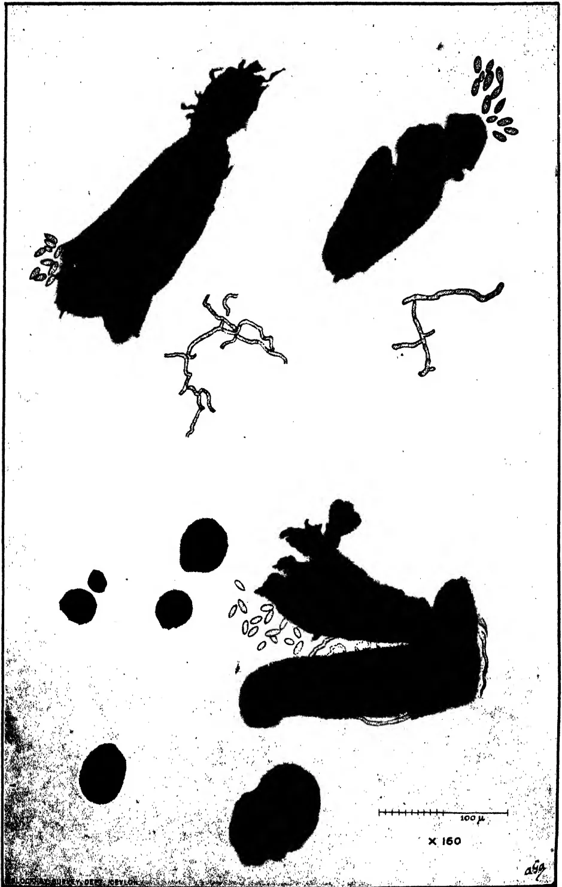This is a black and white micrograph showing several biological specimens. In the upper half, there are two large, dark, elongated structures. The one on the left is thicker and has a small cluster of small, oval-shaped bodies at its top. The one on the right is thinner and has a similar cluster at its top. Below these are two thin, branching, filamentous structures. In the lower half, there are several dark, circular or oval-shaped bodies of varying sizes. To the right of these is a larger, dark, elongated structure with a small cluster of small, oval-shaped bodies at its top. A scale bar is located in the bottom right corner, with markings for 100 μ and a magnification of X 160. The number '259' is written in the bottom right corner.

PLATE I.

96------------------------------------------------

1 hour

4 hours

5 hours

6 hours

70  $\mu$

x 500

BLOCK BY SURVEY DEPT. (DEVELOP.)

649

PLATE II.

97------------------------------------------------

79

Plates 1 and 2 are drawings of the cultural pycnidia of *Macrophomina phaseoli* and of the germination of the pycnospores respectively. It will be noticed that the pycnidia figured in Plate 1 show distinct traces of a stromatic origin. This would suggest that they should be referred to the genus *Dothiorella*, which differs from *Macrophomina* only in that its pycnidia occur on a stroma, whereas they are free in the latter genus. As differences found only on culture media are not reliable, however, and as the nomenclature of the family to which *Macrophomina* belongs is undergoing revision, it has been decided to leave the matter until further observations can be made.

### References.

1. 1. ASHBY.—*Macrophomina phaseoli* (Maub.) comb. nov., the pycnidial stage of *Rhizoctonia bataticola* (Taub.) Butler. Trans. Brit. Myc. Soc. XII., p. 141, 1927.
2. 2. BRITON-JONES.—*Rhizoctonia bataticola* (Taub.) Butler. Tropical Agriculture, IV., 8, p. 147, 1927.
3. 3. SMALL.—Mycological Notes (6). Tropical Agriculturist, July, 1927, p. 10.

98------------------------------------------------

80

# Mycological Notes (10).

## A Dieback of Tea Seedlings.

L. S. BERTUS,

*Assistant in Mycology, Department of Agriculture, Ceylon.*

IN June, 1927, diseased tea plants of about one year old were received from an estate in the Kalutara District. It was reported that the plants were affected in small patches in nursery beds. The roots and stems of the diseased specimens were healthy, but a few leaves showed brown patches resembling those caused by brown blight. A closer examination, however, disclosed the presence of fine fungus hyphae which ran along the stems, united into a web of mycelium at the leaf axils and spread scantily over the lower leaf surfaces. On the lower surfaces of certain apparently healthy green leaves the mycelium formed a thin, powdery, white or grayish film. In two specimens the shoots and their leaves were dead. In another plant, two leaves which bore the powdery film on their lower surfaces and a cobwebby mass of mycelium at their axils were beginning to lose their green colour. It therefore appeared that the effect on the tea seedlings of the attack of the fungus which was represented by the mycelium was withering of leaves and death of shoots.

The hyphae which ran along the stems and the hyphae which constituted the film on the under surfaces of the green leaves were examined and identified as likely to belong to the genus *Rhizoctonia*. The stem hyphae were difficult to see and to pick up, whereas those on the under surfaces of the leaves were detached readily when scraped with a scalpel. The latter were mesh-like, hyaline, septate, irregularly swollen, branched and 4-7 microns in diameter (fig. 4). In the net-work barrel-shaped cells were observed; they resembled spores and they sometimes occurred in chains. The hyphae on the stems were rigid, straight, sparingly branched, long-celled, hyaline or faintly yellowish and 5-7 microns in diameter.

### Cultures.

An attempt was made to cause the production of spores by placing pieces of the green leaves bearing the greyish film in a

99------------------------------------------------

81

moist chamber under sterile conditions, but no success was attained. On the other hand, no difficulty was experienced in obtaining pure growths on maize meal agar of the superficial hyphae on the stem, the hyphae from the film on the lower surfaces of the green leaves and the hyphae from the internal tissue of diseased shoots. In each case white hyphae grew adpressed to the surface of the culture medium and produced sclerotia in four or five days. The superficial hyphae were colourless when young and abundantly branched, the branches usually arising almost at right angles to the main hyphae and often bending over to lie nearly parallel to it. There was usually a definite constriction at the base of a branch and the first septum was formed 3 to 20 microns from that point. The hyphae varied in diameter from 5 to 12 microns. In older cultures the hyphae turned yellow-brown. The young sclerotia arose on the surface of the culture medium and were white at first; they gradually became brown or purple-brown in colour. The sclerotia varied in diameter from 5 mm. to 4 mm. and they frequently coalesced to form irregular masses. Fig. 1 shows the growth of the fungus on maize meal agar and the sclerotia produced in culture; fig. 5 illustrates characteristic hyphae found in culture; fig. 3 shows a few hyphal cells isolated from a sclerotium.

### The Fungus.

The film of mycelium on the lower surfaces of the green leaves closely resembled in structure the film on the lower surfaces of ground-nut leaves found at Peradeniya in 1925, in which film the basidia and spores of *Corticium vagum* B. and C. (*Rhizoctonia Solani* Kühn) were produced and from which single-spore isolations were made. The mode of growth of the tea fungus on maize meal agar and the morphological characteristics of the hyphae and sclerotia resembled very closely the characteristics of the hyphae and sclerotia of *Corticium vagum* on the same medium. The tea fungus was therefore regarded as a strain of *Rhizoctonia Solani*. Fig. 2 illustrates the mode of growth and the formation of sclerotia of *Corticium vagum* from groundnut when grown on maize meal agar from single-spore isolations and should be compared with fig. 1.

### Inoculations.

Inoculation experiments on leaves and stems of tea were attempted in order to test the parasitism of the fungus with regard to that plant, and similar experiments were conducted with seedlings of French bean, groundnut, cotton, cowpea and Lima bean, known hosts of *Rhizoctonia Solani*, in order to ascertain whether the tea fungus resembled the groundnut fungus in pathogenicity.

100------------------------------------------------

82(a) On Tea.

1. Three healthy tea leaves were picked, washed in corrosive sublimate solution, placed in a moist chamber and inoculated by placing pieces of tea leaf bearing the greyish film in contact with their lower surfaces. Twenty days later two leaves had turned brown and the other partly brown. In one leaf the *Rhizoctonia* hyphae had spread scantily over the surface, but no penetration was observed.

2. Twigs of tea with leaves were put in two conical flasks of water and pieces of maize meal agar culture containing the fungus were placed on the lower and upper surfaces of the leaves and on the stems. The flasks were placed under a bell-jar. In another experiment of the same kind a large glass tube was used to enclose the inoculated twigs. After three weeks it was noted that the leaves of one batch of inoculated twigs under the bell-jar were showing symptoms of disease. Some of the leaves were attacked at their bases and had fallen. Small purple-brown spots were visible on certain leaves, and hyphae were found on their surfaces and on the stem. The small purple-brown patches in some parts coalesced to form a larger patch which was surrounded by a pale green margin. Age caused the patches to become deep purple-brown in colour. Hyaline and light-brown *Rhizoctonia* hyphae were found running over the patches and also entering the leaf via the stomata. In the second lot of inoculated twigs and leaves under the bell-jar hyphae were found to have spread superficially over the stems and leaves without causing harm. When the hyphae reached a leaf-stalk, however, they collected around it and formed a tough, strong film of mycelium, penetrated the tissues and caused the leaf to drop off or hang by a connecting web of mycelium. In the flask with the tube, examination after the lapse of two weeks showed that hyphae had spread scantily over the stem and the leaves, but no signs of penetration were evident.

3. The stems and leaves of a tea bush in the field which was producing new shoots after pruning were washed with sterilised water and inoculated by mixing the fungus with water and placing the inoculum on both surfaces of the leaves and on the stems. The bush was covered with a bell-jar. Two days later the inoculated leaves turned pale-brown and on the following day olive-brown. The young shoots withered with discolouration of the stems. When sections of the inner stem tissue were taken aseptically from the point of junction between discoloured and healthy tissue and transferred to culture tubes, sclerotia developed in culture in a few days. The attack of the fungus did not proceed beyond the inoculated parts and was therefore of a local character. In the case of another bush which was similarly inoculated and left uncovered, the fungus did not develop.

101------------------------------------------------

83

4. Fifteen inoculations were made on wounded and unwounded stems of a diameter of 3-8 mm. on the bush. The stems consisted of both soft and hard wood. Wounds were made by cutting out a piece of the cortex about 25 mm. long and about 5 mm. broad and about 5 mm. deep. A piece of culture medium containing the fungus was placed on each wound and covered with a pad of moist cotton wool soaked in distilled water which was covered in turn with waxed tape. In the first three wound inoculations the wounds healed after seven weeks. In two cases, no trace of hyphae was found; in the other, superficial *Rhizoctonia* hyphae were found on the inoculated stem. Six similar stem inoculations were made without wounds. After seven weeks *Rhizoctonia* hyphae were found on the surface of five of the stems; they extended for an inch on either side of the point of inoculation. On two inoculated stems the hyphae reached the leaf stalks and collected around them, but did not penetrate the tissue. Six wound inoculations were made on the young shoots of a bush which had recently been pruned. The wounds were made by scraping the epidermis of the twigs with a scalpel. Seven weeks after inoculation all the wounds were found to have healed although *Rhizoctonia* hyphae were present on two of the wounded stems.

#### (b) On Known Host Plants of *Rhizoctonia Solani*.

Seven-day old seedlings of lima bean, cowpea, groundnut and cotton were placed in a glass cage and inoculated by placing pieces of the culture medium containing young growths of the fungus on the stems at ground level. Although the bases of the stems were enveloped with profuse growths of mycelium, no infection took place. The experiment was repeated with seedlings of groundnut and cowpea which were placed in a shady place after inoculation. The plants did not develop disease. Six-day old seedlings of groundnut, cotton, cowpea and French bean were inoculated in a similar manner and covered with bell-jars. None of the seedlings took infection in spite of the copious growth of mycelium round the bases of the stems.

The results of the inoculation experiments demonstrated that the fungus could attack the young leaves and shoots of the tea bush and cause a dieback, that it could not attack older stems with or without wounds, and that a humid atmosphere was necessary for successful infection. The fungus of these notes therefore was the cause of a disease of tea seedlings; the disease itself was of only minor importance. The failure of the fungus to infect seedlings of French bean, cotton, cowpea, groundnut and Lima bean, host plants of *Rhizoctonia Solani*, may mean that the tea strain of the fungus was non-pathogenic towards those plants or that

102------------------------------------------------

84

the conditions required for its attack on those plants were not provided. Similarly a strain of *Rhizoctonia Solani* which was isolated from *Vigna oligosperma* (*Dolichos Hosei*) was found to be non-pathogenic towards tea seedlings when brought into contact with their stems at ground level both with and without wounds. It may have been capable, however, of causing a die-back of green shoots.

### Remedial Measures.

The attack on plants in patches suggests infection by airborne spores, but, on the other hand, the presence of hyphae on the lower portions of the stems suggests the possibility of infection from sclerotia in the soil. The following measures for dealing with the *Rhizoctonia* when it occurs in tea nurseries may be given.

(1) All diseased branches should be pruned back into healthy tissue and the prunings should be burned.

(2) All diseased leaves of plants adjoining affected patches should be picked and burned together with fallen leaves and rubbish lying on the surface of the soil.

(3) All plants in the affected area should be thoroughly sprayed with Bordeaux mixture.

While these measures will rid the plants of the fungus on their aerial portions, they will not destroy *Rhizoctonia* sclerotia that happen to be in the soil, but, as the fungus is unable to attack the woody stem of the tea seedlings, there is no danger from soil sclerotia unless the hyphae of the fungus ascend the stem of the bush and eventually succeed in attacking the young twigs. *Rhizoctonia* sclerotia may be destroyed by collecting and burning ground debris *in situ* after removal of the plants from the nursery. Watering the soil with a strong solution of disinfectant, for example, carbolic acid, Lactar or 'Jeyes' fluid, will kill sclerotia lying on the surface.

---

Fig. 1. The tea fungus grown on maize meal agar. Nat. size.

Fig. 2. The groundnut fungus grown from a single spore of *Corticium vagum* on maize meal agar. Nat. size.

Fig. 3. Hyphal cells isolated from a sclerotium of the tea fungus. X 350.

Fig. 4. Typical hyphae of the film on the lower surface of a tea leaf. X 950.

Fig. 5. Characteristic hyphae of the tea fungus in culture. X 350.

103------------------------------------------------

85

# Notes on Coconut Pests.

---

**CECIL N. E. J. de MEL, B.Sc. (Lond.), M.S.E.A.C.,**  
*Inspector for Plant Pests & Diseases—North-Western.*

---

## Coconut Caterpillar.

**T**HIS Pest and its control by parasites was considered at a meeting of the Estate Products Committee on the 8th November. The pest has been known for many years in the Chilaw District, and planters are naturally interested in it. It also occurs in the Districts of Kurunegala and Colombo which come under the North-Western Division; and in an article which was published in the *Tropical Agriculturist* for April, 1927, some information on the prevalence and present state of this pest was given.

The chief thing to note about this pest in the North-Western Division is that it has appeared to any serious degree only in a very few and limited areas. And it can be safely said that the pest is never likely to assume any such proportions as in Batticaloa District. The reasons for this are the prevalence of several types of parasites in the North-Western Division and the climatic conditions. A survey of the areas where this pest was recorded has been just completed, and it has been found that the pest has greatly decreased in all areas while it has nearly disappeared in some. The fact that the pest has appeared in a few gardens or estates within the infested areas which had been previously free does not prove that the pest has increased. And even such examples are very few. Further observations on the habits of the parasites are being undertaken.

## The Red Weevil.

Although the above pest has attracted much notice of late, the pest of coconuts that threatens to cause much damage in the near future is the Red Weevil (*Rhynchoporus ferrugineus*). Recent inspections show that this insect is present in almost all parts of the North-Western Division, and considerable damage has been done in all parts. The chief victims are healthy young plants of good girth about 6-10 years of age. These plants are full of sap, and their wood is tender; while cracking of the bark due to the rapidly increasing girth supplies a very

104------------------------------------------------

86

suitable place for the female weevil to lay its eggs. The grubs bore in and cut the fibres very rapidly, and treatment should never be delayed. In one instance sixty grubs were extracted from a tree which had been passed over as treated. The grubs had gone far in tunnelling their way and leaving only a brown stained passage which had become obliterated. It is a good practice to lay the ear close on the trunk of the tree, when the sounds of grubs cutting the fibres can be easily detected.

In some districts young plantations recently opened up occur, and on new cleared plantations the weevils seem to be more frequent, as in Ganewatte district. In other districts, such as Chilaw and Madampe, very old plantations are supporting a younger generation of plants meant to replace the old trees. With the growth of these the problem of the Red Weevil will assume more serious proportions, and planters and proprietors should give early attention to this pest.

Kurunegala, 20-xii-27.

105------------------------------------------------

87

# The Brinjal Leaf-Webber.

## *Psara Pachyzancla bipunctalis* Fb.

E. de ALWIS,  
Assistant in Entomology.

### Introduction.

THE brinjal plant or egg plant (*Solanum melongena* L., Wambatu, S. Kattirikai, T.) like most of our vegetable crops, is susceptible to the attacks of quite a number of insects. One of these is the caterpillar known as *Psara (Pachyzancla) bipunctalis*, which webs up the leaves together, forming for itself a shelter, as is commonly done by Pyralid larvae. The leaf, or leaves, which go to form this shelter are skeletonized. Fortunately, the damage that this caterpillar does, is noticeable during the early stages of an attack, and therefore the pest is one which is easy to control. But, should the early stages pass undetected, it is possible for a whole plant to be defoliated within a couple of days.

### Food Plants.

In Ceylon, the caterpillars of *Psara bipunctalis* have been found to feed on *Solanum melongena*, *S. xanthocarpum*, Elabatu, S. Vaddu, T. and on *S. indicum*, Tibbatu, S. Senior White (5) who made observations on some of our insect pests, says: "In Ceylon it is found on brinjal, but prefers the wild *Solanum indicum*." Perhaps, this is the caterpillars' chief host plant.

Fletcher (3) gives the food plants of this caterpillar as brinjal and wild Solanaceous plants. In 1917 the same author (4) while referring to this insect at the Entomological Conference remarks that "it has been bred at Pusa on *Alternanthera sessilis* and on *Croton*, and at Coimbatore on brinjal and in brinjal shoots."

Lefroy (2) in India, records *Alternanthera*, *Schizandra* and *Croton* as food plants, but our records do not show that this particular caterpillar has ever been found to feed on these plants.

### Distribution.

This "brinjal leaf-webber" is widely distributed in Ceylon and South India. In fact it might be said to be found wherever brinjals are cultivated. Hampson (1) in his volume on the Moths of India and Ceylon records its habitat as West and South Africa; Nilgiris; Ceylon; Java.

106------------------------------------------------

88

## Description of Stages.

**Moths. Male.**—Pale yellow; two black spots on either side of the third segment of the abdomen; tip of abdomen pointed. Legs white. Antennae simple, gradually tapering to a point. Fore-wing crossed by two slender blackish sinuous lines, one close to the outer margin and the other near the base of the wing; two blackish spots, one more prominent than the other, situated in the cell between the two wavy lines. Hind-wing with a slender zigzag line, and a black spot situated in the middle of the cell; cilia, or hairs of the inner margins, whitish, while the outer margin is pale yellow.

**Female**, more uniformly yellowish with a slight tinge of brown; larger in size; tip of abdomen not pointed as in that of the male.

The wing expanse of 12 male moths measures from 21 to 23.5 mm. while that of 11 female moths measures from 24.5 to 27 mm.

**Egg.**—About 1.4 mm. long by 1 mm. broad, flat, shiny white when first deposited. Eggs are laid in irregular flat masses one overlapping the other (fig. 2). Three days after oviposition the eggs are pinkish in appearance.

**Young caterpillar** (fig. 4).—About 2 mm. long and whitish in colour on hatching. Head and dorsal plate of the first thoracic segment shiny black. Caterpillar changes to pale yellowish green within a day, with inconspicuous tubercles which give rise to single whitish hairs.

**Half-grown caterpillar** (fig. 5).—About 13 mm. long. Head and dorsal plate of the first thoracic segment shiny black. Body yellowish green, tubercles still inconspicuous with single whitish hairs.

**Full-grown caterpillar** (fig. 6).—About 19 mm. long. Head and dorsal plate of the first thoracic segment shiny black; body yellowish green and banded cylindrically with prominent shiny black tubercles which give rise to single whitish hairs.

**Cocoon.**—Spun loosely by the caterpillar of whitish silken thread, usually within the webbed leaves and covered with pellets of excrement.

**Pupa.**—When removed from cocoon is about 12 mm. in length, reddish brown in colour and tapering posteriorly, the posterior end carrying eight small hook-like processes.

## Habits and Life History.

The moth is nocturnal in its habits. It usually rests on the under-side of the leaf with its wings half spread (fig. 1a), and its antennae resting over the wings. Both mating and oviposi-

107------------------------------------------------

![A scientific plate containing ten figures illustrating the life cycle and damage of the moth Psara (Pachyzancla) bipunctalis. Figure 1 shows the moth with wings spread, labeled '1'. Figure 1a shows the moth in a resting position, labeled '1 a'. Figure 2 shows an egg-mass, labeled '2', with a small inset 'a' showing a single egg. Figure 3 shows another egg-mass. Figure 4 shows a full-grown caterpillar, labeled '4'. Figure 5 shows a full-grown caterpillar, labeled '5'. Figure 6 shows a full-grown caterpillar, labeled '6'. Figure 7 shows a pupa in ventral view, labeled '7'. Figure 8 shows a pupa in dorsal view, labeled '8'. Figure 9 shows a damaged leaf, labeled '9'. Figure 10 shows a damaged leaf, labeled '10'. Scale bars are present next to figures 4, 5, 6, 7, 8, and 10.](e95ea7cc12f337d80e1da2cbeba348c1_1_img.webp)

BLOCK BY SURVEY DEPT. CEYLON.

470 L de Silva

THE BRINJAL LEAF-WEBBER *Psara (Pachyzancla) bipunctalis* Fb.

- Fig. 1. Moth, with wings spread,  $\times 2\frac{1}{2}$ .
- Fig. 1a. Moth, resting position, nat. size.
- Fig. 2. Egg-mass,  $\times 5$ ; a, egg-mass, natural size.
- Fig. 6. Full grown caterpillar,  $\times 2\frac{1}{2}$ .
- Fig. 7. Pupa, ventral view,  $\times 2\frac{1}{2}$ .
- Fig. 8. Pupa, dorsal view,  $\times 2\frac{1}{2}$ .
- Fig. 9. Damaged leaf, showing first signs of attack, nat. size.

108------------------------------------------------

This image is a blank white page. It contains several small, dark specks which appear to be scanning artifacts or dust particles. There is no text, handwriting, or printed content on the page.

109------------------------------------------------

89

tion take place at night, the female commencing to oviposit within 3 to 9 days after emergence. The number of eggs laid by a single female ranges from 19 to 291 under insectary conditions. The life of female moths under similar conditions ranges from 8 to 17 days, while that of male moths from 8 to 16 days. Eggs are usually deposited in irregular flat masses, one overlapping the other (fig. 2). The freshly laid eggs are shiny white and three days later assume a pinkish colour. As the embryo caterpillars develop, the whole mass becomes a pale brown (fig. 3). A day or two before the caterpillars hatch out the whole mass is speckled with black markings. These are the black heads of the maturing caterpillars within the eggs. Incubation period lasts from 9 to 10 days. The young caterpillars, on emergence from the eggs, make a protection for themselves by folding a portion of a leaf (fig. 9) and commence to feed on the epidermis. As they grow they web several leaves together (fig. 10) and feed within them, skeletonizing the leaves and eating the shoots. Their excrement remains within the webbing and becomes a mass of debris. These caterpillars live together right through their larval period. When they reach their fifth or last instar the caterpillars begin to feed more freely than before. The duration of the larval stage of the caterpillars is from 18 to 22 days. When full grown the caterpillars begin to spin cocoons within which they pupate. These cocoons are found usually together in one mass within the webbing. Their life cycle from eggs to the emergence of the moth under insectary conditions, occupies from 36 to 43 days (*i.e.*, incubation period 9 to 10 days, larval period 18 to 22 days, pupal period 9 to 11 days).

### Control Measures.

In early stages of attack all young caterpillars on affected leaves should be carefully collected and destroyed, either by crushing the caterpillars within the folded leaves, or burning both the leaves and caterpillars.

2. In advanced stages of attack where leaves and shoots are webbed together, all webbed portions should be cut off and destroyed. This measure is effective because it would result in the destruction of both caterpillars and pupae.

### References.

1. 1. HAMPSON, G. F.—Fauna of British India, Moths. Vol. IV., page 405 (1886).
2. 2. LEFROY, H. M.—Indian Insect Life, pages 519-520 (1909).
3. 3. FLETCHER.—Some South Indian Insects, pages 440-441 (1914).
4. 4. FLETCHER, T. B.—Proceedings of the Second Entomological Meeting, page 288 (1917).
5. 5. SENIOR WHITE, R.—Proceedings of the Third Entomological Meeting. Vol. I., page 134 (1919).

110------------------------------------------------

92

There are indications, that during the period in which the mildew mould (*Oidium Hevea*) is under the most favourable circumstances, all trees, strong as well as weak specimens, which have young leaf at the same time, are liable to be attacked by this disease.

According to further reports from estates, which suffered heavily from mildew, this period falls about the middle of the East monsoon (August and September). It follows from this, that trees, which have young leaf during a period when the mildew does not appear or is less virulent, will be either not, or less severely attacked.

From the reviews respecting the wintering reports, it appears indeed, that estates, where most *Heveas* winter about July and hence one till two months after (that is August and September) will be in the time of young leaf, have suffered more from the disease than estates where the leaf-fall is earlier (about April and May).

To procure young trees for the future which will be less susceptible to attacks from mildew, it will be as well to choose mother-trees which winter every year regularly at the same time, as far as possible during the end of the West monsoon (February-March) or the end of the East monsoon (October-November).

## Further Communications Mentioned in the Inquiry.

It appeared that the practical information was contradictory.

The information showed a few indications of a possible influence of the dry season, in which the severe droughts of the past two years were chiefly responsible for the virulent attacks of mildew.

## Rainfall Figures.

The average rainfall figures were taken from 60 mildew estates which had little or no mildew.

It appears that during the dry months, May till October, less rain fell on mildew estates, than on those estates which had no mildew or only sporadic cases.

The rainfall figures from so many different estates show, however, such variations that an average figure cannot be taken as a definition of the true conditions.

The rainfall figures were, therefore, again compared from 7 pairs of neighbouring estate, where one estate continually suffered severely and the other slightly from mildew attacks.

It was found, save in one exception, that on the mildew estate notably less rain fell than on the neighbouring estate, which had no or only sporadic cases of mildew.

To conclude herefrom, that more rain means less mildew is, in our opinion, rash, because we do not know exactly the nature of the influence of the rain on mildew-attacks and we must first find out when the young leaf period falls.

The mildew attack is indeed, in the first place, dependent on this last factor.

## Geographical Spreading of Mildew.

It was seen from the reports that nearly all low-lying estates suffered more from mildew than high-lying estates, also in many cases the *Heveas* of estates lying on the east slopes of mountains were attacked less than those of estates lying on the south slopes.

111------------------------------------------------

93

The two estates in Borneo which also came into the East Java inquiry were, although low-lying, still free from the disease.

### Graphs from Bandjarsarie Estate.

The manager of this estate has given us graphs of the rainfall, rubber production, wintering and mildew attacks, over the year 1924—1925—1926. The wintering and mildew graphs show:—

For 1924.—A quick wintering and at the same time a short but severe attack of mildew in July and August.

For 1925.—A long wintering, and at the same time a longer attack of the disease which culminated definitely in July and August.

For 1926.—A shorter wintering than in 1925 and a mildew attack that was at its height in August and September.

The most important point, in our opinion, that is shown by the wintering and mildew graphs, is that the mildew came *suddenly* and vigorously to an outbreak (in July or in August), in spite of the fact that the wintering, and thus the number of trees susceptible to mildew, slowly increased from April.

Further that in and after October few or no trees were again attacked by mildew.

From the graph on page 453 can be seen that the total rubber production from 1924 till 1926 have increased.

As regards the rainfall-graphs (in connection with the mildew) the mildew attacks were severest during the abnormal dry year of 1925. In 1924, however, in which year was the heaviest rainfall, the mildew attacks were weakest. In 1926 the rainfall was heavier than in 1925 and less than in 1924, while the mildew attacks in 1926 were less than those in 1925 and more than in 1924.

### Summary of the Results of the Inquiry.

1. The mildew disease has become considerably worse during the last few years, as compared to previous years.

2. Mildew has appeared on nearly all East Java estates.

3. The attacks of the disease has been severe on 48 per cent. of the total mildew infected estates.

4. Mildew has appeared on the budding-beds or nurseries of 17 per cent. of the estates.

5. Dying off of twigs was accounted to mildew by 37·6 per cent. of the managers of the diseased estates.

6. Decrease of production was accounted to mildew attacks on 6·4 per cent. of the "mildew estates."

7. Mildew taken over a whole, is not limited to definite complexes, but spread over whole areas.

8. In the district under observation of the Malang Experimental Station it is asserted that the trees which winter later in the East monsoon (about July) are attacked more severely than those which winter early (about May). It is this factor which must be remembered when approving plant-material.

9. The rainfall on mildew estates during the East monsoon was less than on "healthy estates".

10. Mildew is considerably worse on low-lying than on high-lying estates, and again more severe on the South than on the Eastern slopes of the hills.—*The Planters' Chronicle*. Vol. XXII. No. 53. December, 1927.

112------------------------------------------------

94

# The Avocado—A Valuable Fruit.\*

**JOSE DE LEON,**

*Assistant Horticulturist-in-charge, Tanarawan Citrus Experiment Stations,  
Batangas.*

**and**

**FELIPE PADOLLINA,**

*Acting Superintendent, Lamaso Experiment Station.*

## Introduction.

**W**ITHIN the last twenty-five years, hundreds of species and varieties of plants were introduced into the Philippines. These were brought from many different countries of the world, and include fruit, vegetable, forage, medicinal and other groups of plants. Some of these are valuable plants, indeed, others are less so, while still others are worthless. Very many of these new plants have already proved well adapted to our soil and climate, while others are less promising. One of the recent acquisitions, which because of its high economic value as well as its ready adaptation to Philippine soil and climate, is destined to become one of our most popular fruits here, is the avocado. To most persons in the Philippines, this fruit is entirely unknown, at present. The following contains brief information regarding the origin, culture, and use of the avocado, and is intended to help the prospective planters of this important tropical fruit tree in the Philippines.

The avocado, *Persea gratissima*, Gaertn, is one of the most valuable food plants introduced into the Philippines, in recent years. This fruit is usually known as "aguacate" in Spanish, and as "alligator pear" and "avocado" in English. The latter English name for the fruit is more fitting than the former, and is, by far, to be preferred.

The original home of the avocado is tropical and semi-tropical North and South America. It has gradually been introduced into most tropical and semi-tropical countries of the world. Its successful introduction into the Philippines dates back only about twenty-five years ago.

The plant belongs to the cinnamon family, and the leaves of many varieties possess, in varying degrees, the spicy odour and taste common to the plants of this family. The tree is of good size, attaining under favourable conditions, a height of about 60 to 80 feet. It has a larger number of varieties, and therefore both the tree and fruit characters are widely variable. As a rule, the fruit is slightly larger than the carabao mango, pear shaped, and has a seed of the size and form of a hen's egg. When ripe the surface color of the fruit varies from light or dark green to purple crimson, or maroon. Around the seed is the edible flesh. This has a fine texture and a consistency resembling that of butter. The meat has a pleasant, nutty flavour.

\* Bureau of Agriculture Circular, No. 212.

113------------------------------------------------

95

## Food Value.

The avocado distinguishes itself from other fruits in that it has a very high food value. The composition of twenty-eight varieties of avocado has been presented by E. M. Jaffa, in Bulletin No. 254 of the California Agricultural Experiment Station. These varieties showed a fat content of the flesh, ranging from 9.8 to 29.1 per cent. and a protein content ranging from 1.3 to 3.7 per cent. Professor Jaffa mentions the fact that the energy value of the avocado is more than double that of other commonly used fresh fruits. He also believes that the dietetic value of this fruit must be high, possessing as it does the combination of the usual "fruit principles," and that of fat or oil. When grown extensively the avocado might be made to supply a large proportion of the fatty element in our diet. It has been known in the countries where it has been long grown that this fruit is a wholesome and highly digestible food.

## Uses.

In the Philippines, the most common way in which the avocado is eaten, is to add sugar and milk and eat it as a dessert, or in the form of ice-cream. Some persons relish the meat with nothing added to it, eating it alone or using it as butter spread on bread, while other persons with salad dressing.

## Possibilities.

The growing of avocado is a promising commercial venture in the Islands. The fruit is as yet, very rare and costly, being sold only in a few restaurants in Manila and at a high price.

There are now avocado trees growing in widely separated localities in the Philippines and the behaviour of these trees clearly indicates that the plant is at home in this country. In localities where the dry season is not too prolonged they thrive with very little attention. However where the dry season extends to four or five months at a time, they require some irrigation unless the soil moisture is within reach of the roots during the driest part of the year.

## Soil.

Deep, well drained sandy loam soils are best for the avocado, but heavier soils of average fertility will also grow good avocado. Good drainage is essential to the successful culture of the avocado. For this reason, a gently sloping land makes an ideal location for an avocado orchard. The avocado is quite resistant to the injurious action of strong winds, so that even on hilly or exposed ground, trees may be grown to advantage.

## Propagation.

There are two principal means of propagating the avocado—by seed and by budding. Trees grown from seed are known to be variable in nature. They often come into fruiting late, and they cannot be relied upon to give satisfactory crops of a uniformly good quality. A much better method of propagating this tree is by budding. Trees grown by this method possess several important advantages some of which are: their precocity, good bearing habits, low and shrubby growth, and uniformity of character.

114------------------------------------------------

96

The first step in the production of budded trees, is the raising of the seedling stocks. The seed of the avocado quickly loses its vitality. It should, therefore, be planted while it is still as fresh as possible. A rich soil with plenty of humus should be used. In planting the seed, its narrow end is left slightly protruding above the surface of the ground.

When a small number is to be grown, the seeds may be planted separately in small nursery pots so that, in repotting them, later on, the roots only will be disturbed as little as possible. The roots of the avocado, at this time, are few and delicate. If the number to be grown is large, the seeds may first be germinated in seed boxes, having a depth of, at least 8 inches, or in seed beds. These should be under partial shade. The seeds are placed at about 5 inches apart each way, and as each seed germinates, and has attained a 4- or 5-inch shoot, it is carefully removed, potted singly, or planted in rows in the ground. In the former case, a good sized pot, 8 to 10 inches in diameter should be used. A rich soil is to be used, and the seedling is given careful attention to keep it in vigorous growth, so that it will easily take the bud. If necessary, repot it once, to give ample room and nourishment to the rapidly developing root system, before it is budded. There is less difficulty, in keeping the seedlings in good condition for budding when they are planted in the ground, but it will require more labour to properly remove them and transplant them to the orchard.

### Budding.

The budding may begin anytime the stem of the seedling stock has attained a size slightly larger than a lead pencil. The scion should be selected from the best tree of the desired variety. This should be of a recent growth, and should contain plump, well developed buds.

The ordinary form of shield budding as used in the propagation of citrus trees has been most successful with the avocado. The only modification in the process is that, in forcing the bud to grow, after it has taken, a ring of bark about an inch above the bud is removed, instead of cutting a notch deep into the wood of the stock. This is to avoid a premature breaking of the wood which is very brittle at this stage. In addition to this means of forcing the bud to grow, the top of the stock, about 10 inches from the bud, may be cut off. After the bud has grown to a length of about 8 or 10 inches, the stock should be cut off clean just above the bud union, and the cut is immediately covered with white lead, asphaltum or grafting wax. If the cut is left exposed without the protective coverings, the wood has the tendency to rot, soon, causing the death of the bud and all.

### Planting.

The trees may be planted in the orchard any time during the wet season provided it is early enough to have them well established when the dry season comes. With ample facilities for watering them, they may, of course, be planted late in the rainy season, and even during the dry season. To facilitate the removal of the trees from the nursery, it is advantageous to transplant them to the orchard when they are still small that is, when the shoots are but 12 inches long, or so. The avocado is a rapid grower when given ample space in which to develop. Therefore, after the trees have had sufficiently hardened buds, the earlier they are transplanted, the better.

The trees are usually planted in the orchard at a distance apart not closer than eight meters. Holes about 40 centimeters deep and 50 centimeters wide are dug, and the trees planted in them, using a good surface

115------------------------------------------------

97

soil for refilling. The trees should be watered, mulched and shaded, if there is no prospect of rainfall soon after the planting. The trees should be set in the holes as deep as they stood in the nursery or pots.

## Cultivation.

There appears to be no particular difficulty in maintaining the avocado tree in good condition if the soil is not poor. Its cultural requirement is not exacting, and the writer has seen it thrive under tillage as well as under no tillage. When grown in the home yard, the tree has been maintained in excellent condition by only an occasional hoeing of the ground near its base. It is probable, however, that, in the case of young orchards tillage and cultivation are beneficial during the dry season, and that during the rainy season, cover crops should be planted to hold the soil from erosion, as well as to replenish the nitrogen and organic matter contents of the soil.

## Fertilization.

So as to get the most profit from trees, it is always a good plan to maintain, and if possible build up, the fertility of the soil. Therefore, attention should be given to the manuring of the young trees if the soil is not rich. And for bearing trees a regular application of fertilizers should be made. These may consist of from 1 to 3 kilos of a fertilizer containing 8 per cent. nitrogen, 4 per cent phosphoric acid, and 3 per cent. potash, per tree a year for the young trees; and for the bearing trees, from 4 to 6 kilos of a fertilizer containing 6 per cent. nitrogen, 4 per cent. phosphoric acid, and 4 per cent. potash, per tree per year. The stated amount of fertilizer should be applied twice in the year.

## Varieties.

An important problem connected with the growing of avocado trees in the Philippines, is the selection of varieties. Many trees which are now found growing here, are shy bearers. Fortunately there are many excellent varieties which have already been brought to this country, and some of these are well adapted to the local conditions. Moreover, it is probable that some of the seedling trees now growing in scattered places in the Islands may be found to have excellent qualities to commend these for propagation. In searching for varieties that should be grown, the following qualifications should be sought:

1. 1. Precocious, prolific and regular bearer.
2. 2. Tree of vigorous growth and good form.
3. 3. The fruit should be of good flavour and quality.
4. 4. The seed should be small and tight in the cavity.
5. 5. The varieties which mature their fruits at different months of the year should be selected.

A Descriptive List of the Different Avocado Varieties at the Lamaso Experiment Station, Lamaso, Bataan.

*Family.*—Fruits: obovate sometimes distinctly necked; size large; weight 310 to 590 grams; length 5 to 5½ inches; greatest breadth 3½ to 3¾ inches; base narrow; stem slender, ½ to 1¼ inches long, inserted obliquely in a shallow, flaring regular cavity; apex obliquely flattened; surface smooth and glossy, very light yellowish green before ripening but deep purple to blood red color when ripe, with light yellow dots; skin 1/32 inch thick adhering closely to the flesh although it can be easily peeled off; flesh a buttery cream yellow changing to yellowish green close to the skin with fibers at the basal and apical portions; rich flavour; good quality; seed oblong to conic, largely and loosely located in the seed cavity with the seed coat adhering closely. Season July and August.

116------------------------------------------------

98

Introduced from the United States Department of Agriculture and planted in the Lamo Experiment Station in 1915, regular bearer and the average annual yield for 4 years fruiting is 50 fruits; slightly attacked by wood borer. The tree has become adapted to the soil and climate conditions of Lamo, Bataan.

**Pollock.**—Obovate to oblong pyriform; size large; weight 300 to 800 grams; length  $5\frac{1}{2}$  to 7 inches; greatest breadth  $3\frac{1}{2}$  to  $4\frac{1}{2}$  inches; base narrow, slightly flattened with the short stem  $1\frac{1}{3}$  to  $2\frac{1}{2}$  inches inserted obliquely in a shallow, flaring regular cavity; apex obliquely flattened or slightly depressed; surface smooth, glossy, light yellowish green with longitudinal yellow lining; and numerous small greenish yellow or russet dots; skin  $1/32$  inch thick, separating very readily from the flesh, tough and leathery; flesh firm, smooth and fine in texture, deep yellow changing to yellowish green towards the skin; of rich flavor and excellent quality; seed rather small and conic in shape, usually fitting closely in the cavity; seeds coats rather loose, more or less separate. Season August and September.

Introduced from the United States Department of Agriculture and planted in the Lamo Experiment Station in 1915; regular heavy bearer and the average annual yield for 4 years fruiting is 95 fruits; slightly attacked by wood borer; has adapted itself to the soil and climate conditions of Lamo, Bataan.

**Lyon.**—From oblong pyriform and indistinctly necked; size above medium to large; weight 470 to 940 grams; length  $5\frac{1}{2}$  to  $7\frac{7}{8}$  inches; greatest breadth  $2\frac{1}{2}$  to  $3\frac{1}{2}$  inches; base narrow; stem generally  $1\frac{7}{16}$  inches long inserted obliquely almost without depression; surface undulating to rough bright green in colour with numerous small yellowish or russet dots; skin moderately thick ( $1/16$  inch) separating readily from the flesh; coarsely granular brittle and not much change in color when ripe; flesh smooth; firm deep cream color tinged with green toward the skin, almost free from fiber discoloration; rich flavor; quality good; seed conic; medium small in size, fitting tightly in the cavity with the seed coats adhering closely. Season July and August.

Introduced from abroad and planted in the Lamo Experiment Station, in 1913; regular bearer and the average annual yield for 2 years fruiting is 70 fruits; badly attacked by wood borers but the tree is adapted to soil and climatic conditions in Lamo.

**Douglas.**—From obovate to pyriform and indistinctly necked; size medium large; weight 370 to 510 grams; length  $4\frac{1}{2}$  to 5 inches; greatest breadth 3 to  $3\frac{1}{2}$  inches; base narrow, the short stem  $\frac{1}{2}$  to 1 inch long inserted obliquely in a regular shallow flaring cavity; apex rounded; surface smooth and glossy, yellowish green before ripening and deep purple when ripe with yellow dots; skin  $1/32$  inch thick adhering closely to the flesh but it can be easily peeled off; flesh cream yellow color, firm, practically free from fiber; rich flavor; good quality; seed broad conic to almost oval, loosely located in the cavity with the seed coats both adhering closely. Season August and September.

Introduced from the United States Department of Agriculture and planted in Lamo Experiment Station in 1915; regular but very shy bearer; not attacked by wood borer, adapted to the soil and climate conditions of Lamo.

**Commodore.**—From obovate to pyriform; size small; weight 160 to 420 grams; length  $4\frac{1}{2}$  to 4 $\frac{1}{2}$  inches. greatest breadth  $3\frac{1}{2}$  to 4 $\frac{1}{2}$  inches; base narrow, stem slender 1 to  $1\frac{1}{2}$  inches long inserted almost squarely in rather deep flaring regular cavity; apex rounded; surface glossy yellowish

117------------------------------------------------

99

green before ripening and deep purple when ripe with small yellow dots; skin  $1/16$  inch thick, coarsely granular, brittle; flesh light yellow changing to very light yellowish green towards the skin, rather fibrous; rich flavor; quality fair; seed broad, conic, small fitting tightly in the cavity with the seed coats both adhering closely. Season August and September.

Introduced from coconut grove, Florida, in 1906 and planted in the Lamo Experiment Station in 1915; regular bearer and the average annual yield for 4 years fruiting is 45 fruits; not attacked by wood borer, adapted to the soil and climatic conditions of Lamo, Bataan.

*Cyrus*.—From oblong pyriform; size regular; weight 360 grams; length 4 to  $5\frac{1}{2}$  inches; greatest breadth  $3\frac{1}{2}$  to  $3\frac{7}{8}$  inches; base narrow; stem slender,  $2\frac{5}{8}$  to  $4\frac{1}{2}$  inches long; inserted almost squarely in a rather deep flaring regular cavity; apex rounded almost without depression; surface glossy, greenish yellow or yellowish green even when ripe with yellow dots; skin  $1/32$  inch thick, membranous, separating very readily from the flesh; flesh firm, smooth and fine in texture, yellow changing to yellowish green towards the skin; rich flavor; good quality; seed loosely located in the seed cavity; and outer layer of the seed coats adhering closely to the seed cavity; seed coat always partly cracked at the apical portion like the molting bark of a tree. Season August and September.

Introduced from St. Petersburg, Florida, in 1907 and planted in the Lamo Experiment Station in 1915; regular bearer and the average annual yield for 4 years fruiting is 44 fruits; severely attacked by wood borer but adapted to the soil and climatic conditions of Lamo.

*Wester*.—From roundish oblate, obliquely flattened at the apex; size medium large weighing 310 to 650 grams; length  $3\frac{1}{2}$  to  $4\frac{1}{2}$  inches; greatest breadth  $3\frac{1}{2}$  to  $4\frac{5}{16}$  inches, base narrowing slightly, flattened around the deep narrow regular flaring cavity in which the stem ( $2\frac{1}{2}$  to  $2\frac{3}{4}$  inches long) is inserted almost squarely; apex obliquely flattened; surface smooth glossy, skin  $1/16$  inch thick, leathery light green color before ripening but turns to deep purple with maroon russet dots when ripe, adhering closely to the flesh; flesh firm, light yellow color changing to yellowish green towards the skin with very few traces of fibers around; rich flavor; quality good; seed broadly oblate, large fitting tight in the seed cavity. Season August and September.

Introduced from the United States Department of Agriculture and planted in the Lamo Experiment Station in 1915; regular bearer and the average annual yield for 4 years fruiting is 40 fruits; slightly attacked by wood borer; adapted to the soil and climatic conditions of Lamo, Bataan.

*Quality*.—From obovate to pyriform, size small weight 290 to 560 grams; length  $4\frac{1}{2}$  to  $6\frac{1}{6}$  inches; greatest breadth  $2\frac{1}{2}$  to  $2\frac{15}{16}$  inches; base narrow, the slender stem 1 to  $2\frac{1}{2}$  inches long inserted obliquely in a shallow flaring regular cavity; apex obliquely flattened or slightly depressed; surface smooth, glossy, greenish yellow color even when ripe with small maroon dots and few small brown spots; skin  $3/32$  inch thick, adhering closely to the flesh; woody; flesh whitish yellow changing to yellowish green towards the skin, rather fibrous; good flavor; quality good; seed oblong conic, small to medium, fitting tightly in the cavity with the seed adhering closely. Season September.

Introduced from Fort Myers, Florida, in 1907; regular and average annual yield for 2 years fruiting is 43 fruits; slightly attacked by wood borer; adapted to the soil and climatic conditions of Lamo.

*Cardinal*.—From obovate to pyriform, distinctly necked; size medium large; weight 260 to 430 grams; length  $5\frac{1}{2}$  to  $6\frac{1}{2}$  inches; greatest breadth  $3$  to  $3\frac{1}{2}$  inches; base narrow; stem  $1\frac{1}{2}$  to  $2\frac{1}{2}$  inches long inserted obliquely

118------------------------------------------------

100

and flattened; surface moderately smooth, yellowish green in color before ripening but deep purple when ripe with small yellow dots; skin  $1/16$  inch thick, separating easily from the flesh; flesh smooth and firm; color yellow changing to yellowish green near the skin, free from fiber discoloration; rich flavor; very good quality; seed broad, conic; small fitting tightly in the cavity with the seed-coats adhering closely. Season practically September.

Introduced from Coconut grove, Florida, in 1907 and planted in the Lamaso Experiment Station; irregular bearer and the average annual yield for 2 years fruiting is 23 fruits; the tree is attacked by wood borers and is seemingly not adapted to the soil and climatic conditions of Lamaso.

*Vega*.—From obovate to broad pyriform; not necked; size medium small, weight 270 to 480 grams, length  $3\frac{1}{2}$  to  $5\frac{1}{3}$  inches, greatest breadth  $3\frac{1}{4}$  to  $3\frac{3}{8}$  inches; base narrow, stem slender  $1\frac{1}{4}$  to  $2\frac{1}{2}$  inches long inserted obliquely in a medium deep regular flaring cavity; apex broadly rounded; surface undulating to rough but glossy, yellowish green in color before ripening and when ripe, having small yellowish dots; skin  $3/16$  inch thick, separating readily from the flesh, coarsely granular, brittle; flesh cream color, tinged with green toward the skin, few traces of fiber; rich flavor; good quality; seed almost perfectly heart shaped fitting tightly in the cavity with the seed-coats both adhering quite closely. Season September.

Introduced from Santiago de la Vega, Cuba, in 1906 and planted at the Lamaso Experiment Station in 1915; regular but shy bearer; poor looking tree and attacked by wood borer.

*Cummins*.—Form roundish oblate; size small to medium; weight 200 to 400 grams; length  $3\frac{1}{4}$  to  $4\frac{1}{2}$  inches greatest breadth  $2\frac{1}{2}$  to  $4\frac{1}{4}$  inches; base narrowing slightly, slightly oblique around the shallow rounded regular cavity in which the long stem ( $2\frac{1}{2}$  to  $5\frac{1}{4}$  inches long) is inserted apex obliquely rounded; surface undulated to rough, slightly glossy, bright green to yellowish green but turned dark purple when ripe with yellow to russet dots; skin  $1/16$  inch thick, firm, separating readily from the flesh; coarsely granular; flesh firm; greenish yellow to pale yellow, almost entirely free from fiber discoloration; good flavor; excellent quality; seed broad, conic, medium to medium large in size fitting tightly in the seed cavity with both seed coats adhering closely. Season September and October.

Introduced from the Hawaii Experiment Station, Honolulu, and planted in the Lamaso Experiment Station in 1915; very shy and irregular bearer; the tree is healthy, though slightly attacked by borers; and is adapted to the soil and climatic conditions of Lamaso.

## Pests and Diseases.

There are comparatively few insect pests and diseases which, at present affect the avocado in the Philippines. None of these, however, may be considered very serious. The proper control measures should always be sought whenever any pest or disease becomes serious. In the countries where the avocado has been grown for a long time, very serious insect pests and diseases are, of course, present.

## Picking.

The avocado fruit should be picked when fully matured so that when it ripens its best flavor will develop. This stage is indicated by faint reddish streaks on the body of the fruit in such varieties which attain a dark purple color when ripe, and by a change to a lighter shade in those varieties whose fruit attains a yellowish green color when ripe. The grower will, of

119------------------------------------------------

101

course, recognize the right stage of maturity, after having had a little experience with the variety grown.

The fruit should be carefully cut off with a fruit clipper, leaving a very short stem attached. Rough handling easily injures the fruit. Therefore the picker should always be careful not to bruise the fruit. In packing the fruits, each fruit should be wrapped individually with a clean paper, and transported in crates.

## References.

1. (1) L. B. Bailey: The Standard Cyclopedia of Horticulture, Vol. 1 (1914), p.436.
2. (2) Ira J. Condit and M. E. Jaffa: The Avocado in California, Coll. of Agr. Expt. Sta. Bul. 254 (1915).
3. (3) J. E. Higgins et al: The Avocado in Hawaii, Hawaii Agr. Expt, Sta. Bul. 25 (1911).
4. (4) J. E. Higgins: Why the Avocado Should be Widely Planted in the Philippines, The Phil. Agr., Vol. IX, Nos. 1-2 (1920), pp. 17-21.
5. (5) G. F. Moznette: The Avocado, Its Insect Enemies and How to Combat Them, U.S. Dept. Agr. Farm. Bul. 1261 (1922).
6. (6) Popenoe: Manual of Tropical and Sub-tropical Fruits.—*The Philippine Agricultural Review*. Vol. XX. No. 3 1927.

120------------------------------------------------

102

# Tomato Cultivation.

Department of Agriculture, Ceylon, Leaflet No. 49.

## Section I. In the Hambantota District.

**NELSON SENARATNE, Dip. Agric. POONA.**

*Manager, Experiment Station, Ambalantota.*

### History.

**T**OMATOS first began to be cultivated in the Hambantota District on a commercial scale in 1923. At the present time it is being largely cultivated around Ambalantota, Tissa, Ranna, and Wiraketiya. Of all the garden crops grown in this district tomatoes give the best and the quickest returns.

### Soils.

It thrives best in sandy loams and alluvial soils on the river banks which are well drained.

### Seasons.

In this district tomatoes are extensively grown as a dry crop during the Maha season from September to February, but it is also cultivated during Yala on a very small scale where irrigation facilities are available. Tomatoes grown during Yala fetch a better price than the Maha crop.

### Seed and Nurseries.

The best result so far obtained are from selected seed, which should be stored in air-tight tins. A handy receptacle for this purpose is a cigarette tin. Well ripe, fair sized fruits are plucked from healthy plants. The seeds are carefully removed from the fruits and washed in fresh water to remove the sticky substance on the seed. When the seeds are well washed they are removed and mixed with fine wood ashes and then sun-dried for seven to ten days according to weather conditions. When the seeds are perfectly dry, the excess ash is removed by winnowing. After these operations the seeds are put in cigarette tins and made air-tight. In this connection I may mention that seed obtained from fresh fruits just at the time of sowing germinates well, grows into healthy plants, but the yields have always been observed to be poor, and the fruits of these plants are usually smaller than the fruits of the stored seed from one season to another.

121------------------------------------------------

103

## Seed Beds.

Four ounces of seed are sufficient to raise seedlings to transplant an acre. There are two methods of preparing nurseries, taking into consideration the prevalence of white ants in the locality:—

- (a) In places where there is no damage from white ants the seed beds are prepared on elevated ground under the shade of trees, so that they are not affected by heavy rains. Tomato seedlings are very delicate, and require a great deal of care in rearing. The seed beds are almost universally prepared by a special treatment of sterilization by burning. The burning of straw, dry leaves, logs, &c., on seed beds produces a high temperature in the soil, which not only has the effect of sterilizing the soil, but improves the tilth of the seed-bed and kills the weeds in the nursery, so that the growth of seedlings is more rapid as well as more vigorous. After sterilization the ground should be cleared of rough stones, big clods of earth, and the soil dug and raised into beds of uniform level. The width of each bed should not be more than 4 feet. The length may be of any workable dimensions, according to the lay of the land where the seed bed is prepared. The beds should be 4 to 6 inches high with a drain of 12 inches in width between each bed sq as to facilitate watering, weeding, and removal of insect pests.
- (b) In places where the seeds are liable to be destroyed by white ants, the seed beds are prepared on platforms put above ground or in boxes. The platforms are made by fixing six posts into the ground, into which cross sticks are tied up at a height of 3 feet from the ground level. Over this structure strips of bamboo, &c., are placed, thus forming a platform. Woven coconut branches are spread over this platform, and then fine soil mixed with wood ashes, free from rough stones and clods, are spread to a uniform height of about 6 inches. It is best to tar the posts which are fixed to the ground in order to prevent the invasion of white ants to the seed beds.

The seeds are sown in nurseries for the Maha crop during August and September. After sowing, the seed bed is lightly covered with fine soil and the surface lightly pressed down. It is advisable to sow the seeds in rows of 4 inches apart in order to facilitate cultivation, watering, and removal of insect pests; this procedure makes it easy to uproot seedlings for transplanting. A heavy watering is done just after sowing. The seed beds are given sufficient water in the morning and evening, according to weather conditions. It is necessary to have the nurseries shaded by erecting a structure, on the top of which branches of coconut are placed to keep away the excessive heat of the sun as well as heavy rain. On cloudy days the shade may be removed in order to admit air and light. When well watered the seed germinates in four to five days. Heavy rain or continuous dry weather is disastrous to young seedlings. The seed beds have to be carefully weeded, and caterpillars and other insects, which do a great deal of damage, have to be looked for every morning, and if any dead plants are found they should at once be removed. Owing to the uncertainty of the setting of the monsoon in the district, it is advisable to sow the nurseries two or three times at an interval of about a week, and at each time sowing a certain portion of the seed-bed in order to ensure a good supply of seedlings of the proper age for transplanting. As the seedlings are delicate, and as there is always a demand for them, twice the area required for transplanting is usually prepared by careful gardeners.

122------------------------------------------------

104

## Preparation of Land.

The field for planting out tomatoes is prepared during the dry months of August and September. If the plot consists of jungle it is cleared and burnt. But if the plot is one which has been cultivated previously it is weeded and the weeds collected and burnt. After a shower of rain which is sufficient to moisten the soil, the land should be dug with mammoty, forked or ploughed, as the case may be. An application of lime and wood ashes before digging or ploughing gives good results. From experience I have found that the application of cowdung as a manure in tomato cultivation causes the prevalence of wilt.

## Transplanting.

The seedlings are ready for transplantation when they have four to six leaves and are four to six weeks old. The transplantation begins in the beginning of October and extends as late as the middle of November. After the first shower of rain, when the ground is quite moist, transplanting is resorted to on a cloudy afternoon. Seedlings are planted 3 to 4 feet apart from one another, depending on the fertility of the soil. In this district, which has a dry climate it is preferable to plant early. When the nursery beds are sufficiently moistened to enable the seedlings to be up-rooted without damage, they are removed in baskets to the field and planted in holes, which should be dug beforehand to receive them. Care should be taken when filling the holes with earth that this operation should be done in such manner that no water will stagnate at the collar of the seedling. The water thus collected will cause the stem to rot and will ultimately kill the plant. This damage is most noticeable in the case of imported varieties. If dry weather prevails after transplanting, the young plants should be protected from the sun by shading with twigs of trees until they are well established. Rannawara twigs answer this purpose most satisfactorily in this locality. It is also necessary, during dry weather, to water the transplanted seedlings for the first few days until they strike root.

## Cultivation and After Care.

After the seedlings are well established weeding is done either with mammoties or by hoeing. Vacancies are filled in just before hoeing when the weather conditions are favourable. When the plants have grown to a height of a foot or so, they are earthed up, *i.e.*, heaping earth round the plant by scraping the ground round it. This operation not only keeps the plants firm but also encourages side-rooting, in addition to keeping the plot free of weeds. Two or three earthings are required at intervals of ten to fifteen days.

## Manuring.

A top dressing of superphosphate during earthing up results in good yields.

## Supports.

The fruits of imported varieties are readily spoilt by coming in contact with the ground, therefore it is advisable to have the plants supported with sticks to prevent the fruits touching the ground. This operation is usually done at the time when fruits are being formed.

123------------------------------------------------

105

## Flowering and Fruiting.

Tomatos flower from four to five weeks from the date of planting out in the field, depending on the variety and climatic condition. Local varieties flower sooner and come into bearing early. Heavy rain during the flowering period causes the flowers not to set. In the case of local varieties fruits are ripe enough for harvesting in about eight to nine weeks after planting, but in the case of imported varieties it takes a fortnight longer. Picking is done once a week; matured green fruits as well as ripe ones are harvested at the time of picking. Harvesting begins early in December and extends up to the first week of February, depending on the weather conditions as well as the variety grown. The third picking gives the best proportion of the crop, and it is nearly 50 per cent. of the whole crop.

## Prices and Market.

The gardener who established his crop early gets a higher price than the late cultivators, because the demand for tomatos at the beginning of the season is far greater than the supply at the beginning of the season. The prices vary according to the size of the fruits and variety grown. Imported varieties have so far not been found to stand the local field conditions as well as the smaller fruited local type, nor are the crops nearly as heavy.

The prices vary from cents 25 to 50 per 100 fruits in case of local varieties, and cents 50 to Re. 1 per 100 fruits of the imported varieties. The tomato crops grown up-country are scarce during the months of December and January and there is a keen demand in these months for tomatos grown in the drier parts of the Island for the Colombo market.

## Yields.

The average yield of tomatos per acre may be taken as 50,000 to 60,000 fruits, fetching a price of Rs. 150 to Rs. 250. One acre on the Ambalantota Experiment Station in the very dry season of 1926—27 yielded a gross return of Rs. 130 with a nett profit of Rs. 70. This return would be increased by at least 25 per cent. if it were possible to avoid damage during transport to Colombo.

## Pests and Diseases.

*Epilachna Beetle.*—The grubs of this pest were found in large numbers, causing considerable damage to the leaves of the tomato nursery plants. In the early stages hand-picking during the early morning may be resorted to, but when found in large numbers, spraying with a weak solution of Paris green may be effective. This pest was first observed in brinjal plants, from which it spread to the tomato nursery.

*Heliothis obsoleta*—Tomato Fruit Borer.—The caterpillar bites a hole in the fruit and only thrusts its head inside leaving the other parts of the body exposed, and it continues its work of destruction from one fruit to another till a large number are destroyed by a single caterpillar. The fruits thus attacked start decaying and quickly rot. Fruits of all stages of development are bored into. This pest also attacks Indian corn and cotton. Tomatos should not therefore be grown near to cotton or Indian corn and if grown on land previously occupied with cotton or Indian corn, it should be thoroughly ploughed over in order to expose and destroy the pupae of this pest in the soil. Hand-pick and destroy the caterpillars whenever possible.

124------------------------------------------------

106

**Tomato Wilt Disease.**—This serious bacterial disease of tomato is not so prevalent in this district as in the wet zone. Few cases were observed where tomatoes were grown on lowlying situations. The diseased plants were uprooted and destroyed.

## Section II. In the Jaffna District.

**N. SENATHIRAJA,**

*Manager, Experiment Station, Jaffna.*

Tomato cultivation is mainly confined to garden-lands in certain villages in this district. With the growing popularity of the crop the demand for high quality tomatoes is increasing, and there is a need for improvement in the quality of tomatoes grown for the market. During the last few seasons an attempt was made to grow better grade tomatoes for shipment by rail to Colombo on the Experiment Station, Jaffna, and the following is a summary of the methods followed:—

### Soils.

Soils of a loamy or sandy loam character are preferable to tomato cultivation. Heavy and poorly drained soils give unsatisfactory returns and soils ploughed when they are too wet seldom yield a profit. Tomatoes grown on light soils are of a better quality than those grown on heavier soils.

### Season.

In the Jaffna District tomatoes are grown during the north-east monsoon season, September to March. Some attempts have been made to grow the crop during the dry season, but these efforts have been unsatisfactory on account of the strong winds during this season of the year.

### Crop Rotation.

It is very important that the crop should fit in some system of rotation prevalent in the locality. Tomatoes should not follow tomatoes, brinjals, chillies, or tobacco. In and around the vicinity of the Experiment Station tomatoes are followed in the same season with tenai and kurakkan. Cowpeas and ground nuts could also be profitably included in the rotation. It is the practice in this district to set apart the poorest part of the land for the tomato crop, using the good ground for the other crops. The crop should, however, occupy good land if success is to be expected.

### Varieties and Seed.

An inferior variety is grown in the villages. The fruits of this variety are inclined to be small and rough, and the yield is not so good as some of the imported varieties grown on the Experiment Station. Six introduced varieties, viz., Large red, Stone, Mammoth, Ponderosa, Perfection, and Peach tomatoes, have been under trial since 1921. The variety Stone has given the best results. It produces a high yield of solid fruits of medium size.

The successful cultivation of tomatoes depends on the use of selected seeds of suitable varieties. Individual plants of the desired type should be marked, and the fruits of these plants taken for seed for the next season.

125------------------------------------------------

107

## Seed Beds.

Beds 3 feet by 3 feet are formed with mamoties on land previously ploughed or hoed three or four times. The beds are then levelled and well-rotten cattle manure or village sweepings containing a good proportion of ashes are applied at the rate of two baskets per bed and mixed well with the top soil by means of mamoties. About 1 oz. of seeds is sown in each bed evenly, and mixed with the soil by means of the fingers so that the seeds may be slightly covered by the soil. Two beds sown with 2 oz. of seeds are usually sufficient to transplant an acre. The beds are then watered. Before the water soaks into the bed, powdered dry cattle manure is strewn over the bed to cover any seed which may still be lying exposed on the surface. To keep the soil moist and to ensure an even germination the beds are covered with straw or dried plaitain leaves. These should be removed on the seventh or eighth day, when the plants appear above the ground. The beds should be watered every morning till the seedlings are ready for removal. The beds should be weeded once or twice by hand. In thirty to thirty-five days the seedlings will be ready for transplanting. If they are allowed to stand longer in the nurseries they are said to withstand drought when transplanted, but this gives no advantage as far as crop is concerned.

## Preparation of the Land.

The land is ploughed deep four or five times after the harvest of the preceding crop and is left exposed till the latter part of October, when the planting of the crop commences. Previous to planting a ploughing is given when there is little moisture as possible in the soil. The soil should be well exposed for about a week to dry in order to give opportunity for thorough preparation and for the effective covering of the manure. The land is then formed into ridges and furrows—the distance between two ridges being 3 feet. It was observed that crops planted on ridges established quicker than those planted in flat beds. The shedding of blossoms owing to excessive moisture in the soil during wet weather or over watering is avoided if planting on ridges is adopted. The ridge and furrow system facilitates irrigation and drainage.

## Manures.

Many cultivators in this locality prefer to grow crops with the residuals of manures applied to the crop preceding tomatos rather than to apply manure to the tomato crop itself. The application of moderate quantities of well-rotten cattle manure at 10 to 12 cart-loads per acre has, however, been found necessary on the Experiment Station in order to secure good results. The application of cattle manure in large quantities is liable to promote excessive vegetative growth at the expense of the setting of fruits. Fresh manure as a rule should never be applied in preparing for planting tomatos. On the Experiment Station a compost is prepared at the rate of 5 cart-loads of horse dung, 4 cart-loads of cattle manure, and 3 cwt. of fish manure per acre about six weeks in advance. By this method the manure will become thoroughly decomposed, and is applied between the rows about three weeks after the planting of the crop. In stiff soils, where the land tends to become wet during the season, it is a good practice, to overcome this difficulty, to place round the base of each plant one or two handfuls of manure. This manure affords a dry footing to the plant, provides drainage of the soil, and supplies plant food for the quick growth of the plant. In this district, where there is a scarcity of cattle manure it was found to be a good practice to supplement an appli-

126------------------------------------------------

108

cation of the village refuse with 2 cwt. of superphosphate and 1 cwt. of nitrate of soda per acre. The application of nitrate of soda may be made in two doses—the first application should be made about three weeks after transplanting, and the second one about the time that the plants have set their fruits. The soil should be slightly stirred after the application of manure.

### Transplanting.

In the Jaffna District the time of transplanting ranges from the last week in October till the latter part of November, but as a rule most of the transplanting is done during the last week of October. The product of this goes to the market during January, ahead of the late planted crops. The plants are set out in one side of the ridge  $2\frac{1}{2}$  feet apart. Transplanting is done with a pointed wooden pin about  $1\frac{1}{2}$  inch in diameter and about 1 foot long. The holes are kept ready before the plants are pulled out for transplanting. The beds from which the seedlings are to be removed should be well soaked by watering, so as to soften the soil and to allow of the seedlings being removed with the least injury to the roots. Only well developed, vigorous, and healthy seedlings are chosen and placed by the sides of the holes. The seedlings are then transplanted and the soil is pressed firmly round the plants. If the planting is done in damp weather no watering was found to be necessary. If the weather was bright and clear, it was found beneficial to moderately shade the plants and water them for three or four days. No watering is necessary after this for about fifteen days, by which time the crop establishes itself well and begins to grow.

### After Cultivation.

Within a fortnight after planting the crop is intercultivated fairly deep with the Planet Junior Cultivator, and subsequent shallow cultivation should be done as soon as the soil is dry enough after every rain until the plants are four to five weeks old. Hand hoeing between the plants is necessary practically after every cultivation, and all weeds should be kept out. Cultivation of the crop may be discontinued about the time the picking of fruit commences.

### Staking and Pruning.

In the villages the cultivators allow the plant to grow naturally upon the ground. But in the production of tomatoes of good quality staking is desirable to prevent the fruits from coming in contact with the soil. The stakes are usually  $3\frac{1}{2}$  to  $4\frac{1}{2}$  feet long and sharpened at one end so that they may be easily driven into the ground. About six weeks after transplanting a stake is driven beside each plant about 3 inches from the base. The tying of the plants to the stakes should commence immediately, and be repeated every ten days until about five tyings are made. Soft hemp twine or pailtain fibre should be used for tying. In tying, the plant should be drawn up close to the stake by passing the string around the stake and crossing between the stake and stem of the plant.

Pruning tomatoes consists of cuttings or pinching out all side shoots as they appear about the base or in the axils of the leaves. The main stem should be clear of all side shoots to a height of about 18 inches from the base. The removal of side shoots should be attended to at least once a week during the active growing period in order to concentrate all the vigour of the plant in the formation of fruit.

127------------------------------------------------

109

## Irrigation.

The tomato requires an abundant supply of water. The crop will stand on the ground for about five months, *i.e.*, till March. If there is no rain for periods of four or five days the crop is irrigated immediately from a well. About twelve irrigations are required on the average during the stand of the crop on the land.

## Harvesting and Handling.

The first batch of fruits will be ready for picking about ten weeks after planting. Tomatoes are gathered three to four times a week. Galvanized iron buckets and baskets are used for picking in the field. Great care must be taken while transferring the fruit from one receptacle to another to avoid bruising. It is advisable to put in a small quantity of straw at the bottom of the receptacle. The degree of ripeness of tomatoes grown for local and outside markets is a matter for consideration. When tomatoes are sent direct to the market and offered for sale within twenty hours of the time, they are allowed to become almost red ripe upon the vines. When tomatoes are sent for markets outside the district, they are gathered in the advanced pink stage or when this colour covers two-thirds of the fruit. The fruits gathered in baskets are carried to the packing place, where they are cleaned by means of a soft cloth and then packed in baskets or boxes. Tomatoes for local market are packed in ordinary baskets, but in shipment by rail kerosene oil boxes are utilized. A box carefully packed holds 35 lb. and consignments of tomatoes packed in this manner and shipped by rail to Colombo have opened out in good condition.

Good quality tomatoes gathered from staked and pruned plants fetch 30 cents per lb. in Colombo, as against 5 to 10 cents per lb. for the small local type. The acre yields during the past three years have worked out at 2,828, 3,200, and 3,576 lb. respectively, and the profits have averaged Rs. 400 per acre. Careful records have been kept of costs of cultivation, and these have been as follows:—

<table style="width: 100%; border-collapse: collapse;">
<thead>
<tr>
<th style="width: 60%;"></th>
<th style="width: 10%;"></th>
<th style="width: 30%; text-align: right;">Rs. c.</th>
</tr>
</thead>
<tbody>
<tr>
<td>Preparatory Cultivation</td>
<td style="text-align: center;">... ..</td>
<td style="text-align: right;">33 60</td>
</tr>
<tr>
<td>Manure and manuring</td>
<td style="text-align: center;">... ..</td>
<td style="text-align: right;">84 40</td>
</tr>
<tr>
<td>Seeds and planting</td>
<td style="text-align: center;">... ..</td>
<td style="text-align: right;">19 60</td>
</tr>
<tr>
<td>After cultivation (including harvesting)</td>
<td style="text-align: center;">... ..</td>
<td style="text-align: right;">103 0</td>
</tr>
<tr>
<td>Irrigation</td>
<td style="text-align: center;">... ..</td>
<td style="text-align: right;">84 60</td>
</tr>
<tr>
<td colspan="2"></td>
<td style="text-align: right; border-top: 1px solid black; border-bottom: 1px solid black;">Rs. 325 20</td>
</tr>
</tbody>
</table>

## Methods of Packing Tomatoes.

The following information has been secured from the Empire Marketing Board:—

1. 1. The most successful method of packing tomatoes for inland transport is that evolved by Messrs. George Monro of Covent Garden.
2. 2. The first step is to grade the fruit carefully. Messrs. Monro use the following grades, distinguished by the colour of the labels on the boxes:—

128------------------------------------------------

110

- (a) Blue label : Misshapen and small tomates.
- (b) Blue and white label : Small but ripe tomates of good shape.
- (c) White label : Small tomates, making the third class of good fruit. These are generally 10 to 12 to the lb.
- (d) Pink and white label : Medium sized tomates, making the second class of good fruit. These are about 8 to the lb.
- (e) Pink label : Large tomates, making the first class of good fruit. These are about 6 to the lb.

3. The tomates thus graded are packed into wooden boxes, each box taking 12 lb. nett of fruit.

4. The top of the box consists of three broad slats, spaced so as to give ventilation, thus :—

<table border="1" style="border-collapse: collapse; width: 100%; text-align: center;">
<tr>
<td rowspan="4" style="border: 1px solid black; padding: 5px; vertical-align: middle;">
        Dimensions of box 
        15 in. by 9 in. 
        by 5½ in.
      </td>
<td style="width: 60%; height: 40px;">1</td>
<td style="width: 10%; border-left: 1px solid black; border-right: 1px solid black;">↑ 2½" ↓</td>
<td rowspan="4" style="width: 30%; border-left: 1px solid black; border-right: 1px solid black; vertical-align: middle;">↑ 9" ↓</td>
</tr>
<tr>
<td style="height: 10px;"></td>
<td style="border-left: 1px solid black; border-right: 1px solid black;">3"</td>
</tr>
<tr>
<td style="height: 40px;">2</td>
<td style="border-left: 1px solid black; border-right: 1px solid black;">↑ 2½" ↓</td>
</tr>
<tr>
<td style="height: 10px;"></td>
<td style="border-left: 1px solid black; border-right: 1px solid black;">3"</td>
</tr>
<tr>
<td></td>
<td style="height: 40px;">3</td>
<td style="border-left: 1px solid black; border-right: 1px solid black;">↑ 2½" ↓</td>
<td></td>
</tr>
</table>

Block by Survey Dept. Ceylon.

The floor of the box is added last.

5. For packing, the floorless box is turned upside down, and the bottom treated as if it were the top. As the base has not yet been added, the tomates can be put into the open box.

6. The box is lined with clean tissue paper. A piece of corrugated cardboard packing is placed face upwards on the slats, which act, during the time of packing, as the bottom.

7. The tomates are carefully packed in layers, so that the whole package is tight and that none of the fruit is bruised.

8. The floor of the box is then nailed on as a lid, and the completed package is turned upside down, so that the three slats now come uppermost. The box is then ready for transport.

9. As tomates go on ripening after being gathered, those which are intended for distant markets are packed before they are fully ripe.

10. While in transit, the boxes should be handled gently, so as to avoid jolting and the consequent bruising of the fruit.

11. *Valenica (Spanish)* tomates are packed in boxes, about 15 in. by 7 in. by 4 in. Four or five of these boxes go to a bundle. The tomates are graded into four classes, according to the size. They are put into the boxes when just beginning to turn colour. The fruit is packed naked, no special packing material being employed. The bundle contains about 1¼ cwt. of fruit.

12. *Canary* tomates are packed in special boxes, called "deeps." The fruit is graded for size, and is packed while still not quite ripe. Each tomato is wrapped in tissue paper, and the box is lined with the same material. Peat or other fibrous material is used, to avoid the effect of

129------------------------------------------------

111

jolting in transit. Four grades are recognised, from the smallest size (p.p.) including p., and m.p., to m., the largest. About 80 lb. of fruit go to a bundle. The fruit is *always* packed with the stalk.

When packed, four "deeps" are arranged, one above the other, and are joined by  $\frac{1}{4}$  in. battens at each corner. Other thinner battens are nailed on to these transversely, so that the whole bundle is made secure.

The "deeps" are about 15 in. by 8 in. by 5 in. They are made of  $\frac{3}{16}$  in. wood at the ends, and  $\frac{1}{8}$  in. wood at the sides. The diagram shows the side view of a bundle. The dotted lines represent battens, and the four rectangles the sides of the four "deeps." The end view would be similar. The whole bundle is bound with wire tape.

13. *Dutch* tomatos come over in flat trays, containing about 20 lb. The fruit is graded, but no particular care is taken with the packing. The tray is covered with brown paper. At each corner (inside) there is a short length of 1 in. batten, projecting about 1 in. above the top of the tray. This serves to keep the trays apart when stacked.

14. *English* tomatos are frequently packed in chip baskets, each containing 12 lb. of graded fruit. The basket is lined with tissue paper, and covered with stout brown paper. It has a metal of wooden strip handle. It is claimed by some that the basket receives more careful handling on the railway than can be expected for any box. This, however, is not certain, and it would appear that the 12 lb. box is becoming more popular.

130------------------------------------------------

112

# The Corn Ear Worm on Tomatoes.

ROBERT VEITCH, B.Sc.

*Chief Entomologist, Queensland.*

**T**HE insect known as the corn ear worm (*Heliothis Obsoleta* Fabr.) is an extremely serious pest of many economic plants, but, as its popular name implies, it has gained particular notoriety as an enemy of corn or maize. It is one of the most destructive insects associated with cotton in Queensland, and it is also undoubtedly the worst insect pest of the tomato in this State. When associated with the last mentioned plant it is generally referred to as the tomato caterpillar or "worm." For present purposes attention will be devoted solely to its activities as a pest of the tomato.

The corn ear worm is notorious not only on account of its very wide range of food plants but also because of the fact that it has been found to occur in many different countries, and is, in fact, practically cosmopolitan. It belongs to the family of moths known as the Noctuidae, and is therefore allied to the very destructive species commonly referred to as cutworms and army worms.

## Life Cycle Stages.

The various changes through which this insect passes to maturity are typical of all moths, there being four very distinct and easily recognisable stages in its development—(1) egg, (2) larva or caterpillar, (3) pupa or chrysalis, (4) imago or adult or moth.

The eggs when just laid are pearly-white in colour, but as the incubation period advances they darken very appreciably. Their shape somewhat resembles that of a dome, and in size they are about equivalent to that of half an ordinary pinhead.

The larva are whitish when newly emerged from the eggs, but their colour soon changes, and in full-grown specimens it varies very greatly, some being pale-green, whereas others are dark-brown. A number of longitudinal stripes of different shades usually play a part in the formation of the colour scheme. The larvae have three pairs of jointed legs on the thoracic segments and five pairs of unjointed abdominal and caudal legs; when full grown they measure about  $1\frac{1}{2}$  in. in length.

The pupae are of the usual lepidopterous type, being brown in colour and measuring about  $\frac{1}{2}$  in. in length.

The moths or imagoes possess two pairs of wings, giving a maximum wing expanse of about  $1\frac{1}{2}$  in.

## Life History and Habits.

The female moth, after mating, generally lays her eggs singly on the flowers, flower buds, or on the young foliage, thus ensuring that the larvae, on emergence, will have an abundant supply of suitable food close at hand. Eggs may, however, be laid on other parts of the plant.

131------------------------------------------------

113

The number of eggs laid is generally regarded as being in the vicinity of 1,000, although as many as 3,000 have been recorded. Egg-laying is spread over a number of nights. The incubation period of the eggs in the summer months is about three days, but in spring time six days or even longer may be spent in the egg stage.

The newly emerged caterpillars eat the egg shells and then turn their attention to the flowers, foliage, or fruit of the plants on which they occur. The caterpillars may continue feeding on the foliage, but usually they make for the green fruit. The most destructive feature of their feeding activities is the attack on the fruit, which they enter at the calyx end. Each fruit within which a larvae is feeding is rendered useless, and as the larva attacks fruit after fruit, each individual is capable of destroying a considerable quantity of tomatoes in the course of its short larval life. The injury in cases where the larva does not feed within the fruit is much less serious, and the tomatoes so attacked are not necessarily rendered useless. In bad outbreaks 50 per cent. or more of the fruit may be destroyed, and, unfortunately, infestation is not confined to the coast, for losses also occur in the Stanthorpe district. The caterpillars grow rapidly, and moult six times before becoming full grown. Full size is attained in two or three weeks, and then the insect passes on to the third stage in its life-cycle--namely, the pupa.

The full-grown caterpillar drops to the ground and burrows into the soil to a depth of a few inches. It then forms a small earthen cell inside which it changes to the pupa. In the pupal stage a tremendous transformation takes place, and a complete reorganization of the body-contents results in the production of the moth or reproductive stage of the insect. The pupal stage generally occupies ten days or a fortnight in the warmer weather, but in cold weather the time necessary for the completion of that portion of the life-cycle may be greatly prolonged. No feeding takes place in the pupal stage.

At the end of the pupal stage the moth emerges from the earthen pupal cell and works its way out of the soil through a channel constructed by the larva prior to pupation. It then mates, lays eggs, and so the life-cycle is continued. The moth is generally considered to live for a period of about two weeks. It is nocturnal in its habits, but may occasionally be seen in the day time. It feeds on the honey of flowers and is in itself responsible for no damage to tomatoes. The whole life-cycle from the laying of the egg to the emergence of the moth occupies from four to six weeks for the spring and summer generations in Queensland.

## Natural Enemies.

Quite a number of natural enemies attack the corn ear worm, but, unfortunately, they do not exert their maximum influence until summer is well advanced, and, accordingly, the tomato-grower cannot depend upon them for complete control. He must, therefore, supplement the natural control factors by artificial control measures.

The eggs are attacked by three very small wasps, *Trichogramma Australicum*, *Trichogramma rara*, and *Neoteleonomous* sp. A small bug, *Triphleps australis*, also does good work by sucking the contents of the eggs and thus destroying them.

The larvae are parasitized by four enemies, and two predatory wasps also serve to reduce their numbers.

132------------------------------------------------

114

Insectivorous birds, adverse weather conditions, and diseases also play a part in reducing the corn ear worm population.

## Control Measures.

The fact that this pest has a wide range of plants on which it can complete its development suggests that, as one control measure, attention should be paid to other host plants growing in the vicinity of the tomatoes. If these alternative host plants are grown neither for profit nor for domestic use, and are neglected, they will serve merely as excellent breeding grounds for this pest. They should therefore be destroyed. Should they be grown either for home consumption or for marketing, then they should be subject to suitable control measures that will keep them free from the corn ear worm. Included in the alternative host plants are maize, cotton, lucerne, tobacco, cowpea, bean, pea, cape gooseberry, and rosella.

Tomatos that have been attacked by this pest should be collected and disposed of by deep burving or of boiling, or by any other suitable measure that will serve to destroy the caterpillars associated with them. In this way a check may be placed on the unduly large multiplication of the later generations.

Rotation is another important measure that may afford some relief from infestation, and if it is practicable to do so it is well to plant tomatoes after a crop that is not susceptible to attack by the corn ear worm. If that is done the tomatoes will get a cleaner start than would otherwise be the case.

Thorough cultivation in preparation for planting up will lead to the destruction of many of the larvae and pupae of this pest either by direct mechanical injury or by the exposure of these stages to adverse climatic conditions, and to the attacks of predatory enemies such as birds.

Spraying or dusting with arsenate of lead is regularly practised in many districts in Queensland for the control of the corn ear worm on tomatoes, and much benefit is usually derived from this control measure. The crop must be treated several times at somewhat frequent intervals, the applications commencing not later than the date at which the first fruit appears. Careful observations leading to the detection of heavy egg-laying by the moths will frequently indicate the most appropriate times at which to spray or dust.

Dusting is carried out with a dust gun, and is dependent on suitable atmospheric conditions for success. It should be attempted only when there is little or no wind blowing, and is best undertaken where the dew is still on the plants early in the day. Various brands of dusts are on the market, and some of these have been specially prepared for application to tomatoes. Fruit that has been sprayed or dusted should be cleaned before packing.—*Queensland Agricultural Journal*, Vol. XXVIII, Part 6, December, 1927.

133------------------------------------------------

115

# Sodium Fluoride and Cutworms.

---

## New Methods of Fighting the Pest.

(The following is a note prepared from the Article on Sodium Fluoride and Cut-worms appearing in *Farming in South Africa*, Vol. 1.—No. 12., 1927.)

**A**FTER studying cutworms for several years with a view to finding more effective methods for controlling this pest Dr. L. B. Ripley, the Entomologist at Cedara School of Agriculture, has arrived at the following more important conclusions, which should help the farmer to protect his crops.

The war against cutworms is essentially a war against weeds. The cleaner the lands are kept at all times, the less the cutworm danger will be. A few weeds are sufficient to keep the worms alive, especially during the colder seasons of the year, and these are the worms that eventually produce the moths that lay the eggs from which a destructive brood of worms will hatch later in the year. It is, therefore, during the colder seasons that ploughing should be done for the purpose of keeping the land clean. Generally, land should be ploughed fifty days before germination is expected. This, however, depends upon the locality and season; the warmer it is, the shorter the interval between ploughing and germination should be. It may be reduced to about forty-five days. After ploughing, the land should be kept clean of weeds until a few days before planting.

As a result of extensive experiment, a new poisoned bait, having several important advantages over other baits used against cutworms, has been developed. It is prepared as follows:

To 2 gallons of clean soft water (half a paraffin tin) add  $6\frac{1}{2}$  oz. of commercial sodium fluoride (95 per cent. pure, approximately) and stir. Chop up an equal volume (two gallons) of prickly-pear leaf into pieces the size of a thumb, using a sharp cane knife, butcherscleaver, or similar instrument. The pieces should be clean-cut and not crushed by using too dull a knife. Add the cut up leaf to the solution and stir. Soak overnight and drain through a coarse sack or some wire mesh. Save the liquid residue for house-fly bait; it will keep indefinitely.

134------------------------------------------------

116

Spread the bait broadcast or drop a little, nearly touching the stem of each young plant. It should be used the same day it is made since it will not remain attractive longer than two or three days, even when kept in the solution. It does not dry up quickly, so can be spread on a sunny day if necessary. The formula must be followed closely since other strengths or other proportions of prickly pear and solution will not have the desired effect. A second lot of prickly pear must not be soaked in the same liquid.

Spineless cactus "botterboom", "plakkies", pumpkins, or potatos can be used in place of prickly pear, to be preferred in the order named. Aloes are not suitable. Ordinary foliage is not recommended on account of its drying up too quickly, but green stuffs with a rough surface, such as bean leaves or turnip tops, wet in a solution of  $6\frac{1}{2}$  oz. to 2 gallons water, give fairly good results and may be used in the absence of preferable carriers, if spread in the late afternoon or on a cloudy day.

Sodium fluoride is sold by wholesale chemists at about 1s. 6d. per pound. It is very much less poisonous to stock than arsenite of soda. The old bait made by wetting chopped up green stuff in arsenite of soda, 1 lb. to 10 gallons water, sweetened with treacle, although generally far less efficient than the new bait, is also effective if spread on a cloudy day and after the destruction of weed growth, when the worms are very hungry. Any bait is more effective when spread after the land has been clean of weeds for a few days and before the crop is up, than at other times.

135------------------------------------------------

117

# A Report on the Chinese Market Gardening System.

ANIANO FLAYDA,

*Assistant Horticulturist.*

**K**INDLY furnished with a general letter of introduction from the Chinese Consul-General, the writer lately made an investigation as to how the Chinese gardeners grow vegetables in the district of Tondo and Paco within the City of Manila and between Maypajo and Caloocan, Rizal.

The investigations originally had two purposes: to study the intensive cultural methods and second to gather data on the cost of production. In view of the difficulties encountered in securing facts and figures on the money value of labor and crops produced due to the opposition of each and every individual Chinese gardener to answer questions relative thereto, the work herein reported relates to the different garden operations only.

*Preparation of the land.*—The laying out of the field into plots is done in such a way that practically no space is unnecessarily unoccupied. The plots are about a meter wide and of convenient lengths ranging from 5 to 6 meters long. The distance between the plots is 6 to 8 inches wide—just enough for the foot paths. The ground before planting is thoroughly prepared and pulverized. This is done by hoeing the land to a depth of about a foot with a Spanish hoe. The first hoeing is very thorough, the surface and subsoil being well mixed and pulverized. The soil of each plot is raised in two ridges leaving the greater portion of the subsoil surface exposed to the sun. Unless heavy rains fall to render the soil compact and less mellow, the ground is only worked twice before planting. Subsequent to planting and after the land is worked it is exposed to the sun from three to ten days depending upon the sanitary condition of the land observed from the crops raised from the individual plots. This is done to give land plenty of air and to kill fungi or bacteria that may be present in the soil.

*Planting.*—The plots before planting are worked thoroughly with the hoe and rake and the ground levelled to about 3 inches above the level of the path. The sides of the plots are raised about an inch above the surface of the bed apparently to prevent the water and fertiliser from running off in watering or during rains. The land is fertilized by light dressing, usually put on in the morning. The fertilizer is mixed in with rake. The plot is then ready for planting seeds or seedlings and plantings are usually done in the afternoon.

It is of interest to note that the Chinese gardeners have no nursery sheds or seed flats and so do not prepare and compose seed-flat soil in which to germinate seeds and raise seedlings to transplant later to the open, considering that this system is too tedious, and increases instead of reduces labor in intensive garden management.

136------------------------------------------------

118

The practice is to germinate the seeds direct in the open field. The quantity of seeds to be sown in the plots depends upon the kind of crop to be raised. In case of crops that are to be planted and transplanted just enough seeds are broadcasted. For crops that need to be transplanted and spaced in other plots, the seeds are sown fairly thick to allow for the proper development of seedlings. Enough seedlings are left in the plots where seedlings are raised for transplanting after thinning.

*Mulching.*—After the seeds are sown and covered with soil, rice straw is spread over the plot thinly. The same thing is also done after transplanting seedlings. Aside from conserving moisture, as in the case of newly sown seeds, this serves to keep the seeds from being scattered and washed out when watering and during rains. The mulch is subsequently covered with soil and allowed to rot.

*Fertilization.*—Fertilization is one of the principal determining factors in intensive vegetable culture. The only fertilizer now used by the Chinese gardeners is lumbang cake in pressed solid form. This is broken into pieces and soaked in water in wide-mouthed pots for about 24 hours, to become soft. It is pulverized by hand and dried in the sun until it becomes slightly moistened and then screened through basket sieves when it is ready for use.

The first application of fertilizer is just before the seeds are to be sown or seedlings are to be transplanted by hand broadcasting in light dressing. The fertilizer is mixed with the soil with a home-made hoe. The frequency of application up to the time when the crop is ready for the market depends upon the growth of the plants. At least three applications are made in light dressings and the increase depends upon the growth of the plants (the poorer and slower the growth of the plants, the more fertilizer is added).

Before application of fertilizer to the growing crops, the soil on the path between the plots to be fertilized is hoed; then the fertilizer is broadcasted and this operation is followed by soil-mulching of the plots taken from the path between the plots. The soil is spread practically even by the forward throw of the hoe.

*Watering.*—Wells about 5 meters wide are dug in different parts of the field, and are provided with steps so that a man can go down and dip his pair of wooden pails into the water easily. This arrangement economizes time and facilitates watering.

The pail for watering is so constructed that when the water is poured out it falls in a thin mist over a wide superficial area. This is a far better way of watering than ordinary sprinkling, both because it is easy and because it does not beat down the tender young newly sprouting seedlings.

Water is one of principal needs in raising vegetables and to its use by the Chinese gardeners is mainly due their success as to quality as well as quantity. The volume of water given to each plot (1 by 5-7 meters) for each application is two pail-fulls—equal to 2 petroleum canfuls (10 gallons) and the frequency of application depends upon the susceptibility of the kind of crops being grown to the heat of the sun. Ordinarily from 3 to 5 waterings are given daily for each crop during sunny days. The practice of watering the plants liberally but once in the afternoon or evening is in contrast to the methods of the Chinese gardeners. They claim that leaf crop vegetables especially are forced to grow earlier with better eating qualities of leaves by giving water as above explained than by watering them liberally but once in the evening as the leaves become tough and the growth is slower. The growing pants and the newly sown seeds

137------------------------------------------------

119

are never allowed to suffer from the intense heat of the sun. Even if the soil is still wet, water is applied as soon as the leaves show signs of suffering from heat.

**Cultivation.**—The tillage of the land before planting being thorough and the crops raised being short-lived plants, no cultivation is given the plants, except hand weeding. The closeness of planting, the nature of the root systems (spongy and shallow), the short period for maturing of the crops, and the nature of the soil (sandy loam)—all these considerations, they believe, make cultivation unnecessary and expensive.

**Vegetables grown.**—The 20 Chinese gardeners in the places investigated raise the same kind of vegetables; namely, cabbages, onions, peichay, lettuce, kinchay, mustard, tango, spinach and peppers, all in great demand in the Manila markets.

The methods of planting in vogue are solid planting and successive and companion cropping. The latter method of planting are so planned that there is no loss of time and no space unnecessarily wasted. One crop follows another in succession.

The different intercroppings or companion croppings observed in the field are as follows:—

1. **Peppers—kinchay—peichay.**—The peppers are planted in one or two rows and the peichay and kinchay are broadcasted thinly. The last two are harvested simultaneously and the peppers left until all the fruits are harvested and removed after they cease fruiting.

2. **Cabbages—Onions.**—The onions are harvested as a green crop first and the whole space left to the cabbages. These are both transplanted crops.

3. **Tango—onions.**—Tango is also harvested first and the space left to the onions. Tango is broadcasted and onions transplanted in rows.

4. **Onions—kinchay.**—The latter is broadcasted and harvested first and the former is transplanted.

5. **Peppers—kinchay.**—Peppers planted in two rows and kinchay broadcasted and harvested first.

6. **Onions—lettuce—peppers.**—The onions are planted in six rows lettuce planted in between the onion plants and peppers planted in a single row in the middle of the plot.

7. **Peppers—mustard.**—Mustard is broadcasted and harvested first.

8. **Cabbages—peppers.**—Peppers planted in a row.

From the time of planting up to pulling or harvesting the crop for the market, the maximum marketable age of kinchay is  $3\frac{1}{2}$  months; mustard, 2 months; peichay and lettuce,  $1\frac{1}{2}$  months and tango and spinach 50 days. The cabbages are left until fairly good-sized heads are formed. The peppers are pulled up when the plants bear no more fruits and the onions to be sold as greens are left until fairly good-sized bulbs are produced with the idea of using both the bulbs and leaves for food.

**Rotation.**—Rotation of crops was observed. The purpose based upon information acquired, is not to deplete the soil and produce poor plants and also to destroy either bacteria or fungi attacking crops successively raised on the same plot 3 times over at most after which another kind is planted.

138------------------------------------------------

120

## Summary.

Painstaking labor in all ways—soil preparation, fertilization and watering are the distinguishing factors that account for the success of the Chinese gardeners in and around Manila. By these means they produce large quantities of good vegetables in the shortest time possible.

The land is thoroughly prepared before planting and no cultivation is practised thereafter except hand weeding.

Raising crops by broadcasting seeds or preparing seedlings for transplanting is done direct in the open field.

The kind of vegetables raised demand practically the same cultural treatments so the attention of the gardener does not need to be diverted to other methods required by other garden crops. Only vegetables most commonly used by the public are raised.

Companion cropping is practised to secure maximum returns from very limited space of the ground.

Spanish hoes, home-made rakes, and wooden pail-sprinklers are the only tools used by the Chinese gardeners.

Lumbang cake is the only fertilizer used.—*The Philippine Agricultural Review*. Vol. XX, No. 2. 1927.

---

# Sugar and Alcohol from Cellulose.

## Wood, Straw, Sisal Waste and Bagasse as Raw Materials.

**A** REPORT has been received by the Power Alcohol Section of the British Empire Producers' Organization of the first tests carried out in a factory in Germany on a commercial scale for using sawdust, straw, sisal waste and bagasse as raw materials for the production of grape sugar and ethyl alcohol.

The process consists of the saturation by hydrochloric gas, in the presence of catalysts, of the raw materials, and in a period of under one hour the whole of the cellulose content is converted into glucose. This glucose is then treated for the removal of the acid, and can either be sold as cattle food, or refined as pure white glucose for human consumption, or it can be fermented into alcohol for fuel, industrial or potable purposes. As much as 60% of the weight of the dried sawdust has been obtained in pure sugar, and in the case of straws and other materials higher percentages are obtained.

The development of such a process must have a far reaching effect in the Dominions and Colonies where large supplies of raw material of the kind mentioned are now being wasted, and also in those countries where abundant supplies of grasses and bamboos are available, as these materials are equally suitable for conversion into alcohol.

Various European Governments are investigating the process and the Australian Government has sent a representative. It seems probable that this process in the near future will provide countries with an alternate motor fuel supply to that of petrol.

139------------------------------------------------

121

# Departmental Notes.

## Be Prepared for the Spotted Locust.

**I**N a seasonal calendar of Ceylon insect pests, assuming that such a publication existed, one would doubtless find under the month of February some such note as "Spotted Locust. Young hoppers may now be seen in swarms on dadaps and village crops," and under March one might read, "Young hoppers of the Spotted Locust continue to appear unexpectedly." The sudden appearance of the small hoppers in large numbers almost in a night is sometimes rather puzzling to Agriculturists concerned, but is easily explained as follows:—

(1) The eggs were laid in the ground unnoticed some 4 months prior to the date of hatching, (2) most of the eggs in any given area tend to hatch a few hours of each other, and (3) the hoppers emerging in any given area tend to cluster in masses on any low-growing vegetation. One observer has mentioned that they come seething out of the ground in rather an alarming mass and then make their way jumping and crawling to the nearest green bush or shrub. On tea estates they first of all swarm over the bushes, but after a few days they make their way on to the interplanted dadaps.

The year 1927 might almost be described as a "spotted locust year," if one is to judge by the number of reports of outbreaks received and the interest which was taken in controlling this pest on estates. Unfortunately, in most cases the reports of outbreaks were received only after the locusts were several weeks old, at which age they are extremely active and not at all easy to either control, by the use of insecticides or by collecting.

The object of this note is to warn agriculturists, especially those in the middle portion of the Central Province within 25 to 30 miles radius of Kandy, of the probable appearance of the young hoppers of the spotted locust during the next few weeks. The Superintendents of those estates on which outbreaks occurred during 1927, and their neighbours, should therefore be on the look-out for this pest and should take measures to control it as soon as it appears.

In the case of a pest which has such a long life cycle as the spotted locust, extending as it does over the best part of a year, it is essential to know the times of the year during which the various stages may be found in the field, so that the pest may be attacked at the weakest point or points in its life cycle.

The seasonal occurrence of the various stages has been known approximately for many years and the detailed study of the life history of this pest carried out at Peradeniya during 1926\* served to confirm the numerous field observations. These observations, supplemented by the results of the breeding experiments, have indicated the following approximate seasonal distribution:—The locusts attain the winged adult stage from about July to about September and the females, after a period of feeding and mating, lay their eggs in holes in the ground during October to December. The adults die soon after egg-laying. The eggs remain in the ground for four months and the young hoppers emerge in swarms from about February to April. For the first few days they cluster thickly on any low-growing plants, doing but little feeding; later on they eat the leaves of almost any cultivated plant. On tea estates they are partial to the interplanted dadaps, while in village cultivations they attack coconut, arecanut, jak, bread fruit, plantain, etc. The hopper stage lasts about 4 to 5 months, during which period there are six instars, or periods of feeding and growth between moults. The hoppers become full-grown and get their wings during July to September.

When outbreaks of spotted locust occur on estates or among village crops, attempts may be made to catch and destroy the insects in whatever stage they happen to be when first observed. Usually they are not noticed until they are more than half-grown, at which stage they are very active and difficult to catch. The majority of them escape and eventually get their wings and during the next few weeks they are constantly flitting from place to place in search of fresh food and are often quite inaccessible.

There are, however, three periods in the life cycle of this pest during which it can be destroyed with comparative ease:—

1. (1) When the adult locusts are mating in pairs on the egg-laying grounds and are in a sluggish condition. This period would be during October, November and part of December, when the locusts can be collected into sacks and crushed or drowned and buried or killed on the spot.
2. (2) While the eggs are in the ground from about November to March.

\*Year Book of the Department of Agriculture, Ceylon, 1926, pages 36-44.

140------------------------------------------------

122

if the egg-laying areas have been noticed and marked; the egg-masses can be dug up and destroyed.

(8) When the young hoppers are emerging during February, March and part of April. All areas previously marked for eggs should be watched for the emergence of hoppers from undetected egg-masses. It is most important that the young hoppers should be destroyed during the first few days after hatching, since it is during this period that they are comparatively weak and helpless and can easily be collected and killed. It is at this stage also that they are most susceptible to control by the use of insecticides.

### Control of the Young Hoppers.

Experiments made on estates during the early part of last year have indicated that the newly hatched hoppers can be controlled by spraying them with a soap solution made by dissolving any good washing soap in water at the rate of 1 lb. of soap to 6 gallons of water. The soap should be shaved into about 2 gallons of water and allowed to dissolve slowly—preferably overnight, and then water should be added to make up to 6 gallons. This solution is more effectively and eco-

nomically applied with a spraying machine giving a fine misty spray, care being taken to wet the hoppers thoroughly. In an emergency, the mixture can be applied with hand syringes or even with watering pots fitted with fine nozzles. Where possible the young hoppers should be driven into drains or pits or up against a bank where they can be sprayed to greater advantage.

It cannot be too strongly emphasised that the hoppers can be killed more effectively and with less cost during the first few days of their lives when they are comparatively small and helpless. At this age they are only  $\frac{1}{2}$  inch long and still reddish brown in colour. When the locusts are about 1 inch long and blackish in colour it takes a stronger solution to kill them, 1 lb. to 5 gallons or even 1 lb. to 4 gallons being necessary. Moreover, the difficulty of applying the solution with efficiency and economy is increased owing to their greater activity. By the time that they are  $1\frac{1}{2}$  inches long, spraying is no longer practicable on account of their greater activity and resistance to the spray. Therefore spray as early as possible after emergence.

*Agricultural Department  
Communiqué.*

7th February, 1928.

141------------------------------------------------

123

## Meetings, Conferences, Etc.

# Board of Agriculture.

## Estates Products Committee.

**Minutes of the Thirty-sixth Meeting of the Estates Products Committee of the Board of Agriculture held at the Head Office of the Department of Agriculture, at 2-30 p.m. on Tuesday, January 10th, 1928.**

*Present* :—The Director of Agriculture (Chairman), the Government Mycologist, the Government Entomologist, the Government Agricultural Chemist, the Organizing Secretary, Rubber Research Scheme (Ceylon), the Government Agent, Central Province, Sir Solomon Dias Bandaranaike, Gate Mudaliyar A. E. Rajapakse, Messrs. C. E. A. Dias, A. T. Sydney-Smith, R. P. Gaddum, E. C. Villiers, H. D. Garrick, Wace de Niese, N. D. S. Silva, G. R. de Zoysa, C. A. M. de Silva, G. Pandittasekera, D. S. Cameron, G. Brown, J. Sheridan-Patterson, J. B. Coles, G. Pyper, I. L. Cameron, J. W. Scott, B. M. Selwyn, J. Horsfall, R. G. Coombe, W. Coombe, W. H. Fitzpatrick and T. H. Holland, Secretary.

*Visitors* :—Messrs. J. Carson-Parker, J. Ferguson, M. Park, W. Rettie, A. M. Clarke, G. E. Cooke, J. C. Haigh, D. T. Whaddon-Martyn and C. Newton.

Letters or telegrams regretting inability to attend the meeting were received from the Hon. Mr. D. S. Senanayake, the Government Veterinary Surgeon, Messrs. S. Pararajasingham, E. Maberley-Byrde, Hew Kennedy, T. B. Panabokke and G. O. Trevaldyn.

The minutes of the last meeting having been circulated to members were taken as read and confirmed.

**Agenda Item 1.—Progress Report of the Experiment Station, Peradeniya, for the months of November and December, 1927.**

This report was tabled at the meeting. The Chairman briefly reviewed the report.

**Agenda Item 2.—Budding of Rubber—Proposals for Expenditure from Funds available from the Rubber Restriction Fund.**

A memorandum by the Director of Agriculture on this subject had been circulated to members. Copies of a letter on this subject received from the Hon. Mr. D. S. Senanayake were laid on the table.

The Chairman said that over a year ago the Estates Products Committee had elaborated proposals for a definite scheme of rubber selection work and had decided that Government should be asked to allot funds for this purpose from the Rubber Restriction Fund. This involved a change in the Rubber Restriction Ordinance, and this change had now been made. The views of Government on the expenditure of such funds were set out in the memorandum. In framing the proposals he had consulted officers of the Department and, in a preliminary manner, the Executive Committee of the Rubber Research Scheme.

He elaborated and explained the proposals contained in the memorandum.

He then asked the Secretary to read Mr. Senanayake's letter to the meeting.

In referring to this letter the Chairman said that Mr. Senanayake appeared to assume that the proposals emanated from the Rubber Research Scheme; this was not so, he had himself, as Director of Agriculture, framed the proposals. The memorandum contained no proposals for the handing over of funds to the Rubber Research Scheme except a proposal to make a grant of Rs. 6,000.00 for the purpose of acquiring four acres of additional land for the Nivittigalakele Experiment Station. He pointed out that the Rubber Research Scheme was in no sense a monopoly; all producers of rubber were free to become members and obtain all the information available.

142------------------------------------------------

124

Furthermore, any member of the public could now obtain all the publications of the Scheme on payment of an annual subscription of Rs. 15. He pointed out Mr. Senanayake's statement that it was not the practice of other Governments to subsidise private research schemes was incorrect. The Department of Industrial Research in England to which Mr. Senanayake had alluded existed solely for the purpose of subsidising private industrial research schemes. Other State funds were given to Agricultural Research Stations and Institutions. A similar system existed in Australia, and a scheme was being considered in South Africa. He would particularly invite the Committee to consider carefully the various proposals especially that relating to the proposal of a vote of Rs. 6,000/- for the purchase of land at Nivittigalakele. He invited the fullest criticism of the proposals.

Mr. Wace de Niece spoke against the statements made in Mr. Senanayake's letter which he said contained a fallacy and two distinct libels. He failed to see how the Rubber Research Scheme could have been originated other than by those interested in the industry and strongly deprecated the suggestion that Rubber producers were so petty minded as to wish to keep all the information gained to themselves. He supported the Director of Agriculture's proposals.

Mr. C. E. A. Dias considered that the proposals for seed gardens were inadequate. He considered that there should be a large seed garden under the direct supervision of the Department of Agriculture. He also considered that one of the most important lines of work that should be undertaken was the improvement of old rubber either by replanting or by budding. He recommended that the Department should purchase 100 acres of old Rubber for this purpose.

Mr. W. Coombe strongly deprecated Mr. Senanayake's suggestion that the originators and supporters of the Rubber Research Scheme took money from Government for their private advantage. He desired it to be placed on record that he took the strongest exception to the tone of Mr. Senanayake's letter. He considered that the information gathered by the Rubber Research Scheme was available to the public at a very cheap rate. He considered the Director of Agriculture's scheme was a commonsense one.

The Rubber Research Scheme was a going concern; its officers had acquired some familiarity with the country and it would be the height of folly not to make use of the knowledge and services of these officers but to start a fresh scheme which would involve the recruitment of fresh officers.

He thought that it would be better to delete the proposal that a grant of Rs. 6,000/- should be made for the purpose of acquiring additional land for the Nivittigalakelle Experiment Station: he thought that the Rubber Research Scheme would be able to undertake this purchase from its own resources. He enquired the reasons for the proposal to spend the funds now available in three different places, viz. Nivittigalakelle, Peradeniya and Alawwa.

Mr. George Brown supported Mr. Dias' view that the question of the improvement of old rubber was of first importance.

Mr. H. D. Garrick said he wondered what was in Mr. Senanayake's mind when he wrote his letter. Mr. Senanayake was in favour of a Coconut Research Scheme financed entirely by Government and he had an idea that he had put forward his present views to back his opinions about the Coconut Research Scheme.

Mr. A. T. Sydney-Smith supported Messrs. Dias and Brown on the question of the improvement of old rubber. He also considered that a larger seed garden was required.

The Chairman thanked the members for their suggestions, particularly Mr. C. E. A. Dias to whose work for the rubber industry he wished to pay a tribute. With reference to Mr. W. Coombe's remarks he saw the soundness of Mr. Coombe's recommendation that the grant to the Nivittigalakelle Station should be deleted, and agreed to this. The reason why it was proposed that the work should be divided between Peradeniya and Alawwa was that at Peradeniya work could start at once, while at Alawwa certain delays were probable. The work at Peradeniya would also be under strict scientific supervision and would be convenient for the utilisation of known stocks from the Department's nurseries. He agreed that provision for larger seed gardens might be necessary and this question needed serious consideration. He agreed as to the importance of experiment in the improvement

143------------------------------------------------

125

in old rubber areas but thought that the purchase of 100 acres of old rubber was beyond the resources of the fund. He could offer some old rubber at Pera deniya for this purpose but knew that some planters might be of the opinion that as Peradeniya was not in a rubber district this would not be entirely satisfactory. He then proposed to consider the proposals one by one.

At this stage Mr. W. Coombe proposed a resolution that the Committee were on general lines in favour of the proposals contained in the Director of Agriculture's memorandum. This resolution was seconded by Mr. H. D. Garrick and carried unanimously.

The proposals were then separately considered:—

1. *Niviligalakelle*.—It was agreed that the proposed grant of Rs. 6,000:00 for the purpose of acquiring additional land for this station should be deleted.

2. *Peradeniya*.—Mr. Robert de Zoysa proposed that since it was to cost Rs. 840:00 per acre to open this land without any charge for the value of the land, it would be better to acquire land in a good rubber district where the increased yield would make up for any additional expenditure incurred.

Mr. Dias contended that the advantages of Peradeniya as regards availability of reliable records, supervision, etc., out weighed any such considerations. He brought up the question of planting methods to be employed, the number and size of clones, etc., etc.

The Chairman promised to put concrete proposals on these points before the Committee at a later date.

The meeting then agreed to the Peradeniya proposals as detailed in the Director of Agriculture's memorandum.

3. *Paspolakande, Alawewa*.—Mr. C. E. A. Dias made certain proposals as to the planting programme.

It was finally agreed that the expenditure on this station for 5½ years should be reduced from the sum of Rs. 185,000:00 proposed in the Director of Agriculture's memorandum to Rs. 145,000:00, the balance of Rs. 40,000:00 to be allotted for seed stations. In other respects the meeting agreed to the proposals as laid down in the memorandum.

4. *Seed Stations*.—In place of the original proposals involving an expenditure of Rs. 1,500:00 only, the following proposals were agreed upon by the meeting.

(1) That a large seed garden should be established if possible at Wariapola in the North-Western Province or elsewhere on land available to the Department. That Rs. 40,000:00 should be allotted for these large seed gardens.

(2) That arrangement should be made in co-operation with Coconut estates to open a number of small seed gardens of 2 to 3 acres each on coconut estates on the lines laid down in the memorandum under the heading "Seed Stations," and that a sum of Rs. 7,500:00 should be allotted for this purpose.

#### Agenda Item 3.—Ceylon's Coconut Crops.

The Chairman said that at the last meeting of the Committee Mr. H. L. De Mel had made certain statements with regard to Ceylon's Coconut Crops. He had promised to make further investigations and had now published figures which had been circulated to members. These figures indicated that the coconut industry was making satisfactory progress. Nevertheless, in spite of certain references in the press, he considered that thanks were due to Mr. De Mel for keeping the need for Coconut research work before the public.

Mr. R. de Zoysa asked the Chairman what was the present situation as regards the Coconut Research Scheme.

The Chairman replied that the Attorney General was drafting an ordinance and he hoped that this ordinance would be passed during the present session of the Legislative Council.

#### Agenda Item 4.—Report on Manning Coconut Trial Ground.

Gate Mudaliyar Rajapakse reviewed this report which had been circulated to members. The high cost of cultivation and the low yields in the manurial experiment were commented on by Messrs. Wace de Niese and R. de Zoysa.

It was explained that the experiments were being conducted on old worn out cinnamon land and the object had been to see if good crops of coconuts could be raised on such land.

Mr. W. Coombe questioned the utility of the second experiment in which all the products of the palms except oil were returned to the soil.

The Chairman thanked Mudaliyar Rajapakse for submitting these figures. He considered that the Mudaliyar had shown that with good cultivation fair crops of coconuts could be produced on the class of soils utilised.

#### Agenda Item 5.—Report on Chilaw Coconut Experiment Plots.

The Chairman said that with the permission of the members he proposed postponing the discussion on this subject till the next meeting.

The meeting terminated with a vote of thanks to the Chair.

T. H. HOLLAND,  
Secretary,  
Estates Products Committee,  
Peradeniya.

Confirmed.

Chairman, E. P. C.

144------------------------------------------------

126

## “Adco.”

**I**N an article contributed to this Journal in August, 1927, entitled “Considerations on Some Soil and Manurial Problems in Ceylon (1)” reference was made to the use of “Adco,” Cyanamide and other nitrogenous materials as “starters” in the preparation of artificial farmyard manure from straw and other vegetable matter. The attention of readers of this Journal is drawn to the fact that the process of making artificial farmyard manure is covered by letters patent held by the Adco Company and the use of Cyanamide and other nitrogenous materials as “starters” is covered by this patent.

A further point to which attention is directed is the statement made that coir-

dust and sugar-cane begasse may be converted into artificial farmyard manure by this process. Up to the present, it has not been found possible to effect the decomposition by this process of materials such as coir-dust, wood sawdust, rice husk, etc., for the reason that these materials contain large amounts of lignin which is very resistant to microbial attack. But as Professor F. Hardy states in his article on Cellulosic Materials in *Tropical Agriculture*, Vol. IV., No. 8, August, 1927, “there is hope that the ‘Adco’ investigators will soon be able to utilise even the most highly resistant cellulosic materials for organic manure-making.”

A. W. R. J.

145------------------------------------------------

127Book Notices.

## “Agricultural Research in 1926.”

Royal Agricultural Society of England.

194 Pages. Price 2/6d.

**A** DIFFICULTY which has always confronted the research worker in agriculture is that of securing widespread and speedy publicity for the results of his work. The application of the knowledge acquired by research to the daily practice of the farm must always be slow, and every effort is required that may bring about a speeding up of the process. To-day a great variety of agencies for publicity exists. Outside the text-books, the recognised agricultural journals, the leaflets and bulletins of the Ministry of Agriculture and of the research stations themselves, it is probable that the most valuable medium for dissemination of results is the general newspaper Press, both daily and weekly, the agricultural columns of which have often been the means of introducing some new matter of interest to farmers to very general notice.

Outside the field of literature there is the work of the Country Agricultural Organisers and their staffs, which is doing more, probably, than any other agency to bridge the gap between the investigator and the practical farmer; and within very recent times broadcasting information by wireless has been developed on a fairly wide scale.

Notwithstanding the valuable work carried out by each of these means, the need for publicity cannot be regarded as fully met. The research stations are widely scattered, several of them are of fairly recent establishment, and the farming community cannot readily inform itself as to all their activities. So in 1921 the Ministry of Agriculture caused an account to be compiled and published of the work then in progress at the several stations in Great Britain, and the volume has been brought up to date and re-issued recently.

This summarises, briefly, the agencies for publicity at the present time, and the question of making further provision was brought up at the Research Committee of the Royal Agricultural Society in 1925. It had been in the minds of several members for some time, and three important points emerged during the discussion. First, it appeared that there was a danger that valuable work might be lost to sight owing to the

diffusion of results through many journals and to publication in ephemeral literature; second, that this applies equally to the results of research carried on in the Dominions and in foreign countries, with the added difficulty of gaining access to overseas publications which confronts the agricultural reader; third, that there was at present no Annual Register of agricultural experimental work which might serve as a book of reference alike for the practical farmer and the student of agricultural science.

Ultimately the Committee came unanimously to the conclusion that there was a need for a new publication which would record, year by year, in a concise form and in language easily understood by the non-scientific but practical man, all the results of research work carried out, not only in Britain, but in other parts of the world in so far as it has a bearing on agricultural practice at home. Results, both those of present importance and those definitely negative, were to be included, and the volume was intended to be of value alike to the practical farmer, to the County Agricultural Organiser, and to those engaged in the education of agricultural students. Further, so that the publication might be of service to investigators in future years as a book of reference, ample references were to be provided showing from what journals, bulletins and other sources the information contained had been drawn.

The services of well known research workers concerned with subjects such as Veterinary Science, Soils and Manures, Animal Nutrition, Crops and Plant-breeding, Dairy Husbandry, Agricultural Economics, and Agricultural Engineering were enlisted and their reports on the research work in their subjects during the year are combined in an annual volume published under the title of *Agricultural Research*, issued free to members of the Royal Agricultural Society of England on application, and on sale to the general public at the moderate price of 2/6d. Two volumes, those for 1925 and 1926 have now been issued and they will repay the closest study by all those interested in production from the land.

16, Bedford Square,  
London, W.C.1.

30th Nov., 1927.

146------------------------------------------------

128

**ANIMAL DISEASE RETURN FOR THE MONTH ENDED 31st JANUARY, 1928.**

<table border="1">
<thead>
<tr>
<th>Province, Ac.</th>
<th>Disease</th>
<th>No. of Cases up to date since Jan. 1, 1928.</th>
<th>Fresh Cases</th>
<th>Recoveries</th>
<th>Deaths</th>
<th>Bat-tle III</th>
<th>No. Shot</th>
</tr>
</thead>
<tbody>
<tr>
<td rowspan="2">Western</td>
<td>Rinderpest</td>
<td>52</td>
<td>52</td>
<td>29</td>
<td>...</td>
<td>...</td>
<td>...</td>
</tr>
<tr>
<td>Foot-and-mouth disease</td>
<td>1</td>
<td>1</td>
<td>...</td>
<td>...</td>
<td>...</td>
<td>...</td>
</tr>
<tr>
<td rowspan="2">Colombo Municipality</td>
<td>Rinderpest</td>
<td>6</td>
<td>9</td>
<td>...</td>
<td>...</td>
<td>...</td>
<td>...</td>
</tr>
<tr>
<td>Foot-and-mouth disease</td>
<td>2</td>
<td>2</td>
<td>...</td>
<td>...</td>
<td>...</td>
<td>...</td>
</tr>
<tr>
<td rowspan="2">Cattle Quarantine Station</td>
<td>Rinderpest</td>
<td>7</td>
<td>7</td>
<td>...</td>
<td>...</td>
<td>...</td>
<td>...</td>
</tr>
<tr>
<td>Foot-and-mouth disease</td>
<td>...</td>
<td>...</td>
<td>...</td>
<td>...</td>
<td>...</td>
<td>...</td>
</tr>
<tr>
<td rowspan="2">Central</td>
<td>Rinderpest</td>
<td>10</td>
<td>10</td>
<td>6</td>
<td>...</td>
<td>...</td>
<td>...</td>
</tr>
<tr>
<td>Foot-and-mouth disease</td>
<td>...</td>
<td>...</td>
<td>...</td>
<td>...</td>
<td>...</td>
<td>...</td>
</tr>
<tr>
<td rowspan="2">Southern</td>
<td>Rinderpest</td>
<td>...</td>
<td>...</td>
<td>...</td>
<td>...</td>
<td>...</td>
<td>...</td>
</tr>
<tr>
<td>Foot-and-mouth disease</td>
<td>...</td>
<td>...</td>
<td>...</td>
<td>...</td>
<td>...</td>
<td>...</td>
</tr>
<tr>
<td rowspan="2">Northern</td>
<td>Rinderpest</td>
<td>...</td>
<td>...</td>
<td>...</td>
<td>...</td>
<td>...</td>
<td>...</td>
</tr>
<tr>
<td>Foot-and-mouth disease</td>
<td>...</td>
<td>...</td>
<td>...</td>
<td>...</td>
<td>...</td>
<td>...</td>
</tr>
<tr>
<td rowspan="2">Eastern</td>
<td>Rinderpest</td>
<td>2</td>
<td>2</td>
<td>...</td>
<td>...</td>
<td>...</td>
<td>...</td>
</tr>
<tr>
<td>Foot-and-mouth disease</td>
<td>...</td>
<td>...</td>
<td>...</td>
<td>...</td>
<td>...</td>
<td>...</td>
</tr>
<tr>
<td rowspan="2">North-Western</td>
<td>Rinderpest</td>
<td>89</td>
<td>89</td>
<td>59</td>
<td>...</td>
<td>...</td>
<td>...</td>
</tr>
<tr>
<td>Foot-and-mouth disease</td>
<td>...</td>
<td>...</td>
<td>...</td>
<td>...</td>
<td>...</td>
<td>...</td>
</tr>
<tr>
<td rowspan="2">North-Central</td>
<td>Rinderpest</td>
<td>11</td>
<td>11</td>
<td>...</td>
<td>...</td>
<td>...</td>
<td>...</td>
</tr>
<tr>
<td>Foot-and-mouth disease</td>
<td>...</td>
<td>...</td>
<td>...</td>
<td>...</td>
<td>...</td>
<td>...</td>
</tr>
<tr>
<td rowspan="2">Uva</td>
<td>Rinderpest</td>
<td>5</td>
<td>5</td>
<td>3</td>
<td>...</td>
<td>...</td>
<td>...</td>
</tr>
<tr>
<td>Foot-and-mouth disease</td>
<td>...</td>
<td>...</td>
<td>...</td>
<td>...</td>
<td>...</td>
<td>...</td>
</tr>
<tr>
<td rowspan="2">Sabaragamuwa</td>
<td>Rinderpest</td>
<td>...</td>
<td>...</td>
<td>...</td>
<td>...</td>
<td>...</td>
<td>...</td>
</tr>
<tr>
<td>Foot-and-mouth disease</td>
<td>...</td>
<td>...</td>
<td>...</td>
<td>...</td>
<td>...</td>
<td>...</td>
</tr>
</tbody>
</table>

\* 1 case in a pig.

**G. W. STURGESS,**  
Government Veterinary Surgeon.  
Colombo, 8th February, 1928.

**METEOROLOGICAL JANUARY, 1928.**

<table border="1">
<thead>
<tr>
<th rowspan="2">Station</th>
<th colspan="2">Temperature</th>
<th rowspan="2">Mean Humidity %</th>
<th rowspan="2">Mean amount of Cloud (0—overcast)</th>
<th rowspan="2">Mean Wind Direction During Month</th>
<th rowspan="2">Daily Mean Velocity Miles</th>
<th colspan="2">Rainfall</th>
<th rowspan="2">Difference from 1st Average</th>
</tr>
<tr>
<th>Mean Daily Shade</th>
<th>Mean Difference from Average</th>
<th>Amount Inches</th>
<th>No. of Rainy Days</th>
</tr>
</thead>
<tbody>
<tr>
<td>Colombo</td>
<td>79.4</td>
<td>+0.3</td>
<td>80</td>
<td>6.0</td>
<td>N</td>
<td>116</td>
<td>6.27</td>
<td>15</td>
<td>+ 2.71</td>
</tr>
<tr>
<td>Observatory</td>
<td>78.0</td>
<td>+0.6</td>
<td>82</td>
<td>4.2</td>
<td>NNE</td>
<td>114</td>
<td>5.77</td>
<td>9</td>
<td>+ 3.00</td>
</tr>
<tr>
<td>Puttalam</td>
<td>80.6</td>
<td>+1.8</td>
<td>76</td>
<td>6.0</td>
<td>NNE</td>
<td>248</td>
<td>2.59</td>
<td>7</td>
<td>+ 0.24</td>
</tr>
<tr>
<td>Mannar</td>
<td>78.2</td>
<td>+0.7</td>
<td>78</td>
<td>5.8</td>
<td>NE</td>
<td>93</td>
<td>2.77</td>
<td>5</td>
<td>+ 0.10</td>
</tr>
<tr>
<td>Jaffna</td>
<td>79.4</td>
<td>+0.7</td>
<td>81</td>
<td>6.2</td>
<td>NNE</td>
<td>195</td>
<td>6.90</td>
<td>16</td>
<td>+ 0.28</td>
</tr>
<tr>
<td>Trincomalee</td>
<td>78.7</td>
<td>+0.9</td>
<td>84</td>
<td>6.6</td>
<td>NNE</td>
<td>201</td>
<td>13.95</td>
<td>15</td>
<td>+ 3.61</td>
</tr>
<tr>
<td>Batticaloa</td>
<td>79.6</td>
<td>+1.2</td>
<td>80</td>
<td>5.3</td>
<td>NE</td>
<td>315</td>
<td>1.57</td>
<td>10</td>
<td>— 1.95</td>
</tr>
<tr>
<td>Hambantota</td>
<td>78.7</td>
<td>+0.4</td>
<td>84</td>
<td>6.3</td>
<td>Var.</td>
<td>111</td>
<td>2.67</td>
<td>13</td>
<td>— 1.56</td>
</tr>
<tr>
<td>Galle</td>
<td>81.6</td>
<td>+1.8</td>
<td>76</td>
<td>6.2</td>
<td>—</td>
<td>—</td>
<td>9.85</td>
<td>13</td>
<td>+ 4.44</td>
</tr>
<tr>
<td>Ratnapura</td>
<td>76.8</td>
<td>+0.3</td>
<td>71</td>
<td>6.6</td>
<td>—</td>
<td>—</td>
<td>6.21</td>
<td>10</td>
<td>+ 2.23</td>
</tr>
<tr>
<td>Anu pura</td>
<td>78.9</td>
<td>+0.9</td>
<td>72</td>
<td>7.6</td>
<td>—</td>
<td>—</td>
<td>2.52</td>
<td>8</td>
<td>— 1.36</td>
</tr>
<tr>
<td>Kandy</td>
<td>75.9</td>
<td>+1.4</td>
<td>72</td>
<td>5.5</td>
<td>—</td>
<td>—</td>
<td>5.46</td>
<td>13</td>
<td>+ 0.15</td>
</tr>
<tr>
<td>Kurunegala</td>
<td>75.9</td>
<td>+0.2</td>
<td>88</td>
<td>6.4</td>
<td>—</td>
<td>—</td>
<td>9.18</td>
<td>22</td>
<td>+ 0.59</td>
</tr>
<tr>
<td>Badulla</td>
<td>70.6</td>
<td>+0.4</td>
<td>85</td>
<td>7.0</td>
<td>—</td>
<td>—</td>
<td>4.08</td>
<td>17</td>
<td>— 2.18</td>
</tr>
<tr>
<td>Diyatalawa</td>
<td>61.8</td>
<td>+4.6</td>
<td>83</td>
<td>5.7</td>
<td>—</td>
<td>—</td>
<td>14.94</td>
<td>25</td>
<td>+ 4.89</td>
</tr>
<tr>
<td>Hakgala</td>
<td>59.3</td>
<td>+1.8</td>
<td>84</td>
<td>6.9</td>
<td>—</td>
<td>—</td>
<td>5.10</td>
<td>13</td>
<td>— 0.69</td>
</tr>
<tr>
<td>N'Eliya</td>
<td>—</td>
<td>—</td>
<td>—</td>
<td>—</td>
<td>—</td>
<td>—</td>
<td>—</td>
<td>—</td>
<td>—</td>
</tr>
</tbody>
</table>

Deviations from average in the January rainfall were, on the whole, small, and a very rough generalisation can be made by saying that the west side received above average, and the south and east below, though the roughness of this generalisation is emphasised by the table above, which shows both Trincomalee and Batticaloa above average and Mannar below.

Depressional activity was not well marked, and a good deal of the rain fell in the form of thunder-showers, the highest totals for 24 hours being 8.3 at Uva Estate, and 7.8 at Arawa on the 11th. Other figures of over 6 inches in a day were at Tabbowa on the 5th, and at Mariawatte and Orwell on the 25th.

The highest totals for the month were at St. Martin's (31.9 and 29.3), and Henton (29.6) but, as the January averages are high in the Rangalla and adjacent areas, a curious result followed, namely that the same group of stations showed simultaneously the highest totals for the month's actual rainfall, and the greatest deficits below their averages for that month.

The mean temperatures and amount of cloudiness were consistently above average. The apparently large variation in temperature at Hakgala is probably due in part to a change in the site of the shed, which renders the old averages not strictly comparable with present readings.

The wind velocities do not differ very much from their January averages.

A. J. BAMFORD.  
Supdt., Observatory.

147------------------------------------------------

# The Tropical Agriculturist

VOL. LXX

PERADENIYA, MARCH, 1928.

No. 3

<table><thead><tr><th></th><th style="text-align: right;">Page.</th></tr></thead><tbody><tr><td>Editorial</td><td style="text-align: right;">128</td></tr></tbody></table>

## Original Articles.

<table><tbody><tr><td>The Imperial Agricultural Research Conference—Report of Secretary</td><td style="text-align: right;">131</td></tr><tr><td>Memorandum on Agricultural Organization and its Work in Ceylon by F. A. Stockdale, C.B.E., M.A., F.L.S.</td><td style="text-align: right;">143</td></tr><tr><td>Memorandum on Agricultural Research Work in hand at present in Ceylon, by F. A. Stockdale, C.B.E., M.A., F.L.S.</td><td style="text-align: right;">149</td></tr><tr><td>Memorandum on work of Veterinary Department, Ceylon, by G. W. Sturgess, M.R.C.V.S.</td><td style="text-align: right;">160</td></tr><tr><td>Special Memoranda I.—VII. From the Department of Agriculture</td><td style="text-align: right;">161</td></tr><tr><td>Mycological Notes (11), by M. Park, A.R.C.S.</td><td style="text-align: right;">171</td></tr></tbody></table>

## Selected Articles.

<table><tbody><tr><td>The Deterioration of Soils</td><td style="text-align: right;">175</td></tr><tr><td>Manuring of Hay and Pasture</td><td style="text-align: right;">177</td></tr><tr><td>The Rice Question</td><td style="text-align: right;">179</td></tr><tr><td>Calf Rearing on Modern Lines</td><td style="text-align: right;">181</td></tr><tr><td>Why Milk Yield Varies</td><td style="text-align: right;">183</td></tr><tr><td>The Need for a Village Dairy Factory System in India</td><td style="text-align: right;">185</td></tr></tbody></table>

## Departmental Notes.

### Meetings, Conferences, etc.

<table><tbody><tr><td>The Tea Research Institute of Ceylon</td><td style="text-align: right;">188</td></tr><tr><td>Minutes of the Meeting of the District Agricultural Committee, Kegalle</td><td style="text-align: right;">189</td></tr><tr><td>Agricultural Shows and Competitions</td><td style="text-align: right;">190</td></tr></tbody></table>

## Correspondence of Interest.

<table><tbody><tr><td>Manures—"Mowra-Meal".</td><td style="text-align: right;">191</td></tr></tbody></table>

## Returns.

<table><tbody><tr><td>Animal Disease Return for the Month ended February, 1928.</td><td style="text-align: right;">192</td></tr><tr><td>Meteorological Return for February, 1928.</td><td style="text-align: right;">192</td></tr></tbody></table>

148------------------------------------------------

# Central Seed Store at Peradeniya.

<table border="0" style="width: 100%; border-collapse: collapse;">
<thead>
<tr>
<th colspan="4" style="text-align: left;">Available on Application to Manager, P.D. &amp; C.S.S. Dept. of Agriculture:—</th>
<th style="text-align: right;">R. c.</th>
</tr>
</thead>
<tbody>
<tr>
<td colspan="4"><b>Vegetable Seeds—all Varieties (See PINK LIST) in packets of</b></td>
<td style="text-align: right;"><b>0 10</b></td>
</tr>
<tr>
<td colspan="4"><b>Flower Seeds— (do do) " "</b></td>
<td style="text-align: right;"><b>0 25</b></td>
</tr>
<tr>
<td colspan="5"><b>Green Manures—</b></td>
</tr>
<tr>
<td>Calopogonium mucunoides</td>
<td></td>
<td>per lb.</td>
<td>...</td>
<td style="text-align: right;">3 00</td>
</tr>
<tr>
<td>Centrosema pubescens</td>
<td></td>
<td>" "</td>
<td>...</td>
<td style="text-align: right;">2 00</td>
</tr>
<tr>
<td>Do "</td>
<td>18 ins. cuttings ... per 1,000</td>
<td>" "</td>
<td>...</td>
<td style="text-align: right;">5 00</td>
</tr>
<tr>
<td>Crotalaria anagyrooides (local)</td>
<td>Re. 1-00; (imported)</td>
<td>" "</td>
<td>...</td>
<td style="text-align: right;">2 00</td>
</tr>
<tr>
<td>Do juncea and striata</td>
<td>...</td>
<td>" "</td>
<td>...</td>
<td style="text-align: right;">0 50</td>
</tr>
<tr>
<td>Do usaramoensis</td>
<td>...</td>
<td>" "</td>
<td>...</td>
<td style="text-align: right;">1 00</td>
</tr>
<tr>
<td>Deris Robusta</td>
<td>...</td>
<td>" "</td>
<td>...</td>
<td style="text-align: right;">3 00</td>
</tr>
<tr>
<td>Desmodium gyroides (erect bush)</td>
<td>...</td>
<td>" "</td>
<td>...</td>
<td style="text-align: right;">3 00</td>
</tr>
<tr>
<td>Dolichos Hosei Craib (see Vigna)</td>
<td>...</td>
<td>" "</td>
<td>...</td>
<td style="text-align: right;">7 50</td>
</tr>
<tr>
<td>Gliricidia maculata—4 to 6 ft. cuttings</td>
<td>per 100</td>
<td>" "</td>
<td>...</td>
<td style="text-align: right;">4 00</td>
</tr>
<tr>
<td>Indigofera arrecta</td>
<td>...</td>
<td>" "</td>
<td>...</td>
<td style="text-align: right;">1 00</td>
</tr>
<tr>
<td>Do endecaphylla, 18 ins. cuttings per 1,000, Rs. 3-00; seed</td>
<td>...</td>
<td>" "</td>
<td>...</td>
<td style="text-align: right;">2 00</td>
</tr>
<tr>
<td>Leucaena glauca</td>
<td>...</td>
<td>" "</td>
<td>...</td>
<td style="text-align: right;">0 50</td>
</tr>
<tr>
<td>Sesbania cannabina</td>
<td>...</td>
<td>" "</td>
<td>...</td>
<td style="text-align: right;">0 50</td>
</tr>
<tr>
<td>Tephrosia candida and Hookeriana</td>
<td>...</td>
<td>" "</td>
<td>...</td>
<td style="text-align: right;">0 75</td>
</tr>
<tr>
<td>Do vogelli (local)</td>
<td>...</td>
<td>" "</td>
<td>...</td>
<td style="text-align: right;">2 50</td>
</tr>
<tr>
<td>Vigna oligosperma (imported—see Dolichos Hosei)</td>
<td>...</td>
<td>" "</td>
<td>...</td>
<td style="text-align: right;">7 50</td>
</tr>
<tr>
<td colspan="5"><b>Fodder Grasses—</b></td>
</tr>
<tr>
<td>Buffalo Grass (Setaria sulcata) cuttings</td>
<td>...</td>
<td>" "</td>
<td>...</td>
<td style="text-align: right;">7 50</td>
</tr>
<tr>
<td>Efwatakala Grass (Melinus minutiflora) cuttings</td>
<td>per 1,000</td>
<td>" "</td>
<td>...</td>
<td style="text-align: right;">3 00</td>
</tr>
<tr>
<td>Guinea Grass</td>
<td>roots</td>
<td>" "</td>
<td>...</td>
<td style="text-align: right;">3 00</td>
</tr>
<tr>
<td>Napier Grass (Pennisetum purpureum) 18 ins. cuttings</td>
<td>...</td>
<td>" "</td>
<td>...</td>
<td style="text-align: right;">7 50</td>
</tr>
<tr>
<td>Paspalum dilatatum</td>
<td>roots</td>
<td>" "</td>
<td>...</td>
<td style="text-align: right;">5 00</td>
</tr>
<tr>
<td>Do commersonii</td>
<td>roots</td>
<td>" "</td>
<td>...</td>
<td style="text-align: right;">6 00</td>
</tr>
<tr>
<td>Water Grass (panicum muticum) cuttings</td>
<td>per 1,000</td>
<td>" "</td>
<td>...</td>
<td style="text-align: right;">2 00</td>
</tr>
<tr>
<td colspan="5"><b>Miscellaneous—</b></td>
</tr>
<tr>
<td>Adlay, Coix lacryma Jobi</td>
<td>...</td>
<td>" lb.</td>
<td>...</td>
<td style="text-align: right;">0 15</td>
</tr>
<tr>
<td>Anatto</td>
<td>...</td>
<td>" "</td>
<td>...</td>
<td style="text-align: right;">0 20</td>
</tr>
<tr>
<td>Cacao—Pods</td>
<td>...</td>
<td>each</td>
<td>...</td>
<td style="text-align: right;">0 25</td>
</tr>
<tr>
<td>Cassava—cuttings</td>
<td>...</td>
<td>" 100</td>
<td>...</td>
<td style="text-align: right;">0 50</td>
</tr>
<tr>
<td>Clitoria caianifolia</td>
<td>...</td>
<td>per lb.</td>
<td>...</td>
<td style="text-align: right;">5 00</td>
</tr>
<tr>
<td>Coffee—Robusta varieties—fresh berries</td>
<td>...</td>
<td>per lb.</td>
<td>...</td>
<td style="text-align: right;">1 00</td>
</tr>
<tr>
<td>Do Parchment</td>
<td>...</td>
<td>" "</td>
<td>...</td>
<td style="text-align: right;">2 00</td>
</tr>
<tr>
<td>Do Plants</td>
<td>...</td>
<td>" 100</td>
<td>...</td>
<td style="text-align: right;">2 00</td>
</tr>
<tr>
<td>Cotton</td>
<td>...</td>
<td>" lb.</td>
<td>...</td>
<td style="text-align: right;">0 12</td>
</tr>
<tr>
<td>Cow-pea</td>
<td>...</td>
<td>" "</td>
<td>...</td>
<td style="text-align: right;">0 50</td>
</tr>
<tr>
<td>Croton Oil, Croton tiglium</td>
<td>...</td>
<td>" "</td>
<td>...</td>
<td style="text-align: right;">0 50</td>
</tr>
<tr>
<td>Groundnuts</td>
<td>...</td>
<td>" "</td>
<td>...</td>
<td style="text-align: right;">0 20</td>
</tr>
<tr>
<td>Hibiscus sabdariffa—variety Altissima</td>
<td>...</td>
<td>" "</td>
<td>...</td>
<td style="text-align: right;">1 50</td>
</tr>
<tr>
<td>Do " Victor</td>
<td>...</td>
<td>" "</td>
<td>...</td>
<td style="text-align: right;">0 50</td>
</tr>
<tr>
<td>Maize</td>
<td>...</td>
<td>" "</td>
<td>...</td>
<td style="text-align: right;">0 20</td>
</tr>
<tr>
<td>Para Rubber seed</td>
<td>...</td>
<td>" 1,000</td>
<td>...</td>
<td style="text-align: right;">5 00</td>
</tr>
<tr>
<td>Do Unselected from Progeny of No. 2 Tree Henarattgoda</td>
<td>...</td>
<td>" "</td>
<td>...</td>
<td style="text-align: right;">7 50</td>
</tr>
<tr>
<td>Do Selected from special high yielding trees</td>
<td>...</td>
<td>" "</td>
<td>...</td>
<td style="text-align: right;">10 00</td>
</tr>
<tr>
<td>Pepper—Cuttings</td>
<td>...</td>
<td>" 100</td>
<td>...</td>
<td style="text-align: right;">1 00</td>
</tr>
<tr>
<td>Pineapple suckers—Kew</td>
<td>...</td>
<td>" 100</td>
<td>...</td>
<td style="text-align: right;">10 00</td>
</tr>
<tr>
<td>Do —Mauritius</td>
<td>...</td>
<td>" "</td>
<td>...</td>
<td style="text-align: right;">8 00</td>
</tr>
<tr>
<td>Plantain Suckers ... each</td>
<td>...</td>
<td>" "</td>
<td>...</td>
<td style="text-align: right;">0 50</td>
</tr>
<tr>
<td>Sisal hemp—bulbils, per 1,000, Rs. 2-50; plants</td>
<td>...</td>
<td>" 1,000</td>
<td>...</td>
<td style="text-align: right;">7 00</td>
</tr>
<tr>
<td>Soy Bean—edible</td>
<td>...</td>
<td>" lb.</td>
<td>...</td>
<td style="text-align: right;">0 50</td>
</tr>
<tr>
<td>Sugar-canes, per 100, Rs. 5-00; Tops</td>
<td>...</td>
<td>" 100</td>
<td>...</td>
<td style="text-align: right;">1 00</td>
</tr>
<tr>
<td>Sweet potato—cuttings</td>
<td>...</td>
<td>" "</td>
<td>...</td>
<td style="text-align: right;">0 50</td>
</tr>
<tr>
<td>Velvet Bean (Mucuna utilis)</td>
<td>...</td>
<td>per lb.</td>
<td>...</td>
<td style="text-align: right;">2 50</td>
</tr>
<tr>
<td>Vanilla—cuttings</td>
<td>...</td>
<td>" 100</td>
<td>...</td>
<td style="text-align: right;">2 50</td>
</tr>
</tbody>
</table>

*Applications with remittances should be addressed to Manager, P.D. & C.S.S., Dept. of Agriculture, Peradeniya.*

*Available on application to the Curator, Royal Botanic Gardens, Peradeniya:—*

<table border="0" style="width: 100%; border-collapse: collapse;">
<thead>
<tr>
<th style="text-align: left;"><b>Plants.</b></th>
<th style="text-align: right;"><b>R. c.</b></th>
<th style="text-align: right;"><b>R. c.</b></th>
</tr>
</thead>
<tbody>
<tr>
<td>Fruit Tree plants</td>
<td style="text-align: right;">0 25</td>
<td style="text-align: right;">— 0 50</td>
</tr>
<tr>
<td>Gootee plants; as Amherstia, &amp;c.</td>
<td style="text-align: right;">2 50</td>
<td style="text-align: right;">— 5 00</td>
</tr>
<tr>
<td>Herbaceous perennials; as Alternanthera, Coleus, etc. per plant</td>
<td style="text-align: right;">—</td>
<td style="text-align: right;">0 10</td>
</tr>
<tr>
<td>Layered plants; as Odontodendron, &amp;c.</td>
<td style="text-align: right;">0 50</td>
<td style="text-align: right;">— 1 00</td>
</tr>
<tr>
<td>Shrubs; trees, palms in bamboo pots each</td>
<td style="text-align: right;">0 25</td>
<td style="text-align: right;">— 0 50</td>
</tr>
<tr>
<td>Special rare plants; as Licuala Grandis, &amp;c. each</td>
<td style="text-align: right;">2 50</td>
<td style="text-align: right;">— 5 00</td>
</tr>
<tr>
<td colspan="3"><b>Miscellaneous.</b></td>
</tr>
<tr>
<td>Seeds, per packet—flower</td>
<td style="text-align: right;">—</td>
<td style="text-align: right;">0 25</td>
</tr>
<tr>
<td>Seeds of Para rubber, per thousand</td>
<td style="text-align: right;">—</td>
<td style="text-align: right;">5 00</td>
</tr>
</tbody>
</table>

149------------------------------------------------

The  
**Tropical Agriculturist**  
March, 1928.

—i—  
**Editorial.**

**The Imperial Agricultural Research  
Conference.**

**I**N the issue of the *Tropical Agriculturist* for September, 1927, reference was made to the Imperial Agricultural Research Conference and to the representation to it from Ceylon.

The Report of the Secretary to the Conference has now come to hand and it is thought that the reproduction of this report together with the memoranda which were submitted to the Conference from Ceylon will be of general interest. The importance of the Conference has been fully recognized by all units of the Empire and in view of the forthcoming visit of the Rt. Hon'ble Mr. Ormsby Gore, M. P., Under-Secretary of State for the Colonies, to the East, charged with the mission of investigating the work which is being done in the several colonies, it seems desirable that the general findings of the Conference should be made available as early as possible.

The organized development of the tropical countries is essential in the interests of the vast populations of those countries and such development cannot proceed upon sound lines unless it is based upon ascertained facts accumulated as the result of research.

The general health of the people is the first consideration and the advances made in tropical medicine in recent years as the result of patient research have been considerable and have been recognized by all administrations. The application of this knowledge by the health and sanitary sides of medical departments is having considerable stress laid upon it by all at the present time and great improvements in general health and in the lessening of infantile mortality are bound to result.

Similarly the economic or material welfare of the people depends upon agricultural or industrial development. In the

150------------------------------------------------

130

tropics generally, agricultural development is most important and in agriculture the value of research work is beginning to be recognized. Research work is necessary in order that actual facts may be secured—facts which are essential for any constructive policy of rural or agricultural development. Land schemes and colonization settlements have failed in a number of cases in the past because accurate data in regard to crops and their requirements and more particularly in regard to the economics of crop production were completely ignored. The agricultural research worker has the world over demonstrated his value and any programme of development not guided by research and based upon the data obtained thereby is doomed to ultimate failure.

Established agricultural industries also must make provision for research if they are to meet the increasing competition with which they are faced. All industries are working towards greater efficiency, and in this competition those which are content with inefficient methods are bound to suffer in the world's markets. Efficiency in industry is only secured as the result of patient and extended research investigations and it is therefore to be hoped that Ceylon will before long have decided that its chief agricultural industries shall be provided with adequate research schemes.

The wider and more important aspects of agricultural research were dealt with by the Conference. The axiom that science knows no bounds was recognized throughout and considerations were given to the co-ordination of research work throughout the Empire. The proposals for co-operation between workers in different branches, the proposed establishment of a chain of Central Research Stations and the importance of a Central clearing house were dealt with, and are all worth the close attention of Ceylon.

Ceylon has an important rôle to play in the agricultural research work in the East, and its central position, its great variety of crops and its good climate mark it out as a suitable centre for one of the Central Stations.

The result of research must be translated into practice. Progress in this direction depends largely upon the attitude of the agriculturists themselves. Further teaching of biological sciences in the secondary schools is essential and a complete overhaul of primary education with teaching directed towards rural science necessary. A beginning is now being made with the latter. Will there be a response in connexion with the former? If the biological sciences occupied an important position in our secondary schools more rapid agricultural progress would be assured. It is therefore to be hoped that this matter will not be overlooked by the Educational authorities.

151------------------------------------------------

131

Original Articles.

## The Imperial Agricultural Research Conference.

# Empire Co-operation in Agricultural Research.

**W. R. BLACK, B.Sc.,**

*Secretary, Imperial Agricultural Research Conference.*

**I**N October and early November of 1927, there was held in this country a conference—the first of its kind—between workers conducting research in agriculture, and officers responsible for the administration of such research, throughout the British Empire, the object being to secure a greater measure of co-operation between such workers and officers than had hitherto been achieved. The proposals for holding such a conference originated with the Agricultural Research Council of Great Britain in July, 1925, and the proposal received the approval of the Imperial Conference, 1926, which urged the respective Governments of the Empire to give it the fullest possible support. The Imperial Conference, 1926, recommended that the Ministry of Agriculture and Fisheries should be responsible for organizing the Conference, and this responsibility was willingly accepted by the Ministry.

**Organization of Conference.**—To assist the Ministry in the work of organization, the Minister, the Rt. Hon. Walter Guinness, M.P., appointed an Organizing Committee for the Conference (of which the Rt. Hon. Lord Bledisloe, Parliamentary Secretary to the Ministry, was Chairman), consisting of representatives of Government Departments in the Mother Country and of the Dominions and Colonies.

The Organizing Committee were fortunate in securing the permission of the Lord Great Chamberlain to the use of the Grand Committee Room in Westminster Hall, Houses of Parliament, for the plenary sessions of the Conference, and in obtaining, from His Majesty's Office of Works, ample accommodation for the numerous Committees of the Conference. In order that the

152------------------------------------------------

132

delegates might be made aware of the progress achieved in agricultural research in the Mother Country since the war, a tour of visits to research institutes in England and Wales, Scotland, and Northern Ireland was planned; the arrangements for the tour were facilitated to a remarkable degree by the readiness with which the authorities responsible for the conduct on research into agriculture and allied subjects offered their co-operation. The principal centres visited were Cambridge, Billingham, Edinburgh, Aberdeen, Belfast, and Oxford. Offers of hospitality were received from Governments, Universities, and civic authorities in such measure that the Committee were able to arrange a very full programme of entertainment.

Acknowledgment must be made, in particular, to the Government Hospitality Fund, the Board of Agriculture for Scotland, the Government of Northern Ireland, the Universities of Cambridge, Edinburgh, Aberdeen, Belfast, and Oxford, the Lord Mayor of London, the Edinburgh Corporation, the Aberdeen Corporation, the Imperial Institute, and Synthetic Ammonia and Nitrates, Ltd. Reference must also be made to the arrangements by the L. & N.E. Railway Company for the comfort of the delegates while travelling, these including the placing of a special train at the disposal of the Conference without extra charge, the provision of meals, and co-operation in the provision of a special cinema film exhibit on the train.

The Organizing Committee also drew up an agenda which proved to be substantially that adopted by the Conference: and arranged for the collation of the material forwarded by the different Governments and the preparation of a large number of documents which it was considered would be of value to the Conference in its deliberations.

**Countries and Departments Represented.**—The Conference was attended by some 200 delegates and representatives. The following Dominions, Colonies, etc., were represented: Canada, Australia (Commonwealth, New South Wales, and Queensland), New Zealand, Union of South Africa, Irish Free State, Southern Rhodesia, India (& Burma, Madras & Punjab), Barbados, British Guiana, Ceylon, Cyprus, Federated Malay States and Straits Settlements (and the Rubber Research Institute of Malaya), Gambia, Gold Coast, Iraq, Kenya, Leeward Islands, Malta, Mauritius, Nigeria, Northern Rhodesia, Nyasaland, Palestine, Sierra Leone, Tanganyika (and Amani Research Institute), Trinidad (and Grenada, Windward Isles, and the Imperial College of Tropical Agriculture), Uganda, Zanzibar, and the Sudan. The following Government Departments, etc., in this country sent delegates: The Ministry of Agriculture and Fisheries (including the Royal Botanic Gardens, Kew), Dominions Office,

153------------------------------------------------

133

Colonial Office, India Office, Empire Marketing Board, Development Commission, Department of Scientific and Industrial Research, Imperial Institute, Board of Agriculture for Scotland, Ministry of Agriculture for Northern Ireland, Department of Overseas Trade, Forestry Commission, Medical Research Council, Imperial Bureau of Entomology, Imperial Bureau of Mycology, Overseas Settlement Department, Board of Education, University Grants Committee, Scottish Education Department, Linen Industry Research Association, Empire Cotton Growing Corporation, the High Commissioners for Canada, South Africa, Australia, New Zealand, Southern Rhodesia, the Irish Free State, and India, and the Agricultural Research Council of Great Britain. .

The Conference was opened by the Rt. Hon. Walter Guinness, M.P., on October 4th, 1927. Thereafter, the Conference appointed the Rt. Hon. Lord Bledisloe, Parliamentary Secretary to the Ministry of Agriculture and Fisheries, as Chairman, and the Rt. Hon. W. G. Ormsby-Gore, M.P., Lord Lovat, and Major Elliot, M.P., Vice-chairmen. The Secretariat of the Conference, under the direction of the writer and Mr. E. M. H. Lloyd, of the Empire Marketing Board, was provided by the Ministry of Agriculture and Fisheries and the Empire Marketing Board.

**Message from His Majesty the King.**—The first act of the Conference was to send the following message of greeting to His Majesty the King:—

“ The Imperial Agricultural Research Conference, at their first meeting, desire to offer to Your Majesty an assurance of their loyal devotion and of their resolve that the present Conference shall be instrumental in promoting friendly co-operation throughout Your Majesty’s Empire among all those who are engaged in the advancement of agricultural science and its application to the needs of the agricultural industry.”

His Majesty’s gracious reply was in the following terms:—

“ I have received your message with great pleasure. Please convey to the Conference an expression of my sincere thanks and of my interest in their work, of which I realize the great importance to the prosperity of all parts of the Empire.”

**Agenda.**—The most important subjects in the agenda were adjudged to be those of an administrative character, viz:—

1. (1) The Recruitment, Training and Interchange of Workers.
2. (2) The Establishment of a Chain of Research Stations.
3. (3) The Establishment of further Imperial Bureaux; and the Interchange of Information.

154------------------------------------------------

134

(4) Periodical Conferences.

After discussion of each of these subjects by the full Conference, they were referred to an Administrative Commission which, in turn, set up three Committees to deal with them (subjects 3 and 4 being taken by one Committee). The chairmen of these three Committees were (1) Mr. F. L. Engledow, (2) Major W. Elliot, M.P., (3) Sir R. Greig.

The specialist questions, submitted to the Conference, were classified as follows, and their consideration was referred to specialist Committees with the chairmen indicated:—

**A. Animals.**

- (1) Veterinary Science (Chairman: Sir A. Theiler).
- (2) Animal Nutrition (Chairman: Professor T. B. Wood).
- (3) Animal Genetics (Chairman: Dr. F. A. E. Crew).
- (4) Dairying (Chairman: Dr. S. S. Cameron).

**B. (5) Soils and Fertilizers** (Chairman: Sir John Russell).

**C. Plants.**

- (6) Plant Pathology (including Mycology) Chairman: Sir D. Prain).
- (7) Plant Breeding (Chairman: Professor A. E. V. Richardson).
- (8) Fruit (Chairman: Mr. W. T. Macoun).

**D. (9) Entomology** (Chairman: Dr. G. A. K. Marshall).

**E. Economics.**

- (10) Agricultural Economics (including marketing) Chairman: Mr. C. S. Orwin).
- (11) Preservation and Transport (Chairman: Mr. H. T. Tizard).

Thirty-three memoranda were submitted on administrative questions and 91 on specialist questions. These were grouped into 15 documents printed and stencilled, the memoranda being prefaced by precis of their contents and a general review of the subjects dealt with. Various other documents were specially printed for the Conference, the chief of which were\*:—

- (1) A review of Agricultural Research Work in Great Britain and Northern Ireland;
- (2) A review of Agricultural Research Work in the Overseas Empire;
- (3) A list of Agricultural Research Workers in the British Empire;
- (4) Abstracts of papers on Agricultural Research in Great Britain during the period of October, 1926, to March 1927.

---

\* A limited number of copies of these are available and may be obtained from the Secretary of the Conference: the charge for No. 5 is 1s.; the rest are free.

155------------------------------------------------

135

(5) A description of an exhibit on the History of Agricultural Literature specially prepared for the conference by the British Museum.

The following is a very short summary of the recommendations made by the Conference.

**Chain of Research Stations.**—The establishment of central tropical and sub-tropical research stations should be governed primarily by the ascertained needs of Empire research in particular fields of Agriculture, rather than by considerations of geographical distributions. These stations should be located in territories affording specially advantageous conditions for the study of each problem. They should in the main confine themselves to "long range" and "wide range" research.

The work of the central research station should not impair or replace the scientific work of any Agricultural Department in its proximity. In providing advice, it should limit itself to that directly resulting from its research activities; in special conditions it might serve as a convenient base of operations for a travelling advisory staff. No teaching work should be undertaken except in so far as the advanced instruction of a limited number of post-graduate students can be undertaken with advantage to the research work in progress.

A total superior staff of some 10 highly qualified men will probably prove to be the minimum staff of a central research station. Besides adequate capital expenditure, an annual maintenance expenditure of the order of £20,000 per annum must be envisaged. If there is no reasonable prospect of such staff and funds being provided, the establishment of a station should be postponed. Contributions might be expected from both public and private source, and, besides money, might include gifts of land and in kind.

The form of control of a central station must be such as to ensure that the work of the institution shall not be diverted from a programme of free research.

A programme of establishment of central stations was indicated by the Conference. Most of these must eventually be in the Colonial territories. So far as these territories are concerned, the development or modification of the programme is a matter primarily for the proposed Colonial Agricultural Research Council.\*

The plan for a station in Northern Queensland was noted by the Conference; the establishment of further stations in the self-governing parts of the Empire must be a matter for further consideration by the Governments concerned.

---

\* The Establishment of an Agricultural Research Council to co-ordinate agricultural research in the Non Self-governing Dependencies was recommended by the Committee on Agricultural Research and administration of the Non-Self-governing Dependencies.

156------------------------------------------------

136

The establishment of a central station for diseases of animals is of great importance, but presents difficulties. As a practical measure, an existing station should be expanded for the purpose, and such expansion of the South African Station at Onderstepoort is suggested.

The need for a central research station for irrigation problems should be further explored; and a sub-committee of the Civil Research Committee could suitably be appointed to report upon the subject in its various aspects.

**Bureaux and Interchange of Information.**—The functions of a clearing station should be to collect, collate and disseminate information of a scientific and technical character; to reply to inquiries on scientific and technical problems from agricultural departments and scientific workers in any part of the Empire; and, particularly, to facilitate intercourse among groups of workers on closely allied problems.

For the present, the organization of additional laboratories for attacking Imperial problems is considered to be outside these functions. Such stations are best established in conjunction with existing research institutions. They should be commenced in small numbers and on a modest scale.

The establishment of Imperial clearing stations, on the scale of bureaux, is recommended for *Soil Science* (at Rothamsted Experimental Station), *Animal Nutrition* (at Rowett Research Institute, Aberdeen), and *Animal Health* (in London). The last should include and absorb the section dealing with Animal Diseases now comprised in the Bureau of Hygiene and Tropical Diseases.

The establishment of Imperial clearing stations on a smaller scale—"correspondence centres"—is recommended for *Animal Genetics* (at the Animal Breeding Research Department, Edinburgh University), *Agricultural Parasitology* (at the Institute of Agricultural Parasitology, London School of Hygiene and Tropical Medicine), *Plant Genetics* (Cambridge Plant Breeding Institute for plants other than herbage plants, the latter to be dealt with at the Welsh Plant Breeding Station), and *Fruit Production* (at the East Malling Research Station).

The Imperial Institute and the Royal Botanic Gardens, Kew, should continue the useful work they are doing in acting as Imperial clearing stations in *Economic Botany*, and also in other directions in the case of the former Institute. As regards *Dairying*, it might be desirable to explore the best means of securing systematic collection and dissemination of information on the subject, and (in this connexion) the question of the publication of an Empire journal on dairying research. On *Preservation and*

157------------------------------------------------

137

*Transport* the Low Temperature Research Station should undertake the duty of arranging for the interchange of lists of new and useful publications on those subjects. The establishment of a single publicity bureau for the Empire is not recommended, nor is a central clearing station for work other than that specified for the Imperial bureaux and correspondence centres.

The funds of the new Imperial bureaux and correspondence centres should be administered by an authority on which the Governments of the Dominions and India and certain Government Departments in the Mother Country should be represented. In addition each bureau should be advised by a technical committee nominated by the Governments concerned and reporting to the financial supervisory body; correspondence centres should, as far as practicable, also be conducted on these lines.

Uniformity in methods of indexing, recording and publication should be secured by bureaux and correspondence centres.

The sums of £13,000 for Imperial bureaux and £7,000 for correspondence centres, in all, per annum, for five years in the first instance, should be sufficient for the programme outlined.

A "List of Agricultural Workers in the Empire" prepared for the Conference should be revised and periodically circulated. A general survey of Agricultural Research in the Empire, prepared for the Conference, should be revised on the occasion of the next Conference.

The Conference will meet again in Australia in 1932. Specialist and regional conferences are desirable; the initiative in convening them should be left to the authorities immediately concerned.

**Recruitment and Training.**—The advance of agriculture demands that every effort should be made to attract candidates of the highest class and to equip them with the best possible training.

For the specialist officer, a sound honours training in the pure sciences, including at least one biological subject, is essential. Equally essential is such a knowledge of agriculture as will enable him to appreciate clearly the rôle of science in agriculture.

For the agricultural officer, wide agricultural knowledge, a practical outlook and administrative ability constitute the first requirements. Next come scientific knowledge adequate for the full utilization of scientific results in agriculture and for close collaboration with his specialist colleagues. Character and health are of first importance.

**Recruitment for a Colonial Agricultural Service.**—Adequate emoluments, facilities for work, and satisfactory superannuation arrangements are necessary in the interests of recruitment as well as for the ultimate efficiency of the Service.

The nature, amenities and prospects of the Service must be made more clearly and widely known.

158------------------------------------------------

138

Scholarships to boys still at school are not recommended. School-leaving scholarships to the universities should be considered. Inducement in the form of scholarships of any kind is wise and fair only if the Service be made to provide really good careers. A flourishing agriculture throughout the Empire is the best guarantee of a market for Empire manufactures. It is, therefore, suggested that the founding of scholarships schemes to promote agriculture deserves the attention of all industries, agricultural and other.

The predominance of the physical sciences over the biological sciences in all educational institutions, from the elementary schools to the universities, is one of the gravest difficulties in the supply of officers for the Agricultural Service. It is essential to view this difficulty as one of education as a whole, not merely of agricultural education. The help of educational authorities should be sought without delay.

**The Colonial Office Agricultural Scholarship Scheme.**—The existing scheme,\* strengthened and suitably modified, may be expected to meet requirements for the present, provided that it be extended to cover Veterinary Science. The scholarship scheme will be greatly facilitated if Colonial Governments supply advance warning of their staff requirements.

**The Training of Colonial Office Agricultural Scholars.**—The broad object of post-graduate training is to develop the scholar into the officer. Systematic training courses cannot be prescribed. It must be left to the universities and colleges to ensure that scholars have every opportunity to profit from instructional facilities and to develop themselves to the standard desired in the Service. Every possible step must be taken to free from unnecessary difficulties the share of universities in training scholars. Training should include some investigational work, and scholars should, whenever possible, be under a supervisor, himself engaged in investigation and with experience of teaching.

The training should continue to be normally one year in Great Britain and one in a tropical country, *e.g.*, at the Imperial College of Tropical Agriculture, Trinidad. Careful co-ordination of the work in these separate years should be effected. Short specialist courses should be avoided and soundness in fundamental be the first aim. Provisions for training must be flexible, and the personal interest and services of the body administering the scheme for scholarships and training are the real guarantee of success.

**An Imperial Basis for Recruitment and Training.**—Scholarships and post-graduate training on an Imperial basis are impracticable. Scholarships and appointments to the Colonial Agricultural Service are, it is learnt with pleasure, already open, in

\* The Colonial Office award annually a number of post-graduate scholarships in agriculture and agricultural science with the object of creating a pool of properly qualified candidates from which the vacancies in the Colonial Agricultural Departments can be filled. Further particulars are contained in a leaflet issued by the Ministry or may be obtained from the Private Secretary (Appointments), Colonial Office, 38, Old Queen

159------------------------------------------------

139

practice, to suitable men from all parts of the Empire. The stimulation of further interest in, and recognition of, the importance of science in agricultural development should again be urged upon all the Governments of the Empire.

**Study-Leave.**—Facilities for study-leave are essential to the success of an agricultural service. Existing facilities are, in general, inadequate. Specific financial provision and appropriate increases in staff to make study-leave possible are an urgent necessity.

Study-leave should always have a specific object and be planned with great care for the sake of both the officer and the institution he visits. No central agency is necessary for study-leave arrangements. The bureaux and correspondence centres should be able to facilitate appropriate connections and arrangements.

**Interchange of Workers.**—Routine interchange is deprecated. Beneficial interchanges will suggest themselves. Interchange would bring many benefits, some of which would reach beyond the strict limits of agricultural progress. Throughout the Empire, existing facilities are inadequate, mainly because of financial difficulties. The help of the appropriate authorities should be sought for this powerful aid to Imperial Agriculture.

**Veterinary Science.**—The Conference afforded a unique opportunity for the exchange of ideas between veterinary science workers, from which great benefit was derived.

There is need for a clearing-house of information on this subject. Existing facilities are inadequate. A Bureau of Animal Health is proposed to deal with State Veterinary Hygiene and medicine, including legislative measures for the control of animal diseases. The headquarters should be in London. It should incorporate the veterinary activities of the existing Bureau of Hygiene and Tropical Diseases.

Various concessions as regards training are made in different parts of the Empire to students of other sciences who pass over to veterinary training. Adequate specialized professional training cannot be accomplished in less than three years. Every effort should be made to encourage veterinary students to take university degrees, and undergraduate scholarships for the purpose are recommended.

**Animal Nutrition.**—A bureau for Animal Nutrition should be established at the Rowett Institute.

**Animal Genetics.**—There is need for further research in animal genetics. The work at Cambridge and Edinburgh on the physiology of reproduction should be developed; the formation of active centres of research in animal physiology throughout the Empire should be encouraged.

160------------------------------------------------

140

Those concerned with live stock breeding and improvement should be given an understanding of genetics. Veterinary officers of the tropical and sub-tropical Colonies and the animal husbandry and live stock specialists of the Dominions should be equipped with an advance knowledge of this subject.

The Animal Breeding Research Department of Edinburgh University should be regarded as the centre for training in animal genetics. The facilities of that department should be amplified and developed. The Colonial Office and the Governments of the Dominions and India should increase the number of post-graduate fellowships, which would enable suitable men to come to that centre. That Department should also serve as an information centre in this subject.

**Dairying.**—Further study is required of nutritional and breeding problems and of the physiology of milk production. Systematic investigation of the economics of dairy production is of importance. The Empire Governments should encourage the study of the problem of effecting improvements in the flavour, carrying quality, etc., of Empire dairy produce imported into Britain. Greater uniformity should be established throughout the Empire in the official specification prescribed for volumetric glassware used in testing milk and milk products.

The importance of interchange of dairy research workers is stressed. An Empire journal of dairy research is suggested.

**Soils and Fertilizers.**—There is need for a Soil Bureau, which should be located at Rothamsted Experimental Station.

Memoranda on soil classification, on principles fundamental to fertiliser trials, and on soil deterioration resulting from shifting cultivation, disafforestation, etc., have been or are being drawn up and should be passed to the new bureau for study. Methods of mechanical analysis of soil should be studied by the bureau.

**Plant Breeding.**—An information organization for plant breeding is recommended. The Cambridge Plant Breeding Institute is suggested as a suitable centre for crops in general, and the Welsh Plant Breeding Station for herbage plants.

**Plant Pathology.**—Lists of plant diseases should be prepared by the Governments of the Empire. The Imperial Bureau of Mycology should publish and distribute such lists.

The attention of Empire mycologists is called to the preparation by the British Mycological Society of a list of scientific and common names of plant diseases with a view to uniformity in nomenclature. The lists should be circulated to Governments.

The Imperial Bureau of Mycology should prepare a list of books and periodicals to be regarded as the minimum requirements for a Government mycologist; a copy of the list should be forwarded to departments concerned.

161------------------------------------------------

141

The Imperial Bureau of Mycology should draw up a list of institutions to whom the papers and bulletins on mycology and plant pathology published officially should be supplied by Government.,

Funds should be provided for the more extended study of the fundamental nature of virus disease in plants.

**Fruit.**—The interval between the planting of fruit trees and the time when they come into bearing is so great that the losses consequent on mistakes at an early stage are extremely serious to the grower.

The most pressing questions needing research are those relating to the orchard in its early stages, the most important being: (a) The study of stock and scion and their inter-relations; (b) Surveys of fruit areas to determine the relations of various factors to tree growth and fruitfulness; (c) Chemical studies relating to the tree and its crops; (d) The associated physiological studies. A greatly extended inquiry should be undertaken, and fresh workers should be employed on these studies.

Other questions of importance are the utilization of low-grade fruit, the preservation and transport of fruit, and especially the control of diseases and pests. The provisions of a suitable centre for research and advisory work on fruit preservation and by-products is urged.

Facilities should be granted for horticultural research workers in the various countries to visit other parts of the Empire.

**Entomology.**—At the quinquennial Imperial Conferences of entomologists each entomological service of the Empire should be represented by at least one entomologist. These conferences should occasionally be held at centres other than London. Travelling fellowships for entomologists should be established.

More attention should be paid to the biological control of insect pests. The work of the Imperial Bureau of Entomology in this direction should be further aided. More attention should be given to universities to research and teaching in pure entomology.

**Insecticides and Fungicides.**—A chemical investigation of insecticides and fungicides should be undertaken by chemists, working in collaboration with entomologists and plant pathologists.

**Preservation and Transport.**—The time is not ripe for the establishment and development of a clearing house for the interchange, throughout the Empire, of information concerning research into the preservation and transport of agricultural products. Machinery should, however, be set up at the Low Temperature Research Station for the interchange of lists of new and useful publications. It is, separately, desirable to promote the direct reference of problems, preferably by personal conference and collaboration.

162------------------------------------------------

142

All parts of the Empire should undertake the solution of fundamental problems of preservation and transport.

Scientific inspection of overseas cargos should be carried out, on arrival in this country, by representatives of country of origin whenever possible.

**Agricultural Economics.**—The importance of the study of economic conditions was stressed, as well as the need for Governments of the Empire to secure the services of whole-time agricultural economists on the staff of their Departments of Agriculture. The attention of universities throughout the Empire should be drawn to the dearth of technically trained workers in this subject.

Interchange of information should take place on the technique of cost accounting and methods of farm surveys. Material collected by the two methods of work should serve national and inter-Imperial purposes as well as local needs.

The continuance and development of organized research in marketing, and the supply of market intelligence, is one of the most effective means of benefiting Empire agriculture.

Adequate agricultural statistics should be collected throughout the Empire. The World Agricultural Census of 1930-31 affords a unique opportunity of collecting such statistics.

**Next Meeting of Conference.**—During the course of the Conference, Mr. Julius, the Head of the Australian Delegation, announced that so strongly did the Government of the Commonwealth of Australia recognise the value of the contact between scientific workers and administrators in agricultural science afforded by such conferences that his Prime Minister, Mr. Bruce, had cordially invited the Conference, should it decide to meet periodically, to hold its next meeting in Australia. The invitation was readily accepted by the Conference, which resolved that its next meeting should be in Australia in 1932.

Following the acceptance by the Conference of the invitation of the Prime Minister of Australia, a message was transmitted from Mr. Coates, the Prime Minister of New Zealand, by the Hon. Sir James Parr, High Commissioner for New Zealand, extending a cordial invitation to all those delegates who attend the next Conference afterwards to visit New Zealand, where they would receive a hearty welcome. Mr. Coates also stated that the New Zealand Government would co-operate with the Government of the Commonwealth of Australia in making the Conference in every way valuable and successful. This invitation was received with great pleasure by the Conference, and Lord Bledisloe, in replying to the invitation, stated that he was sure that as many as possible of the delegates to the next Conference would be most happy to include New Zealand in their itinerary.—*The Journal of the Ministry of Agriculture*, Vol. XXXIV., No. 10, 1928.

163------------------------------------------------

143

# Memorandum on Agricultural Organization and its Work in Ceylon.\*

**F. A. STOCKDALE, C.B.E., M.A., F.L.S.,**

*Director of Agriculture.*

## Introduction.

**T**HE organization of research work for agriculture in Ceylon has followed the usual lines of development in Colonial administration. From a botanical garden established in 1810 for the purpose of trials with economic crops under the guidance of practical horticulturists and a change of site to the existing Royal Botanic Gardens at Peradeniya in 1822 development on the scientific side has gradually been extended. The scientific directors of the Royal Botanic Gardens began investigations of the Ceylon Flora and the record of botanical research on the systematic side resulted in a general knowledge of the Flora of the Island. Meanwhile changes in the trend of botanical investigations were not without their influence in Ceylon and definite histological, physiological and ecological investigations were made. The introduction and acclimatization of economic and ornamental plants formed an important part of the work of the Gardens and later requirements demanded provision for the investigation of the commercial possibilities of certain crops, the study of pests and diseases and the physical and chemical properties of soils. This led eventually to the gradual development of the Department of Agriculture which as a Government institution endeavours to stimulate agricultural development, spread agricultural knowledge and generally improve the methods and results of agriculturists.

This Department consists of administrative and research branches at headquarters and divisional agricultural and pest control organizations. Other departments of Government deal with other subjects related to agriculture, *e.g.*, irrigation projects are investigated and constructed by the Irrigation Department, the

---

This Memorandum and the two following were prepared for the Imperial Agricultural Research Conference held in 1927

164------------------------------------------------

144

meteorological observatory forms part of the Survey Department, and veterinary matters are dealt with by the Veterinary Department. Separate industries have been encouraged also to provide for research for themselves and in 1926 a Tea Research Institute was established by the tea industry. For some 14 years a special Research Scheme, formed by the co-operation of the Ceylon Government, with the Rubber Growers' Association and rubber estates in Ceylon, has been working on problems of the rubber industry.

### A.—Department of Agriculture.

The Department has in recent years set itself to the task of assisting the prevention of soil erosion in hilly sections, the development of a permanent system of cultivation to replace the existing shifting cultivation of jungle areas, the development of cotton and tobacco growing in definite areas, the improvement of paddy cultivation and, the control of pests and diseases in addition to specific researches by its various specialist divisions.

F. A. Stockdale, C.B.E., M.A., F.L.S., Director.

(a) **Mycological Division.**—This division examines generally and reports upon all cases of plant disease of fungus origin of economic (and other) plants. It conducts special research work and at the present time has in hand certain definite investigations relating to diseases of the main economic crops; the investigation of the distribution, conditions of occurrence, and biology of root disease fungi in general and *Rhizoctonia bataticola* in particular, coconut root diseases, bunchy top disease of plantains, the diseases of paddy and the biology of *Diplodia*.

Of the problems in hand that of *Rhizoctonia bataticola* is perhaps the most important, for it seems to shed entirely new light on the causation of root disease in the tropics. It has given rise, in fact, to a new view which must be tested by the experience of as many regions as possible throughout the tropics.

Staff: W. Small, M.B.E., M.A., B.Sc., Ph.D., F.L.S.,  
Mycologist.

M. Park, A.R.C.S., Asst. Mycologist.

J. C. Haigh, A.R.C.S., B.Sc., Asst. Mycologist.

(b) **Entomological Division.**—This division is concerned mainly with the investigation of the various insect pests of the different economic crops of the Island. In recent years special investigations have been made into the shot-hole borer pest of tea, tea tortrix and other pests of tea. Arrangements have been made for most of the investigations of tea pests to be handed over to the Tea Research Institute, but work on the tea termites

165------------------------------------------------

145

(*Calotermes* sp.)—one of the most important present-day problems of the tea industry in Ceylon—and on scale insects (*Coccus viridis* and *Saissetia hemispherica*) is being continued by this division. Special attention has been given to the insect pests of green manures and shade trees and to various pests of important vegetable and food crops *Epilachna* and *Aulacophora* beetle pests of cucurbits, the bean fly (*Agromyza*) and pests of plantains are at present receiving special attention. The control of *Opuntia dilenii* by means of *Dactylopius tomentosus* has recently been undertaken and is progressing successfully. Plans for the development of sericulture (the Eri silk-worm) are being made and preliminary experiments with some insecticides are being carried on.

*Staff:* J. C. Hutson, B.A., Ph.D., Entomologist.

F. P. Jepson, M.A., F.E.S., Dip. Agric. (Wye.),  
Asst. Entomologist.

(c) **Chemical Division.**—This division has only recently been organized and the chief problems that have been or are in hand are as follows:—

(1) The decomposition of green and organic manures under Peradeniya conditions.

The work so far done on this subject has included

(a) Systematic analyses of the more widely used leguminous and non-leguminous green manures in Ceylon.

(b) Laboratory and field experiments on the nitrification of green manures. The green manures forked into the plots were in the first series of field experiments grown elsewhere.

A second series of field experiments have now been started to study the rates of nitrification of green manures when the crops forked into the soil are grown *in situ*.

(2) Nitrogen-fixation in Ceylon soils generally.

(3) The leaching of fertilizers from Ceylon soils.

The results of preliminary laboratory experiments on this subject have already been published. A more elaborate series of pot experiments are now being carried out to ascertain the amounts of soluble fertilizer leached from Ceylon soils under Peradeniya climatic conditions when (a) a crop is grown, (b) no crop is grown in the pots.

(4) The mineral analyses of a large number of Ceylon's cultivated and uncultivated fodder grasses have been carried out.

*Staff:* A. W. R. Joachim, B.Sc., A.I.C., Dip. Agric.

(Cantab), Agricultural Chemist.

(d) **Division of Economic Botany.**—The work of this division is at present as follows:—

(1) Selection of pure line strains of rice, their testing and distribution to Divisional Officers.

(2) Pure line selection of *Eleusine corocana* and other fine grains.

166------------------------------------------------

146

(3) Pure line selection of certain vegetables, *e.g.*

*Hibiscus esculentus.*

*Vigna sinensis*

(4) Cultural and manurial experiments with rice: general work on rice agronomy.

(5) Research on the technique of testing rice selections.

(6) And, when time permits, a classification of the Ceylon rices.

This division was started primarily to effect an improvement in the paddy industry and has up to the present time produced a number of pure-line paddies which are now in the process of testing upon 19 different stations in various parts of the Island.

*Staff:* L. Lord, M.A., (Oxon), Economic Botanist.

(e) **Division of Systematic Botany.**—This division deals with identifications of Ceylon plants and has in hand at the present time research work on certain groups, the preparation of a supplementary volume to the Flora of Ceylon and the preparation of a Students handbook of a part of the flora.

*Staff:* A. H. G. Alston, B.A., Systematic Botanist.

(f) **Central Experiment Station.**—This is the main experiment station of the Department and various researches in general agriculture are being carried on. The main crops are tea, rubber, cacao, coffee, paddy, fodder grasses, green manures and cover crops, fruit. Cattle breeding is also being commenced. The experimental work comprises the measurement of actual amounts of soil erosion taking place and the trial of ameliorative measures, cover crops, etc. Manurial experiments with tea, rubber, coffee, cacao, etc. Cover crop experiments in tea and rubber, varietal tests with coffee, coconuts, tapping experiments with rubber, the vegetative propagation of Hevea and the correlation between various vegetative characteristics.

*Staff:* T. H. Holland, Dip. Agric. (Wye.), Manager.

(g) **Plant Pest and Disease Inspection.**—This division is charged with the prevention of the importation of pests and diseases at ports of entry and with the control measures against weeds and pests and diseases of the principal economic crops. It is responsible for field investigations of different pests and diseases and has recently been engaged upon a campaign of eradication directed against the water hyacinth.

*Staff: Inspectors:* Central—N. K. Jardine, F.E.S., B.Sc.

North-Western—C. N. E. J. De Mel,

B.Sc. (Agric.).

Southern—W. C. Lester Smith, B.A.

(Oxon),

167------------------------------------------------

147

Inspector in charge of Fumigatorium at Colombo and working under the general supervision of the Entomologist.

F. D. Peries.

(h) **Agricultural Divisional Organization.**—The divisional agricultural officers are responsible for the control of experiment stations, testing and distribution of improved varieties of crops (especially paddy), general agricultural investigations and the development in their respective divisions of special industries, agricultural education and co-operation. The extension and propaganda work of the Department is carried on through the divisional organization and special investigations on paddy, cotton, tobacco and crop rotations are being carried on. The island has been divided into six divisions but at the present only four have been organized.

*Staff:* G. Harbord, Dip. Agric. (Wye.),

F. Burnett, M.A. (Oxon).

G. E. J. Hulugalle, Dip. Agric. (Cantab).

W. P. A. Cooke, M.Sc. (Calif.).

(i) **Botanic Gardens.**—The Botanic Gardens in Ceylon consist of the Royal Botanic Gardens, Peradeniya, established in 1822, the Botanic Gardens, Hakgala, established in 1860, and the Heneratgoda Gardens opened in 1876. These gardens continue introductions and acclimatization of plants of botanical and economic importance. Special attention has been given recently to those trees which yield Chaulmoogra oils required for the treatment of leprosy, to further trials with improved types of cinchona and to the vegetative propagation in the various nurseries of the gardens of improved strains of tropical and sub-tropical fruits. It is expected that this last mentioned work will assume much larger proportions within the next few years.

*Staff:* T. H. Parsons, F.R.H.S., Curator,

Royal Botanic Gardens, Peradeniya.

J. J. Nock, Curator, Botanic Gardens, Hakgala.

K. J. Alex Silva, F.R.H.S., Asst. Curator,

Heneratgoda Botanic Gardens.

(j) **Co-operative Division.**—This is charged with the development of co-operative organizations for credit and for the purchase of supplies and for the sale of produce.

*Staff:* F. A. Stockdale, C.B.E., M.A., F.L.S.,

Registrar.

W. K. H. Campbell, B.A. (Oxon), C.C.S.,

Joint-Registrar.

## B.—Rubber Research Scheme.

This scheme is managed by an Executive Committee in Ceylon of which the Director of Agriculture is Chairman with

168------------------------------------------------

148

the advice of a special Committee in London. Technical Committees have also been formed both in Ceylon and in London. The scheme is responsible for definite technical researches into the rubber tree and its products. Investigations into crop improvement, the physiology of the rubber tree, the chemistry of latex and of rubber, the diseases of rubber are being made in Ceylon and into the vulcanizing, ageing and other properties of raw rubber from Ceylon by a special staff in London.

*Staff:* (Ceylon).

J. Mitchell, A.R.C.S., Organizing Secretary.

T. E. H. O'Brien, B.Sc., A.I.C., Chemist.

R. A. Taylor, B.Sc., Physiological Botanist.

Vacant Mycologist.

(London).

G. Martin, B.Sc., A.I.C., Chemist.

W. S. Davey, B.Sc., A.I.C., Chemist.

F. L. Elliott, F.I.C., Chemist.

### C.—Tea Research Institute.

This separate organization has recently been formed by the tea industry through a cess on exports collected by Government at the Customs.

Its present staff consists of:—

T. Petch, B.A., B.Sc., Director.

C. H. Gadd, D.Sc., Mycologist.

S. Stuart Light, B.Sc., Entomologist.

D. I. Evans, B.Sc.; Biochemist.

Endeavours are now being made to secure a Soil Chemist.

### D.—Meteorological Observatory.

This forms part of the Survey Department and issues reports on its various meteorological investigations and researches.

*Staff:* A. J. Bamford, M.A., B.Sc., F.R.A.S.,

F.R.C.S., F.R.Met.S., Superintendent.

H. Jameson, B.Sc., Assistant Astronomer.

### E.—Veterinary Department.

This Department is charged with the investigation of diseases of animals in the Colony and with the control of any outbreaks which may occur. It also has charge of the Government dairy at Colombo and has carried out various researches into animal disease. At present it is engaged upon investigations into the nutrition of animals and the results of deficiencies of certain mineral constituents in fodders and feeding stuffs.

*Staff:* G. W. Sturgess, M.R.C.V.S.,

Government Veterinary Surgeon.

M. Crawford, M.R.C.V.S.,

Asst. Government Veterinary Surgeon.

169------------------------------------------------

149

# Memorandum on Agricultural Research Work in Hand at Present in Ceylon.

**F. A. STOCKDALE, C.B.E., M.A., F.L.S.,**  
*Director of Agriculture.*

## The Department of Agriculture.

**T**HIS Department is supported wholly from Public Funds. Its Revenue is approximately £7,000 annually and its expenditure in 1926 was £54,685 which is conveniently separated into the following main heads:—

<table>
<tr>
<td>Administration</td>
<td>...</td>
<td>£3,238</td>
</tr>
<tr>
<td>Research: Scientific investigations, including Central Experiment Station</td>
<td>...</td>
<td>£18,892</td>
</tr>
<tr>
<td>Botanic Gardens: including Gardens of Governor's and Colonial Secretary's residences</td>
<td>...</td>
<td>£6,057</td>
</tr>
<tr>
<td>Agricultural Education: including School of Tropical Agriculture, Farm School, Jaffna, School Gardens, grants to shows and competitions</td>
<td>...</td>
<td>£3,838</td>
</tr>
<tr>
<td>Divisional Experiments: including experimental cultivation of Cotton and Experiment Stations in Jaffna and Anuradhapura, and other experimental plots</td>
<td>...</td>
<td>£19,737</td>
</tr>
<tr>
<td>Co-operative Societies</td>
<td>...</td>
<td>£1,078</td>
</tr>
<tr>
<td>Seed Store and Publication Depot</td>
<td>...</td>
<td>£1,845</td>
</tr>
</table>

Its Officers are pensionable Government officers.

Its Research branches, as distinguished from the (1) administrative, (2) the divisional agricultural organizations for the assistance of small cultivators and for the study and development of new crops, and (3) the plant pest control organization, consist of the Mycological, Entomological, Chemical, Economic Botany divisions and the Central Experiment Station. Certain problems involving research—mainly agricultural—are also undertaken by the Divisional Agricultural Officers on their several experiment stations and crop improvements are being effected through the co-operation of these officers and the Economic Botanist's division.

170------------------------------------------------

150

The following details indicate briefly the work at present in hand:—

**Mycological Division.**—Investigations relating to the diseases of the Colony's main economic crops, *e.g.*, tea, rubber, coconuts, cacao, paddy, citronella, arecanuts, tobacco and grain crops. Special investigations are being made at present into the distribution, conditions of occurrence and biology of root diseases in general, of coconut root diseases, the bunchy top disease of plantains (bananas) and into the diseases of paddy. The widespread occurrence of *Rhizoctonia bataticola* has recently been observed by the Mycologist and sufficient field evidence has been secured to warrant the belief that this fungus is probably the cause of much of the root diseases of plants in the Colony. Special laboratory investigations have been begun and infection experiments started. The parasitism of the fungus is being put to a thorough test, as its occurrence has been found in all the finer rootlets of plants affected with root disease. This problem of *Rhizoctonia bataticola* is the most important mycological investigation in hand at present and considerable concentration is being devoted to the various aspects of the problem, as it seems to shed an entirely new light on the causation of root disease in the tropics and it has given rise to a new view which should be tested in as many regions as possible throughout the tropics. The biology of *Diplodia* is also being studied and a full series of inoculations on rubber, tea, cacao and citrus plants have been begun.

**Entomological Division.**—The investigations into the shot-hole borer of tea have recently been completed and various control measures tried out experimentally. Tea Tortrix has also been investigated and further work on this pest has now been handed over to the Tea Research Institute. The Entomological division of the Department of Agriculture is concentrating at present on the termites affecting tea—one of the most important present-day problems of the tea industry of Ceylon, and on two scale insects (*Coccus viridis* and *Saissetia hemispherica*) which do considerable damage in one district. Special investigations are also being made into the insect pests of green manures and shade trees, and into various pests of important vegetable and food crops. The *Epilachna* and *Aulacophora* beetle pests of cucurbits, the bean fly (*Agromyza*) and pests of plantains are at present receiving attention and the resistance of various types of beans to *Agromyza* attack is being tested. Investigations are also being made into the pests attacking paddy. The control of *Opuntia dilenii* by means of *Dactylopius tomentosus* has recently been most successful. Plans are also in hand for the development of sericulture (the Eri Silk-worm) on castor.

171------------------------------------------------

151

**Chemical Division.**—The following problems are being investigated:—

(1) The decomposition of green and organic manures under conditions prevailing at Peradeniya.

(2) Nitrogen fixation in Ceylon soils.

(3) The leaching of fertilizers from Ceylon soils under the climatic conditions prevailing at Peradeniya.

(4) The analysis for mineral constituents of Ceylon's cultivated and uncultivated fodder grasses.

(5) Analyses of various types of citronella grasses preparatory to work by the Divisional Agricultural Officer, Southern, on selection.

**Economic Botany Division.**—(1) The selection of pure-line strains of paddy (rice), their testing and distribution to Divisional Officers.

(2) Pure-line selection of kurakkan (*Eleusine corocana*) and a few other fine grains.

(3) Pure-line selection of certain vegetables, e.g., *Hibiscus esculentus*, *Vigna sinensis*.

(4) Cultural and manurial experiments with paddy (rice) and general research into the technique of the field testing of paddy (rice) selections.

**Central Experiment Station.**—This is the main experiment station of the Department and researches in general tropical agriculture are being here carried on. The experimental work comprises the measurements under controlled conditions of the actual amounts of soil erosion taking place together with the trial of ameliorative measures, cover crops, etc. Cultural and manurial experiments with tea, rubber, coffee, cacao, paddy, etc., are being conducted. Tapping experiments with rubber are being carried out and a study of the correlation of characters of *Hevea brasiliensis*, in plots of known parentage on the female side, has been the subject of careful statistical investigation in collaboration with other officers of the Department and with the Rubber Research Scheme. Cover crop experiments in tea and rubber, the trial of green manures, varietal tests with coffee and coconuts and the vegetative propagation of rubber and the isolation of selected types are also in hand. Dynamometer tests with various ploughs including the various types of indigenous ploughs used in paddy cultivation have recently been begun.

### The Rubber Research Scheme.

This scheme was started in 1913 when a certain number of rubber estate companies undertook to co-operate with the Government of Ceylon for investigations into the chemistry and physiology of *Hevea brasiliensis* in Ceylon and into the vulcanizing, ageing and other properties of raw rubber at the Imperial

172------------------------------------------------

152

Institute, London. The officers in Ceylon were attached to the Department of Agriculture and those in London to the Imperial Institute. Contributions were purely voluntary and the Government of Ceylon undertook to contribute to the expenses of the investigations on the basis of 60% of the total annual expenditure. At the same time the Rubber Growers' Association employed in Ceylon for those rubber estates contributing to the Association a chemist and a mycologist. In 1920, a re-organization of the Ceylon Rubber Research Scheme took place and its scope was considerably extended. The Government of Ceylon agreed to contribute to the expenditure on the same basis of 60% of the total annual expenditure up to a limit of £4,500, the Rubber Growers' Association guaranteed £2,000 annually and estates in Ceylon which were not contributing to the Rubber Growers' Association agreed to contribute to the Scheme at a subscription rate equivalent to that payable by the Rubber Growers' Association. Such subscriptions were voluntary but the number of subscribers has been increasing annually until at the end of 1926 there were 102 Rubber Growers' Association Members and 109 Ceylon members, making a total of 211 members in all representative of nearly 65% of the total rubber acreage in bearing in Ceylon. The estimated income of the Scheme for 1927 is £9,280 and its estimated expenditure £10,300, including £1,500 from reserves to be expended on the development of a special experiment station of budded rubber for the purpose of selecting, testing and isolating high yielding types.

The Government contribution is paid as a grant-in-aid (votable annually by the Legislative Council) and the Scheme is managed by an Executive Committee in Ceylon of representatives of the the rubber industry under the Chairmanship of the Director of Agriculture. An advisory committee has been constituted in London and includes representatives of the Rubber Growers' Association, Ceylon Planting Interests, Rubber Manufacturers, British Rubber and Tyre Manufacturers, Research Association and the Imperial Institute. Technical Committees have also been formed both in Ceylon and in London. The Scheme is responsible for definite technical research work in connection with the rubber tree, its latex and its raw products.

Its officers are not pensionable Government officers but are paid salaries equivalent to those paid to the staff officers of the Department of Agriculture and receive bonuses at the rate of 20% of their salaries payable at the termination of 4 or 5 year agreements in lieu of pension rights. They are under the general control of the Director of Agriculture.

The work in hand at present comprises the following:—

**Chemist.**—1. The effect of different dilutions of latex when Formic Acid and Sodium Silicofluoride are used as coagulants.

173------------------------------------------------

153

1. 2. Experiments on the utilization of waste serum.
2. 3. To determine the effect of the mineral content (such as iron) of factory water on the quality of rubber produced.
3. 4. Experiments with a view to improving plasticity.
4. 5. Experiments on the elimination of smoking.
5. 6. Packing of Rubber (Smoked Sheet).
6. 7. To determine the effect of rolling on the drying of sheet and crepe rubber and on the quality of the rubber.
7. 8. Experiments with a view to improving ageing properties of rubber when vulcanized in a rubber sulphur mixing.
8. 9. To study the economics of factory work with a view to standardisation of the methods employed, machines in use, etc. Also to enquire into the question of smoke houses and the smoking of rubber as carried out on estates.
9. 10. To study the effect of manuring of rubber, the most suitable mixture to apply, the best methods of application and the quantity to apply under the varying conditions of rainfall and soils in Ceylon. Also the effect of manuring on diseases.

#### **Physiological Botanist.**

1. 1. Investigation of Brown Bast.
2. 2. Selection of high yielding types and testing of same in the field. Vegetative propagation.
3. 3. Study of characters of high yielding trees and correlation of such characters.
4. 4. Study of the contour system of planting for the prevention of soil erosion and of various cover crops.
5. 5. Study of the change-over system of tapping. as
6. 6. Manurial experiments with rubber.

#### **Mycologist.**

1. 1. Further investigations of bark diseases and of the use of disinfectants on tapping cuts.
2. 2. Further study of pod-disease and leaf fall and of the practicability under Ceylon conditions of spraying.

The programme of work in London for 1927 is as follows:—

1. 1. The extent and causes of variability of Ceylon plantation rubber in respect of (a) plasticity, (b) time of vulcanization and mechanical properties in different mixings, (c) ageing.
2. 2. Developments in the rubber industry of direct interest to the planter, *e.g.*, (a) Sprayed Rubber, (b) Revertex.
3. 3. Possible differences between Fine Hard Para and plantation rubber which may account for the preference of manufacturers for the former for the manufacture of such articles as golf ball tape, elastic thread.

174------------------------------------------------

154

4. The effect of the non-caoutchouc constituents of latex on the ageing of the raw and vulcanized product.

5. The use of latex serum products..

6. The behaviour of different samples of plantation rubber when successively exposed to temperatures about 0 C and 20 C.

Examination will also be made of samples prepared in connection with investigations in progress in Ceylon, *e.g.*, (a) The use of paranitrophenol, (b) Spraying of trees with fungicides, (c) Methods of smoking and drying.

### Tea Research Institute.

This institute was constituted by Ordinance No. 12 of 1925. It secures its funds by a cess of one-tenth of a cent. per pound on all exports of tea from Ceylon and its estimated revenue is £14,000 per annum. It is at present located in temporary quarters but negotiations are now in hand for the purchase of a tea estate for experimental work and for the location of its laboratories and factory. The institute is managed by a Board of Management of ten members representative of the various interests connected with the tea industry in Ceylon together with the Director of Agriculture and the Colonial Treasurer as Government representatives. Its officers are not pensionable Government officers and are engaged by the institute on special agreements. The institute has only recently been organized and its staff has only just been secured. Its present programme of work—drawn up in consultation with the Department of Agriculture to prevent overlapping is as follows:—

II. **Biochemist.**—The Biochemist should begin his investigations of the manufacture of tea by a study of the Chemistry of the Tea Leaf, whereby he can test out methods of analysis and select standard methods for adoption in all subsequent work. Investigation of Hydrogen ion concentration of soils in relation to yield and quality.

**Soil Chemist.**—Investigation of the decomposition of manures, nitrification, losses by leaching, etc., co-operative manurial experiments and experiments on soil erosion which can be carried out under the immediate control of the Institute's Chemist.

**Mycologist.**—Investigation of the *Cercospora* leaf disease and its relation to Acacias and other green manure plants.

Investigation of the *Diplodia* root disease, especially as regards the curative action of lime. Determination of the reaction of the fungus to "acidity" of the soil, and the action of lime on the fungus and the cell sap of the bush. Investigation of diseases of tea seedlings. Hydrogen ion concentration of soils in relation to disease.

175------------------------------------------------

155

Determination of the micro-organisms present on the flush at different seasons before and after withering.

Investigation of the *Ambrosia* fungus of the Shot-hole Borer beetle and the determination of the relations between the fungus and the bush, with a view to a possible method of control of the beetle.

**Entomologist.**—Investigation of Scarlet Mite (the "Red Rust" of the Haputale District), Tea Tortrix, Nettle Grub.

The Department of Agriculture will continue the following investigations.

1. Further investigations into Tea Termites and measures for their control.

2. Further study of the control measures against "Brown Bug" and "Green Bug."

3. Wood Rot.

4. Root diseases caused by or associated with *Sclerotium Bataticola*.

5. General chemical investigations on the leaching of manures and on the decomposition of organic and green manures under Peradeniya conditions.

6. Soil erosion experiments on Peradeniya Experiment Station.

## Summary.

In brief, the work in Ceylon may be summarized under the headings specified by the Secretary of State for the Colonies as follows:—

(1) **Soil Surveys.**—These are not being undertaken. A preliminary investigation of Ceylon tea soils was made several years ago by Bamber and has been continued in recent years by Bruce and Keiller—all private analysts. A preliminary survey of Ceylon Forest Soils and of Paddy (Rice) Soils has also been made by Bruce and published as Bulletins by the Department of Agriculture. The chemical staff in Ceylon is not sufficiently strong to contemplate a serious soil survey at present.

(2) **The Effects of Irrigation on Soil Fertility.**—Irrigation in Ceylon is confined to Paddy (Rice) cultivation and to tobacco and garden crops in areas deficient in rainfall during the south-west monsoon season. Only one preliminary investigation has been begun on the effect of irrigation on soil fertility. This was begun in connection with experiments in regard to the cultivation of a dry crop of tobacco in an area where this crop is usually irrigated. It has been found that better dry crops of tobacco are raised without irrigation if they are grown on land which has

176------------------------------------------------

156

never been irrigated rather than on lands usually irrigated. Investigations so far made indicate that the physical condition of the soil is changed by irrigation. It is also known in Ceylon that in certain areas paddy (rice) fields under irrigation gradually lose their initial fertility but the cause of this has not yet been investigated.

**(3) Soil erosion, surface protection and green manuring of crops.**—The Sinhalese in Ceylon in the early days, as in most countries in the East, carefully terraced their hill slopes which were required for paddy (rice) cultivation. This was done in order to provide for flat areas which could be satisfactorily flooded for the growing of the paddy crop. In the early days of permanent cultivations on estates adequate attention was not given to the question of soil erosion from hill slopes. Much valuable top soil was lost, rivers and streams were silted up and the general fertility of the land reduced. The first attempts to prevent such erosion consisted in the provision of contour drains. Gradually the number of such drains was increased, their slopes decreased and in recent years the provision of an adequate number of silt pits either in conjunction with the drains or independent of them has been made. In rubber cultivation, the provision of low stone walls were built on the contours and in many situations the terracing with stone walls of individual trees was resorted to with advantage. In the opening of new lands, the planting of contour hedges of leguminous plants was occasionally practised. In 1923 the Department of Agriculture not being satisfied that sufficient was being done to prevent soil erosion launched a campaign dealing with the question. As a result much has been accomplished in recent years. In the opening of new lands various forms of terracing have been experimented with and the system of contour platform terracing combined with the growing of leguminous cover crops is now commonly adopted in the opening of new areas. The provision of silt pits throughout older areas of tea and rubber has become general, contour walls of stone are being continually built and contour planting of leguminous plants in the form of hedges is increasing. The results of these works are being closely watched by the Department, which is freely consulted on questions affecting soil erosion and the growing of green manure crops. A carefully planned experiment has been inaugurated on the Experiment Station, Peradeniya, to test the amount of soil erosion which is taking place and the effect of certain ameliorative measures. These experiments have been designed to represent existing tea cultivation in Ceylon and the first year's measures showed that 17 acre-inches of top soil had been lost. Further figures will, however, shortly be available. The growth of green manure crops is becoming much more general. The use of tree forms such as *Albizia moluccana*,

177------------------------------------------------

157

*Erythrina lithosperma*, *Acacia decurrens*, *Gliricidia maculata*, (which were lopped at different intervals) is spreading, and at present these are grown systematically throughout the greater portion of the tea cultivations of Ceylon. In the drier areas *Grevillea robusta* is largely grown. This is not lopped but provides a large leaf fall annually. The choice of plant depends upon the situation and elevation of the plantation. The systematic replacement of these plants has been the subject of some study and the question of the desirability of the rotation of these green manures has been raised. Experiments conducted on the Experiment Station, Peradeniya, have demonstrated the beneficial effects on tea of growing *Erythrina lithosperma* and *Albizia moluccana*—the plots in which these have been grown having consistently yielded heavier crops than those receiving artificial manures. Trials are also being made with other recently introduced tree forms such as *Albizia stipulata*, *Derris robusta* and *Acacia lopantha*. In tea also the growing of bushy forms of green manures such as *Tephrosia candida* and *Crotolaria usarimoides* has been beneficial in several areas and experimental work is now being conducted on the Experiment Station, Peradeniya, and upon several estates with the growing in old tea of a creeping cover crop such as *Indigofera endecaphylla*. The effect of such a cover crop on the tea yields and the correct agricultural methods of dealing with it are under investigation. In old rubber, considerable progress has been made with the establishment of *Vigna oligosperma*—a creeping cover plant which is shade-loving. In young rubber, the use of species of *Crotolaria*, *Tephrosia* and *Desmodium* is general, whilst amongst creeping plants *Centrosema pubescens*, *Pycnospora hedysaroides* and *Calopogonium mucunoides* are employed and investigations into the suitability of certain creeping indigenous leguminous plants have been begun. In coconuts the use of *Tephrosia candida* is common. On slopes this is grown in hedges and on the flat where ploughing of coconuts is carried out in between alternate rows. It is lopped regularly and the loppings buried. In certain areas, on slopes the construction of large contour drains has become common and these assist in the prevention of soil erosion and also assist in the conservation of water in the soil—a matter of some importance in areas liable to heavy rains at certain periods of the year and to extremely dry weather at others. In paddy cultivation green manuring is spreading. In the north and in certain other areas the use of *Crotolaria juncea* as a green manure crop in rotation with paddy is common and is spreading as the result of propaganda work by the Divisional Agricultural Officers. Green leaf manuring is now generally practised in the Kandy District of the Central Province and is increasing in other districts, whilst the use in recent years of *Gliricidia maculata* in

178------------------------------------------------

158

the Kurunegala District for fencing around paddy-fields has resulted in the frequent use of its leaves in paddy cultivation in that area. For certain crops, such as betel, vegetable cultivation, tobacco cultivation, chilli growing, etc., green-leaf manuring has been common for long periods and the selection of the leaves of certain specific plants for particular crops is a common practice. Analytical work in connection with green manure crops is in hand in the Chemical division and definite investigations into the decomposition of green manures under conditions prevailing at Peradeniya are being continued.

(4) **Plant Breeding and Seed Selection.**—(a) The selection of high yielding strains of rubber and the study of correlated characters are being carried out by the Central Experiment Station at Peradeniya and by the Rubber Research Scheme.

(b) The selection of pure-line strains of paddy (rice) is being carried out by the Economic Botanist on two main stations and in co-operation with Divisional Agricultural Officers at 19 sub-stations.

(c) Pure-line selections of kurakkan (*Eleusine corocana*) and of certain vegetables are also being undertaken by the Economic Botanist.

(d) Selections in chillies, kurakkan and Italian millet (*Setaria Italica*) are being made at the Jaffna Experiment Station by the Divisional Agricultural Officer, Northern.

(e) Mass selection in cotton to provide selected seed for the cotton growing area in the Hambantota District is being made by the Divisional Agricultural Officer, Southern.

(5) **Methods adopted for the Publication of the Results of Researches.**—Research work in progress is reported upon and discussed at the regular meetings of the various Committees of the Board of Agriculture and at the Annual Agricultural Conference. These statements secure publication in the local press and in the *Tropical Agriculturist*, the Agricultural Journal of Ceylon. Special articles are also written for publication in the *Tropical Agriculturist* the issue of which is now 1700 monthly. The Department of Agriculture has issued annually since 1923 a Year-Book which embodies in brief the principal technical work undertaken by the officers during the previous year. This Year-Book is distributed gratis to all members of the Executive and Legislative Councils and of the principal agricultural bodies, e.g., Board of Agriculture, Estates Proprietary Association, Ceylon Planters' Association, Low-country Products Association. Copies are also provided to the Public Libraries, Libraries of Secondary Schools and to the principal clubs. Exchange copies are also sent abroad to the various Colonial Departments of Agriculture and to the Ceylon Association in London. **Completed research**

179------------------------------------------------

159

work is published in the form of Bulletins and special papers embodying matters of more academic than practical interest are either published in the Annals of the Royal Botanic Gardens which forms now Section A. of the Ceylon Journal of Science or are contributed to appropriate scientific journals in the United Kingdom. The Rubber Research Scheme issues Circulars quarterly which are incorporated from 1927 in the *Tropical Agriculturist* and Bulletins (forty-six up to date) embodying the detailed research work of its officers. These Bulletins have in the past been issued only to subscribers to the Scheme and as exchanges with other Research Institutes, but from 1927 it has been decided to make these Bulletins available generally for an annual subscription of £1.

The Tea Research Institute also proposes to issue Bulletins. None has been issued up to date.

180------------------------------------------------

160

# Memorandum on Work of the Veterinary Department, Ceylon.

**G. W. STURGESS, M.R.C.V.S.,**

*Government Veterinary Surgeon.*

**T**HE Veterinary work is carried out by the staff of the Veterinary Department, consisting of two European Veterinary Surgeons, 12 Graduates of the Indian Veterinary Colleges, and 15 Stock Inspectors—all paid from public funds. There are no associations engaged in veterinary research work.

2. The work is chiefly confined to prevention and suppression of infectious diseases as Rinderpest, Foot and Mouth Disease, Trypanosomiasis, Piroplosmosis, Anthrax and Rabies.

Considerable work is done with reference to the quarantine of cattle, sheep and goats from Asiatic and African ports to Colombo, chiefly for purposes of slaughter, and mainly from India. 9804 cattle and buffalos and 110,957 sheep and goats were imported during 1926. A large quarantine station is in charge of the Colombo Municipal Council.

3. Research work includes investigation as to the cause of osteitis fibrosa (Osteoporosis) a disease, very common amongst imported horses (English, Australian and Arab)—and its connection with mineral deficiencies in the foods, which is believed to be the chief factor.

Another point under consideration is the deficiency of mineral elements in the natural pastures, and its effect on the growth and development of the live-stock. It is considered that there is a deficiency, chiefly of Calcium, all over the Island, and influence has been brought to bear on the importation of sterilised bone flour, and the general question of administration of lime in some form to live stock.

A considerable variety of agents have been tested for effect on the 4th stomach worm (*Mechstocirrus digitatus*) of cattle, which causes much loss.

The department also supervises the Government Dairy, which supplies the large hospitals with milk, and at the same time conducts investigation with reference to the crossing of Indian cattle (*Zebus*) with the European breeds. At present imported Ayshire bulls are being tried with very promising results.

4. Results of the working each year are summarised and published in the Annual Administration Report.

181------------------------------------------------

161

# Special Memoranda.

## Memorandum I.

### The Establishment of a Bureau of Soil and Agricultural Chemistry.

From the Department of Agriculture.

**F**OR some years, I have felt the need in the various Tropical Colonies in which I have seen service of a Bureau of Soil and Agricultural Chemistry on the lines of the Imperial Bureaux of Mycology and Entomology. This need is felt by the Department of Agriculture in Ceylon at the present time to be urgent and of importance. Most Agricultural Departments in the Tropics began from the amalgamation of the Botanic Gardens Departments with those of the so-called Government laboratories. The Chemists which were appointed in the early eighties rendered valuable services to their respective colonies, but in later years the necessity for the study and control of pests and diseases overshadowed the importance of soil investigations and even more recently the results which could be secured in crop improvements have tended further to place soil investigation in a more unsatisfactory position. What additional drain upon our soils these increasing crops are making is not being sufficiently studied nor steps taken to meet this drain upon soil fertility. In Ceylon crops are being maintained by increasing importations of artificial manures, but the importance of the question of soil erosion and of maintenance of humus content has only recently been realised and the importance of utilising green manures even in permanent crops recognised. The Department of Agriculture in Ceylon added and equipped a chemical division to its branches only in 1925, but it is becoming more and more evident that pests and diseases—to which Ceylon has throughout given special attention—can only be tackled under tropical conditions by agricultural methods. Hutson, at the Agricultural Conference held at Peradeniya in 1925, dealt with this aspect of tropical Entomology and it has also been previously dealt with by Ballou in the West Indies and by workers attached to the Sugar Experiment Stations in Java. A much closer investigation, along modern lines, of our Empire's tropical soils and of the effects

182------------------------------------------------

162

of the various cultural methods in vogue are necessary. Much valuable work has been done in India and work in Ceylon on the decomposition of green and organic manures, on the nitrification of green manures, on the nitrogen fixation in Ceylon soils and in the leaching of fertilisers from soils has been begun. Co-ordination of the work throughout the tropics is essential, guidance from authoritative workers in the United Kingdom is often necessary and a recognised review of the research work with soils being conducted throughout the Empire is necessary if progress is to be maintained. The obvious centre for such a Bureau is the Rothamsted Experiment Station—the recognised centre in the world for knowledge concerning the chemistry and physics of soils. In the tropical colonies, our experience with the various soils and crops is frequently of a comparatively short duration. Such soils are the essential primary asset of the cultivators. They are subject to conditions of rainfall and of climate which are greatly different to those of temperate climates, and demand the closest investigation if irreparable damage is to be avoided. Many Ceylon soils which have been cultivated under successive crops are at present abandoned. They have been eroded and leached and rendered comparatively barren. Such lessons should be of value to other parts of the tropical portions of the Empire which have been developed more recently than Ceylon, and it is on this account that the establishment of a Bureau of Soil and Agricultural Chemistry is brought forward.

---

## Memorandum II.

---

# The Co-ordination of General Agriculture and Agronomy in the Tropics.

---

From the Department of Agriculture.

Whilst the specialist branches of Departments of Agriculture in the Tropics have their Bureaux of Mycology and Entomology it must not be overlooked that general agricultural knowledge and agronomy form a very important function of all Departments of Agriculture in the Tropical Colonies and Protectorates. A close study of indigenous methods of agriculture and of existing agricultural practices is essential before improvements can be experimented with and suggested. Officers who have had the advantage of service in various colonies recognise the value of the study of various agricultural practices under slightly varying conditions,

183------------------------------------------------

163

and estates in the East derive considerable advantage from senior superintendents visiting neighbouring countries. Visits between Ceylon, Malaya and Dutch East Indies are frequent and are recognized as being of material benefit.

Agricultural officers perform their best services to any country after some years of experience therein, and constant changes from colony to colony would not be on the whole advantageous. It is therefore suggested that measures should be taken either through the Ministry of Agriculture or through the Royal Botanic Gardens for the dissemination of knowledge throughout the tropical colonies and protectorates of various agricultural practices. Knowledge of the results of trials of recently introduced crops in one colony may often be of value to another. Experience has shown that experiments with certain cultural methods have often given results, which have previously been secured in another colony and which were unknown when the initial experiments were outlined. Time could have been saved if this knowledge was generally available and only too often is highly important experimental work dismissed in a brief paragraph of an Administration Report. Similarly the experience of the various units of the Empire in the laying out of field experiments with various crops and with the interpretation of results should be co-ordinated. Methods of field experimentation with annual crops are becoming more and more standardized, but increasing experience with such permanent crops as cacao, tea, coffee, rubber and coconuts only confirms the difficulties in dealing experimentally in the field with permanent tropical crops. Much assistance could be rendered to the workers in the tropics and much time saved if the experience of workers in the different colonies and protectorates could be made available through a central Clearing-house.

---

### Memorandum III.

## Provision for Specialists to Visit Other Colonies and Protectorates.

---

### From the Department of Agriculture.

The need is often felt by research officers of Agricultural Departments in the Tropics for visits to other Colonies and Protectorates. Such visits, even if only of a short duration, would be of the greatest value when specialists were working on a common problem. Entomological problems, involving the study of parasites, often demand such visits to other countries, but the importance of what may be after all

184------------------------------------------------

164

only a fruitless research is sometimes difficult to recognise. Modern Mycological research shows more and more plainly how wide-spread certain fungi are and the interchange of visits between mycological officers might, if they could be arranged, save a considerable amount of duplication of labour. Recent mycological work in Ceylon has indicated the wide-spread occurrence of the fungus *Rhizoctonia bataticola* in connection with root diseases of economic and other crops. There is difficulty at times in finding the fungus and reports from any given region to the effect that the fungus is not present cannot always be accepted as final. It would be of value to Ceylon to know whether this particular fungus is also of wide-spread occurrence in South India, Malaya and the Dutch East Indies and a visit to these countries by the Ceylon Mycologist would not only be of value to Ceylon but also to tropical agriculture in general. Other instances could be quoted, but the importance to Mauritius of the visit of the Director of the Imperial Bureau of Entomology to the West Indian Agricultural Conference of 1912 need only be mentioned to make the position clear. Individual Colonies are hardly likely to approve of expenditure of funds for services of a general rather than a particular character and the Conference is therefore invited to consider whether special funds could be set aside by the Empire Marketing Board or other organization for such visits of specialists as have been outlined above.

---

#### Memorandum IV.

---

## The Effect of Grasses and Other Plants (e.g., Leguminous Cover Crops) on Permanent Tropical Crops.

From the Department of Agriculture.

A very large number of tropical crops are of a permanent character, and whereas some Colonies are strongly attached to the clean-weeding method of cultivation, others—sometimes by reason of labour difficulties—allow the growth of weeds, leguminous plants and even grasses in their cultivation.

The studies of the effect of grasses on orchard crops at Woburn and of the effect of one crop on another in India are known and are of value, but little on this subject has been carried out in the Tropical Colonies and Protectorates. In Ceylon in several, particularly the wetter, areas coconuts are allowed to become covered with a grass like pasture. Ploughing in these areas may not be practicable, but it has become general in others

185------------------------------------------------

165

and increased crops have resulted. In yet others ploughing and frequent disc-harrowing to keep down all weeds have given initial increases in yields at the commencement to be followed by subsequent deterioration of crops. In these areas, clean weeding by means of implements has been abandoned and if humus content of the soils is to be maintained, too frequent cultivations, under the conditions of soil and climate then prevailing, cannot be practised. In rubber the use of creeping cover crops to prevent soil erosion is becoming general. What effects will such crops have on rubber yields and what the correct agricultural measures for dealing with such crops have yet to be ascertained. The growing of *Desmodium triflorum*, a small clover-like cover plant, is reported to have been detrimental to the growth of young tea, but this is probably because it was allowed to form a close carpet-like growth and was not forked or otherwise dealt with. In old tea, the growth of high light shade is common throughout Assam, whereas in Ceylon the general practice is to grow low lopped plants about 8-12 feet in height. There is undoubted evidence of the value of growing such shade in tea in both Assam and Ceylon, and whereas the humus content of the soil may be maintained thereby it is more probable that the beneficial results may be due as suggested by Howard, to the deep rooting systems of the shade trees providing for more satisfactory soil drainage.

In the tropics, it is generally considered that the growing of leguminous green manure crops in the permanent products is sufficient. The treatment of the crop in order to secure soil improvement is not yet understood nor adequately worked out, neither has the effect of such a cover crop on the permanent product been accurately ascertained. Experiments designed to secure some data on this latter point have been laid down to study the effect of growing a leguminous cover crop (*Indigofera endecaphylla*) on a growing tea crop in the Experiment Station, Peradeniya.

The whole question is however a matter of some importance to Tropical Agriculture and it is suggested that co-ordinated research work in various Colonies should be inaugurated.

186------------------------------------------------

166

## Memorandum V.

---

# Soil Erosion.

---

### From the Department of Agriculture.

In hilly portions of the Tropics much material damage has already been done by soil erosion. In Ceylon much of our fertile top-soil has found its way to the sea and many of its hill slopes have become badly washed and grass covered. In recent years, the situation has been realised, and determined efforts are being made to repair some of the damage of the past and to prevent further loss of soil in the future.

The first attempts in Ceylon to prevent soil erosion in tea and rubber cultivation consisted in the provision of contour drains. Gradually the number of such drains was increased, their slopes decreased and in recent years the provision of an adequate number of silt pits either in conjunction with the drains or independent of them has been made. In rubber cultivation, low stone walls were built on the contours and in many situations the terracing with stone walls of individual trees was resorted to with advantage. In the opening of new lands, the planting of contour hedges of leguminous plants was occasionally practised. In 1923 the Department of Agriculture not being satisfied that sufficient was being done to prevent soil erosion launched a campaign dealing with the question. As a result much has been accomplished in recent years. In the opening of new lands various forms of terracing has been experimented with and the system of contour platform terracing combined with the growing of leguminous cover crops is now commonly adopted in the opening of new areas. The provision of silt pits throughout all the areas of tea and rubber has become general, contour walls of stone are being continually built and contour planting of leguminous plants in the form of hedges is increasing. The result of these works are being closely watched by the Department, which is freely consulted on questions affecting soil erosion, and the growing of green manure crops. A carefully planned experiment has been inaugurated on the Experiment Station, Peradeniya to test the amount of soil erosion which is taking place and the effects of certain ameliorative measures. These experiments have been designed to represent existing tea cultivation in Ceylon and the first year's measures showed that 17 acre-inches of top soil had been lost. Further figures will however shortly be available. This experiment is only on a small scale owing to the insufficiency of available lands but it should afford figures of value and it is suggested

187------------------------------------------------

167

that similar experiments might be undertaken in those Tropical Colonies and Protectorates on whose hilly slopes soil erosion is considerable. Photographs and lantern slides of work in Ceylon designed to prevent soil erosion will be sent to the Conference and a special article has recently been written by request for the Empire Forestry Journal.

---

## Memorandum VI.

---

# “Shifting” Cultivation.

---

## From the Department of Agriculture.

It is suggested that the work which has been done and is being done in the various Colonies and in India with a view to replacing “shifting” cultivation by permanent holdings with the necessary rotations of crops should be collated and the experience of various countries compared.

The replacement of “shifting” cultivation by a more permanent form of agriculture is essential to the welfare of many tropical portions of the Empire. Not only is such a method of exploitation wasteful of forest but it leads to soil deterioration and frequently to the formation of “waste.” In Ceylon, this system of “shifting” cultivation is common in certain dry tracts and is essential for the provision of food grains for the normal subsistence of the inhabitants. The cultivation of crops for more than one or even two seasons is not common on account of subsequent weed growth rather than by reason of rapid soil deterioration. The introduction of implemental cultivation to deal with weed growth, the establishment and marketing of money crops and the consolidation of areas are the problems to be faced in Ceylon. Money crops are being introduced into certain districts and special arrangements are being made for the marketing of crops. Consolidation of areas cleared has been accomplished in certain parts, and successive cultivation has been established in a few villages where there is a certain amount of pressure of population on the land. Five definite rotation stations have been established by the Department of Agriculture in four different districts to test out the most remunerative crops and the most satisfactory rotations. These have been established on the lines of what is thought likely to be an economic holding for a small peasant proprietor, and detailed costings of all operations are being maintained.

Similar work is being undertaken in Nigeria and possibly other Colonies and Protectorates. In India “shifting” cultivation has in many provinces given way to permanent cultivation by

188------------------------------------------------

168

reason of " pressure of population " but in certain other areas it has been controlled and replaced by plough cultivation. A collection of the results obtained and experience gained would be of considerable value and is of the utmost importance to the development of several parts of the Empire.

## Memorandum VII.

# Economic Aspects Regarding the Place of Live-Stock in Tropical Agriculture.

## From the Veterinary Department.

Most of the tropical estate products bring in a larger and more immediate return than can be obtained from live-stock but it must not be overlooked that a continued drain will result in impoverishment of the soil. Already estates are incurring heavy expenditure on artificial manures, naturally deficient in humus-conferring properties.

### Meat and Dairy Products.

It is probable that manure more efficient for the purpose and at lower cost, could be produced on the estates by incorporating cattle-breeding and dairying operations in the estate routine.

With a proportion of one bovine animal to every three inhabitants, Ceylon is unable to supply her own requirements of either meat or dairy products.

For the meat supply of Colombo alone, approximately 3000 cattle, 500 buffalos, and 70,000 sheep and goats are imported annually from India for slaughter. In addition frozen and tinned meat and mutton and dripping to the value of approximately Rs. 500,000 were imported in 1925.

Milk and butter are scarce and dear even in the country districts. During 1925, the following dairy products were imported:—

<table>
<tbody>
<tr>
<td>Milk and Cream (Tinned and frozen) ...</td>
<td>Rs.</td>
<td>749,933</td>
</tr>
<tr>
<td>Butter (Frozen and tinned) ...</td>
<td>,,</td>
<td>632,802</td>
</tr>
<tr>
<td>Ghee ...</td>
<td>,,</td>
<td>288,940</td>
</tr>
<tr>
<td>Cheese ...</td>
<td>,,</td>
<td>163,173</td>
</tr>
<tr>
<td colspan="2"></td>
<td><u>Rs. 1,834,848</u></td>
</tr>
</tbody>
</table>

189------------------------------------------------

169

The cattle population has remained stationary at 1,500,000 head during the past twenty years, as far as can be ascertained. This failure to increase is not due to loss from contagious diseases, nor to slaughter for food purposes, and suggests a high state of sterility and calf mortality.

The causes operating to prevent increase in the cattle population are as follows:—

Lack of pasture and fodder, deficiency of mineral elements in the pasture, indifference and ignorance of the principles of cattle breeding, lack of facilities for the collection and transport of cattle to markets, *e.g.*, the larger towns.

Religious scruples also operate against slaughtering animals.

The lack of pasture and fodder is due largely to the nature of the agricultural operations of the country, namely—paddy, tea, rubber, and coconut cultivation. To relieve the situation, the following matters require investigation:—

1. (1) The possibility of securing some fodder plants, which could be sown with paddy, and which grow following the reaping of the paddy, and provide a food supply during the fallow season.
2. (2) Methods of preserving fodder crop for use during times of scarcity in the dry season in areas subject to prolonged droughts. The development of a cheap and efficient method of ensilage would be of value.
3. (3) Green manures and cover crops are being extensively grown on tea, rubber and coconut estates. If some of these could be used for feeding cattle, it would relieve the situation and at the same time probably increase the manurial value of these crops.
4. (4) The practice of ploughing up the soil under coconuts intensifies the shortage of pasture.

Preliminary investigations show that the pasture grasses of Ceylon save in the two districts, Hambantota and Jaffna, are generally deficient in Calcium and Phosphorus. Methods of supplying these deficient minerals either by manuring pasture lands or by feeding of Bone Meat, etc., to the cattle require development.

The establishment of cattle breeding institutions for the education of the cattle owners, and for the dissemination of improved strains, is required. Information on efficient methods of bringing such knowledge within the reach of the cattle-owners is required. Co-operative movements for collection and marketing of surplus cattle and ghee from the remote districts would do much to stimulate interest in the cattle industry by enabling villagers to obtain ready cash for their at-present-unsaleable stock.

190------------------------------------------------

170

As regards the dairying industry, the native cattle are useless for this purpose.

Cattle of European milking breeds do well in the up-country districts. The lack of facilities for the transport of meat and dairy products from these districts to the large towns has limited the increase of such stocks. Cold storage facilities on the railway are required. For the development of herds of cattle of European dairy breeds, constant importations from Great Britain are necessary. The excessive cost of freight has brought importation to a standstill. The freight on a bull from England is approximately £50, almost the cost of a first-class passage. This charge is excessive in view of the fact that cattle do not occupy space utilised for other cargo; they are fed at the owners' expense, and the butcher who attends to them on the voyage receives a gratuity from the owners. Shipping companies' expenses must therefore be very small; and there is no doubt that their freight charges could be substantially reduced, and still leave a fair margin of profit. The fact that the Mail Steamship Company to South Africa carry pedigree stock free shows that considerable reductions could be made in freight charges on all classes of breeding stock.

### Disease Regulations and Quarantine.

The importation of cattle from India, Aden, etc., into Ceylon entails quarantine. Uniformity in quarantine requirements between the Colonies and Dominion's is desirable. Cattle disease regulations enforced in all Colonies and Dominions should be coordinated and those particularly successful in practice recorded and notified.

**Diseases.**—Foot and Mouth disease is prevalent. Should the labours of the Foot and Mouth Disease Research Committee at present at work in England result in the development of some method of preventive inoculation, their results in the laboratory will require to be checked by field work. Such work cannot be done in England. Countries such as Ceylon where slaughter is not enforced, would prove very suitable centres for the testing on a large scale of any method developed. Osteoporosis of horses is very prevalent. Investigations in Ceylon indicate that the cause is a deficiency of Calcium in the diet, and in most cases aggravated by an excess of Phosphorus. The co-operation of other workers on this problem would be valuable.

191------------------------------------------------

171

# Mycological Notes (11).

## A Preliminary Note on a Mycorrhizal Fungus of Tea Roots.

**MALCOLM PARK, A.R.C.S.,**

*Assistant Mycologist, Department of Agriculture, Ceylon.*

A MICROSCOPICAL examination of the roots of many plants reveals the presence of fungus hyphae in the cells of the cortex of the smallest roots. These hyphae are not parasitic in the pathological sense of the word, since it is obvious that their presence is tolerated. The cells in which they live are not killed, as would be the case if the fungus were normally parasitic, but, on the other hand, it is seen that the hyphae which have penetrated most deeply into the cortex of the roots are themselves altered and broken down by the action of the host cells. Roots of this nature are known as *mycorrhiza* and the co-existence of plant and fungus is known as *symbiosis*. Mycorrhiza are of two types. In one case the fungus forms a sheath of hyphae on the outside of the root which acts as an absorbent layer instead of root-hairs. This type is known as *ectotrophic mycorrhiza* and is characteristic of forest trees such as pines, larch and birch. In the other type, the fungus hyphae are found inside the cells of the root with only isolated hyphae passing into the soil. This type is known as *endotrophic mycorrhiza*. A mycorrhiza in which the two forms are present together is *ectendotrophic*. In this note it is proposed to deal only with *endotrophic mycorrhiza*.

The concensus of scientific opinion is that the symbiotic relationship of plant root and fungus in mycorrhiza is of mutual advantage in that the plant supplies the fungus with carbohydrates produced by the process of photosynthesis, while the fungus, when it is absorbed in the inner cortex of the plant, supplies readily available combined nitrogen. In this respect the arrangement is somewhat analogous to that in the bacterial nodules of the roots of legumes, although it is unlikely that mycorrhizal fungi are able to utilise atmospheric nitrogen. Rayner, who has done much work on the subject of mycorrhiza

192------------------------------------------------

172.

states (1): " In the opinion of the writer, there can be no doubt " that recent investigations by means of pure cultures have tend- " ed to support the view that the possession of mycorrhiza is " frequently of benefit to the vascular hosts, the nature and ex- " tent of such benefit depending upon the physical conditions of " the environment and the physiology of the association in in- " dividual cases."

In extreme cases the symbiosis is obligatory, the best examples being found among the orchids. These plants cannot be grown unless they are associated with their specific mycorrhizal fungi. It is of interest to note that the mycorrhizal fungi of the orchids are of the *Rhizoctonia* type and that the fungus associated with one genus may not be able to assume the symbiotic relationship with another genus, although both the plants and the fungi concerned may be closely allied systematically. From this extreme specialisation there is a range of gradations to the mycorrhiza of the majority of plants and trees in which the symbiosis does not appear to be essential for normal development.

In November, 1924, the writer had occasion to examine small roots of tea bushes in connection with the investigation of a disease of tea and he noted at that time the presence of mycorrhizal hyphae. Attempts were made to isolate the fungus from young tea roots. The process is difficult since, as has been mentioned above, the hyphae of the fungus are altered by the action of the host cells, and it is only from a fresh infection that the fungus can be readily isolated. It is also difficult to sterilise the surface of very small roots in order to avoid contamination by saprophytic organisms without affecting the mycorrhizal fungus, for the latter is most active in the superficial layers of the cortex. A fungus of the *Rhizoctonia* type, however, was isolated and obtained in pure culture, but owing to pressure of other work the investigation had to be abandoned. In 1926, Tunstall (2) recorded the presence of mycorrhiza in tea in Assam, but did not publish more than a notification of their presence. Sampson (3) recorded the presence of mycorrhiza in the coconut, and their presence has been confirmed in Ceylon, while an examination of the healthy young roots of *Hevea* has also disclosed the presence of fungus hyphae in the cortical cells. It is proposed to carry out further investigation of roots to determine the presence or absence of mycorrhiza in a number of plants.

Recent attempts have been made to establish the identity of the mycorrhizal fungus of tea with a certain amount of success. The fungus obtained in 1924 has been isolated again, and it would seem that it is the most promising isolation. The fungus is of the *Rhizoctonia* type and is similar in morphological characters to certain strains of *Rhizoctonia bataticola*. Other fungi,

193------------------------------------------------

173

however, have also been isolated, and further investigation is necessary before a definite statement regarding the identity of the tea mycorrhizal fungus can be made.

Concurrently with the isolation experiments another line of investigation has been followed. Roots of tea ranging from one inch in diameter down to the smallest were cleaned thoroughly; all diseased and discoloured portions were removed and the surfaces were thoroughly sterilised by immersion in corrosive sublimate solution. After washing, the roots were buried in soil previously sterilised and kept in a moist condition. After an interval of five months, the roots were dug up and examined. A number of fungi were found on and in the cortex of the roots, including *Fusarium*, *Gloeosporium*, *Diplodia* and *Rhizoctonia bataticola*. All the fungi found, with the exception of *Rhizoctonia bataticola*, are common air-borne saprophytes, and it is possible that the presence of *Rhizoctonia bataticola* is significant. It was realised that this experiment was unsatisfactory and a further controlled series has been set up to determine, if possible, if *Rhizoctonia bataticola* is present in apparently healthy roots.

As this article is an account of preliminary work only, the following suggestions are put forward tentatively. In a mycorrhiza the host plant and the fungus are living together in a state of equilibrium. The fungus hyphae are broken down by the plant if they advance too far. It is obvious, however, that the fungus is parasitic up to a point and certain workers have gone so far as to state that the symbiosis is a condition of suppressed parasitism which is of little or no value to the host plant. There is no doubt of the state of equilibrium, and, if the balance of power is disturbed in any way, that is to say, if the resisting power of the plant is weakened, then the fungus will progress as a parasite or, in the extreme case of previous death of the host plant or the part affected, as a saprophyte. There are a number of conditions which may affect the resisting power of the plant, such as unfavourable soil conditions, mechanical injury, or the attack of another parasite on another part of the plant.

Recently there has been considerable discussion as to the cause or causes of root disease in Ceylon. *Rhizoctonia bataticola* has been found associated constantly with a variety of conditions resulting in death of tea-bushes. In the great majority of cases of death due to root disease the presence of *Rhizoctonia bataticola* has been noted either alone or in association with other fungi. It has been suggested on the one hand that *Rhizoctonia bataticola* is the primary cause of root disease and on the other that it is a common soil saprophyte. In view of the differences in symptoms, rate of death and localisation of affected bushes the former theory has been questioned, while the positions in which sclerotia of

194------------------------------------------------

174

*Rhizoctonia bataticola* are found on diseased and dying bushes have tended to indicate that the fungus cannot be other than parasitic. If *Rhizoctonia bataticola* is the mycorrhizal fungus of tea, then there is an answer to the arguments of both sides. The fungus is present in the roots all the time and it is suggested that, given a condition, either physiological or pathological, which is unfavourable to the bush, the fungus is able to get the upper hand and to proceed as a parasite, eventually forming sclerotia in the dead tissues. At present there is but little direct evidence in support of this suggestion but it is of a positive nature, and it is hoped that further work will produce results of such a nature that the issue will not remain in doubt. If the premise that *Rhizoctonia bataticola* is a common and constant mycorrhizal fungus of tea is correct, an investigation into the conditions which influence adversely the host cells and enable the fungus to act as a normal parasite may lead to results of economic value. On the other hand, the mycorrhizal fungus may be of value to the tea bush and its absence under certain conditions may lead to unsatisfactory development.

To carry the argument a stage further, it is also possible that the same conditions affect other plants. It has been shown by a large number of workers in recent years that the mycorrhizal habit is extremely common throughout the vegetable kingdom, and it may be possible to demonstrate that *Rhizoctonia bataticola* is one of the commonest mycorrhizal fungi and that it is only after the operation of conditions resulting in the death of the host plant or the part of the host infected by the fungus that it becomes evident macroscopically by the formation of sclerotia. In conclusion it may be pointed out that, if certain of the possibilities recorded above are confirmed, the contributory conditions which lead to the advance of the fungus must be considered as of relatively greater importance than the fungus itself in cases of *Rhizoctonia* root disease of tea. A knowledge of the contributory conditions may lead to a means of avoiding *Rhizoctonia* root disease.

### References.

1. 1. RAYNER, M.C.—*Mycorrhiza*. New Phytologist Reprint, 15, 1927.
2. 2. TUNSTALL, A.C.—Quarterly Journal, Indian Tea Association, p. 159, 1925.
3. 3. SAMPSON, H.C.—The Coconut Palm, 1923.

195------------------------------------------------

175

## Selected Articles.

# The Deterioration of Soils.

F. HARDY

## Natural Soils

**N**ATURAL fertile soils, such as forest soils, and prairie soils, differ from the rocks from which they were derived mainly in that they contain plant residues and in that they teem with micro-organic life. Plant residues contain considerable amounts of inorganic salts (lime, potash, phosphate), derived originally from rock debris, and concentrated in the surface layers of the soil through the growth, death and decay of plants. Plant residues also yield a material usually called "humus" which is highly carbonaceous and highly nitrogenous. Humus provides a very suitable feeding ground for certain micro-organisms (the "nitrifiers") which convert its nitrogenous matter into nitrates and other simple nitrogen-compounds that can readily be absorbed by plants. Moreover, certain other micro-organisms (the "nitrogen-fixers") can actually maintain the nitrogen content of the soil by fixing atmospheric nitrogen in their bodies, and leaving it behind when they die. For successful growth, these beneficial micro-organisms require suitable conditions, such as adequate air supply, adequate water supply and absence of acidity in the soil. They derive much of their food material from the soil humus. Besides furnishing salts (lime, potash, phosphate), nitrogen compounds, and food material for useful micro-organisms, soil organic matter possesses very desirable mechanical properties which confer high water-retentivity and great ease of water movement on soil containing it. Hence, in general, soil fertility is directly proportional to the quantity of normal organic matter present in a soil.

When natural fertile soils are brought into cultivation by man, they at once begin to deteriorate. The removal of their covering of vegetation exposes the soils to rain, sun and wind. Erosion rapidly proceeds, especially if the land be sloping, and if not proper surface drains have been dug. The fertile top soil is partly washed away, and the accumulated salts are leached out. Sun and air encourage rapid loss of organic matter by oxidation, and the conditions of micro-organic life are profoundly disturbed. Eventually, a raw, lifeless, mineral remnant of the original soil, differing but little from the parent rock from which the soil was derived, is all that is left. This uncompromising material can no longer be described as soil.

## Soil Conservation.

The art and science of agriculture aim at preventing or counter-acting these disastrous changes. It is good agricultural practice to prevent soil erosion; to minimise leaching or to make good its depletions by tillage and manuring; and above all to conserve soil organic matter or to maintain its store by returning all available residual organic matter to the land, and by burying cover crops deliberately grown for the purpose.

196------------------------------------------------

176

## Soil Robbing and Soil Building.

The policy of soil robbing has led to serious economic crises in many countries. Thus, Sir William Crookes at a British Association meeting in England in 1898, predicted a serious world famine in 1930, unless greater care were taken to lessen soil deterioration in wheat-growing countries. His warning directly led to the birth of the great atmospheric nitrogen industry, which nowadays produces thousands of tons of synthetic fertilizers yearly. It also led to greater attention being paid to the scientific aspects of agriculture. Nevertheless, in spite of conspicuous progress, once more warnings of over-population and impending food shortage are being sounded. Practically all the good agricultural land, available without expensive reclamation or developments in communication, is already in use, and the problem of soil productivity is nowadays even more serious than heretofore. It is gratifying to learn, however, that analyses of crop yield statistics in Europe and in America indicate that no general decline in production has occurred since good agriculture became the rule rather than the exception (*See Jour. Amer. Soc. Agronomy*, Feb. 1926). Most authorities are in agreement that even poor and low yielding soils can be built up into highly productive soils by diligent and continued attention to the well-established principles of modern agriculture. The constructive research of agricultural investigators, and the teachings of science, have undoubtedly exerted profound effects during the last half century, and have resulted, not only in soil maintenance, but also in actual increase of production of agricultural commodities per unit of land throughout the world.

## Economic Considerations.

Whilst the means to desirable ends are generally well known to present-day crop growers, their thorough application in any particular area is often a difficult matter, because of the restraint to activity furnished by fundamental economic conditions. The success of agricultural endeavour is gauged by the magnitude of the monetary profits. Nevertheless, economic conditions fluctuate enormously from period to period, and the successful crop-grower must be capable of adapting his practice to prevailing circumstances. For this reason, inertia and conservatism are fatal to agricultural progress, both individual and communal.—*Tropical Agriculture*. Vol. IV. No. 12. 1927.

197------------------------------------------------

177

## Manuring of Hay and Pasture.

**T**HE following is an abstract of Leaflet No. 37 on Manuring of Hay and Pasture, issued by the Department of Agriculture, Dublin, August, 1927 :—

In the Irish Free State the economic importance of the proper treatment of Meadow and Pasture Lands has been readily recognized by the fact that there is a vast acreage of land under old meadow and rotation hay. The yield and quality of the herbage of the hay crop saved on a large area of the meadow land are extremely poor. Even in the case of rotation hay much could be done to increase production and improve the quality of the crop. A crop of hay removes a considerable amount of manurial ingredients from the soil and in the absence of manure the land can continue to produce successive crops in reduced quantity at the cost of soil deterioration. In view of the scanty yields obtained in many cases from much of the land under meadow hay and the beneficial results which a moderate dressing of manure will almost invariably produce on the quality and yield of the hay, as well as on the after grass, the proper manuring of this crop calls for no less attention than does the manuring of roots, potatos or grain crops.

Experiments were carried out with farm-yard manure and artificial manures and the most satisfactory results were obtained from a complete dressing consisting of—1 cwt. Nitrate of Soda, 2 cwt. Superphosphate, 3 cwt. Kainit per Statute Acre. On most farms the available supply of farm-yard manure is, as a rule, required for root crops and in such circumstances artificial manure is to be relied upon. In the experiment just referred to the superphosphate and Kainit were applied about the end of February, and the Nitrate of Soda about the beginning of April.

In subsequent tests a dressing was used consisting of 1 cwt. Sulphate of Ammonia, 2 cwt. Superphosphate, 3 cwt. Kainit per Statute Acre. The three manures were mixed together and applied on adjoining plots, at intervals of a month, from early January to early April. The mixture with sulphate of ammonia may, under average conditions, be substituted for the standard mixture with Nitrate of Soda, and its use obviates the necessity for applying the nitrogenous manure as a separate dressing.

With regard to the use of liquid manure for meadow hay in winter and early spring experiments showed that a dressing of 16 tons per statute acre have produced an average increased yield of 17 cwt. of hay per statute acre, an increase exceeding that produced by the application of an equal weight of farm-yard manure.

Experiments with the principal phosphatic manures now available and the three mineral phosphate Gafsa, Algerian and Naura, and the different kinds of basic slag have shown a distinct increase over the unmanured plots. The increased yield of hay and the enhanced value of the after-grass during the first season following the application of artificial manures will, in almost every case, be sufficient to pay the cost of the manures.

198------------------------------------------------

178

For many years past the raising of store cattle for export and the production of milk and butter have been the chief branches of the Irish livestock industry. The farmer has learnt from experience that tillage crops cannot be raised successfully without the aid of manures. He has failed, however, to realize that the raising of cattle for export for generations past has been a serious drain on the fertility of the land on which the stock is pastured and, on large areas of such land, no steps whatever have been taken to restore the fertility which has been lost. To make matters worse the pasture on which store cattle are raised are, for the most part, those on which dairy cows are pastured and have to be maintained during the period of maximum milk production.

Phosphate of lime, the most valuable mineral manurial constituent of soils, is required in comparatively large quantities by growing animals for the building up of their bodies, and by dairy cattle for the supply of the requisite mineral matter for the production of milk. This explains the reason why stock farming, as it is commonly practised, "wears out" pasture land in the course of time unless some of the plant food constituents have been restored. It also indicates the nature of the treatment which such lands should receive in order to maintain their stock carrying capacity.

What has just been written makes it clear that the surest method of restoring and maintaining the fertility of pasture land is the application, in some form or other, of phosphate of lime. Superphosphate, basic slag and ground mineral phosphates are the principal fertilisers which supply phosphate of lime. While good results have been obtained from the use of all these fertilisers on Irish pastures, high grade, high soluble basic slag has hitherto been the most extensively used throughout the country. The remarkable improvement which follows its application to poor grass lands is convincing evidence of the extent to which the reserves of phosphate of lime in the land has been depleted.

Farmers sometimes allege that repeated dressing of slag do not act as well as first applications and will eventually have no effect whatever. This is not borne out by the results of experiments extending over twenty years at, among other places, Cockle Park, England.

The importance of improving the milking-strain of dairy herds and the quality of store and beef cattle and sheep is fully recognized at present, and determined efforts are being made to effect improvements in those directions. Unfortunately it is not so clearly realized that in order to achieve the fullest possible measure of success in the improvement of livestock it is essential to restore and maintain at a high level the fertility of second and third class grazing lands. No animal, however well bred, can economically produce milk, beef, or mutton on impoverished pastures. Poor pastures are incapable of supplying, at any period of their growth, the necessary food constituents for the maintenance of a cow producing three gallons of milk daily. As a result of the information gained from more than twenty years' experimental and demonstration work on the improvement of pastures, the means whereby the returns from live stock can be increased to an appreciable extent are now definitely known. It will be found that the money spent on phosphatic manures for application to poor pastures will give a much greater return in the production of natural food for live stock than if the same amount was expended in the purchase of feeding stuffs.

199------------------------------------------------

179

## The Rice Question.

**T**HE Philippine rice farmer is now facing a situation not known before in this country. That is, the price of rice is lower than has ever been known. At the present price it will no longer pay to produce rice under the existing conditions in our farms. The people are greatly alarmed. Every day the newspapers are filled with items concerning the rice question. Solutions are being sought for the present problem. Many are thinking of a possibility of exporting rice. A petition has been sent to the Acting Governor-General asking him to lift the ban on exporting rice which has been in effect since 1919. Mr. Fidel Reyes, Director of the Bureau of Commerce and Industry, has written a very strong letter to the Acting Governor-General urging the lifting of the ban.

Opinions, however, differ as regards the possibility of exporting rice. It is believed by some prominent rice dealers that it is quite impossible to export Philippine rice to foreign countries, as China and Japan. It is said that it would be necessary to reduce the price of rice to at least P6 a cavan if it is to be exported to China. Rangoon and Saigon rice sells in the neighbouring markets at P8 a cavan and considering the cost of transportation and the high tariff duties in Chinese ports it would be quite impossible for Philippine rice to compete at that price. A wealthy rice dealer said that "it needs a very serious study of the situation before we ever attempt to export rice."

In considering the question of exporting rice or in other words increasing the price of rice, another phase of the question should be considered. While it is true exportation may benefit the rice growers, what about the producers of the coconut, the abaca, the tobacco. They are all rice consumers and if the price of rice goes higher these people will be greatly affected. So that the price of rice must not be increased to an extent that will be detrimental to these crop producers. This was well explained by Senator Juan Alegre in his argument against the lifting of the ban. He stated that at one time rice in the Bicol region sold as high as P25 a cavan.

The Bureau of Health prepared a memorandum opposing the lifting of the ban. The memorandum states that the lifting of the ban would tend to decrease the amount of unpolished native rice and increase the importation of polished rice from Saigon. The Bureau claims that the Saigon rice is devoid of vitamins and, when used in the diet to a certain degree, causes beriberi. The memorandum further states that beriberi is third among the diseases in point of prevalence and mortality and that the lifting of the ban in no very long period may make the disease the most dangerous in the Philippines.

Another remedy offered to improve the rice situation, is to decrease production. One of the victims of the low price of rice is a graduate of the College of Agriculture. He is so dissatisfied with the present situation that he is considering growing other crops. He says that there are quite a number of rice farmers in his locality who are contemplating planting **sugar-cane instead of rice. He, himself, is looking for a place where he**

200------------------------------------------------

180

can invest in fisheries. He is planning to go to Mindora where he expects to find the place he wants. He says that if those who are contemplating changing their crop to sugar-cane push their plan through it would mean a reduction of rice production and may result in better prices.

The present situation seems very interesting from an economic point of view. The price of rice is very low. People are thinking of exporting rice. But, has the Philippines produced enough rice to feed the whole Filipino people? It has not. We are still importing millions of pesos worth of rice. Millions of sacks of Saigon rice is still coming to Philippine soil. We have no right to talk of over-production. It has not yet come. The present problem is a problem in agricultural economics. It is a simple economic phenomenon governed by an economic law. There is a break in the economic balance which has resulted in this economic disturbance. Too much of one kind of commodity has been produced in one region, but though it could be consumed by the people of the archipelago, it has been impossible to distribute it evenly. Thus the inability of even distribution of the commodity has resulted in the over-stocking in some regions and consequently an abnormally a low price. This is the cause of the rice situation.

Other questions may be asked in this connection. Why can foreign rice compete with our rice in our own country in spite of the tariff levied on imported rice? Can it be that there is something wrong with our tariff on rice? Could the consideration of our rice tariff have any bearing on our rice problem? Such questions are worth considering.—*The Philippine Agriculturist*. Vol. XVI. No. 7. 1927.

201------------------------------------------------

181

# Calf Rearing on Modern Lines.

Correct Temperature of Food Essential  
if Scour is to be avoided—Some Substitutes  
for Cream in Milk Foods.

**S**PEAKING to a large gathering of Lancashire farmers at Burnley, on Monday, on calf rearing, Mr. C. T. May, M.A., of the county agricultural staff, said it was a great handicap to a calf to be fed only twice a day, and it was infinitely better to supply three meals, which would certainly reduce the risk of scour. When fed only twice a day the stomach was empty an hour or so before each meal, and was probably too full an hour or so afterwards. Thrice daily feeding, if only for a few days, would be a great advantage.

He felt sure it was through lack of care that scour was so prevalent at the present time. To safeguard against this trouble two important precautions must be taken. The first was the temperature of the food supplied. The temperature of a cow and therefore her milk was 101 degrees Fahr., and a calf fed with milk above 104 or below 94 was liable to scour, and the younger the calf the more likely this trouble. It was preferable to feed a little too cold than a little too hot. In cold weather it might be difficult to keep the food within the narrow limits he had named, but it was important every effort should be made to observe it.

A second important point was that the milk should not be taken in gulps during the first few days, and this should be avoided by allowing the calf to draw the liquid between the fingers. Where a number of calves were reared a good plan was to use a bucket fitted with a rubber teat. This receptacle was secured in the pen at the right height for the calf to drink. The cleaning of this utensil gave trouble, but it saved time and had other compensations.

*Whole Milk at First.*—The speaker stressed the importance of feeding whole milk for the first three weeks whenever possible. At the end of that time the calf was big and sturdy enough for a gradual change to be made to separated milk and a cream substitute. The change should take a fortnight. There was a wide range of cream substitutes, and almost any sugar, starch, oil or fat that was easy to digest and could be supplied in a finely divided state would do. He had known good calves reared on lard and separated milk. Cod liver oil, which was largely used, was comparatively cheap, but it was not very easily digested, and at first a calf could not utilize properly more than 2 oz. per day.

To each gallon of separated milk  $\frac{3}{4}$  lb. of ground oats gave very good results, and was easy to feed. The oats were fed dry and not necessarily at the same time as the separated milk. To start the calf on this feed a

202------------------------------------------------

182

little should be put in the bucket when the milk had almost been consumed. As soon as the calf had got in the way of taking this food it could be supplied in the dry state. Crushed oats similarly fed had proved very successful. It should be given at the rate of about 1 lb. to each gallon of separated milk, and when the calf was five or six weeks old 1 part in 15 to 1 part in 12 of white fish meal should be added. Fish meal was of the greatest importance in the lime-lacking districts, as it supplied the bone-making material the calf most needed at this stage. These methods of feeding had given much better results than gruels or other cooked foods, effected a good deal of saving in labour, and minimized to a considerable extent the risk of scouring.

*When Whey is Available.*—When whey only was available, much greater care was necessary in feeding, and the growth was never so good. If calves did half so well on whey as on separated milk that was all that could be hoped for. Foods that had given the best results with whey were:—(1) Palm kernel cake, (2) equal parts of linseed cake meal and bean meal, (3) two parts of ground oats and one part of fish meal. To each of the first two feeds half an oz. of precipitated phosphate of lime should be added to provide bone-forming material. The whey should be as sweet as possible, because it was largely due to the acidity it contained that made it less suitable for rearing calves.

At the age of five or six weeks the calf would begin to eat a little hay, which helped to develop the first stomach. At  $3\frac{1}{2}$  to 5 months old separated milk could be withdrawn gradually. From this time it would be getting 1 lb. to  $1\frac{1}{2}$  lb. of mixed cakes and meals, 4 lb. to 6 lb. of hay per day, and 7 lb. to 10 lb. of swedes or grass until about twelve months old. At this age a wide range of cake and meals was available, but one of the least suitable was cotton-cake.—*The Farmer and Stock-Breeder and Agricultural Gazette.* No. 1990, Vol. XLI, Monday, November 28, 1927.

203------------------------------------------------

183

# Why Milk Yield Varies.

## Some Factors Which May Account for Day-to-day Fluctuations.

W. D. THOMPSON.

**F**LUCTUATING yields are complexing and worrying. They spoil records, shake the cowman's confidence in his ability, and upset arrangements for the disposal of the milk. Investigations may prove disappointing in that they give no immediate results, but are never wholly unprofitable, as interesting new facts are constantly being revealed, often to become useful later.

When a whole herd is milking just anyhow the cause is usually fairly easy to find. One of the chief of these is the weather, especially during the summer and autumn. During July, for instance, we had many wet days with sunny periods. When the sun comes out after rain, it stirs to activity myriads of flies. Chased about the fields, the cows get no peace and down go the yields. When cool breezes follow a day or two of thundery weather, the cows graze and rest and the yields go up in consequence. It is both interesting and instructive to keep, in conjunction with the record sheet, daily notes on the weather.

### Water and Change in Rations.

The watering and bulk feeding of the herd are often responsible for bad fluctuations. If cows are moved about from good to bad pastures where some days they have ample water and other days are short, noticeable fluctuations are to be expected. Then there is the influence of feeding. Where it is the custom at intervals to buy in different brands of cakes and meals—according to current values—there is sure to be some difference in feeding values and composition, which will undoubtedly send the yields up or down. Also, if only small lots are bought in at a time, it may often happen that supplies will get so short that the cowman has to cut allowances, with damaging results to the yields. In the winter months there may be experimenting to test different systems and rations; if feed changes are too often or too suddenly made, uneven milking will result.

### Rough Handling Disturbs Yield.

Another cause, sadly too common in some herds, is rough usage of the cows. They are chased in from the fields by men and dogs, and in the byres, shouted at and abused until they hardly know which way to turn for relief. One cow getting into the wrong stall will upset a whole herd which is thus treated. When turning out, the cows are hustled and thrashed lest they make the byre filthy, and some may have nasty falls. A constant repetition of this treatment adversely affects yields.

Where an individual cow is milking inconsistently, the first query should be "Is the milker suiting her?" This is not necessarily a slur on the milker, as certain cows respond better to some milkers than to others.

204------------------------------------------------

184

It is always best to let milkers have the same cows so far as is practicable. Man and beast thus get accustomed to each other and the milking goes smoothly. Not so where the milkers take the cows as they come. Bad-tempered men soon get out of patience with nervous fidgety cows, and the ensuing disturbance upsets the rest of the cows.

### Causes Sometimes Obscure.

Occasionally herdsmen are puzzled by sudden big fluctuations, some of which are never accounted for; but it is often surprising what an interested observer may discover. Some cows have the tantalising habit of lying down just when it is turn to be milked, and if the milker startles them into rising hurriedly they may be temporarily upset and fail to milk normally. Other cows, usually free milkers, sometimes run much of their milk when lying down; they should be milked as early as possible in the milking.

Very nervous cows often become so preoccupied with the milker's actions that they hold back their milk, I have found it helpful to give them something tempting to eat whilst being milked, and to put the quickest milker on them. In a byre with through mangers without partitions, I found that a cow which was going up and down in yield was sometimes having her cake stolen by her neighbour. In the winter a point should be made of seeing that timid cows get their fill at the water trough, and at the yard racks if yard-fed. Then with thin skinned, poor constitutioned cows, one has to consider the effects of sudden weather changes.

Recently I had a cow drop quite suddenly from four gallons a day to two and a-half gallons. The low yield lasted for three days and gradually returned to normal in a week. None of the above factors was solved and oestrus was out of the question. The problem has yet to be solved. About the same time another cow, a real tartar to milk, had a phenomenal drop. She was averaging about 33 lb. daily—giving 13-14 lb. in the afternoons. One afternoon the milker, admittedly under provocation, punched her rather heartily in the stomach. She had had similar treatment before without unduly upsetting her, but this blow must have landed on a milk vein, for she gave only 9 lb. that afternoon and the next morning was down exactly a gallon. She continued to give a gallon and a-half short of her normal yield for four days. On the fifth day there was an improvement but she never quite regained her former yield. This cow was exceptionally nervous, and it is interesting to note the result of a single punch, and also to realise what a mysterious case this would have been if no one had seen the punching.—*The Farmer and Stock-Breeder and Agricultural Gazette*. No. 1990. Vol. XLI. November, 1927.

205------------------------------------------------

185

# The Need for a Village Dairy Factory System in India.

---

**W. SMITH,**

*Imperial Dairy Expert.*

**B**EFORE dealing with this question in the light of India's requirements, it is worth while to study briefly what has been found necessary in the direction of dairy factory development in other countries in the world outside of Asia. The result of such a study reveals some remarkable facts and clearly proves:—

1. (1) That all the more modern countries in the world outside of Asia, farmed by small-holders, have greatly developed the dairy industry within the last half century.
2. (2) That all the foremost dairying countries in the world, whether farmed by large or small-holders, have adopted a system of village dairy factories.
3. (3) That those small-holding countries which have increased their wealth by the development of the dairy industry have adopted the co-operative type of dairy factory organization.
4. (4) That in countries of small-holders, in no case was any real progress made in the improvement of the dairy cattle until after the dairy factory system had been firmly established. In other words, the permanent improvement of the dairy cattle of the country was not possible until the dairy factory system had proved to the cow-owner the potential value of the heavy milking cow.

In the first place let us look at those countries of the world which have made the greatest progress in the advancement of agriculture during the past fifty years. They are Great Britain and Ireland, France, Germany, Norway, Denmark, Sweden, Holland, Belgium, Italy, Finland, United States of America, Argentine Republic, South Africa, New Zealand and Australia. Dairy development on a gigantic scale has taken place in every one of these countries, and without exception they have adopted a dairy factory system.

206------------------------------------------------

186

The most up-to-date small-holding parts of the world to-day are Denmark, Ireland, Holland, Sweden, Finland, Northern France, Northern Italy, Latvia and Lithuania, and by comparison with other Colonies, New Zealand is rapidly becoming a country of small-holders. In every one of these countries where a great part of the land is divided into small lots and farmed by peasant proprietors, dairying has been the main line of development and the co-operative village dairy factory is almost universal.

In all the dairying countries in the world, whether farmed on a basis of small-holdings or large farms, the village factory is universal, and it is a remarkable fact that in every case the establishment of the dairy factory system was the forerunner of that great movement for the improvement of dairy cattle which has swept over the world within the last half century, and which in the more advanced countries like Holland, Denmark and Great Britain has more than doubled the efficiency and profit earning capacity of the *average cow*. This fact when considered is only reasonable. Milk is such a perishable article, its handling for sale and its manufacture into edible and storable products is such a highly technical matter that the small producer of milk in any part of the world cannot possibly deal with the small quantities he produces and it took the village dairy factory to prove to the cow-owner the commercial value of the milch cow and the added profit which cows of improved efficiency would mean to him. Not only so, but the creamery or the village dairy factory, especially when worked on a co-operative basis, provided a means whereby the agricultural propagandist could get into direct touch with the cow-owners and bring home to them in their collective capacity as owners of a milk factory and in their individual capacity as milk producers the benefits of improved cattle-breeding, feeding and management.

India does not differ fundamentally from those other countries mentioned. She owns something like 100,000,000 adult cows and female buffaloes, most of them grossly inefficient as milkers and most of their owners technically ignorant of the first principles of scientific milk production. Whenever there is sufficient milk produced to support it, we need the co-operative dairy factory in India more than any other country to :-

- (a) Educate our cattle owners as to the value of the milk they now produce and the necessity of producing more milk;
- (b) Secure for the milk producer the profits from the milk industry;
- (c) Improve our methods of breeding, feeding and rearing of cattle;
- (d) Improve our methods of handling milk for urban consumption;
- (e) Improve our methods of manufacturing milk products.

Indian dairy factories need not be expensive or elaborate, but they must be efficient and up to date. In some cases they might be worked by hand power as was done in the case of the earlier creameries in Western Siberia.

There is no use attempting to teach a cow-owner in a tropical country how to manufacture a conserved and marketable product from the 10 or 20 lb. of milk he produces daily. He cannot possibly do it successfully. What we must urge him to do is to unite with all his neighbouring milk producers, and under the aegis of the co-operative movement equip, manage, and work a village factory for the utilization of all the milk of the village area.

207------------------------------------------------

187

The present methods of *ghi* manufacture by individual milk producers in India are so wasteful that they are costing this country a direct wastage in butter fat alone of not less than Rs. 160,000,000 per year, to say nothing of the colossal waste that is taking place in the non-utilization of the by-products of *ghi*. There is no room in India for individual dairying so far as handling of milk is concerned, and, as has been found in all those countries in the world who have developed and improved their dairy cattle, there will be no real progress made in the improvement of our dairy cattle until a system of village dairy factories is established. Beef has little or no value here. Indian cows are not killed, and consequently all our cows must be dairy cows. The inauguration of a co-operative dairy factory system throughout the country is the first and most urgent step in the direction of Indian cattle improvement. The rural cow-owner in India must be taught the money value of milk before we can expect him to make any serious attempt to improve his methods of breeding, feeding and handling cows. This must be done here as elsewhere by means of the village dairy factory.

The Government of the Irish Free State, a country of small-holder dairy farmers, are at the present moment buying out the few proprietary creameries in that country and converting them into co-operative organizations, so convinced are they of the value of the co-operative dairy factory as an element in the economic development of the country. India lags far behind in this matter, but she must start on right lines and she cannot afford to ignore the lessons which other parts of the world have learned in the hard school of experience.—*The Journal of the Central Bureau for Animal Husbandry and Dairying in India*, Vol. 1, Part 3, 1927.

208------------------------------------------------

188

# Departmental Notes.

Meetings, Conferences, Etc.

## The Tea Research Institute of Ceylon.

A meeting of the Board of the Tea Research Institute of Ceylon was held in the Chamber of Commerce, Colombo, on Saturday, December 10th, 1927. There were present:—Mr. R. G. Coombe (Chairman), the Hon. Mr. F. J. Smith (Colonial Treasurer), the Hon. Mr. F. A. Stockdale (Director of Agriculture), Col. T. G. Jayawardene, Messrs. John Horsfall, W. Coombe, H. Hopwood, Geo Brown, P. A. Keiller and A. W. L. Turner (Secretary), and by invitation, Mr. T. Petch (Director.)

A letter regretting inability to be present at the meeting was received from Mr. F. E. Mackwood.

**Finance.**—It was decided to place 1½ lakhs of rupees on fixed deposit for nine months with the bank offering the highest rate of interest.

**Tea Termites.**—The Chairman explained that Mr. Jepson, of the Department of Agriculture, was proceeding to the United States of America, for the purpose of studying termites. The Director of Agriculture had approached him (the Chairman), to know if the Tea Research Institute of Ceylon would be willing to share the expenses with the Ceylon Government if the latter were unwilling to pay the whole of the cost.

The Board agreed to share the expenses with Government, if necessary.

**Estimates.**—The Chairman said that all members of the Board had received a copy of the draft estimated expenditure for 1928. Subject to a few minor alterations the estimates were approved and sanctioned.

**Purchase of an Estate.**—The Chairman said that since the last meeting enquiries had been made with reference to eleven estates. Amongst these was a small property in Dimbula which would, it was considered, meet the requirements in all respects.

It was unanimously decided to open negotiations to endeavour to purchase or lease this property.

**Buildings and Laboratories.**—The Chairman said that the sub-Committee had met that morning to consider the architect's

proposals and estimates. The minutes of that meeting would be sent to all members of the Board.

**Annual Report.**—The Secretary was instructed to circulate his portion of the annual report to the members of the Board for their remarks.

**Quarterly Journal.**—The Director had obtained estimates for printing the Quarterly Journal from several firms, and recommended that Messrs. Cave and Co.'s quotation be accepted. It was agreed that final decision should be left to the Chairman and Director (Mr. Petch).

It was decided that advertisements should not be included. It was also decided that the journal should be issued free to those whose names appeared on the Secretary's register.

**Agricultural Conference.**—The Chairman said the Director of Agriculture had written to know if there were any particular subjects which the Tea Research Institute would like included in the agenda and whether the scientific staff would read papers or initiate discussions.

The Director agreed to read a paper at the Conference.

**Agricultural Chemist.**—Mr. T. Eden's agreement was ratified and the Secretary was instructed to have it stamped.

**Lease of "Lindfield."**—It was decided to renew the lease of "Lindfield" for a period of one year from July, 1928.

### Director's Review.

The Director read the following review covering the reports of the scientific officers for September and October, 1927.

**Reports of the Mycologist.**—Further specimens of the *Armillaria* root disease of "*Albizia lopantha*" have been received and also of the root-splitting disease of young tea plants. It is remarkable that in the latter the plants do not show any signs of disease until they are dug up. Although the tap root may be split up to the collar, the top is healthy, at the age at which the stumps are about to be planted out. Examinations have been made of the pruning cuts treated experi-

209------------------------------------------------

189

mentally, but it is too early yet to arrive at any conclusions.

**Reports of the Biochemist.**—The Biochemist has continued his investigation of withered leaf, and has dealt with the absorption of oxygen by damaged leaf during withering, and the differences in tannin and soluble extract between damaged and undamaged leaf. Further experiments indicate that the oxidation which proceeds during rolling is not due to the presence of micro-organisms.

Periodic examinations of leaf with a view to tracing any seasonal changes in its chemical composition have shown a distinct change in the composition of the leaf with the time from pruning. These investigations are still in progress.

The published methods of determining the total water-soluble material in the leaf have been tested, and the effect of various factors on the accuracy of these methods has been ascertained, in order that a standard method might be devised.

**Reports of the Entomologist.**—Experiments on the control of Scarlet Mite with a Kerosene-flour Mixture, Lime Sulphur, and Sodium Silicofluoride have been carried out. Kerosene-flour gave a control of 81 per cent. and Lime Sulphur a control of 91 per cent.

Leaf from the sprayed plots was plucked separately, rolled by hand, and manufactured separately, to determine the tainting effect of the sprays used. Duplicate

samples were tested by a Colombo firm. Lime sulphur gave a distinct taint in one sample and slight suspicion in the other. Kerosene-flour gave a slight suspicion of taint in one sample. Sodium silicofluoride gave a distinct taint in both samples. The rainfall during the three weeks the experiment ran was only 0.58 inch, and therefore the maximum tainting effect might be expected. It is considered that Kerosene-flour could be safely employed. These tests have been repeated, but the results were not to hand in time for the October report.

The Entomologist has visited Maskeliya, in search of parasites of tea tortrix and has succeeded in finding out egg parasites in fair quantity. Experiments are in progress to determine whether this parasite will attack the eggs of the Grain moth, *Sitotroga Cerealella*. If it will, the latter can be used, instead of tortrix, for rearing the parasite.

The Director then submitted a programme of work drawn up for the Agricultural Chemist. The Secretary was instructed to send a copy of this programme to each member of the Board for their opinion thereon.

The Meeting terminated with a vote of thanks to the Chair.

A. W. L. TURNER,  
Secretary,

Tea Research Institute of Ceylon.

## Minutes of the Meeting of the District Agricultural Committee, Kegalla.

Held at Wagolla on January 24th, 1928,  
at 8.30 a.m.

**Present.**—Mr. W. E. Hobday, The Assistant Government Agent (in the chair), Messrs. F. Burnett, Divisional Agricultural Officer, N. K. Jardine, Inspector of Plant Pests, A. F. Gunaratna (Secretary), W. A. de Silva (Cadet), P. C. Dedigama Ratamahatmaya, M. B. Mapitigama Ratamahatmaya, T. B. Madana Acting Ratamahatmaya (G. & K. Korales), and a large number of Teachers, School children and villagers.

1. Minutes of the last meeting were read and confirmed.

2. The Divisional Agricultural Officer explained to the members and the General Public present the various experiments

that were being carried on at the Experiment Station and the varieties of plants grown at the Station.

3. The members, School-masters, School children and others present were taken round the garden by the Divisional Agricultural Officer.

4. There was a free distribution of cuttings from yams and cover creepers. The people present were informed that they could obtain plants of fruit trees at a low price whenever they might want any.

5. The Assistant Government Agent proposed a vote of thanks to Messrs. F. Burnett and N. K. Jardine, and this was carried unanimously.

210------------------------------------------------

190

# Agricultural Shows and Competitions.

The following is a summary of the Agricultural Shows and Competitions which have been arranged for this year up to date:—

## Western Province.

A plantain cultivation competition for Hapitigam Korale, Alutkuru Korale South and Hewagam Korale, a vegetable cultivation competition for Siyane Korale West and Colombo Mudaliyar's division, a pine-apple cultivation competition for Siyane Korale East and a Home Gardens competition for Alutkuru Korale North.

## Central Province.

Two paddy cultivation competitions for the Maha Season in Harispattu and in Yati Nuwara and one competition for the Maha Season in Harispattu and in Green manuring of paddy competitions in Harispattu, Yati Nuwara and Tumpane, and in Uda Palata, Uda Nuwara and Uda Bulatgama. School garden and home garden competitions in the Kandy district.

Small village shows will be held at Teldenila and Mailapiiya at the end of July or early part of August, 1928.

Paddy cultivation competitions for Matale South, Matale East, Gangala and Laggala Korales, and for Matale North.

Vegetable garden competitions for Kohonsiya, Gampahasiya, Udasiya, Medasiya, Asgiri, and Pallesiya pattus, and Matale East and Matale North divisions. Also a curry-stuffs cultivation competition for the Matale district.

Plantain cultivation competitions for the Kotmale, Walapane and Uda Hewaheta divisions and vegetable cultivation competitions for the three divisions, together with chilli cultivation competitions in the Walapane and Uda Hewaheta divisions. School and Home garden competitions in the Nuwara Elya district.

## Southern Province.

Vegetable garden competitions in the Maha Season for Four Gravets and Akmimana, Gangaboda Pattu, Talpe Pattu and Hinidum Pattu, Wellaboda Pattu and Bentara Walallawiti Korale.

Paddy cultivation competitions in the Yala Season for the above pattus and Korales.

Six vegetable cultivation competitions in the Gangaboda Pattu, Weligam Korale, Four Gravets, Wellaboda Pattu, Gangaboda Pattu and Morawak Korale during the Yala Season.

Paddy seed competitions for each of the above divisions in the Matara district and green manuring of paddy competitions of each of the divisions.

Four vegetable cultivation competitions one each in the Raigam Korale, Pasdun Korale East, Pasdun Korale West, and Pasdun and Kalutara Totamunes.

Five cotton cultivation competitions in Paranagam-palata, Wowgampalata and Pahalawalakada, Ihala Walakada and Moderagampalata, Magam Pattu, and West Giruwa Pattu in the Hambantota district.

Paddy cultivation competitions in the East Giruwa Pattu and Magam Pattu and a chilli cultivation competition in the West Giruwa Pattu.

## Northern Province.

A chilli cultivation competition for the Jaffna district and a show for Waligamam West and North. Tobacco cultivation competition and a vegetable cultivation competition for Vanniya South.

Vegetable cultivation competition for the Mannar district.

## Eastern Province.

Vegetable garden competition for Tampalkam pattu and a paddy cultivation competition for Koddiyar pattu, in the Trincomalle district.

211------------------------------------------------

191

Paddy cultivation competition for Batticaloa South, and a vegetable cultivation competition for Karavagu Pattu and Akkarapattu.

### North-Western Province.

Maha Season paddy cultivation competitions for Hiriyala Hatpattu and Dewamedi Hatpattu, and also weeding competitions in Nikaweratiya, Bogamuwa and Kurunegala.

Three competitions among school gardens for the cultivation of medicinal herbs in each of the districts of Kurunegala, Chilaw and Puttalam.

A competition for the Schneider Challenge Cup among school gardens.

Agri-Horticultural and Industrial Show at Puttalam.

### North-Central Province.

Four paddy cultivation competitions in each of the following:—Nuwaragamapalata, Hurulu palata, Kalagam palata, and Tamankaduwa.

### Sabaragamuwa Province.

Six vegetable garden competitions in each of the following:—Nawadun Korale, Kuruwiti Korale, Atakalan Korale, Kadawatta and Meda Korales, Kukulu Korale, Kolonna Korale; two plantain garden competitions, one for Ratnapura district and the other for Kukulu Korale.

A paddy cultivation competition in Kukulu Korale. Two plantain cultivation competitions in Galaboda Korale and Kinigoda Korale, and market shows at Morontota, Mawatagoda and Atale in the Kegalle district. School and home gardens competitions for the Kegalle district.

Further particulars may be obtained from the Chief Headmen or from the Agricultural Officers stationed in the respective districts.

*Agricultural Department  
Communicat.*

Peradeniya, February 14, 1928.

## Correspondence of Interest.

### Manures—"Mowra-meal."

The sample of "Mowra-meal" gave the following results:—

<table style="width: 100%; border-collapse: collapse;">
<thead>
<tr>
<th style="text-align: left;"></th>
<th style="text-align: right;">%</th>
</tr>
</thead>
<tbody>
<tr>
<td>Moisture ... ..</td>
<td style="text-align: right;">11.81</td>
</tr>
<tr>
<td>Organic Matter ... ..</td>
<td style="text-align: right;">81.58</td>
</tr>
<tr>
<td>Ash ... ..</td>
<td style="text-align: right;">6.61</td>
</tr>
<tr>
<td></td>
<td style="text-align: right; border-top: 1px solid black;">100.00</td>
</tr>
<tr>
<td>Containing Nitrogen ... ..</td>
<td style="text-align: right;">2.21</td>
</tr>
</tbody>
</table>

It is low in nitrogen when compared with the more widely used nitrogenous organic manures in Ceylon and it is also low in phosphoric acid,

Work done in the Central Provinces in India by Plymen and Bal shows that "Mowra" cake or meal was neither nitrified nor ammonified to any appreciable extent during a period of 8 weeks when all other nitrogenous cakes experimented with at the same time showed considerable nitrification. The authors remark "whether it is nitrified at all or not after a very long period is not yet ascertained, but as a manure, "Mowra" cake cannot be classed with the other commonly occurring cakes."

In these circumstances the import of "Mowra" cake into Ceylon is not desirable.

212------------------------------------------------

192

**ANIMAL DISEASE RETURN FOR THE MONTH ENDED 29th FEBRUARY, 1928.**

<table border="1">
<thead>
<tr>
<th>Province, &amp;c.</th>
<th>Disease</th>
<th>No. of Cases up to date since Jan. 1st, 1928</th>
<th>Fresh Cases</th>
<th>Recoveries</th>
<th>Deaths</th>
<th>Bal-ance ill</th>
<th>No. Shot</th>
</tr>
</thead>
<tbody>
<tr>
<td rowspan="3">Western</td>
<td>Rinderpest</td>
<td>85</td>
<td>33</td>
<td>65</td>
<td>...</td>
<td>20</td>
<td>...</td>
</tr>
<tr>
<td>Foot-and-mouth disease</td>
<td>1</td>
<td>4</td>
<td>3</td>
<td>1</td>
<td>...</td>
<td>1</td>
</tr>
<tr>
<td>Pyroplasmosis Rabies (Dogs)</td>
<td>...</td>
<td>...</td>
<td>...</td>
<td>...</td>
<td>...</td>
<td>...</td>
</tr>
<tr>
<td rowspan="3">Colombo Municipality</td>
<td>Rinderpest</td>
<td>138</td>
<td>149</td>
<td>64</td>
<td>5</td>
<td>89</td>
<td>...</td>
</tr>
<tr>
<td>Foot-and-mouth disease</td>
<td>1</td>
<td>1</td>
<td>...</td>
<td>1</td>
<td>...</td>
<td>3</td>
</tr>
<tr>
<td>Rabies (Dogs)</td>
<td>...</td>
<td>...</td>
<td>...</td>
<td>...</td>
<td>...</td>
<td>...</td>
</tr>
<tr>
<td rowspan="3">Cattie Quarantine Station</td>
<td>Rinderpest</td>
<td>1</td>
<td>10</td>
<td>7</td>
<td>...</td>
<td>10</td>
<td>...</td>
</tr>
<tr>
<td>Foot-and-mouth disease</td>
<td>...</td>
<td>...</td>
<td>...</td>
<td>...</td>
<td>...</td>
<td>...</td>
</tr>
<tr>
<td>Rabies (Dogs)</td>
<td>...</td>
<td>...</td>
<td>...</td>
<td>...</td>
<td>...</td>
<td>...</td>
</tr>
<tr>
<td rowspan="3">Central</td>
<td>Rinderpest</td>
<td>47</td>
<td>37</td>
<td>32</td>
<td>...</td>
<td>15</td>
<td>...</td>
</tr>
<tr>
<td>Foot-and-mouth disease</td>
<td>...</td>
<td>...</td>
<td>...</td>
<td>...</td>
<td>...</td>
<td>...</td>
</tr>
<tr>
<td>Pyroplasmosis Rabies (Dogs)</td>
<td>...</td>
<td>...</td>
<td>...</td>
<td>...</td>
<td>...</td>
<td>...</td>
</tr>
<tr>
<td rowspan="3">Southern</td>
<td>Rinderpest</td>
<td>F R E</td>
<td>E</td>
<td>...</td>
<td>...</td>
<td>...</td>
<td>...</td>
</tr>
<tr>
<td>Foot-and-mouth disease</td>
<td>...</td>
<td>...</td>
<td>...</td>
<td>...</td>
<td>...</td>
<td>...</td>
</tr>
<tr>
<td>Rabies (Dogs)</td>
<td>...</td>
<td>...</td>
<td>...</td>
<td>...</td>
<td>...</td>
<td>...</td>
</tr>
<tr>
<td rowspan="3">Northern</td>
<td>Rinderpest</td>
<td>F R E</td>
<td>E</td>
<td>...</td>
<td>...</td>
<td>...</td>
<td>...</td>
</tr>
<tr>
<td>Foot-and-mouth disease</td>
<td>...</td>
<td>...</td>
<td>...</td>
<td>...</td>
<td>...</td>
<td>...</td>
</tr>
<tr>
<td>Pyroplasmosis Rabies (Dogs)</td>
<td>...</td>
<td>...</td>
<td>...</td>
<td>...</td>
<td>...</td>
<td>...</td>
</tr>
<tr>
<td rowspan="3">Eastern</td>
<td>Rinderpest</td>
<td>5</td>
<td>3</td>
<td>5</td>
<td>...</td>
<td>...</td>
<td>...</td>
</tr>
<tr>
<td>Foot-and-mouth disease</td>
<td>...</td>
<td>...</td>
<td>...</td>
<td>...</td>
<td>...</td>
<td>...</td>
</tr>
<tr>
<td>Pyroplasmosis Rabies (Dogs)</td>
<td>...</td>
<td>...</td>
<td>...</td>
<td>...</td>
<td>...</td>
<td>...</td>
</tr>
<tr>
<td rowspan="3">North-Western</td>
<td>Rinderpest</td>
<td>106</td>
<td>17</td>
<td>92</td>
<td>...</td>
<td>14</td>
<td>...</td>
</tr>
<tr>
<td>Foot-and-mouth disease</td>
<td>...</td>
<td>...</td>
<td>...</td>
<td>...</td>
<td>...</td>
<td>...</td>
</tr>
<tr>
<td>Pyroplasmosis Rabies (Dogs)</td>
<td>...</td>
<td>...</td>
<td>...</td>
<td>...</td>
<td>...</td>
<td>...</td>
</tr>
<tr>
<td rowspan="3">North-Central</td>
<td>Rinderpest</td>
<td>30</td>
<td>19</td>
<td>9</td>
<td>...</td>
<td>21</td>
<td>...</td>
</tr>
<tr>
<td>Foot-and-mouth disease</td>
<td>...</td>
<td>...</td>
<td>...</td>
<td>...</td>
<td>...</td>
<td>...</td>
</tr>
<tr>
<td>Pyroplasmosis Rabies (Dogs)</td>
<td>...</td>
<td>...</td>
<td>...</td>
<td>...</td>
<td>...</td>
<td>...</td>
</tr>
<tr>
<td rowspan="3">Uva</td>
<td>Rinderpest</td>
<td>8</td>
<td>3</td>
<td>8</td>
<td>...</td>
<td>...</td>
<td>...</td>
</tr>
<tr>
<td>Foot-and-mouth disease</td>
<td>...</td>
<td>...</td>
<td>...</td>
<td>...</td>
<td>...</td>
<td>...</td>
</tr>
<tr>
<td>Pyroplasmosis Rabies (Dogs)</td>
<td>...</td>
<td>...</td>
<td>...</td>
<td>...</td>
<td>...</td>
<td>...</td>
</tr>
<tr>
<td rowspan="3">Sabaragamuwa</td>
<td>Rinderpest</td>
<td>5</td>
<td>5</td>
<td>...</td>
<td>...</td>
<td>5</td>
<td>...</td>
</tr>
<tr>
<td>Foot-and-mouth disease</td>
<td>...</td>
<td>...</td>
<td>...</td>
<td>...</td>
<td>...</td>
<td>...</td>
</tr>
<tr>
<td>Pyroplasmosis Rabies (Dogs)</td>
<td>...</td>
<td>...</td>
<td>...</td>
<td>...</td>
<td>...</td>
<td>...</td>
</tr>
</tbody>
</table>

**MARTIN WIJAYANAYAKA,**  
For Government Veterinary Surgeon.  
Colombo, 13th March, 1928.

**METEOROLOGICAL  
FEBRUARY, 1928.**

<table border="1">
<thead>
<tr>
<th rowspan="2">Station</th>
<th colspan="2">Temperature</th>
<th rowspan="2">Mean Humidity %</th>
<th rowspan="2">Mean amount of Cloud 10=overcast</th>
<th rowspan="2">Mean Wind Direction</th>
<th rowspan="2">Daily Mean Velocity Miles</th>
<th colspan="2">Rainfall</th>
</tr>
<tr>
<th>Mean Daily Shade</th>
<th>Difference from Average</th>
<th>Amount Inches</th>
<th>No. of Rainy Days</th>
<th>Difference from Average</th>
</tr>
</thead>
<tbody>
<tr>
<td>Colombo</td>
<td>78.6</td>
<td>-1.2</td>
<td>78</td>
<td>3.2</td>
<td>N</td>
<td>97</td>
<td>2.78</td>
<td>7</td>
<td>+ 0.72</td>
</tr>
<tr>
<td>Observatory</td>
<td>78.4</td>
<td>-0.3</td>
<td>74</td>
<td>2.2</td>
<td>NNE</td>
<td>106</td>
<td>3.93</td>
<td>5</td>
<td>+ 2.68</td>
</tr>
<tr>
<td>Puttalam</td>
<td>80.4</td>
<td>+0.4</td>
<td>71</td>
<td>3.3</td>
<td>NNE</td>
<td>194</td>
<td>2.80</td>
<td>8</td>
<td>+ 1.50</td>
</tr>
<tr>
<td>Mannar</td>
<td>78.4</td>
<td>-0.6</td>
<td>75</td>
<td>4.0</td>
<td>ENE</td>
<td>80</td>
<td>4.38</td>
<td>7</td>
<td>+ 3.11</td>
</tr>
<tr>
<td>Jaffna</td>
<td>81.2</td>
<td>+0.8</td>
<td>78</td>
<td>4.2</td>
<td>N</td>
<td>179</td>
<td>5.15</td>
<td>8</td>
<td>+ 4.64</td>
</tr>
<tr>
<td>Trincomalee</td>
<td>78.9</td>
<td>+0.3</td>
<td>78</td>
<td>3.8</td>
<td>ENE</td>
<td>295</td>
<td>0.69</td>
<td>4</td>
<td>- 0.74</td>
</tr>
<tr>
<td>Batticaloa</td>
<td>79.6</td>
<td>+0.2</td>
<td>74</td>
<td>4.2</td>
<td>Var</td>
<td>117</td>
<td>2.31</td>
<td>5</td>
<td>- 0.57</td>
</tr>
<tr>
<td>Hambantota</td>
<td>82.2</td>
<td>+1.1</td>
<td>70</td>
<td>4.2</td>
<td>—</td>
<td>—</td>
<td>3.89</td>
<td>7</td>
<td>+ 0.57</td>
</tr>
<tr>
<td>Galle</td>
<td>76.6</td>
<td>-1.5</td>
<td>76</td>
<td>3.8</td>
<td>—</td>
<td>—</td>
<td>1.99</td>
<td>8</td>
<td>- 0.45</td>
</tr>
<tr>
<td>Ratnapura</td>
<td>79.0</td>
<td>-0.9</td>
<td>68</td>
<td>4.8</td>
<td>—</td>
<td>—</td>
<td>5.24</td>
<td>5</td>
<td>+ 3.64</td>
</tr>
<tr>
<td>Anu'pura</td>
<td>76.4</td>
<td>+0.2</td>
<td>68</td>
<td>3.8</td>
<td>—</td>
<td>—</td>
<td>5.84</td>
<td>6</td>
<td>+ 3.62</td>
</tr>
<tr>
<td>Kurunegala</td>
<td>70.2</td>
<td>-0.8</td>
<td>80</td>
<td>3.8</td>
<td>—</td>
<td>—</td>
<td>1.34</td>
<td>9</td>
<td>- 1.63</td>
</tr>
<tr>
<td>Kandy</td>
<td>63.9</td>
<td>-1.7</td>
<td>75</td>
<td>4.7</td>
<td>—</td>
<td>—</td>
<td>1.67</td>
<td>7</td>
<td>- 0.70</td>
</tr>
<tr>
<td>Badulla</td>
<td>60.0</td>
<td>-0.7</td>
<td>77</td>
<td>4.2</td>
<td>—</td>
<td>—</td>
<td>6.11</td>
<td>11</td>
<td>+ 2.86</td>
</tr>
<tr>
<td>Divatalawa</td>
<td>56.8</td>
<td>-0.7</td>
<td>66</td>
<td>4.2</td>
<td>—</td>
<td>—</td>
<td>4.53</td>
<td>10</td>
<td>+ 2.55</td>
</tr>
<tr>
<td>Hakgala</td>
<td></td>
<td></td>
<td></td>
<td></td>
<td></td>
<td></td>
<td></td>
<td></td>
<td></td>
</tr>
<tr>
<td>N'Eliya</td>
<td></td>
<td></td>
<td></td>
<td></td>
<td></td>
<td></td>
<td></td>
<td></td>
<td></td>
</tr>
</tbody>
</table>

Only about half a dozen stations, out of over 300, recorded as much as ten inches of rain this month. However, as the February averages are low, considerably more than half the stations beat their averages, the areas in excess including nearly all the N.W.P. and the northern part of Sabaragamuwa, and the majority of stations in the N.P., N.C.P., and the central part of the C.P.

The position at the end of February was, however, one of consistent drought, since most of the rain fell in the first half of the month and from the 14th onwards was practically dry throughout.

The highest total for the month was 18.8 at Liddesdale. Over 7 inches in a day was recorded at Meddegodda and Sangilikandawara on the 4th, while Dunedin and Yatiyantota both recorded over 5 inches on the 8th.

Minimum temperatures were below average in every case except Batticaloa, and the amount of cloud was also decidedly in deficit. At Nuwara Eliya the minimum temperature in air got down to 31.2° on the 20th, and the minimum on grass was below freezing point fifteen times, its lowest being 24.3° on the 20th.

A. J. BAMFORD,  
Supt. Observatory

213------------------------------------------------

# The Tropical Agriculturist

VOL. LXX.

PERADENIYA, APRIL, 1928.

No. 4

<table><thead><tr><th></th><th style="text-align: right;">Page.</th></tr></thead><tbody><tr><td>Editorial .....</td><td style="text-align: right;">193</td></tr></tbody></table>

## Original Articles.

<table><tbody><tr><td>The Chemical Composition of some Ceylon Paddies, Rice and Milling Products, by A. W. R. Joachim, B.Sc., A.I.C., and S. Kandiah, Dip. Agr. (Poona). .....</td><td style="text-align: right;">195</td></tr><tr><td>Rice Outturn of Paddies Husked for the Agricultural Chemist, by L. Lord, M.A. ....</td><td style="text-align: right;">207</td></tr><tr><td>Paddy Notes (III), by L. Lord, M.A. ....</td><td style="text-align: right;">211</td></tr><tr><td>The Two Weevil Pests of Plantains, by M. P. D. Pinto, Assistant in Entomology. ....</td><td style="text-align: right;">216</td></tr><tr><td>Mycological Notes (12), by M. Park, A.R.C.S. ....</td><td style="text-align: right;">225</td></tr><tr><td>Mycological Notes (13), by W. Small, M.B.E., M.A., B.Sc., Ph. D., F.L.S. ....</td><td style="text-align: right;">227</td></tr><tr><td>Notes on Rubber Manufacture, by T. E. H. O'Brien, M.Sc., A.I.C. ....</td><td style="text-align: right;">232</td></tr><tr><td>Birds in Relation to Agriculture, by N. K. Jardine, F.E.S. ....</td><td style="text-align: right;">240</td></tr></tbody></table>

## Departmental Notes.

<table><tbody><tr><td>Progress Report of the Experiment Station, Peradeniya, for the Months of January, and February, 1928. ....</td><td style="text-align: right;">248</td></tr><tr><td>Minutes of Meeting of the Estates Products Committee of the Board of Agriculture ....</td><td style="text-align: right;">250</td></tr><tr><td>Power alcohol from Grasses, Straws and Waste Vegetable Material, F.A.S. ....</td><td style="text-align: right;">252</td></tr><tr><td>What the Plant Breeder has done for Canadian Wheat Growing ...</td><td style="text-align: right;">253</td></tr><tr><td>Report on Kapok from Ceylon ....</td><td style="text-align: right;">254</td></tr><tr><td>School Garden Competition in Kalutara District ....</td><td style="text-align: right;">255</td></tr><tr><td>Home Garden Competition in Pasdun Korale West ....</td><td style="text-align: right;">255</td></tr></tbody></table>

## Returns.

<table><tbody><tr><td>Animal Disease Return for the Month ended March, 1928 ....</td><td style="text-align: right;">256</td></tr><tr><td>Meteorological Return for March, 1928. ....</td><td style="text-align: right;">256</td></tr></tbody></table>

214------------------------------------------------

# Central Seed Store at Peradeniya.

Available on Application to Manager, P.D. & C.S.S. Dept. of Agriculture:— R. c.

**Vegetable Seeds—all Varieties (See PINK LIST)** in packets of ... 0 10

**Flower Seeds—** (do do) " ... 0 25

**Green Manures—**

<table border="0">
<tr>
<td>Calopogonium mucunoides</td>
<td>per lb.</td>
<td>...</td>
<td>3 00</td>
</tr>
<tr>
<td>Centrosema pubescens</td>
<td>...</td>
<td>...</td>
<td>2 00</td>
</tr>
<tr>
<td>Do 18 ins. cuttings ... per 1,000</td>
<td>" "</td>
<td>...</td>
<td>5 00</td>
</tr>
<tr>
<td>Crotalaria anagyroides (local) Re. 1-00; (imported)</td>
<td>" "</td>
<td>...</td>
<td>2 00</td>
</tr>
<tr>
<td>Do juncea and striata</td>
<td>" "</td>
<td>...</td>
<td>0 50</td>
</tr>
<tr>
<td>Do usaramoensis</td>
<td>" "</td>
<td>...</td>
<td>1 00</td>
</tr>
<tr>
<td>Deris Robusta</td>
<td>" "</td>
<td>...</td>
<td>3 00</td>
</tr>
<tr>
<td>Desmodium gyroides (erect bush)</td>
<td>" "</td>
<td>...</td>
<td>3 00</td>
</tr>
<tr>
<td>Dolichos Hosei Craib (see Vigna)</td>
<td>" "</td>
<td>...</td>
<td>7 50</td>
</tr>
<tr>
<td>Gliricidia maculata—4 to 6 ft. cuttings</td>
<td>per 100</td>
<td>...</td>
<td>4 00</td>
</tr>
<tr>
<td>Indigofera arrecta</td>
<td>...</td>
<td>...</td>
<td>1 00</td>
</tr>
<tr>
<td>Do endecaphylla, 18 ins. cuttings per 1,000, Rs. 2-00; seed</td>
<td>" "</td>
<td>...</td>
<td>2 00</td>
</tr>
<tr>
<td>Leucaena glauca</td>
<td>...</td>
<td>...</td>
<td>0 50</td>
</tr>
<tr>
<td>Sesbania cannabina</td>
<td>...</td>
<td>...</td>
<td>0 50</td>
</tr>
<tr>
<td>Tephrosia candida and Hookeriana</td>
<td>...</td>
<td>...</td>
<td>0 75</td>
</tr>
<tr>
<td>Do vogelli (local)</td>
<td>...</td>
<td>...</td>
<td>2 50</td>
</tr>
<tr>
<td>Vigna oligosperma (imported—see Dolichos Hosei)</td>
<td>" "</td>
<td>...</td>
<td>7 50</td>
</tr>
</table>

**Fodder Grasses—**

<table border="0">
<tr>
<td>Buffalo Grass (Setaria sulcata) cuttings</td>
<td>...</td>
<td>...</td>
<td>7 50</td>
</tr>
<tr>
<td>Efwatakala Grass (Melinus minutiflora) cuttings</td>
<td>per 1,000</td>
<td>...</td>
<td>3 00</td>
</tr>
<tr>
<td>Guinea Grass</td>
<td>roots</td>
<td>...</td>
<td>3 00</td>
</tr>
<tr>
<td>Napier Grass (Pennisetum purpureum) 18 ins. cuttings</td>
<td>...</td>
<td>...</td>
<td>7 50</td>
</tr>
<tr>
<td>Paspalum dilatatum</td>
<td>roots</td>
<td>...</td>
<td>5 00</td>
</tr>
<tr>
<td>Do commersonii</td>
<td>roots</td>
<td>...</td>
<td>6 00</td>
</tr>
<tr>
<td>Water Grass (panicum muticum) cuttings</td>
<td>per 1,000</td>
<td>...</td>
<td>2 00</td>
</tr>
</table>

**Miscellaneous—**

<table border="0">
<tr>
<td>Adlay, Coix lacryma Jobi</td>
<td>...</td>
<td>lb.</td>
<td>0 15</td>
</tr>
<tr>
<td>Anatto</td>
<td>...</td>
<td>...</td>
<td>0 20</td>
</tr>
<tr>
<td>Cacao—Pods</td>
<td>...</td>
<td>each</td>
<td>0 25</td>
</tr>
<tr>
<td>Cassava—cuttings</td>
<td>...</td>
<td>100</td>
<td>0 50</td>
</tr>
<tr>
<td>Clitoria cajanifolia</td>
<td>...</td>
<td>per lb.</td>
<td>5 00</td>
</tr>
<tr>
<td>Coffee—Robusta varieties—fresh berries</td>
<td>...</td>
<td>per lb.</td>
<td>1 00</td>
</tr>
<tr>
<td>Do Parchment</td>
<td>...</td>
<td>" "</td>
<td>2 00</td>
</tr>
<tr>
<td>Do Plants</td>
<td>...</td>
<td>100</td>
<td>2 00</td>
</tr>
<tr>
<td>Cotton</td>
<td>...</td>
<td>lb.</td>
<td>0 12</td>
</tr>
<tr>
<td>Cow-pea</td>
<td>...</td>
<td>...</td>
<td>0 50</td>
</tr>
<tr>
<td>Croton Oil, Croton tiglium</td>
<td>...</td>
<td>...</td>
<td>0 50</td>
</tr>
<tr>
<td>Groundnuts</td>
<td>...</td>
<td>...</td>
<td>0 20</td>
</tr>
<tr>
<td>Hibiscus sabdariffa—variety Altissima</td>
<td>...</td>
<td>...</td>
<td>1 50</td>
</tr>
<tr>
<td>Do " Victor</td>
<td>...</td>
<td>...</td>
<td>0 50</td>
</tr>
<tr>
<td>Maize</td>
<td>...</td>
<td>...</td>
<td>0 20</td>
</tr>
<tr>
<td>Para Rubber seed</td>
<td>...</td>
<td>1,000</td>
<td>5 00</td>
</tr>
<tr>
<td>Do Unselected from Progeny of No. 2 Tree Henaragdoda</td>
<td>...</td>
<td>...</td>
<td>7 50</td>
</tr>
<tr>
<td>Do Selected from special high yielding trees</td>
<td>...</td>
<td>...</td>
<td>10 00</td>
</tr>
<tr>
<td>Pepper—Cuttings</td>
<td>...</td>
<td>100</td>
<td>1 00</td>
</tr>
<tr>
<td>Pineapple suckers—Kew</td>
<td>...</td>
<td>100</td>
<td>10 00</td>
</tr>
<tr>
<td>Do —Mauritius</td>
<td>...</td>
<td>" "</td>
<td>8 00</td>
</tr>
<tr>
<td>Plantain Suckers</td>
<td>each</td>
<td>...</td>
<td>0 50</td>
</tr>
<tr>
<td>Sisal hemp—bulbils, per 1,000, Rs. 2-50; plants</td>
<td>...</td>
<td>1,000</td>
<td>7 00</td>
</tr>
<tr>
<td>Soy Bean—edible</td>
<td>...</td>
<td>lb.</td>
<td>0 50</td>
</tr>
<tr>
<td>Sugar-canes, per 100, Rs. 5-00; Tops</td>
<td>...</td>
<td>100</td>
<td>1 00</td>
</tr>
<tr>
<td>Sweet potato—cuttings</td>
<td>...</td>
<td>...</td>
<td>0 50</td>
</tr>
<tr>
<td>Velvet Bean (Mucuna utilis)</td>
<td>...</td>
<td>per lb.</td>
<td>2 50</td>
</tr>
<tr>
<td>Vanilla—cuttings</td>
<td>...</td>
<td>100</td>
<td>2 50</td>
</tr>
</table>

*Applications with remittances should be addressed to Manager, P.D. & C.S.S., Dept. of Agriculture, Peradeniya.*

Available on application to the Curator, Royal Botanic Gardens, Peradeniya: —

<table border="0">
<thead>
<tr>
<th style="text-align: left;">Plants.</th>
<th style="text-align: right;">R. c.</th>
<th style="text-align: right;">R. c.</th>
</tr>
</thead>
<tbody>
<tr>
<td>Fruit Tree plants</td>
<td style="text-align: right;">0 25</td>
<td style="text-align: right;">0 50</td>
</tr>
<tr>
<td>Gootee plants; as Amherstia, &amp;c.</td>
<td style="text-align: right;">2 50</td>
<td style="text-align: right;">5 00</td>
</tr>
<tr>
<td>Herbaceous perennials; as Alternanthera, Coleus, etc. per plant</td>
<td style="text-align: right;">—</td>
<td style="text-align: right;">0 10</td>
</tr>
<tr>
<td>Layered plants; as Odontodendron, &amp;c.</td>
<td style="text-align: right;">0 50</td>
<td style="text-align: right;">1 00</td>
</tr>
<tr>
<td>Shrubs, trees, palms in bamboo pots each</td>
<td style="text-align: right;">0 25</td>
<td style="text-align: right;">0 50</td>
</tr>
<tr>
<td>Special rare plants; as Licuala Grandis, &amp;c. each</td>
<td style="text-align: right;">2 50</td>
<td style="text-align: right;">5 00</td>
</tr>
<tr>
<td><b>Miscellaneous.</b></td>
<td></td>
<td></td>
</tr>
<tr>
<td>Seeds, per packet—flower</td>
<td style="text-align: right;">—</td>
<td style="text-align: right;">0 25</td>
</tr>
<tr>
<td>Seeds of Para rubber, per thousand</td>
<td style="text-align: right;">—</td>
<td style="text-align: right;">5 00</td>
</tr>
</tbody>
</table>

215------------------------------------------------

# The Tropical Agriculturist

April, 1928.

---

## Editorial.

---

### Paddy Investigations.

**I**N the present number of the *Tropical Agriculturist* are reproduced the results of certain investigations made with Ceylon rices. These results have been secured from tests which have been made as part of the programme of work of the Economic Botanist in connection with the selection of high yielding strains of paddy.

The milling tests were made by the Economic Botanist and the chemical analyses were carried out in the laboratory of the Agricultural Chemist. The ordinary milling methods of the village agriculturist were adopted and it is clear that the outturn of rice from parboiled paddy is larger than from raw rice and that breakage is greatly diminished particularly in a pure-line strain.

The chemical analyses indicate that Ceylon paddies are richer in proteins and minerals than the paddies of India and elsewhere and that the pure-line paddies show higher nutritive constituents than the mixed varieties. Parboiling affects only to

216------------------------------------------------

194

a very small extent the chemical composition of rices, but the fat content shows a slight fall. The bran or residue after the second pounding of paddies contains larger proportions of the fat protein and phosphoric acid. The polishing of rices results in much greater losses of fat and phosphoric acid than when preparation is done by the village method of pounding.

These results confirm the experience of other countries and confirm the superior value of unpolished rice and the high value of rice bran as a cattle food. They are also of interest as indicating the possible increased value of pure-line paddies to any rice-milling industry and to the necessity of watching the requirements of the mill-owners where such an industry exists.

The other experimental data presented deals with germination tests and with the effect of attack by paddy moth and weevil on the germination of seed. These are of direct value to all who keep seed for sowing purposes and should be studied carefully. The value of smoking seed paddy for the *Maha* season during the first two months after harvest is confirmed whereas smoking of *Yala* paddies is valuable\* only if the seed is to be sown immediately after harvest. Old seed should be treated in a different manner than new seed and it has been found that light-glumed seed germinates quicker than the dark-glumed seed.

The experiments to test the amount of insect attack on stored seed were designed to secure information regarding the storage of seed at paddy seed stations and the precautions necessary to secure satisfactory storage.

The above investigations only indicate a portion of the work which remains to be done in connection with paddy in Ceylon. They indicate some of the lines of research necessary for obtaining accurate data and it is only when such data are available that sound progress in the improvement of paddy cultivation can be effected. There are many who are inclined to misunderstand the value of research and there are others who feel that improvements in paddy crops of Ceylon's existing paddy-fields can be attained. There are many factors which militate against the increase in paddy crops taking place. Land tenure systems, conservatism of cultivators and several other drawbacks contribute to a slow progress of improvement. These will disappear in time and then greatly increased crops should be possible. A real interest in paddy improvement is being awakened.

217------------------------------------------------

195

Original Articles.

---

# The Chemical Composition of Some Ceylon Paddies, Rices and Milling Products.

---

**A. W. R. JOACHIM, B.Sc., Dip. Agr. (Cantab),**

*Agricultural Chemist*

and

**S. KANDIAH, Dip. Agr. (Poona),**

*Assistant in Agricultural Chemistry.*

**R**ICE is the staple food of the greater part of the indigenous population of Ceylon, and as such, a study of the chemical composition of the local paddies, rices and milling products would not be without interest and value. It would also afford data for comparison with that of other paddy growing countries. A search of the literature revealed a surprising lack of definite data on the analyses of Ceylon paddies and rices, though undoubtedly several of these must have been made. To those who might question the utility of such analytical data it may be replied that, though admittedly, the nutritive value of a sample of rice does not depend solely on its chemical composition but on the digestive capacity of the individual consumer, yet previous workers have shown that, other things being equal, the value of a sample of rice is almost directly proportional to its phosphoric acid and albuminoid or protein contents. It is a well known fact that the deficiency disease 'beri-beri' is to a great extent brought about by the consumption of highly polished rice, which in the process of polishing, has been deprived of its useful vitamins and as analysis reveals, a great proportion of its phosphoric acid, protein and fat.

It was therefore thought desirable that a systematic chemical study of some of our widely-grown and more characteristic paddies and rices, and of the effects of parboiling, pounding,

218------------------------------------------------

196

husking and polishing on their composition, should be made. Both pure line and ordinary mixed varieties were analysed. The analytical work included determinations of both organic and mineral constituents of the paddies and milling products, because of the importance of minerals in the diet of human beings and animals, and was carried out by Mr. Kandiah. The investigation was planned in co-operation with the Economic Botanist who supplied the pure-line paddies and undertook the husking and polishing by the method carried out in Ceylon villages, of both raw and parboiled rices. He will be contributing a separate paper on the botanical characteristics and milling properties of these rices, and also details of the village pounding process. Samples were also obtained through the kindness of the Manager, Sravasti Estate Rice Mills, Anuradhapura, of paddy and rice products at different stages of milling.

### Experimental.

In all no less than 35 samples of paddies, rices and milling products were analysed, as detailed below.

<table>
<tbody>
<tr>
<td><b>Paddies.</b>—Pure line <i>a8</i> (<i>Podiwi</i>), from the Economic Botanist.</td>
<td></td>
<td></td>
</tr>
<tr>
<td>Pure line B 11 (<i>Mawi</i>), from the Economic Botanist.</td>
<td></td>
<td></td>
</tr>
<tr>
<td><i>Murungan</i>, from Sravasti Estate, Anuradhapura.</td>
<td></td>
<td></td>
</tr>
<tr>
<td>Hill Paddy (<i>Elwi</i>), from Ratnapura.</td>
<td>...</td>
<td>4</td>
</tr>
<tr>
<td><b>Rices.</b>—(a) Husked by hand.</td>
<td>...</td>
<td>4</td>
</tr>
<tr>
<td>(b) Raw pounded by the village method. <i>a8</i>, B11, <i>Murungan</i>, Hill Paddy.</td>
<td>...</td>
<td>4</td>
</tr>
<tr>
<td>(c) Parboiled and pounded by the village method. <i>a8</i>, B11, <i>Murungan</i>, Hill Paddy, H.K. 13 (<i>Hinati</i>) and village <i>Hatiel</i>.</td>
<td>...</td>
<td>6</td>
</tr>
<tr>
<td>(d) Machine milled and polished.</td>
<td></td>
<td></td>
</tr>
<tr>
<td>(i) Ceylon—<i>Murungan</i> before polishing, from Anuradhapura.</td>
<td></td>
<td></td>
</tr>
<tr>
<td>Ceylon—<i>Murungan</i> after polishing, from Anuradhapura.</td>
<td>...</td>
<td>2</td>
</tr>
<tr>
<td>(ii) Foreign—<i>Muttu Samba</i></td>
<td></td>
<td></td>
</tr>
<tr>
<td><i>Milchard</i>.</td>
<td>...</td>
<td>2</td>
</tr>
<tr>
<td><b>Bran.</b>—From raw and parboiled paddy. <i>a8</i>, B11, <i>Murungan</i> and Hill Paddy</td>
<td>...</td>
<td>9</td>
</tr>
<tr>
<td><b>Husk.</b>—From raw and parboiled paddy. <i>a8</i> and B11,</td>
<td>...</td>
<td>4</td>
</tr>
</tbody>
</table>

85

219------------------------------------------------

197

From the detailed statement above it will be observed that the data obtained will afford some idea as to the differences in chemical composition (a) between pure-line paddies and paddy products and those of the ordinary cultivated varieties, (b) dry land and irrigated paddies and paddy products (c) as a result of husking, parboiling, and polishing paddies. Reference will be made whenever possible to the results of analyses of the rices, paddies, etc., of other rice-producing countries.

**Analyses and Methods.**—In each sample determinations were made of the moisture, nitrogen, protein or albuminoid, fat, fibre and ash contents by the ordinary analytical methods. The carbohydrates were obtained by difference. The ash was analysed for phosphoric acid and lime, these being regarded as the more important of the mineral constituents.

**Results.**—In all the tables, the figures in italics give the composition of the rices, etc., when calculated on dry matter at 100°C.

Table I.  
Composition of Ceylon Paddies.  
Percentages.

<table border="1">
<thead>
<tr>
<th>Variety.</th>
<th>Moisture.</th>
<th>Protein.</th>
<th>Fat.</th>
<th>Woody Fibre.</th>
<th>Carbohydrate.</th>
<th>Ash.</th>
<th>Nitrogen.</th>
<th>Phosphoric Acid.</th>
<th>Lime.</th>
</tr>
</thead>
<tbody>
<tr>
<td>a8 (<i>Podirwi</i>)</td>
<td>... 12.16</td>
<td>6.43</td>
<td>1.94</td>
<td>9.35</td>
<td>64.43</td>
<td>5.69</td>
<td>1.03</td>
<td>.600</td>
<td>.086</td>
</tr>
<tr>
<td></td>
<td></td>
<td><i>7.32</i></td>
<td><i>2.21</i></td>
<td><i>10.64</i></td>
<td><i>73.35</i></td>
<td><i>6.48</i></td>
<td><i>1.17</i></td>
<td><i>.680</i></td>
<td><i>.098</i></td>
</tr>
<tr>
<td>B11 (<i>Mawi</i>)</td>
<td>... 12.27</td>
<td>6.60</td>
<td>1.89</td>
<td>11.52</td>
<td>61.78</td>
<td>5.94</td>
<td>1.06</td>
<td>.629</td>
<td>.087</td>
</tr>
<tr>
<td></td>
<td></td>
<td><i>7.52</i></td>
<td><i>2.15</i></td>
<td><i>13.13</i></td>
<td><i>70.43</i></td>
<td><i>6.77</i></td>
<td><i>1.20</i></td>
<td><i>.716</i></td>
<td><i>.099</i></td>
</tr>
<tr>
<td><i>Murungan</i></td>
<td>... 11.95</td>
<td>6.81</td>
<td>1.84</td>
<td>10.65</td>
<td>63.35</td>
<td>5.90</td>
<td>1.01</td>
<td>.591</td>
<td>.073</td>
</tr>
<tr>
<td></td>
<td></td>
<td><i>7.17</i></td>
<td><i>2.09</i></td>
<td><i>12.11</i></td>
<td><i>71.83</i></td>
<td><i>6.70</i></td>
<td><i>1.15</i></td>
<td><i>.671</i></td>
<td><i>.084</i></td>
</tr>
<tr>
<td>Hill Paddy (<i>Elwi</i>)</td>
<td>... 11.67</td>
<td>7.00</td>
<td>1.98</td>
<td>10.02</td>
<td>65.80</td>
<td>3.53</td>
<td>1.07</td>
<td>.353</td>
<td>.066</td>
</tr>
<tr>
<td></td>
<td></td>
<td><i>7.58</i></td>
<td><i>2.24</i></td>
<td><i>11.34</i></td>
<td><i>74.85</i></td>
<td><i>3.98</i></td>
<td><i>1.21</i></td>
<td><i>.406</i></td>
<td><i>.074</i></td>
</tr>
<tr>
<td><i>Average</i></td>
<td>... 12.01</td>
<td>6.69</td>
<td>1.91</td>
<td>10.40</td>
<td>63.84</td>
<td>5.26</td>
<td>1.04</td>
<td>.544</td>
<td>.078</td>
</tr>
<tr>
<td></td>
<td></td>
<td><i>7.40</i></td>
<td><i>2.17</i></td>
<td><i>11.80</i></td>
<td><i>72.64</i></td>
<td><i>5.98</i></td>
<td><i>1.18</i></td>
<td><i>.618</i></td>
<td><i>.069</i></td>
</tr>
<tr>
<td>Indian varieties (1)</td>
<td>... 12.67</td>
<td>6.11</td>
<td>2.09</td>
<td>8.29</td>
<td>64.82</td>
<td>6.02</td>
<td>—</td>
<td>—</td>
<td>—</td>
</tr>
<tr>
<td></td>
<td></td>
<td><i>6.99</i></td>
<td><i>2.39</i></td>
<td><i>9.51</i></td>
<td><i>74.22</i></td>
<td><i>6.89</i></td>
<td>—</td>
<td>—</td>
<td>—</td>
</tr>
<tr>
<td>König (2)</td>
<td>... 9.6</td>
<td>5.9</td>
<td>1.8</td>
<td>5.8</td>
<td>72.7</td>
<td>4.2</td>
<td>—</td>
<td>—</td>
<td>—</td>
</tr>
<tr>
<td></td>
<td></td>
<td><i>6.25</i></td>
<td><i>1.99</i></td>
<td><i>6.42</i></td>
<td><i>80.42</i></td>
<td><i>4.65</i></td>
<td>—</td>
<td>—</td>
<td>—</td>
</tr>
<tr>
<td>Burmese (4)</td>
<td>... —</td>
<td>—</td>
<td>—</td>
<td>—</td>
<td>—</td>
<td>—</td>
<td>.92</td>
<td>.54</td>
<td>.03</td>
</tr>
</tbody>
</table>

It would be observed, although it is obviously impossible to generalize from a single analysis, that the sample of hill paddy is richer on the whole in organic constituents but poorer in minerals chiefly phosphoric acid than the irrigated paddies. This is what had previously been observed by other workers, e.g., Kellner in Japan and referred to by Cochran (2). A further observation is that the samples of pure-line paddies appear to be richer in proteins, fats and minerals than the ordinary cultivated paddy varieties, e.g., *Murungan*. The average chemical composition of the Ceylon paddies is similar to that of the Indian paddies (1) and those analysed by König (2). They appear however to be richer in proteins and minerals than the other paddies.

220------------------------------------------------

198

Table II.  
Composition of Ceylon Rices.  
(Husked by Hand.)  
Percentages.

<table border="1">
<thead>
<tr>
<th>Variety.</th>
<th>Moisture.</th>
<th>Protein.</th>
<th>Fat.</th>
<th>Woody Fibre.</th>
<th>Carbohydrate.</th>
<th>Ash.</th>
<th>Nitrogen.</th>
<th>Phosphoric Acid.</th>
<th>Lime.</th>
</tr>
</thead>
<tbody>
<tr>
<td>a8 (<i>Podiwi</i>)</td>
<td>... 11.51</td>
<td>9.33</td>
<td>2.77</td>
<td>.61</td>
<td>74.05</td>
<td>1.73</td>
<td>1.49</td>
<td>.85</td>
<td>.085</td>
</tr>
<tr>
<td></td>
<td></td>
<td>10.54</td>
<td>3.13</td>
<td>.89</td>
<td>83.68</td>
<td>1.98</td>
<td>1.69</td>
<td>.98</td>
<td>.098</td>
</tr>
<tr>
<td>B11 (<i>Mawi</i>)</td>
<td>... 11.77</td>
<td>9.44</td>
<td>2.06</td>
<td>.69</td>
<td>74.38</td>
<td>1.71</td>
<td>1.51</td>
<td>.94</td>
<td>.062</td>
</tr>
<tr>
<td></td>
<td></td>
<td>10.70</td>
<td>2.34</td>
<td>.78</td>
<td>84.24</td>
<td>1.94</td>
<td>1.71</td>
<td>1.08</td>
<td>.070</td>
</tr>
<tr>
<td><i>Murungan</i></td>
<td>... 12.05</td>
<td>8.38</td>
<td>2.37</td>
<td>.83</td>
<td>75.09</td>
<td>1.28</td>
<td>1.34</td>
<td>.67</td>
<td>.055</td>
</tr>
<tr>
<td></td>
<td></td>
<td>9.53</td>
<td>2.70</td>
<td>.94</td>
<td>85.37</td>
<td>1.46</td>
<td>1.52</td>
<td>.76</td>
<td>.063</td>
</tr>
<tr>
<td>Hill Paddy (<i>Elwi</i>)</td>
<td>... 11.21</td>
<td>9.26</td>
<td>2.47</td>
<td>.47</td>
<td>75.69</td>
<td>.90</td>
<td>1.48</td>
<td>.39</td>
<td>.052</td>
</tr>
<tr>
<td></td>
<td></td>
<td>10.43</td>
<td>2.78</td>
<td>.53</td>
<td>85.25</td>
<td>1.01</td>
<td>1.67</td>
<td>.44</td>
<td>.058</td>
</tr>
<tr>
<td><i>Average</i></td>
<td>... 11.64</td>
<td>9.10</td>
<td>2.42</td>
<td>.65</td>
<td>74.79</td>
<td>1.41</td>
<td>1.46</td>
<td>.71</td>
<td>.064</td>
</tr>
<tr>
<td></td>
<td></td>
<td>10.30</td>
<td>2.74</td>
<td>.73</td>
<td>84.63</td>
<td>1.59</td>
<td>1.65</td>
<td>.81</td>
<td>.071</td>
</tr>
</tbody>
</table>

The samples were obtained by husking each grain of paddy separately by hand. An examination of the figures of Table II. would show that next to carbohydrate, the rices are richest in proteins or flesh formers. Here again it will be observed that while the sample of hill paddy is just as rich in protein and fat as the irrigated paddies, it is poorer in minerals, chiefly phosphoric acid. The pure-line paddies a8 and B11 are also seen to be richer in protein and minerals than the ordinary cultivated paddy-*Murungan*, possibly because a8 and B11 are long-aged paddies and *Murungan* a short-aged paddy. With regard to the ash composition it will be noted that phosphoric acid is the chief constituent, amounting to about half the ash. Lime amounts only to about one-twentieth of the ash.

In Table III. is shown the average composition of the "husked" rices of other rice-growing countries. By "husked" is here meant as stated by Sen (3), rice "in the bran."

Table III.  
Composition of Husked Rices.  
(As Recorded by Previous Workers.)  
Percentages.

<table border="1">
<thead>
<tr>
<th>Variety.</th>
<th>Moisture.</th>
<th>Protein.</th>
<th>Fat.</th>
<th>Woody Fibre.</th>
<th>Carbohydrate.</th>
<th>Ash.</th>
<th>Phosphoric Acid.</th>
<th>Lime.</th>
<th>Authority.</th>
</tr>
</thead>
<tbody>
<tr>
<td>Indian (Bihar)</td>
<td>... (11.95)</td>
<td>8.50</td>
<td>2.68</td>
<td>.86</td>
<td>86.14</td>
<td>1.82</td>
<td>.80</td>
<td>—</td>
<td>Sen (3)</td>
</tr>
<tr>
<td>Burma</td>
<td></td>
<td></td>
<td></td>
<td></td>
<td></td>
<td></td>
<td></td>
<td></td>
<td>Warth and</td>
</tr>
<tr>
<td>Red Ngasein</td>
<td>... (13.97)</td>
<td>8.07</td>
<td>2.57</td>
<td>.84</td>
<td>86.89</td>
<td>1.63</td>
<td>.76</td>
<td>.028</td>
<td>Darabsett (4)</td>
</tr>
<tr>
<td>Burma Byat</td>
<td>... (12.31)</td>
<td>7.85</td>
<td>2.78</td>
<td>.31</td>
<td>86.89</td>
<td>2.17</td>
<td>.78</td>
<td>.024</td>
<td>ditto</td>
</tr>
<tr>
<td>Japan Mino</td>
<td></td>
<td></td>
<td></td>
<td></td>
<td></td>
<td></td>
<td></td>
<td></td>
<td></td>
</tr>
<tr>
<td>Superior</td>
<td>... (13.42)</td>
<td>9.40</td>
<td>3.14</td>
<td>1.39</td>
<td>84.55</td>
<td>1.52</td>
<td>—</td>
<td>—</td>
<td>Kellner (3)</td>
</tr>
<tr>
<td>Japan Echiu.</td>
<td></td>
<td></td>
<td></td>
<td></td>
<td></td>
<td></td>
<td></td>
<td></td>
<td></td>
</tr>
<tr>
<td>Medium</td>
<td>... (13.65)</td>
<td>7.98</td>
<td>2.43</td>
<td>1.83</td>
<td>86.72</td>
<td>1.04</td>
<td>—</td>
<td>—</td>
<td>ditto</td>
</tr>
<tr>
<td>Hawii</td>
<td>... (13.79)</td>
<td>8.28</td>
<td>2.47</td>
<td>3.18</td>
<td>84.53</td>
<td>1.54</td>
<td>—</td>
<td>—</td>
<td>Krauss (3)</td>
</tr>
<tr>
<td>Ceylon</td>
<td></td>
<td></td>
<td></td>
<td></td>
<td></td>
<td></td>
<td></td>
<td></td>
<td></td>
</tr>
<tr>
<td>(Hand-husked)</td>
<td>... (11.64)</td>
<td>10.30</td>
<td>2.74</td>
<td>.73</td>
<td>84.63</td>
<td>1.59</td>
<td>.81</td>
<td>.071</td>
<td></td>
</tr>
</tbody>
</table>

\* Included for comparison.

221------------------------------------------------

199

It is obvious that these figures would only be strictly comparable if the method of "husking" adopted has been the same in all countries, but this is hardly possible. The Ceylon samples were hand-husked, the Indian varieties husked by gently rubbing them against two smooth planks of wood. The figures for Burmese husked rices are those of "loonzein" or skinned rice. No details are available regarding the method of husking of the Japanese or Hawiaan rices. It is therefore clear that as the husking processes are different, the analytical composition of the rices even of identical samples are bound to vary, being dependent on the amount of "skin" left on the grain after the husking.

A glance at Table III. would show that Ceylon rices compare favourably in chemical composition with those of other countries. The figures for protein are higher, but this is probably due to the fact that no loss of the "skin" took place in the husking of these paddies by hand. Ceylon rices approximate nearest to the Indian rices in composition. In fats and minerals they are about the average, but Ceylon rices seem to be somewhat richer in lime than the Burmese rices.

**Changes in Chemical Composition due to Pounding, Husking and Polishing Rices by the Ceylon Village Method.**—Samples of the paddies already referred to were subjected to husking and polishing by the Ceylon village method, viz: pounding, and the samples of raw rices obtained thereby, analysed.

A description of the method will be given by the Economic Botanist.

Table IV.Composition of Ceylon Raw Rices.

(Pounded and Polished by the Village Method.)

Percentages.

<table border="1">
<thead>
<tr>
<th>Variety.</th>
<th>Moisture.</th>
<th>Protein.</th>
<th>Fat.</th>
<th>Woody Fibre.</th>
<th>Carbohydrate.</th>
<th>Ash.</th>
<th>Nitrogen.</th>
<th>Phosphoric Acid.</th>
<th>Lime.</th>
</tr>
</thead>
<tbody>
<tr>
<td><b>a8 (Podiwi)</b></td>
<td>... 12.27</td>
<td>5.89</td>
<td>1.18</td>
<td>.26</td>
<td>79.08</td>
<td>1.32</td>
<td>.94</td>
<td>.55</td>
<td>.059</td>
</tr>
<tr>
<td></td>
<td></td>
<td>6.72</td>
<td>1.34</td>
<td>.30</td>
<td>90.12</td>
<td>1.52</td>
<td>1.07</td>
<td>.63</td>
<td>.067</td>
</tr>
<tr>
<td><b>B11 (Mawi)</b></td>
<td>... 12.08</td>
<td>8.64</td>
<td>.97</td>
<td>.22</td>
<td>77.46</td>
<td>.85</td>
<td>1.38</td>
<td>.46</td>
<td>.026</td>
</tr>
<tr>
<td></td>
<td></td>
<td>9.82</td>
<td>1.11</td>
<td>.25</td>
<td>87.85</td>
<td>.97</td>
<td>1.57</td>
<td>.52</td>
<td>.030</td>
</tr>
<tr>
<td><b>Murungan</b></td>
<td>... 12.52</td>
<td>7.63</td>
<td>.80</td>
<td>.47</td>
<td>77.48</td>
<td>1.10</td>
<td>1.22</td>
<td>.45</td>
<td>.048</td>
</tr>
<tr>
<td></td>
<td></td>
<td>8.72</td>
<td>.92</td>
<td>.54</td>
<td>88.57</td>
<td>1.25</td>
<td>1.39</td>
<td>.51</td>
<td>.055</td>
</tr>
<tr>
<td><b>Hill Paddy (Elwi)</b></td>
<td>... 11.95</td>
<td>8.39</td>
<td>1.04</td>
<td>.38</td>
<td>77.53</td>
<td>.71</td>
<td>1.34</td>
<td>.27</td>
<td>.041</td>
</tr>
<tr>
<td></td>
<td></td>
<td>9.53</td>
<td>1.18</td>
<td>.43</td>
<td>88.05</td>
<td>.81</td>
<td>1.52</td>
<td>.30</td>
<td>.047</td>
</tr>
<tr>
<td><b>Average</b></td>
<td>... 12.21</td>
<td>7.64</td>
<td>1.00</td>
<td>.33</td>
<td>77.90</td>
<td>1.00</td>
<td>1.22</td>
<td>.43</td>
<td>.043</td>
</tr>
<tr>
<td></td>
<td></td>
<td>8.70</td>
<td>1.14</td>
<td>.38</td>
<td>88.65</td>
<td>1.14</td>
<td>1.39</td>
<td>.50</td>
<td>.050</td>
</tr>
</tbody>
</table>

A comparison of these figures with those of Table II. would show that husking and polishing of rices by the village method has resulted in a decrease in all their chemical constituents except carbohydrate, the decrease in fat, woody fibre, and phosphoric acid being to the extent of about half the original content. This is due to the "skin" and outer layer of the rice grain, the so-called

222------------------------------------------------

200

"aleurone" layer, which contains the more valuable nutritive constituents of the paddy grain, having been removed to a great extent in the husking process. The greatest loss of protein is observed in the case of a8, and is due probably to the ease with which its "skin" is removed while husking. These results bear out the previous work of Sen (3). The Indian polished rices were husked in an "okhri" the indigenous wooden mortar and pestle, the operation being continued till much of the coloured "skin" was removed. Compared with these, Ceylon rices are much the same in composition but appear to be somewhat higher in protein and minerals. The figures for the fat and protein contents of the samples of local raw rices polished by the village method are higher than those of the Burmese and Hawiaan rices but lower than those of the Japanese superior rices. The Burmese rices were however mill-polished and the reason for the significant differences in analytical composition between these and the Ceylon varieties, in favour of the latter, is therefore apparent. On referring to Table VII. it will be noted that mill-polished Ceylon *Murungan* rice has about the same chemical composition as the Burmese polished rices.

Table V.  
Composition of Polished Rices.  
(As Recorded by Previous Workers.)  
Percentages.

<table border="1">
<thead>
<tr>
<th>Variety.</th>
<th>Moisture.</th>
<th>Protein.</th>
<th>Fat.</th>
<th>Woody Fibre.</th>
<th>Carbohydrate.</th>
<th>Ash.</th>
<th>Authority.</th>
</tr>
</thead>
<tbody>
<tr>
<td>Indian (Bihar)</td>
<td>...</td>
<td>8.14</td>
<td>1.02</td>
<td>.22</td>
<td>89.66</td>
<td>.89</td>
<td>Sen</td>
</tr>
<tr>
<td>Indian varieties</td>
<td>... (12.8)</td>
<td>8.38</td>
<td>.69</td>
<td>.46</td>
<td>89.75</td>
<td>.69</td>
<td>Church</td>
</tr>
<tr>
<td>Burma white Ngasein</td>
<td>... (11.48)</td>
<td>7.84</td>
<td>.81</td>
<td>.18</td>
<td>90.82</td>
<td>.55</td>
<td>Warth and Darabsett</td>
</tr>
<tr>
<td>Burma Byat</td>
<td>... (12.5)</td>
<td>7.13</td>
<td>.58</td>
<td>.17</td>
<td>91.61</td>
<td>.53</td>
<td>ditto</td>
</tr>
<tr>
<td>Japan Superior</td>
<td>... (15.21)</td>
<td>8.25</td>
<td>1.06</td>
<td>.56</td>
<td>89.02</td>
<td>.71</td>
<td>Kellner</td>
</tr>
<tr>
<td>Japan Medium</td>
<td>... (15.27)</td>
<td>8.69</td>
<td>0.95</td>
<td>.46</td>
<td>91.35</td>
<td>.65</td>
<td>ditto</td>
</tr>
<tr>
<td>Hawii</td>
<td>... (14.10)</td>
<td>7.89</td>
<td>.54</td>
<td>1.54</td>
<td>89.47</td>
<td>.58</td>
<td>Krauss</td>
</tr>
<tr>
<td>* Ceylon (Hand-polished)</td>
<td>... (12.21)</td>
<td>8.70</td>
<td>1.14</td>
<td>.28</td>
<td>88.65</td>
<td>1.14</td>
<td></td>
</tr>
</tbody>
</table>

\*Included for comparison.

**The Effect of Parboiling on the Chemical Composition of Rices.**—In Table VI. below is given the analytical figures of Ceylon pure-line rices a8, B11 and *Hinati*, hill paddy, and ordinary cultivated *Murungan* and village *Hatiel*, parboiled and pounded by the village method. It will be noted that except in the fat content which falls somewhat, there is on the whole no appreciable change in chemical composition as a result of parboiling rices. But as the Economic Botanist will show, and as is commonly known (7) parboiling results in a higher percentage of whole rice being obtained, i.e., milling losses are greatly reduced. As regards individual analyses, it will be noted that the protein content of H.K. 13 (*Hinati*) is the highest and of a8 *Podiwi*, lowest of all the varieties analysed.

223------------------------------------------------

201Table VI.

Composition of Ceylon Parboiled Rices.  
(Pounded and Polished by the Village Method.)  
Percentages.

<table border="1">
<thead>
<tr>
<th>Variety.</th>
<th>Moisture.</th>
<th>Protein.</th>
<th>Fat.</th>
<th>Woody Fibre.</th>
<th>Carbohydrate.</th>
<th>Ash.</th>
<th>Nitrogen.</th>
<th>Phosphoric Acid.</th>
<th>Lime.</th>
</tr>
</thead>
<tbody>
<tr>
<td>a8 (<i>Podiwi</i>)</td>
<td>... 12.72</td>
<td>5.81</td>
<td>.85</td>
<td>.26</td>
<td>81.22</td>
<td>1.29</td>
<td>0.98</td>
<td>.55</td>
<td>.046</td>
</tr>
<tr>
<td></td>
<td></td>
<td><b>6.66</b></td>
<td><b>.97</b></td>
<td><b>.30</b></td>
<td><b>90.60</b></td>
<td><b>1.47</b></td>
<td><b>1.06</b></td>
<td><b>.63</b></td>
<td><b>.053</b></td>
</tr>
<tr>
<td>B11 (<i>Mawi</i>)</td>
<td>... 12.62</td>
<td>8.57</td>
<td>.76</td>
<td>.23</td>
<td>76.90</td>
<td>.92</td>
<td>1.37</td>
<td>.42</td>
<td>.090</td>
</tr>
<tr>
<td></td>
<td></td>
<td><b>9.81</b></td>
<td><b>.87</b></td>
<td><b>.26</b></td>
<td><b>88.01</b></td>
<td><b>1.05</b></td>
<td><b>1.58</b></td>
<td><b>.48</b></td>
<td><b>.034</b></td>
</tr>
<tr>
<td><i>Murungan</i></td>
<td>... 14.74</td>
<td>6.88</td>
<td>.47</td>
<td>.39</td>
<td>76.33</td>
<td>1.19</td>
<td>1.10</td>
<td>.37</td>
<td>.041</td>
</tr>
<tr>
<td></td>
<td></td>
<td><b>8.07</b></td>
<td><b>.55</b></td>
<td><b>.46</b></td>
<td><b>89.53</b></td>
<td><b>1.39</b></td>
<td><b>1.29</b></td>
<td><b>.43</b></td>
<td><b>.046</b></td>
</tr>
<tr>
<td>Hill Paddy (<i>Elwi</i>)</td>
<td>... 14.82</td>
<td>7.68</td>
<td>.84</td>
<td>.38</td>
<td>75.58</td>
<td>.70</td>
<td>1.23</td>
<td>.27</td>
<td>.042</td>
</tr>
<tr>
<td></td>
<td></td>
<td><b>9.02</b></td>
<td><b>.99</b></td>
<td><b>.45</b></td>
<td><b>88.72</b></td>
<td><b>.82</b></td>
<td><b>1.44</b></td>
<td><b>.32</b></td>
<td><b>.054</b></td>
</tr>
<tr>
<td><i>Hatiel</i></td>
<td>... 12.89</td>
<td>6.68</td>
<td>.72</td>
<td>.36</td>
<td>78.49</td>
<td>.86</td>
<td>1.07</td>
<td>.36</td>
<td>.033</td>
</tr>
<tr>
<td></td>
<td></td>
<td><b>7.67</b></td>
<td><b>.83</b></td>
<td><b>.42</b></td>
<td><b>90.09</b></td>
<td><b>.99</b></td>
<td><b>1.23</b></td>
<td><b>.42</b></td>
<td><b>.038</b></td>
</tr>
<tr>
<td>H. K. 13 (<i>Hinati</i>)</td>
<td>... 11.86</td>
<td>9.00</td>
<td>.75</td>
<td>.36</td>
<td>77.31</td>
<td>.90</td>
<td>1.44</td>
<td>.43</td>
<td>.041</td>
</tr>
<tr>
<td></td>
<td></td>
<td><b>10.19</b></td>
<td><b>.85</b></td>
<td><b>.41</b></td>
<td><b>87.53</b></td>
<td><b>1.02</b></td>
<td><b>1.33</b></td>
<td><b>.49</b></td>
<td><b>.046</b></td>
</tr>
<tr>
<td><i>Average</i></td>
<td>... 13.24</td>
<td>7.44</td>
<td>.73</td>
<td>.33</td>
<td>77.64</td>
<td>.98</td>
<td>1.19</td>
<td>.40</td>
<td>.039</td>
</tr>
<tr>
<td></td>
<td></td>
<td><b>8.57</b></td>
<td><b>.84</b></td>
<td><b>.38</b></td>
<td><b>89.08</b></td>
<td><b>1.12</b></td>
<td><b>1.37</b></td>
<td><b>.46</b></td>
<td><b>.045</b></td>
</tr>
</tbody>
</table>

**The Effect of Machine-Milling and Polishing on the Chemical Composition of Rices.**—In Table VII. below is shown the composition of Ceylon and foreign machine-polished parboiled rices.

Table VII.

Composition of Ceylon Parboiled Rices.  
(Pounded and Polished by Machine.)  
Percentages.

<table border="1">
<thead>
<tr>
<th>Variety.</th>
<th>Moisture.</th>
<th>Protein.</th>
<th>Fat.</th>
<th>Woody Fibre.</th>
<th>Carbohydrate</th>
<th>Ash.</th>
<th>Nitrogen.</th>
<th>Phosphoric Acid.</th>
<th>Lime.</th>
</tr>
</thead>
<tbody>
<tr>
<td colspan="10"><b>CEYLON:</b></td>
</tr>
<tr>
<td><i>Murungan</i> rice before polishing</td>
<td>... 12.89</td>
<td>7.38</td>
<td>.78</td>
<td>.54</td>
<td>76.70</td>
<td>1.71</td>
<td>1.18</td>
<td>.48</td>
<td>.047</td>
</tr>
<tr>
<td></td>
<td></td>
<td><b>8.48</b></td>
<td><b>.90</b></td>
<td><b>.63</b></td>
<td><b>88.03</b></td>
<td><b>1.96</b></td>
<td><b>1.36</b></td>
<td><b>.55</b></td>
<td><b>.054</b></td>
</tr>
<tr>
<td><i>Murungan</i> rice after polishing</td>
<td>... 13.24</td>
<td>6.31</td>
<td>.38</td>
<td>.33</td>
<td>78.14</td>
<td>1.60</td>
<td>1.01</td>
<td>.37</td>
<td>.041</td>
</tr>
<tr>
<td></td>
<td></td>
<td><b>7.27</b></td>
<td><b>.44</b></td>
<td><b>.38</b></td>
<td><b>90.07</b></td>
<td><b>1.84</b></td>
<td><b>1.16</b></td>
<td><b>.43</b></td>
<td><b>.047</b></td>
</tr>
<tr>
<td colspan="10"><b>FOREIGN:</b></td>
</tr>
<tr>
<td><i>Muttu Samba</i></td>
<td>... 11.48</td>
<td>6.28</td>
<td>.42</td>
<td>.23</td>
<td>80.85</td>
<td>.74</td>
<td>1.00</td>
<td>.38</td>
<td>.026</td>
</tr>
<tr>
<td></td>
<td></td>
<td><b>7.10</b></td>
<td><b>.48</b></td>
<td><b>.27</b></td>
<td><b>91.32</b></td>
<td><b>.83</b></td>
<td><b>1.13</b></td>
<td><b>.37</b></td>
<td><b>.029</b></td>
</tr>
<tr>
<td><i>Milchard</i></td>
<td>... 11.56</td>
<td>5.97</td>
<td>.80</td>
<td>.25</td>
<td>80.75</td>
<td>.66</td>
<td>.96</td>
<td>.32</td>
<td>.024</td>
</tr>
<tr>
<td></td>
<td></td>
<td><b>6.75</b></td>
<td><b>.90</b></td>
<td><b>.29</b></td>
<td><b>91.30</b></td>
<td><b>.76</b></td>
<td><b>1.08</b></td>
<td><b>.36</b></td>
<td><b>.027</b></td>
</tr>
</tbody>
</table>

The samples of Ceylon machine-polished rice were prepared from *Murungan* paddy from Sravasti Estate, Anuradhapura. Analyses were made of the rice before polishing and after polishing. It will be observed that the composition of the *Murungan* rice before polishing is not very different to that of the *Murungan* raw rice pounded by the village method. But on polishing, the rice loses the greater part of its fat, this being reduced to less than half its previous value. Its protein, ash and phosphoric acid contents also decrease. Compared with the hand-husked *Murungan* rice, the phosphoric acid content of the machine

224------------------------------------------------

202

sample is only about half. Machine-polishing of Ceylon rices brings its composition more or less into line with those of the Indian and Burmese polished rices largely imported into Ceylon, e.g., *Muttusamba* and *Milchard*. The Ceylon polished *Murungan* is however slightly higher in protein, phosphoric acid and lime but lower in fat than these latter. In this connection it has to be pointed out that the sample of *Milchard*, a lower grade and cheaper rice than *Muttusamba*, has nearly twice the amount of fat. This is probably a single instance of what has been demonstrated by some workers in Japan, e.g., Sawamura (3) "that inferior rice is likely to be rich in fatty matters and ash." The result of polishing is to reduce the fat, protein, phosphoric acid and lime contents of a sample of rice considerably, and especially the fat and phosphoric acid. By the village method of preparation of rice it would appear that less fat and phosphoric acid would be lost to the grain than by machine-polishing. The more perfect the polish, the less fat and phosphoric acid the rice contains, but the higher its market price. This is an observation made by several previous workers, viz: Hooper (6) and Kellner and Nagakoa (3). As a lack of phosphoric acid has been found to be a pre-disposing cause of beri-beri, it is surprising why polished rices are in greater demand and fetch higher prices than the less polished rices. It is probably because polished rice cooks better besides being cleaner and better looking.

It would be interesting at this stage to compare the chemical composition of rice with that of the more important grains, pulses and legumes commonly used as food. In Table VIII. are shown the compositions of these foodstuffs as quoted chiefly by Wood (5).

Table VIII.  
Composition of Foodstuffs.

Percentages.

<table border="1">
<thead>
<tr>
<th>Variety.</th>
<th>Moisture.</th>
<th>Protein.</th>
<th>Fat.</th>
<th>Woody Fibre.</th>
<th>Carbohydrate.</th>
<th>Ash.</th>
</tr>
</thead>
<tbody>
<tr>
<td>Wheat (5)</td>
<td>13.4</td>
<td>12.1</td>
<td>1.9</td>
<td>1.9</td>
<td>69.0</td>
<td>1.7</td>
</tr>
<tr>
<td>Wheat flour</td>
<td>13.3</td>
<td>10.2</td>
<td>.9</td>
<td>0.3</td>
<td>74.8</td>
<td>0.5</td>
</tr>
<tr>
<td>Oats</td>
<td>13.3</td>
<td>10.3</td>
<td>4.8</td>
<td>10.3</td>
<td>58.2</td>
<td>3.1</td>
</tr>
<tr>
<td>Maize</td>
<td>13.0</td>
<td>9.9</td>
<td>4.4</td>
<td>2.2</td>
<td>69.2</td>
<td>1.3</td>
</tr>
<tr>
<td>Millet</td>
<td>12.5</td>
<td>10.6</td>
<td>3.9</td>
<td>8.1</td>
<td>61.1</td>
<td>3.8</td>
</tr>
<tr>
<td>Gram</td>
<td>11.0</td>
<td>23.4</td>
<td>1.1</td>
<td>5.1</td>
<td>54.3</td>
<td>5.1</td>
</tr>
<tr>
<td>Dhal (1)</td>
<td>10.9</td>
<td>16.6</td>
<td>1.0</td>
<td>4.8</td>
<td>62.9</td>
<td>3.7</td>
</tr>
<tr>
<td>Rice husked</td>
<td>11.64</td>
<td>9.10</td>
<td>2.4</td>
<td>.65</td>
<td>74.9</td>
<td>1.4</td>
</tr>
<tr>
<td>Rice hand-polished</td>
<td>12.2</td>
<td>7.64</td>
<td>1.0</td>
<td>.38</td>
<td>78.0</td>
<td>1.2</td>
</tr>
<tr>
<td>Rice Machine-polished</td>
<td>13.24</td>
<td>6.3</td>
<td>.38</td>
<td>.38</td>
<td>78.2</td>
<td>1.6</td>
</tr>
</tbody>
</table>

Compared with other foodstuffs it will be noted that polished rice has very much less protein and fat, but considerably more carbohydrate, and that it is nearest to wheat flour in composition. It has therefore a wide nutritive ratio. Unpolished rice however

225------------------------------------------------

203

approaches fairly closely wheat in chemical composition, though it is richer in carbohydrate content. Rice pounded by the village method much more nearly approximates the other grains in composition than polished rice. It will also be noted that legumes like dhal, gram, etc., are much richer in protein than cereals and have consequently a narrow nutritive ratio. A diet comprised of polished rice and legume or other albuminoid substances will therefore form a much more balanced ration than rice alone.

### Brans.

Table IX.

#### Composition of Brans.

##### Percentages.

##### From Raw Rice.

<table border="1">
<thead>
<tr>
<th rowspan="2">Variety.</th>
<th rowspan="2">Moisture.</th>
<th rowspan="2">Protein.</th>
<th rowspan="2">Fat.</th>
<th>Woody</th>
<th>Carbo-</th>
<th rowspan="2">Ash.</th>
<th colspan="3">Phosphoric</th>
</tr>
<tr>
<th>Fibre.</th>
<th>hydrate.</th>
<th>Nitrogen.</th>
<th>Acid.</th>
<th>Lime.</th>
</tr>
</thead>
<tbody>
<tr>
<td>a8</td>
<td>11.22</td>
<td>9.93</td>
<td>10.85</td>
<td>13.98</td>
<td>40.42</td>
<td>13.6</td>
<td>1.59</td>
<td>2.97</td>
<td>.235</td>
</tr>
<tr>
<td></td>
<td></td>
<td>11.17</td>
<td>12.23</td>
<td>15.75</td>
<td>45.53</td>
<td>15.32</td>
<td>1.80</td>
<td>3.34</td>
<td>.285</td>
</tr>
<tr>
<td>B11</td>
<td>11.79</td>
<td>11.31</td>
<td>9.32</td>
<td>14.32</td>
<td>43.09</td>
<td>10.17</td>
<td>1.81</td>
<td>2.97</td>
<td>.162</td>
</tr>
<tr>
<td></td>
<td></td>
<td>12.82</td>
<td>10.58</td>
<td>16.24</td>
<td>48.83</td>
<td>11.53</td>
<td>2.07</td>
<td>3.36</td>
<td>.184</td>
</tr>
<tr>
<td><i>Murungan</i></td>
<td>16.38</td>
<td>10.44</td>
<td>7.48</td>
<td>14.43</td>
<td>38.06</td>
<td>13.21</td>
<td>1.67</td>
<td>3.70</td>
<td>.426</td>
</tr>
<tr>
<td></td>
<td></td>
<td>12.47</td>
<td>8.93</td>
<td>17.26</td>
<td>45.55</td>
<td>15.79</td>
<td>2.00</td>
<td>4.43</td>
<td>.510</td>
</tr>
<tr>
<td>Hill Paddy</td>
<td>10.64</td>
<td>11.01</td>
<td>12.81</td>
<td>13.46</td>
<td>43.32</td>
<td>8.76</td>
<td>1.76</td>
<td>1.99</td>
<td>.296</td>
</tr>
<tr>
<td></td>
<td></td>
<td>12.31</td>
<td>14.34</td>
<td>15.06</td>
<td>48.49</td>
<td>9.80</td>
<td>1.98</td>
<td>2.23</td>
<td>.331</td>
</tr>
<tr>
<td><i>Average</i></td>
<td>12.51</td>
<td>13.17</td>
<td>10.12</td>
<td>14.05</td>
<td>38.72</td>
<td>11.44</td>
<td>1.71</td>
<td>2.93</td>
<td>.280</td>
</tr>
<tr>
<td></td>
<td></td>
<td>12.19</td>
<td>11.52</td>
<td>16.07</td>
<td>47.10</td>
<td>13.11</td>
<td>1.95</td>
<td>3.34</td>
<td>.323</td>
</tr>
<tr>
<td>Burmese Meal (4)</td>
<td>8.21</td>
<td>5.72</td>
<td>8.31</td>
<td>25.18</td>
<td>34.25</td>
<td>18.34</td>
<td>—</td>
<td>—</td>
<td>—</td>
</tr>
<tr>
<td></td>
<td></td>
<td>6.23</td>
<td>8.04</td>
<td>27.44</td>
<td>37.31</td>
<td>19.98</td>
<td>—</td>
<td>—</td>
<td>—</td>
</tr>
</tbody>
</table>

##### From Parboiled Rice.

<table border="1">
<tbody>
<tr>
<td>a8</td>
<td>11.13</td>
<td>9.29</td>
<td>12.17</td>
<td>13.90</td>
<td>34.63</td>
<td>18.90</td>
<td>1.49</td>
<td>3.42</td>
<td>.440</td>
</tr>
<tr>
<td></td>
<td></td>
<td>10.46</td>
<td>13.68</td>
<td>15.65</td>
<td>38.98</td>
<td>21.23</td>
<td>1.68</td>
<td>3.85</td>
<td>.493</td>
</tr>
<tr>
<td>B11</td>
<td>11.70</td>
<td>10.81</td>
<td>14.30</td>
<td>14.78</td>
<td>34.11</td>
<td>14.30</td>
<td>1.74</td>
<td>4.08</td>
<td>.220</td>
</tr>
<tr>
<td></td>
<td></td>
<td>12.25</td>
<td>16.18</td>
<td>16.75</td>
<td>38.75</td>
<td>16.07</td>
<td>1.97</td>
<td>4.61</td>
<td>.249</td>
</tr>
<tr>
<td><i>Murungan</i></td>
<td>13.22</td>
<td>8.44</td>
<td>7.66</td>
<td>15.32</td>
<td>38.46</td>
<td>16.90</td>
<td>1.35</td>
<td>4.62</td>
<td>.418</td>
</tr>
<tr>
<td></td>
<td></td>
<td>9.73</td>
<td>8.83</td>
<td>17.62</td>
<td>44.67</td>
<td>19.15</td>
<td>1.55</td>
<td>5.33</td>
<td>.481</td>
</tr>
<tr>
<td>Hill Paddy</td>
<td>10.19</td>
<td>11.49</td>
<td>12.97</td>
<td>14.01</td>
<td>41.42</td>
<td>9.92</td>
<td>1.84</td>
<td>2.03</td>
<td>.380</td>
</tr>
<tr>
<td></td>
<td></td>
<td>12.79</td>
<td>14.44</td>
<td>15.60</td>
<td>46.13</td>
<td>11.04</td>
<td>2.08</td>
<td>2.26</td>
<td>.422</td>
</tr>
<tr>
<td><i>Average</i></td>
<td>11.56</td>
<td>10.01</td>
<td>11.78</td>
<td>14.50</td>
<td>37.15</td>
<td>15.00</td>
<td>1.60</td>
<td>3.58</td>
<td>.362</td>
</tr>
<tr>
<td></td>
<td></td>
<td>11.31</td>
<td>13.28</td>
<td>16.40</td>
<td>42.13</td>
<td>16.87</td>
<td>1.81</td>
<td>4.01</td>
<td>.411</td>
</tr>
<tr>
<td><i>Murungan</i> (Machine made)</td>
<td>8.64</td>
<td>11.81</td>
<td>7.36</td>
<td>16.82</td>
<td>19.94</td>
<td>35.43</td>
<td>1.89</td>
<td>1.31</td>
<td>.441</td>
</tr>
<tr>
<td></td>
<td></td>
<td>12.93</td>
<td>8.06</td>
<td>18.41</td>
<td>21.87</td>
<td>38.73</td>
<td>2.06</td>
<td>1.45</td>
<td>.481</td>
</tr>
</tbody>
</table>

A glance at Table IX would show that the brans or the residues obtained after the second pounding by the village method, are much richer in fat, phosphoric acid and lime, and to a lesser extent in proteins than the corresponding rices. This is due as already pointed out to the concentration of the fats, minerals and to a lesser extent proteins in the "skin" and "aleurone" layer of the rice grain. The fibre and ash contents of the brans are much higher but the carbohydrate contents much lower than that of the corresponding rices. The amounts of bran obtained are however small and it may be thought that the actual amounts of nutritive constituents removed by husking would not be very great. This is not so, as the following Table in the case of *Murungan* paddy, would show.

226------------------------------------------------

204Table X.

<table border="1">
<thead>
<tr>
<th></th>
<th>Protein. lb.</th>
<th>Phosphoric acid, lb.</th>
<th>Fat. lb.</th>
</tr>
</thead>
<tbody>
<tr>
<td>100 lb. <i>Murungan</i> paddy containing</td>
<td>6.31</td>
<td>.59</td>
<td>1.84</td>
</tr>
<tr>
<td>Gave 73 lb. Parboiled rice containing (see Table VI.)</td>
<td>5.02</td>
<td>.27</td>
<td>.34</td>
</tr>
<tr>
<td>68.4 lb. Raw rice containing (see Table II.)</td>
<td>5.21</td>
<td>.29</td>
<td>.53</td>
</tr>
<tr>
<td>Therefore bran and husk from Parboiled rice contained</td>
<td>1.29</td>
<td>.32</td>
<td>1.50</td>
</tr>
<tr>
<td>Therefore bran and husk from Raw rice contained</td>
<td>1.10</td>
<td>.30</td>
<td>1.29</td>
</tr>
<tr>
<td>Mean</td>
<td>1.2</td>
<td>.31</td>
<td>1.4</td>
</tr>
<tr>
<td>Percentages of nutritive constituents in bran and husk on those in paddy</td>
<td>19.0</td>
<td>52.5</td>
<td>76.0</td>
</tr>
</tbody>
</table>

It would thus appear that over three-fourths of the fat, half the phosphoric acid and one-fifth of the protein content of the paddy is lost in the bran and husk. The greater part of this is found in the bran. This bears out what has been found by Warth and Darabsett (4).

To turn again to Table IX, it would be seen that the effect of parboiling rices is to increase the fat content of the bran as it decreases that of the rice. The mineral content is also increased. The sample of bran obtained from the machine polishing of *Murungan* paddy is characterized by its very high ash content due probably to contamination with sand. The samples of bran from Ceylon paddies compare very favourably with those of Burma (4).

### Husk.

The husk is the residue obtained from the first pounding of the paddies by the Ceylon village method.

In Table XI below is shown the composition of husks obtained from raw and parboiled paddies. The samples obtained contained varying proportions of bran and broken rice grains and hence are not typical. High results are obtained for proteins and minerals as compared with the figures of Warth in Burma, (4) but they are similar to those of Wolff as quoted by Cochran (2). Parboiling appears to increase the fat and phosphoric content of the husk, but otherwise there is little effect on its chemical composition.

Table XI.  
Composition of Husk.

### Percentages.

### From Raw Rice.

<table border="1">
<thead>
<tr>
<th>Variety.</th>
<th>Moisture.</th>
<th>Protein.</th>
<th>Fat.</th>
<th>Woody Fibre.</th>
<th>Carbo- hydrate.</th>
<th>Ash.</th>
<th>Nitrogen.</th>
<th>Phosphoric Acid.</th>
<th>Lime.</th>
</tr>
</thead>
<tbody>
<tr>
<td>a8</td>
<td>11.03</td>
<td>3.87</td>
<td>1.28</td>
<td>39.01</td>
<td>25.56</td>
<td>19.75</td>
<td>.54</td>
<td>.495</td>
<td>.207</td>
</tr>
<tr>
<td></td>
<td></td>
<td>3.78</td>
<td>1.44</td>
<td>43.80</td>
<td>28.78</td>
<td>22.20</td>
<td>.61</td>
<td>.556</td>
<td>.307</td>
</tr>
<tr>
<td>B11</td>
<td>11.67</td>
<td>4.43</td>
<td>1.24</td>
<td>41.44</td>
<td>26.11</td>
<td>15.11</td>
<td>.71</td>
<td>.51</td>
<td>—</td>
</tr>
<tr>
<td></td>
<td></td>
<td>5.01</td>
<td>1.41</td>
<td>46.89</td>
<td>29.58</td>
<td>17.11</td>
<td>.80</td>
<td>.578</td>
<td>—</td>
</tr>
<tr>
<td><i>Average</i></td>
<td>11.35</td>
<td>3.90</td>
<td>1.26</td>
<td>40.22</td>
<td>25.88</td>
<td>17.43</td>
<td>.62</td>
<td>.502</td>
<td>—</td>
</tr>
<tr>
<td></td>
<td></td>
<td>4.39</td>
<td>1.42</td>
<td>45.34</td>
<td>29.18</td>
<td>19.05</td>
<td>.70</td>
<td>.567</td>
<td>—</td>
</tr>
<tr>
<td>Wolff (2)</td>
<td>9.7</td>
<td>3.4</td>
<td>1.4</td>
<td>42.8</td>
<td>27.0</td>
<td>15.7</td>
<td>—</td>
<td>—</td>
<td>—</td>
</tr>
<tr>
<td></td>
<td></td>
<td>3.72</td>
<td>1.53</td>
<td>46.87</td>
<td>29.51</td>
<td>17.20</td>
<td>—</td>
<td>—</td>
<td>—</td>
</tr>
<tr>
<td>Burmese (4)</td>
<td>—</td>
<td>—</td>
<td>—</td>
<td>—</td>
<td>—</td>
<td>—</td>
<td>.08</td>
<td>.041</td>
<td>—</td>
</tr>
</tbody>
</table>

227------------------------------------------------

205From Parboiled Rice.

<table border="1">
<thead>
<tr>
<th rowspan="2">Variety.</th>
<th rowspan="2">Moisture.</th>
<th rowspan="2">Protein.</th>
<th rowspan="2">Fat.</th>
<th>Woody</th>
<th>Carbo</th>
<th rowspan="2">Ash.</th>
<th colspan="3">Phosphoric</th>
</tr>
<tr>
<th>Fibre.</th>
<th>hydrate.</th>
<th>Nitrogen.</th>
<th>Acid.</th>
<th>Lime.</th>
</tr>
</thead>
<tbody>
<tr>
<td rowspan="2">a8</td>
<td rowspan="2">... 10.97</td>
<td>3.63</td>
<td>1.39</td>
<td>39.42</td>
<td>24.27</td>
<td>20.82</td>
<td>.58</td>
<td>.584</td>
<td>.234</td>
</tr>
<tr>
<td>4.07</td>
<td>1.56</td>
<td>44.26</td>
<td>27.29</td>
<td>22.82</td>
<td>.65</td>
<td>.654</td>
<td>.267</td>
</tr>
<tr>
<td rowspan="2">B11</td>
<td rowspan="2">... 11.34</td>
<td>4.28</td>
<td>2.08</td>
<td>39.67</td>
<td>25.13</td>
<td>17.50</td>
<td>.69</td>
<td>.780</td>
<td>—</td>
</tr>
<tr>
<td>4.82</td>
<td>2.34</td>
<td>44.72</td>
<td>28.39</td>
<td>19.73</td>
<td>.78</td>
<td>.883</td>
<td>—</td>
</tr>
<tr>
<td rowspan="2">Average</td>
<td rowspan="2">... 11.15</td>
<td>3.95</td>
<td>1.73</td>
<td>39.54</td>
<td>24.70</td>
<td>18.91</td>
<td>.63</td>
<td>.682</td>
<td>—</td>
</tr>
<tr>
<td>4.44</td>
<td>1.95</td>
<td>44.49</td>
<td>27.84</td>
<td>21.27</td>
<td>.71</td>
<td>.768</td>
<td>—</td>
</tr>
</tbody>
</table>

Conclusions.

Chemical analyses were made of samples of typical Ceylon paddies, rices and milling products, and the changes in chemical composition of the grain as a result of parboiling, pounding and polishing by the Ceylon village method, and machine-milling and polishing, studied.

The following conclusions have been drawn:—

(1) Ceylon paddies are on the whole similar in composition to the paddies of India and other paddy growing countries. They appear however to be richer in proteins and minerals than the latter. Dry land or Hill paddy as reported by previous workers, is found to be richer in organic constituents but poorer in minerals than irrigated paddies. The pure-line paddies analysed were richer in nutritive constituents than the mixed varieties.

(2) The same remarks as above apply to the hand-husked rices. The high protein content of Ceylon hand-husked rices as compared with those of other countries is very probably due to the method of husking. Phosphoric acid is the chief inorganic constituent of the samples analysed and amounts to just over half the ash content.

(3) The pounding and polishing of rices result in a marked decrease in their fat, phosphoric acid, fibre and to a smaller extent protein contents. It would therefore appear that the "skin" and surface or "aleurone" layer of the rice grain contain the more valuable nutritive constituents of the grain. Machine polishing of rices results in greater losses of fat and phosphoric acid than by the village method of pounding.

(4) Parboiling affects inappreciably the chemical composition of rices except for the fat content which falls slightly.

(5) Bran or the residue after the second pounding of paddies contains large proportions of the fat, protein and phosphoric acid of the latter. More than half the phosphoric acid, three-fourths the fat and one-fifth the protein of *Murungan* paddy were found in the bran. Higher percentages of fat and ash are found in the bran of parboiled than of raw rices.

(6) The chemical composition of polished rice is nearest to that of wheat flour. Rice has much less protein and fat and considerably more carbohydrate than other foodstuffs. A diet of rice and legumes is a well-balanced one.

228------------------------------------------------

206

(7) The samples of husk analysed were not typical, but the analytical data are similar to those obtained by Wolff (2). The ash content is very high.

### References.

1. 1. J. N. SEN—Composition of Some Indian Foodstuffs. Agric. Res. Inst. Pusa, Bulletin No. 70, 1917.
2. 2. M. COCHRAN—Ceylon Manual of Chemical Analyses, 1895.
3. 3. J. N. SEN—A Chemical Study of the Rices of Bihar and Orissa. Agric. Res. Inst. Pusa, Bulletin No. 62, 1916.
4. 4. F. J. WARTH & D. B. DARABSETT—The Chemical Composition of Paddy Mill Products. Dept. of Agric., Burma, Bulletin No. 10, 1918.
5. 5. T. B. WOOD—Rations for Live Stock. Ministry of Agric., Miscell. Publications. No. 32, 1921.
6. 6. D. HOOPER—Phosphorus in Indian Foodstuffs. Journ. of As. Soc., Bengal, 1911, Vol. 7, No. 6.
7. 7. J. CHARLTON—The Prevention of Nuisances Caused by the Parboiling of Paddy. Agric. Res. Inst., Pusa, Bulletin No. 146, 1923.

229------------------------------------------------

207

## Rice Outturns of Paddies Husked for the Agricultural Chemist.

L. LORD, M.A.,

*Economic Botanist, Ceylon.*

CERTAIN of the paddies dealt with by Messrs. Joachim and Kandiah in their paper "The Chemical Composition of Some Ceylon Paddies, Rices and Milling Products" which appears in this issue of the *Tropical Agriculturist*, were husked under the writer's supervision. Some of the paddies, moreover, were pure-line selections of Ceylon varieties extracted by the Division of Economic Botany. It was thought, therefore, that a short account of these paddies, their rice outturns and methods of husking would appropriately follow the paper mentioned above.

The paddies in question are the three cultivators' varieties *Hatiel*, *Murungan* and *Eluri* (Hill Paddy) and the three pure-line selections a-8, B-11 and Hk-13. Table I. gives a brief description of the paddies.

Hill Paddy is grown under dry conditions as one of the crops in the 'Shifting' or *Chena* system of cultivation where jungle is felled and burned *in situ* prior to taking two or three crops before moving on to a fresh patch of jungle. *Chena* is the equivalent of the *Taungya* cultivation of Burma. Hill Paddy almost invariably contains seed of *Amu* (*Paspalum scrobiculatum*) and the presence of this grain has probably been instrumental in raising slightly the rice outturns. The figures for length and breadth where available have been supplied by Mr. Abeyesundera, Assistant in Economic Botany, who is at present working on the measurements of the more common Ceylon paddies.

230------------------------------------------------

208

Table I.  
Description of Some Ceylon Paddies.

<table border="1">
<thead>
<tr>
<th>Variety or Selection</th>
<th>Extracted from Variety</th>
<th>Approximate Age when broadcasted sowing to maturity. Months</th>
<th>Mean Length of unhusked grain in m.m.</th>
<th>Standard Error of Mean</th>
<th>Mean Breadth of unhusked grain in m.m.</th>
<th>Standard Error of Mean.</th>
<th>Remarks.</th>
</tr>
</thead>
<tbody>
<tr>
<td>Hatiel</td>
<td>—</td>
<td>6-6<math>\frac{1}{2}</math></td>
<td>7.955</td>
<td>0.042</td>
<td>3.272</td>
<td>0.02</td>
<td>Grown in the Central Province.</td>
</tr>
<tr>
<td>Murungan</td>
<td>—</td>
<td>3</td>
<td>8.06*</td>
<td>0.0256</td>
<td>3.505</td>
<td>0.0169</td>
<td>Grown in North-Central Province &amp; Mannar District.</td>
</tr>
<tr>
<td>Hill Paddy</td>
<td>—</td>
<td>4</td>
<td>—</td>
<td>—</td>
<td>—</td>
<td>—</td>
<td>Grown under dry conditions as a <i>Chena</i> crop.</td>
</tr>
<tr>
<td>a-8</td>
<td><i>Podiwi</i></td>
<td>6</td>
<td>6.022</td>
<td>0.009</td>
<td>3.01</td>
<td>0.0073</td>
<td>A small grained table rice similar to <i>Muttusamba</i>.</td>
</tr>
<tr>
<td>B-11</td>
<td><i>Manwi</i></td>
<td>6</td>
<td>8.34</td>
<td>0.039</td>
<td>3.485</td>
<td>0.0135</td>
<td>Grown in the Central Province.</td>
</tr>
<tr>
<td>Hk-13</td>
<td><i>Hinati</i></td>
<td>4</td>
<td>7.87</td>
<td>0.047</td>
<td>3.035</td>
<td>0.0211</td>
<td>A short-aged paddy grown during the S.W. Monsoon.</td>
</tr>
</tbody>
</table>

\*The measurements against Murungan are taken from the pure-line extraction of Murungan Mb-14.

The different paddies were husked both raw and after being parboiled, both the husking and the parboiling being carried out according to the Ceylon village method. The method of husking both raw and parboiled grains is the same and consists of the primitive method of pounding in a mortar. Plate I. shows the pestle and mortar and also the winnowing tray (*Kulla*) used in separating out the husk and bran. The pestle (*Molgaha*) is frequently shod with an iron ring. The mortar is known as a *Vangediya*. The first pounding removes the husk, the second some of the *testa* (bran) and a third pounding gives a slight polishing by removing most, but not by any means all, of the remaining *testa*.

Parboiling as practised in rice mills has been described by Charlton.\* The village method of parboiling is extremely simple. The paddy is placed in a receptacle capable of being heated over the fire. Generally a copper pot (*Thamba heliya*) is used but earthenware pots or even kerosene oil tins may be employed. Usually not more than two bushels of paddy are dealt with at one time. The paddy is covered with water to a level of about 2 in. above the grains. The receptacle is then placed over a fire and heated until after boiling for some time the glumes commence to split open. The paddy is then spread out on mats to dry; this takes from one to two days according to the humidity and to whether the mats are put in the sun or in the shade. Drying in the shade is said to be preferred. The paddy is ready to pound when the grains have become hard. This is tested by biting with the teeth.

\*Charlton, J.—The prevention of nuisances caused by the parboiling of paddy. *Agric. Res. Inst. Pusa. Bull.* No. 146, 1923.

231------------------------------------------------

PLATE I.

## The Village Method of Husking Paddy.

*Photo taken at Laboratory of the Economic  
Botanist, Peradeniya.*

232------------------------------------------------

This image is a blank white page. It contains several small, dark specks which appear to be scanning artifacts or dust particles. There is no text, handwriting, or printed content on the page.

233------------------------------------------------

209

Of the objects of parboiling Charlton (*op. cit.*) says: "It is stated by people who eat this variety that parboiled rice is more sustaining than white rice. Coringee coolies who are large consumers state that after a meal of parboiled rice they can work throughout a whole shift of eight hours without a further meal. If white rice were substituted they could not do this.

"Parboiled rice is preferred on account of its taste. It is stated that when cooked it remains sweet for a longer period than white rice, and if subsequently warmed up, the flavour is less adversely affected than that of white rice similarly treated.

"Although parboiled rice has been partially cooked, it is not so easy to prepare for food as white rice.

"An advantage for parboiled rice is claimed inasmuch as it interferes less with digestive powers than white rice.

"It is certain that the milling losses are reduced by this process. Breakage is greatly diminished. Partly because of this reduced breakage, the profits to the miller are increased by parboiling."

There is no doubt as to the efficacy of parboiling in reducing breakage as reference to Table II. will show. The total outturn of rice from parboiled paddy is also larger than from raw paddy—part of the increase is explained by the additional water absorbed during parboiling. After parboiling there is much less difficulty—as would be expected—in removing the partly opened glumes from the rice. As to the superior keeping qualities of parboiled rice little experimental evidence is available. The Agricultural Chemist kindly carried out a test to see if the acidity of parboiled rice was less than that of raw rice 24 hours after cooking. He reports that there is slightly more acid in the raw rice, but that the total acidity is very small. After 24 hours there was no appreciable difference in the taste of the two kinds of rice. It is possible that the acid which develops is harmful and that a slight addition will affect digestion.

Table II.  
Rice Outturns as Percentages by Weight.

<table border="1">
<thead>
<tr>
<th rowspan="2">Paddy Method of Pounding</th>
<th colspan="2">Hattei</th>
<th colspan="2">Murungan</th>
<th colspan="2">Hill Paddy</th>
<th colspan="2">A-8</th>
<th colspan="2">B-11</th>
<th colspan="2">Hk-13</th>
</tr>
<tr>
<th>Raw</th>
<th>Par- boiled</th>
<th>Raw</th>
<th>Par- boiled</th>
<th>Raw</th>
<th>Par- boiled</th>
<th>Raw</th>
<th>Par- boiled</th>
<th>Raw</th>
<th>Par- boiled</th>
<th>Raw</th>
<th>Par- boiled</th>
</tr>
</thead>
<tbody>
<tr>
<td>Whole Rice</td>
<td>...</td>
<td>—</td>
<td>69.5</td>
<td>44.4</td>
<td>69.6</td>
<td>48.7</td>
<td>75.4</td>
<td>57.5</td>
<td>64.4</td>
<td>39.4</td>
<td>58.2</td>
<td>56.2</td>
<td>65.6</td>
</tr>
<tr>
<td>Broken Rice</td>
<td>...</td>
<td>—</td>
<td>2.6</td>
<td>24.0</td>
<td>3.4</td>
<td>23.7</td>
<td>3.7</td>
<td>10.3</td>
<td>7.5</td>
<td>17.5</td>
<td>10.1</td>
<td>13.2</td>
<td>9.4</td>
</tr>
<tr>
<td>Total</td>
<td>...</td>
<td>—</td>
<td>72.1</td>
<td>68.4</td>
<td>73.0</td>
<td>72.4</td>
<td>79.1</td>
<td>67.8</td>
<td>71.9</td>
<td>56.9</td>
<td>68.3</td>
<td>69.4</td>
<td>75.0</td>
</tr>
</tbody>
</table>

Parboiling is universal in Ceylon, raw rice being used only for preparing a dish known as *Kiri-bat* and for turning into rice flour. This may account for the fact that, contrary to Charlton's experience in Burma, the Ceylonese find parboiled rice easier to cook than raw rice.

Ten pounds of paddy were used in each test. It is not claimed that the respective amounts of whole and broken rice are

234------------------------------------------------

210

accurate although one woman carried out all the tests. The figures for broken rice represent, however, the percentages which would have been removed by a village woman. The whole rice portion invariably contained some broken grains. It is also extremely probable that the woman who did the pounding did not polish each sample equally, thus altering to some extent the percentage of broken rice, for the more the polishing the greater the breakage. While allowing, therefore, for a considerable human error it is yet possible to draw two definite conclusions:—

1. (1) Parboiling causes a greatly reduced breakage and therefore a larger percentage of whole rice.
2. (2) Parboiling raises slightly the total outturn of rice. About 1% only of this is due to added moisture as may be seen from Joachim and Kandiah's figures in Tables IV. and VI. (*op. cit.*).

The figures in Table II. give no opportunity of a direct comparison of the rice outturns of a cultivator's variety and a pure line selection of that variety. The figures in Table III. which give this opportunity, although the paddies did not form part of those chemically analysed, are included here as a matter of interest.

Table III.  
Comparative Rice Outturns in Percentages from  
Village and Pure-line Paddy, Parboiled.

<table border="1">
<thead>
<tr>
<th></th>
<th>Murungan by weight.</th>
<th>Mb-14 by weight.</th>
<th>Murungan by volume.</th>
<th>Mb-14 by volume.</th>
</tr>
</thead>
<tbody>
<tr>
<td>Whole Rice</td>
<td>... 71.4</td>
<td>76.0</td>
<td>55.3</td>
<td>57.0</td>
</tr>
<tr>
<td>Broken Rice</td>
<td>... 4.1</td>
<td>1.5</td>
<td>3.0</td>
<td>1.3</td>
</tr>
<tr>
<td>Total</td>
<td>... 75.5</td>
<td>77.5</td>
<td>58.3</td>
<td>58.3</td>
</tr>
</tbody>
</table>

The weights and volumes in the above table were taken immediately after pounding. They would be reduced slightly if the rice were kept under very dry conditions. The Murungan paddy was kindly supplied by the Hon. Mr. W. A. de Silva, M.L.C. Mb-14 is an extraction from village Murungan. A cut bushel of each paddy was used. Murungan weighed 49.4 lb. and Mb-14, 48 lb. It will be seen that although the total outturn of the two paddies by volume is the same, yet the percentage of broken rice in the pure line paddy is less than half that of the Murungan. This is explained by the even size of the grains in the pure-line paddy.

So far as Ceylon is concerned the basis of selection in paddy is yield of grain per unit area. With a rice-milling industry in an embryonic condition selection on the basis of yield of rice per unit area is not yet necessary and explains why Mb-14 is not superior in total outturn to the mixed variety. The milling percentages of selections are now being studied and the final choice between equally high yielding strains will be determined by the milling outturns.

235------------------------------------------------

211

## Paddy Notes (III).

a. The Germination of Rice Seeds  
in Ceylon.

b. The Effect of Attack by Paddy  
Moth and Paddy Weevil on the  
Germination of Rice Seeds.

L. LORD, M.A.,

*Economic Botanist, Ceylon.*

### (a) The Germination of Rice Seeds in Ceylon.

**G**ERMINATION tests with rice have been conducted at Peradeniya during the past two years and a certain amount of data of general interest has been obtained. The results of the tests have been fully described in a paper which, it is hoped, will appear shortly in the *Annals of the Royal Botanic Gardens, Peradeniya*, under the above title. This account summarises the results described in that paper.

The objects of the tests were (i) to determine the length of the resting period (the period after harvest during which rice seed will not germinate) in *Maha* (long-aged) and *Yala* (short-aged) paddies; (ii) to determine the effect of the local custom of smoking in curtailing that period and (iii) to determine the effect of the age of the seed on rapidity of germination. During the course of the investigation it was noticed that light-glumed seed germinated better and more rapidly than dark-glumed seed and tests were laid down to obtain evidence on this point.

It was necessary in the first place to determine a suitable method of conducting the tests. Mitra and Gangully\* (1926) carried out tests on blotting paper placed over moist saw-dust, with another sheet of moist blotting paper placed over the seed.

\*Mitra, S. K., and Gangully, P. M.—Rice seed-testing. *Agric. Jour., India*, XXI., VI., 1926. 421-428.

236------------------------------------------------

212

A somewhat similar method has been used in Burma. It was thought that in the, generally, moist climate of Peradeniya the use of saw-dust would encourage the growth of moulds which, in all the methods tried, develop in time on the seeds and reduce the germination percentage. Four different methods were therefore tested:—

1. (1) Porous dishes containing no standing water.
2. (2) Porous dishes with standing water, and, with both these methods, previously washing the seed in a one-in-a thousand solution of mercuric chloride to retard the development of moulds.
3. (3) Porous dishes containing standing water but with the seeds not washed with a mercuric chloride solution, and
4. (4) Seeds placed on moist sterilized sand.

The porous dishes used in methods (1), (2) and (3) were  $2\frac{3}{8}$  in. square, about  $\frac{1}{4}$  in. thick and with a  $\frac{1}{4}$  in. rim which kept the seeds on the dish. Such dishes may be seen advertised in the catalogues of makers of scientific instruments. The porous dishes were placed in zinc trays holding from 24 to 30 dishes and which were fitted with lids which could be closed at night to prevent damage by mice and rats. Each dish held 100 seeds. About  $\frac{1}{4}$  in. of water stood in the trays to keep the dishes moist. It was found that porous dishes with no standing water, and with the seeds washed with mercuric chloride gave the best result—the standard error of tests with 200 seeds being 1.14%. The use of mercuric chloride for washing seeds prior to testing is to be recommended. The duration of the tests was ten days. Villagers' seed paddy is usually completely germinated within from five to eight days but this paddy is kept in bulk and under pressure during the germination. It was considered that ten days in dishes would approximate to seven or eight days in bulk and under pressure.

### The Viability of Paddy Seed immediately after Harvest.

There are districts in Ceylon in which the same variety of seed is sown both for *Yala* and *Maha* and where the harvest of one crop is used as the seed of the next after being in storage for but a few weeks. In village practice such seed is often "smoked" (by being placed over the cooking fire) in an attempt to quicken the germinating power of the seed. Tests were laid down with *Maha* and *Yala* paddies to determine the duration of the resting period in Ceylon and to find out the effect of smoking on curtailing

237------------------------------------------------

213

that period. From the evidence of the tests it was concluded that

- (i) The resting period in *Maha* (long-aged) paddies is about  $2\frac{1}{2}$  months whereas with *Yala* (short-aged) paddies if harvested when dead ripe, there is very little, if any, resting period. It is possible that certain *Yala* paddies do have a short resting period.
- (ii) Smoking increases the germination of both *Maha* and *Yala* paddies. In the second month after harvest smoking increases the germination of *Maha* paddies from 10% to 30%. By the middle of the third month the effects of smoking are almost negligible. *Yala* paddies so quickly attain their maximum viability that smoking is necessary only if the seed is to be sown immediately after harvest.

### Age of Seed and Rapidity of Germination.

*Maha* and *Yala* seed of varying ages was tested to determine the effect of age on the rapidity of germination. The following conclusions were drawn:—

- (1) Comparatively new *Yala* seed almost completes its germination by the sixth day; with similarly aged *Maha* seed germination is almost completed by the eighth day. Over 85% of four months old *Yala* seed has germinated by the fifth day and 70% of four months old *Maha* seed by the sixth day. If seeds were germinated in bulk and under pressure these amounts would probably be increased.
- (2) Old seed commences to germinate later, and continues to germinate longer, than new seed. Under village conditions much of this seed would rot before germination was half over.

### The Effect of Glume Colour on Germination.

From the tests laid down to obtain evidence on this point it was concluded:—

- (1) In general, light-glumed seed germinates sooner and completes its germination in less time than dark-glumed seed.
- (2) The total germination of dark-glumed seed is less than that of light-glumed seed.

It is possible, however, that there is a tendency to harvest dark-glumed paddies on the immature side owing to the greater difficulty with such paddies of judging maturity by observation. This may be a partial explanation of the results obtained in these tests and it is hoped to carry out further investigations on this point.

238------------------------------------------------

214

### (b) The Effect of Attack by Paddy Moth and Paddy Weevil on the Germination of Rice Seeds.

Paddy seed stored in gunny bags or in anything except insect-proof receptacles is, in Ceylon, liable to become infested with Paddy Moths (*Sitotroga cereallela*) and Paddy Weevils (*Calandra oryzae*). Quite frequently paddy seed stored in insect-proof bins is found to be infested with moth indicating that infestation may occur either in the field or in the stack. The caterpillars (larvae) of the moths and both the adults and grubs (larvae) of the weevils feed in and on the rice grain and it is only natural to assume that the ravages of these pests materially affect the germination of the seed either by destroying the germ itself or by consuming the most part of the endosperm. Experiments were started in 1927 at Anuradhapura to determine the amount of the damage caused to paddy seed stored in gunny bags. The first experiment was carried out with a *Maha* (long-aged) paddy threshed in April, 1927. On 18-5-27 the viability of the seed was 93%. A sample of the seed was stored in an insect-proof bin and was fumigated. The remainder was left in the gunny bag exposed to moth and weevil attack. Just before sowing time, on 22-8-27, a germination test of the sample stored in the bin gave 90% viability. Two samples were taken from the gunny bag, one, from the outside and one a representative sample of the whole bag. The germination percentages were respectively 91.5% and 81.5%. The greater viability of the sample taken from the outside of the bag than of the seed stored in the insect-proof bin is curious but is probably due to the normal errors of sampling. The 10% difference between the germination of the representative sample and the sample from the outside of the bag indicates that the most damage occurs away from the light. The figures show that attack by moth and weevil has, in the course of just over three months, reduced the germination of the seed by 8.5%, the normal germination at the time of the second test being 90%.

The experiment was repeated with a *Yala* (short-aged) paddy harvested in August, 1927. This time two bags of seed were taken and the experiment conducted in duplicate. The two bags were labelled (a) and (b) and (a) had not received as much winnowing as (b). When tested on 27-9-27 (a) gave a germination percentage of 95.5 and (b) of 93. The sample which had had less winnowing gave a slightly higher germination percentage but as will be seen later, suffered more severely from attack. As before, the two bags were kept exposed to attack after previously placing samples of the two bags in an insect-proof bin and fumigating them. Germination tests were again carried out on

239------------------------------------------------

215

6-2-28 and the results will be found in Table I. This time samples were taken from the centre of the bags and representative samples from the whole of the bags. Taking samples from the centre of the bags offered another means of discovering where the attack was greatest.

Table I.  
Germination percentages of Paddy Seed Exposed to and Protected from Insect Attack.

<table border="1">
<thead>
<tr>
<th rowspan="3">Sample</th>
<th colspan="4">Test on 6-2-28</th>
<th rowspan="3">Test on 27-9-27</th>
</tr>
<tr>
<th colspan="3">Exposed to attack</th>
<th rowspan="2">Protected Stored in bins</th>
</tr>
<tr>
<th>Centre</th>
<th>Whole bag</th>
<th>Mean.</th>
</tr>
</thead>
<tbody>
<tr>
<td>Bag (a)</td>
<td>68.5</td>
<td>68.0</td>
<td>68.25</td>
<td>87.5</td>
<td>95.5</td>
</tr>
<tr>
<td>Bag (b)</td>
<td>71.0</td>
<td>76.5</td>
<td>73.75</td>
<td>85.5</td>
<td>93.0</td>
</tr>
<tr>
<td>Mean</td>
<td>69.75</td>
<td>72.25</td>
<td>71.0</td>
<td>86.5</td>
<td>94.25</td>
</tr>
</tbody>
</table>

The figures show that in a little over four months the germination of seed exposed to attack of moths and weevils was reduced by 23.25% whereas the normal reduction in seed protected from the pests was only 7.75%. The total reduction, therefore, due to the infestation is 23.25-7.75 or 15.50%. Again it will be noticed that the most damage occurs in the centre of the bag.

Damage by insect attack to paddy seed stored in gunny bags is thus shown to be appreciable. So far as the cultivator is concerned the damage is not so serious, as small quantities of seed may be stored in the kitchen whose smoke acts as a partial deterrent. Where, as at Paddy Seed Stations, large quantities of seed of different varieties have to be stored the problem is more difficult. If wooden or galvanized-iron receptacles are used they should be capable of being rendered air tight to allow of fumigation by carbon bisulphide. This fumigation should take place soon after the seed is placed in the receptacle and, if necessary, should be repeated. When seed is stored in gunny bags it would appear essential, if damage by insect attack is to be appreciably reduced, to make provision for one air-tight chamber or box where the whole of the seed paddy can be fumigated in successive lots at least once, and the first time immediately after threshing. If an initial fumigation can be given, periodic exposure in the sun should keep the damage within reasonable limits. The above remarks apply to those districts where the seed of the *Maha* crop is saved for the next *Maha* season and seed of the *Yala* crop for the next *Yala* season. In those districts where the seed from one crop is sown for the succeeding season the problem of storage does not arise.

It has been observed that napthaline in an enclosed receptacle exerts a definitely deterrent and a possibly toxic effect on paddy moth. Experiments are now in progress to ascertain if napthaline has any detrimental effect on the viability of the seed.

240------------------------------------------------

216

# The Two Weevil Pests of Plantains.

(*Musa sapientum* L.)

*Cosmopolites sordidus* Germ.

and

*Odoiporus longicollis* Oliv.

M. P. D. PINTO,

*Assistant in Entomology.*

## Introduction.

THE prevalence of the two plantain weevils, one attacking chiefly the rhizome and the other the stem of plantains or bananas, has been known in Ceylon for many years, but the damage wrought by these insects has been overshadowed more recently by that caused by the "Bunchy Top" disease. Although these two insect pests do not warrant the same serious consideration as the Bunchy Top disease, which is a serious menace to plantain cultivation, they must nevertheless be recognized as the most serious insect pests which the plantain grower has to combat. Great damage to the plantains, all varieties of which are equally susceptible to injury, is done by the grubs of these two insects which tunnel extensive galleries in the rhizomes (commonly called "bulbs" or "corms") and in the stems respectively. Owing to their destructive habits, both these insects have been declared "pests" under the Plant Protection Ordinance No. 10 of 1924, but no general campaign has been waged against them.

Hitherto very little work has been done in Ceylon on these two insects. Therefore as a preliminary to further investigation under Ceylon conditions their life histories have been worked out in the laboratory at Peradeniya and field observations made whenever opportunity permitted. The results of these observations supplemented by information gathered from work done in other countries (see references) are submitted in this article.

241------------------------------------------------

217

The two beetles, which may be found associated in the same plantain stool, belong to the family of weevils, or *Curculionidae*, the members of which are easily recognizable by reason of their distinctly prolonged snouts, or rostra, formed by the continuation of the foreparts of their heads. Of these two pests, the Root Weevil is considered to be the more serious.

## The Root Weevil

(*Cosmopolites sordidus* Germ.).

This destructive enemy of plantains has proved a formidable menace in some parts of the world, where the plantain, or banana, is cultivated on a much larger scale than in Ceylon. Fortunately, however, the conditions in Ceylon cannot be considered so serious as those in other countries. But the damage that this insect can inflict, unknown to most growers of plantains, invites co-operative action for its control.

### Host Plants.

In Ceylon, as in almost all other countries where the pest is found, the Root Weevil appears to attack only plantains. In the Philippines, however, according to Cendaña (1), besides damaging plantains it is also a serious pest of Manila hemp (*Musa textilis* Nees.) which is an important industry there. Moznette (6) and Froggatt (3) mention it as having been reported to have damaged sugar-cane, but this seems rather doubtful.

### Distribution.

**General.**—Though known to science for a little over a century (2), (4), the original home of this cosmopolitan insect is not known (5). It enjoys a wide geographical range and has been recorded a pest in almost every country where the plantain, or banana, is cultivated.

**Local.**—The weevil is fairly well established in the Island and is found in most of the plantain growing districts.

### Description of Stages.

**Adult** (fig. 1).—A little less than 1/2 in. long and usually about 1/6 in. broad; chestnut-brown when freshly emerged, but gradually turning to dull black in a few days. Rostrum or snout about 1/8 in. long, slightly curved and slender, the distal end being provided with a pair of mandibles. Antennae, as in most weevils, geniculate or elbowed. Thorax marked with fine punctures. Wing covers, or elytra, bear distinct longitudinal furrows, or striae, and cover the abdomen except its last segment. No marked distinction between the sexes, except that the males are usually smaller than the females.

242------------------------------------------------

218

**Egg** (fig. 2).—About  $1/15$  in. long by about  $1/30$  in. broad, elongate-oval and creamy white.

**Larva** (figs. 3 and 4).—Newly hatched larva nearly  $1/12$  in. long, whitish except its head which is light brown. Full grown larva about  $1/2$  in. long and  $1/3$  in. broad, creamy white, legless, soft and fleshy, with a reddish-brown head; body wrinkled, with the middle portion much swollen; a few hairs on head, thorax and terminal segments of the body.

**Pupa** (fig. 5).—Almost  $1/2$  in. long and about  $1/5$  in. broad; naked and soft; at first creamy white, then turning to light yellow and finally to light reddish brown; the partially developed wings, rostrum and legs can be seen folded upon the ventral surface of the body.

### Habits and Life History.

**Weevils.**—The weevils may be found in infested rhizomes in the surrounding soil or sheltering in decaying plant tissue or in the loose fibre surrounding the base of the stem. They shun light and are most active after dark. They crawl from place to place at night, and Cendaña (1) has observed that this insect will cover over 15 metres in a single night. They seldom fly except after dusk. The writer has not observed the insects on the wing, but Froggatt (3) and Urich (7) have definitely stated that the weevils do fly. The insects are sluggish and when disturbed they feign death by lying motionless for some time. They are long-lived. When supplied with food and kept under laboratory conditions they are said to have lived for more than two years (3). Under similar conditions the writer has kept them for about five months when the experiment had to be abandoned. In moist earth, without food, they were kept alive for about two months and Froggatt (3) has kept them alive for six months. Froggatt (3) has noticed that in dry soil they die in a few days, and similar observations were made here.

From observations made and reports available it appears that the Root Weevil is found throughout the year in Ceylon; this is also true of most other countries where the pest is found. As plantains are grown all through the year and repeatedly on the same land, a plentiful food supply is provided and several broods of weevils are produced during a year.

**Eggs.**—The weevils after emergence mate and in due course the females start laying eggs. They are generally laid at the base of the plantain stem just about ground level or in the rhizome, each deposited singly in a recess prepared by the female. The eggs are extremely difficult to detect not only on account of their minute size, but because the slits in which they are deposited are practically closed and also owing to their isolated occurrence. They are usually found either at or just above the base of the

243------------------------------------------------

219

stem; they may also be laid in the rhizome, where they are embedded, generally on the border of a larval gallery or in unaffected portions. Eggs may also be laid in stems, especially in stumps left standing after the bunches have been removed and in stems lying on the ground. Old bulbs also are favoured sites.

**Larvae.**—The eggs hatch in about a week (6-7½ days) and the minute grubs bore into the rhizome to feed. The young larvae from now onwards excavate tunnels, which are more or less circular in section and are packed with frass which prevents the ingress of enemies. These tunnels become larger with the development of the insects. The grubs destroy a considerable portion of the substance of the rhizome which eventually becomes badly riddled. A single rhizome may harbour several grubs. The larval period occupies from about 3 to 4 weeks, but this period may be prolonged owing to lack of food.

**Pupae.**—At the end of the larval tunnels, which are usually near the outer surface of the rhizome, the grubs excavate oval cavities or cells in which they pupate. The grubs stop feeding and lie in a comatose condition for about 3 days; and on casting their skins they change into pupae. After a period of 6 to 8 days the adult insects, or weevils, emerge from the pupal skins; at this stage they are chestnut-brown. They usually remain for a few days in the pupal cells until they have attained their normal black colour, after which they may bore their way to the outside. The weevils may, sometimes, leave the pupal chambers before the normal colour has been attained.

The following table shows the life history records of the weevil:

Table showing Life Cycle of *Cosmopolites sordidus*.

<table border="1">
<thead>
<tr>
<th>No.</th>
<th>Egg.</th>
<th>Larva</th>
<th>Pupa.</th>
<th>Total egg to adult.</th>
</tr>
</thead>
<tbody>
<tr>
<td>1</td>
<td>6½ dys.</td>
<td>24½ dys.</td>
<td>7 dys.</td>
<td>38 dys.</td>
</tr>
<tr>
<td>2</td>
<td>7 ,,</td>
<td>26 ,,</td>
<td>7½ ,,</td>
<td>40½ ,,</td>
</tr>
<tr>
<td>3</td>
<td>6½ ,,</td>
<td>22 ,,</td>
<td>6½ ,,</td>
<td>35 ,,</td>
</tr>
<tr>
<td>4</td>
<td>7 ,,</td>
<td>26 ,,</td>
<td>7 ,,</td>
<td>40 ,,</td>
</tr>
<tr>
<td>5</td>
<td>6½ ,,</td>
<td>24 ,,</td>
<td>9 ,,</td>
<td>39½ ,,</td>
</tr>
<tr>
<td>6</td>
<td>7 ,,</td>
<td>26½ ,,</td>
<td>7½ ,,</td>
<td>41 ,,</td>
</tr>
<tr>
<td>7</td>
<td>7 ,,</td>
<td>23 ,,</td>
<td>7 ,,</td>
<td>37 ,,</td>
</tr>
<tr>
<td>8</td>
<td>6 ,,</td>
<td>28 ,,</td>
<td>8 ,,</td>
<td>42 ,,</td>
</tr>
<tr>
<td>9</td>
<td>7½ ,,</td>
<td>21 ,,</td>
<td>7 ,,</td>
<td>35½ ,,</td>
</tr>
<tr>
<td>10</td>
<td>7½ ,,</td>
<td>25 ,,</td>
<td>6 ,,</td>
<td>38½ ,,</td>
</tr>
<tr>
<td>11</td>
<td>6 ,,</td>
<td>25 ,,</td>
<td>8 ,,</td>
<td>39 ,,</td>
</tr>
</tbody>
</table>

It will be seen from the above table that under laboratory conditions the whole life cycle, from egg to adult, ranges from 5 to 6 weeks, i.e., eggs 6-7½ days, larvae 21-28 days and pupae 6-9 days.

244------------------------------------------------

220

## The Stem Weevil.

(*Odoiporus longicollis* Oliv.)

The Plantain Stem Weevil or Stem Borer, so named as it chiefly attacks the stem of plantain, or banana, occurs in plantain gardens as commonly as the Root Weevil. In appearance it is very similar to the Root Weevil but, as will be seen in the two figures 1 and 6 in the plate, it is a little bigger in size. This insect is almost as destructive in habits as the Root Weevil and does serious injury to plantains through the depredations of its larvae, which bore in the stem of the plant. It is especially found in stumps and stems which have been left behind after the bunches have been cut.

### Host Plants.

So far as is known in Ceylon plantain, or banana, is its only host plant.

### Distribution.

**General.**—The distribution of this weevil appears to be limited, so far as the writer is aware, to North-East India and Burma, where it has been recorded as a serious pest, (8) and to Ceylon.

**Local.**—With regard to its local distribution it is fairly well established and widely distributed in the Island and in general is found wherever the Root Weevil is encountered and frequently in association with it.

### Description of Stages.

**Adult** (fig. 6).—Similar in appearance to the Root Weevil but a little larger and more flattened than the latter; slightly longer than  $1/2$  in. and about  $1/5$  in. broad; brown when freshly emerged, changing to black after a few days. Rostrum about  $1/6$  in. long. Antennae elbowed. Elytra striated and not completely covering the abdomen. Legs stout. Both sexes similar in appearance, but the following characters help to distinguish them:—

**Male.**—Usually slightly smaller than female. Under a lens dorsal surface of about  $3/4$  of the rostrum towards its apex seen to

245------------------------------------------------

221

be roughened with minute tubercles; base of rostrum, especially its sides, punctate (fig. 6a).

**Female.**—Dorsal surface of rostrum, excepting the base of it, smooth and shiny; base of rostrum, as in male, punctate. Rostrum also more slender and usually slightly longer than that of male (fig. 6b).

**Egg** (fig. 8).—About  $1/10$  in. long by  $1/24$  in. broad, cylindrically oblong and white.

**Larva** (figs. 9 and 10).—On hatching nearly  $1/8$  in. long, whitish except mandibles which are light brown; in a few hours the head also turns brown. Full-grown grub about 1 in. long and a little over  $1/3$  in. broad, cream coloured, legless, soft and fleshy; head reddish brown; body wrinkled with middle portion swollen; few hairs on body.

**Cocoon** (fig. 11).—About 1 in. long and  $1/2$  in. broad, somewhat oval and made of twisted fibre.

**Pupa** (fig. 12).—About  $3/4$  in. long by  $1/4$  in. broad, yellowish white and similar to that of the Root Weevil; before transformation into weevil the pupa turns brown.

## Habits and Life History.

**Weevils.**—The weevils may generally be found in plantain stumps or stems left lying on the ground after removal of bunches or cut down owing to the Bunchy Top disease. They may also be found taking shelter under loose dry plantain sheaths hanging from the stem or surrounding the base of it. In the tunnels of badly riddled and decayed stems they are quite common. The insects avoid light and appear to be active mainly after sunset. They are timid and when disturbed quickly feign death by lying motionless. The weevils are long-lived. The writer has kept them alive in the insectary for about five months when unfortunately the experiment had to be abandoned. In India, Fletcher (8) has kept them alive for a period of two years. Though sluggish at times they appear to be active on the wing. They were observed flying on a few occasions in the laboratory in the day time.

After the insects become sexually mature they begin mating. They mate many times during their lives, the pair remaining *in copula* generally from 5 to 8 minutes. The female weevils start laying eggs in about a month after emergence.

246------------------------------------------------

222

**Eggs.**—The eggs are laid singly in the cells of the outer plantain sheaths (see fig. 7). They may also be found in the cut surfaces of the stumps or in the inner sheaths of stems lying on the ground. Only one egg is generally deposited in a cell, but very rarely two may be met with. Under laboratory conditions a weevil may lay from one to six eggs a day and on some days no eggs are laid. A pair of weevils collected in the field and found *in coitu* on 14-7-27 and isolated together laid 185 eggs up to 1-12-27, and egg laying was being continued, while another similar pair found mating on the same day laid 103 eggs during the same period.

In laying her eggs the female first bores a small hole through the sheath with her jaws and then turns round and pushes an egg through the hole into the interior of the cell (see fig. 7). The puncture is almost always closed with a black substance, possibly excreta. The incubation period is 3-4 days.

**Larvæ.**—Upon hatching, the tiny grubs bore their way inwards into the stem and tunnel extensive galleries therein and occasionally in the rhizome as well. The tunnels contain frass and in advanced cases the stems are very badly riddled and decayed, converting the inner sheaths into a pulpy rotten mass. The grubs are voracious feeders and consume a large amount of plant tissue. This stage varies from 11 to 18 days, with an average period of about a fortnight.

The full-grown grub of the Stem Weevil is very similar in appearance to that of the Root Weevil, but is nearly twice as large (compare figs. 4 and 10). When the Stem Weevil grub is fully developed it constructs a cocoon of twisted fibre—unlike the Root Weevil grub—inside which it pupates. The Root Weevil grub forms no such cocoon, but pupates in an oval cavity formed in the rhizome.

**Cocoons.**—The cocoons are generally found inside a leaf sheath where the grubs have been feeding. When the cocoons are fully formed the grubs remain quiet inside without feeding for a few days. This prepupal period varies, generally lasting from 3 to 6 days. During this period they gradually shrink a little and then transform into the pupæ.

**Pupæ.**—The pupal period ranges from 7 to 10 days, with an average of about 8 days. On emergence from the pupal skins the weevils are of a brown colour, but in a few days (sometimes in a day) the insects turn completely black. The weevils may remain inside their cocoons for a few days before making their way out into the open, or sometimes weevils which are yet brown may leave the cocoon.

247------------------------------------------------

223

The following table shows the life history records of the weevil:—

Table showing Life Cycle of *Odoiporus longicollis* Oliv

<table border="1">
<thead>
<tr>
<th>No.</th>
<th>Egg.</th>
<th>Larva</th>
<th>Prepupal period.</th>
<th>Pupa.</th>
<th>Total egg to adult.</th>
</tr>
</thead>
<tbody>
<tr>
<td>1</td>
<td>4 dys.</td>
<td>14 dys.</td>
<td>5½ dys.</td>
<td>7 dys.</td>
<td>30½ dys.</td>
</tr>
<tr>
<td>2</td>
<td>4 ,,</td>
<td>14 ,,</td>
<td>6 ,,</td>
<td>8 ,,</td>
<td>32 ,,</td>
</tr>
<tr>
<td>3</td>
<td>4 ,,</td>
<td>15 ,,</td>
<td>6 ,,</td>
<td>8 ,,</td>
<td>33 ,,</td>
</tr>
<tr>
<td>4</td>
<td>3 ,,</td>
<td>14 ,,</td>
<td>5½ ,,</td>
<td>10 ,,</td>
<td>32½ ,,</td>
</tr>
<tr>
<td>5</td>
<td>3 ,,</td>
<td>15 ,,</td>
<td>5 ,,</td>
<td>7 ,,</td>
<td>30 ,,</td>
</tr>
<tr>
<td>6</td>
<td>3 ,,</td>
<td>16 ,,</td>
<td>4 ,,</td>
<td>7½ ,,</td>
<td>30½ ,,</td>
</tr>
<tr>
<td>7</td>
<td>3½ ,,</td>
<td>15½ ,,</td>
<td>4½ ,,</td>
<td>7 ,,</td>
<td>30½ ,,</td>
</tr>
<tr>
<td>8</td>
<td>3½ ,,</td>
<td>17 ,,</td>
<td>5½ ,,</td>
<td>9 ,,</td>
<td>35 ,,</td>
</tr>
<tr>
<td>9</td>
<td>3½ ,,</td>
<td>18 ,,</td>
<td>5½ ,,</td>
<td>8 ,,</td>
<td>35 ,,</td>
</tr>
<tr>
<td>10</td>
<td>3½ ,,</td>
<td>18 ,,</td>
<td>4 ,,</td>
<td>8 ,,</td>
<td>33½ ,,</td>
</tr>
<tr>
<td>11</td>
<td>4 ,,</td>
<td>11 ,,</td>
<td>4 ,,</td>
<td>7 ,,</td>
<td>26 ,,</td>
</tr>
<tr>
<td>12</td>
<td>3½ ,,</td>
<td>13 ,,</td>
<td>3 ,,</td>
<td>7 ,,</td>
<td>26½ ,,</td>
</tr>
<tr>
<td>13</td>
<td>3½ ,,</td>
<td>13 ,,</td>
<td>4 ,,</td>
<td>8 ,,</td>
<td>28½ ,,</td>
</tr>
<tr>
<td>14</td>
<td>4 ,,</td>
<td>15 ,,</td>
<td>3 ,,</td>
<td>7 ,,</td>
<td>29 ,,</td>
</tr>
<tr>
<td>15</td>
<td>3 ,,</td>
<td>14 ,,</td>
<td>6 ,,</td>
<td>9 ,,</td>
<td>32 ,,</td>
</tr>
</tbody>
</table>

As will be seen from the above table the whole life cycle, from egg to adult under laboratory conditions occupies from 26 to 35 days, the incubation period being 3-4 days, larval period 11-18 days, with a prepupal period of 3-6 days and a pupal period of 7-10 days.

### Control Measures for Both Weevils.

The habits of these two insects render the application of remedial measures extremely difficult, since the larvae feed *within the rhizome* in the case of the Root Weevil or *within the stem* in the case of the Stem Weevil. For the control of these two pests, however, a few agricultural methods of control can be adopted. The following measures therefore are recommended:—

**Selecting a new site.**—Do not choose a site for a new plantation adjacent to an infested area.

**Planting material.**—Select only healthy and uninfested suckers for planting. Examine every sucker before planting and discard and destroy any rhizome showing any trace of the insect. Do not allow suckers dug out for planting to lie on the ground overnight as the weevils may enter and oviposit.

**Sanitation.**—Do not allow stumps to remain and cut stems to lie about the garden. After a bunch is removed cut off the stem as close to the ground as possible. Cut stems with old corms can be sliced into small pieces and buried as deeply as possible, preferably with lime; or they may be sliced and stems cut into halves and exposed to the sun to dry up. A good plan

248------------------------------------------------

224

is also to mix up the chopped up pieces with freshly cut grass or cattle manure to form a compost heap. The heat generated by fermentation destroys the larvae. Collect and burn all trash.

**Rotation of crops.**—Do not allow a plantation to run for more than three years. At the end of this period the land should be ploughed or dug and left fallow, or some other crop grown for some time, at least a year. Destroy all plantain material.

**Infested gardens.**—Where a garden is badly infested the total destruction of plants is advisable; but where the infestation is slight dig out and destroy all badly infested stools. Use traps. Destroy plants attacked by the Stem Weevil.

**Traps.**—Trapping is done by spreading pieces of sliced stems and bulbs with the cut side down on the ground in the neighbourhood of growing plants. The weevils congregate on the under surfaces of these slices and in stems where they should be collected and destroyed daily. Renew baits frequently at least once a fortnight and destroy old pieces, which will probably contain eggs and grubs.

The above cultural methods can be easily adopted by small cultivators for the simple reason that they can be carried out regularly and systematically as a part of the routine of general agricultural practice. They will provide effective and simple means of keeping these pests under control without the use of expensive insecticides.

## Acknowledgement.

The writer's thanks are due to Dr. J. C. Hutson, Entomologist, for valuable advice and kind assistance given in the preparation of this article.

## References.

### Root Weevil.

1. 1. CENDANA, S. M.—The Banana Weevil. *Philippine Agric.* X., No. 8, 1922.
2. 2. CHEVROLAT, A.—Calandrides. *Ann. Soc. Ent. France*, s. 6, V. 5, 1885. cited in *Jl. Agric. Research*, XIX., pt. 1, 1920.
3. 3. FROGGATT, J. L.—The Banana Weevil Borer. *Queensland Agric. Jl.*, XXIV., pt. 6, 1925.
4. 4. GERMAR, E. F.—Insectorum species novae aut minus cognitae descriptionibus illustrae. V. 1 (Coleoptera), 624p., Halle, 1824. cited in *Jl. Agric. Research*, XIX., pt. 1, 1920.
5. 5. JEPSON, F. P.—A mission to Java in quest of Natural enemies for a Coleopterous pest of bananas. *Fiji, Dept. of Agric. Bull.* No. 7, 1924.
6. 6. MOZNETTE, G. F.—Banana Root Borer. *Jl. Agric. Research* Washington, D.C. XIX., pt. 1, 1920.
7. 7. URICH F. W.—The Plantain Weevil. *Bull. Dept. Agric. Trinidad and Tobago*, XXI., pt. 1, 1925.

### Stem Weevil.

1. 8. FLETCHER, T. B.—*Proc. Second Entl. Meeting, Pusa*, p. 238, 1917.

249------------------------------------------------

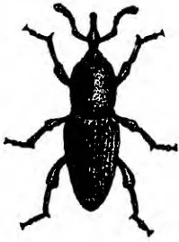

1

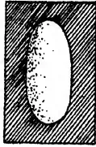

2

3

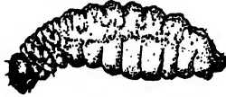

4

5

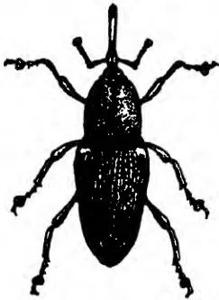

6

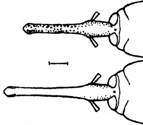

7

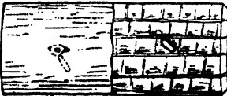

8

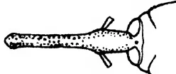

a

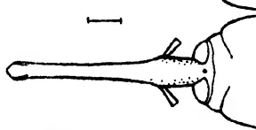

b

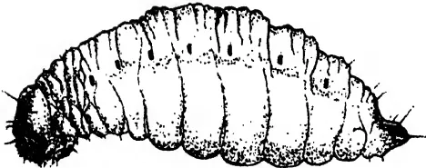

10

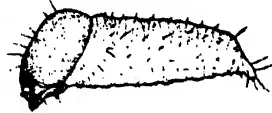

9

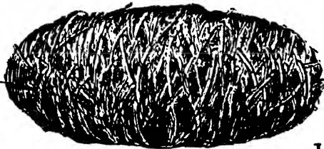

11

12

Block by Survey Dept. Ceylon.

Gao. i. de Silva

THE TWO PLANTAIN WEEVILS.

(*Cosmopolites sordidus* Germ. and *Odoiparus longicollis* Oliv.)

(1). Root Weevil x 2. (2). Root Weevil egg x 10. (3). Root Weevil young larva x 10. (4). Root Weevil full grown larva x 2. (5). Root Weevil pupa x 2. (6). Stem Weevil x 2. (a). Stem Weevil rostrum of male x 6. (b). Stem Weevil rostrum of female x 6. (7). Section of sheath with egg in situ in cell nat. size. (8). Stem Weevil egg x 10. (9). Stem Weevil young larva x 10. (10). Stem Weevil full grown larva x 2. (11). Stem Weevil cocoon x 2. (12). Stem Weevil pupa removed from cocoon x 2.

250------------------------------------------------

This image is a scan of a blank white piece of paper. It contains several small, dark specks which are likely scanning artifacts or dust particles. There is no text, handwriting, or printed content on the page.

251------------------------------------------------

225

## Mycological Notes (12).

### Hevea Stem Disease Caused by *Fomes lamaoensis*.

**MALCOLM PARK, A.R.C.S.,**

*Assistant Mycologist, Department of Agriculture, Ceylon.*

**F**OMES LAMAOENSIS is well known as the cause of a root rot of *Hevea* but it has not been recorded hitherto attacking the stem at a considerable height from the ground, independently of disease on the roots.

Stem disease of *Hevea* was reported from an estate in the Kalutara district. Specimens of rotten wood received were light and friable and permeated throughout by brown sheets of fungus mycelium which in section appeared as typical brown lines. The estate was visited by the writer and the affected trees examined. It was found that two trees, a considerable distance apart, were attacked. In both instances the fungus had gained an entry at some distance from the ground and the subsequent ringing of the stems had caused the dying back of the crowns of the trees. It had been found possible to pollard one tree below the diseased tissue but the other had been more severely attacked with the result that the upper part had been blown over by the wind necessitating the removal of the tree.

The roots of both trees were examined critically and were found to be healthy, and, similarly, sections of the trunk below the diseased portions were unaffected. It was apparent that the fungus had gained an entry at a cankered fork in one tree, and in the other the rot had probably started through the wood exposed by the removal of a lateral branch. The surface of the bark of affected areas was covered by a growth of lichens, mosses and saprophytic fungi and the marked development of these may be explained by the presence of the hyphae of the fungus in the cortex, since hyphae of *Fomes lamaoensis* are covered with a gelatinous sheath and this by imbibing water ensures a moist substratum upon which the epiphytes thrive. The same characteristic of the hyphae causes the adherence of sand and small

252------------------------------------------------

226

stones to roots affected by the fungus. As has been mentioned above, the diseased wood was permeated by sheets of brown mycelium. In advanced cases the wood was light and friable and showed the honeycomb structure which is caused by the persistence of the sheets of mycelium after the intervening wood has almost completely decayed.

Infection is most probably caused by spores which find an entry through wounds into exposed wood and, seeing that such wounds are not very common, it is unlikely that the disease will ever be serious. The possibility of infection, however, adds emphasis to the need of continued attention to the common estate practice of tree surgery and sanitation. Canker patches, at forks particularly, should be kept clean and wood exposed by the cutting of branches should be treated periodically to prevent the entry of wood-rotting fungi.

Infected trees should be treated on their merits. Some can be saved by cutting or pollarding below the infected portion; in every case the diseased tissue should be burnt.

253------------------------------------------------

227

# Mycological Notes (13).

---

## Further Notes on *Rhizoctonia bataticola*.

---

**W. SMALL, M.B.E., M.A., B.Sc., Ph.D., F.L.S.,**

*Mycologist, Department of Agriculture, Ceylon.*

**S**EVERAL new hosts of *Rhizoctonia bataticola* are recorded in these notes and several points of general interest are discussed. The total number of Ceylon hosts of the fungus now exceeds fifty. On scientific grounds the *Rhizoctonia* would be named more correctly *Macrophomina Phaseoli* (Maubl.) Ashby, but the *Rhizoctonia* name is retained and used in these notes for reasons of local convenience and in order to avoid confusion. *Macrophomina Phaseoli* is the pycnidial stage of the soil *Rhizoctonia*; it formed the subject of Mycological Notes (9). In Ceylon the *Macrophomina* has been found in culture and in nature on beans only.

(a) (1) *Phaseolus vulgaris* L. (Rodriguez Beans). Examples of root disease due to *Rhizoctonia bataticola* have occurred among Rodriguez beans grown on the Bata-ata and Middeniya Cotton Rotation Stations in the Southern Province. The same root disease of French beans, another variety of *Phaseolus vulgaris*, and also the ashy stem blight due to attacks of *Macrophomina Phaseoli*, the pycnidial stage of the *Rhizoctonia*, were reported in Mycological Notes (6) in the *Tropical Agriculturist* of July, 1927. It was pointed out then that the sclerotial *Rhizoctonia* root disease occurred independently of the pycnidial *Macrophomina* stem disease, and it was noted in the present case of Rodriguez bean root disease that the *Macrophomina* occurred, not on the stems of the plants which, by the way, showed no sign of ashy stem blight, but on the dried-up skins of the pods of two of the specimens. The pycnidia of the *Macrophomina* were very numerous, and the spores were proved to give in culture the sclerotial *Rhizoctonia* form of the fungus. In the case of Rodriguez beans, then, the *Rhizoctonia* form of the fungus occurred on all the specimens and the *Macrophomina* form on two

254------------------------------------------------

228

of them only; the presence of the *Macrophomina* on the pods did not follow of necessity the presence of the *Rhizoctonia* on the roots. Rodriguez beans have been attacked also by eelworm (*Heterodera radicicola*) in the northern part of the island.

(2) *Cocos nucifera* L. (Coconut). *Rhizoctonia bataticola* has been recorded on the roots of coconuts in the Eastern Province, an extension of its known distribution on this host in Ceylon. It occurred on trees which were subjected to periodical flooding. It has also been found to attack the roots of coconuts growing under normal conditions at Kadugannawa.

(3) *Hevea Brasiliensis* Müll.-Arg. (Rubber). A case of *Rhizoctonia* attack on a budded rubber stump has been encountered. Certain of the smaller roots and the tap-root of the stump showed the presence of large numbers of small sclerotia both in the cortical tissues and on the wood. Similar root diseases of young stumps of *Eucalyptus* and jak have been encountered. It may be mentioned that the budding of the rubber stump in question had been successful.

Investigation of root disease of certain old rubber trees in plot 1 (planted 1877) and plot 2 (planted 1887) at Heneratgoda disclosed the presence of the *Rhizoctonia* and *Fomes lamaoensis*, the fungus of brown root disease, on larger roots and the *Rhizoctonia* alone on smaller roots. Trees which had not been attacked by root disease and which were in a normal healthy condition adjoined the diseased trees, and it was noted that their roots were in close contact with diseased roots affected by the brown root fungus. They might therefore have been expected to become diseased through spread of the brown root fungus by contact, but they had not been affected in any way and had remained healthy. The brown root fungus was confined to roots already attacked by the *Rhizoctonia*. It was apparent from the condition of roots attacked by the *Rhizoctonia* and the brown root fungus that the latter had had time to attack adjacent healthy roots if it had been capable of doing so.

(4) *Nicotiana Tabacum* L. (Tobacco). An interesting case of root disease of young tobacco showed the presence on all affected plants of both *Rhizoctonia bataticola* and eelworm (*Heterodera radicicola*). Certain roots of the plants had been attacked by the *Rhizoctonia* only, others by the eelworm only; others again had been attacked by both fungus and eelworm. It has already been reported that both the *Rhizoctonia* and the eelworm are associated with a diseased condition of plantain roots in Ceylon, but, while both agents of disease have been found on separate roots of the same plantain, they have not been found in company on the same root. In the case of tobacco, it is difficult to apportion between fungus and eelworm the blame for root disease. Simple eelworm attack on tobacco roots is not uncom-

255------------------------------------------------

229

mon in Ceylon. The *Rhizoctonia* may have followed the eelworms, but, again, the conditions under which the plants were growing may have been so unsuitable that both agents were enabled to attack the plants in their presumably weakened state. The plants, however, did not show any outward signs of weakness of root and stem development. The case of attack by both fungus and eelworm on plantain roots may be similar to that of tobacco.

(5) *Albizia lopantha* Benth. (Cape or Crested Wattle). A case of root disease of a two-year old plant showed *Rhizoctonia* in the roots and *Poria* on the collar. The latter fungus had not penetrated its substratum; the roots attacked by the *Rhizoctonia* were dried and hardened in a typical manner.

(6) *Citrus*. Two cases of *Rhizoctonia* root disease of young plants of mandarin orange have been encountered on the Experiment Station, Peradeniya. In one case, fifty per cent. of the roots of the plant had been attacked.

(7) *Persea gratissima* Gaertn. (Avocado Pear). *Rhizoctonia* root disease of well-grown trees has occurred on the Experiment Station, Peradeniya. With reference to the reported correlation between deficiency of soil potash and prevalence of *Rhizoctonia* disease of jute, it may be noted that an analysis of the soil of the avocado plot carried out by the Agricultural Chemist of the Department of Agriculture showed a deficiency of phosphoric acid rather than of potash.

(8) *Eucalyptus globulus* Labill. (Blue Gum). *Rhizoctonia* lines or sclerotial plates occurred in the root tissues of blue gum seedlings attacked and killed by the fungus. A pycnidial fungus which occurred on the dead stems of the plants resembled closely *Macrophomina Phaseoli* but proved to be a species of *Macrophoma*.

(9) *Santalum album* L. (Sandalwood). *Rhizoctonia* root disease of a young specimen of this tree occurred also on the Experiment Station, Peradeniya. Sclerotia were present in the roots and hyphae of the *Rhizoctonia* were found in plenty in the inner cortical root tissues.

(10) *Desmodium heterocarpum* DC. This plant is used as a cover and green manure in rubber. It has been found to die out in patches. Sclerotia and lines occur in diseased roots.

(11) *Livistona Australis* Mart. Lines or sclerotial plates of the *Rhizoctonia* were found in diseased roots of a specimen of this palm in the Royal Botanic Gardens, Peradeniya.

(12) *Elettaria Cardamomum* Maton. (Cardamom). Investigation of a recent case of death of cardamoms in patches disclosed a dry hardened condition of the roots of diseased plants.

256------------------------------------------------

230

The roots also contained thin black lines from which the *Rhizoctonia* was grown in culture. The lines in the cardamom roots and the isolations of the fungus recalled the lines and *Rhizoctonia* isolations of the same root disease of guinea grass reported in Mycological Notes (8) in the *Tropical Agriculturist* of October, 1927. The cardamom root disease is followed by a rot of the rhizomes of affected plants.

(b) A speaker at a local meeting which was reported in the *Times of Ceylon* of November 5 of last year discussed the question of the apparently sudden death of a rubber tree on the smaller roots of which the *Rhizoctonia* was found subsequently. He said he was of opinion that "the disease of a certain amount of rootlets could not have killed the tree in such a short period as four days" and "he surmised, though he might have been wrong to do so, that death was due probably to lightning and *Rhizoctonia* was secondary." It is to be noted that there were no signs of lightning injury to the tree and that the roots were reported to be healthy. The fungus was found to have attacked the majority of the small roots submitted for examination, and it is possible that its attack accounted for the death of the tree. In this connection, the writer had experience in Uganda of a similar sudden death of adult plants of robusta coffee on two occasions, and C. G. Hansford, the present Mycologist of the Department of Agriculture, Uganda, has reported (*in litt.*, Jan., 1928) that he has encountered further cases of the sudden death of robusta coffee due to *Rhizoctonia* root disease and also that the disease is not confined to plants growing under poor soil conditions. On both occasions in the writer's experience, single trees in the midst of hundreds of other healthy robusta plants were found to have died with such suddenness that the usual gradual degeneration and dieback were totally absent. In both cases, the leaves of the plants remained on the trees in a browned and dry condition, and in both cases it was reported that the trees had apparently been in perfect health a few days previous to death. The *Rhizoctonia* of these notes was the only fungus present and it was found to have penetrated and permeated the root systems of the plants so thoroughly and regularly that its reaching a certain point caused a complete and sudden stoppage of water supply from the roots, a stoppage which led to rapid wilting and death. The fact that the leaves were not shed in the usual manner pointed to a sudden complete interference with the movements of moisture or sap within the plants, and it is possible that the case of sudden death of the rubber tree was similar to those of the coffee. The writer would be glad of an opportunity of investigating similar cases in the field.

With reference to the point that the *Rhizoctonia* followed the results of lightning injury, the writer holds that the

257------------------------------------------------

231

*Rhizoctonia* is unlikely to do so. There is no evidence to the effect that the *Rhizoctonia* behaves in the manner stated, that is to say, that it is capable of living on any dead material that may be at hand. It has not been found, for example, on the dying and dead roots of shade trees which have been cut down in areas of tea and cacao known to contain the *Rhizoctonia*.

(c) It is necessary to protest against the application of the term "root-rot" to root disease with which the *Rhizoctonia* is associated. In the case of the majority of the host plants, the term is particularly unsuitable because the *Rhizoctonia* does not cause a rot; on the contrary it renders affected tissues dry and comparatively brittle. The term "*Rhizoctonia* root disease" is more suitable than "root-rot."

(d) The *Rhizoctonia* has been found lately on tea (both seedlings and older plants) in Java, on *Acacia melanoxylon* in Kenya, on *Eucalyptus rostrata* in Southern Rhodesia, on rubber in Malaya, and on cotton and citrus in the West Indies. During 1927 new records of its attack on *Panax*, *Buddleia*, orange, lemon and roses have been made in Uganda by Hansford. Its recently-discovered presence in cases of rubber root disease in South India and Uganda has been noted in the *Tropical Agriculturist* of October, 1927. These new records support the writer's contention that the *Rhizoctonia* is widely distributed in the tropics and sub-tropics. It is possible that a careful search will disclose the presence of the fungus in regions from which it has not yet been recorded and its association with root disease of plants of economic importance in those regions.

The finding of the *Rhizoctonia* on tea in Java towards the end of 1927 followed closely upon the publication of an article by Dr. A. Steinmann of the Proefstation voor Thee at Buitenzorg in *De Bergcultures* of September 10, 1927 in which it was stated that the *Rhizoctonia* had not been found in Java. The article ended with the statement that *Rhizoctonia bataticola* had to be added to the list of root fungi of tropical cultivated plants. The results of further investigation in Java, particularly investigation into the presence of the *Rhizoctonia* in cases of tea root disease in which fungi like *Poria*, *Ustulina* and *Diplodia* are also present, are awaited with interest.

258------------------------------------------------

232

Contribution from the  
Rubber Research Scheme.

## Notes on Rubber Manufacture.

**T. E. H. O'BRIEN, M.Sc., A.I.C.,**

*Chemist, Rubber Research Scheme, Ceylon.*

### Sodium Silicofluoride as a Coagulant.

**S**ODIUM silicofluoride (also known in trade circles as fluosilicic soda) is a greyish-white powder which occurs as a bye-product in the manufacture of superphosphates. It is used to some extent as an insecticide and also has fungicidal properties.

J. Edwardes,\* Chemist to the Rubber Growers' Association in Malaya, experimented with S. S. F. as a preventive of mould in smoked sheet and noted that it was also a rubber coagulant. As regards mould prevention it was found that soaking sheets in a solution of S. S. F. prevented mould to a large extent, but it was less efficient for this purpose than para nitrophenol. The properties of S. S. F. as a coagulant were investigated and at the same time exhaustive tests were made by H. P. Stevens† to determine its effect on the inner properties of the rubber. The conclusion was reached that S. S. F. is a useful and economical coagulant without material influence on the inner properties of the rubber and its use was approved by the Rubber Growers' Association in 1925.

The method of use advised by the Rubber Growers' Association is as follows:

The latex should be diluted to  $1\frac{1}{2}$  lb. per gallon. The amount of S. S. F. required is 1 lb. to 150 gallons of diluted latex (i.e., 1 lb. to 225 lb. rubber). The weighed quantity of the chemical should be introduced into the coagulating tank and the diluted latex run in and thoroughly stirred.

\* R.G.A. Bulletin. January, 1923. p.21.

† R.G.A. Bulletin September, 1925. p.555.

259------------------------------------------------

233

The advantages and disadvantages of S. S. F. as a coagulant are approximately as follows:

### Advantages.

1. 1. Being a non-corrosive solid it is easier to transport and handle than acetic or formic acid.
2. 2. It is cheaper than Acetic acid.
3. 3. It has certain fungicidal properties.
4. 4. It has a remarkable influence in preventing bubbles in sheet rubber.

### Disadvantages.

1. 1. Being a solid it must be weighed instead of measured, which is probably less accurate under estate conditions.
2. 2. It has a low solubility (0.84%) which means that it must be used in solid form or else as a very dilute solution.
3. 3. It is a relatively weak coagulant, and therefore does not give complete coagulation unless the latex is diluted to  $1\frac{1}{2}$  lb. per gallon.
4. 4. It has a corrosive action on aluminium.

The properties of S. S. F. have also been carefully investigated by a number of workers in Java\* and by N. H. Van Harpen in Sumatra.† The results reported from Java are much less satisfactory than those from Malaya, it being found that in many cases complete coagulation cannot be obtained even when the latex is diluted to  $1\frac{1}{2}$  lb. per gallon, and that on the average the amount of coagulant required is more than twice that which is found to give satisfactory results in Malaya. It is also found that latex from various divisions of the same estate may behave differently on treatment with S. S. F. The reason for this was investigated by L. R. Van Dillen‡ who concludes that it is due to differences in the acidity of the original latex. The general conclusion reached in Java is that the use of S. S. F. is not to be recommended except in special cases for prevention of bubbles in sheet manufacture.

Results from Sumatra are more in line with those reported from Malaya, and the use of S. S. F. is recommended both as an economy and on account of its action in preventing bubbles in sheet. Van Harpen gives figures for an estate on which the proportion of off-grade sheet was reduced from 39% to 6.9% (average for 3 months) by adoption of S. S. F. It is pointed out that the use of the coagulant in powder-form is not to be recommended and that it should be made up in the form of a 0.5% solution. In this case it is claimed that coagulation at  $1\frac{1}{2}$  lb. per

\* Messrs. L. R. Van Dillen, C. Knaus, G. M. Kraay & R. Riebl. *Archief* Feb. 1928. p.187.

† *Archief* Dec. 1926. p.617, & Oct. 1927 p.487.

‡ *Loc. cit.*

260------------------------------------------------

234

gallon gives consistently satisfactory results. It has also been shown by the same worker that latex of 2 lb. per gallon can be satisfactorily coagulated if a small proportion of formic acid is added to the solution of S. S. F.

A few experiments were carried out by the Ceylon Rubber Research Scheme when S. S. F. was first introduced in Malaya. These laboratory tests indicated that S. S. F. in the proportion 1:200 gave good coagulation at  $1\frac{1}{2}$  lb. per gallon leaving a clear or opalescent serum and that soaking sheets in a solution of S. S. F. after rolling, increased resistance to mould growth. It was thought however that a coagulant used in powder-form was not suited to Ceylon conditions and the investigation was not continued. Several enquiries were received on the subject a few months ago and it was thought advisable to make further tests to see whether S. S. F. could be used successfully in Ceylon. The experiments are not completed and the present notes are compiled with the object of giving the information which is at present available.

### Experiments on the Method of Using S. S. F.

The method recommended by the R. G. A. is that the required amount of the chemical should be introduced into the coagulating tank, and the standardised latex run in and stirred. This would be inconvenient in Ceylon where it is customary to coagulate in a number of Shanghai (50 gallon) jars.

The method adopted by the Sumatra and Java workers is to use the chemical in the form of a 0.5% solution. Approximately 8 gallons of solution is required to coagulate 1 jar of latex at  $1\frac{1}{2}$  lb. per gallon, which would entail having a large mixing tank for the solution.

Tests were made in Ceylon to determine whether it would be satisfactory to add the chemical to the latex in the form of a suspension in water. S. S. F. "wets" readily and if it is first kneaded by hand with a little water it forms an even suspension when stirred up with the requisite quantity of water. This method of use gave good results in laboratory tests and two factory tests have been carried out. One test was made in the Kalutara district (approximate annual rainfall 150 inches), and the other in the Moneragalla district (approximate annual rainfall 80 inches), during wet weather.

Details of the tests were as follows:—

#### A.—Kalutara District.

50 gallons of latex diluted to  $1\frac{1}{2}$  lb. per gallon.  $6\frac{1}{2}$  ounces of S. S. F. (i.e., 1 part S. S. F. to 180 parts dry rubber) was well mixed with 2 gallons of water and added to the jar of latex. The latex was stirred for 4 minutes and then distributed to enamelled coagulating pans.

261------------------------------------------------

235

The following morning coagulation in all pans was complete leaving a clear serum. The coagulum was somewhat softer than with a similar amount of Acetic acid, but worked up into good sheets.

**B.—Moneragalla District.**

50 gallons of latex diluted to 1 lb.  $7\frac{1}{2}$  oz. per gallon.  $6\frac{1}{2}$  ounces of S. S. F. mixed with 3 gallons of water and added to the jar of latex, stirred for 3 minutes and distributed to wooden troughs.

The following morning the coagulum was somewhat soft but worked up into good sheets. The serum was milky. A jar of the same latex coagulated with a similar quantity of Acetic acid gave a harder coagulum and a less milky serum.

It will be seen from the above results that coagulation was completely successful in one test but resulted in a small loss of rubber in the other test. This loss was probably not greater than is incurred daily in a number of factories using acetic acid, but was nevertheless unsatisfactory.

The value of a mixture of S.S.F. and acid for coagulation at 2 lb. per gallon was indicated by Van Harpen, and it is considered by the present writer that under Ceylon conditions it would be advisable to extend this to all coagulation with S. S. F. For sheet manufacture at  $1\frac{1}{2}$  lb. per gallon it is thought that S. S. F. in proportion 1:200 plus formic acid in proportion 1:1600 would give a coagulum of suitable hardness and a clear or opalescent serum.

The properties of latex vary on different estates and S. S. F. appears to be sensitive to such variations, so it would be necessary for each estate to establish by tests the proportion of S. S. F. and acid required to give satisfactory results.

### Influence of S. S. F. in Prevention of Bubbles in Sheet.

Up to the present two tests have been carried out to determine this point.

**A.—Laboratory Test.**

Latex brought in to the laboratories at noon was kept until 4 p.m. It was then diluted to  $1\frac{1}{2}$  lb. per gallon. One pan was coagulated by means of acetic acid (1:180) and the other by S. S. F. (1:180).

On examination after smoking it was found that the S. S. F. sample was entirely free from bubbles. The acetic acid sample contained numerous bubbles.

**B.—Factory Test in Moneragalla District.**

This Estate was visited for the purpose of advising on the cause and prevention of bubbles in smoked sheet. The bubbles were of the type usually attributed to premature clotting of the

262------------------------------------------------

236

latex and it was concluded that the trouble was chiefly due to climatic conditions.

Observations on the effect of S. S. F. in prevention of bubbles were made on the sheets obtained from the coagulation test described in the previous paragraph. It should be mentioned that latex for this experiment was taken from the field with the worst reputation for producing bubbly sheet. Both batches of sheet were coagulated in old wooden troughs.

One sheet from each batch was forwarded to the writer for examination. The S. S. F. Sheet was entirely free from bubbles and was very attractive in appearance. The Acetic acid sheet was badly disfigured with bubbles and would probably be valued at about 5 cents per lb. less in the local market. The Superintendent reported that these sheets were typical of the remainder.

These results confirm reports from Malaya and Sumatra that S. S. F. has a remarkable influence in preventing bubbles in sheet and the writer considers that this is one of the chief points in favour of S. S. F. as a coagulant. Unfortunately it has to be remembered that S. S. F. cannot be used in conjunction with aluminium pans and this would hinder its adoption on many estates.

### Coagulation of Latex at 2 lb. per gallon.

In crepe manufacture in Ceylon it is usual to coagulate at a dilution of 2 lb. per gallon. Coagulation with S. S. F. at  $1\frac{1}{2}$  lb. per gallon would involve an increase of 33% in the number of jars for the same crop.

As mentioned earlier in the report Van Harpen has shown that coagulation at 2 lb. per gallon can be carried out successfully if a small proportion of the S. S. F. is replaced by acid. One test on these lines was carried out by the Writer with the following results.

<table border="1">
<thead>
<tr>
<th></th>
<th>Nature of coagulant.</th>
<th>Appearance of serum (after 18 hours).</th>
</tr>
</thead>
<tbody>
<tr>
<td>1.</td>
<td>Acetic acid (1·200)</td>
<td>Very milky.</td>
</tr>
<tr>
<td>2.</td>
<td><math>\frac{7}{8}</math> dose Acetic acid plus <math>\frac{1}{8}</math> dose S.S.F.</td>
<td>Less milky than 1 (similar to 9).</td>
</tr>
<tr>
<td>3.</td>
<td><math>\frac{3}{4}</math> " " " " " "</td>
<td>Less milky than 2.</td>
</tr>
<tr>
<td>4.</td>
<td><math>\frac{1}{2}</math> " " " " " "</td>
<td>Opalescent.</td>
</tr>
<tr>
<td>5.</td>
<td><math>\frac{1}{4}</math> " " " " " "</td>
<td>Opalescent.</td>
</tr>
<tr>
<td>6.</td>
<td><math>\frac{1}{8}</math> " " " " " "</td>
<td>Opalescent.</td>
</tr>
<tr>
<td>7.</td>
<td><math>\frac{1}{4}</math> " " " " " "</td>
<td>Milky (similar to 3).</td>
</tr>
<tr>
<td>8.</td>
<td><math>\frac{1}{8}</math> " " " " " "</td>
<td>More milky than 7.</td>
</tr>
<tr>
<td>9.</td>
<td>S.S.F. (1·200)</td>
<td>More milky than 8 (similar to 2).</td>
</tr>
<tr>
<td>10.</td>
<td>S.S.F. (1·200) plus <math>\frac{7}{8}</math> dose acetic acid.</td>
<td>Less milky than 9 (similar to 7).</td>
</tr>
</tbody>
</table>

263------------------------------------------------

237

The test is not entirely satisfactory in that coagulation with acetic acid (1·200) gave a milky serum in this case. It indicates however that successful coagulation of latex for crepe manufacture is likely to be achieved by the use of S. S. F. in conjunction with a small quantity of acid, e.g., full dose of S. S. F. plus formic acid in proportion 1 to 1600. It is intended to carry out further tests on these lines as soon as tapping is resumed.

### Comparison of Coagulation Costs.

The latest quotations from Colombo for the various coagulants are as follows.

Acetic acid Rs. 19·00 per carboy of 45 lb.

Formic acid Rs. 18·00 per carboy of 45 lb.

S. S. F. (average of 2 quotations) Rs. 18·50 per cwt.

### Cost of Coagulating 100,000 lb. of Rubber.

<table>
<thead>
<tr>
<th></th>
<th></th>
<th style="text-align: right;"><b>Saving compared with Acetic acid.</b></th>
</tr>
</thead>
<tbody>
<tr>
<td>Acetic acid (1·200)</td>
<td>Rs. 211·10</td>
<td style="text-align: right;">—</td>
</tr>
<tr>
<td>Formic acid (1·350)</td>
<td>,, 114·30</td>
<td style="text-align: right;">Rs. 96·80</td>
</tr>
<tr>
<td>S. S. F. (1·200) plus</td>
<td></td>
<td></td>
</tr>
<tr>
<td>Formic acid (1:1600)</td>
<td>,, 107·60</td>
<td style="text-align: right;">Rs. 103·50</td>
</tr>
</tbody>
</table>

### Conclusions.

1. Sodium silicofluoride has been used successfully as a coagulant in Malaya and Sumatra. Reports from Java are less satisfactory. Experiments indicate that it is likely to be a useful coagulant under Ceylon conditions when used in conjunction with a small proportion of acetic or formic acid.

2. Adoption of formic acid or sodium silicofluoride as a coagulant leads to a considerable reduction in the cost of coagulation.

3. Sodium silicofluoride has a remarkable influence in the prevention of bubbles (due to premature clotting) in sheet.

4. Sodium silicofluoride cannot be used in conjunction with aluminium utensils.

5. Further experiments are required in Ceylon, particularly with regard to the effect of S. S. F. on the colour of blanket crepe. Reports from Java indicate that the dose of sodium bisulphite can be reduced by 50%.

264------------------------------------------------

238

## Para Nitrophenol for Prevention of Fungal Spots in Crepe.

The use of para nitrophenol (p.n.p.) as a preventive of mould in smoked sheet is now well established in Ceylon, and it would be useful if it could also be employed for prevention of spots in crepe during manufacture and storage.

Spotting of crepe during drying can usually be traced to lack of ventilation in the drying rooms and should not occur even in unfavourable weather if the drying rooms are properly ventilated. The fact remains however that a number of Estates in Ceylon have trouble with fungal spots or surface mildew in crepe during the monsoons and there is no doubt that there is scope for an efficient disinfectant for use in crepe manufacture. Also in the present state of the rubber market it is necessary at times to store rubber for considerable periods, and in spite of careful manufacture spots are liable to develop if the rubber is stored under unfavourable conditions. The writer knows from experience that most of his crepe samples develop a good growth of fungal spots in the course of a year's storage at the laboratories.

H. C. Pinching\* showed that soaking wet crepe in a 0.15% solution of p.n.p. prevented spotting and found that the treatment did not affect the colour of the crepe. A later recommendation of the Rubber Growers' Association† is that a 0.1% solution of p.n.p. should be used. Experiments in Ceylon indicate that soaking in 0.1% p.n.p. solution is effective but causes slight discoloration of the crepe. The degree of discoloration varies in different samples of latex but appears to be worst during wet weather which is when a disinfectant is most required. In comparing the results it should be remembered that crepe in Malaya is marketed in the form of "lace," and that slight discoloration which is not noticeable in lace crepe becomes evident when it is rolled into blanket.

W. Brown‡ investigated the causes of spots in crepe and found (in London) that soaking in a 0.01% solution of p.n.p. effectively prevented development of spots. Laboratory experiments in Ceylon indicate that this treatment does not entirely prevent spotting when the samples are kept in an atmosphere saturated with moisture, but would probably be effective under ordinary conditions of manufacture and storage. Unfortunately even this low concentration of p.n.p. leads to slight discoloration of blanket crepe. Moreover when the treatment was applied under estate conditions, viz: soaking 50 lb. of lace crepe in a Shanghai jar of solution it was found difficult to ensure thorough

\* R.G.A. Bulletin, Sep. 1924. p.545.

† R.G.A. Bulletin, Sep. 1925. p.560.

‡ R.G.A. Bulletin, Nov. 1924. p.682, & R.G.A. Bulletin, Sept. 1925. p.522.

265------------------------------------------------

239

soaking, with the result that parts of the crepe were no more resistant to spotting than the untreated crepe.

The alternative method of using p.n.p. is to add it to the latex with the acid used for coagulation. Addition of 0.1% of p.n.p. (based on dry weight of rubber) prevents spotting but causes slight discoloration of the finished blanket. Experiments made recently indicate that .025% of p.n.p. (i.e., 1 part p.n.p. to 4000 parts rubber) can be added to latex without having any effect on the colour of the rubber. In the latest experiment two chests of rubber were prepared from one batch of latex, one containing .025% p.n.p. and the other without p.n.p. No difference in appearance could be detected, nor was there any streakiness when portions of treated and untreated crepe were blanketed together.

The resistance of the rubber to spotting was tested by keeping portions of wet lace crepe in an atmosphere saturated with moisture. The appearance of the samples after the test was as follows:—

#### **After 7 days.**

Control.—Many black and greenish spots.

Sample containing .025% P.N.P. One yellow spot.

#### **After 18 days.**

Control.—Almost covered with black spots and surface mould.

Sample containing .025% P.N.P. One yellow spot and some small pink spots.

The treatment was not sufficient to prevent spotting completely under this severe laboratory test but it is considered that it would be an effective preventive under normal conditions of manufacture and storage.

It remains to be seen whether this proportion of p.n.p. can be added to latex at all seasons without affecting the colour of the finished crepe, but anyone who is troubled with spotting of crepe is advised to experiment with this method of control.

The easiest way to incorporate the correct dose of p.n.p. in the latex is to dissolve the chemical in the undiluted acid (acetic or formic) used for coagulation. On the basis that one carboy (45 lb.) of acetic acid coagulates 9000 lb. of rubber the amount of p.n.p. per carboy of acid is  $2\frac{1}{4}$  lb. It is advisable to empty the contents of the carboy into a Shanghai jar, mix in the chemical and then replace the acid in the carboy. If mixed in bulk in this way there is little danger of mistakes in the amount of p.n.p. added to the latex. Alternatively a 1% solution of p.n.p. in water can be made by dissolving 1 lb. p.n.p. in 10 gallons of water and the correct dose added to the diluted acid used for coagulation. Coagulating at 2 lb. per gallon the dose for a 50 gallon jar would be **2 pints**.

266------------------------------------------------

240

# Birds in Relation to Agriculture.

**N. K. JARDINE, F.E.S.,**

*Plant Pest Inspector, Central.*

**I**T has been suggested that a report which enumerates the birds that feed on Tea Tortrix would be useful to planters in order that they may know what species to attract to estates, and how best to attract them.

The suggestion opens the very important question of the utility or otherwise of birds to Agriculture. The question is one which has occupied the attention of entomologists, ornithologists and those who have had practical experience of the damage and the good that can be done by birds, all over the world, and the evidence is so conflicting that one doubts whether this vexed question will ever be solved.

Birds are known to destroy fruits, seeds and crops; to damage forest trees and wantonly to destroy young buds of trees and bushes; to destroy beneficial insects and to distribute injurious ones; to disseminate weeds; to attack game-birds, poultry and young stock, and to be harmful to fisheries. But they are also known to do good by destroying injurious insects, seeds, birds and mammals, and by scavenging.

Some birds are known to be wholly injurious, others to be wholly beneficial, but there is a very large class of "doubtfuls," and in view of the lack of evidence as to the actual food of the doubtfuls at different seasons of the year, and under varied conditions, it is not yet possible to say how the balance weighs.

So far as Ceylon is concerned there is little evidence of the value of any of our insect-feeding birds outside of "personal opinion," and consequently several of them have been given exaggerated reputations for usefulness.

No definite conclusion can be made of the utility of a bird without a knowledge of its feeding habits, and this can only be ascertained by an examination of the stomach contents. During the writer's investigation into Tea Tortrix two hundred White-eyes were taken from tortrix-infested fields, and the stomach contents examined. The result of the examination showed that none of them had fed on tortrix.

267------------------------------------------------

241

It is not yet possible to enumerate the birds that feed upon Tea Tortrix, for what information there is on the subject at present is only "personal opinion." All that can be said is that such and such a bird *may* devour the pest. No bird will feed exclusively on tortrix. To attract a species of bird to an estate in the hope that it will devour the pest, is an act to be undertaken with care and forethought otherwise it may become a veritable pest itself by doing damage to vegetables, flowers and trees, and disseminating weeds and noxious insects.

Inquiries have been addressed to the Department of Agriculture as to what trees it would recommend should be planted in order to attract birds to estates. Something of the habit of the birds must be known before measures to attract them are employed. To plant up trees a bird is known to inhabit does not necessarily mean the bird will come and frequent those trees. Such details as climate, elevation, food and nesting requirements are to be considered. The question of the usefulness of birds is so complex that it is doubtful if a Department would be prepared to make any recommendation in view of the scarcity of adequate knowledge of the utility of our local insect-feeding species.

The following few facts and questions will, it is hoped, assist the reader to appreciate the problem of birds in relation to agriculture, and to judge for himself what is best in his own particular circumstances.

In some cases where birds are always killed and are practically non-existing as in parts of France, Italy and Belgium, and grape-growing districts, insects and pests are not so harmful and weeds are no more abundant, than where birds exist.

No insectivorous bird feeds exclusively upon injurious insects; beneficial insects are just as likely to be devoured.

There is no moth or butterfly known to be wholly beneficial, and stomach contents of insectivorous birds show a preponderance of flies, spiders, ants, grubs, caterpillars, beetles, crickets, grasshoppers, aphids, bees, wasps, and bugs, over moths and butterflies. Do the large wing surfaces of moths and butterflies render them unattractive as regular food?

It is an acknowledged fact that birds congregate where their food is most abundant. If there are birds in the island partial to a diet of butterflies, where are those birds when the flights of myriads of butterflies are in progress? The argument that the flights are restricted to low elevations and the lepidopterous-feeding birds to the hills, and that the two do not therefore meet, is refuted in the fact that flights are seen at all elevations, but few, if any, birds are seen to feed upon the butterflies. There have been serious outbreaks of the dadap defoliator (*Taragama*

268------------------------------------------------

242

*dorsalis* Wlk.) but few, if any, birds have devoured the caterpillars. Plagues of the *Albizzia* defoliator (*Terias silhetana* Wall) have remained unaffected by the insect-eating birds frequenting the trees at the time.

Moths are mainly nocturnal: insectivorous birds are not. The Tortrix moth is inactive during the day sheltering in the leaves of the trees and bushes. It is active in the evening and during the night. Insect-feeding birds are asleep during the night. Is it therefore probable that birds influence the number of tortrix moths to any extent? The Tortrix larvae are sheltered during the day in the curled leaves of the food plant. For insect-feeding birds to devour tortrix larvae it is necessary for the birds to extract the larvae from the tightly bound flush. Is it probable a bird will undertake this difficult method of procuring food when other insect food is abundantly to hand in the form of the many varieties of accessible insects in every tea bush? In view of these points is it possible that birds influence the numbers of this pest? And is it likely Tea Tortrix is going to be checked by attracting birds to tea estates?

Insect-feeding birds move in search of food during the day. Insect parasites and beneficial insects mainly move during the hours of daylight. Is it therefore not probable that these beneficial insects are preyed upon by birds?

Many seeds devoured by birds are voided whole: birds therefore become distributing agents of seeds, noxious and otherwise.

From the economic point of view the relationship of birds to the agriculture of the island presents so many points for consideration, that before the utility of any bird may be judged the feeding habits of that bird must be definitely known. The only sure method of determining feeding habits is by an examination of the stomach contents. The sentimental love for birds, which every one possesses, has checked any extensive investigation into this all-important subject, and the personal opinion of casual observers has, in the greater proportion of cases, been accepted as evidence in favour of the insect-feeding birds. A great deal of systematic work on the food contents of the stomachs and crops of our local insect-feeding birds is required before any particular birds can be recommended as an insect-pest reducing agent.

The following list aims at providing, in very brief form, a knowledge of the foods, manner of feeding and the nesting places of a few of the groups of the more common birds. For fuller general information in simple and accessible form the writer recommends Miss Kershaw's book *Familiar Birds of Ceylon*.

**Tits.**—Tree and bush feeders. Nest in holes in trees. Food: insects, seeds and fruit. The only injurious act proved against the tit is that of pecking the base of ripe pears and apples.

269------------------------------------------------

243

(in Britain). They hunt all the year round for insects. Practical men and Ornithologists are decidedly in favour of the protection and encouragement of this bird.

**Nutchats.**—Tree and bush feeders. Nest in holes in trees, stumps and rocks. Food: nuts and insects. Only one species in Ceylon. Nothing known for or against its encouragement.

**Bablers.**—Ground feeders. Nest in trees, bushes and shrubs. Food: insects, snails (not the Kalutara variety), worms, small lizards and frogs, wild fruits and weed seeds. Harmless to vegetation.

**Bulbulls.**—Tree and bush feeders. Nest in trees, bushes and shrubs. Food: insects and fruits, and vegetables preferably of a red colour. Known to do considerable damage to tamatos and chillies. Eat Lantana, the seeds of which it disperses. Do good by devouring all kinds of insects.

**Bush Chats.**—Swoop feeders. Nest on grassy ledges and holes in banks. Eat insects by swooping and taking them on the wing. So far as is known food is entirely composed of insects. Only one Ceylon sp.

**Robins.**—Ground feeders. Nest in any available hole, niche or corner. Food: insects, vegetable matter and worms. Known to be beneficial in devouring injurious insects.

**Blue Chats.**—Ground feeders. Nest in grassy holes in banks. Food: insects, worms and weed seeds. Only one species seen in Ceylon which is a migrant from India.

**Blackbirds and Thrushes.**—Tree, bush and ground feeders. Nest in trees or on stumps, in niches and corners. Food: insects, worms, snails, berries, wild and cultivated fruits. *Blackbird* known to be a veritable plague to crops, particularly fruit, in other countries. *Thrushes* good for keeping down snails (not the Kalutara variety). Of doubtful utility.

**Flycatchers.**—Feed on the wing. Nests built in slender forks, or fixed to slender twigs, trees, rocks and banks. Food consists chiefly of insects, also fruit, berries and seeds. From Indian evidence of stomach and crop dissections the bird is considered to be beneficial.

**Shrikes.**—Tree, bush and ground and swoop feeders. Nest in bushes, forks and ledges in low trees. Food: chiefly insects. No data against their utility.

**Minivets.**—Tree and bush feeders. Nest high up in trees. Food: chiefly insects, also fruit and seeds. No data against their utility.

**Drongos.**—Swoop and ground feeders. Nest in high trees. Food: almost entirely injurious insects. Should certainly be encouraged.

270------------------------------------------------

244

**Warblers:**(1) **Bush Warblers.**—Mainly residents of Ceylon. Nest in thick slender bushes, reeds and grasses.

(2) **Tree Warblers.**—Migrants to Ceylon. Tree feeders.

(3) **Wren Warblers.**—Residents of Ceylon. Nest in grass and slender reeds forming ball-like nests. Bush, grass and ground feeders. Food: small insects and small seeds. May be said to be exclusively beneficial. The Tailor bird forms its nest by sewing and riveting together one, two and more leaves three to six feet from the ground.\* These little birds are very numerous and are found all over the island, even in jungle, and at all elevations. Particularly obvious in and around gardens, but owing to its unobtrusive habits is seldom remarked, and in view of the fact it can be an irritatingly noisy bird it is remarkable so few people are aware of its presence around them.

**Orioles.**—Tree feeders. Nest at the extremities of leafy boughs. Food: insects, fruit, soft seeds and berries. May be considered beneficial.

**Starlings.**—(Mynas) Ground feeders. Nest in holes in trees. Food: insect, grains, wild fruit and cereals. Comparatively beneficial. The myna's aggressiveness must be considered if introducing it to a locality frequented by other and beneficial birds.

**Weaver Birds.**—Tree and ground feeders. Nest in trees, palms and bamboos, generally over water. Nests familiar to everyone. Food: grain and seeds. Wage war on grain crops. Not beneficial to agriculture.

**Munias.**—Low tree, bush and shrub feeders. Nest in creepers, bushes and grasses. Food: entirely grain, fruit and seeds. Harmful to grain and seed crops. Probable that insects are fed to nestlings but as a beneficial bird they have nothing to recommend them.

**Swallows.**—Feed on the wing. Nest in caves, against rocks, wood and stone walls; nests formed of mud and glued to perpendicular surfaces. Food: entirely insects. Decidedly beneficial.

**Wagtails and Pippets.**—Ground feeders. *Wagtails* migrants to Ceylon. Food: chiefly insects. Beneficial. *Pippets* residents. Nest in grass, reeds and reed-like bushes and shrubs. Food: insects, seeds, weeds and grasses. Nothing for or against their encouragement.

**White-eyes.**—Tree and bush feeders. Nest in bushes and low trees. Food: partly small insects, chiefly small buds, seeds, fruits and flowers.

\* Since the above was written the writer has watched the following unique behaviour of a pair of Tailor birds:—As soon as a Loten's Sunbird had completed the construction of its nest the pair of Tailor birds took possession of the nest, the female laid a solitary egg therein, hatched it, and raised the fledgling in the nest of the Loten's Sunbird.

271------------------------------------------------

245

As planters have frequently affirmed that this bird acts as a very important check to Tea Tortrix by devouring the moths and larvae in quantities; and have credited the bird with the ability of shaking the larvae from the flush, fuller details are here given in order that the true worth of these little birds may be judged on evidence and not on personal opinion. There are two forms of White-eye in Ceylon, the Small and the Large, both are peculiar to the island, and differ so little in size, colour, character, and habits that they may, from the point of view of their utility, be considered as one. Wait (an Ornithologist), affirms they "feed partly on insects, partly on buds and flowers." Fletcher (an Entomologist) states, "All the White-eyes are small birds, which go about in flocks, frequenting trees and bushes, whose leaves they search for small insects, varying their food at times with small buds, seeds and fruit;" and again, "The food of the White-eye consists of a mixed diet of insects and vegetable matter. Of sixteen birds examined at Pusa by the late C. W. Mason, eleven (68¾%) contained small buds, seeds and wild fig fruits, and five (31¼%) contained insect food consisting mostly of weevils and ants." Again he further states, "This bird . . . probably does a considerable amount of good by picking off small insects throughout the year."

The comparative size of the insect food has been stated on two occasions, namely, "small." In comparison with the innumerable insects to be found in every tea bush the Tortrix moth or larva cannot be said to be a small insect. We are told that the insect food consisted mostly of weevils and ants—neither moths nor larvae.

The two hundred specimens of this bird previously mentioned and taken off Tortrix-infested areas were all White-eyes, and their stomachs contained no Tortrix.

This evidence leans to the assumption that a *lepidopterous diet is not usual to the White-eye*. Though the White-eye may be seen in flocks in tea bushes the assumption that they are devouring Tortrix moths and larvae is probably erroneous. In Ceylon up-country planting districts this little bird has been given an exaggerated reputation for devouring Tea Tortrix.

**Sunbirds.**—Flower feeders. Nest in bushes, low trees, ferns and palms; nests are pendant pear-shaped structures. Food: mainly nectar, and "small insects for which their long bills are admirably adapted, both mandibles being serrated along the terminal third of their length. Small spiders, caterpillars, beetles, bugs and flies, probably in most cases themselves visitors to flowers, fall a prey to these birds." (Fletcher, "Birds of an Indian Garden.") Beneficial in pollinating flowers and reducing insects.

272------------------------------------------------

246

**Flowerpeckers.**—Tree and bush feeders. Nests similar to Sunbirds. Food: chiefly berries; probably have the same insectivorous habits as the Sunbirds.

**Pittas.**—Ground feeders. Only one form in Ceylon and it is a migrant. Food: insects. Food habits little known.

**Woodpeckers.**—Tree feeders. Nest in holes in trees. Food: entirely insects, chiefly ants. This bird is disappointing as a devourer of injurious insects. Its chisel-like beak is so well adapted for opening the burrows of tree-boring insects, and its long worm-like tongue with its many barbed horny and sticky tip for picking up insects, that entomologists naturally feel disappointment when it is learned the bird's chief food consists of ants, that it ignores the tree-living termites and does not seek out the Black Beetle and Red Weevil from coconut and other palms.

These birds have been known to do great damage by pecking into trees, destroying seeds and barking branches, but they have also been known to destroy numbers of injurious insects which man has difficulty in doing. Fisher states, "The results of investigations into Wood-peckers tends to show that these birds by their activity in the destruction of insects, play a most useful part in nature, and should therefore be protected by foresters." (Dr. Schlich and W. R. Fisher, Manual of Forestry, Vol. IV., Forest Protection by W. R. Fisher, B.A., pp. 120-31, 1895).

**Barbets.**—Tree feeders. Nest in holes in trees which they excavate. Food: almost entirely fruit. Not beneficial to agriculture.

**Rollers.**—Tree feeders. Nest in holes in decaying trees and walls. Food: almost entirely large insects consisting of grasshoppers, crickets, beetles, caterpillars, and cutworms. Very beneficial and should be encouraged.

**Bee-eaters.**—Swoop feeders. Nest in burrows excavated in banks of rivers, streams, tanks, ditches and ponds. Food: exclusively insects, such beneficial insects as bees, wasps, dragonflies and parasitic hymenoptera. For these reasons it should not be encouraged. The bird is a serious pest to agriculture.

**Kingfishers.**—Swoop feeders. Nest in tunnels excavated in banks of rivers, streams, tanks, ditches, lagoons and ponds. Food: mostly fishes, part diet of insects.

**Hoopoes.**—Ground feeders. Nest in holes in trees, banks and walls. Food: insects and worms. Voracious devourers of such injurious insects as cutworms, caterpillars, crickets, grasshoppers, cock-chafers and root-eating grubs. A decidedly useful bird, and to be encouraged.

273------------------------------------------------

247

**Swifts and Spinetails.**—Swoop feeders. Nests in places similar to the swallow. Food: little known; casual observation would lead to the belief they feed on very small insects.

**Koels and Coucals.**—Ground feeders. *Koels* lay their eggs in the nests of the crow; *Coucals* nest in thick bushes and thorny trees. Food: vegetable matter, wild fruits and insects, also known to eat small frogs, lizards, mice and small birds. So far as is known neither beneficial nor injurious to agriculture.

**Paroquets.**—Tree feeders. Nest in trees, also holes in trees which they may either appropriate or excavate. Food: purely vegetarian, cultivated and wild grains, berries, seeds and fruits. They are most destructive to grain and fruit crops, and to trees by barking and breaking branches. To the agriculturist they are an unmitigated nuisance.

274------------------------------------------------

248

# Departmental Notes.

## Meetings, Conferences, Etc.

### Progress Report of the Experiment Station, Peradeniya.

*For the Months of January and February, 1928.*

#### Tea.

The tea plots were again in plucking at the end of February.

The number of bushes lost after the 1927 pruning was very small.

Figures of losses after the last four prunings are given.

<table border="1">
<thead>
<tr>
<th rowspan="2">Plot.</th>
<th rowspan="2">Area Acres.</th>
<th colspan="4">Number of Bushes lost after Pruning.</th>
</tr>
<tr>
<th>1921</th>
<th>1923</th>
<th>1925</th>
<th>1927</th>
</tr>
</thead>
<tbody>
<tr>
<td>141</td>
<td>... 1</td>
<td>59</td>
<td>3</td>
<td>5</td>
<td>5</td>
</tr>
<tr>
<td>142</td>
<td>... 1</td>
<td>56</td>
<td>3</td>
<td>4</td>
<td>4</td>
</tr>
<tr>
<td>143</td>
<td>... 1</td>
<td>69</td>
<td>4</td>
<td>44</td>
<td>2</td>
</tr>
<tr>
<td>144</td>
<td>... 1</td>
<td>26</td>
<td>10</td>
<td>13</td>
<td>4</td>
</tr>
<tr>
<td>145</td>
<td>... 1</td>
<td>115</td>
<td>13</td>
<td>29</td>
<td>5</td>
</tr>
<tr>
<td>146</td>
<td>... 1</td>
<td>30</td>
<td>1</td>
<td>8</td>
<td>2</td>
</tr>
<tr>
<td>147</td>
<td>... 1</td>
<td>28</td>
<td>6</td>
<td>11</td>
<td>5</td>
</tr>
<tr>
<td>148</td>
<td>... 1</td>
<td>32</td>
<td>14</td>
<td>26</td>
<td>6</td>
</tr>
<tr>
<td>149</td>
<td>... 1</td>
<td>12</td>
<td>7</td>
<td>12</td>
<td>2</td>
</tr>
<tr>
<td>150</td>
<td>... 1</td>
<td>33</td>
<td>8</td>
<td>41</td>
<td>-</td>
</tr>
<tr>
<td>155</td>
<td>... 1</td>
<td colspan="2">Records not available</td>
<td>55</td>
<td>2</td>
</tr>
<tr>
<td>163</td>
<td>... 1</td>
<td>"</td>
<td>"</td>
<td>7</td>
<td>2</td>
</tr>
<tr>
<td>164</td>
<td>... 1</td>
<td>"</td>
<td>"</td>
<td>8</td>
<td>2</td>
</tr>
<tr>
<td>Hillside</td>
<td>... 8</td>
<td>"</td>
<td>"</td>
<td>124</td>
<td>7</td>
</tr>
<tr>
<td>166</td>
<td>... 1</td>
<td>"</td>
<td>"</td>
<td>31</td>
<td>2</td>
</tr>
<tr>
<td>Half acre</td>
<td>... <math>\frac{1}{2}</math></td>
<td>"</td>
<td>"</td>
<td>353</td>
<td>3</td>
</tr>
</tbody>
</table>

The 1921 pruning was a severe one and was followed by dry weather. In 1925 the pruning of the Half-Acre plot was postponed from October to December and a severe drought followed. It is not possible to connect the reduction in casualties after the 1927 pruning with the presence of *Indigofera* since an equal reduction is found in the plots not planted with a cover crop. The improvement must rather be ascribed to the favourable weather conditions which followed pruning.

In February the Hillside tea was manured with a mixture of Synthetic urea, Superphosphate and Muriate of potash. On account of its hygroscopic nature the urea adversely affected the consistency of the mixture and it was found necessary to apply this manure separately.

An experiment in the use of Pabco Mulch Paper in a tea nursery was started in February. Four beds were made and an equal number of tea seeds sown in each bed. On two of the beds strips of Pabco Mulch Paper punched with  $\frac{3}{4}$  inch holes 6 inches apart were laid and the seeds sown through these holes. After a week's dry weather the surface soil under the mulch was very moist and much moisture was condensed on the under-side of the mulch paper.

#### Rubber.

In plot 174 (8  $\frac{1}{3}$  acres) which was planted with budded rubber last November for an experiment on the influence of stock on scion, the situation 3 months after planting was as follows:—

52 out of 400 stocks had died and of these 45 were replaced by fresh budded plants from the nursery. Budded plants were not available to replace the other 7 plants. Of the remaining 348 plants some had shoots 18 inches high, in other cases the shoots were only one or two inches high, some were only just shooting, and some had not yet started to shoot, though the buds were still green. This irregularity is only partly due to difference in time of budding.

A good cover of *Dolichos Hosei* has now been established in the Bandarattene rubber and an experiment has been designed to compare the effect on yield of

275------------------------------------------------

249

rubber from plots in which the cover is forked in twice a year with that from plots in which the cover is left untouched. Twelve plots arranged in randomised pairs have been laid out and the experiment is to commence on April 1st, 1928.

A census of diseases was taken in January.

### Cacao.

Manures were applied to the manurial experiment plots as per plan in January.

Dadap lopping and cacao pruning was started in February.

### Coffee.

The coffee interplanted in a portion of the Bandarattenne Rubber was uprooted to facilitate the carrying out of the experiment alluded to above.

### Fodder Grasses.

Owing to the increasing size of the coconut palms in the plots under yield trial it has been decided that these trials shall cease on July 31st, 1928.

### General.

With the completion of a new set of cooly lines an old set of wattle-and-daub lines which has been in use for many years has been demolished.

A metalled road to serve the new Cattle Shed has been completed.

The Annual report for the Station for 1927 has been compiled in new form as a separate publication and will combine the functions of a report and a guide book to the station.

F. H. HOLLAND,  
Manager,  
Experiment Station, Peradeniya.

276------------------------------------------------

250

# Board of Agriculture.

---

## Estates Products Committee.

---

**Minutes of the Thirty-seventh Meeting of the Estates Products Committee of the Board of Agriculture held at the Head Office of the Department of Agriculture at 11 a.m. on Tuesday, March 13, 1928.**

**Present:**—The Director of Agriculture (*Chairman*); The Government Agent, Central Province; The Government Mycologist; The Government Entomologist; The Government Agricultural Chemist; Messrs. R. G. Coombe; A. Coombe; L. A. Wright; J. H. Armitage; G. Pyper; G. O. Trevaldwyn; B. M. Selwyn; R. P. Gaddum; S. Pararajasingham; J. E. P. Rajapakse; C. A. M. de Silva; and T. H. Holland (*Secretary*).

**Visitors:**—Messrs. H. Leigh; J. W. Ferguson; and F. P. Jepson.

Letters or telegrams regretting inability to attend were received from:—

The Acting Controller of Revenue; Gate Mudaliyar A. E. Rajapakse; Messrs. I. L. Cameron; W. H. Fitzpatrick; J. Sheridan-Patterson; J. W. Scott; E. Maberley-Byrde; J. Horsfall; D. S. Cameron; H. L. De Mel; G. Pandittasekera; J. B. Coles; Hew Kennedy; C. C. du Pre Moore; and A. T. Sydney-Smith.

The minutes of the last meeting, having been circulated to members, were taken as read and confirmed.

The Chairman said that the meeting had been fixed for 11 a.m. instead of 2.30 p.m. on account of an important Planters' Association meeting at which the Director of Public Works was to be present which was fixed for the afternoon.

Mr. R. G. Coombe thanked the Chairman, on behalf of the Planters' Association, for having altered the time of the meeting at his request.

**Agenda Item 1.—Progress Report of the Experiment Station, Peradeniya, for the months of January and February, 1928.**

The Chairman reviewed this report.

Mr. R. G. Coombe enquired if any experiments were being conducted in "lung" pruning of tea.

The Chairman replied that in the plots under *Indigofera endecaphylla* it was necessary to adhere to the same style of pruning as was practised before the planting of the cover crop, but it was intended to start some experiments in different forms of pruning in the Hillside Tea when this was due to prune again.

Mr. Gordon Pyper asked if any experiments were in progress as to the best time to prune.

The Chairman replied that it was necessary to keep to the same time for the plots under *Indigofera*.

The Report was then adopted by the meeting.

**Agenda Item 2.—Further Consideration of the question of Seed Gardens for the Rubber Industry.**

The Chairman read the resolution passed on this subject at the last meeting of the Committee. He said that this resolution had been passed largely on the recommendation of Mr. C. E. A. Dias. He had since reconsidered the question and had recently had the opportunity of discussing the question with Dr. Cramer. He was now convinced that not more than two clones should be planted in one seed garden and one would be preferable. He recommended therefore that the idea of establishing a large seed garden should be abandoned and that the money should be spent on the establishment of a number of small gardens each from two to five acres in extent. He had already received an offer of five acres of land in the Kurunegala district from Mr. H. L. De Mel for this purpose.

Mr. Trevaldwyn said that this policy agree with that adopted in East Java. He considered that it would be possible to obtain these small blocks of land. He thought that he would himself be able to arrange for such a block in the Southern Province.

Mr. L. A. Wright said that he thought most members would agree with the policy now proposed by the Director.

277------------------------------------------------

251

A resolution was then passed by the meeting cancelling the resolution on seed gardens passed at the previous meeting and recommending that a sum of Rs. 47,500.00 should be allotted for the establishment of a sufficient number of small seed gardens of from two to five acres in extent on the lines laid down in the memorandum submitted by the Director of Agriculture to the January meeting of the Committee.

**Agenda Item 3.—Proposals for the Planting of the Iriyagama Division of the Experiment Station, Peradeniya, with Budded Rubber.**

Mr. Holland read these proposals.

The Chairman made a few explanatory remarks and recapitulated the objects of the Scheme.

Mr. R. P. Gaddum enquired if it was the intention to hole before digging the terraces, or to terrace first.

Mr. Holland said that this point had not been discussed as yet.

Mr. Gaddum thought that it was preferable to hole first. He also mentioned the desirability of leaving small transverse bunds across the terraces to prevent the lateral movement of water.

The proposals were adopted by the meeting.

**Agenda Item 4.—Chilaw Coconut Experiments.**

The Chairman reviewed this report.

Mr. J. E. P. Rajapakse enquired whether any changes in the treatment of the plots were contemplated.

The Chairman replied that changes had been made in 1925 and he did not consider it advisable to make any further changes at least for five years from that date.

Mr. Rajapakse said that it was his experience that plots which were frequently cultivated were liable to deteriorate after about 10 years, even though they received manures. He enquired whether *Vigna* would grow at Chilaw.

The Chairman said he would prefer to await the results of a trial with this cover crop. There was also a similar plant, *Vigna marina* which might be useful for a sea coast district.

Mr. C. A. M. de Silva said that *Vigna* grew well at Chilaw.

The meeting agreed to the publication of the report in the *Tropical Agriculturist*.

**Agenda Item 5.—Report on Alexandra Estate Coconut Experiments.**

The Chairman announced that Mr. J. E. P. Rajapakse had been unable to submit this report as all the copra was not yet cured.

Mr. J. E. P. Rajapakse said he hoped to be able to submit the report in the course of a few days.

**Agenda Item 6.—Consideration of Tea Tortrix Returns.**

The Chairman commented on the tables of figures which had been circulated to members. It had been brought to his notice that the most efficacious way of destroying larvae and pupae was to crush them in the field and therefore that the compilation of returns of larvae and pupae destroyed was not practicable.

The Dickoya District Planters' Association had unanimously voted in favour of the deletion of the portion of the rules relating to larvae and pupae and he asked the opinion of the meeting on this point.

The meeting agreed that steps should be taken to have the Rules of the Ordinance amended so that returns of larvae and pupae destroyed should not be required.

Mr. R. G. Coombe enquired whether it was intended to make the collection of egg masses compulsory on Estates where tortrix was heavily parasitized.

The Chairman said that it was considered that for the present the rules should be enforced as they stood. He knew of an estate where Tortrix was parasitized where the Superintendent had had cages constructed which would admit the escape of the parasite but not the pest, and all egg masses were put into these cages.

In conclusion the Chairman mentioned that owing to the Agricultural Conference it was improbable that a meeting of the Committee would be held in May.

T. H. HOLLAND,  
Secretary,  
Estates Products Committee,  
Peradeniya.

278------------------------------------------------

252

## Power Alcohol from Grasses, Straws and Waste Vegetable Materials.

The Fuel Research Board of the Department of Scientific and Industrial Research has issued a memorandum indicating the position of the Empire in regard to supplies of petrol as a fuel for internal-combustion engines, and the investigations which have been made into the possibilities of producing alternative fuels, were particularly alcohol.

This memorandum indicates that the main sources of alcohol are vegetable materials containing sugar or starch and that the question of the price that could be paid for alcohol for power purposes depended upon the price of petrol. The production of alcohol in any considerable quantities from vegetable materials grown in the United Kingdom is not economically possible owing to (1) insufficient acreage, (2) the high cost of cultivation and harvesting, (3) the high cost of manufacture and (4) the fact that the most suitable raw materials are also important foodstuffs. The possibilities of producing power alcohol from materials rich in starch in other parts of the Empire have also been investigated and the general conclusion arrived at was that there are possibilities in making alcohol from molasses when it is available and from suitable crops cultivated for the purpose. The position is now similar to what it was in 1921, but in Queensland a factory has been erected and has started to work with waste molasses as the raw material and it is intended to supplement the molasses with maize and possibly other similar crops grown specially for the purpose. Alcohol can also be produced from the cellulose of plants by its direct fermentation, or by converting the cellulose into fermentable matter by chemical processes. Large quantities of cellulosic materials, constantly renewed by nature, are avail-

able and are of little or no commercial value. They offer a possible solution provided that a practicable and economic method of treating them could be discovered. There are vast quantities of tropical and sub-tropical vegetation—such as grasses, maize and rice straw, maize cobs, rice husks, sisal hemp waste—available. Twenty-seven of such materials have been experimented upon. Sulphuric and oxalic acids were used as hydrolysing agents. In the case of sisal hemp residue, rice straw and Nile Sudd, the rate of fermentation was found to proceed at a maximum without the addition of food substances, whilst maize cobs undoubtedly required additional nitrogen to secure a complete fermentation.

The experimental work on a semi-technical scale has demonstrated the technical practicability of converting waste vegetable matter into liquid fuels suitable for use in internal-combustion engines and has enabled a general idea to be obtained of the lines on which a suitable plant for large scale production might be constructed. If the cost of waste vegetable matter is 10 shillings per ton, the cost per gallon of liquid fuel is 8 pence and so on in proportion.

There are no real technical difficulties once the raw materials are available in sufficient quantity and at a sufficiently low cost. Where waste vegetable materials can be treated at their source without further expense of collection, it appears that their conversion into alcohol for use in internal combustion engines is worthy of investigation, but the question of grasses is a somewhat different one owing to the fact that the cost of harvesting and transporting might make their use economically impossible.

F. A. S.

279------------------------------------------------

253

## What the Plant Breeder has done for Canadian Wheat Growing.

Even in this comparatively enlightened age governments are sometimes reluctant to grant funds for purposes of agricultural research yet the financial benefits derived from such research may often be out of all proportion to the cost. An example of the benefits of one form of agricultural research is given in a recent pamphlet\* issued by the Department of Agriculture of the Dominion of Canada. The author estimates that the adoption of the well-known Marquis wheat enables the Dominion to realize annually £ 20,000,000 more from its wheat crop. Marquis wheat originated as the result of a cross between the varieties Red Fife and Ladoga made at the Central Experimental Farm at Ottawa in 1892. The progeny of the cross was examined by the Dominion Cerealist in 1903 and a number of the most promising "lines" which were similar in essential characters were bulked together and after further testing received the name of Marquis. The variety was introduced to the farmer about 1909 and by 1915 it was estimated that 90 per cent. of the area of spring wheat was sown with Marquis. It is assumed that at the present time the area under Marquis is 15,000,000 acres and that on an average the increased yield per acre is five bushels. In this book *Science Old and New* Professor J. A. Thompson writing of the romance of wheat quotes the following sentence: "The first crop of the wheat Marquis that was destined within a dozen years to overtax the mightiest elevators in the land was stored away in the winter of 1904-5 in a paper packet no larger than an envelope."

There are no fifteen million acres of wheat in Ceylon but there are over 800,000 acres of rice. If this area were

sown with selected strains of rice which produced no more than an additional two bushels per acre the increased financial return to the Colony would be more than Rs. 3,000,000.

In the interesting pamphlet under review, whilst discussing the work of the plant breeder the author says:

"The rise to prominence of Canada, as a wheat-growing country, has been made possible in no small degree by the work of the plant-breeder. It is probably safe to say that in few countries, if any, has the work of the scientific breeder of plants contributed more directly and substantially to national prosperity than it has in Canada. He has given to Canada varieties of wheat which have added millions of dollars annually to the value of Canadian production and has turned what was once a distinctly hazardous occupation throughout vast areas of Western Canada into a relatively safe and profitable enterprise."

In Ceylon also, appreciable benefits are possible by the breeding or selection of superior strains of rice but results cannot be obtained to order and the process of isolating and testing superior strains will take many years. Unfortunately in Ceylon there are few large areas with similar climatic conditions and the wide range of climatic conditions under which rice is grown makes the problem of the plant-breeder more difficult. There is no doubt, however, that in course of time, improved strains can be isolated suitable for all the varying conditions and that what has happened in Canada can be repeated, though on a smaller scale, in Ceylon.

L. L.

---

\* "The History and Present Status of Wheat Production in Canada" by L. H. Newman, Dominion of Canada, Dept. of Agriculture Pamphlet No. 89. 1928.

280------------------------------------------------

254

Imperial Institute, South Kensington,  
London, S. W., 7.

## Report on Kapok from Ceylon.

**T**HE sample of kapok which is the subject of this report was received for examination at the Imperial Institute on the 21st November from the Director of Agriculture, and is referred to in his letter No. A. 571 dated the 7th October, 1927.

It was stated that the sample consisted of hand-cleaned floss of Java kapok grown at one of the Experiment Stations of the Agricultural Department and that it had been specially cleaned in the hope that it might approximate more closely to the good Java type than did the previous sample which was the subject of Imperial Institute report dated the 23rd June, 1927.

### Description.

The sample weighed 11½ lbs. and consisted of soft, lustrous floss of dark cream colour and rather lumpy appearance. It bore very slight, occasional stains and contained a few seeds and fragments of pod cases. The fibre was cleaner and of slightly paler colour than the sample reported on previously.

### Results of Examination.

On examination the fibres were found to have the following dimensions, which are shown in comparison with those of the earlier sample and those obtained from a commercial sample of "prime" Java kapok:—

<table border="1">
<thead>
<tr>
<th rowspan="2"></th>
<th colspan="3">Length in inches.</th>
<th colspan="3">Diameter in inches.</th>
</tr>
<tr>
<th>Present Sample from Ceylon.</th>
<th>Previous Sample from Ceylon.</th>
<th>Java Kapok.</th>
<th>Present Sample from Ceylon.</th>
<th>Previous Sample from Ceylon.</th>
<th>Java Kapok.</th>
</tr>
</thead>
<tbody>
<tr>
<td>Maximum</td>
<td>... 1.1 ...</td>
<td>1.0 ...</td>
<td>1.1</td>
<td>... 0.0014 ...</td>
<td>0.0010 ...</td>
<td>0.0010</td>
</tr>
<tr>
<td>Minimum</td>
<td>... 0.4 ...</td>
<td>0.3 ...</td>
<td>0.5</td>
<td>... 0.0005 ...</td>
<td>0.0004 ...</td>
<td>0.0006</td>
</tr>
<tr>
<td>Mostly</td>
<td>... 0.6-0.9 ...</td>
<td>0.6-0.8 ...</td>
<td>0.7-0.9</td>
<td>... 0.0006- ...</td>
<td>0.0007- ...</td>
<td>0.0008-</td>
</tr>
<tr>
<td></td>
<td>... 0.7 ...</td>
<td>0.7 ...</td>
<td>0.8</td>
<td>... 0.0009 ...</td>
<td>0.0003 ...</td>
<td>0.0009</td>
</tr>
<tr>
<td>Average</td>
<td>... 0.7 ...</td>
<td>0.7 ...</td>
<td>0.8</td>
<td>... 0.0008 ...</td>
<td>0.00072 ...</td>
<td>0.0008</td>
</tr>
</tbody>
</table>

These results show that the fibres of the present sample are of the same average length and approximately of the diameter as those of the previous sample from Ceylon but are slightly shorter than those of Java kapok.

### Commercial Value.

A portion of the sample was submitted to Messrs. Bastone and Firminger, one of the commercial firms who had reported on the earlier sample. They reported that it consisted of "extremely well-cleaned, fine, bright-coloured, knobby Ceylon kapok of usual resiliency, inclined to be rather piecely. Practically free from seed and other impurities. Well above the fair average quality of the past season. Value 11½d per lb. c.i.f. "if packed in light pressed bales." Prime Java kapok was quoted in London on the same date at 1s 1d per lb. c.i.f.

The firm stated that in order to compete closely with Java kapok in the market the product should resemble the latter more in staple and should not be so "piecely" as the present sample. The difference however may be due to the difference in the climatic conditions of Ceylon and Java. The lower value of the Ceylon product is caused by the fact

that for cushion-stuffing 1 lb. of the Ceylon kapok does not go as far as 1 lb. of the Java material. The firm added that the present sample showed a considerable improvement in respect of uniformity of colour and had been better cleaned than any sample of Ceylon kapok they had seen previously. In these two directions therefore definite progress has been made.

### Remarks.

This sample of kapok was cleaner, better prepared and somewhat paler and more uniform in colour than the earlier sample, but showed the same lumpy and knobby appearance. It seems not improbable that the difference in the appearance of Ceylon and Java kapok may be due to climatic influences, which in the case of Ceylon may perhaps prevent the fibre after leaving the pod from opening out so readily and completely as it does in Java.

29th December, 1927.

281------------------------------------------------

255

## School Garden Competition in Kalutara District.

---

A School garden competition was held in the Kalutara district for prizes of Rs. 100.00 and Rs. 50.00 offered respectively by Mudaliyar W. Daniel Fernando Waidyasekera of Panadura and Mr. E. S. A. Samaranayake of Horana.

2. Several gardens entered the competition and the following have been adjudged winners of prizes.

Ittepana, B.V.S.  
Rakandalagoda, B.V.S.  
Kovitiyagala, B.V.S.  
Migahatenna, B.V.S.  
Agalawatte, B.V.S.  
Bellana, B.V.S.

---

## Home Garden Competition in Pasdun Korale West.

---

A home garden competition in Pasdun Korale West, for 1927-28, was held for a prize of Rs. 50.00 offered by Mr. W. R. de Alwis Seneviratne of Matugama. Several competitors entered and the follow-

ing have been adjudged winners:—

1. 1. William of KL/Walallawita B.
2. 2. Velu Singho of KL/Ittepana, B.
3. 3. L. A. Adilin Nona of KL  
   Iddegoda, M.

282------------------------------------------------

256

**ANIMAL DISEASE RETURN FOR THE MONTH ENDED 31st MARCH, 1928.**

<table border="1">
<thead>
<tr>
<th>Province, &amp;c.</th>
<th>Disease</th>
<th>No. of Cases up to date since Jan. 1st, 1928</th>
<th>Fresh Cases</th>
<th>Recoveries</th>
<th>Deaths</th>
<th>Bal-ance III</th>
<th>No. Shot</th>
</tr>
</thead>
<tbody>
<tr>
<td rowspan="2">Western</td>
<td>Rinderpest</td>
<td>360</td>
<td>275</td>
<td>203</td>
<td>1</td>
<td>156</td>
<td>...</td>
</tr>
<tr>
<td>Foot-and-mouth disease</td>
<td>1</td>
<td>...</td>
<td>...</td>
<td>...</td>
<td>...</td>
<td>...</td>
</tr>
<tr>
<td rowspan="2">Colombo Municipality</td>
<td>Pyroplasmosis Rabies (Dogs)</td>
<td>4</td>
<td>...</td>
<td>...</td>
<td>...</td>
<td>...</td>
<td>...</td>
</tr>
<tr>
<td>Rinderpest</td>
<td>34</td>
<td>34</td>
<td>28</td>
<td>5</td>
<td>2</td>
<td>1</td>
</tr>
<tr>
<td rowspan="2">Cattle Quarantine Station</td>
<td>Foot-and-mouth disease Rabies (Dogs)</td>
<td>244</td>
<td>86</td>
<td>212</td>
<td>9</td>
<td>23</td>
<td>...</td>
</tr>
<tr>
<td>Rinderpest</td>
<td>1</td>
<td>1</td>
<td>1</td>
<td>1</td>
<td>...</td>
<td>4</td>
</tr>
<tr>
<td rowspan="2">Central</td>
<td>Foot-and-mouth disease Rabies (Dogs)</td>
<td>33</td>
<td>33</td>
<td>5</td>
<td>14</td>
<td>14</td>
<td>...</td>
</tr>
<tr>
<td>Rinderpest</td>
<td>50</td>
<td>3</td>
<td>42</td>
<td>...</td>
<td>...</td>
<td>...</td>
</tr>
<tr>
<td rowspan="2">Southern</td>
<td>Foot-and-mouth disease</td>
<td>2</td>
<td>2</td>
<td>...</td>
<td>...</td>
<td>...</td>
<td>2</td>
</tr>
<tr>
<td>Rinderpest</td>
<td>...</td>
<td>...</td>
<td>...</td>
<td>...</td>
<td>...</td>
<td>...</td>
</tr>
<tr>
<td rowspan="2">Northern</td>
<td>Foot-and-mouth disease Rabies (Dogs)</td>
<td>F R</td>
<td>E E</td>
<td>...</td>
<td>...</td>
<td>...</td>
<td>...</td>
</tr>
<tr>
<td>Rinderpest</td>
<td>F R</td>
<td>E E</td>
<td>...</td>
<td>...</td>
<td>...</td>
<td>...</td>
</tr>
<tr>
<td rowspan="2">Eastern</td>
<td>Foot-and-mouth disease Rabies (Dogs)</td>
<td>5</td>
<td>...</td>
<td>5</td>
<td>...</td>
<td>...</td>
<td>...</td>
</tr>
<tr>
<td>Rinderpest</td>
<td>...</td>
<td>...</td>
<td>...</td>
<td>...</td>
<td>...</td>
<td>...</td>
</tr>
<tr>
<td rowspan="2">North-Western</td>
<td>Foot-and-mouth disease Rabies (Dogs)</td>
<td>214</td>
<td>108</td>
<td>159</td>
<td>2</td>
<td>33</td>
<td>...</td>
</tr>
<tr>
<td>Rinderpest</td>
<td>...</td>
<td>...</td>
<td>...</td>
<td>...</td>
<td>...</td>
<td>...</td>
</tr>
<tr>
<td rowspan="2">North-Central</td>
<td>Foot-and-mouth disease Rabies (Dogs)</td>
<td>298</td>
<td>268</td>
<td>230</td>
<td>...</td>
<td>68</td>
<td>...</td>
</tr>
<tr>
<td>Rinderpest</td>
<td>...</td>
<td>...</td>
<td>...</td>
<td>...</td>
<td>...</td>
<td>...</td>
</tr>
<tr>
<td rowspan="2">Uva</td>
<td>Foot-and-mouth disease Rabies (Dogs)</td>
<td>8</td>
<td>...</td>
<td>8</td>
<td>...</td>
<td>...</td>
<td>...</td>
</tr>
<tr>
<td>Rinderpest</td>
<td>...</td>
<td>...</td>
<td>...</td>
<td>...</td>
<td>...</td>
<td>...</td>
</tr>
<tr>
<td rowspan="2">Sabaragamuwa</td>
<td>Foot-and-mouth disease Rabies (Dogs)</td>
<td>5</td>
<td>...</td>
<td>5</td>
<td>...</td>
<td>...</td>
<td>...</td>
</tr>
<tr>
<td>Rinderpest</td>
<td>...</td>
<td>...</td>
<td>...</td>
<td>...</td>
<td>...</td>
<td>...</td>
</tr>
</tbody>
</table>

**MARTIN WIJAYANAYAKA.**  
For Government Veterinary Surgeon.  
Colombo, 13th March, 1928.

**METEOROLOGICAL MARCH, 1928.**

<table border="1">
<thead>
<tr>
<th rowspan="2">Station</th>
<th colspan="2">Temperature</th>
<th rowspan="2">Mean Humidity %</th>
<th rowspan="2">Mean amount of cloud clear 10-overtcast</th>
<th rowspan="2">Mean Wind Direction During Month</th>
<th rowspan="2">Daily Mean Velocity Miles</th>
<th colspan="3">Rainfall</th>
</tr>
<tr>
<th>Mean Daily Shade</th>
<th>Difference from Average</th>
<th>Amount</th>
<th>No. of Rainy Days</th>
<th>Difference from Average</th>
</tr>
</thead>
<tbody>
<tr>
<td>Colombo</td>
<td>81.0</td>
<td>-0.4</td>
<td>77</td>
<td>5.2</td>
<td>W</td>
<td>90</td>
<td>3.65</td>
<td>7</td>
<td>1.13</td>
</tr>
<tr>
<td>Observatory</td>
<td>80.6</td>
<td>-0.6</td>
<td>74</td>
<td>2.0</td>
<td>Var</td>
<td>104</td>
<td>0.77</td>
<td>2</td>
<td>-2.28</td>
</tr>
<tr>
<td>Puttalam</td>
<td>82.9</td>
<td>-0.1</td>
<td>69</td>
<td>3.5</td>
<td>ESE</td>
<td>171</td>
<td>0.26</td>
<td>1</td>
<td>-1.25</td>
</tr>
<tr>
<td>Mannar</td>
<td>80.4</td>
<td>-2.4</td>
<td>76</td>
<td>3.2</td>
<td>NNE</td>
<td>122</td>
<td>0</td>
<td>0</td>
<td>-1.22</td>
</tr>
<tr>
<td>Jaffna</td>
<td>80.8</td>
<td>-1.8</td>
<td>78</td>
<td>3.2</td>
<td>NNE</td>
<td>90</td>
<td>0.53</td>
<td>3</td>
<td>-1.24</td>
</tr>
<tr>
<td>Irincomalee</td>
<td>80.6</td>
<td>-0.2</td>
<td>76</td>
<td>3.5</td>
<td>NNE</td>
<td>169</td>
<td>0.01</td>
<td>1</td>
<td>-3.24</td>
</tr>
<tr>
<td>Batticaloa</td>
<td>80.9</td>
<td>+0.5</td>
<td>76</td>
<td>3.8</td>
<td>Var</td>
<td>266</td>
<td>2.00</td>
<td>4</td>
<td>-0.50</td>
</tr>
<tr>
<td>Hambantota</td>
<td>81.2</td>
<td>+0.1</td>
<td>78</td>
<td>4.0</td>
<td>WNW</td>
<td>139</td>
<td>4.77</td>
<td>0</td>
<td>+0.10</td>
</tr>
<tr>
<td>Galle</td>
<td>84.0</td>
<td>+1.8</td>
<td>71</td>
<td>4.2</td>
<td>...</td>
<td>...</td>
<td>4.03</td>
<td>13</td>
<td>+5.10</td>
</tr>
<tr>
<td>Ratnapura</td>
<td>81.2</td>
<td>-0.8</td>
<td>67</td>
<td>4.6</td>
<td>...</td>
<td>...</td>
<td>3.08</td>
<td>6</td>
<td>+0.22</td>
</tr>
<tr>
<td>Anu pura</td>
<td>82.1</td>
<td>-0.7</td>
<td>68</td>
<td>5.8</td>
<td>...</td>
<td>...</td>
<td>6.44</td>
<td>5</td>
<td>+1.21</td>
</tr>
<tr>
<td>Kurunegala</td>
<td>80.6</td>
<td>+2.3</td>
<td>64</td>
<td>3.9</td>
<td>...</td>
<td>...</td>
<td>6.78</td>
<td>7</td>
<td>+2.75</td>
</tr>
<tr>
<td>Kandy</td>
<td>73.0</td>
<td>-0.4</td>
<td>75</td>
<td>3.6</td>
<td>...</td>
<td>...</td>
<td>2.20</td>
<td>3</td>
<td>-2.44</td>
</tr>
<tr>
<td>Badulla</td>
<td>66.8</td>
<td>-0.9</td>
<td>72</td>
<td>4.8</td>
<td>...</td>
<td>...</td>
<td>3.34</td>
<td>6</td>
<td>-1.02</td>
</tr>
<tr>
<td>Diyataiawa</td>
<td>62.8</td>
<td>+2.4</td>
<td>74</td>
<td>3.8</td>
<td>...</td>
<td>...</td>
<td>4.96</td>
<td>7</td>
<td>-0.57</td>
</tr>
<tr>
<td>Hakgala</td>
<td>58.2</td>
<td>-1.0</td>
<td>68</td>
<td>5.0</td>
<td>...</td>
<td>...</td>
<td>5.90</td>
<td>8</td>
<td>+2.45</td>
</tr>
<tr>
<td>N'eliya</td>
<td>...</td>
<td>...</td>
<td>...</td>
<td>...</td>
<td>...</td>
<td>...</td>
<td>...</td>
<td>...</td>
<td>...</td>
</tr>
</tbody>
</table>

The rainfall of March was deficient over nearly the whole island. The first fortnight was particularly dry and had the further disadvantage of following a dry February. Rain was fairly general in the southern half of the island on March 15th-18th after which the next week was again almost dry. There was considerable rain during the last few days, largely in the form of thunderstorms, but the change came too late to bring the totals for the month up to average in more than a few cases.

The areas that reached their average can be summarised roughly as from Kandy northwards through Matale and Dambulla to Kanthalai and Horawapotana, and from Deniyaya northwood through Pelmadulla and Carney to Maliboda.

The highest fall recorded in 24 hours was 8.79 inches at Galaweli on the 15th. Other falls of over 5 inches were at Horawapotana, Carney, Hittiduma, and Moratuwa.

In several cases the day temperatures were considerably above their average and the night ones below theirs. As a result the column in the table above which gives the mean of these variations affords a rather inadequate description of the actual conditions. Ratnapura reported 98.8 on the 2nd which is just above the highest temperature recorded by any station in 1927.

A. J. BAMFORD.  
Sept. Observatory.

283------------------------------------------------

# The Tropical Agriculturist

VOL. LXX.

PERADENIYA, MAY, 1928.

No. 5

<table style="width: 100%; border-collapse: collapse;">
<thead>
<tr>
<th style="text-align: left;"></th>
<th style="text-align: right;">Page.</th>
</tr>
</thead>
<tbody>
<tr>
<td>Editorial ... ..</td>
<td style="text-align: right;">257</td>
</tr>
<tr>
<td>Programme of the Agricultural Conference ... ..</td>
<td style="text-align: right;">258</td>
</tr>
</tbody>
</table>

**Monday, May 7, 1928.**

## Morning Session.

**Chairman: His Excellency the Governor.**

<table style="width: 100%; border-collapse: collapse;">
<tbody>
<tr>
<td>Third Agricultural Conference at Peradeniya ... ..</td>
<td style="text-align: right;">260</td>
</tr>
<tr>
<td>Opening Address by His Excellency the Governor ... ..</td>
<td style="text-align: right;">261</td>
</tr>
</tbody>
</table>

### *Papers.*

<table style="width: 100%; border-collapse: collapse;">
<tbody>
<tr>
<td>Some Problems for the Tea Research Institute, by Mr. T. Petch, Director, Tea Research Institute ... ..</td>
<td style="text-align: right;">271</td>
</tr>
<tr>
<td><i>Discussion.</i>—His Excellency the Governor, Mr. H. A. Webb, Mr. T. Petch, Robert de Zoysa, Mr. Wace de Niese, Mr. A. C. E. Wanigasekera, Mr. P. A. Keiller, Mr. R. G. Coombe, Mr. F. A. Stockdale, and Mr. John Horsfall ... ..</td>
<td style="text-align: right;">278</td>
</tr>
<tr>
<td>Points raised by Kandy District Planters' Association. Branch Canker (Wood-Rot) and its Connection with season of Pruning, Style of Pruning, and Shot-hole Borer infection ... ..</td>
<td style="text-align: right;">281</td>
</tr>
<tr>
<td><i>Discussion.</i>—Mr. Gordon Pyper, His Excellency the Governor, Mr. F. A. Stockdale, and Mr. T. Petch ... ..</td>
<td style="text-align: right;">281</td>
</tr>
<tr>
<td>Points raised by the Morawak Korale Planters' Association. (a) Shade trees suitable for elevations of 1500-3000 feet, (b) Fuel trees for elevations of 1500 feet., (c) The relationship, if any between <i>Boga medeloa</i> and prevalence of Shot-hole Borer ... ..</td>
<td style="text-align: right;">284</td>
</tr>
<tr>
<td><i>Discussion.</i>—Mr. F. A. Stockdale, Mr. J. D. Sargent, Mr. F. P. Jepson, Mr. T. Petch, and His Excellency the Governor ... ..</td>
<td style="text-align: right;">284</td>
</tr>
</tbody>
</table>

## Afternoon Session.

**Chairman: His Excellency the Governor.**

### *Papers.*

<table style="width: 100%; border-collapse: collapse;">
<tbody>
<tr>
<td>The Relationship between Manuring and Callus Formation in Tea by P. A. Keiller ... ..</td>
<td style="text-align: right;">288</td>
</tr>
<tr>
<td><i>Discussion.</i>—Mr. F. A. Stockdale, Mr. T. Petch, and Mr. A. R. Westrop ... ..</td>
<td style="text-align: right;">297</td>
</tr>
<tr>
<td>The Results of Drainage and Leaching Trials at Peradeniya during 1927, by A. W. R. Joachim, Agricultural Chemist ... ..</td>
<td style="text-align: right;">302</td>
</tr>
<tr>
<td><i>Discussion.</i>—His Excellency the Governor, Mr. P. A. Keiller, and Mr. T. Eden ... ..</td>
<td style="text-align: right;">302</td>
</tr>
</tbody>
</table>

284------------------------------------------------

Monday, May 7, 1928.

Afternoon Session.

(Continued)

Experience in the use of Creeping Crops in Tea Cultivation,  
with Special Reference to *Indigofera endecaphylla* by  
T. H. Holland, Manager Experiment Station, Peradeniya ... 312

*Discussion.*—His Excellency the Governor, Mr. C. Huntley  
Wilkinson, Mr. T. H. Holland, Mr. Gordon Pyper, Mr. Wilmot  
Perera, Mr. R. de V. Godfrey, Mr. R. G. Coombe, Mr. A. C. E.  
Wanigasekera, Mr. F. A. Stockdale, Mr. John Horsfall, and  
Mr. H. G. O'Connell ... .. 317

Tuesday, May 8, 1928.

Morning Session.

Chairman: His Excellency the Governor.

*Papers.*

Soil Erosion with Special Reference to Rubber by C. E. A. Dias ... 319

*Discussion.*—His Excellency the Governor, Mr. F. A. Stockdale,  
Mr. C. E. A. Dias, Mr. A. C. E. Wanigasekera, Mr. A. N.  
Philbrick, Mr. Frank Solomons, Mr. A. T. Sydney Smith,  
Mr. R. G. Coombe, and Mr. A. R. Westrop ... .. 323

Cover Crops and Green Manuring in Rubber Cultivation,  
by J. Mitchell, Organising Secretary, Rubber Research Scheme,  
(Ceylon). ... .. 325

*Discussion.*—His Excellency the Governor, Mr. A. N. Philbrick,  
Mr. A. W. R. Joachim, Mr. T. Eden, Mr. A. C. E.  
Wanigasekera, Major J. W. Oldfield, Mr. A. H. G. Alston,  
Mr. M. Park, Mr. F. A. Stockdale, Mr. Gordon Pyper,  
Mr. Aubrey Clarke, Mr. J. Mitchell, Mr. R. K. S. Murray,  
and Mr. A. R. Westrop ... .. 331

Some notes on the Budding of Rubber and the Transport of Bud-  
Wood, by T. H. Holland, Manager, Experiment Station,  
Peradeniya ... .. 335

*Discussion.*—Mr. C. E. A. Dias, His Excellency the Governor,  
Major J. W. Oldfield, and Mr. F. A. Stockdale ... .. 335

Afternoon Session.

Chairman: His Excellency the Governor.

*Discussion on Rhizoctonia bataticola.*—Dr. W. Small, His Excellency  
the Governor, Mr. T. Petch, and Mr. R. G. Coombe ... .. 342

*Papers.*

Some Notes on Factory Procedure and Efficiency Specially in  
Reference to Crepe Manufacture, by T. E. H. O'Brien,  
Chemist, Rubber Research Scheme, Ceylon ... .. 351

*Discussion.*—His Excellency the Governor, Mr. C. E. A. Dias,  
Mr. A. R. Westrop, Mr. C. Bouchier, and Mr. T. E. H.  
O'Brien ... .. 361

285------------------------------------------------

# The Tropical Agriculturist

May, 1928.

---

## Editorial.

---

### Agricultural Conference.

**T**HE Third Agricultural Conference was opened by His Excellency the Governor (Sir Herbert James Stanley, K.C.M.G.) on May 7th and a number of questions of importance to the agricultural prosperity of Ceylon was dealt with. The attendance was again greater than in previous years and the discussions were much keener and of greater interest.

His Excellency the Governor presided over all the sessions and by his attendance and participation in the discussions showed the keen interest he has in all matters affecting the agriculture and the general prosperity of the Colony.

The Conference by bringing together scientific workers, with data concerning the problems on which they are working, and practical men, with their experience, enables a free interchange of views. The very essence of the conference is to assist co-operation between the scientific workers and the practical agriculturists. The exchange of views on problems requiring investigation and upon the application of the results of research is most desirable. It leads to progress and to the formulation of work on estates and to agricultural policies generally along lines which are based upon scientific data. The personal contact between workers is of the greatest value. Each learns from the other, and it is only by this free exchange of views and information that sound progress is effected. It enables the scientific worker to learn the problems of the practical man and the latter to learn the results that have been secured from the investigations which are in hand.

The Proceedings of the Conference will be issued in the May and June numbers of the *Tropical Agriculturist*.

286------------------------------------------------

258

# Programme of Agricultural Conference at Peradeniya, 1928.

## Monday, May 7, Morning Session.

9-30 a.m. to 12 noon.

### OPENING ADDRESS BY HIS EXCELLENCY THE GOVERNOR.

**Paper.**—Some problems for the Tea Research Institute, by Mr. T. Petch, B.A., B.Sc., Director, Tea Research Institute.

**Discussion on above.**—The following points submitted by various District Planters' Associations will be dealt with during the discussion on the above paper:—

**Kandy District Planters' Association.**—Branch Canker (Wood Rot) and its connection with season of pruning, style of pruning, and Shot-hole Borer infection.

#### Morawak Korale Planters' Association.—

- (a) Shade trees suitable for elevations of 1,500-3,000 feet.
- (b) Fuel trees for elevations of 1,500 feet.
- (c) The relationship, if any, between Boga medeloa and prevalence of Shot-hole Borer.

## Monday, May 7, Afternoon Session.

2 p.m. to 4-30 p.m.

**Discussion: The Uda Howahota District Planters' Association.**—The relationship between manuring and callus formation in tea. This discussion will be led by Mr. P. A. Keiller.

#### Papers.—Manurial Investigations.

- (a) The results of drainage and leaching trials at Peradeniya during 1927, by Mr. A. W. R. Joachim, B.Sc., A.I.C., Agricultural Chemist, Department of Agriculture.
- (b) Experiences in the use of creeping cover crops in tea cultivation, with special reference to *Indigofera cudeaphylla*, by Mr. T. H. Holland, Dip. Agric. (Wye), Manager, Experiment Station, Peradeniya.

**Discussion.**—The following points have been submitted for discussion:—

#### Kandy District Planters' Association.—

- (a) Chemical manures and the amounts a tea bush is able to absorb with beneficial results.
- (b) The effects of a sudden stoppage of chemical manures, more especially those used as a top dressing.

## Tuesday, May 8, Morning Session.

9-30 a.m. to 12 noon.

**Paper.**—Soil erosion with special reference to rubber, by Mr. C. E. A. Dias.

**Discussion.**—Cover crops and green manuring in rubber cultivation.

This discussion will be opened by Mr. J. Mitchell, A.R.C.S., Secretary, Rubber Research Scheme, and the following points submitted by various District Planters' Associations will be dealt with during the discussion:—

287------------------------------------------------

259**Kelani Valley Planters' Association.—**

- (a) How is the maximum benefit from different green manures and cover crops to be secured ?
- (b) What is the optimum period of retention without rooting out the cover crops and replanting ?
- (c) The desirability or otherwise of burying leaf.
- (d) The best methods of applying artificial fertilizers to soils under cover crops.

**Kandy District Planters' Association.**—The use of artificial manures forked into the soil in the control of Oidium.

**Paper.**—Some notes on the budding of rubber and the transport of bud-wood, by Mr. T. H. Holland, Dip. Agric. (Wye), Manager, Experiment Station, Peradeniya.

**Tuesday, May 8, Afternoon Session.**

2 p.m. to 4 p.m.

Some notes on Factory procedure and efficiency, especially in reference to Crêpe manufacture by Mr. T. E. H. O'Brien, M.Sc., A.I.C., Chemist, Rubber Research Scheme.

Inspection of Laboratories.

**Wednesday, May 9, Morning Session.**

9-30 a.m. to 12 noon.

**Paper.**—Dairy Farming and Breeding of Stock in the Kurunegala District, by Mr. R. M. Fernando.

Discussion on Cattle Breeding in Ceylon.

**Paper.**—Some of the limiting factors in the improvement of paddy cultivation in Ceylon, by Mr. L. Lord, M.A., Economic Botanist, Department of Agriculture.

General discussion of means of improving conditions of tenure between landlord and tenant.

**Paper.**—Some aspects of food Production, by Mr. H. L. De Mel, C.B.E.

**Wednesday, May 9, Afternoon Session.**

2 p.m. to 4 p.m.

Inspection of Laboratories and Experiment Station, Peradeniya.

4-30 p.m.—Inspection of Farm School, Peradeniya.

5-15 p.m.—Prize Giving, Farm School, Peradeniya.

Evening 9 p.m.—The use of the magic lantern for pest protection work by Mr. N. K. Jardine, F.E.S., Plant Pest Inspector, Central.

**Thursday, May 10, Morning Session.**

9-30 a.m. to 12 noon.

**Paper.**—Investigation of root diseases of coconuts, by Mr. M. Park, A.R.C.S., Assistant Mycologist, Department of Agriculture.

**Paper.**—The Marketing of Produce, by Mr. G. Robert de Zoysa.

**Paper.**—Bee Culture, by Mr. A. P. Goonatilleke.

**Thursday, May 10, Afternoon Session.**

2 p.m. to 4 p.m.

**Paper.**—The development of the Wanni from the point of view of the people of Jaffna, by Mr. W. P. A. Cooke, M.Sc., Divisional Agricultural Officer, Northern Division.

**Paper.**—The economic development of the Dry Zones of the Island with special reference to the work of the Department of Agriculture on the rotation of crops, by the Director of Agriculture.

Close of Conference by His Excellency the Governor.

288------------------------------------------------

260

## The Third Agricultural Conference at Peradeniya, May 7th-10th, 1928.

May 7th, 1928.—Morning Session.

**T**HE Third Agricultural Conference was opened at the Board Room of the Department of Agriculture. His Excellency (Sir Herbert J. Stanley, K.C.M.G.,) presided, and there were also present Mr. H. W. Codrington, Government Agent, Central Province, the Hon. Mr. F. A. Stockdale, C.B.E., the Director of Agriculture, Sir Solomon Dias Bandaranaike, the Hon. Mr. A. Mahadeva, the Hon. Mr. J. W. Oldfield, the Hon. Mr. A. C. G. Wijeyekoon, the Hon. Mr. W. A. de Silva, Mrs. F. A. Stockdale, Mrs. T. H. Holland, Mrs. J. P. Obeyesekere, Mrs. P. E. Pieris, Mrs. Gordon Pyper, Mrs. H. C. Weekes, Mrs. R. A. Taylor, Mrs. J. C. Haigh, Mrs. A. L. Dassenaik, Mrs. C. N. E. J. De Mel, Mrs. A. Godamune, Gate Mudaliyar A. E. Rajapakse, Dr. S. C. Paul, Dr. A. Nell, Dr. W. Small, Dr. J. C. Hutson, Messrs. R. G. Coombe, John Horsfall, A. R. Westrop, T. Petch, T. Eden, R. C. Byng, P. A. Keiller, A. Bruce, E. C. Villiers, C. V. Brayne, G. W. Sturgess, A. A. Bowie, A. T. Sydney Smith, A. N. Philbrick, J. P. Obeyesekere, Frank Solomons, G. Robert de Zoysa, Victor Mendis, C. A. M. de Silva, Allen Coombe, J. W. Scott, D. G. Pandittasekera, T. H. Holland, Shelton de Alwis, A. H. G. Alston, M. S. Mendis, J. H. Meedeniya, Adigar, Mudaliyar C. G. de Alwis, Messrs. A. P. Coombs, H. A. Deutrom, J. C. Drieberg, E. W. Dias Bandaranayake, John E. de Silva, M. W. Jayesuriya, C. B. Herat, W. A. Perera, S. P. Charles, C. D. Paul, Wace de Niese, C. E. A. Dias, E. A. Peries, W. R. C. Paul, H. L. De Mel, C.B.E., the Rev. John E. Peries, Messrs. Gordon Pyper, R. Massy, H. C. Weekes, Malcolm Park, J. C. Haigh, James Ferguson, George Roberts, W. Molegode, J. C. Kelly, Oscar Johnson, E. C. Faulkner, W. A. Amerasekera, S. Muttutamby, P. G. Saminathan, J. A. B. MacKelvie, P. B. Nugawela, K. Bandara Beddewelle, J. I. Gnanamuttu, J. C. Ratwatte, George E. de Silva, S. Pararajasingham, T. E. H. O'Brien, R. K. S. Murray, W. P. A. Cooke, K. S. Arumugam, H. G. O'Connell, Harry Jones, L. Dawson Campbell, James Mitchell, J. H. Armitage, A. McLaren, L. Lord, F. Burnett, R. A. Taylor, E. K. Power,

289------------------------------------------------

261

S. R. Hamer, B. M. Selwyn, Huntley Wilkinson, A. M. Clarke, W. C. Lester Smith, C. Bourchier, J. J. Nock, F. R. Dias, St. L. H. de Zylva, M. J. Fernando, A. D. W. Gunetilleke, C. H. Lambert, A. D. Campbell, A. W. R. Joachim, G. E. J. Hulugalle, F. J. S. Turner, J. D. Sargent, Mudaliyar A. L. Dassenaiké, Messrs. L. A. Wright, A. Hall, R. S. Hall, J. O. Widdows, H. A. Webb, Major C. L. de Zylva, Messrs. R. de V. Godfray, R. Hawkeswood, J. P. Blackmore, E. O. Felsinger, A. Godamune, A. P. Goonatilleke, Mudaliyar M. S. Ramalingam, Messrs. C. Muttiah, R. M. Fernando, Mudaliyar Harry Jayawardene, Messrs. C. N. E. J. De Mel, A. C. E. Wanigasekera, R. Senanayake, S. Kandiah, C. Bandaranaike, H. T. de Silva, Mudaliyar W. Samarasinghe, Messrs. L. S. Bertus, G. D. Austin, A. W. Kannangara, H. Ludowyke, M. P. D. Pinto, L. J. Peter Perera and others.

The Hon. Mr. F. A. Stockdale, Director of Agriculture, in asking His Excellency the Governor to declare the Conference open, said:—Your Excellency, Ladies and gentlemen. This is the Third Agricultural Conference held in this Hall and it is a great privilege to us all to have Your Excellency here with us to-day. I think I am voicing the sentiments of all when I say that we greatly appreciate your decision, Sir, to preside over all our sessions.

### Opening Address by His Excellency the Governor.

Mr. Stockdale, ladies and gentlemen,—I think it may help you to support the burden which I am about to inflict upon you if I give you permission to smoke during my speech as well as afterwards. I should like to preface my remarks by expressing my great pleasure in being able to come here and I thank the members of this Conference for giving me the opportunity of presiding over their deliberations. I have come here not to teach but to learn. It is a trite and obvious saying that agriculture is ultimately the foundation of all prosperity and wealth of a country. Whether it is true of all countries or not, it is certainly true of Ceylon, and we expect it will be true of Ceylon in the future. Ceylon has been and will always remain predominantly and primarily an agricultural country, and therefore, it is obviously the duty of the Government and of the Governor to do what they can to acquaint themselves with the problems of agriculture and with the needs of the agricultural population, with a view to affording such assistance as might legitimately be within their power to those who are engaged in this all-important industry. I need not, of course, pretend to give you advice on any technical matters. We have here with us a number of technical experts and a number of practical men and I hope they will always find themselves in agreement with one another.

290------------------------------------------------

262

I notice on the two previous occasions the Governor in his opening address gave something in the nature of a survey of the work which the Government had been doing for agriculture during the preceding year. A detailed review of that nature would not be suitable on this occasion even if time permitted. Agriculture in one form or another is connected with almost every problem with which the Government has to deal and is in one way or another affected by every activity which the Government undertakes. There are, however, one or two principal aspects on which I might say a few words. The first subject which affords an opportunity for Government to give help to the agricultural industry is in respect of scientific and agricultural research. It is quite unnecessary that I should endeavour to impress upon you the importance of such. You are, of course, as well aware of its value as I am.

At the last Conference something was said about the necessity for the application of research work to the coconut industry of this country. I think there is great force in that contention and the Government has done its best to prepare the way for suitable action, and we have after very careful consideration, with our advisers, the Executive Council, drafted an Ordinance which is shortly to be laid before the Legislative Council. It has been published quite recently, and I presume that most of you are generally acquainted with the trend of its provisions. I am not going, therefore, to deal with it in detail. What we want to do in respect of the coconut industry as well as all other industries is not so much to spoon-feed them as to offer help where help is needed and to help it in such a way as to enable an industry to stand on its own feet and conduct its own research eventually without any kind of spoon-feeding from the Government. We do recognise that in the coconut industry there is some leeway to be made up and that Government has not, in the past, done as much for the coconut industry as it has done for other great industries of this country, and to my mind, provision must be made to be more helpful at the outset than would be legitimate in the very strict definition of the functions of Government towards research. It is essential, of course, that research works should be so arranged as to avoid overlapping with the work which is being done by the Department of Agriculture and it should be supplementary and complementary to that work so that there will be no competition and unnecessary duplication of efforts by the Government and the industry in their respective spheres, but each should supply what it is best fitted to supply towards a common end. We have decided as you know, in regard to the coconut industry that Government should make itself responsible for half of the estimated cost of the proposal for the first 12 years, and we have also agreed to advance the whole of the funds neces-

291------------------------------------------------

263

sary for the establishment of an Experimental Station and its equipment. We propose, further, to entrust the management of the scheme to a Board consisting of representatives of the Government, the Legislature and the industry itself. I do not want to say anything more about this proposal. It will shortly come before the Legislative Council and I would only express the earnest hope that it will be possible for the Legislative Council to put into force a measure which will be of lasting benefit to a very important industry like the coconut industry.

Now about the tea industry, I need not say very much about that. It is highly organized and does not require any special help from the Government. The tea industry has been in a position to provide for the bulk of its research work by itself, and no doubt the great amount of work done by the Department of Agriculture in Peradeniya and elsewhere is immensely helpful to the special research work carried on by the industry itself. We are not at the moment called upon to elaborate anything like a scheme for tea research to be undertaken by the Government.

In the case of rubber, it is slightly different. I do not want to say very much about rubber. We all feel great sympathy with those engaged in the rubber industry in the uncertainty and loss they are sustaining owing to the fall in prices. We all hope that that loss and uncertainty will be transitory and that it will not be long before the industry recovers something like normal stability and normal prosperity. As you know the end of the present Restriction Scheme is in sight and that has created in some measure a new situation so far as our rubber research is concerned. It is our desire to widen the scope of the Ceylon Rubber Research Scheme in such a way that the funds necessary for its maintenance will be secured in the industry as a whole instead of only from some of the firms or companies or planters engaged in the industry as at present. We think it desirable that the industry should contribute as a whole, so that everybody engaged in rubber planting will be entitled as a right to benefit by the information which the research scheme has collected. At present, no doubt, you are all aware that the research scheme is maintained by only a portion of the industry who have generously placed the results of research at the disposal of all, whether subscribers or not, but those who were not subscribers could not claim that help as a right and therefore, it is desirable that the research scheme should be established on a broad and more comprehensive basis. Now it is our intention also to liberate as soon as may be practicable the moneys in the present Restriction Fund for the furtherance of research work. The objects we have especially in view are the investigation in the selection and isolation of high-yielding strains and the establishment of seed gardens, the two objects being really complementary to each other. You have to test your seed

292------------------------------------------------

264

by practical experiment and no amount of budding will enable you to dispense with seed selection on a large scale and we hope, therefore, that with the liberation of these funds, the Government will be in a position to establish, or at any rate initiate, a rubber research scheme which will be of great benefit to the industry. If there is to be a diminution in the selling price of rubber—and that seems inevitable—whether or not restriction is maintained, it is obviously necessary that the cost of production of the article should be reduced as low as possible and that efficiency of production should be stimulated as much as possible. I am sure that any money spent on research, if it is judiciously and wisely expended, will be of lasting benefit to the whole industry.

Now, of course, the object of all these research schemes from the point of view of the Government is not to help any particular industry but to assist in maintaining the prosperity of the country as a whole. The prosperity of a country depends very much on its agricultural production and the agricultural production of the great planting industries in particular and if we allow those industries to suffer, the suffering would be extended very much further than the people directly engaged in the industry. We look to the industries indirectly for the provision of the revenue to make it possible for us to do what we are doing and I hope it will, for the people as a whole, make it possible for us to do a great deal more in the future, so that the people in this country generally may benefit in the way of education, medical and sanitary services, and other works which the Government is undertaking to do.

There is one industry which is not highly organized and which I always felt is not as prosperous as it might have been and that is the great staple industry of paddy. The Government has a very strong duty in my opinion towards the cultivators of paddy. Paddy is the staple food of the country, and I might say it was a surprise and a disappointment to me when I came to Ceylon to find that although it is popularly regarded as a paddy growing country, it did not produce more than half the paddy that is consumed and it is necessary to import large quantities of rice which might be equally well grown here. Well, I know that paddy growing is not quite a simple matter when you come to look at it in practice. We are not going to advance any particular theory on the subject except to say that it is the duty of the Government to do what it can to help paddy growing which is in even greater need of help because it is less organized and less prosperous than any other planting industry which I previously referred to, and I am glad to note that the Director of Agriculture takes a similar view and is in many directions endeavouring to help these poor cultivators who are not sharing in the general prosperity of the country as much as it is desirable. I myself have taken an interest in paddy cultivation since my arrival in the Island

293------------------------------------------------

265

and I have used every opportunity which has come in my way of seeing something of the conditions under which the industry is carried on. I have also seen some great irrigation works which are now being completed. I have also seen something of the seed stations which have been established by the Agricultural Department with a view to discovering the best kind of seed for a particular locality. I think all these activities if they do not produce striking and immediate results must eventually redound to the benefit of the paddy grower and will ultimately make it far more easy to produce paddy economically with a reasonable profit. One hears views of all kinds as to the comparative lack of prosperity of the paddy grower. It is according to some due to the prevailing conditions of land tenure. Others say it is due to the relations between the landowner and the tenant. Others again say that it is a question of the lack of a water supply. Others say that what is really needed is an improvement in the type of seed and improvement in the methods of agriculture. There may be some truth in all these observations and it is the function of the Government, so far as it is possible to interfere at all, to consider any suggestions of that kind which is put before it and to give a helping hand where possible. Of course, we have to be very careful before we attempt to interfere with old-established customs. It has been found in other countries that a custom which on theoretical grounds is open to criticism, is so deeply rooted in the traditions and habits of the people that one must be very careful how one interfere with it, and if one interfere at all, that interference must not be too rapid or too drastic. I think possibly one hears criticisms of landlords being unduly exacting and one hears it said that the exaction of half the produce acts as a bar to enterprise on the part of the cultivator. There may be some truth in those criticisms and yet one ought not to endeavour to sweep away by one stroke of the pen the different systems on which this has arisen. This and others are subjects on which I do not profess to record any opinion; if they should arise in the course of the discussions, I will listen to what may be said with great interest and with a desire to clear my views on the subject which at present are rather hazy.

Another work on which the Department of Agriculture is engaged in and which must by everyone be regarded as work of great importance is an endeavour to help the cultivators in the Dry Zone. This is really a restatement in other terms of what is commonly known as the chena cultivation. Chenaing is not peculiar to Ceylon. In the country where I last administered, Northern Rhodesia, there was a similar system on a larger scale, and we found it very difficult to replace it by a more economical method of cultivation. It is partly due to the condition of the soil which is not, I think, generally applicable here, and the

294------------------------------------------------

266

problem there is not so acute as the population is very sparse and there is an almost unlimited amount of land available for this rather uneconomic kind of cultivation. Here we have a larger population and a limited area, and it is, I think, desirable that if anything can be done to encourage these people to make a more economic use of their holdings in the dry zone, it will not only be beneficial to them but it is also very desirable in the interests of the whole community. I am glad to observe that the experiments which Mr. Stockdale has been carrying on in investigating the possibilities of introducing some method of rotation of crops or some method of mixed farming on these chena lands, if not already a proved success, are at any rate encouraging and helpful. I think that if the hopes which are now entertained are realised, a very great deal will have been done to help those people who need our help most, that is the cultivators in the dry zone who are unable without some method of chenaing or something corresponding to it to produce enough food to keep themselves alive. If we could help them to produce food crops in rotation and make a really economic use of their holdings, we would have gone far towards solving the problem of the dry zone cultivator which is so very disheartening at first sight to anyone who travels through that area.

There is yet another sphere in which something can be done to help the cultivators and that is in the method of co-operation. I am a firm believer in co-operation. I have seen it work in many countries successfully. I have also seen failures, and I think failures so far as I have been able to form an opinion have been due either to one or two causes or to both together. One cause was undue dependance upon the Government which involves, of course, inadequate self-reliance, and the other was the operation of the particular Co-operative Societies over unduly large areas. Under these conditions it is impossible for the members to keep the operations of their own Societies under their own control. I hope in the light of experience gained elsewhere we shall not repeat those mistakes in Ceylon. We are in a sense making a new start, and we are fortunate in having the services of an enthusiast like Mr. Campbell to advise co-operators at this stage, but I have noticed that some of the views which he has expressed have not met with universal acceptance. There has been a good deal of discussion especially on the question of the rate of interest to be charged to co-operators borrowing from their Societies. I do not want to say anything much on the rate of interest. The general principle is quite easy. It is quite easy to say that the rate of interest charged should not be so low as to encourage improvident borrowing and it should not be so high as to check legitimate enterprise. That, of course, is perfectly easy, perfectly obvious and perfectly irrefutable a statement. But the difficulty comes

295------------------------------------------------

267

in when fixing the particular point at which the percentage conforms with these two requirements. I am not going to attempt to fix it here. No doubt, in considering where it should be fixed, we would be well advised not to overlook the experience of other countries—India and those European countries where co-operation has reached a very much higher stage of development than it has reached here. We should profit by the experience of others and not indulge over much in *a priori* theories. We must be guided by what has been found to be the case elsewhere and not condemn off-hand, at any rate, proposals which are based on the experience of other countries. I am not prepared to say whether the 12 per cent. rate of interest is too high or too low. It seems a high rate at first sight to anybody who has not studied the question, and in the light of experience elsewhere the rate should be 12 per cent. or lower is a matter that deserves very careful consideration. We are all anxious that Co-operative Societies should be of real help to cultivators and as such we ought to use every opportunity to establish them on a sound financial basis and we should not lead them into bankruptcy and involve their members in something like ruin as it has happened in other countries on occasions. I do not think I need say anything more about Co-operation except to stress once again how very important it is that the co-operative movement should be independent of any kind of spoon-feeding or subsidising by the Government, but that it should stand on its own feet; that it should inculcate habits of self-confidence among its members and that it should be a virile organism deriving strength from its own members and not from any outside source. I am confident that if from a mistaken sympathy—the sympathy which we all feel with the cultivators, but which may be mistaken in its application—we pamper or spoon-feed the societies at the start, we will not be helping them to produce that healthy growth which is necessary for their continued existence, and above all we will not be enabling them to inculcate among their members the true spirit of co-operation which is based upon self-help and not upon help from other quarters.

Now another matter which the Government has had under consideration during the past year have been proposals for the extension of the work of the Department of Agriculture with special reference to the giving of further assistance to the small grower. We have sanctioned further experimental stations, and we have made further provision for the distribution of agricultural literature and we have decided to establish agricultural schools for vocational training. We have made a start with two schools—one in the neighbourhood of Galle where the buildings are either completed or in course of completion. The other is in the North-Western Province, and I gather that the process of acquir-

296------------------------------------------------

268

ing the necessary land has been completed or is about to be completed. It should not be long before a beginning is made there also.

This brings me to my old friend, the question of agricultural bias in education. I never lose an opportunity of talking about it. I know that it is a platitude and a truism and that people get bored when they hear it mentioned. It is a matter of such importance, however obvious it may be, that it should be brought to the notice at every possible opportunity, so that it will not be overlooked. It is one of those things that it is very easy to pay lip-service to, but very difficult to carry out in practice, and therefore, unless we have it always before us, we may think that we have done our duty when we say that there should be an agricultural bias in education and that children in schools should be given an incentive to agriculture and leave at that. We have got to do a great deal more. The way to begin is by getting at the teachers. The difficulty is to train our teachers in such a way that they will not only be able to impart a certain amount of instruction in agriculture but that they will really be interested in agriculture, that they will look upon it in such a way that they will be doing their best if they will rather turn the children whom they teach into good agriculturists rather than indifferent clerks. It is most important that something should be done in the training of teachers. I am not sure how it is to be done, but I hope that a conference such as this will be able to make suggestions which the Government would gratefully accept and sympathetically consider. It is a very difficult question; I do not think we can solve it at this conference or even in the few years I shall spend in this country. I trust that some progress will be made, and although we may not achieve any practical results, we may, at any rate, get nearer to the determination of the right policy to be followed in practice. I might think I have done my duty if I went on annunciating that theory. We have got to find out some way to interest not only the children but more particularly the teachers in agricultural work.

There is another point which I think, strikes any new-comer to Ceylon, and that is the poor quality of cattle in the country. That again is a very difficult problem, and anybody who comes from other countries like Eastern or Central Africa, cannot expect to see the same type of healthy and well-fed animals that one finds there. I do feel that something more might be done than has been done in the past. The difficulty ought not to deter us from overcoming it. I know that Mr. Sturgess, the chief Veterinary Officer, is very anxious that this question should be dealt with in some manner, but naturally, he has not a patent remedy to remove all the difficulties confronting the problem. To solve the difficulty requires a great deal of thought, and I hope the Government will be able to undertake some of the experimental work and

297------------------------------------------------

269

give some help to the work already being done by Mr. Sturgess at the Government Dairy Farm and elsewhere. The improvement of stock is, I think, a matter of great importance to the whole country, not only from the point of view of the meat supply, which is not so important as Ceylon is not essentially a meat-eating country, but more particularly from the question of milk supply, and besides, cattle are an important factor in transport in this country, and in many parts of the country agriculture depends very largely on the manure produced by the cattle—I know that it is specially so in the North. Generally speaking, if something is done to improve the type of cattle in the country it is work well done. Again, I do not know how it can be done, but I am sure that more can be done in the future than has been done in the past. I hope shortly to see some of the experiments which are being carried out by Mr. R. M. Fernando in Kurunegala. It is probable that other people would be able to do equally good work in other parts of the country and a better strain of breed might be introduced into the cattle resources of our country.

Another point of transcendent importance almost to the small grower is the question of marketing. No doubt, it hangs together, to some extent, with the question of co-operation. I think there is at the present moment, great difficulty for the producer of these minor products to obtain a really fair price for his produce. There is no market to which he can take his goods and he must accept whatever price that is offered to him by any middleman who came along. The organization of markets is not a very easy matter, but it is certainly one that has to be considered. I am glad that the Director of Agriculture has had this question under consideration for some time. It is no use encouraging the small man to produce more than what he does to-day unless you make it possible for him to sell it at something like a reasonable profit.

I will not keep you any longer. We have a long agenda. You have not come here to listen to me. You have come here to impart information between yourselves. I look forward with great interest to some of the items on the agenda. One question of paramount importance is the question of soil erosion on which a paper will be read by Mr. Dias to-morrow. I have seen for myself the great work which is being done by Mr. Dias in his own estates in Kalutara. I think the problem is not mainly confined to the rubber industry. It is one that affects the tea industry even more vitally. If I have been correctly informed, soil erosion in the past from tea estates has been responsible not only for the loss to these estates of very valuable soil but also in some measure for the floods which have affected the Low-country owing to the silting up of some rivers. I do not know whether that is the case or not. If it is, it is clear

298------------------------------------------------

270

that it is the duty of planters to check erosion not only in their own interests but also out of consideration for their neighbours. I am confident that if such a duty is realised by them they will not be slow in endeavouring to remedy such evils as may exist, as far as they can be remedied. It is said sometimes that the evils can be remedied by means of cover crops and contour terracing. Others say that more skilful forking of the right kind will do a great deal to check washing away of the top soil. Others point out quite obviously that if you plant the tea bushes straight up the face of a hill, you will be doing all you can to encourage soil erosion. We cannot expect tea estates to replant all their bushes, but there may be other remedial measures which may have an important effect in reducing the amount of erosion. It is the duty of the planters and it is obviously in their own interests that they should study this question very carefully and that, they should endeavour as far as they can to prevent the washing away of the soil which is of great value to them and which must at all events be conserved.

Another question of very great importance is to be raised and that is the last item on the agenda in the paper to be read by the Director of Agriculture himself which is on "The Economic Development of the Dry Zones of the Island with special reference to the work of the Department of Agriculture on the rotation of crops." I have already said something about this. It is a matter which is deserving of the closest attention by everybody. It is one which affects not only the agriculture but it is also intimately connected with the prosperity of the whole country. It is most essential that these unfortunate villagers who live in the Dry Zone should be helped and we should attempt to help them not by the giving of doles but by making it possible for them to earn a decent living from the land at their disposal. These experiments are directed to that end, and I am sure you will all agree with me in wishing the Director all success in his experiments.

Before I sit down there is one more thing which I want to touch upon very briefly, namely the forthcoming visit of Mr. Ormsby Gore. As you all know, he has taken for many years a special interest in research work of all kinds and he is especially interested in agriculture and agricultural research and he hopes during his visit here to see what is being done in this Island. We will show him as much as we can, and I hope he will be favourably impressed by all that he sees. But whether he is favourably impressed or not, I am sure of one thing and that is, that he will receive from all sections of the community a most cordial welcome.

His Excellency then called upon Mr. T. Petch, Director of the Tea Research Institute of Ceylon, to read his paper on "Some problems for the Tea Research Institute."

299------------------------------------------------

271

# Some Problems for the Tea Research Institute.

**T. PETCH, B.A., B.Sc.,**

*Director, Tea Research Institute.*

**I**N the annual report of the Tea Research Institute for 1926, I made the remark that "the tea bush is the basis of the tea industry." That should be a truism, but it is one that has been in a great measure, one might say almost entirely, overlooked. It is recognised, of course, that one cannot have a tea estate without tea bushes, but beyond that the bush has received very little consideration.

One reviewer of that report seized on that remark, and declared that it ought to be turned into a slogan, printed on cards, and hung in a conspicuous position in the office of every tea estate. As the reviewer in question has been engaged on research work in tea for many years, we may deduce that the position in other countries is pretty much the same as in this. In fact, we know, from the books and articles published on tea cultivation, that it is so. There has been very little investigation of the healthy tea bush, nothing comparable with the investigations which have been carried out on the rubber tree.

Now, if you examine the reports of experiment stations which have been established for research on one product you will find that the modern tendency is to base the research largely on a study of the living plant. Stations dealing with fruit trees endeavour to find out the effect of pruning on the production of fruit, and what factors in the plant result in the formation of fruit buds and leaf buds respectively. Investigations on barley in England have centred on the changes which take place in the plant during its growth. And the researches carried out under the auspices of the British Empire Cotton Growing Corporation, an Association which might be expected to be interested only in the harvested crop, consist to a great extent of investigations into the physiology of the cotton plant.

It may be granted that in plant breeding one has actually got down to a study of the plant from one aspect, but it is now realised that more than that is required, and that it is necessary, if we are

300------------------------------------------------

272

to make the best use of our cultivated plants, that we should know how they carry on their life processes and what goes on inside them. Hitherto, in tropical countries, these processes have been explained in terms of general plant physiology. But there are two possible flaws in that. In the first place, plants do not all react alike to external factors, and in the second, ideas on plant physiology in general have been based on experiments made in temperate climates and may require modification in the tropics.

Even in temperate climates, investigations on certain parts of the plant have been strangely neglected. It is only recently, and chiefly in America, that investigations have been carried out on root development. In a recent number of *Nature*, a reviewer reviewing an American book on the root development of vegetable crops, writes as follows:—

“Constant endeavours to improve crop growth have led to the accumulation of a mass of information concerning the aerial parts of plants and the factors influencing their development. Our knowledge of the under-ground parts, whether roots or stems, has not increased at the same rate, largely owing to the mechanical problems which render investigation difficult and laborious. This is the more to be regretted, in that the environment of the root can to a large extent be controlled by cultivation and manuring, thus giving scope for the direct amelioration of growth conditions, whereas climatic and light factors, which directly affect the aerial parts, are beyond control by human agency.”

As regards the roots of the tea bush I can find only one definite observation. That was recorded by a Ceylon planter, Mr. Oliver Collett, of Binoya. He stated, “In Ambegamuwa, I find that the rootlets die back in May and commence to grow in September; but my experiments in this direction are as yet far from being conclusive. It is curious that very little is known of this phenomenon up to the present time. Mr. Willis, of the Peradeniya gardens, tells me that no observations have been hitherto recorded in Ceylon regarding it, though he points out its great significance in connection with the question of manuring. It is, for example, obviously inadvisable to manure tea when its feeding rootlets are not in a proper condition to assimilate it.”

It is nearly thirty years since that observation was made, but we do not know any more about the subject. Is the growth of tea roots periodic? If it is, when are the periods of growth and how does the periodicity vary with the district. Collett's observation was made at Watawala, in a wet district. What happens in the drier districts?

In temperate climates, the principal growth of new roots occurs in the spring. But investigations have been made chiefly on deciduous trees, whereas tea is an evergreen.

301------------------------------------------------

273

Current ideas of root growth in Ceylon have been brought from temperate countries. Moreover, they were brought a long time ago, at a time when people invented theories without soiling their hands with investigation, and they have long since been exploded in their country of origin.

One prevalent idea is that the roots of a plant extend outwards from the stem just as far as the branches do, so that the feeding rootlets will be found just where the rain water from the branches falls. It is a very old idea, but the man who originated it had not taken the trouble to uncover the roots of a tree. It is certainly not true of trees in Ceylon.

Another idea is that the root system of a plant is a reflection of the crown, just as you may see the reflection, in the water, of a tree growing on the margin of a lake. There is obviously no support for that idea, for the branching of a stem and the branching of a root depend on two different internal structural factors. But the idea cropped up quite recently in connection with a new system of handling young tea by making it branch at an early age. It was objected that if the plant was not allowed to run up, it would not develop a tap root. I do not know of any foundation for that view. Taking plants in general, the length of the tap root does not bear any necessary relation to the dimensions of the part above ground. I take it that it was merely a reflection of the reflection idea.

Another prevalent idea, firmly established in the tea districts of Ceylon and India, is that the roots of the tea bush die back when the bush is pruned. Here again, I am unable to find any recorded observations or experimental evidence in support of that view. It is quite possible that in temperate countries, when trees are pruned in the autumn, there may be a coincident death of the finer roots, due to the season, which would have occurred whether the trees had been pruned or not; but in spring or early summer pruning, there is no evidence of any die-back of the roots. It is highly desirable that this point should be investigated and definitely settled, because it, again, has a direct bearing upon our systems of manuring.

A recent book on the Root Development of Field Crops has summarised most of the available information regarding the growth of roots. As regards the effect of pruning on the growth of roots, it contains only one observation. That was made on peach trees, three years old, which had been trained up on different systems, some having been merely thinned out, while others had been thinned out and headed back severely. Eleven trees were dug up and their roots examined and weighed. The average weight of the tops and roots, taken separately, in the case of the trees severely pruned, was about one half that of the trees

302------------------------------------------------

274

lightly-pruned, while the spread of the roots of the lightly-pruned trees was about half as much again as the spread of the roots of the severely-pruned trees.

Unfortunately, no details of the experiment have been published. The original account is merely a paragraph in an annual report, and the data are insufficient for a conclusion. It might very well be that the diminished volume of the roots has to be attributed to a relatively smaller amount of food supplied by the more severely-pruned tops.

The question of root growth comes up again in connection with the operation of forking. I have gone round an estate in company with the Superintendent, shortly after it has been forked, and he has pointed to the masses of feeding rootlets broken off and brought to the surface, with the query whether that can really be good for the tea bush. Well, it would be easy to sympathise with him, and talk of barbarous treatment, but really I don't know. It is a matter for investigation and experiment. I doubt very much whether the destruction of those feeding rootlets does any harm, even though it might have a temporary effect on the crop. Of course, it is known that root pruning tends to make a tree produce fruit, but in forking there is nothing so drastic as root pruning. On the other hand, it is customary to fork in shrubberies in the autumn, in temperate climates, to break up the matted masses of roots; and in re-potting plants, one trims off the mass of rootlets which lines the pot. I am inclined to sympathise with the view which regards forking as equivalent to re-potting,—that the roots of adjacent tea bushes become too matted, and that the forking provides a necessary trimming back. But it is all a matter for investigation and experiment, and the investigation must be based on a study of the root growth of tea.

There are many other directions in which information on the root growth of tea would be useful,—for example, the question of interference between the roots of shade trees and cover crops and those of tea, the effect of weeds on tea, etc., but for the present it will suffice to have indicated how our lack of knowledge affects our ideas on manuring and cultivation.

Turning to the aerial parts of the tea bush,—the most important operation, and the one which most urgently demands investigation at the present time, is pruning. To quote again from my report for 1926, "the problems involved in pruning constitute easily the most serious feature of tea research in Ceylon and should receive the fullest possible attention."

Why do we prune? The answer, of course, is to make the bush produce new shoots which will continue to flush for two years

303------------------------------------------------

275

or so. But beyond that we know nothing. Why does the bush stop flushing? We don't know. If we did we might be able to make it run longer.

The only explanation of the effect of pruning tea that I have met with, is that the vessels which conduct the sap up the stem become partially obstructed by deposits, and consequently it is necessary to remove this clogged-up wood so that the sap may ascend more freely. But that statement is certainly incorrect. The vessels do not become obstructed by deposits. The explanation quoted appears to regard the stem as a sort of filter, which filters out particles of solid material taken in by the roots. But the roots cannot take in solid materials, and so there is nothing to filter out. Moreover, a little reflection will make it evident that, in pruning, one leaves the tap root and the oldest wood, both of which, on the theory in question, should be the parts most obstructed by deposits.

Before we can offer an explanation of pruning, we must know something about the transpiration of the tea bush, the rate at which water moves from the roots up the stem, the region in which the transpiration current moves, whether over the whole of the cross section of the stem, or only in the outer layers, and how the movement is affected by external conditions. This takes us back again to the roots, for it will include the phenomenon of root pressure and its variation with external factors. Given this knowledge, it might be possible to explain the occurrence of "die-backs" and to devise some method of avoiding them.

In some districts, it is customary to leave one branch unpruned, a live branch, to carry the bush on until the new shoots appear. This is said to be successful, but from general principles one would expect an increase in die-backs over the remainder of the bush, especially in dry weather.

When a tea bush is in plucking, the leaves manufacture starch, some which is utilised immediately in the production of new shoots, while the balance is stored in the stems and root, as reserve food. When one talks of reserve food, one means a carbohydrate, in this case starch.

After clean pruning, the new shoots which are produced are formed at the expense of the reserve food, starch, which is present in the bush at the time of pruning. The main bulk of the leaves, stems, and roots consists of cellulose, which is another carbohydrate and is made by the conversion of the starch. The nitrogen, phosphoric acid, and potash, supplied as manure, are principally of use, in so far as they enable the plant to utilise its reserve of starch. If the bush is clean pruned, without a leaf left on it, its new shoots can only be made from the reserve starch in the bush. It cannot make new shoots unless it has some reserve

304------------------------------------------------

276

starch. So if it has no reserve, it may be expected to die. It cannot make any more starch until it has acquired new leaves.

In general, when a bush is clean pruned, there will be a certain amount of reserve food in the bush. It is impossible to increase that amount by manuring at the time of pruning. As the new shoots develop, the stock of reserve food will diminish, and it cannot increase again until the new leaves are in working order and are manufacturing more starch than the bush is consuming.

The production of new shoots and the rapid healing of wounds depend upon the existence of a store of reserve food. The obvious suggestion, then, is that the bush should be treated before pruning in such a way that it may have an adequate reserve. The matter, however, is not quite so simple as it seems.

Investigations on growth and bud production in temperate climates have led to a theory that the behaviour of a plant, as regards vegetative growth and fruit formation, depends upon the ratio of the available carbohydrates in the plant to the available nitrogen. Briefly, if the available nitrogen is in excess compared with the available carbohydrate, there will be a vigorous vegetative growth. But if the available carbohydrate is in excess, as compared with the nitrogen, growth will slow down and the conditions will be favourable for the production of flowers and fruit.

From the point of view of the crop, we require of the tea bush, vigorous vegetative growth, that is, the available nitrogen should on this theory be in excess. But for the healing of wounds and the actual building material of the shoots, we require a large store of reserve carbohydrate, which may mean that the bush will flower and fruit. The two requirements are therefore opposed to one another. If we treat the bushes in such a way that they will store up reserve starch, they may cease to flush. But before any definite statements can be made on this point, we require a thorough investigation of the process of formation of starch and sugars by the tea bush, both in its normal condition and as it is cultivated.

We have already obtained some information about the distribution of reserve food in the tea bush. But we require to know how much food the bush is able to store up during its period of plucking,—that is, what balance is left after the production of new leaves and shoots in the intervals between pluckings. We also require to know how soon, after unfolding, a leaf begins to manufacture carbohydrates, and what is the probability of any extensive storage of food between the first appearance of shoots after it would be possible to decide whether it is advisable to let the plucking, and the operation of tipping. Given that knowledge, it would be possible to decide whether it is advisable to let the bush run longer before tipping. We are told that the foundation of good wood is laid during recovery from pruning. But that is

305------------------------------------------------

277

a matter for investigation, and it cannot be settled by ex-cathedra statements. There are, at least, two factors concerned, the amount of food which is being manufactured by the new shoots, and the amount which was in the bush just after pruning. It is very probable that the latter is the more important.

The theory has been put forward that pruned tea is in the same condition as a young plant growing from a seed, because it has to put out an entire new leaf system. It has been overlooked that all deciduous trees have to put an entirely new leaf system every year, with the twigs necessary to bear those leaves, as woody plants cannot produce leaves without the simultaneous production of twigs. On the theory quoted, every tree would become equivalent to a seedling every year. It would appear more legitimate, as regards nutrition, to compare a pruned bush with a deciduous tree after wintering than with a seedling, though even in that case the comparison cannot be pushed very far.

I have brought forward this aspect of Tea Research, because it seems to me one of the most important, if not *the* most important, and there is a great danger that it will be overlooked, as it has been in the past. There is a considerable area of tea in Ceylon which is in a deplorable condition, largely because of its past treatment. Whether it can be made sound again requires much experiment. But it is imperative that we should undertake investigations which will, if possible, prevent the rest of our tea going the same way. It is alarming to see 12-year old tea in the low country getting into the same condition as old tea in mid-country. We must undertake investigations which will enable us to devise modifications of our methods of treating the tea bush so that it may live a more healthy life. We should aim at a more rational treatment of the bush, in accordance with its physiological processes, instead of dosing it with proprietary mixtures.

For these investigations we need a plant physiologist. At present we know nothing about the physiology of the tea bush, and are treating it haphazard, with results which are only too plain. Some of these results may be due to the adoption of practices from other countries. It is wrong to adopt, without investigation, practices from countries where the bushes are rested for several months each year. In my opinion, the Tea Research Institute will be committing the most serious blunder it can ever make, if it does not appoint a plant physiologist.

It has been objected that if a plant physiologist were appointed, it would be many years before he would obtain any results which would be of use in practice. That appears to me to be an argument in favour of making the appointment at the earliest possible date. However, I cannot agree with the statement, as in my opinion information on some points would be obtainable very quickly.

306------------------------------------------------

278

On the other hand, the diametrically opposite objection has been put forward,—that the plant physiologist would soon finish all the work I have alluded to, and would then have nothing else to do. I cannot agree with that either.

But supposing that it was necessary to find him other work, there is another botanical subject waiting, namely, the selection of tea seed bearers. Scientists in Java have taken up this question, just as they took up selection in rubber, and they have made considerable progress. That is too big a subject to be dealt with this morning, but I hope to summarise the available information at an early date in the *Tea Quarterly*.

There are, of course, many other problems which await the attention of the Institute. I have not touched on the chemical side, because there is no fear that that side will be overlooked. Indeed the danger is rather that, following the old disused track, the Institute will be over-chemicalised. And in this connection, I must mention one fallacy which is still current in Ceylon, namely, the belief that, from a chemical analysis of the soil, it is possible to decide what manure should be applied for the growth of any particular plant. That idea has been abandoned by soil chemists. On this point I quote Sir John Russell (Annual Reports on the Progress of Chemistry for 1921, p. 199). “One of the most difficult problems for the agricultural chemist is that of soil analysis. He is expected to analyse soils and on the basis of his results to give recommendations as to manuring. Unfortunately the problem is particularly difficult: in most cases insoluble on our present knowledge.” In other words, it can’t be done. I hope that the Board of the Institute will consult authorities on soil chemistry in England or America, before they embark on the futile business of analysing soils as a basis for advice on manuring.

Of course, one does meet with patches of soil which will not grow tea, and those are now being investigated by the Institute. But the chemical analysis of a soil on which tea is growing normally, as a basis for the composition of a manure mixture, is out of date.

### Discussion.

HIS EXCELLENCY.—I think we are very much indebted to Mr. Petch for his paper. I do not propose to make any comments as, I am not competent to do so, but I trust that those who know more about this subject than I do will give us the benefit of their views. It would be well to have a general discussion on the paper first before we deal with the specific points raised by the Kandy District Planters’ Association and the Morawak Korale Planters’ Association.

MR. H. A. WEBB.—May I ask how it is possible to decide what sort of manure must be used?

MR. PETCH.—That is only possible by experiment. You will have to undertake a number of manurial experiments.

307------------------------------------------------

279

**HIS EXCELLENCY.**—It is purely empirical. You would have to set out manure experiments and make tests.

**MR. ROBERT DE ZOYSA.**—One has to spend a large sum of money before he can find out the result. What is good for one soil may not be good for another soil.

**MR. PETCH.**—Naturally, but that would be money well spent.

**MR. WACE DE NIESE.**—Stated that when they applied and sent samples to the different firms in Colombo that dealt with manures, they all got more or less the same mixtures. Surely there was some basis on which those manure firms worked. They could not do it at random nor would they do guess work. In all cases the mixtures were identical.

**MR. A. C. E. WANIGASEKERE** enquired whether the sweeping condemnation of chemical analysis of soils made by Mr. Petch was justified.

**MR. PETCH** replied that he did not condemn it wholesale, but there were several points against it.

**MR. WANIGASEKERE** asked whether it was not the fact that the chemical analysis of soils gave them some indication of the percentage of nitrogen, phosphoric acid and potash and also figures with regard to the availability of this plant food.

**MR. PETCH.**—It certainly gives you the amount in the soil, but does not give you the amount available for the bush which is an important point to be considered.

In reply to a further question by **MR. WANIGASEKERE**, **MR. PETCH** said.—The idea at the present time is to get information by manurial experiments. It is granted that you may come across probably one case in ten thousand where you find your soil deficient in something, but that is the exceptional case.

**MR. KEILLER** stated that he would like to say that he was in entire agreement with Mr. Petch when he said that soil analysis was of little practical use. Those of them who had heard it said before would not be surprised to hear it now. It so happened that he (the speaker) did a great many analyses of soils, but he did not imagine that any of them were going to be of much practical use. He did most of those analyses because he was asked to do them. He always took the opportunity of discussing the subject with planters and dissuading them from the idea that soil analyses would indicate to them what manure should be put in. One could not, of course, explain that to every body, and he might say that he did a great many, useless soil analyses. He would say that obviously it was to his interest to do those soil analyses and to make out that they were very useful, but he knew well that such was not possible. He thought perhaps that that would be clearer, if he pointed out that, as Mr. Petch stated, there were limitations in soil chemistry, and the fundamental limitation in that question was the difficulty of knowing how to treat the soil samples to begin with. The old idea of soil analysis was based on dissolving everything of the soil that was possible. The soil was mixed with strong acid and boiled for many days and the resultant solution analysed. He would like them to realize that that could not be done. The limitations of soil chemistry did not come into that part of the proceeding. But the difficulty arose in deciding how they were going to make the solution. They could dissolve their soil in strong acids and extract everything they could, but it was soon realized that such an extract did not bear any relationship to what was actually in the soil. Then they went to the other extreme and dissolved the soil in water, but that too did not give any good results either. It was not merely a

308------------------------------------------------

280

question of the analysis of the soil, but it was rather a question of the treatment of soil before analysis.

Continuing Mr. Keiller offered a few remarks generally. It was stated that when you prune a tea bush and remove a great deal of wood, there was die-back of the roots. He tried to get information on this point but could not find anybody who was prepared to admit that there was die-back. He thought they must be careful in making any statement on that point. It was generally agreed that there was a cessation of root activity when the bushes were pruned, but that there was actual die-back no one was prepared to admit.

Next the speaker referred to the question of defeathering, and to the time of the application of manures. Regarding the latter he stated that the time of manuring was very important as it had much to do with the efficiency of the tea bush especially in a country like Ceylon. He would, as a matter of generalisation, state that one should avoid applying general mixtures during weather when the growth of tea is dormant. Those manures would be effective at a time when the conditions were suitable. On the question of forking, he agreed with Mr. Petch. Then about the breaking of roots, they ought not to make too much fuss about it. The experience of agriculturists in every part of the world was that they could not get their best crops if they did not cultivate their soil in the sense of tilling it. If they destroyed roots in tea what did it matter? The balance was very much in favour of improved cultivation. The whole thing was a compromise, and it was impossible to lay down hard and fast rules.

Continuing Mr. Keiller said that the suggestion was often made that it was better to have the tea in what was commonly called a "good heart" at the time of pruning rather than attempting to get it into condition after it was pruned. There was a good deal to be said on both sides. Tea in "good heart" seemed to be having an appearance of vigour, but when the bush was pruned, they would be pruning away a great deal of the reserve food. A young plant before leaves were put out and before it could establish its independence had to depend upon the reserve material in the wood.

MR. WANIGASEKERE asked whether it would not be advisable to apply a pruning mixture while assimilation was taking place.

MR. PETCH stated that the point he made was that when the bush was pruned it could not make use of food manufactured in the leaves, and it had to live on the reserve in the bush. The only effective way to have more reserve was to put in the manure 6 weeks or 2 months before pruning, and he thought that that had been done in many cases successfully. The objection of the Superintendent was that he could not manure until the bushes had been pruned, but the V.A. now usually overruled that objection.

MR. R. G. COOMBE stated that certain estates had introduced a new method with regard to pruning. A number of side branches were left unpruned with their leaves intact. He brought up that matter at the last meeting of the Estate Products Committee; he would like to know from Mr. Petch whether that method is a desirable one or not.

MR. PETCH said that they should get down to something lighter in pruning. If they left leaves on the bush after pruning the bush would go on manufacturing its food. They ought to adopt some system of pruning which would leave some leaves.

MR. STOCKDALE said that Mr. Petch might elaborate his reasons for stating that when individual branches are left unpruned there was a liability to die-back. In Uva and other dry districts the method had been found to be most successful.

309------------------------------------------------

281

**MR. PETCH.**—It is done in dry districts. In Uva die-backs are particularly bad. If the drought is very severe your branch left unpruned has difficulty in drawing up the water from the soil, and it draws moisture from the other branches, and causes an increase in die-backs. Of course, it entirely depends on the extent of the drought.

**MR. STOCKDALE** stated that he did not consider the droughts severe enough to cause the unpruned branch of tea to draw upon the moisture in the pruned branches. Tea was too deep rooted for that to occur.

**MR. PETCH** replied that die-backs in Uva might be attributed to the fact that that district is pruned in dry weather.

**MR. HORSFALL** stated that he had done a good deal of work in that connection. His original trials were in 1921 on a very small area. He left leaves on practically every side branch. He was so pleased with the results that in 1924 he took on two fields more—a matter of some thirty acres, and in 1925 he extended the area. The results were most encouraging. The side branches further produced a spread of the bushes and thus prevented soil erosion, which was a more important matter. By this method of pruning he obtained a complete cover over the soil. He was quite pleased with the experiments he had conducted and fields so treated came in for tipping very much earlier.

His EXCELLENCY at this stage suggested that they might take up the points raised by the Kandy District Planters' Association and the Morawak Korale Planters' Association.

## Branch Canker (Wood Rot) and its connection with Season of Pruning, Style of Pruning, and Shot-hole Borer infection.

**MR. GORDON PYPER.**—I have been asked to introduce this subject by my Chairman who is unable to be present. We wish to open a full discussion on the question of Branch canker. This matter has come into prominence a good deal during the last few years, but the disease has been with us probably for the last thirty years working its way very far, and we like to know if there is any information as to how this Branch canker developed. Is it a disease or has it been caused by the wrong treatment of bushes or of soil? When I came out to Ceylon in 1900, the system of pruning was rather a light pruning. Then later on there was a more severe type of pruning started and everything on the bush except the main branches were removed. This was done with the idea of preventing the growth of knotty wood. The style of pruning developed to be very severe in many cases, because one could see large acreages capable of producing 1,000 lbs. an acre with bushes cut down to 14 inches. The idea was to form a small bush and get as much as possible out of it. We wonder whether that has had anything to do with the spread of Branch canker. In 1905 I remember when I first took charge of an estate I wrote to my firm about this matter and they referred it to the proprietors at home. The proprietors, however, did not seem to worry very much about it, and rejected the suggestion made by me that artificial manure should be used. They seemed to appreciate the keenness of the young *Peria Dorai*, but they were not too anxious to adopt the suggestions made by him. Matters went on like that until 1911 when there was a good deal of heavy pruning done. But now again we seem to have gone back to the old-fashioned idea of light pruning. I wonder whether heavy pruning had anything to do with Branch canker. It has undoubtedly been with us for the last 30 years, but it was during the past 3 or 4 years that attention

310------------------------------------------------

282

has been focussed on it. The next point on which the Kandy District Planters' Association wants information is with regard to the seasons of pruning. There are different shades of opinion on that point. There are some who favour pruning in wet weather, while there are others who advocate pruning in dry weather, and dry weather only. That is a point on which a definite pronouncement would be most useful, and that is the reason why it is brought up by the Association to which I belong. There are others who are of the opinion that pruning should be done when the bush is at its lowest vitality. I understand that it is at its lowest vitality after two or three years in plucking, and probably in dry weather. I am sure that some definite information on this point would be most helpful. With regard to the question of the style of pruning, I know that there are different styles, and perhaps some information on that point would be forthcoming. There is also the question of shot-hole borer infection. Shot-hole borer had been with them for the past twenty-seven or twenty-eight years. He would like to know whether shot-hole borer had been the cause of die-back in tea. That was a matter that had come into prominence during the past three years although it had been with them for a very considerable time. He was sure that any information on those points that would be available would be gratefully received by his Association.

His EXCELLENCY said that Mr. Pyper had raised some very important points on which he hoped there would be a useful discussion. Personally, he did not propose to reply to any of them but he would assure them that he would follow the discussion with great interest.

MR. STOCKDALE.—With regard to the points raised by the Kandy District Planters' Association, Dr. Gadd of the Tea Research Institute has sent in some notes. Unfortunately, Dr. Gadd is not able to be present at the Conference, but I would ask Mr. Petch to read to the meeting the notes sent in by Dr. Gadd.

At this stage Mr. Petch read out the notes of Dr. Gadd.

## Branch Canker.

The subject put down for discussion at this Conference by the Kandy District P.A., viz. Branch Canker (Wood rot) and its connection with season of pruning, style of pruning and shot-hole borer infection, is one to which the Tea Research Institute is devoting attention. As yet, it has been impossible to collect the necessary experimental data on which definite statements can be made. Observational data are abundant, but it would be exceedingly unwise to attempt to draw any far-reaching conclusion from them alone. For one reason, wood-rot or Branch Canker has usually reached a fairly advanced stage, *i.e.*, it is often several years old, before attention is attracted to it. One cannot be certain, without microscopic examination, that branch canker has started until the wood is visibly decayed. The fungus responsible for the decay has then been active for several months at least.

It is, therefore, practically impossible to determine with any accuracy the time at which the fungus responsible for any branch canker lesion began operations. It may have been at pruning time or 3, 6, or any other number of months after pruning. Without accurate knowledge of the actual time of infection and the conditions operating at the time, it seems inadvisable to draw conclusions concerning the effect of environmental conditions on the incidence of the disease.

A study of wood-rot or Branch Canker in tea has disclosed a number of facts.—viz :—

(1) The diseased condition is caused by fungi which invade and decompose the woody portions of the bush.

311------------------------------------------------

283

(2) Any region in which the wood is exposed is liable to infection and remains liable until protected efficiently.

(3) Pruning cuts form the main points of entry for the wood-rotting fungi.

(4) A large wound is more liable to infection than a small one.

(5) A callus or mass of tissue, which develops from the cambium and cortex at the edge and ultimately covers the wound, forms the most efficient protection against invasion by wood-rotting fungi.

(6) A wound made by cutting a stem across heals less rapidly than a wound made by trimming off a stem flush with the parent branch.

(7) Callus formation does not stop the progress of a wood-rot which started before the callus cover was complete.

It has been suggested elsewhere, that branch cankers originate as sun cracks or sun burns. When a bush is pruned, the sun's rays strike the stems, which previously have been protected by the foliage. This is said to cause burns or cracks in the cortex which prepare the way for invasion by wood-rotting fungi. If such were the origin of branch cankers, the time of pruning would become of considerable importance, as pruning would best be done at times when the sun is likely to do least damage.

If branch cankers originate in this manner, it would be a simple matter to find sun cracks or burns on horizontal tea branches soon after pruning during bright weather. Also, areas from which the dead bark has peeled and so exposed unrotted wood should also be prevalent and easily found. Such symptoms, however, are not to be found on tea bushes in Ceylon, and one must conclude that there is little or no evidence to support the suggestion that branch cankers originate in this way.

I have described elsewhere the origin of branch cankers in Ceylon. Briefly, it is this. A wood-rotting fungus gains entrance at a wound, usually at a pruning cut. In vertical branches the rot works vertically downwards through the central core, and there is no external symptom of this decay other than the cavity at the cut surface. In horizontal branches, the rot approaches the upper surface of the branch, the cortex dies as a result, and the characteristic cavity or canker becomes exposed. Typical branch cankers, such as are normally found on horizontal tea branches, therefore, are caused by a wood-rot which progresses from the interior of the stem outwards and not through sun damaged bark, inwards.

Unless it can be shown that infection takes place only at pruning time and then only when weather conditions are favourable, there appears no *prima facie* evidence why the season of pruning should have any effect on the incidence of this disease. The evidence at present points strongly to the fact that a wound is liable to infection from the time it is made until it is satisfactorily protected. As the natural protection, the heal or callus, takes years to cover the wound completely, the actual time at which the wound is made becomes of relatively small importance.

In some districts, the time of pruning appears to be based on economic reasons rather than physiological grounds. Pruning should of course be done at a time favourable to the quick recovery of the bushes. Callus formation, or healing, is a growth phenomenon and, consequently, is a reflection of the general health and vigor of the bush. It is therefore dependent upon the many interacting factors which together promote health, and it is unlikely to be markedly affected by one factor, such as the time of pruning, alone.

312------------------------------------------------

284

The type of pruning has a direct bearing on the incidence of wood-rot. If hard pruning is practised, the wounds are large and open to infection for longer periods. Consequently, they rarely escape infection.

When once the rot has started the value of any callus formed later is diminished. The wood continues to rot below the callus and the heal rarely becomes complete. It is quite common to see a callus growth turning downwards into a large rotted cavity, in what would appear to be a futile attempt to overtake the rot—an impossible proposition.

Light pruning is to be preferred so far as this disease is concerned. Large wounds should be avoided as far as possible; if and when necessary, such wounds should be protected with an artificial antiseptic cover.

It appears to be a very common practice on many estates, when removing branches from a tea bush, to cut them out obliquely, leaving a short snag or peg attached to the parent branch. This appears to be an unsound procedure. If a branch is to be removed, it should be trimmed off flush with the parent branch. In the latter case, the wound heals more rapidly. Where snags are left, healing is never complete. The callus may start from the lower edge of the oblique cut, but rot sets in and the snag dies before the healing is complete.

Whatever style of pruning is used the cuts should be smooth and clean. Rough or broken surfaces will favour infection, because they more readily retain water and fungus spores. It appears very unlikely, at present, that this disease can be prevented entirely by careful pruning.

As regards shot-hole borer infection in its relationship to wood-rot its importance is not so great as was generally suspected at one time. It is well known that the shot-hole borer beetle introduces into its gallery a fungus which it cultivates and crops for food. The wood surrounding the gallery is frequently stained, but there is no evidence whatever that the fungus can initiate a rot of the wood. The evidence is against such a conclusion. Where the tea is vigorous, shot-hole borer galleries heal very readily. It has been estimated from experimental data that, on an average, a shot-hole gallery may be healed 3 to 4 months after the boring of the gallery is commenced, *i.e.* shortly after the beetles emerge. General observations indicate that wood-rot very rarely starts from an old shot-hole gallery.

If the bored branch breaks across at a gallery, the story is somewhat different. The broken branch then becomes for all practical purposes a pruned branch except that the broken surface is not smooth. The wood exposed at the fracture is as liable to infection by wood-rotting fungi as is the wood of pruned branches, and the risk increases with the size of the branch. The branches broken in this way are rarely very large, and usually they are pruned out before the fungus has done serious damage. Speaking generally, the part played by the shot-hole borer beetle in rendering the tea bush liable to infection by wood-rotting fungi is very small compared with that of normal pruning operations.

**HIS EXCELLENCY.**—We will now proceed to the points raised by the Morawaka Planters' Association: (a) Shade trees suitable for elevations of 1500-3000 feet, (b) Fuel trees for elevations of 1500 feet, (c) The relationship, if any, between Boga medeloa and prevalence of shot-hole borer. Is any representative from the Morawak Korale Planters' Association, present to open the discussion.

**MR. STOCKDALE.**—In the absence of a representative from the Morawak Korale Planters' Association, I will just briefly deal with the first two points and leave the last one to Mr. Jepson to deal with later on. With regard to

313------------------------------------------------

285

shade trees suitable for elevations of from 1500 to 3000 feet, I understand that in the Morawak Korale there has been a certain amount of difficulty with *Albizzia* which formerly was used in tea cultivations, and planters are looking round for other shade trees to take the place of *Albizzias*. Of course, the shade trees that we know on this side could all be recommended for trial in the Morawak Korale—shade trees such as *Gliricidia*, *Dadap* and *Albizzia stipulata*, etc. With regard to the more recently introduced ones, I would mention *Derris robusta* and *Dalbergia Assamica* which are commonly grown in Assam and Northern India, and as far as I can see, are very promising and worthy of experiment by all estates interested in the subject of shade trees in Ceylon. At present one cannot definitely say to what elevations they would be suitable, but within the limits indicated in the points raised by the Morawak Korale Planters' Association, I think these trees could be recommended for experiment. We also have growing in the Royal Botanic Gardens another tree to which I would like to direct attention. It is *Derris dalbergioides*. It seems to me that it is a tree well worth trial by those estates that are looking for new shade trees. I am firmly convinced that it is the duty of all estates to make trials with a number of shade trees and not depend on one only. In this connection, I would like to mention that one should not also overlook the value of *Grevillea* to the tea industry. In the past that tree has been used in the dry districts but in recent years it has been extended to the wetter side and to the low country. I think it should be tried in those districts where dadaps will not grow. It is a tree well worthy of consideration. It is deep rooting and gives a very large fall of leaves..

With regard to the fuel question, I would rather leave that to a representative of the Forest Department. Mr. Sargent is here and I think he will deal with that part of the question. I have noted down a few trees that might be recommended, but I would prefer to leave the matter for the present to Mr. Sargent.

MR. SARGENT said he regretted that he had not had longer notice on the subject as he could then have made investigations with a view to getting as much information on the subject as was possible. He had an excellent officer at Matara who was very familiar with the Morawak Korale, but unfortunately, the Department lost that officer and with him all the information that was gathered on the subject. With regard to the question of fuel trees for elevations of 1500 feet, he would like to say that the Forest Department had no plantations at all at that altitude, and it was impossible to recommend any trees without trial. The aim and object of forestry was first and foremost the preservation of soil, and at the present moment they were asked to recommend species for fuel plantations in areas in which the soil had been eroded for several years. It was not an easy matter at all. In their own work they endeavoured to avoid clean felling as far as possible. The only species which they had experimented on any extensive scale in that zone was jak. The Forest Department had considerable plantations of that kind and their own experience showed that although they could germinate the jak very easily in the first year after clearing and burning, it was a very different matter when they came to fill up the vacancies in the 2nd or 3rd year. There were, however, two species which would serve the purpose of shade trees and fuel. The first was *Cassia siamea* the WÁ which was to be found in the Kegalé district, and which was a leguminous plant. The other was *Filicum decipiens*—the Pihimbiya. He was of opinion that both trees were worthy of trial. There was one colony in Africa, the name of which he forgot, that secured considerable quantities of seed of *Cassia siamea* for fuel plantations. That tree was planted in the Ratnapura Dis-

314------------------------------------------------

286

trict in one estate and he (the speaker) thought that it was giving very good results. The rainfall at Ratnapura, he thought, was equal to that at Deniyaya. The Forest Department had not been consulted in the matter of fuel trees, and it was probable that the estates themselves or their managers knew far more about the species suitable than his Department.

In conclusion, Mr. Sargent stated that His Excellency the Governor had very kindly given him permission to attend the Imperial Conference on Forestry to be held shortly in Australia. He would be very glad to bring back any information he could gather on the subject.

MR. STOCKDALE.—There is one point on which I would like to ask Mr. Sargent a question. What about the possibilities of Sapu in that area?

MR. SARGENT.—It is a difficult species to grow. If you can get a start with it, it is alright.

HIS EXCELLENCY THE GOVERNOR.—I will now ask Mr. Jepson to give us information on the third point which is as follows:—"The relationship, if any, between *Boga medeloa* and the prevalence of shot-hole borer."

MR. JEPSON stated that he had no recent information on this point as questions relating to Shot-hole Borer had, for some time, been referred to the Tea Research Institute, and he had hoped that Mr. Light would have been present to answer this question. From his own experience of this pest, however, he knew that *Boga medeloa* was sometimes subject to severe attack by Shot-hole Borer but he did not think that it was preferred by this pest as a host-plant to tea nor that the interplanting of *Boga medeloa* with tea would lead to any serious increase in Shot-hole Borer prevalence, which he presumed was the main point in the question regarding which an opinion was desired.

HIS EXCELLENCY THE GOVERNOR asked Mr. Petch if he had anything to say on the subject.

MR. PETCH stated that he had no definite information on the subject except that *Boga medeloa* could be attacked by shot-hole borer.

MR. STOCKDALE.—In regard to the relationship between *Boga medeloa* and prevalence of Shot-hole Borer (c), which must not be lost sight of is the age of the *Boga*. This question has been under consideration with regard to various fungus diseases. It is conceivable that the older the *Boga medeloa* the more it is liable to be attacked by shot-hole borer. That is one of the chief points that one should not overlook in this question.

The discussion on the subject was then brought to a close.

MR. R. G. COOMBE said that, with the permission of the meeting, he would like to bring up a few matters in connection with the Tea Research Institute. He said that for some time past there had been comments in regard to what the Tea Research Institute was doing. That was a point he wished to answer. A good many of them were aware that the Institute was labouring under a great disadvantage in not having a home of their own. The Institute was at present in its third year of work, but so far, it had not been able to obtain an estate on which the scientific officers could reside and carry out the many and important investigations necessary, in connection with the tea industry. That was a very great disadvantage to work under and he was sure they would all appreciate it. Up in Nuwara Eliya the Institute was doing its best. That morning Mr. Petch had given them an indication of some of the problems which were being studied at the Tea Research Institute, and particularly some of the problems which he wished to have studied. He (the speaker) would ask the members of the planting community to bear with them a little longer until the Institute was able to obtain a home. Mr. Petch had told them that morning that it was most

315------------------------------------------------

287

important that they should have a Plant Physiologist. He had stressed that point in the paper read to them. He (the speaker) agreed with Mr. Petch, but where were they going to put him up? In his opinion it was not possible or expedient to enlarge the staff of the Institute at present. That was his considered opinion. Another point made against the Institute was that the public had not heard enough of the work done by the Institute. They had heard something of the work done by the Institute in the paper by Dr. Gadd which had been read to them, and which he was sure had been listened to with interest. The question had been considered by the Board of Management as to whether an annual meeting of the Tea Research Institute should not be held. The Board had considered that question, and it was decided to hold a meeting in conjunction with the Committee Meeting of the Planters' Association of Ceylon to be held in July, at which the work by the Institute would, as far as possible, be reviewed. Many problems were being considered at the present moment, and he (the speaker) thought that Mr. Petch would agree with him when he said that not many of them had reached the stage for publication. As soon as the Institute obtained a home of its own, it was the intention of the Board of Management to hold a conference similar to the one they were holding that day, but it would be confined to matters relating to tea.

HIS EXCELLENCY THE GOVERNOR in winding up the discussion said that they had a very interesting discussion on an important subject. They were much indebted to Mr. Petch and Dr. Gadd for their contributions to the discussion. He listened with very great interest to the remarks made by Mr. Coombe. He agreed that research work should be carried on in an effective manner. In fact, he thought that it should be carried on in the most effective manner possible. As far as the Government was concerned, nothing would give it greater pleasure than to learn that the efforts of the Tea Research Institute to find a suitable home were successful. If it was in the power of Government to help in the matter, that help would be given most gladly. But it was a matter primarily for the planting industry. He would appeal to all large companies owning suitable property in the Island to help in the matter and do what they could in the interests not only of the industry but in the interest of the Island as a whole. He agreed that it was necessary to have a plant physiologist, but he understood that it was not the intention of the Board to enlarge the staff until a suitable Home was obtained. He hoped that a suitable home would be found in the near future and that the Institute would start the work that was necessary.

The Conference then adjourned till 2 p.m.

## Monday, May 7, Afternoon Session.

2 p.m. to 4-30 p.m.

Discussion: The Uda Hewaheta District Planters' Association.—

"The relationship between manuring and callus formation in tea."

The discussion was led by Mr. P. A. Keiller.

Having been called by HIS EXCELLENCY THE GOVERNOR to lead the discussion, MR. KEILLER said.—This question of the healing of pruning cuts and wounds in the tea bush which is to be discussed this afternoon is one of considerable interest to everybody connected with the tea industry.

A good many of the points to which I wish to refer this afternoon have been dealt with in some respect this morning and I would be going over the same ground again, but I did not know at the time I wrote these notes what Mr. Petch had to say.

316------------------------------------------------

288

## The Relationship Between Manuring and Callus Formation in Tea.

**P. A. KEILLER, F.I.C.**

**T**HIS question of the healing of pruning cuts and wounds in the tea bush which is to be discussed this afternoon is one of considerable interest and, I think, importance, for the tea bush is pruned more often and more drastically I suppose, than any other plant of economic importance except, possibly, cinnamon, and many of the troubles from which the tea bush suffers are the result, either direct or indirect, of the exposure of cut surfaces by pruning.

In the normal course of events, when a branch is pruned off a tree, the cut end protects itself by growing a layer of callus tissue from the edges of the cut towards the centre, and this callus growth eventually covers the entire cut surface so completely that in time almost all external evidence of the injury disappears. This is not peculiar to trees growing in temperate climates, but occurs also in Ceylon, and can be seen taking place on almost any roadside tree from which branches have been trimmed. It can generally be easily seen on rubber trees also, which seem to be particularly active in growing callus tissue. It does not, however, readily take place in the case of tea, or at least it was very uncommon a matter of ten years ago, or less, although it is not such an unusual phenomenon nowadays.

Observations many years ago led me to suspect that this inability of the tea bush to grow callus over wounds was due to gradual weakening of the bush by continued plucking and pruning, which had resulted in a condition of carbohydrate starvation. It seemed to me that the continued recovery from pruning which the bush is called upon to make must involve a heavy drain on the reserve manufactured materials (starches, etc.) which are made in the leaves and stored in the older tissues of the wood, and that the replacement of these must be much interfered with by continual plucking.

It is during recovery from pruning, when the new buds and shoots are being put out, that the greatest drain on these starch (or carbohydrate) reserves takes place, and no replacement of them is possible until the new leaves begin to function, for they are made in the leaves; and obviously no large replacement can

317------------------------------------------------

289

take place without a large number of leaves. As soon as the bushes put on a moderate number of leaves, however, they are tipped, and most of the young and active leaves are removed. This process of leaf removal goes on constantly as plucking proceeds, and it seems obvious that the process of carbohydrate formation is greatly interfered with. The act of plucking causes many new leaf-buds to appear and these new leaves are also put out and developed largely at the expense of reserve food material, so that a constant drain on this reserve goes on from one pruning to the next. This constant depletion of starch reserves must, it seems to me, make the recovery from pruning more difficult each time and make also the new wood which is put out less and less good, and this I think is what has actually been happening in the case of most tea in Ceylon during the last 20 years or more.

As callus growth is closely connected with wood growth, and is in fact a modified type of wood growth, it seemed to me likely that poorer wood after pruning meant less ability to grow callus tissue over pruning cuts, and explained why such callus growth was so exceptional.

The result of this line of thought was the idea that anything which could be done to increase active growth in the tea bush during the only time when it is not plucked, namely between pruning and tipping, would help the replacement of carbohydrate reserves and so promote better wood growth and better healing, and this led me finally to advocate the application of nitrogenous manuring at pruning time.

I may say that it was many years before these ideas made any headway, and it was not until comparatively recently that continued trials on an estate scale were possible. These trials soon indicated that this type of manuring did induce the growth of callus on pruning cuts, and even on extensive wounds in the condition commonly known as cankered, and I was encouraged to continue the treatment.

Among other observations, I noticed that where a cut surface became encircled by a ring of actively growing callus, the central wood did not decay. This occurrence was evident even on large cut surfaces, although as had frequently been pointed out to me they take many years before the surface is completely covered. So long, however, as the ring of callus remains alive and healthy, the central wood does not appear to decay. The surface layer may, and in fact does, die and become disintegrated by ordinary weathering agencies, but there is not the same tendency to decay downwards and form a deep cavity as so often happens when no callus growth occurs. The explanation of this was not clear to me at the time, except that it seemed that the activity of the cambium was a factor in determining whether decay would take place or not.

318------------------------------------------------

290

A possible explanation has since been offered by the work recently done by Swarbrick at the Research Station, Long Ashton, Bristol, and a short account of his investigations will, I think, be of interest. The work started with an investigation into the best time of year at which to prune trees at Home from the point of view of their recovery from the injury, and for this purpose trees were pruned every month of the year, and a pruned end from each monthly pruning was examined at monthly intervals.

It was found that at some stage after pruning, varying with the season, the starch in the wood below the pruning cut disappeared and was replaced by a substance to which the name of "wound gum" has been given. Swarbrick as a matter of fact mentions two substances, but for the purpose of this discussion it will be sufficient to deal only with what he describes as wound gum. This material is of unknown chemical nature, and does not react as a true gum or a true resin. It is extremely resistant to chemical action, and the name wound gum is quite a convenient one.

I should like to emphasise here that this material must not be confused with the gum or resin which exudes from many trees when they are wounded. Its formation has nothing whatever to do with the external appearance of gum or resin, and takes place in cases of trees which have no tendency to resin exudation. It is called wound gum meantime merely for the sake of calling it something.

This substance forms in the cells which were previously filled with starch, and it seems probable that it is formed from the starch, and it gradually forms a series of plugs which eventually completely block the cross section and forms a barrier from one edge to the other. This barrier is only visible under a microscope.

During this series of observation it was found that this blocking by wound gum took place very slowly and incompletely when the growth of the trees was dormant, as in Winter, but that when branches were pruned in the Spring and Summer months, when growth was active the exposed ends became plugged in about 10 days and completely blocked in about four or five weeks.

It was also found that in no cases were the hyphae of fungi seem to penetrate the blocked region, they always stopped just short of it, and this seems to me a matter of great importance with reference to the decay of the wood in our tea bushes.

Subsequent to the formation of wound gum, the growth of callus at the edges of the cut surface begins and, in the normal course of events, eventually covers the cut. It is, however, in

319------------------------------------------------

291

these cases more in the nature of external evidence that internal blocking has taken place than the only protection which the wounds can produce.

The blocking is found to take place just below the cut surface and to follow a curved line which is deepest in the pith in the centre and closest to the surface at the edges, and it has been found that the cells immediately below the cut surface, although damaged by the act of pruning, remain full of starch indefinitely, and are not active in the formation of wound gum.

This is briefly the story of Swarbrick's investigation published in March, 1926, and its practical application amounts to this, that when growth is vigorous after pruning, the pruned cut is blocked by wound gum in such a way that micro-organisms and disease germs in general are prevented from penetrating below the blocked layer, but that when growth after pruning is slow, the blocking is slow and incomplete and the pruned end is open to infection at least until vigorous growth begins. It is also indicated that an abundant supply of starch is necessary for the blocking by wound gum to take place. These conclusions, if true in the case of tea, seem to me to justify the application of such manures at pruning time as are best calculated to promote vigorous growth immediately thereafter and that the maintenance of a good supply of starch is necessary. It is also clear, if we assume these physiological changes to take place in tea, why the continued depletion of starch reserves resulting in poorer wood after each pruning also lessens the chance of the cut being sealed by wound gum and leaves the exposed surface open to decay, while an explanation is also given why a cut surface once encircled by a callus tissue, does not decay although still exposed in the centre. It has been presumably blocked by wound gum before the callus growth appears.

I propose now to give you a very short account of my endeavours to find whether a similar series of happenings take place when the tea bush is pruned.

I might say, to begin with, that there is no inherent improbability that the healing process in tea or in any similar bush or tree in the tropics should not be the same as in temperate climates. I do not say that it necessarily is the same, but I see no reason why it should necessarily be assumed to be different. The various stages of the healing process described by Swarbrick are physiological changes which are affected in degree only, but not in type, by the seasonal changes which occur at Home, and it seems to me more likely than not that they follow the same course in Ceylon, at least in the case of Dicotyledenous trees, although they are doubtless equally influenced by seasonal changes, especially as it is a fact of common observance that such trees in all parts of the Island do form a callus covering over pruning cuts.

320------------------------------------------------

292

A convenient preliminary method of showing whether any obstruction such as that produced by wound gum forms in a cut branch is to remove a few inches of the cut end and to endeavour by means of a suction pump to draw a coloured solution through the specimen. I have applied this method to a great many such pruned branches in tea, and I have found clear evidence that in certain cases something occurs just below the cut end which prevents the solution of dye being drawn through. I have not had time to investigate a complete series such as was done at Home, but I have examined a large number of specimens at different stages from pruning and have found that more or less blocking takes place in a manner similar to Swarbrick's description. The specimens have been from various estates, some of them highly cultivated and some of them not, and I propose to hand round a few of them for your inspection. These specimens refer only to the preliminary investigation of the penetration of colour solutions, and while, partly through lack of time and partly through lack of the necessary section-cutting apparatus, I have not been able to make anything approaching a complete microscopic examination, I have with the help of my assistant, Mr. T. K. Anderson, to whom I am indebted for much of this microscopic work, examined a great number of sections, and I have found changes in the cell contents which appear to be precisely as described by Swarbrick.

To begin with, in every specimen examined, the cells immediately below the cut are full of starch. It remains as a thin layer below the cut to a depth varying from 1 c.m. to 2 c.m. but gradually disappears, and its place is taken by what is at first a pale yellow substance but which darkens gradually to a dark brown or black. This is the description of the beginning of the formation of wound gum by Swarbrick. These blocked cells increase in number as the time from pruning lengthens, and there is reason to suppose that they eventually extend across the whole of the tissue. Owing to the difficulty of getting a complete longitudinal section without a suitable microtome, I have not been able to obtain a specimen showing complete blocking, but it seems to me unlikely that blocking should begin, and proceed exactly as described by Swarbrick, and not go to completion, while there is also the evidence of the suction method that it does go to completion.

In one series of observations, a tea bush was pruned after a run of about 18 months, and specimens of the pruned wood were examined at different intervals. The following are some of the observations made.

**1st day.**—Starch abundant in all tissues.

**4th day.**—No trace of starch to a depth of 1½ inches except in a thin band immediately below the cut. Cells turning yellowish brown.

321------------------------------------------------

293

**5th day.**—Starch immediately below pruned surface in a thin band not more than 2 mm. thick. No starch in any tissue except the pith up to a depth of 1 inch where it occurs in the pith, medullary rays and zylem, in this order. Starch less than 4th day, taken all over. Cells on edge of pruning cut turning yellow.

**7th day.**—Starch present in all tissues immediately below pruning cut. Present in pith in fair amount to about 2 c.m. depth. Absent in phloem and just present in the medullary rays and zylem. Cells darkening and filling up irregularly to a depth of not more than 1 c.m., the maximum depth being at the pith.

**9th day.**—Starch immediately below cut in all tissues for 1 m.m., absent below this in all tissues up to almost 1 inch. Blocking distinct in the medullary rays and pith in order mentioned.

**12th day.**—Starch immediately below cut. None in any tissue up to 1 inch depth below that. Blocking very distinct, specially in the medullary rays.

**24th day.**—Starch immediately below cut surface to a depth of 1 m.m. Absent from all tissue below that to  $1\frac{1}{4}$  inches except a trace in pith here and there up to  $\frac{3}{4}$  inch. Blocking distinct in medullary rays, and wood vessels, and cells are fairly dark. Cell contents very resistant to boiling with alcoholic potash and subsequent treatment with hot oil of cloves.

**31st day.**—The same, but no starch at all up to about 1 inch.

To anyone reading Swarbrick's paper, these observations will be found closely in accordance with what he describes, and without suggesting that my investigations have been in any way complete, I offer these experiences as affording a certain amount of evidence that the tea bush does not differ in the physiology of its response to wounds from trees of temperate climates. I might venture the opinion that the evidence, though incomplete, is fairly strong.

Coming to the more practical question of the influence of manuring on this process of healing, my contention for many years has been that the time of application of the manure with reference to pruning has a very great influence on its effect.

Without going deeply into the history of Ceylon tea manuring, I should like to point out that until comparatively recent times all manuring, with the exception of a dressing of slag and potash or lime at the time of pruning, was done while the tea was being plucked. Tea makes a wonderful recovery from pruning

322------------------------------------------------

294

as regards its leaf growth, and it is not altogether to be wondered at that in the early days of its cultivation it was not considered necessary to manure it until plucking began. The act of pruning was, indeed, looked upon in the old day as a kind of manuring, for it brought the tea on with apparently renewed vigour. The tea bush is cultivated for its leaf and the production of leaf was all that was sought for by manure applications.

That this type of manuring did not do all that was required is, I think, very evident to anyone who has had the opportunity of seeing pruned tea in all parts of the Island during the last 15 or 20 years, and I do not think that anyone seeing the average pruned field to-day would consider it a proof that its treatment has been correct. Decay of the wood is everywhere to be seen, and an important point to remember is that this decay began and has continued to get worse during those years when manuring was done in the manner described. If this manuring system had provided the tea bush with its real needs, it would surely not have reached the stage of poor wood, to say nothing of decay, in which we now find it. If, on the other hand, a change in the system of manuring can bring about a change in the diseased conditions of the bushes, it is perhaps not too much to conclude that it was the system of manuring that was at fault and not that manure have no effect in preventing decay.

While I am anxious to make no statement which may appear to claim what has not been proved, I can definitely state that I have seen extensive development in the healing of pruning cuts and even of old cankered wound in Ceylon tea since the proper manure was applied at the time the tea was pruned, and that these estates where this healing is now to be noticed did not produce this type of growth under the old system of manuring only during the flushing period.

Some of you may be prepared to state that tea which to your knowledge has not been manured at pruning time is showing healing, and I would not dispute that statement. I know certain cases of it myself, and I am familiar with tea which has never been manured at all and yet which shows quite good healing going on to-day. These instances do not, however, seem to me to affect my main argument, in fact they rather confirm it. My contention is that if tea is sufficiently vigorous, and especially if it shows vigorous growth during its recovery from pruning, it will heal its pruning cuts in the way I have described. Whether this vigour is conferred on it by the natural fertility of the soil or by manure does not matter, and the fact remains that by far the larger proportion of the tea in Ceylon is unable to carry on the natural healing process without the help of manure, and that it has not done so until this manure was applied at the time of pruning.

323------------------------------------------------

295

The application of pruning mixtures is now becoming comparatively common and so is healing, and anyone who has only had the opportunity of examining tea in the field on an extensive scale during the last year or two might easily assume that the healing which is now found has always been going on, but I can assure you that this is not the case. I saw so little of it at one time that I nearly came to the conclusion that tea did differ from the trees of temperate climates, and even from the trees one finds in the jungle and on roadsides in Ceylon, in being unable to produce callus tissue, and it was not until I made trials with the type of manure which I have since found so useful that callus formation began on anything like an extensive scale. When Ceylon tea was young it doubtless healed most, if not all, its pruning cuts and where one finds specimens of the old high centred bushes which have not since been cut down, one generally finds that the original centring cut has healed completely and that there is evidence of healing of old pruning cuts also; but that took place many years ago and before starch depletion and carbohydrate starvation became acute. To-day it does not take place, in the vast majority of cases at least, unless special measures are taken to encourage it.

I have here some specimens from an estate which has been manured at pruning time for about 10 years, although very moderately so at first. Its wood was formerly in the same state of decay as the majority of Ceylon tea, and it had continued in that condition for a good many years although manured liberally under the old well known system. If the altered treatment at pruning time has had no effect on callus formation why should this tea now exhibit the excellent growth of callus and woody tissue which these specimens show? I can assure you that the actual amount of plantfood applied under the present system was less, when healing first began, than was applied on the old system, the only change being that part was applied at pruning time. The total is now practically the same as in the old days.

I do not say that we should strive to grow great rolls of callus tissue such as the first of these specimens exhibits. In fact I should describe this growth as tending to freakishness, but I exhibit this specimen as an illustration of what can be done in the way of inducing callus growth by manuring in a particular way. You will see that besides the big lump of callus tissue, all the pruning cuts of two years ago show callus growth, and many of them have completely healed. I can assure you that no such effect as this was seen on the estate in the old days.

It may perhaps not be considered of great importance that the bush should be able to cover the surface of a clean pruning cut with callus tissue. No great harm apparently comes to the tea if it does not, but apart from the fact that it seems to me

324------------------------------------------------

296

important to close all these possible points of entry for decay or for the attacks of insects, it is I think obvious that if branches and stems which have been rotting away for years can be healed up, something very tangible has been gained. I have here two specimens of such healing from the same estate, and I think you will agree that the present condition of this wood is better than the old and that it is in a fair way to get rid of the decay altogether.

The difficulty of healing irregular and decayed cavities such as these last two specimens exhibit is obviously greater than the case of a clean pruning cut, but I think it probable that the process is essentially the same. If it is, and if the wood below the cavity is sealed by wound gum then it is probable that the process of decay is arrested by this barrier and the growth of callus is enabled to take place beneath the dead tissue and above the sealed layer. If these ideas are correct, the fact that decay has gone deeply into the wood may make the healing process slower and more difficult, but should not make it impossible, for there must be living tissue at some depth below the decay and it is here the blocking of the wood should take place whether the cavity is big or small.

It seems that when callus tissue begins to grow along the edges of a wound such as this specimen shows it becomes sometimes infected presumably by a fungus, which causes its death and decay, and this re-infection may continue with successive layers of callus which subsequently form. This condition has occurred, although in my experience not very often, but when it does it looks as though the natural process of healing were insufficient to get rid of the trouble, and the removal of the source of infection seems necessary. Whether this should be done by the removal of the diseased tissue or by the application of a fungicide, or by both, I do not know, but if a fungicide is produced that will kill the fungus responsible for the infection and subsequent decay I would certainly be inclined to use it in such cases. I would use it, however, in conjunction with suitable manuring, for fungicides do not of themselves induce callus growth. My experience with the dressings commonly advocated, of which tar is the most common, has been that they do not prevent decay. I believe others have different experiences, but that is mine.

I have seen a great many heavily pruned fields in which the cuts have been tarred, often after very expensive cleaning out of decayed tissue, and with the best will in the world I have not been able to convince myself that anything has been gained by the tarring. Decay appears to go on beneath the tarred surfaces in quite as many cases as beneath the untarred, and it certainly does not seem to me that tar gives the protection required. A point often brought up in favour of tar and similar preparations,

325------------------------------------------------

297

is that it is waterproof, and that decay is brought about by the infected surface being wet. Decay may be hastened by wet, but I do not think callus formation is retarded by it. I have found good healing on cut surfaces covered with moss, and which were thereby kept pretty constantly damp, while investigations at Long Ashton in 1922 indicate that coverings which keep the tissue moist promote the formation of callus. I do not object to tar because it may delay callus formation.

A little delay is unimportant if freedom from infection can be assured, but I should like to see it more convincingly demonstrated than the field trials I have seen have done, that tar has the necessary fungicidal properties. The trouble with these external dressings seems to be that the more effective they are as fungicides the more destructive they are on the plant tissues, and it has been suggested that any wound dressing which adversely affects the exposed xylem, phloem and cambial tissues—the last in particular—loses thereby any value it may have because it lowers the powers of the plant to heal its wounds. This may be wholly or partly true, but it does not exclude the possibility that a substance may yet be found which will fulfil the required conditions.

Meantime I confess I am much more hopeful of improving the condition of the wood on our tea bushes, both as regards resistance to and recovery from disease and decay, by a rational system of manuring than by the application of such fungicides as we have at present at our disposal.

## Discussion.

MR. STOCKDALE.—Before the discussion takes place, I would like to say that many of us know the improvements that have taken place on a number of estates in Ceylon by the adoption of a system of manuring which has been outlined by Mr. Keiller. I have received a letter from Mr. J. A. M. Bond in which he says that he regrets that he is unable to be here to-day, but he gives some details of one estate over which he has charge. They are as follows:—

“In particular Mr. Keiller’s advice has been followed and his methods practised for the past five years on an estate in Matale.

“Five years ago the tea on that estate was riddled by shot-hole borer and was yielding just over 300 lb. of made tea per acre. The bushes were contracted and a mass of old pruning wounds and diseased tissue.

“Yields have steadily risen to 625 lb. per acre all over and are still rising and what is even more important the bushes have grown practically new frames while the formation of ‘callus’ or healing has been rapid and most marked.

“These results have been achieved by the application of a pruning mixture applied at pruning time, followed 12 months later (in a two-year pruning cycle) by the application of a ‘General’ manure mixture. Prunings have been consistently buried and all available forms of ‘green manures’ have been regularly mulched in with the fork at the time manure has been applied.

326------------------------------------------------

298

"In view of the discussions which sometimes arise as to the effect of manuring on the quality of made tea it is interesting to record the fact that the teas have well maintained their relative position in the market and that the prices obtained for these teas compare very favourably with neighbouring Estates.

"Adequate treatment at pruning time by means of quiet acting soluole nitrogenous fertilisers combined with heavy 'green manuring' forms the basis of this programme of tea cultivation and I have found that programme uniformly successful under varying conditions of soil and climate all over the island."

There is one other point I would like to make brief reference and that is the importance of this question in regard to the termite problem. As you all know termites are one of the most serious problems the tea industry is faced with at the present time and is the subject of special investigation. Mr. Jepson has the investigations in hand and he has been recently to America studying the question there. The conclusions which have been arrived at so far, though not final, are that termites find their entry into tea bushes through die-backs, and if any system can be adopted by which one can secure good callus formation, the termite is in a fair way of being defeated in its operations, and Mr. Jepson is making investigations along that line as well as on other lines indicated by his visit to America. I do not wish to discuss the matter further as I am perfectly certain that there are a number in this Hall who would like to address Mr. Keiller on certain points in this interesting paper which we have had placed before us this afternoon.

HIS EXCELLENCY THE GOVERNOR said that he was sure before they proceeded to the discussion they would wish him to express in their name to Mr. Keiller their very sincere thanks for the valuable and interesting paper he had read to them. He hoped that anybody who had questions to ask and observations to make, would ask their questions and make their observations forthwith.

MR. PETCH.—I understand that Mr. Keiller's views on the healing of wounds are based on a series of experiments carried out for several years. It would be of interest if Mr. Keiller would give an account of his experiments in detail, stating whether they are comparative, *i.e.*, done at the same time, what manures were used, and how the results were estimated.

It is often possible, in a field without special manuring, to find a few bushes which show a very much better callus development than others. What is wanted, in judging the results of an experiment, is some estimate of the relative results over the whole of the experimental blocks. It is, of course, difficult to do that with mathematical accuracy. But the bushes might be classified, as regards healing, into, say, three groups—good, fair, and poor. If a whole field has been treated, a number of consecutive bushes, say 25, in a row should be examined. Then another 25 should be taken in another row at a predetermined distance from the first. And this should be repeated until 100 or 200 bushes have been judged. In that way, an idea of the general effect would be obtained, and it would be possible to estimate whether the effect could be attributed to the treatment, or was merely accidental. To pick out, here and there, bushes which show good healing, cannot prove anything.

327------------------------------------------------

299

An interesting point which requires investigation is the difference between the results claimed at this elevation, and the results obtained at higher elevations. Mr. Keiller admits (p.10.) that the results are more rapid at low and medium elevations than at high. But I have examined an up-country estate where the result was nil. In this connection, it must be remembered that callus growth is most rapid when it first begins : afterwards it slows down. If there is no particular callus growth within six months of manuring, one must count that manuring a failure from that standpoint.

In 1905 or 1906 I had some excellent examples of healing of longitudinal cankers on tea branches about an inch in diameter. Dr. Mann, who saw those specimens, declared that they were the best thing he had seen during his visit to Ceylon. That result was attributed to manuring with an excess of potash. As far as I remember the specimens were from an up-country estate.

I think, however, that there is a possibility that those results were not due to potash, and similarly that the present results may not be due to nitrogen, but that there may be some factor common to both which has been overlooked. That is where a physiologist is required.

Mr. Keiller has stated (p. 3) that the belief that potash is the cause of wood growth is traceable to the statement so frequently found in text-books that carbohydrate formation ceases in the absence of potash, from which it was an obvious conclusion, as wood is largely made up of carbohydrate. But scientific work is not done in that way, without testing "obvious conclusions." There are experiments, more than twenty years old, which show that potash manuring does increase the proportion of wood. Parallel to that, there is the practical man's objection to excessive potash manuring, namely, that it increases the amount of woody fibre in the leaf.

Mr. Keiller refers to the statement so frequently found in "text-books", as though it were incorrect. It is fully established. He will find it in Russell's *Soil Conditions and Plant Growth*, which is usually considered reliable.

Mr. Keiller suggests that the advocates of potash are influenced by the propaganda of the German Potash Syndicate (p.8). I was rather under the impression that my reaction to propaganda is negative, and I think the Chilean Nitrate Committee agree with me in that view. But Mr. Keiller has overlooked the fact that his suggestion lays him open to a very obvious retort.

I would ask Mr. Keiller whether he still holds the opinion that potash is not necessary in tea manuring. I ask the question because I have seen several of Mr. Keiller's prescriptions, and they all contain potash. If Mr. Keiller has changed his opinion, does not that mean that he has discarded all the results of his experiments?

With regard to the application of preservatives to wounds on tea, I have pointed out elsewhere that Mr. Keiller has misapplied the results of the experiments he quotes. I cannot imagine how anyone acquainted with wood-rot on Ceylon tea can argue that no protectives or preservatives are necessary. Recently I was called in to examine a field of tea up-country which had been treated by tarring three years previously, because the Directors, influenced by published statements, thought the expenditure unnecessary. The exposed wood, three years after tarring, was quite hard and decay had evidently been arrested. On the same estate I was shown another field, two years from pruning, where the wounds had been treated with Bordeaux mixture, which is nearly equivalent to doing nothing. I had

328------------------------------------------------

300

been told that this second field was better than the tarred field, but there was no difficulty in demonstrating that the exposed wood in that field was soft and decaying.

The use of Bordeaux mixture for this purpose appears to be a waste of time. Bordeaux mixture cannot soak into wood. It is a suspension of a powder in water, and if the water soaks into the wood the powder is filtered out. Of course, during wet weather some soluble copper compounds will be regenerated from the Bordeaux mixture sediment, but the probable fate of those is that they are washed away by the rain.

Mr. Petch also raised other points of criticism. He referred to the question of wound-gum and quoted from a paper by Brookes in the Silver-leaf disease investigations. It was there urged that in fruit trees that in spite of wound-gum occurrence it was considered necessary to recommend the application of preservatives. The Tea Research Institute had not been able to discover any signs of wound-gum in tea. All tests for wound-gum had been negative and what Mr. Keiller described was certainly not wound gum. The Institute still recommended the application of washed tar to pruning cuts. He stated that Mr. Keiller's experiments were uncontrolled and related to bushes picked out here and there. Callus formation might be stimulated by manuring but it often died back.

MR. KEILLER said that Mr. Petch had contended that the fact that the coloured dye had not penetrated the piece of wood did not prove the existence of the wood-gum barrier. At any rate, it proved the existence of some barrier, and he could not think of any other explanation than that some obstruction had formed to prevent its penetrating the piece of wood. He did not say that wound-gum existed in the tropics in exactly the same way it existed at Home. He had merely put forward evidence to show that the process appeared to be the same here as it was at Home, and he had found this by microscopic examination. He had assumed, perhaps quite wrongly, that the process that had taken place in the series of observations made by him, was the same as the process described by Swarbrick at Home. He laid claim to no more than that. Mr. Petch stated that he had entirely failed to find any barrier. He, on the other hand, had found exactly what Swarbrick had described in his paper, namely the formation of a viscous substance right across the cut surface. He had also found starch exactly where the investigator at Home had found it.

As regards fungicides, he personally still doubted their necessity. In the case of badly cankered wounds which were liable to infection, he would use a fungicide if he were convinced it would stop the trouble, but his own experience in Ceylon had been that tar did not stop the trouble. That, however, did not exclude the possibility that something might be found which would fulfil the conditions required. Mr. Petch had said that he (the speaker) had never told anybody what manures he recommended to be used. He had told a great many people and had written the whole story in reports whose number was legion. He had not gone into that question that day because it was not called for. The basis of his arguments was that he would apply such manures calculated to take effect quickly; that is to say, that they would be absorbed largely in the period between pruning and tipping, and for that purpose, he used readily available nitrogenous manures. As regards potash, Mr. Petch had said that he had stated that it was of no use, but yet always used it. It had caused a great deal of amusement.

MR. PETCH.—I do not think it should amuse you. You say here, "I very soon discarded potash....."

MR. KEILLER.—I am not denying what I said. I am merely trying to explain perhaps. For instance, he (the speaker) had said that morning that

329------------------------------------------------

301

he did a great number of soil analyses, which he did not believe in, but merely because he had been asked to do it. In the case of potash, he believed that the average Ceylon soil contained sufficient potash to render the continuous use of potash unnecessary, and that is the point he very often had to emphasise. He did not think it necessary to do it that day. He had never said that potash was unnecessary for tea for any stage of pruning or any part of the tea bush, but that the continued application of fertilizer was, in his opinion, unnecessary. He confessed to putting in a little potash because it found its place in the original mixture. He was not in favour of putting it into every mixture as an absolute necessity. When he (the speaker) was in Java, he was given a book in which a large number of soil analyses were included. No figures were given for potash. The author stated that they had satisfied themselves so thoroughly that the average soils in Java and Sumatra had sufficient potash that they did not even determine the potash in the soil analyses. If any man insisted on having potash ascertained, they did it and charged an extra 50 guilders. He did not want to be mistaken. He had never declared that potash was not necessary for tea—it was one of the essentials but it was not necessary to apply it every year, for potash fertilizer did not conduce to the growth of the wood. Mr. Petch had accused him of picking out a bush here and a bush there to show callus formation, and that he knew cases where this occurred quite well without manure. The whole trend of his remarks would make it quite clear that he based his conclusions as to the efficacy of manure at pruning time on full results over a good many years on numbers of estates situated in many parts of the Island. Mr. Petch had asked whether his experiments were comparative. They were not comparative in the strictly scientific sense, and he admitted that they were open to all sorts of scientific objections on that account. All he claimed was that this formation of callus became common on estates all over the Island as soon as this type of manuring was started and that it had not been common before. He did not agree with the statement that if nothing happened within six months of manuring, nothing would ever happen. In this instance his critics had overlooked the cumulative effect of manures. He did not object to a little retardation of callus formation by the application of tar, if it ensured against infection, but his own experience with fungicides, was that they did not appear to do any good.

MR. WESTROP confirmed what Mr. Keiller had stated in regard to the effect of easily available manurial applications before pruning. He had himself observed on several occasions the excellent callus formation.

HIS EXCELLENCY THE GOVERNOR.—I am sure we are all thankful to those who have taken part in this very interesting discussion. There has been an interesting difference of opinion between two of our experts. This difference of opinion may or may not be soluble, but at any rate, it has added zest to our discussion, and we thank both protagonists for their contribution.

His Excellency then called upon Mr. A. W. R. Joachim to read his paper entitled "The results of drainage and leaching trials at Peradeniya during 1927."

330------------------------------------------------

302

## The Results of Drainage and Leaching Trials at Peradeniya During 1927.

**A. W. R. JOACHIM, B.Sc., A.I.C., Dip. Ag. (Cantab.),**

*Agricultural Chemist.*

**I**N a previous communication by the writer (1) an account was given of preliminary experiments made during 1926 to study the absorptive powers of Ceylon soils for fertilizers and the losses of the latter by leaching from these soils. It was there indicated that the losses of fertilizers from 6-inch layers of soil due to a total rainfall of 3 inches during 24 hours were, except for the nitrates, hardly appreciable. In continuation of this investigation, a pot experiment was started in December 1926 to determine the amounts and composition of drainage waters from pots filled with soils to a depth of 3 feet, and to each of which fertilizers at the rate of 60 lb. of the fertilizing constituents were added. There were altogether 18 pots, 9 of which were cropped and 9 uncropped. Two pots, one cropped and the other uncropped, were controls. The following fertilizers were added, each to a cropped and an uncropped pot:—Blood Meal, Nitrate of Soda, Nitrate of Potash, Sulphate of Ammonia, Cyanamide, Superphosphate, Muriate of Potash and Sulphate of Potash. The pots were made of galvanised iron. They were cylindrical in form,  $1\frac{1}{2}$  feet in internal diameter and  $3\frac{1}{2}$  feet high with the base sloping from the circumference towards the outlet pipe at the centre. The drainage waters were collected in galvanised iron cylindrical vessels placed directly under the outlet pipes.

The pots were filled as follows:—A piece of tile was placed over the outlet at the base, and the whole of the latter covered with a layer of gravel. Unsieved soil was then compacted into the pots to a depth of 9 in. from the top, and finally soil, sieved through a quarter-inch sieve, to a depth of 3 in. from the top. The soil was a good loam well supplied with organic matter (7.8%). It is regretted that the pots were filled with soil and sub-soil taken to a depth of  $1-1\frac{1}{2}$  feet and mixed together, and not with soil and sub-soil in their natural relative proportions and positions. This has to some extent rendered the results less useful than they might have been, and more divergent from what would have been obtained had drain-gauges or lysimeters of blocks of undisturbed soil *in situ* been used in the experiments. As it is, the two factors responsible for some of the abnormal results obtained from these experiments are (1) the soil disturbance, (2) the mixing of soil and sub-soil in filling the pots. It would take

331------------------------------------------------

303

at least from 4 to 6 years before the soils in the pots could settle down to anything like normal conditions of compactness. An experiment carried out to ascertain the degree of compactness and pore space in the pots showed that only  $\frac{3}{4}$ ths of the soil from a hole 1 c.ft. in content could be compacted to the same degree as in the pots, into a wooden box of the same cubic content. The pore space of the soil in the pots is therefore one-third more than that of the soil *in situ*. The crop selected was the ordinary *Hibiscus* as it is a quick-growing perennial. The crop was grown from cuttings, 4 rooted cuttings being planted in each pot at the end of December, 1926. The pots were filled early in November. The manures were spread on the surface of the soil in the pots at the rate of 60 lb. per acre of Nitrogen or Phosphoric Acid or Potash, and forked to a depth of 3 inches, on the 13th January, 1927. Samplings of drainage waters from the pots were made from time to time, depending on the amounts of liquid percolated, the amount of percolate from each pot measured and an analysis made of each of the percolates at every sampling. The methods of analysis were the standard methods adopted for such determinations.

### The Amounts of Drainage.

In Table I below are shown the amounts of drainage waters obtained.

Table I.

<table border="1">
<thead>
<tr>
<th rowspan="3">Treatment</th>
<th rowspan="3">Rainfall</th>
<th colspan="2">Drainage</th>
</tr>
<tr>
<th>Uncropped</th>
<th>Cropped</th>
</tr>
<tr>
<th>Inches</th>
<th>Inches</th>
</tr>
</thead>
<tbody>
<tr>
<td>Blood Meal</td>
<td>... 76.6</td>
<td>49.43</td>
<td>28.43</td>
</tr>
<tr>
<td>Nitrate of Soda</td>
<td>... 76.6</td>
<td>48.27</td>
<td>26.58</td>
</tr>
<tr>
<td>Nitrate of Potash</td>
<td>... 76.6</td>
<td>51.11</td>
<td>31.80</td>
</tr>
<tr>
<td>Sulphate of Ammonia</td>
<td>... 76.6</td>
<td>48.78</td>
<td>30.97</td>
</tr>
<tr>
<td>Cyanamide</td>
<td>... 76.6</td>
<td>49.48</td>
<td>30.77</td>
</tr>
<tr>
<td>Superphosphate</td>
<td>... 76.6</td>
<td>51.94</td>
<td>34.66</td>
</tr>
<tr>
<td>Muriate of Potash</td>
<td>... 76.6</td>
<td>52.15</td>
<td>28.85</td>
</tr>
<tr>
<td>Sulphate of Potash</td>
<td>... 76.6</td>
<td>50.48</td>
<td>30.24</td>
</tr>
<tr>
<td>Control</td>
<td>... 76.6</td>
<td>47.95</td>
<td>29.2</td>
</tr>
<tr>
<td>Average</td>
<td>... 76.6</td>
<td>49.96</td>
<td>32.5</td>
</tr>
<tr>
<td></td>
<td></td>
<td>%</td>
<td>%</td>
</tr>
<tr>
<td>Average Drainage</td>
<td>...</td>
<td>65.1</td>
<td>38.6</td>
</tr>
<tr>
<td>,, Evaporation and Transpiration</td>
<td></td>
<td>34.9</td>
<td>61.4</td>
</tr>
</tbody>
</table>

It will be observed that while the average percentage of drainage from the uncropped pots is 65.1 or about two-thirds the rainfall, that from the cropped pots is much less—38.6 or about two-fifths the rainfall. An examination of the detailed data shows that when the rainfall is heavy and continuous the drainage

332------------------------------------------------

304

is about the same from the cropped and the uncropped pots. This is partly due to the low transpiration from the crops when the humidity of the atmosphere is high owing to continuous rain. The average percentage of evaporation from the uncropped pots is 34.9 and of evaporation and transpiration from the cropped pots 65.1. Assuming equal evaporation from both sets of pots owing to soil conditions alone, the percentage of moisture lost by transpiration is 26.5 or about one-fourth the rainfall. It may be of interest to mention here that at Rothamsted the average drainage during a period of 55 years from lysimeters of undisturbed soil is 50.2% for a rainfall of 29.27 inches (2). If these experiments had been carried out on undisturbed blocks of the same soil, the drainage percentage would most probably have been less than what has been obtained. The high drainage percentage can be attributed to (1) the disturbance of the soil, (2) the compactness of the soil in the pots being only three-fourths that of soil *in situ* and the greater pore space, (3) the nature of the soil, (4) the high rainfall, its intensity and uneven distribution, (5) a probable temperature and humidity effect.

An examination of the data shows that there are striking variations in the amounts of drainage obtained from the different pots. These variations are only to be expected owing to (1) the soils in the different pots not being compacted to the same degree in each pot (2) in the case of the cropped pots, the unequal growths of the crop and hence the different amounts of water transpired, (3) the possible effects of the manures. These differences are of great importance, as it will be seen later that the amounts of soluble fertilizing constituents lost are directly dependent on the drainage. Of the cropped pots, it will be noted that the muriate of potash and superphosphate pots have the highest and the control and the nitrate of soda pots the least amounts of drainage. In the case of the cropped pots superphosphate has again the highest drainage and nitrate of soda the least. The low drainage from the nitrate of soda cropped pot might partly be due to the very good growth of the crop in this pot.

### The Relation of Drainage to Rainfall and Temperature.

Glancing over Table II. and Fig. 1 it will be observed that in the case of both the cropped and uncropped pots, there is a significant positive correlation between the rainfall and the average drainage during a period. In the former case the correlation co-efficient was +.9344 and in the latter +.7106. These results therefore conform with what has already been found by other workers at Rothamsted, Pusa and Cawnpore, that for any particular place the drainage of water from soils is positively correlated to the rainfall.

333------------------------------------------------

305Table II.

<table border="1">
<thead>
<tr>
<th rowspan="2">Last Date of Sampling</th>
<th rowspan="2">Rainfall Inches</th>
<th colspan="2">Drainage</th>
</tr>
<tr>
<th>Uncropped Inches</th>
<th>Cropped Inches</th>
</tr>
</thead>
<tbody>
<tr>
<td>29-1</td>
<td>...</td>
<td>6.09</td>
<td>3.76</td>
<td>4.24</td>
</tr>
<tr>
<td>1-3</td>
<td>...</td>
<td>2.68</td>
<td>1.50</td>
<td>1.24</td>
</tr>
<tr>
<td>16-3</td>
<td>...</td>
<td>4.27</td>
<td>1.83</td>
<td>0.93</td>
</tr>
<tr>
<td>23-4</td>
<td>...</td>
<td>4.91</td>
<td>2.53</td>
<td>0.54</td>
</tr>
<tr>
<td>16-5</td>
<td>...</td>
<td>7.51</td>
<td>6.84</td>
<td>6.10</td>
</tr>
<tr>
<td>2-6</td>
<td>...</td>
<td>6.70</td>
<td>3.72</td>
<td>1.53</td>
</tr>
<tr>
<td>24-6</td>
<td>...</td>
<td>4.13</td>
<td>3.42</td>
<td>1.03</td>
</tr>
<tr>
<td>19-7</td>
<td>...</td>
<td>5.80</td>
<td>3.02</td>
<td>0.46</td>
</tr>
<tr>
<td>9-9</td>
<td>...</td>
<td>4.53</td>
<td>2.75</td>
<td>0.67</td>
</tr>
<tr>
<td>30-9</td>
<td>...</td>
<td>7.54</td>
<td>4.84</td>
<td>2.65</td>
</tr>
<tr>
<td>31-10</td>
<td>...</td>
<td>10.42</td>
<td>8.33</td>
<td>6.07</td>
</tr>
<tr>
<td>4-1-28</td>
<td>...</td>
<td>12.02</td>
<td>7.92</td>
<td>3.88</td>
</tr>
</tbody>
</table>

An examination of the detailed data shows that when the rainfall is heavy and continuous the drainage percentage is high and is greater than when the rain though heavy, falls intermittently. It also shows as previously mentioned, that in the former case, the differences between the amounts drained from the cropped and uncropped pots are much less marked.

With regard to drainage and soil temperature, the data show that there is no direct relationship between the two. The average soil temperature during a period appears however to be affected both by the total rainfall and the distribution of rain during the period or immediately prior to it. The data show that low soil temperatures are obtained when the total rainfall and/or the number of days on which rain fell are great, and *vice versa*.

### The Composition of the Drainage Waters.

Analyses of the drainage waters obtained under the conditions of this experiment show that calcium oxide (lime) and nitrates are found in largest quantities, chlorine in lesser amounts, and potash to a much smaller extent. No appreciable quantities of phosphate or ammonia are found in the leachings. In the case of those constituents leached out in largest quantities, much smaller amounts were found in the drainage waters from the cropped than the uncropped pots. Towards the latter half of the year when the crop had grown well the amounts of fertilizing constituents found in the drainage waters from the former were very small. The amounts of fertilizing constituents in the drainage waters were found to be greater, the greater the drainage and hence the rainfall. This was especially so with the nitrates and lime. Table III. and Figures 2 and 3 will illustrate the above conclusions clearly.

334------------------------------------------------

306Table III.Composition of Drainage Waters.

p.p.m. = Average parts per million.

(U) Uncropped  
(C) CroppedTotal Solids.

<table>
<thead>
<tr>
<th></th>
<th>lbs. per acre.</th>
<th>p.p.m.</th>
<th>Ratio (U/C)</th>
</tr>
</thead>
<tbody>
<tr>
<td>Control (U)</td>
<td>3906.6</td>
<td>322.8</td>
<td>2.1</td>
</tr>
<tr>
<td>Control (C)</td>
<td>1854.0</td>
<td>280.1</td>
<td></td>
</tr>
</tbody>
</table>

Nitrate Nitrogen.

<table>
<thead>
<tr>
<th></th>
<th>lbs. per acre.</th>
<th>p.p.m.</th>
<th>Ratio (U/C)</th>
<th></th>
<th>lbs. per acre.</th>
<th>p.p.m.</th>
<th>Ratio (U/C)</th>
</tr>
</thead>
<tbody>
<tr>
<td>Blood Meal (U)</td>
<td>505.0</td>
<td>45.1</td>
<td>3.2</td>
<td>Blood Meal (U)</td>
<td>.83</td>
<td>.07</td>
<td>.6</td>
</tr>
<tr>
<td>Blood Meal (C)</td>
<td>159.8</td>
<td>24.8</td>
<td></td>
<td>Blood Meal (C)</td>
<td>1.39</td>
<td>.22</td>
<td></td>
</tr>
<tr>
<td>Nitrate of Soda (U)</td>
<td>481.9</td>
<td>44.1</td>
<td>3.8</td>
<td>Nitrate of Soda (U)</td>
<td></td>
<td></td>
<td></td>
</tr>
<tr>
<td>Nitrate of Soda (C)</td>
<td>124.1</td>
<td>20.6</td>
<td></td>
<td>Nitrate of Soda (C)</td>
<td></td>
<td></td>
<td></td>
</tr>
<tr>
<td>Nitrate of Potash (U)</td>
<td>509.8</td>
<td>44.0</td>
<td>3.3</td>
<td>Nitrate of Potash (U)</td>
<td></td>
<td></td>
<td></td>
</tr>
<tr>
<td>Nitrate of Potash (C)</td>
<td>153.1</td>
<td>21.3</td>
<td></td>
<td>Nitrate of Potash (C)</td>
<td></td>
<td></td>
<td></td>
</tr>
<tr>
<td>Sulphate of Ammonia (U)</td>
<td>509.0</td>
<td>46.1</td>
<td>3.5</td>
<td>Sulphate of Ammonia (U)</td>
<td>.64</td>
<td>.06</td>
<td>.6</td>
</tr>
<tr>
<td>Sulphate of Ammonia (C)</td>
<td>145.6</td>
<td>20.8</td>
<td></td>
<td>Sulphate of Ammonia (C)</td>
<td>1.12</td>
<td>.16</td>
<td></td>
</tr>
<tr>
<td>Cyanamide (U)</td>
<td>547.3</td>
<td>48.8</td>
<td>3.4</td>
<td>Cyanamide (U)</td>
<td>.54</td>
<td>.05</td>
<td>.2</td>
</tr>
<tr>
<td>Cyanamide (C)</td>
<td>180.7</td>
<td>25.9</td>
<td></td>
<td>Cyanamide (C)</td>
<td>2.85</td>
<td>.49</td>
<td></td>
</tr>
<tr>
<td>Control (U)</td>
<td>510.5</td>
<td>47.0</td>
<td>2.9</td>
<td>Control (U)</td>
<td>.58</td>
<td>.05</td>
<td>.5</td>
</tr>
<tr>
<td>Control (C)</td>
<td>175.9</td>
<td>26.6</td>
<td></td>
<td>Control (C)</td>
<td>1.15</td>
<td>.17</td>
<td></td>
</tr>
</tbody>
</table>

Phosphoric Acid.

<table>
<thead>
<tr>
<th></th>
<th>lb. per acre.</th>
<th>p.p.m.</th>
<th>Ratio (U/C)</th>
</tr>
</thead>
<tbody>
<tr>
<td>Superphosphate (U)</td>
<td>.096</td>
<td>.008</td>
<td>.93</td>
</tr>
<tr>
<td>Superphosphate (C)</td>
<td>.10</td>
<td>.014</td>
<td>.93</td>
</tr>
<tr>
<td>Control (U)</td>
<td>.11</td>
<td>.013</td>
<td>.92</td>
</tr>
<tr>
<td>Control (C)</td>
<td>.12</td>
<td>.018</td>
<td></td>
</tr>
</tbody>
</table>

Lime.

<table>
<thead>
<tr>
<th></th>
<th>lb. per acre.</th>
<th>p.p.m.</th>
<th>Ratio (U/C)</th>
</tr>
</thead>
<tbody>
<tr>
<td>Sulphate of Ammonia (U)</td>
<td>553.1</td>
<td>50.0</td>
<td>2.7</td>
</tr>
<tr>
<td>Sulphate of Ammonia (C)</td>
<td>203.9</td>
<td>29.1</td>
<td></td>
</tr>
<tr>
<td>Muriate of Potash (U)</td>
<td>628.6</td>
<td>53.2</td>
<td>3.2</td>
</tr>
<tr>
<td>Muriate of Potash (C)</td>
<td>195.0</td>
<td>29.8</td>
<td></td>
</tr>
<tr>
<td>Control (U)</td>
<td>589.4</td>
<td>54.3</td>
<td>2.1</td>
</tr>
<tr>
<td>Control (C)</td>
<td>274.9</td>
<td>41.6</td>
<td></td>
</tr>
</tbody>
</table>

Potash.

<table>
<thead>
<tr>
<th></th>
<th>lb. per acre.</th>
<th>p.p.m.</th>
<th>Ratio (U/C)</th>
</tr>
</thead>
<tbody>
<tr>
<td>Nitrate of Potash (U)</td>
<td>60.4</td>
<td>5.2</td>
<td>1.5</td>
</tr>
<tr>
<td>Nitrate of Potash (C)</td>
<td>39.4</td>
<td>5.5</td>
<td></td>
</tr>
<tr>
<td>Muriate of Potash (U)</td>
<td>69.9</td>
<td>5.9</td>
<td>2.3</td>
</tr>
<tr>
<td>Muriate of Potash (C)</td>
<td>30.6</td>
<td>4.7</td>
<td></td>
</tr>
<tr>
<td>Sulphate of Potash (U)</td>
<td>75.9</td>
<td>6.6</td>
<td>2.4</td>
</tr>
<tr>
<td>Sulphate of Potash (C)</td>
<td>32.0</td>
<td>4.7</td>
<td></td>
</tr>
<tr>
<td>Control (U)</td>
<td>65.7</td>
<td>6.1</td>
<td>1.4</td>
</tr>
<tr>
<td>Control (C)</td>
<td>46.4</td>
<td>7.0</td>
<td></td>
</tr>
</tbody>
</table>

Chlorine.

<table>
<thead>
<tr>
<th></th>
<th>lb. per acre.</th>
<th>p.p.m.</th>
<th>Ratio (U/C)</th>
</tr>
</thead>
<tbody>
<tr>
<td>Muriate of Potash (U)</td>
<td>161.5</td>
<td>13.1</td>
<td>2.4</td>
</tr>
<tr>
<td>Muriate of Potash (C)</td>
<td>68.2</td>
<td>9.8</td>
<td></td>
</tr>
<tr>
<td>Control (U)</td>
<td>115.2</td>
<td>10.2</td>
<td>1.3</td>
</tr>
<tr>
<td>Control (C)</td>
<td>65.6</td>
<td>9.8</td>
<td></td>
</tr>
</tbody>
</table>

335------------------------------------------------

307

An examination of the analytical figures obtained for each constituent would appear to point to the following, apart from the general conclusions already referred to.

**Total Solids.**—The average amount found in the drainage water from the uncropped pot was 2·1 times that from the cropped pots.

**Nitrates.**—(1) Next to lime these are found in the drainage waters in greatest amounts which are abnormally high.

(2) The amounts of nitrate found in the percolates at each sampling are almost directly proportional to the amounts of drainage, and the rainfall during the period prior to sampling, being greater the greater the drainage and rainfall and *vice versa*.

(3) The losses of nitrate nitrogen from the soil, as a result of the addition of 60 lb. of nitrogen per acre in various forms, if they do occur at all, will be small when compared with the losses from the soil itself which are over 500 lb. per acre. The loss of nitrate from the control pot is as great as or greater than that from the other pots.

(4) It is obviously not possible to determine the different amounts of the added nitrogen lost from the individual pots through leaching, but the analyses show that the amounts and concentrations of nitrate in the drainage waters from both cropped and uncropped pots are greatest from the cyanamide and least from the nitrate of soda pots. It should not however be inferred that similar results would be obtained under all other conditions, nor can it be deduced from the data so far obtained from this experiment that the nitrogen from cyanamide is more easily lost in the drainage water from soils than that from nitrate of soda. But the comparatively smaller quantity of nitrate found in the drainage water from the nitrate of soda cropped pot may be attributed, partly at least, to the low drainage from this pot as a result of the good growth of the crop in it. It is not understood why the concentration of nitrate nitrogen in the drainage water from the cyanamide pots is the highest of all the pots.

(5) The average amount of nitrate found in the drainage waters from the uncropped pots is about  $3\frac{1}{2}$  times that from the cropped pots.

The extremely high figures for nitrates in the drainage waters are due to (1) the disturbance of the soil from its natural position and hence the greater bacterial activity owing to the increased aeration and the mechanical disturbance of the bacteria into new quarters where there are fresh supplies of food, (2) the soil and sub-soil not being placed in their natural relative positions in the pot, (3) the high drainage as a result of the high rainfall (76·6 inches) compared with that of temperate countries and

336------------------------------------------------

308

the lower degree of compactness of the soil in the pots as compared with soil *in situ*, (4) high soil temperatures and hence great bacterial activity. The soil temperature ranged from 24°-30°C which is about the optimum temperature range for the nitrifying bacteria (5) the soil being well supplied with organic matter. Though abnormal, these figures for nitrates are not surprising when it is realised that at Pusa (3) as much as 261.5 lb. nitrate nitrogen per acre were lost from the 6 ft. drain gauge of undisturbed soil when the rainfall was 75.7 inches and drainage 28.49 inches as against a drainage of 50 inches in the experiments at Peradeniya. The effect of the transference of soil from *in situ* to the pots in increasing bacterial activity and nitrification of the nitrate already present in the soil, can be gauged from an experiment of the French soil worker Dehérain. (5) He found in the drainage water from pots filled with transported cultivated soil as much as 466 to 664 parts per million of nitrate as against an average of about 45.8 at Peradeniya. He also found that no less than 196.6 lb. per acre of nitrate nitrogen were lost from a hoed fallow plot when the drainage was only 11.5 inches against the average of 50 inches in these experiments. The figures obtained from these experiments should in no way be considered as representing the actual losses of nitrates under normal field conditions as (1) the conditions of the experiment are not normal (2) they are only one year's results. It is essential that the experiment be carried out for at least 4 or 5 years more, before more nearly normal results can be obtained. The actual losses from field conditions would be much less than what these experiments show, though the latter indicate that the losses of nitrate from tropical soils would be greater, probably much greater than those from temperate regions for reasons already stated. It may be useful to refer here to the figures obtained for nitrate losses through drainage waters from drain gauges of undisturbed soil at other places. At Cawnpore in India (5) with an average rainfall of 32.7 inches the amounts of nitrate nitrogen found in the drainage varied from 80-100 lb. per acre per annum for the 6 ft. gauges during 1903-1919 and from 50-60 lb. for the 3 ft. gauges. During later years (1919-1926) the quantity lost was considerably less being 25-30 lb. per annum. Pusa (3) figures for 1906-1910 were 75 and 66 lb. per acre respectively when the average rainfall was 42.4 inches and those of Rothamsted (2) 40 lb. in the earlier years, then 30 and finally 25 lb. in the later years, the average rainfall being 29.3 inches. Reliable data on the losses of nitrate from Ceylon soils can only be obtained if proper lysimeters or drain gauges of soils *in situ* are erected.

Some results of practical value are clearly demonstrated by these experiments. They show that large amounts of nitrate nitrogen would be made available to crops by judicious and care-

337------------------------------------------------

309

ful soil cultivation provided there is sufficient nitrogen and organic matter in the soil, and that the excessive cultivation of soil is uneconomic owing to the depletion of the lime, nitrogen and organic matter reserves of the soil.

**Lime.**—(1) Lime is found in the drainage waters in greatest amounts and is evidently in the form of nitrate of lime.

(2) The amounts of lime found in the leachings are dependent on the drainage and the rainfall, in the case of both cropped and uncropped pots.

(3) The effect of fertilizers on the amounts of lime found in the drainage waters is not apparent owing to the soil disturbance and the different degrees of compactness in the pots. The loss from the control is less than that from the muriate of potash pot owing to the high drainage from the latter, and greater than that from the sulphate of ammonia pot.

(4) The average amount lost from the uncropped pots is 2.7 times that from the cropped pots.

The high losses of lime are due to (1) the high drainage, (2) the increased production of carbon dioxide and hence greater solubility of the calcium carbonate in the soil owing to the increased aeration and high soil temperatures.

**Potash.**—(1) The amounts of potash present in the drainage waters are much smaller than those of nitrate and lime and are dependent on drainage and rainfall to a lesser extent than the latter.

(2) The concentration of potash in the drainage waters is much the same as of those from cultivated fields at Rothamsted.

(3) The average amount found in the drainage water from the uncropped pots is about twice that from the cropped pots.

**Chlorine.**—(1) The amounts of chlorine present in the drainage waters are dependent on drainage and rainfall.

(2) The loss of chlorine from the muriate of potash pot is greater than that from the control. This is probably due to the greater drainage from the former as well as to the chlorine lost from the fertilizer itself.

(3) The average amount lost from the uncropped pots is about twice that from the cropped pots.

**Ammonia.**—(1) Only very small amounts of nitrogen as ammonia are found in the drainage waters.

(2) The drainage waters from the cropped pots contain greater amounts of ammonia than those from the uncropped pots.

**Phosphoric Acid.**—Only minute traces of phosphoric acid are found in the drainage waters from both the cropped and the uncropped pots.

338------------------------------------------------

310

The above results indicate that the effects of soil disturbance on the amounts and concentrations of drainage waters are considerable, and such as to render the latter much higher than what would have been obtained from drain gauges of undisturbed soil *in situ* as those at Rothamsted, Pusa and Cawnpore. It is likely that if the soil had been left to settle in the pots for 3 or 4 years at least before the experiment was started, more nearly normal results would have been obtained.

### References.

1. 1. A Preliminary Investigation on the Absorption of Fertilizers by Ceylon Soils—A. W. R. Joachim, Department of Agriculture, Bulletin, No. 75.
2. 2. Soil Conditions and Plant Growth—E. J. Russell, pp. 245 and 354.
3. 3. Records of Drainage in India—J. W. Leather, Memoirs, Department of Agriculture, India, Chem. Series, Vol. II., Part I.
4. 4. The Soil—A. D. Hall, pp. 223 and 265.
5. 5. Drainage Waters at Cawnpore—H. N. Batham, Mem. Dept. Agri., India. Chem. Series, Vol. VIII., No. VIII.

### Discussion.

MR. KEILLER said that he would like to confirm from his own little experience, the findings of Mr. Joachim. He thought that there was a good deal of exaggeration in people's minds as to the rate of loss of nitrates under Ceylon conditions. That was one point which Mr. Joachim did bring up. They knew that there was no chemical action which fixed nitrates in the soil and there was no physical mechanism, except a little absorption and the surface tension effect which prevented nitrates being washed off, and having a little knowledge of those two they would think that it is washed off. As Mr. Joachim had pointed out, where they had a good crop, the loss of nitrate was much less than if they had a bad crop.

There was on the other hand, the retentive effect of the growing crop itself, as Mr. Joachim's findings had proved. He had experienced further that the growth in rubber from nitrate applications annually was better than the growth from any other fertilizer he had used by way of comparison, or that of the unmanured control plot.

MR. T. EDEN.—I have listened to what Mr. Joachim has said with very great interest and there are a number of points arising from the data presented in this paper, which, if they are confirmed by subsequent work, should lead to results of practical importance. I would confine my attention entirely to the question of loss of nitrogen. In the first place, Mr. Joachim said that the nitrate losses are as great in the control as in the manured plots. He ascribes this to the high organic matter content of the soil. The importance of this finding can, to my mind, be more adequately judged if the emphasis is altered and we say that the data show that the losses from manured plots are no greater than from the control.

The second point is that in respect of nitrate loss. Nitrate of soda, sulphate of ammonia and blood meal acted alike in these plots. (The small differences which appear to occur are not large enough to have any significance until confirmed by statistical examination.) This means that even on the uncropped soil, the readily available and soluble nitrate has not been lost to an extent greater than its less available neighbour, sulphate of ammonia, or the alleged slow-acting blood meal.

339------------------------------------------------

A black and white photograph showing a row of large, rectangular pots arranged in a line. The pots are labeled with letters: J2, H, G, F, E, D, C, B, A. The pots are filled with plants, and the crop is at a late stage of growth. A person is standing behind the pots, and a building is visible in the background.

Photo by L. S. Bertus.

Showing Pots Used in Leaching Experiment. The Pots in front are Uncropped. Crop at a Late Stage of Growth.

340------------------------------------------------

This image is a blank white page. It contains several small, dark specks which appear to be scanning artifacts or dust particles. There is no text, handwriting, or printed content on the page.

341------------------------------------------------

311

Yet if nitrification and leaching were the only factors concerned, a differential effect might have been expected. The solution to this problem is offered by regarding the nitrogen changes in the soil as being part of a complete cycle which includes both the breaking down and the building up of complex substances. The nitrogen lost in drainage is the balance between what is produced by degradation of higher forms on the one hand, and what is re-assimilated by the micro-organic population or used by higher plants on the other hand.

The two processes of breaking down and building up by way of micro-organic protoplasm go on side by side.

The figures under review suggest that such a process has been taking place, so that the loss of added nitrate and ammonia has been checked by their being brought into the "synthetic" portion of that nitrogen cycle. The agency which makes this conservation possible is the organic matter.

Investigation at Rothamsted and in America show that within limits the ratio of carbon to nitrogen in the soil is 10. That leads to my third point which is that without an adequate supply of organic matter the conservation of even added nitrogen (that is, as apart from what the organic matter itself supplies) is impossible.

Given a soil rich in humus, then within the range of fluctuation possible to the carbon nitrogen ratio added nitrogen can be preserved by the process of biological assimilation and gradual release. Given, on the other hand, a soil poor in humus, added nitrogen will be lost in drainage, because in the absence of the energy supplied by the organic matter, assimilation cannot take place. These data then suggest that in the practical field a number of points should be tried out. Where green manuring is carried on intensively and organic matter is consequently well supplied, these results suggest that losses would not be greater using the more soluble sulphate of ammonia at Rs. 9/- a unit than with the so-called less available blood meal at Rs. 24/- a unit of nitrogen.

If this is the case, if this conservation of nitrogen can be demonstrated in the field, it provides an added reason why green stuff should find favour on estates in Ceylon. In this connection it is interesting that not only the classical experiments but modern ones also at Rothamsted point to a higher level of efficiency from a judicious use of artificial and organic matter than from either by itself. In parenthesis it may be mentioned that the contribution of organic matter to a soil by organic manures like blood meal is negligible, being on a 500-lb. application about 1—50 per cent.

These points, I believe, are important enough to warrant not only a continuance of these leaching trials, but full investigation on the field side. These latter would have to be accurate and comprehensive, and it is hoped that work at present in hand at Nuwara Eliya will provide a sound basis for such experiments when the time is ripe for their accomplishment.

**HIS EXCELLENCY THE GOVERNOR.**—I thank Mr. Joachim on your behalf for the very instructive paper which he has just read and I believe that these results are the labour of careful calculations. I have had the opportunity of seeing the useful work carried on by Mr. Joachim here, and I hope that those of you who are interested in this will put it to practical experience.

**His Excellency** then called upon **MR. T. H. HOLLAND** to read his paper entitled "Experiences in the use of creeping cover crops in tea cultivation with special reference to *Indigofera endecaphylla*."

342------------------------------------------------

312

# Experience in the Use of Creeping Crops in Tea Cultivation, with Special Reference to *Indigofera Endecaphylla*.

**T. H. HOLLAND, Dip. Agric. (Wye),**  
*Manager, Experiment Station, Peradeniya.*

**T**HE following would appear to be the advantages to be gained by planting a creeping cover crop in tea:—

1. (1) Soil erosion is checked and top soil retained.
2. (2) The soil is shaded and loss of humus thus prevented.
3. (3) The penetration of the roots of the cover crop help to open up the soil.
4. (4) When the cover crop is thoroughly established weeding expenses are considerably reduced.
5. (5) There is a gradual increase of humus from the decomposition of the leaves which fall from the cover crop.
6. (6) If a leguminous crop is used all the above advantages may be obtained without the cover crop depleting the soil of nitrogen at the expense of the tea, and a nett gain in nitrogen may even result.

Objections which might be put forward are:—

1. (1) Obstruction to the progress of coolies.
2. (2) Harbouring of leeches and snakes.
3. (3) Difficulty in applying manures.
4. (4) Undue absorption of plant-food materials at the expense of the tea with consequent depression of yields.
5. (5) In drier districts, excessive transpiration of moisture with possible detriment to the tea.
6. (6) An undue absorption of labour and funds to deal with the cover crop.
7. (7) The smothering of the tea by the cover crop.

**The Choice of a cover crop.**—Though other crops may have been tried, the writer is only aware of three ground covers having been specially planted in tea in Ceylon, viz; *Desmodium triflorum*, *Dolichos Hosei* (Vigna), and *Indigofera endecaphylla*.

The effects of *Desmodium triflorum* on young tea are reported to have been most unfavourable, probably owing to the close mat formed by this plant if left untouched.

343------------------------------------------------

313

*Dolichos Hosei* has been planted in tea on a few estates; its proclivity for climbing is probably its principal drawback for this purpose but it is believed that the expense of keeping the creeper off the bushes would not prove a very serious item.

*Indigofera endecaphylla* is the plant which appears at present to fill the rôle most satisfactorily and the remainder of my remarks will be confined to this plant.

**Experience with *Indigofera endecaphylla*.**—Ten acres of old tea on the Experiment Station, Peradeniya, were planted with *Indigofera endecaphylla* in the north-east monsoon of 1925. Since then considerable areas have also been planted on estates.

The plots on the Experiment Station planted with *Indigofera* were previously under a manurial experiment and after planting the cover crop the same manures have been applied, the same style of pruning, tipping, and plucking employed, and all conditions kept as nearly as possible identical with those previously existing.

The period between the 1923 pruning and the 1925 pruning has been taken as the basis of comparison with similar periods after the planting of the cover crop. Soil analyses were made in all plots before the planting of the cover crop and again before the first pruning after planting. The general results of two years' experience were published in the *Tropical Agriculturist* for February, 1928.

In the light of experience gained on the Experiment Station and elsewhere it will now be advisable to examine to what extent the objects of planting a cover crop in tea enumerated at the beginning of this paper have been achieved by planting *Indigofera*, and to what extent the possible disadvantages apply.

**Prevention of Soil Erosion and retention of surface soil.**—At Peradeniya the cover established has been so uniform and satisfactory that, to the outward eye, it appears impossible that any further erosion could take place.

Mr. A. W. R. Joachim, Agricultural Chemist, in his report on the soil samples taken from these plots says: "The Analysis shows that the soils are all light, sandy and gravelly loams and that compared to the samples taken two years ago they have on the whole slightly greater proportions of fine gravel and coarse sand, the quantities present now varying between 50% and 63%. The proportion of finer soil particles in the 1927 samples is correspondingly less and now varies between 16% and nearly 25%. It would therefore appear that in spite of the *Indigofera* there is a washing away of a small proportion of the finer soil particles due to erosion." It must be borne in mind however that the period in question includes the early stages of growth of the creeper and that it was fully 6 months before a general cover

344------------------------------------------------

314

was formed. No one can doubt that a cover such as now exists at Peradeniya forms one solution of the soil erosion problem.

**Shading of Soil and Saving of Humus.**—It is a well known fact that in tropical countries, exposure of the soil to the sun results in a loss of humus, and therefore eventually of fertility. It is true that on many estates the cover of tea is so good that there is practically no exposure of the soil. On such estates there is possibly little need for a ground cover crop; but this enviable state of affairs is by no means universal and where there is exposure *Indigofera endecaphylla* offers an effective shade.

**The Root Action of the Cover Crop.**—All the Indigoferas are deep rooted, and *Indigofera endecaphylla* puts down a strong tap-root which cannot fail to materially assist in opening up the soil.

**The Smothering of Weeds.**—When once a thick cover is established *Indigofera* has been found to effectually keep down most weed growth with the exception of couchgrass, and a reduction of at least fifty per cent. in weeding costs could reasonably be expected.

**Increase of Humus.**—One of the most striking points in the plots at Peradeniya planted with *Indigofera* is the thick layer of dark decomposing organic matter that can be found at any point under the creeper. This is reflected in the soil analysis which shows a satisfactory increase of organic matter compared with the analysis taken before *Indigofera* was planted.

A comparison with soil conditions in adjoining clean weeded plots shows the obvious superiority in physical texture of the soil under *Indigofera*.

**Saving of Nitrogen by the Use of a Leguminous Plant.**—The reason for selecting a leguminous plant as a cover crop is that most plants belonging to the natural order of leguminosae have the power of assimilating atmospheric nitrogen, and are thus able to supply their own needs without depleting, to any great extent, the supply of nitrates in the soil. This does not necessarily mean that there will be a nett gain of nitrogen though in some cases this may occur. After two years at Peradeniya the position as regards nitrogen content as discovered by analysis is summed up by the Agricultural Chemist as follows:—

“ It will be noticed that in five cases there is a distinct increase of over 0·01% of nitrogen, in four cases a distinct fall, and in four cases hardly any difference. On the whole there is a small decrease in the nitrogen content in the 1927 samples over those taken in 1925. These results seem to indicate that while the *Indigofera* did probably increase the supply of soil nitrogen, the amount contributed by it and that applied by manures was in some cases less than that taken up by the tea during the period. In other plots the nitrogen added to the soil by the leguminous

345------------------------------------------------

315

crop and the manures was in excess of the requirements of the tea. It is certain that sampling accounts to a certain extent for the difference, it being a matter of extreme difficulty to get a true representative sample from any large extent of soil. It is however likely that determinations made at the end of a further two years will give more conclusive results than have so far been obtained."

We will now turn to the objections which might be put forward and endeavour to ascertain how far these can be said to apply to the planting of *Indigofera* in tea.

**Obstruction to the progress of coolies.**—*Indigofera* does not offer any obstruction to progress through a tea field. In fact walking over *Indigofera* is as easy and pleasanter than walking over bare soil.

**Harbouring of leeches and snakes.**—Leeches have never been found in *Indigofera* on the Experiment Station and this is confirmed by an estate which has a considerable area of tea planted with this cover crop. Snakes have occasionally been found at Peradeniya but no serious trouble has been experienced in this respect.

**Difficulty in Applying Manures.**—There is no practical difficulty in applying manures though the expense of the operation is certainly increased. At Peradeniya the method employed has been to make a vertical cut with a grass knife down the centre of the row to be manured and then drag back the creeper to the side of the row with mamoty forks. By this method sufficient roots are left in the row for the cover to be established again in a remarkably short time. Clearing alternate rows for manuring may cost about Rs. 5.00 per acre.

**Absorption of plant food materials at the expense of the tea.**—This is an important point. It is of course true that any cover crop will take up food materials, either present in the soil or applied in the form of manures, which might have been absorbed by the tea. This is not necessarily pure loss, however. To begin with the cover crop may take up soluble food materials which would otherwise have been lost through leaching, either because the root area of the tea did not cover the whole ground or because such materials were present in such quantities greater than could be absorbed at one time by the tea. Secondly, if the presence of the cover crop is desirable, its improved growth may be reasonably expected to prove of ultimate benefit for the tea. The practical point at issue however is whether the presence of *Indigofera* does in fact depress the yields. At Peradeniya compared with the two-year inter-pruning period preceding the planting of *Indigofera*, the average yields of the plots concerned have remained practically stationary, although the rainfall for the second period showed a deficiency of 12.31 inches com-

346------------------------------------------------

316

pared with that of the first period. It can be reasonably concluded, therefore, that so far Indigofera has neither depressed nor increased the yields of tea to any marked extent. The obvious improvement in the physical texture of the soil, however, the increasing layer of organic matter covering the surface, the diminution of soil erosion, and the healthy appearance of the tea, all give good grounds for hope that yields will almost certainly eventually increase.

**Loss of Moisture in Dry Districts.**—It is commonly thought that the shading of the soil by the growth of a crop will necessarily result in a saving of soil moisture. WIDTSE in "*Dry Farming*" states:—"Soil water may be lost by evaporation from the plants themselves. While it is not generally understood, this source of loss is, in districts where dry farming is properly carried on, very much larger than that resulting from either seepage or from direct evaporation. While plants are growing, evaporation from plants, ordinarily called transpiration, continues. Experiments performed in various arid districts have shown that one and a half to three times more water evaporates from the plant than directly from well tilled soil."

Tea is not cultivated in arid regions such as are referred to, but the point may be of importance in the drier tea districts on the Uva side. At Peradeniya moisture determinations have been made on three recent occasions to compare conditions in bare soil scraped monthly and soil under Indigofera. In February, 1926, after 31 days' drought more moisture was found in the first six inches of the soil under a cover crop than in the bare soil, but in the deeper layers more moisture was found in the bare soil.

In September, 1927, samples were taken again from the same plots under still drier conditions. On this occasion the Indigofera soil held more moisture than the bare soil at all depths except the 12-24 inches layer; and even in the latter layer the difference was hardly appreciable.

In February, 1928, further samples were taken in other plots and it was found in this instance that the total moisture up to 24 inches was greater in the plots under cover crops, though the bare soil contained more moisture in the 12-24 inch layer. It would appear probable therefore that over most of the tea districts no undue loss of moisture need be anticipated from growing a cover crop.

**Labour and Funds.**—The amount of labour required to deal with Indigofera will depend on the cultural operations it is decided to undertake. Presuming that manuring is done and that one annual application is made to alternate rows of tea, the only absolutely essential operation is cutting and dragging back the Indigofera to allow manures to be applied. Against this can be set the saving of labour on cleaning drains and weeding. In the

347------------------------------------------------

317

former case only roadside drains will need any attention, and the labour required for weeding can be reduced by at least 50%.

**Smothering of Tea Bushes.**—*Indigofera* does not climb in the manner that *Vigna*, *Centrosema*, and other creepers do. It will grow up through the middle of a tea bush but not cling on to it. Such growth is very easily removed. On one estate this work is entrusted to the plucking kanganies. In the case of young supplies of course more care must be taken to keep the plant free of the creeper, but in general no trouble need be anticipated from this source.

### Conclusions.

1. 1. There are good arguments in favour of planting a cover crop in tea.
2. 2. *Indigofera endecaphylla* forms a suitable crop for this purpose.
3. 3. At Peradeniya *Indigofera* appears up to date neither to have depressed nor increased yields of tea to any marked extent.
4. 4. Analyses of soil before and after planting *Indigofera* show a satisfactory increase of organic matter but the total nitrogen present in the soil has remained more or less stationary.
5. 5. Further experience is needed before it can be definitely stated that the planting of *Indigofera* in tea is a paying proposition, but there are good grounds for expecting that it will prove to be so.

### Discussion.

**HIS EXCELLENCY THE GOVERNOR.**—We are thankful to Mr. Holland for his very instructive paper. He has raised a question of a very grave interest in its application to the larger question of soil erosion. I hope that some of the practical planters will give us the benefit of the experience and views on the subject.

**MR. C. HUNTLEY WILKINSON.**—I have planted *Indigofera endecaphylla* as a cover plant throughout the tea in about two acres on a very steep face. When it grows thick, it is cut back and dug in when the field receives its usual dose of manure. No particular care is taken not to root it out and it requires very little attention other than to keep it from growing above the tea. It is, on the other hand, not particularly difficult to eradicate. I would, however, hesitate to plant it indiscriminately throughout a tea estate at present, but certainly think it will prove invaluable on steep faces.

Where *Oxalis Corrimbosa* has been established for many years on the steep 25-acre field on Talankande Estate, the last two and a half years seem to confirm the opinion I have written about before. This field yielded as much as 892 lb. per acre in 1927 as against an estate average of 775 lb. In 1926 (the year in which it was pruned) it yielded 340 lb. per acre against the last corresponding pruning year of 299 lb. This may be partly due to the fact that in 1926 and 1927 this field received an enhanced dose of 100 lb. of manure per acre to what the rest of the estate received. I do not, how-

348------------------------------------------------

318

ever, think that the figures given can in any way be made to show that it was necessary to give preference in this way to this field.

MR. HOLLAND stated that during the South-West Monsoon of 1927 a fair number of vacancies were supplied and it was particularly noticeable that those planted under the existing cover of *Indigofera* came on better than those in the bare plots.

MR. GORDON PYPER.—I would like to ask Mr. Holland how he found tea after pruning coming up on these *Indigofera* fields. I went to the Experiment Station and it was a disappointment to me to see that the young tea had a sort of choked look about it.

MR. HOLLAND.—I may say that I have noticed no difference in the tea under *Indigofera* and the tea not under *Indigofera*. I could not see that there was any superiority one over the other.

MR. WILMOT PERERA asked whether the Agricultural Department had any experience of "gotukola" as a cover crop. He added that he wrote to the Department and was informed that it might be allowed to grow but he had found that its growth had checked the growth of the permanent crop.

MR. R. DE V. GODFREY enquired how deep the cuttings of *Indigofera* were planted.

MR. HOLLAND.—My experience is that, provided the conditions are favourable, *Indigofera* will grow whatever you do to it.

Continuing he stated that the method employed on the Experiment Station was to make a hole with a digging fork and plant three cuttings together. The cuttings are simply laid in with their ends protruding.

MR. GODFREY.—I asked the question because I planted some in poor soil and most of it died.

MR. R. G. COOMBE remarked that the growth in the first year with him was almost negligible, but the plants came on all of a sudden and are now growing splendidly.

MR. WANIGASEKERE.—I wonder whether soil inoculation is necessary.

MR. STOCKDALE replied that Ceylon soils were sufficiently well equipped with bacteria to render this treatment unnecessary.

MR. COOMBE stated that at elevations higher than at Peradeniya it was highly advisable to prepare the soil before planting indigofera. "But," he said, "at elevations such as Mr. Holland mentions, if you put it upside down or downside up it does not very much matter."

MR. HORSFALL stated that the solution on poor soils was to first prepare the soil and then plant 9-inch cuttings, burying two-thirds of each underground.

MR. O'CONNOR asked whether it was difficult to eradicate *Indigofera* after some years.

MR. HOLLAND referred him to the article in the *Tropical Agriculturist*.

MR. HUNTLEY WILKINSON observed that he had not found the abnormal tap-root development mentioned by Mr. Holland.

MR. STOCKDALE.—The work that Mr. Holland had described is still in the experimental stage and I would just like to mention that any person here interested in this question of *Indigofera* could see the plots in the Experimental Station during the visit of the members of the Conference to the station to-morrow, and the practical points could be discussed on the spot. I think that is the most satisfactory way of dealing with the matter.

At this stage HIS EXCELLENCY THE GOVERNOR said that Mr. Gordon Pyper was willing to postpone the discussion which he had to lead on behalf of the Kandy District Planters' Association.

(The first day's session was then brought to a close.)

349------------------------------------------------

319

## Tuesday, May 8, Morning Session.

HIS EXCELLENCY THE GOVERNOR.—Ladies and Gentlemen, before we open the proceedings of this morning, it is your wish I am sure, that I should express briefly on your behalf the expression of the sorrow with which we learnt of the death of a distinguished fellow-countryman, Mr. J. J. Wall. He was well known and much loved as the Chairman of the Chamber of Commerce, and in that capacity and many others he had many points of contact with the Agricultural community. He was also specially distinguished for the thought and care he gave to the betterment of the conditions of the not highly paid commercial employees of this country. I will ask you to be so good as to do so by rising in your seats in token of our sorrow at Mr. Wall's death and of sympathy with his widow and children.

(The vote was passed all present standing.)

HIS EXCELLENCY then called upon Mr. C. E. A. Dias to read his paper entitled "Soil erosion with special reference to rubber."

---

# Soil Erosion.

## With Special Reference to Rubber.

---

C. E. A. DIAS.

**E**ROSION is the removal of soil material by air or water in motion. I shall deal only with erosion caused by water.

**Cause of Erosion.**—Erosion occurs whenever rain falls on unprotected sloping land—such as our clean-weeded estates—so rapidly or in such quantities that the soil cannot absorb the water as fast as it falls. Only that water which is not absorbed by the soil—the "run-off"—causes erosion. The "run-off" depends on:—

1. 1. The slope or topography of the land.
2. 2. The texture and structure of the soil.
3. 3. The vegetative covering.
4. 4. The character of the rainfall.

1. **The slope or Topography of the land.**—The run-off from hilly land is the greatest and causes the most erosion.

2. **The Texture and Structure of the soil.**—Coarse soils absorb a much larger proportion of the rainfall than the fine grained ones. The rate of absorption depends on the size of the pores, and not on the total pore space in the soil. This fact explains the rapid absorption of rainfall by the coarse-grained soils, and the slower action of the fine-grained ones. However, if the latter are loose and open from recent tillage, their absorption compares favourably with that of the coarser soils.

350------------------------------------------------

320

**3. The Vegetative Covering.**—The surface of a natural forest is usually covered with leaves and twigs which protect it from erosion. Estates that have recently been planted with cover crops, especially creeping plants, and are well established, are also protected from further erosion. Such surfaces suffer little so long as this protection remains undisturbed.

**4. The Character of the Rainfall.**—A gentle rain will be absorbed entirely by almost all soils since it does not fall more rapidly than the water can percolate through the soil, thus preventing complete saturation of the surface. The rainfall we get in Ceylon, especially in the low-country, cannot be termed gentle rain by any means. The heavy torrential rain in Ceylon soon saturates the surface, and then absorption by the soil cannot take place any faster than percolation from the surface into the lower strata.

**The Results of Erosion.**—The removal of organic matter and nitrogen. The surface soil contains the greatest part of the organic matter and so is the richest and most productive part of the soil. The removal of any appreciable amount of this stratum reduces the amount of plant food, especially the nitrogen, rendering the soil less productive than formerly. It also exposes the yellowish or reddish sub-soil which is heavier and more difficult to work than the original surface soil. They are less productive than the original land, and even the regular application of artificial manure will not bring them back to their former condition. The soil that is carried off by the run-off finds its way to the canals and rivers, thus filling their beds and causing floods.

In the United States, 10,600,000 acres of farm land have been abandoned and 3,800,000 acres have been devastated by soil erosion.

In Ceylon we have no statistics of this sort. However, any one travelling during the rainy months in the planting districts would see our rivers running red, carrying volumes of rich surface soil.

Some time ago I had occasion to make certain measurements on a well cultivated rubber estate, and found that in a small area of about 1800 square feet of surface, no less than 91 cubic feet of top soil had been carried off by the run-off within the last 20 years, thus exposing the lateral roots of the trees very badly. I should call this surface top soil the Capital of the land. Ceylon being an entirely agricultural country, and depending solely on its agricultural products for its maintenance and prosperity, this surface top soil is the Capital of the Island. It is up to one and all of us to do everything we can not only to protect this vitally important Capital of the Island, but also to preserve it for the benefit of the generations unborn.

351------------------------------------------------

321

**Methods of Prevention and Reclamation.**—I propose to deal with this subject under the headings “ New Clearings ” and “ Old Plantations.”

**Prevention—New Clearings.**—Soon after a jungle is felled, burned and cleared, the first thing to be done is to sow all kinds of green manure seed, both erect and creeping. This should be followed by pegging out the land to plant on the contour of the ground, let it be for tea, rubber or coconut. Holes should be cut and refilled with top soil, and after that contour platforms should be cut at such distances and sizes, dipping into the hill so as to hold all the rainwater that falls on the ground and prevent the run-off described above. I need not describe here the exact work of contour platforms as a lecture was delivered on this subject some time ago, and this method of planting is now fairly known and adopted in most parts. I can now safely say that contour platforms have been a success. If these are cut to a proper mathematical working all the rain that falls on the ground is arrested and the “ run-off ” is prevented. This water sinks into the ground and since there is no “ run-off,” there is no erosion. Moreover, rubber planted on contour platforms grows extremely well and is far ahead of rubber of the same age planted under the old system. Another method of preventing erosion is to establish a vegetative covering. The best covering for this purpose is nitrogenous green manure creeping cover plants such as *Vigna oligosperma*, now known as *Dolichos Hosei*, *Calopogonium* and *Centrosema* for rubber and coconut, and *Indigofera endecaphylla* for tea.

I have found that *Vigna* will not grow readily in a new clearing. *Vigna* grows better under a shade. Therefore I would start planting *Tephrosia candida* and *Tephrosia Vogelli* after the contour platforms are cut and when these are full grown, start planting *Vigna* under the shade of *Tephrosia*. When planting *Vigna*, if cuttings are not available on the spot, it is best to plant it 12 ft. by 12 ft. and about 4 or 5 slips 3 ft. long burying them in the middle. If the weather is bad shading can easily be done with a few branches of *Tephrosia*. This should take root and extend 4 or 5 feet in about three months. Further cuttings can be taken from these patches and interplanted this time 6 ft. by 6 ft., and by this means within a year to 18 months of first planting, a new clearing can be easily fully covered with *Vigna*.

*Calopogonium* and *Centrosema* grow very well in new clearings, but these have the disadvantage of creeping up the plants.

I do not like *Desmodium*. When a new clearing is burnt, and if selective weeding is resorted to, *Desmodium* comes up very fast. In some places, within a year, a beautiful cover is established. But very soon this gets very woody and tends to

352------------------------------------------------

322

retard the growth of rubber. I am getting all my new clearings cleared of this green manure. If contour platforms are cut, I would keep the platform area clean weeded for a couple of years. If the planting is done under the old method, then I would advise that a space of at least 6 ft. in circumference be kept clean weeded all round the rubber plants.

**Reclamation—Old Plantations.**—I have experimented with old rubber and old coconut with success. In the case of rubber, stone terraces were built on the lower side of the rubber tree or trees on the contour of the ground to be on a level with the root collar of the tree whenever there were exposed roots. These exposed roots were covered with soil taken from pits cut about 30 feet apart in the drains to a size of 30 cubic feet. These pits not only supplied earth to cover these exposed roots but act as reservoirs, and conserve the rain-water and prevent the "run-off." After this, creeping leguminous plants were established. Under old rubber, I have tried several varieties of green manure both erect and creeping. It had good success only with *Tephrosia candida* of the erect plants and *Vigna* of the creeping plants. The greatest difficulty is experienced in establishing the first few plants of your cover crops. In certain places, however much you may plant, it may take root but it will not extend. In such places you have to help it on with a little manure. Then you have to watch whether they are attacked by snails. You cannot find them during the day. They hide under leaves or stones and only come out at night. So it is necessary to send out some intelligent coolies with torches at night and collect them night after night. During dry weather they are not active, but in rainy weather they are very active and can easily be caught at night. As a rule, snails are found near buildings, and very few are found away from buildings.

In reclaiming old washed out soil I would always plant *Tephrosia candida* with manure as a first step and bury the loppings once in six months for a year or two. This will help to replace some of the washed out organic matter and nitrogen. When *Tephrosia* is fully established, *Vigna* can be planted and it will readily take root and establish itself. The surface is thus kept covered with soil-binding creeping leguminous crops. On old coconut plantations, individual contour platforms were cut dipping and sloping into the higher side of the ground with a drain 2 ft. by 2 ft. by 6 ft. on the furthest and lowest side of the platform. I find this work most valuable especially in districts where the rainfall is less than 80 inches a year, and they help to arrest all the "run-off" rain water and thereby the severe effects of a drought are minimised.

I had no opportunity of tackling tea estates, so I shall leave them alone.

353------------------------------------------------

323

On eroded, exhausted soil, it may not be possible to grow nitrogenous cover plants without any help. Most Ceylon soils are deficient in the element Phosphorus to such an extent that it becomes the limiting factor. It is especially important in the growth of legumes. Its addition helps to make possible the building up of soil by the larger growth of nitrogenous soil-renovating crops. In addition to this it improves and increases the crop whatever it may be.

In certain parts some planters object to cover plants for fear of snakes and leeches. On most of my estates I have a good cover of *Vigna* established for the last 3 years. On three of these no venomous snakes have been seen so far. In one estate, a cobra was killed after watching for it for three months. This was a cobra that had lived in a rock cave close by. However, if a small fee is given for each head, there should be no trouble from snakes. With regard to leeches, if you prevent cattle from trespassing on your estates, you can keep off leeches.

I feel that I have now occupied your precious time far too long, and before concluding, I must acknowledge my indebtedness to Lippincotts College Texts on Agriculture for some very valuable information on this subject.

### Discussion.

HIS EXCELLENCY.—Ladies and gentlemen, we are all very much indebted to Mr. Dias for the very interesting paper which he had just read. He has indeed placed the whole planting community under a deep debt of obligation for the experimental work he has done on his estates and the tests he had carried out for the prevention of soil erosion and with regard to the usefulness of cover crops in rubber plantations.

Continuing His Excellency remarked that the subject of soil erosion was one of the most important which had come before the Conference. It was important not only to the planter himself by reason of the soil being washed away but also to the rest of the community owing to the silting of rivers by soil which instead of doing good to the estates to which it belonged did harm to the unfortunate people living down the waterways. The subject was raised the previous evening in the paper read by Mr. Holland in relation to cover crops and the time was too late then to allow the discussion to continue. He (the speaker) would like the discussion to include any questions in regard to tea which were not disposed of the previous evening. They would, no doubt, discuss the subject of soil erosion primarily in relation to rubber and incidentally to tea and coconut.

MR. STOCKDALE enquired from Mr. Dias which *Desmodium* he was referring to. The small leafed *Desmodium triflorum* or the larger leaved species.

MR. DIAS replied that the small leaf was more harmful than the big. He further stated that the small leaf "desmodium" had a tendency of binding the ground.

MR. WANIGASEKERE enquired whether forking would overcome that binding tendency.

354------------------------------------------------

324

MR. DIAS replied that if they forked they removed its beneficial covering effects entirely. What is the good of having something that has to be planted, removed and replanted.

MR. A. N. PHILBRICK asked whether there was anybody present who could give him his experience of cover crops in new tea clearings. On the estate he had to deal with, there was heavy clay sub-soil. His personal experience was that he could not with any degree of satisfaction establish young tea if they planted their cover crops at the same time. It was his experience that if they planted cover crops a year or two later, it was like shutting the stable door after the horse had bolted as the soil then would have been washed off. He wished to know whether *Indigofera* would do well.

MR. SOLOMONS stated that he found the planting of *Indigofera* in steep places come up very satisfactorily. Further, the establishment of cover crops depended a good deal on the nature of the soil and the conditions under which it was cleared. Generally speaking one should not experience difficulty in establishing some sort of cover crop. *Desmodium* in some districts came up almost at once but it practically suffocated the plants. As regards forking the difficulty was to carry it out at the right time.

MR. A. T. SYDNEY SMITH.—As has been already pointed out by Mr. Solomons, *Desmodium triflorum* practically suffocates the plant, and I have seen clearings very seriously kept back not in one case but in many cases. You may say 'fork it.' The difficulty is to carry out the forking at the right time.

Continuing Mr. Smith stated that it was his experience that *Indigofera* grew freely in old tea. There were, however, places where tea itself was good cover and was a natural protection to the soil and it was a very moot point whether that did not meet all the circumstances of the case. On estates where tea had itself provided such a protection soil erosion had been reduced greatly. It was only where those conditions did not exist that soil erosion occurred.

MR. STOCKDALE stated that with regard to the question raised by Mr. Philbrick that morning in regard to the use of cover crops in young tea, there was a prevailing opinion as far as he could gather among the planting community that the planting of such cover crops did in many cases retard the growth of young tea. He (the speaker) had seen the clearings of Mr. Horsfall and there had been no set-back in that case. On the other hand, he had seen one case in the Ratnapura District where the naturally grown *Desmodium* which Mr. Dias referred to were left and for the first year or two, the tea thrived very well but subsequently there was a retardation and the cover crops had to be taken off. Therefore, he thought, they would be wise at the moment to consider in young tea contour terraces and contour hedges of such plants as *Boga medeloa*.

He personally was greatly in favour of planting definite contour hedges of tea above the drains and of putting the plants in not more than 1 foot apart. These contour hedges of tea should help to solve the solution of soil erosion in tea.

With regard to older tea, there was no difficulty in growing cover crops. Experience on the Experiment Station had shown no retardation of growth, and no reduction of crops.

In conclusion, Mr. Stockdale stated that the paper that Mr. Dias had read to them that morning indicated clearly what he had been doing in his estates. He had also given the results of his experiments to the public and he thought that the Agricultural Community were greatly indebted to Mr. Dias for that information and for his public-spirited action in making it available.

355------------------------------------------------

325

MR. R. G. COOMBE emphasised the evil of scraping instead of weeding as a matter that the planting community should take up whole-heartedly. By a little more weeding instead of scraping, he said, a great deal could be done to conserve the soil. The use of the hand and some other instrument which will not scrape would go a long way towards reducing soil erosion. The scraper should be entirely forbidden.

MR. A. R. WESTROP gave an account of his observations in Malaya and Sumatra. He stated that Mr. Dias had mentioned the difficulty of establishing Vigna. In Sumatra, he found in the American plantations, the whole of their steep land covered with very fine growth of Vigna whether on the shade or in the open, and they appeared to experience no difficulty. He emphasised the point mentioned by Mr. Dias about planting green manure immediately land was felled.

At this stage HIS EXCELLENCY asked MR. J. MITCHELL to open the discussion on "Cover crops and green manuring in rubber cultivation."

## Cover Crops and Green Manuring in Rubber Cultivation.

**J. MITCHELL, A.R.C.Sc.,**

*Organising Secretary, Rubber Research Scheme (Ceylon).*

### Introduction.

THE subject of cover crops and green manuring in rubber cultivation has so often been under discussion that it might appear almost superfluous to bring the matter forward again. Nevertheless, there is still some misconception as to the benefits or otherwise to be derived from the growing of cover crops under rubber and a good deal of puzzlement as to the best means of utilising such covers when they have been established.

There is an extensive literature dealing with the various species of plants used as cover crops, and green manures, their habit of growth, and the best means of establishing them successfully and it is not, therefore, considered necessary in this place to go into details in this connection. On the other hand it appears to the writer to be most important that there should be a better understanding of the purpose underlying the practice of growing these plants and that it is necessary for us to know how to obtain the maximum benefits from them.

For convenience, it is proposed to deal with the subject under two separate headings—(1) Cover Crops and (2) Green Manuring, though the two dovetail or overlap at many points. Thus, all cover crops may be utilised as green manures but there

356------------------------------------------------

326

are several herbaceous and shrubby plants of the erect type of growth which make excellent green manures but are not strictly cover plants.

## 1. Cover Plants.

(a) **For the Prevention of Soil Erosion.**—There can be little doubt that the primary purpose of growing cover plants in rubber cultivation is to prevent soil erosion. As soon as the land is cleared from jungle it becomes exposed to the baking action of the tropical sun and to the scouring action of the tropical rains. Under the system of clean weeding which has been practised on practically every rubber estate in Ceylon this condition has been maintained throughout and everywhere one now sees the effects of this policy. The rubber trees were allowed undisputed tenancy of the soil with the result that they now have the undisputed tenancy of the sub-soil while all the soil has been removed to the paddy fields and rivers below. In other words, if rubber is grown under conditions of clean weeding the top soil is, in a few years from the time the jungle is felled, practically certain to be lost. Before considering the means for preventing this loss it might be well to ask why one should be anxious to preserve this top soil. Everyone realises in a vague sort of way that the top soil is valuable but it does not appear to be fully appreciated how vitally its retention affects the continued fertility of the soil and the general well being of the rubber grown thereon.

The top soil handed to us after the jungle growth is cleared consists of finely divided particles of mineral matter and of the accumulated remains of dead animals and plants (humus) and is inhabited by a vast population of micro-organisms (soil bacteria). These bacteria are constantly at work breaking down complex nitrogenous compounds in the soil leading to the formation of soluble nitrates which are immediately available as plant food for the rubber. The continued activity of these micro-organisms, however, depends on there being a sufficiency of humus and of water in the soil and everything possible should be done to ensure that these conditions are present. That is, this layer of soil is not merely a dead stratum overlying the sub-soil but is an active medium providing the source of all present and future fertility.

If left exposed the direct action of rain water quickly removes this layer of soil and there is a steady depletion of the raw and manufactured materials necessary for the sustenance of the rubber. In addition, the removal of top soil involves the removal of the micro-organisms which play such an important part in creating fertility.

Certain mechanical means such as platform terraces, stone terraces, and silt-pits have been employed each of which are valuable for the prevention of soil erosion but none of these fulfil

357------------------------------------------------

327

all the conditions necessary to ensure the continued fertility of a soil. It should be our purpose not only to prevent the removal of the soil but to maintain the humus content and to stimulate the activities of the various micro-organisms therein. This can only be done by the establishment of a suitable cover plant. Those which have shown the best results in Ceylon are *Vigna (Dolichos Hosei)*, *Centrosema pubescens* and *Centrosema Plumieri*. These are creeping plants which, in course of time, form a close carpet over the ground and completely protect it from the direct action of the sun and of the rain and thereby reduce soil erosion to a minimum.

(b) **For Improving the Physical condition of Soils.**—We have seen that a cover plant serves the purpose of retaining top soil by screening it from the direct action of the sun and rain but that is not the only function it performs. The penetration of the roots of cover plants serves to break up hard soils and clays often to a good depth. This renders them more friable, improves aeration and facilitates the rapid movement of soil water. (Photographs passed round illustrating the root growth of various cover plants.)

The more broken up and friable the soil is the less is the direct runaway of water during rains. A common condition on Ceylon properties is that known as "capping" in which we have an overlying stratum almost impervious to water. To break up this layer is one of the most difficult problems for Superintendents and one which gives much anxiety when proposals for cultivation and manuring are being considered. Such a condition would not have been produced had cover crops been grown from the commencement of planting and if a cover can be successfully established the penetrative action of the roots brings about a marked improvement in this respect.

(c) **For the Conservation of Soil Water.**—When the soil is exposed to the tropical sun it gradually becomes baked and hardened. Rain water falling on this surface penetrates with difficulty and the greater part of it runs over the surface and is lost. Again, the evaporation from such soils is much more rapid than from friable soils owing to uninterrupted capillarity in the soil and there is considerable loss of water from this cause. As an adequate supply of soil water is necessary for the activities of the micro-organisms in the soil and for the growth of the rubber it is desirable to maintain this to the fullest extent. If a good soil texture is created and there is a sufficiency of humus in the soil an adequate supply of soil water will be ensured and this can best be brought about by the establishment of cover crops.

On the other hand it is sometimes urged that cover crops compete with the rubber for water owing to transpiration from their leaves. Experiments in Tea at Peradeniya Experiment

358------------------------------------------------

328

Station have shown that for the first two years of growing a cover crop rather more water is lost by transpiration from the leaves of the cover than from bare soil but the difference is not significant except during long droughts. Afterwards the accumulation of humus and the penetrative action of the roots of the covers leads to an opposite state of affairs and less moisture is lost than is the case from bare soil.

(d) **For the Preservation of Nitrogen.**—One of the principal elements required by rubber for satisfactory growth is nitrogen and everyone is familiar with the rapid improvements which take place in backward areas of rubber after a course of nitrate manuring. Newly opened land is usually well supplied with nitrogen but this steadily declines under cultivation depending on the amount of erosive action which takes place. As soon as the land is exposed after clearing the jungle the soil nitrogen is rapidly changed to nitrate and for the time being conditions are very favourable to the growth of the young rubber which has been planted. There is not this rapid change from soil nitrogen to nitrate in land under cover crops and it is probably this fact which has influenced the clean weeders to declare that the growth of the young rubber is better in clean weeded areas than in areas under a cover plant. This sudden access of fertility, however, cannot be maintained under the severe conditions of tropical sun and rains, exhaustion sets in, and growth slows down. The need for more nitrogen then becomes imperative and artificial manures are advised.

If, however, a suitable leguminous cover crop is established from the time of opening the supply of nitrogen can be maintained and though the growth of the rubber may appear to be slower it will prove, in the long run, to be better sustained. Leguminous covers have the power, through the nodules on their roots, to utilise atmospheric nitrogen and to fix it in the plant so that when this dies or is dug into the soil the whole of this nitrogen is returned to the soil. The constant decay of the root system of a cover crop and the accumulation of the fallen leaves increases the humus content of the soil and under this cover the micro-organisms can carry out their work at the maximum rate. This leads to a definite improvement in soil fertility instead of a state of exhaustion such as takes place in clean weeded areas.

## 2. Green Manuring.

It has been shown that cover crops serve to reduce erosion, to improve the texture, to increase the water content, and to conserve the nitrogen of soils. These services alone would be of great value in rubber cultivation but there is no reason to rest contented with these benefits, great as they are, for by the proper utilisation of cover crops they can be made to serve other useful purposes.

359------------------------------------------------

329

If we allow cover plants to grow for too long a period without paying any attention to them a state of staleness may set in causing the cover to lose vigour and sometimes to die off altogether. The well known practice of rotation of crops in agriculture is the means adopted to prevent a similar condition and we cannot be sure of retaining a cover crop unless we take steps to use it. By digging the cover into the soil at regular intervals we can avoid this staling and keep the cover actively growing. In addition, we can, by so doing add to the soil considerable quantities of organic matter which we have seen is essential for the maintenance and improvement of soil fertility. All the leguminous cover crops are valuable in this connection and to those already referred to we may add those with an erect type of growth, namely, *Tephrosia candida* (Boga medeloa), the species of *Indigofera* and of *Crotalaria*. It is necessary to emphasise that the manurial benefits of green cover plants are not fully secured until they are buried and incorporated in the soil and that the mere growing of a cover crop is insufficient to improve fertility.

It is not the actual amount of chemical matter added to the soil which increases fertility but the combination of factors already referred to. In this connection the question is often asked whether green manures can be used to entirely replace artificial manures. Unless the supply of green substance is very abundant the humus in the soil may, if used alone, become depleted at a greater rate than it can be replaced. By the addition of a proportion of artificial manure the call on the humus can be better regulated and the beneficial results be spread over a longer period of time. It is considered by those who have studied this question that a combination of artificial and green manures gives better results than a similar quantity of each if applied separately.

Having decided that cover crops should be utilised as green manures we have now to consider the time when such crops should be dug into the soil and the best method of doing this. It is in this connection that opinions differ and it is the writer's opinion that no uniform system will meet all conditions.

In the case of all the non-woody types of cover plants the best time for incorporating them into the soil is before the flowering period. During flowering there is a depletion of the nitrogen content in the leaves and shoots of cover plants so that the full quantity of organic nitrogen would not be received by the soil. In the case of the shrubby or woody types there should be periodical lopping of the young green shoots and the incorporation of these into the soil. When these plants have become distinctly woody they should be uprooted and new plants put in to

360------------------------------------------------

330

replace them. It is not advisable to bury the woody parts as it has been found that if we bury the woody material along with the green matter there is a retardation of the rate of nitrification of the whole and in addition there is the risk of disease arising on the buried woody material spreading to the rubber. With regard to non-woody covers, experiments have shown that if the cover is cut into narrow strips it can be pushed into the soil and covered during what is known as envelope-forking. This method could also be adopted with the herbaceous loppings from *Tephrosia* (Boga), and *Crotalaria* or any similar shrubby green manure crop.

Another system which has been practised with success has been to lay the loppings, woody or otherwise, in shallow trenches for ten days or a fortnight and then remove the wood from the trench. It was found that the whole of the leaf had separated from the shoots and formed a layer at the bottom of the trench. This was covered with earth previously taken out of the trench and the woody material was laid in lines below the trenches forming a very effective terrace. Such a system would, in the writer's opinion, prove suitable in all areas where Boga or *Crotalaria* has reached the woody stage and is due for removal.

The desirability of using artificial fertilisers along with green manures has been referred to and questions are often asked as to how this can best be done when covers are already well established. The artificial manure can be broadcasted over the cover just prior to envelope-forking or be mixed with the leaf-mould in the trenches at the time the woody material is being removed or alternatively it can be run along the grooves after envelope forking. The purpose of all manuring is to secure the incorporation of the manure in the soil and any method which will enable this to be done may be adopted. This appears to the writer to be a problem for practical men conversant with the conditions existing on their respective properties and no hard and fast rules can be laid down as to the best method to adopt. The conditions on rocky slopes are very different from those on flat land, and hard kabooky soils cannot be dealt with in the same way as soft loams. Each condition should be studied and the method made to fit the case.

### Conclusion.

In conclusion, it is necessary to refer to the problem of root diseases of rubber in association with cover crops. There can be little doubt that the growing of cover-crops sometimes encourages the development of root diseases and one is frequently confronted with cases where the mycelium of fungi such as *Fomes lignosus* and *Poria hypobrunnea* have spread from one tree to another along the roots of cover-crops. The cover-crop may not

361------------------------------------------------

331

itself be affected by the fungus but may serve merely to facilitate the spread from one point to another. On the other hand the writer has frequently observed cases of actual attack of cover-crops of the woody type *Tephrosia* and *Crotalaria* by *Fomes lignosus* in close association with affected rubber trees.

While recognising the possibility of spread of root disease in this way the writer is of the opinion that if such occurrences are treated in the way advised for all attacks of root diseases no great extensions of diseased areas are likely to result. Up to the present time experience has shown that such areas form a very small proportion of the areas at present under cover crops and it would, therefore, be a mistake to deprive oneself of the undoubted advantages to be secured from the growing of cover-crops because of the possible danger of a small addition to the amount of root disease which may arise.

### Discussion.

HIS EXCELLENCY thanked Mr. Mitchell for his interesting address and invited discussion on the subject.

MR. A. N. PHILBRICK remarked that there was an important difference between burying green manure desiccated and green manure moist.

MR. A. W. R. JOACHIM stated that laboratory experiments had shown that nitrification would be delayed if green manures were dried before incorporation with the soil. As a matter of fact, less nitrates were found at the different stages of the decomposition, in soil in which dried material had been buried, than in the control. Eventually, however, he expected that the effect would be the same whether green or dried green manures were buried.

MR. T. EDEN.—For a very long time the question of the optimum time for the incorporation of green manure was a matter which could only be settled by purely empirical methods. It was known, for instance, that a crop of wheat turned in green was beneficial, but that dry straw was harmful. Fortunately, the recent works of Richards, Hutchinson, and Rege at Rothamsted has given us a definite criterion of the optimum conditions for the turning in of green stuff. This optimum depends upon two things, first the ratio of pentosan to lignin in the tissue and secondly the nitrogen content. It is well known that young leaves have a higher nitrogen content than old ones whilst if the tissues get old and woody, the pentosan-lignin ratio falls with consequent detrimental effect on rotting and general soil conditions. This explains why buried wood gives such bad results.

To use the green manure early when chemical conditions are highly satisfactory may, however, involve a loss of crop and consequent loss of humus, or it may clash with the optimum conditions from the point of view of the management of the crop and of the rubber or tea, as the case may be.

There is, however, something to be said for attempting to get the chemical optimum and the managerial optimum to coincide so that practice and science may join in the improvement of green manure cultivation. In conclusion it may be mentioned that a study of green manures used in tea cultivation from this point of view, forms one of the researches which I propose to undertake and which has been approved by the Board of Management of the Tea Research Institute.

362------------------------------------------------

332

MR. WANIGASEKERE stated that it was customary among a number of planters on rubber estates to manure their leguminous crops with what was called a complete mixture. That was a manure mixture which contained phosphoric acid, lime and potash in an available form. Their main object was not to increase the organic matter of the soil but to keep the nitrogen contained in the soil within certain limits because it had been demonstrated very conclusively that with intense cultivation they were losing the nitrogen at an alarming rate.

He (the speaker) wished to know whether it was economical to manure leguminous green manure plants which were planted on estates at present.

MAJOR OLDFIELD said that burying green manure in drains kept it always moist. Possibly one of the chemists might be able to tell them about the benefit or otherwise of that system. Stag-headed rubber, he thought, was best and quickest cured by terracing round the tree and feeding it with green manure. He agreed with Mr. Dias as to the possible yield of some of the *Desmodiums*, but he was a firm believer in the larger type provided it was kept under control and not permitted to grow too near the tree. He particularly referred to what he thought was *Desmodium*.

MR. ALSTON stated that he did not think *Desmodium* grew so large as described by Major Oldfield. From his description of the leaf it should however be *Desmodium*.

MR. M. PARK.—There is a very cheap method, and that is by cutting Vigna, turning it over and allowing it to rot, I understand that can be done for one or two rupees an acre.

MR. STOCKDALE.—Thought with regard to the point raised by Mr. Wanigasekere that if leguminous cover crops were given nitrogen in the form of manure, they would "grow lazy" and cease to make use of the nitrogen in the air if supplies in the soil were made available in quantity. On the other hand, any such manuring should be limited to the period in which it would become available and useful. The work which Mr. Joachim had done so far tended to indicate that the maximum nitrification took place between 6 to 8 weeks from the time of application, and that after a period of 6 months it was practically complete, so that after that time any cover crop would have to look for its food from sources other than manure. It was quite possible that a small application of manure, such as a general mixture, would be generally beneficial. In regard to the question of the burial of green cover crops, a good deal of work had been done in America some years ago, and it had been definitely shown that from a practical point of view, it was more advantageous to bury green manures green than to let them dry up and bury them after they had wilted.

HIS EXCELLENCY then requested Mr. GORDON PYPER to initiate the discussion on behalf of the Kandy District Planters' Association on "The use of artificial manures forked into the soil in the control of *Oidium*."

MR. PYPER said that his district had brought up the question of attack by *Oidium* before the Department of Agriculture three years previously and had been told that there were no direct means of controlling the disease. Certain authorities had recommended the forking of manures into the soil as a cure, but the same authorities subsequently declared the manures were of no use. The disease was devastating a number of trees in the Kandy District and he wished to know whether any data were available as to the efficacy of forking as a preventive of the disease.

MR. M. PARK.—It is difficult to answer this question without going into the reasons, either for or against the application of artificial manures to rubber affected with *Oidium* leaf disease. It is obvious that a manure applied to the roots is likely to be of little value in controlling directly a

363------------------------------------------------

333

fungus attacking the leaves of rubber. I propose, therefore, to give a brief *resume* of the life-history of the fungus and to point out in what respects the application of manures will tend to be beneficial or otherwise.

*Oidium heveae* is an epiphyte; that is to say, the fungus lives on the outside of its host from which it absorbs food material parasitically by means of haustoria or small suckers which penetrate into the leaves. No other stage of the fungus is known in the tropics and I should like to emphasise the fact that the fungus is present all the year round on the leaves of its host. It is only when favourable conditions arise that it becomes noticeable to the casual observer by attacking seriously and defoliating its host. These conditions are of two kinds.

1. Climatic conditions

2. Physiological condition of the host plant. Dry weather favours the production of spores, while wet weather favours its vegetative growth and the germination of spores, and the presence of a strong wind would tend to aid the dissemination of the spores. Weather of this type is found in the early part of the year, in bright dry days and cool dewy nights.

The most favourable condition of the tree for severe attack appears to occur shortly after wintering at the time of the unfolding and expansion of the new leaves.

The occurrence of these two conditions of tree and environment at the same time appears to be the deciding factor in the incidence of severe attack.

The effects of the disease appear to be cumulative; the periodic defoliation and refoliation act as a drain on the resources of the tree and must in time result in its loss of condition or degeneration.

In what way then may we expect advantages from the application of quick acting manures in counteracting the disease?

It is possible that the application of manures will hasten the leaf production and thereby lessen the period of susceptibility.

Manuring will be of great value in assisting the tree to regain its losses, so to speak, and to make up for the drain on the resources of the tree caused by the replacement of diseased and fallen foliage.

On the other hand, application of manures may stimulate the tree to such activity that it may be defoliated twice during the period of virulent attack.

The only real control of the disease is to be obtained by spraying. Since it has been observed that the fungus is present on the leaves all the year round it would appear that the most favourable time for attempting to control it would be during the period in which it is least active. Spraying with a lime-sulphur mixture, such as *Sulfinette*, would appear to offer the greatest promise since the fungicidal nature of the gases involved from such a mixture obviate the necessity for a perfect covering of sprayed fluid. It would be of great value if spraying tests could be carried out on estates which suffer severely from the attacks of this disease.

HIS EXCELLENCY THE GOVERNOR said that they were very grateful to Mr. Park for his explanation and for the advice he had given. He believed Mr. Aubrey Clarke had something to say on the subject.

MR. AUBREY CLARKE said that the treatment carried out in Uva for *Oidium* attack was on the same lines as suggested by Mr. Park. The growing of *Vigna*, he thought, increased rather than checked the disease. Mr. Mitchell had not dealt with that subject. He had referred to the relation of cover crops to disease but only to root disease. Could Mr. Mitchell tell them whether manuring was helping in any way to check disease?

364------------------------------------------------

334

MR. MITCHELL said that the same question had been put to him in regard to an estate under Vigna which suffered severely from *Oidium*, but the enquiries he had made did not show that the disease was worse in the areas under Vigna than in the clean weeded areas. He himself did not believe that there was any connection between the growing of Vigna and *Oidium*. Nitrogenous manures did not so much prevent disease as resuscitate the tree for the loss it had sustained. The Rubber Research Institute was investigating the matter, but how long it would take them to come to a definite conclusion he could not say. The disease was proving very serious in the Matale, Kandy and Uva Districts, and to a lesser extent in Kalutara, while, curiously enough, the Kelani Valley was only slightly affected.

MR. STOCKDALE said that in the last two years the disease had become very common in Java and there had been some very disquieting reports from the drier parts of the country. As Mr. Mitchell had pointed out, the disease was under special investigation in different aspects both by Mr. Park and Mr. Murray of the Rubber Research Scheme. He did not think it was possible at the present time, from the information available both from the Estate Superintendents and various scientific officers occupied with this problem, to say with any degree of confidence whether manuring was going to have any control on *Oidium*.

The point raised by Mr. Clarke as to whether there was any connection between the growing of Vigna and *Oidium* attack was one that had not been raised before. It may be that because *Oidium* had become particularly noticeable last year and as it synchronised with the greater use of Vigna, there was a resulting association between the two in the minds of some people. He personally could see no reason why the growing of Vigna should in any way increase the attack of *Oidium* on rubber.

MR. MURRAY said that extensive manuring with cyanamide had seemed in the case of an estate in Kalutara to reduce the intensity of *Oidium* attack. This was not in any sense a controlled experiment, but in the case of a particular field, when the manure was applied too late, that is, after the wintering period, it had had no effect at all. In another experiment the Superintendent of the estate manured six or eight trees right in the middle of a very bad field, with cyanamide at the rate of 2,000 lb. per acre, and although the rest of the field was attacked severely by the disease, he could detect no diseased leaves on the manured trees. It seemed possible, although there was no evidence, that the application of nitrogenous manures might have a structural effect on the leaf. It was possible that it resulted in a thickening of the cuticle which made the leaf more resistant to disease. If the manure merely stimulated the production of new leaves, it was rather difficult to explain the effects he had mentioned. The application of manure to such a large extent, however, was not feasible as an estate proposition. It seemed to him that experiments on the lines he had suggested were called for.

MR. WESTROP mentioned that out of about 16 estates that had used synthetic urea, only one had reported unfavourably, the rest had all recorded favourable results. The manure, however, was intended more for *Phytophthora* than for *Oidium* attack: it would appear, however, that its application might be beneficial in cases of attack by the latter.

HIS EXCELLENCY thanked all those who took part in that interesting discussion.

(The discussion then ended.)

365------------------------------------------------

335

HIS EXCELLENCY then called upon Mr. T. H. Holland to read his paper entitled "Some notes on the budding of rubber and the transport of bud-wood."

## Some Notes on the Budding of Rubber and the Transport of Bud-wood.

---

**T. H. HOLLAND, Dip. Agri., Wye.,**

*Manager, Experiment Station, Peradeniya.*

### Method of Budding.

THE actual method of budding in the nursery has now been standardised on the Station and, as the procedure has generally produced successful results, the method may be briefly explained.

A gang of four men makes for easy working—they will be called A, B, C and D. A is provided with a cloth, a piece of slightly curved rectangular galvanised tin measuring  $\frac{3}{4}$  in. by  $1\frac{1}{2}$  in., and a budding knife. He cleans the lower 3 inches of the plant with the cloth and places the piece of tin on the side of the plant to be budded as near ground level as is convenient and possible. He then makes a horizontal cut with his budding knife across the top of the piece of tin and a vertical cut down each of the sides. With the bone end of his budding knife he then prizes out the flap of bark formed by the three cuts which is still attached at its lower side.

B, who should be the most skilled man, is solely occupied in selecting and cutting out buds from the bud-wood. He is provided with a budding knife and a piece of tin cut slightly smaller than the one being used by A and with a round hole cut in the middle to enable the bud to be seen when the piece of tin is placed in position. Having selected a bud he holds the piece of tin over the place with his left thumb so that the bud is visible through the hole and with his budding knife makes a horizontal cut across the top of the piece of tin and a vertical cut down each side. He then removes the piece of tin and with a deep upward cut starting at least  $1\frac{1}{2}$  inches below the bud cuts off a chip of wood containing the patch of bark and the bud. Holding this chip carefully by the edges with his left hand he then prizes out the bud patch with the bone end of his budding knife. He trims the lower edge of

366------------------------------------------------

336

this piece into a rounded shape to distinguish it from the flat upper side and to avoid the possibility of putting the bud on upside down. Alternatively the piece of tin might be made rounded at the bottom side and cuts made all round this at once, but it is somewhat easier to carefully remove the bud patch from a small chip of wood than direct from the branch. Care must be taken not to touch the cambium.

C takes the buds from B and, holding them only by the edges places them right way up behind the flap of bark left by A.

D is provided with a number of strips of any strong and easily tearable cotton material or calico  $\frac{3}{4}$  in. wide which have been previously dipped in a heated mixture of 1 part "Entwas," 2 parts resin, and 1 part tallow. These waxed strips are for convenience rolled round short pieces of stick. As soon as C has inserted the bud C and D bind it tightly round (covered by the flap of bark left by A) with one of the strips of waxed cloth. This binding should completely cover the bud patch. Such a gang can bud up to 200 plants in a day.

### Conditions Affecting Success.

Apart from the skill of the workmen there are a number of conditions which affect the success of budding operations.

(1) **Conditions of the Bud-wood.**—This is of great importance. If the bud-wood is too mature or for any reason dried up it will be impossible to successfully remove the bud which will probably remain attached to the branch. The best results can be obtained from bud-wood which is still green or has only recently turned brown. In 1927 a separate record was kept of the successes obtained from the use of green bud-wood and brown bud-wood; 15% more successes were obtained from green wood. This was possibly not a fair test as the brown wood included a good deal of bud-wood which arrived from estates in poor condition. It is clear, however, that green wood can be used and that chances of success are at least as great as with brown wood. The best bud-wood is obtained from pollarded trees and, at Peradeniya, it is necessary to pollard the trees at least a year before the bud-wood is required. It is probable that the manuring of the pollarded trees will both increase the rate of production and improve the quality of the bud-wood. Any mixture used for this purpose should include a fair proportion of a quick-acting nitrogenous manure.

It is also quite possible that, given equal conditions, buds from one particular tree would always give a greater number of successes than buds from another tree. The following figures are

367------------------------------------------------

337

taken from budding done on August 1st-6th, 1927, under approximately similar conditions.

<table>
<thead>
<tr>
<th>No. of mother tree.</th>
<th>No. of buds put on.</th>
<th>Percentage of success.</th>
</tr>
</thead>
<tbody>
<tr>
<td>P 5</td>
<td>... 154</td>
<td>70</td>
</tr>
<tr>
<td>P 7</td>
<td>... 134</td>
<td>70</td>
</tr>
<tr>
<td>P 12</td>
<td>... 133</td>
<td>56</td>
</tr>
<tr>
<td>P 41</td>
<td>... 137</td>
<td>56</td>
</tr>
</tbody>
</table>

In this case P 5 and P 7 are distinctly healthier and more vigorous trees than P 12 or P 41.

(2) **Weather conditions.**—As in most agricultural operations, the element of luck is a potent factor. A prolonged dry period following budding is fatal to a large percentage of successes. Very wet weather is also undesirable. Light showers and a fairly humid atmosphere are the desirable conditions and it is not possible to predict exactly when such conditions will occur. In a normal season September, March or April should be good months for budding.

Between August 1st and August 6th, 1927, 801 plants were budded in the nursery. The rainfall was:—

<table>
<tbody>
<tr>
<td>August 5th,</td>
<td>...</td>
<td>0.13 inches</td>
</tr>
<tr>
<td>„ 7th,</td>
<td>...</td>
<td>0.23 „</td>
</tr>
<tr>
<td>„ 10th,</td>
<td>...</td>
<td>0.11 „</td>
</tr>
<tr>
<td>„ 11th,</td>
<td>...</td>
<td>0.10 „</td>
</tr>
</tbody>
</table>

After this no rain fell for two weeks.

From this budding 59½% successes were obtained. On October 7th, 1927, 122 plants were budded. There was no rain at the time of the budding but from October 11th onwards heavy rain fell every afternoon. From this budding 75% successes were obtained. From this it would appear more important that rain should fall in the period succeeding the budding, but the condition of the bud-wood and other factors exercise such potent influence that it is not possible to make an exact comparison between one set of weather conditions and another.

(3) **The Vigour and Age of the Stock.**—The influence of stock on scion in rubber budding is a problem that is still under investigation. It is obvious however that a vigorous free growing stock is desirable.

In budding done between August 1st and August 6th, 1927, the following percentages of successes were obtained from different stocks:—

<table>
<thead>
<tr>
<th>Stock.</th>
<th>Percentage successes.</th>
</tr>
</thead>
<tbody>
<tr>
<td>P 7</td>
<td>... 73</td>
</tr>
<tr>
<td>H 2</td>
<td>... 69</td>
</tr>
<tr>
<td>P 5</td>
<td>... 68</td>
</tr>
<tr>
<td>P 12</td>
<td>... 58</td>
</tr>
<tr>
<td>P 41</td>
<td>... 50</td>
</tr>
</tbody>
</table>

368------------------------------------------------

338

Varying numbers of buds from different trees were budded on to these stocks so that the comparison is not a reliable one. It is to be noted however that the stocks of P 7 and H 2 have always stood out in the nursery as vigorous healthy plants and this appearance is reflected in the percentage of successes obtained by their use as stocks.

With regard to age, in the early days of rubber budding it was stated that it was necessary for the bud-wood and the stock to be of the same age. Mr. C. E. A. Dias has, by his successful budding on to trees of all ages, demonstrated that this condition, though doubtless desirable, is by no means essential.

### Examination of Bud Patches.

After 14 days the binding is removed, the flap of bark that was left at the time of budding is broken off and the bud patch is examined. This is done by making a light scratch with the point of a pen knife. If the weather is very dry when the first examination is due it may be advisable to delay the removal of the binding for a few days.

On Mr. C. E. A. Dias's estates the bandages are not removed for 20 days and another 6 days are allowed to elapse before the flaps are broken off and the first examination made.

The second examination is done 14 days later, i.e., 4 weeks after budding. If the bud patch still shows green above and below the bud the plant is a success.

### Cutting or Breaking off and Planting out.

Until it is desired that the bud shall shoot out the plant can be left alone and the bud will remain dormant.

Plants budded on the Experiment Station in August, 1927, were not cut off till November—3 months later. In this case the plants were cut off 6 inches above the bud patch and then planted straight out in the field. Major H. Gough in his book "*Practical Budgrafting and Seed Selection of Hevea Brasiliensis*" recommends, instead of cutting off, ringing the plant 5 or 6 inches above the bud patch and at the same time breaking off the plant about half way between the ground at the top. It is presumed that the effect of such a procedure is rather more gradual than cutting off direct, otherwise it is hard to see the advantage of the method. Mr. C. E. A. Dias states that he has adopted Major Gough's method and finds it more successful than cutting off.

Major Gough recommends planting out when the shoot from the bud is between half an inch and three inches long, and then sawing off the stock at the ringing place. If the shoot has grown too long he recommends cutting it back to half an inch. In 1922 some plants with shoots one to two feet long were planted out on the Experiment Station and all these shoots died back. An alter-

369------------------------------------------------

339

native method is to plant the stump out directly the top has been cut off without waiting for the bud to sprout. This was done with 400 stumps planted out in November, 1927. The subsequent sprouting of the buds was very irregular. Three months after planting some plants had shoots  $1\frac{1}{2}$  ft. high, others 2 inches high, some were just starting to sprout, and some had not yet started though the bud patches were still green. Nearly all these buds were put on during the first week in August so that the irregularity was probably due to the different times taken for the stocks to get properly established. Fifty-two stocks out of this four hundred died but there was no instance of the bud dying and the stock surviving. The buds were all shaded from the sun after planting out.

### Budding in the Field.

No budding in the field has as yet been done at Peradeniya.

Mr. C. E. A. Dias has found budding in the field to be more successful than budding in the nursery. He states his experience to be that shoots from plants budded in the field grow more quickly and uniformly than those on plants budded in the nursery and transplanted. Mr. Dias recommends planting 3 seeds in a hole and budding on to the most vigorous of these seedlings when it is about 3 feet high. In place of failures another bud can then be put on to the next most vigorous plant. When one success has been obtained the extra seedlings can be removed.

### Transport of Bud-wood.

Bud-wood has been received from other countries packed in two ways.

In a consignment received from Java each shoot was separately wrapped in damp jute hessian and the hessian was in turn surrounded by a plantain sheath. These bundles were packed in damp sawdust in a wooden case.

Fifty per cent. of successes was obtained from this bud-wood though weather conditions were most unfavourable—no rain falling for 10 days after budding.

Another consignment of bud-wood was received from the Federated Malay States. In this case the shoots were wrapped in jute hessian and packed in dry charcoal in wooden cases. This bud-wood arrived in a very dry state, the buds peeled badly and only sixteen per cent. of successes was obtained. In this case again weather conditions were unfortunate but not more so than in the case of the Java consignment.

370------------------------------------------------

340

## Discussion.

MR. C. E. A. DIAS stated that he had very little to add to what Mr. Holland had said. There was, however, one point that he had to add and that was that there was a difference between budding in the nursery and budding in the field. He had tried both and found that budding in the field was far more successful than budding in the nursery. Where a bud was put on in the field, it generally shot out in 2 weeks or a month except a few trees. Mr. Dias then dwelt on the difference in growth of buds from different mother trees.

HIS EXCELLENCY THE GOVERNOR thanked Mr. Dias for the information he had given the Conference. He had had the advantage of seeing Mr. Dias's experiments on his estate, as also Mr. Holland's at the Experiment Station, Peradeniya. He hoped that anybody interested in the matter would not fail to profit by their being at Peradeniya to pay a visit to the Station and see the work that Mr. Holland was doing. It would also be of advantage to them if they call on the ever hospitable Mr. Dias and inspect his experiments.

He believed that there was a feeling of doubt among some rubber planters as to the efficacy of bud-grafting on a large scale. If that doubt existed among the members of the Conference he hoped that it would be ventilated, so that some of the difficulties might be considered. He believed Mr. Oldfield was among the doubters.

MAJOR OLDFIELD.—No, Sir. I think Your Excellency is referring to a conversation we had the other day, but I did not attempt to cast any doubts.

Continuing Major Oldfield stated that the point he had stressed was the importance of seed selection. He held the view that by bud-grafting one could extend the existing plant, but that one could not improve its yield. The only method of improving the yield was by seed selection and the gradual elimination of poor yielders. He admitted that bud-grafting was a short-cut in the preliminary stages of that work, but his point was that so far as other plants were concerned experience pointed to the possibility by budding of increasing the supply of good yielders, but not of improving their yield. By seed selection the strain was improved and this gradually resulted in higher yielders than at present.

MR. STOCKDALE.—Major Oldfield has raised a very important point, which, I think, the industry should consider very carefully. The system of budding has, I think, in Ceylon, been looked upon as being somewhat difficult, and in consequence there has not been that same amount of experimentation done on the part of estates as there has been in the Dutch East Indies, where there are quite a number of estates planted with budded plants. Many of such plantings are quite pure without any admixture of seedlings. In others where the planters were not quite convinced that budding was a commercial proposition, seedlings were planted in alternate rows. From information that I have, from last year many of the larger estates have decided to do away with their alternate rows of selected seedlings since they have had indications which they thought were sufficient to warrant the planting of the whole of their areas with budded rubber. Similarly recently, the Dunlop Rubber Company in Malaya has undertaken to bud an area between six and ten thousand acres of rubber so that they are convinced of the possibilities of budding. On the other hand, there is yet no data available as to the effect of tapping of budded rubber. We have information and certainly there is a decided feeling among rubber planters that the bark of budded plants is thinner than the bark of seedlings, and the question arises whether the renewal of that bark is going to be as good as the renewal of

371------------------------------------------------

341

bark on seedlings. That is a very important question as far as Ceylon is concerned, because our barks are generally thinner and their renewals not so good as they are in other rubber countries, and consequently this is a factor which we must not lose sight of. It is quite conceivable that even for Ceylon budding may be a commercial proposition but at present it should only be considered at the moment as a matter for extensive experiment.

Now to return to the point which Major Oldfield raised: the question of increasing yields by means of seedlings. It is perfectly true that if one has a mixed population of seedlings of which one knew the origin, one might get a certain number of high-yielders. But this is being done on estates now where they pick out a number of high-yielders, and it is readily possible now to isolate such trees and procure seeds from only high-yielding trees. For instance, the old rubber at Heneratgodā has recently been tapped for individual records for a whole year. Out of the 900 trees there, 45 have given in one year's tapping a yield of over 20 pounds per tree. Heneratgodā No. 2 is still standing top and yielded the equivalent of 49.5 pounds last year even when half the branches had been pollarded for the production of bud-wood. Well, that to my mind is a sufficiently good tree to warrant going ahead and trying to get a pure plantation on a commercial scale or experimentally on estates. There are other trees in Ceylon which are known to give higher yields. I have heard a record of one tree which had given more than 100 lb. for a year. It seems to me that we should isolate these good yielders for budded plantations and test whether they bud true or not and at the same time establish seed gardens of budded material for the production of seed from those particular trees. The only figures we have available in Ceylon at the present time are from the progeny of Heneratgodā No. 2, areas of which have been planted at Peradeniya and Heneratgodā. The Peradeniya figures have shown that even where we only know the parent tree on one side, namely Heneratgodā No. 2, we have got a 40 per cent. increase over other rubber or mixed parentage of the same age. In other words we are able from this selection to increase our yields by 40 per cent. One can easily conceive what that means to an industry that is confronted with the necessity of reducing the cost of production per pound as far as possible.

If, on the other hand, we isolate these trees and use only pure seed, crossing one tree with other grown originally as budded stock, it is possible that we shall get even higher yields, but at the same time I do think it is very desirable that the budding programme should go on simultaneously with the programme of seed selection because the only method of proving the value of the seedlings from any tree is by a detailed analysis of its progeny. One can well imagine how long that would take, considering that the figures for Heneratgodā No. 2 took 15 years to produce. It is easier to proceed along the lines offered by budding if it is proved to be a commercial success in Ceylon. For the establishment of seed gardens with some of the Rubber Restriction Fund money, it is proposed to plant out pure areas of budded plants for seed purposes in isolated areas. I hope shortly to ask estate owners and others to place at the disposal of the Department areas on which such budded stock can be put out for the purpose of raising selected seed for the industry in the future. At the same time, I think that it is very necessary that all high-yielding trees should be tested for their budding capacity. It has been found that in the Straits and Dutch East Indies that several trees do not bud true. There are no figures yet of the yields of budded rubber in Ceylon; a beginning of tapping has begun at Peradeniya this year and figures will be available in the course of this year. Mr. Dias has tapped some of his trees, but I think in the older ones he has not got actual records of their origin. In those days one did not realise the importance of keeping full re-

372------------------------------------------------

342

cords of mother trees and in consequence definite figures are not yet available. I think that whereas seed selection is desirable it is a very long process, and the commercial situation at the present time requires that we should have available both bud-wood and selected seeds as early as possible.

MR. DIAS confirmed what Mr. Stockdale had said on the matter. He said that he had found bark renewal of budded trees quite satisfactory.

At this stage HIS EXCELLENCY thanked all those who took part in the discussion.

Before the proceedings of the morning were brought to a close, MR. R. G. COOMBE said that as they were aware there had been a good deal of controversy during the past year between the respective Mycological sections of the Department of Agriculture and the Tea Research Institute, regarding *Rhizoctonia bataticola*; he wished to know whether Dr. Small had any information to report on the matter.

DR. SMALL, in view of the length of the notes he had prepared, thought that the question might be taken up the first thing in the afternoon session.

(The proceedings of the morning session were then brought to a conclusion).

## Tuesday, May 8, Afternoon Session.

HIS EXCELLENCY THE GOVERNOR called upon Dr. Small to open the discussion.

DR. SMALL explained that the notes he had prepared on the subject had been rather hurriedly got together. He thanked Mr. Coombe for the notice he had given him to prepare such notes as he was able to place before the Conference. He then read the following paper:—

It may be recalled that at last year's Conference I put forward new views on the causation of root disease in Ceylon, particularly root disease of woody plants like tea and rubber. I shewed that investigation in 1926 had disclosed the presence of a fungus hitherto unrecorded in cases of root disease in Ceylon, *Rhizoctonia bataticola* by name, and that the study of the new fungus had led to certain conclusions. Briefly, the main points were (1) that *Rhizoctonia* was a frequent cause of root disease and as such had to be added to the list of fungi said to cause root disease, and (2) that, when the older and better-known fungus causes of root disease like *Fomes*, *Poria*, *Diplodia*, *Rosellinia* and *Ustilina* were present, the *Rhizoctonia* was not only present at the same time and on the same specimen but was present under such circumstances that it was likely to be the primary or original cause of the disease and the accompanying fungus or fungi to be of only secondary importance. A third point may be mentioned, that I opined (prophesied, if you like) that future investigation would show that the *Rhizoctonia* was present and was concerned in root disease in tropical regions from which it had not been recorded; in other words, that the conditions discussed were not confined to Ceylon. These views met with a certain amount of criticism to which a reply was given in due course. I need not repeat in detail the reasons for the new views on the responsibility of *Rhizoctonia* for root disease, but I should like to make a few remarks on the three points I have mentioned and to deal in the passing with the present position of investigation of *Rhizoctonia* root disease.

373------------------------------------------------

343

To take the first point, that *Rhizoctonia* is a cause of root disease. It has been asserted that *Rhizoctonia* is not a parasitic fungus but is on the contrary a saprophyte which owes its presence in dead or diseased roots to the fact that the roots have been killed or sickened by another agent and so have allowed the *Rhizoctonia* to attack them. An important discovery which has a strong bearing on this point has been made, namely, that *Rhizoctonia* may be found in *living* apparently healthy tea roots. In addition, the supporters of the saprophytic view are flying in the face of the facts. It would be interesting to know how they would interpret the presence of *Rhizoctonia* in specimens of root disease preserved in the Mycological Laboratory of the Department. Its presence cannot be denied, nor can it be ignored: in my opinion, it can be interpreted in only one way. The behaviour of *Rhizoctonia* is not that of a saprophytic fungus.

Those who read the *Tropical Agriculturist* may have noted a short article by Mr. Park in the March number, the title of which is "A preliminary note on a mycorrhizal fungus of tea roots." Mr. Park announces the finding of *Rhizoctonia* in a mycorrhizal condition in tea roots, that is to say—and this point is of great significance—in *living* young roots. The fungus has also been found in apparently healthy older roots taken from apparently healthy bushes.

A mycorrhiza is what has been called a coalition between a fungus and the living tissues of the roots of a plant. The partners in a true mycorrhiza live together in a state of *mutualism* or *mutual tolerance* or *symbiosis* in which the plant helps the fungus and the fungus benefits the plant. The mycorrhiza of tea roots may be a true mycorrhiza, but it has to be remembered that the nature of a mycorrhiza is in dispute, that the fungus has to attack the plant before the mycorrhiza can be formed and that certain authorities hold that the mycorrhizal condition is one of parasitism of the fungus upon the plant root, albeit parasitism of a weak or suppressed kind. Whether the tea root mycorrhiza described by Mr. Park is a true mycorrhiza or not is not yet known, but it may be doubted if it is a true mycorrhiza in the sense that the symbiotic condition is obligate (as in the orchids). Again, symbiosis or living-together has been shown to have become parasitism. It may be asked, therefore, if there are indications that the supposed mycorrhizal fungus of tea roots (we are concerned only with *Rhizoctonia* at the moment) undergoes a change from its supposed mycorrhizal nature, and the following facts have to be taken into account. The *Rhizoctonia* can be found to have killed the roots it has entered and it can be found in and isolated from the larger apparently healthy roots of apparently healthy bushes as if it had passed into them from the smaller roots. It is possible, therefore, that the death of smaller roots followed by the death of larger roots and eventually of the whole bush is a natural sequence of the presence of the *Rhizoctonia*....On the whole, it may be doubted if the behaviour of the fungus is that of a true mycorrhizal fungus or, indeed, of anything but a parasite. On the other hand, it is possible that the plant may hold the fungus in check after it has actually entered the roots and that a balanced condition of mutual tolerance may continue for a long time or even throughout the lifetime of the plant provided that nothing arises to interfere with it and give an advantage to either plant or fungus over the other.

Certain investigations which are in hand are directed towards an increase of our knowledge of the fungus or fungi which can be found in the young roots of economic plants in Ceylon. It is felt that such knowledge may throw valuable light on the conditions of nutrition of the roots of

374------------------------------------------------

344

tropical plants and hence on the root disease problem. It is a matter of great interest that Dr. Steinmann of the Tea Proefstation in Java has found simultaneously, and is engaged, I hope, in a study of, the mycorrhiza of tea roots. Meanwhile, the presence of *Rhizoctonia* in very young tea roots, whether in the form of a true mycorrhiza or not, is in favour of, rather than against, my contention that *Rhizoctonia* has more to do with the causation of root disease in Ceylon than the fungi which have been blamed in the past.

The complaint has been made that the parasitism claimed for *Rhizoctonia* is unsupported by experimental evidence. That complaint is not well-founded and, in any case, it cannot be urged as strongly as formerly. Certain results have been attained in experimental inoculations of various seedling plants, an account of which will be published in due course, and emphasis may be laid on the discovery that seedlings exposed to attack have to be examined with care and minuteness. A merely casual or external examination may lead to the erroneous conclusion that the fungus has not attacked or entered the roots of the experimental plants, especially if the plants show only signs of slight lack of condition and are not killed or palpably diseased. In other words, plants that do not look like positive cases of infection may prove and have proved to be infected after all.

The second point is that, in cases of root disease in which more than one fungus is present, the *Rhizoctonia* is invariably present and that it occurs under such circumstances that it must be regarded as the primary parasite and the accompanying fungus or fungi as of only secondary account. This view involves a revision of ideas propagated and held in the past regarding the harmfulness of root fungi like *Fomes*, *Poria*, *Diplodia* and *Ustilina*, and it is only to be expected that it should meet with criticism and opposition. Dr. Gadd has asserted, for instance, that fungi like *Fomes* and *Poria* must be parasitic because their outbreaks are controlled by the measures recommended for dealing with them, namely, trenching and stumping, and it had to be pointed out that that was no argument for the simple reason that trenching and stumping have not been proved to have any effect on the incidence of disease supposed to be caused by the fungi in question and that it is doubtful if those measures do really control the fungi or have lessened the relative amount of root disease in recent years.

Mr. Petch has lately brought forward evidence of the parasitism in experiment of the older and better-known fungi. The case for these fungi, *Fomes*, *Poria* and others (there is no mention of *Diplodia*), seems perfectly good until it is remembered that *Rhizoctonia* is found to be present so consistently in cases of supposed *Fomes* and other root disease that one is justified in being suspicious of its presence in the cases quoted. In the past it was not looked for or even suspected to be present because investigation had not yet disclosed the necessity of looking for it. It is therefore possible, even likely, that the cases quoted by Mr. Petch are not as good and reliable as they seem. But there is another point against Mr. Petch's fungi. He has invited planters to experiment with them and has assured them that it is an easy matter to get results which show that *Fomes*, *Poria*, etc. can cause root disease, but he has forgotten to mention the probability of the presence and influence of the *Rhizoctonia* and the consequent necessity for making certain that the *Rhizoctonia* is not vitally concerned in what are supposed and meant to be simple one-fungus experiments with *Fomes*, *Poria*, etc. Again, attention may be drawn to the fact that *Fomes*, *Poria* and other fungi have been used in experiment at Peradeniya in the manner he suggests and that the promised results have not accrued. In fact, it has been found that *Fomes lignosus* and *Poria* are parasitic only as secondary agents, that is to say, that they have attacked only plants already attacked

375------------------------------------------------

345

by *Rhizoctonia*. I am therefore doubtful of Mr. Petch's invitation to planters to carry out root disease experiments with *Fomes*, *Poria*, etc., and more than doubtful of the promised results.

On the other hand it can be said that another year's careful examination of specimens of root disease sent to the Mycological Laboratory for report has not provided any reason for departure from the position I have taken up, that, of the fungi associated with root disease in Ceylon, the *Rhizoctonia* is the primary and basic cause of disease and the other fungus or fungi that may be present—they are often absent—are secondary in importance. This view is receiving a certain amount of support from other mycologists, and I shall not be surprised if it receives more support in the future. I hope that other mycologists will experiment with *Fomes* and *Poria* and other root fungi as well as with *Rhizoctonia*.

My third point deals with the suggestion that *Rhizoctonia* is present and is concerned with root disease in regions from which it has not been reported. Support is lent to my views by the recent finding of *Rhizoctonia* on rubber and citrus (pomelo) in Malaya, on tea, rubber and *Albizia* in Java, on rubber in South India, on rubber, citrus and other plants in Uganda, on *Acacia* in Kenya, on *Eucalyptus* in Southern Rhodesia, on cotton and citrus in the West Indies, and on *Sesamum* in Burma. The fact that other mycologists are now finding *Rhizoctonia* does not mean that they are in agreement with my views regarding its responsibility for disease, but it does mean a gratifying amount of interest in the root disease problem in general and *Rhizoctonia* in particular, an interest which ought to lead to an extended investigation which ought to lead in turn to a more complete knowledge of root disease and its causes than we possess at present and therefore to a truer point of view. Certain Ceylon critics affect to ignore *Rhizoctonia* or to pass it over as a ubiquitous saprophyte, an attitude which is not being adopted by other mycologists and which is already being shown to be wrong.

HIS EXCELLENCY THE GOVERNOR.—We are all very much obliged to Dr. Small for the interesting notes. I think Mr. Petch would like to offer some remarks.

MR. PETCH said that he had not the opportunity of knowing what Dr. Small was going to say and his memorandum had been written without a knowledge of one or two points brought forward by Dr. Small.

Continuing Mr. Petch said:—

Amid the flood of literature on *Rhizoctonia bataticola*, one is apt to lose sight of the one cardinal fact, namely, that there is as yet no evidence that *Rhizoctonia bataticola* can be parasitic on woody plants. Until that is proved, all discussions as to priority of attack are pointless.

In the first number of the *Tea Quarterly*, I summarised the experimental data which have been considered to prove the parasitism of *Fomes lignosus*, *Ustilina*, *Poria*, and Brown Root disease. If a root attacked by *Fomes* is buried in contact with the roots of a rubber tree it is more than an even chance that the tree will be attacked by *Fomes* and die. That cannot be done with *Rhizoctonia bataticola*. Dr. Small has stated that *Rhizoctonia bataticola* does not spread by contact. (Trans. British Myc. Soc., X., p. 290).

Consequently the evidence in favour of the parasitism of *Fomes lignosus*, *Poria*, and Brown Root disease is much greater,—expressed mathematically, is infinitely greater,—than that in favour of *Rhizoctonia bataticola*.

As I have previously stated, anyone who pleases can demonstrate the parasitism of *Poria* on tea by burying a root infected with *Poria* in contact with the roots of a tea bush. Take an apparently healthy field of tea, select

376------------------------------------------------

346

a dozen bushes in different parts, and bury a *Poria*-infected root near each. If *Poria* does not exist on the estate, we shall no doubt be able to supply the material.

After six years' work on the subject, Dr. Small has not been able to kill a woody plant by means of *Rhizoctonia bataticola*. I understand that he has not yet been able to secure a successful infection by inoculation. It seems to me that Dr. Small might now consider the alternative,—that *Rhizoctonia*, in general, is saprophytic.

The arguments put forward in support of the parasitism of *Rhizoctonia bataticola* may be summed up as follows:—

(1) It is found on the roots of dead plants of all kinds. That, to a mycologist, should certainly suggest that it is chiefly saprophytic.

(2) The fungus is a slow grower, and consequently it is difficult to obtain experimental proof that it will kill a tree. But when we seek for evidence that the fungus is a slow grower, we find that it is a slow grower because it takes a long time to kill a tree. That seems to me to be arguing in a circle, and it assumes the facts to be proved. It should not be difficult to devise experiments which would show the rate of growth of *Rhizoctonia bataticola* in, say, tea wood. All the evidence we have at present is that *Rhizoctonia bataticola* is a rapid grower. It grows rapidly in culture, which again suggests that it is saprophytic. It will convert sweet potatoes into a black charcoal-like mass, that is, it will permeate them with mycelium, within two months, which again shows rapid growth. Shaw inoculated six jute plants with *Rhizoctonia bataticola*; five of them died within eight days. One could scarcely expect anything quicker.

(3) The *Rhizoctonia* is found first in the finer rootlets, and is therefore the primary parasite. Dr. Small states, "It adapts the most natural means of entry into its host, namely the smallest feeding roots." Few experienced mycologists would agree with the assertion that entry *via* the smallest feeding roots is the most natural means of entry of a root disease fungus.

None of the observations recorded by Dr. Small is at variance with the hypothesis that *Rhizoctonia bataticola* is a widely distributed saprophyte which grows on woody plants only after they have begun to die from some other cause.

On the other hand, his hypothesis that *Rhizoctonia bataticola* is the primary cause of all Ceylon root diseases does not fit in with the well-known facts that in Ceylon stumps serve as centres of root disease, and that most of our root diseases spread in circles by contact with diseased roots.

I most strongly advise planters not to abandon the present methods of removing stumps and trenching for root disease, because of a hypothesis which is not supported by any valid scientific evidence.

Mr. Park has put forward another view of *Rhizoctonia bataticola*. Some years ago he obtained evidence that tea has a mycorrhiza. A mycorrhiza is an association of a fungus with the root of a plant, and it is generally believed that the association is of mutual benefit. I hope that Mr. Park will be able to follow up this idea, and will give us a scientific account, with photographs of sections of the roots, showing the type of mycorrhiza.

Mr. Park thinks that the fungus of this mycorrhiza is *Rhizoctonia bataticola*. That would account for the presence of the latter on the roots of dead or dying trees. It seems rather a tall order to believe that the same fungus enters into mycorrhizal association with so many different plants, but it is not impossible.

Under normal conditions the host plant and the fungus of the mycorrhiza live together in harmony, but the view is held by some investigators that, if

377------------------------------------------------

347

the plant encounters adverse conditions, the fungus may become parasitic and kill it. I don't quite see why, if the plant is dying because of adverse conditions, e.g., drought or lack of reserve food at pruning time, the fungus should be regarded as parasitic because it begins to grow vigorously on the dying plant.

However, let us consider the normal case of a healthy tea bush.

On the mycorrhizal theory, the fungus and the tea bush are living in harmony. An adverse condition, in the shape of *Poria hypolateritia*, attacks the plant on the upper part of the root; and under that condition the mycorrhizal fungus, *Rhizoctonia bataticola*, begins to invade the main roots of the bush. Which is the disturber of the peace?

It appears to me that, if Mr. Park's theory is correct, it knocks the bottom completely out of all Dr. Small's contentions.

Continuing Mr. Petch said that Dr. Gadd who took up the question last year was unable to be present at the Conference. However, there were some notes prepared by Dr. Gadd, which he would read:—

"During the last year or more, considerable attention has been paid, in Ceylon, to the fungus known as *Rhizoctonia bataticola*. At the last Agricultural Conference, Dr. Small expressed the view that *Rhizoctonia bataticola* must be regarded as 'the only parasite of present importance in the causation of root disease and its secondary results.' I opposed this view then and in a later criticism, on the grounds that a simpler and more feasible explanation of Dr. Small's observation can be given, viz., that the fungus in question is merely a common soil saprophyte. Since then Mr. Park has stated that *Rhizoctonia bataticola* is a mycorrhizal fungus, i.e., it lives in association with roots of vascular plants which normally are benefited in some way by the presence of the fungus. Thus, we have three conflicting views:—(1) The fungus is definitely harmful in that it causes multitudinous disease; (2) the fungus is not harmful; and (3) the fungus is possibly beneficial to the plant.

"To the layman and practical planter such a position is decidedly unsatisfactory, particularly as the question has a direct bearing on the treatment of root diseases. If Dr. Small's views are correct, stumping and trenching, to control certain root diseases in Ceylon, are valueless and a waste of energy and money.

In a recent article published in the *Transactions of the British Mycological Society*, Dr. Small appears to withdraw these claims.

**DR. SMALL:** May I interrupt, Sir? That paper was written four months before my conference paper delivered in March last year.

**MR. PETCH:** When did you correct proofs.

**DR. SMALL:** I did not get proofs at all.

"The presumed parasitic status of certain root fungi has been doubted mainly because *Rhizoctonia bataticola* has been found in association with them. These root fungi undoubtedly include the one known as *Rosellinia arcuata* which for many years has been regarded as an important parasite of tea. The assumption is that *Rosellinia* could not successfully attack the plant without a previous attack by *Rhizoctonia*. In other words, *Rhizoctonia* is the primary parasite without the work of which *Rosellinia* would be unable to attack.

"Recently I have had excellent opportunities of studying the fungus *Rosellinia* in the field and laboratory, and have carried out experiments to determine its parasitism to tea. To my knowledge, no previous experimental proof has been published, and as the experiments have a direct bear-

378------------------------------------------------

348

ing on the subject under discussion, I propose to refer briefly to them here. A full description will be published, I hope, in the next number of the *Tea Quarterly*.

"In each of the three experiments carried out, the tea seedlings which were inoculated with *Rosellinia* died two months later. No trace of *Rhizoctonia bataticola* could be found on any of the seedlings so killed, although Dr. Small has stated that 'In *Rosellinia*-cum-*Rhizoctonia* on tea, the wood of roots, which have *Rosellinia* mycelium on the bark, is found to be literally full of sclerotia of *Rhizoctonia*.' In one experiment, five seedlings were grown in one pot, the central seedling was artificially infected with *Rosellinia* while the remaining four were used as controls. In this experiment, not only was *Rhizoctonia* absent from the infected seedling, but there was no trace of it on any of the numerous roots of the surrounding control plants.

"It must, therefore, be concluded that *Rosellinia* is a virulent parasite capable of attacking the tea without the aid of *Rhizoctonia* or any other fungus, and under conditions favourable to normal healthy growth.

"It would be out of place here to attempt to remove Dr. Small's doubts concerning the parasitism of the many other fungi which have been regarded by mycologists as the primary cause of definite root disease. It may be advisable, however, to point out that the proof of the parasitic status of *Rhizoctonia bataticola* cannot be advanced by doubting the parasitism of other fungi. Before the parasitism of *Rhizoctonia* to woody plants can be admitted, satisfactory formal proofs must be adduced.

"Turning now to the second theory to account for the presence of *Rhizoctonia* on dead root tissues, viz., Saprophytism, it should be remembered that the normal healthy soil has a large population of living organisms including fungi. Waksman found that the soil harboured between 30,000 and 900,000 fungi (spores and pieces of mycelium) per gram, depending on the type of soil and treatment. Many of these require organic material as a source of food supply, so it is not surprising that dead tissues in the soil, e.g., dead roots, are immediately invaded by these soil saprophytes. It is more surprising that Dr. Small should find only one fungus present in many of the roots he has examined, and should base a case for parasitism on such observations.

"*Rhizoctonia bataticola* is admittedly prevalent in all Ceylon soils. This implies that it is well equipped in its struggle for existence, as competition between the millions of soil organisms for food supplies must be very keen. Its ability to invade dead plant tissues rapidly furnishes a simple explanation of its presence on dead root tissues of all sorts under all sorts of conditions. It is immaterial whether a plant dies of drought, lightning, mechanical injuries or organic disease, the root tissues become favourable feeding grounds for the fungus. There is no obvious reason why the mere presence of the fungus should suggest a parasitic habit.

"The newest explanation of the presence of *Rhizoctonia bataticola* in root tissues is that of Mr. Park. He has shown that a number of plant roots, tea in particular, have within their tissues a fungus which is termed a mycorrhiza. Mr. Tunstall has recorded the same thing in India. Mr. Park, however, has carried his investigations further, and has identified the fungus as *Rhizoctonia bataticola*. Whatever the nature of the phenomenon known as mycorrhiza may be, whether it is a case of symbiosis or of mutual parasitism, there is no doubt that the fungi favour in some way the growth of the plants. The growth of a large number of plants depends, to a large extent, upon fungi forming mycorrhiza on their roots.

379------------------------------------------------

349

"The mycorrhizal fungus enters the roots from the soil, and after the death and decay of the roots the fungus passes back to the soil where it lives as a simple saprophyte. That is the usual life history of a mycorrhizal fungus, and there is no reason to suppose that *Rhizoctonia bataticola* as a mycorrhizal fungus has a different life history. It is to be noted, however, that a mycorrhizal fungus normally plays no part in causing the death of the plant it inhabits. If, as Mr. Park's observations indicate, *Rhizoctonia bataticola* lives normally within live roots it is to be expected that the same fungus can be found in dead roots, particularly the finer roots of tea and other plants in which it commonly lives as mycorrhiza. So far, the mycorrhizal theory fits the observed facts. It is entirely opposed to the parasitic theory, but harmonises with the theory of saprophytism in so far as the fungus spends a part of its existence as a saprophyte, and is normally harmless, if not actually beneficial, to the plants it invades.

"Various theories have been suggested by different investigators in an attempt to explain the role of fungi in the nutrition of plants forming mycorrhiza. The one Mr. Park appears to prefer, is the one which supposes a state of equilibrium to exist between the attacking mechanism of the fungus and the protective mechanism of the plant. When this equilibrium is broken down, the fungus becomes parasitic on the plant tissues.

"When we attempt to apply this hypothesis to tea, we immediately meet a number of difficulties. In the so-called clear cases of *Rhizoctonia*, uncomplicated by other fungi, the dead bushes are found scattered haphazard through an area of tea. It must follow, therefore, that the conditions which lead to the upset of the equilibrium and the transformation of the *Rhizoctonia* from a symbiont to a parasite must operate in an irregular manner. These conditions, then, become of primary importance and the role of the fungus becomes a minor matter in the causation of the disease.

"When we consider the so-called complicated cases of *Rhizoctonia*, complicated by the presence of pathogenic fungi such as *Fomes*, *Poria* and *Rosellinia*, the true position is more apparent. Every one who has had experience of such cases in the field knows that the affected area becomes larger annually, if left alone. Magnificent tea bushes, even show bushes, on the edge of *Poria* or *Rosellinia* patch will die unless they are successfully isolated from the advancing *Poria* or *Rosellinia*. It would be strange if the mere presence of an advancing fungus like *Poria* caused an upset of the equilibrium and allowed the *Rhizoctonia* to do its preliminary work, while the presence of an intervening trench is sufficient to prevent that upset. In such cases the importance of the *Poria*, *Fomes* or *Rosellinia* is apparent, and the role of *Rhizoctonia* again becomes negligible.

"It must be admitted that Mr. Park put his suggestions forward tentatively, and one suspects that he has selected this particular mycorrhiza theory partly to provide "an answer to the arguments of both sides." In fact Mr. Park admits that there is but little direct evidence to support his suggestion that, given a condition, either physiological or pathological, which is unfavourable to the bush, the fungus *Rhizoctonia* is able to get the upper hand and to proceed as a parasite on the very roots in which it has previously been living as a mycorrhiza.

"The importance of Mr. Park's work cannot be disregarded. He has shown that the fungus *Rhizoctonia* lives within the root tissues of certain plants, tea in particular, as mycorrhiza. As such, the fungus is, in all probability, beneficial to the plant. His investigations, therefore, will be watched with considerable interest.

"The practical agriculturist, however, has a curious problem to consider. On the one hand, he is told that *Rhizoctonia bataticola* is the only parasite

380------------------------------------------------

350

of primary importance, and as such, should be eradicated by all means in his power. On the other hand, the same fungus has been shown to be a mycorrhizal fungus, and as such it is possibly beneficial, because most mycorrhiza are known to be beneficial. In the latter case, it is worthy of encouragement.

"A careful consideration of the known facts shows that there is no sound reason for reconsidering the status of our well-known root disease fungi, or for considering *Rhizoctonia bataticola* to be a parasite of an importance to woody plants, particularly tea with which I am closely concerned. Should satisfactory proof be forthcoming that this fungus is a parasite of woody plants, the status of other root parasites will not necessarily be altered. The position for the practical planter, then, is the same as it was before he heard the name *Rhizoctonia bataticola*. The abandonment of stumping, trenching and other methods of treatment of root diseases for recommendations based on the hypothesis that *Rhizoctonia bataticola* is the primary parasite, would be folly. That was the theme of my first criticism of the claims made for this fungus, and I see no reason for altering that theme until those claims can be substantiated."

In conclusion, MR. PETCH said :—Dr. Small says that this question has been considered in other countries. That is so, and the position in Java which Dr. Steinmann has described is that it is possible that *Rhizoctonia bataticola* is an addition to our list of root diseases. There is a recent article by Professor Briton-Jones, Professor of Mycology at the Imperial College of Agriculture, and his verdict on Dr. Small's work is this :—

"In his recent publication Dr. Small in his eagerness to establish the fact that *M. Phaseoli* is in his opinion more important than the other fungi associated with root-rot, has made statements which are not in accordance with the true facts."

HIS EXCELLENCY.—We have listened to a very interesting discussion where we find our scientists disagreeing on no doubt a point of great importance. We can only hope that the further experiments that are being carried out will enable them to come to a definite conclusion. I am afraid we cannot hope to settle the point at issue at this meeting.

MR. R. G. COOMBE thanked His Excellency and Mr. Stockdale for permitting the question to be discussed and also Dr. Small and Mr. Petch for their papers.

DR. SMALL.—I should like it to be understood, Sir, that I do not imagine for a moment that Mr. Petch has had the last word. I shall have much more to say.

HIS EXCELLENCY.—I think we all feel that it would be useless to prolong this discussion now. This audience is hardly competent to consider it and I think the point had better be argued out in the scientific journals.

His Excellency then requested Mr. T. E. H. O'Brien to read his notes on "Factory procedure and efficiency especially in reference to crepe manufacture."

381------------------------------------------------

351

## Some Notes on Factory Procedure and Efficiency, Especially in Reference to Crepe Manufacture.

**T. E. H. O'BRIEN, M.Sc., A.I.C.,**

*Chemist, Rubber Research Scheme, Ceylon.*

**A**s the prosperity of a rubber estate depends on the sale of its produce, the desirability of making a product which will always command full market price will be readily admitted. It will also be agreed that any economy that can be effected in factory costs is as important as economy on other items of cost of production.

In practice however the degree of importance which is attached to factory efficiency varies considerably. By a small minority, rubber "curing" is regarded as a simple procedure which can be left in its entirety to the care of the Rubbermaker. The great majority of planters take on active interest in factory organization, and a smaller number have found by experience that maximum economy and efficiency can only be attained by careful personal attention to detail.

There are two ways in which factory efficiency can influence profits. The first is by causing a direct saving in cost of production. The second is by producing rubber which will always secure top price on the market, and by increasing the proportion of first grade rubber in the total crop.

A visit to a Colombo rubber store where samples from different Estates are laid out is instructive in indicating the variations which exist in appearance of the rubber. Some are very attractive, others are the reverse. Although the less attractive rubber may be nominally up to standard quality, it is likely that there may be difficulty in disposing of it at full market price, whereas the attractive parcels will find ready purchasers. The writer is informed that some estates with a reputation for careful manufacture have a certain market for their produce at top market price even without sampling. There appears to be no reason why every estate should not produce equally attractive rubber. In some cases this would involve replacement or repairs to old machinery, and it may be the policy of the Directors to cur-

382------------------------------------------------

352

tail capital expenditure even if it entails selling the rubber at a slight discount. In other cases however all that is required is adjustment in methods of preparation, and careful attention to detail in the factory.

It is admitted that attractive appearance is no criterion of the inner properties of the rubber and that the home manufacturer would gain if the buyer insisted on uniform inner properties rather than a pleasing exterior appearance. The fact remains that appearance is the criterion on which rubber is judged in the open market, and for the present the producer must aim at satisfying the demands of the buyer, at the same time adopting methods which will tend to uniformity of inner properties.

The following notes deal with various points in rubber manufacture which have a bearing on efficiency and economy.

### Crepe Manufacture.

**Coagulation.**—In Ceylon the usual practice is to coagulate in 50 gallon Shanghai jars. In a large factory this may mean 20 or more separate measurements of latex, water, bisulphite and acid daily.

There is the likelihood that latex in the different jars will vary in colour with the result that when the crepe is blanketed together a streaky appearance will result. This has been recognised by Estates which specialise in sole crepe manufacture and in such factories Shanghai jars are almost invariably replaced by large tanks.

As with appearance so with inner properties of the rubber. It is known that rubber from different fields is liable to vary in such properties as rate of vulcanisation, plasticity, and tensile strength. By bulking large quantities of latex these variations are averaged up. It is recommended that where practicable, Shanghai jars should be replaced by tiled tanks holding several hundred gallons. Careful attention can then be given to dilution and coagulation with benefit both to appearance and inner properties.

**Formic Acid.**—Formic Acid was introduced to the plantation industry several years ago as a more economical coagulant than Acetic acid. It was adopted by a number of Ceylon estates but received a setback in popularity owing to rumours that crepe prepared with formic acid became streaky during shipment, and that it was unsuitable for certain manufacturing processes. As regards appearance, blanket crepe prepared with formic acid is slightly superior to acetic acid crepe from the same batch of latex, and shows no tendency to become streaky during storage. The statement with regard to manufacturing properties of formic acid rubber was investigated and it appeared that manufacturers of

383------------------------------------------------

353

transparent goods such as teats, considered that these articles when made from formic acid rubber had a slight greenish tint not present in those made from acetic acid rubber. Sample teats were examined by the Technical Committee of the Research Scheme but no difference was detected. The difference therefore is so slight that it can only be detected by an expert, and in view of this and the fact that manufacture of transparent goods represents only a minute part of the world's rubber trade, this can hardly be considered a legitimate objection to the use of formic acid.

The cost of 90% formic acid is slightly less than that of acetic acid (Rs. 18 and Rs. 19 respectively per carboy of 45 lb.) and has a greater coagulating power. Bulk for bulk it is approximately twice as effective as acetic acid, but it is heavier and on a weight basis it is approximately 1.65 times as effective. On this basis the cost of coagulation with acetic and formic acid is 0.21 and 0.12 cents per lb. of rubber. The saving which can be effected by using formic acid may appear small, but on the total output of rubber from Ceylon it amounts to approximately Rs. 100,000 per year.

**Milky Serum.**—It has previously been pointed out (R.R.S. 2nd Quarterly Circular for 1925, p. 3) that on a number of estates an appreciable amount of rubber is lost in the form of "milky" serum due to incomplete coagulation of the latex. It appears to the writer that this fault is more common now than it was a few years ago, probably owing to the desire to economise on acid. It is however no economy to save a pound of acid if this entails the loss of several pounds of rubber.

Apart from economy there is a belief amongst rubber-makers that correct coagulation is such that a milky serum remains. Apparently this is based on a desire to obtain a soft coagulum, but actually the additional amount of acid required for complete coagulation has little influence on hardness.

The quantity of acid used should be such that the resultant serum is clear or only slightly cloudy. The amount varies considerably on different estates and a case is known of 2 estates within a few miles, on which the amounts of acetic acid required for complete coagulation of 50 gallons of latex at  $1\frac{1}{2}$  lb. per gallon are  $4\frac{1}{2}$  oz. and  $6\frac{1}{2}$  oz. respectively.

### Crepe Rolling.

A number of experiments have been carried out by the writer to determine conditions under which machining of crepe can be carried out most efficiently and economically. The experiments are not completed but information is available on a number of points.

384------------------------------------------------

354

In testing the output of a roller it is evident that this will depend on the thickness of the rubber coming from the machine at the time of the test. Owing to the unevenness of crepe rubber it is inconvenient to make direct measurements of thickness. In order to overcome this difficulty samples of rubber taken during the test are carefully weighed and measured, and a figure for thickness is calculated in terms of weight per square foot. This method is equally applicable to tests with grooved or smooth rollers and enables comparisons to be made of machines in different factories. It also provides a tangible basis for advising on methods of crepe rolling. The average thickness of lace crepe as prepared in Ceylon appears to be 50-60 grams (approximately 2 oz.) per square foot.

According to figures received from Malaya the normal thickness of lace crepe there is slightly less than 50 grams per square foot.

### Maceration.

**Hard or Soft Coagulum ?**—It is evident that more power is absorbed in rolling hard coagulum than soft coagulum. A recent test showed that the hardness of the coagulum has no appreciable effect on the output of rubber from the rollers so it is desirable that the coagulum should be soft. Dilution of latex to 2 lb. per gallon provides coagulum of suitable consistency.

**Gearing of Rollers.**—By gearing of rollers is meant the difference in speed at which the two rolls revolve. It is found that for breaking down coagulum (the first two rollings) it is preferable to have a big speed difference between the two rolls, i.e., a gear ratio such as 17:32. For subsequent rollings a smaller speed difference, such as 17:21, gives the best results. Thus if a battery includes two grooved rollers it would be advisable to have one geared 17:32 for breaking down the coagulum, and one geared 17:21 for completion of rolling. If only one machine is used it should be geared 17:21, and the coagulum should be cut into thin slices so that it feeds easily. The writer's experience is that the equivalent of one rolling is often lost owing to feeding thick lumps of coagulum into the machine. The slices of coagulum should not exceed 3 inches in thickness.

**Speed of Rolling.**—The present tendency in Ceylon factories is to speed up machinery, and in at least one case a grooved roller is operating at 35 revolutions per minute.

Some tests were carried out on a 22 in. grooved roller which could be run at either 16 or 27 revolutions per minute. It was found that 3 rollings at the lower speed was approximately equal in effect to 4 rollings at the high speed. Moreover the width of the rubber was greater (17 in. compared with 15 in. - 16 in.) as a result of slow rolling, which would benefit the output of the

385------------------------------------------------

355

**smooth roller.** The increased efficiency of slow rolling appeared to be partly due to the rolling *per se*, and partly because the cooly could feed the machine more uniformly at the lower speed.

At another factory a grooved roller is provided with a two speed gear giving respectively speeds of 35 and 18 revolutions per minute. The first 3 rollings are done at high speed but it is found necessary to do the last rolling at low speed before passing the rubber to the smooth roller.

There is little doubt that fast rolling consumes a disproportionate amount of power and causes increased wear of bearings. Crepe rollers are usually designed by the makers to run at a peripheral speed of 50 feet per minute (approximately 16 revolutions per minute for 12 in. diameter rolls). If these are operated at 35 revolutions per minute the stresses are probably four times as high as they were designed to withstand.

The writer's opinion at present is that 20-22 revolutions per minute is a suitable speed for a macerating roller.

**Thickness of Rubber.**—Tests indicate that the output of a smooth roller is not influenced by the thickness of the rubber which is fed in to it. Therefore in order to obtain maximum output from the grooved rollers the aim should be to roll the rubber to the maximum thickness which can be fed in to the smooth roller without tearing.

**Number of Rollings and Output.**—It is considered that under normal conditions, five rollings in the grooved roller should be sufficient, and that the output of a 15 in. grooved roller running at 20 revolutions per minute should be 225-250 lb. of dry rubber per hour.

### Smooth Rolling.

The chief factor which governs the output of lace crepe is "slip" of the wet rubber in the rolls. This is not surprising to anyone who has tried to walk on a wet floor in crepe soled shoes, but it is somewhat disconcerting to find that the efficiency of a smooth roller may be as low as 33%, i.e., that the rolls move a distance of 3 feet for each foot of crepe which emerges from the machine. In this calculation the amount of slip is calculated on the slow moving roll so the amount of slip of the fast moving roll is correspondingly greater. Even in grooved rollers the amount of "slip" is considerable but is less important owing to the greater thickness of the rubber which is being dealt with.

**Hairline Grooving of Smooth Rollers.**—As a preventive of "slip" in smooth rollers, it is becoming common practice to mark the rollers with fine spiral grooves. A satisfactory specification is double spiral grooving, ten cuts to the inch, 1/64th inch deep, cuts set at 45° to the direction of travel of the rollers.

386------------------------------------------------

356

Claims have been made that this grooving gives a phenomenal increase in output of the rollers, but it appears to the writer that these claims require a certain amount of qualification.

A test was carried out on a 15 in. Bridge's roller, with chilled steel rolls, geared 17:32, operating at  $28\frac{1}{2}$  revs. per minute, which had been provided with hairline grooving to above specification. The output of the roller proved to be 166 lb. per hour but the thickness of the crepe was considerably greater than the Ceylon average (87 grs. per sq. foot). At a thickness of 60 grs. per square foot the output would be 114 lb. per hour which is not higher than would be expected at this speed.

In another experiment the output of a roller with cast iron rolls was measured, and the rolls were then sent in to Colombo to be remachined and marked with hairline grooves. The efficiency of the roller increased from 46.3% to 51.7% but it is difficult to say how much of this was due to the grooving.

The writer's general conclusion is that for modern chilled steel rollers hairline grooving is essential, and that this treatment brings them to approximately the same level of efficiency as cast-iron rolls without hairline grooving. Grooving of cast-iron rollers is probably not to be recommended owing to the comparatively rapid wear which takes place.

**Speed of Rolling.**—This point is largely bound up with the question of "slip" and texture of the rollers. A case is known in which a modern roller geared 17:32 marked with hairline grooving, operating at 18 revs. per minute, gives a larger output than a roller of similar size also with hairline grooving operating at 27 revs. per minute. The respective efficiencies of the rollers are 63% and 46.5%. Arrangements have been made for the speed of the latter machine to be altered to 21 revs. per minute and a test will then be made to see if the efficiency is increased. At present the writer's opinion is that excessive speed is not desirable and that 22 revs. is a suitable maximum for smooth rolling.

**Gearing of Rollers.**—It is well known that a smooth roller with a large difference in speed between the two rolls, such as 17:32 produces a smoother crepe than a roller geared 17:21. This advantage becomes more pronounced as the rollers become worn. It has also been claimed that the output from a roller geared 17:32 is larger and that the crepe dries more quickly.

A comparison between a 17:21 and 17:32 roller showed that the latter had an output 7.5% higher than the other. Both rollers were remachined and marked with hairline grooves and the difference in output was then 12%. In both cases the difference was approximately proportional to the increased width of crepe from the 17:32 machine.

387------------------------------------------------

357

Regarding rate of drying it appeared that there was a slight difference in favour of the smooth crepe from 17:32 rollers.

When ordering new rollers it is very desirable that 17:32 gearing should be specified, but it is doubtful whether the expense of altering existing rollers is justified. 17:32 rollers are essential if the rubber is to be marketed in the form of lace crepe.

**Width of Crepe.**—Average estate rollers are 15 inches wide and it should be practicable to feed them with rubber 12 inches wide, without danger of the edges of the crepe becoming dirty. As the rollers become worn in the centre, it is the custom on some estates to insert hoppers so that the rolling width is reduced. Cases have been seen in which the rolling space has been reduced to as little as 8 inches. It should be emphasised that when a roller has reached a stage that its full width cannot be utilised, it is an economy to send it in to be remachined.

### Drying of Crepe.

The importance of adequate ventilation of air-drying sheds was dealt with in a report published in R.R.S. 3rd Quarterly Circular for 1927, p. 7, and owing to exigencies of space it is not proposed to deal fully with the subject here. It will suffice to say that successful ventilation depends on creating an upward draught through the rubber, and for this it is essential to provide ample roof ventilation.

Improvements in ventilation can be expected to give a direct return by improving the proportion of first grade rubber, especially during wet weather.

### Blanket Crepe or Thin Crepe?

Crepe rubber in Ceylon is usually marketed in the form of "blanket" crepe whereas in other countries it is marketed as thin or "lace" crepe. There is continual discussion in Ceylon whether it would not be preferable to market thin crepe, and curiously enough in other countries the question of marketing blanket crepe is discussed.

**Arguments in favour of thin crepe.**—1. Blanketing the crepe, involving at least 3 rollings, is avoided. Dry rolling of rubber absorbs a considerable amount of power.

2. Slight differences in colour which are not evident in lace crepe show up when the rubber is blanketed and it may then appear streaky or slightly off colour.

**Counter Arguments.**—1. When marketing blanket crepe no great attention need be paid to the texture of the lace crepe, provided it is clean and sufficiently even to dry uniformly. It can be pulled down from the drying racks in bundles.

388------------------------------------------------

358

On the other hand if it is to be marketed as lace crepe, great care must be exercised that the crepe is smooth and even and reasonably free from holes. It must be carefully hung to dry so that it does not become creased and carefully taken down and folded. When machinery is in perfect order satisfactory crepe can be prepared in 6 rollings, but the quality cannot be maintained if the rollers are allowed to become worn.

2. When marketed as thin crepe, the rubber must be left to dry until every opaque spot has disappeared otherwise fungal spots will develop after packing. In making blanket crepe it is permissible (although not desirable) to take down the crepe when occasional opaque spots remain as these are eliminated during blanketing. This may make a difference of 2-3 days in period of drying.

3. As regards packing there is little to choose between the amounts of thin crepe and blanket which can be packed in a chest, provided that both are made efficiently. If the lace crepe is uneven in texture, contains many holes, or is abnormally narrow then there is considerable loss in packing space.

4. Manufacturers prefer blanket crepe for certain purposes and there is always a steady demand for "Ceylon Blanket." If thin crepe is manufactured the individuality of Ceylon rubber is lost and it must be sold in competition with other countries. The Manager of one of the largest rubber producing Companies in Ceylon informed the writer recently that he had considered carefully the question of blanket crepe and thin crepe, and had decided not to make any change for the above reason.

In the writer's opinion this consideration outweighs any arguments in favour of thin crepe, particularly in the present state of the rubber market.

### Packing of Rubber.

In visiting estates it is noticeable that there are considerable variations in the amount of crepe or sheet rubber packed in chests of similar dimensions. The importance which is attached to economical packing appears to depend largely on whether the rubber is to be sold in Colombo or London. To take for example 2 estates in the same Company manufacturing blanket crepe. The amounts packed per Momi chest are 130 lb. and 150 lb. respectively. Taking the cost of a Momi (plank) chest at Rs. 1.30, the saving in cost due to superior packing amounts to 0.13 cents per lb. if the rubber is sold in Colombo. Shipping charges are made according to volume irrespective of weight, the approximate charge to London being Rs. 4.20 for a chest 19 in. by 19 in. by 24 in. In this case the cost of transport to London works out at 3.23 and 2.8 cents per lb. showing a further saving of 0.43

389------------------------------------------------

359

cents per lb. due to superior packing. This extra cost falls on the buyer or seller according to whether the rubber is sold in Colombo or London.

The extreme cases which have been noted are an Estate packing 150 lb. of smoked sheet per Momi chest, and an Estate packing 225 lb. smoked sheet per Venesta (Plywood) chest. After allowing for the difference in cost of chests the saving in packing and transport to London is 0.77 cents.

The question is frequently discussed whether Momi (piank) chests or plywood chests are most economical. Both have the same external dimensions but the internal capacity of the plywood chest is approximately 10% greater than the Momi. On the other hand the plywood chest costs more, the prices in a specific instance Re. 1.34 and Rs. 2.23 each including setting up.

Plywood chests have an important advantage if rubber is being shipped to London. The dock authorities charge a consolidated rate of 60/- per ton for handling and sampling rubber, but if packed in plywood chests there is a reduction of 25%. The reason for this is that plywood chests are uniform in "tare" and it is only considered necessary to open 10% of the chests for taring, whereas with Momis, each chest is opened.

A Colombo firm have furnished a statement showing the cost of shipping a consignment of rubber to London in Momi and plywood chests. The statement is given as an Appendix and shows a nett saving of 0.47 cents per lb. by shipping in plywood chests.

## Disinfectants in Rubber Manufacture.

The use of para nitrophenol for prevention of mould in smoked sheet is now well established in Ceylon, and gives good results if the treatment is efficiently carried out.

If a pile of sheets is placed in a jar of para nitrophenol it is obvious that the centre sheets will not come properly into contact with the solution. The sheets should at least be placed one by one into the solution. It is preferable to have 2 jars of solution and to transfer the sheets singly from one jar to the other, repeating the operation about 5 times. In this way 175-200 lb. sheets can be treated per hour by one cooly.

The alternative method of using p.n.p. by adding it to the latex with the coagulant gives good results on some estates but is unsatisfactory in other places owing to rapid clotting of the latex.

Para nitrophenol also prevents development of fungal spots in crepe but unfortunately soaking of the crepe in a solution as dilute as 1 part in 10,000 is liable to cause slight discoloration of

390------------------------------------------------

360

the finished blanket. It has been found in several tests that p.n.p. can be added to latex in the proportion 1.4000 (based on weight of rubber) without causing discoloration of the finished blanket. This small amount of p.n.p. is not sufficient to prevent gradual development of spots under a severe laboratory test but is considered sufficiently effective to prevent spotting under estate conditions of manufacture and storage. It should be mentioned that a sample of crepe prepared from latex from newly opened cuts, containing the above proportion of p.n.p. proved to be slightly off colour, and it remains to be seen whether there would be any discoloration in very wet weather, which is when the treatment would be particularly useful.

It may be thought that there is little in the foregoing paper which gives scope for substantial reductions in cost of production, and there are doubtless many estates where economy and efficiency in the factory have been taken to the limit. It is equally true that in many factories considerable improvement can be effected both by direct savings and by increasing the proportion of crop which secures full market price.

## Appendix.

### Comparison of Momi and Plywood Chests for Packing Rubber.

<table border="1">
<thead>
<tr>
<th></th>
<th>Tare.</th>
<th>Nett Weight of Rubber.</th>
<th>Gross Weight.</th>
<th>Measurement.</th>
<th>Price.</th>
</tr>
</thead>
<tbody>
<tr>
<td>Momi</td>
<td>22 lb.</td>
<td>180</td>
<td>202</td>
<td>5 C.—ft :</td>
<td>1/51;</td>
</tr>
<tr>
<td>Plywood</td>
<td>14 ,,</td>
<td>200</td>
<td>214</td>
<td>5 ,,</td>
<td>2/23;</td>
</tr>
<tr>
<td></td>
<td>(. : Chest 1/10 ) ; ,, 2/15 complete</td>
<td>Hoop-iron 2/15</td>
<td></td>
<td>setting up -/06</td>
<td></td>
</tr>
<tr>
<td colspan="6">Example:—Shipment of 35,000 lbs. nett weight of rubber. ...</td>
</tr>
<tr>
<td colspan="6">Number of chests required:— Momi 200. Plywood 180</td>
</tr>
<tr>
<td>Gross weight</td>
<td></td>
<td>40,400 lbs.</td>
<td>38,520 lbs.</td>
<td></td>
<td></td>
</tr>
<tr>
<td></td>
<td></td>
<td>Rs.</td>
<td>Momi.</td>
<td>Plywood.</td>
<td></td>
</tr>
<tr>
<td>Cost of Chests</td>
<td>...</td>
<td>282</td>
<td>00</td>
<td>401</td>
<td>40</td>
</tr>
<tr>
<td>Transport to Colombo @ -/01 Ct. per lb. gross weight</td>
<td>...</td>
<td>404</td>
<td>00</td>
<td>385</td>
<td>20</td>
</tr>
<tr>
<td>Ocean freight @ Rs. 4:20 per chest</td>
<td>...</td>
<td>840</td>
<td>00</td>
<td>756</td>
<td>00</td>
</tr>
<tr>
<td></td>
<td></td>
<td>1,506</td>
<td>00</td>
<td>1,542</td>
<td>60</td>
</tr>
<tr>
<td>London charges: Consolidated Rate 60s./- per ton gross weight (@ Ex: 1s./6d. - Rs. 40/-)</td>
<td></td>
<td>721</td>
<td>40</td>
<td>515</td>
<td>89</td>
</tr>
<tr>
<td></td>
<td></td>
<td>Rs. 2,227</td>
<td>40</td>
<td>2,058</td>
<td>49.</td>
</tr>
<tr>
<td>Cost per lb.</td>
<td>Rs. 6:19 Cts.</td>
<td></td>
<td>5:72 Cts.</td>
<td></td>
<td></td>
</tr>
<tr>
<td>Saving on Plywood chest</td>
<td>0:47 Cts. per lb.</td>
<td></td>
<td></td>
<td></td>
<td></td>
</tr>
<tr>
<td>Less 25% for 10% Taring only</td>
<td></td>
<td></td>
<td></td>
<td>Rs. 887</td>
<td>85</td>
</tr>
<tr>
<td></td>
<td></td>
<td></td>
<td></td>
<td>171</td>
<td>86</td>
</tr>
<tr>
<td></td>
<td></td>
<td></td>
<td></td>
<td>Nett Rs. 515</td>
<td>89</td>
</tr>
</tbody>
</table>

391------------------------------------------------

361

## Discussion.

HIS EXCELLENCY said that they would wish him to express their thanks to Mr. O'Brien for his paper which was not only interesting, but given at a trying time in the history of the industry. Some of the hints which Mr. O'Brien gave would be useful to those engaged in the production of rubber. Some of the points ought to have further discussion especially in the use of large tanks as against Shanghai jars. He would ask Mr. Dias if he had experimented with large tanks.

MR. C. E. A. DIAS said that most of his rubber was made into smoked sheets, but he should say that he had seen those large tanks in Java and Sumatra, and he thought that it was very useful to get all the rubber in one good quality. At the present stage, he (the speaker) did not think it wise to spend large sums of money on expensive machinery etc., What was wanted at the present time was a method for cheap production.

In reply to a question by MAJOR OLDFIELD, MR. O'BRIEN stated that he thought that as far as lump was concerned, that was really the only latex rubber that did not get top prices.

MR. A. R. WESTROP gave figures of the large quantities of rubber dealt with in the Dutch East Indies. One place handled the rubber of 140,000 acres. They did not even use chests. The rubber was brought in trays and lumped in like dough, then through a hydraulic process and within twenty-four hours of its arrival at the factory was ready for shipment.

MR. BOURCHIER asked whether Mr. O'Brien would advocate artificial drying of crepe rubber.

MR. O'BRIEN.—Actually there are two points of view. The first is that Ceylon blanket rubber has achieved its reputation as being suitable for certain purposes and it still has that reputation although probably a good deal less than half the rubber in the Island is machine dried. Our staff at the Imperial Institute has again come to the same conclusion that machine-dried rubber has the advantage of being more plastic than air-dried rubber.

HIS EXCELLENCY thanked all those who took part in that discussion and he hoped that the hints given by Mr. O'Brien would be taken up by the planters.

(The proceedings of the afternoon session were then brought to a conclusion).

392------------------------------------------------

393------------------------------------------------

The

# Tropical Agriculturist

---

---

VOL. LXX.

PERADENIYA, JUNE, 1928.

No. 6

---

---

<table style="width: 100%;"><thead><tr><th></th><th style="text-align: right;">Page.</th></tr></thead><tbody><tr><td>Third Agricultural Conference at Peradeniya, (<i>Continued</i>)</td><td style="text-align: right;">362</td></tr></tbody></table>

Wednesday, May 9, 1928.

## Morning Session.

Chairman: His Excellency the Governor.

### *Papers.*

<table style="width: 100%;"><tbody><tr><td>Dairy Farming and Breeding of Stock in the Kurunegala District by Reginald M. Fernando</td><td style="text-align: right;">363</td></tr></tbody></table>

<table style="width: 100%;"><tbody><tr><td><i>Discussion.</i>—His Excellency the Governor Mr. A. Bowie, Mr. Reginald M. Fernando, Mr. F. A. Stockdale, Mr. Sturgess, Mr. H. L. De Mel, Mr. W. A. de Silva, Mr. J. P. Obeyesekera, Mr. A. Godamune, Mr. C. V. Brayne, Mudaliyar Ramalingam, and Mr. Muttiah</td><td style="text-align: right;">367</td></tr></tbody></table>

<table style="width: 100%;"><tbody><tr><td>Some of the Limiting Factors in the Improvement of Paddy Cultivation in Ceylon, by L. Lord</td><td style="text-align: right;">374</td></tr></tbody></table>

<table style="width: 100%;"><tbody><tr><td><i>Discussion.</i>—His Excellency the Governor, Mr. W. A. de Silva, Mr. J. C. Ratwatte, Mr. Geo E. de Silva, Mr. L. Lord, Mr. A. Godamune, and Mr. F. A. Stockdale</td><td style="text-align: right;">380</td></tr></tbody></table>

<table style="width: 100%;"><tbody><tr><td>Some Aspects of Food Production by H. L. De Mel</td><td style="text-align: right;">383</td></tr></tbody></table>

## Afternoon Session.

Chairman: His Excellency the Governor.

<table style="width: 100%;"><tbody><tr><td>Prize-giving at the Farm School Peradeniya, Report of Vice-Principal Mr. Burnett</td><td style="text-align: right;">393</td></tr></tbody></table>

<table style="width: 100%;"><tbody><tr><td>His Excellency the Governor's Address</td><td style="text-align: right;">396</td></tr></tbody></table>

394------------------------------------------------

Thursday, May 10, 1928.

Morning Session.

Chairman: His Excellency the Governor.

*Discussion.*—On Some Aspects of Food Production by Mr. H. L. De Mel,  
His Excellency the Governor, Mr. J. C. Drieberg, Mr. K. Bandara  
Beddewela, Mr. C. V. Brayne, Mr. Muttiah, and Mr. F. A.  
Stockdale ... .. 399

*Papers.*

Investigation of Root Diseases of Coconuts, by Malcolm Park ... 402

*Discussion.*—His Excellency the Governor, Mr. Wanigasekera,  
Mr. Malcolm Park, Mr. A. W. R. Joachim, Mr. Wace De Neise,  
Mr. F. A. Stockdale, Mr. G. Robert De Zoysa, Mr. C. N. E. J.  
De Mel, and Dr. W. Small ... .. 408

The Marketing of Produce By G. Robert De Zoysa ... .. 409

*Discussion.*—His Excellency the Governor, Mr. F. A. Stockdale,  
Mudaliyar Rajapakse, Mr. G. Robert De Zoysa, Mr. A. Godamune,  
and Mr. C. V. Brayne, ... .. 416

Bee Culture, by A. P. Goonatillake ... .. 419

*Discussion.*—His Excellency the Governor, Mr. Wace De Neise,  
Mr. G. Robert De Zoysa, Mr. A. P. Goonatillake, Sir Solomon  
Dias Bandaranaike, and Mr. F. A. Stockdale ... .. 425

Afternoon Session.

Chairman: His Excellency the Governor.

*Papers.*

The Development of the Wanni from the point of view of the People  
of Jaffna by W. P. A. Cooke ... .. 426

*Discussion.*—His Excellency the Governor, Mr. A. N. Philbrick,  
Mr. W. P. A. Cooke, Mudaliyar Ramalingam, Dr. Paul,  
Mr. C. V. Brayne, Mr. Muttiah and Mr. Muttuthamby ... .. 436

The Economic Development of the Dry Zone of the Island by F. A.  
Stockdale ... .. 439

*Discussion.*—His Excellency the Governor Mr. J. H. Meedeniya,  
Adigar, Mr. Lester Smith, Mr. J. P. Obeyesekere, Mr. F. A.  
Stockdale, Mr. A. T. H. De Silva, Mr. C. V. Brayne, Sir Solomon  
Dias Bandaranaike, Mr. W. P. A. Cooke, Mudaliyar A. E. Raja-  
pakse, and Mr. A. Godamune ... .. 444

Close of Conference, His Excellency the Governor and the Director  
of Agriculture ... .. 448

395------------------------------------------------

The  
Tropical Agriculturist  
June, 1928.

---

The Third Agricultural Conference  
at Peradeniya.

*(Continued)*

---

Wednesday, May 9, 1928.

Morning Session.

His Excellency the Governor said that they were glad to welcome to their deliberations that day Mr. Sturgess, the Head of the Veterinary Department. The first item on the agenda was the paper by Mr. R. M. Fernando, on "Dairy Farming and Breeding of Stock in the Kurunegala District." That was a subject in which he took a great deal of interest. In fact, he would endeavour to do something in the matter, which was a special hobby of his. There were difficulties in the way, but he thought that those difficulties existed in order to be surmounted. He understood that Mr. Fernando had been carrying on stock-breeding work on a very interesting and promising manner. He hoped before long to have an opportunity of seeing what had been done on his estates.

His Excellency then invited Mr. R. M. Fernando to read his paper on "Dairy Farming and Breeding of Stock in the Kurunegala District."

396------------------------------------------------

363

## Dairy Farming and Breeding of Stock in the Kurunegala District.

**REGINALD M. FERNANDO, M.A. (Cantab).**

**T**HE need for pure milk at a reasonable price is a crying want in Ceylon. The solution of this problem is closely connected with the still more important problem of the high infant mortality especially in the Urban Centres. The root cause is now well understood. It is due to the fact that Ceylon cattle are utterly useless for milk production. The yield of milk in a Sinhalese cow is not even sufficient to rear its own calf successfully. The Indian Breeds although far in advance of Ceylon animals are very inferior in the yield of milk when compared with European standards. To give a concrete example, the average yield of a Scind herd per year does not amount to more than 200 gallons per cow. This is, I believe, about the average in the Government Dairy herd. In England a cow that yields less than 600 gallons or 6,000 lb. of milk a year is considered a profitless animal. Many Dairy herds in the British Isles are known to yield more than 10,000 lb. of milk per cow per annum. In these circumstances, there is nothing remarkable to find that milk is much cheaper in England and in Europe generally than in India or Ceylon, for the important reason that the Indian cow as an instrument of milk production is vastly inferior to the milk breeds of Europe. The latter have been evolved after generations of careful and selective breeding, whereas such methods of selective breeding have not been practised either in India or Ceylon till quite recently. To evolve a herd of cows which will give yields of milk that can compare with European yields is then the central problem which must be solved before we can expect a larger and a cheaper supply of milk in this country.

The vast strides the dairy industry has made in England in recent years, especially since the termination of the European War, is chiefly due to the encouragement given by the Board of Agriculture to milk-recording Societies. These Societies only recognize dairies which keep a strict record of the milk yields of all animals and carry on the breeding of dairy animals using only sires with high milk-yield pedigrees. As I have said before, a cow that yields under 6,000 lb. of milk a year is scrapped under this system of milk recording.

397------------------------------------------------

364

The improvement in the milk yield of cows may be attempted in Ceylon in more than one way. I have however worked on the principle of starting a herd of a number of cows obtained locally of the milk strains available, such as Scind and locally bred English and Australian cows to be mated to pedigree bulls of well known British dairy breeds. My early experiments were with Jersey and Ayrshire sires of good milk pedigrees obtained locally. This was during the war and immediately after the war, when the importation of English bulls was out of the question. The results obtained from the introduction of pure-bred Jersey and Ayrshire sires were very encouraging as far as the milk yields of the half-bred heifers were concerned. Since 1921, however, I have used only British Friesian Stud bulls of known pedigree, which I have imported from time to time. At present I have three such stud bulls on three different places in the Kurunegala District. The stock bred during the past seven years from these Friesian sires are thriving wonderfully and, as for hardiness, the Friesian half-breds and three-quarter breeds are not behind the ordinary village cattle of the district. This is a great point in favour of the Friesian breed. Cross-bred Jersey and Ayrshire cattle are if anything rather delicate when reared in the low-country. The half-bred Friesian cows now in milk are much superior to their dams, not only in the yields they give but in the duration of the lactation period. I have not had the opportunity yet to test the milk yields of any of my three-quarter-bred Friesian heifers, as the oldest of the second generation heifers has yet to calve. I am confident that these will easily eclipse their dams as milkers. The success so far attained point clearly to the fact that in four or five generations, a grade of cows can be bred which approximate closely to the pure-bred Friesian. These results have been obtained by systematic grading of my milking herds, that is to say, all unthrifty, aged, and comparatively poor milking animals are weeded out annually.

Another problem that has to be faced in Ceylon when one goes in for cross-breeding is the utilisation of the bull calves so bred. Fattening for the butcher is out of the question, as the local price of beef will not leave the fattener or grazier with any margin of profit. I use the great majority of my cross-bred bulls for draught purposes and I find they make excellent cart bulls. They certainly draw a bigger load than the ordinary Sinhalese cart bull and I find they are just as hardy even in the low-country. It is in this respect that I found the cross-bred Jersey and Ayrshire bulls failed. They seem to feel the heat in the low-country while on the open road and the type of animal is not suited for drawing big loads, as invariably their backs are wedge-shaped and poor in muscle. The cross-bred Friesian bulls can be put to the cart at three years of age, whereas Indian bulls cannot be trained until they are at least four years old.

398------------------------------------------------

365

Professor K. W. Forman of the Allahabad Agricultural Institute writing on the subject of cross-breeding and grading of cattle in India gives detailed statistics to prove that Ayrshire sires have proved unsatisfactory in the cross-breeding experiments carried out on an extensive scale by the Military Dairies in India. "The main reason for the failure of the Ayrshire," he says, "is due to the fact that it has not the characters which will blend with the characters of the Indian breeds on which it has been tried in the making of a progeny which will have constitution as well as good milking qualities in the second and third generations." With reference to the cross-breeding experiments with the Friesian breed, he says that the breed has so far surpassed the Ayrshire breed. Comparing the results obtained from the mating of bulls of these two breeds with cows of Indian breeds, he states—"The  $\frac{3}{4}$  Ayrshire is very inferior to the half-bred Ayrshire and the  $\frac{7}{8}$  Ayrshire is a hopeless animal both from the point of breeding as well as a milk producer. The  $\frac{3}{4}$  Friesian has proved to be a superior animal to the half-bred Friesian. Just how far the Friesian can be used for grading up purposes is not yet known. The  $\frac{7}{8}$  Friesian-Rariana grades are proved to be animals of good constitution and good milkers." From the foregoing results obtained after years of cross-breeding with Friesian sires at the Lucknow Military Dairy, I have every reason to believe that my efforts in this direction with pedigree Friesian sires will in time to come produce a graded herd of milkers worth possessing.

The breeding of milk cattle is by no means a simple problem. The greatest difficulty in Ceylon is the need of men trained in animal husbandry and in dairy work. I had in the initial stages to train my own men, and in the process many blunders were committed. Amongst other local drawbacks I may mention the trouble with ticks, especially on estates. This has to be continuously grappled with. In all my cattle stations I use cattle dips regularly once in ten days.

Every dairyman knows that a semi-wild or nervous animal is not a good milker. When cattle are bred on estates and allowed to graze at large, nervous tendencies are bound to develop. The only way that this can be overcome is to bring every animal into a cattle shed at night, where stall feeding and handling can be resorted to. For cows in milk, stall feeding is absolutely essential.

This brings me to the subject of fodder crops. From my experience in the Kurunegala District, I have found that both Guinea grass and Napier grass grow very luxuriantly, especially on lands bordering on the Deduru Oya. Both these grasses make excellent cut fodder and where they can be grown, one

399------------------------------------------------

366

need not worry about a dearth of green fodder even in the severest drought. During rainy weather Guinea grass can be cut once a fortnight or three weeks. The yield per acre per annum exceeds forty tons of green fodder.

Some years ago, I attempted an experiment in the growing of Lucerne on two different places in the Kurunegala District with Indian seed. The growth of this excellent fodder crop was quite fair and after about two years' cropping, the cultivations were discontinued as the plots got overrun with dodder. Last December I tried this fodder crop again with Australian dodder-free seed on a  $\frac{1}{4}$  acre plot at Migastenne Estate on the banks of the Deduru Oya. The seeds germinated quickly and exceedingly well and at seven weeks, the plot was ready for the first cut. I consider this patch of Lucerne the finest I have seen anywhere as far as growth is concerned. It is still rather early to come to any definite conclusions in regard to the possibilities of growing Lucerne in this district, but with the passage of time, if it proves the success it promises to be just now, the problem of milk production at a cheap rate can be solved almost at once. Lucerne will enable us to produce milk at half the present cost. With the feeding of Lucerne to milking stock, expensive oil cakes and miller's offals can be dispensed with to a very great extent.

In addition to breeding cattle for milk purposes, I have been experimenting with Jafferbadi buffalos since 1920. I have a pure-bred herd of these animals, as well as several cross-bred herds; the cross-breds being half and  $\frac{3}{4}$  bred Jafferbadi-Ceylon buffalos. The Jafferbadi is a heavy milking breed as far as buffalos go, some standout milkers giving as much as 40 lb. of milk per day at the height of each lactation period. They are possessed of hardy constitutions and well suited for ploughing and transport on estates, besides being good milkers. The half-breds are decided improvements on the Ceylon breed both in size and milking qualities. The second generation grades are nearly the same as the pure Jafferbadi in appearance, and I expect very soon to be able to report a higher average milk yield with these  $\frac{3}{4}$  breeds as compared with the half-breds.

A few years ago I obtained through the help of Mr. Stockdale a small number of Jumna Pari goats from the United Provinces in India. These animals are reputed for quantity both in mutton and in milk and, being smooth coated, are well suited for the low-country. Unfortunately the original importation (10 in number) arrived in poor condition owing to the length of travel and bad weather from Calcutta and several deaths occurred. The remainder enabled me to establish a herd which is now doing well in the Hiriyala Hatpattu of the Kurunegala District.

400------------------------------------------------

367

## Discussion.

HIS EXCELLENCY THE GOVERNOR said that they were all indebted to Mr. Fernando for his interesting and stimulating paper, and he had no doubt that it would lead to an animated discussion. It was very desirable that those present should show their interest in the subject by offering their observations or asking any questions which might occur to them. He was sure that both Mr. Fernando and Mr. Sturgess would do their best to answer any questions.

MR. A. BOWIE said that the paper read by Mr. Fernando was a comprehensive one, in which the whole subject had been fully covered. There were one or two matters that he would like to mention. The great trouble in Ceylon was that the people who purchased good animals did not feed the calves. They took all the milk possible and starved the calves. That was a very important matter. It was his opinion that if they fed their calves properly the different breeds in the country would soon improve. For the past thirty years, the speaker had imported cattle and during recent years Mr. Stockdale had tried to get assistance from Government in regard to freights. It was a very expensive matter importing valuable cattle, and he had not been able to get any help from Government. He imported cattle solely for the purpose of the improvement of cattle in the Island. There was absolutely no profit from a cattle establishment. The whole profit was keeping a manurial establishment for tea but everybody did not approve of that altogether.

HIS EXCELLENCY asked Mr. Bowie whether the chief item that made the cost of the importation of cattle prohibitive was that of freight.

MR. BOWIE replied that freight charges were heavy, while the actual cost of good cattle was also a very heavy item. They could not get a good animal for less than £150 or £180. Freight, of course, was a very heavy item, but he could not say exactly what the exact charges were now as he had not imported cattle for the past few years.

MR. FERNANDO said that freight charges were £48 for the first animal and £34 for the second.

HIS EXCELLENCY asked whether there was no reduction if they imported large stocks.

MR. FERNANDO replied in the negative.

MR. STOCKDALE stated that the whole question of freight was under consideration and the question of granting some subsidy for the importation of pure breed stocks was also being considered. In that connection, he had a letter received from Mr. A. J. Hamilton Harding in which he raised the same question.

It was his (Mr. Hamilton Harding's) opinion that increase of the milk supply of the Island was very important for hospitals and nursing homes and it was the duty of Government to assist private purchasers, so that the stock of the country could be improved. That might be a big question, but if it were cautiously approached and a practical scheme put forward there was no reason why it should not be a success.

He (the speaker) was greatly interested in Mr. Fernando's paper. He had an opportunity of seeing the crossing of Indian and European stock in the West Indies and in India. In the West Indies the crossing of Friesians with Indian breeds had not been a great success and in consequence of this experience, he was inclined to grow the crossing of Indian breeds with the Ayrshire. But the stock which Mr. Fernando had got with Friesians were certainly excellent, and indicated that the breed was a suitable one for crossing in the Tropics with Indian cattle. The case that Mr. Fernando quoted

401------------------------------------------------

368

from Allahabad also supported that view and Mr. Bowie in recent years had considerable experience with Friesians and so far his experience had been entirely satisfactory. These animals thrived well in Ceylon and anyone who had seen Mr. Fernando's cross breeds could not but be convinced of the possibilities of that breed for crossing with Indian cattle. They were heavy milk yielders and cross-bred animals between Indian and European breeds gave in the first generation an increase of at least 50 per cent. in milk yield. Mr. Sturgess had had experience of crossing in the Government Dairy in Colombo and he (the speaker) thought that he would support that figure quoted by him.

MR. STURGESS.—Of course, Mr. Fernando speaks from the point of view of the landowner, and I am quite sure it is to those gentlemen who own lands and estates that we have to look for a good deal of support and interest in improving stock. I quite agree with all that Mr. Fernando said, but what I think about stock improvement is that it must go hand in hand with estate work. Of course, I have not seen any Balance Sheet, but if high priced animals such as were alluded to by Mr. Bowie are used, the cost of the improvement to an ordinary man is prohibitive. We have to devise some scheme by which men of a lower state of wealth can improve their cattle, and large estate-owners must give their wealth and interest to the people who are lower down the scale of wealth, particularly the dairymen.

Regarding the milk found in this country, Mr. Sturgess said that the quantity of milk was very poor in this country and a good deal of that was due to the fact that they had to purchase all their artificial food from outside. Nothing except coconut poona and grass is produced in Ceylon. Much of the stock deficiency and deficiency in milk was due to the want of proper feeding. The cattle did not get any opportunity of developing, they were mostly underfed.

On the point of crossing European and Indian breeds referred to by the Director of Agriculture, he supported the view that there would be 50 per cent. improvement in milk yields. They had imported a pair of Ayrshire bulls and crossed with Scinds. The progeny were coming into milk and they were at present giving 32 pints a day. This was quite satisfactory from the milking point of view, but that was work which could not be carried on by ordinary people. He thought it would be cheaper for landed proprietors, if they could devise a scheme to work the estate and develop live stock at the same time so as to get manure for the land, but it could not be done in a haphazard way. They wanted a few more gentlemen like Mr. Fernando to take a more personal interest in stock breeding.

MR. H. L. DE MEL.—As a lover of cattle and one engaged in breeding cattle for a number of years I should like to offer my congratulations to Mr. Fernando for the success he has achieved with this type of cattle breeding and I feel sure that his experiments will be carried on for years to come with the same enthusiasm.

Continuing Mr. De Mel said that he wished to ask one or two questions from Mr. Fernando. Referring to the statement of Mr. Fernando that he found fodder crops growing on river banks and of Mr. Sturgess that they looked to estate-owners to increase breeds, he (the speaker) said that he had considerable experience in keeping cattle on estates largely for manorial purposes and more recently for improving cattle and improving the outlook in the district around. They could not accept the policy of Mr. Fernando of importing cattle and improving the breed merely for milking purposes. What the average owner would like was the improvement of his type of cattle and also to be taught the importance of feeding his cattle in his own establishment. Having this in view some years ago he started upon a cattle breeding farm largely with the object of demonstrating to his less fortunate brethren the advantages

402------------------------------------------------

369

of stall feeding. Ordinary fodder grass in this country lacked lime and phosphates. Young cattle could not thrive with the result that they had to be fed with bone-meal. Mr. Sturgess had advised him to introduce lime into the drinking water of young stock.

He (the speaker) endorsed the statement of Mr. Fernando with regard to the difficulty of getting men who could handle cattle. He was prepared to offer anything, he said, to young men who would offer to look after cattle for the sake of looking after cattle.

He wished to know Mr. Fernando's experience of pasture feeding and lack of bone in young cattle and with regard to keeping cattle for manurial purposes.

MR. FERNANDO, whilst agreeing that lime water did help the calf along, thought that the difficulty could best be overcome by putting calcium into its milk. He found that systematic slagging of pastures and grass lands led to the improvement of young cattle. As for breeding cattle for manurial purposes, the practice of the villager of allowing his cattle to graze as they went on without attention would not bring him any manure at all. With regard to Mr. Sturgess' remark that proprietary planters who went in for cattle breed stock should help the milkman, he said that he did not agree with it unless the milkman gave a guarantee that the animal given to him would be looked after. The town milkman generally got the most milk possible out of the cow, starved the calf and then sent the cows away at the end of the lactation period.

MR. W. A. DE SILVA said that all sides of the question should be considered. Dairy farming to be carried in accordance with modern accepted principles would require a considerable amount of capital, intelligence and experience and only a very few could be expected to embark on it. But there was the very wide question of improving the cattle belonging to the peasantry. That also should receive some attention and it could not be carried out on the lines adopted in capitalist dairy farming. He had some experience of that matter perhaps extending over a long period having been in charge of the Government Dairy Farm before Mr. Sturgess, and also he had been in India and selected the batch of Scind cattle for the Government Dairy Farm. His own opinion as to the improvement of village cattle was that they would never succeed unless they began from the stage they were at present. It was mentioned that cattle were allowed to roam about and eke out their own existence. There was another aspect to this, namely the villagers' use of cattle, and buffalos for paddy cultivation. The villager had to keep a certain number for the purpose.

Those animals might not be milk breeds but yet they had some use. These animals got a certain amount of food roaming about the roadsides. Perhaps the owner of the cattle got even less. Even in our estimation of cruelty we must save some consideration for the man; if he was himself starving, he could not be expected to do better for his animals than he did. He brought that because when they spoke of the establishment of big Dairy Farms they were liable to overlook the most important point. There may be great possibilities of improvement if communal land for grazing purposes were available. In the olden days buffalos were used for milking purposes but gradually the breed of buffalos had deteriorated and thereby another problem had arisen. Mr. Fernando's experiments were very interesting and were bringing before those who were able to spend the money and the time the possibility of an industry which would help the country a great deal.

MR. STOCKDALE.—I entirely agree with Mr. de Silva in what he said in that we must now overlook the villagers' cattle in our consideration of this question, and this matter was considered last year in the Estimates and

403------------------------------------------------

370

Mr. Sturgess and myself have been charged by Government to draw out proposals for dealing with the stock question comprehensively. In the proposals that we have drawn up we made certain suggestions for encouraging the very form of cattle breeding that has been discussed among estate owners, but at the same time we have also included proposals—fairly far-reaching—for the improvement of village cattle and our suggestion is that we should not look for European stock or imported Indian stock for the improvement, but make a selection of the best Sinhalese cattle and use them for the improvement of village cattle. I think the proposals that have been evolved are worthy of consideration and I think if they are adopted, the improvement of stock both on estates and dairies and villages can easily go hand in hand. There is just one other point I should like to ask Mr. Fernando. I think his experience with lucerne which he has advocated is limited. I shall be glad if he can give any further information on that point. We have had lucerne at Peradeniya on several occasions but it has not been successful. We get the first cuttings very satisfactorily, and probably the second cuttings are good, and then it seems to die out. That is the experience elsewhere under tropical conditions. It seems that the heavy rainfall is detrimental to the growth of lucerne after it has been cut. Admittedly lucerne was one of the best fodders and if it could be established here it would prove most beneficial.

MR. FERNANDO said that his experience of lucerne was the same as Mr. Stockdale's. He was going into the subject and had obtained quotations for a variety of drought-resisting lucerne, but as a quantity of seed was not available, roots had to be sent to him.

MR. J. P. OBEYSEKERE asked if it would not be more paying to breed buffalos instead of expensive cattle like Friesians. Buffalos were very good for draught purposes except that they were slow and now-a-days slow moving cattle were preferable. Besides they were inexpensive and buffalos imported from India were good milkers.

MR. FERNANDO said that his experience was that it cost about one-third in the case of buffalos. Certainly it was an excellent thing to breed buffalos for draught purposes and milk. His idea in breeding Friesians was to concentrate on milk production.

MR. OBEYSEKERE pointed out that buffalos were indigenous to the country, suited to the country and that it was easier to introduce a good strain of buffalo.

MR. FERNANDO said that it was the roaming about the country that had deteriorated the present buffalo. The introduction of buffalos would mean stall feeding and that was where the villager kicked.

MR. DE SILVA enquired whether there was any medium by which instruction in animal husbandry was imparted.

MR. STOCKDALE said that at all the agricultural schools dairying was a subject of instruction. There was a dairy at Peradeniya and one at Jaffna Farm Schools and provision was being made in the two new schools at Galle and the North-Western Province for draught and dairy herds.

MR. DE SILVA next asked whether some means could not be found of disseminating the information gathered at places like that Conference. He suggested the formation of farmers' clubs.

HIS EXCELLENCY said that Mr. de Silva's suggestion was a very useful one. He wondered whether it would not be helpful to start a number of cattle shows and give prizes not only for the best animals but also for animals in the best condition incidentally giving encouragement to kindly treatment of animals. Instead of money prizes, certificates might be given. He was inclined to think, considering the psychology of the people, it would serve as

404------------------------------------------------

371

an encouragement and also as a stimulus. He mentioned the conditions prevailing in Northern Rhodesia where wean was determined in terms of heads of cattle and the animals were largely used as payment for a wife for which the quality of the cattle did not matter. Before he left that country, His Excellency added, he laid the foundation of an experiment by which a number of good breed of bulls were leased to villagers for their use on a nominal charge or free on condition that they undertook to look after the progeny. Possibly something of the same kind could be tried here. One of the difficulties, no doubt, was the prevalence of bulls of poor quality which had to be neutralized. Whether that was practicable in Ceylon he did not know. It was a problem for experts to take into consideration. He agreed with Mr. de Silva that there should be improvement not only at the top but also of the villagers' animals. He believed, as Mr. Stockdale said, that the two processes must go hand in hand. He wished to have the opinion of people who knew the country better whether the establishment of shows would be useful.

MR. A. GODAMUNE said that to his mind the problem fell into three divisions—the improvement of stock, the increasing of stock and feeding of stock. The feeding of stock and improvement of stock had been discussed, but as regards increase, the position had not been appreciated. The use of ordinary bulls for ploughing instead of buffalos showed the decrease of buffalos. What struck him was that those who were trying to work for the villager had not looked at the problem from the point of view of the villager.

MR. C. V. BRAYNE said that the really big problem they had to tackle was whether they could not do anything for the improvement of village cattle. The real point of the problem appeared to be the attitude of the mind of the villager in regard to his cattle. He had experience in several parts of the country especially in the sparsely populated parts of the Island, and it seemed to him that the interest of the villager was strictly limited. He was quite satisfied if he got some manure for his garden, a little ploughing done, and occasionally a little milk. Beyond that he had no interest at all. If you told him that he must feed his cattle better, he would reply "What do I gain by that?" The first thing that the villager should be convinced of was that it was in his own interests worth while treating his cattle better. His experience was that the ordinary villager cared more for his cart-bull and left the cow alone. It seemed to him that for some time they should tackle that problem from the market end and organize the sale of milk. That will give the villager a definite interest. In some parts of the country there was no sale of milk at all. If there was a definite demand for milk and a definite market, he was sure that things would improve. In that way, interest would be stimulated.

MUDALIYAR RAMALINGAM spoke of the difficulties of the Jaffna man in regard to cattle and fodder and the several attempts made to improve stock in the North. The Director of Agriculture and the successive Government Agents did their best, he said, for the Jaffna man and the cattle at Tinnevelly were doing well.

MR. MUTTIAH wished to know whether lucerne could be successfully grown in Batticaloa. The Batticaloa people had not seen what lucerne was and whether it could be grown profitably there was a thing that should be ascertained.

MR. STOCKDALE.—With regard to the question asked by Mr. Muttiah, I may say that no experiments have been made with lucerne in Batticaloa. The only experiment they had made in the drier areas was in the Northern Province. With regard to Batticaloa, Government had under consideration the question of opening in the Eastern Province as soon as trained men were

405------------------------------------------------

372

available, an agricultural school and farm, and then we shall establish dairy herds at that farm, and naturally carry on experiments such as those advocated by Mr. Muttiah.

Continuing, Mr. Stockdale said that with regard to what Mudaliyar Ramalingam had said regarding Jaffna, the question of fodder was not an easy one in the dry North. He suggested that the Jaffna people should look to India (Madras) and adopt a system of growing fodder for cattle. He agreed it was uneconomical to expect cattle of the North to thrive on the dust of the roads which was about all they could get at certain times of the year.

MR. BRAYNE asked whether if a dairy farm was established in the Eastern Province, the system he suggested—that of buying milk from the surrounding district—could be tried.

MR. STOCKDALE said that co-operative dairying was under consideration. It was a difficult question and first of all, the attempts would have to be near towns. There must be an assurance of a certain demand for the milk.

HIS EXCELLENCY suggested that a creamery would be useful. Of course, undoubtedly, the universal experience was that it paid better to sell milk in the form of milk than butter.

MR. BRAYNE.—I may be wrong; the local milk is absolutely richer than milk in temperate countries. The quantity is small but the quality is richer. I should like to be corrected.

MR. W. A. DE SILVA said that 17 bottles went to make a pound of butter and 11 bottles of buffalo milk.

MR. BOWIE remarked that 8 to 10 bottles of the milk of Friesians went to make a pound of butter.

MR. DE MEL mentioned that Mudaliyar Rajapakse and his brother had supplied Negombo villagers with cattle and he himself had sold about 120. The suggestion of His Excellency in regard to Shows might be followed and prizes offered for the best kept cattle.

Continuing Mr. De Mel referred to the number of buffalos run over by trains and said that if the owners had paid greater attention on their buffalos, that number would have been available for agricultural purposes.

MR. STOCKDALE.—Mr. De Mel has referred in his remarks to the value of cattle establishments in estates for manuring purposes, and before we close this discussion, I should just like to read some notes which have been sent to me by Mr. E. W. Keith, the Superintendent of Kondasale Estate:—

“A fairly large cattle establishment has been maintained on Kondasale Estate for many years.

The primary object of this establishment was and still is for purposes of obtaining manure.

The breed of animal up to about 1919 was a cross of the Indian breeds, more or less common in Ceylon, viz., Nellor, Scind, etc.

This breed was evidently chosen as being the most suitable for the climate and general conditions. Other breeds, such as Australian and English, have occasionally been tried but without much success.

The climate is evidently unsuitable for Australian and English animals, a most noticeable feature being the large percentage of cows that become “barren” after the first or second calf.

The bulls obviously feel the climate and cannot be considered good for draught purposes.

406------------------------------------------------

373

Through continual inter-breeding, the size and quality of the animals were showing signs of deterioration and in 1919 we discussed the possibility of improving the stock with the Director of Agriculture and acting on his advice imported 3 heifers and 2 bulls from the Government Military farm at Hissar. We are indeed glad that we acted upon his advice as our stock has now improved beyond recognition.

The Hissar I would say is easily the largest of all the Indian breeds—about the same height as the Nellore but is a thicker and a much heavier animal. For draught purposes I consider these animals are the finest in Ceylon and capable of pulling heavier loads than any other.

I would not consider this a good breed for dairy purposes. The average quantity of milk obtained is not more than from 6 to 8 bottles per day. I have no doubt this can be increased by more careful attention being paid to the food supplied.

The Hissar is a hardy animal and is seldom sick or sorry.

As regards cattle disease we have been rather fortunate, an occasional outbreak of foot-and-mouth disease is all that we have had to contend with. As soon as it is known that there is any disease in the neighbourhood, every precaution is taken to prevent it spreading to the estate by closing all roads, limiting cart transport to within the estate bounds and systematically disinfecting the sheds.

Since the arrival of these Hissar animals in Ceylon in December, 1919, we have bred from this stock a total of 167 animals, i.e., 34 pure breeds and 133 cross breeds.

The cross breeds were obtained from the old Nellore-Scind cows and Hissar bulls and are a great improvement on the old stock.

The number of animals on the estate are as follows:—

<table>
<thead>
<tr>
<th>Year</th>
<th>Estate Owned</th>
<th>Average Borrowed</th>
<th>Total</th>
</tr>
</thead>
<tbody>
<tr>
<td>1915-1919</td>
<td>140</td>
<td>144</td>
<td>284</td>
</tr>
<tr>
<td>1920-1925</td>
<td>177</td>
<td>104</td>
<td>284</td>
</tr>
<tr>
<td>1926-1928</td>
<td>200</td>
<td>74</td>
<td>274</td>
</tr>
</tbody>
</table>

I previously mentioned the cattle here were kept mainly for the manure and expensive feeding is therefore unnecessary.

Coconut cake, grass and paddy straw is all that are supplied.

The average quantity of food supplied to a full grown animal is 10 to 15 bundles of grass or straw and from 8 to 10 lb. of poonac a day.

The cost per head inclusive of labour, cultivation of grass fields and purchase of straw when necessary, has varied from Rs. 6.31 per head per month in 1915-1919 up to Rs. 10.78 in 1926-1928.

The increased cost may be attributed to the higher price of everything since the war and also to the better class of animals requiring more food to keep them in good condition.

The acreage under grass to feed these animals is 119 acres planted in Guinea, Mauritius and Napier grasses and 53 acres of grazing ground.

The 119 acres is regularly cultivated, and we find, to get the maximum quantity of grass from this area, it is necessary to replant after five to seven years.

The quantity of grass supplied from this area is sufficient except in periods of drought when straw has to be purchased. For the period 1925-1927 it was necessary to purchase 48,000 bundles of straw or say 14 tons a year.

The question now arises as to whether a cattle establishment of this description is a profitable concern or otherwise.

407------------------------------------------------

374

If we take into consideration the quantity and value of manure supplied by the establishment, there is no doubt that it is a profitable concern.

The quantity of manure was not actually weighed, but in the season 1925-27, we manured 490 acres of cacao in the three years. Allowing approximately 40 lb. per tree and 300 trees to the acre, it amounts to 12,000 lb. or say five tons—so that in the three years we secured approximately 2,450 tons or 800 tons per annum. It is difficult to fix the value of this manure per ton. Taking it at Rs. 20, which, from the results obtained, I do not consider is too high, the establishment would show a profit of between Rs. 3,000 to Rs. 4,000 a year.

As I have previously stated, the Cattle Establishment has been on this estate for many years and pen manure has been regularly applied with the result that an average crop of cacao amounting to 6 cwt. per acre has been secured for the past 20 years, which over a large acreage constitutes a record not only for Ceylon but for the world."

HIS EXCELLENCY in winding up the discussion said that they had a very interesting discussion. They were very much obliged to Mr. Fernando for having initiated and to the other gentlemen who threw additional light on the subject. He hoped that the matter would not be allowed to lie at that stage but that those who took part in the discussion and those who read it in the papers would take a practical interest in the problem.

HIS EXCELLENCY then requested Mr. L. Lord to read his paper entitled "Some of the limiting factors in the improvement of paddy cultivation in Ceylon."

## Some of the Limiting Factors in the Improvement of Paddy Cultivation in Ceylon.

L. LORD, M.A.,

*Economic Botanist, Department of Agriculture.*

**I**T would have been more cumbersome, but more precise, to have added to the title of this paper "and an account of some of the factors which hinder paddy cultivation in Ceylon from being more profitable to the cultivator" but I am sure you will agree that methods of increasing the net returns of the cultivator form an essential part of the improvement of paddy cultivation.

Many people view with concern the fact that Ceylon produces annually about 13 million bushels of paddy whereas it imports, either in the form of paddy or rice over 31 million bushels, or more than twice the production. While the use of better seed and methods of cultivation, etc., will appreciably raise the production it is being too optimistic to hope that their use on the existing cultivable paddy land will result in a production of paddy equal to the consumption. More land will have to be rendered

408------------------------------------------------

375

cultivable (by means, e.g., of new, large irrigation schemes or by the improvement of minor schemes) to effect this, but I have not seen estimates of what is possible by these means.

This paper deals with factors which limit the economic improvement of cultivation on existing paddy land. I have added the word 'economic' here because it is, of course, possible to obtain by heavy dressings of manure, outturns which will not cover expenses, and it is possible also to increase outturns by an intensive system of cultivation which may lower the standard of living. And that is why, I think, we must consider in discussing possible improvements, first and always, the cultivator himself.

Last year it was my privilege to describe to this Conference some of the ways in which paddy cultivation could be improved. This year I wish to draw attention to the factors which either hinder or prevent such improvement.

Improvements and limiting factors may conveniently be classed as follows:—

#### **Improvements:**

1. 1. Seed and seed supply
2. 2. Cultural methods
3. 3. Increase in size of holdings

#### **Limiting Factors:**

1. 1. Pests and diseases
2. 2. Credit facilities
3. 3. Marketing
4. 4. Climate and labour
5. 5. Restricted area of cultivable paddy land
6. 6. Conditions of tenancy

It is neither desirable nor possible to confine discussion of the above improvements and limiting factors to the, perhaps arbitrary, classes which have been specified. For each class of improvement there is no one single limiting factor, there is a combination of limiting factors of varying degrees of importance and the same factor may limit the adoption of two or three improvements. In dealing with the size of holdings it is convenient to include the restricted area of paddy land available instead of discussing this limiting factor separately.

**Seed and seed supply.**—The improvement of paddy cultivation by the use of selected seed is well known. From the cultivators' point of view it is a simple method as it entails no extra work and generally little or no extra expense. The factors which limit the improvement by this means are the impossibility so far as pure-line selection is concerned of selecting out of a mixed population anything better than the best strain already there, and

409------------------------------------------------

376

the difficulty of conducting yield trials accurately enough to discover the best strain. In course of time hybridisation may open the way to obtaining higher yielding strains still but at present increases of yield by the use of selected seed of more than 20% cannot be expected. It must be remembered too that when an equilibrium is established between the plant food naturally rendered available for each crop, and the plant food utilised by the crop more cannot be taken out of the land without suitable manuring. The factors which limit the supply of seed—finance, staff and organization—are to a certain extent controllable and it is not intended to deal with these here.

**Cultural Methods.**—The more obvious improvements in cultural methods are better preliminary cultivation, thorough weeding, the substitution of transplanting for broadcasting and, lastly, manuring. Better preliminary cultivation can be obtained by the use of ploughs and harrows which entail the use of cattle. To obtain implements and cattle money is necessary and the limiting factors are chiefly the difficulty of obtaining credit or of obtaining it on reasonable terms, and partly, in some places, the difficulty of obtaining fodder for the cattle.

Weeding has been shown to increase yields appreciably. A 36% increase has been obtained at Anuradhapura. A conservative estimate of the increase to be obtained generally is from 20-25%. The cost of weeding will vary with the amount of household labour used but if paid for in cash it should be less than Rs. 12 per acre. The increase of yield should not be less than from five to six bushels which @ Rs. 2.50 per bushel amounts to Rs. 12.50 to Rs. 15.00 per acre.

If therefore, the cultivator received for his own use all the increase, weeding is profitable and may be very profitable but where, as so often happens in Ceylon, a cultivator is a tenant on half shares, half the increase goes to the landlord (who has done nothing to merit the increased return) and the cultivator cannot be blamed for preferring to spend his time working on estates, roads, etc., where he obtains the full value of his labour. The conditions of land tenancy prevailing in many parts of Ceylon constitute the chief factor in limiting improvement by this method.

There is no doubt that transplanting increases the yield of paddy. At Anuradhapura, with six month paddies, transplanting has resulted in a 30% increase. The experiment has been fully described in the *Tropical Agriculturist* for July, 1927. The value of the increase will under ordinary circumstances more than cover the extra cost of transplanting. Normally the increased return should be more than double the cost.

410------------------------------------------------

377

Two factors limit the adoption of transplanting, first, uncertainty of water at transplanting time and secondly under a share system of tenancy the fact that half of the increase would go into the pockets of the landlord. Where paddy depends for its water supply on direct rainfall it may be dangerous not to take the opportunity during the earlier rains of broadcasting the fields.

We have in Ceylon at present little scientific evidence as to the value of the increased returns given by the application of manures but most cultivators realise the value of cattle dung, green leaves and steamed bone meal. Experiments have been started to collect reliable data, but there will be little incentive for the cultivator on half shares to buy and apply manures when half the increase of yield due to their use goes to the landlord.

So far as the adoption of improved methods is concerned it will be seen that the limiting factors are chiefly tenancy conditions and the difficulty of obtaining cheap credit and partly, in certain districts, the uncertainty of the water supply. A limiting factor which I think can be removed in course of time is the conservatism of the cultivator himself.

**Size of Holdings.**—Statistics of the size of paddy holdings worked by a single occupier in the different parts of Ceylon have not been obtainable but there is no doubt that the average holding is exceedingly small. The following are rough estimates:—Peradeniya and neighbourhood 1-2 acres, Jaffna 1-1½ acres, Batticaloa 25 acres worked by four occupiers co-operatively, Tissamaharama 3-4 acres, Weligama 1½-2½ acres, Anuradhapura 3 acres. It is doubtful if the average paddy holding in Ceylon worked by an occupier is much more than from 2-3 acres. The size compares, perhaps, favourably with holdings in Japan. Keatinge\* talks of the “2-acre holding of the Japanese peasant who wields his hoe from morning to night and treats each plant in his field to a separate dose of liquid manure” but who, according to Darling† “keep themselves afloat by the rearing of silk worms.” I think this picture of Japanese cultivators implies a standard of living lower than what we hope for in Ceylon.

If we turn to Burma we find conditions very different. In Lower Burma the average holding worked by a single occupier varies from 20-40 acres. In Upper Burma I believe it is about 7 acres.

A 2-3 acre holding cultivated under Ceylon conditions is not an economic holding but so long as the Ceylonese holds as he does the view that cultivating paddy land—even as a tenant—is a higher form of work than coolie work, that it gives a certain

\* Keatinge, G. *Agricultural Progress in Western India.*

† Darling, M.L. *The Punjab Peasant in Prosperity and Debt.*

411------------------------------------------------

378

amount of social prestige, so long will these conditions remain. The demand for paddy holdings in certain districts is so great that landlords are offered a monetary inducement over and above the ordinary terms of tenancy to favour a particular applicant. In the Ratnapura district the landlord himself levies a *madaran*\* or tax, which varies according to the fertility of the fields, besides taking his half share. There is, of course, in Ceylon, land still available for paddy cultivation and it may be possible by the provision of new irrigation schemes or the repair of old ones to bring more land under cultivation. Where paddy land is available at present, e.g., in the Northern Province, factors such as the prevalence of malaria and the lack of cheap capital retard its being taken into cultivation.

**Pests and Diseases.**—The paddy crop suffers from numerous pests and diseases which assist in reducing outturns. The following may be mentioned—birds, paddy flies, stem-borers, the fungus disease *Sclerotium oryzae*, land crabs and ravages of cattle and wild animals; and attack on stored paddy by moth and weevil. The provision of adequate fencing will lessen or prevent damage by wild animals; the damage, which is not very serious, by land crabs, can be prevented by trapping the crabs; and control measures against certain of the insect pests are possible.

**Credit Facilities.**—These have already been mentioned and it is only necessary to add that the spread of the co-operative movement offers great hope of ameliorating the present conditions of credit.

**Marketing.**—At the present time, so far as Ceylon is concerned the marketing problem is a minor one. With an increase in production it may assume great importance at which time co-operation will have another problem to tackle.

**Climate and Labour.**—Climate is used here in its widest meaning. As a limiting factor it acts in two ways, on the one hand it affects the area of the crop sown owing to good or poor rains (and the incidence of the rainfall may prevent the adoption of transplanting), and on the other it affects the condition of the cultivator himself. So far as rainfall is concerned we all know how disastrous the last season has been in the Northern and North-Central Provinces.

In certain districts the climate lowers the efficiency of the cultivator. Calvert† speaking of the Punjab says "In this country people will accept a low standard of living with small exertions rather than strive after a higher standard by greater

---

\* See Madanayake, A.—Conditions of tenancy in paddy cultivation in Ratnapura District.—*Trop. Agric.* LXVIII. 3., 1927., pp. 154-155.

† Calvert, H.—Wealth and Welfare of the Punjab.

412------------------------------------------------

379

exertions." This criticism might be applied to certain paddy cultivators in Ceylon, but where it is applicable I believe the energy of the cultivator has been sapped by repeated attacks of malaria.

In some districts there is apparently a shortage of labour for such operations as weeding and transplanting, but where the women of the villages are trained to do this work as they are, for example, in Burma, and in parts of the Central Province in Ceylon, there should be no real difficulty.

**Conditions of Tenancy.**—There are two essentially distinct forms of tenancy in Ceylon, the fixed rent and the share system. The share system predominates, and the landlord's share of the net produce (the produce remaining after deductions for seed paddy, irrigation tax, fee to *Vel Vidane*, threshing charges, etc., have been made from the gross outturn) varies from a quarter (in newly opened areas) to two-thirds. Generally the landlord's share is one-half. Fixed rents are found in Jaffna and Batticaloa. In Jaffna the tenant pays in kind, 1 bushel per *lacham* or 24 bushels per acre, (which is almost double the rent in Lower Burma). In Batticaloa four tenants co-operatively cultivate 25 acres and reserve the produce of  $2\frac{1}{2}$  acres out of the 25 for the landlord. They also do certain other work for the landlord. Though there are apparently fixed rents prevailing at Tissamaharama it is only the chief tenant who pays them (Rs. 5.00 to Rs. 6.00 per acre). The sub-tenant who does the work rents on half shares, and I am told that only cultivators who will borrow seed paddy and rice for consumption from the chief tenant (at an appropriate rate of interest) are given the opportunity of sub-renting the land. The share system is not confined entirely to the landlord. To a lesser extent certain cultivation charges are paid for by shares of the gross outturn, e.g., irrigation tax (1/10), threshing (1/16 to 1/20), *Vel Vidane* (1/48). The amount of the share charged for the above varies and the figures are given only as examples. It will be seen that where tenants cultivate on the share system they have very little incentive to produce larger outturns if any expenditure of money or labour is necessary because even half the increased yield is not secured to them. Why, for example, weed, when the six bushels increased yield (which is sufficient to show a profit) is cut down to three bushels (which is insufficient)?

It may be held that the share system of tenancy has the advantage that in a poor season, involving a partial or total failure of the crop the tenant has no burden of a fixed rent to bear. That is true, but in the event of a total failure involving a whole district it is always possible to follow the system which prevails in Jaffna. There, when there is a widespread total failure, no rents are charged.

413------------------------------------------------

380

In the brief space of time which has been allotted for this address it has been impossible to do more than indicate some of the limiting factors in the improvement of paddy cultivation, and any suggestions that have been made for eliminating these factors are even more faintly outlined. So far as tenancy conditions are concerned I hope the discussion, which, according to the programme, is to follow this paper, will bring to light practical methods of ameliorating these conditions. Fixed rents, security of tenure and compensation for tenants' improvements are possible lines of development.

## Discussion.

HIS EXCELLENCY THE GOVERNOR.—We have just listened to a very interesting paper which raises a question of great importance and great significance to the whole of the paddy growing industry. We should be very much interested to hear either landlords or cultivators, if they are present here.

THE HON. MR. W. A. DE SILVA said that having written a great deal about paddy cultivation, he had thought he would put into practice what he had written and started growing paddy at Anuradhapura. Mr. Lord's paper was very interesting to them because he brought to bear on it his experience of another country where paddy cultivation was carried on on a large scale. He (Mr. Lord) was fresh to Ceylon and therefore, he could view things without prejudice. He was glad to find that Mr. Lord had not emphasised his own part or put forward proposals to revolutionise paddy cultivation for the people expected of the Department of Agriculture when a few hints were given that the yield would be increased by a hundred per cent. That expectation they should take care not to emphasise because they would never be able to get the real meaning of work done by the Department of Agriculture. They in Ceylon were fortunate in that they had a variety of soil and climate and it should be emphasized that the Island would be eminently suitable for a Central Research Station in regard to tropical agriculture. In regard to paddy, the same kind of paddy varied when planted in different places. Paddy that took 6 months to bear in the Kurunegala District when planted in the Anuradhapura District took 5 months to bear, etc. Those variations showed that in the various parts of the Island there were certain conditions in regard to soil and climate and other aspects which made the Island suitable as a centre for research in tropical agriculture. He hoped the Director of Agriculture would press that point as much as possible when the Central Agricultural Research Station was going to be established in connection with tropical products.

With regard to the paper itself, he said that it had to be borne in mind that in paddy cultivation, unlike in tea and rubber, it could only be carried on during a part of the year necessitating the cultivation of other land during the rest of the time. Old books showed that whenever there was paddy land there was a certain extent of high land attached to it. There was a dispute as to the exact area of high land. It was absolutely necessary in order to make paddy cultivation an economic proposition that the cultivator should have high land too.

Then in regard to the relations between landlord and tenant, Mr. De Silva said that in his experience so long as the landlord treated his tenant liberally he himself stood to benefit. A system he had found of very great value was where the tenancy was on half shares to see that the cultivator received half the gross produce and not half the nett produce. There should be no deduction for draught animals, manure or seed paddy which should all be supplied

414------------------------------------------------

381

by the landlord. He started work eight or 9 years ago and had a lot of statistics and he would submit the paper some day to the Director of Agriculture. With regard to the cultivators in the North-Central Province, a man or family worked on paddy for only six months. Work had to be found for the rest of the year. From actual figures he found that the cultivator obtained 120 bushels of paddy a year which might be put at Rs. 2.00 a bushel. If things could be arranged that way paddy cultivation need not be called unprofitable. As regards the conservatism of the cultivator, so far as his knowledge went, Mr. De Silva said, he considered conservatism a great asset because scientifically they had not found the causes for certain things and if they adopted measures which had been successful in other countries they were bound to make mistakes. As regards manuring, a mistake may be made because there must be something peculiar in the semi-liquid state of the earth which made the paddy plant thrive in it rather than in dry earth. In olden times there was not only "mud paddy" to translate the Sinhalese term literally but there was extensive cultivation of "elvi" or dry paddy. Then mud paddy was looked upon as second class and dry paddy was preferred.

Continuing Mr. De Silva stated that he could show that dry land cultivation in some parts of the North-Central Province was more profitable than the cultivation of irrigable land. The chena system had got itself established on account of a vicious principle of the desire for land on the part of the peasant, the official and the landlord. Instead of giving chenas with reluctance at the last moment if the cultivator was given a certain acreage and told that was his dry land, the man would be able to make a good living out of the land. Investigation and research should be carried out and care should be taken not to consider the paddy cultivator too conservative. He should be helped on his own lines by the supply of selected seed because it was a difficult thing for the cultivator to get good seed.

Mr. J. C. RATWATTE said that admittedly from a business standpoint, paddy cultivation was not paying and in order to make it so, the capitalist had to be attracted, for then machinery would come in and cultivation would be made cheaper. He thought the only thing to be done was to attract the capitalist and raise the tax on imported rice. From Mr. Lord's paper, it looked that the paddy land-owner must run his paddy land as a charitable institution. He must get a return for his investment. In theory the landlord seemed to get half the share but in practice the landlord—the absentee landlord—got one-third. It varied with the established customs which cultivators observed very rigidly. If paddy could be sold at Rs. 3.00 a bushel the industry could be self-supporting. Another important point was that seed stores should be established in every village and town. If pure-line paddy was used for seed and those who opened land encouraged its use, half the difficulty would be solved. Although the villager was conservative he knew his job, and would adopt improvements when they were demonstrated to him.

Mr. GEO. E. DE SILVA asked what percentage of profit a paddy cultivator could get per acre.

Mr. LORD said that it was almost impossible to reckon this as it depended on how much labour a cultivator received in co-operation for which he did not pay.

Mr. GEO. E. DE SILVA said that it was almost impossible for cultivators to make a profit while paying as much as 12 per cent. interest on money lent by Co-operative Societies. He suggested that the interest should not be so high as that.

Mr. A. GODAMUNE thought that the subject was so vital that several days would be necessary to discuss it. Having listened to Mr. Lord's paper, it struck him that they were working high above the heads of the people directly concerned in it. No doubt, theoretically and scientifically if the proposals

415------------------------------------------------

382

put forward were given effect to they would bring some relief but he felt that they were so far away from the villager, so technical and so much above the average practical man that they should devote more time for the study of the subject from the point of view of the villager and so get at the heart of the problem.

Then with regard to the question of tenancy, he (the speaker) thought that Mr. Lord had not had sufficient information on the matter. The terms of tenancy differed in different places. For instance, a tenant in a Nindagama was different from a tenant in a Viharagama and a tenant in a Viharagama was different from a tenant in a Koragalama.

HIS EXCELLENCY THE GOVERNOR said that he had listened to the discussion with interest and he felt with Mr. Godamune that the subject was of such importance that they could not come to a proper conclusion in the course of a discussion of an hour or an hour and a half. It had occurred to him that they might perhaps at that Conference appoint a Committee of the Conference to investigate the whole question of paddy growing and report their conclusions at the next Conference. It was the usual procedure in this country not to appoint informal Committees but rather to adopt the more formal procedure of Commissions. If such a procedure was adopted he would have no objection at all, but a body such as that Conference of people really interested in farming and acquainted with it from the practical as well as from the scientific aspects by investigating the various aspects touched upon might succeed in preparing a valuable report which would be a guidance not only to future conferences but also to the Government.

In reply to Mudaliyar Harry Jayawardene, Mr. Lord said that what he wished to emphasize was whether it would not be preferable to have a fixed rent. In the share system, however much the cultivator may improve the yield, be it by transplanting, weeding or the application of manure, he did not receive the full benefit of such work. If on the other hand, it was a case of fixed rent as in Jaffna, everything a cultivator did towards improvement went into his own pocket and it acted as an incentive towards improvement.

MR. STOCKDALE suggested that perhaps it would be useful at that stage to adopt the suggestion of His Excellency and consider whether they should bring forward a resolution the following day recommending the appointment of a Committee to go into the matter.

Commenting on Mr. Lord's paper, he (the speaker) said that such differences prevailed in the different Provinces and in different parts of the same Province and such customs had grown up through generations of relationship between landlord and tenant, that there was no doubt that the paddy industry was at present in such a position that the whole system required to be reviewed from the point of view of the cultivator. That was what Mr. Lord emphasized in his paper. He had put forward the position of the cultivators and had intimated some of the difficulties that had to be faced.

HIS EXCELLENCY THE GOVERNOR then thanked Mr. Lord for his very interesting paper. He also referred to the keen interest which Mr. Stockdale had taken in regard to the improvement of paddy cultivation.

MR. H. L. DE MEL was next asked to read his paper entitled "Some Aspects of Food Production."

416------------------------------------------------

383

# Some Aspects of Food Production.

H. L. DE MEL, C.B.E.

**A**LL our food comes ultimately from the soil, and our prosperity depends very largely on our ability to use the soil to its full capacity. Mankind has been gradually developing methods of producing crops, but with our growing population in this Island and standard of material comfort, it is necessary to grow two or three blades where one grew before. If the soil were constant in composition for its various types, and if the climate was uniform, everything would be simple, but we are so regulated by the force of the monsoon, or the severity of the drought that the seasonal changes affect food crops seriously. We cannot, therefore, lay down a rule for universal cultivation. In these days, it is necessary to think harder than we have done before, as we have to face problems that have been rather shirked. Our Agricultural Department and its scientific staff are well equipped, and the services and assistance of the Economic Botanist and the Divisional Agricultural Officers should be more often sought after by us planters and small holders.

It is unfortunate, however, that we do not plan and toil enough with our minds and bodies to produce food and more food in lands which now lie idle or fallow. If we peruse the first table of figures attached to this paper, we shall see that we imported over four hundred thousand tons of rice annually during the last three years for local consumption; this, however, excludes what is produced locally. During the year 1919 to 1921, when Burma rice supplies had to be controlled, we undoubtedly grew more yams, cereals, pulses, and got on with less than three hundred thousand tons per year, but during the last three years, it has become necessary to import, roughly, a ton of grain for every ten people in Ceylon. Just think of that! Thus compelling us to send out of the Island about 113 $\frac{3}{4}$  millions of Rupees of our money per annum for this class of food alone. If, however, we add the value of the food we import classified in Table C below, we import altogether over 134 $\frac{1}{4}$  million Rupees worth of food. We must remember this represents only the import value, and not the selling price to the consumer.

417------------------------------------------------

384

In the Southern Province where rice growing is profitable, it should be noted that large and extensive tracts of rice fields exist, and large herds of strong buffalos and a healthy manhood to tend and cultivate these fields are also available for producing food. In this Province, the fields yield a higher fold than in the average fields of the Western Province and North-Western Province, but the terms and conditions between absent landlords and the actual tiller are not too well balanced, owing to the unfortunate necessity of having an intermediary called (Gankaraya) who often deals in the seed paddy, supply of cattle, etc., without any loss of energy or sweat of his brow, and deprives the actual toiler of much of the fruits of his labour. May I respectfully appeal to the landlords of the Southern Province that if they really wish to see their fields yield more, let them secure pure line seed paddy, and allow more generous terms to the actual toilers. Their reward is sure and the country at large stands to gain. Is not the venture a necessity and worth a trial ?

The salient statistical aspects of the trade in food is set out in the tables as a schedule to this paper, and when it is thus briefly recapitulated, it can soon be realised what large quantities of our staple food we import, and the Customs export tables will further indicate that generally speaking we must sell nearly all our commercial products out of Ceylon, and import all our necessaries of food, clothing and everything else.

The country is, however, now more alive to the essential value of agriculture to the community, but what the country desires to know is how the people generally are to meet the increased cost of food and clothing in spite of the diminishing purchasing value of the rupee. Let us for a moment seriously think of just a few facts of economic importance; during the year 1927, we imported for our consumption the articles enumerated in Table B rice, grains, pulses, wheats, flour, arrowroot, etc., to the value of 113 $\frac{3}{4}$  millions of rupees (excluding food for animals). In Table C of the schedule, the articles of food imported other than grain indicates that over twenty millions of rupees are spent on them. These two classes of food, therefore, have an import value of over 134 millions, but the purchasing value to the community will be very much greater. These figures should inspire any of our potential farmers of the future with the possibilities there are for producing farm products as the demand for them clearly exists. In this large field of farm products much pioneer work remains to be done, and if certain difficulties are overcome, a fairly reasonable project should be carried out with success, more so if a series of such efforts were conducted by several farmers working on lines of co-operation, much good might result. In the Hiriyala Hathpathu working of the tobacco farms aptly illustrates co-operation in a remunerative undertaking, although it is at

418------------------------------------------------

385

times attended with loss of profit owing to adverse weather conditions. We should learn from rural Denmark, and the middle European countries where capital and labour are saved by the common establishment of sales, transport, stock exchanges, fodder crops, machinery, etc. I should like to draw attention here again to the tables in the schedule which indicate in unmistakable terms that our demand for both rice and grain is rising gradually year by year. We are at present happily milching the great Indian Cow and obtaining supplies of over 35,000 tons of rice month by month; yet there are millions in India itself who have hardly ever tasted rice for the simple reason that just now they cannot afford to buy that very useful article of diet. I feel strongly that as the economic and political development of India advances, India will not permit rice to be exported until all in India have had sufficient. If her statesmen and patriots really love the millions who are now under-fed, I have a strong presentiment that they will conserve their rice supply for themselves. What may our plight be then? Have we ever given such eventuality any serious thought? Last February, while in India, I discussed this problem with several members of the Bengal Legislature, and one member from the Burma Council, and I reiterate what I have just said.

We now rest satisfied that our lands are too valuable for rice. Our rubber, tea and coconuts give us better returns, why therefore should we not buy food in the cheapest market? This satisfies us now and had for years till the rice crisis of 1919 to 1921. Are we not hoping to grow food along the Batticaloa Railway Line? What are those enthusiasts doing who wanted that Railway? Will they not put any capital towards land development? A very heavy charge of over 21 million rupees has been made on the State's Exchequer to build this Railway ostensibly as a food-producing asset. Some of us opposed the heavy and extravagant expenditure, nevertheless the present generation must bear the sinking fund interest and loss in the working of the line; these will be annually recurrent charges; it behoves, therefore, those of us who love our country, and would do all in our power to develop it with our capital and brains to establish some food production, agricultural or farming schemes along the miles and miles of land through which this Railway traverses. I am ready and willing to follow any enterprising pioneers, and shall not only subscribe capital, but be prepared to serve. Ceylon is predominantly agricultural and we must advance on progressive lines to develop our inheritance from within. I venture to think that all our rural youths whose ancestors have for ages cultivated the soil to satisfy their needs, and had little enough to spare, must be shewn that, with judicious cultivation, such as correct selection of seed paddy and the proper use of ploughs, cattle, manure, rotation of crops,

419------------------------------------------------

386

etc., it is possible to produce two or three times more food than their ancestors. If we do not foresee this, and train our youth, what is likely to befall Ceylon as an agricultural country? Each country must work out its own inherent genius. A small portion of the youths from both towns and villages are drifting towards industry and mechanical transport, but we must remember that our prime income and 75 per cent. of our prosperity will always remain agricultural; most foodstuffs can doubtless be profitably grown. I do not propose to enter into a discussion of the maxim—will it pay—but would like, in passing, to observe that I have found an acre of chillies give Rs. 187·50, an acre of onions Rs. 105·00, an acre of tomato nearly Rs. 100·00 all nett profit. If the market is close at hand, and packing and transport satisfactory, profits could be more favourable. Let those who have both the requisite knowledge and means lead the way, and let us not be down-hearted, but keep on plodding tenaciously but gradually year by year till success attends our universal efforts.

At a meeting, over ten years ago, on the 3rd March, 1917, as Chairman of the Low-Country Products Association, in reviewing the agriculture of Ceylon at its Annual Meeting, I made use of the following words:—

“ The rainfall during the early months of this year augurs well for agriculture. There are lands that will grow only food crops for local consumption, and with lessons taught by the War and teachings of modern science, such as rotation of crops, dry-farming and the conservation of moisture, a determined effort must be made to produce as much local food as we can. The main object of investing in only profitable crops depending on an external trade to sustain has gradually but completely obscured the more economic and domestic need of staple food supply. This is regrettable. May I appeal to all Agriculturists who have at heart the true interests of the country to make efforts in the direction of growing regular food crops by working more in co-operation with the Ceylon Agricultural Society, the Department of Agriculture, the School Gardens and the village cultivator.”

Speaking personally since that date, on the estates and lands under my control, I have systematically grown all manner of food crops, and I wish to bring a few suggestions, bought of experience, which may perhaps help us to realise that, for a systematic and intensive cultivation of food crops which include pulses, cereals, yams, vegetables, plantains, jak fruit and breadfruit, there is the greatest possible scope at profitable rates before us always.

420------------------------------------------------

387

The then Secretary of the Board of Agriculture had requested me to read a paper at Matara on Growing Food Crops at a meeting held under the auspices of the Board on the 20th of June, 1919. I gave my experience of the rather poor response we had from Government Agents and recounted my experiences from April, 1917, to date of that paper. Mr. Drieberg, the Secretary of the Board of Agriculture, also published a paper a few months earlier entitled "Suggestions for securing a larger food supply in the near future." About this time, the representations of a few keen agriculturists moved the Government that a real attempt should be made to deal with the matter—the rice crisis in India was acute, and a Food Control had also to be appointed to secure relief for the millions in Ceylon who were used to buying imported rice, including our own estate labourers, and most of the population in towns. On the 5th February, 1920, the Government appointed a small Committee to consider what measures should be adopted to make Ceylon self-supporting in regard to its food supply. On this Committee of Eleven, we had no less than four members of the Low-Country P.A., and we submitted our report in less than a month (vide Sessional Paper No. 2 of 1920). Resulting from this Report was the inauguration of the Food Production Department with Mr. E. B. Denham as organiser, and the Colony of Nachchaduwa was also another result. There was also the rise and fall of the Minneriya Development Company and the opening of new land under the Kirindi Oya Scheme taken up by the Low-Country Food Products Co. Just about this time, thanks to the enterprise and ingenuity of two young friends from the Southern Province, Messrs. A. Weerakoon and T. Senaratne, I was associated with them in opening out a rice hulling and milling plant at Ambalantota. This was followed by the Government within a year's time doing the same thing in Anuradhapura with similar plant to be worked with prison labour, and then later, Mr. W. A. de Silva, who also hails from the Southern Province, not only started a rice farm, but after considerable trouble and expense now mills rice himself.

I have for the past three years been buying some 500 to 600 bushels of rice regularly from him every month for my labourers in Kurunegala to supplement my own smaller efforts in local rice growing. I am now erecting Mills at Kurunegala for milling rice raised by my neighbours and myself. Another enterprising planter has erected Rice Mills not far from Negombo, and he is doing a great service to his neighbours, while in the Central Province, there are one or two Mills in working.

Besides rice and grain, we consume very largely vegetables, yams, cereals, pulses and wholesome fruit. Every Owita or low-lying land, or abandoned field, or uncultivable field can be made

421------------------------------------------------

388

a most potential yielder of food products. Here the soil has to be worked deep, the seasons studied, and the right commodities planted during the correct season. If planters of this country, like ourselves, grow food crops on progressive lines, we can easily get our village neighbours to grow what is readily consumed. There remains only one thing to make the effort a success, and that is to secure the easiest and best market for the villager to obtain proper value. Since the War, it has been a pleasure to notice in the Western and North-Western Provinces especially the weekly market fairs. I have had experience of two fairs, which are conducted on my own estates, where I have been recently compelled to erect permanent buildings with water service and sanitary comforts owing to the very large crowds of both sellers and buyers who make use of an organised market. These constitute a real service to the villager, and must be conducted under sanitary and clean conditions. If, however, the Village Co-operative Society lends money, the villager can produce more and also earn still more using such fairs for a weekly turnover of his produce. In most of the Provinces, the rainfall is certain, and cattle manure available for a more regular cultivation of vegetables, cereals and yams. The Food Products Committee of the Board of Agriculture should make a more concerted attempt to stimulate the growing of these products, and possibly detail a special officer to follow up the work. Of late, I have observed with a thrill of pleasure serious and practical efforts by several Food Productions Committees and Associations especially in North Ceylon and Matale, which clearly demonstrate that most of us must do more community work and propaganda.

Few of us realise the very large part cattle in this country play in the agricultural life of the people. It is, however, equally surprising to see that, in spite of the fast locomotion on public roads and railways, cattle continue to be allowed to trespass, and do not seem to be specially cared for by their owners. The excuse is often made on behalf of the villagers that pasture reserves are not provided in villages. If such reserves were available, one doubts that many cattle would be led into such pasture reserve to be kept in safety. During a recent visit along the new Batticaloa Railway Line, where I spent some four days, I was impressed with the large number of privately owned buffalos which were trespassing on the Railway Lines. As a member of the Railway Advisory Board, I called for a return of cattle run over on the Railway, and received the following figures:—

<table>
<tbody>
<tr>
<td>1923-24</td>
<td>...</td>
<td>...</td>
<td>510</td>
</tr>
<tr>
<td>1924-25</td>
<td>...</td>
<td>...</td>
<td>551</td>
</tr>
<tr>
<td>1926-27</td>
<td>...</td>
<td>...</td>
<td>806</td>
</tr>
</tbody>
</table>

422------------------------------------------------

389

Taking the 1926-27 figures, of these 806 cases, the Railway Inspectors prosecuted the owners in no less than 464 cases, and secured convictions against such owners in 402 cases. These figures show what a tremendous loss the agricultural interests of the Island have suffered by the untimely death of so many cattle within the past three years in a way which, with precaution and care, could largely have been averted. Public notices have been issued by Government Agents, and the public requested to assist the Railway authorities by not permitting cattle to stray. I venture to ask whether something more cannot be done to encourage the tethering of cattle, and securing pasture for them at nights. Excuses can, of course, be made, but has any attempt ever been made to have proper herdsman? In India, large herds of buffalos are regularly tended and fed by say two boys both of whom very often ride on the backs of the animals. Being so domesticated, and under the immediate control of such boys, these cattle are saved from self-destruction and trespassing on crops and plantations of others, and I personally think that village cattle could be tended and made more domesticated by shewing greater kindness to them, and by feeding them in open reserves under adequate control. These animals are most essential to mankind in growing food and for transport, and apart from the State aid now rendered to prevent infectious and contagious diseases of animals spreading throughout the country, we must gradually evolve a system of conserving food for agricultural cattle and tending them. We may then secure, amongst other things, their milk for the nourishment of the village babies, children and expectant mothers; and thus secure a more vigorous manhood for the future. I have not referred to the use of animals for human consumption, and what economic bearing it has.

The success of any sustained attempts to grow more food will largely depend on the measure of support the village cultivator gives to it, and I would commend the scheme of organising continuation schools for training the village youth in practical agriculture. After the elementary free education now imparted, which ends when a youth is 14 years old, there should be continuation classes. Perhaps the same school buildings might be used if 2 or 3 acres of land could also be secured, and an attempt made to grow food by co-operation on a profit-sharing basis. The training of teachers for this special purpose seems to be of paramount importance, and I believe Mr. Stockdale has some scheme in view. Just now one notices children carrying manure daily for use in school gardens. I learn there is some grumbling amongst parents and children, when the profits of these gardens go to the Head Teacher! Most of these children need guidance and tuition from between the ages of 15 and 18, and if the correct methods can be found, and the youth trained to the avocation

423------------------------------------------------

390

adapted to his environment, we are sure to have potential farmers engaged in this most useful and profitable occupation with benefit to themselves and with profit to the whole country.

In conclusion, I would express the hope that some of these thoughts would stimulate those of us who are engaged, or who can engage, in food production to do more in making serious attempts to grow food of various descriptions, including all kinds of fruits, in the years to come. By producing food accessible to the consumer at a cost which will be reasonable, we shall bring about more contentment as the cost of food is undoubtedly the largest item in the family budget of the average daily labourer. The producer in turn will have his own compensations.

Table "A"

Imports of Rice during the period 1917 to 1926.

<table>
<thead>
<tr>
<th>Year</th>
<th>Rice Tons</th>
<th>Year</th>
<th>Rice Tons</th>
</tr>
</thead>
<tbody>
<tr>
<td>1917</td>
<td>387,706</td>
<td>1923</td>
<td>371,191</td>
</tr>
<tr>
<td>1918</td>
<td>323,607</td>
<td>1924</td>
<td>375,959</td>
</tr>
<tr>
<td>1919</td>
<td>262,128</td>
<td>1925</td>
<td>416,069</td>
</tr>
<tr>
<td>1920</td>
<td>289,436</td>
<td>1926</td>
<td>439,747</td>
</tr>
<tr>
<td>1921</td>
<td>292,997</td>
<td>1927</td>
<td>454,368</td>
</tr>
<tr>
<td>1922</td>
<td>360,457</td>
<td></td>
<td></td>
</tr>
</tbody>
</table>

Total Population of Ceylon.

<table>
<tbody>
<tr>
<td>1901</td>
<td>...</td>
<td>3,578,333</td>
</tr>
<tr>
<td>1911</td>
<td>...</td>
<td>4,110,367</td>
</tr>
<tr>
<td>1921</td>
<td>...</td>
<td>4,504,549</td>
</tr>
<tr>
<td>1926</td>
<td>(estimated) ...</td>
<td>5,047,632</td>
</tr>
</tbody>
</table>

Table "B"

Rice, Grain, Flour and Mill Products Imported.

1927.

1926.

<table>
<thead>
<tr>
<th>Tons</th>
<th></th>
<th></th>
<th>Tons</th>
<th></th>
<th></th>
</tr>
</thead>
<tbody>
<tr>
<td>439,747</td>
<td>Rice</td>
<td>... Rs. 98,061,620</td>
<td>454,368</td>
<td>... Rs. 102,851,651</td>
<td></td>
</tr>
<tr>
<td>32,598</td>
<td>Paddy</td>
<td>... ,, 3,305,624</td>
<td>24,082</td>
<td>... ,, 2,228,121</td>
<td></td>
</tr>
<tr>
<td>13,357</td>
<td>Grain and Pulses</td>
<td>... ,, 2,693,739</td>
<td>17,570</td>
<td>... ,, 3,761,099</td>
<td></td>
</tr>
<tr>
<td>66</td>
<td>Wheat</td>
<td>... ,, 13,727</td>
<td>73</td>
<td>... ,, 1,358</td>
<td></td>
</tr>
<tr>
<td>47</td>
<td>Other Grain</td>
<td>... ,, 7,880</td>
<td>38</td>
<td>... ,, 6,222</td>
<td></td>
</tr>
<tr>
<td>17,958</td>
<td>Flour Products</td>
<td>... ,, 4,307,884</td>
<td>19,494</td>
<td>... ,, 4,678,723</td>
<td></td>
</tr>
<tr>
<td>38</td>
<td>Barley, Oats, Maize, etc.</td>
<td>... ,, 15,997</td>
<td>78</td>
<td>... ,, 27,612</td>
<td></td>
</tr>
<tr>
<td>937</td>
<td>Arrowroot, Tapioca, Sago, etc.</td>
<td>... ,, 219,900</td>
<td>788</td>
<td>... ,, 193,735</td>
<td></td>
</tr>
<tr>
<td>72</td>
<td>Other Products</td>
<td>... ,, 20,389</td>
<td>93</td>
<td>... ,, 34,494</td>
<td></td>
</tr>
<tr>
<td><b>504,810</b></td>
<td><b>Tons</b></td>
<td><b>... Rs. 108,646,769</b></td>
<td><b>516,521</b></td>
<td><b>Tons</b></td>
<td><b>Rs. 113,795,246</b></td>
</tr>
</tbody>
</table>

424------------------------------------------------

391Table "C"

Articles of Food Imported to Ceylon Other  
than Rice and Grain.

Last Two Years Compared.

<table border="1">
<thead>
<tr>
<th rowspan="2">Article</th>
<th colspan="2">1926.</th>
<th colspan="2">1927.</th>
</tr>
<tr>
<th>Quantity</th>
<th>Value</th>
<th>Quantity</th>
<th>Value</th>
</tr>
<tr>
<td></td>
<td></td>
<td>Rs.</td>
<td></td>
<td>Rs.</td>
</tr>
</thead>
<tbody>
<tr>
<td>Beef, frozen</td>
<td>Cwt. 5,083</td>
<td>193,525</td>
<td>5,514</td>
<td>206,897</td>
</tr>
<tr>
<td>  ,, tinned or salted</td>
<td>  ,, 488</td>
<td>30,287</td>
<td>488</td>
<td>28,528</td>
</tr>
<tr>
<td>Mutton, frozen</td>
<td>  ,, 3,687</td>
<td>163,248</td>
<td>4,124</td>
<td>181,996</td>
</tr>
<tr>
<td>  ,, tinned</td>
<td>  ,, 92</td>
<td>8,713</td>
<td>59</td>
<td>5,718</td>
</tr>
<tr>
<td>Bacon, ham and pork</td>
<td>  ,, 4,009</td>
<td>492,899</td>
<td>4,120</td>
<td>462,183</td>
</tr>
<tr>
<td>Other meat</td>
<td>  ,, 259</td>
<td>19,718</td>
<td>398</td>
<td>20,786</td>
</tr>
<tr>
<td>Poultry and game, alive</td>
<td>No. 200,140</td>
<td>168,699</td>
<td>281,204</td>
<td>242,447</td>
</tr>
<tr>
<td>  Do do dead</td>
<td>  ,, 35,482</td>
<td>73,312</td>
<td>38,899</td>
<td>61,256</td>
</tr>
<tr>
<td>Butter, frozen</td>
<td>lbs. 293,656</td>
<td>312,012</td>
<td>361,632</td>
<td>378,255</td>
</tr>
<tr>
<td>  ,, tinned</td>
<td>  ,, 341,177</td>
<td>297,568</td>
<td>329,303</td>
<td>293,168</td>
</tr>
<tr>
<td>Cheese</td>
<td>Cwt. 441</td>
<td>38,665</td>
<td>2,010</td>
<td>177,688</td>
</tr>
<tr>
<td>Eggs</td>
<td>Doz. 658,350</td>
<td>246,761</td>
<td>879,890</td>
<td>342,853</td>
</tr>
<tr>
<td>Fresh Fruit</td>
<td>Cwt. 19,891</td>
<td>586,471</td>
<td>21,501</td>
<td>685,894</td>
</tr>
<tr>
<td>Milk, fresh or frozen</td>
<td>lbs. 826</td>
<td>1,778</td>
<td>573</td>
<td>1,424</td>
</tr>
<tr>
<td>  ,, full cream</td>
<td>  ,, 1,267,359</td>
<td>925,361</td>
<td>1,305,592</td>
<td>1,000,039</td>
</tr>
<tr>
<td>  ,, skimmed</td>
<td>  ,, 385,655</td>
<td>104,049</td>
<td>464,153</td>
<td>114,361</td>
</tr>
<tr>
<td>Ghee</td>
<td>Cwt. 5,165</td>
<td>347,439</td>
<td>6,515</td>
<td>388,167</td>
</tr>
<tr>
<td>Onions</td>
<td>  ,, 432,905</td>
<td>3,891,686</td>
<td>523,856</td>
<td>4,459,895</td>
</tr>
<tr>
<td>Potatos</td>
<td>  ,, 347,191</td>
<td>3,022,658</td>
<td>257,580</td>
<td>2,421,365</td>
</tr>
<tr>
<td>Other raw vegetables</td>
<td>  ,, 12,439</td>
<td>36,812</td>
<td>23,125</td>
<td>79,725</td>
</tr>
<tr>
<td>Fish, cured and salted</td>
<td>  ,, 355,737</td>
<td>3,731,522</td>
<td>380,757</td>
<td>4,017,079</td>
</tr>
<tr>
<td>  ,, frozen</td>
<td>  ,, 812</td>
<td>60,137</td>
<td>895</td>
<td>64,461</td>
</tr>
<tr>
<td>  ,, maldive</td>
<td>  ,, 66,254</td>
<td>5,038,176</td>
<td>76,391</td>
<td>4,865,475</td>
</tr>
<tr>
<td></td>
<td></td>
<td>Rs. 19,794,696</td>
<td></td>
<td>Rs. 20,499,596</td>
</tr>
</tbody>
</table>

Table "D"

The Blue Book gives the following acreages under various crops, produce thus secured, and the imported food together must provide all the food the inhabitants of the Island consume besides animal food and fish.

<table border="1">
<tbody>
<tr>
<td>Paddy</td>
<td>...</td>
<td>834,325 acres</td>
</tr>
<tr>
<td>Chena product</td>
<td>...</td>
<td>77,316 ,,</td>
</tr>
<tr>
<td>Grains other than chena</td>
<td>...</td>
<td>26,981 ,,</td>
</tr>
<tr>
<td>Vegetables</td>
<td>...</td>
<td>30,843 ,,</td>
</tr>
<tr>
<td>Sugar cane</td>
<td>...</td>
<td>901 ,,</td>
</tr>
</tbody>
</table>

The Discussion on this paper was postponed for the following day.

425------------------------------------------------

392

## Wednesday May 9, Afternoon Session.

Inspection of Laboratories and Experiment Station,  
Peradeniya.

Inspection and Prize-giving at the Farm School,  
Peradeniya.

### Order of Proceedings.

Inspection of the Farm School - 4-30 p. m.

Prize-Giving - 5-15 p. m.

1. 1. Report by the Vice-Principal.
2. 2. Distribution of Awards and Certificates by His Excellency the Governor.
3. 3. Address by H. L. De Mel, Esq., C.B.E.
4. 4. Vote of thanks to His Excellency the Governor, by the Director of Agriculture.

### Prizes.

**For the Science of Agriculture.**—Presented by Sir Solomon Dias Bandaranaike, K.C.M.G., awarded to Victor E. P. Gunaratne.

**For Agricultural Practice.**—Presented by Gate Mudaliyar A. E. Rajapakse, awarded to W. Nicholas Fernando.

**Tour Essay Prize.**—Presented by the School Staff, awarded to Victor E. P. Gunaratne.

**Budding Prize.**—Presented by T. H. Parsons, Esqr., awarded to W. Nicholas Fernando.

### Certificates.

**First Class.**—Victor E. P. Gunaratne.

**Second Class.**—W. Nicholas Fernando, Don Jusey William, Samarasekera Banda Udurawana, D. Benjamin de Silva.

**Pass.**—M. Gregory Fonseka, Nallaratnam Kanagaratnam, George B. Senaratne.

### Sinhalese Teachers' Course, 1927-28.

**Awards.**—Medals awarded by the Director of Education: Silver Medal for First place on Course—Awarded to Ratnayake Mudiyanseilage Ekanayake.

Bronze Medal for Second place—awarded to Saputhanthirige Gomis Sugathadasa.

**Certificates** (Names in order of Merit).—Ratnayake Mudiyanseilage Ekanayake, Saputhanthirige Gomis Sugathadasa, Pulukutti Mudiyanseilage Don Brampy, Vithanage Geeris Jayawardena, Yapa-appuhamilage Don Charles Wijeratne, Wathulande Siriwardena Ratnayake, Hewaussaramba Bardias Sugathadasa, Minuwandeni-Pathiratna Don Herat, Mullevidanelage Don William, Koralage Luwis Tissera, Manatunge Aratchige Methias Perera, Don Sadiris Kasthuriratne.

426------------------------------------------------

393

## Report of Vice-Principal.

---

Mr. Burnett, Divisional Agricultural Officer, Central, Vice-Principal read the following report:—

The prize-day to-day is the eighth gathering of its kind. The School started in temporary buildings in the Royal Botanic Gardens in 1916. Four years later,  $17\frac{1}{2}$  acres of its present home were purchased by Government and two years later the buildings you now see around you were completed. More recently we have had a further 8 acres added from the area acquired by the Department from New Peradeniya Estate.

The Agricultural School does not confine its activities to these 25 acres of land; because we are permitted to do part of our work in the 150 acres covered by the Royal Botanic Gardens and in 300 acres covered by the Experiment Station at Gannoruwa. During the twelve years the School has been in existence, 186 men have qualified in the practice of Agriculture on the English side and 157 on the Vernacular. 121 of these latter were Sinhalese School Teachers and 36 Sinhalese and Tamil Headmen. A dairy (now consisting of 27 head of pure-bred Scind cattle), an Apiary, and poultry have also been started in conjunction with the School.

**Staff.**—Mr. St. L. H. de Zylva is back in charge as Head-master after an absence of 5 years. He had previously been in charge for 6 years from the inception of the School as Registrar. Mr. R. S. D. Jansz resigned his post as Science Lecturer and has taken up Science teaching at St. Thomas' College, Mt. Lavinia; this work is temporarily in the hands of Mr. D. J. de Soysa who has recently come to us with the Diploma of the Poona College. Mr. J. A. Alles and Mr. S. Sangarapillai remain with us. Mr. C. A. Perera, the Vernacular Instructor who replaced Mr. C. Wickramaratne, has yielded to the temptations of a post at the Government Training College, and this vacancy has just been filled by the appointment of Mr. K. A. J. Perera, Vernacular Agricultural Instructor.

**Syllabus.**—At the beginning of last term a new syllabus was introduced into the School and I wish to make reference to Mr. Driberg, our late Farm School Officer, for his help and for the hard work he did in connection with this prior to his departure. Headings for over 1,200 lectures and practical demonstrations were drawn up and dovetailed in, to cover the whole period of 2 years.

427------------------------------------------------

394

To-day we are met for the award of prizes and certificates earned since 1927, viz., by 8 English students and 12 Sinhalese Teachers. This English class commenced the session with 16 students in May, 1926. Only ten commenced their second year and of these eight reached the requisite standard of efficiency at the end of the course last March. Four prizes have been awarded to the class, besides certificates. All 12 teachers who were admitted to one year's course in Rural Science in May, 1927, have also completed the course satisfactorily and are to-day being awarded two medals in addition to certificates. Both classes maintained a high standard throughout their courses in all respects and merit warm commendation. Indeed two of the English class reached so high a level that they have been offered appointments in the Department.

The Old Boys' Union has not yet given evidence of vitality. It was inaugurated on Prize-Day, 1920, eight years ago. I am told that it had a vigorous christening party a year later, in September, 1921, when the members foregathered and lunched distinguished guests. Since then it has lain dormant and an effort to revive it this year has evoked a faint kick. This proves at least that it is not dead altogether and may yet burst into the vigour of its youth, fulfil its object of maintaining interest and fostering fellowship between past and present students by mutually rendering professional assistance.

One-third, over 60, of the passed students are serving in various posts of the Department. Others who took up billets on Estates have made names for themselves by a high standard of work and by devotion to duty. It is our pleasure to congratulate Mr. T. Kotani on the distinction of being appointed Vice-Consul for Japan at Batavia. We very much regret to record the death of two old boys: Richard Cameron in East Africa and J. D. Nicholas. These references are by no means complete, but we are hopeful that with a revival of the Union we shall be able to maintain a closer touch with all old boys and their doings.

The Apiary has recently been moved to a more sheltered site along the bank and a beginning made with bee pasture. Bee-boxes have been made and supplied to a growing clientele and signs are not wanting that this splendid hobby will become more widespread.

As regards poultry the leghorns have been more successful than the Rhode Island Red and Australops. The leghorns have given an average of 225 eggs per bird during last year. Interest in poultry farming is growing in the School now that instruction in this subject is a regular feature of the course.

The Dairy has more than maintained the good name it enjoys. The Assistant in charge, Mr. Sangarapillai is an enthusiast. Special attention is paid to costs, accounting and to the recording

428------------------------------------------------

395

of the yields of milk from individual cow. The demand for milk is insistent and with the good name earned by the Dairy staff for safeguarding the supply against adulteration, this demand is rising. Indeed the School staff were recently warmly complimented by the Medical Officer of Health, Kandy Municipality, and in a log-book entry, he expressed his regret that we could not increase our herd so as to supply the needs of Kandy. However, ours is intended for instructional purposes chiefly and all we can offer beyond a very limited local supply of milk is an invitation to all interested to visit the Farm and Dairy whenever they can do so and see how things are done. We are always happy to show visitors round.

While Horticulture and planting is taught outside our limits, we have utilised our grounds fully for experimental trials with several crops. During the last Maha season, the paddy-field was worked entirely by students, from start to finish, i.e., from ploughing to threshing, and an experiment with four pure-line paddies and one local variety was conducted. The yield for 9/10 acre was 38 bushels and 12 measures. Pulses and green manures have been sown in this field for the Yala season. The plantain area was cut out in order to eradicate "Bunchy Top" and planted temporarily with Guinea Grass. The coffee has been heavily pruned and may need replacing. We now sell our tea as green leaf and our rubber is sent to the Experiment Station, Peradeniya, as wet latex as the methods of manufacture are studied there. A new paddock has been laid out for big calves and dry cows, and the 8 acres under Guinea Grass have been kept weeded and manured. Only in the very dry months do we suffer from shortage of grass and we then draw on the acre planted on the Gannoruwa river bank. In the area just across the path a 3-course rotation of crops is practised by students and has given fair results.

The activities of the School outside academic studies have been manifold. Recreations include tennis, volley ball, cricket and football. A mountaineering club has been formed and has already numbered among its triumphs Pidurutalagala, Adam's Peak, Hunasgiriya, Bible Rock and Gannoruwa Hill. A Glee Club has met weekly in term time and has contributed greatly to the gaiety of the social side. A Reading Circle has had many meetings and has helped to keep a lively interest in the latest literature. The Debating Society has had eight lectures including three illustrated by lantern slides. Copy has been prepared for the issue of the sixth number of the School Magazine—*The Peradeniyan*; also three dinners and several social functions have also enlivened the year.

The Athletic Sports Meet was held in March and the prizes awarded will be distributed this afternoon. A ploughing contest

429------------------------------------------------

396

and a cross-country run of 5 miles were the most notable features of the Meet. The winner of the championship scored 46 points and he is to be congratulated on such a fine lead over the second, who scored 36 points, and the third 34.

The newest departure has been the introduction of Rovering in both English and Sinhalese classes. The whole of the latter class of 12 men took a year's training with a week-end Camp at the close in March when they were invested as Rovers by the Headmaster. The investiture of the Agricultural Rovers of the English section was made by His Excellency the Governor on his visit in July last—a distinction that remains to inspire all their efforts.

Our visitors during the year have included His Excellency the Governor and Lady Stanley, Col. Summers, Dr. Williams, Medical Officer of Health, Kandy, the Professor of Agriculture at the Poona College, and the Principal of Dr. R. Tagore's School in Bengal, and others.

I also wish to mention that the success that has been achieved during last year reflects credit on the Headmaster and the staff. They have spared no effort to give of their best in all directions.

In conclusion I take this opportunity of thanking the donors of to-day's prizes and the many people who by their presence here this evening have evinced an interest in the work of this Institution.

### Governor's Address.

Before distributing the prizes and awards His Excellency said he was sure his audience had listened to the report with as much pleasure and interest as its reading had given him. It was certainly a very satisfactory and gratifying record of good work done in a good cause, and the Vice-Principal and Headmaster were to be congratulated on the success that had attended their efforts. Those who like himself, had had the privilege of looking round the school that afternoon, would have been able to see for themselves what very good work was being done and to see that it was being done in a practical and helpful way. The school was teaching young men and the older teachers things which would be of practical use to them and of very great use to those with whom they might come in contact, and to whom, he hoped, they would be able to impart the knowledge which they had acquired at Peradeniya. He had always made it a point to talk about the agricultural bias in education at every opportunity. At Peradeniya, at any rate, an effort was being made to give that bias to students and vernacular teachers in what he thought was the best possible way, that is, by the actual practice of agriculture in its various forms. He did not propose to make a speech that afternoon. Those present were to have

430------------------------------------------------

397

the pleasure of listening to an address by Mr. De Mel, who had forgotten far more about agriculture than he would ever know—and, His Excellency added, he would not attempt to compete with Mr. De Mel.

There were, however, one or two points in the report on which he might perhaps say a word in passing. He would, first of all, like to express the hope that the Old Boys' Union would see to it that it did not become defunct. He was a great believer in the keeping alive in a student when he left his school, the ties of friendship and ties of interest which bound him to his contemporaries. This was very easy to achieve, if one took just a little interest in it. On the other hand, if one became slack about it, and the society once started, languished and died, it was not easy to revive again. He thought that there was still time for them to revive the Old Boys' Union, and he hoped that when he visited the school next year, that it had had as successful a meeting as its first christening meeting. He was glad to know that some of the students of the school were going to give the Department of Agriculture the benefit of their services. He hoped that the others who were going out into the world, some as estate owners, others as teachers, would not forget the lessons they had learnt at Peradeniya, but would be able to put them to practical use to the great benefit of themselves and of their fellow-countrymen.

He was glad to hear that the athletic and recreational side of the life of the students was not being neglected. It was a good thing to keep the body as well as have the mind instructed and a little healthy recreation would make them all the more capable of doing good work. The Governor next referred with pleasure to the interest taken by the students in the Scout movement, and declared that as Chief Scout of the Colony the movement and all that pertained to it was a matter of great concern to him. He was glad to know that young men of the class and the prospective students were taking an active interest in scouting, because they would be able when they went back to their own parts of the country to create interest in and extend the movement.

In conclusion the Governor again gave expression to the pleasure it gave him to visit the school and hoped that the young men who were leaving it would not fail to look back in after life with gratitude to the school and those who had helped them in what, after all, was the basic industry of this island.

HIS EXCELLENCY, on behalf of the students, also presented Gate Mudaliyar A. E. Rajapakse, who forty-three years ago was a student of the old Agricultural College, with a handsome silver-mounted walking stick, of Kandyan workmanship. The gift was a token of the esteem and gratitude of the students towards Mudaliyar Rajapakse.

431------------------------------------------------

398

MR. H. L. DÈ MEL in the course of his address referred to the Conference now being held and stated that such occasions were afforded to agriculturists so that they might assimilate the experiences of others and correct mistakes, which they were all guilty of. He said "I want to ask you young students not to be ashamed to own up when you make mistakes. This is one of the weaknesses of my countrymen. We never own up our mistakes, Please do not let that happen in your lives."

Speaking of the village agriculturist MR. DE MEL said, "In this country on almost every public occasion most of us express great solicitude for the villager and in our solicitude sometimes blame the Government and the Governor for not taking a greater interest in him. It is up to us who have had a better education than our village brethren to do our little bit so that we may bring home to him what we have learnt. The liturgy of the village "goi'ya" is well worth knowing. There is always a science behind his custom, and it would be a good thing for you and for me if we looked into his case with interest, if we talked more with him and tried to discuss matters pertaining to agriculture with intelligence."

At the conclusion MR. STOCKDALE, on behalf of the school and the visitors, thanked His Excellency for presiding at the function and for giving away the awards. Throughout the time that His Excellency had been in the island he had evinced the greatest interest in educational and agricultural matters, and his presence at the school that afternoon was another proof of a keen desire to help in every way to foster the agriculture of the country.

His Excellency on taking his departure was loudly cheered by the students.

### Evening Session.

The use of the magic lantern for pest protection work by Mr. N. K. Jardine, F.E.S., Plant Pest Inspector, Central.

Mr. Jardine indicated the uses and limitations of the magic lantern for educational work amongst the village cultivators in regard to plant protection work, and illustrated his remarks by a number of slides.

432------------------------------------------------

399

## Thursday, May 10, 1928. Morning Session.

HIS EXCELLENCY THE GOVERNOR said that they had met half an hour earlier than usual in order to discuss the paper on food production by Mr. H. L. De Mel.

Unfortunately Mr. De Mel was unable to be present but he did not think Mr. De Mel's presence was absolutely essential for its discussion.

MR. J. C. DRIEBERG referring to the remarks made by Mr. De Mel in regard to agricultural education, said that the means by which that matter could receive attention was by actual vocational instruction and by giving the necessary bias to general education. He (Mr. Drieberg) said that the fact that a general education was essential should be stressed more forcibly in vernacular schools. That was now made possible since a definite syllabus in rural science had been drawn up and made compulsory. The more important part of the syllabus was the second part, in which definite agricultural knowledge was included. But that work was to start only from the sixth standard. Unfortunately there would be little scope for the application of this work and its influence upon village education could only be slight, because the number of pupils in the higher classes of the vernacular schools was not high. Hence it might become necessary to consider the restricting of this higher agricultural education to certain schools, the work of which should be gradually adopted till they reached a stage when they could be developed into central rural schools. For this it would be necessary to have sufficient land, about five acres or preferably 10 to make possible the achievement of Mr. De Mel's idea of profit sharing; but this idea could not be carried out at present in village schools.

Referring to English schools, Mr. Drieberg said that it was essential that the course in science should be so modified as to be of greater practical use. At present instruction in science was confined mainly to chemistry and physics and biology received but scant attention. Examination results in botany were also not satisfactory. He would like to insist on the desirability of making agricultural science a compulsory subject in the Cambridge examinations.

MR. K. BANDARA BEDDEWELA said that Mr. De Mel had given figures with regard to the importation of rice and other cereals to Ceylon. By experience they had found out that those products imported to Ceylon could be grown in the Island. He (the speaker) wished to mention that in his opinion if Revenue Officers and Headmen could be made to take interest in their work, and with the aid of the Co-operative Societies the "goiya" would be able to raise most of these products and make chena and paddy cultivation a paying proposition as far as the "goiya" was concerned. It was absolutely essential that Revenue Officers should fall in line with the Agricultural Department. The "goiya" from the time of the British occupation was used to a certain official and that was the Government Agent whom he called father and mother. In most parts of the Island, the hard working "goiya" could not make ends meet. Dr. Silva had remarked yesterday that the backwoods could be improved if some interest was taken to better the conditions of the people there. If it was the intention of the Government to make Ceylon self-supporting, he thought that all public works would be laid by until one at least of the irrigation schemes was put through.

MR. BRAYNE said that with regard to the statement made by the last speaker and other speakers that Ceylon had been self-supporting a little over hundred years ago, but that now Ceylon depended on foreign countries for two-thirds of her staple food, they should not lose sight of one point, viz., that

433------------------------------------------------

400

when Ceylon was self-supporting, a very much larger proportion of the population concentrated their attention on agriculture. Since then a large number of other activities came in with the progress of Western civilization, and paddy cultivation fell to a comparative minority. Therefore, if he was going to produce enough grain for the population, he had to produce a very much higher proportion than he did in the olden days.

MR. DE MEL had also spoken of the possibility of the Indian politicians stopping the export of rice from India to Ceylon. He (the speaker) would not say that such a thing was impossible, but if the Indian politicians did such a thing, they would certainly not be benefiting India. They would be doing their own country as well as Ceylon considerable harm. In his (the speaker's) opinion, such a measure would not feed one extra man of the people who were insufficiently fed now in India. The economic measure and the standard of living of the Indian paddy cultivator would drop and they would do the people of India far more harm.

He (the speaker) said that four factors should be considered when considering the problem of food production, especially paddy production. They were (1) land which could be made available, (2) water which could be made available by irrigation works, (3) Capital, the best way of supplying which was by Co-operative Societies, (4) the paddy cultivator. He thought that in the past in pushing paddy cultivation, they had rather tended to concentrate upon the first three and consider the last only incidentally. In his opinion the paddy cultivator was the factor to be studied if they were going to do anything towards improving paddy cultivation. The cultivator had certain peculiarities which had to be considered. For instance the cultivator did not like to be removed from his village. In nine cases out of ten when they found a paddy cultivator, they should supply him with land, water and capital within reasonable proximity to his village. The Minneriya Irrigation Scheme was a splendid one, but cultivators had not taken up lands there.

MR. MUTTIAH.—We all as human beings like to get money at a low rate of interest. Speaking about the cultivators of Batticaloa, I may say that they were used to securing loans with 50 to 75 per cent. interest until Mr. Brayne interested himself in the Co-operative System and since then we are grateful to him for having brought down the rate of interest to 12 per cent. I think it is a very reasonable rate. If money could be got at a lower rate of interest, certainly it would be a good thing, but I think it is not a wise policy to lend money at a lower rate because it would not be an inducement to work hard.

Continuing Mr. Muttiah said that Mr. De Mel had complained that the people of Batticaloa who wanted the railway had not developed the vast area from Minneriya to Batticaloa. Though the people of Batticaloa were famous musicians and charmers, they were not such great charmers as to develop that vast area within three months. He was sure, however, that when the time came, Mr. De Mel and those who spoke like him would find that the people of Batticaloa would supply a good number of cultivators to develop that land.

MR. STOCKDALE said that Mr. De Mel had emphasized that by the system of mixed farming on dry land, a greater percentage of food could be produced in Ceylon, and with that point, he was entirely in agreement. There was no doubt that much more food could be grown on dry land in Ceylon than was done at present. It involved capital and a considerable change in the system of agriculture from what was known in the Island at the present time, but it could be done.

Mr. Brayne had indicated the factors which influenced paddy cultivation. He would like to carry Mr. Brayne's remarks a little further and add to his 4 points another, which he thought was equally important, and that was the marketing of produce once it was grown. The great difficulty in rural

434------------------------------------------------

401

areas was the marketing of produce, and they should devise some means of assisting the rural growers in the disposal of their produce, because unless that was done, they could not expect them to grow more than what they needed for their own consumption. In conclusion, the speaker said that the matter could be discussed in detail in connection with the paper by Mr. G. Robert De Zoysa.

HIS EXCELLENCY THE GOVERNOR said that they had a very interesting discussion, and he thought that they would like to express their appreciation to Mr. De Mel for his interesting and stimulating paper, and although they would not agree with all the points expressed in his paper, they were all in agreement with the main trend of his arguments. It was very desirable that the people of Ceylon should produce a fair share if not all the food they consumed. Of course, their ideal was that Ceylon should be self-supporting, and that was an ideal towards which they were working. Anyway, their policy should be directed towards encouraging the growing of food of various kinds. He was glad to know that there was general agreement of those present in that hall that that was a matter that should receive the earnest consideration not only of Government, but of the people themselves. It was most desirable and important that the people concerned should do what they could, and especially those who were fortunate to possess worldly wealth and education. They should interest themselves in the question and contribute what they could to attain the object. He agreed with Mr. Driberg on the question of an agricultural education. He said that it was an ideal to have in every village school proper agricultural education. But it was impossible in a short time to train every village school teacher even if provision were made. What he would emphasize was the inculcation of the village teacher with a right outlook towards agriculture—an outlook which would lead him to look upon agricultural life as not in any way inferior to that of people who wore white collars. If he (the teacher) had that point of view himself, he thought that it would gradually spread from him to every intelligent village boy not to go to town life but rather to return to his ancestral fields and see whether he could not make a better use of them than his father did with less instruction. The tendency in education was such as to influence the educated boy to become a clerk or something of the kind. He did not wish to insinuate that clerks were not necessary or that the occupation of the clerk was inferior to that of the agriculturist, but the opportunities for the employment of clerks were limited and very soon the market of their service would be overstocked and a lot of young men would be hanging about looking for clerical work at less than an economic wage and this would mean that the cultivation of large tracts would be neglected for want of people to settle down to work them. He hoped, therefore, that their educational system might be so formed as to have the desired psychological effect on boys who attended schools. That was really what they were aiming at. Of course, it would be better if they could have as village teachers men who were trained in agricultural science, and possibly in course of time they would be able to work up to the realisation of that ideal.

He did not want to say anything more about the question of interest charged by Co-operative Societies. It was a difficult question and he was very careful on that not to commit himself to any figures. He did not wish to say whether 12 per cent. was fair or not. The four main principles which ought to guide those Societies were firstly that the fixed rate should not be so low as to encourage improvident borrowing; secondly, the rate of interest should not be so high as to hamper legitimate enterprise; thirdly it should be such that Co-operative Societies should be able to carry on their work on sound business lines; and fourthly, it was not the business of Government to subsidise them in their commercial operations, though it might be necessary to help them at the start.

435------------------------------------------------

402

His Excellency then called upon Mr. M. Park to read his paper entitled "Investigation of root diseases of coconuts."

# Investigation of Root Diseases of Coconuts.

**MALCOLM PARK, A.R.C.S.,**

*Assistant Mycologist, Department of Agriculture.*

## General.

**R**OOT diseases of coconut have received comparatively little attention from mycologists. The coconut palm does not appear to succumb readily to the attacks of root fungi and it is unusual to find what may be termed spectacular instances of death by root disease. The coconut is a monocotyledon and perhaps a brief statement of the essential differences between the root systems of monocotyledonous and dicotyledonous plants will render clear the possible reasons for the apparent resistance of palms to root disease.

A dicotyledonous tree has a tap root and a few stout main lateral roots which are firmly embedded in the soil and which are immovably connected with the stem which they hold erect by their own rigidity. The main lateral roots branch irregularly and from these in succession arise smaller roots until finally are found the feeding rootlets which take up water and dissolved salts from the soil through root-hairs. All the roots of a dicotyledon are capable of increasing in size with age by secondary thickening.

The coconut palm, being monocotyledonous, does not form a tap root. It produces, and continues to produce throughout its life, roots from the base or bole of the stem. These are the main roots of the tree and they are very uniform in size. They radiate in all directions from the base of the tree and tend to keep more or less in the direction in which they start; they branch occasionally to form straight-growing roots of much the same size as themselves. From these main roots arise small branching roots which are the feeding roots of the palm and which are short-lived and replaced frequently by fresh rootlets.

The root system of the coconut thus differs from that of a dicotyledonous tree in the absence of a tap-root, the development of all the main roots in succession from a definite root-bearing area at the base of the stem, and the uniformity of size and flexibility of the roots. If a root of a palm is damaged so that the tip or growing point dies, it either forms a fresh branch root behind the

436------------------------------------------------

403

point of injury to replace the original root or else another dormant root in the bole commences to grow and take its place. This faculty for replacing injured or diseased roots is of importance in disease of coconuts since, so long as a pathogen confines itself to the roots, it is possible for the palm to go on replacing affected roots, provided that environmental conditions are favourable for its growth. In addition to this factor, it has been stated that the number of roots formed by a coconut palm is considerably in excess of the number required at any one time. It is obvious therefore that in normal healthy palms a root fungus may be established for a considerable time before the gradual reduction in vitality becomes apparent in symptoms of deterioration and ultimate death. In this connection it has been recorded that root disease sometimes takes ten years to kill a palm. On the other hand, if the organism attacking the roots penetrates into and kills the tissue of butt or bole of the palm, more rapid death follows owing to the stoppage of the supply of water and dissolved salts from the soil.

It is convenient to consider the two forms of disease separately and they may be differentiated by the terms "root disease" and "butt disease;" the distinction is arbitrary since a root disease may also become a butt disease and, again, the presence of a condition of root disease may be the predisposing factor for the development of butt disease. Root disease is slow in action, whereas butt disease may be rapid.

**Root Disease.**—The external symptoms of root disease are those of slow degeneration. The outer leaves wither and droop and often remain for a long time suspended round the stem. The yield drops owing to the suppression of the flowering branches and the fall of immature nuts. New leaves become successively smaller and smaller and the stem tapers at the top, with the result that the crown eventually consists of a few small, erect and yellowish leaves on a tapered stem. In extreme cases the leaves all wither and the bud decays. This final decay of the bud must not be confused with bud-rot caused by a species of *Phytophthora* in which the bud decays first. The main characteristic of root disease is its slow action and the symptoms described are typical of what is known as tapering or wasting disease of coconuts. In this connection it may be stated that through the kind agency of the superintendent of an estate in the Negombo district records of the yields, etc. of a number of trees affected with tapering disease are being kept in order to obtain definite data on the rate of progress of the disease.

There are a number of conditions besides fungus infection of the roots which may induce the symptoms described. Unfavourable soil conditions or conditions which tend to cut down the

437------------------------------------------------

404

supply of water from the soil may result in the display of one or more of the symptoms enumerated above. A brief review of some of these conditions will not be out of place here.

**Drought.**—The results of drought are well known; wilting and hanging down of the outer leaves and the fall of immature nuts are common effects. Recovery usually occurs with the resumption of suitable weather conditions.

**Flooding.**—Constant flooding or planting in badly drained or swampy soil may cause typical tapering symptoms. Roots of the coconut are unable to take up water in the absence of air and the water-logging of soil sets up anaerobic conditions which render the soil unfavourable for growth. Tapering of the stems is common among palms planted under such conditions and it is illuminating to see such areas after draining and to observe the increase in girth and the general improvement in the appearance of the palms.

**Old Age.**—It is well known that coconuts lose productivity and display symptoms of degeneration after a certain age, probably as the cumulative result of a number of conditions, including the decrease of resistance to disease.

**Soil Conditions.**—This heading includes a number of factors which may induce tapering, and for convenience it may be considered in two sub-sections, conditions which are rendered unfavourable by

- (a) the presence of an inhibiting factor, and
- (b) the absence or insufficiency of a soil constituent essential for normal growth.

(a) Inhibiting factors are of two kinds, physical and chemical. Under the former may be included the "hard pan" formation in some of the soils in Ceylon. The presence of a hard pan at a certain depth below the surface renders the palms more susceptible to drought and results in symptoms of tapering; this problem is cultural and need not be considered here. Land which is liable to be inundated by sea-water may become impregnated with salt with the result that the palms fail to develop normally, and may therefore be classed in the group in which a chemical inhibiting factor is present. Another example is to be found when a definitely toxic substance occurs naturally in the soil, but fortunately this appears to be rare in Ceylon. In addition to these, excessive acidity or alkalinity of the soil may induce conditions resulting in tapering.

(b) Tapering symptoms induced by the absence or insufficiency of essential soil constituents rarely occur on well-cultivated land. In the Eastern Province, a very sandy soil markedly deficient in humus, which deficiency is sometimes aggravated by

438------------------------------------------------

405

excessive ploughing, has been observed to give rise to tapering symptoms in a considerable area of coconuts. A deficiency of mineral constituents such as lime, phosphorus, nitrogen or potash (which will be mentioned again later) may cause a similar degeneration.

The conditions briefly reviewed above are of such a nature that they cause a number of trees to be affected in a given area, but it should be borne in mind that such conditions, if present in a small degree only, may cause a decrease of resistance to disease, which may be confined to certain trees only and therefore appear only sporadically through such an area.

**Fungus Disease.**—*Rhizoctonia bataticola* has been found on dead roots of palms which displayed symptoms of tapering in a number of districts in Ceylon and it is probable that further investigation will reveal its presence everywhere. It has been found on dead roots in a variety of soils and under a variety of conditions. There has been some discussion as to its significance in roots of woody plants, particularly of tea and rubber, and the recent discovery of its presence in apparently healthy roots of tea (reported in the *T.A.*, March) has indicated the possibility of its almost ubiquitous presence in tea as a common mycorrhizal fungus, i.e., a fungus living as a symbiont in normal healthy tea roots in a manner somewhat analogous to the root-nodule bacteria of legumes. It is possible that the possession of mycorrhiza by plants may be of mutual benefit in that the plant supplies the fungus with carbohydrates while the fungus, being able to utilise sources of nitrogen in the soil which are not available to the host plant, supplies the host with combined nitrogen. The condition, however, is essentially one of suppressed parasitism, and the fungus is broken down and absorbed by the host plant in the inner cells of the cortex. So long as the host cells retain this power of resisting the fungus and of keeping it under control it is conceivable that the absorption of the fungus material will be of value to the host plant by supplying readily available combined nitrogen. If the resisting power of the plant be reduced, a different set of conditions arises enabling the fungus to proceed in the manner of a normal parasite, killing the cells in its advance.

A mycorrhizal fungus has been seen in the small roots of the coconut; it has been shown that normal coconut roots may contain a mycorrhizal fungus and it is but a short stage to infer that the hyphae present in healthy roots may be those of *Rhizoctonia bataticola* which hyphae produce sclerotia when some condition arises to cause the death of the root. In other words, it is suggested that *Rhizoctonia bataticola* is a mycorrhizal fungus of coconut as well as of tea. If this assumption is correct then it is obvious that conditions which upset the balance between root

439------------------------------------------------

406

and fungus are of primary importance and an investigation of these conditions essential. Potash deficiency has been proved to be a predisposing factor in the incidence of a disease of jute caused by *Rhizoctonia bataticola* in India and an experiment has been started on a coconut estate in the Negombo district to test if the addition of (a) potash, (b) lime, or (c) potash and lime will have an ameliorating influence on the progress of tapering disease. An experiment of this kind is speculative and serves to indicate how little we know of the physiology of the coconut palm and to emphasise the need of a full study of the conditions which affect its growth favourably or unfavourably.

At the same time, it is possible that *Rhizoctonia bataticola* is a parasite of the normal type and preliminary inoculation experiments have been set up to determine this point. No positive results have been obtained as yet and it will be necessary to carry out inoculations under varying conditions before a definite statement can be made as to the pathogenicity of the fungus towards coconut.

In addition to *Rhizoctonia bataticola*, other fungi have been isolated from the roots of palms which displayed the symptoms of tapering. Pure cultures of these fungi have been grown and inoculation experiments are in hand to determine if they are parasitic or whether they merely live saprophytically on dead roots. It is probable that *Fomes lucidus* and *Poria Ravenalae*, fructifications of which are common on decaying coconut wood, are among the fungi isolated. Fungi of this type, if parasitic, are likely to pass into the bole of the palm, since they are essentially wood-rotting fungi, and to cause what has been termed butt-disease which probably brings on a more rapid death of the palm than root disease alone. Further investigation is necessary to determine the conditions, if any, which enable these fungi to attack the palm and to deduce therefrom satisfactory methods of control.

A general review of root disease, to use the term in its narrow sense, tends to indicate that external conditions play a large part in the appearance of the symptoms of slow degeneration which characterise the disease and may themselves be the only operating factor. In Ceylon we have but touched the fringe of the problem, but it would appear that, if in the case of the coconut palm, the external conditions are favourable, the danger of root disease is minimised. This is amply borne out by the relatively small amount of disease that occurs on estates that are well and wisely cultivated.

**Butt Disease.**—This form of disease is comparatively rare in Ceylon and, during the time in which special attention has been given to the study of root disease of coconuts, no cases definitely attributable to this type of disease have been encountered. Petch

440------------------------------------------------

407

has recorded the occurrence of this form of root disease caused by *Fomes lucidus*. Death follows rapidly after the entry of a parasite into the bole or butt of the palm, since the hyphae enter and fill the conducting vessels of the vascular strands and cause what is known in herbaceous plants as a wilt, and eventually rot the tissues. Under certain conditions it may be possible for fungi of this type to spread from tree to tree, and the removal and burning of diseased tissue is advocated. We know very little of the conditions, if any, which enable the fungus to attack the palm, but it would appear that certain conditions are necessary since the fungus *Fomes lucidus* is common in coconut land whereas disease caused by this fungus appears to be of rare occurrence. This emphasises the point mentioned before which is that the preliminary investigations into the problem of root disease of coconuts have indicated the need for a full investigation into the conditions, particularly those of the soil, which affect the coconut palm favourably or unfavourably.

### Discussion.

HIS EXCELLENCY THE GOVERNOR.—We are very much obliged to Mr. Park for his interesting paper. There are many members in this Conference who know a great deal about coconuts. I hope they will take part in the discussion and give the Conference the benefit of their experience.

MR. WANIGASEKERE said that he was struck by a remark made by Mr. Park that one of the factors which led to root diseases in coconuts was the deficiency of Phosphoric Acid and Potash in soils. He (the speaker) had examined a large number of soils and had noticed that most of the coconut soils in Ceylon were deficient in Phosphoric Acid and also deficient in nitrogen and organic matter. Although it had been stated by some gentlemen who were interested in tea that soil analyses were not useful in solving agricultural problems, he had found that soil analyses were helpful.

MR. PARK stated that in the experiments he had carried out in the Negombo District for controlling the disease, he must admit that he did not include phosphoric acid. He had used potash, potash and lime, and lime alone, and he had found that the palms so treated had improved. But there was no doubt that the experiments could be extended to include heavy doses of phosphoric acid. He (the speaker) was, however, not concerned with the chemical side.

HIS EXCELLENCY suggested that Mr. A. W. R. Joachim might give them his opinion in the matter.

MR. A. W. R. JOACHIM stated that there was no doubt that Ceylon soils were generally deficient in Phosphoric Acid. That was an established fact. Soil analysis had established that beyond doubt, and if it had done nothing else, it had shown one important point of the soil problem in Ceylon. As they all knew, any plant needed a certain amount of each of the more important fertilizing constituents, viz: nitrogen, phosphoric acid and potash. If the soil was deficient in any of those constituents, the increase in the yield was bound to be limited.

Continuing the speaker said that all coconut mixtures contained an excess of phosphoric acid, as that was necessary for fruit production.

MR. WACE DE NEISE.—May I ask Mr. Park why he states that the absence of humus in the Eastern Province soils is aggravated by ploughing? My own experience is that ploughing was beneficial.

441------------------------------------------------

408

MR. PARK said that he had seen the condition in one estate in the Eastern Province. There heavy ploughing was undertaken with the result that humus was used up.

MR. STOCKDALE said that he knew the particular area which Mr. Park alluded to. There intensive ploughing had been undertaken and now that estate had found it necessary completely to change its system.

MUDALIYAR RAJAPAKSE thought that if ploughing was done once in two years or once a year, it would be quite sufficient.

MR. G. ROBERT DE ZOYSA agreed with what Mudaliyar Rajapakse had stated on the matter.

MR. C. N. E. J. DE MEI said that he had been asked whether a lack of certain constituent in the soil, such as phosphoric acid was directly responsible for root disease. There was divergence of opinion on that subject of root disease. About two years ago a certain planter who was greatly alarmed in seeing a number of trees tapering off brought the matter to his notice, and since then they had made observations, and lately Mr. Park had taken up the subject, and he (the speaker) could say at the moment that it was not right to run away with the idea that it was due to a lack of any constituent in the soil. From his experience he could put down the tapering of trees to other causes than root disease. It was sometimes due to pure neglect and hard soil.

DR. SMALL stated that the investigation of tapering disease was still in its infancy and it was too premature to arrive at any conclusions. It would, however, lead to a line of work that would have important results for the coconut industry. The solution of that matter in his opinion was the early establishment of the Coconut Research Scheme in which in the midst of coconut districts, chemists, mycologists and entomologists could work together. The Mycological Division of the Department of Agriculture at Peradeniya, was doing its best but their efforts in that particular direction of coconut root disease was necessarily limited.

MR. STOCKDALE.—With regard to the discussion generally, I would like to mention that this investigation is still in its preliminary stage. What we do ask is that coconut estate owners and others, when they find definite signs of diseases should communicate with us with regard to those diseases. Then it will be possible to make further headway with the work which has been started. As regards the question of ploughing, I do not think I need go into that in detail. The question of ploughing coconuts as for any other crop depends entirely upon the conditions prevailing, and the owner or occupier of the land must use his agricultural sense. Agriculture is, after all, an art, and unless the owner or occupier of the land has any agricultural sense, sound practice cannot result. He might plough once a month or once a year; everything depended on the soil and climatic conditions. Everyone must use his common sense in dealing with practical agricultural operations.

HIS EXCELLENCY.—Ladies and gentlemen, we have had a very interesting discussion which I am sure will be helpful and instructive to many of us engaged in this very important industry.

HIS EXCELLENCY then called upon Mr. G. Robert De Zoysa to read his paper entitled "The Marketing of Produce."

442------------------------------------------------

409

# The Marketing of Produce.

G. ROBERT DE ZOYSA.

**T**HE successful marketing of produce is a subject which requires a considerable amount of thought, judgment, and careful study of the conditions prevailing, the requirements and satisfaction of wants of people in various parts of the world. Therefore, in order to get a close understanding of the subject one is obliged to refer to a few popular principles of economics especially in relation to demand, supply and value as affecting markets.

Cournot says:—"A market is not merely a place in which things are bought and sold but the whole of any region in which buyers and sellers are in such free intercourse with one another that the prices of the same goods tend to equality easily and quickly."

The central position of a market is the public exchange where traders agree to meet and transact business. Traders may be spread over a whole region and yet make a market by means of meetings, published price lists, the post-office, and telegraphic communications.

The important markets for Ceylon produce are:—London, Liverpool, New York, Hamburg, Antwerp, Oslo, Melbourne, Sydney, Kobe, Genoa, Barcelona, Cape Town, Alexandria, and one or two other places.

**The elasticity of wants:**—Every step in the progress of man increases the variety of his needs together with the variety in his methods of satisfying them. He desires not merely larger quantities of the things he has been accustomed to consume but better qualities of those things: he desires a greater choice of things and things that will satisfy new wants growing up in him; also there is a constant increase both in variety and expensiveness which custom requires as a minimum and in that which it tolerates as a maximum. In view of this it is essential for the producer to study the requirements of the consumer from all points, and what articles will satisfy his cravings because the general conditions of life are not stationary. When a person's demand for anything increases he will buy more of it than he would before at the same price, and that he will buy as much of it as before at a higher price. A general increase in his demand is an increase throughout the whole list of prices at which he is willing to purchase different amounts of it and not merely that he is willing to buy more of it at the current prices. The demand of a single individual, for

443------------------------------------------------

410

such a thing as tea, is fairly representative of the general demand of a whole market, because the demand for tea is a constant one; and since it can be purchased in small quantities, every variation in its price is likely to affect the amount which he will buy. In large markets where rich and poor, old and young, persons of all varieties and tastes, temperaments, and occupations are mingled together the peculiarities in the wants of individuals will compensate one another in a comparatively regular gradation of total demand. Every fall however slight in the price of a commodity in general use, will, other things being equal, increase the total sales of it. And therefore if we had the requisite knowledge we could make a list of prices at which each amount of it could find purchasers in a given place during say a year.

The total demand in the place for tea is the sum of the demands of all the individuals. Some will be richer, and some poorer than a particular individual who is willing to buy at a rupee a pound—say 10 lb. in the year. The difference between the satisfaction which he will get from buying 9 lb. and 10 lb. is enough for him to be willing to pay one rupee for it; while the fact that he does not buy an eleventh pound, shows that he does not think that it will be worth an extra rupee to him: that is, a rupee a lb. measures the utility to him of tea; it measures the marginal utility to him and one rupee per pound is the marginal demand price. Let us suppose that there are a million purchasers in the place, and the average consumption is equal to his at each price. Then the demand of this place is represented by the same list of prices as before if we write million pounds of tea instead of one lb.

**The Law of demand.**—The greater the amount to be sold the smaller must be the price at which it is offered in order that it may find purchasers; in other words the amount demanded increase with a fall in price, and diminishes with a rise in price.

The theory of buying and selling becomes much more complex when we take account of the dependance of marginal utility on amount in the case of money as well as of the commodity itself.

Nearly all dealings in commodities that are not very perishable are affected by calculations of the future relation of production and consumption. Some of the dealings in "futures" are but incidents in speculative manouvres, but in the main they are governed by calculations of the world's consumption on the one hand, and the existing stocks and coming harvests on the other. Dealers take account of the areas under cultivation with each kind of produce, of the forwardness and quantity of the crops, of the supply of things which can be used as substitutes and of things for which these crops can be used as substitutes. If it is thought that the growers of any kind of produce in any part of the world

444------------------------------------------------

411

have been losing money and are likely to cultivate a lesser area for a future harvest it is argued that prices are likely to rise as soon as that harvest comes into sight. Anticipations of that in turn influence cash prices: the reverse of this condition is illustrated in the present state of the rubber market.

The circumstances which govern the price for any given commodity vary in character from one problem to another; but in every case the more of a thing is offered for sale in a market the lower is the price at which it will find purchasers. The general circumstances of the market will remain unchanged until there is a change in fashion or taste and new inventions to increase the demand.

The conditions of normal supply vary in detail with the length of the period of time to which the investigations refer. The demand and supply schedules do not in practice remain unchanged for a long time together, but are constantly being changed; and every change in them alters the equilibrium amount, and the equilibrium price, and thus gives new positions to the centres about which the amount and the price tend to oscillate. These considerations point to the great importance of the element of time in relation to demand and supply. In an age of rapid change such as this the equilibrium of normal demand and supply does not correspond to any distinct relation of a certain aggregate of pleasures got from the consumption of the commodity and an aggregate of the efforts and sacrifices involved in producing it. The fact that the general conditions of life are not stationary is the source of the difficulties that are met with in applying economic doctrines to practical problems.

The purchasing power of money is continually changing and rendering necessary a correction of results obtained on our assumption that money retains a uniform value. This difficulty can be overcome fairly well since we can ascertain with tolerable accuracy the broader changes in the purchasing power of money. Causes of alternating periods of inflation and depression of commercial activities are intimately connected with those variations in the real rate of interest which are caused by changes in the purchasing power of money. Since money is a general purchasing medium and there are likely to be many dealers who can conveniently take in or give out large supplies of it; this tends to steady the market.

Mill observed, "What constitutes the means of payment for commodities is simply commodities. Each person's means of paying for the production of other people consist of those which he himself possesses. All sellers are inevitably buyers."

When confidence has been shaken by failures, capital cannot be got to start new companies or extend old ones; and there is

445------------------------------------------------

412

little occupation in any of the trades which make fixed capital. Those whose skill and capital are specialized in these trades are earning little and buy little, and therefore buying little of the produce of other trades. Other trades finding a poor market for their goods produce less; they earn less and therefore they buy less. The diminution of the demand for their wares makes them demand less of other trades. The disorganization of one trade throws out of gear others and they react on it and increase its disorganization. The chief cause of the evil is want of confidence, the greater part of it could be removed almost in an instant if confidence could return, touch all industries with her magic wand and make them continue their production and their demand for the wares of others. Confidence by growing would cause itself to grow; credit would give increased means of purchase and thus prices would recover.

The keynotes in the establishment of sound markets of modern movement are:—

(1) The diminution of friction of every kind which might hinder agencies from combining their action and spreading their influence over vast areas.

(2) The development of transport by new methods and new forces.

(3) The cheapening of transport, communication by land and sea, by printing press, telegraph, and telephone.

(4) The breaking up of cartels, combines and monopolies, and

(5) The most important of all, Stability of Exchange and facilities rendered by the Banks.

In practice it is often difficult to ascertain how far the movements of supply and demand in any one place are influenced by those in another. The general tendency of the improved methods of communication is to extend the area over which such influences act, and to increase their force. The whole of the Western world may be regarded, in a sense, as one market for many kinds of stock securities for the more valuable metals and gems, and the raw material produced in the east; power allowances being made for expenses of transport and taxes levied by customs houses through which the goods have to pass. In all these instances the expenses of transport will not be sufficient to prevent buyers from all parts of the Western world from competing with one another for the same supplies.

There are many special causes which may widen or narrow the market of any particular commodity: but nearly all those things for which there is a very wide market are in universal demand, and capable of being exactly and easily described, so

446------------------------------------------------

413

that they can be bought and sold by persons at a distance from one another, and also from the commodities. If necessary samples can be taken of them which are "truly representative:" and they can be even carefully "graded" by an independent authority, so that the purchaser may be secure as to what he buys will come up to a given standard, though he has never seen a sample of the goods which he is willing to buy, and perhaps would not be able to perform an opinion if he did. This has even led to international speculative combines in produce markets and stock exchanges.

Commodities for which there is a very wide market must also be such as will bear a long carriage: they must be somewhat durable, and their value must be considerable in proportion to their bulk. A thing which is so bulky that its price is necessarily raised very much when it is sold far away from the place in which it is produced, must as a rule have a narrow market.

The Great European War and the disorganized state of affairs which followed it marked an important epoch in the history of all the world's markets. The demand for commodities varied continuously from day to day within wide limits. Now there was a boom for a special type of goods, and the next moment saw the slump. No one was sure as to what would happen from day to day. The frequent fluctuations in the exchange and the big drop in value of currency units made it almost impossible for there to be any stability in all European markets for the produce of this country.

The produce of this country at present except for the plumbago and gem industries is agricultural. The finding of profitable and extensive markets for the disposal of the raw material of the island, and the growing of new crops to meet the requirements of the different markets all over the world is an important factor in the economic development and prosperity of the country.

Owing to the ever increasing competition among producing countries the present tendency of buyers to form cartels and combines which is a real menace to all producers, and thereby making it increasingly difficult for producers to dispose of their goods profitably calls for special organization, and immediate action. In this connection the Government appointed a commission, in which I served, to report upon the advisability of appointing commissioners to find new markets for Ceylon produce, and to stimulate the export trade of Ceylon. The report has been submitted to Government, and it is hoped that the recommendations made would be acceptable.

In view of what has already been laid down the following suggestions will help considerably in establishing a regular and firm market for the produce of this country:—

447------------------------------------------------

414

1. (1) High standard for quality.
2. (2) Careful "grading" and good packing, keeping bulk always up to sample.
3. (3) Carefully organized propaganda.
4. (4) Services of trade commissioners in important markets to collect information regarding the requirements of consumers as to variety and quality of goods. Type of packages; explore fresh markets, and assist in every way in stimulating and developing our trade, and also look after the propaganda work.
5. (5) The establishment of a trade bureau and commercial museums in Colombo and London for a start.
6. (6) Careful control of the cost of production. The high prices realised at any one time should in no way tend to throw up the cost of production, because a "boom" is a very temporary state of affairs.

In conclusion I wish to briefly touch upon the general conditions which have influenced the marketing of the staple products of this country. It is outside the scope of this paper for me to make a through analysis of the situations at the different periods and demonstrate how the principles I placed before you bear upon them, nor will the time and place permit such a discussion. All of us here are only too familiar with the three chief marketable products of this country, namely: the produce of the coconut palm, tea and rubber.

**Coconuts.**—Copra is now looked upon as the most important manufactured product of the coconut palm. The industry suffered very much during the years of the Great War; mainly because Germany was the chief consumer until that time. There was a boom in the year 1919-20 the price rising to Rs. 130.00 per candy in October of 1920. This was owing to the very strong demand for fats immediately after the war. Copra prices are comparatively low owing to the somewhat disorganised state of affairs amongst producers, imperfect knowledge of the requirements of consumers, crude methods of manufacture, want of uniformly high standard of quality, regular public sales as in the case of tea and rubber.

Owing to the entire absence of propaganda and skilful advertisement of the produce of the coconut palm, the market for the commodities are restricted and not what they should be.

448------------------------------------------------

415

The palm produce for the discussion in hand may conveniently be divided as follows:—

1. (1) Copra
2. (2) Coconut Oil
3. (3) Desiccated nut
4. (4) Coir fibre
5. (5) Poonac

Obviously in view of the fact that Desiccated nut, Coconut oil, and Copra constitute raw material for articles of food there should be a better demand at higher prices. What is urgently required is a system of carefully organized propaganda; the various markets should be probed and the commodities presented in a judicious manner, with the help of the services of experts. The method of manufacture of the articles should be improved upon where possible both in regard to quality and efficiency. Investigations made as regards the most convenient shape, size, and form of packages, which again should be as attractive as possible, and at the same time be useful to the consumers.

The near markets should be worked up to introduce nut owing to its bulk, limited keeping qualities, and difficult transport. The antipathy of nearly half the population of India for animal fats and the nature of their diets should help the export of large quantities of nut to that country if the proposition is skilfully handled.

If the whole population of India could be worked up to consume more coconuts, the entire crop of this country will not be sufficient to meet the demand. Our crop for the year approximates 1620 million nuts. If the average individual demand as the result of the general use of nuts work out at 10 per head for a month, then the total demand of the entire population for a year will be in the neighbourhood of 3600 million nuts.

The publication of carefully and correctly written literature on the use of the commodities in a variety of ways for the preparation of food, etc., will tend to increase the consumption. Thus for example, the preparation of a curry in European countries is very expensive owing to the high cost of the chief ingredient, namely the juice of the coconut expressed from the fresh nuts sold in those markets. I am sure there are very few even in this audience, who are aware of the fact that desiccated nut gives very satisfactory results in this instance, and the method is quite simple. An aliquot quantity of D/C moistened with hot-water, crushed and then pressed will give the required "Coconut milk" at a much cheaper price.

449------------------------------------------------

416

**Tea.**—The Tea Industry has established a strong market for itself by rigidly adhering to a high standard of quality, careful grading, active propaganda and regular public sales. There is now a constant demand and a strong market for all classes of tea at very attractive prices. This is a very good case to illustrate the advantages derived by resorting to organized methods of marketing produce.

**Rubber.**—The rubber market has had a very erratic record; there have been booms and slumps at various times. The critical slump occurred in 1920, when the market quoted average prices absurdly under the cost of production. The economic crisis was believed to be the result of over-production, accumulation of stocks of manufactured articles, limited use in rubber goods, general trade depressions, and world-wide financial puzzles. The compulsory restriction introduced in November of 1922 eased the situation and eventually a boom was experienced in 1924-25. Normal restriction has helped in several cases to completely re-organize declining markets for various commodities at different times. Rubber restriction failed owing to the fact that one section of growers continued to extend their areas and to produce at high tension resorting to scientific investigation for increased crop production, whilst the other section adopted drastic reduction of even their normal supply. Obviously the present crisis was inevitable. The one solution is reduction in cost of production in every conceivable way and invention of new channels for consumption of the commodity. Another factor which tended to seriously interfere with the industry was the formation of vicious cartels and combines.

### Discussion.

HIS EXCELLENCY THE GOVERNOR said that they were all thankful to Mr. De Zoysa for the interesting paper he had read. The author of that paper had dealt with two aspects of the question referring in particular to the subject of internal markets. He would say that that was a subject of real importance for the small producer in the country. There was not very much use in asking the village cultivator to produce more food, if they could not make it possible for him to sell his surplus produce at a reasonable profit. In order that he might do that, some system of marketing should be established.

With regard to the question of external markets, he (the speaker) was glad that Mr. De Zoysa had called attention to two important points, the chief of which was that of grading. It was a very important matter. It was very necessary that the person who bought Ceylon tea knew that he was getting a good article. He believed that in the tea industry this was done, although at times they heard the complaint of rubbishy teas, and that sometimes good tea was mixed up with leaf that did not find its origin in the tea bush. That was a very bad practice, as the reputation of a product was of great importance to the whole Island, and he hoped that it would be possible by some means to ensure that tea shipped from Ceylon was of good quality and that there were no complaints. The same remark also applied to rubber, and as a matter of fact to all produce shipped from the Island. Government would do all it can to help in this direction. He would mention that in South

450------------------------------------------------

417

Africa where the export of fruit was becoming an important industry, the industry itself undertook grading, and fruit was exported under certificate from the graders. In like manner all maize exported was graded and similarly was cotton.

Continuing His Excellency said with regard to the question of advertising, referred to by Mr. De Zoyza, that he was not sure whether Ceylon was doing all it ought to do in that connection. All who knew Europe would know that Ceylon tea was hardly distinguished as such in the minds of the consumer. China tea was known as also Indian tea. When Ceylon tea was mentioned the impression was that it was a kind of Indian tea. Ceylon was not getting the full benefit of the reputation it could and ought to establish in Europe, and other countries. He thought it would be advisable for those engaged in that important industry to pay more attention to the question of advertising as it was one of considerable importance. One had often heard of the great potential markets for Ceylon tea in the Continent of America. At present America was a great coffee consuming country, but it was said that the American consumer could be made to consume anything put before him if it were sufficiently advertised. Advertising in that direction would pay and it would bring to the consumer the advantage and benefits of tea drinking. In that way it was possible to open up markets into which they had not yet penetrated. He hoped that that matter would receive due attention from those concerned.

MR. STOCKDALE said that the matter of marketing of village produce required very close and careful investigation. He thought that it would be a mistake to start off by assuming that one could assist the village cultivator in any area in the disposal of his crop by putting down a market there or by making arrangements for transporting his goods. They knew very scantily and very sketchily the way in which village produce found its way to the markets. They knew, for instance, that there were itinerating middlemen who went round purchasing crops. At a previous Conference some facts were given in regard to the disposal of produce in the Central Province and the Kegalle District, and it was stated that arecanut crops were sold before they had set on the tree. There existed a condition of gamble and the middleman took his chance, and he took it at a price which was beneficial to himself. The result was the village cultivator received a very small share of the real value of the crop, and it was perfectly obvious that if means could be devised by which the villager could put that crop in the open market, he would receive a higher price. That was more or less the case with all commodities produced by the village cultivator. In regard to paddy there were certain well defined exporting areas in the Island. For instance, the Eastern Province exported a fair amount of its crops to Jaffna. Similarly Tissamaharama and Hambantota exported its paddy to the Matara District. One knew perfectly well that as soon as the crop was harvested it was disposed of to dealers. If ways and means could be devised whereby those crops could be held up till prices hardened, it would considerably benefit the producer. It had been urged that the provision of stores was necessary. It ought to be realized that to simply set in and put in a number of stores would be risky until one knew the exact form of storage which would be the best suited. In the case of perishables the position was still more difficult. It was urged that there should be better transport facilities, but he felt most strongly that there were many areas in which the provision of a larger number of markets would be of great benefit to the village grower. They had already established a number of markets in centres from where food supplies were obtainable. In the North-Western Province there had sprung up a large number of village markets to which producers took their crops, but he did not think that Ceylon was sufficiently covered with markets. Improvement in this direction was a matter for close investigation.

451------------------------------------------------

418

In conclusion Mr. Stockdale said.—“ There is little doubt that we can produce a very much larger supply of our food and currustuffs, but I do feel that we will not make headway until we can settle the question of the disposal of that produce and the establishment of a chain of markets. The present distribution of imported goods is well organized and it will be necessary to be able to meet the competition of that organization. I have indicated to you the difficulties that we are up against. I do not pretend that I have any solution for the problem. I only think that the problem is one which requires careful investigation from the beginning.”

MUDALIYAR RAJAPAKSE said that he must contradict the statement made by Mr. De Zoysa with regard to the quality of copra, namely that it was due to the producer. It was not so. It was the fault of the merchant who did not encourage the production of a better quality by paying more for the better grades. He appealed to Government to intervene and stop merchants exporting a quality of copra which should not leave the Island.

MR. DE ZOYSA said that if producers got together they could get the merchants to come to them on bended knees. He regretted that Mudaliyar Rajapakse was one of those who did not encourage the establishment of local sales by which not only the quality but the price would have very much improved. The market was in their hands but the producers did not encourage them. They had taken up the matter with the Chamber of Commerce and there was to be another meeting next Tuesday.

MUDALIYAR RAJAPAKSE said that he did not agree, because an inferior quality of copra not sufficiently dried was exported. During the War there was not sufficient freight and everybody produced very good copra.

HIS EXCELLENCY.—We will leave this question to be settled elsewhere and come to the subject of the paper which I find is the marketing of produce.

MR. A. GODAMUNE said that the peasant required the greatest assistance in the matter of the marketing of produce. In the past Ceylon had a system of bartering. The system of marketing was entirely new to the villager, and he was very often hoodwinked by middlemen. He (the speaker) suggested that the system of marketing of produce might be met in the same way as co-operative dairying which Mr. Brayne had suggested. They might be able, if they did not advance further, at least to study the problem in all its aspects from the villager's point of view.

MR. C. V. BRAYNE said that he had studied the system of co-operative marketing with great interest for some time and it seemed an extraordinarily difficult problem. In his own opinion the ultimate solution was the establishment of a system of co-operative markets as Mr. Godamune had suggested. He sought some information on the subject in London recently while on leave to work out a system of co-operative marketing of paddy for the Eastern Province. However, the expert opinion on the subject was that co-operative marketing was a very difficult thing, and was a further advance on co-operative credit, and the co-operative experts were rather afraid of going too quickly.

With regard to marketing generally, he (the speaker) appreciated what the Director of Agriculture stated that they had not sufficient data of the actual state of the problem, and he wondered whether it would not be possible to detail a man with the necessary training to give his whole time to the village marketing problem. Personally he would welcome the appointment of such an officer in the Agricultural Department.

HIS EXCELLENCY said that they had a very interesting discussion. He understood that the Director was proposing to submit certain proposals with regard to Marketing. He thought that they had to be a little cautious before they started co-operative marketing. There should be a sufficient number of men who understood the principles of marketing and business

452------------------------------------------------

419

principles to run a co-operative marketing management successfully. It did require expert knowledge and he was not sure whether they had in the villages sufficient number of people who were able to work such a system of marketing. Without saying that co-operative marketing should be left out of consideration, he would say that he was not convinced that the time had come for it and thus preserve an open mind.

His EXCELLENCY next called upon Mr. A. P. Goonatillake to read his paper on "Bee Culture."

---

## Bee Culture.

---

**A. P. GOONATILLAKE.**

**L**ET me in the first place offer you my sincere thanks for the privilege extended to me, to speak to you on the subject of bee-keeping; but my difficulty lies in the fact that the available literature on the subject does not apply to Ceylon conditions, the standard works on the subject having been written mainly for the benefit of American and European bee-keepers. You will therefore find that what I am going to lay before you to-day (except some theoretical facts) mostly consists of the results of experiments carried out in Ceylon.

Bee-keeping, as we understand it to-day, is a comparatively new industry, but in its crude form it goes back to the times of King Dharmasoka in the East, and Pliny, Ovid and Virgil in the West.

A few decades back, bee-keeping, as an industry, did not exist, but was carried on as a sideline. In America and some European countries, people took it up and to some extent developed it; but there were a few enthusiasts who foresaw its possibilities and worked at it with heart and soul. Though they were not able to produce honey on a commercial basis, yet the fact that it was produced in abundance and of good quality, was no doubt the chief reason for directing close attention to it.

Out of those crude beginnings has sprung a well organized industry of vast economic value, providing a healthy and fascinating outlet for the energies of bee-keepers all over the world, offering employment to a large number of skilled labourers and producing increasing quantities of food of the highest value. Leaving aside the vast quantity of honey used for local sconsumption, America exports many tons annually, so does Europe, Australia and West Indies, but the exports from the latter countries are much less than the former. The quantities of honey imported by local firms, should, in the absence of any other incentive, encourage Ceylon bee-keepers.

453------------------------------------------------

420

In ancient times people got their honey from wild hives in the jungles. As time passed, they placed pots, hollowed logs and so forth in suitable places for the bees to occupy. Still later, when it was found that bees were attracted by sweet smells, they resorted to rubbing and fumigating such receptacles with sweet smelling substances, and placing them in convenient positions to be colonised by stray swarms. Under this crude system, no one was able to keep a definite number of hives, nor was it possible to prevent the bees from quitting the hives, after the combs were removed. It was impossible to get the honey free from brood and pollen, and also to examine and see what was going on inside the hive. In recovering the honey it was usual to burn the whole swarm with a torch, or to smoke out the bees with sulphur, or again make use of irritating substances like pepper and chillies to drive them away. But if bees are kept according to modern methods, one may have any number of hives, provided the hives are ready and swarms available. Again, one may remove combs from a hive without disturbing the bees, since such combs can be taken out one by one and examined, or removed, and honey can be secured free from brood and pollen: and all without the risk of being stung.

In more recent times (some 50 years ago) an attempt to carry on bee-keeping on modern lines was made by the late Mudaliyar Jayatillake, W. H. Wright, J. Holloway and Chas Andree, but their efforts did not encourage the general public to follow their example. About 30 years ago Mr. Mathew Shanks of the Master Attendant's Department, being an ardent enthusiast, who was ready to instruct others in the art, made a beginning with apiculture on scientific lines. As a result, within a very short time, there sprang up quite a number of bee-keepers, a few of whom formed themselves into a committee (known as the Bee-Committee) affiliated to the Ceylon Agricultural Society. Within the last 10 or 15 years, bee-keeping has made such strides in Ceylon, that it has proved a blessing to the villagers in some parts of the country, while its success is a matter for much gratification to those who tried to encourage the industry. We are thus much indebted to Mr. Shanks in particular and to the other members of the Bee-Committee of whom I would specially mention Mr. C. Drieberg, who spared no pains in bringing the Ceylon Bee-keepers' Association into being, and acted as its Secretary. But I am sorry to say that with the retirement of Mr. Drieberg, the Association has not functioned as it should have done, and I would, therefore, appeal to the Director of Agriculture to put new life into it.

When I speak to you on bee-keeping, as an industry or a hobby, some of you may say, that it is a most dangerous and risky pursuit; but I can assure you, that after you gain experience

454------------------------------------------------

421

in handling bees, you yourself will say that it is one of the most pleasant and interesting occupations one can think of. To begin with, you may wear a bee-veil and a pair of gloves, but as you gain experience you will put them aside as too cumbersome.

In colonising a box-hive, if a stray swarm cannot be captured, find a wild hive, intimidate the bees by puffing smoke from a smoker, and cut out the combs and place them in a basket. After every bit of comb is removed, allow the bees to rest a while and cluster together. (Once the combs are removed the bees are less inclined to sting.) After about 15 minutes, give them another puff of smoke and watch for the queen. The moment she comes on the surface of the swarm, pick her up by one wing, with fore finger and thumb and clip the other wing. In performing this delicate operation, one should be careful not to injure any part of her body. While she is being held, she will naturally be restive and try to free herself, therefore clipping should be done very carefully. After this, move the prepared hive close to the swarm and place the queen with a few attendant bees on the top of the frames of the hive. If you find the queen running about on the frames, introduce some more bees, and in a short time all the bees will come and cluster round her. Then close the hive and remove it the same day, after dusk, to where it is to be kept. Keep a close watch on the newly-colonised hive for four or five days, for they may attempt to escape; but after you find brood or even eggs in the new combs, you can give them entire freedom and they will hive contentedly. Once brood is established in the hive, the bees will never quit it, unless they are rudely disturbed. In absconding from a hive, the queen frequently falls on the ground in her attempt to fly, and will be found running about near the hive till she is discovered by the bees. Therefore in approaching such a hive care should be taken not to tread on the queen.

Once the hive is colonised, the bees will start building their combs, but if "comb-foundation" is given them, they will be greatly assisted in their work. Combs should be built perpendicularly downwards from the centre of the top bar of the frame, and must never be allowed to be built criss-cross, so that the frames become attached to one another. When the hive is almost full, remove the top cover, place a "queen excluder," and on top of this a "Super" (or upper storey) containing frames for storing honey. But if the hive is to produce "comb-honey" a super fitted with sections may be given even without the queen excluder.

In most parts of Ceylon, there are two seasons in the year, in which one can extract honey, that is:—February-March and July-August. *Apis Indica* (the Ceylon bee) swarms only during, or a little before, the first honey-flow, and never during the July-August flow. Consequently, we get a very little surplus honey

455------------------------------------------------

422

during the first flow; unless of course, we take the precaution to prevent swarming in time. If the honey-flow and the working capacity of the hive are good, one may be able to put on an additional super, or even more than one, as occasion arises. When the honey is ripe and sealed over, the combs should be removed and the honey extracted, or if comb-honey is being produced, remove and keep the combs away from the bees until disposed of. In Ceylon the honey seasons may alter with unusual changes of climatic conditions.

The modern honey extractor renders it possible, not only to extract honey faster and untouched by hand, but also to save time and labour in the building of comb; for, when the honey is extracted, by centrifugal force, the comb comes back emptied and undamaged, so that it can be returned to the bees immediately after extracting, to be refilled. Besides, with the extractor, there is the possibility of extracting more than once during a good honey-flow. For instance, if the flow runs incessantly for over four weeks, there would be the possibility of extracting honey twice; and if it is prolonged for say six weeks, three times, and so on. It takes 10 to 15 pounds of consumed honey to build one pound of comb.

I might here explain how honey can be removed almost without the knowledge of the bees. An American, named Porter, was the inventor of a simple device, called the "bee-escape." When there is ripe honey in a super, lift the super, remove the queen-excluder (if there be one) and replace it by the escape board. If this is done in the evening, say about 5 or 5-30 p.m. it will be found next day at about 8 a.m. that the super is practically empty of bees. If there are a few bees left, they can be blown or brushed off and the combs removed. The secret in this simple device is, that whilst the bees are able to go out, they are unable to come in again.

I would like to make it quite clear how honey can be got free from brood and pollen. To do this, the lower hive or the brood chamber must be reserved for breeding, and the queen confined in it. This is accomplished by using the "queen-excluder" a perforated zinc sheet, through which the queen cannot pass. This is placed between the brood-chamber and super. I have stated before that if a hive is run for comb-honey, with supers containing sections, a queen-excluder need not be used. This is because, though the queen has access to the super, she is unable to lay in them, since the thickness of the comb, and the separators inserted between every row of sections, prevent the queen from raising her head, whilst her ovipositor is inside the cell, an attitude necessary to the laying of eggs.

456------------------------------------------------

423

Let me now say something as to the relation of apiculture to agriculture. It is a well known fact that in the vegetable kingdom, there are male flowers and female flowers, as well as flowers in which both sexes are present, and that unless pollen is applied to the pistil, a flower will never set fruit. In assisting fertilisation, bees are of the greatest help, and so of immense importance to the agriculturist and horticulturist.

I would here like to quote a few passages from the works of well known writers. John Wright the famous horticulturist in his prize essay, on "Profitable fruit growing," writes, under the heading Bees and Fruit:—"Since the last edition of the Essay was published, much attention has been given to the importance of associating varieties of fruit, and particularly apples, the pollen of which helps each other. Generally speaking, it is considered that there should be one row of the complementary variety, to four of the stock variety, because, then the whole five become thoroughly fertilised. As examples of happy associations, I may mention the following, Victoria with Grenadier; Worcester Pearmain with Cox's Orange Pippin; Worcester Pearmain with Charles Ross; Bramley's Seedling with Newton Wonder. Every apple mentioned is a valuable one in itself, and each variety is improved by the companionship of the other. In this matter, it is of course, important to associate varieties, the flowering season of which is the same, and which are liberal producers of pollen. With a suitable association of varieties, bees will do the rest."

H. H. Thomas (Editor of "Popular Gardening") in his "Fruit growing for Amateurs" states:—"Nature has various agents for pollenizing fruit flowers, but of these bees are far the most important, because, unlike other insects, they carry the pollen from flower to flower and tree to tree, whereas the various flies, wasps, etc., are unable to do so to any appreciable extent. These latter may, indeed, help in pollening self-sterile blooms by shaking off the pollen, just as a camel-hair paint brush might do. Wind has no great pollen distributing and carrying power."

In "Hardy Fruit Culture" by Charles F. Lawrance, F.R.H.S., the author, referring to imperfect pollination, says:—"Many varieties of apples, pears and plums are self-sterile, which means, that they require pollen from another variety to set the blossoms. Fruit is usually lacking when Cox's Orange (apple) or William's Bonchretien (pear) are planted in isolated positions, with no varieties in the immediate vicinity, both being self-sterile. Regular crops of fruit may be obtained by planting certain varieties somewhere near the sterile trees. Bramley's Seedling (apple) will give excellent results with "Cox's Orange" and Fertility (pear) will provide pollen for the "Bonchretien." Strange to say, the pollen of the latter although useless in its own

457------------------------------------------------

424

case will set the blossoms and give good fruit on "Fertility." Many other instances of this peculiar fact might be given, but space is limited. Fruit growers will realise how necessary bees are in orchards and plantations. Amateurs, possessing only a few trees, could make the pollination of self-sterile kinds certain with a rabbit's tail tied to a stick, carrying the right pollen in this way to the blossoms which need it."

In his "The Bee-keeper and the Fruit grower and why and how their interests are mutual" Mr. E. R. Root, the world famous American authority on bees, writes:—"It has now become demonstrated, that many kinds of fruits, if not all kinds, are greatly benefitted by the bees, and that, a large portion of our fruit, such as the apple, pear and particularly the plum, would be barren, were it not for the helpful work of the honey bee. This discovery is largely owing to the discovery of Professor Waite of the Agricultural Department at Washington."

Again, in another place he says:—"In those great green houses near Boston, where early cucumbers are grown, it is always necessary to have one or two hives of bees inside, to fertilise the flowers. No bees, no cucumbers; unless men go round with a brush and dust the pollen from one flower to another."

And, again he says:—"We can easily forgive the bee his short working days, when we consider the good he does. There is no question about the debt fruit growers owe him. People talk about the wind and other insects in fertilising our flowers, but I am confident, that any man who will really take the time and pains to investigate for himself, will see that the bee is nearly the whole story. I have seen the certain results of his good work in a neighbour's orchard. Those bees "broke the trees down" just as truly as though they had climbed on the trees by the million and pulled at them. The appearance of those trees after a few years of bee-keeping would have convinced any fair minded man that our little buzzing friends are true partners of the fruit grower."

I might quote many more passages on this subject from well known authorities all over the world, but I fear I shall be taxing your patience. I should here like to quote a local case in point. When a Mora tree was about to flower, all its branches but two were lopped off, leaving one on either side of the tree. One of these two was covered with a mosquito net just before the flowers opened. When the two branches were in full bloom, it was observed, that the covered branch was visited by two varieties of ants only, whilst the uncovered branch was visited by numberless bees. After flowering had ceased, the net was removed; and the ultimate result was that the covered branch bore a very small crop, while the uncovered branch was heavily laden.

458------------------------------------------------

425

Some people say that coconut flowers are not fertilised by bees, but if you take the trouble to observe you will see hundreds of bees working on them. Personally I am confident that the bees go a long way to help the coconut planter in pollinating the flowers.

In conclusion, I should like to say that, notwithstanding the progress bee-keeping as a home-industry has made, it is still in its infancy; yet I feel sure that in due course, every one who grows crops for fruit or seed, will find it necessary to keep bees; and, for this reason the agriculturist and horticulturist, as well as the market-gardener, should acquaint themselves with the principles of apiculture and train themselves in the handling of bees.

### Discussion.

HIS EXCELLENCY said that they were all grateful to Mr. Goonatillake for that delightful paper on a delightful subject. Mr. Goonatillake, as they all knew, was an enthusiast in the art of bee-keeping and it was generally recognized that he knew more about bee-keeping than any one else in the Island. He (the speaker) did not know anything about bee-keeping except on several occasions he had encounters with them and it was the bee that died. In his travels in the Island he often tasted the wild honey. It was pleasant to the taste, but the honey served to him invariably contained fragments of defunct bees. The method advocated by Mr. Goonatillake removed that. He understood that bees were a valuable adjunct in connection with the propagation of plants, and therefore, the industry was one that was worthy of encouragement.

MR. WACE DE NIESE said that he was sure that Mr. Stockdale would be good enough to exploit that aspect of bee-keeping in relation to coconut cultivation and the pollinising of coconut flowers, in spite of the fact that that Conference had charged him with so many different activities. Mr. Stockdale was the most hard working Director the Agricultural Department ever had. He was a most lovable man and sympathized with the needs of the people.

MR. ROBERT DE ZOYSA.—May I enquire from a business point of view whether Mr. Goonatillake could give us some statistics of the amount of honey that could be obtained from a hive, etc.

MR. GOONATILLAKE stated that it was possible to get 10 bottles of honey per hive every season. There were two seasons in the year.

MR. DE ZOYSA.—What is the cost of a hive?

MR. GOONATILLAKE.—About Rs. 15.00 if made in teak.

MR. DE ZOYSA.—What is the actual cost of getting the honey? I mean cost of coolies, etc.

MR. GOONATILLAKE said that it was not advisable to entrust that work to coolies. They ought to do it themselves.

SIR SOLOMON DIAS BANDARANAYAKE.—I should like to put one or two questions to Mr. Goonatillake. I wish to know whether Italian bees have been introduced into this country, and if so, how they compare with the local bees as regards honey producing capacity and the ease with which they could be handled. The other question is whether rubber flowers have the effect of giving a bitter taste to the honey gathered from them.

459------------------------------------------------

426

MR. GOONATILLAKE said that they had Italian bees, but he did not think they had done anything appreciable. He thought that Cyprian bees did better than any other kind of foreign bees. As regards honey gathering capacity, he thought that the Cyprian bees would beat even the local bees. With regard to the bitter taste produced in honey, he (the speaker) did not think it was due to the rubber flowers, but was due to a variety of flowers known as *Walhinguru*.

SIR SOLOMON did not agree with what Mr. Goonatillake said about the bitter taste.

MR. STOCKDALE said that immediately after rubber flowering, one found a bitter taste in honey. Similarly a bitter taste was produced from the manioc flower. But he was not prepared to say that he had traced the bees to those particular flowers and he could not say that there was any connection between the two.

In conclusion Mr. Stockdale added.—“Mr. De Niese has asked about the question of the pollination of the coconut flower. I think it is generally accepted that the coconut flower is mainly wind pollinated, but I am not prepared at this stage to say that bees could not have some influence in the pollination of coconut; I ask you however to accept this statement with reserve.

HIS EXCELLENCY again thanked Mr. Goonatillake for his very interesting paper.

---

### Thursday, May 10, Afternoon Session.

HIS EXCELLENCY THE GOVERNOR requested Mr. W. P. A. Cooke to read his paper entitled “The development of the Wanni from the point of view of the people of Jaffna.”

## The Development of the Wanni from the Point of View of the People of Jaffna.

W. P. A. COOKE, M.Sc.

*Divisional Agricultural Officer, Northern.*

**Introduction.**—The development of the Wanni has engaged the attention of successive revenue officers from the time of Mr. Dyke and that of the Government for the last 50 years, particularly after 1903 when the Northern Railway was opened. With its opening it was expected that the enterprising and industrious cultivators of the Jaffna peninsula would move on to the Wanni and bring it under cultivation. Although it is 25 years since the opening of the railway, the enterprising and industrious cultivator of the Peninsula has not moved on to the Wanni to settle down or to cultivate in increasing numbers. In this paper I take liberty to present the situation from the stand-point of the Jaffna people. In doing so, it is necessary to give an idea of conditions that prevail at present to enable you to follow my suggestions which will be presented in the latter part of my paper. At this stage it is

460------------------------------------------------

427

necessary to explain the term "Wanni" and give its location. Mr. Lewis in his *Manual of the Vanni* states that several derivations are suggested; and they are that it refers to forest, intense heat, scarcity and, according to the Tamil histories, the district took its name from the Vanniyas of India who colonized it. The area is the tableland of Vavuniya with an elevation of 200 to 300 feet sloping Westward and Eastward to the sea. The Southern boundary is now moved into the North-Central Province. Some state that it comprises the whole of the North-Central Province including Tamankadduwa district, portions of Puttalam district, portions of Batticaloa and Trincomalee districts, portions of Uva Province, portions of the Jaffna district and nearly the whole of the Mannar and Mullaitivu districts. For the purpose of this paper I shall confine myself to the Mannar and Mullaitivu districts and the Karachchi and Punakeri divisions of the Jaffna district.

**The area and population of the divisions of Jaffna and the Wanni:**—The area of the Jaffna district is 999 square miles and it contains a population of 374,800. The area of the Mannar district is 964 square miles and the population is 25,582. The area of the Mullaitivu district is 1,466 square miles and the population is 18,706. I shall now express the number of acres per head of population. Jaffna division including the Urban District Council area is  $1/5$  of an acre; Valigamam West  $1/2$  an acre; Valigamam North a little less than  $1/2$  an acre; Valigamam East 1 acre; Vadamarachy 1 acre; Tenmarachy  $1\frac{1}{2}$  acres; Islands 1 acre; Delft  $2\frac{3}{4}$  acres; Pachilapalli 8 acres; Karachchi 33 acres and Punakeri 47 acres. Mannar gives 24 acres. If Mannar Island and two coast fishing villages of Vangalai and Vidataltivu are excluded, the rest of Mannar will not show marked difference to the rest of the Wanni in regard to acreage per head of population. The above figures indicate the pressure of population in the Jaffna peninsula, particularly in the Western and Central portions and the Islands. It also indicates the large area of land available for cultivators in the mainland of the Northern Province.

**Climate:**—The whole area receives its water supply from the North-East Monsoon during October, November, December and January. The rainfall is greater towards the South and decreases towards North but the lowest fall is along the West coast. The rainfall on the west of the Jaffna-Kandy road varies from 20 to 40 inches and east of the road varies from 40 to 60 inches. The patch that receives the greatest fall is round Nedunkeni which is about 5 miles south of Oddisudden and midway between Mullaitivu and Puliankulam which is on the 125th mile post on the Jaffna-Kandy road. The rainfall here varies from 75 to 100 inches. The Jaffna Peninsula is coastal in character but the atmosphere is comparatively dry. The dewy season lasts about a month till the end of

461------------------------------------------------

428

January. The Western coast of the mainland and the Mannar Island have the same climate as the Peninsula but the rainfall is less. The Wanni receives a little more rain and the atmosphere is comparatively more humid and warmer. The dewy season is longer in the Wanni and lasts till the end of March. The daily range in temperature in Jaffna is 8.5 but in the Wanni it is 15.6. It will be seen from the above figures that the climate in Jaffna is comparatively pleasanter and less rigorous than the Wanni climate.

**Land values, interest rates and labour supply:—**The average price per acre of dwelling site in the western portion of the Peninsula is Rs. 8,000.00. Paddy land Rs. 4,000.00, and tobacco land Rs. 3,000.00. In the eastern part of the Peninsula the price per acre of any land varies from Rs. 25.00 to Rs. 5,000.00. The value of land in the Wanni varies from Rs. 50.00 to Rs. 200.00 for cultivated paddy lands. The value of coconut lands in full bearing at Veddukadu in the Punakeri division goes up to Rs. 500.00 per acre. The rate of interest on loans in the Western portion of the Peninsula is 6 to 7% on secured debt and 8% on promissory notes. In the central portion of Jaffna the rate is 9% on mortgage and 12% on promissory notes. In the eastern portion of Jaffna the rate is 12% on mortgage and 18% on promissory notes. The interest rate in the Wanni varies from 18% on mortgage to 40% on promissory notes. The average wages in the Peninsula for ordinary labour is 75 cents and in the Wanni it is a rupee. Labour is scarce in the Wanni, and the supply comes from Jaffna for seasonal work.

**Soil characteristics, their relation to agriculture and character of the people:—**The soils in Jaffna may be divided into three classes. (1) The lime soil area which may be termed the "warm" soil. Here the water supply is high being about 10 to 15 feet from the surface. This type of soil is found in Valigamam West division and the Islands and in patches in the other divisions of the Western and Central portion of the Peninsula. The cultivation in this area is paddy, chillies, garden crops and a small quantity of tobacco. (2) The second class of soil is the red soil. The water table is about 30 feet from the surface. The water supply is more than ample for purposes of cultivation. The principal crop of this area is tobacco and garden crops. This area is in the central portion of the Peninsula. The elevation is higher than the lime area. (3) The third class is the sandy soil of the eastern portion of Jaffna. For the sake of comparison this may be termed the "cold" soil area. The principal crop of this area is coconut and a small quantity of tobacco and paddy is grown. Cultivation in this area is very difficult owing to its sandy nature. It is interesting to note that the "warm" soil area with its facilities for cultivation was the first to be developed. The red soil

462------------------------------------------------

429

area which is intermediate in character but supplied copious underground water supply was the next area to be developed. The cold soil area which presents difficulties for cultivation was the last to be developed. In this area the development process is still going on.

The soil in the Wanni is hard in texture and is difficult to cultivate. The water supply is from tanks which are fed by the North-East rain. Wells are difficult to sink, watertable being low and the water itself is not wholesome. The tank water is uncertain, consequently the cultivation is uncertain. The only crop cultivated in this area is paddy. There are occasions when chena cultivation is practised but not to a great extent. We have heard a great many statements made against this wasteful method of cultivation. It is undoubtedly the least exacting of all cultivations but it is the unfortunate lot of the chena cultivator that he never had or has a chance to ventilate his difficulties in person nor is his intelligence and knowledge sufficient to present his case. In his defence it must be said that with his empty purse, lack of the necessary advanced implements, and agency to supply powerful traction, permanent cultivation of chena land is an impossibility. The ground is hard, the grass grows quickly, the stumps are to be extracted and well has to be sunk to supply water. He requires capital to uproot and level the land and to sink a well. He requires iron ploughs and big animals to pull them. One can well imagine whether these are within reach of the Wanni villager who sees money only on occasions. At present however Government is sympathetic towards the chena cultivator and grants him land sufficient to meet his food requirements.

**The influence of the type of agriculture on the character of the people.**—To restate the type of agriculture there are four types to be found. (1) The "warm" soil area of the west of the Peninsula with facilities for easy cultivation having paddy, vegetables and tobacco as the main crops. (2) The Red soil area of central Jaffna with deep wells having plenty of underground supply of fresh water and affording facilities to cultivate crops of high value such as tobacco and chillie. (3) The eastern "cold" sandy soil area of Jaffna suitable for coconut and tobacco where hand watering is required owing to the porous nature of the soil causing difficulty in cultivation. (4) The Wanni area where paddy is grown under tanks and occasional cultivation of chena.

1. The Western area of Jaffna, as stated before, was the first to be developed. Consequently the density of population as a section is greatest here. Educational institutions were first established in this area where emigration to Colombo and to the Federated Malay States originated and eminent men in public life, professional, business and Government service sprang up. Lands

463------------------------------------------------

430

are owned by this class of people and cultivated by hired labour and to a very small extent the lands are leased on fixed rental. The people here own land for the sake of status. It is a matter of little concern for them whether the paddy crop pays or does not pay. The people depend on India for food supply.

2. The central area is the red soil area, here the remunerative nature of agriculture is the highest averaging as much as a thousand rupees per acre. The result is the people are engaged in cultivation, emigration is less, population is dense and severity of toil is great but is followed by deserving returns which make it worth while to toil. It may be correctly stated that the cultivators here live on their well-sweeps.

3. The eastern section of the people are comparatively poor. The land does not give a good return and the cultivation is both exhaustive and unremunerative. Owing to the porous nature of the soil hand watering is resorted to. Here it is a case of maximum toil and minimum return. The result is less food supply, impaired vitality and prevalence of malaria. A good number of them are employed as labourers in coconut estates. Coconut being an unremunerative proposition in this area, wages are low. There is very little education, and majority of people though land-owners prefer to sell their labour. The population is sparse in this area as is to be expected.

4. The Wanni area. Here I should like to relate an incident which happened during Mr. Dyke's time as related by the late Mr. Asaipillai who was the mail contractor between Jaffna and Matale for a considerable time. Mr. Dyke was attempting to colonize the area under Kalawewa with the Jaffna people. He took several families and all of them died leaving a few families. Mr. Asaipillai was asked to bring another lot of colonists. They were duly taken and, at meeting these families, both parties celebrated a funeral in true Jaffna fashion instead of rejoicing. The moral is that people in the Wanni feel that they are entire slaves to circumstances.

“ His life is a long drawn question  
Between a crop and a crop ”

He beholds the sky for the rain to fill the tank and looks to the field for grain. He is chronically indebted to the “ Kadai Keeper ” and the Jaffna trader. He is this year a land-lord and the next year a tenant. During cultivation time he lives in the watch hut and during off season he does “ Rajakaria.” “Rajakaria” is work done for the State such as contribution of share of his work in repair of tanks, keeping the jungle round his village clean, clearing a certain length of jungle road, putting up temporary buildings such as schools or visiting dispensaries, etc.

464------------------------------------------------

431

His attention is directed towards three things in life. (1) To his cultivation. (2) The money lender and (3) The Chief headman. Of late there has been some improvement in this condition due to opening up of communication, the sympathetic treatment by and close contact of revenue officers and to a small extent the supply of credit through Co-operative societies.

**The conditions which are prevailing at present in regard to movement of Jaffna people to the Wanni.**—Having given a picture of the agricultural conditions and characters of people in the areas under consideration one has to look to the natural forces which are in operation in this area in regard to Wanni development. The greatest factor visible is the Geographical influence. In order to realise this, one has to look at the map and find out how the Peninsula is placed in relation to the mainland. The Peninsula is fifty miles long and about 15 miles broad. It runs almost West to East. The portion east of Chavagachcheri-Point Pedro road is directly north of the mainland, and the western portion projects into the sea westward and is north of the Mannar Island. Owing to natural facilities of communication, the people from Vadamarachchy, i.e., from Karaveddy, Udupiddy and Puloli parishes go to the Trincomalee and Batticaloa districts by boats. After the opening of railway and the Karachi scheme they have divided their attentions between Karachi and the Eastern Province. The people from the western section centre their attention to Punakeri and Mannar districts. The Northern Railway and the Jaffna-Kandy road have brought facilities for the Tenmarachy and Pachilapaly labour to move freely to Karachi, Mullaitivu and Vavunniya. The land-lords of Valigamam North through which the railway runs up to Kankesanturai are the people to go in for the Karachi lands. The Railway and the Jaffna-Kandy road owing to the Geographical situation have not yet drawn the land-lord class of the western section to the Wanni to a desirable extent. The land-lord class from the Jaffna town and the Jaffna Maniagar's division has opened up considerable areas under paddy and coconut in the Punakeri division. The cattle from Jaffna are driven to pasture in Punakeri. Here I shall give the distances involved in travelling to the different parts of the Wanni. The distance from Jaffna to Punakeri by boat is 16 miles; from Punakeri to Mannar is 50 miles; from Jaffna to Tunukai section *via* Punakeri is 40 miles; from Jaffna *via* Punakeri to Mannar is 68 miles; and from Jaffna *via* Punakeri to Giant's tank area is 75 miles. Let us compare these distances with the Wanni in Karachi, Mullaitivu and Vavunniya districts. Jaffna to Kilinochy is 43 miles, Jaffna to Kilinochy *via* Punakeri is 33 miles, a difference of 10 miles in favour of Punakeri route. Jaffna to Mankulam is 60 miles. Jaffna to Vavunniya or Mullaitivu town is 90 miles. Jaffna to Mannar *via* Vavunniya and

465------------------------------------------------

432

Parayanálankulam is 137 miles. Jaffna to Giant's tank area by the same route is 135 miles. It is needless to say that the opening of the railway to the East does not facilitate traffic between Jaffna and the Trincomalee by district. The distance to Trincomalee by train is the same as from Jaffna to Colombo and takes twice the time.

**Artificial colonization vs. Natural colonization.**—With these facts placed before us we are prepared to consider suggestions that will help to encourage the development of the Wanni by the Jaffna people. Before doing so it is necessary to touch on the two systems usually spoken of in colonization. I refer to the artificial colonization and the natural colonization. In regard to the artificial colonization I have referred to before, the incident that took place during Mr. Dyke's time in connection with the Kalawewa area is significant. During recent times the Nachadua colonization scheme proved a failure. Let us for a moment examine the status of a would-be colonist, who would be approached for artificial colonization. He would be undoubtedly a man owning no land and no money. He would be one who has had very little managerial ability or experience. The State will be burdened with an expensive organization to recruit colonists and finance them till a return is forthcoming. This is not all. The settlement officer ought to possess a knowledge of farm management and production economics. Many workers in land settlement emphasize the importance of farms being organized on the basis of best combinations of enterprises and the most economical combinations of capital, land, area and labour. These qualifications required of a colonization officer indicate that the would-be settler ought to have sufficient intelligence to back him to maintain himself as a land owner. All men are not born to be proprietors. At least a good proportion of the present generation of the peasantry is destined to be either labourers or tenants. It is easier for the State and desirable from the standpoint of the peasant to let him make his own choice. But it is the duty of the State, however, to provide facilities to encourage the movement of the people in directions indicated by facts. Before proceeding to the next topic of my paper it is necessary to state that a tenant in Jaffna enjoys privileges which it is difficult to improve on. The rental is fixed and the extra profits earned as a result of manuring, better tillage and other improvements go to the tenant. The tenant has all the inducements to do intensive cultivation.

**Suggestions that will help to encourage the development of Wanni by the Jaffna people.**—Before launching out on a scheme of development it is necessary to make sure of the opportune moment suitable for development. We have to examine the problems confronting the minds of the people of Jaffna at any given time when development schemes are provided. In this

466------------------------------------------------

433

connection I may quote the Director of Agriculture who sums up the situation thus:—"There is no doubt in my mind that the pressure of population in the Peninsula of Jaffna is so great that the emigration in increasing numbers will become annually necessary. In the past this pressure of population has been relieved by the demands of the clerical services and by the opportunities in the Federated Malay States. With increasing competition in these spheres the youth of Jaffna is finding his opportunities becoming more and more restricted and he will be obliged by economic forces to turn more and more to agriculture. It may be urged that this class of youth will not gladly turn to agriculture, but I feel that if systems of land tenure in the Wanni were made suitable for this class, development would take place." I have indicated in the second part of my paper that the western and central section of the Peninsula are over-crowded. In consideration of the movement of the people I have indicated it will be noted that no competition exists in regard to movements. People of different sections of Jaffna move to different sections of the Wanni. I have indicated that the construction of the Trincomalee railway does not assist movement to that district, and we find that the section which moved to Trincomalee is moving to the Karachi area under the Iranamadu tank. Further it may be stated that the Batticaloa district is brought nearer to Jaffna by the Batticaloa railway. It is now left for me to say to what part of the Wanni we must look for development and how best the State could give the necessary encouragement.

**Agricultural possibilities.**—Let us examine the agricultural possibilities afforded in the Wanni.

**Coconuts.**—The coast area in the Punakeri division and the Mullaitivu district form good lands for coconuts. Development in this direction is taking place slowly.

**Paddy.**—Most parts of the Wanni are suitable for paddy but the difficulty experienced is in regard to irrigation facilities. Owing to the hard nature of the soil paddy cultivation without irrigation is impossible.

**Garden crops.**—The area round Nedunkeni is excellent for tobacco, orange, lime, pineapple, plantain and chillie. Natural and gradual development is taking place in this area.

**Cotton.**—The area round Tunukai resembles the black cotton soils of India. This is estimated at 16 square miles or 10,000 acres of such lands. This area is good for cotton, tobacco and other rotation crops. Thus it will be seen that the Wanni is suitable for coconut, paddy, garden crops, tobacco and cotton. It may be asked as to why development has not taken place from the Peninsula which carries an excess of population. For the answer we have

467------------------------------------------------

434

to refer to the Geographical situation of the congested area in relation to facilities of communication to the Wanni. The congested area is the central and western Jaffna and the Islands and for communications these parts are not linked up with the Wanni. To the Westerner the Wanni is in the farthest wilds infested with wild animals and malaria. This means that the communication facilities are not provided for the natural overflow of the excess population. It must be stated however that development is taking place against odds.

**Nedunkeni area.**—Rapid development will take place round the Nedunkeni area from the central and eastern section of Jaffna with a little financial assistance from the Government to sink wells. The holdings should be under 5 acres and a development loan of Rs. 500.00 to each unit would be sufficient to get the development started. If the loans are given after a careful inspection of land by an agriculturally trained officer the success of establishing a local development would be an easy matter. I say this with confidence as I know that the crops grown in this area are highly remunerative and the land will pay its development cost within about 5 years. This is an area admirably suited for small holdings.

**Paddy area.**—In regard to development in the paddy area there are two directions in which this development is taking place. One is the Karachi section under the Iranamadu Scheme and the other is the Punakeri section. In regard to the Karachi scheme, I have stated before that the capitalists are drawn from Valigamam North through which the railway passes to Kankesanurai and the labour comes from the eastern section and the Vadamaradchi area near Point Pedro. Unfortunately for this scheme the saying "It takes two crops of settlers to make the third stick" is applicable. The people had no experience of the system of cultivation to be adopted and had to do pioneer work. The cultivation methods are now becoming systematized and fair returns will be secured. The slow development in this area is now due to the poor nature of the soil and lack of capital. In regard to advancing capital I am not bold to recommend it as I do in the case of Nedunkeni. It is a question which will have to be considered on the income of the individual concerned from outside sources. The paddy land under Karachi will not give a margin of profit for its development rapidly enough. The slow game practised by the people not to hasten development by investing large sums to uproot stumps and level the land appears to be a sound proposition. If loans are granted they have to be secured by hypothecation of property outside the Karachi and considered along with

468------------------------------------------------

435

the applicant's monthly income. There are a few other reasons for delay in development which are now subjects under correspondence between the farmers and the Government Agent and in due course these defects will be rectified.

The second area where development in regard to paddy is taking place is Punakeri. The natural overflow is bound to take place here from the Jaffna division, western section and the Islands. The chief difficulty is communication. The approach is now by boats which at times, is impossible to cross.

The most pressing need of the Peninsula from an agricultural standpoint is the construction of the Kerativu causeway. The construction of this causeway ought to receive priority of consideration over all other developments. In spite of the difficulties of communication considerable areas of paddy and coconuts are brought under cultivation. There are still large areas awaiting development. In this section financial aid is not of primary consideration. With the construction of the causeway and metalling of the roads from Punakeri to Mannar, Mankulam-Tunukai-Vellankulam road and Paranthan to Punakeri developments will take place in the areas mentioned above for paddy, coconuts and cotton rotation crops. In this area there are a number of breach-ed tanks chief among which are the Akiankulam, Vannerikulam, Vavunikulam and Kurai tank. These suggestions for consideration in the immediate future I do not claim that I am the first to submit. These proposals in different forms from different sources have come up for consideration from Mr. Dyke's time.

1. 1. The construction of the proposed Kerativu causeway appears to be the most urgent need of the Peninsula. This will bring the Wanni to the very door of the people who most require an outlet for the excess population.

1. 2. The Nedunkeni section where crops of a highly remunerative character are cultivated and is suitable for small holdings. Financial assistance to sink wells will convert a fairly large area into a prosperous colony.

1. 3. The Karachi scheme is under consideration by the Government Agent and it is safe to leave the matter in his hands.

1. 4. The area near and about Tunukai covers very rich soil but has to wait the development of Punakeri but the three roads from Punakeri to Mannar, Mankulam and Paranthan require metalling. The real Wanni begins from the Tunukai area. Man has to use scientific devices to conquer the real Wanni. Deep borings have to be undertaken to ensure unfailing water supply. Introductions of implements to tackle the hard soil is essential. Supply of credit is required to sink wells and buy machinery.

469------------------------------------------------

436

## Discussion.

HIS EXCELLENCY said that they were very much indebted to Mr. Cooke for his exceedingly instructive paper. It was fortunate for them to have Mr. Cooke with them at the Conference. He (the speaker) had had the advantage of seeing something of his work and of seeing for himself something of the esteem and confidence that Mr. Cooke enjoyed among the people with whom he was working. He thought that it was fortunate for the Department of Agriculture to be represented in the Northern Division by so capable and sympathetic an officer as Mr. Cooke. He had given them much food for thought in his paper. It had dealt with a problem of great importance and also of great difficulty. The Government was interested in the problem, and some of the suggestions that he had made were under consideration by the Government. He (the speaker) did not want to say very much about the causeway. It was a scheme which he was very anxious to see proceeded with. The Government could not act in the matter without the co-operation of the Legislature, and he hoped that all the difficulties confronting the project would be overcome. He had no fear, however, that if a really economic scheme could be developed, the necessary financial provision would be forthcoming. He had had the advantage of seeing something of the Karachi Scheme, and the pleasure of discussing the scheme, and some of the difficulties to which settlers were exposed with a representative body of the settlers. As a result of their representations he hoped that measures would soon be taken which would relieve to some extent those difficulties and prove to the people of the Karachi district that the Government had their interest at heart and was desirous of helping them to make good on the lands which they had taken up.

All of them who had visited the North must have been struck by the great difference in the appearance of the land from that in other parts of Ceylon, and must feel that here they were confronted with a problem that was different in kind almost from the problems to be met with in the Wet Zone. He did not suppose, however, that, in the course of a night or even a few months, they would discover a royal road towards the removal of the difficulties, but certainly the sympathy of the Government and of the country at large was with the dwellers of the Dry Zone.

One point had struck him in the course of his visit, and that was the absence of the windmill. He gathered that during a large portion of the year the North was favoured with consistently high winds, and it occurred to him that the windmill would be a real labour-saving device and a real help to the people. He did not know whether there was any snag about, but it certainly seemed curious that the windmill was not so popular in Ceylon as it was in other parts of the World.

MR. A. N. PHILBRICK said that there was one point which seemed to him that Mr. Cooke did not refer to very fully and that was the question of health. He had not much knowledge of the country thereabouts, but shooting near Tunukkai and getting into conversation with the old keeper of the "madan" he had learnt from his informant that when the latter was a boy, the population of the village was about 50 or 60. On the occasion of his visit, there were only eighteen persons, and, to the best of his recollection, only one child. Another village had the appearance of having been abandoned in the last five years, and yet another was populated by only one family. It seemed to him, as an outsider, that there could not be much use in getting people to migrate to these districts in the Dry Zone till health conditions were improved, for, he imagined that the cause of the very high mortality was malaria.

470------------------------------------------------

437

MR. COOKE stated with regard to the suggestion of His Excellency about windmills, that the Director of Agriculture had for some time been studying the subject, but the difficulty in its way for the small farmer was the cost of the mill, as conceivably people who cultivated blocks of a quarter, half or three-quarters of an acre could not afford such a comparatively expensive auxiliary as a windmill. With regard to the decline in population, the theory he had put forward might not be the correct one and there might be some differences of opinion on it. His view of the matter was that the change of climate brought about a process of desiccation. Cultivation in the Wanni was not possible unless there was sufficient moisture, either in the form of rain or from the tanks. The failure of the rains resulted in a chain of consequences, involving the decline of cultivation, the decline in the food supply and finally in the decline of the population. The reason was often advanced that the cause of ill-health was malaria, but to this view he was not prepared to subscribe.

MUDALIYAR RAMALINGAM congratulated Mr. Cooke on the instructive paper he had read. As His Excellency had rightly observed, Jaffna people should congratulate themselves in having an officer of the standard of Mr. Cooke among them. Mr. Cooke was trying to do his best for the Jaffna man, but as they all knew, the Jaffna cultivator was very conservative. He could not be easily induced to take up to modern methods of cultivation. The experimental station at Tinnevelly had been in existence for the past 16 or 18 years, but with all the labours of the Agricultural Officers it had not been possible to induce the Jaffna cultivator to change his methods. It was only in recent years through the exertions of Mr. Cooke that the tobacco cultivator had taken up to modern methods of cultivation. The Jaffna man failed to see the benefits of new methods. He did not agree with Mr. Cooke with regard to "rajakariar." "Rajakariar" was not labour done gratis for the State. He (the villager) repaired a portion of the tank, because he owned the land under the tanks. Unless he kept the tank in good repair, he would not find water to cultivate his land.

As regards the development of the Peninsula, Mr. Cooke stated that development was taking place. But he (the speaker) would say that development had taken place long ago in the Peninsula. Every inch of land in Jaffna had been cultivated, but nature was against them. This year the North-East Monsoon had failed and their crops too had failed. They therefore had to depend upon Burma for their rice and paddy.

He (the speaker) strongly supported the suggestion for the construction of the causeway at Keraitivu, a project which had been mooted years ago. A metalled road now ran to within three miles of the causeway. As a matter of fact, the project had been sanctioned during the regime of Sir William Manning, but with the construction of the agricultural road under the Karachi scheme, it had been laid in abeyance.

With regard to windmills, he said that they were very costly, and moreover, he could give them instances where the windmill had failed. There was his friend, Dr. Paul, who introduced a windmill at very great cost. After some time it broke down and had not been repaired since.

DR. PAUL explained that the windmill he had installed was a very high one on the sea-coast. It had worked very satisfactorily for five years, but ultimately rust got into the mechanism and he could not persuade any workman to climb the dizzy height and repair the mill. That was the only reason why it had fallen into disuse. The cost was about Rs. 1,000, and he certainly thought, as His Excellency had stated, that it would be a very great boon to the cultivator because the expenses for its upkeep were practically nil. It would work for about 10 months in the year.

471------------------------------------------------

438

MR. C. V. BRAYNE said that he would like to make a few remarks on Mr. Cooke's very interesting paper. There was, no doubt, that the population of Jaffna should have some scope for expansion, and the direction in which they could expand was Pooneryn and the Wanni. He had recently been to Pooneryn with the specific object of studying this particular question. He heartily agreed with Mr. Cooke as to the necessity for the Kerativu Causeway and declared that it was only a matter of foresight to prepare for expansion in that direction by constructing the causeway. What had hitherto militated against settlement was the absence of any easy channels of communication between the settlers and Jaffna to be made use of in cases of emergency. The speaker also advocated the extension of easy communication with Tunukkai and eventually with Mannar. Another imperative necessity in Pooneryn was a further irrigation scheme. On the occasion of a recent visit he had felt that the failure of acres and acres of paddy over which the cultivators had spent their time and money in manuring was enough to make one's heart bleed. Eventually the present Pooneryn fields could be converted into cattle pastures and the land under the tanks could be opened up in paddy. On the opposite side, there was no doubt that coconuts could be grown all the way to the coast. At present about 2,000 acres at the tail of the Peninsula were under coconuts, and this should develop as soon as means of communication were established.

With regard to climate, he (the speaker) said that the experience was as a country developed, the climate improved. No part of Ceylon had been conquered from the desert and from the forest without some amount of sacrifice in human life. It was the same story everywhere. For instance, Kalutara District was a very malarial district 20 years ago, but now there was no malaria at all.

With regard to "Rajakariar," Mr. Brayne endorsed what was said by the previous speaker. It was labour done for the benefit of the village.

MR. MUTTIAH.—I have only one word to say, and that is, if Mr. De Mel had been here to-day, he would have been glad to hear that the people of Batticaloa have supplied the people of Jaffna with a good quantity of paddy and straw.

MR. MUTTUTHAMBY said as regards the Wanni which belonged to Mannar and Mullaitivu Districts, he failed to see how any development could take place there until they had an efficient water supply. At present the rainfall was entirely undependable and the wells in that part of the country did not supply the amount of water which the Jaffna wells did. So far as the Wanni wells were concerned, the water was so inadequate that in some parts of the year the water was hardly sufficient for the domestic purposes of the inhabitants. Under those circumstances, he (the speaker) advocated the restoring of some of the ancient irrigation schemes.

MR. COOKE thanked His Excellency and Mudaliyar Ramalingam for their complimentary remarks about him.

HIS EXCELLENCY THE GOVERNOR thanked all those who took part in that interesting discussion.

HIS EXCELLENCY then requested the Hon. Mr. Stockdale to read his paper entitled "The economic development of the Dry Zones of the Island with special reference to the work of the Department of Agriculture on the rotation of crops."

472------------------------------------------------

439

## The Economic Development of the Dry Zone of the Island.

**F. A. STOCKDALE, C.B.E., M.A., F.L.S.,**

*Director of Agriculture.*

**A**T the first Agricultural Conference held in 1926 attention was drawn to the necessity for investigations into the agricultural methods in the drier zones of the Colony and for a replacement of the chena system by a more systematic form of agriculture. I indicated that it was considered that a regular system of village agriculture could be introduced and that Ceylon could in the same way as India produce a vast amount of food stuffs by means of dry-land cultivation. It was also pointed out that rotation stations would be opened up, in order to test out what crops could be grown and to ascertain their correct place in the rotation.

In the present paper, I do not intend to deal with such questions as the improvement of irrigation facilities and the further extension of irrigation works in the Dry Zone, but to limit myself to dry land cultivation, to some of its problems and to make special reference to the work of the Department of Agriculture on the rotation of crops.

The first consideration that was given in dealing with this problem was whether any permanent crops could be established on a successful scale.

The first crop that suggested itself was sisal, and in view of the successful growth of this plant at the old Mahailupalama Experiment Station it was thought that it offered certain possibilities and was worthy of close experimentation. It was known that sisal as a capitalists' crop could only be run successfully if large areas were opened up, in order that costly labour-saving machinery could be installed and kept fully supplied with leaves for treatment. But on the other hand there is in Manuritus a small man's fibre industry and every indication that sisal could be turned out in a similar manner as economically in Ceylon. The results of the trials made at the Anuradhapura Experiment Station have been issued in detail in Bulletin No. 81 and were sufficiently promising to warrant a further extension being undertaken. Government has recently sanctioned that two trials be made with the assistance of the Department—the one in the North-Central Province and the other in the Hambantota district. In these trials, the sisal will be planted by villagers on lands leased to them

473------------------------------------------------

440

on easy terms. Dry grain crops and gingelly will be taken off these lands during the first two years and then the sisal leaves will be supplied by the growers for cash to a factory which is to be erected in the village by Government and the cost of which will be refunded by instalments until the whole factory becomes the property of the village or some organization—such as a co-operative society—working in the village. A beginning has already been made at the village of Rambowa in the North-Central Province and the selection of a suitable locality is now under consideration in the Hambantota district. Throughout the undertakers will receive the assistance and guidance of Departmental officers, and the trials will show whether a village sisal industry is capable of establishment and development. The keenness of the villagers at Rambowa on this experiment is most encouraging and it is hoped that it will prove to be wholly successful.

Another crop of a more permanent character which gives promise of success is Kapok. Certain types of Java Kapok fetch higher prices in the markets than the local product. It is thought that these higher prices may be due to better drying and to better preparation and cleaning. Nevertheless, it was decided to make trials with imported Java seeds. The resultant crops have been sent to Europe for examination and report and the results showed that this product grown from Java seed did show certain superior qualities over the Ceylon product. Further seed will be secured and all the Ceylon grown seed from the Java kapok has been distributed. There is every indication that the cultivation of kapok as a money crop in the Dry Zone is worthy of extension. This plant produces its best crops in areas which are not too dry in the middle of the year. It grows well in the driest parts, but it does not crop so satisfactorily, as in those areas where the rainfall is somewhat higher. There is, however, no doubt that a greater production of kapok is possible and that great improvements in methods of cleaning the floss are necessary.

Another crop which has been tried in a comparatively dry area is citronella. In the Wewagam Pattu of the Eastern Province there are vast areas of talawas covered with a growth of mana. These areas run into several thousand acres, and it was at first thought that the grass was a wild citronella. Investigations were made and trials with true citronella grasses started. The wild grass is not likely to be of value for purposes of distillation, but on the other hand, the true citronella grasses have progressed most satisfactorily. A still has been erected and the first distillations of oil have been made. These oils are now under examination and if satisfactory the possible development of an industry for this poor section of the Batticaloa district is worthy of every encouragement.

474------------------------------------------------

441

It is not, however, in the direction of permanent crops that the greatest development is likely to occur. The growing of food crops in rotation with money crops is the development which it is to be looked for. In the previous paper it was indicated that amongst money crops the Ceylon cultivator would have cotton, ground nuts, tobacco and gingelly and amongst food crops hill paddy, maize, millets, kurakkan, green gram, cow peas, dhall and other pulses. For several years now small trial experiments have been carried out and from two rotation stations in the Hambantota district and from one station at Vavuniya data for two years are now available.

Cotton is a money crop which is suited to dry areas where the rainfall is satisfactorily regular, and does not become too heavy during those months which follow flowering. Our experience shows that cotton crops can be grown on quite a small rainfall if they are sown early, but that considerable flower and boll shedding takes place if heavy showers occur during the period of growth following flowering. The rainfall in Ceylon is irregular, as far as cotton is concerned and heavy showers of rain occur not uncommonly. During last year, when the season was a very wet one during the months of January to March much crop was lost and in Ceylon there is more to fear from rains during these months than from periods of drought. Cotton cultivation is in consequence likely to develop most in those districts which can be relied upon as being dry during the first three months of the year. It is more suited to development for instance in the Hambantota district of the Southern Province than in the North-Central Province, and good results have also been secured from some parts of Uva and from the Kolonna Korale of the Province of Sabaragamuwa. Yields have not been as heavy on the average as was anticipated. This is due to cotton having been grown on new lands, and to the consequent increased vegetative growth. In certain areas better crop yields have been secured in the second year of cultivation and it may be held in Ceylon that cotton rather tends to vegetative growth than to heavy fruiting. The problem for Ceylon is to cheapen the costs of cultivation and this is only likely to occur when greater use can be made of implements for ploughing, weeding, inter-cultivation, etc.

Ground-nuts have given heavy yields on some soils. On light sandy soils this crop is a most promising one, but it cannot be produced economically without the use of implements in the preparation of land and in lifting the crop. In Madras, the cultivation of ground-nuts is now in many parts replacing cotton and special bush types have been evolved for cultivation. In Ceylon field rats and wild pig are the greatest difficulty in regard to ground-nut cultivation. They cause very considerable damage. Losses from the former can be overcome or avoided, but losses

475------------------------------------------------

442

from the latter are not so easy to control. It must not, however, be overlooked that ground-nuts require particularly light soils for satisfactory cultivations and they cannot be recommended for growth except upon such soils.

Chillies have proved to be the most profitable crop and net profits of between Rs. 175.60 to Rs. 176.00 per acre have been secured. Higher profits are realized where parts if not the whole of the crop can be marketed green.

At Ambalantota, tomatos also thrive well and can be readily marketed. Profits of Rs. 70.00 per acre have been realized and can in good years be much higher. This is not a crop which can be grown in areas where transport facilities are not readily available, but experiments made this year indicate that satisfactory transport in small wooden cases is possible.

The trials with tobacco have not yet given results of any importance, but in view of the work on the cultivation of tobacco without irrigation on the Jaffna Experiment Station it is quite reasonable to suppose that good crops of tobacco can be grown without any resource to irrigation.

The trials with food grains such as kurakkan, millets, maize, etc., have shown that satisfactory crops can be raised. As equally good crops of these grains have been grown on land which has been continuously cropped as upon new chena lands. Cultivation prior to seeding is necessary in order to suppress weed growth and early sowing is desirable if the best results are to be secured. Green gram has done the best in the drier season, cow peas thrive well in all districts and form a most useful rotation crop for clearing land of weed growth. Its yields are not high, nor of high value. In wet seasons practically no seed is set but for ploughing in as a rotation crop it has proved most useful. Black gram and horse gram thrive satisfactorily and produce average crops. All the above crops have been grown satisfactorily on lands in rotation with cotton. The experiments with dhall have not yet yielded results which may be said to be conclusive. Crops have been poor and the correct season for sowing has not yet been definitely ascertained. On some stations the crops were ruined by attacks of the blister beetle (*Mylabris pustulata*) which cuts through into the flowers and prevents the fruit from bearing.

Fodder grass trials have been made. The kollupatti grass *Pennisetum cencroides* has grown most luxuriantly at the Bataata Station and *Paspalum commersoni* is quite promising. Sunn hemp has grown well and set good crops of seed and experiments with fibre production have been carried out. Sweet potato crops and fruit plants are also growing satisfactorily. In brief the results obtained up to date are encouraging and there is little doubt

476------------------------------------------------

443

that a satisfactory system of agriculture could be evolved if holdings of adequate size could be made available to the holders. I am not prepared at this stage to dogmatise as to the exact size which would be necessary for an economic holding, but I feel that it will be between 15 and 20 acres. In the Hambantota district in one area the possibilities before the continuous cultivation of land has been seen by the villagers and they are sufficiently convinced as to enquire if they could not be given such lands for continuous cultivation. Areas have been leased to them for several years and they have cultivated them continuously with cotton and other crops indicated to them by officers of the Department. Similarly areas have been taken on lease in the Kolonna Korale for a continuous system of cultivation and have been cultivated in crops indicated by the Department. In this area plantains have been introduced and will probably be successful for the first two seasons.

Although the Department asked for five years before expressing a definite opinion, it is thought that a satisfactory system could be recommended for trial by Revenue officers. It is as follows:—

In leasing lands for chena or dry-grain cultivations provision for expansion and extension by the occupier should be kept in view. An ultimate expansion up to 20 acres (to include fodder for cattle and wood for fuel) is the minimum that should be aimed at for any holding. In the first year four acres could be allowed and in the second year an additional acre provided one acre of the first grant is properly stumped and similarly in the third and fourth year if one and a half acres are stumped annually. The lessee would then be in possession of 7 acres, four acres of which would be stumped and 3 acres in ordinary chena condition. In the fifth year cattle, ploughs and harrows would need to be acquired, and this could be accomplished if the lessees agreed that funds derived from cotton or other money crops were banked with some Government officer or co-operative organization against the provision of cattle and implements and additional financial assistance. In the Sudan systems of lease of lands require that one-third of the area shall be in cotton, one-third fallow and one-third in food crops. The whole of the food crops are the property of the lessee and one third of the cotton crop—the other two-thirds being payable for lease of the land and for water for irrigation. A similar system is capable of being evolved for the establishment of economic holdings in the dry zone of Ceylon. The original area (4 acres suggested) is thought to be the maximum that could be handled satisfactorily by one family. It has been found that an individual can grow satisfactorily two acres of cotton in addition to his usual chena or paddy cultivations. Stumping in the second year is more difficult than in subsequent

477------------------------------------------------

444

years after clearing. One acre is the average that could be stumped in that year, but in subsequent years  $1\frac{1}{2}$  acres annually should be easily possible. It could be arranged if this stumping is done systematically that the ploughing of such lands could be done commercially, but the ultimate aim should be for each holder to have at least one pair of bulls for his own individual use and one cow. As the work progressed so would additional areas of land be given out at probably 2 acres per annum, until the complete area of the holding is provided and brought under systematic cultivation.

The experimental work has progressed sufficiently to warrant trials being made with a scheme such as is outlined above. It is likely to be the most successful in areas where the population is reasonably progressive and where is some pressure for land. The promise of holdings of an economic size in individual ownership will meet with the necessary response and if it is made clear that such holdings and their equipment can only be secured on the result of progressive labour good work may be relied upon and satisfactory results secured.

The necessity for improving the conditions of the growers in the Dry Zones of the Colony is an important one. Permanent improvement cannot for all time rest upon the shifting cultivation of the chena. The provision of holdings of an uneconomic size is unsound, and it is only when a system of dry land cultivation on holdings of an economic size with their proper equipment of cattle and implement that the basis of a sound agriculture for these areas will have been laid. The above recommendations are based on the understanding that paddy lands are not available. With the holdings of paddy lands, the areas required per cultivator for dry-land cultivation are proportionately less, but if such areas are to be cultivated with ploughs and implements such areas should not be less than 7 to 10 acres if they are to be economically sound.

## Discussion.

HIS EXCELLENCY THE GOVERNOR said that they were very much indebted to Mr. Stockdale for his paper and also for his experiments, the results of which he recorded that day. The work Mr. Stockdale had been engaged in, was of incalculable importance to the country generally and especially to their fellow countrymen in the Dry Zone. He felt that if the experiments were attended with success, a very distinct step forward would have been taken in solving one of the difficulties which were simply disheartening to one who saw such wealth in Ceylon and at the same time a large proportion of the people living in such poverty in the jungle areas of the Dry Zone. He hoped that every encouragement would be given to Mr. Stockdale in his experiments so as to enable him to carry them to a successful issue. He (the speaker) did not propose to discuss in any detail the results which Mr. Stockdale had described to them of his experience of the various crops. Mr. Stockdale had not referred to a plant which he expected he would have, and that was

478------------------------------------------------

445

the sunflower, of which he had experience in other countries. It might be that the climate of Ceylon was not suitable for the sunflower seed. If it were, he thought that the cultivation of the sunflower for its seed would be profitable as a minor product. There was a ready market in England for sunflower seed. It was largely used as food for parrots, who in their cages impart so much of solace to the declining years of lonely maiden ladies. It was also used for many other less romantic purposes. He was interested and glad to hear that the question of the rotation of crops in the dry zone was receiving the attention of the Director of Agriculture and the officers of the Department. In considering the needs of the Dry Zone, they should not overlook the needs of the Wet Zone. At the last Conference Sir Hugh Clifford had submitted very important proposals. These were submitted to the Finance Committee. As far as he was concerned, he felt great sympathy with the objects Sir Hugh Clifford had in view. He (the speaker) did not propose to say anything about the proposals in detail, partly because he did not know much about the subject, and partly because the matter was under the consideration of the Land Commission whose recommendations he would like to await before he attempted to form any opinion of his own. But he hoped that while they were considering the obvious needs of the Dry Zone the needs of the inhabitants of the Wet Zone would not be overlooked. He (the speaker) thought that some of those present there who were conversant with the conditions in the Dry Zone would throw some light on the very interesting paper that was read.

MR. J. H. MEEDENIVA, ADIGAR, said: I have visited almost all the important centres in the Dry Zone in all the Provinces in the Island during the last 10 years. I find there are excellently suitable lands for paddy cultivation both under the tank areas as well as the other Irrigation schemes, such as the Walawa Ganga Scheme. These lands are not only suitable for Paddy cultivation but also good for cultivation of crops, such as Indian Corn, Chillies, Peas, Onion, Corriander, in fact all those other ingredients which grow in South-India.

Both Tobacco and Cotton grow well, lime and oranges too thrive well. There are excellent pasture lands with plenty of good grass and water, for cattle breeding.

During the period of the rice crisis in 1922, a large number of acreages were taken from Government in the Dry Zone for Paddy cultivation by syndicates and by one or two leading individuals, amongst these about 9,000 acres at Minnériya was taken by an European Firm, a channel about eight miles was cut from the tank, and a cart road was partly opened but they had to abandon it owing to Malaria and the inability to get labour. I visited this land during those days. It is flat as a table and suitable for the cultivation of all the products mentioned above. It is an ideal place for cattle breeding. Both buffalos and neat cattle there are usually bigger than those found elsewhere in the Island. At present lean cattle are sent there to graze before they are slaughtered.

During the year 1922, I along with Mr. M. G. Perera took 500 acres at Ambilipitiya Village for paddy cultivation; this too is situated in the dry zone, and is a well known Malarial district. We have with great difficulty owing to malaria cultivated paddy about a hundred and seventy-five acres. The villagers too followed us and cultivated very nearly 60 acres, taking about 2 to 5 acres each. I have planted as an experiment cotton, tobacco, onions, chillies, etc., and find excellent results; unfortunately I could not have done better as it is very hard to get labour. I have planted a few orange and lime trees, and they bear such large quantities of fruit, that I have got to keep the trees up with supports during the season for fear the branches would give way. I find through experience that malaria decreases its virulence 2 or 3 years after the opening of lands. If by some means we could only

479------------------------------------------------

446

develop and bring into cultivation these irrigable lands we will not have to depend on India for rice and other sundry products, besides we will then have plenty of splendid cattle.

The only trouble being malaria, is the difficulty of getting any labour.

I think it is advisable to start cultivating centres near about Railway Stations with a Dispensary and an Officer from the Co-operative Credit Society to buy and sell the produce as it is being done for cotton by the Director of Agriculture. I would suggest the appointment of a small committee of experienced gentlemen to be associated with the Hon. the Director of Agriculture to visit some of the important places and to recommend to Government some feasible scheme to develop these tank areas.

MR. LESTER SMITH bore out the remarks of Mr. Stockdale with regard to the promising nature of Kapok, as well as cotton and other money crops. As was only natural, he said, in the preliminary stages of such experiments there had been failures. This was bound to occur with variations of climate and with indefinite ideas as to the correct seasons for cultivation and different crops were tried. It was hoped that some definite form of rotation would eventually be evolved. He thought that very promising results should be forthcoming on cotton, cereals, and leguminous crops. With regard to His Excellency's suggestion about sunflowers, he said that he had been able to establish some sunflowers at the Bata-ata Station. There was about an acre at present under cultivation.

MR. J. P. OBEYSEKERE said that it seemed to him that there were two difficulties in the way of the cultivator: (1) the difficulty of cattle, (2) in the bad season there was nothing to fall back on. About 30 years ago they started work under an Irrigation Scheme in a place where people were scarce and stricken with parangi and malaria. After 30 years they had about 200 acres under paddy. They did not take labour from healthy districts but employed the people in the villages themselves who were fairly immune from the disease. They helped them to cultivate a certain area and as the Director had said they put by paddy. When the bad season came they fell back on it and in that way parangi disappeared and there was quite a healthy people. This was in Sabaragamuwa. In the same way if people in the district itself and from neighbouring villages were utilized and barns put up and paddy collected for the adverse seasons, he thought it would be very much easier and there would be less loss of life and more land opened.

A MEMBER of the Conference enquired how the Maha Ilupalama Hemp plantation came to be closed down.

MR. STOCKDALE said that it was a capitalist undertaking of a fairly large area. They did not have a sufficiently large area under cultivation to make it economic to continue cultivation.

MR. A. T. H. DE SILVA enquired whether the same facilities in the matter of providing the necessary machinery to the Rambewa Co-operative Society could not be extended to the Mihintale Co-operative Society which the speaker had the pleasure of organizing. He (the speaker) suggested that coconuts could be planted with advantage on the banks of the tanks in the North-Central Province.

MR. STOCKDALE replied that the request of Mr. De Silva was rather late. Continuing he said: "We are going to try two experiments. We are not prepared to say definitely that those experiments are going to be successful, but everything indicates that they will be, and it was decided that we should start two, one in the North-Central Province and another in the Hambantota District. The position is Government has undertaken to erect two experimental mills in these two places. The cost of the mill is to be considered in the first instance as a loan, so that after a period of 5 to 6 years, it is hoped

480------------------------------------------------

447

that they would have obtained sufficient profit to themselves to pay the whole cost of the mill, and at the same time the cultivators would be able to sell their leaves. The price at which we have arranged to work is 25 cents per 100 leaves and until those experiments have run for a few years, I would not like to make any definite promise to extend them. But if the Mihintale Society can in any way get together a certain amount of capital then I would be very pleased to consider any proposal that they might put up and see whether something can be done in that direction."

MR. BRAYNE asked how, in regard to sisal hemp, a Co-operative Society worked. With regard to the rotation crops, was it practicable to grow two crops a year in the dry season? Was manure necessary to make the replacement successful? With regard to the difficulty of stumping, had monkey-jacks been tried? Was the castor-oil plant a crop that could be used and could plantains be brought into the rotation?

MR. STOCKDALE said that the total cost of the installation of a sisal mill was about Rs. 7,500, but they expected that in the Ranbewe experiment they could cut it down to Rs. 6,000 or a little more. The actual cost of the machine was Rs. 600. Then there was the question of the engine for running and a shed to cover the engine and the machinery. There were also washing tanks required. With regard to the growing of two crops in one year, the dry season varied from district to district. In certain areas one could get a "Yala" crop in addition to the "Maha" crop and there was no reason why two crops should not be obtained provided the rainfall was adequate. In the Hambantota District it was usual to grow only the "Maha" crop, but from the rainfall figures it seems possible that a "Yala" crop of gingelly could also be grown. They were trying that experiment on the rotation stations. If there was slight rains in the early monsoon two crops were quite possible.

With regard to plantains, one had to be assured of the sale of the produce. It was a useful crop if one could get a sale but in many areas in the dry season it could not be grown and in certain areas it was too dry without irrigation. It was again a question of the district one was in.

Castor-oil could easily be grown in places, but it was not very profitable.

Stumping was the most serious problem they had to face, but he believed stumping could be carried on from what he had seen in Hatagala in the Hambantota District, where there was a keen demand from the villager to possess his land, he would manage to get the stumps out. Where there was no land hunger, the cultivator would naturally look to an easier form of cultivation and he would not willingly undertake this laborious question of stumping. But in one of their Experimental Stations, they had been able to stump in the second year at a cost of less than Rs. 40 an acre. From what he had seen in the Hambantota District, stumping out was within the possibility of the individual owner. They had not tried jacks yet. Unless one had trained labour available it was difficult to get good work from jacks. He thought one should be very cautious before introducing jacks, which was unknown to the Ceylon cultivator. He would find some difficulty in handling them.

MR. BRAYNE remarked that Mr. Stockdale seemed to be sceptical of the villager's ability to use jacks. The villager, he thought, was quite intelligent enough to use them.

SIR SOLOMON DIAS BANDARANAYAKE corroborated what Mr. Brayne had said about the use of monkey-jacks. He imported one from England and had all the stumps taken out over an extent of 50 acres of land which was now

481------------------------------------------------

448

under cultivation. The ordinary villager was quite competent to work the jack and take the stumps out, but it was not a case of stumping only.

MR. COOKE said that in the North-Central Province the village device was to burn the stump on the spot. It saved labour.

MR. BRAYNE.—How long is it left to dry before it is burned ?

MR. COOKE.—Third, fourth or fifth year.

HIS EXCELLENCY wound up the discussion by wishing Mr. Stockdale all possible success in his efforts and expressing the hope that they would result in lasting benefit to the people.

MR. STOCKDALE.—Before we closed yesterday His Excellency suggested that we might appoint a Committee of this Conference to consider the question of paddy cultivation in its various aspects. I considered that with His Excellency this morning, and I propose now to move a resolution that the Food Products Committee of the Board of Agriculture together with members of this Conference who are specially interested in paddy cultivation shall go into this matter. With your permission, I therefore move the following resolution :—

“Be it resolved by this Conference that the Food Products Committee of the Board of Agriculture do make with the least possible delay a detailed investigation of the present conditions of the paddy industry and make suggestions for its improvement; and that this Committee be requested to co-opt for the purpose of this enquiry other gentlemen specially interested in the product.”

I have, therefore, much pleasure in presenting that resolution to this Conference and it is our intention that this Committee should go into the matter during the next year and shall report its suggestions to the conference proposed to be held next year.

GATE MUDALIYAR A. E. RAJAPAKSE seconded.

MR. A. GODAMUNE said that if he might be allowed to suggest any names, he would propose Messrs. F. Taldena, J. H. Meedeniya, Adigar, Harry Ellawala, T. B. Bulankulama, R.M., T. B. L. Moonemalle, J. C. Ratwatte, Dissawe, R. B. Nugawela, Dissawe, and K. B. Beddawela.

HIS EXCELLENCY THE GOVERNOR said that those who wished to suggest any names should send them to Mr. Stockdale.

The resolution was then put to the House and carried unanimously.

HIS EXCELLENCY added.—The suggestion put forward by Mr. Meedeniya, Adigar, regarding visits to development areas may also be referred to that Committee.

---

## Close of Conference.

---

HIS EXCELLENCY THE GOVERNOR.—We have come to the end of our deliberations. The hour is late and though I see I am put down as an item on the programme, I shall make my closing remarks very short. We have listened to a great deal of eloquence and to a great deal of interesting matter, and even if I had the time, it would not be in my power to add anything of substantial interest to what has been said already. I will not attempt anything like a survey of the ground which has been covered by this conference as time will not permit and I am really not competent to do so. Nor, will I attempt to

482------------------------------------------------

449

single out anyone or two of the subjects which have been discussed for special mention now. I think all the discussions have been of such interest that it will be invidious to mention anyone or two. I will give with your permission before I go, one or two thoughts. The first conclusion which has formed itself in my mind—of course there is nothing novel in it—is that our discussion has emphasised even more clearly than we were aware of, the need for close co-operation between the scientific and the practical side of agriculture, and the very great need of the application of science in all its forms and especially scientific research to agriculture in every aspect. There is the agriculture of the village cultivator and the agriculture which is carried on by the large capitalist Companies on tea or rubber estates. They have all problems which have to be considered and solved and the only fruitful way of doing that is by the application of scientific methods which could be evolved from research, and therefore, I feel sure that a meeting of this kind would strengthen the hands of those who are concerned in the important subject of research and it will be an encouragement to Mr. Stockdale and his officers to carry on with even renewed vigour the admirable work they are doing. The other point which has impressed itself upon my mind—I have been thinking of it before for some time—is the importance of co-ordination of efforts in approaching the question of agriculture. We were glad to have at our meetings with us the Conservator of Forests and the Head of the Veterinary Department. I wish we could also have had the Director of Irrigation and I would have also wished to have had Mr. Campbell who deals with Co-operation to take part in our discussions. I do feel it is essential in the interests of the country that there should be the closest possible co-operation and the greatest possible co-ordination between the activities of the various departments which all in one way or another are aiming towards the development of the resources of the soil, whether it was through agriculture proper or through animal husbandry or through Forestry or irrigation or through Co-operation. The object for which they are all working is one and the same and the more we can enable them to work together and give each to the other the benefit of its experience and knowledge thus to combine for the elaboration of the common policy applicable to and carried out by all, the more likely we are to achieve the satisfactory results which we all hope for. I am not suggesting that there is at present any lack of co-operation or co-ordination. Nothing in this world is so perfect which could not be improved, and I think it is desirable that we who are responsible for the administration of the Island should make every effort to draw ever closer the bonds of co-operation and co-ordination which bind together these various agencies for the improvement of agricultural resources of the country. I have

483------------------------------------------------

450

not worked out any detailed scheme as to how best this could be done. I am not even sure whether the time has come for such a scheme. Before very long we shall have the recommendations of the Lord Donoughmore Commission for the future constitution of this Colony and not being able to foresee what kind of constitution we would have to work with in the future, it will be hardly practicable to devise new machinery which might or might not fit into the new constitution. But whatever constitution we have, the object we have to achieve in this respect is the same though the precise machinery may vary in detail.

In conclusion, I must thank you for the support which you have given me in the chair, and I have to thank you also for the opportunity you have given me to hear these very interesting and important discussions. We have dealt with matters of vital significance to the whole country. There is nothing more vital to this country than agriculture. Agriculture, as I said before, touches the national life and touches the activities of the Government at every point. We have heard to-day how important sanitary and medical works are in regard to the settlement of people on the land and one can extend the list of overlappings and interlocking almost indefinitely. I am glad that we have been able to meet here. I am particularly glad that we have met at Peradeniya where we have such abundant evidence of the good work done by the Agricultural Department and its officers. Peradeniya is a place in which as Governor of the Island I take a special pride. There is no ambition nearer or dearer to my heart than to see Peradeniya expanding to be yet more important in the life of the country and far more important in the life of the Empire. With these few words I thank you again for your kindness to me and I hope that you as well as I have derived not only pleasure but also profit from these discussions. I shall look forward to meeting you all again at the next Conference if you be again good enough to ask me to take the chair.

THE DIRECTOR OF AGRICULTURE.—Your Excellency, before we disperse, on behalf of those who have found it possible to attend this conference, and particularly on behalf of the officers of the Agricultural Department, I would thank you again, Sir, for so kindly coming here and presiding over all our deliberations. Your presence in the chair has added to the material value of the conference because it has shown to us the real keen interest that you take in the work we are attempting to do, and everyone who attended this conference has desired me to thank you for giving so much of your time in presiding over our deliberations. On behalf of the Conference I would wish to convey to you our most heartfelt thanks for undertaking to preside over all our sessions.

484------------------------------------------------

<!-- stage4: FAINT old-images-only -->

[Faint page: no legible print of its own could be verified; text withheld (stage 4 review list)]

485------------------------------------------------

# INDEX.

Volume LXXI. July—Dec. 1928.

<table style="width: 100%; border-collapse: collapse;">
<thead>
<tr>
<th style="text-align: left;">Number</th>
<th style="text-align: left;">Month</th>
<th style="text-align: left;">Pages.</th>
</tr>
</thead>
<tbody>
<tr>
<td>1</td>
<td>July</td>
<td>1— 64</td>
</tr>
<tr>
<td>2</td>
<td>August</td>
<td>65—128</td>
</tr>
<tr>
<td>3</td>
<td>September</td>
<td>129—196</td>
</tr>
<tr>
<td>4</td>
<td>October</td>
<td>197—260</td>
</tr>
<tr>
<td>5</td>
<td>November</td>
<td>261—324</td>
</tr>
<tr>
<td>6</td>
<td>December</td>
<td>325—390</td>
</tr>
</tbody>
</table>

<table style="width: 100%; border-collapse: collapse;">
<thead>
<tr>
<th style="text-align: left; width: 45%;">A.</th>
<th style="text-align: left; width: 10%;">Page-</th>
<th style="text-align: left; width: 45%;">C.</th>
<th style="text-align: left; width: 10%;">Page</th>
</tr>
</thead>
<tbody>
<tr>
<td>Acclimatisation of plants</td>
<td>- 98</td>
<td>Cacao Research</td>
<td>- 327</td>
</tr>
<tr>
<td>Agricultural Competitions in the Southern Division</td>
<td>- 254</td>
<td>Canning Industry, Bye-Products of the Pineapple</td>
<td>- 240</td>
</tr>
<tr>
<td>Agricultural Competitions in the North-Western Division</td>
<td>- 320</td>
<td>Ceylon and Java, Tropical Agriculture in Malaya</td>
<td>- 282</td>
</tr>
<tr>
<td>Agricultural Conference, Imperial</td>
<td>- 26</td>
<td>Ceylon, Bunchy-Top Disease of Plantains in</td>
<td>- 141</td>
</tr>
<tr>
<td>Agricultural Improvements Among Ryots, An Effective Method of Popularising</td>
<td>- 311</td>
<td>Ceylon, Economic Value of Birds in</td>
<td>- 272</td>
</tr>
<tr>
<td>Agricultural Marketing, Problem of</td>
<td>- 293</td>
<td>Ceylon, Tea Research Institute of</td>
<td>- 60</td>
</tr>
<tr>
<td>Agricultural Research Conference, 1927. Imperial</td>
<td>- 9</td>
<td>Challenge Cup for School Gardens, Hon. Sir Stewart Schneider's</td>
<td>- 256</td>
</tr>
<tr>
<td>Agriculture, Extension of the Work of the Department of</td>
<td>- 1</td>
<td>Challenge Cup Competition, Schneider</td>
<td>- 388</td>
</tr>
<tr>
<td>Agriculture in Malaya, Ceylon and Java, Tropical</td>
<td>- 282</td>
<td>Chaulmoogra Oils for the Treatment of Leprosy, Cultivation of</td>
<td>- 199</td>
</tr>
<tr>
<td>Agriculturists and Education</td>
<td>- 98</td>
<td>Chemical Notes (1), (2), (8), 7, 148, 281</td>
<td>- 281</td>
</tr>
<tr>
<td>Allai, Sugar-Cane Experiments at</td>
<td>- 313</td>
<td>Chillie Cultivation Competition, Walapane</td>
<td>- 126</td>
</tr>
<tr>
<td>Analysis of Citronella Grass Ash</td>
<td>- 281</td>
<td>Citronella Grass Ash, Analysis of</td>
<td>- 281</td>
</tr>
<tr>
<td>Animal Disease Returns 63, 64, 127, 128, 196, 260, 324, 390</td>
<td>- 127</td>
<td>Coagulant on the Plasticity, Vulcanising and Mechanical Properties of Rubber, Report on the Effect of different Dilutions of Latex and Strengths of</td>
<td>- 36</td>
</tr>
<tr>
<td>Animal Husbandry</td>
<td>- 182</td>
<td>Coconut Palms, Supplementary Note on Methods of Destroying Dead</td>
<td>- 180</td>
</tr>
<tr>
<td>Annatto</td>
<td>- 92</td>
<td>Coffee, Notes on</td>
<td>- 303</td>
</tr>
<tr>
<td>Ash, Analysis of Citronella Grass</td>
<td>- 281</td>
<td>Co'onel Wright Prize Competition in North-Western Province</td>
<td>- 256</td>
</tr>
<tr>
<td style="text-align: center;"><b>B.</b></td>
<td></td>
<td>Competition, 1927-28, Bogamuwa Paddy Cultivation</td>
<td>- 125</td>
</tr>
<tr>
<td>Backward Trees, Pruning</td>
<td>- 92</td>
<td>Competition, Deraniyagala School, Home Garden</td>
<td>- 58</td>
</tr>
<tr>
<td>Banks for Bombay, Land Mortgage-Birds in Ceylon, Economic Value of</td>
<td>- 113, 272</td>
<td>Competition, Hiriyala Hatpattu Paddy Cultivation</td>
<td>- 125</td>
</tr>
<tr>
<td>Board of Agriculture, Minutes of the Estates Products Committee of the</td>
<td>- 118, 247, 384</td>
<td>Competition, Kurunegala Town Paddy Weeding</td>
<td>- 125</td>
</tr>
<tr>
<td>Board of Agriculture, Minutes of Meeting of the Food Products Committee of the</td>
<td>- 184</td>
<td>Competition, Matale District, Curry Stuffs Cultivation</td>
<td>- 256</td>
</tr>
<tr>
<td>Board of Tea Research Institute, Meeting of the</td>
<td>- 314</td>
<td>Competition, 1927-28, Matale North Vegetable Garden</td>
<td>- 257</td>
</tr>
<tr>
<td>Bogamuwa Paddy Cultivation Competition, 1927-28</td>
<td>- 125</td>
<td>Competition, 1927-28, Matale South Vegetable Garden</td>
<td>- 258</td>
</tr>
<tr>
<td>Bombay, Land Mortgage Banks for Branches, Manurial Values of Dadap and Gliricidia Leaves, Stems and</td>
<td>- 113, 7</td>
<td>Competition, Mudaliyar Waidyasekera Prize</td>
<td>- 259</td>
</tr>
<tr>
<td>Bunchy-Top Disease of Plantains</td>
<td>- 65</td>
<td>Competition, Pure-line Paddy Growing</td>
<td>- 59</td>
</tr>
<tr>
<td>Bunchy-Top Disease of Plantains in Ceylon</td>
<td>- 141</td>
<td>Competition, 1927-28. Pure-line Paddy Growing</td>
<td>- 257</td>
</tr>
<tr>
<td>Bureau of Entomology for the year ended March 31, 1928, Report of the Director of the Imperial</td>
<td>- 389</td>
<td>Competition, Schneider Challenge Cup</td>
<td>- 388</td>
</tr>
<tr>
<td>Bye-Products of the Pineapple Canning Industry</td>
<td>- 240</td>
<td>Competition, Small Holdings</td>
<td>- 244</td>
</tr>
<tr>
<td></td>
<td></td>
<td>Competition, Vegetable Garden</td>
<td>- 321</td>
</tr>
</tbody>
</table>

486------------------------------------------------

## INDEX.—Contd.

<table border="0" style="width: 100%; border-collapse: collapse;">
<thead>
<tr>
<th style="text-align: left; width: 45%;"></th>
<th style="text-align: right; width: 15%;">Page.</th>
<th style="text-align: left; width: 40%;"></th>
<th style="text-align: right; width: 15%;">Page.</th>
</tr>
</thead>
<tbody>
<tr>
<td colspan="2" style="text-align: center;"><b>C.—Contd.</b></td>
<td colspan="2" style="text-align: center;"><b>D.—Contd.</b></td>
</tr>
<tr>
<td>Competition, Walapane Chillie Cultivation -</td>
<td style="text-align: right; vertical-align: bottom;">126</td>
<td>Die-Back Disease of Orange Plants, Remedy for a -</td>
<td style="text-align: right; vertical-align: bottom;">181</td>
</tr>
<tr>
<td>Competitions in the North-Western Division, Agricultural -</td>
<td style="text-align: right; vertical-align: bottom;">320</td>
<td>Direct <i>verses</i> Indirect Feeding -</td>
<td style="text-align: right; vertical-align: bottom;">182</td>
</tr>
<tr>
<td>Competition for Schneider Challenge Cup for School Gardens -</td>
<td style="text-align: right; vertical-align: bottom;">256</td>
<td>Disease Investigations, Pineapple -</td>
<td style="text-align: right; vertical-align: bottom;">387</td>
</tr>
<tr>
<td>Competition in Galle District, School Garden -</td>
<td style="text-align: right; vertical-align: bottom;">58</td>
<td>Disease of Orange Plants, Remedy for a Die-Back -</td>
<td style="text-align: right; vertical-align: bottom;">181</td>
</tr>
<tr>
<td>Competitions in Kotmale Division of the Nuwara Eliya District -</td>
<td style="text-align: right; vertical-align: bottom;">321</td>
<td>Disease of Plantains, Bunchy-Top Disease of Plantains in Ceylon, Bunchy-Top -</td>
<td style="text-align: right; vertical-align: bottom;">141</td>
</tr>
<tr>
<td>Competition in Harlspattu, Vegetable Garden -</td>
<td style="text-align: right; vertical-align: bottom;">257</td>
<td>Disease of Rubber, Note on Cover Crops in Relation to Root -</td>
<td style="text-align: right; vertical-align: bottom;">233</td>
</tr>
<tr>
<td>Competition in Matale District Paddy Cultivation -</td>
<td style="text-align: right; vertical-align: bottom;">59</td>
<td>Disease Resistance in Plants -</td>
<td style="text-align: right; vertical-align: bottom;">171</td>
</tr>
<tr>
<td>Competition in Matale East, Paddy Cultivation -</td>
<td style="text-align: right; vertical-align: bottom;">57</td>
<td>Disease Return, Animal 63, 64, 127, 128, 196, 260, 324, 390</td>
<td></td>
</tr>
<tr>
<td>Competition in Matale South, Paddy Cultivation -</td>
<td style="text-align: right; vertical-align: bottom;">57</td>
<td><i>Dolichos Hosei</i>, syn. <i>Vigna Hosei</i>. Notes on -</td>
<td style="text-align: right; vertical-align: bottom;">309</td>
</tr>
<tr>
<td>Competition in Matale District, School Garden -</td>
<td style="text-align: right; vertical-align: bottom;">58</td>
<td>Drainage calculated to Control the Flow of water on Upcountry Estates with a view to reducing Soil Erosion to a minimum, Memorandum on a System of -</td>
<td style="text-align: right; vertical-align: bottom;">211</td>
</tr>
<tr>
<td>Competition in North-Western Province, Colonel Wright Prize -</td>
<td style="text-align: right; vertical-align: bottom;">256</td>
<td colspan="2" style="text-align: center;"><b>E.</b></td>
</tr>
<tr>
<td>Competition in Siyane Korale East, Paddy Cultivation -</td>
<td style="text-align: right; vertical-align: bottom;">57</td>
<td>Economic Value of Birds in Ceylon -</td>
<td style="text-align: right; vertical-align: bottom;">272</td>
</tr>
<tr>
<td>Competition in the Southern Division, Agricultural -</td>
<td style="text-align: right; vertical-align: bottom;">254</td>
<td>Education, Agriculturists and -</td>
<td style="text-align: right; vertical-align: bottom;">98</td>
</tr>
<tr>
<td>Competition in Udapalata, 1927-28, Tea Garden -</td>
<td style="text-align: right; vertical-align: bottom;">388</td>
<td>Effective Method of Popularising Agricultural Improvements among Ryots -</td>
<td style="text-align: right; vertical-align: bottom;">311</td>
</tr>
<tr>
<td>Conference, Imperial Agricultural -</td>
<td style="text-align: right; vertical-align: bottom;">26</td>
<td>Entomology for the year ended March 31, 1928, Report of the Director of the Imperial Bureau of -</td>
<td style="text-align: right; vertical-align: bottom;">389</td>
</tr>
<tr>
<td>Conference, 1927, Imperial Agricultural Research -</td>
<td style="text-align: right; vertical-align: bottom;">9</td>
<td>Eri Silk: Its Possibilities -</td>
<td style="text-align: right; vertical-align: bottom;">115</td>
</tr>
<tr>
<td>Conserved Grass as a Stock Feed and Its Portability -</td>
<td style="text-align: right; vertical-align: bottom;">322</td>
<td>Estates Products Committee, Minutes of Meeting of 118, 247, 384</td>
<td></td>
</tr>
<tr>
<td>Control of the Kalutara Snail -</td>
<td style="text-align: right; vertical-align: bottom;">151</td>
<td>Estates, with a view to reducing Soil Erosion to a Minimum, Memorandum on a System of Drainage Calculated to Control the Flow of Water on Upcountry -</td>
<td style="text-align: right; vertical-align: bottom;">211</td>
</tr>
<tr>
<td>Co-operative Marketing -</td>
<td style="text-align: right; vertical-align: bottom;">101</td>
<td>Experiment Station, Peradeniya, Progress Report of the 55, 122, 252, 318</td>
<td></td>
</tr>
<tr>
<td>Cover Crops in Relation to Root Diseases of Rubber, Note on -</td>
<td style="text-align: right; vertical-align: bottom;">233</td>
<td>Experiment Station, Peradeniya, 1927. Reports on Rubber Tapping Experiments -</td>
<td style="text-align: right; vertical-align: bottom;">51</td>
</tr>
<tr>
<td>Cover crops in Tropical Plantations -</td>
<td style="text-align: right; vertical-align: bottom;">153</td>
<td>Experiment Station, Peradeniya, for 1927, Rubber Manurial Experiments -</td>
<td style="text-align: right; vertical-align: bottom;">46</td>
</tr>
<tr>
<td>Crop Production, Irrigation and -</td>
<td style="text-align: right; vertical-align: bottom;">352</td>
<td>Experimentation, Field -</td>
<td style="text-align: right; vertical-align: bottom;">194</td>
</tr>
<tr>
<td>Crops in Tropical Plantations, Cover Cultivation of Chaulmoogra Oils for the Treatment of Leprosy -</td>
<td style="text-align: right; vertical-align: bottom;">153</td>
<td>Experimentation with Rubber, Manuring Experiments and -</td>
<td style="text-align: right; vertical-align: bottom;">263</td>
</tr>
<tr>
<td>Culture in Italy, Rice -</td>
<td style="text-align: right; vertical-align: bottom;">81</td>
<td>Experiments at Allai, Sugar-Cane -</td>
<td style="text-align: right; vertical-align: bottom;">313</td>
</tr>
<tr>
<td>Culture, Passion-Fruit and its Cup Competition, Schneider Challenge -</td>
<td style="text-align: right; vertical-align: bottom;">378</td>
<td>Experiments and Experimentation with Rubber, Manuring -</td>
<td style="text-align: right; vertical-align: bottom;">263</td>
</tr>
<tr>
<td>Cup for School Gardens, Competition for Schneider Challenge -</td>
<td style="text-align: right; vertical-align: bottom;">388</td>
<td>Experiments, Experiment Station, Peradeniya, 1927, Report on Rubber Tapping -</td>
<td style="text-align: right; vertical-align: bottom;">51</td>
</tr>
<tr>
<td>Curing of Vanilla -</td>
<td style="text-align: right; vertical-align: bottom;">381</td>
<td>Experiments, Experiment Station, Peradeniya, for 1927, Rubber Manurial -</td>
<td style="text-align: right; vertical-align: bottom;">46</td>
</tr>
<tr>
<td>Curry Stuffs Cultivation Competition, Matale District -</td>
<td style="text-align: right; vertical-align: bottom;">256</td>
<td>Experiments, Modern Field -</td>
<td style="text-align: right; vertical-align: bottom;">67</td>
</tr>
<tr>
<td colspan="2" style="text-align: center;"><b>D.</b></td>
<td>Experiments on the Nitrification of Manures and Fertilisers and of Tea Prunings, Further -</td>
<td style="text-align: right; vertical-align: bottom;">181</td>
</tr>
<tr>
<td>Dadaps and Gilipticidia Leaves, Stems and Branches, Manurial Values of -</td>
<td style="text-align: right; vertical-align: bottom;">7</td>
<td>Extension of the Work of the Department of Agriculture -</td>
<td style="text-align: right; vertical-align: bottom;">1</td>
</tr>
<tr>
<td>Dead Coconut Palms, Supplementary Notes on Methods of Destroying -</td>
<td style="text-align: right; vertical-align: bottom;">180</td>
<td></td>
<td></td>
</tr>
<tr>
<td>Department of Agriculture, Extension of the work of the -</td>
<td style="text-align: right; vertical-align: bottom;">1</td>
<td></td>
<td></td>
</tr>
<tr>
<td>Departmental Notes 46, 122, 252, 318, 388</td>
<td></td>
<td></td>
<td></td>
</tr>
<tr>
<td>Deraniyagala School Home Garden Competition -</td>
<td style="text-align: right; vertical-align: bottom;">68</td>
<td></td>
<td></td>
</tr>
<tr>
<td>Destroying Dead Coconut Palms, Supplementary Note on Methods of -</td>
<td style="text-align: right; vertical-align: bottom;">180</td>
<td></td>
<td></td>
</tr>
</tbody>
</table>

2

487------------------------------------------------

## INDEX.—Contd.

<table style="width: 100%; border-collapse: collapse;">
<thead>
<tr>
<th style="text-align: left;"></th>
<th style="text-align: right;">Page.</th>
<th style="text-align: left;"></th>
<th style="text-align: right;">Page</th>
</tr>
</thead>
<tbody>
<tr>
<td colspan="2" style="text-align: center;"><b>F.</b></td>
<td colspan="2" style="text-align: center;"><b>I.</b></td>
</tr>
<tr>
<td>Factory after Smoking, Report on the Effect on the Development of Mould of Hanging Rubber in the Feeding, Direct <i>verses</i> Indirect Fermentation on the Nitrification of Organic Manures, Influence of Fertilisers and of Tea Prunings, Further Experiments on the Nitrification of Manures and Fertility, Soil</td>
<td style="text-align: right;">- 40 - 182 - 96 - 131 - 364</td>
<td>Imperial Agricultural Conference Imperial Agricultural Research Conference, 1927</td>
<td style="text-align: right;">- 26 - 9</td>
</tr>
<tr>
<td>Field Conditions, Losses of Nitrogen from Green Manures and Tea Prunings under Field Experimentation</td>
<td style="text-align: right;">- 348 - 194</td>
<td>Imperial Bureau of Entomology for the year ended March 31, 1928, Report of the Director of the Improvements among Ryots, An Effective Method of Popularising Agricultural Improvements, Soil Industry, Bye-Products of the Pineapple Canning</td>
<td style="text-align: right;">- 383 - 311 - 129 - 240</td>
</tr>
<tr>
<td>Field Experiments, Modern Food Products Committee of the Board of Agriculture</td>
<td style="text-align: right;">- 67 - 184</td>
<td>Influence of Fermentation on the Nitrification of Organic Manures Institute, Tea Research Investigations, Pineapple Disease Irrigation and Crop Production Italy, Rice Culture in</td>
<td style="text-align: right;">96 - 314 - 367 - 252 - 81</td>
</tr>
<tr>
<td>Food Production Committee, Minutes of Meeting of the Trincomalie District Fruit and its Culture, Passion— Fungi, Parasitism of <i>Rhizoctonia bataticola</i> (Taub.) Butler and other Further Experiments on the Nitrification of Manures and Fertilisers and of Tea Prunings Further Notes on <i>Rhizoctonia bataticola</i> (Taub.) Butler.</td>
<td style="text-align: right;">- 387 - 378 215 - 131 - 77</td>
<td colspan="2" style="text-align: center;"><b>J.</b></td>
</tr>
<tr>
<td colspan="2" style="text-align: center;"><b>G.</b></td>
<td>Java, Tropical Agriculture in Malaya, Ceylon and</td>
<td style="text-align: right;">- 282</td>
</tr>
<tr>
<td>Galle District, School Garden Competition in Garden Competition in Harispattu, Vegetable Garden Competition in Udayapalata, 1927-28, Tea Garden Competition, 1927-28, Matale North, Vegetable Garden Competition, 1927-28, Matale South, Vegetable Garden Competition, Vegetable Gardens, Competition for Schneider Challenge Cup for School Gardens, Schneider Challenge Cup for School Gliciridia Leaves, Stems and Branches, Manurial Values of Dadaps and Grass as a Stock Feed and its Portability, Conserved Grass Ash, Analysis of Citronella Green Manure Plant, New Green Manures, Use of Green Manures and Tea Prunings through Drying under Field Conditions, Loss of Nitrogen from</td>
<td style="text-align: right;">- 58 - 257 - 388 - 257 - 258 - 321 - 256 - 388 - 7 - 322 - 281 - 83 - 129 348</td>
<td colspan="2" style="text-align: center;"><b>K.</b></td>
</tr>
<tr>
<td colspan="2" style="text-align: center;"><b>H.</b></td>
<td>Kalutara Snail, Control of the Kotmale Division of the Nuwara Eliya District, Competitions in the Kurunegala Town Paddy Weeding Competition</td>
<td style="text-align: right;">- 151 - 321 - 125</td>
</tr>
<tr>
<td>Hanging Rubber in the Factory after Smoking, Report on the Effect on the Development of Mould of Harispattu, Vegetable Garden Competition in Hiriyala Hatpattu Paddy Cultivation Competition Home Garden Competition, Deraniyagala South <i>Hydnocarpus Wightiana</i></td>
<td style="text-align: right;">- 40 - 257 - 125 - 58 - 199</td>
<td colspan="2" style="text-align: center;"><b>L.</b></td>
</tr>
<tr>
<td></td>
<td></td>
<td>Land Mortgage Banks for Bombay Latex and Strengths of Coagulant on the Plasticity, Vulcanising and Mechanical Properties of Rubber, Report on the Effect of Different Dilutions of Leaves, Stems and Branches, Manurial Values of Dadaps and Gliciridia Leprosy, Cultivation of Chaulmoogra Oils for the Treatment of Losses of Nitrogen from green Manures and Tea Prunings through Drying under Field Conditions</td>
<td style="text-align: right;">- 113 - 36 - 7 - 199 - 348</td>
</tr>
<tr>
<td></td>
<td></td>
<td colspan="2" style="text-align: center;"><b>M.</b></td>
</tr>
<tr>
<td></td>
<td></td>
<td>Malaya, Ceylon and Java, Tropical Agriculture in Manure Plant, New Green Manures and Fertilisers and of Tea Prunings, Further Experiments on the Nitrification of Manures and Tea Prunings through Drying under Field Conditions, Loss of Nitrogen from Green Manures, Influence of Fermentation on the Nitrification of Organic Manures, Use of Green Manurial Experiments, Experiment Station, Peradeniya, for 1927, Rubber Manurial Values of Dadaps and Gliciridia Leaves, Stems and Branches</td>
<td style="text-align: right;">- 282 - 83 - 131 - 348 - 96 - 129 - 46 - 7</td>
</tr>
</tbody>
</table>

3

488------------------------------------------------

## INDEX.—Contd.

<table border="0" style="width: 100%; border-collapse: collapse;">
<thead>
<tr>
<th style="text-align: left; width: 45%;"><i>M.—Contd.</i></th>
<th style="text-align: right; width: 10%;">Page.</th>
<th style="text-align: left; width: 45%;"><i>N.—Contd.</i></th>
<th style="text-align: right; width: 10%;">Page.</th>
</tr>
</thead>
<tbody>
<tr>
<td>Manuring Experiments and Experimentation with Rubber</td>
<td style="text-align: right;">- 268</td>
<td>Nitrogen from Green Manures and Tea Prunings through Drying under Field Conditions</td>
<td style="text-align: right;">- 348</td>
</tr>
<tr>
<td>Manuring of Rubber</td>
<td style="text-align: right;">- 261</td>
<td>North-Western Division; Agricultural Competition in the North-Western Province, Colonel Wright Prize Competition in</td>
<td style="text-align: right;">- 256</td>
</tr>
<tr>
<td>Marketing, Co-operative</td>
<td style="text-align: right;">- 101</td>
<td>Note on Cover Crops in Relation to Root Diseases of Rubber</td>
<td style="text-align: right;">- 233</td>
</tr>
<tr>
<td>Marketing, Problem of Agricultural</td>
<td style="text-align: right;">200</td>
<td>Note on Methods of Destroying Dead Coconut Palms, Supplementary</td>
<td style="text-align: right;">- 180</td>
</tr>
<tr>
<td>Matale District, Curry Stuffs Cultivation Competition</td>
<td style="text-align: right;">- 256</td>
<td>Note, Warning</td>
<td style="text-align: right;">- 97</td>
</tr>
<tr>
<td>Matale District, Paddy Cultivation Competition in</td>
<td style="text-align: right;">- 59</td>
<td>Notes, Chemical</td>
<td style="text-align: right;">7, 148, 281</td>
</tr>
<tr>
<td>Matale District, School Garden Competition in</td>
<td style="text-align: right;">- 58</td>
<td>Notes, Departmental</td>
<td style="text-align: right;">46, 122, 252, 318, 388</td>
</tr>
<tr>
<td>Matale East, Paddy Cultivation Competition in</td>
<td style="text-align: right;">- 57</td>
<td>Notes, Mycological (14), (15), (16), (17)</td>
<td style="text-align: right;">77, 141, 215</td>
</tr>
<tr>
<td>Matale North Vegetable Garden Competition, 1927-28</td>
<td style="text-align: right;">- 257</td>
<td>Notes on Coffee</td>
<td style="text-align: right;">- 303</td>
</tr>
<tr>
<td>Matale South, Paddy Cultivation Competition in</td>
<td style="text-align: right;">- 57</td>
<td>Notes on <i>Dolichos Hosei</i>, syn. <i>Vigna Hosei</i></td>
<td style="text-align: right;">- 309</td>
</tr>
<tr>
<td>Matale South Vegetable Garden Competition, 1927-28</td>
<td style="text-align: right;">- 258</td>
<td>Notes on <i>Rhizoctonia Bataticola</i> (Taub.) Butler.</td>
<td style="text-align: right;">- 77</td>
</tr>
<tr>
<td>Mechanical Properties of Rubber, Report on the Effect of Different Dilutions of Latex and Strengths of Coagulant on the Plasticity, Vulcanising and</td>
<td style="text-align: right;">- 36</td>
<td>Nuwara Eliya District, Competitions in the Kotmale Division of the</td>
<td style="text-align: right;">- 321</td>
</tr>
<tr>
<td>Meeting of Board of Tea Research Institute</td>
<td style="text-align: right;">- 314</td>
<td style="text-align: center;"><b>O.</b></td>
<td></td>
</tr>
<tr>
<td>Meeting of Estates Products Committee, Minutes of</td>
<td style="text-align: right;">118, 247</td>
<td>Oil for the Treatment of Leprosy. Cultivation of Chaulmoogra</td>
<td style="text-align: right;">- 199</td>
</tr>
<tr>
<td>Meeting of the Trincomalie District Food Products Committee, Minutes of</td>
<td style="text-align: right;">- 387</td>
<td>Orange Plants, Remedy for a Die-Back Disease of</td>
<td style="text-align: right;">- 181</td>
</tr>
<tr>
<td>Memorandum on a System of Drainage Calculated to Control the Flow of water on Up-country Estates, with a view to Reducing Soil Erosion to a minimum</td>
<td style="text-align: right;">- 211</td>
<td>Organic Manures, Influence of Fermentation on the Nitrification of</td>
<td style="text-align: right;">- 96</td>
</tr>
<tr>
<td>Meteorological Returns, 63, 64, 127, 128, 196, 260, 324, 390</td>
<td style="text-align: right;">- 196, 260, 324, 390</td>
<td style="text-align: center;"><b>P.</b></td>
<td></td>
</tr>
<tr>
<td>Method of Destroying Dead Coconut Palms, Supplementary Notes on</td>
<td style="text-align: right;">- 180</td>
<td>Paddy Cultivation Competition, 1927-28, Bogamuwa</td>
<td style="text-align: right;">- 125</td>
</tr>
<tr>
<td>Minutes of Meeting of Estates Products Committee</td>
<td style="text-align: right;">118, 247</td>
<td>Paddy Cultivation Competition, Hiriyala Hatpattu</td>
<td style="text-align: right;">- 125</td>
</tr>
<tr>
<td>Minutes of Meeting of the Trincomalie District Food Products Committee</td>
<td style="text-align: right;">- 387</td>
<td>Paddy Cultivation Competition in Matale District</td>
<td style="text-align: right;">- 59</td>
</tr>
<tr>
<td>Modern Field Experiments</td>
<td style="text-align: right;">- 67</td>
<td>Paddy Cultivation Competition in Matale East</td>
<td style="text-align: right;">- 57</td>
</tr>
<tr>
<td>Mortgage Banks for Bombay, Land</td>
<td style="text-align: right;">- 113</td>
<td>Paddy Cultivation Competition in Matale South</td>
<td style="text-align: right;">- 57</td>
</tr>
<tr>
<td>Mould of Hanging Rubber in the Factory after smoking, Report on the Effect on the Development of Movement of Nitrates in the Soil and Sub-soil</td>
<td style="text-align: right;">40</td>
<td>Paddy Cultivation Competition in Siyane Korale East</td>
<td style="text-align: right;">- 57</td>
</tr>
<tr>
<td>Mudaliyar Waidyasekera Prize Competition</td>
<td style="text-align: right;">- 96</td>
<td>Paddy Growing Competition. Pure-line</td>
<td style="text-align: right;">- 59</td>
</tr>
<tr>
<td>Mycological Notes (14), (15), (16)</td>
<td style="text-align: right;">77, 141, 215</td>
<td>Paddy Growing Competition, 1927-28. Pure-line</td>
<td style="text-align: right;">- 257</td>
</tr>
<tr>
<td style="text-align: center;"><b>N.</b></td>
<td></td>
<td>Paddy Seed Station, Yield Trial with Pure-line Paddies at the Belummahara</td>
<td style="text-align: right;">- 3</td>
</tr>
<tr>
<td>New Green Manure Plant</td>
<td style="text-align: right;">- 83</td>
<td>Paddy Weeding Competition, Kurunegala Town</td>
<td style="text-align: right;">- 125</td>
</tr>
<tr>
<td>Nitrates in the Soil and Sub-soil, Movement of</td>
<td style="text-align: right;">- 96</td>
<td>Paddies at the Belummahara Paddy Seed Station, Yield Trial with Pure-line</td>
<td style="text-align: right;">- 3</td>
</tr>
<tr>
<td>Nitrification of Manures and Fertilisers and of Tea Prunings, Further Experiments on the</td>
<td style="text-align: right;">- 131</td>
<td>Palms. Supplementary note on Methods of Destroying Dead Coconut</td>
<td style="text-align: right;">- 180</td>
</tr>
<tr>
<td>Nitrification of Organic Manures, Influence of Fermentation on the</td>
<td style="text-align: right;">- 96</td>
<td>Parasitism of <i>Rhizoctonia Bataticola</i> (Taub.) Butler, and other Fungi</td>
<td style="text-align: right;">- 215</td>
</tr>
<tr>
<td></td>
<td></td>
<td><i>Passer domesticus</i> and <i>P. domesticus indicus</i>. Sparrows,</td>
<td style="text-align: right;">- 228</td>
</tr>
</tbody>
</table>

4

489------------------------------------------------

# INDEX.—Contd.

<table border="0" style="width: 100%; border-collapse: collapse;">
<thead>
<tr>
<th style="text-align: left; width: 45%;"><b>P.—Contd.</b></th>
<th style="text-align: right; width: 10%;"><b>Page.</b></th>
<th style="text-align: left; width: 45%;"><b>R.—Contd.</b></th>
<th style="text-align: right; width: 10%;"><b>Page.</b></th>
</tr>
</thead>
<tbody>
<tr>
<td>Passion-Fruit and its Culture</td>
<td style="text-align: right;">- 378</td>
<td>Report of the Experiment Station, Peradeniya, Progress</td>
<td style="text-align: right;">55, 122, 252, 318</td>
</tr>
<tr>
<td>Pastoral Research Problems</td>
<td style="text-align: right;">- 85</td>
<td>Report on "Causes of Variation in Plasticity," Summary of a</td>
<td style="text-align: right;">- 237</td>
</tr>
<tr>
<td>Peradeniya, Progress Report of the Experiment Station, 1927, Report on Rubber Tapping Experiments, Experiment Station,</td>
<td style="text-align: right;">- 51</td>
<td>Report on the Effect of Different Dilutions of Latex and Strengths of Coagulant on the Plasticity, Vulcanising and Mechanical Properties of Rubber</td>
<td style="text-align: right;">- 36</td>
</tr>
<tr>
<td>Peradeniya, for 1927, Rubber Manurial Experiments, Experiment Station</td>
<td style="text-align: right;">- 26</td>
<td>Report on the Effect on the Development of Mould of Hanging Rubber in the Factory after Smoking</td>
<td style="text-align: right;">- 40</td>
</tr>
<tr>
<td>Pineapple Canning Industry, Bye-Products of the</td>
<td style="text-align: right;">- 240</td>
<td>Report on Effect of Smoking Sheet with "Uncombusted" Smoke</td>
<td style="text-align: right;">-</td>
</tr>
<tr>
<td>Pineapple Disease Investigations</td>
<td style="text-align: right;">- 65</td>
<td>Report on Rubber Manurial Experiments, Station, Peradeniya, for 1927</td>
<td style="text-align: right;">- 46</td>
</tr>
<tr>
<td>Plantains, Bunchy-Top Disease of Plantains in Ceylon, Bunchy-Top Disease of</td>
<td style="text-align: right;">- 141</td>
<td>Report on Rubber Tapping Experiments, Experiment Station, Peradeniya, 1927</td>
<td style="text-align: right;">- 51</td>
</tr>
<tr>
<td>Plantations, Cover Crops in Tropical Plants, Accimatisation of</td>
<td style="text-align: right;">- 158</td>
<td>Report for Three Months, Summary of Tea Research Work in Ceylon</td>
<td style="text-align: right;">- 190</td>
</tr>
<tr>
<td>Plants, Disease Resistance in</td>
<td style="text-align: right;">- 171</td>
<td>Research, Cacao</td>
<td style="text-align: right;">- 327</td>
</tr>
<tr>
<td>Plants, Remedy for a Die-Back Disease of Orange</td>
<td style="text-align: right;">- 181</td>
<td>Research Conference, 1927, Imperial Agricultural of Research Institute of Ceylon Tea</td>
<td style="text-align: right;">- 60</td>
</tr>
<tr>
<td>Plasticity, Summary of a Report on Causes of Variation in</td>
<td style="text-align: right;">- 237</td>
<td>Research Institute, Tea</td>
<td style="text-align: right;">- 314</td>
</tr>
<tr>
<td>Plasticity, Vulcanising and Mechanical Properties of Rubber, Report on the Effect of different Dilutions of Latex and Strengths of Coagulant on the</td>
<td style="text-align: right;">- 36</td>
<td>Research Problems, Pastoral</td>
<td style="text-align: right;">- 85</td>
</tr>
<tr>
<td>Popularising Agricultural Improvement among Ryots. An Effective Method of</td>
<td style="text-align: right;">- 311</td>
<td>Research Work in Ceylon, Tea</td>
<td style="text-align: right;">- 190</td>
</tr>
<tr>
<td>Problem of Agricultural Marketing</td>
<td style="text-align: right;">- 293</td>
<td>Returns, Animal Disease</td>
<td style="text-align: right;">63, 64, 127, 128, 196, 260, 324, 390</td>
</tr>
<tr>
<td>Problems, Pastoral Research</td>
<td style="text-align: right;">- 85</td>
<td>Returns, Meteorological</td>
<td style="text-align: right;">63, 64, 127, 128, 196, 260, 324, 390</td>
</tr>
<tr>
<td>Production, Irrigation and Crop</td>
<td style="text-align: right;">- 352</td>
<td>Reviews,</td>
<td style="text-align: right;">126, 194, 259, 322, 389</td>
</tr>
<tr>
<td>Products Committee, Minutes of Meeting of the Trincomalie District Food</td>
<td style="text-align: right;">- 387</td>
<td><i>Rhizoctonia Bataticola</i> (Taub.) Butler, Further Notes on</td>
<td style="text-align: right;">- 77</td>
</tr>
<tr>
<td>Products Committee, Minutes of Meeting of the Estates</td>
<td style="text-align: right;">118, 247, 384</td>
<td><i>Rhizoctonia Bataticola</i> (Taub.) Butler, other Fungi, Parasitism of</td>
<td style="text-align: right;">- 215</td>
</tr>
<tr>
<td>Products Committee, Minutes of Meeting of the Food</td>
<td style="text-align: right;">- 184</td>
<td>Rice Culture in Italy</td>
<td style="text-align: right;">- 81</td>
</tr>
<tr>
<td>Products of the Pineapple Canning Industry, Bye-</td>
<td style="text-align: right;">- 240</td>
<td>Rice Improvements in Tanjore Delta, Work on</td>
<td style="text-align: right;">- 361</td>
</tr>
<tr>
<td>Progress Report of the Experiment Station, Peradeniya</td>
<td style="text-align: right;">55, 122, 252, 318</td>
<td>Root Diseases of Rubber, Note on Cover Crops in Relation to</td>
<td style="text-align: right;">- 233</td>
</tr>
<tr>
<td>Pruning Backward trees</td>
<td style="text-align: right;">- 92</td>
<td>Rubber in the Factory after Smoking, Report on the Effect on the Development of Mould of Hanging</td>
<td style="text-align: right;">40</td>
</tr>
<tr>
<td>Prunings, Further Experiments on the Nitrification of Manures and Fertilisers and of Tea</td>
<td style="text-align: right;">- 131</td>
<td>Rubber Manuring Experiments Experiment Station, Peradeniya, for 1927, Report on</td>
<td style="text-align: right;">- 46</td>
</tr>
<tr>
<td>Prunings through Drying under Field Conditions. Losses of Nitrogen from Green Manures and Tea</td>
<td style="text-align: right;">348</td>
<td>Rubber, Manuring Experiments and Experimentation with</td>
<td style="text-align: right;">- 263</td>
</tr>
<tr>
<td>Pure-line Paddy Growing Competition</td>
<td style="text-align: right;">- 59</td>
<td>Rubber, Manuring of</td>
<td style="text-align: right;">- 261</td>
</tr>
<tr>
<td>Pure-line Paddy Growing Competition, 1927-28</td>
<td style="text-align: right;">- 257</td>
<td>Rubber, Note on Cover Crops in Relation to Root Diseases of</td>
<td style="text-align: right;">- 233</td>
</tr>
<tr>
<td>Pure-line Paddies at the Belummahara Paddy Seed Station, A Yield Trial with</td>
<td style="text-align: right;">- 3</td>
<td>Rubber, Report on the Effect of Different Dilutions of Latex and Strengths of Coagulant on the Plasticity, Vulcanising and Mechanical Properties of</td>
<td style="text-align: right;">- 36</td>
</tr>
<tr>
<td style="text-align: center;"><b>R.</b></td>
<td></td>
<td>Rubber Tapping Experiments, Experiment Station, Peradeniya, 1927, Report on</td>
<td style="text-align: right;">- 51</td>
</tr>
<tr>
<td>Remedy for a Die-Back Disease of Orange Plants</td>
<td style="text-align: right;">- 181</td>
<td>Ryots, An Effective method of Popularising Agricultural methods among</td>
<td style="text-align: right;">- 311</td>
</tr>
<tr>
<td>Report of the Director of the Imperial Bureau of Entomology for the Year ended March 31, 1928</td>
<td style="text-align: right;">3.9</td>
<td></td>
<td></td>
</tr>
</tbody>
</table>

5

490------------------------------------------------

## INDEX.—Contd.

<table border="0" style="width: 100%; border-collapse: collapse;">
<thead>
<tr>
<th style="text-align: left; width: 45%;"></th>
<th style="text-align: right; width: 15%;">Page.</th>
<th style="text-align: left; width: 45%;"></th>
<th style="text-align: right; width: 15%;">Page</th>
</tr>
</thead>
<tbody>
<tr>
<td colspan="2" style="text-align: center;"><b>S.</b></td>
<td colspan="2" style="text-align: center;"><b>S.—Contd.</b></td>
</tr>
<tr>
<td>Seed Stations, Yield Trial with Pure-line Paddies at the Belummahara Paddy</td>
<td style="text-align: right;">3</td>
<td>Summary of Reports for Three Months—Tea Research Work in Ceylon</td>
<td style="text-align: right;">190</td>
</tr>
<tr>
<td>Sheet with "Uncombusted" Smoke, Report on Effect of Smoking</td>
<td style="text-align: right;">42</td>
<td>Supplementary Note on Methods of Destroying Dead Coconut Palms</td>
<td style="text-align: right;">180</td>
</tr>
<tr>
<td>Schneider Challenge Cup for School Gardens, Competition for the</td>
<td style="text-align: right;">256</td>
<td colspan="2" style="text-align: center;"><b>T.</b></td>
</tr>
<tr>
<td>Schneider Challenge Cup Competition, Central Division</td>
<td style="text-align: right;">388</td>
<td>Tanjore Delta, Work on Rice Improvement in</td>
<td style="text-align: right;">361</td>
</tr>
<tr>
<td>Schneider Challenge Cup Competition for School Gardens, Southern Division</td>
<td style="text-align: right;">388</td>
<td><i>Taraktogenos Kurzii</i></td>
<td style="text-align: right;">199</td>
</tr>
<tr>
<td>School Garden Competition in Galle District</td>
<td style="text-align: right;">58</td>
<td>Tea Garden Competition in Udapalata, 1927-28</td>
<td style="text-align: right;">388</td>
</tr>
<tr>
<td>School Garden Competition in Matara District</td>
<td style="text-align: right;">58</td>
<td>Tea Prunings through Drying under Field Conditions, Losses of Nitrogen from Green Manures and</td>
<td style="text-align: right;">348</td>
</tr>
<tr>
<td>School Gardens, Competition for the Schneider Challenge Cup for</td>
<td style="text-align: right;">256</td>
<td>Tea Prunings, Further Experiments on the Nitrification of Manures and Fertilisers and of</td>
<td style="text-align: right;">131</td>
</tr>
<tr>
<td>School Gardens, Schneider Challenge Cup Competition for</td>
<td style="text-align: right;">388</td>
<td>Tea Research Institute</td>
<td style="text-align: right;">314</td>
</tr>
<tr>
<td>Silk; Its Possibilities, Eri</td>
<td style="text-align: right;">115</td>
<td>Tea Research Institute of Ceylon</td>
<td style="text-align: right;">60</td>
</tr>
<tr>
<td>Siyane Korale East, Paddy Cultivation Competition</td>
<td style="text-align: right;">57</td>
<td>Tea Research Work in Ceylon</td>
<td style="text-align: right;">190</td>
</tr>
<tr>
<td>Small-Holdings Competition</td>
<td style="text-align: right;">244</td>
<td>Tea, Wood-Rot in</td>
<td style="text-align: right;">126</td>
</tr>
<tr>
<td>Smoke, Report on the Effect of Smoking Sheet with "Uncombusted"</td>
<td style="text-align: right;">42</td>
<td>Testing, Standardization of Methods of</td>
<td style="text-align: right;">44</td>
</tr>
<tr>
<td>Smoking, Report on the Effect on the Development of Mould of Hanging Rubber in the Factory after</td>
<td style="text-align: right;">40</td>
<td>Tobacco</td>
<td style="text-align: right;">91</td>
</tr>
<tr>
<td>Smoking Sheet with "Uncombusted" Smoke, Report on Effect of</td>
<td style="text-align: right;">42</td>
<td>Trees, Pruning Backward</td>
<td style="text-align: right;">92</td>
</tr>
<tr>
<td>Snail, Control of the Kalutara Soil and Sub-soil, Movement of Nitrates in the</td>
<td style="text-align: right;">151</td>
<td>Trincomale District Food Production Committee, Minutes of Meeting of the</td>
<td style="text-align: right;">387</td>
</tr>
<tr>
<td>Soil Erosion</td>
<td style="text-align: right;">197</td>
<td>Tropical Agriculture in Malaya, Ceylon and Java</td>
<td style="text-align: right;">282</td>
</tr>
<tr>
<td>Soil Erosion to a Minimum, Memorandum on a System of Drainage Calculated to Control the Flow of Water on Up-country Estates with a view to Reducing</td>
<td style="text-align: right;">211</td>
<td>Tropical Plantations, Cover Crops in</td>
<td style="text-align: right;">153</td>
</tr>
<tr>
<td>Soil Fertility</td>
<td style="text-align: right;">364</td>
<td colspan="2" style="text-align: center;"><b>U.</b></td>
</tr>
<tr>
<td>Soil Improvements</td>
<td style="text-align: right;">129</td>
<td>Udapalata, 1927-28, Tea Garden Competition in</td>
<td style="text-align: right;">388</td>
</tr>
<tr>
<td>Southern Division, Agricultural Competition in the</td>
<td style="text-align: right;">254</td>
<td>"Uncombusted" Smoke, Report on effect of Smoking Sheet with</td>
<td style="text-align: right;">42</td>
</tr>
<tr>
<td>Sparrows (<i>Passer domesticus</i> and <i>P. domesticus indicus</i>).</td>
<td style="text-align: right;">228</td>
<td>Up-country Estates, with a view to Reducing Soil Erosion to a Minimum, Memorandum on a System of Drainage Calculated to Control the Flow of Water on</td>
<td style="text-align: right;">211</td>
</tr>
<tr>
<td>Standardization of Methods of Testing</td>
<td style="text-align: right;">44</td>
<td>Use of Green Manures</td>
<td style="text-align: right;">129</td>
</tr>
<tr>
<td>Station, Yield Trial with Pure-line Paddies at the Belummahara Paddy Seed</td>
<td style="text-align: right;">8</td>
<td><i>Usitulina Zonata</i>, (Lov.) Sacc.</td>
<td style="text-align: right;">97</td>
</tr>
<tr>
<td>Stems and Branches, Manurial Values of Dadaps and Gliricidia Leaves,</td>
<td style="text-align: right;">7</td>
<td colspan="2" style="text-align: center;"><b>V.</b></td>
</tr>
<tr>
<td>Stock Feed and Its Portability, Conserved Grass as a</td>
<td style="text-align: right;">332</td>
<td>Vanilla, Curing of</td>
<td style="text-align: right;">381</td>
</tr>
<tr>
<td>Stockdale, F.A., <i>Director of Agriculture</i>, Ceylon</td>
<td style="text-align: right;">325</td>
<td>Vegetable Garden Competition</td>
<td style="text-align: right;">321</td>
</tr>
<tr>
<td>Sub-soil, Movement of Nitrates in the Soil and</td>
<td style="text-align: right;">96</td>
<td>Vegetable Garden Competition in Harispattu</td>
<td style="text-align: right;">257</td>
</tr>
<tr>
<td>Sugar-Cane Experiments at Allai</td>
<td style="text-align: right;">313</td>
<td>Vegetable Garden Competition, 1927-28, Matale North</td>
<td style="text-align: right;">257</td>
</tr>
<tr>
<td>Summary of a Report on "Causes of Variation in Plasticity."</td>
<td style="text-align: right;">237</td>
<td>Vegetable Garden Competition, 1927-28, Matale South</td>
<td style="text-align: right;">258</td>
</tr>
<tr>
<td></td>
<td></td>
<td><i>Vigna Hosei</i>. Notes on <i>Dolichos Hosei</i>, syn,</td>
<td style="text-align: right;">309</td>
</tr>
<tr>
<td></td>
<td></td>
<td>Vulcanising and Mechanical Properties of Rubber, Report on the Effect of Different Dilutions of Latex and Strengths of Coagulant on the Plasticity,</td>
<td style="text-align: right;">36</td>
</tr>
</tbody>
</table>

6

491------------------------------------------------

## INDEX.—Contd.

<table style="width: 100%; border-collapse: collapse;">
<thead>
<tr>
<th style="text-align: left; width: 50%;"><b>W.</b></th>
<th style="text-align: right; width: 50%;"><b>Y</b></th>
</tr>
</thead>
<tbody>
<tr>
<td>Waidyasekera Prize Competition.</td>
<td>Yield Trial with Pure-line</td>
</tr>
<tr>
<td>    Mudaliyar</td>
<td>    Paddies at the Belummahara Paddy</td>
</tr>
<tr>
<td>Walapane Chillie Cultivation</td>
<td>    Seed Station</td>
</tr>
<tr>
<td>    Competition</td>
<td style="text-align: right;">3</td>
</tr>
<tr>
<td>    Warning Note</td>
<td></td>
</tr>
<tr>
<td>    Weeding Competition, Kurunegala</td>
<td></td>
</tr>
<tr>
<td>    Town Paddy</td>
<td></td>
</tr>
<tr>
<td>Wood-Rot in Tea</td>
<td></td>
</tr>
<tr>
<td>Work on Rice Improvement in</td>
<td></td>
</tr>
<tr>
<td>    Tanjore Delta</td>
<td></td>
</tr>
<tr>
<td style="text-align: right;">- 258</td>
<td></td>
</tr>
<tr>
<td style="text-align: right;">- 126</td>
<td></td>
</tr>
<tr>
<td style="text-align: right;">- 97</td>
<td></td>
</tr>
<tr>
<td style="text-align: right;">- 125</td>
<td></td>
</tr>
<tr>
<td style="text-align: right;">- 126</td>
<td></td>
</tr>
<tr>
<td style="text-align: right;">- 361</td>
<td></td>
</tr>
</tbody>
</table>

## ILLUSTRATIONS APPEARING IN Nos. 1-6 of VOL. LXXI.

<table style="width: 100%; border-collapse: collapse;">
<tbody>
<tr>
<td style="width: 50%;">Bunchy-Top Disease of Plantains.</td>
<td style="width: 50%;">Main Water supply (Modern Field Experiments)</td>
</tr>
<tr>
<td style="text-align: right;">- 146</td>
<td style="text-align: right;">- 74</td>
</tr>
<tr>
<td>Cacao—The Criollo Angoleta, Plate I</td>
<td>Nitrification of Fertilisers and Manures (Graph)</td>
</tr>
<tr>
<td style="text-align: right;">332</td>
<td style="text-align: right;">- 132</td>
</tr>
<tr>
<td>Cacao—The Nicaragua Criollo Angoleta, Plate II</td>
<td>Nitrification of Tea Prunings (Graph)</td>
</tr>
<tr>
<td style="text-align: right;">333</td>
<td style="text-align: right;">126</td>
</tr>
<tr>
<td>Cacao—The Smooth Angoleta, Plate III</td>
<td>Photograph of Hon'ble Mr. F. A. Stockdale, C.B.E., M.A. F.L.S., <i>Director of Agriculture</i></td>
</tr>
<tr>
<td style="text-align: right;">334</td>
<td style="text-align: right;">- 325</td>
</tr>
<tr>
<td>Cacao—The Cundeamor Type Forms, Plate IV</td>
<td>Randomised Blocks (Modern Field Experiments)</td>
</tr>
<tr>
<td style="text-align: right;">336</td>
<td style="text-align: right;">- 73</td>
</tr>
<tr>
<td>Cacao—The Cundeamor Type Forms, Plate V</td>
<td>Rubber Manurial Experiments (Graph)</td>
</tr>
<tr>
<td style="text-align: right;">338</td>
<td style="text-align: right;">- 50</td>
</tr>
<tr>
<td>Diagrammatic Layout of a Rubber Manurial Experiment</td>
<td>System of Drainage for Prevention of Soil Erosion</td>
</tr>
<tr>
<td style="text-align: right;">268</td>
<td style="text-align: right;">212, 214, 215</td>
</tr>
<tr>
<td>Economic Value of Birds in Ceylon (Diagrams)</td>
<td><i>Taraktogenos Kursii</i> at Heneratgoda</td>
</tr>
<tr>
<td style="text-align: right;">275</td>
<td style="text-align: right;">- 204</td>
</tr>
<tr>
<td><i>Hydnocarpus wightiana</i> at Heneratgoda</td>
<td><i>Taraktogenos Kursii</i> at Peradeniya.</td>
</tr>
<tr>
<td style="text-align: right;">205</td>
<td style="text-align: right;">- 204</td>
</tr>
<tr>
<td><i>Hydnocarpus wightiana</i> at Peradeniya</td>
<td></td>
</tr>
<tr>
<td style="text-align: right;">205</td>
<td></td>
</tr>
</tbody>
</table>

7

492------------------------------------------------

A completely blank white page with no visible content, text, or markings.

493------------------------------------------------

# The Tropical Agriculturist

VOL. LXXI.

PERADENIYA, AUGUST, 1928.

No. 2.

<table style="width: 100%; border-collapse: collapse;">
<thead>
<tr>
<th style="text-align: left;"></th>
<th style="text-align: right;">Page.</th>
</tr>
</thead>
<tbody>
<tr>
<td>Editorial .....</td>
<td style="text-align: right;">65</td>
</tr>
</tbody>
</table>

## Original Articles.

<table style="width: 100%; border-collapse: collapse;">
<tbody>
<tr>
<td>Modern Field Experiments, by T. Eden, M.Sc., A.I.S. ....</td>
<td style="text-align: right;">67</td>
</tr>
<tr>
<td>Mycological Notes (14). Further Notes on <i>Rhizoctonia</i> <i>bataticola</i> (Taub.) Butler, by W. Small, M.B.E., M.A., B.Sc., Ph.D., F.L.S. ....</td>
<td style="text-align: right; vertical-align: bottom;">77</td>
</tr>
</tbody>
</table>

## Selected Articles.

<table style="width: 100%; border-collapse: collapse;">
<tbody>
<tr>
<td>Rice Culture in Italy .....</td>
<td style="text-align: right;">81</td>
</tr>
<tr>
<td>A New Green Manure Plant. <i>Crotolaria Anagyroides</i>, by V. S. Habbu, B. Ag. ....</td>
<td style="text-align: right;">83</td>
</tr>
<tr>
<td>Pastoral Research Problems, by Geo. L. Sutton ....</td>
<td style="text-align: right;">85</td>
</tr>
<tr>
<td>Tobacco .....</td>
<td style="text-align: right;">91</td>
</tr>
<tr>
<td>Pruning Backward Trees .....</td>
<td style="text-align: right;">92</td>
</tr>
<tr>
<td>Acclimatisation of Plants, by J. Comber .....</td>
<td style="text-align: right;">93</td>
</tr>
<tr>
<td>The Movement of Nitrates in the Soil and Sub-Soil ....</td>
<td style="text-align: right;">96</td>
</tr>
<tr>
<td>Influence of Fermentation on the Nitrification of Organic Manures <i>Ustilina Zonata</i>, (Lev.) Sacc. A. Warning Note, by F. W. South, M.A. ....</td>
<td style="text-align: right; vertical-align: bottom;">96</td>
</tr>
<tr>
<td>Agriculturists and Education, by Principal S. C. Shahani ....</td>
<td style="text-align: right;">97</td>
</tr>
<tr>
<td>Co-operative Marketing, by H. Sinha, M.Sc., Ph.D., Cert. A.I.B. (London). .....</td>
<td style="text-align: right;">98</td>
</tr>
<tr>
<td>Land Mortgage Banks for Bombay .....</td>
<td style="text-align: right;">101</td>
</tr>
<tr>
<td>Eri Silk: Its Possibilities, by M. N. De .....</td>
<td style="text-align: right;">113</td>
</tr>
<tr>
<td>.....</td>
<td style="text-align: right;">115</td>
</tr>
</tbody>
</table>

## Meetings, Conferences, etc.

<table style="width: 100%; border-collapse: collapse;">
<tbody>
<tr>
<td>Minutes of Meeting of the Estate Products Committee of the Board of Agriculture .....</td>
<td style="text-align: right;">118</td>
</tr>
</tbody>
</table>

## Departmental Notes.

<table style="width: 100%; border-collapse: collapse;">
<tbody>
<tr>
<td>Progress Report of the Experiment Station, Peradeniya, for the month of May and June, 1928 .....</td>
<td style="text-align: right;">122</td>
</tr>
<tr>
<td>Bogamuwa Paddy Cultivation Competition .....</td>
<td style="text-align: right;">125</td>
</tr>
<tr>
<td>Kurunegala Town Paddy Weeding Competition .....</td>
<td style="text-align: right;">125</td>
</tr>
<tr>
<td>Hiriyala Hatpattu Paddy Cultivation Competition .....</td>
<td style="text-align: right;">125</td>
</tr>
<tr>
<td>Walapane Chillie Cultivation Competition .....</td>
<td style="text-align: right;">126</td>
</tr>
</tbody>
</table>

## Reviews.

<table style="width: 100%; border-collapse: collapse;">
<tbody>
<tr>
<td>"Wood Rot in Tea" .....</td>
<td style="text-align: right;">126</td>
</tr>
</tbody>
</table>

## Returns.

<table style="width: 100%; border-collapse: collapse;">
<tbody>
<tr>
<td>Animal Disease Return for the month ended 30th June, 1928 .....</td>
<td style="text-align: right;">127</td>
</tr>
<tr>
<td>Meteorological Return for June, 1928 .....</td>
<td style="text-align: right;">127</td>
</tr>
<tr>
<td>Animal Disease Return for the month ended 31st July, 1928 .....</td>
<td style="text-align: right;">128</td>
</tr>
<tr>
<td>Meteorological Return for July, 1928 .....</td>
<td style="text-align: right;">128</td>
</tr>
</tbody>
</table>

494------------------------------------------------

# Central Seed Store at Peradeniya.

**Available on Application to Manager, P.D. & C.S.S. Dept. of Agriculture:—** R. c.

**Vegetable Seeds—all Varieties (See PINK LIST) in packets of ... 0 10**

**Flower Seeds— (do do) " " ... 0 25**

**Green Manures—**

<table border="0">
<tr>
<td>Calopogonium mucunoides</td>
<td>per lb.</td>
<td>...</td>
<td>3 00</td>
</tr>
<tr>
<td>Centrosema pubescens</td>
<td>...</td>
<td>...</td>
<td>2 00</td>
</tr>
<tr>
<td>Do 18 ins. Cuttings ...</td>
<td>per 1,000 "</td>
<td>...</td>
<td>5 00</td>
</tr>
<tr>
<td>Clitoria cajanifolia</td>
<td>per lb.</td>
<td>...</td>
<td>5 00</td>
</tr>
<tr>
<td>Crotalaria anagyrooides (local) Re. 1-00; (imported)</td>
<td>...</td>
<td>...</td>
<td>2 00</td>
</tr>
<tr>
<td>Do juncea and striata</td>
<td>...</td>
<td>...</td>
<td>0 50</td>
</tr>
<tr>
<td>Do usaramoensis</td>
<td>...</td>
<td>...</td>
<td>1 00</td>
</tr>
<tr>
<td>Dalbergia Assamica</td>
<td>...</td>
<td>...</td>
<td>3 00</td>
</tr>
<tr>
<td>Desmodium gyroides (erect bush)</td>
<td>...</td>
<td>...</td>
<td>3 00</td>
</tr>
<tr>
<td>Dolichos Hosei Craib (see Vigna)</td>
<td>...</td>
<td>...</td>
<td>7 50</td>
</tr>
<tr>
<td>Gliricidia maculata—4 to 6 ft. Cuttings per 100 Rs. 4-00, Seeds</td>
<td>...</td>
<td>...</td>
<td>10 00</td>
</tr>
<tr>
<td>Indigofera arrecta</td>
<td>...</td>
<td>...</td>
<td>1 00</td>
</tr>
<tr>
<td>Do endecaphylla, 18 in. Cuttings per 1,000, Rs. 1-50; Seeds</td>
<td>...</td>
<td>...</td>
<td>2 00</td>
</tr>
<tr>
<td>Leucaena glauca</td>
<td>...</td>
<td>...</td>
<td>0 50</td>
</tr>
<tr>
<td>Sesbania cannabina (Daincha)</td>
<td>...</td>
<td>...</td>
<td>0 50</td>
</tr>
<tr>
<td>Tephrosia candida and Hookeriana</td>
<td>...</td>
<td>...</td>
<td>0 75</td>
</tr>
<tr>
<td>Do vogelli (local)</td>
<td>...</td>
<td>...</td>
<td>2 50</td>
</tr>
<tr>
<td>Vigna oligosperma. (imported—see Dolichos Hosei)</td>
<td>...</td>
<td>...</td>
<td>7 50</td>
</tr>
</table>

**Fodder Grasses—**

<table border="0">
<tr>
<td>Buffalo Grass (Setaria sulcata)</td>
<td>Roots per 1,000</td>
<td>...</td>
<td>5 00</td>
</tr>
<tr>
<td>Efwatakala Grass (Melinus minutiflora)</td>
<td>Cuttings per 1,000</td>
<td>...</td>
<td>3 00</td>
</tr>
<tr>
<td>Guinea Grass</td>
<td>Roots per 1,000</td>
<td>...</td>
<td>3 00</td>
</tr>
<tr>
<td>Napier Grass (Pennisetum purpureum) 18 in. Cuttings per 1,000</td>
<td>...</td>
<td>...</td>
<td>7 50</td>
</tr>
<tr>
<td>Paspalum dilatatum</td>
<td>Roots</td>
<td>...</td>
<td>3 00</td>
</tr>
<tr>
<td>Do commersonii</td>
<td>Roots</td>
<td>...</td>
<td>5 00</td>
</tr>
<tr>
<td>Water Grass (Panicum muticum)</td>
<td>Cuttings</td>
<td>...</td>
<td>2 00</td>
</tr>
</table>

**Miscellaneous—**

<table border="0">
<tr>
<td>Adlay, Coix lacryma Jobi</td>
<td>...</td>
<td>lb.</td>
<td>0 15</td>
</tr>
<tr>
<td>Anatto</td>
<td>...</td>
<td>"</td>
<td>0 20</td>
</tr>
<tr>
<td>Cacao—Pods</td>
<td>...</td>
<td>each</td>
<td>0 25</td>
</tr>
<tr>
<td>Cassava—cuttings</td>
<td>...</td>
<td>" 100</td>
<td>0 50</td>
</tr>
<tr>
<td>Coffee—Robusta varieties—fresh berries</td>
<td>per lb.</td>
<td>...</td>
<td>1 00</td>
</tr>
<tr>
<td>Do Parchment</td>
<td>...</td>
<td>"</td>
<td>2 00</td>
</tr>
<tr>
<td>Do Plants</td>
<td>...</td>
<td>" 100</td>
<td>2 00</td>
</tr>
<tr>
<td>Cotton</td>
<td>...</td>
<td>lb.</td>
<td>0 12</td>
</tr>
<tr>
<td>Cow-pea</td>
<td>...</td>
<td>"</td>
<td>0 50</td>
</tr>
<tr>
<td>Croton Oil, Croton tiglium</td>
<td>...</td>
<td>"</td>
<td>0 50</td>
</tr>
<tr>
<td>Groundnuts</td>
<td>...</td>
<td>"</td>
<td>0 15</td>
</tr>
<tr>
<td>Hibiscus sabdariffa— variety Altissima</td>
<td>...</td>
<td>"</td>
<td>1 50</td>
</tr>
<tr>
<td>Maize</td>
<td>...</td>
<td>"</td>
<td>0 20</td>
</tr>
<tr>
<td>Para Rubber seed</td>
<td>...</td>
<td>1,000</td>
<td>5 00</td>
</tr>
<tr>
<td>Do Unselected from Progeny of No. 2 Tree Henaragoda</td>
<td>...</td>
<td>"</td>
<td>7 50</td>
</tr>
<tr>
<td>Do Selected from special high yielding trees</td>
<td>...</td>
<td>"</td>
<td>10 00</td>
</tr>
<tr>
<td>Pepper—Cuttings</td>
<td>...</td>
<td>100</td>
<td>1 00</td>
</tr>
<tr>
<td>Pineapple suckers—Kew</td>
<td>...</td>
<td>100</td>
<td>10 00</td>
</tr>
<tr>
<td>Do —Mauritius</td>
<td>...</td>
<td>"</td>
<td>8 00</td>
</tr>
<tr>
<td>Plantain Suckers ... each</td>
<td>...</td>
<td>"</td>
<td>0 50</td>
</tr>
<tr>
<td>Sisal hemp—bulbils, per 1,000, Rs. 2-50, plants</td>
<td>...</td>
<td>1,000</td>
<td>7 00</td>
</tr>
<tr>
<td>Sugar-canes, per 100, Rs. 5-00; Tops</td>
<td>...</td>
<td>100</td>
<td>1 00</td>
</tr>
<tr>
<td>Sweet potato—cuttings</td>
<td>...</td>
<td>"</td>
<td>0 50</td>
</tr>
<tr>
<td>Velvet Bean (Mucuna utilis)</td>
<td>per lb.</td>
<td>...</td>
<td>0 50</td>
</tr>
<tr>
<td>Vanilla—cuttings</td>
<td>...</td>
<td>100</td>
<td>1 00</td>
</tr>
</table>

*Applications with remittances should be addressed to Manager, P.D. & C.S.S., Dept. of Agriculture, Peradeniya.*

*Available on application to the Curator, Royal Botanic Gardens, Peradeniya:—*

<table border="0">
<thead>
<tr>
<th style="text-align: left;">Plants.</th>
<th style="text-align: right;">R. c.</th>
<th style="text-align: right;">R. c.</th>
</tr>
</thead>
<tbody>
<tr>
<td>Fruit Tree plants</td>
<td style="text-align: right;">0 25</td>
<td style="text-align: right;">0 50</td>
</tr>
<tr>
<td>Gootee plants; as Amherstia, &amp;c.</td>
<td style="text-align: right;">2 50</td>
<td style="text-align: right;">5 00</td>
</tr>
<tr>
<td>Herbaceous perennials; as Alternanthera, Coleus, etc. per plant</td>
<td style="text-align: right;">—</td>
<td style="text-align: right;">0 10</td>
</tr>
<tr>
<td>Layered plants; as Odontonodia, &amp;c.</td>
<td style="text-align: right;">0 50</td>
<td style="text-align: right;">1 00</td>
</tr>
<tr>
<td>Shrubs, trees, palms in bamboo pots each</td>
<td style="text-align: right;">0 25</td>
<td style="text-align: right;">0 50</td>
</tr>
<tr>
<td>Special rare plants; as Licuala Grandis, &amp;c. each</td>
<td style="text-align: right;">2 50</td>
<td style="text-align: right;">5 00</td>
</tr>
<tr>
<td colspan="3"><b>Miscellaneous.</b></td>
</tr>
<tr>
<td>Seeds, per packet—flower</td>
<td style="text-align: right;">—</td>
<td style="text-align: right;">0 25</td>
</tr>
<tr>
<td>Seeds of Para rubber, per thousand</td>
<td style="text-align: right;">—</td>
<td style="text-align: right;">5 00</td>
</tr>
</tbody>
</table>

495------------------------------------------------

The  
**Tropical Agriculturist**  
August, 1928.

---

Editorial.

---

**The Bunchy-Top Disease of  
Plantains.**

**F**OR some years the bunchy-top disease of plantains has caused considerable damage to the plantain cultivations of Ceylon. This disease was first noticed in Colombo and has subsequently spread to the majority of districts in the Island. In certain districts, its occurrence is still rare and in a few the disease is not yet known. In the Jaffna District of the Northern Province only a few cases have so far been noticed. Tissamaharama is reported to be free and Batticaloa has only a few bunches attacked.

The isolation of certain districts has resulted in their keeping relatively free from the disease and it is possible that the dry climate of Jaffna with cultivation under irrigation may account for the small number of attacked plants there.

Investigations have been carried out for some years on this disease and it has been established in Australia that the disease was insect-carried—being transmitted by an aphid.

Search in Ceylon has shown that this same aphid is present and that it is common on plantations of plantains. Investigations had, however, shown that root disease and certain weevils are also common in Ceylon and might not be unconnected with the bunchy-top disease. A series of variety trials and also field tests of various soil treatments were started at Rambukkana. As the result of these tests, it was found that all varieties tried were subject to the disease but that the Hondarawalu type was the most resistant. It was also found that bunchy-top plants had associated with them eelworms, weevils, root disease and aphids—either singly or in combinations. It was felt that the aphid could not be considered to be the sole victor under Ceylon conditions.

496------------------------------------------------

66

It became clear therefore that more detailed and profound investigations would be necessary, and suggestions for these were being formulated when it was possible to secure a visit from Mr. Magee, the Pathologist who worked on the disease in Australia, during his return passage for Europe. He examined plantain areas and has reported that the Ceylon disease is similar to that found in Australia and possibly also in Egypt and Bengal and that he is of the opinion that it is aphid-carried. Further trials are being devised to test this view and the Mycologist of the Department of Agriculture will undertake further investigations in regard to root diseases.

It is however clear that, if the disease is aphid-carried, it is likely to spread to all districts of the island with the possible exception of some of the drier parts and that even if root disease may play some part in Ceylon in the diseases the only practical control measures are to be looked for in securing immune or resistant varieties. The well-known Ceylon types—especially those which are the most appreciated—all seem to be liable to the disease and their relative resistance has yet to be submitted to further test. Arrangements are now being made to do this, and also to test at the same time the resistant characteristics of some of the standard plantains of Burma and Malaya. It is only after careful tests have been so made, that accurate advice can be tendered to the growers of plantains and it is quite conceivable that grading work may have to be planned in the East on lines not very different from the plans made to work out the problem of Panama disease in the West.

In the meantime, growers in bunchy-top affected areas would be advised to use only healthy suckers for planting out, to cultivate well, to use as much of the Hondarawalu type of plantain as possible and to control aphids if feasible. The Hondarawalu type of plantain, so far, has been found to be the most resistant, but tests have only been made with a small number. In the larger trials now being planned, it is hoped to include all the types of plantains known in Ceylon and when these have been made it should be possible to offer recommendations as to types which can be planted in bunchy-top affected areas.

Opinions amongst departmental officers differ as to whether the disease is becoming more severe. In some districts there has been an increase in the amount of the disease but in others—several of which were a few years ago seriously affected—the disease is reported to be much less common and on the decline. The disease still continues in the aggregate to cause considerable losses and must therefore continue to receive attention from scientific investigators in Ceylon until a "way-out" has been found.

497------------------------------------------------

67

Original Articles.

---

# Modern Field Experiments.

---

T. EDEN, M.Sc., A.I.C.

*(Tea Research Institute of Ceylon.)*

DURING recent years a great deal of attention has been paid to the methods of field experimentation, due largely to three causes. In the first place, as regards temperate crops, the main features of manuring practice have been determined by such well known experiments as those at Rothamsted and Woburn. Consequently research is now being concentrated on questions to which the answers will be less spectacular. Instead of broad questions regarding the benefit derived from the elementary plant foods, nitrogen, potash, and phosphate, individually, problems of their interrelationship are occupying attention. Moreover with the increase in the variety of fertilisers available, the one form has to be tried out in comparison with several new and alternative kinds. Even though the differences investigated do not exceed ten per cent. they may mean all the difference between profit and loss to a hard pressed industry. Since experiments which would satisfactorily establish the value of nitrogen in general will not usually distinguish which of two forms, for example sulphate or muriate of ammonia, is the better, a new stimulus has been given to attempts to make experiments more accurate.

The second cause of activity has been the forging of a new weapon, that of mathematical statistics. Like all novelties, it has been used both wisely and unwisely, but in the hands of experienced workers it has contributed greatly to the advance of field experimental methods.

Thirdly, the establishment of experimental stations all over the world has brought many new crops and new conditions under consideration, and has enlarged both the scope and difficulty of experiments. The building up of satisfactory techniques for such diverse crops as rice, rubber, cotton, tea, and tobacco, to name only a few upon which time and ingenuity are being employed, is not the work of a moment, but a start has been made.

498------------------------------------------------

68

Amongst recent work of this type, that of the Statistical and Field Experiments departments at Rothamsted has provoked a steadily increasing stream of enquiry. The general statistical principles have been stated by Fisher (2) and examples of the practical applications of those methods have now been published in the Rothamsted reports and the scientific journals (1,3,4,5,6,7,8). The present article is an attempt by one of the collaborators to emphasize the advantages of modern methods and to indicate how they can be profitably applied to a variety of crops and conditions, especially in connection with tropical agriculture.

### The Error Basis of Experiments.

The basis of all good field experiments may be simply described as the establishment of representative mean yields, and the assessment of the valid errors of those means. The distinguishing feature of modern experiments lies in the methods by which these two important classes of data are obtained.

It will be assumed in this article that the general concept of a standard error is understood, and that the calculation of such a statistic from the sum of the squares of the deviations of plot yields from their mean is a familiar one. From this starting point we shall discuss the relationship between the statistical calculation and the actual practical experiment.

When replicated experiments were first designed with a view to providing reliable means and errors it was customary to arrange the plots in a definite order by treatments, and the regular chessboard type of experiment came into being. An actual design is shown in the figure.

<table>
<tbody>
<tr>
<td>A</td>
<td>F</td>
<td>C</td>
<td>H</td>
<td>E</td>
<td>K</td>
</tr>
<tr>
<td>B</td>
<td>G</td>
<td>D</td>
<td>J</td>
<td>B</td>
<td>G</td>
</tr>
<tr>
<td>C</td>
<td>H</td>
<td>E</td>
<td>K</td>
<td>A</td>
<td>F</td>
</tr>
<tr>
<td>D</td>
<td>J</td>
<td>B</td>
<td>G</td>
<td>C</td>
<td>J</td>
</tr>
<tr>
<td>E</td>
<td>K</td>
<td>A</td>
<td>F</td>
<td>D</td>
<td>H</td>
</tr>
</tbody>
</table>

It will be noticed that treatments A B C D E are always to the left of F G H J K. Such arrangements have obvious disadvantages. In the event of a marked fertility slope from left to right, the unfairness of the comparison between any of the first five treatments and any of the second five becomes serious. Even where care is taken to balance the positions by reversing the order, there are other objections. To elucidate these it will be necessary to consider the effect of varying fertility on the errors as well as the means.

Let us suppose that in any chessboard scheme of this kind the replicates of two treatments A and B have been spaced out so that they purposely sample the admitted fertility gradient equally.

499------------------------------------------------

69

The actual magnitude of the means of the A treatments and the corresponding B treatments would naturally depend upon the steepness of the fertility gradient. If however A and B partook of it to the same extent, as they would under the ideal conditions here imposed, the magnitude of the difference between the means would not be affected. The design has been successful in eliminating to a large extent the soil fertility disturbance from the differences between means of treatments. It is of course these differences which are important and not the actual magnitude of any particular mean.

Now let us consider the errors, confining attention for the present to the error of one mean only. Suppose the numerical values of the individual plot yields of one treatment were 8, 10, 12. Then proceeding with the normal calculation of error we have

<table>
<thead>
<tr>
<th>Plot Yield.</th>
<th>Deviation from Mean</th>
<th>Deviation Squared.</th>
</tr>
</thead>
<tbody>
<tr>
<td>8</td>
<td>... -2 ...</td>
<td>4</td>
</tr>
<tr>
<td>10</td>
<td>... 0 ...</td>
<td>0</td>
</tr>
<tr>
<td>12</td>
<td>... +2 ...</td>
<td>4</td>
</tr>
<tr>
<td colspan="3">
</td>
</tr>
<tr>
<td>Total 30</td>
<td></td>
<td>8</td>
</tr>
<tr>
<td>Mean 10</td>
<td></td>
<td></td>
</tr>
</tbody>
</table>

If however the fertility gradient had been less a different result would have been obtained.

<table>
<thead>
<tr>
<th>Plot Yield</th>
<th>Deviation from Mean</th>
<th>Deviation Squared</th>
</tr>
</thead>
<tbody>
<tr>
<td>9</td>
<td>... -1 ...</td>
<td>1</td>
</tr>
<tr>
<td>10</td>
<td>... 0 ...</td>
<td>0</td>
</tr>
<tr>
<td>11</td>
<td>... +1 ...</td>
<td>1</td>
</tr>
<tr>
<td colspan="3">
</td>
</tr>
<tr>
<td>Total 30</td>
<td></td>
<td>2</td>
</tr>
<tr>
<td>Mean 10</td>
<td></td>
<td></td>
</tr>
</tbody>
</table>

The mean remains unchanged in this case, but the deviations of the former are greater, and the sum of their squares from which the error is calculated is correspondingly magnified. From this it follows that in such a system as this, the size of error is dependent on the soil fertility gradient, being greater in proportion to the size of that gradient. We therefore arrive at this state of affairs, that the difference between means of treatments is by design independent of soil fertility slope, but the calculation of error is not.\*

---

\*The arrangement of plots with regard to fertility slope does not introduce any compensation for the error of the difference between two means, as it does for the differences between the means themselves. This follows from the fact that  $(S.E. A - B)^2 = (S.E. A)^2 + (S.E. B)^2$  for a random sample.

500------------------------------------------------

70

This is one of the failings which is common to all the older types of replicated experiments and to their statistical treatment. There are others inherent in the systematic arrangement, because for the calculation of a valid error a random sample is necessary, and a systematic arrangement is the antithesis of this.

### The Analysis of Variance.

The solution to this difficulty of the contribution of soil heterogeneity to error calculation is to be found in Fisher's Analysis of Variance and in the experimental design appropriate to this analysis. For a detailed account of the former, reference must be made to the reference cited (2). The main plan is all that can be stated here. It can be shown by simple algebraic processes that in any experiment

$$\begin{array}{rcl} & & \text{Sum of Squares of Deviations} \\ & & \text{Treatment} \\ \text{Sum of Squares of} & & + \text{Sum of Squares of Deviations} \\ \text{Deviation} & = & \text{Position} \\ \text{Total} & & = \text{Sum of Squares of Deviation} \\ & & \text{Remainder} \end{array}$$

By position is meant any disturbing factor which can be identified with the differing positions of the plots. It includes soil heterogeneity and several other factors, but the former usually predominates.

The diagram (Fig. 1) represents an experiment involving twelve treatments in quadruplicate. Each block contains the twelve treatments. The total sum of squares is derived from the deviations of the 48 plots from their mean.

That portion of the total sum which can be ascribed to the variability in treatment is derived from the deviation of the means of individual treatments from the same general mean. Thus with the general mean of  $M$  and  $m_A, m_B, m_C \dots m_L$  as the means

of treatments, ( $m_A = \frac{A_1 + A_2 + A_3 + A_4}{4}$ ) one can obtain the values for the twelve deviations  $M - m_A, M - m_B, M - m_C, \dots$ , the squares of these values, and the sum of these squares. This is the sum of squares of deviations due to treatment.

The corresponding value for position depends upon the fact that each quarter block of the experiment has been made to contain each treatment once. The "control" plot is regarded as a treatment as it logically is. If there were no variation due to position (i.e. soil heterogeneity, plant variation, etc.) then the means of these four blocks should be the same. If there is variation, the sum of the squares of the deviations of these block means from the general mean  $M$  will be a measure of it. Proceeding in the same way as before, using block means instead of treatment means, four deviations are obtained whose squares when totalled give the required value for position.

501------------------------------------------------

71

Of the four terms of the equation three are thus calculable from the data directly, whilst the remainder is obtained by difference. It is this remainder sum of squares, which suitably treated, will give the true estimate of error. An error is thus derived free from the disturbing influences of soil variation, at least in so far as that heterogeneity is common to all four blocks. Without taking advantage of this method of elimination of the positional variances of the data, the error would be estimated from the combined sum of squares of deviations + sum of squares

of deviations. The system, like all valid systems of error *remainder* determination, requires the arrangements of the treatments within any one block to be a purely random one, decided by assigning to each treatment a card and drawing them one by one out of a hat. This remainder function therefore gives a random error.

It is not proposed to develop further the statistical side of the method here. Three advantages are claimed for it:—

1. (1) The means and errors of means are by design and statistical calculation freed to a large extent from the disturbing element of soil heterogeneity and are entirely comparable.
2. (2) The estimate of error is applicable to all comparisons in the experiment. By older methods, the error had to be calculated for each mean and for each pair of comparisons about which information was desired.
3. (3) By pooling all the replicates of all treatments one derives the error from a larger population with a larger number of comparisons, a fact which in itself makes for a more accurate value.

### Practical Applications.

This method lends itself to many practical modifications for it is by no means a "cast-iron" system confined to the randomised blocks in window pane formation which has been chosen in illustration. Numerous elaborations have been worked out, but here the simplest applications only are reviewed. An exception is made in the case of the Latin square.

In an experiment of this form each treatment occurs once and once only, in each row and each column.

<table border="0">
<thead>
<tr>
<th colspan="4" style="text-align: center;">Columns</th>
<th></th>
</tr>
<tr>
<th style="text-align: center;">I</th>
<th style="text-align: center;">II</th>
<th style="text-align: center;">III</th>
<th style="text-align: center;">IV</th>
<th></th>
</tr>
</thead>
<tbody>
<tr>
<td style="text-align: center;">C</td>
<td style="text-align: center;">B</td>
<td style="text-align: center;">A</td>
<td style="text-align: center;">D</td>
<td style="text-align: center;">(1)</td>
</tr>
<tr>
<td style="text-align: center;">B</td>
<td style="text-align: center;">D</td>
<td style="text-align: center;">C</td>
<td style="text-align: center;">A</td>
<td style="text-align: center;">(2)</td>
</tr>
<tr>
<td style="text-align: center;">D</td>
<td style="text-align: center;">A</td>
<td style="text-align: center;">B</td>
<td style="text-align: center;">C</td>
<td style="text-align: center;">(3)</td>
</tr>
<tr>
<td style="text-align: center;">A</td>
<td style="text-align: center;">C</td>
<td style="text-align: center;">D</td>
<td style="text-align: center;">B</td>
<td style="text-align: center;">(4)</td>
</tr>
<tr>
<td></td>
<td></td>
<td></td>
<td></td>
<td style="text-align: right;">Rows.</td>
</tr>
</tbody>
</table>

502------------------------------------------------

72

The positional variances can therefore be measured for both rows (i. e. variability from top to bottom) and columns (variability from side to side). These variances are additive and give a most effective check upon systematic soil variation, more complete than if only rows or columns had been so treated, and more effective too than where blocks have been used as above.

Where therefore an experiment has to be done on ground, the nature of whose fertility gradient is unknown, such an arrangement offers the best chance of success, for in whatever direction the fertility varies, it will be caught in the net of either row or column variance.

There are times when it is difficult to lay out an experiment in one block without encountering purely local disturbances. A patch of shallow soil, a group of rocks, a declivity, a patch of resistant weeds; or, in an experiment carrying a general cover crop, a patch where the cover has failed, will often occur to mar an otherwise suitable site. Such occurrences are distinct from anything in the nature of a fertility gradient common to all parts of the experiment. The new method, in such instances, allows of the decentralisation of the blocks to avoid this, without adding to the magnitude of the error or rendering means of treatments less comparable. Comparisons in the last resort are between treatments in the same block. Any exaggeration in the difference between the yields of blocks as a whole, due to having them further apart will not affect the treatment comparison, being, from the error standpoint, eliminated in the positional variance.

The problem of well defined physical or fertility slopes is best met by means of blocks of strips. In such a case the lay-out would aim at making the blocks take advantage of the more pronounced gradient, for, as between blocks, this can be eliminated.

For a greater fertility slope from top to bottom, Fig. 2 (a) would be unsatisfactory—unless the gradient were ideally uniform. Even then the uneliminated gradient from left to right would assume greater proportions than in Fig. 2 (b) which is the recommended plan.

Similar considerations are met with in two other important cases, that of irrigated experiments and those suffering from soil erosion.

In blocks of strips under irrigation, there will be a falling off of water supply and water movement in two directions—(a) along the main supply channel and (b) along every sub-channel supplying individual plots. In such circumstances, the arrangement depicted will eliminate variation due to the more serious cause, that of water supply in the main duct, whose variation from time to time is likely to be greater than down the small plots.

503------------------------------------------------

73

<table border="1">
<tr><td></td><td></td><td></td><td></td><td></td><td></td><td></td><td></td></tr>
<tr><td></td><td></td><td></td><td></td><td></td><td></td><td></td><td></td></tr>
<tr><td></td><td></td><td></td><td></td><td></td><td></td><td></td><td></td></tr>
<tr><td></td><td></td><td></td><td></td><td></td><td></td><td></td><td></td></tr>
<tr><td></td><td></td><td></td><td></td><td></td><td></td><td></td><td></td></tr>
<tr><td></td><td></td><td></td><td></td><td></td><td></td><td></td><td></td></tr>
</table>

**Randomised  
Blocks**

Fig 1.

<table border="1">
<tr>
<td>B</td><td>D</td><td>A</td><td>C</td><td>E</td>
</tr>
</table>

I

<table border="1">
<tr>
<td>A</td><td>E</td><td>C</td><td>D</td><td>B</td>
</tr>
</table>

II

(a)

Fig 2.

<table border="1">
<tr>
<td>B</td><td>D</td><td>A</td><td>C</td><td>E</td>
</tr>
</table>

I

<table border="1">
<tr>
<td>A</td><td>E</td><td>C</td><td>D</td><td>B</td>
</tr>
</table>

II

Greater  
Fertility  
Slope

(b)

504------------------------------------------------

74

Main water supply

B C A

C D A B

D B C A

I II III

Fig. 3.

505------------------------------------------------

75

In like manner, leaving sufficient space to prevent serious wash of soluble salts, etc., from block to block, a soil eroded experiment would take the form described in Fig. 2 (b) where the direction of erosion corresponds to that marked greatest fertility slope in that figure.

This type of experimental design\* is not confined to differences of soil heterogeneity caused by the geographical locality of the plots. It offers a satisfactory solution to the vexed question of tapping error in rubber experiments. (6). Instead of having each tapper to tap a portion of each plot, or employing a complicated rotation of tappers in an attempt to even out their individual tapping errors, the following procedure offers a more simple solution. Within the limits of an experiment, comprising plots of sufficient size and number of treatments, it is possible to make each individual tapper responsible for a single block made up of one plot of each treatment—a single replicate that is, similar to the blocks already described.

Differences between tappers, causing differences in mean yields and errors, will be eliminated in the same operation as that designed to eliminate soil heterogeneity. The scheme is not rendered useless, if, on account of labour difficulties or sickness, the same team of tappers cannot be maintained throughout the experiment.

There are two further points of importance which come within the scope of these methods. In a large experiment it is not always possible to prepare by cultivation, to sow, or manure, to harvest, pluck or tap all the experiment on one day. In the meantime conditions may so change as to affect the results. In one instance the writer saw an experiment of the old type ruined at sowing because one portion was sown one day and the rest left overnight. In the meantime heavy rain destroyed the seed bed, and subsequent differences in treatments were masked by the overwhelming variation in the success of the establishment of the plant. Such a calamity would have been avoided if, when work had to cease, the interruption had been made coterminous with a block of treatments. The analysis of variance due to time of sowing would have saved the experiment. A typical tropical example would be the discordance in results in tapping rubber owing to weather conditions being unfavourable.

One persistent objection has been made against these methods. It has been urged that however good the supervision on the spot, a fool-proof method of arrangement is necessary. Criticism is levelled at the randomised arrangement on this score

---

\* This system has already been adopted by the Department of Agriculture in its paddy tests and is recommended in Bulletin No. 83 for Manurial Experiments with Rubber.—Ed. T.A.

506------------------------------------------------

76

and systematic arrangement is upheld. In the course of four years' experience with these methods, the writer has never had any difficulty at all of the nature suggested. In fact, a case can be made out in favour of the randomised arrangement being the more fool-proof.

Consider (a) a regularly ordered experiment and (b) a randomised one. If a mistake in the disposition of a certain treatment or variety is made and is not subsequently detected, both types of experiment are equally marred. If, however, the wrong allocation is made and noted, in case (a) any merit which appertained to an orderly arrangement is destroyed, and the experiment proportionally spoiled. In case (b) no such objection exists; the arrangement is still substantially a random one, since that particular grouping might, with all probability have been drawn out of the hat.

With regard to demonstrations of plots in the field, it is true that this is rendered more difficult by a random arrangement. To counterbalance this there is the knowledge that randomisation does away with any suggestion which may arise in the case of treatments ingeniously brought together for demonstration, that the experiment is definitely *ad hoc*. Critical appreciation will thereby be greatly enhanced.

The processes of calculation have purposely been excluded from this paper. They can best be understood by working over the actual examples which occur in the literature quoted. (1,2,8). The calculations have the great advantage that they are strictly arithmetical in scope, and do not need a knowledge of complicated mathematics.

## References.

1. (1) EDEN T. and FISHER R. A.—Journal of Agricultural Science XVII, 1927, 548.
2. (2) FISHER R. A.—Statistical Methods for Research Workers 1925.
3. (3) FISHER R. A.—J. Min. Agric. 1926, 503.
4. (4) LORD L.—Tropical Agriculturist LXIX, 1927.
5. (5) LORD L. and WICKREMASEKERA G. V.—Idem.
6. (6) LORD L. and ABEYESUNDERA L.—Dept of Agric. Ceylon Bulletin 82, 1927, 18.
7. (7) Rothamsted Experiment Station Report 1925-6.
8. (8) "STUDENT" J. American Soc. Agronomy XVIII, 1926, 704.

507------------------------------------------------

77

## Mycological Notes (14).

### Further Notes on *Rhizoctonia bataticola* (Taub.) Butler.

W. SMALL, M.B.E., M.A., B.Sc., Ph.D., F.L.S.,

*Mycologist, Department of Agriculture, Ceylon.*

SEVERAL new hosts of the root fungus *Rhizoctonia bataticola* are recorded in these notes. The most interesting of them are citrus seedlings, sunflowers and sweet potato tubers, the last being the substratum from which the fungus was described originally as *Sclerotium bataticola* by Taubenhaus in 1913. An interesting extension of the distribution of *Rhizoctonia* has been reported to the writer by Dr. Steinmann of the Tea Experiment Station, Buitenzorg. He has found the fungus on tea and *Albizia* roots sent to him from Sumatra.

(1) Citrus seedlings. A large number of citrus seedlings, the majority of which had been successfully budded, died in a nursery in the Royal Botanic Gardens, Peradeniya. All were clear examples of *Rhizoctonia* root disease. Some were in beds and others in bamboo pots; all had been grown in what is regarded as good nursery soil. The Agricultural Chemist reports it to be a sandy loam with a large gravel and sand content and a fair amount of undecomposed organic residues. Its reaction is alkaline (pH value=8.5). Its nitrogen and potash contents are fair, but it is poor in phosphoric acid. It is worthy of note that an analysis of an Experiment Station soil in which *Rhizoctonia* had attacked and killed avocado pear trees showed a similar deficiency of phosphoric acid (*Mycological Notes* (13)). Sclerotia of the fungus were numerous in the cortex and on the wood of the tap-roots of the diseased seedlings, and the loosened bark and dry clean wood of diseased roots were typical. In several cases, *Diplodia* attacked the dying seedlings. It had entered at or near the budding wound and had begun to work both downwards and upwards in the stems of the plants.

508------------------------------------------------

78

(2) *Cupressus Lindleyi* Klot. (Knight's Cypress). Two examples of *Rhizoctonia* root disease of young plants of this cypress have been found in the grounds of the Farm School, Peradeniya. The dead trees were standing as in life but were browned and dry. All the roots were attacked in both cases. The bark was loose and the wood dry, hard and clean. Small sclerotia were very numerous in bark and cortex and on and in the wood of the roots. The present species is the third cypress to be attacked and killed by *Rhizoctonia* in Ceylon, the others being Lawson's (seedlings) and the Monterey Cypress.

(3) *Ipomoea Batatas* Lam. (Sweet Potato). A small consignment of sweet potato tubers was obtained from the Experiment Station, Peradeniya, for experimental purposes. The tubers were washed, dried in the sun and laid aside in the laboratory for a week. When they came to be examined before use, about twenty per cent. was found to be affected with and unbroken; *Rhizoctonia* sclerotia were numerous enough in the flesh of affected tubers to show the distinctive character of char-Taubenhaus' charcoal rot. The skins of the tubers were sound coal rot. As the fungus may cause a root and tuber disease of sweet potatoes in the field as well as the storage rot of tubers known as charcoal rot, it is possible that the fungus gains entrance to the tubers through the roots of the plant. It is usual for tubers affected with charcoal rot to show no external lesions or softening or other sign of their abnormal internal condition.

(4) *Areca catechu* L. (Areca Palm). *Rhizoctonia* has been found in areca roots collected by the Plant Pests Inspector of the Central Division. The palm was reported to be a poor specimen, the leaves and fruiting branches of which were drooping and discoloured. Sclerotia occurred in the cortical tissue and on the central vascular strand of the roots. They measured about 180 microns in diameter when spherical and about 200 by 150 microns when longer than broad.

(5) *Crotalaria* sp. In the course of a paper entitled "Cover Crops and Green Manuring in Rubber Cultivation" which was given at the Agricultural Conference in May last and reproduced in *The Tropical Agriculturist* of the same month (70, p. 325), Mr. Mitchell of the Rubber Research Scheme mentioned that he had seen cases in which the mycelium of a fungus associated with root disease of rubber, *Fomes lignosus* for example, had spread from one rubber tree to another along the roots of cover crops, and he went on to say that he had frequently observed cases of attack of *Fomes lignosus* on woody cover crops such as *Crotalaria*. As examples of the spread of *Fomes*, he showed specimens of diseased *Crotalaria* roots and a young rubber tree on both of which was a certain amount of *Fomes* mycelium. At the writer's

509------------------------------------------------

79

request Mr. Mitchell kindly sent his rubber and *Crotalaria* specimens of root disease for examination. It was found that *Rhizoctonia* was present on the *Crotalaria* roots as well as *Fomes* and that on the rubber specimen *Rhizoctonia* and *Diplodia* were present in addition to *Fomes*. A careful examination of the rubber specimen showed that *Fomes* was more or less superficial and had not penetrated beyond the bark of the roots and that *Diplodia* extended from a collar-crack about ground level both upwards in the stem wood and downwards in the root wood, in each case for a few inches. As far as invasion of diseased tissues was concerned *Diplodia* had gone further, so to speak, than *Fomes*. A collar-crack is a frequent result of *Rhizoctonia* root disease, and it is possible that a complete picture of the various stages of disease of the young rubber plant would show the initial phase to be *Rhizoctonia* attack on the feeding roots and advance of the fungus into the larger roots, the second phase to be the entry of *Diplodia* by the collar-crack and the establishment of the fungus in the wood, and the third and last phase to consist of the appearance of *Fomes*. There was no *Diplodia* in the *Crotalaria* specimens and *Fomes* was again only superficial. Mr. Mitchell may have been correct in his statement that *Fomes* spreads among roots of cover crops and rubber, but it is doubtful if the specimens in question were killed by *Fomes* alone or by *Fomes* in the rôle of a primary causal agent and it is therefore questionable if the spread of *Fomes* mycelium from one root to another is a matter of prime importance.

Further, it is necessary to show that the white mycelium which is present in the circumstances described above is really what it is presumed to be, the mycelium of *Fomes lignosus*, and not that of, for example, *Polyporus zonalis*, a form which has been found in similar circumstances.

(6) *Theobroma Cacao* L. (Cacao). Several clear cases of *Rhizoctonia* root disease of cacao have been encountered recently. Lines or sclerotial plates and sclerotia were numerous in the smaller roots. The presence of root disease is shown above ground by a dieback of the branches, and an alga which is probably *Cephaleroz minimum* Karst. Occurs at times on the dying branches. Isolations from the junctions between diseased and apparently healthy tissue in dying twigs have given *Diplodia* and a species of *Fusarium*. The *Phomopsis* which is reported to be present in dying cacao branches in the West Indies has not been found in cacao in Ceylon.

(7) *Helianthus annuus* L. (Sunflower.) Wilted sunflower plants forwarded by the acting Plant Pest Inspector of the Southern Division showed large numbers of sclerotia in the bark and cortex of the stems at ground level. The roots were typically

510------------------------------------------------

80

hardened and had the usual loose bark. The development of sclerotia in quantity at the base of the stem recalls a similar condition in *Rhizoctonia* root disease of chillies, gingelly, dhal and other herbaceous and semi-woody plants.

A point of further interest is that the pycnidial or *Macrophomina Phaseoli* stage of the root *Rhizoctonia* which has been found in Ceylon in nature only on beans occurred among the masses of sclerotia on the sunflower stems. The development of sclerotia and pycnidia on the same stem site has been reported on gingelly (*Sesamum indicum*) from Uganda and Burma. In the case of beans, again, sclerotia and pycnidia have occurred on different parts of the same plants and also on separate plants. The sunflower pycnidia have been proved by Mr. Haigh to be those of *Macrophomina Phaseoli*, the spores having given the sclerotial *Rhizoctonia* in culture.

511------------------------------------------------

81

## Selected Articles.

# Rice Culture in Italy.

**W**HAT need is there for Indians to know anything about rice culture in Italy or for that matter any other country seeing that India which ranks first in the area under rice (acreage 80,683,900 for the years 1920-24) is probably one of the largest rice growing countries in the world and practises the cultivation of the crop to perfection while Italy has only an insignificant area of 300,000 acres. Yet Italy has lessons to give us as can be gathered from an interesting description of the cultivation of rice by Mr. D. Ananda Rao, B.Sc., Deputy Director of Agriculture, Madras, in the pages of the *Modern Review*. Taking first the yield, acreage outturn for the area under rice in India for the year 1920-24 comes to 47,365,017 tons whereas in the case of Italy it is 491,968 tons which works out to 1,300 lb. and 3,670 respectively for the two countries, the acreage yield in Italy being more than double that of India. Our readers are already familiar with the broad facts having had an opportunity of reading a valuable contribution on cultural methods in Italy by Mr. Galletti, I.C.S.

The methods of culture in Italy are in many respects similar to those in India. Sowing and weeding are done by hands as here. Transplantation is also done by manual labour and the harvest is done by means of the sickle very similar to our own. There the similarity ends. The most striking difference which one would not notice between the two countries is the way that fields are laid out for irrigation purposes. With the exception of large fields carrying between them irrigation or drainage water, there are practically no intervening bunds and extents of 30 acres or more have no intervening bunds as we are familiar with in the rice tracts in this country. From the main irrigation channels small distributing channels are taken off about 6 yards apart through which water is quickly let into the rice plots thus preventing waste of water in its distribution to cultivators. It is important to notice that the quantity of water required to mature the rice crop having been previously worked out, only the quantity actually necessary is measured and given to cultivators and it is noteworthy that the distribution of water is left entirely in the hands of the cultivators themselves. There are associations of cultivators charged with the duty of distributing water to their members and these Associations exercise great economy and see to it that percolation and wastage are as far as possible prevented.

A very interesting point with regard to the irrigation of the rice fields in Italy, is that the flow is not constant. On two occasions during the growth of the crops the fields are dried. Twenty-five days after the sowing, water is drained for four or five days with the attendant beneficial effects of soil aeration and root penetration. After this, water continues to flow till after the last weeding. Withholding water at this stage may have the result of preventing too much vegetative growth apart from aerating the soil. Before water is let in again, artificial manures are applied after which irrigation is constant until a few days before harvest. Another outstanding feature of

512------------------------------------------------

82

Italian rice cultivation is the rotation of crops practised which claims to have increased the output of rice. Before the harvest of rice it is the practice to sow rape, clover and other pulses which when grown are fed to cattle in spring. This is then allowed to grow again and turned into the soil as green manure. Compare the similar practices in the deltaic tracts of Southern India for example, Kistna where Sunnhemp is grown after the harvest of rice but when cut is stacked along with rice straw to be fed with it. Considerable advance is noticeable in the employment of mechanical methods in the cultivation of rice and in taking it to the market as a finished product. It is usual in this country to sell rice in the market as paddy but the Indian cultivator puts it through the further process of hulling by machinery before it is sold and thus keep the byeproducts to himself for feeding his livestock and rice is straightaway sent to the market for sale or export. The importance which machinery plays both in the cultivation of rice and in taking it to the market cannot be overestimated and here we have to take a lesson from the Indian cultivator. Suitable and cheap mechanical appliances to supplement manual labour, the practice or rotation where possible and economy in the distribution of water—these are some of the lines where the Italian cultivator has made advance to his benefit. And we agree with Mr. Ananda Rao that our intelligent land-owners should turn their attention to the effecting of improvements wherever possible in the cultural methods obtaining in this country following the lead given by the Italian cultivators.—*Rural India*, Vol. II. No. 6. 1927.

513------------------------------------------------

83

# A New Green Manure Plant.

## *Crotolaria Anagyroides.*

**M**R. V. S. Habbu, B. Ag., Superintendent, Kumta Farm, N. Kanara, writes as follows in the " Poona Agricultural College Magazine ";—

San hemp (*Crotolaria juncea*) is grown extensively in the Deccan and elsewhere as a crop for green manuring, as it has been found to be the cheapest method of adding organic matter to the land. It has been found that a crop of san hemp one acre weighs from 18,000 lb. (*vide* Bombay Bulletin No. 47). The cultivators who are now growing san hemp would certainly welcome a plant which is both leguminous and heavy yielding. On the Kumta Farm a large number of species of plants are being tried with a view to find out those which are quick growing which can yield large quantities of green matter and which can stand lopping. These are tree-growing and bush-growing species. *Crotolaria anagyroides* is one which has been introduced from Ceylon where it was reported to be doing excellently well. The trial on this farm during 1926 and 1927 have given very encouraging results which excel those of san hemp. This plant has not been tried in the Bombay Presidency as far as I am aware of. The results of the trial are given in the article so that it may attract the attention of the cultivators and others who are interested in the matter of green manures and further that they may give trial to it under conditions prevailing in different places side by side with *Crotolaria juncea*.

*Crotolaria anagyroides* was tried both under irrigation during hot weather and also as a *kharif* crop. The crop grown under irrigation has given exceedingly good results and these are dealt with in this. That sown at the commencement of rains has not been able to give satisfactory results. The plants do not seem to stand the heavy rains of Konkan in the initial stage of their growth, for, a crop which had grown up to 5 ft. in height before the rains commenced has stood a precipitation of 90 inches without showing the slightest change for worse. The indications of this year's trial are that if a crop is to be grown during the monsoon, the seeds should be sown about the end of July when the force of rains has calmed down. The plants from the sowing of July have reached 10 to 15 inches by the end of August.

## Cultivation.

A full-grown plant covers a space of 4 ft. square. The seeds were dibbled at 2 by 1 ft. two seeds being dropped in each hole. The seeds germinated within three days. The growth of the seedlings during the first month was at the rate of 3 inches per week and from the second month onwards, the progress was rapid being 12 to 15 inches per week. In three months the crop reached a height of 5 to 6 ft. with 3 to 4 branches. If the plants are tipped when they are 12 inches in height they produce a large number of branches. In three months *i.e.*, 15th March to 15th June, the crop reached a height of 8 ft. The crop was cut leaving  $\frac{1}{3}$ rd portion standing and the green material obtained (calculated from one guntha) amounted to 4,000 lb. per acre. By August 15, the fresh growth reached 3 ft. in length and this cut back to  $\frac{1}{3}$ rd its length, gave 8,000 lb. of green matter per acre. The plants are still vigorous and growing. The plants that were left unpruned reached

514------------------------------------------------

84

to a height of 12 ft. by August 15, *i.e.*, in 5 months' time. From the observations made on two croppings it has been found that two loppings can very easily be obtained.

*Crotolaria juncea* was grown side by side. Its growth during the first month was faster than *Crotolaria anagyroides*. But during the next two months, it was left much behind. The height of the former was to  $2\frac{1}{2}$  to 3 ft. whilst that of the latter was 5 to 6 ft. San hemp produced flowers at the age of  $3\frac{1}{2}$  months.

Thus it can be seen that *Crotolaria anagyroides* is a fast growing species giving more quantity of green matter per acre (*viz.* 40,000 lb. from the first cutting and a substantial quantity at the subsequent lopping if there is time to allow it to grow than *Crotolaria juncea*) giving 18,000 to 28,000 lb. It is hereby suggested that this new plant may be given a trial side by side with san hemp.

The green loppings have also high manurial value when applied to the land. They completely decomposed within four weeks. The results on rice as compared with F. Y. M. are as follows.

<table>
<thead>
<tr>
<th rowspan="2"></th>
<th>Quantity applied.</th>
<th>Grain per acre.</th>
<th>Straw.</th>
</tr>
<tr>
<th>lb.</th>
<th>lb.</th>
<th>lb.</th>
</tr>
</thead>
<tbody>
<tr>
<td>F. Y. M.</td>
<td>4,000</td>
<td>2,300</td>
<td>3,000</td>
</tr>
<tr>
<td><i>Crotolaria anagyroides</i>.</td>
<td>—</td>
<td>3,600</td>
<td>3,800</td>
</tr>
</tbody>
</table>

The Seed of *Crotolaria anagyroides* can be had from the Central Seed Depot, Peradeniya, Ceylon.—*The Malayan Tea and Rubber Journal*, Vol. XVII. No. 1, 1928.

515------------------------------------------------

85

# Pastoral Research Problems.

**GEO. L. SUTTON,**

*Director of Agriculture.*

## Live Stock Position.

**A**USTRALIA is essentially a pastoral country, a land of great flocks and herds. In 1925—the latest date for which complete records are available—Australia carried on its farms and on its stations 2,250,361 horses, 13,279,785 cattle, 103,563,218 sheep, 1,128,374 pigs, and it has carried in other years as many as 2,527,149 horses in 1918, 14,441,309 cattle in 1921, 106,421,068 sheep in 1891, 1,169,365 pigs in 1917.

The position to-day is in striking contrast to the humble commencement, which was made at the birth of the Commonwealth, when Governor Philip brought with him in 1788, 7 horses, 6 cattle, 23 sheep, 12 pigs, and a few goats. No great stretch of imagination is necessary to realize that innumerable problems were encountered and difficulties overcome before the gap between then and now was bridged. This is emphasized by the fact that in 1790—two years after the infant settlement was established—Governor Philip reported that no country offered less assistance to the new settler than did this, and that there was no prospect of feeding the small community under his control—about 1,000 souls—with its agricultural (including pastoral) products. Fortunately, as the result of the development of these natural advantages for pastoral purposes, which this country was found later to possess, the position entirely changed, and not only was the community able to support itself, but in the year referred to, or 137 years later, it produced agricultural and pastoral products far in excess of its own requirements. The wealth produced in the Commonwealth amounted in that year to £ 454,106,000, and of this the flocks and herds were responsible for £ 162,423,000, a sum almost equal to that produced by the manufacturing and mining industries combined.

Naturally, there have always been pastoral problems in Australia. In the early days the very survival of the young colony depended on their solution. To-day the position is hardly less important, for because of the tremendous interests involved, problems connected with the welfare of our flocks and herds, whether carried on farms or stations, are of transcendent importance. In the past the problems which have been solved were solved mainly by the common sense, grit and perseverance of those concerned, but they were also aided in some instances by the research work and discoveries of the scientific worker. The position to-day is that many of the present-day problems—including some of the unsolved ones of the past—can only be solved by him.

## Work Being Done.

The problems which are now being attacked or awaiting attack may be divided into four main groups, viz., those dealing with—(1) Animal nutrition; (2) animal diseases; (3) the suppression of pests; (4) stock breeding

516------------------------------------------------

86

or animal genetics. Already a scheme of research in connection with animal nutrition problems has been undertaken by the Council for Scientific and Industrial Research, and has been placed in charge of Professor T. Brailsford Robertson, of the University of Adelaide, who has been carrying out investigations in connection with one phase of this work for the past few years under the 'Animal Products Research Foundation.' In this field, which is of immense scope, Professor Brailsford Robertson proposes to examine comprehensively Australian pasture to determine their mineral deficiencies, and also their mineral excesses. Associated with this will be the reasearch work to be carried out at the Waite Institute in order to determine the mineral content of Australian fodder plants under natural and artificial conditions. This latter investigation is to be conducted on parallel lines to those carried out in South Africa, New Zealand, Canada, and Britain. Professor T. Brailsford Robertson suggests that there is a very definite iodine deficiency in the pastures of parts of Australia, and he, therefore, proposes to conduct an iodine survey of our pastures. The nitrogenous content of our natural pasture plants is also to be investigated by him so as to ascertain what plants, or group of plants, are best adapted to supplement the protein deficiencies of other plants.

Closely allied with plant nutrition problems are investigations connected with poison plants. In this State work in this direction is being carried out by Mr. H. W. Bennetts, the veterinary pathologist of the Department of Agriculture and research with these plants on other lines is also being undertaken in New South Wales. There the investigations have been divided into three main lines—Chemical, Veterinary and Pharmacological. The first section is under the control of Professor Kenner, of the Sydney University, and is to be carried out by chemists on the staff of the Council for Scientific and Industrial Research. There will also be collaboration with the chemistry section of the Sydney Technological Museum. In the veterinary section the experimental work is being conducted at the New South Wales Veterinary Research Institute at Glenfield, whilst in the Pharmacological section the work is carried out under the control of Professor H.G. Chapman, of the University of Sydney.

The function of research in connection with animal disease is, as pointed out by Professor M. A. Woodruff, to minimise, and if possible, eradicate some of the comparatively few diseases found in the Commonwealth, for it is important to keep the stock healthy, as unhealthy stock cannot produce maximum quantities of meat, milk or wool, however well and properly they may be fed. Research work on a comprehensive scale in connection with animal diseases is already proceeding in various parts of the Commonwealth. At the Glenfield Veterinary Research Institute work in connection with the following matters is in progress: (1) Paralysis in pigs—a disease which occurs especially in young pigs when they are being topped off for the bacon factory, and is matter of great concern to the dairy industry. (2) Toxaemic plethora—a disease which causes high mortality in the best lambs, and of which the cause is quite unknown. (3) Sterility in cows—a matter of very serious concern to dairy farmers as well as to graziers.

At the Sydney University Veterinary Department research work is being conducted in connection with (1) Braxy-like disease; (2) Cheesy cysts (Caseous lumphadenitis) in sheep—a disease which is prevalent in Australia, and which is becoming of serious importance in connection with the export of frozen mutton; and (3) Stomach worms in sheep and other parasitological problems.

At the Melbourne University Veterinary Research Institute, investigations are in progress on bovine pleuro-pneumonia, bovine tuberculosis, and the Life History of the Beef Nodule Worm.

517------------------------------------------------

87

In Western Australia investigations are in progress on:—(1) Braxy-like disease—by Mr. W. H. Bennetts, in the Veterinary Laboratory at the Department of Agriculture; and (2) Kimberly Horse Disease—by Professor Ewart and Mr. D. Murnane in the north-west of Western Australia. In connection with this investigation, it is gratifying to learn from a preliminary report issued by Professor Ewart that the investigations connected with this problem are likely to be brought to a satisfactory conclusion at an early date.

Investigations connected with the control of eradication of pests with the object of reducing and preventing the extension of losses therefrom involve:—The continuation of blowfly investigations; the continuation of the investigations dealing with the eradication of prickly pear; the continuation of investigations dealing with the control of the buffalo fly; the better control of the rabbit pest; the control and eradication of noxious weeds; the control of red mite; and the control of lucerne flea.

As indicating the necessity for research in connection with the suppression of pests, it may be stated that in a bad year the estimated losses due to the blowfly pest amount to £ 4,000,000. The devastations of the red mite and the lucerne flea are such as to threaten the wholesale destructions of the leguminous plants in our pastures, and are, therefore, a matter of most serious concern. Investigations in connection with these two pests are being carried out by Mr. L. J. Newman in the field and in the entomological laboratory at the Department of Agriculture, and it is pleasing to record that satisfactory methods of controlling these pests in garden crops have already been found.

## Research and the Australian Merino.

Though there are awaiting solution problems connected with the cross-breeding of cattle for the production of possibly hardier types for special areas, and with the cross-breeding of swine for the production of better types for export bacon, the problems of animal genetics, which are of the greatest importance, are those relating to the production of merino wool. Of any single section of pastoral production the sheep contributes most of the pastoral wealth of Australia. Last season Australian sheep produced, 2,610,090 bales of greasy and scoured wool, which, when calculated on a greasy wool basis, contained approximately 850,000,000 lb. which realized £ 58,072,500. The sheep is in consequence, a symbol of Australian prosperity, and any work connected with its improvement is obviously of special interest. Before suggesting any line of investigation in connection with sheep breeding a tribute must be paid to the stud masters of Australia, who have done so much to increase the wealth obtained from this source. Though both our climate and our pastures are eminently suitable for the growing of merino wool, it is the human element which directs operations which is, therefore, responsible for the production of sheep which can take advantage of these to the full. Our debt to the stud masters of Australia in consequence is exceedingly great. Because of their efforts the flock masters of the Commonwealth have been enabled to more than double the average production of their sheep in a period of about 60 years. In 1861—the earliest date for which I have been able to obtain details—the average production of greasy wool per sheep (including lambs) was 3.74 lb. per head. Forty years later, at the beginning of the present century, the average production has been raised to 7.06 lb., or nearly doubled, and in the season 1924-25 the improvement was such that the production per head was 7.69, or more than double that in 1861.

518------------------------------------------------

88

## Skill of the Breeders.

As far as can be learnt, the great improvement in wool production, which has taken place, has been brought about by the skill of the breeders following traditional methods, combined with that intuition for recognizing and selecting good stock, which is characteristic of many of the British race, who have a liking for and interest themselves in such work. The traditional methods are based upon the principle that 'like begets like, with a continual tendency to variation.' The result has been the vast improvement of the original stock already referred to and the evolution of the "Australian Merino" of several distinct types which have been developed to meet the requirements of differing conditions of climate and feed. The improvement is still going on, but because of the great success already achieved, further improvement is more difficult of attainment. To aid in the performance of this more difficult task there is, however, now available the information resulting from the persistent study of the laws of inheritance by eminent workers during the present century.

The great aim of the stud sheep breeder is to secure animals of uniform excellence and with ability to transmit their desirable qualities to their progeny. This is also the great difficulty. The greatest improvement which has been achieved in this connection is believed to have been secured largely as the result of mass selection within inbred flocks. In view of the information now available regarding the laws of inheritance it is possible that further advancement lies in initial selection within inbred families in order to secure parents which are genetically pure (homozygous) with regard to particular desirable characteristics) the initial selection necessary to secure these to be followed by the subsequent crossing of related families of the same homozygous type. Before the genetically pure individuals of the type desired can be selected with certainty by the stud master, research is essential to determine the extent of environmental variation so as to ascertain the factors which are purely hereditary, for it is well known that the environment—of which feed and climate are part—also modifies the quality and the quantity of wool produced. With this information available, the breeder will be enabled to determine which of his animals are genetically pure and which in consequence can be relied upon to transmit the factors which they possess to their progeny. The importance of ensuring that the parents are pure regarding the desirable factors is illustrated by what has been discovered in connection with the inheritance of wool colour in sheep. It has been found that the production of white or black wool is due to the presence of inherited factors, viz., the colours black and white, of which white is dominant over black. For a black woolled sheep to appear it is necessary for the animal to be pure for the black factor. On the other hand a sheep carrying white wool may be either pure for the white factor, or it may also carry a latent factor for black. In consequence if but one genetically impure heterozygous white sheep ram or ewe, carrying the factor for black in its germ cells, be introduced into a pure white flock, it is possible by selection within that flock to develop a pure black flock from it. Research is also necessary to ascertain the extent to which blending and linking of the factors which are hereditary take place.

It is important to stress the necessity for research in the direction indicated for remarkably little is on record regarding the factors which are inherited and connected with the production of wool and its quality.

519------------------------------------------------

89

## Laws of Inheritance.

The laws that govern inheritance have been found to be much the same in the plant as in the animal world, and as there are certain points of similarity between the process of reproduction, and in the methods adopted for the prevention of deterioration in maize and in animals, it is of interest to refer to the results of the work of Professor G. R. Shull in connection with the genetics of the maize plant. The maize plant, though hermaphroditous, is usually and preferably fertilized by the pollen from another plant. To obtain seed for the succeeding crop the ears are "culled," *i.e.*, only the best specimens are retained, as with sheep in the breeding flock. It was found that seed from the choicest ears could not be relied upon to reproduce their excellence either as regards their quality or yield. In order to study the cause of this Professor Shull commenced his research work. He found the seed so culled was not genetically pure (homozygous). The strains were not pure, and consequently did not breed true to type. Because the seed bearing plants were pollinated from other plants of the same so-called variety of strain, and neither was genetically pure, though of the same type, the effect was similar, but in a lesser degree to that of crossing, and the lack of uniformity was accounted for. The fact that a cross-bred plant or animal may be as fine or even finer looking than a pure bred and that it is not prepotent because it does not carry its factors in the duplex condition in its green cells was emphasized. Professor Shull set to work to correct this lack of uniformity, and to secure pure strains or homozygous plants by inbreeding. He inbred and inbred until the resulting plants and cons were nothing but low yielding runts, and at one bound the resulting seed showed in addition to uniformity, remarkable vigour, and produced a crop of 77 bushels to the acre, four times the average yield of their inbred runty parents. As the result of mating some of the families which "nicked" well the yield of 98 bushels per acre was obtained, or 20 per cent. greater than the original parents which have never been inbred at all, so that both prolificacy and uniformity as well as conformity has been secured.

## Experiments with Wool.

At the Animal Breeding Research Department, University of Edinburgh, research has been conducted regarding the inheritance of various types of wool. Much useful information was obtained in a short time, not the least of which was that the presence of both "kemp" and "black hair" is inherited and amenable to selection. In view of the most important part which wool plays in connection with the production of our national wealth, a special plea is made that there be provided somewhere in Australia, facilities to conduct similar work by similar means (research) in connection with our great merino flocks. It is believed that research in connection with animal genetics will indicate the speediest and readiest means by which the average production of our sheep can be permanently increased.

Research in connection with animal genetics is team work. It will mean at least a dual and possibly a triple alliance. The knowledge and skill in management only acquired by practical experience with, and close observation of sheep or other animals and their peculiarities, is as essential as academic training. The active and close co-operation of the practical pastoralist with the trained scientific worker in applied agriculture is therefore, necessary and they in their turn may need to call in, as a consultant, the worker in pure genetics.

Some realisation of the great value which research is likely to be to the pastoral industry on farm and station may be obtained from the successful results already obtained in connection with animal diseases. I am indebted

520------------------------------------------------

90

to Mr. H. W. Bennetts, verterinary pathologist to the Department of Agriculture, for the following instances:—

Beneficent results due to diagnosis of contagious diseases and consequent segregation or disposal of carriers of infection, by means of laboratory and other methods, *e.g.*, (1) diagnosis of tuberculosis by tuberculin test; (2) diagnosis of carriers of contagious bovine abortion by means of agglutination test (a "blood test").

The prevention of disease by means of biological products of disease—*e.g.*, (1) Anthrax—sheep, cattle, and horse may be immunised by means of vaccines and run on anthrax infected pastures without loss. (2) Tick fever in cattle—cattle made tolerant of infection by previous treatment with infective blood. (Bulls have been so treated prior to shipment to the North-West.) (3) Swine fever, rinderpest, blackleg, etc.

The prevention of parasitic infestation as the result of elucidation of life histories of animal parasites, and attacking any weak links in the chain, *e.g.*, (a) by drainage of running susceptible animals on high dry parts of pastures, and (b) by using "trough" water for stomach worms and lung worms.

By treatment—either with drugs or biological products—*e.g.*, (1) sheep scab (mange) has been eradicated from Australia by means of dipping, (2) tick and lice control by dipping, (3) trypanosomiasis—various conditions due to blood parasites as "Surra" can be treated with complex drugs, such as "Bayer 205." (4) stomach worm infestations in sheep and cattle can be more or less satisfactorily treated with copper sulphate given as a drench. With periodical treatments sheep particularly can be reared on heavily infested country which otherwise would not be possible economically.

## Fruits of Research.

Sometimes the fruits of research are gathered quickly as was the case with a recent investigation carried out by Professor Ewart in connection with the cause of the losses of the cattle on a section of an important stock route between Wycliffe Wells and Taylor Crossing in the Northern Territory, and known as the poison zone. Thousands of cattle pass along this route every year, and in 1923 an average of 20 animals out of every 100 died of some kind of poisoning on that road. It was arranged that Professor A. J. Ewart of the Melbourne University, should investigate the cause of the trouble. Almost at once Professor Ewart placed two plants under suspicion—one a sage bush (*Isotropis atrapurpurea*), and the other an indigo plant (*Indigofera bovisperda*). The suspicions proved well founded, and in 1925 steps were taken to clear a strip of this poison some 150 yards wide and about 40 miles long. This was done with the aid of native labour at a cost £ 150. In 1926 a mob of 3,000 cattle passed through this one time poison zone without a single casualty.

At other times results are obtained only with great difficulty, and after prolonged search, as appears likely to be the case in connection with the Buffalo Fly investigations. Sometimes results are not obtained in the direction desired. A research worker is not like a manufacturer; he cannot begin on a problem and say that he will finish it, or even reach a certain stage in a given time. He has to apply all the knowledge he possesses and the best technique of which he is capable, and then carry on in the hope that he will succeed. To encourage him to look forward with hope he can look back upon the success other workers have achieved in the same or in a similar domain. Whilst this is being done those who are concerned in his work must be asked to be patient.—*Journal of the Department of Agriculture, Western Australia, Vol. 4. No. 4. 1927.*

521------------------------------------------------

91

# Tobacco.

**T**HE second hybrid generation of the crosses between Pusa Type 28 and the imported tobaccos Adcock and White Burley was grown and studied. About 8,000 plants were raised and numerous selections were made from this population. The selections were made chiefly with the object of obtaining a vigorous hardy plant which could retain the colour and the burning and smoking qualities of the imported tobaccos. Over the whole population, records were taken of the flowering date, leaf area, height and number of leaves per plant.

Trials of the imported American tobaccos, Adcock and Burley, were continued during the year under review with special reference to their yielding power and smoking qualities. The experience in previous seasons had suggested that these tobaccos did better in Bihar if sown and transplanted considerably earlier than is usual in the local practice. In the past season sowing was carried out about the end of July and transplanting about the end of August, or first week of September, and very good crops of both Adcock and Burley were raised. The Burley yielded at the rate of 1,300 lb. of dry leaf per acre and was air-cured on racks. The leaf obtained was of excellent colour and quality. This tobacco is a pipe tobacco and there seems to be no difficulty in Bihar in curing the leaf to the rich mahogany colour which is characteristic of the best grades of this tobacco. The Adcock tobacco yielded at the rate of 900 lb. of dry leaf per acre and the problem of curing this leaf is by no means as simple as in the case of the Burley.

The experiments of the previous season had suggested that the uncertain climate of Bihar during the curing season rendered it impossible to produce bright leaf from the Adcock tobacco by air-curing on racks. At the same time a small experiment in flue-curing had shown that there might be considerable possibilities in this method for the successful production of high grade bright leaf in Bihar. With the object of making a thorough trial of flue-curing, a tobacco barn was constructed in the Botanical Station on the lines of those used in the tobacco-growing districts of America. Such a barn is practically a small closed room with a furnace built into one wall and an iron flue-pipe running round the room and passing into a chimney. The temperature of the room is regulated by the amount of fuel consumed in the furnace and also by the opening and closing of certain ventilators cut in the wall. The principles governing the use of such a barn are broadly that the tobacco must be harvested at the right stage of maturity and must consist of uniform leaf and that the correct moment in the curing process must be selected for raising the temperature of the barn. The early sowing of the Pusa tobacco resulted in the crop being ripe in January and several curings were carried out in the barn with results which were very satisfactory as regards the colour of the cured leaf, a considerable proportion of which was of a bright lemon yellow colour. The burning and smoking qualities of the leaf are now under test and the economics of the process are being studied. The production of bright tobacco in Bihar as a commercial success is a matter of the relation between the yield per acre, the cost of curing and price of the leaf. The experiments carried out in the Botanical Section suggest that the yield per acre will be satisfactory and the work of next season should give some insight into the other two factors.—Extract from the Report of the Imperial Economic Botanist of the Agricultural Research Institute, Pusa.—*Scientific Reports of the Agricultural Research Institute, Pusa, 1926-27.*

522------------------------------------------------

92

## Pruning Backward Trees.

**T**HE effect of pruning crowns of backward Heveas in combination with manuring and similar measure of estate improvements was one of the subjects treated at a meeting of the Soekaboemi and Rubber Planters Association, by the chairman. He had experimented on a backward, in fact a practically abandoned area, covering about five bouws where about the middle of 1924 the crowns of the Heveas were cut back until only the stems and parts of the main branches were left. A number of the trees had dead crowns before the experiment was begun, and the entire block had a very sorry appearance, but results of the drastic pruning was amazing. To be sure 10 per cent. of the trees were lost due to the experiment, but the remaining trees recovered rapidly and after only one year showed entirely new, full and healthy crowns. In other parts of East Java, the test for some reason or other failed, but on this particular area, which, after the pruning, was manured in May, 1925, and again in July, 1926, the trees which had been practically abandoned for six years, made so good a recovery that they could be successfully tapped again in October, 1926, and now give excellent yields. The costs of pruning and later tarring the wounds came to a total of from five to eight guilders per bouw (bouw = about 1.75 acres).

Dr. Bobiloff, who was present at the meeting, commenting on the experiment, agreed that excellent results could undoubtedly be obtained by the methods described in similar cases. Up to the present the point has not been studied scientifically, but he felt sure that the method would be more widely adopted in the future. It is a pathological question, and it was only through more practical tests that a definite conclusion on the subject could be reached.—*India Rubber World*. Vol. 77. No. 4. 1928.

523------------------------------------------------

93

# Acclimatisation of Plants.

J. COMBER,

*Nymans Gardens, Handcross, Haywards Heath.*

**A**LTHOUGH the acclimatisation of plants is a subject of great importance to gardeners, science can give us little guidance as to the temperature necessary to maintain life in any plant new to cultivation. Appearances are deceptive ; no one by looking at a plant, not even by a close botanical examination, can say whether it will survive 20° or 30° of frost. What is it that enables a plant to withstand severe cold. It would seem that the plant gradually adapts itself to low temperatures—but how ? As gardeners, I am afraid that we have been more concerned in simply finding out this quality than in searching for the reason of it.

A notable attempt has been made during the last thirty years to test the hardiness of the many plants introduced of late and others which had hitherto been grown only under glass. This has been an easier task than formerly because propagation is now better understood and more practised in private gardens, and surplus plants are available for experimental treatment. Since the war, great strides have been made and many plants once regarded as tender are now developing into large specimens in the open garden. So large and well furnished have many of these become that it will require a very severe frost or a recurrence of such frosts to seriously affect them.

There are many who argue that such a winter as that of 1895-1896 would effectually clear our gardens of plants which, admittedly unique and beautiful, are regarded as unreliable. Granted that a hard winter would cause severe losses, the fact remains that such frosts occur only at extremely long intervals, and that many of these plants, *Abutilon vitifolium* for instance, grow and come to maturity quickly, repaying in a short time any care bestowed upon them.

Some old green house plants (*Trachelospermum jasminioides* and *Abutilon vexillarium* may be cited as examples) were rarely presentable under glass, but may now be seen flourishing on many outside walls in the southern countries. Again there are many plants, to which even in large houses, it is difficult to allot sufficient space.

Camellias, for instance, are nearly always cramped for room, and, as specimens, are not comparable to those grown under favourable conditions outside. This phase of gardening then, although it carries a certain amount of risk and some drawbacks, holds out a rich reward to those, who, making stepping stones of their failures, go on undaunted.

The last decade has been a favourable one ; there has been no winter to equal that of 1916-1917 in severity ; the low temperature and bitter east winds experienced for so many weeks at that time, severely tested plants from Australia, New Zealand, South America and China. Owing to the war, and consequent shortage of labour, it was impossible to afford them much protection, or to do more than record the killed and injured under headings that often needed further qualification.

524------------------------------------------------

94

Tabulated records are often most contradictory. Thus in a report carefully prepared by Mr. E. A. Bowles, and issued by the Royal Horticultural Society, one finds that plants of *Abutilon vexillarium*, grown against a wall at Monreith, were killed and cut down to the ground level respectively, while others in the open were uninjured. In most other gardens a wall proved a safeguard. Gaya Lyalli, now registered as fairly hardy, was cut to the ground at Guildford, and badly injured at Exeter, whereas at Aldenham, Enfield and Kew, it escaped injury. The Chinese plants, principally from the north-west, introduced by the French missionaries, but more especially by Dr. A. Henry and Mr. E. H. Wilson, withstood the test remarkably well. This fact, no doubt, led to further exploitation of that region and increased care in collecting seeds under conditions that would secure the hardiness of the plants raised.

In the late Andean expedition, seeds of some well-known plants were collected from new and cooler districts with that object in view. My thirty years' experience in acclimatising plants in these gardens leads me to attach particular importance to this point. In many cases, notably with *Eucalyptus cordata*, now thirty or forty feet in height, success was only attained after five or six plants had failed. A similar experience might be recorded of Tea plants, until a dwarf, shrubby kind was found, probably imported from a high altitude, which has not only lived but flourished.

Site, exposure, drainage, soil and the condition of the plant, all vary its ability to withstand frost. Even in favoured countries, sites a few hundred feet above the average level would appear advantageous; the cold air sinks and the higher ground escapes the destructive frosts that are the bane of low, sheltered valleys.

Those parts of Great Britain which are most favourable to the growth of tender plants are usually near the sea; undoubtedly the climate is milder; it is, however, open to question whether this alone is the reason why so many plants succeed in such localities. Exposure to the sun and air, and the increase of light by reflection from the sea, all play an important part in maturing the woody stems of many half-hardy plants. This is well known at Highbrow, where Major Sterne contends so successfully with difficulties of subsoil, etc. The value of exposure for numbers of plants, especially those from New Zealand, is exemplified at Wakehurst Place, where species, usually over sheltered, are growing in beds extended into the open park. The sturdy, short-jointed growth obtained is not only more floriferous, but harder. At Nymans, the gardens are about 450 feet above sea level, and, but for trees, are exposed to wind from every quarter except the north-west, and though sometimes a cause of loss, we regard the site as beneficial, on the whole.

All gardeners—and many garden owners—know how difficult it becomes, in an already crowded garden, to choose suitable stations for plants. So long as new ground is being taken in little trouble is experienced. There comes a time, however, when extension is no longer possible, yet new plants are continually arriving, and places must be provided for them. It is then, that sun-loving plants are often placed between taller specimens, and are cut off from air and sun light, except for a short period of the day. Plants so placed may in the event of destruction by frost, be recorded as killed or injured but they provide no evidence of the hardiness of a species. The differences which make for success or failure are very slight. A position on a dry bank where a plant grows slowly and matures thoroughly will sometimes prove successful for plants that have hitherto failed completely.

Shelter from the north and east may take many forms, such as hills, woods, belts of trees, hedges, walls and evergreen shrubs. The piercing winds from those points during prolonged frosts are much to be dreaded; they dry out the sap from evergreens when there is little chance of its being replaced.

525------------------------------------------------

95

It seems almost a paradox to state that the lower half of an exposed north wall is a sheltered place, but it is so in practice, especially if there is protection on the east; probably air currents form a curve before reaching the wall in order to surmount it.

Soil greatly influences the hardiness or otherwise of plants; in rich soils the growth is so gross that it is with difficulty ripened before the advent of winter. Very dry soils, too, have a distinct disadvantage in that growth is often checked by drought and commences again in late summer or autumn, only to be destroyed by frost. A soil of medium quality, containing a fair quantity of grit or stone would appear ideal.

The condition of the plant is of great importance; the need for inherited hardiness has already been stressed, but the individual plant should also have a good start in life. It should not be subjected to undue heat in propagation, but grown hardly from the first and acclimatised so much as possible. Early planting, say, in March or April, will allow it time to be established before winter. To meet competition, the nurseryman is often obliged to grow plants thickly together and sell them when they are rather small and weak. If dwarf enough they may be grown on in frames. Taller examples are more difficult to deal with. Too often they are housed in late fruit houses, which need to be kept warmer just when the plants should be receiving free ventilation.

The question of protection has caused much controversy and gardeners are about equally divided concerning its advantages and disadvantages. There are times when protection is very useful, especially to young plants, and it is astonishing what a small amount is sufficient sometimes to save life. This was forcibly brought to my notice many years ago, when mourning a plant of *Rhododendron indicum*, apparently totally destroyed. A musa leaf had been dropped on a part of the plant, pressing it to the ground, and the portion thus protected escaped injury.

Those who should be experienced in this matter tell us to use dry covering only, and that if it is wet it is worse than useless. There is little doubt that a dry covering is most effectual; but frosts usually last for a few days and sometimes weeks. If there is the slightest sleet or thaw, the coverings will become wet, and in how many large gardens is it possible to remove and dry them?

In the years before the war we protected a considerable number of large plants, and the operation rarely occupied less than three or four days of steady work. The method which proved to be most effectual was to cover the roots heavily with leaves or Bracken, and secure mats or evergreen boughs at a distance of about eighteen inches from the plant, either by making a wigwam over it or, in the case of all plants, by leaning poles against the walls and covering them. In every case a space between plant and covering should always be secured. In the future it may be possible to decide by examination the hardiness of a plant, and not only to foretell frost, but also its severity and duration sometime beforehand; when that day arrives gardening will have advanced one step nearer to becoming an exact science.—*The Gardeners' Chronicle*, No. 2138. Vol. LXXXII. 1927.

526------------------------------------------------

96

## The Movement of Nitrates in the Soil and Sub-soil.

THE study of this subject has been continued in connection with three areas under different cultural conditions, *viz.*, pasture, fallow and unirrigated cropped land, and the investigation was concluded in October last. Three hundred and twenty-four samples of soil and sub-soil were collected during the period July to October and examined for their moisture and nitrate contents. The results generally confirm the conclusions drawn in previous years and point to the conclusion that—(1) nitrification becomes very active when the rains begin and early reaches a maximum, (2) with the subsequent heavy later rains very considerable quantities of nitrates are washed into the sub-soil and ultimately lost, (3) very little of the large quantity of nitrate produced during the early rains is utilized by the crops grown during the period, (4) the nitrate produced during the latter portion of the monsoon is, however, not lost and is utilized by the cold weather crops, and (5) there is no appreciable upward movement of these sub-soil nitrates.

The investigation has now been stopped and the results obtained are in process of tabulation and preparation for publication.—Extract from the Report of the Imperial Agricultural Chemist of the Agricultural Research Institute, Pusa.—*Scientific Reports of the Agricultural Research Institute, Pusa, 1926-27.*

## Influence of Fermentation on the Nitrification of Organic Manures.

The nitrification of the organic nitrogen of mustard cake had been found to proceed more rapidly after the cake had been fermented with soil and charcoal than when fresh cake was used. Experiments were therefore begun to see if similar composting had any influence on the nitrification of the nitrogen in *mahua* (*Passia latifolia*) cake. The nitrification was examined in black cotton and Sihar soils from the Central Provinces as well as in Pusa soil. In every soil most nitrate was recovered from the composts of cake, soil and charcoal, and in these composts there was also most ammoniacal nitrogen. The composts were used for manuring small plots of oats, and the yields of oats were highest in the plots manured with the cake fermented with soil and charcoal. Composts containing sulphur were too expensive to be profitable.

The cake-charcoal-soil compost is made by mixing 100 parts of cake, 25 of soil and 5 of charcoal, moistening with 65 parts of water and inoculating with a little watery extract of fresh cow-dung. The heap is left alone except for the addition of water to make up losses of moisture, and is ready for application to the land after twelve weeks' fermentation.—Extract from the Report of the Imperial Agricultural Bacteriologist of the Agricultural Research Institute, Pusa.—*Scientific Reports of the Agricultural Research Institute, Pusa, 1926-27.*

527------------------------------------------------

97

# *Ustulina Zonata*, (Lev.) Sacc.

## A Warning Note.

F. W. SOUTH, M.A.,

*Chief Field Officer.*

ATTENTION is invited to the prevalence of the Dry Rot fungus, *Ustulina zonata*, on the stems and main branches of rubber trees on several of the older rubber estates, especially in the coastal districts of Selangor. The attack usually occurs on a large branch, or on the main fork, at a spot where a wounded surface is present owing either to the careless pruning of a lateral branch, or to damage caused by wind, or by an accident such as the felling of another tree when thinning out is in progress. The fungus is carried to the wounded surface by wind or by boring insects, especially beetles, which can convey spores of the fungus, or small pieces of infected material, on their bodies.

The prevalence of this disease on old rubber tree stems and branches affords a practical illustration of the soundness of the advice, consistently given by the Department of Agriculture, as to the importance of burning felled trees and all large pruned branches on estates with the greatest possible despatch, and as to the need to exercise care in pruning. If the large portions of rubber trees are left lying on the ground, or if dead stumps are not promptly removed after thinning out, the fungus will almost invariably attack them and in due course produce very large numbers of its spores on their surfaces, so providing a liberal source of infection.

Even though such sources of infection are carefully destroyed, it must be remembered that the fungus is fairly generally prevalent, so that it is always advisable to protect wounded surfaces and to make sure that any necessary pruning is properly done.

When removing a large branch, the first cut should always be made on its underside close to the trunk, or larger branch, from which it is being removed and should penetrate to about one-third of its thickness. The branch should then be cut through from the upper side at a point a few inches further out than the cut on the under side.

As a heavy branch always falls before it is cut completely through, this method prevents it from tearing a strip of bark and wood out of the trunk or larger branch to which it was attached. No hat pegs should be left, but all branches, or stubs of large branches cut off in the manner described above, should be removed at their junction with another branch, or with the main trunk, and the wounded surface should be smoothed with a sharp instrument and be thoroughly tarred at once. One or two further dressings of tar should be applied at intervals of about three weeks. Wounds caused by wind or accidents should be smoothed off with a sharp instrument and care should be taken to leave no hollows in which water can collect. Such wounds should also be dressed two or three times with tar.

If attention is given to these preventative measures the losses caused by *Ustulina zonata* and other fungi capable of attacking rubber trees through wounded surfaces can be much reduced.—*The Malayan Agricultural Journal*. Vol. XV. No. 12.

528------------------------------------------------

98

# Agriculturists and Education.\*

PRINCIPAL S. C. SHAHANI.

**T**EACHERS in the rural areas should preferably be drawn from the agricultural classes, for they will have lived in agricultural atmospheres and their agricultural training will have been on that account better realized.

The attendances at most of the existing institutions are not so numerous as one would expect in present circumstances. The reasons are in my opinion these—(a) the students are having jobs in different services as their goal, and get disappointed if at the end of the careers they do not secure suitable jobs; (b) the institutions being insufficient, if an only College, like the Agricultural College in Poona, in the Bombay Presidency, happens to be distantly situated to some parts of the Presidency, *e.g.*, Sind, the attendance here becomes thinner still on that account; (c) the training in the existing institutions is not practical in proportion to its scientific nature, (d) the people being comparatively poor, the number of scholarships and free studentships are not so many as they should be, and (e) agricultural education is not properly graded. If, at present, there are colleges there are no schools—secondary or primary and *vice versa*.

## Industrialized Agriculture.

My views on—(a) nature study; are natural manifestation—earth, sky, light, grasses, grains, fruits, flowers, birds and animals, should be made generally intelligible to all students, and their powers of observation and interpretation exercised and sharpened; on (b) school plots; that the plots should be numerous, representative, and worked as far as possible by students only under the guidance of teachers, and on (c) School farms; that they should be devoted to experiments with the staple products of the localities, and to small dairies and their products.

The careers of the majority of students who have studied agriculture are—Agricultural Service, (b) Forest Service, (c) Revenue Service and (d) Management of Cultivation or both of one's own or other lands. In Sind (d) is rare. As the agriculture of Sind develops, especially after the Sukkur Barrage is completed, (d) can absorb a progressively large number of our agriculturally trained men. As it is, pathetic sights such as that presented here by a Bachelor of Agriculture, selling shoes and boots as a shop-assistant will not be uncommon.

There are to my knowledge very few movements for improving the technical knowledge of those who have studied agriculture. Industrial chemistry or other sciences can be included in the agricultural, arts and science curricula. Agriculture can be industrialized by the teaching of *e.v.*, the process of making molasses or pressing oil-seeds, or ginning and pressing, or milling grains, and cultivation can be industrialized by the teaching of the methods of using tractors or other mechanical devices.

---

\* Part of Statement furnished to the Royal Commission on Agriculture.

529------------------------------------------------

99

## Popularizing Adult Education.

Adult education in rural tracts can be popularized by (a) making it free, and (b) demonstrating that agriculture can be made a paying proposition. As in America and Germany movies and their graphic representation of the success of certain agricultural methods may, I think, be employed with effect.

Free education and demonstration in rural areas can be done best for the present by the Agricultural Departments, which should be better financed by their Local Governments, with earmarked revenue from, if need be, certain special educational cesses levied from the comparatively larger land-holders.

The measures which in my view have been successful in influencing and improving the practice of cultivators are the following:—

The existence in the midst of cultivators of a superior cultivator whose practice of cultivation is really an improvement in one or more aspects upon the general practice. In Sind nothing has done so much good as the devotion of the Punjabi cultivator to the method of breaking several times the land that he puts under cultivation and thus aerating it. The necessity of manures has thus been a great deal reduced, and the economical use of water inculcated.

The selection of seed and then its distribution done by the Agricultural Department on their seed-farms of thorough ginning factories or by imports.

The demonstration done on the cultivator's own lands.

The bulletins issued by the Agricultural Department, to a certain extent, whenever they are translated into vernaculars, which are known to a few of the cultivators.

The exhibitions and shows that are occasionally organized by the Agricultural Departments.

## Rural Insolvency.

The measures in my opinion necessary for lightening the agriculturist's burden of debt are improvement of water-supply, better intellectual, moral and spiritual agricultural training, better laws calling for exact accounts from the money-lender but not furthering withholdings of legitimate debts, and short-term and long-term credit on easy terms.

Special measures to deal with rural insolvency, to enforce the application of the Usurious Loans Act, or to facilitate the redemption of mortgages should be so designed as not to shake cultivators' credit or to undo the good relations subsisting between them and others of the society to which they belong, which will, however, be very difficult of achievement. Special protective measures should, therefore, on the whole be avoided.

Measures taken to restrict or control the credit of cultivators such as limiting the right of mortgage and sale, like Act III, providing for the occupancy of lands on the Jamrao Canal in Sind on restricted tenure and not on capitalists' terms, operate, in my opinion, against the occupants by reducing their credit, and against the society by letting those hold land who were least fitted to cultivate it. But non-terminable mortgages may be ended to give the mortgagor a chance to reclaim himself. As far as possible hereditary cultivators should be enabled to remain as cultivators.

The means for reducing the loss in agricultural efficiency attendant upon the excessive sub-division of holdings in my opinion are—(i) co-operative farming, (ii) prevention of excessive sub-division by Government fixing the standard unit of holdings, and (iii) by extremely small occupants finding it necessary to sell their holdings to their neighbours who by joining the newly

530------------------------------------------------

100

acquired holdings to those already held by them, make their holdings larger and therefore capable of being profitably cultivated. (i) is the best means; (ii) is the next best means; and (iii) next to (ii). Government agency may, however, be considerably refined by its seeking co-operation with village communities.

## Co-operation in Farming.

The obstacles in the way of consolidation by co-operative farming will in my opinion be overcome by education of cultivators and by their actually experiencing benefits of co-operation in farming; those in the way of consolidation through Government agency may be overcome by Government reducing cultivator's dislike for interference by seeking co-operation with village communities, and those in the way of consolidation by natural sales, such as prestige attaching agricultural sales, such as prestige attaching to agricultural ownership, may be overcome by (a) development by education of cultivators' disposition to mind the business side of agriculture, and by (b) provision of industrial occupation for holders of extremely small holding when they will be ready to forgo considerations of prestige for the sake of earning a livelihood.

(c) Disputes *re* fragmentation of holdings should be kept out of the courts as far as possible, and referred to Panchayats and communities. Present litigation has become very costly and judicial decisions have in addition a tendency to be dilatory. But certain laws will become necessary to deal with interests of minors, widows with life interest, legally incapable persons, etc., as affected by the newer measures necessitated by the inconveniences from fragmentation. Only that their execution should be done as far as possible through Panchayats and communities.—*The Mysore Economic Journal*, Vol. XIII, No. 12, 1927.

531------------------------------------------------

101

# Co-operative Marketing.\*

**Dr. H. SINHA, M.Sc., Ph.D., Cert. A.I.B. (London),**

*Lecturer in Commerce, Calcutta University.*

**W**ITH the Royal Commission on Agriculture in session interest has been naturally aroused in various aspects of agriculture, but unfortunately the problem of marketing has not received the attention it deserves. So long as the cultivator is in the present unhappy position of asking "What is the price?" at the time of buying as well as of selling, so long as he has to effect his purchases dear and his sales cheap, there can be no appreciable improvement even if his output is better in quality and bigger in quantity. Of the purchase and sale again, the latter is in the worse position, specially in India.

## Difficulties of Marketing in General.

As a matter of fact, the marketing of agricultural goods is a very difficult affair all the world over. It is much more difficult than the marketing of manufactured products. For one thing, agriculture is dependent on the uncertainties of nature in the matter of temperature and rainfall. For another, even a promising harvest may be suddenly spoilt by the depredations of tiny pests like boll-weevil, black rust or phylloxera. Apart from these, one cannot regulate production in accordance with demand even by international agreements. The Rubber Restriction Scheme of Britain, the Coffee Valorisation Scheme of Brazil, the Cotton Restriction Scheme of the U.S.A., etc. have been found to be much more difficult in operation than, say, the International Steel Combine. Seasonal production, bulky and perishable nature of the goods, etc., also raise complex issues absent in the case of manufacturing industries.

## Special Difficulties in India.

### (1) Small Holdings.

Over and above these, there are special difficulties in India. It is not possible to generalise for such a big country with its different parts in such widely dissimilar economic conditions but the following points may be noted. India is a land of small holdings and the produce of each unit has to be marketed separately. If goods are not bulked, adoption of up-to-date marketing methods is clearly impossible. Expert grading and packing, efficiency in the matter of transport finance, insurance and warehousing, in fact, any of the indispensable features of modern commerce cannot even be thought of. Yet it should not be forgotten that archaic methods of marketing detract considerably from the value of modern farming. Bigger and better crops by themselves will not improve matters unless they fetch better prices. As has been pointed out by a competent authority, the fertility of the soil is of much less importance than the fertility of the brain controlling the soil and its produce. "The former kind of fertility is, and may remain, a capacity only: the latter is an energy."

---

\* A paper read before the eleventh session of the Indian Economic Conference held at Lucknow in January, 1928.

532------------------------------------------------

102

## (2) Costly Financing.

One result of small holdings is that financing cannot be properly organised and has to be effected locally, making it at once costly and wasteful. In the course of his evidence before the Agricultural Commission, Dr. Mann stated that in Khandesh the Cotton-growers were not dependent on money-lenders. If that is so, that is probably the only instance of financial independence of cultivators. In some outlying areas, things are very bad indeed. It has been reported by an experienced Bengal official that cardamom sold in Darjeeling at Rs. 60 to Rs. 95 a maund in 1925, whereas the cultivators obtained on an average Rs. 30, sometimes as low as Rs. 12, because they had obtained advances from the ring of *Marwaris*, who control the trade. This is not an exception but the rule, for the system of financing is extremely complex as described in the appendix to the Report of the Babington Smith Currency Committee. A rough idea may be obtained from a study of the system at present obtaining in Assam. The big *Mahajan* gets his money from his Calcutta firm or bankers at 6 to 9 per cent. He charges 12 to 15 per cent. from the small *Mahajan* who in his turn levies anything from 18 to 30 per cent. on local traders. By the time, finance filters down to the actual cultivators the interest rate is anywhere between 24 and 60 per cent.

## (3) Unnecessary Middlemen.

The small unit and the impecuniosity of the cultivator necessitate the employment of a large number of middlemen. It is true that for the marketing of food crops and low valued crops, there are fewer intermediaries than for commercial crops and high-valued crops. But even in the case of the former, there are far too many, especially if the producing areas are at a distance from the markets. Perishable commodities like potatoes should change as few hands as possible. But at Poona there are at least five *adatyas* or brokers representing sellers through whom potatoes must pass before they reach, not the actual buyer, but another intermediary, a representative of the buyer called a *dalal*. In the case of paddy in Bengal, it is collected by a village *faria* (small dealer) from the *rayat* (cultivator) and sold through a *paikar* (wholesaler) to a *bepari*, who is either a dealer on his own account or merely a commission agent, financed by another middleman higher up the chain. A *bepari* cannot sell the *dhan* or unhulled paddy direct to the mills but must carry it to an *arutdar* (godown keeper), who levies not only his usual charges but also a commission. From him the paddy goes to a *dalal* (broker), who charges Rs. 3 per 100 maunds on an average, and finally to mills.

## (4) Their Malpractices.

These different classes of persons not only take middlemen's profits without rendering any commensurate economic service but they frequently practise rogueries of the worst description. In the Report of the Mango Marketing Committee published recently by the Bombay Government, a vivid description is given of secret buying without the knowledge of the producer. The *dalal* (buyer's broker) will not deal directly with the seller but only with an *udatya* (seller's broker) and bargains are struck secretly by manipulation under a cloth. Even in an organized cotton market like Amraoti, a Government officer on special duty recently found out from the books of different *adatyas* that the price paid to cultivators was often lower than the price obtained from buyers.

533------------------------------------------------

103

## (5) Chaotic Measures of Weight.

Apart from this, there are malpractices on account of different measures of weight in use for different purposes. In the *Gur* (unrefined Indian sugar) market in Poona, the producer has to deliver 256 lb. per *palla* but the middleman sells at 240 lb. per *palla*. In the case of tobacco, the *adatya* buys at 300 lb. per *palla* and sells at 280 lb. per *palla*. Besides there is almost a bewildering diversity in measures of weight in different places, and even in the same place for different commodities. To give only one instance in Jalpaiguru (Bengal) the local weight is 93 *tolas* but Habigunge tobacco for which it is a great centre is dealt in on the basis of 80 *tolas*. Illiteracy on the part of the *ryot* is as much responsible for this state of affairs as is the action or rather the inaction on the part of the Government. As early as October, 1913, the Government of India appointed a committee to go into the matter and in their resolution, dated January 3, 1922, declared themselves in favour of adopting throughout India the system of weights at present in vogue on railways. But nothing further has been done.

## (6) Corrupt Weighing.

The weighman (called *koyul* in Bengal) is an employee of the buyer and frequently manipulates the scales to the detriment of the seller. The evil is well-known in Bengal and loudly calls for reform. Even in the case of organized cotton markets, Rao Bahadur K. V. Brahma of the Berar Co-operative Institute is constrained to plead for platform scales in place of the present beam scales as a check to the knavery of the weighman. In fact, the justification for the existence of the Cotton Sale Society at Pachora (the only surviving society in Khandesh, and that even not a co-operative body in spite of vigorous propaganda) is simply that it secures fair weighing.

## (7) Arbitrary Deductions.

At the time of weighing, various arbitrary deductions are made, some of which are enumerated below:—

(a) *vritti*, a customary allowance for religious and charitable purposes. The name differs in different parts of India but the practice obtains everywhere.

(b) *dhalta*, allowance for drying.

(c) *muthi kabari*, "handful" for staff.

(d) *kharcha* (also called *jharai bojai*), allowance for bagging and

(e) *newaj*, deduction for mosques and Mohammedan charities.

(f) *koyali*, weighman's allowance.

(g) *hamuli*, portage charges.

## (8) Adulteration.

Absence of grading lowers considerably the price of the produce. This is insisted upon in the Report of the Mango Marketing Committee referred to above. But in the case of export crops, grading is far more necessary. Unfortunately, however, unscrupulous dealers make every opportunity for making unjust profits. Very soon after the introduction of 4F American cotton in the Punjab, it was discovered that the *deshi* and 4F could be mixed without buyers being able to detect it. This could not be done at the *kapas stage* (cotton with seeds on) by cultivators, for the seeds were different. It was the middlemen, who were responsible for this adulteration.

534------------------------------------------------

104

Similarly in the old days when the basis for red wheat in the Punjab was 7. p. c. barely and 3 p.c. dirt, dealers used to mix up barley and dirt with consignments of wheat which were above this standard.

## (9) Lack of Warehousing and Transport Facilities.

Warehousing and transport are very inadequately developed. If a cultivator lives away from a market, he is in a very difficult position indeed. He has to send his produce in the time-honoured bullock cart over bad roads at considerable expense. If he cannot obtain a fair price, he can neither store his produce in the distant market nor can he bring it back to his village. It is for this reason that small itinerary dealers like *farias* can carry on trade under such unfair conditions. Apart from this, railway transport is inadequate. There is a chronic shortage of waggons during the crop moving seasons, precisely when they are most urgently required. Freight is also very costly as will appear from the following table compiled by Rao Bahadur P. C. Patil:—

<table>
<thead>
<tr>
<th>Railway Systems</th>
<th>Freight for carrying one ton of wheat through 200 miles.</th>
</tr>
</thead>
<tbody>
<tr>
<td>United States ... ..</td>
<td>Rs. 7.56</td>
</tr>
<tr>
<td>Madras and South Maharatta Railway ... ..</td>
<td>„ 10.32</td>
</tr>
<tr>
<td>Great Indian Peninsular Railway ... ..</td>
<td>„ 11.06</td>
</tr>
</tbody>
</table>

## (10) Different Marketing Methods.

There is no uniformity in marketing methods, rendering an All-India Act for regulating markets and licensing middlemen impossible. There are on the one hand several remote areas where barter is still the vogue, *e.g.*, in the outlying parts of Assam and the Agency and hill tracts of Madras. There are on the other, several highly organized markets where futures alone are dealt in even by cultivators *e.g.*, in Nandyl Cotton Market in Madras.

### “Swat the Middleman.”

How are these difficulties to be removed? Wherein lies the remedy? It is clearly impossible to follow a supine policy of *laissezfaire*, when the buyers and sellers are of such unequal economic strength. If the *rayat* can be properly organized and made independent of middlemen with their numerous malpractices, most of the evils, enumerated above will be removed. A systematic attempt “to swat the middleman” is therefore clearly called for. To quote the words of a report issued by the State of Massachusetts, “a long line of commission men, produce merchants, jobbers, hucksters, retailers and what not simply passing goods from hand to hand like a bucket brigade at a fire is not only inefficient and wasteful, but it is very costly. In these days, a hydrant and a line of hose are wanted.”

### Co-operation.

As soon as the question of eliminating middlemen crops up, co-operation is suggested as the remedy. But it is forgotten that co-operation is a world-wide movement which has assumed different forms in different countries in conformity with their history and their social and economic circumstances. Co-operative marketing being a kind of agricultural co-operation has almost endless diversity. There can be no artificial uniformity in respect of anything connected with agriculture, for that must obviously be a reflex of the people and the soil. A study of the systems prevailing in other countries will, however, be helpful, if it is possible to deduce certain general principles and correlate them with circumstances prevailing in India.

535------------------------------------------------

105

## Necessity, the Mother of Co-operation.

The one fact that emerges clearly from a study of agricultural co-operation all the world over is that there must be the pinch of an impelling necessity. During the middle ages, when the Swiss farmers keenly felt the necessity of diminishing their toil and increasing their income by forming groups and delegating from among themselves by rotation one member for manufacturing cheese and another for selling it in a distant market, it is then and then only that *Fruities* came to be established. To give a modern instance, the little country of Denmark leads the way in agricultural co-operation at present. What is her history? Before the war of 1858, she had extensive agricultural and pastoral industries which had their markets in Germany. The loss of this market and the growing competition from America drove her to the production of breakfast table commodities and that for a different market. The history of Danish co-operation begins with the history of the need for this transition in Danish agriculture.\* The story of co-operative marketing of wheat cotton and other staple crops in different parts of the world also points to some impelling necessity as the mother of co-operation. It may be conceded that there can be no country where this necessity is more urgent than in India. But the question is whether the people who are sought to be co-operatively organized *themselves* feel this necessity. In its absence, one cannot look for loyalty on their part to the society which is bound to prove a failure in consequence.

## Leadership.

Necessity by itself cannot set up a co-operative organization. There must be leadership. Ireland had been suffering from a long agony of economic distress and political strife but there was no organized attempt at co-operation, before the advent of Sir Horace Plunkett with his gospel of "better farming, better business and better living." Similarly in the case of Finland which has been one of the best modern examples of what co-operation can do towards building up a prosperous agricultural country, it was the devoted work of the pioneer, Dr. Hannes Gebhard, "the father of Finish co-operation," which achieved success in spite of sparse population, poor communications, low level of popular education and lack of sympathy on the part of the ruling class. Beginning with co-operative production and distribution through the Pellervo Society in 1899, scheme for co-operative sale materialized into the Vallio Butter Export Co-operative Society in 1905, which in 1924 handled 92 per cent. of butter and 70 per cent. of the cheese leaving Finland. There is a general characteristic of this movement for agricultural co-operation which calls for more than a passing notice. There has been in its origin in every country and there has been retained throughout its growth, an idealism which has given to it something more than an economic impulse. Whether it was the patriotism of Denmark smarting under the defeat of 1858, whether it was the religious and social culture which provided the spring of co-operation in Belgium, whether it was the importance of character called for by the principle of unlimited liability preached by Raiffeisen, who was moved as no other man was moved by the agonies of German peasants in the grip of money lenders, —in every case there was something akin to religious fervour in the inception of the movement. No wonder, therefore, that inspiring leadership is a *sine qua non* for success. But although social reconstruction is now in the very air, evangelists for agricultural co-operation are rare in India whether among officials or among non-officials. In Bengal, the Co-operative Organi-

---

\* The important discovery of the method of pasteurisation was the direct result of co-operative dairying in Denmark and has since spread to other countries.

536------------------------------------------------

106

zation Society is a non-official body with State subsidy, which is charged with carrying on propaganda in the countryside. Bodies like these in other parts of India must take the lead in the matter.

## Clear Thinking.

The third lesson derived from a study of agricultural co-operation is the supreme need for having an accurate stock of the present position. A feeling of vague discontent with the existing order is not enough, even when brought home by an inspiring leader. There can be no appreciable improvement before there is systematic study of the present defects in marketing along with clear thinking about how they may be removed. As pointed out in a recent report to the Ministry of Agriculture and Fisheries on the lack of development of agricultural co-operation in Great Britain, the following questions must be answered before co-operative sale is attempted :—

- (a) What are the present defects in marketing methods? Are they capable of improvement through co-operation?
- (b) Have the sympathy and the goodwill of the local cultivators been adequately secured?
- (c) Is the volume of business sufficient to maintain the society?
- (d) Has enough provision been made for finance and also for godowns, plants and other necessary equipments?
- (e) Will middlemen be sufficiently eliminated to effect an appreciable saving to cultivators through efficient grading, avoidance of waste, etc?

In other words, all details must be carefully threshed out in the light of experience gained in foreign countries and also conditions prevailing here.

## Co-operative Sale of Fibres Abroad.

### (a) Cotton.

To take one example, that of cotton, there is a wealth of foreign experience. U.S.A. which is by far the largest producer of cotton set up the American Cotton Growers' Exchange, driven by the crisis of 1920-21. It is a gigantic business organisation with its head-quarters at Memphis and agencies in all the principal cotton exchanges in the country. It has foreign agencies in the ports of Liverpool, Havre, Bremen, Barcelona, and Kobe, besides a large number of representatives at minor ports. There are thirteen member associations in the U.S.A. which effect all their foreign sales through it. One of them the Texas Association has adopted a scientific method of assuring to each farmer the proper price for his cotton. Each bale is carefully sampled and graded and "a co-efficient of relative economic value" assigned to it. The sale proceeds are distributed not on the basis of gross weights supplied but the weights as multiplied by the appropriate "co-efficients." This may be antagonistic to the root idea of "each for all and all for each" but it certainly provides a stimulus to improvement in quality. Another member of the exchange, the Staple Cotton Co-operative Association, has specialised in effecting sales directly to spinning factories. The percentage of such direct sales has steadily improved as shown in the following table :—

<table>
<thead>
<tr>
<th>Year</th>
<th>Percentage of direct sales of total sales</th>
</tr>
</thead>
<tbody>
<tr>
<td>1921-22</td>
<td>53.0</td>
</tr>
<tr>
<td>1922-23</td>
<td>51.4</td>
</tr>
<tr>
<td>1923-24</td>
<td>89.8</td>
</tr>
<tr>
<td>1924-25</td>
<td>91.9</td>
</tr>
</tbody>
</table>

537------------------------------------------------

107

The expenses for marketing work out to 2.16 p.c. gross and 1.20 p.c. nett on an average for these four years. During 1925-26, the co-operative societies together handled 1,488,000 bales or 9.30 p.c. of the total production. In South Africa, co-operative marketing is in its infancy. In Egypt, the movement has not yet been started.

### (b) Flax.

The story of co-operative marketing of fibres other than cotton is also instructive. For instance, let us take the case of flax. Before the war, the greatest flax exporting country was Russia. Marketing of flax has had a chequered history in that unhappy country. Leaving out the distant past, the only co-operative organization which rose to the dignity of a national union during the war was the "Central Union of Flax Growers" founded in 1915, with the double object of improving the quality of the produce and obtaining proper price for it by providing warehouses and arranging for efficient grading at the primary societies and also at the Union. During the Bolshevik regime, this Union and also other organizations like that of Hemp Growers were put out of business because they were not direct producers and the Soviet Government declared a monopoly of flax, leather, wool and other products. But co-operation cannot die. The Government were constrained to pass the decree of August 16, 1921, conceding to peasants the right to organise "artels" (agricultural co-operative associations) and also unions. In that year was formed the "Lnocentre" the present federation of flax growers' co-operative societies. During 1925, from 30 to 35 per cent. of the total export was furnished partly by this "Lnocentre," and partly by the "Centrosojus," the central organization of distributive co-operative societies.

### (c) Silk.

A study of the marketing of silk is of special interest to a country with small units of production like India, for a commodity like silk can be produced most efficiently only in small lots, although it must be bulked, graded and standardised before sale. In fact, long before the Co-operative Law was passed, there had been set up marketing societies on indigenous lines in Japan. Most of the features of modern co-operative sale societies in Europe and America have, however, been subsequently incorporated. There has now been a clear cut division of societies for sale of (a) cocoons (b) spun silk and (c) silk goods, the second being easily the most important.\* The following special features may be noticed. First, profits credited to reserves are still divisible in the proportion of goods delivered. Secondly, a special subsidy is granted to all members who hand in their entire outputs. Thirdly, compensations are paid if the price obtained by a society falls below the market price. Fourthly, the society frequently defrays the cost of cartage to induce members at a distance to send their goods. In Italy, the co-operative cocoon-rearing establishments started in 1920 not only eliminate bad cocoons with meticulous care, which is their main function, but also organise-co-operative sales.

### (d) Wool.

The great number of identifiable varieties of wool makes the problem of grading much more difficult than even in the case of raw jute in the hands of Bengal *rayats*. The *dhalta* or drying allowance in the case of jute is nothing compared to the allowance which has to be made for dirt and grease

---

\* In Bengal also, the co-operative societies for silk may be divided into (a) cocoon societies (b) reelers' societies (c) weaving societies. Sale societies are being experimented with.

538------------------------------------------------

108

in wool, ranging from 40 per cent. to 80 per cent. Unless scouring is controlled on behalf of the producer, he cannot hope to obtain anything like the proper price. The largest wool-producing country is Australia, where organized marketing dates practically from the conclusion of the war when there was an imperative necessity of liquidating war stocks. In Argentina, the next important wool producing country, co-operation is now being experimented with. In the United States, however, co-operative sale is in a much more satisfactory position. Of the total production of 266,110,000 lbs. in 1923, 53 district and local co-operative associations (half of which were formed since 1920) put on the market 19,647,861 lbs. The method of work of a typical society (Pacific Co-operative Wool Growers) was described in detail by its general manager Mr. Ward before the American Institute of co-operation in 1925. Briefly the aim is to deliver carefully graded wool direct to mills and reputable wool merchants after scouring it properly in the extensive warehouses. Sales are carefully regulated in accordance with market demand. It has been claimed that "during four years of successful operation, the Association has marketed about 16,000,000 pounds of wool and mohair at prices ranging up to 15 cents per pound nett more than the average outside price for similar wools." In the Union of South Africa and in Canada there are organisations for the co-operative marketing of wool, which do not however have any feature of special interest to India.

## Marketing of Cotton in India.

Before we discuss the co-operative marketing of fibrous products in India, it will be necessary to review somewhat in detail the conditions at present obtaining in the markets for different fibres in the country. Jute is of provincial importance, but cotton is of more than parochial interest. In C.P. and Berar, there is a big cotton market at Nagpur and a large number of smaller markets. But paradoxical as it may seem, there is no auction of goods in most markets, only there is an auction of prices. In other words, the buyers auction amongst themselves the highest price to be paid to the *rayat* on the receipt of telegraphic advice from Bombay, before a single bale of cotton is actually bought. It is only the lucky few among *rayats* who have their cotton regarded as of the standard quality. But the majority have to agree to a considerable reduction, varying from 28 to 40 lbs. per cart on the plea of dirt dampness, late picking or any excuse that may be invented. In markets more happily placed, where there is free competition among buyers and sellers, the *rayat* gets about Rs. 2 per *khandi* more than elsewhere. In Bombay (including Sind and Indian States), marketing is in an equally deplorable condition. There is a general preference for sale to petty traders rather than sending the goods to a distant market\* where there is frequently a dispute about the rate after weighing has commenced. In such cases improved varieties introduced by the Agricultural Department cannot get anything like their proper price. It was for this reason that auction markets had to be organised in Dharwar for Broach cotton about the year 1910. In Madras there are three principal markets at Nandyal, Adoni, and Bellary. The first has already been referred to. In the second, agents of buying firms inspect the cotton which is taken to the highest offerer who, however, accept only a few *boras* (bags) and reject

---

\* In the course of an inquiry undertaken by the Indian Central Cotton Committee in Khandesh it transpired that

680 Growers (84.4 p.c.) sold *kapas* in Villages;

97 ,, (12.0 p.c.) ,, at markets through *adatyas*.

29 ,, (3.6 p.c.) ,, both in villages and at markets.

Only 26 cultivators ginned their cotton and sold the lint. 79 out of 97 men interviewed complained of unfair deductions in price.

539------------------------------------------------

109

the rest, or accepts them only under rebates. In Bellary, cotton is frequently left with the commission agents who advance 50 to 60 per cent. of the price, adjust the balance on the basis of their own rates, after deducting interest, rent, insurance, commission, etc. The interest is anything between 10 and 30 per cent. The commission usually varies between  $1\frac{1}{2}$  and 3 per cent. but higher rates are not unknown. If a dealer carries on the trade on his own account, he charges as much as 6 per cent.

## Cotton Sale Societies in India.

In spite of these defects, no sale society has yet been started for cotton in the Madras Presidency, although there are few societies for the marketing of arecanut and rice. In C.P. there are three cotton sale societies, which do business with members and non-members alike. A bonus is paid to members at the end of the season after adjustment of accounts. In Khandesh, as stated above, there is only one society at Pachora, all the rest having been closed, the reason being (a) inefficient management, (b) inadequate finance, (c) lack of propaganda and (d) hostility of merchants. The last feature has been very much in evidence in Dharwar also. For instance, the Gadag cotton Society was started under very good auspices in 1917. The success of the society created uneasiness among middlemen whose pockets were touched. They organised a boycott in 1919, which was called off after suspension of business for 10 days when the society conceded increased commission to them and recognized their lien on the goods of cultivators, who had obtained advances from them. This was not however the end of the trouble. By 1925, the middlemen found out that they were being gradually excluded and organised a boycott on a more elaborate scale. First, they prevented buyers from attending the society's auctions by every means in their power. Secondly, they set up rival auctions in which they offered slightly higher prices for small lots. Thirdly, they prevailed upon cartmen, *humals* (porters), ginning and pressing factories not to touch the society's cotton. Besides, they trespassed into the society's premises and committed various mischiefs on the plea that a *dalal* was a part-owner of the plot on which the building stood and had given notice to quit. They also spread false stories about the transfer of the Assistant Registrar of Co-operative Societies who was looking after the society. Even now the boycott continues but happily the society has gradually increased its business as indicated below :—

<table border="1">
<thead>
<tr>
<th>Year</th>
<th>Value of cotton sold Rs.</th>
<th>Profit capital Rs.</th>
<th>Share Rs.</th>
<th>Number of Individual</th>
<th>Members Societies</th>
</tr>
</thead>
<tbody>
<tr>
<td>1920-21</td>
<td>352,950</td>
<td>119</td>
<td>13,353</td>
<td>995</td>
<td>6</td>
</tr>
<tr>
<td>1921-22</td>
<td>394,309</td>
<td>5,590</td>
<td>13,762</td>
<td>1,005</td>
<td>27</td>
</tr>
<tr>
<td>1922-23</td>
<td>683,347</td>
<td>8,987</td>
<td>15,589</td>
<td>1,069</td>
<td>29</td>
</tr>
<tr>
<td>1923-24</td>
<td>1,820,318</td>
<td>18,847</td>
<td>19,467</td>
<td>1,111</td>
<td>63</td>
</tr>
<tr>
<td>1924-25</td>
<td>693,233</td>
<td>13,184</td>
<td>37,914</td>
<td>1,327</td>
<td>70</td>
</tr>
<tr>
<td>1925-26</td>
<td>1,517,696</td>
<td>16,565</td>
<td>41,796</td>
<td>1,697</td>
<td>85</td>
</tr>
</tbody>
</table>

## Marketing of Jute.

The marketing of jute follows in the main the same system as for paddy which has been described above. There are *faris*, *beparis* and *aratdars* ; their charges are, however, higher, specially in years of short crops, and vary from 2 annas to 6 annas per mound in the case of the first class of middlemen, 4 annas to Re. 1 in the case of the second and 4 annas to 6 annas in the case of the third. Sometimes, however, when there is a convenient *hat* (market on stated days in the week) in the locality, the *rayat* may sell his jute directly to

540------------------------------------------------

110

a *bepari*. Most of the *araddars* of jute have rude appliances for baling. These bales are not of the standard weight of 400 lb. nor of the standard size of 10 2-5 c. ft. of properly graded jute, which are necessary for the purpose of export. They are called in fact *kutchas* bales but are subject to change for this crude pressing. Then there are the necessary charges for bringing the jute to Calcutta, on account of handling, storing freight, insurance, etc., which vary from 2 annas to 4 annas. The price at this stage and the price in the villages differ by about Rs. 2-8 as. on a maund, the difference amounting to anything between 20 per cent. and 30 per cent. of the ultimate price, say 25 per cent. on the average. The *kutchas* bales are taken to a power press in Calcutta in order to be made into *pucca* bales. The baler quotes f.a.s. prices to local mills as well as to shippers, the latter quoting c.i.f. prices. These sales are very seldom direct; a broker intervenes, sometimes with an under-broker below him.

### Co-operative Sale.

It is no wonder, therefore, that co-operative sale of jute is now being experimented with in Bengal. There were five societies, which worked during the last season but 10 are being organised this year. The movement is reported to have great possibilities, not by an ardent co-operator but by a hard-headed business man in the course of his evidence before the Agricultural Commission. The societies have already established a good reputation for their mark, through the common selling agency for all goods of co-operative societies in Bengal, viz. the Calcutta Wholesale Society.

The working capital of a society consists partly of share capital and partly of cash credit advances obtained from the neighbouring Central Bank and the Provincial Bank. All of them have appointed European or Armenian managers with experience of jute and have acquired suitable godowns and presses. The jute section of the Chandpur Sale and Supply Society has purchased a steam launch for quick transport. Jute is purchased outright from the *rayats* either directly or through *beparis*, paid and financed by the society, their work being checked by supervisors appointed for the purpose. Jute is delivered directly to a Calcutta Mill or to an export firm, the sale having been effected in the meantime through the Co-operative Wholesale Society. The societies discount with the Provincial Co-operative Bank the bills in respect of these consignments and thus square their cash credit accounts.

### Co-operative Sale of Wheat Abroad.

Co-operative marketing of wheat has passed through two distinct stages in foreign countries. In the first stage the producers from local or regional associations to set up and manage in common an "elevator," which has been described as a "hospital, for drying grain if it is wet, cleaning grain if it contains foreign matter, clipping grain if it is sprouted, scouring grain if it is musty, and conditioning grain so as to improve its appearance and keeping qualities." Thus it is essentially a grading and storing institution, although it frequently arranges sales on a commission basis. But the elevator system really elevates cultivators, when they are prevailed upon to discard individual sales and deliver their products into a common "pool" under a long period contract. This is the most advanced stage of co-operative marketing in grains. But it is really a copy of the old methods of the Danish co-operators which the fruit-growers of California have followed with equal success. Canada, the largest exporter of wheat has adopted the "pooling" method since the abolition of the marketing agencies set up during the war. Alberta started the movement in 1923; Manitoba and Saskatchewan followed in 1924. After this the three provinces organised a common agency, the Canadian Wheat Producers Ltd. which handled in 1925-26, 187,500,000 bushels, which

541------------------------------------------------

111

is two-thirds of the total wheat export of Canada and over one-fourth of the total wheat dealt with in international trade in the whole world. The agency has 36 offices in importing countries and sold directly to mills as much as 65 per cent. of this vast amount. In Australia also during the past war period, three separate organizations were set up for (a) Victoria, (b) Western Australia, (c) and South Australia with New South Wales, which together handled 70 per cent. of the total export from Australia. In the United States, the elevator system is still in vogue, handling in 1924-25, 27,637,000 bushels of wheat.

## Marketing of Wheat in India.

The method of marketing of wheat in India is still unsatisfactory, although some improvement has been recently effected. The old basis for the sale of wheat has been referred to above. The new basis for up-country sales is 2 per cent. barley and  $1\frac{1}{2}$  per cent. dirt. But in Karachi it is still a "parcel trade," that is to say, different parcels of wheat are mixed together to arrive at the port standard of 5 per cent. barley and 3 per cent. dirt. In England the present basis is 2 per cent. barley and no dirt. Dirt up to 1 per cent. is charged at the rate of wheat. Any extra dirt is charged at twice that rate. The Agricultural Department has introduced new varieties like the Punjab II and 8-A but have not organized auctions for these as in the case of improved cotton referred to above. It is the storage system, however, which loudly calls for reform. Even if we leave out the method of storing grain in the open on a plinth covered by a tarpaulin as a purely make-shift arrangement, the other so called permanent methods have also grave defects. If warehoused in bags, about  $2\frac{1}{2}$  per cent. is wasted through weevil infection caught from old bags or from crevices in the godown. If stored in pits lined with straw and plastered with mud and cowdung, the quality deteriorates so much that the loss amounts to 5 per cent. Apart from these, there is the loss inseparable from manual labour which may be estimated at 1 per cent. Bags cost 3p. per maund on an average and incidental expenses aggregate from 1a. 3p. to 2a. 3p. per maund.

## Elevator System in India.

The obvious remedy for these evils is a system of elevators. There is at present one elevator at Lyallpur in its lonely eminence and absolute waste. But it has been rightly pointed out that in order to give the system a fair trial, there must be elevators throughout the wheat tract and also terminal elevators at the ports. In other words, there must be a concerted plan in which railways, Government, banks, co-operative societies,—in fact every agency connected with crop-moving must play its part. It has been suggested that it is railways which should undertake the task, for, in that case, wheat would be under the control of a single public body from the time it leaves the *rayat* till it is exported or consumed. They should offer reduced rates for grain in bulk, for transport and handling would be quicker, involving less wear and tear to the rolling stock. Government should acquire the land for elevators, grant a limited monopoly for some years,\* and guarantee the receipts issued by those elevators after proper supervision. It has been urged that these receipts should be declared negotiable, in order to facilitate advances against them. That may not be necessary but they should certainly be included among the mercantile documents of title to goods transferable by endorsement. Financing will not be very difficult, for, as estimated by a competent authority, at no time is it necessary to hold more than 400,000 tons valued at Rs.  $5\frac{1}{2}$  crores. As a matter of fact, the Imperial Bank of India have agreed to provide the money under reasonable safe-

---

\* The idea of starting government elevators for military purposes should be abandoned.

542------------------------------------------------

112

guards. Co-operative societies should make advances against the elevator receipts in the first instance and rediscount them later with the Imperial Bank. They must also arrange to collect the produce by a vigorous propaganda, laying special stress on local trade abuses.

## Conclusion.

The paper is already much too long and must now be brought to a close. It has been in the main an academic study without the formulation of definite plans of action, which can only be outlined on the basis of details for each locality, carefully investigated by a small expert committee. But even in the absence of such a detailed study, one can safely say that there is no reason for despair. Market conditions to-day are no worse than what they were in advanced countries a hundred years ago. To make up this leeway, there must be a sustained and vigorous propaganda in favour of co-operative marketing and active canvassing with a view to the wide adoption of the principal of local option for a "pool" subject to some penalties, if that is unfortunately necessary. This may be objected to on theoretical grounds. But those who have any experience of the conditions actually obtaining in India and those who have carefully studied the evolution of co-operative marketing in other countries, will not shrink from sacrificing theory, fired by the vision of an India, which may yet serve as a model to the rest of the world for what can be achieved through agricultural co-operation, through "better farming, better business and better living."—*The Bengal Co-operative Journal*, Vol. XIII. No. 3. 1928.

543------------------------------------------------

113

## Land Mortgage Banks for Bombay.

**T**HE formation of Land Mortgage Banks has for some time been a subject of interest not merely in the Bombay Presidency but also in other parts of India. Three provinces, namely, Madras, the Punjab and Burma, have already introduced the system of Land Mortgage Banks. The need for similar institutions in this Presidency has been recognized. The Co-operative Societies are able at present to meet the requirements of their members for ordinary agricultural purposes. It is, however, not possible for them to raise capital for long-term loans for the purpose of redemption of the debts of agriculturists and for the improvement of their lands. The long-term capital in the Co-operative Movement at present consists partly of (1) the shares and reserve fund—only a portion of which, however, can be utilized for long-term loans, as the remainder has to be kept as a fluid resource; (2) debentures of the Provincial Co-operative Bank, the interest on which is guaranteed by Government; and (3) the amount placed at the disposal of the Registrar of Co-operative Societies by Government for distribution as *tagavi* to members of Co-operative Societies.

In order that new sources of capital for sufficiently long periods may be made available, the formation of Land Mortgage Banks is considered to be the best solution. A definite move was made in this direction when the Divisional Conference held in Gujarat appointed a Committee to consider the question. The matter was later discussed by the Directors of the Provincial Co-operative Bank and the Registrar of Co-operative Societies. The Registrar then submitted to Government certain proposals which were placed before a conference under the presidency of the Minister of Forests, Excise and Co-operation to which were invited representatives of the Provincial Co-operative Bank and Imperial Bank of India. This conference appointed a small Committee to formulate a scheme and submit it to Government. This scheme with slight modifications, has now received the general approval of Government who have directed that it shall be tried as an experimental measure and that two Land Mortgage Banks shall be opened in the first year, one in the Broach District and one in the Dharwar District.

The details of the scheme are as follows:—It is decided to provide for long-term loans to agriculturists for the following purposes:—

- (a) The redemption of land and houses of agriculturists.
- (b) The improvement of land and methods of cultivation.
- (c) The purchase of costly agricultural implements and the purchase of installation of agricultural plant or machinery.

The machinery of organization will consist of the Provincial Co-operative Bank as apex bank and primary units consisting of local Land Mortgage Banks (for Associations). The Provincial Co-operative Bank will take up the work as one of its ordinary activities without any change in constitution

544------------------------------------------------

114

or organization. It will provide the main source of finance by raising debentures of the value of Rs.  $9\frac{1}{2}$  lakhs at 4 per cent. In order to lend support to the scheme Government will purchase debentures to the extent of Rs. 5 lakhs at such discount as will ensure that they do not lose on the transaction.

The area of the local unit of operations will be a fairly large tract which will ordinarily be a revenue district but it need not necessarily be co-terminous with one. The members of the local banks or associations will be holders of agricultural land who are borrowers and other members nominated by Government. Each borrower will subscribe to shares in the proportion of one-twentieth of his borrowings. The money thus borrowed will not be kept by the local bank. It will either be invested in Government securities and the securities deposited with the Provincial Bank or it will be directly invested in the Provincial Bank at the best rate of interest which the Bank can give. The local banks will thus have no concern with the finance beyond receiving and investing the share money and acting as the intermediaries for advancing the loans to borrowers and the whole business of finance will to this extent be done by the Provincial Bank. Each local Bank will require an expert valuer of land. He will be of the status of an Aval Karkun and will for the present be supplied and paid by Government. Loans will be made on first mortgages up to a limit of 50 per cent. of the value of the land mortgaged.—*The Mysore Economic Journal*, Vol. 13, No. 10, October, 1927.

545------------------------------------------------

115

# Eri Silk: Its Possibilities.

M. N. De,

*Superintendent, Government Silk Institute, Bhagalpur.*

**A**SSAM is the home of Eri Silk. Eri silk is the product of an insect like mulberry, tasar and muga and other kinds of natural silk. It feeds on castor and is fully domesticated. Hitherto it has been cultivated in the Assam Valley, but now with the facilities of obtaining healthy eggs from Bhagalpur and other places, its cultivation can be carried on in Behar and Orissa from the beginning of July, as soon as the monsoon breaks out, to the end of February, when hot and dry winds do not begin to blow. It is unsuited during March, April and May, when hot and dry winds continue to blow and the atmosphere is laden with minute particles of dust. The rearing is very simple and can be done on a small scale when once it has been seen. The production of thread and cloth offers no difficulties to people accustomed to spinning and weaving cotton, and where there is a demand for light profitable work, such as can be done by women and children. With the favourable climatic conditions of the Province, the industry is capable of wide extension as a Cottage Industry where castor grows abundantly. The worms are strong and stand diseases and rough handling. It is pre-eminently suited as a cottage industry and the work involved is simple and inexpensive and can be easily carried on in Tatti Houses. The cultivator can expect to derive an extra income by providing work for his family during the recess between agricultural operations. The margin of profit in the industry is however very small and the utmost economy has to be practised while rearing the worms. The rearing should be done on a small scale in one of the dwelling rooms; it will not pay if done on a large scale with hired labour. It serves as an excellent object lesson for studying insect life for children in schools. Eri cocoons cannot be reeled like mulberry, tasar and muga cocoons; they are spun into thread like cotton. There is no killing of life in any of the processes and therefore the Jains and the Buddhists prefer this silk to other kinds of silk. The worms thrive best during the rains when the temperature and humidity vary from 80 deg. to 85 deg. Fahrenheit and 80 to 95 per cent. respectively. They do not grow well when the temperature is below 60 deg. For above 100 deg. F the humidity is lower than 45 per cent.

In Behar and Orissa there are about 44,000 acres of land under castor. If the leaves are utilized in feeding Eri worms, about half a crore of rupees worth of cocoons can be produced annually from them in addition to castor seeds.

The industry is one of that is best taken up by land-owners or others who are able to induce groups of cultivators to do the rearing of the worms and whose families will do the minor work of cleaning the cocoons, boiling them and spinning them into thread. The thread so produced can be woven by any weaver accustomed to cotton weaving. We do not recommend rearing very large number of worms in one large rearing house, but we advise that in each village many should rear small broods in their own houses. For this reason we look to the land-owners and Zamindars, co-operative societies and the educated middle class people to commence and to organize the industry.

546------------------------------------------------

116

## A Paying Proposition.

Sixty-six and half seers of green cocoons with insects inside can be produced from 16,000 eggs. About 300 green cocoons with insects inside weigh one seer. About  $2\frac{1}{4}$  chittaks of empty or pierced cocoons can be got from one seer of green cocoons. About 2,500 dry and empty cocoons weigh one seer. About 75 maunds of castor leaves and 10 mds. of castor seeds are generally produced from one acre of land annually. About 19 maunds of leaves are required for 16,000 worms; so that from an acre of land about one maund of dry cocoons valued at Rs. 120 plus about 10 maunds of castor seeds, valued at Rs. 50 can be got annually. About 25 seers of spun thread can be produced from one maund of cocoons, costing about Rs. 3 per seer for spinning. The thread can be sold for about Rs. 250.

From the thread a piece of cloth about 150 yards long and 54 inches broad can be made costing about Rs. 70 for weaving. The piece can be easily sold for about Rs. 600, the present rate for a yard of hand-spun Eri cloth being about Rs. 4.

The cost of cultivating and manuring an acre of land does not exceed Rs. 25 in one year. We always advise people to grow castor in the home-  
stead and rear worms from the leaves. One woman and a girl can rear 16,000 worms at a time in about 20 days. In the early stages, for about 10 days one woman only can manage to look after the worms, but in later stages, the services of another girl are necessary, as the worms eat voraciously and require constant looking after.

Like other moths, the Eri worms pass into eggs, caterpillars, chrysalids or pupae and moths. The life history of the worms is as under :—

Eggs hatch on the 7th day after oviposition in summer but on the 20th day in winter.

The caterpillars mature and spin cocoons in 18 days in summer but in about 35 days in winter.

The chrysalids or pupae remain in the cocoons for about 17 days in summer, but for about 40 days in winter. The female moths oviposit about 150 eggs on the second and third day after emergence and live for about 5 or 6 days, gradually lose their vitality and then die. Moths have no function of eating or drinking, the worms are fed only in caterpillar stage. The worms complete the cycle in about 50 to 55 days so that about 5 to 7 crops in a year can be got from the same brood.

There is a great demand for Eri cocoons in England and the merchants will purchase them in large quantities, but it is more economical to spin and weave locally. The Superintendent of the Bhagalpur Silk Institute will purchase all the Eri cocoons produced in Behar and Orissa at about Rs. 3 per seer of dry and empty cocoons.

## Rearing Process.

The rearing is simple. Bamboo trays and baskets, bamboo machants for keeping the trays, a tatti house and castor leaves are the only requisites for rearing the worms. Literature on Eri silk worm rearing in English, Bengalee and Oriya are available. Expert advice is obtainable from the Bhagalpur Silk Institute. Eggs in small quantities are supplied free of cost from the above institute if they can be spared when requisition is sent for them. Eri worms suffer from diseases such as pebrine and flacheri, but they can be easily protected from them if cleanliness and rules of rearing are observed. The enemies of Eri worms are spiders, ants, lizards, silk worm flies, cockroaches, rats and birds, and should be guarded against.

547------------------------------------------------

117

The alternative food plants of Eri are keseru and papyia; other indifferent food plants are champa, cabbages, potato, plantain, sisam, etc.

Eggs are kept in a periorated box in a piece of cloth or paper. They change into a light blue colour before hatching. Tender and soft leaves are put over the newly hatched worms which crawl up to feed upon them. After about ten minutes the leaves are turned upside down, so that a sufficient number of worms can crawl on them. Then the leaves are transferred to a tray with the worms.

Worms change colour with their growth. They moult or cast off their skin four times in the caterpillar stage. They look sick and do not eat at the time. They should not be disturbed at the time. They change into chrysalids within the cocoons and they come out of the cocoons as moths. Before moulting these worms decrease in size, remain motionless and stop feeding. Serve leaves, when all the worms moult. Keep worms of the same day of hatching in one tray. When all the worms come out of the moult, serve entire leaves and when they crawl upon the leaves, transfer those worms which have not crawled on fresh leaves with the broken pieces of dry leaves on which they crawl. Throw away the faeces and dry leaves. Clean trays once a day. Burn or bury weak and diseased worms whenever they are seen. In hot and dry weather sprinkle the floor with water three or four times a day. The leaves need not be chopped but while serving leaves may be torn into two or three pieces in the earlier stages. Young worms require tender leaves but harder leaves should be served as they grow older. Do not serve very hard and old leaves as they bring diseases. Fresh leaves can always be given safely to worms. In hot and dry weather feed oftener if the leaves dry up. In winter and on rainy days the number of feeding should be less. Do not handle the worms too much. Sprinkle water on the floor of the rearing roof if it is hot in summer. Do not feed the moulting worms. Rear little but rear well. The quantity of leaves to be served each time should be determined by the appetite of the worms, 16,000 worms should eat 3 tolas' weight of leaves on the first day and  $1\frac{1}{2}$  maund on the last day. Do not disturb the moulting worms. In case some worms do not moult uniformly they must be transferred to another tray with the leaves served to time. The worms will not die if they remain without food even for 20 hours after casting off their skin. The newly hatched worm is about  $\frac{1}{6}$ th of an inch in size, after the first, 2nd, 3rd and 4th moultings they grow  $\frac{3}{8}$ th and  $2\frac{1}{2}$  inch respectively. On attaining its full size the worm grows to about  $3\frac{1}{2}$  inches in length. Exchange of seed or eggs from distant places once every year should always be undertaken. Castor is sown in June or July after the first fall of rain or in October. About 10 seers of seed in an acre of land is required for sowing. Castor require rich land containing potash. It exhausts the soil very soon, so cowdung manure and neutral ammonium sulphate should be applied every year.—*The Mysore Economic Journal*, Vol. XIII, No. 12, 1927.

548------------------------------------------------

118

## Meetings, Conferences, etc.

## Board of Agriculture.

### Estates Products Committee.

**Minutes of the Thirty-eighth Meeting of the Estates Products Committee of the Board of Agriculture held at the Head Office of the Department of Agriculture, at 2-30 p.m. on Tuesday, July 10th, 1928.**

*Present*:—The Director of Agriculture (Chairman); The Government Mycologist; The Government Entomologist; The Government Agricultural Chemist; The Secretary, Rubber Research Scheme, (Ceylon); Commander C. Gooden; Dr. C. A. Hewavitarne; Messrs. E. F. Home; J. Fergusson; H. D. Garrick; Wace de Niese; G. Pandittasekera; G. R. de Zoysa; R. G. Coombe; D. S. Cameron; J. Horsfall; J. B. Coles; R. W. Roy-Bertrand; R. P. Gaddum; A. W. Buxton; C. E. A. Dias; C. A. M. de Silva; A. T. Sydney Smith; E. C. Villiers; G. Brown; and T. H. Holland (Secretary).

*Visitors*:—Messrs. N. K. Jardine; F. P. Jepson; M. Park; A. Macherman; A. B. H. Trimmer; and H. Leigh.

Letters and telegrams regretting inability to attend the meeting were received from Gate Mudaliyar A. E. Rajapakse; Messrs. J. W. Scott; H. L. De Mel; J. H. Armitage, A. C. J. Wijeyakoon; C. C. du Pre Moore; E. Maberley-Byrde; J. W. Oldfield; F. R. Dias and J. D. Duglop.

#### **Agenda Item 1.—Confirmation of minutes.**

The minutes of the last meeting having been circulated to members were taken as read and confirmed.

#### **Agenda Item 2.—Appointment of Members of the Committee.**

The Chairman announced that Government had drawn attention to the fact that only the full Board of Agriculture was empowered to elect members to committees. The following members were therefore co-opted as members of the Estates Products Committee pending their election at the next full meeting of the Board:—Messrs. J. W. Oldfield; J. Fergusson; E. W. Keith.

The following members were appointed to act on the committee. Mr. Felix R. Dias in place of Sir S. D. Bandaranaike and Mr. E. F. Home in place of Mr. Gordon Pyper.

#### **Agenda Item 3. Travelling Expenses of Members of the Board of Agriculture.**

The Chairman mentioned that this question had been raised a year ago and he had placed the matter before Government. The Finance Committee had not felt able to agree to the payment of all expenses of members but had subsequently agreed that Unofficial members of the Board of Agriculture who cannot attend meetings and return to their stations by train within one day should be refunded for each meeting they attend the equivalent of a first class rail fare from their nearest station, whether they proceed by rail or motor car.

Mr. R. G. Coombe who had originally brought this matter up thanked the Chairman for the action he had taken in the matter and the Finance Committee for the concession granted.

#### **Agenda Item 4.—Progress Report of the Experiment Station, Peradeniya, for the months of March and April, and May and June, 1928.**

The Chairman reviewed these reports.

Referring to the report on soil erosion experiments Mr. R. G. Coombe said that he would like to see an experiment laid down with the object of comparing the results of weeding with scrapers and with a type of tool now used in place of scrapers by some estates. He offered to supply a sample tool.

The Chairman replied that it might be able to carry out such an experiment in Area 6 at a future date.

#### **Agenda Item 5.—Rubber Manurial Experiments 1927.**

Mr. Holland reviewed the final report on two Manurial experiments which were discontinued at the end of 1927.

549------------------------------------------------

119

The Chairman said that the reports emphasised the difficulties in conducting manurial experiments with rubber owing to the variability of individual yields of trees. He referred to Bulletin No. 62 on Field Experimentation with Rubber which suggested a field technique based upon the latest statistical methods. In England it had now been decided that for manurial experiments with fruit trees it was desirable that all trees should be on stocks of the same value; seedlings were therefore of no use and only marcots or other vegetatively produced stocks could be used. The individuality of trees was such that the utmost precautions were necessary in order to secure results of statistical value.

Referring to Bulletin No. 82 Mr. Roy-Bertrand said that he did not think the type of experiment recommended could be laid down on an estate. He contended that in such small plots the fluctuation of the yields of individual trees from year to year would be a potent factor, and mentioned other difficulties. He also mentioned that the trees from which Mr. Lord had drawn his figures were all progeny of No. 2 Tree Heneratgoda and smaller deviations in yield from such could be expected than from mixed seedlings. The type of soil also often varied largely on a single estate, and if a manurial experiment were confined to small areas the results might not be applicable to the estate as a whole. In such small plots moreover losses of trees from disease or accident would seriously prejudice the issue. He considered that larger plots than those recommended should be used.

Mr. Robert de Zoysa enquired whether the manuring had affected the incidence of disease in the Peradeniya plots.

Mr. Holland replied that the disease incidence in all plots had been negligible and that no information could therefore be deduced on this point.

The Chairman dealt with the various points raised by Mr. Bertrand and stated that adequate guard rows or margins were provided for, that plots should be duplicated at least six times and should be randomised. It is only by such means that accurate results capable of statistical treatment could be secured and it appeared to be desirable to await the further results of the Rubber Research Scheme manurial plots before laying down another series.

#### Agenda Item 6.—Report on Rubber Tapping Experiments 1927.

Mr. Holland briefly reviewed this report.

The Chairman drew attention to the superior yield obtained from the use of a V cut and also to the absence of Brown Bast in plots tapped every three days. He said that undoubtedly Brown Bast was going to be a serious problem in the future and suggested that a system of tapping every three days with a V cut was worthy of consideration by estates.

At this stage the Chairman took up the question of a letter written by Mr. Sydney Smith referring to an article which appeared in the *Ceylon Observer* for June 2nd, 1928, on Varieties of Para Rubber. The article in question suggested that Ceylon rubber was of an inferior white variety while a black variety of superior yielding powers was in the hands of the Dutch. The Chairman referred to Akers' report on Rubber in the Amazon Valley and read an extract from that report. He said that Para Rubber in South America was mainly divided into those varieties which yielded "Hard Para" and those which yielded "Soft Para." The former were mainly found in the upper reaches of the Amazon and the latter in the lower reaches. Wickham's original seed had been collected in the lower reaches but by good fortune he had collected seed near the crest of a slope containing types of *Hevea* producing a good quality product. The Dutch were in possession of a few trees of the so called "Black Variety" grown from 5 seeds secured by Dr. Cramer from a tree growing at Ranoes from the Acre district of Brazil but information received by him personally from Dr. Cramer some years ago was to the effect that this variety showed no superiority in yield. The difference between the varieties was not a question of yield but of the quality of the rubber produced.

The Dutch had considered the introduction of fresh types from South America but had decided against the proposal on account of the danger of introduction of South American leaf disease. Ceylon had also prohibited introductions from the Western Hemisphere. Ceylon Rubber trees produced a product acceptable to the market and he thought that by selection of high-yielders the best possible results could be anticipated. Some species of *Hevea* produced a useless product and he

550------------------------------------------------

120

considered Ceylon growers should be warned against such introductions. In some Colonies where such introductions had been made considerable hybridization with the true *Hevea brasiliensis* had taken place. He undertook to make enquiries regarding the trees at Pasir Coting, Java, referred to in Mr. Akers' report.

Mr. Sydney Smith said that the Chairman's answer was most reasoning and he considered that the facts should be made public.

**Agenda Item 7.—Chilaw Coconut Trials 1927—Discussion of Results.**

It was decided to postpone the discussion of these results till the next meeting.

**Agenda Item 8.—Tea Tortrix Returns—Consideration of.**

The Chairman said that the returns which had been circulated to members showed a general satisfactory co-operation on the part of the planting community. He appealed to those estates which were not already maintaining separate pest gangs to do so. He mentioned that the incidence of tortrix in the Southern Province was practically negligible and asked for the opinion of the Committee as to whether the Southern Province should be excluded from the proclaimed area.

Mr. Robert de Zoysa and other members were of the opinion that the Southern Province should remain included in the area and the Committee agreed that this province should not be excluded.

Mr. Sydney Smith pointed out that the next three months were the most important ones for the prevention of Tortrix attack and suggested that the attention of estates should be drawn to the fact.

Mr. D. S. Cameron supported this suggestion.

The Committee being in favour of this course the Chairman agreed to send a circular to all estates to that effect.

**Agenda Item 9.—Shot-hole borer Regulations—Permits for Removal of stumps.**

The Chairman gave figures showing large increases in permits issued which indicated that the permit system was valued. There were nevertheless difficulties in working the regulations. He had discussed these with the Plant Pest Inspector, Central, and now put forward a suggestion for the registration and classification of all nurseries according to the class of plants they produced.

He asked Mr. Jardine to outline the present position.

Mr. Jardine explained the difficulties involved in the present system. He mentioned that the high prices ruling had greatly stimulated the sale of plants. He exhibited specimens of healthy well grown plants and very poor unhealthy plants both of which had recently been sold at the same price. He said that there were 9,000 nurseries now registered and these were inspected as often as funds and staff permitted. He explained the advantages of classifying these nurseries into grades in the interests of the production of better plants.

Mr. Wace de Niese suggested that something should be done to educate the buyer of plants to be more discriminating in his purchases.

The Chairman suggested that the scheme of grading nurseries would achieve this.

Mr. Sydney Smith dwelt on the danger to the district in which the buyer of unhealthy plants lived.

After further discussion the meeting agreed that definite proposals for the registration and grading of nurseries should be placed before the next meetings of the Committee.

**Agenda Item 10.—Tea Termites—Report by Assistant Entomologist on his visit to America.**

Mr. Jepson explained the object of his first visit to America. A great deal of work on Termites had been done in America and Dr. Synder was probably the greatest authority on the subject. He reviewed his report giving the results of his enquiries. He detailed the Paris Green treatment in fruit orchards.

Mr. Geo. Brown enquired whether the arsenic contained in the Paris Green with which treatment was suggested had any deleterious effect on the fruit of fruit trees.

Mr. Jepson said that this question was of great importance and was being closely investigated.

The Chairman said that the service of the Government Analyst had been arranged for in connection with the contemplated experiments now being planned by Mr. Jepson.

Mr. H. D. Garrick represented that the publication of Mr. Jepson's report was undesirable. The treatment should be thoroughly tested in experimental areas

551------------------------------------------------

121

before the publication of the report. Otherwise harm might be done to the Tea Industry.

Other members who had desired the early publication of the report fell in with this view and it was agreed that Government should be requested not to carry out their intention of publishing the report as a sessional paper until the trials now being started had been completed and definite data secured.

Dr. Hewavitarne enquired whether the treatment should be carried out in wet or dry weather.

Mr. Jepson replied that until the efficiency of the treatment was proved this question could not be answered.

**Agenda Item 11.—Rubber Bud-grafting Proposals.**

An extract from the Government Gazette No. 7651 of June 29th, 1928, giving particulars of the sums to be applied to the work to be undertaken, viz;

<table>
<tr>
<td>Experiment Station, Peradeniya</td>
<td>Rs. 67,500.00</td>
</tr>
<tr>
<td>Seed Gardens</td>
<td>.. 47,500.00</td>
</tr>
<tr>
<td>Bud-wood nurseries</td>
<td>.. 3,000.00</td>
</tr>
</table>

The following is a statement of budded rubber on Experiment Stations of the Department of Agriculture and Rubber Research Scheme at the end of May, 1928:

<table>
<tr>
<td>Experiment Station, Peradeniya</td>
<td>.. 398</td>
</tr>
<tr>
<td>Experiment Station, Kegalle</td>
<td>.. 335</td>
</tr>
<tr>
<td>Experiment Station, Kuruwita</td>
<td>.. 37</td>
</tr>
<tr>
<td>Experiment Station, Bandaragama</td>
<td>.. 15</td>
</tr>
</table>

835

These plants were alive at the end of May, but some were still dormant. It is possible that some of them will die, as

losses have been considerable in 1927-28. For instance, at Kegalle 130 budded stumps have died, at Kuruwita 98 budded stumps, and at Peradeniya 102 budded stumps.

It is, however, expected to have all vacancies in the areas filled before the end of this year.

The Rubber Research Scheme had on its Experiment Station at Nivitigalakale 277 budded plants growing at the end of May, but re-budding of all failures of the first 13 acres opened was begun early in June.

Bud-wood nurseries have been established at Nivitigalakale, Peradeniya, and Heneratgoda and arrangements made for further nurseries of 26,500 seed to be picked from selected high-yielding trees of Heneratgoda, individual records of which over one year's tapping show yields of not less than 20 lb. of dry rubber.

**Agenda Item 12.—Extension of the Work of the Department—Decisions of Government in Regard to.**

Sessional Paper I—1928, had been circulated to members.

**Agenda Item 13.—Diseases of Pineapples.**

Mr. Graham Pandittasekera brought up the question of the brown discolouration of the flesh of apparently sound pineapples.

Dr. Small said that no fungus had been found associated with the condition described but he would ask Mr. Pandittasekera to send up specimens for further examination. This Mr. Pandittasekera promised to do.

T. H. HOLLAND,

Secretary.

Estates Products Committee.

552------------------------------------------------

122

# Departmental Notes.

## Progress Report of the Experiment Station, Peradeniya.

*For the Months of May and June, 1928.*

### Tea.

**A**FURTHER examination of the tea in the Hillside Tea where alternate strips are clean weeded and planted with *Indigofera endecaphylla* reveals no perceptible difference in the appearance of the tea under these treatments.

In the nursery experiment in which two beds were planted with tea seed through Pabco mulch paper and two in the ordinary way the germination of the seed was very poor:—

<table>
<tr>
<td>Pabco beds</td>
<td>31%</td>
</tr>
<tr>
<td>Non-Pabco beds</td>
<td>35%</td>
</tr>
</table>

At 4 months old there was very little difference in the growth or appearance of the plants. The average height of the plants in the pabco beds was 2 inches higher than that of the plants in the non-pabco beds. It would appear from this small experiment that the only advantage to be gained in the nursery is a saving in watering, but the cost of the material would more than balance any such saving.

### Rubber.

Tapping of the 98 trees of budded rubber in plot 165 was started on May 1st. Individual yields of dry rubber are being recorded.

The Brown Bast Exhaustion Theory Experiment was discontinued after the trees were examined by the Physiological Botanist, Rubber Research Scheme, in May. The result of the experiment has been included in the report on tapping experiments.

A consignment of bud-wood from proved mother trees was received from a Java estate but the wood arrived in very bad condition and no successes were obtained.

Another consignment was received from Prang Besar Estate, Kuala Lampur. Most of this bud-wood was also in a bad state but out of 266 buds put on 29 successes were recorded at the first examination.

Budding for the formation of a bud-wood nursery has also been done from the following high yielding trees:—

<table>
<tr>
<td>Lavant No. 28</td>
<td></td>
</tr>
<tr>
<td>Hillcroft No. 44</td>
<td></td>
</tr>
<tr>
<td>Heneratgoda No. 2</td>
<td></td>
</tr>
<tr>
<td>"</td>
<td>No. 401</td>
</tr>
<tr>
<td>"</td>
<td>No. 445</td>
</tr>
<tr>
<td>"</td>
<td>No. 489</td>
</tr>
<tr>
<td>"</td>
<td>No. 48</td>
</tr>
<tr>
<td>"</td>
<td>No. 11</td>
</tr>
<tr>
<td>"</td>
<td>No. 149</td>
</tr>
<tr>
<td>Wawulagala</td>
<td>No. 197</td>
</tr>
<tr>
<td>Milleniya</td>
<td>No. 162</td>
</tr>
</table>

An examination was made of the budded plants in plot 174 planted in an experiment to ascertain the influence of stock on scion. Out of 400 plants 104 stocks have died while in 9 other cases the bud has died but the stock is alive. The percentage of losses is as follows:—

<table>
<thead>
<tr>
<th></th>
<th>Stocks died.</th>
<th>Buds died.</th>
</tr>
</thead>
<tbody>
<tr>
<td>H 2 Stocks</td>
<td>14%</td>
<td>1%</td>
</tr>
<tr>
<td>P 7 Stocks</td>
<td>23%</td>
<td>2%</td>
</tr>
<tr>
<td>P 5 Stocks</td>
<td>27%</td>
<td>0%</td>
</tr>
<tr>
<td>P 12 Stocks</td>
<td>33%</td>
<td>4%</td>
</tr>
<tr>
<td>P 41 Stocks</td>
<td>36%</td>
<td>4%</td>
</tr>
</tbody>
</table>

These figures are of interest since it has been previously recorded that stumps of H 2 and P 7 have always stood out superior to other stocks in the nursery. Both P 12 and P 41, though fair yielders, are poor trees. The percentage of failures from budding in the nursery on to stocks of these trees stood in the same order as that now recorded for losses of stocks after planting out, and this serves to demonstrate that, whatever the influence of the stock on the yield of the budded product may be, the selection of stocks for budding is a matter of importance, and records should be kept to ascertain what trees produce the best stocks for the purpose.

To fill vacancies in this plot a few budded stumps were planted out when the bud-shoot was about a foot long. In each of these cases, where the stock survived

553------------------------------------------------

123

the bud-shoot died right back but usually sprouted again from the base. If a plant is to be put out after the bud has shot it appears advisable to plant before much growth has been made. Generally it would appear that planting before the bud has shot is preferable.

In a few cases the bud had been buried by movement of earth but the bud was shooting normally and growing upwards. It thus appears that it is possible to bury the bud so that the junction between stock and scion is underground.

Plot 77 B has been planted with stumps to be budded on later from two promising mother trees on the station.

### Cacao.

Forty cacao plants were budded with a view to filling vacancies in the Economic collection with definite types of cacao. There were no failures and budding will in future be adopted for vegetative propagation of cacao instead of gootee layering from which very little success has been obtained.

### Coconuts.

The young palms of different varieties in two plots on the river bank were manured with a mixture of basic slag and sulphate of potash left over from other experiments.

### Fodder Grasses.

It has been decided to uproot the plot of *Paspalum commersonii* and replace this grass with Guatemala grass, *Tripsacum laxum*.

### Cassava.

Cuttings of two high yielding varieties have been received from the Serdang Experiment Station, F.M.S. These are all growing well.

### Soil Erosion Experiments.

In Area A the second year of the experiment came to an end on May 31st, 1928. There are 6 plots of 1/85 acre each, all planted with tea and gliciridia. In the first year records of erosion were taken without any treatment being applied to any of the plots. At the beginning of the second year plots A 1 and A 3 were planted with *Indigofera endecaphylla*, in plots A 2 and A 4 contour hedges of *Clitoria cajanifolia* were planted, while plots A 3 and A 6 were left as controls.

Since the amount of erosion from each plot will vary it is necessary to make comparison between the wash from the *Indigofera* and *Clitoria* plots relative to the control plots before and after treatment.

The actual losses of dry soil from these plots for the two years in question are given below:—

#### 1926-27

Similar conditions in all plots.

<table>
<thead>
<tr>
<th></th>
<th>lb. oz.</th>
</tr>
</thead>
<tbody>
<tr>
<td>A 1</td>
<td>256 5</td>
</tr>
<tr>
<td>A 2</td>
<td>631 12</td>
</tr>
<tr>
<td>A 3</td>
<td>516 9</td>
</tr>
<tr>
<td>A 4</td>
<td>481 13</td>
</tr>
<tr>
<td>A 5</td>
<td>424 0</td>
</tr>
<tr>
<td>A 6</td>
<td>347 4</td>
</tr>
</tbody>
</table>

2657 11 = 6.9 Tons per acre.  
= .05 inch of surface soil.

#### 1927-28

A 1 and A 3 *Indigofera*.

A 2 and A 4 *Clitoria* hedges.

<table>
<thead>
<tr>
<th></th>
<th>lb. oz.</th>
</tr>
</thead>
<tbody>
<tr>
<td>A 1</td>
<td>593 3</td>
</tr>
<tr>
<td>A 2</td>
<td>1206 9</td>
</tr>
<tr>
<td>A 3</td>
<td>925 1</td>
</tr>
<tr>
<td>A 4</td>
<td>945 4</td>
</tr>
<tr>
<td>A 5</td>
<td>863 1</td>
</tr>
<tr>
<td>A 6</td>
<td>885 14</td>
</tr>
</tbody>
</table>

5419 0 = 14.1 Tons per acre.  
= .11 inch of surface soil.

The calculation as to depth of surface soil lost is based on the assumption that 2,500,000 lb. of soil is equal to 9 inches of surface soil over an acre.

The first point that strikes the eye is that in the second year the erosion in every plot has been approximately double that of the first year. The rainfall for the two periods was as follows:—

<table>
<thead>
<tr>
<th></th>
<th>1926-27</th>
<th>1927-28</th>
</tr>
<tr>
<th></th>
<th>Inches.</th>
<th>Inches.</th>
</tr>
</thead>
<tbody>
<tr>
<td>June</td>
<td>7.45</td>
<td>7.31</td>
</tr>
<tr>
<td>July</td>
<td>10.79</td>
<td>6.91</td>
</tr>
<tr>
<td>August</td>
<td>5.49</td>
<td>1.21</td>
</tr>
<tr>
<td>September</td>
<td>4.95</td>
<td>10.10</td>
</tr>
<tr>
<td>October</td>
<td>8.43</td>
<td>11.18</td>
</tr>
<tr>
<td>November</td>
<td>10.57</td>
<td>8.10</td>
</tr>
<tr>
<td>December</td>
<td>3.48</td>
<td>5.64</td>
</tr>
<tr>
<td>January</td>
<td>10.02</td>
<td>4.78</td>
</tr>
<tr>
<td>February</td>
<td>1.79</td>
<td>3.17</td>
</tr>
<tr>
<td>March</td>
<td>5.37</td>
<td>2.98</td>
</tr>
<tr>
<td>April</td>
<td>6.83</td>
<td>16.10</td>
</tr>
<tr>
<td>May</td>
<td>12.12</td>
<td>8.47</td>
</tr>
<tr>
<td></td>
<td><u>87.29</u></td>
<td><u>80.95</u></td>
</tr>
</tbody>
</table>

554------------------------------------------------

124

The total rainfall gives no indication of the reason for the increase in erosion. Erosion depends on the intensity of the precipitation and not on the total fall. In the two periods falls of over 2 inches in a day took place as shown below.

1926-27.

<table>
<thead>
<tr>
<th></th>
<th>Inches</th>
</tr>
</thead>
<tbody>
<tr>
<td>May 17th, 1926</td>
<td>2.78</td>
</tr>
<tr>
<td>October 15th, 1926</td>
<td>3.61</td>
</tr>
<tr>
<td>November 3rd, 1926</td>
<td>2.75</td>
</tr>
<tr>
<td>December 21st, 1926</td>
<td>2.17</td>
</tr>
<tr>
<td>April 30th, 1927</td>
<td>2.12</td>
</tr>
<tr>
<td>May 1st, 1927</td>
<td>2.98</td>
</tr>
<tr>
<td>May 29th, 1927</td>
<td>2.92</td>
</tr>
</tbody>
</table>

1927-28.

<table>
<thead>
<tr>
<th></th>
<th>Inches</th>
</tr>
</thead>
<tbody>
<tr>
<td>October 20th, 1927</td>
<td>2.26</td>
</tr>
<tr>
<td>October 21st, 1927</td>
<td>2.04</td>
</tr>
<tr>
<td>October 29th, 1927</td>
<td>2.10</td>
</tr>
<tr>
<td>November 5th, 1927</td>
<td>2.65</td>
</tr>
<tr>
<td>December 27th, 1927</td>
<td>2.03</td>
</tr>
<tr>
<td>January 25th, 1928</td>
<td>2.26</td>
</tr>
<tr>
<td>April 11th, 1928</td>
<td>2.40</td>
</tr>
</tbody>
</table>

These figures however give no more information as to the cause of the increased erosion as ordinary rainfall figures are no guide to the intensity of rainfall.

It is now necessary to examine the effect of planting *Indigofera* in plots A 1 and A 4 and *Clitoria* hedges in plots A 2 and A 5.

1926-27.

<table>
<thead>
<tr>
<th>Indigofera</th>
<th>Control</th>
</tr>
<tr>
<th>Soil lost.</th>
<th>Soil lost.</th>
</tr>
<tr>
<th>lb. oz.</th>
<th>lb. oz.</th>
</tr>
</thead>
<tbody>
<tr>
<td>A 1 256 5</td>
<td>A 3 516 9</td>
</tr>
<tr>
<td>A 4 481 13</td>
<td>A 6 347 4</td>
</tr>
<tr>
<td>Total 738 2</td>
<td>863 13</td>
</tr>
</tbody>
</table>

1927-28.

<table>
<thead>
<tr>
<th>Indigofera</th>
<th>Control</th>
</tr>
<tr>
<th>Soil lost.</th>
<th>Soil lost.</th>
</tr>
<tr>
<th>lb. oz.</th>
<th>lb. oz.</th>
</tr>
</thead>
<tbody>
<tr>
<td>A 1 593 3</td>
<td>A 3 925 1</td>
</tr>
<tr>
<td>A 4 945 4</td>
<td>A 6 885 14</td>
</tr>
<tr>
<td>Total 1538 7</td>
<td>1810 15</td>
</tr>
</tbody>
</table>

Excess of erosion in control plots over *Indigofera* plots 1926-27 (before planting *Indigofera*) = 125 lb. 11 oz. = 14%. Excess of erosion in control plots over *Indigofera* plots 1927-28 (after planting *Indigofera*) 272 lb. 7 oz. = 15%. Decrease in comparative erosion after planting *Indigofera* = 1%.

1926-27.

<table>
<thead>
<tr>
<th>Clitoria hedges</th>
<th>Control</th>
</tr>
<tr>
<th>Soil lost.</th>
<th>Soil lost.</th>
</tr>
<tr>
<th>lb. oz.</th>
<th>lb. oz.</th>
</tr>
</thead>
<tbody>
<tr>
<td>A 2 681 12</td>
<td>A 3 516 9</td>
</tr>
<tr>
<td>A 5 424 0</td>
<td>A 6 347 4</td>
</tr>
<tr>
<td>Total 1055 12</td>
<td>863 13</td>
</tr>
</tbody>
</table>

1927-28.

<table>
<thead>
<tr>
<th>Clitoria hedges</th>
<th>Control</th>
</tr>
<tr>
<th>Soil lost.</th>
<th>Soil lost.</th>
</tr>
<tr>
<th>lb. oz.</th>
<th>lb. oz.</th>
</tr>
</thead>
<tbody>
<tr>
<td>A 2 1206 9</td>
<td>A 3 925 1</td>
</tr>
<tr>
<td>A 5 863 1</td>
<td>A 6 885 14</td>
</tr>
<tr>
<td>Total 2069 10</td>
<td>1810 15</td>
</tr>
</tbody>
</table>

Excess of erosion in *Clitoria* plots over Control plots 1926-27 (before planting *Clitoria* hedges) = 191 lb. 15 oz. = 18%. Excess of erosion in *Clitoria* plots over Control plots 1927-28 (after planting *Clitoria* hedges) = 158 lb. 11 oz. = 8%. Decrease in comparative erosion after planting *Clitoria* hedges = 10%.

Compared with the control plot the planting of *Indigofera* has in the first year only resulted in a saving of 1% of erosion. The creeper however has made poor growth, particularly in A. The actual operation of planting also probably caused a temporary increase in erosion. Data for several years will be required before definite results are obtained.

The *Clitoria cajanifolia* hedges came away well from the start and even in their first year have effected a 10% reduction in erosion.

Nitrification Experiment.

An experiment has been laid out in collaboration with the Agricultural Chemist to record the changes over a year in nitrate content of soils

1. 1. Limed.
2. 2. Cultivated two monthly.
3. 3. Manured with Muriate of potash and Superphosphate.
4. 4. Planted with sugar cane.
5. 5. Planted with *Tephrosia candida*.

Factory.

The conversion of part of the present store into a factory for cacao and rubber and the building of an additional cacao and coffee curing room has been completed. Only the new smoke house now remains to be built.

The Iriyagama Division.

The whole of the first area of 10 acres to hold 10 clones of 120 trees each has been holed, terraced, and planted with stumps to be budded in the field at a future date. In addition 2,000 stumps have been planted in a nursery to form the stocks for a future bud-wood nursery.

Centrosema has been planted over more than half the area and is coming on well.

T. H. HOLLAND,  
Manager,  
Experiment Station, Peradeniya.

555------------------------------------------------

125

## Bogamuwa Paddy Cultivation Competition 1927-28.

There were 25 members who entered for a paddy cultivation competition organised by the Bogamuwa Co-operative Society during the Maha season of 1927-28.

Most of the fields were ploughed thrice, while some were partly dug. Despite the unfavourable weather conditions 20 of the competitors weeded their fields and supplied vacancies.

As a direct result of competitions of this kind there is observed a distinct

improvement in the paddy cultivation in the locality.

The following were awarded prizes:

<table>
<tbody>
<tr>
<td>1. K. G. Punchi Naide</td>
<td>... Rs.</td>
<td>25.00</td>
</tr>
<tr>
<td>2. H. Hendric</td>
<td>... "</td>
<td>20.00</td>
</tr>
<tr>
<td>3. P. B. Bogamuwa</td>
<td>... "</td>
<td>15.00</td>
</tr>
<tr>
<td>4. Jamis Singho Vidane</td>
<td>... "</td>
<td>12.50</td>
</tr>
<tr>
<td>5. N. A. Punchi Singho</td>
<td>... "</td>
<td>10.00</td>
</tr>
<tr>
<td>6. Kalu Naide</td>
<td>... "</td>
<td>7.50</td>
</tr>
<tr>
<td>7. S. A. Appuwa</td>
<td>... "</td>
<td>5.00</td>
</tr>
<tr>
<td>8. G. Nelis Fernando</td>
<td>... "</td>
<td>5.00</td>
</tr>
</tbody>
</table>

## Kurunegala Town Paddy Weeding Competition.

A paddy weeding competition which was open to cultivators and landlords of Kurunegala Town was held during the Maha season of 1927-28.

There was keen competition among the 21 cultivators who entered the competition. The fields were ploughed thrice, and some were partly dug with manmories, while one competitor manured his field with fish manure.

The ridges were also cleared and neatly kept throughout the season. Vacancies

were supplied in all cases, and some transplanted their fields.

The following were awarded prizes:

<table>
<tbody>
<tr>
<td>1. Galagedara Horatala</td>
<td>... Rs.</td>
<td>25.00</td>
</tr>
<tr>
<td>2. Watte Horatala</td>
<td>... "</td>
<td>20.00</td>
</tr>
<tr>
<td>3. K. H. Bilinda</td>
<td>... "</td>
<td>15.00</td>
</tr>
<tr>
<td>4. Watte Kalunda</td>
<td>... "</td>
<td>12.50</td>
</tr>
<tr>
<td>5. K. H. Balaya</td>
<td>... "</td>
<td>10.00</td>
</tr>
<tr>
<td>6. Pina</td>
<td>... "</td>
<td>7.50</td>
</tr>
<tr>
<td>7. K. K. Bandiya</td>
<td>... "</td>
<td>5.00</td>
</tr>
<tr>
<td>8. K. H. Muthuwat</td>
<td>... "</td>
<td>5.00</td>
</tr>
</tbody>
</table>

## Hiriyala Hatpattu Paddy Cultivation Competition.

A paddy cultivation competition was held in the Hiriyala Hatpattu of the North-Western Province during Maha 1927-28, when 19 competitors entered.

The unfavourable weather conditions were a hindrance to satisfactory cultivation, and many were prevented from entering the competition owing to the scarcity of water.

The preparatory tillage was very well done and green manuring was resorted to by a few of the cultivators, while two cultivators folded cattle in their fields and another applied cowdung.

The following are the prize winners:-

<table>
<tbody>
<tr>
<td>1. A. Podisingho</td>
<td>... Rs.</td>
<td>25.00</td>
</tr>
<tr>
<td>2. H. M. P. Banda</td>
<td>... "</td>
<td>15.00</td>
</tr>
<tr>
<td>3. H. H. B. Dasanayake</td>
<td>... "</td>
<td>10.00</td>
</tr>
</tbody>
</table>

556------------------------------------------------

126

## Walapane Chillie Cultivation Competition.

---

A chillie cultivation competition was held in the Walpane Division of the Nuwara-Eliya District. It was widely advertised by the Agricultural Instructor and the headmen, and the competition was keenly contested, there being forty-nine entrants from various parts of the division.

The preliminary judging was done by the Agricultural Instructor who assisted the cultivators at all times with helpful

advice, and the final judging was done by the Divisional Agricultural Officer.

The following were awarded prizes and departmental certificates:—

1. 1. Tunpelegedera Wannukurala of Padupola ... Rs. 40.00
2. 2. Miriswatte Gunanhirala of Udawela ... Rs. 20.00
3. 3. Mahawatte Siribaddena of Ambaliyadde ... Rs. 10.00

---

---

## Book Review.

---

### “Wood Rot in Tea.”

The Department of Agriculture has been favoured with copies of pamphlets entitled “Wood Rot in Tea—its Cure and Prevention” and “Skene’s Enamel Wax Treatment for Wood Rot in Tea” published by the *Times of Ceylon*.

The pamphlets should be of interest to all connected with the Tea Industry in

Ceylon, and the details contained in them in regard to the cause and treatment of Wood Rot are of value. They advocate the employment in the treatment of Wood Rot Skene’s Enamel Wax, an article which has been experimental with on a large number of estates.

557------------------------------------------------

127

**METEOROLOGICAL  
JUNE, 1928.**

<table border="1">
<thead>
<tr>
<th rowspan="2">Station</th>
<th colspan="2">Temperature</th>
<th rowspan="2">Mean Humidity</th>
<th rowspan="2">Mean amount of Clouds (10 = overcast)</th>
<th rowspan="2">Mean Wind Direction During Month</th>
<th rowspan="2">Daily Mean Velocity</th>
<th colspan="2">Rainfall</th>
<th rowspan="2">Difference from Average</th>
</tr>
<tr>
<th>Mean Daily Shade</th>
<th>Difference from Average</th>
<th>Amount</th>
<th>No. of Rainy Days</th>
<th>Inches</th>
</tr>
</thead>
<tbody>
<tr>
<td>Colombo</td>
<td>81.9</td>
<td>+0.8</td>
<td>76</td>
<td>8.6</td>
<td>SW</td>
<td>168</td>
<td>8.92</td>
<td>20</td>
<td>+ 0.65</td>
</tr>
<tr>
<td>Observatory</td>
<td>83.4</td>
<td>+1.6</td>
<td>80</td>
<td>6.1</td>
<td>SW</td>
<td>259</td>
<td>0.43</td>
<td>5</td>
<td>- 1.28</td>
</tr>
<tr>
<td>Puttalam</td>
<td>86.0</td>
<td>+1.5</td>
<td>72</td>
<td>5.8</td>
<td>SW</td>
<td>261</td>
<td>0.00</td>
<td>0</td>
<td>- 0.54</td>
</tr>
<tr>
<td>Mannar</td>
<td>83.9</td>
<td>+0.4</td>
<td>78</td>
<td>5.0</td>
<td>SW</td>
<td>370</td>
<td>0.00</td>
<td>0</td>
<td>- 0.65</td>
</tr>
<tr>
<td>Jaffna</td>
<td>86.4</td>
<td>+0.8</td>
<td>64</td>
<td>5.5</td>
<td>WSW</td>
<td>276</td>
<td>0.08</td>
<td>2</td>
<td>- 1.18</td>
</tr>
<tr>
<td>Trincomalee</td>
<td>85.7</td>
<td>+0.4</td>
<td>66</td>
<td>3.6</td>
<td>—</td>
<td>143</td>
<td>0.00</td>
<td>0</td>
<td>- 0.96</td>
</tr>
<tr>
<td>Batticaloa</td>
<td>83.0</td>
<td>+1.4</td>
<td>76</td>
<td>5.4</td>
<td>WSW</td>
<td>357</td>
<td>0.93</td>
<td>12</td>
<td>- 1.47</td>
</tr>
<tr>
<td>Hambantota</td>
<td>81.0</td>
<td>+0.4</td>
<td>82</td>
<td>8.1</td>
<td>WNW</td>
<td>294</td>
<td>7.02</td>
<td>24</td>
<td>- 1.35</td>
</tr>
<tr>
<td>Galle</td>
<td>81.6</td>
<td>+1.0</td>
<td>82</td>
<td>7.5</td>
<td>—</td>
<td>—</td>
<td>18.68</td>
<td>28</td>
<td>- 1.23</td>
</tr>
<tr>
<td>Ratnapura</td>
<td>84.7</td>
<td>+1.5</td>
<td>64</td>
<td>6.4</td>
<td>—</td>
<td>—</td>
<td>0.00</td>
<td>0</td>
<td>- 1.30</td>
</tr>
<tr>
<td>Anu pura</td>
<td>81.6</td>
<td>+0.7</td>
<td>78</td>
<td>8.8</td>
<td>—</td>
<td>—</td>
<td>6.12</td>
<td>19</td>
<td>- 1.92</td>
</tr>
<tr>
<td>Kurunegala</td>
<td>77.6</td>
<td>+1.0</td>
<td>76</td>
<td>6.8</td>
<td>—</td>
<td>—</td>
<td>6.37</td>
<td>20</td>
<td>- 3.03</td>
</tr>
<tr>
<td>Kandy</td>
<td>75.8</td>
<td>+0.4</td>
<td>76</td>
<td>5.0</td>
<td>—</td>
<td>—</td>
<td>0.45</td>
<td>3</td>
<td>- 1.78</td>
</tr>
<tr>
<td>Badulla</td>
<td>71.2</td>
<td>+0.6</td>
<td>66</td>
<td>6.2</td>
<td>—</td>
<td>—</td>
<td>0.11</td>
<td>3</td>
<td>- 1.91</td>
</tr>
<tr>
<td>Diyalawala</td>
<td>64.1</td>
<td>+2.1</td>
<td>81</td>
<td>5.6</td>
<td>—</td>
<td>—</td>
<td>4.56</td>
<td>19</td>
<td>- 3.21</td>
</tr>
<tr>
<td>N'Eleiya</td>
<td>61.2</td>
<td>+1.1</td>
<td>82</td>
<td>9.4</td>
<td>—</td>
<td>—</td>
<td>8.76</td>
<td>25</td>
<td>- 3.89</td>
</tr>
</tbody>
</table>

\* (Observations taken for 17 days only)

The rainfall of June was decidedly below average over nearly the whole island and particularly in the Central Province. Up to the 28th deficits were even more pronounced, but heavy rain in the last two days of the month reduced them somewhat, and in the case of a few stations chiefly in or near the Kelani Valley, brought the total for the month up to average. The highest figures for a single day were Kanangama 9.75, Ingoya 9.55, and Yatiyantota 9.15 all on the 30th, on which day falls of over 8 inches were recorded at Carney, Digalla, Dunedin, Geekianakanda, Keragala, Kitulgala, and Maliboda.

The highest totals for the month were at Watawala 38.89, Ingoya 30.14, though these were below their June averages by eight and twelve inches respectively.

Stations at which no rain was recorded included nearly all those in the Jaffna Peninsula and about half of those in the remainder of the N. P., and in the N. C. P. and E. P.

The pressure gradient was distinctly steeper than usual and as a result the wind strength was above average. This was particularly the case in the first half of the month at some of the up-country stations, e.g., Hope (Hewaheta) and West Haputale. There was however a noteworthy drop in the wind mileage before the period of increased rainfall commenced.

**A. J. BAMFORD,**  
*Supdt., Observatory.*

**ANIMAL DISEASE RETURN FOR THE  
MONTH ENDED 30th JUNE, 1928.**

<table border="1">
<thead>
<tr>
<th>Province, &amp;c.</th>
<th>Disease</th>
<th>No. of Cases reported to date since Jan. 1st, 1928</th>
<th>Fresh Cases</th>
<th>Recoveries</th>
<th>Deaths</th>
<th>Bal- ance III</th>
<th>No. Shot</th>
</tr>
</thead>
<tbody>
<tr>
<td rowspan="3">Western</td>
<td>Rinderpest</td>
<td>46</td>
<td>11</td>
<td>1492</td>
<td>34</td>
<td>3</td>
<td>5</td>
</tr>
<tr>
<td>Foot-and-mouth disease</td>
<td>1737</td>
<td>601</td>
<td>...</td>
<td>4</td>
<td>241</td>
<td>...</td>
</tr>
<tr>
<td>Anthrax</td>
<td>6</td>
<td>...</td>
<td>...</td>
<td>...</td>
<td>...</td>
<td>...</td>
</tr>
<tr>
<td rowspan="3">Colombo Municipality</td>
<td>Piroplasmosis Rabies (Dogs)</td>
<td>...</td>
<td>...</td>
<td>...</td>
<td>...</td>
<td>...</td>
<td>...</td>
</tr>
<tr>
<td>Rinderpest</td>
<td>253</td>
<td>10</td>
<td>...</td>
<td>209</td>
<td>36</td>
<td>1</td>
</tr>
<tr>
<td>Foot-and-mouth disease</td>
<td>233</td>
<td>...</td>
<td>...</td>
<td>9</td>
<td>...</td>
<td>...</td>
</tr>
<tr>
<td rowspan="3">Cattle Quarantine Station</td>
<td>Anthrax</td>
<td>1</td>
<td>...</td>
<td>...</td>
<td>...</td>
<td>...</td>
<td>...</td>
</tr>
<tr>
<td>Rabies</td>
<td>7</td>
<td>3</td>
<td>...</td>
<td>...</td>
<td>...</td>
<td>7</td>
</tr>
<tr>
<td>Rinderpest</td>
<td>77</td>
<td>6</td>
<td>39</td>
<td>34</td>
<td>4</td>
<td>...</td>
</tr>
<tr>
<td rowspan="3">Central</td>
<td>Foot-and-mouth disease</td>
<td>72</td>
<td>4</td>
<td>68</td>
<td>4</td>
<td>...</td>
<td>...</td>
</tr>
<tr>
<td>Anthrax</td>
<td>...</td>
<td>...</td>
<td>...</td>
<td>...</td>
<td>...</td>
<td>...</td>
</tr>
<tr>
<td>Rinderpest</td>
<td>...</td>
<td>...</td>
<td>...</td>
<td>...</td>
<td>...</td>
<td>...</td>
</tr>
<tr>
<td rowspan="3">Southern</td>
<td>Foot-and-mouth disease</td>
<td>96</td>
<td>19</td>
<td>77</td>
<td>...</td>
<td>19</td>
<td>...</td>
</tr>
<tr>
<td>Anthrax</td>
<td>4</td>
<td>1</td>
<td>...</td>
<td>...</td>
<td>...</td>
<td>4</td>
</tr>
<tr>
<td>Rabies (Dogs)</td>
<td>...</td>
<td>...</td>
<td>...</td>
<td>...</td>
<td>...</td>
<td>...</td>
</tr>
<tr>
<td rowspan="3">Northern</td>
<td>Rinderpest</td>
<td>F R</td>
<td>E E</td>
<td>...</td>
<td>...</td>
<td>...</td>
<td>...</td>
</tr>
<tr>
<td>Foot-and-mouth disease</td>
<td>F R</td>
<td>E E</td>
<td>...</td>
<td>...</td>
<td>...</td>
<td>...</td>
</tr>
<tr>
<td>Anthrax</td>
<td>...</td>
<td>...</td>
<td>...</td>
<td>...</td>
<td>...</td>
<td>...</td>
</tr>
<tr>
<td rowspan="3">Eastern</td>
<td>Rinderpest</td>
<td>...</td>
<td>...</td>
<td>...</td>
<td>...</td>
<td>...</td>
<td>...</td>
</tr>
<tr>
<td>Foot-and-mouth disease</td>
<td>172</td>
<td>56</td>
<td>160</td>
<td>...</td>
<td>12</td>
<td>...</td>
</tr>
<tr>
<td>Anthrax</td>
<td>...</td>
<td>...</td>
<td>...</td>
<td>...</td>
<td>...</td>
<td>...</td>
</tr>
<tr>
<td rowspan="3">North-Western</td>
<td>Rinderpest</td>
<td>2907</td>
<td>2189</td>
<td>2288</td>
<td>23</td>
<td>564</td>
<td>2</td>
</tr>
<tr>
<td>Foot-and-mouth disease</td>
<td>...</td>
<td>...</td>
<td>...</td>
<td>...</td>
<td>...</td>
<td>...</td>
</tr>
<tr>
<td>Anthrax</td>
<td>...</td>
<td>...</td>
<td>...</td>
<td>...</td>
<td>...</td>
<td>...</td>
</tr>
<tr>
<td rowspan="3">North-Central</td>
<td>Piroplasmosis Rabies (Dogs)</td>
<td>...</td>
<td>...</td>
<td>...</td>
<td>...</td>
<td>...</td>
<td>...</td>
</tr>
<tr>
<td>Rinderpest</td>
<td>648</td>
<td>350</td>
<td>336</td>
<td>2</td>
<td>310</td>
<td>...</td>
</tr>
<tr>
<td>Foot-and-mouth disease</td>
<td>...</td>
<td>...</td>
<td>...</td>
<td>...</td>
<td>...</td>
<td>...</td>
</tr>
<tr>
<td rowspan="3">Uva</td>
<td>Anthrax</td>
<td>...</td>
<td>...</td>
<td>...</td>
<td>...</td>
<td>...</td>
<td>...</td>
</tr>
<tr>
<td>Rinderpest</td>
<td>10</td>
<td>...</td>
<td>10</td>
<td>...</td>
<td>...</td>
<td>...</td>
</tr>
<tr>
<td>Foot-and-mouth disease</td>
<td>...</td>
<td>...</td>
<td>...</td>
<td>...</td>
<td>...</td>
<td>...</td>
</tr>
<tr>
<td rowspan="3">Sabaragamuwa</td>
<td>Piroplasmosis Rabies (Dogs)</td>
<td>...</td>
<td>...</td>
<td>...</td>
<td>...</td>
<td>...</td>
<td>...</td>
</tr>
<tr>
<td>Rinderpest</td>
<td>1749</td>
<td>902</td>
<td>1365</td>
<td>20</td>
<td>366</td>
<td>...</td>
</tr>
<tr>
<td>Foot-and-mouth disease</td>
<td>...</td>
<td>...</td>
<td>...</td>
<td>...</td>
<td>...</td>
<td>...</td>
</tr>
</tbody>
</table>

**G. W. STURGESS,**  
Government Veterinary Surgeon.  
Colombo, 9th July, 1928.

558------------------------------------------------

128

**ANIMAL DISEASE RETURN FOR THE MONTH ENDED 31st JULY, 1928.**

<table border="1">
<thead>
<tr>
<th>Province, &amp;c.</th>
<th>Disease</th>
<th>No. of Cases up to date since 1st July 1928</th>
<th>Fresh Cases</th>
<th>Recovered</th>
<th>Deaths</th>
<th>Bal- ance III</th>
<th>No. Shot</th>
</tr>
</thead>
<tbody>
<tr>
<td rowspan="3">Western</td>
<td>Rinderpest</td>
<td>99</td>
<td>53</td>
<td>12</td>
<td>69</td>
<td>13</td>
<td>5</td>
</tr>
<tr>
<td>Foot-and-mouth disease</td>
<td>2384</td>
<td>647</td>
<td>698</td>
<td>6</td>
<td>280</td>
<td>...</td>
</tr>
<tr>
<td>Plague (Dogs)</td>
<td>6</td>
<td>...</td>
<td>5</td>
<td>...</td>
<td>...</td>
<td>...</td>
</tr>
<tr>
<td rowspan="3">Colombo Municipality</td>
<td>Rinderpest</td>
<td>386</td>
<td>133</td>
<td>25</td>
<td>336</td>
<td>24</td>
<td>1</td>
</tr>
<tr>
<td>Foot-and-mouth disease</td>
<td>260</td>
<td>7</td>
<td>249</td>
<td>9</td>
<td>2</td>
<td>...</td>
</tr>
<tr>
<td>Anthrax (Dogs)</td>
<td>12</td>
<td>5</td>
<td>...</td>
<td>1</td>
<td>...</td>
<td>...</td>
</tr>
<tr>
<td rowspan="3">Cattle Quarantine Station</td>
<td>Rinderpest</td>
<td>77</td>
<td>2</td>
<td>43</td>
<td>34</td>
<td>...</td>
<td>12</td>
</tr>
<tr>
<td>Foot-and-mouth disease</td>
<td>74</td>
<td>...</td>
<td>70</td>
<td>4</td>
<td>...</td>
<td>...</td>
</tr>
<tr>
<td>Anthrax</td>
<td>...</td>
<td>...</td>
<td>...</td>
<td>...</td>
<td>...</td>
<td>...</td>
</tr>
<tr>
<td rowspan="3">Central</td>
<td>Rinderpest</td>
<td>536</td>
<td>466</td>
<td>136</td>
<td>4</td>
<td>476</td>
<td>...</td>
</tr>
<tr>
<td>Foot-and-mouth disease</td>
<td>5</td>
<td>1</td>
<td>...</td>
<td>...</td>
<td>...</td>
<td>...</td>
</tr>
<tr>
<td>Anthrax (Dogs)</td>
<td>...</td>
<td>...</td>
<td>...</td>
<td>...</td>
<td>...</td>
<td>...</td>
</tr>
<tr>
<td rowspan="2">Southern</td>
<td>Rinderpest</td>
<td>F R E E</td>
<td>...</td>
<td>...</td>
<td>...</td>
<td>?</td>
<td>3</td>
</tr>
<tr>
<td>Foot-and-mouth disease</td>
<td>F R E E</td>
<td>...</td>
<td>...</td>
<td>...</td>
<td>...</td>
<td>...</td>
</tr>
<tr>
<td rowspan="2">Northern</td>
<td>Rinderpest</td>
<td>F R E E</td>
<td>...</td>
<td>...</td>
<td>...</td>
<td>...</td>
<td>...</td>
</tr>
<tr>
<td>Foot-and-mouth disease</td>
<td>F R E E</td>
<td>...</td>
<td>...</td>
<td>...</td>
<td>...</td>
<td>...</td>
</tr>
<tr>
<td rowspan="2">Eastern</td>
<td>Rinderpest</td>
<td>285</td>
<td>113</td>
<td>240</td>
<td>...</td>
<td>45</td>
<td>...</td>
</tr>
<tr>
<td>Foot-and-mouth disease</td>
<td>...</td>
<td>...</td>
<td>...</td>
<td>...</td>
<td>...</td>
<td>...</td>
</tr>
<tr>
<td rowspan="2">North-Western</td>
<td>Rinderpest</td>
<td>3471</td>
<td>564</td>
<td>3178</td>
<td>30</td>
<td>361</td>
<td>2</td>
</tr>
<tr>
<td>Foot-and-mouth disease</td>
<td>...</td>
<td>...</td>
<td>...</td>
<td>...</td>
<td>...</td>
<td>...</td>
</tr>
<tr>
<td rowspan="2">North-Central</td>
<td>Rinderpest</td>
<td>1421</td>
<td>773</td>
<td>873</td>
<td>13</td>
<td>535</td>
<td>...</td>
</tr>
<tr>
<td>Foot-and-mouth disease</td>
<td>...</td>
<td>...</td>
<td>...</td>
<td>...</td>
<td>...</td>
<td>...</td>
</tr>
<tr>
<td rowspan="2">Uva</td>
<td>Rinderpest</td>
<td>10</td>
<td>...</td>
<td>10</td>
<td>...</td>
<td>...</td>
<td>...</td>
</tr>
<tr>
<td>Foot-and-mouth disease</td>
<td>...</td>
<td>...</td>
<td>...</td>
<td>...</td>
<td>...</td>
<td>...</td>
</tr>
<tr>
<td rowspan="2">Madaragama</td>
<td>Rinderpest</td>
<td>2167</td>
<td>358</td>
<td>2015</td>
<td>34</td>
<td>58</td>
<td>...</td>
</tr>
<tr>
<td>Foot-and-mouth disease</td>
<td>...</td>
<td>...</td>
<td>...</td>
<td>...</td>
<td>...</td>
<td>...</td>
</tr>
</tbody>
</table>

G. V. S. Office, Colombo, 8th August, 1928  
 G. W. STURGESS, Government Veterinary Surgeon.

**METEOROLOGICAL JULY, 1928.**

<table border="1">
<thead>
<tr>
<th rowspan="2">Station</th>
<th colspan="2">Temperature</th>
<th rowspan="2">Mean Humidity %</th>
<th rowspan="2">Mean amount of Cloud 10=overcast</th>
<th rowspan="2">Mean Wind Direction during Month</th>
<th rowspan="2">Daily Mean Velocity Miles</th>
<th colspan="2">Rainfall</th>
<th rowspan="2">Difference from Average</th>
</tr>
<tr>
<th>Mean Shade</th>
<th>Difference Average</th>
<th>Amount</th>
<th>No. of Days</th>
<th>Inches</th>
</tr>
</thead>
<tbody>
<tr>
<td>Colombo</td>
<td>81.3</td>
<td>+0.9</td>
<td>79</td>
<td>9.0</td>
<td>WSW</td>
<td>165</td>
<td>5.65</td>
<td>10</td>
<td>-0.87</td>
</tr>
<tr>
<td>Observatory</td>
<td>81.0</td>
<td>-0.1</td>
<td>82</td>
<td>6.2</td>
<td>SW</td>
<td>213</td>
<td>14.00</td>
<td>4</td>
<td>+13.40</td>
</tr>
<tr>
<td>Puttalam</td>
<td>83.6</td>
<td>+0.4</td>
<td>76</td>
<td>8.4</td>
<td>S</td>
<td>219</td>
<td>0.96</td>
<td>6</td>
<td>+0.58</td>
</tr>
<tr>
<td>Mannar</td>
<td>82.2</td>
<td>-0.3</td>
<td>80</td>
<td>6.4</td>
<td>SW</td>
<td>299</td>
<td>1.99</td>
<td>5</td>
<td>+1.12</td>
</tr>
<tr>
<td>Iaffna</td>
<td>83.2</td>
<td>-1.5</td>
<td>69</td>
<td>7.3</td>
<td>WSW</td>
<td>232</td>
<td>2.12</td>
<td>5</td>
<td>+0.06</td>
</tr>
<tr>
<td>Trincomalee</td>
<td>83.9</td>
<td>-0.7</td>
<td>66</td>
<td>6.4</td>
<td>WSW</td>
<td>135</td>
<td>1.99</td>
<td>6</td>
<td>+0.77</td>
</tr>
<tr>
<td>Hambantota</td>
<td>83.1</td>
<td>+1.5</td>
<td>73</td>
<td>5.5</td>
<td>WSW</td>
<td>338</td>
<td>4.34</td>
<td>6</td>
<td>+2.59</td>
</tr>
<tr>
<td>Galle</td>
<td>80.5</td>
<td>+0.6</td>
<td>84</td>
<td>8.3</td>
<td>WNW</td>
<td>315</td>
<td>5.25</td>
<td>13</td>
<td>-0.90</td>
</tr>
<tr>
<td>Ratnapura</td>
<td>81.0</td>
<td>+0.6</td>
<td>78</td>
<td>7.6</td>
<td>—</td>
<td>—</td>
<td>12.69</td>
<td>21</td>
<td>+2.59</td>
</tr>
<tr>
<td>Anu pura</td>
<td>81.8</td>
<td>-1.4</td>
<td>79</td>
<td>7.4</td>
<td>—</td>
<td>—</td>
<td>4.72</td>
<td>5</td>
<td>+3.45</td>
</tr>
<tr>
<td>Kurunegala</td>
<td>80.6</td>
<td>0</td>
<td>78</td>
<td>9.0</td>
<td>—</td>
<td>—</td>
<td>6.77</td>
<td>11</td>
<td>+2.68</td>
</tr>
<tr>
<td>Kandy</td>
<td>77.4</td>
<td>+1.6</td>
<td>74</td>
<td>7.5</td>
<td>—</td>
<td>—</td>
<td>12.37</td>
<td>17</td>
<td>+4.90</td>
</tr>
<tr>
<td>Badulla</td>
<td>74.2</td>
<td>-1.1</td>
<td>77</td>
<td>5.8</td>
<td>—</td>
<td>—</td>
<td>6.05</td>
<td>9</td>
<td>+4.07</td>
</tr>
<tr>
<td>Diyatalawa</td>
<td>70.0</td>
<td>-0.1</td>
<td>64</td>
<td>8.0</td>
<td>—</td>
<td>—</td>
<td>4.90</td>
<td>7</td>
<td>+2.96</td>
</tr>
<tr>
<td>Hakgala</td>
<td>63.3</td>
<td>+1.5</td>
<td>82</td>
<td>5.4</td>
<td>—</td>
<td>—</td>
<td>9.80</td>
<td>14</td>
<td>+2.90</td>
</tr>
<tr>
<td>N. Eliya</td>
<td>60.5</td>
<td>+1.5</td>
<td>80</td>
<td>9.0</td>
<td>—</td>
<td>—</td>
<td>13.33</td>
<td>19</td>
<td>+1.35</td>
</tr>
</tbody>
</table>

The total rainfall of July was above average over three quarters of the island but was below it in the southern halves of the W.P., C.P., and Sab., and in the western half of the S.P.

This result was chiefly due to heavy rain from the 5th to 11th, and particularly on the 6th and 7th. The cause appears to have been, not a simple strengthening of the monsoon, but the interaction of the monsoon and a mild depression with centre east of the island, which resulted in some unusual wind directions for this time of year and in the rain not being confined to areas in which it is common in July. The heaviest falls in a day, several of which were of over eleven inches, occurred at stations slightly inland from the west coast from Puttalam to Heneratgoda inclusive. From the 13th onwards conditions were comparatively dry and from the 17th to the 25th particularly so.

The highest totals for the month were Padupola 30.54 inches, and Kenilworth 29.18, which were above their averages by 1.7 and 0.3, respectively, while the next highest, Blackwater, with 28.19 was about 5 inches below its average. The highest offsets above average were mostly in quite different areas. e.g. Liddesdale with 17.7 was 15.9 above, while Puttalam and Madurankuli with totals of less than 15 inches were over 18 above.

A. J. BAMFORD,  
 Supdt. Observatory.

559------------------------------------------------

<!-- stage4: ACCEPT r2J/J_008:119 -->

## ERRATUM.

Volume LXXI., No. 1., July, 1928—page 29 line 42  
read '*obtained are more than the Standard error*' in place  
of '*obtained are less than double the probable error.*'

560------------------------------------------------

A completely blank white page with no visible content, text, or markings.

561------------------------------------------------

# The Tropical Agriculturist

September, 1928.

---

## Editorial.

---

### Soil Improvement.

---

#### The Use of Green Manures.

IN our present number are included two articles which should be of particular value to agriculturists in Ceylon. The first is a reproduction of an article on Green Manures in the Tropics by MR. H. C. SAMPSON, Economic Botanist attached to the Royal Botanic Gardens, Kew, and the second details the results of the further experiments which have been made by MR. JOACHIM, the Agricultural Chemist of the Department of Agriculture, Ceylon, on the Nitrification of Manures and Fertilisers and of Tea Prunings.

Greater and greater attention is now being paid throughout the world to green manures. Their use and value in the maintenance of soil fertility and in the improvement of agricultural soils is becoming more and more recognised, and the general article by MR. SAMPSON collecting the experiences in various parts of the Tropics should be of special value. It is of the greatest importance to all agriculturists in Ceylon and should be studied in detail. Ceylon has for many years realized the value of green manure plants in its permanent cultivations and has grown a number of tree and bush forms. Similarly in certain parts of Jaffna, the value of Sunn-hemp as a green manure for paddy fields has been realized and crops of this plant grown. It is only during the past five years however that the great value of creeping cover crops for the prevention of soil erosion has been realized. In the Annual Administration Report of the Department of Agriculture for 1927 it is reported that:—

“Tea estates are increasing their amount of green manure trees and shrubs, rubber estates are extending the use of Vigna (*Dolichos Hosei*) and coconut estates are making greater use of Boga medeloa (*Tephrosia candida*) whilst paddy growers particularly in the north are growing larger areas of their paddy-fields in sunn-hemp

562------------------------------------------------

130

(*Crotolaria juncea*). The agricultural treatment of these crops has received consideration during the year. At the Heneratgoda Botanic Gardens complete covers of *Vigna* (*Dolichos Hosei*) and *Centrosema pubescens* in a young clearing planted with *Taraktogenos kurzii* and *Hydnocarpus wightiana* have been forked in. The fork was completely turned and the soil left rough. The subsequent growth was satisfactory and there would seem to be no doubt that this treatment is possible on level friable soils in the low country. This trial indicates that in coconut plantations where creeping cover crops have been established such crops could be ploughed in with benefit and sufficient plant material would remain uncovered to re-establish the growth. Considerable discussion has taken place as to the treatment of *Vigna* in old rubber. Whilst it must be generally accepted that the best results are to be secured if the green material can be buried in old rubber, this procedure may not be possible unless the cut leafy material is buried in special pits. Such a measure has been adopted in some estates, but in general the Department does not at present consider the cutting of *Vigna* necessary, but rather favours envelope forking wherever this is possible. There has been some indications of the spread of some root diseases under heavy covers in old rubber. This matter is being carefully watched and it may result in its being found necessary in some areas to cut the *Vigna* at regular intervals and to reduce forking to a minimum. In tea, envelope forking with the pushing of the leafy material behind the fork is likely to be found the most satisfactory method of dealing with cover crops and with the lopping of green manure trees and shrubs. With a view to testing the amount of nitrates added to the soil by the burial of green material from different plants, the Agricultural Chemist and the Manager of the Experiment Station, Peradeniya, carried out an experiment. The results show that:—

1. (1) Maximum nitrate accumulation took place between six and eight weeks after burying the material.
2. (2) The amount of nitrate present at any particular time depended on the rainfall in the fortnight previous to sampling; the amount of nitrate varying inversely with the rainfall.
3. (3) Dadaps and gliricidia leaves gave the highest nitrification percentage for Peradeniya conditions; though this will obviously vary with the ages of the material, etc.
4. (4) The use of non-leguminous leafy material resulted in as great an accumulation of nitrates as when leguminous crops were used."

The proper agricultural treatment of green cover crops cannot be over-emphasized and in view of the conclusions recorded above as to the results secured for testing the amount of nitrates added to the soil by the burial of green material from different plants the second part of MR. JOACHIM'S paper in this present number of the *Tropical Agriculturist* is of particular interest. The results indicate that the drying of tea prunings retards their decomposition and nitrification and that it is therefore more advantageous to bury tea prunings green than dry. It is more than probable that similar results would be secured with green manure plants generally and the burial of green loppings of tea and of the bush forms of green manures and the creepers in the creeping forms is therefore to be recommended.

563------------------------------------------------

131

Original Articles.

# Further Experiments on the Nitrification of Manures and Fertilisers and of Tea Prunings.

**A. W. R. JOACHIM, B.Sc., A.I.C.,**

*Agricultural Chemist, Department of Agriculture.*

and

**D. G. PANDITTESEKERE, Dip. Agr. (Poona),**

*Assistant in Agricultural Chemistry.*

**I**N a paper entitled "Laboratory Experiments on the Nitrification of Fertilisers and Manures," (1) contributed to the Department of Agriculture Year Book 1927, an account was given of laboratory experiments on the nitrification of the more widely-used nitrogenous manures and fertilisers, and on the relation of soil moisture to nitrification. These experiments were followed up by a similar series of laboratory nitrification tests with the more recently introduced nitrogenous fertilisers, *e.g.*, urea, ammophos etc., as well as by field nitrification experiments with those manures and fertilisers included in the first series of experiments. Besides these laboratory and field experiments on the nitrification of tea prunings were also undertaken. In this paper are embodied brief accounts of and results from the above series of experiments, together with the conclusions that may be drawn therefrom.

## Laboratory Nitrification Experiments with Manures and Fertilisers.

### Series 1 & 2.

These experiments were carried out in the same manner as described in the paper already referred to. The soil for the experiments, taken from a rubber area behind the laboratory, was a good sandy loam containing 52% of coarser soil particles and 17.3% of clay. It was fairly well supplied with organic matter (7.9%) and had a saturation moisture content of 31.6%. This series of experiments was repeated using a similar but not identical soil as it was considered that some of the results obtained from the first experiments needed confirmation. The soil used in the latter experiment was slightly lighter than the former soil, having 51.2% of coarser particles and 14.2% of clay. Its organic matter content was 7.3% and its moisture saturation capacity 39%. The results of the two series of experiments are shown in Tables I and II below. In both series the amount of fertiliser added to each pot was .025 gm. per 100 gm. of dry soil or approximately 5 cvts. per acre.

564------------------------------------------------

132

The experiments lasted over nearly five months in each case.  
Table I. (Series 1.)

<table border="1">
<thead>
<tr>
<th rowspan="2">Manure.</th>
<th rowspan="2">% Nitrogen in sample.</th>
<th colspan="10">Mgm. Nitrate Nitrogen in 100 gm. Dry Soil. Week.</th>
<th rowspan="2">1st maximum increase over control</th>
<th rowspan="2">Period of 1st maximum increase</th>
<th rowspan="2">% Nitrified.</th>
</tr>
<tr>
<th>2nd</th>
<th>4th</th>
<th>5th</th>
<th>6th</th>
<th>8th</th>
<th>10th</th>
<th>12th</th>
<th>14th</th>
<th>16th</th>
<th>18th</th>
</tr>
</thead>
<tbody>
<tr>
<td>Urea</td>
<td>46</td>
<td>7.7</td>
<td>11.3</td>
<td>11.5</td>
<td>10.2</td>
<td>14.4</td>
<td>13.2</td>
<td>12.1</td>
<td>20.3</td>
<td>15.0</td>
<td>12.4</td>
<td>10.5</td>
<td>8th</td>
<td>91</td>
</tr>
<tr>
<td>Whale Guano</td>
<td>7</td>
<td>2.2</td>
<td>3.2</td>
<td>3.8</td>
<td>3.3</td>
<td>5.4</td>
<td>5.4</td>
<td>5.1</td>
<td>2.7</td>
<td>4.7</td>
<td>5.4</td>
<td>1.5</td>
<td>8th</td>
<td>86</td>
</tr>
<tr>
<td>Caster Cake</td>
<td>4</td>
<td>1.9</td>
<td>2.8</td>
<td>3.2</td>
<td>3.3</td>
<td>4.6</td>
<td>3.2</td>
<td>5.3</td>
<td>5.6</td>
<td>4.9</td>
<td>4.6</td>
<td>0.9</td>
<td>5th</td>
<td>80</td>
</tr>
<tr>
<td>Sterilised Animal Meal (Black Label)</td>
<td>7</td>
<td>2.0</td>
<td>2.9</td>
<td>3.9</td>
<td>3.3</td>
<td>5.5</td>
<td>5.6</td>
<td>5.9</td>
<td>4.4</td>
<td>5.3*</td>
<td>5.8</td>
<td>1.6</td>
<td>8th</td>
<td>91</td>
</tr>
<tr>
<td>Ammo Phos</td>
<td>16.5</td>
<td>4.3</td>
<td>5.5</td>
<td>6.0</td>
<td>6.5</td>
<td>8.6</td>
<td>6.5</td>
<td>6.1</td>
<td>11.2</td>
<td>7.4</td>
<td>8.3</td>
<td>4.7</td>
<td>8th</td>
<td>114</td>
</tr>
<tr>
<td>Control</td>
<td>—</td>
<td>1.0</td>
<td>2.0</td>
<td>2.3</td>
<td>2.5</td>
<td>3.9</td>
<td>3.9</td>
<td>4.0</td>
<td>5.4</td>
<td>4.2</td>
<td>4.5</td>
<td>—</td>
<td>—</td>
<td>—</td>
</tr>
</tbody>
</table>

The initial nitrate content was .2 mgm. per 100 gm. dry soil.

A glance at the figures in the above Table will show that  
(1) Maximum nitrification is first obtained with all fertilisers except castor cake after 8 weeks, and in the case of the latter after 5 weeks.

(2) Nitrification percentages varying from 85 to 114 are obtained in all cases. These high figures may be due, as suggested by Löhnis (2), to the mineralization of some of the humus in the soil with which it is well supplied. Similar results have been obtained by other workers, *e.g.*, Löhnis, Allison, etc. The latter working with ammophos obtained nitrification percentages of over 100% in three cases (3). He attributes these abnormal results to the failure of the phenol-disulphonic acid method for nitrates in the presence of soluble organic matter, salts and large amounts of nitrate nitrogen.

(3) As in the previous series, at a certain period varying from the 10th to the 16th week there is a decided fall in the amounts of nitrate present in the pots, followed by a subsequent rise higher than the first maximum obtained. This phenomenon can be attributed, as suggested by Russell and Richards, to the assimilation of the excess nitrate by bacteria at the early stages of the decomposition processes, followed by a re-formation of nitrate at the later stages from the bodies of the bacteria dying in the interval.

Table II. (Series 2.)

<table border="1">
<thead>
<tr>
<th rowspan="2">Manure.</th>
<th rowspan="2">% Nitrified. in sample.</th>
<th colspan="10">Mgm. Nitrate Nitrogen in 100 gm. Dry Soil. Week.</th>
<th rowspan="2">1st Maximum increase over control</th>
<th rowspan="2">Period of 1st maximum increase</th>
<th rowspan="2">% nitrified</th>
</tr>
<tr>
<th>2nd</th>
<th>4th</th>
<th>6th</th>
<th>8th</th>
<th>10th</th>
<th>12th</th>
<th>14th</th>
<th>16th</th>
<th>18th</th>
</tr>
</thead>
<tbody>
<tr>
<td>Urea</td>
<td>46</td>
<td>6.5</td>
<td>11.3</td>
<td>13.2</td>
<td>10.8</td>
<td>10.9</td>
<td>10.4</td>
<td>10.1</td>
<td>11.0</td>
<td>14.6</td>
<td>11.2</td>
<td>6th</td>
<td>97</td>
</tr>
<tr>
<td>Whale Guano</td>
<td>7</td>
<td>1.6</td>
<td>3.1</td>
<td>3.7</td>
<td>3.3</td>
<td>2.6</td>
<td>3.6</td>
<td>4.1</td>
<td>4.8</td>
<td>4.9</td>
<td>1.7</td>
<td>6th</td>
<td>87</td>
</tr>
<tr>
<td>Caster Cake</td>
<td>4</td>
<td>1.5</td>
<td>2.6</td>
<td>3.0</td>
<td>3.0</td>
<td>3.3</td>
<td>3.1</td>
<td>3.7</td>
<td>4.4</td>
<td>5.7</td>
<td>1.0</td>
<td>6th</td>
<td>100</td>
</tr>
<tr>
<td>Fish Manure</td>
<td>3.2</td>
<td>1.6</td>
<td>2.4</td>
<td>2.5</td>
<td>3.0</td>
<td>2.8</td>
<td>3.3</td>
<td>3.3</td>
<td>4.3</td>
<td>5.4</td>
<td>.7</td>
<td>8th</td>
<td>88</td>
</tr>
<tr>
<td>Sterilised Animal Meal (Black Label)</td>
<td>7</td>
<td>1.8</td>
<td>3.2</td>
<td>3.5</td>
<td>3.4</td>
<td>3.6</td>
<td>3.0</td>
<td>3.8</td>
<td>4.6</td>
<td>5.4</td>
<td>1.5</td>
<td>6th</td>
<td>86</td>
</tr>
<tr>
<td>Ammo Phos</td>
<td>16.5</td>
<td>4.1</td>
<td>6.5</td>
<td>7.4</td>
<td>6.9</td>
<td>5.7</td>
<td>6.0</td>
<td>7.1</td>
<td>7.5</td>
<td>8.1</td>
<td>5.4</td>
<td>6th</td>
<td>131</td>
</tr>
<tr>
<td>Control</td>
<td>—</td>
<td>1.0</td>
<td>2.0</td>
<td>2.0</td>
<td>2.3</td>
<td>2.4</td>
<td>2.7</td>
<td>2.3</td>
<td>3.4</td>
<td>3.6</td>
<td>—</td>
<td>—</td>
<td>—</td>
</tr>
</tbody>
</table>

The initial nitrate content was .13 mgm. per 100 gm. dry soil.

565------------------------------------------------

Nitrification of Fertilisers and Manures.

Fig 1.

mgm. Nitrate Nitrogen

Weeks

Legend:

- Urea (dash-dot line)
- Ammophos. (dashed line)
- WhaleGuano. (solid line)
- Castor Cake. (dotted line)
- Control. (dash-dot-dot line)

<table border="1">
<thead>
<tr>
<th>Weeks</th>
<th>Urea</th>
<th>Ammophos.</th>
<th>WhaleGuano.</th>
<th>Castor Cake.</th>
<th>Control.</th>
</tr>
</thead>
<tbody>
<tr>
<td>0</td>
<td>0</td>
<td>0</td>
<td>0</td>
<td>0</td>
<td>0</td>
</tr>
<tr>
<td>2</td>
<td>4</td>
<td>1</td>
<td>1</td>
<td>1</td>
<td>0</td>
</tr>
<tr>
<td>4</td>
<td>10</td>
<td>2</td>
<td>1</td>
<td>1</td>
<td>0</td>
</tr>
<tr>
<td>6</td>
<td>14</td>
<td>5</td>
<td>1</td>
<td>1</td>
<td>0</td>
</tr>
<tr>
<td>8</td>
<td>11</td>
<td>7</td>
<td>1</td>
<td>1</td>
<td>0</td>
</tr>
<tr>
<td>10</td>
<td>10</td>
<td>8</td>
<td>1</td>
<td>1</td>
<td>0</td>
</tr>
<tr>
<td>12</td>
<td>10</td>
<td>10</td>
<td>1</td>
<td>1</td>
<td>0</td>
</tr>
<tr>
<td>14</td>
<td>10</td>
<td>12</td>
<td>10</td>
<td>8</td>
<td>0</td>
</tr>
<tr>
<td>16</td>
<td>10</td>
<td>11</td>
<td>10</td>
<td>8</td>
<td>0</td>
</tr>
<tr>
<td>18</td>
<td>10</td>
<td>10</td>
<td>10</td>
<td>8</td>
<td>0</td>
</tr>
</tbody>
</table>

Block by Survey Dept. Ceylon.

566------------------------------------------------

This image is a blank white page. It contains several small, dark specks which appear to be scanning artifacts or dust particles. There is no text, handwriting, or printed content on the page.

567------------------------------------------------

133

It will be observed from the above Table that the results confirm those obtained previously. They demonstrate that

(1) The first maximum nitrification is obtained between the 6th and 8th week in all cases.

(2) The nitrification percentages vary from 86 to 133, the latter figure being obtained in the case of ammophos. It will be observed that a similar high result was obtained with ammophos in the first series too.

(3) The nitrification percentages are generally higher in this series than previously. This is probably due to the lighter nature of and hence greater aeration in the soil of these experiments. They may also be due to the more favourable weather conditions prevailing during the period of these experiments.

(4) As previously observed, there is a fall in the amounts of nitrate found between the 10th and 14th weeks, followed by a rise higher even than the first maximum obtained.

Figure I. illustrates graphically the nitrification changes in the above series of experiments.

Both series of experiments demonstrate conclusively that high nitrification percentages of organic and mineral nitrogenous fertilisers can be obtained given the optimum moisture, aeration and temperature conditions.

### Field Experiments on the Nitrification of Organic Manures.

These were carried out at the Experiment Station, Peradeniya, with the assistance of the Manager to whom our best thanks are due, on the same block of 40 plots each  $1/100$ th acre in extent which had previously been used for the field green manure experiments. There were 5 plots for each treatment and 8 treatments in all. The manures were spread over the plots and envelope-forked into the soil at the rate of 6 lb. per plot or 600 lb. per acre. When sampling the plots three borings were taken from each and the 15 borings from the 5 plots treated alike thoroughly mixed together, and a sample taken from the mixed soil. Samplings were made every fortnight and the moisture, nitrate and nitrite contents of each soil sample determined at each sampling. Rainfall records were also kept. This experiment too was repeated twice over, as the first series owing to the unusual rainfall conditions, gave inconclusive results. Rain in many cases fell just a day or two prior to sampling with the result that what nitrate had been formed in the soil was washed out of it and nitrate determinations gave no indication of what amounts had been formed in the interval between samplings. The first experiment was started at the end of November, 1926, and concluded in July, 1927. The second series was started in September, 1927, and discontinued in March, 1928. In each

568------------------------------------------------

134

case the experiment extended over about eight months. The results are tabulated below.

Table III. (First Experiment Field Series.)

<table border="1">
<thead>
<tr>
<th rowspan="2">Manure</th>
<th colspan="14">Mgm. Nitrate Nitrogen in 100 gm. Soil.</th>
</tr>
<tr>
<th>2nd</th>
<th>4th</th>
<th>6th</th>
<th>8th</th>
<th>10th</th>
<th>11th</th>
<th>13th</th>
<th>14th</th>
<th>16th</th>
<th>18th</th>
<th>20th</th>
<th>22nd</th>
<th>24th</th>
<th>26th</th>
<th>28th</th>
<th>30th</th>
<th>32nd</th>
<th>34th</th>
</tr>
</thead>
<tbody>
<tr>
<td>Groundnut Cake</td>
<td>—</td>
<td>.86</td>
<td>.55</td>
<td>.49</td>
<td>.31</td>
<td>.76</td>
<td>.46</td>
<td>.78</td>
<td>1.28</td>
<td>.57</td>
<td>1.05</td>
<td>1.25</td>
<td>1.02</td>
<td>1.23</td>
<td>—</td>
<td>—</td>
<td>—</td>
<td>.28</td>
</tr>
<tr>
<td>Blood Meal</td>
<td>.77</td>
<td>—</td>
<td>.57</td>
<td>.41</td>
<td>.29</td>
<td>.68</td>
<td>1.73</td>
<td>.98</td>
<td>1.48</td>
<td>.68</td>
<td>.87</td>
<td>.93</td>
<td>1.11</td>
<td>.62</td>
<td>—</td>
<td>—</td>
<td>—</td>
<td>.20</td>
</tr>
<tr>
<td>Fish Guano</td>
<td>—</td>
<td>.40</td>
<td>.34</td>
<td>.66</td>
<td>.26</td>
<td>.77</td>
<td>.44</td>
<td>.62</td>
<td>1.11</td>
<td>.53</td>
<td>.75</td>
<td>1.20</td>
<td>1.06</td>
<td>.44</td>
<td>—</td>
<td>.34</td>
<td>.36</td>
<td>—</td>
</tr>
<tr>
<td>Castor Cake</td>
<td>—</td>
<td>—</td>
<td>—</td>
<td>.96</td>
<td>.20</td>
<td>.51</td>
<td>.27</td>
<td>.58</td>
<td>1.74</td>
<td>.56</td>
<td>1.26</td>
<td>1.36</td>
<td>1.49</td>
<td>1.16</td>
<td>—</td>
<td>—</td>
<td>—</td>
<td>.34</td>
</tr>
<tr>
<td>Fish Manure</td>
<td>—</td>
<td>—</td>
<td>—</td>
<td>.37</td>
<td>.16</td>
<td>.70</td>
<td>.07</td>
<td>.58</td>
<td>1.03</td>
<td>.49</td>
<td>.93</td>
<td>.93</td>
<td>1.38</td>
<td>1.62</td>
<td>—</td>
<td>.43</td>
<td>.34</td>
<td>—</td>
</tr>
<tr>
<td>Calcium Cyanamide</td>
<td>1.18</td>
<td>1.85</td>
<td>.64</td>
<td>.56</td>
<td>.26</td>
<td>1.07</td>
<td>.43</td>
<td>1.04</td>
<td>1.42</td>
<td>.52</td>
<td>1.62</td>
<td>1.77</td>
<td>—</td>
<td>.87</td>
<td>—</td>
<td>.73</td>
<td>.27</td>
<td>—</td>
</tr>
<tr>
<td>Sulphate of Ammonia</td>
<td>1.06</td>
<td>3.41</td>
<td>.46</td>
<td>1.32</td>
<td>.67</td>
<td>1.07</td>
<td>1.14</td>
<td>1.84</td>
<td>3.26</td>
<td>.76</td>
<td>1.59</td>
<td>1.16</td>
<td>—</td>
<td>1.29</td>
<td>—</td>
<td>—</td>
<td>.30</td>
<td>—</td>
</tr>
<tr>
<td>Control</td>
<td>—</td>
<td>—</td>
<td>—</td>
<td>—</td>
<td>—</td>
<td>.42</td>
<td>.40</td>
<td>.54</td>
<td>1.15</td>
<td>.56</td>
<td>.33</td>
<td>.95</td>
<td>.64</td>
<td>—</td>
<td>—</td>
<td>—</td>
<td>—</td>
<td>—</td>
</tr>
<tr>
<td>Rainfall during previous fortnight</td>
<td>4.18</td>
<td>.06</td>
<td>5.13</td>
<td>6.03</td>
<td>2.18</td>
<td>.57</td>
<td>1.22</td>
<td>—</td>
<td>2.12</td>
<td>3.25</td>
<td>.07</td>
<td>4.55</td>
<td>7.25</td>
<td>.99</td>
<td>8.00</td>
<td>3.86</td>
<td>1.2</td>
<td>2.2 in.</td>
</tr>
<tr>
<td>Rainfall two days prior to sampling</td>
<td>—</td>
<td>—</td>
<td>1.11</td>
<td>1.14</td>
<td>.06</td>
<td>—</td>
<td>—</td>
<td>—</td>
<td>—</td>
<td>.20</td>
<td>—</td>
<td>.72</td>
<td>.07</td>
<td>.96</td>
<td>.88</td>
<td>.30</td>
<td>.20</td>
<td>1.45 in.</td>
</tr>
</tbody>
</table>

Table IV. (Second Experiment Field Series.)

<table border="1">
<thead>
<tr>
<th rowspan="2">Manure</th>
<th rowspan="2">% Nitrogen in sample</th>
<th colspan="14">Mgm. Nitrate Nitrogen in 100 gm. Soil.</th>
<th rowspan="2">Period of 1st increase</th>
<th rowspan="2">1st max. increase in cover control</th>
<th rowspan="2">% Nitrified</th>
</tr>
<tr>
<th>2nd</th>
<th>4th</th>
<th>6th</th>
<th>8th</th>
<th>10th</th>
<th>12th</th>
<th>14th</th>
<th>16th</th>
<th>19th</th>
<th>21st</th>
<th>23rd</th>
<th>25th</th>
<th>27th</th>
<th>29th</th>
</tr>
</thead>
<tbody>
<tr>
<td>Groundnut Cake</td>
<td>7</td>
<td>.35</td>
<td>1.43</td>
<td>1.76</td>
<td>—</td>
<td>—</td>
<td>.45</td>
<td>.23</td>
<td>.43</td>
<td>.16</td>
<td>.38</td>
<td>.27</td>
<td>.46</td>
<td>.56</td>
<td>1.02</td>
<td>1.44</td>
<td>6th</td>
<td>86</td>
</tr>
<tr>
<td>Blood Meal</td>
<td>11</td>
<td>.83</td>
<td>1.23</td>
<td>1.54</td>
<td>—</td>
<td>.57</td>
<td>.80</td>
<td>.61</td>
<td>.41</td>
<td>.21</td>
<td>.28</td>
<td>.12</td>
<td>.26</td>
<td>.50</td>
<td>.96</td>
<td>1.22</td>
<td>6th</td>
<td>46</td>
</tr>
<tr>
<td>Fish Guano</td>
<td>7</td>
<td>.73</td>
<td>1.04</td>
<td>1.46</td>
<td>—</td>
<td>—</td>
<td>.14</td>
<td>.12</td>
<td>.07</td>
<td>.09</td>
<td>.21</td>
<td>.26</td>
<td>.26</td>
<td>.52</td>
<td>.69</td>
<td>1.14</td>
<td>6th</td>
<td>68</td>
</tr>
<tr>
<td>Castor Cake</td>
<td>4</td>
<td>.70</td>
<td>1.38</td>
<td>1.64</td>
<td>—</td>
<td>—</td>
<td>1.02</td>
<td>.21</td>
<td>.23</td>
<td>.13</td>
<td>.13</td>
<td>—</td>
<td>.47</td>
<td>.71</td>
<td>.88</td>
<td>1.32</td>
<td>6th</td>
<td>138</td>
</tr>
<tr>
<td>Fish Manure</td>
<td>4</td>
<td>.60</td>
<td>1.06</td>
<td>1.08</td>
<td>—</td>
<td>—</td>
<td>.56</td>
<td>.20</td>
<td>.15</td>
<td>.10</td>
<td>.24</td>
<td>.57</td>
<td>.15</td>
<td>.53</td>
<td>.97</td>
<td>.76</td>
<td>6th</td>
<td>79</td>
</tr>
<tr>
<td>Calcium Cyanamide</td>
<td>18</td>
<td>.75</td>
<td>2.49</td>
<td>3.10</td>
<td>.70</td>
<td>.97</td>
<td>1.06</td>
<td>1.91</td>
<td>.54</td>
<td>.24</td>
<td>.32</td>
<td>.48</td>
<td>.27</td>
<td>.68</td>
<td>.96</td>
<td>2.78</td>
<td>6th</td>
<td>64</td>
</tr>
<tr>
<td>Sulphate of Ammonia</td>
<td>20</td>
<td>.71</td>
<td>1.43</td>
<td>2.56</td>
<td>—</td>
<td>.20</td>
<td>.63</td>
<td>.23</td>
<td>.22</td>
<td>.09</td>
<td>.36</td>
<td>.28</td>
<td>.47</td>
<td>.61</td>
<td>.92</td>
<td>2.24</td>
<td>6th</td>
<td>47</td>
</tr>
<tr>
<td>Control</td>
<td>—</td>
<td>.78</td>
<td>—</td>
<td>.32</td>
<td>—</td>
<td>—</td>
<td>.20</td>
<td>.18</td>
<td>.05</td>
<td>.06</td>
<td>.17</td>
<td>—</td>
<td>.28</td>
<td>.52</td>
<td>.68</td>
<td>—</td>
<td>—</td>
<td>—</td>
</tr>
<tr>
<td>Rainfall during previous fortnight</td>
<td>—</td>
<td>.69</td>
<td>3.65</td>
<td>3.20</td>
<td>7.04</td>
<td>6.84</td>
<td>2.12</td>
<td>3.19</td>
<td>1.36</td>
<td>4.98</td>
<td>1.82</td>
<td>3.05</td>
<td>2.38</td>
<td>—</td>
<td>.37 in.</td>
<td>—</td>
<td>—</td>
<td>—</td>
</tr>
<tr>
<td>Rainfall two days prior to sampling</td>
<td>—</td>
<td>.58</td>
<td>.78</td>
<td>—</td>
<td>.68</td>
<td>2.79</td>
<td>—</td>
<td>—</td>
<td>.07</td>
<td>—</td>
<td>.67</td>
<td>.39</td>
<td>—</td>
<td>—</td>
<td>—</td>
<td>in.</td>
<td>—</td>
<td>—</td>
</tr>
</tbody>
</table>

569------------------------------------------------

135

From the above Tables it would be seen that

(1) The rainfall during the previous fortnight and two days prior to sampling determines the amounts of nitrate present in the plots at the time of sampling.

(2) The inorganic concentrated fertilisers, viz., cyanamide and sulphate of ammonia produce, particularly at the early stages and all through the period, larger amounts of nitrate than the organic manures. The nitrification percentages are however lesser in the case of these fertilisers.

(3) The period of maximum nitrification is in all cases the 6th week. This is only evident from Table IV. In the first experiment heavy rain fell immediately before the sampling at the end of the 6th and 8th weeks. Hence hardly any nitrate was found in the soil at these samplings.

(4) The percentages of nitrification for most of the manures are lower than in the laboratory experiments and vary from 46 to 86. In the case of castor cake the excessive percentage nitrification of 134 was obtained. This is probably due either to some error in sampling or to the method of determining nitrate not being as accurate as may be desired. It will be noted that the nitrification figures are lower than those obtained in the laboratory series. It is likely that rainfall and temperature conditions account largely for this, as well as the fact that the soil on which these field experiments were carried out was different from the soil in the laboratory experiments. These experiments however show that the effects of organic and inorganic manures in soils from the point of view of nitrogen are apparent a short time after their application, the maximum effect being obtained between the 6th and 8th weeks. The effects of the concentrated manures like sulphate of ammonia and cyanamide appear to extend over a longer period than they might be expected to do.

(5) As regards the duration of the effects of these manures in this soil under the temperature and rainfall conditions at Peradeniya, these figures seem to demonstrate that after about 4 or 5 months the direct effects of manuring so far as nitrate nitrogen is concerned, are hardly apparent.

(6) In the first series of experiments a rise in the nitrate contents in the plots is observed after the 16th week. This rise may be due to a secondary nitrification of the excess nitrate and ammonia which the bacteria may have assimilated in the early stages of the decomposition. It will be noted that this rise in the nitrate content of the soils about the 14th week has been consistent in the laboratory experiments.

570------------------------------------------------

136

## Experiments on the Nitrification of Tea Prunings.

Laboratory and field experiments to determine the rates of nitrification of dried and green tea prunings were started simultaneously. The laboratory experiment was carried out in the same manner as the nitrification experiments with organic manures. For the laboratory experiment only the leaves and tender stems of the tea bush were taken. Quantities of this material equivalent to 6 tons of green material per acre (6 gm. to 100 gm. of sieved soil) were incorporated with the soil in the pot. In the case of dry tea prunings a quantity of dried leaf to give the equivalent of 6 gm. green leaf was weighed out and incorporated with the soil as before. The drying had been carried out previously. The amount of dried leaf equivalent to 6 gm. of green leaf was actually 2.242 gm. A control was maintained at the same time.

Soil samplings were taken every fortnight and determinations of the moisture, nitrate and nitrite contents of these made. The results are set out in table V. below.

Table V.

<table border="1">
<thead>
<tr>
<th rowspan="2"></th>
<th rowspan="2">Moisture in original Material</th>
<th rowspan="2">Nitrogen at 100°C %</th>
<th rowspan="2">Mgm. of Nitrogen added per 100 gm. of soil</th>
<th colspan="10">Mgm. Nitrate Nitrogen per 100 gm. Dry Soil.</th>
<th rowspan="2">1st period of Maximum Nitrification</th>
<th rowspan="2">1st Maximum increase over Control</th>
<th rowspan="2">Percentage nitrified</th>
</tr>
<tr>
<th colspan="10">Week.</th>
</tr>
<tr>
<th></th>
<th></th>
<th></th>
<th></th>
<th>2nd</th>
<th>4th</th>
<th>6th</th>
<th>8th</th>
<th>10th</th>
<th>12th</th>
<th>14th</th>
<th>16th</th>
<th>18th</th>
<th></th>
<th></th>
<th></th>
</tr>
</thead>
<tbody>
<tr>
<td>Green Tea</td>
<td></td>
<td></td>
<td></td>
<td></td>
<td></td>
<td></td>
<td></td>
<td></td>
<td></td>
<td></td>
<td></td>
<td></td>
<td></td>
<td></td>
<td></td>
</tr>
<tr>
<td>Prunings</td>
<td>68.5</td>
<td>2.348</td>
<td>5.4</td>
<td>1.01</td>
<td>1.95</td>
<td>2.51</td>
<td>2.85</td>
<td>2.57</td>
<td>2.94</td>
<td>2.82</td>
<td>4.35</td>
<td>4.48</td>
<td>8th</td>
<td>.54</td>
<td>10</td>
</tr>
<tr>
<td>Dry Tea</td>
<td></td>
<td></td>
<td></td>
<td></td>
<td></td>
<td></td>
<td></td>
<td></td>
<td></td>
<td></td>
<td></td>
<td></td>
<td></td>
<td></td>
<td></td>
</tr>
<tr>
<td>Prunings</td>
<td>9.1</td>
<td>3.183</td>
<td>7.4</td>
<td>.18</td>
<td>1.26</td>
<td>1.70</td>
<td>1.93</td>
<td>1.78</td>
<td>2.06</td>
<td>2.00</td>
<td>3.30</td>
<td>3.42</td>
<td>8th</td>
<td>.42</td>
<td>—</td>
</tr>
<tr>
<td>Control</td>
<td>—</td>
<td>—</td>
<td>—</td>
<td>.95</td>
<td>1.97</td>
<td>2.04</td>
<td>2.31</td>
<td>2.36</td>
<td>2.67</td>
<td>2.26</td>
<td>2.39</td>
<td>3.61</td>
<td>—</td>
<td>—</td>
<td>—</td>
</tr>
</tbody>
</table>

An examination of this table and of Figure II would show that

(1) Drying of green leaves delays as well as hinders nitrification.

(2) The first period of maximum nitrification is the 8th week. In the case of the green tea prunings a maximum nitrification percentage of only 10 is obtained. This would seem to indicate that a part of the added nitrogen is lost as free nitrogen, and that some of it converted into ammonia and nitrate is taken up by micro-organisms to be made available later. That this is so is apparent from the figures for nitrate obtained after the 14th week. Here again there appears to be a secondary nitrification after the 14th week higher than the primary nitrification.

(3) With regard to the dry tea prunings, not only is there no nitrification of the added prunings but there was actually lesser nitrate nitrogen found in this pot than in the control pot at every stage of the decomposition process. This observation of the retardation of decomposition by the drying of green materials was found by other workers as well (4,5), and is attributed

571------------------------------------------------

# Nitrification of Tea Prunings.

Fig 2.

The graph illustrates the nitrification process of tea prunings under three conditions: Green Tea Prunings, Dry prunings, and a Control. The Y-axis measures Mgs: Nitrate Nitrogen (0 to 6 mgm), and the X-axis measures time in Weeks (0 to 18). The process is divided into Primary Nitrification (0-14 weeks) and Secondary Nitrification (14-18 weeks).

<table border="1"><thead><tr><th>Weeks</th><th>Green Tea Prunings (mgm)</th><th>Dry ' (mgm)</th><th>Control (mgm)</th></tr></thead><tbody><tr><td>0</td><td>0</td><td>0</td><td>0</td></tr><tr><td>2</td><td>1.5</td><td>1.0</td><td>1.0</td></tr><tr><td>4</td><td>2.5</td><td>2.0</td><td>2.0</td></tr><tr><td>6</td><td>3.5</td><td>3.0</td><td>3.0</td></tr><tr><td>8</td><td>4.0</td><td>3.5</td><td>3.5</td></tr><tr><td>10</td><td>4.5</td><td>4.0</td><td>4.0</td></tr><tr><td>12</td><td>4.8</td><td>4.5</td><td>4.5</td></tr><tr><td>14</td><td>5.0</td><td>4.8</td><td>4.8</td></tr><tr><td>16</td><td>5.5</td><td>5.0</td><td>5.0</td></tr><tr><td>18</td><td>5.8</td><td>5.2</td><td>5.2</td></tr></tbody></table>

Block by Survey Dept Ceylon.

572------------------------------------------------

This image is a blank white page. It contains several small, dark specks which appear to be scanning artifacts or dust particles. There is no text, handwriting, or printed content on the page.

573------------------------------------------------

137

as being possibly due to the change of soluble hemicelluloses into less soluble forms as a result of the drying.

It would appear therefore that it would be preferable to bury tea prunings on estates green rather than dry if the best results are to be obtained. Ultimately however the effect on the total nitrogen content of the soil would be much the same, as will be shown in subsequent paragraphs of this paper.

The field experiment was carried out as follows. Of 15 plots taken for the experiment, 5 had green tea-prunings at the rate of 6 tons per acre envelope-forked into them at the same time as 5 others had dry tea-prunings similarly treated. These latter had been previously spread on the plots green at the rate of 6 tons per acre and allowed to dry. 5 plots were left as controls. Soil samples as before were taken every fortnight. Unfortunately owing to the heavy rainfall conditions prevailing the nitrate determinations of these samplings did not permit of any conclusions being drawn therefrom.

### Changes in the Total Nitrogen Content of Soil Brought about by the Incorporation of Tea Prunings.

In order to determine in what way the incorporation of green and dry tea prunings with the soil under the conditions of the laboratory experiment already described, affected the total nitrogen content of the soil, determinations of this constituent in the soils from these pots were made at the start and at the end of the experiment. The results are tabulated in table VI below.

Table VI.  
(On Material at 100°C.)

<table border="1">
<thead>
<tr>
<th></th>
<th>Original Soil Nitrogen %</th>
<th>Nitrogen added %</th>
<th>Total Nitrogen %</th>
<th>Nitrogen at end of experiment %</th>
<th>Total loss % or gain of nitrogen in soil</th>
<th>% loss or gain on total nitrogen</th>
<th>Loss or gain % on original soil nitrogen</th>
<th>% Loss or gain on original soil nitrogen.</th>
</tr>
</thead>
<tbody>
<tr>
<td>Green Tea—Prunings</td>
<td>.1111</td>
<td>.0054</td>
<td>.1165</td>
<td>.0990</td>
<td>-.0175</td>
<td>-15.0</td>
<td>-.0121</td>
<td>-10.9</td>
</tr>
<tr>
<td>Dry " "</td>
<td>.1111</td>
<td>.0074</td>
<td>.1185</td>
<td>.0991</td>
<td>-.0194</td>
<td>-16.4</td>
<td>-.0120</td>
<td>-10.9</td>
</tr>
<tr>
<td>Control " "</td>
<td>.1111</td>
<td>—</td>
<td>.1111</td>
<td>.0972</td>
<td>-.0139</td>
<td>-12.5</td>
<td>-.0139</td>
<td>-12.5</td>
</tr>
</tbody>
</table>

A glance at the above Table will show that notwithstanding the addition of tea prunings containing high percentages of nitrogen to the soil, there is under the conditions of the experiment a loss of nitrogen of 15 and 16.4% in the pots containing the green and dry tea prunings respectively. There is a corresponding loss of 12.5% from the control.

Normally one would have expected no loss and even a slight increase in the nitrogen contents of the soils, as will be understood from what follows. It has been found by Waksman

574------------------------------------------------

138

and others (6) that the minimum percentage of nitrogen sufficient to cover the requirements of the micro-organisms which are active in the decomposition of plant material within a period of 4 weeks is about 1.8. If the plant contains more than this percentage of nitrogen the excess is liberated in an available form; if it contains less, the available soil nitrogen will be used up by the micro-organisms. This would therefore involve a temporary loss of the available soil nitrogen and possibly a permanent loss of some of the total nitrogen, depending on the soil conditions. The tea prunings however, have nitrogen contents of over 2 per cent., and hence the loss of soil nitrogen obtained in these experiments cannot be attributed to the low nitrogen content of the prunings. The losses of nitrogen from the soils in this experiment may probably be due to (1) losses as free and ammoniacal nitrogen owing to the conditions under which the soil samplings were carried out (2) the prunings not having been thoroughly decomposed and hence a certain amount of the nitrogen they contained not having formed part of the soil nitrogen. The loss of nitrogen from the control pot is probably due to the increase in the number and activity of the micro-organisms of the soil owing to the conditions of the experiment resulting in the loss of soil carbon as carbon dioxide, and of nitrogen as free nitrogen and ammonia.

A point of practical importance arises out of this experiment. It has been found that under the conditions of the experiment the incorporation of tea prunings with soil has not only not increased but actually decreased the amount of soil nitrogen. The question may therefore be asked. Is the nitrogen content of a soil increased or even maintained by green manuring? The nitrogen content of a soil can certainly be maintained, and even increased up to a point, depending on the soil conditions, most effectively by green manuring with organic materials containing over 2 per cent. nitrogen. There will of course be some losses of carbon and nitrogen in such proportions as to maintain the carbon-nitrogen ratio of the soil constant, but the nett result should be to conserve the original nitrogen of the soil and even to increase it somewhat. One condition appears necessary, however, as demonstrated by this experiment, and that is excessive subsequent cultivation should be avoided. Otherwise, excessive losses of carbon and nitrogen will occur and a loss of soil nitrogen may result. The reason why an increase in soil nitrogen is possible through green manuring is apparent when the carbon-nitrogen ratio of a soil is considered. It is known from experiment that for most soils this ratio is about 10. If therefore the nitrogen content of a soil is to be maintained or increased it is clear that its carbon content should likewise be maintained or increased proportionately. Green manures generally contain fair quantities of carbon and nitrogen and are therefore most

575------------------------------------------------

139

suitable for the purpose. The addition to a soil of a concentrated nitrogenous fertiliser along with the green manure, will ensure the conservation of and probable increase of the soil nitrogen. It is also possible to use for the purpose of soil nitrogen conservation organic materials, like straw, which are poor in nitrogen. But in these cases the addition of a concentrated nitrogenous fertiliser, *e.g.*, nitrate of soda, along with the organic material is quite essential.\*

These results would also appear to indicate that though more nitrogen was added to the soil in the form of dry than of green prunings, there is not an appreciably greater percentage loss of nitrogen from the pot containing dry prunings than from the one with green prunings, when these percentages are calculated on the total nitrogen added to and already present in the soil. Calculated on the original soil nitrogen the percentage losses are found to be the same indicating that more nitrogen is lost from the dry tea-prunings than from the green tea-prunings, though the absolute amounts of added nitrogen in both cases are small compared with that contained in the soil. It would appear therefore that when the quantity of tea prunings to be buried into the soil is great, it would be preferable from the point of view of nitrogen conservation as well, to bury the prunings green rather than dry. The difference made to the final nitrogen content of the soil, if the amount of material to be added is comparatively little, will not however be great.

### Summary and Conclusions.

A. Further laboratory nitrification tests carried out with some of the more recently introduced organic and mineral nitrogenous fertilisers, among others urea and ammophos, show that

1. (1) The first period of maximum nitrification varies from 6th to the 8th weeks as found in previous experiments.
2. (2) High nitrification percentages are obtained in all cases. This may be the result of the optimum moisture and temperature conditions under which the experiment was carried out, or of the mineralisation of some of the soil humus, or again to a partial failure of the modified phenol-disulphonic acid method for nitrates adopted in this investigation.
3. (3) There is a secondary nitrification obtained in all cases after periods varying from the 12th to the 14th week, to an even greater extent than the primary nitrification.

---

\* Since this article was written, Lipman, Blair and Prince in a paper contributed to *Soil Science* Vol. XXVI, No. 1, July, 1928, entitled 'Field Experiments on the Availability of Nitrogenous Fertilisers' have shown clearly that only the soils of the plots receiving heavy applications of organic manure and manure with nitrate of soda during a period of 15 years, have definitely gained in nitrogen in spite of yearly cropping.

576------------------------------------------------

140

B. Field nitrification tests carried out with the more widely-used nitrogenous fertilisers and manures, though not furnishing such definite data as the laboratory experiments owing to the effect of rainfall on the amounts of nitrate in the plots at the times of sampling, gave much the same results as the latter experiments as regards the period of maximum nitrification and maximum percentages nitrified. Soils from the plots containing concentrated nitrogenous fertilisers generally showed larger amounts of nitrate in the soil each time a sampling was made. These fertilisers gave, however, smaller nitrification percentages. The direct effects, from the nitrogen standpoint, of all fertilisers and manures do not appear to be manifest after the 4th or 5th month under the soil and climatic conditions at Peradeniya. The above conclusions are identical with those obtained from the green manure laboratory and field experiments carried out previously (7).

C. Nitrification experiments with dry and green tea prunings show that the drying of tea prunings retards as well as delays their decomposition and nitrification. The percentage of maximum nitrification obtained with green tea prunings is only 10, and negative results are obtained with dry tea prunings. It would therefore appear from this point of view, more advantageous to bury tea prunings green than dry.

D. Determinations of the total nitrogen contents of the soil used in the tea prunings experiment made at the beginning and at the end of the experiment showed that during the period there were total nitrogen losses of 15% and 16.4% from the green and dry tea prunings pots respectively. Though the amount of nitrogen added to the soil was greater in the form of dry than of green prunings, the final nitrogen contents of the soils in the two pots was found to be the same. This would seem to indicate therefore that if the quantity of tea prunings to be buried is great, an additional reason is furnished by this experiment for the burial of tea prunings green. Arising out of this experiment, the question of the conservation of the nitrogen content of a soil is briefly discussed.

### References.

1. (1) Laboratory Experiments on the Nitrification of Fertilisers and Manures. A. W. R. Joachim. Dept. of Agric, Ceylon. Year Book 1927.
2. (2) Nitrogen Availability of Green Manures. Löhnis, Soil Science Vol. XXII, October, 1926.
3. (3) Ammo Phos. Availability, Chemical and Biological Studies. F. E. Allison. Soil Science Vol. V No. 1 January, 1918.
4. (4) The Decomposition of Organic Matter in Soil. H. H. Hill. Journal of Agricultural Research. Vol. 33, p. 77-99.
5. (5) Green Manure Experiments 1912-1918. Hutchinson and Millegan. Agricultural Research Institute, Pusa. Bulletin No. 40, 1914.
6. (6) The Composition of Natural Organic Materials and their Decomposition in the Soil, II. Influence of Age of Plant upon the Rapidity and Nature of its Decomposition — I. S. A. Waksman and F. G. Tenney. Soil Science Vol. XXIV No. 5, November, 1927.
7. (7) Report on the Work of the Decomposition of Green and Organic Manures A. W. R. Joachim, T. A. Vol. LXVIII, May, 1927.

577------------------------------------------------

141

## Mycological Notes (15).

### Bunchy-Top Disease of Plantains in Ceylon.

**W. SMALL, M.B.E., M.A., B.Sc., Ph.D., F.L.S.**

*Mycologist, Department of Agriculture, Ceylon.*

**B**UNCHY top disease of plantains is prevalent and destructive in parts of Ceylon; in fact, it has been said that the cultivation of plantains in certain areas is limited, if not altogether prohibited, by the prevalence of the disease. Accounts of the ill effects of bunchy top may be exaggerated in part, but there is little doubt that on the whole bunchy top ought to be regarded seriously in Ceylon. The disease is known in other regions. A recent estimate of losses due to bunchy top in New South Wales states that ninety per cent. of the area that was growing bananas (or plantains, the names being regarded by the writer as interchangeable and *Musa paradisaca* L. and *M. sapientum* L. as the same species) in 1922 was out of production a few years later. Similar losses were incurred in Queensland, and the bunchy top situation became so alarming that a special investigation of the disease was undertaken in 1924 and 1925 by Mr. C. J. Magee of the Department of Agriculture of New South Wales. Magee pursued investigations into the cause of bunchy top from two main view points, (1) that bunchy top was caused by agents affecting the roots (parasitic fungi, bacteria and eelworms) and (2) that bunchy top was a disease caused by a virus or ultra-microscopic organism transmitted by an insect carrier or vector above ground. An account of his studies and of the conclusions to which he was led appeared in 1927 (1). He concluded that bunchy top in Australia was a virus disease transmitted by an aphid (*Pentalonia nigranervosa* Coq.) and, with regard to control of the disease, he stated that it had not been "possible to elaborate any reliable scheme of control measures to check the ravages of the disease."

Reviewing an earlier report by the Investigation Committee of the Bunchy Top Control Board, Gadd (2) said that the soil bacteria and fungi associated with the roots of affected plants required further investigation, and it may be added that

578------------------------------------------------

142

it had been supposed that bunchy top infection occurred through the soil in Ceylon. Bryce (3), for instance, isolated a species of *Rhizoctonia* (now known to be *Rhizoctonia bataticola* (Taub.) Butler) from roots of bunchy top plantains in 1921, and he was of opinion that the fungus he had obtained was a possible cause of bunchy top. The association of *Pentalonia nigrinervosa*, the aphid carrier of the virus of bunchy top in Australia, with bunchy top in Ceylon was first noted early in 1926 by Gadd who found the insect on plants under observation at the Mycological Laboratory, Peradeniya. The discovery of the aphid seemed to place Ceylon bunchy top and Australian bunchy top on a par as far as the reported causal agent was concerned, especially since it was recognised that, apart from certain differences, for example, that Australian bunchy top plants were not reported to wilt or to die, there were strong resemblances between the descriptions of the diseases. Doubt concerning the identity of bunchy top in Ceylon and Australia has been dispelled by Magee during a recent visit to Ceylon. He had no hesitation in affirming that the Ceylon disease was outwardly identical with the Australian disease. He was also of opinion that the etiology of bunchy top was the same in both regions, that is to say, that Ceylon bunchy top was a virus disease transmitted in the same manner as Australian bunchy top by the insect vector which is present in both regions. It would therefore appear to be a simple matter to accept in full the results of Australian work and the view that Ceylon bunchy top is similar to Australian bunchy top in all respects, etiological and other, but there are obstacles, perhaps only temporary, to the adoption of this course. It is clear that Ceylon symptoms and Australian symptoms are similar, but it is not clear that the causes of bunchy top in Ceylon and Australia are exactly alike. There are two sets of reasons for this view. The first is that the lines followed in the Australian investigation of bunchy top are open to a certain amount of criticism and the second that Ceylon investigations into bunchy top and the results of a preliminary experiment lend support to the criticism. It may be added that a successful demonstration of the transmission of bunchy top from an infected to a healthy plant through the medium of the virus of the disease contained in plant juice or plant tissue, a demonstration that has been attempted without success in both Australia and Ceylon, would help greatly to clear away doubt regarding the nature and cause of bunchy top.

The gist of the criticism of Magee's bunchy top work is that insufficient attention was given to the study of root factors. Magee reports an experiment in which he successfully infected plantains with bunchy top through the agency of infective

579------------------------------------------------

143

*Pentalonia* and he admits that, although the experimental plants were grown in soil which had been sterilised by steam treatment, a certain amount of decay was found in their roots. It was therefore necessary, in the writer's opinion, to examine all the experimentally infected plants for root decay and for the association of fungi with the decay and also to prove that root decay was secondary to the incidence of bunchy top. If fungi were associated with root decay, it must be concluded that soil sterilisation was ineffective or that during the experiment the soil was reinfected from the air or from the plants introduced into it. Until it is shown that root decay follows the incidence of bunchy top disease and that decay is not due to prior attack of a parasitic fungus or other agent on the roots, it may be concluded that the conditions of experiment may have allowed the operation of other agents than the insect carrier of the bunchy top virus. The interpretation of results may therefore be doubted. Further, it seems to the writer that insufficient attention was given to the question of the root decay reported to occur in healthy plants in Australia, to the following up of the history of supposed healthy plants affected with root decay, and to a comparative study of root decay in both healthy and bunchy top plants in the field. The crux of the matter may lie in the necessity for determining whether root decay precedes or follows apparent above-ground infection. If decay precedes infection, it may be caused by parasitic soil agents independently of the effects of insect attack; if it follows infection, it ought to be shown to do so. Incidentally, it may be observed that a wide investigation of the effects of above-ground pathological conditions upon the health and condition of the roots of affected plants of all kinds, woody and other, is urgently required.

Further, the writer cannot agree with certain assumptions made by Magee in the course of his bunchy top work, for example, that his method of soil sterilisation attained its end at all times, that soil taken from bunchy top areas must contain a soil causal agent if such exists, that a parasitic root fungus must spread from root to root and plant to plant, and that virgin soil is in contrast to old infected soil as far as the presence in it of possible soil factors is concerned. Magee's experiments with soil fungi were not numerous enough and no details of root examinations at the end of them were given. An endophytic fungus may have been overlooked. There was no guarantee that all the fungi present in decayed roots of bunchy top plants were isolated. The *Rhizoctonia* which is constantly associated with the roots of bunchy top plants in Ceylon is easily overlooked in root examination and is easily overgrown and lost in root-fragment cultures. It is possible that it is present in Australian bunchy top areas.

580------------------------------------------------

144

In Ceylon there is not the equal amount of root decay in healthy and bunchy top plants in the field that is reported from Australia. As a rule, healthy plants show only a few eelworm root infections which do not appear to be harmful whereas bunchy top plants show a distinctive root decay with which the fungus *Rhizoctonia bataticola* is associated and also the occasional presence of eelworm root galls. The eelworm and the fungus may be present on the same plant and even on the same root. It cannot be said that *Rhizoctonia* has been found in the roots of every one of the many bunchy top plants examined in the last two years, but it can be said that the fungus was present on a very large percentage of the plants and on a large proportion of the roots of each. Also, many of the specimens were poor from the point of view of the investigator who required a complete root system and *Rhizoctonia* was not reported to be present unless it was found in the sclerotial form. It was therefore possible that a more intimate root examination than was done, that is, an examination by sectioning, might have disclosed the presence of more *Rhizoctonia* than was actually reported. Again, it should be noted that the roots of plants which were in an unhealthy or sickly condition but which were reported from the field to show no definite symptoms of bunchy top frequently showed distinctive *Rhizoctonia* root decay and eelworm attack. The phrase "no definite symptoms" meant only leaf bunching and curling; no account was taken of the presence or absence of the leaf streaking described by Magee, a condition which may have been present.

In addition to two possible root factors in Ceylon bunchy top, the Australian aphid carrier of the virus of the disease is also present, as has been mentioned. There have been signs that at times the aphid is not as consistently present in cases of bunchy top as the root agents, but it is possible that further investigation will show that it is in constant association with the bunchy top condition in Ceylon. On the other hand, the aphid can often be found in numbers on healthy plants. It is not certain that fungus and eelworm root decay precedes the incidence of the bunchy top condition nor has it been shown that root infection can bring on the bunchy top condition in the absence of the aphid. The root factors, however, are present so consistently on bunchy top plants in Ceylon, and on healthy plants are absent so clearly as far as the fungus is concerned and reduced in degree as far as the eelworm is concerned that they cannot be ignored or passed over. Their presence has been the subject of remark on two recent occasions (4).

There are, then, reasons why Australian findings cannot be accepted *in toto* in Ceylon without further investigation of the root factors which accompany the insect factor in the causa-

581------------------------------------------------

145

tion of bunchy top. An account may now be given of a preliminary experiment carried out at Peradeniya, the object of which was the infection of plantain roots with the fungus *Rhizoctonia bataticola*. While the object seemed to be attained, other factors entered into the experiment and rendered the results of great interest.

Four healthy plantain suckers of the same variety were obtained from the Jaffna district. After being denuded of roots and thoroughly cleaned they were planted two each in two large drain-pipe pots in March, 1927. The soil of the pots was not sterilised. That of one pot was untreated, and to the soil of the other was added the fungus *Rhizoctonia bataticola* at a distance of about one foot below soil level. An isolation from tea seedling roots was used in the form of large numbers of sclerotia grown on slices of sweet potato. At the time of their use for inoculation of the soil the potato slices were practically solid masses of sclerotia. They were mashed in boiled distilled water and the resultant fluid which contained thousands of the sclerotia of *Rhizoctonia* was poured into the soil of the treated pot at the level stated. The suckers were planted after replacement of the top soil of the inoculated pot. All four suckers grew well, expanded into full-grown plants in a few months and gave rise to suckers. During the months of September and October the leaves and stems of the plants of both pots were examined for signs of disease, but, although the suckers in the fungus-treated pot were suspected of bunchy top, the writer could not be certain that definite symptoms were present in either pot. At the beginning of November, 1927, the plants were examined for the presence of the aphid carrier of bunchy top and were reported by the Entomologist to show a trace of aphid in the case of those in the fungus-treated pot and many more aphids on those of the untreated or control pot. It was to be expected that, if the aphid present in both pots was infective, signs of bunchy top would appear in both pots within a short time and perhaps with greater intensity in the pot which had the greater number of insects. At the beginning of December, 1927, about nine months after the commencement of the experiment, it became apparent that the above-ground condition of the plants in the treated or fungus-inoculated pot, especially that of the suckers, differed from that of the plants in the control pot. The latter were healthy and in normal condition; the former were showing distinctly the symptoms of bunchy top both in the original plants and in the suckers each had produced. Suckers were dug from each pot, and a root examination showed no decay or disease in the healthy plants of the control pot and decay in the plants exposed to *Rhizoctonia* in the soil and showing symptoms of bunchy top. The roots

582------------------------------------------------

146

of the latter were decayed in a regular manner from the tips inwards and sclerotia of *Rhizoctonia* were found in all the decayed portions. Several of the roots also had eelworm galls. At this point the position was that bunchy top had appeared in plants exposed to the soil fungus and to the aphid above ground and had not appeared in plants exposed only to the aphid. The eelworm factor also was in evidence in one case and absent in the other. In April, 1928, thirteen months after the commencement of the experiment, the condition of the plants in the control pot was still healthy and normal while the condition of the plants in the other or *Rhizoctonia* pot had undergone a marked change. The pseudostems of the original plants had begun to drop and cast their leaves and to die back and both plants showed bunching of leaves around the unhealthy stems, their general condition being typical of the fate of bunchy top plants in Ceylon. The accompanying photograph which was taken in May, 1928, shows the plants under discussion. The plants in the pot in front of the figure, that is, the inoculated pot, are diseased and affected with bunchy top, and those in the pot immediately behind the figure, that is, the control pot, are healthy. In June one of the original plants was removed from each pot for root examination. In the case of the healthy plant from the control pot, the roots showed the presence of eelworm galls in about fifty per cent. of their number; in the case of the bunchy top plant the distinctive decay extending from the root tips was again present and *Rhizoctonia* was again shown to be associated with it. Small sclerotia of 20-30 microns in diameter were numerous in the cortical tissues of decayed portions of roots. Eelworm galls were also present but to a less extent than in the roots of the healthy plant and the majority of the roots attacked by *Rhizoctonia* showed no eelworm attack. There was no question of the dying back of the plants being due to the attack of large and uncontrolled numbers of aphids. Further, aphids were transferred in June from the bunchy top plants to the healthy plants of the other pot. It was thought that they should be infective and that they might transfer the disease from the bunchy top plants to the others, but they have not done so in a period which is longer than the time allowed for the appearance of bunchy top symptoms in Australia. In examining the plants of the experiment, Magee suggested that the healthy plants of the control pot might prove to be infected with bunchy top virus in the course of time, but he could not explain why the symptoms had not appeared several months after their appearance in the other pot.

To sum up, two plants were exposed to soil infection by *Rhizoctonia* and two were grown as controls. In the course of the experiment, eelworm and aphid factors appeared and affect-

583------------------------------------------------

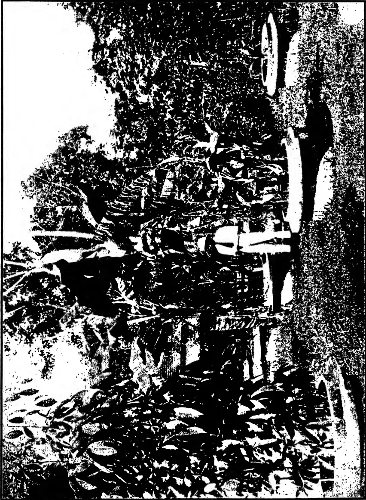A high-contrast, black-and-white photograph of a tropical scene. In the foreground, there are dense, leafy plants. In the middle ground, several people are visible; one person is standing and wearing a light-colored hat and trousers, while others are partially obscured by foliage. To the right, there are several large, circular, flat objects, possibly stone basins or platforms, arranged in a line. The background is filled with thick tropical vegetation, including palm trees. The image has a grainy, high-contrast quality, typical of older photocopies.

Photo by L. S. Bertus.

584------------------------------------------------

This image is a blank white page. It contains several small, dark specks which appear to be scanning artifacts or dust particles. There is no text, handwriting, or printed content on the page.

585------------------------------------------------

147

ed both sets of plants. Only the plants exposed to the soil fungus and infected by it developed bunchy top although the eelworm and aphid factors might have been expected to have more influence towards bunchy top in the case of the plants which remained healthy. It may be concluded that the factor which was operative in one pot and absent in the other, namely, *Rhizoctonia* in the soil, was all-important in the causation of the bunchy top which actually appeared, but the writer has no intention of drawing such an inference or of asserting that *Rhizoctonia* alone can cause bunchy top and that the presence of the insect carrier is superfluous or secondary in importance. It has to be remembered that the aphids of each pot of plants may not have been equally infective, that is, equally capable of transferring the infective virus to the plants. On the other hand, it seems a curious coincidence that presumably infective aphids should have attacked only the plants which were affected also by *Rhizoctonia* and it is not clear that the aphid played or was capable of playing in this particular case the part attributed to it in Australia. The balance of evidence is in favour of the root parasitism of *Rhizoctonia* and of the possibility of a relationship between *Rhizoctonia* attack on plantain roots and the appearance of symptoms of bunchy top, but it ought to be proved that *Rhizoctonia* root attack precedes the appearance of bunchy top symptoms and it ought to be shown whether typical bunchy top symptoms can be caused by *Rhizoctonia* in the complete absence of the aphid. In other words, Ceylon bunchy top requires to be investigated *ab initio* with due attention to each possible casual factor and with repeated tests of each under controlled conditions. The probable presence of an endophytic or mycorrhizal form of *Rhizoctonia* or of other fungi should not be overlooked, and the borer and weevils which affect plantains should be investigated as well as the aphid.

It is conceivable that in Ceylon there is a root disease of plantains with which the aphid of bunchy top may or may not be associated. It may be characterised by distinctive symptoms and results or by symptoms indistinguishable from those of bunchy top; in other words, it may or may not be separable from bunchy top. It is also possible that aphid attack is secondary to root disease and that bunchy top symptoms are superimposed, as it were, by the aphid on the degeneration initiated by root disease. In this connection, it may be mentioned that a leaf-curl disease of tobacco in Ceylon may be found on the above-ground parts of plants that have been attacked by *Rhizoctonia bataticola* in the roots.

## References.

1. (1) Council for Scientific and Industrial Research, Australia, Bulletin 30, 1927.
2. (2) Tropical Agriculturist 66, p. 1, January, 1926.
3. (3) Tropical Agriculturist 57, p. 374, December, 1921.
4. (4) Tropical Agriculturist 68, p. 73, February, 1927; 69, p. 12, July, 1927.

586------------------------------------------------

148

## Chemical Notes (2).

### Annatto.

**A**NNATTO is a dyestuff obtained from the seed of the shrub *Bixa orellana*, (Linn), a native of Central America. The shrub is also cultivated in S. America, the West Indies, India, etc., and is found growing uncultivated in certain parts of Ceylon. The seeds are pyramidal in shape and of an orange-red colour, and occur in hairy, burry pods. The dye which is obtained from the pulp surrounding the seed and of which latter it forms about 5 per cent. by weight, has been used for colouring woollen and cotton materials red and yellow, and as an artificial colouring matter for butter and cheese. It is chiefly for the latter purpose that annatto is now used, and it was in this connection that the experimental work on the dye, an account of which is included in this note, was undertaken in this laboratory.

Annatto dye comes into the market in two forms—the Cayenne or French Annatto and the Spanish Annatto, from Brazil. The former is a soft paste of a bright yellow colour, containing 10 to 12 per cent. of the pure dye and not more than 5 per cent. ash. It has a very repulsive smell. The latter occurs in dry, hard cakes or rolls brownish on the exterior but red inside (3). The trade in annatto has fallen off during recent years owing to its substitution by aniline dyes. But with the prohibition of the use of the latter as colouring matters in foods in certain countries, *e.g.*, Denmark and the U.S.A., it finds a certain though limited market. The dye has at no time been very extensively used, as the orange-red colour is extremely sensitive to light (4).

The chief active principle of the dyestuff is a red dye *bixin* which is sparingly soluble in water, and the other is a soluble yellow dye *orellin*. The former is prepared by digesting annatto with alcohol and sodium carbonate at about 80°C.

The butter colouring is almost invariably obtained by dissolving the dye in a refined vegetable oil and filtering off any residue left. A few drops of the extract added to the cream in the churn will give the necessary colouring to the butter. Attempts to obtain an extract of the dye in local oils, *e.g.*,

587------------------------------------------------

149

coconut oil, groundnut oil, etc., were made by Lakshmana Rao (1) in India, but only light-coloured extracts were obtained. Several drops of this extract had to be added to the butter before a suitable colouration could be secured and as a result both the flavour and the keeping quality of the butter were affected. Rao therefore worked out a method for the preparation of the colouring which did not require the use of a vegetable oil, and this colouring has since been successfully used in the Government Dairy in Madras. The experimental work undertaken in this laboratory for the preparation of the dye and the obtaining of the butter colouring was on the same lines as that adopted by Rao.

For obtaining the cheese colouring, the dye is dissolved in a weak potash lye. This preparation is found to mix easily with all the constituents of milk; unlike the butter colouring in oil, which only colours the fat.

The dye was obtained from the seed by the two following methods. (1) The seeds were allowed to soak in water for several days till they were well fermented. This took about 10 days. The ill-smelling fermented mass was next powdered in a mortar and washed with water over a coarse sieve till the washings were almost colourless. The dye extract was then left to stand for a day or so and the dye separated from the wash liquor by decantation and filtration over the pump. The filtering process was a very slow one, and would have to be eliminated in actual practice. In the preparation of the dye on a commercial scale, the liquid would have to be decanted off and the residue dried in the sun. The residue was then dried in the oven and weighed. Besides the dye this residue will contain a fair amount of mucilaginous material which will raise its ash content appreciably. The amount of dye material obtained by this process was about 5 per cent. of the weight of seed. Rao obtained a much higher percentage of the dye residue, viz., over 10 per cent. The dye obtained was of a dark red colour. The above method is essentially the one adopted in the trade.

(2) The other method of preparation was that detailed by Rao. The seeds were steeped in a one per cent. solution of sodium carbonate for twenty-four hours, then rubbed in a mortar and washed with further quantities of the carbonate solution till all the colouring matter was almost entirely dissolved out. A deep orange-red coloured extract was obtained. This was strained through a coarse sieve and the dye precipitated from it with dilute hydrochloric acid. The liquid was decanted off and the residual dye filtered over a pump, dried and weighed. The weight of dye obtained was 4 per cent. of the weight of the seed, against a little over 7 per cent. obtained by Rao.

588------------------------------------------------

150

The dye can also be obtained by two other methods. The seeds are boiled with water till a thick paste is obtained or are rubbed with water and the colouring matter allowed to subside, excess of water drawn off and the remainder allowed to evaporate till the dye has attained a pasty consistency (2).

The butter colouring extract was obtained by Rao's method, as follows:—A small quantity of annatto dye was rubbed in a mortar with the minimum quantity of strong ammonia, and sufficient water added to give a clear solution. This was then filtered. A yellowish coloured filtrate was obtained. Rao found that four drops of this latter added to the cream just before pasteurization were sufficient to colour one pound of butter. The extract so prepared is preserved against mould by the addition of a few drops of chloroform.

The cheese colouring was obtained by treating the dye with a weak solution of caustic potash. The extract obtained was of an orange-red colour. Casein from milk is coloured a rich orange-cream colour by its means.

To those readers of this Journal who may wish to obtain more detailed information on this subject or who may be interested in the chemistry of this dye, a list of references is appended below.

### References.

1. 1. Annatto Extract for Colouring Butter. T. L. Rao. Madras Agricultural Department Year Book, 1925.
2. 2. Ceylon Manual of Chemical Analyses. M. Cochran. Annatto.
3. 3. Allen's Commercial Organic Analysis, Vol. V. Annatto.
4. 4. Dictionary of Applied Chemistry. Thorpe. Vol. I. Annatto.
5. 5. The Annatto Tree. Hansen's Dairy Bulletin, Vol. VII No. 4, April, 1922.

A. W. R. JOACHIM.

589------------------------------------------------

151

## Control of the Kalutara Snail.

**T**HIS pest (*Achatina fulica*), introduced some years ago from Madagascar, has spread over the whole of the wet zone low-country and is spreading in many Up-country districts.

It causes immense damage to vegetable and flower gardens and of late years has become a serious menace to certain estate green manures and cover crops. Two years ago this estate was covered with a beautiful carpet of Vigna which has since been almost completely destroyed. During the whole of 1927 all children who came to muster were sent off for an hour or two to collect snails and a total of at last 9,000 working hours was so employed. Towards the end of the year it was realized that the snails had got completely beyond control and the work was stopped.

It was represented to the Agricultural Department that the only effective check which we have against soil erosion in grown Rubber was in danger of extinction and the Department was requested to make enquiries in Madagascar as to what agency there controls the snail. So far the only "control" reported is a big bull-frog which eats them, but the Director of Agriculture is not in favour of such an importation.

Previously it was discovered at Peradeniya that the larva of a species of Firefly attacks the snails. The jungle crow also eats them, though unfortunately this bird is rare. On one occasion I shot an eagle whose crop was full of snails.

Dressings of Paris green and ashes or lime were tried early in 1927, but they either killed the Vigna or proved ineffective. Spraying with Arsenite of Copper also was tried but it is soon washed off the leaves by heavy rains, at a time when snails are most active.

It was noticed that snails are particularly fond of lime which is deficient in our soils but a necessity for their shells. They even eat dead snail shells. This indicated a method of poisoning, using Lime as bait, which has been tried out since April of this year. Various poisons such as Barium sulphate and Lead chromate were considered but for a start it was decided to try Arsenic. A consignment of arsenic was received in May and,

590------------------------------------------------

152

as a first trial, Lime washes were prepared at the rate of 5 gallons with respectively 2, 4, 8 ounces of Commercial Arsenic. This was dabbed on to stones in snail infected areas. A few deaths occurred. Similar amounts were then prepared but with the Arsenic, which is only very slightly soluble, converted into Arsenite of Lime. This was also fairly effective.

Arsenite of soda was then tried in varying proportions, thanks to Messrs. Lee, Hedges, Agents for Atlas Preservative. It was found that 4 to 5 gallons of a thick Lime wash containing one pint of "Atlas" was very deadly. Where this mixture has been put out considerable numbers of dead snails have been found. Many disappear, crawling into terraces and die there. Stones and terraces round the garden were splashed with the mixture, and whereas formerly the garden was infected, snails are rare.

A good thick cunjee of dirty or damaged rice should be added to the wash which should contain at least 20 lb. of Lime to the 5 gallons.

A likely method of application seems to be to put small but thick dabs along terraces at intervals of 5 feet and similarly on intervening rocks. Where possible the under side of projecting stones should be chosen as protection from rain. In gardens, the under side of old tiles or chatties may be used.

### The Wash is Poisonous to Plants.

By poisoning old snail shells with a 1 in. 3 Atlas solution in water and distributing these, many of the younger snails are killed but the method is hardly practicable for estates.

Snails will not eat the fresh lime wash until it has become partly carbonated by exposure to the air.

The cost, including application, works out at about Rs. 2/50 per acre.

H. W. ROY BERTRAND,  
Govinna Estate,  
Horana.

591------------------------------------------------

153

## Selected Articles.

# XXVIII.—Cover Crops in Tropical Plantations.

H. C. SAMPSON.

**T**HE term "Cover crop" is in this article applied to herbaceous plants and the coppiced growth of shrubs which are cultivated among plantation crops for the purpose of soil conservation and soil improvement.

### Uses of a Cover Crop.

A cover crop may fulfil one or more of the following functions :—

(a) Its foliage may protect the soil from the effects of heavy rain or water drip from the plantation crop. This water action can affect the soil in two ways. It can cause soil denudation and it can pack the soil.

(b) The foliage of the cover crop may also check surface wash, by preventing the collection of surface water and by checking its rate of flow when it does collect.

(c) In the case of a young plantation crop where the tree canopy is not complete, a dense cover crop will protect the soil from the effects of the sun's rays, thus checking the loss of humus.

(d) A dense cover crop acts as a "smother crop" and will check the growth of weeds.

(e) The root system of a cover crop may help to bind the soil and thus check surface erosion.

(f) If a cover crop has a deep root system it will assist in the drainage of the soil and sub-soil. This will increase the water-holding and water-absorbing capacity of the soil and will thus enable the roots of the plantation crop to penetrate the soil more deeply.

(g) The natural leaf-fall, or the green dressings made available by cutting back the cover crop, will by the addition of organic matter improve the texture of the surface soil as well as its fertility. If a cover crop belongs to the family Leguminosae, it may enrich the soil in nitrogen, especially if it is turned in or utilized as a green dressing.

### Selection of Suitable Cover Crops.

The choice of a cover crop is not a simple matter, and it by no means follows that what is found suitable for this purpose in one country for a particular plantation crop will prove equally suitable in another. Again, what is found to be quite suitable as a cover crop among one plantation crop may not be suitable if tried among another plantation crop. A cover crop may thrive under certain local conditions governed by seasons, soils and elevation, but not under others. The following examples are cited. The cultivation of *Centrosema pubescens* Benth. is favourably reported on as a cover crop in established rubber in the Cochin rubber districts of

592------------------------------------------------

154

S. India, while in Malaya is stated that this cover crop cannot stand the shade of mature healthy rubber. In the former area there is a natural leaf fall in the dry weather preceding the monsoon, which is followed by "secondary leaf fall" during the heavy rains of the monsoon; thus for a great part of the year there is never that heavy leaf canopy which one sees in Malaya and which there prevents the cover crop from thriving. To follow up the same example, *Centrosema pubescens* is recommended in Malaya for renovating mature rubber which has been allowed to deteriorate by excessive soil erosion, and it is said that its cultivation will restore the leaf canopy, but that *Dolichos Hosei* Craib (the Sarawak Bean) should be grown when once this canopy is restored. Similarly *Centrosema pubescens* makes quite a suitable cover crop for coconut plantations in Malaya, but, as stated above, will not thrive under the heavy shade of mature healthy rubber. Another example may be given. *Tephrosia candida* DC is a recognized "contour hedge crop" for tea in Java, Ceylon, and Assam, but in the tea districts of N. Travancore this dies out when the heavy rains of the monsoon set in. The conditions here, however, are perhaps unique, as the June to August rainfall is over 200 inches following on a dry season.

## The Necessity for Further and Continued Research.

It does not follow that the cultivation of a cover crop is in all cases beneficial. Though this may prove quite valuable when grown on a type of soil which is capable of retaining moisture, it might prove even injurious to the plantation crop when this is grown on a light soil in countries where the conservation of soil moisture is of importance. Whether such injury could ultimately be overcome by the addition of organic matter, which the cover crop would supply, and by the increased moisture-retaining capacity of the soil which would necessarily follow, remains to be proved. Recent work at Peradeniya, Ceylon, indicates that this may be the case.

There are other questions also which have to be considered. Many of the plants which have been tried as cover crops have a tendency to climb, and this naturally rules out many of them for use among certain plantation crops. For example, there is little doubt that *Mucuna uterrima* Holland would make an excellent annual cover crop but for the fact that it is such a strong climber that it would very likely choke out a plantation crop such as tea or coffee. Other cover crops have had to be ruled out as they have been found to harbour some disease from which the plantation crop is also liable to suffer. Then again the cover crop may itself succumb to disease or may die out and something else may have to be found to replace it. There is no doubt that land does get "sick" of growing one particular crop, and this appears to be especially the case where legumes are concerned, so that it may prove necessary to have a rotation of cover crops. In any case research on this question of suitable cover crops cannot be allowed to stand still, as one never knows when disaster will overwhelm any which is now being grown, and in many areas it is essential that there should be some form of cover crop.

The majority of cover crops now being grown are plants which have been brought into cultivation comparatively recently, and in some cases a considerable amount of research has been necessary to find out how best these are to be treated. There is usually difficulty in getting seed of the wild Leguminosae to germinate readily. Most of these will yield to a treatment with concentrated sulphuric acid for a varying length of time. Work in this direction has been carried out in Sumatra with a large number

593------------------------------------------------

155

of possible cover and shade tree crops, and a bulletin has been published\* giving the results of these trials. In some cases vegetative propagation is the only feasible method, and work in this direction has been carried out at Peradeniya in Ceylon with *Dolichos Hosei* and *Indigofera endecaphylla* Jacq., two of the most important cover crops now being grown there under rubber and tea respectively.

Another line of research is also indicated which up to the present has received little attention. It is that connected with growing mixed cover crops. An instance of this is the mixing of *Centrosema pubescens* with *Dolichos Hosei*. The former is grown in Malaya as a cover crop in young rubber, but is not suited for old rubber as it cannot stand the shade of the latter; there is, however, an intermediate stage when the former cover is tending to die out on account of the increasing shade, and it is then that a mixture of the two cover crops is suggested. In the case of sisal, *Phaseolus lunatus* Linn. has in Java been found to be one of the best cover crops to grow, but this has the disadvantage that it takes a long time to cover the ground and, unless great expense is incurred in weeding, the cover crop may be suppressed before it is fully established. In such a case a mixture of a quick-maturing cover crop with the slower growing *Phaseolus lunatus* might be found to solve this difficulty.

The simplest form of cover crop is one which has only within recent years been introduced, and this is what is now termed "selective weeding." In the early days of plantation industries "clean weeding" was the rule. The disastrous results of this soon became apparent. Soil erosion naturally followed, and the crops showed the effects of this. Recourse was then had to the use of concentrated fertilisers and artificial manures. Many planters then abandoned "clean weeding" on this account and allowed the natural vegetation to remain, keeping it in check by cutting back. As such vegetation consisted largely of grasses, this operation was termed "grass knifing." Then the question was raised whether it would not be better to have controlled growth of some plant which would protect the ground more efficiently than a miscellaneous growth of weeds, and the possibility of some of these being able to enrich the soil with nitrogen led to trials with plants of the family *Leguminosae*. As it is not always practicable to grow a definite cover crop for reasons such as excessive rainfall, badly distributed rainfall, poverty of the surface soil, excessive shade, etc., a system has of recent years sprung up known as "selective weeding," i.e., plants which are considered desirable from the point of view of soil cover are allowed to remain, while grasses and other plants which are liable to choke these are removed.

Though the value of Leguminous crops has been well known to arable farmers for centuries, and though such crops have been used for ploughing in, or composting, the study of cover crops in connection with the plantation industry is of comparatively recent date. At the close of last century the number of plants which had been tried as cover crops was very small indeed, but at the present time a very large number have been tried, and of these probably about a score have been found to be distinctly useful and have been taken up by the planting community and grown for one purpose or another. Even at the present time this line of investigation is mainly confined to the planting countries of the East. Nowhere has this work been carried out so thoroughly as in the Dutch East Indies, and it is from there that most of the cover crops now cultivated in Malaya and Ceylon have been introduced. The results of the work done in Java are described by W. M. van Helten† in a publication of the Department of Agriculture. Recently this

\* Med. Alg. Proefstation der A.V.R.O.S. Alg. Serie. No. 27. Germinating experiments with seed of different species of green manures. Dr. Maas.

† Mededeelingen van het Algemeen Proefstation voor den Landbouw. No. 16.

594------------------------------------------------

156

line of research has begun to receive attention in the newer planting countries of Africa, but there so far the work has got little beyond the experimental stage.

An aspect in connection with cover crops which has occasionally been referred to, but which up to the present appears not to have received sufficient attention, is the question of manuring to promote the growth of the cover crop with a view to manuring the plantation crop ultimately, though indirectly. This aspect has received a certain amount of attention in arable farming when growing a green manure crop for ploughing in. It is understood that this used to be a sound agricultural practice among the indigo planters in Bihar, and it is in use in English farming, especially in the manuring of temporary pastures to encourage the growth of clovers and other legumes which enrich the soil in nitrogen. A considerable amount of attention has been paid to the aspect of the question by the Scientific Staff of the Indian Tea Association.

An endeavour has been made to summarise such information as is available regarding cover crops which have been tried and which are in use. These are arranged under the different plantation crops among which they are being grown or tried, and as in some cases the same cover plant has been found of use when grown among different plantation crops, a certain amount of what may seem to be repetition is inevitable. Such an arrangement, however, appears to be advisable as it serves to indicate more clearly the conditions under which such plants will grow, and will thus better serve as an indication as to what, after trial, may be suitable as a cover crop with other plantation crops such as sisal and cacao, about which little information appears to be available.

## TEA.

The tea bush in a plantation is an artificial plant in that it is kept cut back, in order to make it produce a flush of leaf which can easily be picked by the pluckers from the ground.

The nature of the crop therefore precludes the cultivation of many cover crops which would be suitable among a tall-growing plantation crop. Nothing which has a strong tendency to climb, and thus smother the tea bush, can be grown.

Cover crops in tea are grown with two main objects in view, firstly to check soil erosion, and secondly to maintain or increase the supply of humus and plant food in the soil.

In Java, where tea is planted on the contour, a method of planting which is beginning to claim attention in Ceylon, the cover crop is grown in contour hedges which alternate with catch drains, and usually there are one or two rows of tea between the contour cover crop and the catch drain according to the steepness of the ground. As the soil and débris which accumulates in the catch drain is always thrown up hill, it can easily be understood that in time terraces are formed with the catch drain at the back and the contour hedge crop in the middle of the terrace. The cover crop is sown or planted in a double line. When well established it is cut back to about nine inches from the ground so as to make it bush out. This is pruned back four or five times a year, and the cuttings are spread on the floor of the terrace where they are hoed in. A description of these Java methods is given by Hope.\*

Somewhat similar contour hedges are now used both in Assam and in Ceylon. In the S. Indian tea estates of N. Travancore there is no record of any plant having been discovered for this purpose which would suit the rather unique climatic conditions which are experienced there.

Besides these contour hedge crops there are other plants which are grown as ordinary ground cover crops. In Assam these are chiefly plants

\* Agricultural Journal of India. Vol. XI. p. 184.

595------------------------------------------------

157

which are treated as green manure crops and are usually turned in when three to four months old. In Ceylon and S. India, where there is greater necessity to protect the steeper slopes against soil erosion, certain perennial cover crops have been tried and several of these are now being extensively grown. The main object of such cultivation is to lessen the serious loss caused by soil erosion of what might be termed chemical and mechanical soil fertility.

It must always be remembered that complete cover crops such as these are in direct competition with the tea bush in utilising the plant food and moisture in the soil, and it is a question whether the immediate effect of growing such is beneficial to the tea. Recent work in Ceylon, where *Indigofera endecaphylla* has been grown as a cover crop, indicates that its cultivation has not had a depressing effect on the tea. The cultivation, however, of crops of this type opens up a large field for investigation regarding soil management, the manuring, cultivation, treatment and utilisation of the cover crop. In Assam, where cover crops are largely grown for the purpose of turning in when three or four months old, experiments carried out indicate that while these are growing and utilising plant food and moisture from the soil they are in direct competition with the feeding system of the tea bush, and do have a decided depressing effect on the yields of tea plucked, but when they have been turned in a marked improvement is noticed in the amount of tea plucked, as soon as such green dressings have become incorporated with the soil.

The three well-recognised contour hedge crops in Java are *Clitoria cajanifolia* Benth., *Leucaena glauca* Benth., and *Tephrosia candida* DC.

*Clitoria cajanifolia* Benth. A sub-erect perennial shrub indigenous in Malacca, the Straits Settlements, Java and Tropical America. The plant is propagated from seed which is sown in situ.

Java. This has been used for many years as a contour hedge crop as well as a soil binding crop along the margin of field drains.

Assam. Introduced from Java in about 1915, and has been found to be equally satisfactory here. It has to be cut back three or four times a year.

Ceylon. Introduced from Java in 1922. In a trial cultivation at Peradeniya a sowing in June gave a dense bushy growth 5-6 feet high within six months. Since then this has been repeatedly cut back and soon makes fresh vigorous growth. Sown in March on a bare, washed slope, where many other possible cover crops had been tried and failed it soon became established and in nine months an excellent hedge was formed.

*Leucaena glauca* Benth. A small tree, probably a native of Tropical America, but common both in the new and old world tropics. This is commonly grown as a contour hedge crop in Java, propagated by stakes and cuttings, and thrives up to an altitude of 4000-5000 feet. It is very suitable for this purpose as its procumbent branches assist in checking soil erosion, but the hedges must be cut back three or four times a year. It is also grown as a wind break and shelter belt among tea and the light shade which it casts is said to be of benefit.

*Indigofera suffruticosa* Mill. Tropical America and the W. Indies. This has been tried both in Assam and Ceylon and is favourably reported on.

*Indigofera arrecta* Hochst. A native of E. and S. Africa.

In Assam this is reported to do well in all tea districts and is suitable for contour hedge planting. In Ceylon this has been tried at Peradeniya as a contour hedge plant and it is reported that though it starts well it dies out when about eighteen months old and after three loppings.

*Indigofera Gerardiana* R. Grah. (*Indigofera dosua* Wall.).

596------------------------------------------------

158

Assam. This crop is grown from seed and is stated to do well in all hill districts; it is also being tried on the plains, treated as a contour hedge crop.

*Tephrosia cundida* DC. India, Malaya, naturalised in Jamaica. "Boga medaloa." A sub-erect perennial shrub. The plant is propagated from seed which is sown in situ. Germination is improved if the seed is soaked in concentrated sulphuric acid for from 10-20 minutes. This has been cultivated now for many years in Ceylon, Malaya, Java and India. It is grown much in the same way as *Clitoria cajanifolia*, but must be cut back before it flowers and seeds if it is to persist for any length of time. If treated in this way it is said to last for from 4-7 years in Ceylon and for 3 years in Assam. In the latter place it is recorded that its cultivation had no effect on the growth of tea for the first two years, but in the third year there was a significant increase. Its cultivation is reported to have met with indifferent success in the tea districts of Palni and Travancore in S. India as most of it died out in the heavy monsoon rains. Details of numerous trials with this in various parts of the Dutch East Indies are recorded by van Helten (l.c.).

*Tephrosia Hookeriana* var. *amoena* Prain. In Java this is stated to form a compact hedge when grown in lines, but it does not last more than a year or two.

## Perennial Ground Cover Crops.

*Indigofera endecaphylla* Jacq. A spreading procumbent perennial belonging to the Old World tropics.

Travancore, S. India. Reports from the Peermade Tea Station state that this is the most promising cover crop as yet tried but even it may die out during the heavy monsoon rains.

Ceylon. This plant was introduced to Ceylon from S. India and was first grown at Peradeniya in 1921. Planted two feet apart between rows of tea bushes it will make a complete ground cover in about five months. It has been tried with success at elevations ranging from 500 to 6000 feet. Reports on definite experiments with regular planting in tea are all quite recent and, though the tea bushes look well and flush freely, no definite increases in yield have as yet been recorded. All that can be said is that the bushes have not gone back in condition. The method of propagation recommended is to grow this in a nursery either from seed or from cuttings and to cut off the procumbent shoots from the nursery plants when these are about a foot long. Three or four cuttings are planted together at intervals of about two feet between the rows of tea bushes. One acre of nursery is stated to be sufficient to plant up seventy acres of tea garden.

Java. Referred to in Java publications of 1925 and 1926 as most promising not only as a cover crop but also as a fodder crop for live stock.

*Desmodium triflorum* DC. (*Desmodium heterophyllum* Wall.). A native of the tropics generally.

Ceylon. There is stated to be a certain demand for seed. Probably referring to this species *The Tropical Agriculturist* states that the plant adversely affects the tea bush when the growth becomes too dense and it should be forked through occasionally to assist soil aeration. Burnett of Dickova Estate, in a recent article in the same publication, states his opinion that its effect is detrimental to tea as its matted root system prevents soil aeration.

Travancore, S. India. The report on the Peermade Tea Station states that this plant covered the ground during the rains but that it died out in the dry weather.

*Desmodium polycarpum* DC. (*Desmodium heterocarpum* DC.). Tropical Asia and Australia.

597------------------------------------------------

159

Assam. This is a common plant in grass jungles and is stated to be suitable for planting on terraces and slopes to prevent wash. If sown in the nursery in February, cuttings for plantings can be taken in the following August. When once established it gives no trouble. Suitable for contour planting.

Java. This plant has been grown experimentally here.

*Desmodium purpureum* Fawcett and Rendle (*Desmodium stipulaceum* DC; *Desmodium tortuosum* DC.). Florida, West Indies and Tropical America.

Assam. Stated to grow well on very poor soils. It can either be sown directly among the tea or can be propagated by means of cuttings.

*Desmodium retroflexum* DC. Burma and the Himalaya region, Assam. Stated to be very similar to *D. purpureum*, but makes a better cover crop.

*Oxalis corniculata* Linn. Cosmopolitan.

Travancore, S. India. Reported to be great success as a cover crop. Petch in *The Tropical Agriculturist* also makes mention of this as a possible cover crop.

Another species of *Oxalis* not identified, which has a purple flower is also stated as being successful as a cover crop in Travancore.

*Eupatorium pallescens* DC. Brazil.

In Java this is stated to be useful in establishing vegetation on worn out slopes where nothing else will grow. It can be profitably utilized by being brought in and buried in trenches among the tea.

## Annual Ground Cover Crops.

The practice of growing quick-maturing crops for turning under seems to be largely confined to Assam, where the following have been tried for this purpose. These are turned in when about 12 weeks old.

*Cajanus Cajan* Millsp. (*Cajanus indicus* Spreng) Tropics and subtropics of the Old World. The use of this has given remarkable increases in tea yields.

*Glycine hispida* Maxim. The native variety of this has been grown with success for many years.

*Sesbania hispinosa* Steud. (*Sesbania aculeata* Pers.), and *Sesbania aegyptiaca* Poir. Old World Tropics. These are both stated to be useful on "red bank" and light soils.

*Cyamopsis psoraloides* DC. This has been tried but no information is available as to how far this is useful.

*Crotalaria juncea* Linn. Tropics. This has given good results on all soils.

*Crotalaria striata* DC. Tropics. Commonly found growing wild on the sandy flats of the Brahmaputra and on the sandy soils of the Dooars. It grows well on the poorest soils.

*Crotalaria sericea* Retz. This species appears to be suggested as a suitable crop though it had not been tried (1918). The leaves are larger and appear more succulent than those of *C. striata* DC.

*Phaseolus lunatus* Linn. Tropics generally. Bush forms of this are being tried for the Mlange tea districts of Nyasaland as a soil cover.

*Mucuna* spp. Bush types of the imported velvet beans are being tried for the Mlange tea district of Nyasaland as a soil cover.

*Crotalaria usaramoensis* E. G. Baker, E. Africa. This is grown in Java between the rows of tea for cutting as green dressings. It is somewhat similar to *C. striata*, but is said to give heavier cuttings. It is also being

598------------------------------------------------

100

tried in the same way in Ceylon. It must be cut before it is allowed to seed, otherwise it is liable to die out.

*Crotolaria anagyroides* H.B.K. Tropical America. This is similar to *C. usaramoensis*.

## COFFEE.

The question of cover crops for coffee is more complicated than for tea; for not only are there several species of coffee under cultivation, many of which require special conditions of soil and climate, but the question is further involved by the system of pruning adopted and the necessity and otherwise of top shade. These conditions regulate the intensity of the shade on the ground and therefore the suitability of any particular plant as a cover crop.

In the case of *Coffea arabica* almost every country has its own method of cultivation, varying from the widely spaced unpruned trees as grown in Brazil to the close planted, topped and heavily pruned bushes in S. India. Different systems of pruning also affect the amount of shade. In parts of Central America new wood is encouraged and all coffee is borne on primaries, while in the East, where the tree is trained to a single permanent stem, the coffees borne on secondaries and tertiaries which are encouraged by the system of pruning adopted. This latter method means a much heavier ground shade and one which is much nearer to the ground. This would at once rule out any plant which require full sunlight and which have a tendency to climb. Then again large-leaved species such as *C. excelsa* Cheval and *C. liberica* Hiern throw a much denser shade than do the varieties of *C. arabica* Linn.

Little information is available as to what effect cover crops have on the yield of coffee, but considering that, coffee does not require the same amount of rainfall as is required for tea and that it is always regarded as a surface-feeding crop, it is likely that there would be greater competition between the plantation and the cover crop both for plant food and for soil moisture than there would be in the case of tea.

There can be no doubt, however, that where coffee is planted on land which is liable to surface wash, contour hedge planting on the lines which have been adopted for tea can with advantage be tried—in fact in Java such a system is adopted in the case of *C. robusta*, and the same plants are utilized as contour hedge crops as for tea. Similarly *Leucaena glauca* is used there for light lateral and top shade.

*Clitoria cajanifolia* Benth. is recommended in the Dutch East Indies as a contour hedge in *robusta* coffee up to elevations of 2,000 feet.

*Indigofera arrecta* Hochst. has been tried as a contour hedge crop in *robusta* coffee at Peradeniya, Ceylon, and is said to have made good growth.

*Tephrosia Hookeriana* var. *amoena* Prain is stated also to do well as a contour hedge crop in Java at elevations varying from 600 to 2,000 feet, though it is stated that the plants are not quite so vigorous if planted under half shade. It is said to be very sensitive to heavy rain when young.

*Desmodium gyroides* DC. A native of tropical Asia. This has been found to be most useful in Java up to an elevation of 2,500 feet and stands cutting back well. It produces numerous leaves and forms a fairly thick humus layer.

## Perennial Ground Cover Crops.

*Indigofera Anil* Linn. Java. This is reported to make a nice bushy growth. Sown in line 18 inches to 2 feet apart, it covers the ground with a dense growth within three months, and the plants can be cut after six months. The plant lives for about two and a half years. A certain amount of difficulty is experienced in weeding the crop when young.

599------------------------------------------------

161

*Indigofera endecaphylla* Jacq. From the trials made with this at Peradeniya, Ceylon, the opinion has been found that this appears to be suitable as a cover crop for *robusta* coffee.

*Centrosema pubescens* Benth. Tropical America. Experiments carried out at Ituri, Belgian Congo, have made a favourable impression as to the possibilities of this plant as a cover crop for *robusta* coffee. The points which are emphasised are that the plant is a perennial and never completely sheds its leaves even in the dry weather, that it is deep-rooted and opens up the soil, and that a complete cover is procured in 4-5 months. An objection to this plant which is not raised in the report is its climbing habit.

*Trifolium Johnstonii* Oliv. E. Africa. A report on the trial of green manure and cover crops at the Scott Laboratories, Kenya, states that this produced a wonderful mat of growth and would stop wash very well on slopes.

## Annual Ground Cover Crops.

*Cassia hirsuta* Linn. Tropical America. This has been tried at the Coffee Station at Sidapur, Coorg, S. India, but without much success. It would only grow in the open and could not stand the shade of *Grevillea robusta* A. Cunn.

*Crotolaria semperflorens* Vent. Tropical Asia. This is also under trial at the Sidapur Coffee Station but there is no record of its success or otherwise.

Numerous species and varieties of plants likely to prove suitable as green manure and cover plants are being grown at the Scott Laboratories, Kenya. These include both indigenous and exotic plants, and a full list of these is published in the Annual Report of the Department of Agriculture, 1926. Among these the following appear to be worthy of mention.

*Crotolaria intermedia* Kotschy. Tropical Africa. "Very promising."

*Crotolaria incana* Linn. Tropics and subtropics. "Most promising for Coffee."

*Vigna unguiculata* Walp. (*Vigna catjang* Walp.). Tropics and subtropics of the whole world. A native variety named "Embu," with an erect habit, is stated to be promising for coffee.

*Astragalus Aucheri* Boiss. (*Astragalus venosus* Aucher.). "Most promising."

*Phaseolus lunatus* Linn. Tropics and subtropics.

*Phaseolus lunatus* var. "Madagascar bean" "Promising."

*Phaseolus lunatus* Linn. (*Phaseolus inamoenus* Linn.) "pois du cap." "Very fine growth."

"New Zealand grass pea." Probably *Lathyrus sativus* Linn. "Very fine growth. Possibly suited for high elevations."

*Lupinus polyphyllus* Lindl. "Good growth. Suitable for Coffee."

## PLANTATION TREE CROPS.

This name is here applied to tree crops where the growth of the tree is unrestrained, as distinct from such crops as tea and coffee where the growth is usually kept in check by pruning. Such tree crops would include Para Rubber, Coconuts, Oil palms, Cloves, Nutmegs, etc. The three first mentioned are those which are generally grown on a large scale. From the nature of these crops the trees have to be widely spaced, and it is some considerable time before a complete leaf canopy is formed. During the young stages care must be taken to keep noxious weeds in check, such as the Lalang (*Imperata arundinacea* Cyrril.) of the East, and the Para grass

600------------------------------------------------

162

(*Panicum muticum* Forsk.) of the West. In the past very considerable expenditure used to be incurred in weeding charges and there were also large capital losses of soil fertility. Latterly this expense and loss has to a great extent been saved by a system of growing ground cover crops or, as they are sometimes called, "smother crops."

In reading reports of trials of plants which are likely to be useful for this purpose, there are two points which are generally raised: first their ability to keep such weeds as Lalang in check, and second whether they are liable to be dangerous in case of fire when they wither or die. In the case of some plants which are grown for this purpose, they can be made much more effective if they are prevented from flowering and fruiting. For example, *Mimosa invisa* Mart. has a varying reputation. By those who understand how to deal with this cover crop it is claimed that there is nothing to equal it. It must be prevented from seeding either by rolling or by beating it down, which causes it to make fresh growth immediately. If it is left to itself it will die out naturally, and not only become a danger from fire, but will let the Lalang through, which, now that the soil has been made richer by the growth of this cover crop, will grow stronger than ever before.

When tree crops have grown up and formed a canopy, the cover crop is grown more for the purpose of maintaining soil fertility, and though the ground cover crops of the type mentioned above may prove generally suitable for all such crops when they are young, the choice of a suitable cover crop for the grown plantation will depend on the amount of shade which the trees themselves throw.

## COCONUTS.

This crop opens up the possibility of a different class of cover crops from those referred to under tea or coffee. In the case of a young plantation, cover crops are grown to all intents and purposes in the open, and therefore shade-bearing cover crops need not necessarily be considered. Some of the pulse crops also which can be grown may, if necessary, be treated as catch crops and harvested for their grain.

In the case of grown plantations the trees of the plantation crop throws a fairly light top shade on the ground. Any plants which are grown under coconuts therefore must be able to stand a certain amount of shade, but as the coconut palm has a clean smooth stem there is not much fear that climbing plants will prove to be objectionable. There is one point, however, to be borne in mind and that is that the leaf drip from the palms may damage a cover crop if it has a soft succulent leaf. The rigid leaf of the palm and the smooth straight leaflets tend to concentrate drip on particular spots, in fact, where coconuts are grown on sandy soils one can often see the outline of the leaf pricked out on the soil by this water drip.

With the wide spacing required, coconuts are usually planted on land which is fairly level, and therefore the question of contour hedge crops has not received much attention. Under special circumstances these may prove necessary. The only mention of such cover crops is from Malaya, where *Clitoria cajanifolia* Benth. is mentioned as being likely to prove suitable for this purpose. This is the conclusion drawn from a trial cultivation on the Castleton Station. *Tephrosia candida* DC. could also be used if necessary. This is a common cover crop under coconuts in Ceylon. On terraced lands something is required to protect the edge of the terrace, but nothing is mentioned in any reports as to any plant having been tried for this purpose. *Indigofera endecaphylla* Jacq. is a possibility. It grows successfully under low-country rubber in S. India and it is said to thrive in Ceylon at elevations varying from 500 to 6,000 feet.

601------------------------------------------------

163

## Perennial Cover Crops in Young Coconut Plantations.

*Tephrosia candida* DC. This thrives in both young and old plantations, but if the land is rich it will, unless lopped, grow too tall and thus adversely affect the young trees by its shade.

*Indigofera hirsuta* Linn. Old World Tropics. Tried at the Castleton Station, F.M.S., and reported as promising. It covers the ground in four months, grows to a height of two feet and thrives both in and out of coconut shade.

*Calopogonium mucunoides* Desv. Guiana. First tried as a possible cover crop in Java in 1923. Tried at the Castleton Station, F.M.S., in 1926 and reported to do well among young coconuts, though it has a tendency to climb. Planted three feet by three feet it made a complete cover within three months and a cover two feet thick within five months. It is stated to die out after about 12-18 months, but by that time will in all probability have seeded itself.

As much more attention has been paid to cover crops among young low-country rubber reference should be made to this. It is probable that what would grow among the one will grow among the other provided soil conditions are suitable.

These include a large number of tropical pulse crops of which the following are the more important:—

*Phaseolus lunatus* Linn.; *Phaseolus culcaratus* Roxb., Tropics of Asia; *Phaseolus mungo* Linn.; *Dolichos biflorus* Linn.; *Dolichos Lablab* Linn., Old World Tropics; *Vigna unguiculata* Walp. (*Vigna catjang* Walp.); *Canavalia ensiformis* DC., Tropics.

As there are many cultivated forms of these different pulses which have been adapted to suit different seasons and varying agricultural conditions, an extended trial of these may bring to light particular strains which would adapt itself to local requirements. There are also "bush" forms of some of these which, if procurable, might prove more easy to deal with.

*Crotalaria usaramoensis* E. G. Baker. Tropical East Africa. This has been tried with success in Java. It seeds very freely, and if it is to last for any length of time it should be cut back before it can seed.

In addition to the pulse crops named above, the following are referred to as suitable cover crops for coconuts in Porto Rico\* for both young and old plantations, especially those on coast sandy soils. In the case of the former emphasis is laid on the necessity for preventing the plants from covering the trees even for a short period, and it is stated that where young trees have been smothered even for three weeks the effects of this are still apparent after six months.

*Mucuna capitata* Sweet. (*Mucuna velutina* Hassk.). *Mucuna aterrima* Holland (*Stizolobium aterrimum* Piper). These two species are said to make about equal development, and they also make heavier growth and have a longer growing season than the Florida Velvet bean, *Mucuna Deerigiana* Merrill (*Stizolobium Derringianum* Bort), of the Lyon bean, *Mucuna nivea* DC. (*Stizolobium niveum* Kuntze). *M. capitata* did not mature till nine months after planting. In the case of all these the vines have to be periodically cut back from around the young trees.

Jack beans and Sword beans, *Canavalia ensiformis* DC. and *Canavalia gladiata* DC., have also been tried, and though they grow well they do not

---

\* Porto Rico Agricultural Experiment Station. Bull. No. 19. Cover crops for Porto Rico. C. F. Kinman.

602------------------------------------------------

164

make such a complete and heavy cover nor do they last as long as the two species of *mucuna* recommended above.

*Cajanus Cajan* Millsp. is also said to make thrifty growth on coconut lands. It is valuable for killing out wild vegetation and for providing wind protection.

Mention is also made of a wild *Canavalia* known as "Mato de la Playa" which is very common on the sandy coast, *Canavalia obtusifolia* DC. This is suggested as likely to be useful for binding loose sand. The same plant is common on the sandy coast of Trinidad.

*Vigna marina* Merr., known as "Solani," is reported as being a promising cover crop recently introduced into the Philippines, though it is not state with which crop it has been grown. It closely resembles *Dolichos Hosei*.

## Perennial Cover Crops in Grown Coconut Plantations.

One point must be borne in mind in deciding what cover crop to grow under coconuts, and that is the method of harvesting the nuts. If these are left on the tree till the nuts are dead ripe and have commenced to fall at harvest, or if nuts are only collected off the ground having fallen when ripe, then a tall-growing cover crop, unless it is kept lopped down, is objectionable, since many nuts which have fallen are likely to be overlooked at harvest. Another objection to cover crops which are inclined to grow tall is that it is very difficult to supervise labour at work.

*Calopogonium mucunoides* Desv. Trials at Castleton Station show that this will not thrive under shade and therefore it is unsuitable as a cover crop under grown coconuts.

*Indigofera hirsuta* Linn. At the above station this is reported to thrive under coconut shade.

*Clitoria cajanifolia* Benth. This is favourably reported on in the Philippines. In Malaya the impression is that it does not make a sufficiently dense cover. The tough leaf of this plant would be an undoubted advantage.

*Centrosema Plumieri* Benth. Tropical America. First introduced to the East as a possible cover crop by Dr. C. J. I. van Hall, Java, in 1912. This is favourably reported on both in the Philippines and in Malaya, though in the latter country it is stated to thrive only under good soil conditions. Though a climber it does not readily climb the coconut stems.

*Centrosema pubescens* Benth. Tropical America. Introduced into the Dutch East Indies in 1922. Favourably reported on in Malaya, though it will not thrive on badly drained land. It is excellent where the drainage is good, and far excels *C. Plumieri*.

*Tephrosia candida* DC. Favourably spoken of in the Philippines. On the Castleton Station, F.M.S., it is reported to have grown ten feet high and, would therefore have to be cut back and be used as a green dressing. In Ceylon the extending use of this plant as a cover crop is reported, and it is stated that the practice of alternating the growing of this with a period of cultivated fallow is finding favour among coconut growers.

*Tephrosia Vogelii* Hook.f. The "fish poison bean" of East Africa. In the Philippines it is stated that this is a useful cover crop for coconuts. As it is a coarser-growing plant than *T. candida* its growth would probably have to be kept in check by lopping.

*Tephrosia Hookeriana* var. *amoena* Prain. Trials at Castleton Station, F.M.S., are reported to be promising, and suggestion is made that it should be sown thicker than 3 feet by 3 feet if a complete cover is to be formed.

603------------------------------------------------

165

*Leucaena glauca* Benth. has been tried at the Castleton Station in Malaya, but its growth was found too open to make a good cover.

*Cassia mimosoides* Linn. (*Cassia Leschenaultiana* DC.). Tried at the Castleton Station, F.M.S. Growth was very slow when young, but later it formed a dense impenetrable mass 10-12 feet high and therefore cannot be recommended.

*Cassia hirsuta* Linn. Tried at Castleton Station, F.M.S. It did not do well. (It probably cannot stand the shade, as when tried in coffee in S. India it was found that it would only grow in open spaces).

*Mimosa invisa* Mart. Tropical America. Tried at Castleton Station, Malaya. Reported to be very good on heavy soil, and when sown three feet by three feet apart formed a complete cover in three months' time. It is inclined to die out when one-and-a-half to two years old, but will last much longer if beaten down or rolled. It is objected to by some on account of the spines and the difficulty of getting labour to work among it.

*Mikania scandes* Willd. Tropical America. Known in Malaya as the "mile a minute" plant. This is suggested as a possible cover crop in Malaya. One plant planted in the centre of a square of four coconut trees will in a very short time completely cover the ground.

## PARA RUBBER.

There are two distinct problems connected with cover crops in rubber. The first is to find suitable plants which will grow under the partial shade of young rubber, and the second is to find something which will grow under old rubber, which in countries such as Malaya, with a well-distributed rainfall, throws an almost complete shade throughout the greater part of the year.

Cover crops grown are very similar to those grown among young coconuts, except that there is not the same fear of climbing plants smothering the trees, since rubber will form a stem in a comparatively short space of time, while the coconut will take anything from three to seven years to do this.

### Young Rubber. Annual Cover Crops.

*Phaseolus lunatus* Linn. (patani). Recommended in the Philippines.

*Phaseolus calcaratus* Roxb. (palawan beans). Recommended in the Philippines.

*Crotalaria striata* DC. In the F.M.S., where this was tried at the Castleton Station, it is reported that within a few weeks of sowing it makes a dense growth and smothers all weeds. At the Moopley Rubber Station, Cochin, S. India, it is reported to do well in the dry weather, but is not able to stand the heavy rains of the S.W. Monsoon, nor can it stand lopping.

*Crotalaria usaramoensis* E. G. Baker. Tropical E. Africa. In Malaya this is stated to be very similar to *C. striata* except that its growth is denser and more rapid. It is said to stand cutting back, but presumably this must be done before it seeds, as reports from Java say that it does not last long if allowed to seed. It has also been reported to have done well in Ceylon at Peradeniya, but there it also requires periodic cutting back.

*Crotalaria anagyrooides* H. B. K. Tropical America. Reports from Malaya and Ceylon are similar to those above relating to *C. usaramoensis*.

*Dolichos biflorus* Linn. Reported to be very successful in young rubber in Ceylon.

### Young Rubber. Perennial Ground Cover Crops.

*Centrosema plumieri*. Benth. Under good soil conditions this has proved very satisfactory in Malaya.

604------------------------------------------------

166

*Centrosema pubescens* Benth. In Malaya this is said to be much superior to *C. plumieri* on well drained land, and in Ceylon it is reported that it is commonly used in young plantations.

*Calopogonium mucunoides* Desvi. In Malaya this is found to be very useful in young areas and is recommended for sowing in new clearings. It is specially useful in the suppression of weeds.

*Indigofera endecaphylla* Jacq. Tried at the Moopley Rubber Station, S. India, and said to be good. At the Tenmalai Rubber Station, S. Travancore, it is found to die out during the hot weather.

*Tephrosia candida* DC. This as recently as 1926 is referred to as the standard cover crop for young rubber in Ceylon.

*Passiflora laurifolia* Linn. Tropical America. Mentioned as a cover crop in young rubber in the Philippines.

*Passiflora foetida* Linn. Brazil. This has been tried in Malaya.

## Old Rubber. Perennial Cover Crops.

In Malaya, with its continuous growing season, there appears to be only one Leguminous cover crop which has so far been found to thrive under the shade of old rubber, though one or two of those which do well among young rubber have been found to be useful for renovating old rubber which has been allowed to "go back," and which in consequence does not form a complete shade canopy.

Under the system known as "selective weeding" there are several plants which are now being left to form a ground cover when the plantations are weeded.

In South India, where there is a very different distribution of rainfall, there is not the same permanent shade canopy over the ground. There is also a "secondary leaf fall" which occurs during the heavy S.W. Monsoon rainfall, as well as the normal dry weather leaf fall, and thus the leaf cover is never as heavy as in Malaya. There are several cover crops which are reported to grow here under old rubber which are not suitable for Malayan conditions.

*Dolichos Hosei* Craib (*Vigna oligosperma* Back.), the Sarawak Bean. This is the standard cover crop for old rubber in Malaya, Ceylon, and the Dutch East Indies. The main difficulty is in establishing the crop. Seed is scarce, and when sown under rubber germination is unreliable. In Ceylon it is recommended that plants should be grown in nurseries in the first instance. They can be established either from seed or by rooted cuttings. The cuttings should be rooted in coconut "sawdust," and when planting out takes place the planting holes should be manured with a little general fertiliser.

*Mimosa invisa* Mart. Tropical America. Very satisfactory results have been obtained both in the Dutch East Indies and in Malaya with this. It can be propagated by seed sown 3 feet by 3 feet apart. Its disadvantages compared with *D. Hosei* are that it dies out when eighteen months to two years old, and it cannot stand the same amount of shade.

*Mikania scandens* Willd. is stated to stand the shade of mature rubber well, and it is suggested that in Malaya this might prove a suitable cover crop.

*Teramnus lubialis* Spreng. (*Teramnus mollis* Benth.). Tropics. This is reported to be doing well in one rubber estate in the neighbourhood of Kandy, Ceylon, and it is recommended by the Agricultural Department as useful at higher elevations where it is difficult to establish *Dolichos Hosei*.

The following have been tried in S. India as possible cover crops for old rubber.

605------------------------------------------------

167

*Centrosema pubescens* Benth. This is reported as promising. It retains its leaf in the hot weather.

*Phaseolus Dalzelli* T. Cooke. This is reported to make an excellent cover, but the plant dies away in the hot weather.

*Phaseolus sublobatus*. Tropical Asia. There is no information as to whether this is *P. sublobatus* Buch.—Ham or *P. trilobus* Ait. (*P. sublobatus* Roxb.). It is very similar to the preceding except that it may survive the hot weather if in heavy shade.

*Phaseolus mungo* Linn. is stated to keep green and grow in the hot weather.

*Indigofera endecaphylla* Jacq. is spoken well of in old rubber.

*Tephrosia candida* DC. is also commended.

*Uraria Lagopus* DC. and *Uraria lagopoides* DC. India and Malaya. These have been tried with some success, but "pink disease" has been found on them. These plants have been quoted under the name of *U. hamosa* Wall.

*Smithia geminiflora* Roth., India, Malaya and Australia; *Crotalaria evolvuloides* Wight, India, and *Crotalaria quinquefolia* Linn., India, have all been tried with a certain amount of success.

Besides these plants which have been definitely planted and tried there are others which have been encouraged by selective weeding. "Ferns" are reported to be allowed to grow among old rubber to prevent soil erosion on certain estates in Malaya, and as long as these are cut down annually their effect is considered to be good. A similar statement has been made about the growth of ferns on the peaty soils of British Guiana and their beneficial effect on Liberian coffee. Lycopods (Staghorn Moss) are also allowed to grow in the same way on some Malayan estates.

*Lotus corniculatus* Linn. is mentioned as being similarly useful in the Dutch East Indies.

## OIL PALM.

The cultivation of the Oil Palm, *Elaeis guineensis* Jacq., as a definite plantation crop is of so recent a date that such work as has been done on the use and value of cover crops is confined almost entirely to Sumatra.

In young plantations *Calapogonium mucunoides* has been found to be most suitable: for, though it does not kill out the lalang, it effectively checks its growth and prevents it from spreading. In older plantations where there is a leaf canopy this cover crop cannot stand the shade, and in its place *Dolichos Hosei* has been found to be most suitable.

*Mimosa invisa* is sometimes grown but it is not so popular on account of its spines, which interfere with the work of the labourers nor does it check lalang so well.

## CACAO, CLOVES, NUTMEGS.

No information is available about the use of cover crops for Cacao, Cloves or Nutmegs, except that *Cajanus Cajan* is mentioned as being useful as a ground and wind protection for young Cacao.

## SISAL.

The question of growing cover crops among sisal is one which has received a certain amount of attention in the Dutch East Indies, and it is understood that the Agricultural Department in Tanganyika is also paying attention to this matter. The main problem in connection with this plantation crop is to supply a ground cover which will smother weeds and thus reduce the cost of maintenance as well as the serious danger that there is

606------------------------------------------------

168

from fire. It is essential, therefore, that any cover crop grown should be able to remain green during the dry season when wild fire is likely to occur. It is also essential that such a crop should be capable of quickly covering the ground after it has been sown, so that it will be able to smother weeds before these become too big, especially such weeds as the rank-growing annual grasses which are such a serious menace to the sisal plantations of East Africa. Further, any cover crops grown must be such that it does not itself tend to over-grow the sisal.

A number of possible cover crops have been tried in Java and of these *Phaseolus lunatus* has proved one of the most satisfactory up to the present.

*Indigofera tinctoria* Linn. (*Indigofera sumatrana* Gaertn.). This grows well enough, but when the dry weather sets in the plants tend to become bare.

*Crotalaria usaramoensis* E. G. Baker. This does not maintain its cover for a sufficient length of time.

*Canavalia obtusifolia* DC.). *Canavalia lineata* DC. This is not as good as *Phaseolus lunatus* Linn.

*Tephrosia Vogelii* Hook. f. Grows too tall.

*Passiflora foetida* Linn. On good soil this is apt to smother the sisal while on poor land the growth is thin, yellow and weakly.

*Dolichos Hosei* Craib. Cannot stand exposure to the full light and only grows around the base of the sisal plant. Even here it is apt to die out.

*Calopogonium mucunoides* Desv. has proved satisfactory except that it has a tendency to climb.

## References.

### SUMATRA.

Mededeel. Alg. Proefstation der A.V.R.O.S. Alg. Serie. No. 19, 1924. Possibilities and improvements for the plantations on the E. Coast of Sumatra, A. W. K. de Jong.

Mededeel. Alg. Proefstation der A.V.R.O.S. Alg. Serie. No. 27, 1926. Germinating experiments with seeds of different species of green manures, J. G. J. A. Maas.

Sixth Annual Bulletin of the Department of Agriculture, Nigeria, August, 1927, page 91. A visit to the Oil Palm Plantations of Sumatra and Malaya.

### JAVA.

Mededeel. uit den Cultuurtuin. No. 1. De Resultaten verkregen in den Cultuurtuin met verschillende soorten groenbemesters. W. M. van Helten. 1913.

Mededeel. Alg. Proefstation v. d. Landbouw. No. 16. Practische ervaringen met verschillende soorten groenbemesters. W. M. van Helten. 1924. Descriptions are given of 86 different plants which have been tried.

De Thee. Korte Aanteekeningen Alg. Proefstation voor Thee, 1924, No. 1-2, p. 7. A. Keuchenius.

Mededeel. Proefstation voor Thee. No. xc. Botanische kenmerken en cultuurwaarde als groenbemester van een 60-tal nieuwe soorten van Leguminosen. A. Keuchenius.

De Thee, 1925, No. 1. *Indigofera endecaphylla* Jacq. A. Keuchenius. No. 2. *Crotalaria anagyroides* H.B.K. and *Crotalaria usaramoensis* E. G. Baker. O. van Polanen Petel. No. 4. *Indigofera endecaphylla* Jacq. A. J. Garretsen.

De Thee, 1926, No. 1. *Indigofera endecaphylla* Jacq. A. Keuchenius. No. 2. *Indigofera endecaphylla* Jacq. A. Keuchenius. No. 3. *Crotalaria anagyroides* H.B.K. A. Keuchenius.

Mededeel. Proefstation voor Thee. No. li. Groenbemesting. G. Benard. 1916.

Mededeel. Proefstation Malang. No. 45. Groenbemesters in Rubberen Koffietuinen. A. J. Ultée.

Agricultural Journal of India, Vol. xi. p. 134. Note on soil denudation. G. D. Hope.

607------------------------------------------------

169INDIA.

Quarterly Journal of the Indian Tea Association.

1912 Part 4. *Phaesolus mungo* Linn.  
 1913 Part 1. *Glycine hispida* Maxim.  
 1913 Part 2. *Sesbania bispinosa* Steud. (*S. aculeata* Pers. : *S. cannabina* Poir.).  
 1913 Part 3. *Tephrosia candida* DC.  
 1914 Part 3. *Vigna unguiculata* Walp. and *Peristrophe bicaliculata* Nees.  
 1915 Part 1. *Desmodium polycarpum* DC. (*D. tortuosum* DC.).  
 1915 Part 3. *Desmodium purpuriium* Fawcett & Rendle (*D. tortuosum* DC.).  
 1915 Part 4. *Desmodium retroflexum* DC. *Leucaena glauca* Benth. *Clitoria cajanifolia* Benth.  
 1916 Part 2. Application of green manures.  
 1916 Part 3. Residual effects of Phosphatic manures on green manure crops in the following year.  
 1917 Part 1. *Desmodium concinnum* DC. *Desmodium retroflexum* DC. *Desmodium pulchellum* Benth. *Desmodium latifolium* DC. *Desmodium quinquetum* Tunstall. *Desmodium gangeticum* DC. *Desmodium lexiiflorum* DC. *Desmodium gyrans* DC. *Desmodium Parviiflorum* Baker. *Desmodium triflorum* DC. *Indigofera galegoides* DC. *Cassia tora* Linn. *Cassia occidentalis* Linn. *Uraria hamosa* Wall. *Uraria hirta* Tunstall. *Uraria crinita* Desv.  
 1917 Part 4. Manuring of green crops.  
 1918 Part 1. *Indigofera galegoides* DC. *Indigofera dosua* Buch.—Ham. var. *tomentosa* Baker (from Sikkim). *Indigofera suffruticosa* Mill. *Indigofera tinctoria* Linn. (*I. sumatrana* Gaertn.).  
 1918 Part 4. Manuring of green crops.  
 1919 Part 1. Notes on green crops.  
 1920 Part 2. Manuring of green crops.  
 1920 Part 4. Manuring of green crops.  
 1922 Part 1. Manuring of green crops.  
 1924 Part 2. Rotation of Manuring.  
 1923 Part 4. The effect on tea of Leguminous crops while growing.  
 1926 Part 4. Green crops and rotations for manuring.

Handbook of Information, 1917. Indian Tea Association.

Report on the Tea Industry of Java and Sumatra, 1916. Hope. Indian Tea Association.

Madras, Department of Agriculture. Reports of Agricultural Stations; Sidapur Coffee Station; Peermade Tea Station; Moolpley Rubber Station; Tenmalai Rubber Station.

CEYLON.

Ceylon Administration Report of the Department of Agriculture, 1924, 1925, 1926.

Ceylon Agricultural Department Year Book.

1924. Soil Erosion. Green manure and cover plants, Peradeniya. *Indigofera arrecta* Hochst. *Indigofera suffruticosa* Mill. *Indigofera hirsuta* Linn. *Indigofera endecaphylla* Jacq. *Crotalaria usaramoensis* E.G. Baker. *Clitoria cajanifolia* Benth. *Centrosema Plumieri* Benth. *Centrosema pubescens* Benth. *Dolichos Hosei* Craib.  
 1925. Soil Erosion. *Indigofera endecaphylla* Jacq. *Clitoria cajanifolia* Benth. *Centrosema pubescens* Benth.  
 1926. Soil Erosion. *Indigofera endecaphylla* Jacq. as a cover crop.  
 1927. Indigenous cover crops. *Dunbaria Heynei* Wight & Arn. *Dolichos falcatus* Klein. *Teramnus mollis* Benth. *T. labialis* Spreng. *Vigna marina* Merr.

Ceylon Agricultural Department leaflets.

No. 7. *Leucaena glauca* Benth.

No. 30. Some green manure and cover crops.

Tropical Agriculturist, Ceylon.

Vol. lxiii, p. 76. Cover plants. T. Petch. *Desmodium triflorum* DC. *Desmodium heterophyllum* DC. *Desmodium polycarpum* DC: (*D. heterocarpum* DC.).  
 p. 220. *Cassia mimosoides* Linn. *Parochetus communis* Buch.—Ham.  
 p. 339. *Alysicarpus vaginalis* DC. *Rothia trifoliata* DC. *Oxalis corniculatus* Linn.  
 Vol. lxv, p. 17. Cover plants for Hevea Plantations. A. R. Sanderson.  
 Vol. lxvi, p. 248. Soil erosion and cover crops. Holland.

608------------------------------------------------

170

Mededeel. Alg. Proefstation der A.V.R.O.S. Alg. Serie. No. 27, 1926.  
 Vol. lxviii, p. 263. Cover crops and the possibility of utilising indigenous plants. Holland.  
 Vol. lxxix, p. 33. Manuring tea under a cover crop; p. 261. Cover crops at Peradeniya  
 in relation to soil moisture.

**MALAYA.**

Malayan Agricultural Journal, vol. ix. no. 3: xii. no. 10: xiv. no. 6: xv. no. 5: xvii.  
 nos. 8 and 10.

Malaya Agricultural Circular no. 4. 1924.

Journal of the Royal Society of Arts. Vol. lxxvi. no. 3931, Modern Aspects of Rubber  
 Cultivation. C. H. Wright.

Bulletin of the Rubber Growers' Association, vol. vii, no. 3.

"Planter's Chronicle," vol. xx. p. 310, p. 346, reprinted from the Malayan Tin and  
 Rubber Journal. Cover Crops, by R. M. Richards.

"The Planter." Cover crops, by T. D. Marsh.

Cover crops and clean weeding, by Noel Bingley. VIth International Exhibition of Rubber  
 and other Tropical Products. Brussels. April, 1924.

**PHILIPPINES.**

Agricultural Review. Vol. vii. no. 1, Circular no. 26: vol. viii. no. 2: vol. xix. no. 1.

Philippine Bureau of Agriculture. Circular No. 61. Green manuring, sowing and cover  
 crops.

Tropical Agriculture. Vol. ii. p. 74. A note on "Silani," *Vigna marina* Merrill.

**PORTO RICO.**

Porto Rico Agricultural Experiment Station. Bulletin No. 19. Cover crops for Porto  
 Rico. C. F. Kinman.

**KENYA.**

Annual Report of the Department of Agriculture, 1926, pp. 123-129. Cover crops under  
 test at the Scott Laboratories.—*Bulletin of Miscellaneous Information*. No. 5. 1928.  
*Royal Botanic Gardens, Kew.*

609------------------------------------------------

171

# Disease Resistance in Plants.\*

F. T. BROOKS.

*University Lecturer in Botany, Cambridge.*

**I**NDIVIDUAL human beings differ markedly in their susceptibility to particular diseases. In plants, which are much simpler in organization than the higher animals, differences in reaction to disease are characteristic of the closely related varieties of which all crop plants consist. It is rare for the individual members of a variety of plant which breeds true to type to differ appreciably in susceptibility to a specific disease in the same locality.

Every cultivator of the soil, be he farmer, fruit grower, or amateur gardener, realises the value of growing varieties of crop plants true to type, for, apart from other qualities, he knows, for example, that the different varieties of potatoes, apples or roses differ enormously in their liability to disease.

With potatoes, for instance, the variety "President" is resistant to Blight while the variety "Up-to-date" is very susceptible; the variety "Great Scot" is immune from Wart disease while "King Edward" is badly attacked.

With apples, the variety "Cox's Orange Pippin" is very liable to Canker, while "Bramley's Seedling" is quite resistant to this disease.

With roses, "Dorothy Perkins" and "Crimson Rambler" are extremely susceptible to Mildew, while such a variety as "Gloire de Dijon" is practically never affected.

Certain kinds of cultivated plants are grown at periods of the year when they may completely escape attack from disease. Such varieties are not immune or even resistant to certain diseases, but they remain healthy because the germs of these diseases are not available in the air or soil to cause infection.

For example, early varieties of potatoes are only very rarely attacked by Blight because they are dug before the spores of the Blight fungus are present in the air. Such varieties are in fact quite susceptible to Blight.

In this country wheat is not often seriously affected by Black Rust, for, even when attacked, the fungus appears so late on the plants that little damage is done. Where, as in Canada, this fungus attacks wheat at an earlier stage in the growth of the plant, great damage is often done. If perchance Black Rust, again threatened to seriously affect wheat in this country, attempts would be made by plant-breeders to introduce into cultivation varieties which would mature earlier than those now in use.

---

\* Lecture given at the meeting of the British Association for the Advancement of Science, Section K, Leeds, September, 1927.

610------------------------------------------------

172

An important difference between plant and human diseases lies in the fact that there is extremely little evidence of anything of the nature of acquired immunity in plants. In recovery from certain human diseases, especially from some of those of parasitic origin, the individual is often rendered immune or very resistant to another attack for a considerable time. This is because the human organism in its struggle with the diseased condition has elaborated anti-bodies, which persist and afford a measure of protection after recovery has taken place. With plants, recovery from disease generally confers no degree of resistance against a renewed attack. A plum tree which has recovered from Silver-leaf disease may be quite readily infected with this disease again immediately after recovery has taken place.

It is a matter of common knowledge that many plants, grown at a time when the germs of disease are present in abundance, remain more or less immune from attack. It is clear therefore that such plants must have some means of protection.

It is of course conceivable that structural differences between resistant and susceptible varieties account for the prevention of attack in the former class. This is in fact partly true.

A somewhat thicker cuticle over the leaf may prevent invasion by those fungi the germ tubes of which effect entry into the tissues by penetration of the cuticle. One often sees that young leaves are attacked by a certain fungus, whereas mature leaves of the same plant are not so attacked. Thus *Puccinia graminis* can only infect young barberry leaves. The reason for non-infection of mature leaves is that their cuticle is so thick that the germ tubes cannot penetrate it.

*Botrytis* spores often infect slightly cuticularised parts such as flowers, whereas they cannot usually infect healthy, fully cuticularised organs such as mature leaves unless additional saprophytic nourishment is provided.

One of the worst diseases of apples and pears is "Scab." This affects the twigs and the leaves, and causes the unslightly, black blotches so often seen on the fruit. In susceptible varieties the germ tubes of the fungus penetrate the cuticle of the young leaf or fruit, and a mycelium is quickly established below the cuticle, which grows laterally and gives rise to conidiophores that push off the outer skin and appear as a blackish covering. Certain varieties of apple and pears are very resistant to this disease, at any rate in most seasons. In these almost immune varieties the young leaves and fruits are penetrated by the germ tubes of the spores and the fungus begins to grow laterally in the cuticle (14). Development, however, is feeble, and the fungus dies without producing conidiophores, so that to the naked eye no scab is apparent on the fruit. Here it seems that in the resistant varieties the fungus is gradually starved out, or, alternatively, that some toxic substance is secreted by the host.

The amount of sclerenchyma in the tissues may be the factor determining whether the host plant is only slightly affected or severely attacked. In the United States the variety of wheat "Webster" is highly resistant to attack by many forms of *P. graminia*, and this has been shown to be correlated with a particular profuse development of sclerenchyma in the stem (10). The abundant sclerenchyma greatly checks the progress of the rust mycelium in the tissues.

Potato varieties show considerable differences in the susceptibility of their tubers to potato Blight. *Phytophthora infestans* infects potato tubers through the lenticles or through the eyes. As regards attack through the lenticles it has been shown that tubers which remain free from blight often have lenticles which are markedly suberised (7). Owing to the impregnation

611------------------------------------------------

173

of the walls of the lenticular cells with corky substances the delicate hyphae of the fungus cannot pass through them, and invasion is barred.

Apart from the differences between young and old plant organs, all the structural features just referred to can be looked upon as being the result of essential protoplasmic differences between variety and variety. In the great majority of cases no obvious structural differences between susceptible and resistant varieties can be detected, and resistance is dependent upon protoplasmic differences too subtle to be analysed by present methods. In diseases-resistant varieties of this class the parasite successfully effects entry into the tissues, but, accompanying or following this, the host reacts in some way so as to prevent the parasite from proceeding further. Thus although the initiation of infection is safely accomplished, the parasite cannot proceed further on account of the reaction of the host. A struggle is fought out between host and parasite, and in these resistant varieties of plants the parasite is defeated.

In recent years much work has been done in trying to elucidate the nature of the struggle between host and parasite in these resistant varieties. In some cases the story of this struggle is of a surprising character.

One of the first investigations of this kind was that concerning the resistance of certain varieties of wheat to Yellow Rust. Varieties of wheat resistant to this rust such as "Einkorn" and "American Club" often show innumerable yellow flecks in the leaves, which are now known to be areas where the fungus has unsuccessfully tried to establish itself. In the variety "Einkorn," which is practically immune, the spores germinate on the leaves, and their germ tubes pass successfully through the stomata. Having safely negotiated the stomata the advancing hyphae come into contact with the cells below the stomata: the attack by these hyphae is so violent or the host cells are so weak that the latter are immediately killed (8). In this way a barrier of dead cells is erected around the fungus which the latter cannot pass, for rust fungi can only continue to live when in contact with living cells of their hosts. This is an astonishing result, and it appears that immunity from attack in such a case is due to too violent an onslaught on the part of the fungus, which prevents the establishment of the common life between host and parasite necessary for the continued existence of the latter. With the variety "American Club," which is not quite so highly resistant as "Einkorn," there is a more extended struggle: occasionally the fungus establishes itself in the tissues by sending haustoria into the still living cells, with the result that the mycelium may grow sufficiently to be able to form a few spores. In varieties fully susceptible to Yellow Rust the fungus and host cells live a common life together, and although food material is withdrawn by the fungus the host cells maintain their life.

With other wheat rusts also similar phenomena have been described: many varieties of wheat resistant to Black Rust in the United States have been shown to owe their resistance to a too vigorous initial onslaught on the part of the parasite, leading to the death of the host cells in the immediate vicinity. Workers in the United States speak of such varieties as being hyper-sensitive to the parasite.

With the variety of wheat "Mindum," which is immune in the United States to a certain form of Black Rust, the fungus actually establishes haustoria in the cells below the stomata; these cells, however, react violently to the presence of the fungus, with the result that both the haustoria and the cells are killed (1). The infecting hyphae establish other haustoria, but as the cells again react in the same way, the infecting hyphae become exhausted and the host remains immune.

612------------------------------------------------

174

On the other hand, the resistance of some wheat varieties to these rusts may be found not to be due to initial excessive violence, but to too weak an attack, leading to failure to establish haustoria in the host cells. In this way the parasite may be starved out. In this connection it is interesting to note that when the spores of rust fungi are put upon the wrong hosts the germ tubes successfully pass through the stomata and the preliminaries to successful infection are accomplished; but with failure to establish intimate contact with the host cells the young hyphae quickly perish (5).

In other diseases the nature of the reaction of the host in resistant varieties is entirely different. The variety of plum "Victoria" is very susceptible to Silver-leaf disease, whereas the variety "Persshore" is markedly resistant. When *Stereum purpureum*, the cause of Silver-leaf disease, attempts to infect a fresh exposure of the woody tissues of a Persshore plum the sequence of events is as follows. Many of the spores on coming into contact with the exposed surface under moist conditions are sucked into the vessels, where they germinate without danger of desiccation. A mycelium is quickly formed and this grows downward through the wood. As with successful infection of a Victoria plum tree the progress of the fungus is accompanied by the formation of large quantities of gum from the food substances in the wood, the accumulation of which causes a marked discoloration of the wood. With the Persshore variety, however, as time goes on, so much gum is formed by the reaction of the host to the parasite that around the periphery of the invaded tissues a barrier of gum is established, which is so dense that the fungus cannot penetrate it (3). The parasite cannot proceed further and is occluded. Sooner or later it dies, and successful infection is prevented. Here also, although the initiation of infection is accomplished by the fungus, full infection does not result owing to the host's reaction.

Fresh wounds in the Victoria plum are very susceptible to infection by *Stereum purpureum* throughout the year except during the months of June, July and August. During the summer this usually susceptible variety is extremely resistant to invasion. Owing to the tree being in a different physiological state in the summer it is able to form profuse quantities of gum than at other times of the year. If spores of the fungus alight on a fresh wound in the wood during the summer, the initiation of infection is begun, but so much gum is produced that the progress of the fungus is quickly stopped. A gum barrier has again been formed which prevents the fungus from proceeding further.

It is of interest that the phenomena associated with the inability to infect a susceptible variety during a certain period of the year are of the same kind as those associated with the prevention of invasion in a resistant variety.

It is now well known that trees affected by Silver-leaf disease sometimes regain their health. In these cases also a gum barrier has been formed by the host around the invaded tissues, which prevents the fungus from proceeding further. The result is that the fungus is confined to the Zone already invaded, and it is only a question of time before it dies out.

It has been shown that with parasites which invade the woody parts of plants the excessive formation of gummy substances often prevents extensive invasion. With organisms which chiefly invade parenchymatous tissues, particularly in stems and stem-like organs, the commonest type of reaction is the formation of a cork barrier just beyond the region reached by the parasite. In general, corky cells cannot be permeated by fungal hyphae, so that these cork barriers often effectively bar the way. Familiar instances of the formation of these cork barriers are afforded in the diseases known

613------------------------------------------------

175

as Larch Canker and Apple Canker. The fungus of larch canker or the fungus of apple canker progresses actively in the bark during the winter, but in the spring or summer the host temporarily checks the invader by the formation of a cork barrier. In the autumn the fungus often evades the barrier and the canker is extended. Sometimes, however, the cork barriers successfully keep the fungus at bay, especially in larch trees which are growing vigorously.

With some varieties of cultivated plants the quality of resistance to certain fungus diseases is bound up with the capacity of the variety to readily form these cork barriers in response to attempted invasion.

One of the serious diseases of cultivated flax is a wilt caused by the invasion of the root system by a species of *Fusarium* from the soil. In susceptible varieties the mycelium passes from the surface of the root to the vascular tracts, but, in resistant varieties, as soon as the penetration of the root cortex has begun, a corky barrier is laid down in the immediate vicinity, which prevents the fungus from entering the vessels (11). The consequence is that varieties able to react in this way remain unaffected by the wilt disease.

As will be explained later, the resistance of certain varieties of plants to specific diseases can nearly always be broken down by exposing the plants to unfavourable environmental conditions. Salmon (9) was able to break down the resistance of barley to the wheat form of mildew by wounding the barely leaves. With Wart disease of potatoes, however, a variety of potato immune from the disease remains immune under all known conditions. Miss Glynne (6) has recently shown that a few varieties, previously thought to be immune as the result of field observations, form very small warts when inoculated with the fungus under laboratory conditions; such varieties are therefore slightly susceptible. In susceptible types the invasion of superficial cells of the eyes of the tuber is followed by extreme proliferation and division of the neighbouring cells, with the result that a large warty excrescence is formed. With the immune types the parasite also effects entry into the surface cells of the eyes; in those varieties described by Miss Glynne as producing small warts in the laboratory there is some proliferation and abnormal division of the neighbouring host cells. In truly immune varieties the presence of the fungus causes no obvious response on the part of the host, and the fungus dies in the host cell it has penetrated. The result is that no wart is formed, and from the practical standpoint the variety is "immune." It is clear that in cases of this kind immunity is bound up with a particular protoplasmic quality of the host, which prevents the response that accompanies successful invasion of a susceptible variety.

One of the most interesting examples of disease resistance is that exhibited by coloured varieties of onions to the disease known as "smudge," which is prevalent in North America. White varieties of onions are badly affected by this disease, which causes the development of black blotches on the bulbs. Onions with a coloured skin are almost completely immune from this disease, and it has been shown that this immunity is dependent upon the anthocyanin pigments or to bodies closely associated with them (12). A solution of these pigments prevents germination or causes abnormal germination of the spores, and is also highly toxic to the mycelium of the fungus. If the red skin of an onion is wounded, so that cells devoid of pigment become exposed to the fungus, the disease is established as readily as in white varieties. It is suggested that in nature small quantities of the pigments diffuse out from the dead outer cells of the coloured varieties and inactivate the fungus in the adherent soil.

614------------------------------------------------

176

In discussing Wart Disease of potatoes it was indicated that, generally speaking, the resistance of varieties of cultivated plants to specific diseases was modifiable within certain limits according to environmental conditions. In dealing with any kind of parasitic attack we have to take into consideration both the inherent constitution of the host with regard to resistance and the particular environmental conditions under which the plant is grown. The latter may be unfavourable to the host, preventing it from reacting to the parasite in the usual manner, thereby allowing disease to become established, or, alternatively, the environment may particularly favour the fungus in some way. The result in either case is the establishment of disease in what is usually a resistant variety. Sometimes the degradation of the variety is so marked that its inherent resistant character is almost completely masked.

Thus, if varieties of wheat normally resistant to Yellow Rust are grown in soil which is manured excessively with nitrogen, it is practically certain that they will become moderately affected. "Einkorn" wheat, which is almost immune to Black Rust as well as to Yellow Rust under ordinary conditions, may be severely affected by Black Rust in the Ganges Valley during very hot weather of May. In both instances the inherent resistance has been profoundly modified, in one case by the chemical nature of soil and in the other by temperature. We do not yet know precisely in what way this marked alteration in response of the host to parasitic attack is brought about.

In general there are two chief groups of factors in the environment which are capable of modifying the inherent resistance of a plant. There are soil and weather. The conditions of soil and weather are partly interdependent, for both rainfall and air temperature affect soil conditions. There are, however, certain soil factors, such as physical texture and chemical nature, which are practically independent of weather, so that it is often necessary to enquire which particular component of the whole environment is chiefly responsible for the adverse influence on the plant. Recent investigations have stressed the enormous importance of environmental influences up the incidence of plant diseases.

It has already been stated that nitrogen in excess tends to render wheat more liable to attacks of rust. On the other hand, salts of potassium in slight excess increase resistance to rust fungi.

On heavy soils, retentive of water, varieties of apples usually free from Canker often become seriously attacked by this disease.

In connection with the soil it is now recognised that with those fruit trees like the apple and plum which are budded or grafted on stocks of a different kind, the nature of the root system of the stock exercises a profound influence on the growth of the upper part of the tree. In some cases the nature of the stock affects markedly the susceptibility of the variety to certain diseases. The variety of apple "Bramley's Seedling" is usually extremely resistant to Canker, but a short time ago I saw a number of trees of this variety, worked on an unusual stock, which were so badly cankered that some of them died. Here again we do not know in what way the stock exercised the adverse influence, though this was probably bound up with the nature of the root system.

Whereas on poor soils the larch tree is extremely liable to Canker, on soils of good quality, where the situation is otherwise suitable, Canker is almost non-existent. This is because the tree, when growing vigorously, produces cork barriers so rapidly and effectively that any considerable progress of the fungus in the bark is prevented.

615------------------------------------------------

177

Temperature is the weather factor which probably exercises the greatest influence in modifying disease-resistance in plants. Each living organism thrives best within a certain range of temperature; a little above or below this range it may continue to live with diminished vitality. Lack of vigour at unfavourable temperatures may render a normally resistant plant quite susceptible to disease. A certain parasitic fungus may have a quite different temperature for optimum growth than its host; if therefore the temperature be particularly suitable to the fungus and detrimental to the host, disease of a serious kind may probably ensue. Under reverse conditions *i.e.* favourable to the host and detrimental to the fungus, there will be little or no disease.

One of the most striking investigations upon the influence of temperature on disease-resistance is that carried out recently in the United States upon the seedling blight of wheat and maize, caused by *Gibberella Saubinetii* (4). As is well known, wheat grows best at relatively low soil temperatures, whereas maize thrives best at high temperatures. The fungus which causes seedling blight of these plants grows well over a wide range of temperature. On soil infected by this fungus wheat remains unaffected if the seed germinates at a temperature of about 8°C. If, however, the wheat begins to develop at a high soil temperature (20°—28°C.), there is great mortality from the disease. On the other hand, maize at high temperature (24°—28°C.) is hardly affected at all, but it is seriously attacked at a low temperature (8°—16°C.). Further enquiry has shown that where wheat and maize are growing at unfavourable temperatures the nature of the outer cell walls is different from the normal, and the walls are thinner. This change in the character of the cell walls renders the plants much more susceptible to penetration by the hyphae of the fungus, and so the plants became seriously diseased. With respect to this disease, it has also been shown that both wheat and maize are affected severely at all temperatures when grown in soils of very low water-content. Here again an adverse condition for the growth of the crop plant renders it extremely susceptible.

Temperature is sometimes so unfavourable to a parasitic fungus that the latter has no chance of attacking its host. In this way the cultivated plant escapes disease, not because of any inherent property, but because the temperature is so adverse to the fungus that it cannot even initiate infection. A striking example of such an effect of temperature is seen in the distribution of the disease known as Onion Smut in the United States. This disease, which can only be established in the seedling stage, cripples the growth of the very young plants and produces unsightly black streak of smut spores towards the base of the plant. Onion Smut is prevalent in the Northern part of the United States, but is unknown in the south. Investigation has shown that the absence of the disease in the south is due to such high soil temperatures that most of the fungus spores do not germinate and are therefore incapable of causing infection (13). A temperature of 29°C. either inhibits germination of the spores or kills the delicate germ tubes if the spores do germinate.

A somewhat similar phenomenon is met with in the distribution of *Puccinia graminis* (Black Rust of cereals) in the southern United States. In this region the fungus occurs commonly on wheat, but it never affects the barberry, as it does in the north. The reason for this is that the black teleutospores formed on the wheat straw lose their vitality during the warm winters of the south and so cannot infect the barberry in the spring. In the north the cold winter preserves the life of the teleutospores and so the barberry can be infected. The same considerations probably account for the fact that barberry bushes are not infected in Australia although Black Rust is all too common there on wheat.

616------------------------------------------------

178

With the marked influence which environment exercises upon the expression of disease-resistance it is not surprising that a variety which is practically immune to attack during one period of the year may be very susceptible at another. The variety of wheat "Little Joss" is usually very resistant to Yellow Rust, but I have seen fields of it in February and March which were yellow with this rust. When such wheat began to grow actively again in April and May the new foliage was entirely free from rust.

Some particular part of the shoot system of a plant may alone be susceptible to disease, whereas the whole of the shoots of closely related varieties may be susceptible. A variety of wheat "Norka" was recently sent to me from the United States as being very highly resistant to mildew there. One of the most critical tests for mildew-resistance is to grow the plant in a greenhouse, for if the resistance is not extremely marked mildew develops abundantly on the foliage. This variety "Norka" grown in a greenhouse remained quite free from mildew until the ears were fully developed, when the fungus developed slightly on the glumes.

In recent investigations on virus diseases of plants there has been encountered a phenomenon which in some respects is very similar to a well-known phenomenon in human pathology. With certain diseases like typhoid and cerebro-spinal meningitis some individuals can be infected with the bacteria of these diseases without becoming ill. Persons who are tolerant of these bacteria are said to be "carriers" of disease. They may, of course, be sources of infection in a healthy community.

With certain virus diseases of potatoes some varieties which appear to be perfectly healthy may be shown by suitable experiments to be "carriers" of specific viruses. By grafting one of these "carriers" on to a healthy but susceptible plant the virus is transmitted from the "carrier" into the susceptible plant, in which the characteristic symptoms of the virus disease quickly appear. At present we know very little as to the nature of virus diseases in plants, but in the varieties which are "carriers" presumably the virus is tolerated by the host or is present in it in a latent condition. In some other virus diseases of plants "carriers" have been shown to exhibit symptoms of the presence of the virus by changing the environmental conditions.

From the stress which has been laid upon the modification of disease-resistance by environmental conditions it may be concluded that the genetic quality of resistance is of little importance. That is certainly not true. The resistant quality of the variety is still present even though it may be partly masked by the influence on adverse environment.

Soon after the re-discovery of Mendel's Law of Heredity, Biffen (2) showed that susceptibility and resistance to Yellow Rust in wheat were definite hereditary entities transmitted in accordance with that law. On crossing a susceptible wheat with a resistant one the hybrids all proved to be susceptible; on self-pollinating these hybrids, the plants of the next generation segregated in the proportion of three susceptible to one resistant. In this example a single hereditary factor was responsible for susceptibility or resistance. Since this discovery much work has been done on the elucidation of the transmission of susceptibility or resistance to disease in plants. With regard to Yellow Rust of wheat susceptibility is dominant to resistance, but with Wheat Mildew resistance is dominant to susceptibility. The transmission of susceptibility or resistance is also sometimes more complicated than in the example outlined, and is dependent upon more than one factor. This is the case in the inheritance of susceptibility to potato Wart Disease.

617------------------------------------------------

179

With the clue afforded by the re-discovery of Mendel's law plant-breeders, the whole world over, are attempting to introduce new varieties of cultivated plants which will be more resistant to disease than those formerly grown. Many varieties of plants which are highly resistant to disease are of little commercial value because of low cropping capacity or of some other defect. Plant-breeders now often have it within their power to combine the character of disease-resistance of one variety with the heavy-cropping capacity or other desirable quality of a susceptible variety. Considerable progress has already been achieved along these lines.

It may be argued that the future control of plant diseases lies in the hands of the plant breeder. This is only partly true. Unexpected difficulties are sometimes encountered in breeding work, in which it appears impossible to combine the character of disease-resistance with the fine quality and heavy yield of susceptible varieties. Besides, all Nature being in a state of flux when any long period of time is taken into consideration, it must be remembered that pathogenic organisms themselves may change, and, with increasing virulence may attack varieties of crop plants hitherto resistant. It is particularly the province of the plant pathologist to ascertain the conditions of growth of cultivated plants which are least favourable to attack by parasites, and to prevent disease by applying the methods of plant sanitation. The best results in the control of plant diseases are likely to be achieved by the mutual co-operation of the plant breeder and plant pathologist. With plants as with human beings we cannot foresee the time when there will be no more disease and no more death.

### Literature Cited.

1. (1) Allen, R. F. *Journ. Agr. Res.* (26) p. 571. 1923.
2. (2) Biffen, R. H. *Journ. Agri. Sci.* (2) p. 109. 1907.
3. (3) Brooks, F. T. and Moore, W. C. *Journ. Pom. and Hort. Sci.* (5) p. 61. 1926.
4. (4) Dickson, J. G. and others. *Proc. Nat. Acad. Sci., United States*, p. 437. 1922-3.
5. (5) Gibson, C. M. *New Phytologist*, (3) p. 184. 1904.
6. (6) Glynne, M. D. *Ann. App. Biol.* (13) p. 358. 1926.
7. (7) Lohnis, M. P. *Mededeling van de Wetenschappelijke Commissie*, Baarn, Holland. 1925.
8. (8) Marryat, D. C. E. *Journ. Agr. Sci.* (2) p. 129. 1907.
9. (9) Salmon, E. S. *Phil. Trans. Roy. Soc. B*, (197) p. 107. 1904.
10. (10) Stakman, E. C. and others. *Phytopathology*, (15) p. 691. 1925.
11. (11) Tisdale, W. H. *Journ. Agr. Res.* (11) p. 573. 1917.
12. (12) Walker, J. C. *Journ. Agr. Res.* (29). 1924.
13. (13) Walker, J. C. and Jones, L. R. *Journ. Agr. Res.* (22) p. 235. 1921.
14. (14) Wiltshire, S. P. *Ann. App. Biol.* (1) p. 335. 1915.—*The New Phytologist*. Vol. XXVII., No. 2., 1928.

618------------------------------------------------

180

## Supplementary Note on Methods of Destroying Dead Coconut Palms.

F. R. MASON, Dip. Agr., H.A.A.C.,

*Agricultural Field Officer, Penang and Province Wellesley.*

**T**HIS note is supplementary to a short article, on the same subject published in the *Malayan Agricultural Journal* Vol. XV.—No. 8, 1927. Since the publication of the original note, mentioned above, the writer has witnessed another method of burning dead coconut timber which may be of use to those confronted with the problem of destroying felled palms from areas on which it is impossible to burn in situ *i.e.*, on areas where the subsequent crop is too advanced to allow of burning with safety, or where coconuts are cut out from mature rubber as is often done.

In this case it is necessary that the coconut timber be removed to an open space where burning can take place with safety. Having chosen a spot, accessible to all parts of the felled area, a trench is dug, say 3 feet wide, 2 feet deep, and about 12 feet in length, this gives a permanent 'flue' over which are piled, crosswise, first a number of lengths of trunk and on top of these the stumps and other lengths of trunk, up to a height of 8—10 feet.

The trench is filled with dead leaves and other rubbish which can be easily ignited. The burning is just as effective and the same body of heat is obtained. In this case it is quite unnecessary to split the trunks or the stumps. After putting down the first layer of trunks it will be found an easy matter to build others on top by using two lengths of trunks as runners and rolling the remainder up on to the pile with the aid of two coolies with levers.

This method is of course more expensive than burning in situ, as it entails extra labour in carrying out the timber. It is surprising how quickly an area can be cleared of timber by a gang of coolies carrying out the trunks and stumps with the aid of slings.

If space permits, it is advantageous to dig two trenches sufficiently far apart to enable the building of a second pile to be carried on while the other is burning, a gang of coolies is thus kept employed practically the whole time.

For this method to be effective it is essential to see that all timber is packed as close together as possible and all placed the same way, never criss-cross fashion.—*The Malayan Agricultural Journal*. Vol. XV. No. 12, 1927.

619------------------------------------------------

181

## A Remedy for a Die-Back Disease of Orange Plants.\*

**D. L. SAHASRABUDHE.**

**I**N the Irrigation Bungalow of Deolali, Ahmednagar District, Bombay Presidency, an orange plantation was started in 1911-12, and the plants began to bear fruits in 1918-19. In 1921-22, the die-back disease appeared and by 1924-25 it increased so much that it was expected that the whole plantation would die before long. In May, 1925 half, the plot was experimented upon by digging trenches and filling them with stones, bricks and plant-refuse to improve aeration of roots. The improvements shown by this treatment in 10 months was exceedingly good and an account of this was given in *The Agricultural Journal of India*, March, 1927. It was then mentioned that the plants without trenches had gone from bad to worse and bore very little.

The actual yield of fruit in the following season from each plot now confirms the statement made in the first report. Account of baskets of fruit from each plot was kindly kept by Mr. V. G. Gokhale, L.C.E. Seventy-six treated plants gave 300 baskets containing on an average 40 fruits in a basket, while 74 untreated plants gave only 11 baskets. Calculated on 100 plants we get the following number of fruits, for the treated and untreated.

<table>
<thead>
<tr>
<th></th>
<th colspan="2">Fruits per 100 plants</th>
</tr>
</thead>
<tbody>
<tr>
<td>Treated</td>
<td>...</td>
<td>15,789</td>
</tr>
<tr>
<td>Untreated</td>
<td>...</td>
<td>595</td>
</tr>
</tbody>
</table>

The treated plants gave 30 times as much fruit as the untreated.

In May 1926 in the untreated plot of 74 plants also trenches were dug and the plants have now recovered immensely, thus confirming the effect on the first plot. It may also be mentioned here that the plot treated in 1925 has kept up its good condition.

A few lines of orange plants have been similarly trenched at Vadala and they are also showing distinct improvement.—*The Agricultural Journal of India*, Vol. XXII. Part VI, 1927.

---

\* For Original account see *Agri. Jour. India*, XXII, 2 p.114.

620------------------------------------------------

182

# Animal Husbandry.

## Direct *versus* Indirect Feeding.

Is Feeding with Concentrates More Economical than Improving Pastures by Manuring?—*Results of Scottish Tests.*

**W**HETHER it is sounder practice to feed concentrates to beef cattle during the grazing season or to manure during the winter and spring the pasture on which they are to be grazed has been the subject of a prolonged experiment on the West of Scotland College Farm, Kilmarnock. The investigation commenced in the spring of 1918 and has now been in progress for nine years.

A nine-acre field was used for the test, the soil being a good strong loam, and the field was divided into two uniform sections. One section has been frequently manured during the years of the experiment, but the cattle grazed thereon have received no concentrates. The cattle on the other portion have received a daily allowance of concentrates, but the ground has received no *direct* manurial treatment except for a dressing of lime in 1925 (1 ton per acre), which was applied alike to both the sections.

### The Manurial Treatment.

The treatment of the manurial section has been as follows:—

- 1918. 15 cwt. 24% basic slag.
- 1919. No Manure.
- 1920. 2 cwt. super., 1 cwt. 30% potash salts, 1 cwt. sulphate of ammonia.
- 1921. 10 cwt. 30% basic slag.
- 1922. No manure.
- 1923. No manure.
- 1924. 1½ cwt. super., ½ cwt. S.D. flour, 1 cwt. 30% potash salts, 1 cwt. sulphate of ammonia.
- 1925. 1 ton ground lime.
- 1926. No manure.

On the basis of current values, the total expenditure on manures (including lime) amounts to £8. 11s. per acre—an average of 19s. per acre per year over the nine-year period.

On the portion on which concentrates were fed the amounts given were fairly liberal, the scheme of feeding being as follows:—

<table border="1">
<thead>
<tr>
<th></th>
<th>Average daily allowance.</th>
<th>Mixture fed.</th>
</tr>
</thead>
<tbody>
<tr>
<td>1918</td>
<td>4 lb.</td>
<td>2 parts decorticated cotton cake. 3 parts crushed oats.</td>
</tr>
<tr>
<td>1919</td>
<td>7 lb.</td>
<td>1 part fish meal. 6 parts ground oats.</td>
</tr>
<tr>
<td>1920</td>
<td>6 lb.</td>
<td>1 part decorticated cotton cake. 2 parts ground oats.</td>
</tr>
<tr>
<td>1921</td>
<td>7 lb.</td>
<td>1 part fish meal. 6 parts flaked maize.</td>
</tr>
<tr>
<td>1922</td>
<td>6 lb.</td>
<td>1 part decorticated cotton cake. 2 parts ground oats.</td>
</tr>
<tr>
<td>1923</td>
<td>6 lb.</td>
<td>1 part decorticated cotton cake. 2 parts ground oats.</td>
</tr>
<tr>
<td>1924</td>
<td>6 lb.</td>
<td>1 part decorticated cotton cake. 2 parts ground oats.</td>
</tr>
<tr>
<td>1925</td>
<td>6 lb.</td>
<td>1 part decorticated cotton cake. 2 parts ground oats.</td>
</tr>
<tr>
<td>1926</td>
<td>No concentrates.</td>
<td></td>
</tr>
</tbody>
</table>

The concentrates were discontinued after 1925 in order that the residual manurial effects of the foods consumed in previous years might be ascertained and compared with that from the artificials. The total amounts consumed amounted to 2 tons 13¼ cwt. per acre, with a value at current prices of

621------------------------------------------------

183

£28. 15s. This, adding the cost of the dressing of lime, amounts to an average annual expenditure per acre of approximately £3. 9s. (as against 19s.).

#### How the Cattle Progressed.

As far as possible cattle that had been out wintered were used in the tests, as these invariably made greater progress and therefore showed any differences between the two sections more clearly. The number grazed on each  $4\frac{1}{3}$  acre plot was generally six but sometimes five. For the most part they consisted of Blue greys, although a few Short-horns and Galloways were also included. The cattle were, of course, arranged so that at the beginning of the season the two groups were as nearly as possible alike as regards age, live weight, condition and quality. The grazing period generally lasted about 16 weeks (more or less according to the season), the cattle being weighed fortnightly at a weigh-bridge near the pasture.

The average weekly increase per animal for each season, shown in the table below, enables a comparison to be made:—

<table border="1">
<thead>
<tr>
<th rowspan="2"></th>
<th>Manured Section.</th>
<th>Concentrate Section.</th>
<th rowspan="2"></th>
<th>Manured Section.</th>
<th>Concentrate Section.</th>
</tr>
<tr>
<th>lb.</th>
<th>lb.</th>
<th>lb.</th>
<th>lb.</th>
</tr>
</thead>
<tbody>
<tr>
<td>1918</td>
<td>11.5</td>
<td>13.4</td>
<td>1923</td>
<td>16.5</td>
<td>20.0</td>
</tr>
<tr>
<td>1919</td>
<td>17.3</td>
<td>19.4</td>
<td>1924</td>
<td>17.3</td>
<td>19.8</td>
</tr>
<tr>
<td>1920</td>
<td>17.3</td>
<td>18.4</td>
<td>1925</td>
<td>17.3</td>
<td>16.5</td>
</tr>
<tr>
<td>1921</td>
<td>14.4</td>
<td>16.6</td>
<td>1926</td>
<td>14.8</td>
<td>21.5</td>
</tr>
<tr>
<td>1922</td>
<td>17.4</td>
<td>18.4</td>
<td></td>
<td></td>
<td></td>
</tr>
<tr>
<td>Overall average</td>
<td></td>
<td></td>
<td></td>
<td>15.7 lb.</td>
<td>18.0 lb.</td>
</tr>
</tbody>
</table>

It will be noticed that there is a difference of 2.3 lb. per head per week in favour of the *direct* method of feeding. Taking into account the number of cattle on the acreage and the duration of the grazing period, this is equivalent to 3 stones of live weight per acre per annum. Valuing this at 56s. per live cwt. and deducting the amount (£1. 1s.) represented from the total cost per acre (£3. 9s.) the figure of £2. 8s. is obtained to be compared with the average cost per acre of 19s. on the manured section. There would thus appear to be a balance of 29s. per acre in favour of the manured section. There is a further consideration to be taken into account—the condition of the cattle at the end of the season. Without exception, states the report, the cattle receiving concentrates have been in much better condition than those on the manured section and a number are ready for the fat market without further feeding. Of those that were sold for the purposes of comparison at the end of the grazing season the cattle that had had concentrates always brought a considerably higher price per cwt., the difference being never less than 5s. per live cwt., and it seems reasonable to take the average difference in the value of the two groups of cattle at this figure.

The average live weight carried per acre at the end of the period at the end of the grazing season on the manured and concentrate portions respectively were 11.94 cwt. and 12.34 cwt. Adopting 50s. and 55s. per live cwt. as representative values and deducting the costs per acre of the manures (19s.) and of the concentrates (£3. 9s.), there is a margin in favour of the direct method of feeding amounting to £1. 11s. 6d. per acre per annum.

It may be noted that so far no account has been taken of the residual manurial values in the case of the manures or of the feeding stuffs. The results for the year 1926 (in which neither were used) afford some evidence on this point. The live weight increases per head per week during the grazing that year were: manured section 14.8 lb.; concentrate section, 16.5 lb. It would thus appear that, although the feeding of concentrates has been discontinued, the cumulative effect of previous feeding is still quite marked, and that the pasture on this section was of higher feeding value than that on the manured section.—*The Farmer and Stock-Breeder and Agricultural Gazette.* No. 1995. Vol. XLII. 1928.

622------------------------------------------------

184

## Meetings, Conferences, Etc.

# Board of Agriculture.

## Food Products Committee.

**Minutes of a meeting of the Food Products Committee of Board of Agriculture held in the Legislative Council Chamber at 11 a.m. on Wednesday, July 25, 1928.**

*Present:*—The Hon'ble Mr. F. A. Stockdale, C.B.E., Director of Agriculture (Chairman), the Hon'ble Mr. W. A. de Silva, the Hon'ble Mr. George Brown, the Hon'ble Mr. T. B. L. Moonemale, Messrs. H. L. De Mel, C.B.E., G. Robert de Zoysa, Wace de Niese, T. Waloopillai, A. A. Wickramasinghe, C. Muttiah, S. Pararajasingham, C. E. A. Dias, Gate Mudaliyar A. E. Rajapakse, Harry Jayawardene, G. A. Gunatilleke, Atapatu Mudaliyar W. A. Samarasingha, Mr. C. W. Bibile, Ratemahatmaya, Mr. S. Muttuthamby, District Adigar, the Economic Botanist, the Divisional Agricultural Officer, Central, the Divisional Agricultural Officer, Northern, the Divisional Agricultural Officer, Southern, and Mudaliyar N. Wickramaratne (Secretary).

*Visitors:*—The Hon'ble Mr. E. R. Tambimuttu, Mudaliyar R. Chelvadurai, Messrs. R. C. Proctor and A. P. Gunatilaka.

Minutes of the previous meeting were confirmed.

Gate Mudaliyar M. S. Ramalingam and Mr. T. B. Panabokke had sent telegrams regretting their inability to attend the meeting.

**Agenda Item 2.—Further consideration of the question relating to the conditions of tenancy of paddy cultivators in the several districts**

The Chairman said that copies of Mr. N. D. S. Silva's paper on the subject were forwarded to the various District Agricultural and Food Production Committees for special consideration as resolved at the previous meeting. A summary of the replies received was made and circulated to members. Most of the replies pointed out that it was not fea-

sible to legislate in regard to the question of tenancy but adjustments should be left between landlord and tenant. Mr. Silva had raised the question particularly in connection with the Matara District and the reply from the Chairman, Matara Food Production Committee, was most interesting. In this reply the A.G.A., Matara, stated that in 1925 he took up the question of the relationship between landlord and tenant on the letter of the Director of Agriculture and collected statistics with a view to ascertaining the position. The remedies suggested were various and included:—(1) Government subsidy; (2) abolition of water rate; (3) establishment of seed stores; (4) abolition of headmen; (5) Agricultural banks; (6) abolition of Barakarayas or Gambarayas; (7) supply of labour for transplanting from the village schools; (8) manuring, weeding and transplanting; (9) more Agricultural Instructors; (10) Legislation to forbid emigration and to force labour to remain on the paddy fields; (11) more personal interest and practical demonstrations by landlords; (12) delivering of peasants from the money-lending landlord..... Among the suggestions some have long received special attention at the hands of the Department, several were already receiving attention. Others were futile and some were merely pious hopes. His opinion was that it was useless to try and interfere with the economic laws which finally govern the relationship between the landlord and the tenant..... The remedy would appear to lie not in attempting to alter the existing basis on which the landlord-tenant system is built, but rather, in endeavouring to improve the position of both parties alike by delivering the *goiya* from the money-lenders, supplying him with the necessary irrigation regulators, anicut, etc., protecting his crops from floods and gradually educating both in improved

623------------------------------------------------

185

methods and thus increasing the yields. The memorandum described the system in vogue there and it was gathered from this that in Matara District there is still in existence the payment of 1/10 share to the landlord by the tenant amounting to the old grain tax levy.

The Chairman said that in addition to replies he had already referred to that the Agricultural Committee of Kandy has also considered it. Their decision was that small sub-committees should be appointed in the various Korales to deal with paddy cultivation. There were at the present time four such sub-committees considering that matter. One of the difficulties they had experienced was the insufficiency of Irrigation Officers who are able to carry on the work of clearing of elas, streams and canals. He invited comments from members present.

Messrs. De Mel, Jayawardene, Wickramasinha, Burnett (Divisional Agricultural Officer, Central), Bible, de Silva, Samarasinha and the Chairman took part in the discussion.

Mr. De Mel thought that one of the troubles was due not to the "Gambarayas" but to the "Velvidanes" in the Southern Province: in Weligam Korale the cultivators were obsessed with huwandiram tax. He agreed with the Chairman that the answer received from the Assistant Government Agent, Matara, was most satisfactory. Co-operative Societies, he thought, could do a great deal in the matter and later these would be a sort of cultivators' associations.

Gate Mudaliyar Jayawardene suggested that steps be taken to remove the payment of 1/10 share of grains to the proprietor by the cultivator in the Matara and Tangalle Districts.

Mr. Wickramasinha said that in the Kegalle District the cultivators are called upon to pay what is called "maralande," a premium in cash before they were permitted to cultivate. Chairman said that this prevailed in the Central Province to some extent where the cultivator has to pay Rs. 5/- or Rs. 10/- in cash before he was permitted to cultivate.

Mr. Burnett said that the sub-committees in the Kandy district had done good work and their meetings were well attended by cultivators. The goiyas have their troubles and the difficulty was to get to

know what their troubles were. One of them was with regard to irrigation and this has been brought before the Irrigation authorities.

Mr. Bible suggested the appointment of Irrigation Supervisors as the supervision of elas and canals was a difficulty.

The Hon. Mr. de Silva contended that it would be a mistake if they tried to interfere with the existing economic conditions between the landlord and the tenant. He suggested the division of minor and major irrigation works and that the Assistant Government Agents in the various districts should be authorised to incur expenditure on minor works and thus obviate the difficulties and delays caused by reference to irrigation authorities.

Mudaliyar Samarasinha said that paddy cultivation was uneconomic; it did not pay and if the paddy cultivation should be encouraged in the interest of the community, then the community at large should subsidise the industry by making a grant from public revenue. He thought that the question of the relation of the landlord and tenant could be artificially adjusted and it could adjust if paddy cultivation could be put on a sound basis. He was of opinion that paddy cultivation should be subsidised by the State.

The Chairman summed up the discussion and said that the general consensus of opinion was that they could not take any steps to interfere in the relation between the landlord and the tenant but they could enquire into matters which would tend to assist the tenant in carrying out his work. Much greater attention must be paid to irrigation than was being done now. The number of Irrigation Officers was not sufficient for looking after of the necessary work. The problem of subsidising an industry was a matter which many countries have tried to solve but these efforts had not been generally successful and he could not advocate the grant of a subsidy to the paddy industry until it was absolutely proved that further assistance in all other directions had failed.

The meeting agreed that the Chairman should go further into the question of the payment of one-tenth share in the Southern Province and the question of obtaining more Irrigation Officers.

624------------------------------------------------

186

**Agenda Item 3.—The Supplies of Manures to Village cultivators and what steps can be taken to provide better organization.**

The Chairman opened the discussion on this subject and said that a report of the work done in connection with the supplies of manures to village cultivators and the proposed steps that could be taken to provide better organization has already been placed in the hands of the members and that he would like to hear what the members had to say on the matter. He also said that the Department of Agriculture had for several years been carrying out in many districts a series of demonstrations with manure for paddy fields. The results were encouraging and remunerative. Many paddy growers secured their supplies from boutique-keepers and some of those supplies in the past had been adulterated; other growers obtained their supplies through Co-operative Societies on credit and settlement had been slow and difficult. The question of organized supply has now to be considered. Two proposals had been suggested at a conference of the Departmental Officers. These were forwarded to the Revenue Officers for their views. One was that the Department at its various Experimental Stations should stock supplies of manures for cash sales especially in those areas where the use of manures was not at all common; and the second was that a number of private accredited suppliers whose stock should be analysed periodically should be established under the supervision of the Department of Agriculture.

Messrs. De Mel, de Zoysa, de Silva, Brown and Muttyah offered comments in the discussion.

Mr. De Mel enquired whether the Co-operative Societies had not imported manures and supplied the village cultivators.

The Chairman replied that these Societies had not imported manures but their supplies were obtained from firms in Colombo.

Mr. de Zoysa thought it was rather hard for the village cultivator to pay cash for manures and that the firms in Colombo would allow six months credit.

Mr. de Niese said that the manure firms would allow credit only to men of standing and influence.

The Hon. Mr. de Silva suggested that enquiries be made to ascertain whether there was a demand for manures and deprecated the suggestion that officers of the Department should be made to distribute manures.

The Chairman explained that there was a demand and there had been difficulties in obtaining manures in some districts. In the Southern Province, he said, that instances of adulteration of manures were found and the question that had to be considered was the question of encouraging the use of manures by the village paddy cultivator.

The Hon. Mr. de Silva declared that there should be a legal enactment whereby adulteration could be prevented. He was aware of a firm which bought burnt sand to mix with manures.

The Chairman mentioned the fact that there was a Fertilizer Ordinance which prescribed that any manures sold on invoice should come up to the standard of the invoice. A Departmental Committee was considering what changes should be made in the Ordinance. He could not think of any Ordinance preventing adulteration as such; manures were sold on invoice and certificate of warranty. Boutique-keepers did not deal in this manner and gave no guarantee for his manures. He, however, fully appreciated what the Hon. Mr. de Silva said.

Mr. Muttyah thought that the cost of manures will be too high in the Batticaloa district and if it was possible bones should be collected and prepared locally.

Mr. de Zoysa said that money might be given to the Ratemahatmaya or the Mudaliyar who could purchase the manures for the villagers and recover the money in order to encourage the use of manures in village cultivation.

The Hon. Mr. Brown enquired whether the sellers of manures in this country were not licensed and the Chairman replied in the negative.

Mr. De Mel agreed with Mr. de Silva that the officers of the Department should not be engaged in the sale of manures and suggested the licensing of dealers and periodical inspection to prevent adulteration.

Mr. Muttyah said that it would be best to supply manures through Co-operative Societies.

625------------------------------------------------

187

Gate Mudaliyar Rajapakse was of opinion that manures could only be given to sound persons and it should not be done indiscriminately.

The Chairman said that he assumed that the feeling of the Committee was that for the present manure should be supplied to the village cultivator through Co-operative Societies. The question that Mr. Brown raised with regard to the licensing of manure suppliers would be put before the Departmental Committee which was now considering the changes in the Fertilizers Ordinance.

The meeting agreed to this.

**Agenda Item 4.—Report on Pure-line Paddies which after careful tests have been found suitable for various districts.**

The Chairman speaking on a report on Pure-line Paddies issued by the Department said that Mr. Lord, Economic Botanist, has been in charge of the work and that they have been distributing paddies which under tests were shown to be the most suitable for any particular District. The problem that had yet to be solved was the distribution of the produce of these paddies. In many cases the cultivators who had grown these paddies had eaten  $\frac{2}{3}$  of the produce with the result there was no means of extending the use of the seed paddy by distribution to others. He said he would be glad to hear of any means that might be adopted which would secure the seed paddy for distribution.

Messrs. Brown, Lord, Wickramasinha, de Silva, Gate Mudaliyar Rajapakse, Gunatilaka, Muttyah and the Chairman took part in the discussion which followed.

The Hon. Mr. Brown asked whether there were any dealers from whom pure-line paddy could be purchased and the Chairman said there were none.

Mr. Lord explained in detail various types found suitable and now available for distribution for some of the Districts.

The Hon. Mr. de Silva enquired whether the result of mixing the pure-line with the ordinary paddy by the cultivators would not produce a poor quality of paddy and whether it would continue to be pure-line after two seasons.

Mr. Muttyah remarked that seed paddy could be bought from the growers.

Gate Mudaliyar Rajapakse asked what variety would suit Negombo District.

Mr. Lord said that the pure-line paddy A8 from Belummahara Station would do well there.

Mr. Wickramasinha suggested the distribution of pure-line seed paddy to the cultivators through the various village Committees. The Committees could regulate the distribution and those who want to consume paddy could exchange with others for that purpose and obtain ordinary paddy.

In answer to Gate Mudaliyar Gunatilaka on the question of a suitable variety for the Galle District the Chairman said that Southern Province had been a difficult problem. So far no variety selected elsewhere has been found successful in the Galle District and it was proposed to solve the problem by undertaking pure-line selection work in the district itself.

He further stated that with regard to the seed question the Northern Province was solving the problem for itself satisfactorily and wide distribution of pure seed paddy was taking place. He thought the cultivators of the North took a greater care of the seed paddy than the cultivators in the Sinhalese districts.

It was agreed that the possibilities of distribution of seed paddy through the village Committees would be investigated.

**Agenda Item 5.—Reports on tests with various types of ploughs and other implements suitable for dry lands and paddy cultivation.**

The Chairman called upon Mr. Lord to speak on this subject. Mr. Lord explained the experiments carried out by himself at Peradeniya and Mr. T. H. Holland, the Manager of the Central Experiment Station, and the result of such experiments. These experiments had been carried out for three types of work, viz., dry land ploughing, first ploughing on paddy fields and mud-ploughing for paddy. In these tests the Victory Plough was successful for dry land ploughing where powerful cattle were available. He said generally the use of iron plough for paddy was uneconomical for the village cultivator. The local Kandyan plough was recommended where there were clean stubble and P.I.K. Plough when there were strong growth of weeds or green manures. He said that the Burmese Harrow,

626------------------------------------------------

188

a wooden implement with 3 or 5 teeth which could be made by local carpenters for Rs. 4.50 excluding the cost of wood was largely used in mud-ploughing by Burman cultivators.

Messrs. Dias, de Silva, Lord, Gate Mudaliyar Rajapakse, Mr. De Mel, Mr. de Zoysa, Mr. Lester-Smith and the Chairman offered remarks.

The copies of the *Tropical Agriculturist* and the *Govikam Sangarawa* containing some of the reports and illustrations on the ploughs were tabled.

Mr. Dias said that he had successfully used a disc harrow with 8 discs drawn by two pairs of buffalos on his paddy land.

The Hon. Mr. de Silva remarked that the majority of the cultivators depended upon rain water or water from irrigation works and that they had to do their work within a very limited time and otherwise they were liable for prosecution. They must be very cautious in the recommendation of iron ploughs. He believed that some experiments carried out in Mysore were not successful.

The Chairman thought that Mr. Lord had not made it quite clear that the experiments so far had been done with the ordinary plough used in the village. He said that the Burmese Harrow was an easily made implement within the capacity of the small village cattle. It was suitable for use in breaking the soil once ploughed. He also said that there was danger in ploughing paddy land too deep.

Mr. De Mel said that he was trying a tractor in a paddy field and hoped to make a report on the work done and the Chairman stated that he would await the report with pleasure.

Gate Mudaliyar Rajapakse mentioned the use of "Sinhalese Iron Plough" and Mr. Lord said that it had not been used in the trials under consideration.

Mr. de Zoysa enquired about the use of a tractor in the Hambantota District and Mr. Lester-Smith said that it was used in connection with cotton cultivation on dry land.

**Agenda Item 6.—Consideration of the steps which should be taken to make a full enquiry into the conditions of paddy cultivation and what course should be adopted to co-opt other gentlemen directly interested in paddy cultivation for the purpose of this enquiry.**

The Chairman brought up for consideration the steps which should be taken to make a full enquiry into the conditions of paddy cultivation and what course should be adopted to co-opt other gentlemen directly interested in paddy cultivation for the purpose of the enquiry. He gave the history of the matter which came up for discussion at the Agricultural Conference recently held at Peradeniya where it was agreed to make a full investigation into the economic side of paddy cultivation. His Excellency the Governor was in favour a complete investigation. He invited the views of the Committee and suggested the formation of district Committees by the representatives of this Committee co-opting with members directly interested in the paddy cultivation in each district. These Committees would investigate into certain questions which may be drawn up for that purpose. He said that the services of the Agricultural Officers would be at the disposal of these Committees and where there were no Agricultural Officers, the Director of Agriculture or the Economic Botanist would serve in the Committee. A questionnaire would be drawn up and in that way the local Committees would do their work and send in reports say within six months to be discussed by the Food Products Committee as a whole. Their recommendations would be placed before the next Agricultural Conference to be held in May next.

Mr. Dias brought to the notice of the Committee the difficulties the paddy cultivators were having for want of pasture lands for the use of the cattle during the periods the fields were under crops and suggested the advisability of inclusion of this question in the case of Kalutara District. He pointed out that all the available deniya-lands have been utilized for rubber and therefore the question was very pressing, and showed that there was a way to remedy this question if the land which had been given to the villagers for growing food crops and for re-afforestation during the last rice crisis in extent some 800 acres in Raigam Korale alone could be set apart for this purpose.

Mr. Lord emphasised the necessity of having the village cultivator on the Committees proposed by the Chairman so that the villager may give his point of view on the question.

627------------------------------------------------

189

The Chairman expressed his appreciation of the views expressed by the members and said that if the general policy met with their approval he would start on it and get the Committees appointed.

The Committee agreed to the general policy outlined by the Chairman.

**Agenda Item 7.—Central Depots for the purchase of Surplus Paddy grown by villagers.**

Mr. H. L. De Mel, C.B.E., was to bring up for discussion the question "that steps would be taken to arrange for Central Depots to purchase surplus paddy grown by villagers which they wish to sell at a reasonable price" but on the suggestion of the Chairman he agreed to refer the question to the Committees proposed to be appointed.

The Chairman thought that in his opinion the opening of rice mills in places where there was a surplus would prove a boon but, for instance, the open-

ing of such a mill at Batticaloa would be resisted as a large number of women make a living by pounding rice.

Mr. Muttyah said that Mr. Brayne had made arrangements to purchase surplus paddy through Co-operative Societies.

Mr. De Mel said that Central Stores should help the villager to dispose of the surplus stock and that he was appalled at the amount of paddy offered to him from the Kegalle District, but the cost of transport would not pay it.

The Chairman informed the Committee that Messrs. W. K. H. Campbell and J. A. Maybin were studying the question of marketing of produce and that they would make investigation on the question of disposal of excess paddy.

It was agreed to refer the question to the Sub-Committee.

N. WICKRAMARATNE,  
Secretary,  
Food Products Committee.

628------------------------------------------------

190

# Tea Research Work in Ceylon.

## Summary of Reports for Three Months.

### Meeting of Board.

A meeting of the Board of the Tea Research Institute of Ceylon was held in the Chamber of Commerce, Colombo, on Wednesday, June 27th.

Mr. R. G. Coombe presided and others present were:—The Hon. the Colonial Treasurer (Mr. W. W. Woods), the Hon. the Director of Agriculture (Mr. F. A. Stockdale), the Hon. Mr. J. W. Oldfield, Col. T. G. Jayewardene, Messrs. E. C. Villiers, D. S. Cameron, John Horsfall, J. D. Finch Noyes, P. A. Keiller and A. W. L. Turner (Secretary).

The following letter from the Hon. the Director of Agriculture, under date May 11th, was read:—

Sir,—I have the honour to ask that you will convey my appreciation of the contributions of officers of the Tea Research Institute to those who assisted at the recent Agricultural Conference.

The paper read by Mr. Petch and the various discussions in which officers of the Tea Research Institute took part should prove to be of considerable use to those interested in the tea industry.

I have to convey to the Chairman of the Board of Management and to all officers of the Tea Research Institute my appreciation for their co-operation at this Conference.

The Chairman announced that Mr. W. Coombe, Chairman of the Ceylon Estates Proprietary Association, had proceeded on leave and had therefore resigned his seat on the Board.

It was decided to record the Board's thanks to Mr. W. Coombe for his services.

The new Chairman of the Ceylon Estates Proprietary Association automatically succeeded Mr. Coombe.

The Hon. Mr. J. W. Oldfield was confirmed as a member of the Estate sub-Committee and Mr. John Horsfall as a member of the Buildings sub-Committee.

The statement of accounts as at May 31st, 1928, sent to all members prior to the meeting was considered. There were no comments.

### Director's Review on Reports

As the Director was not present the summary of the monthly reports was taken as read.

The following summary relates to the reports for March, April and May, 1928.

The Mycologist reports that during the dry weather in March, several cases of the leaf disease of tea caused by "*Phoma theicola*" were recorded, in contrast to the corresponding month of the previous year, when the weather was wet and the prevalent leaf disease was brown blight. "*Phoma theicola*" has never shown itself to be a cause of serious disease.

Galls on the leaves of tea seedlings were recorded again in March. These are yellow or green swellings usually along the midrib, which cause distortion of the leaf. It is believed that this phenomenon is the result of physiological disturbance, probably due to an excessive water supply combined with an abnormally high temperature. A similar development of galls on tea leaves reported from Nyasaland appears, from the description, to differ in some details.

A *Septobasidium* similar to the grey fungus of the Dadap of the Dutch East Indies, has been recorded on Dadaps in Ceylon. The fungus lives primarily on scale insects, but penetrates the cortex of the dadap stem to a slight extent.

629------------------------------------------------

191

Further attention has been given to branch canker and examinations have been made of bushes which were treated three years ago by scraping out the wounds and applying a mixture of tar and Skene's wax. The results were quite satisfactory. On the other hand, filling cavities in the crown with a mixture of cement and sand had been unsuccessful.

Investigations on the death of bushes after pruning, usually attributed to the *Diplodia* root disease, have shown that the roots of such bushes are very often, if not always, deficient in reserve food, i.e., starch. From other examinations made by the Mycologist it has been found that the roots are the main storage region for starch in the tea bush; even seed-bearers show relatively little starch in the stems and branches. Healthy tea in plucking normally contains abundant supplies of starch in the roots, and this is also true of bushes attacked by *Poria* and other root fungi. The absence of starch from the roots of bushes which have failed to recover from pruning suggests that their death is due to a deficiency of reserve food, and that this is the real cause of very many of the deaths which are put down to *Diplodia*. The investigation of this subject is being continued from this point of view.

Observations on the field treatment of the *Poria* root disease have raised the question whether this fungus can live free in the soil, and experiments on this are being instituted.

An account of an Eelworm disease of dadaps was published in the "Tea Quarterly," No. 2. Further investigations have shown that dadaps can become infected after planting out. On one estate, cuttings six feet long were planted in 18 inch holes through tea, in 1926. This year these plants were found to be most heavily infected, having most probably been attacked as soon as the cuttings struck. It follows, therefore, that the soil of this estate is heavily infected with the Eelworm.

The Agricultural Chemist has completed the arrangements for the uniformity trial on Scrubs Estate. The 144 plots have been surveyed and marked out, and the experiment is now in progress. Plucking is carried out under the personal supervision of the Agricultural Chemist and all weighings are

made by him. Yields are tabulated on the basis of dry weight to avoid errors due to rain during plucking, and a method has been evolved which enables this to be done expeditiously. At the same time, from the determinations of dry weight on fine days, information will be obtained regarding the variation of the moisture content during the day and during the season. These latter determinations are being made by the Biochemist working in conjunction with the Agricultural Chemist. Examination of the data obtained is being done as the experiment proceeds.

A statistical analysis has been made of the data furnished by the co-operative liming experiments carried out in 1904-11. The data are unsatisfactory, in that they do not permit a direct estimation of error, but they do not support the view that lime in the quantities used in those experiments is harmful to tea.

Work has been continued on the physical properties of infertile tea soils. It is of interest that, so far, only one of the soils examined has been true to the lateritic type as defined by Mohr in his work on the soils of Java. The rôle played by organic matter in these soils has been investigated, and it has been found that it has an important relation to the buffer action of the soils.

The Biochemist has continued his investigations on the oxygen absorption of tea leaf, and has estimated the rate of respiration of tea leaf at one temperature by determining the rate of production of carbon dioxide. It has been found that the rate of production of carbon dioxide falls slightly during the so-called fermentation, which is contrary to what would be expected if the fermentation was due to micro-organisms. It has also been found that withered leaf is actively respiring, but at a slightly lower rate than fresh leaf, so that leaf withered to a degree of 55 per cent. is still living. The ratio between the oxygen absorbed and the carbon dioxide evolved is practically the same for both fresh and withered leaf. A change appears to take place in the leaf during withering since the rate of respiration of withered leaf is retarded immediately it is crushed, whereas the rate of respiration of fresh leaf is not appreciably altered by that treatment. These investigations are

630------------------------------------------------

192

being continued, and it is possible that they may provide a criterion of what is now termed "Chemical wither."

Further experiments have been carried out with Carpenter's test for chemical wither, and one low-country estate has been visited for that purpose. These tests are being carried out several times a week under the same, and varying conditions, but the results obtained so far are very conflicting, and the two methods of conducting the test do not give concordant results. A sample of leaf withered for 28 hours very often gives a lighter colour than a sample of the same leaf withered for 20 hours, while frequently no difference is found between the infusion of fresh leaf and that of leaf after prolonged wither.

The investigation of the seasonal change in the composition of the leaf is being continued in collaboration with the Agricultural Chemist, leaf being obtained from the plots of the Uniformity trial.

In the investigation of the seasonal changes in made tea, the preliminary work has yielded interesting data on the effect of time of brewing on the composition of the resulting infusion. The non-tannin constituents are the most easily extractable substances in the tea, and are almost completely extracted after five minutes' contact with boiling water. These non-tannins contain the caffeine, 80 to 90 per cent, of which is extracted during the first four to five minutes of infusion, so that a longer draw results in increasing the quantity of tannin in solution without a corresponding increase in the other constituents. A similar effect is produced by pouring off the first infusion and adding a fresh supply of boiling water. The second infusion contains little caffeine, and tannin is present in excess over the non-tannins. The custom of allowing tea to draw for five minutes ensures almost complete extraction of the non-tannins, including the caffeine, without completely extracting the tannin. This is true for the various grades of tea, though the percentage tannin extracted in the same time varies.

The Entomologist has continued his investigations on methods of breeding the tortrix parasite and its host, the grain moth, and has effected several improvements in apparatus.

Experiments on cut worms in a garden have been carried out with poison baits containing Paris Green and sodium silicofluoride, respectively. Though the results cannot be expressed numerically, they appear to have been satisfactory, as no plants were destroyed in the treated plots after laying down the baits, whereas untreated beds suffered continual loss during the same period.

An extensive trial has been carried out on an estate near Nuwara Eliya to ascertain to what extent made teas would be tainted by spraying or dusting the bushes with insecticides. The substances under experiment were flowers of sulphur, sodium silicofluoride, kerosene-flour emulsion, and calcium cyanide. Part of the leaf from the treated bushes was manufactured separately, and part after mixing with an equal quantity, and with twice the quantity, of untreated leaf. Samples of the made teas were tested for tainting by a Colombo firm. The results are not very conclusive, probably owing to the fact that the small quantities of leaf have to be rolled by hand, and despite all precautions to ensure cleanliness the taint may be conveyed from one sample to the next. The greatest tainting effect was reported from the samples treated with sulphur and calcium cyanide, respectively. Sodium silicofluoride apparently causes considerably less tainting, and kerosene-flour mixture the least effect of all. The samples prepared by mixing the treated leaf with untreated leaf differed very little from those prepared from treated leaf only. The fact that of six control (untreated) samples, three were reported to be tainted indicates the difficulties of carrying out accurate experiments on this problem.

Among the various pests recorded, the green tea weevil (*Astycus immunis* var. *biljueatus*) described in the "Tea Quarterly," No. 2 has been found in one case to be causing considerable damage to dadaps and to the tea beneath them. Nettle grub appears to have been unusually severe this year in the Passara and Badulla districts.

The Chairman stated that in the remarks on the March reports, Mr. W. Coombe had suggested that copies of the report should be sent to all subscribers.

631------------------------------------------------

193

The matter had been referred to the Director, who was of the opinion that as they were progress reports they were too indefinite to be made public.

The Board decided that District Planters' Associations should be informed and a note should be put in the next issue of the "Tea Quarterly" to the effect that copies of these reports could be had on application to the Secretary, on the understanding that the contents were not made public. It was also agreed that the Director's summaries of the reports should be published in the "Tea Quarterly."

The Board confirmed the appointment of Mr. A. T. Virasinha as Laboratory Assistant.

The Board approved of the appointment of Mr. D. J. William as Assistant Entomologist.

### Purchase of Estate.

The Chairman reported that negotiations were proceeding slowly but satisfactorily in regard to acquiring an estate.

Sketch plans for bungalows were laid on the table.

Sketch plans for laboratories were tabled and the recommendations of the Buildings sub-Committee were approved.

It was decided to make no alteration in the present method of circulation of minutes.

In connexion with tea tortrix, the Chairman stated that he had authorized the Director of the Institute to rent Mahagalla Bungalow, Maskeliya, for one year and to engage a cooly to act as tappal cooly and general peon at local rates.

The Chairman's action was confirmed.

The Secretary stated that several applications had been received asking that free issues of publications should be sent to the various Assistant Superintendents on different groups of estates.

It was decided that in such cases free issues could be granted to those who apply for them.

It was decided to rescind the decision made by the Board at the meeting on April 12th, with reference to the holding of an annual meeting. The meeting terminated with a vote of thanks to the chair.

632------------------------------------------------

191

## Book Reviews.

# “Field Experimentation.”

It is becoming the fashion to preface an account of the technique of field experiments with a direct or implied apology for adding to the existing large literature on the subject. In view, however, of the many field experiments which in spite of all this literature, are still laid down in such a manner as to render the statistical examination of their results impossible, it is not yet necessary to apologise for papers dealing with modern experimental methods. The recent advances in the theory of errors due to the work of the “anonymous genius who writes under the pseudonym of ‘Student’” and their subsequent adoption to field experiments at Rothamsted by Fisher and Eden are still insufficiently widely known.

A bulletin\* has recently been published dealing with the laying out of field experiments and the interpretation of their results, which is of particular interest to Ceylon in that one of the joint authors was formerly Economic Botanist here.

The bulletin deals only briefly with the necessity for careful experimentation and with the history of field technique, but devotes many pages to the actual laying down of plots. Long, narrow plots of from 0.02 to 0.2 ac. with from three to five replications and with the experiment continued for from three to five years are recommended. The importance of discarding border rows is stressed and the full description of the necessary careful methods of harvesting, threshing and weighing is practical and useful. It is expressly stated that the bulletin is meant to discuss experimentation with annual crops only.

\* “The Conduct of Field Experiments” by R. O. Liffe, M.A., F.L.S., and B. Viswa Nath, F.I.C., F.C.S., Dept. of Agric. Madras, Bul: No. 89, 1928.

Part II. of the bulletin deals with the arrangement of plots in the field and here a systematic as opposed to a random arrangement of the different plots in each replication is advocated. A systematic arrangement of plots laid down either arbitrarily or based on yields of the experimental area during previous years has had a long vogue but there are strong reasons against its continuance. The authors say “.....we have reviewed the recent literature advocating randomization in selection of plots under trial, but we consider that much more must be said on this subject before we can confidently recommend the adoption of randomization for general use. It appears to us that a knowledge that previous cropping figures can give, offers, at present, a more readily understood basis for planning a trial under the tropical conditions of Madras.”

As in Ceylon both the Department of Agriculture and the Tea Research Institute are adopting the random arrangement of plots either in latin squares, blocks, strips or sandwiches it is necessary to deal a little more fully with this question. In a systematic arrangement based on previous cropping figures the object is to ensure that each treatment (or variety) under trial has an equal share of the fertility of the experimental area. But is it possible to ensure this even approximately? In discussing the results of uniformity trials in America and in Denmark, Eden and Maskell\* say “These two trials are chosen as illustrative of investigations on soil heterogeneity because they establish an important point, namely that, as tested by final yields, the heterogeneity contour changes from year to year and from crop to crop.” The present writer has shown† that the

\* The Influence of Soil Heterogeneity on the Growth and Yield of Successive Crops. Jour. Agric. Sci. XVIII, ii, 1928. p. 165.

† Agric. Jour. India, XIX, i. 1924, plates II. and III.

633------------------------------------------------

195

fertility of a paddy field does not vary evenly either across or along the field, i.e., with plots either parallel or at right-angles to the irrigation channel. The case against systematic arrangement of plots is tersely put in the 1925-26 Report of the Rothamsted Experimental Station. "Systematic methods of arrangement, into which no element of chance is admitted, are in fact liable to components of real error which find no place in the estimate, and it is only where the relative position of the individual treatments are deliberately assigned by appropriate chance operations, that the standard error as estimated can claim to represent the experimental errors actually present." That is to say, the calculated standard error of a systematically arranged experiment cannot validly be used for calculations of significance. As the object of experimentation technique is to arrive at a valid measure of the significance, of the results of an experiment there is no choice but to use the random arrangement. Randomization of plots in compact blocks, or the use of the latin square, is often thought to be too complicated under many conditions but if a clear plan is prepared beforehand the writer believes that the random arrangement can be laid down just as easily as any other. It has a big additional advantage, one or two years need not be lost in determining a (shifting) fertility contour.

Part III. of the bulletin deals with the interpretation of the results of experiments and although it is not specifically stated the authors apparently advocate the elimination of positional variance and estimation of the residual variance by Engledow and Yule's\* modification of the formula of 'Student' and Fisher. Fisher has pointed out that this modification in estimating the residual errors of a replicated experiment has produced "in some cases a serious underestimate."

As mentioned by the authors on p. 29 the correct methods for working out the standard error will be found in "Statistical Methods for Research Workers" by R. A. Fisher, and these should be employed. For any one who is studying the methods given on pages 46 and 47 of the bulletin it will be useful to note that the expression "plants of the same number" which occurs on both pages should be "plots of the same number."

The bulletin should prove extremely useful to agronomists in Madras particularly in the laying down and harvesting, etc., of the actual plots of an experiment, operations which only too frequently are done without the care which is so essential in modern experimentation but it is hoped that a future edition will advocate randomization.

L. LORD.

\* Empire Cotton Growing Review, III, 2, 1926. pp. 112-146.

† Yields Trials in Agriculture, Nature 3013, 120, 1927. pp. 145-147.

634------------------------------------------------

196

**METEOROLOGICAL  
AUGUST, 1928.**

<table border="1">
<thead>
<tr>
<th rowspan="2">Station</th>
<th colspan="2">Temperature</th>
<th rowspan="2">Mean Humidity %</th>
<th rowspan="2">Mean amount of cloud clear or overcast</th>
<th rowspan="2">Mean Wind Direction during Month</th>
<th rowspan="2">Daily Mean Velocity Miles</th>
<th colspan="2">Rainfall</th>
<th rowspan="2">Difference from Average Inches</th>
</tr>
<tr>
<th>Mean Daily Shade</th>
<th>Difference from Average</th>
<th>Amount</th>
<th>No. of Rainy Days</th>
</tr>
</thead>
<tbody>
<tr>
<td>Colombo</td>
<td>81.4</td>
<td>0</td>
<td>78</td>
<td>8.2</td>
<td>SW</td>
<td>171</td>
<td>2.12</td>
<td>14</td>
<td>0.99</td>
</tr>
<tr>
<td>Observatory</td>
<td>81.8</td>
<td>+0.6</td>
<td>78</td>
<td>5.6</td>
<td>SW</td>
<td>231</td>
<td>0.10</td>
<td>2</td>
<td>0.50</td>
</tr>
<tr>
<td>Puttalam</td>
<td>83.8</td>
<td>+0.8</td>
<td>74</td>
<td>7.6</td>
<td>SSW</td>
<td>236</td>
<td>0.39</td>
<td>2</td>
<td>0.25</td>
</tr>
<tr>
<td>Mannar</td>
<td>82.0</td>
<td>-0.1</td>
<td>79</td>
<td>6.2</td>
<td>SW</td>
<td>300</td>
<td>1.85</td>
<td>6</td>
<td>+0.37</td>
</tr>
<tr>
<td>Jaffna</td>
<td>83.5</td>
<td>-0.7</td>
<td>68</td>
<td>7.0</td>
<td>WSW</td>
<td>231</td>
<td>0.743</td>
<td>10</td>
<td>+3.47</td>
</tr>
<tr>
<td>Trincomalee-</td>
<td>85.0</td>
<td>+1.0</td>
<td>63</td>
<td>6.4</td>
<td>Var.</td>
<td>129</td>
<td>0.86</td>
<td>6</td>
<td>-1.31</td>
</tr>
<tr>
<td>Batticaloa</td>
<td>81.2</td>
<td>-0.6</td>
<td>78</td>
<td>5.5</td>
<td>WSW</td>
<td>372</td>
<td>1.00</td>
<td>26</td>
<td>+0.23</td>
</tr>
<tr>
<td>Hambantota-</td>
<td>78.9</td>
<td>-1.1</td>
<td>85</td>
<td>7.8</td>
<td>WNW</td>
<td>260</td>
<td>13.08</td>
<td>11</td>
<td>+7.69</td>
</tr>
<tr>
<td>Galle</td>
<td>80.1</td>
<td>-0.2</td>
<td>82</td>
<td>7.9</td>
<td>—</td>
<td>—</td>
<td>16.83</td>
<td>29</td>
<td>+4.85</td>
</tr>
<tr>
<td>Ratnapura</td>
<td>83.0</td>
<td>-0.6</td>
<td>68</td>
<td>7.8</td>
<td>—</td>
<td>—</td>
<td>0.13</td>
<td>1</td>
<td>-1.61</td>
</tr>
<tr>
<td>Anu pura</td>
<td>80.2</td>
<td>-0.7</td>
<td>78</td>
<td>9.0</td>
<td>—</td>
<td>—</td>
<td>3.99</td>
<td>17</td>
<td>+0.56</td>
</tr>
<tr>
<td>Kurunegala</td>
<td>75.5</td>
<td>-0.4</td>
<td>79</td>
<td>7.2</td>
<td>—</td>
<td>—</td>
<td>8.89</td>
<td>25</td>
<td>+3.21</td>
</tr>
<tr>
<td>Badulla</td>
<td>74.2</td>
<td>-0.8</td>
<td>76</td>
<td>5.8</td>
<td>—</td>
<td>—</td>
<td>0.44</td>
<td>6</td>
<td>-2.79</td>
</tr>
<tr>
<td>Diyalawala</td>
<td>69.2</td>
<td>-0.6</td>
<td>67</td>
<td>7.1</td>
<td>—</td>
<td>—</td>
<td>1.78</td>
<td>7</td>
<td>-1.41</td>
</tr>
<tr>
<td>Hakgala</td>
<td>62.6</td>
<td>0</td>
<td>82</td>
<td>5.6</td>
<td>—</td>
<td>—</td>
<td>2.79</td>
<td>23</td>
<td>-1.91</td>
</tr>
<tr>
<td>N. Eliya</td>
<td>59.6</td>
<td>0</td>
<td>86</td>
<td>9.2</td>
<td>—</td>
<td>—</td>
<td>8.44</td>
<td>23</td>
<td>+0.45</td>
</tr>
</tbody>
</table>

The rainfall of August was appreciably above average in the Ambegamuwa and Hatton districts, in most of Sabaragamuwa, and the western half of the Southern Province: also along the north-east coast from Jaffna to Trincomalee inclusive and at the majority of the stations between Trincomalee and Kalmunai. In the C.P. besides the districts referred to above, the average was reached round Kandy and in parts of the Pussellawa district, elsewhere it was deficient. In the N.P. excesses and deficits were about equally numerous.

Deficits occurred at almost all stations in Uva and the N.C.P. and at the majority of those in the N.W.P., W.P., and in the E.P. south of Kalmunai. In all of these provinces except the W.P., cases occurred of stations recording no rain in the month.

Konilworth with 38.16 inches had both the highest rainfall for the month and the biggest offset above average, namely 12.17. The highest total in 24 hours was 3.95 at Watawala on the 14th.

The totals for the whole period from May 1st to September 1st are distinctly below their averages at most of the stations where those averages are high, e.g., Watawala's total for the four months is 19 inches below. At Hatton it is 8 inches below and at Balangoda nearly 10. At Galle, Kandy and Matale, however, the averages have been reached.

A. J. BAMFORD,  
Supdt. Observatory.

**ANIMAL DISEASE RETURN FOR THE  
MONTH ENDED 31st AUGUST, 1928.**

<table border="1">
<thead>
<tr>
<th>Province, &amp;c.</th>
<th>Disease</th>
<th>No. of Cases up to date since Jan. 1st, 1928</th>
<th>Fresh Cases</th>
<th>Recoveries</th>
<th>Deaths</th>
<th>Bat-tle Ill.</th>
<th>No. Shot</th>
</tr>
</thead>
<tbody>
<tr>
<td rowspan="2">Western</td>
<td>Rinderpest</td>
<td>238</td>
<td>139</td>
<td>43</td>
<td>172</td>
<td>13</td>
<td>10</td>
</tr>
<tr>
<td>Foot-and-mouth disease</td>
<td>2524</td>
<td>140</td>
<td>2462</td>
<td>6</td>
<td>56</td>
<td>...</td>
</tr>
<tr>
<td rowspan="3">Colombo Municipality</td>
<td>Plague</td>
<td>...</td>
<td>...</td>
<td>5</td>
<td>1</td>
<td>...</td>
<td>...</td>
</tr>
<tr>
<td>Rinderpest</td>
<td>633</td>
<td>247</td>
<td>32</td>
<td>538</td>
<td>62</td>
<td>1</td>
</tr>
<tr>
<td>Foot-and-mouth disease</td>
<td>268</td>
<td>8</td>
<td>250</td>
<td>9</td>
<td>...</td>
<td>...</td>
</tr>
<tr>
<td rowspan="2">Cattle Quarantine Station</td>
<td>Anthrax</td>
<td>1</td>
<td>...</td>
<td>...</td>
<td>1</td>
<td>...</td>
<td>...</td>
</tr>
<tr>
<td>Rabies (Dogs)</td>
<td>22</td>
<td>10</td>
<td>...</td>
<td>...</td>
<td>...</td>
<td>22</td>
</tr>
<tr>
<td rowspan="2">Central</td>
<td>Rinderpest</td>
<td>77</td>
<td>...</td>
<td>72</td>
<td>34</td>
<td>...</td>
<td>...</td>
</tr>
<tr>
<td>Foot-and-mouth disease</td>
<td>76</td>
<td>2</td>
<td>43</td>
<td>4</td>
<td>...</td>
<td>...</td>
</tr>
<tr>
<td rowspan="2">Southern</td>
<td>Anthrax</td>
<td>...</td>
<td>...</td>
<td>...</td>
<td>...</td>
<td>...</td>
<td>...</td>
</tr>
<tr>
<td>Rabies (Dogs)</td>
<td>1500</td>
<td>944</td>
<td>959</td>
<td>12</td>
<td>559</td>
<td>...</td>
</tr>
<tr>
<td rowspan="2">Northern</td>
<td>Black Quarter</td>
<td>...</td>
<td>...</td>
<td>...</td>
<td>...</td>
<td>...</td>
<td>...</td>
</tr>
<tr>
<td>Anthrax</td>
<td>7</td>
<td>2</td>
<td>...</td>
<td>...</td>
<td>...</td>
<td>7</td>
</tr>
<tr>
<td rowspan="2">Eastern</td>
<td>Rinderpest</td>
<td>...</td>
<td>...</td>
<td>...</td>
<td>...</td>
<td>...</td>
<td>...</td>
</tr>
<tr>
<td>Foot-and-mouth disease</td>
<td>1504</td>
<td>1504</td>
<td>1079</td>
<td>50</td>
<td>375</td>
<td>...</td>
</tr>
<tr>
<td rowspan="2">North-Western</td>
<td>Anthrax</td>
<td>...</td>
<td>...</td>
<td>...</td>
<td>...</td>
<td>...</td>
<td>...</td>
</tr>
<tr>
<td>Rinderpest</td>
<td>390</td>
<td>105</td>
<td>360</td>
<td>2</td>
<td>23</td>
<td>...</td>
</tr>
<tr>
<td rowspan="2">North-Central</td>
<td>Foot-and-mouth disease</td>
<td>3687</td>
<td>216</td>
<td>3577</td>
<td>33</td>
<td>75</td>
<td>2</td>
</tr>
<tr>
<td>Anthrax</td>
<td>...</td>
<td>...</td>
<td>...</td>
<td>...</td>
<td>...</td>
<td>...</td>
</tr>
<tr>
<td rowspan="2">Uva</td>
<td>Rinderpest</td>
<td>4163</td>
<td>2741</td>
<td>1391</td>
<td>19</td>
<td>2752</td>
<td>...</td>
</tr>
<tr>
<td>Foot-and-mouth disease</td>
<td>...</td>
<td>...</td>
<td>...</td>
<td>...</td>
<td>...</td>
<td>...</td>
</tr>
<tr>
<td rowspan="2">Sabaragamuwa</td>
<td>Anthrax</td>
<td>10</td>
<td>...</td>
<td>10</td>
<td>...</td>
<td>...</td>
<td>...</td>
</tr>
<tr>
<td>Rinderpest</td>
<td>...</td>
<td>...</td>
<td>...</td>
<td>...</td>
<td>...</td>
<td>...</td>
</tr>
<tr>
<td rowspan="2">Kandy</td>
<td>Foot-and-mouth disease</td>
<td>2258</td>
<td>161</td>
<td>2172</td>
<td>38</td>
<td>58</td>
<td>...</td>
</tr>
<tr>
<td>Anthrax</td>
<td>...</td>
<td>...</td>
<td>...</td>
<td>...</td>
<td>...</td>
<td>...</td>
</tr>
</tbody>
</table>

G. V. S. Office,  
Colombo, 10th September, 1928. Government Veterinary Surgeon.

G. W. STURGESS,

635------------------------------------------------

# The Tropical Agriculturist

VOL. LXXI,

PERADENIYA, OCTOBER, 1928.

No. 4.

<table><thead><tr><th></th><th style="text-align: right;">Page.</th></tr></thead><tbody><tr><td>Editorial</td><td style="text-align: right;">197</td></tr></tbody></table>

## Original Articles.

<table><tbody><tr><td>Cultivation of Chaulmoogra Oils for the Treatment of Leprosy: Further Report Regarding Investigations made in connection with the plants producing Chaulmoogra Oils for the Treatment of Leprosy: Final Report on Hydnocarpus Seeds from Ceylon. By F. A. Stockdale, C.B.E., M.A., F.L.S.</td><td style="text-align: right; vertical-align: bottom;">199</td></tr><tr><td>Memorandum on a system of drainage calculated to control the flow of water on up-country estates with a view to reducing soil erosion to a minimum. By E. O. Felsinger</td><td style="text-align: right; vertical-align: bottom;">211</td></tr><tr><td>Mycological Notes (16). By W. Small, M.B.E., M.A., B.Sc., Ph.D., F.L.S.</td><td style="text-align: right; vertical-align: bottom;">215</td></tr><tr><td>Sparrows. By N. K. Jardine, F.E.S.</td><td style="text-align: right; vertical-align: bottom;">228</td></tr><tr><td>A Note on Cover Crops in relation to Root Diseases of Rubber. By R. K. S. Murray, A.R.C.Sc.</td><td style="text-align: right; vertical-align: bottom;">233</td></tr><tr><td>Summary of a Report on "Causes of Variation of Plasticity."</td><td style="text-align: right; vertical-align: bottom;">237</td></tr></tbody></table>

## Selected Articles.

<table><tbody><tr><td>Bye Products of the Pineapple Canning Industry</td><td style="text-align: right;">240</td></tr><tr><td>Small Holdings Competition</td><td style="text-align: right;">244</td></tr></tbody></table>

## Meetings, Conferences, etc.

<table><tbody><tr><td>Minutes of a Meeting of the Estates Products Committee of the Board of Agriculture</td><td style="text-align: right;">247</td></tr></tbody></table>

## Departmental Notes.

<table><tbody><tr><td>Progress Report of the Experiment Station, Peradeniya, for the Months of July and August, 1928.</td><td style="text-align: right;">252</td></tr><tr><td>Agricultural Competitions in the Southern Division</td><td style="text-align: right;">254</td></tr><tr><td>Colonel Wright Prize Competition in North-Western Province</td><td style="text-align: right;">256</td></tr><tr><td>Competition for the Hon. Sir Steward Schneider's Challenge Cup for School Gardens.</td><td style="text-align: right;">256</td></tr><tr><td>Curry Stuffs Cultivation Competition, Matale District</td><td style="text-align: right;">256</td></tr><tr><td>Matale North Vegetable Garden Competition, 1927-28.</td><td style="text-align: right;">257</td></tr><tr><td>Pure-Line Paddy Growing Competition, 1927-28.</td><td style="text-align: right;">257</td></tr><tr><td>Vegetable Garden Competition in Harispattu</td><td style="text-align: right;">257</td></tr><tr><td>Matale South Vegetable Garden Competition</td><td style="text-align: right;">258</td></tr><tr><td>Mudaliyar Waidyasekera Prize Competition</td><td style="text-align: right;">258</td></tr></tbody></table>

## Book Review.

<table><tbody><tr><td>Importance of an Adequate Intelligence Service for the Rubber Industry: Summary of Current Literature: Library Catalogue</td><td style="text-align: right;">259</td></tr></tbody></table>

## Returns.

<table><tbody><tr><td>Animal Disease Return for the Month ended September, 1928.</td><td style="text-align: right;">260</td></tr><tr><td>Meteorological Return for September, 1928.</td><td style="text-align: right;">260</td></tr></tbody></table>

636------------------------------------------------

# Central Seed Store at Peradeniya.

**Available on Application to Manager, P.D. & C.S.S. Dept. of Agriculture:—** R. c.

**Vegetable Seeds—all Varieties (See PINK LIST)** each in packets of ... 0 10

**Flower Seeds—** (do do) ,, ,, ... 0 25

**Green Manures—**

Calopogonium mucunoides per lb. ... 3 00

Centrosema pubescens ,, ,, ... 2 00

Do ,, 18 ins. Cuttings ... per 1,000 ,, ,, ... 00

Clitoria ajanifolia ,, ,, per lb. ... 00

Crotalaria anagyroides (local) Re. 1-00; (imported) ,, ,, ... 2 00

Do juncea and striata ,, ,, ... 0 50

Do usaramoensis ,, ,, ... 1 00

Dalbergia Assamica ,, ,, ... 3 00

Desmodium gyroides (erect bush) ,, ,, ... 3 00

Dolichos Hosei Craib (see Vigna) ,, ,, ... 7 50

Gliricidia maculata—4 to 6 ft. Cuttings per 100 Rs. 4-00, Seeds ,, ,, ... 10 00

Indigofera arrecta ,, ,, ... 1 00

Do endecaphylla, 18 in. Cuttings per 1,000, Rs. 1-50; Seeds ,, ,, ... 2 00

Leucaena glauca ,, ,, ... 0 50

Sesbania cannabina (Daincha) ,, ,, ... 0 50

Tephrosia candida and Hookeriana ,, ,, ... 0 75

Do vogelli (local) ,, ,, ... 2 50

Vigna oligosperma (imported—see Dolichos Hosei) ,, ,, ... 7 50

**\*Fodder Grasses —**

Buffalo Grass (Setaria sulcata) Roots per 1,000 ... 5 00

Efwatakala Grass (Melinus minutiflora) Cuttings per 1,000 ... 3 00

Guinea Grass Roots per 1,000 ... 3 00

Napier Grass (Pennisetum purpureum) 18 in. Cuttings per 1,000 ... 7 50

Paspalum dilatatum Roots ,, ,, ... 3 00

Do commersonii Roots ,, ,, ... 5 00

Water Grass (Panicum nuticum) Cuttings ,, ,, ... 2 00

**Miscellaneous —**

Adlay, Coix lacryma Jobi ,, ,, lb. ... 0 15

Anatto ,, ,, ,, ... 0 20

Cacao—Pods ,, ,, each ,, ,, ... 0 25

Cassava—cuttings ,, ,, 100 ,, ,, ... 0 50

Coffee—Robusta varieties—fresh berries per lb. ... 1 00

Do ,, Parchment ,, ,, ,, ... 2 00

Do do Plants ,, ,, 100 ,, ,, ... 2 00

Cotton ,, ,, lb. ... 0 12

Cow-peas ,, ,, ,, ... 0 50

Croton Oil, Croton tiglium ,, ,, ,, ... 0 50

Groundnuts ,, ,, ,, ... 0 15

Hibiscus sabdariffa—variety Altissima ,, ,, ,, ... 1 50

Maize ,, ,, ,, ... 0 20

Para Rubber seed ,, ,, 1,000 ,, ,, ... 5 00

Do Unselected from Progeny of No. 2 Tree Henaratgoda ... 7 50

Do ,, Selected from special high yielding trees ,, ,, ... 10 00

Pepper—Cuttings ,, ,, 100 ,, ,, ... 1 00

Pineapple suckers—Kew ,, ,, 100 ,, ,, ... 10 00

Do ,, —Mauritius ,, ,, ,, ... 8 00

Plantain Suckers ,, each ,, ,, ,, ... 0 50

Sisal hemp—bulbils, per 1,000, Rs. 2-50; plants ,, ,, 1,000 ,, ,, ... 7 00

Sugar-canes, per 100, Rs. 5-00; Tops ,, ,, 100 ,, ,, ... 1 00

Sweet potato—cuttings ,, ,, ,, ... 0 50

Velvet Bean (Mucuna utilis) ,, ,, per lb. ... 0 50

Vanilla—cuttings ,, ,, 100 ,, ,, ... 1 00

*Applications with remittances should be addressed to Manager, P.D. & C.S.S.,  
Dept. of Agriculture, Peradeniya.*

*Available on application to the Curator, Royal Botanic Gardens, Peradeniya:—*

**Plants.** R. c. R. c.

Fruit Tree plants ... 0 25 — 0 50

Gootee plants; as Amherstia, &c. ... 2 50 — 5 00

Herbaceous perennials: as Alternanthera, Coleus, etc. per plant ... 0 10

Layered plants; as Odontodendron, &c. ... 0 50 — 1 00

Shrubs, trees, palms in bamboo pots each ... 0 25 — 0 50

Special rare plants; as Licuala Grandis, &c. each ... 2 50 — 5 00

**Miscellaneous.**

Seeds, per packet—flower ... — — 0 25

Seeds of Para rubber, per thousand ... — — 5 00

**\* Applications for Fodder Grasses should be made to Manager, Experiment Station, Peradeniya.**

637------------------------------------------------

# The Tropical Agriculturist

October, 1928.

## Editorial.

### Soil Erosion.

IT is impossible in a hilly country like Ceylon to avoid frequent allusion to the question of soil erosion. With the burst of every monsoon one sees the capital of up-country agriculture still being washed out to sea. It is true that much has been done in recent years to check the wash, but no one can yet consider the position satisfactory and it is therefore imperative that the Department of Agriculture should keep the problem before the agricultural public.

The introduction of Vigna into rubber cultivations has resulted in a great reduction of soil erosion on rubber estates. Its use can however still be extended.

The following extracts from the Administration Report of the Department of Agriculture for 1927 should be of general interest:—

The Department has endeavoured to encourage a sustained interest in this important question. The importance of soil conservation in the hill country is recognized by all and much has been accomplished in recent years. Much, however, still remains to be done, particularly on tea estates. The opening of new tea areas without contour planting is still general and the use of leguminous cover crops in tea is not being extended as rapidly as could be hoped for. It is admitted that there are considerable practical difficulties in adopting the contour system of planting, but these must be overcome, as the Department is convinced that for the prevention of soil erosion in tea the planting of contour hedges of tea at varying distances down the slopes is the most satisfactory method of dealing with an admittedly difficult problem. The use of leguminous cover crops in tea is the subject of careful experiment on the Central Experiment Station at Peradeniya. *Indigofera Endecaphylla* has so far been found to be the most suitable cover crop for tea and careful records of the effects of this crop upon the moisture and chemical composition of the soil and upon the yields of tea are being kept. Up to date, it has been established that for the first two years the moisture content of the soil is reduced by the evaporation from the cover crop but afterwards it is increased by reason of the leafy mulch which is formed on the surface of the soil. The soil tilth has also been markedly improved as the result of growing *Indigofera* and cultivation is rendered easier than in uncovered soil.

It now remains to establish how such a cover crop as *Indigofera* in tea can be utilized to the greatest advantage. The experiments at Peradeniya do not permit of the *Indigofera* being lopped and buried, as

638------------------------------------------------

198

such a treatment would upset the routine treatment which the tea plots had previously had, but it is anticipated that in practice it would be found possible to cut the *Indigofera* and incorporate it into the soil behind the fork when envelope forking is being done. Soil under *Indigofera* is easy to fork and it is quite easy to roll this cover crop back and cut it, as it does not root from every internode as is the case with many other cover crops. The tea in *Indigofera* on the Experiment Station came to its time of pruning in very good condition. It was green, healthy, and vigorous at pruning time and has recovered rapidly, with but a small percentage of losses. The general conclusions which can safely be drawn from the results of the experiments so far obtained indicate that the use of such a cover crop as *Indigofera* can safely be encouraged in tea cultivation in Ceylon. Its use will tend not only to prevent soil erosion, but also provide for the building up of a better soil. The experiments clearly indicate that its extended trial can safely be recommended. A few estates have already established *Indigofera* over considerable areas, and the results so far reported have all been encouraging. There is little doubt that if contour hedge planting were adopted in new clearings and use made of cover crops, such as *Indigofera*, from the beginning in addition to the usual contour drains and silt pits, the loss of valuable top-soil could be reduced to a minimum.

Much, however, still remains to be done, and until every planter in the up-country realizes that this is his main agricultural problem the situation cannot be considered to be satisfactory. If soil erosion can be checked and general soil condition and tilth maintained, crop yields will be sustained without the aid of increasing quantities of artificial fertilizers and the incidence of pests and diseases will be reduced. As stated above *Indigofera endecaphylla* is still considered to be the most suitable for tea. It will not grow under shade and therefore is of no value in old rubber. *Vigna (Dolichos Hosei)* is the most suitable for old rubber. It stands shade well, but is sometimes damaged by snails. Small patches are also killed out in wet weather by *Rhizoctonia solani*. *Vigna* is not easy to establish in all localities. At Peradeniya it has been found difficult to establish, but it was found in 1927 that very much greater success was obtained if, instead of the indiscriminate planting of creepers, only rooted runners of plants were put out. *Centrosema pubescens* forms a good cover at Peradeniya and it can be propagated from seed or cuttings. The cover is thicker than that of *Vigna*, but this plant does not appear to thrive so satisfactorily in the heavy shade of old rubber. It is better suited for young rubber or for new clearings. For the latter also *Calopogonium mucunoides* is being tried. It forms a dense heavy cover and climbing up the young plants must be prevented.

In our present number of the *Tropical Agriculturist* is included a brief memorandum on a system of drainage devised to reduce soil erosion. This article has been especially prepared by Mr. Felsinger at our request. The system of drainage described has been used by him on his Fruit Hill and Primrose Hill Estates and the results so far have been most satisfactory. Not only has soil erosion been checked but better growth of the tea has followed the adoption of this system. Others who have found successful methods of preventing soil erosion are invited to communicate them to the *Tropical Agriculturist*.

639------------------------------------------------

199

Original Articles.

# Cultivation of Chaulmoogra Oils for the Treatment of Leprosy.

**F. A. STOCKDALE, C.B.E., M.A., F.L.S.,**

*Director of Agriculture.*

**T**HE Secretary of State for the Colonies in a Circular despatch, dated April 25th, 1925, drew the attention of Government to the probable increase in the demand for the various species of the chaulmoogra nut in the treatment of leprosy and stated that the Colonial Advisory Medical and Sanitary Committee suggested that specimens of *Taraktogenos Kurzii* and *Hydnocarpus wightiana* might be grown in some parts of the British Empire.

The following summary was drawn up for the information of Government in 1926:—

*Taraktogenos Kurzii*, King, is recorded (1) as a synonym for *Hydnocarpus heterophyllus*, Kurz (not Blume), and is a large tree 40—50 feet high found in Eastern Bengal and Assam, and yields the Chaulmoogra seeds of commerce. These are brought to Calcutta at the end of the rainy season in November and December, chiefly from Chittagong. They are collected from the forests and consist of mature seed with a brown kernel rich in oil and immature seed with a black kernel containing a smaller proportion of oil of a dirty colour. The trade is mainly in the hands of the Bengali traders, but occasionally sales by public auction occur in Calcutta. Chaulmoogra seeds have also been used for centuries in Burma and seeds of *Taraktogenos Kurzii* and of closely related species are sold in the bazaars of that country under the name of "Kalaw."

The satisfactory results obtained in the treatment of leprosy in the Hawaiian Islands (2, 3, 4), aroused a good deal of public interest and in 1919 the Department of Agriculture of the United States of America deputed an officer (Mr. J. F. Rock) to make a full investigation in the East of the Chaulmoogra trees and their

640------------------------------------------------

200

related species. The report of this investigation which was made in Siam, Burma, Malaya, Bengal, and South India was published in 1922 (5) and concludes as follows:—

“The facts brought to light in this recent survey show that the dealers in chaulmoogra oil (that derived from *Taraktogenos kurzii*) have never seen the tree in its wild state. Even the native Bengal dealers in Chittagong had not been in the forests of the Chittagong Hill tracts. All depend on jungle people for collecting the seeds, which are known by different native names in the various regions in which they grow. Smith, Stanistreet & Co., of Calcutta, claimed to have a tree growing in their compound, but on examination it was found not even to belong to the family *Flacourtiaceae*, to which *Taraktogenos* belongs. The collecting of the seeds is, then, in the hands of jungle people, who are more or less indolent. Moreover, the conditions under which these seeds are collected are such, as has already been explained, that at least 50 per cent. of the crop is lost every year. The Burmese name kalaw is applied to more than one species, and these species resemble each other so closely that the jungle people make no distinction between them. Seeds of these trees are sent to markets and bazaars under the collective name of kalaw, where they are bought up by dealers who manufacture chaulmoogra oil from them.

“Another point of interest and one of which very little is known is that *Taraktogenos kurzii* and kindred species do not bear a regular yearly crop but fruit sporadically and sometimes are without fruit for two years or more. The natives stated that fruit is collected by them every three years. The causes of the irregular fruiting habit of chaulmoogra trees are not known, but the fact that the trees are polygamous may have something to do with this. The flowers are undoubtedly dependent on insects for pollination, and while it is said of the species of *Hydnocarpus* that male flowers with rudimentary ovaries and female flowers with regular stamens but without pollen occur at the same time with strictly male and female flowers, it must be stated that on the trees of *Hydnocarpus anthelmintica* (in Bangkok) and of *H. curtisii* (in Penang) examined by the writer, only male flowers were found, and in the first species male flowers with a well-developed hirsute style. It may also be that this group of trees does not flower every year and that they are biennial fruiters. It is well worth while to study these questions, as very little is known of the flowering habits of these trees; in fact, the female flowers of *Taraktogenos kurzii* have never been found.

“The remoteness from civilized centres of the forests where these trees occur, the danger and difficulty encountered in collecting the seeds (which may not be found every year), and also the conditions under which seeds are at present collected would point to the necessity of starting plantations of *Taraktogenos kurzii*, which is known to yield the true chaulmoogra oil, and also of such species of *Taraktogenos*, *Hydnocarpus*, and *Asteriastigma* as yield oils of similar composition. This would assume a steady supply and uniform crop and avoid the possibility of having several species confused, as undoubtedly is the case at present in certain localities. It has been stated by an eminent authority that owing to the very encouraging work carried on in Hawaii and the great success achieved in the treatment of leprosy with chaulmoogra oil derivatives, the lowest yearly demand will be for 1,000,000 litres of oil. The present output, the conditions under which the seeds are collected, and the uncertain fruiting periods of these species makes it certain that the demand will far exceed the output. With this in view, the expedition was undertaken by the writer, of whose work this is a preliminary report, for the purpose of securing viable seeds of as many species as possible, and these seeds are now growing in several places,

641------------------------------------------------

201

"The following suggestions are offered regarding the requirements for establishing plantations of *Taraktogenos kurzii*. The soil should be of a sandy nature, preferably quartz sand. Perfect drainage is necessary, and undulating or hilly land is preferable. The region should have a distinct rainy season with a pronounced dry season in the winter months, but still with considerable humidity. The winter temperature should not fall below 40°F. The foregoing represent approximately the climatic and soil conditions of this species in its native habitat. Other species such as *Hydnocarpus anthelmintica*, require slightly different conditions; but all species of *Hydnocarpus* and *Taraktogenos* require well drained sandy or loamy silt soils and grow best along creek beds or on the banks of streams. All require climates necessary for an evergreen rain forest, such as is found in Burma and elsewhere in India."

With the object of supplying Chaulmoogra oil for the treatment of leprosy in the Territory of Hawaii the Board of Agriculture and Forestry established (6) a plantation of 28 acres with the following trees:—

*Hydnocarpus anthelminticus* (the chaulmoogra tree of Siam)  
2070 plants.

*Taraktogenos Kurzii* (the chaulmoogra or Kalaw tree of Upper Burma) 850 plants.

*Hydnocarpus castanea* (the Kalaw tree of Lower Burma)  
80 plants.

These plants were raised from seed collected by Mr. Rock and it is stated that the most valuable tree is *Taraktogenos Kurzii* although the oil of the other two species seems to give equally good results. This plantation was spaced out 20 feet by 20 feet.

Avenues of *Hydnocarpus anthelminticus* exist in Indo-China (7) but the growth is reported to have been slow. It is thought that this has been due to their full exposure to sun as this tree occurs in the forests of Indo-China especially around Cambodia and requires light shade during its early period of growth. *Hydnocarpus anthelminticus* is reported (8) to have grown in Hawaii to a height of 12 feet in two years and it is expected that seed will be secured when the trees are about 10 years of age. Efforts to grow this species are also being made in Martinique and in New Caledonia. (9).

Three plants of *Taraktogenos Kurzii* received in Dominica, West Indies, in 1920 have grown well and are expected to produce fruit in 7-8 years and seedlings of *Taraktogenos Kurzii*, *Hydnocarpus anthelminticus* and *Hydnocarpus castanea* received in 1922 from the Rock collection are all growing well. (10).

*Hydnocarpus Wightiana* is indigenous to the Western Peninsula of India and the oil from its seeds has been used in the Bombay Presidency with satisfactory results. This oil resembles chaulmoogra oil in physical properties and in chemical composition.

642------------------------------------------------

202

## The Position in Ceylon.

In 1921, when public attention was first drawn to the uses of chaulmoogra oil in the treatment of leprosy seed of *Taraktogenos Kurzii* was secured from the Divisional Forest Officer in Sylhet. Germination of the seed was poor, but 20 plants were raised and 14 of these were planted in Peradeniya and six at Heneratgoda. The growth at the latter garden has been the more satisfactory and the plants appear to do the best when they are sheltered from the wind. A further consignment of seed was secured in 1922, but it failed to germinate.

The genus *Hydnocarpus* is represented in Ceylon by *Hydnocarpus venenata* S. Makulu, T. Makal, which is common up to about 2,000 feet and the oil of which is employed in skin complaints. *H. alpina* is common in the low country particularly in the dry districts and *H. octandra* a somewhat rare plant in the moist low country particularly the Pasdun Korale.

In the Royal Botanic Gardens at Peradeniya the genus is represented by *H. venenata* and *H. octandra* two of the Ceylon species and by *H. heterophylla* Blume. These are all large and fruit-bearing specimens and are between 30 and 50 years of age. This last tree was labelled at Peradeniya *H. Wightiana* but when in Calcutta last year I found that it differed from the specimens growing in those gardens and upon my return to Ceylon I had full herbarium material sent to Calcutta. The tree labelled in the Royal Botanic Gardens, Peradeniya, *Wightiana* has been identified as *alpina* and our tree labelled *octandra* as *heterophylla* Blume. This latter is identical with *Taraktogenos Blumii* a native of Sumatra of which there is another large tree in the Arboretum. The Systematic Botanist is not however satisfied with the Calcutta determination of *alpina* as the fruits are larger than those usually secured from the wild Ceylon plant.

Further supplies of seed of *Taraktogenos Kurzii* were received from Burma and 100 plants have been raised and will be ready for planting out in a couple of months and over 40 lb. of *H. Wightiana* seed have been secured from South India and from the Royal Botanic Gardens, Calcutta. *Taraktogenos Kurzii* grows in Burma on soil which consists largely of quartz sand and is associated with species of *Dipterocarpus*, *Garcinia* and *Terminalia* and the *Hydnocarpus*, *Shorea*, *Caryota*, *Lagerstroemia* and *Bauhinia*. The preparation of the oil is simple. The seeds when they arrive from the forests are washed and then dried in the sun for one or two days. They are then shelled, sorted and placed between corrugated rollers worked by a hand crane where they are crushed. They are then placed to a thickness of about an inch in jute bags and placed in layers

643------------------------------------------------

203

in a hydraulic press. The cold drawn oil is collected in cans and filtered through ordinary blotting paper. The resulting cake contains 6% of nitrogen and is sold for manure.

### Proposals for Ceylon.

I would therefore recommend that the *Taraktogenos* plants be planted out at Heneratgoda and that bulk of the *Hydnocarpus* plants be planted at Peradeniya and a small number at Heneratgoda.

There is in the Heneratgoda Gardens 4 acres of Mukalana forest which has been allowed to remain uncleared. This area could be utilized for the trial of the plants which will be available shortly. Part could be cleared in August for planting in October with *Taraktogenos* and the remaining portion cleared next February-March for planting *Hydnocarpus* with the South West Monsoon. On the Experiment Station, Peradeniya, 10 acres could be cleared next February-March for planting *Hydnocarpus* if the germination of the recently imported seed is satisfactory.

No data is available as to the commercial prospects before the cultivation of these plants. It is stated that the world's demand may be nearly 250,000 gallons of oil. The yield of oil is about 30—33% of the weight of the seed. The present purified *Taraktogenos* oil is Rs. 15/- per gallon, but *Hydnocarpus* oil is cheaper. Prices for the seed in Calcutta appear to vary from Rs. 5-15 per maund of 82 2/7 lb. No data is available as to the yields from cultivated trees, but it is certain that if the world's demand is to be met it must be from cultivated trees as the wild sources of supply are in difficult and isolated country infested with wild animals. From such areas increasing supplies are not expected to be realized.

### Further Investigations.

Further investigations should be made by the Government Analyst and the Medical Department of the oils of the Ceylon species of *Hydnocarpus* viz., *H. venenata*, *H. alpina*, and *H. octandra*.

The oil of *H. venenata* is known to the villagers to be useful in certain skin complaints. The oil of *H. venenata* was shown by Bill (11) to contain both chaulmoogra and hydnocarpic acids and de Wolff and Koldewijn (12) determined the physical constituents of the oil from *H. alpina* Wight and found them to agree closely with those of chaulmoogra oil. It is quite possible that the oil from the Ceylon species may be useful in the treatment of leprosy and this question should be carefully investigated.

644------------------------------------------------

204

## Literature referred to.

1. 1. Chaulmoogra seeds of commerce by David Harper, F.C.S., F.L.S., 1905. Dictionary of Economic Products. Vol. VI, p. 381—388.
2. 2. Hollman, H. T. and Dean, A. L. 1919. Chaulmoogra oil in the treatment of leprosy in Journal Cutaneous Diseases. Vol. 37, No. 6.
3. 3. McDonald, J. T. 1920—21. Treatment of leprosy with the Dean derivations of Chaulmoogra oil in Journal Medical Association Vo. 76, No. 16.
4. 4. McDonald, J. T. and Dean, A. L. 1921. The constituents of chaulmoogra oil effective in leprosy. Journal American Medical Association, Vol. 76. No. 32.
5. 5. J. F. Rock, 1922. The chaulmoogra tree and some related species. United States Department of Agriculture, Bulletin No. 1057.
6. 6. C. S. Judd, 1922. Chaulmoogra oil plantation. In Hawaiian Forester and Agriculturist, Vol. XIX No. 3.
7. 7. Aug. Chevalier, 1922. Origine botanique de l'Huile de Chaulmoogra Rovne de Botanique appliquée et d'agriculture coloniale Bulletin, No. 8.
8. 8. A. Marques, 1923. Culture des Hydonocarpus on Hawaii pour la treatment de la lepre—Agronomic coloniale. No. 68.
9. 9. A. Kopp, 1924. Plantes dont l'huile est utilisee dans la lutte contre la lepre—Rovne de botanique appliquée et d'Agriculture coloniale Bulletin, No. 33.
10. 10. 1926. F. G. Harcourt, Report of the Agricultural Department, Dominica.
11. 11. 1916, Brill. Hydnocarpus venenata Gaobtnor; false chaulmoogra. Philippine Journal of Science Section A Vol. 11. No. 2.
12. 12. Wolff de and Koldewijn, H. B. 1912. Over het vet van Hydnocarpus alpina In. Pharm. Weekly jrg. 49 No. 46.

---

## Further Report Regarding Investigations Made in Connexion with Plants Producing Chaulmoogra Oils for the Treatment of Leprosy.

---

A report dated June 29, 1926, suggested the establishment of plantations of *Taraktogenos Kurzii* and *Hydnocarpus Wightiana* at Heneratgoda and of *Hydnocarpus Wightiana* at Peradeniya, and that further investigations should be made of the oils of the Ceylon species of *Hydnocarpus*—*H. venenata*, *H. alpina* and *H. octandra*. These proposals received the sanction of Government and the necessary funds for the experiments were voted by the Legislative Council.

In the West India Committee Circular for September 9th, 1926, Dr. Leonard Rogers, Honorary Medical Secretary of the British Empire Leprosy Association reported that the oil of *Hydnocarpus Wightiana* was more valuable than the oil of *Taraktogenos Kurzii* in the treatment of leprosy, because the Hydnocarpic acid appeared to be more active than the chaulmoogric acid. It was therefore decided to concentrate more upon plantations of *Hydnocarpus Wightiana* than upon *Taraktogenos Kurzii* and to make trials of both at Peradeniya and Heneratgoda.

645------------------------------------------------

*Taraktogenos Kurzii* at Heneratgoda,  
Aged, 1 Year and 5 Months.

*Taraktogenos Kurzii* at Peradeniya,  
Aged, 1 Year and 5 Months.

646------------------------------------------------

*Hydnocarpus Wightiana* at Heneratgoda,  
Aged, 1 Year and 3 Months.

*Hydnocarpus Wightiana* at Peradeniya,  
Aged, 1 Year and 5 Months.

647------------------------------------------------

205

Seed of authenticated *Hydnocarpus Wightiana* was secured from the trees growing in the Royal Botanic Gardens, Calcutta, and through the Director of those Gardens from South India. The seed from the Botanic Gardens, Calcutta, which was received in small consignments as it matured on the trees growing in the Gardens germinated satisfactorily, but the only consignment of seed from South India which gave any germination was one received in powdered charcoal and packed in an atmosphere of carbon dioxide gas. Seed of *Taraktogenos Kurzii* was secured from the Conservator of Forests, Burma, and germination was only fair.

The seed was sown in the nurseries at the Royal Botanic Gardens, Peradeniya, in nursery beds and the seedlings were subsequently planted out into bamboo pots until they were large enough to be put out into the field.

Some doubt existed as to the naming of tree labelled *Hydnocarpus alpina* in the Royal Botanic Gardens, Peradeniya, and referred to in the previous report, and it was thought by the Systematic Botanist that it might be *Hydnocarpus anthelmintica*. Botanical specimens were sent to the Botanical Survey of India at Calcutta and also to the Royal Botanic Gardens, Kew, and after some correspondence it has been definitely decided that our plant is *H. anthelmintica*—the oil from the seeds of which according to Dr. Muir, the Director of the Leprosy Research Laboratory at Calcutta, is as efficacious as that from the seeds of *H. Wightiana*. In consequence it has been decided to make a trial with this plant and 50 plants of *H. anthelmintica* have been put out at Heneratgodā.

The position, therefore, as far as the Department of Agriculture is concerned, is as follows:—

At the Experiment Station, Peradeniya, 2.87 acres have been planted up with 48 plants of *Taraktogenos Kurzii* and 263 plants of *Hydnocarpus Wightiana* and  $3\frac{3}{4}$  acres at the Botanic Gardens, Heneratgodā, with 80 plants of *Taraktogenos Kurzii*, 128 plants of *H. Wightiana* and 50 plants of *H. anthelmintica*. These plants have all been put out 25 feet apart in large holes and were shaded with *Glicidia maculata*. This shade was considered necessary to protect the young plants from the sun and from wind. It is now being gradually reduced. The soil between the plants has been planted up with a good cover of *Vigna (Dolichos Hosei)* and *Centrosema pubescens* and at Heneratgodā this cover crop has been forked in annually. Growth has been satisfactory that of *Hydnocarpus* being more rapid than that of *Taraktogenos Kurzii*. The tallest plant at Peradeniya was  $5\frac{1}{2}$  feet high when 14 months old and the tallest *Hydnocarpus Wightiana* at Heneratgodā was  $7\frac{1}{2}$  feet at 12 months and the tallest *Taraktogenos Kurzii*  $5\frac{1}{2}$  feet at 22 months from

648------------------------------------------------

206

date of planting. It is expected that seedling plants—such as these areas are composed of—will fruit in 8-10 years, but it has been decided to test whether budded or grafted plants will produce fruit at an earlier date and experiments are shortly to be begun to test:—

### Budding:

6 plants each of *H. anthelmintica* on *H. Wightiana*, *H. heterophylla* and *H. venenata*.

6 plants each of *H. Wightiana* on *H. anthelmintica*, *H. heterophylla* on *H. Woodii* and *H. venenata*.

and at Heneratgodu 6 plants of *H. Wightiana* on *H. venenata*. Grafting by approach similar to the grafting practised for mango grafting:

6 plants of *H. anthelmintica* on *H. Wightiana* and on *H. venenata*.

6 plants of *H. Wightiana* on *H. anthelmintica* and on *H. venenata*.

Two estates have also taken up the question of the cultivation of *H. Wightiana* and seed have been imported and plants raised in the nurseries of the Royal Botanic Gardens, Peradeniya, for these undertakings.

## Tests of Oils of Local Species.

In the previous report reference was made as to the desirability of testing the oils secured from the local species of *Hydnocarpus*. Samples were sent to the Imperial Institute, London, and the reports received have been as follows:—

### “Investigation of the Oils of *Hydnocarpus* Spp: from Ceylon.

#### Preliminary Statement.

The samples of seeds of *Hydnocarpus octandra*, *H. alpina* and *H. venenata* from Ceylon have been examined with the following results:—

<table border="1">
<thead>
<tr>
<th></th>
<th><i>H. octandra</i>.</th>
<th><i>H. alpina</i>.</th>
<th colspan="3"><i>H. venenata</i>.</th>
</tr>
<tr>
<th></th>
<th></th>
<th></th>
<th>Present sample.</th>
<th>Brill (7)</th>
<th>Perkine &amp; (5) Cruz.</th>
</tr>
</thead>
<tbody>
<tr>
<td>Average weight of a seed, grm.</td>
<td>1.94</td>
<td>1.83</td>
<td>0.34</td>
<td>—</td>
<td>0.3</td>
</tr>
<tr>
<td>Average weight of a kernel, grm.</td>
<td>1.35</td>
<td>0.52</td>
<td>0.21</td>
<td>—</td>
<td>0.15</td>
</tr>
<tr>
<td colspan="6"><i>Composition of Seed.</i></td>
</tr>
<tr>
<td>Kernels, per cent.</td>
<td>69.6</td>
<td>28.5</td>
<td>62.5</td>
<td>45.6</td>
<td>49.5</td>
</tr>
<tr>
<td>Shells, per cent.</td>
<td>30.4</td>
<td>71.5</td>
<td>37.5</td>
<td>54.4</td>
<td>50.5</td>
</tr>
<tr>
<td colspan="6"><i>Kernels.</i></td>
</tr>
<tr>
<td>Moisture, per cent.</td>
<td>3.8</td>
<td>4.3</td>
<td>4.9</td>
<td>—</td>
<td>2.3</td>
</tr>
<tr>
<td>Oil, in kernels, as received per cent.</td>
<td>65.6</td>
<td>62.7</td>
<td>63.7</td>
<td>51.2</td>
<td>59.8</td>
</tr>
<tr>
<td>Oil, in moisture-free kernels</td>
<td>68.2</td>
<td>65.5</td>
<td>67.0</td>
<td>—</td>
<td>61.2</td>
</tr>
<tr>
<td colspan="6"><i>Oil.</i></td>
</tr>
<tr>
<td>Optical Rotation of oil</td>
<td>17°C +54.11°</td>
<td>20°C +47.58°</td>
<td>21°C +53.47°</td>
<td>30°C +52.03°</td>
<td>30°C +46.4°</td>
</tr>
<tr>
<td>Optical Rotation of Fatty Acids</td>
<td>18°C +54.03°</td>
<td>18°C +50.2°</td>
<td>22°C +56.19°</td>
<td>—</td>
<td>30°C +49.0</td>
</tr>
<tr>
<td>Solidifying point Fatty Acids °C</td>
<td>48.5</td>
<td>+39.2</td>
<td>47.0</td>
<td>—</td>
<td>47.0</td>
</tr>
</tbody>
</table>

649------------------------------------------------

207

The optical rotation of *H. alpina* oil was found by Wolff and Koldevijn (1) to be  $+49 \cdot 5^\circ$  and by Lendrich, Koch and Schwarz (2) to be  $+49^\circ$  at  $20^\circ\text{C}$ . For the oil of *H. anthelmintica*, Lendrich, Koch and Schwarz (2) reported the optical rotation to be  $+51 \cdot 5^\circ$  at  $20^\circ\text{C}$ , and Power and Barrowcliff (4) found for the oil (a)  $D+51 \cdot 0^\circ$  and for the fatty acids (a)  $D+53 \cdot 6^\circ$ .

The fatty acids from the oils prepared from these three samples of *Hydnocarpus* seeds have been submitted at the Imperial Institute to a process of fractional crystallisation and fractional precipitation with barium acetate according to Power and Barrowcliff's method (4). As far as the investigation has proceeded chaulmoogric acid has been isolated from the fatty acids from the oils of *H. octandra* and *H. alpina* but no hydnocarpic acid has yet been obtained from either oil.

As regards the oil of *H. venenata* the fractionation of the fatty acids has not yet reached such a stage as to enable a definite statement to be made.

It seems probable that these three oils contain glycerides of chaulmoogric and hydnocarpic acids as do oils from other *Hydnocarpus* sp., in view of the fact that they possess high dextrorotatory power.

Further work is proceeding with a view to the isolation and identification of any hydnocarpic acid present.

The following notes on the results of previous investigations of these oils may be of interest.

#### *Hydnocarpus alpina*.

Wolff and Koldevijn (1) examined this oil in 1912, determined its constants and found it to be strongly optically active, indicating the presence of glycerides of optically active fatty acids, possibly chaulmoogric or hydnocarpic acids or both. Lendrich, Koch and Schwarz (2) corroborated this and stated that the physiological action of the oil was similar to that of other *Hydnocarpus* fats. Jumelle (3) mentions that the presence of chaulmoogric and hydnocarpic acids is indicated in the mixed fatty acids.

According to the letter (No. A—193), dated 20th September, 1927, from the Director of Agriculture, Ceylon, the sample of seeds forwarded under the name of *H. alpina* may prove to be derived from *H. anthelmintica*.

Power and Barrowcliff (4) have examined the oil from *H. anthelmintica* seeds and proved the presence of the glycerides of chaulmoogric, hydnocarpic oleic, and palmitic acids. Perkins and Cruz (5) investigated the oil from seed grown in Indo-China and also found chaulmoogric and hydnocarpic acids.

#### *Hydnocarpus venenata*.

According to Grimme (6) various chemists have investigated the oil of *H. venenata* and have shown it to be optically active. Lendrich, Koch and Schwarz (2) also found this oil to be highly dextrorotatory. Brill (7) proved the presence of chaulmoogric and hydnocarpic acids in the mixed fatty acids from the oil, prepared from seeds obtained from Calcutta.

#### *Hydnocarpus octandra*.

No reference to any investigation on this oil has been found.

### References.

1. 1. *Pharm. Weckbl.* 1912, 49, 1049 (abst. in Chem. Centralbl. 1913, 48, i, 31).
2. 2. *Zeitsch. Nahr. und Genussm.* 1911, 22, 441, (abst. in Analyst, 1912, 37, 20).
3. 3. *Les Huiles de Chaulmoogra*. Jumelle, p. 35.
4. 4. *Journ. Chem. Soc.* 1905, 87, 884.
5. 5. *Phil. Journ. Sci.* 1929, 23, 543.
6. 6. *Chem. Rev. Fett und Harz Ind.* 1911, 18, 132.
7. 7. *Phil. Journ. Sci. A.* 1916, 11, 75.

650------------------------------------------------

208

## Final Report from the Imperial Institute Dated June 21st, 1928, on *Hydnocarpus* Seeds from Ceylon.

"The samples which are the subject of this report were received at the Imperial Institute on the 20th December, 1926, and the 6th September, 1927, and are referred to in letters No. A 193 of the 10th November, 1926, and 8th August, 1927, from the Director of Agriculture.

It was stated that in view of the probable increase in the demand for the oil of *Hydnocarpus* seeds for the treatment of leprosy, the Department of Agriculture has undertaken the cultivation of *Hydnocarpus Wightiana* in the Botanic Gardens, Heneratgoda, and at the Experiment Station, Peradeniya, and that in this connection it was considered desirable to ascertain the value for this purpose of other species of *Hydnocarpus* indigenous to Ceylon. It was therefore requested that the present samples, consisting of the seed of *Hydnocarpus alpina* (?), *H. octandra* and *H. venenata*, should be examined to determine whether the oils, like those of *Hydnocarpus wightiana*, contain glycerides of chaulmoogric and hydnocarpic acids.

An interim report on the samples was furnished to the Director of Agriculture by the Imperial Institute on the 26th January, 1928.

### Description.

*Hydnocarpus alpina* (?)\* Weight 5 $\frac{1}{2}$  lb.

Brown, regularly-shaped seeds, about  $\frac{3}{4}$  inch long and  $\frac{1}{2}$  inch in diameter. The seeds had a thick woody shell enclosing a kernel covered with a reddish-brown skin. The kernels were white internally.

*Hydnocarpus octandra*. Weight 2 $\frac{3}{4}$  lb.

Dark brown, irregularly-shaped seeds, from  $\frac{3}{4}$  to 1 inch long and from  $\frac{1}{2}$  to  $\frac{3}{4}$  inch in diameter. The seeds had a thin woody shell enclosing a kernel covered with a reddish-brown to brown skin. The kernels were pale yellowish-brown internally they had a rancid odour and many were covered with mould.

*Hydnocarpus venenata*. Weight 2 $\frac{3}{4}$  lb.

Brown, oval seeds, from  $\frac{1}{2}$  to  $\frac{3}{4}$  inch long and  $\frac{3}{8}$  to  $\frac{1}{2}$  inch in diameter. The seeds had a thin woody shell, the external surface of which was rough, enclosing a kernel covered with a very thin, papery outer skin, greyish to brownish in colour. The kernels were cream-coloured and soft internally and possessed a rancid odour. About 10 per cent. of the seeds were shrivelled and some of the kernels were discoloured and defective.

### Results of Examination.

The oils were prepared from the seeds by extraction with light petroleum and had the following physical characters:—

*H. alpina*: A cream-coloured hard solid fat.

*H. octandra*: A creamy-white hard solid fat.

*H. venenata*: A brownish-cream fairly hard solid fat with a rancid odour.

The seeds and the oils obtained from them were examined with the following results, which in the case of *H. venenata* are shown in comparison with corresponding figures recorded by Brill (Philippine Journal of Science, A. 1926, 11, 75) and Perkins and Cruz (*loc. cit.* 1923, 23, 543):—

---

\* From information furnished by the Director of Agriculture in letter No. A. 193 dated 20th September, 1927, to the Imperial Institute it appears possible that this seed may actually be that of *H. anthelmintica*.

651------------------------------------------------

209

<table border="1">
<thead>
<tr>
<th rowspan="2"></th>
<th rowspan="2">H. alpina. (?H. anthel- mintica).</th>
<th rowspan="2">H. octandra.</th>
<th colspan="3">H. <i>venenata</i>.</th>
</tr>
<tr>
<th>Present sample.</th>
<th>Brill.</th>
<th>Results recorded by Perkins and Cruz.</th>
</tr>
</thead>
<tbody>
<tr>
<td>Average weight of Seeds, in grams.</td>
<td>1.83</td>
<td>1.94</td>
<td>0.34</td>
<td>—</td>
<td>0.3</td>
</tr>
<tr>
<td>Average weight of kernels, in grams.</td>
<td>0.52</td>
<td>1.35</td>
<td>0.21</td>
<td>—</td>
<td>0.15</td>
</tr>
<tr>
<td>Composition of Seed:— kernels, per cent.</td>
<td>28.5</td>
<td>69.6</td>
<td>62.5</td>
<td>45.6</td>
<td>49.5</td>
</tr>
<tr>
<td>Shells, per cent.</td>
<td>71.5</td>
<td>30.4</td>
<td>37.5</td>
<td>54.4</td>
<td>50.5</td>
</tr>
<tr>
<td>Kernels:— Moisture, per cent.</td>
<td>4.3</td>
<td>3.8</td>
<td>4.9</td>
<td>—</td>
<td>2.3</td>
</tr>
<tr>
<td>Oil, in kernels as received, per cent.</td>
<td>62.7</td>
<td>66.7</td>
<td>63.7</td>
<td>51.2</td>
<td>59.8</td>
</tr>
<tr>
<td>Oil, in moisture-free kernels, per cent.</td>
<td>65.5</td>
<td>69.3</td>
<td>67.0</td>
<td>—</td>
<td>61.2</td>
</tr>
<tr>
<td>Oil:— Optical rotation of oil (in chloroform) }</td>
<td>+47.58°* at 20°C</td>
<td>+54.11° at 17°C</td>
<td>+53.47° at 21°C</td>
<td>+52.03° at 30°C</td>
<td>+46.4° at 30°C</td>
</tr>
<tr>
<td>Optical rotation of fatty acids (in chloroform) }</td>
<td>+50.12° at 18°C</td>
<td>+54.03° at 18°C</td>
<td>+56.19° at 22°C</td>
<td>—</td>
<td>+49.0° at 30°C</td>
</tr>
<tr>
<td>Solidifying point of fatty acids</td>
<td>39.2°C</td>
<td>48.5°C</td>
<td>47.0°C</td>
<td>—</td>
<td>47.0°C</td>
</tr>
</tbody>
</table>

The results of the examination show that the oils obtained from the seeds of these three species of *Hydnocarpus* possess a high dextro-rotatory power, thus resembling other oils of the chaulmoogra and *hydnocarpus* groups. This property suggests that the oils contain glycerides of chaulmoogric or *hydnocarpic* acids, or both, and a detailed examination of the fatty acids from the three oils was accordingly made in order to determine their nature.

The fatty acids from the oils were submitted to repeated fractional crystallisation and fractional precipitation with barium acetate according to the method employed by Power and Barrowcliff in their investigations of *Hydnocarpus* oils (*Journal of the Chemical Society*, 1905, 87, 884). The following results were obtained:—

*H. alpina*. Fractions of the acids were obtained which melted at 66° to 67.5°C. and had an optical rotation at 13°C of +61.93°. These fractions were white and crystallised in glistening plates.

*H. octandra*. Fractions were obtained which melted at 66° to 68°C. One of these fractions, melting at 67.5° to 68°C. had an optical rotation of +62.41° at 17.5°C; it was pale cream and crystallised in glistening plates.

*H. venenata*. Fractions were obtained melting at 66° to 67.5°C. The main fraction, melting 66°C. had an optical rotation at 13°C. of +57.94°; it was creamy white and crystallised in glistening plates.

The above results indicate the presence in each oil of chaulmoogric acid (melting point 68°C. and optical rotation +56°) but *hydnocarpic* acid (melting point 60°C. and optical rotation +68°) was not definitely detected in any of the three oils.

It should be pointed out however that the quantities of the fatty acids available for examination were comparatively small which rendered the fractionation process difficult. In these circumstances it is not desirable to draw the conclusion that *hydnocarpic* acid is entirely absent in all three cases.

\* The optical rotation of *H. alpina* oil was found by Wolff and Koldevijn to be +49.5° and by Lendrich, Koch and Schwarz to be +49° at 20°C.

† For the oil of *H. anthelmintica*, Lendrich, Koch and Schwarz recorded an optical rotation of +51.5° at 20°C. and Power and Barrowcliff found for the oil +51.0° and for the fatty acids +53.6°.

652------------------------------------------------

210

## Remarks.

With reference to the results recorded in the present report, the following information may be given regarding previous investigations of the oils.

The oil of *H. alpina* has been examined by Wolff and Koldevijn (1) and by Lendrich, Koch and Schwarz (2) and found to possess strong optical activity, but the nature of the fatty acids present was not determined. The latter investigators stated that the physiological action of the oil was similar to that of other *Hydnocarpus* fats.

With reference to the possibility that the seed forwarded as *H. alpina* may actually have been derived from *H. anthelmintica* it may be mentioned that Power and Barrowcliff (3) and other investigators have shown that the oil of *H. anthelmintica* seed contains the glycerides of both chaulmoogric and hydnocarpic acids.

No reference to any previous investigation of the oil of *H. octandra* has been found in the available literature.

As regards *H. venenata*, various chemists have investigated the oil of this species and have shown it to be optically active (2), (4), (5) and Brill (6) found both chaulmoogric and hydnocarpic acids in oil prepared from seeds obtained from Calcutta.

## References.

1. 1. Pharm. Weekbl. 1912, 49, 1049, (abst. in *Chem. Centralbl.*, 1913, 84, i, 31).
2. 2. *Zeitach. Nahr. und Genussm.*, 1911, 22, 441, (abst. in *Analyst*, 1912, 37, 21).
3. 3. *Journ. Chem. Soc.*, 1905, 87, 884.
4. 4. *Phil. Journ. Sci.*, 1923, 23, 543.
5. 5. *Chem. Rev. Fett und Harz Ind.*, 1911, 18, 132.
6. 6. *Phil. Journ. Sci. A.*, 1916, 11, 75.

Note.—The *H. alpina* referred to in this report is really *H. anthelmintica*—seed of the tree growing in the Royal Botanic Gardens, Peradeniya.

Samples of seed of *H. venenata* were also sent to the Leprosy Research Laboratory at Calcutta, and the report received was as follows:—

Chemical Examination on oil *Hydnocarpus venenata*.

Shell—21%

Kernel—79%

Oil from seeds—24% by cold expression.

Acid Value—20.5.

Saponification value—212.2.

Iodine value—89.1.

Specific rotation at 20°C. + 58.4.

It is also stated that "the results obtained from the clinical tests of the oil do not appear to differ materially from those following the use of oil from *H. wightiana*."

From these reports it would appear that the oil of *H. venenata* might be considered to be suitable for the treatment of leprosy, and if local collections could be secured from wild trees the seeds might be used by the Medical Department in Ceylon. From the cultivation point of view, I would not, however, recommend its cultivation, as its fruits and seeds are small, mature with difficulty and are difficult to collect. It could be used for stock on which to bud or graft other large fruited species such as *wightiana* and *anthelmintica*. The first tests of budding have not been successful, but further tests are now in course of being carried out, and there should be little doubt that if budding cannot be performed grafting by approach should be practicable.

653------------------------------------------------

211

Memorandum on a System of Drainage Calculated  
to Control the Flow of Water on Up-country  
Estates, with a View to Reducing Soil  
Erosion to a Minimum.

**E. O. FELSINGER.**

*Proprietor of Primrose Hill, Kandy, and  
Fruithill, Hatton.*

**T**O my mind there is no topic of such paramount importance to the tropical planter as the question of soil erosion in view of the fact that this phenomenon is to be seen going on year in and year out on Up-country estates from which fine soil material is being steadily washed away into the gullies and streams which run red with what is the very life-blood of the estates. The wonder is that planting practice has not adapted itself to the checking of this depletion of cultivated areas through the removal of the best part of the soil.

Dr. Hill, the Director of Kew, who recently visited the Island, struck rather a dramatic note when he said, "Your Island seems to be steadily washing into the Sea," but he was telling us nothing but the truth. It is only when one realises that this washing away of soil material has been going on for years and decades that one gets a definite idea of the enormous loss which the estates in this Colony have suffered, and in many cases are suffering, without let or hindrance. Loss of soil material means loss of fertility, and fertility cannot be restored except at considerable cost. On the principle that prevention is better than cure the wiser course would, of course, be to prevent loss of fertility by arresting soil erosion than to try and make good the loss that follows. It is not only the more convenient but also the more economical way of meeting the situation.

In recent years the subject of soil erosion has been very much to the fore and a good deal of work of an experimental nature has been carried out by scientific Departments—including those of India and Ceylon—with the object of discovering the best means of preventing it. As a result various methods have been recommended, such as transverse drainage, a more rational system of planting, establishing contour hedges and dykes, terracing hill-sides as far as practicable and so on.

654------------------------------------------------

212

My object is not to discredit any of these methods, each of which has its own merits, but to describe a plan which I have devised and carried out with considerable advantage on my estates at Primrose Hill, Kandy, and Fruit Hill, Hatton.

It has been said that many of the methods suggested for preventing erosion are only practicable on new clearings, and that their introduction into existing estates would tend to disorganise the regular work, but my method of controlling the water flowing over the land could easily be adopted at any stage in the life of the plantation. It is as simple as it is efficacious, and calculated to retain both silt and moisture and put a stop to the disastrous scouring which gives rise to gaping, crevasse-like fissures formed by the head-long, uncontrolled rush of water down a hillside.

Having for the past 20 years had to do with the working of estates in the low country where natural conditions are such as do not bring this question of erosion prominently before the planter, I was not a little shocked when I discovered what was going on during rainy weather on an Up-country estate of mine. The facilities which I found existed for denudation struck me as something that called for immediate action since I felt that no resourceful man should countenance a practice which amounted to bringing the soil of an estate into the best possible condition through tillage and manuring only to let this soil be carried away into the drains and ultimately off the land.

Even though a practice has been crystallised by custom, received the sanction of long usage and acquired a sort of prescriptive right to be accepted of all men, one must not hesitate to abandon it if one is firmly convinced that it is unsound in principle. It is up to the practical-minded man to critically scrutinize methods which have come down to him from others who had not the same opportunities for judging of their merits as himself.

The loose surface layer of a cultivated area is indeed the very cream of the soil, and to allow it to be washed away must be reckoned as an unpardonable offence in agriculture. Experiments made by the Department of Agriculture at Peradeniya went to show that in a year about 17 acre inches of top soil had been lost by erosion, but on the steep Up-country hillsides where the rainfall is abnormally high the loss must be very much greater.

My idea was as far as possible to trap the soil that was being carried away by storm-water, by providing a series of locks or barriers or dams as impediments to the gravitation flow of water so that its force as it travels along the drains may receive a shock on meeting with each obstacle in its path and lead to a deposit of the silt that was being carried in suspension.

I ought to state that it was Mr. Gaddum of Ambawela, Gampola, who induced me to write this memorandum about my

655------------------------------------------------

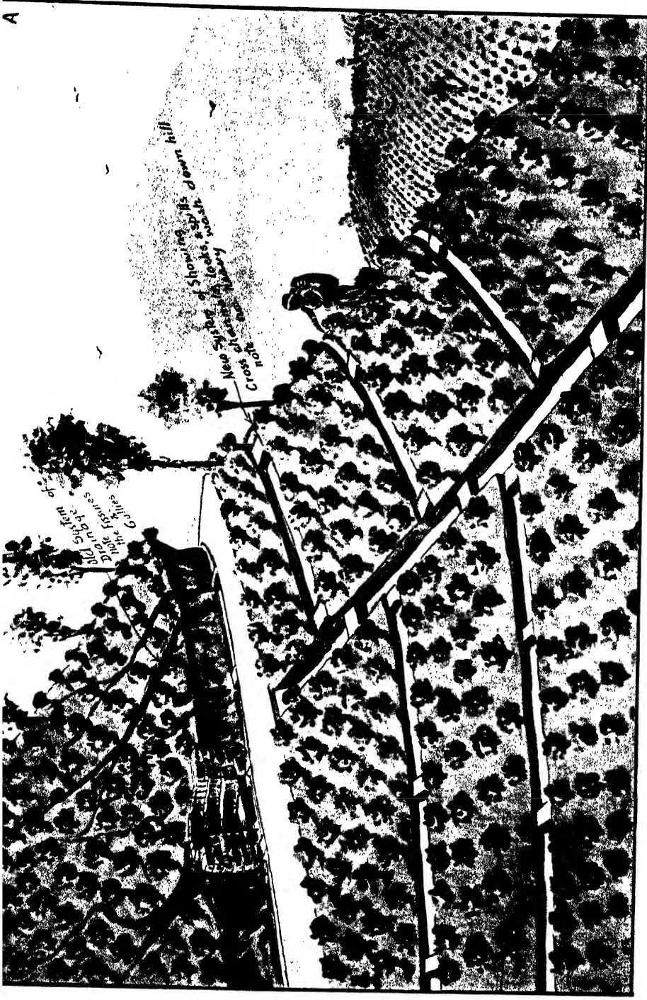An aerial photograph of a landscape, oriented horizontally. The image shows a field in the foreground with a fence line. Beyond the fence is a dense forest of trees. In the background, there are rolling hills. Handwritten annotations in black ink are scattered across the image. In the top left corner, there is a capital letter 'A'. Several lines point to specific features: one points to a 'New system of locks, wash, & ditch' on a hill; another points to a 'Cross ditch' in a field; a third points to 'Gullies' in a field; and a fourth points to 'The fissures' in a field. The text is written in a cursive, somewhat slanted hand.

Plan to Show Differences in Methods.

656------------------------------------------------

This image is a blank white page. It contains several small, dark specks which appear to be scanning artifacts or dust particles. There is no text, handwriting, or printed content on the page.

657------------------------------------------------

213

system of drainage or rather water-control. He himself has tested it and found it satisfactory. I quote as follows from a letter which Mr. Gaddum wrote to me under date 21st of April this year.

"I am writing to you at the suggestion of Mr. D. S. Cameron, my Visiting Agent, in connection with a system of draining originated by you. When he last visited me on March 29th, Mr. Cameron showed me by means of a rough sketch how you deepened your old drains and converted them into a series of water-holding "Locks" and the idea appealed to me so greatly that I went into the matter fairly thoroughly and compiled a few facts and figures. Mr. Cameron referred me to you as he said he had first seen this work done on Fruit Hill. I am opening a fairly large area in tea this year and I am cutting all my new drains on your system which so far has proved remarkably efficient; in fact in one small area I think that I have saved already approximately 50 tons of silt an acre incredible though this may sound and I feel that the idea is of such agricultural value that it ought to be published especially at the present time when the subject of soil conservation is receiving so much attention.

This letter is written in the hope that you will publish your scheme."

In the rough sketch A which accompanies this paper the upper portion lying above the road is intended to show the conditions usually to be found on estates with self-formed runnels that tend to eat into the land. A specially constructed stone spill is seen at the junction of the main drain (nethi kanu) with the road. It is part of the new system and is so designed as to adapt itself to the downward rush of water and break its force without proving too great an obstacle and providing too sudden a check to the flow. The lower part of the sketch illustrates the new system of draining with the dams and spills provided at intervals as designed by me and adopted on Primrose Hill. These dams may be part of the original cutting left behind, or mounds of earth reinforced by stones to give them greater stability. The spills are specially designed to carry off the overflow. They may vary from  $2\frac{1}{2}$  to 4 inches below the land surface according to varying natural conditions. In addition to the saving of silt thus effected as shown below, the water retained in the drain percolates through the soil and thus provides moisture to the tea. The Diagrams B 1, B 2 and B 3 hereto annexed show sectional drawings of the drains or channels which explain themselves.

In an acre of land about 32 cross-channels can be cut 15 to 25 feet apart according as space permits, or on an average 20 feet distant from each other. This is after allowing  $1\frac{1}{2}$  feet as width of each channel.

658------------------------------------------------

214

If these channels are broken up by dams at, say,  $10\frac{1}{2}$  feet intervals, there will be, allowing for  $1\frac{1}{2}$  feet as the length of each dam, 5 intervening pockets per channel for the deposit of silt, or 160 to the acre.

If silt accumulates in each pocket to a height ranging from 1 inch to 11 inches, or an average height of 6 inches or  $\frac{1}{2}$  a foot, and the width of the channel is  $1\frac{1}{2}$  feet, each pocket or drain will contain  $10\frac{1}{2}$  feet by  $1\frac{1}{2}$  feet by  $\frac{1}{2}$  foot or about 8 cubic feet of silt. This works out at about 1,280 cubic feet to the acre.

Taking the weight of average estate soil at 92 lb. per cubic foot, the weight of locked silt per acre will be about  $92 \times 1,280 = 117,660$  lb. or 50 tons—no small gain.

In a new clearing a large part of this silt could be utilized to refill the holes dug for the plants in place of the surface soil now generally used.

The actual saving will depend on many factors such as slope land, gradient of drains, number of dams, height of clearance above spill-level, &c. The figures given in Diagram B 3 should suit the requirements of old existing estates. The contributory drains should be provided with dams and spills at intervals of 6 feet or more according to the gradient. Those of the main drains are so constructed as to stand a heavy down flow being curved inwards as shown in the sketch A. Diagram B 2 represents conditions better suited to a new clearing.

I am aware that the construction of silt pits has been recommended by the Department of Agriculture and that these have been adopted and found to be of considerable value. But I am convinced that my plan, which is practically the reverse of the silt pit system, is the better. In the silt pit system in addition to the drain, a pit has to be dug at intervals whereas in the system which I adopt not only is the labour of digging a pit obviated but there is a further saving of labour as a portion of the drain is left uncut at intervals to serve as the lock. I submit my system with all deference to the planting community and hope the result will justify its adoption.

659------------------------------------------------

B.2.

Suitable for a new clearing for tea.

Mr. E. O. Felsinger's System of Prevention of Soil Erosion & Conservation of Moisture.

Diagram B.2 illustrates a cross-section of a new tea clearing. The slope is labeled 'Gradient 1 in 30'. The topsoil is 10 1/2 ft. deep. The slope is divided into three sections with widths of 18", 18", and 2 to 3 ft. The soil profile is shown with alternating layers of soil and hatched areas representing the tea plantation. The base of the slope is labeled 'K'.

B.3.

Suitable for old plantations

Diagram B.3 illustrates a cross-section of an old plantation. The slope is labeled 'Gradient 1 in 15'. The topsoil is 6 ft. deep. The slope is divided into three sections with widths of 18", 18", and 18". The soil profile is shown with alternating layers of soil and hatched areas representing the tea plantation. The base of the slope is labeled 'K'.

B.4.

Diagram B.4 illustrates a cross-section of a plantation. The slope is labeled 'Gradient 1 in 30'. The topsoil is 14" deep. The slope is divided into three sections with widths of 14", 10 to 15 ft., and 14". The soil profile is shown with alternating layers of soil and hatched areas representing the tea plantation. The base of the slope is labeled 'K'.

Block by Survey Dept., Ceylon. A

660------------------------------------------------

# B.1. Sectional drawing

Mr. E. O. Felsinger's System of Prevention of Soil Erosion & Conservation of Moisture as practised by him on Primrose Hill Estate.

The diagram illustrates a drainage system on a hillside. At the top, a 'Main Drain' is shown. Below it, 'Cross channels' branch off at a 'Gradient 1 in 30'. The cross channels are 10 1/2 ft long and 18 inches wide. The main drain is 2 to 3 ft wide. A distance of 15 to 25 ft is indicated between the main drain and the cross channels. A note '2 1/2 to 4'' is present near the cross channels. The diagram is signed 'BLOCK by Survey Dept. Ceylon'.

BLOCK by Survey Dept. Ceylon

661------------------------------------------------

215

## Mycological Notes (16).

### The Parasitism of *Rhizoctonia bataticola* (Taub.) Butler and other Fungi.

**W. SMALL, M.B.E., M.A., B.Sc., Ph.D., F.L.S.**

*Mycologist, Department of Agriculture, Ceylon.*

**T**HE writer's work on the fungus causes of root disease of woody plants in Uganda and Ceylon has led to two conclusions, (1) that *Rhizoctonia bataticola*, a soil-inhabiting sclerotial fungus, is a cause of root disease, that is to say, that the fungus is able to attack and kill plants exposed to it in the soil and is therefore a parasite, and (2) that, when it is found in the company of another fungus (or fungi) in cases of root disease, it precedes the other form (or forms) in time of attack and is therefore primarily responsible for disease. Those views were published in 1927 (1), and the facts which supported them and the circumstances which led up to them were duly discussed. They have been criticised from two points of view, (1) that *Rhizoctonia* is a saprophytic form and is entirely incapable of parasitism, and (2) that the parasitism of *Rhizoctonia* is dependent to such a degree upon the presence of preliminary or contributory conditions which affect the host plant adversely before attack takes place that the fungus may be regarded as a weak parasite or one that is harmless in the absence of the contributory conditions.

The second view which, be it noted, does not deny the parasitism of *Rhizoctonia* but makes it conditional on circumstances unfavourable to the host plant is held in the West Indies and will be answered in another place to the effect that contributory conditions are not apparent in the field in Ceylon and have not been found to be essential in successful *Rhizoctonia* infection experiments. The first view is held in Ceylon by Gadd and Petch who deny that *Rhizoctonia* can be parasitic under any circumstances and assert that it is only and always a common soil saprophyte. They make no mention of, and presumably do not

662------------------------------------------------

216

admit, the possibility of facultative parasitism on the part of *Rhizoctonia*. In other words, their view of *Rhizoctonia* means that they consider that the fungus lives upon or obtains its food materials from dead matter only and that it cannot and never does live on or in living tissues. The writer's point of view is opposed to that of Gadd and Petch; it regards *Rhizoctonia* as a parasite in its relationship to living plants and as having none of the attributes of a true saprophyte. The present note deals with the views of Gadd and Petch only, and in particular is a reply to the remarks made by the latter at the Agricultural Conference held at Peradeniya in May, 1928 (2). It shows that there is reason why the views of Gadd and Petch may be rejected.

Gadd (3) put forward the saprophytic view in 1927, and, in reply to his criticism, the writer (4) drew attention to the sole association of *Rhizoctonia* with numerous cases of root disease of woody plants and to the circumstances of its occurrence in nature which pointed strongly to parasitism. With reference to the writer's doubt concerning the parasitism of other root fungi like *Poria* and *Fomes*, Gadd held that their parasitism was proved by the supposed successful control of their activities by trenching and stumping. It had to be pointed out (4), therefore, that there was no proved cause-and-effect connection between treatment of root disease by trenching and stumping and a supposed diminution in the amount of root disease in Ceylon, that the success claimed for trenching and stumping might be doubted and that the supposed diminution of root disease might be questioned. Gadd ignored *Rhizoctonia* infections of woody seedlings obtained by the writer in Uganda (5), and he has not yet offered proof of the complete saprophytism he claims for the fungus in nature. It may be added that *Rhizoctonia* does not behave as a saprophyte in the field in the sense that it may be found on any medium convenient for its growth, for example, woody debris or the dying or dead roots of trees that have been cut down in areas of soil known to contain *Rhizoctonia*, nor is it by any means confined to the dead matter or substrata affected by the true saprophyte.

It may be of interest to consider the points brought forward by Petch (2) against the parasitism of *Rhizoctonia*. In saying that there is no evidence that *Rhizoctonia bataticola* can be parasitic on woody plants, he also ignores the results reported by the writer (5) in 1926 and the later statement (6) that results had been attained at Peradeniya. It has been shown that *Rhizoctonia* can attack and kill seedlings of tea, rubber, cacao, lime and dadap, and other infections have been obtained on plantains and young coconuts. An account of the experiments and the results will be published elsewhere. Further, Petch follows Gadd in ignoring the significance of cases of sole asso-

663------------------------------------------------

217

ciation of *Rhizoctonia* with root disease. It would be interesting to know how he would explain occurrences of *Rhizoctonia* on tea in which no other root disease fungus is present and in which penetration by *Rhizoctonia* from the smallest roots through the larger roots and even into the stem is distinctly set forth and is followed by death of the plant. In such cases, and they are not uncommon, the death of the plant may be attributed to *Rhizoctonia* with reason and certainly with as much reason as Petch attributes pathogenicity to *Poria* and *Diplodia*. If not, Petch would apply to *Rhizoctonia* tests or criteria of pathogenicity which he has not applied to certain fungi which he lists as causes of root disease of tea, a proceeding that is somewhat one-sided. The conclusion seems unavoidable that, if he had detected its association with, for example, root disease of tea, Petch would have included *Rhizoctonia* among the fungi to which he attributes root disease of tea without having tested in experiment their ability to cause root disease. Gadd (7), again, has said that "there is no obvious "reason why the mere presence of the fungus should suggest a "parasitic habit," a remark which shows that he also judges *Rhizoctonia* by standards which he does not apply to other supposed parasitic fungi.

Two further points are contained in the following sentence: "If a root attacked by *Fomes* is buried in contact with the roots "of a rubber tree, it is more than even chance that the tree "will be attacked by *Fomes* and die. That cannot be done with "*Rhizoctonia bataticola*." The first point is that the claim cannot be admitted because experiments conducted at Peradeniya within the last two years have failed to show that *Fomes* will spread to and attack rubber roots alongside which it is buried, and the second is that the words "That cannot be done with *Rhizoctonia* "*bataticola*" are meaningless because *Rhizoctonia* does not and has never been asserted to spread by contact or attack woody roots through the bark. In saying, therefore, that the chances of parasitism in fungi like *Fomes* and *Poria* are mathematically greater than those of *Rhizoctonia* he ignores the fact that the number of possible points of entry for *Rhizoctonia*, that is, the feeding roots, is at least as great as, if not much greater than, the points open to the attack of *Fomes* or *Poria*, that is, the surfaces of the larger roots. A calculation regarding a method of infection which is not adopted by the fungus in question is of no value. Besides, it takes no note of the possibility that a fungus may be more strongly parasitic than another with which it is compared. It may be added that the simple demonstration of the parasitism of *Poria* recommended by Petch has not been found to succeed in recent trials with healthy tea bushes. *Poria*, like *Fomes*, cannot therefore be regarded by the writer as a primarily parasitic fungus.

664------------------------------------------------

218

Petch's arguments for the saprophytism of *Rhizoctonia* do not bear scrutiny. The first, that the fungus has not been made to attack woody plants, has already been answered. The second is that it is found in dead roots of plants of all kinds. It may have been forgotten that a supposed root disease fungus, that of brown root, has been recorded in Ceylon as a cause of disease of over twenty plants. The argument may therefore be applied equally to *Fomes lamaoensis*. If emphasis is meant to be laid upon the words "of all kinds," it can be said that there is no reason why the fact that a certain fungus may be found on the roots of many different plants should not mean that it is capable of attacking and killing monocotyledons as well as dicotyledons and gymnosperms. Further, Petch does not take into account the most significant fact of all, that *Rhizoctonia* can be found in living, apparently healthy, large roots as well as in those it has killed, although the fact was brought to his notice (6). Another argument for its saprophytism is that *Rhizoctonia* grows rapidly in culture. Petch appears to be unaware of the fact that all isolations of *Rhizoctonia* do not grow rapidly in culture, and he implies that all fungi which grow rapidly in culture are to be regarded as saprophytes, a view that only requires to be put forward to be rejected. It cannot be applied to *Rhizoctonia* and withheld from other parasitic fungi. It is well known that many parasitic fungi are capable of vigorous growth in artificial culture. These criticisms show that Petch's arguments for the saprophytism and against the parasitism of *Rhizoctonia* cannot be accepted.

A further point is that quick action on the part of *Rhizoctonia* when inoculated into wounded jute stems proves it to be a rapid grower, an argument that ignores the fact that any fungus will prove to be a rapid grower on a medium to its liking. Growing *Rhizoctonia* on the wounded stems of jute, a plant part that is susceptible to *Rhizoctonia*, is almost comparable to growing it in a culture medium or on blocks of wood. A truer and fairer comparison would have considered the rate of growth in healthy roots, not in wounded stems, and it would show that the rate of advance is slow. The latter fact, however, is no argument in favour of saprophytism or against parasitism. Petch requires *Rhizoctonia* to be a rapid grower in order that it may be fitted into the hypothesis which regards *Rhizoctonia* as able to enter and advance in the roots only after they have been presumed to be killed by the attack of fungi like *Fomes* and *Poria* at a higher point or by some other agency. He takes no account of the many cases in which *Fomes* or *Poria* or an outside agent is absent and *Rhizoctonia* nevertheless has penetrated the roots with thoroughness, or of the numerous cases in which attack of *Fomes* or *Poria* on larger parts of roots is only in its initial stages while *Rhizoctonia* attack has killed the smallest roots extensively and often

665------------------------------------------------

219

also the larger roots, that is, cases in which there is no question of the advance of *Rhizoctonia* in roots killed or injured by another fungus even though the other fungus be present. Petch would have difficulty in explaining the presence of *Rhizoctonia* in such cases and also the fact that the attack of *Fomes* and *Poria* is confined to roots or parts affected at lower points by *Rhizoctonia* and the further fact that *Fomes* and *Poria* may not appear at all whereas *Rhizoctonia* is always present. In other words, it is to be noted that *Rhizoctonia* attack takes place in the absence of the conditions which are said to be necessary for it. This point brings the argument back to the denial by Gadd and Petch that any meaning may be attached to the sole association of *Rhizoctonia* with cases of root disease and shows how illogical and unreasonable their attitude is.

Gadd (7) has postulated the ability of *Rhizoctonia* to invade dead plant tissues with rapidity, an ability which he requires in order to explain the presence of *Rhizoctonia* at points well-removed from its point of entry, that is, its presence in larger roots into which it has advanced from the smaller parts. As there is no proof or evidence that *Rhizoctonia* can or does enter dead roots and grow in them rapidly or otherwise under natural conditions, Gadd's postulate is founded entirely upon supposition. The only dead roots in which *Rhizoctonia* is found are those killed by itself which remain attached to the plant until natural decay sets in, and there is no doubt that the growth of *Rhizoctonia* under natural conditions is dependent on living root tissues as far as its relation to plants is concerned. At the same time, attention may be drawn again to the fact that *Rhizoctonia* can be found in and isolated from living, apparently healthy roots of tea and rubber, which fact is strong evidence against its supposed saprophytism and in favour of its parasitism. The fungus can also be isolated with ease from its advancing edge in roots that are sickly but not moribund or dead. Further evidence for parasitism can be obtained from infection experiments with woody seedlings which will show the entrance of *Rhizoctonia* by the feeding rootlets and the slow advance of the fungus in the roots (or a portion of them) leading to sickness and eventual death of the invaded plant.

The position of Gadd and Petch with regard to their view of *Rhizoctonia* is unsound because it is founded entirely on supposition which can be criticised and swept aside and is backed by their refusal to face the significance of the sole association of *Rhizoctonia* with cases of root disease. They claim saprophytism where none of the conditions of saprophytism are fulfilled, where, on the contrary, it can be shown that the supposed saprophytic fungus cannot possibly be a saprophyte. Their other supposed

666------------------------------------------------

220

strong point, that *Rhizoctonia* has not been proved to be parasitic in experiment, is tenable no longer. The facts point conclusively to the parasitic nature of *Rhizoctonia*.

Gadd (7) has also discussed the significance of the mycorrhizal form of *Rhizoctonia bataticola* found on tea and described by Park (8). His remark that "a mycorrhizal fungus normally plays "no part in causing the death of the plant it inhabits" will not meet with general acceptance for certain authorities hold that the mycorrhizal condition is one of parasitism of the fungus on the plant root, and, when he says that the mycorrhizal theory fits the observed facts "and accounts for the presence of *Rhizoctonia* "in dead roots, particularly the finer roots," he supposes the roots to have been killed by another agent than *Rhizoctonia*, a supposition to which objections have been raised. He makes no allowance, of course, for the possibility that *Rhizoctonia* may have advanced from the mycorrhizal form and killed the roots, and he also fails to account for its presence in large roots well-removed from the original mycorrhizal site, large roots which, be it noted need not be dead. The mycorrhizal theory, therefore, does not fit, as he asserts, the observed facts and is not "entirely opposed "to the parasitic theory." His attempt to explain the advance of *Rhizoctonia* from the mycorrhizal condition to the parasitic on the ground that conditions upset the equilibrium between plant and fungus depends upon proof of the existence and action of conditions unfavourable to the plant. At the moment he merely supposes them to be in action because it is convenient to do so. It may be hoped that the conditions exist; they are not apparent in the field or necessary for the parasitism of *Rhizoctonia* in experiment. In any case, with or without conditions, *Rhizoctonia* would still have to be regarded as a parasitic fungus. The suggestion that *Rhizoctonia* may be enabled to pass from the endophytic or mycorrhizal form to that found in larger roots, particularly larger dead or diseased roots, when the plant is attacked at a higher point by another fungus, for example, *Poria* or is upset physiologically by external conditions was made by Park (8). He was careful to point out, however, that he had little evidence in support of it. The following points militate against the suggestion. It fails to account for the advance of *Rhizoctonia* in the absence of attack by another fungus or in the case of attack which is in an early stage while *Rhizoctonia* has advanced a long way or in the case of attack at a certain point which cannot influence the advance of *Rhizoctonia* at other points. It is not proved that the other fungus can attack independently, or that *Rhizoctonia* is unable to make progress until the other fungus has attacked, and, as pointed out above, adverse external conditions are not clearly in evidence. In any case, *Rhizoctonia* entry into the roots is still prior to the supposed attack of a fungus like *Poria*.

667------------------------------------------------

221

Speculations of this nature, however, have little value in the present state of our knowledge. Before they can be of real help, investigation will have to show if the mycorrhiza is obligate and lasting, that is to say, whether it is a true mycorrhiza. In other words, synthesis of the mycorrhiza should be attempted. A true mycorrhiza need not be of benefit to the plant, and it must therefore be shown whether *Rhizoctonia* is harmful in the mycorrhizal stage. The percentage of roots which harbour the endophytic form and the possibility of the presence of other fungi must also be investigated, and the conditions, not necessarily conditions of external origin, under which *Rhizoctonia* passes from the mycorrhizal stage to that of advance in the roots must be studied.

In bringing forward the question of the *Rhizoctonia* endophyte of tea roots, the writer (6) merely wished to draw attention to the possible significance of the identity of the endophytic or mycorrhizal fungus with that which causes root disease and death and to point out that the present balance of evidence is in favour of the view that the fungus is, as it were, intent on parasitism *ab initio*. It is possible that the mycorrhizal and parasitic forms of *Rhizoctonia* are unrelated as far as subsequent root disease is concerned; it is equally possible that the mycorrhizal condition is a phase, perhaps obligatory perhaps fortuitous, in the causation of root disease by *Rhizoctonia bataticola*. However that may be, the lines upon which investigation of root disease is proceeding seem more likely to lead to a true understanding of the causation of root disease than past investigation which ceased at the point where it first found a possible cause, that is, the larger parts of roots, and was unaware of the necessity for examination of the smaller roots and the feeding rootlets. It thus made the mistake of regarding the agents of root disease which attack at higher points as symptomatic of a first or primary phase of root disease whereas they are more likely to belong to a secondary phase.

Two recent publications which have a bearing on the subject under discussion may be mentioned here. The first is an account by O'Brien and M'Naughton (9) of an investigation into the widespread strawberry disease known as Lanarkshire disease. They describe the invasion of strawberry roots by a mycorrhizal or endophytic fungus which resembles the mycorrhizal *Rhizoctonia* of tea isolated by Park and shown to be *Rhizoctonia bataticola*, and their observations lead them to conclude that the fungus is parasitic and responsible for the disease. It is noteworthy that the disease is reported to be slow-acting and chronic in nature and that the fungus is capable of causing death. It is said that "the ultimate damage "is greater or less as mycorrhizal attack is severe or slight

668------------------------------------------------

222

"and as conditions are unfavourable or favourable for plant "growth." The case differs from that of *Rhizoctonia* on woody plants in Ceylon inasmuch as very large areas are affected whereas *Rhizoctonia* root disease affects scattered plants or small areas, and the difference points to the probability that the action of external conditions over large areas, the manner in which they may be expected to act, has an influence on the amount of disease. It should be noted, however, that external conditions have not been proved to be of primary importance in relation to the root *Rhizoctonia* of strawberry. In fact, O'Brien and M'Naughton remark that "there was abundant evidence to show that the "disease might be serious even on good soils, liberally manured "and well-drained."

The second concerns endophytic fungi of the roots of sugar-cane. Ciferri (10) reports from the Dominican Republic that the endophytes lead to retardation and death of rootlets, that is to say, that the endophytes are parasitic. A species of *Rhizoctonia* is regularly present and is more aggressive and penetrative than a second form which is also found. The evidence for the parasitism of *Rhizoctonia* is considerable. It may be added that the rootlets of tea seedlings infected by *Rhizoctonia bataticola* in the writer's experiments do not show the persistence of a mycorrhizal condition of *Rhizoctonia* in the roots. If it formed a stage in the process of infection, it has been left behind, as it were, by the advance of the fungus; there is morphological evidence of its presence. It should be noted that it is not assumed that the *Rhizoctonias* of tea, of strawberry and of sugar-cane are the same species. Attention is merely drawn to the trend of investigation, to the recognition of the parasitism of the genus *Rhizoctonia* in small roots without the aid of contributory conditions, and to the fact that the findings of other workers tend to support the writer's conclusions regarding the parasitism of, and the method of attack adopted by, *Rhizoctonia bataticola* in Ceylon.

Up to this point the arguments for and against the parasitism of *Rhizoctonia* have been surveyed and the mycorrhizal condition of the fungus has been discussed. It remains to make a few remarks concerning the position of the fungi which have been regarded in the past as causes of root disease. Their parasitic status has been questioned by the writer on the grounds that they do not occur in nature without *Rhizoctonia* and that *Rhizoctonia* attack takes place prior to the appearance of the other fungus (or fungi) and therefore leads to it. The questioning of their status has led to experimental work on their parasitism and also to the bringing forward of evidence in favour of their supposed parasitism. That the evidence cannot be accepted is apparent from the notes which follow.

669------------------------------------------------

223

Petch (11) has collected the experimental evidence in favour of the parasitism of the old-established and well-known root fungi and Gadd (12) has reported successful inoculations with and infection of tea seedlings by a species of *Rosellinia*. The nature of Petch's evidence for the parasitism of *Poria* and the fungus of brown root disease cannot be regarded as satisfactory. Other cases quoted by Petch seem perfectly good until it is remembered that *Rhizoctonia* is found to be present so consistently in cases of supposed *Poria* and other root disease that suspicion of its undetected presence in the cases quoted is justified and well-founded. In the past *Rhizoctonia* was not looked for or suspected to be present because investigation had not disclosed its presence. It is therefore possible, even likely, that the cases quoted by Petch are not as reliable as they seem. Further, Petch omits to mention in his invitation to planters to experiment with certain root fungi the probability of the presence and influence of *Rhizoctonia* and the necessity for making certain that *Rhizoctonia* is not concerned vitally in what are supposed and meant to be simple one-fungus experiments with *Fomes* and *Poria*. Again, *Fomes*, *Poria* and other root fungi have been used in experiment at Peradeniya in the manner suggested by Petch. The promised results have not been obtained; in fact, it has been shown that *Fomes lignosus* and *Poria* are parasitic only in the presence of *Rhizoctonia*, the former on rubber seedlings and the latter on tea bushes. It may be added that field experiments with the brown root fungus (*Fomes lamaoensis*), *Ustulina* and *Diplodia* have given negative results.

Gadd (13) has said that "the majority of the fungi which "cause root diseases of mature tea appear to be incapable of "attacking seedlings," and he suggests that tea seedlings "are "immune to these fungi (*Poria*, *Ustulina* and *Fomes lamaoensis*) "until they have reached a suitable stage of development." The fungi in question have still to be proved capable of causing of their own efforts root disease of mature tea, and it may be suggested that they do not attack seedlings in nurseries because they may be absent from the carefully-prepared soil of nursery beds or because they are incapable of attacking as primary parasites. It is to be noted that *Poria* and *Fomes lamaoensis* can be found on young tea and other plants attacked by *Rhizoctonia* in the field very soon after planting out. If Gadd has conducted experiments with *Fomes* and *Poria* on seedlings, it would be of interest to have an account of his results. Successful inoculations of tea seedlings with *Rosellinia arcuata*, a fungus which is, on the whole, uncommon, have led Gadd to conclude that "a "pathogenic soil fungus can easily gain entrance into its host by "other ways than viâ the fine rootlets." If this statement is meant to include soil fungi like *Poria* and others, the pathogenicity of

670------------------------------------------------

224

which has not been proved, it is more sweeping than justifiable; it may not be applicable, in any case, to adult bushes since Gadd would make a distinction between the susceptibility of seedlings and that of adult plants. *Rosellinia arcuata* may be the virulent parasite that Gadd reports, but it is uncommon enough to be of very little account. So far as the writer's hypothesis of the secondary nature of *Fomes*, *Poria*, *Ustulina*, *Diplodia* and *Rosellinia* is concerned, it may be necessary to withdraw the relationship of *Rosellinia arcuata* to tea from the list, but, on the other hand, it is important to note that the few cases of *Rosellinia arcuata* on tea that have come into the writer's hands have also shown the presence of *Rhizoctonia*. Further, the writer's experiments with *Rosellinia arcuata* in the field have given negative results. In any case, absolute truth of the hypothesis regarding the secondary nature of *Fomes*, *Poria*, *Ustulina*, *Diplodia* and *Rosellinia* is perhaps too much to expect. The hypothesis, however, is shown by experimental results to be tenable as a whole, and the fact that a small part of it appears to be contradictory to the general conclusion need not invalidate the whole hypothesis.

A few notes on *Armillaria*, *Fomes lamaoensis* and *Diplodia* may be of interest. With reference to *Armillaria* root disease of tea, Gadd (13) who has lately recorded the fungus remarks that "the parasitism of *Armillaria mellea* has been well proved elsewhere." This statement is open to doubt for there seems to be a lack of clear experimental evidence for an aggressive parasitism on the part of *Armillaria* under natural conditions. W. R. Day (14), a recent worker with *Armillaria mellea* (which is probably the same species as that found on tea), says that "the conclusion to be drawn from the evidence put forward is that *Armillaria mellea* is able to penetrate an uninjured and apparently healthy host. Accordingly it might appear that the fungus is a virulent parasite and a primary cause of disease. This is by no means certain, however, if for one reason only, and that because it is possible sometimes to find trees that are attacked by the fungus and yet do not die, or that, belonging to a species reckoned to be susceptible, are in close proximity to the parasite and yet show no signs of successful attack." Day's general conclusion is that "other and external factors often, and perhaps always, have a much greater influence in determining the intensity of infection and the general susceptibility of species." These words are significant. Although out of place, the suggestion may be made that an examination of the smaller and the feeding roots of trees attacked by *Armillaria* might shed light on the question of the factors that lead to *Armillaria* attack.

671------------------------------------------------

225

Hansford (15) who has been studying root disease in Uganda makes the following remarks on the subject of the brown root disease fungus and *Armillaria* which he found to accompany *Rhizoctonia* in cases of root disease of robusta coffee. "In most "of these instances, but by no means in every case, the original "*Rhizoctonia* has been followed by other fungi among which the "characteristic rhizomorphs of *Armillaria mellea* and the mycelium "of *Fomes lamaoensis* have been noted. The latter fungus, described in the East as the cause of brown root disease of various "trees, was definitely a secondary parasite in the case of diseased "coffee in the Sesse Islands. In one native plot of *Coffea robusta*, "every stage in the disease was found, commencing with the "original attack of *Rhizoctonia* on the small rootlets, afterwards "passing along to some of the main roots nearest the surface of "the soil, and finally marked by rapid development of the brown "mycelium of the *Fomes* with its adhering soil and gravel over the "whole of the larger roots of the trees. In other cases the rhizo- "morphs of *Armillaria* were noted as starting on the smaller roots "attacked by *Rhizoctonia* and finally progressing beyond the limits "of invasion of this fungus to the main roots of the tree. In no "case was *Fomes lamaoensis* or *Armillaria mellea* found on coffee "roots in the absence of *Rhizoctonia*, whereas in over seventy-five "per cent. of all cases of root disease *Rhizoctonia bataticola* was "alone present in the attacked roots. This evidence is all in "favour of the contentions of Small that *Rhizoctonia* is the primary "invader in most, if not all, cases of brown root disease and similar "diseases formerly ascribed to fungi of the *Fomes* group." Hansford's evidence supports strongly the writer's contention that the presence of certain fungi is indicative of a secondary phase of root disease, the primary phase of which is caused by *Rhizoctonia*, and it shows that *Armillaria* need not be a primary parasite.

Briton-Jones (16) has reported from the West Indies that "*Fomes lignosus* is not a primary parasite and, if it contributes "at all towards the killing of the plant, it is in the capacity of a "very weak parasite. It is of no consequence whatsoever "from the practical standpoint." He says further that *Fomes lignosus* is one of the commonest fungi to be found in Trinidad, that it is not recorded as a cause of disease in the West Indies, and that, though conditions in Trinidad seem ideal for *Fomes* infection of cacao, it does not occur. Petch (17), however, asserts that the supposed West Indian *Fomes lignosus* is a different fungus from the *Fomes lignosus* of the East. Further comment must be withheld until the question of the identity of the West Indian form is settled.

672------------------------------------------------

226

Experiments at Peradeniya have failed to show that *Diplodia* is the virulent parasite of tea roots described by Petch (18). Gadd (13) may have had a similar experience with the fungus for he now wishes to attribute the association of *Diplodia* with tea root disease and failure to recover from pruning to a weak or secondary parasitism which follows upon and is encouraged by a shortage of food reserves in the affected roots. *Diplodia* may therefore be ignored as a primary cause of tea root disease or failure to recover from pruning, and the true cause of the loss of bushes is to be sought elsewhere, that is, in an inherent or induced inability on the part of the bush to recover from the effects of pruning and plucking. Failure to recover from pruning is regarded by the writer as identical with root disease because it is found that cases of failure to recover from pruning are in reality cases of root disease, and, further, that attack of the fungus *Rhizoctonia bataticola* upon the roots is associated with them. It may be pleaded that *Rhizoctonia* follows the shortage of food reserve in the roots, as *Diplodia* probably does, but it is equally possible that the shortage is caused directly by *Rhizoctonia* attack and advance. It is apparent from the recovery of tea in the field from pruning and from plucking that the effects of these operations alone are unlikely to be the sole cause of a degeneration which results eventually in the loss of the bush and that the presence and operation of another harmful factor are required. The possibility of the action of another harmful agent being aided by the effects of pruning and plucking is always present, but there is no evidence for it, as far as the most likely factor, *Rhizoctonia bataticola*, is concerned. It seems that efforts are being made to treat failure to recover from pruning as a so-called physiological disease before the possibilities of parasitism on the part of a consistently-present fungus are exhausted or even considered, a step that is indefensible when there is evidence of the presence and for the parasitism of the fungus in question.

The matters discussed in the preceding pages may be summarised as follows. It is held by those who oppose the writer's views that the plant in the roots of which *Rhizoctonia* is found must be upset or disturbed by the attack of another fungus (for example, *Fomes* or *Poria*) or by the operation of adverse conditions of growth before *Rhizoctonia* is enabled to attack at all, that the disturbance is complete enough to cause the death of the roots, and that *Rhizoctonia* can enter and occupy only roots killed by such disturbance; in other words, that *Rhizoctonia* can behave only as a saprophyte and never as a parasite. It has been pointed out that these views are founded on supposition and are unsupported by either proof or field evidence. The writer holds,

673------------------------------------------------

227

on the contrary, that the supposed disturbing conditions, physiological or fungus, are neither apparent nor essential for *Rhizoctonia* attack in the field and in experiment, that they have not been shown in operation and are only supposed to be present, that, in general, the other fungi which are said to attack before *Rhizoctonia* have not been proved capable of doing so, that *Rhizoctonia* is found in such positions (for example, living roots) and under such circumstances (for example, sole association) that it cannot be a saprophyte and must be a parasite, and that *Rhizoctonia* has been proved capable of parasitism in experiment.

## References.

1. 1. W. SMALL. The Tropical Agriculturist 68, page 201, April 1927.
2. 2. T. PETCH. The Tropical Agriculturist 70, page 345, May 1928.
3. 3. C. H. GADD. The Tropical Agriculturist 68, page 363, June 1927.
4. 4. W. SMALL. The Tropical Agriculturist 68, page 370, June 1927.
5. 5. W. SMALL. Transactions of the British Mycological Society 10, page 287, 1926.
6. 6. W. SMALL. The Tropical Agriculturist 70, page 342, May 1928.
7. 7. C. H. GADD. The Tropical Agriculturist 70, page 348, May 1928.
8. 8. M. PARK. The Tropical Agriculturist 70, page 171, March 1928.
9. 9. D. G. O'BRIEN and E. J. M'NAUGHTON. West of Scotland Agricultural College, Department of Plant Husbandry, Research Bulletin No. 1, January 1928.
10. 10. R. CIFERRI. Phytopathology 18, page 249, March 1928.
11. 11. T. PETCH. The Tea Quarterly 1, page 10, February 1928.
12. 12. C. H. GADD. The Tea Quarterly 1, page 55, August 1928.
13. 13. C. H. GADD. The Tea Research Institute of Ceylon, Bulletin No. 2, Annual Report for 1927.
14. 14. W. R. DAY. Quarterly Journal of Forestry 21, page 9, 1927.
15. 15. C. G. HANSFORD. Annual Report of the Department of Agriculture, Uganda, for 1927.
16. 16. H. R. BRITON-JONES. Tropical Agriculture 5, page 79, April 1928.
17. 17. T. PETCH. The Tea Quarterly 1, page 64, August 1928.
18. 18. T. PETCH. Diseases of the Tea Bush, 1928.

674------------------------------------------------

228

# Sparrows.

*(Passer domesticus and P. domesticus indicus.)*

**N. K. JARDINE, F.E.S.**

*Inspector of Plant Pests and Diseases, Central Division.*

**P**ASSER *domesticus* is the common European sparrow, and *P.d. indicus* is the Indian and local form of the same species. There is little difference between the two forms, and the habits are identical.

The sparrow is today a cosmopolitan bird; it is found in every country outside of the arctic and antartic circles wherein man dwells, and there are few countries that have not complained against the bird and waged campaigns for its extermination. Ornithological literature shows that nearly every section of the world inhabited by progressive races have cried out against the disastrous activities of the bird. Tegetmeier, the renowned ornithologist, well named the sparrow the "Avian Rat," for in its economic relations the sparrow among birds is comparable to the rat among mammals.

The habits of the Eastern sparrow are identical with those of the European form; in other words, the Indian or local sparrow is equally as destructive as its western cousin. There is nothing to be said in favour of the sparrow. It is true the young are fed on a part diet of insects for the first three weeks of their life, but what little credit may be theirs for this act is counterbalanced by the amount of grain in the milky state, and seed softened by the parents, which is fed to the nestlings.

To its disadvantage may be cited the following facts:—It is cunning, crafty, hardy, aggressive, and a prolific breeder. It destroys fruit, buds and flowers of cultivated trees, shrubs and vines. It devours seeds, nips off tender young vegetables as they develop, it is particularly partial to peas, beans, lettuce and such like garden produce. In the field it damages dry grain crops when newly sown, ripening and when harvested; paddy is heavily attacked when forming in the ear, when ripe and when harvested, and on the threshing floor. It reduces the number of more

675------------------------------------------------

229

attractive and more useful birds such as bulbuls, robins, warblers, wrens, swallows, white-eyes sunbirds, flowerpeckers and swifts, by destroying the eggs and young and by usurping the nesting places. It attacks familiar native birds such as the robins, bulbuls, munias, tits, wrens and sunbirds, causing them to desert their usual haunts. It has no song but is noisy and vituperative. It defiles buildings ornamental trees, vines and shrubs with its excrement and untidy nests. It is recognised the world over as a vagabond, an undesirable, for nowhere is it among the birds that are protected, but to the contrary, for every important state has passed laws for its destruction, but, owing to its hardness, extraordinary fecundity, diversity of food, aggressive disposition and almost complete immunity from natural enemies through its sagacity and preference for thickly populated communities, it persists as a pest.

In many countries the amount of national loss caused by sparrows, by reason of ravaged crops, has been estimated, and for England alone the sum reaches the appalling figure of  $5\frac{1}{2}$  million pounds sterling per annum, and this amount is greater in Canada, Australia and the United States of America.

The sparrow is so great a pest that it is a duty for progressive communities to take steps for its destruction. To do so efficiently it is necessary to know something of its habits.

**Nests.**—The principal nesting seasons are February to June, but it breeds throughout the year, and there are, as a rule, two broods. The nest is a shapeless untidy mass of straw, grass, fibres, cotton, rags or any such material obtainable; and is lined with soft fabric such as kapok, feathers, cotton wool, etc., and placed anywhere inside (when permitted) or outside of dwellings, in water guttering and down-pipes, niches, in hedges, shrubs, vines and small trees, in bamboo sections, bird boxes and flower and fern pots, and they use nests of other birds; in fact there is no available place around human habitations they will not utilise for nesting if undisturbed. When nests in the making are destroyed in dwellings they will be persistently rebuilt by the birds, time and time again.

**Eggs.**—The eggs are usually four in number, of a greyish or greenish colour with markings of brown or purple, and are about 20 m.m. long.

**Nestlings.**—The young are fed on a mixed diet of insects, —usually carterpillars of a hairless nature, grain in the milky state, and seeds softened by the parents. After three weeks the diet is that of the parents.

**Habits.**—They fly, feed and roost in close flocks. One or more couples will break away from the flock, especially when nesting, and seek congenial grounds around habitations where

676------------------------------------------------

230

they will be tolerated, and soon after these isolated couples are established, the main flock follows. The writer suspects these single pairs to be scouts for the main flock: on three occasions he has allowed a couple to frequent the premises undisturbed, and within a week of each occasion the main flocks, numbering 48, 60 and 230 respectively, have come along and joined the original pair.

**Prevention of Increase.**—Look for and destroy all nests *that have eggs*. It is next to useless, as a preventive measure, to destroy nests in which the female has not deposited her complement of eggs, for to do so only means that as a nest is destroyed the birds will commence rebuilding, and the repetition of the process is good for neither the patience nor the nerves of the individual. By waiting until the eggs are laid before destroying nests, is an effective measure in that the birds seem to lose heart, and will leave the area.

**Methods of Destruction.**—(1) **By Nests.** Supply nesting materials, such as sections of bamboo, boxes, shelters, straw, feathers, wool, etc., etc., for the flock, wait until eggs have been laid, and destroy the lot.

(2) **By Baiting.**—Tempt the flock to frequent the premises by regularly laying such baits as paddy, bread crumbs, water for drinking and dust for baths. By this method several flocks can be attracted to the area of execution, and the following methods employed to destroy the birds:—

(3) **Trapping**, by means of shallow boxes or wire frames tilted over the feeding grounds and supported by a stick to which is attached a string ten to twelve yards long, so that the stick may be pulled away by a concealed person, and the box or frame allowed to fall over the birds, which may then be collected, and painlessly and instantaneously killed by throwing against a wall or concrete floor.

(4) **Shooting.**—Sparrows feed in close flocks and if food is scattered in long narrow belts the whole area may be raked with No. 10 shot, with disastrous results to the pests.

(5) **Poisoning.**—The most effective poison is strychnia sulphate. It is easily prepared and acts quickly. Needless to say it should not be used where children, animals or fowls can get at the poisoned bait, and it should be used only by those

677------------------------------------------------

231

competent to handle such poisons. The poison is prepared by putting one-eighth of an ounce of strychnia sulphate into  $\frac{3}{4}$  of a gill (approximately one teacupful) of hot water and boil until dissolved. Moisten  $1\frac{1}{2}$  teaspoonsful of starch with a few drops of cold water, add it to the poison solution, and heat until starch thickens. Pour the solution over one quart of paddy, and stir until each grain is coated. A glass fruit-jar is a good vessel in which to coat the grains, for it is easily shaken and allows of the contents being seen.

The capacity of a sparrow's crop is 30 to 35 grains of husked paddy. Seven to ten poisoned grains will be fatal; less causes paralysis, but the paralyzed birds can be collected and destroyed.

Only as much poisoned grain as is likely to be consumed in a day should be laid out.

A flattish roof is one of the safest places on which to place poisoned grain.

Morning and evening are the best times to lay out poisoned food, as it is at these periods of the day the sparrow consumes the greatest quantity of food at a time.

Poisoned paddy will be harmless after a shower or two of rain.

There is practically no danger of dogs and cats and other animals dying from eating poisoned sparrows.

The husked paddy will be more acceptable as bait than the unhusked grain.

It is advisable to poison and trap at intervals of three and four days, otherwise the birds will become suspicious at so frequent and so many deaths, and will leave the area.

When Miss Eleanor Ormerod published her case against the house sparrow, within a few weeks of its publication 36,000 copies were called for and sent to the chief agricultural centres of the world wherein the sparrow existed, shortly after, the Association of the American Ornithologists gave their collective recommendation that all existing laws protecting the sparrow (at that time comparatively recently introduced into America) should be repealed; clubs for the destruction of the sparrow were organised all over England, followed by active measures against the bird in New Zealand and the various states of Australia, and

678------------------------------------------------

232

Canada. Everywhere Ornithologists, Entomologists and Agriculturists realised the necessity of destroying the sparrow, and laws and regulations were promulgated throughout the civilised world wherein the bird existed. Although the considered opinions of one of the most humane of women and naturalists were accepted all over the universe by those competent to judge the worth or worthlessness of the sparrow, Miss Ormerod was threatened with shooting, hanged in effigy, and suffered many other disagreeable attentions in England. In writing to Tegetmeier, the Ornithologist of world wide reputation, in July, 1897, in reference to collaborating with him in a book on the house sparrow, Miss Ormerod says, "If we could rout *P. domesticus* it would be a national benefit."

The writer is aware that the methods of baiting, trapping and poisoning advocated in this paper is likely to cause distress to those who feel deep sentiment for birds in general and perhaps for the sparrow in particular, but he would emphasize the fact that sparrows are a positive pest to the agriculture of a country, and that they possess no redeeming feature in their habits, and also, that the words of Miss Ormerod apply equally to Ceylon.

679------------------------------------------------

233

Contributions from the  
Rubber Research Scheme.

---

## A Note on Cover Crops in Relation to Root Diseases of Rubber.

---

**R. K. S. MURRAY, A.R.C.Sc.**

*Mycologist, Rubber Research Scheme, Ceylon.*

**S**INCE the introduction of cover crops as a general measure on most Rubber estates in Ceylon, the question has arisen as to how far these crops will favour the spread of root disease.

It is not necessary here to consider in any detail the conflicting views held as to the causation of root disease, but we must at once distinguish between the fungus *Rhizoctonia bataticola* on the one hand, and the fungi commonly associated with root disease such as *Fomes* (*lignosus* and *lamuensis*), *Poria* and *Ustulina* on the other. Our present knowledge leads us to believe that *Rhizoctonia* does not spread through the soil by contact, whereas the other fungi do. It would appear, therefore, that the occurrence of the former fungus has no bearing on the present subject except in so far as its presence on a cover plant may be necessary before that plant is attacked by *Fomes*, *Poria*, or *Ustulina*. *Rhizoctonia* has so far been reported by Small as occurring on *Tephrosia candida*, *Crotalaria* sp. *Desmodium heterocarpum*, and *Clitoria cajanifolia*, of the commonly used covers. Whether the fungi which have in the past been supposed to cause root disease are primarily responsible or not, it seems almost certain that they are at least secondary parasites and hasten the death of the trees which they attack. As such they are of importance to the practical planter and must be guarded against. In the following notes, therefore, these fungi will be referred to as causing root disease of *Hevea* without however assuming that they are the primary causative agents.

We may distinguish between:—

1. (1) Erect Covers,
2. (2) Creeping Covers.

680------------------------------------------------

234

(1) **Erect Covers.**—These include such species as *Tephrosia candida*, *Crotalaria* sp.; *Clitoria cajanifolia*, etc. Most of these erect covers become woody after one or two years' growth, and are then liable to be attacked by the fungi which cause root disease of Hevea.

It is clear that a crop interplanted with Rubber and susceptible to attack by any of the root fungi to which the Rubber is liable, will aid in the spread of the fungus if this spreads by contact. A good example of this has recently been under the writer's observation. An old tea field, about 60 acres in extent, had been cleared and planted with Rubber about 3 years ago. The whole area was planted up with *Crotalaria* sp. and portions with *Dolichos hosei* (*Vigna*). The tea stumps have not been removed, and in February, 1928, a considerable amount of the fungus *Fomes lignosus* was found on the Rubber and *Crotalaria*. The fungus occurred in patches throughout the whole area and had apparently been responsible for the death of many Rubber saplings and *Crotalaria* plants. Many cases were noted of *Fomes mycelium* passing from roots of *Crotalaria* to those of the Rubber and *vice versa*. There can be little doubt that the presence of the *Crotalaria* among the Rubber had aided the spread of the *Fomes*.

*Tephrosia candida*, when old and woody, may be attacked by *Poria hypobrunnea*, while the writer has also found *Fomes lignosus* on this cover. *Fomes lamaocnsis*, the fungus causing Brown Root disease, has been found on *Crotalaria* sp. in association with *Fomes lignosus*, *Diplodia*, and *Rhizoctonia bataticola*. It is probable that associations of these fungi with other species of cover crops will be noticed as the use of cover crops is extended.

The obvious corollary to the fact that most erect covers become liable to attack by root disease fungi when they become woody is that a time limit must be set to their growth. It is usually considered that *Tephrosia candida* should be taken up after two years while a corresponding limit may be set to the age of other covers of a similar nature. It is not sufficient merely to cut the plants down: the stumps must be extracted and burnt. If left in the ground they may be attacked by *Fomes*, *Poria* or *Ustilina* and become centres of further infection.

(2) **Creeping Covers.**—Most of the observations made in connection with the relation of creeping cover crops to root disease refer to *Dolichos hosei* (*Vigna oligosperma*), though the conclusions arrived at are probably equally applicable to such species as *Centrosema pubescens*, *Calapogonium mucunoides*, etc.

681------------------------------------------------

235

Whereas in the case of erect covers the spread of root disease may be favoured by the cover plants themselves being liable to the disease, in the case of creeping covers the effect is more indirect though possibly more marked. As far as is known none of the creeping covers grown under Rubber are parasitised by any of the fungi causing root disease of Hevea.

Probably the most important means by which the growth of *Vigna* influences the spread of root disease is in causing moist conditions in the surface layers of the soil, as such conditions favour the growth and spread of the mycelia of the fungi which cause disease. A striking instance of this was recently observed by the writer. Two or three trees growing in a rocky ravine were seen to show symptoms of root disease in the aerial portions. The ground was carrying a luxurious growth of *Vigna* which covered up many rocks and boulders, and on rolling this back the presence of *Fomes lignosus* was disclosed. The fungus was apparently in a very active condition mainly due to the moist conditions under the *Vigna*. The mycelium was growing freely over stones and boulders which, had they been exposed to the sun and air, would have offered no medium for the spread of the fungus. The apparent source of infection was a rotten jungle log, and the fungus had spread outwards in all directions to the extent of about  $\frac{1}{2}$  acre. Only two or three trees in the middle of the area showed in their foliage definite symptoms of root disease; this indicates the rapidity with which the fungus had spread.

Another phenomenon which was noted on the above mentioned area, and which has been observed on other estates is the growth of mycelial strands of *Fomes* along the older runners of the *Vigna*. The *Fomes* does not appear in any way to harm the *Vigna*, but merely spreads along it. A case has been seen of a tree being infected with *Fomes lignosus* at the collar, the mycelium having reached the tree along the *Vigna*. The lateral roots, where they joined the collar, were quite free from the fungus, so that the mycelium had spread more quickly along the *Vigna* than underground.

On one estate young immature fructification of *Fomes lignosus* were found growing on a tangled mass of dead *Vigna* runners, and it would appear, therefore, that although *Fomes* is not parasitic on *Vigna* it can live as a saprophyte on the dead tissues. Consequently where there is a well established cover of *Vigna* there is a suitable medium for the growth of *Fomes*.

682------------------------------------------------

236

An indirect means by which Vigna may aid in the spread of root disease is by concealing it, so that its detection is rendered more difficult. A tree was recently seen on the trunk of which fructifications of *Fomes lignosus* were growing up to a height of nearly a foot. These had been completely concealed by a thick cover of Vigna as also had the mycelium on the lateral roots near the collar. The tree was nearly dead and should have been noticed earlier, but it is probable that had the Vigna not been present the disease would have been detected at the first appearance of a fructification. This difficulty is easily overcome by keeping a circular area of about 8 ft. in diameter round every tree clear of Vigna. The detection of root disease, and more especially of Ustilina collar rot, is thereby made easier. Once the circle has been cleared it can easily be kept clean by the scrappers or tappers.

In conclusion it should be understood that the assistance in the spread of root disease fungi by cover crops is not in itself an argument against growing them, and it would be a mistake for an estate to deny itself the undoubted benefits to be derived from these crops because of the possible danger from root disease. It is, however, recommended that cover crops, and in particular Vigna, should not be grown in areas known to be affected with root disease, and if already established they should be cleared away.

683------------------------------------------------

237

## Summary of a Report on "Causes of Variation in Plasticity."

A full report on the "Causes of Variation in Plasticity" of rubber is in the press and will shortly be issued as Research Scheme Bulletin No. 49.

"In view of the demand for rubber of uniform plasticity, the question of the extent and causes of the variation in the plasticity of plantation rubber is receiving considerable attention both in Java and Ceylon. In tests carried out at the Imperial Institute marked differences were found in the plasticity of samples from a number of Ceylon estates and a detailed study of the causes of this variation has been commenced.

"Specimens of rubber for use in these investigations were specially prepared in Ceylon by Mr. O'Brien and were tested at the Imperial Institute by the London Staff of the Scheme six months after preparation by the methods described in Bulletin 47.

"The samples consisted of crepe prepared by (1) keeping the coagulum in the serum for different periods before rolling; (2) passing the coagulum through the rollers for different numbers of times; (3) adding different amounts of sodium bisulphite to the latex; (4) coagulating latex of different dilutions; and (5) passing dry crepe through different types of rolls to convert it into blanket crepe.

"The results of the experiments indicate that some of the methods of preparation employed have a marked effect on the plasticity of the rubber as shown below:—

<table>
<thead>
<tr>
<th style="text-align: center;"><b>Treatment.</b></th>
<th style="text-align: center;"><b>Effect on plasticity.</b></th>
</tr>
</thead>
<tbody>
<tr>
<td>Keeping coagulum in serum (maturation).</td>
<td>Marked decrease.</td>
</tr>
<tr>
<td>Passing coagulum through rollers for different numbers of times.</td>
<td>Marked increase when coagulum is rolled excessively.</td>
</tr>
<tr>
<td>Addition of sodium bisulphite to latex.</td>
<td>Marked decrease.</td>
</tr>
<tr>
<td>Coagulating latex of different dilutions.</td>
<td>Little effect.</td>
</tr>
<tr>
<td>Passing dry crepe through different types of blanketing rolls.</td>
<td>No definite conclusion.</td>
</tr>
</tbody>
</table>

684------------------------------------------------

238

"The period during which the coagulum is kept in the serum before rolling and the amount of bisulphite added to the latex appear to be two causes which may effect the plasticity of commercial grades of rubber. These conclusions are provisional and require confirmation, but it is evident that it will be necessary to pay considerable attention to both these points in future investigations.

"It has also been shown incidentally in the course of these experiments that drying crepe in hot air causes a considerable increase in plasticity. This is of importance in connection with the preparation of blanket crepe and also suggests a reason why smoked sheet is usually more plastic than air-dried sheet. These questions are still under investigation.

**"Conclusions."**—The results of experiments described in the report indicate that six months after preparation

(1) Crepe rubber prepared by machining the coagulum 3 hours after coagulation is about 80 per cent. more plastic than when prepared by machining the coagulum 40 hours later.

(2) Crepe rubber is nearly twice as plastic when prepared from coagulum machined more than 20 times instead of the usual number of times.

(3) Crepe rubber is about 50 per cent. more plastic when prepared from latex containing no bisulphite instead of the amount officially recommended.

(4) Crepe rubber is only slightly more plastic when prepared from very dilute latex instead of from concentrated latex or latex of normal dilution.

(5) Machine-dried crepe may be as much as 50 per cent. more plastic than air-dried crepe, and the type of rolls (whether water-cooled or air-cooled) may have an important effect on the plasticity of blanket crepe.

"Dr. de Vries has shown that the plasticities of some rubbers change considerably on keeping at tropical temperatures. The above samples were kept for about four months in the London laboratories of the Scheme in addition to a short period in Ceylon and the time occupied in transit. The conditions to which the samples were subjected are therefore similar to those occurring in practice. The effects of storage at temperatures below tropical are now under investigation.

685------------------------------------------------

239

“In connection with these experiments it is of importance to point out that none of the methods employed in the determination of plasticity give results which bear a known relation to a strictly defined physical property. The methods were devised by manufacturers, and the results are stated by them to correlate closely with factory experience.

“Concurrently with the above experiments a considerable amount of work has been carried out at the Imperial Institute with a view to a closer understanding of the principles involved in determinations of plasticity, and the results so far obtained indicate that too much importance should not be attached to the percentage differences between the samples, as the relationship appears to vary with small differences in the conditions and methods of testing. It is unlikely however that the conclusions drawn in this report concerning the direction of the effect of different methods of preparation on the plasticity of crepe will be influenced by any subsequent changes in methods of testing which may be found necessary.”

686------------------------------------------------

240

Selected Articles.

# Bye-Products of the Pineapple Canning Industry.

V. R. GREENSTREET, A.I.C.,

*Asst. Agricultural Chemist.*

and

GUNN LAY TEIK, B.A.,

*Asst. Analyst.*

**P**INEAPPLE canning has grown during recent years to be an important industry in Malaya. There is an increasing demand throughout the world for canned fruits and as the soil and climatic conditions render possible continuous cropping of pineapples Malaya appears to be in a favourable position to compete successfully with the other fruit canning countries of the world.

The cultivation of pineapples for canning purposes is peculiarly suitable for Malaya small-holders and the produce of native holdings forms a useful adjunct to factory owned plantations, although too much reliance upon native produce is undesirable as supplies are liable to be intermittent. It is important to emphasize the necessity of factories to possess their own plantations as the regularity of supplies bears an important relationship to the employment of canning machinery and the proportion of overhead costs.

The present methods employed in pineapple canning factories are inefficient in two respects. Firstly in respect of the employment of manual labour instead of mechanical contrivances and secondly in respect of the waste matter being a source of expense instead a source of income. The non-substitution of machinery for manual labour is excusable on the grounds of irregularities in the supplies of raw material but the neglect of bye-products is indefensible.

In Hawaii a vast amount of attention has been paid to the subject of bye-products and according to present methods every scrap of fruit is a source of income. The subject has received consideration from first principles namely the reduction of the fruit parings to an absolute minimum. With this object pineapple varieties are classified according to the depth of their eyes: fruit with deep eyes and irregular shaped pieces are reduced to a pulpy consistency, canned as "sherbet" and supplied to confectioners. The cores and skin after removal of everything suitable for human consumption are ground and pressed, the juice is fermented to produce vinegar and the solid residue either returned to the pineapple plantation where it has been found to be an ideal manure or else dried and marketed as a cattle fodder.

Returning to a consideration of the methods generally employed in Malaya it has been estimated that they involve at present the disposal of about two parts of waste material in the form of cores, skins and rotten and unripe fruits to each part of canned fruit. The waste is thrown upon the floor by the cutters and picked up and removed in baskets by coolies.

687------------------------------------------------

241

The baskets are carried by hand to a dump which may be situated as far as fifty or one hundred yards from the factory. The waste material contains about ninety per cent. of moisture together with fibre, pentoses, sugars, organic acids and protein matter. The fibrous fraction is tough and hard and rots with difficulty but the softer fraction is extremely liable to ferment and putrefy thus forming a prolific breeding ground for flies, beetles and other pests. It is obvious that in the course of years thousands of tons of putrefied waste must accumulate, the reduction in bulk brought about by the process of putrefaction being insignificant as may be inferred from the following table of analyses of samples drawn from a typical dump at various depths.

**Table 1.**  
Composition of Pineapple Waste.

<table border="1">
<thead>
<tr>
<th></th>
<th>Fresh Waste</th>
<th>Three feet below surface of dump</th>
<th>Four feet below surface of dump</th>
<th>Fresh Waste rotted 4 weeks with 3% Vitic ADCO*</th>
</tr>
<tr>
<th></th>
<th>per cent.</th>
<th>per cent.</th>
<th>per cent.</th>
<th>per cent.</th>
</tr>
</thead>
<tbody>
<tr>
<td>Moisture</td>
<td>95.4</td>
<td>89.8</td>
<td>99.8</td>
<td>83.4</td>
</tr>
<tr>
<td>Mineral Ash</td>
<td>0.34</td>
<td>0.59</td>
<td>0.63</td>
<td>3.53</td>
</tr>
<tr>
<td>Organic Matter (by difference)</td>
<td>4.3</td>
<td>9.6</td>
<td>9.6</td>
<td>13.1</td>
</tr>
<tr>
<td></td>
<td>100.0</td>
<td>100.0</td>
<td>100.0</td>
<td>100.0</td>
</tr>
<tr>
<td>†Containing Pentos</td>
<td>2.8</td>
<td>2.5</td>
<td>3.9</td>
<td>3.96</td>
</tr>
<tr>
<td>,, nitrogen</td>
<td>0.08</td>
<td>0.2</td>
<td>0.14</td>
<td>0.55</td>
</tr>
</tbody>
</table>

Experiments in the decomposition of pineapple waste using various chemicals have led to the conclusion that the factor inhibiting decomposition in the dump is the excessive moisture content which even after the course of years shows no signs of diminution. If the moisture content is reduced by twenty or thirty per cent. decomposition proceeds rapidly.

Methods suggested for the disposal of the waste are as follows:—

1. (a) Incineration to produce an ash rich in potash and phosphates and possessing valuable manurial properties.
2. (b) Producing cattle food.
3. (c) Spreading the crushed waste on the land in shallow layers when, under aerobic conditions, the occurrence of bacterial decomposition would produce an innocuous soil-like residue amounting to about 25 per cent. of its original weight.

The successful employment of any of these methods requires the material to be partially dried by grinding and pressing. A saccharine liquor is thus produced in addition to the solid matter. The problem of the disposal of the waste therefore resolves itself into devising methods for the utilization of these two products.

It is conceivable that the combustion of the solid waste according to method (a) would supply sufficient heat for its own drying and for distillation purpose, hence this method of dealing with the waste would probably be remunerative. It suffers however from the obvious disadvantage that the organic matter of the pineapple waste is lost to the soil.

\* A proprietary mixture for accelerating the rotting of vegetable waste.

† The ash of a typical sample of pineapple waste was found to contain 5.94 per cent. phosphoric acid and 28.75 per cent. potash.

688------------------------------------------------

242

Method (b) depends for its success upon the production of a well dried and ground material of more or less uniform composition. It has been demonstrated\* in Hawaii that the waste is valuable as a cattle food and since cattle food to the value of \$2,000,000† is annually imported into the F. M. S. a product such as that manufactured in Hawaii should find a ready market in Malaya. The cattle food marketed under the name of "pineapple bran" which is a sweet smelling granular material is nutritious, rich in vitamins and particularly suitable for working animals as may be seen by reference to the following analysis of a typical sample:—

**Table II.**

Composition of Hawaiian "Pineapple Bran"‡

<table>
<thead>
<tr>
<th></th>
<th>Per cent.</th>
</tr>
</thead>
<tbody>
<tr>
<td>Water ... ..</td>
<td>10.63</td>
</tr>
<tr>
<td>Protein ... ..</td>
<td>3.62</td>
</tr>
<tr>
<td>Ether Extract ... ..</td>
<td>1.01</td>
</tr>
<tr>
<td>Invert Sugar ... ..</td>
<td>11.96</td>
</tr>
<tr>
<td>Starch ... ..</td>
<td>42.15</td>
</tr>
<tr>
<td>Fibre ... ..</td>
<td>18.23</td>
</tr>
<tr>
<td>Ash ... ..</td>
<td>3.70</td>
</tr>
</tbody>
</table>

For the waste to be treated by method (c) it is desirable for it to be efficiently crushed and pressed in order to eliminate most of the sugars which tend to retard decomposition. The method requires for its success the provision of a large area of land where the waste may be decomposed. Even if sufficient land adjacent to the factory were available a great deal of labour would be required while the decomposed material would again have to be loaded on to carts or lorries for return to the pineapple plantations. For the method to be successful, therefore, it is essential for the fresh waste to be transported to the pineapple plantation cheaply. It is suggested that this could be effected by returning it in the vehicle which transports the raw fruits to the factory. Since it is more compact than the raw fruit the waste from three or four loads of pineapples could be transported in one return journey. By crushing and pressing the waste from six or even seven loads of fruit could be transported in one return journey. The waste might be loaded in the following manner which would be both inexpensive and expeditious. An endless belt could be used to catch the waste falling from the cutting benches and convey it to the crushing and pressing machines upon issuing from which a second belt could convey it to a hopper situated above the roadway where the lorries discharge. The hopper could be designed to hold several lorry loads and to discharge one load at a time by the movement of a lever.

Reverting to a consideration of the expressed liquid or "juice" the composition of which may be seen by reference to Table III, its fermentation to a potable alcoholic liquid such as samsu naturally suggests itself.

**Table III.**

Composition of Juice from fresh Pineapple Waste.

<table>
<thead>
<tr>
<th>Constituent</th>
<th>per cent.</th>
</tr>
</thead>
<tbody>
<tr>
<td>Acidity (as sulphuric acid) ... ..</td>
<td>0.23</td>
</tr>
<tr>
<td>Acidity (as acetic acid) ... ..</td>
<td>0.28</td>
</tr>
<tr>
<td>Total Solids (dried at 100°C) ... ..</td>
<td>8.24</td>
</tr>
<tr>
<td>Sugars:—Total (calculated as invert sugar) ... ..</td>
<td>6.12</td>
</tr>
<tr>
<td>Invert Sugar ... ..</td>
<td>3.14</td>
</tr>
<tr>
<td>Cane Sugar ... ..</td>
<td>2.56</td>
</tr>
</tbody>
</table>

\* According to Dr. F. G. Krauss, Professor of Agronomy, University of Hawaii "pineapple bran" realises G22/- per ton.

† Commissioner of Trade and Customs, F.M.S. Annual Report, 1928.

‡ From a paper presented before the Hawaiian Academy of Sciences, by Dr. L. A. Henke, Professor of Agriculture, University of Hawaii.

689------------------------------------------------

243

Pineapple juice contains wild yeasts and other bacteria which rapidly produce excessive acidity or sourness. For efficient alcoholic fermentation it was found essential to employ only fresh sterile juice and ferment with rice-cake\* or toddy yeast. The following are the details of a typical experimental trial carried out to ascertain the optimum conditions for the production of a potable alcoholic liquor. Approximately half a gallon of fresh juice was filtered and sterilized by boiling. After cooling one per cent. of rice-cake was added. Fermentation commenced after 48 hours and was allowed to produce for a further period of 48 hours when it was practically complete. The amount of unfermented sugar remaining was found to be 0·08 per cent. and the alcohol content of the fermented juice 2·64 per cent. As the yield of alcohol theoretically possible is 3·13 per cent. the efficiency of the process is approximately 84 per cent.

Since the commercial fermentation of pineapple juice at its original concentration would necessitate dealing with a relatively large and unwieldy volume of liquid, experiments were carried out to determine to what extent the original juice could be concentrated without affecting the rate of fermentation. It was found that satisfactory fermentation could be obtained by concentrating pineapple juice to approximately 40 per cent. of its original volume that is to say raising its sugar content to about 15 per cent. As a result of the success of laboratory experiments it was decided to carry out experiments on a large scale at a canning factory. About 8 gallons of fresh juice from the filter press were concentrated in a large steam-jacketed pan to about 40 per cent. of its original volume, cooled to about 40°C, transferred to a carboy and toddy yeast added. Fermentation commenced within a few hours and was allowed to continue for 2 days: one gallon of the liquid was distilled and the alcohol content of the distillate found to be approximately 35 per cent.

Table IV shows the alcoholic strength of distilled fermented pineapple juice compared with that of typical samples of brandy and samsu.

**Table IV.**

The Alcohol Content of Distilled Fermented Pineapple Juice, Brandy and Samsu.

<table border="1">
<thead>
<tr>
<th>Liquor.</th>
<th></th>
<th>Alcohol content per cent. by weight.</th>
<th>Proof spirit per cent.</th>
</tr>
</thead>
<tbody>
<tr>
<td>Pineapple</td>
<td>...</td>
<td>34·9</td>
<td>73·0</td>
</tr>
<tr>
<td>Brandy</td>
<td>...</td>
<td>38·5</td>
<td>80·0</td>
</tr>
<tr>
<td>Samsu</td>
<td>...</td>
<td>27·5</td>
<td>58·0</td>
</tr>
</tbody>
</table>

*Summary*:—Compared with those employed in Hawaii—Malayan methods of pineapple canning are efficient particularly with regard to the non-economic disposal of waste matter.

For economic disposal of the waste matter removal of the juice by expression is shown to be essential. Remunerative methods of disposal of the partially dried waste are described.

It is shown that the fermentation and distillation of the fresh juice for the production of a potable alcoholic liquor similar to brandy or samsu is a simple process.—*The Malayan Agricultural Journal*, Vol. XVI., No. I., 1928.

\* A chinese product containing mucor and yeast and used in the manufacture of samsu for saccharification and subsequent fermentation of rice. It consists of a mixture of cooked rice, soya beans and clay.

690------------------------------------------------

246

Another conspicuous instance of a successful smallholder is reported from Surrey, where the tenant of one of the Council's dairy holdings, though he had had no agricultural experience before the war, has succeeded three times in winning the Clean Milk Competition for his county and has built up a very profitable business.

A final instance may be quoted of the success of a statutory smallholder in open competitions of a less specialized character. An ex-service tenant of the Wiltshire County Council was successful in winning the First Prize and Ten Guinea Cup presented by the Beaufort Hunt in the open class in a county competition for the best-managed small holdings, and subsequently the same tenant was awarded a First Prize in a class of smallholders and, also, a Twenty-five Guinea Cup presented by the Avon Dale Hunt, open to all farmers, irrespective of area, farming within the limits of the hunt.

The smallholders' wives, by careful attention to the interior of the dwelling house, as well as the garden play their part in ensuring the success of the prize winners, and numerous pleasing testimonies to the excellence of these domestic items have been noted.—*The Journal of the Ministry of Agriculture*, Vol. XXXIV. No. 11, 1928.

691------------------------------------------------

247

## Meetings, Conferences, Etc.

# Board of Agriculture.

## Estates Products Committee.

**Minutes of the Thirty-ninth Meeting of the Estates Products Committee of the Board of Agriculture held at the Head Office of the Department of Agriculture, at 2-30 p.m. on Tuesday, September 11th, 1928.**

*Present* :—The Director of Agriculture (Chairman), The Government Mycologist, The Government Entomologist, The Government Agricultural Chemist, Gate Mudaliyar A. E. Rajapakse, Commander C. Goolden, Dr. C. A. Hewavitarne, The Hon. Mr. T. B. Panabokke, Messrs. C. A. M. de Silva, S. Pararajasingham, C. E. A. Dias, J. Ferguson, A. Coombe, E. Maberley-Byrde, E. W. Keith, J. H. Armitage, C. C. Du Pre Moore, J. D. Dunlop, A. T. Sydney-Smith, J. Horsfall, Wace de Niese, H. D. Garrick, E. F. Home, A. W. Ruxton, A. E. H. Trimmer, R. G. Coombe, E. C. Villiers, G. Brown, F. R. Dias, I. L. Cameron, L. A. Wright, and T. H. Holland, (Secretary).

*Visitors* :—Messrs. J. W. Ferguson, L. B. Green, N. K. Jardine, and L. Lord.

Letters or telegrams regretting inability to attend were received from the Hon. Mr. D. S. Senanayake, Messrs. R. P. Gaddum, H. L. De Mel, G. R. de Zoysa, and G. Pandittasekera.

### **Agenda Item 1.—Confirmation of Minutes.**

The minutes of the last meeting having been circulated to members were taken as read and confirmed.

At this stage the Chairman referred to one of the recommendations of the committee to advise on the extension of the work of the Department of Agriculture which was that separate annual reports should be published by the different divisions of the Department. These reports were now ready for distribution. The reports dealing with pests and diseases and the report of the Experiment Station, Peradeniya, would be sent to all estates

while the Divisional Agricultural Officers' reports would be widely circulated within the divisions concerned. Copies of the reports were tabled.

### **Agenda Item 2.—Progress Report of the Experiment Station, Peradeniya, for the months of July and August, 1928.**

The Chairman briefly reviewed this report.

Mr. C. E. A. Dias referred to a record of rubber budding done mentioned in the previous report of the Station and asked that figures of percentage successes obtained be published in the progress reports.

The Chairman emphasised the difficulty in comparing results in different localities. The season had a marked influence and the best season for one district would not necessarily be the best in another district. He gave some figures of success obtained in the Royal Botanic Gardens which varied between 17% and 93%, the highest figure being obtained in August.

Mr. Dias intimated that he had also found that August was the best month for budding.

Mr. Brown enquired if any member had had any experience with *Indigofera endecaphylla* in young tea.

Mr. Horsfall said that he had planted *Indigofera* in young tea and was satisfied with the results, but that *Indigofera* plants should not be put in close to the holes for tea plants.

Mr. Panabokke said that his experience was that *Indigofera* tended to retard the growth of young tea.

Mr. Sydney-Smith confirmed this view and gave it as his opinion that the planting of *Indigofera* in old tea which gave a good cover was not desirable. In tea where much soil was exposed it might be advantageous. He was inclined to think that the cover crop absorbed too much moisture at the expense of the tea.

692------------------------------------------------

248

The Chairman said that the Peradeniya experiments were designed to test the effect on the yields of permanent crops: the effect of loss of moisture was also being investigated.

Mr. Wace de Niese enquired whether the three avocado pear trees reported as dying were old trees or not.

Mr. Holland replied that they were old trees; he believed they were planted in 1910.

Referring again to the percentage successes obtained in rubber budding on the Experiment Station, Mr. Holland informed Mr. Dias that the figures could be provided but would not be particularly valuable because they included results obtained with budwood received in every sort of condition and buddings on very old stocks which had already recently been budded two or three times.

The Progress report was then adopted.

#### **Agenda Item 3.—Chilaw Coconut Trials— Discussion of results.**

The Chairman said that this report had already been on the agenda for two meetings. He reviewed the report.

Mr. C. A. M. de Silva said that the experiments had been in progress for a number of years and appeared to be yielding no useful results. He suggested that a change should be made and a new set of experiments designed.

The Chairman pointed out that the Department had a lease of the land for 25 years. In 1921 a sub-committee had been appointed to consider the question of the abandonment of the experiments or to recommend changes. The recommendations of that sub-Committee had been put into effect. He deprecated a further change and emphasised the necessity of continuing experiments over a number of years.

Gate Mudaliyar Rajapakse said that he had been a member of the sub-committee referred to. He had been in favour of abandoning the experiments, but as it had not been possible to cancel the agreement with the proprietor the sub-committee had recommended the continuance of the experiments on certain lines. He did not however think that the experiments were of very great benefit to the coconut industry.

Mr. Wace de Niese suggested that the question should be postponed for consideration by a more representative meeting. He deprecated a hasty decision.

The Chairman suggested that the present experiments should be continued for a year by which time the Coconut Research Scheme might be in a position to inaugurate a scientifically planned experiment.

The meeting finally agreed to this course.

#### **Agenda Item 4.—Brown Bast.**

Mr. C. E. A. Dias asked the following questions on brown bast:—

- (a) The cause of brown bast.
- (b) When does it start.
- (c) In what direction does it travel.
- (d) How long will it take to infect the whole of the tapping panel.

The Chairman replied that he was afraid he was not in a position to answer without qualifications any one of Mr. Dias' questions. Scientific opinion differed greatly on the subject and methods of treatment varied in different countries. Any dogmatic assertion on the subject would be bound to be challenged, could lead to no useful purpose, and could not be justified. The bulletin recently published by the Rubber Research Scheme indicated a method of treatment found successful in Ceylon; in Java other methods were in use, and in Malaya other methods again. If Mr. Dias wished to suggest any particular line of work that he considered should be taken up he was ready to consider such a proposal.

Mr. Dias said that his experience of brown bast was that it started on the tapping cut. On his return from Java he had adopted the isolation method on his estates and since 1926 not one tree had gone out of tapping on account of brown bast. He thought that it should be given a trial.

The Chairman undertook to try and arrange for a comparison of the scraping and isolation method with the method of isolation without scraping.

#### **Agenda Item 5.—Dying back of Vigna on Rubber Estates.**

Mr. C. E. A. Dias said that a great deal of old vigna was dying back and it was found that where this had occurred other cover crops could not be successfully grown on the land.

693------------------------------------------------

249

Mr. A. Coombe said that a great deal of damage was done to *Vigna* by snails. On old estates he believed the cause was often due to lack of manuring.

Mr. J. D. Dunlop said that he had been informed by a Straits planter that land sometimes got "*Vigna* sick" and further growth of *vigna* could not be expected on such land. A mixture of two cover crops was sometimes planted so that when the *Vigna* died out the other cover crop came on.

Dr. Snall said that *Rhizoctonia solani* had been found on all the specimens sent in to him. He thought however that an insect attack was often concerned.

Dr. Hutson said no serious cases of insect attack on *Vigna* had been brought to his notice.

Mr. A. Coombe said that when *Vigna* started to die out he planted the middle sized *Desmodium* and found that the *Vigna* thereafter usually came on again.

The Chairman asked that any serious cases of damage to or dying of *Vigna* should be reported to the Department in order that an officer might examine the trouble on the spot.

He mentioned that Mr. Roy Bertrand had sent an article for publication in the *Tropical Agriculturist* describing a successful method of trapping snails by covering stones with limewash containing a little Atlas preservative. Snails were attracted to the lime and died as a result of consuming the Atlas preservative. He had heard of a staling effect on land in Java and Sumatra where *Vigna* had been in situ for some years. Three years had been reported. He believed in the proper agricultural treatment of *Vigna* and other cover crops. They should be forked occasionally. It was wrong to think that any cover crops should be allowed to continue without cultural treatment.

Mr. R. G. Coombe asked if experiments in the cultivation of different cover crops could be arranged.

The Chairman said that he would endeavour to arrange for some such trial to be carried out by the Rubber Research Scheme.

#### Agenda Item 8.—Budded Rubber.

Mr. C. E. A. Dias referred to the proposals for the selection and testing of high yielding strains of rubber put before

the committee in January, 1928. These proposals did not indicate the number of clones to be tested. It was further stated that an adequate supply of budwood was assured for the 1928 area of 10 acres on the Iriyagama Division of the Experiment Station, Peradeniya. He wished to have full particulars of these mother trees under the following headings:—

1. 1. Number
2. 2. Name of Estate,
3. 3. Situation,
4. 4. District,
5. 5. Elevation,
6. 6. Rainfall,
7. 7. Period of records kept.
8. 8. Whether the records are kept under the supervision of an officer of the Department of Agriculture.
9. 9. The yield of latex and dry rubber per year.
10. 10. The number of days tapped and on which records were taken.
11. 11. The yields of latex and dry rubber for each tapping in grammes.
12. 12. The yield of latex for each foot of tapping bark per year.
13. 13. The yield of latex for each foot of tapping bark per tapping.
14. 14. The number of rows of latex vessels.

He said he had had occasion to ask for this information from the Secretary in regard to the budded plants at Nivitigalakele and the information had been denied him. The Secretary had further informed him that subscribers to the Scheme had the right to get their mother trees tested at the Experiment Station and keep the records themselves. The Chairman had stated to him that all producers of rubber were free to become members of the Scheme and to obtain all the information available, but within eight months of that assurance information had been denied to a member of the executive committee. Mr. Dias said that he knew of trees which had given from 700 to 800 ccs. of latex in a single tapping, but the yield had soon dropped to half that amount; such trees were useless for propagation. Nivitigalakele Experiment Station was Crown land and Government contributed Rs. 67,000.00 annually towards the

694------------------------------------------------

250

Scheme. It was therefore not proper that a station subsidised by Government should undertake to test mother trees for individual estates or persons in order that they might get the Government Hall Mark for their trees and make a monopoly of the sale of budwood at the expense of the rubber growing public.

The Chairman said that the portion of Mr. Dias' remarks regarding the Rubber Research Scheme did not really concern The Estates Products' Committee. He referred first of all to Mr. Dias' enquiries as regards the Iriyagama Division of the Experiment Station, Peradeniya. The proposals were placed before the committee in March, 1928. These proposals stated that eighty acres were available and that one clone per acre would be tested. The total number of clones to be tested was therefore eighty. Full details had been given as to the work for the first year and a rough plan of the proposals for subsequent years. Budwood from fourteen trees from which the ten mother trees required for the first ten acres was in sight and orders had been given to pollard a number of high yielding trees at Heneratgoda for use in the next areas to be cleared. He saw no necessity to publish voluminous details of these mother trees since it was only after the trees had been tested that such information had any value. He quoted from a letter from the Director of the A.V.R. O.S. Station in Sumatra recording the opinion that the value of such information as Mr. Dias asked for was extremely problematical. He said that Mr. Dias might rest assured that precautions would be taken that only the best available material would be tested. With regard to the Nivitigalakele Experiment Station, Mr. Dias had been told that he might see every record. Mr. Dias had asked for certain details which he, as Chairman, thought should not be generally circulated. There was no question of concealing information from Mr. Dias.

Mr. Dias said his reason for asking for the information was that there was a certain tree which the Department thought was a very high yielder; the yield of that tree had suddenly declined. The matter should be investigated. There was no use in waiting seven or eight years and then finding that a mistake had been made and

that the mother tree was a poor yielder. An officer of the Department should go to every estate and see that proper records were being kept. There was no difficulty in publishing data.

The Chairman said if Mr. Dias had clearly stated that his reason for requesting this information was because he doubted the yield records of a particular tree, a difference of opinion might have been avoided. He wished to emphasise the fact that it was only by tapping the budded offspring of a tree that its value as a mother tree could be decided. A high yielder might be perfectly useless as a mother tree whilst a more moderate yielder might prove a good mother tree. It had been found to be the case in Cacao in the West Indies and in Rubber in the Dutch East Indies. The initial choice of budding material must be left to the judgment of the scientific officers concerned.

After some further discussion Mr. Dias asked whether eventually seed and budwood from proved clones would be available to the Rubber Industry of Ceylon.

The Chairman replied that as regards material from the Rubber Research Scheme the matter would have to be decided by the Executive Committee of that Scheme. He would personally be in favour of such a course as that was, in fact, the whole object of work on this nature.

Mr. Dias then referred to an Advertisement which had appeared in the *Times of Ceylon* and which read as follows:—

"Budwood, Heneratgoda No. 2 stock, budded from Heneratgoda proved high yielding progeny. Price 50 cents per foot. —Superintendent, Digalla, Dehiowita." Dehiowita."

He asked the following questions:—

1. 1. "Has the Department of Agriculture any proved mother trees from the progeny of No. 2 Tree, Heneratgoda.?"
2. 2. Did the Department supply any budwood to the Superintendent of Digalla, Dehiowita, at any time and say that it was from proved mother trees?
3. 3. Has anybody proved any clones from the progeny of No. 2 tree? If so what are the yield records? if not will the Department of Agriculture take such steps as are necessary to contradict this statement, as such statements are bound to do much harm to the budded rubber industry."

695------------------------------------------------

251

The Chairman said that in 1922 a budding demonstration had been held at Peradeniya. At the end of the season a number of plants were left over and some of these were sold to Digalla Estate. These plants were No. 2 Heneratgoda stocks budded with budwood from the then high yielders of the progeny of No. 2 Heneratgoda growing at Peradeniya. The wording of the advertisement was, therefore, strictly accurate and he was unable to interfere. In any case it was a matter between the purchaser and the supplier and he failed to see how the Department could take upon itself to become the arbiter on what was a sound advertisement and what was not. Confusion had arisen in this case over the word "proved progeny."

**Agenda Item 7.—Shot-hole borer Regulations—Proposed Amendments.**

Copies of the new proposed regulations had been circulated to members. The Chairman commented on these.

Mr. Sydney-Smith questioned how it was possible to tell whether a nursery had been planted from good seed or not. The regulations were admirable but he enquired whether it was practicable to carry them out. The Committee had been informed at the previous Meeting of the enormous number of nurseries in the Kandy district, could the grading and inspection of these nurseries be carried out?

Mr. Jardine said that the question of the origin of the seed did not present such great difficulties because most of the nurseries were owned by small cultivators who took the seed from their own bushes. The inspection of all nurseries was already being carried out, though with the existing staff the work was arduous.

The Chairman suggested that para 4A of the proposed amended regulations should be altered to read as follows:—

"Nurseries in acres free from Shot-hole Borer and containing good plants and under good cultivation."

This alteration was agreed to and the amended regulations were then passed for recommendation to Government.

**Agenda Item 8.—Tea Tortrix Returns for Second Quarter.**

The Chairman commented on these returns which had been circulated to members. He hoped that the diminishing returns were the result of general co-operation in the collection of egg masses.

Mr. Sydney-Smith commented on the exceptionally large return sent in by Moray Group which amounted to half the total for the whole Maskeliya district.

Mr. Jardine said he was bound to accept the returns sent in by Superintendents.

The Chairman said that much attention was not paid to large returns but unduly small returns were usually made a subject of investigation. In order to see if the pest had disappeared or been brought under control.

Mr. J. Horsfall drew attention to the figures for the Baddula and Haputale districts and suggested the possibility of the figures from these two districts having been transposed.

The Chairman promised to look into the matter.

**Agenda Item 9.—Leaf Diseases of Rubber.**

Mr. H. L. De Mel had sent in the following question:—"Has the leaf disease in rubber known as Aschochyta Rim Blight been reported to the Scientific Department from several districts? Has the incidence been traced to the occurrence of an excess of nitrogen in the soil?"

Mr. De Mel was not present.

Dr. Small said that the answer to the first part of the question was, Yes, and to the second part, No.

T. H. HOLLAND,  
Secretary,  
Estates Products Committee.

696------------------------------------------------

252

# Departmental Notes.

## Progress Report of the Experiment Station, Peradeniya.

*For the Months of July and August, 1928.*

### Tea.

Further observation of young tea plants planted as supplies in a thick cover of *Indigofera endecaphylla* shows that, though the growth is usually healthy, such plants tend rather to run up after centering instead of forming the desired spread.

### Rubber.

*Dolichos hosei* has been planted along the terraces in the Hillside rubber.

The ripening of seed was somewhat delayed by prolonged wet weather but collection was in full swing by the end of August.

The yield of plots 14—15 (offspring of No. 2 Tree Heneratgodia) from June 1st, 1927, to May 31st, 1928, amounted to the equivalent of 618 lb. per acre, although 10 out of the 161 trees had been pollarded or treated for brown bast and were out of tapping.

### Cacao.

The new hot-air artificial drying plant was used for the first time in July and proved on the whole satisfactory.

### Coffee.

All vacancies in the six-acre coffee field were supplied.

### Green Manures and Cover Crops.

Two leguminous trees imported from Assam in May, 1926, under the local names of "Mukuk" and "Mowon," and planted later in the Half Acre Tea plot, have been identified as *Albizia procera* and *Albizia chinensis* respectively. The former appears to stand lopping well but not the latter.

*Indigofera endecaphylla* planted 6' x 6' in plot 166 (Tea) has formed a complete ground cover in 1 year.

The three most successful ground cover crops of the indigenous creepers so far tried are *Phaseolus radiatus*, *Dolichos falcatus*, and *Rothea indica*. The latter is a small close growing plant to which the disadvantages found in the case of the smaller *Desmodium* may possibly apply.

It is found that *Centrosema pubescens* planted among quite young rubber is rather too vigorous and somewhat difficult to control.

### Soil Erosion Experiments.

In Area "B" the second year was completed on July 31st, 1928. A comparison between envelope forking twice a year and no forking is in progress there. The figures are given below.

1926-27

All plots similarly treated.

<table border="1">
<thead>
<tr>
<th colspan="4">Losses of dry soil.</th>
</tr>
<tr>
<th></th>
<th>lb.</th>
<th>oz.</th>
<th>lb.</th>
<th>oz.</th>
</tr>
</thead>
<tbody>
<tr>
<td>B 1</td>
<td>741</td>
<td>5</td>
<td>B 3</td>
<td>455</td>
</tr>
<tr>
<td>B 4</td>
<td>553</td>
<td>8</td>
<td>B 6</td>
<td>1252</td>
</tr>
<tr>
<td>Total</td>
<td>1294</td>
<td>13</td>
<td></td>
<td>1708</td>
</tr>
<tr>
<td></td>
<td></td>
<td></td>
<td></td>
<td>5</td>
</tr>
</tbody>
</table>

Excess of erosion in B 3 and B 6 over B 1 and B 4, 413 lb. 8 oz. = 32%

1927-28

B 1 and B 4 twice envelope forked.  
B 3 and B 6 Controls.

<table border="1">
<thead>
<tr>
<th colspan="4">Losses of dry soil.</th>
</tr>
<tr>
<th></th>
<th>lb.</th>
<th>oz.</th>
<th>lb.</th>
<th>oz.</th>
</tr>
</thead>
<tbody>
<tr>
<td>B 1</td>
<td>2780</td>
<td>10</td>
<td>B 3</td>
<td>658</td>
</tr>
<tr>
<td>B 4</td>
<td>1056</td>
<td>13</td>
<td>B 6</td>
<td>2373</td>
</tr>
<tr>
<td>Total</td>
<td>3787</td>
<td>7</td>
<td></td>
<td>3031</td>
</tr>
<tr>
<td></td>
<td></td>
<td></td>
<td></td>
<td>0</td>
</tr>
</tbody>
</table>

Excess of erosion in B 1 and B 4 (forked) over B 3 and B 6 (controls), 758 lb. 7 oz. = 25%

Total increase in erosion due to forking, 57%. These results are striking. They are to be tested by another year's records after which it is proposed to carry out a test between weeding with scrapers and with other special tools. It has also been suggested that envelope forking should be tested against forking with inversion of the soil.

697------------------------------------------------

## Fodder Grasses.

The yield trials initiated in 1921 were brought to a conclusion on July 31st, 1928, mainly on account of the increased growth of young coconuts which are interplanted in these plots. The results have been summarised in bulletin form.

Since the conclusion of the trials all grasses have been uprooted to a distance of nine feet round the young coconut palms.

## Fruit.

Three adjacent Avocado Pear trees died

in July. The death was attributed in all three cases to *Rhizoctonia bataticola*.

Another year's records from the quarter acre of Kew Pines in plot 20 A are now available and are given in the following table together with the figures for the two previous years. It will be seen that although the yield has declined, the expenditure has likewise declined and profits are maintained. These high profits are partly accounted for by the absence of any marketing expenses. All fruits are sold on the Station and the demand is usually greater than the supply.

## Summary of Yields on Profits from Plot 20 A Planted with Kew Pines July, 1928.

<table border="1">
<thead>
<tr>
<th rowspan="3">Period</th>
<th colspan="2">Number of Fruits harvested</th>
<th colspan="2">Weight of fruits</th>
<th rowspan="3">Average Weight of fruits lb. oz.</th>
<th colspan="2">Expenditure</th>
<th colspan="2">Revenue</th>
<th colspan="2">Profit</th>
</tr>
<tr>
<th rowspan="2">Per plot</th>
<th rowspan="2">Per acre</th>
<th rowspan="2">Per plot lb.</th>
<th rowspan="2">Per acre lb.</th>
<th rowspan="2">Per plot Rs. c.</th>
<th rowspan="2">Per acre Rs. c.</th>
<th rowspan="2">Per plot Rs. c.</th>
<th rowspan="2">Per acre Rs. c.</th>
<th rowspan="2">Per plot Rs. c.</th>
<th rowspan="2">Per acre Rs. c.</th>
</tr>
<tr>
</tr>
</thead>
<tbody>
<tr>
<td>April 1924 to June 30th 1926 (first year of fruiting July 1st 1925 to June 30th 1926)</td>
<td>858</td>
<td>3432</td>
<td>5210</td>
<td>20840</td>
<td>6 3</td>
<td>175.58</td>
<td>702.34</td>
<td>353.97</td>
<td>1415.88</td>
<td>178.39</td>
<td>713.54</td>
</tr>
<tr>
<td>July 1st 1926 to June 30th, 1927.</td>
<td>513</td>
<td>2052</td>
<td>2133</td>
<td>8532</td>
<td>4 2</td>
<td>40.60</td>
<td>162.40</td>
<td>203.38</td>
<td>813.52 8</td>
<td>162.78</td>
<td>651.12</td>
</tr>
<tr>
<td>July 1st 1927 to June 30th 1928.</td>
<td>455</td>
<td>1820</td>
<td>2188</td>
<td>8752</td>
<td>4 12</td>
<td>25.87</td>
<td>103.48</td>
<td>191.30</td>
<td>765.20</td>
<td>165.43</td>
<td>661.72</td>
</tr>
</tbody>
</table>

## Fibres.

A second extraction of fibre from Columbian Pita (once known under the trade name of "Arghan") was made in July 1928. The figures are given below in comparison with figures obtained from a similar test two years ago.

<table>
<thead>
<tr>
<th></th>
<th>1926</th>
<th>1928</th>
</tr>
</thead>
<tbody>
<tr>
<td>Number of leaves used</td>
<td>120</td>
<td>200</td>
</tr>
<tr>
<td>Average weight of a leaf</td>
<td>4.6 oz.</td>
<td>5.4 oz.</td>
</tr>
<tr>
<td>Average length of leaves</td>
<td>5ft. 5in.</td>
<td>5ft. 7in.</td>
</tr>
<tr>
<td>Average breadth of leaves</td>
<td>—</td>
<td>3.8 in.</td>
</tr>
<tr>
<td>Period of retting</td>
<td>21 days</td>
<td>21 days</td>
</tr>
<tr>
<td>Weight of dry clean fibre</td>
<td>8 oz.</td>
<td>8½ oz.</td>
</tr>
<tr>
<td>Percentage dry fibre to weight of leaves</td>
<td>1.2%</td>
<td>.94%</td>
</tr>
</tbody>
</table>

This percentage outturn is very low compared with Sisal and does not indicate the probability of extensive economic value for this fibre crop. The fibre was also rather brittle and inclined to break during extraction.

## General.

The continued wet weather in August interfered considerably with work and has caused weeding to fall into arrears

## The Iriyagama Division.

Nitrate of soda was applied to the nurseries planted with stumps for budwood nurseries as well as to the stumps in the clearing.

The division of the 1927-28 area into blocks of 240 trees and plots of 24 trees is in progress.

The timber on a proposed clearing of a further extent of 47½ acres was auctioned on August 1st and clearing is in progress. The succeeding fortnight of continuous rain greatly hampered the work and it is possible that the contractors' time limit of October 15th may have to be extended. Basket plants—to be later budded in the field—are in readiness for planting up this clearing.

T. H. HOLLAND,  
Manager,

Experiment Station, Peradeniya.

698------------------------------------------------

254

## Agricultural Competitions in the Southern Division.

Agricultural competitions in Matara, Galle and Kalutara Districts of the Southern Division were held during 1927-28 for the cultivation of vegetables, selection of seed paddy, green manuring of paddy fields and for the cultivation of chillies and cotton in the Hambantota District, results of which are now available.

There were 45 competitors in the vegetable garden competition and entries were received from Gangaboda and Kandaboda Pattus, Weligam Korale and the Four Gravets, and awards were made as follows:—

### *Gangaboda Pattu.*

1. 1. D. T. Wanigasekera of Malana Rs. 25-00
2. 2. Liyanapatirange Don Bastian of Hettiyawala Rs. 15-00
3. 3. R. Don Deonis of Hettiyawala Rs. 10-00

### *Kandaboda Pattu.*

1. 1. B. A. Wickremesinghe of Kongala Rs. 25-00
2. 2. Don Samel Jayasundra of Kebillyapola Rs. 15-00
3. 3. L. A. Dingiri Appu of Beruwala Rs. 10-00

### *Weligam Korale.*

1. 1. H. P. Hardine of Denepitiya Rs. 25-00
2. 2. S. O. Weerasinghe, Denepitiya Rs. 15-00
3. 3. A. P. Ginnaappu, Denepitiya Rs. 10-00

### *Four Gravets.*

1. 1. D. D. Manatunga of Weragampitiya Rs. 25-00
2. 2. M. C. Don Andris of Malagoda Rs. 15-00
3. 4. S. P. Don James of Wewaihalagoda Rs. 10-00

Competitors numbering 51 entered for the paddy sheaf competition (selected seed paddy) representative of Gangaboda, Wellaboda, Kandaboda Pattus and the Four Gravets of Matara, the largest number—24—being from the Wellaboda Pattu, from which centre the winner of

the first prize exhibited a sheaf of paddy over 20 pounds in weight, while the 2nd and 3rd prize winners each exhibited sheafs weighing 12 and 11 pounds respectively.

Judging resulted as follows:—

### *Gangaboda Pattu*

1. 1. D. A. Liyanage of Kitalagama Rs. 25-00
2. 2. G. W. Don Mallis of Gapugoda Rs. 15-00
3. 3. D. M. Palihakkarara of Kirinda Rs. 10-00

### *Wellaboda Pattu.*

1. 1. T. K. Carolis of Parawehera Rs. 25-00
2. 2. A. H. Don Davith of Nactunna Rs. 7-50
3. 3. Mahadurage Mendis of Tatalla North Rs. 5-00

### *Kandaboda Pattu.*

1. 1. D. D. S. Gunasekera of Wepotaria Rs. 12-50
2. 2. W. L. G. Pencris of Kebeliyapola Rs. 7-50
3. 3. D. D. S. Rajepakse of Wanegama Rs. 5-00

### *Four Gravets.*

1. 1. R. G. D. P. Weerasinghe of Nakawita Rs. 18-50
2. 2. Gardius Samaraweera of Nakawita Rs. 7-50
3. 3. S. A. Arnolis Appu of Nakawita Rs. 5-00

A competition for the green manuring of paddy fields was conducted when a number of competitors took part from the Four Gravets, Wellaboda, Gangaboda, Kandaboda Pattus and Morawak Korale of Matara. Fields entered for competition had to be inspected on various occasions and the final judging resulted as follows:—

### *Four Gravets*

1. K. B. G. P. Weerasinghe of Malagoda Rs. 15-00

### *Wellaboda Pattu.*

1. W. A. Don Andris Wijesinghe of Uda Aparakka Rs. 15-00

699------------------------------------------------

255**Gangaboda Pattu**

D. A. Liyanage of Kitagalama Rs. 15-00

**Kandaboda Pattu.**

D. Don Bastian of Denegama Rs. 15-00

**Morawak Korale.**M. S. D. Arnolis of  
Kalubowitayama Rs. 15-00

A chillie cultivation competition was also held in West Giruwa Pattu when 27 competitors entered. The plots entered were satisfactorily cultivated in spite of the unfavourable climatic conditions. The following prizes were awarded:—

1. 1. Agalakkada Arachige Kirigoris,  
   Horawinna Rs. 20-00
2. 2. Wickremesekera Aratchige  
   Hoonappu, Gonadeniya Rs. 10-00

A cotton cultivation competition was held in West Giruwa Pattu among 40 entrants. The cultivators were faced with considerable difficulty owing to the unevenly distributed rainfall, but the majority of the competitors had satisfactory cultivations. The following were adjudged winners:—

1. 1. Liyanage Salamon of  
   Gonadeniya Rs. 20-00
2. 2. Gooonage Kira of  
   Moomanakolodeniya Rs. 5-00
3. 2. Hatharinge Caronisa of  
   Moomanakolodeniya Rs. 5-00

A vegetable garden competition was held in Panadura and Kalutara Totamunas among 36 competitors. A noticeable feature in this competition was similarity in the varieties cultivated due largely to the demand of the local market.

The competition was satisfactory, and the following were awarded prizes:—

1. 1. I. D. Edwin of Alubomulla Rs. 30-00
2. 2. K. James Peiris of Galtuda ,, 17-50
3. 3. N. Peter Peries of Hirana ,, 10-00

In the same competition extended to Pasdun Korale East and West there was a total of 85 competitors. In these areas most of the competitors made little endeavour to cultivate their fields satisfactorily as they were owners of rubber lands.

The following were adjudged winners:—  
**Pasdun Korale West.**

1. 1. D. C. Weerasuriya Appuhamy,  
   Mehinon Rs. 30-00
2. 2. H. D. J. Jayasekera,  
   Naattaduwa Rs. 17-50
3. 3. V. D. S. Appuhamy,  
   Horawela Rs. 10-00

**Pasdun Korale East.**

1. 1. D. A. Goonesinghe,  
   Ratmaiko Rs. 30-00
2. 2. D. O. Samaranayake,  
   Kurapita Rs. 17-50
3. 3. B. V. Leveris, Bellana Rs. 10-00

Competitions were also held in Matara and Galle Districts for the cultivation of vegetables and for paddy. For the vegetable garden competition entries from Morawak Korale in Matara District and Gangaboda Pattu, Talpe and Hinidum Pattus and the Four Gravets of Galle were received.

Of the 4 competitors from Morawak Korale an award of Rs. 25/- was made to D. S. H. Gunawardena of Pallegama.

No awards were made for Gangaboda Pattu, and in Hinidum Pattu D. M. Wijewardena was awarded the second prize of Rs. 17-50.

There was quite a large number of entries from the four Gravets of Galle and competition was keen. The following were awarded prizes:—

1. 1. C. Sampson Dias of  
   Maitipe Rs. 30-00
2. 2. Hapagalage Francis de Silva  
   Rs. 17-50
3. 3. Samaraweera aratchige Deonis  
   de Silva of Ulawitake Rs. 10-00

In the paddy cultivation competition confined to Gangaboda Pattu, Talpe Pattu and the Four Gravets there were 33 competitors and awards were made to the following:—

**Gangaboda Pattu.**

1. 1. S. Withanachi of Baddegama  
   Rs. 30-00
2. 2. E. W. Dahanayake of  
   Telikade Rs. 17-50
3. 3. Sam Withanachi of  
   Ganegama Rs. 10-00

In Talpe Pattu the second prize of Rs. 17-50 was awarded to T. G. C. S. Samarawickrema of Polpagoda.

The following were awarded prizes in the Four Gravets:—

1. 1. Koragodagama Sinno Appu  
   of Ihalgoda Rs. 30-00
2. 2. P. W. James Silva of  
   Manwila Rs. 17-50
3. 3. D. L. S. Wanigaratne of  
   Manwila Rs. 10-00

700------------------------------------------------

256

## Colonel Wright Prize Competition in North-Western Province.

The inspection of school gardens in the Kurunegala and Puttalam-Chilaw districts for the award of the prize of Rs. 100/- offered annually by Lt. Col. T. Y. Wright was undertaken during the yala and maha seasons. In allotting points during the judging all factors such as soil, climate, proximity of the source of water supply, manuring and mulching and extent of land available for cultivation were taken into consideration.

All school gardens entered for competition were decidedly better than in previous

years, and marked attention had been paid to the cultivation of vegetables and curry stuffs

In the Kurunegala District Kalugamuwa Boys' Vernacular School has been adjudged winner of the first prize, while second place has been secured by Kobolgana Vernacular Mixed School.

In the Chilaw-Puttalam District Walahapitiya Boys' Vernacular School has secured first place.

## Competition for the Hon. Sir Stewart Schneider's Challenge Cup for School Gardens.

The challenge cup offered for competition among school gardens in the Chilaw-Puttalam district by the Hon. Sir Stewart Schneider has been won by CH/Walahapitiya School for the year 1927-28.

This competition has been organised for the fifth year in succession, and as a result school garden work in the district has improved year by year.

For the 1927-28 competition 10 schools entered, and attention had been paid to the satisfactory cultivation and maintenance of the ornamental, vegetable and fruit sections of the school gardens.

Honourable mention is made of the Medagama School which had shown great keenness in the garden work, and come second in order of merit.

## Curry Stuffs Cultivation Competition, Matale District.

A curry stuffs cultivation competition was held in the Matale District during the yala season when there were 48 competitors as against 12 only for the competition held during the previous year.

The competitors had grown from six to ten varieties of curry stuffs, among which were onion, garlic, turmeric, ginger, fennel, coriander, chillie, fenugreek, mustard and aniseed.

All gardens were repeatedly visited by the Agricultural Instructor for giving

advice. He was also responsible for the preliminary judging, and the final judging was done by the Divisional Agricultural Officer.

The following have been awarded prizes:—

1. 1. K. H. P. Bandia Veda of Raitalawa Rs. 50-00
2. 2. U. B. Lewley of Ukuwela Rs. 30-00
3. 3. B. L. D. Carolis of Walliwela Rs. 20-00

701------------------------------------------------

257

## Matale North Vegetable Garden Competition, 1927-1928.

A vegetable garden competition was organised for cultivators in Matale North and was well advertised by the Agricultural Instructor through the headmen.

The gardens were systematically cultivated with various kinds of vegetables and competition was keen among the 17 cultivators who sent in their names.

At the final judging conducted by the Agricultural Instructor the following were adjudged winners.

1. 1. Punchi Banda of Tolambugalle  
   Rs. 30-00
2. 2. William Singho of Bambawa  
   Rs. 20-00

## Pure-line Paddy Growing Competition, 1927-28.

A pure-line paddy growing competition was held during yala 1928 in the Harispattu and Yatinuwara areas of the Kandy District when 32 growers entered for the competition, the type sown being H.K. 13.

Sowing was advanced in Mahaiyawa and Mavilmada areas, and plants flowered early but were subject to slight damage owing to the early July rains. Harispattu was late in sowing and suffered from the June drought. The one noticeable feature

of the crops, however, was that the pure-line paddies were distinctly superior in growth and yield to the local varieties.

The judging which was carried out by the Agricultural Instructor resulted as follows:—

1. 1. H. L. de Silva of Gohagoda in Harispattu  
   Rs. 40-00
2. 2. Mapanawature Punchi of Mahaiyawa in Yatinuwara  
   Rs. 20-00

## Vegetable Garden Competition in Harispattu.

A competition for small holders in Harispattu was held in the cultivation of vegetables when there were 28 entries each of about  $\frac{1}{4}$  acre in extent. These gardens which had all been systematically cultivated yielded better crops than was obtained in previous years, and some of the cultivators realized as much as Rs. 70/- and Rs. 80/- each from the crops.

The gardens entered for competition were occasionally visited by the Agricultural Instructor and some of the gardens were selected for the final judging which resulted as follows:—

1. 1st Prize. Medegederawatte cultivated by Kumburuwela-gedera Dingiri Appu  
   Rs. 25-00
2. 2nd Prize. Deniyagederawatte cultivated by Kiriweldigadegedera Appuhamy  
   Rs. 15-00

702------------------------------------------------

258

## Matale South Vegetable Garden Competition, 1927-28.

A vegetable garden competition, which aroused the keenest interest among cultivators, was held in Matale South during 1927-28 in two divisions. In one division which comprised Kohonsiya, Gampahasiya and Udasiya Pattus there were 71 competitors an increase of 10 over last year, while in the other division which embraced Medasiya, Asgiri Udasiya and Pallaesiya Pattus there were 46 competitors.

All gardens entered for competition had been well manured with farm yard manure and in some cases with dry fish refuse obtained from boutiques.

Occasional visits were paid by the Agricultural Instructor who gave useful hints and also carried out the preliminary judging.

The final judging was conducted by the Divisional Agricultural Officer, who took into account extent of land cultivated, cleanliness, system adopted, varieties culti-

vated, tilth of soil, state of crop, freedom from diseases and pests, seed selection, and yield obtained, in awarding marks and adjudged the following as prize winners:—

### Kohonsiya, Gampahasiya & Udasiya, Pattus.

1. 1. Wattemedegedera Menik  
   Appu of Padiwita Rs. 30-00
2. 2. Lindagawagedera Welappu  
   of Padiwita Rs. 20-00
3. 3. Hettiaratchige Lenti of  
   Padiwita Rs. 15-00

### Medasiya, Asgiri Udasiya & Pallesiya, Pattus.

1. 1. Sena Senjado Mahamado of  
   Raitalawa Rs. 30-00
2. 2. K. H. P. Banda Veda of  
   Raitalawa Rs. 20-00
3. 3. D. D. Ranatunga of  
   Raitalawa Rs. 15-00

## Mudaliyar Waidyasekera Prize Competition.

The competition organised in the North-Western Province for a prize offered by Mudaliyar W. Daniel Fernando Waidyasekera for the encouragement of the cultivation of medicinal herbs was held for the second time in 1927-28.

Due notice was given of the competition which is open to schools with registered gardens, and 28 schools entered, great enthusiasm being shown by the competitors.

Judging was done by the Divisional Agricultural Officer, North-Western, Kurugala, who assigned marks for the number of varieties grown as well as to their selection; size of beds under each variety

and manuring were also taken into consideration.

KU/Kobiogano School, the winner of the first prize, had grown no less than 200 varieties.

The following are the prize winners:—

### Kurunegala District.

1. 1. Kobiogana B.V. School Rs. 25/-
2. 2. Nakkawatte B.V. School ,, 20/-
3. 3. Kirindewa B.V. School ,, 15/-
4. 4. Bogamuwa V.B. School ,, 10/-

### Puttalam—Chilaw District.

1. 1. CH/Galmuruwa Rs. 15/-
2. 2. P/Walpaluwa B.V. School ,, 15/-

703------------------------------------------------

259

## Book Review.

---

The Department of Agriculture has been favoured with the following publications:—*Importance of an Adequate Intelligence Service for the Rubber Industry; Summary of Current Literature; and Library Catalogue*, issued by the Research Association of British Rubber and Tyre Manufacturers.

The first is a paper read by S. S. Pickles, D.Sc., F.I.C., Chairman of the Library and Information Bureau Committee of the Research Association of British Rubber and Tyre Manufacturers, at a meeting of the London Section of the Institute of the Rubber Industry on December 7, 1925. In this paper Dr. Pickles discusses fully the importance of an Information Bureau for the Rubber Industry and urges first, the need for the provision of a special rubber library for collecting and arranging in the best accessible manner all available literature on the rubber and allied industries and second, presenting such information as has been gathered from the above literature in a form in which it can be readily absorbed and utilised by the recipients. He suggests that such a venture could be economically undertaken by the co-operation of the different Institutes and Associations and in establishing a central library. In this connection as an alternative proposal he suggests the Institute to take advantage of the library of the Research Association of British Rubber and Tyre Manufacturers at Croydon and praises highly the work that is being done by the research staff of that Association with regard to the issuing of the *Summary of Current Literature*, and the services of this staff, he says, will be at the disposal of the Institution of the Rubber Industry. Further he hopes that with the establishment of an Information Bureau on the lines proposed by him it will be possible with the aid of the Depart-

ment of Overseas Trade and the Statistical Department of the Board of Trade to issue commercial statistics in the form of a trade supplement to the *Summary of Current Literature*.

These suggestions made by Dr. Pickles, as is shown by the discussion following upon the paper, if realized, would be in the best interests of the rubber industry as a whole.

*The Summary of Current Literature* (Received Vol. VI. No. 3. March, 1928) is a publication issued monthly embodying a summary of the contents of all the important technical and scientific journals dealing with the rubber industry and which appeared since the preceding issue of this publication. The work of abstracting suitable information from current literature is in the hands of a staff of highly scientific and efficient officers of the Information Bureau of the Research Association of British Rubber and Tyre Manufacturers and it has correspondents all over the rubber growing world. The fact that the *Summary* has been divided into different sections that come under the industry has facilitated matters for the reader and in our opinion such facilities would be enhanced if an index is attached to each issue. The value of this publication to those engaged in the rubber industry, especially on the technical side of it, cannot be exaggerated.

*The Library Catalogue* is an efficiently got up book containing the titles of a very wide collection of British and foreign publications dealing with the rubber and allied industries. The different kinds of entries viz. title, author, subject, etc., are made in distinctive types and are arranged in alphabetical order enabling easy reference. A list of rules governing reference and the loan of books is included in the Catalogue.

704------------------------------------------------

260

**METEOROLOGICAL  
SEPTEMBER, 1928.**

<table border="1">
<thead>
<tr>
<th rowspan="2">Station</th>
<th colspan="2">Temperature</th>
<th rowspan="2">Mean Humidity %</th>
<th rowspan="2">Mean amount of Cloud clear 10 = overcast</th>
<th rowspan="2">Mean Wind Direction during Month</th>
<th rowspan="2">Daily Mean Velocity Miles</th>
<th colspan="2">Rainfall</th>
<th rowspan="2">Difference from Average Inches</th>
</tr>
<tr>
<th>Mean Daily Shade</th>
<th>Difference Average</th>
<th>Amount Inches</th>
<th>No. of Rainy Days</th>
</tr>
</thead>
<tbody>
<tr>
<td>Colombo Observatory</td>
<td>82.5</td>
<td>0</td>
<td>74</td>
<td>7.0</td>
<td>SW</td>
<td>166</td>
<td>1.44</td>
<td>10</td>
<td>— 5.08</td>
</tr>
<tr>
<td>Puttalam</td>
<td>83.0</td>
<td>+2.3</td>
<td>74</td>
<td>5.8</td>
<td>SW</td>
<td>215</td>
<td>0.06</td>
<td>1</td>
<td>— 1.09</td>
</tr>
<tr>
<td>Mannar</td>
<td>84.6</td>
<td>+1.8</td>
<td>72</td>
<td>5.2</td>
<td>S</td>
<td>259</td>
<td>0.00</td>
<td>0</td>
<td>— 1.13</td>
</tr>
<tr>
<td>Jaffna</td>
<td>82.5</td>
<td>+0.8</td>
<td>80</td>
<td>5.0</td>
<td>SW</td>
<td>314</td>
<td>0.30</td>
<td>2</td>
<td>— 2.61</td>
</tr>
<tr>
<td>Trincomalee</td>
<td>85.8</td>
<td>+2.2</td>
<td>65</td>
<td>5.0</td>
<td>SW</td>
<td>192</td>
<td>1.92</td>
<td>10</td>
<td>— 2.51</td>
</tr>
<tr>
<td>Batticaloa</td>
<td>84.2</td>
<td>+0.7</td>
<td>67</td>
<td>3.4</td>
<td>Var.</td>
<td>154</td>
<td>1.25</td>
<td>1</td>
<td>— 1.46</td>
</tr>
<tr>
<td>Hambantota</td>
<td>83.2</td>
<td>+2.0</td>
<td>74</td>
<td>3.9</td>
<td>WSW</td>
<td>383</td>
<td>0.57</td>
<td>3</td>
<td>— 1.93</td>
</tr>
<tr>
<td>Galle</td>
<td>81.0</td>
<td>+1.0</td>
<td>81</td>
<td>6.8</td>
<td>WNW</td>
<td>295</td>
<td>3.16</td>
<td>19</td>
<td>— 5.18</td>
</tr>
<tr>
<td>Ratnapura</td>
<td>81.1</td>
<td>+1.1</td>
<td>76</td>
<td>6.0</td>
<td>—</td>
<td>—</td>
<td>8.15</td>
<td>21</td>
<td>— 7.06</td>
</tr>
<tr>
<td>Anu pura</td>
<td>84.6</td>
<td>+1.2</td>
<td>66</td>
<td>5.8</td>
<td>—</td>
<td>—</td>
<td>0.12</td>
<td>1</td>
<td>— 2.92</td>
</tr>
<tr>
<td>Kurunegala</td>
<td>82.0</td>
<td>+1.1</td>
<td>71</td>
<td>7.4</td>
<td>—</td>
<td>—</td>
<td>1.13</td>
<td>9</td>
<td>— 4.37</td>
</tr>
<tr>
<td>Kandy</td>
<td>76.4</td>
<td>+1.3</td>
<td>76</td>
<td>5.7</td>
<td>—</td>
<td>—</td>
<td>3.07</td>
<td>13</td>
<td>— 2.98</td>
</tr>
<tr>
<td>Badulla</td>
<td>69.0</td>
<td>+0.2</td>
<td>70</td>
<td>3.6</td>
<td>—</td>
<td>—</td>
<td>0.62</td>
<td>6</td>
<td>— 2.95</td>
</tr>
<tr>
<td>Divyalawa</td>
<td>64.0</td>
<td>+0.5</td>
<td>83</td>
<td>5.5</td>
<td>—</td>
<td>—</td>
<td>2.48</td>
<td>7</td>
<td>— 1.61</td>
</tr>
<tr>
<td>Hakgala</td>
<td>64.0</td>
<td>+0.5</td>
<td>83</td>
<td>5.6</td>
<td>—</td>
<td>—</td>
<td>1.61</td>
<td>9</td>
<td>— 4.64</td>
</tr>
<tr>
<td>N. E. Eiya</td>
<td>59.7</td>
<td>+0.7</td>
<td>81</td>
<td>7.5</td>
<td>—</td>
<td>—</td>
<td>3.07</td>
<td>13</td>
<td>— 5.43</td>
</tr>
</tbody>
</table>

The rainfall of September was very deficient and out of over 300 stations only six reached their average. These six were all on the east side and only one of them passed its average with as much as a couple of inches to spare.

The highest totals were at Watawala, Blackwater and Kenilworth, each with a little over 17 inches but with deficits of the order of ten inches below their averages. The shortage was marked up to the 21st, after which there was some attempt at recovery, e.g., at Watawala where over an inch was recorded on each of seven of the last nine days of the month. On the western side deficits in quantity were more marked than deficits in the number of days on which rain fell.

The resultant total for the five months April to September inclusive, has been below average at nearly all stations in the south-west quarter of the island i.e., those at which the south-west monsoon averages are high, a result in accordance with expectation. *vide* the April report in this series, and the periodicity referred to in the 1927 Observatory Report.

A. J. BAMFORD,  
Subdt. Observatory.

**ANIMAL DISEASE RETURN FOR THE  
MONTH ENDED 30th SEPTEMBER, 1928.**

<table border="1">
<thead>
<tr>
<th>Province, &amp;c.</th>
<th>Disease</th>
<th>No. of Cases up to 30th Sept. since Jan. 1st, 1928</th>
<th>Fresh Cases</th>
<th>Recovered</th>
<th>Deaths</th>
<th>Bal-ance</th>
<th>No. Shot</th>
</tr>
</thead>
<tbody>
<tr>
<td rowspan="3">Western</td>
<td>Rinderpest</td>
<td>402</td>
<td>164</td>
<td>47</td>
<td>335</td>
<td>10</td>
<td>10</td>
</tr>
<tr>
<td>Foot-and-mouth disease</td>
<td>274</td>
<td>200</td>
<td>36</td>
<td>6</td>
<td>112</td>
<td>—</td>
</tr>
<tr>
<td>Anthrax</td>
<td>2</td>
<td>1</td>
<td>—</td>
<td>1</td>
<td>—</td>
<td>1</td>
</tr>
<tr>
<td rowspan="3">Colombo Municipality</td>
<td>Piroplasmosis Rabies (Dogs)</td>
<td>6</td>
<td>—</td>
<td>5</td>
<td>—</td>
<td>—</td>
<td>—</td>
</tr>
<tr>
<td>Rinderpest</td>
<td>907</td>
<td>274</td>
<td>56</td>
<td>788</td>
<td>2</td>
<td>1</td>
</tr>
<tr>
<td>Foot-and-mouth disease</td>
<td>285</td>
<td>17</td>
<td>273</td>
<td>10</td>
<td>62</td>
<td>1</td>
</tr>
<tr>
<td rowspan="3">Cattle Quarantine Station</td>
<td>Anthrax Rabies (Dogs)</td>
<td>40</td>
<td>12</td>
<td>—</td>
<td>1</td>
<td>—</td>
<td>40</td>
</tr>
<tr>
<td>Rinderpest</td>
<td>77</td>
<td>—</td>
<td>43</td>
<td>34</td>
<td>—</td>
<td>—</td>
</tr>
<tr>
<td>Foot-and-mouth disease</td>
<td>76</td>
<td>—</td>
<td>72</td>
<td>4</td>
<td>—</td>
<td>—</td>
</tr>
<tr>
<td rowspan="3">Central</td>
<td>Anthrax</td>
<td>2079</td>
<td>579</td>
<td>1822</td>
<td>27</td>
<td>229</td>
<td>1</td>
</tr>
<tr>
<td>Rinderpest</td>
<td>3</td>
<td>—</td>
<td>—</td>
<td>—</td>
<td>—</td>
<td>—</td>
</tr>
<tr>
<td>Foot-and-mouth disease</td>
<td>12</td>
<td>5</td>
<td>—</td>
<td>—</td>
<td>—</td>
<td>12</td>
</tr>
<tr>
<td rowspan="3">Southern</td>
<td>Black Quarter Rabies (Dogs)</td>
<td>3</td>
<td>—</td>
<td>—</td>
<td>—</td>
<td>—</td>
<td>—</td>
</tr>
<tr>
<td>Rinderpest</td>
<td>9</td>
<td>34</td>
<td>23</td>
<td>5</td>
<td>11</td>
<td>—</td>
</tr>
<tr>
<td>Foot-and-mouth disease</td>
<td>34</td>
<td>9</td>
<td>—</td>
<td>—</td>
<td>—</td>
<td>—</td>
</tr>
<tr>
<td rowspan="3">Northern</td>
<td>Anthrax</td>
<td>9</td>
<td>—</td>
<td>6</td>
<td>3</td>
<td>—</td>
<td>—</td>
</tr>
<tr>
<td>Piroplasmosis</td>
<td>1504</td>
<td>—</td>
<td>1079</td>
<td>50</td>
<td>375</td>
<td>—</td>
</tr>
<tr>
<td>Rinderpest</td>
<td>—</td>
<td>—</td>
<td>—</td>
<td>—</td>
<td>—</td>
<td>—</td>
</tr>
<tr>
<td rowspan="3">Eastern</td>
<td>Foot-and-mouth disease</td>
<td>—</td>
<td>—</td>
<td>—</td>
<td>—</td>
<td>—</td>
<td>—</td>
</tr>
<tr>
<td>Anthrax</td>
<td>1340</td>
<td>950</td>
<td>1807</td>
<td>3</td>
<td>30</td>
<td>—</td>
</tr>
<tr>
<td>Rinderpest</td>
<td>—</td>
<td>—</td>
<td>—</td>
<td>—</td>
<td>—</td>
<td>—</td>
</tr>
<tr>
<td rowspan="3">North-Western</td>
<td>Foot-and-mouth disease</td>
<td>5862</td>
<td>175</td>
<td>3711</td>
<td>31</td>
<td>116</td>
<td>2</td>
</tr>
<tr>
<td>Anthrax</td>
<td>3</td>
<td>3</td>
<td>—</td>
<td>3</td>
<td>—</td>
<td>—</td>
</tr>
<tr>
<td>Rabies (Horses)</td>
<td>—</td>
<td>—</td>
<td>—</td>
<td>—</td>
<td>—</td>
<td>—</td>
</tr>
<tr>
<td rowspan="3">North-Central</td>
<td>Rinderpest</td>
<td>5462</td>
<td>—</td>
<td>1391</td>
<td>19</td>
<td>1752</td>
<td>—</td>
</tr>
<tr>
<td>Foot-and-mouth disease</td>
<td>—</td>
<td>—</td>
<td>—</td>
<td>—</td>
<td>—</td>
<td>—</td>
</tr>
<tr>
<td>Anthrax</td>
<td>—</td>
<td>—</td>
<td>—</td>
<td>—</td>
<td>—</td>
<td>—</td>
</tr>
<tr>
<td rowspan="3">Uva</td>
<td>Rinderpest</td>
<td>35</td>
<td>25</td>
<td>26</td>
<td>—</td>
<td>9</td>
<td>—</td>
</tr>
<tr>
<td>Foot-and-mouth disease</td>
<td>—</td>
<td>—</td>
<td>—</td>
<td>—</td>
<td>—</td>
<td>—</td>
</tr>
<tr>
<td>Anthrax</td>
<td>—</td>
<td>—</td>
<td>—</td>
<td>—</td>
<td>—</td>
<td>—</td>
</tr>
<tr>
<td rowspan="3">Mabarakamuwa</td>
<td>Rinderpest</td>
<td>2378</td>
<td>110</td>
<td>2276</td>
<td>39</td>
<td>63</td>
<td>—</td>
</tr>
<tr>
<td>Foot-and-mouth disease</td>
<td>—</td>
<td>—</td>
<td>—</td>
<td>—</td>
<td>—</td>
<td>—</td>
</tr>
<tr>
<td>Anthrax</td>
<td>—</td>
<td>—</td>
<td>—</td>
<td>—</td>
<td>—</td>
<td>—</td>
</tr>
</tbody>
</table>

\* 1 case. A calf. Animal died.

G. V. S. Office,  
Colombo, 15th October, 1928  
Government Veterinary Surgeon

705------------------------------------------------

# The Tropical Agriculturist

VOL. LXXI, PERADENIYA, NOVEMBER, 1928. No. 5.

<table><thead><tr><th></th><th style="text-align: right;">Page.</th></tr></thead><tbody><tr><td>Editorial</td><td style="text-align: right;">261</td></tr></tbody></table>

## Original Articles.

<table><tbody><tr><td>Manuring Experiments and Experimentation with Rubber, by L. Lord, M.A.</td><td style="text-align: right;">263</td></tr><tr><td>The Economic Value of Birds in Ceylon, by George Brown, B.A. (Cantab).</td><td style="text-align: right;">272</td></tr><tr><td>Chemical Notes (3). A. W. R. Joachim, B.Sc., A.I.C.</td><td style="text-align: right;">281</td></tr></tbody></table>

## Selected Articles.

<table><tbody><tr><td>Tropical Agriculture in Malaya, Ceylon and Java</td><td style="text-align: right;">282</td></tr><tr><td>The Problem of Agricultural Marketing</td><td style="text-align: right;">293</td></tr><tr><td>Notes on Coffee</td><td style="text-align: right;">303</td></tr><tr><td>Notes on <i>Dolichos Hosei</i> syn. <i>Vigna Hosei</i></td><td style="text-align: right;">309</td></tr><tr><td>An Effective Method of Popularising Agricultural improve- ments among Ryots</td><td style="text-align: right;">311</td></tr></tbody></table>

## Meetings, Conferences, etc.

<table><tbody><tr><td>Minutes of a Meeting of the Board of the Tea Research Institute</td><td style="text-align: right;">314</td></tr></tbody></table>

## Departmental Notes.

<table><tbody><tr><td>Progress Report of the Experiment Station, Peradeniya, for the months of September and October</td><td style="text-align: right;">318</td></tr><tr><td>Agricultural Competitions in the North-Western Province</td><td style="text-align: right;">320</td></tr><tr><td>Competitions in the Kotmale Division of the Nuwara Eliya District</td><td style="text-align: right;">321</td></tr><tr><td>Vegetable Garden Competition</td><td style="text-align: right;">321</td></tr></tbody></table>

## Book Review.

<table><tbody><tr><td>Conserved Grass as a Stock Feed and its Portability</td><td style="text-align: right;">322</td></tr></tbody></table>

## Returns.

<table><tbody><tr><td>Animal Disease Return for the month ended October, 1928</td><td style="text-align: right;">324</td></tr><tr><td>Meteorological Return for October, 1928</td><td style="text-align: right;">324</td></tr></tbody></table>

706------------------------------------------------

# Central Seed Store at Peradeniya.

**Available on Application to Manager, P.D. & C.S.S. Dept. of Agriculture:—** R. c.

**Vegetable Seeds—all Varieties (See PINK LIST)** each in packets of ... 0 10

**Flower Seeds—** (do do) " " ... 0 25

**Green Manures—**

<table border="0">
<tr>
<td>Calopogonium mucunoides</td>
<td>per lb.</td>
<td>...</td>
<td>3 00</td>
</tr>
<tr>
<td>Centrosema pubescens</td>
<td>...</td>
<td>...</td>
<td>2 00</td>
</tr>
<tr>
<td>Do " 18 ins. Cuttings ... per 1,000 "</td>
<td>" "</td>
<td>...</td>
<td>5 00</td>
</tr>
<tr>
<td>Clitoria cajanifoliā</td>
<td>...</td>
<td>per lb.</td>
<td>5 00</td>
</tr>
<tr>
<td>Crotalaria anagyrooides (local) Re. 1-00; (imported)</td>
<td>...</td>
<td>" "</td>
<td>2 00</td>
</tr>
<tr>
<td>Do juncea and striata</td>
<td>...</td>
<td>" "</td>
<td>0 50</td>
</tr>
<tr>
<td>Do usaramoensis</td>
<td>...</td>
<td>" "</td>
<td>1 00</td>
</tr>
<tr>
<td>Dalbergia Assamica</td>
<td>...</td>
<td>" "</td>
<td>3 00</td>
</tr>
<tr>
<td>Desmodium gyroides (erect bush)</td>
<td>...</td>
<td>" "</td>
<td>3 00</td>
</tr>
<tr>
<td>Dolichos Hosei Craib (see Vigna)</td>
<td>...</td>
<td>" "</td>
<td>7 50</td>
</tr>
<tr>
<td>Gliricidia maculata—4 to 6 ft. Cuttings per 100 Rs. 4-00, Seeds</td>
<td>" "</td>
<td>...</td>
<td>10 00</td>
</tr>
<tr>
<td>Indigofera arrecta</td>
<td>...</td>
<td>" "</td>
<td>1 00</td>
</tr>
<tr>
<td>Do endecaphylla, 18 in. Cuttings per 1,000, Rs. 1-50; Seeds</td>
<td>" "</td>
<td>...</td>
<td>2 00</td>
</tr>
<tr>
<td>Leucaena glauca</td>
<td>...</td>
<td>" "</td>
<td>0 50</td>
</tr>
<tr>
<td>Sesbania cannabina (Daincha)</td>
<td>...</td>
<td>" "</td>
<td>0 50</td>
</tr>
<tr>
<td>Tephrosia candida and Hookeriana</td>
<td>...</td>
<td>" "</td>
<td>0 75</td>
</tr>
<tr>
<td>Do vogelli (local)</td>
<td>...</td>
<td>" "</td>
<td>2 50</td>
</tr>
<tr>
<td>Vigna oligosperma (imported—see Dolichos Hosei)</td>
<td>" "</td>
<td>...</td>
<td>7 50</td>
</tr>
</table>

**\*Fodder Grasses—**

<table border="0">
<tr>
<td>Buffalo Grass (Setaria sulcata)</td>
<td>Roots per 1,000</td>
<td>...</td>
<td>5 00</td>
</tr>
<tr>
<td>Efwatakala Grass (Melinus minutiflora)</td>
<td>Cuttings per 1,000</td>
<td>...</td>
<td>3 00</td>
</tr>
<tr>
<td>Guinea Grass</td>
<td>Roots per 1,000</td>
<td>...</td>
<td>3 00</td>
</tr>
<tr>
<td>Napier Grass (Pennisetum purpurcum) 18 in. Cuttings per 1,000</td>
<td>...</td>
<td>...</td>
<td>7 50</td>
</tr>
<tr>
<td>Paspalum dilatatum</td>
<td>Roots</td>
<td>" "</td>
<td>3 00</td>
</tr>
<tr>
<td>Do commersonii</td>
<td>Roots</td>
<td>" "</td>
<td>5 00</td>
</tr>
<tr>
<td>Water Grass (Panicum muticum)</td>
<td>Cuttings</td>
<td>" "</td>
<td>2 00</td>
</tr>
</table>

**Miscellaneous—**

<table border="0">
<tr>
<td>Adlay, Coix lacryma Jobi</td>
<td>...</td>
<td>lb.</td>
<td>0 15</td>
</tr>
<tr>
<td>Annatto</td>
<td>...</td>
<td>" "</td>
<td>0 20</td>
</tr>
<tr>
<td>Cacao—Pods</td>
<td>... each</td>
<td>" "</td>
<td>0 25</td>
</tr>
<tr>
<td>Cassava—cuttings</td>
<td>... "</td>
<td>100</td>
<td>0 50</td>
</tr>
<tr>
<td>Coffee—Robusta varieties—fresh berries</td>
<td>per lb.</td>
<td>...</td>
<td>1 00</td>
</tr>
<tr>
<td>Do Parchment</td>
<td>" "</td>
<td>...</td>
<td>2 00</td>
</tr>
<tr>
<td>Do Plants</td>
<td>" "</td>
<td>100</td>
<td>2 00</td>
</tr>
<tr>
<td>Cotton</td>
<td>...</td>
<td>lb.</td>
<td>0 12</td>
</tr>
<tr>
<td>Cow-peas</td>
<td>...</td>
<td>" "</td>
<td>0 50</td>
</tr>
<tr>
<td>Croton Oil, Croton tiglium</td>
<td>...</td>
<td>" "</td>
<td>0 50</td>
</tr>
<tr>
<td>Groundnuts</td>
<td>...</td>
<td>" "</td>
<td>0 15</td>
</tr>
<tr>
<td>Hibiscus sabdariffa—variety Altissima</td>
<td>...</td>
<td>" "</td>
<td>1 50</td>
</tr>
<tr>
<td>Maize</td>
<td>...</td>
<td>" "</td>
<td>0 20</td>
</tr>
<tr>
<td>Para Rubber seed</td>
<td>...</td>
<td>1,000</td>
<td>5 00</td>
</tr>
<tr>
<td>Do Unselected from Progeny of No. 2 Tree Henaratgoda</td>
<td>" "</td>
<td>...</td>
<td>7 50</td>
</tr>
<tr>
<td>Do Selected from special high yielding trees</td>
<td>" "</td>
<td>...</td>
<td>10 00</td>
</tr>
<tr>
<td>Pepper—Cuttings</td>
<td>... "</td>
<td>100</td>
<td>1 00</td>
</tr>
<tr>
<td>Pineapple suckers—Kew</td>
<td>... "</td>
<td>100</td>
<td>10 00</td>
</tr>
<tr>
<td>Do —Mauritius</td>
<td>... "</td>
<td>" "</td>
<td>8 00</td>
</tr>
<tr>
<td>Plantain Suckers ... each</td>
<td>...</td>
<td>" "</td>
<td>0 50</td>
</tr>
<tr>
<td>Sisal hemp—bulbils, per 1,000, Rs. 2-50; plants</td>
<td>...</td>
<td>1,000</td>
<td>7 00</td>
</tr>
<tr>
<td>Sugar-canes, per 100, Rs. 5-00; Tops</td>
<td>...</td>
<td>100</td>
<td>1 00</td>
</tr>
<tr>
<td>Sweet potato—cuttings</td>
<td>...</td>
<td>" "</td>
<td>0 50</td>
</tr>
<tr>
<td>Velvet Bean (Mucuna utilis)</td>
<td>...</td>
<td>per lb.</td>
<td>0 50</td>
</tr>
<tr>
<td>Vanilla—cuttings</td>
<td>...</td>
<td>100</td>
<td>1 00</td>
</tr>
</table>

*Applications with remittances should be addressed to Manager, P.D. & C.S.S.,  
Dept. of Agriculture, Peradeniya.*

*Available on application to the Curator, Royal Botanic Gardens, Peradeniya:—*

<table border="0">
<thead>
<tr>
<th style="text-align: left;">Plants.</th>
<th style="text-align: right;">R. c.</th>
<th style="text-align: right;">R. c.</th>
</tr>
</thead>
<tbody>
<tr>
<td>Fruit Tree plants</td>
<td style="text-align: right;">0 25</td>
<td style="text-align: right;">— 0 50</td>
</tr>
<tr>
<td>Goootee plants; as Amherstia, &amp;c.</td>
<td style="text-align: right;">2 50</td>
<td style="text-align: right;">— 5 00</td>
</tr>
<tr>
<td>Herbaceous perennials: as Alternanthera, Coleus, etc. per plant</td>
<td style="text-align: right;">—</td>
<td style="text-align: right;">0 10</td>
</tr>
<tr>
<td>Layered plants: as Odontadenia, &amp;c.</td>
<td style="text-align: right;">0 50</td>
<td style="text-align: right;">— 1 00</td>
</tr>
<tr>
<td>Shrubs, trees, palms in bamboo pots each</td>
<td style="text-align: right;">0 25</td>
<td style="text-align: right;">— 0 50</td>
</tr>
<tr>
<td>Special rare plants; as Licuala Grandis, &amp;c. each</td>
<td style="text-align: right;">2 50</td>
<td style="text-align: right;">— 5 00</td>
</tr>
</tbody>
</table>

**Miscellaneous.**

<table border="0">
<tr>
<td>Seeds, per packet—flower</td>
<td style="text-align: right;">—</td>
<td style="text-align: right;">0 25</td>
</tr>
<tr>
<td>Seeds of Para rubber, per thousand</td>
<td style="text-align: right;">—</td>
<td style="text-align: right;">1 00</td>
</tr>
</table>

**\* Applications for Fodder Grasses should be made to Manager, Experiment Station, Peradeniya.**

707------------------------------------------------

The  
Tropical Agriculturist  
November, 1928.

---

Editorial.

---

Manuring of Rubber.

---

**T**HE effect of manuring rubber has been experimented with in several countries but as a rule the results have been unsatisfactory or inconclusive. The experiments which, however, have been carried out in Sumatra have given certain markedly higher yields on special types of soils and there are some indications that manuring may be effective even on the red lateritic soils.

In Ceylon, the manurial experiments at the Peradeniya Experiment Station have given results which so far have been considered to be inconclusive, but a recent critical examination of these results from a statistical point of view by MR. L. LORD shows that the application of nitrogenous manures has been significant. This determination is a matter of interest, for rubber planters have had considerable faith in Ceylon in the manuring of rubber and have in certain areas applied considerable quantities of mixed fertilizers. The experiment which has been conducted by the Rubber Research Scheme has clearly shown that an increase of foliage is secured as a result of manuring with nitrogenous fertilizers and that in outbreaks of secondary leaf fall a good proportion of this increased foliage remains on the trees. The application of nitrogenous fertilizers has therefore come to be looked upon in Ceylon as the most promising line of

708------------------------------------------------

262

attack on the secondary leaf fall caused by species of *Phytophthora*. Another series of experiments to test the effect, if any, of manures on the *Oidium* leaf disease has been drawn up and will be commenced at an early date, whilst confirmation or otherwise of the data secured from the Peradeniya Experiments is to be looked for when the results of the trials made on Arupolakande Estate by the Rubber Research Scheme are available. It is anticipated that the results of these experiments should be available early in the next year.

The results so far secured in Ceylon therefore point to the usefulness of applications of nitrogenous manures in rubber cultivation and there is little doubt that such applications are desirable on the washed hill-slopes of the Island, if the rubber is to be maintained in vigorous health and growth. It must not, however, be overlooked that data such as that indicated above would not have been clear without a critical statistical examination of the recorded results and it emphasises the necessity of planning manurial experiments in such a way that statistical examination of the results is made easy. A method for such an experiment has been previously indicated by MR. LORD in a Bulletin issued by the Department of Agriculture.

This has been criticized in certain quarters because no estate could possibly carry out experiments of this pattern. It is unfortunate that scientific requirements for experiments cannot always be fitted in with estate practices, but if advantage is not now-a-days taken to secure a plan of experiments capable of having the results dealt with by modern statistical methods the conclusions are likely to be unsatisfactory or even misleading. Year by year, agricultural science is adding to its knowledge in regard to the lay-out of field experiments and a process of evolution is being seen. Advantage must be taken of the latest knowledge available if the rubber industry is to procure that knowledge which it requires.

In laying out experiments to test the results of manuring rubber, estates are therefore advised to follow as closely as possible the lines indicated in the Bulletin above referred to, if satisfactory data are to be secured. It is possible, of course, that some modifications may be necessary to suit estate conditions but when these modifications are being contemplated officers of the Department of Agriculture or of the Rubber Research Scheme should be consulted. Similarly in regard to the manurial tests which may be contemplated for ascertaining if any effect can be obtained in the control of the *Oidium* leaf disease.

Scientific officers are only too willing to assist estates when they are laying down experiments and it is recommended that they should be consulted freely.

709------------------------------------------------

263

Original Articles.

Manuring Experiments and  
Experimentation with Rubber.

L. LORD, M.A.,

*Economic Botanist, Ceylon.*

IT may be said that the present time,\* with the slump in rubber showing no signs of abating and with restriction of production still in force, is singularly inappropriate for any discussion of possible means of increasing production, particularly if such means involve additional expenditure of money. Restriction, however, even if the slump does not, will end in October, and low prices for rubber will not continue indefinitely. Moreover, properly designed manurial experiments may show that manuring under Ceylon conditions is unprofitable and thus point the way to economies in working. For these reasons, therefore, a discussion of manurial experiments with rubber and methods of laying down experiments may not be so ill-timed as may at first sight appear, particularly as there is now available not only the results of the last eight years of manurial experiments in the Dutch East Indies (4 & 5)† but also the results of those carried out at Peradeniya during the period 1914-1927 (6).

In addition, the writer wishes to take the opportunity of replying to certain criticisms which have been levelled at a paper (7) on field experimentation with rubber which was published at the beginning of this year. The paper was written jointly but the responsibility for the views expressed rests entirely with the present writer.

In 1924, Ashplant (1) wrote, "Although the manuring of rubber has long been a regular practice in Ceylon, where many of its adherents claim to have considerably increased their rubber outputs by manurial treatment, the almost universal failure of scientifically controlled manuring experiments in rubber to demonstrate a measure of improvement which exceeds the experi-

\* Written in September, 1928.

† Numbers in brackets refer to literature cited, a list of which will be found at the end of this article.

710------------------------------------------------

264

mental error, unavoidable in all such tests, has made planters elsewhere sceptical of the value of manuring rubber. The results of manuring generally have, indeed, been so unimpressive as to lead to the view that the lactiferous mechanism of *Hevea* is unaffected directly by manurial stimulus, and that immediate crop improvement cannot be obtained by manuring." He goes on to say, however, that the (then) recent experiments of Grantham (4) will necessitate a modification of these views. Since that time, Grantham (5) has published further results of those experiments.

The experiments reported by Grantham were laid down in Sumatra on the estates of the Holland-America Plantations Company (H.A.P.M.) and are already familiar to most rubber planters. They differ from the majority of rubber manurial experiments in that they were scientifically laid down and that the results admit of statistical interpretation. The design of the experiments, in the light of the knowledge of field experimentation then available, is admirable, and deserves the highest praise.

Experiments were laid down on the two prevailing soil types, one a sedentary red soil of volcanic origin and the other the "whitish soils," water transported, found nearer the coast. In brief, the experiments show that on the red soil, nitrogen, and on both red and white soils, basic slag, potassium chloride and lime have no effect. On the white soils, however, nitrogen, whether in the form of nitrate of soda or sulphate of ammonia, gives high and significant increases. By 1927 plots on white soil which got 5 lb. of nitrate of soda per tree per year gave an average yield of 580 lb. of rubber per acre whereas the control plots had declined to 258 lb. During the four years 1923-24 to 1926-27 the plots getting 5 lb. of nitrate of soda per tree gave each year more than 100% more than the control plots. These figures are based on means of eight plots of 90 trees each and are reliable within small limits.

It is not necessary for our purpose to discuss in greater detail the results of these experiments or to mention the relative efficiency of the different nitrogenous fertilisers. It is sufficient to emphasise the fact that on one soil type in Sumatra the application of certain nitrogenous fertilisers has been proved to be a paying proposition whereas on another soil type it is not. The inference to be drawn is that on certain soils in Ceylon also it may pay to use nitrogenous fertilisers and that on certain soils it may not.

The available evidence on manurial experiments in Ceylon has lately been published by Holland (6). The Ceylon experiments differ materially from those carried out on the H. A. P. M.

711------------------------------------------------

265

estates in that the different manurial treatments occupied only one plot each. There were no replications and thus there is no means of working out the error of the experiments for each year. To deal first with the "Old Manurial Experiment." An examination of the graph (not reproduced here) shows that the plots treated with the general mixture, and the excess of nitrogen mixture, whose yield at the beginning of the experiment was below that of the control, have since 1916, with the exception of one year (1922), consistently yielded more than the control plot. The evidence as to the effect of potash and phosphoric acid is confusing. Up till 1922 the excess of phosphoric acid plot had gained, but not consistently, on the control plot; the excess of potash plot had lost ground. In 1923, though the treatments of the two plots were interchanged, the plot originally getting phosphoric acid now getting potash and *vice versa*, there was little change in the trend of the yields of the two plots. In discussing the experiment Holland (*loc. cit.*) says, "In view of the evidence previously noted, however, it appears at least extremely doubtful whether phosphoric acid or potash has had any effect on the yields of the plots."

There is, however, evidence to show that the general mixture which contained 50 lb. nitrogen, 30 lb. phosphoric acid and 30 lb. potash per acre and the excess of nitrogen mixture, which contained 80 lb. of nitrogen and  $9\frac{1}{2}$  lb. phosphoric acid, did increase yields and it would appear from what has been said previously that the increase must have been due almost entirely to the nitrogen in the mixtures. Are the increases due to the use of these two mixtures significant? Although the absence of replications precludes the calculation of an experimental error each year it is possible to treat the years as replications and so arrive at an experimental error, an error, however, not so reliable as one derived from a replicated experiment for one year only.

The Manager, Experiment Station, Peradeniya, has very kindly given the writer the yearly yields of the plots used in the experiment. Those of the control, general mixture and excess nitrogen mixture will be found in Table I. The yields of the potash and phosphoric acid plots are not included as they are not so suitable for any calculation of error owing to their treatments having been interchanged during the period.

Where these two plots have shown increases—e.g., the original phosphoric acid plot during the period 1914 to 1922 and the same plot after the change to the potash mixture—1923 to 1927—the standard errors of the increases have been worked out by "Student's" method. As would be expected neither of the two increases is significant.

712------------------------------------------------

266Table I.

Old Manuring Experiment, Peradeniya.

Yields of dry Rubber per Tree in lbs.

<table border="1">
<thead>
<tr>
<th>Year</th>
<th>Control Plot Lbs.</th>
<th>General Mixture Plot Lbs.</th>
<th>Excess of Nitrogen Plot Lbs.</th>
</tr>
</thead>
<tbody>
<tr>
<td>1914</td>
<td>2.69</td>
<td>2.25</td>
<td>2.37</td>
</tr>
<tr>
<td>1915</td>
<td>3.62</td>
<td>3.00</td>
<td>3.50</td>
</tr>
<tr>
<td>1916</td>
<td>4.00</td>
<td>3.81</td>
<td>3.87</td>
</tr>
<tr>
<td>1917</td>
<td>4.00</td>
<td>4.31</td>
<td>4.44</td>
</tr>
<tr>
<td>1918</td>
<td>3.81</td>
<td>4.50</td>
<td>4.50</td>
</tr>
<tr>
<td>1919</td>
<td>3.87</td>
<td>3.81</td>
<td>4.50</td>
</tr>
<tr>
<td>1920</td>
<td>4.94</td>
<td>5.25</td>
<td>5.20</td>
</tr>
<tr>
<td>1921</td>
<td>4.31</td>
<td>4.56</td>
<td>4.50</td>
</tr>
<tr>
<td>1922</td>
<td>4.75</td>
<td>4.37</td>
<td>4.62</td>
</tr>
<tr>
<td>1923</td>
<td>4.44</td>
<td>5.25</td>
<td>5.25</td>
</tr>
<tr>
<td>1924</td>
<td>5.44</td>
<td>5.87</td>
<td>7.06</td>
</tr>
<tr>
<td>1925</td>
<td>5.44</td>
<td>6.06</td>
<td>6.06</td>
</tr>
<tr>
<td>1926</td>
<td>5.50</td>
<td>6.37</td>
<td>6.06</td>
</tr>
<tr>
<td>1927</td>
<td>5.44</td>
<td>5.56</td>
<td>7.31</td>
</tr>
<tr>
<td>Total 1917-1927</td>
<td>51.94</td>
<td>55.91</td>
<td>59.50</td>
</tr>
<tr>
<td>Mean Annual Increase over Control 1917—27</td>
<td>—</td>
<td>0.361</td>
<td>0.687</td>
</tr>
</tbody>
</table>

It will be noticed that totals and increases have been calculated for the eleven years 1917—27 only. From 1914 to 1916 the two treated plots were below the control plot in yield but by 1917 the effect of the manures had been sufficient to raise the yields slightly above the control plot. It would appear reasonable, therefore, to judge the effect of the manures during the period 1917—27.

In Table II. will be found the results of applying the analysis of variance method (Fisher, 3) to the yields for the eleven year period.

713------------------------------------------------

267Table II.

<table border="1">
<thead>
<tr>
<th>Variance between</th>
<th>Degrees of Freedom</th>
<th>Sum of Squares</th>
<th>Mean Square</th>
<th>S. D.</th>
<th>Log S. D. E</th>
</tr>
</thead>
<tbody>
<tr>
<td>Years</td>
<td>10</td>
<td>19.72</td>
<td>—</td>
<td></td>
<td></td>
</tr>
<tr>
<td>Treatments</td>
<td>2</td>
<td>2.60</td>
<td>1.30</td>
<td>1.14</td>
<td>0.1310</td>
</tr>
<tr>
<td>Experimental Error</td>
<td>20</td>
<td>2.96</td>
<td>0.15</td>
<td>0.387</td>
<td>1.0507</td>
</tr>
<tr>
<td>Total</td>
<td>32</td>
<td>25.28</td>
<td></td>
<td></td>
<td><math>z = 1.1817</math></td>
</tr>
</tbody>
</table>

The sum of squares for years is relatively large. An inspection of Table I. will show how the yields have increased, as is to be expected, as the trees become older and this has caused a greater total variation which, however, is not allowed to effect the experimental error. The standard deviation of any one plot is 0.387 lb., the standard error of the mean of eleven plots is 0.117 lb. and the standard error of the difference between two means is 0.165 lb.

The mean differences from the control plot of the general and nitrogen mixtures respectively are 0.361 lb. and 0.687 lb. These differences are respectively 2.18 and 4.16 times the S. E. (d) and (when  $n = 20$ ) show that the odds in favour of these differences being real and not due to chance are respectively 20 to 1 and more than 100 to 1.

The  $z$  test (Fisher, *loc. cit.*) is also significant and shows that the nitrogen plot at least has given a significant increase. The yields of the control and nitrogen plots were also examined by the method of direct differences—the so-called “Student’s” method. The differences in favour of the nitrogen plot over the control plot for the 11-year period are, starting in 1917, as follows:—0.44, 0.69, 0.63, 0.26, 0.19, 0.13, 0.81, 1.62, 0.62, 0.56, and 1.87 lb. The mean difference is, as before, 0.687 lb. and the S. E. of the difference 0.177 or slightly higher than by the first method owing to the fewer degrees of freedom. Again the odds against the mean difference between the nitrogen and control plots being due to chance are over 100 to 1.

The fact that the nitrogen and general mixture plots which started at a lower level than the control plot have steadily increased in yield and have finally exceeded the yield of the control plot is strong presumptive evidence that the differences in the mean yields of the plots, statistically significant, are in reality due to the treatments associated with these plots and not due to the fortuitous circumstance of initial soil fertility. At present prices the cost of the nitrogen mixture may be taken as about from 60—65 cents per tree, and the value of the increase at about 32 cents. While no estate will spend 60 cents to obtain

714------------------------------------------------

268

32 cents it must be remembered that (i) the price of rubber, will, it is hoped, increase; (ii) a cheaper form of nitrogen may be used; and (iii) the increased yield through the application of nitrogen is apparently becoming greater each year.

An examination of the "Avenue Manurial Experiment" at Peradeniya unfortunately discovers no evidence of the benefit of manures. Holland (*loc. cit.*) states, "As regards yields, there fore, the evidence that the differences which appear are due to manurial treatment is inconclusive and contradictory."

Again, in this experiment no replications of the different treatments were laid down, and, moreover, as is pointed out by Holland, the control plot which is at the end of a block gets more light and space than the other plots. The nitrogen used in the experiment was in the form of nitrolim and it is possible that this form is unsuited to rubber—*cf.* the failure of ammo-phos in a carefully designed experiment in Sumatra (Grantham, 5.)

It must be concluded, after examining the available evidence on manuring of rubber, that under certain conditions certain manures—probably nitrogenous ones—will increase the yield, and economically so at certain prices. The problem now is to ascertain, with a degree of precision hitherto not aimed at, the increases which may be expected from the application at different times of different manures applied at varying rates. It was with the object of pointing the way to obtaining this greater precision with field experiments with rubber that the writer jointly undertook the study of this subject. The results of the investigation have been published (7) as a bulletin of the Department of Agriculture. In the bulletin it is stated (p.2) that ". . . even if the Peradeniya figures proved beyond doubt that manuring of rubber did not pay at Peradeniya, they do not prove that manuring will not pay elsewhere. It is obvious that reliable evidence of the effect of manures is necessary and, owing to the variation in soil conditions, that it must be obtained not at one place only. It is hoped that this investigation will enable experiments to be laid down in such a manner as to obtain this evidence."

The method of experimentation recommended, was, briefly, by the use of "randomized blocks," i.e., all the plots of each replication laid down purely at random within a compact block, with results examined statistically according to the analysis of variance method. Lately in this journal, Eden (2) pointed out some of the advantages of these methods and referred to the automatic elimination of tapping error which results from their use. The 'latin square' which may further reduce errors due to soil differences was not recommended owing to the difficulty, in Ceylon at least, of obtaining of sufficiently uniform contour the necessary large area of land required for rubber experimentation. The size of the plot recommended was 24 trees, and the number of replications, six.

715------------------------------------------------

A completely blank white page with no visible content, text, or markings.

716------------------------------------------------

# DIAGRAMMATIC LAYOUT OF A RUBBER MANURIAL EXPERIMENT

in randomized blocks and with border rows.  
(Only 2 replications shown)

4 replications not shown here.

## LEGEND

A = 1st Replication.

B = 2nd Replication.

C = 3rd Replication. Not shown here.  
etc.

—2'—3' drains dividing plots

. —Tree in 24-tree plot proper.

O—Tree in border.

X—Gap in plot proper.

Y—Gap in border row (may be ignored.)

⊗—Extra trees in border included to square off plot.

As manures are applied per tree and as latex yields can be calculated per tree there is no objection to extra trees in the border rows.

## MANURIAL TREATMENT PER TREE

- i. Control.
- ii. 4 lbs. Sulphate of Ammonia applied yearly.
- iii. 4 lbs. Sulphate of Ammonia applied every 2 years.
- iv. 5 lbs. Nitrate of Soda applied yearly.
- v. 5 lbs. Nitrate of Soda applied every 2 years
- vi. 2½ lbs. Nitrate of Soda applied yearly.

717------------------------------------------------

This image is a blank white page. It contains several small, dark specks which appear to be scanning artifacts or dust particles. There is no text, handwriting, or printed content on the page.

718------------------------------------------------

269

The recommendations of that bulletin have been criticised on two grounds:

1. (i) That (presumably chiefly and almost entirely in manurial experiments) 24-tree plots are open to what has been called "marginal error" or border effect, due to the manures of one plot becoming available to the border row or rows of trees of adjacent plots, and that in such relatively small plots as 24 trees the marginal error will be very large.
2. (ii) That although precise methods of experimentation in randomized blocks may be desirable academically, the practical difficulties are so numerous as to introduce a human error large enough to counterbalance any academic gain.

To deal first with border effect, or marginal error. The possibility of border effect was not overlooked. On page 18 of the bulletin it states, "Owing to the wide lateral range of the roots of rubber trees it is advisable to have a border row of untreated trees round each plot and outside of that row a 2—3 ft. ditch . . ." It was, by an oversight, stated in the bulletin, that the border row should be untreated. The trees in the border row should receive the same treatment as the plot proper but the latex from those trees should be dealt with separately. Fig 1. shows a diagrammatic lay-out of a manurial experiment designed on the lines suggested. The treatments which are shown as examples are somewhat similar to the treatments in the H. A. P. M. experiments. The six "A" plots form one compact block and the six "B" plots another. The position of the six plots in each replication or block is assigned wholly at random. Without a dividing ditch the roots of the outside (border) row of one plot may, and to some extent will, penetrate as far as the border row of the adjacent plot but such roots will form a very small proportion of the total feeding roots of these particular trees and the effect of their entering another and dissimilarly treated plot will, probably, not be very large. Exact figures on this point are not available. The presence of a 2 to 3 ft. ditch between border rows will prevent most, if not all, of the lateral roots crossing to the next plot. It is satisfactory to learn that the plots in the H. A. P. M. manurial experiments were separated by a 2 ft. drain and there is no mention of border rows. It is quite possible that a 2 ft. or perhaps 3 ft. ditch or drain alone will prevent border effect. Experiments will prove or disprove this. If the ditch alone is sufficient the experiment will be made simpler and, owing to the smaller area necessary for each replication, less affected by soil heterogeneity. It is realised that the H. A. P. M. experimental plots contained 90 trees. If there

719------------------------------------------------

270

were any border effect 36 trees would be affected proportionately more so. In a 24-tree plot surrounded by a border row the 24 trees used for the experiment should be entirely unaffected.

As said previously, however, a 2—3 ft. ditch may effectively prevent border effect and so render the use of border rows unnecessary. If so this is all to the good and in experiments which have been designed with border rows all trees can be used for determining yields. This is an important point. The variations in the yields of various-sized plots were calculated from trees whose female parent was common to all. It is possible that the variations in yield of such trees is less than those of trees of mixed parentage and that *ipso facto* with mixed trees a slightly larger plot will be more efficient. In the absence of border effect, the border row could then be included in the plot proper.

But even in experiments with trees of mixed parentage laid down without border rows if it is found that the variations of 24-tree plots are somewhat larger than those for the Peradeniya plots, carrying on the experiment an extra year or two will give a precision equal to that obtained from larger plots. It must be remembered, too, that as time goes on more and more experiments will be laid down with trees whose parentage is the same and that, therefore, variations in yield will probably be reduced.

In short, there would appear to be no reason to anticipate errors, due either to border effect or to the use of too small a plot interfering with the accuracy of an experiment laid down on the lines suggested.

The second criticism has frequently been levelled against the elaborate technique of field experimentation that modern research has found to be necessary in order to obtain really reliable results. In the "Second Nitrate Manuring Experiment" described by Grantham (*loc. cit.*) there were eight replications of five treatments making forty lots of latex to be dealt with at each tapping. There is no reason to believe that the latex from an equally elaborate experiment could not be handled accurately in Ceylon. It may be found necessary to tap the trees of border rows separately. If so, such trees could bear a distinctive mark (as would the trees of the plot proper) and could be tapped by a different coolie. There would thus be two tapping coolies for each replication and each would be furnished with as many buckets for latex as there were treatments in the replication.

But when all is said, it cannot be maintained that accurate field experimentation is a simple matter. As was stated in the bulletin, "The laying down of field experiments is obviously a task to be undertaken in no light-hearted manner."

720------------------------------------------------

271

The difficulties have been vividly put by Engledow and Yule\* who say, "It is nearly as difficult to make sure of the yielding capacities of two varieties" (or of two manurial treatments), "as it is to get your ball through the hoop at a game of croquet, when the mallets are flamingoes and the balls are hedgehogs."

### Literature Cited.

1. 1. Ashplant, H. Recent developments in the rubber planting industry. *Reprinted by the Rubber Growers' Association.*
2. 2. Eden, T. Modern field experiments. *Tropical Agriculturist* LXXI 2, 1928. pp. 67-76.
3. 3. Fisher, R. A. Statistical methods for research workers.
4. 4. Grantham, J. Manurial experiments on *Hevea*. *Arch. voor de Rubbercultuur* VIII jaar. 8, 1924 pp. 501-519.
5. 5. Grantham, J. Manurial experiments on *Hevea* II—*ibid.* XI. Jaar 10, 1927. pp. 465-471.
6. 6. Holland, T. H. Report on rubber manurial experiments, Experiment Station, Peradeniya for 1927. *Tropical Agriculturist*. LXXI. 1, 1928. pp. 46-50.
7. 7. Lord, L. and Abeyesundera, L. Field experimentation with rubber. *Dept. Agric. Ceylon Bul.* 82.

---

\* Engledow, F. L. and Yule, Udny G.—The Principles and Practice of Yield Trials.—*Empire Cotton Growing Review*. III. 2. 1926.

721------------------------------------------------

272

# The Economic Value of Birds in Ceylon.\*

**GEORGE BROWN, B.A. (Cantab.).**

**A**LTHOUGH an enormous amount of time has been spent in the last few years in the Western world, and specially in America, on the scientific study of the economic importance of wild birds to agriculture and to mankind in general, so far as I know very few observations on this subject have been made in the East generally, and none in Ceylon. So, from the general knowledge we possess of the ordinary food of the birds of this Island, we can arrive only at a very rough estimate of whether or no a particular bird or group of birds is friendly to mankind. Very interesting observations on the food of British wild birds have lately been made by Dr. Walter E. Collinge, and much of the information in this article has been taken direct from his journal, including the diagram of the pheasant's food referred to later on.

There are all sorts of factors that come to the front when one begins to make a study of a bird's economic value, for the same bird may be beneficial over a part of the year and injurious over the remainder of the year. Again, a big increase for one reason or another of any particular kind of bird may also lead to its becoming injurious; and to-day it would be considered unsound policy to authorise a wholesale destruction of birds for the purpose of protecting grain crops or fruit, without studying first of all the effects that would be likely to arise from the destruction of these birds.

Birds at times change their feeding habits. This is known to be the case with the starling in England, which at times takes to eating corn at the moment that the germinated seed is shooting out instead of keeping, before the fruit season comes along, largely to animal or rough vegetable food. The blue-tit also

\* This article was specially prepared for a proposed Text-book of Ceylon Agriculture.

722------------------------------------------------

273

from England is now accused very often of picking holes in apples, strawberries, etc., whereas some years ago its food seemed to be almost entirely of insects. There is a wood-pecker in America which has developed a taste for the sap of various trees, to obtain which it pierces a system of holes in the bark which eventually spoils the tree whatever it may be. The sap collects in the holes which the bird has punctured and so do insects, the bird feeding on both insects and sap, though at one time it probably only fed on insects and, whilst tapping the bark for these, discovered that the sap flowed into these holes and so developed a taste for it.

The case of the kea parrot in New Zealand which is now accused by farmers of picking a hole in sheep's back in order to get at their liver is well known, though this bird at one time was vegetivorous, and perhaps also started this bad habit by looking for ticks and maggots only on the sheep's backs.

The actual losses specially in grain countries due to granivorous birds are very great indeed, and it is computed that the house-sparrow at home does damage to the extent of eight million pounds per annum, but this is nothing in comparison to the enormous financial value of the crops that are saved by the activities of the insectivorous birds. I myself as a boy have taken as many as 950 odd grains of barley from a stock-dove's crop, 84 of the three-cornered kernels of the beech-mast from a wood-pigeon's crop, and also 13 full-size acorns from another wood-pigeon's crop; and any one who has shot the Lady Torrington pigeon out here when the cudadaley seed is ripe knows what a large number of these full-sized seed a crop of a pigeon will hold, and it must be remembered that their crops are filled twice a day.

It is very noticeable that, if there is a bad season for migration of birds at home, that is to say, if, due to bad and inclement weather, a large number of our migrants fail to arrive in England in any particular year, such as occurred in 1917, the increase in various forms of insects in the following year is often extraordinarily marked. This was so in 1918 and 1919 when the oak trees in Kent and Surrey and doubtless in other countries were to a large extent stripped of all their foliage by a species of Tortrix caterpillar, very probably largely due to the small number of warblers that arrived in the country and hatched out satisfactorily in 1917.

723------------------------------------------------

274

There are injurious mammals also that are preyed on by various birds of the hawk, eagle and owl type, and again some birds act as scavengers, as the kite used to do 250 years ago in England, in big towns like London, and such as the Colombo crow does to-day in Ceylon, though this bird is probably increasing too fast and its harm may in the future out-do its good.

There has been an enormous amount of work done in the last twenty years or so in the study of the food consumed by birds, in order to discover whether or no they are in the main of value or otherwise to mankind. To do this an accurate tabulation of the food contents found in the stomach must be made at different seasons of the year and in different districts, and besides this the bird or birds must be carefully watched in the field. It is of great importance to discover what food is brought to the nest for the young ones during the breeding season.

Let us take the case of the pheasants given by Dr. Collinge in order to see how a clear statement is arrived at diagrammatically to illustrate the value or otherwise of this bird to mankind. Examination of the contents of a great number of the stomachs and crops of these birds works out as follows:—

41·7% of their food consists of leaves, fruits and seeds of weeds.

2·4% of grain.

2·4% of roots and stems.

23·4% of insects injurious to mankind.

1·0% of insects beneficial to mankind.

1·5% of insects neutral to mankind.

8·7% of earth-worms.

2·8% of slugs.

16·1% of miscellaneous matter.

If we examine the above figures, we find that the total animal food works out at 37·2 and the vegetable food at 62·8. From these figures, the leaves, fruits and seeds of weeds, roots and stems, neutral insects, earth-worms and miscellaneous matter, we may regard as neutral; and this works out at 70·4% of the total food. The grain and insects beneficial to mankind work out at 3·4% and therefore go to the debit side of the pheasant, but on the credit side would appear the injurious insects and slugs working out at 26·2%. This diagram as shown below gives a very comprehensive glance of the food of the bird in

724------------------------------------------------

275

question and the economic value of the bird as far as mankind is concerned.

<table border="1">
<thead>
<tr>
<th>Food Category</th>
<th>Percentage</th>
</tr>
</thead>
<tbody>
<tr>
<td>LEAVES, FRUITS and SEEDS of WEEDS</td>
<td>41.7</td>
</tr>
<tr>
<td>INJURIUS INSECTS</td>
<td>23.4</td>
</tr>
<tr>
<td>MISCELLANEOUS</td>
<td>15.1</td>
</tr>
<tr>
<td>EARTH WORMS</td>
<td>8.7</td>
</tr>
<tr>
<td>SLUG</td>
<td>2.8</td>
</tr>
<tr>
<td>NEUTRAL</td>
<td>1.5</td>
</tr>
<tr>
<td>BENEFICIAL</td>
<td>1.0</td>
</tr>
<tr>
<td>GRAIN</td>
<td>2.4</td>
</tr>
<tr>
<td>ROOT &amp; STEMS</td>
<td>2.4</td>
</tr>
</tbody>
</table>

Fig. 1. Diagrammatic representation of the percentages of food of the pheasant.

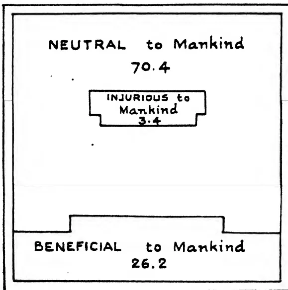

<table border="1">
<thead>
<tr>
<th>Category</th>
<th>Percentage</th>
</tr>
</thead>
<tbody>
<tr>
<td>NEUTRAL to Mankind</td>
<td>70.4</td>
</tr>
<tr>
<td>INJURIUS to Mankind</td>
<td>3.4</td>
</tr>
<tr>
<td>BENEFICIAL to Mankind</td>
<td>26.2</td>
</tr>
</tbody>
</table>

BLOCK BY SURVEY DEPT. CEYLON.

Fig. 2. Diagrammatic representation summarising the injuries, benefits, etc. of the pheasant.

725------------------------------------------------

276

Nestlings consume during the first few days of their life considerably more than their own weight of food, and observations have been made on various birds in order to show the number of times the parents bring in food to their young in a day, and in some birds such as the house sparrow this was found to work out at something between 220 and 260 visits per diem. Similar observations made with the thrush and the blackbird show much the same results, each visit made by the parent birds to the nest indicating that one or more insects (generally more) are brought each time to the nest.

Here is a quotation from the Year-book of the United States Department of Agriculture, 1900. "A long billed marsh wren was seen to carry 30 locusts to her young ones in an hour, and at this rate for 7 hours a day, a brood will consume 210 locusts per day, and the passerine birds of the eastern half of Nebraska, allowing only 20 broods to the square mile, will destroy 162,771,000 locusts. The average locust weighs about 15 grains and this is capable of consuming its own weight of standing forage crops, corn and wheat. The locusts eaten by passerine will therefore work out at 174,397 tons of crop, which at 10 dollars per ton would be worth 1,743,970 dollars."

Again, to quote from the University of California published in *The Zoologist*, 1914, Bryant says for instance. "If we consider that there is an average of one meadowlark in every two acres of land available for cultivation (11,000,000 acres) in the Sacramento and San Joaquin Valleys, and that each pair of birds raises four young ones, each one of which averages one ounce in weight while in the nest, and consumes half its own weight in food, it takes over 343½ tons of insect food to feed the young birds in the great valleys alone."

It must be remembered in connection with the above that it is generally recognised that with the exception of the doves and pigeons, most birds feed their young upon animal diet of some sort, though the parents later on may live on grain or fruits, etc. It must also be remembered that many birds fill their stomachs at least three times a day, and grain takes longer to digest than corn.

Let us glance now at the birds of Ceylon in relation to what we have said above. To start with, there has been no real work done on this question, so all we can do is to trust to field observations and notes. There are not many birds in Ceylon that can be designated grain-eaters, and these are the birds that are usually most harmful to mankind. The family *Plocidae*, contains the sub-family *Plocinae* (or the weaver birds) of which there are two, the *bya* or the common weaver bird and the Indian striated weaver bird, and also the sub-family *Vidunlinae* or the *munias*,

726------------------------------------------------

277

commonly called ortolans, though of course they are not true ortolans. There are five of these:—

The blackheaded munia.

The white-back munia.

The white-throated munia.

The Ceylon munia and

The spotted munia.

All these birds, like the next family, the *Fingillidae* or finches, to which they are allied, feed during the greater part of the year at any rate on grain, i.e., ordinary paddy, hill paddy and *kuruakan*, and every one can call to mind one of the wonderful devices of tattie-bogles or scare-crows that the Sinhalese *goiya* fixes up in his paddy field just about the time his grain is ripening in order to scare these little marauders away. Generally, too, children are perched on a neighbouring bund or rock to pull strings to make the scare-crow work. They shout incessantly, but, so far as I can see, the little munias do not appear to take much notice of the little bird-scarer or his wonderful devices, but, more often than not, fill their crops and fly away replete and satisfied.

The finches, of which there are two in Ceylon, the ordinary house-sparrow and the yellow-throated sparrow (this latter is very rare) are, of course, also grain-feeders, but the house-sparrow here, as elsewhere, prefers living in towns or near village houses and sheds, where it acts more or less as a scavenger, and also picks up grain that may be spilt around the habitation. Like the home-sparrow, too, it devours a great many insects, specially capturing these for its young.

Now, if the munias for any reason increase too rapidly in Ceylon, and in some local and isolated places they may be too numerous, then they will probably show a bigger percentage injurious to mankind than beneficial. As regards other birds that feed on paddy, the rock pigeon found along various parts of the East coast often will raid a field that has recently been planted in paddy, just as the seed has germinated and is about to shoot, because the grain is very sweet and succulent at that moment. Another bird that will do damage at that particular time is the whistling teal and doubtless others of the duck type, too, will at times feed on paddy grain if they get the chance, just as the wild duck in England will attack barley when standing in stocks in the field, but the whistler will do quite an appreciable amount of harm in a young paddy field just as the seed is germinating. Also the doves in Ceylon of which there are three, the common one being the Ceylon spotted dove or ash dove—also feed on dry paddy, grain and other seeds, but none of these latter birds would be pronounced as greatly injurious to mankind,

727------------------------------------------------

278

Apart from these birds the great majority of the birds in Ceylon are to a great degree insectivorous, though some combine this with fruit eating. The barbets, of which there are four in Ceylon, are largely fruit-eaters, and are responsible for a good many of the round holes one sees drilled in the side of rotten branches. The parrots, too, are largely fruit-eaters, but sometimes they will do a considerable amount of damage, especially the western blossom-headed paroquet, by attacking fields of Indian corn.

The babblers are mostly insectivorous, and therefore probably of value to mankind, and the bulbuls are largely insectivorous, but not altogether so, some of them eating fruit, and the ordinary common bulbul, or Madras red-vented bulbul, as far as one knows, becomes sometimes a nuisance in up-country gardens by stripping the mulberry trees of fruit.

The thrush family, including the chats and the robins, are nearly entirely insectivorous and together with the Ceylon magpie and robin must work out at a very high percentage of value to mankind. This latter bird, the magpie robin, is very tame and is busy almost all day long round bungalows, picking up a variety of insects, most of which mankind tries to get rid of.

The fly-catchers of which there are ten in Ceylon are all insectivorous, as their name duly indicates, and are all highly beneficial to mankind, but perhaps the birds that do most good on the tea estates of Ceylon are the minivets and cuckoo shrikes. These not only devour an enormous number of insects themselves but they point out the way to and direct numerous other birds that follow closely after them, such as the Ceylon white-eye, the black-back pied shrike, the small white-throated babbler, the grey tit and others. These birds are often seen in jungle belts on tea estates following up a hatch of caterpillars and cleaning them up practically completely.

The orange minivets and the black-headed cuckoo shrike usually appear to lead these collection of birds, and I think that they account at times for a great many *Tortrix* moth caterpillars, specially the Ceylon white-eye. Anyhow, it is practically certain that all these birds are of a very high percentage of value to mankind, and so are the drangos, of which there are five in Ceylon, the commonest being the white-vented drango which is to be seen round most gardens feeding voraciously in the evening on anything that flies.

728------------------------------------------------

279

The warblers, of which there are seventeen, are all big insect feeders. The Indian tailor-bird belongs to this family and is one of the commonest birds in Ceylon, and must do an enormous amount of good in the aggregate. The swallows, of which there are four, are great fly and insect feeders, and so are the swifts.

The two members of the crow family in Ceylon, the house crow or Colombo crow and the black crow, do a large amount of good from the scavenging point of view, but on the other hand they are more or less omnivorous in their food. The black crow is a great thief of other bird's eggs and apparently a great bully, and is also a stealer of young birds, on which it will voraciously feed. Should there be too great an increase of these birds in any district, they would probably show a high percentage injurious to mankind.

The king-fishers, of which there are seven, mostly feed on small fish, but the common Ceylon white-breasted king-fisher devours an enormous amount of crickets, mole-crickets, grass-hoppers, and such like and is therefore of great value. The night-jars are also great insect-feeders, and so are the cuckoos, of which there are a large number in Ceylon.

The Ceylon jungle crow or the southern crow-pheasant eats an enormous number of insects, hairy caterpillars, small reptiles, but also is a stealer of the eggs and young of other smaller birds.

To pass on to the eagles, hawks, and falcons, these are all, or nearly all, carnivorous and carrion-feeders, and they must destroy a large number of small mammals such as rats for their food. At the same time they largely feed on other birds and so neutralize their beneficial action to mankind. The common snake-eagle or Ceylon crested serpent-eagle feeds largely upon frogs, lizards and snakes, and, especially as regards the last, is valuable to mankind. This bird is frequently accused of attacking pigeons, but I think is often confused with the Ceylon hawk-eagle.

The owls, being night feeders, must destroy an enormous number of rats and mice, and undoubtedly are of very great benefit to mankind. The smaller owls feed largely on beetles and other insects, and therefore this whole family must be reckoned as benefactors to mankind.

729------------------------------------------------

280

Now, to pass on to the great number of wading birds represented by the herons, bitterns and storks, and from these to the pelicans and cormorants. Almost all these birds feed to a certain extent on small fish, and the diet of pelicans and cormorants consists almost entirely of fish caught in the tanks and lagoons. The terns also very often take small fish for their diet, but I doubt if any of these birds could in any way be classed as injurious to mankind because of their food.

The snipe family and also many of the plovers, all the pigeons, the game birds and the duck family afford excellent sport during the shooting season, and most of these birds are very highly appreciated as food and are of distinct economic value.

Thus, although we have no accurate data in Ceylon to show the value of birds to mankind, enough perhaps has been said in this short sketch of a vast subject to show that the birds of Ceylon play no mean part in controlling insect life which is mainly injurious to mankind, and a good many birds, too, provide excellent sport in their correct season and their flesh is of great economic value. Besides all this, I suppose the study of birds in all its branches, known as ornithology, has provided and is still providing more interest to a vast number of people in every country than any other branch of animal life.

730------------------------------------------------

281

## Chemical Notes (3).

### ANALYSIS OF CITRONELLA GRASS ASH.

A sample of citronella grass ash forwarded from Matara was analysed for its manurial value by Mr. Pandittesekere, Assistant in Agricultural Chemistry. The results are as follows:—

<table>
<thead>
<tr>
<th></th>
<th>Per cent.</th>
</tr>
</thead>
<tbody>
<tr>
<td>Material passing through 3 m.m. sieve</td>
<td>89.0</td>
</tr>
<tr>
<td>Moisture on above</td>
<td>2.1</td>
</tr>
</tbody>
</table>

#### On Material at 100°C.

<table>
<tbody>
<tr>
<td>Lime</td>
<td>3.28</td>
</tr>
<tr>
<td>Phosphoric Acid</td>
<td>1.39</td>
</tr>
<tr>
<td>Potash</td>
<td>7.06</td>
</tr>
</tbody>
</table>

It will be noted that the sample contains over 7% potash, about 3.3% lime and 1.4% phosphoric acid. Its low lime and phosphoric acid contents are doubtlessly due to the poor nature of the soil on which citronella is generally grown. The ash however could be advantageously used as a fertiliser.

Based on the present average unit values for potash, phosphoric acid and lime of fertilisers sold in Colombo, the value of this ash for manurial purposes would be about Rs. 30/- per ton.

### ANALYSIS OF BOGA MEDELOA SEED.

Enquiries have been made as to the amounts of nitrogen, phosphoric acid and potash taken away from the soil as a result of the sale of seed from Boga medeloa plants grown on it. Analytical determinations of the nitrogen, phosphoric acid and potash contents of a representative sample of this seed were therefore carried out in this laboratory and the results are set down below:—

<table>
<thead>
<tr>
<th></th>
<th>On air-dried seed Per cent.</th>
<th>On dry matter at 100°C Per cent.</th>
</tr>
</thead>
<tbody>
<tr>
<td>Moisture</td>
<td>12.91</td>
<td>—</td>
</tr>
<tr>
<td>† Ash</td>
<td>5.29</td>
<td>5.91</td>
</tr>
<tr>
<td>* Organic Matter</td>
<td>81.80</td>
<td>94.09</td>
</tr>
<tr>
<td>* Containing Nitrogen</td>
<td>5.04</td>
<td>5.87</td>
</tr>
<tr>
<td>† „ Lime</td>
<td>0.47</td>
<td>.52</td>
</tr>
<tr>
<td>„ Phosphoric Acid</td>
<td>0.98</td>
<td>1.11</td>
</tr>
<tr>
<td>„ Potash</td>
<td>1.10</td>
<td>1.23</td>
</tr>
</tbody>
</table>

It will be noted that Boga seed contains 81.8% of organic matter of which 5.04% is nitrogen, and 8.29% of ash of which phosphoric acid and potash amount to about 1% each and lime to nearly 0.5%. The nitrogen of the seed, it may be stated, is obtained from the air through the activity of the bacteria found in the root nodules and is therefore not lost to the soil, but the phosphoric acid and potash are taken from the soil and therefore lost to it. One ton of a representative sample of Boga medeloa seed calculated on the above analysis will be found to contain 112.9 lb. nitrogen, 22.0 lb. phosphoric acid, 24.6 lb. potash and 10.4 lb. lime. The loss to the soil on which the Boga is grown by the disposal of this quantity of seed is therefore 22 lb. of phosphoric acid, 24.6 lb. of potash and 10 lb. of lime. A. W. R. J.

731------------------------------------------------

282

## Selected Articles.

# Tropical Agriculture in Malaya, Ceylon and Java.\*

**THE RIGHT HON. W. ORMSBY-CORE, M.P.,**

*(Parliamentary Under-Secretary of State for the Colonies.)*

Following on my tours of the West Indies, East Africa and West Africa, I have just completed a tour of some 20,000 miles, for the purpose of visiting three countries in the south-east of Asia, namely British Malaya, Ceylon and the Dutch Island of Java. . . .

I must begin with the elementary geographical facts.

British Malaya lies between the Equator and 70° North. It has an area of approximately 53,000 square miles, i.e., it is very little smaller than England (without Wales), and contains a mixed population of Chinese, Malays, Indians and Europeans, totalling approximately 4,000,000.

It is only very partially developed economically; the greater portion of the Peninsula is still virgin jungle.

Climatically, it is almost unique. There is a rainfall throughout the year, brought by the north-east monsoon from October to March, and by the south-west monsoon from April to September. The temperature hardly varies, seldom going, at the lower levels, below 70° at night, or exceeding 90° in the shade on the hottest day. The climate is therefore amazingly uniform and monotonous. There is no winter and no cessation of plant growth. The rainfall, of course, varies according to altitude from some 60 inches a year in the driest area, to 250 inches a year on the mountains.

Ceylon lies between 6° and 10° north of the Equator. It is about half the size of British Malaya. It contains a population of over five millions. Half the Island, namely, the central uplands, and the west and south-west, are climatically similar to Malaya, i.e., they both get monsoons and have a rainfall ranging from 100 inches to 300 inches a year, widely distributed throughout the year. Ceylon, however, has two dry zones, one in the north-west and one in the south-east, and each of these zones only gets the north-east monsoon in the winter months—if winter it can be called. The total rainfall in these areas varies between 25 inches and 60 inches a year. Both these dry zones are uniformly low lying.

Java lies between latitude 4° and 8° south of the Equator. In area it is almost exactly the same size as British Malaya, i.e., it is slightly smaller than England. It contains, however, no less than 38,000,000 inhabitants. In this it is unique in the Malay Archipelago, for the whole of the rest of the Dutch East Indies—some 14 times the area of Java—have between them only 14,000,000 inhabitants. Climatically, it is very similar to Malaya; it gets both monsoons, although the south-west monsoon in their winter months, namely, June, July and August, is very scanty in the central and eastern portions of the Island, and in those months irrigation becomes of the first importance.

---

\* Paper read at a meeting of the Royal Colonial Institute at the Hotel Victoria on Wednesday, 11th July, 1928, Sir Laurence Guillebard, G.C.M.G., in the Chair.

732------------------------------------------------

283

Ceylon is more developed than Malaya and Java is more developed than Ceylon. In fact, Java is cultivated throughout the plains and right up the mountain sides, up to an altitude of about 6,000 feet, and the only natural jungle left are the forests on the high mountain tops, which are conserved for hydrological purposes.

Whereas in Malaya and Ceylon the soil consists of alluvial deposits, and the results of attrition and erosion of the ancient igneous rocks which form the geological basis of both, the similar geological basis of Java has been intruded, in much more recent times, by a long chain of volcanic peaks, many of them still active, which have introduced a new factor from the agricultural point of view lacking in the other two otherwise similar countries.

Owing to the pressure of population upon land in Java there has been far greater necessity forced upon the Government and population to get the utmost out of every acre of soil that has been harnessed to the needs of man. Whereas in Malaya and Ceylon there is still unoccupied land capable of cultivation to be brought under cultivation, in Java it is entirely a problem of intensifying production upon land already harnessed. This, no doubt, accounts for a certain difference in outlook, and is one of the main reasons why the application of modern scientific discoveries to the problems of tropical agriculture has been pushed further in Java than in the neighbouring countries.

There are further contrasts to be noted. British Malaya is a very new country, and such development as has taken place is largely the result of the efforts of the last 30 years. Ceylon has been continuously under British administration since the end of the Napoleonic wars. Java, having been under British rule during the Napoleonic wars, has been the main overseas possession of the Dutch since those wars, and it is only natural, therefore, that we should expect a greater variety of effort in Java and Ceylon than has yet been found possible in Malaya.

I fear I must worry you with a certain number of figures to illustrate what I mean by the variety of tropical production obtaining in the three countries. Fairly accurate statistics are available for Ceylon and Java, but the agricultural statistics for Malaya are very imperfect, and only approximate figures can be given.

In Malaya there are three main cultures:—

<table>
<tr>
<td>(1) Rubber</td>
<td>...</td>
<td>...</td>
<td>2,400,000 acres.</td>
</tr>
<tr>
<td>(2) Rice</td>
<td>...</td>
<td>...</td>
<td>636,000 ,,</td>
</tr>
<tr>
<td>(3) Coconuts</td>
<td>...</td>
<td>...</td>
<td>492,000 ,,</td>
</tr>
</table>

The estimated cultivated area of all other crops in Malaya, such as pineapples, oil palms, fibres, tapioca and maize, probably does not exceed 100,000 acres—in all, a cultivated area of about 3,600,000 acres.

In Ceylon there are sixteen principal crops. The four most important are:—

<table>
<tr>
<td>(1) Coconuts</td>
<td>...</td>
<td>...</td>
<td>890,000 acres.</td>
</tr>
<tr>
<td>(2) Rice</td>
<td>...</td>
<td>...</td>
<td>834,000 ,,</td>
</tr>
<tr>
<td>(3) Rubber</td>
<td>...</td>
<td>...</td>
<td>475,000 ,,</td>
</tr>
<tr>
<td>(4) Tea</td>
<td>...</td>
<td>...</td>
<td>442,000 ,,</td>
</tr>
</table>

The other crops are: Sesame, arecanut, palmyra palm, citronella, cacao, cinnamon, tobacco, cardamoms, papaya, cotton, sugar-cane, and a great variety of minor grain and vegetable crops. The total developed area of Ceylon is only just over 3,000,000 acres.

733------------------------------------------------

284

The statistics for Java are more complete, and must be divided into native agriculture and non-native plantations. The total cultivated area of Java, apart from planted forests, such as teak, is rather more than 17,000,000 acres, of which 15,500,000 acres are devoted to native agriculture, and only 1,500,000 acres to European estates. The 15,500,000 are composed as follows:—

<table>
<tr>
<td>Rice</td>
<td>...</td>
<td>...</td>
<td>8,000,000 acres.</td>
</tr>
<tr>
<td>Maize</td>
<td>...</td>
<td>...</td>
<td>4,000,000 ,,</td>
</tr>
<tr>
<td>Cassava (tapioca)</td>
<td>...</td>
<td>...</td>
<td>1,800,000 ,,</td>
</tr>
<tr>
<td>Ground-nuts</td>
<td>...</td>
<td>...</td>
<td>460,000 ,,</td>
</tr>
<tr>
<td>Soya beans</td>
<td>...</td>
<td>...</td>
<td>450,000 ,,</td>
</tr>
<tr>
<td>Other crops</td>
<td>...</td>
<td>...</td>
<td>790,000 ,,</td>
</tr>
</table>

The European estate area consists of:—

<table>
<tr>
<td>Rubber</td>
<td>...</td>
<td>...</td>
<td>445,000 acres.</td>
</tr>
<tr>
<td>Sugar</td>
<td>...</td>
<td>...</td>
<td>436,000 ,,</td>
</tr>
<tr>
<td>Coffee</td>
<td>...</td>
<td>...</td>
<td>236,000 ,,</td>
</tr>
<tr>
<td>Tea</td>
<td>...</td>
<td>...</td>
<td>209,000 ,,</td>
</tr>
<tr>
<td>Tobacco</td>
<td>...</td>
<td>...</td>
<td>65,500 ,,</td>
</tr>
<tr>
<td>Quinine</td>
<td>...</td>
<td>...</td>
<td>44,500 ,,</td>
</tr>
<tr>
<td>Cassava</td>
<td>...</td>
<td>...</td>
<td>28,000 ,,</td>
</tr>
<tr>
<td>Kapok</td>
<td>...</td>
<td>...</td>
<td>25,000 ,,</td>
</tr>
<tr>
<td>Coconuts</td>
<td>...</td>
<td>...</td>
<td>22,000 ,,</td>
</tr>
<tr>
<td>Sisal</td>
<td>...</td>
<td>...</td>
<td>15,000 ,,</td>
</tr>
<tr>
<td>Cacao</td>
<td>...</td>
<td>...</td>
<td>11,000 ,,</td>
</tr>
<tr>
<td>Pepper</td>
<td>...</td>
<td>...</td>
<td>3,000 ,,</td>
</tr>
</table>

A certain amount of plantation crops of coconuts, kapok and pepper are also included in the native-grown area of miscellaneous crops totalling 790,000 acres.

The dominant factor in Java is, of course, the enormous proportion of the Island that is given up to the cultivation of rice. Here we have a country, approximately the same size as England and with practically the same population, which, without any Manchesters or Sheffields, without any minerals or secondary industries, practically feeds itself. Over 90 per cent. of the rice required to feed the 38,000,000 people of Java with their staple food, is home grown. Of the 8,000,000 acres allotted to rice, thanks to the hydraulic engineering of the Dutch, and to the skill of the native inhabitants in minor irrigation, no less than 7,000,000 acres are under permanent perennial irrigation, and only 1,000,000 acres of rice under rain cultivation. In 1925, the yield of the 7,000,000 acres of irrigated rice fields was no less than 6,058,000 metric tons of rice. To give you some idea of what this means in the way of intensity of production, it is only necessary to quote the contrast with British India, including Burma, with its vast area and its enormous population. In 1924, British India, including Burma, had no less than 81,000,000 acres cultivated with rice, with a total production of only just over 30,000,000 tons, *i.e.*, the yield per acre in Java is considerably more than double that in British India.

But by far the most remarkable tropical industry of Java, where modern scientific methods can be seen carried to their further limit, is in the work of the European sugar companies.

Although Java has only a little over 400,000 acres under sugar in any one year, it is the second sugar producer of the world, second only to Cuba, and it attains this enormous crop, amounting in this year to between 2,500,000 to 3,000,000 tons of soft sugar, by getting a yield per acre con-

734------------------------------------------------

285

siderably above that obtained in any other part of the world. In Java sugar is grown upon the native-owned, irrigated rice fields, as a rotation crop once in three years, or, in a few districts, once in two years. All the land, other than that of the factory site, is hired from the native owners, and the European companies have the use of this land for 12 months at a time only. It then goes back into rice, until it is again taken up for sugar.

The enormous yields, and the tremendous profits obtained from the sugar industry are due entirely to the results of scientific research, and not merely to scientific research in the combating of disease and pests, but in the much more skilled scientific work of plant genetics and soil science. It is in the breeding of ever new and ever higher-yielding varieties of cane, and in the cultivation of the soil, both physically and by means of green and artificial manures, that the astonishing results have been obtained.

The sugar industry in Java was amongst the first to appreciate the significance of science and their great central research station at Passoroean, in East Java, dates back to the year 1887.

It started in a small way to combat insect and fungus pests, and it has grown and grown until it is now the most advanced scientific agricultural station in the world. From the very first it has been entirely financed by the sugar planters themselves, and nowadays, the cost to the sugar planters of the research station, its staff and its 3,000 experimental plots distributed in different parts of the Island, is approximately £110,000 a year. It has a staff of 50 European scientists of various nationalities, and some 200 trained native assistants. It is entirely a private enterprise.

Remarkable as are its achievements in the fundamental study of soil science in tropical conditions, its outstanding achievement is in genetics, and I must give you an example to show what is involved in this branch of agricultural science. There has been ceaseless labour for a period of years to produce not only a cane with an ever higher sugar content, but also a cane that will grow and mature quickly, and a cane that is resistant to diseases and suitable to the climatic and soil conditions. This year, some 66 per cent. of the total area under sugar in Java has been planted with a cane known as Passoroean No. 2878. This cane is the result of the most elaborate hybridization over a period of years, and the most interesting thing about it is the introduction into its ancestry, four generations back, of one wild cane growing in the marshes of Java that contains no sugar at all, and is not even a sugar cane, but by reason of the fact that it is a wild cane growing in Java it is immune from disease and is a robust and fast grower. The selection of this strain in the ancestry of No. 2878, and its effective crossing with various sugar-yielding canes to obtain the final result, was the outcome of microscopical work on the part of the cytologists on the chromosomes, or genetic factors, which are reproduced and re-associated in, of course, Mendelian variations in the various descendants. The net commercial result is that No. 2878, adds 15 per cent. to the yield of sugar per acre, as well as the robust characteristics and rapid growth required under the ecological (environmental) conditions.

No sooner has one achievement like this been realized after years of work than that achievement is already regarded as obsolescent. *That is to say work has already begun on still further improvements.* This requires a high degree of knowledge and skill, as well as team work on a scale which is seldom attempted in tropical agriculture, and I quote it as an example of the type of work which we have got to go in for over the whole range of crops, in the effective harnessing of the wonderful natural bounty of tropical soils.

735------------------------------------------------

286

From my point of view, the morning I spent at Passoroean was the most valuable, most significant and most suggestive I spent in all my Colonial tours.

Although Passoroean is, both in scale and quality, the finest research institute I have seen anywhere, it is by no means the only important agricultural research station to be visited in Java. There are six other research institutes maintained by planters' syndicates, over and above the research institutes maintained by the Government. These six private agricultural research institutes are:—

1. (1) Tea Research Institute at Buitenzorg, founded in 1893;
2. (2) Rubber Research Institute, also at Buitenzorg, founded in 1913;
3. (3) Coffee Research Station at Malang in East Java;
4. (4) The Djember Research Station in East Java for tobacco and rubber;
5. (5) The Quinine Station at Tjinjoroean;

and a sixth experimental station at Salatiga in middle Java.

The two latter are associated with Government work, but the others are wholly maintained by planters' syndicates. Each is staffed with chemists, geneticists, entomologists, agriculturists, &c., and deals with the whole range of problems arising out of the improvement of the particular crop studied.

The Quinine Station is associated with the big Government cinchona plantation and, thanks to the scientific work done there, the Dutch have almost a world monopoly in the production of quinine. Here again the most important work has been the genetical work. The Government experimental plantation has approximately 1,000,000 trees under control, the yield of each tree being estimable. The success of the industry has been due to the grafting of the high yielding *Cinchona legeriana* on to other stocks, followed later by elaborate seed selection.

Over and above these institutions there is the work of the Government Agricultural Department which, on the research side, is occupied mainly with the improvement of native agriculture, and with the problems of soil conservation and green manuring. As these last two subjects form one of the principal efforts of the Department of Agriculture in Ceylon, and as they are of immense significance for Malaya, and other tropical countries, I propose to say something about them in connection with the admirable scientific work in Ceylon.

The headquarters of the Department of Agriculture in the Netherlands Indies are at Buitenzorg, and the work is associated around the main economic experimental gardens, the Botanical Gardens, which are a tropical counterpart of Kew, the central forestry station, and the veterinary research station, all in that town. In all, there are resident in the small town of Buitenzorg something over 100 European scientists, attached to one or other of the various research stations and institutions. This mere association on such a scale is an immense incentive to effort, but I wish to turn at once from the research side to what is called the educational side.

It is quite obvious that however great an assembly of brains and money are devoted to agricultural research, there will not be a translation of their results into practice unless there is a plentiful supply of both Europeans and natives, familiar with the work and capable of bringing the new knowledge not merely to the plantations, but to the villages and to the ordinary peasant. It is in this that success of the Dutch is so outstanding.

736------------------------------------------------

287

At the centre, there is the Agricultural College at Buitenzorg for persons of all races. This institution corresponds in some measure to our Imperial College of Tropical Agriculture in Trinidad. It provides a three years' course for young men between the ages of 17 and 22, who have completed a secondary education at a school in which Dutch is the medium of instruction. The College contains about 160 students, *i.e.*, takes between 50 and 60 new students each year. At the time of my visit, 114 of the students taking the three years' course were natives of Java, and 16 of the outer islands. The remainder of the pupils were planters or plantation staff. The College has a European staff of seven Lecturers or Professors, all of whom possess scientific degrees, and there is an additional whole- or part-time European staff of nine. Approximately 70 per cent. of the students who have taken the full agricultural course have entered Government service under the Department of Agriculture, the remaining 30 per cent. being engaged either on European plantations or in agriculture on their own account. This College was founded in 1913.

Below this College there are two Agricultural Secondary Schools, one established at Soekabumi in 1912, and the other at Malang in East Java, founded in 1919. These schools take pupils at approximately the age of 15. In Soekabumi School there are at present 112 natives of Java and 10 from the outer islands. The course at each of these Agricultural Secondary Schools lasts two years.

In addition to these two Secondary Schools, where the medium of instruction is Dutch, there are eight upper primary vernacular agricultural schools in different parts of the Island, where the native agricultural assistants can begin their scientific training in their own vernacular. In addition to these schools of agricultural education there is a Veterinary College at Buitenzorg, established in 1907. Pupils enter any time after the age of 17 years and take a four years' course. There are at present 47 students, viz., 29 from Java and 18 from the outer islands. These institutions collectively provide the personnel for the various grades in the agricultural extension service whose activities are observable in every corner of the Island.

Nothing struck me more than the high quality of the ordinary peasant cultivation, not merely on the irrigated areas, but even up the mountain sides above the irrigated areas where the other native crops are grown. In the ordinary village gardens you see being practised the use of green manures, the rotation of crops, and all the latest devices for preventing soil deterioration and soil erosion, and it was clear that the general high standard of agriculture throughout Java could never have been attained had it not been for the early establishment of these various educational institutions which turn out a continuous supply of local men with the necessary scientific and technical qualifications.

After this somewhat cursory review of agricultural activities in Java I turn to British Malaya, in which the Department of Agriculture was not founded until 1904. The Rubber Research Institute, maintained by the rubber industry, has only just begun to function and is a product of the last two years. It will be seen that Java has had an immense start in time alone. The headquarters of the Agricultural Department in Malaya are at Kuala Lumpur, in the Federated Malay States, where the offices and laboratories are situated in very small, crowded and ill-equipped buildings. For the first 18 years the experimental plots were on a small scale and in the neighbourhood of the laboratories but, since 1921, the Agricultural Department has opened up a new large experimental station some 17 miles distant from the headquarters at a place called Serdang. It is on a considerable scale and embraces 1,000 acres; but it has, as yet, no laboratories, and the scienti-

737------------------------------------------------

288

fic staff continues to work in Kuala Lumpur. Serdang is really only beginning its potential usefulness but at least it illustrates the variety of crops which can be grown at the lower altitudes in Malaya.

In addition to this the Department has a station in Malacca, and a station in the north of Perak, for the selection of pure-line strains of rice. There is also a small coconut research station at Klang in Selangor. It has a few field officers in the Federated Malay States, and in Kedah and Johore, but there are as yet no representatives of the agricultural department in the States of Kelantan and Trengganu. There is no agricultural school, but a Committee has recently reported (1927), in favour of the early establishment of a school of agriculture at Serdang. Paragraph 2 of their report reads as follows:—

“We have been impressed by the frequency with which the establishment of a school for agricultural education in Malaya has been urged both by the Agricultural and Educational Departments during the last 12 years. It has perhaps been on account of the difficulty of deciding of the scope of such an institution that the schemes have hitherto failed to materialize.”

Great as is the need for improving both the quality and quantity of agricultural research work in Malaya, I feel that the establishment of a school of agriculture, particularly for the training of Malay and other assistants for the Agricultural Department, has a prior claim to consideration. The Department of Agriculture in British Malaya has from time to time suffered from the loss of some of its best men. These, after appointment, have abandoned service and gone into private employ, notably on the large and progressive European rubber estates in the Dutch Island of Sumatra, where they have been conspicuous in their work for the scientific development of foreign plantations, notably in the introduction of bud-grafting.

The success of the rubber industry in British Malaya is due not so much to any efforts in the direction of scientific agriculture, though these are beginning on a few of the more progressive estates, such as Prangbese near Kajan, on the Dunlop Estates in Malacca and Johore, and on the American (Harvard) Estates in Kedah, but rather to the fact that rubber has been planted on virgin soil freshly cut out of jungle, in climatic conditions which are ideally suited, in many respects far better suited than are either Java or Ceylon, to the successful cultivation of the tree. Malaya has the great advantage of complete absence of winter or of a dry season, with the result that the wintering period when the leaves of the *Hevea* tree (one of the only deciduous trees you see growing in Malaya) are off the trees, is remarkably short. It is, perhaps, very largely owing to the considerable profits that have been made in recent years out of rubber in Malaya that so little attention has been devoted to the development, or the introduction, of any other crops. But the future of plantation rubber, with its high overhead charges for European personnel, for local agents, visiting agents, commissions, directorates in London and elsewhere, and competition with the native industry now rapidly expanding in Sumatra, Borneo and even Malaya, must, in my opinion, depend upon the superior scientific treatment of the crop on the European plantations. In fact, whereas the cost of production in the native industry amounts to little more than the cost of tapping, the European estates have many other charges to bear, and it is only by getting very much higher yields per acre, and by the maintenance of the trees in superior health by means of manuring and soil conservation, that they will be able ultimately to compete. All these factors will, no

738------------------------------------------------

289

doubt, receive the attention of the Malayan industry now that it has its new Rubber Research Institute; but, in the matter of planting of selected trees with their high yielding capacity, Java, Sumatra and Ceylon are already ahead of Malaya.

As I have already stated, in Ceylon the largest area under any one crop is that devoted to coconuts. Though the area is placed at 890,000 acres, this is probably an under-estimate if all the trees inter-planted with fruit trees and other crops on native holdings are taken into account. The annual harvest of coconuts in Ceylon is now well over 1,000,000,000 nuts per annum, and more has been done in Ceylon to organize the production and export of all the coconut bi-products, other than the ordinary copra, than in any other parts of the British Empire. The Legislative Council of Ceylon has before it at this moment a proposal to establish a specific coconut research scheme, financed by a cess upon the industry and to devote special attention to the genetical factors in connection with the improvement of this crop.

Of the area planted with rubber in Ceylon, approximately 50 per cent. is owned by European companies, and 50 per cent. by natives of Ceylon, i.e., Sinhalese, Tamils, and others. Among the latter there are a considerable number of small holdings.

Undoubtedly, mistakes have been made in Ceylon in attempting to plant rubber at too high an altitude. Even under favourable rainfall conditions the growth of the rubber tree at altitudes over 1,500 feet is slow, and the yields of rubber per acre are much less than at lower altitudes. Diseases such as *Oidium*, and secondary leaf fall in rubber, and physiological effects such as brown bast, are more common on the higher plantations. In fact, it is doubtful whether the upland estates can ever compete with plantations more favourably situated in the lowlands. The night temperature more than anything else seems to delimit the rubber belt of the world. The three diseases I have referred to are almost entirely the effect of malnutrition or hostile environmental characteristics, and their danger is lessened if the general health of the tree can be adequately maintained. In fact the best method of combating such diseases is the maintenance of the general health and vigour of the plant.

The most significant contrast between rubber in Ceylon and Malaya is seen in the general use throughout Ceylon of cover crops for the prevention of soil erosion. This has largely been the work of the last six years, and now it is rare to see rubber plantations, in Ceylon without a green cover crop of *Dolichos Hosei* (*Vigna*) or of *Centrosema*. It is equally rare to see any old-established rubber plantation in Malaya where cover crops have been introduced. The Agricultural Department in Malaya have agitated for the introduction of cover crops for the past 20 years, but it is only recently that the Directors of the various companies, and the visiting agents, have got over the "clean weeding" policy of old times. During the last three years it is only fair to say that 70 per cent. of the new areas planted up with rubber in Malaya have been planted with cover crops. In fact, one of the British-owned estates in Java has been doing quite a good business in exporting cover crop seed from Java to Malaya. The object of the cover crop is, of course, to preserve the tilth and humus in the top soil from being washed away by the tropical rains. If this most valuable part of the soil is washed away the yield of rubber goes down, and the tree is generally weakened. On occasion it has been found difficult to introduce the necessary cover crop owing to the heavy shade of a long established rubber plantation, but by combining the introduction of the cover crop with a dressing of artificial manures it is usually possible to get the cover crop well established in one or two years.

739------------------------------------------------

290

A great deal of attention is being paid nowadays in Ceylon to the use of manures in the production of all tropical crops, particularly tea and coconuts, and they have also been introduced by the more progressive rubber planters. Probably the most remarkable results of these more scientific methods of cultivation adopted in Ceylon can be seen on the tea estates, and I was furnished with a series of very remarkable figures showing the increased yields of tea per acre due entirely to the use of green manures, and chemical manures, over a period of years. A great deal of experimental work has been done in this direction both by the Department of Agriculture and by the planters themselves, and a great deal of experimental work is needed before the most commercially profitable mixtures, and chemical manures in particular, can be ascertained. This work is even more complex in rubber than it is in the case of tea.

In the cultivation of coconuts *Tephrosia candida* is the most popular green manure crop. In many of the tea plantations a single species is made to serve both the duty of shade tree, protection against erosion, and green manure crop, and nothing is more noticeable in Ceylon than the widespread introduction of the leguminous tree from Nicaragua in Central America, known by the botanical name *Glicidia maculata*.

A leguminous green manure has a two-fold virtue. When the plant is growing, its roots form nodules in the soil which have the effect of storing nitrogen in the soil, while its leaves and branches can be cut annually, thrown on the ground and finally dug in to form a mulch rich in nitrogenous humus. I saw a greater variety of these green manure crops being tried out in different altitudes, and in different cultures in Ceylon, than in Java where the green manure crop most universally seen is *Crotalaria*. In this connection it must be remembered that under tropical conditions nitrogen obtained from artificial chemical manures is very easily lost by leaching, and green manuring has physical as well as chemical benefits to provide. Incidentally, some very important work is being done by the Agricultural Chemist at Peradeniya on the nitrification of tropical soils.

In Ceylon, scientific work is concentrated at Peradeniya, near Kandy. At Peradeniya there are situated:—

1. (1) The Royal Botanical Gardens (146 acres)
2. (2) Central Economic Station (547 acres)
3. (3) Headquarters of the Director of Agriculture
4. (4) The Central Laboratory and the large and well-equipped block of laboratories
5. (5) The Agricultural School
6. (6) The Headquarters of the Rubber Research Institute.

Peradeniya lies at an altitude of 1,500 feet above sea level, has an annual rainfall of 88 inches, distributed over 170 days, and a mean temperature of 70°. It is a little high for rubber and a little low for tea. However, both these crops can be successfully, if not ideally, cultivated there.

The new Tea Research Station is at Nuwara Eliya, at an altitude of about 6,000 feet, near where the bulk of the high quality tea of Ceylon is grown. Rubber research work is being carried out partly south-east of Colombo, at the Culloden Estate, and partly at the old Botanical Gardens at Heneratgoda, about 18 miles north-east of Colombo. It is of interest that this garden was established in 1876 for the reception of the original plants germinated at Kew from the rubber seeds brought by Sir Henry Wickham from the Amazon. A group of the original trees still stands, and among them is the famous Heneratgoda No. 2 which, so far as I am aware, is the

740------------------------------------------------

291

highest yielding rubber tree so far known. This tree gave, over a continuous tapping period of nearly five years, an average yield of 96 lb. of dry rubber per annum. I dare say this figure does not mean much to you. The average estate tree on an ordinary plantation yields about 4 lb. of dry rubber per annum. In fact, the ordinary rubber plantation expects to get between 350 and 500 lb. of rubber per acre per annum. An acre planted with 80 H. No. 2 trees would give a yield of over 7,000 lb. per acre per annum.

The next important point to note is that trees grown from the seeds of H. No. 2 are rarely high yielders. In fact, the yield of the vast majority of the seedlings whose mother tree is H. No. 2, and whose father is unknown, is not above that of the ordinary estate tree.\* Everything points to the fact that though Sir Henry Wickham was fortunate in bringing some seeds from the Amazon which proved to be very high yielders, the seeds themselves collected in the forests of Brazil were the result of generations of cross fertilization. Since rubber has been established in the Far East, this process of promiscuous cross fertilization has gone on for an average of about seven generations, with a result that all the various genetical factors have become inextricably mixed, and nowadays there is no guarantee that any large proportion of the seeds of a high-yielding mother tree, even when crossed with the pollen of another high-yielding tree, will result in high-yielding seedlings. In fact, all the evidence goes to show that even with the most approved and carefully controlled methods of seed selection, the vast majority of seedlings will be the ordinary low-yielding tree. It is this fact that has compelled scientists to seek other methods of propagating high-yielding rubber trees, and the device invented by the Dutch, and now increasingly practised in Java and Sumatra, is the method of bud-grafting—to my mind by far the most important and significant development that has ever taken place in the history of the rubber industry.

The two principal estates on which bud-grafting was first introduced are the United States Rubber Plantations and the A.V.R.O.S. Rubber Experimental Station, both in Sumatra. The Director of the Research at the former, Mr. J. Grantham, formerly in the employ of the Malayan Department of Agriculture, started in 1917 estimating the individual latex yield of  $4\frac{1}{2}$  million trees on a single estate of 27,000 acres. The results obtained by 1921 were:—

<table>
<thead>
<tr>
<th></th>
<th style="text-align: right;">Trees.</th>
</tr>
</thead>
<tbody>
<tr>
<td>Class I—Estimated average yield of dry rubber, 14 lb. or over, was for</td>
<td style="text-align: right;">1,292</td>
</tr>
<tr>
<td>„ II—Estimated average yield of dry rubber, 10 lb. or over, was for</td>
<td style="text-align: right;">31,487</td>
</tr>
<tr>
<td>„ III—Estimated average yield of dry rubber, 7 lb. or over, was for</td>
<td style="text-align: right;">198,411</td>
</tr>
<tr>
<td>Remainder (about 3 lb.)</td>
<td style="text-align: right;">4,268,809</td>
</tr>
<tr>
<td style="text-align: right;">Total Trees</td>
<td style="text-align: right; border-top: 1px solid black; border-bottom: 1px solid black;">4,500,000</td>
</tr>
</tbody>
</table>

In 1923, 250 of the best trees in Class I were selected for daily records of yield in dry rubber. The best single tree out of the 4,500,000 examined gave a yield of 55 lb. in 1924 and 52 lb. in 1925; while 17 trees in 1924 and 21 trees in 1925 exceeded 30 lb. The above trees are all in ordinary plantations of 80 to the acre.

---

\* Areas planted with selected seed from tree H. 2 have given yields 40% higher than areas of similar age from unselected seed from mixed areas.—Ed. T.A.

741------------------------------------------------

292

The United States Rubber Plantations began bud-grafting from selected mother trees on an area of 10 acres in August, 1918, and on a larger scale in 1920. Tapping of 60 budded trees began in May, 1922. The A.V.R.O.S. General Experimental Station began planting out budded areas in 1918 and 1919, and the first published results, given by Dr. Heusser in *Archief voor de Rubbercultuur*, January, 1924, are based on tappings made in February, 1923. The "Bandong Datar" Company has also published results of 700 budded trees, all planted in 1918.

But bud-grafting is not a simple process. For one thing, not all high-yielding trees will transmit their high-yielding qualities even by the method of bud-grafting. Further, there are other factors such as vigour and the general character of the plant which must be borne in mind in addition to high yields of rubber. Further, not all scions will take successfully on to all stocks, and the scientific relation of stock to scion has yet to be worked out. I have heard it stated in Malaya that there are grounds for believing that grafted rubber trees are more liable to disease than seedlings. I cannot find any scientific evidence for any such statement. One thing, however, seems to me to be fairly clear. If, as seems likely by the method of bud-grafting, the average yield of rubber per tree can be immensely increased, then the tree will probably require more food, and the introduction of bud-grafting will have to go hand in hand with manurial experiments of a far-reaching kind.

I shall be dealing with all these points at some considerable length in my report, and now I wish to return to the work of the Agricultural Department in Ceylon.

Far wider effort is being made in Ceylon than in Malaya in the selection of higher yielding strains of rice. This work is going on at two main stations, and 19 other subordinate stations, which are working out the various types of seed most suited to the different types of soil, the different elevations, and the different maturing periods requisite in the Ceylon rice industry.

Further, the Agricultural School at Peradeniya is quite first class. It has a dairy farm as well as its own cultivable plots, while a good deal of the teaching is done actually in the central experimental station of the Department. This school, which was established in 1916, is residential, and open to pupils of over 17 years of age. Of the 180 students who have passed through the school, 60 have entered the service of the Agricultural Department, the remainder have gone on to estates. In addition to the courses for agricultural students there is a one-year course in agriculture for selected vernacular school teachers. In this way Ceylon is rapidly building up its own agricultural extension service, and the selection of Kandy as the site of the proposed University of Ceylon has been largely influenced by the importance of the early establishment of a Faculty of Agriculture at that University.....—*United Empire*. Vol. XIX (New Series) No. 8., August, 1928.

742------------------------------------------------

293

# The Problem of Agricultural Marketing.\*

(1) *Clearing the Air.*—The marketing of agricultural produce is a subject on which there is much confusion of thought and not a little misrepresentation. This is particularly so at the moment because the need for marketing reform has been zealously advocated of late, and, here and there, in the press and on the platform, extravagant claims have been made and ambitious proposals put forward which are to be regretted if, for no other reason than that they raise a cloud of controversy which obscures the main issue. It is desirable, therefore, to clear the air, and I want to start by dissociating the cause of better marketing from two suggestions that have been made: (1) that better marketing is a remedy for agricultural depression, and (2) that it involves the displacement of the existing machinery of distribution.

*Better Marketing not a Remedy for Agricultural Depression.*—To take the first of these: The present depression, grave though it may be, will, let us hope, pass away as earlier depressions have. It is due mainly to monetary causes of international movement, and no agricultural remedy, as such, can avail. Marketing reform would, it is true, help the agricultural industry and further the work of rescue, but it is to be regarded as a permanent and necessary improvement in business efficiency, of service alike in times of prosperity or of distress.

*The Aim to Aid and not Displace the Distributive Machine.*—The second suggestion that is made is that the purpose of better marketing is to oust the distributor. This suggestion is a persistent offender and too often diverts the attention of farmers from proposals which approach the problem by a simpler route and have at least the merit of practicability. As I hope to show, better marketing does not mean replacing the existing machinery of distribution by a farmer-owned co-operative system which would probably break down under its own weight, but rather aiding the existing machinery to function to greater advantage, so far as home produce is concerned, than it does to-day.

(2) *Organized Assembling; the Producer's Sphere.*—That is not to say that agricultural co-operation has no part to play in the constructive work that lies ahead. On the contrary, collective marketing in one form or another can, and no doubt will, contribute materially to economic progress. Let us be clear about it. Leaving aside that form of co-operation known as collective bargaining, there are two main fields open to co-operative endeavour in the merchandizing of agricultural produce. There is the co-operative assembling of produce in the areas of surplus production and there is co-operative distribution in consuming centres. The first calls for very serious consideration, if only because of its important possibilities as a means of giving a better service of home-grown supplies to traders engaged in whole-

\* Being a note of an address delivered at Kendal on October 8, 1927, by Mr. A. W. Street, the Head of the Markets and Co-operation Branch, Ministry of Agriculture and Fisheries, at a meeting convened jointly by Lord Henry Cavendish-Bentick, M.P. (Lord-Lieutenant of Westmorland) and the County Branch of the National Farmer's Union.

743------------------------------------------------

294

sale and retail distribution in the industrial areas; the second, all things considered, is probably best left alone by producers, although some success has been achieved even in this specialized field.

*The Case for Co-operative Assembling.*—Let us, therefore, examine for a moment the business ideas underlying co-operative assembling. Apart from any theoretical saving in marketing costs arising from the concentration of agencies and functions—and in this highly competitive world of ours the scope of economics can easily be overstated—there is the fact that, in average circumstances, group marketing is, or should be, more efficient than marketing by individual producers, not only in regard to such services as the preparation, classing, grading, packing and dispatch of supplies, but in the search for outlets and in the orderly feeding of markets. Indeed experience the world over shows that only in exceptional cases can even the large-scale producer, as an individual, market a standard agricultural product continuously and in commercial quantities; as a general rule, the ungraded contributions of individual producers must first be assembled at convenient centres in order to provide the bulk necessary for the grading process and for the maintenance of graded output.

It is suggested that group marketing through a co-operative organization is more efficient than individual marketing. It is not suggested that it is necessarily more efficient, executively, than the usual form of bulk marketing, namely, the assembling by dealers and merchants of supplies bought at farms and country markets and the preparation and dispatch of these supplies to distant consuming centres. Apart from the question of control, it stands to reason that if the co-operative organization and the country dealer render the same services with the same efficiency, then, in practice, both produce the same results, and it could well be argued that no co-operative organization operating in this field has any right to exist, still less to survive, unless it can give service at least as effective as that of the country dealer and no more costly.

Now, in some places and for some commodities, there may be a superfluity of collectors and dealers; that is a debatable question, which must, on the whole, remain a matter of local interest. What cannot be disputed, and what is of national importance, is that the present system of marketing supplies from areas of surplus production—direct consignment by individual producers, or sale to local dealers who buy to send away—too often fails to ensure that home produce shall reach the large consuming centres in a form and condition and in large enough units to compete on equal terms with imported supplies. Something is missing somewhere. Clearly, one way of meeting this situation is for producers to co-operate to render the preliminary marketing services for themselves, to render services that would otherwise be rendered indifferently or not at all—notably those necessary for the marketing of standardized goods and, incidentally, for reflecting back to the producer the real market price for quality. As any one familiar with conditions in country markets knows, the tendency for local buyers to pay a flat price for good and poor stuff alike is traditional and it is still difficult to secure adequate recognition for quality; consequently, high-quality produce subsidizes low-grade supplies, and for many commodities there is little or no incentive to raise the quality level of the home-produced article.

*The "Export" Argument.*—The suggestion is often made, directly or indirectly, that co-operation has only succeeded in countries where dependence on an export trade has supplied the stimulus. As the Agricultural Tribunal of Investigation pointed out, Germany and Belgium are examples of countries that had no such incentive, and yet they have had a progress in agricultural co-operation as remarkable in their own way as that of

744------------------------------------------------

295

Denmark. Indeed, there are many hundreds, probably thousands of farmers' co-operative organizations in Europe to-day whose outlook is domestic and not foreign, just as the great majority of the 12,000 farmers' co-operative marketing organizations in the United States are solely concerned with the internal trade of that country. In any case, we must remember that those areas of England and Wales where production exceeds local requirements are, in essence, exporting areas, and regularly send their supplies over distances as long as, and in some cases longer than, those over which supplies travel that are received from Northern Ireland, the Irish Free State, France, Belgium, Holland and Denmark, all of which enjoy relative propinquity to our markets here. It may surprise many to learn that Denmark is nearer than parts of Cornwall to such an important consuming centre as Newcastle-on-Tyne.

*The Alternative.*—I do not, however, plead for collective marketing by producers. It is a means to an end; it is not the only means; and, however desirable it may be, one would not hold it to be essential to the far-reaching reforms in marketing which I am sanguine enough to believe that this generation will see. It is merely desirable to point out the quite definite part that agricultural co-operation could play in the standardization of supplies for "export" from the surplus producing areas of England and Wales, and to show how it could and should be an aid and not a rival to the distributive trade in the towns and cities, including of course, the consumers' co-operative movement. At the same time, it should be realized that in many exporting countries organized assembling and the standardization of product and package are not, in fact, done by co-operative associations, but by merchants and exporters. Even in Denmark, although it is true that about 85 per cent. of the bacon exports are from co-operative bacon factories, it is also true that only about 20 per cent. of the total egg export trade and under 40 per cent. of the butter exports are handled by co-operative associations. The practical point is that the English wholesale market demands products of guaranteed quality, and, for most commodities, some form of organized assembling is an economic necessity if this demand is to be met. If, therefore, for any reason, whether of psychology or environment, home producers are not disposed to co-operate to do the things that, under present arrangements, are too often left undone, then, as an alternative, it is up to them to encourage and support any business enterprises that undertake to handle home produce on up-to-date lines and place it in the hands of distributors in a form which accords with commercial requirements. It is the function that is important in this connection, and, from a common-sense business standpoint, producers cannot escape the responsibility for seeing that the function is performed.

(3) *Standardization; the Main Issue.*—The importance of feeding the distributive machine with goods that conform to modern commercial requirements has been emphasized. These requirements can be summed up in the word already used, namely, *standardization*, which has been described as the first principle of modern commerce, the movement from the indefinite to the definite. It is not too much to say that the greatest problem which confronts the British farmer in the marketing field is that of devising a workable system for the standardization of his products.

*What it Means.*—The coinage is standardized; weights and measures are standardized; every one knows what standardization means in these instances, and how clumsy and hopeless business would be without standard money or standard quantities. The general standardization of agricultural commodities has much the same significance and would serve a similar purpose. In fact, the reasons for fixing standards of money and quantity are precisely the same as those for defining general standards of quality for an

745------------------------------------------------

296

agricultural product, attaching these standards to fixed characteristics such as size or weight in order to arrive at a uniform classification, and for extending the principle, where applicable, to packing and packages.

*Relation to Production.*—If standard goods are to be marketed, they must either be produced to standard or they must be graded into standard categories. In industries other than agriculture, it is relatively easy, thanks to mechanical processes, to deliver articles complying with exact requirements. In agriculture, nature often opposes or changes the course of the most judicious measures or precautions and the task is much more difficult. An aggravating circumstance is that production, instead of taking place at one centre and under one direction, takes place on a multitude of independent holdings. Hence, for the marketing of standard farm products a standard grading system is essential. It is possible, however, for producers of some commodities—*e.g.*, cattle, bacon pigs, table poultry or fruit—to simplify marketing and reduce the extent and cost of the grading service by standardizing their production types. The fact that this is an obvious and first step towards better and cheaper marketing, and one of great importance to home producers in present circumstances is gradually gaining recognition.

Consider beef cattle for a moment. Our overseas competitors have entrenched themselves in the large wholesale markets by supplying carcasses that are carefully graded to weight and quality at the source. The retailer can go to the meat market from day to day with the reasonable certainty of being able to purchase overseas carcasses that will yield joints of the size and quality that his customers have learned to expect. He can even rely on sending a written order without visiting the market at all. He has only to make allowance for necessary seasonal differences. It is obviously impossible for our farmers to reach a similar degree of standardization except by breeding to type. We are a comparatively small country, agriculturally, and we have many breeds, each with its own characteristics. The great variety of type and breed can be clearly seen in any live-stock market. That, however, does not mean that we should give up the ideal of levelling up our live-stock, so that a standard article is available for the big consuming centres. One would not suggest that all farmers should concentrate, for instance, on one breed of cattle. We have many excellent breeds, which are, in general, most successful in their own area. If we wish to make the most of the commercial cattle of each breed, we need to ascertain as closely as possible the demand of the buyers, and then endeavour to bring those cattle up to that standard throughout the whole district in which the breed is found. Only then shall we be able to meet the demand of the large buyers for an ample supply of standardized article. We have also to consider that, in the case of all live stock, the butchers' demands are changing because the demand of the public is changing. During the last twenty years, the change has been in the direction of smaller joints and a greater proportion of lean meat. This is too extensive a subject to go into here, but there is nothing more vital to the economic prosperity of the British breeder and feeder than that his live stock should conform to the changed demand which many circumstances have combined to bring about.

The reaction of a standardization policy on production is, of course, of supreme importance. The recognition of quality which such a policy implies definitely encourages the production of quality goods. It has recently been stated, for example, that it is now possible to attribute 90 per cent. of Denmark's continued success on the English market to better production and that only 10 per cent. is attributable to better marketing, although better marketing was the cause that produced the effect. A standardization policy in this country would, therefore, help the home producer to concentrate

746------------------------------------------------

297

on the quality end of the market. Certainly if standardization raised the average quality of the home output so that a larger proportion than at present were of first quality and commanded first-quality prices, a notable contribution would be made to the economic well-being of the industry.

*Commercial Advantages of Standardization.*—Standardized grading increases the speed with which business can be conducted. It provides a basis for a system of selling in which inspection need not invariably precede purchase; it makes possible the accurate determination of values and the quotation of comparable market prices; it reduces buyers' risks, minimizes disputes, encourages long-period contracts between sellers and buyers, widens the market all round and, in general, facilitates sale from assembling points in producing areas to distributors in consuming centres. It facilitates credit accommodation and, in particular, the financing of such operations as storage. The standardization of containers is also of considerable importance in this connexion. It is obvious that, if one or two types of packages be selected as best adapted to trade requirements and these types alone are manufactured, not only are cheaper packages possible but, with standard methods of packing, the quantity element is standardized. Thus standardization means increased business efficiency and a corresponding reduction in marketing costs; it has also important reactions on consumer-demand to which reference will be made later.

Because of its superior economy, the standardization of grades (and, where applicable, of containers) is an inevitable reform, just as the general standardization of gauge for all main lines of railway was inevitable from the start. It is true that it may be more difficult to work out acceptable standards for some agricultural commodities than for others, but the difficulties will gradually be overcome with the evolution of improved marketing technique. It remains to be added that the commercial advantages of standardization are important enough in regard to a commodity like potatoes, of which British farmers supply over 90 per cent. of the country's requirements but they are of overwhelming importance in regard to those home-produced commodities which have to face the competition of imported supplies. To appreciate this latter fact, let us examine the trend towards standardization in other countries.

*The Trend Abroad.*—At the recent World Economic Conference at Geneva, the standardization of agricultural products was recommended in the interests both of producers and consumers. Certainly, standard classification and grading are becoming increasingly necessary in international trade. In most exporting countries, minimum quality standards are prescribed which supplies must attain before export is permitted; such supplies, in practice, enjoy a privileged position on the world market. A glance at some of the recent developments is instructive. The Dominions have made important progress since the war in the standardization of commodities for export trade—notably, dairy produce, eggs, meat, and fruit. The grading of New Zealand carcasses of mutton and lamb is a classical example of standardization in regard to type, weight, and finish. Rapid strides have also been made, as regards dairy produce, by European countries—Holland, Denmark, Sweden, Norway, Latvia, Estonia, and Finland. The definition of standard grades for eggs has been taken in hand by most Baltic countries since the war, and also by Northern Ireland and the Irish Free State. The standardization of Danish bacon supplies is common knowledge. In Holland, the quality, packing, net count, and weight of fruit and vegetables exported have been subject to a scheme of control for the past three years. In March of this year, Italy passed legislation designed to give the buyer of Italian fruit and vegetables a guarantee of quality and so to improve the value of Italian products on foreign markets. It is understood that Northern

747------------------------------------------------

298

Ireland is contemplating the introduction of a standard grading system for potatoes and dairy produce in the near future, and that Canada will shortly promulgate national grades for dressed poultry. This shows the trend clearly enough; it also shows the startling rapidity with which developments are taking place in countries immediately concerned with our market here. This, however, is not the whole story.

*The "Export" Argument Again.*—Even more striking are developments in the United States, where standard grades are fast being worked out and announced by the Federal Department of Agriculture. Grades to fit commercial conditions have now been established for over three-quarters of the agricultural products of the Union, including 35 different kinds of fruit and vegetables. A notable advance last year was the formulation of grades for live-stock, beef carcasses, and wool. The important point regarding this work in the United States is that it is emphatically not inspired solely by considerations of export business, since many, if not most, of the commodities concerned do not move beyond the home market and are being standardized in the interests of economy and for the simplification of business dealing. Then, again, standard grading systems are operative in Canada for potatoes and eggs, for example, yet these commodities are mainly produced for the Canadian market. Clearly we cannot dismiss standardization with a wave of the hand as being a peculiar requirement of export trade.

Let us pursue this a little further. In Germany the competition of dairy produce of guaranteed quality from Holland, Denmark and the Baltic countries has been increasing in severity. This has produced a situation there very similar to that here, in that German produce is challenged in its own markets by an influx of standardized goods from abroad. It is admittedly more difficult for an importing country to adopt a standardization policy than it is for an exporting country to do so, but the German dairy-farmer has decided that the difficulties have, somehow, to be overcome if his goods are to hold their own against foreign competition, and he is displaying great activity. A little over two years ago, organized farmers in the province of Schleswig-Holstein made the first move, and instituted a butter-control on Danish lines; about the same time, the Rhenish Provinces blazed the trail for the cheese-makers. Since then one dairying province after another has followed suit and development is still proceeding. The standardization and uniform packing of dairy produce, and its classification according to type, are now the declared objectives of the German Government. There is reason to think that, in the not too distant future, Germany will take up the question of standardization of agricultural products in general.

*Home Produce Must be Standardized.*—Every thoughtful man must recognize the urgent necessity for standardizing the grading of home produce as far as may be practicable. There are three reasons for deliberately resorting to such a policy. One reason is that, as already indicated, it means more economical marketing. Another is that ungraded, nondescript supplies, or supplies graded in a multitude of different ways, cannot make the same appeal to the distributive trades, and especially to the wholesale distributor, as standardized imported goods that can be handled in bulk and meet requirements in every detail; the distributor is in the business for his living, and he is not interested in home production for home production's sake. The third reason is that some clear-cut method is necessary by which superior home-grown produce may be definitely distinguished from that proportion of home produce—small although it may be—which is of low quality and acts as a drag on the market for home produce in general. Exporting countries keep their low grade supplies at home and only send us their best. The least that we can do is to see that our best is distinguished from our worst, and that good and bad alike are not marketed under the same designation.

748------------------------------------------------

299

Taking a broad view, we may disregard direct sales from producer to consumer, or even, for that matter, from producer to retailer. Direct trade on these lines is, of course, considerable, but it is a limited trade and has but limited potentiality compared with the enormous demand of the wholesale distributive machine. Where standardization is clearly desirable, at any rate as a first step, is in regard to supplies of home produce that are surplus to local requirements and rely on the wholesale distributor for a market. There is valuable ground to be won back for the British producer in this way. It is to be remembered, too, that if, through standardization, the demand for home produce can be improved in the large consuming centres, the benefit will be felt away back in the remotest village.

*Hopeful Signs.*—The first steps have already been taken. The British Glasshouse Produce Marketing Association has been working since 1922 a standardization scheme, which provides for standard grades and packages and a registered trade-mark. This year producers of Cheshire and Cheddar cheese have, respectively, formed federations for the purpose of controlling the quality of their products by means of trade-marks and a qualifying standard. For fruit, a number of commercial grading and packing stations are springing up, most of them being private businesses, there being as yet but little tendency among producers to co-operate for this purpose. One or two large-scale conditioning, grading and packing plants for poultry have recently been established, and also one or two packing stations where eggs are graded to standards and packed in standard non-returnables; here, again, the development is mainly non-co-operative, but, from the standpoint of better marketing, most sound and promising. Then there are those co-operative organizations for the classing, bulking and central sale of wool, Kent Wool Growers, Southdown Wool Growers and Eastern Wool Growers. A start has been made; how can we accelerate progress in order to meet the needs of the situation without undue delay?

(4) *The Line of Advance.*—Those countries that have introduced measures of compulsory standardization are usually exporting countries and the regulations, in many cases, only apply to exported goods. In Canada, as already stated, the standard grading of eggs and potatoes is, however, obligatory even in domestic trade. In the United States, the policy followed is to promulgate grades which experience shows to be feasible, and to do all that is possible on a voluntary basis to work them into the trade; compulsory grading to standards is only, I think, applied by Federal law to grain and cotton, and, in these cases, compulsion was demanded by all interests concerned. For other commodities, the standards are, at the moment, permissive or tentative, supported in the former case by an inspection service. Compulsory grading laws have, it is true, been passed by several States of the Union, but the great majority of producers came into line beforehand and the legislation was only aimed at a small but irritating minority. Although the adoption of permissive standards is being extended mainly by educational means, progress has been extremely rapid for many commodities. Already 85 per cent. of the commercial potato crop, for example, is voluntarily sold under the Federal grades.

The system adopted in the United States has much to recommend it. Certainly, mandatory legislation is to be avoided if other means can be found. It should be remembered, however, that, in the United States, the domestic market is not invaded to any great extent by standardized goods from abroad, and there is thus no question of *force majeure*. As far as this country is concerned, if we are to continue on the present voluntary basis, the best line of advance would seem to be (1) for the Ministry of Agriculture, after due inquiry, to suggest standards which, in the light of trade experience are

749------------------------------------------------

300

regarded as suitable, and (2) for some special incentive to be devised which will encourage their rapid adoption in view of the quality pressure of imported supplies.

*A National Mark.*—With regard to (1), the Ministry of Agriculture has recently suggested standard grades for a number of commodities and demonstrated them publicly; others will be suggested and demonstrated as investigations proceed. As regards (2), a national quality mark, duly safeguarded against misuse, might well supply the special incentive desired.

A national quality mark is a familiar enough device in international trade. We may take the export butter market as an illustration. There is, for example, the "Kangaroo" mark of Australia, the "Fern" mark of New Zealand, the "Lur" mark of Denmark, the "Rune" mark of Sweden. Among other countries employing national butter marks are Holland, Norway, Finland, Latvia, Estonia and Lithuania. In order to bring in an impartial authority standing outside the actual trade, and in the interests of publicity, such marks are usually the property of the Government concerned; their use is only authorized on goods or packages containing such goods that reach a prescribed standard of quality and comply with certain conditions as to packing, etc. The marks are regarded as national trading assets and are guarded most carefully by strict inspection. They are a valuable auxiliary to quality control. In each case, they have been resorted to in order to gain improved access to the English wholesale market. Cannot we use the same device in order to improve the demand for our own goods on our own market? Cannot we, too, fly our flag and use a mark which is at once an indication that the goods to which it is applied are of English origin and of guaranteed and defined quality? The mark here shown, which is the property of the Ministry and cannot, of course, be used without the Ministry's permission, is put forward to illustrate the principle; it is designed to be effective in retail and semi-wholesale as well as in wholesale trade.

In any scheme involving the employment of a national mark for English produce, it would probably be necessary to register individuals who were authorized to use the mark, to arrange for the sampling and inspection of consignments and for the withdrawal from an individual of the right to employ the mark in the event of non-compliance with the conditions laid down. Nevertheless, the use of the mark would remain entirely voluntary and only those who wished to take advantage of it would be subject to the measures necessary to ensure that the mark was really a guarantee of quality and reliability. For convenience of administration, it may prove desirable to delegate responsibility for controlling the use of the mark to area associations of producers and others concerned. Certainly, each commodity will require a separate organization for this purpose. Further, it would be essential from the start to secure the active co-operation of the distributive trades in the towns and cities. It should be added that the national mark need not displace any existing mark; for example it could be used concurrently with the private marks of commercial fruit-growers, or the marks recently registered by producers of Cheshire and Cheddar cheese, provided always that the goods conform to the standards laid down by authority. These are, however, matters of detail. The essential point is that, under safeguards to be devised, the national mark could be used, in some form, as a label, stencil, stamp or tab, on most kinds of agricultural produce, or on the containers, as convenient. It could be applied, for example, to packets of beet sugar and flour, to egg cartons, to fruit boxes and to potato sacks. There may be difficulties, but it is perhaps not impossible to devise a workable scheme by which wrapping-paper, bearing the national mark, would be usable for English meat and poultry of

750------------------------------------------------

301

standard quality. In this way, one home-grown product would advertise and support another, and all users of the mark, whatever the commodity with which they may, as individuals, be concerned, would be vitally interested in protecting it from abuse and in preserving its reputation.

*National Advertising.*—In the same way, all authorized users of the mark would be interested in securing for it the widest publicity and could create a common fund for that purpose. From the standpoint of the industry as a whole, this would be more effective and economical than an arrangement by which producers of this commodity or that contribute to "Eat More— — — — —" campaigns that may be successful in some degree, but are liable to be mutually destructive, since the human stomach cannot be stretched indefinitely. In any event, except for commodities like fresh milk that are wholly produced at home, such campaigns are likely to benefit imported supplies to an equal if not greater extent than home-grown.

Then again, one hears much of the efforts of the Empire Marketing Board to foster Empire trade, and sympathizes greatly with them. The Board has laid down, and it has been accepted without demur, that the home consumer should be encouraged to select home produce first, Dominion and Colonial produce second, and to buy foreign produce only if there is no Imperial alternative. The efforts of the Board are to be sustained over a period of years. Clearly, there is here a great and unprecedented opportunity for the home producer. But just as it is useless for the Empire Marketing Board to expect the housewife to buy Dominion produce unless it compares favourably with foreign produce in price and quality, so is it equally necessary that home produce be worthy of the first place and able to maintain it. Under existing conditions, however, the would-be consumer of home produce has two difficulties to face: (1) the lack of effective means of identification, and (2) the fact that there is frequently no assurance of finding the same thing twice. Every one knows that when English produce is good it is the best in the world; where, for example, can the finest English beef or the English new-laid egg be rivalled? The trouble is that, in the nature of things, there must always be a certain amount of home-grown produce which is of poor quality, and that, at present, this often masquerades under the name of the best to the prejudice of the reputation of home produce as a whole. When the housewife buys home-grown produce in the belief that she is buying the best, and she gets cow-beef or incubator eggs, she naturally says, "If this is home-grown, then I shall buy imported next time." It is here that the national mark comes in. The national mark would stand specifically for quality and for quality only; it would also stand for continuity of quality and, above all, it would stand for England and Wales.

Let us consider, in this connexion, the advertising campaign in support of Empire produce which the Empire Marketing Board is carrying out in the press and by means of posters. The Board is doing its utmost in this campaign to keep home produce to the fore in a general way, and there is no doubt that good is being done, but how much more downright good would result if the Board could focus its activities, as far as home produce is concerned, on a national mark which could be advertised on the hoardings and in other ways, which could be the emblem of home produce in general and, by its implications in the matter of quality, not only divert demand from foreign goods, but create an ever-expanding demand for home products?

It should be remembered that it is an essential part of the plan that the national mark should be applied, where possible, to retail packages, such as cartons, packets, etc., as well as to wholesale containers, and so carry its message into the very homes of the people. What better means could be devised of winning for the farmer the sympathy of the large industrial population of this country?

751------------------------------------------------

302

Then there is the participation of home produce in the displays of Empire produce which are staged, from time to time, under the aegis of the Empire Marketing Board at trade and other exhibitions. One needs to be associated with the staging of these public displays to form an idea of the advance that would be made if such a thing as a national mark were in existence for home produce, around which could be weaved a story that would make a new and effective appeal both to the distributor and to the consumer.

In this connexion, it is important to realize that Orders under the Merchandise Marks Act, requiring the stamping of imported goods, would not in the least diminish the necessity for building up the goodwill of home produce in the large consuming centres, by means of a standardization policy expressed through a national mark. On the contrary, although such Orders might make the results more effective, they would equally render the policy more urgent and necessary.

*The Consumer's Position.*—Finally, let us consider briefly the likely reaction of the consumer to a standardization policy applied to home-produced supplies. Canada can teach us something here. About five years ago, Canada introduced legislation for the compulsory grading of eggs in both domestic and export trade. For the previous twenty years, the estimated *per capita* consumption of eggs in the Dominion had been static, although it was greater than the consumption in this country. Since the advent of standardization, the *per capita* consumption has nearly doubled, so that practically two eggs are eaten where one was before. This shows how the consumer reacts to dependable quality. It shows also that, fundamentally, the question is one of confidence. If, therefore, home products can be standardized as far as possible, then the normal appeal for standard products may be expected to bring an all-round improvement in demand for home produce. If, in addition, the preference of the consumer for home-produced supplies can be mobilized—a preference which, in the absence of a national mark and quality guarantee, has never been given half a chance—there is no reason why standardized home products should not gradually regain the ground lost to foreign supplies of competitive quality so far as the seasonality of production will allow. This way lies security for the progressive expansion of the industry.\*

(5) *Conclusion.*—I have presented the case for better marketing; suggestions for your consideration are now before you. They are only suggestions, just as the whole of the Ministry's marketing work—the Economic Series of marketing reports, the marketing demonstrations and so on—is intended to be suggestive. It is hoped, however, that in them the outlines of a marketing policy may be found.—*The Journal of the Ministry of Agriculture*, Vol. XXXIV. No. 9. 1927.

752------------------------------------------------

303

## Notes on Coffee.\*

**T**HE higher prices realised for coffee during the past two or three years have already had a decided influence on the economic position of the crop in Trinidad and Tobago. Five years ago there was practically none exported whilst to-day there is a trade valued at over £20,000 and the prospect of a very much larger increase in the next few years. The crop is fourth in value of our agricultural exports.

The exports of the last five years are as follows:—

<table>
<thead>
<tr>
<th>Year.</th>
<th>Quantity.</th>
<th>Value.</th>
</tr>
<tr>
<th></th>
<th>lb.</th>
<th>£</th>
</tr>
</thead>
<tbody>
<tr>
<td>1922</td>
<td>329</td>
<td>17</td>
</tr>
<tr>
<td>1923</td>
<td>1,715</td>
<td>57</td>
</tr>
<tr>
<td>1924</td>
<td>518,076</td>
<td>15,873</td>
</tr>
<tr>
<td>1925</td>
<td>597,722</td>
<td>28,202</td>
</tr>
<tr>
<td>1926</td>
<td>497,688</td>
<td>20,371</td>
</tr>
</tbody>
</table>

The Tobago exports included in the above are as follows:—

<table>
<thead>
<tr>
<th>Year.</th>
<th>Quantity.</th>
<th>Value.</th>
</tr>
<tr>
<th></th>
<th>lb.</th>
<th>£. s. d.</th>
</tr>
</thead>
<tbody>
<tr>
<td>1922</td>
<td>460</td>
<td>19 3 4</td>
</tr>
<tr>
<td>1923</td>
<td>378</td>
<td>8 0 0</td>
</tr>
<tr>
<td>1924</td>
<td>290</td>
<td>12 1 8</td>
</tr>
<tr>
<td>1925</td>
<td>455</td>
<td>20 4 2</td>
</tr>
<tr>
<td>1926</td>
<td>Nil</td>
<td>Nil</td>
</tr>
</tbody>
</table>

There has been a large increase in output of coffee plants from the St. Clair Experiment Station, the figures for the last five years being:—

<table>
<thead>
<tr>
<th rowspan="2">Variety</th>
<th colspan="5">Year</th>
</tr>
<tr>
<th>1923</th>
<th>1924</th>
<th>1925</th>
<th>1926</th>
<th>1927 June to Oct.</th>
</tr>
</thead>
<tbody>
<tr>
<td>Excelsa</td>
<td>1,420</td>
<td>8,131</td>
<td>21,095</td>
<td>17,377</td>
<td>17,058</td>
</tr>
<tr>
<td>Robusta</td>
<td>3,527</td>
<td>9,582</td>
<td>10,550</td>
<td>24,852</td>
<td>18,210</td>
</tr>
<tr>
<td>Arabian</td>
<td>1,068</td>
<td>3,327</td>
<td>5,882</td>
<td>6,860</td>
<td>3,850</td>
</tr>
<tr>
<td>Golden Drop</td>
<td></td>
<td></td>
<td></td>
<td>1,000</td>
<td></td>
</tr>
<tr>
<td>Canephora</td>
<td></td>
<td></td>
<td></td>
<td>2,500</td>
<td>8,910</td>
</tr>
<tr>
<td><b>Total.</b></td>
<td><b>6,015</b></td>
<td><b>21,040</b></td>
<td><b>37,527</b></td>
<td><b>52,589</b></td>
<td><b>48,028</b></td>
</tr>
</tbody>
</table>

Apart from this there are large numbers of coffee plants raised by planters on estates, chiefly of the Arabian and robusta types. There is very little demand at the Experiment Station for Arabian or Creole coffee as estate proprietors mostly provide for their own supply of this variety.

\* A paper read by Mr. R. O. Williams, Assistant Botanist of the Department of Agriculture, at the General Meeting of the Agricultural Society, held on the 10th November, 1927.

753------------------------------------------------

304

## Which Variety to Plant.

The vexed question of what variety of coffee to plant confronts every prospective coffee planter. His ideal would undoubtedly be to produce a coffee similar to the Blue Mountain coffee of Jamaica, a variety of Arabian coffee which always commands higher prices than any other coffee. This is generally attributed partly to the influence of location and altitude, its source being from an elevation of from 3,000 to 4,500 feet above sea level, and partly to the great care taken in the selection and grading of the product.

In this colony there are three principal kinds of coffee grown :

*Coffea arabica*,—the Arabian or Creole coffee.

*Coffea robusta*,—Congo coffee.

*Coffea excelsa*—Congo coffee.

*Coffea canephora* is also being grown to a small extent.

*Coffea arabica* has long been grown in the West Indies. It was introduced from the far East into Java and other places and was distributed in the West Indies before the middle of the eighteenth century. It is still the principal coffee on the world's markets and is the chief kind grown in this colony although others are now coming into prominence. It is planted mainly as a hedge-row plant by the side of cacao fields or in bare patches in the field or amongst cacao during the first few years of establishing the plantation. With the recent increased interest in coffee many plants of this variety have been interplanted with cacao with poor results, the cacao and immortelle shade being much too heavy to give the coffee a chance of developing and in many cases if they did develop the choking of the plantation with another crop would be highly detrimental to the cacao. It is exceptional in this colony to see the plant given any cultural care or its cultivation as a pure crop. Topping and pruning laterals are scarcely ever done. There is also a considerable amount of annual wastage in the crop especially when prices are low as may be gauged from the number of seedlings found growing around the parent trees.

The Arabian coffee tree is much smaller than either *Coffea robusta* or *Coffea excelsa* and its growth is more slender. It requires a better soil and good cultural conditions. The berries are borne in whorls of but few together and do not ripen all at once. As they become ripe they fall to the ground. This character makes the crop more expensive to gather, gives opportunity for a great percentage of wastage in the field, and the carelessness of unskilled or careless labourers gathering green berries with the ripe ones often spoils the grade of the produce. The principal cropping period is November and December.

In Ceylon according to Macmillan it is considered that when in full bearing a yield of 1 lb. of dried coffee per tree or 560 lb. to the acre is good though under favourable conditions a much larger return is obtained. In Porto Rico approximately 300 lb. of marketable coffee is produced per acre per annum. In Uganda yields of about 700-800 lb. per acre are claimed. I can find no particulars of local yields due as stated before to the fact that coffee is scarcely grown as a pure crop. It is subject in certain parts of Trinidad to American coffee leaf disease, but in Proceedings of the Agricultural Society for July 1926 p. 340 Mr. Nowell gave particulars how this might be controlled by clean weeding, trimming the trees at 12 in. from the ground and burning all the brushings and dead leaves. *Coffea arabica* has many varieties and trade names too numerous to go into in detail to-day.

754------------------------------------------------

305

*Coffea robusta*. This coffee comes from the Congo. It has been extensively planted in the Dutch East Indies and is grown in Java from sea level up to more than 3,000 feet. It was introduced into Trinidad in the year 1898 from the Royal Botanic Gardens, Kew, under the name Congo coffee and was determined in 1903.

*Coffea robusta* is a larger and stronger growing plant than *Coffea arabica*, it has a stronger root system, and larger somewhat crinkled leaves. The beans are smaller than *Coffea arabica* but the crop is greater. The cherries are borne many together in dense clusters and ripen more or less simultaneously. Unlike *Coffea arabica* they remain on the tree after they are ripe. The cost of reaping may therefore be considerably less than for *arabica*. It is a precocious bearer and is less subject to disease but susceptible to drought. The bulk of the crop is reaped from December to February.

Being a larger plant it requires wider spacing than *Coffea arabica*; 12 ft. by 12 ft. is considered a good distance. It also requires light shade and protection from wind.

Records from Java show that it gives an average yield on mature plantations of from 750-1 150 lb. per acre and under favourable conditions may reach 1,520 lb. per acre.

As regards market value it is a low grade coffee and fetches about the same price as Brazilian Santos, an arabian variety which is marketed under that trade name. A sample of robusta coffee prepared at the River Estate was valued in London through the kind offices of the West India Committee, in May this year at 75/- to 80/- per cwt. whilst superior Santos at the same date was valued at 73/-. Stress is laid on the point that robusta must be a good quality. What is wanted in the trade is a good pale yellowish colour and if this could be obtained the prices secured would be better.

*Coffea excelsa*. This species was discovered in the French Congo in 1904, growing at altitudes of 2,200 feet in a climate which is dry for six months of the year and has a rainfall of at least 40 in. during the remaining six months. It was introduced into Trinidad by the Botanic Gardens from Messrs. Vilmorin Andrieux, Paris, in 1905 or 1906. In leaf character it is very similar to *Coffea liberica* but is a stronger grower. The cherries and seeds are, however, smaller but many are produced in each whorl; they are generally similar in character to robusta.

Owing to its strong growth and large leathery leaves it is suitable for low elevations and not nearly so susceptible to drought as *Coffea robusta*. It is however not considered suitable for locations of heavy rainfall as it is susceptible to the *Sclerotium* disease of Surinam. This should not prevent its planting in districts with a rainfall of from 50 to 70 inches.

Its robust growth demands a wide planting distance say 12 feet by 12 feet. On good soils 14 feet by 14 feet is however not considered to be too wide.

The principal crop period is from March to May. Yields of from 760—1,500 lb. per acre are recorded from Java and from Sumatra, trees 4-5 years old, 7 lb. per tree.

There is little local data regarding yield except that from 23 plants growing at the Experiment Station, St. Clair, 203 lb. of cherries were gathered in one year. A sample of coffee from this plot was sent to the Imperial Institute in 1917, when it was valued at 75/- per cwt. with robusta at 70/- 80/- at the same time and Brazilian Santos 74/- and 78/-. It was stated that coffee as represented by this sample would be readily saleable in the London market under normal conditions at prices similar to those ruling for liberian and robusta coffees.

755------------------------------------------------

306

In May this year the West India Committee kindly procured another valuation for the Department from a Trinidad estate sample. It was valued at 70/-, robusta at the same time being valued at 75/- and 80/-, and Superior Santos 73/-. In a period of low values for say Superior Santos it was considered that *Coffea excelsa* would be almost unsaleable as the quality is so poor that it only finds purchasers when there is a very strong market and during a shortage.

*Coffea canephora*. This was introduced from Java in September, 1918, and a small plot put out in the St. Clair Experiment Station in June 1919. It was discovered in Cabon, Tropical Africa, and described in 1897. Cheney in Coffee (1925) described it as a very precocious species often yielding 220 lb. of coffee per acre at the age of four years and suitable for cultivation in equatorial regions up to an altitude of 3,000 feet. In Madagascar and Java, yields of 1,200 to 2,000 lb. to the acre are recorded. It is susceptible to the Eastern coffee leaf disease (*Hemileia vastatrix*) and this fact has hindered its cultivation.

The tree in growth, habit, and produce is very like robusta, except that the bean is somewhat narrower and more oblong. It is in fact not easy to distinguish between the two kinds.

Judging from the limited experience with the plant in this island, its precocious and heavy fruiting characteristics are well sustained. A number of estates are now testing it on a larger scale.

The decision as to which coffees should be planted depends entirely upon conditions of rainfall, soil, wind exposure, labour, incidence of disease, etc. If conditions are favourable for *Coffea arabica* it does not seem advisable to plant *Coffea excelsa*, but when conditions are not suitable for *Coffea arabica* or *Coffea robusta* a crop of *Coffea excelsa* may probably be grown and marketed at a good profit. The supply of labour is an important matter for consideration in the choice of a variety. *Coffea robusta* and *Coffea excelsa* with their heavy cropping propensities and habit of ripening all their fruits simultaneously will take less labour and cost less to pick than *Coffea arabica*. There is something also to be said about planting the three species in different parts of an estate if conditions prevail suitable for each, because the main crop of each kind comes in at different times making a better distribution of work for the picking gang. Interplanting, however, of different varieties is not recommended.

In this connection the question of cross-pollination and its effect upon the quality of the crop was raised by Sir Francis Watts, in his paper to the Naparima Agricultural Society last year, published in the "Proceedings" of your Society. It is known that the groups of *Coffea* vary somewhat in the methods by which pollination is effected and that cross-pollination and cross-fertilization can readily take place and that the colour of the beans if not the flavour can be effected, so as a matter of precaution interplanting should be avoided. Apart from the question of crop quality it is of course highly important that seed for planting be taken from a field in which one variety is isolated.

*Propagation*:—It is customary to propagate coffee by seed. It is a much cheaper and readier means than a vegetative method such as cuttings, budding or grafting, and local experience of the several species grown does not show strong enough evidence for the abandoning of the former method for either of the latter. The greatest variation we have noticed is in the case of *Coffea excelsa* which produces a worthless "rogue" in the ratio of 8 to 10%. Since this has been noticed the seed trees have been gone over and the "rogue" trees removed and this no doubt will tend to reduce the percentage amongst the seedlings. *Coffea robusta* also shows variability occasionally but the number of trees is scarcely worth considering.

756------------------------------------------------

307

The seed bearing trees should therefore be carefully chosen, and as before stated be far removed from other kinds of coffee. The beans should be cleaned from the cherry so as to separate them before sowing and sown as soon as possible after reaping. At St. Clair, we sow in raised beds and give a light covering of palm leaves placed on bamboo uprights about 2 ft. 6 in. high till the plants are large enough for potting, i.e., 3—6 inches high. They are placed in bamboo pots merely for the convenience of transport; on estates of course that may not be necessary, in which case the seeds must either be spaced wide enough in the beds to allow of proper development before transference to the fields, or a better plan would be to sow fairly thickly in the beds and transplant the strongest to other beds at a distance of about 12 in. apart when 3-6 in. high, where they may be grown until large enough to put into their permanent situation. Generally speaking there is not sufficient attention given to selection and raising of the young plants and in many cases plants grown from dropped seeds and pulled from under the trees are used; often they are very weakly and much time might be saved if more thought and money was given to making proper nurseries or well grown plants purchased.

*Shade.* No general rule can be applied as to the necessity for shade for the several kinds of coffee dealt with in this paper. *Coffea excelsa* will do well without shade but both *robusta* and *arabica* certainly require it. Its density should depend on altitude, liability of the situation to drought, wind exposure, etc. It is really a question for individual decision on the chosen site and only general ideas can be given.

Species of *Erythrina*, *Inga*, *Gliricidia*, and *Sesbania* are amongst the most important trees used for the purpose.

*Gliricidia maculata*, the Nicaraguan cacao shade, is very good for the purpose if lopped into reasonable shape, at least once annually, the loppings also furnish good organic material for application to the soil. If however lopping is not regularly attended to the shade becomes much too heavy. Some planters do not like *Gliricidia* on account of its harbouring bird vine, but I do not think this need be taken into consideration as this parasite can be eradicated at the time of lopping before it gets a firm foothold in the plantation. It must however be stated that *Gliricidia* if left without lopping will become much too thick and do more harm than good to the coffee.

*Wind Belts.* All kinds of coffee require protection from wind in a similar manner to cacao. *Galba* is largely used in Grenada for cacao and is worthy of consideration for this colony as it forms a good permanent and effective wind-break. This however may again be a question for individual decision based on local observation as to the suitability of any tree for the purpose. *Dracaena fragrans* also makes an excellent wind-break in Trinidad.

*Pruning.* As this colony has paid little consideration to coffee planting it is only to be expected that little or no attention has been given to this necessary art. Some topping is done, but rarely any attention to thinning laterals. I venture to suggest that coffee will be better left untopped if there is no intention of following it up by pruning laterals.

There are two general systems practised in coffee growing countries viz: the single stem system and the multiple stem system.

## The Single Stem System.

The first consideration is topping, that is the removal of the terminal shoot when the plant is about 5-6 feet high. The bud should be cut out 2 or 3 inches above the joint to prevent splitting caused by the weight of the top pair of primary branches. If allowed to grow unchecked coffee trees reach a considerable height, 20-25 ft., and the cherries cannot be gathered without the use of ladders, or, as is often done by pulling down the tree

757------------------------------------------------

308

to reach the cherries when it is most likely to be broken or severely damaged. There is nothing to be said in favour of non-topping, except that the trouble of pruning is saved as the lower branches die out as the uppermost ones develop. Many reasons can however be advanced for keeping the tree within such limits that all parts of it can be reached from the ground, the principles of which are :—

1. 1. Picking the crop and pruning primaries and laterals is easier.
2. 2. Damage to the tree is avoided when picking.
3. 3. The tree forms a better cover to the ground.

After removing the terminal shoot a careful watch must be kept for suckers many of which will spring from the main stem. It is important that these be removed whilst they are quite small. If done at this stage they can be removed with the thumb and finger without injury to the trees but if allowed to become large much of the work of the tree has been wasted in their production and a knife must be used to cut them back close to the main stem.

By checking the growth of the main stem the primary shoots increase in length and vigour and but little other attention is required under this system apart from the removal of suckers till the third or fourth year.

After this, attention must also be given to the pruning of lateral or secondary branches, that is the shoots which spring usually in pairs from the primary branches. These must all be removed within 1 foot or so of the main stem, and of each pair removed beyond, this being done on alternate sides. Removal of more than this will depend upon the density of the branches.

In this work one has largely to be guided by one's own judgment. What is really required is to see that the tree do not form a network of lateral branches which will be detrimental to full cropping.

## The Multiple System.

This system is practised in Costa Rica. The first topping is made at about sixteen inches from ground level, the two primaries being topped at the same time to allow of more vigorous development of sucker growth.

Two suckers are then allowed to develop which are again topped at about thirty three inches from the previous topping. These are each allowed to produce two suckers each of which are again topped at about thirty inches from where they originated.

Sometimes the trees are kept at this level or in other cases they are each allowed to develop two further suckers making eight in all, this is however not considered advisable as the head of the tree becomes too crowded. When the tree begins to reach the stage of exhaustion one of the two primaries is cut out right down to the base, leaving one as a sap-lead and a sucker is encouraged to grow from the base and treated in a similar way as above described. When this is sufficiently developed the other original primary is cut out and a young sucker encouraged from its base and treated in the same way.

This system is really a modification of that in practice in this Colony of renewal of cacao by the production of chupon growth. It would appear that this system is more particularly applicable to the Arabian coffee tree and that robusta and excelsa being so much more vigorous in habit would become much too crowded if treated in this way and are therefore better suited to the single stem system. Anyway the chief point is to decide on a system and practise it, not allow the trees to grow according to "their own sweet will" as is usually the case in this colony.—*Proceedings of the Agricultural Society of Trinidad and Tobago.* Vol. XXVII. Part 11, 1927.

758------------------------------------------------

309

# Notes on *Dolichos Hosei*, syn. *Vigna Hosei*.

B. BUNTINC, N.D.A., F.L.S.

*Agriculturist.*

**T**HE cover plant *Dolichos Hosei* Craib, commonly known as the Sarawak bean, is indigenous to Sarawak, and was first introduced to Malaya by the Department so far back as 1913 through Mr. E. Hose of Sarawak, after whom it was named.

In an article published in the Agricultural Bulletin of the Federated Malay States, Vol. I, 1913, p. 276, entitled "Notes on a Creeping Bean," Mr. E. Hose drew attention to a leguminous plant which had proved a great success on his estate in Sarawak when planted as a cover crop with rubber. In this article he describes the plant as a low-growing creeping bean forming a thick level mass about six inches thick on the ground. Further, he states that "it grows readily from cuttings, but seeds are very difficult to procure," a fact which was confirmed later when carrying out experiments with this cover plant at the Experimental Plantation, Kuala Lumpur.

This Department received a supply of cuttings from Mr. Hose in 1913, and at the end of that year specimens of the plant then under cultivation at Kuala Lumpur were forwarded to the Royal Botanic Gardens, Kew, for identification. As a result of an examination of these specimens, Mr. W. G. Craib, in an article entitled "A New Cover Crop" published in the Kew Bulletin, 1914, p. 76, describes the plant as *Dolichos Hosei*. In the course of this article Mr. Craib states that "in response to an enquiry from Kew the Director of Agriculture, Kuala Lumpur, forwarded specimens for identification. The specimens could not be matched in the Kew herbarium, and as they did not appear to agree with any described species of *Dolichos* they have been made the type of a new species, *Dolichos Hosei*, named after the discoverer." A full description of the plant *Dolichos Hosei*, Craib (Leguminosae-Phaseoleae) then follows.

Some years later a new cover plant was reported as being cultivated in both Java and Sumatra under the name of *Vigna oligosperma* Backer, and in 1921 the Department obtained a supply of rooted cuttings of this particular plant from Dr. A. A. L. Rutgers of the Algemeen Proefstation der A.V.R.O.S., Medan, for trial at the Experimental Plantation, Kuala Lumpur. As soon as the cuttings arrived from Sumatra it was observed that they were very similar in appearance to *Dolichos Hosei*, and a few months later, after the plants had become well established, the Economic Botanist of this Department made a critical examination of the two plants and then stated that he could not find any botanical characters which were sufficient to separate the plants into two distinct species. The result of this examination, therefore, supported the original possibility that *Dolichos Hosei* and *Vigna oligosperma* might be one and the same plant.

759------------------------------------------------

310

As a result of communications with the Netherlands Indies Department of Agriculture at Buitenzorg the fact was established that the plant originally described by Backer as *Vigna oligosperma* in 1916 was afterwards found by him to have been previously described by Craib as *Dolichos Hosei*; consequently he changed the name to *Vigna Hosei*.

In 1926 further specimens of the plant originally obtained from Dr. Rutgers under the name of *Vigna oligosperma*, were submitted to Kew for identification and as a result of a second critical examination it was found that the botanical characters of the specimens agreed better with *Dolichos* than with *Vigna* and therefore the original determination of *Dolichos Hosei* Craib must stand.

The present position is that, while both the English and Dutch authorities freely admit that *Dolichos Hosei* and *Vigna Hosei* are one and the same plant, they are still in complete disagreement with regard to its correct botanical classification.

The plant, which will continue to be called by its original name of *Dolichos Hosei* or the Sarawak bean, forms an excellent low-growing cover which is very suitable for cultivation with rubber, coconuts or oil palms. It is in fact considered to be one of the most suitable cover plants and possesses the dual advantage of forming a permanent cover which, under proper soil conditions, will thrive well under dense shade. Although the plant does not produce seed very freely in this country it can be readily propagated from cuttings.—*The Malayan Agricultural Journal*, Vol. XVI, No. 5, May, 1928.

760------------------------------------------------

311

# An Effective Method of Popularising Agricultural Improvements Among Ryots.

**N. S. KULANDASWAMY, Dip. Agric.**

*Assistant Director of Agriculture, V. Circle.*

*Madras Presidency.*

**I**T is necessary to preface the subject with a description of the several methods which have been adopted in doing "district work," *i.e.*, the introduction of improved systems of cultivation in the ryots' lands. The methods adopted everywhere in the Madras Presidency are more or less similar, but in this article, I shall confine myself to the Trichinopoly and Tanjore Districts which form my jurisdiction.

The main staple food crop in these districts is paddy and it occupies about half of the total area under cultivation. Hence work was concentrated on this crop and the improvements brought to the notice of ryots have been the following :—

- (i) Use of improved strains of seeds.
- (ii) Economic planting of seedlings raised in thinly sown nurseries.
- (iii) Use of light iron ploughs.
- (iv) Adoption of better systems of preserving cattle manure, raising of green manure crops, use of cheap phosphatic manures, etc.

The work of bringing home to the ryots the agricultural improvements of proved value with a view to enhancing the crop yields in this circle, may be said to have dated from 1915. At this period, only one or two subordinate officers were available for the work and the best use of them was made. In the beginning the usual method adopted was to meet ryots in their villages, learn from them their agricultural practices, and then suggest to them suitable improvements and also demonstrate the same wherever and whenever possible. In most villages visited, there was some response to the advice of the itinerating agricultural officers but, as a rule, one or two ryots only interested themselves in the improvements; others generally laughed at them until they saw the actual worth of the improvements. Even then they would attribute the superiority of the crop to some imaginary favourable conditions of their friends' lands and not to the improved methods of cultivation. As was natural under the above circumstances, the progress of our work was slow. In addition to the above method of diffusing the knowledge of improved systems of cultivation, leaflets, pamphlets, villagers' calendars, etc., dealing with the subject were distributed broadcast among the ryots. Several ryots were also taken to the Government farms and the work done there explained to them. They often had a chance to see with their eyes the working of the improved implements, superior systems of cultivation, etc. All these had some effect, but the sum total was not of the magnitude which was wished for.

Some five years back, in addition to the usual propaganda work, an attempt was made to introduce agricultural improvements by means of

761------------------------------------------------

312

what are known as demonstration plots, *i.e.*, 'by carrying out the **several** agricultural improvements in central villages on ryots' own lands at their expense but under the supervision of agricultural officers.

By this time, more subordinate staff, though not to the required extent, had been appointed and so the demonstrations could be given in **several** centres. As far as possible, these plots were arranged by the roadside so as to be in view of passers-by who are mostly ryots and to make them observe the crops and study the efficacy of the improvements without suspecting anything or anybody for the better appearance of the crop grown under the improved system. Parties of ryots were taken to these plots during the growing period of the crop. This system had the desired effect of removing from the ryots' minds the erroneous idea that the superiority of the crop was due to some special cause other than the improved method. After the inception of the demonstration plots, more ryots began to adopt the improvements but even then the progress of our work was not up to expectation.

Thinking that co-operative societies would be the best media for diffusing knowledge of agricultural improvements, existing co-operative credit societies were approached to carry out demonstrations with a view to make their members take interest in the work. Several societies readily undertook this work, but with the exception of the Secretary or President or a solitary member who ran the demonstrations, the society as a whole, did not care much for the work, with the result that the progress made was not very encouraging. The reason is not far to seek. For most of such societies consist of members whose sole object is borrowing money. Further, the rules of the credit societies did not admit of their taking up this sort of work.

So much for the several successive steps taken in attempting to bring home to ryots improved methods of cultivation. I now come to the subject proper of my article, *i.e.*, an effective method of popularising agricultural improvements among ryots. As all the systems described above did not meet with the desired success, an effort was made in the year 1925, for the first time to form special co-operative societies for our purpose by clubbing together as many ryots as possible interested in agricultural improvements and to carry on our work through them. These are known as co-operative agricultural societies.

In the same year, one such society was started at Lalgudy, which was blessed by the then Development Minister, Sir Sivagnanam Pillai, and was started by him. It is known as the Lalgudy Sivagnanam Co-operative Agricultural Society, Ltd. The main object of such a society is to demonstrate agricultural improvements recommended by the department on a field scale with the necessary check plots on the lands of members or others taken on lease for a fixed rent, and to stock seeds, manures, improved implements, etc., for distribution to members and non-members. Suitable bye-laws were framed by the Deputy Registrar of Co-operative Societies, Trichinopoly, to carry on this work.

In the case of such a society taking a block of land on lease for running the demonstration area, the question as to how to make good the loss, if any, due to seasonal vagaries, naturally arose, and the difficulty was got over by arranging with one or more members to run the demonstration on their lands (about 10 acres in extent) under the following terms:—

1. (i) The individuals running the demonstration area to get advances of requisite seed, manure, and wages of coolies from the society.
2. (ii) The advances to be returned to the society at harvest together with a moiety of the extra net profit due to the improvement; but the loss, if any, is not shared by the society.

762------------------------------------------------

Now coming to the Lalgudy Sivagnanam Co-operative Agricultural Society about  $9\frac{1}{2}$  acres of double-crop wet lands situated by the roadside were taken on lease on a fixed annual rent of 30 kalams of paddy (2,800 lb.) per acre. In about 2 acres of this area, the various improvements in respect of the paddy crop as stated previously were demonstrated each separately and all in one combination, and in one acre the local system of cultivation was adopted which served as the control plot. The remaining portion ( $6\frac{1}{2}$  acres) was cropped according to the improved method. In addition to this important work this society acted as an agent for the supply of special manures, improved implements, selected seeds, etc. At the end of one year of its existence, stock of the work done by the society was taken and it was gratifying to note that it had done its duty to a fair extent. In this connection it is perhaps not out of place to make mention of the fact that it is very difficult to persuade ryots to form agricultural societies and that much care and circumspection are necessary in starting them and that only the best human material can be used. Further, a good deal of direct supervision is necessary in the beginning in conducting the demonstrations, as this is a new venture. Probably departmental help can be gradually withdrawn as they become accustomed to their work. As the first attempt was encouraging, some more societies were started last year—two in the Trichinopoly District (Nerur in the Karur taluk and Musiri) and two in the Tanjore District (Tanjore town and Mulangudy in the Mannargudy taluk) and a sixth one was organized a few days ago at Maruthur (Kalitalai Taluk) which was christened after Mr. Anstead, Director of Agriculture, Madras, who had the honour of giving a start to the society and opening the demonstration area. The work done by these societies is on the whole encouraging though it is as yet too early to say anything, with full certainty, in favour of or against them. The results of the demonstrations conducted last year (1926—27) in some of the above societies were tabulated and the results were found to be most satisfactory. The general superiority of the improved systems has appealed to the mind of many a ryot-member and non-member—which is evident from the fact that more people are adopting one or more of the improvements. As a further test of the utility of these agricultural societies, there has been a greater purchase of improved implements, seeds and manures from these societies, as may be seen from the figures given below :—

<table>
<thead>
<tr>
<th></th>
<th>Rs.</th>
<th>A.</th>
<th>P.</th>
</tr>
</thead>
<tbody>
<tr>
<td>Value of seeds multiplied and sold</td>
<td>... 977</td>
<td>15</td>
<td>0</td>
</tr>
<tr>
<td>Value of manures sold</td>
<td>... 2,883</td>
<td>2</td>
<td>0</td>
</tr>
</tbody>
</table>

The foregoing facts lead one to conclude that co-operative agricultural societies specially formed for the purpose are perhaps the best means of easy and quick introduction of agricultural improvements; but much spade work has yet to be done and a net work of societies has to be introduced for the amelioration of the whole lot of agriculturists who form over 70 per cent. of the population. I also think that the rules of these societies require some modification, especially in respect of their borrowing power, as money is required for everything. But these are details which vary from place to place.

In addition to the work noted above, these societies can legitimately undertake joint-silt-clearance from irrigation channels, propagation of strains of seeds on a larger scale, etc. Now they serve as only small centres for seed multiplication.

It cannot for a moment be said that the requisite co-operation exists among the members, in spite of the special care taken in selecting them, but it is earnestly hoped that it will be forthcoming in course of time and that more societies will spring up as a consequence.—*The Agricultural Journal of India*, Vol. XXIII., Part III., May, 1928.

763------------------------------------------------

314

## Meetings, Conferences, Etc.

# Tea Research Institute.

## Meeting of Board.

A meeting of the Board of the Tea Research Institute of Ceylon was held in the Victoria Commemoration Buildings, Kandy, at 4 p.m. on Wednesday, September 12th.

*Present*:—Mr. R. G. Coombe (Chairman), the Hon. the Colonial Treasurer (Mr. W. W. Woods), the Hon. the Director of Agriculture (Mr. F. A. Stockdale), Messrs. H. F. Parfitt, J. D. Finch Noyes, T. B. Panabokka, P. A. Keiller, John Horsfall and A. W. L. Turner (Secretary).

Notice calling the meeting was read.

The minutes of a meeting of the Board of the Tea Research Institute held on June 27th, 1928, were confirmed subject to two alterations (1) instead of "Laboratory Assistant" in the case of Mr. A. T. Wirasinha read "Assistant to the Chemists," and (2) instead of "Assistant Entomologist" in the case of Mr. D. J. William read, "Assistant to the Entomologist."

Letters regretting inability to be present at the meeting were received from the following members, viz., the Hon. Mr. J. W. Oldfield and Mr. D. S. Cameron.

### Finance.

The accounts to the end of August were considered. The question of placing the available balance on fixed deposit was left to the Chairman to deal with as he considered suitable.

*Office Accommodation*.—It was decided to defer further consideration until the Joint Sub-Committee appointed to go into the matter had reported.

### Purchase of an Estate.

*Loan*.—The Chairman announced that since the last meeting a loan of Rs. 1,000,000, required to purchase and equip an estate, had been arranged with Government, payable in 25 years, at the rate of Rs. 78,227 per annum including interest. He explained the terms of security required for the loan by Government.

The terms were approved by the Board. The necessary authority was granted to sign the two documents.

*Estate*.—The Chairman further announced that he hoped negotiations for the purchase of an estate would be completed by the end of the current month. The necessary authority was given by the Board to effect the transfer of the estate when the negotiations had been concluded.

### Buildings.

*Factory*.—The Chairman reported that the estate Sub-Committee had met the previous afternoon and considered the plans and specifications tendered by the leading engineering firms.

On the proposal of Mr. Finch Noyes seconded by the Hon. the Director of Agriculture, the recommendation of the Sub-Committee was unanimously confirmed, i.e., that the plan and specification submitted by the Colombo Commercial Co., Ltd., be accepted.

## The Director's Review on Reports.

The Director's review on the reports for June, July and August was taken as read and is as follows:—

The Mycologist has made further examinations of tea bushes treated for branch cancer with tar and Skene's wax on a mid-country estate where this mixture has been used for several years with apparently very good results. In this examination, attention was given more particularly to the results of treating large cavities, especially in the crown. The treatment adopted is as follows. The large cavities are first scraped out, and then painted with tar and wax. The cavity is then filled with sandstone, tightly packed down and finally painted with the mixture. Two years after treatment these fillings were found to be still firmly fixed in position and the treated fields were found to be free from scavenging termites.

764------------------------------------------------

315

On one bush, treated in October, 1925, the main stem had been scraped out to a depth of five inches, and at the time of examination, nearly two years later, the wood surrounding the cavity was perfectly sound, with no discoloration to indicate incipient decay. On another bush, treated in February, 1927, the result was not so successful; no further decay had occurred below the base of the cavity, but decay had progressed into the cavity from a diseased lateral branch.

As stated in the last review, bushes which fail to recover from pruning and whose death is usually attributed to *Diplodia*, have been found to be deficient in reserve food, *i.e.*, starch. The previous announcement of this fact was based on qualitative tests, as shown by the examination of sections microscopically and mass staining. Quantitative analyses of tea wood for starch are now being carried out, in order to establish this fact more accurately. At the same time the amount of sugar in the wood is being determined. The bush has to convert its starch into sugar, before the reserve food can be transferred from storage to the place where it is required for use, and it may happen that a bush which is deficient in starch may contain large quantities of sugar, in process of translocation. The determination of both starch and sugar, therefore, gives a more complete picture of the state of the food reserves of the bush.

The results so far obtained indicate that bushes, dead or dying after pruning, are deficient in sugar as well as in starch, whereas, a living bush, in leaf, contains a high percentage of sugar, even if the starch content is low.

Pestalozzia Lupini Sor. has been found attacking the leaves of lupins grown as green manure in a nursery. This disease is likely to be of less importance when the plants are more widely separated in the field.

The *Armillaria* sp., already recorded on young and old tea in Ceylon, has been found on the roots of a *Hibiscus* hedge.

A potentiometric apparatus for the determination of hydrogen ion concentration having been installed, the Agricultural Chemist has confirmed by this method the results previously reported concerning the "acidity" of the infertile soils under exa-

mination. Samples of soils have been obtained from areas where tea has been attacked by *Rosellinia*, and these are being examined in the light of recent work at Ruitenzorg, where certain definite chemical characteristics have been attributed to such soils.

A survey of available soils with respect to exchangeable bases has been begun. The agricultural behaviour of a soil is largely the product of its colloidal activity. Tropical soils differ from temperate soils in respect of the type and reactivity of this important factor. It is the colloidal fraction of soils that is responsible for the retention of most of the plant nutrients, for their behaviour in cultivation, for their liability or otherwise to erosion, and for the state or reaction they exhibit. As one of the most fruitful approaches to the problem of the colloid complex is the study of the exchangeable bases associated with the colloidal constituents, work is being carried out on this subject.

The following results are to be regarded as tentative, pending the examination of further samples.

(1) The few soils so far examined show a low value for exchangeable bases, compared with temperate soils.

(2) The total quantity of bases at saturation point is also low. Consequently, a soil may exhibit very little acidity, even when not profusely supplied with basic material.

(3) The saturation coefficient corresponds with the values quoted by His sink for "old soils."

(4) Calcium does not supply such a large proportion of exchangeable base to the total sum as is usually the case in well-conditioned temperate soils. Magnesium is relatively more important.

(5) Organic matter increases the total amount of exchangeable bases and the amount which the soil could retain if saturated with respect to bases, but not necessarily the ratio of these two.

Work has been continued on the uniformity trial, seven pluckings having been made in the three months.

The Bio-Chemist has continued the investigation of the seasonal changes in the green leaf, samples being obtained from the plots of the uniformity trial. With the closer control of the actual time of

765------------------------------------------------

316

plucking, it has been found that the chemical composition of the leaf varies during the day. Leaf plucked later in the day contains a gummy substance which interferes with the precipitation of the tannin compound, and it has been necessary to modify the adopted method of analysis to meet this difficulty. Following this up it has been found that—

(1) The total soluble material in the leaf increases during the day.

(2) The increase in the soluble material is very largely due to the gummy material which is precipitated by alcohol.

(3) There is an increase in the tannin during the day.

The following figures are given in illustration of this. They are the percentages of soluble extract obtained from leaf plucked at four different periods during the day.

<table>
<thead>
<tr>
<th></th>
<th>First Period.</th>
<th>Second Period.</th>
<th>Third Period.</th>
<th>Fourth Period.</th>
</tr>
</thead>
<tbody>
<tr>
<td>Total extract</td>
<td>36.4</td>
<td>42.7</td>
<td>46.1</td>
<td>46.9</td>
</tr>
<tr>
<td>Precipitated by alcohol</td>
<td>0.0</td>
<td>2.4</td>
<td>4.0</td>
<td>6.7</td>
</tr>
<tr>
<td>Tannin</td>
<td>17.7</td>
<td>19.0</td>
<td>20.4</td>
<td>20.4</td>
</tr>
</tbody>
</table>

It would be interesting to know whether any difference has been observed in tea manufactured from morning and afternoon leaf, respectively. Apparently, there are no records on this point, probably owing to the fact that any difference would be masked by the bulking of the day's break.

Made teas from six estates are being chemically examined to determine what seasonal changes occur in the finished product. The moisture content of the teas analysed is about 6 per cent. but there is considerable variation from month to month in samples from the same estate, the moisture content varying from 5 to 10 per cent. This is probably due to the difference in the humidity of the atmosphere at the time of manufacture, as wet weather tea contains most moisture.

The onset of the wet weather is reflected in a smaller extract, due chiefly to a variation in the tannin content. At the same time, teas from the drier side of the hills show an increase in the tannin content.

Since a fixed quantity of tea is taken for tasting, it follows that more tea is actually used for the test when the moisture content is low than when it is high. Consequently, a stronger liquor containing more solids and tannin in solution is obtained. As the wet weather teas contain less solids in the extract than dry weather teas, the high moisture content of the wet weather teas exaggerates their inferiority.

In co-operation with several estates, further trials have been made of Carpenter's test for chemical wither. This will be dealt with fully elsewhere, but it may be stated here that the test is not applicable under Ceylon conditions.

The Entomologist has been stationed at Mahagalla, Maskeliya, since July 1st. Owing to the difficulty of obtaining infested maize in July, the initial experiments were carried out with paddy, the common paddy moth being apparently the same species as that which attacks maize. The apparatus required has been planned out and some of it manufactured locally, but various delays have occurred in securing exactly what is required. Tea Tortrix began to be prevalent in July, and more than 12,000 egg-masses from different localities have been examined, in order to determine the degree of parasitism and the distribution of the parasites. Tea Tortrix has been reported from the Ambawela district and Rakwana.

The grub of a longhorn beetle, much resembling that of *Batocera rubus*, which attacks rubber trees, has been found in tea bushes.

Tests with poison dusts on Nettle Grub and Tea Weevil, show that, to both these pests, Paris green is considerably more toxic than lead arsenate and sodium silicofluoride. The two latter show about an equal degree of toxicity, lead arsenate giving slightly better results with Nettle Grub, and sodium silicofluoride slightly better with Tea Weevil.

### Staff.

Application for leave by the Director.

The Chairman announced that Mr. Petch was proceeding on leave from 9th October till 30th April next, on which date his agreement with the Institute would terminate.

766------------------------------------------------

317

**Acting Director.**—Dr. Gadd, Senior Scientific Officer, was appointed Acting Director pending the appointment of a successor to Mr. Petch. The Director of Agriculture, at the request of the Board, undertook to communicate with Sir John Russell, Professor Sir John Farmer and Dr. A. W. Hill, in regard to the appointment of a new Director; as well as to draft an advertisement to be sent to several scientific journals.

**Assistant Mycologist.**—It was decided that the Chairman should confer with Dr. Gadd regarding the question of the appointment of an Assistant Mycologist during the period he was to act as Director.

**Plant Physiologist.**—The necessity for the early appointment of this officer was again emphasised.

It was decided to refer certain suggestions in the matter to Sir John Russell.

The Board also confirmed the Chairman's action in sanctioning the increment in salary due to Dr. Gadd from 1st July, 1928.

**Monthly Reports.**—The Chairman mentioned that so far six applications for 142 copies of the Monthly Progress Reports had been received.

### Publications.

It was unanimously decided to place Trinity College, Kandy, as well as the Secondary Schools in Colombo, Kandy and Galle on the list to receive free of charge all publications issued by the Institute.

It was further decided that the annual charge for all publications for countries outside India and Ceylon should be £1 5s. sterling.

### Motor Car.

The Chairman reported that the Motor Car Insurance premium had been reduced from Rs. 211 to Rs. 195, which represents a reduction in the value from Rs. 5,500 to Rs. 3,000.

### Miscellaneous.

**Unofficial Members of the Board of the T.R.I.**—The Chairman reported that the Low-country Products Association had been asked to appoint a successor to Col. Jayawardene, who had proceeded on leave.

He added that the Unofficial Members of the Board were due to retire during the next few months; the Colonial Secretary had been notified and he had written as follows:—

No. A. 140/28.

Colonial Secretary's Office,  
Colombo, Sept. 10th, 1928.

Sir,—With reference to your letter of the 27th August, 1928, regarding the Board of the Tea Research Institute of Ceylon, I am directed to inform you that as the present unofficial members are due to retire at the end of the year, the names of the representatives who are nominated by the three Associations to serve on the Board for the next three years should be known in this office sufficiently early to have them published in the last Gazette of this year.

2. I am to add that there is no objection to your writing to the Low-country Products Association suggesting that they should nominate a representative to serve on the Board during Colonel Jayawardene's absence from the Island. —I am, Sir, Your obedient servant, (Sgd.) . . . . for Colonial Secretary.

The Secretary, Tea Research Institute of Ceylon, Kandy.

**Superintendent.**—The Chairman stated that Mr. J. A. Rogers had accepted the post of Superintendent of the Institute's estate.

The meeting terminated with a vote of thanks to the Chair.—A. W. L. Turner, Secretary.

767------------------------------------------------

318

# Departmental Notes.

## Progress Report of the Experiment Station, Peradeniya.

*For the Months of September and October, 1928.*

### Tea.

Manures were applied to the small manurial plots in plots 144, 150, and 155 according to plan; these plots are manured twice a year.

A census of bushes in bearing in the plots under *Indigofera endecaphylla* was taken in October. On this census the yield per number of bushes in bearing will be calculated for the period between the 1927 and 1929 prunings.

### Rubber.

The third measurement of bark renewal in the change-over experiment was made on October 1st according to plan.

In half the plots in the Bandarattenne rubber, where a comparison between forking in *Dolichos hosei* and leaving the cover untouched is in progress, the creeper was cut and forked in with envelope forking in October for the second time in 1928.

In the Hillside rubber *Dolichos hosei* was planted from rooted cuttings along the terraces in June. The growth by the middle of October was very poor but sufficient plants were alive to form a cover in time if all survive.

*Dolichos hosei* was also planted in plots 151—154 in October. In this area the soil is poor and no manure has been applied to the rubber; it is proposed to apply (1) lime, (2) basic slag, (3) superphosphate to different rows to test the effect on the growth of the cover crop. No experiment is in progress in this block of rubber.

The results of budding on old stumps in budwood nurseries during 1928 have been as follows:—

#### April.

<table border="1">
<thead>
<tr>
<th>Scion.</th>
<th>Number of buds put on.</th>
<th>Percentage successes.</th>
</tr>
</thead>
<tbody>
<tr>
<td>H 2</td>
<td>18</td>
<td>17</td>
</tr>
<tr>
<td>P 7</td>
<td>9</td>
<td>67</td>
</tr>
<tr>
<td>P 5</td>
<td>11</td>
<td>55</td>
</tr>
<tr>
<td>P 12</td>
<td>12</td>
<td>69</td>
</tr>
<tr>
<td>P 41</td>
<td>22</td>
<td>32</td>
</tr>
<tr>
<td>S 33 } F.M.S.</td>
<td>3</td>
<td>0</td>
</tr>
<tr>
<td>S 163 } budwood.</td>
<td>5</td>
<td>0</td>
</tr>
<tr>
<td>Average</td>
<td>...</td>
<td>39.2</td>
</tr>
<tr>
<td>Average without imported budwood</td>
<td></td>
<td>43.4</td>
</tr>
</tbody>
</table>

#### May.

<table border="1">
<thead>
<tr>
<th>Scion.</th>
<th>Number of buds put on.</th>
<th>Percentage successes.</th>
</tr>
</thead>
<tbody>
<tr>
<td>B.D. 2</td>
<td>7</td>
<td>0</td>
</tr>
<tr>
<td>B.D. 10</td>
<td>3</td>
<td>0</td>
</tr>
<tr>
<td>B.D. 5</td>
<td>15</td>
<td>0</td>
</tr>
<tr>
<td>Lavant 28</td>
<td>50</td>
<td>58</td>
</tr>
<tr>
<td>P.B. 1</td>
<td>20</td>
<td>0</td>
</tr>
<tr>
<td>P.B. 6</td>
<td>120</td>
<td>18</td>
</tr>
<tr>
<td>P.B. 20</td>
<td>64</td>
<td>5</td>
</tr>
<tr>
<td>P.B. 20</td>
<td>18</td>
<td>0</td>
</tr>
<tr>
<td>P.B. 24</td>
<td>22</td>
<td>5</td>
</tr>
<tr>
<td>P.B. 25</td>
<td>22</td>
<td>0</td>
</tr>
<tr>
<td>Hillcroft 44</td>
<td>211</td>
<td>32</td>
</tr>
<tr>
<td>H 2</td>
<td>100</td>
<td>30</td>
</tr>
<tr>
<td>H 401</td>
<td>92</td>
<td>29</td>
</tr>
<tr>
<td>H 445</td>
<td>54</td>
<td>70</td>
</tr>
<tr>
<td>Average</td>
<td>...</td>
<td>27.1</td>
</tr>
<tr>
<td>Average without imported budwood</td>
<td></td>
<td>37.9</td>
</tr>
</tbody>
</table>

#### June.

<table border="1">
<tbody>
<tr>
<td>Udapolla 24</td>
<td>256</td>
<td>32</td>
</tr>
<tr>
<td>Wawulagala 197</td>
<td>120</td>
<td>57</td>
</tr>
<tr>
<td>H 439</td>
<td>98</td>
<td>44</td>
</tr>
<tr>
<td>H 48</td>
<td>70</td>
<td>81</td>
</tr>
<tr>
<td>H 11</td>
<td>10</td>
<td>10</td>
</tr>
<tr>
<td>H 149</td>
<td>26</td>
<td>8</td>
</tr>
<tr>
<td>Milleniya 162</td>
<td>50</td>
<td>4</td>
</tr>
<tr>
<td>H 24</td>
<td>10</td>
<td>50</td>
</tr>
<tr>
<td>H 400</td>
<td>34</td>
<td>50</td>
</tr>
<tr>
<td>S 50</td>
<td>23</td>
<td>0</td>
</tr>
<tr>
<td>S 49</td>
<td>37</td>
<td>8</td>
</tr>
<tr>
<td>S 71</td>
<td>5</td>
<td>0</td>
</tr>
<tr>
<td>S 163</td>
<td>44</td>
<td>7</td>
</tr>
<tr>
<td>S 152</td>
<td>39</td>
<td>21</td>
</tr>
<tr>
<td>H 71</td>
<td>42</td>
<td>26</td>
</tr>
<tr>
<td>H 203</td>
<td>2</td>
<td>0</td>
</tr>
<tr>
<td>H 75</td>
<td>18</td>
<td>11</td>
</tr>
<tr>
<td>Average</td>
<td>...</td>
<td>34.5</td>
</tr>
<tr>
<td>Average without imported budwood</td>
<td></td>
<td>39.5</td>
</tr>
</tbody>
</table>

#### August.

<table border="1">
<tbody>
<tr>
<td>Milleniya 162</td>
<td>78</td>
<td>36</td>
</tr>
<tr>
<td>H 2</td>
<td>136</td>
<td>21</td>
</tr>
<tr>
<td>H 11</td>
<td>26</td>
<td>100</td>
</tr>
<tr>
<td>H 71</td>
<td>66</td>
<td>61</td>
</tr>
<tr>
<td>H 75</td>
<td>64</td>
<td>47</td>
</tr>
<tr>
<td>H 40</td>
<td>60</td>
<td>27</td>
</tr>
<tr>
<td>H 401</td>
<td>30</td>
<td>47</td>
</tr>
<tr>
<td>H 439</td>
<td>30</td>
<td>80</td>
</tr>
<tr>
<td>H 445</td>
<td>30</td>
<td>70</td>
</tr>
<tr>
<td>H 444</td>
<td>30</td>
<td>47</td>
</tr>
<tr>
<td>H 318</td>
<td>30</td>
<td>67</td>
</tr>
<tr>
<td>H 355</td>
<td>18</td>
<td>78</td>
</tr>
<tr>
<td>Nakiyadeniya 10</td>
<td>136</td>
<td>60</td>
</tr>
<tr>
<td>Average</td>
<td>...</td>
<td>43.9</td>
</tr>
</tbody>
</table>

768------------------------------------------------

319

In plot 174, planted with budded rubber in November 1927, it was noticed that some plants had made greatly superior growth to the majority. It was found that 30% of the better-grown plants were growing on their own stocks, whereas only 17% of the total number of trees are growing on their own stocks. It was also noted that 43% of the well-grown trees growing on their own stocks were Heneratgoda No. 2 budded on to Heneratgoda No. 2 stocks.

### Coffee.

The coffee pulper recently installed was used for the first time in October and all crop not sold for seed will in future be made into parchment coffee instead of being sun-dried.

### Shade Trees and Green Manures.

*Albizia procera*, a leguminous tree imported from Assam in 1926, has proved a quick grower and responds well to lopping at this elevation. It would appear to be a promising alternative to dadap or *Glicidia*.

*Albizia chinensis*, which was imported at the same time, appears inferior in growth to *A. moluccana* and does not stand lopping well.

### Fodder Plants.

*Paspalum commersonii*, which proved a comparative failure in the fodder grass trials recently concluded, has been uprooted and the plot planted instead with Guatemala grass, *Tripsacum laxum*, a very promising grass.

It has been found that cattle eat *Indigofera endecaphylla* very readily. As this plant stands constant cutting with impunity and may therefore be expected to stand grazing well, it appears to hold out considerable promise as a pasture plant. A portion of the cattle grazing area has been ploughed up, fenced in and planted with *Indigofera endecaphylla* as a trial.

### Fruit.

Of the 7 mango plants imported from Mauritius and planted in July 1928, 4 are alive of which 3 (Rosat, Jose, and Figet) are making fair growth. The other 3 (Augusta, Aristide, and Baissac) have died.

### General.

A new detailed plan of the station has been completed by the Survey Department.

### Iriyagama Division.

A separate report of rubber seed laid down has been made.

The clearing of a further block of about 47 acres of jungle was due to be completed on October 15th. Owing to the very wet weather experienced in August, however, it was found necessary to give the contractors an extension of time up to October 31st. Meanwhile holing has been commenced in all parts where the clearing is sufficiently advanced and good progress has been made. Given a normal north-east monsoon it should be possible to complete the planting with basket plants now growing by the end of November.

All the stumps planted in the first area of 10 acres were cut down to two inches from the ground at the end of September in order to obtain a more succulent growth for budding on. Out of 47 stumps thus cut down as a trial in the budwood nursery 62% had put out new shoots in 2 months' time. The remainder of the stumps in this nursery have been cut down, one-third of the beds to 1 ft., one-third to 6 in., and one-third to 2 in.

An experiment to determine the loss of soil fertility in a new clearing has been started by the Agricultural Chemist. Eight plots have been laid out and soil samples taken from each. Four of these plots are to be eventually covered with *Centrosema pubescens* and four are to be kept clean weeded.

T. H. HOLLAND,  
Manager,  
Experiment Station,  
Peradeniya.

769------------------------------------------------

320

## Agricultural Competitions in the North-Western Division.

A paddy weeding competition was held among the cultivators of the Kurunegala town during the Yala season of 1928. There were thirty entrants. Owing to the severe epidemic of fever that prevailed the competitors could not devote much care to the weeding of the fields. The following are the prize winners:—

<table>
<tbody>
<tr>
<td>1. Galagedera Horatala</td>
<td>Rs. 17-50</td>
</tr>
<tr>
<td>2. Watte Muthuwa</td>
<td>„ 12-50</td>
</tr>
<tr>
<td>3. Karuna Hingala Horatala</td>
<td>„ 10-00</td>
</tr>
<tr>
<td>4. Karuna Hingala Kiriya</td>
<td>„ 7-50</td>
</tr>
<tr>
<td>5. Watte Unga</td>
<td>„ 7-50</td>
</tr>
<tr>
<td>6. Watte Pina</td>
<td>„ 5-00</td>
</tr>
</tbody>
</table>

An "Adcock" Tobacco cultivation competition was organised during Yala 1928 among the cultivators of Gokarelle and Kumbukwewa. There were 13 competitors and each competitor planted "adcock" tobacco side by side with Hiriya tobacco.

The weather conditions were unfavourable for Hiriya tobacco and it was found that "Adcock" thrived as well as the Hiriya type, given the same treatment. The following are the prize winners:—

<table>
<tbody>
<tr>
<td>1. H. M. P. Banda</td>
<td>Rs. 30-00</td>
</tr>
<tr>
<td>2. D. S. Siriwardene</td>
<td>„ 20-00</td>
</tr>
<tr>
<td>3. M. H. B. Dassanayake</td>
<td>„ 10-00</td>
</tr>
<tr>
<td>4. Dingiri Banda Vel Vidane</td>
<td>„ 7-50</td>
</tr>
<tr>
<td>5. Kalu Banda</td>
<td>„ 7-50</td>
</tr>
</tbody>
</table>

A paddy growing competition was held among the members of the Boganiuwa Co-operative Society during Yala 1928. There were thirty entrants. The fields were well ploughed and weeded. Some of the fields were so well tilled that weeding was not necessary. Green and artificial manures were used. The following are the prize winners:—

<table>
<tbody>
<tr>
<td>1. W. M. Dingiri Banda</td>
<td>Rs. 20-00</td>
</tr>
<tr>
<td>2. Jamis Appuhamy</td>
<td>„ 15-00</td>
</tr>
<tr>
<td>3. N. A. Ukku Naido Aratchy</td>
<td>„ 10-00</td>
</tr>
<tr>
<td>4. M. M. Kiri Banda</td>
<td>„ 7-50</td>
</tr>
<tr>
<td>5. M. M. Ukku Banda</td>
<td>„ 5-00</td>
</tr>
<tr>
<td>6. W. A. Punchi Naide</td>
<td>„ 5-00</td>
</tr>
</tbody>
</table>

The Watareka Co-operative Society organised a curry-stuffs cultivation competition among its members during Yala 1928. The prizes were keenly fought for and many kinds of curry-stuffs were grown. The general growth of the plants was satisfactory and green and artificial manures were used. The following are the prize winners:—

<table>
<tbody>
<tr>
<td>1. K. W. Punchi Banda</td>
<td>Rs. 20-00</td>
</tr>
<tr>
<td>2. K. Banda</td>
<td>„ 15-00</td>
</tr>
<tr>
<td>3. W. M. Tikiri Banda</td>
<td>„ 10-00</td>
</tr>
<tr>
<td>4. P. G. Pusumba</td>
<td>„ 7-50</td>
</tr>
</tbody>
</table>

770------------------------------------------------

321

## Competitions in the Kotmale Division of the Nuwara Eliya District.

Plantain and vegetable garden competitions were held in the Kotmale Division for the third year in succession. There was an increase in the number of entries for the plantain section of the competition, the number registered being 26. In 1925 there was hardly any cultivation of plantains in this division, but the organisation of these competitions has stimulated interest, and at the present time it is estimated that 100 acres of land are now under plantains.

The following were awarded prizes:—

<table style="width: 100%; border-collapse: collapse;">
<tr>
<td style="width: 50%;">1. S. P. Appu Naide of Pahalpitiya</td>
<td style="width: 50%; text-align: right;">Rs. 25-00</td>
</tr>
<tr>
<td>2. J. M. Sirisena of Hedunuwa</td>
<td style="text-align: right;">,, 15-00</td>
</tr>
</table>

<table style="width: 100%; border-collapse: collapse;">
<tr>
<td style="width: 50%;">3. M. K. Cornelis Appuhamy of Pallemaya</td>
<td style="width: 50%; text-align: right;">Rs. 10-00</td>
</tr>
</table>

There was a total of 18 entries for the vegetable garden competition, and some of the gardens entered grew as many as 20 kinds of vegetables.

After careful inspection of the competing gardens the following were adjudged winners:—

<table style="width: 100%; border-collapse: collapse;">
<tr>
<td style="width: 50%;">1. C. M. William of Maweka</td>
<td style="width: 50%; text-align: right;">Rs. 20-00</td>
</tr>
<tr>
<td>2. S. P. Appu Naide of Pahalpitiya</td>
<td style="text-align: right;">,, 15-00</td>
</tr>
<tr>
<td>3. K. Loku Punchirala of Kottunagoda</td>
<td style="text-align: right;">,, 10-00</td>
</tr>
</table>

## Vegetable Garden Competition.

A vegetable garden competition was held in Raigam Korale in the Kalutara District. There were 64 entrants. The competitors were enthusiastic and took a keen interest in the competition. The vegetables grown were such as to find a ready market in the neighbourhood.

The following were adjudged winners:—

<table style="width: 100%; border-collapse: collapse;">
<thead>
<tr>
<th style="width: 50%;"></th>
<th style="width: 50%; text-align: right;">Prize. Rs. Cts.</th>
</tr>
</thead>
<tbody>
<tr>
<td>1st. Pullikutiralage Anoris Perera, Kohelpitaya</td>
<td style="text-align: right;">30 00</td>
</tr>
<tr>
<td>2nd. U. Hendrick Rodrigo, Paragastota.</td>
<td style="text-align: right;">17 50</td>
</tr>
<tr>
<td>3rd. K. Hendrick Silva, Wilagoda.</td>
<td style="text-align: right;">10 00</td>
</tr>
</tbody>
</table>

771------------------------------------------------

322

## Book Review.

# Conserved Grass as a Stock Feed and its Portability.\*

It is estimated that the British consumption of products derived mainly from grassland in 1925 was valued at £426 millions, and that 64.5% of the agricultural production of England and Wales was mainly from grassland, and 41%, nearly 60% and 55% of the value of the total exports of S. Africa, Australia and the Irish Free State respectively, were also grassland products.

Whilst hay, on the whole, is cheap to make, and has been used considerably as a coarse fodder, it is relatively inefficient as a feed on account of the proportionately small quantity of digestible nutrients per unit weight of dry matter.

Attention has been directed to the possibility of utilising grass to replace hay, and the main points which have received consideration in this report are its compressibility and ease and cheapness of transport. The high nutritive value of young grass and of other young fodder crops, such as lucerne, has been established. Young grass is richer in leaf than old grass, but its chief disadvantage is the higher content of moisture. If loss of digestibility and transportability is to be minimised without sacrificing yield per acre, it becomes necessary to resort to artificial drying, the cost of which would depend on the amount of moisture to be removed. When the moisture content is reduced from 80% to 50%, 60%, as a result of the crop being left for 24 hours, i.e., to undergo pre-drying, before it is artificially dried, the cost of drying is reduced to almost one-third. A further advantage of pre-drying is that the cost of transport from the field to the drier is proportionately reduced. But there are disadvantages in pre-drying young grass owing to the losses from shedding of leaf, respiration, fermentation and leaching by rain and dew. Labour difficul-

ties may also arise in the handling of a wet crop. The obvious means of overcoming these difficulties is to adopt a method of mechanical transport of the crop direct from the mower into a tender and thence to the drying plant without man-handling at any stage.

The various methods of drying the crop are briefly described.

On the farm the conserved young grass or lucerne might be stored as dried chaff or as silage; but, if it is to be transported any distance, it is essential that it should be in a more compact and easily handled form. There are three possibilities of effecting this.

1. (a) Grinding the dried young grass like alfalfa meal by means of disintegrators.
2. (b) Baling under pressure like hay. Dried young grass in the 'long' state could probably be satisfactorily baled under pressure, being held together with bands or wire.
3. (c) Making it into cakes, cubes or briquettes.
   1. (i) "Cambridge" grass cake has been made successfully from dried sports field clippings under a pressure of 8/10 tons per square inch.
   2. (ii) Grass nuts or cubes. As it is improbable that the nutting and cubing machines could deal with grass chaff direct from the drier, it is preferable to add some binding material such as oil or treacle to the grass meal. It is usually necessary to cook the meal with the exhaust steam which is also used for treacle-heating, etc. Grass nuts would probably prove more expensive than other compressed grass products, but they would be in an attractive form and could therefore command a higher price.

\* Grass and Fodder Crop Conservation in Transportable Form. By A. N. Duckham, B.A., Dip. Agric. (Cantab.), Rowett Research Institute, Aberdeen. Empire Marketing Board. 8 March, 1928. Price 1s.

772------------------------------------------------

323

(iii) **Grass briquettes**—Dried young grass of any length could be briquetted without any "binder," and the compressed grass would be delivered in bars of say  $2\frac{1}{2}$  in. by  $5\frac{1}{2}$  in. which could be broken off in lengths as desired, either for storage or transport.

The cost of railway transport would not appreciably influence the ultimate distance-cost of the various compressed products, as they would all fall into the same freight class. But in the case of ocean-transport, the density of cakes and briquettes should react in their favour, particularly as the cost of this extra compression is not very high. On a 2,000 mile sea journey, with a rate of 1s. per cubic foot per ton, the costs for the products of the same distance-value would be :—

<table>
<tr>
<td>Grass meal</td>
<td>£4.</td>
<td>10s.</td>
<td>per ton.</td>
</tr>
<tr>
<td>Baled grass</td>
<td>£3.</td>
<td>15s.</td>
<td>" "</td>
</tr>
<tr>
<td>Grass cake</td>
<td>£2.</td>
<td>5s.</td>
<td>" "</td>
</tr>
<tr>
<td>Grass briquettes</td>
<td>£1.</td>
<td>10s.</td>
<td>" "</td>
</tr>
</table>

The necessary attributes of a good concentrated feeding stuff are dustlessness, attractiveness, palatability and nutritive balance.

The disadvantage of grass meal is its dustiness which would irritate the mucous membranes of the animals' nostrils, besides its being difficult to handle on a windy day. This could be overcome by the addition of an edible oil or of molasses treacle.

Palatability may be improved by the addition of molasses and oil and the addition of some essential oil or hay spice or salt may be considered.

Improvement of the nutritive balance may be effected by the addition of molasses

treacle, and if high cost or difficulty of supply prevented its use, maize or some other cereal could well be incorporated.

Dried young grass in cake or briquette form could be produced at about £6 per ton and would be worth about £9 per ton, which is twice the value of hay, with twice the starch equivalent and three times as much digestible protein.

There is reason to believe that artificial treatment would not lower digestibility or destroy the vitamins in the grass. Grass cake has a high protein content.

The possible lines of development seem to indicate that, when a reasonably-priced efficient and portable drying apparatus has been evolved, such machines might be owned by individual farmers, hired or run co-operatively. The dried feed required for home consumption will be retained on the farm, whilst the excess would be sent to the local drying and compressing plant. The ordinary farmer could make grass meal or use a cheap hand-worked hay-baler (£50/60) for putting his dried grass into collapsible returnable retainers which would be sent on to the briquetter.

From the point of view of Empire production, parts of Canada, and the undeveloped tropical and sub-tropical areas rendered unsuitable for stock by various diseases, irrigable areas, and lands resembling the Argentine alfalfa-prairies might be able to grow, conserve, compress and ship green feed to areas or countries highly suitable for milk, wool and meat production at a more economical rate than grass-land commodities could be produced where the feed is actually grown. But success would depend essentially on transport rates.

773------------------------------------------------

324

**METEOROLOGICAL  
OCTOBER, 1928.**

<table border="1">
<thead>
<tr>
<th rowspan="2">Station</th>
<th colspan="2">Temperature</th>
<th rowspan="2">Mean Humidity %</th>
<th rowspan="2">Mean amount of cloud or clear or overcast</th>
<th rowspan="2">Mean Wind Direction during Month</th>
<th rowspan="2">Daily Mean Velocity Miles</th>
<th colspan="2">Rainfall</th>
<th rowspan="2">Difference from Average in Inches</th>
</tr>
<tr>
<th>Mean Daily Shade</th>
<th>Difference from Average</th>
<th>Amount Inches</th>
<th>No. of Rainy Days</th>
</tr>
</thead>
<tbody>
<tr>
<td>Colombo Observatory</td>
<td>79.8</td>
<td>+0.4</td>
<td>82</td>
<td>8.7</td>
<td>WSW</td>
<td>137</td>
<td>24.70</td>
<td>28</td>
<td>+11.76</td>
</tr>
<tr>
<td>Puttalam</td>
<td>80.8</td>
<td>+0.6</td>
<td>81</td>
<td>7.2</td>
<td>SW</td>
<td>157</td>
<td>5.22</td>
<td>16</td>
<td>- 3.69</td>
</tr>
<tr>
<td>Mannar</td>
<td>83.2</td>
<td>+1.2</td>
<td>75</td>
<td>7.8</td>
<td>SSW</td>
<td>193</td>
<td>6.32</td>
<td>7</td>
<td>- 1.41</td>
</tr>
<tr>
<td>Jaffna</td>
<td>81.4</td>
<td>+0.4</td>
<td>80</td>
<td>7.2</td>
<td>SW</td>
<td>231</td>
<td>6.87</td>
<td>7</td>
<td>- 2.50</td>
</tr>
<tr>
<td>Trincomalee</td>
<td>82.0</td>
<td>+0.5</td>
<td>75</td>
<td>6.4</td>
<td>WSW</td>
<td>152</td>
<td>11.49</td>
<td>12</td>
<td>+ 3.26</td>
</tr>
<tr>
<td>Batticaloa</td>
<td>81.6</td>
<td>0</td>
<td>78</td>
<td>6.6</td>
<td>Var.</td>
<td>125</td>
<td>9.84</td>
<td>16</td>
<td>+ 3.42</td>
</tr>
<tr>
<td>Hambantota</td>
<td>80.4</td>
<td>-0.7</td>
<td>82</td>
<td>5.8</td>
<td>WSW</td>
<td>297</td>
<td>4.38</td>
<td>12</td>
<td>- 0.42</td>
</tr>
<tr>
<td>Galle</td>
<td>78.9</td>
<td>-0.8</td>
<td>87</td>
<td>6.2</td>
<td>W</td>
<td>257</td>
<td>15.24</td>
<td>21</td>
<td>+ 2.15</td>
</tr>
<tr>
<td>Katnapura</td>
<td>79.3</td>
<td>-0.8</td>
<td>82</td>
<td>8.5</td>
<td>—</td>
<td>—</td>
<td>28.79</td>
<td>25</td>
<td>+ 9.73</td>
</tr>
<tr>
<td>Anu pura</td>
<td>81.4</td>
<td>0</td>
<td>73</td>
<td>6.6</td>
<td>—</td>
<td>—</td>
<td>5.75</td>
<td>12</td>
<td>+ 3.86</td>
</tr>
<tr>
<td>Kurunegala</td>
<td>79.4</td>
<td>-0.9</td>
<td>80</td>
<td>8.8</td>
<td>—</td>
<td>—</td>
<td>21.71</td>
<td>27</td>
<td>+ 6.20</td>
</tr>
<tr>
<td>Kandy</td>
<td>75.0</td>
<td>-0.4</td>
<td>84</td>
<td>8.0</td>
<td>—</td>
<td>—</td>
<td>11.66</td>
<td>27</td>
<td>0</td>
</tr>
<tr>
<td>Badulla</td>
<td>74.2</td>
<td>+0.3</td>
<td>80</td>
<td>7.4</td>
<td>—</td>
<td>—</td>
<td>8.74</td>
<td>28</td>
<td>- 0.98</td>
</tr>
<tr>
<td>Diyatalawa</td>
<td>68.0</td>
<td>+0.1</td>
<td>80</td>
<td>7.8</td>
<td>—</td>
<td>—</td>
<td>9.42</td>
<td>26</td>
<td>- 0.70</td>
</tr>
<tr>
<td>Hakgala</td>
<td>62.2</td>
<td>-0.3</td>
<td>86</td>
<td>9.0</td>
<td>—</td>
<td>—</td>
<td>10.68</td>
<td>22</td>
<td>- 1.54</td>
</tr>
<tr>
<td>N. Eliya</td>
<td>59.6</td>
<td>+0.4</td>
<td>84</td>
<td>9.8</td>
<td>—</td>
<td>—</td>
<td>11.88</td>
<td>28</td>
<td>+ 0.89</td>
</tr>
</tbody>
</table>

The rainfall of October was decidedly above average in the south-west quarter of the island. Totals that were over 20 inches above their averages were recorded at Kenilworth, Matlibode, Blackwater and Marambokande. Excesses of 10 inches were common throughout the W.P. and the north and centre of Sabaragamuwa, while the average was passed by smaller amounts throughout the S.P., the southern half of the N.W.P., and the western half of the C.P. In the N.P. about half the stations reached average. The heaviest fall reported in a day was 10.71 inches at Kankesanturai on the 18th, on which day several stations in the Jaffna peninsula had over 6 inches. At Mannar where the drought had become pronounced, over an inch was recorded on each of the 17th, 18th and 19th.

Deficits predominated slightly in the Puttalam district, and in the E.P., although the two stations in that province in the table above both show excesses. Shortage was however more marked in the N.C.P., the eastern half of the C.P., and in Uva, in all of which deficits of over 5 inches were fairly common.

South-westerly winds persisted rather more than usual and as a result the wind velocity averages were above normal. Thunderstorm activity was above average during the latter part of the month.

A. J. BAMFORD,  
Supdt. Observatory.

**ANIMAL DISEASE RETURN FOR THE  
MONTH ENDED 31st OCTOBER, 1928.**

<table border="1">
<thead>
<tr>
<th>Province, &amp;c.</th>
<th>Disease</th>
<th>No. of Cases up to date since Jan. 1st, 1928</th>
<th>Fresh Cases</th>
<th>Recoveries</th>
<th>Deaths</th>
<th>Bat-tance III</th>
<th>No. Shot</th>
</tr>
</thead>
<tbody>
<tr>
<td rowspan="3">Western</td>
<td>Rinderpest</td>
<td>544</td>
<td>142</td>
<td>61</td>
<td>465</td>
<td>8</td>
<td>10</td>
</tr>
<tr>
<td>Foot-and-mouth disease</td>
<td>3045</td>
<td>311</td>
<td>2781</td>
<td>6</td>
<td>258</td>
<td>...</td>
</tr>
<tr>
<td>Anthrax</td>
<td>...</td>
<td>...</td>
<td>...</td>
<td>...</td>
<td>...</td>
<td>...</td>
</tr>
<tr>
<td rowspan="3">Colombo Municipality</td>
<td>Rinderpest Rabies (Dogs)</td>
<td>2</td>
<td>...</td>
<td>...</td>
<td>1</td>
<td>...</td>
<td>...</td>
</tr>
<tr>
<td>Rinderpest</td>
<td>1692</td>
<td>185</td>
<td>76</td>
<td>948</td>
<td>67</td>
<td>1</td>
</tr>
<tr>
<td>Foot-and-mouth disease</td>
<td>291</td>
<td>6</td>
<td>281</td>
<td>10</td>
<td>...</td>
<td>...</td>
</tr>
<tr>
<td rowspan="3">Cattle Quarantine Station</td>
<td>Anthrax Rabies (Dogs)</td>
<td>56</td>
<td>16</td>
<td>...</td>
<td>...</td>
<td>...</td>
<td>56</td>
</tr>
<tr>
<td>Rinderpest</td>
<td>77</td>
<td>...</td>
<td>43</td>
<td>34</td>
<td>...</td>
<td>...</td>
</tr>
<tr>
<td>Foot-and-mouth disease</td>
<td>76</td>
<td>...</td>
<td>72</td>
<td>4</td>
<td>...</td>
<td>...</td>
</tr>
<tr>
<td rowspan="3">Central</td>
<td>Anthrax</td>
<td>...</td>
<td>...</td>
<td>...</td>
<td>...</td>
<td>...</td>
<td>...</td>
</tr>
<tr>
<td>Rinderpest</td>
<td>2367</td>
<td>288</td>
<td>2182</td>
<td>...</td>
<td>164</td>
<td>...</td>
</tr>
<tr>
<td>Foot-and-mouth disease</td>
<td>...</td>
<td>...</td>
<td>...</td>
<td>...</td>
<td>...</td>
<td>...</td>
</tr>
<tr>
<td rowspan="3">Southern</td>
<td>Black Quarter Rabies (Dogs)</td>
<td>39</td>
<td>36</td>
<td>...</td>
<td>39</td>
<td>...</td>
<td>...</td>
</tr>
<tr>
<td>Rinderpest</td>
<td>13</td>
<td>...</td>
<td>...</td>
<td>...</td>
<td>...</td>
<td>13</td>
</tr>
<tr>
<td>Foot-and-mouth disease</td>
<td>11</td>
<td>2</td>
<td>1</td>
<td>10</td>
<td>20</td>
<td>...</td>
</tr>
<tr>
<td rowspan="3">Northern</td>
<td>Anthrax</td>
<td>126</td>
<td>92</td>
<td>106</td>
<td>...</td>
<td>...</td>
<td>...</td>
</tr>
<tr>
<td>Piroplasmosis</td>
<td>9</td>
<td>...</td>
<td>...</td>
<td>...</td>
<td>...</td>
<td>...</td>
</tr>
<tr>
<td>Rinderpest</td>
<td>2551</td>
<td>1047</td>
<td>2496</td>
<td>35</td>
<td>...</td>
<td>...</td>
</tr>
<tr>
<td rowspan="3">Eastern</td>
<td>Foot-and-mouth disease</td>
<td>...</td>
<td>...</td>
<td>...</td>
<td>...</td>
<td>...</td>
<td>...</td>
</tr>
<tr>
<td>Anthrax</td>
<td>...</td>
<td>...</td>
<td>...</td>
<td>...</td>
<td>...</td>
<td>...</td>
</tr>
<tr>
<td>Rinderpest</td>
<td>1380</td>
<td>40</td>
<td>1873</td>
<td>3</td>
<td>4</td>
<td>...</td>
</tr>
<tr>
<td rowspan="3">North-Western</td>
<td>Foot-and-mouth disease</td>
<td>...</td>
<td>...</td>
<td>...</td>
<td>...</td>
<td>...</td>
<td>...</td>
</tr>
<tr>
<td>Anthrax</td>
<td>...</td>
<td>...</td>
<td>...</td>
<td>...</td>
<td>...</td>
<td>...</td>
</tr>
<tr>
<td>Rinderpest</td>
<td>5902</td>
<td>40</td>
<td>3865</td>
<td>33</td>
<td>2</td>
<td>3</td>
</tr>
<tr>
<td rowspan="3">North-Central</td>
<td>Anthrax Rabies (Horses)</td>
<td>3</td>
<td>...</td>
<td>...</td>
<td>...</td>
<td>...</td>
<td>...</td>
</tr>
<tr>
<td>Rinderpest</td>
<td>...</td>
<td>...</td>
<td>...</td>
<td>...</td>
<td>...</td>
<td>...</td>
</tr>
<tr>
<td>Foot-and-mouth disease</td>
<td>3462</td>
<td>...</td>
<td>2850</td>
<td>19</td>
<td>1293</td>
<td>...</td>
</tr>
<tr>
<td rowspan="3">Uva</td>
<td>Anthrax</td>
<td>...</td>
<td>...</td>
<td>...</td>
<td>...</td>
<td>...</td>
<td>...</td>
</tr>
<tr>
<td>Rinderpest</td>
<td>47</td>
<td>12</td>
<td>34</td>
<td>...</td>
<td>13</td>
<td>...</td>
</tr>
<tr>
<td>Foot-and-mouth disease</td>
<td>...</td>
<td>...</td>
<td>...</td>
<td>...</td>
<td>...</td>
<td>...</td>
</tr>
<tr>
<td rowspan="3">Sabaragamuwa</td>
<td>Anthrax</td>
<td>2448</td>
<td>70</td>
<td>2360</td>
<td>39</td>
<td>49</td>
<td>...</td>
</tr>
<tr>
<td>Pleuro-pneumonia (in goats)</td>
<td>...</td>
<td>...</td>
<td>...</td>
<td>...</td>
<td>...</td>
<td>...</td>
</tr>
<tr>
<td></td>
<td>28</td>
<td>28</td>
<td>9</td>
<td>15</td>
<td>4</td>
<td>...</td>
</tr>
</tbody>
</table>

\* A Dog and a Calf.

G. V. S. OFFICE,  
Colombo, 8th November, 1928. Government Veterinary Surgeon.

G. W. STURGESS.

774------------------------------------------------

# The Tropical Agriculturist

VOL. LXXI. PERADENIYA, DECEMBER, 1928. No. 6.

<table><thead><tr><th></th><th style="text-align: right;">Page.</th></tr></thead><tbody><tr><td>Editorial .....</td><td style="text-align: right;">325</td></tr></tbody></table>

## Original Articles.

<table><tbody><tr><td>Cacao Research. F. A. Stockdale, C.B.E., M.A., F.L.S. ....</td><td style="text-align: right;">327</td></tr><tr><td>Sugar-cane Experiments at Allai, by F. A. Stockdale, C.B.E., M.A., F.L.S. ....</td><td style="text-align: right;">343</td></tr><tr><td>Losses of Nitrogen from Green Manures and Tea Prunings through Drying under Field Conditions, by A. W. R. Joachim, B.Sc., A.I.C. ....</td><td style="text-align: right;">348</td></tr></tbody></table>

## Selected Articles.

<table><tbody><tr><td>Irrigation and Crop Production ....</td><td style="text-align: right;">352</td></tr><tr><td>Work on Rice Improvement in Tanjore Delta ....</td><td style="text-align: right;">361</td></tr><tr><td>Soil Fertility ....</td><td style="text-align: right;">364</td></tr><tr><td>Pineapple Disease Investigations ....</td><td style="text-align: right;">367</td></tr><tr><td>Passion-Fruit and Its Culture ....</td><td style="text-align: right;">378</td></tr><tr><td>Curing of Vanilla. ....</td><td style="text-align: right;">381</td></tr></tbody></table>

## Departmental Notes.

## Meetings, Conferences, etc.

<table><tbody><tr><td>Minutes of a Meeting of the Estates Products Committee of the Board of Agriculture. ....</td><td style="text-align: right;">384</td></tr><tr><td>Minutes of a Meeting of the Trincomalee District Food Products Committee ....</td><td style="text-align: right;">387</td></tr></tbody></table>

<table><tbody><tr><td>Schneider Challenge Cup Competition, Central Division ....</td><td style="text-align: right;">388</td></tr><tr><td>Schneider Challenge Cup Competition, Southern Division ....</td><td style="text-align: right;">388</td></tr><tr><td>Tea Garden Competition in Udapalata ....</td><td style="text-align: right;">388</td></tr></tbody></table>

## Book Review.

<table><tbody><tr><td>Report of the Director of the Imperial Bureau of Entomology for the year ended 31st March, 1928 ....</td><td style="text-align: right;">389</td></tr></tbody></table>

## Returns.

<table><tbody><tr><td>Animal Disease Return for the Month ended November, 1928 ....</td><td style="text-align: right;">390</td></tr><tr><td>Meteorological Return for November, 1928. ....</td><td style="text-align: right;">390</td></tr></tbody></table>

775------------------------------------------------

# Central Seed Store at Peradeniya.

**Available on Application to Manager, P.D. & C.S.S. Dept. of Agriculture:—** R. c.

**Vegetable Seeds—all Varieties (See PINK LIST)** each in packets of ... 0 10

**Flower Seeds—** (do do) " " ... 0 25

**Green Manures—**

<table border="0">
<tr>
<td>Calopogonium mucunoides</td>
<td>per lb.</td>
<td>...</td>
<td>3 00</td>
</tr>
<tr>
<td>Centrosema pubescens</td>
<td>...</td>
<td>...</td>
<td>2 60</td>
</tr>
<tr>
<td>Do " 18 ins. Cuttings ... per 1,000 "</td>
<td>" "</td>
<td>...</td>
<td>5 00</td>
</tr>
<tr>
<td>Clitoria cajanifolia</td>
<td>...</td>
<td>per lb.</td>
<td>5 00</td>
</tr>
<tr>
<td>Crotalaria anagyrooides (local) Re. 1-00; (imported)</td>
<td>" "</td>
<td>...</td>
<td>2 00</td>
</tr>
<tr>
<td>Do juncea and striata</td>
<td>" "</td>
<td>...</td>
<td>0 50</td>
</tr>
<tr>
<td>Do usaramoensis</td>
<td>" "</td>
<td>...</td>
<td>1 00</td>
</tr>
<tr>
<td>Dalbergia Assamica</td>
<td>" "</td>
<td>...</td>
<td>3 00</td>
</tr>
<tr>
<td>Desmodium gyroides (erect bush)</td>
<td>" "</td>
<td>...</td>
<td>3 00</td>
</tr>
<tr>
<td>Dolichos Hosei Craib (see Vigna)</td>
<td>" "</td>
<td>...</td>
<td>7 50</td>
</tr>
<tr>
<td>Gliricidia maculata—4 to 6 ft. Cuttings per 100 Rs. 4-00, Seeds</td>
<td>" "</td>
<td>...</td>
<td>10 00</td>
</tr>
<tr>
<td>Indigofera arrecta</td>
<td>" "</td>
<td>...</td>
<td>1 00</td>
</tr>
<tr>
<td>Do endecaphylla, 18 in. Cuttings per 1,000, Rs. 1-50; Seeds</td>
<td>" "</td>
<td>...</td>
<td>2 00</td>
</tr>
<tr>
<td>Leucaena glauca</td>
<td>" "</td>
<td>...</td>
<td>0 50</td>
</tr>
<tr>
<td>Sesbania cannabina (Daincha)</td>
<td>" "</td>
<td>...</td>
<td>0 50</td>
</tr>
<tr>
<td>Tephrosia candida and Hookeriana</td>
<td>" "</td>
<td>...</td>
<td>0 75</td>
</tr>
<tr>
<td>Do vogelli (local)</td>
<td>" "</td>
<td>...</td>
<td>2 50</td>
</tr>
<tr>
<td>Vigna oligosperma (imported—see Dolichos Hosei)</td>
<td>" "</td>
<td>...</td>
<td>7 50</td>
</tr>
</table>

**\*Fodder Grasses—**

<table border="0">
<tr>
<td>Buffalo Grass (Setaria sulcata)</td>
<td>Roots per 1,000</td>
<td>...</td>
<td>5 00</td>
</tr>
<tr>
<td>Efwatakala Grass (Melinus minutiflora)</td>
<td>Cuttings per 1,000</td>
<td>...</td>
<td>3 00</td>
</tr>
<tr>
<td>Guinea Grass</td>
<td>Roots per 1,000</td>
<td>...</td>
<td>3 00</td>
</tr>
<tr>
<td>Napier Grass (Pennisetum purpureum) 18 in. Cuttings per 1,000</td>
<td>...</td>
<td>...</td>
<td>7 50</td>
</tr>
<tr>
<td>Paspalum dilatatum</td>
<td>Roots</td>
<td>...</td>
<td>3 00</td>
</tr>
<tr>
<td>Do commersonii</td>
<td>Roots</td>
<td>...</td>
<td>5 00</td>
</tr>
<tr>
<td>Water Grass (Panicum muticum)</td>
<td>Cuttings</td>
<td>...</td>
<td>2 00</td>
</tr>
</table>

**Miscellaneous—**

<table border="0">
<tr>
<td>Adlay, Coix lacryma Jobi</td>
<td>...</td>
<td>lb.</td>
<td>0 15</td>
</tr>
<tr>
<td>Anatto</td>
<td>...</td>
<td>" "</td>
<td>0 20</td>
</tr>
<tr>
<td>Cacao—Pods</td>
<td>... each</td>
<td>" "</td>
<td>0 25</td>
</tr>
<tr>
<td>Cassava—cuttings</td>
<td>...</td>
<td>100</td>
<td>0 50</td>
</tr>
<tr>
<td>Coffee—Robusta varieties—fresh berries</td>
<td>per lb.</td>
<td>...</td>
<td>1 00</td>
</tr>
<tr>
<td>Do Parchment</td>
<td>" "</td>
<td>...</td>
<td>2 00</td>
</tr>
<tr>
<td>Do Plants</td>
<td>" "</td>
<td>100</td>
<td>2 00</td>
</tr>
<tr>
<td>Cotton</td>
<td>lb.</td>
<td>...</td>
<td>0 12</td>
</tr>
<tr>
<td>Cow-peas</td>
<td>" "</td>
<td>...</td>
<td>0 50</td>
</tr>
<tr>
<td>Croton Oil, Croton tiglium</td>
<td>" "</td>
<td>...</td>
<td>0 50</td>
</tr>
<tr>
<td>Groundnuts</td>
<td>" "</td>
<td>...</td>
<td>0 15</td>
</tr>
<tr>
<td>Hibiscus sabdariffa—variety Altissima</td>
<td>" "</td>
<td>...</td>
<td>1 50</td>
</tr>
<tr>
<td>Maize</td>
<td>" "</td>
<td>...</td>
<td>0 20</td>
</tr>
<tr>
<td>Para Rubber seed</td>
<td>" "</td>
<td>1,000</td>
<td>5 00</td>
</tr>
<tr>
<td>Do Unselected from Progeny of No. 2 Tree Henaratgoda</td>
<td>" "</td>
<td>...</td>
<td>7 50</td>
</tr>
<tr>
<td>Do Selected from special high yielding trees</td>
<td>" "</td>
<td>...</td>
<td>10 00</td>
</tr>
<tr>
<td>Pepper—Cuttings</td>
<td>100</td>
<td>...</td>
<td>1 00</td>
</tr>
<tr>
<td>Pineapple suckers—Kew</td>
<td>100</td>
<td>...</td>
<td>10 00</td>
</tr>
<tr>
<td>Do —Mauritius</td>
<td>" "</td>
<td>...</td>
<td>8 00</td>
</tr>
<tr>
<td>Plantain Suckers ... each</td>
<td>" "</td>
<td>...</td>
<td>0 50</td>
</tr>
<tr>
<td>Sisal hemp—bulbils, per 1,000, Rs. 2-50; plants</td>
<td>1,000</td>
<td>...</td>
<td>7 00</td>
</tr>
<tr>
<td>Sugar-canes, per 100, Rs. 5-00; Tops</td>
<td>100</td>
<td>...</td>
<td>1 00</td>
</tr>
<tr>
<td>Sweet potato—cuttings</td>
<td>" "</td>
<td>...</td>
<td>0 50</td>
</tr>
<tr>
<td>Velvet Bean (Mucuna utilis)</td>
<td>per lb.</td>
<td>...</td>
<td>0 50</td>
</tr>
<tr>
<td>Vanilla—cuttings</td>
<td>100</td>
<td>...</td>
<td>1 00</td>
</tr>
</table>

*Applications with remittances should be addressed to Manager, P.D. & C.S.S.,  
Dept. of Agriculture, Peradeniya.*

*Available on application to the Curator, Royal Botanic Gardens, Peradeniya:—*

<table border="0">
<thead>
<tr>
<th style="text-align: left;"><b>Plants.</b></th>
<th style="text-align: right;"><b>R. c.</b></th>
<th style="text-align: right;"><b>R. c.</b></th>
</tr>
</thead>
<tbody>
<tr>
<td>Fruit Tree plants</td>
<td style="text-align: right;">0 25</td>
<td style="text-align: right;">— 0 50</td>
</tr>
<tr>
<td>Gootee plants; as Amherstia, &amp;c.</td>
<td style="text-align: right;">2 50</td>
<td style="text-align: right;">— 5 00</td>
</tr>
<tr>
<td>Herbaceous perennials: as Alternanthera, Coleus, etc. per plant</td>
<td style="text-align: right;">—</td>
<td style="text-align: right;">0 10</td>
</tr>
<tr>
<td>Layered plants; as Odontodendron, &amp;c.</td>
<td style="text-align: right;">0 50</td>
<td style="text-align: right;">— 1 00</td>
</tr>
<tr>
<td>Shrubs, trees, palms in bamboo pots each</td>
<td style="text-align: right;">0 25</td>
<td style="text-align: right;">— 0 50</td>
</tr>
<tr>
<td>Special rare plants; as Licuala Grandis, &amp;c. each</td>
<td style="text-align: right;">2 50</td>
<td style="text-align: right;">— 5 00</td>
</tr>
<tr>
<td colspan="3"><b>Miscellaneous.</b></td>
</tr>
<tr>
<td>Seeds, per packet—flower</td>
<td style="text-align: right;">—</td>
<td style="text-align: right;">0 25</td>
</tr>
<tr>
<td>Seeds of Para rubber, per thousand</td>
<td style="text-align: right;">—</td>
<td style="text-align: right;">5 00</td>
</tr>
</tbody>
</table>

**\* Applications for Fodder Grasses should be made to Manager, Experiment Station, Peradeniya.**

776------------------------------------------------

A completely blank white page with no visible content, text, or markings.

777------------------------------------------------

F. A. Stockdale, C.B.E., M.A., F.L.S.

778------------------------------------------------

The  
**Tropical Agriculturist**  
December, 1928.

---

**Editorial.**

---

**F. A. Stockdale, C.B.E., M.A., F.L.S.**

*Director of Agriculture, Ceylon, 1916—1928.*

---

**I**T is common knowledge that the Committee appointed by the Secretary of State for the Colonies to formulate proposals for the creation of a Colonial Agricultural Scientific and Research Service available for the requirements of the whole Colonial Empire published a report in March of the present year in which it was recommended that, among other things, a Colonial Advisory Council of Agriculture and Animal Health should be set up in London. The Advisory Council will consist of scientific men of various interests and will have a lay chairman. Two of its members are the Chief Agricultural Adviser and the Assistant Agricultural Adviser to the Secretary of State. The former post has not yet been filled; the Secretary of State has chosen the Director of Agriculture, Ceylon, the

779------------------------------------------------

326

subject of this note, to occupy the latter post. Ceylon has thus been honoured, but it has also been deprived of the services of a Director of Agriculture who has initiated and controlled great developments in the agriculture of the Island and has also set up and inspired a Department of Agriculture which is regarded as a model of its kind, a Department to which its officers are proud to belong.

During Mr. Stockdale's regime, the character and the aims of the work of the Department of Agriculture have been swung round, as it were, from a purely scientific to a more practical and more strongly agricultural point of view. At the same time, the work has been conducted on scientific lines, and to-day it is being extended in several directions. Mr. Stockdale's foresight, knowledge and energy have been responsible for important investigations into and increases in our knowledge of cover crops, soil erosion, and rotations for dry areas, for the work on budding of rubber and establishment of seed gardens in charge of the Department and the Rubber Research Scheme, for the development of cotton growing in the Southern Province and tobacco in the North and other parts, and for the sugar-cane experiments which are described in this issue. His advice and guidance have been invaluable to the Rubber Research Scheme, and it is fitting that his work in Ceylon should be crowned by the recent passing of the Coconut Research Ordinance which authorises and founds the Coconut Research Scheme. Mention must be made also of his fundamental work on behalf of co-operation in Ceylon.

Mr. Stockdale's activities have covered many more fields than those mentioned here, and it will not be denied that he will be missed in circles accustomed to his presence and that his place will be difficult to fill.

Mr. Stockdale has held the posts of Mycologist and Lecturer in Agricultural Science in the Imperial Department of Agriculture for the West Indies, Assistant Director of the Department of Science and Agriculture of British Guiana, Director of Agriculture in Mauritius and Director of Agriculture in Ceylon. His promotion to London has been earned by over twenty years' tropical service and is well deserved. Mr. Stockdale's many friends in Ceylon will wish him every success in his new and responsible task, a task in which he will have further opportunities of helping on the course of tropical agriculture.

780------------------------------------------------

327

## Original Articles.

---

# Cacao Research.

---

IN the *Revue de Botanique Appliquée* for December, 1925, PITTIER gave details of botanical studies on cacaos and came to the conclusion that there were two distinct species of *Theobroma* viz. *T. Cacao*, L. and *T. leiocarpum* Bernoulli and that an infinite number of hybrid forms existed. In fact it was suggested by CHEVALIER in making observations on the notes of PITTIER that the two species had given by hybridization the numerous variations which constitute the cultivated cacaos. These notes were followed by others, PITTIER, DUCKE and CHEVALIER in the *Revue de Botanique Appliquée* for June, 1926, and the plate illustrating the transitional stages of hybrids from *Theobroma leiocarpum* to *Theobroma cacao* is of considerable interest. HARLAND in the article which appeared in *Tropical Agriculture* for March, 1925, also stated that a large amount of natural crossing meant that the cacao trees of Trinidad were a set of extremely complex hybrids, whose progeny showed the usual type of Mendelian segregation. These papers were discussed in Ceylon with DR. A. W. HILL, Director of the Royal Botanic Gardens, Kew, during his visit earlier in the year in connection with the selection work with cacao which had been begun on the Experiment Station, Peradeniya, by the late DR. R. H. LOCK.

An examination of the progeny raised from a single selected tree of Forastero cacao was made by the late MR. H. L. VAN BUUREN, Assistant to the Economic Botanist, in 1919 and 1920, but at the time of his death the work was not completed. It was impossible to assign the duty of completing the investigation to any other officer. It is thought, however, that the following details taken from the notes made by MR. VAN BUUREN will be of sufficient interest, particularly as steps are being taken to commence a comprehensive scheme for cacao research in Trinidad at an early date.

781------------------------------------------------

328

## An Examination of the Type-Forms of Fruit Present in the Progeny of a Single Forastero Cacao.

Compiled from notes prepared for publication by the late  
H. L. VAN BUUREN (Dip. Agric. Poona),

*Assistant in Economic Botany.*

A block of cacao, bearing plot numbers 63 to 67 on the Experiment Station, Peradeniya, has the distinction of being planted out "from seed exclusively derived from a single tree of a good Forastero strain." (1).

This was planted out in December, 1908, by the late Dr. R. H. Lock. The intention was to establish an "even" plot of cacao for the purpose of testing "the influence of differential artificial manures upon the growth and yield of cacao." (1).

The area originally consisted of ten half-acre plots. At present, a little more than half, or nearly three acres, are under cacao. The rest of the block is in a gully where the soil is poor. Here cacao can be established only with difficulty. In the block of cacao studied, vacancies were periodically supplied from seed of the same parent tree; the trees are regularly pruned, the shade is now regulated and the ground weeded and mulched. At present the plantation is under a scheme of manurial experiments.

It was found when the trees commenced to bear fruit that there was considerable variation in the form, colour, texture, etc. of the pods. This is not so remarkable if the seed parent is a hybrid. What really forms the remarkable feature of this progeny is the surprising and unexpected forms of fruit met with. It is no exaggeration to state that from this plantation alone fruits can be selected showing characters comparable with that of any well-known "variety" found in the cacao-growing countries in the world.

This great tendency to variation and to what would appear to be reversion to ancestral forms, suggests that we are dealing here with the progeny of a derivative hybrid cacao.

It was decided that the various forms of fruit present in the plantation should be examined with a view finally to describe, define and classify the type-forms and to compare them with other well-known "varieties" of cacao.

### Method of Procedure.

It was necessary at the commencement of the examination to gain an acquaintance with the types of fruit present. Certain pairs of contrasted characters suggested the framing of suitable

782------------------------------------------------

329

keys for the identification of the various type-forms. In this the writer was largely influenced on the one hand by the contributions made to our knowledge of cacao varieties by LOCK (2) and VAN HALL (3), and on the other hand by the fact that he appeared to be dealing all the time with the progeny of a hybrid cacao.

The pairs of contrasted characters that appeared to deserve consideration in classifying and defining these type-forms of cacao were:—

(a) **The difference in the form of the fruit.**—e.g., whether the fruit was broader or narrower than half the length and treating the “bottle-necked” character as an intermediate between these two forms.

(b) **The surface of the fruit-wall.**—i.e., whether warty or smooth.

(c) **The colour of the cotyledons.**—i.e., whether white or coloured.

The ideal long, warty fruit with white seeds (Criollo) contrasted with the ideal round, smooth fruit with purple seeds (Calabacillo) and the hypothetical cross of these two phenotypes as resulting in a “bottle-necked” fruit with mixed purple and white seeds (Forastero-Cundeamor) furnished the writer with his working hypothesis.

#### Keys for the Identification of the type-forms.

The most convenient plan in identifying the various types of cacao found on this plantation was first to make three large group-forms or classes.

In the examination each tree was designated by a letter with a number below. There are three letters, L, C, and A. These stand for the names *Liso* (or *Angoleta*), *Cundeamor* and *Ameloado*.

The figure below a letter signifies the number of the type-form included in the group. Thus there are four type-forms of *Angoleta* or *Liso* (distinguished as  $L_1$ ,  $L_2$ ,  $L_3$ ,  $L_4$ ); similarly five of *Cundeamor* ( $C_1$ ,  $C_2$ ,  $C_3$ ,  $C_4$ ,  $C_5$ ) and four of *Amelonado* ( $A_1$ ,  $A_2$ ,  $A_3$ ,  $A_4$ ) are described.

The position of each tree was determined by a notation which recognised 21 rows and at the most 46 trees in a row. Thus 7/21 denotes the 21st tree in the 7th row. A blank denotes a vacancy and 8 a tree not in bearing. A plan of the field was accordingly drawn up.

The *Angoletas*, *Cundeamors* and *Amelonados* are distinguished by the following key:—

- Fruits with largest diameter less than half the length.
- Fruit-base not constricted.

783------------------------------------------------

3301. LISO OR ANGOLETA.

Fruit-base constricted.

2. CUNDEAMOR.

Fruits with largest diameter more than half the length or half the length.

3. AMELONADO.

The sub-divisions into the type-forms were made according to the following keys:—

1. ANGOLETAS.

Fruits warty. Broadly and symmetrically attached at base. Apex obtuse to acute.

 $L_1$  = THE CRIOLLO ANGOLETA.

Tapering towards the base; attachment oblique ("high shouldered"). Apex acute to acuminate. Seeds generally large.

 $L_2$  = THE NICARAGUA CRIOLLO ANGOLETA.

Fruits smooth. All seeds purple.

 $L_3$  = THE ASSINAN ANGOLETA.

Some seeds white or pale-coloured. \*

 $L_4$  = THE PORCELAINE ANGOLETA.2. CUNDEAMORS.

Fruits warty. Fruits red or reddish. Longer than 7 inches.

 $C_1$  = THE PARENT CUNDEAMOR.

Seven inches or less in length.

 $C_2$  = THE SMALL CUNDEAMOR.

Fruits green (vivid yellow when ripe).

 $C_3$  = THE GREEN CUNDEAMOR.

Fruits smooth. All seeds purple.

 $C_4$  = THE SMOOTH CUNDEAMOR.

Fruits moderately warty or nearly smooth. Fruit-wall soft, thin (never thicker than  $\frac{1}{2}$  inch). Some seeds white or pale-coloured.

 $C_4$  = THE TRINIDAD CRIOLLO CUNDEAMOR.3. AMELONADOS.

All seeds purple. Fruits never longer than 6 inches.

 $A_1$  = THE CALABACILLO AMELONADO.

Fruits longer than 6 inches. Smooth; furrows indistinct.

 $A_2$  = THE TRINIDAD AMELONADO.

Rather rough or even warty; furrows well defined.

 $A_4$  = THE CACAO NACIONAL AMELONADO.

Majority of the seeds white or pale-coloured. Surface smooth and polished.

\* "Pale-coloured" refers to seeds "intermediate" or "very faint purple" as described by Lock (2).

784------------------------------------------------

331**A3 = THE PORCELAINE AMELONADO.**

Surface somewhat rough or warty.

**A4 = THE CACAO NACIONAL AMELONADO.**

With the aid of these keys it was possible in the final analysis to place the plants into groups, each group containing plants with fruits which were similar in appearance.

The keys, it must be borne in mind, were manifestly artificial and had nothing else to commend them but their practical usefulness. They also helped in forming a basis for discussing later all the well-known cultivated forms of cacao. The plants of a group, therefore, did not possess fruits similar in appearance so much as that they bore pods which happened to fit into a particular place in the keys.

In the analysis of the Forastero cacaos the outstanding fact was the individuality of each tree. The question as to what constituted a type-form and what only an individual form of that type became more complex according as an endeavour was made to define the limits of a type. This was because the limits of one type did not impinge on the other but overlapped bringing out certain individuals as intermediate forms of doubtful classification. The classification of these must rest upon judgment and experience. Such judgment was greatly influenced by the amount of material examined and for this reason alone it is stated that the final analysis herein presented is the outcome of six revisions made at intervals of sometimes six months apart, each revision being an independent check on the one previous to it.

### The Seed Parent.

Before proceeding to describe in detail the type-forms found on the plantation it will be well to describe the form of fruit exhibited by the parent of the progeny examined.

The tree from which seeds were selected for planting was a form of Forastero Cundeamor. It was known to yield heavily and there was noted a yield of 172 ripe pods in one season (4). On examination the tree was found to have been trained on what is now known as the Ecuadorian system of encouraging the water shoots at the base of the stem to grow. In this way four stems of nearly equal girth had arisen and developed four foliage systems. These were now old and sparsely branched. The tree was identical with "No. 4219, Experiment Station, Forastero type A" of Dr. Lock, who thus describes it in his bulletin on varieties of cacao (2). "One of the best of the Forastero varieties growing upon the Experiment Station attracted my attention owing to the presence of white as well as purple seeds in the majority of pods. This variety is remarkably prolific, 553 pods being obtained from six trees in only part of a season." (p. 396).

785------------------------------------------------

332

It will be observed from Dr. Lock's Table III. (cf. p. 397) that No. 4219 gave the largest yield out of the six trees, i.e., 172 pods, and that it is the form of fruit selected for illustration (cf. No. 9 in the plate showing specimens of pods). Dr. Lock has attempted to trace the origin of this type from a group of Forastero varieties sent in 1880 by Mr. Prestoe of Trinidad when Dr. Trimen was Director of Botanic Gardens in Ceylon.

What follows now is an attempt only to describe and define the type-forms examined.

#### L. THE CRIOLLO ANGOLETA.

**1. Description.** Medium sized fruits (typically 7.5 inches by 3.25 inches), always broad at the stalk-end, not constricted. Except in the oblong sub-type, broadest towards the middle, then tapering towards the apex in a blunt point; often moderately mamillate or ending (rarely) in a slightly curved point. Surface red, orange-red or brownish-red (chocolate red), very warty and somewhat polished. Ten prominent ridges separated by furrows of which five are deeper and narrower than the other five alternating with them. Fruit wall moderately thick but soft and easy to cut. Seeds 32 to 48, generally plump and rounded in section. A varying percentage show white or pale-coloured cotyledons.

**2. Distinguishing characters.** (1) The medium size (fruits longer than 8 inches may safely be suspected to be Cundeamors). (2) Fruit-base broad, ending abruptly, not bottle-necked, not high-shouldered. (3) Surface very warty and somewhat polished; orange-red in colour. (4) Pale-coloured seeds. (All seeds rarely found to be purple; these may be suspected to be Cundeamor).

#### 3. Measurements.

<table>
<thead>
<tr>
<th></th>
<th>Typical</th>
<th>Limits</th>
</tr>
</thead>
<tbody>
<tr>
<td>Length</td>
<td>7.5 inches</td>
<td>6.8—8.8 inches</td>
</tr>
<tr>
<td>Breadth</td>
<td>3.25 ,,</td>
<td>2.6—4.0 ,,</td>
</tr>
<tr>
<td>No. of seeds</td>
<td>37—40</td>
<td>29—48</td>
</tr>
</tbody>
</table>

Percentage light-coloured 30% to 50%. All purple or all white.  
Size of seeds 23mm by 12mm by 10mm.

The fruits referred to in this type-form may be regarded as the closest approach there is in Ceylon to the Criollo type. When the seeds are white, the form must be regarded as a Criollo cacao and a varying percentage of coloured seeds will include in it the group of Angoletas. Of the 609 trees in bearing examined in the plot there were 32 trees within the limits of this type-form.

#### L. THE NICARAGUA CRIOLLO ANGOLETA.

**1. Description.** Fruits variable in size (typical 7.0 inches x 2.5 inches), generally slender and elongated; rounded somewhat

786------------------------------------------------

Plate 1

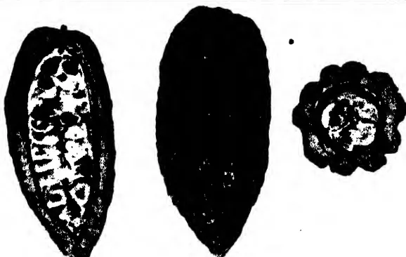

Fig. 1

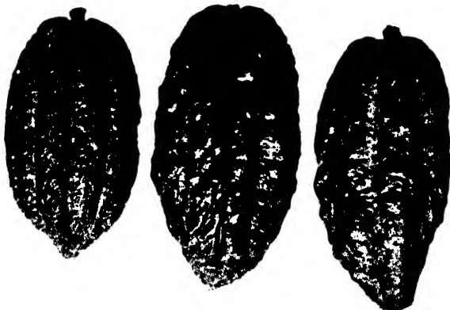

Fig. 2

Fig. 3

Fig. 4

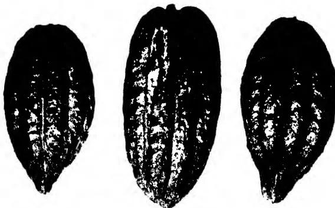

Fig. 5

Fig. 6

Fig. 7

Bred by Survey Dept., Ceylon.

### The Criollo Angoleta.

Legend:—Fig. 1. Type-form resembling Zehntner's Criollo type of the Djati-Roenggo hybrid.  
 Fig. 2. Type-form of the Old Red of Ceylon.  
 Fig. 3. Type-form of the Java Criollo.  
 Fig. 4. Type-form showing divergence towards Forastero.  
 Fig. 6. Type-form showing divergence towards Forastero.  
 Figs. 5 & 7. Type-form resembling Hart's Trinidad Forastero Veraguso.

787------------------------------------------------

Plate 2
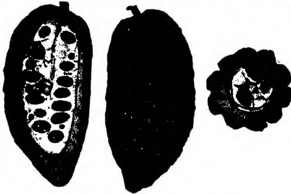
 This block contains three figures. Figure 8 (left) is a longitudinal section of a cacao pod showing a row of seeds. Figure 9 (middle) is a whole cacao pod. Figure 10 (right) is a cross-section of a cacao pod showing the internal structure and seeds.
Fig. 8
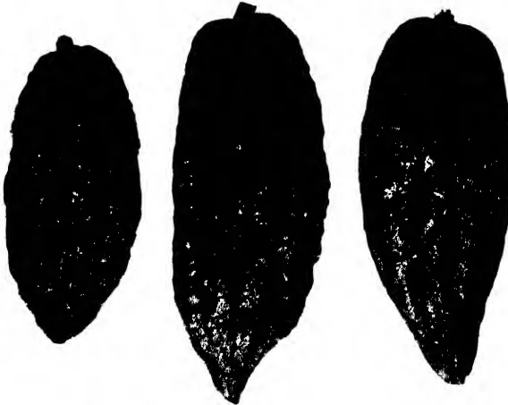
 This block contains three figures. Figure 11 (left) is a whole cacao pod. Figure 12 (middle) is a whole cacao pod. Figure 13 (right) is a cross-section of a cacao pod showing the internal structure and seeds.
Fig. 9Fig. 10Fig. 11
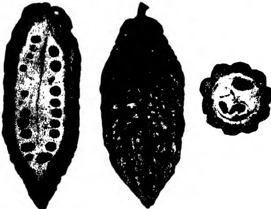
 This block contains three figures. Figure 14 (left) is a longitudinal section of a cacao pod showing a row of seeds. Figure 15 (middle) is a whole cacao pod. Figure 16 (right) is a cross-section of a cacao pod showing the internal structure and seeds.
Fig. 12

Block by Survey Dept. Ceylon.

### The Nicaragua Criollo Angoleta.

Legend:—Fig. 8. Type-form resembling Zehntner's Nicaragua Criollo.  
 Fig. 9. A sub-type which should be compared with Plate I, Fig 2.  
 Fig. 10. Type-form to be compared with Lock's figure 1 of Nicaragua Criollo.  
 Fig. 11. A sub-type with Cundeamor affinities, might be compared with Wright's figure 3 of Nicaragua Criollo.  
 Fig. 12. A sub-type showing divergence towards Forastero.

788------------------------------------------------

333

towards the fruit-stalk which is often fixed to the end obliquely causing the development of a high shoulder. The apex tapers into a long acuminate point generally slanting. Surface typically dull brownish-red; warty, especially towards the apex, with ten prominent ridges. Fruit wall moderately thick and hard.

Seeds generally 37 to 40. Seeds are moderately large and may measure 3.2 cms by 1.4 cms by 1 cm (generally about 2.6 cms by 1.3 cms by 1 cm). A varying percentage always white or pale-coloured in cross section.

**2. Distinguishing characters.** (1) Rounded base somewhat tapering (if not obliquely high-shouldered). (2) Long tapering, somewhat acuminate apex (often turned to one side). (3) White, moderately large seeds in fair proportion. The absence of "bottle neck" is characteristic.

### 3. Measurements.

<table>
<thead>
<tr>
<th></th>
<th>Typical</th>
<th>Limits</th>
</tr>
</thead>
<tbody>
<tr>
<td>Length</td>
<td>7.0 inches</td>
<td>6.5—10 inches</td>
</tr>
<tr>
<td>Breadth</td>
<td>2.5 inches</td>
<td>2.5—3.6 inches</td>
</tr>
<tr>
<td>No. of seeds</td>
<td>37—40</td>
<td>33—48</td>
</tr>
<tr>
<td>Light-coloured seeds</td>
<td>30%—50%.</td>
<td>All purple or all white</td>
</tr>
<tr>
<td>Size of seeds</td>
<td>19mm. by 11mm. by 10mm.</td>
<td></td>
</tr>
</tbody>
</table>

Nicaragua Criollo is regarded as a type with a slanting curved apical point, a high shoulder and large white seeds. The seeds should be at least 3.5 cms. to 4.5 cms. long. Nicaragua Criollo Angoleta is a form with characteristics as above except that the seeds are smaller and show a varying percentage of coloured cotyledons. Of the 609 trees in bearing in the plot there were 25 trees within the limits of the type form.

### L5. THE SMOOTH ANGOLETA.

**1. Description.** Fruits generally medium size (typical 7.75 inches by 3.25 inches). In shape elliptical to ovate or oblong. Apex slightly acuminate, generally obtuse or acute blunted. Surface pearly smooth, light ashy pink with ashy-green patches. Turns yellow to brownish-yellow with orange-red when ripening. Furrows five, broad and shallow. Fruit wall (0.3 inches in furrows and 0.45 inches in ridges) thick, with a moderately hard woody core. Seeds 38 to 46, generally small, plump and all purple.

There are trees listed as belonging to this type-form. The seeds are not of desirable quality but the trees are generally good yielders.

**2. Distinguishing characters.** This form is distinguished from L4 by having all its seeds purple and from an Amelonado by the measurements, the breadth never exceeding half the length.

789------------------------------------------------

334

### 3. Measurements.

<table>
<thead>
<tr>
<th></th>
<th>Typical</th>
<th>Limits</th>
</tr>
</thead>
<tbody>
<tr>
<td>Length</td>
<td>7.75 inches</td>
<td>6.0—9.0 inches</td>
</tr>
<tr>
<td>Breadth</td>
<td>3.25 inches</td>
<td>3.0—3.8 inches</td>
</tr>
<tr>
<td>No. of seeds</td>
<td>38—46</td>
<td>28—50</td>
</tr>
</tbody>
</table>

Of the 609 trees in bearing in the plot there were 101 within the limits of this type form.

#### L4. THE PORCELAINE ANGOLETA.

**1. Description.** Fruits generally small to medium-sized (typical 6.5 inches x 3.0 inches) in shape similar to L3, as also in character of surface. Colour typically carmine ripening to deep orange-red rather than yellow. Seeds 30—38, all being nearly white or only a small percentage purple. Seeds 23mm. by 13mm. by 19mm.

**2. Distinguishing characters.** The large percentage of white seeds, connected by intermediates with A3 (q. v.).

### 3. Measurements.

<table>
<thead>
<tr>
<th></th>
<th>Typical</th>
<th>Limits</th>
</tr>
</thead>
<tbody>
<tr>
<td>Length</td>
<td>6.5 inches</td>
<td>6.25—9.0 inches</td>
</tr>
<tr>
<td>Breadth</td>
<td>3.0 inches</td>
<td>6.9—3.9 inches</td>
</tr>
<tr>
<td>No. of seeds</td>
<td>30—38</td>
<td>26—48</td>
</tr>
<tr>
<td>Percentage of light-coloured seeds</td>
<td>100%</td>
<td>3%—100%</td>
</tr>
</tbody>
</table>

The forms of Plate III. represent an intermediate class which has previously been referred to under Nicaraguan Criollo but the purple seeds link it up with the Amelonado class of cacao. Of 609 trees in bearing in the plot there were 36 trees within the limits of this type-form.

#### C1. THE PARENT CUNDEAMOR.

**1. Description.** Fruits medium to large, generally elongated oblong-oval tapering abruptly to a blunt point. Surface not very warty; ten furrows distinct; alternate ones deeper and narrower. Colour generally greyish green with dull red shade, ripening to yellow with a reddish vivid hue or only a copper-yellow suffusion. Fruit-wall moderately thick; soft or with a hard rind. Seeds 28 to 48; oval in cross-section and generally dark to light purple in colour. A few seeds often white or nearly so.

**2. Distinguishing characters.** (1) The bottle-neck. (2) Elongated form. (3) Dull hue.

### 3. Measurements.

<table>
<thead>
<tr>
<th></th>
<th>Typical</th>
<th>Limits</th>
</tr>
</thead>
<tbody>
<tr>
<td>Length (a)</td>
<td>8.5—9.0 inches</td>
<td></td>
</tr>
<tr>
<td>(b)</td>
<td>7.75—8.0 inches</td>
<td>7.25—10.00 inches</td>
</tr>
<tr>
<td>Breadth</td>
<td>3.2—3.6 inches</td>
<td>2.2—4.0 inches</td>
</tr>
<tr>
<td>No. of seeds</td>
<td>38—42</td>
<td>28—48</td>
</tr>
</tbody>
</table>

790------------------------------------------------

Plate 3

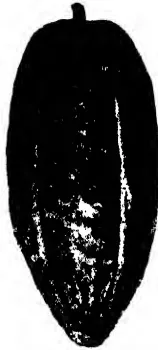

Fig. 13

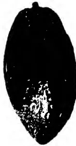

Fig. 14

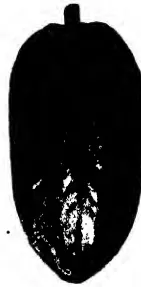

Fig. 15

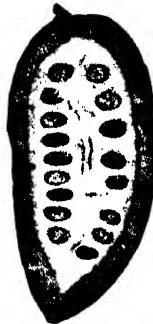
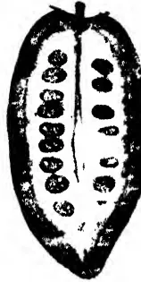

Fig. 16

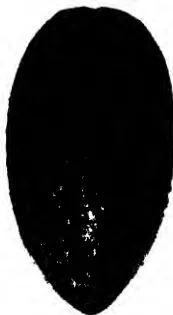

Fig. 17

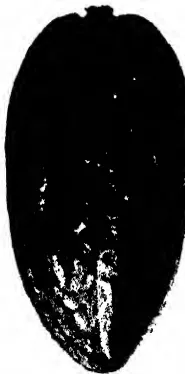

Fig. 18

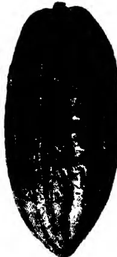

Fig. 19

Block by Survey Dept. Ceylon

### The Smooth Angoleta.

Figs. 13, 14, 15, 16, 17, 18, and 19. Forms separated from the Amelonado group on measurements.

791------------------------------------------------

A completely blank white page with no visible content, text, or markings.

792------------------------------------------------

335

Thickness of pericarp 2/3 inch in furrows and nearly 1 inch on ridges.

Of 609 trees in bearing in the plot there were 144 trees within the limits of this type-form.

#### C2. THE SMALL CUNDEAMOR.

**1. Description.** Fruits small (7 inches or less) well-furrowed, warty, with furrows equally marked, bottle-necked, elliptical-oval. Obtuse apex, light red with greenish-white, ripening brilliant orange-red. Fruit-wall thin (0.2 inch in furrows and 0.5 inch in ridges) and easy to cut. Seeds generally 33 to 37 with a varying percentage pale-coloured. Size 21mm. by 13mm. by 9mm.

**2. Distinguishing characters.** (1) Small size (never more than 7 inches). (2) Vivid hues on ripening.

#### 3. Measurements.

<table>
<thead>
<tr>
<th></th>
<th>Typical</th>
<th>Limits</th>
</tr>
</thead>
<tbody>
<tr>
<td>Length</td>
<td>6.5—7.0 inches</td>
<td>5.5—7.0 inches</td>
</tr>
<tr>
<td>Breadth</td>
<td>3.25 inches</td>
<td>2.5—3.50 inches</td>
</tr>
<tr>
<td>No. of seeds</td>
<td>33—37</td>
<td>18—42</td>
</tr>
<tr>
<td>Size of seeds</td>
<td>21mm. by 13mm. by 9mm.</td>
<td></td>
</tr>
</tbody>
</table>

Of 609 trees in bearing in the plot there were 15 within the limits of this type-form.

#### C3. THE GREEN CUNDEAMOR.

**1. Description.** Fruits generally long, very warty; the tubercles on ridges swell out making the furrows extremely narrow and deep. Typically ashy-green, turning a lemon-yellow when ripe. Apex generally obtuse and tubercled. Fruit-wall thick with a woody inner shell. Seeds 36 to 48 all purple and small.

**2. Distinguishing characters.** The green warty surface suggesting a Kaffir-lemon. In some forms where the constriction is faint very much like a green Nicaragua Criollo form.

#### 3. Measurements.

<table>
<thead>
<tr>
<th></th>
<th>Typical</th>
<th>Limits</th>
</tr>
</thead>
<tbody>
<tr>
<td>Length</td>
<td>8.5—8.75 inches</td>
<td>7.25—10.00 inches</td>
</tr>
<tr>
<td>Breadth</td>
<td>3.25</td>
<td>2.9—3.75 inches</td>
</tr>
<tr>
<td>No. of seeds</td>
<td>39—42</td>
<td>36—48</td>
</tr>
<tr>
<td>Size of seeds</td>
<td>23mm. by 13mm. by 10mm.</td>
<td></td>
</tr>
</tbody>
</table>

Of 609 trees in bearing in the plot there were 34 within the limits of this type form.

#### C4. THE TRINIDAD CRIOLLO CUNDEAMOR.

**1. Description.** Medium-sized fruits, slender and pointed towards the apex, bottle-necked strongly. Surface smooth to irregular, ashy pink ripening a bronze-yellow to orange-yellow.

793------------------------------------------------

336

Furrows distinct in most cases and deep. Fruit wall thin and very soft to cut. Seeds 37 to 48, a fairly large percentage white or pale-coloured.

**2. Distinguishing characters.** (1) Slender shape, (2) Surface not quite smooth, (3) Colour bronze-yellow, (4) Thin fruit wall, (5) Pale-coloured seeds.

**3. Measurements.**

<table>
<thead>
<tr>
<th></th>
<th>Typical</th>
<th>Limits</th>
</tr>
</thead>
<tbody>
<tr>
<td>Length</td>
<td>7.0—7.5 inches</td>
<td>6.5—9.0 inches</td>
</tr>
<tr>
<td>Breadth</td>
<td>5.0 inches</td>
<td>2.2—3.4 inches</td>
</tr>
<tr>
<td>No. of seeds</td>
<td>37—42</td>
<td>37—48</td>
</tr>
<tr>
<td>Percentage of pale-coloured seeds.</td>
<td colspan="2">25% to 33%</td>
</tr>
</tbody>
</table>

Of the 609 trees in bearing in the plot there were 12 within the limits of this type-form.

**C2. THE SMOOTH CUNDEAMOR.**

**1. Description.** Forms comparable with L3, except that they are bottle-necked. Some are large-sized, others slender, generally smooth, polished surface with shallow furrows. Shape generally elliptical, tapering often to a straight point. Colour ashy-green with a red suffusion ripening into a yellow with a light red shade. Others with an apex that is mamillate ripen a chrome yellow, the colour of a mango. Seeds 40 to 43, all purple.

**2. Distinguishing characters.** Smooth polished surface with a bottle-neck and purple seeds.

**3. Measurements.**

<table>
<thead>
<tr>
<th></th>
<th>Typical</th>
<th>Limits</th>
</tr>
</thead>
<tbody>
<tr>
<td>Length</td>
<td>6.0—7.5 inches</td>
<td>4.75—9.5 inches</td>
</tr>
<tr>
<td>Breadth</td>
<td>3.0—3.25 inches</td>
<td>2.75—3.5 inches</td>
</tr>
<tr>
<td>No. of seeds</td>
<td>40—43</td>
<td>30—49</td>
</tr>
<tr>
<td>Thickness of pericarp</td>
<td colspan="2">0.5 inch and 0.6 inch.</td>
</tr>
</tbody>
</table>

Of the 609 trees in bearing in the plot there were 152 within the limits of this type form.

**A1. THE CALABACILLO AMELONADO.**

**1. Description.** Small fruits never longer than 6 inches, ovate in form, blunt at the apex, furrows indistinct to smooth. Colour pale-whitish green, turning yellow or red. Fruit-wall somewhat woody. Seeds generally 41 to 43, small, dark-purple.

**2. Distinguishing characters.** Small fruit with a woody pericarp and purple seeds.

**3. Measurements.**

<table>
<thead>
<tr>
<th></th>
<th>Typical</th>
<th>Limits</th>
</tr>
</thead>
<tbody>
<tr>
<td>Length</td>
<td>5.25 inches</td>
<td>5.0—6.0 inches</td>
</tr>
<tr>
<td>Breadth</td>
<td>2.75 inches</td>
<td>2.75—3.0 inches</td>
</tr>
<tr>
<td>No. of seeds</td>
<td>41 to 43</td>
<td>21 to 46</td>
</tr>
</tbody>
</table>

Of the 609 trees in bearing in the plot there were 20 within the limits of this type-form.

794------------------------------------------------

Plate 4

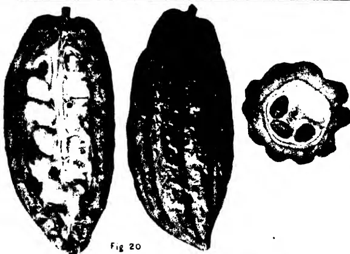

This block contains four figures. Figure 20 (left) shows a longitudinal section of a cacao pod with three seeds inside. Figure 21 (middle-left) shows a whole cacao pod with a textured surface. Figure 22 (middle-right) shows a whole cacao pod, similar to 21 but with a different texture. Figure 23 (right) shows a cross-section of a cacao pod with three seeds and a thick, textured outer layer.

Fig 20

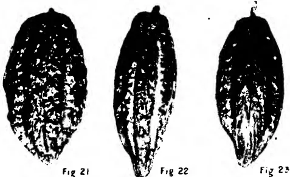

This block contains three figures. Figure 21 (left) shows a whole cacao pod with a textured surface. Figure 22 (middle) shows a whole cacao pod, similar to 21 but with a different texture. Figure 23 (right) shows a whole cacao pod, similar to 21 but with a different texture.

Fig 21

Fig 22

Fig 23

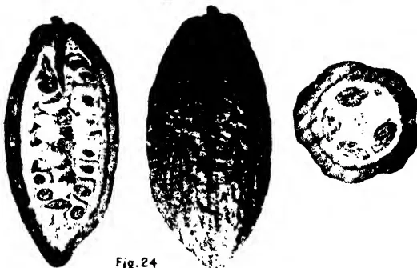

This block contains four figures. Figure 24 (left) shows a longitudinal section of a cacao pod with three seeds inside. Figure 24 (middle) shows a whole cacao pod with a textured surface. Figure 24 (right) shows a cross-section of a cacao pod with three seeds and a thick, textured outer layer. Figure 25 (left) shows a longitudinal section of a cacao pod with three seeds inside. Figure 25 (middle) shows a whole cacao pod with a textured surface. Figure 25 (right) shows a cross-section of a cacao pod with three seeds and a thick, textured outer layer.

Fig. 24

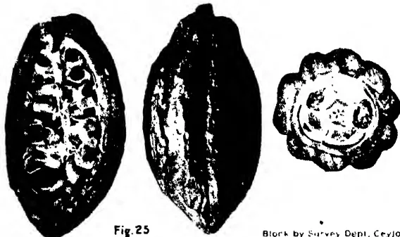

This block contains four figures. Figure 24 (left) shows a longitudinal section of a cacao pod with three seeds inside. Figure 24 (middle) shows a whole cacao pod with a textured surface. Figure 24 (right) shows a cross-section of a cacao pod with three seeds and a thick, textured outer layer. Figure 25 (left) shows a longitudinal section of a cacao pod with three seeds inside. Figure 25 (middle) shows a whole cacao pod with a textured surface. Figure 25 (right) shows a cross-section of a cacao pod with three seeds and a thick, textured outer layer.

Fig. 25

Block by Survey Dept. Ceylon.

### The Cundeamor Type Forms.

Legend :—Fig. 20. The Parent Cundeamor.  
 Figs. 21, 22 and 23. Examples of the Small Cundeamor comparable with  
 Zehntner's type of Brussels cacao.  
 Fig. 24. The Trinidad Criollo Cundeamor.  
 Fig. 25. The Smooth Cundeamor.

795------------------------------------------------

This image is a blank white page. It contains several small, dark specks which appear to be scanning artifacts or dust particles. There is no text, handwriting, or printed content on the page.

796------------------------------------------------

337

### A2. THE TRINIDAD AMELONADO.

**1. Description.** Large fruits (larger than 6 inches) similar in shape to A4 or elliptical and faintly bottle-necked. Surface smooth and indistinctly furrowed in some cases only. Seeds 41 to 43, small, dark-purple.

**2. Distinguishing characters.** Fine, large, somewhat polished, smooth, green fruits, yellow when ripe.

#### 3. Measurements.

<table>
<thead>
<tr>
<th></th>
<th>Typical</th>
<th>Limits</th>
</tr>
</thead>
<tbody>
<tr>
<td>Length</td>
<td>6.25 inches</td>
<td>6.0—7.8 inches</td>
</tr>
<tr>
<td>Breadth</td>
<td>3.75 inches</td>
<td>3.2—4.5 inches</td>
</tr>
<tr>
<td>No. of seeds</td>
<td>41—43</td>
<td>34—49</td>
</tr>
<tr>
<td>Pericarp</td>
<td>0.5 inch and 0.6 inch</td>
<td>(latter on ridge).</td>
</tr>
</tbody>
</table>

Of the 609 trees in bearing in the plot there were 18 within the limits of this type-form.

### A3. THE PORCELAINE AMELONADO.

**1. Description.** Small fruits (generally not larger than 6 inches) with furrows indistinct to smooth. Ovate with apex obtuse or acute. Colour and surface otherwise as in L4. Fruit-wall thin and soft. Seeds 25 to 35, a varying percentage white or pale-coloured in cross-section.

**2. Distinguishing characters.** Small ovate fruits with dark reddish polished surface, thin fruit-wall and white seeds.

#### 3. Measurements.

<table>
<thead>
<tr>
<th></th>
<th>Typical</th>
<th>Limits</th>
</tr>
</thead>
<tbody>
<tr>
<td>Length</td>
<td>4.5 inches</td>
<td>4.0—7.05 inches</td>
</tr>
<tr>
<td>Breadth</td>
<td>2.75 inches</td>
<td>2.4—3.7 inches</td>
</tr>
<tr>
<td>No. of seeds</td>
<td>25—35</td>
<td>25—46</td>
</tr>
<tr>
<td>Percentage of pale-coloured seeds</td>
<td colspan="2">40%</td>
</tr>
</tbody>
</table>

Of the 609 trees in bearing in the plot there were 14 within the limits of this type-form.

### A4. THE CACAO NACIONAL AMELONADO.

**1. Description.** Large fruits like A2, except that furrows are well-marked, constricted in some cases. Seeds 33 to 42, all deep purple.

**2. Distinguishing characters.** The large green fruits well-furrowed, bottle-necked in some cases.

#### 3. Measurements.

<table>
<thead>
<tr>
<th></th>
<th>Typical</th>
<th>Limits</th>
</tr>
</thead>
<tbody>
<tr>
<td>Length</td>
<td>6.75 inches</td>
<td>6.0—7.7 inches</td>
</tr>
<tr>
<td>Breadth</td>
<td>3.5 inches</td>
<td>3.0—4.2 inches</td>
</tr>
<tr>
<td>No. of seeds</td>
<td>33 to 42</td>
<td>33 to 42</td>
</tr>
</tbody>
</table>

Of the 609 trees in bearing in the plot there were 6 within the limits of this type-form.

797------------------------------------------------

338

The results of the examination are shown in the following table:  
**Tabulated Statement of Trees Examined.**

<table border="1">
<thead>
<tr>
<th rowspan="2">No. of the row.</th>
<th colspan="4">Angoletas</th>
<th colspan="5">Cundeamors</th>
<th colspan="4">Amelonados</th>
<th rowspan="2">Total in bearing</th>
<th rowspan="2">Trees not in bearing</th>
</tr>
<tr>
<th>L 1</th>
<th>L 2</th>
<th>L 3</th>
<th>L 4</th>
<th>C 1</th>
<th>C 2</th>
<th>C 3</th>
<th>C 4</th>
<th>C 5</th>
<th>A 1</th>
<th>A 2</th>
<th>A 3</th>
<th>A 4</th>
</tr>
</thead>
<tbody>
<tr><td>1</td><td>...</td><td>...</td><td>3</td><td>...</td><td>1</td><td>...</td><td>...</td><td>...</td><td>2</td><td>...</td><td>...</td><td>...</td><td>...</td><td>6</td><td>1</td></tr>
<tr><td>2</td><td>8</td><td>4</td><td>10</td><td>2</td><td>6</td><td>...</td><td>3</td><td>2</td><td>3</td><td>...</td><td>...</td><td>...</td><td>...</td><td>38</td><td>5</td></tr>
<tr><td>3</td><td>...</td><td>...</td><td>5</td><td>4</td><td>9</td><td>...</td><td>2</td><td>...</td><td>10</td><td>1</td><td>...</td><td>1</td><td>...</td><td>32</td><td>10</td></tr>
<tr><td>4</td><td>2</td><td>...</td><td>3</td><td>4</td><td>7</td><td>2</td><td>3</td><td>...</td><td>15</td><td>1</td><td>1</td><td>...</td><td>...</td><td>38</td><td>5</td></tr>
<tr><td>5</td><td>3</td><td>...</td><td>3</td><td>...</td><td>9</td><td>...</td><td>1</td><td>1</td><td>10</td><td>2</td><td>...</td><td>2</td><td>...</td><td>31</td><td>10</td></tr>
<tr><td>6</td><td>1</td><td>...</td><td>8</td><td>2</td><td>7</td><td>3</td><td>2</td><td>1</td><td>7</td><td>1</td><td>...</td><td>...</td><td>2</td><td>34</td><td>8</td></tr>
<tr><td>7</td><td>3</td><td>1</td><td>5</td><td>2</td><td>9</td><td>...</td><td>3</td><td>1</td><td>7</td><td>3</td><td>1</td><td>3</td><td>...</td><td>38</td><td>5</td></tr>
<tr><td>8</td><td>...</td><td>4</td><td>5</td><td>2</td><td>6</td><td>1</td><td>4</td><td>...</td><td>9</td><td>...</td><td>2</td><td>..</td><td>1</td><td>34</td><td>9</td></tr>
<tr><td>9</td><td>...</td><td>1</td><td>2</td><td>3</td><td>4</td><td>1</td><td>3</td><td>2</td><td>6</td><td>2</td><td>2</td><td>2</td><td>1</td><td>29</td><td>12</td></tr>
<tr><td>10</td><td>...</td><td>1</td><td>6</td><td>3</td><td>7</td><td>1</td><td>2</td><td>...</td><td>14</td><td>2</td><td>.</td><td>1</td><td>...</td><td>37</td><td>7</td></tr>
<tr><td>11</td><td>1</td><td>2</td><td>5</td><td>2</td><td>7</td><td>...</td><td>2</td><td>1</td><td>9</td><td>..</td><td>2</td><td>...</td><td>...</td><td>31</td><td>9</td></tr>
<tr><td>12</td><td>1</td><td>...</td><td>6</td><td>1</td><td>11</td><td>1</td><td>1</td><td>2</td><td>7</td><td>...</td><td>1</td><td>2</td><td>...</td><td>33</td><td>9</td></tr>
<tr><td>13</td><td>1</td><td>3</td><td>4</td><td>2</td><td>10</td><td>1</td><td>2</td><td>1</td><td>5</td><td>3</td><td>3</td><td>1</td><td>...</td><td>36</td><td>6</td></tr>
<tr><td>14</td><td>3</td><td>2</td><td>7</td><td>4</td><td>9</td><td>...</td><td>1</td><td>...</td><td>8</td><td>1</td><td>...</td><td>2</td><td>...</td><td>37</td><td>6</td></tr>
<tr><td>15</td><td>2</td><td>1</td><td>6</td><td>...</td><td>11</td><td>...</td><td>...</td><td>...</td><td>7</td><td>1</td><td>1</td><td>...</td><td>1</td><td>30</td><td>10</td></tr>
<tr><td>16</td><td>2</td><td>1</td><td>7</td><td>2</td><td>5</td><td>..</td><td>1</td><td>1</td><td>10</td><td>1</td><td>1</td><td>...</td><td>1</td><td>32</td><td>8</td></tr>
<tr><td>17</td><td>1</td><td>...</td><td>3</td><td>1</td><td>10</td><td>3</td><td>1</td><td>...</td><td>8</td><td>...</td><td>1</td><td>...</td><td>...</td><td>28</td><td>10</td></tr>
<tr><td>18</td><td>1</td><td>1</td><td>4</td><td>1</td><td>7</td><td>2</td><td>2</td><td>...</td><td>11</td><td>...</td><td>2</td><td>...</td><td>...</td><td>31</td><td>5</td></tr>
<tr><td>19</td><td>1</td><td>2</td><td>5</td><td>1</td><td>6</td><td>...</td><td>...</td><td>...</td><td>3</td><td>2</td><td>1</td><td>..</td><td>...</td><td>21</td><td>6</td></tr>
<tr><td>20</td><td>2</td><td>1</td><td>4</td><td>...</td><td>3</td><td>...</td><td>...</td><td>...</td><td>...</td><td>...</td><td>...</td><td>...</td><td>...</td><td>10</td><td>4</td></tr>
<tr><td>21</td><td>...</td><td>1</td><td>...</td><td>...</td><td>...</td><td>...</td><td>1</td><td>...</td><td>1</td><td>...</td><td>...</td><td>...</td><td>...</td><td>3</td><td>2</td></tr>
<tr><td>Total</td><td>32</td><td>25</td><td>101</td><td>36</td><td>144</td><td>15</td><td>34</td><td>12</td><td>152</td><td>20</td><td>18</td><td>14</td><td>6</td><td>609</td><td>147</td></tr>
</tbody>
</table>

Of the 609 trees from a single parent in bearing at the time of examination the classification was as follows:—

798------------------------------------------------

Plate 5

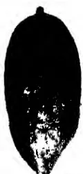

Fig. 26

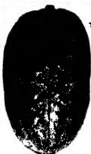

Fig. 27

Fig. 28

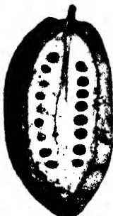
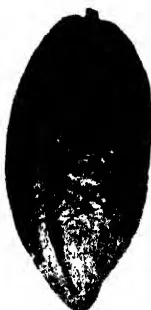
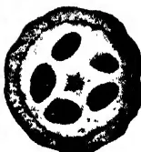

Fig. 29

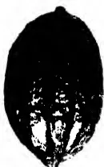

Fig. 30

Fig. 31

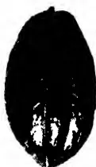

Fig. 32

Fig. 33

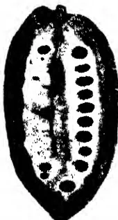
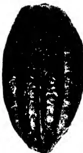
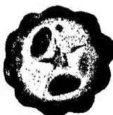

Fig. 34

Block by Survey Dept. Cayman

Legend:—Figs. 26, 27 and 28. The Calabacillo Amelonado type-form.  
 Fig. 29.—The Trinidad Amelonado type-form.  
 Figs. 30, 31, 32 and 33. The Porcelain Amelonado type-form.  
 Fig. 34.—A form which resembles some form of Cacao Nacional.

799------------------------------------------------

A completely blank white page with no visible content, text, or markings.

800------------------------------------------------

339

<table border="0">
<tbody>
<tr>
<td rowspan="4">Angoletas</td>
<td rowspan="4">{</td>
<td>Criollo</td>
<td>32</td>
<td></td>
</tr>
<tr>
<td>Nicaragua Criollo</td>
<td>25</td>
<td></td>
</tr>
<tr>
<td>Smooth Angoleta</td>
<td>101</td>
<td></td>
</tr>
<tr>
<td>Porcelaine Angoleta</td>
<td>36</td>
<td>194</td>
</tr>
<tr>
<td rowspan="5">Cundeamors</td>
<td rowspan="5">{</td>
<td>Parent type</td>
<td>144</td>
<td></td>
</tr>
<tr>
<td>Small</td>
<td>15</td>
<td></td>
</tr>
<tr>
<td>Green</td>
<td>34</td>
<td></td>
</tr>
<tr>
<td>Trinidad Criollo</td>
<td>12</td>
<td></td>
</tr>
<tr>
<td>Smooth</td>
<td>152</td>
<td>357</td>
</tr>
<tr>
<td rowspan="4">Amelonados</td>
<td rowspan="4">{</td>
<td>Calabacillo</td>
<td>20</td>
<td></td>
</tr>
<tr>
<td>Trinidad</td>
<td>18</td>
<td></td>
</tr>
<tr>
<td>Porcelaine</td>
<td>14</td>
<td></td>
</tr>
<tr>
<td>Cacao Nacional</td>
<td>6</td>
<td>58</td>
</tr>
<tr>
<td colspan="3"></td>
<td style="border-top: 1px solid black;">Total</td>
<td style="border-top: 1px solid black; border-bottom: 3px double black;">609</td>
</tr>
</tbody>
</table>

### The Forms on Plots 63-67.

From a careful census made of the trees on this block of young cacao it was found that there were 756 trees (exclusive of vacancies). Of these over 25% (i.e., 147 trees) were young plants and were in bearing at the time of examination. The 609 trees in bearing carried pods of shapes which indicated the hybrid character of the parent. The forms when referred to the three Forastero types existed in the following proportions:—

<table border="0">
<tbody>
<tr>
<td>Cundeamor</td>
<td>357 trees or 58.6%</td>
</tr>
<tr>
<td>Angoleta</td>
<td>194 trees or 31.9%</td>
</tr>
<tr>
<td>Amelonado</td>
<td>58 trees or 9.5%</td>
</tr>
<tr>
<td style="border-top: 1px solid black;">Total</td>
<td style="border-top: 1px solid black; border-bottom: 3px double black;">609 trees or 100%</td>
</tr>
</tbody>
</table>

It is possible that in a few years more the characters shown by the pods may have necessitated a slightly different division. It is improbable, however, that the proportions given will ever be greatly different and the proportions are likely to remain permanently somewhere in the ratio of 60 : 33 : 7 for Cundeamor, Angoleta and Amelonado forms. These proportions bring out the fact that the progeny of a hybrid form is being dealt with. The proportions are of value in showing what one may expect after careful selection of seed from a good strain of Forastero. If the 60% of Cundeamors all showed characters similar to the parent form, then it would indeed be a matter for congratulation. Unfortunately, the case is far from being so simple. Under Cundeamor, a large number had of necessity to be grouped into a class which would be considered undesirable when compared with the desirable parent form. Similarly, the Angoletas comprise a group of good and bad forms. There are also good Amelonados and, though they are very few, bad Amelonados.

801------------------------------------------------

340

It is remarkable what a large amount of variation is shown in the forms of pods of each and every tree. Nearly every tree can be described as a "form," the pods of which approximate in characters to one "form" that may be classed as typical of the tree. Another tree may show in its type only a trifling variation from the first tree, e.g., a long tapering point or a moderately warty coat, but this is shown over and over again in the pods of this tree which can in turn be said to differ very minutely from the "type" of another tree. The external character of the fruit cannot be correlated with seed characters. It would seem as if the set of factors operating in changing the size, shape and colour of seed operate sometimes with less, sometimes with greater, force in changing the size, shape, colour and other external features of the fruit-wall. Small smooth-skinned fruits do not give deeply-coloured seeds always nor do large warty fruits always give plump and light-coloured seeds. Yet these characters may, generally speaking, be said to be correlative.

#### Bibliography.

1. (1) LOCK, R. H.—Rept. on Expts. in Manuring Old Cacao, etc. R. B. G. Circ. and A. J. Vol. VI, No. 4, Oct. 1911.
2. (2) LOCK, R. H.—On the Varieties of Cacao, etc. R. B. G. Circ. and A. J. Vol. VII, No. 24, Oct. 1904.
3. (3) VAN HALL, C. J. J.—Cocoa, Macmillan & Co., 1914.
4. (4) WRIGHT, H.—A Rept. by the Controller, Expt. Station, Peradeniya, R. B. G. Circ. and A. J., Vol. 11, No. 4, 1903.
5. (5) ZEHNTNER, L.—Mededeelingen omtrent de op, Java aangeplante Cacaovarieteiten. Proefstation voor Salat, Bull. No. 9, 1905.
6. (6) PREUSS, P.—Expeditionanach Central und Sudamerika, 1899—1900, Berlin, 1901.
7. (7) HART, T. H.—Cacao, Duckworth & Co., 1911.
8. (8) CHEVALIER.—Le Cacaooyer dans l'Ouest Africain, 1908.
9. (9) WRIGHT, H.—Theobroma Cacao, A. M. & J. Ferguson, 1907.
10. (10) JUMELLA.—Culture Pratique du Cacoyer, etc. A Challamel, Paris, 1906.
11. (11) CHALOT & LUC.—Le Cacoyer à Congo Francais A. Challamel, Paris, 1906.

*Note added by F. A. Stockdale, October, 1928.*

A count of the seeds with dark purple, light purple and white cotyledons was made on a number of trees selected in the different groups for future breeding work but the investigation

802------------------------------------------------

341

was incomplete when the death of the investigator occurred. Such a count is of importance if further selection work is to be done, as also is the record of yields which has been begun on a number of trees in this plot. The records so far available have been tabulated by Holland, the Manager of the Experiment Station, Peradeniya, as follows:—

Individual tree yields of 133 trees in the "B" Cacao, Experiment Station, Peradeniya, for the years 1925-26 and 1926-27.

<table border="1">
<thead>
<tr>
<th colspan="3">April 1925 to March 1926 Persentage of number of trees giving</th>
<th colspan="3">April 1926 to March 1927 Percentage of number of trees giving</th>
<th colspan="2">Averages for the two years 1926-1927</th>
</tr>
<tr>
<th>Pods no.</th>
<th>Good pods %</th>
<th>Good and diseased pods %</th>
<th>Pods no.</th>
<th>Good pods %</th>
<th>Good and diseased pods %</th>
<th>Good pods %</th>
<th>Good and diseased pods %</th>
</tr>
</thead>
<tbody>
<tr>
<td>0 to 12</td>
<td>31.57</td>
<td>12.70</td>
<td>0 to 12</td>
<td>33.08</td>
<td>15.78</td>
<td>32.32</td>
<td>14.24</td>
</tr>
<tr>
<td>13 to 25</td>
<td>22.55</td>
<td>13.53</td>
<td>13 to 25</td>
<td>16.54</td>
<td>20.30</td>
<td>19.54</td>
<td>16.91</td>
</tr>
<tr>
<td>26 to 50</td>
<td>24.81</td>
<td>33.08</td>
<td>26 to 50</td>
<td>27.81</td>
<td>28.57</td>
<td>26.31</td>
<td>30.82</td>
</tr>
<tr>
<td>51 to 75</td>
<td>14.28</td>
<td>21.05</td>
<td>51 to 75</td>
<td>13.53</td>
<td>18.04</td>
<td>13.90</td>
<td>19.54</td>
</tr>
<tr>
<td>76 to 100</td>
<td>4.51</td>
<td>9.72</td>
<td>76 to 100</td>
<td>6.75</td>
<td>8.27</td>
<td>5.63</td>
<td>8.99</td>
</tr>
<tr>
<td>Over 100</td>
<td>2.25</td>
<td>9.72</td>
<td>Over 100</td>
<td>2.25</td>
<td>9.02</td>
<td>2.25</td>
<td>9.37</td>
</tr>
<tr>
<td>Total...</td>
<td>99.97</td>
<td>99.80</td>
<td></td>
<td>99.97</td>
<td>99.98</td>
<td>99.95</td>
<td>99.87</td>
</tr>
</tbody>
</table>

It has, however, been pointed out by Holland in the *Tropical Agriculturist* for January, 1928, page 62, that four years' records of individual yields of pods from 133 trees in the "B" cacao revealed the fact that, with one exception, the trees bearing the largest number of pods all bore small pods.

A test was then made to ascertain the relative amounts of dry cacao obtained from equal numbers of large pods and of small pods. Four lots of 150 large pods and 4 lots of 150 small pods were taken. The results were as follows:—

#### Large Pods.

<table border="1">
<thead>
<tr>
<th></th>
<th>Weight of 150 pods lbs.</th>
<th>Weight of dry cacao obtained lbs.</th>
</tr>
</thead>
<tbody>
<tr>
<td>Lot 1 . . . . .</td>
<td>235</td>
<td>16</td>
</tr>
<tr>
<td>,, 2 . . . . .</td>
<td>220</td>
<td>14<math>\frac{1}{2}</math></td>
</tr>
<tr>
<td>,, 3 . . . . .</td>
<td>188</td>
<td>13<math>\frac{3}{4}</math></td>
</tr>
<tr>
<td>,, 4 . . . . .</td>
<td>225</td>
<td>15</td>
</tr>
<tr>
<td>Average</td>
<td>217</td>
<td>14<math>\frac{3}{4}</math></td>
</tr>
</tbody>
</table>

803------------------------------------------------

342Small Pods.

<table>
<thead>
<tr>
<th></th>
<th>Weight of 150 pods lbs.</th>
<th>Weight of dry cacao obtained lbs.</th>
</tr>
</thead>
<tbody>
<tr>
<td>Lot 5 . . . . .</td>
<td>136</td>
<td>12</td>
</tr>
<tr>
<td>„ 6 . . . . .</td>
<td>124</td>
<td>10½</td>
</tr>
<tr>
<td>„ 7 . . . . .</td>
<td>126</td>
<td>11</td>
</tr>
<tr>
<td>„ 8 . . . . .</td>
<td>138</td>
<td>11¼</td>
</tr>
<tr>
<td>Average</td>
<td>131</td>
<td>11¼</td>
</tr>
</tbody>
</table>

This indicates that although the larger pods had a greater proportion of shell, an equal number still gave 21% more dry cacao than was obtained from a similar number of small pods. The method of recording yields in experiments by numbers of pods cannot therefore be considered satisfactory. Data are being secured on the Experiment Station, Peradeniya, as to the weight of wet cacao per 100 pods for the 133 trees under investigation, but the records have not yet been kept for a sufficiently long period for the results to be published.

F. A. STOCKDALE.

Peradeniya, October, 1928.

804------------------------------------------------

343

## Sugar-Cane Experiments at Allai.

**F. A. STOCKDALE, C.B.E., M.A., F.L.S.**

*Director of Agriculture.*

**T**HE following brief report on the sugar-cane experiments at Allai in the Trincomalee District of the Eastern Province has been prepared for general information. These experiments were begun in August, 1925, on a recommendation of the Committee appointed to advise Government on proposals submitted in connection with the further development of the economic resources of the Colony (Sessional Paper VI, of 1921). Two areas of five acres each were selected near to Killivedi, but only one of these has been developed. It was cleared and prepared for planting during the north-east monsoon season and it was anticipated that results would indicate whether sugar-cane cultivation was likely to be a successful undertaking in about three years.

The object of the station was to ascertain experimentally whether sugar-cane could be cultivated as a commercial undertaking in the Trincomalee district and to test what varieties would be the most suitable. It was not possible to commence planting until November, 1925, and then  $2\frac{1}{2}$  acres were planted up with eleven varieties of sugar-cane. Cuttings had to be obtained from Peradeniya and Anuradhapura Experiment Stations and in consequence germination was poor and growth was stunted during the period of heavy rains. Further planting was continued during the months of February, March, July, August, September and October, 1926, and subsequent results have shown the value of planting with irrigation during the dry months of the middle of the year so that the sugar-cane plants are fairly well grown when the heavy rains of the North-East Monsoon Season begin. Irrigation on the Station was provided by means of a Persian wheel which has been found sufficient to irrigate an acreage of 1 acre per chain. Irrigation has to be carried on at regular intervals during the period of March to September inclusive. Manuring with sulphate of ammonia at the rate of 200 lb. per acre was given to the crops. Growth was very good and, except in the case of Red Mauritius, pests and diseases have not been troublesome. Termites gave some difficulty at the time of planting but they were not on the whole excessively serious. Harvesting of the 1925 planting commenced in July, 1927, and extended to the middle of October, and the manufacture of jaggery was carried out for sixty days during this period. The canes at the time of harvest were fully ripe but several of them had died because of the length of the period between planting and harvest. Canes planted in May to July and irrigated are ready for harvest in

805------------------------------------------------

344

the following July to September, but growth is vigorous at other times of the year and juices suitable for sugar manufacture. The usual Indian method of manufacture of cane-sugar jaggery or gur was adopted and the manufacture was found to be easy after the officers responsible had gained the necessary experience.

After cutting the canes were ratooned and regular attention given to trashing, removal and destruction of dead canes, weeding, cultivation and manuring. The ratoon crop was cut in the period July to September, 1928, and jaggery manufactured. The results obtained are shown in the following table:—

<table border="1">
<thead>
<tr>
<th rowspan="2">Varieties</th>
<th colspan="2">Ratoon Crop</th>
</tr>
<tr>
<th>Canes</th>
<th>Jaggery</th>
</tr>
</thead>
<tbody>
<tr>
<td></td>
<td>Tons.</td>
<td>Tons.</td>
</tr>
<tr>
<td>Barbados 208</td>
<td>14.2</td>
<td>1.3</td>
</tr>
<tr>
<td>Striped White Tanna</td>
<td>19.5</td>
<td>0.8</td>
</tr>
<tr>
<td>Sin Nombore</td>
<td>32.1</td>
<td>2.2</td>
</tr>
<tr>
<td>Barbados 3390</td>
<td>22.9</td>
<td>1.8</td>
</tr>
<tr>
<td>Mauritius 181 P</td>
<td>10.5</td>
<td>0.8</td>
</tr>
<tr>
<td>Mauritius 1237</td>
<td>21.8</td>
<td>1.2</td>
</tr>
<tr>
<td>Striped Tanna</td>
<td>14.0</td>
<td>0.9</td>
</tr>
<tr>
<td>Demerara 74</td>
<td>30.6</td>
<td>1.2</td>
</tr>
<tr>
<td>Cheribon</td>
<td>11.7</td>
<td>0.5</td>
</tr>
<tr>
<td>Mauritius 55 P</td>
<td>23.9</td>
<td>1.5</td>
</tr>
</tbody>
</table>

The average quantity of cane cut per diem was 0.66 tons, which gave an average outturn of 1 cwt. of jaggery.

The average yields per acre of the total areas cut were as follows:—

<table>
<tbody>
<tr>
<td>Virgin crop</td>
<td>canes</td>
<td>35 tons</td>
</tr>
<tr>
<td></td>
<td>Jaggery</td>
<td>2.45 tons</td>
</tr>
<tr>
<td>Ratoon crop</td>
<td>canes</td>
<td>20.1 tons</td>
</tr>
<tr>
<td></td>
<td>Jaggery</td>
<td>1.17 tons</td>
</tr>
</tbody>
</table>

An examination of the figures in the tables shows some marked irregularities but these are explained by the fact that the officers responsible had no sugar-cane experience and in some cases canes became overripe before it was possible to deal with them. The best jaggery was obtained from the variety Barbados 208, and good quality jaggery was also made from the Striped Tanna and Barbados 3390 varieties. The variety Barbados 208 did not ratoon well, whilst the thin Argentine cane (Sin Nombore) resembling the Uba cane of South Africa was difficult to deal with in the virgin crop but much easier in the ratoon crop when quite a good quality jaggery was produced from it. Its juice required slightly different treatment from the juices of other varieties, but after experience it was found that its juice could be quite easily manufactured. The cost of manufacturing jaggery worked out as follows:—

<table>
<thead>
<tr>
<th></th>
<th>Per Acre</th>
</tr>
<tr>
<th></th>
<th>Rs. Cts.</th>
</tr>
</thead>
<tbody>
<tr>
<td>Labour for harvesting, transporting, crushing and boiling</td>
<td>241 50</td>
</tr>
<tr>
<td>Lime for clarification of juices</td>
<td>5 25</td>
</tr>
<tr>
<td>Fuel</td>
<td>21 00</td>
</tr>
<tr>
<td>Hire of bullocks</td>
<td>47 25</td>
</tr>
<tr>
<td><b>Total</b></td>
<td><b>315 00</b></td>
</tr>
</tbody>
</table>

This was equivalent to Rs. 128 per ton or 5.6 cents per lb.

806------------------------------------------------

345

The analyses of a number of canes made by Mr. A. W. R. Joachim, Agricultural Chemist, are as follows:—

Analyses of Canes Received from Allai.

<table border="1">
<thead>
<tr>
<th>Variety</th>
<th>Date of analysis</th>
<th>Juice %</th>
<th>Total solids %</th>
<th>Sp. gr. at 28°C</th>
<th>Sucrose %</th>
<th>Invert Glucose %</th>
<th>Glucose ratio</th>
<th>Extracted sucrose %</th>
<th>Purity %</th>
<th>Remarks of Agricultural Chemist</th>
</tr>
</thead>
<tbody>
<tr>
<td>No. 1237</td>
<td>Aug. '27</td>
<td>60.1</td>
<td>18.0</td>
<td>1.0705</td>
<td>16.9</td>
<td>0.76</td>
<td>4.5</td>
<td>10.2</td>
<td>94.0</td>
<td>Ready for cutting</td>
</tr>
<tr>
<td>55 P</td>
<td>Sept. '27</td>
<td>58.4</td>
<td>14.4</td>
<td>1.0587</td>
<td>11.8</td>
<td>1.2</td>
<td>10.2</td>
<td>6.9</td>
<td>81.9</td>
<td>Not quite ready for cutting</td>
</tr>
<tr>
<td>DK 74</td>
<td>"</td>
<td>58.8</td>
<td>18.6</td>
<td>1.0705</td>
<td>17.2</td>
<td>1.2</td>
<td>6.4</td>
<td>10.1</td>
<td>92.5</td>
<td>Nearly ready for cutting</td>
</tr>
<tr>
<td>No. 1237</td>
<td>Oct. '27</td>
<td>54.78</td>
<td>16.6</td>
<td>1.0665</td>
<td>15.49</td>
<td>0.65</td>
<td>4.19</td>
<td>8.48</td>
<td>93.3</td>
<td>One year after planting and one week after arrowing</td>
</tr>
<tr>
<td>55 P</td>
<td>Feb. '28</td>
<td>51.05</td>
<td>16.0</td>
<td>1.0587</td>
<td>13.56</td>
<td>0.81</td>
<td>6.0</td>
<td>6.8</td>
<td>84.8</td>
<td rowspan="2">Do not appear to be ready for cutting</td>
</tr>
<tr>
<td>DK 74</td>
<td>"</td>
<td>50.77</td>
<td>17.6</td>
<td>1.0665</td>
<td>14.98</td>
<td>1.02</td>
<td>6.81</td>
<td>7.6</td>
<td>85.2</td>
</tr>
<tr>
<td>Striped White Tanna</td>
<td>"</td>
<td>51.71</td>
<td>14.4</td>
<td>1.054</td>
<td>10.93</td>
<td>1.14</td>
<td>10.4</td>
<td>5.65</td>
<td>75.91</td>
<td rowspan="2">Not ready for cutting</td>
</tr>
<tr>
<td>Cheribon</td>
<td>"</td>
<td>56.18</td>
<td>14.0</td>
<td>1.051</td>
<td>11.91</td>
<td>1.60</td>
<td>13.4</td>
<td>6.69</td>
<td>85.06</td>
</tr>
<tr>
<td>No. 3390</td>
<td>"</td>
<td>66.2</td>
<td>16.8</td>
<td>1.0665</td>
<td>15.4</td>
<td>1.05</td>
<td>6.81</td>
<td>9.57</td>
<td>91.7</td>
<td rowspan="2">Cane ripe, especially Barbados 208</td>
</tr>
<tr>
<td>Barbados 208</td>
<td>"</td>
<td>61.3</td>
<td>20.0</td>
<td>1.0755</td>
<td>19.3</td>
<td>0.24</td>
<td>1.24</td>
<td>11.83</td>
<td>95.6</td>
</tr>
</tbody>
</table>

807------------------------------------------------

346

These analyses indicate quite average juices and purities for sugar-cane grown under tropical conditions.

The profit and loss account furnished by Mr. Thamotheram, the Agricultural Instructor in charge of the Station, is as follows:—

<table border="0">
<thead>
<tr>
<th colspan="2"><u>Cost of cultivation per acre.</u></th>
<th colspan="2"><u>Income.</u></th>
</tr>
<tr>
<th></th>
<th>Rs.</th>
<th></th>
<th>Rs.</th>
</tr>
</thead>
<tbody>
<tr>
<td>1. Opening land :</td>
<td></td>
<td>2.44 tons jaggery</td>
<td></td>
</tr>
<tr>
<td>    (a) felling and burning forest</td>
<td>30.00</td>
<td>per acre @-/15*</td>
<td></td>
</tr>
<tr>
<td>    (b) uprooting stumps</td>
<td>50.00</td>
<td>cents. per lb.</td>
<td>820.00</td>
</tr>
<tr>
<td>2 Preparation of land :</td>
<td></td>
<td></td>
<td></td>
</tr>
<tr>
<td>    ploughing and cross-</td>
<td></td>
<td></td>
<td></td>
</tr>
<tr>
<td>    ploughing 4 times</td>
<td>64.00</td>
<td></td>
<td></td>
</tr>
<tr>
<td>    opening furrows</td>
<td>3.00</td>
<td></td>
<td></td>
</tr>
<tr>
<td>3. Cost of setts for planting</td>
<td>30.00</td>
<td></td>
<td></td>
</tr>
<tr>
<td>4. Planting</td>
<td>3.00</td>
<td></td>
<td></td>
</tr>
<tr>
<td>    Cultivation</td>
<td>12.00</td>
<td></td>
<td></td>
</tr>
<tr>
<td>    Irrigation</td>
<td>36.00</td>
<td></td>
<td></td>
</tr>
<tr>
<td>    Earthing up</td>
<td>12.00</td>
<td></td>
<td></td>
</tr>
<tr>
<td>    Weeding</td>
<td>24.00</td>
<td></td>
<td></td>
</tr>
<tr>
<td>    Trashing</td>
<td>18.00</td>
<td></td>
<td></td>
</tr>
<tr>
<td>    Incidental expenses</td>
<td>15.00</td>
<td></td>
<td></td>
</tr>
<tr>
<td>5. Cost of manufacturing jaggery</td>
<td></td>
<td></td>
<td></td>
</tr>
<tr>
<td>    per acre</td>
<td>192.00</td>
<td></td>
<td></td>
</tr>
<tr>
<td></td>
<td><u>Rs. 489.00</u></td>
<td></td>
<td></td>
</tr>
<tr>
<td></td>
<td></td>
<td>Profit per acre</td>
<td><u>Rs. 331.00</u></td>
</tr>
</tbody>
</table>

These figures indicate that good profits can be made. There is difficulty, however, in the disposal of the jaggery at Trincomalee and sales have had to be made at Jaffna and Batticaloa with the consequent absorption of profits for railway freight and other transport charges.

In conclusion, it may be reported that experience has so far shown that good crops of virgin canes can be grown in the Allai area and that certain varieties have ratooned satisfactorily. The cane juices are for tropical conditions satisfactory and no extraordinary difficulties in the manufacture of sugar have been experienced. With the completion of the Veregal anicut there will be a large area of land available for sugar-cane cultivation and, in view of the high profits which can be made in Ceylon owing to the import duty on manufactured sugar, it should be considered whether it is not an industry worthy of assistance and encouragement. It is possible that sugar-cane could be rotated with paddy as in Java with material advantage to the paddy grower, and I

\* This price can be realised for good jaggery when freshly made.

808------------------------------------------------

347

would strongly recommend that the system of cultivation in Java should be specially visited and reported upon by an officer of the Ceylon Department of Agriculture. Success will not, however, be achieved unless capital is available for the manufacturing side of the industry. Ceylon has now passed the stage when jaggery will be consumed in any quantity and the manufacture of white sugar requires up-to-date equipment and adequate capital. This can best be attracted from sugar interests in other parts of the world and therefore the details of this report should be placed before them and the experiments carried on for a further period of two years to test the results of replanted lands. Success cannot, however, be achieved unless the land can be adequately drained and flooding prevented. The results at Allai have clearly demonstrated this and therefore with the completion of the Veregal anicut new scheme, the draining of water from the lands suitable for sugar-cane should be given a thorough investigation. If the drainage is good, there are decided possibilities before the cultivation of sugar-cane in the Allai area. .

809------------------------------------------------

348

## Losses of Nitrogen from Green Manures and Tea Prunings through Drying Under Field Conditions.

A. W. R. JOACHIM, B.Sc., A.I.C.,

*Agricultural Chemist, Department of Agriculture, Ceylon.*

IT is the practice on many Ceylon estates to leave the loppings of green manure trees and tea prunings to dry or decay on the surface of the soil before the leafy material is forked, if at all. An experiment was therefore started by the Chemical Division to determine the amounts, if any, of the nitrogen and organic matter of green materials lost as a result of this practice and the factors contributing to these losses. Under field conditions losses of organic matter from leafy green materials through oxidation, fermentation and micro-organic activity and of nitrogen either through leaching or in the gaseous form may be expected.

The experiment was carried out as follows. Large quantities of freshly cut loppings or prunings were placed between the rows of tea behind the laboratory and there left exposed to weather conditions. At the same time representative samples of the leafy portions of the green materials were taken for nitrogen and organic matter determinations. When the exposed materials were dried to a degree at which the leaves could be separated from the stems on shaking, portions of the leaves were brought into the laboratory, and nitrogen and organic matter determinations were made on them. In every case at least two determinations and in most cases three and four determinations were made and their means obtained. Further samples of the exposed materials were taken later, when they had just begun to decompose and when they were fairly well decomposed. The experiment was carried out with *Glicidia*, dadap, *Grevillea* and tea leaves. The mean results are shown in the table below. They are calculated on dry matter at 100°C.

810------------------------------------------------

349

<table border="1">
<thead>
<tr>
<th></th>
<th>Nitrogen in laboratory-dried sample, Per cent.</th>
<th>Nitrogen in field-dried Sample, Per cent.</th>
<th>Loss of nitrogen, Per cent.</th>
<th>Percentage of original nitrogen lost.</th>
<th>Organic matter in laboratory-dried sample, Per cent.</th>
<th>Organic matter in field-dried sample, Per cent.</th>
<th>Loss of organic matter, Per cent.</th>
<th>Percentage of original organic matter lost.</th>
<th>Remarks.</th>
<th>Weather conditions during drying period.</th>
</tr>
</thead>
<tbody>
<tr>
<td>1. <i>Gliricidia</i> leaves</td>
<td>3.640</td>
<td>2.050</td>
<td>1.590</td>
<td>43.7</td>
<td>89.4</td>
<td>80.4</td>
<td>9.0</td>
<td>10.1</td>
<td>Sample left on field for 18 days. Quite well decomposed.</td>
<td>Alternately dry weather and rain.</td>
</tr>
<tr>
<td>2. <i>Gliricidia</i> leaves (2nd sample)</td>
<td>3.312</td>
<td>3.265</td>
<td>0.047</td>
<td>1.42</td>
<td>89.6</td>
<td>87.4</td>
<td>2.2</td>
<td>2.5</td>
<td>Sample left on the field for 18 days. Well preserved.</td>
<td>Dry weather. No rain.</td>
</tr>
<tr>
<td>3. do</td>
<td>3.312</td>
<td>2.225</td>
<td>1.087</td>
<td>32.8</td>
<td>89.6</td>
<td>77.5</td>
<td>12.1</td>
<td>13.8</td>
<td>Above sample left for a Rain followed by further period of 12 days. Fairly well decomposed.</td>
<td>dry weather.</td>
</tr>
<tr>
<td>4. Dadap leaves</td>
<td>3.996</td>
<td>2.493</td>
<td>1.503</td>
<td>37.6</td>
<td>88.9</td>
<td>85.5</td>
<td>3.4</td>
<td>3.8</td>
<td>Sample left on field for 18 days. Fairly well decomposed.</td>
<td>Alternately dry weather and rain.</td>
</tr>
<tr>
<td>5. Tea leaves</td>
<td>2.477</td>
<td>1.870</td>
<td>0.607</td>
<td>24.5</td>
<td>90.3</td>
<td>—</td>
<td>—</td>
<td>—</td>
<td>Sample left on field for 18 days. Decomposition just beginning.</td>
<td>do</td>
</tr>
<tr>
<td>6. <i>Grevillea</i> leaves</td>
<td>1.349</td>
<td>1.465</td>
<td>0.016</td>
<td>1.19</td>
<td>95.0</td>
<td>94.0</td>
<td>1.0</td>
<td>1.05</td>
<td>Sample left on field for 21 days. Quite well preserved.</td>
<td>Dry weather. Slight shower just prior to sampling.</td>
</tr>
<tr>
<td>7. do</td>
<td>1.349</td>
<td>1.186</td>
<td>0.163</td>
<td>12.1</td>
<td>95.0</td>
<td>93.4</td>
<td>1.6</td>
<td>1.7</td>
<td>Above sample left for 16 days longer. Decomposition just beginning.</td>
<td>Alternately dry weather and heavy rain.</td>
</tr>
</tbody>
</table>

811------------------------------------------------

350

An examination of the above table will show clearly that large percentage losses of the nitrogen of the leafy portions of the loppings can occur as a result of leaving the latter to dry on the surface of the soil exposed to weather conditions. In these experiments as much as 43.7 per cent. of the original nitrogen of *Glicidia* and 37.6 per cent. of dadap leaves were lost during a period of eighteen days. These losses are to a great extent dependent on weather conditions. Dry weather alone does not encourage decomposition and loss of nitrogen, but alternate dry and wet weather hastens decomposition and increases the losses of nitrogen from the leafy materials. This is clearly seen in the case of the *Glicidia* samples. Thus, in the case of the first *Glicidia* sample when the weather conditions during a period of eighteen days were alternately dry and wet, the loss of nitrogen was 43.7 per cent. while in the case of the second sample, when the weather was dry throughout, the loss of nitrogen during the same period was only 1.42 per cent. A second sampling of the latter taken after a subsequent period of rainy and dry weather showed a large loss of nitrogen. In the case of *Grevillea* leaves, during a period of dry weather not only was there no percentage loss but an apparent gain of 1.2 per cent. of nitrogen. This was probably due to the loss of some of the carbohydrate material from the *Grevillea* leaves during the drying process. A second sample of *Grevillea* leaves taken after a period of alternate rainy and dry weather showed a loss of nitrogen of 12.1 per cent.

An examination of the figures of the table will also show that the losses of nitrogen from the more easily decomposed *Glicidia* and dadap leaves are greater than from the more resistant tea and *Grevillea* leaves, when both are exposed to the same weather conditions. The losses from *Grevillea* are least of all. This may be due to the more resistant nature of its tissues or to a smaller nitrogen content or to both. It will also be noted that, in all these cases, the nitrogen losses become greater as the degree of decomposition is greater.

Although the analytical determinations show very appreciable losses of nitrogen in most cases, it has to be pointed out that not all of it is entirely lost, for some is probably washed down into the soil below as nitrates. The fact, however, remains that the losses of nitrogen from green materials when they are left to dry on the surface of the soil can be great.

Losses of nitrogen as a result of leaving green materials to decay on the soil have also been found in temperate countries. Petch in a paper in the *Tropical Agriculturist* of November, 1924, entitled "The absorption of atmospheric nitrogen by leguminous plants" refers to work done in Canada with clover. As a result of leaving a crop of clover containing from 100 to 150 pounds of nitrogen per acre to decay on the land, it was found

812------------------------------------------------

351

that all but 50 lb. was dissipated by bacterial activity. André, \* analysing chestnut leaves in October and again in the following April after they had wintered on the ground, found a loss of 7.5 per cent. of the nitrogen, 67.4 per cent. of the phosphoric acid and 87.7 per cent. of the potash contained in the green leaves. The figures for potash and phosphoric acid are interesting, and would seem to indicate that these constituents are leached into the soil below. Boltz & Schollenberger†, experimenting with clover, found that during a period of one hundred and eighty seven days, the average loss of carbon from clover left on the surface of the soil was 84.4 per cent. and from that incorporated in the soil 34.2 per cent.

The losses of organic matter from plant materials used in these experiments as a result of drying on the field are also shown in the table above. These losses are much smaller than the corresponding nitrogen losses and would seem to indicate that, though in the initial stages of drying losses of carbohydrate constituents alone take place, in the later stages of the decomposition the losses of nitrogen are proportionately greater than those of the carbohydrate constituents. The organic matter losses are dependent on the weather conditions as well as on the nature of the green materials. The figures in the table clearly show this.

### Conclusions.

From the results of the experiments dealt with above, it will be realised that the practice of leaving green loppings and tea prunings to dry on the field before the leafy materials are incorporated into the soil is one which may result in large losses of the nitrogen and to a lesser extent of the organic matter they contain. Thus losses of over 43 per cent. of the nitrogen of *Gliricidia* and 37 per cent. of dadap leaves were found in these experiments. The losses are dependent on weather conditions and also on the nature of the plant materials. Alternate dry and wet weather favours increased losses. The losses are greater from the more easily decomposed *Gliricidia* and dadap leaves than from the more resistant tea and *Grevillea* leaves. The burial of these organic materials green is therefore advocated.

---

\* Com. Rend. Acad. Sc.—Chem. Abstracts Vol. 10. 1916 No. 6.

† Journ. Amer. Soc: Agron. Vol. 10. No. 5.

813------------------------------------------------

352

## Selected Articles.

# Irrigation and Crop Production.\*

### Introduction.

**C**ROP yield can be regarded as a measure of the success of agricultural operations in overcoming factors limiting plant growth. Under natural conditions, systems of agriculture which give optimum yields have been developed as the result of experience, the system representing a condition in which the factors operating for and against crop yield have been stabilized.

The introduction of a system of perennial irrigation has frequently been followed by a reduction in crop yield, the yield probably becoming stabilized at a point below the optimum. This indicates that under the artificial conditions of irrigation the balance of the factors determining crop yield is disturbed, or new factors operating against crop yield are introduced. In some cases this may be attributed to the accumulation of salts, such as sodium chloride, in the soil, but in others, the reason for the decline in yield is not so obvious. A thorough knowledge of the agricultural conditions imposed by a system of perennial irrigation is of great importance if crop yields are to be maintained. This is particularly the case at the present time, in view of the fact that irrigation systems are being developed on a large scale in the British Empire.

The climatic conditions determining plant growth are rainfall and temperature. If the temperature is suitable and there is an adequate rainfall, plant growth will take place. If either the temperature is unsuitable or the rainfall is deficient, plant growth ceases. Irrigation is therefore practised in areas where the temperature factor for growth is favourable, but the rainfall badly distributed or deficient.

Irrigation may be regarded from two points of view: the engineering, dealing mainly with the problems of the storage and distribution of water, and the agricultural, dealing with the use of the stored water. As a rule, irrigation is mainly considered from the engineering standpoint, the amount of water stored and the area irrigated being taken as the index by which the success, or otherwise, of the irrigation scheme is judged. This would be a legitimate conclusion if water were the only factor that could limit yield. But since crop yielded is largely influenced by soil conditions—chemical, physical, and biological—and since the soil serves as the medium through which the plant obtains the water supplied by irrigation, it is necessary to consider the effects of irrigation on the soil if the factors determining the efficient use of an irrigation system are to be thoroughly understood. Again, irrigation necessitates an alteration in the agricultural system of the irrigated area by the introduction of further crops into the rotation. The introduction of these

\* E. McKenzie Taylor, D.Sc. School of Agriculture, Cambridge in *The Empire Cotton Growing Review*, Vol. 5, No. 2, April, 1928.

814------------------------------------------------

353

crops reacts on the agricultural system as a whole, and may necessitate alterations in cultural conditions. A further point that must also be considered is the alteration in the climatic conditions—the soil climate and crop climate—in the irrigated area, and the effect of these changed conditions on plant diseases and insect pests. It will be seen, therefore, that before an expensive system of irrigation can be introduced with confidence a large number of interdependent factors must be taken into consideration. At the present time, little is known of the relation of irrigation to these factors, and hence crop production under a new system of irrigation has not a solid foundation. The true index of the success or otherwise of any irrigation scheme is to be found, not in the amount of water stored and distributed, but in the yield of crops which result from the use of the stored water. The results of the development of the system of perennial irrigation in Egypt have shown that the storage of increasing quantities of water is not necessarily followed by corresponding increases in the yield of the irrigated crops. On the contrary, the increases in stored water which have been made since the beginning of this century have been followed by marked decreases in yield. The development of an irrigation system is costly, and it is introduced with the object of growing a crop of high value; the importance, therefore, of a knowledge of the factors determining crop yield under irrigation is obvious. In the present paper, some factors influencing crop yield under irrigation will be considered.

### Crop Rotation and Irrigation.

The development of a system of irrigation can alter the crop rotation in two ways—(a) by the introduction of further crops into the rotation, and (b) by the alteration of the conditions of cultivation of the crops. As the development of the system of perennial irrigation in Egypt affords instances of both of these alterations, they will be illustrated by considering the effect of irrigation on the agriculture of that country.

In order to appreciate the agricultural conditions now existing under perennial irrigation, it is necessary to deal briefly with the history of irrigation in Egypt. From an agricultural point of view, Egypt is rainless except in the neighbourhood of the Mediterranean coast. The production of crops in Egypt has, therefore, always been dependent for water supply upon a system of irrigation. One of the chief characteristics of the Nile is the annual flood, due to rain on the Abyssinian plateau. The flood begins to reach Cairo at the end of July, and is at its height about the end of September. The first type of irrigation used in Egypt was that known as basin irrigation. The land under this type of irrigation was divided into a series of basins by means of dykes. The flood water was led by natural channels or artificial canals into the basins, and allowed to stand in them for a period of about forty-five days. The retention of the water in the basins for this length of time resulted in the thorough saturation of the soil, and at the same time the silt held in suspension was deposited. At the end of the period of forty-five days—that is, in November—the water was run out of the basins into the river, and the land was sown with winter crops. The crops were dependent for their water supply on the subsoil water left as the result of the inundation. The crops were harvested in April and May, after which the stubbles remained fallow until the following flood period in September. One of the main features of the basin system of irrigation was the maintenance of soil fertility as indicated by the constancy of the crop yields. Two characteristics of the basin system of irrigation may have been responsible for the maintenance of soil fertility—(a) the annual inundation during which the land received a deposit of Nile silt, and (b) the annual fallow period from May till September.

815------------------------------------------------

354

Until recently it was considered that the main factor responsible for the maintenance of soil fertility under the basin system of irrigation was the annual deposit of Nile silt. Experiments recently carried out in Egypt have shown, however, that Nile silt has little manurial value, and that no increase in yield follows a dressing of fresh Nile silt. The cause of the maintenance of the fertility of the soil must, therefore, be sought in the annual fallow period.

The fallow period may be divided into two distinct portions: the first during which the soil is dried and cracked, and the second, during which the soil is heated. The drying and cracking of the soil is almost complete before the winter crops are harvested. This drying and cracking of the soil has recently been regarded as of fundamental importance in maintaining soil fertility. Under perennial irrigation, the soil on which cotton is grown receives the same amount of drying and cracking as it did under basin irrigation, yet there has been a decline in the yield of cotton. It follows, therefore, that the drying and cracking of the soil have not the *fundamental* importance attributed to them, though they may be beneficial. Investigations on the effect of the heating of the soil during the fallow period have recently been carried out, and indicate that it is due to the heating which the soil received that soil fertility was maintained under the basin system of irrigation. Soil temperatures have been continuously recorded in fallow land from May to September. As a result of the study of these, it has been shown that partial sterilization of the soil due to heat does take place. Further, it has been shown that the partial sterilization of the soil is mainly confined to the period July 1 to August 15. Field experiments on cotton, to be mentioned later, have shown that the yield of cotton is higher when the cotton is sown on land that has been fallow in July and August than when it is sown on land with the fallow curtailed to June 30. The maintenance of soil fertility under basin irrigation must probably, therefore, be attributed to the heating of the soil during the period July 1 to August 15. This is an important conclusion, as will be seen in the discussion of the changes in the agricultural system with the development of perennial irrigation.

The objection to the basin system of irrigation is that the whole of the land is idle for a considerable portion of the year during which the temperatures are suitable for plant growth. The remedy is to supply water by a system of perennial irrigation. The object of perennial irrigation was the introduction of summer cropping and the reduction in the fallow area. The development of the system of perennial irrigation will now be discussed.

Until 1820, such irrigation as was practised in the Nile Delta was of the basin type. The possibility of growing cotton in Egypt was recognized by Jumel. As cotton could only be grown as a summer crop, a water supply was necessary for irrigating the crop. Perennial irrigation was, therefore, established in 1820, with the object of growing cotton. The Nile is low during the summer period, and the channels used for filling the basins were not deep enough to carry water in the low stage of the river. The first step, therefore, in the development of the system of perennial irrigation was the deepening of the channels to take the low level summer water of the Nile. These deep channels had two objections—(1) the whole of the water used for irrigation had to be lifted a considerable distance on to the land, and (2) the canals used to silt up during high Nile, necessitating an annual clearance entailing the use of a large amount of labour. In order to overcome these difficulties, the construction of the Delta barrages was sanctioned. The barrages were commenced in 1835, and were first used in 1861, but owing to difficulties that arose, they were not of great value to irrigation.

816------------------------------------------------

355

until 1884. During the period 1835 to 1884, perennial irrigation was practically maintained by the annual clearance of the deep canals by forced labour. The main developments in the perennial irrigation system have taken place since 1884. In that year, both barrages were used for the first time. In 1891 repairs to the barrages were completed, and they held up 13 metres of water on the gauge. Between 1891 and 1900 the barrages held up 14 metres, and, since 1901, 15.5 metres on the gauge.

The main result of increasing the amount of water held up at the barrage has been to convert the country from lift to free-flow irrigation. Since 1901, the perennial irrigation system in Egypt has undergone two further developments. In 1903, the water stored by the Aswan Dam was added to the summer supply of the Nile, and in 1906 it was decided to raise the Aswan Dam so that more water could be stored; this additional supply was added to the river in 1912. As an index of the success or otherwise of the development of the perennial irrigation system, the effect of its development upon the yield of cotton will be considered.

The yield of the first cotton crop in Egypt was about 1,000 kantars. Between 1877 and 1883, the average yield was maintained at 2,500,000 kantars, which represents an average yield per feddan of 3 kantars. The barrage at this time held up 12.5 metres on its gauge. Between 1884 and 1890, it held up 13.0 metres, and the area under cotton increased to 900,000 feddans, with an average yield of 3.5 kantars per feddan. Between 1891 and 1900, the barrage held up 14 metres on its gauge, and the average yield of cotton during this period reached 5.5 kantars per feddan. In 1901, it held up 15.5 metres on the gauge and the average yield fell to 4.9 kantars. In 1903, the water stored in the Aswan Dam became available, and the average yield between 1903 and 1910 fell to 4.5 kantars per feddan. Since 1910, further decreases in the average yield of cotton per feddan have occurred, though now the yield seems to be stabilized.

From 1820 to 1900, each addition to the summer water supply has been followed by an increase in the average yield of cotton per feddan. The development of the system of perennial irrigation which took place during this period must be regarded as having been successful. The development of the irrigation system since 1900 has been followed by a decrease in the average yield of cotton per feddan; developments during this period have, therefore, not been successful. During the successful period of development, as each addition to the water supply was followed by an increased yield, water must have been the principal factor limiting the production of cotton. During the period of unsuccessful development, since additions to the water supply are not followed by increased yields, some factor other than water supply, but dependent for its action on water supply, must be limiting the production of cotton. A study of the agricultural changes which have followed the developments in the perennial irrigation system indicates the cause of the decline in the yield.

Under the basin system of irrigation, winter crops only were grown. With the introduction of perennial irrigation, it became possible to cultivate an autumn crop in addition to the winter crops, as the land could be irrigated instead of inundated. Maize was, therefore, introduced. Before the land can be prepared for maize, it must receive an irrigation, since it is impossible to plough the land in the dry state following the summer fallow. Before 1900, the date on which the irrigation for ploughing the fallow land took place depended entirely upon the date on which the annual Nile flood had reached such a height that free-flow irrigation became possible. This date occurred in the month of August. Maize sowing before 1900, therefore, took place between August 10 and September 15. As a result of this, the

817------------------------------------------------

356

land on which maize was sown had been fallow from May to August. As cotton is sown in February on land which carried maize the previous autumn, the cotton before 1900 was always sown on land that had been fallow the previous summer. Under these conditions, the fertility of the soil, as indicated by the yield of cotton, was maintained.

Since 1900, a change has been introduced into the method of using the stored water. The Irrigation Report for 1897 states: "It is further intended to raise the gates of the existing barrage so that a water level of 15.5 metres may be maintained. Early sowing of maize will be greatly facilitated, and all possible advantage taken of the rising flood." The water at the barrage was retained at 15.5 metres in 1901, and immediately the yield of cotton fell. The Irrigation Report for 1904 states that the fallow ended on June 15. The Report for 1909 definitely states the policy of the Irrigation Service as follows: "The tendency is to hold the reservoir supply later and later every year, so that the mass of the water is employed to augment the early stages of the flood rather than to increase the volume of the river at its lowest. The object of the Irrigation Service was, therefore, to use the stored water to obtain an artificially early flood in the river so that maize could be sown early. It is not generally realized that the object of storing water in Egypt is not now the irrigation of cotton, but the preparation of the land for early sowing of maize.

It will be seen that since the conversion of Egypt from basin to perennial irrigation, two changes have taken place: (1) increase in the amount of stored water; and (2) a change in the method of using the stored water. The first is an engineering question, but the second, the change in the method of using the stored water, is essentially agricultural. So long as perennial irrigation remained an engineering problem, it was successful, increases in available summer water being followed by increases in the yield of cotton. As soon as an alteration was made in the agricultural system by the introduction of a new method of using the stored water the yield fell. To the alteration in the agricultural system must be attributed, therefore, the decline in the yield of cotton.

A consideration of the crop rotations under basin irrigation and under the two main periods of the development of perennial irrigation show the main change that has taken place. A comparison of the crop rotation is shown below:—

<table border="1">
<thead>
<tr>
<th>Basin Irrigation</th>
<th>Perennial Irrigation (Before 1900)</th>
<th>Perennial Irrigation (After 1900)</th>
</tr>
</thead>
<tbody>
<tr>
<td>May to August: fallow.</td>
<td>May to August: fallow</td>
<td>June to September: maize.</td>
</tr>
<tr>
<td>August to November: land flooded.</td>
<td>August to November: maize.</td>
<td>October to February: berseem.</td>
</tr>
<tr>
<td>November to May: wheat, beans, berseem.</td>
<td>November to February: berseem.</td>
<td>February to October: cotton.</td>
</tr>
<tr>
<td>May to August: fallow.</td>
<td>February to October: cotton.</td>
<td>October to May: wheat, beans, berseem.</td>
</tr>
<tr>
<td></td>
<td>October to May: wheat, beans, berseem.</td>
<td>June to September: maize.</td>
</tr>
<tr>
<td></td>
<td>May to August: fallow.</td>
<td></td>
</tr>
</tbody>
</table>

From a comparison of the crop rotations, it will be seen that under basin irrigation the land was fallow every year between May and August. Under perennial irrigation prior to 1900, cotton was always sown on land that had been fallow from May to August the previous year. During this

818------------------------------------------------

357

period of the development of the perennial irrigation system, summer fallow from May to August was still a characteristic feature of the agricultural system. Since 1900, however, the summer fallow has been completely eliminated from the agricultural system, so that the land is now continuously under crop. The change can be expressed as a "crop intensity factor," that is, the percentage of land under crop in July. This is shown in the following table for the provinces of Lower Egypt:

Percentage of Land under Crop in July in the Mudirias of Lower Egypt.

<table border="1">
<thead>
<tr>
<th>Year</th>
<th>Menufia</th>
<th>Qaliubia</th>
<th>Sharkieh</th>
<th>Daqahlia</th>
<th>Behera</th>
<th>Gharbia</th>
</tr>
</thead>
<tbody>
<tr>
<td>1899</td>
<td>33.7</td>
<td>32.3</td>
<td>44.0</td>
<td>67.0*</td>
<td>52.6*</td>
<td>49.4*</td>
</tr>
<tr>
<td>1913</td>
<td>99.1</td>
<td>93.3</td>
<td>96.3</td>
<td>95.5</td>
<td>85.6</td>
<td>88.0</td>
</tr>
</tbody>
</table>

\* Including rice.

While the increase in the area under summer crops in July is to some extent due to the increase in the area under cotton, it has mainly resulted from the early sowing of maize. It will be seen from these figures that the land is now completely under crop in July, while formerly, during this month, it was fallow. The importance of the fallow period, July 1 to August 15, has already been indicated in considering the maintenance of soil fertility under basin irrigation. The importance of this period in maintaining the yield of cotton was demonstrated in a series of field experiments. In one series of experiments maize was sown early, and in another series maize was sown in August, the whole of the land coming under cotton the following year. After a short fallow, the average yield of the plots was 3.40 kantars per feddan of cotton; after the long fallow, the yield of cotton was 4.39 kantars per feddan. Both the laboratory and field experiments demonstrate the value of the period July 1 to August 15 in maintaining soil fertility. To the elimination of this portion of the fallow by the alteration in the method of using the stored water must be attributed the decline in soil fertility under perennial irrigation as evidenced by the yield of cotton.

The change in the method of using the stored water may be justified from the point of view of food supply. Experiments on the effect of the sowing date on the yield of maize have shown that the maximum yield is obtained when the maize is sown in July. Against the decline in yield of cotton must, therefore, be set the increase in the yield of maize. The experiments indicate, however, that the gain in maize yield does not compensate for the lower yield of cotton, owing to the difference in the money values for the two crops.

The foregoing discussion of the changes that have taken place in the agricultural system of Egypt following the developments of perennial irrigation shows that the factors upon which soil fertility depends must be determined before an irrigation system is developed and retained as essential parts of the new agricultural system. It follows that the result of perennial irrigation cannot be perennial cropping, as has been attempted in Egypt.

## The Quality of Irrigation Water.

Irrigation water is not pure water, but a dilute solution of salts. This solution has a seasonal variation, both in concentration and in the nature of the salts in solution. These variations may be illustrated by the seasonal variations in the composition of the Nile at Cairo. During the flood period,

819------------------------------------------------

358

the amount of salts in solution is at a minimum. From December to May, there is a gradual increase in the concentration of sodium chloride which reaches a maximum of about fifty parts per million. During the summer months, sodium carbonate makes its appearance in the water, which becomes distinctly alkaline. The composition of the Nile water may be important in connection with the alteration that has been made in the method of using it. Formerly, this alkaline water was used for irrigating cotton—that is, a soil that was biologically active. Under these conditions, the sodium carbonate in solution would be rapidly converted to sodium bicarbonate, and "soil deterioration" would be unlikely to result. The present method of using the water is to irrigate a soil that is biologically dormant and hence carbon dioxide production in such a soil would be at a minimum. The result is that the sodium carbonate in the irrigation water remains as such until sufficient time has elapsed for the generation of carbon dioxide to convert it into the bicarbonate. As alkalies deflocculate clay, there will be undoubtedly a temporary deterioration in soil condition which in time may become permanent.

The effect of salts on plant growth has been mainly studied in water cultures or by adding salts in pot experiments, the results being expressed as the toxicity of the salt. If the soil were composed entirely of non-reactive material, these investigations would give results capable of direct application in the field. When a salt is added to a soil, base exchange takes place and, in nature, some of this base exchange may be either removed or decomposed by the addition of water. The effects of washing out large quantities of salts from a soil, the mode of origin of alkaline soils, and the general behaviour of soils when treated with strong salt solutions, are now fairly well understood. Investigations now being carried out at Cambridge show that with dilute solutions of salts, such as are used in irrigation, secondary reactions set in which alter the results that would be expected from a study of the action of concentrated solutions. As the subject is still under investigation, one point only will be mentioned.

The decline in the crop-producing power of soils under irrigation has frequently been attributed to the action of the salts in the irrigation water. In order to obtain information as to the effect of dilute salt solutions on soil, solutions of sodium chloride varying in concentration from 0 to 200 parts per million were allowed to percolate, under a constant head, through a series of soils, and the rates of percolation observed over a period of some months. The type of percolation curve obtained depended on the concentration of salt solution used. With pure water there was a gradual reduction in the rate of percolation to a stationary figure, the curve being smooth. Solutions varying in strength up to seventy-five parts per million sodium chloride produce a percolation curve which is a wave—that is, the rate of percolation decreases and increases periodically, the percolate at times containing colloidal clay. The final rate of percolation of this type is high. The rate of percolation of solutions between 100 and 200 parts per million sodium chloride is much higher than that of pure water or the more dilute solutions, the curve not being wavy, but showing a gradual decrease in the rate of percolation. The percolate in this case never contains colloidal clay.

The conclusion indicated is that with solutions less than 100 parts per million sodium chloride, base exchange takes place, but the solution is not of sufficient strength to prevent the hydrolysis of the sodium-clay. The final result is that a sodium-clay soil cannot be produced as the result of the percolation of dilute solutions. With higher concentrations of sodium chloride, hydrolysis of the sodium-clay produced by base exchange is impossible, and hence the sodium tends to accumulate, producing a sodium-clay

820------------------------------------------------

359

soil. It appears that, providing an efficient drainage system is supplied to prevent salt accumulation, no soil deterioration need take place with suitable irrigation water. If drainage is not supplied, salt accumulation will take place, sodium-clay will be formed, and soil deterioration will result.

## Irrigation and Drainage.

While the main effect of drainage in removing water from the soil is well known, the water conditions in an undrained soil have not been thoroughly studied. Investigations on drainage now being carried out at Cambridge have an important bearing on the relation between the irrigation water supplied and its effect when it has once entered the soil.

Drainage has usually been studied by means of lysimeters or drain-guages. A lysimeter consists of an isolated block of soil supported on a perforated iron plate. The water draining from the block of soil, as the result of rain falling on the surface can be collected and measured. By means of the lysimeter, the relationship between the rainfall and the amount of drainage can be studied.

The conditions established in lysimeters are those in a perfectly drained soil, and do not represent natural underground conditions. Under natural conditions, water applied to the surface of the soil does not immediately pass into the drains. It causes a rise in the subsoil water-table, the duration of the rise being dependent upon a number of factors, such as soil type and position.

In order to determine the effects of drainage, the result of adding water to the surface of an undrained soil must be studied. The method adopted in the investigation under discussion is to study, in an undrained soil, the effect of adding water to the surface on the subsoil water-table.

The first result of this study has been to show that 1 inch of water placed on the soil surface raises the water-table 4 inches. This is readily understood when it is considered that the water on entering the soil can only occupy the pore spaces. As the amount of pore space in the soil investigated was about 25 per cent. the rise in the water-table was four times the depth of water applied at the surface. This experiment was carried out on an undisturbed soil in the field. If arrangements are not made to control this rapid and large rise in the subsoil water-table, the soil soon becomes water-logged.

A second important result of this investigation is that the rise in the water-table commences immediately water is placed on the soil surface. The water placed on the surface does not flow through the soil to the water-table, but *displaces downwards the water already present in the soil*. The water reaching the water-table is, therefore, the solution which formed the nutritive medium for the plant or, in some cases, contained harmful salts. These results have a direct application to drainage under irrigation. Under irrigation, salts are added to the soil in the irrigation water. If concentration be prevented, soil deterioration will not take place. As the addition of irrigated water to the surface will displace the salt solution, if drainage has been provided, the salts added during one irrigation can be thus displaced into the drains at a subsequent irrigation. The problem involves an investigation of the depth of drainage, the frequency of irrigation, and the quantity of irrigation water to be used. As the soil solution containing the soluble plant food will also be displaced, a consideration of the effect of the above factors on the growing plant will also be necessary.

821------------------------------------------------

360

## Irrigation and Biological Conditions.

As the result of supplying irrigation water and growing a crop, a food supply is provided, and climatic conditions, both in the soil and near the soil surface, altered. These new conditions may be favourable to the development of insect pests, bacterial diseases, and fungi. This is particularly the case when a part of the life-history of an insect is passed in the soil; a possible instance of this is afforded by the Pink Bollworm in Egypt.

The first serious damage by Pink Bollworm was reported in 1913, which means that the pest had been developing for some years previously, although it had not done sufficient damage to attract notice. It has been shown that the most serious uncontrolled carry-over of the Pink Bollworm is in the soil, the greatest danger being from soils on which crops not requiring much irrigation water, such as wheat, are grown. Wheat follows cotton in the rotation. Under the conditions of irrigation before the water in the Aswan Dam became available, the land which had carried wheat remained fallow from May to September. The land was dry, and the temperature to the depth of ploughing was high enough to kill the resting larvae in July. Under these conditions it is difficult to see how the soil could have been a medium of carry-over; the fallow would actually provide a gap between one cotton crop and the next. Since the Aswan Dam added to the summer water supply, the wheat stubble has been irrigated towards the end of June, and maize sown. The killing of the larvae in the soil carrying the wheat stubble has thus been prevented, and conditions suitable for the emergence of the insect established. The gap that formerly existed between cotton crops has been bridged by the irrigation of the fallow land which carried cotton the previous year. This possible instance of the alteration of the biological conditions indicates that the relationship of the use of irrigation water to insect pests and diseases is a matter to be considered in connection with the crop rotation under an irrigation scheme.

From the discussion in this paper of factors that may limit crop production under irrigation, it will be seen that problems are presented which differ from those connected with crop production under conditions of adequate rainfall. As, however, the supply of irrigation water and the method of using it can be controlled, investigation of the problems would indicate those general conditions most favourable to crop production, and the modifications necessary to deal with the particular factors of each irrigated area.

822------------------------------------------------

361

## Work on Rice Improvement in Tanjore Delta.\*

**B**EFORE I begin to deal with the subject of rice improvement in the Tanjore Delta, I propose to give briefly the salient points relating to work on crop improvement in general. It is a commonly recognized fact that the agricultural prosperity of a country is dependent upon the magnitude of its crop production. The growing of better crops, the reaping of heavier harvests, and the realization of better returns, are objects that are ardently desired by all agriculturists. There are over a million acres under rice cultivation in Tanjore Delta area and if it should be possible to increase the output of paddy from this area, it would undoubtedly be a material contribution to the welfare of the country. A recognition of the following facts is a necessary preliminary to work on increasing the productivity of any crop.

It is a truism to say that no two individuals are quite alike, and this saying holds good with regard to plants as well. A close examination of a large number of individuals discloses the fact that there is a very large range of variation occurring among them. There are minor differences distinguishing one individual from another, and there are also what may be called racial differences separating one class or race of individuals from another class or race. A recognition of this fact is of great importance in work on plant-selection.

It would be futile, nay ridiculous, to think of converting a pigmy into a giant by carefully regulated nutrition. Nature is something entirely different from nurture, although the two factors co-exist in actual life. Something not inborn cannot be introduced by environment. The yield of a paddy plant is determined by the interaction of two factors, namely, heredity and environment. The environment may be favourable or unfavourable to the expression of a hereditary factor, but the factor must be there before it could be made to show itself. All paddy plants are not of the same yielding capacity, and it would be absurd to imagine that a very high yield could be produced by manuring alone, and that is rightly so, because the capacity to assimilate nutrition and build it up into paddy grains is something quite different from the supply of nutrition alone. It is a well recognized fact that different varieties or races of paddy possess different yielding capacities. It would thus be possible to get at the best yielders by judicious selection.

If we look at a paddy crop growing on a ryots' field, we notice that some plants are tall and good yielding, some short and low yielding, some sickly and producing very little grain. From the plant-breeder's point of view, these seemingly different kinds represent distinct varieties. The mixture of good, bad and indifferent plants is the chief cause of the deterioration of the ryots' paddy. If the ryot had taken care to select the very best plants in his fields and used the produce of such plants for the next sowing, his crop would certainly be better. We received a sample of kuruvai seed from an ordinary ryot from the neighbourhood and when we looked at it closely in the laboratory, the so-called 'kuruvai' paddy which was supposed to be

\* K. Venkataraman, M.A., in *Rural India*, Vol. 2, No. 8. February, 1928.

823------------------------------------------------

362

one variety with the ryot, really consisted of six different kinds of paddy and two different colours of rice. Some of the varieties are positively unmarketable, being either black in colour, or slender and fragile or with awns. The rice too, being a mixture of red and white rice is graded as a low class of commercial product and consequently the financial return to the cultivator is poor indeed. It may be asked what the remedy is, that will solve this problem. We do not propose to teach the ryot the details of scientific work. The State or the Government gladly undertake the trouble and expense of such work. We examine very carefully a sample of the mixed paddy grown by the ryot, separate it into its constituent pure races by single plant-selection, try these varieties one against the other with regard to yielding capacity and finally isolate the very best strain, multiply it on a large scale, and recommend the new seed to ryots for adoption. We do not wish that the ryot should give any preferential treatment to this seed, but we only ask him to grow it in place of the mixed seed which he had been growing formerly. The processes lead to the evolution of an improved strain of paddy by pure-line selection. This method can be relied on with certainty to produce good results. It stands to reason that once we fix upon an extremely good race of plants and keep them pure, they will certainly go on producing their like. It takes usually as many as six years before an improved strain of paddy could be produced by this process.

Varieties of paddies grown in various parts of the country are collected and grown here to give us an idea of their relative yielding-power under local conditions. This again affords us material for further selection work. There is yet another more interesting and absorbing line of work for effecting crop improvement. This method is known as 'hybridisation' or 'crossing', a method which holds out very great promise of future possibilities. Every mirasidar knows that if he wants to improve his breed of cattle, he should set about it by the crossing of local types with superior foreign breeds. He fully recognises for instance that it is impossible to raise the milk-yield of his cow above a certain limit, by feeding it with any amount of nutritious cattle fodder. The same fact holds good in regard to plants as well. Among paddy plants, as has been already pointed out, there are numerous varieties, the plants of each variety exhibiting definite characters. One variety is late and heavy yielding, while another is early maturing but low yielding. It may be asked how one variety of paddy may be crossed with another. It would be unnecessary for me to go into the details of this process here. There is a variety of paddy cultivated largely in the Tanjore Delta. This is the 'Korangu-samba' paddy which gives a very good yield in years in which it is free from the attack of fungal disease (paddy blast); but should the paddy be attacked by the disease, it is very badly affected and most of the grains get chaffy and sowers have to reap with regret a harvest of chaff. Another strain of paddy called 'Kichili-samba' (G.E.B. 24) appears to be rather resistant to the disease though not a very good yielder. To combine these two desirable characters of heavy yield and disease-resistance found in 'Korangu-samba' and 'Kichili-samba' respectively, a cross is made between the two types. When the progeny of the cross should be examined, we may get plants which are disease-resistant and high-yielding. It may thus be possible to produce a new type of 'Korangu-samba' which will be able to resist the disease. Work of this kind is laborious and slow, and it takes a long time (about ten years) before definite results are achieved.

824------------------------------------------------

363

Having, so far, dealt with facts relating to scientific work, let me now briefly describe what exactly has been done so far at the paddy breeding station here to improve the paddy crops of the Tanjore delta. This station was started in 1922 with the intention of increasing the outputs of paddy in the million acres of paddy-fields in the Tanjore delta. The soil at Aduturai is fairly representative of the delta soil, and improved strains of paddy reared on the station could be expected with certainty to do well anywhere in the delta tract. As a result of several years of work, seven improved strains of paddy have been distributed to the ryots and encouraging reports have been received from places where they have been tried. These strains are.

- (i) Aduturai No. 1—(Red sirumani).—  
  This crop takes about six months from sowing to harvest and the seed of the station gives an increased yield of 16% over the ryots' sample of the same variety.
- (ii) Aduturai No. 2—(White sirumani).  
  This is again an improved variety of white sirumani paddy and it gives an increased yield of 10% over the ryots' seed of the same variety.
- (iii) Aduturai No. 3—This is a selected strain from Kuruvai taking only about 90 days to mature.
- (iv) Aduturai No. 4—This is another improved Kuruvai variety giving 12% increase over the ryots' seed.
- (v) Aduturai No. 5—This is a selected Nellore samba paddy which gives an increase of 25% (or 3 marakals per kalam) over the unselected variety.
- (vi) Aduturai Nos. 6 and 7—These are selected ottadan varieties which give a 13% increase over the unselected ryots' crop.

825------------------------------------------------

364

## Soil Fertility.\*

**S**OME of the essentials of a fertile soil were outlined in Sir John Russell's second public lecture on Tuesday, 24th July. These included a sufficient supply of air, water, nutriments, a suitable temperature, depth for the plants to develop their roots, and the absence of injurious factors. The importance of irrigation and of green and farmyard manure in conserving and providing the necessary water supply was touched upon, and it was emphasised that all clays, which played an important part in determining the fertility of the soil, benefitted by the addition of limestone.

The Minister for Agriculture and Stock (Mr. W. Forgan Smith), in introducing the lecturer, observed that there was no doubt as to the need for improving methods of cultivation in Australia, with a view to increasing the yield from the land, and by that means making conditions of living on the land more attractive to the people, and thus increasing the sum total of wealth produced in the State and Commonwealth.

*Not a problem for Chemists only.*—Sir John Russell said that by a fertile soil was meant a soil which would grow the plants they wanted it to grow. In order that this might be accomplished, it was necessary that they should give the plants the conditions that they required for crop growth. Not so long ago it was thought that soil fertility was simply a matter of plant food, and that the science of agriculture was simply a branch of chemistry. It was thought that the chemist would be able to analyse the soil, and ascertain exactly what foods were lacking, and that then the farmer would be able to add those foods, and make an unfertile soil a fertile one. Chemists certainly have secured very great triumphs. They had succeeded in making a number of substances which were valuable plant foods, and greatly increased the fertility of the soils. The discovery of superphosphates was an illustration. It was found that when superphosphates were added to the soil, it greatly increased in productiveness. It was now known, however, that it was only possible for the chemist to ascertain the deficiencies of the soil to a very limited extent, and it was much safer to make an actual trial of the soil and the various fertilisers to see which of the plant foods was deficient. A piece of ground was divided up into a number of plots. One of these plots would receive no fertilisers, others would receive nitrogenous, phosphatic or organic fertilisers, and the crops would be compared.

*Plant Feeding, Certain Substances Essential.*—There was an aspect of the feeding of plants which had only recently come into prominence, and that was recognition that plants required certain substances, certainly only in minute quantities, absolutely. If they had not got them, then they would not grow. It had been proved by experiments with broad beans that a soil containing all the recognised elements of plant foods was not sufficient. However, when borum was added in the form of borax they grew steadily, and became normal in every way. It was known that other elements were needed in this way only in very minute amounts. Certain soils appeared to be deficient in the necessary small quantity of manganese, and in those soils the plants produced certain disease symptoms. There were, in fact,

\* Queensland Agricultural Journal, Vol. 30, Part 2, August, 1928.

826------------------------------------------------

365

diseases in plants which resembled deficiency diseases of animals and human beings. They were caused through the lack of some small quantity of an element which was vital to the growth of the plant and without which they could not develop properly. These elements were only slowly being discovered because it was a difficult operation to find them out. Already they knew of borum, manganese, and iron, and just a few others.

*Six Factors in Fertility.*—Experiments at Rothamsted had shown that the contention that the food of the plant was the controlling factor in soil fertility was not correct. It had been found that wheat would grow quite normal on a piece of land which had no manure for ninety years, whereas on land on which weeds were allowed to grow unchecked the plant was reduced in size, and quite abnormal. It had been shown, therefore, that weeds would, in a short time, do what ninety years of starvation had failed to do. Naturally, then, these experiments brought into prominence the fact that there were other things in soil fertility besides the provision of plant foods. Detailed studies in the laboratory had shown that six factors at least, were necessary in order that there should be a fertile soil. Firstly, there must be a sufficient supply of air to the roots, because plant roots breathed just like men and animals, and were easily suffocated and readily injured. Unless there was an adequate supply of air in the soil plants could not grow. Then they obviously required water and nutriments, or foodstuffs. There, too, must be a suitable temperature and sufficient root space. This meant that the soil must be sufficiently deep for the plants to develop their roots properly. Some plants wanted a deep soil, but others could tolerate a more shallow soil. Then there must be an absence of injurious factors. Fifty years ago nutriments were the only things which were regarded as essential, but now a fertile soil must satisfy the other five conditions as well.

*Importance of Suitable Soil Depth.*—Of all these, perhaps the most important was a suitable depth. If a soil was too shallow, plants could not grow well, no matter what was done. Shallowness of soil might be due to a layer of rock under the soil, or to a water-table. It happened not infrequently in valleys and lowlying land, where the water-table was near to the surface, that directly the roots touched the water they ceased to grow. Some plants were very intolerant of free water. Lucerne, for instance, would not tolerate free water, and failed to grow if the water-table was too near the surface. A highly important factor with regard to the plant was the supply of water. That was determined, in the first instance, by the rainfall, but it was profoundly affected by the nature of the soil. When soil was examined closely under a microscope, it would be found that it was entirely distinct from grains of sand or mineral matter in that it possessed certain sticky qualities. Soil consisted of hard mineral particles, the sand or grit, colloidal materials, water, and air. If the soil contained a large amount of colloidal materials, then the spaces got filled up, and there was not much air present. Soil of that kind was very sticky. Sandy soil suited one kind of plant, and was not suited for all kinds of plants, in spite of its low power of holding water, and clay other plants. There were places, however, where the soil was so shallow that it was impossible to cultivate it economically. Deep sand was always well suited for fruit, particularly for citrus, and clay soils were found to be extraordinarily well suited for grass and fodder crops. An example of this occurred in the Darling Downs, where the soil tended to be sticky in places, and there it was found that lucerne would grow admirably. Under such conditions fodder crops of the grass and clover variety would grow well.

*The Value of Clay.*—Recognition of the importance of clay had led to a detailed study of clay in the soil, and it now was known that clay played a great part in determining the fertility of the soil. Chemists had studied

827------------------------------------------------

366

the composition of clay in the soil, and they found there were three different kinds: calcium clay, sodium clay and acid clay. They had also found that clay was of the same constituents as ordinary salt. Under a high rainfall there was a tendency for the soil to become acid, and the proper way to deal with acid clay was to treat it with lime. In Queensland all three forms of clay were to be found. All these clays were greatly benefited by the addition of calcium carbonate, either in the form of limestone or gypsum. This rendered the soil less sticky.

*Water Supply.*—After emphasising that it was very important to examine the lower portions of the soil, because soil fertility was not confined to the surface, the lecturer went on to say that it required a greater amount of water for crops than anything else. Of course, the best way to ensure an adequate water supply was to have a natural rainfall, and the second best was to have an irrigation system. Where there was neither a sufficient rainfall nor an irrigation system, a great deal could be accomplished by proper cultivation. Proper cultivation conserved the soil moisture, and it was one of the most potent factors in soil fertility. In the State of Utah the Mormons had made a fuller study of water conservation and irrigation than any community known. Where the rainfall was about 25 inches, the addition of organic matter, either in the form of farmyard manure, or green manures, was valuable in securing an adequate supply of water. They gave to the soil power to hold the water. As a fact it was common in England to grow a crop, and then allow the sheep to eat the crop on the land. The sheep were penned in, and kept closely on to the crop, and when they were removed the land had been well manured. This method of combining sheep with arable farming had led to a great improvement in agriculture, not only in Britain but elsewhere. The sheep kept up the supply of organic matter in the soil, and it was found that the crops grown after they were removed gave high yields. Some of the most prosperous times in agriculture in England had been when they successfully combined sheep with other arable crops.

*The Use of Green Manures.*—The use of green manure also added organic matter to the soil. At present only a few crops were used for the purpose, but it was important to study a considerable range of crops to ascertain which was the best to use under different conditions. Cowpeas were largely used. Green manures had all the effects of farmyard manures in increasing the power of the soil to hold moisture, and making it easier to work, and they had the further advantage that they supplied valuable food to the plant. Leguminous green manures, such as cowpeas, supplied nitrates, which were lacking from soils in wet regions.

Sir John Russell also explained the effect of various minute organisms, both harmful and advantageous, on the soil, and referred briefly to the efforts made in England to produce organisms which were rather more severe in their influence on the soil than those in the wild state.

828------------------------------------------------

367

# Pineapple Disease Investigations.\*

## Interim Report.

### A. Introductory.

1. The inquiry in progress serves to support the opinion that pineapples as grown in the open in Queensland are subject to several distinct "troubles," some of which have proved notably harmful and are still so yet, they are, notwithstanding, as vigorous and healthy on the whole as are pineapple plants grown as a field crop in other parts of the world.

2. However, yields of commercial pineapples vary within wide limits but, as a rule, the differences to be observed are due more especially, not to disease occurrence, but to recognisable factors relating to circumstances and conditions of growth.

3. And among these are certainly controllable ones, constituted by horticultural methods adopted, and that vary in different plantations in every district, with respect too, to almost all procedures.

4. Economic considerations—as, for example, where the use of pineapple soil fertilisers or drainage is in question—may be the explanation and justification of this variation.

5. More frequently it is want of knowledge regarding the better course to pursue, either arising through absence of authoritative teaching or of the lessons derived from experience.

6. In the subjoined summary of investigations of pathogenic agents that do, however, prove prejudicial to successful pineapple growing, a consideration of the extent to which these may operate in the several districts of the state where this occurs has been for the present postponed.

7. This has been due to the fact that visits to plantations in detail throughout the area have not been generally prosecuted, since the necessary adequate thorough personal inspection would have involved much time and labour that would have been incompatible with the often tedious and protracted minute examination of disease-affected pineapple material in the laboratory—so essential to our preliminary pioneer undertaking. Moreover, protracted drought succeeded by much rainfall would have operated to render a disease survey inconclusive in yielding material results, when in their absence have been otherwise.

8. To overcome this conflict of duties and reduce the effect of stressing the importance of one, our original scheme contemplated the active co-operation of another Bureau of the Department having several district field officers on its staff in order to discover the local occurrence of pineapple diseases of whatsoever description and their local range.

9. The foregoing explanation why an extended pineapple disease occurrence survey has not so far been undertaken throughout the Cooktown-Tweed River coastal area may be applied also to the lack of field experimentation devised by us, and carried out under our direction, for the purpose

\* H. Tryon in Queensland Agricultural Journal, Vol. 30, part 1, July, 1928.

829------------------------------------------------

368

of advancing and checking conclusions the outcome of technical research prosecuted; but, too, as a guide in devising procedures at large in both preventing and controlling the pineapple troubles with which this research has been concerned.

10. But in the case of the several pineapple maladies of a non-parasitic nature primarily—physiological pineapple maladies—field experimentation from this point of view is very needful, even, moreover, to throw light on the nature of the circumstances giving rise both to their presence and destructive energy.

11. Most if not all of Queensland's pineapple diseases or virtual diseases are apparently common to the State and other pineapple-growing countries (the conclusion of both testimony and of personal observation). However, in reference to some of them elsewhere—notwithstanding successive investigators for years past have been inquiring into them from their several points of view—unanimity as to their causation has still to be reached, whilst as regards others our own findings (we may be excused in mentioning) have assisted in promoting this; a remark that applies to pineapple wilt on the one hand and to pineapple brown fruit-rot on the other.

12. As an incident too frequently realized, bearing both in the wider occurrence and active perniciousness of pineapple maladies in the State, or inquiry (so far undertaken) has served to compel us to dwell upon the fact of the very prevalent creation of new pineapple disease area, by (1) the use of already infected stock in planting and by (2) devoting to pineapple cultivation land already tainted with a malady derived from another crop plant, and common to the pineapple. Nematode Root Gall of, say, the banana, &c., and a root disease of sugar-cane may both be mentioned in this latter connection. The interplanting of other economic plants with pineapples may, as we have noted, conduce to the same injurious results.

13. Pineapple diseases and pineapple injurious insects often constitute different aspects of a common trouble, and thus the latter have not escaped our attention.

14. A comprehensive pineapple memoir exclusively devoted to diseases and injurious insects is in process of preparation, but its completion must be deferred until our detailed inquiry has been further prosecuted and certain outstanding questions have been settled.

A series of educational addresses in the several pineapple districts of the State are also projected when the progress of our inquiry will admit of it, and when a disease-occurrence survey has revealed those pineapple maladies that are present where such an undertaking is called for and in order to give point to whatever information it is sought to convey.

## B. Notes on the Natural Enemies and Diseases of Pineapples.

### I.—Agencies, Harmful Generally.

1. *Top Rot; Root Disease*: This pineapple malady is characterised by the death of the central leaf-shoot of the plant (whence should arise the flower and the fruit) in the early course of the trouble, the apical growth undergoing a form of wet decay. This, as we have discovered, is due to an injury of the extreme root ends also following damage in the first place to the absorbent root hairs occurring here. It arises from the development of an irritant in the soil itself, whilst the initial injury mentioned gives rise to and is augmented by a soil-frequenting fungus that, invading the root tissue, gradually also destroys it. Top Rot of the pineapple plant is very

830------------------------------------------------

369

destructive where it occurs, but is neither necessarily hereditary in the plant nor necessarily infectious. Our observations have shown that it becomes manifest only in locations in plantains of a special character in which drainage is held back by retentive sub-soil or by depressions therein at a low depth from the surface, or if more profound occurrence connected therewith by a soil (fine sand for example) that admits of its upward movement by capillarity therefrom, whilst the chemical irritant itself is provided by the unaerated soil through which the drainage has percolated. This disease closely resembles that of a sugar-cane disease that we have described under the name of Top Rot also. In the Hawaiian Islands, a pineapple disease, referred to under the term Pineapple wilt, and as being the most formidable trouble encountered in plantations there, has, in the light of our description of the malady under notice, been regarded by L. D. Larsen as identical with it; but the question involved is one that we are not ourselves prepared to decide. Top Rot, that may be very prevalent in certain places in Queensland but usually occurs quite locally and in circumscribed areas, can as we have seen, be prevented occurring by cultural procedures, and the avoidance of uncongenial sites in pineapple growing.

2. *Base Rot*: In this pineapple trouble, the individual leaves are successively involved from the base of the plant upwards, younger and still younger ones being gradually the scenes of the morbid changes that characterise it. The affected leaf, or leaf-portion, firstly develops a yellowish-green colour that contrasts with those still unaffected that may exhibit a vivid-green colour. Then it dies from the tip towards its base until it is affected in its entirety. At first, the part destroyed becomes grayish-brown and flaccid, the demarcation between it and the still sound portion being marked. Usually, except in quite young plants (suckers), the death of the pineapple is only very slowly realised; but it soon ceases to thrive and remains without evidence of prospective fruit production. The malady is also now responsible for many of the "misses" met with in newly established pineapple plantations, or new areas devoted to the plant therein, and especially in replanted blocks. We have found Base Rot manifesting itself sporadically in plantations usually, although not seldom being responsible for noteworthy damage in the aggregate. Also, that it is due to a special form of decay that commences in the broken tissue occurring at the spot in the sucker that marks where it has been detached from its parent; or starts in the abortive pineapple at the base of a "gill sprout"; and, too, that a very small area involved in decay here may effect trouble.

It has been discovered that this Base Rot may be prevented by exposing suckers intended for use as plants for some days so as to admit of their ends drying out; and in the case of gill sprouts by first detaching the swollen basal portions or miniature pines from which they arise before doing this. Dipping, too, the broken or cut ends in a fungicide, will afford also a further safeguard. Again, planting in soil still saturated with moisture conduces to Base Rot, and should be avoided. Further, during moist muggy weather this trouble may develop in suckers that are left in heaps, or are being tucked, in both cases whilst in a damp sappy condition, and that in such circumstances the Base Rot may become manifest within a week or two of planting them.

The inquiries have suggested that our pineapple Base Rot is identical with the pineapple Blight of Florida.

3. *Chlorosis; or Leaf Pallor*: This again, is a constitutional trouble that, as we have discovered, is in some situations fraught with serious damage to the plantations. In this there is until lately, and unlike what occurs in "Top Rot" and "Base Rot," no decay of the stock internally

831------------------------------------------------

390

taking place. The entire plant presents a sickly appearance, being of a general palish hue of colour. The first leaves to be affected are the outer—the older ones. Thus, whilst the inner leaves of the central shoot may be merely clouded with creamy yellow, the outer ones external to it may be almost white instead of green, with the central broad purple hand changed to red and often almost lost. These changes, however, may occur in pineapple plants that previously have shown normal growth, but with their manifestations this is brought to a standstill. Following these symptoms of sickness, a wet form of decay may set in, involving the older leaves—now horizontal on the ground—where they are attached to the stem, the stem itself in this situation, if not earlier, and so in turn the roots. This decayed tissue supports a white filmy growth of fungus. The trouble, however, is not due to the attacks of any such organism acting as a parasite. On the other hand it is an indication of the effect on the plant of soil that has become saturated with surface drainage, and which may persist when this soil only holds sufficient moisture to ball when compressed in one's hand.

The lay of the land, with regard to a plantation or any part of it, will indicate where this pineapple chlorosis is likely to take place, and where the preventive measure of proper drainage should be undertaken.

All authorities on pineapple growing emphasise the necessity of "proper provision for suitable drainage," and disregard of this requirement has even been mentioned as one of the causes responsible for continuously diminishing yields in fruit production.

4. *Root Tangle*: This, although not a disease proper, has been observed to considerably affect returns from all crops, subsequent to the plant crop, and even so its prejudicial effects have been noticeable, especially in the late dry season. It arises through the inability of the roots that start from the root granules, occurring on the plant at the base of each sucker, and beneath the leaf-sheaths here, to reach the soil, owing to these leaf-sheaths failing to decay and breakdown, and so admit of their emission, whereupon they become confined to the narrow spaces between leaf bases and stem, and so as they grow pursue an irregular winding course often side by side but with more or less interlocking.

This condition is commonly realised when suckers have not had their basal leaves removed in sufficient numbers prior to planting, or when they have been planted in the flat, so that when rain falls the surface soil surrounding these suckers is too dry to admit of the leaf-sheaths naturally decaying under the influence of saprophytic organisms, as they continuously do when it is moist. It is not to be observed also that the use of butts, in so much as they result in the suckers arising from them, being higher (set) in the ground than if independently planted, is again very conducive to root tangle. In crops again beyond the plant crop, the suckers that yield this are succeeded by others that spring laterally from the stem as it branches monopodially, each becoming a stem in turn giving rise to a sucker since it ends its growth in fruit production. Thus successive suckers start higher and higher from the ground, and thus even the first produced is often unable to send roots to the earth by decay of its lower leaf, unless special means are taken to ensure this. This tangle in fact militates against the functioning of any roots except those originally entering the soil shortly after planting.

This circumstance may be overcome by forcing the branches of the plant towards the ground, or bringing the earth upwards towards them, as by turning the land towards the plants in ploughing rather than away.

5. *Wilt*: Two apparently distinct pineapple affections have been brought under notice with the title "Pineapple Wilt" assigned to them. Both may be exhibited by younger or older plants.

832------------------------------------------------

371

(a) In one the pineapple plant (sucker) after growing perfectly erect for a time gradually curves over, the older leaves being directed in this movement more or less regularly to the side to which this takes place. This foliage presents also an unusual vivid green, except outwardly where it may be more or less clouded with yellow. Each leaf, again, is shortened coming more suddenly to a point and has its margin curving upwards and inwards (involute), so that it appears widened at its base; it is, moreover, unusually turgid and bitter. The entire plant, moreover, has a stunted habit and commonly yields no fruit. Nematode Galls or Mealy Bugs have been found on the roots of affected plants, but the general symptoms evinced are not characteristic of their presence; in fact both may be absent. Such plants may occur sporadically in good more or less level land.

(b) In this form the stem also gradually inclines over until eventually it may be almost parallel with the soil surface. There is, too, a general pallor of the foliage, and both it and the stem lose their turgidity. Meanwhile the individual leaves become light-coloured, sometimes indeed of a cream-like hue. Then first the lower leaves and then the stem where they originate will both rot and decay. (This may in part be due to sun scald experienced by the plant when horizontally inclined.) This form of "wilt" also affects pineapple plants varying in age, and usually when occurring neither fruit nor flower is produced. In those plants having "wilt" examined, the roots were intact and apparently healthy. This latter form of the trouble usually is met with in poorer soil than the former, and may locally occasion much injury and loss to a plantation.

At present we are unable to state definitely with respect to either form what agency may occasion it, but, although in some respects it corresponds to the pineapple "wilt" of the Hawaiian Islands, that during 1910-19 had no less than five distinct causes assigned to it by as many investigators, it is evidently distinct.

6. *Club Root or Root Rot—Heterodera radicicola (Nematode)*: This, in brief, causes first swellings and then decay of the root-ends, the nutritive absorptive portion, and so gradually determining arrested growth, then virtual starvation of the plant. A most serious pineapple malady is Root Knot, yet one whose nature and cause are both usually overlooked. This we have discovered is widely prevalent, extending gradually its range of occurrence, doing much damage, and as far as is at present known, almost impracticable to deal with here from the point of view of farm economics in ordinary plantation routine. Its injuries to the plant being usually of an indirect nature, it is commonly spoken of under one term or another that is descriptive of some plant malady distinct from it. It has been found that it is being introduced on to "clean land" through the use of pineapple plant stock, "putts" especially, that are already nematode infected; and thus also with other plants harbouring the disease—tomato seedlings especially grown as inter-crops. But pineapples are commonly infected through growing them in succession on land on which other plants have manifested the trouble—e.g., bananas, sugar-cane, potatoes, &c. This is due to the commonly unrecognised fact that the parasite of Root Knot—the nematode worm, *Heterodera radicola*—leaves its temporary host-plant habitually to pass into the soil and thence enters into the roots of other plants susceptible to its attacks. The coping with this form of Root Knot is one of the problems of horticulture and agriculture generally throughout the world, and is being assailed here and elsewhere only by an empirical method of attack; better procedures have yet to be discovered than the costly ones already in vogue.

7. *White Soil Fungus*: The pineapple plant, under the influence apparently of this organism, ceases to thrive, and presents a starved appear-

833------------------------------------------------

372

ance (as does a plant when, say, hanging for some time on a fence) being now of a sickly yellow instead of a vivid green colour. Small patches of plants or individual ones in a plantation may be noticed thus affected. This plant, again, when removed from the ground exhibits a more or less conspicuous development of white fungus mycelium beneath and between the leaf sheaths covering the base of the stem, and in later stages a rotten condition of the corn develops, the affected tissue eventually becoming dry and powdery. Again the roots may have white threads coursing over their surfaces; but in some instances the latter (now very slender indeed) may be observed throughout the soil in which the dead or dying roots occur and to a slight extent adherent also to the latter.

This trouble is still under observation, and the final or reproductive form of the fungus apparently implicated has yet to be discovered. Apparently, two different fungi may produce the effects noticed. It reminds one of a well-known sugar-cane disease, in which a small agaric (a species of *Armillaria*) is concerned.

Its presence is evidently favoured by the use of "butts" in planting, rather than suckers, nibs, or crowns, those portions of the stem supporting a growth of fungus is very similar to that associated with the sick plants. Further investigation is projected.

8. *Soil*: Abundance of evidence is forthcoming to indicate that pineapple plants or even entire pineapple plantations in Southern Queensland are in some cases being prejudicially affected, from the point of view of fruit production especially, by defects in the soil constituency commonly but not always to be overcome by the addition to it of manurial agents suggested by the plant's chemical composition. The pineapple, as had been shown by others, makes special demands not yet perfectly ascertained in the way of essential nutrients for crop production—ones not always met by even apparently "good ground," or by the addition of what "poor land" obviously lacks to make it so.

In many places the soils devoted to pineapple plants—as is suggested by the appearance of the latter—would doubtless be benefited by incorporation of vegetable matter to supply the necessary humus; but at the same time, their roots being intolerant of acidity in the soil, this would have to be supplied in a manner to avoid the presence of an excess of acid that vegetable matter might yield.

Already the lower soils of one area have been found to be slightly acid, and appearances of pineapple plants grown therein suggest that in some few instances this fact is reflected in the state of health of the plants.

Although the physiological trouble named "Chlorosis" has been commonly remarked, this is not the form of it manifested by pineapples elsewhere, due on the one hand to excess of manganese (Ohau) and the other to the presence of lime in undue amount (W. Indies).

9. *Bottle Neck*: The name Bottle Neck is that of a pineapple fruit malformation suggested by the shape assuming the form of a bottle, being narrowed suddenly towards the apex or top that remains small and neck-like and widens basally to represent the body. Usually, too, if the fruit reaches maturity it is of relative small size. Growers associate "Bottle Neck" also with special features, evinced by the prospective fruit, even prior to flowering having taken place—a persistently diminutive flowering head (pine) with scarcely any top, and is of somewhat scale-like bracts, and surrounding this the leaves ill-developed and with their margins turned in on the upper surface (involute), and therefore appearing though narrowed, noticeably so. And, further combined with this, an undue amount of yellow spotting and mottling of the older or lower foliage.

834------------------------------------------------

373

Subject to these unusual conditions, that may be quite prevalent on certain plantations, the yield in fruit to which this applies may be greatly reduced, and in-so-much also as growth may be brought to a standstill or nearly so, it is often that affected pineapple plants have to be eradicated.

The latter constitutional symptoms are not commonly met with in pineapple plants whose roots are rendered functionless and partly destroyed by either gall-forming nematodes or by Mealy Bugs, also plants growing in land where Bottle Neck in the fruit occurs; so also, with respect to land that is prone to dry out whenever a drought is being experienced. Still there appears to be another causal agency that may determine in some unascertained quality of the soil, apart from that which may conduce to desiccation in dry times, also acting through the root system. (The local distribution of occurrence of Bottle Neck suggests this.)

This, and the association of other diseases with pineapple plants that are alleged to be subjects of Bottle Neck of the fruit, is in harmony with the fact that this malformation is evidently the expression of some factor operating continuously for a period, at a particular time during the development of the fruit, so as to check and even restrain its growth. This critical time is when its apical development—the last to take place in the fruit—is being undergone so also, when parts other than fruit participate at other times in the pineapple plant's history of growth.

(The occurrence and prejudicial effect of Nematode worms as well as of Mealy Bugs is one for separate consideration.)

The question of the influence of the soil—the occurrence of a special soil type—from a physical and chemical stand-point, needs the co-operation of the chemist and the controlling influence of field experiment.

As may be inferred from the foregoing findings, Bottle Neck—as is evident from facts brought to light—is not a permanent endowment of the pineapple plant. However, it is injudicious to utilise stock from affected areas for planting unless the certainty that it harbours neither Mealy Bug nor Nematode Gall is assured.

## II.—Agencies, Injuring the Fruit.

1. *Fruitlet Core Rot (Tryon), Brown Rot (Larsen), Black Spot, &c.* The fruit disease known under the above name is, as we have found, very prevalent in South Queensland, during the winter season affecting the "winter crop." It is said, indeed, when pronounced then to involve locally at least 25 per cent. of the fruit, both smooth and rough leaf pineapple varieties being alike subject to it.

It has been termed "Fruitlet Core Rot" by us its discoverer, since it is at first confined to single "pits" of the fruit, and the dark spots just within the outer surface, so evident on cutting the pine across, and so symptomatic of its presence have originated its more popular local name, "Brown Rot," above mentioned, in the Hawaiian Islands where also it is met with, so also we have the term "Black Spot," although the tissue first involved is dark-brown rather than this colour. From single pits it may extend to others, especially when the more succulent fruits of the smooth-leaf pine, for example are attacked. At its commencement it may occur without external symptoms being noticeable. It has been shown by the writer to originate in a very minute injury at the base of the closed calyx cavity or cup (air-chamber of some) and near in it where the pistil is planted. This injury, in the rough-leaf pine at least, is caused by the punctures of a tiny mite of invisible smallness—except when a magnifier is used—an acarid that we have assigned to the genus "Tarsonymous." At times, however, and more

835------------------------------------------------

374

commonly in smooth-leaf pines, the injury consists of a few more or less gaping fissures in the same position as these punctures, caused by the inability of the thin hard tissue here to resist weather changes—from high to low temperature and vice versa—having a disruptive action when as in winter surface extension cannot as here at the same time ensue to withstand it. In each case fungus infection is rendered practicable and takes place at these sites, and is especially operative in causing tissue changes in colouration and decay, through excessive realization, since the relatively cold winter temperatures in reducing vigour deter the plant in resisting and overcoming the attack of the fungus and the changes that it can effect.

This explanation has been virtually accepted by Larsen as an explanation of Brown Rot in pineapple in the Hawaiian Islands and by Matz as far as relates to Porto Rico (W.I.) with this difference, that whereas the writer regards the fungus implicated as derived from the dead and decayed stamens constantly present within the closed calyx-cup, these writers regard the micro-organism as being a *Fusarium* of undetermined species and origin. The fact that this trouble both originates and develops always in a closer space—the calyx-cup in the individual fruitlet or pit—renders direct treatment apparently wholly impracticable. Dusting the flowers with very finely-ground sulphur has not been attended with certain benefit either in the case of the Ripley Queen, or with the common rough-leaf pine. Inquiry is being prosecuted with a view to ascertain to what extent, if any, this fruit disease is virtually hereditary, since the mite mentioned is indigenous to the plant. The circumstance that the trouble is locally prevalent in certain plantations is suggestive, indeed, of locally-grown plants constantly carrying with them the prime agent of this Fruitlet Core Rot.

2. *Sun Scald*: The symptoms of sun scald of the pineapple fruit are as follows:—At first one face of it is of a lighter green than is the surface generally and then assumes a pale-yellow hue. A softening and collapse in patches now develops in this area, whilst meanwhile there is slight exudation of sap and later on fissuring—these appearances being suggestive of premature ripening restricted in position and extent to the part in question. These may supervene a change from yellow to dark-brown and following this a drying out shrinkage inwards of the affected tissues—the alteration of colour, significant of decay proceeding deeper and deeper, the conspicuous altered tissue being very noticeable on cutting the pine across.

(Note.—These progressive changes are detailed since they are usually regarded as symptomatic of a specific disease.)

At first there is no occurrence present of micro-fungi to suggest parasitism as the underlying cause of this trouble, but the presence of morbid moist plant-tissue soon determines the presence of the Brown Rot organism whose destructive activities are promoted by Fermentation Flies (*Drosophila*) that are early attracted by it. Pineapple fruit scald with corresponding features is met with also in other countries; and it may be prevented when threatening here as in them by sheltering each individual pine when its attitude acquired during growth suggests it by the use of some light plant debris or cotton, or by raising them under shelter as in Florida, treating the pinery as a whole (a procedure not admissible, possibly, on economic grounds in Queensland, except under special circumstances).

Pines that have been rendered unduly succulent by generous rainfall, or by free use of growth-conducive fertilisers, and thus whilst producing large fruit have not the rigidity so essential for maintaining them in an erect position, are liable to this injury, since leaning over they expose to the sun's rays one face rather than the surface generally. This especially applies to the first or plant crop, but the fruit of succeeding ones are also

836------------------------------------------------

375

liable to become oblique since, arising laterally on the plant, the inclination under the circumstances mentioned will be emphasised with age—the bias once produced naturally augmenting.

Fruit affected by sun scald even in a slight degree on being gathered is very liable to travel badly, since the damage once initiated is liable to develop with the ripening process.

3. *Cripples*: In this further fruit malformation the symmetry of the fruit is impaired, one side through being invested in growth in flattened or even concave, the pits included in the affected area being relatively small. This in the past especially affected pineapples in the localities longest devoted to pineapple growing (old Nudgee Gardens), and the pineapple variety earliest cultivated, the so-called "rough leaf"—the smooth-leaf pine (Cayenne) manifesting Fruit Cripple much less frequently. It has been pronounced to be an hereditary trouble transmitted by vegetative growth from affected plants. Also, that it is linked with the presence of a "mesial streak in the leaves." We are not in a position to support either of these conclusions unless on a *priori* grounds. At present the occurrence of these fruit cripples is not a serious matter with regard to pineapple growing, but it is one that may claim attention at our hands in view of this being not so in the future.

4. *Fruit Storage Rots*: These are an important consideration since not only do they impair the value of shipments especially overseas, being responsible for a large measure of destruction at times, but they may also affect the value of the pack when ripe fruit is used by canners. Any fruit that is bruised is especially liable to the destructive action of the agents that cause them.

We have not so far been able to prosecute the enquiry necessary for the elucidation of this matter, beyond having discovered that a special species of *Penicillium* (one of the mould-fungi) may be implicated in this work following up the damage arising from mechanical injuries, bruising, etc. It is in this work, that of Storage Pineapple Rot, that the organism of "Soft Rot" (*Theilaviopsis paradoxa*) plays such an important part elsewhere.

5. *Soft Rot* (*Theilaviopsis paradoxa*) (de Seynes), von Hohnel: The occurrence here of Soft Rot has not definitely been established, but owing to its prevalence in other countries where pineapples are grown as a field crop, (e.g., Hawaiian Islands, the West Indies, and Florida) may be expected to already be present in Queensland also. When the fruit disease, originally termed by us "Fruitlet Core Rot," and subsequently by others Brown Rot, freely affects the smooth-leaf pine it may readily be confounded with it owing to the development of so much dark-brown tissue adjacent to the external surface. It is essentially a disease affecting the ripe fruitlet, generally on its being stored and especially when shipped. In the field should ripe fruit occur, the organism causing it finds entrance through insect punctures or mechanical injuries, in the fruit-store through the cut-end or stem (Base Rot); and on ship board—when the atmosphere is humid—through the general surface (shipping rot). When the fruit is affected, "the tissue takes on a water-soaked appearance, becomes a shade darker yellow than the normal tissue, and has a characteristic odour" (L. D. Larsen)—that of ascetic ether. When exposed to the air, such affected tissue after the lapse of twenty-four hours has become black owing to the formation

837------------------------------------------------

376

of innumerable black spores on the surface by the *Theielaviopsis paradoxa* parasite. This may also happen within the core of the fruit when the Soft Rot has proceeded from the base upwards through its centre. (This Note is inserted for convenient reference).

6. *Watery Core*: Some years since (1918) an anomalous pineapple fruit disease was brought under notice as affecting a locally slowly-growing winter crop on land that had been neglected. The features noticed were as follows:—The core becomes watery and soft; and thereupon this change extends outwards to the surface. The fruits when attacked are partially ripe, but still green on one side. In other respects they are well developed and sound.

This if still now discoverable awaits investigation.

### III.—Injurious Insects.

1. *Root-destroying Beetle Larvae (Scarabaeidae)*: These principally prove injurious in pineapple plantations in the southern parts of the State, and especially in special positions (e.g., higher grounds) and special soils ("heavier one") within these. The insects are the larvae of an undescribed species (a larger-size one) of *Lepidiota*—a member of the Scarabaeid group Melonthidae, the genus that embraces more than one sugar-cane destroying beetle also. The injury they occasion is the destruction of the entire root system by gnawing off usually short one root after another, but they also gouge out cavities in the root stock itself, single grubs passing through the soil from one plant to another in the row. These destructive grubs have at least two years in the soil, and as they meanwhile persist, generally speaking, in one spot, the continuous damage they perpetrate is considerable. Moreover, since they may pass downwards with the moisture level as the soil surface dries out during drought, their presence may be overlooked and so same individual grubs may destroy successive pineapple plantings. They have been found to yield to the methods applied in subduing sugar-cane destroying *Lepidiota* grubs, although these are not all available, since the pineapple destroying beetle (the parent of the root-destroying grub) does not apparently feed on the foliage of trees or of other plants, and remain on them during the day as do so many of the "cane beetles," and thus they can neither be captured nor poisoned as could be done were this habit displayed. On the other hand, they pass the hours of the day beneath the soil to which they repair, only issuing from it as at first—at and just after sun-set (during September-October) to swarm and mate when temporarily settled. It has, however, been practicable to capture a proportion of these beetles on emergence since they will remain temporarily settled on any small bushes that may be stuck in the soil whence they are issuing and so may be hand-captured. The destruction of the large grubs in the soil by paradichlorbenzol has been found practicable. The necessary inquiry centering on this destructive insect and its habits is in progress.

Note.—A second, a large species, of *Lepidiota* of unknown feeding habits occurs in a portion of the district in which this pineapple damaging one is met with. In Southern Queensland a third scarabaeid larvae also gnaws pineapple roots, but not shortly off—possibly *Isodon puncticolle*.

838------------------------------------------------

377

2. "Mealy Bug" or "White Louse" (*Coccida-Pseudoccus* spp.): What are apparently two different kinds of "Mealy Bugs" have been found associated with pineapple plants. One, occurring especially upon and injuring the root system—and in feeding amongst other places—by suction at the root-ends causing an obscure-form of plant failure through preventing their proper functioning—damaging the nutrient—absorbing tissue occurring there, and very harmful when dry conditions prevail and fresh root-formation is no longer taking place. The other Mealy Bug concentrating its attention principally on the apical growths above ground on either the developing pine or tender leaf-shoot, but infesting the base of older and more developed fruits also. This latter, as we find, is especially harmful in the more northern areas of this State, where its work is facilitated by a special ant, that in return for sweet aliment that it derives from the pineapple-loving insect, protects it from its would-be enemies with a canopy of debris on some other vegetable matter.

The species of *Pseudococcus* concerned have not yet been definitely specifically determined, but two different species of Mealy Bugs are known to attack the pineapple in other countries.

These harmful insects, whose obscure habits lead generally to the damage they perpetrate being overlooked, are, it has been discovered, largely disseminated and so established in clean areas by means of plants used in propagation that already harbour them. This remark whilst it may refer to both suckers and "nibs," has special reference to "stumps" that are often grossly infested. Any plant that shows the merest trace of Mealy Bug presence should be disinfected prior to being sent out or planted. Fumigation for scale insects will constitute an effective method in securing this end if carefully pursued. Experiments involving the use of hot water are projected.

3. *The Pineapple Scale Insect (Coccidae-Diaspis Bromeliaceae)*: This formerly was to be met with in the Brisbane area infesting plants of the pineapple family (*Bromeliaceae*). Fortunately, it apparently has spontaneously disappeared. In the West Indies and Florida it is one of the plant's worst insect enemies.

839------------------------------------------------

378

## Passion-Fruit and its Culture.\*

**T**HE passion-vine is natural to most tropical countries, though most of the edible fruited varieties are native of Brazil. As found in their natural habitat the vines are most luxuriant and thrive best on the fringe of forests and in clearings, having a disposition to ramble over dead or decaying vegetation rather than mingle with heavy growth. The root-action is mainly restricted to heavy layers of decayed mould on the surface, rather than penetrating the heavy soil. In a state of nature it is very noticeable that the fruits are to be found on the extended tip growths only; the older parts of the vines form a dense mass of dry canes, the only wood of fruiting-value being the current season's extensions.

Of the fruiting varieties grown in New Zealand, *Passiflora edulis* and its varieties are the only ones so far proved of commercial value. These are the hard-skinned purple type. The ordinary *edulis* given proper attention, produces fruits of good uniform size and well filled with pulp. The variation Mammoth, though nearly twice as large, cannot be depended upon to be so well filled and dries out more rapidly, becoming very wrinkled after picking. *P. Qvicensis*, the pink-flowered, soft, cream-skinned, long oval-shaped fruit succeeds wherever the *edulis* grows. Though not grown to the same extent for commercial purposes, this variety is quite profitable and meets a fair demand.

Passion-fruit culture in New Zealand is restricted to the North Island and localities which are not subject to more than four degrees of frost. The vines come into bearing early, but are comparatively short-lived. The profitable bearing life of the plant may be considered to be from the second to the sixth year. *Passiflora edulis* is extensively imported into this country from Australia, and is yearly becoming more popular. The local-grown fruits are quite equal in quality, and the Australian importations mainly arrive after the local crop has been disposed of.

### Soils and Situation.

Though not exacting as to soil conditions, providing the drainage is good, passion-vines thrive best on light lands of good quality. Good drainage is decidedly the first essential, as the plants are very sensitive to stagnant water at the roots; but a good aspect, giving maximum sunshine with shelter from winds or the keen draught generated by shelter which does not reach to the ground, is also very necessary. The rows should run north and south or nearly, so as to give full sunshine both sides of the rows. The land should be well prepared by subsoiling, and worked to a fine state prior to planting, but if the land is rather heavy or deficient in humus a green crop, such as lupins or horse-beans, should be grown and turned in to improve the condition of the soil.

\* W. H. Rice in *The New Zealand Journal of Agriculture*, Vol. 36, No. 6. June, 1928.

840------------------------------------------------

379

Owing to the comparative short life of passion plants, they are very suitable subjects to grow as inter-plants with citrus-trees during orchard establishment. Land and situations suitable for citrus species may be regarded as suitable for passions.

### Planting

A suitable distance between rows will be 10 ft. to 12 ft.—according to the intended method of cultivation and implements to be used—with the plants 8 ft. to 10 ft. apart in the rows. Whatever method of training is decided upon, a substantial fence is necessary; adequate posts 5 ft. to 6 ft. out of the ground and 2 ft. to 2 ft. 6 in. in the ground, at 24 ft. intervals in the rows, should be put in prior to planting. If the overhead system of training is to be adopted, a 9 in. piece of 3 in. by 2 in. should be secured to each post, and No. 8 wire fixed to these on each side. Stakes are put in for each plant and secured to the top wires. The plants are trained up to the wires on a single stem by suppressing the laterals. Several leaders are then allowed to grow, these being trained along the wires. At intervals along these canes fruiting laterals are formed which hang down. When the fruit has been harvested the laterals should be cut back to within two buds of the base. These buds will supply next season's laterals, and so on year after year. The overhead system has an advantage in that the plants are readily pruned.

The overhead system of training is to be preferred for situations that are well sheltered, but in wind-swept or open areas the plants are considerably exposed by the elevation and readily damaged.

For the trellis system of training attach one No. 8 wire on top of the post, one in the middle, and one 9 in. above ground. Lace in this brushwood of a stability to last five years; or pig netting may be used. Train the leading growth fan-wise on to this trellis; from these shoots side fruiting laterals will be developed, which should be reduced to two buds after harvest, and so on season by season. This system, while not as tidy or allowing of such easy pruning as in the overhead system, gives greater fruiting surface and consequently more abundant crops. As the passion-vine bears the fruit on new wood only, if the pruning is not done annually tip extensions are made, which gives a luxuriant outer layer of vegetation and a mass of old canes and laterals on the inside. These tip extensions carry inferior fruit, and the old wood harbours disease and generally shortens the life of the plants.

### Propagation.

When the plants are to be raised *in situ*, seeds of selected fruits should be secured in season. After expressing the pulp it should be mixed with sand and dried, this being the most practical way to separate the seeds. On no account should they be washed, as seeds so treated invariably become infected with mildew. Seed-beds are prepared along the line of rows, and the seeds sown early in October as liberally to the clump as the quantity available will allow. As the plants grow they are thinned periodically, leaving the most robust each time, until by autumn they are single at the required intervals. Where the required care can be given, this method of establishment is to be preferred, as the passion-plant is a difficult subject to transplant without a high percentage of mortality.

### Transplants

Plants removed from the open ground are rarely successful unless they have been wrenched at least twice during autumn and winter. The best method is to sow the seeds in boxes during early October and transplant

841------------------------------------------------

380

when large enough into other boxes, giving plenty of room to each plant—say, 4 in. by 4 in. The plants are then grown on and transplanted into the permanent quarters during spring or early summer, approximately a year after sowing. Care should be taken to avoid damage to roots or exposure at planting-time. For this reason pot-grown plants usually give greater satisfaction, though not as practical in a large way as box-grown.

## Cultivation and Manuring.

Continued soil-disturbance must be maintained and the surface soil never allowed to compact unduly, otherwise the rootlets are suppressed and the plants languish.

Fertilisers are best applied just prior to the commencement of growth in early spring. A mixture of two parts superphosphate, two parts sulphate of potash, and one part blood-and-bone should be applied at the rate of 2 lb. for young plants and 4 lb. to 6 lb. for fruiting plants, distributed and worked in over the whole area and not only immediately around the roots. An annual ploughing should suffice. This should be confined to the land between the rows up to within 3 ft. of the plants, and should be done during May, a month before pruning is carried out. If these two operations are performed any nearer together than one month the plants are apt to be checked substantially.

## Insect Pests and Diseases.

Insect pests of the passion-fruit are fortunately few. Mealy bug attacks the vine and causes some damage by withdrawing nutriment from the plant. When this pest is present the infestation is usually found on the fruit-stalk, and in this position the bugs take great toll of the sap which should feed the fruit, and thus considerably retard development. There are no practical ready methods of controlling this pest, and in the event of the plants becoming heavily infected they should be pulled up and destroyed. It is noticeable, however, that plants kept in good health, as free as possible from old worn-out wood and openly pruned, are least infected. The passion-vine hopper is usually associated with the plant, but damage from this insect is not severe, which is fortunate, as there is no reliable method of control.

Old foliage in the process of decay on the ground develops a mildew. This mildew often attacks the crown of the plant or the stem just above the ground, resulting in the death of the plant. Isolated plants only are lost in this way, so that the trouble is rarely noticed until too late. A surface dressing of sulphur, at the rate of about 3 cwt. per acre, along the base of the rows every midwinter is very beneficial.

During the last few seasons plants in some localities in North Auckland have been infected with a leaf-spot (*Septoria longispora*) which causes premature dropping of foliage and consequent malnutrition of fruit. While experiments with this disease have not advanced enough to allow a complete preventive or remedy to be prescribed, bordeaux mixture, 4—4—40, applied just before flowering and again prior to the fruit colouring, is giving good results. The disease also attacks the canes and causes a stricture which checks the flow of sap. This form of attack may also cause considerable mortality among young plants. It is, therefore, advisable to plant more in the rows than will be permanently required, and reduce the number as establishment becomes assured.

842------------------------------------------------

381

## Curing of Vanilla.\*

*Mr. F. H. S. Warneford, B.Sc., M.A., Assistant Chemist, Government Laboratory, Antigua, paid a visit to Dominica during the latter part of 1926. The report of this visit was submitted to the Imperial Institute for comment, and the following notes on the curing of vanilla were submitted by the Imperial Institute.*

**T**HE drying and curing of the pods of vanilla are of much practical importance, since they have a great effect on the value of the final product. If left to ripen on the plant, the pod, which is at first green, gradually turns yellow (beginning at the lower end) and splits open. It continues to darken, changing through brown to black, and takes about a month to ripen fully. The characteristic vanilla odour, which is not present in the freshly-ripened pod, develops as the pods darken. If left to themselves the pods dry up and become brittle and odourless.

The object of the artificial methods of curing, that are employed is to accelerate the ripening and to render it uniform throughout the length of the pod, and also, by arresting the natural vegetative processes, to prevent the splitting of the pod which entails loss of perfume.

### Methods Used in Mexico.

#### (1) Sun Curing.

Sun curing is the ordinary method of curing adopted in Mexico. The pods are picked when they are just beginning to turn yellow at the end; if allowed to remain on the plant beyond this stage there is a risk that they may split. The pods are then spread out in single layers on shelves ("Camillas") in a clean place, which is well ventilated and protected from rain, and are left for 24 hours during which they lose moisture and shrivel. During this stage they are kept under observation and sorted according to their degree of ripeness; those pods that show a tendency to blacken being smeared thinly with castor oil.

The next day the pods are spread out on tables in the sun, preferably alongside a whitened wall facing south. The tables are covered with sacking, on which are placed woollen blankets, of a dark colour (to conserve the heat) and on these the pods are spread out, singly, with their thick ends towards the sun.

Before sun set, the pods, which are now almost too hot to handle, are placed in boxes. These boxes have themselves stood all day in the sun, and are lined with blanket material that has also been similarly exposed. The pods are piled in the boxes with their thick ends in the centre of the box, and the blanket lining is folded over the top of the pile. In this condition, with every precaution to conserve the heat, the pods undergo the process known as "sweating." After 16-22 hours they have usually acquired a dark brown colour and are removed from the boxes, any pods that have remained green being set aside and treated in ovens. (*See Oven Curing.*)

\* *Tropical Agriculture*, Vol. 5, No. 2, 1928.

843------------------------------------------------

382

The pods are then allowed to dry for a period which may last from 20-30 days, according to the weather. During this period they are placed on the camillas, advantage being taken of fine days to expose them to the sun for one or two hours at the hottest part of the day. They are also subjected again during this period to the sweating process some 4 or 5 times; this number should not be exceeded or the pods may become soft and discoloured.

## (2) Oven Curing.

The curing of vanilla by sun heat is only possible in fine weather. If the weather is unfavourable, recourse is had to the oven method of treatment, which, indeed, is stated to be used increasingly in place of the sun process. The oven process requires close attention and skill in order to avoid loss of material through faulty curing.

The pods are tied up in bundles, of flat rather than cylindrical shape, each consisting of from 100-400 pods. Each bundle is wrapped in a woollen covering, then enclosed in sacking, and tied up with cord. The bundles are then placed in an oven.

The oven has been previously heated, and the fire removed, the temperature at which the treatment commences being 89°C. to 125°C. according to the number of bundles to be treated (the larger the number the higher the temperature). An average number of bundles to be treated at a time is from 16-20, for which the commencing temperature would be 111°C. to 115°C. The oven should be made to cool as slowly as possible. It is recommended that, if it is not in frequent use, the oven should be kept at a high temperature for some time before use, and in any case, it should first be heated to a higher temperature than that at which it is to be used, and then allowed to cool to the required temperature, a thermometer being placed in the middle of the oven to indicate when this temperature is attained.

The oven being at the correct temperature the bundles are rapidly introduced, by means of a rod having a hook at its end, and the oven is then closed.

After 16-22 hours the pods have generally acquired the proper colour, though it is a common practice after about 12 or 14 hours to remove and examine one bundle in order to gauge the further length of treatment necessary. Should the temperature have become too low, the oven is re-heated, the bundles being temporarily removed. Or less satisfactorily, the bundles may remain in the oven, being protected by damp sacking.

When the bundles are finally removed from the oven they are wrapped in blankets in order that they may cool very slowly. The next day they are exposed in the sun or on the camillas, according to the weather. For a subsequent 20-30 days the pods are dried in the same way as described under "sun curing," and are "sweated" 4 or 5 times.

During the drying process the pods are carefully inspected, and any that are misshapen or unripe, or that have split open, or show mould or abnormal crystallisation, are separated and placed in different classes according to their particular defects.

Finally the pods are graded according to colour, firmness and length, they are made up into packets of 50, and packed in tin boxes, each box containing 60 packets all of the same grade.

844------------------------------------------------

383

## Methods Used in other Countries.

In the French islands of Madagascar and Reunion a process that is commonly employed is treatment with hot water. This is known as the "boiling water" process as when it was originally introduced the water was employed at a temperature near its boiling point. At present a temperature of 60°C. to 65°C. is regarded as more satisfactory.

The pods are placed in baskets according to grades, and the baskets are dipped into a cauldron of hot water for 2-3 minutes according to the grade, the larger pods having the longer treatment.

An alternative to this treatment is exposure to steam, the pods being placed on a perforated shelf over water near its boiling point, the whole being contained in a closed vessel.

In either case the pods are afterwards immediately transferred (after being allowed to drain for a few moments, and while still hot) to sweating boxes similar to those already described. They are then exposed in the sun for 6-8 days until they reach the proper condition and are finally allowed to dry slowly in the shade in a well ventilated drying house.

Less elaborate methods are used in other countries. Thus in Peru the pods are immersed in boiling water and hung up to dry in the open air. After drying for some twenty days they are smeared with castor oil and tied up in bundles.

845------------------------------------------------

384

## Meetings, Conferences, Etc.

# Board of Agriculture.

## Estates Products Committee.

**Minutes of the Fortieth Meeting of the Estates Products' Committee of the Board of Agriculture held at the Head Office of the Department of Agriculture at 2.30 p.m. on Tuesday, November, 13th, 1928.**

*Present* :—The Director of Agriculture, (Chairman), The Government Mycologist, The Government Entomologist, The Government Agricultural Chemist, The Secretary, Rubber Research Scheme (Ceylon), Gate Mudaliyar A. E. Rajapakse, The Hon. Mr. G. Brown, Messrs. C. E. A. Dias, F. R. Dias, N. D. S. Silva, O.B.E., C. A. M. de Silva, Wace de Niese, J. B. Coles, G. Panditassekera, R. de Zoysa, D. S. Cameron, E. C. Villiers, J. D. Dunlop, A. Coombe, E. F. Horne, A. T. Sydney-Smith, J. Fergusson, R. G. Coombe, G. O. Trevaldwyn, J. Horsfall, J. W. Scott, C. C. Du Pre Moore, and A. W. Ruxton.

*Visitors* :—Messrs. J. W. Ferguson, H. L. Roch, W. R. C. Paul, M. Park, T. E. H. O'Brien, C. Bouchier, H. Wilkinson, J. A. Rogers, F. P. Jepson, L. A. Wright, and A. E. H. Trimmer.

Letters or telegrams regretting inability to attend were received from the Government Agent, Northern Province, and Messrs. H. L. De Mel, R. P. Gaddum, G. Windus, J. W. Oldfield, and E. Maberley-Byrde.

### **Agenda Item 1.—Confirmation of Minutes.**

The minutes of the last meeting having been circulated to members were taken as read and were confirmed.

### **Agenda Item 2.—Progress Report of the Experiment Station, Peradeniya, for the Months of September and October, 1928.**

The Chairman reviewed this report. Referring to the results of rubber budding he remarked that the importation of budded from the Dutch East Indies was not usually successful and he would advise in preference the importation of budwood stumps, a number of which had arrived in good condition.

Mr. C. E. A. Dias enquired if, in view of the lack of success obtained with budwood from the B.D. clones from Java, it was proposed to import any budded stumps from these clones.

The Chairman replied that this had already been done and the stumps were planted at the Kegalle Experiment Station. A number of these were alive and doing well.

Mr. J. Horsfall reported that *Albissia procera* was making very poor growth on Craig Estate, Bandarawela.

The report was adopted.

### **Agenda Item 3.—Supplies of Planting Material available for the Iriyagama Division of the Experiment Station, Peradeniya, and for Budwood Nurseries and Seed Gardens.**

The Chairman said that in view of anxiety that had been expressed in some quarters he had thought it advisable to lay before the committee full details of the material available. He explained the statements which had been circulated to members.

The Chairman then said he would at this stage give Mr. C. E. A. Dias an opportunity to speak on a matter he wished to bring up. He (the Chairman) had circulated confidentially to members of the committee a letter from Dr. de Vries, Director of the Experiment Station for Rubber in Java. Though marked "confidential" the letter had appeared in the *Times of Ceylon*. As the letter expressed views to a certain extent contradictory to those held by Mr. Dias and as those views had now been made public, he thought it only fair that Mr. Dias should have an equal opportunity of making his views known.

Mr. R. G. Coombe wished to know if it was proposed to ask the Editor of the *Times of Ceylon* for an explanation as to how the confidential letter referred to came to be published.

846------------------------------------------------

385

This matter was put to the meeting and it was agreed that an explanation should be asked for,

Mr. Dias referred to Dr. de Vries' letter and asked the meeting largely to discount the remarks made in it. He had, in company with Mr. Roy Bertrand, visited Java and satisfied himself that very high yielding clones existed. In the report of his visit which was published in the *Tropical Agriculturist*, record was made of a clone yielding 60 grammes per tapping. The proprietor of the clone would not sell seed or budwood. He had found that Dr. de Vries was a pessimist and he was convinced that high yields were being obtained. That was indicated in Dr. Vries' letter.

The Chairman said that Mr. Dias was keen on budded rubber and naturally did not like anything said which would damage the cause of rubber budding in Ceylon. As regards Dr. de Vries' letter, he was more particularly interested in the views expressed as to the necessity for recording information regarding mother trees. It was indicated that matters could not be rushed and that the process must be long and laborious. As views on both sides had now been ventilated he proposed, with the permission of the meeting, to close the matter.

**Agenda Item 4.—Diseases of Cinamon Bark.**

At the request of Mr. R. de Zoya discussion of this question was postponed till the next meeting.

**Agenda Item 5.—Report on Nettle grub and Brown Bug on Tea in Uva.**

The Entomologist reviewed his report.

Mr. R. G. Coombe said that at the present time nettle grub was stated to be worse than ever in Uva. Dr. Hutson had stated that it had been necessary to curtail his tour and he would now ask if Dr. Hutson could not complete the tour originally planned and give an opinion as to whether nettle grub was not now worse than at the time of his visit. He remarked that it was a curious fact that the green bug usually appeared on old coffee land, he could not say whether there was any connection. He asked that investigations should be continued and that information

obtained should be handed on to the Tea Research Institute. who would take their part, but who unfortunately had only one Entomologist. He enquired if it would not be possible for a subordinate officer to make a prolonged stay in Uva in order to watch the situation over a considerable period.

Mr. Brown enquired if cocoons of nettle grub were buried in the ground or were on the surface.

Dr. Hutson replied that they were usually on the surface of the soil and were easily seen.

Mr. Horsfall remarked that the report stated that the pest was found in patnas adjoining one of the affected estates and suggested that the fact that owing to weather conditions there was practically no burning of patnas last year might possibly have been responsible for the severity of the outbreak. He asked whether the pest was found in other districts.

Mr. Dunlop remarked that nettle grub had appeared on an estate in the Kelani Valley but that crows had immediately wiped it out.

Dr. Hutson said that nettle grub had appeared in one or two districts near Kandy but that the fringed nettle grub was practically confined to Uva.

The Chairman said that he would arrange for Dr. Hutson to visit Uva again in the near future and would consider the possibility of stationing a subordinate officer in the district for some time. Dr. Hutson recommended the collection of cocoons. This could either be undertaken by co-operation between estates, or the fringed nettle grub could be declared a pest in the Province of Uva. It would probably be best to await the results of the Entomologist's next visit. The Uva Planters' Association could then discuss the matter and make its recommendations to the next meeting of the Estates Products Committee. With regard to the brown bug, he thought that one or two of the estates most concerned should start spraying experiments. The Entomologist would co-operate in this.

The meeting agreed to the proposed action as regards nettle grub.

847------------------------------------------------

286

#### **Agenda Item 6.—Tortrix Returns.**

The Chairman said that the only point of particular interest in these returns was the reduction in the number of egg masses collected in Dimbula. He hoped that this was a result of the campaign. Figures from other districts were irregular and no conclusions could be drawn. He thought that the regulations should remain in force at least another year.

#### **Agenda Item 7.—The Nitrification of Organic Manures and of Tea Prunings.**

Mr. Joachim explained his paper by means of a graph. The Chairman invited comments.

Mr. Horsfall said he was glad to note that Mr. Joachim recommended the use of inorganic nitrogenous manures only when sufficient organic matter was present in the soil. It was a very difficult matter however to say when sufficient organic matter was present. He hoped that these experiments would be carried out over a longer period.

#### **Agenda Item 8.—Losses of Nitrogen from Green Manures and Tea Prunings through Drying under Field Conditions.**

Mr. Joachim reviewed his paper on this subject.

The Chairman said that this was a question which frequently cropped up. Results certainly indicated the desirability of burying green material fresh.

Mr. Horsfall enquired whether any figures similar to those given were available for the wild sunflower.

Mr. Joachim replied in the negative.

Mr. Geo. Brown then referred to the approaching departure of the Chairman, the Hon. Mr. F. A. Stockdale. He said that his new and responsible appointment in London was richly deserved. Mr. Stockdale had been responsible for the inauguration of the present Board of Agriculture with its two Committees, the Estates Products and the Food Products Committees. All the new buildings of the Department had also been erected during his period of administration. He had devoted a great deal of attention to the major products of the Island and had invariably laid great stress on the problem of soil erosion, with the result that a greatly improved situation existed to-day. He had also established Experiment

Stations and demonstration gardens all over the Island for the benefit of the village agriculturist and had initiated and developed the present cotton growing industry. Mr. Stockdale worked early and late. He had spent many hours of labour beyond the authorised working hours and it could truly be said that his work was his hobby.

He was of the opinion that the Agriculture of a country was most benefited not by direct subsidies but by efforts to overcome existing difficulties. Mr. Stockdale's administrative abilities were of a high order and it was to these abilities that his promotion was due. He also paid a tribute to Mr. Stockdale's power of summing up a debate. In conclusion he wished Mr. and Mrs. Stockdale all happiness and prosperity.

Mudaliyar Rajapakse said that as one of the oldest members of the Committee he wished heartily to endorse all that Mr. Brown had said. Mr. Stockdale was known to every one of importance connected with agriculture in the Island, he knew every inch of the country, and his name was a household word throughout Ceylon. He had been acquainted with Mr. Stockdale for a great many years and knew well his great abilities. His departure at this juncture, when the Coconut Research Scheme was about to be launched, was a great loss. It was a consolation to know that he was going to a post where his great abilities would best be used in the service of the Empire.

Mr. Wace de Niese said that he regretted that the Hon. Mr. A. C. G. Wijeyakoon, Chairman of the Low Country Products' Association, had been unable to be present on this occasion. In his absence he wished on behalf of that body to express their sense of loss at Mr. Stockdale's departure. Mr. Stockdale was mainly responsible for the initiation of the Coconut Research Scheme and it was most unfortunate that they were losing his services just at the time when the Scheme was about to be inaugurated. A small minority had been of the opinion that Mr. Stockdale had not devoted sufficient attention to the goiya, but he himself was firmly convinced that Mr. Stockdale had laid sure foundations for the improvement of village agriculture. He wished Mr. Stockdale all success in his new post.

848------------------------------------------------

387

Mr. Stockdale expressed his cordial thanks for the kind remarks made about him. He loved Ceylon and his work in the Island, and he hoped to have an opportunity of revisiting Ceylon, noting the progress made, and meeting again his numerous friends. His work with the Estates Products Committee had always been a great pleasure to him: the meetings afforded an invaluable opportunity for the Department to obtain the advice and criticism of practical men. He paid a tribute to the Staff of the Department without whose assistance none of the work accomplished could have been carried through. The committee could rely on the staff to

carry on the good work under his successor. He considered moreover that these meetings had been of great value in bringing together different communities who were interested in the common cause of agriculture. Ceylon required at the present time the maximum of good will and these meetings had contributed towards fostering such good will. He thanked members for the ready assistance they had always given him and for their kind manner of bidding him farewell.

T. H. HOLLAND,  
Secretary.

Estate Products' Committee.

---

## Minutes of a Meeting of the Trincomalee District Food Production Committee.

---

Minutes of a meeting of the Trincomalee District Food Production Committee held at the Kachcheri on 17th October, 1928.

*Present:—*

1. 1. H. R. R. Blood, Esqre, Chairman.
2. 2. W. G. Vallipuram, Esqre, Secretary.
3. 3. M. C. Pietersz, Esqre.
4. 4. K. Somasunderam, Esqre.
5. 5. V. Ramanathan, Esqre.

1. Minutes of meeting held on 15th June, 1928, were read and confirmed.

2. The holding of Munmari and Pinmari Paddy Competitions were considered and it was decided that as it was too late to hold a Munmari Paddy Competition a Pinmari Pure Line Paddy Competition for lands cultivated under Kantalai tank should be held.

3. The holding of Vegetable and Plantain Garden competitions were considered and it was decided to hold only a Vegetable Garden competition next year in Town Division including Sampaltivu and Uppuveli.

4. It was resolved that a sub-committee consisting of Mr. V. Rama-

nathan, Mr. K. Somasunderam and Mr. M. C. Pietersz should draw up the rules and suggest names of gentlemen to be appointed judges of the above competitions and submit them to the Chairman before the 29th instant for approval.

5. It was decided not to hold an Agricultural and Industrial Show in 1929 but to consider holding such a show in 1930.

6. It was resolved that an application be made this year to the Director of Agriculture for a grant towards the above competitions.

7. Letter No. T. 671 of 24th July, 1929, from the Director of Agriculture regarding the development of the dry zone was tabled.

8. The Chairman raised the question of the introduction of fruit and vegetable cultivation on a communal basis in some parts of the district, and undertook to go into the question early next year with the Agricultural Instructor.

W. G. VALLIPURAM,  
Secretary, D.F.P.C.,  
Trincomalee.

849------------------------------------------------

388

# Departmental Notes.

## Schneider Challenge Cup Competition.

### Central Division.

A school garden competition was organised in the Central Division comprising Kandy, Matale and Nuwara Eliya Districts of the Central Province, and Kegalla District of the Province of Sabaragamuwa, for a challenge cup offered by the Hon. Sir Stewart Schneider.

It is reported that 31 school gardens entered for the competition which were

finally judged by the Inspector of School Gardens. K/Nugawala Government Boys' Vernacular School has been adjudged winner with 95 marks out of a possible 100. Hon'ble mention is made of the following school gardens:—

<table>
<tr>
<td>Beddewale B. V. School</td>
<td>80</td>
</tr>
<tr>
<td>Alawatugoda B. V. School</td>
<td>80</td>
</tr>
<tr>
<td>Mawatagoda B. V. School</td>
<td>70</td>
</tr>
</table>

## Schneider Challenge Cup Competition for School Gardens.

### Southern Division.

A competition was held again this year among the schools of the Kalutara, Galle, Matara and Hambantota districts for the challenge cup offered by the Hon. Justice Schneider. 58 schools entered for the competition and the cup has been awarded to Mr/Aparekka B. V. School which scored 88 out of a possible 100 marks. The

general condition of the gardens was good. Ornamental and economic sections of the gardens has been well attended to.

Mention is made of Mr/Narandeniya Boys, Mr/Tihagoda Boys, Mr/Kokawela Mixed, G/Niyagama Boys, and Mr/Nao-tunna Boys' School gardens which scored 82, 81, 78, 78 and 78 marks respectively.

## Tea Garden Competition in Udapalata, 1927-1928.

A competition was organised during 1927-28 in Kandukara Pahale Korale in Udapalata confined to cultivators of small tea gardens when 32 competitors entered.

Keen interest was taken by the entrants and the results show that this competition has stimulated interest among village cultivators of tea.

All gardens entered were visited by the Agricultural Instructor of the division and

6 were chosen for the final judging by the Divisional Agricultural Officer which resulted as follows:—

<table>
<tr>
<td>1st Wahumpuragedera Kuda Duraya (veda) of Godawela</td>
<td>Rs. 40/-</td>
</tr>
<tr>
<td>2nd Hithpolagedera Kirihamy of Kalagomuwa</td>
<td>Rs. 25/-</td>
</tr>
<tr>
<td>3rd Ranbanda Aratchi of Dolua</td>
<td>15/-</td>
</tr>
</table>

850------------------------------------------------

389

## Review.

# Report of the Director of the Imperial Bureau of Entomology for the Year ended 31st March, 1928.

This report deals with the work of the Bureau which for many years has aimed at giving information and advice regarding insect pests to practical workers and now also undertakes to study and breed insect parasites for distribution to various parts of the world in order to assist in the biological control of insect pests. The chief activities of the Bureau, namely, identification of insects and publication work, are discussed in the main portion of the report, while an appendix deals with the work of the recently established Parasite Laboratory now being maintained by the Bureau at Farnham Royal, near Slough.

The Assistant Director, Dr. S. A. Neave, has devoted part of his time to the publication Office and part to the Parasite Laboratory, but the appointment of Dr. W. R. Thompson as full-time Superintendent of the Laboratory will leave Dr. Neave free to resume full control of the publication Office. This office is responsible for the publication of two periodicals, *The Review of Applied Entomology* and *The Bulletin of Entomological Research*, and for compiling and issuing the *Insecta* volumes of *The Zoological Record*. There has been a most satisfactory increase in the number of subscribers to the two periodicals and in the sales of back numbers. In view of the growing cost of producing these publications an increase in their selling prices is receiving serious consideration. Since these publications, especially the *Review*, have become indispensable to entomologists all over the world it is improbable that a moderate increase in their price would seriously affect their sale.

The work of identifying the ever increasing numbers of insects sent to the Bureau from all parts of the world has been well maintained. Some 12,000 insects were presented to the British Museum, including many species new to science or not previously represented in the national collection. About 1,800 named specimens of blood-sucking insects or agricultural pests were presented to institutions in various parts of the world.

There have been numerous additions of bound volumes and pamphlets to the Bureau Library during the year under review, and some 400 books and pamphlets were issued on loan to various institutions and Government Entomologists overseas.

Parasite Laboratory. The work done during the year has been mainly the distribution of the parasites bred the previous year. Parasites of the Sheep Blow-fly were sent to Australia, New Zealand and Falkland Islands and a consignment will be sent to South Africa. Earwig parasites have been sent to Canada, while Kenya Colony and Poland have been supplied with parasites of the Woolley Aphid. Studies have been made of the parasites of the Giant Horn-tail with the object of sending consignments to New Zealand where this borer is a serious menace to pine plantations. Further extensions in the work of the laboratory are contemplated after the arrival of Dr. Thompson.

J. C. H.

851------------------------------------------------

390

**METEOROLOGICAL**  
NOVEMBER, 1928.

<table border="1">
<thead>
<tr>
<th rowspan="2">Station</th>
<th colspan="3">Temperature</th>
<th rowspan="2">Mean amount of Cloud 0=clear 10=overcast</th>
<th rowspan="2">Mean Wind Direction during Month</th>
<th rowspan="2">Daily Mean Velocity Miles</th>
<th colspan="3">Rainfall</th>
<th rowspan="2">Difference from Average</th>
</tr>
<tr>
<th>Mean Daily Shade</th>
<th>Dif- ference Average</th>
<th>Mean Humidity %</th>
<th>Amount Inches</th>
<th>No. of Rainy Days</th>
<th>Inches</th>
</tr>
</thead>
<tbody>
<tr>
<td>Colombo</td>
<td>79.8</td>
<td>0</td>
<td>84</td>
<td>8.1</td>
<td>Var.</td>
<td>82</td>
<td>17.59</td>
<td>25</td>
<td>+</td>
<td>6.10</td>
</tr>
<tr>
<td>Observatory</td>
<td>79.6</td>
<td>+0.8</td>
<td>84</td>
<td>8.1</td>
<td>NE</td>
<td>80</td>
<td>14.33</td>
<td>23</td>
<td>+</td>
<td>4.39</td>
</tr>
<tr>
<td>Puttalam</td>
<td>79.6</td>
<td>+0.9</td>
<td>84</td>
<td>8.2</td>
<td>NNE</td>
<td>76</td>
<td>12.14</td>
<td>26</td>
<td>+</td>
<td>1.96</td>
</tr>
<tr>
<td>Mannar</td>
<td>80.0</td>
<td>0</td>
<td>84</td>
<td>7.8</td>
<td>NE</td>
<td>60</td>
<td>24.01</td>
<td>28</td>
<td>+</td>
<td>9.65</td>
</tr>
<tr>
<td>Jaffna</td>
<td>78.4</td>
<td>-0.6</td>
<td>87</td>
<td>8.7</td>
<td>ENE</td>
<td>106</td>
<td>23.30</td>
<td>24</td>
<td>+</td>
<td>11.29</td>
</tr>
<tr>
<td>Trincomalee</td>
<td>79.0</td>
<td>+0.1</td>
<td>87</td>
<td>7.4</td>
<td>Var.</td>
<td>128</td>
<td>22.30</td>
<td>24</td>
<td>+</td>
<td>9.01</td>
</tr>
<tr>
<td>Hatticaloa</td>
<td>79.4</td>
<td>0</td>
<td>86</td>
<td>6.7</td>
<td>Var.</td>
<td>225</td>
<td>9.23</td>
<td>24</td>
<td>+</td>
<td>2.35</td>
</tr>
<tr>
<td>Hambantota</td>
<td>79.6</td>
<td>+0.4</td>
<td>86</td>
<td>5.5</td>
<td>Var.</td>
<td>127</td>
<td>14.35</td>
<td>24</td>
<td>+</td>
<td>3.07</td>
</tr>
<tr>
<td>Galle</td>
<td>80.7</td>
<td>+1.1</td>
<td>80</td>
<td>7.2</td>
<td>Var.</td>
<td>—</td>
<td>20.04</td>
<td>28</td>
<td>+</td>
<td>5.65</td>
</tr>
<tr>
<td>Ratnapura</td>
<td>79.1</td>
<td>+0.3</td>
<td>81</td>
<td>7.8</td>
<td>—</td>
<td>—</td>
<td>17.73</td>
<td>25</td>
<td>+</td>
<td>7.14</td>
</tr>
<tr>
<td>Anu pura</td>
<td>79.8</td>
<td>+0.3</td>
<td>80</td>
<td>8.6</td>
<td>—</td>
<td>—</td>
<td>15.35</td>
<td>26</td>
<td>+</td>
<td>3.71</td>
</tr>
<tr>
<td>Kurunegala</td>
<td>76.6</td>
<td>+1.4</td>
<td>73</td>
<td>7.4</td>
<td>—</td>
<td>—</td>
<td>7.77</td>
<td>25</td>
<td>+</td>
<td>2.74</td>
</tr>
<tr>
<td>Kandy</td>
<td>73.2</td>
<td>+1.2</td>
<td>87</td>
<td>8.0</td>
<td>—</td>
<td>—</td>
<td>11.19</td>
<td>29</td>
<td>+</td>
<td>0.61</td>
</tr>
<tr>
<td>Badulla</td>
<td>66.9</td>
<td>+0.7</td>
<td>86</td>
<td>9.0</td>
<td>—</td>
<td>—</td>
<td>14.48</td>
<td>28</td>
<td>+</td>
<td>4.85</td>
</tr>
<tr>
<td>Diyalawawa</td>
<td>62.2</td>
<td>+0.5</td>
<td>90</td>
<td>9.2</td>
<td>—</td>
<td>—</td>
<td>14.14</td>
<td>28</td>
<td>+</td>
<td>2.64</td>
</tr>
<tr>
<td>Hakgala</td>
<td>60.4</td>
<td>+1.8</td>
<td>72</td>
<td>9.0</td>
<td>—</td>
<td>—</td>
<td>9.66</td>
<td>27</td>
<td>+</td>
<td>0.60</td>
</tr>
<tr>
<td>N. Eliya</td>
<td>—</td>
<td>—</td>
<td>—</td>
<td>—</td>
<td>—</td>
<td>—</td>
<td>—</td>
<td>—</td>
<td>—</td>
<td>—</td>
</tr>
</tbody>
</table>

The rainfall of November was distinctly above average. This does not appear to have been due to any one particular depression, but rather to a very consistent series of wet days on which was largely of the local thunderstorm type. The number of rainy days showed an even more consistent excess above its average than the total amount of rain did.

The chief exceptions to the general excess were in the C.P. and a few stations near its boundary, e.g., at Ohiya, and in northern Sabaragamuwa.

The highest total was at Kanukkeni, 32.79 inches while Elephant Pass, Pallai and Paranthal all recorded over 30 inches and the biggest deviations from average were in the same district, where several stations recorded double their average for November.

The highest fall in a day was at a Bihile (7.40 on the 2nd), Dooroomadella and Gammaduwa both recorded over 6 inches on the 18th and half a dozen other stations recorded falls of over 5 inches in one day.

Pressure was above average throughout. Wind velocities were on the whole below average, a natural concomitant of the unusual amount of thunder.

Despite the low rainfall of the south-west monsoon, the rain of October and November has been sufficient to bring the totals from January 1st to December 1st, to above average at considerably more than half the stations in the island.

A. J. BAMFORD,  
Supdt., Observatory.

**ANIMAL DISEASE RETURN FOR THE**  
MONTH ENDED 30th NOVEMBER, 1928.

<table border="1">
<thead>
<tr>
<th>Province, do.</th>
<th>Disease</th>
<th>No. of Cases up to date since Jan. 1st 1928</th>
<th>Fresh Cases</th>
<th>Recoveries</th>
<th>Deaths</th>
<th>Bal. ill</th>
<th>No. Shot</th>
</tr>
</thead>
<tbody>
<tr>
<td rowspan="3">Western</td>
<td>Kinderpast</td>
<td>651</td>
<td>107</td>
<td>65</td>
<td>550</td>
<td>7</td>
<td>29</td>
</tr>
<tr>
<td>Foot-and-mouth disease</td>
<td>4263</td>
<td>220</td>
<td>3203</td>
<td>6</td>
<td>57</td>
<td>...</td>
</tr>
<tr>
<td>Anthrax</td>
<td>10</td>
<td>...</td>
<td>7</td>
<td>2</td>
<td>...</td>
<td>...</td>
</tr>
<tr>
<td rowspan="3">Colombo Municipality</td>
<td>Rabies (Dogs)</td>
<td>2</td>
<td>...</td>
<td>...</td>
<td>...</td>
<td>...</td>
<td>1</td>
</tr>
<tr>
<td>Kinderpast</td>
<td>148</td>
<td>36</td>
<td>111</td>
<td>1212</td>
<td>94</td>
<td>1</td>
</tr>
<tr>
<td>Foot-and-mouth disease</td>
<td>201</td>
<td>...</td>
<td>281</td>
<td>10</td>
<td>...</td>
<td>...</td>
</tr>
<tr>
<td rowspan="3">Cattle Quarantine Station</td>
<td>Anthrax</td>
<td>1</td>
<td>...</td>
<td>...</td>
<td>1</td>
<td>...</td>
<td>...</td>
</tr>
<tr>
<td>Rabies (Dogs)</td>
<td>62</td>
<td>6</td>
<td>...</td>
<td>...</td>
<td>...</td>
<td>62</td>
</tr>
<tr>
<td>Kinderpast</td>
<td>81</td>
<td>...</td>
<td>43</td>
<td>34</td>
<td>4</td>
<td>...</td>
</tr>
<tr>
<td rowspan="3">Central</td>
<td>Foot-and-mouth disease</td>
<td>77</td>
<td>1</td>
<td>72</td>
<td>4</td>
<td>...</td>
<td>...</td>
</tr>
<tr>
<td>Anthrax</td>
<td>...</td>
<td>...</td>
<td>...</td>
<td>...</td>
<td>...</td>
<td>...</td>
</tr>
<tr>
<td>Rabies (Dogs)</td>
<td>...</td>
<td>...</td>
<td>...</td>
<td>...</td>
<td>...</td>
<td>...</td>
</tr>
<tr>
<td rowspan="3">Southern</td>
<td>Kinderpast</td>
<td>2385</td>
<td>216</td>
<td>2336</td>
<td>20</td>
<td>124</td>
<td>1</td>
</tr>
<tr>
<td>Foot-and-mouth disease</td>
<td>39</td>
<td>...</td>
<td>...</td>
<td>39</td>
<td>...</td>
<td>...</td>
</tr>
<tr>
<td>Anthrax</td>
<td>13</td>
<td>...</td>
<td>...</td>
<td>...</td>
<td>...</td>
<td>13</td>
</tr>
<tr>
<td rowspan="3">Northern</td>
<td>Kinderpast</td>
<td>11</td>
<td>...</td>
<td>...</td>
<td>10</td>
<td>...</td>
<td>...</td>
</tr>
<tr>
<td>Foot-and-mouth disease</td>
<td>168</td>
<td>42</td>
<td>158</td>
<td>...</td>
<td>10</td>
<td>...</td>
</tr>
<tr>
<td>Anthrax</td>
<td>9</td>
<td>...</td>
<td>6</td>
<td>3</td>
<td>...</td>
<td>...</td>
</tr>
<tr>
<td rowspan="3">Eastern</td>
<td>Kinderpast</td>
<td>2656</td>
<td>105</td>
<td>2516</td>
<td>85</td>
<td>53</td>
<td>...</td>
</tr>
<tr>
<td>Foot-and-mouth disease</td>
<td>9</td>
<td>...</td>
<td>...</td>
<td>...</td>
<td>...</td>
<td>...</td>
</tr>
<tr>
<td>Anthrax</td>
<td>...</td>
<td>...</td>
<td>...</td>
<td>...</td>
<td>...</td>
<td>...</td>
</tr>
<tr>
<td rowspan="3">North-Western</td>
<td>Kinderpast</td>
<td>1591</td>
<td>211</td>
<td>1528</td>
<td>4</td>
<td>59</td>
<td>...</td>
</tr>
<tr>
<td>Foot-and-mouth disease</td>
<td>3907</td>
<td>...</td>
<td>3807</td>
<td>31</td>
<td>...</td>
<td>2</td>
</tr>
<tr>
<td>Anthrax</td>
<td>3</td>
<td>...</td>
<td>...</td>
<td>3</td>
<td>...</td>
<td>...</td>
</tr>
<tr>
<td rowspan="3">North-Central</td>
<td>Kinderpast</td>
<td>41.2</td>
<td>...</td>
<td>41.2</td>
<td>19</td>
<td>...</td>
<td>...</td>
</tr>
<tr>
<td>Foot-and-mouth disease</td>
<td>...</td>
<td>...</td>
<td>...</td>
<td>...</td>
<td>...</td>
<td>...</td>
</tr>
<tr>
<td>Anthrax</td>
<td>...</td>
<td>...</td>
<td>...</td>
<td>...</td>
<td>...</td>
<td>...</td>
</tr>
<tr>
<td rowspan="3">Uva</td>
<td>Kinderpast</td>
<td>47</td>
<td>...</td>
<td>47</td>
<td>...</td>
<td>...</td>
<td>...</td>
</tr>
<tr>
<td>Foot-and-mouth disease</td>
<td>...</td>
<td>...</td>
<td>...</td>
<td>...</td>
<td>...</td>
<td>...</td>
</tr>
<tr>
<td>Anthrax</td>
<td>...</td>
<td>...</td>
<td>...</td>
<td>...</td>
<td>...</td>
<td>...</td>
</tr>
<tr>
<td rowspan="3">Sabaragamuwa</td>
<td>Kinderpast</td>
<td>2802</td>
<td>354</td>
<td>2644</td>
<td>71</td>
<td>87</td>
<td>...</td>
</tr>
<tr>
<td>Foot-and-mouth disease</td>
<td>17</td>
<td>7</td>
<td>2</td>
<td>12</td>
<td>3</td>
<td>...</td>
</tr>
<tr>
<td>Haemorrhagic Septicaemia</td>
<td>...</td>
<td>...</td>
<td>...</td>
<td>...</td>
<td>...</td>
<td>...</td>
</tr>
<tr>
<td></td>
<td>pleuro-pneumonia (in goats)</td>
<td>28</td>
<td>...</td>
<td>1</td>
<td>27</td>
<td>...</td>
<td>...</td>
</tr>
</tbody>
</table>

\* A Dog and a Calf.  
† 9 recovered cases had a relapse and 8 died.

G. W. STURGESS,  
Government Veterinary Surgeon.  
Colombo, 12th December, 1928.

852------------------------------------------------

<!-- stage4: FAINT old-images-only -->

[Faint page: no legible print of its own could be verified; text withheld (stage 4 review list)]

853------------------------------------------------

This image is a completely blank white page with no visible content, text, or markings.

854------------------------------------------------

<!-- stage4: FAINT old-images-only -->

[Faint page: no legible print of its own could be verified; text withheld (stage 4 review list)]
