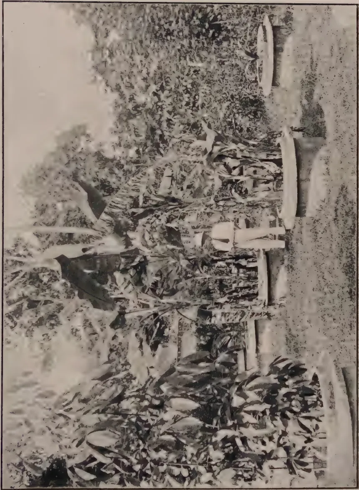

The  
Tropical Agriculturist  
September, 1928.

---

Editorial.

---

Soil Improvement.

---

The Use of Green Manures.

IN our present number are included two articles which should be of particular value to agriculturists in Ceylon. The first is a reproduction of an article on Green Manures in the Tropics by MR. H. C. SAMPSON, Economic Botanist attached to the Royal Botanic Gardens, Kew, and the second details the results of the further experiments which have been made by MR. JOACHIM, the Agricultural Chemist of the Department of Agriculture, Ceylon, on the Nitrification of Manures and Fertilisers and of Tea Prunings.

Greater and greater attention is now being paid throughout the world to green manures. Their use and value in the maintenance of soil fertility and in the improvement of agricultural soils is becoming more and more recognised, and the general article by MR. SAMPSON collecting the experiences in various parts of the Tropics should be of special value. It is of the greatest importance to all agriculturists in Ceylon and should be studied in detail. Ceylon has for many years realized the value of green manure plants in its permanent cultivations and has grown a number of tree and bush forms. Similarly in certain parts of Jaffna, the value of Sunn-hemp as a green manure for paddy fields has been realized and crops of this plant grown. It is only during the past five years however that the great value of creeping cover crops for the prevention of soil erosion has been realized. In the Annual Administration Report of the Department of Agriculture for 1927 it is reported that:—

“Tea estates are increasing their amount of green manure trees and shrubs, rubber estates are extending the use of Vigna (*Dolichos Hosei*) and coconut estates are making greater use of Boga medeloa (*Tephrosia candida*) whilst paddy growers particularly in the north are growing larger areas of their paddy-fields in sunn-hemp

1------------------------------------------------

130

(*Crotolaria juncea*). The agricultural treatment of these crops has received consideration during the year. At the Heneratgoda Botanic Gardens complete covers of *Vigna* (*Dolichos Hosei*) and *Centrosema pubescens* in a young clearing planted with *Taraktogenos kurzii* and *Hydnocarpus wightiana* have been forked in. The fork was completely turned and the soil left rough. The subsequent growth was satisfactory and there would seem to be no doubt that this treatment is possible on level friable soils in the low country. This trial indicates that in coconut plantations where creeping cover crops have been established such crops could be ploughed in with benefit and sufficient plant material would remain uncovered to re-establish the growth. Considerable discussion has taken place as to the treatment of *Vigna* in old rubber. Whilst it must be generally accepted that the best results are to be secured if the green material can be buried in old rubber, this procedure may not be possible unless the cut leafy material is buried in special pits. Such a measure has been adopted in some estates, but in general the Department does not at present consider the cutting of *Vigna* necessary, but rather favours envelope forking wherever this is possible. There has been some indications of the spread of some root diseases under heavy covers in old rubber. This matter is being carefully watched and it may result in its being found necessary in some areas to cut the *Vigna* at regular intervals and to reduce forking to a minimum. In tea, envelope forking with the pushing of the leafy material behind the fork is likely to be found the most satisfactory method of dealing with cover crops and with the lopping of green manure trees and shrubs. With a view to testing the amount of nitrates added to the soil by the burial of green material from different plants, the Agricultural Chemist and the Manager of the Experiment Station, Peradeniya, carried out an experiment. The results show that:—

1. (1) Maximum nitrate accumulation took place between six and eight weeks after burying the material.
2. (2) The amount of nitrate present at any particular time depended on the rainfall in the fortnight previous to sampling; the amount of nitrate varying inversely with the rainfall.
3. (3) Dadaps and gliricidia leaves gave the highest nitrification percentage for Peradeniya conditions; though this will obviously vary with the ages of the material, etc.
4. (4) The use of non-leguminous leafy material resulted in as great an accumulation of nitrates as when leguminous crops were used."

The proper agricultural treatment of green cover crops cannot be over-emphasized and in view of the conclusions recorded above as to the results secured for testing the amount of nitrates added to the soil by the burial of green material from different plants the second part of MR. JOACHIM's paper in this present number of the *Tropical Agriculturist* is of particular interest. The results indicate that the drying of tea prunings retards their decomposition and nitrification and that it is therefore more advantageous to bury tea prunings green than dry. It is more than probable that similar results would be secured with green manure plants generally and the burial of green loppings of tea and of the bush forms of green manures and the creepers in the creeping forms is therefore to be recommended.

2------------------------------------------------

131Original Articles.

# Further Experiments on the Nitrification of Manures and Fertilisers and of Tea Prunings.

**A. W. R. JOACHIM, B.Sc., A.I.C.,**

*Agricultural Chemist, Department of Agriculture.*

and

**D. G. PANDITTESEKERE, Dip. Agr. (Poona),**

*Assistant in Agricultural Chemistry.*

**I**N a paper entitled "Laboratory Experiments on the Nitrification of Fertilisers and Manures," (1) contributed to the Department of Agriculture Year Book 1927, an account was given of laboratory experiments on the nitrification of the more widely-used nitrogenous manures and fertilisers, and on the relation of soil moisture to nitrification. These experiments were followed up by a similar series of laboratory nitrification tests with the more recently introduced nitrogenous fertilisers, *e.g.*, urea, ammophos etc., as well as by field nitrification experiments with those manures and fertilisers included in the first series of experiments. Besides these laboratory and field experiments on the nitrification of tea prunings were also undertaken. In this paper are embodied brief accounts of and results from the above series of experiments, together with the conclusions that may be drawn therefrom.

## Laboratory Nitrification Experiments with Manures and Fertilisers.

### Series 1 & 2.

These experiments were carried out in the same manner as described in the paper already referred to. The soil for the experiments, taken from a rubber area behind the laboratory, was a good sandy loam containing 52% of coarser soil particles and 17.3% of clay. It was fairly well supplied with organic matter (7.9%) and had a saturation moisture content of 31.6%. This series of experiments was repeated using a similar but not identical soil as it was considered that some of the results obtained from the first experiments needed confirmation. The soil used in the latter experiment was slightly lighter than the former soil, having 51.2% of coarser particles and 14.2% of clay. Its organic matter content was 7.3% and its moisture saturation capacity 39%. The results of the two series of experiments are shown in Tables I and II below. In both series the amount of fertiliser added to each pot was .025 gm. per 100 gm. of dry soil or approximately 5 cwts. per acre.

3------------------------------------------------

132

The experiments lasted over nearly five months in each case.  
Table I. (Series 1.)

<table border="1">
<thead>
<tr>
<th rowspan="2">Manure.</th>
<th rowspan="2">% Nitrogen in sample.</th>
<th colspan="12">Mgm. Nitrate Nitrogen in 100 gm. Dry Soil. Week.</th>
<th rowspan="2">1st maximum increase over control</th>
<th rowspan="2">Period of 1st maximum increase</th>
<th rowspan="2">% Nitrified.</th>
</tr>
<tr>
<th>2nd</th>
<th>4th</th>
<th>5th</th>
<th>6th</th>
<th>8th</th>
<th>10th</th>
<th>12th</th>
<th>14th</th>
<th>16th</th>
<th>18th</th>
</tr>
</thead>
<tbody>
<tr>
<td>Urea</td>
<td>46</td>
<td>7.7</td>
<td>11.3</td>
<td>11.5</td>
<td>10.2</td>
<td>14.4</td>
<td>13.2</td>
<td>12.1</td>
<td>20.3</td>
<td>15.0</td>
<td>12.4</td>
<td>10.5</td>
<td>8th</td>
<td>91</td>
</tr>
<tr>
<td>Whale Guano</td>
<td>7</td>
<td>2.2</td>
<td>3.2</td>
<td>3.8</td>
<td>3.3</td>
<td>5.4</td>
<td>5.4</td>
<td>5.1</td>
<td>2.7</td>
<td>4.7</td>
<td>5.4</td>
<td>1.5</td>
<td>8th</td>
<td>86</td>
</tr>
<tr>
<td>Caster Cake</td>
<td>4</td>
<td>1.9</td>
<td>2.8</td>
<td>3.2</td>
<td>3.3</td>
<td>4.6</td>
<td>3.2</td>
<td>5.3</td>
<td>5.6</td>
<td>4.9</td>
<td>4.6</td>
<td>0.9</td>
<td>5th</td>
<td>90</td>
</tr>
<tr>
<td>Sterilised Animal Meal (Black Label)</td>
<td>7</td>
<td>2.0</td>
<td>2.9</td>
<td>3.9</td>
<td>3.3</td>
<td>5.5</td>
<td>5.6</td>
<td>5.9</td>
<td>4.4</td>
<td>5.3</td>
<td>5.8</td>
<td>1.6</td>
<td>8th</td>
<td>91</td>
</tr>
<tr>
<td>Ammo Phos</td>
<td>16.5</td>
<td>4.3</td>
<td>5.5</td>
<td>6.0</td>
<td>6.5</td>
<td>8.6</td>
<td>6.5</td>
<td>6.1</td>
<td>11.2</td>
<td>7.4</td>
<td>8.3</td>
<td>4.7</td>
<td>8th</td>
<td>114</td>
</tr>
<tr>
<td>Control</td>
<td>—</td>
<td>1.0</td>
<td>2.0</td>
<td>2.3</td>
<td>2.5</td>
<td>3.9</td>
<td>3.9</td>
<td>4.0</td>
<td>5.4</td>
<td>4.2</td>
<td>4.5</td>
<td>—</td>
<td>—</td>
<td>—</td>
</tr>
</tbody>
</table>

The initial nitrate content was .2 mgm. per 100 gm. dry soil.

A glance at the figures in the above Table will show that  
(1) Maximum nitrification is first obtained with all fertilisers except castor cake after 8 weeks, and in the case of the latter after 5 weeks.

(2) Nitrification percentages varying from 85 to 114 are obtained in all cases. These high figures may be due, as suggested by Löhn's (2), to the mineralization of some of the humus in the soil with which it is well supplied. Similar results have been obtained by other workers, *e.g.*, Löhnis, Allison, etc. The latter working with ammophos obtained nitrification percentages of over 100% in three cases (3). He attributes these abnormal results to the failure of the phenol-disulphonic acid method for nitrates in the presence of soluble organic matter, salts and large amounts of nitrate nitrogen.

(3) As in the previous series, at a certain period varying from the 10th to the 16th week there is a decided fall in the amounts of nitrate present in the pots, followed by a subsequent rise higher than the first maximum obtained. This phenomenon can be attributed, as suggested by Russell and Richards, to the assimilation of the excess nitrate by bacteria at the early stages of the decomposition processes, followed by a re-formation of nitrate at the later stages from the bodies of the bacteria dying in the interval.

Table II. (Series 2.)

<table border="1">
<thead>
<tr>
<th rowspan="2">Manure.</th>
<th rowspan="2">% Nitrified. in sample.</th>
<th colspan="10">Mgm. Nitrate Nitrogen in 100 gm. Dry Soil. Week.</th>
<th rowspan="2">1st Maximum increase over control</th>
<th rowspan="2">Period of 1st maximum increase</th>
<th rowspan="2">% nitrified</th>
</tr>
<tr>
<th>2nd</th>
<th>4th</th>
<th>6th</th>
<th>8th</th>
<th>10th</th>
<th>12th</th>
<th>14th</th>
<th>16th</th>
<th>18th</th>
</tr>
</thead>
<tbody>
<tr>
<td>Urea</td>
<td>46</td>
<td>6.5</td>
<td>11.3</td>
<td>13.2</td>
<td>10.8</td>
<td>10.9</td>
<td>10.4</td>
<td>10.1</td>
<td>11.0</td>
<td>14.6</td>
<td>11.2</td>
<td>6th</td>
<td>97</td>
</tr>
<tr>
<td>Whale Guano</td>
<td>7</td>
<td>1.6</td>
<td>3.1</td>
<td>3.7</td>
<td>3.3</td>
<td>3.6</td>
<td>3.6</td>
<td>4.1</td>
<td>4.8</td>
<td>4.9</td>
<td>1.7</td>
<td>6th</td>
<td>97</td>
</tr>
<tr>
<td>Caster Cake</td>
<td>4</td>
<td>1.5</td>
<td>2.6</td>
<td>3.0</td>
<td>3.0</td>
<td>3.3</td>
<td>3.1</td>
<td>3.7</td>
<td>4.4</td>
<td>5.7</td>
<td>1.0</td>
<td>6th</td>
<td>100</td>
</tr>
<tr>
<td>Fish Manure</td>
<td>3.2</td>
<td>1.6</td>
<td>2.4</td>
<td>2.5</td>
<td>3.0</td>
<td>2.8</td>
<td>3.3</td>
<td>3.3</td>
<td>4.3</td>
<td>5.4</td>
<td>.7</td>
<td>8th</td>
<td>88</td>
</tr>
<tr>
<td>Sterilised Animal Meal (Black Label)</td>
<td>7</td>
<td>1.8</td>
<td>3.2</td>
<td>3.5</td>
<td>3.4</td>
<td>3.6</td>
<td>3.0</td>
<td>3.8</td>
<td>4.6</td>
<td>5.4</td>
<td>1.5</td>
<td>6th</td>
<td>86</td>
</tr>
<tr>
<td>Ammo Phos</td>
<td>16.5</td>
<td>4.1</td>
<td>6.5</td>
<td>7.4</td>
<td>6.9</td>
<td>5.7</td>
<td>6.0</td>
<td>7.1</td>
<td>7.5</td>
<td>8.1</td>
<td>5.4</td>
<td>6th</td>
<td>131</td>
</tr>
<tr>
<td>Control</td>
<td>—</td>
<td>1.0</td>
<td>2.0</td>
<td>2.0</td>
<td>2.3</td>
<td>2.4</td>
<td>2.7</td>
<td>2.3</td>
<td>3.4</td>
<td>3.6</td>
<td>—</td>
<td>—</td>
<td>—</td>
</tr>
</tbody>
</table>

The initial nitrate content was .13 mgm. per 100 gm. dry soil.

4------------------------------------------------

Nitrification of Fertilisers and Manures.

Fig 1.

![Line graph showing the nitrification of fertilisers and manures over 18 weeks. The Y-axis is 'mgm. Nitrate Nitrogen' (0 to 14) and the X-axis is 'Weeks' (0 to 18). Four series are shown: Urea (solid line), Ammophos (dashed line), Whale Guano (dotted line), and Castor Cake (dash-dot line). Urea shows the highest nitrification, peaking at ~13.5 mgm at week 6. Ammophos peaks at ~7.5 mgm at week 6. Whale Guano peaks at ~6.5 mgm at week 10. Castor Cake peaks at ~5.5 mgm at week 10. All series show a sharp decline after their respective peaks.](cbd54458956a923262c6cbf81d23a0e0_3_img.webp)

Legend:

- Urea. (Solid line)
- Ammophos. (Dashed line)
- Whale Guano. (Dotted line)
- Castor Cake. (Dash-dot line)
- Control. (Dotted line)

<table border="1">
<caption>Estimated data for Figure 1: Nitrification of Fertilisers and Manures</caption>
<thead>
<tr>
<th>Weeks</th>
<th>Urea (mgm Nitrate Nitrogen)</th>
<th>Ammophos (mgm Nitrate Nitrogen)</th>
<th>Whale Guano (mgm Nitrate Nitrogen)</th>
<th>Castor Cake (mgm Nitrate Nitrogen)</th>
<th>Control (mgm Nitrate Nitrogen)</th>
</tr>
</thead>
<tbody>
<tr><td>0</td><td>0</td><td>0</td><td>0</td><td>0</td><td>0</td></tr>
<tr><td>2</td><td>3.5</td><td>2.5</td><td>1.5</td><td>1.5</td><td>1.5</td></tr>
<tr><td>4</td><td>7.5</td><td>5.5</td><td>2.5</td><td>2.5</td><td>2.5</td></tr>
<tr><td>6</td><td>13.5</td><td>7.5</td><td>3.5</td><td>3.5</td><td>3.5</td></tr>
<tr><td>8</td><td>10.5</td><td>6.5</td><td>4.5</td><td>4.5</td><td>4.5</td></tr>
<tr><td>10</td><td>10.5</td><td>6.5</td><td>6.5</td><td>5.5</td><td>5.5</td></tr>
<tr><td>12</td><td>10.5</td><td>6.5</td><td>5.5</td><td>4.5</td><td>4.5</td></tr>
<tr><td>14</td><td>10.5</td><td>6.5</td><td>4.5</td><td>3.5</td><td>3.5</td></tr>
<tr><td>16</td><td>10.5</td><td>6.5</td><td>3.5</td><td>2.5</td><td>2.5</td></tr>
<tr><td>18</td><td>10.5</td><td>6.5</td><td>2.5</td><td>1.5</td><td>1.5</td></tr>
</tbody>
</table>

mgm. Nitrate Nitrogen

Weeks.

Block by Survey Dept. Ceylon.

5------------------------------------------------

This image shows a blank, aged page with a light beige or cream color. The surface has a subtle texture and a few minor blemishes or discolorations, typical of old paper. There is no text or other content on the page.

6------------------------------------------------

133

It will be observed from the above Table that the results confirm those obtained previously. They demonstrate that

(1) The first maximum nitrification is obtained between the 6th and 8th week in all cases.

(2) The nitrification percentages vary from 86 to 133, the latter figure being obtained in the case of ammophos. It will be observed that a similar high result was obtained with ammophos in the first series too.

(3) The nitrification percentages are generally higher in this series than previously. This is probably due to the lighter nature of and hence greater aeration in the soil of these experiments. They may also be due to the more favourable weather conditions prevailing during the period of these experiments.

(4) As previously observed, there is a fall in the amounts of nitrate found between the 10th and 14th weeks, followed by a rise higher even than the first maximum obtained.

Figure I. illustrates graphically the nitrification changes in the above series of experiments.

Both series of experiments demonstrate conclusively that high nitrification percentages of organic and mineral nitrogenous fertilisers can be obtained given the optimum moisture, aeration and temperature conditions.

## Field Experiments on the Nitrification of Organic Manures.

These were carried out at the Experiment Station, Peradeniya, with the assistance of the Manager to whom our best thanks are due, on the same block of 40 plots each  $1/100$ th acre in extent which had previously been used for the field green manure experiments. There were 5 plots for each treatment and 8 treatments in all. The manures were spread over the plots and envelope-forked into the soil at the rate of 6 lb. per plot or 600 lb. per acre. When sampling the plots three borings were taken from each and the 15 borings from the 5 plots treated alike thoroughly mixed together, and a sample taken from the mixed soil. Samplings were made every fortnight and the moisture, nitrate and nitrite contents of each soil sample determined at each sampling. Rainfall records were also kept. This experiment too was repeated twice over, as the first series owing to the unusual rainfall conditions, gave inconclusive results. Rain in many cases fell just a day or two prior to sampling with the result that what nitrate had been formed in the soil was washed out of it and nitrate determinations gave no indication of what amounts had been formed in the interval between samplings. The first experiment was started at the end of November, 1926, and concluded in July, 1927. The second series was started in September, 1927, and discontinued in March, 1928. In each

7------------------------------------------------

134

case the experiment extended over about eight months. The results are tabulated below.

Table III. (First Experiment Field Series.)

<table border="1">
<thead>
<tr>
<th rowspan="2">Manure</th>
<th rowspan="2">2nd</th>
<th rowspan="2">4th</th>
<th rowspan="2">6th</th>
<th rowspan="2">8th</th>
<th rowspan="2">10th</th>
<th rowspan="2">11th</th>
<th rowspan="2">13th</th>
<th rowspan="2">14th</th>
<th rowspan="2">16th</th>
<th rowspan="2">18th</th>
<th rowspan="2">20th</th>
<th rowspan="2">22nd</th>
<th rowspan="2">24th</th>
<th rowspan="2">26th</th>
<th rowspan="2">28th</th>
<th rowspan="2">30th</th>
<th rowspan="2">32nd</th>
<th rowspan="2">34th</th>
</tr>
<tr>
<th colspan="18">Mgm. Nitrate Nitrogen in 100 gm. Soil.</th>
</tr>
<tr>
<th></th>
<th colspan="18">Week.</th>
</tr>
</thead>
<tbody>
<tr>
<td>Groundnut Cake</td>
<td>—</td>
<td>.86</td>
<td>.55</td>
<td>.49</td>
<td>.31</td>
<td>.76</td>
<td>.46</td>
<td>.78</td>
<td>1.28</td>
<td>.57</td>
<td>1.05</td>
<td>1.25</td>
<td>1.02</td>
<td>1.23</td>
<td>—</td>
<td>—</td>
<td>—</td>
<td>.28</td>
</tr>
<tr>
<td>Blood Meal</td>
<td>—</td>
<td>—</td>
<td>.57</td>
<td>.41</td>
<td>.29</td>
<td>.68</td>
<td>1.73</td>
<td>.98</td>
<td>1.48</td>
<td>.68</td>
<td>.87</td>
<td>.93</td>
<td>1.11</td>
<td>.62</td>
<td>—</td>
<td>—</td>
<td>—</td>
<td>.20</td>
</tr>
<tr>
<td>Fish Guano</td>
<td>.77</td>
<td>—</td>
<td>1.37</td>
<td>.66</td>
<td>.26</td>
<td>.77</td>
<td>.44</td>
<td>.62</td>
<td>1.11</td>
<td>.53</td>
<td>.75</td>
<td>1.20</td>
<td>1.06</td>
<td>.44</td>
<td>—</td>
<td>.34</td>
<td>.36</td>
<td>—</td>
</tr>
<tr>
<td>Castor Cake</td>
<td>—</td>
<td>.40</td>
<td>.34</td>
<td>.37</td>
<td>.16</td>
<td>.51</td>
<td>.27</td>
<td>.58</td>
<td>1.74</td>
<td>.56</td>
<td>1.26</td>
<td>1.36</td>
<td>1.49</td>
<td>1.16</td>
<td>—</td>
<td>—</td>
<td>—</td>
<td>.34</td>
</tr>
<tr>
<td>Fish Manure</td>
<td>—</td>
<td>—</td>
<td>—</td>
<td>.96</td>
<td>.20</td>
<td>.70</td>
<td>.07</td>
<td>.58</td>
<td>1.03</td>
<td>.49</td>
<td>.93</td>
<td>.93</td>
<td>1.38</td>
<td>1.62</td>
<td>—</td>
<td>.43</td>
<td>.34</td>
<td>—</td>
</tr>
<tr>
<td>Calcium Cyanamide</td>
<td>1.18</td>
<td>1.85</td>
<td>.64</td>
<td>.56</td>
<td>.26</td>
<td>1.07</td>
<td>.43</td>
<td>1.04</td>
<td>1.42</td>
<td>.52</td>
<td>1.62</td>
<td>1.77</td>
<td>—</td>
<td>.87</td>
<td>—</td>
<td>.73</td>
<td>.27</td>
<td>—</td>
</tr>
<tr>
<td>Sulphate of Ammonia</td>
<td>1.06</td>
<td>3.41</td>
<td>.46</td>
<td>1.32</td>
<td>.67</td>
<td>1.07</td>
<td>1.14</td>
<td>1.84</td>
<td>3.26</td>
<td>.76</td>
<td>1.59</td>
<td>1.16</td>
<td>—</td>
<td>1.29</td>
<td>—</td>
<td>—</td>
<td>.30</td>
<td>—</td>
</tr>
<tr>
<td>Control</td>
<td>—</td>
<td>—</td>
<td>—</td>
<td>—</td>
<td>—</td>
<td>.42</td>
<td>.40</td>
<td>.54</td>
<td>1.15</td>
<td>.56</td>
<td>.83</td>
<td>.95</td>
<td>.64</td>
<td>—</td>
<td>—</td>
<td>—</td>
<td>—</td>
<td>—</td>
</tr>
<tr>
<td>Rainfall during previous fortnight</td>
<td>4.18</td>
<td>.06</td>
<td>5.13</td>
<td>6.03</td>
<td>2.18</td>
<td>.57</td>
<td>1.22</td>
<td>—</td>
<td>2.12</td>
<td>3.25</td>
<td>.07</td>
<td>4.55</td>
<td>7.25</td>
<td>.99</td>
<td>8.00</td>
<td>3.86</td>
<td>1.2</td>
<td>2.2 in.</td>
</tr>
<tr>
<td>Rainfall two days prior to sampling</td>
<td>—</td>
<td>—</td>
<td>1.11</td>
<td>1.14</td>
<td>.06</td>
<td>—</td>
<td>—</td>
<td>—</td>
<td>—</td>
<td>.20</td>
<td>—</td>
<td>.72</td>
<td>.07</td>
<td>.96</td>
<td>.88</td>
<td>.30</td>
<td>.20</td>
<td>1.45 in.</td>
</tr>
</tbody>
</table>

Table IV. (Second Experiment Field Series.)

<table border="1">
<thead>
<tr>
<th rowspan="2">Manure</th>
<th rowspan="2">Nitrogen in sample</th>
<th colspan="18">Mgm. Nitrate Nitrogen in 100 gm. Soil.</th>
<th rowspan="2">1st max. inum in-crease over control</th>
<th rowspan="2">Period of 1st max. in-crease</th>
<th rowspan="2">% Nitrified</th>
</tr>
<tr>
<th>2nd</th>
<th>4th</th>
<th>6th</th>
<th>8th</th>
<th>10th</th>
<th>12th</th>
<th>14th</th>
<th>16th</th>
<th>19th</th>
<th>21st</th>
<th>23rd</th>
<th>25th</th>
<th>27th</th>
<th>29th</th>
</tr>
<tr>
<th></th>
<th colspan="18">Week.</th>
</tr>
</thead>
<tbody>
<tr>
<td>Groundnut Cake</td>
<td>7</td>
<td>.35</td>
<td>1.43</td>
<td>1.76</td>
<td>—</td>
<td>—</td>
<td>.45</td>
<td>.23</td>
<td>.43</td>
<td>.16</td>
<td>.38</td>
<td>.27</td>
<td>.46</td>
<td>.56</td>
<td>1.02</td>
<td>1.44</td>
<td>6th</td>
<td>86</td>
</tr>
<tr>
<td>Blood Meal</td>
<td>11</td>
<td>.83</td>
<td>1.23</td>
<td>1.54</td>
<td>—</td>
<td>.57</td>
<td>.80</td>
<td>.61</td>
<td>.41</td>
<td>.21</td>
<td>.28</td>
<td>.12</td>
<td>.26</td>
<td>.50</td>
<td>.96</td>
<td>1.22</td>
<td>6th</td>
<td>46</td>
</tr>
<tr>
<td>Fish Guano</td>
<td>7</td>
<td>.73</td>
<td>1.04</td>
<td>1.46</td>
<td>—</td>
<td>—</td>
<td>.14</td>
<td>.12</td>
<td>.07</td>
<td>.09</td>
<td>.21</td>
<td>.26</td>
<td>.26</td>
<td>.52</td>
<td>.69</td>
<td>1.14</td>
<td>6th</td>
<td>68</td>
</tr>
<tr>
<td>Castor Cake</td>
<td>4</td>
<td>.70</td>
<td>1.38</td>
<td>1.64</td>
<td>—</td>
<td>—</td>
<td>1.02</td>
<td>.21</td>
<td>.23</td>
<td>.13</td>
<td>.13</td>
<td>—</td>
<td>.47</td>
<td>.71</td>
<td>.88</td>
<td>1.32</td>
<td>6th</td>
<td>138</td>
</tr>
<tr>
<td>Fish Manure</td>
<td>4</td>
<td>.60</td>
<td>1.06</td>
<td>1.08</td>
<td>—</td>
<td>—</td>
<td>.56</td>
<td>.20</td>
<td>.15</td>
<td>.10</td>
<td>.24</td>
<td>.57</td>
<td>.15</td>
<td>.53</td>
<td>.97</td>
<td>.76</td>
<td>6th</td>
<td>79</td>
</tr>
<tr>
<td>Calcium Cyanamide</td>
<td>18</td>
<td>.75</td>
<td>2.49</td>
<td>3.10</td>
<td>.70</td>
<td>.97</td>
<td>1.06</td>
<td>1.01</td>
<td>.54</td>
<td>.24</td>
<td>.32</td>
<td>.48</td>
<td>.27</td>
<td>.68</td>
<td>.96</td>
<td>2.78</td>
<td>6th</td>
<td>64</td>
</tr>
<tr>
<td>Sulphate of Ammonia</td>
<td>20</td>
<td>.71</td>
<td>1.43</td>
<td>2.56</td>
<td>—</td>
<td>.20</td>
<td>.63</td>
<td>.23</td>
<td>.22</td>
<td>.09</td>
<td>.86</td>
<td>.28</td>
<td>.47</td>
<td>.61</td>
<td>.92</td>
<td>2.24</td>
<td>6th</td>
<td>47</td>
</tr>
<tr>
<td>Control</td>
<td>—</td>
<td>.78</td>
<td>—</td>
<td>.32</td>
<td>—</td>
<td>—</td>
<td>.20</td>
<td>.18</td>
<td>.05</td>
<td>.06</td>
<td>.17</td>
<td>—</td>
<td>.28</td>
<td>.52</td>
<td>.68</td>
<td>—</td>
<td>—</td>
<td>—</td>
</tr>
<tr>
<td>Rainfall during previous fortnight</td>
<td>—</td>
<td>.69</td>
<td>3.65</td>
<td>3.20</td>
<td>7.04</td>
<td>6.84</td>
<td>2.12</td>
<td>3.19</td>
<td>1.36</td>
<td>4.98</td>
<td>1.82</td>
<td>3.05</td>
<td>2.38</td>
<td>—</td>
<td>.37 in.</td>
<td>—</td>
<td>—</td>
<td>—</td>
</tr>
<tr>
<td>Rainfall two days prior to sampling</td>
<td>—</td>
<td>.58</td>
<td>.78</td>
<td>—</td>
<td>.68</td>
<td>2.79</td>
<td>—</td>
<td>—</td>
<td>—</td>
<td>.07</td>
<td>.67</td>
<td>.39</td>
<td>—</td>
<td>—</td>
<td>—</td>
<td>in.</td>
<td>—</td>
<td>—</td>
</tr>
</tbody>
</table>

8------------------------------------------------

135

From the above Tables it would be seen that

(1) The rainfall during the previous fortnight and two days prior to sampling determines the amounts of nitrate present in the plots at the time of sampling.

(2) The inorganic concentrated fertilisers, viz., cyanamide and sulphate of ammonia produce, particularly at the early stages and all through the period, larger amounts of nitrate than the organic manures. The nitrification percentages are however lesser in the case of these fertilisers.

(3) The period of maximum nitrification is in all cases the 6th week. This is only evident from Table IV. In the first experiment heavy rain fell immediately before the sampling at the end of the 6th and 8th weeks. Hence hardly any nitrate was found in the soil at these samplings.

(4) The percentages of nitrification for most of the manures are lower than in the laboratory experiments and vary from 46 to 86. In the case of castor cake the excessive percentage nitrification of 134 was obtained. This is probably due either to some error in sampling or to the method of determining nitrate not being as accurate as may be desired. It will be noted that the nitrification figures are lower than those obtained in the laboratory series. It is likely that rainfall and temperature conditions account largely for this, as well as the fact that the soil on which these field experiments were carried out was different from the soil in the laboratory experiments. These experiments however show that the effects of organic and inorganic manures in soils from the point of view of nitrogen are apparent a short time after their application, the maximum effect being obtained between the 6th and 8th weeks. The effects of the concentrated manures like sulphate of ammonia and cyanamide appear to extend over a longer period than they might be expected to do.

(5) As regards the duration of the effects of these manures in this soil under the temperature and rainfall conditions at Peradeniya, these figures seem to demonstrate that after about 4 or 5 months the direct effects of manuring so far as nitrate nitrogen is concerned, are hardly apparent.

(6) In the first series of experiments a rise in the nitrate contents in the plots is observed after the 16th week. This rise may be due to a secondary nitrification of the excess nitrate and ammonia which the bacteria may have assimilated in the early stages of the decomposition. It will be noted that this rise in the nitrate content of the soils about the 14th week has been consistent in the laboratory experiments.

9------------------------------------------------

136

## Experiments on the Nitrification of Tea Prunings.

Laboratory and field experiments to determine the rates of nitrification of dried and green tea prunings were started simultaneously. The laboratory experiment was carried out in the same manner as the nitrification experiments with organic manures. For the laboratory experiment only the leaves and tender stems of the tea bush were taken. Quantities of this material equivalent to 6 tons of green material per acre (6 gm. to 100 gm. of sieved soil) were incorporated with the soil in the pot. In the case of dry tea prunings a quantity of dried leaf to give the equivalent of 6 gm. green leaf was weighed out and incorporated with the soil as before. The drying had been carried out previously. The amount of dried leaf equivalent to 6 gm. of green leaf was actually 2.242 gm. A control was maintained at the same time.

Soil samplings were taken every fortnight and determinations of the moisture, nitrate and nitrite contents of these made.

The results are set out in table V. below.

Table V.

<table border="1">
<thead>
<tr>
<th rowspan="2"></th>
<th rowspan="2">Moisture in original Material</th>
<th rowspan="2">Nitrogen at 100°C %</th>
<th rowspan="2">Mgm. of Nitrogen added per 100 gm. of soil</th>
<th colspan="8">Mgm. Nitrate Nitrogen per 100 gm. Dry Soil.</th>
<th rowspan="2">1st period of Maximum nitrification</th>
<th rowspan="2">1st Maximum increase over Control</th>
<th rowspan="2">Percentage nitrified</th>
</tr>
<tr>
<th colspan="8">Week.</th>
</tr>
<tr>
<th></th>
<th></th>
<th></th>
<th></th>
<th>2nd</th>
<th>4th</th>
<th>6th</th>
<th>8th</th>
<th>10th</th>
<th>12th</th>
<th>14th</th>
<th>16th</th>
<th>18th</th>
<th></th>
<th></th>
<th></th>
</tr>
</thead>
<tbody>
<tr>
<td>Green Tea Prunings</td>
<td>63.5</td>
<td>2.348</td>
<td>5.4</td>
<td>1.01</td>
<td>1.95</td>
<td>2.51</td>
<td>2.85</td>
<td>2.57</td>
<td>2.94</td>
<td>2.82</td>
<td>4.35</td>
<td>4.48</td>
<td>8th</td>
<td>.54</td>
<td>10</td>
</tr>
<tr>
<td>Dry Tea Prunings</td>
<td>9.1</td>
<td>3.183</td>
<td>7.4</td>
<td>.18</td>
<td>1.26</td>
<td>1.70</td>
<td>1.93</td>
<td>1.78</td>
<td>2.06</td>
<td>2.00</td>
<td>3.30</td>
<td>3.42</td>
<td>8th</td>
<td>.42</td>
<td>--</td>
</tr>
<tr>
<td>Control</td>
<td>—</td>
<td>—</td>
<td>—</td>
<td>.95</td>
<td>1.97</td>
<td>2.04</td>
<td>2.31</td>
<td>2.36</td>
<td>2.67</td>
<td>2.26</td>
<td>2.39</td>
<td>3.61</td>
<td>—</td>
<td>—</td>
<td>—</td>
</tr>
</tbody>
</table>

An examination of this table and of Figure II would show that

(1) Drying of green leaves delays as well as hinders nitrification.

(2) The first period of maximum nitrification is the 8th week. In the case of the green tea prunings a maximum nitrification percentage of only 10 is obtained. This would seem to indicate that a part of the added nitrogen is lost as free nitrogen, and that some of it converted into ammonia and nitrate is taken up by micro-organisms to be made available later. That this is so is apparent from the figures for nitrate obtained after the 14th week. Here again there appears to be a secondary nitrification after the 14th week higher than the primary nitrification.

(3) With regard to the dry tea prunings, not only is there no nitrification of the added prunings but there was actually lesser nitrate nitrogen found in this pot than in the control pot at every stage of the decomposition process. This observation of the retardation of decomposition by the drying of green materials was found by other workers as well (4,5), and is attributed

10------------------------------------------------

# Nitrification of Tea Prunings.

Fig 2.

The graph illustrates the nitrification process of tea prunings under three conditions: Green Tea Prunings, Dry, and Control. The Y-axis represents Mgs. Nitrate Nitrogen, ranging from 0 to 6 mgm. The X-axis represents time in weeks, from 0 to 18. The graph is divided into two phases: Primary Nitrification (0 to 14 weeks) and Secondary Nitrification (14 to 18 weeks). The Green Tea Prunings series (solid line) shows a steady increase in nitrification, reaching approximately 5.5 mgm by week 18. The Dry series (dashed line) shows a similar trend but with slightly lower values, reaching about 5.0 mgm. The Control series (solid line) shows the lowest nitrification levels, reaching approximately 4.5 mgm. A vertical line at week 14 separates the primary and secondary nitrification phases.

<table border="1"><thead><tr><th>Weeks</th><th>Green Tea Prunings (mgm)</th><th>Dry (mgm)</th><th>Control (mgm)</th></tr></thead><tbody><tr><td>0</td><td>0.0</td><td>0.0</td><td>0.0</td></tr><tr><td>2</td><td>1.5</td><td>1.2</td><td>1.0</td></tr><tr><td>4</td><td>2.5</td><td>2.0</td><td>1.8</td></tr><tr><td>6</td><td>3.5</td><td>3.0</td><td>2.5</td></tr><tr><td>8</td><td>4.0</td><td>3.5</td><td>3.0</td></tr><tr><td>10</td><td>4.5</td><td>4.0</td><td>3.5</td></tr><tr><td>12</td><td>5.0</td><td>4.5</td><td>4.0</td></tr><tr><td>14</td><td>5.2</td><td>4.8</td><td>4.2</td></tr><tr><td>16</td><td>5.4</td><td>5.0</td><td>4.4</td></tr><tr><td>18</td><td>5.5</td><td>5.0</td><td>4.5</td></tr></tbody></table>

Block by Survey Dept Ceylon

11------------------------------------------------

This image is a scan of a blank page. The paper has a light beige or cream-colored tint. There are a few very small, faint dark spots scattered across the surface, which appear to be scanning artifacts or minor imperfections in the paper. No text, lines, or other markings are present.

12------------------------------------------------

137

as being possibly due to the change of soluble hemicelluloses into less soluble forms as a result of the drying.

It would appear therefore that it would be preferable to bury tea prunings on estates green rather than dry if the best results are to be obtained. Ultimately however the effect on the total nitrogen content of the soil would be much the same, as will be shown in subsequent paragraphs of this paper.

The field experiment was carried out as follows. Of 15 plots taken for the experiment, 5 had green tea-prunings at the rate of 6 tons per acre envelope-forked into them at the same time as 5 others had dry tea-prunings similarly treated. These latter had been previously spread on the plots green at the rate of 6 tons per acre and allowed to dry. 5 plots were left as controls. Soil samples as before were taken every fortnight. Unfortunately owing to the heavy rainfall conditions prevailing the nitrate determinations of these samplings did not permit of any conclusions being drawn therefrom.

## Changes in the Total Nitrogen Content of Soil Brought about by the Incorporation of Tea Prunings.

In order to determine in what way the incorporation of green and dry tea prunings with the soil under the conditions of the laboratory experiment already described, affected the total nitrogen content of the soil, determinations of this constituent in the soils from these pots were made at the start and at the end of the experiment. The results are tabulated in table VI below.

Table VI.  
(On Material at 100°C.)

<table border="1">
<thead>
<tr>
<th></th>
<th>Original Soil Nitrogen %</th>
<th>Nitrogen added %</th>
<th>Total Nitrogen %</th>
<th>Nitrogen % at end of experiment</th>
<th>Total loss % or gain of nitrogen in soil</th>
<th>% loss or gain on total nitrogen</th>
<th>Loss or gain % on original soil nitrogen</th>
<th>% Loss or gain on original soil nitrogen.</th>
</tr>
</thead>
<tbody>
<tr>
<td>Green Tea—Prunings</td>
<td>·1111</td>
<td>·0654</td>
<td>·1185</td>
<td>·0990</td>
<td>—·0175</td>
<td>—15·0</td>
<td>—·0121</td>
<td>—10·9</td>
</tr>
<tr>
<td>Dry " "</td>
<td>·1111</td>
<td>·0074</td>
<td>·1185</td>
<td>·0991</td>
<td>—·0194</td>
<td>—16·4</td>
<td>—·0120</td>
<td>—10·8</td>
</tr>
<tr>
<td>Control</td>
<td>·1111</td>
<td>—</td>
<td>·1111</td>
<td>·0872</td>
<td>—·0139</td>
<td>—12·5</td>
<td>—·0139</td>
<td>—12·5</td>
</tr>
</tbody>
</table>

A glance at the above Table will show that notwithstanding the addition of tea prunings containing high percentages of nitrogen to the soil, there is under the conditions of the experiment a loss of nitrogen of 15 and 16·4% in the pots containing the green and dry tea prunings respectively. There is a corresponding loss of 12·5% from the control.

Normally one would have expected no loss and even a slight increase in the nitrogen contents of the soils, as will be understood from what follows. It has been found by Waksman

13------------------------------------------------

138

and others (6) that the minimum percentage of nitrogen sufficient to cover the requirements of the micro-organisms which are active in the decomposition of plant material within a period of 4 weeks is about 1.8. If the plant contains more than this percentage of nitrogen the excess is liberated in an available form; if it contains less, the available soil nitrogen will be used up by the micro-organisms. This would therefore involve a temporary loss of the available soil nitrogen and possibly a permanent loss of some of the total nitrogen, depending on the soil conditions. The tea prunings however, have nitrogen contents of over 2 per cent., and hence the loss of soil nitrogen obtained in these experiments cannot be attributed to the low nitrogen content of the prunings. The losses of nitrogen from the soils in this experiment may probably be due to (1) losses as free and ammoniacal nitrogen owing to the conditions under which the soil samplings were carried out (2) the prunings not having been thoroughly decomposed and hence a certain amount of the nitrogen they contained not having formed part of the soil nitrogen. The loss of nitrogen from the control pot is probably due to the increase in the number and activity of the micro-organisms of the soil owing to the conditions of the experiment resulting in the loss of soil carbon as carbon dioxide, and of nitrogen as free nitrogen and ammonia.

A point of practical importance arises out of this experiment. It has been found that under the conditions of the experiment the incorporation of tea prunings with soil has not only not increased but actually decreased the amount of soil nitrogen. The question may therefore be asked. Is the nitrogen content of a soil increased or even maintained by green manuring? The nitrogen content of a soil can certainly be maintained, and even increased up to a point, depending on the soil conditions, most effectively by green manuring with organic materials containing over 2 per cent. nitrogen. There will of course be some losses of carbon and nitrogen in such proportions as to maintain the carbon-nitrogen ratio of the soil constant, but the nett result should be to conserve the original nitrogen of the soil and even to increase it somewhat. One condition appears necessary, however, as demonstrated by this experiment, and that is excessive subsequent cultivation should be avoided. Otherwise, excessive losses of carbon and nitrogen will occur and a loss of soil nitrogen may result. The reason why an increase in soil nitrogen is possible through green manuring is apparent when the carbon-nitrogen ratio of a soil is considered. It is known from experiment that for most soils this ratio is about 10. If therefore the nitrogen content of a soil is to be maintained or increased it is clear that its carbon content should likewise be maintained or increased proportionately. Green manures generally contain fair quantities of carbon and nitrogen and are therefore most

14------------------------------------------------

139

suitable for the purpose. The addition to a soil of a concentrated nitrogenous fertiliser along with the green manure, will ensure the conservation of and probable increase of the soil nitrogen. It is also possible to use for the purpose of soil nitrogen conservation organic materials, like straw, which are poor in nitrogen. But in these cases the addition of a concentrated nitrogenous fertiliser, *e.g.*, nitrate of soda, along with the organic material is quite essential.\*

These results would also appear to indicate that though more nitrogen was added to the soil in the form of dry than of green prunings, there is not an appreciably greater percentage loss of nitrogen from the pot containing dry prunings than from the one with green prunings, when these percentages are calculated on the total nitrogen added to and already present in the soil. Calculated on the original soil nitrogen the percentage losses are found to be the same indicating that more nitrogen is lost from the dry tea-prunings than from the green tea-prunings, though the absolute amounts of added nitrogen in both cases are small compared with that contained in the soil. It would appear therefore that when the quantity of tea prunings to be buried into the soil is great, it would be preferable from the point of view of nitrogen conservation as well, to bury the prunings green rather than dry. The difference made to the final nitrogen content of the soil, if the amount of material to be added is comparatively little, will not however be great.

## Summary and Conclusions.

A. Further laboratory nitrification tests carried out with some of the more recently introduced organic and mineral nitrogenous fertilisers, among others urea and ammophos, show that

1. (1) The first period of maximum nitrification varies from 6th to the 8th weeks as found in previous experiments.
2. (2) High nitrification percentages are obtained in all cases. This may be the result of the optimum moisture and temperature conditions under which the experiment was carried out, or of the mineralisation of some of the soil humus, or again to a partial failure of the modified phenol-disulphonic acid method for nitrates adopted in this investigation.
3. (3) There is a secondary nitrification obtained in all cases after periods varying from the 12th to the 14th week, to an even greater extent than the primary nitrification.

---

\* Since this article was written, Lipman, Blair and Prince in a paper contributed to *Soil Science* Vol. XXVI, No. 1, July, 1928, entitled 'Field Experiments on the Availability of Nitrogenous Fertilisers' have shown clearly that only the soils of the plots receiving heavy applications of organic manure and manure with nitrate of soda during a period of 15 years, have definitely gained in nitrogen in spite of yearly cropping.

15------------------------------------------------

140

B. Field nitrification tests carried out with the more widely-used nitrogenous fertilisers and manures, though not furnishing such definite data as the laboratory experiments owing to the effect of rainfall on the amounts of nitrate in the plots at the times of sampling, gave much the same results as the latter experiments as regards the period of maximum nitrification and maximum percentages nitrified. Soils from the plots containing concentrated nitrogenous fertilisers generally showed larger amounts of nitrate in the soil each time a sampling was made. These fertilisers gave, however, smaller nitrification percentages. The direct effects, from the nitrogen standpoint, of all fertilisers and manures do not appear to be manifest after the 4th or 5th month under the soil and climatic conditions at Peradeniya. The above conclusions are identical with those obtained from the green manure laboratory and field experiments carried out previously (7).

C. Nitrification experiments with dry and green tea prunings show that the drying of tea prunings retards as well as delays their decomposition and nitrification. The percentage of maximum nitrification obtained with green tea prunings is only 10, and negative results are obtained with dry tea prunings. It would therefore appear from this point of view, more advantageous to bury tea prunings green than dry.

D. Determinations of the total nitrogen contents of the soil used in the tea prunings experiment made at the beginning and at the end of the experiment showed that during the period there were total nitrogen losses of 15% and 16.4% from the green and dry tea prunings pots respectively. Though the amount of nitrogen added to the soil was greater in the form of dry than of green prunings, the final nitrogen contents of the soils in the two pots was found to be the same. This would seem to indicate therefore that if the quantity of tea prunings to be buried is great, an additional reason is furnished by this experiment for the burial of tea prunings green. Arising out of this experiment, the question of the conservation of the nitrogen content of a soil is briefly discussed.

### References.

1. (1) Laboratory Experiments on the Nitrification of Fertilisers and Manures. A. W. R. Joachim. Dept. of Agric, Ceylon. Year Book 1927.
2. (2) Nitrogen Availability of Green Manures. Löhnis, Soil Science Vol. XXII, October, 1926.
3. (3) Ammo Phos. Availability, Chemical and Biological Studies. F. E. Allison. Soil Science Vol. V No. 1 January, 1918.
4. (4) The Decomposition of Organic Matter in Soil. H. H. Hill. Journal of Agricultural Research. Vol. 33. p. 77-99.
5. (5) Green Manure Experiments 1912-1913. Hutchinson and Millegan. Agricultural Research Institute, Pusa. Bulletin No. 40, 1914.
6. (6) The Composition of Natural Organic Materials and their Decomposition in the Soil, II. Influence of Age of Plant upon the Rapidity and Nature of its Decomposition — I. S. A. Waksman and F. G. Tenney. Soil Science Vol. XXIV No. 5, November, 1927.
7. (7) Report on the Work of the Decomposition of Green and Organic Manures A. W. R. Joachim, T. A. Vol. LXVIII, May, 1927.

16------------------------------------------------

141

## Mycological Notes (15).

### Bunchy-Top Disease of Plantains in Ceylon.

W. SMALL, M.B.E., M.A., B.Sc., Ph.D., F.L.S.

*Mycologist, Department of Agriculture, Ceylon.*

**B**UNCHY top disease of plantains is prevalent and destructive in parts of Ceylon; in fact, it has been said that the cultivation of plantains in certain areas is limited, if not altogether prohibited, by the prevalence of the disease. Accounts of the ill effects of bunchy top may be exaggerated in part, but there is little doubt that on the whole bunchy top ought to be regarded seriously in Ceylon. The disease is known in other regions. A recent estimate of losses due to bunchy top in New South Wales states that ninety per cent. of the area that was growing bananas (or plantains, the names being regarded by the writer as interchangeable and *Musa paradisiaca* L. and *M. sapientum* L. as the same species) in 1922 was out of production a few years later. Similar losses were incurred in Queensland, and the bunchy top situation became so alarming that a special investigation of the disease was undertaken in 1924 and 1925 by Mr. C. J. Magee of the Department of Agriculture of New South Wales. Magee pursued investigations into the cause of bunchy top from two main view points, (1) that bunchy top was caused by agents affecting the roots (parasitic fungi, bacteria and eelworms) and (2) that bunchy top was a disease caused by a virus or ultra-microscopic organism transmitted by an insect carrier or vector above ground. An account of his studies and of the conclusions to which he was led appeared in 1927 (1). He concluded that bunchy top in Australia was a virus disease transmitted by an aphid (*Pentalonia nigrinervosa* Coq.) and, with regard to control of the disease, he stated that it had not been "possible to elaborate any reliable scheme of control measures to check the ravages of the disease."

Reviewing an earlier report by the Investigation Committee of the Bunchy Top Control Board, Gadd (2) said that the soil bacteria and fungi associated with the roots of affected plants required further investigation, and it may be added that

17------------------------------------------------

142

it had been supposed that bunchy top infection occurred through the soil in Ceylon. Bryce (3), for instance, isolated a species of *Rhizoctonia* (now known to be *Rhizoctonia bataticola* (Taub.) Butler) from roots of bunchy top plantains in 1921, and he was of opinion that the fungus he had obtained was a possible cause of bunchy top. The association of *Pentalonia nigrinervosa*, the aphid carrier of the virus of bunchy top in Australia, with bunchy top in Ceylon was first noted early in 1926 by Gadd who found the insect on plants under observation at the Mycological Laboratory, Peradeniya. The discovery of the aphid seemed to place Ceylon bunchy top and Australian bunchy top on a par as far as the reported causal agent was concerned, especially since it was recognised that, apart from certain differences, for example, that Australian bunchy top plants were not reported to wilt or to die, there were strong resemblances between the descriptions of the diseases. Doubt concerning the identity of bunchy top in Ceylon and Australia has been dispelled by Magee during a recent visit to Ceylon. He had no hesitation in affirming that the Ceylon disease was outwardly identical with the Australian disease. He was also of opinion that the etiology of bunchy top was the same in both regions, that is to say, that Ceylon bunchy top was a virus disease transmitted in the same manner as Australian bunchy top by the insect vector which is present in both regions. It would therefore appear to be a simple matter to accept in full the results of Australian work and the view that Ceylon bunchy top is similar to Australian bunchy top in all respects, etiological and other, but there are obstacles, perhaps only temporary, to the adoption of this course. It is clear that Ceylon symptoms and Australian symptoms are similar, but it is not clear that the causes of bunchy top in Ceylon and Australia are exactly alike. There are two sets of reasons for this view. The first is that the lines followed in the Australian investigation of bunchy top are open to a certain amount of criticism and the second that Ceylon investigations into bunchy top and the results of a preliminary experiment lend support to the criticism. It may be added that a successful demonstration of the transmission of bunchy top from an infected to a healthy plant through the medium of the virus of the disease contained in plant juice or plant tissue, a demonstration that has been attempted without success in both Australia and Ceylon, would help greatly to clear away doubt regarding the nature and cause of bunchy top.

The gist of the criticism of Magee's bunchy top work is that insufficient attention was given to the study of root factors. Magee reports an experiment in which he successfully infected plantains with bunchy top through the agency of infective

18------------------------------------------------

143

*Pentalonia* and he admits that, although the experimental plants were grown in soil which had been sterilised by steam treatment, a certain amount of decay was found in their roots. It was therefore necessary, in the writer's opinion, to examine all the experimentally infected plants for root decay and for the association of fungi with the decay and also to prove that root decay was secondary to the incidence of bunchy top. If fungi were associated with root decay, it must be concluded that soil sterilisation was ineffective or that during the experiment the soil was reinfected from the air or from the plants introduced into it. Until it is shown that root decay follows the incidence of bunchy top disease and that decay is not due to prior attack of a parasitic fungus or other agent on the roots, it may be concluded that the conditions of experiment may have allowed the operation of other agents than the insect carrier of the bunchy top virus. The interpretation of results may therefore be doubted. Further, it seems to the writer that insufficient attention was given to the question of the root decay reported to occur in healthy plants in Australia, to the following up of the history of supposed healthy plants affected with root decay, and to a comparative study of root decay in both healthy and bunchy top plants in the field. The crux of the matter may lie in the necessity for determining whether root decay precedes or follows apparent above-ground infection. If decay precedes infection, it may be caused by parasitic soil agents independently of the effects of insect attack; if it follows infection, it ought to be shown to do so. Incidentally, it may be observed that a wide investigation of the effects of above-ground pathological conditions upon the health and condition of the roots of affected plants of all kinds, woody and other, is urgently required.

Further, the writer cannot agree with certain assumptions made by Magee in the course of his bunchy top work, for example, that his method of soil sterilisation attained its end at all times, that soil taken from bunchy top areas must contain a soil causal agent if such exists, that a parasitic root fungus must spread from root to root and plant to plant, and that virgin soil is in contrast to old infected soil as far as the presence in it of possible soil factors is concerned. Magee's experiments with soil fungi were not numerous enough and no details of root examinations at the end of them were given. An endophytic fungus may have been overlooked. There was no guarantee that all the fungi present in decayed roots of bunchy top plants were isolated. The *Rhizoctonia* which is constantly associated with the roots of bunchy top plants in Ceylon is easily overlooked in root examination and is easily overgrown and lost in root-fragment cultures. It is possible that it is present in Australian bunchy top areas.

19------------------------------------------------

144

In Ceylon there is not the equal amount of root decay in healthy and bunchy top plants in the field that is reported from Australia. As a rule, healthy plants show only a few eelworm root infections which do not appear to be harmful whereas bunchy top plants show a distinctive root decay with which the fungus *Rhizoctonia bataticola* is associated and also the occasional presence of eelworm root galls. The eelworm and the fungus may be present on the same plant and even on the same root. It cannot be said that *Rhizoctonia* has been found in the roots of every one of the many bunchy top plants examined in the last two years, but it can be said that the fungus was present on a very large percentage of the plants and on a large proportion of the roots of each. Also, many of the specimens were poor from the point of view of the investigator who required a complete root system and *Rhizoctonia* was not reported to be present unless it was found in the sclerotial form. It was therefore possible that a more intimate root examination than was done, that is, an examination by sectioning, might have disclosed the presence of more *Rhizoctonia* than was actually reported. Again, it should be noted that the roots of plants which were in an unhealthy or sickly condition but which were reported from the field to show no definite symptoms of bunchy top frequently showed distinctive *Rhizoctonia* root decay and eelworm attack. The phrase "no definite symptoms" meant only leaf bunching and curling; no account was taken of the presence or absence of the leaf streaking described by Magee, a condition which may have been present.

In addition to two possible root factors in Ceylon bunchy top, the Australian aphid carrier of the virus of the disease is also present, as has been mentioned. There have been signs that at times the aphid is not as consistently present in cases of bunchy top as the root agents, but it is possible that further investigation will show that it is in constant association with the bunchy top condition in Ceylon. On the other hand, the aphid can often be found in numbers on healthy plants. It is not certain that fungus and eelworm root decay precedes the incidence of the bunchy top condition nor has it been shown that root infection can bring on the bunchy top condition in the absence of the aphid. The root factors, however, are present so consistently on bunchy top plants in Ceylon, and on healthy plants are absent so clearly as far as the fungus is concerned and reduced in degree as far as the eelworm is concerned that they cannot be ignored or passed over. Their presence has been the subject of remark on two recent occasions (4).

There are, then, reasons why Australian findings cannot be accepted *in toto* in Ceylon without further investigation of the root factors which accompany the insect factor in the causa-

20------------------------------------------------

145

tion of bunchy top. An account may now be given of a preliminary experiment carried out at Peradeniya, the object of which was the infection of plantain roots with the fungus *Rhizoctonia bataticola*. While the object seemed to be attained, other factors entered into the experiment and rendered the results of great interest.

Four healthy plantain suckers of the same variety were obtained from the Jaffna district. After being denuded of roots and thoroughly cleaned they were planted two each in two large drain-pipe pots in March, 1927. The soil of the pots was not sterilised. That of one pot was untreated, and to the soil of the other was added the fungus *Rhizoctonia bataticola* at a distance of about one foot below soil level. An isolation from tea seedling roots was used in the form of large numbers of sclerotia grown on slices of sweet potato. At the time of their use for inoculation of the soil the potato slices were practically solid masses of sclerotia. They were mashed in boiled distilled water and the resultant fluid which contained thousands of the sclerotia of *Rhizoctonia* was poured into the soil of the treated pot at the level stated. The suckers were planted after replacement of the top soil of the inoculated pot. All four suckers grew well, expanded into full-grown plants in a few months and gave rise to suckers. During the months of September and October the leaves and stems of the plants of both pots were examined for signs of disease, but, although the suckers in the fungus-treated pot were suspected of bunchy top, the writer could not be certain that definite symptoms were present in either pot. At the beginning of November, 1927, the plants were examined for the presence of the aphid carrier of bunchy top and were reported by the Entomologist to show a trace of aphid in the case of those in the fungus-treated pot and many more aphids on those of the untreated or control pot. It was to be expected that, if the aphid present in both pots was infective, signs of bunchy top would appear in both pots within a short time and perhaps with greater intensity in the pot which had the greater number of insects. At the beginning of December, 1927, about nine months after the commencement of the experiment, it became apparent that the above-ground condition of the plants in the treated or fungus-inoculated pot, especially that of the suckers, differed from that of the plants in the control pot. The latter were healthy and in normal condition; the former were showing distinctly the symptoms of bunchy top both in the original plants and in the suckers each had produced. Suckers were dug from each pot, and a root examination showed no decay or disease in the healthy plants of the control pot and decay in the plants exposed to *Rhizoctonia* in the soil and showing symptoms of bunchy top. The roots

21------------------------------------------------

146

of the latter were decayed in a regular manner from the tips inwards and sclerotia of *Rhizoctonia* were found in all the decayed portions. Several of the roots also had eelworm galls. At this point the position was that bunchy top had appeared in plants exposed to the soil fungus and to the aphid above ground and had not appeared in plants exposed only to the aphid. The eelworm factor also was in evidence in one case and absent in the other. In April, 1928, thirteen months after the commencement of the experiment, the condition of the plants in the control pot was still healthy and normal while the condition of the plants in the other or *Rhizoctonia* pot had undergone a marked change. The pseudostems of the original plants had begun to drop and cast their leaves and to die back and both plants showed bunching of leaves around the unhealthy stems, their general condition being typical of the fate of bunchy top plants in Ceylon. The accompanying photograph which was taken in May, 1928, shows the plants under discussion. The plants in the pot in front of the figure, that is, the inoculated pot, are diseased and affected with bunchy top, and those in the pot immediately behind the figure, that is, the control pot, are healthy. In June one of the original plants was removed from each pot for root examination. In the case of the healthy plant from the control pot, the roots showed the presence of eelworm galls in about fifty per cent. of their number; in the case of the bunchy top plant the distinctive decay extending from the root tips was again present and *Rhizoctonia* was again shown to be associated with it. Small sclerotia of 20-30 microns in diameter were numerous in the cortical tissues of decayed portions of roots. Eelworm galls were also present but to a less extent than in the roots of the healthy plant and the majority of the roots attacked by *Rhizoctonia* showed no eelworm attack. There was no question of the dying back of the plants being due to the attack of large and uncontrolled numbers of aphids. Further, aphids were transferred in June from the bunchy top plants to the healthy plants of the other pot. It was thought that they should be infective and that they might transfer the disease from the bunchy top plants to the others, but they have not done so in a period which is longer than the time allowed for the appearance of bunchy top symptoms in Australia. In examining the plants of the experiment, Magee suggested that the healthy plants of the control pot might prove to be infected with bunchy top virus in the course of time, but he could not explain why the symptoms had not appeared several months after their appearance in the other pot.

To sum up, two plants were exposed to soil infection by *Rhizoctonia* and two were grown as controls. In the course of the experiment, eelworm and aphid factors appeared and affect-

22------------------------------------------------

A black and white photograph of a lush tropical garden. In the center, a person wearing a light-colored uniform and a wide-brimmed hat stands on a path. The garden is filled with various plants, including banana trees and large-leafed tropical plants. In the background, there are more trees and a building with a tiled roof. The overall scene is bright and sunny.

Photo by L. S. Bertus.

23------------------------------------------------

This image is a scan of a blank page. The paper has a light beige or cream-colored tint. There are a few very small, dark specks scattered across the surface, which appear to be scanning artifacts or dust particles. No text, lines, or other markings are present on the page.

24------------------------------------------------

147

ed both sets of plants. Only the plants exposed to the soil fungus and infected by it developed bunchy top although the eelworm and aphid factors might have been expected to have more influence towards bunchy top in the case of the plants which remained healthy. It may be concluded that the factor which was operative in one pot and absent in the other, namely, *Rhizoctonia* in the soil, was all-important in the causation of the bunchy top which actually appeared, but the writer has no intention of drawing such an inference or of asserting that *Rhizoctonia* alone can cause bunchy top and that the presence of the insect carrier is superfluous or secondary in importance. It has to be remembered that the aphids of each pot of plants may not have been equally infective, that is, equally capable of transferring the infective virus to the plants. On the other hand, it seems a curious coincidence that presumably infective aphids should have attacked only the plants which were affected also by *Rhizoctonia* and it is not clear that the aphid played or was capable of playing in this particular case the part attributed to it in Australia. The balance of evidence is in favour of the root parasitism of *Rhizoctonia* and of the possibility of a relationship between *Rhizoctonia* attack on plantain roots and the appearance of symptoms of bunchy top, but it ought to be proved that *Rhizoctonia* root attack precedes the appearance of bunchy top symptoms and it ought to be shown whether typical bunchy top symptoms can be caused by *Rhizoctonia* in the complete absence of the aphid. In other words, Ceylon bunchy top requires to be investigated *ab initio* with due attention to each possible casual factor and with repeated tests of each under controlled conditions. The probable presence of an endophytic or mycorrhizal form of *Rhizoctonia* or of other fungi should not be overlooked, and the borer and weevils which affect plantains should be investigated as well as the aphid.

It is conceivable that in Ceylon there is a root disease of plantains with which the aphid of bunchy top may or may not be associated. It may be characterised by distinctive symptoms and results or by symptoms indistinguishable from those of bunchy top; in other words, it may or may not be separable from bunchy top. It is also possible that aphid attack is secondary to root disease and that bunchy top symptoms are superimposed, as it were, by the aphid on the degeneration initiated by root disease. In this connection, it may be mentioned that a leaf-curl disease of tobacco in Ceylon may be found on the above-ground parts of plants that have been attacked by *Rhizoctonia bataticola* in the roots.

### References.

1. (1) Council for Scientific and Industrial Research, Australia, Bulletin 30, 1927.
2. (2) Tropical Agriculturist 66, p. 1, January, 1926.
3. (3) Tropical Agriculturist 57, p. 374, December, 1921.
4. (4) Tropical Agriculturist 68, p. 73, February, 1927; 69, p. 12, July, 1927.

25------------------------------------------------

148

## Chemical Notes (2).

### Annatto.

**A**NNATTO is a dyestuff obtained from the seed of the shrub *Bixa orellana*, (Linn), a native of Central America. The shrub is also cultivated in S. America, the West Indies, India, etc., and is found growing uncultivated in certain parts of Ceylon. The seeds are pyramidal in shape and of an orange-red colour, and occur in hairy, burry pods. The dye which is obtained from the pulp surrounding the seed and of which latter it forms about 5 per cent. by weight, has been used for colouring woollen and cotton materials red and yellow, and as an artificial colouring matter for butter and cheese. It is chiefly for the latter purpose that annatto is now used, and it was in this connection that the experimental work on the dye, an account of which is included in this note, was undertaken in this laboratory.

Annatto dye comes into the market in two forms—the Cayenne or French Annatto and the Spanish Annatto, from Brazil. The former is a soft paste of a bright yellow colour, containing 10 to 12 per cent. of the pure dye and not more than 5 per cent. ash. It has a very repulsive smell. The latter occurs in dry, hard cakes or rolls brownish on the exterior but red inside (3). The trade in annatto has fallen off during recent years owing to its substitution by aniline dyes. But with the prohibition of the use of the latter as colouring matters in foods in certain countries, *e.g.*, Denmark and the U.S.A., it finds a certain though limited market. The dye has at no time been very extensively used, as the orange-red colour is extremely sensitive to light (4).

The chief active principle of the dyestuff is a red dye *bixin* which is sparingly soluble in water, and the other is a soluble yellow dye *orellin*. The former is prepared by digesting annatto with alcohol and sodium carbonate at about 80°C.

The butter colouring is almost invariably obtained by dissolving the dye in a refined vegetable oil and filtering off any residue left. A few drops of the extract added to the cream in the churn will give the necessary colouring to the butter. Attempts to obtain an extract of the dye in local oils, *e.g.*,

26------------------------------------------------

149

coconut oil, groundnut oil, etc., were made by Lakshmana Rao (1) in India, but only light-coloured extracts were obtained. Several drops of this extract had to be added to the butter before a suitable colouration could be secured and as a result both the flavour and the keeping quality of the butter were affected. Rao therefore worked out a method for the preparation of the colouring which did not require the use of a vegetable oil, and this colouring has since been successfully used in the Government Dairy in Madras. The experimental work undertaken in this laboratory for the preparation of the dye and the obtaining of the butter colouring was on the same lines as that adopted by Rao.

For obtaining the cheese colouring, the dye is dissolved in a weak potash lye. This preparation is found to mix easily with all the constituents of milk, unlike the butter colouring in oil, which only colours the fat.

The dye was obtained from the seed by the two following methods. (1) The seeds were allowed to soak in water for several days till they were well fermented. This took about 10 days. The ill-smelling fermented mass was next powdered in a mortar and washed with water over a coarse sieve till the washings were almost colourless. The dye extract was then left to stand for a day or so and the dye separated from the wash liquor by decantation and filtration over the pump. The filtering process was a very slow one, and would have to be eliminated in actual practice. In the preparation of the dye on a commercial scale, the liquid would have to be decanted off and the residue dried in the sun. The residue was then dried in the oven and weighed. Besides the dye this residue will contain a fair amount of mucilaginous material which will raise its ash content appreciably. The amount of dye material obtained by this process was about 5 per cent. of the weight of seed. Rao obtained a much higher percentage of the dye residue, viz., over 10 per cent. The dye obtained was of a dark red colour. The above method is essentially the one adopted in the trade.

(2) The other method of preparation was that detailed by Rao. The seeds were steeped in a one per cent. solution of sodium carbonate for twenty-four hours, then rubbed in a mortar and washed with further quantities of the carbonate solution till all the colouring matter was almost entirely dissolved out. A deep orange-red coloured extract was obtained. This was strained through a coarse sieve and the dye precipitated from it with dilute hydrochloric acid. The liquid was decanted off and the residual dye filtered over a pump, dried and weighed. The weight of dye obtained was 4 per cent. of the weight of the seed, against a little over 7 per cent. obtained by Rao.

27------------------------------------------------

150

The dye can also be obtained by two other methods. The seeds are boiled with water till a thick paste is obtained or are rubbed with water and the colouring matter allowed to subside, excess of water drawn off and the remainder allowed to evaporate till the dye has attained a pasty consistency (2).

The butter colouring extract was obtained by Rao's method, as follows:—A small quantity of annatto dye was rubbed in a mortar with the minimum quantity of strong ammonia, and sufficient water added to give a clear solution. This was then filtered. A yellowish coloured filtrate was obtained. Rao found that four drops of this latter added to the cream just before pasteurization were sufficient to colour one pound of butter. The extract so prepared is preserved against mould by the addition of a few drops of chloroform.

The cheese colouring was obtained by treating the dye with a weak solution of caustic potash. The extract obtained was of an orange-red colour. Casein from milk is coloured a rich orange-cream colour by its means.

To those readers of this Journal who may wish to obtain more detailed information on this subject or who may be interested in the chemistry of this dye, a list of references is appended below.

### References.

1. 1. Annatto Extract for Colouring Butter. T. L. Rao. Madras Agricultural Department Year Book, 1925.
2. 2. Ceylon Manual of Chemical Analyses. M. Cochran. Annatto.
3. 3. Allen's Commercial Organic Analysis, Vol. V. Annatto.
4. 4. Dictionary of Applied Chemistry. Thorpe. Vol. I. Annatto.
5. 5. The Annatto Tree. Hansen's Dairy Bulletin, Vol. VII No. 4, April, 1922.

A. W. R. JOACHIM.

28------------------------------------------------

151

## Control of the Kalutara Snail.

**T**HIS pest (*Achatina fulica*), introduced some years ago from Madagascar, has spread over the whole of the wet zone low-country and is spreading in many Up-country districts.

It causes immense damage to vegetable and flower gardens and of late years has become a serious menace to certain estate green manures and cover crops. Two years ago this estate was covered with a beautiful carpet of Vigna which has since been almost completely destroyed. During the whole of 1927 all children who came to muster were sent off for an hour or two to collect snails and a total of at last 9,000 working hours was so employed. Towards the end of the year it was realized that the snails had got completely beyond control and the work was stopped.

It was represented to the Agricultural Department that the only effective check which we have against soil erosion in grown Rubber was in danger of extinction and the Department was requested to make enquiries in Madagascar as to what agency there controls the snail. So far the only "control" reported is a big bull-frog which eats them, but the Director of Agriculture is not in favour of such an importation.

Previously it was discovered at Peradeniya that the larva of a species of Firefly attacks the snails. The jungle crow also eats them, though unfortunately this bird is rare. On one occasion I shot an eagle whose crop was full of snails.

Dressings of Paris green and ashes or lime were tried early in 1927, but they either killed the Vigna or proved ineffective. Spraying with Arsenite of Copper also was tried but it is soon washed off the leaves by heavy rains, at a time when snails are most active.

It was noticed that snails are particularly fond of lime which is deficient in our soils but a necessity for their shells. They even eat dead snail shells. This indicated a method of poisoning, using Lime as bait, which has been tried out since April of this year. Various poisons such as Barium sulphate and Lead chromate were considered but for a start it was decided to try Arsenic. A consignment of arsenic was received in May and,

29------------------------------------------------

152

as a first trial, Lime washes were prepared at the rate of 5 gallons with respectively 2, 4, 8 ounces of Commercial Arsenic. This was dabbed on to stones in snail infected areas. A few deaths occurred. Similar amounts were then prepared but with the Arsenic, which is only very slightly soluble, converted into Arsenite of Lime. This was also fairly effective.

Arsenite of soda was then tried in varying proportions, thanks to Messrs. Lee, Hedges, Agents for Atlas Preservative. It was found that 4 to 5 gallons of a thick Lime wash containing one pint of "Atlas" was very deadly. Where this mixture has been put out considerable numbers of dead snails have been found. Many disappear, crawling into terraces and die there. Stones and terraces round the garden were splashed with the mixture, and whereas formerly the garden was infected, snails are rare.

A good thick cunjee of dirty or damaged rice should be added to the wash which should contain at least 20 lb. of Lime to the 5 gallons.

A likely method of application seems to be to put small but thick dabs along terraces at intervals of 5 feet and similarly on intervening rocks. Where possible the under side of projecting stones should be chosen as protection from rain. In gardens, the under side of old tiles or chatties may be used.

### The Wash is Poisonous to Plants.

By poisoning old snail shells with a 1 in. 3 Atlas solution in water and distributing these, many of the younger snails are killed but the method is hardly practicable for estates.

Snails will not eat the fresh lime wash until it has become partly carbonated by exposure to the air.

The cost, including application, works out at about Rs. 2, 50 per acre.

H. W. ROY BERTRAND,  
Govinna Estate,  
Horana.

30------------------------------------------------

153

## Selected Articles.

# XXVIII.—Cover Crops in Tropical Plantations.

H. C. SAMPSON.

**T**HE term "Cover crop" is in this article applied to herbaceous plants and the coppiced growth of shrubs which are cultivated among plantation crops for the purpose of soil conservation and soil improvement.

### Uses of a Cover Crop.

A cover crop may fulfil one or more of the following functions :—

(a) Its foliage may protect the soil from the effects of heavy rain or water drip from the plantation crop. This water action can affect the soil in two ways. It can cause soil denudation and it can pack the soil.

(b) The foliage of the cover crop may also check surface wash, by preventing the collection of surface water and by checking its rate of flow when it does collect.

(c) In the case of a young plantation crop where the tree canopy is not complete, a dense cover crop will protect the soil from the effects of the sun's rays, thus checking the loss of humus.

(d) A dense cover crop acts as a "smother crop" and will check the growth of weeds.

(e) The root system of a cover crop may help to bind the soil and thus check surface erosion.

(f) If a cover crop has a deep root system it will assist in the drainage of the soil and sub-soil. This will increase the water-holding and water-absorbing capacity of the soil and will thus enable the roots of the plantation crop to penetrate the soil more deeply.

(g) The natural leaf-fall, or the green dressings made available by cutting back the cover crop, will by the addition of organic matter improve the texture of the surface soil as well as its fertility. If a cover crop belongs to the family Leguminosae, it may enrich the soil in nitrogen, especially if it is turned in or utilized as a green dressing.

### Selection of Suitable Cover Crops.

The choice of a cover crop is not a simple matter, and it by no means follows that what is found suitable for this purpose in one country for a particular plantation crop will prove equally suitable in another. Again, what is found to be quite suitable as a cover crop among one plantation crop may not be suitable if tried among another plantation crop. A cover crop may thrive under certain local conditions governed by seasons, soils and elevation, but not under others. The following examples are cited. The cultivation of *Centrosema pubescens* Benth. is favourably reported on as a cover crop in established rubber in the Cochin rubber districts of

31------------------------------------------------

154

S. India, while in Malaya is stated that this cover crop cannot stand the shade of mature healthy rubber. In the former area there is a natural leaf fall in the dry weather preceding the monsoon, which is followed by "secondary leaf fall" during the heavy rains of the monsoon; thus for a great part of the year there is never that heavy leaf canopy which one sees in Malaya and which there prevents the cover crop from thriving. To follow up the same example, *Centrosema pubescens* is recommended in Malaya for renovating mature rubber which has been allowed to deteriorate by excessive soil erosion, and it is said that its cultivation will restore the leaf canopy, but that *Dolichos Hosei* Craib (the Sarawak Bean) should be grown when once this canopy is restored. Similarly *Centrosema pubescens* makes quite a suitable cover crop for coconut plantations in Malaya, but, as stated above, will not thrive under the heavy shade of mature healthy rubber. Another example may be given. *Tephrosia candida* DC is a recognized "contour hedge crop" for tea in Java, Ceylon, and Assam, but in the tea districts of N. Travancore this dies out when the heavy rains of the monsoon set in. The conditions here, however, are perhaps unique, as the June to August rainfall is over 200 inches following on a dry season.

## The Necessity for Further and Continued Research.

It does not follow that the cultivation of a cover crop is in all cases beneficial. Though this may prove quite valuable when grown on a type of soil which is capable of retaining moisture, it might prove even injurious to the plantation crop when this is grown on a light soil in countries where the conservation of soil moisture is of importance. Whether such injury could ultimately be overcome by the addition of organic matter, which the cover crop would supply, and by the increased moisture-retaining capacity of the soil which would necessarily follow, remains to be proved. Recent work at Peradeniya, Ceylon, indicates that this may be the case.

There are other questions also which have to be considered. Many of the plants which have been tried as cover crops have a tendency to climb, and this naturally rules out many of them for use among certain plantation crops. For example, there is little doubt that *Mucuna aterrima* Holland would make an excellent annual cover crop but for the fact that it is such a strong climber that it would very likely choke out a plantation crop such as tea or coffee. Other cover crops have had to be ruled out as they have been found to harbour some disease from which the plantation crop is also liable to suffer. Then again the cover crop may itself succumb to disease or may die out and something else may have to be found to replace it. There is no doubt that land does get "sick" of growing one particular crop, and this appears to be especially the case where legumes are concerned, so that it may prove necessary to have a rotation of cover crops. In any case research on this question of suitable cover crops cannot be allowed to stand still, as one never knows when disaster will overwhelm any which is now being grown, and in many areas it is essential that there should be some form of cover crop.

The majority of cover crops now being grown are plants which have been brought into cultivation comparatively recently, and in some cases a considerable amount of research has been necessary to find out how best these are to be treated. There is usually difficulty in getting seed of the wild Leguminosae to germinate readily. Most of these will yield to a treatment with concentrated sulphuric acid for a varying length of time. Work in this direction has been carried out in Sumatra with a large number

32------------------------------------------------

155

of possible cover and shade tree crops, and a bulletin has been published\* giving the results of these trials. In some cases vegetative propagation is the only feasible method, and work in this direction has been carried out at Peradeniya in Ceylon with *Dolichos Hosei* and *Indigofera endecaphylla* Jacq., two of the most important cover crops now being grown there under rubber and tea respectively.

Another line of research is also indicated which up to the present has received little attention. It is that connected with growing mixed cover crops. An instance of this is the mixing of *Centrosema pubescens* with *Dolichos Hosei*. The former is grown in Malaya as a cover crop in young rubber, but is not suited for old rubber as it cannot stand the shade of the latter; there is, however, an intermediate stage when the former cover is tending to die out on account of the increasing shade, and it is then that a mixture of the two cover crops is suggested. In the case of sisal, *Phaseolus lunatus* Linn. has in Java been found to be one of the best cover crops to grow, but this has the disadvantage that it takes a long time to cover the ground and, unless great expense is incurred in weeding, the cover crop may be suppressed before it is fully established. In such a case a mixture of a quick-maturing cover crop with the slower growing *Phaseolus lunatus* might be found to solve this difficulty.

The simplest form of cover crop is one which has only within recent years been introduced, and this is what is now termed "selective weeding." In the early days of plantation industries "clean weeding" was the rule. The disastrous results of this soon became apparent. Soil erosion naturally followed, and the crops showed the effects of this. Recourse was then had to the use of concentrated fertilisers and artificial manures. Many planters then abandoned "clean weeding" on this account and allowed the natural vegetation to remain, keeping it in check by cutting back. As such vegetation consisted largely of grasses, this operation was termed "grass knifing." Then the question was raised whether it would not be better to have controlled growth of some plant which would protect the ground more efficiently than a miscellaneous growth of weeds, and the possibility of some of these being able to enrich the soil with nitrogen led to trials with plants of the family *Leguminosae*. As it is not always practicable to grow a definite cover crop for reasons such as excessive rainfall, badly distributed rainfall, poverty of the surface soil, excessive shade, etc., a system has of recent years sprung up known as "selective weeding," i.e., plants which are considered desirable from the point of view of soil cover are allowed to remain, while grasses and other plants which are liable to choke these are removed.

Though the value of Leguminous crops has been well known to arable farmers for centuries, and though such crops have been used for ploughing in, or composting, the study of cover crops in connection with the plantation industry is of comparatively recent date. At the close of last century the number of plants which had been tried as cover crops was very small indeed, but at the present time a very large number have been tried, and of these probably about a score have been found to be distinctly useful and have been taken up by the planting community and grown for one purpose or another. Even at the present time this line of investigation is mainly confined to the planting countries of the East. Nowhere has this work been carried out so thoroughly as in the Dutch East Indies, and it is from there that most of the cover crops now cultivated in Malaya and Ceylon have been introduced. The results of the work done in Java are described by W. M. van Helten† in a publication of the Department of Agriculture. Recently this

\* Med. Alg. Proefstation der A.V.R.O.S. Alg. Serie. No. 27. Germinating experiments with seed of different species of green manures. Dr. Maas.

† Mededeelingen van het Algemeen Proefstation voor den Landbouw. No. 16.

33------------------------------------------------

156

line of research has begun to receive attention in the newer planting countries of Africa, but there so far the work has got little beyond the experimental stage.

An aspect in connection with cover crops which has occasionally been referred to, but which up to the present appears not to have received sufficient attention, is the question of manuring to promote the growth of the cover crop with a view to manuring the plantation crop ultimately, though indirectly. This aspect has received a certain amount of attention in arable farming when growing a green manure crop for ploughing in. It is understood that this used to be a sound agricultural practice among the indigo planters in Bihar, and it is in use in English farming, especially in the manuring of temporary pastures to encourage the growth of clovers and other legumes which enrich the soil in nitrogen. A considerable amount of attention has been paid to the aspect of the question by the Scientific Staff of the Indian Tea Association.

An endeavour has been made to summarise such information as is available regarding cover crops which have been tried and which are in use. These are arranged under the different plantation crops among which they are being grown or tried, and as in some cases the same cover plant has been found of use when grown among different plantation crops, a certain amount of what may seem to be repetition is inevitable. Such an arrangement, however, appears to be advisable as it serves to indicate more clearly the conditions under which such plants will grow, and will thus better serve as an indication as to what, after trial, may be suitable as a cover crop with other plantation crops such as sisal and cacao, about which little information appears to be available.

## TEA.

The tea bush in a plantation is an artificial plant in that it is kept cut back, in order to make it produce a flush of leaf which can easily be picked by the pluckers from the ground.

The nature of the crop therefore precludes the cultivation of many cover crops which would be suitable among a tall-growing plantation crop. Nothing which has a strong tendency to climb, and thus smother the tea bush, can be grown.

Cover crops in tea are grown with two main objects in view, firstly to check soil erosion, and secondly to maintain or increase the supply of humus and plant food in the soil.

In Java, where tea is planted on the contour, a method of planting which is beginning to claim attention in Ceylon, the cover crop is grown in contour hedges which alternate with catch drains, and usually there are one or two rows of tea between the contour cover crop and the catch drain according to the steepness of the ground. As the soil and débris which accumulates in the catch drain is always thrown up hill, it can easily be understood that in time terraces are formed with the catch drain at the back and the contour hedge crop in the middle of the terrace. The cover crop is sown or planted in a double line. When well established it is cut back to about nine inches from the ground so as to make it bush out. This is pruned back four or five times a year, and the cuttings are spread on the floor of the terrace where they are hoed in. A description of these Java methods is given by Hope.\*

Somewhat similar contour hedges are now used both in Assam and in Ceylon. In the S. Indian tea estates of N. Travancore there is no record of any plant having been discovered for this purpose which would suit the rather unique climatic conditions which are experienced there.

Besides these contour hedge crops there are other plants which are grown as ordinary ground cover crops. In Assam these are chiefly plants

\* Agricultural Journal of India. Vol. XI. p. 134.

34------------------------------------------------

157

which are treated as green manure crops and are usually turned in when three to four months old. In Ceylon and S. India, where there is greater necessity to protect the steeper slopes against soil erosion, certain perennial cover crops have been tried and several of these are now being extensively grown. The main object of such cultivation is to lessen the serious loss caused by soil erosion of what might be termed chemical and mechanical soil fertility.

It must always be remembered that complete cover crops such as these are in direct competition with the tea bush in utilising the plant food and moisture in the soil, and it is a question whether the immediate effect of growing such is beneficial to the tea. Recent work in Ceylon, where *Indigofera endecaphylla* has been grown as a cover crop, indicates that its cultivation has not had a depressing effect on the tea. The cultivation, however, of crops of this type opens up a large field for investigation regarding soil management, the manuring, cultivation, treatment and utilisation of the cover crop. In Assam, where cover crops are largely grown for the purpose of turning in when three or four months old, experiments carried out indicate that while these are growing and utilising plant food and moisture from the soil they are in direct competition with the feeding system of the tea bush, and do have a decided depressing effect on the yields of tea plucked, but when they have been turned in a marked improvement is noticed in the amount of tea plucked, as soon as such green dressings have become incorporated with the soil.

The three well-recognised contour hedge crops in Java are *Clitoria cajanifolia* Benth., *Leucaena glauca* Benth., and *Tephrosia candida* DC.

*Clitoria cajanifolia* Benth. A sub-erect perennial shrub indigenous in Malacca, the Straits Settlements, Java and Tropical America. The plant is propagated from seed which is sown in situ.

Java. This has been used for many years as a contour hedge crop as well as a soil binding crop along the margin of field drains.

Assam. Introduced from Java in about 1915, and has been found to be equally satisfactory here. It has to be cut back three or four times a year.

Ceylon. Introduced from Java in 1922. In a trial cultivation at Peradeniya a sowing in June gave a dense bushy growth 5-6 feet high within six months. Since then this has been repeatedly cut back and soon makes fresh vigorous growth. Sown in March on a bare, washed slope, where many other possible cover crops had been tried and failed it soon became established and in nine months an excellent hedge was formed.

*Leucaena glauca* Benth. A small tree, probably a native of Tropical America, but common both in the new and old world tropics. This is commonly grown as a contour hedge crop in Java, propagated by stakes and cuttings, and thrives up to an altitude of 4000-5000 feet. It is very suitable for this purpose as its procumbent branches assist in checking soil erosion, but the hedges must be cut back three or four times a year. It is also grown as a wind break and shelter belt among tea and the light shade which it casts is said to be of benefit.

*Indigofera suffruticosa* Mill. Tropical America and the W. Indies. This has been tried both in Assam and Ceylon and is favourably reported on.

*Indigofera arrecta* Hochst. A native of E. and S. Africa.

In Assam this is reported to do well in all tea districts and is suitable for contour hedge planting. In Ceylon this has been tried at Peradeniya as a contour hedge plant and it is reported that though it starts well it dies out when about eighteen months old and after three loppings.

*Indigofera Gerardiana* R. Grah. (*Indigofera dosua* Wall.).

35------------------------------------------------

158

Assam. This crop is grown from seed and is stated to do well in all hill districts; it is also being tried on the plains, treated as a contour hedge crop.

*Tephrosia candida* DC. India, Malaya, naturalised in Jamaica. "Boga medaloea." A sub-erect perennial shrub. The plant is propagated from seed which is sown in situ. Germination is improved if the seed is soaked in concentrated sulphuric acid for from 10-20 minutes. This has been cultivated now for many years in Ceylon, Malaya, Java and India. It is grown much in the same way as *Clitoria cajanifolia*, but must be cut back before it flowers and seeds if it is to persist for any length of time. If treated in this way it is said to last for from 4-7 years in Ceylon and for 3 years in Assam. In the latter place it is recorded that its cultivation had no effect on the growth of tea for the first two years, but in the third year there was a significant increase. Its cultivation is reported to have met with indifferent success in the tea districts of Palni and Travancore in S. India as most of it died out in the heavy monsoon rains. Details of numerous trials with this in various parts of the Dutch East Indies are recorded by van Helten (l.c.).

*Tephrosia Hookeriana* var. *amoena* Prain. In Java this is stated to form a compact hedge when grown in lines, but it does not last more than a year or two.

## Perennial Ground Cover Crops.

*Indigofera endecaphylla* Jacq. A spreading procumbent perennial belonging to the Old World tropics.

Travancore, S. India. Reports from the Peermade Tea Station state that this is the most promising cover crop as yet tried but even it may die out during the heavy monsoon rains.

Ceylon. This plant was introduced to Ceylon from S. India and was first grown at Peradeniya in 1921. Planted two feet apart between rows of tea bushes it will make a complete ground cover in about five months. It has been tried with success at elevations ranging from 500 to 6000 feet. Reports on definite experiments with regular planting in tea are all quite recent and, though the tea bushes look well and flush freely, no definite increases in yield have as yet been recorded. All that can be said is that the bushes have not gone back in condition. The method of propagation recommended is to grow this in a nursery either from seed or from cuttings and to cut off the procumbent shoots from the nursery plants when these are about a foot long. Three or four cuttings are planted together at intervals of about two feet between the rows of tea bushes. One acre of nursery is stated to be sufficient to plant up seventy acres of tea garden.

Java. Referred to in Java publications of 1925 and 1926 as most promising not only as a cover crop but also as a fodder crop for live stock.

*Desmodium triflorum* DC. (*Desmodium heterophyllum* Wall.). A native of the tropics generally.

Ceylon. There is stated to be a certain demand for seed. Probably referring to this species *The Tropical Agriculturist* states that the plant adversely affects the tea bush when the growth becomes too dense and it should be forked through occasionally to assist soil aeration. Burnett of Dickova Estate, in a recent article in the same publication, states his opinion that its effect is detrimental to tea as its matted root system prevents soil aeration.

Travancore, S. India. The report on the Peermade Tea Station states that this plant covered the ground during the rains but that it died out in the dry weather.

*Desmodium polycarpum* DC. (*Desmodium heterocarpum* DC.). Tropical Asia and Australia.

36------------------------------------------------

159

Assam. This is a common plant in grass jungles and is stated to be suitable for planting on terraces and slopes to prevent wash. If sown in the nursery in February, cuttings for plantings can be taken in the following August. When once established it gives no trouble. Suitable for contour planting.

Java. This plant has been grown experimentally here.

*Desmodium purpureum* Fawcett and Rendle (*Desmodium stipulaceum* DC; *Desmodium tortuosum* DC.). Florida, West Indies and Tropical America.

Assam. Stated to grow well on very poor soils. It can either be sown directly among the tea or can be propagated by means of cuttings.

*Desmodium retroflexum* DC. Burma and the Himalaya region, Assam. Stated to be very similar to *D. purpureum*, but makes a better cover crop.

*Oxalis corniculata* Linn. Cosmopolitan.

Travancore, S. India. Reported to be great success as a cover crop. Petch in *The Tropical Agriculturist* also makes mention of this as a possible cover crop.

Another species of *Oxalis* not identified, which has a purple flower is also stated as being successful as a cover crop in Travancore.

*Eupatorium pallescens* DC. Brazil.

In Java this is stated to be useful in establishing vegetation on worn out slopes where nothing else will grow. It can be profitably utilized by being brought in and buried in trenches among the tea.

## Annual Ground Cover Crops.

The practice of growing quick-maturing crops for turning under seems to be largely confined to Assam, where the following have been tried for this purpose. These are turned in when about 12 weeks old.

*Cajanus Cajan* Millsp. (*Cajanus indicus* Spreng) Tropics and subtropics of the Old World. The use of this has given remarkable increases in tea yields.

*Glycine hispida* Maxim. The native variety of this has been grown with success for many years.

*Sesbania bispinosa* Steud. (*Sesbania aculeata* Pers.), and *Sesbania aegyptiaca* Poir. Old World Tropics. These are both stated to be useful on "red bank" and light soils.

*Cyamopsis psoraloides* DC. This has been tried but no information is available as to how far this is useful.

*Crotalaria juncea* Linn. Tropics. This has given good results on all soils.

*Crotalaria striata* DC. Tropics. Commonly found growing wild on the sandy flats of the Brahmaputra and on the sandy soils of the Doons. It grows well on the poorest soils.

*Crotalaria sericea* Retz. This species appears to be suggested as a suitable crop though it had not been tried (1918). The leaves are larger and appear more succulent than those of *C. striata* DC.

*Phaseolus lunatus* Linn. Tropics generally. Bush forms of this are being tried for the Mlange tea districts of Nyasaland as a soil cover.

*Mucuna* spp. Bush types of the imported velvet beans are being tried for the Mlange tea district of Nyasaland as a soil cover.

*Crotalaria usaramoensis* E. G. Baker, E. Africa. This is grown in Java between the rows of tea for cutting as green dressings. It is somewhat similar to *C. striata*, but is said to give heavier cuttings. It is also being

37------------------------------------------------

160

tried in the same way in Ceylon. It must be cut before it is allowed to seed, otherwise it is liable to die out.

*Crotolaria anagyroides* H.B.K. Tropical America. This is similar to *C. usaramoensis*.

## COFFEE.

The question of cover crops for coffee is more complicated than for tea; for not only are there several species of coffee under cultivation, many of which require special conditions of soil and climate, but the question is further involved by the system of pruning adopted and the necessity and otherwise of top shade. These conditions regulate the intensity of the shade on the ground and therefore the suitability of any particular plant as a cover crop.

In the case of *Coffea arabica* almost every country has its own method of cultivation, varying from the widely spaced unpruned trees as grown in Brazil to the close planted, topped and heavily pruned bushes in S. India. Different systems of pruning also affect the amount of shade. In parts of Central America new wood is encouraged and all coffee is borne on primaries, while in the East, where the tree is trained to a single permanent stem, the coffees borne on secondaries and tertiaries which are encouraged by the system of pruning adopted. This latter method means a much heavier ground shade and one which is much nearer to the ground. This would at once rule out any plant which require full sunlight and which have a tendency to climb. Then again large-leaved species such as *C. excelsa* Cheval and *C. liberica* Hiern throw a much denser shade than do the varieties of *C. arabica* Linn.

Little information is available as to what effect cover crops have on the yield of coffee, but considering that, coffee does not require the same amount of rainfall as is required for tea and that it is always regarded as a surface-feeding crop, it is likely that there would be greater competition between the plantation and the cover crop both for plant food and for soil moisture than there would be in the case of tea.

There can be no doubt, however, that where coffee is planted on land which is liable to surface wash, contour hedge planting on the lines which have been adopted for tea can with advantage be tried—in fact in Java such a system is adopted in the case of *C. robusta*, and the same plants are utilized as contour hedge crops as for tea. Similarly *Leucaena glauca* is used there for light lateral and top shade.

*Clitoria cajanifolia* Benth. is recommended in the Dutch East Indies as a contour hedge in *robusta* coffee up to elevations of 2,000 feet.

*Indigofera arrecta* Hochst. has been tried as a contour hedge crop in *robusta* coffee at Peradeniya, Ceylon, and is said to have made good growth.

*Tephrosia Hookeriana* var. *amoena* Prain is stated also to do well as a contour hedge crop in Java at elevations varying from 600 to 2,000 feet, though it is stated that the plants are not quite so vigorous if planted under half shade. It is said to be very sensitive to heavy rain when young.

*Desmodium gyrroides* DC. A native of tropical Asia. This has been found to be most useful in Java up to an elevation of 2,500 feet and stands cutting back well. It produces numerous leaves and forms a fairly thick humus layer.

## Perennial Ground Cover Crops.

*Indigofera Anil* Linn. Java. This is reported to make a nice bushy growth. Sown in line 18 inches to 2 feet apart, it covers the ground with a dense growth within three months, and the plants can be cut after six months. The plant lives for about two and a half years. A certain amount of difficulty is experienced in weeding the crop when young.

38------------------------------------------------

161

*Indigofera endecaphylla* Jacq. From the trials made with this at Peradeniya, Ceylon, the opinion has been found that this appears to be suitable as a cover crop for *robusta* coffee.

*Centrosema pubescens* Benth. Tropical America. Experiments carried out at Ituri, Belgian Congo, have made a favourable impression as to the possibilities of this plant as a cover crop for *robusta* coffee. The points which are emphasised are that the plant is a perennial and never completely sheds its leaves even in the dry weather, that it is deep-rooted and opens up the soil, and that a complete cover is procured in 4-5 months. An objection to this plant which is not raised in the report is its climbing habit.

*Trifolium Johnstonii* Oliv. E. Africa. A report on the trial of green manure and cover crops at the Scott Laboratories, Kenya, states that this produced a wonderful mat of growth and would stop wash very well on slopes.

## Annual Ground Cover Crops.

*Cassia hirsuta* Linn. Tropical America. This has been tried at the Coffee Station at Sidapur, Coorg, S. India, but without much success. It would only grow in the open and could not stand the shade of *Grevillea robusta* A. Cunn.

*Crotolaria semperflorens* Vent. Tropical Asia. This is also under trial at the Sidapur Coffee Station but there is no record of its success or otherwise.

Numerous species and varieties of plants likely to prove suitable as green manure and cover plants are being grown at the Scott Laboratories, Kenya. These include both indigenous and exotic plants, and a full list of these is published in the Annual Report of the Department of Agriculture, 1926. Among these the following appear to be worthy of mention.

*Crotolaria intermedia* Kotschy. Tropical Africa. "Very promising."

*Crotolaria incana* Linn. Tropics and subtropics. "Most promising for Coffee."

*Vigna unguiculata* Walp. (*Vigna catjung* Walp.). Tropics and subtropics of the whole world. A native variety named "Embu," with an erect habit, is stated to be promising for coffee.

*Astragalus Aucheri* Boiss. (*Astragalus venosus* Aucher.). "Most promising."

*Phaseolus lunatus* Linn. Tropics and subtropics.

*Phaseolus lunatus* var. "Madagascar bean" "Promising."

*Phaseolus lunatus* Linn. (*Phaseolus inamoenus* Linn.) "pois du cap." "Very fine growth."

"New Zealand grass pea." Probably *Lathyrus sativus* Linn. "Very fine growth. Possibly suited for high elevations."

*Lupinus polyphyllus* Lindl. "Good growth. Suitable for Coffee."

## PLANTATION TREE CROPS.

This name is here applied to tree crops where the growth of the tree is unrestrained, as distinct from such crops as tea and coffee where the growth is usually kept in check by pruning. Such tree crops would include Para Rubber, Coconuts, Oil palms, Cloves, Nutmegs, etc. The three first mentioned are those which are generally grown on a large scale. From the nature of these crops the trees have to be widely spaced, and it is some considerable time before a complete leaf canopy is formed. During the young stages care must be taken to keep noxious weeds in check, such as the Lalang (*Imperata arundinacea* Cyrill.) of the East, and the Para grass

39------------------------------------------------

162

(*Panicum muticum* Forsk.) of the West. In the past very considerable expenditure used to be incurred in weeding charges and there were also large capital losses of soil fertility. Latterly this expense and loss has to a great extent been saved by a system of growing ground cover crops or, as they are sometimes called, "smother crops."

In reading reports of trials of plants which are likely to be useful for this purpose, there are two points which are generally raised: first their ability to keep such weeds as Lalang in check, and second whether they are liable to be dangerous in case of fire when they wither or die. In the case of some plants which are grown for this purpose, they can be made much more effective if they are prevented from flowering and fruiting. For example, *Mimosa invisa* Mart. has a varying reputation. By those who understand how to deal with this cover crop it is claimed that there is nothing to equal it. It must be prevented from seeding either by rolling or by beating it down, which causes it to make fresh growth immediately. If it is left to itself it will die out naturally, and not only become a danger from fire, but will let the Lalang through, which, now that the soil has been made richer by the growth of this cover crop, will grow stronger than ever before.

When tree crops have grown up and formed a canopy, the cover crop is grown more for the purpose of maintaining soil fertility, and though the ground cover crops of the type mentioned above may prove generally suitable for all such crops when they are young, the choice of a suitable cover crop for the grown plantation will depend on the amount of shade which the trees themselves throw.

## COCONUTS.

This crop opens up the possibility of a different class of cover crops from those referred to under tea or coffee. In the case of a young plantation, cover crops are grown to all intents and purposes in the open, and therefore shade-bearing cover crops need not necessarily be considered. Some of the pulse crops also which can be grown may, if necessary, be treated as catch crops and harvested for their grain.

In the case of grown plantations the trees of the plantation crop throws a fairly light top shade on the ground. Any plants which are grown under coconuts therefore must be able to stand a certain amount of shade, but as the coconut palm has a clean smooth stem there is not much fear that climbing plants will prove to be objectionable. There is one point, however, to be borne in mind and that is that the leaf drip from the palms may damage a cover crop if it has a soft succulent leaf. The rigid leaf of the palm and the smooth straight leaflets tend to concentrate drip on particular spots, in fact, where coconuts are grown on sandy soils one can often see the outline of the leaf pricked out on the soil by this water drip.

With the wide spacing required, coconuts are usually planted on land which is fairly level, and therefore the question of contour hedge crops has not received much attention. Under special circumstances these may prove necessary. The only mention of such cover crops is from Malaya, where *Clitoria cajanifolia* Benth. is mentioned as being likely to prove suitable for this purpose. This is the conclusion drawn from a trial cultivation on the Castleton Station. *Tephrosia candida* DC. could also be used if necessary. This is a common cover crop under coconuts in Ceylon. On terraced lands something is required to protect the edge of the terrace, but nothing is mentioned in any reports as to any plant having been tried for this purpose. *Indigofera endecaphylla* lacq. is a possibility. It grows successfully under low-country rubber in S. India and it is said to thrive in Ceylon at elevations varying from 500 to 6,000 feet.

40------------------------------------------------

163

## Perennial Cover Crops in Young Coconut Plantations.

*Tephrosia candida* DC. This thrives in both young and old plantations, but if the land is rich it will, unless lopped, grow too tall and thus adversely affect the young trees by its shade.

*Indigofera hirsuta* Linn. Old World Tropics. Tried at the Castleton Station, F.M.S., and reported as promising. It covers the ground in four months, grows to a height of two feet and thrives both in and out of coconut shade.

*Calopogonium mucunoides* Desv. Guiana. First tried as a possible cover crop in Java in 1923. Tried at the Castleton Station, F.M.S., in 1926 and reported to do well among young coconuts, though it has a tendency to climb. Planted three feet by three feet it made a complete cover within three months and a cover two feet thick within five months. It is stated to die out after about 12-18 months, but by that time will in all probability have seeded itself.

As much more attention has been paid to cover crops among young low-country rubber reference should be made to this. It is probable that what would grow among the one will grow among the other provided soil conditions are suitable.

These include a large number of tropical pulse crops of which the following are the more important:—

*Phaseolus lunatus* Linn.; *Phaseolus calcaratus* Roxb., Tropics of Asia; *Phaseolus mungo* Linn.; *Dolichos biflorus* Linn.; *Dolichos Lablab* Linn., Old World Tropics; *Vigna unguiculata* Walp. (*Vigna catjang* Walp.); *Canavalia ensiformis* DC., Tropics.

As there are many cultivated forms of these different pulses which have been adapted to suit different seasons and varying agricultural conditions, an extended trial of these may bring to light particular strains which would adapt itself to local requirements. There are also "bush" forms of some of these which, if procurable, might prove more easy to deal with.

*Crotolaria usaramoensis* E. G. Baker. Tropical East Africa. This has been tried with success in Java. It seeds very freely, and if it is to last for any length of time it should be cut back before it can seed.

In addition to the pulse crops named above, the following are referred to as suitable cover crops for coconuts in Porto Rico\* for both young and old plantations, especially those on coast sandy soils. In the case of the former emphasis is laid on the necessity for preventing the plants from covering the trees even for a short period, and it is stated that where young trees have been smothered even for three weeks the effects of this are still apparent after six months.

*Mucuna capitata* Sweet. (*Mucuna velutina* Hassk.). *Mucuna aterrima* Holland (*Stizolobium aterrimum* Piper). These two species are said to make about equal development, and they also make heavier growth and have a longer growing season than the Florida Velvet bean, *Mucuna Deerigiana* Merrill (*Stizolobium Derringianum* Bort), of the Lyon bean, *Mucuna nivea* DC. (*Stizolobium niveum* Kuntze). *M. capitata* did not mature till nine months after planting. In the case of all these the vines have to be periodically cut back from around the young trees.

Jack beans and Sword beans, *Canavalia ensiformis* DC. and *Canavalia gladiata* DC., have also been tried, and though they grow well they do not

---

\* Porto Rico Agricultural Experiment Station. Bull. No. 19. Cover crops for Porto Rico. C. F. Kinman.

41------------------------------------------------

164

make such a complete and heavy cover nor do they last as long as the two species of *mucuna* recommended above.

*Cajanus Cajan* Millsp. is also said to make thrifty growth on coconut lands. It is valuable for killing out wild vegetation and for providing wind protection.

Mention is also made of a wild *Canavalia* known as "Mato de la Playa" which is very common on the sandy coast, *Canavalia obtusifolia* DC. This is suggested as likely to be useful for binding loose sand. The same plant is common on the sandy coast of Trinidad.

*Vigna marina* Merr., known as "Solani," is reported as being a promising cover crop recently introduced into the Philippines, though it is not state with which crop it has been grown. It closely resembles *Dolichos Hosei*.

## Perennial Cover Crops in Grown Coconut Plantations.

One point must be borne in mind in deciding what cover crop to grow under coconuts, and that is the method of harvesting the nuts. If these are left on the tree till the nuts are dead ripe and have commenced to fall at harvest, or if nuts are only collected off the ground having fallen when ripe, then a tall-growing cover crop, unless it is kept lopped down, is objectionable, since many nuts which have fallen are likely to be overlooked at harvest. Another objection to cover crops which are inclined to grow tall is that it is very difficult to supervise labour at work.

*Calopogonium mucunoides* Desv. Trials at Castleton Station show that this will not thrive under shade and therefore it is unsuitable as a cover crop under grown coconuts.

*Indigofera hirsuta* Linn. At the above station this is reported to thrive under coconut shade.

*Clitoria cajanifolia* Benth. This is favourably reported on in the Philippines. In Malaya the impression is that it does not make a sufficiently dense cover. The tough leaf of this plant would be an undoubted advantage.

*Centrosema Plumieri* Benth. Tropical America. First introduced to the East as a possible cover crop by Dr. C. J. I. van Hall, Java, in 1912. This is favourably reported on both in the Philippines and in Malaya, though in the latter country it is stated to thrive only under good soil conditions. Though a climber it does not readily climb the coconut stems.

*Centrosema pubescens* Benth. Tropical America. Introduced into the Dutch East Indies in 1922. Favourably reported on in Malaya, though it will not thrive on badly drained land. It is excellent where the drainage is good, and far excels *C. Plumieri*.

*Tephrosia candida* DC. Favourably spoken of in the Philippines. On the Castleton Station, F.M.S., it is reported to have grown ten feet high and, would therefore have to be cut back and be used as a green dressing. In Ceylon the extending use of this plant as a cover crop is reported, and it is stated that the practice of alternating the growing of this with a period of cultivated fallow is finding favour among coconut growers.

*Tephrosia Vogelii* Hook.f. The "fish poison bean" of East Africa. In the Philippines it is stated that this is a useful cover crop for coconuts. As it is a coarser-growing plant than *T. candida* its growth would probably have to be kept in check by lopping.

*Tephrosia Hookeriana* var. *amoena* Prain. Trials at Castleton Station, F.M.S., are reported to be promising, and suggestion is made that it should be sown thicker than 3 feet by 3 feet if a complete cover is to be formed.

42------------------------------------------------

165

*Leucaena glauca* Benth. has been tried at the Castleton Station in Malaya, but its growth was found too open to make a good cover.

*Cassia mimosoides* Linn. (*Cassia Leschenaultiana* DC.). Tried at the Castleton Station, F.M.S. Growth was very slow when young, but later it formed a dense impenetrable mass 10-12 feet high and therefore cannot be recommended.

*Cassia hirsuta* Linn. Tried at Castleton Station, F.M.S. It did not do well. (It probably cannot stand the shade, as when tried in coffee in S. India it was found that it would only grow in open spaces).

*Mimosa invisa* Mart. Tropical America. Tried at Castleton Station, Malaya. Reported to be very good on heavy soil, and when sown three feet by three feet apart formed a complete cover in three months' time. It is inclined to die out when one-and-a-half to two years old, but will last much longer if beaten down or rolled. It is objected to by some on account of the spines and the difficulty of getting labour to work among it.

*Mikania scandes* Willd. Tropical America. Known in Malaya as the "mile a minute" plant. This is suggested as a possible cover crop in Malaya. One plant planted in the centre of a square of four coconut trees will in a very short time completely cover the ground.

## PARA RUBBER.

There are two distinct problems connected with cover crops in rubber. The first is to find suitable plants which will grow under the partial shade of young rubber, and the second is to find something which will grow under old rubber, which in countries such as Malaya, with a well-distributed rainfall, throws an almost complete shade throughout the greater part of the year.

Cover crops grown are very similar to those grown among young coconuts, except that there is not the same fear of climbing plants smothering the trees, since rubber will form a stem in a comparatively short space of time, while the coconut will take anything from three to seven years to do this.

### Young Rubber. Annual Cover Crops.

*Phaseolus lunatus* Linn. (patani). Recommended in the Philippines.

*Phaseolus calcaratus* Roxb. (palawan beans). Recommended in the Philippines.

*Crotalaria striata* DC. In the F.M.S., where this was tried at the Castleton Station, it is reported that within a few weeks of sowing it makes a dense growth and smothers all weeds. At the Moopley Rubber Station, Cochin, S. India, it is reported to do well in the dry weather, but is not able to stand the heavy rains of the S.W. Monsoon, nor can it stand lopping.

*Crotalaria usaramoensis* E. G. Baker. Tropical E. Africa. In Malaya this is stated to be very similar to *C. striata* except that its growth is denser and more rapid. It is said to stand cutting back, but presumably this must be done before it seeds, as reports from Java say that it does not last long if allowed to seed. It has also been reported to have done well in Ceylon at Peradeniya, but there it also requires periodic cutting back.

*Crotalaria anagyroides* H. B. K. Tropical America. Reports from Malaya and Ceylon are similar to those above relating to *C. usaramoensis*.

*Dolichos biflorus* Linn. Reported to be very successful in young rubber in Ceylon.

### Young Rubber. Perennial Ground Cover Crops.

*Centrosema plumieri*. Benth. Under good soil conditions this has proved very satisfactory in Malaya.

43------------------------------------------------

166

*Centrosema pubescens* Benth. In Malaya this is said to be much superior to *C. plumieri* on well drained land, and in Ceylon it is reported that it is commonly used in young plantations.

*Calopogonium mucunoides* Desvi. In Malaya this is found to be very useful in young areas and is recommended for sowing in new clearings. It is specially useful in the suppression of weeds.

*Indigofera endecaphylla* Jacq. Tried at the Moopley Rubber Station, S. India, and said to be good. At the Tenmalai Rubber Station, S. Travancore, it is found to die out during the hot weather.

*Tephrosia candida* DC. This as recently as 1926 is referred to as the standard cover crop for young rubber in Ceylon.

*Passiflora laurifolia* Linn. Tropical America. Mentioned as a cover crop in young rubber in the Philippines.

*Passiflora foetida* Linn. Brazil. This has been tried in Malaya.

## Old Rubber. Perennial Cover Crops.

In Malaya, with its continuous growing season, there appears to be only one Leguminous cover crop which has so far been found to thrive under the shade of old rubber, though one or two of those which do well among young rubber have been found to be useful for renovating old rubber which has been allowed to "go back," and which in consequence does not form a complete shade canopy.

Under the system known as "selective weeding" there are several plants which are now being left to form a ground cover when the plantations are weeded.

In South India, where there is a very different distribution of rainfall, there is not the same permanent shade canopy over the ground. There is also a "secondary leaf fall" which occurs during the heavy S.W. Monsoon rainfall, as well as the normal dry weather leaf fall, and thus the leaf cover is never as heavy as in Malaya. There are several cover crops which are reported to grow here under old rubber which are not suitable for Malayan conditions.

*Dolichos Hosei* Craib (*Vigna oligosperma* Back.), the Sarawak Bean. This is the standard cover crop for old rubber in Malaya, Ceylon, and the Dutch East Indies. The main difficulty is in establishing the crop. Seed is scarce, and when sown under rubber germination is unreliable. In Ceylon it is recommended that plants should be grown in nurseries in the first instance. They can be established either from seed or by rooted cuttings. The cuttings should be rooted in coconut "sawdust," and when planting out takes place the planting holes should be manured with a little general fertiliser.

*Mimosa invisa* Mart. Tropical America. Very satisfactory results have been obtained both in the Dutch East Indies and in Malaya with this. It can be propagated by seed sown 3 feet by 3 feet apart. Its disadvantages compared with *D. Hosei* are that it dies out when eighteen months to two years old, and it cannot stand the same amount of shade.

*Mikania scandens* Willd. is stated to stand the shade of mature rubber well, and it is suggested that in Malaya this might prove a suitable cover crop.

*Teramnus labialis* Spreng. (*Teramnus mollis* Benth.). Tropics. This is reported to be doing well in one rubber estate in the neighbourhood of Kandy, Ceylon, and it is recommended by the Agricultural Department as useful at higher elevations where it is difficult to establish *Dolichos Hosei*.

The following have been tried in S. India as possible cover crops for old rubber.

44------------------------------------------------

167

*Centrosema pubescens* Benth. This is reported as promising. It retains its leaf in the hot weather.

*Phaseolus Dalzelli* T. Cooke. This is reported to make an excellent cover, but the plant dies away in the hot weather.

*Phaseolus sublobatus*. Tropical Asia. There is no information as to whether this is *P. sublobatus* Buch.—Ham or *P. trilobus* Ait. (*P. sublobatus* Roxb.). It is very similar to the preceding except that it may survive the hot weather if in heavy shade.

*Phaseolus mungo* Linn. is stated to keep green and grow in the hot weather.

*Indigofera endecaphylla* Jacq. is spoken well of in old rubber.

*Tephrosia candida* DC. is also commended.

*Uraria Lagopus* DC. and *Uraria lagopoides* DC. India and Malaya. These have been tried with some success, but "pink disease" has been found on them. These plants have been quoted under the name of *U. hamosa* Wall.

*Smithia geminiflora* Roth., India, Malaya and Australia; *Crotalaria evolutoides* Wight, India, and *Crotalaria quinquefolia* Linn., India, have all been tried with a certain amount of success.

Besides these plants which have been definitely planted and tried there are others which have been encouraged by selective weeding. "Ferns" are reported to be allowed to grow among old rubber to prevent soil erosion on certain estates in Malaya, and as long as these are cut down annually their effect is considered to be good. A similar statement has been made about the growth of ferns on the peaty soils of British Guiana and their beneficial effect on Liberian coffee. Lycopods (Staghorn Moss) are also allowed to grow in the same way on some Malayan estates.

*Lotus corniculatus* Linn. is mentioned as being similarly useful in the Dutch East Indies.

## OIL PALM.

The cultivation of the Oil Palm, *Elaeis guineensis* Jacq., as a definite plantation crop is of so recent a date that such work as has been done on the use and value of cover crops is confined almost entirely to Sumatra.

In young plantations *Calapogonium mucunoides* has been found to be most suitable: for, though it does not kill out the lalang, it effectively checks its growth and prevents it from spreading. In older plantations where there is a leaf canopy this cover crop cannot stand the shade, and in its place *Dolichos Hosei* has been found to be most suitable.

*Mimosa invisa* is sometimes grown but it is not so popular on account of its spines, which interfere with the work of the labourers nor does it check lalang so well.

## CACAO, CLOVES, NUTMEGS.

No information is available about the use of cover crops for Cacao, Cloves or Nutmegs, except that *Cajanus Cajan* is mentioned as being useful as a ground and wind protection for young Cacao.

## SISAL.

The question of growing cover crops among sisal is one which has received a certain amount of attention in the Dutch East Indies, and it is understood that the Agricultural Department in Tanganyika is also paying attention to this matter. The main problem in connection with this plantation crop is to supply a ground cover which will smother weeds and thus reduce the cost of maintenance as well as the serious danger that there is

45------------------------------------------------

168

from fire. It is essential, therefore, that any cover crop grown should be able to remain green during the dry season when wild fire is likely to occur. It is also essential that such a crop should be capable of quickly covering the ground after it has been sown, so that it will be able to smother weeds before these become too big, especially such weeds as the rank-growing annual grasses which are such a serious menace to the sisal plantations of East Africa. Further, any cover crops grown must be such that it does not itself tend to over-grow the sisal.

A number of possible cover crops have been tried in Java and of these *Phaseolus lunatus* has proved one of the most satisfactory up to the present.

*Indigofera tinctoria* Linn. (*Indigofera sumatrana* Gaertn.). This grows well enough, but when the dry weather sets in the plants tend to become bare.

*Crotalaria usaramoensis* E. G. Baker. This does not maintain its cover for a sufficient length of time.

*Canavalia obtusifolia* DC.): *Canavalia lineata* DC. This is not as good as *Phaseolus lunatus* Linn.

*Tephrosia Vogelii* Hook. f. Grows too tall.

*Passiflora foetida* Linn. On good soil this is apt to smother the sisal while on poor land the growth is thin, yellow and weakly.

*Dolichos Hosei* Craib. Cannot stand exposure to the full light and only grows around the base of the sisal plant. Even here it is apt to die out.

*Calopogonium mucunoides* Desv. has proved satisfactory except that it has a tendency to climb.

## References.

### SUMATRA.

Mededeel. Alg. Proefstation der A.V.R.O.S. Alg. Serie. No. 19, 1924. Possibilities and improvements for the plantations on the E. Coast of Sumatra, A. W. K. de Jong.

Mededeel. Alg. Proefstation der A.V.R.O.S. Alg. Serie. No. 27, 1926. Germinating experiments with seeds of different species of green manures, J. G. J. A. Maas.

Sixth Annual Bulletin of the Department of Agriculture, Nigeria, August, 1927, page 91. A visit to the Oil Palm Plantations of Sumatra and Malaya.

### JAVA.

Mededeel. uit den Cultuurtuin. No. 1. De Resultaten verkregen in den Cultuurtuin met verschillende soorten groenbemesters. W. M. van Helten. 1913.

Mededeel. Alg. Proefstation v. d. Landbouw. No. 16. Practische ervaringen met verschillende soorten groenbemesters. W. M. van Helten. 1924. Descriptions are given of 86 different plants which have been tried.

De Thee. Korte Aanteekeningen Alg. Proefstation voor Thee, 1924, No. 1-2, p. 7. A. Keuchenius.

Mededeel. Proefstation voor Thee. No. xc. Botanische kenmerken en cultuurwaarde als groenbemester van een 60-tal nieuwe soorten van Leguminosen. A. Keuchenius.

De Thee, 1925, No. 1. *Indigofera endecaphylla* Jacq. A. Keuchenius. No. 2. *Crotalaria anagyroides* H.B.K. and *Crotalaria usaramoensis* E. G. Baker. O. van Polanen Petel. No. 4. *Indigofera endecaphylla* Jacq. A. J. Garretsen.

De Thee, 1926, No. 1. *Indigofera endecaphylla* Jacq. A. Keuchenius. No. 2. *Indigofera endecaphylla* Jacq. A. Keuchenius. No. 3. *Crotalaria anagyroides* H.B.K. A. Keuchenius.

Mededeel. Proefstation voor Thee. No. li. Groenbemesting. G. Benard. 1916.

Mededeel. Proefstation Malang. No. 45. Groenbemesters in Rubberen Koffietuinen. A. J. Ultée.

Agricultural Journal of India, Vol. xi, p. 134. Note on soil denudation. G. D. Hope.

46------------------------------------------------

169INDIA.

Quarterly Journal of the Indian Tea Association.

1912 Part 4. *Phaësolus mungo* Linn.  
 1913 Part 1. *Glycine hispida* Maxim.  
 1913 Part 2. *Sesbania hispinosa* Steud. (*S. aculeata* Pers.; *S. cannabina* Poir.).  
 1913 Part 3. *Tephrosia candida* DC.  
 1914 Part 3. *Vigna unguiculata* Walp. and *Peristrophe bicalyculata* Nees.  
 1915 Part 1. *Desmodium polycarpum* DC. (*D. tortuosum* DC.).  
 1915 Part 3. *Desmodium purpureum* Fawcett & Rendle (*D. tortuosum* DC.).  
 1915 Part 4. *Desmodium retroflexum* DC. *Leucaena glauca* Benth. *Clitoria cajanifolia* Benth.  
 1916 Part 2. Application of green manures.  
 1916 Part 3. Residual effects of Phosphatic manures on green manure crops in the following year.  
 1917 Part 1. *Desmodium concinnum* DC. *Desmodium retroflexum* DC. *Desmodium pulchellum* Benth. *Desmodium latifolium* DC. *Desmodium quinquetum* Tunstall. *Desmodium gangeticum* DC. *Desmodium lexiiflorum* DC. *Desmodium gyrans* DC. *Desmodium Parviflorum* Baker. *Desmodium triflorum* DC. *Indigofera galeoides* DC. *Cassia tora* Linn. *Cassia occidentalis* Linn. *Uraria hamosa* Wall. *Uraria hirta* Tunstall. *Uraria crinita* Desv.  
 1917 Part 4. Manuring of green crops.  
 1918 Part 1. *Indigofera galeoides* DC. *Indigofera dosua* Buch.—Ham. var. *tomentosa* Baker (from Sikkim). *Indigofera suffruticosa* Mill. *Indigofera tinctoria* Linn. (*I. sumatrana* Gaertn.).  
 1918 Part 4. Manuring of green crops.  
 1919 Part 1. Notes on green crops.  
 1920 Part 2. Manuring of green crops.  
 1920 Part 4. Manuring of green crops.  
 1922 Part 1. Manuring of green crops.  
 1924 Part 2. Rotation of Manuring.  
 1923 Part 4. The effect on tea of Leguminous crops while growing.  
 1926 Part 4. Green crops and rotations for manuring.

Handbook of Information, 1917. Indian Tea Association.

Report on the Tea Industry of Java and Sumatra, 1916. Hope. Indian Tea Association.

Madras, Department of Agriculture. Reports of Agricultural Stations; Sidapur Coffee Station; Peermade Tea Station; Moopley Rubber Station; Tenmalai Rubber Station.

CEYLON.

Ceylon Administration Report of the Department of Agriculture, 1924, 1925, 1926.

Ceylon Agricultural Department Year Book.

1924. Soil Erosion. Green manure and cover plants, Peradeniya. *Indigofera arrecta* Hochst. *Indigofera suffruticosa* Mill. *Indigofera hirsuta* Linn. *Indigofera endecaphylla* Jacq. *Crotalaria usaramoensis* E.G. Baker. *Clitoria cajanifolia* Benth. *Centrosema Plumieri* Benth. *Centrosema pubescens* Benth. *Dolichos Hosei* Craib.  
 1925. Soil Erosion. *Indigofera endecaphylla* Jacq. *Clitoria cajanifolia* Benth. *Centrosema pubescens* Benth.  
 1926. Soil Erosion. *Indigofera endecaphylla* Jacq. as a cover crop.  
 1927. Indigenous cover crops. *Dunbaria Heynei* Wight & Arn. *Dolichos faleatus* Klein. *Teramnus mollis* Benth. *T. labialis* Spreng. *Vigna marina* Merr.

Ceylon Agricultural Department leaflets.

No. 7. *Leucaena glauca* Benth.

No. 30. Some green manure and cover crops.

Tropical Agriculturist, Ceylon.

Vol. Ixiii, p. 76. Cover plants. T. Petch. *Desmodium triflorum* DC. *Desmodium heterophyllum* DC. *Desmodium polycarpum* DC; (*D. heterocarpum* DC.).p. 220. *Cassia mimosoides* Linn. *Parochetus communis* Buch.—Ham.p. 339. *Alysicarpus vaginalis* DC. *Rothia trifoliata* DC. *Oxalis corniculatus* Linn.

Vol. Ixv, p. 17. Cover plants for Hevea Plantations. A. R. Sanderson.

Vol. Ixvi, p. 248. Soil erosion and cover crops. Holland.

47------------------------------------------------

170

Mededeel. Alg. Proefstation der A.V.R.O.S. Alg. Serie. No. 27, 1926.  
 Vol. Ixviii, p. 263. Cover crops and the possibility of utilising indigenous plants. Holland.  
 Vol. Ixix, p. 33. Manuring tea under a cover crop; p. 261. Cover crops at Peradeniya  
 in relation to soil moisture.

MALAYA.

Malayan Agricultural Journal, vol. ix. no. 3: xii. no. 10: xiv. no. 6: xv. no. 5: xvii.  
 nos. 8 and 10.

Malaya Agricultural Circular no. 4. 1924.

Journal of the Royal Society of Arts. Vol. Ixxvi. no. 3931, Modern Aspects of Rubber  
 Cultivation. C. H. Wright.

Bulletin of the Rubber Growers' Association, vol. vii, no. 3.

"Planter's Chronicle," vol. xx. p. 310, p. 346, reprinted from the Malayan Tin and  
 Rubber Journal. Cover Crops, by R. M. Richards.

"The Planter." Cover crops, by T. D. Marsh.

Cover crops and clean weeding, by Noel Bingley. VIth International Exhibition of Rubber  
 and other Tropical Products. Brussels. April, 1924.

PHILIPPINES.

Agricultural Review. Vol. vii. no. 1, Circular no. 26: vol. viii. no. 2: vol. xix. no. 1.

Philippine Bureau of Agriculture. Circular No. 61. Green manuring, soiling and cover  
 crops.

Tropical Agriculture. Vol. ii. p. 74. A note on "Silani," *Vigna marina* Merrill.

PORTO RICO.

Porto Rico Agricultural Experiment Station. Bulletin No. 19. Cover crops for Porto  
 Rico. C. F. Kinman.

KENYA.

Annual Report of the Department of Agriculture, 1926, pp. 123-129. Cover crops under  
 test at the Scott Laboratories.—*Bulletin of Miscellaneous Information*. No. 5. 1928.  
*Royal Botanic Gardens*, Kew.

48------------------------------------------------

171

# Disease Resistance in Plants.\*

F. T. BROOKS.

*University Lecturer in Botany, Cambridge.*

**I**NDIVIDUAL human beings differ markedly in their susceptibility to particular diseases. In plants, which are much simpler in organization than the higher animals, differences in reaction to disease are characteristic of the closely related varieties of which all crop plants consist. It is rare for the individual members of a variety of plant which breeds true to type to differ appreciably in susceptibility to a specific disease in the same locality.

Every cultivator of the soil, be he farmer, fruit grower, or amateur gardener, realises the value of growing varieties of crop plants true to type, for, apart from other qualities, he knows, for example, that the different varieties of potatoes, apples or roses differ enormously in their liability to disease.

With potatoes, for instance, the variety "President" is resistant to Blight while the variety "Up-to-date" is very susceptible; the variety "Great Scot" is immune from Wart disease while "King Edward" is badly attacked.

With apples, the variety "Cox's Orange Pippin" is very liable to Canker, while "Bramley's Seedling" is quite resistant to this disease.

With roses, "Dorothy Perkins" and "Crimson Rambler" are extremely susceptible to Mildew, while such a variety as "Gloire de Dijon" is practically never affected.

Certain kinds of cultivated plants are grown at periods of the year when they may completely escape attack from disease. Such varieties are not immune or even resistant to certain diseases, but they remain healthy because the germs of these diseases are not available in the air or soil to cause infection.

For example, early varieties of potatoes are only very rarely attacked by Blight because they are dug before the spores of the Blight fungus are present in the air. Such varieties are in fact quite susceptible to Blight.

In this country wheat is not often seriously affected by Black Rust, for, even when attacked, the fungus appears so late on the plants that little damage is done. Where, as in Canada, this fungus attacks wheat at an earlier stage in the growth of the plant, great damage is often done. If perchance Black Rust, again threatened to seriously affect wheat in this country, attempts would be made by plant-breeders to introduce into cultivation varieties which would mature earlier than those now in use.

---

\* Lecture given at the meeting of the British Association for the Advancement of Science, Section K, Leeds, September, 1927.

49------------------------------------------------

172

An important difference between plant and human diseases lies in the fact that there is extremely little evidence of anything of the nature of acquired immunity in plants. In recovery from certain human diseases, especially from some of those of parasitic origin, the individual is often rendered immune or very resistant to another attack for a considerable time. This is because the human organism in its struggle with the diseased condition has elaborated anti-bodies, which persist and afford a measure of protection after recovery has taken place. With plants, recovery from disease generally confers no degree of resistance against a renewed attack. A plum tree which has recovered from Silver-leaf disease may be quite readily infected with this disease again immediately after recovery has taken place.

It is a matter of common knowledge that many plants, grown at a time when the germs of disease are present in abundance, remain more or less immune from attack. It is clear therefore that such plants must have some means of protection.

It is of course conceivable that structural differences between resistant and susceptible varieties account for the prevention of attack in the former class. This is in fact partly true.

A somewhat thicker cuticle over the leaf may prevent invasion by those fungi the germ tubes of which effect entry into the tissues by penetration of the cuticle. One often sees that young leaves are attacked by a certain fungus, whereas mature leaves of the same plant are not so attacked. Thus *Puccinia graminis* can only infect young barberry leaves. The reason for non-infection of mature leaves is that their cuticle is so thick that the germ tubes cannot penetrate it.

*Botrytis* spores often infect slightly cuticularised parts such as flowers, whereas they cannot usually infect healthy, fully cuticularised organs such as mature leaves unless additional saprophytic nourishment is provided.

One of the worst diseases of apples and pears is "Scab." This affects the twigs and the leaves, and causes the unslightly, black blotches so often seen on the fruit. In susceptible varieties the germ tubes of the fungus penetrate the cuticle of the young leaf or fruit, and a mycelium is quickly established below the cuticle, which grows laterally and gives rise to conidiophores that push off the outer skin and appear as a blackish covering. Certain varieties of apple and pears are very resistant to this disease, at any rate in most seasons. In these almost immune varieties the young leaves and fruits are penetrated by the germ tubes of the spores and the fungus begins to grow laterally in the cuticle (14). Development, however, is feeble, and the fungus dies without producing conidiophores, so that to the naked eye no scab is apparent on the fruit. Here it seems that in the resistant varieties the fungus is gradually starved out, or, alternatively, that some toxic substance is secreted by the host.

The amount of sclerenchyma in the tissues may be the factor determining whether the host plant is only slightly affected or severely attacked. In the United States the variety of wheat "Webster" is highly resistant to attack by many forms of *P. graminia*, and this has been shown to be correlated with a particular profuse development of sclerenchyma in the stem (10). The abundant sclerenchyma greatly checks the progress of the rust mycelium in the tissues.

Potato varieties show considerable differences in the susceptibility of their tubers to potato Blight. *Phytophthora infestans* infects potato tubers through the lenticles or through the eyes. As regards attack through the lenticles it has been shown that tubers which remain free from blight often have lenticles which are markedly suberised (7). Owing to the impregnation

50------------------------------------------------

173

of the walls of the lenticel cells with corky substances the delicate hyphae of the fungus cannot pass through them, and invasion is barred.

Apart from the differences between young and old plant organs, all the structural features just referred to can be looked upon as being the result of essential protoplasmic differences between variety and variety. In the great majority of cases no obvious structural differences between susceptible and resistant varieties can be detected, and resistance is dependent upon protoplasmic differences too subtle to be analysed by present methods. In diseases-resistant varieties of this class the parasite successfully effects entry into the tissues, but, accompanying or following this, the host reacts in some way so as to prevent the parasite from proceeding further. Thus although the initiation of infection is safely accomplished, the parasite cannot proceed further on account of the reaction of the host. A struggle is fought out between host and parasite, and in these resistant varieties of plants the parasite is defeated.

In recent years much work has been done in trying to elucidate the nature of the struggle between host and parasite in these resistant varieties. In some cases the story of this struggle is of a surprising character.

One of the first investigations of this kind was that concerning the resistance of certain varieties of wheat to Yellow Rust. Varieties of wheat resistant to this rust such as "Einkorn" and "American Club" often show innumerable yellow flecks in the leaves, which are now known to be areas where the fungus has unsuccessfully tried to establish itself. In the variety "Einkorn," which is practically immune, the spores germinate on the leaves, and their germ tubes pass successfully through the stomata. Having safely negotiated the stomata the advancing hyphae come into contact with the cells below the stomata: the attack by these hyphae is so violent or the host cells are so weak that the latter are immediately killed (8). In this way a barrier of dead cells is erected around the fungus which the latter cannot pass, for rust fungi can only continue to live when in contact with living cells of their hosts. This is an astonishing result, and it appears that immunity from attack in such a case is due to too violent an onslaught on the part of the fungus, which prevents the establishment of the common life between host and parasite necessary for the continued existence of the latter. With the variety "American Club," which is not quite so highly resistant as "Einkorn," there is a more extended struggle: occasionally the fungus establishes itself in the tissues by sending haustoria into the still living cells, with the result that the mycelium may grow sufficiently to be able to form a few spores. In varieties fully susceptible to Yellow Rust the fungus and host cells live a common life together, and although food material is withdrawn by the fungus the host cells maintain their life.

With other wheat rusts also similar phenomena have been described: many varieties of wheat resistant to Black Rust in the United States have been shown to owe their resistance to a too vigorous initial onslaught on the part of the parasite, leading to the death of the host cells in the immediate vicinity. Workers in the United States speak of such varieties as being hyper-sensitive to the parasite.

With the variety of wheat "Mindum," which is immune in the United States to a certain form of Black Rust, the fungus actually establishes haustoria in the cells below the stomata; these cells, however, react violently to the presence of the fungus, with the result that both the haustoria and the cells are killed (1). The infecting hyphae establish other haustoria, but as the cells again react in the same way, the infecting hyphae become exhausted and the host remains immune.

51------------------------------------------------

174

On the other hand, the resistance of some wheat varieties to these rusts may be found not to be due to initial excessive violence, but to too weak an attack, leading to failure to establish haustoria in the host cells. In this way the parasite may be starved out. In this connection it is interesting to note that when the spores of rust fungi are put upon the wrong hosts the germ tubes successfully pass through the stomata and the preliminaries to successful infection are accomplished; but with failure to establish intimate contact with the host cells the young hyphae quickly perish (5).

In other diseases the nature of the reaction of the host in resistant varieties is entirely different. The variety of plum "Victoria" is very susceptible to Silver-leaf disease, whereas the variety "Pershore" is markedly resistant. When *Stereum purpureum*, the cause of Silver-leaf disease, attempts to infect a fresh exposure of the woody tissues of a Pershore plum the sequence of events is as follows. Many of the spores on coming into contact with the exposed surface under moist conditions are sucked into the vessels, where they germinate without danger of desiccation. A mycelium is quickly formed and this grows downward through the wood. As with successful infection of a Victoria plum tree the progress of the fungus is accompanied by the formation of large quantities of gum from the food substances in the wood, the accumulation of which causes a marked discoloration of the wood. With the Pershore variety, however, as time goes on, so much gum is formed by the reaction of the host to the parasite that around the periphery of the invaded tissues a barrier of gum is established, which is so dense that the fungus cannot penetrate it (3). The parasite cannot proceed further and is occluded. Sooner or later it dies, and successful infection is prevented. Here also, although the initiation of infection is accomplished by the fungus, full infection does not result owing to the host's reaction.

Fresh wounds in the Victoria plum are very susceptible to infection by *Stereum purpureum* throughout the year except during the months of June, July and August. During the summer this usually susceptible variety is extremely resistant to invasion. Owing to the tree being in a different physiological state in the summer it is able to form profuse quantities of gum than at other times of the year. If spores of the fungus alight on a fresh wound in the wood during the summer, the initiation of infection is begun, but so much gum is produced that the progress of the fungus is quickly stopped. A gum barrier has again been formed which prevents the fungus from proceeding further.

It is of interest that the phenomena associated with the inability to infect a susceptible variety during a certain period of the year are of the same kind as those associated with the prevention of invasion in a resistant variety.

It is now well known that trees affected by Silver-leaf disease sometimes regain their health. In these cases also a gum barrier has been formed by the host around the invaded tissues, which prevents the fungus from proceeding further. The result is that the fungus is confined to the Zone already invaded, and it is only a question of time before it dies out.

It has been shown that with parasites which invade the woody parts of plants the excessive formation of gummy substances often prevents extensive invasion. With organisms which chiefly invade parenchymatous tissues, particularly in stems and stem-like organs, the commonest type of reaction is the formation of a cork barrier just beyond the region reached by the parasite. In general, corky cells cannot be permeated by fungal hyphae, so that these cork barriers often effectively bar the way. Familiar instances of the formation of these cork barriers are afforded in the diseases known

52------------------------------------------------

175

as Larch Canker and Apple Canker. The fungus of larch canker or the fungus of apple canker progresses actively in the bark during the winter, but in the spring or summer the host temporarily checks the invader by the formation of a cork barrier. In the autumn the fungus often evades the barrier and the canker is extended. Sometimes, however, the cork barriers successfully keep the fungus at bay, especially in larch trees which are growing vigorously.

With some varieties of cultivated plants the quality of resistance to certain fungus diseases is bound up with the capacity of the variety to readily form these cork barriers in response to attempted invasion.

One of the serious diseases of cultivated flax is a wilt caused by the invasion of the root system by a species of *Fusarium* from the soil. In susceptible varieties the mycelium passes from the surface of the root to the vascular tracts, but, in resistant varieties, as soon as the penetration of the root cortex has begun, a corky barrier is laid down in the immediate vicinity, which prevents the fungus from entering the vessels (11). The consequence is that varieties able to react in this way remain unaffected by the wilt disease.

As will be explained later, the resistance of certain varieties of plants to specific diseases can nearly always be broken down by exposing the plants to unfavourable environmental conditions. Salmon (9) was able to break down the resistance of barley to the wheat form of mildew by wounding the barely leaves. With Wart disease of potatoes, however, a variety of potato immune from the disease remains immune under all known conditions. Miss Glynne (6) has recently shown that a few varieties, previously thought to be immune as the result of field observations, form very small warts when inoculated with the fungus under laboratory conditions; such varieties are therefore slightly susceptible. In susceptible types the invasion of superficial cells of the eyes of the tuber is followed by extreme proliferation and division of the neighbouring cells, with the result that a large warty excrescence is formed. With the immune types the parasite also effects entry into the surface cells of the eyes; in those varieties described by Miss Glynne as producing small warts in the laboratory there is some proliferation and abnormal division of the neighbouring host cells. In truly immune varieties the presence of the fungus causes no obvious response on the part of the host, and the fungus dies in the host cell it has penetrated. The result is that no wart is formed, and from the practical standpoint the variety is "immune." It is clear that in cases of this kind immunity is bound up with a particular protoplasmic quality of the host, which prevents the response that accompanies successful invasion of a susceptible variety.

One of the most interesting examples of disease resistance is that exhibited by coloured varieties of onions to the disease known as "smudge," which is prevalent in North America. White varieties of onions are badly affected by this disease, which causes the development of black blotches on the bulbs. Onions with a coloured skin are almost completely immune from this disease, and it has been shown that this immunity is dependent upon the anthocyanin pigments or to bodies closely associated with them (12). A solution of these pigments prevents germination or causes abnormal germination of the spores, and is also highly toxic to the mycelium of the fungus. If the red skin of an onion is wounded, so that cells devoid of pigment become exposed to the fungus, the disease is established as readily as in white varieties. It is suggested that in nature small quantities of the pigments diffuse out from the dead outer cells of the coloured varieties and inactivate the fungus in the adherent soil.

53------------------------------------------------

176

In discussing Wart Disease of potatos it was indicated that, generally speaking, the resistance of varieties of cultivated plants to specific diseases was modifiable within certain limits according to environmental conditions. In dealing with any kind of parasitic attack we have to take into consideration both the inherent constitution of the host with regard to resistance and the particular environmental conditions under which the plant is grown. The latter may be unfavourable to the host, preventing it from reacting to the parasite in the usual manner, thereby allowing disease to become established, or, alternatively, the environment may particularly favour the fungus in some way. The result in either case is the establishment of disease in what is usually a resistant variety. Sometimes the degradation of the variety is so marked that its inherent resistant character is almost completely masked.

Thus, if varieties of wheat normally resistant to Yellow Rust are grown in soil which is manured excessively with nitrogen, it is practically certain that they will become moderately affected. "Einkorn" wheat, which is almost immune to Black Rust as well as to Yellow Rust under ordinary conditions, may be severely affected by Black Rust in the Ganges Valley during very hot weather of May. In both instances the inherent resistance has been profoundly modified, in one case by the chemical nature of soil and in the other by temperature. We do not yet know precisely in what way this marked alteration in response of the host to parasitic attack is brought about.

In general there are two chief groups of factors in the environment which are capable of modifying the inherent resistance of a plant. There are soil and weather. The conditions of soil and weather are partly interdependent, for both rainfall and air temperature affect soil conditions. There are, however, certain soil factors, such as physical texture and chemical nature, which are practically independent of weather, so that it is often necessary to enquire which particular component of the whole environment is chiefly responsible for the adverse influence on the plant. Recent investigations have stressed the enormous importance of environmental influences up the incidence of plant diseases.

It has already been stated that nitrogen in excess tends to render wheat more liable to attacks of rust. On the other hand, salts of potassium in slight excess increase resistance to rust fungi.

On heavy soils, retentive of water, varieties of apples usually free from Canker often become seriously attacked by this disease.

In connection with the soil it is now recognised that with those fruit trees like the apple and plum which are budded or grafted on stocks of a different kind, the nature of the root system of the stock exercises a profound influence on the growth of the upper part of the tree. In some cases the nature of the stock affects markedly the susceptibility of the variety to certain diseases. The variety of apple "Bramley's Seedling" is usually extremely resistant to Canker, but a short time ago I saw a number of trees of this variety, worked on an unusual stock, which were so badly cankered that some of them died. Here again we do not know in what way the stock exercised the adverse influence, though this was probably bound up with the nature of the root system.

Whereas on poor soils the larch tree is extremely liable to Canker, on soils of good quality, where the situation is otherwise suitable, Canker is almost non-existent. This is because the tree, when growing vigorously, produces cork barriers so rapidly and effectively that any considerable progress of the fungus in the bark is prevented.

54------------------------------------------------

177

Temperature is the weather factor which probably exercises the greatest influence in modifying disease-resistance in plants. Each living organism thrives best within a certain range of temperature; a little above or below this range it may continue to live with diminished vitality. Lack of vigour at unfavourable temperatures may render a normally resistant plant quite susceptible to disease. A certain parasitic fungus may have a quite different temperature for optimum growth than its host; if therefore the temperature be particularly suitable to the fungus and detrimental to the host, disease of a serious kind may probably ensue. Under reverse conditions *i.e.* favourable to the host and detrimental to the fungus, there will be little or no disease.

One of the most striking investigations upon the influence of temperature on disease-resistance is that carried out recently in the United States upon the seedling blight of wheat and maize, caused by *Gibberella Saubinetii* (4). As is well known, wheat grows best at relatively low soil temperatures, whereas maize thrives best at high temperatures. The fungus which causes seedling blight of these plants grows well over a wide range of temperature. On soil infected by this fungus wheat remains unaffected if the seed germinates at a temperature of about 8°C. If, however, the wheat begins to develop at a high soil temperature (20°—28°C.), there is great mortality from the disease. On the other hand, maize at high temperature (24°—28°C.) is hardly affected at all, but it is seriously attacked at a low temperature (8°—16°C.). Further enquiry has shown that where wheat and maize are growing at unfavourable temperatures the nature of the outer cell walls is different from the normal, and the walls are thinner. This change in the character of the cell walls renders the plants much more susceptible to penetration by the hyphae of the fungus, and so the plants became seriously diseased. With respect to this disease, it has also been shown that both wheat and maize are affected severely at all temperatures when grown in soils of very low water-content. Here again an adverse condition for the growth of the crop plant renders it extremely susceptible.

Temperature is sometimes so unfavourable to a parasitic fungus that the latter has no chance of attacking its host. In this way the cultivated plant escapes disease, not because of any inherent property, but because the temperature is so adverse to the fungus that it cannot even initiate infection. A striking example of such an effect of temperature is seen in the distribution of the disease known as Onion Smut in the United States. This disease, which can only be established in the seedling stage, cripples the growth of the very young plants and produces unsightly black streak of smut spores towards the base of the plant. Onion Smut is prevalent in the Northern part of the United States, but is unknown in the south. Investigation has shown that the absence of the disease in the south is due to such high soil temperatures that most of the fungus spores do not germinate and are therefore incapable of causing infection (13). A temperature of 29°C. either inhibits germination of the spores or kills the delicate germ tubes if the spores do germinate.

A somewhat similar phenomenon is met with in the distribution of *Puccinia graminis* (Black Rust of cereals) in the southern United States. In this region the fungus occurs commonly on wheat, but it never affects the barberry, as it does in the north. The reason for this is that the black teleutospores formed on the wheat straw lose their vitality during the warm winters of the south and so cannot infect the barberry in the spring. In the north the cold winter preserves the life of the teleutospores and so the barberry can be infected. The same considerations probably account for the fact that barberry bushes are not infected in Australia although Black Rust is all too common there on wheat.

55------------------------------------------------

178

With the marked influence which environment exercises upon the expression of disease-resistance it is not surprising that a variety which is practically immune to attack during one period of the year may be very susceptible at another. The variety of wheat "Little Joss" is usually very resistant to Yellow Rust, but I have seen fields of it in February and March which were yellow with this rust. When such wheat began to grow actively again in April and May the new foliage was entirely free from rust.

Some particular part of the shoot system of a plant may alone be susceptible to disease, whereas the whole of the shoots of closely related varieties may be susceptible. A variety of wheat "Norka" was recently sent to me from the United States as being very highly resistant to mildew there. One of the most critical tests for mildew-resistance is to grow the plant in a greenhouse, for if the resistance is not extremely marked mildew develops abundantly on the foliage. This variety "Norka" grown in a greenhouse remained quite free from mildew until the ears were fully developed, when the fungus developed slightly on the glumes.

In recent investigations on virus diseases of plants there has been encountered a phenomenon which in some respects is very similar to a well-known phenomenon in human pathology. With certain diseases like typhoid and cerebro-spinal meningitis some individuals can be infected with the bacteria of these diseases without becoming ill. Persons who are tolerant of these bacteria are said to be "carriers" of disease. They may, of course, be sources of infection in a healthy community.

With certain virus diseases of potatoes some varieties which appear to be perfectly healthy may be shown by suitable experiments to be "carriers" of specific viruses. By grafting one of these "carriers" on to a healthy but susceptible plant the virus is transmitted from the "carrier" into the susceptible plant, in which the characteristic symptoms of the virus disease quickly appear. At present we know very little as to the nature of virus diseases in plants, but in the varieties which are "carriers" presumably the virus is tolerated by the host or is present in it in a latent condition. In some other virus diseases of plants "carriers" have been shown to exhibit symptoms of the presence of the virus by changing the environmental conditions.

From the stress which has been laid upon the modification of disease-resistance by environmental conditions it may be concluded that the genetic quality of resistance is of little importance. That is certainly not true. The resistant quality of the variety is still present even though it may be partly masked by the influence on adverse environment.

Soon after the re-discovery of Mendel's Law of Heredity, Biffen (2) showed that susceptibility and resistance to Yellow Rust in wheat were definite hereditary entities transmitted in accordance with that law. On crossing a susceptible wheat with a resistant one the hybrids all proved to be susceptible; on self-pollinating these hybrids, the plants of the next generation segregated in the proportion of three susceptible to one resistant. In this example a single hereditary factor was responsible for susceptibility or resistance. Since this discovery much work has been done on the elucidation of the transmission of susceptibility or resistance to disease in plants. With regard to Yellow Rust of wheat susceptibility is dominant to resistance, but with Wheat Mildew resistance is dominant to susceptibility. The transmission of susceptibility or resistance is also sometimes more complicated than in the example outlined, and is dependent upon more than one factor. This is the case in the inheritance of susceptibility to potato Wart Disease.

56------------------------------------------------

179

With the clue afforded by the re-discovery of Mendel's law plant-breeders, the whole world over, are attempting to introduce new varieties of cultivated plants which will be more resistant to disease than those formerly grown. Many varieties of plants which are highly resistant to disease are of little commercial value because of low cropping capacity or of some other defect. Plant-breeders now often have it within their power to combine the character of disease-resistance of one variety with the heavy-cropping capacity or other desirable quality of a susceptible variety. Considerable progress has already been achieved along these lines.

It may be argued that the future control of plant diseases lies in the hands of the plant breeder. This is only partly true. Unexpected difficulties are sometimes encountered in breeding work, in which it appears impossible to combine the character of disease-resistance with the fine quality and heavy yield of susceptible varieties. Besides, all Nature being in a state of flux when any long period of time is taken into consideration, it must be remembered that pathogenic organisms themselves may change, and, with increasing virulence may attack varieties of crop plants hitherto resistant. It is particularly the province of the plant pathologist to ascertain the conditions of growth of cultivated plants which are least favourable to attack by parasites, and to prevent disease by applying the methods of plant sanitation. The best results in the control of plant diseases are likely to be achieved by the mutual co-operation of the plant breeder and plant pathologist. With plants as with human beings we cannot foresee the time when there will be no more disease and no more death.

## Literature Cited.

1. (1) Allen, R. F. *Journ. Agr. Res.* (26) p. 571. 1923.
2. (2) Biffen, R. H. *Journ. Agri. Sci.* (2) p. 109. 1907.
3. (3) Brooks, F. T. and Moore, W. C. *Journ. Pom. and Hort. Sci.* (5) p. 61. 1926.
4. (4) Dickson, J. G. and others. *Proc. Nat. Acad. Sci., United States*, p. 437. 1922-3.
5. (5) Gibson, C. M. *New Phytologist*, (3) p. 184. 1904.
6. (6) Glynne, M. D. *Ann. App. Biol.* (13) p. 358. 1926.
7. (7) Lohnis, M. P. *Mededeeling van de Wetenschappelijke Commissie*, Baarn, Holland. 1925.
8. (8) Marryat, D. C. E. *Journ. Agr. Sci.* (2) p. 129. 1907.
9. (9) Salmon, E. S. *Phil. Trans. Roy. Soc. B*, (197) p. 107. 1904.
10. (10) Stakman, E. C. and others. *Phytopathology*, (15) p. 691. 1925.
11. (11) Tisdale, W. H. *Journ. Agr. Res.* (11) p. 573. 1917.
12. (12) Walker, J. C. *Journ. Agr. Res.* (29). 1924.
13. (13) Walker, J. C. and Jones, L. R. *Journ. Agr. Res.* (22) p. 235. 1921.
14. (14) Wiltshire, S. P. *Ann. App. Biol.* (1) p. 335. 1915.—*The New Phytologist*. Vol. XXVII., No. 2., 1928.

57------------------------------------------------

180

## Supplementary Note on Methods of Destroying Dead Coconut Palms.

F. R. MASON, Dip. Agr., H.A.A.C.,

*Agricultural Field Officer, Penang and Province Wellesley.*

**T**HIS note is supplementary to a short article, on the same subject published in the *Malayan Agricultural Journal* Vol. XV.—No. 8, 1927. Since the publication of the original note, mentioned above, the writer has witnessed another method of burning dead coconut timber which may be of use to those confronted with the problem of destroying felled palms from areas on which it is impossible to burn in situ *i.e.*, on areas where the subsequent crop is too advanced to allow of burning with safety, or where coconuts are cut out from mature rubber as is often done.

In this case it is necessary that the coconut timber be removed to an open space where burning can take place with safety. Having chosen a spot, accessible to all parts of the felled area, a trench is dug, say 3 feet wide, 2 feet deep, and about 12 feet in length, this gives a permanent 'flue' over which are piled, crosswise, first a number of lengths of trunk and on top of these the stumps and other lengths of trunk, up to a height of 8—10 feet.

The trench is filled with dead leaves and other rubbish which can be easily ignited. The burning is just as effective and the same body of heat is obtained. In this case it is quite unnecessary to split the trunks or the stumps. After putting down the first layer of trunks it will be found an easy matter to build others on top by using two lengths of trunks as runners and rolling the remainder up on to the pile with the aid of two coolies with levers.

This method is of course more expensive than burning in situ, as it entails extra labour in carrying out the timber. It is surprising how quickly an area can be cleared of timber by a gang of coolies carrying out the trunks and stumps with the aid of slings.

If space permits, it is advantageous to dig two trenches sufficiently far apart to enable the building of a second pile to be carried on while the other is burning, a gang of coolies is thus kept employed practically the whole time.

For this method to be effective it is essential to see that all timber is packed as close together as possible and all placed the same way, never criss-cross fashion.—*The Malayan Agricultural Journal*. Vol. XV. No. 12, 1927.

58------------------------------------------------

181

# A Remedy for a Die-Back Disease of Orange Plants.\*

D. L. SAHASRABUDHE.

IN the Irrigation Bungalow of Deolali, Ahmednagar District, Bombay Presidency, an orange plantation was started in 1911-12, and the plants began to bear fruits in 1918-19. In 1921-22, the die-back disease appeared and by 1924-25 it increased so much that it was expected that the whole plantation would die before long. In May, 1925 half, the plot was experimented upon by digging trenches and filling them with stones, bricks and plant-refuse to improve aeration of roots. The improvements shown by this treatment in 10 months was exceedingly good and an account of this was given in *The Agricultural Journal of India*, March, 1927. It was then mentioned that the plants without trenches had gone from bad to worse and bore very little.

The actual yield of fruit in the following season from each plot now confirms the statement made in the first report. Account of baskets of fruit from each plot was kindly kept by Mr. V. G. Gokhale, L.C.E. Seventy-six treated plants gave 300 baskets containing on an average 40 fruits in a basket, while 74 untreated plants gave only 11 baskets. Calculated on 100 plants we get the following number of fruits, for the treated and untreated.

<table>
<thead>
<tr>
<th></th>
<th colspan="3">Fruits per 100 plants</th>
</tr>
</thead>
<tbody>
<tr>
<td>Treated</td>
<td>...</td>
<td>...</td>
<td>15,789</td>
</tr>
<tr>
<td>Untreated</td>
<td>...</td>
<td>...</td>
<td>595</td>
</tr>
</tbody>
</table>

The treated plants gave 30 times as much fruit as the untreated.

In May 1926 in the untreated plot of 74 plants also trenches were dug and the plants have now recovered immensely, thus confirming the effect on the first plot. It may also be mentioned here that the plot treated in 1925 has kept up its good condition.

A few lines of orange plants have been similarly trenched at Vadala and they are also showing distinct improvement. —*The Agricultural Journal of India*, Vol. XXII. Part VI, 1927.

---

\* For Original account see *Agri. Jour. India*, XXII, 2 p.114.

59------------------------------------------------

182

# Animal Husbandry.

## Direct *versus* Indirect Feeding.

Is Feeding with Concentrates More Economical than Improving Pastures by Manuring?—*Results of Scottish Tests.*

**W**HETHER it is sounder practice to feed concentrates to beef cattle during the grazing season or to manure during the winter and spring the pasture on which they are to be grazed has been the subject of a prolonged experiment on the West of Scotland College Farm, Kilmarnock. The investigation commenced in the spring of 1918 and has now been in progress for nine years.

A nine-acre field was used for the test, the soil being a good strong loam, and the field was divided into two uniform sections. One section has been frequently manured during the years of the experiment, but the cattle grazed thereon have received no concentrates. The cattle on the other portion have received a daily allowance of concentrates, but the ground has received no *direct* manurial treatment except for a dressing of lime in 1925 (1 ton per acre), which was applied alike to both the sections.

### The Manurial Treatment.

The treatment of the manurial section has been as follows:—

- 1918. 15 cwt. 24% basic slag.
- 1919. No Manure.
- 1920. 2 cwt. super., 1 cwt. 30% potash salts, 1 cwt. sulphate of ammonia.
- 1921. 10 cwt. 30% basic slag.
- 1922. No manure.
- 1923. No manure.
- 1924. 1½ cwt. super., ½ cwt. S.D. flour, 1 cwt. 30% potash salts, 1 cwt. sulphate of ammonia.
- 1925. 1 ton ground lime.
- 1926. No manure.

On the basis of current values, the total expenditure on manures (including lime) amounts to £8. 11s. per acre—an average of 19s. per acre per year over the nine-year period.

On the portion on which concentrates were fed the amounts given were fairly liberal, the scheme of feeding being as follows:—

<table border="1">
<thead>
<tr>
<th></th>
<th>Average daily allowance.</th>
<th>Mixture fed.</th>
</tr>
</thead>
<tbody>
<tr>
<td>1918</td>
<td>4 lb.</td>
<td>2 parts decorticated cotton cake. 3 parts crushed oats.</td>
</tr>
<tr>
<td>1919</td>
<td>7 lb.</td>
<td>1 part fish meal. 6 parts ground oats.</td>
</tr>
<tr>
<td>1920</td>
<td>6 lb.</td>
<td>1 part decorticated cotton cake. 2 parts ground oats.</td>
</tr>
<tr>
<td>1921</td>
<td>7 lb.</td>
<td>1 part fish meal. 6 parts flaked maize.</td>
</tr>
<tr>
<td>1922</td>
<td>6 lb.</td>
<td>1 part decorticated cotton cake. 2 parts ground oats.</td>
</tr>
<tr>
<td>1923</td>
<td>6 lb.</td>
<td>1 part decorticated cotton cake. 2 parts ground oats.</td>
</tr>
<tr>
<td>1924</td>
<td>6 lb.</td>
<td>1 part decorticated cotton cake. 2 parts ground oats.</td>
</tr>
<tr>
<td>1925</td>
<td>6 lb.</td>
<td>1 part decorticated cotton cake. 2 parts ground oats.</td>
</tr>
<tr>
<td>1926</td>
<td>No concentrates.</td>
<td></td>
</tr>
</tbody>
</table>

The concentrates were discontinued after 1925 in order that the residual manurial effects of the foods consumed in previous years might be ascertained and compared with that from the artificials. The total amounts consumed amounted to 2 tons 13½ cwt. per acre, with a value at current prices of

60------------------------------------------------

183

£28. 15s. This, adding the cost of the dressing of lime, amounts to an average annual expenditure per acre of approximately £3. 9s. (as against 19s.).

### How the Cattle Progressed.

As far as possible cattle that had been out wintered were used in the tests, as these invariably made greater progress and therefore showed any differences between the two sections more clearly. The number grazed on each  $4\frac{1}{3}$  acre plot was generally six but sometimes five. For the most part they consisted of Blue greys, although a few Short-horns and Galloways were also included. The cattle were, of course, arranged so that at the beginning of the season the two groups were as nearly as possible alike as regards age, live weight, condition and quality. The grazing period generally lasted about 16 weeks (more or less according to the season), the cattle being weighed fortnightly at a weigh-bridge near the pasture.

The average weekly increase per animal for each season, shown in the table below, enables a comparison to be made:—

<table border="1">
<thead>
<tr>
<th></th>
<th>Manured Section.</th>
<th>Concentrate Section.</th>
<th></th>
<th>Manured Section.</th>
<th>Concentrate Section.</th>
</tr>
<tr>
<th></th>
<th>lb.</th>
<th>lb.</th>
<th></th>
<th>lb.</th>
<th>lb.</th>
</tr>
</thead>
<tbody>
<tr>
<td>1918</td>
<td>11.5</td>
<td>13.4</td>
<td>1923</td>
<td>16.5</td>
<td>20.0</td>
</tr>
<tr>
<td>1919</td>
<td>17.3</td>
<td>19.4</td>
<td>1924</td>
<td>17.3</td>
<td>19.8</td>
</tr>
<tr>
<td>1920</td>
<td>17.3</td>
<td>18.4</td>
<td>1925</td>
<td>17.3</td>
<td>16.5</td>
</tr>
<tr>
<td>1921</td>
<td>14.4</td>
<td>16.6</td>
<td>1926</td>
<td>14.8</td>
<td>21.5</td>
</tr>
<tr>
<td>1922</td>
<td>17.4</td>
<td>18.4</td>
<td></td>
<td></td>
<td></td>
</tr>
<tr>
<td>Overall average</td>
<td></td>
<td></td>
<td></td>
<td>15.7 lb.</td>
<td>18.0 lb.</td>
</tr>
</tbody>
</table>

It will be noticed that there is a difference of 2.3 lb. per head per week in favour of the *direct* method of feeding. Taking into account the number of cattle on the acreage and the duration of the grazing period, this is equivalent to 3 stones of live weight per acre per annum. Valuing this at 56s. per live cwt. and deducting the amount (£1. 1s.) represented from the total cost per acre (£3. 9s.) the figure of £2. 8s. is obtained to be compared with the average cost per acre of 19s. on the manured section. There would thus appear to be a balance of 29s. per acre in favour of the manured section. There is a further consideration to be taken into account—the condition of the cattle at the end of the season. Without exception, states the report, the cattle receiving concentrates have been in much better condition than those on the manured section and a number are ready for the fat market without further feeding. Of those that were sold for the purposes of comparison at the end of the grazing season the cattle that had had concentrates always brought a considerably higher price per cwt., the difference being never less than 5s. per live cwt., and it seems reasonable to take the average difference in the value of the two groups of cattle at this figure.

The average live weight carried per acre at the end of the period at the end of the grazing season on the manured and concentrate portions respectively were 11.94 cwt. and 12.34 cwt. Adopting 50s. and 55s. per live cwt. as representative values and deducting the costs per acre of the manures (19s.) and of the concentrates (£3. 9s.), there is a margin in favour of the *direct* method of feeding amounting to £1. 11s. 6d. per acre per annum.

It may be noted that so far no account has been taken of the residual manurial values in the case of the manures or of the feeding stuffs. The results for the year 1926 (in which neither were used) afford some evidence on this point. The live weight increases per head per week during the grazing that year were: manured section 14.8 lb.; concentrate section, 16.5 lb. It would thus appear that, although the feeding of concentrates has been discontinued, the cumulative effect of previous feeding is still quite marked, and that the pasture on this section was of higher feeding value than that on the manured section.—*The Farmer and Stock-Breeder and Agricultural Gazette*, No. 1995, Vol. XLII. 1928.

61------------------------------------------------

184

## Meetings, Conferences, Etc.

# Board of Agriculture.

## Food Products Committee.

**Minutes of a meeting of the Food Products Committee of Board of Agriculture held in the Legislative Council Chamber at 11 a.m. on Wednesday, July 25, 1928.**

*Present:*—The Hon'ble Mr. F. A. Stockdale, C.B.E., Director of Agriculture (Chairman), the Hon'ble Mr. W. A. de Silva, the Hon'ble Mr. George Brown, the Hon'ble Mr. T. B. L. Moonemale, Messrs. H. L. De Mel, C.B.E., G. Robert de Zoysa, Wace de Niese, T. Waloopillai, A. A. Wickramasinghe, C. Muttyah, S. Pararajasingham, C. E. A. Dias, Gate Mudaliyars A. E. Rajapakse, Harry Jayawardene, G. A. Gunatilleke, Atapattu Mudaliyar W. A. Samarasinha, Mr. C. W. Bibile, Ratemahatmaya, Mr. S. Muttuthamby, District Adigar, the Economic Botanist, the Divisional Agricultural Officer, Central, the Divisional Agricultural Officer, Northern, the Divisional Agricultural Officer, Southern, and Mudaliyar N. Wickramaratne (Secretary).

*Visitors:*—The Hon'ble Mr. E. R. Tambimuttu, Mudaliyar R. Chelvadurai, Messrs. R. C. Proctor and A. P. Gunatilaka.

Minutes of the previous meeting were confirmed.

Gate Mudaliyar M. S. Ramalingam and Mr. T. B. Panabokke had sent telegrams regretting their inability to attend the meeting.

**Agenda Item 2.—Further consideration of the question relating to the conditions of tenancy of paddy cultivators in the several districts**

The Chairman said that copies of Mr. N. D. S. Silva's paper on the subject were forwarded to the various District Agricultural and Food Production Committees for special consideration as resolved at the previous meeting. A summary of the replies received was made and circulated to members. Most of the replies pointed out that it was not fea-

sible to legislate in regard to the question of tenancy but adjustments should be left between landlord and tenant. Mr. Silva had raised the question particularly in connection with the Matara District and the reply from the Chairman, Matara Food Production Committee, was most interesting. In this reply the A.G.A., Matara, stated that in 1925 he took up the question of the relationship between landlord and tenant on the letter of the Director of Agriculture and collected statistics with a view to ascertaining the position. The remedies suggested were various and included:—(1) Government subsidy; (2) abolition of water rate; (3) establishment of seed stores; (4) abolition of headmen; (5) Agricultural banks; (6) abolition of Barakarayas or Gambarayas; (7) supply of labour for transplanting from the village schools; (8) manuring, weeding and transplanting; (9) more Agricultural Instructors; (10) Legislation to forbid emigration and to force labour to remain on the paddy fields; (11) more personal interest and practical demonstrations by landlords; (12) deliverance of peasants from the money-lending landlord..... Among the suggestions some have long received special attention at the hands of the Department, several were already receiving attention. Others were futile and some were merely pious hopes. His opinion was that it was useless to try and interfere with the economic laws which finally govern the relationship between the landlord and the tenant..... The remedy would appear to lie not in attempting to alter the existing basis on which the landlord-tenant system is built, but rather, in endeavouring to improve the position of both parties alike by delivering the *goiya* from the money-lenders, supplying him with the necessary irrigation regulators, anicuts, etc., protecting his crops from floods and gradually educating both in improved

62------------------------------------------------

185

methods and thus increasing the yields. The memorandum described the system in vogue there and it was gathered from this that in Matara District there is still in existence the payment of 1/10 share to the landlord by the tenant amounting to the old grain tax levy.

The Chairman said that in addition to replies he had already referred to that the Agricultural Committee of Kandy has also considered it. Their decision was that small sub-committees should be appointed in the various Korales to deal with paddy cultivation. There were at the present time four such sub-committees considering that matter. One of the difficulties they had experienced was the insufficiency of Irrigation Officers who are able to carry on the work of clearing of elas, streams and canals. He invited comments from members present.

Messrs. De Mel, Jayawardene, Wickramasinha, Burnett (Divisional Agricultural Officer, Central), Bibile, de Silva, Samarasinha and the Chairman took part in the discussion.

Mr. De Mel thought that one of the troubles was due not to the "Gambarayas" but to the "Velvidanes" in the Southern Province: in Weligam Korale the cultivators were obsessed with huwadiram tax. He agreed with the Chairman that the answer received from the Assistant Government Agent, Matara, was most satisfactory. Co-operative Societies, he thought, could do a great deal in the matter and later these would be a sort of cultivators' associations.

Gate Mudaliyar Jayawardene suggested that steps be taken to remove the payment of 1/10 share of grains to the proprietor by the cultivator in the Matara and Tangalle Districts.

Mr. Wickramasinha said that in the Kegalle District the cultivators are called upon to pay what is called "maralande," a premium in cash before they were permitted to cultivate. Chairman said that this prevailed in the Central Province to some extent where the cultivator has to pay Rs. 5/- or Rs. 10/- in cash before he was permitted to cultivate.

Mr. Burnett said that the sub-committees in the Kandy district had done good work and their meetings were well attended by cultivators. The goiyas have their troubles and the difficulty was to get to

know what their troubles were. One of them was with regard to irrigation and this has been brought before the Irrigation authorities.

Mr. Bible suggested the appointment of Irrigation Supervisors as the supervision of elas and canals was a difficulty.

The Hon. Mr. de Silva contended that it would be a mistake if they tried to interfere with the existing economic conditions between the landlord and the tenant. He suggested the division of minor and major irrigation works and that the Assistant Government Agents in the various districts should be authorised to incur expenditure on minor works and thus obviate the difficulties and delays caused by reference to irrigation authorities.

Mudaliyar Samarasinha said that paddy cultivation was uneconomic; it did not pay and if the paddy cultivation should be encouraged in the interest of the community, then the community at large should subsidise the industry by making a grant from public revenue. He thought that the question of the relation of the landlord and tenant could be artificially adjusted and it could adjust if paddy cultivation could be put on a sound basis. He was of opinion that paddy cultivation should be subsidised by the State.

The Chairman summed up the discussion and said that the general consensus of opinion was that they could not take any steps to interfere in the relation between the landlord and the tenant but they could enquire into matters which would tend to assist the tenant in carrying out his work. Much greater attention must be paid to irrigation than was being done now. The number of Irrigation Officers was not sufficient for looking after of the necessary work. The problem of subsidising an industry was a matter which many countries have tried to solve but these efforts had not been generally successful and he could not advocate the grant of a subsidy to the paddy industry until it was absolutely proved that further assistance in all other directions had failed.

The meeting agreed that the Chairman should go further into the question of the payment of one-tenth share in the Southern Province and the question of obtaining more Irrigation Officers.

63------------------------------------------------

186

**Agenda Item 3.—The Supplies of Manures to Village cultivators and what steps can be taken to provide better organization.**

The Chairman opened the discussion on this subject and said that a report of the work done in connection with the supplies of manures to village cultivators and the proposed steps that could be taken to provide better organization has already been placed in the hands of the members and that he would like to hear what the members had to say on the matter. He also said that the Department of Agriculture had for several years been carrying out in many districts a series of demonstrations with manure for paddy fields. The results were encouraging and remunerative. Many paddy growers secured their supplies from boutique-keepers and some of those supplies in the past had been adulterated; other growers obtained their supplies through Co-operative Societies on credit and settlement had been slow and difficult. The question of organized supply has now to be considered. Two proposals had been suggested at a conference of the Departmental Officers. These were forwarded to the Revenue Officers for their views. One was that the Department at its various Experimental Stations should stock supplies of manures for cash sales especially in those areas where the use of manures was not at all common; and the second was that a number of private accredited suppliers whose stock should be analysed periodically should be established under the supervision of the Department of Agriculture.

Messrs. De Mel, de Zoysa, de Silva, Brown and Muttyah offered comments in the discussion.

Mr. De Mel enquired whether the Co-operative Societies had not imported manures and supplied the village cultivators.

The Chairman replied that these Societies had not imported manures but their supplies were obtained from firms in Colombo.

Mr. de Zoysa thought it was rather hard for the village cultivator to pay cash for manures and that the firms in Colombo would allow six months credit.

Mr. de Niese said that the manure firms would allow credit only to men of standing and influence.

The Hon. Mr. de Silva suggested that enquiries be made to ascertain whether there was a demand for manures and deprecated the suggestion that officers of the Department should be made to distribute manures.

The Chairman explained that there was a demand and there had been difficulties in obtaining manures in some districts. In the Southern Province, he said, that instances of adulteration of manures were found and the question that had to be considered was the question of encouraging the use of manures by the village paddy cultivator.

The Hon. Mr. de Silva declared that there should be a legal enactment whereby adulteration could be prevented. He was aware of a firm which bought burnt sand to mix with manures.

The Chairman mentioned the fact that there was a Fertilizer Ordinance which prescribed that any manures sold on invoice should come up to the standard of the invoice. A Departmental Committee was considering what changes should be made in the Ordinance. He could not think of any Ordinance preventing adulteration as such; manures were sold on invoice and certificate of warranty. Boutique-keepers did not deal in this manner and gave no guarantee for his manures. He, however, fully appreciated what the Hon. Mr. de Silva said.

Mr. Muttyah thought that the cost of manures will be too high in the Batticaloa district and if it was possible bones should be collected and prepared locally.

Mr. de Zoysa said that money might be given to the Ratamahatmaya or the Mudaliyar who could purchase the manures for the villagers and recover the money in order to encourage the use of manures in village cultivation.

The Hon. Mr. Brown enquired whether the sellers of manures in this country were not licensed and the Chairman replied in the negative.

Mr. De Mel agreed with Mr. de Silva that the officers of the Department should not be engaged in the sale of manures and suggested the licensing of dealers and periodical inspection to prevent adulteration.

Mr. Muttyah said that it would be best to supply manures through Co-operative Societies.

64------------------------------------------------

187

Gate Mudaliyar Rajapakse was of opinion that manures could only be given to sound persons and it should not be done indiscriminately.

The Chairman said that he assumed that the feeling of the Committee was that for the present manure should be supplied to the village cultivator through Co-operative Societies. The question that Mr. Brown raised with regard to the licensing of manure suppliers would be put before the Departmental Committee which was now considering the changes in the Fertilizers Ordinance.

The meeting agreed to this.

**Agenda Item 4.—Report on Pure-line Paddies which after careful tests have been found suitable for various districts.**

The Chairman speaking on a report on Pure-line Paddies issued by the Department said that Mr. Lord, Economic Botanist, has been in charge of the work and that they have been distributing paddies which under tests were shown to be the most suitable for any particular District. The problem that had yet to be solved was the distribution of the produce of these paddies. In many cases the cultivators who had grown these paddies had eaten  $\frac{2}{3}$  of the produce with the result there was no means of extending the use of the seed paddy by distribution to others. He said he would be glad to hear of any means that might be adopted which would secure the seed paddy for distribution.

Messrs. Brown, Lord, Wickramasinha, de Silva, Gate Mudaliyar Rajapakse, Gunatilaka, Muttyah and the Chairman took part in the discussion which followed.

The Hon. Mr. Brown asked whether there were any dealers from whom pure-line paddy could be purchased and the Chairman said there were none.

Mr. Lord explained in detail various types found suitable and now available for distribution for some of the Districts.

The Hon. Mr. de Silva enquired whether the result of mixing the pure-line with the ordinary paddy by the cultivators would not produce a poor quality of paddy and whether it would continue to be pure-line after two seasons.

Mr. Muttyah remarked that seed paddy could be bought from the growers.

Gate Mudaliyar Rajapakse asked what variety would suit Negombo District.

Mr. Lord said that the pure-line paddy A8 from Belummahara Station would do well there.

Mr. Wickramasinha suggested the distribution of pure-line seed paddy to the cultivators through the various village Committees. The Committees could regulate the distribution and those who want to consume paddy could exchange with others for that purpose and obtain ordinary paddy.

In answer to Gate Mudaliyar Gunatilaka on the question of a suitable variety for the Galle District the Chairman said that Southern Province had been a difficult problem. So far no variety selected elsewhere has been found successful in the Galle District and it was proposed to solve the problem by undertaking pure-line selection work in the district itself.

He further stated that with regard to the seed question the Northern Province was solving the problem for itself satisfactorily and wide distribution of pure seed paddy was taking place. He thought the cultivators of the North took a greater care of the seed paddy than the cultivators in the Sinhalese districts.

It was agreed that the possibilities of distribution of seed paddy through the village Committees would be investigated.

**Agenda Item 5.—Reports on tests with various types of ploughs and other implements suitable for dry lands and paddy cultivation.**

The Chairman called upon Mr. Lord to speak on this subject. Mr. Lord explained the experiments carried out by himself at Peradeniya and Mr. T. H. Holland, the Manager of the Central Experiment Station, and the result of such experiments. These experiments had been carried out for three types of work, viz., dry land ploughing, first ploughing on paddy fields and mud-ploughing for paddy. In these tests the Victory Plough was successful for dry land ploughing where powerful cattle were available. He said generally the use of iron plough for paddy was uneconomical for the village cultivator. The local Kandyan plough was recommended where there were clean stubble and P.I.K. Plough when there were strong growth of weeds or green manures. He said that the Burmese Harrow,

65------------------------------------------------

188

a wooden implement with 3 or 5 teeth which could be made by local carpenters for Rs. 4.50 excluding the cost of wood was largely used in mud-ploughing by Burman cultivators.

Messrs. Dias, de Silva, Lord, Gate Mudaliyar Rajapakse, Mr. De Mel, Mr. de Zoysa, Mr. Lester-Smith and the Chairman offered remarks.

The copies of the *Tropical Agriculturist* and the *Govikam Sangarawa* containing some of the reports and illustrations on the ploughs were tabled.

Mr. Dias said that he had successfully used a disc harrow with 8 discs drawn by two pairs of buffalos on his paddy land.

The Hon. Mr. de Silva remarked that the majority of the cultivators depended upon rain water or water from irrigation works and that they had to do their work within a very limited time and otherwise they were liable for prosecution. They must be very cautious in the recommendation of iron ploughs. He believed that some experiments carried out in Mysore were not successful.

The Chairman thought that Mr. Lord had not made it quite clear that the experiments so far had been done with the ordinary plough used in the village. He said that the Burmese Harrow was an easily made implement within the capacity of the small village cattle. It was suitable for use in breaking the soil once ploughed. He also said that there was danger in ploughing paddy land too deep.

Mr. De Mel said that he was trying a tractor in a paddy field and hoped to make a report on the work done and the Chairman stated that he would await the report with pleasure.

Gate Mudaliyar Rajapakse mentioned the use of "Sinhalese Iron Plough" and Mr. Lord said that it had not been used in the trials under consideration.

Mr. de Zoysa enquired about the use of a tractor in the Hambantota District and Mr. Lester-Smith said that it was used in connection with cotton cultivation on dry land.

**Agenda Item 6.—Consideration of the steps which should be taken to make a full enquiry into the conditions of paddy cultivation and what course should be adopted to co-opt other gentlemen directly interested in paddy cultivation for the purpose of this enquiry.**

The Chairman brought up for consideration the steps which should be taken to make a full enquiry into the conditions of paddy cultivation and what course should be adopted to co-opt other gentlemen directly interested in paddy cultivation for the purpose of the enquiry. He gave the history of the matter which came up for discussion at the Agricultural Conference recently held at Peradeniya where it was agreed to make a full investigation into the economic side of paddy cultivation. His Excellency the Governor was in favour of a complete investigation. He invited the views of the Committee and suggested the formation of district Committees by the representatives of this Committee co-opting with members directly interested in the paddy cultivation in each district. These Committees would investigate into certain questions which may be drawn up for that purpose. He said that the services of the Agricultural Officers would be at the disposal of these Committees and where there were no Agricultural Officers, the Director of Agriculture or the Economic Botanist would serve in the Committee. A questionnaire would be drawn up and in that way the local Committees would do their work and send in reports say within six months to be discussed by the Food Products Committee as a whole. Their recommendations would be placed before the next Agricultural Conference to be held in May next.

Mr. Dias brought to the notice of the Committee the difficulties the paddy cultivators were having for want of pasture lands for the use of the cattle during the periods the fields were under crops and suggested the advisability of inclusion of this question in the case of Kalutara District. He pointed out that all the available deniya-lands have been utilized for rubber and therefore the question was very pressing, and showed that there was a way to remedy this question if the land which had been given to the villagers for growing food crops and for re-afforestation during the last rice crisis in extent some 800 acres in Raigam Koraie alone could be set apart for this purpose.

Mr. Lord emphasised the necessity of having the village cultivator on the Committees proposed by the Chairman so that the villager may give his point of view on the question.

66------------------------------------------------

189

The Chairman expressed his appreciation of the views expressed by the members and said that if the general policy met with their approval he would start on it and get the Committees appointed.

The Committee agreed to the general policy outlined by the Chairman.

**Agenda Item 7.—Central Depots for the purchase of Surplus Paddy grown by villagers.**

Mr. H. L. De Mel, C.B.E., was to bring up for discussion the question "that steps would be taken to arrange for Central Depots to purchase surplus paddy grown by villagers which they wish to sell at a reasonable price" but on the suggestion of the Chairman he agreed to refer the question to the Committees proposed to be appointed.

The Chairman thought that in his opinion the opening of rice mills in places where there was a surplus would prove a boon but, for instance, the open-

ing of such a mill at Batticaloa would be resisted as a large number of women make a living by pounding rice.

Mr. Muttyah said that Mr. Brayne had made arrangements to purchase surplus paddy through Co-operative Societies.

Mr. De Mel said that Central Stores should help the villager to dispose of the surplus stock and that he was appalled at the amount of paddy offered to him from the Kegalle District, but the cost of transport would not pay it.

The Chairman informed the Committee that Messrs. W. K. H. Campbell and J. A. Maybin were studying the question of marketing of produce and that they would make investigation on the question of disposal of excess paddy.

It was agreed to refer the question to the Sub-Committee.

N. WICKRAMARATNE,  
Secretary,  
Food Products Committee.

67------------------------------------------------

190

# Tea Research Work in Ceylon.

## Summary of Reports for Three Months.

### Meeting of Board.

A meeting of the Board of the Tea Research Institute of Ceylon was held in the Chamber of Commerce, Colombo, on Wednesday, June 27th.

Mr. R. G. Coombe presided and others present were:—The Hon. the Colonial Treasurer (Mr. W. W. Woods), the Hon. the Director of Agriculture (Mr. F. A. Stockdale), the Hon. Mr. J. W. Oldfield, Col. T. G. Jayewardene, Messrs. E. C. Villiers, D. S. Cameron, John Horsfall, J. D. Finch Noyes, P. A. Keiller and A. W. L. Turner (Secretary).

The following letter from the Hon. the Director of Agriculture, under date May 11th, was read:—

Sir,—I have the honour to ask that you will convey my appreciation of the contributions of officers of the Tea Research Institute to those who assisted at the recent Agricultural Conference.

The paper read by Mr. Petch and the various discussions in which officers of the Tea Research Institute took part should prove to be of considerable use to those interested in the tea industry.

I have to convey to the Chairman of the Board of Management and to all officers of the Tea Research Institute my appreciation for their co-operation at this Conference.

The Chairman announced that Mr. W. Coombe, Chairman of the Ceylon Estates Proprietary Association, had proceeded on leave and had therefore resigned his seat on the Board.

It was decided to record the Board's thanks to Mr. W. Coombe for his services.

The new Chairman of the Ceylon Estates Proprietary Association automatically succeeded Mr. Coombe.

The Hon. Mr. J. W. Oldfield was confirmed as a member of the Estate sub-Committee and Mr. John Horsfall as a member of the Buildings sub-Committee.

The statement of accounts as at May 31st, 1928, sent to all members prior to the meeting was considered. There were no comments.

### Director's Review on Reports

As the Director was not present the summary of the monthly reports was taken as read.

The following summary relates to the reports for March, April and May, 1928.

The Mycologist reports that during the dry weather in March, several cases of the leaf disease of tea caused by "Phoma theicola" were recorded, in contrast to the corresponding month of the previous year, when the weather was wet and the prevalent leaf disease was brown blight. "Phoma theicola" has never shown itself to be a cause of serious disease.

Galls on the leaves of tea seedlings were recorded again in March. These are yellow or green swellings usually along the midrib, which cause distortion of the leaf. It is believed that this phenomenon is the result of physiological disturbance, probably due to an excessive water supply combined with an abnormally high temperature. A similar development of galls on tea leaves reported from Nyasaland appears, from the description, to differ in some details.

A *Septobasidium* similar to the grey fungus of the Dadap of the Dutch East Indies, has been recorded on Dadaps in Ceylon. The fungus lives primarily on scale insects, but penetrates the cortex of the dadap stem to a slight extent.

68------------------------------------------------

191

Further attention has been given to branch canker and examinations have been made of bushes which were treated three years ago by scraping out the wounds and applying a mixture of tar and Skene's wax. The results were quite satisfactory. On the other hand, filling cavities in the crown with a mixture of cement and sand had been unsuccessful.

Investigations on the death of bushes after pruning, usually attributed to the *Diplodia* root disease, have shown that the roots of such bushes are very often, if not always, deficient in reserve food, i.e., starch. From other examinations made by the Mycologist it has been found that the roots are the main storage region for starch in the tea bush; even seed-bearers show relatively little starch in the stems and branches. Healthy tea in plucking normally contains abundant supplies of starch in the roots, and this is also true of bushes attacked by *Poria* and other root fungi. The absence of starch from the roots of bushes which have failed to recover from pruning suggests that their death is due to a deficiency of reserve food, and that this is the real cause of very many of the deaths which are put down to *Diplodia*. The investigation of this subject is being continued from this point of view.

Observations on the field treatment of the *Poria* root disease have raised the question whether this fungus can live free in the soil, and experiments on this are being instituted.

An account of an Eelworm disease of dadaps was published in the "Tea Quarterly," No. 2. Further investigations have shown that dadaps can become infected after planting out. On one estate, cuttings six feet long were planted in 18 inch holes through tea, in 1926. This year these plants were found to be most heavily infected, having most probably been attacked as soon as the cuttings struck. It follows, therefore, that the soil of this estate is heavily infected with the Eelworm.

The Agricultural Chemist has completed the arrangements for the uniformity trial on Scrubs Estate. The 144 plots have been surveyed and marked out, and the experiment is now in progress. Plucking is carried out under the personal supervision of the Agricultural Chemist and all weighings are

made by him. Yields are tabulated on the basis of dry weight to avoid errors due to rain during plucking, and a method has been evolved which enables this to be done expeditiously. At the same time, from the determinations of dry weight on fine days, information will be obtained regarding the variation of the moisture content during the day and during the season. These latter determinations are being made by the Biochemist working in conjunction with the Agricultural Chemist. Examination of the data obtained is being done as the experiment proceeds.

A statistical analysis has been made of the data furnished by the co-operative liming experiments carried out in 1904-11. The data are unsatisfactory, in that they do not permit a direct estimation of error, but they do not support the view that lime in the quantities used in those experiments is harmful to tea.

Work has been continued on the physical properties of infertile tea soils. It is of interest that, so far, only one of the soils examined has been true to the lateritic type as defined by Mohr in his work on the soils of Java. The rôle played by organic matter in these soils has been investigated, and it has been found that it has an important relation to the buffer action of the soils.

The Biochemist has continued his investigations on the oxygen absorption of tea leaf, and has estimated the rate of respiration of tea leaf at one temperature by determining the rate of production of carbon dioxide. It has been found that the rate of production of carbon dioxide falls slightly during the so-called fermentation, which is contrary to what would be expected if the fermentation was due to micro-organisms. It has also been found that withered leaf is actively respiring, but at a slightly lower rate than fresh leaf, so that leaf withered to a degree of 55 per cent. is still living. The ratio between the oxygen absorbed and the carbon dioxide evolved is practically the same for both fresh and withered leaf. A change appears to take place in the leaf during withering since the rate of respiration of withered leaf is retarded immediately it is crushed, whereas the rate of respiration of fresh leaf is not appreciably altered by that treatment. These investigations are

69------------------------------------------------

192

being continued; and it is possible that they may provide a criterion of what is now termed "Chemical wither."

Further experiments have been carried out with Carpenter's test for chemical wither, and one low-country estate has been visited for that purpose. These tests are being carried out several times a week under the same, and varying conditions, but the results obtained so far are very conflicting, and the two methods of conducting the test do not give concordant results. A sample of leaf withered for 28 hours very often gives a lighter colour than a sample of the same leaf withered for 20 hours, while frequently no difference is found between the infusion of fresh leaf and that of leaf after prolonged wither.

The investigation of the seasonal change in the composition of the leaf is being continued in collaboration with the Agricultural Chemist, leaf being obtained from the plots of the Uniformity trial.

In the investigation of the seasonal changes in made tea, the preliminary work has yielded interesting data on the effect of time of brewing on the composition of the resulting infusion. The non-tannin constituents are the most easily extractable substances in the tea, and are almost completely extracted after five minutes' contact with boiling water. These non-tannins contain the caffeine, 80 to 90 per cent, of which is extracted during the first four to five minutes of infusion, so that a longer draw results in increasing the quantity of tannin in solution without a corresponding increase in the other constituents. A similar effect is produced by pouring off the first infusion and adding a fresh supply of boiling water. The second infusion contains little caffeine, and tannin is present in excess over the non-tannins. The custom of allowing tea to draw for five minutes ensures almost complete extraction of the non-tannins, including the caffeine, without completely extracting the tannin. This is true for the various grades of tea, though the percentage tannin extracted in the same time varies.

The Entomologist has continued his investigations on methods of breeding the tortrix parasite and its host, the grain moth, and has effected several improvements in apparatus.

Experiments on cut worms in a garden have been carried out with poison baits containing Paris Green and sodium silicofluoride, respectively. Though the results cannot be expressed numerically, they appear to have been satisfactory, as no plants were destroyed in the treated plots after laying down the baits, whereas untreated beds suffered continual loss during the same period.

An extensive trial has been carried out on an estate near Nuwara Eliya to ascertain to what extent made teas would be tainted by spraying or dusting the bushes with insecticides. The substances under experiment were flowers of sulphur, sodium silicofluoride, kerosene-flour emulsion, and calcium cyanide. Part of the leaf from the treated bushes was manufactured separately, and part after mixing with an equal quantity, and with twice the quantity, of untreated leaf. Samples of the made teas were tested for tainting by a Colombo firm. The results are not very conclusive, probably owing to the fact that the small quantities of leaf have to be rolled by hand, and despite all precautions to ensure cleanliness the taint may be conveyed from one sample to the next. The greatest tainting effect was reported from the samples treated with sulphur and calcium cyanide, respectively. Sodium silicofluoride apparently causes considerably less tainting, and kerosene-flour mixture the least effect of all. The samples prepared by mixing the treated leaf with untreated leaf differed very little from those prepared from treated leaf only. The fact that of six control (untreated) samples, three were reported to be tainted indicates the difficulties of carrying out accurate experiments on this problem.

Among the various pests recorded, the green tea weevil (*Astycus immunis* var. *biljineatus*) described in the "Tea Quarterly," No. 2 has been found in one case to be causing considerable damage to dadaps and to the tea beneath them. Nettle grub appears to have been unusually severe this year in the Passara and Badulla districts.

The Chairman stated that in the remarks on the March reports, Mr. W. Coombe had suggested that copies of the report should be sent to all subscribers.

70------------------------------------------------

193

The matter had been referred to the Director, who was of the opinion that as they were progress reports they were too indefinite to be made public.

The Board decided that District Planters' Associations should be informed and a note should be put in the next issue of the "Tea Quarterly" to the effect that copies of these reports could be had on application to the Secretary, on the understanding that the contents were not made public. It was also agreed that the Director's summaries of the reports should be published in the "Tea Quarterly."

The Board confirmed the appointment of Mr. A. T. Wirasinha as Laboratory Assistant.

The Board approved of the appointment of Mr. D. J. William as Assistant Entomologist.

### Purchase of Estate.

The Chairman reported that negotiations were proceeding slowly but satisfactorily in regard to acquiring an estate.

Sketch plans for bungalows were laid on the table:

Sketch plans for laboratories were tabled and the recommendations of the Buildings sub-Committee were approved.

It was decided to make no alteration in the present method of circulation of minutes.

In connexion with tea tortrix, the Chairman stated that he had authorized the Director of the Institute to rent Mahagalla Bungalow, Maskeliya, for one year and to engage a cooly to act as tappal cooly and general peon at local rates.

The Chairman's action was confirmed.

The Secretary stated that several applications had been received asking that free issues of publications should be sent to the various Assistant Superintendents on different groups of estates.

It was decided that in such cases free issues could be granted to those who apply for them.

It was decided to rescind the decision made by the Board at the meeting on April 12th, with reference to the holding of an annual meeting. The meeting terminated with a vote of thanks to the chair.

71------------------------------------------------

194Book Reviews.

# “Field Experimentation.”

It is becoming the fashion to preface an account of the technique of field experiments with a direct or implied apology for adding to the existing large literature on the subject. In view, however, of the many field experiments which in spite of all this literature, are still laid down in such a manner as to render the statistical examination of their results impossible, it is not yet necessary to apologise for papers dealing with modern experimental methods. The recent advances in the theory of errors due to the work of the “anonymous genius who writes under the pseudonym of ‘Student’” and their subsequent adoption to field experiments at Rothamsted by Fisher and Eden are still insufficiently widely known.

A bulletin\* has recently been published dealing with the laying out of field experiments and the interpretation of their results, which is of particular interest to Ceylon in that one of the joint authors was formerly Economic Botanist here.

The bulletin deals only briefly with the necessity for careful experimentation and with the history of field technique, but devotes many pages to the actual laying down of plots. Long, narrow plots of from 0.02 to 0.2 ac. with from three to five replications and with the experiment continued for from three to five years are recommended. The importance of discarding border rows is stressed and the full description of the necessary careful methods of harvesting, threshing and weighing is practical and useful. It is expressly stated that the bulletin is meant to discuss experimentation with annual crops only.

\* “The Conduct of Field Experiments” by R. O. Liffe, M.A., F.L.S., and B. Viswa Nath, F.I.C., F.C.S., Dept. of Agric. Madras, Bul: No. 89, 1928.

Part II. of the bulletin deals with the arrangement of plots in the field and here a systematic as opposed to a random arrangement of the different plots in each replication is advocated. A systematic arrangement of plots laid down either arbitrarily or based on yields of the experimental area during previous years has had a long vogue but there are strong reasons against its continuance. The authors say “.....we have reviewed the recent literature advocating randomization in selection of plots under trial, but we consider that much more must be said on this subject before we can confidently recommend the adoption of randomization for general use. It appears to us that a knowledge that previous cropping figures can give, offers, at present, a more readily understood basis for planning a trial under the tropical conditions of Madras.”

As in Ceylon both the Department of Agriculture and the Tea Research Institute are adopting the random arrangement of plots either in latin squares, blocks, strips or sandwiches it is necessary to deal a little more fully with this question. In a systematic arrangement based on previous cropping figures the object is to ensure that each treatment (or variety) under trial has an equal share of the fertility of the experimental area. But is it possible to ensure this even approximately? In discussing the results of uniformity trials in America and in Denmark, Eden and Maskell\* say “These two trials are chosen as illustrative of investigations on soil heterogeneity because they establish an important point, namely that, as tested by final yields, the heterogeneity contour changes from year to year and from crop to crop.” The present writer has shown† that the

\* The Influence of Soil Heterogeneity on the Growth and Yield of Successive Crops. *Jour. Agric. Sic.* XVIII, ii, 1928. p. 165.

† *Agric. Jour. India*, XIX, i. 1924, plates II. and III.

72------------------------------------------------

195

fertility of a paddy field does not vary evenly either across or along the field, i.e., with plots either parallel or at right-angles to the irrigation channel. The case against systematic arrangement of plots is tersely put in the 1925-26 Report of the Rothamsted Experimental Station. "Systematic methods of arrangement, into which no element of chance is admitted, are in fact liable to components of real error which find no place in the estimate, and it is only where the relative position of the individual treatments are deliberately assigned by appropriate chance operations, that the standard error as estimated can claim to represent the experimental errors actually present." That is to say, the calculated standard error of a systematically arranged experiment cannot validly be used for calculations of significance. As the object of experimentation technique is to arrive at a valid measure of the significance, of the results of an experiment there is no choice but to use the random arrangement. Randomization of plots in compact blocks, or the use of the latin square, is often thought to be too complicated under many conditions but if a clear plan is prepared beforehand the writer believes that the random arrangement can be laid down just as easily as any other. It has a big additional advantage, one or two years need not be lost in determining a (shifting) fertility contour.

Part III. of the bulletin deals with the interpretation of the results of experiments and although it is not specifically stated the authors apparently advocate the elimination of positional variance and estimation of the residual variance by Engledow and Yule's\* modification of the formula of 'Student' and Fisher. Fisher has pointed out that this modification in estimating the residual errors of a replicated experiment has produced "in some cases a serious underestimate."

As mentioned by the authors on p. 29 the correct methods for working out the standard error will be found in "Statistical Methods for Research Workers" by R. A. Fisher, and these should be employed. For any one who is studying the methods given on pages 46 and 47 of the bulletin it will be useful to note that the expression "plants of the same number" which occurs on both pages should be "plots of the same number."

The bulletin should prove extremely useful to agronomists in Madras particularly in the laying down and harvesting, etc., of the actual plots of an experiment, operations which only too frequently are done without the care which is so essential in modern experimentation but it is hoped that a future edition will advocate randomization.

L. LORD.

\* Empire Cotton Growing Review, III, 2, 1926. pp. 112-146.

† Yields Trials in Agriculture, Nature 3013, 120, 1927. pp. 145-147.

73------------------------------------------------

196

**ANIMAL DISEASE RETURN FOR THE MONTH ENDED 31st AUGUST, 1928.**

<table border="1">
<thead>
<tr>
<th>Province, &amp;c.</th>
<th>Disease</th>
<th>No. of Cases up to date since Jan. 1st, 1928</th>
<th>Fresh Cases</th>
<th>Recoveries</th>
<th>Deaths</th>
<th>Bal- ance Ill</th>
<th>No. Shot</th>
</tr>
</thead>
<tbody>
<tr>
<td rowspan="4">Western</td>
<td>Rinderpest</td>
<td>238</td>
<td>139</td>
<td>43</td>
<td>172</td>
<td>13</td>
<td>10</td>
</tr>
<tr>
<td>Foot-and-mouth disease</td>
<td>2524</td>
<td>140</td>
<td>2462</td>
<td>6</td>
<td>56</td>
<td>...</td>
</tr>
<tr>
<td>Anthrax</td>
<td>...</td>
<td>...</td>
<td>...</td>
<td>...</td>
<td>...</td>
<td>...</td>
</tr>
<tr>
<td>Proplamosis Rabies (Dogs)</td>
<td>6</td>
<td>...</td>
<td>5</td>
<td>1</td>
<td>...</td>
<td>...</td>
</tr>
<tr>
<td rowspan="4">Colombo Municipality</td>
<td>Rinderpest</td>
<td>633</td>
<td>247</td>
<td>32</td>
<td>538</td>
<td>62</td>
<td>1</td>
</tr>
<tr>
<td>Foot-and-mouth disease</td>
<td>268</td>
<td>28</td>
<td>259</td>
<td>9</td>
<td>...</td>
<td>...</td>
</tr>
<tr>
<td>Anthrax</td>
<td>1</td>
<td>...</td>
<td>...</td>
<td>1</td>
<td>...</td>
<td>...</td>
</tr>
<tr>
<td>Rabies (Dogs)</td>
<td>22</td>
<td>10</td>
<td>...</td>
<td>...</td>
<td>...</td>
<td>22</td>
</tr>
<tr>
<td rowspan="2">Cattle Quarantine Station</td>
<td>Rinderpest</td>
<td>77</td>
<td>...</td>
<td>43</td>
<td>34</td>
<td>...</td>
<td>...</td>
</tr>
<tr>
<td>Foot-and-mouth disease</td>
<td>76</td>
<td>2</td>
<td>72</td>
<td>4</td>
<td>...</td>
<td>...</td>
</tr>
<tr>
<td rowspan="4">Central</td>
<td>Anthrax</td>
<td>...</td>
<td>...</td>
<td>...</td>
<td>...</td>
<td>...</td>
<td>...</td>
</tr>
<tr>
<td>Rinderpest</td>
<td>1500</td>
<td>944</td>
<td>929</td>
<td>12</td>
<td>559</td>
<td>...</td>
</tr>
<tr>
<td>Foot-and-mouth disease</td>
<td>...</td>
<td>...</td>
<td>...</td>
<td>...</td>
<td>...</td>
<td>...</td>
</tr>
<tr>
<td>Anthrax</td>
<td>...</td>
<td>...</td>
<td>...</td>
<td>...</td>
<td>...</td>
<td>...</td>
</tr>
<tr>
<td rowspan="2">Southern</td>
<td>Rabies (Dogs)</td>
<td>3</td>
<td>3</td>
<td>...</td>
<td>3</td>
<td>...</td>
<td>...</td>
</tr>
<tr>
<td>Anthrax</td>
<td>7</td>
<td>2</td>
<td>...</td>
<td>...</td>
<td>...</td>
<td>7</td>
</tr>
<tr>
<td rowspan="2">Northern</td>
<td>Rinderpest</td>
<td>F R E E</td>
<td>...</td>
<td>...</td>
<td>...</td>
<td>...</td>
<td>...</td>
</tr>
<tr>
<td>Foot-and-mouth disease</td>
<td>...</td>
<td>...</td>
<td>...</td>
<td>...</td>
<td>...</td>
<td>...</td>
</tr>
<tr>
<td rowspan="2">Eastern</td>
<td>Anthrax</td>
<td>1504</td>
<td>1504</td>
<td>1079</td>
<td>50</td>
<td>375</td>
<td>...</td>
</tr>
<tr>
<td>Rinderpest</td>
<td>...</td>
<td>...</td>
<td>...</td>
<td>...</td>
<td>...</td>
<td>...</td>
</tr>
<tr>
<td rowspan="2">North-Western</td>
<td>Foot-and-mouth disease</td>
<td>390</td>
<td>105</td>
<td>360</td>
<td>2</td>
<td>23</td>
<td>...</td>
</tr>
<tr>
<td>Anthrax</td>
<td>...</td>
<td>...</td>
<td>...</td>
<td>...</td>
<td>...</td>
<td>...</td>
</tr>
<tr>
<td rowspan="2">North-Central</td>
<td>Rinderpest</td>
<td>3687</td>
<td>216</td>
<td>3577</td>
<td>33</td>
<td>75</td>
<td>2</td>
</tr>
<tr>
<td>Foot-and-mouth disease</td>
<td>...</td>
<td>...</td>
<td>...</td>
<td>...</td>
<td>...</td>
<td>...</td>
</tr>
<tr>
<td rowspan="2">Uva</td>
<td>Anthrax</td>
<td>4162</td>
<td>2741</td>
<td>1391</td>
<td>19</td>
<td>2752</td>
<td>...</td>
</tr>
<tr>
<td>Rinderpest</td>
<td>...</td>
<td>...</td>
<td>...</td>
<td>...</td>
<td>...</td>
<td>...</td>
</tr>
<tr>
<td rowspan="2">Sabaragamuwa</td>
<td>Foot-and-mouth disease</td>
<td>10</td>
<td>...</td>
<td>10</td>
<td>...</td>
<td>...</td>
<td>...</td>
</tr>
<tr>
<td>Anthrax</td>
<td>...</td>
<td>...</td>
<td>...</td>
<td>...</td>
<td>...</td>
<td>...</td>
</tr>
<tr>
<td rowspan="2"></td>
<td>Rinderpest</td>
<td>2268</td>
<td>161</td>
<td>2172</td>
<td>38</td>
<td>58</td>
<td>...</td>
</tr>
<tr>
<td>Foot-and-mouth disease</td>
<td>...</td>
<td>...</td>
<td>...</td>
<td>...</td>
<td>...</td>
<td>...</td>
</tr>
<tr>
<td rowspan="2"></td>
<td>Anthrax</td>
<td>...</td>
<td>...</td>
<td>...</td>
<td>...</td>
<td>...</td>
<td>...</td>
</tr>
</tbody>
</table>

G. V. S. Office, Colombo, 10th September, 1928. Government Veterinary Surgeon.

**METEOROLOGICAL AUGUST, 1928.**

<table border="1">
<thead>
<tr>
<th rowspan="2">Station</th>
<th colspan="2">Temperature</th>
<th rowspan="2">Mean Humidity %</th>
<th rowspan="2">Mean amount of Cloud 10=overcast</th>
<th rowspan="2">Mean Wind Direction during Month</th>
<th rowspan="2">Daily Mean Velocity Miles</th>
<th colspan="2">Rainfall</th>
<th rowspan="2">Difference from Average</th>
</tr>
<tr>
<th>Mean Daily Shade</th>
<th>Difference from Average</th>
<th>Amount Inches</th>
<th>No. of Rainy Days</th>
<th>Inches</th>
</tr>
</thead>
<tbody>
<tr>
<td>Colombo Observatory</td>
<td>0</td>
<td>0</td>
<td>78</td>
<td>8.2</td>
<td>SW</td>
<td>171</td>
<td>2.12</td>
<td>14</td>
<td>0.99</td>
</tr>
<tr>
<td>Puttalam</td>
<td>81.4</td>
<td>+1.0</td>
<td>78</td>
<td>5.6</td>
<td>SW</td>
<td>231</td>
<td>0.10</td>
<td>2</td>
<td>-0.59</td>
</tr>
<tr>
<td>Mannar</td>
<td>81.8</td>
<td>+0.6</td>
<td>78</td>
<td>7.6</td>
<td>SSW</td>
<td>236</td>
<td>0.39</td>
<td>2</td>
<td>-0.25</td>
</tr>
<tr>
<td>Jaffna</td>
<td>83.8</td>
<td>+0.8</td>
<td>74</td>
<td>6.2</td>
<td>SW</td>
<td>300</td>
<td>1.85</td>
<td>6</td>
<td>+0.37</td>
</tr>
<tr>
<td>Trincomalee-</td>
<td>82.0</td>
<td>-0.1</td>
<td>79</td>
<td>7.0</td>
<td>WSW</td>
<td>231</td>
<td>7.43</td>
<td>10</td>
<td>+3.47</td>
</tr>
<tr>
<td>Batticaloa</td>
<td>83.5</td>
<td>-0.7</td>
<td>68</td>
<td>6.4</td>
<td>Var.</td>
<td>129</td>
<td>0.86</td>
<td>6</td>
<td>-1.31</td>
</tr>
<tr>
<td>Hambantota-</td>
<td>85.0</td>
<td>+1.0</td>
<td>73</td>
<td>5.5</td>
<td>WSW</td>
<td>372</td>
<td>1.00</td>
<td>11</td>
<td>-0.23</td>
</tr>
<tr>
<td>Galle</td>
<td>81.2</td>
<td>-0.6</td>
<td>85</td>
<td>7.8</td>
<td>WNW</td>
<td>260</td>
<td>13.68</td>
<td>26</td>
<td>+7.69</td>
</tr>
<tr>
<td>Ratnapura</td>
<td>78.9</td>
<td>-1.1</td>
<td>82</td>
<td>7.9</td>
<td>...</td>
<td>...</td>
<td>16.83</td>
<td>29</td>
<td>+4.85</td>
</tr>
<tr>
<td>Anu'pura</td>
<td>80.1</td>
<td>-0.2</td>
<td>68</td>
<td>8.2</td>
<td>...</td>
<td>...</td>
<td>0.13</td>
<td>1</td>
<td>-1.61</td>
</tr>
<tr>
<td>Kurunegala</td>
<td>83.0</td>
<td>-0.6</td>
<td>68</td>
<td>9.0</td>
<td>...</td>
<td>...</td>
<td>3.99</td>
<td>17</td>
<td>+0.56</td>
</tr>
<tr>
<td>Kandy</td>
<td>80.2</td>
<td>-0.7</td>
<td>78</td>
<td>5.8</td>
<td>...</td>
<td>...</td>
<td>0.84</td>
<td>6</td>
<td>-2.79</td>
</tr>
<tr>
<td>Badulla</td>
<td>75.5</td>
<td>-0.4</td>
<td>79</td>
<td>7.2</td>
<td>...</td>
<td>...</td>
<td>8.44</td>
<td>25</td>
<td>+3.21</td>
</tr>
<tr>
<td>Diyalawa</td>
<td>74.2</td>
<td>-0.8</td>
<td>76</td>
<td>5.8</td>
<td>...</td>
<td>...</td>
<td>1.78</td>
<td>7</td>
<td>-1.41</td>
</tr>
<tr>
<td>Hakgala</td>
<td>69.2</td>
<td>-0.6</td>
<td>67</td>
<td>7.1</td>
<td>...</td>
<td>...</td>
<td>2.79</td>
<td>23</td>
<td>-1.91</td>
</tr>
<tr>
<td>N.'Eliya</td>
<td>62.6</td>
<td>0</td>
<td>82</td>
<td>5.6</td>
<td>...</td>
<td>...</td>
<td>8.44</td>
<td>23</td>
<td>+0.45</td>
</tr>
<tr>
<td></td>
<td>59.6</td>
<td>0</td>
<td>86</td>
<td>9.2</td>
<td>...</td>
<td>...</td>
<td></td>
<td></td>
<td></td>
</tr>
</tbody>
</table>

The rainfall of August was appreciably above average in the Ambegamuwa and Hatton districts, in most of Sabaragamuwa, and the western half of the Southern Province: also along the north-east coast from Jaffna to Trincomalee inclusive and at the majority of the stations between Trincomalee and Kalmunai. In the C.P. besides the districts referred to above, the average was reached round Kandy and in parts of the Pussellawa district, elsewhere it was deficient. In the N.P. excesses and deficits were about equally numerous.

Deficits occurred at almost all stations in Uva and the N.C.P. and at the majority of those in the N.W.P., W.P., and in the E.P. south of Kalmunai. In all of these provinces except the W.P., cases occurred of stations recording no rain in the month.

Kenilworth with 38.16 inches had both the highest rainfall for the month and the biggest offset above average, namely 12.17. The highest total in 24 hours was 3.95 at Watawala on the 14th.

The totals for the whole period from May 1st to September 1st 21e distinctly below their averages at most of the stations where those averages are high, e.g., Watawala's total for the four months is 19 inches below. At Hatton it is 8 inches below and at Balangoda nearly 10. At Galle, Kandy and Matale, however, the averages have been reached.

A. J. BAMFORD,  
Subd. Observatory.