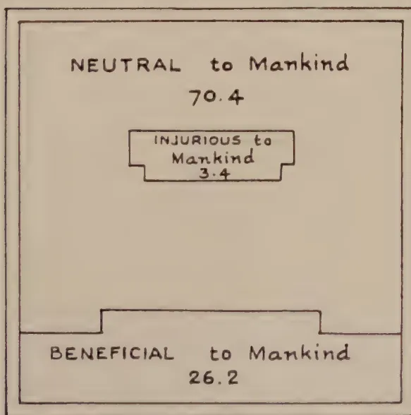
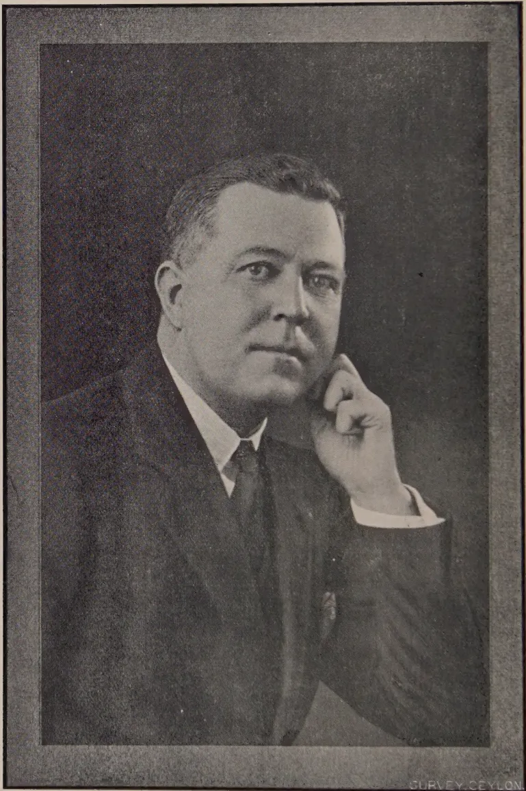

# The Tropical Agriculturist

November, 1928.

---

## Editorial.

---

### Manuring of Rubber.

---

**T**HE effect of manuring rubber has been experimented with in several countries but as a rule the results have been unsatisfactory or inconclusive. The experiments which, however, have been carried out in Sumatra have given certain markedly higher yields on special types of soils and there are some indications that manuring may be effective even on the red lateritic soils.

In Ceylon, the manurial experiments at the Peradeniya Experiment Station have given results which so far have been considered to be inconclusive, but a recent critical examination of these results from a statistical point of view by MR. L. LORD shows that the application of nitrogenous manures has been significant. This determination is a matter of interest, for rubber planters have had considerable faith in Ceylon in the manuring of rubber and have in certain areas applied considerable quantities of mixed fertilizers. The experiment which has been conducted by the Rubber Research Scheme has clearly shown that an increase of foliage is secured as a result of manuring with nitrogenous fertilizers and that in outbreaks of secondary leaf fall a good proportion of this increased foliage remains on the trees. The application of nitrogenous fertilizers has therefore come to be looked upon in Ceylon as the most promising line of

1------------------------------------------------

262

attack on the secondary leaf fall caused by species of *Phytophthora*. Another series of experiments to test the effect, if any, of manures on the *Oidium* leaf disease has been drawn up and will be commenced at an early date, whilst confirmation or otherwise of the data secured from the Peradeniya Experiments is to be looked for when the results of the trials made on Arupolakande Estate by the Rubber Research Scheme are available. It is anticipated that the results of these experiments should be available early in the next year.

The results so far secured in Ceylon therefore point to the usefulness of applications of nitrogenous manures in rubber cultivation and there is little doubt that such applications are desirable on the washed hill-slopes of the Island, if the rubber is to be maintained in vigorous health and growth. It must not, however, be overlooked that data such as that indicated above would not have been clear without a critical statistical examination of the recorded results and it emphasises the necessity of planning manurial experiments in such a way that statistical examination of the results is made easy. A method for such an experiment has been previously indicated by MR. LORD in a Bulletin issued by the Department of Agriculture.

This has been criticized in certain quarters because no estate could possibly carry out experiments of this pattern. It is unfortunate that scientific requirements for experiments cannot always be fitted in with estate practices, but if advantage is not now-a-days taken to secure a plan of experiments capable of having the results dealt with by modern statistical methods the conclusions are likely to be unsatisfactory or even misleading. Year by year, agricultural science is adding to its knowledge in regard to the lay-out of field experiments and a process of evolution is being seen. Advantage must be taken of the latest knowledge available if the rubber industry is to procure that knowledge which it requires.

In laying out experiments to test the results of manuring rubber, estates are therefore advised to follow as closely as possible the lines indicated in the Bulletin above referred to, if satisfactory data are to be secured. It is possible, of course, that some modifications may be necessary to suit estate conditions but when these modifications are being contemplated officers of the Department of Agriculture or of the Rubber Research Scheme should be consulted. Similarly in regard to the manurial tests which may be contemplated for ascertaining if any effect can be obtained in the control of the *Oidium* leaf disease.

Scientific officers are only too willing to assist estates when they are laying down experiments and it is recommended that they should be consulted freely.

2------------------------------------------------

263

Original Articles.

---

## Manuring Experiments and Experimentation with Rubber.

---

L. LORD, M.A.,

*Economic Botanist, Ceylon.*

IT may be said that the present time,\* with the slump in rubber showing no signs of abating and with restriction of production still in force, is singularly inappropriate for any discussion of possible means of increasing production, particularly if such means involve additional expenditure of money. Restriction, however, even if the slump does not, will end in October, and low prices for rubber will not continue indefinitely. Moreover, properly designed manurial experiments may show that manuring under Ceylon conditions is unprofitable and thus point the way to economies in working. For these reasons, therefore, a discussion of manurial experiments with rubber and methods of laying down experiments may not be so ill-timed as may at first sight appear, particularly as there is now available not only the results of the last eight years of manurial experiments in the Dutch East Indies (4 & 5)† but also the results of those carried out at Peradeniya during the period 1914-1927 (6).

In addition, the writer wishes to take the opportunity of replying to certain criticisms which have been levelled at a paper (7) on field experimentation with rubber which was published at the beginning of this year. The paper was written jointly but the responsibility for the views expressed rests entirely with the present writer.

In 1924, Ashplant (1) wrote, "Although the manuring of rubber has long been a regular practice in Ceylon, where many of its adherents claim to have considerably increased their rubber outputs by manurial treatment, the almost universal failure of scientifically controlled manuring experiments in rubber to demonstrate a measure of improvement which exceeds the experi-

---

\* Written in September, 1928.

† Numbers in brackets refer to literature cited, a list of which will be found at the end of this article.

3------------------------------------------------

264

mental error, unavoidable in all such tests, has made planters elsewhere sceptical of the value of manuring rubber. The results of manuring generally have, indeed, been so unimpressive as to lead to the view that the lactiferous mechanism of *Hevea* is unaffected directly by manurial stimulus, and that immediate crop improvement cannot be obtained by manuring." He goes on to say, however, that the (then) recent experiments of Grantham (4) will necessitate a modification of these views. Since that time, Grantham (5) has published further results of those experiments.

The experiments reported by Grantham were laid down in Sumatra on the estates of the Holland-America Plantations Company (H.A.P.M.) and are already familiar to most rubber planters. They differ from the majority of rubber manurial experiments in that they were scientifically laid down and that the results admit of statistical interpretation. The design of the experiments, in the light of the knowledge of field experimentation then available, is admirable, and deserves the highest praise.

Experiments were laid down on the two prevailing soil types, one a sedentary red soil of volcanic origin and the other the "whitish soils," water transported, found nearer the coast. In brief, the experiments show that on the red soil, nitrogen, and on both red and white soils, basic slag, potassium chloride and lime have no effect. On the white soils, however, nitrogen, whether in the form of nitrate of soda or sulphate of ammonia, gives high and significant increases. By 1927 plots on white soil which got 5 lb. of nitrate of soda per tree per year gave an average yield of 580 lb. of rubber per acre whereas the control plots had declined to 258 lb. During the four years 1923-24 to 1926-27 the plots getting 5 lb. of nitrate of soda per tree gave each year more than 100% more than the control plots. These figures are based on means of eight plots of 90 trees each and are reliable within small limits.

It is not necessary for our purpose to discuss in greater detail the results of these experiments or to mention the relative efficiency of the different nitrogenous fertilisers. It is sufficient to emphasise the fact that on one soil type in Sumatra the application of certain nitrogenous fertilisers has been proved to be a paying proposition whereas on another soil type it is not. The inference to be drawn is that on certain soils in Ceylon also it may pay to use nitrogenous fertilisers and that on certain soils it may not.

The available evidence on manurial experiments in Ceylon has lately been published by Holland (6). The Ceylon experiments differ materially from those carried out on the H. A. P. M.

4------------------------------------------------

265

estates in that the different manurial treatments occupied only one plot each. There were no replications and thus there is no means of working out the error of the experiments for each year. To deal first with the "Old Manurial Experiment." An examination of the graph (not reproduced here) shows that the plots treated with the general mixture, and the excess of nitrogen mixture, whose yield at the beginning of the experiment was below that of the control, have since 1916, with the exception of one year (1922), consistently yielded more than the control plot. The evidence as to the effect of potash and phosphoric acid is confusing. Up till 1922 the excess of phosphoric acid plot had gained, but not consistently, on the control plot; the excess of potash plot had lost ground. In 1923, though the treatments of the two plots were interchanged, the plot originally getting phosphoric acid now getting potash and *vice versa*, there was little change in the trend of the yields of the two plots. In discussing the experiment Holland (*loc. cit.*) says, "In view of the evidence previously noted, however, it appears at least extremely doubtful whether phosphoric acid or potash has had any effect on the yields of the plots."

There is, however, evidence to show that the general mixture which contained 50 lb. nitrogen, 30 lb. phosphoric acid and 30 lb. potash per acre and the excess of nitrogen mixture, which contained 80 lb. of nitrogen and  $9\frac{1}{2}$  lb. phosphoric acid, did increase yields and it would appear from what has been said previously that the increase must have been due almost entirely to the nitrogen in the mixtures. Are the increases due to the use of these two mixtures significant? Although the absence of replications precludes the calculation of an experimental error each year it is possible to treat the years as replications and so arrive at an experimental error, an error, however, not so reliable as one derived from a replicated experiment for one year only.

The Manager, Experiment Station, Peradeniya, has very kindly given the writer the yearly yields of the plots used in the experiment. Those of the control, general mixture and excess nitrogen mixture will be found in Table I. The yields of the potash and phosphoric acid plots are not included as they are not so suitable for any calculation of error owing to their treatments having been interchanged during the period.

Where these two plots have shown increases—e.g., the original phosphoric acid plot during the period 1914 to 1922 and the same plot after the change to the potash mixture—1923 to 1927—the standard errors of the increases have been worked out by "Student's" method. As would be expected neither of the two increases is significant.

5------------------------------------------------

266Table I.

Old Manuring Experiment, Peradeniya.  
Yields of dry Rubber per Tree in lbs.

<table border="1">
<thead>
<tr>
<th>Year</th>
<th>Control Plot Lbs.</th>
<th>General Mixture Plot Lbs.</th>
<th>Excess of Nitrogen Plot Lbs.</th>
</tr>
</thead>
<tbody>
<tr>
<td>1914</td>
<td>2.69</td>
<td>2.25</td>
<td>2.37</td>
</tr>
<tr>
<td>1915</td>
<td>3.62</td>
<td>3.00</td>
<td>3.50</td>
</tr>
<tr>
<td>1916</td>
<td>4.00</td>
<td>3.81</td>
<td>3.87</td>
</tr>
<tr>
<td>1917</td>
<td>4.00</td>
<td>4.31</td>
<td>4.44</td>
</tr>
<tr>
<td>1918</td>
<td>3.81</td>
<td>4.50</td>
<td>4.50</td>
</tr>
<tr>
<td>1919</td>
<td>3.87</td>
<td>3.81</td>
<td>4.50</td>
</tr>
<tr>
<td>1920</td>
<td>4.94</td>
<td>5.25</td>
<td>5.20</td>
</tr>
<tr>
<td>1921</td>
<td>4.31</td>
<td>4.56</td>
<td>4.50</td>
</tr>
<tr>
<td>1922</td>
<td>4.75</td>
<td>4.37</td>
<td>4.62</td>
</tr>
<tr>
<td>1923</td>
<td>4.44</td>
<td>5.25</td>
<td>5.25</td>
</tr>
<tr>
<td>1924</td>
<td>5.44</td>
<td>5.87</td>
<td>7.06</td>
</tr>
<tr>
<td>1925</td>
<td>5.44</td>
<td>6.06</td>
<td>6.06</td>
</tr>
<tr>
<td>1926</td>
<td>5.50</td>
<td>6.37</td>
<td>6.06</td>
</tr>
<tr>
<td>1927</td>
<td>5.44</td>
<td>5.56</td>
<td>7.31</td>
</tr>
<tr>
<td>Total 1917-1927</td>
<td>51.94</td>
<td>55.91</td>
<td>59.50</td>
</tr>
<tr>
<td>Mean Annual Increase over Control 1917—27</td>
<td>—</td>
<td>0.361</td>
<td>0.687</td>
</tr>
</tbody>
</table>

It will be noticed that totals and increases have been calculated for the eleven years 1917—27 only. From 1914 to 1916 the two treated plots were below the control plot in yield but by 1917 the effect of the manures had been sufficient to raise the yields slightly above the control plot. It would appear reasonable, therefore, to judge the effect of the manures during the period 1917—27.

In Table II. will be found the results of applying the analysis of variance method (Fisher, 3) to the yields for the eleven year period.

6------------------------------------------------

267Table II.

<table border="1">
<thead>
<tr>
<th>Variance between</th>
<th>Degrees of Freedom</th>
<th>Sum of Squares</th>
<th>Mean Square</th>
<th>S. D.</th>
<th>Log S. D. E</th>
</tr>
</thead>
<tbody>
<tr>
<td>Years</td>
<td>10</td>
<td>19.72</td>
<td>—</td>
<td></td>
<td></td>
</tr>
<tr>
<td>Treatments</td>
<td>2</td>
<td>2.60</td>
<td>1.30</td>
<td>1.14</td>
<td>0.1310</td>
</tr>
<tr>
<td>Experimental Error</td>
<td>20</td>
<td>2.96</td>
<td>0.15</td>
<td>0.387</td>
<td>1.0507</td>
</tr>
<tr>
<td>Total</td>
<td>32</td>
<td>25.28</td>
<td></td>
<td></td>
<td><math>z = 1.1817</math></td>
</tr>
</tbody>
</table>

The sum of squares for years is relatively large. An inspection of Table I. will show how the yields have increased, as is to be expected, as the trees become older and this has caused a greater total variation which, however, is not allowed to effect the experimental error. The standard deviation of any one plot is 0.387 lb., the standard error of the mean of eleven plots is 0.117 lb. and the standard error of the difference between two means is 0.165 lb.

The mean differences from the control plot of the general and nitrogen mixtures respectively are 0.361 lb. and 0.687 lb. These differences are respectively 2.18 and 4.16 times the S. E. (d) and (when  $n = 20$ ) show that the odds in favour of these differences being real and not due to chance are respectively 20 to 1 and more than 100 to 1.

The  $z$  test (Fisher, *loc. cit.*) is also significant and shows that the nitrogen plot at least has given a significant increase. The yields of the control and nitrogen plots were also examined by the method of direct differences—the so-called “Student’s” method. The differences in favour of the nitrogen plot over the control plot for the 11-year period are, starting in 1917, as follows:—0.44, 0.69, 0.63, 0.26, 0.19, 0.13, 0.81, 1.62, 0.62, 0.56, and 1.87 lb. The mean difference is, as before, 0.687 lb. and the S. E. of the difference 0.177 or slightly higher than by the first method owing to the fewer degrees of freedom. Again the odds against the mean difference between the nitrogen and control plots being due to chance are over 100 to 1.

The fact that the nitrogen and general mixture plots which started at a lower level than the control plot have steadily increased in yield and have finally exceeded the yield of the control plot is strong presumptive evidence that the differences in the mean yields of the plots, statistically significant, are in reality due to the treatments associated with these plots and not due to the fortuitous circumstance of initial soil fertility. At present prices the cost of the nitrogen mixture may be taken as about from 60—65 cents per tree, and the value of the increase at about 32 cents. While no estate will spend 60 cents to obtain

7------------------------------------------------

268

32 cents it must be remembered that (i) the price of rubber, will, it is hoped, increase; (ii) a cheaper form of nitrogen may be used; and (iii) the increased yield through the application of nitrogen is apparently becoming greater each year.

An examination of the "Avenue Manurial Experiment" at Peradeniya unfortunately discovers no evidence of the benefit of manures. Holland (*loc. cit.*) states, "As regards yields, there fore, the evidence that the differences which appear are due to manurial treatment is inconclusive and contradictory."

Again, in this experiment no replications of the different treatments were laid down, and, moreover, as is pointed out by Holland, the control plot which is at the end of a block gets more light and space than the other plots. The nitrogen used in the experiment was in the form of nitrolim and it is possible that this form is unsuited to rubber—*cf.* the failure of ammo-phos in a carefully designed experiment in Sumatra (Grantham, 5.)

It must be concluded, after examining the available evidence on manuring of rubber, that under certain conditions certain manures—probably nitrogenous ones—will increase the yield, and economically so at certain prices. The problem now is to ascertain, with a degree of precision hitherto not aimed at, the increases which may be expected from the application at different times of different manures applied at varying rates. It was with the object of pointing the way to obtaining this greater precision with field experiments with rubber that the writer jointly undertook the study of this subject. The results of the investigation have been published (7) as a bulletin of the Department of Agriculture. In the bulletin it is stated (p.2) that ". . . even if the Peradeniya figures proved beyond doubt that manuring of rubber did not pay at Peradeniya, they do not prove that manuring will not pay elsewhere. It is obvious that reliable evidence of the effect of manures is necessary and, owing to the variation in soil conditions, that it must be obtained not at one place only. It is hoped that this investigation will enable experiments to be laid down in such a manner as to obtain this evidence."

The method of experimentation recommended, was, briefly, by the use of "randomized blocks," i.e., all the plots of each replication laid down purely at random within a compact block, with results examined statistically according to the analysis of variance method. Lately in this journal, Eden (2) pointed out some of the advantages of these methods and referred to the automatic elimination of tapping error which results from their use. The 'latin square' which may further reduce errors due to soil differences was not recommended owing to the difficulty, in Ceylon at least, of obtaining of sufficiently uniform contour the necessary large area of land required for rubber experimentation. The size of the plot recommended was 24 trees, and the number of replications, six.

8------------------------------------------------

# DIAGRAMMATIC LAYOUT OF A RUBBER MANURIAL EXPERIMENT

in randomized blocks and with border rows.  
(Only 2 replications shown)

BLOCK BY SURVEY DEPT CEYLON

4 replications not shown here.

## LEGEND

A = 1st Replication.

B = 2nd Replication.

C = 3rd Replication. Not shown here.  
etc.

— = 2—3' drains dividing plots

• — Tree in 24-tree plot proper.

O — Tree in border.

X — Gap in plot proper.

Y — Gap in border row (may be ignored.)

⊗ — Extra trees in border included to square off plot.

As manures are applied per tree and as latex yields can be calculated per tree there is no

## MANURIAL TREATMENT PER TREE

i. Control.

ii. 4 lbs. Sulphate of Ammonia applied yearly.

iii. 4 lbs. Sulphate of Ammonia applied every 2 years.

iv. 5 lbs. Nitrate of Soda applied yearly.

v. 5 lbs. Nitrate of Soda applied every 2 years

vi. 2½ lbs. Nitrate of Soda applied yearly.

9------------------------------------------------

<!-- stage4: FAINT old-images-only -->

[Faint page: no legible print of its own could be verified; text withheld (stage 4 review list)]

10------------------------------------------------

269

The recommendations of that bulletin have been criticised on two grounds:

1. (i) That (presumably chiefly and almost entirely in manurial experiments) 24-tree plots are open to what has been called "marginal error" or border effect, due to the manures of one plot becoming available to the border row or rows of trees of adjacent plots, and that in such relatively small plots as 24 trees the marginal error will be very large.
2. (ii) That although precise methods of experimentation in randomized blocks may be desirable academically, the practical difficulties are so numerous as to introduce a human error large enough to counterbalance any academic gain.

To deal first with border effect, or marginal error. The possibility of border effect was not overlooked. On page 18 of the bulletin it states, "Owing to the wide lateral range of the roots of rubber trees it is advisable to have a border row of untreated trees round each plot and outside of that row a 2—3 ft. ditch . . ." It was, by an oversight, stated in the bulletin, that the border row should be untreated. The trees in the border row should receive the same treatment as the plot proper but the latex from those trees should be dealt with separately. Fig 1. shows a diagrammatic lay-out of a manurial experiment designed on the lines suggested. The treatments which are shown as examples are somewhat similar to the treatments in the H. A. P. M. experiments. The six "A" plots form one compact block and the six "B" plots another. The position of the six plots in each replication or block is assigned wholly at random. Without a dividing ditch the roots of the outside (border) row of one plot may, and to some extent will, penetrate as far as the border row of the adjacent plot but such roots will form a very small proportion of the total feeding roots of these particular trees and the effect of their entering another and dissimilarly treated plot will, probably, not be very large. Exact figures on this point are not available. The presence of a 2 to 3 ft. ditch between border rows will prevent most, if not all, of the lateral roots crossing to the next plot. It is satisfactory to learn that the plots in the H. A. P. M. manurial experiments were separated by a 2 ft. drain and there is no mention of border rows. It is quite possible that a 2 ft. or perhaps 3 ft. ditch or drain alone will prevent border effect. Experiments will prove or disprove this. If the ditch alone is sufficient the experiment will be made simpler and, owing to the smaller area necessary for each replication, less affected by soil heterogeneity. It is realised that the H. A. P. M. experimental plots contained 90 trees. If there

11------------------------------------------------

270

were any border effect 36 trees would be affected proportionately more so. In a 24-tree plot surrounded by a border row the 24 trees used for the experiment should be entirely unaffected.

As said previously, however, a 2—3 ft. ditch may effectively prevent border effect and so render the use of border rows unnecessary. If so this is all to the good and in experiments which have been designed with border rows all trees can be used for determining yields. This is an important point. The variations in the yields of various-sized plots were calculated from trees whose female parent was common to all. It is possible that the variations in yield of such trees is less than those of trees of mixed parentage and that *ipso facto* with mixed trees a slightly larger plot will be more efficient. In the absence of border effect, the border row could then be included in the plot proper.

But even in experiments with trees of mixed parentage laid down without border rows if it is found that the variations of 24-tree plots are somewhat larger than those for the Peradeniya plots, carrying on the experiment an extra year or two will give a precision equal to that obtained from larger plots. It must be remembered, too, that as time goes on more and more experiments will be laid down with trees whose parentage is the same and that, therefore, variations in yield will probably be reduced.

In short, there would appear to be no reason to anticipate errors, due either to border effect or to the use of too small a plot interfering with the accuracy of an experiment laid down on the lines suggested.

The second criticism has frequently been levelled against the elaborate technique of field experimentation that modern research has found to be necessary in order to obtain really reliable results. In the "Second Nitrate Manuring Experiment" described by Grantham (*loc. cit.*) there were eight replications of five treatments making forty lots of latex to be dealt with at each tapping. There is no reason to believe that the latex from an equally elaborate experiment could not be handled accurately in Ceylon. It may be found necessary to tap the trees of border rows separately. If so, such trees could bear a distinctive mark (as would the trees of the plot proper) and could be tapped by a different coolie. There would thus be two tapping coolies for each replication and each would be furnished with as many buckets for latex as there were treatments in the replication.

But when all is said, it cannot be maintained that accurate field experimentation is a simple matter. As was stated in the bulletin, "The laying down of field experiments is obviously a task to be undertaken in no light-hearted manner."

12------------------------------------------------

271

The difficulties have been vividly put by Engledow and Yule\* who say, "It is nearly as difficult to make sure of the yielding capacities of two varieties" (or of two manurial treatments), "as it is to get your ball through the hoop at a game of croquet when the mallets are flamingoes and the balls are hedgehogs."

## Literature Cited.

1. 1. Ashplant, H. Recent developments in the rubber planting industry. *Reprinted by the Rubber Growers' Association*.
2. 2. Eden, T. Modern field experiments. *Tropical Agriculturist* LXXI 2, 1923. pp. 67-76.
3. 3. Fisher, R. A. Statistical methods for research workers.
4. 4. Grantham, J. Manurial experiments on *Hevea*. *Arch. voor de Rubbercultuur* VIII jaar. 8, 1924 pp. 501-519.
5. 5. Grantham, J. Manurial experiments on *Hevea* II—*ibid.* XI. Jaar 10, 1927. pp. 465-471.
6. 6. Holland, T. H. Report on rubber manurial experiments, Experiment Station, Peradeniya for 1927. *Tropical Agriculturist*. LXXI. 1, 1928. pp. 46-50.
7. 7. Lord, L. and Abeyesundera, L. Field experimentation with rubber. *Dept. Agric. Ceylon Bul.* 82.

---

\* Engledow, F. L. and Yule, Udny G.—The Principles and Practice of Yield Trials.—*Empire Cotton Growing Review*. III. 2. 1926.

13------------------------------------------------

272

# The Economic Value of Birds in Ceylon.\*

GEORGE BROWN, B.A. (Cantab.).

**A**LTHOUGH an enormous amount of time has been spent in the last few years in the Western world, and specially in America, on the scientific study of the economic importance of wild birds to agriculture and to mankind in general, so far as I know very few observations on this subject have been made in the East generally, and none in Ceylon. So, from the general knowledge we possess of the ordinary food of the birds of this Island, we can arrive only at a very rough estimate of whether or no a particular bird or group of birds is friendly to mankind. Very interesting observations on the food of British wild birds have lately been made by Dr. Walter E. Collinge, and much of the information in this article has been taken direct from his journal, including the diagram of the pheasant's food referred to later on.

There are all sorts of factors that come to the front when one begins to make a study of a bird's economic value, for the same bird may be beneficial over a part of the year and injurious over the remainder of the year. Again, a big increase for one reason or another of any particular kind of bird may also lead to its becoming injurious; and to-day it would be considered unsound policy to authorise a wholesale destruction of birds for the purpose of protecting grain crops or fruit, without studying first of all the effects that would be likely to arise from the destruction of these birds.

Birds at times change their feeding habits. This is known to be the case with the starling in England, which at times takes to eating corn at the moment that the germinated seed is shooting out instead of keeping, before the fruit season comes along, largely to animal or rough vegetable food. The blue-tit also

\* This article was specially prepared for a proposed Text-book of Ceylon Agriculture.

14------------------------------------------------

273

from England is now accused very often of picking holes in apples, strawberries, etc., whereas some years ago its food seemed to be almost entirely of insects. There is a wood-pecker in America which has developed a taste for the sap of various trees, to obtain which it pierces a system of holes in the bark which eventually spoils the tree whatever it may be. The sap collects in the holes which the bird has punctured and so do insects, the bird feeding on both insects and sap, though at one time it probably only fed on insects and, whilst tapping the bark for these, discovered that the sap flowed into these holes and so developed a taste for it.

The case of the kea parrot in New Zealand which is now accused by farmers of picking a hole in sheep's back in order to get at their liver is well known, though this bird at one time was vegetivorous, and perhaps also started this bad habit by looking for ticks and maggots only on the sheep's backs.

The actual losses specially in grain countries due to granivorous birds are very great indeed, and it is computed that the house-sparrow at home does damage to the extent of eight million pounds per annum, but this is nothing in comparison to the enormous financial value of the crops that are saved by the activities of the insectivorous birds. I myself as a boy have taken as many as 950 odd grains of barley from a stock-dove's crop, 84 of the three-cornered kernels of the beech-mast from a wood-pigeon's crop, and also 13 full-size acorns from another wood-pigeon's crop; and any one who has shot the Lady Torrington pigeon out here when the cudadaley seed is ripe knows what a large number of these full-sized seed a crop of a pigeon will hold, and it must be remembered that their crops are filled twice a day.

It is very noticeable that, if there is a bad season for migration of birds at home, that is to say, if, due to bad and inclement weather, a large number of our migrants fail to arrive in England in any particular year, such as occurred in 1917, the increase in various forms of insects in the following year is often extraordinarily marked. This was so in 1918 and 1919 when the oak trees in Kent and Surrey and doubtless in other countries were to a large extent stripped of all their foliage by a species of Tortrix caterpillar, very probably largely due to the small number of warblers that arrived in the country and hatched out satisfactorily in 1917.

15------------------------------------------------

274

There are injurious mammals also that are preyed on by various birds of the hawk, eagle and owl type, and again some birds act as scavengers, as the kite used to do 250 years ago in England, in big towns like London, and such as the Colombo crow does to-day in Ceylon, though this bird is probably increasing too fast and its harm may in the future out-do its good.

There has been an enormous amount of work done in the last twenty years or so in the study of the food consumed by birds, in order to discover whether or no they are in the main of value or otherwise to mankind. To do this an accurate tabulation of the food contents found in the stomach must be made at different seasons of the year and in different districts, and besides this the bird or birds must be carefully watched in the field. It is of great importance to discover what food is brought to the nest for the young ones during the breeding season.

Let us take the case of the pheasants given by Dr. Collinge in order to see how a clear statement is arrived at diagrammatically to illustrate the value or otherwise of this bird to mankind. Examination of the contents of a great number of the stomachs and crops of these birds works out as follows:—

41.7% of their food consists of leaves, fruits and seeds of weeds.

2.4% of grain.

2.4% of roots and stems.

23.4% of insects injurious to mankind.

1.0% of insects beneficial to mankind.

1.5% of insects neutral to mankind.

8.7% of earth-worms.

2.8% of slugs.

16.1% of miscellaneous matter.

If we examine the above figures, we find that the total animal food works out at 37.2 and the vegetable food at 62.8. From these figures, the leaves, fruits and seeds of weeds, roots and stems, neutral insects, earth-worms and miscellaneous matter, we may regard as neutral; and this works out at 70.4% of the total food. The grain and insects beneficial to mankind work out at 3.4% and therefore go to the debit side of the pheasant, but on the credit side would appear the injurious insects and slugs working out at 26.2%. This diagram as shown below gives a very comprehensive glance of the food of the bird in

16------------------------------------------------

275

question and the economic value of the bird as far as mankind is concerned.

![A circular diagram showing the percentage of food of the pheasant. The diagram is divided into several segments, each representing a different food source and its percentage. The segments are: INJURIUS INSECTS (23.4), BENEFICIAL (1.0), NEUTRAL (1.5), SLUG (2.8), EARTH WORMS (8.7), MISCELLANEOUS (1.6), LEAVES, FRUITS and SEEDS of WEEDS (41.7), ROOTS & STEMS (2.4), GRAIN (2.4), and an unlabeled segment (30). The outer ring of the circle is divided into segments with values 20, 01, 06, 80, 70, 60, 50, and 40.](24c85cb392e0dbb43164d032f809ace1_3_img.webp)

<table border="1">
<thead>
<tr>
<th>Food Source</th>
<th>Percentage</th>
</tr>
</thead>
<tbody>
<tr>
<td>INJURIUS INSECTS</td>
<td>23.4</td>
</tr>
<tr>
<td>BENEFICIAL</td>
<td>1.0</td>
</tr>
<tr>
<td>NEUTRAL</td>
<td>1.5</td>
</tr>
<tr>
<td>SLUG</td>
<td>2.8</td>
</tr>
<tr>
<td>EARTH WORMS</td>
<td>8.7</td>
</tr>
<tr>
<td>MISCELLANEOUS</td>
<td>1.6</td>
</tr>
<tr>
<td>LEAVES, FRUITS and SEEDS of WEEDS</td>
<td>41.7</td>
</tr>
<tr>
<td>ROOTS &amp; STEMS</td>
<td>2.4</td>
</tr>
<tr>
<td>GRAIN</td>
<td>2.4</td>
</tr>
<tr>
<td>Unlabeled</td>
<td>30</td>
</tr>
</tbody>
</table>

Fig. 1. Diagrammatic representation of the percentages of food of the pheasant.

<table border="1">
<thead>
<tr>
<th>Category</th>
<th>Percentage</th>
</tr>
</thead>
<tbody>
<tr>
<td>NEUTRAL to Mankind</td>
<td>70.4</td>
</tr>
<tr>
<td>INJURIUS to Mankind</td>
<td>3.4</td>
</tr>
<tr>
<td>BENEFICIAL to Mankind</td>
<td>26.2</td>
</tr>
</tbody>
</table>

BLOCK BY SURVEY DEPT CEYLON

Fig. 2. Diagrammatic representation summarising the injuries, benefits, etc. of the pheasant.

17------------------------------------------------

276

Nestlings consume during the first few days of their life considerably more than their own weight of food, and observations have been made on various birds in order to show the number of times the parents bring in food to their young in a day, and in some birds such as the house sparrow this was found to work out at something between 220 and 260 visits per diem. Similar observations made with the thrush and the blackbird show much the same results, each visit made by the parent birds to the nest indicating that one or more insects (generally more) are brought each time to the nest.

Here is a quotation from the Year-book of the United States Department of Agriculture, 1900. "A long billed marsh wren was seen to carry 30 locusts to her young ones in an hour, and at this rate for 7 hours a day, a brood will consume 210 locusts per day, and the passerine birds of the eastern half of Nebraska, allowing only 20 broods to the square mile, will destroy 162,771,000 locusts. The average locust weighs about 15 grains and this is capable of consuming its own weight of standing forage crops, corn and wheat. The locusts eaten by passerine will therefore work out at 174,397 tons of crop, which at 10 dollars per ton would be worth 1,743,970 dollars."

Again, to quote from the University of California published in *The Zoologist*, 1914, Bryant says for instance. "If we consider that there is an average of one meadowlark in every two acres of land available for cultivation (11,000,000 acres) in the Sacramento and San Joaquin Valleys, and that each pair of birds raises four young ones, each one of which averages one ounce in weight while in the nest, and consumes half its own weight in food, it takes over 343½ tons of insect food to feed the young birds in the great valleys alone."

It must be remembered in connection with the above that it is generally recognised that with the exception of the doves and pigeons, most birds feed their young upon animal diet of some sort, though the parents later on may live on grain or fruits, etc. It must also be remembered that many birds fill their stomachs at least three times a day, and grain takes longer to digest than corn.

Let us glance now at the birds of Ceylon in relation to what we have said above. To start with, there has been no real work done on this question, so all we can do is to trust to field observations and notes. There are not many birds in Ceylon that can be designated grain-eaters, and these are the birds that are usually most harmful to mankind. The family *Plocidae*, contains the sub-family *Plocinae* (or the weaver birds) of which there are two, the *bya* or the common weaver bird and the Indian striated weaver bird, and also the sub-family *Viduninae* or the *munias*,

18------------------------------------------------

277

commonly called ortolans, though of course they are not true ortolans. There are five of these:—

The blackheaded munia.

The white-back munia.

The white-throated munia.

The Ceylon munia and

The spotted munia.

All these birds, like the next family, the *Fingillidae* or finches, to which they are allied, feed during the greater part of the year at any rate on grain, i.e., ordinary paddy, hill paddy and *kuruakan*, and every one can call to mind one of the wonderful devices of tattie-bogles or scare-crows that the Sinhalese *goiya* fixes up in his paddy field just about the time his grain is ripening in order to scare these little marauders away. Generally, too, children are perched on a neighbouring bund or rock to pull strings to make the scare-crow work. They shout incessantly, but, so far as I can see, the little munias do not appear to take much notice of the little bird-scarer or his wonderful devices, but, more often than not, fill their crops and fly away replete and satisfied.

The finches, of which there are two in Ceylon, the ordinary house-sparrow and the yellow-throated sparrow (this latter is very rare) are, of course, also grain-feeders, but the house-sparrow here, as elsewhere, prefers living in towns or near village houses and sheds, where it acts more or less as a scavenger, and also picks up grain that may be spilt around the habitation. Like the home-sparrow, too, it devours a great many insects, specially capturing these for its young.

Now, if the munias for any reason increase too rapidly in Ceylon, and in some local and isolated places they may be too numerous, then they will probably show a bigger percentage injurious to mankind than beneficial. As regards other birds that feed on paddy, the rock pigeon found along various parts of the East coast often will raid a field that has recently been planted in paddy, just as the seed has germinated and is about to shoot, because the grain is very sweet and succulent at that moment. Another bird that will do damage at that particular time is the whistling teal and doubtless others of the duck type, too, will at times feed on paddy grain if they get the chance, just as the wild duck in England will attack barley when standing in stocks in the field, but the whistler will do quite an appreciable amount of harm in a young paddy field just as the seed is germinating. Also the doves in Ceylon of which there are three, the common one being the Ceylon spotted dove or ash dove—also feed on dry paddy, grain and other seeds, but none of these latter birds would be pronounced as greatly injurious to mankind.

19------------------------------------------------

278

Apart from these birds the great majority of the birds in Ceylon are to a great degree insectivorous, though some combine this with fruit eating. The barbets, of which there are four in Ceylon, are largely fruit-eaters, and are responsible for a good many of the round holes one sees drilled in the side of rotten branches. The parrots, too, are largely fruit-eaters, but sometimes they will do a considerable amount of damage, especially the western blossom-headed paroquet, by attacking fields of Indian corn.

The babblers are mostly insectivorous, and therefore probably of value to mankind, and the bulbuls are largely insectivorous, but not altogether so, some of them eating fruit, and the ordinary common bulbul, or Madras red-vented bulbul, as far as one knows, becomes sometimes a nuisance in up-country gardens by stripping the mulberry trees of fruit.

The thrush family, including the chats and the robins, are nearly entirely insectivorous and together with the Ceylon magpie and robin must work out at a very high percentage of value to mankind. This latter bird, the magpie robin, is very tame and is busy almost all day long round bungalows, picking up a variety of insects, most of which mankind tries to get rid of.

The fly-catchers of which there are ten in Ceylon are all insectivorous, as their name duly indicates, and are all highly beneficial to mankind, but perhaps the birds that do most good on the tea estates of Ceylon are the minivets and cuckoo shrikes. These not only devour an enormous number of insects themselves but they point out the way to and direct numerous other birds that follow closely after them, such as the Ceylon white-eye, the black-back pied shrike, the small white-throated babbler, the grey tit and others. These birds are often seen in jungle belts on tea estates following up a hatch of caterpillars and cleaning them up practically completely.

The orange minivets and the black-headed cuckoo shrike usually appear to lead these collection of birds, and I think that they account at times for a great many *Tortrix* moth caterpillars, specially the Ceylon white-eye. Anyhow, it is practically certain that all these birds are of a very high percentage of value to mankind, and so are the drangos, of which there are five in Ceylon, the commonest being the white-vented drango which is to be seen round most gardens feeding voraciously in the evening on anything that flies.

20------------------------------------------------

279

The warblers, of which there are seventeen, are all big insect feeders. The Indian tailor-bird belongs to this family and is one of the commonest birds in Ceylon, and must do an enormous amount of good in the aggregate. The swallows, of which there are four, are great fly and insect feeders, and so are the swifts.

The two members of the crow family in Ceylon, the house crow or Colombo crow and the black crow, do a large amount of good from the scavenging point of view, but on the other hand they are more or less omnivorous in their food. The black crow is a great thief of other bird's eggs and apparently a great bully, and is also a stealer of young birds, on which it will voraciously feed. Should there be too great an increase of these birds in any district, they would probably show a high percentage injurious to mankind.

The king-fishers, of which there are seven, mostly feed on small fish, but the common Ceylon white-breasted king-fisher devours an enormous amount of crickets, mole-crickets, grass-hoppers, and such like and is therefore of great value. The night-jars are also great insect-feeders, and so are the cuckoos, of which there are a large number in Ceylon.

The Ceylon jungle crow or the southern crow-pheasant eats an enormous number of insects, hairy caterpillars, small reptiles, but also is a stealer of the eggs and young of other smaller birds.

To pass on to the eagles, hawks, and falcons, these are all, or nearly all, carnivorous and carrion-feeders, and they must destroy a large number of small mammals such as rats for their food. At the same time they largely feed on other birds and so neutralize their beneficial action to mankind. The common snake-eagle or Ceylon crested serpent-eagle feeds largely upon frogs, lizards and snakes, and, especially as regards the last, is valuable to mankind. This bird is frequently accused of attacking pigeons, but I think is often confused with the Ceylon hawk-eagle.

The owls, being night feeders, must destroy an enormous number of rats and mice, and undoubtedly are of very great benefit to mankind. The smaller owls feed largely on beetles and other insects, and therefore this whole family must be reckoned as benefactors to mankind.

21------------------------------------------------

280

Now, to pass on to the great number of wading birds represented by the herons, bitterns and storks, and from these to the pelicans and cormorants. Almost all these birds feed to a certain extent on small fish, and the diet of pelicans and cormorants consists almost entirely of fish caught in the tanks and lagoons. The terns also very often take small fish for their diet, but I doubt if any of these birds could in any way be classed as injurious to mankind because of their food.

The snipe family and also many of the plovers, all the pigeons, the game birds and the duck family afford excellent sport during the shooting season, and most of these birds are very highly appreciated as food and are of distinct economic value.

Thus, although we have no accurate data in Ceylon to show the value of birds to mankind, enough perhaps has been said in this short sketch of a vast subject to show that the birds of Ceylon play no mean part in controlling insect life which is mainly injurious to mankind, and a good many birds, too, provide excellent sport in their correct season and their flesh is of great economic value. Besides all this, I suppose the study of birds in all its branches, known as ornithology, has provided and is still providing more interest to a vast number of people in every country than any other branch of animal life.

22------------------------------------------------

281

## Chemical Notes (3).

### ANALYSIS OF CITRONELLA GRASS ASH.

A sample of citronella grass ash forwarded from Matara was analysed for its manurial value by Mr. Pandittesekere, Assistant in Agricultural Chemistry. The results are as follows:—

<table>
<thead>
<tr>
<th></th>
<th>Per cent.</th>
</tr>
</thead>
<tbody>
<tr>
<td>Material passing through 3 m.m. sieve</td>
<td>89.0</td>
</tr>
<tr>
<td>Moisture on above</td>
<td>2.1</td>
</tr>
</tbody>
</table>

#### On Material at 100°C.

<table>
<tbody>
<tr>
<td>Lime</td>
<td>3.28</td>
</tr>
<tr>
<td>Phosphoric Acid</td>
<td>1.39</td>
</tr>
<tr>
<td>Potash</td>
<td>7.06</td>
</tr>
</tbody>
</table>

It will be noted that the sample contains over 7% potash, about 3.3% lime and 1.4% phosphoric acid. Its low lime and phosphoric acid contents are doubtlessly due to the poor nature of the soil on which citronella is generally grown. The ash however could be advantageously used as a fertiliser.

Based on the present average unit values for potash, phosphoric acid and lime of fertilisers sold in Colombo, the value of this ash for manurial purposes would be about Rs. 30/- per ton.

### ANALYSIS OF BOGA MEDELOA SEED.

Enquiries have been made as to the amounts of nitrogen, phosphoric acid and potash taken away from the soil as a result of the sale of seed from Boga medeloa plants grown on it. Analytical determinations of the nitrogen, phosphoric acid and potash contents of a representative sample of this seed were therefore carried out in this laboratory and the results are set down below:—

<table>
<thead>
<tr>
<th></th>
<th>On air-dried seed Per cent.</th>
<th>On dry matter at 100°C Per cent.</th>
</tr>
</thead>
<tbody>
<tr>
<td>Moisture</td>
<td>12.91</td>
<td>—</td>
</tr>
<tr>
<td>† Ash</td>
<td>5.29</td>
<td>5.91</td>
</tr>
<tr>
<td>* Organic Matter</td>
<td>81.80</td>
<td>94.09</td>
</tr>
<tr>
<td>* Containing Nitrogen</td>
<td>5.04</td>
<td>5.87</td>
</tr>
<tr>
<td>† " Lime</td>
<td>0.47</td>
<td>.52</td>
</tr>
<tr>
<td>" Phosphoric Acid</td>
<td>0.98</td>
<td>1.11</td>
</tr>
<tr>
<td>" Potash</td>
<td>1.10</td>
<td>1.23</td>
</tr>
</tbody>
</table>

It will be noted that Boga seed contains 81.8% of organic matter of which 5.04% is nitrogen, and 8.29% of ash of which phosphoric acid and potash amount to about 1% each and lime to nearly 0.5%. The nitrogen of the seed, it may be stated, is obtained from the air through the activity of the bacteria found in the root nodules and is therefore not lost to the soil, but the phosphoric acid and potash are taken from the soil and therefore lost to it. One ton of a representative sample of Boga medeloa seed calculated on the above analysis will be found to contain 112.9 lb. nitrogen, 22.0 lb. phosphoric acid, 24.6 lb. potash and 10.4 lb. lime. The loss to the soil on which the Boga is grown by the disposal of this quantity of seed is therefore 22 lb. of phosphoric acid, 24.6 lb. of potash and 10 lb. of lime. A. W. R. J.

23------------------------------------------------

282

## Selected Articles.

# Tropical Agriculture in Malaya, Ceylon and Java.\*

THE RIGHT HON. W. ORMSBY-CORE, M.P.,

*(Parliamentary Under-Secretary of State for the Colonies.)*

Following on my tours of the West Indies, East Africa and West Africa, I have just completed a tour of some 20,000 miles, for the purpose of visiting three countries in the south-east of Asia, namely British Malaya, Ceylon and the Dutch Island of Java. . . .

I must begin with the elementary geographical facts.

British Malaya lies between the Equator and 70° North. It has an area of approximately 53,000 square miles, i.e., it is very little smaller than England (without Wales), and contains a mixed population of Chinese, Malays, Indians and Europeans, totalling approximately 4,000,000.

It is only very partially developed economically; the greater portion of the Peninsula is still virgin jungle.

Climatically, it is almost unique. There is a rainfall throughout the year, brought by the north-east monsoon from October to March, and by the south-west monsoon from April to September. The temperature hardly varies, seldom going, at the lower levels, below 70° at night, or exceeding 90° in the shade on the hottest day. The climate is therefore amazingly uniform and monotonous. There is no winter and no cessation of plant growth. The rainfall, of course, varies according to altitude from some 60 inches a year in the driest area, to 250 inches a year on the mountains.

Ceylon lies between 6° and 10° north of the Equator. It is about half the size of British Malaya. It contains a population of over five millions. Half the Island, namely, the central uplands, and the west and south-west, are climatically similar to Malaya, i.e., they both get monsoons and have a rainfall ranging from 100 inches to 300 inches a year, widely distributed throughout the year. Ceylon, however, has two dry zones, one in the north-west and one in the south-east, and each of these zones only gets the north-east monsoon in the winter months—if winter it can be called. The total rainfall in these areas varies between 25 inches and 60 inches a year. Both these dry zones are uniformly low lying.

Java lies between latitude 4° and 8° south of the Equator. In area it is almost exactly the same size as British Malaya, i.e., it is slightly smaller than England. It contains, however, no less than 38,000,000 inhabitants. In this it is unique in the Malay Archipelago, for the whole of the rest of the Dutch East Indies—some 14 times the area of Java—have between them only 14,000,000 inhabitants. Climatically, it is very similar to Malaya; it gets both monsoons, although the south-west monsoon in their winter months, namely, June, July and August, is very scanty in the central and eastern portions of the Island, and in those months irrigation becomes of the first importance.

---

\* Paper read at a meeting of the Royal Colonial Institute at the Hotel Victoria on Wednesday, 11th July, 1928, Sir Laurence Guillebard, G.C.M.G., in the Chair.

24------------------------------------------------

283

Ceylon is more developed than Malaya and Java is more developed than Ceylon. In fact, Java is cultivated throughout the plains and right up the mountain sides, up to an altitude of about 6,000 feet, and the only natural jungle left are the forests on the high mountain tops, which are conserved for hydrological purposes.

Whereas in Malaya and Ceylon the soil consists of alluvial deposits, and the results of attrition and erosion of the ancient igneous rocks which form the geological basis of both, the similar geological basis of Java has been intruded, in much more recent times, by a long chain of volcanic peaks, many of them still active, which have introduced a new factor from the agricultural point of view lacking in the other two otherwise similar countries.

Owing to the pressure of population upon land in Java there has been far greater necessity forced upon the Government and population to get the utmost out of every acre of soil that has been harnessed to the needs of man. Whereas in Malaya and Ceylon there is still unoccupied land capable of cultivation to be brought under cultivation, in Java it is entirely a problem of intensifying production upon land already harnessed. This, no doubt, accounts for a certain difference in outlook, and is one of the main reasons why the application of modern scientific discoveries to the problems of tropical agriculture has been pushed further in Java than in the neighbouring countries.

There are further contrasts to be noted. British Malaya is a very new country, and such development as has taken place is largely the result of the efforts of the last 30 years. Ceylon has been continuously under British administration since the end of the Napoleonic wars. Java, having been under British rule during the Napoleonic wars, has been the main overseas possession of the Dutch since those wars, and it is only natural, therefore, that we should expect a greater variety of effort in Java and Ceylon than has yet been found possible in Malaya.

I fear I must worry you with a certain number of figures to illustrate what I mean by the variety of tropical production obtaining in the three countries. Fairly accurate statistics are available for Ceylon and Java, but the agricultural statistics for Malaya are very imperfect, and only approximate figures can be given.

In Malaya there are three main cultures:—

<table>
<tr>
<td>(1)</td>
<td>Rubber</td>
<td>...</td>
<td>...</td>
<td>2,400,000</td>
<td>acres.</td>
</tr>
<tr>
<td>(2)</td>
<td>Rice</td>
<td>...</td>
<td>...</td>
<td>636,000</td>
<td>„</td>
</tr>
<tr>
<td>(3)</td>
<td>Coconuts</td>
<td>...</td>
<td>...</td>
<td>492,000</td>
<td>„</td>
</tr>
</table>

The estimated cultivated area of all other crops in Malaya, such as pineapples, oil palms, fibres, tapioca and maize, probably does not exceed 100,000 acres—in all, a cultivated area of about 3,600,000 acres.

In Ceylon there are sixteen principal crops. The four most important are:—

<table>
<tr>
<td>(1)</td>
<td>Coconuts</td>
<td>...</td>
<td>...</td>
<td>890,000</td>
<td>acres.</td>
</tr>
<tr>
<td>(2)</td>
<td>Rice</td>
<td>...</td>
<td>...</td>
<td>834,000</td>
<td>„</td>
</tr>
<tr>
<td>(3)</td>
<td>Rubber</td>
<td>...</td>
<td>...</td>
<td>475,000</td>
<td>„</td>
</tr>
<tr>
<td>(4)</td>
<td>Tea</td>
<td>...</td>
<td>...</td>
<td>442,000</td>
<td>„</td>
</tr>
</table>

The other crops are: Sesame, arecanut, palmyra palm, citronella, cacao, cinnamon, tobacco, cardamoms, papaya, cotton, sugar-cane, and a great variety of minor grain and vegetable crops. The total developed area of Ceylon is only just over 3,000,000 acres.

25------------------------------------------------

284

The statistics for Java are more complete, and must be divided into native agriculture and non-native plantations. The total cultivated area of Java, apart from planted forests, such as teak, is rather more than 17,000,000 acres, of which 15,500,000 acres are devoted to native agriculture, and only 1,500,000 acres to European estates. The 15,500,000 are composed as follows:—

<table>
<tr>
<td>Rice</td>
<td>...</td>
<td>...</td>
<td>8,000,000 acres.</td>
</tr>
<tr>
<td>Maize</td>
<td>...</td>
<td>...</td>
<td>4,000,000 "</td>
</tr>
<tr>
<td>Cassava (tapioca)</td>
<td>...</td>
<td>...</td>
<td>1,800,000 "</td>
</tr>
<tr>
<td>Ground-nuts</td>
<td>...</td>
<td>...</td>
<td>460,000 "</td>
</tr>
<tr>
<td>Soya beans</td>
<td>...</td>
<td>...</td>
<td>450,000 "</td>
</tr>
<tr>
<td>Other crops</td>
<td>...</td>
<td>...</td>
<td>790,000 "</td>
</tr>
</table>

The European estate area consists of:—

<table>
<tr>
<td>Rubber</td>
<td>...</td>
<td>...</td>
<td>445,000 acres.</td>
</tr>
<tr>
<td>Sugar</td>
<td>...</td>
<td>...</td>
<td>436,000 "</td>
</tr>
<tr>
<td>Coffee</td>
<td>...</td>
<td>...</td>
<td>236,000 "</td>
</tr>
<tr>
<td>Tea</td>
<td>...</td>
<td>...</td>
<td>209,000 "</td>
</tr>
<tr>
<td>Tobacco</td>
<td>...</td>
<td>...</td>
<td>65,500 "</td>
</tr>
<tr>
<td>Quinine</td>
<td>...</td>
<td>...</td>
<td>44,500 "</td>
</tr>
<tr>
<td>Cassava</td>
<td>...</td>
<td>...</td>
<td>28,000 "</td>
</tr>
<tr>
<td>Kapok</td>
<td>...</td>
<td>...</td>
<td>25,000 "</td>
</tr>
<tr>
<td>Coconuts</td>
<td>...</td>
<td>...</td>
<td>22,000 "</td>
</tr>
<tr>
<td>Sisal</td>
<td>...</td>
<td>...</td>
<td>15,000 "</td>
</tr>
<tr>
<td>Cacao</td>
<td>...</td>
<td>...</td>
<td>11,000 "</td>
</tr>
<tr>
<td>Pepper</td>
<td>...</td>
<td>...</td>
<td>3,000 "</td>
</tr>
</table>

A certain amount of plantation crops of coconuts, kapok and pepper are also included in the native-grown area of miscellaneous crops totalling 790,000 acres.

The dominant factor in Java is, of course, the enormous proportion of the Island that is given up to the cultivation of rice. Here we have a country, approximately the same size as England and with practically the same population, which, without any Manchesters or Sheffields, without any minerals or secondary industries, practically feeds itself. Over 90 per cent. of the rice required to feed the 38,000,000 people of Java with their staple food, is home grown. Of the 8,000,000 acres allotted to rice, thanks to the hydraulic engineering of the Dutch, and to the skill of the native inhabitants in minor irrigation, no less than 7,000,000 acres are under permanent perennial irrigation, and only 1,000,000 acres of rice under rain cultivation. In 1925, the yield of the 7,000,000 acres of irrigated rice fields was no less than 6,058,000 metric tons of rice. To give you some idea of what this means in the way of intensity of production, it is only necessary to quote the contrast with British India, including Burma, with its vast area and its enormous population. In 1924, British India, including Burma, had no less than 81,000,000 acres cultivated with rice, with a total production of only just over 30,000,000 tons, *i.e.*, the yield per acre in Java is considerably more than double that in British India.

But by far the most remarkable tropical industry of Java, where modern scientific methods can be seen carried to their further limit, is in the work of the European sugar companies.

Although Java has only a little over 400,000 acres under sugar in any one year, it is the second sugar producer of the world, second only to Cuba, and it attains this enormous crop, amounting in this year to between 2,500,000 to 3,000,000 tons of soft sugar, by getting a yield per acre con-

26------------------------------------------------

285

siderably above that obtained in any other part of the world. In Java sugar is grown upon the native-owned, irrigated rice fields, as a rotation crop once in three years, or, in a few districts, once in two years. All the land, other than that of the factory site, is hired from the native owners, and the European companies have the use of this land for 12 months at a time only. It then goes back into rice, until it is again taken up for sugar.

The enormous yields, and the tremendous profits obtained from the sugar industry are due entirely to the results of scientific research, and not merely to scientific research in the combating of disease and pests, but in the much more skilled scientific work of plant genetics and soil science. It is in the breeding of ever new and ever higher-yielding varieties of cane, and in the cultivation of the soil, both physically and by means of green and artificial manures, that the astonishing results have been obtained.

The sugar industry in Java was amongst the first to appreciate the significance of science and their great central research station at Passoroean, in East Java, dates back to the year 1887.

It started in a small way to combat insect and fungus pests, and it has grown and grown until it is now the most advanced scientific agricultural station in the world. From the very first it has been entirely financed by the sugar planters themselves, and nowadays, the cost to the sugar planters of the research station, its staff and its 3,000 experimental plots distributed in different parts of the Island, is approximately £110,000 a year. It has a staff of 50 European scientists of various nationalities, and some 200 trained native assistants. It is entirely a private enterprise.

Remarkable as are its achievements in the fundamental study of soil science in tropical conditions, its outstanding achievement is in genetics, and I must give you an example to show what is involved in this branch of agricultural science. There has been ceaseless labour for a period of years to produce not only a cane with an ever higher sugar content, but also a cane that will grow and mature quickly, and a cane that is resistant to diseases and suitable to the climatic and soil conditions. This year, some 66 per cent. of the total area under sugar in Java has been planted with a cane known as Passoroean No. 2878. This cane is the result of the most elaborate hybridization over a period of years, and the most interesting thing about it is the introduction into its ancestry, four generations back, of one wild cane growing in the marshes of Java that contains no sugar at all, and is not even a sugar cane, but by reason of the fact that it is a wild cane growing in Java it is immune from disease and is a robust and fast grower. The selection of this strain in the ancestry of No. 2878, and its effective crossing with various sugar-yielding canes to obtain the final result, was the outcome of microscopical work on the part of the cytologists on the chromosomes, or genetical factors, which are reproduced and re-associated in, of course, Mendelian variations in the various descendants. The net commercial result is that No. 2878, adds 15 per cent. to the yield of sugar per acre, as well as the robust characteristics and rapid growth required under the ecological (environmental) conditions.

No sooner has one achievement like this been realized after years of work than that achievement is already regarded as obsolescent. *That is to say work has already begun on still further improvements.* This requires a high degree of knowledge and skill, as well as team work on a scale which is seldom attempted in tropical agriculture, and I quote it as an example of the type of work which we have got to go in for over the whole range of crops, in the effective harnessing of the wonderful natural bounty of tropical soils.

27------------------------------------------------

286

From my point of view, the morning I spent at Passoroean was the most valuable, most significant and most suggestive I spent in all my Colonial tours.

Although Passoroean is, both in scale and quality, the finest research institute I have seen anywhere, it is by no means the only important agricultural research station to be visited in Java. There are six other research institutes maintained by planters' syndicates, over and above the research institutes maintained by the Government. These six private agricultural research institutes are:—

1. (1) Tea Research Institute at Buitenzorg, founded in 1893;
2. (2) Rubber Research Institute, also at Buitenzorg, founded in 1913;
3. (3) Coffee Research Station at Malang in East Java;
4. (4) The Djember Research Station in East Java for tobacco and rubber;
5. (5) The Quinine Station at Tjinjoroean;

and a sixth experimental station at Salatiga in middle Java.

The two latter are associated with Government work, but the others are wholly maintained by planters' syndicates. Each is staffed with chemists, geneticists, entomologists, agriculturists, &c., and deals with the whole range of problems arising out of the improvement of the particular crop studied.

The Quinine Station is associated with the big Government cinchona plantation and, thanks to the scientific work done there, the Dutch have almost a world monopoly in the production of quinine. Here again the most important work has been the genetical work. The Government experimental plantation has approximately 1,000,000 trees under control, the yield of each tree being estimable. The success of the industry has been due to the grafting of the high yielding *Cinchona legeriana* on to other stocks, followed later by elaborate seed selection.

Over and above these institutions there is the work of the Government Agricultural Department which, on the research side, is occupied mainly with the improvement of native agriculture, and with the problems of soil conservation and green manuring. As these last two subjects form one of the principal efforts of the Department of Agriculture in Ceylon, and as they are of immense significance for Malaya, and other tropical countries, I propose to say something about them in connection with the admirable scientific work in Ceylon.

The headquarters of the Department of Agriculture in the Netherlands Indies are at Buitenzorg, and the work is associated around the main economic experimental gardens, the Botanical Gardens, which are a tropical counterpart of Kew, the central forestry station, and the veterinary research station, all in that town. In all, there are resident in the small town of Buitenzorg something over 100 European scientists, attached to one or other of the various research stations and institutions. This mere association on such a scale is an immense incentive to effort, but I wish to turn at once from the research side to what is called the educational side.

It is quite obvious that however great an assembly of brains and money are devoted to agricultural research, there will not be a translation of their results into practice unless there is a plentiful supply of both Europeans and natives, familiar with the work and capable of bringing the new knowledge not merely to the plantations, but to the villages and to the ordinary peasant. It is in this that success of the Dutch is so outstanding.

28------------------------------------------------

287

At the centre, there is the Agricultural College at Buitenzorg for persons of all races. This institution corresponds in some measure to our Imperial College of Tropical Agriculture in Trinidad. It provides a three years' course for young men between the ages of 17 and 22, who have completed a secondary education at a school in which Dutch is the medium of instruction. The College contains about 160 students, *i.e.*, takes between 50 and 60 new students each year. At the time of my visit, 114 of the students taking the three years' course were natives of Java, and 16 of the outer islands. The remainder of the pupils were planters or plantation staff. The College has a European staff of seven Lecturers or Professors, all of whom possess scientific degrees, and there is an additional whole or part-time European staff of nine. Approximately 70 per cent. of the students who have taken the full agricultural course have entered Government service under the Department of Agriculture, the remaining 30 per cent. being engaged either on European plantations or in agriculture on their own account. This College was founded in 1913.

Below this College there are two Agricultural Secondary Schools, one established at Soekabumi in 1912, and the other at Malang in East Java, founded in 1919. These schools take pupils at approximately the age of 15. In Soekabumi School there are at present 112 natives of Java and 10 from the outer islands. The course at each of these Agricultural Secondary Schools lasts two years.

In addition to these two Secondary Schools, where the medium of instruction is Dutch, there are eight upper primary vernacular agricultural schools in different parts of the Island, where the native agricultural assistants can begin their scientific training in their own vernacular. In addition to these schools of agricultural education there is a Veterinary College at Buitenzorg, established in 1907. Pupils enter any time after the age of 17 years and take a four years' course. There are at present 47 students, viz., 29 from Java and 18 from the outer islands. These institutions collectively provide the personnel for the various grades in the agricultural extension service whose activities are observable in every corner of the Island.

Nothing struck me more than the high quality of the ordinary peasant cultivation, not merely on the irrigated areas, but even up the mountain sides above the irrigated areas where the other native crops are grown. In the ordinary village gardens you see being practised the use of green manures, the rotation of crops, and all the latest devices for preventing soil deterioration and soil erosion, and it was clear that the general high standard of agriculture throughout Java could never have been attained had it not been for the early establishment of these various educational institutions which turn out a continuous supply of local men with the necessary scientific and technical qualifications.

After this somewhat cursory review of agricultural activities in Java I turn to British Malaya, in which the Department of Agriculture was not founded until 1904. The Rubber Research Institute, maintained by the rubber industry, has only just begun to function and is a product of the last two years. It will be seen that Java has had an immense start in time alone. The headquarters of the Agricultural Department in Malaya are at Kuala Lumpur, in the Federated Malay States, where the offices and laboratories are situated in very small, crowded and ill-equipped buildings. For the first 18 years the experimental plots were on a small scale and in the neighbourhood of the laboratories but, since 1921, the Agricultural Department has opened up a new large experimental station some 17 miles distant from the headquarters at a place called Serdang. It is on a considerable scale and embraces 1,000 acres; but it has, as yet, no laboratories, and the scienti-

29------------------------------------------------

288

fic staff continues to work in Kuala Lumpur. Serdang is really only beginning its potential usefulness but at least it illustrates the variety of crops which can be grown at the lower altitudes in Malaya.

In addition to this the Department has a station in Malacca, and a station in the north of Perak, for the selection of pure-line strains of rice. There is also a small coconut research station at Klang in Selangor. It has a few field officers in the Federated Malay States, and in Kedah and Johore, but there are as yet no representatives of the agricultural department in the States of Kelantan and Trengganu. There is no agricultural school, but a Committee has recently reported (1927), in favour of the early establishment of a school of agriculture at Serdang. Paragraph 2 of their report reads as follows:—

“We have been impressed by the frequency with which the establishment of a school for agricultural education in Malaya has been urged both by the Agricultural and Educational Departments during the last 12 years. It has perhaps been on account of the difficulty of deciding of the scope of such an institution that the schemes have hitherto failed to materialize.”

Great as is the need for improving both the quality and quantity of agricultural research work in Malaya, I feel that the establishment of a school of agriculture, particularly for the training of Malay and other assistants for the Agricultural Department, has a prior claim to consideration. The Department of Agriculture in British Malaya has from time to time suffered from the loss of some of its best men. These, after appointment, have abandoned service and gone into private employ, notably on the large and progressive European rubber estates in the Dutch Island of Sumatra, where they have been conspicuous in their work for the scientific development of foreign plantations, notably in the introduction of bud-grafting.

The success of the rubber industry in British Malaya is due not so much to any efforts in the direction of scientific agriculture, though these are beginning on a few of the more progressive estates, such as Prangbese near Kajan, on the Dunlop Estates in Malacca and Johore, and on the American (Harvard) Estates in Kedah, but rather to the fact that rubber has been planted on virgin soil freshly cut out of jungle, in climatic conditions which are ideally suited, in many respects far better suited than are either Java or Ceylon, to the successful cultivation of the tree. Malaya has the great advantage of complete absence of winter or of a dry season, with the result that the wintering period when the leaves of the *Hevea* tree (one of the only deciduous trees you see growing in Malaya) are off the trees, is remarkably short. It is, perhaps, very largely owing to the considerable profits that have been made in recent years out of rubber in Malaya that so little attention has been devoted to the development, or the introduction, of any other crops. But the future of plantation rubber, with its high overhead charges for European personnel, for local agents, visiting agents, commissions, directorates in London and elsewhere, and competition with the native industry now rapidly expanding in Sumatra, Borneo and even Malaya, must, in my opinion, depend upon the superior scientific treatment of the crop on the European plantations. In fact, whereas the cost of production in the native industry amounts to little more than the cost of tapping, the European estates have many other charges to bear, and it is only by getting very much higher yields per acre, and by the maintenance of the trees in superior health by means of manuring and soil conservation, that they will be able ultimately to compete. All these factors will, no

30------------------------------------------------

289

doubt, receive the attention of the Malayan industry now that it has its new Rubber Research Institute; but, in the matter of planting of selected trees with their high yielding capacity, Java, Sumatra and Ceylon are already ahead of Malaya.

As I have already stated, in Ceylon the largest area under any one crop is that devoted to coconuts. Though the area is placed at 890,000 acres, this is probably an under-estimate if all the trees inter-planted with fruit trees and other crops on native holdings are taken into account. The annual harvest of coconuts in Ceylon is now well over 1,000,000,000 nuts per annum, and more has been done in Ceylon to organize the production and export of all the coconut bi-products, other than the ordinary copra, than in any other parts of the British Empire. The Legislative Council of Ceylon has before it at this moment a proposal to establish a specific coconut research scheme, financed by a cess upon the industry and to devote special attention to the genetical factors in connection with the improvement of this crop.

Of the area planted with rubber in Ceylon, approximately 50 per cent. is owned by European companies, and 50 per cent. by natives of Ceylon, i.e., Sinhalese, Tamils, and others. Among the latter there are a considerable number of small holdings.

Undoubtedly, mistakes have been made in Ceylon in attempting to plant rubber at too high an altitude. Even under favourable rainfall conditions the growth of the rubber tree at altitudes over 1,500 feet is slow, and the yields of rubber per acre are much less than at lower altitudes. Diseases such as *Oidium*, and secondary leaf fall in rubber, and physiological effects such as brown bast, are more common on the higher plantations. In fact, it is doubtful whether the upland estates can ever compete with plantations more favourably situated in the lowlands. The night temperature more than anything else seems to delimit the rubber belt of the world. The three diseases I have referred to are almost entirely the effect of malnutrition or hostile environmental characteristics, and their danger is lessened if the general health of the tree can be adequately maintained. In fact the best method of combating such diseases is the maintenance of the general health and vigour of the plant.

The most significant contrast between rubber in Ceylon and Malaya is seen in the general use throughout Ceylon of cover crops for the prevention of soil erosion. This has largely been the work of the last six years, and now it is rare to see rubber plantations, in Ceylon without a green cover crop of *Dolichos Hosei* (*Vigna*) or of *Centrosema*. It is equally rare to see any old-established rubber plantation in Malaya where cover crops have been introduced. The Agricultural Department in Malaya have agitated for the introduction of cover crops for the past 20 years, but it is only recently that the Directors of the various companies, and the visiting agents, have got over the "clean weeding" policy of old times. During the last three years it is only fair to say that 70 per cent. of the new areas planted up with rubber in Malaya have been planted with cover crops. In fact, one of the British-owned estates in Java has been doing quite a good business in exporting cover crop seed from Java to Malaya. The object of the cover crop is, of course, to preserve the tilth and humus in the top soil from being washed away by the tropical rains. If this most valuable part of the soil is washed away the yield of rubber goes down, and the tree is generally weakened. On occasion it has been found difficult to introduce the necessary cover crop owing to the heavy shade of a long established rubber plantation, but by combining the introduction of the cover crop with a dressing of artificial manures it is usually possible to get the cover crop well established in one or two years.

31------------------------------------------------

290

A great deal of attention is being paid nowadays in Ceylon to the use of manures in the production of all tropical crops, particularly tea and coconuts, and they have also been introduced by the more progressive rubber planters. Probably the most remarkable results of these more scientific methods of cultivation adopted in Ceylon can be seen on the tea estates, and I was furnished with a series of very remarkable figures showing the increased yields of tea per acre due entirely to the use of green manures, and chemical manures, over a period of years. A great deal of experimental work has been done in this direction both by the Department of Agriculture and by the planters themselves, and a great deal of experimental work is needed before the most commercially profitable mixtures, and chemical manures in particular, can be ascertained. This work is even more complex in rubber than it is in the case of tea.

In the cultivation of coconuts *Tephrosia candida* is the most popular green manure crop. In many of the tea plantations a single species is made to serve both the duty of shade tree, protection against erosion, and green manure crop, and nothing is more noticeable in Ceylon than the widespread introduction of the leguminous tree from Nicaragua in Central America, known by the botanical name *Gliricidia maculata*.

A leguminous green manure has a two-fold virtue. When the plant is growing, its roots form nodules in the soil which have the effect of storing nitrogen in the soil, while its leaves and branches can be cut annually, thrown on the ground and finally dug in to form a mulch rich in nitrogenous humus. I saw a greater variety of these green manure crops being tried out in different altitudes, and in different cultures in Ceylon, than in Java where the green manure crop most universally seen is *Crotalaria*. In this connection it must be remembered that under tropical conditions nitrogen obtained from artificial chemical manures is very easily lost by leaching, and green manuring has physical as well as chemical benefits to provide. Incidentally, some very important work is being done by the Agricultural Chemist at Peradeniya on the nitrification of tropical soils.

In Ceylon, scientific work is concentrated at Peradeniya, near Kandy. At Peradeniya there are situated:—

1. (1) The Royal Botanical Gardens (146 acres)
2. (2) Central Economic Station (547 acres)
3. (3) Headquarters of the Director of Agriculture
4. (4) The Central Laboratory and the large and well-equipped block of laboratories
5. (5) The Agricultural School
6. (6) The Headquarters of the Rubber Research Institute.

Peradeniya lies at an altitude of 1,500 feet above sea level, has an annual rainfall of 88 inches, distributed over 170 days, and a mean temperature of 70°. It is a little high for rubber and a little low for tea. However, both these crops can be successfully, if not ideally, cultivated there.

The new Tea Research Station is at Nuwara Eliya, at an altitude of about 6,000 feet, near where the bulk of the high quality tea of Ceylon is grown. Rubber research work is being carried out partly south-east of Colombo, at the Culloden Estate, and partly at the old Botanical Gardens at Heneratgoda, about 18 miles north-east of Colombo. It is of interest that this garden was established in 1876 for the reception of the original plants germinated at Kew from the rubber seeds brought by Sir Henry Wickham from the Amazon. A group of the original trees still stands, and among them is the famous Heneratgoda No. 2 which, so far as I am aware, is the

32------------------------------------------------

291

highest yielding rubber tree so far known. This tree gave, over a continuous tapping period of nearly five years, an average yield of 96 lb. of dry rubber per annum. I dare say this figure does not mean much to you. The average estate tree on an ordinary plantation yields about 4 lb. of dry rubber per annum. In fact, the ordinary rubber plantation expects to get between 350 and 500 lb. of rubber per acre per annum. An acre planted with 80 H. No. 2 trees would give a yield of over 7,000 lb. per acre per annum.

The next important point to note is that trees grown from the seeds of H. No. 2 are rarely high yielders. In fact, the yield of the vast majority of the seedlings whose mother tree is H. No. 2, and whose father is unknown, is not above that of the ordinary estate tree.\* Everything points to the fact that though Sir Henry Wickham was fortunate in bringing some seeds from the Amazon which proved to be very high yielders, the seeds themselves collected in the forests of Brazil were the result of generations of cross fertilization. Since rubber has been established in the Far East, this process of promiscuous cross fertilization has gone on for an average of about seven generations, with a result that all the various genetical factors have become inextricably mixed, and nowadays there is no guarantee that any large proportion of the seeds of a high-yielding mother tree, even when crossed with the pollen of another high-yielding tree, will result in high-yielding seedlings. In fact, all the evidence goes to show that even with the most approved and carefully controlled methods of seed selection, the vast majority of seedlings will be the ordinary low-yielding tree. It is this fact that has compelled scientists to seek other methods of propagating high-yielding rubber trees, and the device invented by the Dutch, and now increasingly practised in Java and Sumatra, is the method of bud-grafting—to my mind by far the most important and significant development that has ever taken place in the history of the rubber industry.

The two principal estates on which bud-grafting was first introduced are the United States Rubber Plantations and the A.V.R.O.S. Rubber Experimental Station, both in Sumatra. The Director of the Research at the former, Mr. J. Grantham, formerly in the employ of the Malayan Department of Agriculture, started in 1917 estimating the individual latex yield of  $4\frac{1}{2}$  million trees on a single estate of 27,000 acres. The results obtained by 1921 were:—

<table>
<thead>
<tr>
<th></th>
<th style="text-align: right;">Trees.</th>
</tr>
</thead>
<tbody>
<tr>
<td>Class I—Estimated average yield of dry rubber, 14 lb. or over, was for ...</td>
<td style="text-align: right;">1,292</td>
</tr>
<tr>
<td>„ II—Estimated average yield of dry rubber, 10 lb. or over, was for ...</td>
<td style="text-align: right;">31,487</td>
</tr>
<tr>
<td>„ III—Estimated average yield of dry rubber, 7 lb. or over, was for ...</td>
<td style="text-align: right;">198,411</td>
</tr>
<tr>
<td>Remainder (about 3 lb.) ...</td>
<td style="text-align: right;">4,268,809</td>
</tr>
<tr>
<td style="text-align: right;">Total Trees ...</td>
<td style="text-align: right;"><u>4,500,000</u></td>
</tr>
</tbody>
</table>

In 1923, 250 of the best trees in Class I were selected for daily records of yield in dry rubber. The best single tree out of the 4,500,000 examined gave a yield of 55 lb. in 1924 and 52 lb. in 1925; while 17 trees in 1924 and 21 trees in 1925 exceeded 30 lb. The above trees are all in ordinary plantations of 80 to the acre.

\* Areas planted with selected seed from tree H. 2 have given yields 40% higher than areas of similar age from unselected seed from mixed areas.—Ed. T.A.

33------------------------------------------------

292

The United States Rubber Plantations began bud-grafting from selected mother trees on an area of 10 acres in August, 1918, and on a larger scale in 1920. Tapping of 60 budded trees began in May, 1922. The A.V.R.O.S. General Experimental Station began planting out budded areas in 1918 and 1919, and the first published results, given by Dr. Heusser in *Archief voor de Rubbercultuur*, January, 1924, are based on tassings made in February, 1923. The "Bandong Datar" Company has also published results of 700 budded trees, all planted in 1918.

But bud-grafting is not a simple process. For one thing, not all high-yielding trees will transmit their high-yielding qualities even by the method of bud-grafting. Further, there are other factors such as vigour and the general character of the plant which must be borne in mind in addition to high yields of rubber. Further, not all scions will take successfully on to all stocks, and the scientific relation of stock to scion has yet to be worked out. I have heard it stated in Malaya that there are grounds for believing that grafted rubber trees are more liable to disease than seedlings. I cannot find any scientific evidence for any such statement. One thing, however, seems to me to be fairly clear. If, as seems likely by the method of bud-grafting, the average yield of rubber per tree can be immensely increased, then the tree will probably require more food, and the introduction of bud-grafting will have to go hand in hand with manurial experiments of a far-reaching kind.

I shall be dealing with all these points at some considerable length in my report, and now I wish to return to the work of the Agricultural Department in Ceylon.

Far wider effort is being made in Ceylon than in Malaya in the selection of higher yielding strains of rice. This work is going on at two main stations, and 19 other subordinate stations, which are working out the various types of seed most suited to the different types of soil, the different elevations, and the different maturing periods requisite in the Ceylon rice industry.

Further, the Agricultural School at Peradeniya is quite first class. It has a dairy farm as well as its own cultivable plots, while a good deal of the teaching is done actually in the central experimental station of the Department. This school, which was established in 1916, is residential, and open to pupils of over 17 years of age. Of the 180 students who have passed through the school, 60 have entered the service of the Agricultural Department, the remainder have gone on to estates. In addition to the courses for agricultural students there is a one-year course in agriculture for selected vernacular school teachers. In this way Ceylon is rapidly building up its own agricultural extension service, and the selection of Kandy as the site of the proposed University of Ceylon has been largely influenced by the importance of the early establishment of a Faculty of Agriculture at that University.....—*United Empire*. Vol. XIX (New Series) No. 8., August, 1928.

34------------------------------------------------

293

# The Problem of Agricultural Marketing.\*

(1) *Clearing the Air.*—The marketing of agricultural produce is a subject on which there is much confusion of thought and not a little misrepresentation. This is particularly so at the moment because the need for marketing reform has been zealously advocated of late, and, here and there, in the press and on the platform, extravagant claims have been made and ambitious proposals put forward which are to be regretted if, for no other reason than that they raise a cloud of controversy which obscures the main issue. It is desirable, therefore, to clear the air, and I want to start by dissociating the cause of better marketing from two suggestions that have been made: (1) that better marketing is a remedy for agricultural depression, and (2) that it involves the displacement of the existing machinery of distribution.

*Better Marketing not a Remedy for Agricultural Depression.*—To take the first of these: The present depression, grave though it may be, will, let us hope, pass away as earlier depressions have. It is due mainly to monetary causes of international movement, and no agricultural remedy, as such, can avail. Marketing reform would, it is true, help the agricultural industry and further the work of rescue, but it is to be regarded as a permanent and necessary improvement in business efficiency, of service alike in times of prosperity or of distress.

*The Aim to Aid and not Displace the Distributive Machine.*—The second suggestion that is made is that the purpose of better marketing is to oust the distributor. This suggestion is a persistent offender and too often diverts the attention of farmers from proposals which approach the problem by a simpler route and have at least the merit of practicability. As I hope to show, better marketing does not mean replacing the existing machinery of distribution by a farmer-owned co-operative system which would probably break down under its own weight, but rather aiding the existing machinery to function to greater advantage, so far as home produce is concerned, than it does to-day.

(2) *Organized Assembling; the Producer's Sphere.*—That is not to say that agricultural co-operation has no part to play in the constructive work that lies ahead. On the contrary, collective marketing in one form or another can, and no doubt will, contribute materially to economic progress. Let us be clear about it. Leaving aside that form of co-operation known as collective bargaining, there are two main fields open to co-operative endeavour in the merchandizing of agricultural produce. There is the co-operative assembling of produce in the areas of surplus production and there is co-operative distribution in consuming centres. The first calls for very serious consideration, if only because of its important possibilities as a means of giving a better service of home-grown supplies to traders engaged in whole-

\* Being a note of an address delivered at Kendal on October 8, 1927, by Mr. A. W. Street, the Head of the Markets and Co-operation Branch, Ministry of Agriculture and Fisheries, at a meeting convened jointly by Lord Henry Cavendish-Bentick, M.P. (Lord-Lieutenant of Westmorland) and the County Branch of the National Farmer's Union.

35------------------------------------------------

294

sale and retail distribution in the industrial areas; the second, all things considered, is probably best left alone by producers, although some success has been achieved even in this specialized field.

*The Case for Co-operative Assembling.*—Let us, therefore, examine for a moment the business ideas underlying co-operative assembling. Apart from any theoretical saving in marketing costs arising from the concentration of agencies and functions—and in this highly competitive world of ours the scope of economics can easily be overstated—there is the fact that, in average circumstances, group marketing is, or should be, more efficient than marketing by individual producers, not only in regard to such services as the preparation, classing, grading, packing and dispatch of supplies, but in the search for outlets and in the orderly feeding of markets. Indeed experience the world over shows that only in exceptional cases can even the large-scale producer, as an individual, market a standard agricultural product continuously and in commercial quantities; as a general rule, the ungraded contributions of individual producers must first be assembled at convenient centres in order to provide the bulk necessary for the grading process and for the maintenance of graded output.

It is suggested that group marketing through a co-operative organization is more efficient than individual marketing. It is not suggested that it is necessarily more efficient, executively, than the usual form of bulk marketing, namely, the assembling by dealers and merchants of supplies bought at farms and country markets and the preparation and dispatch of these supplies to distant consuming centres. Apart from the question of control, it stands to reason that if the co-operative organization and the country dealer render the same services with the same efficiency, then, in practice, both produce the same results, and it could well be argued that no co-operative organization operating in this field has any right to exist, still less to survive, unless it can give service at least as effective as that of the country dealer and no more costly.

Now, in some places and for some commodities, there may be a superfluity of collectors and dealers; that is a debatable question, which must, on the whole, remain a matter of local interest. What cannot be disputed, and what is of national importance, is that the present system of marketing supplies from areas of surplus production—direct consignment by individual producers, or sale to local dealers who buy to send away—too often fails to ensure that home produce shall reach the large consuming centres in a form and condition and in large enough units to compete on equal terms with imported supplies. Something is missing somewhere. Clearly, one way of meeting this situation is for producers to co-operate to render the preliminary marketing services for themselves, to render services that would otherwise be rendered indifferently or not at all—notably those necessary for the marketing of standardized goods and, incidentally, for reflecting back to the producer the real market price for quality. As any one familiar with conditions in country markets knows, the tendency for local buyers to pay a flat price for good and poor stuff alike is traditional and it is still difficult to secure adequate recognition for quality; consequently, high-quality produce subsidizes low-grade supplies, and for many commodities there is little or no incentive to raise the quality level of the home-produced article.

*The "Export" Argument.*—The suggestion is often made, directly or indirectly, that co-operation has only succeeded in countries where dependence on an export trade has supplied the stimulus. As the Agricultural Tribunal of Investigation pointed out, Germany and Belgium are examples of countries that had no such incentive, and yet they have had a progress in agricultural co-operation as remarkable in their own way as that of

36------------------------------------------------

295

Denmark. Indeed, there are many hundreds, probably thousands of farmers' co-operative organizations in Europe to-day whose outlook is domestic and not foreign, just as the great majority of the 12,000 farmers' co-operative marketing organizations in the United States are solely concerned with the internal trade of that country. In any case, we must remember that those areas of England and Wales where production exceeds local requirements are, in essence, exporting areas, and regularly send their supplies over distances as long as, and in some cases longer than, those over which supplies travel that are received from Northern Ireland, the Irish Free State, France, Belgium, Holland and Denmark, all of which enjoy relative propinquity to our markets here. It may surprise many to learn that Denmark is nearer than parts of Cornwall to such an important consuming centre as Newcastle-on-Tyne.

*The Alternative.*—I do not, however, plead for collective marketing by producers. It is a means to an end; it is not the only means; and, however desirable it may be, one would not hold it to be essential to the far-reaching reforms in marketing which I am sanguine enough to believe that this generation will see. It is merely desirable to point out the quite definite part that agricultural co-operation could play in the standardization of supplies for "export" from the surplus producing areas of England and Wales, and to show how it could and should be an aid and not a rival to the distributive trade in the towns and cities, including of course, the consumers' co-operative movement. At the same time, it should be realized that in many exporting countries organized assembling and the standardization of product and package are not, in fact, done by co-operative associations, but by merchants and exporters. Even in Denmark, although it is true that about 85 per cent. of the bacon exports are from co-operative bacon factories, it is also true that only about 20 per cent. of the total egg export trade and under 40 per cent. of the butter exports are handled by co-operative associations. The practical point is that the English wholesale market demands products of guaranteed quality, and, for most commodities, some form of organized assembling is an economic necessity if this demand is to be met. If, therefore, for any reason, whether of psychology or environment, home producers are not disposed to co-operate to do the things that, under present arrangements, are too often left undone, then, as an alternative, it is up to them to encourage and support any business enterprises that undertake to handle home produce on up-to-date lines and place it in the hands of distributors in a form which accords with commercial requirements. It is the function that is important in this connection, and, from a common-sense business standpoint, producers cannot escape the responsibility for seeing that the function is performed.

(3) *Standardization; the Main Issue.*—The importance of feeding the distributive machine with goods that conform to modern commercial requirements has been emphasized. These requirements can be summed up in the word already used, namely, *standardization*, which has been described as the first principle of modern commerce, the movement from the indefinite to the definite. It is not too much to say that the greatest problem which confronts the British farmer in the marketing field is that of devising a workable system for the standardization of his products.

*What it Means.*—The coinage is standardized; weights and measures are standardized; every one knows what standardization means in these instances, and how clumsy and hopeless business would be without standard money or standard quantities. The general standardization of agricultural commodities has much the same significance and would serve a similar purpose. In fact, the reasons for fixing standards of money and quantity are precisely the same as those for defining general standards of quality for an

37------------------------------------------------

296

agricultural product, attaching these standards to fixed characteristics such as size or weight in order to arrive at a uniform classification, and for extending the principle, where applicable, to packing and packages.

*Relation to Production.*—If standard goods are to be marketed, they must either be produced to standard or they must be graded into standard categories. In industries other than agriculture, it is relatively easy, thanks to mechanical processes, to deliver articles complying with exact requirements. In agriculture, nature often opposes or changes the course of the most judicious measures or precautions and the task is much more difficult. An aggravating circumstance is that production, instead of taking place at one centre and under one direction, takes place on a multitude of independent holdings. Hence, for the marketing of standard farm products a standard grading system is essential. It is possible, however, for producers of some commodities—*e.g.*, cattle, bacon pigs, table poultry or fruit—to simplify marketing and reduce the extent and cost of the grading service by standardizing their production types. The fact that this is an obvious and first step towards better and cheaper marketing, and one of great importance to home producers in present circumstances is gradually gaining recognition.

Consider beef cattle for a moment. Our overseas competitors have entrenched themselves in the large wholesale markets by supplying carcasses that are carefully graded to weight and quality at the source. The retailer can go to the meat market from day to day with the reasonable certainty of being able to purchase overseas carcasses that will yield joints of the size and quality that his customers have learned to expect. He can even rely on sending a written order without visiting the market at all. He has only to make allowance for necessary seasonal differences. It is obviously impossible for our farmers to reach a similar degree of standardization except by breeding to type. We are a comparatively small country, agriculturally, and we have many breeds, each with its own characteristics. The great variety of type and breed can be clearly seen in any live-stock market. That, however, does not mean that we should give up the ideal of levelling up our live-stock, so that a standard article is available for the big consuming centres. One would not suggest that all farmers should concentrate, for instance, on one breed of cattle. We have many excellent breeds, which are, in general, most successful in their own area. If we wish to make the most of the commercial cattle of each breed, we need to ascertain as closely as possible the demand of the buyers, and then endeavour to bring those cattle up to that standard throughout the whole district in which the breed is found. Only then shall we be able to meet the demand of the large buyers for an ample supply of standardized article. We have also to consider that, in the case of all live stock, the butchers' demands are changing because the demand of the public is changing. During the last twenty years, the change has been in the direction of smaller joints and a greater proportion of lean meat. This is too extensive a subject to go into here, but there is nothing more vital to the economic prosperity of the British breeder and feeder than that his live stock should conform to the changed demand which many circumstances have combined to bring about.

The reaction of a standardization policy on production is, of course, of supreme importance. The recognition of quality which such a policy implies definitely encourages the production of quality goods. It has recently been stated, for example, that it is now possible to attribute 90 per cent. of Denmark's continued success on the English market to better production and that only 10 per cent. is attributable to better marketing, although better marketing was the cause that produced the effect. A standardization policy in this country would, therefore, help the home producer to concentrate

38------------------------------------------------

297

on the quality end of the market. Certainly if standardization raised the average quality of the home output so that a larger proportion than at present were of first quality and commanded first-quality prices, a notable contribution would be made to the economic well-being of the industry.

*Commercial Advantages of Standardization.*—Standardized grading increases the speed with which business can be conducted. It provides a basis for a system of selling in which inspection need not invariably precede purchase; it makes possible the accurate determination of values and the quotation of comparable market prices; it reduces buyers' risks, minimizes disputes, encourages long-period contracts between sellers and buyers, widens the market all round and, in general, facilitates sale from assembling points in producing areas to distributors in consuming centres. It facilitates credit accommodation and, in particular, the financing of such operations as storage. The standardization of containers is also of considerable importance in this connexion. It is obvious that, if one or two types of packages be selected as best adapted to trade requirements and these types alone are manufactured, not only are cheaper packages possible but, with standard methods of packing, the quantity element is standardized. Thus standardization means increased business efficiency and a corresponding reduction in marketing costs; it has also important reactions on consumer-demand to which reference will be made later.

Because of its superior economy, the standardization of grades (and, where applicable, of containers) is an inevitable reform, just as the general standardization of gauge for all main lines of railway was inevitable from the start. It is true that it may be more difficult to work out acceptable standards for some agricultural commodities than for others, but the difficulties will gradually be overcome with the evolution of improved marketing technique. It remains to be added that the commercial advantages of standardization are important enough in regard to a commodity like potatoes, of which British farmers supply over 90 per cent. of the country's requirements but they are of overwhelming importance in regard to those home-produced commodities which have to face the competition of imported supplies. To appreciate this latter fact, let us examine the trend towards standardization in other countries.

*The Trend Abroad.*—At the recent World Economic Conference at Geneva, the standardization of agricultural products was recommended in the interests both of producers and consumers. Certainly, standard classification and grading are becoming increasingly necessary in international trade. In most exporting countries, minimum quality standards are prescribed which supplies must attain before export is permitted; such supplies in practice, enjoy a privileged position on the world market. A glance at some of the recent developments is instructive. The Dominions have made important progress since the war in the standardization of commodities for export trade—notably, dairy produce, eggs, meat, and fruit. The grading of New Zealand carcasses of mutton and lamb is a classical example of standardization in regard to type, weight, and finish. Rapid strides have also been made, as regards dairy produce, by European countries—Holland, Denmark, Sweden, Norway, Latvia, Estonia, and Finland. The definition of standard grades for eggs has been taken in hand by most Baltic countries since the war, and also by Northern Ireland and the Irish Free State. The standardization of Danish bacon supplies is common knowledge. In Holland, the quality, packing, net count, and weight of fruit and vegetables exported have been subject to a scheme of control for the past three years. In March of this year, Italy passed legislation designed to give the buyer of Italian fruit and vegetables a guarantee of quality and so to improve the value of Italian products on foreign markets. It is understood that Northern

39------------------------------------------------

298

Ireland is contemplating the introduction of a standard grading system for potatos and dairy produce in the near future, and that Canada will shortly promulgate national grades for dressed poultry. This shows the trend clearly enough; it also shows the startling rapidity with which developments are taking place in countries immediately concerned with our market here. This, however, is not the whole story.

*The "Export" Argument Again.*—Even more striking are developments in the United States, where standard grades are fast being worked out and announced by the Federal Department of Agriculture. Grades to fit commercial conditions have now been established for over three-quarters of the agricultural products of the Union, including 35 different kinds of fruit and vegetables. A notable advance last year was the formulation of grades for live-stock, beef carcasses, and wool. The important point regarding this work in the United States is that it is emphatically not inspired solely by considerations of export business, since many, if not most, of the commodities concerned do not move beyond the home market and are being standardized in the interests of economy and for the simplification of business dealing. Then, again, standard grading systems are operative in Canada for potatos and eggs, for example, yet these commodities are mainly produced for the Canadian market. Clearly we cannot dismiss standardization with a wave of the hand as being a peculiar requirement of export trade.

Let us pursue this a little further. In Germany the competition of dairy produce of guaranteed quality from Holland, Denmark and the Baltic countries has been increasing in severity. This has produced a situation there very similar to that here, in that German produce is challenged in its own markets by an influx of standardized goods from abroad. It is admittedly more difficult for an importing country to adopt a standardization policy than it is for an exporting country to do so, but the German dairy-farmer has decided that the difficulties have, somehow, to be overcome if his goods are to hold their own against foreign competition, and he is displaying great activity. A little over two years ago, organized farmers in the province of Schleswig-Holstein made the first move, and instituted a butter-control on Danish lines; about the same time, the Rhenish Provinces blazed the trail for the cheese-makers. Since then one dairying province after another has followed suit and development is still proceeding. The standardization and uniform packing of dairy produce, and its classification according to type, are now the declared objectives of the German Government. There is reason to think that, in the not too distant future, Germany will take up the question of standardization of agricultural products in general.

*Home Produce Must be Standardized.*—Every thoughtful man must recognize the urgent necessity for standardizing the grading of home produce as far as may be practicable. There are three reasons for deliberately resorting to such a policy. One reason is that, as already indicated, it means more economical marketing. Another is that ungraded, nondescript supplies, or supplies graded in a multitude of different ways, cannot make the same appeal to the distributive trades, and especially to the wholesale distributor, as standardized imported goods that can be handled in bulk and meet requirements in every detail; the distributor is in the business for his living, and he is not interested in home production for home production's sake. The third reason is that some clear-cut method is necessary by which superior home-grown produce may be definitely distinguished from that proportion of home produce—small although it may be—which is of low quality and acts as a drag on the market for home produce in general. Exporting countries keep their low grade supplies at home and only send us their best. The least that we can do is to see that our best is distinguished from our worst, and that good and bad alike are not marketed under the same designation.

40------------------------------------------------

299

Taking a broad view, we may disregard direct sales from producer to consumer, or even, for that matter, from producer to retailer. Direct trade on these lines is, of course, considerable, but it is a limited trade and has but limited potentiality compared with the enormous demand of the wholesale distributive machine. Where standardization is clearly desirable, at any rate as a first step, is in regard to supplies of home produce that are surplus to local requirements and rely on the wholesale distributor for a market. There is valuable ground to be won back for the British producer in this way. It is to be remembered, too, that if, through standardization, the demand for home produce can be improved in the large consuming centres, the benefit will be felt away back in the remotest village.

*Hopeful Signs.*—The first steps have already been taken. The British Glasshouse Produce Marketing Association has been working since 1922 a standardization scheme, which provides for standard grades and packages and a registered trade-mark. This year producers of Cheshire and Cheddar cheese have, respectively, formed federations for the purpose of controlling the quality of their products by means of trade-marks and a qualifying standard. For fruit, a number of commercial grading and packing stations are springing up, most of them being private businesses, there being as yet but little tendency among producers to co-operate for this purpose. One or two large-scale conditioning, grading and packing plants for poultry have recently been established, and also one or two packing stations where eggs are graded to standards and packed in standard non-returnables; here, again, the development is mainly non-co-operative, but, from the standpoint of better marketing, most sound and promising. Then there are those co-operative organizations for the classing, bulking and central sale of wool, Kent Wool Growers, Southdown Wool Growers and Eastern Wool Growers. A start has been made; how can we accelerate progress in order to meet the needs of the situation without undue delay?

(4) *The Line of Advance.*—Those countries that have introduced measures of compulsory standardization are usually exporting countries and the regulations, in many cases, only apply to exported goods. In Canada, as already stated, the standard grading of eggs and potatoes is, however, obligatory even in domestic trade. In the United States, the policy followed is to promulgate grades which experience shows to be feasible, and to do all that is possible on a voluntary basis to work them into the trade; compulsory grading to standards is only, I think, applied by Federal law to grain and cotton, and, in these cases, compulsion was demanded by all interests concerned. For other commodities, the standards are, at the moment, permissive or tentative, supported in the former case by an inspection service. Compulsory grading laws have, it is true, been passed by several States of the Union, but the great majority of producers came into line beforehand and the legislation was only aimed at a small but irritating minority. Although the adoption of permissive standards is being extended mainly by educational means, progress has been extremely rapid for many commodities. Already 85 per cent. of the commercial potato crop, for example, is voluntarily sold under the Federal grades.

The system adopted in the United States has much to recommend it. Certainly, mandatory legislation is to be avoided if other means can be found. It should be remembered, however, that, in the United States, the domestic market is not invaded to any great extent by standardized goods from abroad, and there is thus no question of *force majeure*. As far as this country is concerned, if we are to continue on the present voluntary basis, the best line of advance would seem to be (1) for the Ministry of Agriculture, after due inquiry, to suggest standards which, in the light of trade experience are

41------------------------------------------------

300

regarded as suitable, and (2) for some special incentive to be devised which will encourage their rapid adoption in view of the quality pressure of imported supplies.

*A National Mark.*—With regard to (1), the Ministry of Agriculture has recently suggested standard grades for a number of commodities and demonstrated them publicly; others will be suggested and demonstrated as investigations proceed. As regards (2), a national quality mark, duly safeguarded against misuse, might well supply the special incentive desired.

A national quality mark is a familiar enough device in international trade. We may take the export butter market as an illustration. There is, for example, the "Kangaroo" mark of Australia, the "Fern" mark of New Zealand, the "Lur" mark of Denmark, the "Rune" mark of Sweden. Among other countries employing national butter marks are Holland, Norway, Finland, Latvia, Estonia and Lithuania. In order to bring in an impartial authority standing outside the actual trade, and in the interests of publicity, such marks are usually the property of the Government concerned; their use is only authorized on goods or packages containing such goods that reach a prescribed standard of quality and comply with certain conditions as to packing, etc. The marks are regarded as national trading assets and are guarded most carefully by strict inspection. They are a valuable auxiliary to quality control. In each case, they have been resorted to in order to gain improved access to the English wholesale market. Cannot we use the same device in order to improve the demand for our own goods on our own market? Cannot we, too, fly our flag and use a mark which is at once an indication that the goods to which it is applied are of English origin and of guaranteed and defined quality? The mark here shown, which is the property of the Ministry and cannot, of course, be used without the Ministry's permission, is put forward to illustrate the principle; it is designed to be effective in retail and semi-wholesale as well as in wholesale trade.

In any scheme involving the employment of a national mark for English produce, it would probably be necessary to register individuals who were authorized to use the mark, to arrange for the sampling and inspection of consignments and for the withdrawal from an individual of the right to employ the mark in the event of non-compliance with the conditions laid down. Nevertheless, the use of the mark would remain entirely voluntary and only those who wished to take advantage of it would be subject to the measures necessary to ensure that the mark was really a guarantee of quality and reliability. For convenience of administration, it may prove desirable to delegate responsibility for controlling the use of the mark to area associations of producers and others concerned. Certainly, each commodity will require a separate organization for this purpose. Further, it would be essential from the start to secure the active co-operation of the distributive trades in the towns and cities. It should be added that the national mark need not displace any existing mark; for example it could be used concurrently with the private marks of commercial fruit-growers, or the marks recently registered by producers of Cheshire and Cheddar cheese, provided always that the goods conform to the standards laid down by authority. These are, however, matters of detail. The essential point is that, under safeguards to be devised, the national mark could be used, in some form, as a label, stencil, stamp or tab, on most kinds of agricultural produce, or on the containers, as convenient. It could be applied, for example, to packets of beet sugar and flour, to egg cartons, to fruit boxes and to potato sacks. There may be difficulties, but it is perhaps not impossible to devise a workable scheme by which wrapping-paper, bearing the national mark, would be usable for English meat and poultry of

42------------------------------------------------

301

standard quality. In this way, one home-grown product would advertise and support another, and all users of the mark, whatever the commodity with which they may, as individuals, be concerned, would be vitally interested in protecting it from abuse and in preserving its reputation.

*National Advertising.*—In the same way, all authorized users of the mark would be interested in securing for it the widest publicity and could create a common fund for that purpose. From the standpoint of the industry as a whole, this would be more effective and economical than an arrangement by which producers of this commodity or that contribute to “Eat More——” campaigns that may be successful in some degree, but are liable to be mutually destructive, since the human stomach cannot be stretched indefinitely. In any event, except for commodities like fresh milk that are wholly produced at home, such campaigns are likely to benefit imported supplies to an equal if not greater extent than home-grown.

Then again, one hears much of the efforts of the Empire Marketing Board to foster Empire trade, and sympathizes greatly with them. The Board has laid down, and it has been accepted without demur, that the home consumer should be encouraged to select home produce first, Dominion and Colonial produce second, and to buy foreign produce only if there is no Imperial alternative. The efforts of the Board are to be sustained over a period of years. Clearly, there is here a great and unprecedented opportunity for the home producer. But just as it is useless for the Empire Marketing Board to expect the housewife to buy Dominion produce unless it compares favourably with foreign produce in price and quality, so is it equally necessary that home produce be worthy of the first place and able to maintain it. Under existing conditions, however, the would-be consumer of home produce has two difficulties to face: (1) the lack of effective means of identification, and (2) the fact that there is frequently no assurance of finding the same thing twice. Every one knows that when English produce is good it is the best in the world; where, for example, can the finest English beet or the English new-laid egg be rivalled? The trouble is that, in the nature of things, there must always be a certain amount of home-grown produce which is of poor quality, and that, at present, this often masquerades under the name of the best to the prejudice of the reputation of home produce as a whole. When the housewife buys home-grown produce in the belief that she is buying the best, and she gets cow-beef or incubator eggs, she naturally says, “If this is home-grown, then I shall buy imported next time.” It is here that the national mark comes in. The national mark would stand specifically for quality and for quality only; it would also stand for continuity of quality and, above all, it would stand for England and Wales.

Let us consider, in this connexion, the advertising campaign in support of Empire produce which the Empire Marketing Board is carrying out in the press and by means of posters. The Board is doing its utmost in this campaign to keep home produce to the fore in a general way, and there is no doubt that good is being done, but how much more downright good would result if the Board could focus its activities, as far as home produce is concerned, on a national mark which could be advertised on the hoardings and in other ways, which could be the emblem of home produce in general and, by its implications in the matter of quality, not only divert demand from foreign goods, but create an ever-expanding demand for home products?

It should be remembered that it is an essential part of the plan that the national mark should be applied, where possible, to retail packages, such as cartons, packets, etc., as well as to wholesale containers, and so carry its message into the very homes of the people. What better means could be devised of winning for the farmer the sympathy of the large industrial population of this country?

43------------------------------------------------

302

Then there is the participation of home produce in the displays of Empire produce which are staged, from time to time, under the aegis of the Empire Marketing Board at trade and other exhibitions. One needs to be associated with the staging of these public displays to form an idea of the advance that would be made if such a thing as a national mark were in existence for home produce, around which could be weaved a story that would make a new and effective appeal both to the distributor and to the consumer.

In this connexion, it is important to realize that Orders under the Merchandise Marks Act, requiring the stamping of imported goods, would not in the least diminish the necessity for building up the goodwill of home produce in the large consuming centres, by means of a standardization policy expressed through a national mark. On the contrary, although such Orders might make the results more effective, they would equally render the policy more urgent and necessary.

*The Consumer's Position.*—Finally, let us consider briefly the likely reaction of the consumer to a standardization policy applied to home-produced supplies. Canada can teach us something here. About five years ago, Canada introduced legislation for the compulsory grading of eggs in both domestic and export trade. For the previous twenty years, the estimated *per capita* consumption of eggs in the Dominion had been static, although it was greater than the consumption in this country. Since the advent of standardization, the *per capita* consumption has nearly doubled, so that practically two eggs are eaten where one was before. This shows how the consumer reacts to dependable quality. It shows also that, fundamentally, the question is one of confidence. If, therefore, home products can be standardized as far as possible, then the normal appeal for standard products may be expected to bring an all-round improvement in demand for home produce. If, in addition, the preference of the consumer for home-produced supplies can be mobilized—a preference which, in the absence of a national mark and quality guarantee, has never been given half a chance—there is no reason why standardized home products should not gradually regain the ground lost to foreign supplies of competitive quality so far as the seasonality of production will allow. This way lies security for the progressive expansion of the industry.

(5) *Conclusion.*—I have presented the case for better marketing; suggestions for your consideration are now before you. They are only suggestions, just as the whole of the Ministry's marketing work—the Economic Series of marketing reports, the marketing demonstrations and so on—is intended to be suggestive. It is hoped, however, that in them the outlines of a marketing policy may be found.—*The Journal of the Ministry of Agriculture*, Vol. XXXIV. No. 9. 1927.

44------------------------------------------------

303

## Notes on Coffee.\*

**T**HE higher prices realised for coffee during the past two or three years have already had a decided influence on the economic position of the crop in Trinidad and Tobago. Five years ago there was practically none exported whilst to-day there is a trade valued at over £20,000 and the prospect of a very much larger increase in the next few years. The crop is fourth in value of our agricultural exports.

The exports of the last five years are as follows:—

<table>
<thead>
<tr>
<th>Year.</th>
<th>Quantity.</th>
<th>Value.</th>
</tr>
<tr>
<th></th>
<th>lb.</th>
<th>£</th>
</tr>
</thead>
<tbody>
<tr>
<td>1922</td>
<td>329</td>
<td>17</td>
</tr>
<tr>
<td>1923</td>
<td>1,715</td>
<td>57</td>
</tr>
<tr>
<td>1924</td>
<td>518,076</td>
<td>15,873</td>
</tr>
<tr>
<td>1925</td>
<td>597,722</td>
<td>28,202</td>
</tr>
<tr>
<td>1926</td>
<td>497,688</td>
<td>20,371</td>
</tr>
</tbody>
</table>

The Tobago exports included in the above are as follows:—

<table>
<thead>
<tr>
<th>Year.</th>
<th>Quantity.</th>
<th>Value.</th>
</tr>
<tr>
<th></th>
<th>lb.</th>
<th>£. s. d.</th>
</tr>
</thead>
<tbody>
<tr>
<td>1922</td>
<td>460</td>
<td>19 3 4</td>
</tr>
<tr>
<td>1923</td>
<td>378</td>
<td>8 0 0</td>
</tr>
<tr>
<td>1924</td>
<td>290</td>
<td>12 1 8</td>
</tr>
<tr>
<td>1925</td>
<td>455</td>
<td>20 4 2</td>
</tr>
<tr>
<td>1926</td>
<td>Nil</td>
<td>Nil</td>
</tr>
</tbody>
</table>

There has been a large increase in output of coffee plants from the St. Clair Experiment Station, the figures for the last five years being:—

<table>
<thead>
<tr>
<th rowspan="2">Variety</th>
<th colspan="5">Year</th>
</tr>
<tr>
<th>1923</th>
<th>1924</th>
<th>1925</th>
<th>1926</th>
<th>1927 June to Oct.</th>
</tr>
</thead>
<tbody>
<tr>
<td>Excelsa</td>
<td>1,420</td>
<td>8,131</td>
<td>21,095</td>
<td>17,377</td>
<td>17,058</td>
</tr>
<tr>
<td>Robusta</td>
<td>3,527</td>
<td>9,582</td>
<td>10,550</td>
<td>24,852</td>
<td>18,210</td>
</tr>
<tr>
<td>Arabian</td>
<td>1,068</td>
<td>3,327</td>
<td>5,882</td>
<td>6,860</td>
<td>3,850</td>
</tr>
<tr>
<td>Golden Drop</td>
<td></td>
<td></td>
<td></td>
<td>1,000</td>
<td></td>
</tr>
<tr>
<td>Canephora</td>
<td></td>
<td></td>
<td></td>
<td>2,500</td>
<td>8,910</td>
</tr>
<tr>
<td>Total.</td>
<td>6,015</td>
<td>21,040</td>
<td>37,527</td>
<td>52,589</td>
<td>48,028</td>
</tr>
</tbody>
</table>

Apart from this there are large numbers of coffee plants raised by planters on estates, chiefly of the Arabian and robusta types. There is very little demand at the Experiment Station for Arabian or Creole coffee as estate proprietors mostly provide for their own supply of this variety.

\* A paper read by Mr. R. O. Williams, Assistant Botanist of the Department of Agriculture, at the General Meeting of the Agricultural Society, held on the 10th November, 1927.

45------------------------------------------------

304

## Which Variety to Plant.

The vexed question of what variety of coffee to plant confronts every prospective coffee planter. His ideal would undoubtedly be to produce a coffee similar to the Blue Mountain coffee of Jamaica, a variety of Arabian coffee which always commands higher prices than any other coffee. This is generally attributed partly to the influence of location and altitude, its source being from an elevation of from 3,000 to 4,500 feet above sea level, and partly to the great care taken in the selection and grading of the product.

In this colony there are three principal kinds of coffee grown :

*Coffea arabica*,—the Arabian or Creole coffee.

*Coffea robusta*,—Congo coffee.

*Coffea excelsa*—Congo coffee.

*Coffea canephora* is also being grown to a small extent.

*Coffea arabica* has long been grown in the West Indies. It was introduced from the far East into Java and other places and was distributed in the West Indies before the middle of the eighteenth century. It is still the principal coffee on the world's markets and is the chief kind grown in this colony although others are now coming into prominence. It is planted mainly as a hedge-row plant by the side of cacao fields or in bare patches in the field or amongst cacao during the first few years of establishing the plantation. With the recent increased interest in coffee many plants of this variety have been interplanted with cacao with poor results, the cacao and immortelle shade being much too heavy to give the coffee a chance of developing and in many cases if they did develop the choking of the plantation with another crop would be highly detrimental to the cacao. It is exceptional in this colony to see the plant given any cultural care or its cultivation as a pure crop. Topping and pruning laterals are scarcely ever done. There is also a considerable amount of annual wastage in the crop especially when prices are low as may be gauged from the number of seedlings found growing around the parent trees.

The Arabian coffee tree is much smaller than either *Coffea robusta* or *Coffea excelsa* and its growth is more slender. It requires a better soil and good cultural conditions. The berries are borne in whorls of but few together and do not ripen all at once. As they become ripe they fall to the ground. This character makes the crop more expensive to gather, gives opportunity for a great percentage of wastage in the field, and the carelessness of unskilled or careless labourers gathering green berries with the ripe ones often spoils the grade of the produce. The principal cropping period is November and December.

In Ceylon according to Macmillan it is considered that when in full bearing a yield of 1 lb. of dried coffee per tree or 560 lb. to the acre is good though under favourable conditions a much larger return is obtained. In Porto Rico approximately 300 lb. of marketable coffee is produced per acre per annum. In Uganda yields of about 700-800 lb. per acre are claimed. I can find no particulars of local yields due as stated before to the fact that coffee is scarcely grown as a pure crop. It is subject in certain parts of Trinidad to American coffee leaf disease, but in Proceedings of the Agricultural Society for July 1926 p. 340 Mr. Nowell gave particulars how this might be controlled by clean weeding, trimming the trees at 12 in. from the ground and burning all the brushings and dead leaves. *Coffea arabica* has many varieties and trade names too numerous to go into in detail to-day.

46------------------------------------------------

305

*Coffea robusta*. This coffee comes from the Congo. It has been extensively planted in the Dutch East Indies and is grown in Java from sea level up to more than 3,000 feet. It was introduced into Trinidad in the year 1898 from the Royal Botanic Gardens, Kew, under the name Congo coffee and was determined in 1903.

*Coffea robusta* is a larger and stronger growing plant than *Coffea arabica*, it has a stronger root system, and larger somewhat crinkled leaves. The beans are smaller than *Coffea arabica* but the crop is greater. The cherries are borne many together in dense clusters and ripen more or less simultaneously. Unlike *Coffea arabica* they remain on the tree after they are ripe. The cost of reaping may therefore be considerably less than for *arabica*. It is a precocious bearer and is less subject to disease but susceptible to drought. The bulk of the crop is reaped from December to February.

Being a larger plant it requires wider spacing than *Coffea arabica*; 12 ft. by 12 ft. is considered a good distance. It also requires light shade and protection from wind.

Records from Java show that it gives an average yield on mature plantations of from 750-1 150 lb. per acre and under favourable conditions may reach 1,520 lb. per acre.

As regards market value it is a low grade coffee and fetches about the same price as Brazilian Santos, an arabian variety which is marketed under that trade name. A sample of robusta coffee prepared at the River Estate was valued in London through the kind offices of the West India Committee, in May this year at 75/- to 80/- per cwt. whilst superior Santos at the same date was valued at 73/-. Stress is laid on the point that robusta must be a good quality. What is wanted in the trade is a good pale yellowish colour and if this could be obtained the prices secured would be better.

*Coffea excelsa*. This species was discovered in the French Congo in 1904, growing at altitudes of 2,200 feet in a climate which is dry for six months of the year and has a rainfall of at least 40 in. during the remaining six months. It was introduced into Trinidad by the Botanic Gardens from Messrs. Vilmorin Andrieux, Paris, in 1905 or 1906. In leaf character it is very similar to *Coffea liberica* but is a stronger grower. The cherries and seeds are, however, smaller but many are produced in each whorl; they are generally similar in character to robusta.

Owing to its strong growth and large leathery leaves it is suitable for low elevations and not nearly so susceptible to drought as *Coffea robusta*. It is however not considered suitable for locations of heavy rainfall as it is susceptible to the Sclerotium disease of Surinam. This should not prevent its planting in districts with a rainfall of from 50 to 70 inches.

Its robust growth demands a wide planting distance say 12 feet by 12 feet. On good soils 14 feet by 14 feet is however not considered to be too wide.

The principal crop period is from March to May. Yields of from 760-1,500 lb. per acre are recorded from Java and from Sumatra, trees 4-5 years old, 7 lb. per tree.

There is little local data regarding yield except that from 23 plants growing at the Experiment Station, St. Clair, 203 lb. of cherries were gathered in one year. A sample of coffee from this plot was sent to the Imperial Institute in 1917, when it was valued at 75/- per cwt. with robusta at 70/- 80/- at the same time and Brazilian Santos 74/- and 78/-. It was stated that coffee as represented by this sample would be readily saleable in the London market under normal conditions at prices similar to those ruling for liberian and robusta coffees.

47------------------------------------------------

306

In May this year the West India Committee kindly procured another valuation for the Department from a Trinidad estate sample. It was valued at 70/-, robusta at the same time being valued at 75/- and 80/-, and Superior Santos 73/-. In a period of low values for say Superior Santos it was considered that *Coffea excelsa* would be almost unsaleable as the quality is so poor that it only finds purchasers when there is a very strong market and during a shortage.

*Coffea canephora*. This was introduced from Java in September, 1918, and a small plot put out in the St. Clair Experiment Station in June 1919. It was discovered in Cabon, Tropical Africa, and described in 1897. Cheney in Coffee (1925) described it as a very precocious species often yielding 220 lb. of coffee per acre at the age of four years and suitable for cultivation in equatorial regions up to an altitude of 3,000 feet. In Madagascar and Java, yields of 1,200 to 2,000 lb. to the acre are recorded. It is susceptible to the Eastern coffee leaf disease (*Hemileia vastatrix*) and this fact has hindered its cultivation.

The tree in growth, habit, and produce is very like robusta, except that the bean is somewhat narrower and more oblong. It is in fact not easy to distinguish between the two kinds.

Judging from the limited experience with the plant in this island, its precocious and heavy fruiting characteristics are well sustained. A number of estates are now testing it on a larger scale.

The decision as to which coffees should be planted depends entirely upon conditions of rainfall, soil, wind exposure, labour, incidence of disease, etc. If conditions are favourable for *Coffea arabica* it does not seem advisable to plant *Coffea excelsa*, but when conditions are not suitable for *Coffea arabica* or *Coffea robusta* a crop of *Coffea excelsa* may probably be grown and marketed at a good profit. The supply of labour is an important matter for consideration in the choice of a variety. *Coffea robusta* and *Coffea excelsa* with their heavy cropping propensities and habit of ripening all their fruits simultaneously will take less labour and cost less to pick than *Coffea arabica*. There is something also to be said about planting the three species in different parts of an estate if conditions prevail suitable for each, because the main crop of each kind comes in at different times making a better distribution of work for the picking gang. Interplanting, however, of different varieties is not recommended.

In this connection the question of cross-pollination and its effect upon the quality of the crop was raised by Sir Francis Watts, in his paper to the Naparima Agricultural Society last year, published in the "Proceedings" of your Society. It is known that the groups of *Coffea* vary somewhat in the methods by which pollination is effected and that cross-pollination and cross-fertilization can readily take place and that the colour of the beans if not the flavour can be effected, so as a matter of precaution interplanting should be avoided. Apart from the question of crop quality it is of course highly important that seed for planting be taken from a field in which one variety is isolated.

*Propagation* :—It is customary to propagate coffee by seed. It is a much cheaper and readier means than a vegetative method such as cuttings, budding or grafting, and local experience of the several species grown does not show strong enough evidence for the abandoning of the former method for either of the latter. The greatest variation we have noticed is in the case of *Coffea excelsa* which produces a worthless "rogue" in the ratio of 3 to 10%. Since this has been noticed the seed trees have been gone over and the "rogue" trees removed and this no doubt will tend to reduce the percentage amongst the seedlings. *Coffea robusta* also shows variability occasionally but the number of trees is scarcely worth considering.

48------------------------------------------------

307

The seed bearing trees should therefore be carefully chosen, and as before stated be far removed from other kinds of coffee. The beans should be cleaned from the cherry so as to separate them before sowing and sown as soon as possible after reaping. At St. Clair, we sow in raised beds and give a light covering of palm leaves placed on bamboo uprights about 2 ft. 6 in. high till the plants are large enough for potting, i.e., 3—6 inches high. They are placed in bamboo pots merely for the convenience of transport; on estates of course that may not be necessary, in which case the seeds must either be spaced wide enough in the beds to allow of proper development before transference to the fields, or a better plan would be to sow fairly thickly in the beds and transplant the strongest to other beds at a distance of about 12 in. apart when 3-6 in. high, where they may be grown until large enough to put into their permanent situation. Generally speaking there is not sufficient attention given to selection and raising of the young plants and in many cases plants grown from dropped seeds and pulled from under the trees are used; often they are very weakly and much time might be saved if more thought and money was given to making proper nurseries or well grown plants purchased.

*Shade.* No general rule can be applied as to the necessity for shade for the several kinds of coffee dealt with in this paper. *Coffea excelsa* will do well without shade but both *robusta* and *arabica* certainly require it. Its density should depend on altitude, liability of the situation to drought, wind exposure, etc. It is really a question for individual decision on the chosen site and only general ideas can be given.

Species of *Erythrina*, *Inga*, *Gliricidia*, and *Sesbania* are amongst the most important trees used for the purpose.

*Gliricidia maculata*, the Nicaraguan cacao shade, is very good for the purpose if lopped into reasonable shape, at least once annually, the loppings also furnish good organic material for application to the soil. If however lopping is not regularly attended to the shade becomes much too heavy. Some planters do not like *Gliricidia* on account of its harbouring bird vine, but I do not think this need be taken into consideration as this parasite can be eradicated at the time of lopping before it gets a firm foothold in the plantation. It must however be stated that *Gliricidia* if left without lopping will become much too thick and do more harm than good to the coffee.

*Wind Belts.* All kinds of coffee require protection from wind in a similar manner to cacao. *Galba* is largely used in Grenada for cacao and is worthy of consideration for this colony as it forms a good permanent and effective wind-break. This however may again be a question for individual decision based on local observation as to the suitability of any tree for the purpose. *Dracaena fragrans* also makes an excellent wind-break in Trinidad.

*Pruning.* As this colony has paid little consideration to coffee planting it is only to be expected that little or no attention has been given to this necessary art. Some topping is done, but rarely any attention to thinning laterals. I venture to suggest that coffee will be better left untopped if there is no intention of following it up by pruning laterals.

There are two general systems practised in coffee growing countries viz: the single stem system and the multiple stem system.

## The Single Stem System.

The first consideration is topping, that is the removal of the terminal shoot when the plant is about 5-6 feet high. The bud should be cut out 2 or 3 inches above the joint to prevent splitting caused by the weight of the top pair of primary branches. If allowed to grow unchecked coffee trees reach a considerable height, 20-25 ft., and the cherries cannot be gathered without the use of ladders, or, as is often done by pulling down the tree

49------------------------------------------------

308

to reach the cherries when it is most likely to be broken or severely damaged. There is nothing to be said in favour of non-topping, except that the trouble of pruning is saved as the lower branches die out as the uppermost ones develop. Many reasons can however be advanced for keeping the tree within such limits that all parts of it can be reached from the ground, the principles of which are:—

1. 1. Picking the crop and pruning primaries and laterals is easier.
2. 2. Damage to the tree is avoided when picking.
3. 3. The tree forms a better cover to the ground.

After removing the terminal shoot a careful watch must be kept for suckers many of which will spring from the main stem. It is important that these be removed whilst they are quite small. If done at this stage they can be removed with the thumb and finger without injury to the trees but if allowed to become large much of the work of the tree has been wasted in their production and a knife must be used to cut them back close to the main stem.

By checking the growth of the main stem the primary shoots increase in length and vigour and but little other attention is required under this system apart from the removal of suckers till the third or fourth year.

After this, attention must also be given to the pruning of lateral or secondary branches, that is the shoots which spring usually in pairs from the primary branches. These must all be removed within 1 foot or so of the main stem, and of each pair removed beyond, this being done on alternate sides. Removal of more than this will depend upon the density of the branches.

In this work one has largely to be guided by one's own judgment. What is really required is to see that the tree do not form a network of lateral branches which will be detrimental to full cropping.

## The Multiple System.

This system is practised in Costa Rica. The first topping is made at about sixteen inches from ground level, the two primaries being topped at the same time to allow of more vigorous development of sucker growth.

Two suckers are then allowed to develop which are again topped at about thirty three inches from the previous topping. These are each allowed to produce two suckers each of which are again topped at about thirty inches from where they originated.

Sometimes the trees are kept at this level or in other cases they are each allowed to develop two further suckers making eight in all, this is however not considered advisable as the head of the tree becomes too crowded. When the tree begins to reach the stage of exhaustion one of the two primaries is cut out right down to the base, leaving one as a sap-lead and a sucker is encouraged to grow from the base and treated in a similar way as above described. When this is sufficiently developed the other original primary is cut out and a young sucker encouraged from its base and treated in the same way.

This system is really a modification of that in practice in this Colony of renewal of cacao by the production of chupon growth. It would appear that this system is more particularly applicable to the Arabian coffee tree and that robusta and excelsa being so much more vigorous in habit would become much too crowded if treated in this way and are therefore better suited to the single stem system. Anyway the chief point is to decide on a system and practise it, not allow the trees to grow according to "their own sweet will" as is usually the case in this colony.—*Proceedings of the Agricultural Society of Trinidad and Tobago*. Vol. XXVII. Part 11. 1927.

50------------------------------------------------

309

# Notes on *Dolichos Hosei*, syn. *Vigna Hosei*.

B. BUNTING, N.D.A., F.L.S.

*Agriculturist.*

**T**HE cover plant *Dolichos Hosei* Craib, commonly known as the Sarawak bean, is indigenous to Sarawak, and was first introduced to Malaya by the Department so far back as 1913 through Mr. E. Hose of Sarawak, after whom it was named.

In an article published in the Agricultural Bulletin of the Federated Malay States, Vol. 1, 1913, p. 276, entitled "Notes on a Creeping Bean," Mr. E. Hose drew attention to a leguminous plant which had proved a great success on his estate in Sarawak when planted as a cover crop with rubber. In this article he describes the plant as a low-growing creeping bean forming a thick level mass about six inches thick on the ground. Further, he states that "it grows readily from cuttings, but seeds are very difficult to procure," a fact which was confirmed later when carrying out experiments with this cover plant at the Experimental Plantation, Kuala Lumpur.

This Department received a supply of cuttings from Mr. Hose in 1913, and at the end of that year specimens of the plant then under cultivation at Kuala Lumpur were forwarded to the Royal Botanic Gardens, Kew, for identification. As a result of an examination of these specimens, Mr. W. G. Craib, in an article entitled "A New Cover Crop" published in the Kew Bulletin, 1914, p. 76, describes the plant as *Dolichos Hosei*. In the course of this article Mr. Craib states that "in response to an enquiry from Kew the Director of Agriculture, Kuala Lumpur, forwarded specimens for identification. The specimens could not be matched in the Kew herbarium, and as they did not appear to agree with any described species of *Dolichos* they have been made the type of a new species, *Dolichos Hosei*, named after the discoverer." A full description of the plant *Dolichos Hosei*, Craib (Leguminosae-Phaseoleae) then follows.

Some years later a new cover plant was reported as being cultivated in both Java and Sumatra under the name of *Vigna oligosperma* Backer, and in 1921 the Department obtained a supply of rooted cuttings of this particular plant from Dr. A. A. L. Rutgers of the Algemeen Proefstation der A.V.R.O.S., Medan, for trial at the Experimental Plantation, Kuala Lumpur. As soon as the cuttings arrived from Sumatra it was observed that they were very similar in appearance to *Dolichos Hosei*, and a few months later, after the plants had become well established, the Economic Botanist of this Department made a critical examination of the two plants and then stated that he could not find any botanical characters which were sufficient to separate the plants into two distinct species. The result of this examination, therefore, supported the original possibility that *Dolichos Hosei* and *Vigna oligosperma* might be one and the same plant.

51------------------------------------------------

310

As a result of communications with the Netherlands Indies Department of Agriculture at Buitenzorg the fact was established that the plant originally described by Backer as *Vigna oligosperma* in 1916 was afterwards found by him to have been previously described by Craib as *Dolichos Hosei*; consequently he changed the name to *Vigna Hosei*.

In 1926 further specimens of the plant originally obtained from Dr. Rutgers under the name of *Vigna oligosperma*, were submitted to Kew for identification and as a result of a second critical examination it was found that the botanical characters of the specimens agreed better with *Dolichos* than with *Vigna* and therefore the original determination of *Dolichos Hosei* Craib must stand.

The present position is that, while both the English and Dutch authorities freely admit that *Dolichos Hosei* and *Vigna Hosei* are one and the same plant, they are still in complete disagreement with regard to its correct botanical classification.

The plant, which will continue to be called by its original name of *Dolichos Hosei* or the Sarawak bean, forms an excellent low-growing cover which is very suitable for cultivation with rubber, coconuts or oil palms. It is in fact considered to be one of the most suitable cover plants and possesses the dual advantage of forming a permanent cover which, under proper soil conditions, will thrive well under dense shade. Although the plant does not produce seed very freely in this country it can be readily propagated from cuttings.—*The Malayan Agricultural Journal*, Vol. XVI, No. 5, May, 1928.

52------------------------------------------------

311

# An Effective Method of Popularising Agricultural Improvements Among Ryots.

**N. S. KULANDASWAMY, Dip. Agric.**

*Assistant Director of Agriculture, V. Circle.*

*Madras Presidency.*

**I**T is necessary to preface the subject with a description of the several methods which have been adopted in doing "district work," *i.e.*, the introduction of improved systems of cultivation in the ryots' lands. The methods adopted everywhere in the Madras Presidency are more or less similar, but in this article, I shall confine myself to the Trichinopoly and Tanjore Districts which form my jurisdiction.

The main staple food crop in these districts is paddy and it occupies about half of the total area under cultivation. Hence work was concentrated on this crop and the improvements brought to the notice of ryots have been the following :—

- (i) Use of improved strains of seeds.
- (ii) Economic planting of seedlings raised in thinly sown nurseries.
- (iii) Use of light iron ploughs.
- (iv) Adoption of better systems of preserving cattle manure, raising of green manure crops, use of cheap phosphatic manures, etc.

The work of bringing home to the ryots the agricultural improvements of proved value with a view to enhancing the crop yields in this circle, may be said to have dated from 1915. At this period, only one or two subordinate officers were available for the work and the best use of them was made. In the beginning the usual method adopted was to meet ryots in their villages, learn from them their agricultural practices, and then suggest to them suitable improvements and also demonstrate the same wherever and whenever possible. In most villages visited, there was some response to the advice of the itinerating agricultural officers but, as a rule, one or two ryots only interested themselves in the improvements; others generally laughed at them until they saw the actual worth of the improvements. Even then they would attribute the superiority of the crop to some imaginary favourable conditions of their friends' lands and not to the improved methods of cultivation. As was natural under the above circumstances, the progress of our work was slow. In addition to the above method of diffusing the knowledge of improved systems of cultivation, leaflets, pamphlets, villagers' calendars, etc., dealing with the subject were distributed broadcast among the ryots. Several ryots were also taken to the Government farms and the work done there explained to them. They often had a chance to see with their eyes the working of the improved implements, superior systems of cultivation, etc. All these had some effect, but the sum total was not of the magnitude which was wished for.

Some five years back, in addition to the usual propaganda work, an attempt was made to introduce agricultural improvements by means of

53------------------------------------------------

312

what are known as demonstration plots, *i.e.*, by carrying out the several agricultural improvements in central villages on ryots' own lands at their expense but under the supervision of agricultural officers.

By this time, more subordinate staff, though not to the required extent, had been appointed and so the demonstrations could be given in several centres. As far as possible, these plots were arranged by the roadside so as to be in view of passers-by who are mostly ryots and to make them observe the crops and study the efficacy of the improvements without suspecting anything or anybody for the better appearance of the crop grown under the improved system. Parties of ryots were taken to these plots during the growing period of the crop. This system had the desired effect of removing from the ryots' minds the erroneous idea that the superiority of the crop was due to some special cause other than the improved method. After the inception of the demonstration plots, more ryots began to adopt the improvements but even then the progress of our work was not up to expectation.

Thinking that co-operative societies would be the best media for diffusing knowledge of agricultural improvements, existing co-operative credit societies were approached to carry out demonstrations with a view to make their members take interest in the work. Several societies readily undertook this work, but with the exception of the Secretary or President or a solitary member who ran the demonstrations, the society as a whole, did not care much for the work, with the result that the progress made was not very encouraging. The reason is not far to seek. For most of such societies consist of members whose sole object is borrowing money. Further, the rules of the credit societies did not admit of their taking up this sort of work.

So much for the several successive steps taken in attempting to bring home to ryots improved methods of cultivation. I now come to the subject proper of my article, *i.e.*, an effective method of popularising agricultural improvements among ryots. As all the systems described above did not meet with the desired success, an effort was made in the year 1925, for the first time to form special co-operative societies for our purpose by clubbing together as many ryots as possible interested in agricultural improvements and to carry on our work through them. These are known as co-operative agricultural societies.

In the same year, one such society was started at Lalgudy, which was blessed by the then Development Minister, Sir Sivagnanam Pillai, and was started by him. It is known as the Lalgudy Sivagnanam Co-operative Agricultural Society, Ltd. The main object of such a society is to demonstrate agricultural improvements recommended by the department on a field scale with the necessary check plots on the lands of members or others taken on lease for a fixed rent, and to stock seeds, manures, improved implements, etc., for distribution to members and non-members. Suitable bye-laws were framed by the Deputy Registrar of Co-operative Societies, Trichinopoly, to carry on this work.

In the case of such a society taking a block of land on lease for running the demonstration area, the question as to how to make good the loss, if any, due to seasonal vagaries, naturally arose, and the difficulty was got over by arranging with one or more members to run the demonstration on their lands (about 10 acres in extent) under the following terms:—

1. (i) The individuals running the demonstration area to get advances of requisite seed, manure, and wages of coolies from the society.
2. (ii) The advances to be returned to the society at harvest together with a moiety of the extra net profit due to the improvement; but the loss, if any, is not shared by the society.

54------------------------------------------------

313

Now coming to the La'gady Sivagnanam Co-operative Agricultural Society about 9½ acres of double-crop wet lands situated by the roadside were taken on lease on a fixed annual rent of 30 kalams of paddy (2,800 lb.) per acre. In about 2 acres of this area, the various improvements in respect of the paddy crop as stated previously were demonstrated each separately and all in one combination, and in one acre the local system of cultivation was adopted which served as the control plot. The remaining portion (6½ acres) was dropped according to the improved method. In addition to this important work this society acted as an agent for the supply of special manures, improved implements, selected seeds, etc. At the end of one year of its existence, stock of the work done by the society was taken and it was gratifying to note that it had done its duty to a fair extent. In this connection it is perhaps not out of place to make mention of the fact that it is very difficult to persuade ryots to form agricultural societies and that much care and circumspection are necessary in starting them and that only the best human material can be used. Further, a good deal of direct supervision is necessary in the beginning in conducting the demonstrations, as this is a new venture. Probably departmental help can be gradually withdrawn as they become accustomed to their work. As the first attempt was encouraging, some more societies were started last year—two in the Trichinopoly District (Nerur in the Karur taluk and Musiri) and two in the Tanjore District (Tanjore town and Mulangudy in the Mannargudy taluk) and a sixth one was organized a few days ago at Maruthur (Kaitalai Taluk) which was christened after Mr. Anstead, Director of Agriculture, Madras, who had the honour of giving a start to the society and opening the demonstration area. The work done by these societies is on the whole encouraging though it is as yet too early to say anything, with full certainty, in favour of or against them. The results of the demonstrations conducted last year (1926-27) in some of the above societies were tabulated and the results were found to be most satisfactory. The general superiority of the improved systems has appealed to the mind of many a ryot-member and non-member—which is evident from the fact that more people are adopting one or more of the improvements. As a further test of the utility of these agricultural societies, there has been a greater purchase of improved implements, seeds and manures from these societies, as may be seen from the figures given below:—

<table>
<thead>
<tr>
<th></th>
<th>Rs.</th>
<th>A.</th>
<th>P.</th>
</tr>
</thead>
<tbody>
<tr>
<td>Value of seeds multiplied and sold</td>
<td>... 977</td>
<td>15</td>
<td>0</td>
</tr>
<tr>
<td>Value of manures sold</td>
<td>... 2,883</td>
<td>2</td>
<td>0</td>
</tr>
</tbody>
</table>

The foregoing facts lead one to conclude that co-operative agricultural societies specially formed for the purpose are perhaps the best means of easy and quick introduction of agricultural improvements; but much spade work has yet to be done and a net work of societies has to be introduced for the amelioration of the whole lot of agriculturists who form over 70 per cent. of the population. I also think that the rules of these societies require some modification, especially in respect of their borrowing power, as money is required for everything. But these are details which vary from place to place.

In addition to the work noted above, these societies can legitimately undertake joint-silt-clearance from irrigation channels, propagation of strains of seeds on a larger scale, etc. Now they serve as only small centres for seed multiplication.

It cannot for a moment be said that the requisite co-operation exists among the members, in spite of the special care taken in selecting them, but it is earnestly hoped that it will be forthcoming in course of time and that more societies will spring up as a consequence.—*The Agricultural Journal of India*, Vol. XXIII., Part III., May, 1928.

55------------------------------------------------

314

## Meetings, Conferences, Etc.

# Tea Research Institute.

## Meeting of Board.

A meeting of the Board of the Tea Research Institute of Ceylon was held in the Victoria Commemoration Buildings, Kandy, at 4 p.m. on Wednesday, September 12th.

*Present:*—Mr. R. G. Coombe (Chairman), the Hon. the Colonial Treasurer (Mr. W. W. Woods), the Hon. the Director of Agriculture (Mr. F. A. Stockdale), Messrs. H. F. Parfitt, J. D. Finch Noyes, T. B. Panabokka, P. A. Keiller, John Horsfall and A. W. L. Turner (Secretary).

Notice calling the meeting was read.

The minutes of a meeting of the Board of the Tea Research Institute held on June 27th, 1928, were confirmed subject to two alterations (1) instead of "Laboratory Assistant" in the case of Mr. A. T. Wirasinha read "Assistant to the Chemists," and (2) instead of "Assistant Entomologist" in the case of Mr. D. J. William, read, "Assistant to the Entomologist."

Letters regretting inability to be present at the meeting were received from the following members, viz., the Hon. Mr. J. W. Oldfield and Mr. D. S. Cameron.

### Finance.

The accounts to the end of August were considered. The question of placing the available balance on fixed deposit was left to the Chairman to deal with as he considered suitable.

*Office Accommodation.*—It was decided to defer further consideration until the Joint Sub-Committee appointed to go into the matter had reported.

### Purchase of an Estate.

*Loan.*—The Chairman announced that since the last meeting a loan of Rs. 1,000,000, required to purchase and equip an estate, had been arranged with Government, payable in 25 years, at the rate of Rs. 78,227 per annum including interest. He explained the terms of security required for the loan by Government.

The terms were approved by the Board. The necessary authority was granted to sign the two documents.

*Estate.*—The Chairman further announced that he hoped negotiations for the purchase of an estate would be completed by the end of the current month. The necessary authority was given by the Board to effect the transfer of the estate when the negotiations had been concluded.

### Buildings.

*Factory.*—The Chairman reported that the estate Sub-Committee had met the previous afternoon and considered the plans and specifications tendered by the leading engineering firms.

On the proposal of Mr. Finch Noyes seconded by the Hon. the Director of Agriculture, the recommendation of the Sub-Committee was unanimously confirmed, i.e., that the plan and specification submitted by the Colombo Commercial Co., Ltd., be accepted.

### The Director's Review on Reports.

The Director's review on the reports for June, July and August was taken as read and is as follows:—

The Mycologist has made further examinations of tea bushes treated for branch canker with tar and Skene's wax on a mid-country estate where this mixture has been used for several years with apparently very good results. In this examination, attention was given more particularly to the results of treating large cavities, especially in the crown. The treatment adopted is as follows. The large cavities are first scraped out, and then painted with tar and wax. The cavity is then filled with sandstone, tightly packed down and finally painted with the mixture. Two years after treatment these fillings were found to be still firmly fixed in position and the treated fields were found to be free from scavenging termites.

56------------------------------------------------

315

On one bush, treated in October, 1925, the main stem had been scraped out to a depth of five inches, and at the time of examination, nearly two years later, the wood surrounding the cavity was perfectly sound, with no discoloration to indicate incipient decay. On another bush, treated in February, 1927, the result was not so successful; no further decay had occurred below the base of the cavity, but decay had progressed into the cavity from a diseased lateral branch.

As stated in the last review, bushes which fail to recover from pruning and whose death is usually attributed to *Diplodia*, have been found to be deficient in reserve food, i.e., starch. The previous announcement of this fact was based on qualitative tests, as shown by the examination of sections microscopically and mass staining. Quantitative analyses of tea wood for starch are now being carried out, in order to establish this fact more accurately. At the same time the amount of sugar in the wood is being determined. The bush has to convert its starch into sugar, before the reserve food can be transferred from storage to the place where it is required for use, and it may happen that a bush which is deficient in starch may contain large quantities of sugar, in process of translocation. The determination of both starch and sugar, therefore, gives a more complete picture of the state of the food reserves of the bush.

The results so far obtained indicate that bushes, dead or dying after pruning, are deficient in sugar as well as in starch, whereas, a living bush, in leaf, contains a high percentage of sugar, even if the starch content is low.

*Pestalozzia Lupini* Sor. has been found attacking the leaves of lupins grown as green manure in a nursery. This disease is likely to be of less importance when the plants are more widely separated in the field.

The *Armillaria* sp., already recorded on young and old tea in Ceylon, has been found on the roots of a *Hibiscus* hedge.

A potentiometric apparatus for the determination of hydrogen ion concentration having been installed, the Agricultural Chemist has confirmed by this method the results previously reported concerning the "acidity" of the infertile soils under exa-

mination. Samples of soils have been obtained from areas where tea has been attacked by *Rosellinia*, and these are being examined in the light of recent work at Buitenzorg, where certain definite chemical characteristics have been attributed to such soils.

A survey of available soils with respect to exchangeable bases has been begun. The agricultural behaviour of a soil is largely the product of its colloidal activity. Tropical soils differ from temperate soils in respect of the type and reactivity of this important factor. It is the colloidal fraction of soils that is responsible for the retention of most of the plant nutrients, for their behaviour in cultivation, for their liability or otherwise to erosion, and for the state or reaction they exhibit. As one of the most fruitful approaches to the problem of the colloid complex is the study of the exchangeable bases associated with the colloidal constituents, work is being carried out on this subject.

The following results are to be regarded as tentative, pending the examination of further samples.

(1) The few soils so far examined show a low value for exchangeable bases, compared with temperate soils.

(2) The total quantity of bases at saturation point is also low. Consequently, a soil may exhibit very little acidity, even when not profusely supplied with basic material.

(3) The saturation coefficient corresponds with the values quoted by His sink for "old soils."

(4) Calcium does not supply such a large proportion of exchangeable base to the total sum as is usually the case in well-conditioned temperate soils. Magnesium is relatively more important.

(5) Organic matter increases the total amount of exchangeable bases and the amount which the soil could retain if saturated with respect to bases, but not necessarily the ratio of these two.

Work has been continued on the uniformity trial, seven pluckings having been made in the three months.

The Bio-Chemist has continued the investigation of the seasonal changes in the green leaf, samples being obtained from the plots of the uniformity trial. With the closer control of the actual time of

57------------------------------------------------

316

plucking, it has been found that the chemical composition of the leaf varies during the day. Leaf plucked later in the day contains a gummy substance which interferes with the precipitation of the tannin compound, and it has been necessary to modify the adopted method of analysis to meet this difficulty. Following this up it has been found that—

(1) The total soluble material in the leaf increases during the day.

(2) The increase in the soluble material is very largely due to the gummy material which is precipitated by alcohol.

(3) There is an increase in the tannin during the day.

The following figures are given in illustration of this. They are the percentages of soluble extract obtained from leaf plucked at four different periods during the day.

<table>
<thead>
<tr>
<th></th>
<th>First Period.</th>
<th>Second Period.</th>
<th>Third Period.</th>
<th>Fourth Period.</th>
</tr>
</thead>
<tbody>
<tr>
<td>Total extract</td>
<td>36.4</td>
<td>42.7</td>
<td>46.1</td>
<td>46.9</td>
</tr>
<tr>
<td>Precipitated by alcohol</td>
<td>0.0</td>
<td>2.4</td>
<td>4.0</td>
<td>6.7</td>
</tr>
<tr>
<td>Tannin</td>
<td>17.7</td>
<td>19.0</td>
<td>20.4</td>
<td>20.4</td>
</tr>
</tbody>
</table>

It would be interesting to know whether any difference has been observed in tea manufactured from morning and afternoon leaf, respectively. Apparently, there are no records on this point, probably owing to the fact that any difference would be masked by the bulking of the day's break.

Made teas from six estates are being chemically examined to determine what seasonal changes occur in the finished product. The moisture content of the teas analysed is about 6 per cent. but there is considerable variation from month to month in samples from the same estate, the moisture content varying from 5 to 10 per cent. This is probably due to the difference in the humidity of the atmosphere at the time of manufacture, as wet weather tea contains most moisture.

The onset of the wet weather is reflected in a smaller extract, due chiefly to a variation in the tannin content. At the same time, teas from the drier side of the hills show an increase in the tannin content.

Since a fixed quantity of tea is taken for tasting, it follows that more tea is actually used for the test when the moisture content is low than when it is high. Consequently, a stronger liquor containing more solids and tannin in solution is obtained. As the wet weather teas contain less solids in the extract than dry weather teas, the high moisture content of the wet weather teas exaggerates their inferiority.

In co-operation with several estates, further trials have been made of Carpenter's test for chemical wither. This will be dealt with fully elsewhere, but it may be stated here that the test is not applicable under Ceylon conditions.

The Entomologist has been stationed at Mahagalla, Maskeliya, since July 1st. Owing to the difficulty of obtaining infested maize in July, the initial experiments were carried out with paddy, the common paddy moth being apparently the same species as that which attacks maize. The apparatus required has been planned out and some of it manufactured locally, but various delays have occurred in securing exactly what is required. Tea Tortrix began to be prevalent in July, and more than 12,000 egg-masses from different localities have been examined, in order to determine the degree of parasitism and the distribution of the parasites. Tea Tortrix has been reported from the Ambawela district and Rakwana.

The grub of a longhorn beetle, much resembling that of *Batocera rubus*, which attacks rubber trees, has been found in tea bushes.

Tests with poison dusts on Nettle Grub and Tea Weevil, show that, to both these pests, Paris green is considerably more toxic than lead arsenate and sodium silicofluoride. The two latter show about an equal degree of toxicity, lead arsenate giving slightly better results with Nettle Grub, and sodium silicofluoride slightly better with Tea Weevil.

### Staff.

Application for leave by the Director. The Chairman announced that Mr. Petch was proceeding on leave from 9th October till 30th April next, on which date his agreement with the Institute would terminate.

58------------------------------------------------

317

*Acting Director.*—Dr. Gadd, Senior Scientific Officer, was appointed Acting Director pending the appointment of a successor to Mr. Petch. The Director of Agriculture, at the request of the Board, undertook to communicate with Sir John Russell, Professor Sir John Farmer and Dr. A. W. Hill, in regard to the appointment of a new Director; as well as to draft an advertisement to be sent to several scientific journals.

*Assistant Mycologist.*—It was decided that the Chairman should confer with Dr. Gadd regarding the question of the appointment of an Assistant Mycologist during the period he was to act as Director.

*Plant Physiologist.*—The necessity for the early appointment of this officer was again emphasised.

It was decided to refer certain suggestions in the matter to Sir John Russell.

The Board also confirmed the Chairman's action in sanctioning the increment in salary due to Dr. Gadd from 1st July, 1928.

*Monthly Reports.*—The Chairman mentioned that so far six applications for 142 copies of the Monthly Progress Reports had been received.

### Publications.

It was unanimously decided to place Trinity College, Kandy, as well as the Secondary Schools in Colombo, Kandy and Galle on the list to receive free of charge all publications issued by the Institute.

It was further decided that the annual charge for all publications for countries outside India and Ceylon should be £1 5s. sterling.

### Motor Car.

The Chairman reported that the Motor Car Insurance premium had been reduced from Rs. 211 to Rs. 195, which represents a reduction in the value from Rs. 5,500 to Rs. 3,000.

### Miscellaneous.

*Unofficial Members of the Board of the T.R.I.*—The Chairman reported that the Low-country Products Association had been asked to appoint a successor to Col. Jayawardene, who had proceeded on leave.

He added that the Unofficial Members of the Board were due to retire during the next few months; the Colonial Secretary had been notified and he had written as follows:—

No. A. 140/28.

Colonial Secretary's Office,  
Colombo, Sept. 10th, 1928.

*Sir,*—With reference to your letter of the 27th August, 1928, regarding the Board of the Tea Research Institute of Ceylon, I am directed to inform you that as the present unofficial members are due to retire at the end of the year, the names of the representatives who are nominated by the three Associations to serve on the Board for the next three years should be known in this office sufficiently early to have them published in the last Gazette of this year.

2. I am to add that there is no objection to your writing to the Low-country Products Association suggesting that they should nominate a representative to serve on the Board during Colonel Jayawardene's absence from the Island. —I am, Sir, Your obedient servant, (Sgd.) . . . . for Colonial Secretary.

The Secretary, Tea Research Institute of Ceylon, Kandy.

*Superintendent.*—The Chairman stated that Mr. J. A. Rogers had accepted the post of Superintendent of the Institute's estate.

The meeting terminated with a vote of thanks to the Chair.—A. W. L. Turner, Secretary.

59------------------------------------------------

318

# Departmental Notes.

## Progress Report of the Experiment Station, Peradeniya.

*For the Months of September and October, 1928.*

### Tea.

Manures were applied to the small manurial plots in plots 144, 150, and 155 according to plan; these plots are manured twice a year.

A census of bushes in bearing in the plots under *Indigofera endecaphylla* was taken in October. On this census the yield per number of bushes in bearing will be calculated for the period between the 1927 and 1929 prunings.

### Rubber.

The third measurement of bark renewal in the change-over experiment was made on October 1st according to plan.

In half the plots in the Bandarattenne rubber, where a comparison between forking in *Dolichos hosei* and leaving the cover untouched is in progress, the creeper was cut and forked in with envelope forking in October for the second time in 1928.

In the Hillside rubber *Dolichos hosei* was planted from rooted cuttings along the terraces in June. The growth by the middle of October was very poor but sufficient plants were alive to form a cover in time if all survive.

*Dolichos hosei* was also planted in plots 151—154 in October. In this area the soil is poor and no manure has been applied to the rubber; it is proposed to apply (1) lime, (2) basic slag, (3) superphosphate to different rows to test the effect on the growth of the cover crop. No experiment is in progress in this block of rubber.

The results of budding on old stumps in budwood nurseries during 1928 have been as follows:—

#### April.

<table>
<thead>
<tr>
<th>Scion.</th>
<th>Number of buds put on.</th>
<th>Percentage successes.</th>
</tr>
</thead>
<tbody>
<tr>
<td>H 2</td>
<td>18</td>
<td>17</td>
</tr>
<tr>
<td>P 7</td>
<td>9</td>
<td>67</td>
</tr>
<tr>
<td>P 5</td>
<td>11</td>
<td>55</td>
</tr>
<tr>
<td>P 12</td>
<td>12</td>
<td>69</td>
</tr>
<tr>
<td>P 41</td>
<td>22</td>
<td>32</td>
</tr>
<tr>
<td>S 33 } F.M.S.</td>
<td>3</td>
<td>0</td>
</tr>
<tr>
<td>S 163 } budwood.</td>
<td>5</td>
<td>0</td>
</tr>
<tr>
<td>Average</td>
<td>...</td>
<td>39.2</td>
</tr>
<tr>
<td>Average without imported budwood</td>
<td></td>
<td>43.4</td>
</tr>
</tbody>
</table>

#### May.

<table>
<thead>
<tr>
<th>Scion.</th>
<th>Number of buds put on.</th>
<th>Percentage successes.</th>
</tr>
</thead>
<tbody>
<tr>
<td>B.D. 2</td>
<td>7</td>
<td>0</td>
</tr>
<tr>
<td>B.D. 10</td>
<td>3</td>
<td>0</td>
</tr>
<tr>
<td>B.D. 5</td>
<td>15</td>
<td>0</td>
</tr>
<tr>
<td>Lavant 28</td>
<td>50</td>
<td>58</td>
</tr>
<tr>
<td>P.B. 1</td>
<td>20</td>
<td>0</td>
</tr>
<tr>
<td>P.B. 6</td>
<td>120</td>
<td>18</td>
</tr>
<tr>
<td>P.B. 20</td>
<td>64</td>
<td>5</td>
</tr>
<tr>
<td>P.B. 20</td>
<td>18</td>
<td>0</td>
</tr>
<tr>
<td>P.B. 24</td>
<td>22</td>
<td>5</td>
</tr>
<tr>
<td>P.B. 25</td>
<td>22</td>
<td>0</td>
</tr>
<tr>
<td>Hillcroft 44</td>
<td>211</td>
<td>32</td>
</tr>
<tr>
<td>H 2</td>
<td>100</td>
<td>30</td>
</tr>
<tr>
<td>H 401</td>
<td>92</td>
<td>29</td>
</tr>
<tr>
<td>H 445</td>
<td>54</td>
<td>70</td>
</tr>
<tr>
<td>Average</td>
<td>...</td>
<td>27.1</td>
</tr>
<tr>
<td>Average without imported budwood</td>
<td></td>
<td>37.9</td>
</tr>
</tbody>
</table>

#### June.

<table>
<tbody>
<tr>
<td>Udapolla 24</td>
<td>256</td>
<td>32</td>
</tr>
<tr>
<td>Wawulagala 197</td>
<td>120</td>
<td>57</td>
</tr>
<tr>
<td>H 439</td>
<td>98</td>
<td>44</td>
</tr>
<tr>
<td>H 48</td>
<td>70</td>
<td>81</td>
</tr>
<tr>
<td>H 11</td>
<td>10</td>
<td>10</td>
</tr>
<tr>
<td>H 149</td>
<td>26</td>
<td>8</td>
</tr>
<tr>
<td>Milleniya 162</td>
<td>50</td>
<td>4</td>
</tr>
<tr>
<td>H 24</td>
<td>10</td>
<td>50</td>
</tr>
<tr>
<td>H 400</td>
<td>34</td>
<td>50</td>
</tr>
<tr>
<td>S 50</td>
<td>23</td>
<td>0</td>
</tr>
<tr>
<td>S 49</td>
<td>37</td>
<td>8</td>
</tr>
<tr>
<td>S 71</td>
<td>5</td>
<td>0</td>
</tr>
<tr>
<td>S 163</td>
<td>44</td>
<td>7</td>
</tr>
<tr>
<td>S 152</td>
<td>39</td>
<td>21</td>
</tr>
<tr>
<td>H 71</td>
<td>42</td>
<td>26</td>
</tr>
<tr>
<td>H 203</td>
<td>2</td>
<td>0</td>
</tr>
<tr>
<td>H 75</td>
<td>18</td>
<td>11</td>
</tr>
<tr>
<td>Average</td>
<td>...</td>
<td>34.5</td>
</tr>
<tr>
<td>Average without imported budwood</td>
<td></td>
<td>39.5</td>
</tr>
</tbody>
</table>

#### August.

<table>
<tbody>
<tr>
<td>Milleniya 162</td>
<td>78</td>
<td>38</td>
</tr>
<tr>
<td>H 2</td>
<td>136</td>
<td>21</td>
</tr>
<tr>
<td>H 11</td>
<td>26</td>
<td>100</td>
</tr>
<tr>
<td>H 71</td>
<td>66</td>
<td>61</td>
</tr>
<tr>
<td>H 75</td>
<td>64</td>
<td>47</td>
</tr>
<tr>
<td>H 40</td>
<td>60</td>
<td>27</td>
</tr>
<tr>
<td>H 401</td>
<td>30</td>
<td>47</td>
</tr>
<tr>
<td>H 439</td>
<td>30</td>
<td>80</td>
</tr>
<tr>
<td>H 445</td>
<td>30</td>
<td>70</td>
</tr>
<tr>
<td>H 444</td>
<td>30</td>
<td>47</td>
</tr>
<tr>
<td>H 318</td>
<td>30</td>
<td>67</td>
</tr>
<tr>
<td>H 355</td>
<td>18</td>
<td>78</td>
</tr>
<tr>
<td>Nakiyadeniya 10</td>
<td>136</td>
<td>60</td>
</tr>
<tr>
<td>Average</td>
<td>...</td>
<td>48.9</td>
</tr>
</tbody>
</table>

60------------------------------------------------

319

In plot 174, planted with budded rubber in November 1927, it was noticed that some plants had made greatly superior growth to the majority. It was found that 30% of the better-grown plants were growing on their own stocks, whereas only 17% of the total number of trees are growing on their own stocks. It was also noted that 43% of the well-grown trees growing on their own stocks were Heneratgoda No. 2 budded on to Heneratgoda No. 2 stocks.

### Coffee.

The coffee pulper recently installed was used for the first time in October and all crop not sold for seed will in future be made into parchment coffee instead of being sun-dried.

### Shade Trees and Green Manures.

*Albizia procera*, a leguminous tree imported from Assam in 1926, has proved a quick grower and responds well to lopping at this elevation. It would appear to be a promising alternative to dadap or *Glicricidia*.

*Albizia chinensis*, which was imported at the same time, appears inferior in growth to *A. moluccana* and does not stand lopping well.

### Fodder Plants.

*Paspalum commersonii*, which proved a comparative failure in the fodder grass trials recently concluded, has been uprooted and the plot planted instead with Guatemala grass, *Tripsacum laxum*, a very promising grass.

It has been found that cattle eat *Indigofera endecaphylla* very readily. As this plant stands constant cutting with impunity and may therefore be expected to stand grazing well, it appears to hold out considerable promise as a pasture plant. A portion of the cattle grazing area has been ploughed up, fenced in and planted with *Indigofera endecaphylla* as a trial.

### Fruit.

Of the 7 mango plants imported from Mauritius and planted in July 1928, 4 are alive of which 3 (Rosat, Jose, and Figet) are making fair growth. The other 3 (Augusta, Aristide, and Baissac) have died.

### General.

A new detailed plan of the station has been completed by the Survey Department.

### Iriyagama Division.

A separate report of rubber seed laid down has been made.

The clearing of a further block of about 47 acres of jungle was due to be completed on October 15th. Owing to the very wet weather experienced in August, however, it was found necessary to give the contractors an extension of time up to October 31st. Meanwhile holing has been commenced in all parts where the clearing is sufficiently advanced and good progress has been made. Given a normal north-east monsoon it should be possible to complete the planting with basket plants now growing by the end of November.

All the stumps planted in the first area of 10 acres were cut down to two inches from the ground at the end of September in order to obtain a more succulent growth for budding on. Out of 47 stumps thus cut down as a trial in the budwood nursery 62% had put out new shoots in 2 months' time. The remainder of the stumps in this nursery have been cut down, one-third of the beds to 1 ft., one-third to 6 in., and one-third to 2 in.

An experiment to determine the loss of soil fertility in a new clearing has been started by the Agricultural Chemist. Eight plots have been laid out and soil samples taken from each. Four of these plots are to be eventually covered with *Centrosema pubescens* and four are to be kept clean weeded.

T. H. HOLLAND,  
Manager,  
Experiment Station,  
Peradeniya.

61------------------------------------------------

320

## Agricultural Competitions in the North-Western Division.

A paddy weeding competition was held among the cultivators of the Kurunegala town during the Yala season of 1928. There were thirty entrants. Owing to the severe epidemic of fever that prevailed the competitors could not devote much care to the weeding of the fields. The following are the prize winners:—

<table>
<tr>
<td>1. Galagedera Horatala</td>
<td>Rs. 17-50</td>
</tr>
<tr>
<td>2. Watte Muthuwa</td>
<td>„ 12-50</td>
</tr>
<tr>
<td>3. Karuna Hingala Horatala</td>
<td>„ 10-00</td>
</tr>
<tr>
<td>4. Karuna Hingala Kiriya</td>
<td>„ 7-50</td>
</tr>
<tr>
<td>5. Watte Unga</td>
<td>„ 7-50</td>
</tr>
<tr>
<td>6. Watte Pina</td>
<td>„ 5-00</td>
</tr>
</table>

An "Adcock" Tobacco cultivation competition was organised during Yala 1928 among the cultivators of Gokarelle and Kumbukwewa. There were 13 competitors and each competitor planted "adcock" tobacco side by side with Hiriya tobacco.

The weather conditions were unfavourable for Hiriya tobacco and it was found that "Adcock" thrived as well as the Hiriya type, given the same treatment. The following are the prize winners:—

<table>
<tr>
<td>1. H. M. P. Banda</td>
<td>Rs. 30-00</td>
</tr>
<tr>
<td>2. D. S. Siriwardene</td>
<td>„ 20-00</td>
</tr>
<tr>
<td>3. M. H. B. Dassanayake</td>
<td>„ 10-00</td>
</tr>
<tr>
<td>4. Dingiri Banda Vel Vidane</td>
<td>„ 7-50</td>
</tr>
<tr>
<td>5. Kalu Banda</td>
<td>„ 7-50</td>
</tr>
</table>

A paddy growing competition was held among the members of the Bogamuwa Co-operative Society during Yala 1928. There were thirty entrants. The fields were well ploughed and weeded. Some of the fields were so well tilled that weeding was not necessary. Green and artificial manures were used. The following are the prize winners:—

<table>
<tr>
<td>1. W. M. Dingiri Banda</td>
<td>Rs. 20-00</td>
</tr>
<tr>
<td>2. Jamis Appuhamy</td>
<td>„ 15-00</td>
</tr>
<tr>
<td>3. N. A. Ukkum Naido Aratchy</td>
<td>„ 10-00</td>
</tr>
<tr>
<td>4. M. M. Kiribanda</td>
<td>„ 7-50</td>
</tr>
<tr>
<td>5. M. M. Ukkum Banda</td>
<td>„ 5-00</td>
</tr>
<tr>
<td>6. W. A. Punchi Naide</td>
<td>„ 5-00</td>
</tr>
</table>

The Watareka Co-operative Society organised a curry-stuffs cultivation competition among its members during Yala 1928. The prizes were keenly fought for and many kinds of curry-stuffs were grown. The general growth of the plants was satisfactory and green and artificial manures were used. The following are the prize winners:—

<table>
<tr>
<td>1. K. W. Punchi Banda</td>
<td>Rs. 20-00</td>
</tr>
<tr>
<td>2. K. Banda</td>
<td>„ 15-00</td>
</tr>
<tr>
<td>3. W. M. Tikiri Banda</td>
<td>„ 10-00</td>
</tr>
<tr>
<td>4. P. G. Pusumba</td>
<td>„ 7-50</td>
</tr>
</table>

62------------------------------------------------

321

## Competitions in the Kotmale Division of the Nuwara Eliya District.

Plantain and vegetable garden competitions were held in the Kotmale Division for the third year in succession. There was an increase in the number of entries for the plantain section of the competition, the number registered being 26. In 1925 there was hardly any cultivation of plantains in this division, but the organisation of these competitions has stimulated interest, and at the present time it is estimated that 100 acres of land are now under plantains.

The following were awarded prizes:—

<table border="0">
<tr>
<td>1. S. P. Appu Naide of Pahalpitiya</td>
<td>Rs. 25-00</td>
</tr>
<tr>
<td>2. J. M. Sirisena of Hedunuwa</td>
<td>„ 15-00</td>
</tr>
</table>

<table border="0">
<tr>
<td>3. M. K. Cornelis Appuhamy of Pallemaya</td>
<td>Rs. 10-00</td>
</tr>
</table>

There was a total of 18 entries for the vegetable garden competition, and some of the gardens entered grew as many as 20 kinds of vegetables.

After careful inspection of the competing gardens the following were adjudged winners:—

<table border="0">
<tr>
<td>1. C. M. William of Maweka</td>
<td>Rs. 20-00</td>
</tr>
<tr>
<td>2. S. P. Appu Naide of Pahalpitiya</td>
<td>„ 15-00</td>
</tr>
<tr>
<td>3. K. Loku Punchirala of Kottunagoda</td>
<td>„ 10-00</td>
</tr>
</table>

## Vegetable Garden Competition.

A vegetable garden competition was held in Raigam Korale in the Kalutara District. There were 64 entrants. The competitors were enthusiastic and took a keen interest in the competition. The vegetables grown were such as to find a ready market in the neighbourhood.

The following were adjudged winners:—

<table border="0">
<thead>
<tr>
<th></th>
<th></th>
<th>Prize.</th>
</tr>
<tr>
<th></th>
<th></th>
<th>Rs. Cts.</th>
</tr>
</thead>
<tbody>
<tr>
<td>1st.</td>
<td>Pullikutirala Anoris Perera, Kohelpitiya</td>
<td>30 00</td>
</tr>
<tr>
<td>2nd.</td>
<td>U. Hendrick Rodrigo, Paragastota.</td>
<td>17 50</td>
</tr>
<tr>
<td>3rd.</td>
<td>K. Hendrick Silva, Wilagoda.</td>
<td>10 00</td>
</tr>
</tbody>
</table>

63------------------------------------------------

322Book Review.

## Conserved Grass as a Stock Feed and its Portability.\*

It is estimated that the British consumption of products derived mainly from grassland in 1925 was valued at £426 millions, and that 64.5% of the agricultural production of England and Wales was mainly from grassland, and 41%, nearly 60% and 55% of the value of the total exports of S. Africa, Australia and the Irish Free State respectively, were also grassland products.

Whilst hay, on the whole, is cheap to make, and has been used considerably as a coarse fodder, it is relatively inefficient as a feed on account of the proportionately small quantity of digestible nutrients per unit weight of dry matter.

Attention has been directed to the possibility of utilising grass to replace hay, and the main points which have received consideration in this report are its compressibility and ease and cheapness of transport. The high nutritive value of young grass and of other young fodder crops, such as lucerne, has been established. Young grass is richer in leaf than old grass, but its chief disadvantage is the higher content of moisture. If loss of digestibility and transportability is to be minimised without sacrificing yield per acre, it becomes necessary to resort to artificial drying, the cost of which would depend on the amount of moisture to be removed. When the moisture content is reduced from 80% to 50%, 60%, as a result of the crop being left for 24 hours, *i.e.*, to undergo pre-drying, before it is artificially dried, the cost of drying is reduced to almost one-third. A further advantage of pre-drying is that the cost of transport from the field to the drier is proportionately reduced. But there are disadvantages in pre-drying young grass owing to the losses from shedding of leaf, respiration, fermentation and leaching by rain and dew. Labour difficul-

ties may also arise in the handling of a wet crop. The obvious means of overcoming these difficulties is to adopt a method of mechanical transport of the crop direct from the mower into a tender and thence to the drying plant without man-handling at any stage.

The various methods of drying the crop are briefly described.

On the farm the conserved young grass or lucerne might be stored as dried chaff or as silage; but, if it is to be transported any distance, it is essential that it should be in a more compact and easily handled form. There are three possibilities of effecting this.

1. (a) Grinding the dried young grass like alfalfa meal by means of disintegrators.
2. (b) Baling under pressure like hay. Dried young grass in the 'long' state could probably be satisfactorily baled under pressure, being held together with bands or wire.
3. (c) Making it into cakes, cubes or briquettes.
   1. (i) "Cambridge" grass cake has been made successfully from dried sports field clippings under a pressure of 8/10 tons per square inch.
   2. (ii) Grass nuts or cubes. As it is improbable that the nutting and cubing machines could deal with grass chaff direct from the drier, it is preferable to add some binding material such as oil or treacle to the grass meal. It is usually necessary to cook the meal with the exhaust steam which is also used for treacle-heating, etc. Grass nuts would probably prove more expensive than other compressed grass products, but they would be in an attractive form and could therefore command a higher price.

---

\* Grass and Fodder Crop Conservation in Transportable Form. By A. N. Duckham, B.A., Dip. Agric. (Cantab.), Rowett Research Institute, Aberdeen. Empire Marketing Board. 8 March, 1928. Price 1s.

64------------------------------------------------

323

(iii) Grass briquettes—Dried young grass of any length could be briquetted without any "binder," and the compressed grass would be delivered in bars of say  $2\frac{1}{2}$  in. by  $5\frac{1}{2}$  in. which could be broken off in lengths as desired, either for storage or transport.

The cost of railway transport would not appreciably influence the ultimate distance-cost of the various compressed products, as they would all fall into the same freight class. But in the case of ocean-transport, the density of cakes and briquettes should react in their favour, particularly as the cost of this extra compression is not very high. On a 2,000 mile sea journey, with a rate of 1s. per cubic foot per ton, the costs for the products of the same distance-value would be:—

<table>
<tr>
<td>Grass meal</td>
<td>£4.</td>
<td>10s.</td>
<td>per ton.</td>
</tr>
<tr>
<td>Baled grass</td>
<td>£3.</td>
<td>15s.</td>
<td>" "</td>
</tr>
<tr>
<td>Grass cake</td>
<td>£2.</td>
<td>5s.</td>
<td>" "</td>
</tr>
<tr>
<td>Grass briquettes</td>
<td>£1.</td>
<td>10s.</td>
<td>" "</td>
</tr>
</table>

The necessary attributes of a good concentrated feeding stuff are dustlessness, attractiveness, palatability and nutritive balance.

The disadvantage of grass meal is its dustiness which would irritate the mucous membranes of the animals' nostrils, besides its being difficult to handle on a windy day. This could be overcome by the addition of an edible oil or of molasses treacle.

Palatability may be improved by the addition of molasses and oil and the addition of some essential oil or hay spice or salt may be considered.

Improvement of the nutritive balance may be effected by the addition of molasses

treacle, and if high cost or difficulty of supply prevented its use, maize or some other cereal could well be incorporated.

Dried young grass in cake or briquette form could be produced at about £6 per ton and would be worth about £9 per ton, which is twice the value of hay, with twice the starch equivalent and three times as much digestible protein.

There is reason to believe that artificial treatment would not lower digestibility or destroy the vitamins in the grass. Grass cake has a high protein content.

The possible lines of development seem to indicate that, when a reasonably-priced efficient and portable drying apparatus has been evolved, such machines might be owned by individual farmers, hired or run co-operatively. The dried feed required for home consumption will be retained on the farm, whilst the excess would be sent to the local drying and compressing plant. The ordinary farmer could make grass meal or use a cheap hand-worked hay-baler (£50/60) for putting his dried grass into collapsible returnable retainers which would be sent on to the briquetter.

From the point of view of Empire production, parts of Canada, and the undeveloped tropical and sub-tropical areas rendered unsuitable for stock by various diseases, irrigable areas, and lands resembling the Argentine alfalfa-prairies might be able to grow, conserve, compress and ship green feed to areas or countries highly suitable for milk, wool and meat production at a more economical rate than grass-land commodities could be produced where the feed is actually grown. But success would depend essentially on transport rates.

65------------------------------------------------

324

**ANIMAL DISEASE RETURN FOR THE MONTH ENDED 31st OCTOBER, 1928.**

<table border="1">
<thead>
<tr>
<th>Province, &amp;c.</th>
<th>Disease</th>
<th>No. of Cases up to date since Jan. 1st, 1928</th>
<th>Fresh Cases</th>
<th>Reco- veries</th>
<th>Deaths</th>
<th>Bal- ance Ill</th>
<th>No. Shot</th>
</tr>
</thead>
<tbody>
<tr>
<td rowspan="3">Western</td>
<td>Rinderpest</td>
<td>544</td>
<td>142</td>
<td>61</td>
<td>465</td>
<td>8</td>
<td>10</td>
</tr>
<tr>
<td>Foot-and-mouth disease</td>
<td>3045</td>
<td>331</td>
<td>2781</td>
<td>6</td>
<td>258</td>
<td>...</td>
</tr>
<tr>
<td>Anthrax</td>
<td>6</td>
<td>...</td>
<td>...</td>
<td>...</td>
<td>...</td>
<td>...</td>
</tr>
<tr>
<td rowspan="3">Colombo Municipality</td>
<td>Proplasmosis Rabies (Dogs)</td>
<td>2</td>
<td>...</td>
<td>5</td>
<td>1</td>
<td>...</td>
<td>...</td>
</tr>
<tr>
<td>Rinderpest</td>
<td>1092</td>
<td>185</td>
<td>76</td>
<td>948</td>
<td>67</td>
<td>1</td>
</tr>
<tr>
<td>Foot-and-mouth disease</td>
<td>291</td>
<td>6</td>
<td>281</td>
<td>10</td>
<td>...</td>
<td>...</td>
</tr>
<tr>
<td rowspan="3">Cattle Quarantine Station</td>
<td>Anthrax</td>
<td>1</td>
<td>...</td>
<td>...</td>
<td>1</td>
<td>...</td>
<td>...</td>
</tr>
<tr>
<td>Rabies (Dogs)</td>
<td>56</td>
<td>16</td>
<td>...</td>
<td>...</td>
<td>...</td>
<td>56</td>
</tr>
<tr>
<td>Rinderpest</td>
<td>77</td>
<td>...</td>
<td>43</td>
<td>34</td>
<td>...</td>
<td>...</td>
</tr>
<tr>
<td rowspan="3">Central</td>
<td>Foot-and-mouth disease</td>
<td>76</td>
<td>...</td>
<td>72</td>
<td>4</td>
<td>...</td>
<td>...</td>
</tr>
<tr>
<td>Anthrax</td>
<td>...</td>
<td>...</td>
<td>...</td>
<td>...</td>
<td>...</td>
<td>...</td>
</tr>
<tr>
<td>Rinderpest</td>
<td>2367</td>
<td>288</td>
<td>2182</td>
<td>20</td>
<td>164</td>
<td>1</td>
</tr>
<tr>
<td rowspan="3">Southern</td>
<td>Foot-and-mouth disease</td>
<td>39</td>
<td>36</td>
<td>...</td>
<td>39</td>
<td>...</td>
<td>...</td>
</tr>
<tr>
<td>Anthrax</td>
<td>13</td>
<td>1</td>
<td>...</td>
<td>...</td>
<td>...</td>
<td>...</td>
</tr>
<tr>
<td>Rabies (Dogs)</td>
<td>...</td>
<td>...</td>
<td>...</td>
<td>...</td>
<td>...</td>
<td>13</td>
</tr>
<tr>
<td rowspan="3">Northern</td>
<td>Rinderpest</td>
<td>11</td>
<td>1</td>
<td>10</td>
<td>...</td>
<td>...</td>
<td>...</td>
</tr>
<tr>
<td>Foot-and-mouth disease</td>
<td>126</td>
<td>92</td>
<td>106</td>
<td>...</td>
<td>20</td>
<td>...</td>
</tr>
<tr>
<td>Anthrax</td>
<td>9</td>
<td>...</td>
<td>6</td>
<td>3</td>
<td>...</td>
<td>...</td>
</tr>
<tr>
<td rowspan="3">Eastern</td>
<td>Proplasmosis</td>
<td>...</td>
<td>...</td>
<td>...</td>
<td>...</td>
<td>...</td>
<td>...</td>
</tr>
<tr>
<td>Rinderpest</td>
<td>2551</td>
<td>1047</td>
<td>2496</td>
<td>55</td>
<td>...</td>
<td>...</td>
</tr>
<tr>
<td>Foot-and-mouth disease</td>
<td>...</td>
<td>...</td>
<td>...</td>
<td>...</td>
<td>...</td>
<td>...</td>
</tr>
<tr>
<td rowspan="3">North-Western</td>
<td>Anthrax</td>
<td>...</td>
<td>...</td>
<td>...</td>
<td>...</td>
<td>...</td>
<td>...</td>
</tr>
<tr>
<td>Rinderpest</td>
<td>1380</td>
<td>40</td>
<td>1373</td>
<td>3</td>
<td>4</td>
<td>...</td>
</tr>
<tr>
<td>Foot-and-mouth disease</td>
<td>...</td>
<td>...</td>
<td>...</td>
<td>...</td>
<td>...</td>
<td>...</td>
</tr>
<tr>
<td rowspan="3">North-Central</td>
<td>Anthrax</td>
<td>...</td>
<td>...</td>
<td>...</td>
<td>...</td>
<td>...</td>
<td>...</td>
</tr>
<tr>
<td>Rinderpest</td>
<td>3902</td>
<td>40</td>
<td>3865</td>
<td>33</td>
<td>2</td>
<td>...</td>
</tr>
<tr>
<td>Foot-and-mouth disease</td>
<td>3</td>
<td>...</td>
<td>...</td>
<td>3</td>
<td>...</td>
<td>...</td>
</tr>
<tr>
<td rowspan="3">Uva</td>
<td>Anthrax</td>
<td>...</td>
<td>...</td>
<td>...</td>
<td>...</td>
<td>...</td>
<td>...</td>
</tr>
<tr>
<td>Rabies (Horses)</td>
<td>...</td>
<td>...</td>
<td>...</td>
<td>...</td>
<td>...</td>
<td>...</td>
</tr>
<tr>
<td>Rinderpest</td>
<td>4162</td>
<td>2850</td>
<td>19</td>
<td>1293</td>
<td>...</td>
<td>...</td>
</tr>
<tr>
<td rowspan="3">Sabaragamuwa</td>
<td>Foot-and-mouth disease</td>
<td>...</td>
<td>...</td>
<td>...</td>
<td>...</td>
<td>...</td>
<td>...</td>
</tr>
<tr>
<td>Anthrax</td>
<td>...</td>
<td>...</td>
<td>...</td>
<td>...</td>
<td>...</td>
<td>...</td>
</tr>
<tr>
<td>Rabies (Dogs)</td>
<td>47</td>
<td>12</td>
<td>34</td>
<td>...</td>
<td>13</td>
<td>...</td>
</tr>
<tr>
<td rowspan="3">Sabaragamuwa</td>
<td>Foot-and-mouth disease</td>
<td>2448</td>
<td>70</td>
<td>2360</td>
<td>39</td>
<td>49</td>
<td>...</td>
</tr>
<tr>
<td>Anthrax</td>
<td>...</td>
<td>...</td>
<td>...</td>
<td>...</td>
<td>...</td>
<td>...</td>
</tr>
<tr>
<td>Pleuro-pneumonia (in Goats)</td>
<td>28</td>
<td>28</td>
<td>9</td>
<td>15</td>
<td>4</td>
<td>...</td>
</tr>
</tbody>
</table>

\* A Dog and a Calf.

G. V. S. Office, Colombo, 8th November, 1928. Government Veterinary Surgeon.

G. W. STURGESS,

**METEOROLOGICAL OCTOBER, 1928.**

<table border="1">
<thead>
<tr>
<th rowspan="2">Station</th>
<th colspan="2">Temperature</th>
<th rowspan="2">Mean Humidity %</th>
<th rowspan="2">Mean amount of Cloud 10=overcast</th>
<th rowspan="2">Mean Wind Direction during Month</th>
<th rowspan="2">Daily Mean Velocity Miles</th>
<th colspan="2">Rainfall</th>
<th rowspan="2">Difference from Average Inches</th>
</tr>
<tr>
<th>Mean Daily Shade</th>
<th>Difference from Average</th>
<th>Amount Inches</th>
<th>No. of Rainy Days</th>
</tr>
</thead>
<tbody>
<tr>
<td>Colombo</td>
<td>0</td>
<td>0</td>
<td></td>
<td></td>
<td></td>
<td></td>
<td></td>
<td></td>
<td></td>
</tr>
<tr>
<td>Observatory</td>
<td>79.8</td>
<td>+0.4</td>
<td>82</td>
<td>8.7</td>
<td>WSW</td>
<td>137</td>
<td>24.70</td>
<td>28</td>
<td>+11.76</td>
</tr>
<tr>
<td>Puttalam</td>
<td>80.8</td>
<td>+0.6</td>
<td>81</td>
<td>7.2</td>
<td>SW</td>
<td>157</td>
<td>5.22</td>
<td>16</td>
<td>- 3.69</td>
</tr>
<tr>
<td>Mannar</td>
<td>83.2</td>
<td>+1.2</td>
<td>75</td>
<td>7.8</td>
<td>SSW</td>
<td>193</td>
<td>6.32</td>
<td>12</td>
<td>- 1.41</td>
</tr>
<tr>
<td>Jaffna</td>
<td>81.4</td>
<td>+0.4</td>
<td>80</td>
<td>7.2</td>
<td>SW</td>
<td>231</td>
<td>6.87</td>
<td>7</td>
<td>- 2.50</td>
</tr>
<tr>
<td>Princingale</td>
<td>82.0</td>
<td>+0.5</td>
<td>75</td>
<td>6.4</td>
<td>WSW</td>
<td>152</td>
<td>11.49</td>
<td>12</td>
<td>+ 3.26</td>
</tr>
<tr>
<td>Batticaloa</td>
<td>81.6</td>
<td>0</td>
<td>78</td>
<td>6.6</td>
<td>Var.</td>
<td>125</td>
<td>9.84</td>
<td>16</td>
<td>+ 3.42</td>
</tr>
<tr>
<td>Hambantota</td>
<td>80.4</td>
<td>0</td>
<td>82</td>
<td>5.8</td>
<td>WSW</td>
<td>297</td>
<td>4.38</td>
<td>12</td>
<td>- 0.42</td>
</tr>
<tr>
<td>Galle</td>
<td>78.9</td>
<td>-0.7</td>
<td>87</td>
<td>6.2</td>
<td>W</td>
<td>257</td>
<td>15.24</td>
<td>21</td>
<td>+ 2.15</td>
</tr>
<tr>
<td>Ratnapura</td>
<td>79.3</td>
<td>-0.8</td>
<td>82</td>
<td>8.5</td>
<td>—</td>
<td>—</td>
<td>28.29</td>
<td>25</td>
<td>+ 9.73</td>
</tr>
<tr>
<td>Anu pura</td>
<td>81.4</td>
<td>0</td>
<td>73</td>
<td>6.6</td>
<td>—</td>
<td>—</td>
<td>5.75</td>
<td>29</td>
<td>- 3.86</td>
</tr>
<tr>
<td>Kurunegala</td>
<td>79.4</td>
<td>-0.9</td>
<td>80</td>
<td>8.8</td>
<td>—</td>
<td>—</td>
<td>21.71</td>
<td>12</td>
<td>+ 6.20</td>
</tr>
<tr>
<td>Kandy</td>
<td>75.0</td>
<td>-0.4</td>
<td>84</td>
<td>8.0</td>
<td>—</td>
<td>—</td>
<td>11.66</td>
<td>27</td>
<td>0</td>
</tr>
<tr>
<td>Badulla</td>
<td>74.2</td>
<td>+0.3</td>
<td>80</td>
<td>7.4</td>
<td>—</td>
<td>—</td>
<td>8.74</td>
<td>28</td>
<td>- 0.98</td>
</tr>
<tr>
<td>Diyalawala</td>
<td>68.0</td>
<td>+0.1</td>
<td>80</td>
<td>7.8</td>
<td>—</td>
<td>—</td>
<td>9.42</td>
<td>26</td>
<td>- 0.70</td>
</tr>
<tr>
<td>Hakgala</td>
<td>62.2</td>
<td>-0.3</td>
<td>86</td>
<td>9.0</td>
<td>—</td>
<td>—</td>
<td>10.68</td>
<td>22</td>
<td>- 1.54</td>
</tr>
<tr>
<td>N. Eliya</td>
<td>59.6</td>
<td>+0.4</td>
<td>84</td>
<td>9.8</td>
<td>—</td>
<td>—</td>
<td>11.88</td>
<td>28</td>
<td>+ 0.89</td>
</tr>
</tbody>
</table>

The rainfall of October was decidedly above average in the south-west quarter of the island. Totals that were over 20 inches above their averages were recorded at Kenilworth, Malibode, Blackwater and Marambekande. Excesses of 10 inches were common throughout the W.P. and the north and centre of Sabaragamuwa, while the average was passed by smaller amounts throughout the S.P., the southern half of the N.W.P., and the western half of the C.P. In the N.P. about half the stations reached average. The heaviest fall reported in a day was 10.71 inches at Kankesanturai on the 18th, on which day several stations in the Jaffna peninsula had over 6 inches. At Mannar where the drought had become pronounced, over an inch was recorded on each of the 17th, 18th and 19th.

Deficits predominated slightly in the Puttalam district, and in the E.P., although the two stations in that province in the table above both show excesses. Shortage was however more marked in the N.C.P., the eastern half of the C.P., and in Uva, in all of which deficits of over 5 inches were fairly common.

South-westerly winds persisted rather more than usual and as a result the wind velocity averages were above normal. Thunderstorm activity was above average during the latter part of the month.

A. J. BAMFORD,  
Subd. Observatory.

66------------------------------------------------

101  
102

67------------------------------------------------

A black and white portrait of a middle-aged man with short, dark hair, wearing a dark suit, white shirt, and dark tie. He is looking slightly to the right of the camera with a serious expression, his right hand resting against his chin. The portrait is set within a dark rectangular frame. In the bottom right corner of the frame, the text "SURVEY CEYLON" is visible.

F. A. Stockdale, C.B.E., M.A., F.L.S.