The  
Tropical Agriculturist  
December, 1928.

---

Editorial.

---

F. A. Stockdale, C.B.E., M.A., F.L.S.

*Director of Agriculture, Ceylon, 1916—1928.*

---

IT is common knowledge that the Committee appointed by the Secretary of State for the Colonies to formulate proposals for the creation of a Colonial Agricultural Scientific and Research Service available for the requirements of the whole Colonial Empire published a report in March of the present year in which it was recommended that, among other things, a Colonial Advisory Council of Agriculture and Animal Health should be set up in London. The Advisory Council will consist of scientific men of various interests and will have a lay chairman. Two of its members are the Chief Agricultural Adviser and the Assistant Agricultural Adviser to the Secretary of State. The former post has not yet been filled; the Secretary of State has chosen the Director of Agriculture, Ceylon, the

1------------------------------------------------

326

subject of this note, to occupy the latter post. Ceylon has thus been honoured, but it has also been deprived of the services of a Director of Agriculture who has initiated and controlled great developments in the agriculture of the Island and has also set up and inspired a Department of Agriculture which is regarded as a model of its kind, a Department to which its officers are proud to belong.

During Mr. Stockdale's regime, the character and the aims of the work of the Department of Agriculture have been swung round, as it were, from a purely scientific to a more practical and more strongly agricultural point of view. At the same time, the work has been conducted on scientific lines, and to-day it is being extended in several directions. Mr. Stockdale's foresight, knowledge and energy have been responsible for important investigations into and increases in our knowledge of cover crops, soil erosion, and rotations for dry areas, for the work on budding of rubber and establishment of seed gardens in charge of the Department and the Rubber Research Scheme, for the development of cotton growing in the Southern Province and tobacco in the North and other parts, and for the sugar-cane experiments which are described in this issue. His advice and guidance have been invaluable to the Rubber Research Scheme, and it is fitting that his work in Ceylon should be crowned by the recent passing of the Coconut Research Ordinance which authorises and founds the Coconut Research Scheme. Mention must be made also of his fundamental work on behalf of co-operation in Ceylon.

Mr. Stockdale's activities have covered many more fields than those mentioned here, and it will not be denied that he will be missed in circles accustomed to his presence and that his place will be difficult to fill.

Mr. Stockdale has held the posts of Mycologist and Lecturer in Agricultural Science in the Imperial Department of Agriculture for the West Indies, Assistant Director of the Department of Science and Agriculture of British Guiana, Director of Agriculture in Mauritius and Director of Agriculture in Ceylon. His promotion to London has been earned by over twenty years' tropical service and is well deserved. Mr. Stockdale's many friends in Ceylon will wish him every success in his new and responsible task, a task in which he will have further opportunities of helping on the course of tropical agriculture.

2------------------------------------------------

327

## Original Articles.

---

# Cacao Research.

---

IN the *Revue de Botanique Appliquée* for December, 1925, PITTIER gave details of botanical studies on cacaos and came to the conclusion that there were two distinct species of *Theobroma* viz. *T. Cacao*, L. and *T. leiocarpum* Bernoulli and that an infinite number of hybrid forms existed. In fact it was suggested by CHEVALIER in making observations on the notes of PITTIER that the two species had given by hybridization the numerous variations which constitute the cultivated cacaos. These notes were followed by others, PITTIER, DUCKE and CHEVALIER in the *Revue de Botanique Appliquée* for June, 1926, and the plate illustrating the transitional stages of hybrids from *Theobroma leiocarpum* to *Theobroma cacao* is of considerable interest. HARLAND in the article which appeared in *Tropical Agriculture* for March, 1925, also stated that a large amount of natural crossing meant that the cacao trees of Trinidad were a set of extremely complex hybrids, whose progeny showed the usual type of Mendelian segregation. These papers were discussed in Ceylon with DR. A. W. HILL, Director of the Royal Botanic Gardens, Kew, during his visit earlier in the year in connection with the selection work with cacao which had been begun on the Experiment Station, Peradeniya, by the late DR. R. H. LOCK.

An examination of the progeny raised from a single selected tree of Forastero cacao was made by the late MR. H. L. VAN BUUREN, Assistant to the Economic Botanist, in 1919 and 1920, but at the time of his death the work was not completed. It was impossible to assign the duty of completing the investigation to any other officer. It is thought, however, that the following details taken from the notes made by MR. VAN BUUREN will be of sufficient interest, particularly as steps are being taken to commence a comprehensive scheme for cacao research in Trinidad at an early date.

3------------------------------------------------

328

## An Examination of the Type-Forms of Fruit Present in the Progeny of a Single Forastero Cacao.

Compiled from notes prepared for publication by the late  
H. L. VAN BUUREN (Dip. Agric. Poona).

### *Assistant in Economic Botany.*

A block of cacao, bearing plot numbers 63 to 67 on the Experiment Station, Peradeniya, has the distinction of being planted out "from seed exclusively derived from a single tree of a good Forastero strain." (1).

This was planted out in December, 1908, by the late DR. R. H. LOCK. The intention was to establish an "even" plot of cacao for the purpose of testing "the influence of differential artificial manures upon the growth and yield of cacao." (1).

The area originally consisted of ten half-acre plots. At present, a little more than half, or nearly three acres, are under cacao. The rest of the block is in a gully where the soil is poor. Here cacao can be established only with difficulty. In the block of cacao studied, vacancies were periodically supplied from seed of the same parent tree; the trees are regularly pruned, the shade is now regulated and the ground weeded and mulched. At present the plantation is under a scheme of manurial experiments.

It was found when the trees commenced to bear fruit that there was considerable variation in the form, colour, texture, etc. of the pods. This is not so remarkable if the seed parent is a hybrid. What really forms the remarkable feature of this progeny is the surprising and unexpected forms of fruit met with. It is no exaggeration to state that from this plantation alone fruits can be selected showing characters comparable with that of any well-known "variety" found in the cacao-growing countries in the world.

This great tendency to variation and to what would appear to be reversion to ancestral forms, suggests that we are dealing here with the progeny of a derivative hybrid cacao.

It was decided that the various forms of fruit present in the plantation should be examined with a view finally to describe, define and classify the type-forms and to compare them with other well-known "varieties" of cacao.

### **Method of Procedure.**

It was necessary at the commencement of the examination to gain an acquaintance with the types of fruit present. Certain pairs of contrasted characters suggested the framing of suitable

4------------------------------------------------

329

keys for the identification of the various type-forms. In this the writer was largely influenced on the one hand by the contributions made to our knowledge of cacao varieties by LOCK (2) and VAN HALL (3), and on the other hand by the fact that he appeared to be dealing all the time with the progeny of a hybrid cacao.

The pairs of contrasted characters that appeared to deserve consideration in classifying and defining these type-forms of cacao were:—

(a) **The difference in the form of the fruit.**—e.g., whether the fruit was broader or narrower than half the length and treating the “bottle-necked” character as an intermediate between these two forms.

(b) **The surface of the fruit-wall.**—i.e., whether warty or smooth.

(c) **The colour of the cotyledons.**—i.e., whether white or coloured.

The ideal long, warty fruit with white seeds (Criollo) contrasted with the ideal round, smooth fruit with purple seeds (Calabacillo) and the hypothetical cross of these two phenotypes as resulting in a “bottle-necked” fruit with mixed purple and white seeds (Forastero-Cundeamor) furnished the writer with his working hypothesis.

#### Keys for the Identification of the type-forms.

The most convenient plan in identifying the various types of cacao found on this plantation was first to make three large group-forms or classes.

In the examination each tree was designated by a letter with a number below. There are three letters, L, C, and A. These stand for the names *Liso* (or *Angoleta*), *Cundeamor* and *Amelonado*.

The figure below a letter signifies the number of the type-form included in the group. Thus there are four type-forms of *Angoleta* or *Liso* (distinguished as  $L_1$ ,  $L_2$ ,  $L_3$ ,  $L_4$ ); similarly five of *Cundeamor* ( $C_1$ ,  $C_2$ ,  $C_3$ ,  $C_4$ ,  $C_5$ ) and four of *Amelonado* ( $A_1$ ,  $A_2$ ,  $A_3$ ,  $A_4$ ) are described.

The position of each tree was determined by a notation which recognised 21 rows and at the most 46 trees in a row. Thus 7/21 denotes the 21st tree in the 7th row. A blank denotes a vacancy and 8 a tree not in bearing. A plan of the field was accordingly drawn up.

The *Angoletas*, *Cundeamors* and *Amelonados* are distinguished by the following key:—

- Fruits with largest diameter less than half the length.
- Fruit-base not constricted.

5------------------------------------------------

330

### 1. LISO OR ANGOLETA.

Fruit-base constricted.

#### 2. CUNDEAMOR.

Fruits with largest diameter more than half the length or half the length.

#### 3. AMELONADO.

The sub-divisions into the type-forms were made according to the following keys:—

##### 1. ANGOLETAS.

Fruits warty. Broadly and symmetrically attached at base. Apex obtuse to acute.

##### $L_1$ = THE CRIOLLO ANGOLETA.

Tapering towards the base; attachment oblique ("high shouldered"). Apex acute to acuminate. Seeds generally large.

##### $L_2$ = THE NICARAGUA CRIOLLO ANGOLETA.

Fruits smooth. All seeds purple.

##### $L_3$ = THE ASSINAN ANGOLETA.

Some seeds white or pale-coloured. \*

##### $L_4$ = THE PORCELAINE ANGOLETA.

#### 2. CUNDEAMORS.

Fruits warty. Fruits red or reddish. Longer than 7 inches.

##### $C_1$ = THE PARENT CUNDEAMOR.

Seven inches or less in length.

##### $C_2$ = THE SMALL CUNDEAMOR.

Fruits green (vivid yellow when ripe).

##### $C_3$ = THE GREEN CUNDEAMOR.

Fruits smooth. All seeds purple.

##### $C_5$ = THE SMOOTH CUNDEAMOR.

Fruits moderately warty or nearly smooth. Fruit-wall soft, thin (never thicker than  $\frac{1}{2}$  inch). Some seeds white or pale-coloured.

##### $C_4$ = THE TRINIDAD CRIOLLO CUNDEAMOR.

#### 3. AMELONADOS.

All seeds purple. Fruits never longer than 6 inches.

##### $A_1$ = THE CALABACILLO AMELONADO.

Fruits longer than 6 inches. Smooth; furrows indistinct.

##### $A_2$ = THE TRINIDAD AMELONADO.

Rather rough or even warty; furrows well defined.

##### $A_4$ = THE CACAO NACIONAL AMELONADO.

Majority of the seeds white or pale-coloured. Surface smooth and polished.

\* "Pale-coloured" refers to seeds "intermediate" or "very faint purple" as described by Lock (2).

6------------------------------------------------

331

**A3 = THE PORCELAINE AMELONADO.**

Surface somewhat rough or warty.

**A4 = THE CACAO NACIONAL AMELONADO.**

With the aid of these keys it was possible in the final analysis to place the plants into groups, each group containing plants with fruits which were similar in appearance.

The keys, it must be borne in mind, were manifestly artificial and had nothing else to commend them but their practical usefulness. They also helped in forming a basis for discussing later all the well-known cultivated forms of cacao. The plants of a group, therefore, did not possess fruits similar in appearance so much as that they bore pods which happened to fit into a particular place in the keys.

In the analysis of the Forastero cacaos the outstanding fact was the individuality of each tree. The question as to what constituted a type-form and what only an individual form of that type became more complex according as an endeavour was made to define the limits of a type. This was because the limits of one type did not impinge on the other but overlapped bringing out certain individuals as intermediate forms of doubtful classification. The classification of these must rest upon judgment and experience. Such judgment was greatly influenced by the amount of material examined and for this reason alone it is stated that the final analysis herein presented is the outcome of six revisions made at intervals of sometimes six months apart, each revision being an independent check on the one previous to it.

### The Seed Parent.

Before proceeding to describe in detail the type-forms found on the plantation it will be well to describe the form of fruit exhibited by the parent of the progeny examined.

The tree from which seeds were selected for planting was a form of Forastero Cundeamor. It was known to yield heavily and there was noted a yield of 172 ripe pods in one season (4). On examination the tree was found to have been trained on what is now known as the Ecuadorian system of encouraging the water shoots at the base of the stem to grow. In this way four stems of nearly equal girth had arisen and developed four foliage systems. These were now old and sparsely branched. The tree was identical with "No. 4219, Experiment Station, Forastero type A" of Dr. Lock, who thus describes it in his bulletin on varieties of cacao (2). "One of the best of the Forastero varieties growing upon the Experiment Station attracted my attention owing to the presence of white as well as purple seeds in the majority of pods. This variety is remarkably prolific, 553 pods being obtained from six trees in only part of a season." (p. 396).

7------------------------------------------------

332

It will be observed from Dr. Lock's Table III. (cf. p. 397) that No. 4219 gave the largest yield out of the six trees, i.e., 172 pods, and that it is the form of fruit selected for illustration (cf. No. 9 in the plate showing specimens of pods). Dr. Lock has attempted to trace the origin of this type from a group of Forastero varieties sent in 1880 by Mr. Prestoe of Trinidad when Dr. Trimen was Director of Botanic Gardens in Ceylon.

What follows now is an attempt only to describe and define the type-forms examined.

#### L1. THE CRIOLLO ANGOLETA.

**1. Description.** Medium sized fruits (typically 7.5 inches by 3.25 inches), always broad at the stalk-end, not constricted. Except in the oblong sub-type, broadest towards the middle, then tapering towards the apex in a blunt point; often moderately mamillate or ending (rarely) in a slightly curved point. Surface red, orange-red or brownish-red (chocolate red), very warty and somewhat polished. Ten prominent ridges separated by furrows of which five are deeper and narrower than the other five alternating with them. Fruit wall moderately thick but soft and easy to cut. Seeds 32 to 48, generally plump and rounded in section. A varying percentage show white or pale-coloured cotyledons.

**2. Distinguishing characters.** (1) The medium size (fruits longer than 8 inches may safely be suspected to be Cundeamors). (2) Fruit-base broad, ending abruptly, not bottle-necked, not high-shouldered. (3) Surface very warty and somewhat polished; orange-red in colour. (4) Pale-coloured seeds. (All seeds rarely found to be purple; these may be suspected to be Cundeamor).

#### 3. Measurements.

<table>
<thead>
<tr>
<th></th>
<th>Typical</th>
<th>Limits</th>
</tr>
</thead>
<tbody>
<tr>
<td>Length</td>
<td>7.5 inches</td>
<td>6.8—8.8 inches</td>
</tr>
<tr>
<td>Breadth</td>
<td>3.25 ,,</td>
<td>2.6—4.0 ,,</td>
</tr>
<tr>
<td>No. of seeds</td>
<td>37—40</td>
<td>29—48</td>
</tr>
</tbody>
</table>

Percentage light-coloured 30% to 50%. All purple or all white. Size of seeds 23mm by 12mm by 10mm.

The fruits referred to in this type-form may be regarded as the closest approach there is in Ceylon to the Criollo type. When the seeds are white, the form must be regarded as a Criollo cacao and a varying percentage of coloured seeds will include in it the group of Angoletas. Of the 609 trees in bearing examined in the plot there were 32 trees within the limits of this type-form.

#### L2. THE NICARAGUA CRIOLLO ANGOLETA.

**1. Description.** Fruits variable in size (typical 7.0 inches x 2.5 inches), generally slender and elongated; rounded somewhat

8------------------------------------------------

Plate 1

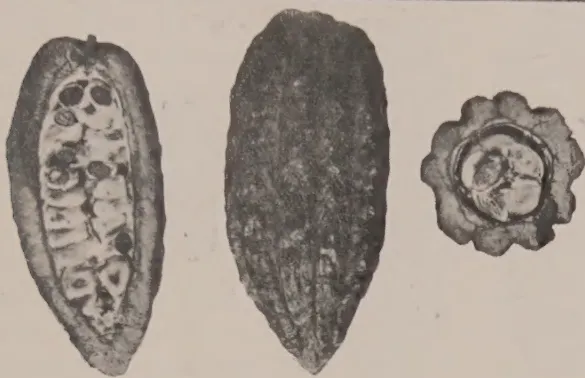

Fig. 1

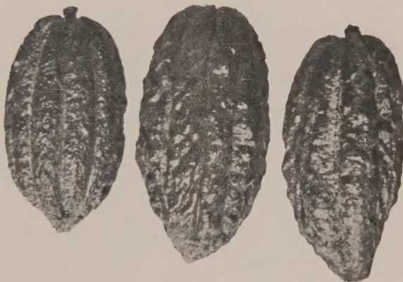

Fig. 2

Fig. 3

Fig. 4

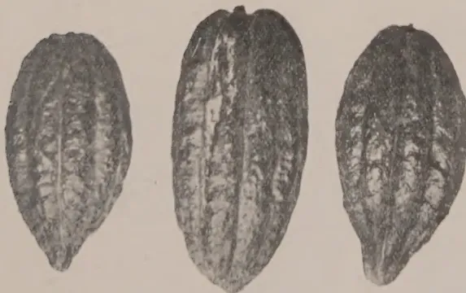

Fig. 5

Fig. 6

Fig. 7

BIOL. by Survey Dept. Ceylon.

### The Criollo Angloleta.

Legend:—Fig. 1. Type-form resembling Zehntner's Criollo type of the Djati-Roenggo hybrid.  
 Fig. 2. Type-form of the Old Red of Ceylon.  
 Fig. 3. Type-form of the Java Criollo.  
 Fig. 4. Type-form showing divergence towards Forastero.  
 Fig. 6. Type-form showing divergence towards Forastero.  
 Figs. 5 & 7. Type-form resembling Hart's Trinidad Forastero Veraguso.

9------------------------------------------------

Plate 2
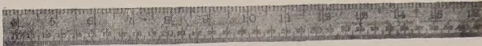
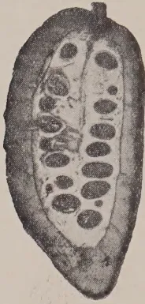
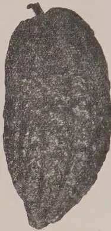
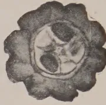
Fig. 8
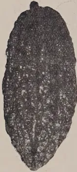
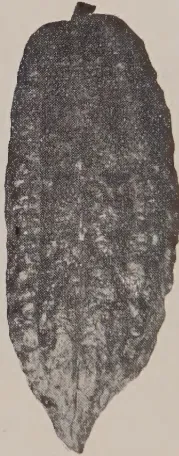
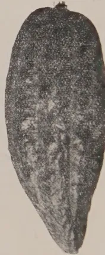
Fig. 9Fig. 10Fig. 11
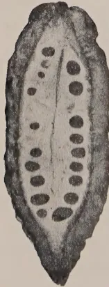
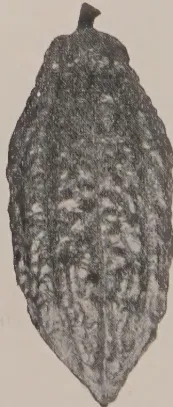
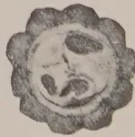
Fig. 12

Block by Survey Dept. Ceylon.

### The Nicaragua Criollo Angoleta.

Legend:—Fig. 8. Type-form resembling Zehntner's Nicaragua Criollo.  
 Fig. 9. A sub-type which should be compared with Plate I, Fig 2.  
 Fig. 10. Type-form to be compared with Lock's figure 1 of Nicaragua Criollo.  
 Fig. 11. A sub-type with Cundeamor affinities, might be compared with Wright's figure 3 of Nicaragua Criollo.  
 Fig. 12. A sub-type showing divergence towards Forastero.

10------------------------------------------------

333

towards the fruit-stalk which is often fixed to the end obliquely causing the development of a high shoulder. The apex tapers into a long acuminate point generally slanting. Surface typically dull brownish-red; warty, especially towards the apex, with ten prominent ridges. Fruit wall moderately thick and hard.

Seeds generally 37 to 40. Seeds are moderately large and may measure 3.2 cms by 1.4 cms by 1 cm (generally about 2.6 cms by 1.3 cms by 1 cm). A varying percentage always white or pale-coloured in cross section.

**2. Distinguishing characters.** (1) Rounded base somewhat tapering (if not obliquely high-shouldered). (2) Long tapering, somewhat acuminate apex (often turned to one side). (3) White, moderately large seeds in fair proportion. The absence of "bottle neck" is characteristic.

### 3. Measurements.

<table>
<thead>
<tr>
<th></th>
<th>Typical</th>
<th>Limits</th>
</tr>
</thead>
<tbody>
<tr>
<td>Length</td>
<td>7.0 inches</td>
<td>6.5—10 inches</td>
</tr>
<tr>
<td>Breadth</td>
<td>2.5 inches</td>
<td>2.5—3.6 inches</td>
</tr>
<tr>
<td>No. of seeds</td>
<td>37—40</td>
<td>33—48</td>
</tr>
</tbody>
</table>

Light-coloured seeds 30%—50%. All purple or all white  
Size of seeds 19mm. by 11mm. by 10mm.

Nicaragua Criollo is regarded as a type with a slanting curved apical point, a high shoulder and large white seeds. The seeds should be at least 3.5 cms. to 4.5 cms. long. Nicaragua Criollo Angoleta is a form with characteristics as above except that the seeds are smaller and show a varying percentage of coloured cotyledons. Of the 609 trees in bearing in the plot there were 25 trees within the limits of the type form.

### L2. THE SMOOTH ANGOLETA.

**1. Description.** Fruits generally medium size (typical 7.75 inches by 3.25 inches). In shape elliptical to ovate or oblong. Apex slightly acuminate, generally obtuse or acute blunted. Surface pearly smooth, light ashy pink with ashy-green patches. Turns yellow to brownish-yellow with orange-red when ripening. Furrows five, broad and shallow. Fruit wall (0.3 inches in furrows and 0.45 inches in ridges) thick, with a moderately hard woody core. Seeds 38 to 46, generally small, plump and all purple.

There are trees listed as belonging to this type-form. The seeds are not of desirable quality but the trees are generally good yielders.

**2. Distinguishing characters.** This form is distinguished from L4 by having all its seeds purple and from an Amelonado by the measurements, the breadth never exceeding half the length.

11------------------------------------------------

334

### 3. Measurements.

<table>
<thead>
<tr>
<th></th>
<th>Typical</th>
<th>Limits</th>
</tr>
</thead>
<tbody>
<tr>
<td>Length</td>
<td>7.75 inches</td>
<td>6.0—9.0 inches</td>
</tr>
<tr>
<td>Breadth</td>
<td>3.25 inches</td>
<td>3.0—3.8 inches</td>
</tr>
<tr>
<td>No. of seeds</td>
<td>38—46</td>
<td>28—50</td>
</tr>
</tbody>
</table>

Of the 609 trees in bearing in the plot there were 101 within the limits of this type form.

#### L4, THE PORCELAINE ANGOLETA.

**1. Description.** Fruits generally small to medium-sized (typical 6.5 inches x 3.0 inches) in shape similar to L3, as also in character of surface. Colour typically carmine ripening to deep orange-red rather than yellow. Seeds 30—38, all being nearly white or only a small percentage purple. Seeds 23mm. by 13mm. by 19mm.

**2. Distinguishing characters.** The large percentage of white seeds, connected by intermediates with A3 (q. v.).

### 3. Measurements.

<table>
<thead>
<tr>
<th></th>
<th>Typical</th>
<th>Limits</th>
</tr>
</thead>
<tbody>
<tr>
<td>Length</td>
<td>6.5 inches</td>
<td>6.25—9.0 inches</td>
</tr>
<tr>
<td>Breadth</td>
<td>3.0 inches</td>
<td>6.9—3.9 inches</td>
</tr>
<tr>
<td>No. of seeds</td>
<td>30—38</td>
<td>26—48</td>
</tr>
<tr>
<td>Percentage of light-coloured seeds</td>
<td>100%</td>
<td>3%—100%</td>
</tr>
</tbody>
</table>

The forms of Plate III. represent an intermediate class which has previously been referred to under Nicaraguan Criollo but the purple seeds link it up with the Amelonado class of cacao. Of 609 trees in bearing in the plot there were 36 trees within the limits of this type-form.

#### C1, THE PARENT CUNDEAMOR.

**1. Description.** Fruits medium to large, generally elongated oblong-oval tapering abruptly to a blunt point. Surface not very warty; ten furrows distinct; alternate ones deeper and narrower. Colour generally greyish green with dull red shade, ripening to yellow with a reddish vivid hue or only a coppery-yellow suffusion. Fruit-wall moderately thick; soft or with a hard rind. Seeds 28 to 48; oval in cross-section and generally dark to light purple in colour. A few seeds often white or nearly so.

**2. Distinguishing characters.** (1) The bottle-neck. (2) Elongated form. (3) Dull hue.

### 3. Measurements.

<table>
<thead>
<tr>
<th></th>
<th>Typical</th>
<th>Limits</th>
</tr>
</thead>
<tbody>
<tr>
<td>Length (a)</td>
<td>8.5—9.0 inches</td>
<td></td>
</tr>
<tr>
<td>(b)</td>
<td>7.75—8.0 inches</td>
<td>7.25—10.00 inches</td>
</tr>
<tr>
<td>Breadth</td>
<td>3.2—3.6 inches</td>
<td>2.2—4.0 inches</td>
</tr>
<tr>
<td>No. of seeds</td>
<td>38—42</td>
<td>28—48</td>
</tr>
</tbody>
</table>

12------------------------------------------------

Plate 3

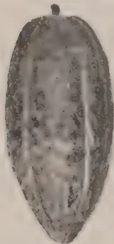

Fig. 13

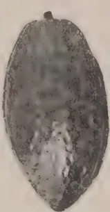

Fig. 14

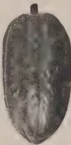

Fig. 15

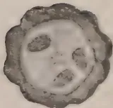

Fig. 16

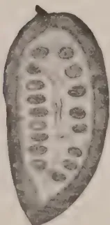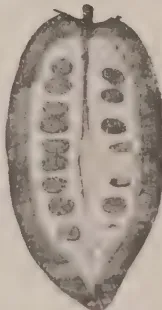

Fig. 18

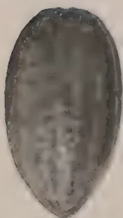

Fig. 17

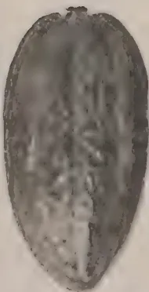

Fig. 19

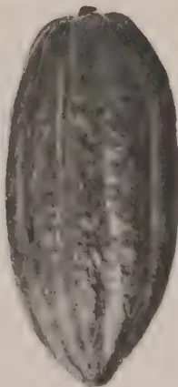

Block by Survey Dept. Ceylon

### The Smooth Angloleta.

Figs. 13, 14, 15, 16, 17, 18, and 19. Forms separated from the Amelonado group on measurements.

13------------------------------------------------

This image is a scan of a blank page. The background is a uniform light beige or off-white color. There are a few very small, faint dark specks scattered across the lower portion of the page, which appear to be scanning artifacts or dust particles. No text, lines, or other graphical elements are present.

14------------------------------------------------

335

Thickness of pericarp  $\frac{2}{3}$  inch in furrows and nearly 1 inch on ridges.

Of 609 trees in bearing in the plot there were 144 trees within the limits of this type-form.

**C2. THE SMALL CUNDEAMOR.**

**1. Description.** Fruits small (7 inches or less) well-furrowed, warty, with furrows equally marked, bottle-necked, elliptical-oval. Obtuse apex, light red with greenish-white, ripening brilliant orange-red. Fruit-wall thin (0.2 inch in furrows and 0.5 inch in ridges) and easy to cut. Seeds generally 33 to 37 with a varying percentage pale-coloured. Size 21mm. by 13mm. by 9mm.

**2. Distinguishing characters.** (1) Small size (never more than 7 inches). (2) Vivid hues on ripening.

**3. Measurements.**

<table>
<thead>
<tr>
<th></th>
<th>Typical</th>
<th>Limits</th>
</tr>
</thead>
<tbody>
<tr>
<td>Length</td>
<td>6.5—7.0 inches</td>
<td>5.5—7.0 inches</td>
</tr>
<tr>
<td>Breadth</td>
<td>3.25 inches</td>
<td>2.5—3.50 inches</td>
</tr>
<tr>
<td>No. of seeds</td>
<td>33—37</td>
<td>18—42</td>
</tr>
<tr>
<td>Size of seeds</td>
<td>21mm. by 13mm. by 9mm.</td>
<td></td>
</tr>
</tbody>
</table>

Of 609 trees in bearing in the plot there were 15 within the limits of this type-form.

**C3. THE GREEN CUNDEAMOR.**

**1. Description.** Fruits generally long, very warty; the tubercles on ridges swell out making the furrows extremely narrow and deep. Typically ashy-green, turning a lemon-yellow when ripe. Apex generally obtuse and tubercled. Fruit-wall thick with a woody inner shell. Seeds 36 to 48 all purple and small.

**2. Distinguishing characters.** The green warty surface suggesting a Kaffir-lemon. In some forms where the constriction is faint very much like a green Nicaragua Criollo form.

**3. Measurements.**

<table>
<thead>
<tr>
<th></th>
<th>Typical</th>
<th>Limits</th>
</tr>
</thead>
<tbody>
<tr>
<td>Length</td>
<td>8.5—8.75 inches</td>
<td>7.25—10.00 inches</td>
</tr>
<tr>
<td>Breadth</td>
<td>3.25</td>
<td>2.9—3.75 inches</td>
</tr>
<tr>
<td>No. of seeds</td>
<td>39—42</td>
<td>36—48</td>
</tr>
<tr>
<td>Size of seeds</td>
<td>23mm. by 13mm. by 10mm.</td>
<td></td>
</tr>
</tbody>
</table>

Of 609 trees in bearing in the plot there were 34 within the limits of this type form.

**C4. THE TRINIDAD CRIOLLO CUNDEAMOR.**

**1. Description.** Medium sized fruits, slender and pointed towards the apex, bottle-necked strongly. Surface smooth to irregular, ashy pink ripening a bronze-yellow to orange-yellow.

15------------------------------------------------

336

Furrows distinct in most cases and deep. Fruit wall thin and very soft to cut. Seeds 37 to 48, a fairly large percentage white or pale-coloured.

**2. Distinguishing characters.** (1) Slender shape, (2) Surface not quite smooth, (3) Colour bronze-yellow, (4) Thin fruit wall, (5) Pale-coloured seeds.

**3. Measurements.**

<table>
<thead>
<tr>
<th></th>
<th>Typical</th>
<th>Limits</th>
</tr>
</thead>
<tbody>
<tr>
<td>Length</td>
<td>7.0—7.5 inches</td>
<td>6.5—9.0 inches</td>
</tr>
<tr>
<td>Breadth</td>
<td>5.0 inches</td>
<td>2.2—3.4 inches</td>
</tr>
<tr>
<td>No. of seeds</td>
<td>37—42</td>
<td>37—48</td>
</tr>
<tr>
<td>Percentage of pale-coloured seeds.</td>
<td colspan="2">25% to 33%</td>
</tr>
</tbody>
</table>

Of the 609 trees in bearing in the plot there were 12 within the limits of this type-form.

**C2. THE SMOOTH CUNDEAMOR.**

**1. Description.** Forms comparable with L3, except that they are bottle-necked. Some are large-sized, others slender, generally smooth, polished surface with shallow furrows. Shape generally elliptical, tapering often to a straight point. Colour ashy-green with a red suffusion ripening into a yellow with a light red shade. Others with an apex that is mamillate ripen a chrome yellow, the colour of a mango. Seeds 40 to 43, all purple.

**2. Distinguishing characters.** Smooth polished surface with a bottle-neck and purple seeds.

**3. Measurements.**

<table>
<thead>
<tr>
<th></th>
<th>Typical</th>
<th>Limits</th>
</tr>
</thead>
<tbody>
<tr>
<td>Length</td>
<td>6.0—7.5 inches</td>
<td>4.75—9.5 inches</td>
</tr>
<tr>
<td>Breadth</td>
<td>3.0—3.25 inches</td>
<td>2.75—3.5 inches</td>
</tr>
<tr>
<td>No. of seeds</td>
<td>40—43</td>
<td>30—49</td>
</tr>
</tbody>
</table>

Thickness of pericarp 0.5 inch and 0.6 inch.

Of the 609 trees in bearing in the plot there were 152 within the limits of this type form.

**A1. THE CALABACILLO AMELONADO.**

**1. Description.** Small fruits never longer than 6 inches, ovate in form, blunt at the apex, furrows indistinct to smooth. Colour pale-whitish green, turning yellow or red. Fruit-wall somewhat woody. Seeds generally 41 to 43, small, dark-purple.

**2. Distinguishing characters.** Small fruit with a woody pericarp and purple seeds.

**3. Measurements.**

<table>
<thead>
<tr>
<th></th>
<th>Typical</th>
<th>Limits</th>
</tr>
</thead>
<tbody>
<tr>
<td>Length</td>
<td>5.25 inches</td>
<td>5.0—6.0 inches</td>
</tr>
<tr>
<td>Breadth</td>
<td>2.75 inches</td>
<td>2.75—3.0 inches</td>
</tr>
<tr>
<td>No. of seeds</td>
<td>41 to 43</td>
<td>21 to 46</td>
</tr>
</tbody>
</table>

Of the 609 trees in bearing in the plot there were 20 within the limits of this type-form.

16------------------------------------------------

Plate 4

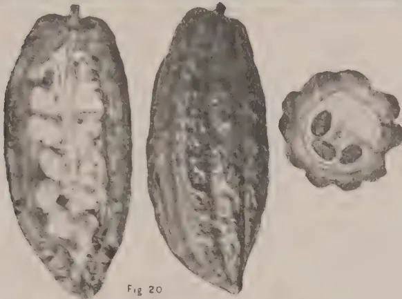

Fig. 20

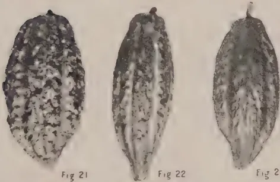

Fig. 21

Fig. 22

Fig. 23

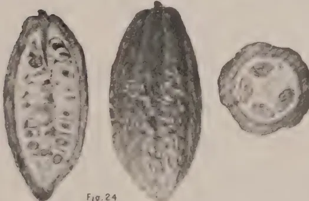

Fig. 24

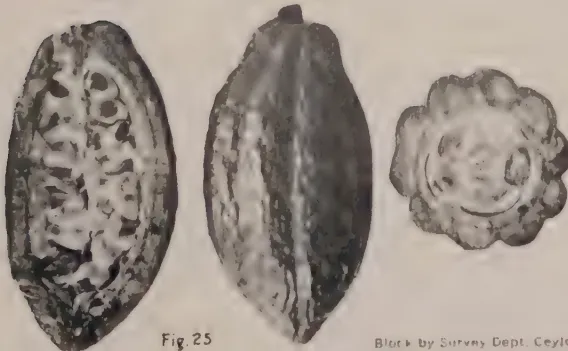

Fig. 25

Block by Survey Dept. Ceylon

### The Cundeamor Type Forms.

Legend:—Fig. 20. The Parent Cundeamor.  
 Figs. 21, 22 and 23. Examples of the Small Cundeamor comparable with  
 Zehntner's type of Brussels cacao.  
 Fig. 24. The Trinidad Criollo Cundeamor.  
 Fig. 25. The Smooth Cundeamor.

17------------------------------------------------

This image is a scan of a blank page. The paper has a light beige or cream-colored tint. There are some very faint, blurry marks scattered across the surface, which appear to be scanning artifacts or minor imperfections in the paper itself. No text, lines, or other graphical elements are present.

18------------------------------------------------

337

### A2. THE TRINIDAD AMELONADO.

**1. Description.** Large fruits (larger than 6 inches) similar in shape to A4 or elliptical and faintly bottle-necked. Surface smooth and indistinctly furrowed in some cases only. Seeds 41 to 43, small, dark-purple.

**2. Distinguishing characters.** Fine, large, somewhat polished, smooth, green fruits, yellow when ripe.

#### 3. Measurements.

<table>
<thead>
<tr>
<th></th>
<th>Typical</th>
<th>Limits</th>
</tr>
</thead>
<tbody>
<tr>
<td>Length</td>
<td>6.25 inches</td>
<td>6.0—7.8 inches</td>
</tr>
<tr>
<td>Breadth</td>
<td>3.75 inches</td>
<td>3.2—4.5 inches</td>
</tr>
<tr>
<td>No. of seeds</td>
<td>41—43</td>
<td>34—49</td>
</tr>
<tr>
<td>Pericarp</td>
<td colspan="2">0.5 inch and 0.6 inch (latter on ridge).</td>
</tr>
</tbody>
</table>

Of the 609 trees in bearing in the plot there were 18 within the limits of this type-form.

### A3. THE PORCELAIN AMELONADO.

**1. Description.** Small fruits (generally not larger than 6 inches) with furrows indistinct to smooth. Ovate with apex obtuse or acute. Colour and surface otherwise as in L4. Fruit-wall thin and soft. Seeds 25 to 35, a varying percentage white or pale-coloured in cross-section.

**2. Distinguishing characters.** Small ovate fruits with dark reddish polished surface, thin fruit-wall and white seeds.

#### 3. Measurements.

<table>
<thead>
<tr>
<th></th>
<th>Typical</th>
<th>Limits</th>
</tr>
</thead>
<tbody>
<tr>
<td>Length</td>
<td>4.5 inches</td>
<td>4.0—7.05 inches</td>
</tr>
<tr>
<td>Breadth</td>
<td>2.75 inches</td>
<td>2.4—3.7 inches</td>
</tr>
<tr>
<td>No. of seeds</td>
<td>25—35</td>
<td>25—46</td>
</tr>
<tr>
<td>Percentage of pale-coloured seeds</td>
<td colspan="2">40%</td>
</tr>
</tbody>
</table>

Of the 609 trees in bearing in the plot there were 14 within the limits of this type-form.

### A4. THE CACAO NACIONAL AMELONADO.

**1. Description.** Large fruits like A2, except that furrows are well-marked, constricted in some cases. Seeds 33 to 42, all deep purple.

**2. Distinguishing characters.** The large green fruits well-furrowed, bottle-necked in some cases.

#### 3. Measurements.

<table>
<thead>
<tr>
<th></th>
<th>Typical</th>
<th>Limits</th>
</tr>
</thead>
<tbody>
<tr>
<td>Length</td>
<td>6.75 inches</td>
<td>6.0—7.7 inches</td>
</tr>
<tr>
<td>Breadth</td>
<td>3.5 inches</td>
<td>3.0—4.2 inches</td>
</tr>
<tr>
<td>No. of seeds</td>
<td>33 to 42</td>
<td>33 to 42</td>
</tr>
</tbody>
</table>

Of the 609 trees in bearing in the plot there were 6 within the limits of this type-form.

19------------------------------------------------

338

The results of the examination are shown in the following table:  
 Tabulated Statement of Trees Examined.

<table border="1">
<thead>
<tr>
<th rowspan="2">No. of the row.</th>
<th colspan="4">Angoletas</th>
<th colspan="5">Cundeamors</th>
<th colspan="4">Amelonados</th>
<th rowspan="2">Total in bearing</th>
<th rowspan="2">Trees not in bearing</th>
</tr>
<tr>
<th>L 1</th>
<th>L 2</th>
<th>L 3</th>
<th>L 4</th>
<th>C 1</th>
<th>C 2</th>
<th>C 3</th>
<th>C 4</th>
<th>C 5</th>
<th>A 1</th>
<th>A 2</th>
<th>A 3</th>
<th>A 4</th>
</tr>
</thead>
<tbody>
<tr><td>1</td><td>...</td><td>...</td><td>3</td><td>...</td><td>1</td><td>...</td><td>...</td><td>...</td><td>2</td><td>...</td><td>...</td><td>...</td><td>...</td><td>6</td><td>1</td></tr>
<tr><td>2</td><td>8</td><td>4</td><td>10</td><td>2</td><td>6</td><td>...</td><td>3</td><td>2</td><td>3</td><td>...</td><td>...</td><td>...</td><td>...</td><td>38</td><td>5</td></tr>
<tr><td>3</td><td>...</td><td>...</td><td>5</td><td>4</td><td>9</td><td>...</td><td>2</td><td>...</td><td>10</td><td>1</td><td>...</td><td>1</td><td>...</td><td>32</td><td>10</td></tr>
<tr><td>4</td><td>2</td><td>..</td><td>3</td><td>4</td><td>7</td><td>2</td><td>3</td><td>...</td><td>15</td><td>1</td><td>1</td><td>...</td><td>...</td><td>38</td><td>5</td></tr>
<tr><td>5</td><td>3</td><td>...</td><td>3</td><td>...</td><td>9</td><td>...</td><td>1</td><td>1</td><td>10</td><td>2</td><td>...</td><td>2</td><td>...</td><td>31</td><td>10</td></tr>
<tr><td>6</td><td>1</td><td>...</td><td>8</td><td>2</td><td>7</td><td>3</td><td>2</td><td>1</td><td>7</td><td>1</td><td>...</td><td>...</td><td>2</td><td>34</td><td>8</td></tr>
<tr><td>7</td><td>3</td><td>1</td><td>5</td><td>2</td><td>9</td><td>...</td><td>3</td><td>1</td><td>7</td><td>3</td><td>1</td><td>3</td><td>...</td><td>38</td><td>5</td></tr>
<tr><td>8</td><td>...</td><td>4</td><td>5</td><td>2</td><td>6</td><td>1</td><td>4</td><td>...</td><td>9</td><td>...</td><td>2</td><td>...</td><td>1</td><td>34</td><td>9</td></tr>
<tr><td>9</td><td>...</td><td>1</td><td>2</td><td>3</td><td>4</td><td>1</td><td>3</td><td>2</td><td>6</td><td>2</td><td>2</td><td>2</td><td>1</td><td>29</td><td>12</td></tr>
<tr><td>10</td><td>...</td><td>1</td><td>6</td><td>3</td><td>7</td><td>1</td><td>2</td><td>...</td><td>14</td><td>2</td><td>..</td><td>1</td><td>...</td><td>37</td><td>7</td></tr>
<tr><td>11</td><td>1</td><td>2</td><td>5</td><td>2</td><td>7</td><td>...</td><td>2</td><td>1</td><td>9</td><td>..</td><td>2</td><td>...</td><td>...</td><td>31</td><td>9</td></tr>
<tr><td>12</td><td>1</td><td>...</td><td>6</td><td>1</td><td>11</td><td>1</td><td>1</td><td>2</td><td>7</td><td>...</td><td>1</td><td>2</td><td>...</td><td>33</td><td>9</td></tr>
<tr><td>13</td><td>1</td><td>3</td><td>4</td><td>2</td><td>10</td><td>1</td><td>2</td><td>1</td><td>5</td><td>3</td><td>3</td><td>1</td><td>...</td><td>36</td><td>6</td></tr>
<tr><td>14</td><td>3</td><td>2</td><td>7</td><td>4</td><td>9</td><td>...</td><td>1</td><td>...</td><td>8</td><td>1</td><td>...</td><td>2</td><td>...</td><td>37</td><td>6</td></tr>
<tr><td>15</td><td>2</td><td>1</td><td>6</td><td>...</td><td>11</td><td>...</td><td>...</td><td>...</td><td>7</td><td>1</td><td>1</td><td>...</td><td>1</td><td>30</td><td>10</td></tr>
<tr><td>16</td><td>2</td><td>1</td><td>7</td><td>2</td><td>5</td><td>..</td><td>1</td><td>1</td><td>10</td><td>1</td><td>1</td><td>...</td><td>1</td><td>32</td><td>8</td></tr>
<tr><td>17</td><td>1</td><td>...</td><td>3</td><td>1</td><td>10</td><td>3</td><td>1</td><td>...</td><td>8</td><td>...</td><td>1</td><td>...</td><td>...</td><td>28</td><td>10</td></tr>
<tr><td>18</td><td>1</td><td>1</td><td>4</td><td>1</td><td>7</td><td>2</td><td>2</td><td>...</td><td>11</td><td>...</td><td>2</td><td>...</td><td>...</td><td>31</td><td>5</td></tr>
<tr><td>19</td><td>1</td><td>2</td><td>5</td><td>1</td><td>6</td><td>...</td><td>...</td><td>...</td><td>3</td><td>2</td><td>1</td><td>..</td><td>...</td><td>21</td><td>6</td></tr>
<tr><td>20</td><td>2</td><td>1</td><td>4</td><td>...</td><td>3</td><td>...</td><td>...</td><td>...</td><td>...</td><td>...</td><td>...</td><td>...</td><td>...</td><td>10</td><td>4</td></tr>
<tr><td>21</td><td>...</td><td>1</td><td>...</td><td>...</td><td>...</td><td>...</td><td>1</td><td>...</td><td>1</td><td>...</td><td>...</td><td>...</td><td>...</td><td>3</td><td>2</td></tr>
<tr><td>Total</td><td>32</td><td>25</td><td>101</td><td>36</td><td>144</td><td>15</td><td>34</td><td>12</td><td>152</td><td>20</td><td>18</td><td>14</td><td>6</td><td>609</td><td>147</td></tr>
</tbody>
</table>

Of the 609 trees from a single parent in bearing at the time of examination the classification was as follows:—

20------------------------------------------------

Plate 5

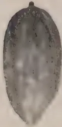

Fig. 26

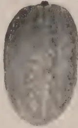

Fig. 27

Fig. 28

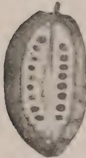
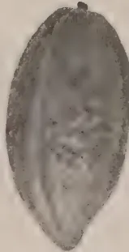
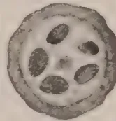

Fig. 29

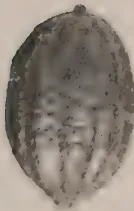

Fig. 30

Fig. 31

Fig. 32

Fig. 33

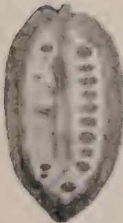

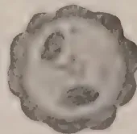

Fig. 34

Block by Survey Dept. Caylon

Legend:—Figs. 26 27 and 28. The Calabacillo Amelonado type-form.  
 Fig. 29.—The Trinidad Amelonado type-form.  
 Figs. 30, 31, 32 and 33. The Porcelain Amelonado type-form.  
 Fig. 34.—A form which resembles some form of Cacao Nacional.

21------------------------------------------------

<!-- stage4: FAINT old-images-only -->

[Faint page: no legible print of its own could be verified; text withheld (stage 4 review list)]

This image is a scan of a blank page. The paper has a light beige or cream-colored tint. There are a few very small, faint dark spots scattered across the surface, which appear to be scanning artifacts or minor imperfections in the paper. No text, lines, or other markings are present.

22------------------------------------------------

339

<table border="0">
<tbody>
<tr>
<td rowspan="4">Angoletas</td>
<td rowspan="4">{</td>
<td>Criollo</td>
<td>32</td>
<td></td>
</tr>
<tr>
<td>Nicaragua Criollo</td>
<td>25</td>
<td></td>
</tr>
<tr>
<td>Smooth Angoleta</td>
<td>101</td>
<td></td>
</tr>
<tr>
<td>Porcelaine Angoleta</td>
<td>36</td>
<td>194</td>
</tr>
<tr>
<td rowspan="5">Cundeamors</td>
<td rowspan="5">{</td>
<td>Parent type</td>
<td>144</td>
<td></td>
</tr>
<tr>
<td>Small</td>
<td>15</td>
<td></td>
</tr>
<tr>
<td>Green</td>
<td>34</td>
<td></td>
</tr>
<tr>
<td>Trinidad Criollo</td>
<td>12</td>
<td></td>
</tr>
<tr>
<td>Smooth</td>
<td>152</td>
<td>357</td>
</tr>
<tr>
<td rowspan="4">Amelonados</td>
<td rowspan="4">{</td>
<td>Calabacillo</td>
<td>20</td>
<td></td>
</tr>
<tr>
<td>Trinidad</td>
<td>18</td>
<td></td>
</tr>
<tr>
<td>Porcelaine</td>
<td>14</td>
<td></td>
</tr>
<tr>
<td>Cacao Nacional</td>
<td>6</td>
<td>58</td>
</tr>
<tr>
<td colspan="3" style="text-align: center;">Total</td>
<td></td>
<td><u>609</u></td>
</tr>
</tbody>
</table>

#### The Forms on Plots 63-67.

From a careful census made of the trees on this block of young cacao it was found that there were 756 trees (exclusive of vacancies). Of these over 25% (i.e., 147 trees) were young plants and were in bearing at the time of examination. The 609 trees in bearing carried pods of shapes which indicated the hybrid character of the parent. The forms when referred to the three Forastero types existed in the following proportions:

<table border="0">
<tbody>
<tr>
<td>Cundeamor</td>
<td>357 trees or 58.6%</td>
</tr>
<tr>
<td>Angoleta</td>
<td>194 trees or 31.9%</td>
</tr>
<tr>
<td>Amelonado</td>
<td>58 trees or 9.5%</td>
</tr>
<tr>
<td style="text-align: center;">Total</td>
<td><u>609 trees or 100%</u></td>
</tr>
</tbody>
</table>

It is possible that in a few years more the characters shown by the pods may have necessitated a slightly different division. It is improbable, however, that the proportions given will ever be greatly different and the proportions are likely to remain permanently somewhere in the ratio of 60 : 33 : 7 for Cundeamor, Angoleta and Amelonado forms. These proportions bring out the fact that the progeny of a hybrid form is being dealt with. The proportions are of value in showing what one may expect after careful selection of seed from a good strain of Forastero. If the 60% of Cundeamors all showed characters similar to the parent form, then it would indeed be a matter for congratulation. Unfortunately, the case is far from being so simple. Under Cundeamor, a large number had of necessity to be grouped into a class which would be considered undesirable when compared with the desirable parent form. Similarly, the Angoletas comprise a group of good and bad forms. There are also good Amelonados and, though they are very few, bad Amelonados.

23------------------------------------------------

340

It is remarkable what a large amount of variation is shown in the forms of pods of each and every tree. Nearly every tree can be described as a "form," the pods of which approximate in characters to one "form" that may be classed as typical of the tree. Another tree may show in its type only a trifling variation from the first tree, e.g., a long tapering point or a moderately warty coat, but this is shown over and over again in the pods of this tree which can in turn be said to differ very minutely from the "type" of another tree. The external character of the fruit cannot be correlated with seed characters. It would seem as if the set of factors operating in changing the size, shape and colour of seed operate sometimes with less, sometimes with greater, force in changing the size, shape, colour and other external features of the fruit-wall. Small smooth-skinned fruits do not give deeply-coloured seeds always nor do large warty fruits always give plump and light-coloured seeds. Yet these characters may, generally speaking, be said to be correlative.

#### Bibliography.

1. (1) LOCK, R. H.—Rept. on Expts. in Manuring Old Cacao, etc. R. B. G. Circ. and A. J. Vol. VI, No. 4, Oct. 1911.
2. (2) LOCK, R. H.—On the Varieties of Cacao, etc. R. B.G. Circ. and A. J. Vol. VII, No. 24, Oct. 1904.
3. (3) VAN HALL, C. J. J.—Cocoa, Macmillan & Co., 1914.
4. (4) WRIGHT, H.—A Rept. by the Controller, Expt. Station, Peradeniya, R. B. G. Circ. and A. J., Vol. 11, No. 4, 1903.
5. (5) ZEHNTNER, L.—Mededeelingen omtrent de op, Java aangeplante Cacaovarieteiten. Proefstation voor Salat, Bull. No. 9, 1905.
6. (6) PREUSS, P.—Expeditionanach Central und Sudamerika, 1899—1900, Berlin, 1901.
7. (7) HART, T. H.—Cacao, Duckworth & Co., 1911.
8. (8) CHEVALIER.—Le Cacaooyer dans l'Ouest Africain, 1908.
9. (9) WRIGHT, H.—Theobroma Cacao, A. M. & J. Ferguson, 1907.
10. (10) JUMELLA.—Culture Pratique du Cacoyer, etc. A Challamel, Paris, 1906.
11. (11) CHALOT & LUC.—Le Cacoyer àu Congo Francais A. Challamel, Paris, 1906.

*Note added by F. A. Stockdale, October, 1928.*

A count of the seeds with dark purple, light purple and white cotyledons was made on a number of trees selected in the different groups for future breeding work but the investigation

24------------------------------------------------

341

was incomplete when the death of the investigator occurred. Such a count is of importance if further selection work is to be done, as also is the record of yields which has been begun on a number of trees in this plot. The records so far available have been tabulated by Holland, the Manager of the Experiment Station, Peradeniya, as follows:—

Individual tree yields of 133 trees in the "B" Cacao, Experiment Station, Peradeniya, for the years 1925-26 and 1926-27.

<table border="1">
<thead>
<tr>
<th colspan="3">April 1925 to March 1926 Persentage of number of trees giving</th>
<th colspan="3">April 1926 to March 1927 Percentage of number of trees giving</th>
<th colspan="2">Averages for the two years 1926-1927</th>
</tr>
<tr>
<th>Pods no.</th>
<th>Good pods %</th>
<th>Good and diseased pods %</th>
<th>Pods no.</th>
<th>Good pods %</th>
<th>Good and diseased pods %</th>
<th>Good pods %</th>
<th>Good and diseased pods %</th>
</tr>
</thead>
<tbody>
<tr>
<td>0 to 12</td>
<td>31.57</td>
<td>12.70</td>
<td>0 to 12</td>
<td>33.08</td>
<td>15.78</td>
<td>32.32</td>
<td>14.24</td>
</tr>
<tr>
<td>13 to 25</td>
<td>22.55</td>
<td>13.53</td>
<td>13 to 25</td>
<td>16.54</td>
<td>20.30</td>
<td>19.54</td>
<td>16.91</td>
</tr>
<tr>
<td>26 to 50</td>
<td>24.81</td>
<td>33.08</td>
<td>26 to 50</td>
<td>27.81</td>
<td>28.57</td>
<td>26.31</td>
<td>30.82</td>
</tr>
<tr>
<td>51 to 75</td>
<td>14.28</td>
<td>21.05</td>
<td>51 to 75</td>
<td>13.53</td>
<td>18.04</td>
<td>13.90</td>
<td>19.54</td>
</tr>
<tr>
<td>76 to 100</td>
<td>4.51</td>
<td>9.72</td>
<td>76 to 100</td>
<td>6.75</td>
<td>8.27</td>
<td>5.63</td>
<td>8.99</td>
</tr>
<tr>
<td>Over 100</td>
<td>2.25</td>
<td>9.72</td>
<td>Over 100</td>
<td>2.25</td>
<td>9.02</td>
<td>2.25</td>
<td>9.37</td>
</tr>
<tr>
<td>Total..</td>
<td>99.97</td>
<td>99.80</td>
<td></td>
<td>99.97</td>
<td>99.98</td>
<td>99.95</td>
<td>99.87</td>
</tr>
</tbody>
</table>

It has, however, been pointed out by Holland in the *Tropical Agriculturist* for January, 1928, page 62, that four years' records of individual yields of pods from 133 trees in the "B" cacao revealed the fact that, with one exception, the trees bearing the largest number of pods all bore small pods.

A test was then made to ascertain the relative amounts of dry cacao obtained from equal numbers of large pods and of small pods. Four lots of 150 large pods and 4 lots of 150 small pods were taken. The results were as follows:—

#### Large Pods.

<table border="1">
<thead>
<tr>
<th></th>
<th>Weight of 150 pods lbs.</th>
<th>Weight of dry cacao obtained lbs.</th>
</tr>
</thead>
<tbody>
<tr>
<td>Lot 1 . . . . .</td>
<td>235</td>
<td>16</td>
</tr>
<tr>
<td>„ 2 . . . . .</td>
<td>220</td>
<td>14<math>\frac{1}{2}</math></td>
</tr>
<tr>
<td>„ 3 . . . . .</td>
<td>188</td>
<td>13<math>\frac{3}{4}</math></td>
</tr>
<tr>
<td>„ 4 . . . . .</td>
<td>225</td>
<td>15</td>
</tr>
<tr>
<td>Average</td>
<td>217</td>
<td>14<math>\frac{3}{4}</math></td>
</tr>
</tbody>
</table>

25------------------------------------------------

342Small Pods.

<table>
<thead>
<tr>
<th></th>
<th>Weight of 150 pods lbs.</th>
<th>Weight of dry cacao obtained lbs.</th>
</tr>
</thead>
<tbody>
<tr>
<td>Lot 5 . . . . .</td>
<td>136</td>
<td>12</td>
</tr>
<tr>
<td>,, 6 . . . . .</td>
<td>124</td>
<td>10½</td>
</tr>
<tr>
<td>,, 7 . . . . .</td>
<td>126</td>
<td>11</td>
</tr>
<tr>
<td>,, 8 . . . . .</td>
<td>138</td>
<td>11¼</td>
</tr>
<tr>
<td>Average</td>
<td>131</td>
<td>11¼</td>
</tr>
</tbody>
</table>

This indicates that although the larger pods had a greater proportion of shell, an equal number still gave 21% more dry cacao than was obtained from a similar number of small pods. The method of recording yields in experiments by numbers of pods cannot therefore be considered satisfactory. Data are being secured on the Experiment Station, Peradeniya, as to the weight of wet cacao per 100 pods for the 133 trees under investigation, but the records have not yet been kept for a sufficiently long period for the results to be published.

F. A. STOCKDALE.

Peradeniya, October, 1928.

26------------------------------------------------

313

# Sugar-Cane Experiments at Allai.

**F. A. STOCKDALE, C.B.E., M.A., F.L.S.**

*Director of Agriculture.*

**T**HE following brief report on the sugar-cane experiments at Allai in the Trincomalee District of the Eastern Province has been prepared for general information.

These experiments were begun in August, 1925, on a recommendation of the Committee appointed to advise Government on proposals submitted in connection with the further development of the economic resources of the Colony (Sessional Paper VI, of 1921). Two areas of five acres each were selected near to Killivedi, but only one of these has been developed. It was cleared and prepared for planting during the north-east monsoon season and it was anticipated that results would indicate whether sugar-cane cultivation was likely to be a successful undertaking in about three years.

The object of the station was to ascertain experimentally whether sugar-cane could be cultivated as a commercial undertaking in the Trincomalee district and to test what varieties would be the most suitable. It was not possible to commence planting until November, 1925, and then  $2\frac{1}{2}$  acres were planted up with eleven varieties of sugar-cane. Cuttings had to be obtained from Peradeniya and Anuradhapura Experiment Stations and in consequence germination was poor and growth was stunted during the period of heavy rains. Further planting was continued during the months of February, March, July, August, September and October, 1926, and subsequent results have shown the value of planting with irrigation during the dry months of the middle of the year so that the sugar-cane plants are fairly well grown when the heavy rains of the North-East Monsoon Season begin. Irrigation on the Station was provided by means of a Persian wheel which has been found sufficient to irrigate an acreage of 1 acre per chain. Irrigation has to be carried on at regular intervals during the period of March to September inclusive. Manuring with sulphate of ammonia at the rate of 200 lb. per acre was given to the crops. Growth was very good and, except in the case of Red Mauritius, pests and diseases have not been troublesome. Termites gave some difficulty at the time of planting but they were not on the whole excessively serious. Harvesting of the 1925 planting commenced in July, 1927, and extended to the middle of October, and the manufacture of jaggery was carried out for sixty days during this period. The canes at the time of harvest were fully ripe but several of them had died because of the length of the period between planting and harvest. Canes planted in May to July and irrigated are ready for harvest in

27------------------------------------------------

344

the following July to September, but growth is vigorous at other times of the year and juices suitable for sugar manufacture. The usual Indian method of manufacture of cane-sugar jaggery or gur was adopted and the manufacture was found to be easy after the officers responsible had gained the necessary experience.

After cutting the canes were ratooned and regular attention given to trashing, removal and destruction of dead canes, weeding, cultivation and manuring. The ratoon crop was cut in the period July to September, 1928, and jaggery manufactured. The results obtained are shown in the following table:—

<table border="1">
<thead>
<tr>
<th rowspan="2">Varieties</th>
<th colspan="2">Ratoon Crop</th>
</tr>
<tr>
<th>Canes</th>
<th>Jaggery</th>
</tr>
<tr>
<th></th>
<th>Tons.</th>
<th>Tons.</th>
</tr>
</thead>
<tbody>
<tr>
<td>Barbados 208</td>
<td>14.2</td>
<td>1.3</td>
</tr>
<tr>
<td>Striped White Tanna</td>
<td>19.5</td>
<td>0.8</td>
</tr>
<tr>
<td>Sin Nombore</td>
<td>32.1</td>
<td>2.2</td>
</tr>
<tr>
<td>Barbados 3390</td>
<td>22.9</td>
<td>1.3</td>
</tr>
<tr>
<td>Mauritius 131 P</td>
<td>10.5</td>
<td>0.8</td>
</tr>
<tr>
<td>Mauritius 1237</td>
<td>21.8</td>
<td>1.2</td>
</tr>
<tr>
<td>Striped Tanna</td>
<td>14.0</td>
<td>0.9</td>
</tr>
<tr>
<td>Demerara 74</td>
<td>30.6</td>
<td>1.2</td>
</tr>
<tr>
<td>Cheribon</td>
<td>11.7</td>
<td>0.5</td>
</tr>
<tr>
<td>Mauritius 55 P</td>
<td>23.9</td>
<td>1.5</td>
</tr>
</tbody>
</table>

The average quantity of cane cut per diem was 0.66 tons, which gave an average outturn of 1 cwt. of jaggery.

The average yields per acre of the total areas cut were as follows:—

<table>
<tbody>
<tr>
<td>Virgin crop</td>
<td>canes</td>
<td>35 tons</td>
</tr>
<tr>
<td></td>
<td>Jaggery</td>
<td>2.45 tons</td>
</tr>
<tr>
<td>Ratoon crop</td>
<td>canes</td>
<td>20.1 tons</td>
</tr>
<tr>
<td></td>
<td>Jaggery</td>
<td>1.17 tons</td>
</tr>
</tbody>
</table>

An examination of the figures in the tables shows some marked irregularities but these are explained by the fact that the officers responsible had no sugar-cane experience and in some cases canes became overripe before it was possible to deal with them. The best jaggery was obtained from the variety Barbados 208, and good quality jaggery was also made from the Striped Tanna and Barbados 3390 varieties. The variety Barbados 208 did not ratoon well, whilst the thin Argentine cane (Sin Nombore) resembling the Uba cane of South Africa was difficult to deal with in the virgin crop but much easier in the ratoon crop when quite a good quality jaggery was produced from it. Its juice required slightly different treatment from the juices of other varieties, but after experience it was found that its juice could be quite easily manufactured. The cost of manufacturing jaggery worked out as follows:—

<table>
<thead>
<tr>
<th></th>
<th>Per Acre</th>
</tr>
<tr>
<th></th>
<th>Rs. Cts.</th>
</tr>
</thead>
<tbody>
<tr>
<td>Labour for harvesting, transporting, crushing and boiling</td>
<td>241 50</td>
</tr>
<tr>
<td>Lime for clarification of juices</td>
<td>5 25</td>
</tr>
<tr>
<td>Fuel</td>
<td>21 00</td>
</tr>
<tr>
<td>Hire of bullocks</td>
<td>47 25</td>
</tr>
<tr>
<td>Total</td>
<td>315 00</td>
</tr>
</tbody>
</table>

This was equivalent to Rs. 128 per ton or 5.6 cents per lb.

28------------------------------------------------

345

The analyses of a number of canes made by Mr. A. W. R. Joachim, Agricultural Chemist, are as follows:—

<table border="1">
<thead>
<tr>
<th rowspan="2">Variety</th>
<th rowspan="2">Date of analysis</th>
<th rowspan="2">Juice %</th>
<th rowspan="2">Total solids %</th>
<th rowspan="2">Sp. gr. at 28°C.</th>
<th rowspan="2">Sucrose %</th>
<th rowspan="2">Invert Glucose %</th>
<th rowspan="2">Glucose ratio</th>
<th rowspan="2">Extracted sucrose %</th>
<th rowspan="2">Purity %</th>
<th rowspan="2">Remarks of Agricultural Chemist</th>
</tr>
<tr></tr>
</thead>
<tbody>
<tr>
<td>No. 1237</td>
<td>Aug. '27</td>
<td>60.1</td>
<td>18.0</td>
<td>1.0705</td>
<td>16.9</td>
<td>0.76</td>
<td>4.5</td>
<td>10.2</td>
<td>94.0</td>
<td>Ready for cutting</td>
</tr>
<tr>
<td>55 P</td>
<td>Sept. '27</td>
<td>58.4</td>
<td>14.4</td>
<td>1.0587</td>
<td>11.8</td>
<td>1.2</td>
<td>10.2</td>
<td>6.9</td>
<td>81.9</td>
<td>Not quite ready for cutting</td>
</tr>
<tr>
<td>DK 74</td>
<td>"</td>
<td>58.8</td>
<td>18.6</td>
<td>1.0705</td>
<td>17.2</td>
<td>1.2</td>
<td>6.4</td>
<td>10.1</td>
<td>92.5</td>
<td>Nearly ready for cutting</td>
</tr>
<tr>
<td>No. 1237</td>
<td>Oct. '27</td>
<td>54.78</td>
<td>16.6</td>
<td>1.0665</td>
<td>15.49</td>
<td>0.65</td>
<td>4.19</td>
<td>8.48</td>
<td>93.3</td>
<td>One year after planting and one week after arrowing</td>
</tr>
<tr>
<td>55 P</td>
<td>Feb. '28</td>
<td>51.05</td>
<td>16.0</td>
<td>1.0587</td>
<td>13.56</td>
<td>0.81</td>
<td>6.0</td>
<td>6.8</td>
<td>84.8</td>
<td rowspan="2">Do not appear to be ready for cutting</td>
</tr>
<tr>
<td>DK 74</td>
<td>"</td>
<td>50.77</td>
<td>17.6</td>
<td>1.0665</td>
<td>14.98</td>
<td>1.02</td>
<td>6.81</td>
<td>7.6</td>
<td>85.2</td>
</tr>
<tr>
<td>Striped White Tanna</td>
<td>"</td>
<td>51.71</td>
<td>14.4</td>
<td>1.054</td>
<td>10.93</td>
<td>1.14</td>
<td>10.4</td>
<td>5.65</td>
<td>75.91</td>
<td rowspan="2">Not ready for cutting</td>
</tr>
<tr>
<td>Cheribon</td>
<td>"</td>
<td>56.18</td>
<td>14.0</td>
<td>1.051</td>
<td>11.91</td>
<td>1.60</td>
<td>13.4</td>
<td>6.69</td>
<td>85.06</td>
</tr>
<tr>
<td>No. 3390</td>
<td>"</td>
<td>66.2</td>
<td>16.8</td>
<td>1.0665</td>
<td>15.4</td>
<td>1.05</td>
<td>6.81</td>
<td>9.57</td>
<td>91.7</td>
<td rowspan="2">Cane ripe, especially Barbodos 208</td>
</tr>
<tr>
<td>Barbados 208</td>
<td>"</td>
<td>61.3</td>
<td>20.0</td>
<td>1.0755</td>
<td>19.3</td>
<td>0.24</td>
<td>1.24</td>
<td>11.83</td>
<td>95.6</td>
</tr>
</tbody>
</table>

29------------------------------------------------

346

These analyses indicate quite average juices and purities for sugar-cane grown under tropical conditions.

The profit and loss account furnished by Mr. Thamotheram, the Agricultural Instructor in charge of the Station, is as follows:—

<table border="0">
<thead>
<tr>
<th colspan="2"><u>Cost of cultivation per acre.</u></th>
<th colspan="2"><u>Income.</u></th>
</tr>
<tr>
<th></th>
<th>Rs.</th>
<th></th>
<th>Rs.</th>
</tr>
</thead>
<tbody>
<tr>
<td>1. Opening land :</td>
<td></td>
<td>2.44 tons jaggery</td>
<td></td>
</tr>
<tr>
<td>    (a) felling and burning forest</td>
<td>30.00</td>
<td>per acre @-/-15*</td>
<td></td>
</tr>
<tr>
<td>    (b) uprooting stumps</td>
<td>50.00</td>
<td>cents. per lb.</td>
<td>820.00</td>
</tr>
<tr>
<td>2 Preparation of land :</td>
<td></td>
<td></td>
<td></td>
</tr>
<tr>
<td>    ploughing and cross-</td>
<td></td>
<td></td>
<td></td>
</tr>
<tr>
<td>    ploughing 4 times</td>
<td>64.00</td>
<td></td>
<td></td>
</tr>
<tr>
<td>    opening furrows</td>
<td>3.00</td>
<td></td>
<td></td>
</tr>
<tr>
<td>3. Cost of setts for planting</td>
<td>30.00</td>
<td></td>
<td></td>
</tr>
<tr>
<td>4. Planting</td>
<td>3.00</td>
<td></td>
<td></td>
</tr>
<tr>
<td>    Cultivation</td>
<td>12.00</td>
<td></td>
<td></td>
</tr>
<tr>
<td>    Irrigation</td>
<td>36.00</td>
<td></td>
<td></td>
</tr>
<tr>
<td>    Earthing up</td>
<td>12.00</td>
<td></td>
<td></td>
</tr>
<tr>
<td>    Weeding</td>
<td>24.00</td>
<td></td>
<td></td>
</tr>
<tr>
<td>    Trashing</td>
<td>18.00</td>
<td></td>
<td></td>
</tr>
<tr>
<td>    Incidental expenses</td>
<td>15.00</td>
<td></td>
<td></td>
</tr>
<tr>
<td>5. Cost of manufacturing jaggery</td>
<td></td>
<td></td>
<td></td>
</tr>
<tr>
<td>    per acre</td>
<td>192.00</td>
<td></td>
<td></td>
</tr>
<tr>
<td></td>
<td><u>Rs. 489.00</u></td>
<td></td>
<td></td>
</tr>
<tr>
<td></td>
<td></td>
<td>Profit per acre</td>
<td><u><u>Rs. 331.00</u></u></td>
</tr>
</tbody>
</table>

These figures indicate that good profits can be made. There is difficulty, however, in the disposal of the jaggery at Trincomalee and sales have had to be made at Jaffna and Batticaloa with the consequent absorption of profits for railway freight and other transport charges.

In conclusion, it may be reported that experience has so far shown that good crops of virgin canes can be grown in the Allai area and that certain varieties have ratooned satisfactorily. The cane juices are for tropical conditions satisfactory and no extraordinary difficulties in the manufacture of sugar have been experienced. With the completion of the Veregal anicut there will be a large area of land available for sugar-cane cultivation and, in view of the high profits which can be made in Ceylon owing to the import duty on manufactured sugar, it should be considered whether it is not an industry worthy of assistance and encouragement. It is possible that sugar-cane could be rotated with paddy as in Java with material advantage to the paddy grower, and I

\* This price can be realised for good jaggery when freshly made.

30------------------------------------------------

347

would strongly recommend that the system of cultivation in Java should be specially visited and reported upon by an officer of the Ceylon Department of Agriculture. Success will not, however, be achieved unless capital is available for the manufacturing side of the industry. Ceylon has now passed the stage when jaggery will be consumed in any quantity and the manufacture of white sugar requires up-to-date equipment and adequate capital. This can best be attracted from sugar interests in other parts of the world and therefore the details of this report should be placed before them and the experiments carried on for a further period of two years to test the results of replanted lands. Success cannot, however, be achieved unless the land can be adequately drained and flooding prevented. The results at Allai have clearly demonstrated this and therefore with the completion of the Veregal anicut new scheme, the draining of water from the lands suitable for sugar-cane should be given a thorough investigation. If the drainage is good, there are decided possibilities before the cultivation of sugar-cane in the Allai area.

31------------------------------------------------

348

## Losses of Nitrogen from Green Manures and Tea Prunings through Drying Under Field Conditions.

A. W. R. JOACHIM, B.Sc., A.I.C.,

*Agricultural Chemist, Department of Agriculture, Ceylon.*

IT is the practice on many Ceylon estates to leave the loppings of green manure trees and tea prunings to dry or decay on the surface of the soil before the leafy material is forked, if at all. An experiment was therefore started by the Chemical Division to determine the amounts, if any, of the nitrogen and organic matter of green materials lost as a result of this practice and the factors contributing to these losses. Under field conditions losses of organic matter from leafy green materials through oxidation, fermentation and micro-organic activity and of nitrogen either through leaching or in the gaseous form may be expected.

The experiment was carried out as follows. Large quantities of freshly cut loppings or prunings were placed between the rows of tea behind the laboratory and there left exposed to weather conditions. At the same time representative samples of the leafy portions of the green materials were taken for nitrogen and organic matter determinations. When the exposed materials were dried to a degree at which the leaves could be separated from the stems on shaking, portions of the leaves were brought into the laboratory, and nitrogen and organic matter determinations were made on them. In every case at least two determinations and in most cases three and four determinations were made and their means obtained. Further samples of the exposed materials were taken later, when they had just begun to decompose and when they were fairly well decomposed. The experiment was carried out with *Gliricidia*, dadap, *Grevillea* and tea leaves. The mean results are shown in the table below. They are calculated on dry matter at 100°C.

32------------------------------------------------

349

<table border="1">
<thead>
<tr>
<th></th>
<th>Nitrogen in laboratory-dried sample. Per cent.</th>
<th>Nitrogen in field-dried sample. Per cent.</th>
<th>Loss of nitrogen. Per cent.</th>
<th>Percentage of original nitrogen lost.</th>
<th>Organic matter in laboratory-dried sample. Per cent.</th>
<th>Organic matter in field-dried sample. Per cent.</th>
<th>Loss of organic matter. Per cent.</th>
<th>Percentage of original organic matter lost.</th>
<th>Remarks</th>
<th>Weather conditions during drying period.</th>
</tr>
</thead>
<tbody>
<tr>
<td>1. <i>Gliricidia</i> leaves</td>
<td>3.640</td>
<td>2.050</td>
<td>1.590</td>
<td>43.7</td>
<td>89.4</td>
<td>80.4</td>
<td>9.0</td>
<td>10.1</td>
<td>Sample left on field for 18 days. Quite well decomposed.</td>
<td>Alternately dry weather and rain.</td>
</tr>
<tr>
<td>2. <i>Gliricidia</i> leaves (2nd sample)</td>
<td>3.312</td>
<td>3.265</td>
<td>0.047</td>
<td>1.42</td>
<td>89.6</td>
<td>87.4</td>
<td>2.2</td>
<td>2.5</td>
<td>Sample left on the field for 18 days. Well preserved.</td>
<td>Dry weather. No rain.</td>
</tr>
<tr>
<td>3. do</td>
<td>3.312</td>
<td>2.225</td>
<td>1.087</td>
<td>32.8</td>
<td>89.6</td>
<td>77.5</td>
<td>12.1</td>
<td>13.3</td>
<td>Above sample left for a further period of 12 days. Fairly well decomposed.</td>
<td>Rain followed by dry weather.</td>
</tr>
<tr>
<td>4. Dadap leaves</td>
<td>3.996</td>
<td>2.493</td>
<td>1.503</td>
<td>37.6</td>
<td>88.9</td>
<td>85.5</td>
<td>3.4</td>
<td>3.8</td>
<td>Sample left on field for 18 days. Fairly well decomposed.</td>
<td>Alternately dry weather and rain.</td>
</tr>
<tr>
<td>5. Tea leaves</td>
<td>2.477</td>
<td>1.870</td>
<td>0.607</td>
<td>24.5</td>
<td>90.3</td>
<td>—</td>
<td>—</td>
<td>—</td>
<td>Sample left on field for 18 days. Decomposition just beginning.</td>
<td>do</td>
</tr>
<tr>
<td>6. <i>Grevillea</i> leaves</td>
<td>1.349</td>
<td>1.465</td>
<td>0.016</td>
<td>1.19</td>
<td>95.0</td>
<td>94.0</td>
<td>1.0</td>
<td>1.05</td>
<td>Sample left on field for 21 days. Quite well preserved.</td>
<td>Dry weather. Slight shower just prior to sampling.</td>
</tr>
<tr>
<td>7. do</td>
<td>1.349</td>
<td>1.186</td>
<td>0.163</td>
<td>12.1</td>
<td>95.0</td>
<td>93.4</td>
<td>1.6</td>
<td>1.7</td>
<td>Above sample left for 16 days longer. Decomposition just beginning.</td>
<td>Alternately dry weather and heavy rain.</td>
</tr>
</tbody>
</table>

33------------------------------------------------

350

An examination of the above table will show clearly that large percentage losses of the nitrogen of the leafy portions of the loppings can occur as a result of leaving the latter to dry on the surface of the soil exposed to weather conditions. In these experiments as much as 43.7 per cent. of the original nitrogen of *Gliricidia* and 37.6 per cent. of dadap leaves were lost during a period of eighteen days. These losses are to a great extent dependent on weather conditions. Dry weather alone does not encourage decomposition and loss of nitrogen, but alternate dry and wet weather hastens decomposition and increases the losses of nitrogen from the leafy materials. This is clearly seen in the case of the *Gliricidia* samples. Thus, in the case of the first *Gliricidia* sample when the weather conditions during a period of eighteen days were alternately dry and wet, the loss of nitrogen was 43.7 per cent. while in the case of the second sample, when the weather was dry throughout, the loss of nitrogen during the same period was only 1.42 per cent. A second sampling of the latter taken after a subsequent period of rainy and dry weather showed a large loss of nitrogen. In the case of *Grevillea* leaves, during a period of dry weather not only was there no percentage loss but an apparent gain of 1.2 per cent. of nitrogen. This was probably due to the loss of some of the carbohydrate material from the *Grevillea* leaves during the drying process. A second sample of *Grevillea* leaves taken after a period of alternate rainy and dry weather showed a loss of nitrogen of 12.1 per cent.

An examination of the figures of the table will also show that the losses of nitrogen from the more easily decomposed *Gliricidia* and dadap leaves are greater than from the more resistant tea and *Grevillea* leaves, when both are exposed to the same weather conditions. The losses from *Grevillea* are least of all. This may be due to the more resistant nature of its tissues or to a smaller nitrogen content or to both. It will also be noted that, in all these cases, the nitrogen losses become greater as the degree of decomposition is greater.

Although the analytical determinations show very appreciable losses of nitrogen in most cases, it has to be pointed out that not all of it is entirely lost, for some is probably washed down into the soil below as nitrates. The fact, however, remains that the losses of nitrogen from green materials when they are left to dry on the surface of the soil can be great.

Losses of nitrogen as a result of leaving green materials to decay on the soil have also been found in temperate countries. Petch in a paper in the *Tropical Agriculturist* of November, 1924, entitled "The absorption of atmospheric nitrogen by leguminous plants" refers to work done in Canada with clover. As a result of leaving a crop of clover containing from 100 to 150 pounds of nitrogen per acre to decay on the land, it was found

34------------------------------------------------

351

that all but 50 lb. was dissipated by bacterial activity. André, \* analysing chestnut leaves in October and again in the following April after they had wintered on the ground, found a loss of 7.5 per cent. of the nitrogen, 67.4 per cent. of the phosphoric acid and 87.7 per cent. of the potash contained in the green leaves. The figures for potash and phosphoric acid are interesting, and would seem to indicate that these constituents are leached into the soil below. Boltz & Schollenberger†, experimenting with clover, found that during a period of one hundred and eighty seven days, the average loss of carbon from clover left on the surface of the soil was 84.4 per cent. and from that incorporated in the soil 34.2 per cent.

The losses of organic matter from plant materials used in these experiments as a result of drying on the field are also shown in the table above. These losses are much smaller than the corresponding nitrogen losses and would seem to indicate that, though in the initial stages of drying losses of carbohydrate constituents alone take place, in the later stages of the decomposition the losses of nitrogen are proportionately greater than those of the carbohydrate constituents. The organic matter losses are dependent on the weather conditions as well as on the nature of the green materials. The figures in the table clearly show this.

### Conclusions.

From the results of the experiments dealt with above, it will be realised that the practice of leaving green loppings and tea prunings to dry on the field before the leafy materials are incorporated into the soil is one which may result in large losses of the nitrogen and to a lesser extent of the organic matter they contain. Thus losses of over 43 per cent. of the nitrogen of *Glinicidia* and 37 per cent. of dadap leaves were found in these experiments. The losses are dependent on weather conditions and also on the nature of the plant materials. Alternate dry and wet weather favours increased losses. The losses are greater from the more easily decomposed *Glinicidia* and dadap leaves than from the more resistant tea and *Grevillea* leaves. The burial of these organic materials green is therefore advocated.

---

\* Com. Rend. Acad. Sc.—Chem. Abstracts Vol. 10, 1916 No. 6.

† Journ. Amer. Soc: Agron. Vol. 10, No. 5.

35------------------------------------------------

352

## Selected Articles.

# Irrigation and Crop Production.\*

### Introduction.

**C**ROP yield can be regarded as a measure of the success of agricultural operations in overcoming factors limiting plant growth. Under natural conditions, systems of agriculture which give optimum yields have been developed as the result of experience, the system representing a condition in which the factors operating for and against crop yield have been stabilized.

The introduction of a system of perennial irrigation has frequently been followed by a reduction in crop yield, the yield probably becoming stabilized at a point below the optimum. This indicates that under the artificial conditions of irrigation the balance of the factors determining crop yield is disturbed, or new factors operating against crop yield are introduced. In some cases this may be attributed to the accumulation of salts, such as sodium chloride, in the soil, but in others, the reason for the decline in yield is not so obvious. A thorough knowledge of the agricultural conditions imposed by a system of perennial irrigation is of great importance if crop yields are to be maintained. This is particularly the case at the present time, in view of the fact that irrigation systems are being developed on a large scale in the British Empire.

The climatic conditions determining plant growth are rainfall and temperature. If the temperature is suitable and there is an adequate rainfall, plant growth will take place. If either the temperature is unsuitable or the rainfall is deficient, plant growth ceases. Irrigation is therefore practised in areas where the temperature factor for growth is favourable, but the rainfall badly distributed or deficient.

Irrigation may be regarded from two points of view: the engineering, dealing mainly with the problems of the storage and distribution of water, and the agricultural, dealing with the use of the stored water. As a rule, irrigation is mainly considered from the engineering standpoint, the amount of water stored and the area irrigated being taken as the index by which the success, or otherwise, of the irrigation scheme is judged. This would be a legitimate conclusion if water were the only factor that could limit yield. But since crop yielded is largely influenced by soil conditions—chemical, physical, and biological—and since the soil serves as the medium through which the plant obtains the water supplied by irrigation, it is necessary to consider the effects of irrigation on the soil if the factors determining the efficient use of an irrigation system are to be thoroughly understood. Again, irrigation necessitates an alteration in the agricultural system of the irrigated area by the introduction of further crops into the rotation. The introduction of these

\* E. McKenzie Taylor, D.Sc. School of Agriculture, Cambridge in *The Empire Cotton Growing Review*, Vol. 5, No. 2, April, 1928.

36------------------------------------------------

353

crops reacts on the agricultural system as a whole, and may necessitate alterations in cultural conditions. A further point that must also be considered is the alteration in the climatic conditions—the soil climate and crop climate—in the irrigated area, and the effect of these changed conditions on plant diseases and insect pests. It will be seen, therefore, that before an expensive system of irrigation can be introduced with confidence a large number of interdependent factors must be taken into consideration. At the present time, little is known of the relation of irrigation to these factors, and hence crop production under a new system of irrigation has not a solid foundation. The true index of the success or otherwise of any irrigation scheme is to be found, not in the amount of water stored and distributed, but in the yield of crops which result from the use of the stored water. The results of the development of the system of perennial irrigation in Egypt have shown that the storage of increasing quantities of water is not necessarily followed by corresponding increases in the yield of the irrigated crops. On the contrary, the increases in stored water which have been made since the beginning of this century have been followed by marked decreases in yield. The development of an irrigation system is costly, and it is introduced with the object of growing a crop of high value; the importance, therefore, of a knowledge of the factors determining crop yield under irrigation is obvious. In the present paper, some factors influencing crop yield under irrigation will be considered.

## Crop Rotation and Irrigation.

The development of a system of irrigation can alter the crop rotation in two ways—(a) by the introduction of further crops into the rotation, and (b) by the alteration of the conditions of cultivation of the crops. As the development of the system of perennial irrigation in Egypt affords instances of both of these alterations, they will be illustrated by considering the effect of irrigation on the agriculture of that country.

In order to appreciate the agricultural conditions now existing under perennial irrigation, it is necessary to deal briefly with the history of irrigation in Egypt. From an agricultural point of view, Egypt is rainless except in the neighbourhood of the Mediterranean coast. The production of crops in Egypt has, therefore, always been dependent for water supply upon a system of irrigation. One of the chief characteristics of the Nile is the annual flood, due to rain on the Abyssinian plateau. The flood begins to reach Cairo at the end of July, and is at its height about the end of September. The first type of irrigation used in Egypt was that known as basin irrigation. The land under this type of irrigation was divided into a series of basins by means of dykes. The flood water was led by natural channels or artificial canals into the basins, and allowed to stand in them for a period of about forty-five days. The retention of the water in the basins for this length of time resulted in the thorough saturation of the soil, and at the same time the silt held in suspension was deposited. At the end of the period of forty-five days—that is, in November—the water was run out of the basins into the river, and the land was sown with winter crops. The crops were dependent for their water supply on the subsoil water left as the result of the inundation. The crops were harvested in April and May, after which the stubbles remained fallow until the following flood period in September. One of the main features of the basin system of irrigation was the maintenance of soil fertility as indicated by the constancy of the crop yields. Two characteristics of the basin system of irrigation may have been responsible for the maintenance of soil fertility—(a) the annual inundation during which the land received a deposit of Nile silt, and (b) the annual fallow period from May till September.

37------------------------------------------------

354

Until recently it was considered that the main factor responsible for the maintenance of soil fertility under the basin system of irrigation was the annual deposit of Nile silt. Experiments recently carried out in Egypt have shown, however, that Nile silt has little manurial value, and that no increase in yield follows a dressing of fresh Nile silt. The cause of the maintenance of the fertility of the soil must, therefore, be sought in the annual fallow period.

The fallow period may be divided into two distinct portions: the first during which the soil is dried and cracked, and the second, during which the soil is heated. The drying and cracking of the soil is almost complete before the winter crops are harvested. This drying and cracking of the soil has recently been regarded as of fundamental importance in maintaining soil fertility. Under perennial irrigation, the soil on which cotton is grown receives the same amount of drying and cracking as it did under basin irrigation, yet there has been a decline in the yield of cotton. It follows, therefore, that the drying and cracking of the soil have not the *fundamental* importance attributed to them, though they may be beneficial. Investigations on the effect of the heating of the soil during the fallow period have recently been carried out, and indicate that it is due to the heating which the soil received that soil fertility was maintained under the basin system of irrigation. Soil temperatures have been continuously recorded in fallow land from May to September. As a result of the study of these, it has been shown that partial sterilization of the soil due to heat does take place. Further, it has been shown that the partial sterilization of the soil is mainly confined to the period July 1 to August 15. Field experiments on cotton, to be mentioned later, have shown that the yield of cotton is higher when the cotton is sown on land that has been fallow in July and August than when it is sown on land with the fallow curtailed to June 30. The maintenance of soil fertility under basin irrigation must probably, therefore, be attributed to the heating of the soil during the period July 1 to August 15. This is an important conclusion, as will be seen in the discussion of the changes in the agricultural system with the development of perennial irrigation.

The objection to the basin system of irrigation is that the whole of the land is idle for a considerable portion of the year during which the temperatures are suitable for plant growth. The remedy is to supply water by a system of perennial irrigation. The object of perennial irrigation was the introduction of summer cropping and the reduction in the fallow area. The development of the system of perennial irrigation will now be discussed.

Until 1820, such irrigation as was practised in the Nile Delta was of the basin type. The possibility of growing cotton in Egypt was recognized by Jumel. As cotton could only be grown as a summer crop, a water supply was necessary for irrigating the crop. Perennial irrigation was, therefore, established in 1820, with the object of growing cotton. The Nile is low during the summer period, and the channels used for filling the basins were not deep enough to carry water in the low stage of the river. The first step, therefore, in the development of the system of perennial irrigation was the deepening of the channels to take the low level summer water of the Nile. These deep channels had two objections—(1) the whole of the water used for irrigation had to be lifted a considerable distance on to the land, and (2) the canals used to silt up during high Nile, necessitating an annual clearance entailing the use of a large amount of labour. In order to overcome these difficulties, the construction of the Delta barrages was sanctioned. The barrages were commenced in 1835, and were first used in 1861, but owing to difficulties that arose, they were not of great value to irrigation

38------------------------------------------------

355

until 1884. During the period 1835 to 1884, perennial irrigation was practically maintained by the annual clearance of the deep canals by forced labour. The main developments in the perennial irrigation system have taken place since 1884. In that year, both barrages were used for the first time. In 1891 repairs to the barrages were completed, and they held up 13 metres of water on the gauge. Between 1891 and 1900 the barrages held up 14 metres, and, since 1901, 15.5 metres on the gauge.

The main result of increasing the amount of water held up at the barrage has been to convert the country from lift to free-flow irrigation. Since 1901, the perennial irrigation system in Egypt has undergone two further developments. In 1903, the water stored by the Aswan Dam was added to the summer supply of the Nile, and in 1906 it was decided to raise the Aswan Dam so that more water could be stored; this additional supply was added to the river in 1912. As an index of the success or otherwise of the development of the perennial irrigation system, the effect of its development upon the yield of cotton will be considered.

The yield of the first cotton crop in Egypt was about 1,000 kantars. Between 1877 and 1883, the average yield was maintained at 2,500,000 kantars, which represents an average yield per feddan of 3 kantars. The barrage at this time held up 12.5 metres on its gauge. Between 1884 and 1890, it held up 13.0 metres, and the area under cotton increased to 900,000 feddans, with an average yield of 3.5 kantars per feddan. Between 1891 and 1900, the barrage held up 14 metres on its gauge, and the average yield of cotton during this period reached 5.5 kantars per feddan. In 1901, it held up 15.5 metres on the gauge and the average yield fell to 4.9 kantars. In 1903, the water stored in the Aswan Dam became available, and the average yield between 1903 and 1910 fell to 4.5 kantars per feddan. Since 1910, further decreases in the average yield of cotton per feddan have occurred, though now the yield seems to be stabilized.

From 1820 to 1900, each addition to the summer water supply has been followed by an increase in the average yield of cotton per feddan. The development of the system of perennial irrigation which took place during this period must be regarded as having been successful. The development of the irrigation system since 1900 has been followed by a decrease in the average yield of cotton per feddan; developments during this period have, therefore, not been successful. During the successful period of development, as each addition to the water supply was followed by an increased yield, water must have been the principal factor limiting the production of cotton. During the period of unsuccessful development, since additions to the water supply are not followed by increased yields, some factor other than water supply, but dependent for its action on water supply, must be limiting the production of cotton. A study of the agricultural changes which have followed the developments in the perennial irrigation system indicates the cause of the decline in the yield.

Under the basin system of irrigation, winter crops only were grown. With the introduction of perennial irrigation, it became possible to cultivate an autumn crop in addition to the winter crops, as the land could be irrigated instead of inundated. Maize was, therefore, introduced. Before the land can be prepared for maize, it must receive an irrigation, since it is impossible to plough the land in the dry state following the summer fallow. Before 1900, the date on which the irrigation for ploughing the fallow land took place depended entirely upon the date on which the annual Nile flood had reached such a height that free-flow irrigation became possible. This date occurred in the month of August. Maize sowing before 1900, therefore, took place between August 10 and September 15. As a result of this, the

39------------------------------------------------

356

land on which maize was sown had been fallow from May to August. As cotton is sown in February on land which carried maize the previous autumn, the cotton before 1900 was always sown on land that had been fallow the previous summer. Under these conditions, the fertility of the soil, as indicated by the yield of cotton, was maintained.

Since 1900, a change has been introduced into the method of using the stored water. The Irrigation Report for 1897 states: "It is further intended to raise the gates of the existing barrage so that a water level of 15.5 metres may be maintained. Early sowing of maize will be greatly facilitated, and all possible advantage taken of the rising flood." The water at the barrage was retained at 15.5 metres in 1901, and immediately the yield of cotton fell. The Irrigation Report for 1904 states that the fallow ended on June 15. The Report for 1909 definitely states the policy of the Irrigation Service as follows: "The tendency is to hold the reservoir supply later and later every year, so that the mass of the water is employed to augment the early stages of the flood rather than to increase the volume of the river at its lowest. The object of the Irrigation Service was, therefore, to use the stored water to obtain an artificially early flood in the river so that maize could be sown early. It is not generally realized that the object of storing water in Egypt is not now the irrigation of cotton, but the preparation of the land for early sowing of maize.

It will be seen that since the conversion of Egypt from basin to perennial irrigation, two changes have taken place: (1) increase in the amount of stored water; and (2) a change in the method of using the stored water. The first is an engineering question, but the second, the change in the method of using the stored water, is essentially agricultural. So long as perennial irrigation remained an engineering problem, it was successful, increases in available summer water being followed by increases in the yield of cotton. As soon as an alteration was made in the agricultural system by the introduction of a new method of using the stored water the yield fell. To the alteration in the agricultural system must be attributed, therefore, the decline in the yield of cotton.

A consideration of the crop rotations under basin irrigation and under the two main periods of the development of perennial irrigation show the main change that has taken place. A comparison of the crop rotation is shown below:—

<table border="1">
<thead>
<tr>
<th>Basin Irrigation</th>
<th>Perennial Irrigation (Before 1900)</th>
<th>Perennial Irrigation (After 1900)</th>
</tr>
</thead>
<tbody>
<tr>
<td>May to August: fallow.</td>
<td>May to August: fallow</td>
<td>June to September:</td>
</tr>
<tr>
<td>August to November:</td>
<td>August to November:</td>
<td>maize.</td>
</tr>
<tr>
<td>land flooded.</td>
<td>maize.</td>
<td>October to February:</td>
</tr>
<tr>
<td>November to May:</td>
<td>November to February:</td>
<td>berseem.</td>
</tr>
<tr>
<td>wheat, beans,</td>
<td>berseem.</td>
<td>February to October:</td>
</tr>
<tr>
<td>berseem.</td>
<td>February to October:</td>
<td>cotton.</td>
</tr>
<tr>
<td>May to August: fallow.</td>
<td>cotton.</td>
<td>October to May: wheat,</td>
</tr>
<tr>
<td></td>
<td>October to May: wheat,</td>
<td>beans, berseem.</td>
</tr>
<tr>
<td></td>
<td>beans, berseem.</td>
<td>June to September:</td>
</tr>
<tr>
<td></td>
<td>May to August: fallow.</td>
<td>maize.</td>
</tr>
</tbody>
</table>

From a comparison of the crop rotations, it will be seen that under basin irrigation the land was fallow every year between May and August. Under perennial irrigation prior to 1900, cotton was always sown on land that had been fallow from May to August the previous year. During this

40------------------------------------------------

357

period of the development of the perennial irrigation system, summer fallow from May to August was still a characteristic feature of the agricultural system. Since 1900, however, the summer fallow has been completely eliminated from the agricultural system, so that the land is now continuously under crop. The change can be expressed as a "crop intensity factor," that is, the percentage of land under crop in July. This is shown in the following table for the provinces of Lower Egypt:

Percentage of Land under Crop in July in the Mudirias of Lower Egypt.

<table border="1">
<thead>
<tr>
<th>Year</th>
<th>Menufia</th>
<th>Qaliubia</th>
<th>Sharkieh</th>
<th>Daqahlia</th>
<th>Behera</th>
<th>Gharbia</th>
</tr>
</thead>
<tbody>
<tr>
<td>1899</td>
<td>33.7</td>
<td>32.3</td>
<td>44.0</td>
<td>67.0*</td>
<td>52.6*</td>
<td>49.4*</td>
</tr>
<tr>
<td>1913</td>
<td>99.1</td>
<td>93.3</td>
<td>96.3</td>
<td>95.5</td>
<td>85.6</td>
<td>88.0</td>
</tr>
</tbody>
</table>

\* Including rice.

While the increase in the area under summer crops in July is to some extent due to the increase in the area under cotton, it has mainly resulted from the early sowing of maize. It will be seen from these figures that the land is now completely under crop in July, while formerly, during this month, it was fallow. The importance of the fallow period, July 1 to August 15, has already been indicated in considering the maintenance of soil fertility under basin irrigation. The importance of this period in maintaining the yield of cotton was demonstrated in a series of field experiments. In one series of experiments maize was sown early, and in another series maize was sown in August, the whole of the land coming under cotton the following year. After a short fallow, the average yield of the plots was 3.40 kantars per feddan of cotton; after the long fallow, the yield of cotton was 4.39 kantars per feddan. Both the laboratory and field experiments demonstrate the value of the period July 1 to August 15 in maintaining soil fertility. To the elimination of this portion of the fallow by the alteration in the method of using the stored water must be attributed the decline in soil fertility under perennial irrigation as evidenced by the yield of cotton.

The change in the method of using the stored water may be justified from the point of view of food supply. Experiments on the effect of the sowing date on the yield of maize have shown that the maximum yield is obtained when the maize is sown in July. Against the decline in yield of cotton must, therefore, be set the increase in the yield of maize. The experiments indicate, however, that the gain in maize yield does not compensate for the lower yield of cotton, owing to the difference in the money values for the two crops.

The foregoing discussion of the changes that have taken place in the agricultural system of Egypt following the developments of perennial irrigation shows that the factors upon which soil fertility depends must be determined before an irrigation system is developed and retained as essential parts of the new agricultural system. It follows that the result of perennial irrigation cannot be perennial cropping, as has been attempted in Egypt.

## The Quality of Irrigation Water.

Irrigation water is not pure water, but a dilute solution of salts. This solution has a seasonal variation, both in concentration and in the nature of the salts in solution. These variations may be illustrated by the seasonal variations in the composition of the Nile at Cairo. During the flood period,

41------------------------------------------------

358

the amount of salts in solution is at a minimum. From December to May, there is a gradual increase in the concentration of sodium chloride which reaches a maximum of about fifty parts per million. During the summer months, sodium carbonate makes its appearance in the water, which becomes distinctly alkaline. The composition of the Nile water may be important in connection with the alteration that has been made in the method of using it. Formerly, this alkaline water was used for irrigating cotton—that is, a soil that was biologically active. Under these conditions, the sodium carbonate in solution would be rapidly converted to sodium bicarbonate, and "soil deterioration" would be unlikely to result. The present method of using the water is to irrigate a soil that is biologically dormant and hence carbon dioxide production in such a soil would be at a minimum. The result is that the sodium carbonate in the irrigation water remains as such until sufficient time has elapsed for the generation of carbon dioxide to convert it into the bicarbonate. As alkalies deflocculate clay, there will be undoubtedly a temporary deterioration in soil condition which in time may become permanent.

The effect of salts on plant growth has been mainly studied in water cultures or by adding salts in pot experiments, the results being expressed as the toxicity of the salt. If the soil were composed entirely of non-reactive material, these investigations would give results capable of direct application in the field. When a salt is added to a soil, base exchange takes place and, in nature, some of this base exchange may be either removed or decomposed by the addition of water. The effects of washing out large quantities of salts from a soil, the mode of origin of alkaline soils, and the general behaviour of soils when treated with strong salt solutions, are now fairly well understood. Investigations now being carried out at Cambridge show that with dilute solutions of salts, such as are used in irrigation, secondary reactions set in which alter the results that would be expected from a study of the action of concentrated solutions. As the subject is still under investigation, one point only will be mentioned.

The decline in the crop-producing power of soils under irrigation has frequently been attributed to the action of the salts in the irrigation water. In order to obtain information as to the effect of dilute salt solutions on soil, solutions of sodium chloride varying in concentration from 0 to 200 parts per million were allowed to percolate, under a constant head, through a series of soils, and the rates of percolation observed over a period of some months. The type of percolation curve obtained depended on the concentration of salt solution used. With pure water there was a gradual reduction in the rate of percolation to a stationery figure, the curve being smooth. Solutions varying in strength up to seventy-five parts per million sodium chloride produce a percolation curve which is a wave—that is, the rate of percolation decreases and increases periodically, the percolate at times containing colloidal clay. The final rate of percolation of this type is high. The rate of percolation of solutions between 100 and 200 parts per million sodium chloride is much higher than that of pure water or the more dilute solutions, the curve not being wavy, but showing a gradual decrease in the rate of percolation. The percolate in this case never contains colloidal clay.

The conclusion indicated is that with solutions less than 100 parts per million sodium chloride, base exchange takes place, but the solution is not of sufficient strength to prevent the hydrolysis of the sodium-clay. The final result is that a sodium-clay soil cannot be produced as the result of the percolation of dilute solutions. With higher concentrations of sodium chloride, hydrolysis of the sodium-clay produced by base exchange is impossible, and hence the sodium tends to accumulate, producing a sodium-clay

42------------------------------------------------

359

soil. It appears that, providing an efficient drainage system is supplied to prevent salt accumulation, no soil deterioration need take place with suitable irrigation water. If drainage is not supplied, salt accumulation will take place, sodium-clay will be formed, and soil deterioration will result.

## Irrigation and Drainage.

While the main effect of drainage in removing water from the soil is well known, the water conditions in an undrained soil have not been thoroughly studied. Investigations on drainage now being carried out at Cambridge have an important bearing on the relation between the irrigation water supplied and its effect when it has once entered the soil.

Drainage has usually been studied by means of lysimeters or drain-guages. A lysimeter consists of an isolated block of soil supported on a perforated iron plate. The water draining from the block of soil as the result of rain falling on the surface can be collected and measured. By means of the lysimeter, the relationship between the rainfall and the amount of drainage can be studied.

The conditions established in lysimeters are those in a perfectly drained soil, and do not represent natural underground conditions. Under natural conditions, water applied to the surface of the soil does not immediately pass into the drains. It causes a rise in the subsoil water-table, the duration of the rise being dependent upon a number of factors, such as soil type and position.

In order to determine the effects of drainage, the result of adding water to the surface of an undrained soil must be studied. The method adopted in the investigation under discussion is to study, in an undrained soil, the effect of adding water to the surface on the subsoil water-table.

The first result of this study has been to show that 1 inch of water placed on the soil surface raises the water-table 4 inches. This is readily understood when it is considered that the water on entering the soil can only occupy the pore spaces. As the amount of pore space in the soil investigated was about 25 per cent. the rise in the water-table was four times the depth of water applied at the surface. This experiment was carried out on an undisturbed soil in the field. If arrangements are not made to control this rapid and large rise in the subsoil water-table, the soil soon becomes water-logged.

A second important result of this investigation is that the rise in the water-table commences immediately water is placed on the soil surface. The water placed on the surface does not flow through the soil to the water-table, but *displaces downwards the water already present in the soil*. The water reaching the water-table is, therefore, the solution which formed the nutritive medium for the plant or, in some cases, contained harmful salts. These results have a direct application to drainage under irrigation. Under irrigation, salts are added to the soil in the irrigation water. If concentration be prevented, soil deterioration will not take place. As the addition of irrigated water to the surface will displace the salt solution, if drainage has been provided, the salts added during one irrigation can be thus displaced into the drains at a subsequent irrigation. The problem involves an investigation of the depth of drainage, the frequency of irrigation, and the quantity of irrigation water to be used. As the soil solution containing the soluble plant food will also be displaced, a consideration of the effect of the above factors on the growing plant will also be necessary.

43------------------------------------------------

360

## Irrigation and Biological Conditions.

As the result of supplying irrigation water and growing a crop, a food supply is provided, and climatic conditions, both in the soil and near the soil surface, altered. These new conditions may be favourable to the development of insect pests, bacterial diseases, and fungi. This is particularly the case when a part of the life-history of an insect is passed in the soil; a possible instance of this is afforded by the Pink Bollworm in Egypt.

The first serious damage by Pink Bollworm was reported in 1913, which means that the pest had been developing for some years previously, although it had not done sufficient damage to attract notice. It has been shown that the most serious uncontrolled carry-over of the Pink Bollworm is in the soil, the greatest danger being from soils on which crops not requiring much irrigation water, such as wheat, are grown. Wheat follows cotton in the rotation. Under the conditions of irrigation before the water in the Aswan Dam became available, the land which had carried wheat remained fallow from May to September. The land was dry, and the temperature to the depth of ploughing was high enough to kill the resting larvae in July. Under these conditions it is difficult to see how the soil could have been a medium of carry-over; the fallow would actually provide a gap between one cotton crop and the next. Since the Aswan Dam added to the summer water supply, the wheat stubble has been irrigated towards the end of June, and maize sown. The killing of the larvae in the soil carrying the wheat stubble has thus been prevented, and conditions suitable for the emergence of the insect established. The gap that formerly existed between cotton crops has been bridged by the irrigation of the fallow land which carried cotton the previous year. This possible instance of the alteration of the biological conditions indicates that the relationship of the use of irrigation water to insect pests and diseases is a matter to be considered in connection with the crop rotation under an irrigation scheme.

From the discussion in this paper of factors that may limit crop production under irrigation, it will be seen that problems are presented which differ from those connected with crop production under conditions of adequate rainfall. As, however, the supply of irrigation water and the method of using it can be controlled, investigation of the problems would indicate those general conditions most favourable to crop production, and the modifications necessary to deal with the particular factors of each irrigated area.

44------------------------------------------------

361

## Work on Rice Improvement in Tanjore Delta.\*

**B**EFORE I begin to deal with the subject of rice improvement in the Tanjore Delta, I propose to give briefly the salient points relating to work on crop improvement in general. It is a commonly recognized fact that the agricultural prosperity of a country is dependent upon the magnitude of its crop production. The growing of better crops, the reaping of heavier harvests, and the realization of better returns, are objects that are ardently desired by all agriculturists. There are over a million acres under rice cultivation in Tanjore Delta area and if it should be possible to increase the output of paddy from this area, it would undoubtedly be a material contribution to the welfare of the country. A recognition of the following facts is a necessary preliminary to work on increasing the productivity of any crop.

It is a truism to say that no two individuals are quite alike, and this saying holds good with regard to plants as well. A close examination of a large number of individuals discloses the fact that there is a very large range of variation occurring among them. There are minor differences distinguishing one individual from another, and there are also what may be called racial differences separating one class or race of individuals from another class or race. A recognition of this fact is of great importance in work on plant-selection.

It would be futile, nay ridiculous, to think of converting a pigmy into a giant by carefully regulated nutrition. Nature is something entirely different from nurture, although the two factors co-exist in actual life. Something not inborn cannot be introduced by environment. The yield of a paddy plant is determined by the interaction of two factors, namely, heredity and environment. The environment may be favourable or unfavourable to the expression of a hereditary factor, but the factor must be there before it could be made to show itself. All paddy plants are not of the same yielding capacity, and it would be absurd to imagine that a very high yield could be produced by manuring alone, and that is rightly so, because the capacity to assimilate nutrition and build it up into paddy grains is something quite different from the supply of nutrition alone. It is a well recognized fact that different varieties or races of paddy possess different yielding capacities. It would thus be possible to get at the best yielders by judicious selection.

If we look at a paddy crop growing on a ryots' field, we notice that some plants are tall and good yielding, some short and low yielding, some sickly and producing very little grain. From the plant-breeder's point of view these seemingly different kinds represent distinct varieties. The mixture of good, bad and indifferent plants is the chief cause of the deterioration of the ryots' paddy. If the ryot had taken care to select the very best plants in his fields and used the produce of such plants for the next sowing, his crop would certainly be better. We received a sample of kuruvai seed from an ordinary ryot from the neighbourhood and when we looked at it closely in the laboratory, the so-called 'kuruvai' paddy which was supposed to be

\* K. Venkataraman, M.A., in *Rural India*, Vol. 2, No. 8, February, 1928.

45------------------------------------------------

362

one variety with the ryot, really consisted of six different kinds of paddy and two different colours of rice. Some of the varieties are positively unmarketable, being either black in colour, or slender and fragile or with awns. The rice too, being a mixture of red and white rice is graded as a low class of commercial product and consequently the financial return to the cultivator is poor indeed. It may be asked what the remedy is, that will solve this problem. We do not propose to teach the ryot the details of scientific work. The State or the Government gladly undertake the trouble and expense of such work. We examine very carefully a sample of the mixed paddy grown by the ryot, separate it into its constituent pure races by single plant-selection, try these varieties one against the other with regard to yielding capacity and finally isolate the very best strain, multiply it on a large scale, and recommend the new seed to ryots for adoption. We do not wish that the ryot should give any preferential treatment to this seed, but we only ask him to grow it in place of the mixed seed which he had been growing formerly. The processes lead to the evolution of an improved strain of paddy by pure-line selection. This method can be relied on with certainty to produce good results. It stands to reason that once we fix upon an extremely good race of plants and keep them pure, they will certainly go on producing their like. It takes usually as many as six years before an improved strain of paddy could be produced by this process.

Varieties of paddies grown in various parts of the country are collected and grown here to give us an idea of their relative yielding-power under local conditions. This again affords us material for further selection work. There is yet another more interesting and absorbing line of work for effecting crop improvement. This method is known as 'hybridisation' or 'crossing', a method which holds out very great promise of future possibilities. Every mirasidar knows that if he wants to improve his breed of cattle, he should set about it by the crossing of local types with superior foreign breeds. He fully recognises for instance that it is impossible to raise the milk-yield of his cow above a certain limit, by feeding it with any amount of nutritious cattle fodder. The same fact holds good in regard to plants as well. Among paddy plants, as has been already pointed out, there are numerous varieties, the plants of each variety exhibiting definite characters. One variety is late and heavy yielding, while another is early maturing but low yielding. It may be asked how one variety of paddy may be crossed with another. It would be unnecessary for me to go into the details of this process here. There is a variety of paddy cultivated largely in the Tanjore Delta. This is the 'Korangu-samba' paddy which gives a very good yield in years in which it is free from the attack of fungal disease (paddy blast); but should the paddy be attacked by the disease, it is very badly affected and most of the grains get chaffy and sowers have to reap with regret a harvest of chaff. Another strain of paddy called 'Kichili-samba' (G.E.B. 24) appears to be rather resistant to the disease though not a very good yielder. To combine these two desirable characters of heavy yield and disease-resistance found in 'Korangu-samba' and 'Kichili-samba' respectively, a cross is made between the two types. When the progeny of the cross should be examined, we may get plants which are disease-resistant and high-yielding. It may thus be possible to produce a new type of 'Korangu-samba' which will be able to resist the disease. Work of this kind is laborious and slow, and it takes a long time (about ten years) before definite results are achieved.

46------------------------------------------------

363

Having, so far, dealt with facts relating to scientific work, let me now briefly describe what exactly has been done so far at the paddy breeding station here to improve the paddy crops of the Tanjore delta. This station was started in 1922 with the intention of increasing the outputs of paddy in the million acres of paddy-fields in the Tanjore delta. The soil at Aduturai is fairly representative of the delta soil, and improved strains of paddy reared on the station could be expected with certainty to do well anywhere in the delta tract. As a result of several years of work, seven improved strains of paddy have been distributed to the ryots and encouraging reports have been received from places where they have been tried. These strains are.

(i) Aduturai No. 1—(Red sirumani).—

This crop takes about six months from sowing to harvest and the seed of the station gives an increased yield of 16% over the ryots' sample of the same variety.

(ii) Aduturai No. 2—(White sirumani).

This is again an improved variety of white sirumani paddy and it gives an increased yield of 10% over the ryots' seed of the same variety.

(iii) Aduturai No. 3—This is a selected strain from Kuruvai taking only about 90 days to mature.

(iv) Aduturai No. 4—This is another improved Kuruvai variety giving 12% increase over the ryots' seed.

(v) Aduturai No. 5—This is a selected Nellore samba paddy which gives an increase of 25% (or 3 marakals per kalam) over the unselected variety.

(vi) Aduturai Nos. 6 and 7—These are selected ottadan varieties which give a 13% increase over the unselected ryots' crop.

47------------------------------------------------

366

the composition of clay in the soil, and they found there were three different kinds: calcium clay, sodium clay, and acid clay. They had also found that clay was of the same constituents as ordinary salt. Under a high rainfall there was a tendency for the soil to become acid, and the proper way to deal with acid clay was to treat it with lime. In Queensland all three forms of clay were to be found. All these clays were greatly benefited by the addition of calcium carbonate, either in the form of limestone or gypsum. This rendered the soil less sticky.

*Water Supply.*—After emphasising that it was very important to examine the lower portions of the soil, because soil fertility was not confined to the surface, the lecturer went on to say that it required a greater amount of water for crops than anything else. Of course, the best way to ensure an adequate water supply was to have a natural rainfall, and the second best was to have an irrigation system. Where there was neither a sufficient rainfall nor an irrigation system, a great deal could be accomplished by proper cultivation. Proper cultivation conserved the soil moisture, and it was one of the most potent factors in soil fertility. In the State of Utah the Mormans had made a fuller study of water conservation and irrigation than any community known. Where the rainfall was about 25 inches, the addition of organic matter, either in the form of farmyard manure, or green manures, was valuable in securing an adequate supply of water. They gave to the soil power to hold the water. As a fact it was common in England to grow a crop, and then allow the sheep to eat the crop on the land. The sheep were penned in, and kept closely on to the crop, and when they were removed the land had been well manured. This method of combining sheep with arable farming had led to a great improvement in agriculture, not only in Britain but elsewhere. The sheep kept up the supply of organic matter in the soil, and it was found that the crops grown after they were removed gave high yields. Some of the most prosperous times in agriculture in England had been when they successfully combined sheep with other arable crops.

*The Use of Green Manures.*—The use of green manure also added organic matter to the soil. At present only a few crops were used for the purpose, but it was important to study a considerable range of crops to ascertain which was the best to use under different conditions. Cowpeas were largely used. Green manures had all the effects of farmyard manures in increasing the power of the soil to hold moisture, and making it easier to work, and they had the further advantage that they supplied valuable food to the plant. Leguminous green manures, such as cowpeas, supplied nitrates, which were lacking from soils in wet regions.

Sir John Russell also explained the effect of various minute organisms, both harmful and advantageous, on the soil, and referred briefly to the efforts made in England to produce organisms which were rather more severe in their influence on the soil than those in the wild state.

48------------------------------------------------

367

# Pineapple Disease Investigations.\*

## Interim Report.

### A. Introductory.

1. The inquiry in progress serves to support the opinion that pineapples as grown in the open in Queensland are subject to several distinct "troubles," some of which have proved notably harmful and are still so yet, they are, notwithstanding, as vigorous and healthy on the hole as are pineapple plants grown as a field crop in other parts of the world.

2. However, yields of commercial pineapples vary within wide limits but, as a rule, the differences to be observed are due more especially, not to disease occurrence, but to recognisable factors relating to circumstances and conditions of growth.

3. And among these are certainly controllable ones, constituted by horticultural methods adopted, and that vary in different plantations in every district, with respect too, to almost all procedures.

4. Economic considerations—as, for example, where the use of pineapple soil fertilisers or drainage is in question—may be the explanation and justification of this variation.

5. More frequently it is want of knowledge regarding the better course to pursue, either arising through absence of authoritative teaching or of the lessons derived from experience.

6. In the subjoined summary of investigations of pathogenic agents that do, however, prove prejudicial to successful pineapple growing, a consideration of the extent to which these may operate in the several districts of the state where this occurs has been for the present postponed.

7. This has been due to the fact that visits to plantations in detail throughout the area have not been generally prosecuted, since the necessary adequate thorough personal inspection would have involved much time and labour that would have been incompatible with the often tedious and protracted minute examination of disease-affected pineapple material in the laboratory—so essential to our preliminary pioneer undertaking. Moreover, protracted drought succeeded by much rainfall would have operated to render a disease survey inconclusive in yielding material results, when in their absence have been otherwise.

8. To overcome this conflict of duties and reduce the effect of stressing the importance of one, our original scheme contemplated the active co-operation of another Bureau of the Department having several district field officers on its staff in order to discover the local occurrence of pineapple diseases of whatsoever description and their local range.

9. The foregoing explanation why an extended pineapple disease occurrence survey has not so far been undertaken throughout the Cooktown-Tweed River coastal area may be applied also to the lack of field experimentation devised by us, and carried out under our direction, for the purpose

---

\* H. Tryon in Queensland Agricultural Journal, Vol. 30, part 1, July, 1928.

49------------------------------------------------

368

of advancing and checking conclusions the outcome of technical research prosecuted; but, too, as a guide in devising procedures at large in both preventing and controlling the pineapple troubles with which this research has been concerned.

10. But in the case of the several pineapple maladies of a non-parasitic nature primarily—physiological pineapple maladies—field experimentation from this point of view is very needful, even, moreover, to throw light on the nature of the circumstances giving rise both to their presence and destructive energy.

11. Most if not all of Queensland's pineapple diseases or virtual diseases are apparently common to the State and other pineapple-growing countries (the conclusion of both testimony and of personal observation). However, in reference to some of them elsewhere—notwithstanding successive investigators for years past have been inquiring into them from their several points of view—unanimity as to their causation has still to be reached, whilst as regards others our own findings (we may be excused in mentioning) have assisted in promoting this; a remark that applies to pineapple wilt on the one hand and to pineapple brown fruit-rot on the other.

12. As an incident too frequently realized, bearing both in the wider occurrence and active perniciousness of pineapple maladies in the State, or inquiry (so far undertaken) has served to compel us to dwell upon the fact of the very prevalent creation of new pineapple disease area, by (1) the use of already infected stock in planting and by (2) devoting to pineapple cultivation land already tainted with a malady derived from another crop plant, and common to the pineapple. Nematode Root Gall of, say, the banana, &c., and a root disease of sugar-cane may both be mentioned in this latter connection. The interplanting of other economic plants with pineapples may, as we have noted, conduce to the same injurious results.

13. Pineapple diseases and pineapple injurious insects often constitute different aspects of a common trouble, and thus the latter have not escaped our attention.

14. A comprehensive pineapple memoir exclusively devoted to diseases and injurious insects is in process of preparation, but its completion must be deferred until our detailed inquiry has been further prosecuted and certain outstanding questions have been settled.

A series of educational addresses in the several pineapple districts of the State are also projected when the progress of our inquiry will admit of it, and when a disease-occurrence survey has revealed those pineapple maladies that are present where such an undertaking is called for and in order to give point to whatever information it is sought to convey.

## B. Notes on the Natural Enemies and Diseases of Pineapples.

### I.—Agencies, Harmful Generally.

1. *Top Rot; Root Disease*: This pineapple malady is characterised by the death of the central leaf-shoot of the plant (whence should arise the flower and the fruit) in the early course of the trouble, the apical growth undergoing a form of wet decay. This, as we have discovered, is due to an injury of the extreme root ends also following damage in the first place to the absorbent root hairs occurring here. It arises from the development of an irritant in the soil itself, whilst the initial injury mentioned gives rise to and is augmented by a soil-frequencing fungus that, invading the root tissue, gradually also destroys it. Top Rot of the pineapple plant is very

50------------------------------------------------

369

destructive where it occurs, but is neither necessarily hereditary in the plant nor necessarily infectious. Our observations have shown that it becomes manifest only in locations in plantains of a special character in which drainage is held back by retentive sub-soil or by depressions therein at a low depth from the surface, or if more profound occurrence connected therewith by a soil (fine sand for example) that admits of its upward movement by capillarity therefrom, whilst the chemical irritant itself is provided by the unaerated soil through which the drainage has percolated. This disease closely resembles that of a sugar-cane disease that we have described under the name of Top Rot also. In the Hawaiian Islands, a pineapple disease, referred to under the term Pineapple wilt, and as being the most formidable trouble encountered in plantations there, has, in the light of our description of the malady under notice, been regarded by L. D. Larsen as identical with it; but the question involved is one that we are not ourselves prepared to decide. Top Rot, that may be very prevalent in certain places in Queensland but usually occurs quite locally and in circumscribed areas, can as we have seen, be prevented occurring by cultural procedures, and the avoidance of uncongenial sites in pineapple growing.

2. *Base Rot*: In this pineapple trouble, the individual leaves are successively involved from the base of the plant upwards, younger and still younger ones being gradually the scenes of the morbid changes that characterise it. The affected leaf, or leaf-portion, firstly develops a yellowish-green colour that contrasts with those still unaffected that may exhibit a vivid-green colour. Then it dies from the tip towards its base until it is affected in its entirety. At first, the part destroyed becomes grayish-brown and flaccid, the demarcation between it and the still sound portion being marked. Usually, except in quite young plants (suckers), the death of the pineapple is only very slowly realised; but it soon ceases to thrive and remains without evidence of prospective fruit production. The malady is also now responsible for many of the "misses" met with in newly established pineapple plantations, or new areas devoted to the plant therein, and especially in replanted blocks. We have found Base Rot manifesting itself sporadically in plantations usually, although not seldom being responsible for noteworthy damage in the aggregate. Also, that it is due to a special form of decay that commences in the broken tissue occurring at the spot in the sucker that marks where it has been detached from its parent; or starts in the abortive pineapple at the base of a "gill sprout"; and, too, that a very small area involved in decay here may effect trouble.

It has been discovered that this Base Rot may be prevented by exposing suckers intended for use as plants for some days so as to admit of their ends drying out; and in the case of gill sprouts by first detaching the swollen basal portions or miniature pines from which they arise before doing this. Dipping, too, the broken or cut ends in a fungicide, will afford also a further safeguard. Again, planting in soil still saturated with moisture conduces to Base Rot, and should be avoided. Further, during moist muggy weather this trouble may develop in suckers that are left in heaps, or are being tucked, in both cases whilst in a damp sappy condition, and that in such circumstances the Base Rot may become manifest within a week or two of planting them.

The inquiries have suggested that our pineapple Base Rot is identical with the pineapple Blight of Florida.

3. *Chlorosis; or Leaf Pallor*: This again, is a constitutional trouble that, as we have discovered, is in some situations fraught with serious damage to the plantations. In this there is until lately, and unlike what occurs in "Top Rot" and "Base Rot," no decay of the stock internally

51------------------------------------------------

370

taking place. The entire plant presents a sickly appearance, being of a general palish hue of colour. The first leaves to be affected are the outer—the older ones. Thus, whilst the inner leaves of the central shoot may be merely clouded with creamy yellow, the outer ones external to it may be almost white instead of green, with the central broad purple hand changed to red and often almost lost. These changes, however, may occur in pineapple plants that previously have shown normal growth, but with their manifestations this is brought to a standstill. Following these symptoms of sickness, a wet form of decay may set in, involving the older leaves—now horizontal on the ground—where they are attached to the stem, the stem itself in this situation, if not earlier, and so in turn the roots. This decayed tissue supports a white filmy growth of fungus. The trouble, however, is not due to the attacks of any such organism acting as a parasite. On the other hand it is an indication of the effect on the plant of soil that has become saturated with surface drainage, and which may persist when this soil only holds sufficient moisture to ball when compressed in one's hand.

The lay of the land, with regard to a plantation or any part of it, will indicate where this pineapple chlorosis is likely to take place, and where the preventive measure of proper drainage should be undertaken.

All authorities on pineapple growing emphasise the necessity of "proper provision for suitable drainage," and disregard of this requirement has even been mentioned as one of the causes responsible for continuously diminishing yields in fruit production.

4. *Root Tangle*: This, although not a disease proper, has been observed to considerably affect returns from all crops, subsequent to the plant crop, and even so its prejudicial effects have been noticeable, especially in the late dry season. It arises through the inability of the roots that start from the root granules, occurring on the plant at the base of each sucker, and beneath the leaf-sheaths here, to reach the soil, owing to these leaf-sheaths failing to decay and breakdown, and so admit of their emission, whereupon they become confined to the narrow spaces between leaf bases and stem, and so as they grow pursue an irregular winding course often side by side but with more or less interlocking.

This condition is commonly realised when suckers have not had their basal leaves removed in sufficient numbers prior to planting, or when they have been planted in the flat, so that when rain falls the surface soil surrounding these suckers is too dry to admit of the leaf-sheaths naturally decaying under the influence of saprophytic organisms, as they continuously do when it is moist. It is not to be observed also that the use of butts, in so much as they result in the suckers arising from them, being higher (set) in the ground than if independently planted, is again very conducive to root tangle. In crops again beyond the plant crop, the suckers that yield this are succeeded by others that spring laterally from the stem as it branches monopodially, each becoming a stem in turn giving rise to a sucker since it ends its growth in fruit production. Thus successive suckers start higher and higher from the ground, and thus even the first produced is often unable to send roots to the earth by decay of its lower leaf, unless special means are taken to ensure this. This tangle in fact militates against the functioning of any roots except those originally entering the soil shortly after planting.

This circumstance may be overcome by forcing the branches of the plant towards the ground, or bringing the earth upwards towards them, as by turning the land towards the plants in ploughing rather than away.

5. *Wilt*: Two apparently distinct pineapple affections have been brought under notice with the title "Pineapple Wilt" assigned to them. Both may be exhibited by younger or older plants.

52------------------------------------------------

371

(a) In one the pineapple plant (sucker) after growing perfectly erect for a time gradually curves over, the older leaves being directed in this movement more or less regularly to the side to which this takes place. This foliage presents also an unusual vivid green, except outwardly where it may be more or less clouded with yellow. Each leaf, again, is shortened coming more suddenly to a point and has its margin curving upwards and inwards (involute), so that it appears widened at its base; it is, moreover, unusually turgid and bitter. The entire plant, moreover, has a stunted habit and commonly yields no fruit. Nematode Galls or Meaty Bugs have been found on the roots of affected plants, but the general symptoms evinced are not characteristic of their presence; in fact both may be absent. Such plants may occur sporadically in good more or less level land.

(b) In this form the stem also gradually inclines over until eventually it may be almost parallel with the soil surface. There is, too, a general pallor of the foliage, and both it and the stem lose their turgidity. Meanwhile the individual leaves become light-coloured, sometimes indeed of a cream-like hue. Then first the lower leaves and then the stem where they originate will both rot and decay. (This may in part be due to sun scald experienced by the plant when horizontally inclined.) This form of "wilt" also affects pineapple plants varying in age, and usually when occurring neither fruit nor flower is produced. In those plants having "wilt" examined, the roots were intact and apparently healthy. This latter form of the trouble usually is met with in poorer soil than the former, and may locally occasion much injury and loss to a plantation.

At present we are unable to state definitely with respect to either form what agency may occasion it, but, although in some respects it corresponds to the pineapple "wilt" of the Hawaiian Islands, that during 1910-19 had no less than five distinct causes assigned to it by as many investigators, it is evidently distinct.

6. *Club Root or Root Rot—Heterodera radicicola (Nematode)*: This, in brief, causes first swellings and then decay of the root-ends, the nutritive absorptive portion, and so gradually determining arrested growth, then virtual starvation of the plant. A most serious pineapple malady is Root Knot, yet one whose nature and cause are both usually overlooked. This we have discovered is widely prevalent, extending gradually its range of occurrence, doing much damage, and as far as is at present known, almost impracticable to deal with here from the point of view of farm economics in ordinary plantation routine. Its injuries to the plant being usually of an indirect nature, it is commonly spoken of under one term or another that is descriptive of some plant malady distinct from it. It has been found that it is being introduced on to "clean land" through the use of pineapple plant stock, "putts" especially, that are already nematode infected; and thus also with other plants harbouring the disease—tomato seedlings especially grown as inter-crops. But pineapples are commonly infected through growing them in succession on land on which other plants have manifested the trouble—e.g., bananas, sugar-cane, potatoes, &c. This is due to the commonly unrecognised fact that the parasite of Root Knot—the nematode worm, *Heterodera radicola*—leaves its temporary host-plant habitually to pass into the soil and thence enters into the roots of other plants susceptible to its attacks. The coping with this form of Root Knot is one of the problems of horticulture and agriculture generally throughout the world, and is being assailed here and elsewhere only by an empirical method of attack; better procedures have yet to be discovered than the costly ones already in vogue.

7. *White Soil Fungus*: The pineapple plant, under the influence apparently of this organism, ceases to thrive, and presents a starved appear-

53------------------------------------------------

372

ance (as does a plant when, say, hanging for some time on a fence) being now of a sickly yellow instead of a vivid green colour. Small patches of plants or individual ones in a plantation may be noticed thus affected. This plant, again, when removed from the ground exhibits a more or less conspicuous development of white fungus mycelium beneath and between the leaf sheaths covering the base of the stem, and in later stages a rotten condition of the corn develops, the affected tissue eventually becoming dry and powdery. Again the roots may have white threads coursing over their surfaces; but in some instances the latter (now very slender indeed) may be observed throughout the soil in which the dead or dying roots occur and to a slight extent adherent also to the latter.

This trouble is still under observation, and the final or reproductive form of the fungus apparently implicated has yet to be discovered. Apparently, two different fungi may produce the effects noticed. It reminds one of a well-known sugar-cane disease, in which a small agaric (a species of *Armillaria*) is concerned.

Its presence is evidently favoured by the use of "butts" in planting, rather than suckers, nibs, or crowns, those portions of the stem supporting a growth of fungus is very similar to that associated with the sick plants. Further investigation is projected.

8. *Soil*: Abundance of evidence is forthcoming to indicate that pineapple plants or even entire pineapple plantations in Southern Queensland are in some cases being prejudicially affected, from the point of view of fruit production especially, by defects in the soil constituency commonly, but not always to be overcome by the addition to it of manurial agents suggested by the plant's chemical composition. The pineapple, as had been shown by others, makes special demands not yet perfectly ascertained in the way of essential nutrients for crop production—ones not always met by even apparently "good ground," or by the addition of what "poor land" obviously lacks to make it so.

In many places the soils devoted to pineapple plants—as is suggested by the appearance of the latter—would doubtless be benefited by incorporation of vegetable matter to supply the necessary humus; but at the same time, their roots being intolerant of acidity in the soil, this would have to be supplied in a manner to avoid the presence of an excess of acid that vegetable matter might yield.

Already the lower soils of one area have been found to be slightly acid, and appearances of pineapple plants grown therein suggest that in some few instances this fact is reflected in the state of health of the plants.

Although the physiological trouble named "Chlorosis" has been commonly remarked, this is not the form of it manifested by pineapples elsewhere, due on the one hand to excess of manganese (Oahu) and the other to the presence of lime in undue amount (W. Indies).

9. *Bottle Neck*: The name Bottle Neck is that of a pineapple fruit malformation suggested by the shape assuming the form of a bottle, being narrowed suddenly towards the apex or top that remains small and neck-like and widens basally to represent the body. Usually, too, if the fruit reaches maturity it is of relative small size. Growers associate "Bottle Neck" also with special features, evinced by the prospective fruit, even prior to flowering having taken place—a persistently diminutive flowering head (pine) with scarcely any top, and is of somewhat scale-like bracts, and surrounding this the leaves ill-developed and with their margins turned in on the upper surface (involute), and therefore appearing though narrowed, noticeably so. And, further combined with this, an undue amount of yellow spotting and mottling of the older or lower foliage.

54------------------------------------------------

373

Subject to these unusual conditions, that may be quite prevalent on certain plantations, the yield in fruit to which this applies may be greatly reduced, and in-so-much also as growth may be brought to a standstill or nearly so, it is often that affected pineapple plants have to be eradicated.

The latter constitutional symptoms are not commonly met with in pineapple plants whose roots are rendered functionless and partly destroyed by either gall-forming nematodes or by Mealy Bugs, also plants growing in land where Bottle Neck in the fruit occurs; so also, with respect to land that is prone to dry out whenever a drought is being experienced. Still there appears to be another causal agency that may determine in some unascertained quality of the soil, apart from that which may conduce to desiccation in dry times, also acting through the root system. (The local distribution of occurrence of Bottle Neck suggests this.)

This, and the association of other diseases with pineapple plants that are alleged to be subjects of Bottle Neck of the fruit, is in harmony with the fact that this malformation is evidently the expression of some factor operating continuously for a period, at a particular time during the development of the fruit, so as to check and even restrain its growth. This critical time is when its apical development—the last to take place in the fruit—is being undergone so also, when parts other than fruit participate at other times in the pineapple plant's history of growth.

(The occurrence and prejudicial effect of Nematode worms as well as of Mealy Bugs is one for separate consideration.)

The question of the influence of the soil—the occurrence of a special soil type—from a physical and chemical stand-point, needs the co-operation of the chemist and the controlling influence of field experiment.

As may be inferred from the foregoing findings, Bottle Neck—as is evident from facts brought to light—is not a permanent endowment of the pineapple plant. However, it is injudicious to utilise stock from affected areas for planting unless the certainty that it harbours neither Mealy Bug nor Nematode Gall is assured.

## II.—Agencies, Injuring the Fruit.

1. *Fruitlet Core Rot (Tryon), Brown Rot (Larsen), Black Spot, &c.* The fruit disease known under the above name is, as we have found, very prevalent in South Queensland, during the winter season affecting the "winter crop." It is said, indeed, when pronounced then to involve locally at least 25 per cent. of the fruit, both smooth and rough leaf pineapple varieties being alike subject to it.

It has been termed "Fruitlet Core Rot" by us its discoverer, since it is at first confined to single "pits" of the fruit, and the dark spots just within the outer surface, so evident on cutting the pine across, and so symptomatic of its presence have originated its more popular local name, "Brown Rot," above mentioned, in the Hawaiian Islands where also it is met with, so also we have the term "Black Spot," although the tissue first involved is dark-brown rather than this colour. From single pits it may extend to others, especially when the more succulent fruits of the smooth-leaf pine, for example are attacked. At its commencement it may occur without external symptoms being noticeable. It has been shown by the writer to originate in a very minute injury at the base of the closed calyx cavity or cup (air-chamber of some) and near in it where the pistil is planted. This injury, in the rough-leaf pine at least, is caused by the punctures of a tiny mite of invisible smallness—except when a magnifier is used—an acarid that we have assigned to the genus "Tarsonymous." At times, however, and more

55------------------------------------------------

374

commonly in smooth-leaf pines, the injury consists of a few more or less gaping fissures in the same position as these punctures, caused by the inability of the thin hard tissue here to resist weather changes—from high to low temperature and vice versa—having a disruptive action when as in winter surface extension cannot as here at the same time ensue to withstand it. In each case fungus infection is rendered practicable and takes place at these sites, and is especially operative in causing tissue changes in colouration and decay, through excessive realization, since the relatively cold winter temperatures in reducing vigour deter the plant in resisting and overcoming the attack of the fungus and the changes that it can effect.

This explanation has been virtually accepted by Larsen as an explanation of Brown Rot in pineapple in the Hawaiian Islands and by Matz as far as relates to Porto Rico (W.I.) with this difference, that whereas the writer regards the fungus implicated as derived from the dead and decayed stamens constantly present within the closed calyx-cup, these writers regard the micro-organism as being a *Fusarium* of undetermined species and origin. The fact that this trouble both originates and develops always in a closer space—the calyx-cup in the individual fruitlet or pit—renders direct treatment apparently wholly impracticable. Dusting the flowers with very finely-ground sulphur has not been attended with certain benefit either in the case of the Ripley Queen, or with the common rough-leaf pine. Inquiry is being prosecuted with a view to ascertain to what extent, if any, this fruit disease is virtually hereditary, since the mite mentioned is indigenous to the plant. The circumstance that the trouble is locally prevalent in certain plantations is suggestive, indeed, of locally-grown plants constantly carrying with them the prime agent of this Fruitlet Core Rot.

2. *Sun Scald*: The symptoms of sun scald of the pineapple fruit are as follows:—At first one face of it is of a lighter green than is the surface generally and then assumes a pale-yellow hue. A softening and collapse in patches now develops in this area, whilst meanwhile there is slight exudation of sap and later on fissuring—these appearances being suggestive of premature ripening restricted in position and extent to the part in question. These may supervene a change from yellow to dark-brown and following this a drying out shrinkage inwards of the affected tissues—the alteration of colour, significant of decay proceeding deeper and deeper, the conspicuous altered tissue being very noticeable on cutting the pine across.

(Note.—These progressive changes are detailed since they are usually regarded as symptomatic of a specific disease.)

At first there is no occurrence present of micro-fungi to suggest parasitism as the underlying cause of this trouble, but the presence of morbid moist plant-tissue soon determines the presence of the Brown Rot organism whose destructive activities are promoted by Fermentation Flies (*Drosophila*) that are early attracted by it. Pineapple fruit scald with corresponding features is met with also in other countries; and it may be prevented when threatening here as in them by sheltering each individual pine when its attitude acquired during growth suggests it by the use of some light plant debris or cotton, or by raising them under shelter as in Florida, treating the pinery as a whole (a procedure not admissible, possibly, on economic grounds in Queensland, except under special circumstances).

Pines that have been rendered unduly succulent by generous rainfall, or by free use of growth-conducive fertilisers, and thus whilst producing large fruit have not the rigidity so essential for maintaining them in an erect position, are liable to this injury, since leaning over they expose to the sun's rays one face rather than the surface generally. This especially applies to the first or plant crop, but the fruit of succeeding ones are also

56------------------------------------------------

375

liable to become oblique since, arising laterally on the plant, the inclination under the circumstances mentioned will be emphasised with age the bias once produced naturally augmenting.

Fruit affected by sun scald even in a slight degree on being gathered is very liable to travel badly, since the damage once initiated is liable to develop with the ripening process.

3. *Cripples*: In this further fruit malformation the symmetry of the fruit is impaired, one side through being invested in growth in flattened or even concave, the pits included in the affected area being relatively small. This in the past especially affected pineapples in the localities longest devoted to pineapple growing (old Nudgee Gardens), and the pineapple variety earliest cultivated, the so-called "rough leaf"—the smooth-leaf pine (Cayenne) manifesting Fruit Cripple much less frequently. It has been pronounced to be an hereditary trouble transmitted by vegetative growth from affected plants. Also, that it is linked with the presence of a "mesial streak in the leaves." We are not in a position to support either of these conclusions unless on a *priori* grounds. At present the occurrence of these fruit cripples is not a serious matter with regard to pineapple growing, but it is one that may claim attention at our hands in view of this being not so in the future.

4. *Fruit Storage Rots*: These are an important consideration since not only do they impair the value of shipments especially overseas, being responsible for a large measure of destruction at times, but they may also affect the value of the pack when ripe fruit is used by canners. Any fruit that is bruised is especially liable to the destructive action of the agents that cause them.

We have not so far been able to prosecute the enquiry necessary for the elucidation of this matter, beyond having discovered that a special species of *Penicillium* (one of the mould-fungi) may be implicated in this work following up the damage arising from mechanical injuries, bruising, etc. It is in this work, that of Storage Pineapple Rot, that the organism of "Soft Rot" (*Thielaviopsis paradoxa*) plays such an important part elsewhere.

5. *Soft Rot* (*Thielaviopsis paradoxa*) (de Seynes), von Hohnel: The occurrence here of Soft Rot has not definitely been established, but owing to its prevalence in other countries where pineapples are grown as a field crop, (e.g., Hawaiian Islands, the West Indies, and Florida) may be expected to already be present in Queensland also. When the fruit disease, originally termed by us "Fruitlet Core Rot," and subsequently by others Brown Rot, freely affects the smooth-leaf pine it may readily be confounded with it owing to the development of so much dark-brown tissue adjacent to the external surface. It is essentially a disease affecting the ripe fruitlet, generally on its being stored and especially when shipped. In the field should ripe fruit occur, the organism causing it finds entrance through insect punctures or mechanical injuries, in the fruit-store through the cut-end or stem (Base Rot); and on ship board—when the atmosphere is humid—through the general surface (shipping rot). When the fruit is affected, "the tissue takes on a water-soaked appearance, becomes a shade darker yellow than the normal tissue, and has a characteristic odour" (L. D. Larsen)—that of ascetic ether. When exposed to the air, such affected tissue after the lapse of twenty-four hours has become black owing to the formation

57------------------------------------------------

376

of innumerable black spores on the surface by the *Theielaviopsis paradoxa* parasite. This may also happen within the core of the fruit when the Soft Rot has proceeded from the base upwards through its centre. (This Note is inserted for convenient reference).

6. *Watery Core*: Some years since (1918) an anomalous pineapple fruit disease was brought under notice as affecting a locally slowly-growing winter crop on land that had been neglected. The features noticed were as follows:—The core becomes watery and soft; and thereupon this change extends outwards to the surface. The fruits when attacked are partially ripe, but still green on one side. In other respects they are well developed and sound.

This if still now discoverable awaits investigation.

### III.—Injurious Insects.

1. *Root-destroying Beetle Larvae (Scarabaeidae)*: These principally prove injurious in pineapple plantations in the southern parts of the State, and especially in special positions (e.g., higher grounds) and special soils ("heavier one") within these. The insects are the larvae of an undescribed species (a larger-size one) of *Lepidiota*—a member of the Scarabaeid group Melonthidae, the genus that embraces more than one sugar-cane destroying beetle also. The injury they occasion is the destruction of the entire root system by gnawing off usually short one root after another, but they also gouge out cavities in the root stock itself, single grubs passing through the soil from one plant to another in the row. These destructive grubs have at least two years in the soil, and as they meanwhile persist, generally speaking, in one spot, the continuous damage they perpetrate is considerable. Moreover, since they may pass downwards with the moisture level as the soil surface dries out during drought, their presence may be overlooked and so same individual grubs may destroy successive pineapple plantings. They have been found to yield to the methods applied in subduing sugar-cane destroying *Lepidiota* grubs, although these are not all available, since the pineapple destroying beetle (the parent of the root-destroying grub) does not apparently feed on the foliage of trees or of other plants, and remain on them during the day as do so many of the "cane beetles," and thus they can neither be captured nor poisoned as could be done were this habit displayed. On the other hand, they pass the hours of the day beneath the soil to which they repair, only issuing from it as at first—at and just after sun-set (during September-October) to swarm and mate when temporarily settled. It has, however, been practicable to capture a proportion of these beetles on emergence since they will remain temporarily settled on any small bushes that may be stuck in the soil whence they are issuing and so may be hand-captured. The destruction of the large grubs in the soil by paradichlorbenzol has been found practicable. The necessary inquiry centering on this destructive insect and its habits is in progress.

*Note*.—A second, a large species, of *Lepidiota* of unknown feeding habits occurs in a portion of the district in which this pineapple damaging one is met with. In Southern Queensland a third scarabaeid larvae also gnaws pineapple roots, but not shortly off—possibly *Isodon puncticolle*.

58------------------------------------------------

377

2. "Mealy Bug" or "White Louse" (*Coccida-Pseudoccus* spp.): What are apparently two different kinds of "Mealy Bugs" have been found associated with pineapple plants. One, occurring especially upon and injuring the root system—and in feeding amongst other places—by suction at the root-ends causing an obscure-form of plant failure through preventing their proper functioning—damaging the nutrient—absorbing tissue occurring there, and very harmful when dry conditions prevail and fresh root-formation is no longer taking place. The other Mealy Bug concentrating its attention principally on the apical growths above ground on either the developing pine or tender leaf-shoot, but infesting the base of older and more developed fruits also. This latter, as we find, is especially harmful in the more northern areas of this State, where its work is facilitated by a special ant, that in return for sweet aliment that it derives from the pineapple-loving insect, protects it from its would-be enemies with a canopy of debris on some other vegetable matter.

The species of *Pseudococcus* concerned have not yet been definitely specifically determined, but two different species of Mealy Bugs are known to attack the pineapple in other countries.

These harmful insects, whose obscure habits lead generally to the damage they perpetrate being overlooked, are, it has been discovered, largely disseminated and so established in clean areas by means of plants used in propagation that already harbour them. This remark whilst it may refer to both suckers and "nibs," has special reference to "stumps" that are often grossly infested. Any plant that shows the merest trace of Mealy Bug presence should be disinfected prior to being sent out or planted. Eumigation for scale insects will constitute an effective method in securing this end if carefully pursued. Experiments involving the use of hot water are projected.

3. *The Pineapple Scale Insect (Coccidae-Diaspis Bromeliaceae)*: This formerly was to be met with in the Brisbane area infesting plants of the pineapple family (*Bromeliaceae*). Fortunately, it apparently has spontaneously disappeared. In the West Indies and Florida it is one of the plant's worst insect enemies.

59------------------------------------------------

378

## Passion-Fruit and its Culture.\*

THE passion-vine is natural to most tropical countries, though most of the edible fruited varieties are native of Brazil. As found in their natural habitat the vines are most luxuriant and thrive best on the fringe of forests and in clearings, having a disposition to ramble over dead or decaying vegetation rather than mingle with heavy growth. The root-action is mainly restricted to heavy layers of decayed mould on the surface, rather than penetrating the heavy soil. In a state of nature it is very noticeable that the fruits are to be found on the extended tip growths only; the older parts of the vines form a dense mass of dry canes, the only wood of fruiting-value being the current season's extensions.

Of the fruiting varieties grown in New Zealand, *Passiflora edulis* and its varieties are the only ones so far proved of commercial value. These are the hard-skinned purple type. The ordinary *edulis* given proper attention, produces fruits of good uniform size and well filled with pulp. The variation Mammoth, though nearly twice as large, cannot be depended upon to be so well filled and dries out more rapidly, becoming very wrinkled after picking. *P. Quitensis*, the pink-flowered, soft, cream-skinned, long oval-shaped fruit succeeds wherever the *edulis* grows. Though not grown to the same extent for commercial purposes, this variety is quite profitable and meets a fair demand.

Passion-fruit culture in New Zealand is restricted to the North Island and localities which are not subject to more than four degrees of frost. The vines come into bearing early, but are comparatively short-lived. The profitable bearing life of the plant may be considered to be from the second to the sixth year. *Passiflora edulis* is extensively imported into this country from Australia, and is yearly becoming more popular. The local-grown fruits are quite equal in quality, and the Australian importations mainly arrive after the local crop has been disposed of.

### Soils and Situation.

Though not exacting as to soil conditions, providing the drainage is good, passion-vines thrive best on light lands of good quality. Good drainage is decidedly the first essential, as the plants are very sensitive to stagnant water at the roots; but a good aspect, giving maximum sunshine with shelter from winds or the keen draught generated by shelter which does not reach to the ground, is also very necessary. The rows should run north and south or nearly, so as to give full sunshine both sides of the rows. The land should be well prepared by subsoiling, and worked to a fine state prior to planting, but if the land is rather heavy or deficient in humus a green crop, such as lupins or horse-beans, should be grown and turned in to improve the condition of the soil.

\* W. H. Rice in *The New Zealand Journal of Agriculture*, Vol. 36, No. 6, June, 1928.

60------------------------------------------------

379

Owing to the comparative short life of passion plants, they are very suitable subjects to grow as inter-plants with citrus-trees during orchard establishment. Land and situations suitable for citrus species may be regarded as suitable for passions.

## Planting

A suitable distance between rows will be 10 ft. to 12 ft.—according to the intended method of cultivation and implements to be used—with the plants 8 ft. to 10 ft. apart in the rows. Whatever method of training is decided upon, a substantial fence is necessary; adequate posts 5 ft. to 6 ft. out of the ground and 2 ft. to 2 ft. 6 in. in the ground, at 24 ft. intervals in the rows, should be put in prior to planting. If the overhead system of training is to be adopted, a 9 in. piece of 3 in. by 2 in. should be secured to each post, and No. 8 wire fixed to these on each side. Stakes are put in for each plant and secured to the top wires. The plants are trained up to the wires on a single stem by suppressing the laterals. Several leaders are then allowed to grow, these being trained along the wires. At intervals along these canes fruiting laterals are formed which hang down. When the fruit has been harvested the laterals should be cut back to within two buds of the base. These buds will supply next season's laterals, and so on year after year. The overhead system has an advantage in that the plants are readily pruned.

The overhead system of training is to be preferred for situations that are well sheltered, but in wind-swept or open areas the plants are considerably exposed by the elevation and readily damaged.

For the trellis system of training attach one No. 8 wire on top of the post, one in the middle, and one 9 in. above ground. Lace in this brushwood of a stability to last five years; or pig netting may be used. Train the leading growth fan-wise on to this trellis; from these shoots side fruiting laterals will be developed, which should be reduced to two buds after harvest, and so on season by season. This system, while not as tidy or allowing of such easy pruning as in the overhead system, gives greater fruiting surface and consequently more abundant crops. As the passion-vine bears the fruit on new wood only, if the pruning is not done annually tip extensions are made, which gives a luxuriant outer layer of vegetation and a mass of old canes and laterals on the inside. These tip extensions carry inferior fruit, and the old wood harbours disease and generally shortens the life of the plants.

## Propagation.

When the plants are to be raised *in situ*, seeds of selected fruits should be secured in season. After expressing the pulp it should be mixed with sand and dried, this being the most practical way to separate the seeds. On no account should they be washed, as seeds so treated invariably become infected with mildew. Seed-beds are prepared along the line of rows, and the seeds sown early in October as liberally to the clump as the quantity available will allow. As the plants grow they are thinned periodically, leaving the most robust each time, until by autumn they are single at the required intervals. Where the required care can be given, this method of establishment is to be preferred, as the passion-plant is a difficult subject to transplant without a high percentage of mortality.

## Transplants

Plants removed from the open ground are rarely successful unless they have been wrenched at least twice during autumn and winter. The best method is to sow the seeds in boxes during early October and transplant

61------------------------------------------------

380

when large enough into other boxes, giving plenty of room to each plant—say, 4 in. by 4 in. The plants are then grown on and transplanted into the permanent quarters during spring or early summer, approximately a year after sowing. Care should be taken to avoid damage to roots or exposure at planting-time. For this reason pot-grown plants usually give greater satisfaction, though not as practical in a large way as box-grown.

## Cultivation and Manuring.

Continued soil-disturbance must be maintained and the surface soil never allowed to compact unduly, otherwise the rootlets are suppressed and the plants languish.

Fertilisers are best applied just prior to the commencement of growth in early spring. A mixture of two parts superphosphate, two parts sulphate of potash, and one part blood-and-bone should be applied at the rate of 2 lb. for young plants and 4 lb. to 6 lb. for fruiting plants, distributed and worked in over the whole area and not only immediately around the roots. An annual ploughing should suffice. This should be confined to the land between the rows up to within 3 ft. of the plants, and should be done during May, a month before pruning is carried out. If these two operations are performed any nearer together than one month the plants are apt to be checked substantially.

## Insect Pests and Diseases.

Insect pests of the passion-fruit are fortunately few. Mealy bug attacks the vine and causes some damage by withdrawing nutriment from the plant. When this pest is present the infestation is usually found on the fruit-stalk, and in this position the bugs take great toll of the sap which should feed the fruit, and thus considerably retard development. There are no practical ready methods of controlling this pest, and in the event of the plants becoming heavily infected they should be pulled up and destroyed. It is noticeable, however, that plants kept in good health, as free as possible from old worn-out wood and openly pruned, are least infected. The passion-vine hopper is usually associated with the plant, but damage from this insect is not severe, which is fortunate, as there is no reliable method of control.

Old foliage in the process of decay on the ground develops a mildew. This mildew often attacks the crown of the plant or the stem just above the ground, resulting in the death of the plant. Isolated plants only are lost in this way, so that the trouble is rarely noticed until too late. A surface dressing of sulphur, at the rate of about 3 cwt. per acre, along the base of the rows every midwinter is very beneficial.

During the last few seasons plants in some localities in North Auckland have been infected with a leaf-spot (*Septoria longispora*) which causes premature dropping of foliage and consequent malnutrition of fruit. While experiments with this disease have not advanced enough to allow a complete preventive or remedy to be prescribed, Bordeaux mixture, 4-4-40, applied just before flowering and again prior to the fruit colouring, is giving good results. The disease also attacks the canes and causes a stricture which checks the flow of sap. This form of attack may also cause considerable mortality among young plants. It is, therefore, advisable to plant more in the rows than will be permanently required, and reduce the number as establishment becomes assured.

62------------------------------------------------

381

## Curing of Vanilla.\*

*Mr. F. H. S. Warneford, B.Sc., M.A., Assistant Chemist, Government Laboratory, Antigua, paid a visit to Dominica during the latter part of 1926. The report of this visit was submitted to the Imperial Institute for comment, and the following notes on the curing of vanilla were submitted by the Imperial Institute.*

**T**HE drying and curing of the pods of vanilla are of much practical importance, since they have a great effect on the value of the final product. If left to ripen on the plant, the pod, which is at first green, gradually turns yellow (beginning at the lower end) and splits open. It continues to darken, changing through brown to black, and takes about a month to ripen fully. The characteristic vanilla odour, which is not present in the freshly-ripened pod, develops as the pods darken. If left to themselves the pods dry up and become brittle and odourless.

The object of the artificial methods of curing that are employed is to accelerate the ripening and to render it uniform throughout the length of the pod, and also, by arresting the natural vegetative processes, to prevent the splitting of the pod which entails loss of perfume.

### Methods Used in Mexico.

#### (1) Sun Curing.

Sun curing is the ordinary method of curing adopted in Mexico. The pods are picked when they are just beginning to turn yellow at the end; it allowed to remain on the plant beyond this stage there is a risk that they may split. The pods are then spread out in single layers on shelves ("Camillas") in a clean place, which is well ventilated and protected from rain, and are left for 24 hours during which they lose moisture and shrivel. During this stage they are kept under observation and sorted according to their degree of ripeness; those pods that show a tendency to blacken being smeared thinly with castor oil.

The next day the pods are spread out on tables in the sun, preferably alongside a whitened wall facing south. The tables are covered with sack-ing, on which are placed woollen blankets, of a dark colour (to conserve the heat) and on these the pods are spread out, singly, with their thick ends towards the sun.

Before sun set, the pods, which are now almost too hot to handle, are placed in boxes. These boxes have themselves stood all day in the sun, and are lined with blanket material that has also been similarly exposed. The pods are piled in the boxes with their thick ends in the centre of the box, and the blanket lining is folded over the top of the pile. In this condition, with every precaution to conserve the heat, the pods undergo the process known as "sweating." After 16-22 hours they have usually acquired a dark brown colour and are removed from the boxes, any pods that have remained green being set aside and treated in ovens. (*See Oven Curing.*)

\* *Tropical Agriculture*, Vol. 5, No. 2, 1928.

63------------------------------------------------

382

The pods are then allowed to dry for a period which may last from 20-30 days, according to the weather. During this period they are placed on the camillas, advantage being taken of fine days to expose them to the sun for one or two hours at the hottest part of the day. They are also subjected again during this period to the sweating process some 4 or 5 times; this number should not be exceeded or the pods may become soft and discoloured.

## (2) Oven Curing.

The curing of vanilla by sun heat is only possible in fine weather. If the weather is unfavourable, recourse is had to the oven method of treatment, which, indeed, is stated to be used increasingly in place of the sun process. The oven process requires close attention and skill in order to avoid loss of material through faulty curing.

The pods are tied up in bundles, of flat rather than cylindrical shape, each consisting of from 100-400 pods. Each bundle is wrapped in a woollen covering, then enclosed in sacking, and tied up with cord. The bundles are then placed in an oven.

The oven has been previously heated, and the fire removed, the temperature at which the treatment commences being 89°C. to 125°C. according to the number of bundles to be treated (the larger the number the higher the temperature). An average number of bundles to be treated at a time is from 16-20, for which the commencing temperature would be 111°C. to 115°C. The oven should be made to cool as slowly as possible. It is recommended that, if it is not in frequent use, the oven should be kept at a high temperature for some time before use, and in any case, it should first be heated to a higher temperature than that at which it is to be used, and then allowed to cool to the required temperature, a thermometer being placed in the middle of the oven to indicate when this temperature is attained.

The oven being at the correct temperature the bundles are rapidly introduced, by means of a rod having a hook at its end, and the oven is then closed.

After 16-22 hours the pods have generally acquired the proper colour, though it is a common practice after about 12 or 14 hours to remove and examine one bundle in order to gauge the further length of treatment necessary. Should the temperature have become too low, the oven is re-heated, the bundles being temporarily removed. Or less satisfactorily, the bundles may remain in the oven, being protected by damp sacking.

When the bundles are finally removed from the oven they are wrapped in blankets in order that they may cool very slowly. The next day they are exposed in the sun or on the camillas, according to the weather. For a subsequent 20-30 days the pods are dried in the same way as described under "sun curing," and are "sweated" 4 or 5 times.

During the drying process the pods are carefully inspected, and any that are misshapen or unripe, or that have split open, or show mould or abnormal crystallisation, are separated and placed in different classes according to their particular defects.

Finally the pods are graded according to colour, firmness and length, they are made up into packets of 50, and packed in tin boxes, each box containing 60 packets all of the same grade.

64------------------------------------------------

383

## Methods Used in other Countries.

In the French islands of Madagascar and Reunion a process that is commonly employed is treatment with hot water. This is known as the "boiling water" process as when it was originally introduced the water was employed at a temperature near its boiling point. At present a temperature of 60°C. to 65°C. is regarded as more satisfactory.

The pods are placed in baskets according to grades, and the baskets are dipped into a cauldron of hot water for 2-3 minutes according to the grade, the larger pods having the longer treatment.

An alternative to this treatment is exposure to steam, the pods being placed on a perforated shelf over water near its boiling point, the whole being contained in a closed vessel.

In either case the pods are afterwards immediately transferred (after being allowed to drain for a few moments, and while still hot) to sweating boxes similar to those already described. They are then exposed in the sun for 6-8 days until they reach the proper condition and are finally allowed to dry slowly in the shade in a well ventilated drying house.

Less elaborate methods are used in other countries. Thus in Peru the pods are immersed in boiling water and hung up to dry in the open air. After drying for some twenty days they are smeared with castor oil and tied up in bundles.

65------------------------------------------------

384

## Meetings, Conferences, Etc.

# Board of Agriculture.

## Estates Products Committee.

**Minutes of the Fortieth Meeting of the Estates Products' Committee of the Board of Agriculture held at the Head Office of the Department of Agriculture at 2.30 p.m. on Tuesday, November, 13th, 1928.**

*Present* :—The Director of Agriculture, (Chairman), The Government Mycologist, The Government Entomologist, The Government Agricultural Chemist, The Secretary, Rubber Research Scheme (Ceylon), Gate Mudaliyar A. E. Rajapakse, The Hon. Mr. G. Brown, Messrs. C. E. A. Dias, F. R. Dias, N. D. S. Silva, O.B.E., C. A. M. de Silva, Wace de Niese, J. B. Coles, G. Pandittasekera, R. de Zoysa, D. S. Cameron, E. C. Villiers, J. D. Dunlop, A. Coombe, E. F. Horne, A. T. Sydney-Smith, J. Fergusson, R. G. Coombe, G. O. Trevaldyn, J. Horsfall, J. W. Scott, C. C. Du Pre Moore, and A. W. Ruxton.

*Visitors* :—Messrs. J. W. Ferguson, H. L. Roch, W. R. C. Paul, M. Park, T. E. H. O'Brien, C. Bouchier, H. Wilkinson, J. A. Rogers, F. P. Jepson, L. A. Wright, and A. E. H. Trimmer.

Letters or telegrams regretting inability to attend were received from the Government Agent, Northern Province, and Messrs. H. L. De Mel, R. P. Gaddum, G. Windus, J. W. Oldfield, and E. Maberley-Byrde.

### **Agenda Item 1.—Confirmation of Minutes.**

The minutes of the last meeting having been circulated to members were taken as read and were confirmed.

### **Agenda Item 2.—Progress Report of the Experiment Station, Peradeniya, for the Months of September and October, 1928.**

The Chairman reviewed this report. Referring to the results of rubber budding he remarked that the importation of budded from the Dutch East Indies was not usually successful and he would advise in preference the importation of budwood stumps, a number of which had arrived in good condition.

Mr. C. E. A. Dias enquired if, in view of the lack of success obtained with budwood from the B.D. clones from Java, it was proposed to import any budded stumps from these clones.

The Chairman replied that this had already been done and the stumps were planted at the Kegalle Experiment Station. A number of these were alive and doing well.

Mr. J. Horsfall reported that *Albizia procera* was making very poor growth on Craig Estate, Bandarawela.

The report was adopted.

### **Agenda Item 3.—Supplies of Planting Material available for the Iriyagama Division of the Experiment Station, Peradeniya, and for Budwood Nurseries and Seed Gardens.**

The Chairman said that in view of anxiety that had been expressed in some quarters he had thought it advisable to lay before the committee full details of the material available. He explained the statements which had been circulated to members.

The Chairman then said he would at this stage give Mr. C. E. A. Dias an opportunity to speak on a matter he wished to bring up. He (the Chairman) had circulated confidentially to members of the committee a letter from Dr. de Vries, Director of the Experiment Station for Rubber in Java. Though marked "confidential" the letter had appeared in the *Times of Ceylon*. As the letter expressed views to a certain extent contradictory to those held by Mr. Dias and as those views had now been made public, he thought it only fair that Mr. Dias should have an equal opportunity of making his views known.

Mr. R. G. Coombe wished to know if it was proposed to ask the Editor of the *Times of Ceylon* for an explanation as to how the confidential letter referred to came to be published.

66------------------------------------------------

385

This matter was put to the meeting and it was agreed that an explanation should be asked for.

Mr. Dias referred to Dr. de Vries' letter and asked the meeting largely to discount the remarks made in it. He had, in company with Mr. Roy Bertrand, visited Java and satisfied himself that very high yielding clones existed. In the report of his visit which was published in the *Tropical Agriculturist*, record was made of a clone yielding 60 grammes per tapping. The proprietor of the clone would not sell seed or budwood. He had found that Dr. de Vries was a pessimist and he was convinced that high yields were being obtained. That was indicated in Dr. Vries' letter.

The Chairman said that Mr. Dias was keen on budded rubber and naturally did not like anything said which would damage the cause of rubber budding in Ceylon. As regards Dr. de Vries' letter, he was more particularly interested in the views expressed as to the necessity for recording information regarding mother trees. It was indicated that matters could not be rushed and that the process must be long and laborious. As views on both sides had now been ventilated he proposed, with the permission of the meeting, to close the matter.

#### Agenda Item 4.—Diseases of Cinamon Bark.

At the request of Mr. R. de Zoysa discussion of this question was postponed till the next meeting.

#### Agenda Item 5.—Report on Nettle grub and Brown Bug on Tea in Uva.

The Entomologist reviewed his report.

Mr. R. G. Coombe said that at the present time nettle grub was stated to be worse than ever in Uva. Dr. Hutson had stated that it had been necessary to curtail his tour and he would now ask if Dr. Hutson could not complete the tour originally planned and give an opinion as to whether nettle grub was not now worse than at the time of his visit. He remarked that it was a curious fact that the green bug usually appeared on old coffee land, he could not say whether there was any connection. He asked that investigations should be continued and that information

obtained should be handed on to the Tea Research Institute who would take their part, but who unfortunately had only one Entomologist. He enquired if it would not be possible for a subordinate officer to make a prolonged stay in Uva in order to watch the situation over a considerable period.

Mr. Brown enquired if cocoons of nettle grub were buried in the ground or were on the surface.

Dr. Hutson replied that they were usually on the surface of the soil and were easily seen.

Mr. Horsfall remarked that the report stated that the pest was found in patnas adjoining one of the affected estates and suggested that the fact that owing to weather conditions there was practically no burning of patnas last year might possibly have been responsible for the severity of the outbreak. He asked whether the pest was found in other districts.

Mr. Dunlop remarked that nettle grub had appeared on an estate in the Kelani Valley but that crows had immediately wiped it out.

Dr. Hutson said that nettle grub had appeared in one or two districts near Kandy but that the fringed nettle grub was practically confined to Uva.

The Chairman said that he would arrange for Dr. Hutson to visit Uva again in the near future and would consider the possibility of stationing a subordinate officer in the district for some time. Dr. Hutson recommended the collection of cocoons. This could either be undertaken by co-operation between estates, or the fringed nettle grub could be declared a pest in the Province of Uva. It would probably be best to await the results of the Entomologist's next visit. The Uva Planters' Association could then discuss the matter and make its recommendations to the next meeting of the Estates Products Committee. With regard to the brown bug, he thought that one or two of the estates most concerned should start spraying experiments. The Entomologist would co-operate in this.

The meeting agreed to the proposed action as regards nettle grub.

67------------------------------------------------

286

#### **Agenda Item 6.—Tortrix Returns.**

The Chairman said that the only point of particular interest in these returns was the reduction in the number of egg masses collected in Dimbula. He hoped that this was a result of the campaign. Figures from other districts were irregular and no conclusions could be drawn. He thought that the regulations should remain in force at least another year.

#### **Agenda Item 7.—The Nitrification of Organic Manures and of Tea Prunings.**

Mr. Joachim explained his paper by means of a graph. The Chairman invited comments.

Mr. Horsfall said he was glad to note that Mr. Joachim recommended the use of inorganic nitrogenous manures only when sufficient organic matter was present in the soil. It was a very difficult matter however to say when sufficient organic matter was present. He hoped that these experiments would be carried out over a longer period.

#### **Agenda Item 8.—Losses of Nitrogen from Green Manures and Tea Prunings through Drying under Field Conditions.**

Mr. Joachim reviewed his paper on this subject.

The Chairman said that this was a question which frequently cropped up. Results certainly indicated the desirability of burying green material fresh.

Mr. Horsfall enquired whether any figures similar to those given were available for the wild sunflower.

Mr. Joachim replied in the negative.

Mr. Geo. Brown then referred to the approaching departure of the Chairman, the Hon. Mr. F. A. Stockdale. He said that his new and responsible appointment in London was richly deserved. Mr. Stockdale had been responsible for the inauguration of the present Board of Agriculture with its two Committees, the Estates Products and the Food Products Committees. All the new buildings of the Department had also been erected during his period of administration. He had devoted a great deal of attention to the major products of the Island and had invariably laid great stress on the problem of soil erosion, with the result that a greatly improved situation existed to-day. He had also established Experiment

Stations and demonstration gardens all over the Island for the benefit of the village agriculturist and had initiated and developed the present cotton growing industry. Mr. Stockdale worked early and late. He had spent many hours of labour beyond the authorised working hours and it could truly be said that his work was his hobby.

He was of the opinion that the agriculture of a country was most benefited not by direct subsidies but by efforts to overcome existing difficulties. Mr. Stockdale's administrative abilities were of a high order and it was to these abilities that his promotion was due. He also paid a tribute to Mr. Stockdale's power of summing up a debate. In conclusion he wished Mr. and Mrs. Stockdale all happiness and prosperity.

Mudaliyar Rajapakse said that as one of the oldest members of the Committee he wished heartily to endorse all that Mr. Brown had said. Mr. Stockdale was known to every one of importance connected with agriculture in the Island, he knew every inch of the country, and his name was a household word throughout Ceylon. He had been acquainted with Mr. Stockdale for a great many years and knew well his great abilities. His departure at this juncture, when the Coconut Research Scheme was about to be launched, was a great loss. It was a consolation to know that he was going to a post where his great abilities would best be used in the service of the Empire.

Mr. Wace de Niese said that he regretted that the Hon. Mr. A. C. G. Wijeyakoon, Chairman of the Low Country Products' Association, had been unable to be present on this occasion. In his absence he wished on behalf of that body to express their sense of loss at Mr. Stockdale's departure. Mr. Stockdale was mainly responsible for the initiation of the Coconut Research Scheme and it was most unfortunate that they were losing his services just at the time when the Scheme was about to be inaugurated. A small minority had been of the opinion that Mr. Stockdale had not devoted sufficient attention to the goiya, but he himself was firmly convinced that Mr. Stockdale had laid sure foundations for the improvement of village agriculture. He wished Mr. Stockdale all success in his new post.

68------------------------------------------------

387

Mr. Stockdale expressed his cordial thanks for the kind remarks made about him. He loved Ceylon and his work in the Island, and he hoped to have an opportunity of revisiting Ceylon, noting the progress made, and meeting again his numerous friends. His work with the Estates Products Committee had always been a great pleasure to him: the meetings afforded an invaluable opportunity for the Department to obtain the advice and criticism of practical men. He paid a tribute to the Staff of the Department without whose assistance none of the work accomplished could have been carried through. The committee could rely on the staff to

carry on the good work under his successor. He considered moreover that these meetings had been of great value in bringing together different communities who were interested in the common cause of agriculture. Ceylon required at the present time the maximum of good will and these meetings had contributed towards fostering such good will. He thanked members for the ready assistance they had always given him and for their kind manner of bidding him farewell.

T. H. HOLLAND,  
Secretary,  
Estate Products' Committee.

---

## Minutes of a Meeting of the Trincomalee District Food Production Committee.

---

Minutes of a meeting of the Trincomalee District Food Production Committee held at the Kachcheri on 17th October, 1928.

*Present :—*

1. 1. H. R. R. Blood, Esqre, Chairman.
2. 2. W. G. Vallipuram, Esqre, Secretary.
3. 3. M. C. Pietersz, Esqre.
4. 4. K. Somasunderam, Esqre.
5. 5. V. Ramanathan, Esqre.

1. 1. Minutes of meeting held on 15th June, 1928, were read and confirmed.
2. 2. The holding of Munmari and Pinmari Paddy Competitions were considered and it was decided that as it was too late to hold a Munmari Paddy Competition a Pinmari Pure Line Paddy Competition for lands cultivated under Kantalai tank should be held.
3. 3. The holding of Vegetable and Plantain Garden competitions were considered and it was decided to hold only a Vegetable Garden competition next year in Town Division including Sampaltivu and Uppuveli.
4. 4. It was resolved that a sub-committee consisting of Mr. V. Rama-

nathan, Mr. K. Somasunderam and Mr. M. C. Pietersz should draw up the rules and suggest names of gentlemen to be appointed judges of the above competitions and submit them to the Chairman before the 29th instant for approval.

5. It was decided not to hold an Agricultural and Industrial Show in 1929 but to consider holding such a show in 1930.

6. It was resolved that an application be made this year to the Director of Agriculture for a grant towards the above competitions.

7. Letter No. T. 671 of 24th July, 1928, from the Director of Agriculture regarding the development of the dry zone was tabled.

8. The Chairman raised the question of the introduction of fruit and vegetable cultivation on a communal basis in some parts of the district, and undertook to go into the question early next year with the Agricultural Instructor.

W. G. VALLIPURAM,  
Secretary, D.F.P.C.,  
Trincomalee.

69------------------------------------------------

388

# Departmental Notes.

## Schneider Challenge Cup Competition.

### Central Division.

A school garden competition was organised in the Central Division comprising Kandy, Matale and Nuwara Eliya Districts of the Central Province, and Kegalla District of the Province of Sabaragamuwa, for a challenge cup offered by the Hon. Sir Stewart Schneider.

It is reported that 31 school gardens entered for the competition which were

finally judged by the Inspector of School Gardens. K/Nugawala Government Boys' Vernacular School has been adjudged winner with 95 marks out of a possible 100. Hon'ble mention is made of the following school gardens:—

<table>
<tr>
<td>Beddewale B. V. School</td>
<td>80</td>
</tr>
<tr>
<td>Alawatugoda B. V. School</td>
<td>80</td>
</tr>
<tr>
<td>Mawatagoda B. V. School</td>
<td>70</td>
</tr>
</table>

## Schneider Challenge Cup Competition for School Gardens.

### Southern Division.

A competition was held again this year among the schools of the Kalutara, Galle, Matara and Hambantota districts for the challenge cup offered by the Hon. Justice Schneider. 58 schools entered for the competition and the cup has been awarded to Mr/Aparekka B. V. School which scored 88 out of a possible 100 marks. The

general condition of the gardens was good. Ornamental and economic sections of the gardens has been well attended to.

Mention is made of Mr/Narandeniya Boys, Mr/Tihagoda Boys, Mr/Kokawela Mixed, G/Niyagama Boys, and Mr/Nautunna Boys' School gardens which scored 82, 81, 78, 78 and 78 marks respectively.

## Tea Garden Competition in Udapalata, 1927-1928.

A competition was organised during 1927-28 in Kandukara Pahale Korale in Udapalata confined to cultivators of small tea gardens when 32 competitors entered.

Keen interest was taken by the entrants and the results show that this competition has stimulated interest among village cultivators of tea.

All gardens entered were visited by the Agricultural Instructor of the division and

6 were chosen for the final judging by the Divisional Agricultural Officer which resulted as follows:—

- 1st Wahumpuragedera Kuda  
  Duraya (veda) of Godawela  
  Rs. 40/-
- 2nd Hithpolagedera Kirihamy  
  of Kalagomuwa  
  Rs. 25/-
- 3rd Ranbanda Aratchi of Dolua ,, 15/-

70------------------------------------------------

389

## Review.

# Report of the Director of the Imperial Bureau of Entomology for the Year ended 31st March, 1928.

This report deals with the work of the Bureau which for many years has aimed at giving information and advice regarding insect pests to practical workers and now also undertakes to study and breed insect parasites for distribution to various parts of the world in order to assist in the biological control of insect pests. The chief activities of the Bureau, namely, identification of insects and publication work, are discussed in the main portion of the report, while an appendix deals with the work of the recently established Parasite Laboratory now being maintained by the Bureau at Farnham Royal, near Slough.

The Assistant Director, Dr. S. A. Neave, has devoted part of his time to the publication Office and part to the Parasite Laboratory, but the appointment of Dr. W. R. Thompson as full-time Superintendent of the Laboratory will leave Dr. Neave free to resume full control of the publication Office. This office is responsible for the publication of two periodicals. *The Review of Applied Entomology* and *The Bulletin of Entomological Research*, and for compiling and issuing the *Insecta* volumes of *The Zoological Record*. There has been a most satisfactory increase in the number of subscribers to the two periodicals and in the sales of back numbers. In view of the growing cost of producing these publications an increase in their selling prices is receiving serious consideration. Since these publications, especially the *Review*, have become indispensable to entomologists all over the world it is improbable that a moderate increase in their price would seriously affect their sale.

The work of identifying the ever increasing numbers of insects sent to the Bureau from all parts of the world has been well maintained. Some 12,000 insects were presented to the British Museum, including many species new to science or not previously represented in the national collection. About 1,800 named specimens of blood-sucking insects or agricultural pests were presented to institutions in various parts of the world.

There have been numerous additions of bound volumes and pamphlets to the Bureau Library during the year under review, and some 400 books and pamphlets were issued on loan to various institutions and Government Entomologists overseas.

Parasite Laboratory. The work done during the year has been mainly the distribution of the parasites bred the previous year. Parasites of the Sheep Blow-fly were sent to Australia, New Zealand and Falkland Islands and a consignment will be sent to South Africa. Earwig parasites have been sent to Canada, while Kenya Colony and Poland have been supplied with parasites of the Wooley Aphid. Studies have been made of the parasites of the Giant Horn-tail with the object of sending consignments to New Zealand where this borer is a serious menace to pine plantations. Further extensions in the work of the laboratory are contemplated after the arrival of Dr. Thompson.

J. C. H.

71------------------------------------------------

**ANIMAL DISEASE RETURN FOR THE MONTH ENDED 30th NOVEMBER, 1928.**

<table border="1">
<thead>
<tr>
<th>Province, &amp;c.</th>
<th>Disease</th>
<th>No. of Cases up to date since Jan. 1st 1928</th>
<th>Fresh Cases</th>
<th>Recoveries</th>
<th>Deaths</th>
<th>Bal- ance Ill</th>
<th>No. Shot</th>
</tr>
</thead>
<tbody>
<tr>
<td rowspan="3">Western</td>
<td>Rinderpest</td>
<td>651</td>
<td>107</td>
<td>65</td>
<td>550</td>
<td>7</td>
<td>29</td>
</tr>
<tr>
<td>Foot-and-mouth disease</td>
<td>3265</td>
<td>220</td>
<td>3202</td>
<td>6</td>
<td>57</td>
<td>...</td>
</tr>
<tr>
<td>Anthrax</td>
<td>...</td>
<td>...</td>
<td>...</td>
<td>...</td>
<td>...</td>
<td>...</td>
</tr>
<tr>
<td rowspan="3">Colombo Municipality</td>
<td>Piroplasmosis Rabies* (Dogs)</td>
<td>10</td>
<td>4</td>
<td>7</td>
<td>2</td>
<td>...</td>
<td>1</td>
</tr>
<tr>
<td>Rinderpest</td>
<td>1418</td>
<td>320</td>
<td>111</td>
<td>1212</td>
<td>94</td>
<td>1</td>
</tr>
<tr>
<td>Foot-and-mouth disease</td>
<td>291</td>
<td>...</td>
<td>251</td>
<td>10</td>
<td>...</td>
<td>...</td>
</tr>
<tr>
<td rowspan="3">Cattle Quarantine Station</td>
<td>Anthrax Rabies (Dogs)</td>
<td>1</td>
<td>...</td>
<td>...</td>
<td>...</td>
<td>...</td>
<td>...</td>
</tr>
<tr>
<td>Rinderpest</td>
<td>62</td>
<td>6</td>
<td>...</td>
<td>...</td>
<td>...</td>
<td>62</td>
</tr>
<tr>
<td>Foot-and-mouth disease</td>
<td>81</td>
<td>4</td>
<td>43</td>
<td>34</td>
<td>4</td>
<td>...</td>
</tr>
<tr>
<td rowspan="3">Central</td>
<td>Anthrax</td>
<td>77</td>
<td>1</td>
<td>72</td>
<td>4</td>
<td>1</td>
<td>...</td>
</tr>
<tr>
<td>Rinderpest</td>
<td>...</td>
<td>...</td>
<td>...</td>
<td>...</td>
<td>...</td>
<td>...</td>
</tr>
<tr>
<td>Foot-and-mouth disease</td>
<td>2583</td>
<td>216</td>
<td>2438</td>
<td>20</td>
<td>124</td>
<td>1</td>
</tr>
<tr>
<td rowspan="3">Southern</td>
<td>Anthrax Rabies (Dogs)</td>
<td>...</td>
<td>...</td>
<td>...</td>
<td>...</td>
<td>...</td>
<td>...</td>
</tr>
<tr>
<td>Rinderpest</td>
<td>...</td>
<td>...</td>
<td>...</td>
<td>...</td>
<td>...</td>
<td>...</td>
</tr>
<tr>
<td>Foot-and-mouth disease</td>
<td>11</td>
<td>...</td>
<td>...</td>
<td>10</td>
<td>...</td>
<td>...</td>
</tr>
<tr>
<td rowspan="3">Northern</td>
<td>Anthrax</td>
<td>168</td>
<td>42</td>
<td>158</td>
<td>...</td>
<td>10</td>
<td>...</td>
</tr>
<tr>
<td>Rinderpest</td>
<td>...</td>
<td>...</td>
<td>...</td>
<td>...</td>
<td>...</td>
<td>...</td>
</tr>
<tr>
<td>Foot-and-mouth disease</td>
<td>9</td>
<td>...</td>
<td>6</td>
<td>3</td>
<td>...</td>
<td>...</td>
</tr>
<tr>
<td rowspan="3">Eastern</td>
<td>Anthrax</td>
<td>2656</td>
<td>105</td>
<td>2516</td>
<td>85</td>
<td>55</td>
<td>...</td>
</tr>
<tr>
<td>Rinderpest</td>
<td>9</td>
<td>...</td>
<td>...</td>
<td>...</td>
<td>...</td>
<td>...</td>
</tr>
<tr>
<td>Foot-and-mouth disease</td>
<td>1591</td>
<td>211</td>
<td>1528</td>
<td>4</td>
<td>59</td>
<td>...</td>
</tr>
<tr>
<td rowspan="3">North-Western</td>
<td>Anthrax</td>
<td>...</td>
<td>...</td>
<td>...</td>
<td>...</td>
<td>...</td>
<td>...</td>
</tr>
<tr>
<td>Rinderpest</td>
<td>...</td>
<td>...</td>
<td>...</td>
<td>...</td>
<td>...</td>
<td>...</td>
</tr>
<tr>
<td>Foot-and-mouth disease</td>
<td>3902</td>
<td>...</td>
<td>3867</td>
<td>33</td>
<td>...</td>
<td>2</td>
</tr>
<tr>
<td rowspan="3">North-Central</td>
<td>Anthrax Rabies (Horses)</td>
<td>3</td>
<td>...</td>
<td>...</td>
<td>3</td>
<td>...</td>
<td>...</td>
</tr>
<tr>
<td>Rinderpest</td>
<td>...</td>
<td>...</td>
<td>...</td>
<td>...</td>
<td>...</td>
<td>...</td>
</tr>
<tr>
<td>Foot-and-mouth disease</td>
<td>412</td>
<td>...</td>
<td>4143</td>
<td>19</td>
<td>...</td>
<td>...</td>
</tr>
<tr>
<td rowspan="3">Uva</td>
<td>Anthrax</td>
<td>...</td>
<td>...</td>
<td>...</td>
<td>...</td>
<td>...</td>
<td>...</td>
</tr>
<tr>
<td>Rinderpest</td>
<td>47</td>
<td>...</td>
<td>47</td>
<td>...</td>
<td>...</td>
<td>...</td>
</tr>
<tr>
<td>Foot-and-mouth disease</td>
<td>...</td>
<td>...</td>
<td>...</td>
<td>...</td>
<td>...</td>
<td>...</td>
</tr>
<tr>
<td rowspan="3">Sabaragamuwa</td>
<td>Anthrax</td>
<td>...</td>
<td>...</td>
<td>...</td>
<td>...</td>
<td>...</td>
<td>...</td>
</tr>
<tr>
<td>Rinderpest</td>
<td>2802</td>
<td>354</td>
<td>2644</td>
<td>71</td>
<td>87</td>
<td>...</td>
</tr>
<tr>
<td>Foot-and-mouth disease</td>
<td>...</td>
<td>...</td>
<td>...</td>
<td>...</td>
<td>...</td>
<td>...</td>
</tr>
<tr>
<td></td>
<td>Haemorrhagic Septicaemia</td>
<td>17</td>
<td>7</td>
<td>2</td>
<td>12</td>
<td>3</td>
<td>...</td>
</tr>
<tr>
<td></td>
<td>Pleuro-pneumonia (in Goats)</td>
<td>28</td>
<td>...</td>
<td>1</td>
<td>27</td>
<td>...</td>
<td>...</td>
</tr>
</tbody>
</table>

\* A Dog and a Calf.

† 9 recovered cases had a relapse and 8 died

G. V. S. Office, Colombo, 12th December, 1928. Government Veterinary Surgeon.

G. W. STURGESS.

**METEOROLOGICAL NOVEMBER, 1928.**

<table border="1">
<thead>
<tr>
<th rowspan="2">Station</th>
<th colspan="2">Temperature</th>
<th rowspan="2">Mean amount of Cloud 10=overcast</th>
<th rowspan="2">Mean Wind Direction during Month</th>
<th rowspan="2">Daily Mean Velocity</th>
<th colspan="2">Rainfall</th>
<th rowspan="2">Difference from Average</th>
</tr>
<tr>
<th>Mean Daily Shade</th>
<th>Difference from Average</th>
<th>Amount</th>
<th>No. of Rainy Days</th>
<th>Inches</th>
</tr>
</thead>
<tbody>
<tr>
<td>Colombo</td>
<td>0</td>
<td>0</td>
<td></td>
<td></td>
<td></td>
<td></td>
<td></td>
<td></td>
</tr>
<tr>
<td>Observatory</td>
<td>79.8</td>
<td>+0.8</td>
<td>8.1</td>
<td>Var.</td>
<td>82</td>
<td>17.59</td>
<td>25</td>
<td>+ 6.10</td>
</tr>
<tr>
<td>Puttalam</td>
<td>79.6</td>
<td>+0.9</td>
<td>8.2</td>
<td>NE</td>
<td>80</td>
<td>14.33</td>
<td>23</td>
<td>+ 4.39</td>
</tr>
<tr>
<td>Mannar</td>
<td>80.0</td>
<td>0</td>
<td>7.8</td>
<td>NNE</td>
<td>176</td>
<td>12.14</td>
<td>26</td>
<td>+ 1.96</td>
</tr>
<tr>
<td>Jaffna</td>
<td>78.4</td>
<td>-0.6</td>
<td>8.7</td>
<td>NE</td>
<td>60</td>
<td>24.01</td>
<td>28</td>
<td>+ 9.65</td>
</tr>
<tr>
<td>Trincomalee</td>
<td>79.0</td>
<td>+0.1</td>
<td>7.4</td>
<td>ENE</td>
<td>106</td>
<td>23.30</td>
<td>24</td>
<td>+ 11.29</td>
</tr>
<tr>
<td>Batticaloa</td>
<td>79.4</td>
<td>-0.1</td>
<td>6.7</td>
<td>Var.</td>
<td>128</td>
<td>22.30</td>
<td>24</td>
<td>+ 9.01</td>
</tr>
<tr>
<td>Hambantota</td>
<td>79.6</td>
<td>0</td>
<td>5.6</td>
<td>Var.</td>
<td>225</td>
<td>9.23</td>
<td>24</td>
<td>+ 2.35</td>
</tr>
<tr>
<td>Galle</td>
<td>79.6</td>
<td>+0.4</td>
<td>5.5</td>
<td>Var.</td>
<td>127</td>
<td>14.35</td>
<td>24</td>
<td>+ 3.07</td>
</tr>
<tr>
<td>Ratnapura</td>
<td>80.7</td>
<td>+1.1</td>
<td>7.2</td>
<td>—</td>
<td>—</td>
<td>20.04</td>
<td>28</td>
<td>+ 5.65</td>
</tr>
<tr>
<td>Anu pura</td>
<td>79.1</td>
<td>+0.3</td>
<td>8.1</td>
<td>—</td>
<td>—</td>
<td>17.73</td>
<td>25</td>
<td>+ 7.14</td>
</tr>
<tr>
<td>Kurunegala</td>
<td>79.8</td>
<td>+0.3</td>
<td>8.6</td>
<td>—</td>
<td>—</td>
<td>15.35</td>
<td>26</td>
<td>+ 3.71</td>
</tr>
<tr>
<td>Kandy</td>
<td>76.6</td>
<td>+1.4</td>
<td>7.3</td>
<td>—</td>
<td>—</td>
<td>7.77</td>
<td>25</td>
<td>- 2.74</td>
</tr>
<tr>
<td>Badulla</td>
<td>73.2</td>
<td>+1.2</td>
<td>8.0</td>
<td>—</td>
<td>—</td>
<td>11.19</td>
<td>29</td>
<td>+ 0.61</td>
</tr>
<tr>
<td>Divyalawa</td>
<td>66.9</td>
<td>+0.7</td>
<td>8.6</td>
<td>—</td>
<td>—</td>
<td>14.48</td>
<td>28</td>
<td>+ 4.85</td>
</tr>
<tr>
<td>Hakgala</td>
<td>62.2</td>
<td>+0.5</td>
<td>9.0</td>
<td>—</td>
<td>—</td>
<td>14.14</td>
<td>28</td>
<td>+ 2.64</td>
</tr>
<tr>
<td>N. E'liya</td>
<td>60.4</td>
<td>+1.8</td>
<td>7.2</td>
<td>—</td>
<td>—</td>
<td>9.66</td>
<td>27</td>
<td>+ 0.60</td>
</tr>
</tbody>
</table>

The rainfall of November was distinctly above average. This does not appear to have been due to any one particular depression, but rather to a very consistent series of wet days on which rain was largely of the local thunderstorm type. The number of rainy days showed an even more consistent excess above its average than the total amount of rain did.

The chief exceptions to the general excess were in the C.P. and a few stations near its boundary, e.g., at Ohiya, and in northern Sabaragamuwa.

The highest total was at Kanukkeni, 32.79 inches while Elephant Pass, Pallai and Paranthan all recorded over 30 inches and the biggest deviations from average were in the same district, where several stations recorded double their average for November.

The highest fall in a day was at a Bibile (7.40 on the 2nd). Dooromadella and Gammaduwa both recorded over 6 inches on the 18th and half a dozen other stations recorded falls of over 5 inches in one day.

Pressure was above average throughout. Wind velocities were on the whole below average, a natural concomitant of the unusual amount of thunder.

Despite the low rainfall of the south-west monsoon, the rain of October and November has been sufficient to bring the totals from January 1st to December 1st, to above average at considerably more than half the stations in the island.

A. J. BAMFORD,

Supdt., Observatory.

72------------------------------------------------

# THE TROPICAL AGRICULTURIST:

## THE

### AGRICULTURAL JOURNAL OF CEYLON.

Published Monthly.

Enjoys a World-Wide Circulation. It is the premier Journal on Tropical Agriculture and reaches all classes of agriculturists.

Advertisements in the **Tropical Agriculturist** will reach every part of the Globe.

Book your advertisement with the Agents, Messrs. Crossley & Co., Ltd., London, E.C. 4, or direct with Manager, Publication Depôt, Department of Agriculture, Peradeniya, Ceylon.

#### Rates for Advertisements.

<table border="0" style="width: 100%; border-collapse: collapse;">
<thead>
<tr>
<th></th>
<th></th>
<th style="text-align: center;">Contract</th>
<th style="text-align: center;">Casual</th>
</tr>
</thead>
<tbody>
<tr>
<td>Full page</td>
<td style="text-align: center;">per insertion</td>
<td style="text-align: center;">Rs. 30 00</td>
<td style="text-align: center;">Rs. 35 00</td>
</tr>
<tr>
<td>Half page</td>
<td style="text-align: center;">"</td>
<td style="text-align: center;">" 17 00</td>
<td style="text-align: center;">" 19 00</td>
</tr>
<tr>
<td>Quarter page</td>
<td style="text-align: center;">"</td>
<td style="text-align: center;">" 8 50</td>
<td style="text-align: center;">" 10 00</td>
</tr>
<tr>
<td>One-eighth page (one inch)</td>
<td style="text-align: center;">"</td>
<td style="text-align: center;">" 5 00</td>
<td style="text-align: center;">" 6 00</td>
</tr>
<tr>
<td>Back cover</td>
<td style="text-align: center;">"</td>
<td style="text-align: center;">" 40 00</td>
<td style="text-align: center;">" 50 00</td>
</tr>
<tr>
<td>Inside of front cover</td>
<td style="text-align: center;">"</td>
<td style="text-align: center;">" 35 00</td>
<td style="text-align: center;">" 40 00</td>
</tr>
<tr>
<td>Inside of back cover</td>
<td style="text-align: center;">"</td>
<td style="text-align: center;">" 35 00</td>
<td style="text-align: center;">" 40 00</td>
</tr>
</tbody>
</table>

**The Manager, Publication Depôt,  
Department of Agriculture, Peradeniya, Ceylon.**

Will you book for me space of.....page in the Tropical Agriculturist for advertisement commencing.....

I send copy herewith together with remittance to cover cost of..... insertions.

Signature:.....

Address:.....

Post Town.....

Intending subscribers are asked to fill in the form below and forward it with Rs. 15 for the Journal alone, or Rs. 17-50 including Bulletins, being subscription for the year commencing from January 1st to December 31st, 1929,—to The Manager, Publication Depôt, and Central Seed Store, Peradeniya Ceylon, to whom all remittances should be made payable.

#### DIRECTOR OF AGRICULTURE.

N.B.—Subscription rate for India is Rs. 12-50 for the Journal alone Rs. 15-00 including Bulletins &c.

Please enrol me a Subscriber to the Tropical Agriculturist and Bulletins of the Department of Agriculture, Ceylon.

<table border="1" style="width: 100%; border-collapse: collapse;">
<thead>
<tr>
<th style="width: 30%;">Name</th>
<th style="width: 30%;">Address</th>
<th style="width: 40%;">Remittance of Subscription in respect of Year from January 1,</th>
</tr>
</thead>
<tbody>
<tr>
<td style="height: 150px;"></td>
<td></td>
<td style="text-align: center;">192</td>
</tr>
<tr>
<td></td>
<td></td>
<td style="text-align: right;">Rs.</td>
</tr>
<tr>
<td></td>
<td></td>
<td style="text-align: right;">T.A. 15 0</td>
</tr>
<tr>
<td></td>
<td></td>
<td style="text-align: right;">Bulletins 2 50</td>
</tr>
<tr>
<td></td>
<td></td>
<td style="text-align: right;">
          Cheque { 17 50 
          Money Order {
        </td>
</tr>
</tbody>
</table>

Signature :

Address :

73------------------------------------------------

# The Tropical Agriculturist:

[Founded in 1881 by the late Mr. John Ferguson, C.M.G.]

## PUBLISHED MONTHLY.

Editor: The Director of Agriculture, Ceylon.

Subscription, Ceylon: Rs. 10 per annum, post free.

Subscription, India: " 12-50 " " " "

Subscription, Foreign: " 15 " " " "

The **Tropica Agriculturist** occupies the leading place amongst British journals dealing with tropical agriculture. Articles on all branches of the tropical agricultural industries are included. Special reference is given to tea, rubber, cacao, coconuts, rice and other products of Ceylon, and extracts from other agricultural journals and magazines are included. Important articles are given on the co-operative credit society movement.

### CIRCULATION.

**Europe.**—Belgium, France, Holland, Italy, Norway, Portugal, Russia, Spain, Switzerland, United Kingdom.

**Asia.**—Andaman and Nicobar Islands, Aroe Islands, Br. North Borneo, Burma, Ceylon, China, Cyprus, India, Japan, Java, Malay States, Philippine Islands, Sarawak, Siam, Straits Settlements, Sumatra, Tonquin, Cochinchina.

**Africa.**—Br. Central Africa, Br. East Africa, Br. West Africa, Egypt, Eritrea, Italian Somaliland, Madagascar, Mauritius, Nigeria, Portuguese East Africa, Seychelles, Tripoli, Union of South Africa.

**America.**—Brazil, Canada, Costa Rica, Cuba, Guatemala, Mexico, Nicaragua, Paraguay, Peru, United States, Venezuela, West Indies.

**Australasia.**—Bismarck Archipelago, Cook Islands, New Caledonia, New Guinea, New Hebrides, New Zealand, New South Wales, Oceania, Queensland, Solomon Islands, South Australia, Tasmania, Victoria, West Australia.

### OBTAINABLE FROM

<table border="0">
<tr>
<td>BATAVIA</td>
<td>G. KOLFF &amp; Co.</td>
</tr>
<tr>
<td>CALCUTTA</td>
<td>THACKER, SPINK &amp; Co.</td>
</tr>
<tr>
<td colspan="2">ENGLAND:—</td>
</tr>
<tr>
<td></td>
<td>F. ALGAR, 58, GRACECHURCH ST., LONDON, E.C. 3.</td>
</tr>
<tr>
<td></td>
<td>COWIE &amp; Co., LTD., 17, GRESHAM STREET, LONDON, E.C. 2.</td>
</tr>
<tr>
<td></td>
<td>CROSSLEY &amp; Co., LTD., 5, RACQUET COURT, FLEET STREET, LONDON, E.C. 4.</td>
</tr>
<tr>
<td></td>
<td>WILLIAM DAWSON, CANNON HOUSE, BREAM'S BUILDINGS, LONDON, E.C. 4.</td>
</tr>
<tr>
<td></td>
<td>W. H. EVERETT &amp; SONS, 11, ST. BRIDE STREET, LUDGATE CIRCUS, LONDON, E.C. 1.</td>
</tr>
</table>

<table border="0">
<tr>
<td colspan="2">ENGLAND:—</td>
</tr>
<tr>
<td></td>
<td>GORDON &amp; GOTCH, LTD., 75-79, FARRINGDON ST., LONDON, E.C. 4.</td>
</tr>
<tr>
<td></td>
<td>SIMPKIN MARSHALL, LTD., STATIONER'S HALL COURT, P. O. BOX, 77, LONDON.</td>
</tr>
<tr>
<td></td>
<td>STEVENS &amp; BROWN, 4, TRAFALGAR SQUARE, LONDON, W. C. 2.</td>
</tr>
<tr>
<td></td>
<td>WHELDON &amp; WESLEY, 2, 3, &amp; 4, ARTHUR STREET, NEW OXFORD STREET, LONDON, E.C. 4.</td>
</tr>
<tr>
<td>JAPAN</td>
<td>MARUZEN-KABUSHIKI KAISHA, 11-16 NIHONBASHI, TORT-TAMCHOME, JAPAN.</td>
</tr>
<tr>
<td>MADRAS</td>
<td>HIGGINBOTHAMS, LTD.</td>
</tr>
<tr>
<td>SAMARANG</td>
<td>G.C.T. VANDORP &amp; Co.</td>
</tr>
<tr>
<td>SINGAPORE</td>
<td>KELLY &amp; WALSH, LTD.</td>
</tr>
<tr>
<td>SURABAYA</td>
<td>G.C.T. VANDORP &amp; Co.</td>
</tr>
<tr>
<td>SYDNEY</td>
<td>ANGUS &amp; ROBERTSON.</td>
</tr>
<tr>
<td>"</td>
<td>GORDON &amp; GOTCH.</td>
</tr>
</table>

**N.B.**—Postal and Money orders and all other forms of remittances should be made payable to the **Manager, Publication Depot, Department of Agriculture, Peradeniya**, to whom Application may be made re Subscriptions and Agency Commissions.

**London Agents.** Crossley & Co., Ltd., 5, Racquet Ct. Fleet St., London, E.C. 4.  
Cowie & Co., Ltd., 17, Gresham St., London E.C. 2.

### For ADVERTISEMENT RATES:

Application should be made to

**Manager, Publication Depot, Central Seed Store, Department of Agriculture, Peradeniya, Ceylon.**