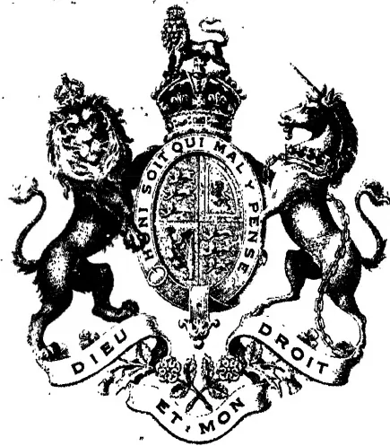The image is a black and white illustration of the Royal Coat of Arms of the United Kingdom. It features a central shield divided into four quarters, topped by a crown. A lion rampant is on the left, and a unicorn rampant is on the right. A scroll at the bottom contains the motto "DIEU ET MON DROIT". The shield is encircled by a ribbon with the text "QUI SOLUS QUI MALY PENSE".

**AGRICULTURAL RESEARCH INSTITUTE**

**PUSA**

1------------------------------------------------

A blank white page with a small black speck near the bottom left corner.

2------------------------------------------------

2012  
12

3------------------------------------------------

A completely blank white page with no visible content, text, or markings.

4------------------------------------------------

<!-- stage4: ACCEPT r2J/J_009:37 -->

Page.

**E.—Contd.**

with Limes (*Citrus*  
*var Acida*) in the North-  
 ovince. - 69  
 on the Pollination of  
*siliensis*, Field  
 s and - 135

**F.**

1927, Soil and - 185  
 ons and Experiments  
 ation of *Hevea*  
 - 135

Green-Manuring  
 and (Anaerobic)  
 Laboratory and  
 Tropical - 253  
 - 284  
 - 103  
 in Passion  
 Agricultural  
 Tropics. - 48  
 - 343

**G.**

Korales 1927-28,  
 Competition, - 121  
 ot caused by  
 - 133  
 shade, Some  
 eeding Plants  
 - 45  
 r Crops and - 77  
 r Paddy-land  
 ns, Laboratory  
 - 253  
 - 103

Paddy  
 on in - 375  
 of certain  
 ological  
 - 50  
 egetables,  
 lauca - 279  
 ubber from  
 - 12  
 bservations  
 - 135  
 iment - 317  
 ratgoda,  
 - 12  
 - 161

ion, - 119  
 the  
 - 337  
 eport  
 ral - 374  
 - 50

5------------------------------------------------

# INDEX.—Contd.

**I.—Contd.** Page.

<table style="width: 100%; border-collapse: collapse;">
<tr>
<td>International Institute of Agriculture.</td>
<td style="text-align: right;">- 123</td>
</tr>
<tr>
<td>International Year Book of Agricultural Statistics, 1927-28.</td>
<td style="text-align: right;">- 123</td>
</tr>
<tr>
<td>Investigations, Soil</td>
<td style="text-align: right;">- 251</td>
</tr>
</table>

**J.**

<table style="width: 100%; border-collapse: collapse;">
<tr>
<td>Java and Sumatra, Preliminary Note on the Occurrence of <i>Rhizoctonia bataticola</i> in</td>
<td style="text-align: right;">- 217</td>
</tr>
<tr>
<td>Java, Occurrence of Mycorrhiza in Cinchona in</td>
<td style="text-align: right;">- 281</td>
</tr>
<tr>
<td>Java, Tea Industry in</td>
<td style="text-align: right;">295, 347</td>
</tr>
</table>

**K.**

<table style="width: 100%; border-collapse: collapse;">
<tr>
<td>Kalutara District, 1928-29, Agricultural Competitions in</td>
<td style="text-align: right;">- 61</td>
</tr>
<tr>
<td>Kandy and Matale Districts, School Garden Competition in</td>
<td style="text-align: right;">- 247</td>
</tr>
<tr>
<td>Kapok from Ceylon, Report on</td>
<td style="text-align: right;">- 117</td>
</tr>
</table>

**L.**

<table style="width: 100%; border-collapse: collapse;">
<tr>
<td>Laboratory and Field Studies on Green-Manuring under Paddy-land (Anaerobic) Conditions.</td>
<td style="text-align: right;">- 253</td>
</tr>
<tr>
<td>Lands, St. Lucia Banana</td>
<td style="text-align: right;">- 287</td>
</tr>
<tr>
<td>Lands, Tropical Forest</td>
<td style="text-align: right;">- 284</td>
</tr>
<tr>
<td>Lantern, Improvement on Acetylene for the Illumination of the Optical</td>
<td style="text-align: right;">- 337</td>
</tr>
<tr>
<td>Latex becoming contaminated with Bordeaux Mixture as a result of Spraying Operations, Report on the Possibility of</td>
<td style="text-align: right;">- 206</td>
</tr>
<tr>
<td>Latex on the Plasticity of Crepe, Report on the effect of Diluting</td>
<td style="text-align: right;">- 211</td>
</tr>
<tr>
<td>Latex Tube Bore.</td>
<td style="text-align: right;">- 141</td>
</tr>
<tr>
<td>Latex Tube Bore, Note on Mr. Ashplant's work on</td>
<td style="text-align: right;">- 147</td>
</tr>
<tr>
<td>Leucaena Glauca Hay and some Ceylon Vegetables, Analyses of</td>
<td style="text-align: right;">- 279</td>
</tr>
<tr>
<td>Limes (<i>Citrus medica</i> L. var <i>Acida</i>) in the North-Central Province, Experiments with</td>
<td style="text-align: right;">- 69</td>
</tr>
<tr>
<td>Lower Burma, Manuring of Paddy in</td>
<td style="text-align: right;">- 31</td>
</tr>
</table>

**M.**

<table style="width: 100%; border-collapse: collapse;">
<tr>
<td>Manure and Shade, Some Possibilities in Breeding plants used for Cover, Green</td>
<td style="text-align: right;">- 45</td>
</tr>
<tr>
<td>Manures, Cover Crops and Green</td>
<td style="text-align: right;">- 77</td>
</tr>
<tr>
<td>Manuring of Paddy.</td>
<td style="text-align: right;">- 1</td>
</tr>
<tr>
<td>Manuring of Paddy in Lower Burma.</td>
<td style="text-align: right;">- 31</td>
</tr>
<tr>
<td>Manuring of Rubber.</td>
<td style="text-align: right;">- 149</td>
</tr>
<tr>
<td>Manuring under Paddy-land (Anaerobic) Conditions, Laboratory and Field Studies on Green</td>
<td style="text-align: right;">- 253</td>
</tr>
<tr>
<td>Marketing Board, Empire</td>
<td style="text-align: right;">- 98</td>
</tr>
<tr>
<td>Matale Districts, School Garden Competition in Kandy and Matale East, Paddy Cultivation Competition in</td>
<td style="text-align: right;">- 247</td>
</tr>
<tr>
<td>Matale South, Paddy Cultivation Competition in</td>
<td style="text-align: right;">- 374</td>
</tr>
</table>

**M.—Contd.** Page.

<table style="width: 100%; border-collapse: collapse;">
<tr>
<td>Maynard Ganga Ram Prize.</td>
<td style="text-align: right;">- 312</td>
</tr>
<tr>
<td>Meeting of the Board of Management of the Coconut Research Scheme, Minutes of</td>
<td style="text-align: right;">- 368</td>
</tr>
</table>

<table style="width: 100%; border-collapse: collapse;">
<tr>
<td>Meeting of the Estate Products Committee, Minutes of</td>
<td style="text-align: right;">113, 244</td>
</tr>
<tr>
<td>Meeting of the Tea Research Institute of Ceylon, Minutes of</td>
<td style="text-align: right;">173, 179, 370</td>
</tr>
<tr>
<td>Meteorological Returns.</td>
<td style="text-align: right;">64, 124, 188, 250, 314, 378</td>
</tr>
</table>

<table style="width: 100%; border-collapse: collapse;">
<tr>
<td>Minutes of Meeting of the Board of Management of the Coconut Research Scheme.</td>
<td style="text-align: right;">- 368</td>
</tr>
</table>

<table style="width: 100%; border-collapse: collapse;">
<tr>
<td>Minutes of Meeting of the Estate Products Committee.</td>
<td style="text-align: right;">113, 244</td>
</tr>
</table>

<table style="width: 100%; border-collapse: collapse;">
<tr>
<td>Minutes of Meeting of the Tea Research Institute of Ceylon.</td>
<td style="text-align: right;">173, 179, 370</td>
</tr>
</table>

<table style="width: 100%; border-collapse: collapse;">
<tr>
<td>Mycological Notes (17), (18), (19),</td>
<td style="text-align: right;">129, 133, 276</td>
</tr>
</table>

<table style="width: 100%; border-collapse: collapse;">
<tr>
<td>Mycorrhiza in Cinchona in Java, Occurrence of</td>
<td style="text-align: right;">- 281</td>
</tr>
</table>

**N.**

<table style="width: 100%; border-collapse: collapse;">
<tr>
<td>New Clearings, Prevention of Soil Erosion in</td>
<td style="text-align: right;">- 67</td>
</tr>
</table>

<table style="width: 100%; border-collapse: collapse;">
<tr>
<td>Nineties, Rubber in Ceylon in the Nitrogen on the Yield of Rubber, Effect of</td>
<td style="text-align: right;">- 27</td>
</tr>
<tr>
<td></td>
<td style="text-align: right;">127</td>
</tr>
</table>

<table style="width: 100%; border-collapse: collapse;">
<tr>
<td>North-Central Province, Experiments with Limes (<i>Citrus Medica</i> L. var <i>Acida</i>) in the</td>
<td style="text-align: right;">- 69</td>
</tr>
</table>

<table style="width: 100%; border-collapse: collapse;">
<tr>
<td>Note on Brown Bast.</td>
<td style="text-align: right;">- 323</td>
</tr>
</table>

<table style="width: 100%; border-collapse: collapse;">
<tr>
<td>Note on Contour Terracing for Rubber.</td>
<td style="text-align: right;">- 3</td>
</tr>
</table>

<table style="width: 100%; border-collapse: collapse;">
<tr>
<td>Note on Mr. Ashplant's work on Latex Tube Bore.</td>
<td style="text-align: right;">- 147</td>
</tr>
</table>

<table style="width: 100%; border-collapse: collapse;">
<tr>
<td>Note on the Occurrence of <i>Rhizoctonia bataticola</i>.</td>
<td style="text-align: right;">- 217</td>
</tr>
</table>

<table style="width: 100%; border-collapse: collapse;">
<tr>
<td>Note on the Renewal of Scraped Bark Surfaces.</td>
<td style="text-align: right;">- 11</td>
</tr>
</table>

<table style="width: 100%; border-collapse: collapse;">
<tr>
<td>Notes (4), (5), Chemical</td>
<td style="text-align: right;">205, 279</td>
</tr>
</table>

<table style="width: 100%; border-collapse: collapse;">
<tr>
<td>Notes (17), (18), (19), Mycological</td>
<td style="text-align: right;">129, 133, 276</td>
</tr>
</table>

<table style="width: 100%; border-collapse: collapse;">
<tr>
<td>Nyasaland, Diseases of Tea in</td>
<td style="text-align: right;">217</td>
</tr>
</table>

**O.**

<table style="width: 100%; border-collapse: collapse;">
<tr>
<td>Observations and Comments on Soil Changes in relation to Tropical Agriculture.</td>
<td style="text-align: right;">- 287</td>
</tr>
</table>

<table style="width: 100%; border-collapse: collapse;">
<tr>
<td>Occurrence of Mycorrhiza in Cinchona in Java.</td>
<td style="text-align: right;">- 281</td>
</tr>
</table>

<table style="width: 100%; border-collapse: collapse;">
<tr>
<td>Organic Accelerators of Vulcanisation on the Variability of Rubber, Report on the Effect of</td>
<td style="text-align: right;">- 218</td>
</tr>
</table>

<table style="width: 100%; border-collapse: collapse;">
<tr>
<td>Orn</td>
<td style="text-align: right;">- 389</td>
</tr>
<tr>
<td>E</td>
<td style="text-align: right;">- 389</td>
</tr>
</table>

<table style="width: 100%; border-collapse: collapse;">
<tr>
<td>Opt</td>
<td style="text-align: right;">- 389</td>
</tr>
<tr>
<td>A</td>
<td style="text-align: right;">- 389</td>
</tr>
<tr>
<td>o</td>
<td style="text-align: right;">- 389</td>
</tr>
</table>

3

6------------------------------------------------

## INDEX.—Contd.

<table style="width: 100%; border-collapse: collapse;">
<thead>
<tr>
<th style="text-align: left; width: 45%;"></th>
<th style="text-align: right; width: 15%;">Page.</th>
<th style="text-align: left; width: 45%;"></th>
<th style="text-align: right; width: 15%;">Page.</th>
</tr>
</thead>
<tbody>
<tr>
<td><b>P.</b></td>
<td></td>
<td><b>P.—Contd.</b></td>
<td></td>
</tr>
<tr>
<td>Paddy Cultivation Competition in Matale East.</td>
<td style="text-align: right;">375</td>
<td>Products, Chemical Studies on Coconut</td>
<td style="text-align: right;">41</td>
</tr>
<tr>
<td>Paddy Cultivation Competition in Matale South.</td>
<td style="text-align: right;">374</td>
<td>Progress Report of the Experiment Station, Peradeniya.</td>
<td style="text-align: right;">58, 180, 304</td>
</tr>
<tr>
<td>Paddy Cultivation Competition in Yatinuwara and Harispattu.</td>
<td style="text-align: right;">375</td>
<td>Progress Report on the Coccinellidae imported from Trinidad to Control Aspidiatus Destructor.</td>
<td style="text-align: right;">55</td>
</tr>
<tr>
<td>Paddy in Lower Burma, Manuring of</td>
<td style="text-align: right;">31</td>
<td>Pure-line Paddy Cultivation in Yatinuwara and Harispattu.</td>
<td style="text-align: right;">375</td>
</tr>
<tr>
<td>Paddy-land (Anaerobic) Conditions, Laboratory and Field Studies on Green-Manuring under</td>
<td style="text-align: right;">253</td>
<td><i>Pythium</i> sp., Geranium Stem Rot caused by</td>
<td style="text-align: right;">139</td>
</tr>
<tr>
<td>Paddy, Manuring of</td>
<td style="text-align: right;">1</td>
<td><b>Q.</b></td>
<td></td>
</tr>
<tr>
<td>Paddy (<i>Oryza sativa</i>) in the neighbourhood of Peradeniya, Cultivation of</td>
<td style="text-align: right;">191</td>
<td>Queensland, Bunchy Top Diseases of Bananas in</td>
<td style="text-align: right;">152</td>
</tr>
<tr>
<td>Palestine, Banana Cultivation in</td>
<td style="text-align: right;">109</td>
<td><b>R.</b></td>
<td></td>
</tr>
<tr>
<td>Passion Fruit, Woodiness in</td>
<td style="text-align: right;">48</td>
<td>Realm of Rubber.</td>
<td style="text-align: right;">122</td>
</tr>
<tr>
<td>Pentas Carnea; Sclerotial Disease of Peradeniya, Cultivation of Paddy (<i>Oryza sativa</i>) in the neighbourhood of</td>
<td style="text-align: right;">129</td>
<td>Relationship between Stock and Scion in Budded Plants.</td>
<td style="text-align: right;">18</td>
</tr>
<tr>
<td>Peradeniya, Progress Report of the Experiment Station,</td>
<td style="text-align: right;">58, 180, 304</td>
<td>Renewal of Scraped Bark Surfaces, Note on the</td>
<td style="text-align: right;">11</td>
</tr>
<tr>
<td>Pests under Biological Control in Hawaii, Present status of certain Insect</td>
<td style="text-align: right;">50</td>
<td>Report by the Imperial Institute Advisory Committee on Silk Production.</td>
<td style="text-align: right;">119</td>
</tr>
<tr>
<td>Plantain Diseases.</td>
<td style="text-align: right;">376</td>
<td>Report of the Experiment Station, Peradeniya, Progress</td>
<td style="text-align: right;">58, 180, 304</td>
</tr>
<tr>
<td>Plantain Garden Competition, Galboda-Kinigoda Korales, 1927-28.</td>
<td style="text-align: right;">121</td>
<td>Report on a visit to America in connection with the Control of Calotermes in Living Plants.</td>
<td style="text-align: right;">307</td>
</tr>
<tr>
<td>Planting in Ceylon, Rubber Plants, Relationship between Stock and Scion in Budded</td>
<td style="text-align: right;">21</td>
<td>Report on Kapok from Ceylon.</td>
<td style="text-align: right;">117</td>
</tr>
<tr>
<td>Plants, Report on a visit to America in connection with the Control of Calotermes in Living</td>
<td style="text-align: right;">18</td>
<td>Report on Rubber from High-Yielding Trees at Heneratgoda.</td>
<td style="text-align: right;">12</td>
</tr>
<tr>
<td>Plants used for Cover, Green Manure and Shade, Some Possibilities in Breeding</td>
<td style="text-align: right;">307</td>
<td>Report on the Coccinellidae imported from Trinidad to Control Aspidiatus Destructor, Progress</td>
<td style="text-align: right;">55</td>
</tr>
<tr>
<td>Plasticity of Crepe, Report on the Effect of Diluting Latex on the</td>
<td style="text-align: right;">45</td>
<td>Report on the Determination of the Plasticity of Rubber.</td>
<td style="text-align: right;">208</td>
</tr>
<tr>
<td>Plasticity of Rubber, Report on the Determination of the</td>
<td style="text-align: right;">211</td>
<td>Report on the Effect of Diluting Latex on the Plasticity of Crepe.</td>
<td style="text-align: right;">211</td>
</tr>
<tr>
<td>Pollination of <i>Hevea Brasiliensis</i>, Field Observations and Experiments on the</td>
<td style="text-align: right;">208</td>
<td>Report on the Effect of Organic Accelerators of Vulcanisation on the Variability of Rubber.</td>
<td style="text-align: right;">213</td>
</tr>
<tr>
<td>Possibilities in Breeding Plants used for Cover, Green Manure and Shade.</td>
<td style="text-align: right;">135</td>
<td>Report on the Possibility of Latex becoming contaminated with Bordeaux Mixture as a result of Spraying Operations.</td>
<td style="text-align: right;">206</td>
</tr>
<tr>
<td>Preliminary Note on the Occurrence of <i>Rhizoctonia bataticola</i> in Java and Sumatra.</td>
<td style="text-align: right;">45</td>
<td>Report on the second annual Agricultural and Industrial Show, Alubomulla.</td>
<td style="text-align: right;">374</td>
</tr>
<tr>
<td>Present Status of certain Insect Pests under Biological Control in Hawaii.</td>
<td style="text-align: right;">217</td>
<td>Returns, Animal Disease</td>
<td style="text-align: right;">64, 124, 188, 249, 313, 377</td>
</tr>
<tr>
<td>Preserving Wood against Dry-Rot.</td>
<td style="text-align: right;">50</td>
<td>Returns, Meteorological</td>
<td style="text-align: right;">64, 124, 188, 249, 313, 377</td>
</tr>
<tr>
<td>Prevention of Soil Erosion in New Clearings.</td>
<td style="text-align: right;">364</td>
<td><i>Rhizoctonia bataticola</i> in Java and Sumatra, Preliminary Note on the Occurrence of</td>
<td style="text-align: right;">217</td>
</tr>
<tr>
<td>Prize, Maynard Ganga Ram</td>
<td style="text-align: right;">67</td>
<td>Root Growth Experiment with Hevea.</td>
<td style="text-align: right;">317</td>
</tr>
<tr>
<td>Production, Report of the Imperial Institute Advisory Committee on Silk</td>
<td style="text-align: right;">312</td>
<td>Royal Commission on Agriculture in India.</td>
<td style="text-align: right;">182</td>
</tr>
<tr>
<td></td>
<td style="text-align: right;">119</td>
<td>Rubber, Bud-grafting of</td>
<td style="text-align: right;">16</td>
</tr>
<tr>
<td></td>
<td></td>
<td>Rubber, Effect of Nitrogen on the Yield of</td>
<td style="text-align: right;">127</td>
</tr>
</tbody>
</table>

4

7------------------------------------------------

## INDEX.—Contd.

<table style="width: 100%; border-collapse: collapse;">
<thead>
<tr>
<th style="text-align: left;"></th>
<th style="text-align: right;">Page.</th>
<th style="text-align: left;"></th>
<th style="text-align: right;">Page.</th>
</tr>
</thead>
<tbody>
<tr>
<td colspan="2" style="text-align: center;"><b>R.—Contd.</b></td>
<td colspan="2" style="text-align: center;"><b>S.—Contd.</b></td>
</tr>
<tr>
<td>Rubber from High-Yielding Trees at Heneratgoda, Report on</td>
<td style="text-align: right;">12</td>
<td>Statistics, 1927-28, Year Book of Agricultural</td>
<td style="text-align: right;">123</td>
</tr>
<tr>
<td>Rubber Growers' Competition, Small</td>
<td style="text-align: right;">61</td>
<td>Stem Rot caused by <i>Pythium</i> sp., Geranium</td>
<td style="text-align: right;">133</td>
</tr>
<tr>
<td>Rubber in Ceylon in the 'Nineties.</td>
<td style="text-align: right;">27</td>
<td>Stock and Scion in Budded Plants, Relationship between</td>
<td style="text-align: right;">18</td>
</tr>
<tr>
<td>Rubber, manuring of</td>
<td style="text-align: right;">149</td>
<td>St. Lucia Banana Lands.</td>
<td style="text-align: right;">287</td>
</tr>
<tr>
<td>Rubber, Note on Contour Terracing for</td>
<td style="text-align: right;">3</td>
<td>Studies on Coconut Products, Chemical</td>
<td style="text-align: right;">41</td>
</tr>
<tr>
<td>Rubber planting in Ceylon.</td>
<td style="text-align: right;">21</td>
<td>Suamatra, Preliminary Note on the Occurrence of <i>Rhizoctonia bataticola</i> in Java and</td>
<td style="text-align: right;">217</td>
</tr>
<tr>
<td>Rubber, Realm of</td>
<td style="text-align: right;">122</td>
<td colspan="2" style="text-align: center;"><b>T.</b></td>
</tr>
<tr>
<td>Rubber, Report on the Determination of the Plasticity of</td>
<td style="text-align: right;">208</td>
<td>Tea Growing in Russian Trans-Caucasus.</td>
<td style="text-align: right;">360</td>
</tr>
<tr>
<td>Rubber, Report on the Effect of Organic Accelerators of Vulcanisation on the Variability of</td>
<td style="text-align: right;">213</td>
<td>Tea Industry in Java.</td>
<td style="text-align: right;">295, 347</td>
</tr>
<tr>
<td>Rubber Seed Gardens, Work on Selection of</td>
<td style="text-align: right;">247</td>
<td>Tea in Nyasaland, Diseases of</td>
<td style="text-align: right;">217</td>
</tr>
<tr>
<td>Rubber, Seed Selection of</td>
<td style="text-align: right;">125</td>
<td>Tea Research Institute of Ceylon.</td>
<td style="text-align: right;">116, 173, 179, 370</td>
</tr>
<tr>
<td>Russian Trans-Caucasus, Tea growing in</td>
<td style="text-align: right;">360</td>
<td>Termites, Ceylon</td>
<td style="text-align: right;">315</td>
</tr>
<tr>
<td colspan="2" style="text-align: center;"><b>S.</b></td>
<td>Trans-Caucasus, Tea Growing in Trinidad to Control <i>Aspidiatus Destructor</i>, Progress Report on the Coccinellidae imported from</td>
<td style="text-align: right;">55</td>
</tr>
<tr>
<td>School Garden Competition in Kandy and Matale Districts.</td>
<td style="text-align: right;">247</td>
<td>Tropical Agriculture.</td>
<td style="text-align: right;">63</td>
</tr>
<tr>
<td>Science in Agriculture, Application of</td>
<td style="text-align: right;">155</td>
<td>Tropical Agriculture, Observations and Comments on Soil Changes in Relation to</td>
<td style="text-align: right;">287</td>
</tr>
<tr>
<td>Scion in Budded Plants, Relationship between Stock and</td>
<td style="text-align: right;">18</td>
<td>Tropical Countries, Diseases of Animals in</td>
<td style="text-align: right;">248</td>
</tr>
<tr>
<td>Sclerotial Disease of Pentas Carnea.</td>
<td style="text-align: right;">129</td>
<td>Tropical Development, Mr. Ormsby-Gore and</td>
<td style="text-align: right;">339</td>
</tr>
<tr>
<td>Scraped Bark Surfaces, Note on the Renewal of</td>
<td style="text-align: right;">11</td>
<td>Tropical Forest Lands.</td>
<td style="text-align: right;">284</td>
</tr>
<tr>
<td>Seed Gardens, Work on Selection of Rubber</td>
<td style="text-align: right;">247</td>
<td>Tropics, Functions of an Agricultural Officer in the Tropics, Horticulture in</td>
<td style="text-align: right;">343, 161</td>
</tr>
<tr>
<td>Seed Selection of Rubber.</td>
<td style="text-align: right;">125</td>
<td>Tube Bore, Latex</td>
<td style="text-align: right;">141</td>
</tr>
<tr>
<td>Seedling Disease of Dadap.</td>
<td style="text-align: right;">276</td>
<td colspan="2" style="text-align: center;"><b>U.</b></td>
</tr>
<tr>
<td>Selection of Rubber, Seed</td>
<td style="text-align: right;">125</td>
<td>Utilization of the Coconut.</td>
<td style="text-align: right;">41</td>
</tr>
<tr>
<td>Selection of Rubber Seed Gardens, Work on</td>
<td style="text-align: right;">247</td>
<td colspan="2" style="text-align: center;"><b>V.</b></td>
</tr>
<tr>
<td>Semi-Arid Regions, Agricultural Development of Arid and</td>
<td style="text-align: right;">62</td>
<td>Variability of Rubber, Report on the Effect of Organic Accelerators of Vulcanisation on the</td>
<td style="text-align: right;">218</td>
</tr>
<tr>
<td>Shade, Some possibilities in Breeding Plants used for Cover, Green Manure and</td>
<td style="text-align: right;">45</td>
<td>Vulcanisation on the Variability of Rubber, Report on the Effect of Organic Accelerators of</td>
<td style="text-align: right;">213</td>
</tr>
<tr>
<td>Silk Production, Report of the Imperial Institute Advisory Committee on</td>
<td style="text-align: right;">119</td>
<td>Vegetables, Analyses of <i>Leucaena Glauca</i> and some Ceylon</td>
<td style="text-align: right;">279</td>
</tr>
<tr>
<td>Silt-pitting, Some Considerations on Small Rubber Growers' Competition.</td>
<td style="text-align: right;">92, 61</td>
<td>Visit to America in connection with the Control of <i>Calotermes</i> in Living Plants, Report on a</td>
<td style="text-align: right;">307</td>
</tr>
<tr>
<td>Soil Changes in Relation to Tropical Agriculture, Observations and Comments on</td>
<td style="text-align: right;">287</td>
<td colspan="2" style="text-align: center;"><b>W.</b></td>
</tr>
<tr>
<td>Soil Erosion.</td>
<td style="text-align: right;">65</td>
<td>Wood against Dry-Rot, Preserving Woodiness in Passion Fruit.</td>
<td style="text-align: right;">364, 48</td>
</tr>
<tr>
<td>Soil Erosion in New Clearings, Prevention of</td>
<td style="text-align: right;">67</td>
<td>Work on Selection of Rubber Seed Gardens.</td>
<td style="text-align: right;">247</td>
</tr>
<tr>
<td>Soils and Fertilisers in 1927.</td>
<td style="text-align: right;">185</td>
<td>World Agricultural Census of 1929-30.</td>
<td style="text-align: right;">170</td>
</tr>
<tr>
<td>Some Considerations on Silt-Pitting.</td>
<td style="text-align: right;">92</td>
<td colspan="2" style="text-align: center;"><b>Y.</b></td>
</tr>
<tr>
<td>Some Possibilities in Breeding Plants used for Cover, Green Manure and Shade.</td>
<td style="text-align: right;">45</td>
<td>Yatinuwara and Harispattu, Pure-line Paddy Cultivation Competition in</td>
<td style="text-align: right;">375</td>
</tr>
<tr>
<td>Spraying Operations, Report on the Possibility of Latex becoming contaminated with Bordeaux Mixture as a result of</td>
<td style="text-align: right;">206</td>
<td>Year Book of Agricultural Statistics, 1927-28.</td>
<td style="text-align: right;">123</td>
</tr>
<tr>
<td></td>
<td></td>
<td>Yield of Rubber, Effect of Nitrogen on the</td>
<td style="text-align: right;">127</td>
</tr>
</tbody>
</table>

8------------------------------------------------

<!-- stage4: ACCEPT r2J/J_009:59 -->

# ILLUSTRATIONS APPEARING IN

## Nos. 1-6 of Vol. LXXII.

---

<table><thead><tr><th></th><th>Page.</th><th></th><th>Page.</th></tr></thead><tbody><tr><td>Budgrafting of Rubber.</td><td>- 16</td><td>Indigenous Implements used in Paddy Cultivation.</td><td>- 204</td></tr><tr><td>Budgrafting of Rubber, Section through unbudded plants.</td><td>- 21</td><td>Pollination of <i>Hevea Brasiliensis</i>.</td><td>- 135</td></tr><tr><td>Budgrafting of Rubber, Union of Stock and Scion.</td><td>- 20</td><td>" " " "</td><td>- 139</td></tr><tr><td>Burmese Harrow.</td><td>- 205</td><td>Prevention of Soil Erosion in New Clearings.</td><td>- 68</td></tr><tr><td>Dadap Seedlings attacked by <i>Fusarium</i> sp.</td><td>- 278</td><td>Root Growth Experiment with <i>Hevea</i> (fig. 1)</td><td>- 317</td></tr><tr><td>Diagram on Silt-Pitting.</td><td>- 94</td><td>Root Growth Experiment with <i>Hevea</i> (fig. 2)</td><td>- 322</td></tr><tr><td>" " "</td><td>- 95</td><td></td><td></td></tr></tbody></table>

---

6

9------------------------------------------------

# The Tropical Agriculturist

January, 1929.

---

## EDITORIAL

---

### THE MANURING OF PADDY

---

**I**N this number of the *Tropical Agriculturist* is reprinted an article on the manuring of paddy in Lower Burma which is of particular interest in that it points the way to the profitable use of artificial fertilisers. Profits have been made possible not only by the discovery of a particularly suitable manure but by the increase of paddy prices and the fall in the price of fertilisers since the war. The fertilisers which proved successful were two forms of the comparatively lately introduced ammonium phosphate, ammophos, the 20—20 grade and the 13—48 grade. These figures show the respective percentages of ammonia and phosphoric acid. In Burma the 20—20 grade has given better immediate effects and the 13—48 grade better residual effects. It will be seen that the profits from the use of the 20—20 grade are considerable; an increase of 47 per cent. of grain has been obtained from a 50 lb. dressing.

10------------------------------------------------

The Department of Agriculture, Ceylon, has not failed to realise the importance of obtaining accurate data on the manuring of paddy in Ceylon and during the present *Maha* season carefully designed manurial experiments the results of which will admit of statistical interpretation have been put down at Peradeniya and Galle.

Although the beneficial effects of manuring with green leaves such as *keppitiya* (*Croton lacciferus*) and with steamed bone meal are widely known and the practice of using steamed bone meal is fairly general in the Southern Province at least, previous experiments have not been sufficiently accurate to give precise figures of profit and loss. Such figures will be obtainable from the new series of experiments now in progress. These experiments have been designed to determine the effect of fertilisers such as sulphate of ammonia, super-phosphate and steamed bone meal both alone and in conjunction with green manures. The effect of the 20—20 grade of ammophos is being tested in a separate series and in view of the Burma figures the results of this series should be particularly interesting and should lead to the trial of the cheaper forms of ammonium phosphates now on the market.

The effect of green manuring of paddy and of puddling in of the green material at different dates is also being investigated at Peradeniya.

The production of paddy in Ceylon may be increased by the use of pedigree seed, by a more certain water-supply, by more efficient methods of cultivation and by manuring. Manuring would appear to be one of the simplest means of increasing yields but the problem of manuring paddy in Ceylon is complex. The price of paddy; the supply, transport charges and unit costs of manures; the effect of manures on lodging; these are matters which must all be considered, and it must be remembered that cultivators under a share system of tenancy will not be willing to bear the whole or a large proportion of the cost of the manure. But, if manuring is definitely shown to be profitable and if tenants can enter into satisfactory arrangements with their landlords over the supply of manures, a considerable increase in the outturn of paddy will be assured.

11------------------------------------------------

3

## ORIGINAL ARTICLES.

### A NOTE ON CONTOUR TERRACING FOR RUBBER.

T. H. HOLLAND, DIP. AGRIC., (WYE)

MANAGER, EXPERIMENT STATION, PERADENIYA

**I**N an article in *The Tropical Agriculturist* of September 1927 entitled "Contour Terracing on the Experiment Station, Peradeniya," the writer set forth the details and results of a piece of terracing work done on the station in 1927 and drew certain conclusions therefrom. Since then a good deal more work of this nature has been carried out, and it is thought that a further note may prove of interest.

It is not proposed in this brief note to consider special methods of terracing such as the trench method evolved by Mr. F. Denham Till, but only to deal with the construction of plain earth contour platform sloped back into the hill. Contour terracing for rubber has passed the experimental stage, but there is nevertheless, a number of points to be taken into consideration which may not strike the novice who is unfamiliar with the work.

It may be stated at the outset that, given a uniform slope, some of the problems here discussed are capable of mathematical solution. Since, however, very few slopes are uniform over any considerable area, and since such a method of approach will not appeal to many practical men, the writer has not attempted the introduction of mathematics.

Before starting to terrace a clearing the following points must be decided:

1. 1. Whether holing is to be done before terracing or *vice versa*.
2. 2. The distance apart of the terraces and the spacing between plants in the terrace.
3. 3. The width and the slope of the terrace.

1. *Whether holing is to be done before terracing or vice versa.* Both systems have their advantages and disadvantages. If holing is done first there is no difficulty in filling the holes with surface soil; the actual operations of holing and filling are in fact just the same as if no terracing was contemplated. There are

12------------------------------------------------

4

however other problems. One of these is that the position of the plant in the terrace is uncertain and variable.

Fig.1.

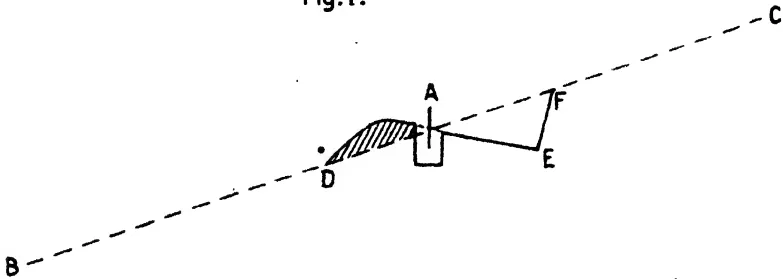

The diagram shows a dashed line representing the original slope BC. A rectangular hole is dug into the slope, with a peg labeled 'A' inside it. A horizontal line extends from the hole to point 'E', then turns upwards to point 'F', and finally continues along the slope to point 'C'. A point 'D' is marked on the slope between the hole and point 'E'. The area between the slope BC and the terrace DEF is shaded with diagonal lines.

Block by Survey Dept. Ceylon.

In fig. 1, A represents the peg in the hole, B C the original slope, and D E F the final terrace. B C in this instance is intended to represent a moderate slope and the position of the plant is quite satisfactory.

A steeper slope is depicted in fig. 2.

Fig.2.

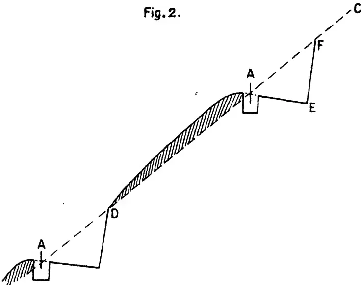

The diagram shows a dashed line representing the original slope BC, which is steeper than in Fig. 1. A rectangular hole is dug into the slope, with a peg labeled 'A' inside it. A horizontal line extends from the hole to point 'E', then turns upwards to point 'F', and finally continues along the slope to point 'C'. A point 'D' is marked on the slope between the hole and point 'E'. The area between the slope BC and the terrace DEF is shaded with diagonal lines.

Block by Survey Dept. Ceylon.

In this case, owing to the steepness of the slope, the earth thrown out has fallen much further down the hill, as far in fact as the next terrace, and very little has lodged outside the plant which is thus left perched on the edge of the terrace. Should erosion take place at this point there is danger of root exposure at a later date. This state of affairs exists in a ten-acre clearing terraced at Peradeniya where the terraces were dug five feet back

13------------------------------------------------

5

from the pegs marking the holes. The distance of the plants from the edge of the terraces varies considerably, but in most cases is smaller than is desirable. In the case in point the excellent and rapid growth made by *Centrosema pubescens* planted over the face of the terraces has minimised the danger of future root exposure.

A simple remedy for this trouble is subsequently to widen the terrace. In the case depicted in fig. 2, if the terrace had been dug wider in the original instance some of the earth would have fallen on to the terrace below; but if time is allowed for the earth originally thrown out to settle, and possibly be bound by a cover crop, this is not likely to occur. Some of the cover crop would be buried, but it would soon cover up the new soil again.

It may be thought that, since on a steeper slope the cubic contents of the portion of the bank to be cut out (seen in section as the triangle A E F) will be greater than on a more gentle slope, more earth will be thrown outside the plant and there will be sufficient space between the edge of the terrace and the plant. In practice, however, it is found that the increased slipping down the slope of the earth thrown out more than counterbalances the larger quantity of earth.

Another method of overcoming this trouble, which has not as yet been tried at Peradeniya, is suggested in fig. 3.

Fig.3.

![A technical diagram labeled Fig. 3 showing a cross-section of a slope. A dashed line represents the original ground surface, sloping downwards from point B on the left to point C on the right. A solid line represents the new ground surface, which is flatter and higher than the original surface. A rectangular structure, representing a plant or a small building, is situated on the new surface. A peg, labeled D, is shown as a vertical line passing through the center of the structure. The area between the original ground surface and the new ground surface is shaded with diagonal lines, indicating the volume of earth moved or the new soil layer.](7344b4eccaba7fdf2cc3c3d46d22f6b8_7_img.webp)

Block by Survey Dept. Ceylon.

This is to dig the holes deeper than usual, fill them only partially with surface soil, insert a peg D a certain distance below the peg

14------------------------------------------------

6

A, and instruct the contractor to dig the terrace the specified width  $f$  from the peg D instead of from the peg A. The depth to which the holes would have to be dug and the proportion of this depth to which they needed to be filled would have to be determined by experiment and would depend on the distance D A. Probably the greatly increased cost and the difficulty in digging such deep holes would rule out this method as a practical proposition.

The question of whether holing and planting or only holing is done before terracing is a subsidiary one. Both methods have been employed at Peradeniya, and the principle is the same in either case. Care is necessary that the plants or stumps are not damaged by earth or stones thrown down from above, but in practice this has not caused much difficulty.

We now come to the second method, terracing first and holing afterwards. This method has the advantage that the holes can be placed in the most desirable position on the terrace, usually at a point about two-thirds of the distance from the back bank to the edge. The difficulty lies in filling the holes with surface soil. Though the cost of filling will always be more in this case, the difficulty is not serious on a gentle slope; on a steep slope it becomes somewhat acute.

Fig. 4.
![Diagram illustrating terracing on a gentle slope. A dashed line represents the original ground surface, sloping upwards from left to right. Points A, B, C, D, E, and F are marked along this line. A, B, and C are on the first terrace, with B and C marked by small rectangular boxes representing holes. D, E, and F are on the second terrace, with E and F marked by similar boxes. The areas between the pegs (A-C and D-F) are labeled as spaces. The diagram shows how soil is thrown out from the terraces above to fill these holes.](acf322b58e48ce5dffe7007b971bb717_6_img.webp)

Block by Survey Dept. Ceylon

Fig. 4 represents terracing on a gentle slope. A C and D F are the spaces originally left between the pegs marking the position of the terraces of which the portions B C and E F have been buried with soil thrown out from the terraces above. Surface soil, however, can still be taken from the portions A B and D E, though it will probably be necessary to use baskets.

15------------------------------------------------

Fig. 5.

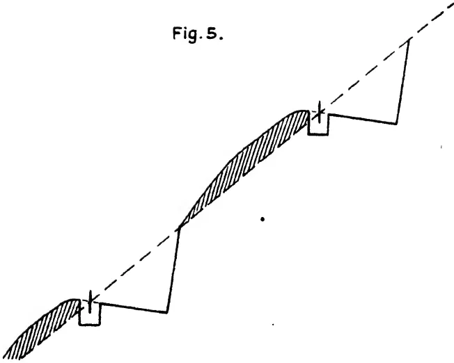A diagram showing a steep slope represented by a dashed line. Two terraces are shown as horizontal lines. The area between the two terraces is filled with diagonal hatching, representing soil thrown from the upper terrace. Small rectangular symbols with a cross are placed on each terrace line.

Block by Survey Dept. Ceylon

Fig. 5 represents terracing on a steep slope. In this case, the entire space between the two terraces is covered up with soil thrown from the terraces above, and surface soil can only be obtained by scraping away this new earth. This may be an extreme case, but the difficulty is a very real one.

It will be understood that the gradient is not the only factor involved: the size of the terraces and their distance apart will influence respectively the amount of earth to be thrown out and the space that will remain uncovered by this earth.

Fig. 6.

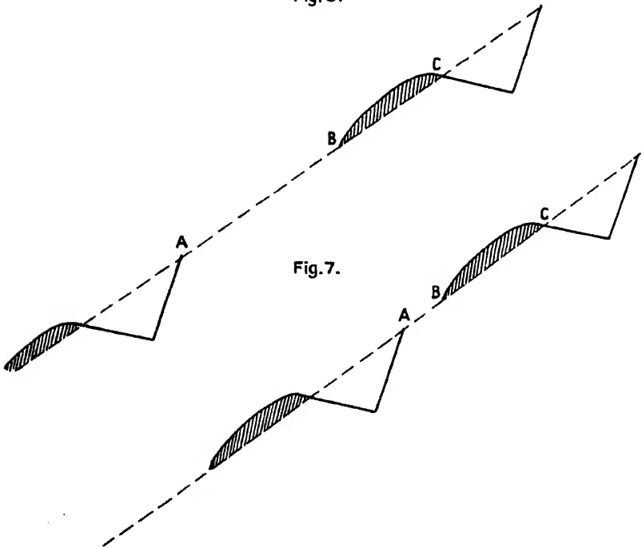A diagram showing two terracing configurations on a slope, represented by dashed lines. The upper configuration has points labeled A, B, and C. The lower configuration also has points labeled A, B, and C. The areas between the terraces are filled with diagonal hatching. The slope is steeper in the lower configuration.

Fig. 7.

Block by Survey Dept. Ceylon

16------------------------------------------------

8

Figs. 6 and 7 represent two slopes of the same gradient with terraces of the same size. In fig. 7, however, the terraces are placed closer together, and, though the distance  $BC$  is the same,  $AB$  is considerably shorter.

The question of the distance apart of terraces will be further discussed. Time and season are other factors which will influence a decision on this first point. In a case at Peradeniya the expenditure of funds was only sanctioned from April 1st., and the clearing had to be planted with rubber during the south-west monsoon. There was only just time to complete the holing, and terracing had of necessity to be done later.

Briefly the conclusion is that, if the gradient and the distance apart of the terraces are such that a sufficient space from which surface soil may be taken remains between the terraces, and if sufficient time is available, it will probably be found more convenient to terrace first and hole afterwards. If these conditions are not present it will be necessary to hole, and possibly plant, first. The most satisfactory course is to experiment first on a small area.

2. *The distance apart of the terraces and the spacing of the plants in the terraces.* The factors which will influence this decision are (a) the number of trees to be planted per acre, (b) the gradient, (c) whether holing or terracing is to be done first. The number of trees per acre to be planted will certainly not be less than 100, and may often be more. In the recent work at Peradeniya the intention was to plant 120 trees per acre. The following distances give approximately this number: 19 ft. x 19 ft. 18 ft. x 20 ft., 17 ft. x 21 ft., 16 ft. x 23 ft., 15 ft. x 24 ft.

Though all terraces may be started at the same distance apart, this distance will not remain constant throughout the length of the terraces; the undulations of the land will in some cases bring them closer together and in other cases take them further apart. Thus, whatever planting distance is decided upon a slight variation in the number of trees per acre is likely to occur. When the distance between the terraces increases very much, short extra lengths of terrace can be inserted, or odd trees without terraces. A clearing at Peradeniya was terraced with the object of planting 19 ft. x 19 ft., that is, the contour lines of pegs were started 19 ft. apart, and the pegs were 19 ft. apart in the lines. In this case 5 ft. terraces were dug, and even with terraces of this width in some cases in the steeper portions the earth thrown out reached the next terrace. Holing had been done first, so that no great harm resulted. If holing had not been done first, great difficulty would have been experienced in filling the holes with surface soil. In later work (on generally a steeper slope) 20 ft. was left between the terraces and 18 ft. between the plants in the terraces. The width of the terraces was however increased

17------------------------------------------------

9

to 6 ft., and the additional earth thrown out, added to the steeper gradient, more than counterbalanced the extra space between the terraces.

Here again holing had been done first; otherwise filling would have been difficult. If holing after terracing is adopted and if the gradient is at all steep, it is essential to get the terraces as far away from one another as is possible without undue overcrowding of the plants in the terraces. If 120 plants per acre are required, terraces 24 ft. apart and plants 15 ft. apart in the terraces should achieve the desired result. If holing is done first, then terraces 20 ft. or 21 ft. apart and plants 18 ft. or 17 ft. apart in the terraces would in most cases be satisfactory. Again experiment on a small scale is desirable.

3. *The width and slope of the terraces.* Experience indicates that for terraces sloped back at an angle of one in five, 6 feet is the maximum useful width. It is true that a steeper slope will to a certain extent compensate in water-holding capacity for a reduced width, but there are limits to this procedure.

Block by Survey Dept. Ceylon.

Figures 8 and 9 depict exaggerated cases of two terraces. Fig. 8 shows a narrower terrace more steeply sloped than the one in fig. 9. It will be readily seen that the terrace in fig. 8 will hold up as much water as or more water than the terrace in fig. 9 without overflowing; but the rubber trees would be planted on a steep ridge and root exposure might result at a later date. A six foot terrace with a slope of one in five will be found suitable for most purposes.

## OTHER POINTS

1. *Transverse bunds.* Transverse bunds left at intervals will be found very useful in checking lateral flow of water caused by any slight fault in tracing the terraces. At Peradeniya such bunds have been left between every two rubber plants. The arrangement is shown in plan in fig. 10.

18------------------------------------------------

10Fig.10.
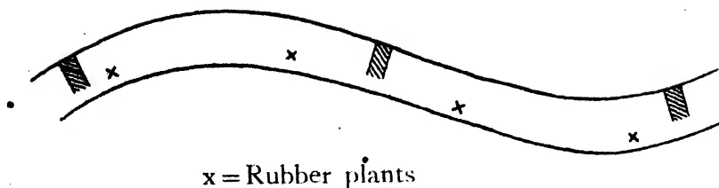
 A diagram showing a curved terrace. The terrace is represented by a double line. Inside the curve, there are four 'x' marks representing rubber plants. There are also two rectangular areas with diagonal hatching, one on the left and one on the right, representing accumulated water or silt.

x = Rubber plants

Block by Survey Dept. Ceylon

2. *Over-flow of accumulated water.* In exceptional falls of rain an overflow of water may occur at points where, owing to the configuration of the ground, there is a particular accumulation. The damage done by such an overflow may be considerable. In such cases it is necessary to decide whether the construction of a down drain is necessary or whether the case can be met by widening the terraces at these points. Generally the latter course will be worth trying. The earth thrown out in widening the terraces will fill in the channels that have been eroded in the bank and it can be decided after the next heavy fall whether the improvement has been effective. As an additional safe-guard a silt-pit may be dug at the back of the terrace and a bund formed at the outer edge. This is shown in fig. 11.

Fig.11.
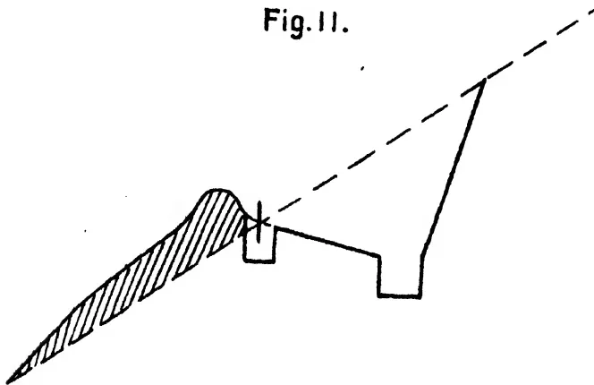
 A diagram showing a cross-section of a terrace. The terrace is a hatched area sloping upwards. At the top of the terrace, there is a small rectangular structure representing a silt-pit. A dashed line extends from the silt-pit across the top of the terrace, representing a bund.

Block by Survey Dept. Ceylon.

This procedure will greatly increase the water-holding capacity of the terrace at such points and will probably check further trouble.

3. *Cost.* At Peradeniya five foot terraces have been dug by local Sinhalese contractors at Rs. 2 75 per chain of 66 feet. and six foot terraces at Rs. 3-50 per chain. The cost per acre at these rates will usually work out at between Rs. 75-00 and Rs. 85-00.

19------------------------------------------------

11

## CONTRIBUTIONS FROM THE RUBBER RESEARCH SCHEME

### NOTE ON THE RENEWAL OF SCRAPED BARK SURFACES

J. MITCHELL; A.R.C.Sc.,

ORGANISING SECRETARY, RUBBER RESEARCH SCHEME  
(CEYLON)

**I**N connection with the treatment of Brown Bast by the scraping method advised in Research Scheme Bulletin No. 48 it has been observed that bark surfaces so scraped renew at a much enhanced rate as compared with the renewal of bark surfaces after tapping. In fact, in a large number of cases where it has been found necessary to effect a scraping for Brown Bast over half the circumference of the tree, it has been observed that the thickness of the renewed bark after a period of one year from the time the surface was scraped has been greater than on the unscraped surface of the tree (tapped panel) after a period of three to four years. Again, it has been observed that the bark after such a scraping has a smoother surface and a softer consistency than the renewed bark after tapping. A sufficient number of observations have been made to satisfy the writer that the scraping method for Brown Bast could usefully be extended to bark surfaces which show extremely slow and irregular renewal. It was anticipated that the long periods of rest given to the trees during the restriction period would bring about a great improvement in the renewal of bark surfaces and in many cases this anticipation has been fulfilled. On the other hand, however, there has been a good deal of disappointment as the results even after prolonged rest have been unsatisfactory. Some reports have been received of better bark renewal having been secured from a course of manuring but other reports indicate that manurial applications have had no appreciable effect on bark renewal. It would appear, therefore, that manuring alone is not sufficient to stimulate the renewal of bark on trees which present a somewhat hide-bound condition and it is considered that in such cases the adoption of a scraping method similar to that for Brown Bast would prove beneficial.

The writer suggests that a thorough trial be given of the scraping method on trees which are known to renew their bark at a slower rate than the normal. The scraping should be carried out exactly as advised in Bulletin No. 48. The same care will be required to avoid wounding and the same precautions should be adopted throughout the treatment.

20------------------------------------------------

12

## REPORT ON RUBBER FROM HIGH-YIELDING TREES AT HENERATGODA

**A**t the request of the Director of Agriculture in Ceylon six samples of rubber from individual trees at Heneratgoda gardens were forwarded for examination in order to judge the value of the trees as "mother" trees.

In forwarding the samples the Director stated that all six trees were amongst the highest yielders at Heneratgoda, two of them growing in plantation No. 1 and four in plantation No. 3. Plantation No. 1 dates from 1877 and was the first in Ceylon. Plantation No. 3 is believed to be composed of thinnings from plantation No. 1 or of cuttings left over in the original nurseries. All trees were tapped on alternate days on a single cut on one-third of the total circumference of the tree.

Each sample consisted of about eighty biscuits of unsmoked sheet varying in size, thickness and colour; some were mouldy. An appreciable amount of serum had exuded between some of the biscuits which were not quite dry. On the whole the amount of moisture in the rubber was less than 1 per cent.

It was stated that in the preparation of the samples the latex was collected at 11 a.m. each day and coagulated with acetic acid. After an interval of twenty hours the coagulum was submitted to "simple rolling to express the bulk of the water". Each biscuit was then soaked in 0.1 per cent. paranitrophenol solution for 30-60 minutes and placed on drying racks for a period of 4-6 weeks.

### PLASTICITY TESTS.

The following are the results of plasticity tests on these samples:—

<table border="1">
<thead>
<tr>
<th>Sample no.</th>
<th>Plantation no.</th>
<th>Tree no</th>
<th>Length of cut.</th>
<th>Yield (April 1927-March 1928).</th>
<th>Number of grindings through laboratory rolls required to reduce rubber to a standard plasticity*.</th>
</tr>
<tr>
<th></th>
<th></th>
<th></th>
<th>(ins.)</th>
<th>(lb.)</th>
<th></th>
</tr>
<tr>
<th></th>
<th></th>
<th></th>
<th>(4)</th>
<th>(5)</th>
<th>(6)</th>
</tr>
</thead>
<tbody>
<tr>
<td>(1)</td>
<td></td>
<td></td>
<td></td>
<td></td>
<td></td>
</tr>
<tr>
<td>1402</td>
<td>3</td>
<td>401</td>
<td>32</td>
<td>36.7</td>
<td>48</td>
</tr>
<tr>
<td>1403</td>
<td>1</td>
<td>2</td>
<td>46</td>
<td>50.6</td>
<td>57</td>
</tr>
<tr>
<td>1404</td>
<td>1</td>
<td>24†</td>
<td>26</td>
<td>49</td>
<td>35</td>
</tr>
<tr>
<td>1405</td>
<td>3</td>
<td>400</td>
<td>351</td>
<td>45.1</td>
<td>46</td>
</tr>
<tr>
<td>1406</td>
<td>3</td>
<td>439</td>
<td>34</td>
<td>31.4</td>
<td>49</td>
</tr>
<tr>
<td>1407</td>
<td>3</td>
<td>445</td>
<td>391</td>
<td>36.3</td>
<td>32</td>
</tr>
</tbody>
</table>

The figures in column 6 show that sample No. 1403 is the least and samples Nos. 1404 and 1407 the most plastic. The remaining samples do not differ greatly from each other in plasticity.

\* The standard plasticity adopted is the rate of extrusion of 10 cc. per minute under load of 1,000 lb./sq. in. at 85°C.

† Suffering from *Ustilina* disease.

21------------------------------------------------

13

### VULCANISATION AND MECHANICAL TESTS.

The following are the results of tests at the optimum tensile strength cure (Rubber-sulphur mixing 90:10):—

<table border="1">
<thead>
<tr>
<th rowspan="2">Sample No.</th>
<th>Time of Vulcanisation at 148°C</th>
<th>Tensile Strength.</th>
<th>Elongation at load of 1.04 kgs./sq. mm.</th>
</tr>
<tr>
<th>(mins.)</th>
<th>(lb./sq. in.)</th>
<th>(per cent.)</th>
</tr>
</thead>
<tbody>
<tr>
<td>1402</td>
<td>90</td>
<td>2050</td>
<td>831</td>
</tr>
<tr>
<td>1403</td>
<td>120</td>
<td>2000</td>
<td>795</td>
</tr>
<tr>
<td>1404</td>
<td>90</td>
<td>2230</td>
<td>749</td>
</tr>
<tr>
<td>1405</td>
<td>90</td>
<td>2300</td>
<td>795</td>
</tr>
<tr>
<td>1406</td>
<td>110</td>
<td>2480</td>
<td>729</td>
</tr>
<tr>
<td>1407</td>
<td>100</td>
<td>2440</td>
<td>720</td>
</tr>
</tbody>
</table>

All the samples have satisfactory tensile strengths except 1402 and 1403 which are definitely weaker than most samples of unsmoked sheet. Some of the samples are exceptional in that their maximum tensile strength is developed at a low elongation under a load of 1.04 kgs./sq. mm.

### VULCANISATION AND AGEING TESTS.

The following are the results of vulcanising and artificial ageing tests.

<table border="1">
<thead>
<tr>
<th rowspan="2">Sample no.</th>
<th>Time of vulcanisation at 148°C.</th>
<th>Period of ageing at 70°C.</th>
<th>Tensile strength.</th>
<th>Elongation at load of 1.04 kgs./sq. mm.</th>
</tr>
<tr>
<th>(mins.)</th>
<th>(hrs.)</th>
<th>(lbs./sq. in.)</th>
<th>(per cent.)</th>
</tr>
</thead>
<tbody>
<tr>
<td rowspan="5">1402</td>
<td rowspan="5">80</td>
<td>nil</td>
<td>1580</td>
<td>852</td>
</tr>
<tr>
<td>48</td>
<td>2310</td>
<td>777</td>
</tr>
<tr>
<td>96</td>
<td>1820</td>
<td>733</td>
</tr>
<tr>
<td>144</td>
<td>1380</td>
<td>700</td>
</tr>
<tr>
<td>1403</td>
<td rowspan="5">93</td>
<td>nil</td>
<td>1820</td>
<td>844</td>
</tr>
<tr>
<td></td>
<td>48</td>
<td>2150</td>
<td>740</td>
</tr>
<tr>
<td></td>
<td>96</td>
<td>1490</td>
<td>711</td>
</tr>
<tr>
<td></td>
<td>144</td>
<td>220</td>
<td>—</td>
</tr>
<tr>
<td rowspan="4">1404</td>
<td rowspan="4">62</td>
<td>nil</td>
<td>1800</td>
<td>875</td>
</tr>
<tr>
<td>48</td>
<td>2190</td>
<td>745</td>
</tr>
<tr>
<td>96</td>
<td>1470</td>
<td>721</td>
</tr>
<tr>
<td>1405</td>
<td rowspan="4">75</td>
<td>nil</td>
<td>1800</td>
<td>840</td>
</tr>
<tr>
<td></td>
<td>48</td>
<td>2260</td>
<td>745</td>
</tr>
<tr>
<td></td>
<td>96</td>
<td>1820</td>
<td>713</td>
</tr>
<tr>
<td></td>
<td>144</td>
<td>270</td>
<td>—</td>
</tr>
<tr>
<td rowspan="4">1406</td>
<td rowspan="4">75</td>
<td>nil</td>
<td>1650</td>
<td>857</td>
</tr>
<tr>
<td>48</td>
<td>2310</td>
<td>770</td>
</tr>
<tr>
<td>96</td>
<td>1310</td>
<td>690</td>
</tr>
<tr>
<td>1407</td>
<td rowspan="4">73</td>
<td>nil</td>
<td>1780</td>
<td>842</td>
</tr>
<tr>
<td></td>
<td>48</td>
<td>2030</td>
<td>741</td>
</tr>
<tr>
<td></td>
<td>96</td>
<td>1600</td>
<td>725</td>
</tr>
<tr>
<td></td>
<td>144</td>
<td>270</td>
<td>—</td>
</tr>
</tbody>
</table>

22------------------------------------------------

14

Sample 1403, which is a hard rubber, vulcanised slowly, and sample 1404, which is a soft rubber, vulcanised quickly. The rate of vulcanisation of the remaining samples was similar to that of samples of unsmoked sheet previously examined.

All the samples gave satisfactory results in the artificial ageing tests. The maximum tensile strengths, however, are not quite so good as those usually obtained with sheet rubber.

### CONCLUSIONS.

The following conclusions are drawn from these tests:—

1. The rubber from trees Nos. 400, 401, 439 and 445 is of satisfactory quality as regards plasticity, rate of vulcanisation and ageing.

2. The rubber from tree No. 24, which is suffering from *Ustulina* disease, is quick curing, judged by the usual standards. In other respects the rubber is normal.

3. The rubber from tree No. 2, from which a considerable amount of budwood is being obtained, is abnormal in several respects. The sample examined was somewhat harder than the others, had a long period of vulcanisation, and was rather weak.

No conclusions can be drawn from the experiments as to the suitability of the trees as "mother" trees. More information is needed concerning the relation between the quality of rubber yielded by "mother" trees and by established clones derived from them before arriving at a decision on this point. The limited work that has been done comparing the properties of rubber from "mother" trees and buds favours the view that the same abnormalities occur in both cases, but the investigations are not sufficiently extensive for definite conclusions (de Vries, *Archief. v. de Rubbercultuur* March 1924 p. 127, de Vries, and Spoon, id., April 1927. p. 146).

Other difficulties arise in considering the bearing of the results of this investigation on the suitability of the trees as "mother" trees. For example, tree No. 24, which yielded the quickly vulcanising rubber, is suffering from *Ustulina* disease. This condition is abnormal and may be responsible for the quick rate of vulcanisation of the rubber. Tree No. 2, which yielded the hard, slowly vulcanising, weak rubber, has had half its branches pollarded for budwood. According to de Vries (*Estate Rubber*, p. 467), this treatment would tend to produce weakness in the rubber.

23------------------------------------------------

15

Moreover, the variation in the appearance of the biscuits in each sample suggests that the method of preparation cannot be maintained uniform throughout the experiment. For example, some of the biscuits are very thin and some comparatively thick, and it is therefore possible that the amount of serum retained is irregular. Variations in the rate of drying had also occurred as some of the biscuits were distinctly wet on arrival in London. •

Each of these factors has a considerable effect on vulcanising properties. A portion of each biscuit was included in the sample drawn for examination with a view to obtaining an average result, but the comparison of the samples would have been more satisfactory if the appearance and form of the individual biscuits had been less varied.

Imperial Institute,  
London,  
November, 1928.

24------------------------------------------------

16

## BUDGRAFTING OF RUBBER

C. E. A. DIAS

[The following article was published by Mr. C. E. A. Dias in the local press. It is reproduced here at Mr. Dias' request and is followed by a reply to Mr. Dias' statements. *Ed. T. A.*]

**I**T is a great pity that budgrafting of rubber as a means of obtaining increased yields of rubber from the same area is not taken up as largely as it ought to be. This may be partly due to certain theories which have been put forward by our technical officers. At one time it was said that the age of the budwood and stock should be the same, or, in other words, the mother tree should be pollarded at the time the seed is planted for stock. I have completely proved the fallacy of this statement by getting budwood of ages from three months to couple of years old to take on to stock varying from nine months to eighteen years old.

After this, it was put forward that one must prove the stock before budgrafting is undertaken on a commercial scale. I cannot understand this at all. Our Department of Agriculture and the Rubber Research Scheme are unnecessarily delaying the work of pushing on with budgrafting to prove the mother trees until they are able to secure sufficient seed from stock of known trees, as they have a belief that the bud grafted on is influenced by the stock. In Ceylon, we have no pure line seed for stock in any case. The only seed we have in Ceylon is illegitimate seed as only the parentage of one side is known, and granted that the stock can influence the scion, with illegitimate seed one cannot expect the same influence.

I am now able to prove to a certain extent that the growth of the scion is not at all influenced by the stock, and the theory put forward by the Ceylon technical officers may not be correct. For the present, I am confining my attention only to the growth of the scion and not to the yield.

After the bud has taken on to the stock and starts growing, and from the time the stock is cut off at the union of the stock and scion, the stock begins to cease functioning, and very soon gets into a dormant state. As the bud or scion grows, it develops all round enveloping the stock, the tap root and laterals completely, and grows on its own, not only developing wood and bark over the union, but also enveloping the tap root and laterals. This new discovery was made by me a few days ago. I examined several sections of different ages. In every case it can be

25------------------------------------------------

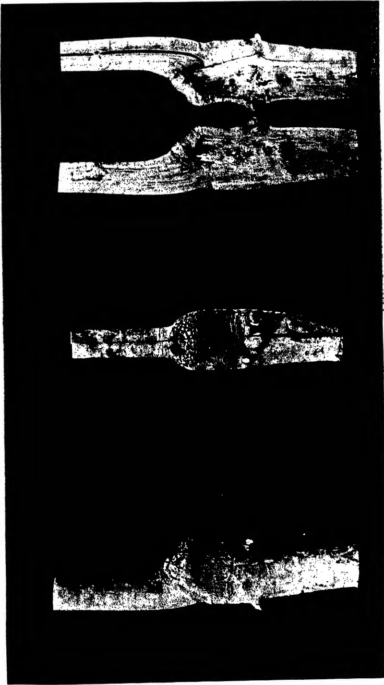A high-contrast, black and white photograph of a decorative object, possibly a bottle or vase, featuring intricate patterns and a central bulbous section. The object is set against a solid black background. The image is heavily processed, resulting in a stark, almost binary appearance with deep blacks and bright whites. The object has a long, narrow base, a wider, textured middle section, and a rounded, bulbous top. The surface is covered in complex, swirling patterns that are difficult to discern due to the high contrast. The overall effect is one of mystery and intricate detail.

The photograph mentioned in Mr. Dias' paper.

26------------------------------------------------

This image is a blank white page. It contains several small, dark specks which appear to be scanning artifacts or dust particles. There is no text, handwriting, or printed content on the page.

27------------------------------------------------

17

clearly seen that the stock attains a dormant state and is enveloped by the scion it has taken on. If this ocular demonstration is correct, and if the stock increases neither in girth, breadth, length, nor in any other manner, what influence can such a stock bear on its guest who has got hold of his little cottage and built a mansion all round it? It is not a case of the scion living on the stock and its root system. The idea that there is one plant above the union and another below it will have to be dispelled.

Have any of our technical officers ever examined a rubber union of stock and scion with a view to finding out what is taking place inside?

A longitudinal section of a budded rubber tree will prove all I say above.

I have not seen a section of this sort or a photograph of such a section anywhere before this, not even in the Netherland Indies where they have samples and photographs of everything imaginable with regard to rubber. I have photographed a longitudinal section of a budded rubber tree and hope to send you a copy in a few days for publication, as this would be the first photograph of this nature. If anyone interested cares to see these sections, they are at liberty to see and examine them either in my office in Colombo or at my laboratory on my Wawulugala Estate, Horana.

28------------------------------------------------

18

## THE RELATIONSHIP BETWEEN STOCK AND SCION IN BUDDED PLANTS.

R. A. TAYLOR, B.SC.,

PHYSIOLOGICAL BOTANIST, RUBBER RESEARCH SCHEME  
(CEYLON).

THERE has recently appeared in the local press a communication from Mr. C. E. A. Dias suggesting that the relationship believed to exist between stock and scion in budded rubber plants and their relative importance in the production of the final composite plant is not in accordance with the views previously held by botanists. In this communication it is stated that the scion is the only important member of the budded plant after union has been established and that the stock ceases to function after the bud has commenced its growth. It is further stated that the tissue produced by the growing scion envelops the stock in such a way as to completely enclose it and that afterwards the roots, stem and branches consist entirely of tissue derived from the scion. As these statements are open to doubt, it is considered necessary to give an explanation of what takes place after budding has been successfully carried out and the shoot has commenced its growth.

*Development of budshoots.*—In the early stages of its existence a bud is completely embedded in the cortex, has no connection with the wood of the stem, and can be seen as a small pimple when a bud patch is removed. When growth of the bud begins, tissue is produced both inwardly and outwardly. The budshoot gradually becomes attached by woody tissue to the wood of the stem and at the same time grows outwards to form a branch. The same process takes place no matter whether the bud develops on the stem on which it was originally produced or whether it has been transplanted to another plant, as in budding. When the top of a plant is cut off, one of the dormant buds beneath the cut develops and the shoot produced takes the place of the original stem. In the case of a budded plant care is taken that the transplanted bud only is allowed to shoot. The portion of the old stem remaining above the developing shoot then dies off. The tissue formed subsequently does not envelop any of the portion below the point of origin or attachment.

Proof of this can be obtained by sectioning in a longitudinal direction a sample of bark taken across the union of stock and scion in a budded plant. Such a section will show that in the symbiotic union produced in budded plants each of the symbionts retains its own characteristics. This is illustrated in fig. 1 which

29------------------------------------------------

19

is a semi-diagrammatic drawing of a longitudinal section of bark cut through the point of union. It will be seen that there are fewer stone cells in the stock portion than in the scion portion and that the other characters of the two cortices are quite different, each having retained its own special features. Fig. 2 shows photographs of longitudinal median sections through the top of a normal stump and it will be noted that they present exactly the same appearance as longitudinal sections through a stump which has been budded. The sections of fig. 2 should be compared with Mr. Dias' photograph of his sections.

The sharp line between the old and the new tissue of the stock is merely the result of the check to the growth of the stock when it was cut off (stumped). It is this sharp line that has given the impression that the tissue of the scion is enveloping the old stock. Actually the old and the new tissues of the stock are continuous; they are merely marked off from each other by the zone of smaller-celled tissue formed during the period between the removal of the stem of the stock and the development of the bud shoot. The same sharp line occurs in all rubber plants which have been cut off whether budding has taken place or not.

A similar phenomenon is that of the annual rings shown by deciduous trees in temperate climates. These are merely zones of small-celled tissue formed during the wintering periods and the enclosure of the old tissue by new tissue formed in the following season is exactly the same as the enclosure of the old tissue of the stock by the new tissue of the stock after it has been stumped. There is no question of the envelopment of the stock by the scion.

*Importance of stocks.*—In the present state of our knowledge of rubber it is not possible to make any reliable statements as to the influence of stock over scion but in view of the work which has been done on other plants it would be a mistake to neglect the possibility of such influence. In fruit crops where knowledge of budding or grafting has reached a much more advanced stage than in rubber it has been found that the nature of the stock has a very important influence on the resultant plant.

An abstract from a paper by R. G. Hatton entitled "The influence of different root stocks upon the vigour and productivity of the variety budded or grafted thereon" (Journal of Pom. and Hort. Sci., Vol. VI., No. 1, Feb. 1927), states: "These figures (given in the article) show that a single variety of apple budded upon four distinct varieties of root stock behaves very differently upon each, both in the amount of wood growth it makes and the fruit it produces. On one root stock it may make five times the wood growth that it does upon another; or again it may fruit ten times as heavily" ..... "It is claimed that a much greater control has been established over the tree than heretofore, as a result of a more precise knowledge of the influence of root stocks." Again,

30------------------------------------------------

20

other experiments have shown than where "double working" has been employed the variety used as an intermediate stock has had a distinct influence on the vigour of the second scion. In vine cultivation in France the stock is varied according to the nature of the soil, and in citrus culture the stock has been shown to have an important influence on growth and fruiting.

There is, in fact, a considerable amount of information available on the subject of the influence of stock on scion which goes to show that while each retains its general characteristics there is a decided inter-effect between the two. Consequently no research work on budgrafting in rubber should be carried out without keeping in mind the possibility of such influence, and the statement that the Rubber Research Scheme may be wasting valuable time in an endeavour to study this problem is not justified.

The following extract from the progress report of the Experiment Station, Peradeniya, for September, October, 1928 is of interest in this respect and should be carefully noted. "In plot 174, planted with budded rubber in November 1927, it was noticed that some plants had made greatly superior growth to the majority. It was found that 30% of the better grown plants were growing on their own stocks, whereas only 17% of the total number of trees are growing on their own stocks. It was also noted that 43% of the well-grown trees growing on their own stocks were Heneratgodā No. 2 budded on Heneratgodā No. 2 stocks."

The statement that delays have taken place owing to a desire to select good stocks as well as good scions is erroneous, for stocks of known parentage on one side have always been available. It has not been necessary to use stocks of entirely unknown parentage in the work being done by the Research Scheme.

Finally, the statement that no scientist in the research stations of the East has ever sectioned a budded plant is inaccurate, for in the *Archief voor de Rubbercultuur* for 1922 there is an article on the subject by Dr. Visser containing complete diagrams. In 1922 and 1923 respectively two officers of the Rubber Research Scheme had, while in Java, the privilege of examining the original sections used in the writing of that article,

31------------------------------------------------

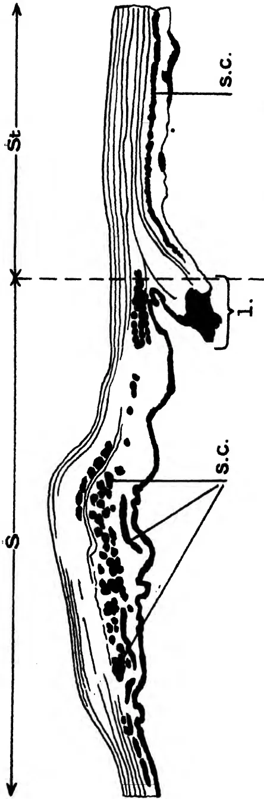

The diagram is a longitudinal tangential section of a cortex. It shows a cross-section of tissue with various layers. On the left, a long horizontal arrow points to the right, with the letter 'S' at its left end and 'St' at its right end. A vertical dashed line with an 'X' at its top end intersects the section. To the right of this line, there is a bracket labeled 'I.' pointing to a dark, irregularly shaped area. Further to the right, there are two labels 'S.C.' with lines pointing to specific areas of the tissue. The tissue itself is depicted with various patterns: horizontal lines, stippling, and dark, irregular shapes.

Block by Survey Dept. Ceylon.

Fig. 1. Longitudinal tangential section of cortex taken across the union of stock and scion. S, scion; St, stock; s.c., stone cells; I, the lip left after the breaking off of the flap of bark which is folded over the attached bud for the first week or two after budding.

32------------------------------------------------

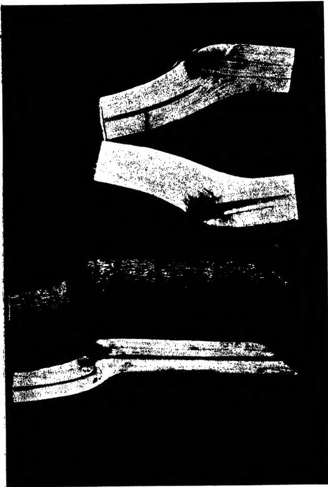The image displays three longitudinal cross-sections of plant stems against a black background. The leftmost section shows a stem with a distinct, rounded, and slightly protruding bud at its tip. The middle section shows a stem with a more elongated and pointed bud. The rightmost section shows a stem with a very small, barely visible bud. The stems are light-colored with visible internal cellular structures and vascular patterns.

Fig. 2. Longitudinal sections through unbudded plants which have been stumped, showing the original stem and also the portion produced by the developing bud. Compare with similar section of budded plant.

33------------------------------------------------

21

## SELECTED ARTICLES.

### RUBBER PLANTING IN CEYLON.\*

AS SEEN BY THE EDITOR, OF "THE INDIA-RUBBER WORLD."

#### RUBBER TREES AND TAPPING AT CULLODEN.

**A**T the close of my first day at Culloden, when the sun had dropped low enough to make it fairly comfortable in the open, at Mr. Harrison's invitation we started out to see the rubber. The plantation is primarily for tea, the rubber having been planted later through the tea, and also in some of the valleys. The land is very rocky, iron-stone abounding, but there must be something in the soil that suits the *Hevea*, for it flourished wonderfully. The only place where it did not appear to do well was in very low ground, where there was no drainage.

The swampy portions of the land have, therefore, been thoroughly drained; indeed, where some of the seven and eight-year old rubber now is there had once been a bog where cattle were wont to get mired. The rubber on this soil, which was very rich, had some 3 feet of drainage. Of course it was to be expected that the *Hevea* would grow in such soil as this, but I must confess that I was amazed to see it flourishing far up on rock hillsides, and sending its laterals in all directions for food. The *Hevea* has proved itself, in Ceylon at least, a most voracious surface feeder, and in this connection it is worth while to examine the illustration of the uprooted tree held erect between two coconut palms, with the laterals stretched right and left, showing a growth longer than the tree trunk itself. The photograph, from which my illustration was made, was taken by Mr. J. B. Carruthers, and is most graphic.

#### NIGHT TAPPING.

The tapping of the trees begins just as soon as it is light in the morning, for through the middle of the day the *latex* does not flow freely, but starts up again about 4 in the afternoon and is continued until dark. The trees are tapped when they show a girth of 2 feet, without regard to their age. No ladders or supports are used in tapping, as it wasn't found profitable to tap higher than a cooly can reach while standing on the ground. The tool is a very simple V-shaped knife with two cutting edges, and a single slanting cut about 8 inches long has been found to be best, a tin cup being placed under the lower end of the cut and held in position by forcing its sharp edge under the bark. These cuts, by the way, are about a foot apart, sometimes closer and all run in the same direction, the herring bone and the V-shaped cuts being no more in evidence. The practice is also followed now of cutting a very thin shaving from one side of the cut, every other day, eleven times; in other words, re-opening instead of tapping. Before placing the tin cup under the cut, it is rinsed out in cold water to keep the *latex* from adhering to the tin, and also to keep it from

\* An extract from *The Times of Ceylon* of August 2, 1904, kindly supplied by Mr. D. Davidson of Culloden Estate. It is published because of its historical interest.

34------------------------------------------------

22

too quick a coagulation. While I was there a very interesting experiment in scraping the outer bark from the trees had just been finished. The results, as far as could be determined, were such a stimulation to the lactiferous ducts that the flow was increased nearly 50 per cent. The oldest trees on this plantation, by the way, are 18 years, and have produced 3 pounds a year; by scraping the outer bark off they expect to get 6 pounds a year from each of these. There are only a few of these older trees, however, most of them being 7 or 8 years of age. All through the rubber orchards on this estate were hundreds of young Pará trees that were self sown; indeed in many places they had come up so thickly as to be a nuisance. The workmen on this estate, 100 in number, are all Tamil coolies, as the Sinhalese do not care to work, preferring to cultivate rice, a good crop of which insures them a two or three years' vacation. By the time we had examined a few Castilloa trees that were planted by way of experiment, night had fallen, and we wended our way back to the bungalow, where, after a hot bath, as is the custom of the country, we sat down to dinner in pajamas, the "punkah walla" stirring the heavy moist air by most vigorous pulls at the "punkah" cord throughout the meal. The rainfall up here in Kalutara is rather more than down at the coast, being, so I was informed, 144 inches, and the maximum temperature 94 degrees F. While I was there it was unusually dry, yet the rubber looked well and there was a record of six weeks without rain, which had no apparent effect upon it. The next morning we visited other parts of the plantation and saw a great deal of fine rubber. At present there is an excellent market for the seed, as so many new plantations are going in.

#### OIL FROM "HEVEA" NUTS.

As a better preparation, however, against the time when the seed will be a drug in the market, my host was experimenting with an oil made from the seeds. With a crude native mill he turned out an oil which the native women eagerly purchased to burn before their gods, while the pressed cake made an excellent food for cattle. During the forenoon I saw a large Cearà rubber tree cut down, and it seemed to have no *latex* in it at all. I also saw a Pará rubber tree, self sown, growing out of a cleft in the rock where there was apparently no soil, the trunk being 10 inches in diameter and apparently very thrifty.

#### RUBBER CURING HOUSE.

One of the most interesting features of this plantation was the rubber curing house, where the milk is coagulated and the rubber prepared for market. This is a one story brick building, 30 by 80 feet, smelling for all the world like a dairy as one steps within its doors. At one end of the room is a long table upon which are hundreds of enamelled iron pans capable of holding about a quart each. Into these pans the milk is poured through a cheese cloth strainer, after having been previously strained in the field. To it is often added a very little acetic acid—a few drops only. This is allowed to stand over night, and in the morning there is to be found in each pan a pure white pancake of rubber, soft, spongy, and full of water. Each cake is then rolled on a zinc covered table with a hand roller and much of the water thus expressed. The name of the estate is then stamped upon it with either a wooden or metal die, when it is ready for the heater room. The heaters used are simply charcoal ovens, the rubber being spread on wire screens above the fire, and left for three or four hours. By this time the pancakes have lost about 50 per cent. in weight and are beginning to assume a decidedly darker hue. Cakes in the condition described, if in South America, would be immediately marketed, but not in Ceylon. From the heaters they go to

35------------------------------------------------

23

drying racks, where they are air dried for a month to six weeks, depending somewhat upon the weather, and are shipped only after careful examination as to quality and dryness. The care which the planters are expending upon the preparation of the rubber is the best sort of guarantee that the quantity will be sustained, and that the day will come when the name of a plantation on a cake of rubber will tell its value almost to a penny. To follow the rubber a little further it is, when perfectly satisfactory to the planter, packed in chests, the counter-part of the regulation tea chest, made of "momi" wood that comes in shooks from Japan, each package containing about 200 pounds.

#### COARSE RUBBER.

There is also a coarse rubber that is secured by picking the scrap from tapped trees. It is a very excellent rubber, and while I was there it found a market at 3s. 5½d., while the fine was bringing 4s. 9½d. There are those who claim that it is unwise to pick the gum or rubber out of the tapping wounds in the tree, as there is danger that insects or disease enter there. Such a theory is plausible, but so far I have not heard of it resulting from such removal of the air dried scrap.

#### TO REMOVE EXTRANEOUS MATTER.

This coarse rubber, by the way, was not absolutely clean; that is it contained bits of bark, and vegetable matter often-times. As labour is so cheap, and there is plenty of water, it could be very easily washed. For this purpose the ordinary corrugated roll washer that is used in the rubber factories has been suggested, but it hardly fits the case, as the scraps are so very small. A more practical plan would be to run them through a winnowing machine such as is used to blow the dirt out of peas and beans and let the air blast take out as much bark as possible. Then, if necessary, use a washer of the paper engine type to wash and beat the rest out. Of course, for quick drying the gum should then be sheeted, and either plain or corrugated rolls would accomplish that, and it could hang until dry. There is so little of the scrap, however, that the simple winnowing machine is probably all that would be necessary or profitable.

#### RUBBER STRIPS.

The time will come, however, when the coagulating and drying will have to be done on a different plan. The present method takes up too much room and is too slow. It would be perfectly easy to have coagulating pans that would deliver strips of rubber 10 feet long, a foot wide, and a quarter of an inch thick. These strips could then be run through rolls that would squeeze the excess water out, and, at the same time, imprint the plantation name every few inches. Then the strips could be hung up to dry and any degree of artificial heat applied that was thought best.

There have been suggested also a variety of quick coagulating devices, such as endless belts that take a film of milk into a drying chamber and deliver it to the other side coagulated and dried. Some such plan may prevail, but, as yet, the planters are not ready for it.

#### TIME BEST SUITED FOR TAPPING.

After many experiments the manager at Cullodon has satisfied himself that only the very early morning or the late afternoon are the proper times to tap, as in the middle of the day the flow of *latex* is almost nothing. The trees are therefore tapped from 4 until 7 a.m., and after 3-30 p.m. and as long as it is light. Indeed, the collection of the *latex* is often done by torchlight. As an instance of Mr. Harrison's alertness in getting all he can out of the trees with safety, he told me of a series of experiments that he was about to institute for all-night tapping. It seems he learned that

36------------------------------------------------

24

certain sugar estates did all their cutting of the cane by electric light, and that the amount of saccharine matter secured was much larger than in the day time, and, as the habit of the *Hevea* tree pointed toward more *latex* at night, he felt that a similar experiment would be justified.

#### RECORD OF YIELD.

At the present time he keeps a careful record of the production of each tree, and for this purpose the trees are numbered. When a tree has a circumference of 30 inches it is fit to tap, whether it is 5, 6, 7, or more years old. His first year's tapping in 1901 was 4,010 trees, from which he secured 4,600 pounds of first quality Pará. In 1902 the production was about the same, the production for 1903 from 8,300 trees being 10,500 pounds. From 2,500 trees on Heatherly, which has just come in bearing, he gets 3,500 pounds.

#### AN INTERESTING ANALYSIS.

To show how thoroughly Mr. Harrison is seeking for knowledge of the *Hevea*, he has even had the leaves analyzed to know just what they get in the way of food from the soil of Culloden. The analysis is as follows:—

<table>
<thead>
<tr>
<th></th>
<th>Fresh</th>
<th>Air Dried</th>
</tr>
</thead>
<tbody>
<tr>
<td>Moisture</td>
<td>90·605 per cent.</td>
<td>10·600 per cent.</td>
</tr>
<tr>
<td>Organic matter</td>
<td>8·510 per cent.</td>
<td>85·150 per cent.</td>
</tr>
<tr>
<td>Ash</td>
<td>·849 per cent.</td>
<td>4·25 per cent.</td>
</tr>
</tbody>
</table>

The analysis of the organic matter showed that it contained 3·626 per cent. of nitrogen, while the ash showed as follows:—

<table>
<thead>
<tr>
<th></th>
<th>per cent.</th>
<th>per cent.</th>
</tr>
</thead>
<tbody>
<tr>
<td>Phosphoric acid</td>
<td>·398 Lime</td>
<td>·084</td>
</tr>
<tr>
<td>Potash</td>
<td>1·320 Magnesia</td>
<td>2·117</td>
</tr>
</tbody>
</table>

Hence 1,000 pounds dried leaves would contain about 4 pounds phosphoric acid; 13·2 pounds potash; 8 pounds lime; 21·1 pounds magnesia; and 37 pounds nitrogen. From this it will be seen that the leaf is curiously rich in magnesia, but whether from selection or force of circumstances it is difficult to say.

#### HOW THE WORK, IS DONE.

Most of the work is done by contract, each cooly being expected to get *latex* enough to produce one pound of dried rubber a day. It is very interesting to watch them as they troop up to the curing house early in the forenoon, with huge tin cans of *latex* on their heads, and to note how they watch the straining that none is slopped over, and even rinse cups, cans, and every receptacle and add it to the rest that no precious drop escape.

#### COST OF PARA RUBBER AT COLOMBO.

The rubber landed in Colombo costs 16 cents a pound, United States money. Just to let the sceptical do a little bit of thinking, and by the sceptical I mean the majority of rubber manufacturers who believe that the Pará from the Amazon is a better business proportion—just to start them thinking, therefore, I want to ask them to read the following:—

#### FINE PARA RUBBER FROM CEYLON.

<table>
<tbody>
<tr>
<td>Sells at Liverpool, per pound .....</td>
<td>$1·20</td>
</tr>
<tr>
<td>Cost f.o.b. Liverpool .....</td>
<td>·17</td>
</tr>
<tr>
<td>Export duty .....</td>
<td><i>nil</i> ·17</td>
</tr>
<tr>
<td>Planters' profit .....</td>
<td>$1·08</td>
</tr>
</tbody>
</table>

#### FINE PARA RUBBER FROM BRAZIL.

<table>
<tbody>
<tr>
<td>Sells at Liverpool, per pound .....</td>
<td>$1·00</td>
</tr>
<tr>
<td>Cost f.o.b. Liverpool, minimum.....</td>
<td>·21</td>
</tr>
<tr>
<td>Export duty .....</td>
<td>·23 ·44</td>
</tr>
<tr>
<td>Profit .....</td>
<td>$0·56</td>
</tr>
</tbody>
</table>

37------------------------------------------------

25

The above figures both for Ceylon and South America are very small—that is the cost figures. It is probable that 20 cents a pound for cost in Ceylon would be nearer actual practice, while Pará rubber costs-landed in Para or Manaos often 40, 50, and 60 cents a pound, the figures being dependent upon the section that it comes from.

As a matter of fact, the Tamil cooly whom the planters employ is not a high-salaried individual. His pay averages about 13 cents a day, United States money. To this is added the cooly "lines" or houses which are free of rent to him, as is also medical attendance. The planters keep no stores usually, but they do buy rice and furnish it at cost to their labourers, the allowance being 1 bushel a week for a man, and  $\frac{3}{4}$  bushel for a woman.

#### CONCERNING SNAKES.

It was while sitting on the cool flags under the broad porch at the Harrison bungalow that the subject of snakes came up. Both my host and his friend acknowledged that cobras were very plentiful, and that they had a great liking for cool bungalows, which they sought to enter whenever they thought they could safely do so. They said it was a very rare thing, however, for a white man to be bitten by one. But the natives are often bitten, and sometimes fatally. The Sinhalese won't kill them, as they think the cobra quite likely to possess the soul of some dead relative of theirs. The Tamils, however, have no such prejudice and are perfectly willing to slaughter them whenever they can. My informants acknowledged that the bite of the cobra was very venomous, but not necessarily fatal. They said that, some years before, there had lived in that district a man who was known as the cobra king who not only cured snake bites in others, but was proof against poison himself. He used to tease the snakes to make them bite him, and even rub their venom into cuts on his arms, and apparently without the least injury. But he was finally attacked by a sort of rheumatism, which made him a helpless cripple, and he went back to England to get cured.

#### ARAPOLAKANDA ESTATE: SMOKING CEYLON RUBBER.

Close to Culloden is Arapolakanda, where I next visited, being entertained by the resident manager, Mr. H. V. Bagot. He has but fifteen acres of *Hevea* in bearing and gets twenty pounds a day. In coagulating, Mr. Bagot did not follow exactly the process used by his neighbour, Mr. Harrison, the difference being this: he added no acid to hasten coagulation, and also smoked the rubber over a fire of sawdust and bark. The final drying was accomplished by spreading on wire screens, and not a pound was shipped until it was perfectly dry and transparent. By the way, he reported that he had one "dumb" tree that was big, thrifty, and apparently exactly like the other, but that it gave no milk. At the lower end of Arapolakanda are some acres of marshy land that have been drained and reclaimed and on which is standing some fine rubber. As this land is near the river, it is sometimes inundated, the water standing four feet up on the trunks, but for a short time only. Mr. Bagot acknowledged that the trees were set back somewhat, but not very much. The general opinion in Ceylon, however, is that inundations are very apt to kill out the *Hevea*.

The oldest rubber on this plantation is some 15 to 18 years old, planted quite closely together in a sheltered nook. In this lot the outside trees which get the sun are by far the largest, one that I measured roughly being 2 feet in diameter and 60 feet high. After having seen all of the rubber, I examined the tea, saw what sights there were, and spent a very pleasant evening with Mr. Bagot, at whose bungalow I slept.

38------------------------------------------------

26NAVIGATING THE KALUGANGA.

Very early the next morning, with a cooly carrying my luggage, I made my way to the river, and, climbing down its steep clayey bank, found myself aboard the steamer "Kaluganga." This craft was some 60 feet long and 12 feet wide, with a small wood-burning boiler and engine amidships. The forward deck was reserved for the whites, while the blacks huddled together at the stern. I had barely embarked, when down came one of Mr. Withers' coolies with two steamer chairs, one of which he had thoughtfully brought for me. After a most ear-splitting whistle, the little steamer cast off and started down the deep, muddy stream. Shortly after leaving the pier we passed the Clyde estate, which shows a large planting of tea and Pará rubber, the trees young, straight, and tall. The run down the river was a pleasant one, but in no way exciting, and, early in the forenoon, I took a train from Kalutara and was again back in Colombo.

AT COLOMBO: BOUND FOR SUNNYCROFT.

As I planned to leave for the Kelani Valley that afternoon, I went to the Grand Oriental Hotel for breakfast and a *siesta*, from which I was awakened by a pleasant young reporter, who interviewed me most thoroughly. I want to say in passing that all through the East the newspaper men seemed alive to the importance of the rubber question and printed many columns of things that I did and didn't say. When he had finished with me I summoned Miguel and we took rickshaws for Maradana Junction station and there bought tickets for Karawanella. After a somewhat tiresome ride in the train we reached our destination and I found Mr. W. Forsythe, of the Sunnycroft estate, awaiting me with a very swell rig consisting of a fine horse and high cart. Into the trap I got, and Miguel hiring a bullock hackery, we drove merrily off. The Forsythe conveyance soon left the other far behind, and as evening fell and it began to grow chilly, I was moved to ask how much further Sunnycroft might be. I then learned that it was eight miles from the station, whereas I had been told that it was two. As the road was constantly ascending, it grew colder and colder, and, as Miguel had my coat, I suggested to Mr. Forsythe that I was in for a chill. He, therefore, stopped at the bungalow of a planter friend and secured a coat for me, and our journey was then continued. Had it not been for the chill in the air, I should have enjoyed the ride mightily, as the road was most picturesque, winding through native villages, crossing rivers and often crowded with strange conveyances. Mr. Forsythe entertained me very pleasantly that night, and the next morning we walked some eight miles over his plantation. His land was exceedingly hilly, but under a high state of cultivation, showing many hundreds of acres of fine tea. He also had about three hundred *Hevea* trees planted in 1897, which would average 40 inches in circumference. In addition to this he had planted rubber everywhere through his tea, but very little of it was over 2 years old.

39------------------------------------------------

27

## RUBBER IN CEYLON IN THE 'NINETIES.'

**T**HE Editor has kindly asked me to contribute an article on the early history of the Rubber Plantation Industry. This is a more ambitious task than I care or feel competent to undertake. Instead will be ventured a few reminiscences of and reflections on the work carried out in Ceylon at the close of the last century, which culminated in the demonstration of wound-response and the introduction of the acetic acid method of coagulation.

Fresh from a botanical and chemical training at Cambridge, I accepted the temporary post of scientific assistant to the Director of the Botanic Gardens, Ceylon, a post which the then Director, Dr. J. C. Willis, had prevailed upon the Government to establish. This was the first step towards placing the Department on a wider scientific basis than formerly existed.

At first I believe the work suggested for me was the investigation of a fungal disease which was at that time attacking the stem of the cacao tree (*Theobroma cacao*). However, the planters saw their way to appoint a mycologist of their own, and the late Mr. J. B. Carruthers was chosen for the job, so I was free for other work.

Owing to the incoming of the motor car the problem of meeting in the near future the extra supply of rubber needed for its tyres was presenting itself; and so attention once more was being directed towards the possibility of cultivating caoutchouc-yielding trees at a profit. The foundation for such a cultivation in the Middle (Tropical) East had already been laid about twenty years previously by the introduction of such prominent American rubber trees as Ceara rubber (*Manihot Glaziovii*), Panama rubber (*Castilloa elastica*) and, most important, Para rubber (*Hevea brasiliensis*). The romance associated with the coming of the last-named tree to the East is a thrice-told tale and needs no repetition here; suffice it to say that the main of the plants raised at Kew from the seed collected by Wickham in Brazil went to Ceylon, and a branch garden at Heneratgoda in the low-country was formed for their reception. This grove and especially the high-yielding tree known as Number 2 have become historically famous.

Dr. Willis, fully alive to the necessity of investigating rubber trees from the standpoint of a remunerative cultivation for Ceylon, appointed me to this work. The British planting community there had already made a trial of Ceara rubber, a small tree capable of flourishing at higher elevations and in drier situations than *Hevea*. At the time of the coffee disaster it was a tree capable of being tried on the abandoned plantations, and was one of the cultivations attempted between the downfall of coffee and the rise of tea. In 1883 nearly a thousand acres were reported to be under Ceara, but its cultivation was not a financial success, the general opinion being that it paid to collect the rubber, but not to cultivate the tree. When I arrived in Ceylon (1898) as far as I know there were no longer any planted areas of Ceara of importance, though the tree was very evident as an escape, and naturally specimens were growing in the Botanic Gardens, upon which a certain amount of experimental work was done.

---

\* A record of early experimentation by Dr. Parkin in *The India Rubber Journal*. Vol. LXXVI, No. 18, October, 1928.

40------------------------------------------------

28

The Ceylon planters having failed with Ceara were now a trifle shy about taking up rubber cultivation again, but Dr. Willis, concentrating on *Hevea brasiliensis*, gradually focussed their attention on this untried tree as one suitable for growing in the moist low country. At that time no one could definitely assert that its cultivation would be a success.

#### A FALSE TRAIL AVOIDED.

Just before my time in Ceylon Mr. Biffen (now Sir Roland Biffen of wheat fame) went as scientific adviser on a short expedition to tropical America to study rubber trees and came back imbued with the idea that *Castilloa* and not *Hevea* was the tree to cultivate. The latex, he found, flowed freely from the former and much could be collected from a single tapping; and further, the caoutchouc could be readily separated from it by centrifugal means. *Hevea*, on the other hand, gave a poor yield and its milk could not readily be dealt with in this way. The future, however, has shown that those who put their trust in *Castilloa* backed the wrong tree. It was largely planted (or supposed to be) in Mexico and Central America, and many companies floated. But one might ask where are those companies now?

Biffen's opinion naturally influenced me considerably at the beginning of my period in Ceylon. I confirmed his statement about the latex flowing freely from *Castilloa*, and tardily and thickly from *Hevea*. Also experiments were made with a cream separator at the Agricultural School in Colombo with the kind permission of the Manager, Mr. Drieberg. The latex of *Castilloa*, we found, centrifugalised readily (in fact it creams on standing), whereas that of *Hevea* at the speed attainable failed to separate. Still *Hevea* seemed the tree upon which to concentrate partly because it yielded the best wild rubber and partly because it was the one rubber tree which in the mature state existed in any abundance in the Island, thanks to the original grove planted at Heneratgoda and its offspring. At that time centrifugal rubber seemed the ideal, *i.e.*, the separation of the caoutchouc from the latex in comparative purity. We did not then know that certain constituents of the serum were of value in speeding up vulcanization. Now that artificial organic accelerators are obtainable and can be added, this objection to pure caoutchouc loses some of its weight.

Apropos of centrifugal rubber, I had in 1910 (the boom year) an interesting experience with a syndicate that was out to float a company for the purpose of applying the principle of the cream separator to the preparation of raw rubber in the Middle East. An article from my pen on the Plantation Rubber Industry had just appeared in *Science Progress*, and in the section devoted to centrifugalisation doubt had been cast on the feasibility of preparing Para rubber in this way. The syndicate had read this, and being perturbed by it wrote to me for an interview. This was granted and took place at Cambridge. Biffen was also drawn into it. The American member of the party, I remember, brought a pleasing sample of *Castilloa* rubber prepared by their centrifugal machine. They wanted my name on the prospectus, but I said I could not honestly lend it unless I had ocular proof that their machine could separate *Hevea* latex; and even if it could I doubted very much whether it would remove the rubber particles so completely as is done by the acetic acid method of coagulation. Having some ammonia-preserved latex by me I demonstrated the process to them, showing how a perfectly clear serum was left after coagulation. I fancy this company never was floated.

To return to the old Ceylon days, seeing that centrifugalisation was apparently not practicable with *Hevea* latex and feeling that the crude method of preparing samples of raw rubber at Heneratgoda must be capable

41------------------------------------------------

29

of much improvement, I set about to find how the latex could be coagulated. Ceara latex clots on heating, but not so that of *Hevea*. A trace of acid, however, brings about coagulation no matter what the dilution. Various acids (as well as a number of salts) were tried to see which could be recommended. Peradeniya in those days had for a laboratory merely a small room adjacent to the director's office, and the appliances and reagents in it were of a meagre character. Perhaps that is why formic acid was never tried by me. I had through my hands the usual mineral acids and the commoner organic ones, such as acetic, oxalic, tartaric and citric. Acetic acid was finally chosen and recommended as the most satisfactory coagulating agent. For one reason it is a weak acid with little corrosive power and for another it has a wide range of applicability. If too much acid be added to *Hevea* latex coagulation ceases to be complete and with a strong acid like sulphuric the range is very narrow, a little in excess and the serum becomes milky. Acetic acid, on the other hand, can be added in considerable excess before milkiness appears in the serum. The amount of acetic acid recommended for a given volume of *Hevea* latex turned out to be much greater than necessary, a fortunate circumstance on account of expense. I recollect I was a little troubled at the amount required. The discrepancy between laboratory experiment and later estate practice has been explained through the spontaneous increase in acidity of the latex on standing. My experiments were done with latex drawn straight from the tree. If it had been allowed to stand a few hours less acid would have been needed. Latex on estates is collected some time before it is coagulated. It should also be borne in mind that for my experiments latex from first tapping was used. We had not then begun to take advantage of wound response.

Formic acid, which chemically is in the same series as acetic, was shown later to be an efficient coagulator. Recently on the score of expense, as it is now cheaper than acetic, it is being used to some extent instead, especially in Java; but its greater corrosive action on the rolling mills may outweigh its lower cost.

It is perhaps a little surprising that the acetic acid method has lasted so long and still persists. Since fine Para made by the native method of the Amazon is superior (or we are led to believe so) to plantation rubber, one imagines a product containing all the ingredients of the latex save water would be the ideal. The spraying method achieves this. Is it making headway or is the extra cost of installation the chief handicap in its extension?

#### EARLY WOUND RESPONSE INVESTIGATIONS.

It was while conducting laboratory experiments on coagulation that I first became aware of the great influence wounding had on the flow of latex. For these experiments latex was collected in test tubes from the few adult trees growing at Peradeniya. As a rule each collection was made from cuts in virgin (*i.e.*, previously untapped) bark, thinking at that time that more latex could be got in this way and also that the samples would be more uniform than from areas of bark which had recently been tapped. Happening on one occasion to make an incision near one made a day or two before I was surprised at the abundant flow of latex from it. This set me experimenting, with the result that the stimulus wounding gave to the flow of latex was amply demonstrated. Instead of tapping *Hevea* trees at fairly long intervals, as was then thought to be advisable, regular tapping every other day was seen to be practicable and in fact to be advocated. Dr. Willis had found previously from the tapping results at Heneratgodia that at weekly intervals the second tapping gave twice as much rubber as the first. The explanation of this was evident now.

42------------------------------------------------

30

From recent literature on the early history of rubber planting it seems that Singapore was aware of this peculiarity shown by Para rubber trees, as the authorities there had had over from Brazil native tappers who spoke of the first tapping as merely *calling the rubber*. We in Ceylon, working, as it were, in a watertight compartment, rediscovered the need of *calling the rubber*, which doubtless had been known for ages in the basin of the Amazon. David Fairchild, in a recent article on *The Beginning of the Rubber Industry*, asks who introduced the term wound-response, stating that it does not occur in the Ceylon Circular of 1899. He is right in this, for on referring to it I do not find the expression, but instead, wound-effect and wound-reaction. In a paper on *Latex and its Function* I wrote the following year for *The Annals of Botany* "wound-response" occurs twice, and in my *Science Progress* article it is used as a heading, so it looks as if the responsibility falls upon me.

Among rubber trees *Hevea brasiliensis* appears exceptional in so increasing its flow of latex through the stimulus of wounding. Amongst the many latex-yielding trees, besides the actual caoutchouc ones, surely there must be some that would show this phenomenon; but no botanist, as far as I am aware, has demonstrated this as yet.

With the recognition of wound-response the budding industry of rubber planting looked decidedly more promising. The quantity of rubber obtained from the initial tapping was shown to be little guide as to the amount the tree was capable of yielding in a year. A few tappings per annum could no longer be thought the practice. The tree revealed itself as one capable of being treated like a cow and milked regularly; and the factory like a dairy with raw rubber in place of butter and cheeses as its output. With the introduction of regular milking conservation of bark became imperative, and so the reopening of the wound instead of fresh cuts, excision in place of incision, became the rule. In the initiation of this practice I had no share. My time was up. Taking advantage of wound-response and the acetic acid method of coagulation, Ceylon produced the biscuit, the first form in which plantation rubber was exported, to be later superseded by crepe and sheet. Over a quarter of a century has elapsed since these early experiments when *Hevea* trees in the East existed in their tens and now in their millions, yet the memories of those days are so vivid that they seem but as those of yesterday.

43------------------------------------------------

31

## MANURING OF PADDY IN LOWER BURMA.\*

**O**N the  $9\frac{1}{2}$  million acres of swamp paddy land in Lower Burma where almost the whole of the Burma rice of commerce is produced, the paddy crop has hitherto been grown practically without manure. There is an impression abroad that this land receives an annual coating of river silt which enriches the soil and maintains its fertility. But, so far as the main paddy is concerned, this is not so; and the land which does receive this coating of silt, with the exception of some parts of the lower Delta, is generally in such a precarious position, liable to severe damage by floods, that paddy growing there is a very speculative business and may be left out of consideration in the present paper entirely. The main part of the paddy area receives no annual coating of silt, but is on such a level that, while by means of small field embankments it can hold enough rain water to mature a crop with a growing period of 150 to 200 days, it is high enough to be comparatively safe from the flood waters of the Burma rivers during the monsoon.

The comparatively high prices ruling for paddy since the war have encouraged the extension of cultivation into the low-lying and more precarious tracts which do receive silt, and it is chiefly owing to this fact that so much has been heard in the past few years of the increasing damage done by floods to the paddy crop; for these low-lying areas on the margin of cultivation, and more or less recently brought under the plough, have suffered most.

### PERMANENT LEVEL OF FERTILITY REACHED.

The system followed, of continuous annual cropping with paddy, is exhausting when practically nothing in the way of manure is returned to the soil; but most of the land has already lost its virgin fertility and has been reduced to a level of productiveness which now appears to be fairly constant, a level at which the plant food removed by the annual rice crop is made good by the natural breakdown of the soil. The only reliable statistics available do not show that there has been any progressive decline in fertility within recent times; and this is supported by settlement and other reports going back farther than 1913-14, from which year comparable records of acreage yields are available. Taking the Hanthawaddy district settlement reports as an example, the reports from 1872 to 1910 show that, in the areas dealt with, there has been no decline in fertility during this time. The actual figures given show yields per acre well above the average now accepted for the country as a whole, and we are probably safe therefore in assuming that under the present system of cultivation a general average yield of about 1,500 lb. per acre, apart from annual fluctuations, may be expected to continue in Lower Burma for some considerable time.

Under the circumstances, this yield may be considered fairly good and compares not unfavourably with that of some other tropical rice-growing countries. The following table compiled from figures extracted from the International Year Book of Agricultural Statistics shows the relation between the principal rice-growing countries in 1926. The figures must be regarded as a rough indication only, since methods of recording yields vary in different

\* By David Hendry, M.C., B.Sc., N.D.A., Deputy Director of Agriculture, Southern Circle, Burma, in *The Agricultural Journal of India*, Vol. XXIII, Part V, September 1928.

44------------------------------------------------

32

countries, and China, one of the largest rice-growing countries, records no figures at all. Thus, as an example, the acreage yield in India as a whole is based on the sown area, while that for Burma is on the matured area only.

Principal rice-growing countries.

<table border="1">
<thead>
<tr>
<th>Country</th>
<th>Acreage of rice</th>
<th>Yield per acre</th>
</tr>
<tr>
<td></td>
<td></td>
<td>lb.</td>
</tr>
</thead>
<tbody>
<tr>
<td>India</td>
<td>79,134,000</td>
<td>1,281</td>
</tr>
<tr>
<td>China</td>
<td>...</td>
<td>...</td>
</tr>
<tr>
<td>Indo-China</td>
<td>12,795,000</td>
<td>1,041</td>
</tr>
<tr>
<td>Java</td>
<td>8,356,000</td>
<td>1,378</td>
</tr>
<tr>
<td>Japan</td>
<td>7,738,000</td>
<td>2,875</td>
</tr>
<tr>
<td>Siam</td>
<td>7,157,000</td>
<td>1,680</td>
</tr>
<tr>
<td>Philippines</td>
<td>4,252,000</td>
<td>1,014</td>
</tr>
<tr>
<td>Korea</td>
<td>3,885,000</td>
<td>1,565</td>
</tr>
<tr>
<td>French Guinea</td>
<td>2,038,000</td>
<td>890</td>
</tr>
<tr>
<td>Formosa</td>
<td>1,400,000</td>
<td>1,761</td>
</tr>
<tr>
<td>Madagascar</td>
<td>1,372,000</td>
<td>960</td>
</tr>
<tr>
<td>Brazil</td>
<td>1,323,000</td>
<td>1,130</td>
</tr>
<tr>
<td>U.S. America</td>
<td>1,014,000</td>
<td>2,252</td>
</tr>
<tr>
<td>Ceylon</td>
<td>829,000</td>
<td>676</td>
</tr>
<tr>
<td>British Malaya</td>
<td>664,000</td>
<td>1,006</td>
</tr>
<tr>
<td>*Soviet Russia</td>
<td>583,000</td>
<td>1,050</td>
</tr>
<tr>
<td>Sierra Leone</td>
<td>400,000</td>
<td>1,503</td>
</tr>
<tr>
<td>Italy</td>
<td>365,000</td>
<td>4,062</td>
</tr>
<tr>
<td>Egypt</td>
<td>191,200</td>
<td>2,847</td>
</tr>
<tr>
<td>Senegal</td>
<td>123,300</td>
<td>890</td>
</tr>
<tr>
<td>Spain</td>
<td>121,000</td>
<td>5,800</td>
</tr>
<tr>
<td>Mexico</td>
<td>118,400</td>
<td>1,360</td>
</tr>
</tbody>
</table>

\* Pre-War—1909-1913.

The yields in Spain, Italy and Japan are outstanding, and have been so for many years, due to the intensive methods adopted there; but it is worth while noting that until 1916 the yield in America was approximately the same as for Burma, and the higher figure now shown is a comparatively recent achievement. This increased yield has been brought about principally by the more extended use of fertilisers; and, although a similar increase could be brought about in Burma by the same means, this could not in the past be done at a profit for reasons which will be adduced later.

#### NEED FOR MANURING.

The need for manuring of paddy land in Lower Burma has been one of the subjects under investigation at the Hmawbi Experimental Station for a number of years, and among other experiments a series of plots treated with different manures was laid down in 1913 designed to ascertain what manurial constituents were deficient in these soils and to what manurial treatment they would probably respond best. This experiment was continued for ten years, the individual plots being manured as shown below for five consecutive years, and the controls left untreated. Manuring was then discontinued and all plots were observed for a further period of five years to record the residual effect of the different manures employed. The results have been published in the annual reports of the Hmawbi Station, but I have condensed them here into a single table which is given below.

45------------------------------------------------

33

<table border="1">
<thead>
<tr>
<th data-bbox="98 123 138 136">No.</th>
<th data-bbox="296 123 508 136">Treatment (per acre)</th>
<th data-bbox="641 96 758 171">Five years' manure. Per cent increase over average of controls</th>
<th data-bbox="771 96 894 171">Five years' residual effect. *Per cent increase over average of controls</th>
</tr>
<tr>
<th data-bbox="101 166 128 179">(a)</th>
<th data-bbox="383 166 410 179">(b)</th>
<th data-bbox="688 166 715 179">(c)</th>
<th data-bbox="824 166 851 179">(d)</th>
</tr>
</thead>
<tbody>
<tr>
<td>1</td>
<td>Cattle manure at 30 lb. nitrogen</td>
<td>+ 37.5</td>
<td>+ 21.8</td>
</tr>
<tr>
<td>2</td>
<td>Cattle manure at 50 lb. nitrogen</td>
<td>+ 52.3</td>
<td>+ 34.5</td>
</tr>
<tr>
<td>3</td>
<td>Cattle manure at 70 lb. nitrogen</td>
<td>+ 68.7</td>
<td>+ 37.8</td>
</tr>
<tr>
<td>4</td>
<td>Cotton cake at 50 lb. nitrogen</td>
<td>+ 54.8</td>
<td>+ 29.2</td>
</tr>
<tr>
<td>5</td>
<td>Cattle manure at 30 lb. nitrogen, superphosphate at 30 lb. <math>P_2O_5</math> sulphate of potash at 30 lb. <math>K_2O</math>.</td>
<td>+ 53.0</td>
<td>+ 54.0</td>
</tr>
<tr>
<td>6</td>
<td>Cattle manure at 30 lb. nitrogen, superphosphate at 20 lb. <math>P_2O_5</math>.</td>
<td>+ 43.5</td>
<td>+ 27.6</td>
</tr>
<tr>
<td>7</td>
<td>Cattle manure at 30 lb. nitrogen, bone-meal at 20 lb. <math>P_2O_5</math>.</td>
<td>+ 51.0</td>
<td>+ 31.8</td>
</tr>
<tr>
<td>8</td>
<td>Bone-meal at 20 lb. <math>P_2O_5</math>.</td>
<td>+ 26.5</td>
<td>+ 9.5</td>
</tr>
<tr>
<td>9</td>
<td>Superphosphate at 20 lb. <math>P_2O_5</math>.</td>
<td>+ 35.3</td>
<td>+ 15.3</td>
</tr>
<tr>
<td>10</td>
<td>Sulphate of potash at 20 lb. <math>K_2O</math>.</td>
<td>+ 5.0</td>
<td>+ 6.6</td>
</tr>
<tr>
<td>11</td>
<td>Sodium nitrate at 30 lb. nitrogen</td>
<td>+ 17.0</td>
<td>+ 35.5</td>
</tr>
<tr>
<td>12</td>
<td>Sodium nitrate at 30 lb. nitrogen (Applied as to dressing).</td>
<td>+ 5.0</td>
<td>+ 25.0</td>
</tr>
<tr>
<td>13</td>
<td>Nitrolim at 30 lb. nitrogen</td>
<td>+ 11.0</td>
<td>+ 64.2</td>
</tr>
<tr>
<td>14</td>
<td>Ammonium sulphate at 30 lb. nitrogen</td>
<td>+ 32.5</td>
<td>+ 25.5</td>
</tr>
<tr>
<td>15</td>
<td>Lime at 2,000 lb.</td>
<td>+ 24.0</td>
<td>+ 1.9</td>
</tr>
<tr>
<td>16</td>
<td>Ammonium sulphate at 30 lb. nitrogen, superphosphate at 20 lb. <math>P_2O_5</math>, sulphate of potash at 20 lb. <math>K_2O</math>.</td>
<td>+ 33.5</td>
<td>+ 17.5</td>
</tr>
</tbody>
</table>

Among other information provided by this table, the most important facts are the indications given that the chief requirements of paddy on these soils are nitrogen in the form of ammonia and phosphate; that potash is not shown to be a definite limiting factor; and that nitrogen in the form of nitrate is distinctly harmful. The deficiency in nitrogen and phosphate shown is confirmed by the chemical analyses of these which are also published in the station reports, and subsequent experiments have borne out the correctness of the conclusions drawn. The Lower Burma soils differ from the Upper Burma soils in being distinctly acid, and respond to dressings of lime although in no very great degree; and experiments with lime have shown that while it is beneficial to the soil and increases the crop, the cost renders its use uneconomic.

#### INDIGENOUS MANURES AVAILABLE.

The more or less readily obtainable indigenous manures able to supply the deficiencies indicated include cattle dung, bats' guano, fish waste, bone-meal, rice bran, cotton cake, green manure crops, etc., but the quantities of each are quite inadequate for the purpose of bringing about any marked increase in fertility. Cattle dung is by far the most important and the quality and amount of this available for paddy land may well be considered first.

In the system of cultivation followed, one pair of bullocks is able to work from 8 to 12 acres, and, as there is practically no land other than paddy land worked by bullocks, an average of one pair of bullocks to every 10 acres is a reasonable figure to assume for the ratio of livestock to cultivated area. Cattle are only bred locally to a negligible extent owing to the unsuitable

46------------------------------------------------

34

swampy conditions, and nearly all the working bullocks are imported from the dry zone of Upper Burma. This being so, the cultivator seldom keeps more bullocks than are strictly necessary to cultivate his land, and he has no young stock to augment his supply of cattle dung. Other cattle there are kept on the uplands by Indian cow-keepers for milk purposes, but these contribute practically no manure to the paddy land. The ratio of one pair of bullocks to 10 acres of land is borne out by the figures of livestock and the cultivated area for the two great paddy-growing divisions in Lower Burma. The Pegu and Irawaddy divisions comprise between them 7,342,174 acres of cultivated land including gardens, which constitute only about six per cent. of the whole; the livestock, comprising bulls, bullocks, cows and young stock, and including all classes of buffaloes, amounts to 1,490,134 animals, or 745,067 pairs, which is near enough 1 : 10 for our purpose.

The amount of dung which a single bullock will contribute to the manure pit in the course of a year, according to records kept at the Hmawbi Station, is about three tons, or approximately six tons per pair. If carefully conserved, this amount would be available each year for 10 acres of paddy land; but under village conditions the need for careful conservation is not appreciated, and the wastage is so great that not more than half this quantity ultimately finds its way to the land. In fact so little is the value of cattle dung appreciated in some of the more fertile tracts that I have seen a cultivator throw it into a near-by creek to avoid the trouble of storing and carting it on to his land.

The more ordinary way of using the available cattle manure is to collect what has been loosely stored in the open for the past year and spread it on the nurseries which constitute a tenth of the holding; the main area is not manured at all. The manure so applied, in addition to being deficient in quantity, is lacking in quality; concentrates are only fed to the cattle on a small scale, and when the manure has been stored in the open through part of the rains it is very poor stuff indeed, as analyses show.

There is a good deal of scope for improvement in the methods of conserving and applying this best of all manures, and efforts towards bringing this about are being made by the Agricultural Department; but, even when the best has been done, the fact remains that there is not enough cattle manure to go round, and a dressing which at best averages about three tons for 10 acres can hardly be considered sufficient to maintain the fertility of the land, far less to improve it.

Of the other manures such as bats' guano, fish waste, bone-meal, rice bran, cotton cake, etc., these are either strictly limited in quantity like the first three, or fetch higher prices for other uses outside general agriculture than they are worth as manure. Even the purely manurial substances like bats' guano and fish guano sell for much higher prices to gardeners and concerns growing valuable money crops than a crop of low money value per acre like paddy can afford to pay. The use of these expensive manures on paddy although it increases the outturn per acre considerably results in a heavy monetary loss, as experiments at the Hmawbi Station clearly show. Bone-meal is on the border line and just manages to pay its way.

The growing of green manure crops constitutes a well-recognised method of maintaining and improving soil fertility, but on the old paddy land these cannot be grown with any reasonable prospect of success. When the rains finish in early November, the soil dries up very quickly and assumes a cement-like hardness in which no green crops will grow; even seeds broadcasted among the ripening paddy crop fail to establish themselves. Most of the known green manure crops and the different methods of growing them have been tried under these conditions, but have failed. The hard condition of

47------------------------------------------------

35

the ground associated with the long rainless spell from November till May renders growth difficult, but on some of the retentive soils of the middle zone to the north of the main paddy area I have seen a green crop of sunn hemp grow very well indeed.

These are the main sources of indigenous manure. Night soil is not included, for the people of the country will not touch it; and the attainment of a high standard of permanent and increasing fertility by this means, similar to that existing in China and Japan and described in King's *Farmers of Forty Centuries*, appears to be outside the bounds of possibility.

Synthetic farm-yard manure appeared an attractive proposition for Burma, but it is expensive to make, and experiments with it at Hmawbi since 1923 have been disappointing so far as profits are concerned. The prospect of its use has not been abandoned, however, and experiments with this form of manure are being continued.

#### ARTIFICIAL FERTILISERS.

This brings us to the use of imported fertilisers to augment the scanty supplies of indigenous organic manures, and the reasons why these have not been more strongly advocated for paddy in the past.

To supply the important constituents of ammoniacal nitrogen and phosphoric acid, the manures available hitherto have been sulphate of ammonia and superphosphate, and these have proved entirely suitable for the swampy conditions under which paddy is grown. But it has already been mentioned that a crop of low money value per acre like paddy cannot give an economic return for expensive manures. As I shall show later, imported sulphate of ammonia and superphosphate are cheaper than the indigenous manures already dealt with, and the question of whether it was economic or not to use these manures has depended upon the relative prices of the manure and the paddy, both of which have fluctuated considerably in the past.

The prices of sulphate of ammonia and superphosphate at Rangoon before the war, and at the present time, are as follows:

<table border="1">
<thead>
<tr>
<th>Year</th>
<th>Sulphate of ammonia per ton</th>
<th>Superphosphate (18-20) per ton</th>
</tr>
<tr>
<td></td>
<td>Rs.</td>
<td>Rs.</td>
</tr>
</thead>
<tbody>
<tr>
<td>1914</td>
<td>240</td>
<td>75</td>
</tr>
<tr>
<td>1919</td>
<td>488</td>
<td>150</td>
</tr>
<tr>
<td>1928</td>
<td>170</td>
<td>75</td>
</tr>
</tbody>
</table>

For ten years before the war, the threshing floor price of paddy in the districts close to Rangoon fluctuated from Rs. 96 per 100 baskets (approximately 5,000 lb.) to Rs. 152 per 100 baskets. The price in 1914 was Rs. 125, and the average for the ten years' period prior to the war was Rs. 124. Since 1920 the price has fluctuated between Rs. 145 and Rs. 196 with an average of Rs. 176. In the present year the threshing floor price was Rs. 170, but, contrary to custom, has fallen since to Rs. 160 at the beginning of the rains.

Taking the general average crop as 1,500 lb., or 30 baskets per acre, an application of 1 cwt. of sulphate of ammonia plus 1 cwt. of superphosphate per acre can be expected to increase the crop by approximately 30 per cent. The actual increase to be expected varies with soil and other

48------------------------------------------------

36

conditions, but that this figure is not an over-estimate will be shown by the results of a recent experiment to be quoted later.

Taking the situation as it was in 1914, let us see what the monetary results of such an application to such a crop would have been.

Adding Rs. 10 per ton to the cost of sulphate of ammonia and to that of superphosphate to get the manure from Rangoon on to the cultivator's holding, 1 cwt. of the former would cost Rs. 12.8 and of the latter Rs. 4.4, a total of Rs. 16.12. A thirty basket crop at Rs. 125 per hundred baskets would be worth Rs. 37.8. An increase of 30 per cent. on this would be Rs. 11.4; and the difference between Rs. 16.12, the cost of the manure, and Rs. 11.4, the resulting increase in the crop, would be a loss of Rs. 5.8 per acre.

In 1928 the corresponding figure would be: cost of manure Rs. 13.4; value of crop Rs. 51; value of 30 per cent. increase, Rs. 15.5; result, gain of Rs. 2.1 per acre.

These figures are shown more concisely in the following form:—

<table border="1">
<thead>
<tr>
<th></th>
<th>Paddy price per 100 baskets</th>
<th>Value of crop of 30 baskets per acre</th>
<th>Value of 30 per cent. in- crease</th>
<th>Cost of manure per acre</th>
<th>Difference</th>
</tr>
<tr>
<th></th>
<th>Rs.</th>
<th>Rs.</th>
<th>Rs.</th>
<th>Rs.</th>
<th>Rs.</th>
</tr>
</thead>
<tbody>
<tr>
<td>1914</td>
<td>125</td>
<td>37.5</td>
<td>11.25</td>
<td>16.75</td>
<td>Loss 5.50</td>
</tr>
<tr>
<td>1928</td>
<td>170</td>
<td>51.0</td>
<td>15.30</td>
<td>13.25</td>
<td>Gain 2.05</td>
</tr>
</tbody>
</table>

#### NEW ARTIFICIAL FERTILISERS.

This shows clearly the change which has been brought about since before the war, partly by the drop in the price of artificial manures and partly by the rise in the price of paddy. But a circumstance has arisen which is of greater importance. This is the advent of the new manures combining ammoniacal nitrogen and phosphate in one, produced at a cheap rate by methods evolved as a result of the work done on high explosives during the war. Two of these are available now in India and one of them has been tried over the past three years on paddy land at Hmawbi and in the surrounding districts. With another now under trial, calculating the cost per acre on exactly the same basis as in the previous table, the cost of the same quantities of nitrogen and phosphate to produce the same effect would be Rs. 11.2 instead of Rs. 13.4, and the price of paddy would have to fall below Rs. 124 per hundred baskets before the balance of profit and loss was tipped in the wrong direction. These new manures also possess the added advantage of being single chemical compounds which require no mixing; and, owing to their concentration, the transportation charges are cut in half.

#### EXPERIMENTAL RESULTS.

The first of these new manures to come to hand for trial in 1924 was Ammo-Phos which was obtained from New York in two grades, 20-20, and 13-48. This gave promising results, and an experiment was put down last year to determine the optimum dressing per acre. The quantities used were 50, 100, 200, and 300 lb. per acre, and the plots for each were laid out in a continuous series, each treatment being replicated six times. The size of

49------------------------------------------------

37

each individual plot was approximately 1/41 of an acre. The response to the manure was remarkable, and, although the season was a good one and the appearance of the plots during the growing season bore out the final weighing results the percentage increases of from 47.7 per cent. to 118.6 per cent. are higher than can be normally expected. Taking the cost per ton of Ammo-Phos plus freight at Rs. 230 for the 20-20 grade, and Rs. 255 for the 13-48 grade, paddy at Rs. 170 per 5,000 lb. and allowing nothing at all for the increased straw which has no value in Burma, the results of the experiments with the 20-20 grade and 13-48 respectively were as follows:—

Ammo-Phos. 20/20 grade. Fields Nos. 75 and 76. Size of plots—0.024 acre. Variety of paddy—C19-26. Replicated six times: 32 plots.

<table border="1">
<thead>
<tr>
<th rowspan="3">No.</th>
<th rowspan="3">Nature of treatment per acre 1</th>
<th colspan="2">Yield per acre</th>
<th colspan="2">Increase per acre</th>
<th rowspan="3">Value of increase per acre 6</th>
<th rowspan="3">Cost of treatment per acre 7</th>
<th rowspan="3">Profit per acre due to manure 8</th>
<th rowspan="3">Per cent. increase in grain per acre 9</th>
</tr>
<tr>
<th>Grain 2</th>
<th>Straw 3</th>
<th>Grain 4</th>
<th>Straw 5</th>
</tr>
<tr>
<th>lb.</th>
<th>lb.</th>
<th>lb.</th>
<th>lb.</th>
<th>Rs. A.</th>
<th>Rs. A.</th>
<th>Rs. A.</th>
</tr>
</thead>
<tbody>
<tr>
<td>1</td>
<td>Control</td>
<td>1,250</td>
<td>3,292</td>
<td>—</td>
<td>—</td>
<td>—</td>
<td>—</td>
<td>—</td>
<td>—</td>
</tr>
<tr>
<td>2</td>
<td>50 lb.</td>
<td>1,846</td>
<td>4,158</td>
<td>596</td>
<td>866</td>
<td>20 4</td>
<td>5 2</td>
<td>15 2</td>
<td>47.7</td>
</tr>
<tr>
<td>3</td>
<td>100 lb.</td>
<td>2,096</td>
<td>5,267</td>
<td>846</td>
<td>1,975</td>
<td>28 12</td>
<td>10 4</td>
<td>18 8</td>
<td>67.7</td>
</tr>
<tr>
<td>4</td>
<td>200 lb.</td>
<td>2,542</td>
<td>6,504</td>
<td>1,292</td>
<td>3,212</td>
<td>43 15</td>
<td>20 8</td>
<td>23 7</td>
<td>103.4</td>
</tr>
<tr>
<td>5</td>
<td>300 lb.</td>
<td>2,733</td>
<td>7,250</td>
<td>1,483</td>
<td>3,958</td>
<td>50 7</td>
<td>30 12</td>
<td>19 11</td>
<td>118.6</td>
</tr>
</tbody>
</table>

Standard error..... 4.6 per cent.

Ammo-Phos. 13/48 grade. Fields Nos. 51 and 52. Size of plots—0.024 per acre. Variety of paddy—C19-26. Replicated six times: 32 plots.

<table border="1">
<thead>
<tr>
<th rowspan="3">No.</th>
<th rowspan="3">Nature of treatment per acre 1</th>
<th colspan="2">Yield per acre</th>
<th colspan="2">Increase per acre</th>
<th rowspan="3">Value of increase per acre 6</th>
<th rowspan="3">Cost of treatment per acre 7</th>
<th rowspan="3">Profit per acre due to manure 8</th>
<th rowspan="3">Per cent. increase in grain per acre 9</th>
</tr>
<tr>
<th>Grain 2</th>
<th>Straw 3</th>
<th>Grain 4</th>
<th>Straw 5</th>
</tr>
<tr>
<th>lb.</th>
<th>lb.</th>
<th>lb.</th>
<th>lb.</th>
<th>Rs. A.</th>
<th>Rs. A.</th>
<th>Rs. A.</th>
</tr>
</thead>
<tbody>
<tr>
<td>1</td>
<td>Control</td>
<td>1,533</td>
<td>3,846</td>
<td>—</td>
<td>—</td>
<td>—</td>
<td>—</td>
<td>—</td>
<td>—</td>
</tr>
<tr>
<td>2</td>
<td>50 lb.</td>
<td>1,971</td>
<td>4,358</td>
<td>438</td>
<td>512</td>
<td>14 14</td>
<td>5 11</td>
<td>9 3</td>
<td>28.6</td>
</tr>
<tr>
<td>3</td>
<td>100 lb.</td>
<td>2,017</td>
<td>5,200</td>
<td>484</td>
<td>1,356</td>
<td>16 7</td>
<td>11 6</td>
<td>5 1</td>
<td>31.9</td>
</tr>
<tr>
<td>4</td>
<td>200 lb.</td>
<td>2,575</td>
<td>6,071</td>
<td>1,042</td>
<td>2,225</td>
<td>35 8</td>
<td>22 12</td>
<td>12 12</td>
<td>67.9</td>
</tr>
<tr>
<td>5</td>
<td>300 lb.</td>
<td>2,650</td>
<td>5,659</td>
<td>1,117</td>
<td>1,813</td>
<td>38 0</td>
<td>34 2</td>
<td>3 14</td>
<td>72.9</td>
</tr>
</tbody>
</table>

Standard error..... 3.7 per cent.

These are exceedingly promising results and raise several points of interest which there is no space to discuss here; but one thing is made clear, and that is that profitable manuring of paddy with artificial fertilisers available in quantity is now within the scope of possibility. After discounting the admittedly high increases, which are nevertheless given as they are weighed out, it must be remembered that the profits shown are for one year only, and previous experiments at Hmawbi have shown that the effect of this

50------------------------------------------------

38

manure lasts for two years, the increase in the second year being from one-third to two-thirds those in the year of application. The second year, or residual effect of the 13-48 grade is higher than that of the 20-20 grade, which is to be expected from the higher phosphate content of the former; but the quick returns obtained with the 20-20 grade in the first year are all important where money for expenditure on manures of this sort may have to be borrowed at excessively high rates of interest. Incidentally, interest charges have not been included in the above tables, but the profits shown allow for a fair addition of this kind.

In both cases the optimum rate of application is 200 lb. so far as profit per acre is concerned, but the outlay involved in such a dressing is hardly likely to commend itself to such landowners and cultivators who may be induced to take up these manures for some time to come. Application of 50 and 100 lb. are quite satisfactory, however, and these should be good enough to begin with. The time of application is important. The best time is when the fields have been more or less drained off before transplanting; applied later when the fields are full of water the manure is wasted.

#### NITROGEN-PHOSPHORIC ACID RATIO.

Before leaving these two grades of manure, I am tempted to quote another Hmawbi experiment showing the optimum ratio of nitrogen to phosphoric acid for the paddy soils being dealt with. The experiment was a pot experiment and the results obtained indicate that the best ratio lies somewhere between 1:1 and 1:3 of  $N:P_2O_5$  with a strong assumption that it is about 1:2.

Optimum nitrogen- $P_2O_5$  ratio. Variety of paddy C15-10. Replicated ten times: 60 plots.

<table border="1">
<thead>
<tr>
<th rowspan="2">No.</th>
<th rowspan="2">Treatment <math>N:P_2O_5</math> ratio</th>
<th rowspan="2">Tillering</th>
<th colspan="3">Outturn</th>
<th rowspan="2">Grain straw weight ratio</th>
<th rowspan="2">Remarks</th>
</tr>
<tr>
<th>Grain</th>
<th>Chaff</th>
<th>Straw</th>
</tr>
<tr>
<th>1</th>
<th>2</th>
<th>3</th>
<th>4</th>
<th>5</th>
<th>6</th>
<th>7</th>
<th>8</th>
</tr>
<tr>
<td></td>
<td></td>
<td></td>
<td>gm.</td>
<td>gm.</td>
<td>gm.</td>
<td></td>
<td></td>
</tr>
</thead>
<tbody>
<tr>
<td>1</td>
<td>Control</td>
<td>8.6</td>
<td>29.58</td>
<td>0.98</td>
<td>45.47</td>
<td>1:1.54</td>
<td></td>
</tr>
<tr>
<td>2</td>
<td>1: <math>\frac{1}{2}</math></td>
<td>10.0</td>
<td>25.23</td>
<td>1.31</td>
<td>55.50</td>
<td>1:2.20</td>
<td></td>
</tr>
<tr>
<td>3</td>
<td>1:1</td>
<td>9.5</td>
<td>30.17</td>
<td>1.00</td>
<td>52.10</td>
<td>1:1.69</td>
<td rowspan="4">Standard error 1.6 or 5.3 per cent.</td>
</tr>
<tr>
<td>4</td>
<td>1:2</td>
<td>8.6</td>
<td>34.68</td>
<td>0.45</td>
<td>50.90</td>
<td>1:1.47</td>
</tr>
<tr>
<td>5</td>
<td>1:3</td>
<td>8.7</td>
<td>32.69</td>
<td>0.63</td>
<td>56.87</td>
<td>1:1.73</td>
</tr>
<tr>
<td>6</td>
<td>1:4</td>
<td>9.2</td>
<td>28.53</td>
<td>0.75</td>
<td>58.98</td>
<td>1:2.07</td>
</tr>
</tbody>
</table>

These figures, though fairly regular and indicative of whereabouts the ratio lies, are not accepted as final, and the experiment is being repeated this year on a field scale. Another experiment on a field scale showing the ineffectiveness of potash when added to nitrogen and phosphate manures on these soils might be quoted, but the full experiment will be found in the printed report of the Hmawbi Station, and it will suffice here to say that at present this manure does not pay its way.

#### COMPARATIVE COSTS OF COMMON MANURES.

While on the subject of these manures and their relative costs, it is of interest to note the unit values of those which have been referred to in this paper, and, taking present prices, I have tabulated these below. With the exception of the slow acting bone-meal it will be seen that indigenous

51------------------------------------------------

39

manures are dearer per manurial unit than the new artificial fertilisers. Of course, organic manures have an additional value of their own, but here they are limited in quantity, and any increase in demand is followed by sharp rises in price as has been noticed in the case of bats' guano.

<table border="1">
<thead>
<tr>
<th rowspan="2">No.</th>
<th rowspan="2">MANURE</th>
<th rowspan="2">Place</th>
<th rowspan="2">Price per ton Rs.</th>
<th colspan="3">Analyses</th>
<th colspan="3">Unit values in Rs.</th>
</tr>
<tr>
<th>N</th>
<th>P2O5</th>
<th>K2O</th>
<th>N</th>
<th>P2O5</th>
<th>K2O</th>
</tr>
</thead>
<tbody>
<tr>
<td>1</td>
<td>Ammonium sulphate</td>
<td>Rangoon</td>
<td>170</td>
<td>20.6</td>
<td>...</td>
<td>...</td>
<td>8.25</td>
<td>...</td>
<td>...</td>
</tr>
<tr>
<td>2</td>
<td>Superphosphate 18—20</td>
<td>do</td>
<td>75</td>
<td>...</td>
<td>19</td>
<td>...</td>
<td>...</td>
<td>4</td>
<td>...</td>
</tr>
<tr>
<td>3</td>
<td>Sulphate of potash</td>
<td>do</td>
<td>205</td>
<td>...</td>
<td>...</td>
<td>50</td>
<td>...</td>
<td>...</td>
<td>4.1</td>
</tr>
<tr>
<td>4</td>
<td>Ammo-Phos 20—20</td>
<td>do</td>
<td>220</td>
<td>16.48</td>
<td>20</td>
<td>...</td>
<td>8.42</td>
<td>4.08</td>
<td>...</td>
</tr>
<tr>
<td>5</td>
<td>Ammo-Phos 13—48</td>
<td>do</td>
<td>245</td>
<td>10.70</td>
<td>48</td>
<td>...</td>
<td>7.21</td>
<td>3.50</td>
<td>...</td>
</tr>
<tr>
<td>6</td>
<td>Bats' guano</td>
<td>Kyaukse</td>
<td>55</td>
<td>5.03</td>
<td>1.86</td>
<td>0.83</td>
<td>8.67</td>
<td>4.20</td>
<td>4.31</td>
</tr>
<tr>
<td>7</td>
<td>Bone-meal</td>
<td>Rangoon</td>
<td>85</td>
<td>2.04</td>
<td>32.78</td>
<td>...</td>
<td>4.82</td>
<td>2.34</td>
<td>...</td>
</tr>
<tr>
<td>8</td>
<td>Fish manure</td>
<td>do</td>
<td>150</td>
<td>7.71</td>
<td>2.95</td>
<td>0.65</td>
<td>15.8</td>
<td>7.7</td>
<td>7.88</td>
</tr>
<tr>
<td>9</td>
<td>Cotton seed meal</td>
<td>do</td>
<td>82.5</td>
<td>5.90</td>
<td>2.70</td>
<td>1.45</td>
<td>10.40</td>
<td>5.10</td>
<td>5.3</td>
</tr>
<tr>
<td>10</td>
<td>Cotton seed cake</td>
<td>do</td>
<td>88.4</td>
<td>6.71</td>
<td>2.34</td>
<td>1.33</td>
<td>10.2</td>
<td>4.95</td>
<td>5.15</td>
</tr>
<tr>
<td>11</td>
<td>Diomonphos 20—53</td>
<td>do</td>
<td>307</td>
<td>20.60</td>
<td>52.50</td>
<td>...</td>
<td>6.66</td>
<td>3.23</td>
<td>..</td>
</tr>
<tr>
<td>12</td>
<td>Leunaphos 20—20</td>
<td>do</td>
<td>213.6</td>
<td>20.20</td>
<td>20.30</td>
<td>...</td>
<td>7.10</td>
<td>3.45</td>
<td>...</td>
</tr>
</tbody>
</table>

The cheapest manure of suitable composition in this list is No. 12. There have been alterations in the prices of these new manures recently, but there appears to be reasonable prospect of their settling at lower level later. Import duty of 15 per cent. *ad valorem* has recently been imposed on these ammonium phosphates, but this is not likely to continue and has not been taken into consideration above. Other manures such as urea and cyanamide, etc. have not been mentioned here although experiments have also been carried out with them. Unit for unit, however, they are not so effective as the fertilisers dealt with, and more extended experiments have not been included in the annual programmes.

### CONCLUSION.

This then is the situation we have arrived at. The cultivation of rice in Burma on the present enormous scale is of comparatively recent origin; from 1866 until the present year the paddy area has grown from 1,760,271 to 11,826,700 acres; and in this time the original virgin fertility of the soil has been largely exhausted. To maintain the standard of fertility at its present level, the indigenous manures are barely sufficient, and to increase it they are quite inadequate. To achieve the desirable end of increasing the production per acre, there are several lines of approach; improved implements and cultivation can do a little, and the use of improved and higher yielding strains of paddy can also do a little; but the total improvement which can be attained by these means is small, and a really significant increase can only be brought about by better feeding of the crop.

Before the war and for some time after, the relation between the price of paddy and the price of the artificial fertilisers which were suitable for this purpose was such that manuring of this sort could not be undertaken at

52------------------------------------------------

40

a profit. Since the war, the position has changed: the price of paddy has risen and the cost of the old manures has fallen to its previous level. Furthermore, a new class of manures has become available, peculiarly adapted to the needs of Lower Burma soils, and considerably cheaper than the sulphate of ammonia and superphosphate which have been the standard manures in the past. The consequence is that artificial manuring has now become a paying proposition for paddy, as it has been for more valuable crops in the past, and the Agricultural Department is now for the first time in a position to recommend these manures to the cultivators, with the assurance that under suitable conditions a reasonably good profit will result. It is most decidedly not intended that these manures should displace cattle manure which is still the best of all, but that they should be used to supplement what little supplies of this are available under the rather abnormal system of agriculture which obtains in Lower Burma. Thirty-six district trials were carried out with Ammo-Phos in the Southern Circle last year, and although the conditions for carrying out experiments in the district are not such as to yield data comparable in accuracy with that obtainable in a fully equipped Experiment Station, the results showed that the response to the manure was sufficient to justify the belief that the Hmawbi experience is likely to be repeated further afield. About one hundred field demonstrations are therefore being put down on cultivators' holdings this year, and, as experience accumulates, this work will be extended.

The question may be asked whether the Burmese cultivator will take to these new manures; I think he will. The process will be a slow one, but there are indications that a beginning will not be difficult to make. Bone-meal and rice bran are beginning to be bought for manurial purposes even now, and I know of one village which bought twenty tons of bone-meal last year for its paddy land. These last-mentioned substances are slow acting and return a very meagre profit, so that, when new and more profitable manures are put at his disposal, the cultivator is likely to respond. It is even just possible that experience of such manures may have an indirect effect of creating a keener appreciation of the manurial substances already at his hand. The chief difficulties lie in his chronic indebtedness and the excessive rates of interest he has to pay for any money he may have to borrow for additional expenditure, and one can only hope that the Co-operative Department may be able to do something to lighten this difficulty. Still, there is a sufficient number of land-owners with means to make a beginning, and when a conservative country like China with its traditional methods of maintaining soil fertility doubled its already considerable consumption of sulphate of ammonia between 1925 and 1926, mainly for paddy as I am informed, there appears to be no reason to doubt that some progress can be made here too.

53------------------------------------------------

41

## CHEMICAL STUDIES ON COCONUT PRODUCTS.

### II. UTILIZATION OF THE COCONUT.\*

**C**OCOONUT, which in 1906 for a second time became nationally important to the Philippines, is now the country's second greatest export. According to the Bureau of Commerce and Industry, the yearly production of copra in the Philippines for the last ten years has been around 350 million kilograms; the value of the exported oil, copra, cake, and desiccated coconut for 1925 was P76,580,957 or about 27 per cent. of our total exports. Figures from the Statistical Bulletin of the Philippine Islands show that the Philippines furnishes about one-third of the world's supply of copra. Efforts are being made in some countries to bar coconut oil from the market that some other oils may be favoured; the final outcome will depend upon the cheapness of production of coconut oil. And the cost of production will depend not only upon proper fertilizing of the plantations, sound farm management, and marketing, but also upon the extent to which the waste products of coconut may be utilized.

The object of this paper is to review briefly the uses which the Filipinos and the industries have found for the different parts of the coconut plant, and to point out a few studies that could be made regarding some of its products.

Of the different parts of the coconut palm, namely, the roots, trunk wood, leaves, and nuts and flower spathe, hardly anything will be wasted under proper management.

#### THE ROOT, TRUNK AND LEAVES.

The roots contain tannin, and according to Sampson (1923) have been used as an astringent. The wood, if old and seasoned by soaking in salt water for about a month, may be used as posts, flooring, and rafters for houses; if well polished, it will serve as material for cabinet work and canes. The waste wood may be used for fuel, to make feeding troughs for pigs, and floats for fishing nets. The leaves if taken green can be used as material for screens and partitions, windows, mats, and baskets, as well as for raincapes and hats. The young leaves, called *paluspas*, are used for wrapping rice cakes called *suman*. The midribs may be used to make brooms and baskets. The young petiole may be used for tying purposes. From the fibrous stipule, brushes and hats and native raincapes may be made; it can be used also as substitute for horsehair for stiffening clothing and furniture (Sampson, 1923). The fibres in the inner spathe are used in place of rope for tying fences; this rope stands the weather as well as any other.

In case the coconut plant is found unproductive or is attacked by some disease, it may be cut done and the young stem tissues, the cabbage, may be used for food as a salad. The leaves, when burned, yield an ash rich in soda potash and phosphoric acid which may be used for making soap, or as a constituent of fertilisers.

---

\* By N. Galvez R. Moreno, and V. G. Lava in *The Philippine Agriculturist*, Vol. XVII, No. 4, September, 1928.

54------------------------------------------------

42THE NUT.

Of all the parts of the coconut, the nuts give the most income. From these come the meat, the water, the shell, and the husk. The meat may be taken fresh from the nuts and, when cleaned and shredded and thoroughly dried under partial vacuum, the product is sold as desiccated coconut; this is widely used as an ingredient in puddings, cakes, pastries, and candies.

Locally, the fresh meat is grated and pressed with hot water to give a thick emulsion called *gata*. This is used much the same as cow's milk in making various desserts; it is also heated and the oil separated, leaving a nitrogenous residue, *latek*. Both the oil and latek are used for food.

The meat and water of the young coconut, known as the *buko*, are widely used on warm days, in much the same way as ice cream or cooling drinks. In localities where the source of water is not well known or considered sanitary, travellers rely wholly upon the water of the young coconut. Furthermore, it has been observed that young coconut water is a good diuretic.

When grated meat is dried with sugar the product is commonly known as *bukayo*, a sweet very much in demand among the Filipinos.

The bulk, however, of fresh meat is first treated to produce the copra which is later pressed for oil. This is the method used to prepare oil on a commercial scale. The oil may be used directly in the manufacture of soap and candles. The crude oil is sometimes used by Filipinos for illuminating purposes. Soaps prepared exclusively from pure coconut oil were shown by Walker (1926) to be very effective disinfectants against typhoid bacilli, paratyphoid bacilli, and dysentry bacilli. The stability of pure coconut oil makes it a good ingredient in the manufacture of many toilet preparations, such as creams and pomades. Experiments on the rate of hydrolysis of coconut oil, carried out in the Chemistry Laboratory in this College show that when placed in a glass container, pure coconut oil hydrolyses to only a very slight extent.

Table 1.

Showing rate of hydrolysis of pure coconut oil.

<table border="1">
<thead>
<tr>
<th rowspan="2">Amount of water mixed with the oil</th>
<th colspan="2">Oleic acid at the beginning</th>
<th colspan="2">Oleic acid at the end of 4 months</th>
<th rowspan="2">Rancidity.</th>
</tr>
<tr>
<th>Covered</th>
<th>Uncovered</th>
<th>Covered</th>
<th>Uncovered</th>
</tr>
<tr>
<th>per cent.</th>
<th>per cent.</th>
<th>per cent.</th>
<th>per cent.</th>
<th>per cent.</th>
<th></th>
</tr>
</thead>
<tbody>
<tr>
<td>37.61</td>
<td>.15</td>
<td>.15</td>
<td>.44</td>
<td>.44</td>
<td>Negative</td>
</tr>
<tr>
<td>38.71</td>
<td>.15</td>
<td>.15</td>
<td>.60</td>
<td>.45</td>
<td>"</td>
</tr>
<tr>
<td>23.11</td>
<td>.15</td>
<td>.15</td>
<td>.60</td>
<td>.45</td>
<td>"</td>
</tr>
<tr>
<td>16.81</td>
<td>.15</td>
<td>.15</td>
<td>.45</td>
<td>.60</td>
<td>"</td>
</tr>
<tr>
<td>10.00</td>
<td>.23</td>
<td>.23</td>
<td>.46</td>
<td>.53</td>
<td>"</td>
</tr>
<tr>
<td>3.96</td>
<td>.23</td>
<td>.23</td>
<td>.46</td>
<td>.46</td>
<td>"</td>
</tr>
<tr>
<td>.11</td>
<td>.23</td>
<td>.23</td>
<td>.31</td>
<td>.31</td>
<td>"</td>
</tr>
</tbody>
</table>

From table 1 it is evident that pure or refined coconut oil may be used in the manufacture of vegetable lard, oleomargarine and ointment; in fact, stable emulsions, such as mayonnaise, etc., have been prepared by Ayre (1923) from refined coconut oil.

Coconut oil has been shown by Cohn (1924) to be an adulterant of cacao butter, and Southcombe and Wells (1920) have shown that it can be used as an adulterant in lubricants. It has been recommended by Spiers

55------------------------------------------------

43

and Bitte (1926) as a constituent in the preparation of a mixture for oiling scoured wool. Keghel (1913) found it very useful as a constituent of a solution for the industrial preservation of eggs. Artificial petroleum which has been prepared from soybean oil and fish oil has been prepared by Kobayashi (1921) from coconut oil by heating the oil with Japanese acid clay. It has, furthermore, been found by Rivera (1925) that coconut oil has a slight curative effect on leprosy. When the oil is subjected to distillation with one to two per cent. sulphuric acid, the fatty acids and the glycerol are separated. Glycerol can be obtained also as a by-product in the manufacture of soap.

#### COPRA CAKE.

The residue, after pressing the copra for oil, is called copra meal or copra cake. It contains about 10 per cent. of oil and 17-18 per cent. of protein. Copra cake is generally used as cattle and chicken feed. According to Lindsey (1914) its nutritive value is equal to that of gluten feed, and if given in sufficient amount to cows it helps in producing butter which is firm in texture; furthermore, Ewing and Spence (1918) found that butter from copra cake-fed cows has a high fat content. In the East Indies, copra meal has been suggested by Jansen (1921) as a useful protein for man when food is scarce. A combination of copra meal and rice bran has been shown by Allas (1924) to be a good supplement to camote vines for feed for growing pigs. However, Sulit (1926) found that if the cake is given in great amounts to rats it acts as poison.

Copra cake is valuable also a fertilizer. Jaojoco (1923) found that the cake contains 19.89 per cent.  $P_2O_5$  and 8.14 per cent.  $K_2O$ .

#### COCONUT WATER.

The water of the coconut may be used for making fermented beverages, the Filipinos mix the water with corn starch and make vinegar. According to Leonard (1925) coconut water which has been allowed to ferment for four to five days will coagulate rubber latex and produce a rubber of good colour and purity.

#### COCONUT SHELL AND HUSK.

Various uses are made of the shell of the coconut. It is often made into bowls for ornamental purposes, into household utensils, carved articles, rubber-tapping cups and stringed instruments. According to the patent of Schwinger (1915) the shell may be used in the manufacture of colored buttons, and the shavings of the shell used for polishing hard colored articles. It is used also in the manufacture of corks. The shell is a good fuel, either as charcoal or untreated. The charcoal when properly prepared is extensively used in the refining of sugar, decolorizing of colored liquids, etc., and as an ingredient in the chemical purifiers in gas masks. It has been used by Shober (1910) as an absorbent in radium therapy. Coconut shell charcoal also serves as a catalyst in the production of alcohols and aldehydes from gaseous hydrocarbons. Kloppenburg (1924) synthesized methyl alcohol and formaldehyde from methane by oxidizing the hydrocarbon in the presence of coconut charcoal.

When a mixture of shell and coconut husk is subjected to distillation, an acid liquid is distilled. The distillate has been found by Stevens (1921) to coagulate rubber. When the shell or the husk is burned, it produces an ash rich in soda, potash, and phosphoric acid. Hence, the ash may serve as a source of alkali in the manufacture of soap or as a constituent of fertilisers.

56------------------------------------------------

44

From the husk, coir fibres that can be used in the manufacture of rope, twine, matting, rugs, and carpet and also for brushes and brooms and mops may be made. It has been calculated by Holonesky (1920) that from 1000 husks, 60 kilograms of spinnable fibre and 7.5 to 12.5 kilograms of stuffing fibre may be obtained. The spinnable fibre can be used, according to Von Uffel (1919), in manufacturing fire-proof roofing. There are a number of uses for the coir fibre. It is used in the place of hemp in the manufacture of rope and twine. Cordage made from the coir stands exposure to weather and water better than that made from some other fibres. The coir is also used for making door mats and floor mops. According to Sampson (1923), coir fibre is even made into belting for driving machinery. The stuffing fibres may be used in the manufacture of corks. The possibility of using coconut fibre as a raw material for some classes of paper or paper pulp has been suggested by Richmond (1906). The fibres also serve as a good fuel and for stopping of leakage.

#### THE FLOWER SPATHE.

In many localities the coconut is raised not for the nuts but for the flower spathe. This, on being cut properly, yields toddy which may be used as a beverage, either fresh or fermented, or it may be made into syrup, palm sugar, or vinegar.

#### SUMMARY.

The coconut products which are very much in demand at the present time are oil, copra, copra cake, and desiccated coconut. During the world war, coconut charcoal was extensively utilized in making gas masks, and with proper preparation it may be used for refining sugar. The sap from the spathe is extensively used in making fermented beverages. In passing, it may be pointed out that at the present price of the fermented drink in the Philippines, it is more than twice as profitable to cultivate the coconut for the toddy than for the copra. Coconut coir is used in the manufacture of cordage and upholstering.

It would be interesting to find out whether the system practised in the sugar centrals as applied to sugar production cannot be applied in coconut plantations. Conditions under which copra is handled make the price of the oil relatively much higher than if it were obtained directly from the fresh nuts. These conditions are; under the present method of handling copra for export a large percentage of the oil is lost in transit owing to the action of moulds; the inconvenience of handling copra because of the impurities, such as sand, nails, etc., deliberately thrown in by the middlemen; and that, in order to get high grade oil, refining is necessary. The main difficulty in obtaining the oil from fresh coconut meat seems to be the lack of knowledge about the method of separating the protein colloids from the oil.

Other important investigations that may be carried out with profit are the utilization of copra cake for fertilizer and food, and the manufacture of charcoal for sugar refining from coconut shell.

57------------------------------------------------

45

## SOME POSSIBILITIES IN BREEDING PLANTS USED FOR COVER, GREEN MANURE AND SHADE.\*

**T**HE greatest development in the use of plants for cover, green manure and shade is found in countries where permanent crops are grown on the scale of an estate as in Java, Sumatra, Federated Malay States and probably also in India, Ceylon, and other countries. In these regions perennial crops such as rubber, cinchona, coconut, oil palm, tea, coffee and the like are more important sources of profit than some annuals like rice, maize and similar food plants.

In Java, estate managers wage a constant war against weeds. This fight is so intense that to eradicate and control the weeds either the clean culture system is employed or cover crops are grown not only between rows of plants but in every conceivable nook and available spot on the plantation, even right in the paths and roads of the farm. Some of the cover plant species used are also turned under as green manure or used to shade nursery plants and those newly transplanted in the field.

The largest collection I have seen of plants used and being tested as green manure, and for covering spaces between cultivated plants to control weeds, and for shading nursery plants and young plants in the field—aid plants, as they may be called for brevity—is that belonging to the Tea Experiment Station at Buitenzorg, Java. The collection consists of plants already in general use as well as wild plants collected in Java and of plants of different species from many tropical countries. Any one interested in the list of the aid plants used in Java should consult the work of Baker and van Slooten (1924) for cover and shade plants and green manures and of Wigman (1926) for road trees. Some of the most important species in the collection are *Acacia decurrens* Wild., *Cajanus cajan* Millsp., *Calopogonium mucunoides* Desm., *Cassia mimosoides* L., *Crotalaria magyroides* H.B.K., *Crotalaria usaramoensis* Baker, *Desmodium gyroides* D.C., *Indigofera endecaphylla* Jacq., *Indigofera sumatrana* Gaertn., *Leucaena glauca* (L.) Benth., *Mimosa invisa* Mart., *Sesbania grandiflora* Pers., *Tephrosia noctiflora* Bojer., *Tephrosia Vogelii* Hook., and *Vigna Hosei* Backer.

The strange thing about the use of these aid plants is that, with few exceptions, no thought has been given to selection, even among the varieties making up each species, not to speak of individual strains and plants within a variety. The unit taken so far has been usually the species, and when one of these does not satisfy, the tendency, naturally, has been to follow the route of least resistance, namely, the trial and use of other species. This is passing strange when it is realized that the use of cover crops, green manures, and shade plants is as essential as the planting of the regular economic plants with which they are generally grown and that many species in use, despite their undesirable characters, have never been replaced by others.

\* By Nemesio B. Mendiola in *The Philippine Agriculturist*, Vol. XVII., No. 4., September, 1928.

58------------------------------------------------

46

Road plants are more or less permanent in nature and the choice not only of proper species for a given locality but also of varieties and healthy and vigorous plant materials cannot be over-emphasized. Practically no attention is given to this phase of the work. Seedlings of different varieties and ages are planted promiscuously. It is time that some serious thought be given to this point by those in charge of the roads.

There are still so many species of plants untried for their value as shade plants and as cover plants and green manures that for a long time experiment stations and estate managers and planters have been content to try uninvestigated species to replace undesirable ones in use instead of performing selection or improvement with them. The time seems to be approaching, however, when plant breeding will be called upon to improve some of the most valuable species now under cultivation. The cause of the failure of some of these plants to keep up their reputation has been the lack of selection. For example, formerly, *Erythrina* species were in high esteem as shade trees. According to Alberts, lack of proper selection has been one of the main causes of its being less important at present in this respect than *Leucaena glauca*.

That the species widely used have their respective defects is known to all those who have had long experience in using them. Some examples may be cited. *Mimosa invisa* Mart. is considered one of the best, if not the best, species for use in eradicating and controlling weeds, and is generally used in eradicating the *cogon*, or *alang-alang* (*Imperata cylindrica* (L.) Beauv.). *M. invisa* produces an abundance of seeds, is self-sowing, or self-perpetuating, grows satisfactorily, and is not troubled by insects or disease. It gives a good amount of humus and is a good green manure. Its only defect seems to be that its stem is thorny. When it is so planted that a roller can be used to bring it down before it is plowed under, the thorniness is not a very great disadvantage. Under some circumstances a roller cannot be used and it has to be handled by labourers who greatly dislike the thorns for they cause scratches and pricks which at times require prolonged medical treatment. It has been said that a thornless variety of this species would be worth a million pesos. Mr. L. Koch of the General Experiment Station at Buitenzorg made an attempt to select plants on the basis of the length of the thorn with a view to ultimately eliminating it, but no positive results were obtained. Here, then, is a wide field for service for plant breeders. Mr. A. A. M. N. Keuchenius, who is in charge of the green manure and cover crop garden of the Tea Experiment Station in Java told the writer he was trying to attack this thorn problem with the *M. invisa* by crossing it with *Neptunia plena*, which is thornless and looks somewhat like the *Mimosa*, although not so thickly growing. Let us hope a thornless hybrid will be produced that is *M. invisa* in many respects but is without the thorn.

Meanwhile our local Bureau of Agriculture is forced to study the questions as to whether the propagation of *Mimosa invisa* in the Philippines should be allowed or should be prohibited because it might become an undesirable weed. Were it spineless there would be no hesitation in encouraging the spread of this very important legume.

59------------------------------------------------

47

*Leucaena glauca* is used generally in Java, especially on tea estates as a shade plant. It is periodically pruned. It is also planted thickly as a low hedge along the edges of the terraces to prevent erosion on slopes. The roots of *Leucaena* penetrate the ground so deeply, even the hard subsoils. That in certain places it has been used to drill holes through land subsoil for purposes of drainage. This species is not troubled by leaf disease. The main defect of *Leucaena glauca* as a shade plant is that it grows so fast and recovers so fast after pruning that the cost of upkeep is rather high. For this reason the Tea Experiment Station at Buitenzorg is trying to find some other species better than *L. glauca*. Another defect of *L. glauca* is that it is a heavy seed producer, and drops seeds constantly, and the seedlings from these seeds, especially in places of fairly uniform rainfall throughout the year, make frequent weeding necessary. Doctor Cramer of Java once started selection of parent trees with a sparse seeding habit to eliminate this special defect and this work evidently was attended with success. It is said that sterile and almost sterile strains were found.

Experiment stations in other countries may follow the examples set by Dutch plant breeders in Java. They can enlarge the scope of their work by thoroughly studying the plant breeding possibilities with the plants they use for cover, green manure, and shade, and start isolation and hybridization work with these important aid plants.

60------------------------------------------------

48

## WOODINESS OF PASSION FRUIT.\*

**T**HE woodiness disease of passion fruit has long been known as a serious disease in New South Wales. The condition is most readily recognized in the fruits, which are quite hard and woody in contrast to normal fruits.

Healthy fruits are somewhat ovoid in shape, and on drying slightly become shrivelled in a characteristic manner. Woody fruits are generally stunted and deformed. They are occasionally spherical in shape, and this feature, coupled with the hardness and purplish leaden colour of the fruit, has given rise to another common name for the disease, viz., "bullet."

The skin or rind of such fruits is abnormally thickened, and is often accompanied by a certain amount of cracking and scaldiness of the outer layers. These fruits can only be cut through with difficulty, and are then observed to contain only a limited supply of pulp of inferior quality. Although the disease is most commonly observed on the mature fruits, symptoms of the disease may be observed in fruits in all stages of development. In severe cases, many of the younger fruits fail to mature and fall from the vines.

In addition to these marked symptoms on the fruits, the disease is also characterised by certain abnormalities of the shoots and foliage of the vines. Such vines generally have a stunted and deteriorated appearance. The leaves, particularly of the terminal shoots, are smaller than normal leaves, and frequently are puckered, curled and twisted. On closer examination it is seen that such leaves do not possess a normal green coloration, but are either pale yellowish-green or have a mottled appearance, due to the presence of light-green and dark-green areas. Secondary symptoms of the disease may be observed on the older mature leaves. Although at first normal in appearance, such leaves may later develop a series of small, pale-yellowish spots, particularly in the areas between the veins. These spots should not be confused with the discolorations caused by the brown spot fungus *Glocosporium fructigenum*.

The disease is most commonly observed during the winter months, although severely diseased vines may be seen throughout the year. Individual vines only may be affected, or the disease may be widespread throughout a plantation. Slightly diseased vines, which have produced a few woody fruits during the winter months, may subsequently produce normal fruits during the summer months, but such vines are not as productive as normal vines.

Although the disease is most apparent on older vines, close examination will often reveal that it is present in young vines, and even in young seedlings, and it is most important that the symptoms of the disease on the leaves and shoots should be fully appreciated in order that control measures should be most effectively applied.

Many different theories have been advanced as to the cause of the disease, but it has now been established that it is due to the action of a virus. The virus is infectious in character, and is present in the sap of

---

\* By R. J. Noble in *The Agricultural Gazette of New South Wales*, Vol. XXXIX, Part 9., September 1928.

61------------------------------------------------

49

diseased vines. Diseased vines represent sources of infection and are, therefore, a menace to adjacent healthy vines. The disease was readily transferred by mechanical means in the infection experiments, and it is very likely that this is the most common method of transmission of the disease under field conditions. Infection may be carried on the hands of those working among the vines when pruning, rubbing off the early shoots, and in tying the vines to the supporting stakes and wires. Insects which feed on diseased vines and then migrate to healthy vines may also be concerned in spreading the disease. Passion vines, however, are not very subject to visitation by insect pests, and this aspect is probably not of great importance under commercial conditions.

#### CONTROL MEASURES.

1. Seedlings should not be raised in proximity to diseased vines. The seedlings should be closely inspected at frequent intervals, and those showing signs of disease in the leaves should be removed and destroyed. Only healthy seedlings should be planted out.

2. After planting out, the vines should be carefully and systematically inspected at intervals, and again any diseased vines which are observed should be immediately removed and destroyed. Such vines should not be pruned. Replacements may be safely made shortly after removal of the diseased vines. The hands and knives should be well washed in soapy water after dealing with a diseased vine and before working with healthy vines.

3. When the disease is observed to be fairly widespread in an older plantation, the vines should never be pruned in October or November with a view to the production of a winter crop. Such action will result in removal of the summer crop, and the subsequent winter crop will contain a high percentage of worthless woody fruits.

4. Older areas of vines should be cut down and destroyed as soon as they become commercially unprofitable. They should not be allowed to remain in a neglected condition, as they are a source of dangerous infection to adjacent young vines.

5. Severely diseased individual vines in older plantations should be first cut off at the ground level and allowed to dry out before removal. This procedure is less likely to cause injury and subsequent infection of the adjacent vines which have become intergrown with the diseased vine on the supporting wires.

6. Remove all weeds and other material which may harbour insects in proximity to the vines. Sprays cannot be applied effectively to passion vines under commercial conditions; thus it is all the more necessary for other means to be adopted to minimise possible insect infestation.

62------------------------------------------------

50

## PRESENT STATUS OF CERTAIN INSECT PESTS UNDER BIOLOGICAL CONTROL IN HAWAII.\*

[Note.—The biological control of insect pests is a subject to which much attention has been given in certain countries, particularly the United States of America and the Hawaiian Islands. The importance of this aspect of pest control is now being more widely appreciated and reference was made in the last number of this journal to the work of the recently established Parasite Laboratory of the Imperial Bureau of Entomology in England.

Two articles relating to the introduction into Hawaii and Fiji of enemies of the pests of some of the more important crops of these countries are of interest to Ceylon and are reproduced here.

*Spodoptera mauritia*, referred to in the first article, will be recognised as the paddy swarming caterpillar of Ceylon which is occasionally responsible for serious losses in the paddy-growing areas of the North Central and Eastern Provinces. A species of *Cirphis* is also recorded locally as a pest of paddy. Other Hawaiian pests represented in Ceylon are *Pseudococcus filamentosus* and *Chaetodacus curcubitae*.

*Aspidiotus destructor*, which is a serious pest of coconuts and plantains in Fiji, is also a pest of the same and other plants in Ceylon, and an account of the introduction of natural enemies of this scale into Fiji is given in the second article.—*Ed. T.A.*]

Perhaps it is generally known that in the Hawaiian Islands remarkable success has been attained in the control of insect pests by the introduction of their natural enemies from other countries. As in many other places, so in Hawaii the worst pests are not native insects, but introduced species that have gained admission in some way through the channels of commerce. We have had a number of very destructive ones in Hawaii. The work of the entomologists in searching for natural enemies in the homes of these pests and their introduction to Hawaii began in 1893 by the employment at that time of the late Albert Koebele1 for this purpose. As a matter of fact one very valuable ladybeetle had been introduced before that time by Mr. Koebele, namely, *Nozius cardinalis* (Muls.) in 1890, after it had become established in California in controlling the cottony cushion scale (*Icerya purchasi* Mask.). This ladybeetle proved as successful in Hawaii as it had in California in controlling the cottony cushion scale. This pest was very severe on fruit trees and ornamental trees and shrubs before the establishment of the ladybeetle. It was soon brought under control, and for a long time now has not been of any importance as a pest. Its present status is that it maintains its existence, and small colonies are occasionally met with which are soon destroyed by the arrival of the ladybeetle. Serious injury is done only in cases of isolated, very small trees, as young seedlings becoming infested, or young nursery stock, in which cases the small plants may be badly injured by the cottony cushion scale before the ladybeetles increase sufficiently to reduce the pest colony.

---

\* By O. H. Swezey, Entomologist, Experiment Station of the Hawaiian Sugar Planters' Association, Honolulu, Hawaii, in *The Journal of Economic Entomology*, Vol. 21, No. 5, October 1928.

63------------------------------------------------

51

### SUGAR CANE LEAFHOPPER (*PERKINSIELLA SACCHARICIDIA* KIRK).

The most destructive pest in Hawaii has been the sugar cane leafhopper. It was most probably introduced from Australia in imported cane cuttings for planting more than thirty years ago. By 1902, it was attracting attention in all the sugar cane districts of the islands and causing considerable alarm. By 1904 it was causing an estimated loss of \$3,000,000 annually and threatening the sugar industry with ruin. Parasite introduction began the previous year. The successfully introduced parasites were as follows:

<table>
<tbody>
<tr>
<td>Egg-parasites :</td>
<td><i>Paranagrus optabilis</i> Perkins.</td>
<td>Queensland,</td>
<td>1904</td>
</tr>
<tr>
<td></td>
<td>" <i>perforator</i> Perkins.</td>
<td>"</td>
<td>1904</td>
</tr>
<tr>
<td></td>
<td><i>Anagrus frequens</i> Perkins.</td>
<td>"</td>
<td>1904</td>
</tr>
<tr>
<td></td>
<td><i>Ootetrastichus beatus</i> Perkins.</td>
<td>Fiji,</td>
<td>1905</td>
</tr>
<tr>
<td></td>
<td>" <i>formosanus</i> Timb.</td>
<td>Formosa,</td>
<td>1916</td>
</tr>
<tr>
<td>Drynidae :</td>
<td><i>Haplogonatopus vitiensis</i> Perkins.</td>
<td>Fiji,</td>
<td>1906</td>
</tr>
<tr>
<td></td>
<td><i>Pseudogonatopus hospes</i> Perkins.</td>
<td>China,</td>
<td>1907</td>
</tr>
<tr>
<td>Egg-sucking bug :</td>
<td><i>Cyrtorhinus mundulus</i> Bredd.</td>
<td>Queensland and Fiji,</td>
<td>1920</td>
</tr>
</tbody>
</table>

Of the earlier introductions, the egg-parasites were the most effective and of them *Paranagrus optabilis* the best of all. With their establishment, together with the help of quite a number of native parasites and predators, the leafhopper pest was gradually reduced so that by 1917 in most plantations very little damage was done by leafhoppers. A few plantations were still suffering considerably. After the establishment in 1922 of the *Cyrtorhinus* bug which sucks the eggs, the pest was still further reduced, so that finally it was under complete control.

The present status of the leafhopper is that it is very scarce and hard to find in the most of the sugar cane area. In an occasional instance they become noticeable but not abundant enough to be injurious. Their enemies, especially the *Cyrtorhinus*, soon appear and increase so as to reduce the pest again to scarcity. A great deal of work is being done in the propagating of seedling varieties, and occasionally a few among these seem more susceptible to leafhopper, or at any rate they may become more conspicuously populous with leafhoppers than the others. At times, too, the leafhoppers become more numerous in fields of cane that are affected with the eyespot disease.

At the present time, it is the usual condition of the cane to be free from the honeydew of the leafhopper; whereas, in the years when the leafhopper pest prevailed, the cane was always sticky with the honeydew and the leaves covered by sooty mold which flourished in the honeydew. It was impossible to enter a cane field without at once becoming messed up with this honeydew and black mold. Now one encounters no such difficulty, for the cane leaves are usually clean.

### THE SUGAR CANE WEEVIL BORER (*RHABDOCNEMIS OBSCURA* BOISD.).

This cane borer has for a long time been an important pest. It was known as a cane pest as long ago as in the '60's and is thought to have been introduced from Tahiti with cane cuttings for planting at an earlier date. It became generally dispersed throughout the Islands and in some places wrought great havoc in the cane fields. Sometimes fields of cane would be half destroyed. Various practices were made use of to try to check it, but with little effect, and there was an annual loss that must have amounted into the millions. However, after the New Guinea Tachinid (*Ceromasia spheno-phori* Vill.) was discovered, and introduced in 1910, there began to be a reduction in the number of borers, and a consequent reduction of the loss

64------------------------------------------------

52

of cane by them. In one of the plantations that was most subject to losses by the borer, in three years the number of infested canes fell from 30 to 12.77 per cent, with a resultant increase of about .7 ton of sugar per acre, or about 1,400 tons of sugar for the whole plantation annually, equivalent to a saving of more than \$100,000. On another one of the worst borer-infested plantations, in four years, due to the reduction of borer damage, the yield of sugar per acre increased by 2 tons, or a saving of nearly \$100,000 to the plantation. Conditions continued to improve until now, after 18 years, the loss by borer is negligible for the greater part of the sugar cane area. There still are borers on all of the plantations, but, on those so situated as to be the least favourable to the borer, the parasite keeps them reduced to such scarcity as to be ignored. In other situations their numbers increase, even up to an infestation of 30 per cent. of the canes. This does not mean a loss of 30 per cent. for many of the infested canes are not entirely destroyed but still are of some value for sugar. Usually, nowadays, these most severe borer infestations are where there is a great growth of cane of two years' growth or more, and much of it decumbent and buried by the fallen dead cane leaves, so that the borers in these canes are where they cannot be reached by the parasites, hence can increase in numbers unchecked and with a consequent increase in injury to the cane. So that, although there is an enormous saving due to the work of the parasite in checking the borer, the latter still causes thousands of dollars losses to some of the plantations. The estimate last year on one of the plantations having the greatest borer damage was a loss of \$200,000. On the other hand, when examining the borer injury, or hunting for borers in most regions, the borers are nearly all found to be parasitized, fully demonstrating the value of the parasite in controlling the pest.

#### CANE ROOT GRUB (*ANOMALA ORIENTALIS* WATERH.).

This pest made its appearance in cane fields as recent as 1912. It spread from one locality until it was causing a loss of \$50,000 annually to two plantations partially infested by it, before its spread was checked by an introduced parasite and it was reduced to harmless numbers. The parasite in this case was a digger wasp (*Scolia manilae* Ashm.) from the Philippines, which was introduced in 1916, and soon increased rapidly, destroying the grubs and checking the spread of the pest, so that within two years the damage done by them had been reduced to insignificance. Now a specimen of either the grub or beetle is seldom found. Thus was checked a pest that otherwise would have become spread throughout the cane area on the island of Oahu, and no doubt eventually to the other Islands.

#### ARMYWORMS (*CIRPHIS UNIPUNCTA* HAW, and *SPODOPTERA MAURITIA* BOISD.).

There have been outbreaks by these two common armyworms, usually annually for many years, especially in those sugar plantations situated adjacent to grasslands, or having fields infested with nutgrass which is the favourite food of *S. mauritia*. Parasites have been introduced at various times and from various places until now armyworms are so well controlled that outbreaks seldom occur on most of the Islands, and not so often or so extensive on the island of Hawaii where these outbreaks have been the most prevalent. This has been the case especially since the introduction from Mexico in 1923 and 1924 of *Euplectrus platyhypenae* Howard and *Archytas cirphis* Curran. Other valuable parasites working on armyworms here are *Amblyteles koebelei* Swezey, *Amblyteles purpurepennis* Cress., *Hyposoter exiguae* Viereck, *Chaetogaedia monticola* Bigot and *Frontina archippivora* Will., all from California, and an egg-parasite, *Telenomus nawai* Ashm. from Japan.

65------------------------------------------------

53

### GREY SUGAR CANE MEALYBUG (*PSEUDOCOCCUS BONINSIS* KUWANA).

This mealybug is so completely controlled by *Pseudococcobius terryi* Fullaway as to be rarely met with. This parasite does not attack the pink sugar cane mealybug, *Trionymus sacchari* Ckll., and this mealybug is found generally prevalent in all cane fields though not rated as a serious pest. A number of ladybeetles that feed on mealybugs have been introduced, but they do not feed to any extent on the pink sugar cane mealybug.

### AVOCADO MEALYBUG (*PSEUDOCOCCUS NIPAE* MASK.)

Introduced ladybeetles fed on this mealybug to some extent but apparently exercised no control. Avocado trees always had the leaves badly covered by this mealybug. It also badly infested fig, mulberry, guava, coconut and some other trees as well. Finally the little parasite, *Pseudaphycus utilis* Timb., was introduced from Mexico in 1922. It quickly became established and spread throughout Oahu, and was distributed to the other Islands where it spread similarly. In about two years the avocado mealybug was practically exterminated. The leaves of avocado now remain clean, as do also the leaves of the other trees mentioned that were formerly infested by *nipae*. No infestations are found on any of these trees. It has been a most remarkable case, both as to rapidity of spread of the introduced parasite and the completeness of its work on the host insect.

### COTTONY MEALYBUG (*PSEUDOCOCCUS FILAMENTOSUS* CKLL.)

A parasite was introduced for this mealybug in 1925 from Honkong. It is *Anagyrus dactylopii* Howard. It readily became established, and the mealybug has become scarce. Possibly it may become as well controlled as is *P. nipae*.

### PLANT LICE.

A number of the common plant lice have been troublesome in the past and quite a number of ladybeetles and other enemies have been introduced at various times. At present all of these working together seem to keep most plant lice from becoming serious. Often there may be an outbreak which appears serious for a time, but the ladybeetles and other aphid enemies soon find them and quickly check and eliminate the pest. Probably the plant lice are as well controlled in this way as in any other country. Seldom does any one practise spraying or dusting for these outbreaks of plant lice.

### MEDITERRANEAN FRUITFLY (*CERATITIS CAPITATA* WIED.).

This pest made its appearance in 1910 and soon became generally spread, severely attacking nearly all kinds of fruit of importance except banana, avocado (slightly), and pineapple. Of the common fruits perhaps the peach, mango and guava were the worst attacked, it being next to impossible to obtain a fruit of these free from maggots.

The following parasites have been introduced:

*Opius humilis* Silv. from Africa in 1913.

*Diachasma tryoni* Cam. from Australia in 1913.

„ *fullawayi* Silv. from Africa in 1914.

*Tetrastichus giffardianus* Silv. from Africa in 1914.

*Dirhinus giffardii* Silv. from Africa in 1913.

Records that have been kept of the work of these parasites during the past few years show that on the average about 55 per cent. of the fruitfly maggots are destroyed by the parasites. In coffee cherries practically all maggots are parasitized, and in the case of mangoes, though the parasites do not reach many of the maggots in the fruits, yet the fact that many mangoes escape being infested indicates a considerable reduction of the fruitfly. The guava serves also as an index, for, whereas nearly all guavas on the bushes occurring wild in the valleys and hills were infested by fruitfly, at the present time a good proportion escape becoming infested.

66------------------------------------------------

54

### MELONFLY (*CHAETODACUS CUCURBITAE* COQ.)

This pest gained access to Hawaii about 1895, and soon put a stop to the successful growing of melons. It is said that before that time fine watermelons were grown in great abundance, and also canteloupes, but after the arrival of the melonfly from the Orient these were grown with great difficulty and mostly disappeared from the market. All cucurbitaceous fruits became badly infested and tomatoes as well. The parasite, *Opus fletcheri* Silv., was introduced from India in 1916. It has done good work against the melonfly in the gardens as shown by the abundance of watermelons the past few years, some canteloupes also. The watermelons, too, are on the markets for a period of several months each summer. Another conspicuous indication that the melonfly is pretty well controlled is that perfect cucumbers are obtainable in abundance the year round in Honolulu, whereas, before the introduction of the parasite, it was difficult to get good ones, they being mostly ill-shaped from having been infested by the melonfly maggots, yet survived sufficiently so that they were for sale by the vegetable pedlars. Tomatoes too are not nearly so badly infested any more.

### MESQUITE OR ALGAROBA BRUCHIDS.

Several species of bruchids have become established in Hawaii of recent years. Among them the following four feed in the algaroba pods. *Bruchus prosopis* Lec. has been known for over 20 years; *Pachymerus gonagra* Fab. first known in 1908; *Bruchus sallaei* Sharp in 1918; *Bruchus amicus* Horn in 1923. These algaroba pods grow in quantity and are much used as stock food. With these four bruchids infesting them, their value was greatly diminished, especially if stored for any length of time. The following parasites have been introduced from Texas:

Egg-parasite: *Uscana semifumipennis* Gir., 1910.

Larval parasites: *Heterospilus prosopidis* Vier., 1910.

*Lariophagus texanus* Cwfd., 1921.

*Urosigalphus bruchi* Cwfd., 1921.

*Glyptocolastes bruchivorus* Cwfd., 1921.

*Horismenus* sp., 1921.

By the combined work of all these parasites, the abovementioned bruchids are now controlled to the extent that the algaroba pods are mostly free from serious injury and their value as stock food scarcely deteriorated. Probably the egg-parasite is the most effective of these parasites.

### SCALE INSECTS.

There are a large number of the cosmopolitan scales which attack many kinds of trees and shrubs in orchards, gardens and lawns in Hawaii. Numerous parasites and several ladybeetles have been introduced, intentionally or otherwise, and exercise a certain amount of control, though usually not complete control. However, these scales are usually so well controlled that little effort is made to control them by insecticides. Time does not allow for taking up these individually or in detail.

As a whole the insect pests in Hawaii are pretty satisfactorily controlled by the biological methods. However, there are some not yet sufficiently controlled and thus there remains for the entomologists the problem of searching and securing more of the natural enemies for introduction. It is likely, too, that in some cases success will not be thus attained. For example, the hornfly pest on cattle seems to be a most difficult problem to solve in this way. Several attempts have been made to find and introduce parasites or predators to combat this pest, but so far no progress in natural control has been obtained. The recent introduction of a bird, *Ripidura tricolor* (willy wagtail), from Austral'ia, where it is noted as a valuable enemy to cattle flies, may prove of some benefit when it becomes sufficiently numerous.

67------------------------------------------------

55

## PROGRESS REPORT ON THE COCCINELLIDAE IMPORTED FROM TRINIDAD TO CONTROL ASPIDIOTUS DESTRUCTOR.\*

### 1. SPECIES INTRODUCED.

Five species were landed in Fiji on 6th March. These were :

<table style="width: 100%; border-collapse: collapse;">
<tbody>
<tr>
<td style="width: 15%;">(1) <i>Cryptognatha nodiceps</i>, Mshl.</td>
<td style="width: 15%; text-align: right;">...</td>
<td style="width: 15%; text-align: right;">1,517</td>
</tr>
<tr>
<td>(2) <i>Azya trinitatis</i>, Mshl.</td>
<td style="text-align: right;">...</td>
<td style="text-align: right;">162</td>
</tr>
<tr>
<td>(3) <i>Pentilia insidiosa</i>, Muls.</td>
<td style="text-align: right;">...</td>
<td style="text-align: right;">22</td>
</tr>
<tr>
<td>(4) "Spotted" sp. (unidentified)</td>
<td style="text-align: right;">...</td>
<td style="text-align: right;">69</td>
</tr>
<tr>
<td>(5) "Small" sp. (unidentified)</td>
<td style="text-align: right;">...</td>
<td style="text-align: right;">400</td>
</tr>
</tbody>
</table>

The figures indicate the numbers landed alive in the Trinidad cages.

### 2. PRELIMINARY ATTEMPTS AT BREEDING IN FIJI.

Although the numbers landed were small in some cases they would have been ample for breeding purposes had the conditions prevailing in Fiji been the same as those in Trinidad. With the exception of *C. nodiceps*, however, none of the species bred satisfactorily.

It is possible that the very wet, cold weather which prevailed during April partially accounted for the failure of these species; but the fact that they bred satisfactorily during the voyage from Trinidad, in spite of the very adverse conditions (notably, extreme heat, great humidity and partial darkness) to which they were at times unavoidably subjected, testifies to their hardihood and makes it improbable that climatic conditions in Fiji were in any way responsible for their failure.

All the species except (1) were heavily attacked by ants in the Fiji cages, and there is no doubt that ants were the chief cause of the failure. Species (3), (4) and (5) were almost wiped out by them. Ants have been observed attacking and carrying off living larvae and pupae of these three species. This difficulty was largely overcome by tanglefooting the cages and varas, but in the meantime the stock of beetles had become so depleted in all species except *C. nodiceps* that it was considered too risky to leave the few remaining adults in the cages. We therefore decided to attempt breeding in tubes in order that closer watch might be kept on all individuals and ants completely excluded. Tube-breeding has presented many difficulties, however, and, although it saved the situation, we now have no more individuals of species (2), (3) and (5) than we had on 6th March.

It is almost certain that *C. nodiceps* is also attacked by ants, but we have come to the conclusion that its success, in spite of ants, is due to the fact that it has been present from the first in much larger numbers than the others, so that the number destroyed by ants is negligible by comparison. Further, the life cycle of this species is shorter and its rate of multiplication therefore greater than any of the others; hence it is better able to withstand the attacks of ants.

---

\* By T. H. C. Taylor in *The Agricultural Journal of the Department of Agriculture, Fiji*. Vol. 1, No. 1, 1928.

68------------------------------------------------

56

### 3. CRYPTOGNATHA NODICEPS.

Tube-breeding proved satisfactory for this species, but is unnecessary. It multiplies so rapidly in the cages that we sometimes have great difficulty in maintaining a sufficient supply of scale, but the chief difficulty arises through its very strong cannibalistic tendencies, even when an abundant supply of scale is present.

Two colonies of *C. nodiceps* have already been liberated, and we hope to have sufficient adults (about 1,000) for three more colonies a fortnight hence.

### 4. AZYA TRINITATIS.

This species has been very disappointing. In Trinidad, except for *C. nodiceps*, this is the most efficient species, yet in Fiji it will scarcely breed at all; and although ants have been troublesome at times they are now completely excluded. We cannot yet explain the failure of *Azya* satisfactorily. It will not oviposit in tubes, and even in the cages very few eggs are laid. Many larvae die for no apparent reason, and those which survive grow extremely slowly. On the ship it bred well in the cages without much attention, even when the food supply ran short, and its failure in Fiji is therefore all the more puzzling. The most satisfactory method of breeding it seems to be to enclose the adults in thin cloth bags over varas, an alternative measure which was adopted with great success for all species on the ship. The only explanation which we can offer for the failure of *Azya* is that there is some difference between the scale in Fiji and that in Trinidad.

### 5. PENTILIA INSIDIOSA.

Adults lay well in tubes, but the majority of the eggs obtained in this way were killed by mildew on the strips of leaf on which they were laid. This difficulty has now been overcome, but the stock has become very low in the meantime. It will be necessary to continue breeding in the tubes for another month at least, and no adults will be available for liberation for at least two months.

### 6. "SPOTTED" SP.

This species is promising. Much difficulty was experienced with it at first owing to ants, but it laid well in tubes, and by means of tube-breeding we have been able to obtain sufficient numbers to put in a cage where it is now breeding very well. It is probably unwise to liberate this species until about 400 adults are available and this will not be for another month or more.

### 7. "SMALL" SP.

This species is particularly liable to be attacked by ants, and it is the only one which is attacked by them in the adult stage as well as in the early stages. At present, tube-breeding, which proves satisfactory, must be continued. One colony was liberated on Wakaya in March, but there will not be sufficient adults for further colonies for some time yet.

### 8. LIBERATIONS.

Colonies have been liberated as follows: *C. nodiceps*. (1) 500 at Koro Levu, Wakaya, on 10th March by R. W. Paine; (2) 400 at Garani, Gau, on 2nd April by T. H. Taylor; "*Small*" sp. (1) 100 at Koro Levu on 10th March by R. W. Paine. We are of the opinion that it is unwise to liberate less than 400 adults at any one time. A study of the habits of the adults indicates that the best time to liberate them is from a week to a fortnight after they emerge.

69------------------------------------------------

57

### 9. REPORTS FROM WAKAYA.

On 10th April we received a letter from Mr. de Mouncey saying that the tree on which *C. nodiceps* was liberated at Wakaya "had hundreds on." They evidently had just completed one generation. On 3rd May we received a further report from Mr. Hunt of Wakaya, who said that the tree was absolutely covered with "white bugs with many long legs." We showed him the larvae of *C. nodiceps* and he said they were certainly the same as the "many-legged" creatures. We believe these reports to be sufficiently reliable, and therefore feel fairly confident that *C. nodiceps* has become established on Wakaya.

### 10. RELATIVE IMPORTANCE OF THE FIVE SPECIES.

We are now in a position to estimate the relative importance of the five species in Fiji. The order of importance in Fiji as compared with that in Trinidad is probably as follows:

<table>
<thead>
<tr>
<th>Fiji.</th>
<th>Trinidad.</th>
</tr>
</thead>
<tbody>
<tr>
<td>(1) <i>C. nodiceps</i>.</td>
<td>(1) <i>C. nodiceps</i>.</td>
</tr>
<tr>
<td>(2) "Spotted" sp.</td>
<td>(2) <i>A. trinitatis</i>.</td>
</tr>
<tr>
<td>(3) <i>P. insidiosa</i>.</td>
<td>(3) <i>P. insidiosa</i>.</td>
</tr>
<tr>
<td>(4) "Small" sp.</td>
<td>(4) "Small" sp.</td>
</tr>
<tr>
<td>(5) <i>A. trinitatis</i>.</td>
<td>(5) "Spotted" sp.</td>
</tr>
</tbody>
</table>

It now seems very probable that *C. nodiceps* alone will do all that can be done to control the scale by natural means in Fiji, and even if the other four species also become established we are inclined to doubt whether their presence will materially increase the control. We propose to continue breeding the others if possible, but should one or more of them die out we think it would make no difference to the ultimate result. Certainly the prospects in the case of *C. nodiceps* are very good.

### 11. SCALE SUPPLY.

There is, as usual, much difficulty in maintaining a sufficient supply of scale. The present generation of *C. nodiceps* alone has consumed all the scale on thirty five large varas, all of which were absolutely covered with it two weeks ago. We are now satisfactorily supplementing the food supply with scale from mango trees and *Barringtonia*. Scale is still available on the coconuts beyond Cawaci. In view of the comparatively plentiful food supply present on Ovalau it seemed desirable to continue to make Levuka the centre for this work.

### 12. LIFE-HISTORY WORK.

We are making careful observations on the bionomics of these Coccinellids and hope within a month or so to have fairly complete records of the life-histories of at least three species.

### 13. ELIMINATION OF NATURAL ENEMIES.

Two internal parasites, *Tripolycystus cryptognathae* and "Coccinellid Parasite II," were found abundantly in Trinidad attacking *C. nodiceps*, *A. trinitatis*, *P. insidiosa*, and "Small" sp., and every precaution was taken both in Trinidad and during the voyage, to eliminate these parasites. Neither of them appeared on the boat from Panama to Fiji, nor after the cages were landed in Fiji, and it is certain that both were completely eliminated. This should materially increase the effect of the Coccinellids in Fiji, as compared with Trinidad.

### 14. CONCLUSIONS.

(1) The Trinidad Coccinellids, considered together, promise well. (2) *C. nodiceps* is almost certainly established in Fiji. (3) *C. nodiceps* is certainly the most promising. (4) Satisfactory methods of breeding all the species, except *A. trinitatis*, have now been evolved.

70------------------------------------------------

58

## DEPARTMENTAL NOTES

### PROGRESS REPORT OF THE EXPERIMENT STATION, PERADENIYA

#### FOR THE MONTHS OF NOVEMBER AND DECEMBER, 1928

##### TEA

**A** small banji experiment was started at the beginning of December in the Half Acre tea plot. Before plucking, pieces of tape were tied round 100 shoots which had produced banjis. These banjis were then all plucked. Subsequent examinations will be made to see if these shoots produce banjis again or good flush.

##### RUBBER

The New Avenue Rubber has been used for a number of years for field trials in various cover crops. As this rubber is now ready to tap and provides the only uniform block on the station containing a sufficient number of trees for a manurial experiment, all the cover crops were cut out in December to render conditions more even for an experiment to be started in April, 1930.

##### CACAO

A heavy crop was picked in November. Pepper cuttings were planted throughout the cacao areas against all dadaps not already planted with pepper.

##### COFFEE

The annual treatment was given in December to the sub-divisions of plot 140 E which receive cattle manure, mulch, and plain forking respectively. Up-to-date the yields from this experiment are as follows :--

<table border="1">
<thead>
<tr>
<th rowspan="3">Year</th>
<th colspan="3">Yield of fresh berries per bush.</th>
</tr>
<tr>
<th>140E (1)</th>
<th>140E (2)</th>
<th>140E (3)</th>
</tr>
<tr>
<th>Cattle manure forked in lb.</th>
<th>Heavy mulch. No forking. lb.</th>
<th>Plain forking. lb.</th>
</tr>
</thead>
<tbody>
<tr>
<td>1921 - 22</td>
<td>1.78</td>
<td>1.94</td>
<td>1.10</td>
</tr>
<tr>
<td>1922 - 23</td>
<td colspan="3">(No yield; bushes collar pruned)</td>
</tr>
<tr>
<td>1923 - 24</td>
<td>.16</td>
<td>.13</td>
<td>.17</td>
</tr>
<tr>
<td>1924 - 25</td>
<td>1.52</td>
<td>1.86</td>
<td>2.32</td>
</tr>
<tr>
<td>1925 - 26</td>
<td>2.66</td>
<td>3.08</td>
<td>3.85</td>
</tr>
<tr>
<td>1926 - 27</td>
<td>9.25</td>
<td>7.51</td>
<td>7.88</td>
</tr>
<tr>
<td>1927 - 28</td>
<td>4.93</td>
<td>4.72</td>
<td>6.22</td>
</tr>
<tr>
<td>Total</td>
<td><u>20.30</u></td>
<td><u>19.24</u></td>
<td><u>21.54</u></td>
</tr>
</tbody>
</table>

The cattle manure would not appear to have exerted any appreciable benefit as regards yield.

The following is a statement of the yields of coffee grown on the station up to the end of the coffee year 1927-28.

71------------------------------------------------

59ROBUSTA TYPES.Yield of fresh berries per bush.

<table border="1">
<thead>
<tr>
<th>Year</th>
<th>Robusta. lb.</th>
<th>Uganda. lb.</th>
<th>Quillou. lb.</th>
<th>Canephora. lb.</th>
<th>Hybrid. lb.</th>
</tr>
</thead>
<tbody>
<tr>
<td>1923-24</td>
<td>2.37</td>
<td>3.43</td>
<td>6.91</td>
<td>3.01</td>
<td>8.38</td>
</tr>
<tr>
<td>1924-25</td>
<td>4.01</td>
<td>5.29</td>
<td>3.43</td>
<td>3.88</td>
<td>5.62</td>
</tr>
<tr>
<td>1925-26</td>
<td>3.23</td>
<td>2.06</td>
<td>3.91</td>
<td>3.09</td>
<td>9.78</td>
</tr>
<tr>
<td>1926-27</td>
<td>8.54</td>
<td>8.99</td>
<td>5.01</td>
<td>10.29</td>
<td>7.61</td>
</tr>
<tr>
<td>1927-28</td>
<td>5.57</td>
<td>6.86</td>
<td>13.45</td>
<td>7.63</td>
<td>8.26</td>
</tr>
<tr>
<td>Average</td>
<td>4.74</td>
<td>5.33</td>
<td>6.54</td>
<td>5.88</td>
<td>7.93</td>
</tr>
</tbody>
</table>

It is noticeable that Quillou which failed in 1926-27, to give the exceptional yield given by the other varieties has given a remarkable yield in the succeeding year.

LIBERIAN TYPES.Yield of fresh berries per bush.

<table border="1">
<thead>
<tr>
<th>Year</th>
<th>Excelsa. lb.</th>
<th>Abeokuta. lb.</th>
<th>Liberia Pasir Pogor. lb.</th>
</tr>
</thead>
<tbody>
<tr>
<td>1923-24</td>
<td>5.65</td>
<td>9.16</td>
<td>6.68</td>
</tr>
<tr>
<td>1924-25</td>
<td>19.82</td>
<td>12.84</td>
<td>11.34</td>
</tr>
<tr>
<td>1925-26</td>
<td>14.00</td>
<td>15.26</td>
<td>11.71</td>
</tr>
<tr>
<td>1926-27</td>
<td>25.80</td>
<td>18.94</td>
<td>21.21</td>
</tr>
<tr>
<td>1927-28</td>
<td>19.75</td>
<td>17.77</td>
<td>12.76</td>
</tr>
<tr>
<td>Average</td>
<td>17.00</td>
<td>14.79</td>
<td>12.74</td>
</tr>
</tbody>
</table>

GREEN MANURE AND COVER PLANTS.

Immediately after planting *Dolichos Hosei* in plots 151-154 the flatter portion was divided into 18 plots. Three of these received a dressing of superphosphate, three of basic slag and three of lime, while nine plots were left as controls. The *Dolichos Hosei*, however, failed in all plots so that no information could be deduced from the experiment.

One third of Hilltop Rubber was planted with *Dolichos Hosei* along the terraces. Every alternate pair of runners was planted in holes filled with jungle soil, while the intervening pairs were planted in the existing soil.

Snakes have been troublesome in the *Indigofera endecaphylla* in the tea and a plucker was recently bitten. Though fortunately the bite was not serious this is the second occurrence of the kind and the harbouring of snakes may in some localities prove one of the most serious objections to the establishment of a ground cover in tea.

In plot 174 (young budded rubber), where a thick cover of *Centrosema pubescens* has been established for some time, weeding was only done round the trees for two months. At the end of this period the plot was so badly infested with sensitive weed that its eradication by forking cost Rs. 18/- per acre. It is doubtful if this expenditure conferred an equivalent value of the rubber, but that portion of the station is so badly infested with sensitive weed that it was thought desirable to undertake the work in order to check its spread.

In the Economic Collection a number of *Glicicidia maculata* trees have recently died. The Mycologist reported that the trees had died as the result of a collar rot and that *Sphaerostilbe repens* was found in the diseased tissue. The roots appeared healthy.

FIBRES

Half an acre of *Hibiscus sabdariffa* var. *altissima* (Roselle) was cut and the fibre extracted. This will be sent to England for valuation and report. A full report will be issued later.

72------------------------------------------------

60THE ECONOMIC COLLECTION

A number of trees and plants have recently flowered for the first time and it is thought that the ages at which these plants flowered at Peradeniya may prove of interest.

<table>
<tr>
<td>Nutmeg, <i>Myristica fragrans</i>,</td>
<td>flowered in 7 years</td>
</tr>
<tr>
<td>Cinnamon, <i>Cinnamomum Zeylanicum</i>,</td>
<td>,, ,, 2 ,,</td>
</tr>
<tr>
<td>Kola nut, <i>Kola acuminata</i>,</td>
<td>,, ,, 7 ,,</td>
</tr>
<tr>
<td>Annatto, <i>Bixa orellana</i>,</td>
<td>fruited ,, 2 ,,</td>
</tr>
<tr>
<td>Pumelo, <i>Citrus maxima</i>,</td>
<td>,, ,, 7 ,,</td>
</tr>
<tr>
<td>Croton, <i>Croton tiglium</i>,</td>
<td>,, ,, 2 ,,</td>
</tr>
<tr>
<td>Sandal wood, <i>Santalum album</i>,</td>
<td>,, ,, 6 ,,</td>
</tr>
<tr>
<td>Gambier, <i>Uncaria gambier</i>,</td>
<td>,, ,, 1 ,,</td>
</tr>
</table>

Mauritius hemp, *Furcraea gigantea*, poled in 7 years from the time of planting suckers.

Sisal hemp, *Agava rigida* var. *sisalana*, poled in 4 years from the time of planting suckers.

MISCELLANEOUS

Two cases of Derris cuttings, one creeper known as Tuba tedong and one erect plant known as Tuba rabut, were received from Sarawak. About fifty per cent. of the cuttings have struck in each case.

THE IRIYAGAMA DIVISION

The majority of the stumps in the first area which were cut down to two inches in September have shot satisfactorily. Vacancies in the seedlings planted in addition to the stumps were supplied with spare basket plants.

The planting of another four areas of ten acres each was completed with basket plants in November. Three of these areas were completely planted with seedlings of the same tree. In the last area seeds of two trees had to be used. Any spare basket plants from the same parent tree were planted in the same holes as the other plants in their appropriate areas. No supplying of these areas will now be possible till the 1929 seed season when seeds of the same tree will again be available. The holing of these four areas had to be done before terracing as the land was only cleared in August and planting had to be completed in the north east monsoon. The original plan was to terrace the whole area, but subsequently it was decided to adopt the following procedure:—one portion to be terraced, on one portion drains with a gradient of 1 in 40 to be dug leaving blocks every twelve feet, one portion with similar level drains, and one portion with drains with a gradient of 1 in 40 with silt pits. In the two portions with drains of 1 in 40 the holes were dug in lines sloped at that angle and a drain put in afterwards between each row of trees twenty feet apart. The terracing was almost complete by the end of December and good progress was made with the draining.

*Centrosema pubescens* was planted all over the completed terraces. Holing for fence posts was started at the end nearest Gannoruwa village and a number of posts cut in readiness.

T. H. HOLLAND,  
Manager,  
Experiment Station,  
Peradeniya.

73------------------------------------------------

61

**DEPARTMENT OF AGRICULTURE  
SOUTHERN DIVISION**

**AGRICULTURAL COMPETITIONS,  
KALUTARA DISTRICT, 1928-29**

**SMALL RUBBER GROWERS' COMPETITION.**

**A** competition for rubber plots of one acre but not more than five acres in extent in two classes of over five years old rubber and under five years old rubber will be held in Adikari pattu for *bona fide* villagers who are neither owners nor lessees of more than ten acres of land.

The prizes will be as follows:—

*Class 1.—Plots of rubber over five years old.*

<table style="width: 100%; border-collapse: collapse;">
<tr>
<td style="width: 40%;">1st Prize</td>
<td style="width: 10%;">...</td>
<td style="width: 50%;">Rs. 20-00 and Certificate.</td>
</tr>
<tr>
<td>2nd Prize</td>
<td>...</td>
<td>„ 7-50 and Certificate.</td>
</tr>
</table>

*Class 2.—Plots of rubber five years old or less.*

<table style="width: 100%; border-collapse: collapse;">
<tr>
<td style="width: 40%;">1st Prize</td>
<td style="width: 10%;">...</td>
<td style="width: 50%;">Rs. 20-00 and Certificate.</td>
</tr>
<tr>
<td>2nd Prize</td>
<td>...</td>
<td>„ 7-50 and Certificate.</td>
</tr>
</table>

**CONDITIONS.**

1. Each entrant for the competition must be a *bona fide* villager who is neither an owner nor a lessee of more than ten acres of land.

2. Each plot entered for the competition must be at least one acre but not over five acres in extent, and in Adikari Pattu, Raigam Korale.

3. Competitors must send in their names to the Divisional Agricultural Officer, Southern Division, Galle, through the Mudaliyar of the Pattu, the Chairman of their Village Committee, or the Agricultural Instructor, Bandaragama, before January 1, 1929.

4. The following are the points on which the plots will be judged:—

<table style="width: 100%; border-collapse: collapse;">
<thead>
<tr>
<th></th>
<th></th>
<th style="text-align: center;">Class 1.</th>
<th style="text-align: center;">Points.</th>
<th style="text-align: center;">Class 2.</th>
</tr>
</thead>
<tbody>
<tr>
<td>1. Fencing and draining of plots</td>
<td>...</td>
<td style="text-align: center;">10</td>
<td style="text-align: center;">...</td>
<td style="text-align: center;">10</td>
</tr>
<tr>
<td>2. Prevention of soil erosion by means of terracing and growing of cover crops</td>
<td>...</td>
<td style="text-align: center;">10</td>
<td style="text-align: center;">...</td>
<td style="text-align: center;">20</td>
</tr>
<tr>
<td>3. Distance of planting</td>
<td>...</td>
<td style="text-align: center;">10</td>
<td style="text-align: center;">...</td>
<td style="text-align: center;">20</td>
</tr>
<tr>
<td>4. Use made of cover crops and root exposure</td>
<td>...</td>
<td style="text-align: center;">15</td>
<td style="text-align: center;">...</td>
<td style="text-align: center;">20</td>
</tr>
<tr>
<td>5. Manuring</td>
<td>...</td>
<td style="text-align: center;">15</td>
<td style="text-align: center;">...</td>
<td style="text-align: center;">20</td>
</tr>
<tr>
<td>6. Treatment and prevention of diseases and application of disinfectants</td>
<td>...</td>
<td style="text-align: center;">15</td>
<td style="text-align: center;">...</td>
<td style="text-align: center;">10</td>
</tr>
<tr>
<td>7. Tapping</td>
<td>...</td>
<td style="text-align: center;">15</td>
<td style="text-align: center;">...</td>
<td style="text-align: center;">—</td>
</tr>
<tr>
<td>8. Cleanliness of utensils</td>
<td>...</td>
<td style="text-align: center;">10</td>
<td style="text-align: center;">...</td>
<td style="text-align: center;">—</td>
</tr>
<tr>
<td colspan="2"></td>
<td style="text-align: center; border-top: 1px solid black;">100</td>
<td style="text-align: center; border-top: 1px solid black;">...</td>
<td style="text-align: center; border-top: 1px solid black;">100</td>
</tr>
</tbody>
</table>

5. The preliminary judging will be carried out by the Agricultural Instructor, Bandaragama, and the final judging of the four best plots in each class by the Divisional Agricultural Officer or his representative in conjunction, if possible, with an unofficial agriculturist in August, 1929.

W. C. LESTER-SMITH,  
*Acting Divisional Agricultural Officer,  
Southern Division.*

October 26, 1928.

74------------------------------------------------

## REVIEWS.

### THE AGRICULTURAL DEVELOPMENT OF ARID AND SEMI-ARID REGIONS.

**T**HE book\* which has recently been published under the above title deals with the subject as it affects the agriculture of South Africa although the agricultural practices of arid and semi-arid regions of Bombay, Australia and the United States are discussed. The author, who is the Professor of Agronomy at the Transvaal University College, has written an extremely interesting and lucid account of the agricultural development, problems and future of South Africa. He concludes that South African farming "must remain predominantly pastoral in character" and that "the provision of an adequate supply of feedstuffs to supplement the poor natural pasturage will always be one of the country's major problems."

Recommendations for future development include the establishment of a Dry-land Investigation Office in the Union Department of Agriculture to conduct research on specific problems of erosion, plant introduction, crop and fodder varieties and costs of production.

Some of the writer's observations are of particular interest to Ceylon. For example, he states that "the development of farming in this part of India (Bombay) supplies a warning as to the necessity of devising a form of land tenure which will obviate excessive land fragmentation." And again in discussing land tenure he says: "Share-farming in the Union is very unsatisfactory. The practice of giving land to natives on shares has made it the convention to ask so large a portion of the out-turn (usually one third or a half) that only the poorest class of white farmer will enter into the contract; the low standard of living of the native enables the latter to undertake it. In consequence, share-farming is not only synonymous with bad farming, but it has not played the part in development that might well have been expected of it."

For regions of lower rainfall the more drought-resistant crops like the millets, sorghums and flint maize are advocated together with oil seeds like sesamum. These crops with cotton, legumes, chillies and kurakkan will form the chief crops in dry regions in Ceylon and there is large scope here as in South Africa for improving existing varieties and introducing new ones.

On the question of the use of soil mulches to conserve moisture the author quotes the following pertinent passage: "Numerous experiments made in connection with this work have furnished an abundance of evidence to show that when vegetative growth is restrained the loss of water from a mulched surface is practically the same as from an unmulched one. The cheapest and most efficient methods of weed destruction necessarily form a soil mulch. The results accruing from the prevention of weed growth have been very generally attributed to the mulch itself, when the mulch is, in fact, only incidental." The American investigations which have shown this are not yet sufficiently widely known. Where animal or tractor-drawn implements are used for controlling weeds a mulch is inevitably formed but where weeds are absent there is no point in preparing a soil mulch to prevent evaporation; and where hand weeding is practised in dry regions the soil should be disturbed as little as possible.

This book will be found valuable not alone to those connected with South African agriculture; it will appeal to all interested in dry-farming. Its price is rather high.

L. L.

---

\* *The Agricultural Development of Arid and Semi-arid Regions*, by H. D. Leppan, Professor of Agronomy, Transvaal University College; *South Africa Central News Agency Ltd.*, 1928, pp. 280. £1 5 0 nett. (Obtainable from Messrs. Plâté Ltd. Colombo.)

75------------------------------------------------

63

## TROPICAL AGRICULTURE.

**T**HE scarcity of accurate and comprehensive text books of tropical agriculture has always been, and is still, very noticeable and the reason is without much doubt the magnitude of the subject. Text books of temperate field crops are comparatively numerous and many are exceedingly good. They generally manage to include a sufficiently full account of the main crops in the space of three to five hundred pages. This space appears to be totally inadequate for dealing with the crops of tropical regions. The latest book on the subject\* attempts to deal with all the crops grown in the tropics in a space of 445 pages and the difficulty of doing this will be realised when it is found that rice, for example, although the author acknowledges it to be the world's most important crop, is dismissed in a little more than two pages. Seven pages are devoted to tea and about twenty each to coffee, sugar, citrus fruits, rubber and coconuts. There are short chapters on cacao, the pineapple, plantains, other tropical fruits, oil palms, fibres, grains and forage, root-crops, tobacco and spices. Other chapters deal with less widely known crops like kola (from *Cola acuminata*) and chicle which is obtained from *Achras Sapota* and is used in making chewing-gum.

It is pleasing to note that soil erosion and cover plants are discussed, even if briefly, under general principles of tropical agriculture although the well-known covers *Indigofera endecaphylla*, *Calopogonium mucunoides* and *Mimosa invisa* are not mentioned.

The sub-title of the book is "A popular treatment of the practice of agriculture in tropical regions, with discussion of cropping systems and methods of growing the leading products." The author who is the agricultural director of the Department of Agriculture and Labor, Porto Rico, has devoted most attention to plantation crops.

Amongst the large amount of frequently up-to-date information which has been accumulated there occur many statements which are either misleading or incorrect. It is stated that "Most tea gardens are set about 5 by 5 feet, some 4 by 4, some 6 by 6, about 2,500 to 4,000 bushes to the acre." But only the planting distance 4 by 4 supplies a number of bushes (2722) within the range given and before 4,000 bushes are reached a planting distance of 3 by 3½ ft. is necessary. A common planting distance is, of course, 3 by 4 ft. It is also stated that tea bushes are pruned two or three times a year which is certainly not so in Ceylon, and that steam is used for withering the leaf. The account of tapping rubber is confused, misleading and incomplete.

Some mistakes in nomenclature occur. *Vigna oligosperma* and *Dolichos Hosei* are given as two distinct cover plants whereas *D. Hosei* is the revised name for *V. oligosperma*. Napier grass should be *Pennisetum purpureum*.

Although the book is only of small value to the specialist planter it serves a useful purpose in giving a bird's-eye view of the importance of tropical agriculture and of the steadily increasing part it plays in the economy of the temperate regions of the world.

L. L.

---

\*The *Tropical Crops* by Otis Warren Barrett, The Macmillan Co., 445 pp., 17 shillings, 1928.

76------------------------------------------------

64

**METEOROLOGICAL  
DECEMBER, 1928.**

<table border="1">
<thead>
<tr>
<th rowspan="2">Station</th>
<th colspan="2">Temperature</th>
<th rowspan="2">Mean Humidity %</th>
<th rowspan="2">Mean amount of Cloud 10=OVERCAST</th>
<th rowspan="2">Mean Wind Direction during Month</th>
<th rowspan="2">Daily Mean Velocity</th>
<th colspan="2">Rainfall</th>
<th rowspan="2">Difference from Average</th>
</tr>
<tr>
<th>Mean Daily Shade</th>
<th>Dif- ference from Average</th>
<th>Amount Inches</th>
<th>No. of Rainy Days</th>
<th>Inches</th>
</tr>
</thead>
<tbody>
<tr>
<td>Colombo Observatory</td>
<td>79.4</td>
<td>+0.8</td>
<td>80</td>
<td>6.7</td>
<td>N</td>
<td>12</td>
<td>8.78</td>
<td>16</td>
<td>+ 3.48</td>
</tr>
<tr>
<td>Puttalam</td>
<td>78.4</td>
<td>+1.2</td>
<td>84</td>
<td>6.4</td>
<td>NNE</td>
<td>97</td>
<td>3.50</td>
<td>10</td>
<td>- 2.75</td>
</tr>
<tr>
<td>Mannar</td>
<td>79.6</td>
<td>+1.2</td>
<td>83</td>
<td>6.4</td>
<td>N</td>
<td>238</td>
<td>5.02</td>
<td>14</td>
<td>- 2.74</td>
</tr>
<tr>
<td>Jaffna</td>
<td>77.7</td>
<td>+0.4</td>
<td>84</td>
<td>6.8</td>
<td>N.E.</td>
<td>87</td>
<td>8.01</td>
<td>17</td>
<td>- 2.32</td>
</tr>
<tr>
<td>Trincomalee</td>
<td>78.3</td>
<td>+0.4</td>
<td>85</td>
<td>6.6</td>
<td>NNE</td>
<td>167</td>
<td>8.98</td>
<td>23</td>
<td>- 5.08</td>
</tr>
<tr>
<td>Batticaloa</td>
<td>78.6</td>
<td>+1.2</td>
<td>84</td>
<td>7.0</td>
<td>N</td>
<td>195</td>
<td>9.13</td>
<td>19</td>
<td>- 7.53</td>
</tr>
<tr>
<td>Humbantota</td>
<td>79.2</td>
<td>+0.0</td>
<td>83</td>
<td>5.0</td>
<td>ENE</td>
<td>228</td>
<td>1.57</td>
<td>11</td>
<td>- 3.27</td>
</tr>
<tr>
<td>Galle</td>
<td>70.0</td>
<td>+0.9</td>
<td>83</td>
<td>7.4</td>
<td>Var.</td>
<td>131</td>
<td>5.59</td>
<td>8</td>
<td>- 1.14</td>
</tr>
<tr>
<td>Ratnapura</td>
<td>80.3</td>
<td>+1.2</td>
<td>78</td>
<td>6.1</td>
<td>—</td>
<td>—</td>
<td>7.25</td>
<td>13</td>
<td>- 1.74</td>
</tr>
<tr>
<td>Anu pura</td>
<td>77.3</td>
<td>+0.5</td>
<td>81</td>
<td>7.0</td>
<td>—</td>
<td>—</td>
<td>6.69</td>
<td>14</td>
<td>- 2.01</td>
</tr>
<tr>
<td>Kurunegala</td>
<td>79.5</td>
<td>+1.3</td>
<td>78</td>
<td>7.7</td>
<td>—</td>
<td>—</td>
<td>1.80</td>
<td>16</td>
<td>- 5.42</td>
</tr>
<tr>
<td>Kandy</td>
<td>75.6</td>
<td>+1.5</td>
<td>80</td>
<td>6.1</td>
<td>—</td>
<td>—</td>
<td>9.07</td>
<td>10</td>
<td>+ 0.16</td>
</tr>
<tr>
<td>Badulla</td>
<td>77.0</td>
<td>+1.2</td>
<td>88</td>
<td>6.7</td>
<td>—</td>
<td>—</td>
<td>10.51</td>
<td>22</td>
<td>- 1.74</td>
</tr>
<tr>
<td>Diyatalawa</td>
<td>65.3</td>
<td>+0.4</td>
<td>86</td>
<td>7.0</td>
<td>—</td>
<td>—</td>
<td>8.23</td>
<td>16</td>
<td>+ 0.44</td>
</tr>
<tr>
<td>Hakgala</td>
<td>60.6</td>
<td>+0.7</td>
<td>88</td>
<td>7.6</td>
<td>—</td>
<td>—</td>
<td>6.12</td>
<td>21</td>
<td>- 7.42</td>
</tr>
<tr>
<td>N. Eliya</td>
<td>59.0</td>
<td>+1.8</td>
<td>68</td>
<td>7.4</td>
<td>—</td>
<td>—</td>
<td>4.17</td>
<td>15</td>
<td>- 4.24</td>
</tr>
</tbody>
</table>

The rainfall of December was on the whole decidedly below average. There was a fair amount of rain during the first ten days, but after that very little (except possibly on the 19th) till X'mas. There was rather more during the last week, but not enough to bring the totals for the month up to average in the majority of cases.

The highest total reported was 24.49 at Keenakelle and other totals of over 20 inches were at Hendon, St. Martin's, Deanstone and Ledgerwatt. These figures are, however, below the December averages of the stations concerned. The highest fall in a day was 8.62 inches at Mawarulla on the 29th and others over 6 inches were at Kiran and Krimmity, north of Batticaloa, on the 25th, and at Mihintale on the 27th.

The average was reached however at stations in the northern parts of the Western Province and Sabaragamuwa and a few adjacent stations in the N.W.P. and C.P., also in the centre of the S.P. and at one or two stations in Uva and the Jaffna Peninsula. The biggest excess were at Vadamarachchi and Negombo where the averages were passed with over 8 and 6 inches to spare respectively.

A. J. BAMFORD,  
Supdt. Observatory.

**ANIMAL DISEASE RETURN FOR THE  
MONTH ENDED 31st DECEMBER, 1928.**

<table border="1">
<thead>
<tr>
<th>Province, &amp;c.</th>
<th>Disease</th>
<th>No. of Cases up to date since Jan. 1st. 1928</th>
<th>Fresh Cases</th>
<th>Reco- veries</th>
<th>Deaths</th>
<th>Bal- ance Till</th>
<th>No. Shot</th>
</tr>
</thead>
<tbody>
<tr>
<td rowspan="3">Western</td>
<td>Rinderpest</td>
<td>851</td>
<td>200</td>
<td>56</td>
<td>700</td>
<td>23</td>
<td>32</td>
</tr>
<tr>
<td>Foot-and-mouth disease</td>
<td>3330</td>
<td>63</td>
<td>3324</td>
<td>6</td>
<td>...</td>
<td>...</td>
</tr>
<tr>
<td>Anthrax Piroplasmosis Rabies (Dogs)</td>
<td>10</td>
<td>...</td>
<td>7</td>
<td>2</td>
<td>...</td>
<td>1</td>
</tr>
<tr>
<td rowspan="3">Colombo Municipality</td>
<td>Rinderpest</td>
<td>1869</td>
<td>391</td>
<td>136</td>
<td>1567</td>
<td>103</td>
<td>1</td>
</tr>
<tr>
<td>Foot-and-mouth disease</td>
<td>251</td>
<td>...</td>
<td>261</td>
<td>10</td>
<td>...</td>
<td>...</td>
</tr>
<tr>
<td>Anthrax Rabies (Dogs)</td>
<td>62</td>
<td>...</td>
<td>...</td>
<td>...</td>
<td>...</td>
<td>62</td>
</tr>
<tr>
<td rowspan="2">Cattle Quarantine Station</td>
<td>Rinderpest</td>
<td>77</td>
<td>...</td>
<td>43</td>
<td>34</td>
<td>...</td>
<td>...</td>
</tr>
<tr>
<td>Foot-and-mouth disease</td>
<td>77</td>
<td>...</td>
<td>73</td>
<td>4</td>
<td>...</td>
<td>...</td>
</tr>
<tr>
<td rowspan="3">Central</td>
<td>Rinderpest</td>
<td>4831</td>
<td>248</td>
<td>2733</td>
<td>20</td>
<td>77</td>
<td>1</td>
</tr>
<tr>
<td>Foot-and-mouth disease</td>
<td>39</td>
<td>...</td>
<td>...</td>
<td>...</td>
<td>...</td>
<td>...</td>
</tr>
<tr>
<td>Anthrax Black Quarter Rabies (Dogs)</td>
<td>39</td>
<td>...</td>
<td>...</td>
<td>...</td>
<td>...</td>
<td>...</td>
</tr>
<tr>
<td rowspan="2">Southern</td>
<td>Rinderpest</td>
<td>212</td>
<td>114</td>
<td>267</td>
<td>19</td>
<td>13</td>
<td>3</td>
</tr>
<tr>
<td>Foot-and-mouth disease</td>
<td>9</td>
<td>...</td>
<td>6</td>
<td>3</td>
<td>...</td>
<td>...</td>
</tr>
<tr>
<td rowspan="2">Northern</td>
<td>Rinderpest</td>
<td>2656</td>
<td>9</td>
<td>4</td>
<td>85</td>
<td>1</td>
<td>1</td>
</tr>
<tr>
<td>Foot-and-mouth disease</td>
<td>...</td>
<td>...</td>
<td>1971</td>
<td>...</td>
<td>...</td>
<td>...</td>
</tr>
<tr>
<td rowspan="2">Eastern</td>
<td>Rinderpest</td>
<td>3436</td>
<td>1845</td>
<td>2466</td>
<td>19</td>
<td>531</td>
<td>...</td>
</tr>
<tr>
<td>Foot-and-mouth disease</td>
<td>...</td>
<td>...</td>
<td>...</td>
<td>...</td>
<td>...</td>
<td>...</td>
</tr>
<tr>
<td rowspan="2">North-Western</td>
<td>Rinderpest</td>
<td>3507</td>
<td>5</td>
<td>3867</td>
<td>33</td>
<td>5</td>
<td>2</td>
</tr>
<tr>
<td>Foot-and-mouth disease</td>
<td>...</td>
<td>...</td>
<td>...</td>
<td>...</td>
<td>...</td>
<td>...</td>
</tr>
<tr>
<td rowspan="2">North-Central</td>
<td>Rabies (Horses)</td>
<td>3</td>
<td>...</td>
<td>...</td>
<td>...</td>
<td>...</td>
<td>...</td>
</tr>
<tr>
<td>Foot-and-mouth disease</td>
<td>14717</td>
<td>55</td>
<td>4143</td>
<td>19</td>
<td>55</td>
<td>...</td>
</tr>
<tr>
<td rowspan="2">Uva</td>
<td>Rinderpest</td>
<td>47</td>
<td>...</td>
<td>47</td>
<td>...</td>
<td>...</td>
<td>...</td>
</tr>
<tr>
<td>Foot-and-mouth disease</td>
<td>...</td>
<td>...</td>
<td>...</td>
<td>...</td>
<td>...</td>
<td>...</td>
</tr>
<tr>
<td rowspan="3">Sabaragamuwa</td>
<td>Rinderpest</td>
<td>2994</td>
<td>192</td>
<td>2723</td>
<td>90</td>
<td>181</td>
<td>...</td>
</tr>
<tr>
<td>Foot-and-mouth disease</td>
<td>23</td>
<td>6</td>
<td>4</td>
<td>21</td>
<td>...</td>
<td>...</td>
</tr>
<tr>
<td>Anthrax Acidic Septicæmia Pseudo-Pneumonia (in Goats)</td>
<td>28</td>
<td>...</td>
<td>...</td>
<td>...</td>
<td>...</td>
<td>...</td>
</tr>
</tbody>
</table>

\* A Dog and a Calf.

G. V. S. Office,  
Colombo, 10th January, 1929.  
G. W. STURGESS,  
Government Veterinary Surgeon.

77------------------------------------------------

# The Tropical Agriculturist

February, 1929.

---

## EDITORIAL

### SOIL EROSION.

---

IT will be remembered that a recent number of *The Tropical Agriculturist* contained an interesting account by Mr. E. O. Felsinger of a system of checking soil erosion by controlling the flow of water off the land. Interest in Mr. Felsinger's method has been widespread, and, as it is unlikely that any single method will prove efficacious or be adoptable under the varied conditions which exist in different parts of Ceylon, it is hoped that further interest will be displayed in the account of Mr. C. C. du Pré Moore's method which appears in the present number.

Mr. du Pré Moore claims that his system retains the top soil in its original site and prevents it from being moved down the slope, and also that it conserves soil moisture through its giving rain water an opportunity of soaking into the soil instead of running rapidly down the slope. It will be seen from the photograph and diagram which are published in Mr. du Pré Moore's paper that the eventual result of his system is the formation of a series of more or less level terraces on the hill side. Each terrace is a catchment area and a field inspection shows that the growth and appearance of young tea on the terraces are excellent. It has been found in practice that there is little or no danger of the collapse of the bunds constructed above the contour trenches and the cleaning of the trenches is not an expensive item.

78------------------------------------------------

66

Mr. du Pré Moore has experimented with three or four systems of contouring, bunding and terracing and has come to the conclusion that the system now described can be guaranteed to give good results. It resembles to some extent a system of preventing loss of soil in rubber land described by Mr. R. P. Hunter in *The Planter's Journal and Agriculturist* of October 15, 1928. The latter system differs in employing large pits, the soil from which is bunded and consolidated above the pits to form terraces and in the necessity for excavating to form the terraces. Mr. Hunter claims that his system has led to a large increase of yield and to the conversion of yellow-leaved trees into those of a dark and strong foliage. While the best results of Mr. du Pré Moore's system seem to be shown at present in young tea, there is no reason why the system should not be applied with success to older areas.

The paper by Dr. Haines of the Rubber Research Institute of Malaya, which is reproduced as a selected article, should be studied with care by those who are interested in the subject of soil conservation. It brings forward certain important principles which underlie the question at issue and which ought to be taken into consideration in the establishment of a scheme involving terracing, trenching and pitting.

79------------------------------------------------

67

## ORIGINAL ARTICLES.

### PREVENTION OF SOIL EROSION IN NEW CLEARINGS.

C. C. DU PRE MOORE,  
HUNASGERIYA GROUP, WATTEGAMA.

A good deal has been written on soil erosion and many systems have been advocated, but few suggestions seem to have been advanced for its prevention in the first instance. It is evident that the initial mistake was made when the land was first opened. The system of draining adopted tended to encourage both wet and dry wash and it had another distinct disadvantage inasmuch as the subsoil cut from the drains filled the interval between them and smothered the active soil bacteria which are so essential to the growth of the plant. The tendency for the soil to travel downwards was increased every time the drains were cleared and the holes for planting were, more often than not, filled with subsoil. Soluble organic matter, together with the finer soil, was swept away in the drain water, and, in course of time, bare washed hillsides remained. It seems incredible that terracing has only come into favour of late years, more especially as such excellent examples, which have stood the test of time, surround the planting districts.

The writer, after a series of experiments, has evolved a system of opening land which has proved so successful that he is tempted to give a short account of his work in the hope that it may be of some value to the planting community.

Contouring the hill sides with level trenches, as opposed to drains, the earth from which is made into a bund on the upper side of the trench, is the plan adopted. If stone is available in quantity the terraces can be built and the contour trenches cut one foot below each terrace, the earth being banded up above the terrace. This is of course a stronger method and greatly tends to decrease the incidence of slope between the terraces. The distance between contours depends entirely on the lie of the land but the general rule is to measure off equal distances down the greatest slope. In making the bunds the coolie is careful to pile the earth neatly above the trench or terrace, if stone has been available, and this is hammered and consolidated. These bunds will be found

80------------------------------------------------

68

capable of holding all rain water and there will be no movement of the soil. Humus is carefully preserved and no soluble matter is lost in drain water.

In dealing with grass land, burning should not be allowed, the grass being merely uprooted and allowed to remain *in situ*. This will protect the surface from wash until contouring has been finished and will in time rot down and form good mould which is, of course, a valuable plant food. If seed-at-stake is to be planted no holing will be necessary, the ground being prepared with a fork. The young plants grow better this way as their roots get rapidly into the surrounding loose earth.

The cost of opening, including cost of seed, works out at Rs. 245 per acre. A small 5-acre clearing, opened in 1925, came into bearing this year and has already given 500 lbs. made tea per acre.

81------------------------------------------------

Original slope

new slope

stone and earth bund

contour trench

new slope

stone and earth bund

contour trench

Original slope

BLOCK BY SURVEY DEPT. CEYLON.

82------------------------------------------------

83------------------------------------------------

69

## EXPERIMENTS WITH LIMES (*CITRUS MEDICA* L. VAR. *ACIDA*) IN THE NORTH CENTRAL PROVINCE.

H. A. DEUTROM,

MANAGER, EXPERIMENT STATION, ANURADHAPURA.

**T**HE following records of experimental cultivation of limes at the Experiment Station, Anuradhapura, are of interest and may stimulate the cultivation of this useful crop. That a certain amount of interest is being aroused is proved by the fact that orders for plants and seed are received daily at the Experiment Station.

The juice of the lime is employed for the manufacture of cooling drinks, especially lime juice cordial, and is also used for flavouring soups, curries and fish. It imparts a pleasant acid taste and agreeable flavour. The fruit is pickled and is also largely used. Concentrated lime juice forms one of the principal sources of commercial citric acid. Essential oil of limes and distilled oil are of value in perfumery.

### LAND AND RAINFALL.

Lime trees are surface-feeders and develop best and yield the heaviest crops in well-sheltered flat or gently-undulating land situated from sea level up to 2,500 feet elevation and possessing a rainfall varying from 60 to 150 inches per annum. The lime, however, can be successfully grown under other conditions provided there is sufficient rainfall and not too prolonged a dry season. Situations exposed to strong winds are not recommended.

### NURSERIES.

A good site should be selected for the seed bed, an aspect which catches the morning sun being best. It should, moreover, be high and dry during wet weather. The soil should be worked up into a fine tilth and laid out in beds 3 feet wide and of any convenient length. To prepare seeds for sowing, the fruit should be chosen from heavy-yielding trees, and the seeds should be washed carefully to remove the adhering pulp and juice. The seeds should then be wiped dry and spread out under shade to dry thoroughly. They should be sown in drills 9 inches apart in the rows with an interval of 3 inches between the seeds at a depth of 1 inch below the surface; the finger or a small stick may be used for making the holes. After sowing, the seed-beds should be kept free from weeds and should be watered every other day in dry

84------------------------------------------------

70

weather. An excessive degree of moisture must be avoided. The seeds will germinate in three or four weeks and the seedlings will be ready for transplanting in nine to ten months from date of sowing of seed.

#### PREPARATION OF THE FIELD.

The field should be well ploughed and cross-ploughed to a depth of 8 to 9 inches after all stumps and roots have been thoroughly cleared. The clods turned out by the plough should be broken and a fine deep tilth should be prepared.

#### PLANTING DISTANCES.

The distances at which limes should be grown vary according to the position and texture of the land. Observations of well-developed trees at the Experiment Station show that a spacing of 15 by 15 feet is to be advocated. On poor soils and on steep hill-sides closer distances may be adopted. Holes should be at least 1 foot wide and 1½ feet deep. They should be dug about a month before planting and left exposed. Before planting is done, each hole should be filled with good surface soil and a basketful of well-decomposed farmyard manure thoroughly mixed together and pressed down in the hole.

#### TRANSPLANTING.

Great care is necessary in taking seedlings from the nursery beds. At the time of uprooting the seedlings the nursery beds should be thoroughly saturated with water as a wet condition of the soil helps the roots to carry as much earth as possible and also allows easy removal of the seedlings with the least injury to their roots. If practicable, showery weather should be chosen for transplanting. The plants should be taken up with all their roots for which purpose a fork is most useful. In use the fork should be pressed vertically into the soil to its maximum depth and then pressed over on one side.

#### PLANTING-OUT.

The commencement of the north-east monsoon is the best time for planting. It should be done preferably in the evening but a cloudy day can be utilised for the operation. An opening should be made with an alavangu or a wooden peg in the centre of the hole sufficiently deep and broad to admit the plants with their roots extended at full length and in a natural position, and care should be taken to see that the nursery level of the plant is maintained. The soil should then be tightly pressed round the plant with the hands and feet.

#### AFTER-CULTIVATION.

The lime is an exceedingly hardy plant and needs no protection from the sun at any stage of its growth. After the plants are well established the land should be kept clear of weeds and the

85------------------------------------------------

71

surface constantly stirred to minimise the loss of soil water by evaporation. Mulching by surface-cultivation should therefore be regularly carried on. Maniocs, maize, sorghum or chillies may be sown between the rows of lime plants as catch crops. On poor lands a leguminous crop such as green gram or ground-nuts may be sown. Mature limes are not usually clean-weeded. Circles round the plants are kept clean, while the remainder of the field is occasionally disc-harrowed. Under favourable conditions the lime may commence to give a few fruits in the third year after planting, but eight to ten years is the time necessary to bring a lime plantation into full bearing.

### CULTIVATION AND FRUITING AT THE EXPERIMENT STATION, ANURADHAPURA.

An area of six acres was cleared of jungle in 1918 at a cost of Rs. 35 per acre and planted with limes in the same year. One-year old plants raised from seed of old trees in the Anuradhapura district and of plants raised in Peradeniya from seed received from British Guiana were planted in rows 15 by 15 feet, giving 193 plants to the acre. Castor was sown as a catch crop in 1919 and dhall and green gram in 1920. In 1921 the plants were forked round in rings and mulched with jungle stuff. The dhall planted in 1920 was uprooted and the land was clean-weeded.

The first six rows of the trees along the main road to Jaffna were manured with farmyard manure in trenches cut round the plants in the year 1923. In the same year sunn hemp was sown round the young plants in basins. Regular cultivation by ploughing between the rows and disc-harrowing was started in November, 1923 and has been continued to date. In 1924 the area which had had farmyard manure was sown with *Crotalaria usaramoensis* and the rest with sunn hemp, which was ploughed into the soil at a later date. In the same year the lower branches of half of the trees which trailed on the ground were pruned and removed to facilitate weeding, cultivation and collection of fruits. In 1925 the plants which had a sickly yellow appearance were manured with bone meal at the rate of 2 lb. per tree. The manure was sprinkled round the plants and lightly forked in.

The Planet Junior cultivator is now being worked between the rows of limes instead of the disc-harrow. The latter is unsuitable as it banks up the earth around the plants and leaves drains in the rows.

A poor crop was obtained in 1926-27. It was largely due to a severe drought which caused the young fruit to fall before maturing. Irrigation was impossible owing to scarcity of water.

86------------------------------------------------

72

Irrigation was practised at other times. The method adopted was as follows. A trench about 1 foot wide and 4 inches deep was laid off parallel to the rows of the trees. A shallow hole was excavated round the base of each tree and the basins so made were connected with each other and with the long trench by short trenches between the trees. The basins could be cut off from the water supply by earth fillets. The following diagram shows the arrangement.

The number of vacancies supplied during the early stages is indicated by the fact that in 1926, eight years after the original planting, only 798 trees were in bearing out of a total of 1,158 trees.

<table>
<thead>
<tr>
<th>Date.</th>
<th>No. of trees in bearing.</th>
<th>Average yield of fruits per tree.</th>
</tr>
</thead>
<tbody>
<tr>
<td>1921-22</td>
<td>90</td>
<td>206</td>
</tr>
<tr>
<td>1922-23</td>
<td>155</td>
<td>308</td>
</tr>
<tr>
<td>1923-24</td>
<td>603</td>
<td>279</td>
</tr>
<tr>
<td>1924-25</td>
<td>702</td>
<td>484</td>
</tr>
<tr>
<td>1925-26</td>
<td>798</td>
<td>301</td>
</tr>
<tr>
<td>1926-27</td>
<td>755</td>
<td>164</td>
</tr>
</tbody>
</table>

The first crop was produced in 1921. There has been no difficulty in disposing of the fruit in the market at Anuradhapura. Traders from Jaffna, Trincomalie and Colombo have purchased large supplies at Rs. 10 per 1,000 delivered at the store of the Experiment Station. The principal fruit season is from August to November. Smaller crops have been obtained throughout the year.

Table A gives details of expenditure to date, table B gives details of yields, and table C of receipts from sales of fruit.

87------------------------------------------------

73

Table A.  
Lime area = 6 acres ; planted November, 1918.  
Costs.

<table border="1">
<thead>
<tr>
<th>Period Oct. — Sep.</th>
<th>Planting &amp; supplying vacancies.</th>
<th>Weeding</th>
<th>Cultivation, ploughing and disc-harrowing</th>
<th>Harvest- ing</th>
<th>Pruning</th>
<th>Irrigat- ing</th>
<th>Stump- ing</th>
<th>TOTAL Rs. cts.</th>
</tr>
</thead>
<tbody>
<tr>
<td>1918—19</td>
<td>—</td>
<td>—</td>
<td>—</td>
<td>—</td>
<td>—</td>
<td>—</td>
<td>—</td>
<td>515 95</td>
</tr>
<tr>
<td>1919—20</td>
<td>38.99</td>
<td>654.25</td>
<td>—</td>
<td>—</td>
<td>—</td>
<td>—</td>
<td>—</td>
<td>693 24</td>
</tr>
<tr>
<td>1920—21</td>
<td>150.56</td>
<td>450.54</td>
<td>—</td>
<td>86.29</td>
<td>—</td>
<td>—</td>
<td>—</td>
<td>687 39</td>
</tr>
<tr>
<td>1921—22</td>
<td>132.18</td>
<td>1,179.80*</td>
<td>—</td>
<td>26.45</td>
<td>.90</td>
<td>—</td>
<td>—</td>
<td>1,339 33</td>
</tr>
<tr>
<td>1922—23</td>
<td>16.82</td>
<td>1,567.11*</td>
<td>—</td>
<td>—</td>
<td>133.68</td>
<td>455.76</td>
<td>56.96</td>
<td>2,230 33</td>
</tr>
<tr>
<td>1923—24</td>
<td>—</td>
<td>649.12</td>
<td>—</td>
<td>—</td>
<td>5.85</td>
<td>44.60</td>
<td>—</td>
<td>699 57</td>
</tr>
<tr>
<td>1924—25</td>
<td>—</td>
<td>253.87</td>
<td>47.34</td>
<td>86.18</td>
<td>53.84</td>
<td>93.85</td>
<td>—</td>
<td>535 08</td>
</tr>
<tr>
<td>1925—26</td>
<td>—</td>
<td>146.09</td>
<td>66.15</td>
<td>252.44</td>
<td>—</td>
<td>15.92</td>
<td>22.09</td>
<td>502 69</td>
</tr>
<tr>
<td>1926—27</td>
<td>24.86</td>
<td>234.69†</td>
<td>133.04</td>
<td>81.14</td>
<td>—</td>
<td>13.41</td>
<td>18.39</td>
<td>505 53</td>
</tr>
</tbody>
</table>

\* This heavy expenditure was incurred in a study of the effect of clean weeding.

Jungle clearing at Rs. 35/- per acre

As a result of the experiments an economical system of ploughing and weeding with implements was evolved.

† Includes levelling earth banked round the trees by the disc-harrow.

Rs. 7,919 11

210 00.

88------------------------------------------------

74Table B.

Lime area = 6 acres ; planted November, 1918.

Yields.

<table border="1">
<thead>
<tr>
<th>Month</th>
<th>1921-22</th>
<th>1922-23</th>
<th>1923-24</th>
<th>1924-25</th>
<th>1925-26</th>
<th>1926-27</th>
</tr>
</thead>
<tbody>
<tr>
<td>October</td>
<td>—</td>
<td>412</td>
<td>4,545</td>
<td>14,309</td>
<td>18,425</td>
<td>4,813</td>
</tr>
<tr>
<td>November</td>
<td>—</td>
<td>4,627</td>
<td>8,856</td>
<td>20,080</td>
<td>11,617</td>
<td>14,549</td>
</tr>
<tr>
<td>December</td>
<td>1,773</td>
<td>5,723</td>
<td>7,315</td>
<td>38,660</td>
<td>15,954</td>
<td>36,054</td>
</tr>
<tr>
<td>January</td>
<td>2,574</td>
<td>1,253</td>
<td>7,054</td>
<td>49,505</td>
<td>13,590</td>
<td>7,825</td>
</tr>
<tr>
<td>February</td>
<td>1,965</td>
<td>113</td>
<td>1,646</td>
<td>11,605</td>
<td>12,118</td>
<td>4,310</td>
</tr>
<tr>
<td>March</td>
<td>1,895</td>
<td>—</td>
<td>10,640</td>
<td>17,940</td>
<td>14,900</td>
<td>20,662</td>
</tr>
<tr>
<td>April</td>
<td>320</td>
<td>625</td>
<td>6,210</td>
<td>11,145</td>
<td>41,135</td>
<td>9,179</td>
</tr>
<tr>
<td>May</td>
<td>3,500</td>
<td>1,025</td>
<td>1,475</td>
<td>10,248</td>
<td>10,085</td>
<td>1,884</td>
</tr>
<tr>
<td>June</td>
<td>6,100</td>
<td>2,997</td>
<td>3,195</td>
<td>7,250</td>
<td>6,250</td>
<td>1,565</td>
</tr>
<tr>
<td>July</td>
<td>325</td>
<td>6,502</td>
<td>14,309</td>
<td>43,396</td>
<td>38,803</td>
<td>7,860</td>
</tr>
<tr>
<td>August</td>
<td>50</td>
<td>6,339</td>
<td>29,774</td>
<td>60,582</td>
<td>34,772</td>
<td>9,872</td>
</tr>
<tr>
<td>September</td>
<td>50</td>
<td>15,125</td>
<td>73,012</td>
<td>55,380</td>
<td>22,940</td>
<td>4,965</td>
</tr>
<tr>
<td><b>TOTAL</b></td>
<td>18,552</td>
<td>47,741</td>
<td>168,031</td>
<td>340,100</td>
<td>240,589</td>
<td>123,538</td>
</tr>
</tbody>
</table>

89------------------------------------------------

Table C.

Actual receipts from sale of limes.

<table border="1">
<thead>
<tr>
<th>Year</th>
<th>October Rs. cts.</th>
<th>November Rs. cts.</th>
<th>December Rs. cts.</th>
<th>January Rs. cts.</th>
<th>February Rs. cts.</th>
<th>March Rs. cts.</th>
<th>April Rs. cts.</th>
<th>May Rs. cts.</th>
<th>June Rs. cts.</th>
<th>July Rs. cts.</th>
<th>August Rs. cts.</th>
<th>Sept. Rs. cts.</th>
<th>Total Rs. cts.</th>
</tr>
</thead>
<tbody>
<tr>
<td>1920-21</td>
<td>1'25</td>
<td>—</td>
<td>—</td>
<td>—</td>
<td>—</td>
<td>—</td>
<td>—</td>
<td>—</td>
<td>—</td>
<td>—</td>
<td>0'50</td>
<td>2'50</td>
<td>4'25</td>
</tr>
<tr>
<td>1921-22</td>
<td>0'50</td>
<td>10'00</td>
<td>2'37</td>
<td>0'37</td>
<td>1'85</td>
<td>25'75</td>
<td>—</td>
<td>13'61</td>
<td>40'43</td>
<td>—</td>
<td>10'13</td>
<td>—</td>
<td>105'01</td>
</tr>
<tr>
<td>1922-23</td>
<td>1'00</td>
<td>19'64</td>
<td>37'09</td>
<td>1'25</td>
<td>1'35</td>
<td>1'57</td>
<td>7'15</td>
<td>6'75</td>
<td>11'59</td>
<td>63'70</td>
<td>31'15</td>
<td>105'71</td>
<td>287'89</td>
</tr>
<tr>
<td>1923-24</td>
<td>31'39</td>
<td>60'97</td>
<td>53'96</td>
<td>56'72</td>
<td>13'64</td>
<td>89'56</td>
<td>37'55</td>
<td>1'50</td>
<td>9'15</td>
<td>64'75</td>
<td>126'82</td>
<td>271'73</td>
<td>817'74</td>
</tr>
<tr>
<td>1924-25</td>
<td>85'55</td>
<td>164'63</td>
<td>234'57</td>
<td>344'34</td>
<td>85'73</td>
<td>131'71</td>
<td>82'13</td>
<td>45'38</td>
<td>67'20</td>
<td>81'04</td>
<td>185'44</td>
<td>380'01</td>
<td>1887'73</td>
</tr>
<tr>
<td>1925-26</td>
<td>143'65</td>
<td>91'12</td>
<td>113'69</td>
<td>80'40</td>
<td>74'86</td>
<td>105'02</td>
<td>266'84</td>
<td>102'64</td>
<td>42'88</td>
<td>155'96</td>
<td>177'61</td>
<td>85'19</td>
<td>1440'86</td>
</tr>
<tr>
<td>1926-27</td>
<td>33'67</td>
<td>115'74</td>
<td>329'46</td>
<td>70'61</td>
<td>71'35</td>
<td>128'09</td>
<td>48'23</td>
<td>23'40</td>
<td>19'73</td>
<td>66'01</td>
<td>69'25</td>
<td>61'81</td>
<td>1037'41</td>
</tr>
<tr>
<td></td>
<td></td>
<td></td>
<td></td>
<td></td>
<td></td>
<td></td>
<td></td>
<td></td>
<td></td>
<td></td>
<td></td>
<td></td>
<td>5580'89</td>
</tr>
</tbody>
</table>

Picked limes were sold at 75 cts. to Rs. 1/50 per 100 and dropped limes at 25 cts. to 60 cts. per 100. Selected fruits were used for seed purposes and are not included in the above table.

75

90------------------------------------------------

76**DISEASES.**

Citrus canker (*Pseudomonas citri*) was found to be present in 1922, principally on the leaves, but one plant was seriously attacked on the branches. The latter became covered with rough warts and ultimately died back. The plant was dug up and burnt and the rest of the affected plants were sprayed. Pink disease (*Corticium salmonicolor*) also appeared but was soon brought under control.

In July 1925, a tree was found to be affected by *gummosis* and amputation of diseased branches and tarring of wounds were carried out. In June, 1926, several trees were dying back with appearance of the disease known as *wither-tip*. The *wither-tip* fungus, however, was not isolated from the diseased material. A bacterium which occurred upon affected twigs was tested in infection experiments with negative results. It was subsequently found that the trees were attacked by root disease caused by *Rhizoctonia bataticola*, a disease which is common among citrus in Ceylon. Forty one trees died out in 1926-27 and other twenty four are affected. The symptoms of the root disease are the gummosis and dieback already mentioned.

91------------------------------------------------

77

## SELECTED ARTICLES.

### COVER CROPS AND GREEN MANURES.\*

**O**NE of the most important problems which have to be dealt with by Malayan agriculturists is undoubtedly that of soil erosion and it is satisfactory to record that the employment of cover crops on both rubber and coconut estates throughout Malaya is now receiving much greater attention than formerly. This clearly indicates that the majority of planters are beginning to appreciate the numerous advantages which may be gained by growing one or other of the more suitable types of cover plants, both as a means of maintaining the fertility of rich soils and improving poor soils.

The necessity for taking every possible precaution to prevent the loss of valuable surface soil on either hilly or undulating land cannot be too strongly emphasised, since any neglect in this connection must eventually result in a serious loss in crop production and may even do so much permanent damage as to render the cultivation of a crop unremunerative.

The cultivation of one or more of the low-growing types of cover plants in combination with silt-pitting is one of the most satisfactory means of dealing with this particular problem.

The question of soil improvement, however, is an entirely different problem and generally consists in growing one of the erect types of cover plants with the object of digging the fresh prunings or, in some cases, the whole plant into the soil, thus enriching the latter by the addition of large quantities of organic matter. When a cover plant is grown solely for this purpose it is generally referred to as a green manure crop.

Green manure crops may to a certain extent serve as cover crops, and vice versa, but the erect types are naturally much less effective than the low-growing types for the purpose of arresting soil erosion on hilly or undulating land.

### USES OF COVER CROPS.

The principal benefits which are derived from the cultivation of cover plants may be briefly described as follows:—

1. (1) The prevention of loss of surface soil on both undulating and hilly land liable to wash.
2. (2) The reduction of weeding costs, especially on newly-opened areas.
3. (3) The addition of humus to the soil by falling leaves and decaying stems.
4. (4) The aeration of the soil is improved by the roots of the cover plants tending to open up the soil and make it more friable.
5. (5) The protection of the soil and of the roots of crops from the excessive heat of the sun.
6. (6) The conservation of the fertility of the soil by taking up available plant food which might otherwise be washed away.

---

\* By B. Bunting and J. N. Milsum in *The Malayan Agricultural Journal*. Vol. XVI. No. 7, July, 1928.

92------------------------------------------------

78

(7) The appropriation of additional nitrogen from the atmosphere in the case of leguminous plants.

The question of nitrogen fixation by leguminous plants by means of the nodules on their roots is probably of much less importance than the beneficial effect of decaying plant residues added to the soil by periodically turning the cover plant into the land, more particularly so in the case of soil deficient in organic matter. The probable reason for this is that the acid nature of most tropical soils is not so favourable for nitrogen fixation as that of soils in temperate regions. Investigations on this point are in progress at the Department.

Further, it is frequently asserted that cover plants by covering up the ground check the loss of soil moisture by evaporation. This is an entirely erroneous idea and may possibly have originated from the fact that the surface of the soil beneath a low-growing cover crop is always moist, owing to the fact that the cover plant prevents the drying of the surface layer of soil by evaporation. Such a condition, however, is purely artificial and it is now well recognised by scientific workers that a leafy crop is capable of evaporating three or four times as much water as the bare surface of soil on land lying under fallow, since the roots of the cover crop absorb an excess of water from below. This phenomenon is naturally not of such great importance in countries with a plentiful and regularly distributed rainfall as in those which are liable to long periods of drought.

#### OBJECTIONS TO COVER CROPS.

It might be mentioned that there are several objections to the use of certain cover crops such as (a) twining plants damaging the permanent crop (most twiners), (b) the risk or fire (*Mimosa invisa*), (c) the danger of harbouring diseases (*Tephrosia* spp.), and (d) the danger of harbouring insects (*Mimosa invisa*), and these factors must always be taken into consideration when selecting a cover plant.

#### SELECTION OF A COVER PLANT.

The essential characteristics of a good cover plant may be described as follows :—

1. (1) A perennial plant is always to be preferred to an annual on account of its greater permanency.
2. (2) A plant with a creeping habit, which will creep out to open spaces and root at the nodes, is preferable to the erect type that does not spread.
3. (3) A plant with a twining habit, which will entwine itself round even the thinnest shoots of grass and weeds, thus smothering them out.
4. (4) It should have a fairly well developed root system, so that its fibrous roots will assist in binding the surface soil together as much as possible.
5. (5) It should be a plant which makes rapid growth, so that it will soon form an effective cover.
6. (6) Plants which are easily raised from seed are usually to be preferred to those which can only be propagated from cuttings.
7. (7) Those which grow best in the open are the most suitable for young clearings.
8. (8) Those which grow best under shade are more suitable for mature areas of rubber or coconuts.
9. (9) It should not be subject to either diseases or pests liable to cause damage to the permanent crop.
10. (10) A leguminous plant is preferable to a non-leguminous one.

93------------------------------------------------

79

## METHODS OF PLANTING.

It is most important that the cover plant should be planted as soon as possible after the land has been opened up so that the cover may become well established before any of the surface soil is lost, and while the land is free from weeds.

The method of planting depends on whether the plant is propagated from seed or cuttings, but the first essential is to see that the area to be planted is cleaned up and free from weeds.

When the cover is propagated from seed it is usual to sow the seeds in rows from 2 to 5 feet apart, the distance varying according to the habit of the plant. By this means it is possible to give more attention to weeding until the cover plant has completely covered the ground. The amount of seed required to plant up a definite area naturally varies with different types of cover plants and depends principally upon the distance of planting and on the size of the seed, the small-seeded types usually having a lower seed rate than the large-seeded ones.

Before planting the seed, the rows are lightly forked or chankolled and a quantity of good surface soil is placed in the rows to form a slight mound. The seed is then distributed on the loose surface, covered with a thin layer of soil and pressed well down in order to attract sufficient moisture from below to cause germination.

As a rule the seed of most cover plants germinates fairly rapidly without any treatment, but in the case of those types having a hard seed coat, which retards germination, it is sometimes advisable to place the seed in water heated to a temperature of about 45°C., where it should remain for a period of about 24 hours. Seed which has been treated in this way should on no account be allowed to get dry before sowing.

When it is necessary to propagate the plant from cuttings, the latter may be spaced roughly at distances of 2 or 3 feet apart or they may be placed in rows as in the case of planting from seed. Whichever system is adopted, great care should be taken to see that only mature cuttings are used and that when planted they are pressed well down; otherwise they may dry out.

In order to ensure success, planting operations should only be carried out at the beginning of one or other of the recognised wet seasons. Further, on soils where a certain amount of erosion has already taken place the addition of a small quantity of artificial manure may materially assist in establishing the cover plant.

Once the cover plant is established it should be kept some distance away from the main crop, particularly while the latter is in the early stages of development; otherwise there will be serious competition between the two crops for both water and plant food.

After planting, it is absolutely necessary to pay special attention to weeding until the young plants have formed an effective cover. Even then periodical weeding should be carried out systematically, if noxious weeds are to be kept under control.

It should be stated that, for some reason not understood, several of the cover plants described in this article are very shy seeders in Malaya, but fortunately they can all be propagated from cuttings, provided suitable weather conditions are selected for transplanting. Seed of such cover plants, although somewhat expensive, can invariably be obtained from Java and Sumatra in order to form a nursery from which future supplies of planting materials, in the form of cuttings, can be obtained.

94------------------------------------------------

80

## DIFFERENT TYPES OF COVER PLANTS.

There are a large number of different species of cover plants at present under cultivation in this country and for practical purposes they may be divided into two distinct groups as follows:—

- (a) Low-growing types more suitable for the prevention of soil wash.
- (b) Erect-growing types more suitable for green-manuring.

Although the Department has from time to time had over fifty different species of cover plants under trial, principally at the Government Experimental Plantations, Kuala Lumpur and Serdang, only the more important ones are described in this article.

### (A). LOW-GROWING TYPES SUITABLE AS COVER CROPS.

The low-growing or creeping types of cover plants are generally cultivated for the purpose of protecting the surface soil from wash and the roots of crops from the excessive heat of the sun and when such plants are used primarily for this purpose they are known as cover crops.

In this connection the following six cover plants have been selected as representative of the group in question and a few details as to their origin and methods of cultivation, together with their suitability under different conditions, are given below:—

- (1) *Calopogonium mucunoides* (N. O. Leguminosae.)
- (2) *Centrosema pubescens* (N. O. Leguminosae).
- (3) *Dolichos Hosei* (N. O. Leguminosae).
- (4) *Indigofera endecaphylla* (N. O. Leguminosae).
- (5) *Pueraria phaseoloides* (N. O. Leguminosae).
- (6) *Mikania scandens* (N.O. Compositae.)

### CALOPOGONIUM MUCUNOIDES.

*Description.*—A vigorous creeping herb forming a mat of foliage, one to two feet high. The tendrils have a twining tendency, climbing in an anti-clockwise direction. Length of stems 3 to 10 feet, forming roots adjacent to each node. Stems succulent and entirely covered with short brown hairs. Leaves trifoliate, leaflets 1 to 4 inches long, 1 to 4 inches broad, hairy on both sides, oval with round or wedge-shaped base and blunt apex, having a small nerve point. The stipules are small and triangular. Flowers in racemes 1 to 4.5 inches long, flowers small, pale blue, from 4 to 12 on a raceme. Pod 0.75 to 1 inch long, about 0.2 inches broad, densely covered with brown hairs, containing 4 to 8 seeds. Seeds small, flattened and brown in colour, about 2.12 inches long and 0.1 inch broad. The number of seeds per pound is about 34,000.

*Habitat.*—The plant is a native of tropical America, but was discovered recently growing wild on the East Coast of Sumatra and in various parts of Java. This legume was introduced into Malaya about four years ago and its value as a cover plant was soon recognised.

*Soil Conditions.*—*Calopogonium* will thrive on a wide range of soils, but attains its maximum growth on newly-opened land which is well drained. Although it is a moisture-loving plant and on this account suitable for employment in ravines and other damp places, this cover cannot withstand stagnant water around its roots.

Good results are obtained on undulating land, recently silt-pitted or bunded, by sowing the seeds in lines on the "spoil" thrown out from the pits or from the sides of the bunds.

95------------------------------------------------

81

**Propagation.**—The most satisfactory method of establishing this cover plant is by sowing the seeds fairly thickly in rows from 3 to 5 feet apart according to the fertility of the land. The soil in the rows should be lightly forked or chankolled and, if the land has previously suffered from wash, any loose surface soil or wood-ashes from burnt timber may be added so as to form a suitable medium for establishing the plant.

Under ordinary conditions, if planted in rows 3 feet apart, about 5 lbs. of seed is required to plant up an acre, but where the soil is poor the seed rate may be increased to about 8 lb. per acre. On exceptionally rich land, where the rows are spaced 5 feet apart, 3 to 4 lb. of seed per acre will be sufficient. After the seed is sown in the rows it should be lightly covered with fine soil and well pressed down in order to maintain a sufficient supply of moisture near the surface.

Seed may also be broadcast on land which has been previously forked or chankolled, but this system has many disadvantages and is not recommended. Another method which is sometimes adopted is to dibble the seed into the soil at distances of about 3 feet apart each way. This is more economical as regards the quantity of seed required per acre but presents difficulties with regard to weeding until the plants have become established.

The plant may also be successfully propagated from cuttings but this method is not usually practised, since in planting out in the field a large percentage of failures occurs owing to drying out of the succulent cuttings.

Although the seed may be sown at practically any period of the year the best time for planting appears to be at the commencement of the wet seasons, March/April and September/October. It is most important that land should be in a friable condition and free from weeds when germination takes place, otherwise the young plants will be retarded in growth and weeding costs will be considerably increased.

Under average conditions the seeds commence to germinate within about 5 days from sowing and in about 4 months the growth of the plants is sufficient to cover the land.

As the plants develop the twining shoots spread outwards and the new shoots become attached to the soil by means of the roots thrown out at the nodes.

Flowering usually commences after 3 months from sowing and 3 months later the seeds are produced. *Calopogonium* is a very profuse seeder and natural reproduction takes place freely where there is sufficient space for the seedlings to thrive, more especially if the whole plant is dug under as a green manure.

On flat land where the growth of the cover has become very dense, it is frequently a matter of considerable difficulty to harvest seed in any quantity. The collection of seed is facilitated if there is any timber on the land over which the plants can climb.

**General.**—The plant is a perennial and when once established is of a fairly permanent nature, but during very dry seasons the older plants have a tendency to die off, thus leaving open spaces on the land. Natural regeneration, however, usually results in the land becoming recovered with a fresh supply of seedlings.

As previously stated, this plant has a twining habit and it is therefore necessary, particularly in young clearings, to prevent any climbing plants from damaging the permanent crop.

Although it is frequently stated that *Calopogonium* grows well under the dense shade of mature rubber this has not been observed in Malaya, where under such conditions the plants usually show weak growth and in

96------------------------------------------------

82

time tend to die out. The value of this plant lies in its employment as a soil cover and wash preventive in newly-opened areas and for these purposes *Calopogonium* is probably superior to most cover plants at present cultivated in this country.

### CENTROSEMA PUBESCENS.

*Description.*—A twining herb ascending any supports with which it comes in contact, but on open land forming a loose mat about 18 inches deep. Stems hairy and inclined to be somewhat wiry. Leaves 4.5 inches long, petiole 1.5 to 2 inches long, trifoliate. Leaflets 1.5 to 2 inches long and 1 inch broad. Stipules minute. Racemes 1.5 inches long, 3 to 5 flowers on short stems 0.75 inch long. Flowers pale mauve with purple lines in the centre. Pod 4 inches long and 0.2 inches broad containing 12 to 15 seeds. Seeds 0.20 to 0.25 inches long and 0.12 inch broad, brownish-green with streaked and mottled dark-green markings, somewhat flattened. The number of seeds per pound is about 16,000.

*Habitat.*—This plant is stated to have originated in South America, but in 1921 was discovered growing wild in a few places in Java. It has been extensively cultivated as a cover plant in the Netherlands East Indies and to a smaller extent in this country.

*Soil Conditions.*—*Centrosema pubescens* requires a fairly good soil and consequently some difficulty is usually experienced in establishing this plant. Further, like the allied species *C. Plumieri*, it will not grow under wet soil conditions.

Although at first comparatively slow growth is made, once the plant becomes established it forms an excellent cover and in 5 or 6 months the ground is completely covered with a mass of dense foliage.

*Propagation.*—As in the case of *Calopogonium*, the most satisfactory means of establishing this cover is to sow the seed in rows 3 feet apart, but since the seed is comparatively large it is not sown so thickly, only about 5 lb. of seed being required to plant up an acre. If, however, the seed is dibbled in at distances of 3 feet apart in the rows, allowing two or three seeds to a hole, about 1 lb. of seed will be sufficient for an acre.

The land having been cleaned of weeds and the rows lightly forked, in order to bring the soil to a friable condition, the seeds should be sown about half an inch deep and the soil highly pressed down on top.

Germination usually takes place within 10 to 14 days from time of sowing, but the growth of seedlings is at first somewhat slow and it takes at least 5 to 6 months before the plant forms an effective cover.

At this stage the plant begins to throw out a large number of twining stems, which are able to curve round even the thinnest shoots of grass and weeds, the latter being bent down by the increased weight of the young stems when forming leaves. Consequently this cover plant has a marked habit of choking out all other plants under its heavy foliage.

As the twining stems assume an upright position they do not form too compact a mass, thus allowing air to penetrate into the soil.

When the stems come in contact with the soil they produce roots from below the leaf stalks and therefore assist materially in maintaining vigorous growth, as in the case of *Calopogonium*.

The plant usually commences to flower about nine months from time of sowing and seeding follows about three months later. In order to encourage the production of seed the plants should be allowed to climb supports prior to the commencement of the dry season.

97------------------------------------------------

83

**General.**—A marked characteristic of *Centrosema pubescens* is its ability to withstand severe drought, the density of foliage remaining unchanged even during the driest weather.

As in the case of the majority of other cover plants this species is difficult to establish under heavy shade, but in those cases where it is firmly established before the shade is produced it continues to show fair growth under the altered conditions for some considerable time.

Undoubtedly this plant forms a very satisfactory cover crop under the light shade produced by coconuts and oil palm. Further, in new clearings, provided the soil conditions are suitable and the plant becomes well established, *Centrosema pubescens* is equal to, if not better than, *Calopogonium*.

*Centrosema pubescens* forms a much denser and more permanent form of cover than *C. Plumieri* and is far superior to the latter from every point of view.

### DOLICHOS HOSEI.

**Description.**—A low, creeping perennial herb. Leaves trifoliate and slightly hairy, leaflets 1·5 inches long, stipules small and narrow. Stems wiry. Flowering racemes produced from the axils of the leaves on a stalk 1 to 2 inches in length. Flowers 3 to 4 in number, 0·25 inch long and pale yellow with orange keel. Pods about 0·7 inch long, few seeded. The seed is 0·2 inch long and 0·15 inch broad, colour brown, blotched chocolate. The number of seeds per pound is about 18,000.

This legume, referred to in the Netherlands East Indies under the synonyms of *Vigna oligosperma* and *Vigna Hosei*, should according to a recent determination by the authorities at Kew be known by the name of *Dolichos Hosei*, as originally described by Prof. Craib in the *Kew Bulletin of Miscellaneous Information*, No. 2 of 1914.

**Habitat.**—This plant is recorded as being indigenous to Sarawak, from where it was introduced to this country by the Department of Agriculture, Federated Malay States, as far back as 1913, under the name of the Sarawak bean, vide *Agricultural Bulletin*, F. M. S., Vol. 1, p. 276.

About 5 to 6 years ago considerable interest was taken in this plant, under the name of *Vigna oligosperma*, as a cover crop for mature rubber areas.

**Soil Conditions.**—The Sarawak bean grows vigorously on a loose porous soil, especially where a mulch has been allowed to accumulate. It makes equally good growth on the lighter types of alluvial clay soils in the coastal districts provided that the land is not liable to flooding, but it is difficult to establish on the heavier types of clay or on hilly land which has suffered from surface wash.

**Propagation.**—The plant may be propagated either by seed or cuttings, but owing to the paucity and expense of seed it is in the first instance advisable to establish the plants in nursery beds. Once these beds have become established a plentiful supply of cuttings will be available for transferring to the field.

When the seed is sown in nursery beds the soil should be cleaned of weeds and lightly forked to form a good tilth. The seeds are then sown about half an inch deep at distances of 9 to 12 inches at the rate of two seeds per hole, which is equivalent to about 5 lb. of seed per acre. Under normal conditions the seeds will germinate in about ten days from sowing and all that is necessary is periodical weeding while the plants are young.

98------------------------------------------------

84

Within about three months the nursery beds should be entirely covered by the plants and a commencement may then be made to take cuttings for planting out in the field. The older the cuttings the better they will stand transplanting. In taking cuttings, portions of the stem about 1 foot long, with three internodes, should be selected.

On young clearings the cuttings may be planted in the field in rows 3 feet apart and about 2 feet in the rows, requiring approximately eight sacks of cuttings to plant up one acre.

An alternative method for mature rubber areas is to make holes a changkol deep in rows about 6 feet apart, the holes being spaced 3 feet apart in the rows. A small quantity of cattle manure is mixed with the soil removed from the hole; two cuttings are then laid crosswise on the surface and the loose earth replaced, the cuttings being firmly pressed into the soil with two internodes below the surface.

With rubber planted at distances of 20 feet by 20 feet apart, the planting of two or three rows of Sarawak bean between each row of trees will cost from \$2.50 to \$3 per acre. This cost includes the collection and preparation of cuttings, supply of cattle manure and planting.

In suitable weather the growth is rapid and the land will be well covered to a depth of 4 to 6 inches within a period of six months.

After the cuttings have been removed from the nursery beds a new flush of growth will take place with the result that further cuttings will become available within about three months.

Although the plants flower fairly freely in this country, it is only rarely that seed is produced, and even then in such small quantities as to make its collection impracticable. Supplies of seeds, however, are obtainable in quantity from Sumatra, thus overcoming this difficulty.

*General.*—It should be stated that the plant has a very shallow rooting system compared with other cover plants and in view of this it is probably of greater use as a cover on flat and undulating land rather than for the prevention of surface wash on steep hilly land. It is a moisture-loving plant and appears to thrive best in low situations.

The Sarawak bean is specially valuable owing to the fact that it thrives well under the dense shade of old rubber areas, where most other cover plants usually fail.

During the rainy seasons, especially after heavy showers, the foliage sometimes dies off in small patches, but in such cases fresh growth is made with the advent of dry weather.

Owing to its prostrate habit, the plant has not that tendency to climb the trees exhibited by several of the more vigorous types of cover plants.

The plant is of a permanent nature and once it is established it will remain in a vigorous condition for a number of years, even under heavy shade.

### INDIGOFERA ENDECAPHYLLA.

*Description.*—A low creeping herb. Leaves pinnate, with an odd terminal leaflet. Leaflets 7 to 13; side leaflets alternate, up to 1 inch long. Stipules narrow and membranous. Racemes up to 4 inches long, many flowered. Flowers in spikes, small, under 0.3 inch long, purple pink. Pod 0.75 to 1 inch long, four-sided, 6 to 10 seeded. Seed minute measuring 0.06 to 0.07 inch long, light brown in colour. The number of seeds per pound is about 220,000.

99------------------------------------------------

85

*Habitat.*—This plant is a native of Southern India, where it occurs at an elevation of 3,000 feet, though it is known to thrive well from sea level up to 6,000 feet.

It was originally employed on the tea plantations in Ceylon and South India from where it was introduced to the Netherland East Indies and Malaya.

*Soil Conditions.*—It thrives best on land which has not suffered from wash and appears to require a moist soil containing a fair amount of humus. It was formerly suggested as a possible cover plant for old rubber areas for use in a similar manner to the Sarawak bean, but it has not proved a success under such conditions in Malaya.

*Propagation.*—The plant may be raised readily from seed, but as the latter is somewhat difficult to obtain, it is, at least in this country, usually propagated from stem cuttings. The cuttings, which should be about 9 inches long, are dibbled into the land at distances of about 2 feet apart each way, approximately three sacks of cuttings being required to plant up one acre.

After about six months from planting, the cuttings form a low compact cover about 6 inches deep over the land.

Seed may be obtained from both Sumatra and Java, but, since it is somewhat expensive, seed should only be used for establishing small plots of this plant. Owing to the small size of the seed it should be mixed with sand previous to sowing, thus allowing for a better distribution. If planted in rows three feet apart, the seed rate will be about 3 lb. per acre.

The plants send out trailers, which under suitable conditions may attain a length of 5 feet, and these produce numerous adventitious roots, thus assisting the cover in becoming more firmly attached to the soil.

In the first instance the cuttings spread all over the land and growth remains very low, the cover rarely exceeding 4 inches in height. As the plants mature, they become somewhat taller and at two years old are usually about 12 inches high.

The plants flower within about one year from planting and the seed matures in a further three months' time.

*General.*—*Indigofera endecaphylla* is being used in South India and Ceylon as a cover plant with young rubber and has recently been extensively planted in the Netherland East Indies for this purpose.

The plant unfortunately has a tendency to die back in dry weather, but it puts out vigorous fresh growth at the commencement of the rains. It is also liable to attacks from the larvae of a small moth, probably *Lamprosema diemenalis*, but the damage is not permanent.

### PUERARIA PHASEOLOIDES.

This plant is often referred to under the synonym of *Pueraria javanica*.

*Description.*—A strong twining herb attaining a length, in the wild state, of over 20 feet. Stems hairy. Leaves 6 to 8 inches long, 4 to 5 inches broad, trifoliate. Flowers in racemes, 12 inches long in scattered pairs, mauve in colour. Pod smooth, narrow and flat, 3.5 inches long and 0.2 inch wide. Seeds dark brown, 0.15 inch and 0.1 inch broad. The number of seeds per pound is about 37,000.

*Habitat.*—This plant which is distributed throughout Indo-Malaya, occurs occasionally on the plains in Malaya growing over low shrubs in open situations. Although indigenous in this country it has only comparatively recently been cultivated.

100------------------------------------------------

86

**Soil Conditions.**—This cover plant appears to be best suited to the heavier types of soil and will not thrive in dry sandy situations. It is specially adapted to the alluvial clay types of land found in the coastal districts and is likely to prove a valuable legume for use on coconut estates.

**Propagation.**—There is every indication that this plant is a shy seeder and for this reason seed is not only expensive but difficult to obtain. The plant, however, roots rapidly from cuttings and may be propagated by this means.

Stem cuttings, about 2 feet long, should be taken from mature shoots and planted at distances of about 3 feet apart each way on clean land. It requires approximately ten sacks of cuttings to plant up an acre. The cuttings root very readily and in about three or four months a very fair cover about 6 to 9 inches deep is formed.

Although growth is somewhat slow at first a thick dense cover is eventually formed.

**General.**—As previously mentioned, this cover plant has only recently received attention, but it thrives exceedingly well under shade and should be of considerable value on this account.

This cover plant has been recently observed growing under the dense shade of old rubber on a clayey type of soil where the Sarawak bean failed to become established. In this instance a system of selective weeding was previously adopted and resulted in the *Pueraria* entering the area, eventually forming a very effective cover.

### MIKANIA SCANDENS.

**Description.**—A twining herb belonging to the Natural Order *Compositae*. Leaves opposite, 1 to 2 inches long. Flowers whitish, small and inconspicuous, produced in heads 2 inches wide. Seeds extremely minute and so light that it is almost impossible to collect them.

**Habitat.**—The plant is indigenous to Malaya, where it is commonly found twining over shrubs and low-growing trees on the edges of jungle up to an elevation of 4,000 feet.

It is known in this country under the following native names:— “Akar lupang”, “Cheroma” and “Akar ulam tikus.”

**Soil Conditions.**—This possible cover plant will grow successfully on almost any type of soil and is frequently met with as a weed on estates. Its advantage lies in the fact that it can often be established on comparatively poor soils on which other cover plants have failed.

**Propagation.**—Owing to the great difficulty in collecting seed the plant is always propagated from cuttings, which are taken from the mature stems. The cuttings should be about 1 foot in length and planted at distances of from 5 to 10 feet apart, requiring approximately one sack of cuttings per acre when planted at the former distance.

Providing the weather conditions are suitable, the rooted cuttings spread with extraordinary rapidity and within three to four months from planting the plants will have completely covered the land to a depth of about 1 foot. On account of its rapid growth it has been described as “the mile-a-minute plant”.

**General.**—Owing to the twining nature of the plant all weed growth is entirely checked. If employed as a cover among crops which branch near the ground, care should be taken to prevent it climbing over the young plants.

The plant is capable of withstanding long periods of drought and will thrive well under light shade.

101------------------------------------------------

87

In view of its remarkably rapid growth and the very close mat of cover which it quickly forms over the surface of the ground, *Mikania scandens* will suppress all weeds, a factor to be considered when the reduction of weeding costs is one of the main objects. When the plant is cultivated on young clearings great care should be taken to keep it well away from the roots of the main crop; otherwise it may enter into serious competition with the latter for available supplies of plant food. Although *Mikania* is so strong growing it can be very easily eradicated at comparatively little cost, if desired.

This cover plant is a non-leguminous one and therefore has not the power attributed to leguminous plants of collecting nitrogen from the atmosphere, but its dense growth produces a large quantity of organic matter, which will prove useful in enriching soils deficient in humus.

### MIXTURES OF COVER PLANTS.

Having described the merits of the respective cover plants when grown singly, attention should be drawn to the possible advantages of planting a combination of two or more cover plants.

In practice, it will be found that certain cover crops produce comparatively rapid growth at first, but gradually die off, while others which show somewhat slow growth at the commencement eventually produce a more permanent form of cover, thus taking the place of the less permanent one. An example of this is to be found in the case of a mixture of *Calopogonium mucunoides* with *Centrosema pubescens*, the latter gradually replacing the former. Further, plants such as *Calopogonium mucunoides* and *Centrosema pubescens*, which are not tolerant of dense shade, make excellent growth in the open, while such plants as *Pueraria phaseoloides* and *Dolichos Hosei* will thrive almost as well in the shade as in the open.

Excellent results have been obtained on young oil palm clearings with a mixture of *Calopogonium mucunoides*, *Centrosema pubescens* and *Pueraria phaseoloides*. In such a mixture the seeds of *Calopogonium mucunoides* and *Pueraria phaseoloides*, being about the same size, might be mixed together before sowing, but the larger-seeded *Centrosema pubescens* should be sown separately in order to ensure a more even distribution of the different cover plants comprising the mixture.

### (B). ERECT-GROWING TYPES SUITABLE AS GREEN MANURES.

The erect-growing or bushy types of leguminous plants are cultivated principally for the purpose of providing large quantities of organic matter and when the plants are periodically cut back and the fresh prunings dug into the soil they are known as green manure crops.

When the green material is turned into the soil it not only increases the amount of humus, but in the process of decomposition has the effect of liberating the dormant mineral constituents of plant food, such as phosphoric acid and potash already present in the soil, and rendering them more readily available for the main crop.

Although there is a wide range of leguminous cover plants which can be employed for this purpose, details are given below of the origin and method of cultivation of the two more permanent types which have proved most satisfactory for cultivation in Malaya:—

1. (1) *Tephrosia candida* (N. O. Leguminosae).
2. (2) *Crotalaria anagyroides* (N. O. Leguminosae.)

102------------------------------------------------

88

### TEPHROSIA CANDIDA.

*Description.*—A bushy erect shrub attaining a height of 8 to 10 feet. Stems branching and covered with short hairs. Leaves pinnate, about 6 inches long, leaflets 1·5 to 2 inches long, 0·5 inch broad, hairy on the underside only, oblong with a small nerve point at the apex. Stipules small, narrow. Flowers in racemes, 4 inches long, flowers large, 1 inch long, colour white, numerous on the raceme. Pod 3·6 inches long, 0·3 inch broad, hairy, narrow, 10 to 12-seeded. Seeds small, flattened, olive green in colour, about 0·2 inch long and 0·15 inch broad. The number of seeds per pound is about 26,000.

*Habitat.*—This shrub is a native of tropical Asia, and is commonly known by the name of "Boga medaloa". It has been a favourite green manure in India and Ceylon for many years and is also well known in Malaya. The plant is very robust and thrives well at all elevations from sea level up to about 5,000 feet.

*Soil Conditions.*—*Tephrosia candida* grows well on almost all types of soil, but is liable to die out prematurely on very dry land. It is well suited to the alluvial soils of the coast, where it forms dense growth. On inland soil, however, its habit is less vigorous and in exposed positions on poor land it dies out within three years, especially if pruned periodically.

*Propagation.*—As this plant is usually employed as a green manure amongst such crops as rubber, coconuts, oil palms, tea and coffee, it is obvious that the distance of sowing will vary according to the permanent crop. At the Government Plantation, Serdang, this green manure has been extensively used amongst a variety of crops. On an area of limes, planted 20 feet by 20 feet triangular, two rows were sown between the limes, requiring 5 lb. of seed per acre. On an area of oil palms, planted 28 feet by 28 feet triangular, seed of this legume was sown in rows of 3 feet apart there being seven rows between the rows of palms. From 9 to 10 lb. of seed were sown per acre in this instance. When used as a green manure amongst coffee, planted 10 feet by 10 feet apart, one row between the coffee was found sufficient. On open land, when sown thinly in rows 5 feet apart, about 6 to 7 lb. of seed are required per acre and under favourable conditions germination may be expected within about one week. The most suitable time for establishing this plant is at the commencement of the rainy period when the land is usually free from weeds.

Within about four months from sowing the seed, the plants average 3 to 5 feet high and begin to shade the land. The plants commence to flower at six months and, when in full bloom, they should be pruned to within 1½ feet from the ground. If pruned too low they are liable to die back. The plant is at all times very impatient of severe treatment. Pruning should not be undertaken during the dry seasons for this reason. Further pruning may be done as the plants increase in size, preferably when they commence again to flower freely. The reason for this is that in formation of seeds there is a heavy drain on the food materials absorbed and manufactured by the plant. On average land the plants will live for four years or so and should be pruned at least twice a year.

*General.*—In most districts it is a difficult matter to collect seed of *Tephrosia candida*, though large quantities are formed. This is due to the depredations of a small Platyrrhinid beetle (*Araecerus fasciculatus*), which lays its eggs in the immature pods. The eggs hatch in the pods and the larvae feed on the seeds causing, in most instances, destruction of the entire contents of the pod.

103------------------------------------------------

89

A possible objection to the use of this legume on young rubber clearings is that on account of its woody habit of growth the plant is liable to harbour pink disease (*Corticium salmonicolor*), particularly if the development of the plant is not restricted by periodical pruning.

*Tephrosia candida* attains its maximum development in full sunshine, but will thrive well under light shade. This is specially so when grown with coconuts and oil palms. Under rubber, the plants rapidly weaken as the overhead shade increases. It is in much favour in Sumatra as a light shade and green manure for tea. When employed for this purpose the plants are grown as standards and allowed to spread out when about seven feet high so as to form overhead shade. When grown as a hedge plant between rows of young coffee it forms an excellent windscreen.

This legume is a valuable plant on account of the large amount of green matter added to the soil both from prunings and from decaying leaves. The leaves which continually fall from the plant during its growth take a long time to decay, so that they form an excellent soil cover, thereby restricting the growth of weeds.

Experiments were carried out at the Government Experimental Plantation, Serdang, with *Tephrosia candida* planted as a green manure on two one-acre plots of oil-palms. The first pruning was made at 6 months and two subsequent prunings at intervals of three months and on each occasion the plants were cut back to within about two feet from the ground. The result of this trial showed that the average yield of freshly cut prunings of *Tephrosia* per plot was 14,380 lb. during the first year of growth, i.e., from the date of sowing the seed.

In another set of trials conducted at Serdang, with *Tephrosia candida* grown as a sole crop on a smaller area and under better soil conditions, the plants were cut back to within three feet of the ground at intervals of six, nine and twelve months respectively. The total yield of fresh prunings in this experiment was 26,880 lb., per acre during the first year of growth.

In order to obtain the full benefit of this plant, or any other green manure, the fresh prunings should be dug into the soil. When the operation is being performed a small quantity of air-slaked lime added to the soil will often give beneficial results.

*Tephrosia candida* is a robust plant which can withstand fairly frequent pruning and is therefore capable of adding large quantities of organic matter to the soil. These excellent qualities, combined with the fact that the plant is comparatively long-lived, make it one of the most suitable for use as a green manure.

### CROTALARIA ANAGYROIDES.

*Description.*—A tall, bushy, erect shrub reaching a height of 12 to 14 feet. Stems woody at the base, branching above, covered with minute hairs. Leaves trifoliate, leaflets 3 to 3.5 inches long, 1.25 inches broad, slightly hairy on the undersides, smooth on the upper, oblong with a small nerve point at the apex. Stipules minute. Flowers in racemes, 10 to 12 inches long, flowers 0.75 inch long, colour pale yellow with a few black streaks on the standard, numerous on the raceme forming an oblong head. Pod 1.50 inches long, 0.60 inch broad, flattened with a point at the apex, covered with short pale hairs, containing about 16 seeds. Seeds flattened, 0.20 inch long, 0.15 inch broad, brown in colour. The number of seeds per pound is about 24,000.

*Habitat.*—This shrub is a native of Central and South America, and is of comparatively recent introduction to the East Indies. A supply of seed of this plant was obtained from the Department of Agriculture, Buitenzorg,

104------------------------------------------------

90

at the beginning of 1924 for trial at Serdang. The results of this trial showed that it thrives well in Malaya and is the most luxuriant of the shrubby leguminous cover plants so far introduced. Although the plant is more suited to the plains it can be grown successfully at elevations up to 5,000 feet above sea level.

*Soil Conditions.*—This plant grows well on the majority of soils, but makes most vigorous growth on sandy loams of a good depth. Where drainage is deficient growth is retarded and the plants gradually die out. It is particularly valuable on account of its deep-rooting habit, which assists materially in breaking up the lower layers of subsoil.

*Propagation.*—As in the case of *Tephrosia candida* the distance of sowing depends on the permanent crop under cultivation. On open land the seeds may be sown thinly in rows five feet apart, requiring 5 to 6 lb. of seed per acre. This plant is being used at the Experimental Plantation, Serdang, as a green manure amongst coffee, planted 10 feet by 10 feet square, one row of the legume being planted between each row of coffee.

The plant makes very rapid growth and attains a height of 6 feet at the end of three months, while flowering usually commences within a period of three to four months from germination of the seed. Pruning should be undertaken when the plants are in full bloom, but before the first pods begin to form and again as often as the plants become sufficiently dense, which may take from three to four months according to the season. Although this *Crotalaria* is frequently stated to be of superior constitution to *Tephrosia candida* it appears to die out more readily than the latter when the plants are heavily pruned.

*General.*—Though the seeds are often attacked by insect pests considerable quantities of sound seed are produced and there is usually no difficulty in securing a sufficient supply of seed in this country. The plant produces seed most abundantly when grown in full sunlight; consequently when seed production is the main object it should be planted on open land. Under such conditions, the plant will commence to produce seed within about six months from the time of sowing. After the plants have been allowed to seed freely for a period of about three to four months they should be cut back to within 2 feet from the ground, preferably at the beginning of a wet season. If this practice is followed a good supply of seed may be harvested from plants up to at least two years old.

Experiments were conducted at the Experimental Plantation, Serdang, with *Crotalaria anagyroides* planted as a green manure on two one-acre plots of oil palms. The first pruning was made at three months and three subsequent prunings at intervals of three months, on each occasion the plants being pruned back to within about 2 feet from the ground. The result of this trial showed that the average yield of fresh prunings was 27,156 lb. per plot during the first year of growth, i.e., from the date of sowing the seed.

It is interesting to note that in this particular trial *Crotalaria anagyroides* was ready for pruning within a period of three months from sowing the seed, whereas the slower growing *Tephrosia candida* was not ready for pruning until six months old. On the other hand *Crotalaria* was beginning to suffer from the effects of the excessive pruning at the end of a year, while *Tephrosia* was still growing vigorously.

In further trials carried out at Serdang with *Crotalaria anagyroides* grown as a sole crop on a smaller area and under slightly better soil conditions, when the crop was cut back to within 3 feet from the ground at intervals of six, nine and twelve months respectively, the total yield of fresh prunings was 33,120 lb. per acre during the first year of growth.

105------------------------------------------------

91

Allowing for 75 per cent. of moisture in the fresh prunings the above yield would be equivalent to 8,280 lb. of dry matter per acre per annum.

The principal advantages of *Crotalaria anagyroides* are that it grows remarkably well under varying conditions of both soil and climate and can withstand comparatively long periods of drought. Further, it grows very rapidly and produces large quantities of organic matter, which when periodically dug into the ground not only serves to improve the physical condition of the soil but materially to increase its nitrogen content, thereby benefiting the permanent crop.

### CONCLUSIONS.

Although the low-growing or creeping types of cover plants are cultivated primarily for the prevention of soil erosion, the additional advantages which may be derived from periodically digging such plants into the soil as a green manure should not be overlooked. The main object is, however, the first consideration, so that on steep land liable to soil wash only alternate strips of the cover plant should be treated for the purpose of green manuring. A few weeks later the areas so treated should either be replanted with the same or, better still, another species of cover plant.

The cultivation of the erect types of cover plants with the periodical digging of the prunings into the soil with the object of improving its fertility is an entirely different matter. By this means several tons of dry matter are added to the soil at each pruning, thereby increasing the amount of plant food in the soil and at the same time improving its physical condition by supplying large quantities of organic matter. In order to obtain the full advantage of a green manure crop it is essential that it should be pruned and dug into the ground when in full bloom and before the seed pods begin to form.

The seed rates as recommended in this article represent the minimum quantities which are required to plant up an acre when the shortage of seed necessitates a certain amount of economy in this connection, but, in cases where a plentiful supply of seed is available at a comparatively low cost, a cover will be formed more quickly by increasing the seed rate per acre.

Considerable difficulty is frequently experienced in establishing a cover plant under the dense shade of old rubber and this is generally due to the fact that the surface feeding roots of the rubber trees are in serious competition with the young cover plant for available supplies of plant food. This difficulty can sometimes be overcome by the addition of small quantities of either cattle manure or artificial fertilizers at the time of planting.

It should be pointed out that it is quite impossible to make any definite recommendations as to the most suitable cover plant for the varying conditions of types of soil which are to be found on different estates. What will suit one particular estate may not suit another; consequently the selection of a cover plant is a matter which can only be decided by establishing small experimental areas of the more promising cover plants on the individual estate.

106------------------------------------------------

92

## SOME CONSIDERATIONS ON SILT-PITTING.\*

**C**ONSIDERED as a planting topic the subject of silt-pitting is marked by the number of points it presents which have not yet got beyond the controversial stage. This is but the reflection of the fact that it is a comparatively short time since soil conservation work of this kind was introduced into rubber estate practice. So many variations are presented by the different soils and situations, and by the different ways in which silt-pitting may be devised, that it is little wonder that a settled practice does not immediately emerge. Even the limits under which the different schemes may be regarded as applicable have never been properly defined. Practices which have been found to work well under a given set of conditions may want examination and modification before equally good results may be expected under changed conditions. It is the purpose of this paper to deal with some of the more fundamental points which must be considered in evolving from the stage of conflicting opinion towards that of a standard practice, though much remains to be done before the details of such standards can be firmly laid down.

In some respects the term "silt-pit" as applied to most of the soil conservation work today is not too well chosen, although it has probably come to stay. It is apt to carry with it the idea of silt-collecting pits rather than that of silt-prevention pits. Silt being the product of soil erosion it is plain that an ideal system for preventing erosion will put silt out of the question. It is certainly the less of two evils to collect silt rather than to loose it, but it must be quite clear that to prevent any silt formation at all is the vital aim of all remedial measures.

This criticism does not bear the same weight in cases where the pitting may be regarded as a temporary expedient, and this question as to the permanency of the pits is one that we must deal with at the outset. The most natural way in which wash can be prevented is by the growth of low-growing cover. Where such is feasible silt-pitting may be introduced as a merely temporary measure to protect freshly cleared land until a cover can be established. In such a case it is not objectionable if the pits do fill up in a short time. But in the main we are speaking of systems which it is desired to maintain permanently. A good stand of rubber may be expected ultimately to carry such a heavy canopy of leaves that an adequate ground cover is likely to prove an impossibility on account of shading. In such a case earthworks must be relied on to stop wash, since a tree canopy is not of such a type as to simulate the protective action of a ground cover. We may say then that, although the ideal prevention of soil erosion is provided by the natural conditions of a ground cover, yet this must often be reinforced and sometimes replaced by a system of silt pits under the conditions which apply to rubber plantations.

The soil erosion with which we are dealing is that produced by excessive rainfall, excessive in its rate of fall rather than in total quantity over a long period of time. The eroding action is of two distinct kinds, one a disintegration produced by sheer impact of large drops and the other and more

\* By W. B. Haines in the *Quarterly Journal of the Rubber Research Institute of Malaya*, Vol 1, Nos. 1 and 2, January, 1929.

107------------------------------------------------

93

important the wash produced by cumulative surface-flow of water. The first action is most noticeable where soil has been loosened, as on a bund, and gives rise to those little pillars of soil which one so often sees. Fitting exactly on top of each one will be found a stick, a leaf or some small object which has protected the soil immediately beneath it, while all round the soil has been cut away in the vertical line of impact of the falling drops. In other circumstances, as on a level clay soil, an opposite effect may be produced, the falling drops in that case puddling the soil surface by their impact and producing a state of unhealthy consolidation or deflocculation, as it is called.

The most important action that we have to combat, then, is the surface flow produced by rain falling at a rate in excess of that at which the soil can absorb it. The pit is a simple expedient to increase effectively the capacity of the soil to take up the water. Water movements in soil which govern the question of absorption take place as the result of a difference in pressure between two locations, and such difference may result from two quite distinct causes. In the first place there is the universal hydrostatic head produced by gravitation and secondly there is the effect of capillary suction. One tends to increase the pressure while the other decreases it, but both cause movement. In certain cases the capillary effect may be the largest factor producing water movement, and it may also act either in conjunction with or against the gravitational effect according to circumstances. Consider the course of events when rain falls upon a dry soil surface. At first it is quickly absorbed, mainly by capillary attraction, since the capillary suction is generally high for dry soil. As the saturated surface layer extends, however, the water front reaches moister soil and the capillary suction diminishes; also the resistance to water movement is proportional to the depth to be traversed, so that for two reasons the rate of water absorption rapidly diminishes as the depth of penetration increases. In addition to this there is a very important effect which comes in to bring water penetration to a standstill, and that is the trapping of air in the soil pores. It is self-evident that water can only enter the soil if the displaced air can escape, and this escape may be prevented if the rain is of such intensity as to saturate completely the surface layer of soil and leave no open pores. If the underlying layer contains much air, that is, is fairly dry, the water above sits on a pneumatic cushion, as it were, and cannot penetrate farther. In ordinary cultivation the practice of ridging helps to get over the difficulty, and in rubber estate practice there is little doubt that silt-pits also help by providing subterranean outlets for the displaced soil air. All such movements, of course, benefit the soil. The considerations apply to the rapidly changing conditions of a rain storm. The low water movement which goes on by which the soil drains under gravity is of equal importance because it is incessant. The soil holds a certain proportion of water by capillarity and the rest tends to drain always lower at a rate depending upon the openness of the soil texture. This continued subterranean flow is well evidenced by the way our rivers continue to be fed even after rainless periods.

A large part of the rainfall in Malaya is of that intense type which no soil, however porous, can keep pace with by absorption. In fig. 1 some of the rainfall records taken at the Rubber Research Institute are so presented as to show this characteristic. The values have been plotted to show the *rate* of rainfall at any given moment. Taking the curve in broken line we have an ordinary steady rain presented. The average rate of fall over several hours is about  $\frac{1}{2}$  inch per hour and the greatest intensity reached is about 1 inch per hour. The total is  $1\frac{1}{2}$  inch and the period would be reckoned an exceptionally heavy rain in the temperate zone. Yet the comparison with

108------------------------------------------------

94

the curve in continuous line, which shows a more typical local downpour, is very striking. The rain comes in bursts which reach an intensity of 6 inches per hour. The last burst would certainly fall upon a soil already saturated and it represents over an inch of rain deposited in fifteen minutes. This alone would be one hundred tons of water per acre to work havoc by surface flow unless silt-pit accommodation is provided for it.

The great secondary advantage of silt-pitting is that the moisture is conserved as well as the soil. The sites which stand in greatest need of the one, namely hilly land, are also in greatest need of the other, since on a hill the trees are much less likely to be within reach of permanent ground waters than on the flat. Silt-pitting causes much greater quantities of water to percolate naturally into the soil of a hillside. In this way the trees not only get a more adequate moisture supply, but they may get a more extended root range which is of the greatest value. This is analogous to the beneficial effects of drainage on flat land. Although in the one case we are draining water into the soil while in the other case we are draining it out, yet the effect of water movement and consequent aeration is the same in replacing stagnant conditions with healthy ones. It is sometimes assumed that aeration is effected merely because a hole is dug and the soil exposed to the air, but this is by no means the important aspect of the case. Indeed, it is important to remember that added exposure means added evaporation, which has its disadvantages under certain circumstances.

In making the calculations necessary for scheming a system of silt-pitting the most difficult point to deal with is to decide what quantity of excess rain is normally to be dealt with. The term normally is used because it is probably impossible or at least uneconomic to devise the system to meet the very exceptional cases of excessive and continuous rain.

The pits must have a capacity to hold the excess water of a normal rain with an additional reserve to cover the contingency of further rain falling before the pits have had time to empty. The last factor becomes so great on some heavy soils owing to the extreme slowness of percolation, that it sets a very serious limit to the utility of pits on such sites. Thus we require data both as regards rainfall and as regards soil permeability before we have a basis for laying down a sound scheme. One method of roughly examining the data is shown in fig. 2. Along a line divided into intervals to represent days blocked in, columns are erected of heights to correspond to each day's rain. The case shown is the most rainy period during a year's records at Kuala Lumpur. For the purpose of the examination we will suppose that it is proposed to dig pits to have a capacity of 24" of rain, which would correspond to a system of pits 24" x 24" section placed continuously on contours about 19 feet apart. We will further suppose that percolation out of the pits is at the rate of 1" per day, so that full pits would take 24 days to empty. Most soils on hill sites would take less time than this, but it must be remembered that the rate will fluctuate greatly according to the degree of soil and subsoil saturation. Imagine now that the height of the columns represents the degree to which the pits are filled each day. Starting at the first day we allow a small proportion of rain taken up by the soil and draw a sloping line at the requisite angle to show the rate at which the pit will empty. The amount cut off by this line on the next column may be taken as the amount of water left in the pit when the second day's rain falls and the column is extended by this amount. This procedure is carried on, so giving a rough idea of the state of the pits at any time during the rainy period. When the extended column rises higher than 24", this indicates overflow and consequent damage due to inadequacy of pits. It will be seen that this occurs on the second day and the three

109------------------------------------------------

The graph displays rainfall intensity over a 6-hour period. The vertical axis represents rainfall in inches per hour, ranging from 0 to 6. The horizontal axis represents time in hours, ranging from 0 to 6. Two data series are plotted: a solid line and a dashed line. The solid line shows several peaks, with the highest reaching approximately 6 inches per hour between 4.5 and 5.5 hours. The dashed line shows smaller peaks, with the highest reaching approximately 1.5 inches per hour around 4 hours.

<table border="1"><thead><tr><th>Time (Hours)</th><th>Solid Line (Inches per Hour)</th><th>Dashed Line (Inches per Hour)</th></tr></thead><tbody><tr><td>0.0</td><td>0.0</td><td>0.0</td></tr><tr><td>0.5</td><td>0.5</td><td>0.0</td></tr><tr><td>1.0</td><td>0.0</td><td>0.5</td></tr><tr><td>1.5</td><td>0.0</td><td>0.5</td></tr><tr><td>2.0</td><td>0.0</td><td>0.5</td></tr><tr><td>2.5</td><td>0.0</td><td>0.5</td></tr><tr><td>3.0</td><td>0.5</td><td>0.5</td></tr><tr><td>3.5</td><td>0.0</td><td>0.5</td></tr><tr><td>4.0</td><td>0.0</td><td>1.5</td></tr><tr><td>4.5</td><td>0.0</td><td>0.5</td></tr><tr><td>5.0</td><td>6.0</td><td>0.5</td></tr><tr><td>5.5</td><td>6.0</td><td>0.5</td></tr><tr><td>6.0</td><td>0.0</td><td>0.0</td></tr></tbody></table>

6 HOURS.

BLOCK BY SURVEY DEPT. CEYLON

FIG. 1.

110------------------------------------------------

<table border="1">
<thead>
<tr>
<th>Day</th>
<th>Rainfall (Inches)</th>
</tr>
</thead>
<tbody>
<tr><td>1</td><td>1.0</td></tr>
<tr><td>2</td><td>2.8</td></tr>
<tr><td>3</td><td>2.5</td></tr>
<tr><td>4</td><td>3.0</td></tr>
<tr><td>5</td><td>2.8</td></tr>
<tr><td>6</td><td>2.5</td></tr>
<tr><td>7</td><td>0.5</td></tr>
<tr><td>8</td><td>0.5</td></tr>
<tr><td>9</td><td>0.2</td></tr>
<tr><td>10</td><td>0.5</td></tr>
<tr><td>11</td><td>0.8</td></tr>
<tr><td>12</td><td>1.2</td></tr>
<tr><td>13</td><td>0.5</td></tr>
<tr><td>14</td><td>1.8</td></tr>
<tr><td>15</td><td>1.5</td></tr>
</tbody>
</table>

FIG. 2

BLOCK BY SURVEY DEPT. CEYLON.

111------------------------------------------------

95

subsequent days, the total wash corresponding to about 2" of rain. It is easily seen, however, that if the pit capacity were increased to 3" the wash would be stopped. It would also be considerably reduced if the percolation rate into the soil could be taken as more rapid. By means of such diagrams based on their own material estates may usefully examine the adequacy of any proposed scheme. The records for a complete year at Kuala Lumpur were examined in the way described and there were four occasions when the conditions assumed would have proved inadequate and led to overflow. Three of these would have been prevented by an increase of capacity from 2½" to 3" of rain, but the fourth would have required pits of 4" capacity. It should not be difficult to judge the point at which the risk of overflow is so small that it is economic to neglect it.

The calculation of capacity is very easily made on a cross-sectional basis if the pits are placed continuously on the contour. By way of example it is easy to see that a pit 2 feet wide by 1½ feet deep will have a cross section equal to that of 2" of rain over 18 feet of ground (432 sq. inches in each case). Hence continuous lines of pits of those dimensions placed at 18 feet intervals would hold up 2" of excess rain. It is easy to adopt the calculation to the planting distances and other factors affecting a particular case. On the same basis the capacity of a terrace may be estimated in terms of its width and inward slope, remembering that in this case the cross section is triangular instead of rectangular. When the line of pits is not continuous the calculations must be based upon cubic contents. As already stated a distinct limit is set to the usefulness of silt-pitting if the pits do not empty themselves by natural percolation in a reasonable length of time. Fortunately it is unusual to find heavy impervious soils on the hill sites which stand most in need of silt-pitting. Under ordinary circumstances pits should drain clear in two or three days. If they do not normally dry up between one period of rain and the next the sudden conditions themselves produce an impervious state. For the action of the surface soil of the pit is that of a filter and its pores tend to become clogged with a fine slime extracted from the water. This clogged state of the lining of the pit will become permanent unless intervening dry conditions occur. The advantage of dry conditions is that this lining shrinks and cracks and this helps very much to keep the pit functioning properly.

Apart from the uselessness of water lying stagnating in the pits there is the positive objection on health grounds of providing such breeding places for mosquitoes. It is clear that a pit which is always half-full of water has no distinct advantage over one that is half-full of soil, or that it can be laid down that, at any rate in areas where health considerations are important, sluggish silt-pits should be filled in until their capacity is such that they empty themselves in a safe period and modified methods adopted. The safe period from this point of view might be set at a week. Hard and fast rules are hard to lay down because of the varied distribution of the rainfall, but the man on the spot can easily judge from frequent observation how far his pits are proving a health menace and deal with them accordingly. The type of diagram already discussed can be used to examine the periods during which the pits are never empty and the possibility noted of these being longer than the safe period. During the year examined the analysis indicated two periods only during which pits would hold standing water for longer periods than a week and these were very little in excess. During very wet periods water lies about under any conditions, so that the pits do not constitute a new problem though they may much aggravate an old one. Oiling may be resorted to if necessary, but this does not constitute a full solution for the whole problem owing to the great number of pits and the big chance of overlooking some of them. Vigilance is the first requirement, and it may call to its aid both oiling and the partial filling in of pits.

112------------------------------------------------

96

While on the subject of health there is another aspect of the matter which has been raised. The increased percolation into the hillsides produced by silt-pitting may cause unexpected seepage at the base, and so provide new breeding places for mosquitoes. Since forewarned is forearmed, this need be no menace if provided for by drainage. It may simply be looked upon as a possible slight increase in the total cost of carrying out the complete scheme. Seepage appearing sporadically in the neighbourhood of particular pits is in the same class as pits which retain water too long.

The next point which comes up for consideration is that of pit maintenance. Where the work of the pits is strongly reinforced by a ground cover the question is not urgent, but it becomes so in many cases where the system must be regarded as permanent. It has already been emphasised that a properly devised system should not silt up quickly, but the action is not always entirely avoidable. The advice has often been given to let one system of pits fill up and then cut others in fresh situations. The main reason for this seems to be to avoid disturbing the feeding roots which come to the old pit on account of the richer, moister and better aerated soil conditions there. I cannot find myself in agreement with this course of action in rubber. The two main objections are, first, that a considerable period of inefficiency must intervene when the old system is disappearing and the new system is not yet dug, and, second, that by the time that several new sites have been dug over a severe breaking up of the main root system of the trees must be effected. A regular plan of cleaning pits, on the other hand maintains them at their best and involves only a disturbance of young feeding root-lets. It also tends to obviate that clogging up of the pit already referred to. The decaying material which is apt to collect at the bottom of a pit is not lost as food for the tree just because it is removed and spread on the surface.

Probably the most debated point of any that comes within my province is the question as to which side of a silt pit the spoil should be placed. A bund immediately above a pit stops the surface water from finding its way in naturally, while when the bund is placed below it reinforces the pit both as to strength and capacity. Hence the common practice of placing the bund below has common sense to commend it. But there are further points to be considered. It is equally good sense to contend that, since silt-pitting has as its main object the combating of the natural tendency of the soil to reach the bottom of the slope, the spoil should therefore be thrown out up the slope. This applies particularly to the spoil obtained from cleaning. But the main advantage which advocates of this method have in view is that of using the bund itself to form a water catchment. Indeed some people so emphasise this aspect as to look upon the pit merely as the best means of winning the soil to form a bund. This is in the generality of cases an exaggerated view to take. A bund holds up the water in a large shallow puddle. This certainly gives the maximum surface for the water to drain into the soil and to that extent disposes of it quickly and naturally. When the soil is pervious enough to do this there can be no objection. But it must be very strongly emphasised that on the heavier types of soil when the puddles stand about for some time they produce a very deleterious effect on the physical conditions of the soil surface. The ideal to aim at is to utilise both bund and pit to their fullest extent, which means that they must be separated in some way or another. That seems to be the central fact of the case with its accompanying increase in the expense. There are many ways of planning the utilisation of the spoil in the form of a separate bund. The best way is a continuous bund on the contour between the rows of pits, or where this is not possible separate portions may be given a horse-shoe form, the ends carried up and away from the pit below. In all cases everything must be done to avoid standing puddles round the base of the trees.

113------------------------------------------------

97

The secondary advantage of placing the bund on the upward side of the pit is that on steeper slopes an ultimate terrace formation may be attained, or it may aid when a combination of pit and terraces is being cut.\* Such cases require considerable care in consolidating the bund against attrition and may depend for success on direct methods of consolidation. Such cases are in a class to be considered on their individual merits, since any method which begins with one form with the intention of evolving into another brings in too many local factors for successful generalising.

Many different forms can be devised for the cutting of silt-pits, each of which may have its special advantages. No doubt the narrow ditch from along a contour is the best. But owing to the fact that pitting is always done in separate sections, there is a very large number of ways in which they may be disposed. Where planting is not on the contour and pits are dug between each group of trees, there is a natural tendency to an echelon formation such as is required to break up surface flow. The narrow pit gives the large surface for percolation and also the least possibility of losses by evaporation. The depth of the pit is quite a local matter, depending upon subsoil permeability. Frequently a much less pervious condition of soil exists at the depth of 18" or 24", and there is not much advantage to be gained by cutting into this. If in special cases there is prospect of cutting through a stiff layer into a more pervious sub-stratum, this should be favourably considered.

The combination of some form of modified silt-pit in conjunction with terracing on the steeper slopes has much to commend it. Terrace maintenance is improved and the functioning simplified by shallow pits dug at the back, the spoil from which is dragged forward and spread on the edge. In this case surface water reaches the pit from both sides, since the terrace slopes inward. The capacity of the terrace to hold water is much increased in this way, and the tendency for water to lie in puddles is also diminished.

The main features which emerge from these considerations may be summed up as follows:—

1. 1. In the first place a low-growing ground cover must be looked upon as the main line of defence in regard to soil erosion. It protects the soil from direct impact of the rain as nothing else can do; increases the absorptive capacity of the soil while at the same time binding it together; and maintains healthy conditions in the soil surface.

1. 2. Silt-pitting may be very useful in conjunction with a cover, in which case it may be either temporary or permanent and only in the last resort should it stand alone as the sole means of protection.

1. 3. Unless the silt-pitting system is definitely intended only as a temporary measure it is best to maintain the original system by periodic cleaning.

1. 4. Since it is very problematical whether a pit which retains water for a period of many days has any advantages, it is advisable for health reasons to fill up such pits till their capacity is reduced to the required extent.

1. 5. Simple bunding at the side of the pit is best done on the downward side in most cases: but where the bund can be moved away from the pit a variety of improved arrangements can be made to utilise the catchment value of the bund.

\* Compare the combination described by R. P. Hunter in "The Planter" for September, 1928,

114------------------------------------------------

98

## THE EMPIRE MARKETING BOARD.

### ESTABLISHMENT OF THE BOARD AND OF THE EMPIRE MARKETING GRANT.

(The following account of *The Empire Marketing Board* is taken from the *Report of the Research Co-ordination Sub-Committee of the Committee of Civil Research* for 1928. It is published as matter of general interest concerning a body the activities of which are of great economic importance.—*Ed. T. A.*)

**T**HE Empire Marketing Board was set up in May 1926, in accordance with a recommendation contained in the first Report of the Imperial Economic Committee, to assist the Secretary of State for Dominion Affairs in the administration of the Empire Marketing Grant. Its financial resources, which take the form of a grant-in-aid, amounted to £500,000 during the financial year 1926, and to £1,000,000 per annum in current year. In the vote passed by the House of Commons in August 1926, the grant was defined as being "for furthering the marketing of Empire products in this country." No precise definition of the term "Empire products" has as yet been sought. In practice the Board has so far limited itself in the main to dealing with agricultural produce, because the Imperial Economic Committee was confined by its terms of reference to dealing with raw materials and food-stuffs, and it was thought wise in the early stages to act mainly on the results of that Committee's work. By agreement with the Dominion Governments the grant has been held to be available for the furtherance of the marketing of home, as well as overseas, agricultural produce. The Imperial Economic Committee, at the outset of their first report, laid down the principle that the home producer had the first claim in the home market, and this principle has been adopted as the policy of the Empire Marketing Board.

### THE MEMBERSHIP OF THE BOARD.

The Secretary of State of Dominion Affairs is the Minister responsible to Parliament for the expenditure of the Empire Marketing Grant, and acts as Chairman of the Empire Marketing Board. The English and Scottish Departments of Agriculture are represented respectively by the Parliamentary Secretary to the Ministry of Agriculture and Fisheries and the Parliamentary Under-Secretary of State for Scotland. The Treasury is represented on the Board by the Financial Secretary to the Treasury, and the Department of Overseas Trade by the Comptroller-General. A representative of the Government of Northern Ireland is also invited to attend when matters affecting Northern Ireland are under discussion. Each of the Dominions as well as India has a representative on the Board, and one member represents the Colonies and Dependencies. These overseas representatives are, or have at some time been, also members of the Imperial Economic Committee, and thus establish a useful link with that body.

### THE BOARD'S PROGRAMME.

The programme of the Empire Marketing Board is to a large extent based upon the work of the Imperial Economic Committee. Its functions were originally outlined as falling into three divisions:—

1. (1) Publicity and education;
2. (2) The promotion of scientific research and economic investigation;
3. (3) Particular schemes for the improvement of production and marketing.

115------------------------------------------------

99

It is only with the second of these functions that we are concerned, for the discharge of which the Board decided, after careful consideration, and with the full agreement of its overseas representatives, to appoint a small lay Committee, composed of members of the Board itself. This Committee, which was called the Research Committee of the Board, was originally constituted to include two home and three overseas representatives, the Parliamentary Under-Secretary of State for the Colonies being regarded as representing the Colonies and Dependencies. Subsequently two additional members were added—one the member of the Board who represents the Colonies and Dependencies, and the other the Financial Secretary to the Treasury in the late Government. The economic investigations are mainly conducted directly by the Board's officers, but as explained in the following paragraphs, the Board's policy aims at the promotion of research through existing agencies. This has been emphasised by the recent decision of the Board to change the title of their Committee to the Research Grants Committee.

### THE SPECIAL POSITION OF THE BOARD.

In considering the position of the Empire Marketing Board it is impossible not to be struck by the departure that its appointment marks from the previous policy of the Government in the financing of research services. Hitherto, whenever the Government had decided to develop research in any particular field, care had been taken to avoid the creation of additional government agencies, by providing for the service to be carried on through the appropriate department of government, if there was one in existence. In these circumstances it was not unnatural that the departments already engaged in the financing or promotion of research under Government should have watched with anxiety the progress of so novel an experiment. There was, no doubt, a danger that in its early stages of evolution the Board might find difficulty in adjusting its relations with the older departments. Failure to do so would undoubtedly have led to friction and waste of effort. It is true that the Government decided at the time when the Board was brought into existence that it should normally act through the agency of existing departments and institutions, and should avoid undertaking research directly if there was any such department or institution to which the work could be entrusted. The field covered by the Board was, however, so wide that important work would almost certainly be required which no existing department or institution could undertake and for this reason the most unreserved co-operation between the Board and the existing departments was essential if overlapping was to be avoided.

Before dealing with the actual experience gained during the short period the Board has been in existence, we think it desirable to draw attention the difference in the position that it occupies from that of the other government departments concerned with the promotion of research. The latter without exception are bodies charged by the British Government with special responsibilities for particular fields of research. They are in every sense the servants of that Government and exist to serve its interests in those fields. This, however, is not the case with the Empire Marketing Board. Its funds are subject in every way to the conditions applicable to other moneys provided by Parliament by way of "Grants-in-Aid." But, unlike Government Departments, the Board is an inter-imperial body, in which, owing to its constitution, procedure and policy, the overseas Governments have a particular interest. Accordingly, the British Government have made it a practice to consult the Dominion Governments in regard to all developments of the policy and programme of the Board. Moreover, the Board normally requires a financial contribution from Dominion and Colonial Governments on research

116------------------------------------------------

100

organisations or particular institutions as a condition of making a grant from its funds. A body such as the Empire Marketing Board cannot therefore be expected to look upon problems from the same angle as purely British departments. This is particularly the case when it comes to deciding the order of priority to be given to particular proposals submitted to the Board. It may well happen that from the point of view of the British departments concerned the urgency of a given proposal is less apparent than it is to corresponding authorities in the Dominion submitting the proposal. Similarly proposals brought before the Board by the British departments may not always have the same importance in the eyes of the Dominion representatives on the Board. Such differences of view are both natural and legitimate. They can best be accommodated by the maintenance of the closest relations between the Board and the British departments concerned, on the lines explained below. Since applications from the Dominions and Colonies are considered by the Board, as are applications from departments in this country, a similar scrutiny of all proposals, whether from the United Kingdom or from overseas, is necessary.

### **THE RELATIONS BETWEEN THE BOARD AND THE BRITISH DEPARTMENTS ENGAGED IN RESEARCH.**

We are only concerned with the side of the Board's work which deals with the financing of research schemes. In view of the special interest of the Department of Scientific and Industrial Research, the Medical Research Council and the Departments of Agriculture in the smooth working of the machinery devised to this end, we set up a sub-committee consisting of the representatives of the departments named and of the Empire Marketing Board to review the existing arrangements and to submit any recommendations that they might consider desirable. The sub-committee submitted a report by which we have been greatly assisted.

In this field the Board has interpreted the instructions of the Cabinet by arranging that, when applications for grants are received, they should in the first instance be referred automatically to the appropriate scientific department before they are considered by the Research Grants Committee of the Board. Under this procedure proposals for expenditure on medical and industrial research are referred respectively to the Medical Research Council and to the Department of Scientific and Industrial Research, which are asked to give their opinion on the merits of the proposals, and, if they consider that a particular proposal should be accepted, to indicate how it may best be carried out. Similarly, applications dealing with agricultural research are referred to the Development Commission and to the Departments of Agriculture. This procedure is followed by the Board in dealing not only with applications received from Government departments in this country, but also with those submitted by institutions and other outside bodies both in this country and in the Dominions, Colonies and Dependencies. In this way the departments concerned are kept in the fullest touch at the earliest stage with proposals under consideration by the Board. It is particularly necessary that there should be a thorough scrutiny by the departments of proposals referred to them by the Board, as it is obviously very difficult for the Board to withhold its assent in cases where the departments recommended that a grant should be made. The departments have therefore a real responsibility for the decisions on proposals on which their advice is asked.

The research departments of Government communicate to the Board proposals for research for which a grant is desired and keep it acquainted with all developments of their research work which might affect the Board's work or interest it, since the Board might wish to co-operate financially at a later stage. Similar close co-operation is important especially in agriculture, owing to the possible transfer of scientific personnel to institutes overseas as the result of grants by the Board. We realise the

117------------------------------------------------

101

advantages which may be expected from such transfers, but in view of their responsibilities, the research departments and especially the Departments of Agriculture are especially consulted by the Board on any proposals from the Dominions and Colonies which may result in calls being made on the staff of the research institutions in this country. Where the Board decide to send a worker overseas, the departments concerned are normally able to render assistance in putting him into touch with the scientific authorities in the Dominions.

When research is carried out by a British department either partly or wholly as a charge on grants made by the Board, once the scope of the work to which the grants are applicable has been defined by the Board after consultation with the department, the whole responsibility for carrying out the work and administering the grant rests with the department. This arrangement is to the advantage both of the Board and the department especially in the recruitment of staff which in general the existing departments can undertake more effectively than the Board. In particular, elaborate accounting arrangements for the division of costs between the Board and the department and duplication of accounting work by the Board and the department are avoided as far as possible. Questions of this kind are considered informally from time to time in the light of experience by the financial officers of the Board and the departments, where necessary in consultation with the Treasury. The continuation of, and the amount of further, financial assistance by the Board in the later development of research so financed will depend in each case on the nature of the progress report submitted by the department to the Board.

In the case of research paid for jointly by a department and by the Board, appropriate steps are taken to fix the relative contributions of the department and the Board. The appropriate method can only be determined on the merits of each case by the Board through direct negotiation with the department concerned. Obviously the Board cannot be expected to make grants which would have the effect of relieving the votes of the departments of expenditure which they should properly carry. On the other hand the departments cannot expect Parliament to vote them additional moneys which would have the effect of relieving the Board of what would be a proper charge on its funds. Cases of immediate overseas interest have, however, arisen in which the Board have considered it reasonable to defray the whole cost of the research, without seeking to obtain any contribution from the local Government or organisations concerned. When, however, the Board makes grants to institutions and outside bodies its policy is to secure, whenever reasonable, contributions on a pound for pound basis.

The Board endeavours wherever possible to avoid undertaking the direct conduct of research, and does not propose to appoint permanent staff engaged on scientific as apart from economic investigations, but in cases where no scientific service is available (especially in connection with its economic surveys) the Board may find it necessary itself to employ temporarily officers of scientific training. Before such special arrangements are made by the Board, there will be prior consultation with the departments most nearly concerned.

In the course of its work, the Empire Marketing Board has established relations not only with departments in the country, but with independent and in some cases with foreign organisations interested in the promotion of research. There is, we realise, a risk that offers of financial assistance from such sources may deflect the research policy of British departments from the path which they would otherwise take. This danger can best be obviated by the research departments and the Board avoiding even contingent liabilities until the problem has been jointly considered.

118------------------------------------------------

102

From time to time cases will no doubt arise where, though one research department is principally concerned, another may be glad to be associated with the proposed research from the point of view of its special interests. The closest co-operation between the Board and the Departments is particularly essential in dealing with border-line cases of this kind. In most cases satisfactory arrangements can be made by discussion between the heads of the institutions at which the work is to be carried out and between the officers of the departments concerned; but in others the question could be discussed at the quarterly conference of scientific departments.

The present system may be summarised as follows:—

- (a) Before any proposal for expenditure on research is considered by the Research Grants Committee of the Board, it is referred to the appropriate scientific department which is invited to give its views on the proposal, and, if they recommend its approval, to indicate how the proposed research can most effectively be carried out.
- (b) The above procedure is followed not only in dealing with proposals submitted by British Government departments, but also those received from Dominion Governments, or independent institutions either in this country or in the Dominions.
- (c) Research financed by the Board is, where possible, undertaken by or through the appropriate department or institution, and the Board avoids incurring direct responsibility for the conduct of research, except in cases where there is no department or institution by which it can be undertaken.
- (d) In general, the policy of the Board is to avoid the direct employment of scientific personnel.
- (e) The procedure described in (c) and (d) above is not intended to preclude the Board from itself employing officers with scientific training, but they will not be employed for the purpose of undertaking scientific as apart from economic investigations, border-line questions as they arise being considered on their merits with the appropriate department.
- (f) The departments concerned endeavour to keep the Board fully informed about research development which may affect or interest the Board, not only in cases where it is proposed to apply to the Board for a grant, but in others in which the Board or the departments may be interested at a later stage.
- (g) The Departments of Agriculture are consulted on any extensive development in the Empire which may be expected to lead to a transfer overseas of scientific workers at present employed in the Agricultural Research Institutes in this country.
- (h) The Board and the scientific departments are equally free to initiate research proposals, and, while normally it is possible to reach agreement on programmes by inter-departmental discussion, border-line cases that cannot otherwise be determined can be referred to the standing quarterly conference of scientific departments.
- (i) Questions of the relative priority to be given to applications are decided by the Board in the light of its special responsibilities to the overseas Governments and in consultation with the British departments concerned.
- (j) In the case of research financed by one of the British departments with the aid of grants from the Board, the amount of the Board's grant and the scope of the work to which it is applicable are determined on the merits of the case by the Board after consultation with the department.

119------------------------------------------------

103

## FRUIT GROWING.\*

**N**O doubt some of you will, after perusing the title of this paper, maintain that the whole business of fruit-growing, together with its marketing problems, is a vital one to us and needs investigation and concerted action to place it on a semblance of a business footing. Apple growers especially, no doubt, feel that, unless something is done to place the marketing of their produce on a better footing, this particular phase of orchard activities will cease to be attractive to them. Whilst I would agree with you in this, it is not my intention to deal with this aspect of the problem, except very briefly, but to take a few facts which, in my opinion, are needful of investigation and attention by fruit-growers as a body, and which apply more to the first operations of establishing an orchard, and to its subsequent management, than to the ultimate disposition of the yields.

I propose to start at the beginning of the life of orchard trees, and to give some facts relating to them whilst still in the nursery, and then to follow them into maturity. It will be readily agreed that the first essential in planting an orchard is to secure the best trees available. No farmer would think of sowing a paddock with seed of which he was not certain with regard to variety and grade, and this being so with regard to a crop which will only occupy the land for a few months, how much more should it apply to the planting of trees which will be looked to provide a yearly income for a long period.

It is the nurseryman's business to provide trees to the best of his ability and right here it becomes apparent that the nurserymen themselves need assistance, and would welcome any attempt to carry into effect some of the suggestions contained in this paper. It is, in a number of instances, very difficult for nurserymen to secure buds or scions for propagation from trees which have a proved record for consistent and heavy bearing of quality fruit. This brings us to the first important matter in connection with which research work is urgently needed in Australia, namely:

### BUD SELECTION.

Bud selection is a vital matter and needs investigation even more urgently than is commonly realised. Most of you will be acquainted with the fact that, in orchards comprised of leading varieties of commercial fruits, there are distinct variations in the same variety, some of them even departing from their usual characteristics so far as to become hardly recognisable. To propagate from such a tree would not be a safe procedure, no matter how slight the variation may be, and I now put forward a suggestion on behalf of future orchardists of this State, that in connection with the leading commercial varieties—which, after all, are comparatively few in number—a number of trees should be propagated from the finest proved stock available, planted out, and after having proved themselves to be worthy of being the foundation of future orchards, the scions could be supplied to nurserymen, who would then in a measure be sure of the quality of the trees propagated. I am quite aware that this could not be done by private enterprise, because it is comparatively lengthy, and quite unremunerative procedure, but if undertaken by the Department of Agriculture, I am confident that the small expenditure of maintaining these few score of trees would be warranted, as it would, in a measure, be an insurance against orchards being planted with varieties with a doubtful or very inferior parentage.

\* By H. N. Wicks in Bulletin No. 219 of the Department of Agriculture of South Australia.

120------------------------------------------------

104

In support of this claim I would point out two significant features in the position. Firstly, the present day nurseryman has to obtain buds and scions for propagation of his saleable stock in trade, from any source available, which is usually a private gardener adjacent to his nursery. The drawbacks to this practice are too evident after my previous remarks to need further comment. Secondly, in other parts of the world, the importance of this matter has been realised and action is being taken with marked results. In some of the States of America, it has been made illegal for a nurseryman to propagate a certain variety of fruit tree from any parent other than those especially selected for the purpose by the Government. This being so, can a young country like Australia, which must come into direct competition with other countries on the world's markets, afford to take any chances with regard to its future plantings of commercial lines of fruit trees.

By commercial lines I mean such varieties as the Aoorpark Apricot, together with perhaps one or two other varieties of the same class, apples such as Cleopatra, Jonathan, Dunn's Favourite, Granny Smith, and a few others, and in short, those varieties which are planted in large quantities for production of fruit which will ultimately be sold—either dried or fresh—on the world's markets. The establishment of a small block of trees in one or two districts would be sufficient for the purpose, and would not be costly to either establish or maintain, and I am sure, would prove in years to come to be productive of many times the cost of maintenance, in the production of better yields of finer quality fruit, which we must produce if we are to hold a position in the world's markets.

### STOCK TESTS.

Let us suppose, for the time being, that the conditions outlined above are at present in operation, and that bud selection from pedigreed trees is common practice. We are then immediately faced with another problem of no less importance than the former one. I refer to the matter of stocks for the various trees. In dealing with this matter I intend to discuss only those lines which I consider need attention most urgently at the present time. For those who are not familiar with phrases usually applied in nursery practice, allow me, before going any further, to mention that the word stock generally applies to the seedling or cutting into which the bud or graft of the required variety is placed, the greater portion of same being removed when the bud starts into growth. For the purpose of this talk, and that you may better follow my remarks, I will call these seedlings and cuttings, stock or stocks, and the buds or grafts which are placed in same, scions.

There is an appalling lack of knowledge the world over with regard to the relationship between stock and scion, and the effect one has on the other. That each is affected by the other is quite beyond dispute, but just what effect is produced by combinations is unknown and there is room for a vast amount of investigation. It is a remarkable fact, but very noticeable to any one who has had much experience in propagation, that not only has the stock an effect over the growth and habit of the scion, but *vice versa* also. If we take a stock which has a tendency to go straight down by forming one or two tap roots—such as pear stocks usually do—it will be noticed that if an upright variety such as Kieffer's Hybrid is budded on to it, the root system apparently does not alter. But if we work a scion of widely spreading habit on to the same stock, the root system immediately tends to take on a spreading tendency, thus proving that both stock and scion are affected one with the other.

The root stocks at present in common use in Australia are not altogether satisfactory under all conditions, and in some instances are very unsuccessful. Let us take a few examples. The stock most generally used for plums and

121------------------------------------------------

105

*prunes* is *Prunus myrobalana*, commonly called Myrobalan, which is a very thrifty, strong grower, and is no doubt eminently suited for quite a number of varieties, but nevertheless has its drawbacks. Those who grow prunes of the d'Agen or Splendor varieties will be fully acquainted with the shoots which persistently appear from below the union of stock and scion in these varieties. These crown shoots are often erroneously called suckers, but in reality are quite different, being shoots from the main stem of the tree, and not from the roots, as in the case with suckers. These shoots are the direct result of the unsuitability of the Myrobalan stock for these particular varieties for the following very simple reason. Both these varieties are not so strong in their growth as the stock itself, and these shoots are the results of a restriction of growth at the union of stock and scion, and are the only means the stock has of getting rid of its surplus growth. If an excessively strong grower, such as some of the Japanese varieties, is budded on to the Myrobalan stock these shoots will very rarely, if ever, appear. Quite a number of the European varieties of plums are not sufficiently robust to occupy the whole energies of the Myrobalan stock which forms its foundation, and in some instances these resultant offsets from the base of the tree are a source of continual annoyance to the orchardist, having to be removed periodically.

Nevertheless, at the present time, there is no stock which will give such good, allround results as the Myrobalan seedling, and, therefore we must put up with the trouble of these off shoots in the meantime, but I think that a stock of slightly dwarfing habits, but with the vigor and hardiness of the Myrobalan, would be more suitable for a majority of the slower growing varieties of European plums.

The majority of apple trees at the present time in Australia are worked on to the Northern Spy stock which is completely blight proof; thus trees on this stock are not affected underground with the American blight, commonly called woolly aphid, but this pest is in this way confined to the top of the trees where it can be attacked and destroyed to a certain extent.

Recently, there has been a controversy in the fruit-growing periodicals of Australia debating the merits and demerits of this stock for apples, and a number of writers maintain that the seedling stock is superior in many ways, and that the blight which attacks the roots never becomes so strong as to eradicate or kill the parent tree. I have no desire to enter into a controversy on this very debatable subject, but will go so far to say that it is claimed by some growers that in some districts of Tasmania the trees fruit more heavily and more consistently on the seedling stock, having good crops every season.

One of the greatest factors at present worrying the minds of apple producers in this State is the tendency of some leading varieties to crop on alternate seasons only, and until experiments are carried out under the conditions in which this fruit is grown, who is to say that the matter of stock relationship to the scion—if properly understood—will not overcome this discrepancy? There is no doubt that at present, in this State at any rate, our apple production seems to be, in a great measure, an every-other-year job and the producers would be far better off if a happy medium could be secured. There are numerous theories relating to this matter, but none of them are to my mind anywhere near conclusive. I have old trees under observation standing on the seedling stock, and they are undoubtedly more consistent than those on the Spy, but this may be on account of their age. However, I am sure that investigation in this connection will not be wasted. No doubt some will reply that these tests have already been tried out in other parts of the world. I am quite ready to grant all this, but would

122------------------------------------------------

106

point out the futility of taking these results and applying them to our conditions. The only way to obtain authentic tests is to make them under the conditions in which the trees are ultimately to grow.

Rules of horticulture in regard to propagation and other factors which must be strictly adhered to in other parts of the world can often be entirely eliminated here or altered to a great extent, and it is useless in this class of work to take as final the results obtained in other parts of the world where conditions may be very different to those obtaining here.

With regard to this stock question, I can see very serious trouble ahead for pear growers unless a blight-proof stock is found for these trees, because the stocks at present in use for pear trees are very susceptible to the pear woolly aphid, which is playing havoc in pear plantations all over the Commonwealth, and it is essential that either a sure remedy for this pest be obtained or otherwise we must look to combat the evil by a suitable resistant stock.

Having outlined suggestions whereby planters would be able to secure better trees should these suggestions be put into force, I will now deal with several matters which will apply after the trees are in the orchard and commencing to bear, and which, so far, are not being investigated locally as they should be.

### INTER-POLLINATION OR CROSS-FERTILISATION.

Perhaps the foremost matter in this connection would be a closer study of inter-pollination or cross-fertilisation. That great benefits are to be secured by this practice in certain districts and under certain conditions is now an established fact, and evidence is very plentiful on this point, and it is the exception now-a-days for a planter to ignore this factor when planting his orchard, whereas a few years ago this was looked upon to be a fad. My experience in this connection covers a number of years of practical experimenting, and results were not lacking from the beginning. My first trial of any importance was on a block of about three acres of Jonathan apples, which although being light crops, were not doing their duty.

Having tried every method of pruning I could conceive, together with manuring tests, I left them unpruned for a season with even poorer results than before, although they were most profuse in blossoming. The following season I placed a tin or a bottle in a number of the trees filling same with water, and then placed a limb of another variety of apple which was blossoming at the same time as the Jonathan in the water to keep it fresh. This was done at the time when the trees could be classed as in full bloom, and the small limbs containing the foreign blooms kept fresh until the Jonathans had completed their blossoming period. The result of this test was so remarkable that the following season I used every available tin, and scoured the district for blossom, and managed to pollinate several acres by placing the twig of foreign bloom in every tree. The result of this was that the trees carried their first payable crop. So convinced was I of the necessity of this practice, that I lost no time in heading off about 200 trees ranging from 10 to 16 years old, and interspersed throughout the blocks of Jonathans, and grafting varieties on to them which would pollinate the Jonathans. That the same necessity exists in every district I would not venture to suggest, for I believe that in some districts cross-pollination is not as necessary as it is in other areas, but just what causes the difference we do not at present know, or cannot even surmise, but I consider that very probably this could be ascertained by research work. Then again, some varieties are quite self-fertile and pollination is unnecessary, and complete data as to which varieties would be benefitted by this practice is not available, but if a schedule was available of varieties which, under most

123------------------------------------------------

107

conditions are known to be self-fertile, it would be of great benefit to planters generally. Just what makes blossoms infertile is somewhat of a problem and research work would be valuable in this connection, and it is quite possible that some chemical action could be discovered which could be manipulated by growers to enable fruit buds to be stimulated into fruit production. As far back as 1914, the United States Journal of Agricultural Research reported on experiments with a Nitrate of Soda Spray with this end in view. A solution was concocted with the following ingredients:—Nitrate of Soda 50 lb. Caustic Soda 6 lb. and Water 50 gallons, and this was thoroughly sprayed on to the trees at a period of the year corresponding to about August 1st, in Australia. The report on the experiment states:—“It is evident that at least under certain conditions some varieties of apples and pears that are more or less self-sterile may have their crop production materially increased by dormant spraying with solutions of Nitrate of Soda plus Caustic Soda. The combination of Nitrate of Soda and Lime Sulphur is apparently capable of bringing about the same results. Aside from the effect on crop production there has also been a very noticeable improvement in the colour, abundance, and vigor of the foliage, and it seems possible that Nitrate spraying of dormant trees may be a valuable supplement to the ordinary fertiliser practices in obtaining quick results in orchards suffering from lack of Nitrogen. The writers will make no attempt at present to explain the peculiar effect of Nitrate of Soda in increasing the production of more or less self-sterile varieties of fruits, or in improving foliage growth.”

From the foregoing extract it will be seen that the matter of assisting infertile blooms to become fertile and produce fruit by chemical process and human agency is not only feasible, but has actually been carried into effect.

This being so, it seems quite reasonable that in this age of science the time will come when we may actually be able to prevent the alternate cropping of so many of our fruits by chemical application, and thus give us more staple and even production.

At present an extremely heavy blooming does not necessarily mean a heavy crop of fruit, this fact pointing to a lack of something in the blooms themselves. Tests of this character would not be difficult to arrange, and might bring to light much that might help us.

### SPRAYING.

This all-important part of fruit culture has, through recent years, been forced to the foremost of all orchard operations by reason of the rapid increase in the pests we have to fight. The hordes of attacking parasites which continually beset the present-day orchardist are sufficient to break the heart of any but the hardest and most optimistic in the ranks of the producers, and the sprayer is now a vital factor in the production of good fruit. This is fully realised by all who have to earn their living by fruit production, and yet there is an immense amount of laxity and even carelessness in applying the different formulas and more uniformity is essential in this connection. Such spray mixtures as Bordeaux are often spoiled before application by erroneous methods of mixing and application. Accuracy in preparing such sprays as Arsenate of Lead is essential if we are to avoid excessive arsenic content in the fruit when marketed, carelessness in weighing the ingredients being one of the chief faults in this connection. The Lime Sulphur solution has now taken a permanent place in a number of orchards instead of Bordeaux mixture, but this material is not safe to use when the temperature of the atmosphere is over a certain limit, and information regarding just what this limit is would be valuable. Further, some of our leading varieties of apples and pears will not stand this solution at the

124------------------------------------------------

108

same strength as will others, causing damage at times to fruit buds, and information in regard to this would be well worth while.

No doubt you will consider that a fairly comprehensive programme has been outlined, but in defence of the matters brought forward, I will conclude with a brief statement of the value of the fruit industry to us, and I am sure you will agree that it is of sufficient magnitude to warrant investigation and assistance wherever possible.

Taking the last 10 years into consideration and studying the following figures, which have been courteously supplied by the Department of Agriculture, we notice a very steady rise in the approximate annual value of fruit yields of South Australia, the approximate values being as follows:—

<table>
<tr>
<td>1917-1918</td>
<td>...</td>
<td>...</td>
<td>£411,577</td>
</tr>
<tr>
<td>1926-1927</td>
<td>...</td>
<td>...</td>
<td>£732,586</td>
</tr>
</table>

This rise of nearly a third of a million pounds has been very consistently distributed throughout the period under review, and in no instance has a season since the 1917-1918 period shown a return as low as that year.

Of course, one or two seasons stand out pre-eminently, the highest figures being for the season 1923-1924, when the value was approximately £820,000. I am sure that you will agree that an industry of this magnitude is worthy of all we can do to place it on a footing which will enable its products to compete successfully on the world's markets.

In briefly touching upon the marketing problem at present before us, I consider that urgent attention should be paid to the matter of finding new outlets for our exportable surplus, India and the East both being worthy of investigation in this connection.

125------------------------------------------------

109

## BANANA CULTIVATION IN PALESTINE\*

In a leaflet issued by the Palestine Department of Agriculture and Forests on the prospects of banana cultivation in that country, it is stated that there are considerable possibilities for a banana industry of moderate dimensions in Palestine. Climatic disabilities, as compared with the principal banana producing countries, are offset by the geographical position, Palestine being in close touch with Eastern European Markets where bananas arrive at present only in small quantities. It is stated that the Canary Islands production is reputed to have reached its limit, and that the Central American production has nearly reached its maximum under existing conditions. These producers, it is stated, will probably find that Western Europe can absorb all their available supplies. Western Europe would also be the first and natural market for a West African banana industry, when this develops. The extent of the demand that might be created in Eastern Europe, including Russia, within a relatively short period can be visualised when it is considered that the whole of the world's commercial banana trade has developed during the past forty years.

At present, cultivation in Palestine is confined to some 180 acres, and most of the plants grown are of the Cavendish variety, similar to those grown in the Canary Islands. The best producing areas are the coast Beisan at the lower end of the valley of Jezreel, and the Semakh area in the Jordan valley just south of Lake Tiberias. It is estimated that five to ten thousand acres of bananas could be brought under cultivation in these areas.

---

\* Empire Marketing Board. Weekly Fruit Intelligence Notes. Vol. II., No. 21., 22nd August, 1928.

126------------------------------------------------

110

## EXCELSA COFFEE.\*

**T**HE recent hurricane has greatly accentuated a need already felt by the coffee planter long before the storm—that is, the need for new coffee plantings. Owing to the widespread damage to the coffee, extensive new plantings must be made if the plantations are to continue on anything like their former scale.

At the time these plantations were made there was no question of varieties. Only a single variety was available to the planter. To-day he may choose any one of more than a dozen different sorts of coffee. Among these, Excelsa coffee has proved of particular promise for planting under certain conditions, and the experiment station wishes to place the information relating to it before the planters.

This variety was discovered about 25 years ago in West Africa. It was soon tested by the Dutch in Java, and presently hundreds of acres there were planted to it. Seeds of Excelsa coffee from Java were planted by the station at Mayaguez in November and December, 1915. These plantings to-day are showing us something of what we may expect of this variety.

The discoverer of Excelsa coffee, Aug. Chevalier, reported that it is adaptable to a dry climate, mentioning it as found in one locality with a 6 months dry season and only 1 to 1.5 meters rainfall in the year.

In the wild state it grows in forests below 500 meters altitude and this natural range is presumably the best suited to it. Dr. Cramer of Java says that while it may be grown at more than 4,000 feet it would hardly pay at that altitude and the growth is much slower.

Excelsa may be grown with or without shade, an important adaptability at the present time with the shade trees so extensively damaged or destroyed. At the station it has grown well both under shade and unshaded. In Java it is said to be grown generally under shade, but a lighter shade is preferred for it than that used for other coffees.

Though Excelsa coffee will, of course, grow better in a rich soil, it does not require such, and will flourish in soils unsuited to the best development of Arabian coffee. The root system is notably strong and vigorous, and from the older trunks large roots may be traced far out from the tree.

Chevalier reported Excelsa coffee in the wild state to be a tree from 8 to 15 meters and even sometimes 20 meters high. Grafted trees at this station have attained a height of about 23 feet in 9 years. The growth is very vigorous and the trees attain so larger a size that they must be widely spaced. In one of the station plantings the branches of 13-year-old trees spaced 12 feet apart now meet. A closer permanent spacing than 12 x 12 feet would seem inadvisable. However, where the seed supply is abundant and land scarce, a closer planting may be made and alternate trees removed as the growth warrants. In this way the earlier crop will show a higher acre production, but the planter will likely have difficulty in persuading himself to destroy perfectly good trees when they begin to crowd one another.

It is readily seen that the picking of the crop from trees so tall as Excelsa is not an easy matter when the planting is on a steep slope. Even though most of the trees at the station have been topped at 12 feet, ladders

\* By T. B. McClelland in *Agricultural Notes* of the Porto Rico Agricultural Experiment Station, No. 45, December, 1928.

127------------------------------------------------

111

have had to be used and on steep slopes that is difficult. It is quite probable that on steep slopes the trees should be kept at such a height as to make ladders unnecessary in harvesting the crop, even though the lower heading-back of the tree should result in a somewhat reduced production. On more nearly level land where ladders can be used the trees should not be allowed to grow above 12 feet in height. If the tree is allowed to attain this height before being topped, there will have been a loss of irreplaceable lower primary branches. The initial topping should be when the tree is small and still retains the first primary laterals. When four pairs of laterals have developed is a good time to top. Growth will then be forced into the laterals and they will develop into large branches. When they have become strong and well-developed, an upright branch may be allowed to grow from the trunk and carry the growth up to the desired height.

The leaves of Excelsa coffee are of much stiffer, heavier texture than those of the Arabian coffee and are larger, measuring 8 to 12 inches in length and 4 to 6 inches in breadth. They are much less subject to leaf miner injury. Although the leaf miner enters, it makes little headway. For localities where the ravages of this pest are excessive the planting of Excelsa coffee rather than Arabian is recommended.

The crop begins to ripen in December or January and continues into the following summer, thus ripening in the months when the Arabian coffee is not being picked and when labour is most readily available on the coffee plantations as constituted to-day. This variety is much less liable to loss from over-ripeness than is the Arabian coffee, and in consequence there may be longer interims between collections. The ripening season coincides with the drier weather, which favours the picking of the crop. Since the cherries are quite immature and many of them still small in the hurricane season, the probability of wind damage to the crop is less than in the case of the Arabian coffee, provided, of course, that the tree itself is not broken, blown over, or killed.

The pulp is firmer and less juicy than that of Arabian coffee. It is thinner, however, than that of some other members of the Liberian group to which Excelsa belongs, and the machinery ordinarily used in pulping Arabian coffee may be used for Excelsa.

The cherries on the average are smaller than those of the Porto Rican coffee but there is little difference between the two in bean weight. The loss in weight on removal of parchment is about 26 per cent for Excelsa in contrast to 17 per cent for Porto Rican. While an almud of cherries of Porto Rican coffee is generally considered as the equivalent of 5 pounds of coffee beans after removal of parchment, an almud of Excelsa gives but 4 pounds of cleaned coffee. This makes the picking of Excelsa relatively more costly. The total reduction in weight from cherry to marketable bean in samples prepared at the station was in the ratio of 7.2 to 1. That is, for one pound of coffee as marketed, 7.2 pounds of coffee cherries were picked.

The bean is of a totally different appearance from the Porto Rican and for marketing purposes the two should not be mixed. The silver skin is of a pale brownish colour and the bean is straw-coloured or yellow. A considerable portion of the silver skin adheres to the beans, giving them a rough and uneven appearance, unless they are rapidly dried by artificial heat. A fragment of the parchment is likely to be held in the deep sutures, which also detracts from the appearance.

The quality of the beverage prepared from Excelsa coffee is good and would be acceptable locally. In marketing, this coffee could not be sold as Porto Rican, to which it is much inferior in appearance, but would be classed presumably as Liberian, to which it is more closely related.

128------------------------------------------------

112

The rate of production of Excelsa coffee in Porto Rico to date is shown in the accompanying table. Each of the four groups contains from 10 to 40 trees, but the production is raised in the table to an acre basis calculated on the area planted and a reduction rate of 5 liters of cherries to 1 pound of coffee after drying and the removal of the parchment. Each group except D, the smallest, has lost some trees. The production is accordingly smaller than had the stand been complete, but this is a normal condition and such as ordinarily might be expected on the plantation. Groups A and B are the oldest, and group A is the largest as well, originally set with 40 trees and now containing 37. In both groups the trees are spaced 12 x 12 feet. In A the trees were topped at 12 feet when a little less than 7 years old, in B the growth has been unchecked. In groups C and D the trees are spaced 10 x 10 feet. At six years the trees in C were topped at 12 feet and those in D at 6 feet, this operation in the latter group entailing some loss of crop. The soil in which these trees are growing is certainly not superior in fertility to that of the average coffee plantation, and some of it would be considered very poor. No fertilizer has been applied to it.

Annual Rate of Production per acre in Pounds of Coffee, Parchment Removed.

<table border="1">
<thead>
<tr>
<th>Age of trees</th>
<th>Group A</th>
<th>Group B</th>
<th>Group C</th>
<th>Group D</th>
</tr>
<tr>
<th>Years</th>
<th>Lb.</th>
<th>Lb.</th>
<th>Lb.</th>
<th>Lb.</th>
</tr>
</thead>
<tbody>
<tr>
<td>5</td>
<td>57</td>
<td>33</td>
<td>—</td>
<td>—</td>
</tr>
<tr>
<td>6</td>
<td>275</td>
<td>168</td>
<td>64</td>
<td>41</td>
</tr>
<tr>
<td>7</td>
<td>238</td>
<td>187</td>
<td>55</td>
<td>139</td>
</tr>
<tr>
<td>8</td>
<td>652</td>
<td>417</td>
<td>209</td>
<td>—</td>
</tr>
<tr>
<td>9</td>
<td>204</td>
<td>814</td>
<td>211</td>
<td>—</td>
</tr>
<tr>
<td>10</td>
<td>970</td>
<td>28</td>
<td>348</td>
<td>—</td>
</tr>
<tr>
<td>11</td>
<td>585</td>
<td>63</td>
<td>—</td>
<td>—</td>
</tr>
<tr>
<td>12</td>
<td>946</td>
<td>895</td>
<td>—</td>
<td>—</td>
</tr>
</tbody>
</table>

The table shows that production began at 5 or 6 years from planting the seed, but that no large production was had under 8 years. In group A the average annual production from the 8th to 12th year was 671 pounds, a very satisfactory yield. In the smaller group B for the same period this was 443 pounds. In group C the production has been less satisfactory, which may be ascribed, at least in part, to late topping and too heavy shading.

In summing up, Excelsa coffee possesses certain advantages and certain disadvantages in comparison with the Arabian coffee grown locally. It is less exacting in its shade requirements and may even be grown without shade. Its adaptability to a dry climate renders it less subject to injury from a protracted dry season. The vigorous root development and robust tree growth even on poor soils indicate this to be a promising variety for planting in many localities less suited to the more exacting Arabian varieties. Its resistance to the leaf miner is an attribute of paramount importance in some sections. The yield is comparatively high and the crop, ripening as it does in the drier months of the year, is much less liable to loss through wind or rain. The cup quality is good.

Against these good points, there are several less favourable characteristics. Excelsa is late in reaching full production. The reduction in weight on curing is high, an almud giving 4 instead of 5 pounds of cleaned coffee. On account of the less attractive appearance and small established demand for coffee of this type, the product would be less readily marketable at a good figure.

129------------------------------------------------

113

## MEETINGS, CONFERENCES, ETC. BOARD OF AGRICULTURE.

### ESTATES PRODUCTS COMMITTEE.

**Minutes of the forty-first Meeting of the Estates Products Committee of the Board of Agriculture held at the Head Office of the Department of Agriculture at 2-30 p.m. on Tuesday, January 8th, 1929.**

**Present:**—The Acting Director of Agriculture (Chairman), the Government Entomologist, the Government Agricultural Chemist, the Acting Government Mycologist, the Hon. Mr. G. Brown, the Hon. Mr. T. B. Panabokke, the Hon. Mr. D. S. Senanayake, Messrs. H. D. Garrick, J. W. Oldfield, J. Horsfall, R. P. Gaddum, C. E. A. Dias, S. Pararajasingham, G. Pandittasekera, T. L. Cameron, A. W. Ruxton, E. F. Home, J. B. Coles, C. A. M. de Silva, A. T. Sydney-Smith, J. Fergusson, and T. H. Holland (Secretary).

**Visitors:**—Messrs. P. S. Bridge, N. K. Jardine, C. H. Gadd, J. Forbes, and V. Canagaratnam.

Letters or telegrams regretting inability to attend were received from the Government Agent, Northern Province, the Government Veterinary Surgeon, Gate Mudaliyar A. E. Rajapakse, the Hon. Mr. A. Mahadeva, Messrs. Maherley-Byrde, A. Coombe, N. D. S. Silva, G. D. Trevaldyn, R. G. Coombe and Wace de Niese.

#### AGENDA ITEM 1.—CONFIRMATION OF MINUTES.

The minutes of the last meeting having been circulated to members were taken as read and confirmed.

#### AGENDA ITEM 2.—PROGRESS REPORT OF THE EXPERIMENT STATION, PERADENIYA, FOR THE MONTHS OF NOVEMBER AND DECEMBER, 1928.

Mr. Holland reviewed this report.

Mr. C. E. A. Dias remarked on the change of plan made in part of the Iriyagama Division where three different systems of drainage had been substituted for contour terracing. He deprecated this change and asked whether the sanction of the Committee had been sought.

The Chairman said that the Committee had not been consulted in the matter. He suggested that Mr. Dias should bring up the question under item 6 of the Agenda.

Mr. Dias expressed his unwillingness to vote for the adoption of the Progress Report owing to the change of plan to which he had referred.

The Chairman expressed the opinion that disapproval of this change did not constitute grounds for the non-adoption of the report. The report was finally adopted by the meeting.

The Hon. Mr. D. S. Senanayake then proposed that items 6 and 7 of the Agenda should be taken up next, and this proposal was agreed to. The items were as follows:—

#### AGENDA ITEM 6—BUDDED RUBBER.

#### AGENDA ITEM 7—RUBBER SEED GARDENS.

Mr. Dias first reverted to the change of plan made in the Iriyagam Division, and gave it as his opinion that the change made in a portion of the clearing invalidated the proper testing of mother trees. He considered that the planting of the portion of the clearing concerned should be scrapped and the whole clearing terraced as originally planned and replanted.

130------------------------------------------------

114

Copies of a letter written by Mr. Dias to the Secretary together with answers to the questions contained in the letter were tabled and the Chairman then dealt with these questions and their answers one by one.

With reference to the first question Mr. Dias was informed what mother trees were to be tested on the Iriyagama Division, as far as this information was available.

The answer to Mr. Dias' second question was that the size of a clone was 120 trees. In this connection Mr. Dias was referred to a paper entitled "Proposals for the Planting of the Iriyagama Division of the Experiment Station, Peradeniya, with Budded Rubber for the testing of Mother Trees", which had been submitted to the Estates Products Committee in March, 1928.

With reference to Mr. Dias' third question the Chairman and Mr. Holland explained that there was no suggestion of testing stocks, or combinations of stocks and scions, nor had there ever been such a suggestion in this case. The planting of one "area" of 10 acres as far as possible with seedlings of one tree was done with the sole object of rendering the conditions of testing the mother trees as even as possible.

Mr. Dias said that Mr. Stockdale had always held that it was necessary to test the stocks first and he had understood that this was the policy to be adopted on the Iriyagama Division. He was glad to hear that the work would not be delayed on this account. He then stressed the importance of having four stocks in each hole to bud on to and of doing all the budding at the same time. If budwood was not available to bud the whole clearing at the same time he said that budding should be delayed until sufficient budwood was available. He suggested that the stocks laid down in nurseries for seed gardens should instead be transferred to holes in the clearing in order to have four stocks growing in every hole.

Mr. Holland pointed out that such a procedure would entail a departure from the principle laid down and agreed upon, namely, that each area of 10 acres should be planted as far as possible with seedlings of the same tree. He said that it was the intention to plant not less than three seedlings in each hole when seed from the same tree was available; he proposed as a modification of Mr. Dias' suggestion that when the 1929 seed was available all seed from the trees used in the first planting should be planted at stake in the appropriate areas and the question of whether further seed or seedlings from other trees should be put in to increase the stand of stocks should then be considered.

The Chairman said that he would like to see a small sub-committee appointed to consider this matter.

After some further discussion Mr. Dias put forward two concrete proposals:—

(1) That in those portions of the Iriyagama Division where drains had been dug instead of terraces the drains should be abandoned and the whole Division terraced on a uniform plan.

This resolution, seconded by Mr. A. W. Ruxton, was put to the meeting and was carried, seven voting for and none against. The remaining members did not vote.

(2) That four seedlings should be planted in each hole and that the policy of having one "area" planted with seedlings of one tree should be abandoned.

In supporting this proposal Mr. I. W. Oldfield proposed that the Chairman's suggestions of a small Sub-Committee to consider the matter should be adopted.

131------------------------------------------------

115

The meeting agreed to this course and the Chairman, Messrs. J. W. Oldfield, C. E. A. Dias and T. H. Holland were elected to form this Sub-Committee. These members agreed to serve.

The next suggestion in Mr. Dias' letter was that budded stumps from certain specified clones in Dutch East Indies should be imported for trial on the Iriyagama Division.

It was pointed out in reply that this would upset the planting plans for the Iriyagama Division and that the present scheme was for all plants budded with imported budwood to be planted at the Kegalle Experiment Station.

The Chairman however undertook to look into the matter and ascertain whether the clones in question were already represented at Kegalle.

Mr. Dias' fifth and last question related to Seed Gardens.

Information was given as to the number of mother trees to be used for these gardens and the proposed size and number of gardens. In reply to the question as to whether these gardens were in view the Chairman said that Mr. Stockdale had advised that the question of Seed Gardens should be postponed till the new Rubber Research Scheme Ordinance had been passed and the board of management of the new scheme set up.

In reply to a question as to when this was likely to occur, the Chairman said he had no information.

Mr. Dias then proposed that the work in connection with Seed Gardens should be proceeded with as early as possible without waiting for the passing of the new ordinance.

The meeting agreed to this course.

#### **AGENDA ITEM 3.—NETTLE CRUB AND BROWN BUG IN UVA.**

The Chairman said that Dr. Hutson had paid another visit to Uva in this connection but had unfortunately to cut short his visit on account of illness. He thought that the best course would be to put into operation the earlier suggestion that a subordinate officer should be detailed to reside for some time in Uva and study these pests on the spot.

The meeting agreed to this course.

#### **AGENDA ITEM 4.—PUBLICATION OF A CONFIDENTIAL LETTER IN THE PRESS.**

The Chairman read a letter from the Editor of the "Times of Ceylon" in this connection.

The meeting agreed that no further action was feasible and that the matter should be dropped.

Agenda Item 5 was dropped owing to the absence of Mr. R. de Zoysa.

At the conclusion of the meeting Mr. George Brown announced his intention of sending in for inclusion in the Agenda of the next meeting the question of the formal representation of the Tea Research Institute, the Rubber Research Scheme, and the Coconut Research Scheme, when formed, on the Estates Products Committee.

T. H. HOLLAND,  
Secretary, E.P.C.

132------------------------------------------------

116

## THE TEA RESEARCH INSTITUTE OF CEYLON.

**T**HE First Conference of the Tea Research Institute of Ceylon will be held in the Board Room of the Head Office of the DEPARTMENT OF AGRICULTURE, PERADENIYA, on Monday, March 11th, 1929.

The Conference will be divided into Morning and Afternoon Sessions which will commence at 9-30 a.m. and 2 p.m. respectively, and time will be allowed for discussion of each Paper.

### PROGRAMME.

#### MORNING SESSION.

1. 1. Chairman's address and opening preliminaries.
2. 2. Paper entitled, "Tea Factories" by Mr. F. J. Whitehead, Consulting Engineer, Tea Research Institute.
3. 3. Paper entitled, "Some Problems in Tea Manufacture" by Dr. D. I. Evans, Bio-Chemist, Tea Research Institute.
4. 4. Paper entitled, "The Relationship between Food Reserves of the Tea Bush and Disease" by Dr. C. H. Gadd, Mycologist, and Acting Director, Tea Research Institute.

#### AFTERNOON SESSION.

1. 5. Paper entitled, "Experimentation with Tea" by Mr. T. Eden, Agricultural Chemist, Tea Research Institute.
2. 6. Paper entitled, "Biologic Control in Entomology with special reference to Pests of Tea" by Mr. S. Stuart Light, Entomologist, Tea Research Institute.
3. 7. Paper entitled, "Some Basic Principles of Agriculture as applied to Tea Estates" by Mr. E. E. Megget, Manager, Balangoda Group, Bogawantalawa.

**A. W. L. TURNER,**  
Secretary.

133------------------------------------------------

117

## DEPARTMENTAL NOTES.

### REPORT ON KAPOK FROM CEYLON.

**T**HE two samples of kapok which are the subject of this report were forwarded for examination to the Imperial Institute by the Director of Agriculture and are referred to in his letter No. A-571 dated the 14th September, 1928.

One of the samples was stated to consist of kapok from the Kurunegala District cleaned by means of a vertical machine with broad, thick blades which do not cut the fibres, and it was desired to ascertain whether material represented by this sample would be acceptable on the market.

#### DESCRIPTION.

(1) Hand-cleaned. Weight 1 oz.

This sample consisted of rather dark cream-coloured floss, soft and lustrous but somewhat lumpy in appearance. The floss was slightly stained in places and a few seeds and pieces of broken pod were present.

(2) Machine-cleaned matured kapok. May, 1928. Weight 9 oz.

This kapok was of rather lighter colour and not so lumpy as the foregoing sample, and was almost free from fragments of pod and seeds.

#### RESULTS OF EXAMINATION.

On examination the fibres were found to have the following dimensions, which are shown in comparison with those of the samples previously received from Ceylon and of a commercial sample of "prime" Java kapok.

##### *Length in inches.*

<table>
<thead>
<tr>
<th colspan="2">Present samples.</th>
<th colspan="3">Previous samples.</th>
</tr>
<tr>
<th>Hand Cleaned.</th>
<th>Machine cleaned.</th>
<th>Ceylon (1)</th>
<th>Ceylon (2)</th>
<th>Java</th>
</tr>
</thead>
<tbody>
<tr>
<td>1.2</td>
<td>1.2</td>
<td>1.1</td>
<td>1.0</td>
<td>1.1</td>
</tr>
<tr>
<td>0.3</td>
<td>0.3</td>
<td>0.4</td>
<td>0.3</td>
<td>0.5</td>
</tr>
<tr>
<td>0.5 to 0.8</td>
<td>0.6 to 0.8</td>
<td>0.6 to 0.9</td>
<td>0.6 to 0.8</td>
<td>0.7 to 0.9</td>
</tr>
<tr>
<td>0.7</td>
<td>0.7</td>
<td>0.7</td>
<td>0.7</td>
<td>0.8</td>
</tr>
</tbody>
</table>

##### *Diameter, in inches.*

<table>
<thead>
<tr>
<th colspan="2">Present samples.</th>
<th colspan="3">Previous samples.</th>
</tr>
<tr>
<th>Hand Cleaned.</th>
<th>Machine cleaned.</th>
<th>Ceylon (1)</th>
<th>Ceylon (2)</th>
<th>Java</th>
</tr>
</thead>
<tbody>
<tr>
<td>0.0011</td>
<td>0.0012</td>
<td>0.0014</td>
<td>0.0010</td>
<td>0.0010</td>
</tr>
<tr>
<td>0.0004</td>
<td>0.0004</td>
<td>0.0005</td>
<td>0.0004</td>
<td>0.0006</td>
</tr>
<tr>
<td>0.0006 to</td>
<td>0.0006 to</td>
<td>0.0006 to</td>
<td>0.0007 to</td>
<td>0.0008 to</td>
</tr>
<tr>
<td>0.0009</td>
<td>0.0006</td>
<td>0.0009</td>
<td>0.0008</td>
<td>0.0009</td>
</tr>
<tr>
<td>0.00073</td>
<td>0.0007</td>
<td>0.0008</td>
<td>0.00072</td>
<td>0.0008</td>
</tr>
</tbody>
</table>

It will be observed that as regards length and diameter the present samples were practically identical, and similar to the previous samples from Ceylon. The length is slightly less than that of Java kapok. The machine-cleaned floss was cleaner and somewhat paler than the hand-cleaned product and was decidedly the better of the two; its resiliency appeared quite equal to that of Java kapok. Both samples were of much better appearance than those previously received from Ceylon.

134------------------------------------------------

118

### COMMERCIAL VALUE.

The machine-cleaned kapok was forwarded for valuation to Messrs. Bastone Firminger, 4, Cullum Street, London, E.C. 3., who had reported on the earlier samples of Ceylon kapok received at the Imperial Institute. They described the present material as the best Ceylon Kapok which they had seen, adding that the fibre had not been shortened in the cleaning process and that consequently its resiliency was in no way impaired. They stated that as compared with the ordinary machine-cleaned Ceylon kapok in which they have hitherto dealt, the material showed the following advantages:—

(1) The resiliency is better than that of the ordinary product; (2) the kapok is of better colour and longer staple; (3) it contains "knobbly" floss, the presence of which has become popular with consumers, and which is not found to any extent in the ordinary machine-cleaned material now being shipped; (4) it shows a proper curly condition as against the more or less straightened fibres of the ordinary machine-cleaned product.

The firm also furnished the following general observations regarding kapok from Ceylon:

"With regard to the question of demand for Ceylon kapok, although the present season has shown a very big decline in prices the demand has throughout the season been a good one, and this can be solely accounted for by the manner in which the Ceylon growers have gradually improved the quality of the kapok. Furthermore the growers have shown a considerable improvement in baling the kapok and likewise are now shipping bales press-packed with the Dutch pressure.

"We would also mention that never before has the margin between Java and Ceylon kapok been so near, and it reflects to the greatest credit on Ceylon growers, as this satisfactory state of affairs has only been brought about by their increasing diligence and careful manipulation of the fibre.

"We would also point out that there are quite a number of native shippers in Ceylon whose shipments are not altogether too reliable and as a consequence Ceylon kapok is still rather suspected by consumers. By this we mean to say they are uneasy in their minds as to whether they are going to get a good delivery or a poor one, which of course is not the case when Java kapok is contracted for."

The firm suggested that it should be shipped under the description of "superfine Ceylon kapok," in which case they considered that they would be able to obtain a very satisfactory price. They also emphasised the extreme desirability of packing the floss in a standard form, *i.e.* in bales of  $1\frac{1}{2}$  cwt. each, with a measurement of 12 cu. ft., a method of packing which prevents the kapok from being over-pressed and preserves its characteristic qualities. If this can be done the firm are of opinion that they will be able to sell up to 500 tons per annum of Ceylon kapok of the quality represented by the present machine-cleaned sample and they will be pleased to take charge of shipments and obtain the best possible price on the market. In this connection it may be mentioned that hand-cleaned Java kapok is now quoted in London at  $10\frac{1}{2}$ d. to 11d. per lb. Shippers are advised to communicate with the Director of Agriculture before sending consignments.

Imperial Institute, London S. W., 7.

29 November, 1928.

135------------------------------------------------

119

## REPORT BY THE IMPERIAL INSTITUTE ADVISORY COMMITTEE ON SILK PRODUCTION.

**T**HE question of the commercial prospects of sericulture in Ceylon, as regards both mulberry silk and Eri silk, has received the careful consideration of the Silk Committee who now submit their report. The work of the Committee has been facilitated by the action of the Director of Agriculture in forwarding for their perusal papers comprising a survey of the efforts made over a long series of years to establish silk raising in the Colony. The results of these experiments afford a valuable indication of the prospects of organising the production of silk as a commercial undertaking in Ceylon at the present time.

### MULBERRY SILK.

The Committee note that experiments have shown that the mulberry silkworm can be raised with success in districts of the Island and that the cultivation of mulberry presents no difficulties. Further, they have no reason to doubt that silk produced in Ceylon, if raised by approved methods and under appropriate supervision, would be of a satisfactory quality. The committee believe, however, that there are two factors in the situation which would adversely affect the prospects of a mulberry silk industry to a degree that would render commercial success unlikely; namely, the religious objection raised by an important section of the community against the destruction of life involved in the stifling of the living cocoons before reeling; and also the doubtful attraction of silkworm raising to a population whose time is, generally speaking, fully engaged in the relatively well paid employment arising from the prosperous staple industries of the Colony. It may be pointed out that while sericulture is conducted as a part time occupation (and is not likely to be carried on with commercial success unless organised as a supplementary industry) the conditions of the silk trade at the present time are such that only the best qualities of silk are assured of a remunerative market. The production of fine quality silk calls for careful attention and supervision at all stages of the industry and such conditions require an expenditure of time which in Ceylon would probably be more profitably employed by work on the estates. The Committee note from the information supplied by the Director of Agriculture that in a previous attempt to raise mulberry silk in the Island the effort was discouraged by the low prices ruling for cocoons in Calcutta. It is perhaps a question whether, with careful attention to the production of the cocoons, it would not be possible to obtain a satisfactory price in the European markets. It is doubtful, however, if cocoons landed on the Continent would command 1s. 6d. per lb. which in 1915 appears to have been the minimum price at which cocoons would be offered by producers in Ceylon; while it should be noted that Ceylon cocoons would probably not fetch more than 1s. 0d. per lb. in Europe until they had become established in the market.

After full consideration of the position therefore the Committee do not feel justified in recommending the encouragement of mulberry silk raising in Ceylon as an organised industry under the present economic conditions obtaining in the Island.

### ERI SILK.

As regards Eri silk the Committee are also of the opinion that the production of this silk for export to Europe cannot be recommended at the present time. In former years Eri silk, which is classed as a waste silk, was regularly

136------------------------------------------------

employed in this country in the spun silk trade and was regarded as a useful material for a number of purposes. At the present time, however, the market for Eri silk, outside India, is very small. Moreover, the present position of the waste silk industry in this country is very unsatisfactory owing to a variety of causes, the chief of which is the closing of markets which before the war were large buyers of spun silk fabrics. There is also the effect of the competition of artificial silk which has been found to be well adapted for purposes for which spun silk has hitherto been employed; while millinery fabrics which formerly absorbed large quantities of waste silks are not at present in demand. A revival of the use of waste silks in certain directions is not impossible but it is unlikely that any such improvement would involve an increased demand for Eri silk.

The Committee in 1927 dealt with a trial consignment of 1,000 lb. of Eri cocoons on behalf of the Government Silk Institute, Bhagalpur, Bihar and Orissa, with a view to testing the market for the silk in this country. The highest price obtainable for the cocoons was 2s. 6d. per lb. Recently, it has been ascertained that Eri cocoons are not likely to command a higher price than 2s. 0d. per lb. Enquiries made in India confirm the view that, at such values, the export of Eri cocoons from India would not be a commercial proposition, since equal or better prices for the cocoons are obtainable locally.

The Committee therefore are of opinion that the production of Eri cocoons in Ceylon for export to this country cannot be recommended, but they suggest that the cocoons might find a market locally, or poss'b'y in India. The report on the examination of the Ceylon Eri cocoons, transmitted to the Director of Agriculture in July last, indicates that as regards technical characters cocoons of good quality can be raised in Ceylon.

In this connection the Committee note that in 1927 the question of Eri cultivation was the subject of consideration by a Committee of the Ceylon Legislative Council dealing with unemployment and that enquiries were being made as to the markets (presumably local markets) for the cocoons. The silk Committee have received no further communication as to the results of the enquiries conducted by the Committee in Ceylon and would be much interested to be informed of the conclusions reached. They are of opinion, however, that, in the event of a decision to produce the cocoons for the Eastern market, the leaflet giving instructions for raising the Eri worm, prepared by the Department of Agriculture for distribution in the Colony (a copy of which was furnished by the Director of Agriculture) would admirably serve the object for which it was written.

Sgd. NORTON BRETON,

Chairman,

Imperial Institute,

Advisory Committee on Silk Production.

13 December, 1928.

137------------------------------------------------

121

## PLANTAIN GARDEN COMPETITION, GALBODA—KINIGODA KORALE, 1927—1928.

**A** plantain garden competition was organised for Galboda and Kinigoda Korales in the Kegalla District during 1927-1928, when over 200 entries were received. At the commencement great keenness was shown by the competitors, but a good many of the competitors withdrew owing to the severe drought which prevailed during the early part of the year.

The preliminary judging was carried out by the Agricultural Instructor, and the final judging was done by the Divisional Agricultural Officer, Central, Peradeniya, in conjunction with the Assistant Government Agent, when the following were adjudged prize winners:—

### GALBODA KORALE.

<table style="width: 100%; border-collapse: collapse;">
<tbody>
<tr>
<td style="width: 5%;">1.</td>
<td style="width: 65%;">Kongomuwa Junis Lebbe</td>
<td style="width: 10%; text-align: right;">...</td>
<td style="width: 20%; text-align: right;">Rs. 50.00</td>
</tr>
<tr>
<td>2.</td>
<td>Marasinpedige Siripina of Diwela, Undugama,</td>
<td></td>
<td style="text-align: right;">,, 40.00</td>
</tr>
<tr>
<td>3.</td>
<td>D. A. E. Wijemana of Kappagoda</td>
<td style="text-align: right;">...</td>
<td style="text-align: right;">,, 20.00</td>
</tr>
<tr>
<td>4.</td>
<td>Ana Adrihiman Lebbe of Attapitiya</td>
<td style="text-align: right;">...</td>
<td style="text-align: right;">,, 15.00</td>
</tr>
</tbody>
</table>

### KINIGODA KORALE.

<table style="width: 100%; border-collapse: collapse;">
<tbody>
<tr>
<td style="width: 5%;">1.</td>
<td style="width: 65%;">Deliwela Aratchie</td>
<td style="width: 10%; text-align: right;">...</td>
<td style="width: 20%; text-align: right;">Rs 50.00</td>
</tr>
<tr>
<td>2.</td>
<td>Kiri Banda of Deliwela</td>
<td style="text-align: right;">...</td>
<td style="text-align: right;">,, 40.00</td>
</tr>
<tr>
<td>3.</td>
<td>E. M. Ukku Banda of Dombemade</td>
<td style="text-align: right;">...</td>
<td style="text-align: right;">,, 20.00</td>
</tr>
<tr>
<td>4.</td>
<td>Rajapakse Mudiyanselage Punchi Appuhamy of Yatacaulla</td>
<td style="text-align: right;">...</td>
<td style="text-align: right;">,, 15.00</td>
</tr>
</tbody>
</table>

Department of Agriculture,  
Peradeniya, January 5, 1929.

138------------------------------------------------

122

## REVIEWS.

### THE REALM OF RUBBER.\*

**I**T is rather difficult after reading through this book to decide for what section of the community it has been written. Any one connected with rubber-growing will probably agree with the author that there is room for a handbook on the rubber industry published in the English language, but it must be apparent to all that the whole of the ground cannot be adequately covered within the compass of 250 pages. The book cannot therefore have been intended seriously as a guide to working planters or others intimately concerned with any section of the industry. The fairly full discussion of the present position of the industry and its future prospects would indicate that the book might find a sale amongst investors in rubber shares who have no first-hand knowledge of the subject.

Even for this purpose the book is in many places misleading. Free use has been made of extracts from rubber journals and scientific papers but very little account has been taken of the dates of publication of the extracts. In a book published in 1928 some of the chapters can be aptly described as anachronisms. For example, on p.37 coagulation by the agency of lime juice is spoken of; also, the half-herring-bone system of tapping probably was last used about 1911 on more progressive estates. This is said to be the "method most generally adopted at the present time." Such mistakes are due to the extensive use of extracts from books written when plantation industry was in its infancy, and also, it must be suspected, to a lack of knowledge of his subject on the part of the author.

Other inaccuracies appear such as the method of budding described. The T-cut method has been tried with *Hevea* but it did not prove suitable and is not practised now. On p.97 it is said that coagulum is "run into sheets through machines, the hot rolls of which iron out its moisture." Comment on this is unnecessary to any one having a slight knowledge of factory practice.

A word must be said about the illustrations. A number of these are described as "photos prepared from drawings," a method which cannot be recommended. For example, that illustrating brown bast on p.201 would be of no use for purposes of diagnosis. That of pink disease on p.185 illustrates reasonably well the actual appearance of the diseased area but is misleading as the markings due to the external mycelium are about life size or very slightly reduced while the photograph of the tree on which the drawing has been superimposed is about one-fiftieth natural size.

It must be stated that the book under review can be of very little value to the rubber plantation industry. There is room for a handbook in which is collected the most recent information on modern practice but such a book must be written by someone with an intimate and up-to-date knowledge of his subject. The present volume does not adequately fill any vacancy.

R. A. T.

---

\* By H. H. Ghosh, published by J. B. Daymond, Calcutta, 1928. Rs. 10.

139------------------------------------------------

123

## INTERNATIONAL INSTITUTE OF AGRICULTURE.

### INTERNATIONAL YEARBOOK OF AGRICULTURAL STATISTICS, 1927-28.

**T**HE International Institute of Agriculture at Rome has recently published its *International Yearbook of Agricultural Statistics* 1927-28. This Statistical Yearbook has from the first been a special feature among the publications of the Institute, the first volume being issued in 1910 and others following in regular succession despite the special difficulties of the war period. The present Yearbook is actually the seventeenth of the series and as usual it contains a mass of agricultural data and material such as by the nature of the case are not to be found in any other publication of similar character.

An idea of its comprehensive nature may be gained by a glance at the subjects of the nine chapters into which this stout volume of nearly 600 pages is divided.

These are as follows: (a) Territorial area and population as in 1913 and in 1927 for 220 countries; (b) Apportionment of areas, agricultural production and numbers of live stock in 1926 and 1927 for 47 countries; (c) Area, production and yield per hectare for 35 agricultural products for all countries (averages for 1909-1913 and 1924-1927 respectively); (d) Numbers of the nine principal species of live stock for various countries; (e) Data of imports and exports relating to 40 vegetable and 5 animal products for various countries; (f) Prices for all the chief agricultural products; (g) Ocean freight rates for cereals and cotton; (h) Production, trade and consumption of chemical fertilizers; (i) Rates of exchange.

The statistical tables are elucidated and explained in an introductory chapter and the work as a whole will be found to be not only of great practical interest to persons directly occupied in agriculture, trade and finance, but also of very real assistance to all students of world economic problems as they present themselves to-day.

Rome, November, 1928.

140------------------------------------------------

124

**METEOROLOGICAL  
JANUARY, 1929.**

<table border="1">
<thead>
<tr>
<th rowspan="2">Station</th>
<th colspan="2">Temperature</th>
<th rowspan="2">Mean amount of cloud 10-overcast</th>
<th rowspan="2">Mean Wind Direction during Month</th>
<th rowspan="2">Daily Mean Velocity</th>
<th colspan="2">Rainfall</th>
<th rowspan="2">Difference from Average</th>
</tr>
<tr>
<th>Mean Daily Shade</th>
<th>Mean Difference Average</th>
<th>Amount Inches</th>
<th>No. of Rainy Days</th>
</tr>
</thead>
<tbody>
<tr>
<td>Colombo Observatory</td>
<td>77.8</td>
<td>-0.8</td>
<td>2.5</td>
<td>NNW</td>
<td>102</td>
<td>6.61</td>
<td>10</td>
<td>+ 2.92</td>
</tr>
<tr>
<td>Puttalam</td>
<td>77.8</td>
<td>+0.9</td>
<td>3.2</td>
<td>NE</td>
<td>96</td>
<td>0.71</td>
<td>5</td>
<td>- 2.11</td>
</tr>
<tr>
<td>Mannar</td>
<td>79.3</td>
<td>+1.0</td>
<td>4.4</td>
<td>NNE</td>
<td>191</td>
<td>0.59</td>
<td>5</td>
<td>- 2.24</td>
</tr>
<tr>
<td>Jaffna</td>
<td>77.4</td>
<td>+0.4</td>
<td>4.2</td>
<td>ENE</td>
<td>82</td>
<td>1.01</td>
<td>5</td>
<td>- 1.66</td>
</tr>
<tr>
<td>Trincomalee</td>
<td>77.8</td>
<td>0</td>
<td>3.8</td>
<td>NE</td>
<td>122</td>
<td>2.85</td>
<td>5</td>
<td>- 3.77</td>
</tr>
<tr>
<td>Batticaloa</td>
<td>77.9</td>
<td>+0.1</td>
<td>4.0</td>
<td>NNE</td>
<td>174</td>
<td>0.44</td>
<td>5</td>
<td>- 9.96</td>
</tr>
<tr>
<td>Hambantota</td>
<td>78.3</td>
<td>-0.1</td>
<td>1.8</td>
<td>ENE</td>
<td>285</td>
<td>0.01</td>
<td>1</td>
<td>- 3.47</td>
</tr>
<tr>
<td>Galle</td>
<td>78.7</td>
<td>+0.2</td>
<td>4.9</td>
<td>Var.</td>
<td>125</td>
<td>1.25</td>
<td>4</td>
<td>- 2.96</td>
</tr>
<tr>
<td>Rathnapura</td>
<td>80.0</td>
<td>+0.2</td>
<td>3.8</td>
<td>Var.</td>
<td>—</td>
<td>8.55</td>
<td>13</td>
<td>+ 3.06</td>
</tr>
<tr>
<td>Anu'pura</td>
<td>75.3</td>
<td>-1.2</td>
<td>7.9</td>
<td>—</td>
<td>—</td>
<td>0.55</td>
<td>4</td>
<td>- 3.47</td>
</tr>
<tr>
<td>Kurunegala</td>
<td>78.2</td>
<td>+0.2</td>
<td>7.4</td>
<td>—</td>
<td>—</td>
<td>1.11</td>
<td>3</td>
<td>- 2.73</td>
</tr>
<tr>
<td>Kandy</td>
<td>75.0</td>
<td>+0.5</td>
<td>7.0</td>
<td>—</td>
<td>—</td>
<td>0.49</td>
<td>4</td>
<td>- 4.82</td>
</tr>
<tr>
<td>Badulla</td>
<td>69.6</td>
<td>-0.2</td>
<td>8.0</td>
<td>—</td>
<td>—</td>
<td>0.44</td>
<td>4</td>
<td>- 9.12</td>
</tr>
<tr>
<td>Diyatalawa</td>
<td>64.0</td>
<td>-0.4</td>
<td>7.5</td>
<td>—</td>
<td>—</td>
<td>1.05</td>
<td>3</td>
<td>- 5.75</td>
</tr>
<tr>
<td>Hakgala</td>
<td>59.4</td>
<td>+0.4</td>
<td>7.7</td>
<td>—</td>
<td>—</td>
<td>0.22</td>
<td>6</td>
<td>- 9.11</td>
</tr>
<tr>
<td>N. Eliya</td>
<td>55.0</td>
<td>-2.5</td>
<td>7.4</td>
<td>—</td>
<td>—</td>
<td>—</td>
<td>2</td>
<td>- 5.62</td>
</tr>
</tbody>
</table>

January rainfall over almost the whole of Ceylon was in deficit, the deficits being most marked in the Eastern Province, and on the eastern and north-eastern slopes of the hills, districts which usually receive heavy rains during this month. The area having under 2 inches of rain comprised the greater part of the Eastern Province, where the average rainfall is usually 10.15 inches, and also extended over most of the hill-country, the Northern, North-Central, and North-Western Provinces, and the Eastern half of the Southern Province. The only stations showing excesses were all to the south and the west of the hills. Except, however, in a narrow strip of country just to the west of the hills, no station showed an excess of over 2 inches.

Only three stations recorded falls of over 5 inches in a day during the month, Deani-tone, with 6.98, on the 26th, Dundin, 5.20, on the 22nd, and Peimadiva, 5.06, on the 8th.

An interesting feature of the month's weather was the occurrence of remarkably low temperatures at Nuwara Eliya on several nights. The minimum air temperatures fell below freezing point on 5 days, the lowest reading being 27°-3, on the 14th, while the minimum on grass fell well below freezing point on 8 days, 7 of which were consecutive, the 13th to the 19th inclusive, the lowest reading being 20°-3 on the 14th. The minimum air reading of 27°-3 is very nearly a record for this station, while minimum air readings of 63°-3, 64°-0, and 63°-4 at Colombo on the 14th, 15th, and 16th were very little above the record for that station.

Humidity and cloud amount were generally below normal. The general wind direction was north-easterly, while the wind velocity at most places was below normal.

A. J. BAMFORD,  
Supdt., Observatory.

**ANIMAL DISEASE RETURN FOR THE  
MONTH ENDED 31st JANUARY, 1929.**

<table border="1">
<thead>
<tr>
<th>Province, &amp;c.</th>
<th>Disease</th>
<th>No. of Cases up to 1st Jan. 1929</th>
<th>Fresh Cases since 1st Jan. 1929</th>
<th>Recovery</th>
<th>Deaths</th>
<th>Bal- ance Ill</th>
<th>No. Shot</th>
</tr>
</thead>
<tbody>
<tr>
<td rowspan="3">Western</td>
<td>Kinderpast</td>
<td>338</td>
<td>338</td>
<td>46</td>
<td>254</td>
<td>34</td>
<td>6</td>
</tr>
<tr>
<td>Foot-and-mouth disease</td>
<td>10</td>
<td>10</td>
<td>4</td>
<td>...</td>
<td>6</td>
<td>...</td>
</tr>
<tr>
<td>Anthrax</td>
<td>1</td>
<td>1</td>
<td>...</td>
<td>1</td>
<td>...</td>
<td>...</td>
</tr>
<tr>
<td rowspan="3">Colombo Municipality</td>
<td>Piroplasmosis Rabies (Dogs)</td>
<td>...</td>
<td>...</td>
<td>...</td>
<td>...</td>
<td>...</td>
<td>...</td>
</tr>
<tr>
<td>Kinderpast Rabies (Dogs)</td>
<td>Figures not yet to hand</td>
<td>Figures not yet to hand</td>
<td>...</td>
<td>...</td>
<td>...</td>
<td>...</td>
</tr>
<tr>
<td>Kinderpast Foot-and-mouth disease Anthrax</td>
<td>Figures not yet to hand</td>
<td>Figures not yet to hand</td>
<td>...</td>
<td>...</td>
<td>...</td>
<td>...</td>
</tr>
<tr>
<td rowspan="2">Cattle Quarantine Station</td>
<td>Kinderpast Foot-and-mouth disease Anthrax</td>
<td>...</td>
<td>...</td>
<td>...</td>
<td>...</td>
<td>...</td>
<td>...</td>
</tr>
<tr>
<td>Kinderpast Foot-and-mouth disease Anthrax Rabies (Dogs)</td>
<td>...</td>
<td>...</td>
<td>...</td>
<td>...</td>
<td>...</td>
<td>...</td>
</tr>
<tr>
<td rowspan="2">Central</td>
<td>Hindpest</td>
<td>33</td>
<td>33</td>
<td>...</td>
<td>32</td>
<td>1</td>
<td>...</td>
</tr>
<tr>
<td>Foot-and-mouth disease Anthrax</td>
<td>242</td>
<td>212</td>
<td>26</td>
<td>1</td>
<td>415</td>
<td>...</td>
</tr>
<tr>
<td rowspan="2">Southern</td>
<td>Black Quarter Rabies (Dogs)</td>
<td>...</td>
<td>...</td>
<td>...</td>
<td>...</td>
<td>...</td>
<td>...</td>
</tr>
<tr>
<td>Kinderpast Foot-and-mouth disease Anthrax</td>
<td>6</td>
<td>6</td>
<td>...</td>
<td>5</td>
<td>...</td>
<td>...</td>
</tr>
<tr>
<td rowspan="2">Northern</td>
<td>Kinderpast Foot-and-mouth disease Anthrax</td>
<td>787</td>
<td>787</td>
<td>507</td>
<td>26</td>
<td>154</td>
<td>...</td>
</tr>
<tr>
<td>Piroplasmosis Anthrax</td>
<td>4</td>
<td>4</td>
<td>...</td>
<td>...</td>
<td>...</td>
<td>...</td>
</tr>
<tr>
<td rowspan="2">Eastern</td>
<td>Kinderpast Foot-and-mouth disease Anthrax</td>
<td>...</td>
<td>...</td>
<td>...</td>
<td>...</td>
<td>...</td>
<td>...</td>
</tr>
<tr>
<td>Kinderpast Foot-and-mouth disease Anthrax Rabies (Horses)</td>
<td>993</td>
<td>793</td>
<td>7813</td>
<td>155</td>
<td>25</td>
<td>...</td>
</tr>
<tr>
<td rowspan="2">North-Western</td>
<td>Kinderpast Foot-and-mouth disease Anthrax Rabies (Horses)</td>
<td>...</td>
<td>...</td>
<td>...</td>
<td>...</td>
<td>...</td>
<td>...</td>
</tr>
<tr>
<td>Kinderpast Foot-and-mouth disease Anthrax</td>
<td>...</td>
<td>...</td>
<td>...</td>
<td>...</td>
<td>...</td>
<td>...</td>
</tr>
<tr>
<td rowspan="2">North-Central</td>
<td>Kinderpast Foot-and-mouth disease Anthrax</td>
<td>...</td>
<td>...</td>
<td>...</td>
<td>...</td>
<td>...</td>
<td>...</td>
</tr>
<tr>
<td>Kinderpast Foot-and-mouth disease Anthrax</td>
<td>26</td>
<td>26</td>
<td>...</td>
<td>...</td>
<td>...</td>
<td>...</td>
</tr>
<tr>
<td rowspan="2">Uva</td>
<td>Kinderpast Foot-and-mouth disease Anthrax</td>
<td>...</td>
<td>...</td>
<td>...</td>
<td>...</td>
<td>...</td>
<td>...</td>
</tr>
<tr>
<td>Kinderpast Foot-and-mouth disease Anthrax</td>
<td>164</td>
<td>164</td>
<td>72</td>
<td>1</td>
<td>90</td>
<td>...</td>
</tr>
<tr>
<td rowspan="2">Sabaragamuwa</td>
<td>Kinderpast Foot-and-mouth disease Anthrax</td>
<td>34</td>
<td>34</td>
<td>18</td>
<td>15</td>
<td>1</td>
<td>...</td>
</tr>
<tr>
<td>Haemorrhagic Septicaemia Pleuro-Pneumonia (In goats)</td>
<td>1711</td>
<td>1711</td>
<td>592</td>
<td>17</td>
<td>1108</td>
<td>...</td>
</tr>
<tr>
<td></td>
<td></td>
<td>7</td>
<td>7</td>
<td>...</td>
<td>7</td>
<td>...</td>
<td>...</td>
</tr>
</tbody>
</table>

\* A Dog and a Cat.

G. W. STURGESS,  
Government Veterinary Surgeon.  
Colombo, 14th February, 1929.

G. V. S. Office,

141------------------------------------------------

# The Tropical Agriculturist

March 1929.

## EDITORIAL

### SEED SELECTION AND RUBBER.

THERE is a more or less widely-held belief that the seed produced by a proved clone planted in an isolated seed garden will, of necessity, give rise to high yielding trees; and it has apparently been assumed in certain quarters that the planting of proved buddings in a sufficiently large area of seed gardens will alone solve the problem of providing an adequate supply of high-yielding material. It is unfortunate for the rubber industry that there is no foundation for this belief. A knowledge of genetics and of the pollination of the rubber flower shows that it is untenable. Rubber is normally cross-pollinated and it will be only under exceptional circumstances that a rubber seed will contain the factor for high yield, or the complex of factors determining high yield, in a genetically pure form. Normally, rubber will be what is known as heterozygous for many or all factors which make up its genetic composition, and the segregation of pure lines will be a lengthy and complicated process.

These points are clearly stated by Mr. F. Summers in his excellent manual on the budding of rubber which has lately been published by the Rubber Research Institute of Malaya. He states:

Budding will be essential for the establishment of isolated seed gardens but it is often mistakenly assumed that if buddings from a single mother tree are planted in such a garden the resulting crop of seed will have the special high-yielding properties of the original mother tree.

This is not the case: the assumption is based on a false analogy with cereal plants which are normally self-fertilised. To start a pure line of high-yielding Heveas two requirements are essential; first, a parent which is genetically pure with respect to the character for high yield and, secondly, self-fertilisation of the mother tree or cross-fertilisation of buddings taken from

142------------------------------------------------

126

it. The second requirement can now be easily satisfied but we are far from being able to satisfy the first. Our knowledge of the heritability of yield is almost nil and it is essential that this consideration be borne in mind if waste of effort and enthusiasm is to be avoided.

The process for the isolation of lines carrying the factor or factors for high yield in a pure form will probably be essentially as follows. Buddings from a proved mother tree (or perhaps even from an unproved mother tree, for the relation between the sexual and asexual inheritance of similar factors is not yet known) will be planted in an isolated seed garden. The seed from this garden will correspond to what is known in plant breeding as F 1 seed. In effect it is the selfed seed of the mother trees. This seed will be planted, preferably in a central research station, and will give rise to an F 2 generation which will be a mixture of many types, a certain proportion of which will contain, pure or impure, the factor or factors for high yield. Tapping tests will determine, but not with the precision to be desired, the high-yielding trees. A number of these higher-yielding trees, depending on practical considerations of space available, say ten or twenty, will be each asexually propagated by means of buddings in a further ten or twenty isolated seed gardens. The seed from these second-series seed gardens, in effect F 2 seed, will be planted separately, again in a central research station, and each tree of the ten or twenty progenies will be tapped. The tapping results will show to what extent segregation is still taking place, in other words, if any of the ten or twenty seed gardens are pure lines. It is to be hoped that out of the ten or twenty seed gardens one or two at least will be carrying, pure or sufficiently pure, the factor for high yield. Such a pure line can be rapidly multiplied by means of budwood nurseries and further seed gardens. At the same time it has to be noted that, although seed selection in a series of isolated seed gardens will not produce for many years a strain which is 90 per cent. pure for the factors determining high yield, nevertheless it may be possible to put the seed of earlier (and less pure) seed gardens to commercial use by planting it thickly and by thinning out after tapping tests.

But if seed selection is long and laborious it is nevertheless an avenue of research to be investigated closely. Rubber is supposed to be normally self-sterile, but if it is found possible to bring about self-pollination by bagging a large number of flowers of the same tree in one bag the process of seed selection will be hastened by four or five years. Attention may be drawn to the paper on the pollination of rubber which is reproduced in the present number, and it is worth while to emphasise the fact that in Sumatra seedlings resulting from the crossing of two mother trees have given yields higher than either of their parents. Hybridization followed by the asexual propagation of successful crosses may have tremendous possibilities.

143------------------------------------------------

127

## ORIGINAL ARTICLES.

### THE EFFECT OF NITROGEN ON THE YIELD OF RUBBER.

L. LORD, M.A.,

ECONOMIC BOTANIST, DEPARTMENT OF  
AGRICULTURE, CEYLON.

**I**N *The Tropical Agriculturist* of November, 1928 the writer published an account\* of a statistical examination of the results of the "Old Manurial Experiment" which was carried out at Peradeniya during the years 1914-1927. It was stated there that "the fact that the nitrogen and general mixture plots which started at a lower level than the control plot have steadily increased in yield and have finally exceeded the yield of the control plot is strong presumptive evidence that the differences in the mean yields of the plots, statistically significant, are in reality due to the treatments associated with these plots and not due to the fortuitous circumstances of initial soil fertility." The method of statistical examination employed was not capable of directly proving that the increases obtained from the "general mixture" and "excess of nitrogen" plots were really due to the manurial treatments although there was little doubt that this was so. A method of direct proof, however, is available and has recently been used by Eden† in examining the effect of lime on tea. At the suggestion of Mr. Eden this method of making use of the regression coefficient has now been employed to re-examine the yields of the control and nitrogen plots as the average increase given by the nitrogen plot was appreciable and, under certain conditions, profitable.

The value of the regression coefficient for the two series of yields for the whole period of the experiment is +.1085, and this figure is definitely significant as the odds against its being due to chance are more than 100 to 1. The conclusion, therefore, is that the nitrogen plot has *gained* on the control plot at the rate of .1 lb. per year and that this gain is due to the manurial treatment. This figure of .1 lb. shows the cumulative effect of the manure over a period of fourteen years. The mean average increase of the nitrogen plot over the control plot is .5 lb. and it is this figure which should be used in judging the profitableness of the treatment. It is quite possible that the cumulative effect of the manure had not ceased in 1927 when the experiment was discontinued. Before any definite pronouncement can be made on the economics of nitrogen and other manuring for rubber a more precise experiment will have to be conducted. It has been arranged to do this at

\* Manuring Experiments and Experimentation with Rubber, pp. 263-271.

† Eden, T. Co-operative Liming Trials. *Tea Quarterly*, II, 1929.

144------------------------------------------------

128

Peradeniya from the end of this year. There is now, however, valid evidence that nitrogenous manures increase the yield of rubber at Peradeniya.

The calculation of the regression is given at the end of this note. The notation used is that given by R. A. Fisher in his "Statistical Methods for Research Workers" pp. 114 to 123 (1st Ed.).

It is a pleasure for the writer to express his indebtedness to Mr. T. Eden for advice and assistance.

### CALCULATION OF REGRESSION COEFFICIENT.

(Yield of dry rubber in lb. per tree).

<table border="1">
<thead>
<tr>
<th>Year x (i)</th>
<th>Control Plot (ii)</th>
<th>Excess Nitrogen Plot (iii)</th>
<th>(iii)-(ii) y</th>
<th>y2*</th>
<th>Cumulative Sum Column</th>
</tr>
</thead>
<tbody>
<tr><td>1914</td><td>2.69</td><td>2.37</td><td>— 0.32</td><td></td><td>6.99</td></tr>
<tr><td>1915</td><td>3.62</td><td>3.50</td><td>— 0.12</td><td></td><td>7.31</td></tr>
<tr><td>1916</td><td>4.00</td><td>3.87</td><td>— 0.13</td><td></td><td>7.43</td></tr>
<tr><td>1917</td><td>4.00</td><td>4.44</td><td>+ 0.44</td><td></td><td>7.56</td></tr>
<tr><td>1918</td><td>3.81</td><td>4.50</td><td>+ 0.69</td><td></td><td>7.12</td></tr>
<tr><td>1919</td><td>3.87</td><td>4.50</td><td>+ 0.63</td><td></td><td>6.43</td></tr>
<tr><td>1920</td><td>4.94</td><td>5.20</td><td>+ 0.26</td><td></td><td>5.80</td></tr>
<tr><td>1921</td><td>4.31</td><td>4.50</td><td>+ 0.19</td><td></td><td>5.54</td></tr>
<tr><td>1922</td><td>4.75</td><td>4.62</td><td>— 0.13</td><td></td><td>5.35</td></tr>
<tr><td>1923</td><td>4.44</td><td>5.25</td><td>+ 0.81</td><td></td><td>4.48</td></tr>
<tr><td>1924</td><td>5.44</td><td>7.06</td><td>+ 1.62</td><td></td><td>4.67</td></tr>
<tr><td>1925</td><td>5.44</td><td>6.06</td><td>+ 0.62</td><td></td><td>3.05</td></tr>
<tr><td>1926</td><td>5.50</td><td>6.06</td><td>+ 0.56</td><td></td><td>2.43</td></tr>
<tr><td>1927</td><td>5.44</td><td>7.31</td><td>+ 1.87</td><td></td><td>1.87</td></tr>
<tr><td>Totals</td><td></td><td></td><td>+ 6.99</td><td>8.7963</td><td>77.03</td></tr>
<tr><td>Mean</td><td></td><td></td><td>+ 0.4999</td><td></td><td></td></tr>
</tbody>
</table>

$$S(x - \bar{x})^2 = \frac{n'(n'^2 - 1)}{12} = 227.5$$

$$S\{y(x - \bar{x})^2\} = 77.03 - 52.425 = 24.605$$

$$b = + 1.085$$

$$S(y - \bar{y})^2 = 5.2977$$

$$b^2 S(x - \bar{x})^2 = 2.6777$$

$$S(y - Y)^2 = 2.62$$

$$s^2 = .2183$$

$$s^2/S(x - \bar{x})^2 = .0009597 = \sigma^2$$

$$\sigma = .03098$$

$$t = \frac{b}{\sigma} = \frac{1.085}{.03098} = 3.502$$

$$n = 12$$

\* Total only given.

145------------------------------------------------

129

## MYCOLOGICAL NOTES (17).

### A SCLEROTIAL DISEASE OF PENTAS CARNEA BENTH.

L. S. BERTUS,  
ASSISTANT IN MYCOLOGY, DEPARTMENT  
OF AGRICULTURE.

IN October 1928, a number of full grown plants of *Pentas carnea* grown in a bed in the economic nursery of the Royal Botanic Gardens, Peradeniya, was found to be diseased. The roots and lower portions of the stems were not affected and no plants were found which had been completely killed. Lesions were present on the stems, at first crimson red, then purple to dark-purple and sunken, with a distinct, thin, dark reddish-brown margin. On the leaves diseased patches, purplish-green on the upper surface and reddish-brown on the lower surface, were present and the diseased tissue was separated from the green healthy tissue by a distinct margin on the upper surface. Fungus hyphae were present over the surface of the diseased plants, on leaves, shoots and stems. A silky, pale-brown web of mycelium completely enveloped the green stems. Sclerotia of a fungus were found scattered over the diseased areas. These bodies were purple-brown in colour, pitted, irregular in shape, flattened usually at the point of attachment, small and attaining a diameter of about 0.5 millimetres. They occurred singly or grouped together and were also found on the hyphae which ran along the green healthy stems. In shape and external characters they resembled the sclerotia of *Rhizoctonia Solani* as found on *Dolichos Hosei* (*Vigna oligosperma*), paddy, maize and ground-nut but were smaller. The superficial hyphae were hyaline or light-brown in colour, branched and from 6 to 11 microns in diameter. Where a branch was given off from a main hypha the base of the former was usually constricted. A loose net-work of hyphae was present on the lower surfaces of the diseased leaves. These hyphae were of the same dimensions as the superficial hyphae on the stems but had short septate branches.

The fungus appeared to spread from plant to plant by contact. No fructifications were found.

#### CULTURES.

In order to establish a connection between the superficial hyphae on the stems, the sclerotia found on the surface and the hyphae on the lesions, fragments of diseased tissue underlying the lesions, the hyphae on the stems and individual sclerotia were

146------------------------------------------------

130

taken into culture on maize meal agar. Pure cultures were obtained and in every case the hyphae grew adpressed to the surface of the culture medium forming a strong superficial film of mycelium. Sclerotia were produced in about five days. The hyphae varied in diameter from 6 to 12 microns with the typical *Rhizoctonia* constriction of the branches at the point of origin. As the culture became older the medium changed from a white colour to dark-brown due possibly to the hyphae in old cultures turning brownish. The sclerotia varied in diameter from 0.5 mm. to 4.0 mm.; a few were typically pitted but the majority were covered with a loose felt of matted hyphae. They were produced singly on the surface of the culture medium and on the hyphae which had ascended the sides of the culture tube or were aggregated to form irregular masses. In section they showed no differentiation into cortex and medulla, the pseudoparenchymatous structure being uniform throughout.

#### INOCULATIONS.

Inoculation experiments were carried out on the leaves, stems, and shoots of well-grown *Pentas carnea* plants in order to test the parasitism of the fungus. Seedlings of French bean (*Phaseolus vulgaris*), cow-pea (*Vigna catjang*) and cotton (*Gossypium* sp.) which have been proved to be susceptible to the attack of *Rhizoctonia Solani* isolated from *Vigna*, paddy and groundnut (1) were also inoculated with the *Pentas* fungus in order to ascertain whether the latter fungus resembled the other strains in pathogenicity.

1. *Pentas carnea* plants were obtained apparently free from disease and established in pots of sterilised soil in the laboratory. The pots were placed in a glass cage and the plants were inoculated. A culture on maize meal agar containing growths of hyphae only was mixed with distilled water and drops of the mixture were placed on the leaves, flowers, shoots and stems. Two days after inoculation, the points of inoculation of the leaves, flowers and shoots turned black in colour, the hyphae having invaded the tissues and set up a rot. On the following day greenish-brown spots were numerous on the leaves and greenish-brown patches were formed by the coalescing of individual spots. Two days later the leaves which had turned dark-brown or almost black were practically dead and the green stems were enveloped by a film of mycelium similar to that on the diseased plants in the nursery. The control plants which remained healthy were now inoculated by placing diseased leaves of *Pentas* picked from the nursery in contact with healthy leaves. Positive infection was observed after six days. Heavily infected plants were taken out of the inoculation chamber and placed under shade in the open. In about a fortnight's time the plants appeared to have shaken off the disease and produced new shoots below those which were killed.

147------------------------------------------------

131

2. French bean seeds were sterilised in corrosive sublimate solution and sown in pots of sterilised soil. Fifteen seeds germinated. The seedlings were about five inches high after eight days, and at this stage stem inoculations were made on eight seedlings by placing a piece of maize meal agar culture containing growths of hyphae in contact with the stem at ground level. After inoculation the pots were placed in a glass cage. After five days a brownish discoloration appeared at the points of inoculation of five seedlings and a yellowish liquid was exuded from the discoloured areas. On the evening of the same day the seedlings collapsed. On the following day the remaining three inoculated seedlings behaved similarly. Six days later infection spread by contact to three of the uninoculated control seedlings. The control seedlings in another pot remained unaffected.

3. Cotton seeds were surface-sterilised similarly and sown in pots of sterilised soil. Fifteen seedlings about two to three inches high ten days after sowing were inoculated by placing pieces of culture medium containing hyphae in contact with the stems at ground level. In three days the stems at the inoculated points turned pale yellow-brown and five seedlings collapsed at the discoloured areas. Drops of pale-yellow liquid were exuded from the diseased areas. In another three days seven more seedlings collapsed. The remaining three seedlings became typically discoloured at the point of inoculation but were not killed, the lesions drying up.

4. Seedlings of cowpea (*Vigna catjang* var. *sinensis*) were inoculated at ground level in a similar manner. All were infected after three days.

### THE FUNGUS.

The mode of growth of the *Pentas* fungus in culture on maize meal agar and the morphological characteristics of the hyphae and sclerotia were identical with the mode of growth and the morphological characteristics of *Rhizoctonia Solani* from *Dolichos Hosei*, paddy and groundnut when grown on the same medium (1).

The sclerotia of *Rhizoctonia Solani* from *Pentas* in nature were smaller than those of the same fungus occurring naturally on the other plants named above. In pathogenicity the *Pentas* strain resembled the other strains and was shown to be capable of attacking French bean, cowpea and cotton seedlings and of causing them to damp off.

### CONCLUSION.

*Rhizoctonia Solani* is here recorded as the cause of a leaf and stem disease of *Pentas carnea*. Inoculation experiments demonstrate that the fungus can attack the leaves, flowers and shoots of the plant, but that it does not usually kill the plant. As no fructification of the fungus *Corticium vagum* was found on the stems and

148------------------------------------------------

132

leaves it was assumed that infection had occurred from sclerotia in the soil. It is possible that infection may have taken place by wind-blown spores of *Corticium vagum* from another source.

Gadd and the writer (1) during the course of the inoculation experiments which they carried out with this fungus noted that the fungus was very susceptible to moisture conditions and that infection occurred readily when atmospheric conditions were moist. Conditions which were ideal for the fungus were found in the nursery which was situated on flat land, shaded on one side by a row of big trees, and in which the *Pentas* plants were very closely planted in a bed.

Cutting off and burning diseased stems and leaves of *Pentas* affected with the fungus, the collection of fallen leaves found on the bed and thinning out the plants should reduce the attack considerably.

#### REFERENCES.

1. 1. Gadd, C. H. and Bertus, L. S.—*Corticium vagum* B. and C. The cause of a disease of *Vigna oligosperma* and other plants in Ceylon. Ann. Roy. Bot. Gardens. Peradeniya (The Ceylon Journal of Science), XI, pp. 27-49, 1928.

149------------------------------------------------

133

## MYCOLOGICAL NOTES (18).

### GERANIUM STEM ROT CAUSED BY PYTHIUM SP.

J. C. HAIGH, B.Sc., A.R.C.S., A.I.C.T.A.  
ASSISTANT MYCOLOGIST, DEPARTMENT OF  
AGRICULTURE, CEYLON.

**W**HILST taking geranium cuttings recently the writer found a plant affected by a stem rot. At the junction of two branches, just at soil level, the tissues of the stem were blackened and rotted, and a large lesion due to mechanical injury indicated the point of entry of the invading organism. The branch was removed, and a second cut made at a node six inches above the first showed the tissues here also to be rotted, although there was no external sign of injury beyond the original lesion. On splitting open the stem the central pith was found to be dark green and soft, and microscopic examination showed that it consisted of a mass of individual cells with shrunken walls and no apparent contents beyond starch grains, which were numerous and prominent. Running among the cells were fungus hyphae, narrow and with many oil drops, and it was apparent that the condition of the pith was due to the absorption of the middle lamellae of the cells by an enzyme secreted by the fungus. The cut surface darkened rapidly on exposure to the atmosphere. The xylem cylinder and cortical tissues were not affected, which accounted for there being no external symptom of disease at this point.

Portions of diseased tissue taken into culture produced pure growths of a species of *Pythium* allied to, if not identical with, the fungus which is responsible for "damping-off" of seedlings in nurseries. Braun (1) records a stem rot of geranium due to *Pythium* and it is evident from his paper that the present case was taken in the early stages. The disease he describes is common on cuttings. The cutting fails to root, the base turns black and rots, the affection spreads up the stem and generally

150------------------------------------------------

134

results in the blackening of all the stem tissues and the death of the cutting. Several species of *Pythium* are held responsible for the disease (the symptoms are too closely similar to allow of their being justly separated into "diseases") but is not intended to enter here into a discussion of the merits of the various species of *Pythium* concerned. The author unfortunately fails to suggest control measures beyond stating that in cases of attack by *P. complectens* the progress of the disease is eventually stopped by the formation by the plant of a cork cambium which delimits the diseased tissue and arrests the advance of the fungus. Buddin and Wakefield (2), however, suggest soil sterilisation, the burning of diseased material and the avoidance of excessive moisture, the treatment which is given in cases of "damping-off."

#### REFERENCES.

1. 1. Braun, H. Geranium stem rot caused by *Pythium complectens*, n. sp. J. Agr. Res., XXIX, 8, 1924, p. 399.
2. 2. Buddin, W. and Wakefield, E. M. Black leg of *Pelargonium* cuttings. Gard, Chron. (III) LXXV, 1924, p. 25.

151------------------------------------------------

This image is a blank white page. It contains several small, dark specks which appear to be scanning artifacts or dust particles. There is no text, handwriting, or printed content on the page.

152------------------------------------------------

FIG. 1

FIG. 2

FIG. 3

BLOCK BY SURVEY DEPT. CEYLON.

153------------------------------------------------

135

## SELECTED ARTICLES.

### FIELD OBSERVATIONS AND EXPERIMENTS ON THE POLLINATION OF HEVEA BRASILIENSIS.\*

#### 1. INTRODUCTION.

**I**N the improvement of a crop by selection or breeding the first steps to take are to study the natural methods of production of the plant concerned and to find out how far the individuals already in our fields display the character we desire to intensify and preserve, so that the most suitable stock for selecting or breeding from can be chosen.

With Hevea we wish to grow trees that will yield large quantities of rubber and also possess the advantageous characters of disease resistance, suitable tree shape and so on. It is well known that the bulk of the crop from any particular field comes from only a small proportion of the trees and it is from such high yielders that we must generally start in any attempts to improve the general standard of plantation rubber, whether by budding, seed selection, or the breeding of new and better types.

It is with the last of these methods that the present note is concerned.

#### 2. THE STRUCTURE OF THE FLOWER AND THE DEVELOPMENT OF THE BUD.

During the flowering season the rubber tree produces masses of flowers, which are borne in bunches (inflorescences) towards the end of the leafy twigs where the new season's growth is starting. Each inflorescence is much branched and bears two kinds of flowers. The female flowers are situated at the ends of the central axis and of the main side branches, while the male flowers occur in much greater numbers on all the lesser shoots as indicated in the much simplified diagram (figure 1). The flowers of both sexes are surrounded by a bell-shaped corolla of usually five yellowish petals. The female flowers can be distinguished not only by their terminal position but also by their greater size and by the small green button-like expansion at the base of the petals. When the bud opens the round green ovary can be seen inside carrying on top three whitish lobes. These are known as the stigmas and form the receptive portion of the female sexual apparatus; fig. 2 shows a diagrammatic sketch of a female flower cut through longitudinally. The male flower is yellow right down to its stalk, and an opening exposes a central white slender column surrounded by two rings of tiny yellowish rounded projections. These are the anthers, which soon split and set free the pollen as a slight yellow dust. (A section of a male flower is shown in figure 3.) The pollen grains carry the male generative cells and if transferred to the stigmas under the proper conditions (pollination) they may germinate and fertilise

\* By L. E. Morris in *The Quarterly Journal of the Rubber Research Institute of Malaya*, Vol. 1, Nos. 1 and 2, January, 1929.

154------------------------------------------------

136

the female. Subsequently the ovary will grow and become a fruit containing three or, rarely, more seeds. The whole of the woody fruit wall and the outside layers of the seed, including the hard outer coat with its characteristic colour and markings and shape, arise from purely female tissue, and, though development does not take place without fertilisation, no male substance enters into them. The embryo, which lies in the middle of the seed and later grows into the seedling, is, on the other hand, the direct product of fusion between the male and female germ cells, and inherits a mixture of the characters of both parents.

### 3. THE NATURAL POLLINATION PROCESS.

The method by which the natural pollination of the flowers is brought about determines the parentage of the seeds, that is whether they are the offspring of but one tree or of two different parent trees.

Two general types of pollination occur in plants that have separate male and female flowers. In one of these the pollen is transferred from the stamens to the stigmas by wind, and in the other by insect visitors. The structure of the flower of *Hevea*, the stickiness of its pollen and stigmas and the presence of an attractive scent and colour indicate that insect pollination is the most probable method, although so far positive evidence from actual observation is lacking. Many kinds of insects may be seen flying round the inflorescences, and several workers in the Dutch East Indies have observed the flowers being visited by bees, flies, moths and beetles of several families, but they do not state that these insects were actually seen to enter female flowers.

During the flowering season of 1928 the same families of insects have been seen on *Hevea* inflorescences in Malaya. Three or four sorts of bees have been frequently watched while visiting the male flowers for pollen and have then been captured and examined. The baskets on their legs have been observed to be filled with pollen, which under the microscope has been identified as that of *Hevea*.\* Nevertheless, so far, not one has been seen to enter a female flower, the nearest cases being two which paused on the edge and then turned away.

Smaller numbers of bugs, caterpillars, weevils, ladybirds and other beetles, flies and ants have also been observed. The bugs and weevils may puncture the flowers, and the caterpillars and some of the beetles eat them but the ants appear to take no interest whatever in the flowers. Occasionally flies have been seen entering male flowers, but the only insects seen with certainty in a female flower have been two minute beetles and one tiny fly, which walked all round the petals without touching the ovary and so could not have carried pollen to the stigmas. It appears probable, nevertheless, that the more numerous and active bees are responsible for pollination.

The part played by insects in general has been demonstrated, in the Dutch East Indies by Maas and now in Malaya, by covering inflorescences with muslin bags to keep out insects and so preventing the flowers from setting fruit. In the course of pollination experiments that were started on Pilmoor Estate, Batu Tiga, Selangor, in the first flowering season of this year over thirty inflorescences with about two hundred female flowers and very many more males were enclosed in insect-proof bags and not one fruit was formed.

It might appear that the right insects for pollinating *Hevea* are not present in the East, for though the rubber tree produces such a mass of blossom very few female flowers develop into fruit. For example in Java

155------------------------------------------------

137

Mass found that only 2% to 3% of female flowers set seed—in one series of observations 20 out of 927—and Heusser says that on the average only one fruit forms for seventy-two female flowers.

#### 4. ARTIFICIAL POLLINATION.

If insects do actually pollinate *Hevea* it is possible that when collecting pollen they will visit several trees in one excursion, and so the female flowers may receive pollen from males on the same or other trees. In that case seed picked from one tree will have a known mother but its male parentage will be unknown. For accurate breeding experiments, however, it is essential to know both parents and recourse must be had to artificial pollination.

In the method used this year on Pilmoor Estate suitable inflorescences were selected and all open flowers removed. If the females were to be used all the male buds were cut off also, lest they should open later and their pollen reach the female flowers during subsequent handling. The prepared inflorescence was enclosed in a muslin bag supported on a light wire frame and left until the flowers began to open. Male flowers from another tree were taken to the mother tree and the bag opened temporarily, so that the anthers could be picked out with sterile forceps and transferred to the stigmas of the female flowers, which were enclosed again for a few days until the petals had withered and the stigmas had turned brown, showing that they were no longer suitable for the reception of the pollen.

After carrying out these operations everything may be left to proceed naturally. If pollination has not been successful the female flower withers and falls within two or three weeks but if fertilisation has ensued the ovary begins to grow slowly at first but more rapidly during the second month, until, unless previously damaged or diseased, it reaches full size after two and a half or three months (fig. 4). Internal growth and development of the seeds then goes on and the fruit ripens about two months later.

#### 5. BREEDING METHODS.

With both plants and animals breeding methods generally fall into the two classes of "inbreeding" and "crossbreeding". In the first method individuals that possess the desirable characters in the highest degree are alone chosen as parents. The type is then purified by breeding only from close relations, as with animals, or in most plants between different flowers on the same plant or even from one flower alone. From each generation only those offspring that come nearest to the desired type are selected and used as parents for the next. Thus at each step the characters sought for are intensified, until after a few generations a strain is obtained that will breed reasonably true to type. It must be remembered, however, that no new hereditary factors can be brought in by this method, and if the full expression of a certain character is determined by the combination of several inherited factors (and many such characters are known in genetics) but all are not present in the original parents, then no amount of continued inbreeding will produce a race with that particular character developed to the fullest possible extent.

If, however, cross breeding is employed between parents possessing different hereditary constitutions one of them may carry one or more of the determining factors not present in the other, and when these sets are re-combined in the next generation some of the seedlings may inherit the complete set and so exhibit the greatest possible development of this character. Subsequently the new strain may be preserved by inbreeding and continued selection.

156------------------------------------------------

138

It is very probable that the latex yielding capacity of *Hevea* is a complex character determined by all the hereditary factors that influence latex vessels, girth, quality of latex and so on, and thus one high yielding tree may be genetically different from another, neither having a complete set of factors and neither being the best ultimately possible.

## 6. EXPERIMENTS IN SELF-POLLINATION.

With the limitation just mentioned selfing gives the quickest route to the production of a uniform race; but in the case of *Hevea* this could not be accomplished quickly as each generation takes several years from seed through tapping tests to seed again. The greatest drawback, however, is that not all *Hevea* trees are suitable for this method of breeding for most appear to be self-sterile, *i.e.*, pollen from the male flowers will not fertilise female flowers on the same plant.

Maas and Heusser in the Dutch East Indies have published the results of experiments in self-pollination and their successful pollination in 1919 and 1920 respectively averaged 1.7 and 0.8 per cent. of their attempts, and though one tree gave as much as 6.9% of success, nine out of the fifteen studied gave none at all.

Heusser states, however, that in some cases the sterility of the mother tree was lost to some extent between its budded offspring and pollination became successful. Unfortunately this does not occur always. During May and June of this year two of the highest yielding budded clones A 44 and B 58 on Pilmoor Estate were tested for self-sterility. Flowers on a number of trees were pollinated from other trees in the same clone and from male flowers on other parts of the same tree or on the same inflorescence. Altogether 154 flowers of A 44 and 255 of B 58 were pollinated but without a single success.

## 7. CROSSING EXPERIMENTS.

Experiments on cross pollination have been carried out for several years in Sumatra, and they show that, so far as raising seed is concerned, crossing gives better results than selfing.

In 1919 Maas obtained 42 fruits from 751 cross pollinated flowers, that is 5.6% of successes. The results varied greatly from tree to tree; for example trees No. 4, 5, 6, and 7, gave about 2, 4, 13 and 12% respectively. In 1920 Heusser and his assistants achieved 10.9% of successes from 6716 cross pollinations. With 35 different combinations of 20 parent trees the results again varied greatly. For example in the cross between tree 29 used as the mother and 141 as the father out of 239 pollinations the whole failed. At the other extreme when trees 138 and 146 were employed as the female and male parents respectively 83 successes out of 211 or 39.3% were obtained.

The fruit setting of one mother tree also depended on the father: tree 164 gave no successes with pollen from tree 144, but gave 8.9% with tree 142 while, when tree 151 was the male parent, 28 fruits were harvested as the result of 132 pollinations, *i.e.*, 21.2% success.

In 1925 Schweizer in West Java made 18% of successful crossings, 187 out of 936, and van der Hoop in Java gives his total results as 5% in 1924, 35% in 1925, 8% in 1926 and 6.9% in 1927.

In May and June of this year cross pollination was carried out on Pilmoor Estate between the clones A 44 and B 58. From 143 female flowers of A 44 two fruits are now ripe, and from 260 crosses with B 58 as the mother one fruit only was obtained, that is less than 1% of the

157------------------------------------------------

This image is a blank white page. It contains several small, dark specks which appear to be scanning artifacts or dust particles. There is no text, handwriting, or printed content on the page.

158------------------------------------------------

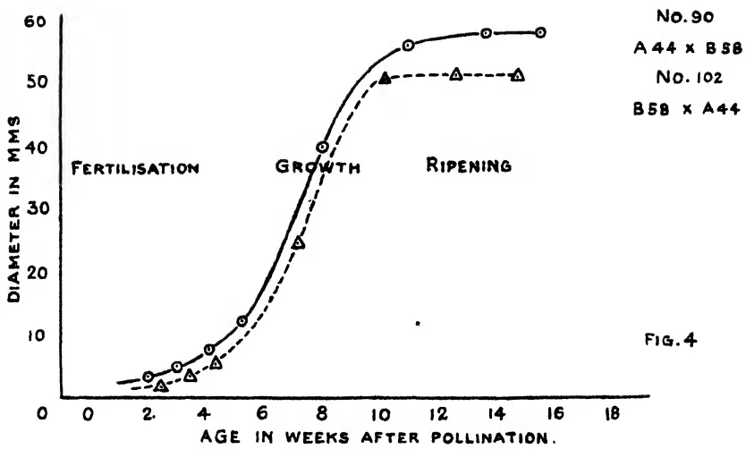

The graph illustrates the development of fruit diameter over time for two different genotypes. The y-axis represents the diameter in millimeters (MMS), ranging from 0 to 60. The x-axis represents the age in weeks after pollination, ranging from 0 to 18. The graph is divided into three phases: Fertilisation (0-4 weeks), Growth (4-10 weeks), and Ripening (10-16 weeks).

**Genotype Data:**

- **No. 90 (A 44 x B 58):** Represented by a solid line with open circles. It shows a rapid increase in diameter during the growth phase, reaching a plateau of approximately 58 MMS by week 14.
- **No. 102 (B 58 x A 44):** Represented by a dashed line with open triangles. It shows a slower increase in diameter during the growth phase, reaching a plateau of approximately 51 MMS by week 12.

<table border="1">
<thead>
<tr>
<th>Age (Weeks)</th>
<th>No. 90 Diameter (MMS)</th>
<th>No. 102 Diameter (MMS)</th>
</tr>
</thead>
<tbody>
<tr>
<td>2</td>
<td>4</td>
<td>3</td>
</tr>
<tr>
<td>3</td>
<td>5</td>
<td>4</td>
</tr>
<tr>
<td>4</td>
<td>8</td>
<td>6</td>
</tr>
<tr>
<td>5</td>
<td>12</td>
<td>10</td>
</tr>
<tr>
<td>6</td>
<td>18</td>
<td>14</td>
</tr>
<tr>
<td>7</td>
<td>25</td>
<td>20</td>
</tr>
<tr>
<td>8</td>
<td>40</td>
<td>35</td>
</tr>
<tr>
<td>10</td>
<td>55</td>
<td>50</td>
</tr>
<tr>
<td>12</td>
<td>57</td>
<td>51</td>
</tr>
<tr>
<td>14</td>
<td>58</td>
<td>51</td>
</tr>
<tr>
<td>16</td>
<td>58</td>
<td>51</td>
</tr>
</tbody>
</table>

**Phases:**

- **FERTILISATION:** 0 to 4 weeks.
- **GROWTH:** 4 to 10 weeks.
- **RIPENING:** 10 to 16 weeks.

**FIG. 4**

159------------------------------------------------

139

pollinations were successful. To illustrate the mortality amongst young fruit, and the uncertainty of results in work of this kind, it may be of interest to follow the hopes of success from these two crosses. Growth of the ovary into the young fruit is first noticeable between two and three weeks after pollination. From 143 flowers of A 44 only six ovaries had started to grow in three weeks, and were then about 3 mms. in diameter. Inflorescence No. 49 formed two young fruits of which the lower dropped off in five weeks and the other in seven weeks. The one fruit on inflorescence No. 50 grew well to 14 mms. in seven weeks, but then its stalk was broken by the wind and it was dead a fortnight later. On inflorescence 90 two young fruits were growing three weeks after pollination and both have survived. The continuous curve of fig. 4 shows the growth of one of them from the time it was first measured at 2½ weeks after pollination, through the slow growing period and then through the time of rapid growth (from about 6 to 10 weeks) to the final stage of constant size when ripening is proceeding.

Of the reciprocal cross, in which the female parent was B 58, only 3 out of 260 flowers pollinated were alive three weeks later. The one on inflorescence 97 died during the next week, that on No. 96 grew to 5 mms. and withered between 6 and 9 weeks and only the fruit on inflorescence 102 grew till it reached its full size of 53 mms. in eleven weeks. The growth of this fruit for fifteen weeks is indicated by the dotted curve in fig. 4 and it is of very great interest to note how this also shows the influence of the mother tree on the size of the fruit, for after natural pollination also B 58 fruits are smaller than those of A 44.

Thus of the seven young fruits that were growing one month after pollination only three survived and reached full size. In addition it still remains to be seen whether their seed will be fertile and germinate.

Having emphasised the casualties that have to be reckoned with it may be permissible to quote the apparently greater success of some of the later crosses made in the second flowering season in August in further illustration of the tree to tree differences previously obtained by Heusser. From 261 female flowers of Clone A 8 crossed with A 44 16 young fruits have survived for five weeks. The four oldest have now lived for seven weeks and are about 18 mms. in diameter. Of the 39 flowers of A 44 crossed in the reverse way all have died though one was still growing at three weeks. Other combinations of clones are still more hopeful. For example four weeks after pollinating 57 flowers of A 44 with D 61 pollen ten young fruits are alive, while the reciprocal cross has given about twenty potential successes from one hundred pollinations. Thus even allowing for severe casualties these crosses promise to be considerably more productive of fruit than those between A 44 and B 58, though on the other hand one or two others probably will be even less successful.

It is obvious that much more remains to be learned about the conditions necessary for success before a sufficiently satisfactory procedure for estate work can be recommended, but, on the other hand, it is distinctly encouraging that such a degree of success has attended the first efforts in this direction.

Although better results are obtained from artificial crossing than in nature or by selfing, still many female flowers have to be pollinated in order to obtain a few fruits. Various attempts have been made to find a method of increasing the chance of success or explaining the failures. Schweizer considered that his experiment was affected by the weather, and van der Hoop's variations from year to year taken with known results for other

160------------------------------------------------

140

crops suggest that weather may exert a large influence. For instance, the time of day at which the flower buds open and at which the pollen is set free is affected, and is later on a dull and moist day than on a bright and dry one.

Maas studied the effect of pollinating at various stages of opening and, on the whole, obtained the highest success by using male and female flowers on the morning after opening, less from just opened flowers, and least from females at the midday after opening with the use of fresh pollen. With one tree, however, these last conditions gave better results. The differences were, nevertheless, not great enough to balance the practical difficulty of using flowers at one stage only, for this reduces the number of pollinations that can be made, and any such programme is very liable to be upset by rain. It is hoped to obtain additional evidence on the effect of the conditions under which pollination is carried out from the results of this year's work on Pilmoor Estate, in which now over 2,200 flowers of 8 clones have been pollinated in all possible stages.

The hopeful possibilities of crossing as a means of producing high yielders are illustrated by Heusser's results in Sumatra. Twenty seedlings from a cross made in 1919 between trees 36 and 35 averaged 11.2 grams per tapping in their first tapping period from May 1924 to October 1925, as compared with 8.7 grams for Clone 35, that is, for buddings from the male parent of the cross. The best seedling gave 21 grams and the best budded tree only 14, while the seedlings have maintained their superiority in subsequent years. The best trees have been multiplied by buds, marcots and further crossings so that now tapping results are being obtained from a second generation cross made in 1923.

161------------------------------------------------

141

## LATEX TUBE BORE.

**O**N Monday, 3rd December, 1928, Mr. H. Ashplant, the rubber specialist, United Planters' Association of Southern India, gave a lecture in the R. G. A. Council Room on his recent discoveries. The lecture, which was followed by a microscopical demonstration, was attended by members of Council and Directors of South Indian Companies, subscribers to the South Indian Rubber Research work. The following is a report of the lecture and discussion :—

Commencing with a discussion of the causes underlying yield variations, Mr. Ashplant stated that all attempts to express yield values in terms of latex ring number had been unsuccessful. Rubber investigators generally had fallen back on physiological explanations. They were encouraged in this by their failure to correlate yields at different heights in the tree with the number of latex rings at these heights.

In 1926 he, the speaker, had cleared up the last-named mystery. Investigations in South India had shown that the reason for apparent lack of agreement between the number of rings and the yields at various levels was the differing proportion of the total number of rings tappable at different levels. When only the rings in tapping were compared, one found that a remarkably close relation existed between yields and the number of rings.

No one seemed to have appreciated the significance of this work, which, in the speaker's view, rendered the assumption of physiological differences unnecessary, for, if the anatomical facts fully explained the yields at different heights in the same tree, it was reasonable to expect that a more detailed knowledge of the latex-producing organs would go a long way to explain the differences in individual tree yields.

### LOGICAL BASIS OF THEORY.

Physiological theorists had entirely overlooked one point, and that was the necessity for accommodation. Even granting the laticiferous elements, in some trees to be more active in synthesising latex than those of other trees, the accommodation of the latex still had to be provided for. The latex is produced and stored entirely in the latex tubes and, being a gross substance occupying space, more latex meant more containing capacity. *e.g.*, either more latex rings or larger latex tubes. There was evidence that the ring mesh of the latex tubes varied in density, but this seemed to have a small influence only.

Accommodation being so necessary, it was therefore clear that when the number of latex rings in a tree would not account for its higher or lower yield compared with other trees, one was driven to infer that the latex tubes themselves were of larger or smaller bore. This was only elementary logic.

It would be a long story to relate the investigations in detail, but as long ago as 1923 he had obtained evidence of the existence of tube bore differences. The measurement of latex tubes was then, however, surrounded by immense difficulties, and the results obtained frequently confusing. After several years' work, during which time he carried out a systematic exploration of the latex tubes, studying them and measuring them

\* Reprinted from *The Bulletin of the Rubber Growers' Association*, Vol. 10, No. 12 December, 1928.

162------------------------------------------------

142

ring by ring from root-tip to leaf-tip in six trees, the reason for the confusing results was made clear. Owing to the tangential stresses due to secondary growth, the tubes are distorted, with the result that the diameters of the tubes, as seen in tangential sections, become progressively greater with distance from the cambium. This fact renders comparisons between the latex tubes in different trees exceedingly difficult and unreliable. Only comparisons of rings at similar depths are really valid. (Mr. Ashplant here pointed out from diagrams the manner in which distortion was produced.)

Feeling that the measurement of latex tubes in the bark, though possible, would always present so many obstacles as to be too slow for practical utilisation, owing to the distortion effects, he was impelled to try and discover a region of the tree where no secondary growth and no distortion occurred, and where the latex tubes could be studied in their original form. The leaf stalk suggested itself to him as the most likely region, and when the initial difficulties had been overcome, measurement of the latex tubes in the stalk proved quite feasible. Drawings were made to scale of the latex tubes in the leaf stalks of 240 trees which had been under study for years. These drawings, some of which were shown by the speaker, left no doubt as to the existence of significant differences of tube bore. When the final figures for average bore (which in each case represent the average of over 120 measurements) were available, they brought out the fact that these differences were intimately related to yield differences.

No mathematical analyses were necessary for the appreciation of the main facts. One had merely got to set down the tube bore values together with the individual yields.

The correlation tables prepared from the bore values thus measured were exhibited to the meeting by Mr. Ashplant, who drew attention to the very close relation between tube bore and yield. The tables clearly showed latex tube bore to be the chief factor determining yield. The tables did not show, and the speaker did not claim, that the trees with the largest tube bore were necessarily the highest yielders. There was the other important factor of ring number to be taken into account. Given a high number of rings, a tree of just above average tube bore could manifest good yielding capacity, and some of the high-yielders cited were trees of tube bore slightly below the best which had a phenomenally high endowment of latex rings. Mr. Ashplant said that what the table brought out, and what he did claim to have established, was that trees in which the tube bore was below a certain value never developed into good yielders. In the table exhibited nearly 60 per cent. of the trees fell into this class. Conversely, trees with the highest class of tube bore were never poor yielders. Figures were given of the measurements of nearly one hundred of the buddings and high-yielders on the Mundakavam Experimental Station, in confirmation of the latter statement, and it was further mentioned that some buddings grown from imported proven bud wood from Java had all been found to possess latex tubes of large bore.

Two of the tables exhibited are reproduced as plates.

#### **HEREDITARY NATURE OF LATEX TUBE BORE CONFIRMED BY MANURING EXPERIENCE.**

Mr. Ashplant briefly referred to the evidence in support of the hereditary character of tube bore already published in the R. G. A. Bulletin. There were, he said, some overlooked but very relevant facts which afforded strong corroborative testimony to the importance and hereditary nature of tube bore. He referred to the experience of manuring in rubber. With rare exceptions, which could all be explained, no noteworthy improve-

163------------------------------------------------

143

ment in the yields of rubber trees had ever been recorded from manuring. It can only be concluded from this that the factor in the tree that chiefly determines latex yields is unaffected by manurial stimulus. Of what nature could this factor be? It could not very well be of a physiological nature, because we know that physiological processes can be considerably heightened by manuring. The production of both leaf and fruit can be markedly increased by manurial applications. Were latex yields determined in a large measure by physiological factors, one might quite reasonably expect yield improvements of 20 to 50 per cent. to follow from manuring.

The non-responsiveness of rubber trees to manures indicated not only that the factor chiefly determinative of latex yield was a structural—that is to say, an anatomical—one but also that it was hereditary. It was part of the foundational framework of the tree.

Now the tube bore factor had been demonstrated by him to be about 75 per cent. responsible for determining yield. Latex tube bore, whether in nursery or mature plants, had been found to be totally unrelated to size of plant. Large bore tubes were just as commonly met with amongst the poorest-grown plants as amongst the well-grown, while in buddings from the same clone of different ages, or growing in soils of varying fertility, no differences in tube bore could be discerned.

Such facts as these provided evidence of the most weighty character in favour of the tube bore theory. The claim that latex tube bore is the hereditary determinant of yield was supported not merely by the close association between this factor and yield; it was supported by the whole body of evidence from every quarter.

We had here an illustration of the manner in which a single important truth brings all sorts of apparently unconnected facts into line. We had at last a satisfactory explanation of the long puzzling failures of manures in rubber. Not the least valuable part of the discovery was the demonstration that the degree of yield improvement possible from manures is rigidly limited. Only by selection could productivity be appreciably and remuneratively raised.

### PRACTICABILITY OF TUBE BORE TEST.

After pointing out that the characteristic tube bore could be observed in plants as early as the sixth month, and probably before, Mr. Ashplant dealt with the practicability of a method of selection based on tube bore observations.

One important aspect of selection methods commonly lost sight of was the time factor. To be commercial, a selection test must be capable of being completed in from one to two minutes. At least 200 plants per day must be got through. Although, when he started these investigations, it took him a month to measure the tubes in a single tree, he could now make a rough estimation, good enough for practical purposes, in a few seconds. Experience shows that when properly organised from 200 to 300 plants could be tested per day. The upper and lower classes could be tested in a few seconds. All the trouble was with the middle classes and here a few mistakes were unavoidable. He estimated that the test could be worked with 80 per cent. efficiency. New plantings selected in this way should have twice the yielding capacity of present areas.

As to the costs of the method of selection proposed, this would be anything from £1 to £5 per acre, according to the kind of staff employed. Even supposing that the cost of planting rubber be raised by £5 per acre, this was a small sum to pay for an enhanced yield of the order 100 per cent. enduring throughout the life of the plantation. Frequently more than £5

164------------------------------------------------

144

was spent on manures which produced, at the most a problematic increase of 10 per cent. and this only for a couple of years.

(At this point Mr. Ashplant exhibited a series of microscopic slides with mounted sections of leaf-stalks. From the images of these thrown upon a screen the differences in the bores of the latex tubes could be easily made out. A set of the original scale drawings of the latex tubes in leaf stalk tangential sections from which the tube diameter measurements utilised in the correlation tables were made was also exhibited to the meeting).

### CONCLUDING REMARKS.

You have now had the opportunity of actually seeing for yourselves that recognisable differences in latex tube bore really do exist and cannot be a matter of controversy. In the last few minutes I have shewn you a fact that scientific workers who have been studying rubber trees for the last twenty years have missed. I do not imagine that in the short time at my disposal I have conclusively established to your satisfaction the close connection between tube bore and yield which I claim to have discovered. A little reflection must convince you, however, that these differences in tube bore must necessarily have an important influence on yield.

When I published my first summary of the discovery, it was decried as having been long known. I don't desire to refer again to a recent controversy, but this is an age of publicity, and I ask you gentlemen, whether it is likely that had anyone previously observed these differences and realised their significance they would have kept so entirely dark about it?

Note:—All trees in Table "A" are 9 years old. They vary in girth from 45 c.m. to 100 c.m. Despite this fact and the differences in number of latex rings, the most pronounced correlation of tube bore and yield will be apparent at a glance. This Table also brings out the difficulties of classifying the trees of around average tube bore. It will be noted that in the horizontal classes of from 14 to 15.5 microns, the examples with few rings are poor yielders, while those with many rings are medium to good yielders.

### DISCUSSION.

Mr. P. J. Burgess: How do you explain the variation in yield when you come to diseased trees and wound response? When a tree is about to die it yields most vigorously.

Mr. Ashplant: I have frequently found that sick trees have very dilute latex. It appears to be a logical deduction from my theory that by pricking a plant one could determine the yield value by the rate of flow. Taking leaf stalks of equal dimensions, if one severed the leaf stalk the flow ought to give an indication of the yield. I have found that although sometimes the results from pricking are in agreement with the true yield and with the latex tube bore, there is frequently no agreement. The flow from pricking tests, both on leaf stalks and young or old Hevea plants, seems to vary with time of day, and is affected by a number of factors. I could get no uniform results. Fuller study of the question showed that the chief upsetting factor was the very great differences in the density of the latex, which markedly affected the rate and amount of outflow.

Mr. J. G. Wardrop: How do you investigate the plants in the nursery? Is it your proposal that the leaf stalks of these should be subjected to microscopic examination?

165------------------------------------------------

**Table "A" Correlation of Average Yield (1927 - 28) and Diameter of Latex Tubes**  
 (The figures in the body of this Table represent the number of Latex Rings at 3 ft. in each individual tree.)

Average Yield per tapping in C.C. →

<table border="1">
<thead>
<tr>
<th>Latex tube diameter (in microns) →</th>
<th>9</th>
<th>12</th>
<th>15</th>
<th>18</th>
<th>21</th>
<th>24</th>
<th>27</th>
<th>30</th>
<th>33</th>
<th>36</th>
<th>39</th>
<th>42</th>
<th>45</th>
<th>48</th>
<th>51</th>
<th>54</th>
<th>57</th>
<th>60</th>
<th>63</th>
<th>66</th>
<th>69</th>
<th>72</th>
<th>75</th>
<th>78</th>
<th>81</th>
<th>84</th>
<th>87</th>
<th>90</th>
<th>96</th>
<th>99</th>
</tr>
</thead>
<tbody>
<tr>
<td>10.5</td>
<td></td>
<td></td>
<td></td>
<td>17</td>
<td></td>
<td></td>
<td></td>
<td></td>
<td></td>
<td></td>
<td></td>
<td></td>
<td></td>
<td></td>
<td></td>
<td></td>
<td></td>
<td></td>
<td></td>
<td></td>
<td></td>
<td></td>
<td></td>
<td></td>
<td></td>
<td></td>
<td></td>
<td></td>
<td></td>
<td>1</td>
</tr>
<tr>
<td>11.0</td>
<td>12</td>
<td>12</td>
<td>12</td>
<td>10</td>
<td>15</td>
<td>19</td>
<td>10</td>
<td></td>
<td></td>
<td></td>
<td></td>
<td></td>
<td></td>
<td></td>
<td></td>
<td></td>
<td></td>
<td></td>
<td></td>
<td></td>
<td></td>
<td></td>
<td></td>
<td></td>
<td></td>
<td></td>
<td></td>
<td></td>
<td></td>
<td></td>
<td>11</td>
</tr>
<tr>
<td>11.5</td>
<td>14</td>
<td>19</td>
<td>15</td>
<td>11</td>
<td>14</td>
<td></td>
<td></td>
<td></td>
<td>19</td>
<td></td>
<td></td>
<td></td>
<td></td>
<td></td>
<td></td>
<td></td>
<td></td>
<td></td>
<td></td>
<td></td>
<td></td>
<td></td>
<td></td>
<td></td>
<td></td>
<td></td>
<td></td>
<td></td>
<td></td>
<td></td>
<td>8</td>
</tr>
<tr>
<td>12.0</td>
<td>15</td>
<td>15</td>
<td>11</td>
<td>13</td>
<td>12</td>
<td>12</td>
<td>19</td>
<td>20</td>
<td></td>
<td></td>
<td></td>
<td></td>
<td></td>
<td></td>
<td>35</td>
<td></td>
<td></td>
<td></td>
<td></td>
<td></td>
<td></td>
<td></td>
<td></td>
<td></td>
<td></td>
<td></td>
<td></td>
<td></td>
<td></td>
<td></td>
<td>17</td>
</tr>
<tr>
<td>12.5</td>
<td>9</td>
<td>11</td>
<td>11</td>
<td>14</td>
<td>16</td>
<td>23</td>
<td>20</td>
<td>15</td>
<td>20</td>
<td></td>
<td></td>
<td></td>
<td></td>
<td></td>
<td></td>
<td></td>
<td></td>
<td></td>
<td></td>
<td></td>
<td></td>
<td></td>
<td></td>
<td></td>
<td></td>
<td></td>
<td></td>
<td></td>
<td></td>
<td></td>
<td>27</td>
</tr>
<tr>
<td>13.0</td>
<td>12</td>
<td>15</td>
<td>15</td>
<td>16</td>
<td>16</td>
<td>19</td>
<td>10</td>
<td>18</td>
<td></td>
<td>23</td>
<td></td>
<td></td>
<td></td>
<td></td>
<td></td>
<td></td>
<td></td>
<td></td>
<td></td>
<td></td>
<td></td>
<td></td>
<td></td>
<td></td>
<td></td>
<td></td>
<td></td>
<td></td>
<td></td>
<td></td>
<td>25</td>
</tr>
<tr>
<td>13.5</td>
<td>19</td>
<td>15</td>
<td>12</td>
<td>14</td>
<td>17</td>
<td>15</td>
<td>14</td>
<td>15</td>
<td>15</td>
<td>16</td>
<td>21</td>
<td></td>
<td></td>
<td></td>
<td></td>
<td></td>
<td></td>
<td></td>
<td></td>
<td></td>
<td></td>
<td></td>
<td></td>
<td></td>
<td></td>
<td></td>
<td></td>
<td></td>
<td></td>
<td></td>
<td>39</td>
</tr>
<tr>
<td>14.0</td>
<td>17</td>
<td>11</td>
<td>13</td>
<td>11</td>
<td>13</td>
<td>11</td>
<td>13</td>
<td>10</td>
<td>16</td>
<td>17</td>
<td>19</td>
<td>20</td>
<td></td>
<td></td>
<td></td>
<td></td>
<td></td>
<td></td>
<td></td>
<td></td>
<td></td>
<td></td>
<td></td>
<td></td>
<td></td>
<td></td>
<td></td>
<td></td>
<td></td>
<td></td>
<td>25</td>
</tr>
<tr>
<td>14.5</td>
<td></td>
<td>15</td>
<td>20</td>
<td>13</td>
<td>15</td>
<td>20</td>
<td>15</td>
<td></td>
<td>19</td>
<td>17</td>
<td>17</td>
<td>15</td>
<td>18</td>
<td>18</td>
<td></td>
<td></td>
<td></td>
<td>29</td>
<td>28</td>
<td></td>
<td></td>
<td></td>
<td></td>
<td></td>
<td></td>
<td></td>
<td></td>
<td></td>
<td></td>
<td></td>
<td>19</td>
</tr>
<tr>
<td>15.0</td>
<td></td>
<td>11</td>
<td></td>
<td></td>
<td></td>
<td></td>
<td></td>
<td>14</td>
<td>16</td>
<td>17</td>
<td>16</td>
<td>15</td>
<td>16</td>
<td>15</td>
<td>19</td>
<td></td>
<td>10</td>
<td></td>
<td></td>
<td></td>
<td></td>
<td></td>
<td></td>
<td></td>
<td></td>
<td></td>
<td></td>
<td></td>
<td></td>
<td></td>
<td>18</td>
</tr>
<tr>
<td>15.5</td>
<td></td>
<td>17</td>
<td></td>
<td></td>
<td></td>
<td></td>
<td></td>
<td>12</td>
<td>13</td>
<td>16</td>
<td>14</td>
<td>19</td>
<td>14</td>
<td></td>
<td></td>
<td>10</td>
<td></td>
<td>25</td>
<td></td>
<td></td>
<td></td>
<td></td>
<td>21</td>
<td></td>
<td></td>
<td></td>
<td></td>
<td></td>
<td></td>
<td></td>
<td>15</td>
</tr>
<tr>
<td>16.0</td>
<td></td>
<td></td>
<td></td>
<td></td>
<td></td>
<td></td>
<td></td>
<td>11</td>
<td>12</td>
<td>13</td>
<td>12</td>
<td>13</td>
<td>12</td>
<td>12</td>
<td>12</td>
<td>12</td>
<td></td>
<td>22</td>
<td>20</td>
<td>30</td>
<td></td>
<td></td>
<td></td>
<td></td>
<td>23</td>
<td></td>
<td></td>
<td></td>
<td></td>
<td></td>
<td>16</td>
</tr>
<tr>
<td>16.5</td>
<td></td>
<td></td>
<td></td>
<td></td>
<td></td>
<td></td>
<td></td>
<td></td>
<td></td>
<td>15</td>
<td></td>
<td>15</td>
<td>15</td>
<td>15</td>
<td>15</td>
<td>15</td>
<td>15</td>
<td>25</td>
<td></td>
<td></td>
<td></td>
<td></td>
<td></td>
<td></td>
<td></td>
<td></td>
<td></td>
<td></td>
<td></td>
<td></td>
<td>4</td>
</tr>
<tr>
<td>17.0</td>
<td></td>
<td></td>
<td></td>
<td></td>
<td></td>
<td></td>
<td></td>
<td></td>
<td></td>
<td>15</td>
<td>13</td>
<td></td>
<td></td>
<td></td>
<td></td>
<td></td>
<td></td>
<td></td>
<td></td>
<td></td>
<td></td>
<td></td>
<td>23</td>
<td>17</td>
<td></td>
<td></td>
<td></td>
<td></td>
<td></td>
<td></td>
<td>4</td>
</tr>
<tr>
<td>17.5</td>
<td></td>
<td></td>
<td></td>
<td></td>
<td></td>
<td></td>
<td></td>
<td></td>
<td></td>
<td></td>
<td></td>
<td>17</td>
<td>16</td>
<td></td>
<td></td>
<td></td>
<td></td>
<td></td>
<td></td>
<td></td>
<td></td>
<td></td>
<td></td>
<td></td>
<td></td>
<td></td>
<td></td>
<td></td>
<td></td>
<td></td>
<td>2</td>
</tr>
<tr>
<td>18.0</td>
<td></td>
<td></td>
<td></td>
<td></td>
<td></td>
<td></td>
<td></td>
<td></td>
<td></td>
<td></td>
<td></td>
<td></td>
<td>14</td>
<td></td>
<td></td>
<td></td>
<td></td>
<td></td>
<td></td>
<td></td>
<td></td>
<td></td>
<td></td>
<td></td>
<td></td>
<td></td>
<td></td>
<td>22</td>
<td>17</td>
<td></td>
<td>3</td>
</tr>
<tr>
<td>18.5</td>
<td></td>
<td></td>
<td></td>
<td></td>
<td></td>
<td></td>
<td></td>
<td></td>
<td></td>
<td></td>
<td></td>
<td>13</td>
<td></td>
<td></td>
<td></td>
<td></td>
<td></td>
<td></td>
<td></td>
<td></td>
<td></td>
<td>15</td>
<td></td>
<td></td>
<td></td>
<td></td>
<td></td>
<td></td>
<td></td>
<td></td>
<td>2</td>
</tr>
<tr>
<td>19.0</td>
<td></td>
<td></td>
<td></td>
<td></td>
<td></td>
<td></td>
<td></td>
<td></td>
<td></td>
<td></td>
<td></td>
<td></td>
<td></td>
<td></td>
<td></td>
<td></td>
<td>14</td>
<td></td>
<td></td>
<td></td>
<td></td>
<td></td>
<td></td>
<td></td>
<td></td>
<td></td>
<td></td>
<td></td>
<td></td>
<td></td>
<td>1</td>
</tr>
<tr>
<td>20.0</td>
<td></td>
<td></td>
<td></td>
<td></td>
<td></td>
<td></td>
<td></td>
<td></td>
<td></td>
<td></td>
<td></td>
<td></td>
<td></td>
<td></td>
<td></td>
<td></td>
<td></td>
<td></td>
<td></td>
<td></td>
<td></td>
<td></td>
<td></td>
<td>18</td>
<td></td>
<td></td>
<td></td>
<td></td>
<td></td>
<td></td>
<td>1</td>
</tr>
<tr>
<td></td>
<td>7</td>
<td>11</td>
<td>14</td>
<td>22</td>
<td>21</td>
<td>19</td>
<td>26</td>
<td>20</td>
<td>12</td>
<td>8</td>
<td>12</td>
<td>14</td>
<td>12</td>
<td>8</td>
<td>11</td>
<td>2</td>
<td>1</td>
<td>2</td>
<td>2</td>
<td>4</td>
<td>2</td>
<td>3</td>
<td>1</td>
<td>1</td>
<td>1</td>
<td>1</td>
<td>1</td>
<td>1</td>
<td>1</td>
<td>1</td>
<td>239</td>
</tr>
</tbody>
</table>

Each diameter value in above Table represents the average of over 180 measurements.

Source of Survey Data: City of

166------------------------------------------------

**Table "B."—Correlation of Diameter of Latex Tubes and Yield per Ring.**

Yield per ring 1927-28.

(Rings in tapping at 3 ft.)

Average Yield per ring per tapping →

<table border="1">
<thead>
<tr>
<th>Latex tube diameter (in microns) →</th>
<th>50</th>
<th>80</th>
<th>110</th>
<th>140</th>
<th>170</th>
<th>200</th>
<th>230</th>
<th>260</th>
<th>290</th>
<th>320</th>
<th>350</th>
<th>380</th>
<th>410</th>
<th>440</th>
<th>470</th>
<th>500</th>
<th>530</th>
<th>560</th>
<th>590</th>
<th>620</th>
<th>650</th>
<th>680</th>
<th>710</th>
<th>740</th>
<th>800</th>
<th>830</th>
<th>860</th>
<th>890</th>
<th>920</th>
<th>950</th>
<th>980</th>
<th>1010</th>
</tr>
</thead>
<tbody>
<tr>
<td>10.5</td>
<td></td>
<td></td>
<td></td>
<td>1</td>
<td></td>
<td></td>
<td></td>
<td></td>
<td></td>
<td></td>
<td></td>
<td></td>
<td></td>
<td></td>
<td></td>
<td></td>
<td></td>
<td></td>
<td></td>
<td></td>
<td></td>
<td></td>
<td></td>
<td></td>
<td></td>
<td></td>
<td></td>
<td></td>
<td></td>
<td></td>
<td></td>
<td>1</td>
</tr>
<tr>
<td>11.0</td>
<td>1</td>
<td>1</td>
<td></td>
<td>2</td>
<td>2</td>
<td>2</td>
<td>1</td>
<td>2</td>
<td></td>
<td></td>
<td></td>
<td></td>
<td></td>
<td></td>
<td></td>
<td></td>
<td></td>
<td></td>
<td></td>
<td></td>
<td></td>
<td></td>
<td></td>
<td></td>
<td></td>
<td></td>
<td></td>
<td></td>
<td></td>
<td></td>
<td></td>
<td></td>
<td>11</td>
</tr>
<tr>
<td>11.5</td>
<td></td>
<td></td>
<td>3</td>
<td></td>
<td>1</td>
<td>2</td>
<td></td>
<td>2</td>
<td></td>
<td></td>
<td></td>
<td></td>
<td></td>
<td></td>
<td></td>
<td></td>
<td></td>
<td></td>
<td></td>
<td></td>
<td></td>
<td></td>
<td></td>
<td></td>
<td></td>
<td></td>
<td></td>
<td></td>
<td></td>
<td></td>
<td></td>
<td></td>
<td>8</td>
</tr>
<tr>
<td>12.0</td>
<td>1</td>
<td></td>
<td>3</td>
<td>1</td>
<td>1</td>
<td>2</td>
<td>3</td>
<td>1</td>
<td>3</td>
<td>2</td>
<td></td>
<td></td>
<td></td>
<td></td>
<td></td>
<td></td>
<td></td>
<td></td>
<td></td>
<td></td>
<td></td>
<td></td>
<td></td>
<td></td>
<td></td>
<td></td>
<td></td>
<td></td>
<td></td>
<td></td>
<td></td>
<td></td>
<td>17</td>
</tr>
<tr>
<td>12.5</td>
<td></td>
<td></td>
<td>2</td>
<td>1</td>
<td>2</td>
<td>9</td>
<td>3</td>
<td>3</td>
<td>3</td>
<td>3</td>
<td>1</td>
<td></td>
<td></td>
<td></td>
<td></td>
<td></td>
<td></td>
<td></td>
<td></td>
<td></td>
<td></td>
<td></td>
<td></td>
<td></td>
<td></td>
<td></td>
<td></td>
<td></td>
<td></td>
<td></td>
<td></td>
<td></td>
<td>27</td>
</tr>
<tr>
<td>13.0</td>
<td></td>
<td></td>
<td>1</td>
<td>1</td>
<td>4</td>
<td>2</td>
<td>4</td>
<td>3</td>
<td>3</td>
<td>1</td>
<td>4</td>
<td>1</td>
<td></td>
<td>1</td>
<td></td>
<td></td>
<td></td>
<td></td>
<td></td>
<td></td>
<td></td>
<td></td>
<td></td>
<td></td>
<td></td>
<td></td>
<td></td>
<td></td>
<td></td>
<td></td>
<td></td>
<td></td>
<td>25</td>
</tr>
<tr>
<td>13.5</td>
<td></td>
<td>1</td>
<td>1</td>
<td></td>
<td>2</td>
<td>6</td>
<td>3</td>
<td>6</td>
<td>7</td>
<td>4</td>
<td>5</td>
<td>3</td>
<td>1</td>
<td></td>
<td></td>
<td></td>
<td></td>
<td></td>
<td></td>
<td></td>
<td></td>
<td></td>
<td></td>
<td></td>
<td></td>
<td></td>
<td></td>
<td></td>
<td></td>
<td></td>
<td></td>
<td></td>
<td>39</td>
</tr>
<tr>
<td>14.0</td>
<td></td>
<td></td>
<td></td>
<td>1</td>
<td></td>
<td>1</td>
<td>3</td>
<td>2</td>
<td>6</td>
<td>2</td>
<td>4</td>
<td>4</td>
<td>1</td>
<td>1</td>
<td></td>
<td></td>
<td></td>
<td></td>
<td></td>
<td></td>
<td></td>
<td></td>
<td></td>
<td></td>
<td></td>
<td></td>
<td></td>
<td></td>
<td></td>
<td></td>
<td></td>
<td></td>
<td>25</td>
</tr>
<tr>
<td>14.5</td>
<td></td>
<td></td>
<td></td>
<td></td>
<td>1</td>
<td></td>
<td>3</td>
<td></td>
<td>2</td>
<td>3</td>
<td>1</td>
<td>2</td>
<td>1</td>
<td>1</td>
<td>3</td>
<td>1</td>
<td>1</td>
<td></td>
<td></td>
<td></td>
<td></td>
<td></td>
<td></td>
<td></td>
<td></td>
<td></td>
<td></td>
<td></td>
<td></td>
<td></td>
<td></td>
<td></td>
<td>19</td>
</tr>
<tr>
<td>15.0</td>
<td></td>
<td></td>
<td></td>
<td></td>
<td></td>
<td>1</td>
<td></td>
<td>1</td>
<td>3</td>
<td>1</td>
<td>5</td>
<td></td>
<td>3</td>
<td>2</td>
<td>1</td>
<td></td>
<td>1</td>
<td></td>
<td></td>
<td></td>
<td></td>
<td></td>
<td></td>
<td></td>
<td></td>
<td></td>
<td></td>
<td></td>
<td></td>
<td></td>
<td></td>
<td></td>
<td>18</td>
</tr>
<tr>
<td>15.5</td>
<td></td>
<td></td>
<td></td>
<td></td>
<td>1</td>
<td></td>
<td></td>
<td>1</td>
<td></td>
<td>2</td>
<td>3</td>
<td>1</td>
<td>3</td>
<td>3</td>
<td></td>
<td>1</td>
<td></td>
<td></td>
<td></td>
<td></td>
<td></td>
<td></td>
<td></td>
<td></td>
<td></td>
<td></td>
<td></td>
<td></td>
<td></td>
<td></td>
<td></td>
<td></td>
<td>15</td>
</tr>
<tr>
<td>16.0</td>
<td></td>
<td></td>
<td></td>
<td></td>
<td></td>
<td></td>
<td></td>
<td></td>
<td>1</td>
<td>1</td>
<td></td>
<td>2</td>
<td>5</td>
<td>2</td>
<td>1</td>
<td>1</td>
<td>1</td>
<td>1</td>
<td>1</td>
<td></td>
<td></td>
<td></td>
<td></td>
<td></td>
<td></td>
<td></td>
<td></td>
<td></td>
<td></td>
<td></td>
<td></td>
<td></td>
<td>16</td>
</tr>
<tr>
<td>16.5</td>
<td></td>
<td></td>
<td></td>
<td></td>
<td></td>
<td></td>
<td></td>
<td></td>
<td></td>
<td></td>
<td></td>
<td></td>
<td>1</td>
<td>1</td>
<td>2</td>
<td></td>
<td></td>
<td></td>
<td></td>
<td></td>
<td></td>
<td></td>
<td></td>
<td></td>
<td></td>
<td></td>
<td></td>
<td></td>
<td></td>
<td></td>
<td></td>
<td>4</td>
</tr>
<tr>
<td>17.0</td>
<td></td>
<td></td>
<td></td>
<td></td>
<td></td>
<td></td>
<td></td>
<td></td>
<td></td>
<td></td>
<td></td>
<td></td>
<td></td>
<td>1</td>
<td></td>
<td></td>
<td></td>
<td></td>
<td></td>
<td></td>
<td></td>
<td>2</td>
<td>1</td>
<td></td>
<td></td>
<td></td>
<td></td>
<td></td>
<td></td>
<td></td>
<td></td>
<td>4</td>
</tr>
<tr>
<td>17.5</td>
<td></td>
<td></td>
<td></td>
<td></td>
<td></td>
<td></td>
<td></td>
<td></td>
<td></td>
<td></td>
<td></td>
<td></td>
<td></td>
<td>1</td>
<td></td>
<td></td>
<td></td>
<td>1</td>
<td></td>
<td></td>
<td></td>
<td></td>
<td></td>
<td></td>
<td></td>
<td></td>
<td></td>
<td></td>
<td></td>
<td></td>
<td></td>
<td>2</td>
</tr>
<tr>
<td>18.0</td>
<td></td>
<td></td>
<td></td>
<td></td>
<td></td>
<td></td>
<td></td>
<td></td>
<td></td>
<td></td>
<td></td>
<td></td>
<td></td>
<td></td>
<td></td>
<td></td>
<td></td>
<td></td>
<td></td>
<td></td>
<td></td>
<td></td>
<td></td>
<td></td>
<td></td>
<td>2</td>
<td></td>
<td>1</td>
<td></td>
<td></td>
<td></td>
<td></td>
<td>3</td>
</tr>
<tr>
<td>18.5</td>
<td></td>
<td></td>
<td></td>
<td></td>
<td></td>
<td></td>
<td></td>
<td></td>
<td></td>
<td></td>
<td></td>
<td></td>
<td></td>
<td></td>
<td></td>
<td>1</td>
<td></td>
<td></td>
<td></td>
<td></td>
<td></td>
<td></td>
<td></td>
<td></td>
<td></td>
<td></td>
<td></td>
<td></td>
<td></td>
<td></td>
<td></td>
<td>1</td>
<td>2</td>
</tr>
<tr>
<td>19.0</td>
<td></td>
<td></td>
<td></td>
<td></td>
<td></td>
<td></td>
<td></td>
<td></td>
<td></td>
<td></td>
<td></td>
<td></td>
<td></td>
<td></td>
<td></td>
<td></td>
<td></td>
<td></td>
<td></td>
<td></td>
<td></td>
<td></td>
<td></td>
<td></td>
<td></td>
<td>1</td>
<td></td>
<td></td>
<td></td>
<td></td>
<td></td>
<td></td>
<td>1</td>
</tr>
<tr>
<td>19.5</td>
<td></td>
<td></td>
<td></td>
<td></td>
<td></td>
<td></td>
<td></td>
<td></td>
<td></td>
<td></td>
<td></td>
<td></td>
<td></td>
<td></td>
<td></td>
<td></td>
<td></td>
<td></td>
<td></td>
<td></td>
<td></td>
<td></td>
<td></td>
<td></td>
<td></td>
<td></td>
<td></td>
<td></td>
<td></td>
<td></td>
<td></td>
<td></td>
<td></td>
</tr>
<tr>
<td>20.0</td>
<td></td>
<td></td>
<td></td>
<td></td>
<td></td>
<td></td>
<td></td>
<td></td>
<td></td>
<td></td>
<td></td>
<td></td>
<td></td>
<td></td>
<td></td>
<td></td>
<td></td>
<td></td>
<td></td>
<td></td>
<td></td>
<td></td>
<td></td>
<td></td>
<td></td>
<td></td>
<td>1</td>
<td></td>
<td></td>
<td></td>
<td></td>
<td>2</td>
</tr>
<tr>
<td></td>
<td>2</td>
<td>2</td>
<td>10</td>
<td>7</td>
<td>14</td>
<td>24</td>
<td>21</td>
<td>17</td>
<td>28</td>
<td>19</td>
<td>18</td>
<td>4</td>
<td>10</td>
<td>16</td>
<td>6</td>
<td>5</td>
<td>4</td>
<td>1</td>
<td>1</td>
<td>1</td>
<td>2</td>
<td>1</td>
<td>3</td>
<td>1</td>
<td>1</td>
<td>1</td>
<td>1</td>
<td>1</td>
<td>1</td>
<td>1</td>
<td>1</td>
<td>1</td>
<td>239</td>
</tr>
</tbody>
</table>

Each diameter value in above Table represents the average of over 120 measurements

© 1930 by Survey Dept. Clayton

167------------------------------------------------

145

Mr. Ashplant: I have written something on this already, and if I have not made myself clear here it was because I did not know how much knowledge to assume. You may remember that I reported that the characteristic differences in tube bore have materialised when the plants were six months old. I did not finish my correlation investigations in time to get on to my nursery young enough, and by the time I tackled the nursery it was already six months of age. I found at that stage exactly the same proportion of the small, medium and large bore plants as I did amongst the ten year old trees. In a number of buddings I have examined I find that characteristic bore differences are already clearly made out when they are only two to three months old. We have recently successfully imported some bud-wood from Java. I have had the opportunity of examining their leaf stalks, and you may be interested to learn that they all have tubes of large bore of my A or B class. My assistant, whom I left to deal with the younger 1928 nurseries, reports that the characteristic tube bore has already materialised and that plants can be successfully examined at three months.

Mr. Eric Macfadyen: You said a native writer could do this work. Would you indicate what the routine would be and what apparatus would be required?

Mr. Ashplant: Some writers whom I have had in training lately were able to cut 40 an hour after four days' practice. I do not think they would have difficulty in cutting 50 to 60. You need one man for cutting sections and another to prepare, stain and mount them. A third man—the best man of all—would make the microscopic observations. I do not know yet whether it would be necessary to have a fourth man, but four would be the maximum. Most of the work except the rather trying actual testing can be done by unskilled men. They must be careful men, of course, who are able to read and write.

Major H. Edgington: Four men for one equipment?

Mr. Ashplant: Yes

Mr. F. D. Ascoli: What is the thickness of a section?

Mr. Ashplant: About 1/32 of an inch.

Mr. C. E. Welldon: Will not soil have an effect on yields?

Mr. Ashplant: There is a certain amount of increase in yield possible from differences in the quality of soils, but the possibilities of variation are very limited for the reason that I pointed out just now. Since tube bore is not influenced by manures and since this is the chief factor determining yield, it is beyond our power to raise trees out of their yield class. The discovery of this new factor and of its unalterable hereditary nature provides us at last with the explanation of the disappointing results from manures.

Mr. C. J. Arnold: Your remarks are in relation to leaf stalk only. Is that so? In that event, from your investigations it will enable us to plant out baskets. The plant will not be in the form of a stump—it will be basket or seedling planting, after investigations in the nursery have been carried out.

Mr. Ashplant: It is much more convenient to have nurseries, and I think ways are known of overcoming the set-back to growth in transplanting that the questioner feels. I am not very much in favour of basket planting for reasons of expense. I am not quite clear as to the first part of your question, but it occurs to me that you might have in your mind that since this work has been done on the leaf stalk, one ought first to establish a relation between the tubes in the stalk and those in the bark.

168------------------------------------------------

146

It is quite immaterial to the theory or practice whether or not there is a correlation between the tubes of the stem and the yield. However, although I have worked out this relation entirely on the leaf stalk, I find there is a most pronounced relation between the tubes of the leaf stalk and those of the stem and between the latter and yield. I have abandoned bark for leaf stalk examinations, because these get rid of the distortions due to the secondary growth and enable the end to be attained more quickly. I should mention that transverse sections are unreliable. All observations should be taken on the tangential plane.

Mr. C. J. Arnold: I am afraid I did not perhaps make myself explicit. What I am driving at is this, if we follow out your research so far as you carry us this afternoon and we employ your methods on the leaf of a plant, I think you said three months old, can I take the leaf stalk or leaf stalks from each individual plant, and shall I be safe in taking my readings of the leaf stalks of my nursery and finding the high yielders and planting out from the basket nursery; shall I be safe to plant out in prepared clearings and be certain that I have high yielders?

Mr. Ashplant: That is my whole point. My discovery amounts to this, that merely by examining and making observations of the tubes in the leaf stalk one can eliminate the C class of tube bore, and in so doing eliminate nearly all those trees that under no circumstances can become good yielders. It is not quite true to say that you will eliminate all of them. It will be advisable to allow for a little subsequent thinning since a percentage of the trees of middling tube bore will not develop sufficient latex rings to be capable of high yield. I have endeavoured to discover whether there are any early indications of a tree's potentialities of ring formation, but I regret to say that I have found no indication. Rings are put on for no rhyme or reason whatever. Sometimes five are put on in a year, sometimes one. I have measured their rate of formation and the distance between each, but unfortunately I have obtained no clue at all. The correlation between the ring number at say two years and the number at maturity is so low as to be quite unusable. Frequently a tree begins badly and picks up in the years following. One's first assessments are often entirely upset. That being so, we have to overcome the difficulty of our ignorance of the ring factor by subsequent thinning out. My proposal would be to plant about 180 selected plants per acre. The thinning out of 50 when about four years old would get rid of everything giving less than six lb. per tree; 30 to 40 trees in excess should be left for a few years to provide for losses from Brown Bast.

Mr. H. L. Coghlan: What would be the effect on budgrafting? Assuming in six months time we can tell, what will be the effect on budgrafting? Shall we continue to budgraft?

Mr. Ashplant: I believe that more recent accounts from Sumatra are very favourable to budgrafting. Theoretically there is everything to be said for budgrafting, but we have discovered a number of snags: weak growth, weak renewal, possibly greater susceptibility to disease, undoubtedly greater susceptibility to Brown Bast. Out of 100 bud mothers, it is doubtful if we should get more 10/15 per cent. of a class suitable for propagation. But I do believe there is a future for budgrafting. Once having proven one's mother trees there is everything to be said for propagating from those. I think the future will prefer a mixture of proven-out buddings and selected seed plants that pass the bore test.

Mr. G. H. Masefield: Perhaps you could tell us whether the whole work might be done by natives. Personally, I cannot see how in practice it will be possible to keep check of 50,000 plants. By what system is it possible to avoid mistakes through mixing the plant numbers? That seems to be one of the big difficulties.

169------------------------------------------------

147

Mr. Ashplant: I think you have hit upon one of the snags not only in this but in all other methods of selection. However, fortunately in the leaf stalk we have an organ which can be removed and labelled with comparative ease. I find that it will be very advisable to have nursery beds of a standard size with, say, 4 rows containing about 100 plants per bed. Supposing the nursery beds are geometrical, that is all the rows are in alignment, it would be almost sufficient to number the rows only. It is quite easy to pencil a number on the plant which will last six months. Immediately a section is cut the number is marked on the slide. We are fortunate in India in being able to get large numbers of men who are good at figures and can read and write English. Properly looked after I do not think there would be much danger of mixing—there is a danger certainly. It has been overcome on my experimental station by organisation, and I think it could be overcome on estates. After all whatever selection method we ultimately find best, we shall still be up against the difficulty mentioned, and if the European staffs and the native staffs of rubber estates are incapable of marking plants in a nursery and keeping records of those plants until the final stage of selection, it is surely an admission of incompetence. Labelling and checking of this character is only routine work. It is quite simple work, quite within the capacity of a man with a systematic mind.

Mr. G. H. Masefield: I have very great pleasure in proposing a hearty vote of thanks to Mr. Ashplant for his most interesting lecture. I had the privilege early this year of paying a visit to Mr. Ashplant at Mundakayam and I must say I was greatly impressed with the tremendous amount of work he has put into this subject, working out the relationship between bore and yield. If anybody could see the charts as I have done myself I think you would realise how much we owe to Mr. Ashplant for the work he has done in Southern India. Already by his solution of the secondary leaf fall problem, I think he can say he has saved the Rubber Industry in Southern India. Gentlemen, I ask you to pass this vote of thanks with acclamation.

## NOTE ON MR. ASHPLANT'S WORK ON LATEX TUBE BORE.

The use of budded rubber and of selected seed both have for their objective the production of a stand of rubber of uniformly high-yielding powers. The main obstacle in the path of workers has been the time factor. The testing of mother trees for budding purposes is a lengthy process and, unfortunately, high-yielding mother trees have not always given progeny with high-yielding characters. It has therefore been necessary to prove mother trees, so involving a further expenditure of time. Similar difficulties have occurred in the selection of seed. Rubber is normally cross-fertilised, and in consequence all the known high yielders are of mixed parentage and their progeny will be of a mixed nature. Rigid selection from selected clones in isolated seed gardens may result in the production of seed which is approximately pure as regards yield characters. Here again the time factor occurs and twenty five years is a conservative estimate of the time necessary to achieve this most desirable object, although, in successive generations, the seed obtained would probably be better than that from an average source.

Any suggestion, therefore, that promises to eliminate the time factor in selection of high-yielding trees is of importance and must be investigated fully. Mr. Ashplant, in the preceding article, has indicated a method by

170------------------------------------------------

148

which he claims to be able to select plants in the nursery and to ensure (with 80% efficiency) at least the elimination of unprofitable trees.

Mr. Ashplant points out that attempts to correlate yield with the number of latex rows in the cortex have given results of low significance. He states that this is due to the variation in diameter of latex vessels in individual trees. He also points out that a fair measurement of latex tube bore cannot be obtained from sections of the cortex of the stem owing to distortions caused by secondary growth. He has therefore used the leaf-stalk or petiole for his determinations, and has come to conclusions which, if substantiated by full figures, are of considerable importance. He states that tube bore is an hereditary and constant character and gives a frequency array showing the relationship between latex tube bore and yield of 239 nine-year old trees. The correlation co-efficient of this array has been determined and is + .75 which indicates that there is a very significant relationship between the diameter of latex vessels and the yield. In other words the greater the bore, the greater the yield.

It is unfortunate that Mr. Ashplant has not published a detailed account of his experiments and it is to be hoped that he will do so as soon as possible. He has not told us the variation in latex tube diameters encountered in one petiole nor the variation in latex tube diameters of a number of petioles from one tree. Some errors have crept into his frequency arrays, possibly in reproduction. It is to be assumed that Mr. Ashplant has evidence for his statements, but, until full data are published and contributory experiments have been carried out elsewhere, confirmation of his theory must be withheld, particularly in view of the criticism put forward by Malayan workers.

If Mr. Ashplant's work is confirmed, it will be a relatively simple matter to obtain areas of rubber containing only a low percentage of poor yielders. Selection by examination of petioles in the nursery will ensure that no trees but those with wide latex vessels are planted. Subsequent testing of the yields and judicious thinning out will tend to produce a uniform stand of good yielders. It is not to be expected that areas planted in this way will prove equal in yielding capacity to those planted either with buddings from proved mother trees or with pure seed from high-yielding parents. Since, however, neither budding nor seed selection has yet reached a stage when results can be guaranteed, it would appear that, subject to confirmation, Mr. Ashplant's method is likely to prove of great immediate value to the rubber planting community.—M. P.

171------------------------------------------------

149

## MANURING OF RUBBER.

### 1.—GENERAL ASPECTS OF THE PROBLEM.\*

[Note.—It is of interest to recall the fact that manurial experiments with rubber in Ceylon which were regarded as more or less inconclusive in their results have been shown by further examination (vide this journal for November 1928, pages 263-271) to provide strong presumptive evidence that nitrogen gave significant increases of yield. It will be seen from the paper by the Economic Botanist in the present number of *The Tropical Agriculturist* that further examination of the same figures has confirmed the usefulness of nitrogen. Manurial experiments are being conducted by the Rubber Research Scheme at Arapolakande and an experiment designed on lines of modern field experimentation will be begun at Peradeniya in 1930.—*Ed. T. A.*]

**R**ECENT years have seen a very marked growth of interest in the possibilities of applying artificial fertilisers to rubber. The turning of attention in this direction is the inevitable outcome of the increasing age of estates, revealing ever more clearly those planting sites which have unsatisfactory features, but it is possible that the main impetus to interest has been the reports of remarkable results from manuring in particular cases. That these are rather exceptional has already been shown by more disappointing results in many other cases, but the balance of opinion among those of experience seems to be rather in favour of manuring than against it. Only a small proportion of the trials made have been conducted on a satisfactory comparative basis and, until this is done, the belief in the efficacy of manuring cannot rest on a scientific basis. This state of the subject leaves a good deal of confusion due to basing arguments upon experience with other crops, so that it is necessary to point out at the outset the sharp contrasts which exist between the case of rubber and that of the other crops for which experience of manuring is extensive and exact.

Comparing the cycle of plant nutrition and growth of an ordinary arable crop and that of a rubber estate it becomes at once evident that the differences are fundamental. In the first case the growth cycle is usually completed within the year, and a very large proportion of the total growth made is removed entirely from the farm. Hence there is a continual extraction and removal of plant nutrients from the soil, and an inevitable tendency towards soil exhaustion. This is offset by the yearly opportunity when the land is clear to effect amelioration by means of cultivation and manuring. In the case of rubber the plant growth is a slow cumulative one with such a small amount of plant nutrients removed in the latex crop as to be almost negligible. Under proper conditions the leaf-fall goes back into the soil, so that the cycle of changes takes place without any great loss. By neglect of conservation the losses on rubber estates have, of course, often

---

\* By Dr. W. B. Haines in *The Quarterly Journal of the Rubber Research Institute of Malaya*, Vol. 1, Nos. 1 and 2, January, 1929.

172------------------------------------------------

150

been serious, but it is apparent that there is no such inevitability about the approach to soil exhaustion as there is in the case of arable cultivation. This would lead one to expect that the application of manuring practice to rubber would have a more limited scope.

Another consideration which would tend to instil a cautious approach to the subject is the much less direct connection which exists between nutrition and yield. The aim usually pursued in manuring is a heavier production of fruit or of vegetative growth and more is understood regarding these than regarding the responses involved in increased latex secretion. By far the largest differences to be observed in yield are to be attributed to inherent character. Hence the most promising methods for increasing the acreage yield are those which will provide trees of high yielding character. The fulfilment of such methods, however, must take much time, so that manuring must be examined in all its possibilities as a method of improving the existing stands of rubber. While general improvement can usually be effected (as regards appearance of tonnage for example) we as yet know little regarding specific effects upon latex production. With the advancement of knowledge, however, the possibility is not to be overlooked that a connection will be found between some phase of nutrition and the quantity of latex produced. At present nitrogenous manuring (as being productive generally of sappy vegetative growth), is the most promising, but evidence is not wanting of more specific effects upon latex production of the kind indicated.

There is a third consideration which must qualify the expectation of great improvements from manuring in some cases. In cases where the site has always been poor and the trees have been stunted for many years it may well be asked whether a sufficiently favourable response to manuring may be looked for. There must always be some hope for a tree not actually diseased, but successful manuring must look for vigor in the tree and satisfactory conditions as regards moisture supply and similar matters. Too often a piece of rubber has been selected for a manuring trial on the assumption that the worse the rubber the more the room for improvement. To select the best opportunity for improvement would often lead to more encouraging results. Even on comparatively good sites the fertility of the soil may lag far behind the other abundant conditions of light, heat and moisture. In such a case manuring improves the one limiting factor and produces a benefit, while in more adverse cases other limiting factors may be present to prevent any response. The above considerations are applied to the general prospect of increasing estate yields by extensive use of fertilisers. The value of manures for special purposes should need no emphasising. Much may be done towards the improvement of nurseries and the establishment of cover crops by judicious use of fertilisers on the lines of well-established practice. By applications made at the time of planting out rubber a healthy and uniform growth can often be ensured and the young trees pulled through their more critical early stages when adverse conditions of weather may catch them at a disadvantage. The cost of manuring in such a case is very small since only the planting holes need to be treated.

173------------------------------------------------

151

The economic valuation of results from manuring rubber will present considerable difficulties. Apart from those attending the fluctuating market values of rubber it will take long periods to assess properly the full effect of a single application of manures, whether as regards increased yields or increased capital value in growth of the trees and in bark renewal. Experiments with annual crops give their end and result within the season, but effects on rubber are likely to take many such cycles to work themselves out. Further, there is the probable lengthening of the economic life of the trees to be taken into account. Until we are in a position to estimate the benefit on all these points the economics of the problem must remain somewhat indefinite. In some cases the immediate return from manuring has repaid the cost, but it is obviously inadequate to pass judgment on the basis of returns over a short time.

The long periods during which experiments must run call special attention to the necessity of laying them down with great care and foresight. In recent years the subject of field experimentation has been much developed and the guiding principles laid down. The potential value of the results from test plots may often be increased many times by changes in the layout which involve no extra expense and very little extra demands upon time and trouble. The questions involved will form the subject of the next article. Since all types of soil and situation need to be covered in order to provide full data, the desired end can only be attained by experiments scattered over many estates, and all those who have rubber likely to be benefited by manuring should be encouraged to make trials. The management is then sure of getting such results as are applicable to the particular conditions of the estate, while at the same time contributing to the common stock of knowledge.

174------------------------------------------------

152

## BUNCHY TOP DISEASE OF BANANAS IN QUEENSLAND.\*

**B**UNCHY top is by far the most serious disease affecting the prosperity of the banana-grower in Queensland. In northern New South Wales and the extreme southern portion of coastal Queensland the once thriving banana-growing industry has, for the time being, been practically wiped out by the ravages of this malady. A similar fate awaits those districts so far free or only lightly affected unless the recommendations designed for the exclusion and control of the disease are strictly adhered to.

The first definite recognition of the presence in Australia of the disease now known as bunchy top occurred in 1913. Apparently it was introduced by means of infected suckers imported from Fiji, where the disease had been prevalent for many years. In 1922 the trouble began to assume such serious proportions as to call for special investigation by the officers of the two States concerned. Finally, in 1924, on the recommendation of a Board representing the Commonwealth Institute of Science and Industry and the Agricultural Departments of New South Wales and Queensland, the Bunchy Top Investigation Committee was appointed consisting of Professor E. J. Goddard (Supervisor), Mr. C. P. J. Magee (Assistant Plant Pathologist), and Mr. H. Collard (Horticulturist). The expenses entailed were met co-operatively by the Commonwealth and the Departments of the States concerned. In Bulletin No. 30 of the Council for Scientific and Industrial Research, Mr. Magee has detailed the result of the investigation, and the nature of the disease and its means of transmission are shown to have been clearly demonstrated, with the result that sound control measures may now be advocated.

### SYMPTOMS.

The appearance of a typical bunchy top plant showing the later stages of the disease in such as cannot readily be confused with any other banana malady. However, for the purposes of prosecuting efficient control measures it is necessary to be able to detect the first visible symptoms of the disease. These can be searched for by holding the lower part of the youngest leaf of the plant so as to look at it from the back with the light shining through. If the plant has become infected there will be noticed short broken lines of a dark-green colour lying between and parallel to the clear veins which run out at right angles to the midrib. The dark streaks are broken up into short irregular lengths so as to resemble the signs of the Morse code. At first the dots and dashes may be somewhat sparsely scattered, but in the later stages of attack these may be so numerous as to form almost continuous dark-green lines, which give to the affected leaf a somewhat darker green appearance than normal. All the leaves subsequently formed exhibit evidence of the disease and to an increasing extent.

The following additional symptoms usually only appear three weeks or more after the marking just described first becomes visible. Suckers infected from the parent, however, may exhibit them from the start and to even greater intensity. Instead of waiting until it is properly free from

\* By J. H. Simmonds, M. Sc., in the *Queensland Agricultural Journal*, Vol. 30, part 5, November, 1928.

175------------------------------------------------

153

the pseudo-stem the newly-thrown leaf will commence unfolding from the top in a funnel-shaped manner. The leaves become reduced in length and width until they are of a somewhat elliptical shape. The blade shows a tendency to droop along the midrib so that the backs of each side approach one another. The edges are rather more wavy than usual and are sometimes slightly curled inwards. Affected leaves exhibit a marked brittleness not natural to the healthy plant. Instead of increasing in size in their order of growth the leaves of a bunchy top plant gradually become smaller. The leaf stalk also fails to elongate and bears the leaf in a more erect manner. The result is the formation of a crown of stiff, narrow, erecty-growing leaves bunched together in a typically rosetted manner. A Bunchy top plant affected in its early stages of growth rarely throws a bunch, and when, owing to a late infection, this does appear it is commonly stunted and possibly malformed owing to the constricted state of the top of the pseudo-stem through which it has to pass.

### CAUSE.

It has now been demonstrated conclusively that bunchy top belongs to that type of plant malady known as a virus disease. The various plant diseases included in this type show many general points of similarity, of which the chief lies in the fact that the causal agents are of such minute size that they have so far defied all attempts to view them microscopically. What little is known regarding the nature of the infectious agent or virus concerned in the different virus diseases has been determined by experimenting with the plant juice in which it is known to be present. A virus disease may be transmitted from one plant to another in various ways. For some it is merely necessary to inoculate a healthy plant with the expressed juice from a diseased individual. In other cases grafting of diseased on to healthy tissue becomes necessary. In the more specialised forms the virus is conveyed from plant to plant by means of an insect vector. Bunchy top belongs to the latter type.

This disease is disseminated by means of the dark banana aphid (*Pentalonia nigrinervosa*) which, in pursuance of its normal feeding habits, may first suck the juice of a diseased plant and then migrate and carry out the same process on a healthy one with the result that the latter becomes inoculated with the virus and so contracts the disease. This insect is responsible for the spread of bunchy top throughout a plantation and between neighbouring plantations. When one plant contracts the disease the other members of the stool usually become infected as a result of the virus making its way through the connections which link up the various individual corms. Suckers arising from an affected plant almost invariably exhibit symptoms of primary infection from the parent.

### CONTROL.

When considering methods for the control of bunchy top it is necessary to stress the following points:—

(1) Bunchy top is a disease of a systemic nature. The causal virus being present within the living tissue of the host cannot be destroyed by any chemical or mechanical treatment known at the present time, other than by destruction of the plant itself. In other words, a plant cannot be cured once it has contracted the disease.

(2) Bunchy top may be introduced into a clean area by means of suckers infected with the virus which have been taken from a diseased plantation, and also, if centres of infection are not too far distant, by the possible influx of infected aphids.

176------------------------------------------------

154

(3) The disease is spread within an affected area and also the limits of that area gradually extended by (a) the planting of infected suckers, (b) the transmission of the virus from diseased to healthy plants by the banana aphid.

(4) An attempt to eliminate bunchy top by complete control of the aphid is beset by so many practical difficulties in the average banana plantation that the method cannot be entertained.

Therefore, since it has not been found possible to either cure a diseased plant or eliminate the means of transmission of the virus, it is necessary to concentrate on a programme of *eradication* whereby all sources of the infectious agent are completely eliminated by destruction of all diseased plants. With this object in view proclamations have been made which prohibit (1) the transfer of any suckers whatsoever from infected districts into those areas still free from the disease, (2) the removal of suckers from any plantation within an affected area unless the plantation in question has been inspected and found free from the disease.

If this proclamation is adhered to conscientiously by all banana-growers—the very existence of the banana industry in Queensland depends on this—then the following objects will be obtained. (1) Clean isolated areas will tend to remain clean; (2) spread within affected areas will be greatly reduced.

Growers must not think that these regulations alone are going to eliminate bunchy top. It should hardly be necessary to stress the point that, owing to the rapidity with which bunchy top may spread, all growers within an affected area must consider their position as serious. If they do not wish their plantations to follow the fate of those in the Tweed area the following recommendations must be adhered to. (1) Set aside a definite time in every week in which to carry out inspection of the plantation for signs of bunchy top invasion. Each plant should be separately examined and special attention should be paid to the youngest leaf on each plant in order that the earliest signs of infection may be detected. The area of the plantation should be reduced if necessary to a size which will enable careful examination of this nature to be carried out. Special care should be taken during the warmer months when the aphid are most numerous and active. (2) If any plant should be found to be infected, the whole stool must be dealt with as follows. First spray the stool thoroughly with Black Leaf 40 to kill all aphid present. Particular attention should be paid to the crevices round leaf bases, &c. Black Leaf 40 should be used at the rate of a dessert-spoonful to a gallon of water, to which soft soap has previously been added until a good lather is obtained. After spraying, dig out the whole stool and cut the plant up into small pieces which will quickly dry out. It must always be borne in mind that it is not sufficient to treat only the individual plant affected, as the virus may have already passed to other members of the stool, although its presence there is not yet apparent. (3) All growers should co-operate in seeing that all diseased plants are eradicated from their districts, as it is only by achieving this object that the industry can be expected to again reach a stable basis in the affected areas.

[Work on bunchy top disease in Ceylon has indicated that the problem may not be so simple in this country. Attention has been drawn in *The Tropical Agriculturist* (Vol. LXXI. p. 141, September 1928) to the fact that root disease may have some bearing on the etiology of bunchy top in Ceylon, and a series of experiments is being carried out by the Government Entomologist to determine if the virus transmitted by the aphid, *Pentalonia nigrinervosa* Coq., is a factor in the incidence of the disease. Ed. T. A.]

177------------------------------------------------

155

## APPLICATION OF SCIENCE IN AGRICULTURE.\*

**I**T is widely recognised that science finds useful application in agriculture; indeed, the degree of recognition is so great as to be sometimes almost embarrassing. At the present time there is a tendency to look to science as the best, if not the only, means to find a way out of the difficult situation in which agriculturists in all countries find themselves: not uncommonly the man of science is called in—late in the day, perhaps—to retrieve the errors and perchance to share the blame of mistakes by politicians, business men, and so-called practical experts, who have embarked on some enterprise and got themselves into a situation out of which extrication is difficult. All this is a new development: it is in striking contrast to the position of thirty years ago, when the scientific worker in agriculture was at best only tolerated and rarely taken seriously. The British Government would have nothing to do with him; no grants were available—indeed, a distinguished Civil Servant, in response to a request for a research grant, declared that he could not conceive of circumstances in which any Government would be interested in scientific research for agriculture. It is a great change, and it has proceeded rapidly, mostly since the War, though it was not started by the War, but had, in fact, set in before that, and indeed was well on its way in 1914.

The actual progress of events, so far as Great Britain is concerned, is well known. In 1890 the Government of the day, having raised money by taxing whisky, spent it on Technical Education including Agricultural Education: in consequence Agricultural Colleges and Departments of Universities were started and serious efforts made to educate young people for agricultural life: some bolder spirits even tried to educate farmers. The more progressive of the teachers soon discovered the need for learning something of the subject themselves, and they proceeded to make experiments with the purpose of gaining knowledge. These men prospered as they deserved. Farmers caught the spirit, and experimental farms and plots sprang up all round the countryside. Much information of great value to the grower was obtained, and its value was widely recognised. The Government made a sharp distinction between education and research, however, and while they would make grants for educational purposes, they made none for research. The distinction always puzzled the layman, and it was abolished in 1909-10, when Mr. Lloyd George secured the Act setting up the Development Fund, out of which increasing amounts have been voted for research each year. So profoundly has research impressed the farmers that when the £1,000,000 was allotted to agriculture in compensation for the repeal of the Corn Production Act, the farmers themselves asked that it should be used for "research and education," because, as the President of the National Farmers' Union truly said, "Without research there can be no agricultural education."

Now this position could not have been reached without very substantial reasons. English farmers are the last people to be dazzled by the glamour of pure scholarship or University prestige; they have no innate veneration for the professor as such. The fact that agricultural science has attained so high a position is substantial proof that it deserved success.

---

\* By Sir John Russell, F.R.S., in *The Empire Cotton Growing Review*, Vol. VI, No. 1, January, 1929.

178------------------------------------------------

156

If one looks over the records of agricultural improvement for the past eight years, it is easy to see why this position has been attained.

The first great triumph of science was in 1840, when fifty years of work by chemists and botanists had revealed the essential facts of plant nutrition, and Liebig, Lawes, and Gilbert put this discovery to practical use by the introduction of artificial fertilisers. The great improvement of crop yield, and, perhaps more important, the increased certainty of yield in bad seasons, dispelled the old fear of catastrophe and famine, and raised farm production to new levels. Some forty years later a new triumph was to come, for the terrible potato blight which had devastated Ireland and inflicted untold misery upon thousands of her peasants was finally brought under control, and has never since been a serious menace. This has been followed by the gradual control of many of the insect and fungus pests that had done so much damage on the farm.

Some twenty years later came the third triumph, when Bateson, studying the laws of heredity, rediscovered the work of Mendel, which had lain buried for over forty years, and attracted a group of enthusiastic workers to plant genetics, which has since greatly added to the resources of the farmer by providing him with new varieties of crops, but still more by providing the plant breeder with a set of principles that enable him within limits to build up new varieties almost to specification. Finally, there comes the latest achievement of fixing gaseous nitrogen from the air and converting it into fertilisers, thus securing indefinitely large amounts of those most important substances for the future.

Perhaps the simplest way of summing up the achievements of science in agriculture is to compare the prediction of Sir William Crookes in 1898 with the accomplishments of agriculture today. Speaking with a full knowledge of science as it was then, he predicted that the world in 1931 would require 90 million tons of wheat to feed its population, but that, *unless science discovered new methods*, this represented the utmost that the wheat growers of the world could do; afterwards the world would be faced with starvation. The accuracy of his forecast in regard to consumption shows how carefully he had made his calculation: the world does, as he predicted, require in 1928 about 90 to 100 million tons of wheat. But science has advanced so much as to upset altogether his calculations about the possible production. The 90 millions which he thought was the limit without new methods had been much exceeded even in 1911, and could be considerably exceeded today if it were needed. The fear of world starvation has gone, the achievements of science are only at their beginning, and there remains ample scope for patrons of science and for the patient efforts of the quiet scientific worker.

In spite of these brilliant successes agriculture is not prosperous, and, as Mr. Hewison points out, it suffers even in those countries where science is most diligently applied to it. It would, however, be fallacious to attribute the suffering in agriculture directly to the progress of science. The application of science to agriculture is not an isolated phenomenon: science is being applied also to industry, and whenever this happens production increases. Industries like the motor industry that have developed seductive selling agencies and played on the idea of "obsolescence" so successfully that the possessor of a perfectly good car feels bound to scrap it because a newer model has come out—these industries have remained prosperous. So also, but to a less extent, have those branches of agriculture that have followed the same methods: setting up good selling agencies and presenting goods in an attractive form to wheedle money out of a hesitating purchaser—such as some of the branches of market gardening, fruit and dairy production. But where salesmanship is less effective the industry has languished: science has shown the way to greater production, but there has been no corresponding

179------------------------------------------------

157

growth in demand : men have been thrown out of work and producers have been unable to sell their goods. It is difficult to see the remedy ; there is always a tail-end in every body of men, whether workers or producers, and every advancement of science makes it less necessary to employ these people, so that they tend to be left unneeded. It is part of the cost of the inevitable forward march of science, and although some solution may some day be found, none is yet in sight.

Science, therefore, cannot cure all ills of agriculture or of modern civilization, particularly those arising out of its very success in increasing production per acre and per man, and in dispensing with the less efficient worker and producer : indeed, as science advances, the efficiency line will be drawn higher and higher, and an increasing proportion of people will fall below it, unwanted and unemployable. What is to become of them is a social problem outside the scope of this paper.

So far as cotton is concerned, science can unquestionably increase the output per acre and per man, and also reduce the wastes and losses of the growing crop from diseases and pests : it can thus enable the crop to be sold more cheaply, or in the alternative it can give the grower a larger return. Within limits it can develop new cottons, combining the desirable features of older sorts. These objects are still important, and so long as they remain so there will be need for scientific work.

This work is of two kinds, roughly classified in simple language as gaining information, and using it : in official language as fundamental or pure science, and applied science, but the distinction is not sharp. The chemical and botanical work that revealed the food of plants was pure science—the gaining of information : the experiments made with the foods which when manufactured were called artificial fertilisers, are applied science—the using of the information. Without the pure science there would be no applied science. Until the information is obtained it cannot be used. If we are to make further advances corresponding with the great ones already described, it will only be after more advances in pure science.

Although the distinction between pure and applied science is not sharp so far as the subject-matter is concerned, there are clear-cut distinctions in practice. Pure science is concerned with general principles : applied science with solutions of particular problems. Pure science must be as exact as possible : applied science is satisfied if the figure is "near enough" or the method "generally works." From the practical point of view the most important difference is that pure science can be studied anywhere, while the application must usually be made on the spot. This is important for two reasons : modern scientific work is very costly, requiring elaborate apparatus, a multiplicity of books and journals, and, most important of all, ready access to other scientific workers with whom the investigator may discuss his problems from day to day, and gain useful help and constructive criticism. An isolated research institute, however large and varied its staff, and however rich its library and equipments, is never large enough, and the workers always need access to larger libraries, meetings of scientific societies, demonstrations and exhibits of scientific apparatus or methods, and lectures by men of the highest rank in their respective subjects. These requirements make it easier to do fundamental work at home than in most parts of the Empire, for wherever in England the research worker happens to be, he usually has two or three Universities within 50 or 100 miles, and he can always attend lectures, meet fellow-workers, obtain books from libraries, or see and try new forms of apparatus at very little expenditure of time. This is not the only advantage of doing the fundamental work at home : Mr. Hewison has pointed out the great difference in length of working life of a man in the tropics and at

180------------------------------------------------

158

home : indeed, he suggests—and in view of his experience no one will lightly quarrel with him—that the man at home should achieve at least four times as much as the man in the tropics.

In research work, however, the obviously advantageous course is not necessarily the best, for the research worker is apt to be an elusive person conforming to no rules whatsoever : and, in point of fact, some very good fundamental work has been and no doubt will continue to be done in tropical conditions where everything seemed unfavourable. For purposes of organisation, however, it remains generally true that the home institution has the advantage when it comes to fundamental work.

In practice it is rarely possible to dissociate the pure from the applied science, there being, as already pointed out, no logical distinction between them. For many, if not most, of the problems by which the field expert is troubled, the underlying principles are not properly known, and until they are the problem cannot be solved : a rough working solution may be found, but it will always be liable to break down. The logical course would be for the field expert himself to tackle the matter fully, but as he has probably already got far more work than he can manage, he finds this impossible. It would be a great advantage if he could farm out the fundamental part of the investigation and himself do only what must be done on the spot, and yet remain in close touch with the fundamental investigator, so as to utilise fully all the information obtained.

The simplest way of discovering how far this kind of collaboration is possible is to try the experiment and see how it works. We are making the attempt at Rothamsted, but as we cannot afford wasted efforts, the work is being so arranged that it must still give valuable fundamental information, even if it does not link up as easily as we hope with the requirements of the man in the field.

Three attempts are being made. Agricultural investigators are well aware that field experiments, simple as they appear to non-experts, rarely give clear-cut results. So long as only single plots are used a result may seem to emerge, but the figures are apt to be very confusing if the plots are duplicated or, better still, replicated several times. We periodically receive at Rothamsted a pile of data obtained in field experiments, obviously made with care, which seem to be wholly unintelligible. The trouble arises from several causes : from irregularities in the seed, the soil and watering, the cultivation, and the incidence of diseases and pests. Of these, irregularities in the seed can often be minimised by the use of a pure-line ; cultivation of experimental plots may be made more uniform than over whole fields, while the incidence of disease, if it cannot be regulated, can at least be recorded. There remain the irregularities of soil and water distribution, which may escape not only control but even recognition. These have recently been studied at Rothamsted by the Statistical Department, and methods have been devised for casting out their effects. The methods are not easily reduced to rule, and in the hands of in-expert people may prove treacherous, but they can easily be applied by any mathematically trained person who knows something of statistical theory.

Fortunately this kind of work need not be done on the spot. If the worker can state in writing what field experiment he wishes to make, and can attach thereto some of the records of previous field experiments showing the kind of results usually obtained, the Rothamsted Statistical Department can draw up specimen plans of the field experiment from which the agriculturist can select the one best suited for field operations. Then when the results are to hand, the Rothamsted Department can inform the experimenter

181------------------------------------------------

159

of their probable value and of the deductions that can safely be drawn from them, as well as the indications or suggestions not fully significant but yet deserving of further examination.

This kind of service can already be rendered by the home institute to the tropical worker, and it has the advantage of securing the maximum value from the field experiments in the minimum of time without the necessity for setting up a costly statistical department on the spot, which would be justified only if there were sufficient work for a trained man, aided by skilled computers and efficient calculating machines.

A more difficult group of subjects is also being studied in the Physical and Chemical Departments at Rothamsted with considerable promise of a successful issue. It is well known that irrigation may cause considerable soil deterioration, and that schemes attractive from the political and engineering points of view may, after a time, break down in practice. The soil chemistry of the older textbooks had no explanation to offer; certain new conceptions of the nature of clay are, however, proving much more helpful. In a normal fertile soil the clay is a complex compound of which the basic part is mainly calcium, and the acid part is an alumino-silicic acid: clay can indeed be likened to a calcium salt. Under irrigation conditions the calcium may be displaced by sodium, giving a sodium clay altogether different from the calcium clay, not suited to the same crops nor amenable to the same or, indeed, any known treatment. The conditions determining the formation of the sodium clay, its properties, and its reaction to water and to salts, are being studied in the laboratory, in order to give full information to the man who is trying to solve the field problem. Further difficulties arise from the salts usually present in any dry area where irrigation is desirable: they act on the plant both directly and indirectly through their effects on the soil, influencing its growth, its reaction to parasitic organisms or diseases, and to seasonal factors. These problems can be disentangled from the local field problem and studied separately: the information when passed back to the field worker cannot fail to help him in finding some way round his difficulties.

The third direction in which attempts are being made to help the tropical worker is in the study of plant diseases. Of these there can be no end, because new crops and new conditions may change a hitherto blameless organism into a serious pest, and once a disease begins it sooner or later spreads widely, thanks to our efficient modern transport. The Imperial Bureaus of Mycology and of Entomology have already rendered valuable service in the spreading of the news, telling the field experts what to look out for, locating the present situation of the disease, and reporting on control measures so far tried. They also examine and identify fungi and insects sent in to them. They do not, however, themselves conduct researches into the relationship of the parasite and the host plant, though the Bureau of Entomology has a laboratory for the breeding of parasites of insect pests.

Two attempts are now being made at Rothamsted to go further than this. Mr. R. H. Stoughton is working in conjunction with Major Archibald and Mr. R. E. Massey in the Sudan on the angular leaf-spot type of the Black Arm Disease of cotton caused by *Bacterium malvacearum*. Mr. Stoughton has set up miniature glass houses in which cotton is growing under any desired conditions of temperature, humidity, and light. Everything is controlled electrically: a slight rise in temperature or humidity at once sets the correcting mechanisms going to put things right once more: the electric sun is made to rise at six and set at six automatically. Clean, strong cotton plants are grown right through to seed formation: indeed, seed free from any taint of disease has been raised here and sent out to the Sudan. Some of the plants are deliberately infected with the disease-producing organism, and its development in the tissue is studied; the relationships of soil and air tempera-

182------------------------------------------------

160

true, water supply in the soil, humidity of the atmosphere, and other factors to its progress are fully investigated. The information thus obtained will, of course, be checked in the Sudan, but already it appears likely to save a lot of work there by discriminating between the paths which will probably lead somewhere, and those that will not. As all investigators know, much of the time spent in applied research is taken up in following the wrong tract, and it is exceedingly helpful to be put on the probably right one straight away. Naturally the work has to be done cautiously, but Mr. Stoughton has had considerable tropical experience and is in frequent communication with the Sudan workers.

The other investigation to be made is into the nature of the virus diseases of plants: this is being done by Dr. Henderson Smith, who will be assisted by a cytologist, a plant physiologist, and an entomologist. These diseases are very serious already: they are spreading throughout the Empire, and the agent that causes them has not yet been discovered, so that they cannot be dealt with. If the agent is an organism it is so small that it passes through filters, and it cannot be grown on any medium yet tried. Two diseases can combine to produce a third different from either. Dr. Henderson Smith will first try to analyse the diseases and to obtain all the information possible about the virus causing each. This work could hardly be done in the tropics: it will be costly and slow enough in England with men working all their time under favourable conditions, and with abundant equipment.

Up to the present our experience leads me to be hopeful about the future. With the speeding-up of communications between all parts of the Empire and England there is rising a spirit of co-operation between agricultural workers overseas and those at home: this has been fostered by the grants made by the Empire Cotton Growing Corporation to certain home institutions, Rothamsted among others, thereby securing centres where experts in cotton-growing can be sure of a welcome and a sympathetic discussion of their problems. Further, the development of scientific appliances enables the investigator to reproduce conditions of growth with an accuracy and certainty unattainable twenty years ago. The home institution can therefore go much further than has hitherto been possible towards lightening the task of the man in the field by providing him with precise information obtained under temperature and moisture conditions identical with his own. It is impossible to say how far this co-operation may lead: for the present we cordially invite the field experts to visit Rothamsted whenever they are home, and to see how far any information obtained or obtainable here is likely to help them.

183------------------------------------------------

161

## HORTICULTURE IN THE TROPICS.3

**C**EYLON is noted for its tropical luxuriance, and one gets the first impressions of this in its capital of Colombo with its masses of green foliage and the variegated colours of numbers of flowering plants to be seen everywhere.

The Victoria Park is well worth a visit for the many interesting plants which it contains, among them, large Cinnamon trees, a giant *Eucalyptus albus* with conspicuous white bark, the endemic *Sterculia Thwaitesii* with large buttress stems, *Casuarina equisetifolia* 70 feet or more high with switchlike branches, and, hanging like a huge curtain from the branches of the Wild Olive, the largest plant of *Vanula planifolia* I saw during my travels. Clothing the stems of *Terminalia glabra* was the epiphytic *Scindapsus aureus*, reaching 30 feet in height, and a lovely plant it is seen in this way. Climbers such as *Bignonias*, *Allamandas*, *Bougainvilleas*, and the beautiful *Antigonon leptopus* in its pink and white forms are used here, as elsewhere in Colombo, for their rich colour effects which in the tropical sunshine are very brilliant.

In many of the charming bungalow gardens about Colombo, *Spathoglottis (aurea)* and *S. plicata* are used for bedding much as we use *Pelargoniums* at home, and they give royal feasts of colour, as do *Vinca rosea* and its variety *alba*.

Owing to its different elevations Ceylon has varying temperatures and climate which make it possible to grow a wide range of crops. At Colombo the mean temperature for January is  $79^{\circ}$ , and for April  $82\frac{1}{2}^{\circ}$ , while at Nuwara Eliya at 6,188 feet elevation, where the thermometer sometimes falls below freezing point, the average temperature is  $58^{\circ}$ . In the large planting districts, Dimbula, Dikoya, Maskeliya, and Uva the average is  $65^{\circ}$  all the year round.

The rainfall varies from 37 inches at Hābantota to over 200 inches on the Adam's Peak range, while in Colombo it is 88 inches.

Ceylon has an area available for cultivation (excluding lakes and backwaters) of some 12,000,000 acres, and at the present time about 4 millions are under cultivation or used for pasturage, the areas devoted to the chief crops being, in acres: rice 610,000, other food grasses 120,000, coconuts 750,000, areca, palmyra and nutal palms 140,000, tea 398,000, rubber 184,000, cinnamon 45,000, cardamoms 9,000, other spices 10,000, sugar 20,000, cacao 36,000, fruit-bearing trees 250,000, tobacco 25,000, essential oils 40,000, other cultivated grasses 15,000, vegetable and garden produce 350,000, natural pasturage 1,000,000 (about).

From Colombo a visit was made to Mount Lavinia, formerly the residence of the Governor, but now a health resort, surrounded by coconut groves. Several pretty Sinhalese villages are passed on the way, and one may gain some idea of the beauty of the country and its dignified inhabitants.

From Colombo I went to Kandy, the mountain capital of Ceylon, from which the famous gardens of Peradeniya are four miles distant. By train the journey takes four hours and is most attractive owing to the constant change of scene from the low country to the mountain zone of the Central Province. For some distance the train runs through flat rice fields, which

3 Part of a paper by W. Hales, A.L.S., in *The Journal of the Royal Horticultural Society*, Vol. 58, part 2, July 1928.

184------------------------------------------------

152

alternate with gentle knolls on which stand the residences of the native cultivators surrounded by groves of plantains, jack fruits, bending coconut palms contrasting gracefully with the straight and slim arecanut and the elegant sugar palm, while here and there an occasional glimpse is caught of the talipot palm, one of the most noble objects in the vegetable kingdom.

The sugar-loaf top of Adam's Peak soon comes into the view rising to a height of 7,352 feet above sea level, being the fifth highest peak in Ceylon, and not long afterwards the double-headed Allagalla mountain also shows itself, and, the real climb having now commenced, a second engine is attached to the train, which, owing to the ascent being now 1 foot in 45 feet with curves round the mountain side of some 600 feet, proceeds at the slow rate of about 12 miles an hour. This, however, has its compensations, since you are able to note the exquisite mountain, valley, woodland, and homestead scenery, with the view into the famous Kandy Pass 1000 feet below. Conspicuous also in the Dekanda Valley are the terraced rice fields and the silvery foliage of the Kekuna tree, *Canarium zeylanicum*, while the purple flower spikes of *Lagerstroemia* attract attention. On the hill-sides large rubber plantations are interspersed with delightful natural scenery down which waterfalls tumble and glisten in the bright sunshine, and give a refreshing cooling effect.

Finally, after crossing a bridge which spans the Mahaweli-ganga, New Peradeniya station is reached, and, leaving the train, you are in a short time within the Royal Botanic Gardens, Peradeniya. These famous gardens were opened in 1821—six years after the fall of the Kandyan kingdom—and are part of land which belonged to a royal demesne. They are 146 acres in extent, are ideally situated on undulating ground in a loop of the Mahaweli-ganga, with the shadow of the Hantane mountain rising 4,100 feet in the near distance, and have much natural beauty, added to by the excellent landscape work of its several distinguished directors—*Thwaites*, *Trimen*, *Willis*, now being continued under the Hon. *F. A. Stockdale*.

Part of the early work of Peradeniya was concerned with collecting and describing the native flora which is now contained in the excellent herbarium and museums within the garden, and in the publication of a "Flora of Ceylon" dealing with the flowering plants in 1900.

Simultaneously with this work the garden occupied itself with the introduction and acclimatization of the useful and ornamental plants of other countries. In this way cinchona, cacao, rubber, coffee, and vanilla were introduced as plantation crops, and the extension of the cultivation of tea, cloves and nutmegs was much helped.

Fine old examples of these early introduced economic plants are still to be seen in Para rubber; a giant brazil nut tree; specimens of the nutmeg, now 100 years old and still bearing fruits; cinnamon, allspice, cloves, and cassia bark, all represented by large examples.

Near by is a younger plantation of economic plants of various kinds which includes *Tarakto-genos Kurzii*, the oil from which is now used in the East for curing leprosy. It was of interest to note the rapid growth this collection had made in the short time since it was planted.

The main entrance to the gardens on the Colombo-Kandy road is conspicuous for the magnificent row of *Amherstia nobilis* to the right, and the large oil palms just within the gates. The piers of the gates are covered by *Bignonia*.

Arranged in sections, which are lettered and planted systematically, it is easy to find any group of plants the visitor may be interested in. The palm collection as one would expect is very extensive and contains a good example of the interesting double coconut—*Lodoicea sechellarum*, and the

185------------------------------------------------

163

sealing-wax palm *Cyrtostachys Renda* attracts attention by the brilliant colouring of its sheathing leaf-bases. Crowning an eminence was a very fine flowering Talipot palm (*Corypha umbraculifera*), and not far away by the lakeside the giant bamboo, *Dendrocalamus giganteus*, was raising its culms 120 feet high, being closely followed by *Gigantochloa aspera* which reached 80 feet to 100 feet high, both a contrast to the Japanese *Bambusa nana* which only grows a few feet and is largely used here and elsewhere in the tropics as a hedge plant.

In the lake itself the sacred Lotus lily (*Nelumbium speciosum*) has become a pest, and has to be kept within bounds so as not to kill out the many other smaller water things planted near the margins.

The herbaceous garden is planted much on the same lines as in our own botanic gardens, the most convenient from the student's point of view. It contains a wealth of beautiful flowering dwarf plants which would be lost among the taller growing things in the other collections.

Peradeniya has a good collection of the more interesting conifers, one of which, *Araucaria Cookii*, grows to a height of 120 feet: *A. Bidwillii* also reaches a great height, so does the Moreton Bay pine *A. Cunninghamii*. Among the Cupressus were *C. macrocarpa*, *C. funebris*, and *C. Knightiana*. *Agathis robusta* also makes giant trees here; so does the Malayan *Podo-carpus cupressina*; and *Gnetum Guemon* flowers and fruits.

Among other interesting trees I noted *Michelia Champaca*, the flowers of which are used for decorating ladies' hair, and also as a Buddhist temple flower: *Magnolia grandiflora*, 50 feet high; *Cananga odorata* which gives a perfume much used by the Chinese: *Berrya Ammonilla* from which is obtained the Trincomale wood much sought after by cabinet makers for its beautiful markings; *Diospyros* with wood taking a brown polish and black spots; *Mallotus philippinensis* with weird corrugated stems and a good timber tree; *Pterocarpus santalinus*, the santal wood; and a big Mango 150 feet high. *Bassia longifolia*, a native tree of Ceylon yielding oil much used by the natives for rheumatism, was just opening its soft pink buds. *Uormia Burbridgei* 20 feet high was covered with its yellow flowers, and so were several species of *Brocea* with their brilliant scarlet panicles.

Several climbing plants not common in our gardens were seen in perfection: notably *Congea tomentosa* with long loose sprays of mauve-pink velvety bracts; the tropical American *Petrea volubilis* with mauve and pink racemes; *Odontadenia speciosa* from South America; *Camoenia maxima* from tropical Africa with large white scented flowers, *Ipomoea*, *Porana*, *Roupeia*, *Thunbergia*, *Wagatea*, and many others. Indeed, a special feature is made here of climbing plants noted for their beautiful flowers and bracts. The collection of Bougainvillaeas contains some very beautiful examples of the latter.

The section of the garden devoted to fruit-bearing trees contains Mango, Sapodilla, Rambutan, Loquat, Java Almond, Litchi, Anchovy Pear, Grape Fruit, Mangosteens, and many others.

One of the most showy of the larger trees in flower was the scarlet flowered *Spathodea campanulata* of tropical West Africa, and, possibly the most interesting, a plant 35 feet high of the Brazilian composite *Stiffia chrysantha*. One might go on describing the wealth of interesting trees and plants to be found in Peradeniya, but this would occupy the whole of my time.

Leaving Peradeniya, I took the train for Nuwara Eliya, which is 6,200 feet above sea level and which, as I mentioned before, has an average temperature of 58° and an occasional frost.

186------------------------------------------------

164

The train journey is one of great interest and beauty, as the line runs through a large planting district and mile after mile of tea gardens occupies the mountain sides. Many of the railway stations are themselves pictures of floral art; one of these had a fence clothed with the "Morning Glory" (*Ipomoea rubro-coerulea*) covered with its delicate blue flowers. Bougainvilleas and Allamandas are also much used for this purpose, while at Watagoda, *Datura suaveolens* had escaped for some distance on either side the station and its white chalices suspended in profusion from its branches—an ever to be remembered sight. Lantanas were very common everywhere.

I was intrigued to see the Cuban hemp (*Furcraea gigantea*) apparently wild all along the line for several miles. This I later discovered was planted some years ago by a Fibre Company who obtained a concession from the Government to use the land for a certain distance on either side the line for growing its fibre-producing plant.

At the junction Nanu Oya, where the line is continued to Nuwara Eliya by a toy train, I was met by a friend's car and did the last part of the journey through the pass, which is very beautiful. Here and there, standing like sentinels, was the giant *Lobelia nicotianifolia*, the beautiful native tree fern *Alsophila crinita* and the lesser *Hemitena Walkerae*, while now and then one saw large colonies of the Ceylon daffodil (*Ipsea speciosa*), interspersed with *Exacum zeylanicum*. Large plants of *Rhododendron arboreum* were common.

Nuwara Eliya stands in an amphitheatre of hills and is largely used as a health station. The Governor and the Colonial Secretary have residences here, attached to which are very interesting gardens in which are grown many annuals common to English gardens, such as sweet peas, antirrhinums, etc. Carnations also do very well, and the pretty *Dierama pulcherrimum* was almost a weed, but is very valuable for its cut flowers, which travel well. The gardens have a special interest for the large number of fresh vegetables, which are grown in them to be sent down to Colombo—peas, beet, carrots, leeks, cauliflowers and artichokes being the chief kinds which succeed.

There is also a large public park in which many good things are to be found. Several kinds of roses flourish, and some of the Australian Acacias and Eucalyptus make large trees. In fact, on the hills about Nuwara Eliya *Acacia melanoxylon* is one of the chief trees planted because of its great value for firewood, the chief trouble with it being to keep it clear of the semi-parasitic mistletoes which appear to be partial to it.

In the park is a very fine avenue of *Cupressus macrocarpa* which gives welcome shade on bright days, and all about on the hills are huge specimens, 30 to 40 feet high, of *Rhododendron arboreum*.

My next stage took me to Hakgala Gardens, six miles south-east of Nuwara Eliya on the Badulla road, 4,100 feet above sea level. These were started in connexion with Peradeniya in 1861 as a hill station for growing Cinchona, and many of the older plantings are from seedlings raised here and afterwards distributed to the planters.

In 1882 Mr. WILLIAM NOCK was appointed superintendent, and he began to lay out part of the estate as a botanic garden, and largely increased the cultivation of other useful and beautiful plants of which Hakgala bears witness today. The present area under cultivation is 55 acres out of 500 acres which are available for development.

The garden faces due east and has an imposing back ground, the Hakgala rock, whose highest peak rises 1,400 feet above the garden. This rock is clothed with *Rhododendron arboreum* in two colour forms. Much experimental work is being carried out at Hakgala in the acclimatization

187------------------------------------------------

165

of exotic trees which are likely to be of value as timber trees, and many of the Australian Acacias and Eucalyptus are already showing their suitability for this purpose. Others are being tried for their economic products, such as the bark for tannin, etc. A large section is also devoted to grasses and other fodder plants with a view to their suitability for feeding purposes on the barren patanas.

From this point on a clear day, a view of 40 miles can be obtained over magnificent mountain scenery upon which the limits of cultivation are clearly discerned. Some years ago the Government passed a law that all land above 5,000 feet should be reserved for the native fauna and flora. It is true that there are areas of cultivation above this elevation, but they are those which had been sold previous to the passing of the Act, and are chiefly under tea, which is used to increase the flavour of the tea produced at the lower elevations.

Mention must be made of the very interesting collection of native plants which have been collected by MR. NOCK and planted in a special section of the garden. Among them I noted *Ipsea speciosa*, *Viola serpens*, *Exacum macranthum*, *Impatiens Hookeri* with handsome white flowers veined with red, *Lobelia excelsa*, *Spilanthes Acmella*, *Arisaema Leschenaultii*, *Satyrium nepalense*, *Phaius Wallichii*, *Eria bicolor*, *Calanthe verat trifolia*, and the pretty little skullcap *Scutellaria oblonga*. On the trees were *Dendrobium nutans* and the sweet-scented *D. heterocarpum*; *Lycopodium squarrosum* and *L. serratum* were also plentiful. No where have I seen so good a collection of the forms of *Begonia Rex* as at Hakgala, where they revel in the moist conditions. The fernery is also a special feature: and besides many noble specimens of *Alsophila crinita* and *A. glabra* the native tree ferns, there are good examples of the Australian *Alsophila Cooperi* and *Dicksonia antarctica*, and the New Zealand *Cyathea dealbata*.

*Fuchsia arborea*, which is known as the Ceylon lilac, and the Peruvian *Fuchsia F. corymbosa* (two plants which years ago used to be seen in our green houses, but now alas rarely met with) were seen in large bushes. *Brunfelsia uniflora* also made a very showy border plant, as did *Salvia leucantha* and *S. farinosa* which was represented in two forms, one of which had deep violet flowers.

Many annuals are grown at Hakgala for decorative purposes, but owing to the ravages of surface caterpillars they have to be protected in the young stage with paper collars placed around each seedling.

Among economic plants are good trees of *Syncarpia glomulifera*, the New South Wales turpentine tree, also useful as a timber tree; *Pinus longifolia*, which gives a good resin, and the bark used for its tannin and for fuel for smelting iron, *Juniperus bermudiana*, the pencil cedar; *Eucalyptus globulus*, from which oil is distilled from its fresh leaves; *Tristania conferta*, a good shipbuilding wood; a very large specimen of *Cinnamomum Camphora*, from which camphor is distilled from leaves, twigs and roots; *C. Cassia* of South China and Burma, the source of the "Cassia buds" of commerce used as a spice in confectionery; the Black Guava *Psidium Cattleyanum*, the fruits of which are here produced twice in a year and used for jelly making; *Sapindus saponarius*, the seed vessels of which are used as soap and the seeds as buttons; *Citrus buxifolia* the marmalade orange, which annually gives good crops of fruit; and the mountain Papaw, *Carica candamarcensis*, the fruits of which are used for stewing, but are not used as dessert like those of *C. Papaya*.

Several hours were spent in the jungle which adjoins the garden, where numbers of small filmy ferns and mosses clothe the small undergrowth, and many epiphytic orchids (*Eria*, *Dendrobium*, *Coelogyne*) abound; whilst making a natural carpet was *Selaginella brachytachya*.

188------------------------------------------------

166

## CARDAMOM.

(*ELETARIA CARDAMOMUM MATON*).

(*S. ENSAL*; *T. ALUM*.)

*Department of Agriculture, Ceylon, Leaflet No. 56.*

**T**HREE varieties of cardamom are found in Ceylon:—  
 (a) The *indigenous* which grows wild in wet forests up to an elevation of 3,000 ft., and is found especially in the Ratnapura District; its produce is of inferior value;  
 (b) The *Malabar* (*rata ensal*), largely grown in the Kandy District;  
 (c) The *Mysore*, which grows best at elevations of 2,000 to 4,000 ft., is more robust and stands wind and exposure better.

The Malabar and Mysore cardamoms are two distinct types, while the Ceylon indigenous variety is considered to be a type of the Malabar cardamom. The following characters show the differences between the two types:—

*Mysore*: Leaves large and coarse; dark green, undersurface not velvety and soft but hard and smooth; flower stalks borne perpendicularly, do not spread on the ground; fruit elongate and rarely cornered.

*Malabar*: Leaves silky on the undersurface; flower stalks spread along the surface of the ground; fruit shorter and more globular.

The indigenous variety differs from the Malabar in possessing coarser leaves which are less silky on the undersurface, a stem which is distinctly tinged with pink, a short and sparsely-flowered inflorescence, and a fruit which is long.

### CLIMATE, SOIL, AND HARVESTING.

The main requirements of the cardamom are (a) shade, (b) protection from wind, (c) abundant moisture, (d) a rich loamy soil. Moist hollows, ravines, and the banks of streams are favourable situations. It is essential, however, that the plantation should be well sheltered from the wind. Shade is required, but it should be chequered, so as to admit of a fair amount of light and air. The growth of cardamoms is slow when shade is too dense.

The rainfall may be 100 in. or more, but it should be well distributed throughout the year. Excessively wet conditions, however, are unfavourable. Flat land which is liable to remain too damp should be drained, but on sloping ground there is no necessity to lay drains, as soil-wash seldom occurs under the conditions existing in a cardamom plantation. The soil should be a rich, fine loam. A clayey soil is not suitable as it is too stiff and tends to remain excessively wet, while a sandy soil does not retain sufficient moisture.

It is usual to establish a cardamom plantation in a partially cleared forest. The undergrowth is removed but only so much overhead shade as is sufficient to admit light and air. Cardamoms are planted in holes at a distance of 7 ft. by 7 ft. on rich land and 6 ft. by 6 ft. on inferior soil.

189------------------------------------------------

167

The holes should be  $1\frac{1}{2}$  ft. to 2 ft. square and 12 to 15 in. deep. After being left for a week to ten days after opening, they should be filled with fine surface soil which has been freed from stones.

After planting out, little attention is needed. Weeding is necessary once in two months for the first two years, but when the bushes have formed fully the weeds are kept down. When the plants begin to throw out racemes, the bushes should be cleaned. Decayed and dry leaf-stalks may be pulled away from the stool. Damaged or decaying stalks should be cut off at a height of 2 to 3 ft. from the ground; if cut at ground level they are liable to set up decay of the root-stock. The first crop, which should be a small one, may be expected in the third year; a full crop is obtained in the fifth year, from which time profitable returns will continue for five or six years. A plantation begins to decline from the fifteenth year. The bushes bloom all the year round, but chiefly from January to May. Picking takes place generally once in three weeks during the period September to April, the busiest time being in December.

The fruits are borne on racemes, which bear at least for a second season. In harvesting, therefore, the racemes should not be stripped off, but only individual fruits picked with the aid of a pair of scissors. Particular care should be exercised during picking in order not to damage the blossoms which are present at the same time as the fruit. From the time of flowering the first crop on a raceme takes five to six months and the second three to four months to ripen.

Fully ripe fruits assume a deep yellow colour, but it is difficult to cure them properly as they split during drying. It is necessary, therefore, to pick the fruit just before it turns yellow. The yield under favourable conditions may be 150 lb. per acre in the fourth year and as much as 300 lb. in the fifth year. From the third to the tenth year the average annual yields per acre may be taken as 100 to 200 lb. After the fifteenth year the average yield may be from 40 to 80 lb. per annum.

One of the main causes of deterioration of a cardamom plantation is non-replacement of shade which may become reduced through natural agencies.

### PROPAGATION.

(a) A common method of propagation is the use of sections of the root-stock which are popularly termed "bulbs." Small "bulbs" are generally used. It is preferable to dig up the whole of a particular block, which may be looked upon as the nursery, rather than remove the "bulbs" from individual clumps. Care should be taken not to keep "bulbs" for a long time before planting, nor to set down "those" which are damaged in any way, as it is possible they may decay. In order to obviate risk of losses by planting single bulbs, it is advisable to put down what are termed double bulbs. The latter consists of two stems connected together with one or more shoots springing from their bases. They should not be planted too deep nor merely placed on the surface of heaped soil in the pit but should be inserted in the soil in such a way that the lower end of the stem remains above ground. The soil should be carefully pressed down by hand; it should not be trodden down by foot.

A new plantation may also be established by planting out whole plants severed from a clump. The leaf stalk is not cut off, and the plant is placed in the soil in a sloping direction at an angle of  $30^\circ$  to the ground. New shoots develop vertically from the stock.

(b) Propagation by seed is a more economical method. Great care, however, is necessary in raising nurseries, as the tender seedlings are very susceptible to damping off. The Mysore variety forms a more successful

190------------------------------------------------

168

nursery and stands transplanting better than the Malabar. At lower elevations seed may germinate in three weeks, but at elevations of 4,000 ft. it may take as many months. Only fully ripe fruit which is of a distinctly yellow colour should be picked for seed purposes. The fruits should be removed separately and the seed squeezed out of the capsule. The seeds are present in an agglutinated mass, and should be exposed to the sun for a little while or should be air-dried. When they can be separated easily, they should be soaked in water for a few hours and sown thinly in a carefully prepared nursery bed consisting of sand and fine leaf mould. A good overhead covering is necessary to protect the bed from excessive heat and rain. As damp alone is sufficient for germination, water should be given sparingly.

Two lb. of fresh fruit should give  $\frac{1}{2}$  lb. of dry seed which is sufficient for planting up one acre. The seed rate needs to be high as only a small proportion germinates as a rule.

### PESTS AND DISEASES.

Squirrels and rats may cause much destruction by feeding on the fruit, while porcupines and monkeys damage the stools. The cardamom borer, *Lampides elpis*, is the pinkish caterpillar of a blue-coloured butterfly which lays its eggs in the flower. The caterpillars feed on the flowers and seeds, and, having pupated in the fruit, ultimately emerge through a small hole in the shell of the empty capsule.

The death of cardamoms in clumps in the field has been shown to be due to a root disease caused by a soil fungus (*Rhizoctonia butalicola*).

### PREPARATION FOR THE MARKET.

Curing is effected in dry weather by exposure to the sun. Over-exposure should be avoided as it causes the seeds to swell and to burst the capsules. In dry weather, exposure for three hours in the morning and two in the afternoon is sufficient. The slower the drying, the smaller the proportion of split fruit. During wet weather slow drying is effected by gentle artificial heat on trays, but the product is brown in colour and accordingly of less value. The colour may be improved by sun-bleaching the capsules after sprinkling with water, but this process increases the amount of split fruit.

In artificial bleaching the cardamoms are subjected to sulphur fumigation and alternate periods of drying. Under satisfactory conditions the whole process is completed in from ten to twelve days; if the weather is unfavourable, bleaching takes a longer time.

The sulphur box should be airtight. Its size varies with the quantity of crop to be dealt with. The cardamoms are spread on jute hessian or bamboo mats or trays, and not more than 25 lb. should be spread over 6 to 8 sq. ft. There should be a space of at least 1 ft. between the bottom of the box and the first tray. The burning sulphur is contained in a tin saucer and is placed in the bottom of the box.

*First stage:*  $\frac{1}{4}$  lb. sulphur is used for every 100 lb. of green cardamoms. To get the best results, it is preferable to place the cardamoms in the box in the evening and leave them overnight. On the next morning the capsules are spread out to dry in the sun; in favourable weather drying should occupy three days.

*Second stage:* The cardamoms are next immersed in water and allowed to soak for three to four hours. They are then placed in the sulphur box for a fumigation for which 2 oz. of sulphur are used for every 100 lb. The fumigation should last for one hour or a little longer, and after it is over the cardamoms are sun-dried again. On a bright day seven hours' drying should suffice.

191------------------------------------------------

169

**Third stage:** A repetition of the second stage with the exception that the period of soaking is reduced to between two to three hours, and the quantity of sulphur used is 1 oz. for 100 lb.

**Fourth stage:** A repetition of the third stage with only  $\frac{1}{2}$  oz. of sulphur used on this occasion.

The final drying in the sun should be carried out carefully. If the capsules are allowed to dry quickly and completely, a large proportion of them may shrivel. The crop should be taken in when the capsules are about three-fourths dry, and it should be spread indoors in layers to dry slowly.

It is necessary to clip and grade the dried cardamoms before packing. Clipping is the removal of the stalk at the base and remains of the calyx at the apex of the capsule. When done by hand it is an expensive and laborious process; it may be carried out by a machine.

The fruit is graded by means of sieves of three sizes, and at the same time sorting for colour and the removal of split capsules are carried out. Perfectly cured cardamoms are of a light straw colour. The market value of the finished product is decided by size, plumpness, colour, and smoothness. Bold long fruit contains a higher proportion of seed and less shell than smaller capsules. Split fruit is less valuable owing to loss of seed and aroma. The out-turn of bleached fruit is 19-21 per cent. and of ordinary dried fruit 22-24 per cent. of the green produce. The finished article is packed in momi-chests lined with blue or brown paper.

The price of Ceylon cardamoms has varied as follows between 1922 and 1926:—

<table>
<thead>
<tr>
<th></th>
<th></th>
<th>Average Price per lb. Rs. c.</th>
<th></th>
<th>Highest Price reached. Rs. c.</th>
</tr>
</thead>
<tbody>
<tr>
<td>1922</td>
<td>...</td>
<td>1 54</td>
<td>...</td>
<td>2 25</td>
</tr>
<tr>
<td>1923</td>
<td>...</td>
<td>2 41</td>
<td>...</td>
<td>3 0</td>
</tr>
<tr>
<td>1924</td>
<td>...</td>
<td>2 92</td>
<td>...</td>
<td>3 80</td>
</tr>
<tr>
<td>1925</td>
<td>...</td>
<td>3 42</td>
<td>...</td>
<td>4 0</td>
</tr>
<tr>
<td>1926</td>
<td>...</td>
<td>2 44</td>
<td>...</td>
<td>4 0</td>
</tr>
</tbody>
</table>

The amounts exported and the value of the produce from 1922 to 1926 have been as follows:—

<table>
<thead>
<tr>
<th></th>
<th></th>
<th>Quantity Cwt.</th>
<th></th>
<th>Value. Rs.</th>
</tr>
</thead>
<tbody>
<tr>
<td>1922</td>
<td>...</td>
<td>4,096</td>
<td>...</td>
<td>549,669</td>
</tr>
<tr>
<td>1923</td>
<td>...</td>
<td>2,784</td>
<td>...</td>
<td>563,557</td>
</tr>
<tr>
<td>1924</td>
<td>...</td>
<td>2,665</td>
<td>...</td>
<td>696,927</td>
</tr>
<tr>
<td>1925</td>
<td>...</td>
<td>3,299</td>
<td>...</td>
<td>1,148,831</td>
</tr>
<tr>
<td>1926</td>
<td>...</td>
<td>2,845</td>
<td>...</td>
<td>841,961</td>
</tr>
</tbody>
</table>

It is estimated that the cultivation of cardamoms in Ceylon occupies 6,324 acres, of which 5,000 acres lie in the Central Province (Rangala, Urugala, Laggala) and 1,000 acres in Sabaragamuwa (Balangoda).

192------------------------------------------------

170

## THE WORLD AGRICULTURAL CENSUS OF 1929-30.\*

**R**EFERENCES have already been made to the proposal of the International Institute of Agriculture that an Agricultural Census should be taken throughout the world in 1929-30. Great progress has been made in the furtherance of this idea, and it may be of interest to summarize the present position.

The need for a World Agricultural Census was particularly felt after the war, and in May, 1924, the Institute was authorised to take steps to induce the adhering Governments to carry out a general Agricultural Census in accordance with a uniform plan to be prepared by the Institute. This proposal attracted the attention of the International Education Board (Rockefeller Foundation), which made a grant of \$10,000 per annum for the five years 1925-29, to be used to defray the salaries of a Director and an Assistant Director and the travelling expenses involved in visiting the various Governments. A special Bureau charged with this particular work was created at the Institute in 1925, and Mr. Leon M. Estabrook was appointed as Director of the census project. Mr. Estabrook is an officer of the United States Department of Agriculture, and possesses an intimate and technical knowledge of methods of collecting and dealing with agricultural statistics. In addition to his experience in the United States he had, before his appointment to the Institute, been entrusted with the task of reorganizing the agricultural statistics of Argentina, and he was therefore specially qualified to fulfil the duties which the new undertaking involved.

After some preliminary investigations, a standard form for use in the collection of the Census was prepared, and this form was considered and revised in the first instance by a committee of the International Scientific Council of the Institute in February, 1926, and subsequently by the Committee of Statisticians of the General Assembly in the following April. The standard form of schedule was circulated to all Governments, together with explanatory information as to the value of the Census, the recommendations of the Committee of Statisticians in regard to the way in which the Census should be taken, and similar matters.

Following on this Mr. Estabrook was charged by the Institute with the mission of visiting the different countries of the world in order to interest them in the taking of the Census and to discuss details with the statistical authorities.

It would be difficult to overestimate the importance and utility of this part of the work, which, indeed, constitutes the main contribution which the Institute has been able to make to the preliminary work of the Census. By these personal visits and interviews the proposal has been put before the competent authorities in a way which would have been quite impossible by correspondence. The reports received from Mr. Estabrook on his visits show that he has been received everywhere with the greatest courtesy, and that on every side there is a general disposition to make the Census a success. During the past two years many Conferences and Congresses have expressed their approval of the idea, and among these special reference may be made

\* By R. J. Thompson, C.B., O.B.E., in *The Journal of the Ministry of Agriculture*, Vol. XXXV, No. 9, December, 1928.

193------------------------------------------------

171

to the resolutions of the World Economic Conference organised by the League of Nations in May, 1927, and of the Imperial Agricultural Research Conference in London in October, 1927.

Recently (October, 1928) a further gathering of the Committee of Statisticians was held in Rome, and various questions relating to the World Census were discussed. This Committee, which sat for several days, was attended by representatives of over thirty countries, and made a number of recommendations which will in due course be included in a revised edition of the standard form.

The Committee had the advantage of receiving from Mr. Estabrook, the Director of the Census, an account of the results of the visits he had made during the past two years to the various countries of the world. Mr. Estabrook reported that since June, 1926, he had visited all countries of the world except Albania in Europe; Persia, Afghanistan and Mesopotamia in Asia; some of the Colonial territories in Africa; Central America; and five countries of South America. He expected to visit Albania, Central America and the northern countries of South America within the next few months. In all the countries so far visited the responsible officials had expressed a desire and a willingness to co-operate as far as practicable in the World Census. In addition useful information has been obtained concerning the statistical services and the organization of Agricultural Departments while the Colonial Departments of Great Britain, France, Belgium, Italy and Portugal had expressed a willingness to co-operate by bringing the proposed Census to the attention of their Colonies and Dependencies.

The countries visited include 76 per cent. of the land surface of the world, more than 90 per cent. of its population, and an even higher percentage of its agricultural and live stock production.

In relation to the collection of a uniform Census, the striking feature of the tour was the diversity of the agricultural conditions throughout the world. Soil and climate, crop and live stock, farm practice, transportation, marketing and distribution, all differed, and, in view of this fact and of the varying degree of agricultural and statistical organization, it is considered highly necessary that the proposals in the standard form should be kept as simple as possible, each country being free to obtain as much additional information as might be desired.

The preparatory work has thus been nearly completed, and it now remains for the Governments to give effect to the scheme by completing their arrangements for the taking of the Census in 1929-30. Many practical problems are likely to arise, and the personal interviews which the Director of the Census has had with the statistical authorities of the different countries are likely to bear fruit in the shape of demands for advice and assistance. There are many countries where the collection of an Agricultural Census is an established practice (*e.g.*, Great Britain, United States, etc.), and with these the Institute will not be much concerned. There are, however, others where a Census has never been taken in the past, or has not been taken for many years, and much of the value of the scheme lies in the possibility of inducing these countries to take a Census and thus provide both themselves and the world at large with information which is now lacking.

Looking further ahead, the Institute has to consider what is likely to be the position when the Census has been taken. It will be the business of each country to publish a summary of the principal results as early as possible, and to follow this up with a report in more detail, providing a sound view of the agricultural conditions of the country concerned. It is hoped that each country will furnish the Institute with the preliminary

194------------------------------------------------

172

results of the Census as they are obtained, and thus enable the Institute to publish, month by month, information as it becomes available. By this means all who are interested in the world's food supply, from whatever point of view, will be able to utilise at once such part of the information as is of value to them, without waiting for the publication of the full reports of each country. The Institute will incorporate the information in the international agricultural statistics published in the Statistical Year Book, and in the tables relating to crop and live stock production published in the Monthly Bulletin.

But this is only one stage. The main and essential function of the Institute is to study the international production of food and raw materials, and to correlate the information as to supply with the demand and consumption of the different countries, so that we may have increased knowledge as to the balance of supply available from those countries which have a surplus, and the probable demand from those countries where the output is insufficient for requirements. There is here a wide field for investigation. In the case of a few important products, such as wheat and cotton, statistics of world production are closely studied and are of practical utility in regulating the direction and movement of supplies and the formation of prices. In the case of many other agricultural products, however, information is very defective, and it is particularly in regard to those that the results of the World Census are likely to be of value. Each commodity needs to be studied separately, and to be investigated not merely in regard to the past but to probable future development. It is necessary to consider whether the world's supplies of foodstuffs and raw materials are increasing proportionately to the growth and purchasing power of the population, and how far they may be limited or increased in the future by changes in methods of cultivation or in the area of land available. If the Governments of the world carry out the Census effectively they will be making a great contribution towards the provision of material on which such investigations can be based.

To enable the Institute to carry out the investigations, and to secure from the Census the results of world-wide importance which should be obtained, it will be necessary to provide funds to secure the services of a highly qualified and efficient staff.

Up to the present the main cost of the work connected with the Census has been met by a grant, already mentioned, made by the International Education Board. This grant is due to end in 1929, but at the recent meeting of the General Assembly of the International Institute, the Assembly, while thanking the Board for its past assistance, expressed the hope that "the International Education Board would continue this assistance in future years so as to enable the work which has been so successfully begun to be brought to a satisfactory conclusion."

195------------------------------------------------

173

## MEETINGS, CONFERENCES, ETC.

### TEA RESEARCH INSTITUTE OF CEYLON.

#### MEETING OF BOARD.

A meeting of the Board of the Tea Research Institute of Ceylon was held in the Chamber of Commerce, Colombo, on December 13th, the minutes of which are now issued.

There were present:—Mr. R. G. Coombe (Chairman), the Hon. the Colonial Treasurer, the Hon. Mr. J. W. Oldfield, Dr. W. Small (Acting Director of Agriculture), Messrs. E. C. Villiers, H. F. Parfitt, John Horsfall, P. A. Keiller, J. D. Finch Noyes, D. S. Cameron, A. W. L. Turner (Secretary); and by invitation Dr. C. H. Gadd (Acting Director, Tea Research Institute of Ceylon).

The Chairman, reviewing the statement of the accounts to November 30th, 1928, mentioned that two statements had been made out, one dealing with the usual research expenditure and the other in connexion with the loan from Government.

In the first account there was a balance of Rs. 398,636·11 of which Rs. 370,000 was represented by fixed deposits until early in July next, and Rs. 25,251·58 cash in the bank on current account.

Turning to the second account: Rs. 350,000 had been placed on fixed deposit till March 29th (6 months) at 3½ per cent., the balance on current account.

He regretted that it was not possible to present the estimates for the various buildings to be erected on the estate, due to the unexpected delays in taking possession of the estate. He intended to call further meetings of the estate sub-Committee on the morning of January 8th, to deal with them, to be followed by a Board meeting on the same day.

The draft estimated Research expenditure for 1929, was submitted for the Board's consideration.

Referring to the item "calculating machine," the Colonial Treasurer expressed the opinion that unless there was 3 or 4 hours' work per day, it would be better to do the work by human calculation.

Dr. Gadd said that there was a great deal of calculating to do, and it had to be done by the scientific staff. The request for the machine was made in order to give the staff more time to devote to research. He considered the machine to be essential. The vote was then agreed to.

It was proposed by Mr. Finch Noyes and seconded by Mr. John Horsfall that subject to the alteration in connexion with the grant to the Planters' Association the estimates be adopted.—The meeting agreed.

Alluding to the future policy of the T.R.I., the Chairman stated that recently there had again been a good deal of criticism with regard to the work of the Institute and its future policy.

The Institute was, he felt, doing all it could under present circumstances. He thought that a Conference might help matters. He had consulted Dr. Gadd, and it was thought that a Conference should be held in March, in conjunction with the Planters' Association meetings.

He suggested that the Conference should be held on Monday, March 11th, at Peradeniya; and should consist of two sessions at 9·30 a.m. and 2·30 p.m. at which papers could be read by members of the Scientific Staff.

196------------------------------------------------

174

The accounts and the annual report would be presented at that Conference.

Mr. Villiers felt that a conference was most essential, and would go a long way towards disarming public criticism.

It was agreed that a conference should be held on March 11th next.

The Hon. Mr. J. W. Oldfield said that he brought the proposal forward last year, and he was of the opinion that persons not connected with the institute should be invited to read papers, such papers to be submitted to the Board for consideration prior to the conference.—This was agreed to.

The Chairman said that the Board had agreed at its last meeting that the loan of Rs. 1,000,000 from Government should be taken up. This was done on September 29th.

### PROGRESS REPORTS.

The following Director's review of the reports for September, October and November was taken as read:—

“The Mycologist has made further analyses of the wood of tea roots to determine the amounts of starch and sugars in heath and ‘*Diplodia*’ bushes. So far, the results confirm the observations from qualitative tests already reported.

“Failure to recover from collar pruning is, in many cases, the result of a deficiency of food reserves within the roots. Such failures are likely to occur in fields where deaths commonly occur after normal pruning. The presence of starch within the roots, however, is not a sure indication that the bushes will recover rapidly, if collar pruned. A number of bushes, which were collar pruned in July, were examined in the middle of November, as by that time growth had not started. The roots were alive and healthy; no die-back had occurred from the cut, and starch was present in all the roots. The reason for the delay in growth is not apparent, but so long as the roots remain alive there is a possibility of new stems being formed. The physiological processes which culminate in new growth after pruning are complex and dependent on several factors, one of the most important being the availability of reserve foods.

“Very few outbreaks of the *Cercospora* leaf disease occurred during the South-West Monsoon this year, and those were relatively mild. Fructifications (‘perithecia’) similar in appearance to those obtained in pure cultures of the fungus ‘*Cercospora Theae*’ were found on one occasion on dead tea leaves killed by this disease. Unfortunately, no spores could be found, so accurate identification was not possible.

“A new leaf disease of mature tea has been found in several fields of an estate in the Kalutara District, and with which was associated the fungus ‘*Corticium vagum*’ (‘*Rhizoctonia solani*’). This fungus has been reported on tea only once previously, and then it was associated with a disease of seedlings in the same district. The field evidence strongly supports the conclusion that ‘*R. solani*’ is the causal fungus, but inoculation experiments on tea seedlings in the laboratory at Nuwara Eliya failed to give positive results.

“The fungus is quite common in Ceylon soils, and is well known as a disease of seedlings of many species. For some years it has been known to be the cause of a serious leaf disease of *Vigna* (‘*Dolichos Hosei*’) in the Low-country. On tea the fungus reaches the leaves via the stems, along which it grows as fine strands, and it causes no injury until it spreads over the leaves as a fine web. In this respect the disease resembles that known as black rot ‘*Corticium invisum*.’

197------------------------------------------------

175

“Complaints have been received concerning the poor germination of tea seed from certain estates. Investigations have shown that the seed is healthy, and that germination is delayed by some character of the shell, its hardness, thickness or impermeability to water, rather than by any fault in the germ itself. When the coats (shells) are removed from the seeds, the rate of germination is greatly improved.

“Experiments have been made to determine the rate of growth of *Poria hypolateritia*, the cause of a serious root disease of tea, through soils of different reactions. The experiments demonstrate that an application of lime at the rate of 5 tons per acre results in an increase of the growth rate of the fungus, and even 15 tons per acre has no beneficial effect. There is no reason to believe that lime has any effect in the treatment of root diseases other than the change it causes in soil reaction. In this case, the change proved beneficial to the fungus. In view of this experiment and of the observations made in the field, the use of lime in the treatment of this disease is not recommended.

“The soil reaction values of the above experiment were determined by the Soil Chemist. They ranged from 4—8 on the pH. scale, i.e., from conditions of great acidity to that of pronounced alkalinity, agriculturally. The general tendency was for the fungus to move the reaction value to a position of equilibrium on the acid side of neutrality. The part played by fungi in the decomposition of vegetable residues is well known, and these results indicate how the reaction of partially decomposed organic residues tends to be controlled in the process.

“Further progress has been made in the basic exchange studies of the soils. The rapid rate at which losses of exchangeable bases occur from soils under tropical conditions is illustrated by the following observations. Two soils, which differed only in that one had twelve months previously received a ton of lime per acre, showed no difference, either in the total quantity of exchangeable base or in the quantity of exchangeable calcium. Since neither soil contained free calcium carbonate, the results show that within the period stated the whole of the lime had been removed from the surface layers of the soil, that all calcium ions which had entered the soil colloid complex as a result of the application of lime had disappeared, and that the original equilibrium within that complex had been re-established. This observation possibly affords an explanation of the tentative conclusion previously reported, viz., that calcium does not supply such a large proportion of exchangeable bases to the total sum, as is usually the case in well-conditioned temperate soils. The heavy rainfall to which tea soils are subject offers an adequate explanation of this heavy loss.

“In order to extract as much information as possible from the leaf samples obtained from the Uniformity Trials, the soil chemist has undertaken the analysis of these for the two plant nutrients, potash and phosphate. The nitrogen determinations are made by the Biochemist. The complete data are of interest to both chemical divisions. The results will give indications of the rates of nutrient uptake which may be correlated with yield increments and with climatic conditions. No importance attaches to the actual gross amounts of nutrient elements taken from the soil as such quantities have little bearing on the amounts of these substances required as manures, but a study of the rates of uptake has a real bearing on manurial practice. Such data are not available in the Ceylon literature.

“A sample of a highly adulterated ground fish product, sold as manure locally, was found to contain 50 per cent. insoluble material, mainly sand, the nitrogen and phosphate contents were so low as to make the manure unsatisfactory and expensive in comparison with the standard article. In the absence of guaranteed analyses, the buyer has no redress; as the buyers of such supplies are normally the village agriculturist, the necessity for legal protection is apparent.

198------------------------------------------------

176

"Work has been continued on the Uniformity Trial; six pluckings have been made in the three months.

"The Biochemist has continued his investigations of the seasonal changes in the green leaf as plucked, samples for analysis being obtained from the plots of the Uniformity Trial. The onset of North-east monsoon conditions has resulted in lower figures being obtained for the components estimated, though the different components are affected equally. The effect of continuous wet weather appears to be cumulative as the soluble matter of the leaf of successive plucks tends to decrease continuously. The same tendency has been noted regarding the total nitrogen of the leaf, the nitrogen in the extract, and the non-tannin portion of the extract. The tannin content of the extract shows a big variation from pluck to pluck, but the tendency to become uniformly less during spells of wet weather is not so evident. Confirmation of these observations will be obtained by regular analyses such as are being made.

"Progress has also been made with the investigation of the changes which occur during withering. During withering, not only is water lost from the leaf, but a part of the solid matter also disappears as a result of the respiratory changes which take place. The amount of solid matter lost in this way is appreciable and must be taken into account when interpreting the results of chemical analyses.

"It would appear from the table that an increase of soluble material occurred in both samples of leaf during withering. When the analyses are corrected for respiratory losses, it becomes evident that no real, appreciable increase in quantity of the extractable materials had taken place.

<table border="1">
<thead>
<tr>
<th></th>
<th>Ext. uncor. p.c.</th>
<th>Ext. cor. p.c.</th>
<th>Alc. sol. p.c.</th>
<th>Alc. insol. p.c.</th>
<th>Tan- nin. p.c.</th>
<th>Nit- rogen in ext. p.c.</th>
</tr>
</thead>
<tbody>
<tr>
<td>Fresh leaf</td>
<td>38.5</td>
<td>38.5</td>
<td>35.88</td>
<td>2.92</td>
<td>14.65</td>
<td>1.64</td>
</tr>
<tr>
<td>Withered</td>
<td>40.05</td>
<td>38.9</td>
<td>34.80</td>
<td>4.10</td>
<td>14.80</td>
<td>1.74</td>
</tr>
<tr>
<td>24 hours Withered</td>
<td>40.34</td>
<td>38.8</td>
<td>34.60</td>
<td>2.20</td>
<td>15.00</td>
<td>1.83</td>
</tr>
<tr>
<td>48 hours Fresh leaf</td>
<td>39.46</td>
<td>39.46</td>
<td>36.22</td>
<td>3.24</td>
<td>14.95</td>
<td>1.64</td>
</tr>
<tr>
<td>Withered</td>
<td>41.62</td>
<td>40.05</td>
<td>35.35</td>
<td>4.70</td>
<td>15.20</td>
<td>1.74</td>
</tr>
<tr>
<td>2 hours Withered</td>
<td>40.82</td>
<td>39.60</td>
<td>35.00</td>
<td>4.60</td>
<td>14.80</td>
<td>1.81</td>
</tr>
</tbody>
</table>

"In the same table figures, corrected for respiratory losses during withering, are also given of the alcohol soluble and alcohol insoluble substances, the tannin and the nitrogen content of the extract. From these it is apparent that the material soluble in alcohol diminishes in quantity during withering whereas the gummy substances insoluble in alcohol increases in amount. In the two instances given, the increase of the alcohol insoluble material amounts to 38 and 45 per cent., respectively. An increase of tannin also occurs during the first two days of withering, but if this process is prolonged to the third day, a decrease occurs.

"The amount of nitrogen in the extract also increases during withering. This increase probably results from hydrolysis of protein substances with the formation of amino acids. A prolonged withering, particularly at high temperatures, should therefore be avoided, as a degradation of protein substances is liable to sour the leaf and produce objectionably odoured substances. This, however, is a matter which will be investigated further.

"The Entomologist has been occupied mainly with the breeding of the egg parasite of Tortrix. The egg of the paddy grain moth has not proved a successful medium on which to raise the parasite, so a reversion is being made to the eggs of the maize moth.

Considerable difficulty is being experienced in increasing the stock of parasites at a satisfactory rate. To be of any use in controlling Tortrix in the

199------------------------------------------------

177

field, parasites will have to be liberated by the hundreds of thousands daily. Before this can be done, a laboratory stock has to be raised, and each generation must be at least twice as large in number as its predecessor. The latter requirement is essential in order that half of each day's outturn may be liberated without causing a depletion of the stock colony. As yet, this standard has not been maintained, but is hoped that the use of the egg of the maize moth instead of that of the paddy moth will result in an improvement in this respect.

"It has been demonstrated that the parasites reared on grain moths' eggs will attack the eggs of the Tortrix moth. In the test, several Tortrix egg masses were parasitised to the extent of nearly 100 per cent. If the parasites can be raised in sufficient quantity, this promises well for a possible effective control by this method.

"Nettle grub has been reported from the Udapussellawa district and the evidence indicates that the insects have migrated from the Badulla district.

"Trials of various proprietary insecticides on Tortrix larvae have been continued. Tests with poison dusts have been carried out on bag worms and a species of Geometrid caterpillars found to attack Albizzias."

The Chairman said that 180 copies of the monthly reports were being sent out, and he asked Dr. Gadd if the publication of these reports caused the staff to curtail them.

Dr. Gadd replied in the affirmative, and added that the curtailment was possibly a consequence of publication.

After some discussion it was decided to abandon the publication of the progress reports and, instead thereof, the Director will in future call for reports from the staff to enable him to write a quarterly review which will be published in the Tea Quarterly.

### ST. COOMBS ESTATE.

The Chairman announced that the Institute had completed negotiations and taken possession of the St. Coombs Estate as from December 10th, and that Mr. Rogers had assumed duties as Superintendent from the same date.

The Board expressed its warm appreciation of the work the Chairman had put in in the negotiations for the estate.

The Chairman mentioned that the following machinery, etc., had been approved by the Estate sub-Committee and by the Board, by circular letter:—2 Jackson's Rapid Rollers, 1 Economic Roller, 2 Roll Breakers (C.C. Co.), 2 T.T. Driers, 1 Davidson's Packer, 1 Michie Sifter, 1 Savage Cutter, 1 Compressor for Driers, 2 72" Fans, 4 60" Fans, 3 48" Fans, 1 15" Gunther Blower, 3 55-60 H.P. Tangye Engines.

The necessary sanction to place the orders for the above was given.

The Chairman stated that the Institute had been granted very moderate rates on all the machinery and that the institute was fortunate in having obtained them at such low rates.

The meeting confirmed the Chairman's action in accepting Messrs. Hemachandra and Co.'s tender to work and deliver sand at St. Coombs as well as for general transport.

The Chairman said that on the advice of the Estate sub-Committee, Chapelton and Norwood Estates had been asked and agreed to supply 10 maunds of tea seed each, early in 1929.

Mr. Horsfall said that he thought it might be possible to obtain light leaf Assam seed locally, and suggested that a few pounds should be purchased for experimental purposes.

It was decided to refer the question to Mr. Eden for an expression of his opinion.

200------------------------------------------------

178

Further consideration of the question of Superintendent's bungalow was deferred until the next meeting.

The Chairman asked the Board to approve of the plan of the small bungalows in order that the construction of one could be proceeded with at once and be available for the Superintendent to live in whilst the larger one he would eventually occupy, was being built.—The Board approved of this suggestion.

The Board approved of the plan and estimate of a temporary office and clerks' quarters, the building later to be used as a store for packing materials, etc.

### NEW DIRECTOR.

The Chairman reported that Dr. A. W. Hill, Professor Farmer and Sir John Russell had accepted the invitation to form a Selection Board for the appointment of a new Director.

The Chairman suggested that Mr. Stockdale should be invited to join the Selection Board. The Colonial Treasurer seconded and the Board agreed to this proposal.

The Chairman stated that the question of the appointment of a plant physiologist had been referred to members of the Selection Board who had been asked to submit the names of suitable men.

The Chairman said that Dr. Small was agreeable to confer with Dr. Gadd on the matter of mycological work during acting appointment and suggested that the matter should be considered at the next meeting.—This was agreed to.

The Acting Director reported that 51 applications had been received for the post of Assistant to the Chemists. He proposed to interview the six candidates considered as most suitable in order that the one selected could take up duties as early in the New Year as possible.

Dr. Gadd's proposals were approved.

### BOARD OF TEA RESEARCH INSTITUTE.

The Chairman reported that the Planters' Association and the Ceylon Estates Proprietary Association had re-elected their representatives to the Board of the Tea Research Institute, for a further period of three years.

The Low-Country Products' Association had elected the Hon. Mr. D. S. Senanayake in place of Col. T. G. Jayawardene.

Government had appointed Mr. T. B. Panabokke to represent the small-holders for a further period of three years.

The Members of the Board on January 1st, would be:—

P. A. Representatives:—Mr. R. G. Coombe (Chairman), Mr. John Horsfall, and Mr. D. S. Cameron.

C.E.P.A. Representatives:—Mr. P. A. Keiller, the Hon. Mr. J. W. Oldfield and Mr. J. D. Finch Noyes.

L.C.P.A. Representative:—The Hon. Mr. D. S. Senanayake.

Small-holders' Representative:—Mr. T. B. Panabokke.

Ex-Officio Members:—The Hon. the Colonial Treasurer, the Director of Agriculture, the Chairman P.A. of Ceylon, and the Chairman C.E.P.A.

The Chairman proposed that an expression of the Board's appreciation of Mr. Stockdale's services whilst a member of the Board of this Institute be recorded.—This was unanimously carried.

After some discussion it was decided that it would be very dangerous to allow the Rifle Range on St. Coombs Estate to continue to be used, and that notice be given that it should be closed as from February 1st, 1929.

201------------------------------------------------

179

## MEETING OF BOARD OF TEA RESEARCH INSTITUTE.

**A** meeting of the Board of the Tea Research Institute of Ceylon was held in the Victoria Commemoration Buildings, Kandy, on Tuesday, January 8, 1929. There were present :—Mr. R. G. Coombe (Chairman), the Hon. the Colonial Treasurer (Mr. W. W. Woods), the Hon. Mr. J. W. Oldfield, the Hon. Mr. D. S. Senanayake, the Acting Director of Agriculture (Dr. W. Small), Messrs. E. C. Villiers, H. F. Parfitt, John Horsfall, T. B. Panabokke, P. A. Keiller, and A. W. L. Turner (Secretary), and, by invitation, Dr. C. H. Gadd (Acting Director, T.R.I.).

Letters and telegrams regretting inability to be present at the meeting were received from Messrs. D. S. Cameron and J. D. Finch Noyes.

The Chairman reported that the Estate sub-Committee had considered tenders for bungalows for the Superintendent and research staff that morning, with the Architect.

After a full discussion, it was decided, on the proposal of Mr. Woods, seconded by Mr. D. S. Senanayake, to refer the matter back to the sub-Committee for further consideration.

### LABORATORIES.

The Chairman announced that the sub-Committee had also considered the plan, specification and tender for laboratories, but, owing to the Architect being unable to be present and to the lack of several important details, they were unable to make any recommendations.

The sub-Committee were requested to, if possible, submit their report to the next meeting.

Consideration of the appointment of a clerk of works was deferred, pending decisions being come to in regard to the buildings referred to in the two preceding paragraphs.

It was decided that a reservoir in the place of the proposed water tower should meet all requirements of the water service and be less costly.

The Chairman was authorised to sign the mortgage on the estate to Government when the deed had been drawn up by the Institute's legal advisers.

### SCIENTIFIC STAFF.

The Chairman announced that the Department of Agriculture were, subject to the approval of Government, now agreeable to assist the Institute in its Mycological work during the time Dr. Gadd would be on leave.

The appointment of Mr. E. N. Perera as Assistant to the Chemist was announced.

The Chairman also announced that the Entomologist, Mr. Stuart Light, had tendered his resignation and steps had been taken with a view to filling the post when it became vacant on June 30th next.

The Board sanctioned the application of the Ceylon Association in London for 60 copies of the future issues of the Tea Quarterly.

It was also decided that all publications, issued by the Institute, should be sent to this body free of charge, as well as to Mr. Stockdale, late Director of Agriculture.

The Chairman reported that Mr. Ferguson, Visiting Agent, had recently paid his first official visit to the estate. It was decided that a copy of his report should be sent to each member of the Board.

### FACTORY.

It was decided that an order for the electrical machinery required for the factory should be placed with the B. T. H. Co., through the Colombo Commercial Co.

202------------------------------------------------

180

## DEPARTMENTAL NOTES.

### PROGRESS REPORT OF THE EXPERIMENT STATION, PERADENIYA:

#### FOR THE MONTHS OF JANUARY AND FEBRUARY, 1929.

##### TEA.

**T**HE result of the banji experiment alluded to in the last report was that after plucking 100 marked banjis 46 of the shoots again produced banjis from the axil of the next leaf while 54 shoots produced good flush. The theory that a shoot which produces a banji will, if that banji is plucked, always produce another banji thus cannot be maintained. The matter probably depends on the state of vigour of the bush.

The drought experienced during January and February was the worst for many years and resulted in the death of a considerable number of supplies. Another examination of the Hillside tea, where strips of *Indigofera endecaphylla* alternate with clean weedings, was made towards the end of the drought. Again there was no *marked* difference between the appearance of the tea under *Indigofera* and the clean-weeded tea, but the tea under *Indigofera* appeared slightly more vigorous. It also appeared that losses of supplies were more numerous in the clean-weeded tea.

##### RUBBER.

Wintering was very early this year. The majority of the trees had their new foliage by the end of February.

In the Hill-top rubber where during the north-east monsoon *Dolichos Hosei* was planted along the terraces, alternatively in forked patches and in holes specially filled with jungle soil, no result has been obtained by either method.

##### CACAO.

The annual lopping of dadaps followed by a light pruning of the cacao was carried out in January and February.

Treatment of bark canker by light scraping and painting with 10% *Brunolinum Plantarium* was done in January. No treatment was carried out last year and the increased incidence of canker this year demonstrates the need for regular treatment.

Another serious problem in cacao is the loss of shade through dadaps falling down. This is constantly occurring and results in considerable damage to cacao trees by breaking and subsequent deprivation of shade. The replacement of shade by planting fresh cuttings is a very slow operation. No root disease has so far been found on dadaps in cacao. Shallow rooting would appear to be a serious disadvantage of *Erythrina* as a shade for cacao.

##### COCONUTS.

All the young palms of different varieties in the fodder grass plots were manured with a mixture consisting of 2 parts groundnut cake, 2 parts of fish manure, 3 parts steamed bone meal, and 1 part sulphate of potash, applied in circular trenches at the rate of 9 lb. per palm.

203------------------------------------------------

181

### FODDER PLANTS.

When grass ran short during the drought the cattle were fed for a fortnight on *Indigofera endecaphylla*. No other green food was given. All the *Indigofera* was invariably finished and the value of this plant as a fodder in times of drought is well worthy of note.

The Efwatakala grass in plot 167 has now been almost entirely superseded by couch and other grasses. It has certainly not fulfilled its early promise.

Guatemala grass which was planted in plot 160 in October last in place of *Paspalum commersonii* has come on very well indeed and has not been in the least affected by the drought.

### CHAULMOOGRA OIL PRODUCING PLANTS.

All plants of *Hydnocarpus Wightiana* and *Taraktogenos Kurrzii* were given an application of nitrate of soda at the rate of 4 oz. per plant in January. Cheddy in this area was cut down.

### THE IRIYAGAMA DIVISION.

On February 8th a sub-Committee of the Estates Products Committee consisting of the Acting Director of Agriculture, Major J. W. Oldfield, Messrs. C. E. A. Dias and T. H. Holland met to discuss the modification of the plans for planting this Division. The sub-Committee's recommendations have been embodied in a separate memorandum.

On February 11th the clearing of the remaining 20 acres of jungle was auctioned and the work is now in progress.

In September last all stumps in the budwood nursery were cut down, one bed to 1 foot, one bed to 6 inches, one bed to 2 inches, and so on. The percentages of stumps which have put out new shoots are as follows:

<table>
<tbody>
<tr>
<td>Cut down to 1 ft.</td>
<td>...</td>
<td>...</td>
<td>...</td>
<td>81%</td>
</tr>
<tr>
<td>„ „ „ 6 inches</td>
<td>...</td>
<td>...</td>
<td>...</td>
<td>65%</td>
</tr>
<tr>
<td>„ „ „ 2 inches</td>
<td>...</td>
<td>...</td>
<td>...</td>
<td>53%</td>
</tr>
</tbody>
</table>

All the remainder died. This would appear to emphasise the necessity of having young seedling stocks for budding on to since cutting down old stumps to 2 inches is likely to result in considerable losses. Cutting down to 1 ft, though possible in a budwood nursery, would not be feasible on trees to be tapped.

T. H. HOLLAND,  
 Manager,  
 Experiment Station, Peradeniya

204------------------------------------------------

182

## REVIEWS.

### THE ROYAL COMMISSION ON AGRICULTURE IN INDIA.\*

**I**N April, 1926, a Royal Commission with Lord Linlithgow as Chairman was appointed to enquire into the condition of agriculture in India. The members of the Commission were men of such wide and deep experience of Indian agriculture and rural economy that their report was certain to be of the utmost value. The report\* which was presented to Parliament in June 1928 has not disappointed expectations. The report (with the abridged report) is contained in a volume of over 750 pages and in the course of its preparation 783 replies to a questionnaire were received and 395 witnesses were orally examined in India and Great Britain. The evidence is contained in ten volumes totalling over 7,500 pages. The magnitude of the task of reporting on the condition of agriculture in India is obvious; these figures give some idea of the thoroughness with which the Commission set about its work.

Except for a brief account of the organization of agricultural research in Canada, Australia and the United States the report deals entirely, as is to be expected, with Indian conditions, but nevertheless it is of interest to all tropical countries where there is peasant farming and it is of particular interest to Ceylon. It is impossible here to discuss the report in anything like the detail it deserves, or even to indicate its scope, which is of the widest; attention, however, must be drawn to its excellence and to the applicability of many of its recommendations and conclusions to Ceylon village agriculture. By the many who are interested in this part of Ceylon agriculture the report will be welcomed and closely studied.

Conditions in India vary widely and are not always comparable with those in Ceylon but in the main the problems confronting village agriculture in the two countries are surprisingly alike. There are, for example, the same general problems of crop improvement, of the introduction of new methods and implements, of improvement of live stock, of indebtedness and credit facilities, and of the improvement of the health and education of the rural population.

Chapter IV of the report which deals with agricultural improvement deserves careful attention. After detailing the crops of India and their acreages and discussing the soil types met with the chapter proceeds to treat with the problem of improving the fertility of the soil by manuring. The problem needs much more investigation and "requires to be studied in three aspects, in relation, in the first instance, to the crops which are dependent solely on rainfall, in the second, to crops which are grown on irrigated land, and, lastly, to the planters' crops and intensive cultivation such as that of sugarcane and garden crops". The importance of the problem of manuring crops which depend upon a precarious rainfall is fully appreciated and it is stated that "we wish especially to emphasise the importance of manurial experiments on unirrigated land as the cultivator of such land, who runs, with his very limited financial resources, the risk of losing his crop in an unfavourable season, stands most in need of guidance in this matter". The Commission draws attention to the importance of preserving farmyard manure but realises that nothing can be done

---

\* Report of the Royal Commission on Agriculture in India. H.M. Stationery Office, London, 1928. 11s. net.

205------------------------------------------------

183

unless an alternative fuel supply is available. In Ceylon generally there is nothing but the apathy or ignorance of the cultivator which stands in the way of conserving farmyard manure.

The question of the local manufacture of crushed bones and bone meal has lately been raised in the Batticaloa district where, if manuring paddy with steamed bone meal can be shown to be profitable, there is a large area under this crop which can be benefitted. In a discussion of the local production of bone meal by small mills in localities where sufficient supplies of bones are available it is stated that "a far more thorough investigation of the economics of the bone-crushing industry than has yet been carried out is, we consider, required before the establishment of such mills can safely be undertaken by private enterprise. The first essential is to obtain definite data in regard to the price at which, and the crops for which, the use of bone meal is advantageous to the cultivator". It is also necessary to make certain that an adequate supply of bones is assured.

One of the most important means of agricultural improvement is the introduction of superior strains or varieties of crops and it is said that this is the main success of agricultural departments in India. "The crops in which the greatest advance has been made are cotton, wheat, rice, ground-nut and jute, but there is still very great scope for further work especially in regard to the millets, pulses and oil seeds". In Ceylon, also, these last three classes of crops are awaiting improvement. The abridged report in discussing the three methods of obtaining superior varieties states: "These are selection, hybridisation and acclimatisation. Of the three, selection seems to be the most hopeful line and that which offers the greatest immediate possibilities of effecting improvement in Indian conditions".

The problem of the distribution of the improved seed so evolved is no less important than the actual work of selection. Frequently it is more difficult. Most of the following remarks on this subject from the abridged report are applicable to Ceylon. "For many years to come it seems probable that the work of seed distribution will have to remain in the hands of the agricultural departments. But if seed merchants of proved enterprise should be forthcoming, they should be given every encouragement. In present conditions the co-operative agency seems to offer the best prospects of assistance to the agricultural departments in seed distribution though private seed agents, as distinct from seed merchants, might also be employed. They should be persons on whom the agricultural departments can rely and should deal only with seeds supplied by the departments in sealed bags or packets. Until reliable seed merchants come into the business, the selection and distribution of pure seed should be controlled by the agricultural departments. It is not possible to lay down any rigid lines of policy. Departments must be guided by local conditions and must use such agencies as are available locally for the production and distribution of pure seed. But a considerable increase in the number of seed farms, both departmental and private, is very desirable".

Before any agricultural improvement which has been investigated and proved to be of utility by an agricultural department can affect agricultural practice it must be introduced to the cultivator in such a way as to persuade him of its benefits. "In a country in which illiteracy is so widespread as it is in India, ocular demonstration is the best method of convincing the cultivating classes of the advantages of agricultural improvement. But, before an improvement can be recommended for general adoption, it must be thoroughly tested on a government farm. It must be within the means of the cultivator to whom it is recommended and it must give a substantial

206------------------------------------------------

184

financial advantage either in increased outturn or in the reduction of his cultivation expenses. There are two methods of demonstration, the demonstration farm and the demonstration plot. Opinion is almost unanimous that the best and quickest method of influencing the practice of the cultivator is to demonstrate an improvement in crop or method on a small plot cultivated under departmental control or direction".

The Commission also points out the advantages of concentrating demonstration and propaganda work. In the introduction of an improved crop or variety this is very important. But it is of fundamental importance that no improved variety or method should be introduced to the cultivator before it has been thoroughly tested on government farms.

It will be instructive to give extracts from the report on two other major problems—credit facilities and public health. In India village agriculture is financed chiefly by money-lenders, partly by the network of co-operative credit societies which has been developed under the auspices of government, and to some extent by government loans under the Land Improvement and the Agriculturists' Loans Acts. In Ceylon the finance of village agriculture is almost entirely in the hands of money-lenders but in both countries indebtedness is the rule and the burden of debt is frequently severe. In the abridged report it is stated: "We have no hesitation in recording our belief that the greatest hope for the salvation of the rural masses from their crushing burden of debt rests in the growth and spread of a healthy and well-organized co-operative movement based upon the careful education and systematic training of the villagers themselves. Apart altogether from the question of debt, co-operative credit provides the only satisfactory means of financing agriculture on sound lines". But, lest the enthusiastic student of rural uplift think co-operative credit a simple panacea, the following remarks from the abridged report must be borne in mind. "The history of the Agricultural Bank of Egypt is, however, an instructive warning to those who hold that problems of rural debt are to be solved by the provision of cheap and abundant credit. In fact, cheap credit is a blessing to a rural population only where the average cultivator is possessed of the knowledge and strength of character required to induce him, on the one hand, to limit his borrowing within the range of his capacity to repay, and, on the other, to apply the greater part of the borrowed money to sound productive purposes."

The temptation to continue quoting is almost irresistible, but one more extract, on public health, must suffice. Public health, as the Commission points out, is one of the main factors affecting rural prosperity. "The close relationship between agriculture and public health is obvious and the two react upon each other to a remarkable degree. Economic wastage due to disease cannot be over-exaggerated. Malaria slays its thousands and lowers the economic efficiency of hundreds of thousands.....Any enquiry, therefore, into the general condition of agriculture and the position of the cultivator must take account of the public health aspect of his life, of the suitability of his diet, of the sanitary conditions under which he lives and of his general rural environment." In parts of at least two provinces in Ceylon malaria may be classified as one of the main factors affecting rural prosperity.

This review can only very inadequately indicate the value of the report. Nothing has been said here of the organization of agricultural research, the subdivision of holdings, animal husbandry, forests, irrigation, communications and marketing, education, or rural industries and labour, to each of which the report devotes a chapter.—L. L.

207------------------------------------------------

185

## SOILS AND FERTILISERS IN 1927.

**I**N "Agricultural Research in 1927" Sir E. J. Russell reviews the scientific and economic work carried out on soils and fertilisers during 1927. In addition to an account of the fertiliser situation and an outline of the results of agricultural research work in the British Isles during the period, the report embodies the results of agricultural experiments carried out in 1927 in Australia and New Zealand, which countries the author toured in 1928. Reference is also made to agricultural work in foreign and tropical countries in so far as it is of interest to agriculturists in the British Isles. In this summary, only the results of work which has a bearing on agriculture in the tropics will be dealt with. The following are topics which should be of interest to agriculturists in Ceylon generally.

*The Effects of Superphosphate on Soil Reaction and Crops in Relation to Climatic Conditions.* In this connection the author states: "There is an idea current among farmers that superphosphate makes the soil acid. The chemists have been unable to find any evidence of increased soil acidity. A considerable number of tests have been made by the Rothamsted staff in different parts of the country, but even the most delicate methods failed to reveal any increase in acidity that could possibly affect the crop. However the idea arose, it appears to be inaccurate." The same conclusion, that superphosphate is incapable of causing soil acidity, was arrived at by Kappen in 1926. This fact should be borne in mind by those recommending the use of superphosphate in manure mixtures for tea and paddy in Ceylon.

Another interesting point about superphosphate is that its effectiveness is greatly modified by seasonal and climatic factors. In Australia, it has been found with cereals that the worse the season the better in general is the response of the crop to superphosphate, and that it reduces the amounts of water needed by crops besides considerably increasing the yields. Again, experiments in India with paddy have shown that in years of deficient rainfall, superphosphate was particularly helpful in maturing the crop which would otherwise have suffered from a shortage of water.

*Soil and Fertiliser Conditions as Affecting the Composition and Quality of Crops.* The composition and quality of crops may be affected by soil and fertiliser conditions in two ways (1) by altering the rate and habit of growth, (2) by changing the composition of the crop. "The composition of a crop depends on the composition of the soil, which regulates the amount of a constituent in the whole crop, and on the conditions of growth, which determine whether the additional constituents will cause a corresponding increase in the crop. The total amount of any soil constituent in the crop depends on the total amount present in the soil." The old idea held by agricultural chemists that the analysis of a plant furnished a complete guide to its manurial requirements is incorrect, for "the plant has no power of choosing what is beneficial and rejecting what is useless; it absorbs some of every thing in the soil water, though not necessarily in the proportions in which they occur."

*Factors Influencing the Percentage of Nitrogen and Phosphorus in the Crop.* "The chief factors determining the amount of nitrogen in the crop are (1) the amount of nitrogen in the soil, (2) the time of sowing of the crop and the rainfall in the early part of the crop's growth." These two points apply to annuals, e.g., barley. When a dressing of a nitrogenous fertiliser is given to a crop, the nitrogen thus added to the soil need not necessarily increase the nitrogen in the crop. If it produces more growth and an

208------------------------------------------------

186

increased crop, as it generally does, the additional nitrogen is distributed over the whole crop and its percentage may fall. In the case of barley, it has been found that small nitrogenous dressings increased the crop and not the percentage of nitrogen in the grain, but large dressings increased both crop and nitrogen content.

The same applies to the amount of phosphorus in the crop. It is well known that the soil and grass of fattening pastures contain more phosphorus than the soil and grass of non-fattening pastures. "In Hawaii, the phosphorus in the juice of the sugar cane was found to be greater on soils containing much phosphorus than on soils containing less. The addition of phosphatic fertilisers in amounts usual in practice may increase the crop, but does not usually increase the phosphorus content of the cane. This appears to hold for other crops as well. It is therefore a question of the amount of phosphorus added. A relatively large dressing of the fertiliser will probably affect both the yield and the percentage of phosphorus in the crop. There have been cases recorded of the simultaneous increase of crop and constituent. The increase of the phosphorus content of fodder crops is a point of great practical importance to stockbreeders in Ceylon. It has been found as a result of numerous analyses that our soils are deficient in phosphoric acid and that our grasses both cultivated and uncultivated suffer from a corresponding deficiency. The lack of sufficient phosphoric acid and lime in the diet of farmstock has been found to affect adversely the health and vitality of the animals. By the application of large quantities of phosphatic fertilisers, it is possible to increase both the amounts of fodder and the quantity of phosphorus in it and thus its value as a food for livestock. Another satisfactory remedy is to supply the animals with phosphorus in the form of licks.

In connection with the importance of minerals in animal nutrition, reference is also made to the work of Aston in New Zealand. Sheep in certain areas of that country suffer from a wasting, non-transmissible disease called "bush-sickness." The disease was ascribed to a deficiency in iron and can be treated by "administering iron to the animal in the form of iron ammonium citrate or by top dressing the pastures with sulphate of iron or spent oxide of iron."

*The Economic Utilisation of Soil Moisture.* "The soil water problem in dry districts can be met in four ways: (1) wherever possible and necessary by irrigation, (2) by reducing loss of water from the soil, (3) choosing varieties of crop that need very little water, (4) growing these crops in such a way as to minimise the amounts of water needed." As regards irrigation, serious difficulties are known to arise soon after irrigation begins. The land often becomes sterile as a result of the salts contained in the irrigation water which affect both plants as well as soils, especially clay soils containing replaceable sodium or underlain by pan. The surest methods of avoiding the trouble are, says the author, (1) to reduce the water to the minimum required for good growth; (2) to avoid seepage as far as possible by, e.g., using concrete channels whenever necessary and practicable; (3) to keep the soil as permeable as possible by the use of gypsum, by green manuring, by occasional deep cultivation to break through any pan or impervious layer, and by maintaining an adequate system of drainage; (4) to keep the water table as low as possible. Even then salt patches may appear in unexpected places. Local investigations are then necessary.

*Cultivation as a Means of Saving Soil Moisture.*—In dry regions a bare fallow is a good method of saving soil moisture. This has been found to hold in the case of wheat in the dry regions of Australia. "The effect of the fallow is to keep down weeds, to maintain a mulch on the surface, and to increase

209------------------------------------------------

187

nitrification." Recent work, however, has shown that for certain soils a mulch is not advantageous.

*The Effect of Seasonal Factors on Crops.*—A fact of some importance to agriculturists in Ceylon, and one which might help to throw some light on yield figures of Ceylon crops, has been disclosed by agricultural research workers in Australia and Russia, viz., that in a wet season the amount of water taken by a crop (cereal) is less than in a dry one. "In a drought year cereals require 546 parts of water: in a moister year only 273. This means a double disadvantage during the dry seasons; the crops need more moisture and they have less. Work at Rothamsted has shown that both sunshine and rainfall affect the efficiency of fertilisers for crops to a very appreciable extent."

*Soil Micro-organisms.*—"The Rothamsted workers showed some years ago that bacteria of the soil are preyed upon by protozoa, especially amoebae. Recent work has shown that some bacteria are better food for the protozoa than others, causing more rapid multiplication, so that whenever they are present the protozoa increase greatly in number. When they are absent, the increase is much less. This discovery helps us to understand the great daily fluctuation in the numbers of amoebae and bacteria observed in field soils." Reference is also made to the work of Rege who has shown that some of the organisms responsible for the efficacious decomposition of organic matter in the soil grow best at fairly high temperatures (60° C.). The conditions necessary for the decomposition of resistant organic materials were also indicated by this worker. The conversion of sawdust to artificial manure has not yet proved successful, but the problem is nearing solution. The slow decomposition in the soil of certain leguminous crops when compared with straw in spite of the high nitrogen contents of the former, has been shown to be due to their high lignin content. This is a matter of some importance to Ceylon planters. Green manures should not be left to get too woody before they are lopped. Working on paddy soils, Subrahmanyam showed that the production in these soils of ammonia, in which form paddy chiefly takes its nitrogen, is probably the result of enzyme action and not of micro-organic activity.—A.W.R.J.

210------------------------------------------------

188

**METEOROLOGICAL  
FEBRUARY, 1929.**

<table border="1">
<thead>
<tr>
<th rowspan="2">Station</th>
<th colspan="2">Temperature</th>
<th rowspan="2">Mean Humidity</th>
<th rowspan="2">Mean amount of cloud or clear</th>
<th rowspan="2">Mean Wind Direction during Month</th>
<th rowspan="2">Daily Mean Velocity</th>
<th colspan="2">Rainfall</th>
<th rowspan="2">Difference from Average</th>
</tr>
<tr>
<th>Mean Daily Shade</th>
<th>Difference from Average</th>
<th>Amount</th>
<th>No. of Rainy Days</th>
<th>Inches</th>
</tr>
</thead>
<tbody>
<tr>
<td>Colombo Observatory</td>
<td>0</td>
<td>0</td>
<td>76</td>
<td>54</td>
<td>NW</td>
<td>96</td>
<td>1.78</td>
<td>6</td>
<td>0.31</td>
</tr>
<tr>
<td>Puttalam</td>
<td>79.0</td>
<td>+1.0</td>
<td>74</td>
<td>37</td>
<td>NNE</td>
<td>113</td>
<td>0.37</td>
<td>4</td>
<td>0.72</td>
</tr>
<tr>
<td>Mannar</td>
<td>80.1</td>
<td>+0.7</td>
<td>72</td>
<td>48</td>
<td>NE</td>
<td>192</td>
<td>2.25</td>
<td>2</td>
<td>+ 0.92</td>
</tr>
<tr>
<td>Jaffna</td>
<td>78.2</td>
<td>-0.4</td>
<td>76</td>
<td>34</td>
<td>E</td>
<td>79</td>
<td>0</td>
<td>0</td>
<td>- 1.32</td>
</tr>
<tr>
<td>Trincomalee</td>
<td>79.0</td>
<td>+0.4</td>
<td>76</td>
<td>39</td>
<td>ENE</td>
<td>121</td>
<td>1.56</td>
<td>3</td>
<td>- 0.6</td>
</tr>
<tr>
<td>Batticaloa</td>
<td>77.8</td>
<td>-0.8</td>
<td>82</td>
<td>44</td>
<td>NW</td>
<td>180</td>
<td>7.33</td>
<td>7</td>
<td>+ 3.91</td>
</tr>
<tr>
<td>Hambantota</td>
<td>79.4</td>
<td>+0.3</td>
<td>76</td>
<td>40</td>
<td>ENE</td>
<td>295</td>
<td>1.29</td>
<td>4</td>
<td>+ 0.13</td>
</tr>
<tr>
<td>Galle</td>
<td>79.4</td>
<td>0</td>
<td>80</td>
<td>58</td>
<td>Var.</td>
<td>108</td>
<td>5.14</td>
<td>7</td>
<td>+ 2.27</td>
</tr>
<tr>
<td>Ratnapura</td>
<td>81.0</td>
<td>-0.1</td>
<td>74</td>
<td>48</td>
<td>—</td>
<td>—</td>
<td>10.23</td>
<td>17</td>
<td>+ 5.78</td>
</tr>
<tr>
<td>Anurapura</td>
<td>78.0</td>
<td>0</td>
<td>68</td>
<td>52</td>
<td>—</td>
<td>—</td>
<td>0.14</td>
<td>2</td>
<td>- 1.41</td>
</tr>
<tr>
<td>Kurunegala</td>
<td>80.3</td>
<td>+0.4</td>
<td>64</td>
<td>57</td>
<td>—</td>
<td>—</td>
<td>0.40</td>
<td>2</td>
<td>- 1.20</td>
</tr>
<tr>
<td>Kandy</td>
<td>76.4</td>
<td>+1.3</td>
<td>66</td>
<td>39</td>
<td>—</td>
<td>—</td>
<td>0.42</td>
<td>5</td>
<td>- 1.86</td>
</tr>
<tr>
<td>Badulla</td>
<td>70.3</td>
<td>-0.3</td>
<td>80</td>
<td>41</td>
<td>—</td>
<td>—</td>
<td>2.02</td>
<td>9</td>
<td>- 0.92</td>
</tr>
<tr>
<td>Diyatalawa</td>
<td>64.9</td>
<td>-0.1</td>
<td>72</td>
<td>60</td>
<td>—</td>
<td>—</td>
<td>1.95</td>
<td>6</td>
<td>- 0.40</td>
</tr>
<tr>
<td>Hakgala</td>
<td>60.8</td>
<td>+0.6</td>
<td>74</td>
<td>58</td>
<td>—</td>
<td>—</td>
<td>2.61</td>
<td>10</td>
<td>- 0.71</td>
</tr>
<tr>
<td>N. E. Eliya</td>
<td>56.0</td>
<td>-1.5</td>
<td>72</td>
<td>56</td>
<td>—</td>
<td>—</td>
<td>2.52</td>
<td>7</td>
<td>+ 0.49</td>
</tr>
</tbody>
</table>

In the south-west of the Island, the rainfall has been, on the whole, above the average for the month. Elsewhere it has been generally below average, the most striking exception being a narrow coastal strip running south from Batticaloa. A number of stations, chiefly in the Northern, North-Western, and North-Central Provinces, had no rain at all during the month.

Only one station reported as much as 5 inches in any one day, Periyakulam recording 5.13 inches on the 7-8th. Temperatures have, in general, shown no marked deviations from average. The minimum air temperature at Nuwara Eliya fell below freezing point on 5 days, the 24th-28th inclusive, the lowest reading recorded being 28.7, on the 24th.

The mean relative humidity has generally lain between 70% and 80%, three stations recording less than 70%. Wind velocities have been about normal, and wind directions usually between east and north. Barometric pressure has been below normal.

D. T. E. DASSANAYAKE,  
for H. JAMESON,  
*Actg. Supdt., Observatory.*

**ANIMAL DISEASE RETURN FOR THE  
MONTH ENDED 28th FEBRUARY, 1929.**

<table border="1">
<thead>
<tr>
<th>Province, &amp;c.</th>
<th>Disease</th>
<th>No. of Cases up to date of this list, Jan 1st, 1929</th>
<th>Fresh Recoveries</th>
<th>Deaths</th>
<th>Bal- ance III</th>
<th>No. Shot</th>
</tr>
</thead>
<tbody>
<tr>
<td rowspan="4">Western</td>
<td>Rinderpest</td>
<td>698</td>
<td>340</td>
<td>71</td>
<td>28</td>
<td>44</td>
</tr>
<tr>
<td>Foot-and-mouth disease</td>
<td>10</td>
<td>...</td>
<td>10</td>
<td>...</td>
<td>...</td>
</tr>
<tr>
<td>Anthrax</td>
<td>...</td>
<td>...</td>
<td>...</td>
<td>...</td>
<td>...</td>
</tr>
<tr>
<td>Piroplasmosis Rabies (Dogs)</td>
<td>...</td>
<td>...</td>
<td>1</td>
<td>...</td>
<td>...</td>
</tr>
<tr>
<td rowspan="3">Colombo Municipality</td>
<td>Rinderpest</td>
<td>1014</td>
<td>339</td>
<td>75</td>
<td>916</td>
<td>...</td>
</tr>
<tr>
<td>Foot-and-mouth disease</td>
<td>1</td>
<td>...</td>
<td>...</td>
<td>...</td>
<td>...</td>
</tr>
<tr>
<td>Anthrax</td>
<td>...</td>
<td>...</td>
<td>...</td>
<td>...</td>
<td>...</td>
</tr>
<tr>
<td rowspan="3">Cattle Quarantine Station</td>
<td>Rinderpest</td>
<td>10</td>
<td>3</td>
<td>...</td>
<td>...</td>
<td>10</td>
</tr>
<tr>
<td>Foot-and-mouth disease</td>
<td>44</td>
<td>7</td>
<td>22</td>
<td>17</td>
<td>5</td>
</tr>
<tr>
<td>Anthrax</td>
<td>...</td>
<td>...</td>
<td>...</td>
<td>...</td>
<td>...</td>
</tr>
<tr>
<td rowspan="3">Central</td>
<td>Rinderpest</td>
<td>43</td>
<td>10</td>
<td>...</td>
<td>42</td>
<td>1</td>
</tr>
<tr>
<td>Foot-and-mouth disease</td>
<td>411</td>
<td>169</td>
<td>250</td>
<td>2 159</td>
<td>...</td>
</tr>
<tr>
<td>Anthrax</td>
<td>...</td>
<td>...</td>
<td>...</td>
<td>...</td>
<td>...</td>
</tr>
<tr>
<td rowspan="3">Southern</td>
<td>Rinderpest</td>
<td>7</td>
<td>1</td>
<td>...</td>
<td>6</td>
<td>1</td>
</tr>
<tr>
<td>Foot-and-mouth disease</td>
<td>787</td>
<td>...</td>
<td>607</td>
<td>...</td>
<td>...</td>
</tr>
<tr>
<td>Anthrax</td>
<td>...</td>
<td>...</td>
<td>...</td>
<td>...</td>
<td>...</td>
</tr>
<tr>
<td rowspan="3">Northern</td>
<td>Rinderpest</td>
<td>4</td>
<td>...</td>
<td>...</td>
<td>...</td>
<td>...</td>
</tr>
<tr>
<td>Foot-and-mouth disease</td>
<td>150</td>
<td>150</td>
<td>3</td>
<td>70</td>
<td>1</td>
</tr>
<tr>
<td>Anthrax</td>
<td>...</td>
<td>...</td>
<td>...</td>
<td>...</td>
<td>...</td>
</tr>
<tr>
<td rowspan="2">Eastern</td>
<td>Rinderpest</td>
<td>...</td>
<td>...</td>
<td>...</td>
<td>...</td>
<td>...</td>
</tr>
<tr>
<td>Foot-and-mouth disease</td>
<td>806</td>
<td>13</td>
<td>785</td>
<td>155</td>
<td>...</td>
</tr>
<tr>
<td rowspan="2">North-Western</td>
<td>Anthrax</td>
<td>...</td>
<td>...</td>
<td>...</td>
<td>...</td>
<td>...</td>
</tr>
<tr>
<td>Rinderpest</td>
<td>23</td>
<td>23</td>
<td>...</td>
<td>11</td>
<td>12</td>
</tr>
<tr>
<td rowspan="3">North-Central</td>
<td>Foot-and-mouth disease</td>
<td>1</td>
<td>...</td>
<td>...</td>
<td>...</td>
<td>...</td>
</tr>
<tr>
<td>Anthrax</td>
<td>...</td>
<td>...</td>
<td>...</td>
<td>...</td>
<td>...</td>
</tr>
<tr>
<td>Piroplasmosis</td>
<td>...</td>
<td>...</td>
<td>...</td>
<td>...</td>
<td>...</td>
</tr>
<tr>
<td rowspan="3">Uva</td>
<td>Rinderpest</td>
<td>26</td>
<td>...</td>
<td>26</td>
<td>...</td>
<td>...</td>
</tr>
<tr>
<td>Foot-and-mouth disease</td>
<td>...</td>
<td>...</td>
<td>...</td>
<td>...</td>
<td>...</td>
</tr>
<tr>
<td>Anthrax</td>
<td>...</td>
<td>...</td>
<td>...</td>
<td>...</td>
<td>...</td>
</tr>
<tr>
<td rowspan="4">Sabaragamuwa</td>
<td>Rinderpest</td>
<td>303</td>
<td>139</td>
<td>216</td>
<td>...</td>
<td>...</td>
</tr>
<tr>
<td>Foot-and-mouth disease</td>
<td>...</td>
<td>...</td>
<td>...</td>
<td>...</td>
<td>...</td>
</tr>
<tr>
<td>Anthrax</td>
<td>...</td>
<td>...</td>
<td>...</td>
<td>...</td>
<td>...</td>
</tr>
<tr>
<td>Piroplasmosis</td>
<td>...</td>
<td>...</td>
<td>...</td>
<td>...</td>
<td>...</td>
</tr>
<tr>
<td rowspan="3">Sabaragamuwa</td>
<td>Rinderpest</td>
<td>58</td>
<td>24</td>
<td>19</td>
<td>36</td>
<td>1</td>
</tr>
<tr>
<td>Foot-and-mouth disease</td>
<td>3297</td>
<td>1586</td>
<td>2327</td>
<td>67</td>
<td>903</td>
</tr>
<tr>
<td>Anthrax</td>
<td>...</td>
<td>...</td>
<td>...</td>
<td>...</td>
<td>...</td>
</tr>
<tr>
<td rowspan="2">Sabaragamuwa</td>
<td>Haemorrhagic Septicaemia</td>
<td>7</td>
<td>...</td>
<td>...</td>
<td>7</td>
<td>...</td>
</tr>
<tr>
<td>Pleuro-Pneumonia (in Goats)</td>
<td>...</td>
<td>...</td>
<td>...</td>
<td>...</td>
<td>...</td>
</tr>
</tbody>
</table>

G. V. S. Office,  
Colombo, 22nd March, 1929. G. W. STURGESS,  
Government Veterinary Surgeon.

211------------------------------------------------

# The Tropical Agriculturist

April 1929.

---

## EDITORIAL

---

### AGRICULTURAL CONFERENCES IN CEYLON.

---

**T**HE Tea Research Institute of Ceylon held a conference on March 11 in the Board Room of the Department of Agriculture. The occasion was a memorable one inasmuch as the conference was the first to be held under the auspices of the Institute. The attendance was satisfactory, though it would have been pleasing to note the presence of more Ceylonese planters, and the speakers were followed with keen interest. Papers of a high degree of excellence were delivered by the four research officers of the Institute, by a practical planter and by the consulting engineer of the Institute, and each paper led to interesting discussion. It was apparent to those who were present that the conference was a successful one, and it is hoped it will prove to be the forerunner of many more equally successful gatherings.

It was hinted by the Chairman that there was need for a Tea Research Institute Conference in order to justify the work and policy of the Institute in the eyes of certain planting critics, but it is unnecessary to stress the need for or the benefit to be derived from agricultural conferences in general and one-subject conferences in particular. The explanations, for instance, of work in hand, of its aims, its methods and its possible developments, especially when attention is confined to a single subject like tea,

212------------------------------------------------

190

are always of interest, and it is thought that there is more demand for discussion and questions and answers of a practical nature than for argument of obscure points by specialists. It has also to be remembered that the opinions and ideas of the practical planter may be of great value to the research officer, and that the establishment of a personal touch between the two parties is of great importance. From the foregoing point of view, the Tea Research Conference fulfilled its objects.

The success of the one-subject conference under notice leads one to think that the plan is worthy of extension and that a conference on, for example, the research work on the cultivation and preparation of coconut products that will be undertaken in due course by the officers of the new Coconut Research Scheme will be acceptable and educative. Similarly, a rubber conference, a paddy conference and a conference on village agriculture may be considered. It is not desired, however, that these one-subject conferences should supersede the general agricultural conference which has been held by the Department of Agriculture for the last three years, but it is felt that the question of alternating the larger conference with shorter one-subject conferences is worthy of consideration. The general conference would thus become a biennial instead of an annual meeting. A tentative proposal has already been put forward. It is interesting to note that the Planters' Association and the Ceylon Estates Proprietary Association agreed to the proposal that the larger conference should be biennial and that the Low Country Products Association objected to it on the ground that the agricultural conference was of such value to its members that they preferred it to be of yearly occurrence. The objection to a biennial agricultural conference may be overcome if it is shown that alternate years can be profitably occupied by one-subject conferences. No decision on the point has been made, but in the meantime it is considered expedient to postpone the agricultural conference that should have been held in May of this year until after the arrival of Mr. Stockdale's successor in the post of Director of Agriculture.

213------------------------------------------------

191

## ORIGINAL ARTICLES.

### THE CULTIVATION OF PADDY (ORYZA SATIVA) IN THE NEIGHBOURHOOD OF PERADENIYA.

G. V. WICKRAMASEKERA, DIP. AGRIC. (POONA),  
ASSISTANT IN ECONOMIC BOTANY.

**Introduction.**—Rice is the staple food of the Island. It is regrettable that paddy cultivation is the least remunerative and consequently the least attractive of the major agricultural industries of the Island from the point of view of the land-owner, owner-cultivator or tenant-cultivator. General improvements are possible in three directions:—

1. 1. Improved cultural methods,
2. 2. Use of higher-yielding selected paddies,
3. 3. Improvements in the economic conditions of the cultivator.

It is not possible to suggest definite improvements to better the lot of the *goiya* or cultivator without a preliminary study of the conditions, requirements and prevalent practices of each locality and without experimental data obtained at each centre. Investigations into the various problems of paddy cultivation overwhelm one with the increasing diversity and complexity of their nature; consequently suggestions for improvements should be made with caution.

It was suggested by the Economic Botanist that the writer might make preliminary enquiries at important centres. The first centre selected was Peradeniya with its outlying villages of Gannoruwa, Meewatura, Héndeniya, Yalagoda, Eriyagama, Bowala and Siyambalapitiya. Enquiries commenced in May, 1928, and were carried on as time permitted. On July 25, 1928, the Food Products Committee of the Board of Agriculture resolved that with the assistance of local sub-committees enquiries should be made into the conditions under which paddy is cultivated in the different districts of the Island; hence future enquiries will be left in the hands of the sub-committees.

214------------------------------------------------

192

**Climate.**—Peradeniya is situated at an average elevation of 1,550 feet above sea level. "The climate is warm, moist and very equable, the mean average temperature being 76°F. In the early mornings of January and February temperatures around 55°F. are recorded."\*

Average number of rainy days and average rainfall by half-monthly periods at Peradeniya for the ten years, 1917-1926.

<table border="1">
<thead>
<tr>
<th rowspan="2">Month</th>
<th colspan="2">Rainfall in inches</th>
<th colspan="2">Number of rainy days</th>
</tr>
<tr>
<th>1st half</th>
<th>2nd half</th>
<th>1st half</th>
<th>2nd half</th>
</tr>
</thead>
<tbody>
<tr>
<td>January</td>
<td>3.58</td>
<td>1.80</td>
<td>6.3</td>
<td>3.3</td>
</tr>
<tr>
<td>February</td>
<td>0.98</td>
<td>0.93</td>
<td>1.9</td>
<td>1.6</td>
</tr>
<tr>
<td>March</td>
<td>2.60</td>
<td>2.80</td>
<td>4.5</td>
<td>4.9</td>
</tr>
<tr>
<td>April</td>
<td>2.74</td>
<td>3.32</td>
<td>5.3</td>
<td>6.9</td>
</tr>
<tr>
<td>May</td>
<td>4.16</td>
<td>2.99</td>
<td>6.8</td>
<td>5.1</td>
</tr>
<tr>
<td>June</td>
<td>5.10</td>
<td>5.44</td>
<td>9.0</td>
<td>10.4</td>
</tr>
<tr>
<td>July</td>
<td>2.71</td>
<td>5.06</td>
<td>8.1</td>
<td>10.5</td>
</tr>
<tr>
<td>August</td>
<td>5.02</td>
<td>3.09</td>
<td>9.5</td>
<td>9.3</td>
</tr>
<tr>
<td>September</td>
<td>2.45</td>
<td>5.99</td>
<td>6.2</td>
<td>7.9</td>
</tr>
<tr>
<td>October</td>
<td>4.03</td>
<td>8.14</td>
<td>7.2</td>
<td>10.4</td>
</tr>
<tr>
<td>November</td>
<td>6.41</td>
<td>6.62</td>
<td>10.7</td>
<td>7.6</td>
</tr>
<tr>
<td>December</td>
<td>4.03</td>
<td>3.50</td>
<td>6.3</td>
<td>5.3</td>
</tr>
</tbody>
</table>

The above table shows that rain falls in both monsoons. The north-east monsoon rains proper fall in October-January and the south-west monsoon rains in May-August. The latter half of January-April is the dry season. The annual rainfall averages 93.49 inches and falls on an average of 165 days.

**Paddy Soils.**—The paddy soils of the Peradeniya district are rather light. Some fields at Gannoruwa receive light alluvial deposits as a result of the more or less annual overflow of the Mahaweli-ganga.

**Seasons and Varieties.**—The two main seasons are *maha* (long-aged) and *yala* (short-aged). A *meda* or mid-season crop is not cultivated. The principal crop is grown in *maha* when varieties maturing in 6-7 months are grown during the north-east monsoon rains. Cultivation commences in the latter part of August or in September. The *goda-kumburu* or drier fields are sown with a 5-months variety. If the north-east monsoon rains are late, a correspondingly shorter-aged variety is grown. During *yala* only some of the low lying *mada-kumburu* or muddy fields are cultivated with varieties maturing in 3-4 months. Cultivation commences in March-April with the advent of the south-west monsoon.

\* Guide to the Royal Botanic Gardens, Peradeniya by T. H. Parsons.

215------------------------------------------------

193

The principal varieties grown are as follows:—

<table border="1">
<thead>
<tr>
<th>Season</th>
<th>Variety</th>
<th>Age</th>
<th>Remarks</th>
</tr>
</thead>
<tbody>
<tr>
<td rowspan="7">Maha</td>
<td>Sudu Hatiel</td>
<td>7 months</td>
<td rowspan="5">Sown on <i>mada-kumburu</i></td>
</tr>
<tr>
<td>Kalu Hatiel</td>
<td>„</td>
</tr>
<tr>
<td>Mawi</td>
<td>„</td>
</tr>
<tr>
<td>Suduwi</td>
<td>„</td>
</tr>
<tr>
<td>Ratawi</td>
<td>6 months</td>
</tr>
<tr>
<td>Sudumawi</td>
<td>„</td>
<td rowspan="2">Sown on <i>goda-kumburu</i> and late sowing on <i>mada-kumburu</i></td>
</tr>
<tr>
<td>Hondarawala</td>
<td>5 months</td>
</tr>
<tr>
<td>Late maha</td>
<td>Heenati</td>
<td>4 months</td>
<td></td>
</tr>
<tr>
<td rowspan="2">Yala</td>
<td>Heenati</td>
<td>„</td>
<td></td>
</tr>
<tr>
<td>Balawi</td>
<td>„</td>
<td></td>
</tr>
</tbody>
</table>

Cultivators do not reckon the age of a crop from time of sowing to the time when the crop is actually ready for harvest but to the time they are able to harvest it; hence it is safe to reduce the ages by a fortnight.

Although the area under survey is within a radius of three miles of the Royal Botanic Gardens, yet the cultivation of different varieties of paddy in the different localities testifies to the diversity of requirements and conditions prevalent. For instance, most of the terraced fields at Siyambalapitiya possess only about 8 inches of surface soil; below this is an impermeable lateritic subsoil. The writer was informed that several varieties were tested in the locality but only *Suduwi*, *Maha Hatiel*, and *Ratawi* for *maha* and *Heenati* for *yala* proved suitable. Possibly the suitability and adaptability of the root-systems of these varieties to the existing soil conditions accounted for their success. This would appear to point to a new factor which requires consideration when studying the suitability of a variety or selection to a particular tract.

**Irrigation.**—The crops are mainly rain-fed but are dependent on regular irrigation from small streams conveying the percolating water from hillsides and underground springs. Water storage facilities do not exist in the locality but a more or less satisfactory and steady stream of water from the surrounding hills can be depended upon. Usually the upper fields are flooded and water is allowed to flow into the lower ones through temporary breaches in the bunds. If the excessive meanderings of the streams were corrected, the embankments strengthened and silt cleared regularly, the frequent damage caused by overflow of water during rains would be minimised to an appreciable degree.

216------------------------------------------------

194

**Manures and Manuring.**—Systematic manuring in any form is not practised. The fields bordering the high land receive the loppings of overhanging branches. In some parts cultivators may occasionally apply a few bundles of tender branches and leaves of *kekuna* (*Canarium zeylanicum*), *dadap* (*Erythrina lithosperma*), *Glicidia maculata*, etc., immediately after the second ploughing. A few cultivators who own roadside fields and those who find accumulated heaps of cattle manure in their compounds and whose fields are not too far away at times apply cattle manure at the rate of about eighty basketsful per acre. One or two cultivators are known to collect dry fish heads from the neighbouring boutiques and apply them to the fields. The above, however, are the exceptions rather than the rule. Artificial manures are not applied, the reason stated being want of ready cash to purchase them. It is very doubtful whether manures would be purchased even if money was available. In defence of the cultivators it may be pleaded with considerable truth that both owner-cultivators and tenant-cultivators are invariably too poor to purchase artificial manures. The landowners who can afford to meet the cost are indifferent and leave the tenant to do his best, but demand a half-share of the produce irrespective of any expenses incurred by the tenant in attempting to increase the yield. The tenant-cultivators do not find it economical to manure the fields as they receive only a half-share of the produce and, further, they cannot expect with any degree of certainty to retain the lease of a field for two or three consecutive years. No valid plea, however, can be brought forward in defence of the cultivator who does not take the trouble to apply farmyard manure or green manure which exist in abundance in the neighbourhood.

**Seed and Seed Rates.**—Seed-selection is not practised. A few cultivators thresh, as early as possible, the produce of the best-ripened field and reserve it for seed purposes. This seed is stored in the *atturwa* or horizontal shelf over the kitchen fire or in wooden boxes, or it may be packed in gunny bags and stored in a convenient place. Seed is not thoroughly winnowed before storage, the reason stated being that more good grain is exposed; consequently it is attacked by insects and many empties result. Usually cultivators reserve sufficient seed for the next season's sowing. In case a cultivator is obliged to borrow seed-paddy, he has to return the quantity borrowed with 50 per cent. interest in kind at time of harvest. If he has to secure seed from outside his village where he is not well-known, he has to pay cash. At sowing time a bushel of paddy costs about Rs. 3-00 and at harvest about Rs. 2-00. It will be seen that the value of seed-paddy at sowing time is approximately equivalent to the value of the same quantity of paddy plus 50 per cent. as interest at harvest time; hence the interest on seed-paddy charged by villagers is fair.

217------------------------------------------------

195

**Cultivation.**—About 25 per cent. of the *maha* crop is transplanted. The remainder is broadcasted, and, after about two months, it is thinned out and the vacant spaces are filled with the uprooted seedlings. The *yala* crop, being a short-aged one, is never transplanted. Preparatory tillage consists of the operations described below.

About 7-10 days prior to the first ploughing or *bin-neguma*, breaches in the bunds are repaired and water let in to soak the soil. The village plough (see fig. 6) drawn by a pair of buffaloes (see fig. 4 for yoke) is then brought into use. One *pela* or  $\frac{1}{2}$  acre can be ploughed by a pair of buffaloes in a working day of about 9 $\frac{1}{4}$  hours. After the first ploughing the fields are flooded in order to decompose the weeds and are kept submerged for a period varying from a week to a month, depending on the state of decomposition of the weeds, the convenience of the cultivators and, above all, the suitability of weather conditions for sowing. The cultivators realise the benefit of thorough decomposition of weeds. It may be of interest to note that experiments conducted by the Department appear to indicate that better results can be obtained by burying green manures late rather than early. The second ploughing or *pitaheluma* or *dehiya* is performed 10-14 days before sowing. This operation is also done with the village plough. About 10-12 *lahas* or  $\frac{1}{2}$  -  $\frac{3}{4}$  acre can be ploughed by a pair of buffaloes in a day. Ploughing of fields is immediately followed by scraping of bunds with mamoties (see fig. 3) and by plastering them, lopping of overhanging branches along the boundaries and burying them in the fields by trampling under foot. Fields are then flooded to their full capacity.

Immediately the above operations are completed attention has to be paid to the preparation of seed for sowing. The process is as follows. The seed is thoroughly winnowed and soaked overnight in a suitable receptacle for 12-14 hours. If a suitable receptacle is not available, seed is packed in a gunny bag and lowered into a well or submerged in standing water in the field. The next morning water is drained off and along with it any light grains found floating. The soaked seed is heaped on leaves of plantain (*Musa* sp.), *alakola* (*Alocasia*) or arecanut (*Areca catechu*) and placed on the ground in a dark cool place inside the house. The heap is then covered with more leaves and gunny bags or mats and weights are placed on it. The seeds germinate and are ready for sowing in 6-7 days. If it is desired to hasten germination, more covering and greater weights are applied in order to raise the temperature in the heap; if germination has to be delayed, lighter covering and fewer weights are provided. If, after seed is ready for sowing, unforeseen circumstances delay the process, the weights and coverings are removed and air is permitted to play upon the heap. This checks the speed of development of the sprouted seed to an appreciable degree but does not impair its

218------------------------------------------------

196

vitality. The heap is never broken up and spread out as it is believed that many radicles would be damaged in the process and such damaged seeds dry quickly. No harm is done, however, if the radicles are so damaged just before sowing.

The third ploughing or *madaheiya* is done 2-3 days prior to sowing. This operation consists in ploughing the fields a third time and levelling them roughly by turning the plough on its side and fixing a temporary handle with which to guide the improvised leveller. The operation of levelling is known as *madaedduma*. In case a part of the field has been silted and it is necessary to draw a large quantity of mud from that part and spread it evenly all over, the large levelling board or *porulalla* (see fig. 5) drawn by a pair of buffaloes is used. This operation is known as *paledduma*. In case only the third ploughing and *madaedduma* is necessary a pair of buffaloes can work 1 -  $1\frac{1}{2}$  pelas or  $\frac{1}{2}$  -  $\frac{3}{4}$  acre per day. After levelling  $\frac{1}{2}$ -1 inch of water is left in the field before the final levelling or *goygauma* is done in the morning prior to sowing. Hand levelling boards (see fig. 1) are used in levelling the fields and opening up shallow surface drains in a fan pattern which converge on a point at one end of the field. Each block thus separated by surface drains is given a final levelling, the cultivator walking backward in order to cover his foot-prints. The fields are then completely drained.

**Sowing.**—Handfuls of sprouted seed are worked between the palms. This causes the seeds to separate to an appreciable extent with their radicles damaged as little as possible. Seed is then scattered in the fields in a remarkably even manner. One man can sow a little over 2 acres per day. The explanation offered for the non-establishment of seedlings along the shallow drainage channels is that the seeds become too deeply buried in the fine mud.

**Irrigation.**—Water is not let into the newly-sown fields until the surface shows faint signs of cracking. In *godakumburu* or drier fields water has to be let in after an interval of about three days. In *madakumburu* or muddy fields it would not be necessary for 6-7 days after sowing. At the first irrigation, 1 inch of water is permitted to flood the fields evenly and after an interval of twenty-four hours is drained off in order to minimise the damage done by land crabs and the possibility of some of the seedlings being drowned. Again, after an interval of 2-5 days which depends on the nature of the fields, an inch of water is let in when faint signs of cracking are noticed. In case crabs cause noticeable damage the fields are once more drained after a day or two and allowed to dry as before prior to having the third and final irrigation. After this the fields are not dried during the growing period. By now the seedlings are well developed and are rarely damaged by crabs. After the second irrigation, if crab attack is

219------------------------------------------------

197

not noticeable, water is retained in the fields. As the plants grow the level of water is raised until it reaches about 4 - 6 inches. Fields are finally drained when the grain is in an advanced milk stage and culms show signs of yellowing.

**Transplanting.**—When fields are transplanted with seedlings raised in a separate nursery,  $1\frac{1}{2}$ -2 months old seedlings depending on their growth are used. If nurseries have been sown thickly or on poor soil, seedlings are not transplanted until they are about two months old; but, when sown thinly and if they are well developed,  $1\frac{1}{2}$ -months old seedlings are transplanted. The reason stated for not transplanting month-old seedlings is that such seedlings are delicate and are more liable to be damaged on uprooting and to suffer a setback. Fields are not completely drained before transplanting as  $\frac{1}{2}$  - 1 inch of standing water facilitates the operation. Some cultivators suggest that, when transplanting is done in a flooded field, the clay in suspension settles down and affords a firmer seed-bed to the seedlings. The nurseries are flooded overnight and women usually pull up the seedlings, wash the soil from the roots, and tie the plants into bundles of a size conveniently handled in transplanting. Before transplanting the tops of the bundles are broken off with a twist of the hand, leaving about 6-8 inches or even 12 inches of stalk above ground level. The bundles are held in one hand and with the other three or four seedlings at a time are selected with the fingers at the roots and with a single thrust are set in the mud with a slight inclination to windward. Each bunch is set 2-4 inches apart in the rows. The women move backward across the field. Topping the seedlings and planting them at an angle are regarded as precautionary measures to minimise the chances of plants being blown down. All fields are drained the same day they are transplanted in order to provide a firm seed-bed. After about three days 1 inch of water is let in. Subsequent treatment is similar to that given to broadcasted fields.

**Weeds and Weeding.**—The rapidity of subsequent weed growth depends on the cultivation given and the time allowed for decomposition of weeds. About two months after sowing broadcasted fields are weeded once at the time they are thinned out and the vacancies are filled. The cost is about Rs. 10-00 per acre. Transplanted fields are not weeded. The weeds commonly met with are *Fimbristylis milacea* (kudumatta,) an aquatic weed which is by far the most troublesome, *Cyperus flavidus* and *Cyperus pilosus* (thun hiriya pan).

**Harvesting and Stacking.**—Harvesting is usually done by men using sickles (see fig. 2). About 4-5 inches of stubble is left. In muddy fields a little over 6 inches of stubble may be left. Immediately paddy is harvested in wet fields, women spread the plants on the nearest bunds to dry. On dry fields they are allowed

220------------------------------------------------

198

to remain in the field until evening when they are carried to the *kamatha* or threshing floor. A *kamatha* is used jointly by several cultivators. Those whose fields are harvested first get their produce threshed first. The harvested paddy may be carried to the *kamatha* the same day or the day after, depending on the storage space, and stacked in loose bundles. The stacks may be of two kinds:

1. *Rana kanda*, i.e., the loose sheaves stacked in a row with the earheads in one direction. This is done only if threshing is possible in a few days or no rain is anticipated. Seed paddy is usually reserved from the threshings of this stack.

2. *Kolegahanawa*, i.e., the loose sheaves are stacked in a circular arrangement with the earheads towards the centre, the topmost layer within easy reach and tapering to a point. The top layer is covered over with straw, if available, or with a few sheaves. If the paddy has not been well dried and threshing is delayed, fermentation takes place and destroys the viability of the seed. Unless another paddy crop follows, the fields are not ploughed soon after harvest although it is possible to do so in most cases.

**Threshing.**—Threshing is usually done in the cool of the night by buffaloes which are driven in a circular path over a heap of the paddy. If harvesting operations are not interfered with and if the *kamatha* is situated in a shady place or if wet weather is anticipated, threshing may take place during day and night. Three or four men with a pair of buffaloes and a boy to drive the latter can thresh the produce of  $\frac{1}{2}$ -acre or one *pela* in a night. Grain is lightly winnowed and is then ready for transport.

**Yield.**—The fertility of individual fields is very variable. Long-aged varieties yield more than short-aged varieties. The crop grown during *maha* yields about 30-35 bushels of grain per acre and 800-900 bundles of straw. Each bundle weighs about  $1\frac{1}{2}$  lbs. Some cultivators claim yields as high as 60-75 bushels per acre but the accuracy of these figures is questionable. The *yala* crop yields about 15-18 bushels of grain and about 600 bundles of straw. A rough average yield per acre for the entire tract approximates to about 30 bushels in *maha* and 15 bushels in *yala*. The value of a bushel of paddy soon after harvest is about Rs. 2-00 and later in the season Rs. 2-50 to Rs. 3-00. The straw is used for thatching roofs and for feeding draught cattle. The value of 100 bundles is about Re. 1-00. Very wide tracts of paddy land do not exist in any of the localities surveyed. Both grain and straw are rarely sold outside the village as the output is required for individual and local consumption.

**Pests and Diseases.**—(a) Pests. 1. *Paratelphusa* (*Oziotelphusa*) *hydromus* Herbst. The small land crabs commonly met with in paddy fields do considerable damage by breaching the

221------------------------------------------------

199

bunds of terraced fields and make retention of water in such fields very difficult. In broadcasted fields the seed rate is heavy, hence the damage done by crabs is not serious but in transplanted fields appreciable damage may be caused. In a certain locality which is favoured with a ready supply of water and in which the fields are terraced and are afforded rapid drainage, the cultivators drain the fields nightly till the seedlings are about 10-12 days old. The reason stated is that crabs feed mostly at night and move more freely in water. No direct control measures are adopted except that permission is granted occasionally to Tamil coolies to capture the crabs for eating.

2. *Leptocoriza varicornis* (paddy fly). When this pest appears in large numbers the *yakdessa* or *charmer-away-of-paddy-fly* is sent for. His incantations accompanied by the blowing of a shell horn are supposed to minimise the damage that would otherwise have been caused. One cultivator informed the writer that when the *goyam messo* provoked him by appearing in large numbers and persisting in its attack he placed at night around the affected fields several lighted torches made of dry coconut branches and drew a rope lightly over the plants. The disturbed insects were attracted by the lights and they flew straight into them and were burnt. When questioned why this excellent practice was not carried out every season before damage was caused by the fly, the cultivator replied that he used the method described only when *tara-ha giyama*, i.e., when provoked.

3. Rats. About four different types of rats are known to cause damage to paddy. Preventive or remedial measures are not adopted. Occasionally Tamil coolies come round after the fields are harvested and capture the rats for food by digging or smoking them out of their burrows.

4. Birds. Mostly *munias* (*Uroluncha striata striata*) come in flocks and cause considerable loss by feeding on the mature grain. Field alarms are improvised and boys and girls are employed to scare the birds.

5. Cattle. Fields are not fenced. Owners tie up their cattle when a crop is growing. Should cattle belonging to fellow-villagers stray and cause damage no claim is made, but, if they belong to outsiders, the owners have to pay the damage assessed by the local headman before removing the animals. Persistent damage caused by negligence of even fellow-villagers is resented and action similar to that employed against outsiders may be taken.

Serious notice is not taken of stem-borers and other minor pests. Grain when not thoroughly sun-dried before storing is attacked by two pests.

1. *Sitotroga cereallela* (paddy moth). Cultivators believe that this pest lays its eggs on the grain while in the field and that when in storage the eggs hatch out. They believe that a second brood does not develop as the moths find conditions unfavourable and do not lay eggs. The experience of the Department indicates that it is very probable that eggs are laid in the field and that subsequent broods develop while the

222------------------------------------------------

200

paddy is in the store. The life cycle of this pest occupies four weeks. Paddies stored for four and five months have showed moth infestation to a marked degree. It is also the experience of Herrick in America and Fletcher in India that this pest breeds in the store. 2. *Calandra Oryzae* (paddy weevil) is believed to breed in stored grain. Seed stored in the *atturwa* or horizontal shelf over the kitchen fire has been found to be very little, if at all, attacked by either moth or weevil.

(b) Diseases. Seedlings may be attacked by *Sclerotium Oryzae* and *Piricularia Oryzae* may attack both seedlings and mature plants. *Rhizoctonia Solani* is also suspected to attack seedlings. On the whole, fungus diseases are not serious although in certain unfavourable seasons considerable damage may be caused to young seedlings.

**Rotation.**—Paddy is not rotated with any other crop. In some parts cowpeas are grown on the bunds after the paddy is grown. Even if fields are cropped for only one season, a green manure crop is not grown in the off season.

**Labour.**—All cultural and harvesting operations are done on a communal or co-operative basis. The necessary human and animal labour is secured to complete each cultivator's area in a single working day. If a cultivator requisitions the assistance of ten others, he turns out to work for the others for ten days. Likewise, should he borrow buffaloes he lends his own animals. In case he does not own buffaloes he hires them at the rate of Rs. 2 per pair for cultural operations and Re. 1 per pair for threshing.

If labour is paid for, as it very rarely is, the following daily rates are current: for men 75 cents, for women 40 cents, for boys 35 cents. Meals are provided by the employer, both to co-operative workers and hired labourers.

**Live Stock.**—Most of the owner-cultivators own at least a single buffalo, if not a pair. Landowners own more than a pair. The animals are castrated. When they are about three and a half years old they are employed in threshing operations. Only animals of over four years of age are employed in cultural operations. They are capable of twelve to fifteen years of service after which they are permitted to roam about and die a natural death. The religious susceptibilities of the people will not permit them to sell the animals to the butcher. Bullocks are not employed for cultural operations. Usually every cultivator owns at least one or two cows of local breed. Both cattle and buffaloes suffer from want of proper pasture. They are neither stall-fed nor housed at night, but occasionally a few jak (*Artocarpus integrifolia*) fruits or plantain (*Musa* sp.) stems may be chopped up and fed to them. The former is supposed to increase the milk yield of cows. The value of a pair of buffaloes varies from Rs. 80-00 to Rs. 150-00, that of cows from Rs. 20-00 when not in milk to Rs. 50-00 when in milk. Hoof-and-mouth disease may be serious at times.

223------------------------------------------------

201

**Cost of Implements.**—The implements used locally can be purchased at the following rates: plough Rs. 5-00, yoke Re. 1-50, large levelling board Rs. 5-00, small levelling board Re. 1-00, mamoty (Sinhalese) Rs. 2-00, sickle 50 cents.

**Land Measure.**—10 laha's sowing extent = 1 pela's sowing extent.

2 pela's sowing extent = 1 acre's sowing extent.

2 acre's sowing extent = 1 amunam's sowing extent.

**Grain Measure.**—10 laha's = 28 heaped measures = 32 cut measures = 1 bushel.

**Economic Conditions.**—The majority of cultivators have little or no ready cash in hand and no source of obtaining loans except at exorbitant rates of interest. The Afghan money-lender charges 50 per cent. interest and forces the borrower to sign an "on demand" pronote for Rs. 250-00 for any sum actually borrowed under Rs. 100-00. If the sum borrowed is over Rs. 100-00 and below Rs. 250-00 two pronotes each to the value of Rs. 250-00 have to be signed. The system is that the borrower has to sign for at least double the amount actually borrowed. Repayment has to be made within an year by proportionate monthly instalments. Further, a surety who happens to be one of the Afghan's customers has to guarantee payment. The chetty money-lender charges the following rates of interest: for Rs. 300-00 and under 25 per cent., for Rs. 300-00 to Rs. 500-00, 20 per cent., for Rs. 500-00 and above 15 per cent. Repayment of any sum under Rs. 250-00 must be guaranteed by a surety. For sums above Rs. 250-00 either jewellery must be mortgaged or land hypothecated. Payment of instalments can be arranged in a satisfactory manner but interest for the full period is deducted from the principal before the sum is handed over. The coast-moor boutique-keeper gives credit without security for purchases made from his boutique. He, however, charges higher rates for credit purchases. The scheme of charges is as follows. If the total value of the goods purchased is not high, about 5 per cent. extra is charged on each item; if it amounts to a fairly high figure 2½-3 per cent. more is charged. As far as the difference between the cash and credit prices goes, the rates charged compare favourably with those charged by the larger firms.

None of the areas is served by co-operative credit societies except that most of the villagers of Gannoruwa work as daily-paid labourers in the Department of Agriculture and are members of the Royal Botanic Gardens Co-operative Credit Society.

During the period between sowing and harvest and between harvest and sowing of the next crop most of the men and women work as daily-paid labourers on neighbouring estates.

224------------------------------------------------

202

**Tenancy Conditions.**—Roughly, about 75 per cent. of the fields are cultivated by tenant-cultivators and the rest by owner-cultivators. Most of the fields are endowed to the *Dalada Maligawa* (Temple of the Tooth Relic), the *Maha Dewale* and local Buddhist temples. A fair extent is owned by private landowners, some of whom are not local residents.

The average holding of a tenant-cultivator varies from 1 -  $1\frac{1}{2}$  *pelas*, i.e.,  $\frac{1}{2}$  -  $\frac{3}{4}$  acre. Tenants of temple land pay no rents, but in lieu they perform *rajakariya* (compulsory service) during the annual *Esala Perahera*, and also pay their respects annually to the trustees of the temples, carrying with them a box of sweetmeats, betel leaves, etc., in accordance with time-honoured custom. In case they are unable to perform *rajakariya* in person, they provide the necessary labour or pay the cost of such labour. Failure to meet these requirements would result in legal action for recovery of costs and in loss of tenancy. Tenancies are given up only when the fertility of the soil deteriorates badly. On the whole the tenants do not suffer hardships but much depends on the individual who holds the office of trustee. Some tenants of temple land sub-let to other tenant-cultivators on the usual exacting terms that private landowners demand from their tenant-cultivators.

Tenancy conditions under private landowners are onerous. All leases are held at the will and pleasure of the landowner and a lease may terminate at the conclusion of the season. To obtain permission to cultivate a block of paddy land a preliminary fee known as *madaran* or land tax has to be paid. The tax varies from Rs. 5-00 to Rs. 10-00 for a holding of an acre or under and Rs. 20-00 to Rs. 25-00 for an *amunam*. *Madaran* is supposed to cover permission to cultivate during both seasons but complaints have been made that the fee has been levied each season. During the period of tenancy the tenants are expected to assist the landowner at their social and religious festivities and render such general help as may be needed. On occasions when such work is performed by tenants, their meals are provided free. If landowners are displeased, loss of tenancy is the inevitable result. Several complaints have been made of instances where the landowner, not being able to summon a tenant who happened to be temporarily away from home, secured the services of another villager and in return granted to the latter the lease held by the absent tenant, the transfer to take effect from the next season. Tenant-cultivators of land belonging to either temples or private landowners do not receive any assistance from the trustees or landlords. They have to secure their own implements, buffaloes and seed-paddy. If seed-paddy has to be procured, it is customary to

225------------------------------------------------

203

obtain it from the landowners and to return it in kind with 50 per cent. interest after harvest. As has already been pointed out, the rate of interest is fair. If the usual operations of thinning out, filling in gaps and weeding once are not carried out, a more painstaking tenant may be given the fields for the next season.

In half-share tenancies the gross produce is divided on the *kamatha* or threshing floor as follows: 1. The quantity of seed-paddy sown plus 50 per cent. as interest, irrespective of from whence obtained, is set apart. 2. *Akkiyala* or the share of the *charmer-away-of-paddy-fly*, if his services have been requisitioned, is next set apart at the rate of 1 *laha* (equivalent to 1/10 bushel or 3.2 measures) for each separate block cultivated by each cultivator. 3. If the absentee landowner sends his *gankaraya* to watch his interests at threshing and division of produce, this individual has to be fed and paid one bushel of paddy for each night he happens to be on duty. 4. After deducting the above items the balance of grain and total output of straw are divided equally between the landowner and the cultivator. In some parts the cultivator gets all the straw. Some of the more exacting landowners expect the tenants to deliver their (the landowner's) share at their places of residence.

**Improvements Suggested.**—As a result of this preliminary enquiry certain general means of improving the cultivation of paddy may be suggested, for example, the greatly extended use of green manures, particularly on land cropped twice yearly, proper storage and use of cattle manure and probably also of steamed bonemeal which has already given promising results at Peradeniya, growing of tested pure-line selections of paddy and the extension of the common but not universal practices of transplanting and particularly of weeding, the regular clearing of silt from *elas* and irrigation channels and the correction, where possible, of the unnecessary meanderings of their courses. For the preparation of a cheaper and better puddle following the first ploughing, the Burmese harrow (see fig. 7) introduced by the Economic Botanist may be recommended. A Burmese harrow can be constructed by a village carpenter at a cost of Rs. 4-50 or less, exclusive of the cost of wood.

It is to be regretted that no practical methods of controlling insect and rodent pests have yet been discovered. Isolated blocks of fields flowering earlier or later than the majority of fields of a tract will attract all the paddy flies and the damage caused to these

226------------------------------------------------

204

will be considerable. Large areas of paddy should be sown so as to flower at the same time in order to spread the damage over as many fields as possible and permit the minimum possible period during which the pest can feed on the paddy crop. Occasional thorough sun-drying of paddy which has to be stored for a considerable time would minimise the attack of the grain moth.

Tenancy conditions are open to obvious improvements. For example, most tenants would prefer to have land on long lease and preferably on a fixed rental payable after harvest. It is doubtful whether this would meet with the approval of landowners who usually require a large stock of paddy for their consumption and for feeding their dependents; but rent could be paid in kind. Cultivators should be members of a co-operative credit society as it would enable them to obtain cheap credit and also manures, implements and better seed at cheaper rates.

If *madaran* tax is utilised for the supply of green manure, farmyard manure or steamed bonemeal, the accruing results would be of immediate and ultimate benefit, both to the landowners and their tenant-cultivators. This would make paddy cultivation more attractive and less unremunerative than it is. Landowners should appreciate the onerous nature of paddy cultivation and should assist their tenant-cultivators. Constant change of tenancy is the greatest obstacle to any permanent improvements being effected.

In conclusion, the writer wishes to offer his sincere thanks to Mr. L. Lord, the Economic Botanist, for valuable suggestions and help in the compilation of this article.

227------------------------------------------------

The illustration shows six distinct tools used in traditional paddy cultivation, each labeled with a number:

- **1**: A long, straight pole with a small, flat blade or scraper at one end.
- **2**: A simple metal hook with a curved end.
- **3**: A ladle with a long handle and a shallow, rounded bowl.
- **4**: A small, curved metal tool, possibly a scraper or a small rake.
- **5**: A long pole with a flat blade or scraper at one end, similar to tool 1 but with a different shape.
- **6**: A large, heavy-duty tool with a long handle and a large, angled blade, possibly a hoe or a specialized paddy tool.

The illustration is signed "Aly." in the bottom right corner.

Indigenous implements used in paddy cultivation.

228------------------------------------------------

A high-contrast, black and white photograph of a Burmese harrow, a specialized agricultural tool. The harrow is dark and metallic, featuring a long, curved frame and a series of horizontal, rectangular teeth or blades. It is positioned diagonally across the frame. The background is dark and indistinct, possibly showing a field or a structure.

Fig. 7—Burmese harrow.

229------------------------------------------------

205

## CHEMICAL NOTES (4).

### ANALYSIS OF ANIMAL ASH.

A sample of animal ash from the municipal incinerator, Colombo, was recently forwarded to this laboratory for analysis and report as to its value as a manure. The sample consisted for the greater part of partially-burnt bones in addition to small amounts of partially-burnt muscular tissue, ash and sand. The sample on receipt was thoroughly crushed and sieved through a 1 m.m. sieve, and a representative portion was subjected to analysis. The analysis is shown in the following table:—

#### ANALYSIS OF ANIMAL ASH.

<table>
<thead>
<tr>
<th></th>
<th></th>
<th>In material as received</th>
<th>In material at 100°C.</th>
</tr>
<tr>
<th></th>
<th></th>
<th>%</th>
<th>%</th>
</tr>
</thead>
<tbody>
<tr>
<td>Moisture</td>
<td>...</td>
<td>4.31</td>
<td>—</td>
</tr>
<tr>
<td>Nitrogen</td>
<td>...</td>
<td>2.37</td>
<td>2.47</td>
</tr>
<tr>
<td>Potash</td>
<td>...</td>
<td>2.82</td>
<td>2.95</td>
</tr>
<tr>
<td>Phosphoric acid</td>
<td>...</td>
<td>19.22</td>
<td>20.14</td>
</tr>
<tr>
<td>Lime</td>
<td>...</td>
<td>26.41</td>
<td>27.66</td>
</tr>
</tbody>
</table>

It will be noted that the composition of the sample of animal ash analysed is, as is to be expected, not unlike that of bonemeal. Thus it contains about 20% phosphoric acid and 2.5% nitrogen as against 22% phosphoric acid and 3% nitrogen in bonemeal. In addition the ash has a potash content of nearly 3% and over 25% lime, some of which is in the free state.

Based on present-day market prices of manures, the animal ash is worth over Rs. 100-00 per ton at site. It could very usefully replace basic slag or steamed bonemeal in manure mixtures. It is learnt that from 100 to 150 tons of the ash are available for sale yearly.—A.W.R.J.

230------------------------------------------------

206

## CONTRIBUTIONS FROM THE RUBBER RESEARCH SCHEME, CEYLON.

### CEYLON RUBBER RESEARCH COMMITTEE.

#### REPORT ON THE POSSIBILITY OF LATEX BECOMING CONTAMINATED WITH BORDEAUX MIXTURE AS A RESULT OF SPRAYING OPERATIONS.

**P**REVIOUS investigations (Quarterly Circular No. 4, 1926) have shown that Bordeaux mixture in latex causes the raw rubber to become tacky on keeping and the vulcanised rubber to perish quickly. Although great care is taken on estates to spray only the crowns of trees there is a risk of heavy rains washing the Bordeaux mixture on to the tapping cuts (Quarterly Circular No. 2, 1927). It is stated that in Southern India where spraying operations are carried out on an extensive scale there is no instance of the rubber becoming tacky. On the other hand a trace of Bordeaux mixture, sufficient to cause serious deterioration in the vulcanised product, would not be detected by the appearance of the raw rubber unless it had been kept for some considerable time.

At the request of the Ceylon Committee five samples of machine-dried crepe were accordingly obtained from Southern India by Mr. Bertrand in order that the question might be further investigated. The only information supplied concerning their preparation was that they were "made from latex from a field which is being sprayed with Bordeaux mixture" and that "the rubber sent was from blocks being tapped *at the time of spraying*. No rain fell during the time. Age of trees 21 years. The rubber was machine-dried."

The samples were forwarded to the Imperial Institute for examination, where the raw rubber was submitted to plasticity tests and the vulcanised product to artificial ageing tests. Details of the results are given below, from which it will be seen that the keeping properties are satisfactory in all cases. It should be noted however, that the samples were prepared during fine weather when there was the least risk of Bordeaux mixture reaching the tapping cut.

Although in no case has it been established that spraying the crowns of the trees with Bordeaux mixture either in Ceylon or in Southern India introduces sufficient copper into the latex to cause marked deterioration of the raw or vulcanised rubber, it cannot be too strongly emphasised that its use requires the greatest care.

231------------------------------------------------

207(A) PLASTICITY TESTS.

<table border="1">
<thead>
<tr>
<th rowspan="2">Sample No.</th>
<th colspan="2">Raw Rubber.</th>
<th colspan="2">Masticated Rubber.</th>
</tr>
<tr>
<th>D30*</th>
<th>Time of Mastication.</th>
<th>D30*</th>
<th>Ev+</th>
</tr>
<tr>
<th></th>
<th>(mm./100)</th>
<th>(mins.)</th>
<th>(mm./100)</th>
<th>(ccs.).</th>
</tr>
</thead>
<tbody>
<tr>
<td>1327</td>
<td>140</td>
<td>21½</td>
<td>76</td>
<td>11·7</td>
</tr>
<tr>
<td>1328</td>
<td>144</td>
<td>22½</td>
<td>73</td>
<td>13·8</td>
</tr>
<tr>
<td>1329</td>
<td>139</td>
<td>22</td>
<td>71</td>
<td>14·1</td>
</tr>
<tr>
<td>1330</td>
<td>146</td>
<td>22½</td>
<td>73</td>
<td>13·7</td>
</tr>
<tr>
<td>1331</td>
<td>145</td>
<td>24</td>
<td>74</td>
<td>13·5</td>
</tr>
</tbody>
</table>

\*D30 = Thickness (in hundredths of a millimetre) of sphere 0·4 grams in weight after pressing in parallel plate plastimeter at 100°C for 30 minutes.

+Ev = Volume in ccs. extruded in 1 hour at 90°C.

These results show that the samples, although more plastic than air-dried crepe, are not definitely more plastic than average machine-dried crepe, and much less plastic than the set of samples previously examined which were prepared from latex to which small quantities of Bordeaux mixture were added.

(B) ARTIFICIAL AGEING TESTS.

The samples were vulcanised in a rubber-sulphur mixing (90·10) at 148°C and submitted to artificial ageing tests in a current of air at 70°C.

<table border="1">
<thead>
<tr>
<th rowspan="2">Sample No.</th>
<th rowspan="2">Time of vulcanisation.</th>
<th rowspan="2">Period of ageing.</th>
<th rowspan="2">Tensile Strength.</th>
<th colspan="2">Elongation</th>
</tr>
<tr>
<th>At Break.</th>
<th>At load of 1·04 kgs./sq.mm.</th>
</tr>
<tr>
<th></th>
<th>(mins.)</th>
<th>(hrs.)</th>
<th>(lbs./sq. in.)</th>
<th>(per cent.)</th>
<th>(per cent.)</th>
</tr>
</thead>
<tbody>
<tr>
<td rowspan="5">1327</td>
<td rowspan="5">120</td>
<td>nil</td>
<td>1870</td>
<td>908</td>
<td>850</td>
</tr>
<tr>
<td>48</td>
<td>2130</td>
<td>827</td>
<td>755</td>
</tr>
<tr>
<td>96</td>
<td>1460</td>
<td>736</td>
<td>735</td>
</tr>
<tr>
<td>144</td>
<td>990</td>
<td>583</td>
<td>675</td>
</tr>
<tr>
<td>nil</td>
<td>1810</td>
<td>935</td>
<td>877</td>
</tr>
<tr>
<td rowspan="4">1328</td>
<td rowspan="4">114</td>
<td>48</td>
<td>2250</td>
<td>873</td>
<td>786</td>
</tr>
<tr>
<td>96</td>
<td>1920</td>
<td>784</td>
<td>727</td>
</tr>
<tr>
<td>144</td>
<td>890</td>
<td>564</td>
<td>723</td>
</tr>
<tr>
<td>nil</td>
<td>1830</td>
<td>913</td>
<td>870</td>
</tr>
<tr>
<td rowspan="4">1329</td>
<td rowspan="4">116</td>
<td>48</td>
<td>2100</td>
<td>876</td>
<td>806</td>
</tr>
<tr>
<td>96</td>
<td>1910</td>
<td>802</td>
<td>741</td>
</tr>
<tr>
<td>144</td>
<td>840</td>
<td>581</td>
<td>700</td>
</tr>
<tr>
<td>nil</td>
<td>1840</td>
<td>885</td>
<td>846</td>
</tr>
<tr>
<td rowspan="4">1330</td>
<td rowspan="4">125</td>
<td>48</td>
<td>2120</td>
<td>833</td>
<td>754</td>
</tr>
<tr>
<td>96</td>
<td>1850</td>
<td>767</td>
<td>706</td>
</tr>
<tr>
<td>144</td>
<td>370</td>
<td>412</td>
<td>—</td>
</tr>
<tr>
<td>nil</td>
<td>1990</td>
<td>907</td>
<td>854</td>
</tr>
<tr>
<td rowspan="4">1331</td>
<td rowspan="4">125</td>
<td>48</td>
<td>2050</td>
<td>818</td>
<td>752</td>
</tr>
<tr>
<td>96</td>
<td>1830</td>
<td>774</td>
<td>709</td>
</tr>
<tr>
<td>144</td>
<td>400</td>
<td>426</td>
<td>—</td>
</tr>
<tr>
<td>nil</td>
<td>1830</td>
<td>913</td>
<td>870</td>
</tr>
</tbody>
</table>

These samples vulcanise somewhat more slowly than machine-dried crepes from a number of Ceylon estates. The artificial ageing properties are similar to those usually found for crepe.

It may be concluded from this investigation that none of the samples contains even a trace of Bordeaux mixture.

Imperial Institute,  
London, S.W.

June, 1928.

232------------------------------------------------

208

## REPORT ON THE DETERMINATION OF THE PLASTICITY OF RUBBER.

**I**T is generally agreed that the consistency of raw and masticated rubber is of considerable importance and requires detailed study, but it is only recently that definite methods of measurement have been devised. Previous to the introduction of these tests a technologist pulled and pressed a piece of rubber between his fingers and described it as hard, soft, plastic, tough, nery, weak, short, etc., according to his conception of the meaning of the terms and the impression he had formed of the material under examination. No investigation is likely to be successful which lays its foundation on these shifting sands of vague terms and personal opinions. Attempts have therefore been made by several investigators to find a more satisfactory basis of study.

Two main types of test have now been developed, viz:—an extrusion and a compression test. In the extrusion test (introduced by Marzetti) the rubber is deformed by forcing it at a definite temperature and pressure through a small orifice. The rate at which the rubber flows is regarded as a measure of plasticity. In the compression test introduced by Ira Williams a small ball of rubber is pressed by a weight and the rate at which the rubber decreases in thickness is regarded as a measure of plasticity. Each of these methods is used by different manufacturers who state that the results obtained agree with works experience. Neither method can be regarded as wholly satisfactory however because the results are largely dependent upon conditions. This is particularly noticeable in the case of extrusion tests as shown in the following paragraphs:—

**Extrusion Tests.**—An experiment was carried out at the Imperial Institute in which a series of samples of crepe was extruded under high and low pressures through the same orifice. The following are the results obtained:—

<table>
<thead>
<tr>
<th rowspan="2">Sample No.</th>
<th colspan="4">Rate of Extrusion.</th>
</tr>
<tr>
<th colspan="2">Load 165 lbs./sq. in.</th>
<th colspan="2">Load 1,000 lbs./sq. in.</th>
</tr>
</thead>
<tbody>
<tr>
<td>1380</td>
<td>...</td>
<td>25.6</td>
<td>...</td>
<td>28.6</td>
</tr>
<tr>
<td>1381</td>
<td>...</td>
<td>23.8</td>
<td>...</td>
<td>27.5</td>
</tr>
<tr>
<td>1382</td>
<td>...</td>
<td>15.4</td>
<td>...</td>
<td>26.6</td>
</tr>
<tr>
<td>1383</td>
<td>...</td>
<td>14.9</td>
<td>...</td>
<td>24.8</td>
</tr>
<tr>
<td>1384</td>
<td>...</td>
<td>14.5</td>
<td>...</td>
<td>24.8</td>
</tr>
</tbody>
</table>

There is considerable difference between the rates of extrusion of sample 1380-1 and of samples 1382-4 at the low loads but not at the high loads.

233------------------------------------------------

209

Other experiments show that the relation between the results of tests on different samples not only changes with the loads but also with the dimensions of the orifice.

The effect of load on rate of extrusion was studied in detail at the Imperial Institute for a large number of samples of masticated rubber. It was found that the character of the flow altered with the load applied. At low loads evidence was obtained which suggested that the flow of the rubber was not wholly telescopic, i.e., the flow measured was a combination of plastic and other types of flow. At higher loads there was definite evidence of slipping at the walls of the orifice. The differences in the character of the flow as the load was increased was confirmed by the change in the appearance of the extruded "worm." At the lowest load tried the "worm" was always smooth. On increasing the load it became corrugated. At higher loads still it became smooth again but developed a spiral twist which was very marked at the highest loads tried.

When the diameter of the orifice was considerably reduced and its length increased the mathematical relation between load and rate of extrusion was different from that obtained previously. There was no definite evidence of slipping at the walls of the orifice and it is considered that the flow was more in accord with true plastic flow. This question is still under consideration and it is hoped to deal with it in a later publication.

Although rate of extrusion depends upon too many factors to form a sound basis for the comparison of plasticities, there is no doubt that as a rough test it is a valuable help. For example no difficulty is experienced in following the increase in plasticity of rubber during mastication, and at the Imperial Institute advantage is taken of this fact to study the effect of mastication on rubber.

It is considered that the plasticity of the unmasticated rubber is of little practical importance compared with the rate at which the plasticity of the rubber increases during mastication. The rubber is therefore ground through laboratory rolls for different times and the number of grindings required to reduce the rubber to a condition in which it extrudes at a fixed rate is determined. Small differences between different rubbers cannot be detected with certainty by this method, but if attention is concentrated on large differences there is little doubt that the tests are of considerable value.

**Compression Tests.**—Concurrently with the investigation of the fundamental principles underlying the extrusion test, a similar study has been made of the compression test. Considerable progress has been made enabling these tests to be placed on a much sounder basis than previously.

234------------------------------------------------

210

The simplest form of the compression test is that introduced by Van Rossem and Van der Meyden, the rubber under test being placed on a raised platform so that there is a constant area of rubber in contact with the weight, instead of an area which increases as the thickness decreases. Under these conditions it was found at the Imperial Institute that there is a simple and accurate relation between the thickness of the rubber and the rate at which it decreases in thickness. This relation is expressed by the equation

$$\frac{1}{S_2^2} - \frac{1}{S_1^2} = Kt,$$

where  $S_1$  and  $S_2$  represent initial and final thickness over the time interval  $t$ . The value of  $K$  depends upon the plasticity of the rubber and the conditions of the experiment, but it is constant throughout an experiment.

The question has also been studied theoretically with a view to obtaining measurements in absolute units, and at the request of the Imperial Institute considerable help has been given by the staff of the National Physical Laboratory. The problem is comparatively simple for a viscous liquid but is much more complex for a plastic solid, and further work on fundamental principles is necessary. It is hoped to carry out this work when opportunity arises.

The results already obtained however are of considerable practical value because they enable the relative plasticities of different rubbers to be obtained in a quick test with simple apparatus in units which are theoretically proportional to the rate of extrusion and therefore very sensitive to changes in plasticity. The test has the further advantage that different laboratories in different parts of the world should have no difficulty in obtaining the same results with rubber of the same plasticity. In the case of extrusion tests this would be difficult to achieve. It is considered premature however to put forward definite suggestions at present as the work is still proceeding, practical details require consideration, and further improvements may shortly be made.

Imperial Institute,  
London, S.W., 7.  
February, 1929.

235------------------------------------------------

211

## REPORT ON THE EFFECT OF DILUTING LATEX ON THE PLASTICITY OF CREPE.

**T**HE results of the examination of a previous series of samples prepared in Ceylon at the request of the London Committee indicated that crepe prepared from diluted latex is more plastic than that from undiluted latex, as determined by tests on the raw rubber. Tests on the masticated rubber however did not show a regular change with dilution (Bulletin No. 49).

A further set of samples has now been examined consisting of crepe prepared from undiluted latex (34.7 per cent. dry rubber) and from the same latex diluted to 30, 20, 10 and 5 per cent. dry rubber. As in the case of the previous set no bisulphite was added and the amount of acetic acid used for coagulation was adjusted to the dilution of the latex.

The following are the results of plasticity tests:—

TABLE I.

Plasticity tests.

<table border="1">
<thead>
<tr>
<th>Sample No.</th>
<th>Concentration of latex.</th>
<th>Raw rubber <math>D_{30}+</math></th>
<th>Number of grindings through laboratory roll; required to reduce rubber to a standard plasticity.*</th>
</tr>
<tr>
<th></th>
<th>per cent. dry rubber.</th>
<th>mins./100</th>
<th></th>
</tr>
</thead>
<tbody>
<tr>
<td>1380</td>
<td>35</td>
<td>166</td>
<td>64</td>
</tr>
<tr>
<td>1381</td>
<td>30</td>
<td>168</td>
<td>60</td>
</tr>
<tr>
<td>1382</td>
<td>20</td>
<td>163</td>
<td>60</td>
</tr>
<tr>
<td>1383</td>
<td>10</td>
<td>160</td>
<td>60</td>
</tr>
<tr>
<td>1384</td>
<td>5</td>
<td>154</td>
<td>55</td>
</tr>
</tbody>
</table>

\* The standard of plasticity adopted is a rate of extrusion of 10 cc. per minute under load of 1000 lb./sq. in. at 85°C.

+  $D_{30}$  = Thickness (in hundredths of a millimetre) of sphere 0.4 grams in weight after pressing in plasticity press at 100°C for 30 minutes.

The results of tests on the raw rubber are very similar to those given by the previous set of samples. On the whole the more dilute the latex the more plastic is the rubber obtained from it.

Experiments in Java by Dr. de Vries indicate that there is little difference in the plasticity of crepe from diluted and undiluted latex when first prepared but that the plasticity of the crepe from diluted latex increases more than that from undiluted latex on keeping for 12 months in the tropics (Archief voor de Rubber-

236------------------------------------------------

212

cultuur April 1928, p. 259). The results obtained in Java are consistent with those found at the Imperial Institute where the samples are tested six months after arrival, i.e., about eight months after preparation.

The results obtained at the Central Rubber Station, Java, and the Imperial Institute are compared in the following table:—

TABLE II.

<table border="1">
<thead>
<tr>
<th colspan="6">Ceylon Rubber Research Scheme Tests in London 8 months after preparation.</th>
<th colspan="3">Central Rubber Station Tests in Java*</th>
</tr>
<tr>
<th rowspan="2">Sample No.</th>
<th rowspan="2">Concen- tration of latex.</th>
<th rowspan="2">D30</th>
<th rowspan="2">Sample No.</th>
<th rowspan="2">Concen- tration of latex.</th>
<th rowspan="2">D30</th>
<th colspan="3">L80</th>
</tr>
<tr>
<th>Dilution</th>
<th>Fresh rubber.</th>
<th>Rubber one year old.</th>
</tr>
<tr>
<th></th>
<th>per cent. dry rubber.</th>
<th>mm./ 100</th>
<th></th>
<th>per cent. dry rubber.</th>
<th>mm./ 100</th>
<th></th>
<th>mm./ 100</th>
<th>mm./100</th>
</tr>
</thead>
<tbody>
<tr>
<td>1355</td>
<td>35</td>
<td>167</td>
<td>1380</td>
<td>35</td>
<td>166</td>
<td>1.1</td>
<td>1.55</td>
<td>1.43</td>
</tr>
<tr>
<td>1356</td>
<td>30</td>
<td>165</td>
<td>1381</td>
<td>30</td>
<td>168</td>
<td>1.4</td>
<td>1.55</td>
<td>1.38</td>
</tr>
<tr>
<td>1357</td>
<td>20</td>
<td>160</td>
<td>1382</td>
<td>20</td>
<td>163</td>
<td>1.9</td>
<td>1.51</td>
<td>1.31</td>
</tr>
<tr>
<td>1358</td>
<td>10</td>
<td>159</td>
<td>1383</td>
<td>10</td>
<td>160</td>
<td>1.49</td>
<td>1.48</td>
<td>1.20</td>
</tr>
<tr>
<td>1359</td>
<td>5</td>
<td>156</td>
<td>1384</td>
<td>5</td>
<td>164</td>
<td></td>
<td></td>
<td></td>
</tr>
</tbody>
</table>

\* See Transactions of the Institution of the Rubber Industry, III 1927, p. 293.

All these experiments support the view that a few months after preparation raw crepe from diluted latex is softer than that from the undiluted latex.

Mastication experiments on laboratory mixing rolls indicate however that in the case of both series of crepes from Ceylon the change in plasticity of the raw rubber is of little practical importance. For example in the previous series of experiments carried out in London (Bulletin 49) in which the rubber was masticated until it had consumed a fixed amount of power, the differences in the rate of extrusion were irregular and small. In the tests on the present series (see Table I) the samples were ground through the rolls a fixed number of times and the amount of mastication to produce a fixed rate of extrusion calculated. The differences were again small, but the crepe from the very dilute latex required less mastication than that from undiluted latex.

It seems probable from these experiments that several months after preparation, raw crepe from very dilute latex would be softer than crepe from undiluted latex, but there would be little difference in the amount of mastication required to render the rubber sufficiently soft for factory operations. On the whole the crepe from the very dilute latex would require the least mastication.

Imperial Institute,  
London,  
November, 1928.

237------------------------------------------------

213

## REPORT ON THE EFFECT OF ORGANIC ACCELERATORS OF VULCANISATION ON THE VARIABILITY OF RUBBER.

**T**HE vulcanising properties of rubber are usually determined by mixing in sulphur and determining the period of heating at 140-150°C required to produce optimum mechanical properties. This period varies with the sample under examination.

A vulcanised mixture of rubber and sulphur is too soft for most commercial applications, and it is necessary to add other substances, many of which have a considerable effect on the mechanical properties of the vulcanised material. Some also have a marked effect on the time required for vulcanisation. The most important of these latter substances are organic accelerators which are now extensively used to aid vulcanisation and to improve the mechanical properties of the vulcanised product. It has been the practice therefore at the Imperial Institute not only to determine the vulcanising properties of rubber in a rubber-sulphur mixing but also in one containing an organic accelerator and zinc oxide, the latter being necessary for the activation of many organic accelerators.

The comparison between the results of tests in a rubber-sulphur and an organic accelerator mixing is complicated by an important difference as regards the behaviour of the two types of mixing on vulcanisation. Whereas the mechanical properties of a rubber-sulphur mixing change rapidly with the period of vulcanisation, those of an accelerator mixing remain fairly constant for a long period. Consequently in the case of the rubber-sulphur mixing the variation between different samples of rubber can be defined in terms of the time of vulcanisation, but in the case of the accelerator mixing comparisons have to be made as to the ability or inability of samples to attain certain mechanical properties.

The basic mixing used throughout these investigations consisted of rubber, sulphur, zinc-oxide and an organic accelerator. The proportion of each constituent, except that of zinc oxide, is in practice fixed within certain narrow limits depending upon a number of factors. The amount of zinc-oxide however can be varied from the few per cent. necessary to activate the accelerator to an amount in excess of the weight of rubber present. The first experiments at the Imperial Institute (J.S.C.I., 1923, 42, 98) were made with accelerator mixings containing about 5 per cent. of zinc-oxide on the rubber, and with samples of rubber which had been in stock for several years. Under these conditions remarkable variations in the behaviour

238------------------------------------------------

214

of the different samples was observed. Some of them scarcely vulcanised no matter how long the period of vulcanisation, whilst others had excellent mechanical properties after a very short period of vulcanisation. Further experiments showed however that this variation was confined to accelerator mixings containing about 5 per cent. zinc-oxide. When the amount of zinc-oxide was increased considerable so that equal quantities of zinc-oxide and rubber were present, the differences disappeared.

The variation in the behaviour of samples in the presence of 5 per cent. zinc-oxide was traced to differences in the accessory substances naturally present in rubber. When some of these accessory substances were removed by extraction with acetone, samples which previously vulcanised well in the presence of 5 per cent. zinc-oxide and an organic accelerator no longer vulcanised satisfactorily. When the extracted accessory substances were added back to the rubber during mixing, vulcanisation was again satisfactory.

These results were subsequently confirmed by Sebrell and Vogt (*Ind. Eng. Chem.*, 1924, 16, 792) who also showed that the important accessory substances were the fatty acids which Whitby (*J.S.C.I.*, 1923, 42, 336T) had previously shown were present to the extent of over 1 per cent. in most samples of rubber. The experiments of Sebrell and Vogt however were confined to mixings containing about 5 per cent. zinc-oxide. The experiments at the Imperial Institute show that fatty acids are not a source of variation in the presence of large quantities of zinc-oxide. Whitby (*J.S.C.I.*, 1928, 18, 1221) has recently challenged this conclusion but further experiments, the results of which will shortly be published, confirm its validity.

The remarkable effect of fatty acids in mixings containing 5 per cent. zinc-oxide is considered to be due to a better distribution of the zinc-oxide in the presence of fatty acids. The zinc-oxide is not dissolved in the rubber but is present as separate discrete particles. Most accelerators require a minimum amount of zinc-oxide to reach full activity. The distribution of the zinc-oxide is therefore of considerable importance when only small quantities are present.

The question remains as to the extent of the variability in first grade rubber when vulcanised in accelerator mixings containing 5 per cent. zinc-oxide and an organic accelerator. It has already been pointed out that the samples which displayed so much variation were several years old at the time of the tests and therefore not representative of the crepe and sheet usually employed in the factory. It was subsequently shown by Whitby (*Trans I.R.I.*, 1924, 1, 12) that the amount of fatty acids in rubber tends to become very small on keeping. It is to be expected therefore that these samples would be variable in the mixing chosen.

239------------------------------------------------

215

Tests were therefore carried out on 39 samples not more than two years old collected from estates, and on others six months old specially prepared by methods known to have a considerable effect on the rate of vulcanisation in a rubber-sulphur mixing.

The mixings tried were:—

<table>
<thead>
<tr>
<th></th>
<th>(a)</th>
<th>(b)</th>
</tr>
</thead>
<tbody>
<tr>
<td>Rubber</td>
<td>90</td>
<td>90</td>
</tr>
<tr>
<td>Sulphur</td>
<td>5</td>
<td>5</td>
</tr>
<tr>
<td>Zinc-oxide</td>
<td>5</td>
<td>5</td>
</tr>
<tr>
<td>Accelerator</td>
<td>1 hexamethylene tetramine.</td>
<td>1 diphenylguanidine</td>
</tr>
</tbody>
</table>

No variation of importance was observed with the above samples, although both mixings gave unsatisfactory results in the absence of fatty acids. It may be concluded therefore that there are sufficient fatty acids in crepe and sheet (for the first two years after preparation) to prevent marked fluctuations in vulcanising properties in the presence of organic accelerators and 5 per cent. zinc-oxide.

Since it has already been shown that fatty acids do not cause appreciable variability in the presence of larger quantities of zinc-oxide, it might be concluded that accelerators completely eliminate variability in first grade rubber. The results of a large number of experiments by Dinsmore and Zimmerman (*Ind. Eng. Chem.*, 1926, 18, 144) however do not confirm this conclusion. A few tests were therefore carried out at the Imperial Institute using one of the mixings employed by the above investigators, and it was found that the accelerator mixings employed by them did not eliminate variability.

The only difference between the accelerator mixings which displayed some variability and those which did not was in the proportion of accelerator and sulphur to the rubber. A study of the effect on variability of the sulphur accelerator ratio had not previously been made, but it is evident from the following results on two estate samples selected at random that it is of considerable importance.

<table>
<thead>
<tr>
<th colspan="4">Addition to 100 parts of rubber.</th>
<th>Sample No. 1215.</th>
<th colspan="4">Sample No. 1225.</th>
</tr>
<tr>
<th>Mix.</th>
<th>Zinc Oxide</th>
<th>Sulphur,</th>
<th>Diphenyl- guanidine.</th>
<th>Time of vulcanisa- tion at 148° C.</th>
<th>Tensile Strength.</th>
<th>Elongation at load of 104 kgs./sq. m.m.</th>
<th>Tensile Strength.</th>
<th>Elongation at load of 104 kgs./sq. m.m.</th>
</tr>
<tr>
<th></th>
<th>(parts)</th>
<th>(parts)</th>
<th>(parts)</th>
<th>(mins.)</th>
<th>(lbs./sq. in.)</th>
<th>(per cent.)</th>
<th>(lbs./sq. in.)</th>
<th>(per cent.)</th>
</tr>
</thead>
<tbody>
<tr>
<td>1</td>
<td>nil</td>
<td>11.1</td>
<td>nil</td>
<td>100</td>
<td>1150</td>
<td>905</td>
<td>1910</td>
<td>878</td>
</tr>
<tr>
<td rowspan="4">2</td>
<td rowspan="4">6.0</td>
<td rowspan="4">2.75</td>
<td rowspan="4">0.4</td>
<td>20</td>
<td>590</td>
<td>—</td>
<td>1250</td>
<td>1035</td>
</tr>
<tr>
<td>30</td>
<td>680</td>
<td>—</td>
<td>1790</td>
<td>931</td>
</tr>
<tr>
<td>40</td>
<td>1010</td>
<td>985</td>
<td>1750</td>
<td>877</td>
</tr>
<tr>
<td>20</td>
<td>1200</td>
<td>870</td>
<td>1900</td>
<td>861</td>
</tr>
<tr>
<td rowspan="3">3</td>
<td rowspan="3">6.0</td>
<td rowspan="3">5.5</td>
<td rowspan="3">0.4</td>
<td>30</td>
<td>1550</td>
<td>820</td>
<td>1980</td>
<td>759</td>
</tr>
<tr>
<td>40</td>
<td>1830</td>
<td>754</td>
<td>2140</td>
<td>694</td>
</tr>
<tr>
<td>25</td>
<td>2880</td>
<td>573</td>
<td>2990</td>
<td>580</td>
</tr>
<tr>
<td>4</td>
<td>5.6</td>
<td>5.6</td>
<td>1.1</td>
<td></td>
<td></td>
<td></td>
<td></td>
<td></td>
</tr>
</tbody>
</table>

240------------------------------------------------

216

In the rubber-sulphur mixing (Mix. 1) samples 1215 required about 10 per cent. longer period of vulcanisation to give the same mechanical properties as sample 1225.

On vulcanising in Dinsmore and Zimmerman's mixing (Mix. 2) the presence of the accelerator and zinc-oxide has increased the difference between the two rubbers. When the amount of sulphur in this mixings is doubled (Mix. 3) there is less difference between the samples, and when the amount of accelerator is also increased (Mix. 4—Imperial Institute routine mix.) the difference between the two samples is negligible.

It is evident therefore that the difference between Dinsmore and Zimmerman's results and those obtained at the Imperial Institute is due to the fact that the former employed much lower proportions of sulphur and accelerator in their mixing.

The proportion of sulphur to accelerator is of considerable importance in manufacturing practice and many manufacturers reduce the amount of sulphur as much as is consistent with satisfactory mechanical properties. A critical ratio can be obtained for an accelerator (Schidrowitz and Burnand J.S.C.I., 1921, 40, 268T) below which it is not good practice to reduce the amount of sulphur present. It seems likely from the above experiments that this critical ratio varies with the rubber. The question has not yet been studied extensively but there is some evidence that the serum substances are the cause of this variability.

The experiments with the mixings employed at the Imperial Institute indicate that all variability in first grade rubber can be avoided by using suitable proportions of sulphur and accelerator. There are other and more important considerations however which affect a manufacturer's choice of a mixing for any purpose, and it is understood from several independent enquiries that the mixings employed by Dinsmore and Zimmerman may be regarded as typical of manufacturing practice. With these mixings there is a certain amount of variability, but there is no evidence that wide variations are liable to occur such as are sometimes experienced in a rubber-sulphur mixing.

Imperial Institute,  
London, S.W., 7.  
February, 1929.

241------------------------------------------------

217

## SELECTED ARTICLES.

### PRELIMINARY NOTE ON THE OCCURRENCE OF RHIZOCTONIA BATATICOLA IN JAVA AND SUMATRA; DISEASES OF TEA IN NYASALAND.

[The following two extracts are of interest to those who have followed recent developments in the question of the causation of root disease by fungi. The first extract discusses the occurrence of *Rhizoctonia bataticola* in the Dutch East Indies, a question to which attention was directed by the work done in Ceylon in 1926 and 1927; it supports to a certain extent the contention that the sole association of *Rhizoctonia bataticola* with cases of root disease means that the fungus must be regarded as a parasite. The fungus is now known to occur in apparently healthy older roots of tea and rubber in Ceylon as well as in a mycorrhizal condition in the smallest roots; and it is probable that the mycorrhizal fungus of tea and *Cinchona* in Java is also *Rhizoctonia bataticola*. Future investigation may therefore take, as Dr. Steinmann remarks and as has been realised in Ceylon, the form of a search for an explanation of the passing of the fungus from a mycorrhizal form confined to feeding rootlets to a parasitic form which advances into and kills the roots, provided it is shown, in the first place, that *Rhizoctonia bataticola* may and can remain in the mycorrhizal condition without harm to the plant.

*Rhizoctonia bataticola* has also been found to attack tea in Nyasaland. It is referred to under its correct but less known name *Macrophomina Phaseoli*. Dr. Butler also gives notes of interest on *Armillaria*, *Ustilina* and *Diplodia* which should be read in conjunction with pages 224-227 of *The Tropical Agriculturist* of October 1928. Dr. Butler's remarks concerning the relationship between disease and soil erosion are worthy of study.—Ed., T. A.]

### PRELIMINARY NOTE ON THE OCCURRENCE OF RHIZOCTONIA BATATICOLA IN JAVA AND SUMATRA.\*

THE presence of *Rhizoctonia bataticola* on the roots of different plants has been ascertained for the first time by the writer towards the end of 1927 in Java and in May 1928 in Sumatra. In Java, the fungus has been found on roots of tea, *Albizia* and rubber; in Sumatra on tea and *Albizia falcata*. On tea, the majority were cases of attacks by *Rhizoctonia bataticola* alone; in two cases, *Rhizoctonia* was accompanied by *Diplodia* and in one case on rubber by the white root disease *Rigidoporus microporus*. Material from tea-roots was sent to DR. SMALL in Ceylon who confirmed our supposition that we were dealing with the same fungus as occurs in Ceylon.

\* English summary of an article by Dr. A. Steinmann in *Archief voor de Theecultuur in Nederlandsch-Indie*. No. 1-2, June, 1928.

242------------------------------------------------

218

*Rhizoctonia bataticola* is generally to be found in the tissues of the finer roots, both in wood and bark and only in exceptional cases also in the thicker and greater parts of roots. On their exterior the affected roots show no obvious symptoms of disease. Internally they show sometimes a brownish and greyish discoloration. The wood however is always—as already pointed out by SMALL—hard, dry and brittle. The greyish discoloration resembles closely that caused by the *Diplodia* root disease and if the two fungi occur together it is not easy to distinguish them from each other.

On maize meal agar cultures the fungus forms first colourless hyphae which quickly turn brown. Clamp connections occur sometimes. The cells are generally irregularly swollen and show at the septa distinct constrictions. The agar media turn after a few days dark in colour. The young cells are filled with oil globules. In culture as well as in tea-roots sometimes rounded swollen cells occur which soon turn dark-brown in colour and are considered as chlamydospores. The most characteristic feature of *Rhizoctonia bataticola* is however the presence of the small black sclerotia in the cortical tissues or on the wood and the occurrence of the so-called sclerotial plates of various shapes in the tissues of the root. In culture sclerotial formation begins generally at the edge of the nutrient medium where the sclerotia appear as small black points. The sclerotia in the tissues appear under microscopical examination as black spots assuming the form of the cells. After bleaching and treating with hydrate of chlorine the pseudo-parenchymatous mass of cells is distinctly visible. The cell-walls are dark brown and comparatively thick. The sclerotial plates vary considerably in size, owing to the form and size of the cell cavities they occupy. First, in the mass, the hyphae are readily distinguishable from each other; later on, the structure of the component hyphae is hardly distinguished owing to the dense growth of the tangled mass of cells which becomes pseudo-parenchymatous. At the same time the hyphae disappear from the tissues.

With reference to the spreading of *Rhizoctonia bataticola* in Java and Sumatra, the fungus has been found at various elevations and in different types of soils, on estates with very variable climatic conditions, on comparatively low-lying tea estates and at high elevations. Special attention shall be drawn upon the possibility of a relation between the occurrence of the fungus and the chemical and physical condition of soils, but until now one has been unable to find in the environment a constant condition which leads to susceptibility to *Rhizoctonia*. With reference to the acidity (pH and Daikoehara) the comparatively few samples until now examined (9) show no definite connection between the degree of acidity and the occurrence of the fungus.

Regarding the question which arose in Ceylon whether *Rhizoctonia bataticola* is to be regarded as a parasite or as a saprophyte, the fact that we have found *Rhizoctonia bataticola* on diseased tea alone may prove that the fungus is able to kill woody plants in Java and Sumatra without assistance of any other fungus and can therefore assume the behaviour of a true parasite. On the other hand the recent finding of *Rhizoctonia* in mycorrhizal form by Park in healthy tea roots in Ceylon may be explained in this way, that it is a common mycorrhizal fungus which under certain conditions can become parasitic. The writer has also found in Java endotrophic mycorrhiza in healthy roots of tea and of *Cinchona*; therefore the question is for the Netherlands Indies too of some interest. Further investigations shall be needed to state the conditions which enable *Rhizoctonia bataticola* to act as a true parasite.

243------------------------------------------------

219

## DISEASES OF TEA IN NYASALAND.\*

The main tea district of Nyasaland extends from south-east to south-west along the foot of Mlanje mountain, for a distance of about twenty miles, at an elevation averaging 2,500 ft. above sea level. It rises from the Shiré Highlands, a wide and extensive plateau, on the south-eastern corner of which Mlanje is situated. The rainfall varies from about 70 to 90 inches, diminishing as the western extremity of the district is approached and also as the ground falls away from the mountain towards the plain: in general it is greater the nearer the mountain face is approached. In the western half of its extent the main mass of the mountain rises abruptly from a moderate to steep slope at its base. Towards the south-east, however, the ground is more broken by foot-hills and valleys. In both areas tea can be grown up to the steeper slopes which extend along the base of the cliffs that form the greater part of the 6,000 to 9,900 ft. to which the mass rises above sea level. These cliffs form almost vertical scarps, 4,000 to 5,000 ft. in height, along the southern and western faces of the mountain. Away from the mountain tea is found only to a distance of a few miles towards the plain. The rainfall is the limiting factor to extension, both in the length and breadth of the Mlanje tea district, except to the east where the Portuguese frontier intervenes.

Several permanent rivers and streams traverse this area from the mountain towards the plain, and in the rainy season the cliffs are seamed with dozens of waterfalls owing to the very high precipitation on the upper levels of the mountain. The Great and Little Ruo Falls, the former some 800 ft. in height, carry permanent streams that unite towards the Portuguese border to form the Ruo river, one of the main rivers of southern Nyasaland.

Practically the whole of this area was within recent times clothed with virgin forest, mostly of medium or small trees but reaching a good size along the streams. In a few cases the tea gardens have been cleared from grassy slopes with scattered trees, but most of those now in bearing were till recently fairly dense forest, and this is, no doubt, the explanation of the particular types of disease most prevalent in the tea. Some of the existing gardens were originally cleared for coffee planting, but even in these cases the conditions often remained almost like those of a forest, owing to the large trees employed as shade and the growth of the coffee itself.

The soils are lateritic, varying in colour from red to grey, chocolate, or deep brown, and are weathered from the orthoclase-hornblende-syenite of Mlanje and the older metamorphic rocks, including a variety of crystalline schists and gneisses, of the Shiré Highlands. They are, in general, adequately to richly provided with the essential plant foods, the phosphorus, however, being largely in an unavailable condition. The percentage of iron and aluminium is high and the soil reaction is generally acid. The darker soils are rich in organic matter. On the slopes and ridges the soils are generally very deep and the texture is open, permitting free drainage and aeration. In the hollows ("dambos") which are a characteristic feature of the Nyasaland highlands, the clay sub-soil may come near the surface and the soil is stiffer, requiring deep drainage. In these hollows root disease is, so far as I could observe, entirely absent from the tea, but I was informed that they were ordinarily devoid of trees and this, rather than soil conditions, may be the reason for their immunity from root disease.

---

\* By Dr. E. J. Butler, C.I.E., F.R.S., Director of the Imperial Bureau of Mycology Issued by the Department of Agriculture, Nyasaland, July 1928.

244------------------------------------------------

220

Round Mlanje the tea flushes in the rainy season from December to April, but plucking becomes impossible when the flush is checked as the cold weather sets in. This immediately follows the rains and precedes the hot season in October to December. That crops exceeding 500 lb. to the acre can be obtained in a four months' season, during which there is also a constant battle with the weeds and grass which grow so fast that they can scarcely be held in check, is a sufficient tribute to the fertility of these soils and the forcing effect of the rainy season. Much of the rain falls in short sharp showers, succeeded by periods of bright hot sunshine, and these conditions induce an intensity in the development of weeds and in the flushing of the tea with which none but exceedingly fertile soils could cope. This fertility is natural, since manuring is by no means general; when the land is first cleared it appears to be high in both the top and deeper layers of the soil, but after clearing there are indications that the top soil loses fertility through the action of wash and possibly of other factors as well. In analyses of severely washed, unfertilized Mlanje soils that I have seen, where no attempt was made to separate the surface from the sub-soil, the results indicate that the essentials for good tea soils are more fully provided than is common in Ceylon.

In the rest of the Shire Highlands the rainfall is generally insufficient for tea. The area suitable for tobacco is large but the only other district in which tea is being planted is Cholo, where with a rainfall of only about 60 inches and a colder climate, crops of 400 lb. to the acre are likely to be difficult to obtain. In Mlanje, however, less than half the available land suitable for tea is at present in bearing, and extensions now contemplated should more than double the output. The yield per acre is also being increased in some gardens by fertilising and improved soil and bush management, while in quality, at present distinctly low, there is also evidence of improvement with the growing of better "jats" (varieties) of bush and more experience in manufacture. Both yield and quality are at present low on the average and one, or preferably both, must be improved if the district is to prosper in the face of rising labour charges. The labour is mainly migratory, and is short from December to February but generally sufficient for the rest of the year. The shortage in the early part of the rains is the chief reason for the frequent failure to keep the weeds down during the period, in which the bushes may become almost hidden from sight in the long grass and other vegetation.

Considering the physical and chemical properties of the soil, the root development of the tea is somewhat disappointing. This is particularly noticeable in young bushes, one or two years after planting out. In such bushes it is common to find no lateral root development in the first eight or ten inches of soil. Small laterals form but fail to provide a root system. Taproot development, however, is vigorous and lateral systems of considerable size early appear in the deeper layers. Subsequently, a surface lateral system arises below the collar of the bush, no doubt as a result of the vigour imparted to the plant by the deeper systems. The mature bush has frequently a substantial growth of stout laterals a few inches below the surface of the soil, the taproot continuing to show strong laterals as it is followed down, but in many cases the young bushes have no hold in the surface soil and if the taproot is broken at a depth of eight or ten inches the bush comes away with a slight pull. Even in mature bushes there is often a lack of surface feeding roots, while a tendency for the stout surface laterals to turn down towards the deeper layers has also been noticed.

In endeavouring to account for this type of root development, which must reflect on the vigour and health of the bushes, attention was early attracted to the prevalence of soil erosion and surface wash. It was quite

245------------------------------------------------

221

evident that many of the slopes had suffered severely in the past from the loss of the surface soil by rain washing. A rainfall of two inches in an hour is said to be not infrequent in the early part of the rainy season, and a fall of nearly nine inches in 24 hours occurred during my visit. Under such conditions the loss of surface soil must be very severe when the protection of the forest is removed. The loss will vary with the steepness of the slope (rate of flow of the water) and the nature of the soil. The organic matter and fine particles, of most importance to fertility, are the most readily affected by wash and with their loss there is a reduction in the water-holding capacity of the soil. The first heavy rains after the hot season are likely to be the most destructive; later on the growth of weeds and drainage by the establishment of percolation to the lower layers of the soil may diminish the damage. During the hot dry weather, however, the weeds die down, and the less deep cultivation the soil gets the greater the run-off on the first rains and the resulting loss of fertility in the upper layers. The Nyasaland Agricultural Department called attention to the evils of soil erosion in the strongest terms in Bulletin No. 1 of 1924, in which Captain A. J. Hornby, the Agricultural Chemist to the Department, stated that "tree growth has been destroyed for native gardens down to the banks of streams, and with no precautions we may say that the run-off has risen from 33 per cent. in the forested areas to 69 per cent. of the annual rainfall on such lands. The agricultural capital has been allowed to run to waste and can never be replaced by any system of manuring." These warnings, together with the advent of planters with recent Indian and Ceylon experience, led to a serious effort being made in some tea gardens to combat erosion. In a great many places, however, the damage had already progressed very far, and in some new areas are still being cleared without any provision for checking wash. In these last cases the top soil constituents of value for the feeding purposes of the tea plant are being removed faster than they are formed and a quite obvious diminution in fertility is taking place. That this, in itself, is capable of influencing the progress of root diseases is indicated by the fact that in certain gardens where no effort has been made to combat disease directly but where wash has not, for one reason or another, been severe, and manuring has been practised to some extent, the patches of root rot, though numerous, are mostly of small extent and slow spread. In these gardens the susceptibility to prevailing root diseases is clearly less than where wash has been severe and soil fertility has been allowed to decline.

Field observations indicate that the types of root disease most commonly found in the Mlanje tea are those which are most easily able to affect bushes with a relatively weak root development. Other root fungi of types which are indifferent to the vigour of their victims (well-known examples of which in other crops are the *Fusarium* wilts) do not appear to occur. The poor development of the bushes on severely washed slopes, as evinced by the absence of spreading growth, the yellow colour of the leaves, and weakness of flushing is accompanied in most cases by outbreaks of disease and is, in my opinion, one of the two main factors which have assisted in causing the unusual prevalence of root diseases in this area. Whether there are other minor factors, working in the same direction as that just discussed in weakening root development, is uncertain. It is possible that the apparent infertility of the upper soil layers may be in part due to the heavy falls of rain forcing the soluble plant foods down to the lower levels. It is also possible that the dry season is sufficiently prolonged to cause drought conditions in these layers, so that the early formed laterals cannot obtain sufficient moisture for their development. Weeds may also play a part by enfeebling the growth of the green parts of the bush and thus diminishing

246------------------------------------------------

222

the plant food required for forming a strong root system. Observations carried on for a more prolonged period would be necessary to determine these points.

The second main factor predisposing to root disease in the Mlanje tea is the wide-spread failure to "stump" the ground when it was first cleared from forest. Only in a few cases were the stumps and main roots of the forest trees removed: in most gardens they were left to decay in the soil, with the same result that has been experienced in all tropical and subtropical countries when this precaution has been neglected. As the stumps decay, patches of dying tea are noticed around them, and these may continue to expand for a considerable period unless arrested. I have not seen an adequate explanation of this phenomenon, though the immediate cause of the death of the bushes—the action of certain parasitic fungi which attack the root—is well known. How it is that these fungi require the presence of decaying wood, usually in large masses, to start them into activity is obscure. As in other countries, so in Nyasaland, it has been noticed that certain trees are more apt to start root disease than others. The planters generally were agreed that the two worst trees in this respect were the "Mwanga" (*Afzormosia ungolensis*) and the "Muula" (*Parinarium mobola*), the former a very hard wood and the latter moderately soft. As also in India and Ceylon, there is no evidence that the trees most implicated in this trouble are related to one another either botanically or in their physical characters. *Grevillea robusta*, which is found in some numbers as a shade tree in the tea, has not yet reached an age when its well-known tendency to start root diseases would show up: observations in other countries show that the tree is harmless so long as it is growing, and only becomes a menace after it is cut down and the stump left to rot in the ground. *Albizia moluccana*, another known offender, is occasionally used as shade and will, no doubt, prove as troublesome as it has been in Ceylon. The indigenous *A. fastigiata* ("Chikwani") is suspected but has not been proved to cause trouble. Others, such as a local *Ficus*, were mentioned to me as dangerous, while the "Mbawa" or African Mahogany (*Khaya senegalensis* var. *nyasica*) belongs to a genus that is known to be susceptible to one of the root rots (*Armillaria mellea*) prevalent in Nyasaland, but whether it can initiate an attack is uncertain. It is obvious that definite information on these points could only be obtained during a longer period of observation than was available to me.

Enquiries led to the conclusion that the root disease patches begin to appear usually about five to seven years after the forest is cleared, and they may persist, if unchecked, for many years. Mwanga stumps were found still fairly sound after fifteen years, and there is no reason to doubt that such stumps could initiate delayed outbreaks, just as in India and Ceylon attacks are known to have started from stumps fourteen years old.

Of the four fungi hitherto identified as causing root diseases of tea in Nyasaland, two, namely, *Armillaria mellea* and *Ustulina zonata*, are forest fungi. The former is known to be able to attack potatoes, but the disease thus caused is exceedingly rare and, in general, it may be said that annual plants growing in arable soils are free from both species. What may be called forest conditions—shade, undisturbed soil, plentiful supplies of organic matter, high soil moisture, and the like—further their development. So far as I am aware they are generally found in other countries only to a moderate depth in the soil and their presence below two feet appears to be rare. In the loose, well-aerated Mlanje soils, however, they go deeper, at least to two-and-a-half feet. Moisture is essential to their growth and, leaving aside the hollows known as "dambos" already mentioned, they appear to be more prevalent the moister the soil. The low evaporation

247------------------------------------------------

223

from, and high moisture capacity of forest soils are, therefore, particularly favourable to these two fungi. At first sight it might appear that the soil conditions on the washed slopes in which root diseases are most prevalent are not such as would favour these fungi. They undoubtedly persist, however, on the rotting timber in these soils, the absence of drainage and the poor cultivation help their development, and the weak root system in the top soil renders the bushes particularly susceptible to their attack.

The other two, *Botryodiplodia Theobromae* and *Macrophomina Phaseoli*, are found in arable and grass as well as forest soils and are known to attack annual plants. The conditions favourable to their development are clearly not the same as with the first two, and there is little evidence that they start from rotting stumps.

Besides the diseases caused by these four fungi another, and in some respects the most serious, of the tea diseases encountered in Mlanje has many of the characters of a root disease, though no parasite has been found in the roots of affected bushes. Its occurrence will be more fully discussed below.

Throughout the whole of Mlanje tea district these five diseases occur probably in every garden. Stem and leaf diseases also are found but, except for the stem canker associated with the *Macrophoma theae*, are of little importance. In particular the two serious diseases, red rust, caused by *Cephaleuros parasiticus*, and thread blight caused by several species chiefly of the genera *Corticium* and *Marasmius*, are known. The harmless leaf form of red rust (probably due to the allied *C. mycoidea*) is not uncommon, but a careful search failed to disclose any but a few small superficial patches on the stem, usually just below the insertion of the leaves. Of the leaf diseases, the grey and brown blights (*Pestalozzia theae* and *Glomerella cingulata*) occur, as they do wherever tea is grown, but the damage done by them was negligible during the period of my visit, though I was informed that they had been severe in places in 1926, possibly as a concomitant of the rather severe infestation by mosquito blight (*Helopeltis bergrothi*) in that year. Even in the oldest tea seen (there are a few areas with bushes over 30 years old) the above-ground parts of the plant were remarkably clean and free from blights, possibly as a result of the relatively long dry period in the climate of the district. Of the serious root diseases of tea known in other countries, those due to *Rosellinia* spp., *Fomes lamaoensis*, and *Poria hypolateritia* were not encountered.

In the tea seedlings still in the seed-beds *Macrophomina Phaseoli* was associated with a rot at about the level of the seed, and heat canker was found in a few cases. In young tea (one to two years after planting out) *Botryodiplodia Theobromae* and *Ustilina zonata* caused more deaths than either *Armillaria mellea* or *Macrophomina Phaseoli*. The disease of unknown causation may also have been responsible for some of the losses in young tea, but its incidence at this stage was not easy to determine. *Macrophoma theae* was reported to have been destructive in seed-beds and young tea in 1926, but owing to the vigorous control measures adopted was only prevalent during my visit in a few areas of planted-out tea that had not yet been pruned. Spreading patches of root disease were not observed in young tea. In the mature gardens *Armillaria mellea* and the obscure disease were far more frequent than the others. *Macrophomina Phaseoli* was infrequent on full grown bushes and was only once found on the roots of a dead bush unaccompanied by any other pathogenic fungus, though somewhat more common on single dead roots, in one case accompanied by death of a few branches above.

248------------------------------------------------

224

A more detailed account of these various diseases, the only ones of importance observed, follows.

### ROOT AND COLLAR CRACK CAUSED BY ARMILLARIA MELLEA.

The tea disease caused by *Armillaria mellea* has previously only been reported from Java, where it is found mostly at altitudes of 4,000 ft. or over, *Cinchona* also being attacked, and from Uganda, where it is said to be the commonest cause of root disease in a considerable number of woody plants, amongst which tea is mentioned. The fungus itself, a well-known species in temperate zones, is not common in the eastern tropics; it has not been seen in Ceylon, while in India it has only been recorded at rather high altitudes (over 7,000 ft.) in the Himalayan pine forests. In Africa, however, it is more frequent; in the Gold Coast it is the cause of a serious disease of cacao (*Theobroma cacao*) to which the name "collar crack" has been given, and has also been found attacking the African mahogany (*Khaya* spp.), mango (*Mangifera indica*), avocado pear, *Cola acuminata*, *Chlorophora excelsa*, *Funtumia africana*, coconut, the oil palm (*Elaeis guineensis*), and other trees and herbaceous plants, while in North Africa it causes a root disease of fig trees. In Nyasaland Mr. J. B. Clements, Conservator of Forests, has reported it on the Mlanje cedar (*Widdringtonia whytei*), the successful planting of which on Zomba Mountain has been seriously interfered with on account of its ravages, and I saw mangoes, *Cedrela toona*, and *Poinciana regia* dying from what appeared to be the same disease, while the brown collar rot of coffee observed in the Ncheu District is possibly due to this fungus.

On tea it causes a wet rot affecting tap root and main laterals, sometimes also extending into the stem well above soil level. The rot is so wet that water can be wrung out of the affected roots which in late stages of the disease become softened and pulpy. This wet rot is also frequently found in cacao affected with collar-crack and has been ascribed to the action of secondary bacterial invasion. The chief symptom on the affected parts is the presence of conspicuous, raised black lines or narrow bands running longitudinally on their surface and usually representing the external growth of radial sheets of mycelium (xylostroma) which ultimately disrupt the wood in the direction of the medullary rays and lead to radial cracks separating the affected root or stem into elongated, wedge-shaped strips. In the early stages the woody tissues remain firm, but it soon becomes possible to tear the root longitudinally into two or more strips, the inner faces of which are lined by white or dingy mycelial sheets. At a later stage the whole of the wood softens and rots. The cortex is early penetrated by sheets and strands of white mycelium, running chiefly parallel to the surface of the bark and producing a mottled appearance, due to alternations of white mycelium and brown bark, when the latter is shaved away tangentially. On careful dissection the sheets are found to form a more or less continuous layer, which, when growth is active, extends either through the middle of the bark or just external to the cambium for a considerable distance, the growing margins being spread out fanwise. These symptoms are very similar to those described on cacao in the Gold Coast and they exactly resemble those shown in the photographs of the split-canker of tea in Java caused by *A. mellea*. Rhizomorphs are occasionally found on the surface of the affected roots as black, rounded or flattened strands, closely resembling black roots, a couple of millimeters or more in diameter. They are rare under African conditions and were only found on one tea bush in Nyasaland. This bush, which was nearly dead from a typical attack, also bore clusters of sporophores, medium-sized toad-stools, in its

249------------------------------------------------

225

centre and other similar clusters were found around the base of a dead *Poinciana regia* tree bordering the tea, in a line in which several deaths had occurred from root disease. Sporophores are evidently formed much less often in tropical Africa than in Europe and they are generally smaller and more deeply coloured and the fungus forms rhizomorphs less regularly than in the temperate forms of *Armillaria mellea* so familiar in woods in England. In Java the form which causes the white root rot of *Cinchona* has been grown in pure cultures in which it produced toad-stools in clusters of two or more, yellowish-brown to brown, the stalks 5 to 6 cm. high by 5 to 6 mm. broad and caps 5 to 6 cm. across. No ring is present in the mature specimens of this form, but one can be seen when they are young. The spores are hyaline, ovoid-elliptical or elliptical and slightly pointed, measuring 7 to 9 by 5 to 6 microns, and borne on whitish gills which touch the stem and are somewhat decurrent. Rhizomorphs are not abundant but form readily in culture. Still smaller forms occur in the Java Mountains and in the Cameroons and have been recorded as *A. mellea* var. *javanica* and var. *camerunensis*, respectively; the first is described as lurid brown, darker at the top, 2 to 3 cm. in diameter, with a hollow stalk up to 5 cm. high and 2 to 3 mm. thick, a white ring, adnate gills, and hyaline, subglobose spores, 6 to 8 microns in diameter, while the second was only  $\frac{1}{2}$  to 1 cm. across. The Nyasaland specimens were too old for accurate description but they would pass for old *A. mellea*, and the presence of rhizomorphs and general characters of the disease leave no doubt as to its causation by this fungus.

The most severe attack of *Armillaria mellea* observed was in a garden planted in 1915 on land cleared from forest containing a considerable number of trees of *Parinarium mobola* and *Afrormosia angolensis*. Some ten acres were affected and 75 per cent. of the original bushes had been killed. The field sloped down to a deeply-drained valley at right angles to the forest which bounded it on one side, and was separated by a road on the side opposite the latter from another garden of the same date. A great part of the ridge and slope had bare patches and young supplies, but the bottom of the slope was without a single case of disease and the latter was less severe on the side furthest from the forest, though patches reached the road in several places. That the road had checked extension considerably but not entirely prevented it was evident from the fewness and small size of the patches in the part of the second garden adjoining it. Out of some 20 bushes examined, only three were without symptoms of *Armillaria* attack in the top foot or so of the root system and these possibly were affected lower down. The bushes died gradually and generally from one side, this unilateral type of attack being characteristic of most of those caused by *Armillaria* that were seen. The garden had not been stumped after clearing from the forest, there was no shade, weeds were few, and wash had been unchecked and was doubtless considerable.

A few miles away, in another estate, several gardens of heavily shaded old tea were seen in which there were numerous patches of root disease of the same type, but these patches were small, isolated from one another, and evidently spreading slowly. The soil had been fertilised with cattle manure and a growth of low weeds encouraged with a view to checking wash. In this estate, where the tea bounded the still-standing forest, its edges were scalloped with numerous semi-circular patches of larger size than those in other parts, the appearance strongly suggesting that the attack was extending into the tea from the living forest. I was informed by Mr. Clements that this phenomenon was very apparent in his Mlanje cedar plantation and that he had checked it by trenching. The relatively low percentage of loss in these last mentioned gardens may be attributed to the

250------------------------------------------------

226

vigour of the bushes resulting from fertilising and the prevention of wash, as stumping had not been done. Where extension was going on, the attack on the bushes was nearly always unilateral, half the bush often being dead while the rest was more or less normal.

Similar small, sharply-defined patches were seen in another estate in gardens cleared from very heavy forest in 1911-12 and stumped after clearing. Some of the old *Afromosia* stumps were still undecayed. The attack was generally unilateral and every case examined had the typical root cracking. It is evident that neither stumping nor fertilizing will prevent the attack of *Armillaria mellea*, but the small patches in the two last mentioned estates should be easy to control.

Apart from these spreading patches (various intermediate types of which between the small, sharply-defined patches and the larger, irregular ones often intercommunicating, were seen), a number of isolated deaths from the same type of root rot were met with. The attacks killed the bush very rapidly, causing it to wither up completely with its leaves still attached. These single withered bushes with brown or even still green dead leaves are very conspicuous. In one place three of them were found near together and a patch was probably starting, but wherever good sized patches were established, the deaths at the margin of the patch were gradual and preceded by the shedding of the leaves. Even in these gradual deaths it is rare to find new shoots arising from below the diseased branches, though new ones may continue to appear from the sound parts of the bush. In one or two cases, however, a few healthy surface lateral roots from which healthy roots arose were found in bushes, of which the rest of the root system and above-ground parts were dead. In the only instance in which this disease was found in young tea, the bush died in its second year after planting out and its taproot was marked by the characteristic black lines on the surface and mycelial sheets in the bark.

Microscopic examination shows that the mycelium penetrates all the tissues of the affected roots and collar, the hyphae passing from cell to cell either through the pits in the cell walls, or by boring through the latter. Three types of mycelium are found, a colourless feeding mycelium of slender, branching, hyaline hyphae; a brown stromatic mycelium confined to narrow layers that appear as black lines when the wood is cut; and a white or yellowish aggregated mycelium forming the sheets in the cortex and in the cracks in the wood, sometimes coming to the surface, where the free edge turns black and produces the thick black bands on the surface of the affected parts. These last are a transitional form to the true rhizomorphs, which are free, thick, leathery, black strands, sometimes flattened and resembling bootlaces, sometimes rounded and like roots spreading through the soil.

The exact manner of infection was not determined, beyond that it was associated in the early stages with the presence of rotting stumps or buried timber in the soil. In temperate countries infection occurs from rhizomorphs which spread through the upper layers of the soil and infect healthy roots with which they come in contact. In Uganda also spread by rhizomorphs is stated to have been observed tea bushes having become infected by rhizomorphs which had passed over from a diseased ceara rubber tree (*Manihot glaziovii*). In the Gold Coast spread occurs along the roots, and infection is due to direct root contact. In Nyasaland it is probable that, even though rhizomorphs are rare, spread occurs through the soil, the frequently even centrifugal spread being difficult to explain in any other manner, since the larger tea roots are not often in contact.

Infected roots always show the white sheets of mycelium in and under the bark, and the formation of these appears to take place at an early stage. Underneath them the wood is permeated by hyphae. Under condi-

251------------------------------------------------

227

tions that are not understood these hyphae tend in certain places to form swollen bladder-like cells completely filling the cell cavities of the host. This formation starts in the medullary rays and it is possible to find stages in which it is confined to them. More usually, however, it occurs in a continuous layer, reaching from near the surface of the wood to a variable depth towards the centre, and involving all the cell elements, tracheids, fibres, and wood parenchyma. When the band, as is frequently the case, extends along the natural grain of the wood of the root, splitting occurs owing to the destruction of the cell walls, of which frequently nothing but the spiral or scalariform thickenings are left. The cracks thus formed are usually but by no means invariably radial, tangential cracks being not uncommon. When the band crosses the natural grain it does not lead to splitting. The stages of the development of this bladder-like mycelium are accurately described by Hartig, but it was not accompanied, in the trees observed by him, by cracking of the wood. The latter phenomenon, indeed, appears to be rare in the forms of attack seen in temperate countries.

The bladder-like mycelium is at first colourless and thin walled, but soon turns light brown and the walls thicken. In advanced stages the band, seen in section as a narrow black line, consists of a dense mass of angular, often rather small, cells, of a deep brown colour, completely occluding the cavities of the invaded host cells. When cracking occurs or the cell destruction gives room for further development, an extension of fungal growth takes place in the form of masses of elongated, closely appressed cells, which develop into sheets filling the space. Even before any crack is visible these sheets may be found on microscopical examination starting from the stromatic layers of bladder cells. The sheets are much less highly coloured than the bladder-mycelium and may even be almost white, and they are fringed by a silky outgrowth of very fine hyphae, the lumen of which is almost or quite occluded. At the surface they turn black and thicken up into almost cylindrical masses of protrude from the crack in the form of a black frill. A similar formation can occur in the cortex, typical black bands being sometimes found arising from the white sheets in the bark when the wood below shows no signs of splitting or even of the black lines that precede the formation of a crack.

In the accounts of black-line formation by this fungus that have previously been given, it is stated that the lines move gradually forward as the rot progresses into the tissues, marking the limit between two different stages of the decay of the latter. As new host cells are filled with the bladder-mycelium in the direction in which the rot is advancing, those behind become emptied by the bleaching and dissolution of the fungus cells. While it is true that the line divides the wood into areas that differ in appearance and in the extent of the decay that has been caused, no evidence was seen that its position progressively shifts forward. It appears to be laid down in the position that it continues to occupy definitely and the subsequent changes that occur in the same position often lead to the formation of a crack. The whole process is much more like the development of some defensive reaction on the part of the host or the parasite.

The measures to be adopted for the control of this disease will be given after that next to be described, as they are generally similar in the two cases.

### STUMP ROT CAUSED BY *USTULINA ZONATA*.

Of the several forms of stump rot, that is to say diseases arising from rotting stumps in the soil, that caused by *Ustulina zonata* is the commonest on tea in Ceylon and probably also in India. The parasite is widespread

252------------------------------------------------

228

throughout the tropics, attacking a number of woody plants, the most important of which is Para rubber (*Hevea brasiliensis*). It frequently infects coffee, tea, rubber, and the like on old forest land in Kenya, where even temperate fruit trees, such as the peach and pear, have been killed by it. It is also known to occur in Uganda and the Gold Coast but does not seem to have caused serious losses in either case. In Java, where it is known as the root-collar disease, a few serious outbreaks have been recorded, but as a general rule *Ustulina zonata* is not regarded as a serious trouble in tea in that country. The fullest studies of its parasitic action have been made on rubber, and in this host conclusive proof of its parasitism has been obtained by inoculation experiments.

No certain cases of root disease of mature tea associated with the presence of this fungus alone were observed in Mlanje. Only in diseased young bushes was *Ustulina zonata* found alone, though it must be presumed from experience elsewhere that it is capable by itself of killing the mature bushes. I also failed to find its fructifications on tea, though these are usually fairly frequent where the disease due to it is present, and the diagnosis is, therefore, open to some doubt. Ripe fructifications were, however, obtained from just above-ground level on the trunk of a *Poinciana regia* tree bordering the tea and suffering from the root disease typical of this fungus, which had resulted in a weakening of the root system and led to the tree being blown down by the wind. They were also collected in a similar situation on an unknown forest tree that had been removed from the tea in another estate.

In a typical attack of *Ustulina zonata* the tea dies out in spreading patches, which in Ceylon usually start from the stumps of *Grevillea robusta* or *Albizia moluccana*. The parasite spreads chiefly below ground, though cases have been reported of aerial infection through its spores reaching wounded surfaces, such as pruning cuts, in India and Ceylon, and similar wound infections are not uncommon on rubber in Malaya. In the soil, spread is only possible when an infected root touches or lies very near a healthy one, the mycelium, unlike that of *Armillaria mellea*, extending only along the roots and through the soil. In some cases in Ceylon a line of dead bushes has been found to follow the course of a main lateral root of *Grevillea* or *Albizia*. The bushes may be killed rather gradually, losing their leaves little by little, or quite suddenly with most of the leaves attached and either brown or still greenish. In spreading patches the attack is often unilateral, part of the bush dying while the rest appears almost normal. As in the case of bushes attacked by *Armillaria* it is rare to find suckers or new shoots arising from below the killed branches.

The affected roots bear no external mycelium except black lumps or crusts, in this resembling *Armillaria* where, however, the external crusts are arranged in narrow longitudinal bands. In the bark, too, the symptoms of the two diseases are somewhat similar, except that the sheets are smaller, more fan-shaped, and creamy-white in *Ustulina* instead of being in large uniform layers and often pure white, as in *Armillaria*. There is no tendency to cracking of the wood, but the latter is marked with sharp, angular or wavy black lines, very similar to those caused by *A. mellea* both in appearance and in the manner of their formation.

The absence of longitudinal black bands or frills on the surface of the bark and of radial cracking of the affected wood enables this disease to be readily distinguished from that due to *Armillaria*. It was never found by itself in Nyasaland causing spreading patches of disease, and in every case seen where single mature bushes died without shedding their leaves, *A. mellea* was present and seemed to be the cause of death. It is, therefore,

253------------------------------------------------

229

uncertain whether *U. zonata* is a primary cause of disease of mature tea in Nyasaland, though the knowledge of its presence in young tea and in the forest makes this highly probable.

In young one to two-years-old tea *Ustilina zonata* was sporadic and usually associated with *Botryodiplodia Theobromae*, an association which was not found in older bushes. Occasionally it seemed to occur alone, the attack then being near the soil level. These isolated attacks in young tea near the surface of the soil can scarcely have been due to spread from previously diseased roots but had much more the appearance of wound infection from spores, probably associated with injuries during cultivation.

The fungus at first penetrates the bark and reaches the junction of the bark and wood where it spreads out to form delicate creamy-white fans. It then penetrates through the medullary rays into the wood, where the same two types of mycelium are found as in *Armillaria*. The bladder-cells forming the black lines do not, however, cause any splitting of the wood and do not grow out to form sheets or black xylostroma. The only part that reaches the surface of the root is ordinarily the fructifications, which arise on the collar and larger diseased roots when these are above soil level. The mycelium in these situations spreads out on the surface in small yellowish-white plates, lying close to the bark but only attacked at one point. Frequently several plates unite by their margins to form fairly extensive, corrugated sheets, several inches across. The single fructification is zoned, and when mature is finely punctate with black dots which mark the mouths of the spore receptacles. Before this stage, however, when the surface of the plate is still whitish and soft, very small spores (conidia) develop in a continuous layer covering the plate, and as these have been shown to be able to give rise to cultures of the fungus they must play a part in disseminating the disease. The perfect stage arises later, when the crust is dark brown or blackish-purple and brittle, in the form of a layer of flask-shaped spore receptacles (perithecia) buried just below the surface of the crust, only their mouths projecting to form the little black dots referred to above. In these receptacles a second spore form is developed consisting of large, opaque black or dark brown, boat-shaped ascospores, arranged in groups of eight in thin cells or asci. This is the only stage observed in Nyasaland and it is probable that most of the cases of this disease observed in the young tea came from infection by means of these ascospores, which were abundant in the specimens collected on forest and shade trees. Further investigations may show that the typical spreading patches so commonly caused by this fungus in Ceylon around *Grevillea* stumps also occur in Mlanje and, therefore, the control measures described below are designed to meet this possibility.

### CONTROL MEASURES AGAINST ARMILLARIA AND USTULINA.

Both the root diseases caused by *Armillaria mellea* and *Ustilina Zonata* are amenable to a considerable measure of control on somewhat similar lines, especially if steps to prevent their appearance in new clearings are adopted. For this purpose it is scarcely necessary, in the restricted Mlanje area, to attempt to distinguish one from another. The main points to be borne in mind are that both are favoured in their earlier stages by the presence of rotting wood in large masses in the soil and that their spread is chiefly underground.

It is not safe to clear forest land for tea planting in the Mlanje area without stumping. The two fungi are present throughout the district and no estate is free from them. Both seem to be equally capable of starting from rotting tree stumps in the soil, for in no other way can the isolated

254------------------------------------------------

230

spreading patches of disease round such stumps be explained. *Armillaria* is evidently also able to extend from the still standing forest into adjoining tea, and *Ustilina* is liable to infect pruning cuts and other wounds by spores, though this is not common except, perhaps, in young tea. The value of stumping is recognized in the district, and not only is most of the newly cleared land being stumped but buried stumps are being dug out in some gardens from the planted-out tea. It is obviously better to remove them before the tea is planted, and this is the first and most essential measure in attempting to secure freedom from root disease. Fortunately, most of the forest consists of small trees and it is only in certain places that large *Khuya* and other trees are found. Some of these might, perhaps, better be dealt with by isolating them by a trench than by digging them out, the large surface laterals being cut through and removed.

In spite of these precautions root disease may appear and a careful watch must be kept to detect any attacks in an early stage. As soon as a bush dies it should be removed and adjoining bushes examined to see if they show signs of attack. Very often several bushes near together are affected almost simultaneously. When this occurs or when a definite patch has appeared, trenching to prevent the underground spread of the fungi should be at once resorted to. No other method can replace trenching as a control measure in small patches. The trench should be three feet deep and should surround the patch and one row of apparently healthy bushes, for it is obvious that the latter may be so recently infected as to show no symptoms above ground, and failure to isolate them will make the trenching useless. The soil from the trench should be thrown into the patch, not outside. Then the dead bushes should be removed, the apparently healthy ones examined on the side towards the patch and also removed if signs of infection are seen, and the whole patch dug over to a depth of at least two-and-a-half feet, all fragments of roots being removed as far as possible. The bushes and pieces of root should be piled and burnt in the patch, or if too damp to burn, should be scorched with straw or dried prunings and left until dry enough to burn. If the removal of diseased bushes is done after plucking has finished, say, in April, a second digging over should be done about October. If the work is carefully done it may be safe to supply in the following rains, say in January or February, using large, strongly-rooted seedlings for the purpose. If experience shows that such supplies are liable to contract infection it will be necessary to postpone supplying until the following rains. Supplying earlier than nine or ten months after removing infected roots is unsafe, and tests may show that even this period is insufficient to rid the soil of infection. When a single bush dies, trenching is unnecessary if the soil be well dug over after the bush is removed, and the roots of bushes in contact with it are examined. In this case a great deal will depend on whether the bush can be removed immediately it shows clear signs of root disease. If labour requirements force it to be left for some months, neighbouring bushes are likely to be infected and must also be removed. In all cases an attempt should be made to discover whether the attack has come from a rotting tree stump, and this should be removed when located.

When the disease has progressed unchecked for a number of years the patches become so irregular and extensive that trenching may be impracticable. More than one affected garden was seen in which it would be almost impossible to devise any system of trenches that would effectively preserve the still healthy bushes. In such cases reliance must be placed on the removal of affected bushes and thorough digging of the soil so as to leave as few roots in it as possible.

255------------------------------------------------

231

Liming the soil after removing the bushes is usually recommended, its main object being to promote the rapid decomposition of fragments of roots in which the fungus may be living. Where lime is cheap and easily available, so that heavy doses can be given, it is worth using, but it cannot replace thorough cultivation, whereas the latter can replace liming. There is little doubt that the more thorough and deeper the cultivation the less favourable the soil becomes for the two fungi under consideration, and the thorough turning over of the soil two or three times after removing infected roots should be effective in freeing it from them.

When the tea abuts on the forest a deep trench should be dug separating one from the other, in order to prevent continual reinfection from the latter by *Armillaria mellea*. A watch should also be kept on shade and avenue trees, and all cases of death from root disease treated in the same way as in the tea itself. It is exceedingly unwise to pile the stumps of uprooted or fallen trees in the neighbourhood of the tea as is sometimes done, owing to the tendency for ripe fructifications of *Ustilina zonata* to develop on them. If they cannot be removed they should be scorched, since fructifications were not found on the stems of scorched trees.

The above are the chief direct methods of fighting the root diseases caused by these two fungi. They are based on the fact that buried stumps and diseased tea roots are the common sources of infection. Land that is habitually kept free from decaying wood, such as ordinary plough land, does not usually contain these fungi. Trenching would be unnecessary could all diseased roots and other decaying wood be removed to a depth of say three feet, and it is being discouraged in Assam in favour of the latter procedure. But it is not always convenient to provide the necessary labour for thorough digging over when the first cases are seen, and the isolation of the patch by trenching after removing the larger roots may prevent undue spread until the ground can be thoroughly dug over. Indirect methods of prevention calculated to improve the vigour of the bushes so as to enable them to resist attack will be dealt with later, as they are applicable to all the types of root disease encountered.

#### INTERNAL ROOT DISEASE CAUSED BY BOTRYODIPLODIA THEOBROMAE.

The fungus for which the name *Botryodiplodia Theobromae* is still used, though it is extremely doubtful whether it is the correct one, is a common species in the tropics, where it is found in forest and grass land as well as in arable soils. Its parasitism has been proved in the case of certain host plants, such as cacao, sugar-cane, and *Hevea* rubber and there is little doubt that it can also attack tea, on which the disease attributed to it is known as internal root disease in Ceylon and India. In many cases, however, it is found on roots and stems after they have been injured by some other agency, and its presence on dead tea roots is by no means evidence that it caused their death. In Africa it is responsible for a die back and pod disease of cacao in the Gold Coast and Uganda and it is associated with a root disease of apple trees in Kenya.

In India young tea is said to be most frequently attacked on cleared grass land and in coarse sandy soils, but elsewhere it has not been possible to associate the disease with any particular type of land. It is commonest in old tea in the low country of Ceylon, but has also been observed on young bushes and at higher altitudes. The attack usually develops only after pruning and it may increase progressively from the first cutting back given after planting out through several successive prunings until as many as 50 per cent. of the bushes are affected. Though it is not so common as the diseases caused by *Ustilina* and some other tea root parasites, it is said to be capable of killing a greater number of bushes in each individual outbreak than any other root disease.

256------------------------------------------------

232

The attack becomes visible six weeks to three months after pruning, the pruned bush sometimes failing to put out any new shoots and being rapidly killed. When new shoots grow, they may remain healthy until they are six or eight inches long and then die back. In other cases single branches may die or the bush may remain moribund for a long time. In the early stages the leaves of affected bushes or parts of bushes become mottled with pale-yellow or yellowish green patches. Then they turn black at the tips and along the edges and fall prematurely. The roots appear to be clean and healthy until they are cut, when the wood is found stained pale bluish-black. The colour is due to an internal mycelium of stout, smoky-black hyphae which give off finer hyaline branches. There is no external mycelium and no visible accumulation of hyphae into sheets and strands between the layers of the bark. On examining the roots with a lens, especially after death, slightly prominent, round black bodies of small size, which are the fructifications of the fungus, may be detected almost buried in the bark. Frequently, however, they are not visible until the surface of the bark is shaved away, when they appear as small black circles with a white centre. Various other fungi found on dead tea roots in Nyasaland have a somewhat similar appearance, so that it is safer to rely on the characteristic bluish-black or slate-coloured staining of the wood for a diagnosis. The fructifications are spherical spore receptacles (pycnidia), sometimes united into clusters in a stromatic mass of black mycelium, and they contain large, oval spores which, when ripe, are uniseptate and dark brown, though they are white in the mass and unseptate when young. In the early stages the mycelium may be found only in the finer roots, but direct attack on the tap root also occurs. Later on the dark mycelium may rapidly penetrate all parts of the root system as well as the base of the stem.

A further, perfect, spore-form of this fungus has been described under the name *Thyridaria tarda*, but is not generally accepted. More recently it has been suggested that the perfect stage is *Physalospora rhodina*, but this has not yet been found associated with the tropical forms of the fungus.

The patches caused by this disease may be very large, and in Ceylon may develop around the stumps of *Albizia moluccana* trees that have been ringed or cut down when they have grown too large. The fungus develops on such stumps and produces spores in abundance, which infect the surrounding tea. The same tree grown as coffee shade has also proved liable to attack in Uganda. Infection by spores often takes place through wounds in the larger roots caused by cultivation and also in stems as a result of pruning. Observations indicate that they usually do not succeed unless the wood has been dried out after pruning. A more frequent source of internal root disease is probably the accumulation of buried prunings in the soil, as the fungus grows and sporulates freely on such prunings and patches have been observed to start around the holes in which they had been buried.

Cases of the root disease caused by this fungus were not common in Nyasaland, except in young tea, during the period of my visit. Mature dead bushes were never found to have more than an occasional root infected, and no patches of dying bushes suffering from internal root disease were seen. The only instances in which bushes appeared to have been killed by *Botryodiplodia Theobromae* were in the first or second year after planting out, and such attacks were always sporadic. They were sometimes associated with the presence of *Ustilina*, so that it was impossible to decide which was the primary cause of death. I was informed, however, by Captain Smee, the Entomologist to the Nyasaland Department of Agriculture, that

257------------------------------------------------

233

during the dry period of the year the fungus is present on the roots of many dead bushes, and it is clear that much further investigation is required before its relative importance as a cause of tea root disease in Nyasaland can be determined.

This fungus is a weak parasite, especially in the underground parts of plants, and is one of those that can best be fought by improving the general health of the bushes. There is no evidence that it is able to infect tea by the growth of mycelium from buried stumps, so that stumping has no influence on its attacks, except in so far as the wood of decaying stems and roots of such trees as *Albizia* may serve as a reservoir from which spores are discharged into the surrounding tea. It has been noticed in India that there are few spores discharged in the earlier weeks after the cessation of the rains, and it is recommended that when heavy pruning is required in tea on areas where the disease is prevalent, it should be done during this period, and at the same time two or three ounces of nitrate of potash should be applied around each bush in order to stimulate the new growth. In such land, also, prunings should never be buried but should be collected into heaps and burnt. There is some indication in the Mlanje district that young tea is more liable to be attacked when planted on cleared grass land, as in northern India, and in such areas at least the prunings should be burnt, not buried.

#### **THE SCLEROTIAL ROOT DISEASE CAUSED BY MACROPHOMINA PHASEOLI (RHIZOCTONIA BATATICOLA.)**

This fungus has only been recorded on tea in Ceylon, where it was first reported in August, 1926, though the question of its parasitism on this host was left open pending further study. Previously it has been investigated in some detail as a parasite of various plants in India, the United States, Egypt, and Uganda, and in 1927 there arose a considerable controversy as to its importance as a cause of root disease of woody plants in Ceylon. In India it attacks cotton, jute, groundnuts and cowpea and has been found on many other plants; in the United States, sweet potatoes, ordinary potatoes, and beans; in Egypt, cotton, cowpeas, and beans; and in Uganda, some forty different plants, including coffee (on which it is reported to cause a serious root disease), cacao, eucalyptus, and a number of woody plants used as shade or green manure in tea and coffee plantations. In Kenya also it is one of the causes of coffee root disease. In Ceylon the number of its hosts appears to be at least as large as in Uganda (including a high proportion of the economically valuable plants of the Colony) and it is evidently one of the most nearly omnivorous parasites known. It appears to be confined to warm countries, its distribution corresponding roughly to the areas in which cotton can be grown.

In Nyasaland *Rhizoctonia bataticola* is associated with a disease of tea seedlings still in the nurseries, and it was also found sporadically on the roots of dead bushes about a year after planting out and, less often, on those of mature bushes.

The seedling disease was severe in only a few beds in one nursery, though a number of individual attacks occurred in several other nurseries involving both newly imported and acclimatized seed. The leaves of affected seedlings turn pale and then wither and fall off more or less completely. The shoot dies back to the collar, but usually new shoots arise at or below the surface of the ground and the plants often recover. On pulling up plants after the leaves have withered, a wet patch of partially rotted bark is found extending along the taproot and base of the stem for about half an inch at the seed

258------------------------------------------------

234

level (one to two inches below the surface of the soil). This rot usually involves the seed (which may be reduced to a slimy mass probably by the action of secondary organisms), but it does not ordinarily penetrate into the woody tissues of the seedling, and in those that recover little signs of its presence are found. The lateral roots are clean and apparently quite free from this fungus. The surface of the rotting bark in all cases examined bore moderately stout, brown hyphae of the type characteristic of *Rhizoctonia*, and the small black sclerotia that distinguish *Rhizoctonia bataticola* were found in a few roots when the bark was peeled off, though they are by no means universally present. In cotton seedlings also it is not easy to find sclerotia, and the cause of the cotton seedling disease due to this fungus, which is common in India, is often difficult to determine without cultural work. The most severely affected seedbeds were in the lowest part of a nursery, these particular beds being bounded on two sides by tall grass which kept the air moist and stagnant.

Typical sclerotia of *Rhizoctonia bataticola* were found on the taproot of two bushes which had died about a year after planting out, and from one of these a pure culture of the fungus was obtained. A very large proportion of the young tea had died in the field from which these were obtained, a field which had been recently cleared from the same belt of forest as that which gave rise to the most severe attack of *Armillaria mellea* mentioned above. In none of the other cases examined, however, could the cause of death be determined, and it is possible that the field was affected by the disease next to be described.

The only case seen in which a mature bush had apparently been killed by *Rhizoctonia bataticola* was a single dead bush surrounded by healthy tea. It had dried up completely and the tissues, especially those of the roots, were bleached, hardened, and unusually light. The collar showed no signs of fungus attack, but a considerable number of the lateral roots, from one-eighth to half an inch thick, contained numerous hyphae and characteristic sclerotia in the inner bark and outer layers of the wood. No other parasite was found, and the death of the bush may be attributed with considerable probability to *Rhizoctonia bataticola*. In another case a bush was seen with a dead branch at one side arising from near the ground level and sclerotia of the fungus were found on two roots just below this point. On various other occasions roots of diseased bushes were found with a growth of *Rhizoctonia bataticola* usually in the neighbourhood of wounds inflicted during cultivation or otherwise, but other tea root parasites were present and may have been responsible for the diseased condition.

Tea roots affected by this fungus show little external symptoms; indeed, as a rule, none that can be detected without the use of a good lens, except the condition described above as found on the taproot of diseased seedlings. In older plants the cortex of affected roots is brittle and its inner layers may show a tendency to shredding, coming away from the wood as a bundle of fibres rather than a single continuous sheet. In the inner layers or, more often, on the surface of the wood very small, rounded or elongated, black dots can often be seen with the lens. Microscopic examination shows that these are composed of thick-walled, brown cells forming small stromatic bodies or sclerotia. The mycelium is generally scanty and is composed of hyaline hyphae, very variable in diameter and with the branching characteristics of *Rhizoctonia*. The older hyphae may turn brown and at the same time show a tendency to form clusters of the dark-walled cells. The sclerotia usually appear as the tissues dry up, and the manner of their formation has been fully described by Shaw and Small. They are amongst the smallest known, averaging not much more than 100 microns in diameter.

259------------------------------------------------

235

Under certain conditions, which appear to be difficult to reproduce artificially, this fungus gives rise to a sporing form which was originally described on bean stems from Tunis under the name *Macrophoma Phaseoli*. This form has since been obtained on several of the hosts of the sclerotial form from Formosa, the Philippines, India, Uganda, Ceylon, and the West Indies and the most recent study, in which full literature references and synonymy are given, indicates that the correct name for the organism is *Macrophomina Phaseoli* (Maubl.) Ashby. On one of the young tea bushes that had died soon after planting out, a pycnidial form agreeing fairly well with *M. Phaseoli* developed near soil level in material brought to England, so that it is probable that the sporing stage of the fungus also occurs on tea. This stage on other plants consists of small black spore cases (pycnidia), smaller and more superficial than those of *Botryodiplodia* and containing a number of colourless, unseptate, elongated spores, measuring about 16 to 30 by 6 to 9 microns in diameter. On tea, however, the spores were only 16 to 22 by 4.5 to 6 microns, which is unusually small for *M. Phaseoli* so that it is not certain that they belonged to the *Rhizoctonia* parasite or that they play any part in the dissemination of the disease.

The accounts of the mycelial characters of this fungus are so discrepant that it is difficult to believe that they all relate to the same fungus. On woody plants in Uganda it is described as forming black crusts and plates on and in the bark, and wavy black lines on the wood and bark of affected roots. Unfortunately, in both East Africa and Ceylon most of the plants on which *M. Phaseoli* has been found, including tea, are liable to infection by various other fungi, which often co-exist with the sclerotial fungus. So common, indeed, is this association that Dr. Small holds the *Rhizoctonia* to be the primary parasite in all these root diseases of woody plants, the others being secondary followers that at most hasten the destruction of the roots. That the mycelium of some of these has been at times confused with the growth of *M. Phaseoli* is clear from the mention, both by Shaw and Small, of clamp-connections in the hyphae, pycnidial fungi being devoid of such organs, and it is possible that the crusts and black lines are equally due to mixed infection. Black lines are common in tea roots in Nyasaland on which sclerotia are found, but the latter are so frequently present without any trace of black-line formation that I doubt the connection between the two. In an attempt to distinguish between the black lines formed by *Armillaria mellea* and *Ustilina zonata*, specimens of the former on beech wood from Scotland (where the latter is unknown) and of the latter on rubber from Malaya (where *Armillaria* has not been reported) were compared and were found to be identical. This indicates the impossibility of determining from the characters of the lines in the wood the organism by which they were formed, and it must, for the present, be regarded as doubtful whether *Rhizoctonia* is capable of causing black lines in tea roots. [Preparations of *Rhizoctonia* lines were sent to Dr. Butler from Ceylon and information was received in May 1928 to the effect that he was satisfied that *Rhizoctonia bataticola* could develop distinctive black lines in wood in Ceylon.—Ed., T.A.]

Besides the typical minute sclerotia, pure cultures isolated from which agreed with those of *M. Phaseoli* from various sources grown at the Imperial Bureau of Mycology, other more irregular, often more prominent and shiny, and usually somewhat larger sclerotoid bodies were not uncommonly found on the dead roots and collars of bushes of all ages. Some of these appeared to be associated with pycnidial fungi other than *Macrophomina*. As cultures from these small stromata were not obtained, it was not possible to determine their identity.

260------------------------------------------------

Fungi of the genus *Rhizoctonia* are well-known as amongst the causes of damping-off in seedbeds, and the tea seedling disease above mentioned may be included in this category. They are favoured by overcrowding, insufficient ventilation, and excessive moisture. The tea seedling disease associated with *Rhizoctonia bataticola* is, so far as my observations went, usually not severe enough to justify special measures for its control. Where it is found attacking a considerable number of the seedlings, watering should be reduced and if the bed is shaded the coverings should be raised so as to allow the air free access to the beds. It might be advisable to remove them completely at night. The beds should not be sited in localities where there is not a reasonably free circulation of air, and tall grass or the like should be cut down in their immediate vicinity.

Seedlings that have died back in the manner described should not be used for planting out, even when they subsequently put out new shoots, as it is highly probable that the presence of the fungus on older plants is in part due to mycelium and sclerotia transferred with the plants from the seedbed.

Attacks on older bushes cannot be prevented by any practicable measures, but they appear to be so sporadic as to be of little importance. It is a safe rule to remove all dead bushes when noticed in order to prevent the accumulation of root fungi in the tissues and their subsequent dissemination into the soil.

One other *Rhizoctonia* infection of considerable interest was found on a seedling that had died a year or two after planting out. The roots were covered with a violet growth in long twining strands or thin sheets. This was the mycelium of a fungus agreeing in all essentials with the well-known *Rhizoctonia crocorum*, the cause of the violet root rot of many plants in temperate countries and occasionally in the tropics. However, as *R. crocorum* has recently been shown to be the sterile stage of *Helicobasidium purpureum*, whereas an allied but distinct species, *H. longisporum*, is known on the roots of cacao and rubber in Uganda, it is possible that this *Rhizoctonia* belongs to the latter fungus. There was little doubt that the bush had been killed by its attack, but only one case of the kind was seen and the disease appears to be of no importance at present.

### AN OBSCURE TEA DISEASE.

Reports received indicated that the most serious root disease of tea in Nyasaland was that attributed to *Botrydiploidia Theobromae*, and it was soon evident that a large proportion of the patches of unhealthy or dead tea in the estates visited had many of the characteristics of internal root disease.

These patches were very irregular in shape, and whether they started from a single or several foci of infection, they nearly always showed several areas near together in which all or most of the bushes had died, while between these many of the bushes were healthy. The bare areas were connected with one another by alleys or lines of bushes which were dead or unhealthy, and beyond the limits of the patches single cases, apparently representing advance infections which often missed the nearer bushes to attack those further away, were found. The attack may commence in any part of a garden, except in the clay hollows ("dambos") previously mentioned, and though, in time, a great part of the garden may appear sickly, the advance is always roughly centrifugal and the parts furthest from the original attack are the last to become affected.

This disease appears to be responsible for more injury than all those previously mentioned taken together. It was the only disease causing spreading patches seen in the Cholo area and was the cause of exceedingly

261------------------------------------------------

237

grave losses in some Mlanje estates. When of several years' standing, the total number of bushes affected in each attack ran into hundreds, and supplying with healthy seedlings had not checked the losses since the new plants were often attacked in their turn.

The above-ground symptoms are somewhat similar to those described in the internal root rot of tea first seen by me in Assam in 1902 and of which a short account was published in Watt and Mann's "Pests and Blights of the Tea Plant," 2nd Ed., pp. 414-416, 1903. The first sign is the development of shoots bearing small, narrow, pale-green leaves, often with their edges upturned. The pale colour is due to a slight yellowing of the intervenous parts of the leaf blade, the veins remaining a darker green colour so that they show up prominently, just as in the Assam disease. As these shoots are not plucked, the bush soon assumes a twiggy appearance. In spreading patches these symptoms may develop on one side only, usually that from which the patch is advancing, but the side attacked does not die quickly as in unilateral infection by *Armillaria mellea* or *Ustilina zonata*, being marked, during the first rainy season at least, only by the pale narrow leaves and thin twiggy growth of the affected parts. In the following dry season these twigs may die back, but in the next rains a new growth of thin branches with few and still smaller leaves may partly replace them, while the rest of the bush develops the early symptoms of attack. In the second dry season most of the branches may die, but the rains again lead to the development of a few leafy shoots. The third dry season may see the bush killed, though it appears probable that several years often elapse before death takes place. This course is much slower than that of the other diseases described above except internal root disease, though the spread of infection from bush to bush is at least as quick, with the result that a considerable area may appear yellow and sickly even when the patches of dead bushes are of small size.

In certain areas the disease was said to be associated with the previous presence of particular trees, the commonest being *Parinarium mobola*. In one case seen nearly all the bare patches where bushes had been killed were situated so as each to encircle one of some half a dozen isolated, large, living *Albizia fastigiata* trees, but the bushes between these were mostly in various stages of the disease and many were dead or dying.

In the early stage of attack the roots appear to be free from any fungous parasite. A complete examination of the root system from the collar to the finer feeding roots was carried out in several typical cases in the first year of the disease and nothing whatever was found that would explain their condition. The bark appears smooth and the wood are full of sap. They separate from one another unusually readily, appear to be more succulent, and the wood cuts more easily than in normal plants. The cells of the inner cortex and outer layers of the wood of the medium and smaller roots are often filled with a gummy substance together with flakes of a harder material. In the fleshy feeding roots the usual internal mycorrhiza of tea (the type with vesicles and arbuscules) is richly developed and the inner tissues are obviously healthy and functioning normally, but the surface of these roots and of those next in order may be irregular and roughened as if sucked or irritated by nematodes or something of the kind. A few roots were found, as might be expected, to contain occasional hyphae, but these were not always of the same type and were altogether too few to account for a serious disease. Numerous attempted isolations from the roots gave quite inconclusive results, yielding no one fungus consistently and in some cases nothing at all. *Botryodiplodia Theobromae* was only once found in a single root, in these early cases, and it is impossible to attribute the disease to its attacks, though Captain Smee informed me that it is common

262------------------------------------------------

238

on bushes that have died in the manner described (which is very like certain cases attributed to this fungus) during the hot dry period of the year. Bushes killed by, or in the last stages of, this disease that I examined showed various fungi in their roots including *Botryodiplodia*, but their general absence in the earlier stages makes it impossible to regard them as its cause.

The disease is locally regarded as a root disease and it is difficult to avoid this conclusion in view of the obviously spreading nature of the affected areas and their reported association with the previous presence of certain forest trees. Except for its unusually irregular spread, it has all the characters of a progressive underground infection by a parasitic fungus, though none such was found. The only other disease that I am acquainted with that spreads in a somewhat similar way and that apparently is not a root disease is the spike disease of sandal (*Santalum album*) in southern India, and this belongs to the most obscure group of the so-called virus diseases, a group of which peach yellows in the United States is the best known example. Though the upcurling of the leaf margins in affected tea bushes and their mottling with pale and darker green suggests a virus disease, I am not aware of any that spreads so gradually and continuously; the leaf mottling is only due to retention of colour by the veins longer than the rest of the leaf, being thus unlike that found in the mosaic diseases; and there is no accumulation of starch as in peach yellows and spike disease of sandal.

Virus diseases, with a few exceptions, are ordinarily transmitted from plant to plant by insects. The exceptions include tobacco mosaic, where human agency is probably responsible for most of the spread, and, perhaps peach yellows and sandal spike, where the method of transmission is unknown. In a few instances, the chief of which is raspberry mosaic, the insect vector may be so sluggish that spread is continuous from plant to plant mainly by passive dissemination of the insect (as by means of the wind or by persons passing through the bushes and conveying green fly from one to another on their clothing). Some such method of spread must be responsible if the tea disease here described is due to an insect-borne virus.

In the absence of knowledge of the cause of this disease, it is difficult to suggest methods of control. Observations indicate that it is worst in gardens where the soil has been exposed to wash or where the bushes are enfeebled from any other cause. The general measures for the indirect control of root diseases by improving the vigour of the bushes discussed below should, therefore, have an effect in reducing the losses caused by this disease. In advanced cases it is hopeless to attempt to save the bushes, and they should be removed and the patches treated as recommended for *Armillaria mellea* and *Ustilina zonata*. Whether earlier removal (as soon as the first symptoms are observed) should be recommended is doubtful on present knowledge. Experiments should be carried out in new extensions to test the effect of thorough roguing (eradication of every diseased bush at an early stage) on the spread of the disease, but such experiments should be under expert supervision if they are to yield reliable results. Stumping has been advised on account of the other diseases, and the reported association of this disease with certain tree stumps may indicate that this measure may be useful also against it.

There are many instances of successful control of a plant disease, the cause of which is unknown. Most of them are based on observations regarding the incidence and spread of the disease. Such information is very scanty in the present instance and requires to be supplemented by careful

263------------------------------------------------

239

observation, pending an opportunity for more detailed research into the case of trouble. It is not unlikely that the disease occurs in the East but has been confused with the effects of *Botryodiplodia Theobromae*, and it is hoped that the above description may call the attention of pathologists in other tea-growing countries to what is unquestionably one of the most serious diseases to which the tea bush is liable.

### GENERAL RECOMMENDATIONS FOR IMPROVING ROOT DEVELOPMENT.

These should be directed primarily to checking soil wash, improving drainage, and maintaining soil fertility or restoring it when depleted.

The soils of the Mlanje tea area lend themselves particularly well to the checking of wash by the use of blind contour drains, the soil from which is thrown up along the upper face of the drain to make a low ridge which catches much of the silt and in time helps to form level terraces. Catch drains of this type were seen easily to hold the water in a fall of nearly nine inches in 24 hours, percolation in the open Mlanje soils being sufficient to prevent the drains from filling. In this case the slope was relatively gentle and the vertical distance between the drains was about 3½ feet. The various types of silt pits and terraces that may be used to check erosion are fully discussed by Captain Hornby in the Bulletin already referred to, and the details of their construction are outside my scope.

Cover cropping is the second main method of checking wash, and the extended use of cover crops in the Mlanje tea gardens, especially where there is little shade, would probably have a beneficial result. Little experimenting has been done in Nyasaland with cover crops suitable for tea, but many have been tested in Ceylon, and some of those that have proved satisfactory there, especially species like *Indigofera endecaphylla*, belonging to genera common in the country, would probably be equally so under Nyasaland conditions. The period of the year when the cover is most required is December, as the first heavy rains, while the soil is bare after the hot weather and before the weeds have grown, do the greatest damage.

Green manuring and deeper cultivation have a twofold effect, in that they not only improve fertility but increase the water absorbing and holding capacity of the soil and thus check wash due to the run-off of the surface water. A good many green manures have been tested, but there appears still to be room for the introduction of low-growing leguminous crops that will keep down weeds, cover the soil well, and not impede the growth of the bushes. The "mposa" bean (*Phaseolus mungo*) was the most nearly satisfactory in this respect of those seen actually in use in the tea. In most gardens, however, green manuring is not practised, and its extended employment is probably one of the best methods of improving the surface development of the roots.

Drainage is well known to improve root development and to lessen susceptibility to disease. The extended range of the root system in well drained soils helps the plant to resist drought conditions and to survive the loss of the surface roots from whatever cause, unless the taproot or collar of the bush becomes involved. Drainage and cultivation are the two main factors that render soil unsuitable for the growth of such forest fungi as *Armillaria mellea* and *Ustilina zonata*, and their neglect is probably the chief reason for the persistence of these parasites in gardens that have been cleared from forest for many years.

264------------------------------------------------

240

Fertilisers have been little used in Mlanje tea, under the mistaken belief that the soils are sufficiently rich to make them unnecessary. Whatever chemical analyses may show, there is sufficient evidence that the surface soils are, in general, in need of improvement, and in a great many gardens the use of fertilisers is clearly indicated. Phosphatic fertilisers combined with green manuring have a well-known effect in increasing surface root development and thus improving the health of the bushes. The Nyasaland Department of Agriculture is in a position to advise on the most suitable fertilisers for the different types of soil. In some of the gardens that have suffered most severely from soil wash there is no doubt that the restoration of fertility will be an exceedingly difficult task and will require to be carried out on the lines adopted for the renovation of old, worn-out tea soils in the East.

These matters have been touched on only in their bearing on the incidence of root diseases in the tea. Attention to them is at least as important as any direct methods of combating these diseases, such as stumping, trenching, and the removal of dead bushes. All the diseases encountered are present throughout the district, and the difference in their severity depends in great part on the manner in which the vigour of the bushes has been maintained. Neighbouring gardens may be seen, in one of which the losses from disease are relatively slight because the health of the bushes has been maintained by checking wash, fertilising, and good soil and bush management, while in the other the condition of the tea has become so serious that it is doubtful whether it can be renovated without an almost prohibitive expenditure. There is probably no estate in the district which would not become as bad as the worst now visible in respect of root diseases if neglected, but, on the other hand, there are few that cannot be brought back into good condition by methods directed to remove the causes of ill-health discussed above.

### STEM AND BRANCH CANKER (? MACROPHOMA THEAE SPESCHNEW)

The stem canker or die back associated with the presence of the fungus *Macrophoma theae* is the only disease of consequence found on the above-ground parts of the bush in Nyasaland. It was first observed in February or March, 1926, when it caused much damage by killing back the shoots of the older bushes and leading to the death or serious injury of young plants and nursery seedlings. The attack was worst in hollows where the soil is moist and badly drained, and it was reported by Mr. E. W. Davy, Assistant Director of Agriculture (from whom the first specimens of the disease were received at the Imperial Bureau of Mycology), that there was no doubt that plants raised from imported Indian seed were far less resistant to the stem canker than those from acclimatized Mlanje seed. Mr. Davy reported that Captain Simee had found a *Macrophoma* very commonly on the cankered areas, and the latter stated subsequently that this fungus was also found on *Grevillea* trees in the affected areas.

Isolations made from Mr. Davy's specimens yielded chiefly a species of *Macrophoma*, differing from *M. theicola* Petch, the cause of a stem canker in Ceylon, but agreeing in measurements with *M. theae*, which Speschnew described as the agent of a leaf spot of tea in the Caucasus. A species of *Tubercularia*, resembling that belonging to the *Nectria* that causes die back of tea in northern India, was also present on some of the branches. Cultures of both these fungi were taken to Nyasaland in order to attempt to produce the disease by inoculation.

265------------------------------------------------

241

During my visit this disease was little in evidence, no doubt as a result of the drastic treatment carried out during the previous year. One affected garden of young tea, however, had not been heavily pruned to eradicate the cankers, and in this a number of cases were seen. The affected bushes each had one or more withering branches with yellowed or falling leaves. When these branches were more closely examined they were found to show swollen cankerous areas involving sometimes a considerable length of stem, sometimes only the neighbourhood of the lateral branches or the bases of the latter. The thickening surrounds the entire stem, as a rule, and its surface is marked by a longitudinal cracking of the bark, which is often detached in flakes. Through the cracks there may be a protrusion of reddish woody tissue, which forms irregular cushions so that the swelling is not of uniform thickness all round the stem. At the time of my visit (February-March) true cankers exposing the original wood were rare, the infection having evidently not progressed very far, but in the material collected by Mr. Davy the previous July typical cankers were not uncommon. When the shoot is entirely ringed and the bark is destroyed down to the wood, the branch dies back above the point of attack, and this die back of the shoots is the main symptom later in the year. The cankers are less regular in appearance than those caused in Ceylon by *M. theicola*, the callus ring surrounding them is less uniform and less prominent, and they are often partially covered by shreds of bark. They are, however, exceedingly like one of the forms of branch canker known on tea in India without any clue having, as yet, been found as to its cause. Infection appears to take place just below the insertion of the lateral branches (possibly through the leaf scar) and to extend usually both up and down the main stem and also out along the lateral branch. The longer cankered areas are usually caused by the union of several distinct infections. The surface of the cankered area may show the small black pycnidia of *M. theae* or, less often, the light pink cushions of the *Tuber-cularia*. Other fungi are also found, but only one of these belongs to a genus (*Pestaloggia*) known to cause tumours or cankers, and as the species agreed with the common tea parasite *P. theae*, which is not capable, so far as is known, of producing similar effects, it was not further considered.

The structure of the thickened stem tissues is of considerable interest. The greater part of the increased diameter is due to the formation of gall wood on the inside of the cambium. A much smaller increase takes place in the layers external to the latter, phloem and cortex. At a certain moment in the growth in thickness of the shoot, the cambium is stimulated to an excessive activity and commences to form on its inner face cells differing in their subsequent development from the normal elements of the wood. The new tissue thus formed is, therefore, heteroplastic, in Küster's sense of the word. There is an increased production of parenchyma, the medullary rays are broader and less sharply defined, and the wood fibres and vessels may be few at first, as compared with the normal wood. The result is a kataplasmaic gall, the bulk of the new tissue being gall wood. At the same time, there is a slight increase in the tissues external to the cambium; these may become twice as thick as the normal bark, but the growth pressure exercised by the expanding gall wood causes splitting of the outer bark and the formation of irregular cork layers deeper in, so that finally there may be little cortex left. The expanding medullary rays may sometimes be traced across the cambium into the phloem, and in the latter, as well as in the deeper part of the cortex, stone cells and cells containing large crystals, almost entirely filling them, are developed.

266------------------------------------------------

242

Sometimes the cambium is killed and the overlying cortex dies, the resulting wound being covered more or less completely by an overlapping growth of the gall wood and of tissues exterior to the latter.

If only a small part of the cambium dies, and the surrounding tissues are growing rapidly, a fissure entirely closed in may be formed in a part of the ring between the normal and the gall wood. In severer injuries, and especially at a later period of the year, the wound remains as a gaping canker with swollen callus lips around it. No alteration ever seems to take place in the original woody cylinder until open cankers lead to its decay, and the pith of the stem is also unaltered in appearance.

As a result of the irregular growth of the gall wood, especially where fissures are produced, its elements do not pursue a regular radial course. The medullary rays and other radially disposed elements in the normal wood become laterally displaced or curved, and may even eventually lie transversely to the radial axis. A curious feature observed in some of the galls is that while the cells nearer the sound wood are mostly parenchymatous and relatively little differentiated, though with strongly pitted or reticulated walls, those further out, near the cambium (and, therefore, the most recently formed), resemble normal wood with clearly differentiated fibres and vessels. In such cases it would appear that the stimulus that causes the development of the gall wood acts only for a time.

Colourless hyphae occur in a few of the outer layers of the gall wood and in the phloem, in other words immediately on both sides of the cambium. In young galls, sections taken near the limit of the thickened part may show no hyphae, even though the ring of gall wood is already clearly defined. In some galls no hyphae were seen until nearly a quarter of an inch behind the part of the stem in which the new wood could first be distinguished. This suggests that the stimulus leading to the formation of gall wood acts beyond the limit of the area occupied by the fungus. The hyphae found at the advancing edge of the infection were large "exploratory" hyphae, running longitudinally in the outermost vessels, further back, more numerous, smaller hyphae occur in the outer vessels, the neighbouring parenchyma, and the phloem tissues. They are always hyaline, intracellular, predominantly longitudinal in direction (except in the medullary rays), and sparingly branched. Sometimes even in fairly early stages, similar hyphae can be found in the outermost vessels of the normal wood internal to the gall wood. At this period, however, hyphae were not found in any other part, the pith, the cortex, and all the normal and gall wood except the regions above specified being quite free from infection. In older material, however, the mycelium spreads throughout all the tissues and is readily found from the cortex inwards to the pith.

There is little doubt that this mycelium is the cause of the disease. Its distribution, corresponding so exactly with the tissue stimulated to abnormal activity, and its constant presence a short distance behind the advancing limit of the stem thickening, tell strongly in favour of a causal connection. It is less certain that this mycelium is that of *Macrophoma theae*. It has not been found possible to trace a direct union between the internal mycelium and the external pycnidia, and the single series of inoculation experiments undertaken with pure cultures failed, as did the similar ones made with the *Tubercularia*. A single failure, of course, is not conclusive, as there is no exact knowledge of the part of the stem through which entry is normally effected (leaf scar and wound inoculations on young branches were tried) nor of the season of the year at which the disease starts (the inoculations were made on 24th March, by which time the disease had already been in evidence for some months). It appears probable, on the

267------------------------------------------------

243

whole, that *M. theae* is the cause of the disease, not only because it was the fungus most commonly isolated from the cankers but also because *M. theicola* is already known to cause a somewhat similar disease while *M. tumefaciens* forms tumours which are highly suggestive of a stimulatory action like that described above. In culture the mycelium of *M. theae* would pass sufficiently for that present in the galls, except that with age the hyphae become brown and brittle. In old cultures, too, the spores eventually become brown and septate, resembling those of the genus *Hendersonia*. Speschnew's fungus was found only on the leaves, and there are several cases in which species identified as *Macrophoma* have subsequently been found to develop septate spores when old, so that this fact by itself does not invalidate the identification of the Nyasaland fungus with the Caucasian one.

When the stem canker first appeared, Mr. Davy advised cutting the affected nursery seedlings back to three inches of stump, i.e., well below the cankered area, followed by heavy spraying with Bordeaux mixture and a subsequent lighter spraying when new growth commenced. On the young, recently planted out tea he recommended hard pruning, with spraying, and thorough draining of the affected areas. In older gardens pruning out diseased branches was considered to be sufficient, accompanied by manuring. Further recommendations from the Bureau of Mycology included measures intended to promote improved root development and the application of potash. In affected nurseries attention has been drawn by Captain Smee to the necessity of improving soil conditions and, especially, the ventilation of the seedlings by opening up the vegetation surrounding the nursery site.

As already stated these measures, which were vigorously applied, appear to have been completely effective. In the absence of more exact knowledge of the life-history of the organism responsible for the disease they appear to be all that can be recommended.

268------------------------------------------------

244

# MEETINGS, CONFERENCES, ETC.

## BOARD OF AGRICULTURE.

### ESTATES PRODUCTS COMMITTEE.

**Minutes of the forty-second meeting of the Estates Products Committee of the Board of Agriculture held at the head office of the Department of Agriculture at 11 a.m. on Tuesday, March 12th, 1929.**

**Present:**—The Acting Director of Agriculture (*Chairman*), the Government Entomologist, the Government Agricultural Chemist, the Organising Secretary, Rubber Research Scheme, Gate Mudaliyar A. E. Rajapakse, Dr. C. A. Hewavitarne, Major J. W. Oldfield, Messrs. R. G. Coombe, J. Horsfall, A. T. Sydney-Smith, I. L. Cameron, A. W. Ruxton, J. Sheridan-Patterson, E. F. Home, C. A. M. de Silva, G. R. de Zoysa, C. E. A. Dias, Wace de Niese, N. D. S. Silva, J. E. P. Rajapakse, J. D. Dunlop, C. C. Du Pré Moore and T. H. Holland (*Secretary*).

**Visitors:**—Lt.-Col. T. Y. Wright, Messrs. L. A. Wright, J. W. Ferguson, H. Wilkinson, E. E. Megget, J. Ferguson, F. P. Jepson, H. L. Roch and G. Harbord.

#### AGENDA ITEM 1.—CONFIRMATION OF MINUTES.

The minutes of the last meeting which had been circulated to members were taken as read and were confirmed.

#### AGENDA ITEM 2.—CO-OPTION OF MEMBERS.

Mr. C. D. Sparkes was co-opted as a member of the committee in place of Mr. D. S. Cameron who had resigned.

#### AGENDA ITEM 3.—PROGRESS REPORT OF THE EXPERIMENT STATION, PERADENIYA, FOR THE MONTHS OF JANUARY AND FEBRUARY, 1929.

Mr. Holland briefly reviewed this report.

Mr. Sheridan-Patterson, referring to the cutting down of rubber stumps in nurseries, enquired in what month the stumps had been cut down.

Mr. Holland replied that they had been cut down at the end of September.

Mr. Coombe enquired if scrapers were still used for weeding tea.

Mr. Holland replied that it was so; the tools which had been sent by Mr. Coombe were used on the Iriyagama Division.

Dr. Hewavitarne enquired if more tea supplies had died during the recent drought under shade than in unshaded plots.

Mr. Holland replied that greater losses had been sustained in an unshaded plot but that losses had also occurred in plots shaded with both dadap and *Gliricidia*.

#### AGENDA ITEM 4.—MODIFICATION OF PROPOSALS FOR THE PLANTING OF THE IRIYAGAMA DIVISION OF THE EXPERIMENT STATION, PERADENIYA.

The recommendations of the sub-committee appointed to consider these plans had been circulated to members. The Chairman read the recommendations clause by clause and invited comment.

269------------------------------------------------

245

Mr. A. W. Ruxton proposed that the report of the sub-committee should be adopted. This was seconded by Mr. G. R. de Zoysa and carried.

#### **AGENDA ITEM 5.—DRAINS AND TERRACES ON THE IRIYAGAMA DIVISION OF THE EXPERIMENT STATION, PERADENIYA.**

The Chairman explained the position. After the resolution which had been passed at the previous meeting he and Mr. Holland had considered the matter. They had suggested as a compromise that where level drains were dug continuous terraces should be cut, but where drains of a gradient of 1 in 40 had been dug individual terraces should be cut for each tree. Both Mr. Dias and Mr. Ruxton had agreed to this compromise and he now put to the meeting the question of revising the decision made at the last meeting.

Mr. C. E. A. Dias proposed and Mr. A. W. Ruxton seconded that the arrangement explained by the Chairman should be accepted. This was carried.

#### **AGENDA ITEM 6.—SEED GARDENS.**

Copies of a form of advertisement asking for land for this purpose had been circulated to members. The Chairman asked for criticism of or suggestions on the draft.

Mr. Coombe suggested that the advertisement should be sent to Planters' Associations in rubber districts.

Mr. Wace de Niese suggested that it might be done through Planters' Associations without advertising in the press.

It was finally resolved that the advertisement should be sent to all Associations likely to be interested, as well as to the principal daily papers and *The Tropical Agriculturist*.

At this stage the Chairman referred to a list of budded plants growing at the Kegalle Experiment Station and a key to the list which was laid on the table. He explained the connection between the key and the list.

#### **AGENDA ITEM 7.—REPRESENTATION OF RESEARCH SCHEMES ON THE ESTATES PRODUCTS COMMITTEE.**

Mr. R. G. Coombe spoke on behalf of Mr. George Brown who was unable to be present. He read a letter from Mr. Brown. Mr. Coombe said that, speaking on behalf of the Tea Research Institute, he was most anxious for all possible co-operation with the Department of Agriculture.

The Chairman said that he had discussed the matter with Mr. Brown and suggested that it was not necessary that all the scientific officers of all the research institutions should be co-opted as members of the committee but that the directors or chief scientific officers of the institutions should be members and that it should be left to them to arrange which of their officers should attend any particular meeting. He did not think Mr. Brown was in favour of this view. He explained that the Organising Secretary of the Rubber Research Scheme was already a member of the Estates Products Committee.

Mr. Coombe endorsed the Chairman's view, and thought that Mr. Brown would agree.

Mr. Sydney-Smith agreed with the Chairman's suggestion. He thought it unnecessary that all officers should attend every meeting.

Major J. W. Oldfield suggested co-opting the chief scientific officer of each institution or his nominee.

270------------------------------------------------

246

The following resolution was finally proposed by Mr. R. G. Coombe, seconded by Mr. A. T. Sydney-Smith, and carried:

"That the Estates Products Committee take steps to co-opt the chief scientific officers or their nominees of each of the research institutions, viz. the Tea Research Institute, the Rubber Research Scheme, and the Coconut Research Scheme, when the last-named comes into being."

#### **AGENDA ITEM 8.—PARIS GREEN TREATMENT OF TERMITES OF TEA.**

The Chairman said that since the report of Mr. Jepson's visit to America had been put before the committee, important results had been obtained regarding the efficiency of Paris Green treatment and regarding the danger of the presence of arsenic in the flush.

Mr. Jepson said that when his report had been submitted the committee had decided that Government should be asked to defer publication of it until it had been shown by analytical work that there was no danger of the presence of arsenic in the flush of treated bushes. Experiments had been in progress for eight months and he now desired to report progress and to obtain sanction for the publication of this original report. He explained the object of the experiments. A considerable measure of success had been obtained and he thought that 100 per cent. mortality could be assured. He had been fortunate in obtaining the assistance of the Government Analyst, Mr. Symons. Samples of flush had been regularly sent to Mr. Symons and no trace of arsenic had been found. Also, up to date, no ill effects on the bushes had been noted. The treatment appeared so promising that he considered it could now be applied on estates and that the report should be published. He wished to make acknowledgment of the help he had received from Mr. L. A. Wright who had treated 6,000 bushes on Brunswick Estate, Maskeliya, and had supplied all the samples for analysis. Mr. Jepson explained the method of treatment and emphasised the fact that the treatment had been safely carried out on Brunswick Estate.

After discussion which was taken part in by Messrs. Sydney-Smith, Wright, Ruxton, and Mr. Jepson, Mr. R. G. Coombe proposed that Mr. Jepson's report should be published. The proposal was seconded by Mr. Ruxton and was carried, nine members voting for it and two against it.

Mr. G. R. de Zoysa enquired regarding the cost of the treatment. Mr. Jepson thought the cost would prove to be less than 1 cent per bush. Mr. L. A. Wright hoped to be able to supply more accurate figures at a later date.

T. H. HOLLAND,  
Secretary,  
Estates Products Committee.

271------------------------------------------------

247

## DEPARTMENTAL NOTES.

### WORK ON SELECTION OF RUBBER. SEED GARDENS.

**F**OR the purpose of carrying on the above work plots of land in which budded rubber may be planted are required in order to found isolated seed gardens. The number of plots required is forty. The size of each plot should be one acre, and the plots must be situated a distance of at least one mile from the nearest rubber and from each other. The land should not be steep or rocky or swampy, and it should be easily accessible.

It is necessary that security of tenure for at least ten years be assured, and, while the co-operation of lessors in the provision of labour is desirable, it is not intended that the lessors should be put to expense or should be asked to make themselves pecuniarily responsible for the planting or cultivation or upkeep of the plots. The plants grown in the plots and their products such as budwood and seed will be the sole property of the Department of Agriculture or other body that may be in charge of the work.

The work of the seed gardens may prove of great importance and be of benefit to the whole rubber industry of Ceylon, and it is hoped that offers of land sufficient to make forty seed gardens will be forthcoming. Offerers are requested to communicate with the undersigned and to intimate the terms on which they are willing to lease one-acre plots.

W. SMALL,  
Acting Director of Agriculture.

### SCHOOL GARDEN COMPETITION IN KANDY AND MATALE DISTRICTS.

A school garden competition for the cultivation of medicinal herbs was held in the Kandy and Matale districts for prizes of Rs. 60.00 and Rs. 40.00 offered by Mudaliyar W. Daniel Fernando Waidyasekera, of Panadura.

2. Several gardens entered the competition and the following have been adjudged winners of prizes.

#### KANDY DISTRICT.

Alawatugoda b.  
Nugawela b.  
Teldeniya b.

#### MATALE DISTRICT.

Tenne b.  
Kuriwela m.

272------------------------------------------------

248

## REVIEW.

### DISEASES OF ANIMALS IN TROPICAL COUNTRIES.\*

**T**HE authors have endeavoured to furnish in popular language a description of the diseases of animals in tropical countries. The book is intended for the use of students in agricultural colleges and for those in charge of live stock. It can be thoroughly recommended for these purposes. The descriptions of symptoms are very lucid and should enable the breeder to recognise serious illness at an early stage and to apply appropriate preventive measures pending the arrival of professional aid.

In the section on strongylosis of ruminants it is surprising to find no mention of *Mecistocirrus digitatus*, the commonest species in Ceylon and the cause of heavy mortality in calves and young stock.

In the chapter on tick fever of cattle it might have been made clearer that the classical symptoms described are seldom seen in native cattle born and bred in an area where the disease is enzootic, but are quickly developed, frequently with fatal results, when cattle are imported into such areas from areas where the disease does not exist. This is a fact which must always be borne in mind when schemes for breeding improved stock are contemplated in the tropics.

Horse owners in Ceylon will be disappointed to find no mention of osteoporosis, the most serious disease of horses in this country.—M. Crawford, M.R.C.V.S.

---

\* *Diseases of Animals in Tropical Countries* by C. R. Edmonds and G. R. Walker, 2nd edition, London: Bailliere, Tindall & Cox, 1929. Shill. 25.

273------------------------------------------------

249

## ANIMAL DISEASE RETURN FOR THE MONTH ENDED 31st MARCH, 1929.

<table border="1">
<thead>
<tr>
<th>Province, &amp;c.</th>
<th>Disease</th>
<th>No. of Cases up to date since Jan. 1st, 1929</th>
<th>Fresh Cases</th>
<th>Recoveries</th>
<th>Deaths</th>
<th>Balance Ill</th>
<th>No. Shot</th>
</tr>
</thead>
<tbody>
<tr>
<td rowspan="5">Western</td>
<td>Rinderpest</td>
<td>1133</td>
<td>435</td>
<td>126</td>
<td>894</td>
<td>39</td>
<td>74</td>
</tr>
<tr>
<td>Foot-and-mouth disease</td>
<td>10</td>
<td>...</td>
<td>10</td>
<td>.</td>
<td>...</td>
<td>...</td>
</tr>
<tr>
<td>Anthrax</td>
<td>...</td>
<td>...</td>
<td>...</td>
<td>...</td>
<td>...</td>
<td>...</td>
</tr>
<tr>
<td>Piroplasmosis</td>
<td>1</td>
<td>...</td>
<td>...</td>
<td>1</td>
<td>...</td>
<td>...</td>
</tr>
<tr>
<td>Rabies*. (Dogs)</td>
<td>...</td>
<td>...</td>
<td>...</td>
<td>...</td>
<td>...</td>
<td>...</td>
</tr>
<tr>
<td rowspan="5">Colombo Municipality</td>
<td>Rinderpest</td>
<td>1200</td>
<td>186</td>
<td>98</td>
<td>1060</td>
<td>42</td>
<td>...</td>
</tr>
<tr>
<td>Foot-and-mouth disease</td>
<td>5</td>
<td>4</td>
<td>5</td>
<td>...</td>
<td>...</td>
<td>...</td>
</tr>
<tr>
<td>Anthrax</td>
<td>...</td>
<td>...</td>
<td>...</td>
<td>...</td>
<td>...</td>
<td>...</td>
</tr>
<tr>
<td>Rabies (Dogs)</td>
<td>12</td>
<td>2</td>
<td>...</td>
<td>...</td>
<td>...</td>
<td>12</td>
</tr>
<tr>
<td>...</td>
<td>...</td>
<td>...</td>
<td>...</td>
<td>...</td>
<td>...</td>
<td>...</td>
</tr>
<tr>
<td rowspan="3">Cattle Quarantine Station</td>
<td>Rinderpest</td>
<td>44</td>
<td>...</td>
<td>27</td>
<td>17</td>
<td>...</td>
<td>...</td>
</tr>
<tr>
<td>Foot-and-mouth disease</td>
<td>14</td>
<td>7</td>
<td>14</td>
<td>...</td>
<td>...</td>
<td>...</td>
</tr>
<tr>
<td>Anthrax</td>
<td>...</td>
<td>...</td>
<td>...</td>
<td>...</td>
<td>...</td>
<td>...</td>
</tr>
<tr>
<td rowspan="5">Central</td>
<td>Rinderpest</td>
<td>46</td>
<td>3</td>
<td>1</td>
<td>44</td>
<td>...</td>
<td>1</td>
</tr>
<tr>
<td>Foot-and-mouth disease</td>
<td>673</td>
<td>262</td>
<td>400</td>
<td>2</td>
<td>271</td>
<td>...</td>
</tr>
<tr>
<td>Anthrax</td>
<td>...</td>
<td>...</td>
<td>...</td>
<td>...</td>
<td>...</td>
<td>...</td>
</tr>
<tr>
<td>Rabies (Dogs)</td>
<td>7</td>
<td>...</td>
<td>...</td>
<td>...</td>
<td>...</td>
<td>7</td>
</tr>
<tr>
<td>Black Quarter</td>
<td>...</td>
<td>...</td>
<td>...</td>
<td>...</td>
<td>...</td>
<td>...</td>
</tr>
<tr>
<td rowspan="3">Southern</td>
<td>Rinderpest</td>
<td>...</td>
<td>...</td>
<td>...</td>
<td>...</td>
<td>...</td>
<td>...</td>
</tr>
<tr>
<td>Foot-and-mouth disease</td>
<td>2013</td>
<td>1226</td>
<td>1905</td>
<td>56</td>
<td>52</td>
<td>...</td>
</tr>
<tr>
<td>Anthrax</td>
<td>...</td>
<td>...</td>
<td>...</td>
<td>...</td>
<td>...</td>
<td>...</td>
</tr>
<tr>
<td rowspan="3">Northern</td>
<td>Rinderpest</td>
<td>4</td>
<td>...</td>
<td>3</td>
<td>...</td>
<td>...</td>
<td>1</td>
</tr>
<tr>
<td>Foot-and-mouth disease</td>
<td>157</td>
<td>7</td>
<td>80</td>
<td>70</td>
<td>7</td>
<td>...</td>
</tr>
<tr>
<td>Anthrax</td>
<td>...</td>
<td>...</td>
<td>...</td>
<td>...</td>
<td>...</td>
<td>...</td>
</tr>
<tr>
<td rowspan="4">Eastern</td>
<td>Rinderpest</td>
<td>...</td>
<td>...</td>
<td>...</td>
<td>...</td>
<td>...</td>
<td>...</td>
</tr>
<tr>
<td>Foot-and-mouth disease</td>
<td>8006</td>
<td>...</td>
<td>7851</td>
<td>155</td>
<td>...</td>
<td>...</td>
</tr>
<tr>
<td>Anthrax</td>
<td>...</td>
<td>...</td>
<td>...</td>
<td>...</td>
<td>...</td>
<td>...</td>
</tr>
<tr>
<td>Rabies (Horses)</td>
<td>...</td>
<td>...</td>
<td>...</td>
<td>...</td>
<td>...</td>
<td>...</td>
</tr>
<tr>
<td rowspan="4">North-Western</td>
<td>Rinderpest</td>
<td>101</td>
<td>78</td>
<td>7</td>
<td>47</td>
<td>4</td>
<td>43</td>
</tr>
<tr>
<td>Foot-and-mouth disease</td>
<td>...</td>
<td>...</td>
<td>...</td>
<td>...</td>
<td>...</td>
<td>...</td>
</tr>
<tr>
<td>Anthrax</td>
<td>...</td>
<td>...</td>
<td>...</td>
<td>...</td>
<td>...</td>
<td>...</td>
</tr>
<tr>
<td>Piroplasmosis</td>
<td>1</td>
<td>...</td>
<td>1</td>
<td>...</td>
<td>...</td>
<td>...</td>
</tr>
<tr>
<td rowspan="3">North-Central</td>
<td>Rinderpest</td>
<td>...</td>
<td>...</td>
<td>...</td>
<td>...</td>
<td>...</td>
<td>...</td>
</tr>
<tr>
<td>Foot-and-mouth disease</td>
<td>26</td>
<td>...</td>
<td>26</td>
<td>...</td>
<td>...</td>
<td>...</td>
</tr>
<tr>
<td>Anthrax</td>
<td>...</td>
<td>...</td>
<td>...</td>
<td>...</td>
<td>...</td>
<td>...</td>
</tr>
<tr>
<td rowspan="4">Uva</td>
<td>Rinderpest</td>
<td>...</td>
<td>...</td>
<td>...</td>
<td>...</td>
<td>...</td>
<td>...</td>
</tr>
<tr>
<td>Foot-and-mouth disease</td>
<td>303</td>
<td>...</td>
<td>278</td>
<td>1</td>
<td>23</td>
<td>1</td>
</tr>
<tr>
<td>Anthrax</td>
<td>...</td>
<td>...</td>
<td>...</td>
<td>...</td>
<td>...</td>
<td>...</td>
</tr>
<tr>
<td>Haemorrhagic Septicaemia</td>
<td>1</td>
<td>1</td>
<td>...</td>
<td>1</td>
<td>...</td>
<td>...</td>
</tr>
<tr>
<td rowspan="4">Sabaragamuwa</td>
<td>Rinderpest</td>
<td>125</td>
<td>67</td>
<td>26</td>
<td>92</td>
<td>6</td>
<td>1</td>
</tr>
<tr>
<td>Foot-and-mouth disease</td>
<td>4148</td>
<td>851</td>
<td>3739</td>
<td>78</td>
<td>331</td>
<td>...</td>
</tr>
<tr>
<td>Anthrax</td>
<td>...</td>
<td>...</td>
<td>...</td>
<td>...</td>
<td>...</td>
<td>...</td>
</tr>
<tr>
<td>Haemorrhagic Septicaemia</td>
<td>10</td>
<td>3</td>
<td>...</td>
<td>10</td>
<td>...</td>
<td>...</td>
</tr>
</tbody>
</table>

G. V. S. Office,  
Colombo, 11th April, 1929.

G. W. STURGESS,  
Government Veterinary Surgeon.

274------------------------------------------------

250

# METEOROLOGICAL

MARCH, 1929.

<table border="1">
<thead>
<tr>
<th rowspan="2">Station</th>
<th colspan="2">Temperature</th>
<th rowspan="2">Mean Humidity %</th>
<th rowspan="2">Mean amount of Cloud 7—clear 10—overcast</th>
<th rowspan="2">Mean Wind Direction During Month</th>
<th rowspan="2">Daily Mean Velocity Miles</th>
<th colspan="3">Rainfall</th>
</tr>
<tr>
<th>Mean Daily Shade °</th>
<th>Difference from Average °</th>
<th>Amount Inches</th>
<th>No. of Rainy Days</th>
<th>Difference from Average Inches</th>
</tr>
</thead>
<tbody>
<tr>
<td>Colombo</td>
<td></td>
<td></td>
<td></td>
<td></td>
<td></td>
<td></td>
<td></td>
<td></td>
<td></td>
</tr>
<tr>
<td>Observatory-</td>
<td>80.3</td>
<td>-0.3</td>
<td>80</td>
<td>5.2</td>
<td>Var.</td>
<td>93</td>
<td>6.69</td>
<td>13</td>
<td>+1.96</td>
</tr>
<tr>
<td>Puttalam -</td>
<td>81.4</td>
<td>+0.8</td>
<td>76</td>
<td>4.0</td>
<td>NNE</td>
<td>110</td>
<td>1.02</td>
<td>8</td>
<td>-1.99</td>
</tr>
<tr>
<td>Mannar -</td>
<td>82.8</td>
<td>+0.5</td>
<td>72</td>
<td>4.3</td>
<td>NNE</td>
<td>190</td>
<td>1.51</td>
<td>3</td>
<td>+0.02</td>
</tr>
<tr>
<td>Jaffna -</td>
<td>81.5</td>
<td>-0.6</td>
<td>74</td>
<td>4.1</td>
<td>E</td>
<td>109</td>
<td>0</td>
<td>0</td>
<td>-1.20</td>
</tr>
<tr>
<td>Trincomalee -</td>
<td>80.8</td>
<td>+0.1</td>
<td>79</td>
<td>4.2</td>
<td>ENE</td>
<td>126</td>
<td>2.13</td>
<td>11</td>
<td>+0.38</td>
</tr>
<tr>
<td>Batticaloa -</td>
<td>80.0</td>
<td>-0.8</td>
<td>84</td>
<td>5.0</td>
<td>NNE</td>
<td>175</td>
<td>2.66</td>
<td>12</td>
<td>-0.53</td>
</tr>
<tr>
<td>Hambantota -</td>
<td>81.0</td>
<td>+0.6</td>
<td>78</td>
<td>4.2</td>
<td>E</td>
<td>242</td>
<td>4.51</td>
<td>14</td>
<td>+2.02</td>
</tr>
<tr>
<td>Galle -</td>
<td>81.0</td>
<td>-0.1</td>
<td>78</td>
<td>5.6</td>
<td>Var.</td>
<td>108</td>
<td>5.08</td>
<td>10</td>
<td>+0.41</td>
</tr>
<tr>
<td>Ratnapura -</td>
<td>82.2</td>
<td>0</td>
<td>74</td>
<td>4.8</td>
<td>—</td>
<td>—</td>
<td>5.31</td>
<td>22</td>
<td>+3.92</td>
</tr>
<tr>
<td>Anu'pura -</td>
<td>80.8</td>
<td>-1.1</td>
<td>64</td>
<td>5.6</td>
<td>—</td>
<td>—</td>
<td>3.91</td>
<td>9</td>
<td>+1.05</td>
</tr>
<tr>
<td>Kurunegala -</td>
<td>82.6</td>
<td>-0.2</td>
<td>70</td>
<td>6.6</td>
<td>—</td>
<td>—</td>
<td>4.22</td>
<td>10</td>
<td>-1.04</td>
</tr>
<tr>
<td>Kandy -</td>
<td>78.1</td>
<td>-0.3</td>
<td>72</td>
<td>5.3</td>
<td>—</td>
<td>—</td>
<td>4.78</td>
<td>11</td>
<td>+0.71</td>
</tr>
<tr>
<td>Badulla -</td>
<td>73.6</td>
<td>+0.6</td>
<td>82</td>
<td>7.6</td>
<td>—</td>
<td>—</td>
<td>9.09</td>
<td>16</td>
<td>+4.49</td>
</tr>
<tr>
<td>Diyatalawa -</td>
<td>67.2</td>
<td>0</td>
<td>80</td>
<td>5.6</td>
<td>—</td>
<td>—</td>
<td>4.94</td>
<td>18</td>
<td>+0.62</td>
</tr>
<tr>
<td>Hakgala -</td>
<td>62.2</td>
<td>-0.2</td>
<td>82</td>
<td>5.4</td>
<td>—</td>
<td>—</td>
<td>8.32</td>
<td>15</td>
<td>+2.80</td>
</tr>
<tr>
<td>N.'Eliya -</td>
<td>58.9</td>
<td>-0.3</td>
<td>78</td>
<td>6.0</td>
<td>—</td>
<td>—</td>
<td>6.02</td>
<td>15</td>
<td>+2.53</td>
</tr>
</tbody>
</table>

The majority of stations in the south-west of the Island, and in the hill-country, registered falls for the month of between 5 and 10 inches. There were a few heavier falls, chiefly near the lower slopes of the hills, while further north the rainfall figures fell off, no station in the Jaffna Peninsula reporting more than 2 inches, and Jaffna town, Kankesanturai, Vadamarachchi, and Delft reporting no rain at all for the month. The rain was mainly due to local thunderstorms, and excesses above average were very irregularly distributed.

Hail was reported on the 26th at Lindula, and on the 28th at Panwila, near Kandy.

Temperatures were generally near their average. The mean humidity varied from 64 at Anuradhapura to 84 at Batticaloa. Cloud and wind were both generally above normal, the wind being generally north-easterly. Heavy wind, presumably a whirlwind, caused considerable damage on the outskirts of Colombo, near Cotta, on the 7th.

H. JAMESON,  
Actg. Supdt., Observatory.

275------------------------------------------------

## ERRATA.

**TROPICAL AGRICULTURIST, VOL. LXXII, NO. 5.**

*Page 308, line 33.*—Insert "as" before "efficacious."

*Page 309, line 48.*—Read "this" for "these."

*Page 311, line 2.*—Read "unsuitable" for "suitable."

# Tropical Agriculturist

May 1929.

## EDITORIAL.

### SOIL INVESTIGATIONS.

**W**ITHIN recent years there has been a marked interest in the investigation of tropical soil problems, an interest which is due to the fact that large extents of virgin land with vast potentialities are being opened up in various parts of the tropics. In the past, no thought or attention was given to the preservation of the soil and today little remains of what once constituted the surface cover of hilly, humid, forest lands which were brought into cultivation. The destruction of the forest has thus been followed by a rapid exhaustion of the organic matter of the soil and the erosion of the surface soil with its valuable colloid material. Ceylon affords an example of this type of soil deterioration. The imperative need, however, for the prevention of further soil erosion and the increasing of the humus content of our soils is now realised, and the adoption of suitable measures for attaining these objects has become more general in the last few years. The Department of Agriculture is alive to the situation, and for some years has endeavoured to demonstrate practical methods for the solution of an important problem. In its attempts to do so, it has received valuable assistance from individual planters and the planting community in general.

Second only in importance to the question of soil erosion in Ceylon is the related problem of green-manuring which in its general aspects has formed the subject of investigation by the Department. The fact that the lack of organic matter is one of

276------------------------------------------------

252

the principal limiting factors of crop growth in Ceylon is now recognised. The investigation has included a study of the composition and "decomposability" of the more widely-grown green-manures in Ceylon and their variation with age; of their rates of decomposition and availability in relation to rainfall and temperature; of the periods of optimum nitrification and duration of their effects in the soil; of the losses of nitrogen and the effect on nitrification as a result of drying green-manures under field conditions; and of the soil-moisture relationships of green-manures. In addition, a series of experiments to determine the changes in soil reaction and the carbon-nitrogen ratio of soil brought about by green-manuring has been in progress for some time. An attempt is also being made to determine the change in soil fertility (as measured by exchangeable base content, reaction and carbon and nitrogen contents) which results from the opening up of hilly forest land in rubber. In this connection reference may be made to two interesting articles reproduced in this number of *The Tropical Agriculturist* on the problem of soil changes in relation to tropical agriculture. In one, an account is given of the effects of deforestation and exposure of tropical forest lands. The other deals with the subject of the investigation of tropical forest lands. The similarity of the problem of soil deterioration in St. Lucia and Ceylon is noteworthy.

A second type of soil deterioration, common in the dry zones of the tropics, is that produced by the primitive "chena" system. The objections to the system need not be recounted here. An investigation to determine the losses of soil fertility as a result of "chena-ing" is about to be begun.

Besides the soil investigations already mentioned, a study of the important problem of green-manuring under paddy land conditions in Ceylon has been undertaken. The present issue of this journal contains a paper on the subject which should prove of value to agriculturists interested in the food supply of the Island. Another soil investigation to be taken in hand as soon as convenient is a profile study of the main types of Ceylon soils. The data obtained from these researches will be particularly useful in the interpretation of the results of carefully designed manurial trials carried out on varied crops in different parts of the country, on various soil types and under varying climatic conditions. Related to soil investigations is the question of the absorption by, and leaching of fertilisers from, Ceylon soils in relation to rainfall. A preliminary investigation of the absorption of fertilisers by some typical Ceylon soils has already been carried out, and leaching trials have been in progress for over two years.

The detailed investigation of tropical soil problems in all their aspects is an urgent need at the present time, and, as far as Ceylon is concerned, efforts are being made to meet the need.

277------------------------------------------------

253

## ORIGINAL ARTICLES.

### LABORATORY AND FIELD STUDIES ON GREEN-MANURING UNDER PADDY-LAND (ANAEROBIC) CONDITIONS.

A. W. R. JOACHIM, B. SC., A.I.C., DIP. AGR. (CANTAB.),  
AGRICULTURAL CHEMIST,

AND

S. KANDIAH, DIP. AGR. (POONA),  
ASST. IN AGRICULTURAL CHEMISTRY.

#### INTRODUCTION.

THE value of incorporating into paddy fields green material brought from outside or grown *in situ* is well recognised in countries where paddy is grown. In Ceylon, the practice of ploughing in green leafy material is adopted when the latter is available, but the system of raising a green-manure crop on the fields between the harvesting of one crop and the preparation of land for the next has not become general (12). In view of the importance of green-manuring in paddy cultivation and of the lack of scientific data on the subject, laboratory and field experiments were undertaken (1) to determine the rate of decomposition of green-manures under paddy-land (anaerobic) conditions, (2) to study the chemical changes taking place and to ascertain which of the decomposition products formed were of benefit to the paddy plant, (3) to determine the optimum time and conditions for ploughing in green-manures, that is, whether early or late burial is preferable, (4) to ascertain from a study of the chemical changes taking place in each case, the comparative merits of the two systems of green-manuring adopted, (5) to determine the change in soil fertility as a result of green-manuring paddy at different periods, and (6) the magnitude of the increased yields obtained. The field experiments were undertaken in co-operation with the Economic Botanist who has been responsible for the layout of the plots, the carrying out of the actual field operations, and the examination of the yield data. This aspect of the field experiments will therefore be treated by him separately. The sampling of the soils at regular intervals for chemical examination has been done by the writers, and in this paper only the results of the determinations will be dealt with. Reference will however be made to the final conclusions derived from the examination of the yield data of these and other field experiments in order to illustrate the correlation between the

278------------------------------------------------

254

chemical and yield data. The laboratory experiments were devised and carried out by the writers and were designed to supply as much information as possible on the subject of green-manuring under paddy-land conditions.

#### PREVIOUS WORK.

As no other food crop than paddy is grown under submerged soil (anaerobic) conditions, comparatively little attention has been given to the chemical and biological study of paddy soils. In paddy-growing countries, however, scientific workers have devoted some time and attention to the subject. Of the more important earlier investigations, reference must be made to the work of Nagaoka (1), Daikuhara and Imaseki (2), Kelley (3, 4, 5,) and Harrison and Aiyer (6, 7,) on the subject. As early as 1905, Nagaoka conducted a number of pot experiments with paddy and found that sulphate of ammonia was superior to nitrate of soda as a fertiliser for this crop in the ratio of 100 to 40. The plants manured with nitrate of soda developed chlorosis. Daikuhara and Imaseki attributed this to the reduction of nitrate to nitrite under anaerobic conditions, especially in the presence of large quantities of organic matter. They found that reduction took place in a comparatively short period of time which varied with the nature of the soil. These investigators demonstrated also that sulphate of ammonia was much more effective as a manure for rice than nitrate of soda. They attributed the unsuitability of nitrate for paddy to (1) the loss of nitrogen by denitrification and through leaching and (2) the formation of poisonous nitrites. They also furnished evidence to prove that the reduction of nitrates in paddy fields was brought about by denitrifying organisms. Kelley confirmed from field trials the conclusions of the two previous workers regarding the comparative merits of nitrate of soda and sulphate of ammonia as fertilisers for paddy, and supported the view that denitrification and the formation of poisonous nitrites were responsible for the poor results obtained with nitrate of soda. He found that when nitrites were present to the extent of more than five parts per million, the plants developed chlorosis. He also showed that on the application of nitrogenous cakes, blood meal, etc., to submerged soils large quantities of ammonia and small amounts of nitrates were produced. As a result of his experiments, Kelley recommended that rice land should not be ploughed and then allowed to lie fallow between crops, as the nitrate formed thereby would be lost when the land was subsequently irrigated. This is an important point which will be discussed later in connection with the time of ploughing in of green-manures.

Panganiban (8) in the Philippines found fairly large quantities of amino-nitrogen and confirmed the absence of nitrate in submerged soils treated with organic nitrogen. Trelease and

279------------------------------------------------

255

Paulino (17); also of the Philippines, confirmed the conclusions of previous workers that sulphate of ammonia was a much more efficient source of nitrogen for rice than nitrates. Willis and Carrero (9) showed that the degree of chlorosis obtained by the addition of nitrate of soda to paddy was proportional to the amount of nitrate added; no chlorosis was obtained with sulphate of ammonia.

Harrison and Aiyer studied the question of green-manuring of paddy from the point of view of the soil gases (6, 7). In as much as they relate to this work their conclusions were that (1) the direct manurial effects of green-manures were small as a considerable amount of the nitrogen contained in the manures was liberated in the gaseous form, (2) to be directly effective green-manures should be applied at such a time and under such conditions that the nitrogen could become an integral component of the soil before the irrigation season commenced, (3) ammonia and not nitrate was the form in which nitrogen was required by rice, (4) the use of green-manures in drained paddy soils induced a greater activity on the part of the surface film which was the chief agent in causing aeration of the roots of the crop. Their work in some of its aspects will be referred to again.

More recently quantitative studies on the decomposition of green-manures in rice soils were made by Janssen and Metzger (15, 16). They studied the nitrate, nitrite and ammonia changes in submerged soils treated with green-manures and other nitrogenous fertilisers and found large increases of ammonia but only traces of nitrate and nitrite in the soils. Added nitrates were entirely lost during a period of two months. They showed that paddy manured with nitrate of soda developed chlorosis, but they attributed this to a lack of available nitrogen in the form of ammonia.

Subrahmanyam (11) showed that, when paddy soils were water-logged in the absence of freshly-decomposing organic matter, there was a distinct increase in the free and saline ammonia contents of the soils, even when the latter were treated with disinfectants. The amounts of ammonia found in the surface water were very small. Subrahmanyam therefore concluded that the formation of ammonia under these conditions was probably due to a deaminase or enzyme and not to biological action. His experiments also indicated that ammonia was present in the soil as an exchangeable base. McLean and Robinson (10) based their method for the determination of ammonia in soils on this fact.

#### INVESTIGATIONAL AND ANALYTICAL METHODS.

As already stated the investigation comprised both laboratory and field experiments. Two main series of laboratory experiments and a third series of supplementary experiments set up in order to elucidate some points arising from the two primary series

280------------------------------------------------

256

were carried out. Two field experiments were undertaken in co-operation with the Economic Botanist. The underlying theme of these experiments was the study of the nitrogen changes in the soil as a result of green-manuring. Determinations of total nitrogen, ammonia, nitrate and nitrite at various stages of the progress of both field and laboratory experiments were therefore made. The details of the methods will be described when each series is being dealt with. The analytical methods adopted were as follows: total nitrogen by the Kjeldahl method modified to include nitrate nitrogen when necessary; nitrates by the modified phenol-disulphonic acid method; nitrites by the Greiss-Illosvay colorimetric method; ammonia by the recent McLean and Robinson method.

## LABORATORY EXPERIMENTS.

### SERIES I.

These experiments were designed to study the chemical changes occurring in submerged soils as a result of green-manuring and to ascertain in what way green-manuring under submerged conditions affected soil fertility. They were started on the 27th April and completed on the 26th September, 1928. The experiments were carried out as follows: Soil from the paddy plots at the Farm School, Peradeniya, was air-dried and sieved through a 3 mm. sieve. Forty-two lots each of 300 gm. of soil were weighed out. Fourteen lots were mixed with 3 gm. each of the leaves and tender stems of sunnhemp (*Crotalaria juncea*), a green-manure commonly used for paddy, another fourteen with the leaves and tender stems of dadap (*Erythrina lithosperma*), and the remainder were left as controls. The sample of sunnhemp used was rather fibrous. The amount of green material added was equivalent to about 10 tons per acre to a depth of six inches of soil. The nitrogen contents of the green-manure materials and of the soil were determined at the start. The lots were put into wide-mouthed bottles, about 150 cc. of water was added to each, and the soils were well mixed. A further 150 cc. of water was added later, making 300 cc. in all, and the soils were thoroughly puddled. The excess of water remained on the surface of the puddled soil. The bottles were then weighed and loosely covered over with watch glasses. At the end of one, two, four, eight, twelve, sixteen and twenty weeks, the soil and supernatant liquid of two bottles of each set of pots were separately analysed for nitrates, nitrites and ammonia. The bottles were weighed from time to time and water was added to them to maintain the original water content. Observations of the changes occurring in the pots were made periodically. In about a week's time obnoxious smells due to the decomposition products of the green materials formed under anaerobic conditions were emitted. These gradually disappeared and were followed a week or so later.

281------------------------------------------------

Figure 1.

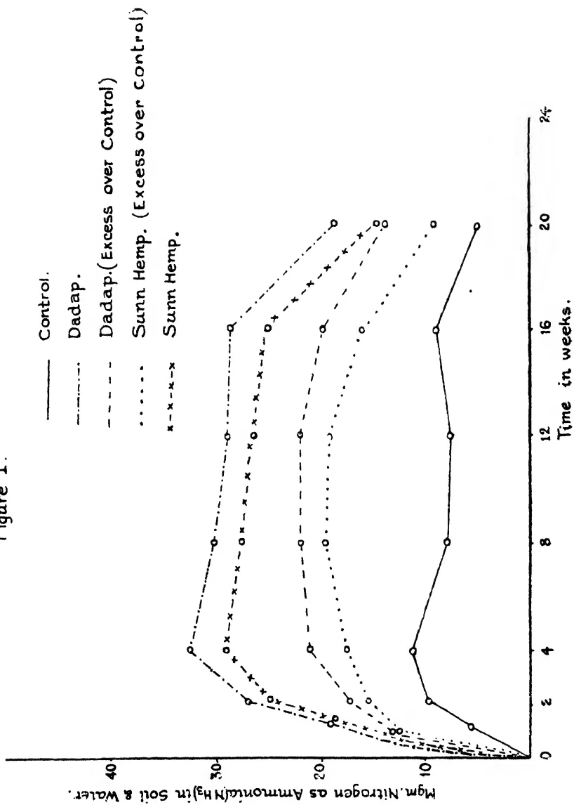

The graph illustrates the release of nitrogen as ammonia from different treatments over a 24-week period. The y-axis represents the amount of nitrogen in mgm. (mgm. Nitrogen as Ammonia (NH3) in Soil & Water), ranging from 0 to 40. The x-axis represents time in weeks, ranging from 0 to 24. The treatments are: Control (solid line), Dadap (dotted line), Dadap (Excess over Control) (dashed line), Sunn Hemp. (Excess over Control) (dash-dot line), and Sunn Hemp. (line with 'x' markers). The Sunn Hemp. (Excess over Control) treatment shows the highest nitrogen release, peaking at approximately 35 mgm. at 16 weeks. The Sunn Hemp. treatment shows the lowest release, peaking at approximately 18 mgm. at 16 weeks. The Control, Dadap, and Dadap (Excess over Control) treatments show minimal release, remaining below 5 mgm. throughout the 24 weeks.

<table border="1"><thead><tr><th>Time in weeks</th><th>Control</th><th>Dadap</th><th>Dadap (Excess over Control)</th><th>Sunn Hemp. (Excess over Control)</th><th>Sunn Hemp.</th></tr></thead><tbody><tr><td>0</td><td>0</td><td>0</td><td>0</td><td>0</td><td>0</td></tr><tr><td>2</td><td>1</td><td>1</td><td>1</td><td>2</td><td>2</td></tr><tr><td>4</td><td>2</td><td>2</td><td>2</td><td>5</td><td>5</td></tr><tr><td>8</td><td>3</td><td>3</td><td>3</td><td>10</td><td>8</td></tr><tr><td>12</td><td>4</td><td>4</td><td>4</td><td>15</td><td>12</td></tr><tr><td>16</td><td>5</td><td>5</td><td>5</td><td>35</td><td>18</td></tr><tr><td>20</td><td>5</td><td>5</td><td>5</td><td>32</td><td>15</td></tr><tr><td>24</td><td>5</td><td>5</td><td>5</td><td>30</td><td>12</td></tr></tbody></table>

282------------------------------------------------

283------------------------------------------------

257

by a distinct rise in level of the water in the green-manured pots. The gaseous space in the soils in these pots as well as the amount of filmy material on the surface of the soil and water had increased considerably. Appreciable quantities of gases were also given out. No such changes were observed in the control pots. The observations of Harrison and Aiyer (6, 7) were therefore confirmed. Increased aeration of the roots of the paddy plant is therefore an important indirect advantage of green-manuring.

The results of the ammonia determinations of the soils and supernatant liquids are shown in tables I, II and III below. Table I shows the amounts of nitrogen as ammonia in 100 gm. soil at 100°C and in the total amount of soil. Table II shows the amounts of nitrogen as ammonia in the supernatant liquid, and Table III the total ammonia in the soil plus liquid. Table III also shows the period of maximum ammonification and the percentages of nitrogen ammonified. Figure 1 shows graphically the changes in the ammonia contents of the pots. In the tables only the mean data are quoted. No traces of nitrate were found at any stage of the decomposition process. Nitrites were found in traces at the end of the first week and not afterwards. These results were in accordance with those of other workers on the subject (4, 5, 15, 16).

Table I.

Mgms. of nitrogen as ammonia in total amount of soil.

Mgms. of nitrogen as ammonia in 100 gms of soil at 100°C.

<table border="1">
<thead>
<tr>
<th>Time of sampling in weeks.</th>
<th>1</th>
<th>2</th>
<th>4</th>
<th>8</th>
<th>12</th>
<th>16</th>
<th>20</th>
</tr>
</thead>
<tbody>
<tr>
<td>Control.</td>
<td>5.3 2.0</td>
<td>9.3 3.3</td>
<td>11.0 3.9</td>
<td>7.8 2.8</td>
<td>7.2 2.6</td>
<td>8.7 3.1</td>
<td>4.9 1.7</td>
</tr>
<tr>
<td>Dadap.</td>
<td>17.5 6.2</td>
<td>24.8 8.9</td>
<td>29.6 10.7</td>
<td>28.6 10.2</td>
<td>29.0 10.4</td>
<td>28.3 10.1</td>
<td>18.7 6.7</td>
</tr>
<tr>
<td>Sunnheimp.</td>
<td>17.0 6.1</td>
<td>22.9 8.2</td>
<td>26.3 9.4</td>
<td>26.7 9.7</td>
<td>25.6 9.2</td>
<td>24.9 8.9</td>
<td>14.2 5.1</td>
</tr>
</tbody>
</table>

Table II.

Mgms. of nitrogen as ammonia in total amount of liquid.

Mgms. of nitrogen as ammonia in 100 c.c. of liquid.

<table border="1">
<thead>
<tr>
<th>Time of sampling in weeks.</th>
<th>1</th>
<th>2</th>
<th>4</th>
<th>8</th>
<th>12</th>
<th>16</th>
<th>20</th>
</tr>
</thead>
<tbody>
<tr>
<td>Control.</td>
<td>.70 .56</td>
<td>.37 .29</td>
<td>.37 .31</td>
<td>.29 .26</td>
<td>.29 .30</td>
<td>.26 .29</td>
<td>.17 .21</td>
</tr>
<tr>
<td>Dadap.</td>
<td>1.77 1.32</td>
<td>2.34 2.23</td>
<td>2.43 2.08</td>
<td>1.54 1.30</td>
<td>.89 .94</td>
<td>.68 .72</td>
<td>.33 .36</td>
</tr>
<tr>
<td>Sunnheimp.</td>
<td>1.83 1.40</td>
<td>1.88 1.92</td>
<td>2.70 2.59</td>
<td>1.08 1.01</td>
<td>.80 .80</td>
<td>.33 .38</td>
<td>.21 .25</td>
</tr>
</tbody>
</table>

284------------------------------------------------

258Table III.

Mgms. of nitrogen as ammonia in soil and liquid.  
 Mgms. of nitrogen as ammonia (increase over control).

<table border="1">
<thead>
<tr>
<th>Time of sampling in weeks.</th>
<th>1</th>
<th>2</th>
<th>4</th>
<th>8</th>
<th>12</th>
<th>16</th>
<th>20</th>
<th>Mgms. nitrogen added as green manure</th>
<th>Period of maximum ammonification in weeks</th>
<th>Maximum percentage ammonified</th>
</tr>
</thead>
<tbody>
<tr>
<td>Control.</td>
<td>6.0</td>
<td>9.67</td>
<td>11.37</td>
<td>8.09</td>
<td>7.49</td>
<td>8.96</td>
<td>5.07</td>
<td>—</td>
<td>4</td>
<td>—</td>
</tr>
<tr>
<td>Dadap.</td>
<td>19.27</td>
<td>27.14</td>
<td>32.02</td>
<td>30.14</td>
<td>29.89</td>
<td>28.98</td>
<td>19.30</td>
<td>23.74</td>
<td>4-8</td>
<td>92.1</td>
</tr>
<tr>
<td></td>
<td>13.27</td>
<td>17.47</td>
<td>20.65</td>
<td>22.05</td>
<td>22.40</td>
<td>20.02</td>
<td>19.36</td>
<td></td>
<td></td>
<td></td>
</tr>
<tr>
<td>Sunnheimp.</td>
<td>18.83</td>
<td>24.78</td>
<td>29.00</td>
<td>27.78</td>
<td>26.40</td>
<td>25.23</td>
<td>14.41</td>
<td>30.40</td>
<td>4-8</td>
<td>64.9</td>
</tr>
<tr>
<td></td>
<td>12.83</td>
<td>15.11</td>
<td>17.65</td>
<td>19.69</td>
<td>18.91</td>
<td>16.27</td>
<td>9.34</td>
<td></td>
<td></td>
<td></td>
</tr>
</tbody>
</table>

In addition to the determinations of ammonia, nitrate and nitrite at regular intervals, total nitrogen determinations of the soils at the start and at the conclusion of the experiment and of the green materials added were made in order to study the nitrogen balance in the soil. The results are shown in table IV.

Table IV.

<table border="1">
<thead>
<tr>
<th></th>
<th>Initial nitrogen in soil at 100°C</th>
<th>Nitrogen in green manure added</th>
<th>Final nitrogen in soil at 100°C.</th>
<th>Net loss or gain in soil nitrogen</th>
<th>Total loss or gain in nitrogen.</th>
</tr>
<tr>
<th></th>
<th>% Mgms.</th>
<th>% Mgms.</th>
<th>% Mgms.</th>
<th>% Mgms.</th>
<th>Mgms.</th>
</tr>
</thead>
<tbody>
<tr>
<td>Control.</td>
<td>.1188 332.6</td>
<td>— —</td>
<td>.1060 296.8</td>
<td>-10.7 -35.8</td>
<td>-35.8</td>
</tr>
<tr>
<td>Dadap.</td>
<td>.1188 332.6</td>
<td>.7914 23.7</td>
<td>.1198 335.4</td>
<td>+ 0.9 + 2.8</td>
<td>-20.9</td>
</tr>
<tr>
<td>Sunn-hemp</td>
<td>.1188 332.6</td>
<td>1.01 30.4</td>
<td>.1141 319.5</td>
<td>- 3.9 -13.1</td>
<td>-43.5</td>
</tr>
</tbody>
</table>

### DISCUSSION OF RESULTS.

A glance at tables I to III shows that (1) large quantities of ammonia were formed as a result of submerging paddy soils containing fixed organic matter. The quantities were considerably increased when green manures were added. Thus the maximum increases in ammonia of the green-manured pots over the controls were no less than 20 and 22 mgm. per 100 gm. of dry soil respectively. As 1 mgm. of nitrogen per 100 gm. dry soil is equivalent to about 25 lbs. per acre, the increase in nitrogen as ammonia due to the green manures will therefore amount to about 175 lbs. per acre; (2) by far the greater part of the ammonia was found in the soil, and, as shown by Subrahmanayan (11), only small amounts were present in the supernatant liquid but appreciable amounts were found in the supernatant liquid of the green-manured pots in the early stages; (3) the largest amounts of ammonia were found in all cases at the end of four weeks from the date of puddling, but maximum ammonification as measured by increase over the control was obtained in eight weeks, though increases near the maximum were found at the end of four weeks. After this period the ammonia contents remained more or less.

285------------------------------------------------

259

constant for about two months, after which they began to fall. Large quantities of ammonia, however, were found a week after puddling. The dadap pots generally showed higher ammonia contents than the sunnhemp pots, though the amounts of nitrogen added as green-manure were less in the case of the former. This was due to the fibrous nature of the sample of sunnhemp added. The maximum percentage of ammonification of nitrogen in the case of dadaps was 93.1 and of sunnhemp 64.9. This indicated that it is not advisable to use fibrous nitrogenous materials for green manuring paddy.

Table IV shows the nitrogen balance of the experiment. It will be noted that, as a result of maintaining soils rich in organic matter under paddy-land (anaerobic) conditions for a period of four to five months, appreciably large losses of their total nitrogen contents may occur. Thus in these experiments the control soils lost over 10 per cent. of their nitrogen. When green-manures were added, the net soil nitrogen losses were much less, due to the nitrogen contributed by the former. In the case of the dadap pots, there was even a small net gain in nitrogen. The loss of 4 per cent. of the original soil nitrogen in the sunnhemp pots was probably due to the fibrous nature of the green-manure which encourages denitrification.

All previous investigations have shown that ammoniacal nitrogen is the form of nitrogen most suitable to wet-land paddy. Kelley has also shown that paddy requires its nitrogen in the early stages of its growth (3). The results of these experiments, that soils treated with green manures and submerged under water have much larger quantities of ammonia at all stages of the decomposition process and more total nitrogen at the end of the investigation than the controls, clearly indicate therefore that green manures are of *direct* manurial value to paddy in spite of losses of nitrogen from the green-manures added. These experiments do not therefore appear to bear out Harrison and Aiyer's contents (7) that the direct manurial value of green-manures for paddy is small under *all* conditions owing to the liberation in the gaseous form of a considerable amount of the nitrogen contained in them. The experiments to be described under series II, however, will indicate that under certain conditions the direct value of green-manures is small.

#### SERIES II.

The object of this series of experiments was to compare the chemical changes taking place in soils when green-manures were incorporated under optimum moisture conditions for nitrification, i.e., aerobically, and were puddled six weeks later with those occurring when green-manures were buried at the time of puddling the soil, i.e., under anaerobic conditions. In short the experiment was intended to throw light on the field practices of *early* and *late* green-manuring of paddy. The paddy soil used

286------------------------------------------------

260

was the same as that in the previous series of experiments. To eighteen pots each containing 300 gm. dry soil water was added to bring the moisture content to that required for optimum nitrification, viz., half-saturation. Nine pots were mixed with 3 gm. portions of green-manure (dadap) and nine were left as controls. The pots were sampled every fortnight for six weeks and the moisture, nitrate, nitrite and ammonia contents of the soils were determined at each sampling. At the end of six weeks, the remaining pots were puddled as in series I and determinations were made of the ammonia, nitrate and nitrite contents of the soils and liquids at the end of three days and one, two, four, eight and twelve weeks after puddling. At the same time twelve other pots were treated as in the first experiment, i.e., the green manures were mixed with the soil at the time of puddling and analyses of the soils and liquids were made at the end of the same periods as in the case of the *early* green-manured pots. In both cases the muddy soils and the supernatant liquids were analysed. The methods of analysis were the same as before. The experiment was started on the 14th July and completed on the 17th November, 1928.

The results are shown in tables V, VI, VII and VIII. The amounts of nitrates found are shown in *italics*.

Table V.

Mgms. of nitrogen as ammonia in 100 gms. of soil at 100°C.  
Mgms. of nitrogen as nitrate in 100 gms. of soil at 100°C.

<table border="1">
<thead>
<tr>
<th rowspan="2">Time of sampling. in weeks.</th>
<th colspan="3">Before Puddling.</th>
<th colspan="6">After Puddling.</th>
</tr>
<tr>
<th>2</th>
<th>4</th>
<th>6</th>
<th><math>\frac{1}{2}</math></th>
<th>1</th>
<th>2</th>
<th>4</th>
<th>8</th>
<th>12</th>
</tr>
</thead>
<tbody>
<tr>
<td>Control, <i>early</i>.</td>
<td>3.67 3.52</td>
<td>3.08 4.15</td>
<td>.77 4.32</td>
<td>.50 2.67</td>
<td>.52 2.45</td>
<td>.82 nil</td>
<td>.74 nil</td>
<td>.74 nil</td>
<td>.78 nil</td>
</tr>
<tr>
<td>Control, <i>late</i>.</td>
<td></td>
<td></td>
<td></td>
<td>2.63 nil</td>
<td>3.98 nil</td>
<td>4.16 nil</td>
<td>3.94 nil</td>
<td>3.65 nil</td>
<td>3.63 nil</td>
</tr>
<tr>
<td>Green-manure, <i>early</i>.</td>
<td>4.62 3.99</td>
<td>7.96 7.64</td>
<td>1.00 9.32</td>
<td>.54 4.53</td>
<td>1.34 4.03</td>
<td>1.02 2.21</td>
<td>1.17 nil</td>
<td>1.18 nil</td>
<td>1.24 nil</td>
</tr>
<tr>
<td>Green-manure, <i>late</i>.</td>
<td></td>
<td></td>
<td></td>
<td>3.01 nil</td>
<td>6.29 nil</td>
<td>7.02 nil</td>
<td>9.85 nil</td>
<td>9.71 nil</td>
<td>9.76 nil</td>
</tr>
</tbody>
</table>

Table VI.

Mgms. of nitrogen as ammonia in total liquid after puddling.  
Mgms. of nitrate nitrogen in total liquid after puddling.

<table border="1">
<thead>
<tr>
<th>Time of sampling in weeks.</th>
<th><math>\frac{1}{2}</math></th>
<th>1</th>
<th>2</th>
<th>4</th>
<th>8</th>
<th>12</th>
</tr>
</thead>
<tbody>
<tr>
<td>Control, <i>early</i>.</td>
<td>.19 —</td>
<td>.18 3.39</td>
<td>.15 3.84</td>
<td>.14 3.4</td>
<td>.12 3.6</td>
<td>.15 <i>trace</i></td>
</tr>
<tr>
<td>Control, <i>late</i>.</td>
<td>.34 nil</td>
<td>.45 nil</td>
<td>.32 nil</td>
<td>.16 nil</td>
<td>.14 nil</td>
<td>.16 nil</td>
</tr>
<tr>
<td>Green-manure, <i>early</i>.</td>
<td>.22 —</td>
<td>.23 5.15</td>
<td>.22 4.62</td>
<td>.16 3.94</td>
<td>.16 3.90</td>
<td>.18 <i>trace</i></td>
</tr>
<tr>
<td>Green-manure, <i>late</i>.</td>
<td>.76 nil</td>
<td>.76 nil</td>
<td>.40 nil</td>
<td>.46 nil</td>
<td>.22 nil</td>
<td>.18 nil</td>
</tr>
</tbody>
</table>

287------------------------------------------------

261Table VII.

Mgms. of nitrogen as ammonia in total amount of soil.

Mgms. of nitrogen as nitrate in total amount of soil.

<table border="1">
<thead>
<tr>
<th rowspan="2">Time of sampling. in weeks.</th>
<th colspan="3">Before Puddling.</th>
<th colspan="6">After Puddling.</th>
</tr>
<tr>
<th>2</th>
<th>4</th>
<th>6</th>
<th>½</th>
<th>1</th>
<th>2</th>
<th>4</th>
<th>8</th>
<th>12</th>
</tr>
</thead>
<tbody>
<tr>
<td>Control <i>early</i>.</td>
<td>10.28 9.85</td>
<td>8.48 11.62</td>
<td>2.16 12.10</td>
<td>1.40 7.47</td>
<td>1.46 6.86</td>
<td>2.30 nil</td>
<td>2.07 nil</td>
<td>2.07 nil</td>
<td>2.05 nil</td>
</tr>
<tr>
<td>Control, <i>late</i></td>
<td></td>
<td></td>
<td></td>
<td>7.37 nil</td>
<td>11.14 nil</td>
<td>11.65 nil</td>
<td>11.03 nil</td>
<td>10.22 nil</td>
<td>16.17 nil</td>
</tr>
<tr>
<td>Green-manure, <i>early</i>.</td>
<td>12.93 11.20</td>
<td>19.43 21.41</td>
<td>2.80 26.10</td>
<td>1.51 12.71</td>
<td>3.75 13.32</td>
<td>2.86 6.23</td>
<td>3.28 nil</td>
<td>3.31 nil</td>
<td>3.47 nil</td>
</tr>
<tr>
<td>Green-manure, <i>late</i>.</td>
<td></td>
<td></td>
<td></td>
<td>8.41 nil</td>
<td>17.58 nil</td>
<td>19.65 nil</td>
<td>27.58 nil</td>
<td>27.19 nil</td>
<td>27.33 nil</td>
</tr>
</tbody>
</table>

Table VIII.

Mgms. of nitrogen as ammonia in soil and liquid.

Mgms. of nitrogen as nitrate in soil and liquid.

<table border="1">
<thead>
<tr>
<th rowspan="2">Time of sampling in weeks.</th>
<th colspan="3">Before puddling.</th>
<th colspan="10">After puddling.</th>
</tr>
<tr>
<th>2</th>
<th>4</th>
<th>6</th>
<th>½</th>
<th>1</th>
<th>2</th>
<th>4</th>
<th>8</th>
<th>12</th>
<th>Mgms. nitrogen added as green manure</th>
<th>Period of maxi- mum ammoni- fication in weeks.</th>
<th>Maxi- mum per- cen- tage am- moni- fied.</th>
</tr>
</thead>
<tbody>
<tr>
<td>Control, <i>early</i>.</td>
<td>10.28 9.85</td>
<td>8.48 11.60</td>
<td>2.16 12.11</td>
<td>1.59 —</td>
<td>1.64 10.25</td>
<td>2.45 3.84</td>
<td>2.21 3.62</td>
<td>2.19 3.41</td>
<td>2.20 trace</td>
<td>—</td>
<td>2</td>
<td>—</td>
</tr>
<tr>
<td>Control, <i>late</i>.</td>
<td></td>
<td></td>
<td></td>
<td>7.71 nil</td>
<td>11.59 nil</td>
<td>11.97 nil</td>
<td>11.19 nil</td>
<td>10.36 nil</td>
<td>10.33 nil</td>
<td>—</td>
<td>2</td>
<td>—</td>
</tr>
<tr>
<td>Green-manure, <i>early</i>.</td>
<td>12.91 11.24</td>
<td>19.51 21.41</td>
<td>2.82 26.12</td>
<td>1.73 —</td>
<td>3.98 16.45</td>
<td>3.08 10.81</td>
<td>3.44 3.94</td>
<td>3.47 3.90</td>
<td>3.65 trace</td>
<td>25.42</td>
<td>4</td>
<td>5.0</td>
</tr>
<tr>
<td>Green-manure, <i>late</i>.</td>
<td></td>
<td></td>
<td></td>
<td>9.17 nil</td>
<td>18.34 nil</td>
<td>20.05 nil</td>
<td>28.04 nil</td>
<td>27.41 nil</td>
<td>27.51 nil</td>
<td>25.95</td>
<td>4</td>
<td>65.7</td>
</tr>
</tbody>
</table>

DISCUSSION OF RESULTS.

An examination of the tables shows that (1) large quantities of ammonia and nitrate were found in the initial stages in the *early* green-manure and control soils. The ammonia contents fell to a minimum and the nitrates rose to a maximum at the end of six weeks; (2) on puddling, there was a slight fall in ammonia and a large fall in nitrate in the soils of both control and green-manure *early* pots. A large proportion of the soil nitrate, however, was found in the supernatant liquid which contains only small amounts of ammonia. In normal field practice the nitrates found in the surface water are lost in drainage. The nitrate in the soil was lost through denitrification in about two weeks, but that in the liquid remained for a longer time, viz., up to eight weeks, as

288------------------------------------------------

262

table VI will show. The results confirmed those of Kelley, Subrahmanyam and others (4, 5, 11). Nitrites were found in small quantities soon after puddling, but neither in soils nor liquids after the first fortnight. They were denitrified more quickly in the soils. Neither nitrates nor nitrites were found at any time in the green-manure *late* pots. The ammonia content of the supernatant liquid remained almost constant; (3) the amounts of ammonia found in the *early* control and green-manure pots were much smaller than those in the corresponding *late* pots, but the differences between the ammonia contents of the *early* control and green-manure pots were small. The advantages of burying green-manures *late* in irrigated paddy soils as regards the ammonia contents were therefore evident. If confirmation of these increases can be obtained in the field, higher yields from fields green-manured *late* than from those green-manured *early* can be expected. From the chemical standpoint, therefore, the burying of green-manures *late*, i.e., under anaerobic conditions at the time of puddling the soil, is preferable to doing so under dry or semi-dry conditions and subsequently puddling with water. The reason for this, as the data will show, is that under semi-dry conditions nitrates are formed in large quantities when paddy soils are ploughed or green-manured; these nitrates on the subsequent submergence of the fields under water are quickly denitrified, reduced to nitrites or lost in drainage. The data obtained are shown graphically in figures 2 and 3; (4) both *early* and *late* green-manure pots showed, as before maximum ammonification at the end of four weeks and the controls at the end of two weeks. The ammonia contents of the *late* pots remained more or less constant after this period. The maximum ammonification percentage was 65.7 in the case of the *late* pots and only 5 in the case of the *early* pots.

In table IX below are shown the changes which took place in the total nitrogen contents of the soils as a result of the treatment already described.

Table IX.

<table border="1">
<thead>
<tr>
<th rowspan="2"></th>
<th colspan="2">Initial nitrogen in soil at 100°C.</th>
<th colspan="2">Nitrogen in green-manure added.</th>
<th colspan="2">Nitrogen in soil at 100°C. before puddling.</th>
<th colspan="2">Loss or gain in soil nitrogen.</th>
<th colspan="2">Nitrogen in soil at 100°C. after puddling.</th>
<th colspan="2">Net loss or gain in soil nitrogen after puddling.</th>
<th rowspan="2">Total loss or gain in nitrogen.</th>
</tr>
<tr>
<th>%</th>
<th>Mgms.</th>
<th>%</th>
<th>Mgms.</th>
<th>%</th>
<th>Mgms.</th>
<th>%</th>
<th>Mgms.</th>
<th>%</th>
<th>Mgms.</th>
<th>%</th>
<th>Mgms.</th>
</tr>
</thead>
<tbody>
<tr>
<td>Control <i>early</i></td>
<td>1188</td>
<td>332.6</td>
<td>—</td>
<td>—</td>
<td>1187</td>
<td>332.3</td>
<td>nil</td>
<td>nil</td>
<td>1059</td>
<td>296.5</td>
<td>-10.8</td>
<td>-36.1</td>
<td>-36.1</td>
</tr>
<tr>
<td>Control <i>late</i></td>
<td>1188</td>
<td>332.6</td>
<td>—</td>
<td>—</td>
<td>—</td>
<td>—</td>
<td>—</td>
<td>—</td>
<td>1091</td>
<td>305.4</td>
<td>-8.2</td>
<td>-27.2</td>
<td>-27.2</td>
</tr>
<tr>
<td>Green-manure. <i>early</i></td>
<td>1188</td>
<td>332.6</td>
<td>8474</td>
<td>25.40</td>
<td>1223</td>
<td>342.4</td>
<td>+0037</td>
<td>+9.8</td>
<td>1063</td>
<td>297.6</td>
<td>-10.5</td>
<td>-35.0</td>
<td>-60.4</td>
</tr>
<tr>
<td>Green-manure. <i>late</i></td>
<td>1188</td>
<td>332.6</td>
<td>8650</td>
<td>25.95</td>
<td>—</td>
<td>—</td>
<td>—</td>
<td>—</td>
<td>1183</td>
<td>331.2</td>
<td>-0.42</td>
<td>-1.4</td>
<td>-26.4</td>
</tr>
</tbody>
</table>

289------------------------------------------------

Figure 2.

The graph illustrates the release of nitrogen from different treatments over a 12-week period. The y-axis represents the amount of Mg-Nitrogen as Ammonia (NH3) in soil and water, ranging from 0 to 40. The x-axis represents time in weeks, from 0 to 12. A vertical line at week 0 marks the point of soil puddling, separating the 'Before Puddling' phase (weeks 0-4) from the 'After Puddling' phase (weeks 4-12).

Legend:

- Control Early (solid line)
- " Late" (dashed line)
- Green manure Early (dash-dot line)
- " Late" (dotted line)

Approximate data points extracted from the graph:

<table border="1">
<thead>
<tr>
<th>Time (weeks)</th>
<th>Control Early</th>
<th>" Late"</th>
<th>Green manure Early</th>
<th>" Late"</th>
</tr>
</thead>
<tbody>
<tr>
<td>0</td>
<td>0</td>
<td>0</td>
<td>0</td>
<td>0</td>
</tr>
<tr>
<td>2</td>
<td>10</td>
<td>15</td>
<td>10</td>
<td>20</td>
</tr>
<tr>
<td>4</td>
<td>15</td>
<td>20</td>
<td>10</td>
<td>25</td>
</tr>
<tr>
<td>6</td>
<td>10</td>
<td>15</td>
<td>10</td>
<td>25</td>
</tr>
<tr>
<td>8</td>
<td>10</td>
<td>15</td>
<td>10</td>
<td>25</td>
</tr>
<tr>
<td>10</td>
<td>10</td>
<td>15</td>
<td>10</td>
<td>25</td>
</tr>
<tr>
<td>12</td>
<td>10</td>
<td>15</td>
<td>10</td>
<td>25</td>
</tr>
</tbody>
</table>

290------------------------------------------------

Figure 3.

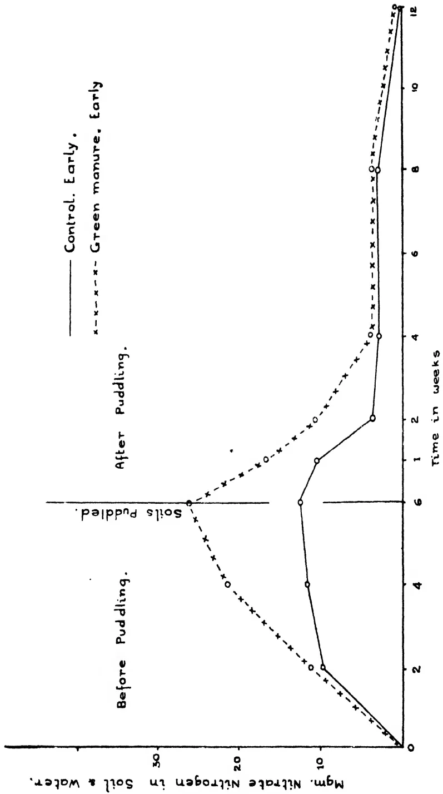

The graph illustrates the concentration of nitrate nitrogen in soil and water over a 12-week period. The y-axis represents 'Mgm. Nitrate Nitrogen in Soil & Water.' with a scale from 0 to 30. The x-axis represents 'Time in weeks' with a scale from 0 to 12. Two horizontal lines are present: one at 0 labeled 'Soils Puddled.' and another at approximately 15 labeled 'Sols Puddled.'. The graph is divided into two sections: 'Before Puddling.' (0-6 weeks) and 'After Puddling.' (6-12 weeks). Three data series are plotted: 'Control' (solid line), 'Early' (dashed line with 'x' markers), and 'Green manure' (dashed line with 'o' markers). All series start at 0 at week 0. In the 'Before Puddling.' section, the 'Green manure' series rises to ~15 at week 6, while 'Control' and 'Early' rise to ~10. In the 'After Puddling.' section, all series rise sharply, reaching ~25 at week 8 and ~30 at week 12.

<table border="1"><thead><tr><th>Time (weeks)</th><th>Control (Mgm. Nitrate Nitrogen)</th><th>Early (Mgm. Nitrate Nitrogen)</th><th>Green manure (Mgm. Nitrate Nitrogen)</th></tr></thead><tbody><tr><td>0</td><td>0</td><td>0</td><td>0</td></tr><tr><td>2</td><td>10</td><td>10</td><td>10</td></tr><tr><td>4</td><td>10</td><td>10</td><td>15</td></tr><tr><td>6</td><td>10</td><td>10</td><td>15</td></tr><tr><td>8</td><td>25</td><td>25</td><td>25</td></tr><tr><td>10</td><td>30</td><td>30</td><td>30</td></tr><tr><td>12</td><td>30</td><td>30</td><td>30</td></tr></tbody></table>

291------------------------------------------------

263

An examination of this table indicates that (1) as in the previous series of experiments, the total nitrogen content of the soil was maintained and might be increased by *late* green-manuring, (2) the losses of nitrogen from the *early* control pots were greater than from the corresponding *late* controls, but the losses in the latter pots were appreciable; (3) as a result of incorporating the green-manures *early* and subsequent puddling, all the nitrogen contained in the green-manure was lost, in addition to that normally lost from the soil as a result of the submergence. The advantages from the chemical standpoint of burying easily-decomposed green material in paddy fields *late* as against the practice of burying it *early* are again apparent.

### SERIES III.

This series of experiments was started to elucidate certain points arising from the two previous series of laboratory experiments and the field experiments to be referred to later.

*The rate of denitrification of nitrates added to water-logged soils.* As the green-manure experiments of series I and II did not furnish sufficient data on the denitrification of the nitrates added to or present in soils as a result of water-logging, an experiment was set up to obtain the information required. Nitrate of soda at the rate of 100 mgm. to 200 gm. soil was added to a number of pots otherwise treated as in the previous experiments. To a number of other pots cane sugar at the rate of 100 mgm. to 100 gm. soil was added in addition to the nitrate of soda. Nitrate and nitrite determinations of the soils and liquids in the pots were made after the third day and one, two and three weeks, respectively. The results are shown in table X.

Table X.

<table border="1">
<thead>
<tr>
<th colspan="2"></th>
<th colspan="4">Nitrates (parts per million).</th>
<th colspan="4">Nitrites (parts per million).</th>
</tr>
<tr>
<th colspan="2">Time of sampling in weeks.</th>
<th><math>\frac{1}{2}</math></th>
<th>1</th>
<th>2</th>
<th>3</th>
<th><math>\frac{1}{2}</math></th>
<th>1</th>
<th>2</th>
<th>3</th>
</tr>
</thead>
<tbody>
<tr>
<td rowspan="2">With addition of sugar.</td>
<td>Soil</td>
<td>nil</td>
<td>nil</td>
<td>nil</td>
<td>nil</td>
<td>trace</td>
<td>trace</td>
<td>nil</td>
<td>nil</td>
</tr>
<tr>
<td>liquid</td>
<td>trace</td>
<td>nil</td>
<td>nil</td>
<td>nil</td>
<td>trace</td>
<td>trace</td>
<td>nil</td>
<td>nil</td>
</tr>
<tr>
<td rowspan="2">Without addition of sugar</td>
<td>Soil</td>
<td>.45</td>
<td>trace</td>
<td>nil</td>
<td>nil</td>
<td>.40</td>
<td>.15</td>
<td>nil</td>
<td>nil</td>
</tr>
<tr>
<td>liquid</td>
<td>19.6</td>
<td>11.1</td>
<td>1.4</td>
<td>trace</td>
<td>2.0</td>
<td>.30</td>
<td>1.5</td>
<td>nil</td>
</tr>
</tbody>
</table>

An examination of the table shows that nitrate reduction took place very quickly in the soil, especially on the addition of sugar. In the case of the pots without sugar all the soil nitrates were reduced to nitrite or leached into the liquid within a week. The nitrate in the liquid was converted to nitrite and finally lost as free nitrogen in just over two weeks. In the case of the pots to which sugar was added both nitrate and nitrite were lost within three days. These experiments therefore confirm the results of previous workers, viz., that nitrates are reduced to nitrites and

292------------------------------------------------

264

free nitrogen in soil and water under anaerobic conditions in a very short time (1, 2, 4, 5, 15), and that denitrification is greatly hastened by the presence in the soil of easily-decomposed organic matter.

*Is the ammonia formed in water-logged soils through green-manuring lost on puddling?* In the first field experiment to be detailed later, a marked fall in the ammonia contents of the soils was observed when fields which had previously been green-manured were puddled. The reason for the loss of ammonia was not quite apparent. To ascertain whether it was a normal occurrence, a laboratory experiment was started in which soils which had green-manures incorporated with them under optimum conditions for ammonification, as in the field, were maintained in that condition for four weeks; they were subsequently puddled and the changes taking place in the ammonia contents of the soils were determined. The data obtained are set down below.

<table border="1">
<thead>
<tr>
<th rowspan="2"></th>
<th colspan="2">Ammonia in dry soil at 100°C.</th>
</tr>
<tr>
<th>Mgm.</th>
<th>Mean.</th>
</tr>
</thead>
<tbody>
<tr>
<td rowspan="2">At end of four weeks.</td>
<td>12.77</td>
<td rowspan="2">12.63</td>
</tr>
<tr>
<td>12.49</td>
</tr>
<tr>
<td rowspan="2">Three days after puddling.</td>
<td>12.62</td>
<td rowspan="2">12.40</td>
</tr>
<tr>
<td>12.18</td>
</tr>
<tr>
<td rowspan="2">One week after puddling.</td>
<td>12.66</td>
<td rowspan="2">12.59</td>
</tr>
<tr>
<td>12.52</td>
</tr>
</tbody>
</table>

It will be noted that in this experiment the fall in ammonia content as a result of the puddling was not appreciable. This would indicate that hardly any losses of ammonia occurred from the soil through volatilization in the puddling process. The fact that no losses of ammonia occurred from soils through volatilization was also demonstrated by Subrahmanyam (11). The marked fall in soil ammonia obtained in the field experiment would therefore appear to be partly at least the result of sampling. It was likely that, as the sampling of the soils was done by hand just after puddling, a part of the clay portion of the sample which retained the ammonia was lost in the process. Some ammonia was also lost in the surface drainage. Under certain field conditions, e.g., where the fields are left to dry after being green-manured, the ammonia content of the soil just previous to puddling may be low owing to the nitrification of the ammonia formed. In these cases the ammonia contents of the soils after puddling will not be appreciably lower than before puddling. Such was probably the case in the second field experiment.

## FIELD EXPERIMENTS.

### SERIES I.

This experiment was started in December 1927 in co-operation with the Economic Botanist who was responsible for the carrying out of the experiment. There were twenty plots in all,

293------------------------------------------------

This image is a blank white page. It contains several small, dark specks which appear to be scanning artifacts or dust particles. There is no text, handwriting, or printed content on the page.

294------------------------------------------------

Figure 4.

The graph illustrates the change in ammonia levels in soil over time, categorized by treatment and the stage of soil preparation (before or after puddling). The y-axis represents the amount of ammonia in mgm per 100 gm of dry soil, ranging from 1 to 6. The x-axis represents time in weeks, ranging from 2 to 17. A horizontal line at approximately 1.5 mgm/100 gm dry soil marks the level of 'Soils Puddled'.

**Legend:**

- Control: Solid line with open circles
- G.M. Late.: Dotted line with open circles
- Early.: Dash-dot line with open circles
- Weeds Late. Early.: Dashed line with 'x' markers

**Approximate Data Points:**

<table border="1">
<thead>
<tr>
<th>Time (Weeks)</th>
<th>Control</th>
<th>G.M. Late.</th>
<th>Early.</th>
<th>Weeds Late. Early.</th>
</tr>
</thead>
<tbody>
<tr>
<td>2</td>
<td>1.5</td>
<td>1.5</td>
<td>1.5</td>
<td>1.5</td>
</tr>
<tr>
<td>3</td>
<td>1.5</td>
<td>1.5</td>
<td>1.5</td>
<td>1.5</td>
</tr>
<tr>
<td>4</td>
<td>1.5</td>
<td>1.5</td>
<td>1.5</td>
<td>1.5</td>
</tr>
<tr>
<td>5</td>
<td>1.5</td>
<td>1.5</td>
<td>1.5</td>
<td>1.5</td>
</tr>
<tr>
<td>6</td>
<td>1.5</td>
<td>1.5</td>
<td>1.5</td>
<td>1.5</td>
</tr>
<tr>
<td>7</td>
<td>1.5</td>
<td>1.5</td>
<td>1.5</td>
<td>1.5</td>
</tr>
<tr>
<td>8</td>
<td>1.5</td>
<td>1.5</td>
<td>1.5</td>
<td>1.5</td>
</tr>
<tr>
<td>9</td>
<td>1.5</td>
<td>1.5</td>
<td>1.5</td>
<td>1.5</td>
</tr>
<tr>
<td>10</td>
<td>1.5</td>
<td>1.5</td>
<td>1.5</td>
<td>1.5</td>
</tr>
<tr>
<td>11</td>
<td>1.5</td>
<td>1.5</td>
<td>1.5</td>
<td>1.5</td>
</tr>
<tr>
<td>12</td>
<td>1.5</td>
<td>1.5</td>
<td>1.5</td>
<td>1.5</td>
</tr>
<tr>
<td>13</td>
<td>1.5</td>
<td>1.5</td>
<td>1.5</td>
<td>1.5</td>
</tr>
<tr>
<td>14</td>
<td>1.5</td>
<td>1.5</td>
<td>1.5</td>
<td>1.5</td>
</tr>
<tr>
<td>15</td>
<td>1.5</td>
<td>1.5</td>
<td>1.5</td>
<td>1.5</td>
</tr>
<tr>
<td>16</td>
<td>1.5</td>
<td>1.5</td>
<td>1.5</td>
<td>1.5</td>
</tr>
<tr>
<td>17</td>
<td>1.5</td>
<td>1.5</td>
<td>1.5</td>
<td>1.5</td>
</tr>
</tbody>
</table>

**Observations:**

- **Before Puddling (Weeks 2-6):** All treatments start at 1.5 mgm/100 gm dry soil. The 'Weeds Late. Early.' treatment shows a slight increase to about 2.5 mgm by week 6. The 'G.M. Late.' treatment shows a slight increase to about 2.2 mgm by week 6.
- **After Puddling (Weeks 7-17):** All treatments remain at 1.5 mgm/100 gm dry soil until week 10. From week 11 onwards, all treatments show a steady increase, reaching approximately 5.5 mgm/100 gm dry soil by week 17. The 'G.M. Late.' treatment shows the most rapid increase, reaching about 5.8 mgm by week 17.

295------------------------------------------------

265

each of the five treatments being replicated four times in randomised blocks. The full details will be given by him in a paper to follow. The treatments were as follows: Control; weeds buried *early*; weeds buried *late*; green-manure buried *early*; green-manure buried *late*. The green-manures were grown *in situ*, and therefore no records of the weights of green material obtained were kept. In the *early* plots the green-manures were buried seven weeks and in the *late* plots one week before sowing. Soil samples from the field were taken periodically as follows: Prior to puddling two borings were taken to a depth of about six inches with an auger from each plot treated alike and these were thoroughly mixed together. After puddling, the soils were sampled by hand owing to their being muddy. Determinations of moisture, nitrate, nitrite and ammonia were made on each soil sample. Unfortunately the yields of paddy could not be obtained in this experiment owing to damage by rain. As the chemical data obtained are interesting they are set down in table XI below and graphically illustrated in figure 4.

Table XI.

Mgms. of nitrogen as ammonia in 100 gms. of soil at 100°C.

Mgms. of nitrogen as nitrate in 100 gms. of soil at 100°C.

<table border="1">
<thead>
<tr>
<th colspan="5">Before puddling.</th>
<th colspan="8">After puddling.</th>
</tr>
<tr>
<th>Time of sampling in weeks.</th>
<th>2</th>
<th>4</th>
<th>6</th>
<th>7</th>
<th>1</th>
<th>3</th>
<th>5</th>
<th>7</th>
<th>9</th>
<th>11</th>
<th>13</th>
<th>17</th>
</tr>
</thead>
<tbody>
<tr>
<td>Control.</td>
<td>1.5 .55</td>
<td>2.1 .96</td>
<td>3.0 .75</td>
<td>3.23 —</td>
<td>1.22 nil</td>
<td>1.73 nil</td>
<td>1.31 nil</td>
<td>1.05 nil</td>
<td>.91 nil</td>
<td>.88 nil</td>
<td>.73 nil</td>
<td>.27 nil</td>
</tr>
<tr>
<td>Green-manure, <i>late</i>.</td>
<td></td>
<td></td>
<td></td>
<td></td>
<td>2.69 nil</td>
<td>4.79 nil</td>
<td>4.30 nil</td>
<td>1.87 nil</td>
<td>1.69 nil</td>
<td>1.30 nil</td>
<td>.87 nil</td>
<td>.96 nil</td>
</tr>
<tr>
<td>Green-manure, <i>early</i>.</td>
<td>3.4 .37</td>
<td>3.7 .70</td>
<td>5.2 .78</td>
<td>5.8 —</td>
<td>1.85 nil</td>
<td>2.13 nil</td>
<td>2.13 nil</td>
<td>1.36 nil</td>
<td>1.16 nil</td>
<td>1.05 nil</td>
<td>.83 nil</td>
<td>.63 nil</td>
</tr>
<tr>
<td>Weeds, <i>late</i>.</td>
<td></td>
<td></td>
<td></td>
<td></td>
<td>2.14 nil</td>
<td>3.06 nil</td>
<td>2.50 nil</td>
<td>1.41 nil</td>
<td>1.42 nil</td>
<td>1.37 nil</td>
<td>1.25 nil</td>
<td>.70 nil</td>
</tr>
<tr>
<td>Weeds, <i>early</i>.</td>
<td>1.4 .45</td>
<td>1.6 .55</td>
<td>2.7 .45</td>
<td>3.0 —</td>
<td>2.02 nil</td>
<td>2.36 nil</td>
<td>1.89 nil</td>
<td>1.27 nil</td>
<td>1.08 nil</td>
<td>1.04 nil</td>
<td>.63 nil</td>
<td>.44 nil</td>
</tr>
</tbody>
</table>

### DISCUSSION OF RESULTS.

An examination of the data of table XI shows that (1) as in the laboratory experiments large amounts of ammonia were formed as a result of the *early* ploughing in of the green-manures. This large ammonia production was due to the soil moisture conditions during the whole period of the experiment being favourable for ammonification and unfavourable for nitrification. Only small amounts of nitrate were found; (2) on puddling the soil a very marked fall in ammonia in all the *early* plots was observed. The reason for this fall was not clear, as the laboratory experiments carried out do not show losses of ammonia due to volatiliza-

296------------------------------------------------

266

tion on puddling soils containing large quantities of ammonia. As stated previously, however, the loss of ammonia in the surface drainage and the sampling error afford a probable explanation of this observation; (3) the *late* plots, i.e., those in which the green-manures or weeds were puddled *late* showed during the whole period of the experiment much higher ammonia contents, the maximum being reached about three or four weeks after puddling. From the chemical standpoint, therefore, the field experiments confirmed the results of laboratory experiments that it was preferable to bury green material under paddy-land conditions *late* than *early*. It was unfortunate that no yield data could be obtained owing to the adverse weather conditions, but it may be stated that the *late* plots appeared superior to the *early* plots.

### SERIES II.

Owing to the lack of yield data in the first experiment, a second experiment to ascertain whether *early* or *late* green-manuring of paddy lands was preferable, was laid down in co-operation with the Economic Botanist. It was begun on the 27th August, 1928 and completed early in March, 1929. The *early* green-manure plots were buried five weeks and the *late* plots one week previous to transplanting. The green-manure was added in the form of wild sunflower (*Tethomia diversifolia*) loppings at the rate of five tons per acre. Representative samples of the loppings and of the soils from the plots were analysed for nitrogen at the start of the experiment and at the conclusion. Determinations of the nitrogen contents of the soils from the plots were again made. At regular intervals samples were taken for the determination of ammonia, nitrates and nitrites. As the soils were very moist, no nitrate was found at any time. Traces of nitrite were found in the early stages but these disappeared later. Duplicate samples were taken in all cases and the average figures obtained are shown in table XII. The latter are shown graphically in figure 5. It is regretted that, as no sample was taken just prior to puddling, a confirmation of the fall in ammonia on puddling the soil as in the previous experiment could not be obtained.

Table XII.

Mgms. of ammonia in 100 gms. of soil at 100°C.

<table border="1">
<thead>
<tr>
<th colspan="4">Before puddling</th>
<th colspan="10">After puddling</th>
</tr>
<tr>
<th>Time of sampling in weeks</th>
<th>At start</th>
<th>1</th>
<th>3</th>
<th>½</th>
<th>2</th>
<th>4</th>
<th>6</th>
<th>8</th>
<th>11</th>
<th>15</th>
<th>Nitrogen added as green manure in lb. per acre.</th>
<th>Period of maxi- mum ammoni- fication in weeks.</th>
<th>Maxi- mum percent- age ammoni- fied.</th>
</tr>
</thead>
<tbody>
<tr>
<td>Control</td>
<td>1.40</td>
<td>1.26</td>
<td>1.25</td>
<td>1.40</td>
<td>1.60</td>
<td>1.91</td>
<td>1.44</td>
<td>1.44</td>
<td>1.18</td>
<td>1.10</td>
<td>—</td>
<td>2—4</td>
<td>—</td>
</tr>
<tr>
<td>Green-Manure <i>early</i></td>
<td>1.44</td>
<td>2.39</td>
<td>2.17</td>
<td>1.81</td>
<td>2.48</td>
<td>2.06</td>
<td>1.80</td>
<td>1.91</td>
<td>1.52</td>
<td>1.65</td>
<td>65.5</td>
<td>2—4</td>
<td>24.9</td>
</tr>
<tr>
<td>Green-Manure <i>late</i></td>
<td>1.47</td>
<td>1.25</td>
<td>1.15</td>
<td>2.32</td>
<td>3.49</td>
<td>3.45</td>
<td>3.27</td>
<td>2.94</td>
<td>1.84</td>
<td>1.77</td>
<td>65.5</td>
<td>2—4</td>
<td>53.4</td>
</tr>
</tbody>
</table>

297------------------------------------------------

Figure 5.

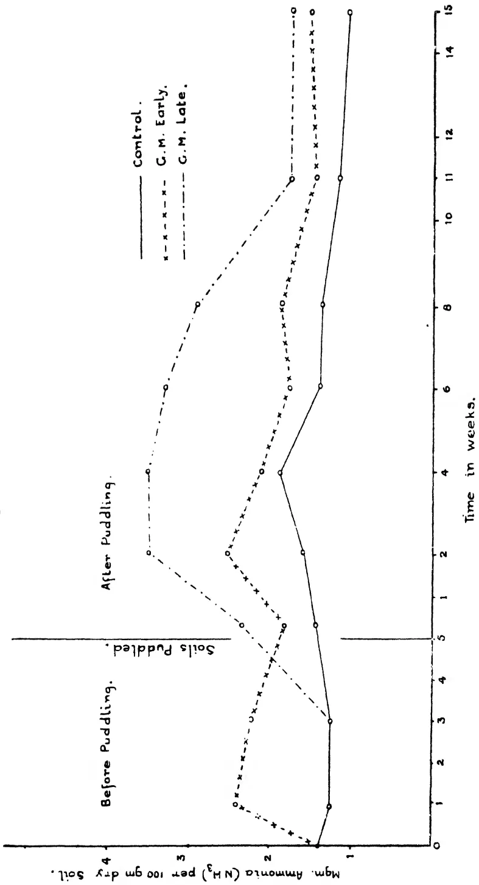

The graph illustrates the change in Magnesium Ammonia (NH3) concentration in soil over a 15-week period. The y-axis represents the concentration in mgm. (NH3) per 100 gm dry soil, ranging from 0 to 4. The x-axis represents time in weeks, from 0 to 15. The data is divided into two phases: 'Before Puddling' (weeks 0-5) and 'Soils Puddled' (weeks 5-15). Three treatments are compared: Control (solid line), G.M. Early (dashed line with 'x' markers), and G.M. Late (dotted line with 'o' markers).

Legend:

- Control (solid line)
- G.M. Early (dashed line with 'x' markers)
- G.M. Late (dotted line with 'o' markers)

<table border="1"><thead><tr><th>Time (weeks)</th><th>Control (mgm. (NH3) per 100 gm dry soil)</th><th>G.M. Early (mgm. (NH3) per 100 gm dry soil)</th><th>G.M. Late (mgm. (NH3) per 100 gm dry soil)</th></tr></thead><tbody><tr><td>0</td><td>1.0</td><td>1.0</td><td>1.0</td></tr><tr><td>1</td><td>1.0</td><td>1.5</td><td>1.5</td></tr><tr><td>2</td><td>1.0</td><td>1.8</td><td>1.8</td></tr><tr><td>3</td><td>1.0</td><td>2.0</td><td>2.0</td></tr><tr><td>4</td><td>1.0</td><td>2.2</td><td>2.2</td></tr><tr><td>5</td><td>1.0</td><td>2.2</td><td>2.2</td></tr><tr><td>6</td><td>1.5</td><td>2.5</td><td>2.5</td></tr><tr><td>7</td><td>2.0</td><td>2.8</td><td>2.8</td></tr><tr><td>8</td><td>2.5</td><td>3.0</td><td>3.0</td></tr><tr><td>9</td><td>2.8</td><td>3.2</td><td>3.2</td></tr><tr><td>10</td><td>3.0</td><td>3.3</td><td>3.3</td></tr><tr><td>11</td><td>3.2</td><td>3.4</td><td>3.4</td></tr><tr><td>12</td><td>3.4</td><td>3.5</td><td>3.5</td></tr><tr><td>13</td><td>3.6</td><td>3.6</td><td>3.6</td></tr><tr><td>14</td><td>3.8</td><td>3.7</td><td>3.7</td></tr><tr><td>15</td><td>4.0</td><td>3.8</td><td>3.8</td></tr></tbody></table>

298------------------------------------------------

This image is a blank white page. It contains several small, dark specks which appear to be scanning artifacts or dust particles. There is no text, handwriting, or printed content on the page.

299------------------------------------------------

267DISCUSSION OF RESULTS.

An examination of the data of the table shows that the results of the first field experiments and of the laboratory experiments were confirmed. Thus (1) the ammonia contents of the soils in the *late* green-manure plots during the whole of the growing period were much greater than those in the *early* and control plots. The latter had the smallest ammonia contents at each sampling; (2) the maximum increase over the control was obtained at the end of two weeks after which the ammonia content remained constant till the sixth week and then fell. The maximum ammonification percentages obtained were 25 and 53 in the *early* and *late* green-manure plots respectively.

On the above chemical data the *late* plots may be expected to yield much better than the *early* or control pots. The yield figures of grain and straw indicate that the *late* plots gave definitely larger yields than the *early* plots and that both *early* and *late* green-manure plots were superior to the controls. The yield data will be fully dealt with by the Economic Botanist. Parnell (13) has demonstrated the efficacy of *late* green-manuring of paddy and the practice seems to be general in India (14).

In table XIII below is shown the soil nitrogen balance in the field experiment.

Table XIII.

<table border="1">
<thead>
<tr>
<th></th>
<th>Initial nitrogen in soil at 100°C. %</th>
<th>Final nitrogen in soil at 100°C. %</th>
<th>Net loss or gain in nitrogen. %</th>
</tr>
</thead>
<tbody>
<tr>
<td>Control</td>
<td>·1895</td>
<td>·1791</td>
<td>—·0104</td>
</tr>
<tr>
<td>Green-manure <i>early</i></td>
<td>·1871</td>
<td>·1801</td>
<td>—·0070</td>
</tr>
<tr>
<td>Green-manure <i>late</i></td>
<td>·1885</td>
<td>·1939</td>
<td>+·0054</td>
</tr>
</tbody>
</table>

It will be noted from the above figures that the control plots as well as the green-manure *early* plots lost soil nitrogen and that apparently the latter lost also the nitrogen added in the green-manure. The green-manure *late* plots, on the contrary, showed a small net gain in soil nitrogen. The gain in or the maintenance of the nitrogen content of the soil was obviously due to the nitrogen added in the green-manure. The results again confirm the conclusion obtained from the laboratory experiments that with regard to soil nitrogen *late* green-manuring of paddy is preferable to *early* green-manuring.

GENERAL DISCUSSION.

In the preceding pages the results are detailed of laboratory and field experiments carried out to study the nitrogen changes taking place in submerged paddy soils when green-manures are incorporated with them under varied conditions. It has been clearly demonstrated that green-manuring at the proper time and under suitable conditions, i.e., if the green-manures are incor-

300------------------------------------------------

268

porated with the soil at the time of puddling (*late*), causes a marked increase in ammonia in the green-manured soils over the controls. Neither nitrates nor nitrites were found in appreciable quantities at any stage of the decomposition process. Much larger quantities of soil gases and an increased amount of film are also produced in the *late* green-manure pots compared with the *early* green-manure and control pots. Green-manured soils are consequently much better aerated than non-green-manured soils. The indirect effects of green-manures, as pointed out by Harrison and Aiyer (7, 8), are therefore of importance if the green-manures are buried *late*.

A study of the total nitrogen changes in the *late* green-manured soils shows that the total soil nitrogen may be maintained or even slightly increased by green-manuring under these conditions and that losses of nitrogen, either more or less than the amount added in the green-manure, may occur, depending on the condition of the green material. The more woody or fibrous the latter, the more nitrogen is lost. But in all cases the control soils show much larger losses of total nitrogen. Green-manuring *late* is therefore of direct manurial value, firstly by minimising the losses of total soil nitrogen taking place under the anaerobic conditions in which paddy is grown, and secondly by increasing the ammonia contents of the soils during the entire period of the growth of the crop or the continuance of the laboratory experiments. Harrison and Aiyer's contention that green manuring is of no direct manurial value to paddy "as a considerable amount of the nitrogen contained in green-manures is liberated in the gaseous form and so made useless so far as the feeding of the crop is concerned" does not therefore apply in all cases.

It does however apply in the case of green-manures applied *early*, i.e., ploughed in when the soil is more or less dry and subsequently puddled. Both field and laboratory experiments have shown that under such conditions much smaller quantities of ammonia are formed in the soil after puddling and that the total losses of soil nitrogen are as great as in the controls. A large proportion of the nitrogen added in the green-manure may also be lost. These observations are easily explained. When green-manures are ploughed in *early* they decompose producing large quantities of nitrates in addition to ammonia as the conditions are generally favourable for nitrification. On the subsequent puddling of the soils the nitrates formed are leached in the drainage water and are lost as free nitrogen or reduced to nitrites which in excess are harmful to young paddy. Hence little nitrogen remains for further ammonification.

The field experiments show definitely that by green-manuring increased yields of grain and straw can be obtained and that higher yields can be obtained by *late* than by *early* green-manuring.

301------------------------------------------------

269

Both laboratory and field experiments have an important bearing on field practice. It is evident from a study of the results that, in general, paddy land should not be ploughed or green-manured immediately a crop is taken and then allowed to lie fallow, as nitrification will set in and, on subsequent puddling before sowing, all the nitrates formed either from the soil organic matter or from the green-manures added will be lost to the crop or reduced to injurious nitrites. The above conclusion was also arrived at by Kelley (5). It therefore appears necessary in *early* ploughing to let in water immediately afterwards. Nitrate formation will thereby be prevented and ammonia production will be encouraged. Unlike the nitrates the soil ammonia is not lost on the subsequent puddling of the soils.

The same practice should be adopted in the case of green-manures grown *in situ*. If they have to be ploughed in *early*, water should be let in immediately after in order to prevent nitrification. Where green-manures are brought from outside, ploughing them in as *late* as possible before sowing the crop and under soil conditions as moist as possible is recommended. In general, about two weeks before the crop is planted may be considered sufficiently *late* for ploughing in green-manures, provided the fields are kept subsequently under water. Care must however be taken to see that the fields are well drained or the toxic decomposition products formed may have harmful effects on the paddy seedlings.

#### SUMMARY.

Laboratory and field experiments were undertaken to study the chemical changes taking place in soils green-manured under paddy land conditions, to ascertain the optimum time and conditions for ploughing in the green-manures, e.g., whether *early* or *late* burial is preferable, and to determine the magnitude of the yields obtained.

The experiments have demonstrated the following.

(1) As a result of incorporating green-manures in paddy soils at the time of puddling, i.e., *late*, large quantities of ammonia are made available to the soils at all stages of the decomposition process or of the crop growth. Maximum ammonification is obtained in about four weeks from the time of puddling, in both field and laboratory experiments. In the laboratory experiments the amounts of ammonia formed remain constant for about four months and then fall slightly. In the field the soil ammonia content begins to fall after about the sixth or seventh week. As paddy takes up its nitrogen in the form of ammonia and requires it during the early stages of its growth, the direct advantages of green-manuring paddy under suitable conditions are therefore apparent.

302------------------------------------------------

270

(2) By *early* green-manuring, i.e., the ploughing in of green-manures when the soil is semi-dry, large quantities of nitrates are formed. On the subsequent flooding and puddling of the soil these are either lost as free nitrogen, leached in the drainage water or reduced to nitrites which are injurious to paddy seedlings if present in excess. The amounts of ammonia found in *early* green-manured soils after puddling are only slightly greater than those present in the controls and very much less than those found in the corresponding *late* green-manured soils.

(3) Determinations of the total nitrogen of the soils at the end and at the beginning of the experiments have shown that in the case of both laboratory and field experiments the total nitrogen content of the soils can be maintained or even increased by *late* green-manuring. Large losses of total soil nitrogen occur from the controls and from the *early* green-manured soils. The losses of nitrogen from the green-manured soils are the greater the more fibrous the material buried. The use of easily-decomposed green material is therefore recommended in paddy cultivation.

(4) The indirect effects of green-manuring in increasing the surface film and hence the aeration of paddy soils and of the roots of the crop, as pointed out by Harrison and Aiyer (6, 7) are appreciable, provided the green-manure is buried *late*.

(5) No nitrates are found in paddy soils after they have been puddled. Any nitrates present or added before puddling are quickly denitrified or converted into nitrites. Denitrification is encouraged by the presence of easily-decomposed organic matter in the soil.

(6) From the above it will be obvious that, from the chemical standpoint, the burial of green-manures in paddy fields as *late* as possible before sowing or transplanting the crop is preferable to burying *early*. This conclusion is confirmed by the field experiments which show that appreciable increases in yields of grain and straw are obtained by the *late* application of green-manures.

(7) Paddy fields should not generally be ploughed and then allowed to lie fallow, if paddy is grown wholly under submerged conditions. Otherwise the nitrates formed will be lost on the subsequent flooding and puddling of the fields prior to sowing or transplanting. If *early* ploughing has to be done, water should be let in immediately after, to keep the soil quite moist. Ammonia production which is beneficial to wet-land paddy is thereby encouraged and the ammonia formed is not lost to the soil and to the crop on subsequent flooding. When water is not available, it is better to leave the land unploughed till just before the preparation for the next crop. These recommendations are in accordance with those of Kelley (5).

303------------------------------------------------

271

(8) Where green-manures are grown *in situ*, they should not be ploughed in and then allowed to decompose under dry-land conditions for reasons already explained. After the ploughing, the fields should be flooded and the soils kept quite moist. When green-manures are brought in from outside, they should be incorporated into the soil as *late* as possible before sowing or transplanting the crop, and the fields should not be allowed to dry in the interval. Great care should be taken to see that the fields are well-drained, or the toxic decomposition products of the buried green material formed during the early stages of the process may prove injurious to the paddy seedlings.

(9) From the results of experiments recorded above and for reasons explained, it will be evident that in manuring wet-land paddy with artificial fertilizers, nitrogen should not be applied in the form of nitrates but in the form of ammonia, e.g., sulphate of ammonia, cyanamide or ammophos. This recommendation has been made by Nagaoka (1), Kelley (4, 5), Harrison and Aiyer (6, 7) and others.

#### ACKNOWLEDGMENT.

The writers acknowledge with thanks the assistance rendered them by Mr. G. L. de Silva in preparing the diagrams.

#### REFERENCES.

1. 1. Nagaoka.—On the Behaviour of the Rice Plant to Nitrates and Ammonium Salts. *Bul. Col. Agr. Tokyo*. Vol. VI. 1905.
2. 2. Daikuhara and Imaseki.—On the Behaviour of Nitrates in Paddy Soils. *Bul. Imp. Agr. Expt. Stn. Japan*. Vol. I. No. 2. Oct., 1907.
3. 3. Kelley and Thompson.—A Study of the Composition of the Rice Plant. *Hawai. Agr. Expt. Stn. Bul.* No. 21. Apr., 1910.
4. 4. Kelley.—The Assimilation of Nitrogen by Rice. *Hawai. Agr. Expt. Stn. Bul.* No. 24. June, 1911.
5. 5. Kelley.—Rice Soils of Hawaii. *Hawai. Agr. Expt. Stn. Bul.* No. 31. Jan., 1914.
6. 6. Harrison and Aiyer.—The Gases of Swamp Rice Soils; their Composition and Relationship to the Crop. Parts 1 and 2. *Mem. Dept. Agr. India. Chem. Series*. Vol. III. 1914.
7. 7. Harrison and Aiyer.—The Gases of Swamp Rice Soils. Part 4. *Mem. Dept. Agr. India. Chem. Series*. Vol. V. Jan., 1916.
8. 8. Panganiban.—Rate of Decomposition of Organic Nitrogen in Rice Paddy Soils. *Phil. Agric.* Vol. XII. No. 2. July, 1923.
9. 9. Willis and Carrero.—Influence of Some Nitrogenous Fertilisers on the Development of Chlorosis in Rice. *Jour. Agr. Res.* Vol. XXIV. May, 1928.
10. 10. Mc Lean and Robinson.—A New Method for the Determination of Ammoniacal Nitrogen in Soils. *Jour. Agr. Sc.* Vol. XIV. Apr., 1924.
11. 11. Subrahmanyam.—Bio-Chemistry of Water-logged Soils. *Jour. Agr. Sc.* Vol. XVII. Parts 1 and 2. June, 1927.
12. 12. Molegode.—Green Manure for Paddy. *Trop. Agric.* Vol. LXVI. March, 1926.
13. 13. Parnell.—Green Leaf Manuring of Dry Land Paddy. *Year Book. Madras. Agr. Dept.* 1919.
14. 14. Lord.—Paddy Notes (2 b). An Account of Two Cultural Experiments. Green Manuring Experiment. *Trop. Agric.* Vol. LXIX. Dec., 1927.
15. 15. Janssen and Metzger.—Transformation of Nitrogen in Rice Soils. *Jour. Amer. Soc. Agron.* Vol. XX. No. 5. May, 1928.
16. 16. Metzger and Janssen.—The Relation of Sodium Nitrate and Certain Other Nitrogen Carriers to the Development of Chlorosis in Rice. *Jour. Agr. Res.* Vol. XXXVII. No. 10. Nov., 1928.
17. 17. Trelease and Paulino.—The Effect on the Growth of Rice on the Addition of Ammonium Nitrate Salts in Soil Cultures. *Phil. Agric.* Vol. VIII. No. 8-9. May, 1920.

304------------------------------------------------

272

## THE CONTROL OF BLACK BEETLE (ORYCTES RHINOCEROS L.) IN COCONUT PALMS.

W. R. C. PAUL, B.A., M.SC., D.I.C., DIP. AGRIC. (CANTAB.)  
ACTING INSPECTOR FOR PLANT PESTS AND DISEASES,  
SOUTHERN DIVISION.

**T**HE coconut palm in Ceylon is subject to the depredations of the rhinoceros or black beetle (*Oryctes rhinoceros* L.): The pest is widely prevalent though not commonly serious, but in young palms in particular the damage to the crown may result in considerable retardation in growth. In severe attacks much of the crown is destroyed and in rainy weather a decay of the bud tissues sets in which leads eventually to the death of the plant. With the decay of the bud the red weevil (*Rhyncophorus ferrugineus* F.), a more destructive pest of the palm, may be attracted to the crown, but the normal damage caused by black beetle in the crown is seldom followed by the entry of red weevil.

The attacks of black beetle are confined to the crowns of healthy palms of all ages, the beetle stage only being involved. Red weevil, on the other hand, centres its attention on the stems of young palms to which it gains an entry generally by laying its eggs in wounds or cracks in the stem or leaf bases. Black beetle enters the crown through the leaf sheaths and bores its way into the tissues of the immature leaves and stalks enveloping the central bud, but it rarely reaches the central bud itself. The beetles feed on the sap issuing from the wounded tissues and migrate elsewhere for purposes of breeding. The damage to the leaves is seen after they unfold; it consists of the characteristic notches and serrations on the leaflets while on the leaf bases irregular holes and scars may be noticed. The presence of a beetle within the crown may be detected by the protrusion, easily seen in a young palm, of pieces of fibre from the bases of the younger leaves.

Breeding does not take place in the living palm but occurs in a wide variety of sites such as rubbish heaps, organic manure piles and rotting portions of plants. The presence of moist, decaying vegetable matter is necessary as food for the developing grubs

305------------------------------------------------

273

but the amount of food required may be quite inappreciable as the grubs have been found to subsist in the loose earth of supply holes.

In the control of this pest, the measures resorted to are directed against the beetles in the palm and the grubs in their breeding sites. The collection of the beetles while feeding in the crowns is carried out by means of a probe inserted between the stalks of the unfolded leaves enveloping the crown. The probe may comprise a flexible rod or wire with a barbed end on which the intruding beetle is impaled. After extraction, the hole, made by the beetle and often enlarged by the use of the probe unless a considerable degree of skill is exercised in its use, is plugged with such material as a mixture of sand and tar. This is necessary to prevent the entry of other organisms and the incidence of decay following the penetration of rain. The method requires the individual treatment of attacked trees and in general only a single beetle can be removed from the crown of each infested tree. On an extended scale the method applicable to the young palm thus has the disadvantage of being laborious and expensive. In addition it offers no satisfactory control if breeding is allowed to continue unchecked in the vicinity.

Attention to the grubs in their breeding sites offers greater possibilities of control. Elimination of the common breeding sites will effect a considerable diminution in the incidence of the pest and general sanitation is of vital importance in this connection. Collections of decaying vegetable refuse which provide an attractive substratum for developing grubs require suitable disposal which depends to a large extent on the nature of the material, the soil, and other conditions.

With easily decomposable plant residues such as leaves and succulent stems in which cellulose is the chief constituent, the practice of burying accumulations is preferable to burning as it provides on decomposition a valuable food supply for plant growth. Burying should be carried out at a reasonable depth with a cover of several inches of soil to prevent egg-laying beetles finding their way below. The forking in of such material to ensure sparse and even admixture with the soil may also be carried out with advantage. The incorporation of vegetable matter with the soil is not always advisable and should only be carried out where conditions are favourable to the activity of the soil micro-organisms which are responsible for the decomposition changes that take place in plant residues. On heavy undrained land the burying of vegetable matter may lead to harmful results and toxic compounds may be liberated.

306------------------------------------------------

274

The burying of woody material and other parts of plants in which lignin is predominant is of little value as decomposition is slow and its products are not rendered readily available to the growing plant. It is more advantageous to burn such material and to use the ash as a source of potash for the plant. Such woody material as rotting stumps and logs affords excellent breeding sites for black beetle and the general prevalence of this pest in Ceylon may be ascribed in part to neglect to dispose of decaying palm stems. Breeding commences in the less mature tissues at the apex of the stem but in young palms the stem may be liable to immediate attack along its entire length. Except in dry districts the burning of coconut stems and boles is a difficult operation. Splitting of the stem from the apex downwards until the harder tissues are reached and allowing the segments to dry is sufficient protection against the presence of grubs of black beetle in the dead palm. The harder wood offers no immediate attraction to the pest and need not be dealt with until further decay takes place when it may also be split, but in young palms which have died the whole stem requires to be split. When the split parts have dried, they will no longer breed the pest but they should be burnt for their ash content. The process of splitting coconut stems and boles, however, may prove prohibitive in cost on a large scale, and, if burning is difficult, the deep burial in large pits of all dead parts should be carried out. The addition of lime will facilitate decay.

The leaf bases of the coconut palm also decay slowly and contain decomposition products which are useless for plant growth. When buried in trenches they may attract egg-laying beetles, but, as the leaf bases are easily burned, they should be severed from the leaves and destroyed. Coconut husks have proved useful as a mulch in trenches and they have not been found to harbour the grubs of black beetle.

In the selection of breeding sites, black beetle has been observed to show a marked degree of preference. This indicates the use of traps of the material preferred for breeding in and efforts to induce the beetles to lay their eggs in them. The traps should be examined at frequent intervals when the different stages of the pest may be easily collected and destroyed. In the Matara district experiments with various traps have been carried out for over two years by Mr. E. Nicollier on Charlvic Estate, Kekanadura. Traps composed of rubbish deposits, grass pits and piles, kitul (*Caryota urens* L.) stems in piles, etc., have been tested but most success has been obtained from the use of mounds of grass which are built up to a height of three or four feet and have a slight central depression to facilitate the collection and entry of rain water for keeping the mass moist. They should be examined at intervals of about ten to fourteen days and can be

307------------------------------------------------

275

used again and again until the decayed state of the grass no longer attracts the beetles. All stages of the pest can be collected in the grass heaps and the eggs which are laid in specially constructed cocoons may be found to the extent of as many as twelve in each. It is realised, however, that grass is not always available on estates but use may be made of other material. Piles of refuse are easily made and it is not difficult to keep them moist internally. Coconut logs split into two and piled up have also proved successful. If a careful examination of the traps is carried out at suitable intervals, the collections which may at first comprise all stages of the pest may later show a progressive reduction in numbers with eggs as the predominant stage. Systematic collection gives little opportunity for other stages to develop. On a large area a number of traps should be placed at different points; in this way considerable numbers of eggs and also of grubs and adults may be secured. The breeding of black beetle can thus be effectively checked and a satisfactory control of its ravages attained. The use of breeding traps would appear worthy of extensive application, particularly in young plantations where black beetle can cause serious damage.

308------------------------------------------------

276

## MYCOLOGICAL NOTES (19).

### A SEEDLING DISEASE OF DADAP (ERYTHRINA LITHOSPERMA BL.)

L. S. BERTUS,  
ASSISTANT IN MYCOLOGY, DEPARTMENT OF  
AGRICULTURE.

**D**ADAP seedlings were received in May 1928 from an estate in Hatton. The report stated: "Nursery plants about three months old. The whole nursery is apparently suffering from the same complaint, while the smaller plants are dying out. The disease seems in the first instance to take the form of a certain discoloration near or below the collar." The seedlings sent for examination were six to nine inches in height and up to three-tenths of an inch in diameter. Some of the seedlings were dead and the others appeared to have been dying at the time they were dug up. At ground level the stems were shrunken and shrivelled, straw-coloured and bordered above and below by a narrow purple-brown margin. The photograph illustrates the type of constriction formed at the collar. On the dead straw-coloured portions two fungi were present, a *Fusarium* and a *Phoma*. The former fungus was evident in the form of pink pustules and the latter as small black bodies. Both these fungi were taken into pure culture and grown on maize-meal agar in order to test by inoculation experiments if either or both were capable of causing the disease.

Dadap seeds were surface-sterilised in corrosive sublimate and grown in pots of sterilised soil. Sixteen days later when the seedlings were from four to six inches high they were inoculated on the stems at ground level with the *Fusarium*. The inoculations were made by placing a piece of the culture medium containing growths of the fungus in contact with the stem. Five seedlings were inoculated and two were left uninoculated to serve as a control. After inoculation the pot was covered with a bell glass. A similar experiment was carried out with the *Phoma* on nine seedlings of the same age as those used for the *Fusarium* inoculations. Five of the seedlings were inoculated and the pot was covered over with a bell glass. Seven days after inoculation two seedlings inoculated with the *Fusarium* developed an olive-brown discoloration on the stems around the points of inoculation. This discoloration extended to about an inch up the stem and

309------------------------------------------------

277

pinkish pustules of spores were produced on the discoloured area. The seedlings inoculated with the *Phoma* remained unaffected. The two pots of inoculated plants which were lying on the verandah of the laboratory, exposed to sunlight but not to rain, were uncovered and left in the open. A week later, the parts of the stems which were discoloured olive-brown by the *Fusarium* had developed wounds, but in another six weeks the wounds had completely callused over. As a result of the inoculations the *Phoma* was considered secondary and of no importance, and further inoculations were made on dadap seedlings with the *Fusarium* only.

Dadap seedlings five to six inches tall and eighteen days old from sowing were raised in pots of sterilised soil for experiment. Six seedlings were inoculated at the young shoot with spore masses; they all took infection and in eleven days the shoots were killed back to about an inch. Two seedlings were inoculated on the upper surfaces of the youngest two open leaves with spore masses and one seedling on the lower surface of two full-grown leaves with drops of the culture medium containing the fungus mixed with water. Both the inoculations were successful; in the case of the former, the fungus killed the leaves, spread to the shoot and killed it back, and in the case of the latter a large area of each leaf was killed and hyphae appeared on the upper surface in woolly pinkish growths. Seven seedlings were inoculated at ground level after wounding by lightly scraping the cortex with a scalpel and applying the fungus in culture in contact with the wound, and two seedlings were inoculated similarly but without wounding and half-way up the stem. Infection occurred in every case, the stems at the region of inoculation becoming olive-brown in colour in about ten days. The bell glasses which covered the inoculated plants were now taken off and the pots were placed in the open. A few days later, the discoloured areas on the stems turned into wounds and in another month's time the wounds healed over. The diseased leaves and shoots which were killed by the fungus had fallen off and new ones had replaced them.

Dadap seedlings of the same age as those selected for the previous experiments were inoculated with the fungus in culture on the stems after wounding and without wounding and the plants were kept under a bell glass. The object of the experiment was to ascertain whether the fungus was capable of killing the plants under these conditions. Fourteen seedlings were inoculated. A month after inoculation all the seedlings showed the typical olive-brown discoloration at the points of inoculation. Fructifications of the fungus developed in the wounds of two seedlings, but a fortnight later the lesions on the unwounded seedlings had disappeared and the wounded seedlings were healing the wounds rapidly.

310------------------------------------------------

278

These inoculation experiments showed (1) that the *Phoma* which occurred in association with the *Fusarium* was secondary, (2) that the *Fusarium* was parasitic on dadap seedlings, that it could attack the stems through wounds and without wounds and it could also attack young and full-grown leaves and kill back young shoots, (3) that it was a weak parasite on dadap seedlings as it was able to infect them but unable to cause death, (4) that the fungus lived in the tissues of the host plant when atmospheric conditions were moist, as was observed when the plants were covered with bell glasses, and that as soon as the bell glasses were taken off and the pots were exposed in the open, the plants appeared to be able to resist further invasion of the hyphae and to heal over the wounds made by the fungus, (5) that it was possible that very humid atmospheric conditions were required to cause the fungus to be destructive.

Species of *Fusarium* are common saprophytes in Ceylon and are commonly encountered on dying or dead plants. The weak nature of its parasitism as shown in the inoculation experiments makes it possible that the *Fusarium* assumed a parasitic rôle in the present case only when favoured by suitable atmospheric conditions. Under the conditions of experiment the fungus was unable to kill seedlings. On the whole, the fungus is not of economic importance and special treatment is not required.

On maize-meal agar the fungus developed a rich growth of white, cottony hyphae, and pale coral-red pustules of spores were produced from ochraceous-brown sporodochia in a few days. The macroconidia were hyaline and varied in shape, being usually elliptical, fusoid or cylindrical-oval. They measured 6 to 12 by 2 to 3 microns. The macroconidia were hyaline, long, straight or slightly curved with falcate tips, divided by one to four transverse septa, usually three, and measured 15 to 40 by 2.5 to 4 microns. The hyphae were hyaline, septate, branched and 2 to 6 microns in diameter. Anastomoses of ordinary hyphae and of germ-tubes were of frequent occurrence. These observations were made from a culture ten days old.

Park (1) described a *Fusarium* disease of dadap associated with the dieback of branches of trees before or after lopping. On a maize-meal agar culture ten days old, his spore measurements were 36 to 62 by 4 to 5.5 microns; the conidia were four to six-septate, usually five. If sizes of spores and septation are considered sufficient to distinguish two species of *Fusarium*, the species on the dadap seedlings is different from that found by Park on dadap trees.

#### REFERENCE.

1. 1. Park, M.—A *Fusarium* disease of dadap (*Erythrina lithosperma*). Ann. Roy. Bot. Gardens, Peradeniya, X, pp. 275-298, 1927.

311------------------------------------------------

Photo by

L. S. Bertus.

Dadap seedlings attacked by *Fusarium* sp.

312------------------------------------------------

This image is a blank white page. It contains several small, dark specks which appear to be scanning artifacts or dust particles. There is no text, handwriting, or printed content on the page.

313------------------------------------------------

279

## CHEMICAL NOTES (5).

### ANALYSIS OF LEUCAENA GLAUCAL HAY.

A sample of *Leucaena glauca* hay was recently forwarded for analysis and report on its feeding value compared with that of lucerne hay. The analysis was carried out by Mr. Pandittesekera, Assistant in Agricultural Chemistry, and is quoted below. The analysis of an average sample of lucerne hay (before flowering) is shown for comparison.

<table border="1">
<thead>
<tr>
<th rowspan="3"></th>
<th colspan="2"><i>Leucaena</i> hay.</th>
<th colspan="2">Lucerne hay (before flowering)</th>
</tr>
<tr>
<th>On material as received.</th>
<th>On dry matter at 100°C.</th>
<th>On original material.</th>
<th>On dry matter at 100°C.</th>
</tr>
<tr>
<th>%</th>
<th>%</th>
<th>%</th>
<th>%</th>
</tr>
</thead>
<tbody>
<tr>
<td>Moisture</td>
<td>8.89</td>
<td>--</td>
<td>16.00</td>
<td>--</td>
</tr>
<tr>
<td>Protein</td>
<td>23.28</td>
<td>25.56</td>
<td>16.2</td>
<td>19.29</td>
</tr>
<tr>
<td>Fat</td>
<td>1.97</td>
<td>2.16</td>
<td>2.4</td>
<td>2.86</td>
</tr>
<tr>
<td>Carbohydrates</td>
<td>46.51</td>
<td>51.04</td>
<td>31.1</td>
<td>37.02</td>
</tr>
<tr>
<td>Fibre</td>
<td>10.34</td>
<td>11.35</td>
<td>27.0</td>
<td>32.14</td>
</tr>
<tr>
<td>Ash</td>
<td>9.01</td>
<td>9.89</td>
<td>7.3</td>
<td>8.69</td>
</tr>
<tr>
<td>Nutritive ratio</td>
<td>1:2.2</td>
<td>1:2.2</td>
<td>1:2.3</td>
<td>1:2.3</td>
</tr>
<tr>
<td>Food units</td>
<td>104.6</td>
<td>114.8</td>
<td>73.9</td>
<td>88.0</td>
</tr>
</tbody>
</table>

It will be noted that the sample of *Leucaena* hay contains much less moisture than the sample of lucerne hay. It has more carbohydrate, protein and ash and less fibre than the latter. *Leucaena* hay has therefore more food units than lucerne hay when these are calculated on the analytical figures obtained. Its nutritive ratio calculated on the above figures is narrow and the same as that of lucerne hay. From the above it would appear that *Leucaena* hay would form a very valuable fodder for cattle in Ceylon.

### ANALYSIS OF SOME CEYLON VEGETABLES.

In an article in *The Tropical Agriculturist* of April 1921, the analytical composition of some Ceylon foodstuffs and their food values were detailed by the late Mr. Kelway Bamber. Since then queries have been received from time to time as to the composition and food values of some popular Ceylon vegetables not included in that article. Analyses of these were therefore undertaken in this laboratory by Mr. Pandittesekera, and the results are set down below for the information of those who may be interested.

314------------------------------------------------

280

<table border="1">
<thead>
<tr>
<th></th>
<th colspan="9">On material as received.</th>
<th colspan="5">On dry matter at 100°C.</th>
</tr>
<tr>
<th></th>
<th>% Moisture.</th>
<th>% Protein</th>
<th>% Fat.</th>
<th>% Fibre.</th>
<th>% Carbohydrate.</th>
<th>% Ash.</th>
<th>% Nitrogen.</th>
<th>Nutrient value.</th>
<th>Nutritive ratio.</th>
<th>% Protein.</th>
<th>% Fat.</th>
<th>% Fibre.</th>
<th>% Carbohydrate.</th>
<th>% Ash.</th>
</tr>
</thead>
<tbody>
<tr>
<td>Bandakka (Ladies fingers)</td>
<td></td>
<td></td>
<td></td>
<td></td>
<td></td>
<td></td>
<td></td>
<td></td>
<td></td>
<td></td>
<td></td>
<td></td>
<td></td>
<td></td>
</tr>
<tr>
<td><i>Hibiscus esculentus</i>,</td>
<td>91.82</td>
<td>0.94</td>
<td>.065</td>
<td>0.99</td>
<td>5.43</td>
<td>.76</td>
<td>.149</td>
<td>6.5</td>
<td>1:5.9</td>
<td>11.46</td>
<td>0.80</td>
<td>12.07</td>
<td>66.40</td>
<td>9.27</td>
</tr>
<tr>
<td>Drumstick</td>
<td></td>
<td></td>
<td></td>
<td></td>
<td></td>
<td></td>
<td></td>
<td></td>
<td></td>
<td></td>
<td></td>
<td></td>
<td></td>
<td></td>
</tr>
<tr>
<td><i>Moringa pterygos-</i> <i>perma.</i></td>
<td>89.30</td>
<td>2.21</td>
<td>.111</td>
<td>2.89</td>
<td>4.54</td>
<td>.95</td>
<td>.354</td>
<td>7.0</td>
<td>1:2.1</td>
<td>20.66</td>
<td>1.04</td>
<td>26.96</td>
<td>42.44</td>
<td>8.90</td>
</tr>
<tr>
<td>King yam (from Jaffna)</td>
<td>71.23</td>
<td>1.73</td>
<td>.032</td>
<td>0.62</td>
<td>25.43</td>
<td>.96</td>
<td>.277</td>
<td>27.2</td>
<td>1:14.6</td>
<td>6.02</td>
<td>0.11</td>
<td>2.14</td>
<td>88.39</td>
<td>3.34</td>
</tr>
</tbody>
</table>

It will be noted that of these king yam has the highest nutrient value and a very broad nutritive ratio. Drumstick and bandakka have about the same nutrient value, though the former has a much higher protein content and hence narrower nutritive ratio than the latter.—A.W.R.J.

315------------------------------------------------

281

## SELECTED ARTICLES.

### THE OCCURRENCE OF MYCORRHIZA IN CINCHONA IN JAVA.\*

[Note.—There are two schools of thought regarding the significance of the presence of mycorrhizal fungi in the roots of plants. On the one hand, it is held that the association is for the mutual benefit of host and fungus and this theory is upheld by the fact that in extreme cases such as are found in the orchids the plant is unable to grow in the absence of the fungus; on the other hand, it is held that the condition is one of suppressed parasitism and that the host plant receives no benefit from harbouring the fungus. It is possible that there is a range of conditions from the one extreme in which the fungus is essential for the normal development of the plant to the other in which the condition is one of pure, but suppressed, parasitism.

The presence of mycorrhiza in tea, rubber and other tropical plantation crops has been noted recently. In Ceylon it has been found that apparently healthy rootlets of tea from elevations ranging from sea level to 6000 feet commonly contain fungus hyphae. A realization of their significance is of importance. If the fungus is beneficial to the host plant, then it should be encouraged. If, on the other hand, the condition is one of suppressed parasitism, it may be possible to improve the health of the plant by reducing the amount of root infection. It is conceivable that, if the condition is one of suppressed parasitism, a factor which reduces the vitality of the plant will lessen its resistance to the fungus with a consequent increase of the degree of parasitism and the ultimate death of the plant. This may be of significance in the root-disease problem, especially since *Rhizoctonia bataticola* is one of the mycorrhizal fungi and is also found in association with the death of adult plants of tea and rubber.

In the succeeding paper Dr. Steinmann has described the mycorrhiza of *Cinchona* and has indicated their widespread occurrence in Java.]

SINCE the investigations of Frank in 1885 it has been known that the roots of certain plants can live in symbiosis with certain kinds of fungi. The fungus hyphae in many such cases, in contrast to those of parasitic fungi, do no damage to the cells of the host plant; the higher plant and the fungus live in association. The plant provides the fungus with carbohydrates which are formed by assimilation, whilst the fungus provides the plant with nutritive salts, especially with nitrogen-containing foods. Such fungi living in symbiosis with roots are called mycorrhiza. There are two types of these. In the first the fungus forms a sheath around the root, and such are known as ectotrophic mycorrhiza. In the other the fungus hyphae are found inside, in the cells of the roots. These are called endotrophic mycorrhiza.

Janse was the first to examine a number of plant roots in Java in order to determine the presence of mycorrhiza. He gave in the *Annales du Jardin Botanique (Buitenzorg)* a complete list of plants (mostly those of the high

\* By Dr. A. Steinmann in *Overdruk uit Cinchona*, 5, Nos. 1-2, November, 1928. Translated by H. Ludowyke, Librarian, Dept. of Agriculture, Peradeniya.

316------------------------------------------------

282

forest of Tjibodas) on which he had found mycorrhiza. Among these was cited a cultivated plant, coffee. Von Faber noted the presence of mycorrhiza in the roots of various "crater plants" (especially *Ericaceae* and also *Ficus diversifolia*) and at the same time showed that the intensity of the invasion of fungi varied and was more intensive at certain times of the year than at others. Lately I have had an opportunity of discovering mycorrhiza in the roots of healthy plants of *Cinchona succirubra* from Tjinjiroean and from Tjibodas and also in the roots of various kinds of tea such as *Thea japonica* and *Thea sinensis*.

As far as I know, this is the first time that mycorrhiza have been connected with cinchona. As regards tea, Tunstall in 1925 noted the presence of a mycorrhiza in Assam, and Malcolm Park did so recently in Ceylon. These are exclusively endotrophic mycorrhiza in which the hyphae are present within the cellular tissue of the root, whilst there is nothing extraordinary to be seen outside the roots and no definite external symptoms of the presence of mycorrhiza exist, except in certain cases in the irregular nodular swelling of some portions of the root.

The cinchona mycorrhiza were found in the thin capillary roots as well as in smaller roots of 2-3 mm. diameter. The fungus is not present throughout the parenchymatous tissue of the root cortex but only in certain places. Often these places, as has been mentioned before, may be recognised by their irregular and sometimes nodular exterior. The mycorrhizal fungus is sometimes found several cell-layers deep in the cells of the cortex, but it never penetrates into the endodermis. The sometimes colourless but mostly brown to dark-brown hyphae which often appear as globular, swollen cells are usually found in the three outermost cell layers of the root cortex. The hyphae are both inter- as well as intra-cellular, are branched and generally 1.7-3.5 microns thick. Sometimes they show swellings; sometimes, in certain stages, the hyphae in the cells unite into bundles which again change into yellow rough, nodular masses which correspond to the bodies described by Janse as sporangioles and as disorganised remains of mycelial threads in the host plant. Especially in the cells of the roots of *Cinchona succirubra* there was a dark-grey to dark-brown fungal tissue of pseudo-parenchymatic structure which strongly resembled sclerotia. I have not yet succeeded in getting the mycorrhizal fungus in culture. In saccharose-agar nutrients of various concentrations as well as on maize meal agar there was no growth. The same sclerotia-like bodies were found also in the roots of *Thea japonica* which was growing in the mountain garden at Tjibodas.

Regarding the function of the mycorrhiza fungus there is no agreement. Its occurrence in each case, at least in Europe, seems from external appearance to be dependent chiefly on the soil.

Until the fungus is obtained in pure culture nothing can be said regarding its systematic place. One must observe in the first place whether the mycorrhiza occurs in all soils or only in certain kinds of soil. An investigation regarding its occurrence in certain kinds of soil should provide valuable data regarding the feeding requirements of cinchona and it is also not without importance from the point of view of manuring. There seems to be a primary connection between mycorrhiza and the presence of humus. In accordance with the observation of Von Faber that mycorrhiza are most prevalent in spring, developing at about the end of the rainy season, it should particularly be mentioned that cinchona and tea roots were examined in February and April and these were taken from estates of very high elevation where the external influences (namely climate and soil) corresponded to some extent with those of the *solfatare* district.

317------------------------------------------------

283

The soil there is naturally richer in free (sulphuric) acid and aluminium. In order to form an idea of the definite qualities of the soils in which mycorrhiza are met with in *Cinchona*, the pH., the exchange acidity and the hydrolytic acidity were determined and the following results were obtained.

<table>
<thead>
<tr>
<th></th>
<th>Exchange acidity</th>
<th>Hydrolytic acidity</th>
<th>pH</th>
</tr>
</thead>
<tbody>
<tr>
<td>Mycorrhiza in <i>Cinchona succirubra</i> at Tjiinjiroean</td>
<td>2.5</td>
<td>47.5</td>
<td>5.1</td>
</tr>
<tr>
<td>Mycorrhiza in <i>Cinchona succirubra</i> at Tjibodas</td>
<td>1.1</td>
<td>25.0</td>
<td>6.2</td>
</tr>
</tbody>
</table>

For the sake of comparison there is given also the acidity of soils from the *solfatare* of Gedch taken along with the roots of *Vaccinium varingiifolium*. In the roots of this plant was found a mycorrhizal fungus which in all respects corresponded to that of cinchona at least in its external morphology as observed in the roots; pure cultures of the fungi were not available.

<table>
<thead>
<tr>
<th></th>
<th>Exchange acidity</th>
<th>Hydrolytic acidity</th>
<th>pH</th>
</tr>
</thead>
<tbody>
<tr>
<td><i>Vaccinium varingiifolium</i> in <i>solfatare</i> of Gedch</td>
<td>2.0</td>
<td>17.5</td>
<td>5.41</td>
</tr>
<tr>
<td><i>Vaccinium varingiifolium</i> in <i>solfatare</i> of Gedch</td>
<td>2.3</td>
<td>25.0</td>
<td>5.10</td>
</tr>
</tbody>
</table>

In conclusion, I should also mention that Malcolm Park besides showing in Ceylon the existence of hyphae in the cells of the cortex of healthy *Hevea* roots has succeeded in rearing a mycorrhizal fungus from tea in Ceylon. It shows similar morphological characteristics to some strains of *Rhizoctonia bataticola*. Since, however, at the same time other fungi were isolated, a definite opinion now on the question whether the mycorrhiza fungus of tea is beneficial would be rash.

318------------------------------------------------

284

## TROPICAL FOREST LANDS.\*

**S**O much has been written about the presumed natural high fertility of tropical forest soils, that it might be well at this stage in the rapid development of many tropical regions, to enquire into the reasons which may or may not justify the general acceptance of the idea. There have been many instances of disappointment following attempts on the part of settlers in tropical countries to bring humid virgin soils into successful cultivation for certain crops. Things have gone very well for a few years, and then a rapid diminution in productive ness has been experienced. Mr. E. A. Walters ably discusses a particularly interesting case in his article appearing in the current issue of this journal. He has described how the forest lands of St. Lucia in the British West Indies have given very unsatisfactory results when utilized for banana growing. He attributes failure to the profound changes that have occurred in these lands since the ancient forest covering was removed. He stresses the concomitant adverse effects caused by surface erosion which leads to loss of soil organic matter, and by reduction of wind belts which results in loss of soil moisture. Anyone conversant with the agricultural development of humid tropical countries could doubtless quote similar instances of soil degradation following land exploitation.

It is not generally realised that many tropical forest soils, despite their superficial appearance of high fertility, are deficient in plant nutrients. Some years ago, the late Sir John Harrison wrote as follows about the forest soils of British Guiana. "The question has been raised as to how it is possible for the British Guiana soils, if they are so lacking in fertility as appears from chemical analysis, to support as they do a heavy forest growth. In the case of a forest, the nutrient constituents of plant food are taken up by roots which traverse a very wide area. In that of cultivated plants, the space occupied by the roots is comparatively small. Hence the trees can draw their necessary food from a relatively enormous mass of soil compared with that which the cultivated plants can utilize. The mineral constituents in the case of trees accumulate in the leaves and in the small branchlets, but little being retained in the wood of the stem. When the leaves are shed, the mineral substances are returned to the soil. Similarly, a considerable proportion of the plant food is, in the case of certain trees, returned by fallen flowers. The plant food thus returned to the soil from which it was derived, is set free by decomposition, and is again utilized by the trees. Thus it may be described as circulating and performing its functions in a practically endless circuit from soil, through the tree to its leaves and flowers, and back to the soil. The tendency in the forest is for much of the plant food gathered by the deeper roots to accumulate in the upper layers of the soil. In our tropical forest, this has taken place in the course of ages to such an extent that the trees which now flourish therein are largely surface feeders so that their roots spread through the thin layers of vegetable débris on the surface soil in a widely extending plexus. With the majority of cultivated plants, the constituents of the manurial plant food are largely removed in the products, and are thus lost to future generations of plants raised on the same soil. Hence

---

\* From *Tropical Agriculture*, Vol. VI, No. 3, March 1929.

319------------------------------------------------

285

soils capable of supporting a long continued forest growth may, and as repeated experience during recent years has amply proved, do, when under economic cultivation, fail after very few seasons to produce crops of any value. Further, forest trees appear to flourish on soil solutions of far lower salt contents than the majority of plants of economic value can do, and it is a matter of interest to ascertain if this power of utilizing soil solutions of greater diluteness may not be due to the trees growing in symbiosis with some of the fungal organisms with which the upper layers of our forest soils teem."

Dr. Ramann, the famous German soil scientist, puts the same conclusions very aptly when he writes: "The tropical forest works with a small capital of nutrients and a rapid turnover," so that "a small amount of nutrient circulating quickly suffices for the maintenance of luxuriant vegetative growth."

There is urgent need at the present time for detailed investigation into the genesis and evolution of humid tropical forest soils, and of the effects of man's interference with the natural processes that have given rise to them. In recent years, extensive study has been made of the part played by climate in the evolution of soils. So far, however, the work has been confined mainly to temperate and sub-tropical regions, notably Russia, Germany and the United States of America. The most comprehensive statement of the principles of this new branch of soil science is due to the Russian investigators. Their generalizations are now being assiduously tested and applied in the United States and, to a lesser extent, in Great Britain.

The scientific investigation of tropical soils has only just begun. Until considerable headway has been made, it is more than likely that wasteful and unremunerative exploitation of virgin tropical land will continue unabated, and that many further mistakes will be made. It is not sufficient merely to apply the results of accumulated knowledge of the properties and behaviour of well-established cultivated arable soils. It would indeed be entirely futile to do so, for, whereas in cultivated agricultural soil the components of the soil proper have been more or less thoroughly mixed by repeated tilling, natural undisturbed soil shows a gradual transition from the surface downwards, often over a considerable distance. There is no distinct subsoil, and the natural vegetation pushes its roots to different depths depending on its botanical composition. Thus, some of the vegetation may be rooted exclusively in the surface layer of leaf débris, whilst other species may have their root systems developed in underlying soil strata, or even in the parent material itself.

It is evident that an entirely new technique will have to be elaborated for the examination of undisturbed tropical forest soils, and that experimental areas will have to be studied in detail before any general rules can be formulated for their successful utilization in agriculture. Different districts will have to be taken entirely on their merits, always with the view-point of their adaptability or otherwise to the growing of any specific crop.

It is from this aspect that a study of tropical forest soils has recently been inaugurated at the Imperial College of Tropical Agriculture. So far, the work has been confined mainly to old established cacao lands in Trinidad. These comprise forest regions that have been adapted to the growth of cacao under tree shade with little disturbance of the original soil beyond that caused by the construction of surface drains. Areas of different ages with reference to the time when they were first planted in cacao are being compared between themselves and with adjacent areas still under virgin

320------------------------------------------------

286

forest. Further comparison with areas that were once under cacao and are now growing sugar-cane is possible, and may form a continuation of the present investigation.

The method of soil examination consists in the laboratory study of soil samples obtained at different depths from the surface in holes especially dug at selected sites. The profiles exhibited by the sections are described; their natural differentiation into conspicuous strata is noted; the thickness of each of these strata is measured, and finally, soil samples representative of the individual layers are procured. In the laboratory, quantitative determinations of such factors as degree of acidity or of alkalinity, content of soil organic matter and of humus, mechanical composition, concentration of total and specific soil nutrients and calcium carbonate content are made on each of the samples of soil.

Trinidad appears to be especially suitable for studies such as these because of its diversified geological structure, its varied topography and its unequal rainfall distribution. The number of different soil types presented therein is quite large; they range from mature sedentary soils to recent swamp and stream alluvium. A considerable proportion of the land is still agriculturally undeveloped, and several forest reserves have been demarcated both in the uplands and in the plains.

From the biological aspect, much work requires to be done on the identity and activity of various organisms that comprise the soil flora and fauna. The question of microbial nitrogen transformations in tropical forest soils is almost untouched. The possibility of tropical forest trees utilizing symbiotic mycorrhiza as absorbing organs for obtaining supplies of different nutrients is worthy of careful study. The form in which the trees obtain nitrogenous nutriment, whether it be ammonium compounds or nitrates, and whether or no the reaction of the soil environment plays a part in this relationship, still remain to be elucidated. Some information on these subjects has been accumulated for temperate forest soils, but it does not necessarily follow that this knowledge can be applied without qualification to humid tropical conditions.

Only when an accurate understanding of the genesis, composition and nutrient status of tropical forest soils has been acquired can one hope to be able to assess the potentialities of any particular tropical forest area, to predict what is likely to happen when the forest covering is removed, and to prescribe ultimate tillage and manurial treatments requisite for the formation of new types of soil suitable for the cultivation of remunerative crops.

To proceed with the wholesale exploitation of our tropical forest lands without at least an appreciation of these fundamental problems is to court disaster, if not wantonly to waste one of Nature's greatest gifts.

321------------------------------------------------

287

## ST. LUCIA BANANA LANDS.\*

### OBSERVATIONS AND COMMENTS ON SOIL CHANGES IN RELATION TO TROPICAL AGRICULTURE.

**T**HE present paper records soil changes observed when virgin forest land is subjected to exposure and climatic influences by removal of the natural vegetation and by the substitution of a temporary crop, followed by a final re-invasion of a low type of flora.

As a generalisation which holds true for most tropical countries, it may be said that tropical agriculture falls into two fairly well-defined categories; in the first, definite agricultural operations, such as tillage, fertilising, and soil improvement, are undertaken, while in the second category methods of clearing virgin forest and cropping with the minimum of cultivation necessary to plant and raise the crops are adopted, such as the firing of bush for planting roots, the digging of holes for root stocks which are merely covered with a layer of soil, and the annual brushing of weeds in established crops. Examples of both classes are of frequent occurrence in the West Indies and Central America. According to the methods pursued different kinds of biological processes will be set in motion which may ultimately become of very great agricultural significance. In short, the soil will either undergo progressive amelioration or progressive deterioration.

The writer has seen virgin land cleared for large-scale banana production, the raising of banana crops, the ultimate collapse of the industry, the withdrawal of all supervision from cultivated areas, followed by the re-establishment of a natural flora. Careful observations have been made over a period of five years, on the original soil conditions and its plant population, the exploitation of this soil under banana cultivation (which it should be noted falls into the second category as above) with a concluding survey of the present state of the soil in derelict banana lands. These observations have shown that there are certain important influences which will affect tropical agriculture conducted along these lines.

*Opening of banana lands.*—The Banana Company was probably the first to clear large areas of virgin forest in St. Lucia for a pure crop. New tracts of land had, in the main, been taken up cautiously and planted tentatively in a short period crop such as sugar-cane, which as a pioneer crop was utilized to break up the soil and promote a superficial tilth. One or sometimes two of the long period crops such as coconuts, cocoa or limes, usually followed in the second or third year, with plantings of bananas and other accessory crops.

There was thus little available information as to the changes resulting from the removal of the heavy and ancient forest vegetation and its substitution by a comparatively light crop, such as bananas. It is interesting to note that the large-scale physical effects occasioned by the loss of the protective forest canopy began to be obvious within two years from the

\* By E. A. Walters, F.R.H.S., F.R.Met. Soc., in *Tropical Agriculture*, Vol. VI, No. 3, March 1929.

322------------------------------------------------

288

removal of the forest, and took the form of landslides and eroded surfaces. Similar but more intensified conditions have been recently reported by Hill as appearing in Jamaica, following the replacement of forests by coffee plantations. In view of these and other instances such defects cannot be regarded as accidental but predetermined, given the coincident factors of soil formation, declivity and rainfall, with the absence of protective vegetation.

The apparent reason for the selection of forest land was the belief that it was naturally fertile and had a fairly high rainfall; there was the additional advantage that an extensive area was available for development.

*Topography of banana country and climatic conditions.*—The elevation of the site selected for banana cultivation was 400 feet above sea level, in a mountainous and broken region at the foot of Mt. Lacombe, a peak over 1,480 ft. high, arising from the central ridge and watershed of the Colony. The land in this area consists of a series of moderately steep slopes lying at angles of 25° to 45° mostly facing west and north and forming the foot of the central ridge. In the upper areas these slopes end in abrupt banks enclosing small streams and forming shallow embryo cañons, which on lower levels widen out and expose the underlying igneous rocks forming the bed of the stream. These wider river valleys appear to be an advanced stable stage of the cañon-like formations still found in the upper areas, and represent continued erosive action of rainfall and streams in washing out the soil in the upper and middle areas and generally smoothing down the projecting land masses. Much of the soil so removed has been transported down stream and has formed to some extent the larger and fertile alluvial valleys near the sea.

The upper lands around the sources of the cañon-like streams have not yet been smoothed out, owing largely to the protective effect of the forest canopy in reducing erosion. They show no rocks or consolidated material, and where exposed by removal of the forest trees, rapidly scour away and form landslides, which precipitate the surface soil into the streams and carry it into the lower valleys. Such lands are naturally in a state of instability owing to the effect of erosion and climatic stress, and these effects are greatly accelerated by the removal of the forest canopy. One purpose of this paper is to point out how the soil is degraded and agricultural operations are interfered with, unless means are taken to consolidate the soil *in situ* before degradation has progressed too far.

The banana lands lie within a yearly rainfall contour of 100 inches, the maximum precipitation being from 4 to 5 inches in one day. High winds are usual during rain storms and in combination with the rain drops produce a drilling effect on the exposed soil, which being of a clayey nature soon becomes water-logged and insecure on its bedding of weathered soft rocks.

The fairly wide range of air temperature (from 62° to 88°) which obtains in this region is an important factor in promoting denudation of exposed sites. In the forest, however, the range is less, the maximum temperature being depressed by the heavy shade and constant high humidity. An effect of this buffer action is to reduce evaporation and retard the upward movement of soil water. When the forest vegetation is removed other factors come into play to promote desiccation, the chief of these being the absence of transpired water vapour, the depression of humidity, the formation of drier air currents and an increased range of temperature, due to exposure to the direct rays of the sun. These factors combined with direct rainfall tend rapidly to remove the accumulated humus which is not replaced by natural agencies until a crop is established or some form of vegetation covers the soil.

323------------------------------------------------

289

## SOIL AND FLORA OF VIRGIN FOREST.

(a) *Soil*.—The soil of this region consists of weathered volcanic matter derived from the washings and denuded material of the igneous agglomerates, tufas, breccias and grits, which have decomposed in the direction of hydrated silicates of aluminium, iron and magnesium. The soil profile is thus influenced to a great extent, both in colouring and texture by the presence of these elements, and shows all gradations from a yellowish to bright-red lateritic clay on the surface to a vari-coloured kaolinized soft rock or soapstone below. As mentioned before no surface rock is present, and where the underlying decomposed rock is exposed as in road cuttings or landslides it quickly breaks up into granular fragments in which iron oxide is conspicuous, and is thus added to the soil. The absence of gravels and rock fragments in this type of soil renders natural drainage defective and this is to some extent responsible for the peculiar changes mentioned below which follow deforestation.

(b) *Flora*.—The vegetation of this region is of the tropical rain forest type, and has reached a stage of dominance and comparative stability (forest climax) until artificial agencies (biotic factors) intervene. These include selective felling and general removal of timber for agricultural development. So far as can be observed no natural afforestation takes place once the climax forest is removed, and the reason is probably to be sought in subsequent soil and climatic changes. The rain forest is composed of three well-defined strata of vegetation, the upper forming a fairly dense canopy at about 80 to 100 ft. above the ground, and consisting mainly of solitary specimens of *Balata*, *Courbaril*, *Inga*, *Andira* and *Richeria*, above which rise the loftier forms such as *Sloanea*, *Nectandra* and *Bursera*. Below the canopy is a sub-stratum of short trees and tall shrubs, including several palms, viz., *Asclepias*, *Clavija*, *Thrinax* and *Acrocomia*, this is discontinuous and varies according to light intensity and exposure. The ground vegetation consists of short shrubs and creeping herbs, the latter only being conspicuous where the light is more intense.

The absence of any form of close-growing surface vegetation on the forest floor, such as mosses, dwarf ferns, &c., is interesting in view of the strong succession of herbs which invades an area cleared from forest. It may be due to some extent to the absence of light, although the forest bryophytes generally have but a poor light requirement. It is probable that a more definitely inhibiting factor is the loose mass of slowly decaying vegetable matter which accumulates on the undisturbed forest floor to a depth of from two to three feet in the absence of sunlight or other desiccating agencies. This layer of "raw humus" resembles the Hochmoor peat formations, typical examples of which have been found in St. Lucia in undrained low-lying land under cultivation where remains of a buried forest flora still exist in a fairly well-preserved state.

*Soil conditions at time of planting*.—Two main soil types will be taken as instances conforming to general conditions observed at the time of planting bananas. Soil type No. 1 was observed in planting the nursery in 1923 and soil type No. 2 in planting the hillslopes of new areas opened up in 1926. Soil type No. 1 found in the site described as the nursery in this and a former paper was part of the first area of forest land exploited by the Banana Company. The site consisted of about 200 acres of forest land lying along the north-western slopes of a moderately steep ridge running out from the foot of the central peak previously mentioned and was more exposed to the prevailing winds than land described under soil type No. 2.

The soil consisted of a brownish-yellow clay loam and was typical of the forest soils in their area. It was covered by a loose layer of forest litter, the original deposit of which had apparently decayed and brought about a

324------------------------------------------------

290

definite colour and texture change in the first three to six inches of soil immediately underlying it. The top layer was distinctly darker and looser than the sub-surface soil. At twelve inches the latter was a brownish-yellow smooth clay loam becoming more compact and tenacious as depth increased. Only the stronger primary roots of forest trees appeared to penetrate more than two feet, the principal root section being the first 18 inches as seen in the root profiles taken in this area. The soil puddled readily in wet weather but responded to aëration and liming by changing in colour from brownish-yellow to brownish-grey and forming a definite crumb structure, a change observed in the strictly localised spots where bananas had been removed and the soil limed.

Soil type No. 2 found on the westward slopes of Mt. Lacombe (previously under forest) was not exposed to the prevailing winds as was No. 1. Its characteristics differed from the former by being apparently less weathered, and with less admixture of humus, while the forest litter was rather more matted and overlaid a shallow root stratum. The soil was a yellow clay showing little differentiation with depth and in its general character appeared to be an earlier stage of soil type No. 1. This soil became very sticky in wet weather and was naturally retentive and difficult to work; no observations on liming were made as no lime was applied at any time; the effect of aëration was temporarily to granulate the soil in large particles, but these broke up again when the soil became saturated.

*Method of cultivation practised on banana lands.*—It now falls to discuss how these soils were treated and the nature of their response. In the first place the object of growing of bananas in the forest land was to take advantage of the fertile soil and the moderately large areas available, so that planting and cropping could alternate without a break in fruit supplies. It is thus readily understood that sites found to be unproductive would be abandoned for new land taken from the forest, rather than an attempt being made to bring the unproductive soils into bearing. A further inducement was found in the presence of Panama disease of bananas, although this disease was not confined to the unsuitable types of soil. The type of cultivation practised thus falls within the second category mentioned at the beginning of this paper.

The method of treating the forest land preparatory to planting bananas consisted of felling the forest trees, and burning or moving aside the larger logs where these interfered with planting operations. The ground was then cleared of the remaining bush and holed ready for the banana plants. Contour drains were cut along the slopes to take off the surface water, and in some areas the banks of soil thrown up were levelled and planted with a legume, *Canavalia ensiformis*.

Forking and trenching was not practised as part of the cultivation programme and no manures were incorporated in the soil, as it was considered that sufficient organic matter would be supplied by the decay of forest logs. The application of lime was solely intended for destroying the chopped remains of diseased bananas.

Cultivation was thus a matter of direct exploitation and as elsewhere the first returns of the crop were sufficiently good to endorse this practice. The subsequent and rapid degradation of the soil goes to show, however, that the initial crop production was not a true index of the staying fertility of these lands when subject to intensive cropping. The latter could only continue in the presence of some natural agency which would replace the utilised plant-food and humus. In the absence of such safeguards, the regression of the fertility of the forest soil must be regarded as a natural consequence.

325------------------------------------------------

291

*Progress and termination of banana planting.*—The methods pursued in the earliest stages consisted of clearing and planting a stretch of land in bananas without discrimination as to soil types. It was soon found, however, that certain areas were unproductive, and the conclusion was drawn by comparison of earlier sites with present remains of cultivated areas that these unproductive soils had already been exposed and were already in a state of deterioration at the time of planting. As similar conditions can now be seen in large sections of banana fields attention may be drawn to the fact that the succeeding stages of exposed forest land can be roughly foretold by an examination of adjoining forest lands which have been subjected to intermittent cultivation without the modifying effects of cover crops and windbreaks.

The decision to end the banana industry was due to the want of capital to complete marketing arrangements and not to insufficient production. It should be added that for some time previous to total abandonment, several fairly large areas of banana land had been thrown out of cultivation through being unproductive, and a discussion of the conditions obtaining in such unproductive areas is given below.

*Unproductive and derelict banana lands.*—The most striking evidence of regression of soil type was shown in the nursery site previously described as soil type No. 1.

(a) *Regression of soil type No. 1.*—In comparing this soil at the time of abandonment, two to three years after deforesting, with that existing at the time of planting the most marked change observed was the loss of humus covering, and on a larger scale the looseness of the soil mass, evidenced by frequent landslips, whilst a further feature was the loss of the isolated clumps of forest trees at the top of the ridges.

The shallow layer of good soil had already been heavily drawn upon and now failed to support healthy banana plants, except in the pockets of good soil which remained at the bottom of some of the slopes. Exposed banks and hummocks were the first to give out and in the subsequent erosion which followed, detritus was carried down on to the good soil and effectually reduced the planting value of the lower areas.

More recent observations show that this degradation has continued until the greater proportion of the surface soil has been transported or covered up and has been succeeded by a soil type of lower agricultural value which supported a secondary flora where practically no bananas were found.

In such sites as remain undisturbed the soil characteristics are markedly different from those observed in the early stages of cultivation, and there is evidence that a definite pan formation has replaced the smooth clay loam formerly in existence. A characteristic soil profile examined in the vicinity of a small banana plant revealed several features: The plant was seen to be subsisting on the top three inches of humus, which was covered by a compact layer of *Commelina cayennensis*. The six inches of soil immediately below the layer of humus was brownish-grey in colour and of a rough, coarse structured loam in which no roots were found. The exposed eight to ten inches of subsoil below this was a compact grey and uniform silt free from fragments of loam or humus, and showing a well-defined pan formation. The general appearance of the soil, particularly the lower, suggested a thoroughly leached condition, whilst the surface mat of humus preserved from decomposition by the covering of compact vegetation suggested a podsol or peat formation.

326------------------------------------------------

292

(b) *Regression of soil type No. 2*.—Soil type No. 2 when examined in profile at the present time showed the following characteristics.

I. Much less degradation of soil type as compared with No. 1 viz., soil-colour and texture and vegetation.

II. That vegetable mould tends to accumulate on the surface, and does not mix with the soil to form humus and cause darkening.

Exposed for a shorter period, soil type No. 2 had to a large extent retained its original forest soil characteristics, being protected by windbreaks which had been carefully preserved when clearing this area. The soil appeared as a bright-yellow clay with a high water content and no admixture of humus. A large number of bananas were still growing amongst the luxuriant vegetation which had covered this area. The roots of the bananas when examined were found to be water-soaked, with a blackening of the root tip and fine roots. These had in most cases died back after a short period of growth, and showed both fungal and insect attack. It was also noticed that few young banana plants were formed as in the normal course of succession.

A sufficient number of pH determinations were taken by the writer to fix the present reaction of the soil within the range pH 5.9 to 6.3 for the surface three inches, at 5.9 to 6.2 for the six inch sample, and 5.9 for the eighteen-inch sample. These reactions were distinctly acid, but not such as to prevent healthy growth.

### PRESENT STATE OF BANANA LANDS.

(a) *Flora*.—Following the abandonment and exposure of the banana lands, an entirely new flora invaded and established itself on the exposed slopes. This consisted largely of weeds common in the distant lower valleys, such as might be sown by wind-borne seeds or arise from seeds expelled by birds, both groups being new to this area. These plants formed small communities existing in the shallow layer of good soil on the exposed sites and as isolated specimens scattered throughout the whole area. Most of them had shallow root development indicating a habitat alternating between drought and water-logged conditions.

A second important indication of soil conditions was the appearance of associations of *Pteridophytes*, including tree ferns, ground ferns and club mosses, with *Heliconia* spp. occupying a wet habitat on the lower slopes and ravine bottoms, where the eroded soil allowed a deeper root range. The Araliad, *Sciadophyllum*, appeared regularly as a solitary specimen on exposed slopes, where a specially adapted root system helped it to withstand the effects of erosion.

(b) *Soils*.—The replacement of a fertile soil by an infertile soil is still proceeding on the more exposed slopes and has been greatest in the areas exposed over a longer period (three to five years), so that these soils are at present of little agricultural value. In the areas which have not been totally deprived of vegetation and more recently worked, these changes have been less severe and the soil would respond to careful cultivation.

A detailed survey of these areas would probably reveal many local variations of soil conditions. In some, the exposed soil consisted of powdery volcanic material without quartz fragments resulting from rock decomposition, whereas adjacent areas showed similar denuded rock with fine quartz grit. The examination of road cuttings and many other exposures indicates the general nature of the soil to be as described, but the scarcity of fuller geological information on these soils is to be regretted in view of the importance of the recorded changes to agriculture, and it is recognised that this investigation merely records the main facts of agricultural significance.

327------------------------------------------------

293

## CONCLUSION.

This paper would not be complete without some suggestions for the safe development of forest lands for agricultural purposes.

It has been said that there are two ways of utilising the soil wealth, (1) by systematic cultivation, where the soil is regarded as a reservoir of plant-food to be kept in good condition, with a replacement of the material taken off in the crop, (2) by progressive exhaustion, where the soil is regarded as a storehouse of plant-food to be drawn upon without consideration as to methods of replacement or the conservation of existing materials.

It has been shown that the latter method results in a rapid and progressive depression of the humus content of the soil and a loss of fertility, to a point when the soil is no longer fit for agriculture, and fertility can only be restored by the extremely slow processes of nature.

In tropical agriculture the conservation of humus is of great importance, as external conditions are largely in favour of its rapid destruction. Closely linked with the question of humus is that of soil conditions generally and these as already indicated may be such as to bring about a rapid deterioration of soil type. It is clear that such soils cannot be treated in a haphazard fashion, they must be worked or they will deteriorate rapidly, and one of the conditions of opening up land successfully is that a good standard of cultivation must be maintained.

The following suggestions appear to meet the principal difficulties in clearing forest land and maintaining agricultural conditions.

(a) *Felling and clearing.*—For various reasons this is usually conveniently done in the dry season as the soil is then exposed to desiccation and subsequently to heavy washing during the following rainy season. This can be largely remedied by the removal of the larger trees only, allowing growth of vegetation to cover and protect the exposed soil and surface humus. This can be followed up by the cutting of bush and final clearing on the approach of the wet season and planting time; areas not required for planting being left for the protective covering of vegetation, which can be subsequently cut for mulch or manure-making.

Where the soil is not protected by a planted crop a green manure crop such as *Crotalaria* or *Tephrosia* could be sown to replace native weeds. Burning bush is unnecessary and wantonly destructive.

(b) *Shelter-belts.*—It is highly important to protect forest land by reserving a series of shelter-belts of trees of moderate height at the time of felling. The belts should run across and *not down* the slopes, so as to hold up erosive action and modify wash.

Tops of ridges should also be left with a crown of trees of moderate height, as the larger forest trees are unsafe and invariably die when exposed. All belts should be strengthened by planting *Galba* or *Gliricidia*, both of which can be pruned.

(c) *Drainage.*—This should be attended to in the early stages to prevent the formation of many new channels and consequent landslips. Main drains should be carried along the upper and lower edges of the shelter-belts at a distance of about 15 feet from the belt, and should outfall into a natural ravine or gully which should be kept open. Planting could take place on both sides of these main drains so as to economise space. Secondary and crop drains can be decided upon as a full drainage scheme is developed.

328------------------------------------------------

294

(d) *Terracing or banking*.—The method of terracing on slopes is an important preventative of wash and facilitates cultivation and transport (a high proportion of the bananas in the Canary Islands is obtained from terraced fields). Terraces may be conveniently formed in the first instance by half embedding the heavy logs in a direction at right angles to the slope, so that soil and humus accumulate against the upper side of the log and can be consolidated by planting the crop, by green manuring, or by allowing short leaves to cover the surface. The width of each terrace may be determined by the steepness of the slope, a sharp slope requiring more terracing than a gentle slope, and it is not necessary that the terrace itself should be level as a moderate fall will facilitate run-off.

Following these initial operations (if the economic situation will permit) the land may be trenched, sub-soiled and manured, with applications of lime, as indicated by the "working" of the soil and reaction of the crop, and the more ordinary operations of cultivation may be introduced provided the soil is not unduly exposed thereby. Methods of openworking flat lands are not applicable to sloping forest lands, and it is considered that the above suggestions, if carefully carried out, will go a long way towards preventing soil deterioration and infertility.

### SUMMARY.

1. This paper discusses the effects of deforestation and exposure of tropical forest lands, with particular reference to recent banana lands in St. Lucia observed to deteriorate under commercial exploitation.

2. The conditions of exposure, the effects of erosion, the sequence of soil changes and types of vegetation are described as evidence of soil degradation and loss of agricultural value. It is shown that the agricultural development of forest lands is a special case requiring special technique for the preservation and maintenance of the natural high fertility of such areas. Concluding suggestions are made for the improved treatment of forest lands by dividing the exploited area into self-protective blocks, with the use of shelter-belts and special drains, and the conservation of the soil humus by cover crops and crop production on terraced slopes.

329------------------------------------------------

295

## THE TEA INDUSTRY IN JAVA.\*

**T**HE introduction of tea into Java and the subsequent development of the industry was along lines parallel to those followed by the industry in India. In about 1690, Camphuys, the Governor-General of Java, planted the first tea in that country purely as a matter of interest, just as Captain Kyd did in India, in about 1780. In 1728, the Dutch East India Company seriously considered the planting of tea in Java as the British Company did in 1788. Neither of these schemes was carried through and it was not until 1825 in Java and 1835 in India that tea, as an industry, may be said to have started.

In 1825, the Dutch Government ordered tea seed from Japan through the renowned expert on things Japanese, von Siebold, and during the following years increasing quantities of both China and Japan seed were imported into Java.

In British India, tea plants were brought from China in 1835 and planted at Kumaon. This step was activated by the fact that the monopoly of the tea trade with China, previously held by the British East India Company, expired in that year. Although Bruce had discovered tea growing wild in Assam in 1823 it was not until a scientific deputation had visited that country in 1835-36 that the tea project moved thence.

The industry in Java did not advance so steadily as in North-East India, for it is only comparatively recently (from about 1900) that Java teas have become an important factor in the world's tea market.

In 1832 the Dutch Government, realising the possibility of tea as an industry, brought expert tea makers from China to work in Java. The results were not successful. In 1838 an establishment for the finishing of tea was established in Batavia, presumably in accordance with Chinese methods. Owing, however, to difficulties of transport, the final treatment was often not given until several months after the preliminary manufacture, and this naturally caused serious deterioration in the quality of the product. The result was that the tea was sold at a loss which, between 1835 and 1860, became so serious, that the Government abandoned its direct connection with the industry as existing contracts expired.

In 1865 several estates were rented to private individuals in the Preangers and others were opened out. The quality of the tea, however, was still inferior and could not compete with that of British India. In about 1878, hand manufacture was replaced by machinery and considerable improvement in quality was thereby effected.

Assam seed was first imported in 1872 although the first real success with this seed was not obtained till 1878. It is reported that Assam seed was imported from Ceylon to Java as early as 1877, but as the plant proved scarcely different from Java or China tea, the experiment was given up. During the tea rush in the 'eighties, more Ceylon seed was imported with no more encouraging results than before. The Assam plant has been so successful in Java that it has now become the standard type in the island.

---

\* By C. R. Harler, B.Sc., F.I.C., in *The Quarterly Journal of the Indian Tea Association*, Part 1, 1928.

330------------------------------------------------

296

In 1882, the society known as the Soekaboemi Agricultural Syndicate was formed with the object of looking after the interests of the tea and allied industries in Java. During the 'nineties the Government took a great interest in tea and deputation visits to India and Ceylon, which led to changes in Java methods. In 1902, a Tea Experimental Station was established by Government.

The growth of the industry is illustrated by the exports during the last quarter of a century.—

<table>
<tbody>
<tr>
<td>1901 export</td>
<td>...</td>
<td>...</td>
<td>16,750,000 lbs.</td>
</tr>
<tr>
<td>1905 "</td>
<td>...</td>
<td>...</td>
<td>25,500,000 "</td>
</tr>
<tr>
<td>1910 "</td>
<td>...</td>
<td>...</td>
<td>40,000,000 "</td>
</tr>
<tr>
<td>1915 "</td>
<td>...</td>
<td>...</td>
<td>101,600,000 "</td>
</tr>
<tr>
<td>1920 "</td>
<td>...</td>
<td>...</td>
<td>93,700,000 "</td>
</tr>
<tr>
<td>1925 "</td>
<td>...</td>
<td>...</td>
<td>94,800,000 "</td>
</tr>
</tbody>
</table>

The break from the steady increase in 1920 was due to the post-war slump in tea prices, following on a period of over-production. Exports are now again steadily increasing and at a much faster rate than those from either India or Ceylon. In 1925, Java and Sumatra exported over 111 million pounds; in 1926, over 136 million pounds and in 1927, over 145 million pounds.

At the end of 1925 there were 194,439 acres under tea in bearing in Java, and 26,621 acres in Sumatra, although in the latter country about 32,000 acres were planted. Of the 285 tea estates in the Dutch Indies, 260 are in Java and the remaining 25 in Sumatra. Although there is practically no more land available for tea cultivation in Java, extensive tracts in Sumatra have been found suitable for tea. In 1911, only 500 acres were planted in this latter island, but the success was such a signal one that the area has steadily increased. Most of the Sumatra estates are on the east coast, but areas on the west coast are now being fast opened out. The annual tea output of Sumatra is at present about 18 million pounds, and a great increase is to be expected in the next few years.

In 1926 the yield per acre was about 700 lb. tea in Java and 650 lb. in Sumatra, against about 600 lb. in North-East India.

The position of the tea crop from the Dutch Indies in the world market may be gauged from the export figures shown by the principal tea countries during 1926.

<table>
<tbody>
<tr>
<td>British India</td>
<td>...</td>
<td>...</td>
<td>337 million lb.</td>
</tr>
<tr>
<td>Ceylon</td>
<td>...</td>
<td>...</td>
<td>207 " "</td>
</tr>
<tr>
<td>Java</td>
<td>...</td>
<td>...</td>
<td>118 " "</td>
</tr>
<tr>
<td>Sumatra</td>
<td>...</td>
<td>...</td>
<td>18 " "</td>
</tr>
<tr>
<td>China</td>
<td>...</td>
<td>...</td>
<td>111 (?) " "</td>
</tr>
<tr>
<td>Japan</td>
<td>...</td>
<td>...</td>
<td>23 " "</td>
</tr>
<tr>
<td>Formosa</td>
<td>...</td>
<td>...</td>
<td>22 " "</td>
</tr>
</tbody>
</table>

Regarding the price of Java teas, it is difficult to get a direct comparison with tea from other countries, since only part of the Java crop, and that probably, on the whole, the poorer part is sold in London. Many estates sell their better grade in Batavia and Amsterdam. The table below shows the average prices for the 1926 crop obtained in the London sales.

<table>
<thead>
<tr>
<th></th>
<th>...</th>
<th>...</th>
<th>s. d.</th>
</tr>
</thead>
<tbody>
<tr>
<td>North India</td>
<td>...</td>
<td>...</td>
<td>1/5.68</td>
</tr>
<tr>
<td>South India</td>
<td>...</td>
<td>...</td>
<td>1/5.62</td>
</tr>
<tr>
<td>Ceylon</td>
<td>...</td>
<td>...</td>
<td>1/8.09</td>
</tr>
<tr>
<td>Sumatra</td>
<td>...</td>
<td>...</td>
<td>1/4.56</td>
</tr>
<tr>
<td>Java</td>
<td>...</td>
<td>...</td>
<td>1/0.83</td>
</tr>
<tr>
<td>Nyassa</td>
<td>...</td>
<td>...</td>
<td>1/1.24</td>
</tr>
</tbody>
</table>

331------------------------------------------------

297

The individual districts in North-East India for the same season made the following averages.

<table>
<thead>
<tr>
<th></th>
<th>s.</th>
<th>d.</th>
</tr>
</thead>
<tbody>
<tr>
<td>Assam</td>
<td>1/6</td>
<td>38</td>
</tr>
<tr>
<td>Darjeeling</td>
<td>1/9</td>
<td>24</td>
</tr>
<tr>
<td>Doors</td>
<td>1/4</td>
<td>38</td>
</tr>
<tr>
<td>Cachar and Sylhet</td>
<td>1/2</td>
<td>54</td>
</tr>
</tbody>
</table>

The London prices flatter somewhat the quality of Indian tea as a whole for, generally speaking, the better teas are sold at home and a greater proportion of the poorer teas are sold in Calcutta.

However, making allowances for these facts, Java teas are undoubtedly inferior to Indian teas, although not to the degree shown by the London values. Many reasons for this inferiority have been given. One is the fact that there are about 60,000 acres of *Kampong* (Malay, village) and native tea plantations. These areas are generally put out without a factory and the leaf is sold to gardens with factories. *Kampong-blad* (village leaf) is bought, usually, when the market is strong. *Kampong* tea is generally poorly cultivated and roughly plucked, although some of it, contiguous with European-owned estates, is very good, well-tended tea. The price paid for *Kampong-blad* varies and may be as much as 10 cents per  $\frac{1}{2}$  kilo (Rs. 9 per maund).

Another factor tending to lower the average price of Java tea is the sale of a rough grade, known as Bohea. This is only a small proportion, less than 5 per cent. perhaps, but it brings a very small price and lowers the average.

It is estimated that about 6 $\frac{1}{2}$  million pounds of tea are consumed annually in Java. Garden labourers drink mostly Bohea. Of the tea exported, about 95 per cent. is shipped from Priok, the port of Batavia. The tea is exported mainly to Great Britain, Australia, Holland and the United States. Below is shown the distribution in 1925 of both Java and Sumatra teas.

<table>
<thead>
<tr>
<th></th>
<th>Java tea lb.</th>
<th>Sumatra tea lb.</th>
</tr>
</thead>
<tbody>
<tr>
<td>Great Britain</td>
<td>39,475,000</td>
<td>4,745,000</td>
</tr>
<tr>
<td>Australia</td>
<td>32,968,000</td>
<td>3,067,000</td>
</tr>
<tr>
<td>Holland</td>
<td>19,650,000</td>
<td>5,381,000</td>
</tr>
<tr>
<td>United States</td>
<td>6,187,000</td>
<td>1,054,000</td>
</tr>
</tbody>
</table>

In 1905 it was decided to make a determined effort to improve the quality of Java tea and to this end a committee of leading planters, directors of planting companies and others interested in the tea industry suggested the formation of a Tea Expert Bureau. In 1906 an Englishman was employed to help the planters to make the best of their tea. The expert had an office first at Soekaboemi and, later, at Bandoong from which towns he reported on tea samples and visited gardens. There is no tea market in Batavia comparable with those in London, Calcutta or Colombo, but European buying firms have established themselves there and buy much tea by private contract. However, owing to the sellers having insufficient knowledge of the commodity and being out of touch with European markets, these contracts were not always, in the past, to the best advantage of the producer. Accordingly, in 1910 the Vereeniging "Thee-Expert-Bureau" took on its present form and moved to Batavia. The expert is British.

Only Dutch firms belong to the Bureau, for British agencies have their own tea tasters. At present 165 estates in Java and Sumatra are served by the Bureau, these including Arab and Chinese owned concerns.

332------------------------------------------------

298

Most of the Java tea is sold forward on the f.a.q. basis and it is the duty of the expert to see that the quality keeps up to the mark and to report any change of grade or shortcoming in the tea. In case of a dispute, the expert can act as arbitrator with two others.

The Bureau costs 60 to 70,000 guilders (£5,000 to £5,833) per annum, this sum being raised partly by a contribution of 10 cents (2d.) per 100 kilos (220 lb.) of tea made, of a charge of 25 cents (5d.) per sample tasted, and of an annual charge of 50 guilders (£4-3-4) for circulars on prices, reviews, etc. From the sum raised, £1,000 is set aside for propaganda, which is used in advertising in American papers and journals.

The tea gardens of Java are run by agency houses much in the manner as in India. The managers and assistants on the estates are practically all Dutch. The salaries paid to tea planters are about the same as in North-East India, but home leave is given less frequently. Commissions are higher than those usually given in North-East India.

The labour on Java tea estates is obtained locally, although in Sumatra it is recruited on contract from Java. In Java there is somewhat under one cooly an acre on the estate, but this figure varies widely. The labour is paid a rather higher wage than in North-East India, although the difference in cost of living may or may not account for this apparent extra remuneration. The cooly lines are well built and, on the whole, the standard of living is much higher in Java than in India.

### THE TEA EXPERIMENTAL STATION.

The earliest scientific work on the subject of tea in Java was done by van Romburgh, Lohmann and Nanninga from the early 'nineties onwards, contemporaneously with that of M. Kelway Bamber in Assam and Ceylon. This work was carried out in the laboratories at Buitenzorg, connected with the famous Botanical Gardens. In 1902 the Theeproefstation (Tea Experimental Station) was founded, with Nanninga as the first Director. In 1907, Dr. Bernard, formerly of the Botanical Gardens, took over the Directorship and he still holds this post. The present staff consists, in addition to the Director, of two chemists, one botanist, one mycologist, one entomologist and three agriculturists.

The annual cost of the Tea Station is about 150,000 guilders (£12,500). A fine new stone building consisting of laboratories, offices, library, etc., comprising about 25 rooms, large and small, has just been erected some distance from the old laboratories at a cost of about 150,000 guilders.

In 1926 several associations were amalgamated and a central association consisting of a General Agricultural Syndicate for rubber, tea, coffee, cocoa and cinchona was formed. The money for scientific work will be raised by a cess of 2 guilders 20 cents per hectare (about Re. 1-2 per acre). Under the previous system the money for the Tea Experimental Station was raised by a cess of about 20 cents (9 annas) per 100 kilos (220 lbs.) of tea produced. The cost of the Scientific Department at Tocklai works out at less than 8 annas per acre, owing to the fact that the annual expenditure, which is at present about £18,000, is borne by a much larger industry in India than in the Dutch Indies.

There was no tea for experimental purposes on the old Theeproefstation, but experiments were made on Pasir Soerronge, a garden some miles away. At the new station about 8 acres will be planted with tea and the nurseries are already put out (April, 1926). It is expected to have a larger area for planting eventually. At Buitenzorg, about 30 acres of land are devoted to green crops. This area is very fine and is managed by the Theeproefstation, although in 1928 it reverts to the Government

333------------------------------------------------

299

Agricultural Department. There are many isolated areas in the jungle, mostly at Tjinjiroean, on the Pengalengan Plateau, devoted to the work on tea selection.

The Theeproefstation published a quarterly journal, "De Thee," which reached its seventh year, and also "Mededeelingen" or reports on subjects concerning tea, as occasion arose. Between 1909 and the present, over eighty of these reports had been issued. Previous to 1907 the work on tea appeared in the journal of the Botanical Garden at Buitenzorg and in the Agricultural Reports. The scientists of the Theeproefstation published many of their purely scientific works in European journals.

Since the formation of the General Agricultural Syndicate in 1926, mentioned above, the two series, "De Thee" and the "Mededeelingen van het Theeproefstation," will be published in the "Archief voor de Thee Culture."

### TEA SELECTION.

The work on tea selection was first started in Java in 1910 by Dr. Ch. Bernard, Director of the Experimental Station, in a small garden set up at the Government Cinchona Plantation. Other gardens were put out in the jungle on the Pengalengan Plateau and, as the work of type selecting grew, Dr. C. S. Cohen Stuart took over in 1913 and began to study the principles of tea selection and problems connected with propagation.

The peculiar interest in tea varieties which we have in Assam must be an excuse for the somewhat lengthy discussion on selection which follows.

When the East India Company decided to bring tea from China in order to grow it in India, and whilst C. G. Gordon was actually on his way from China in 1834, the report came through that tea had been discovered growing wild in Assam. Bruce had originally, in 1923, found tea near Sibsagar.

The first plants from China were put out at Kumaon and Dehra Dun, but since tea had been found indigenous in Assam, China plants were also put out in that province. The commission of botanists consisting of Wallich, Griffith and McClolland which was sent to Assam in 1835-36 found tea growing wild in many places, including Kutchu, Negrigram, Nadua, Tringri, Gabru-Purbat and Borhat, besides in the hills between Assam and Burma and at Bhamo on the Irrawaddy. It was concluded however that the Assam tea was a culture variety of the China bush, which had reverted by growing in a wild state. The importation of China tea was therefore not considered harmful to the indigenous plant but was, indeed, considered desirable. This erroneous conclusion did much to introduce confusion into the tea strains of Assam which makes selection at present so very difficult.

When Cohen Stuart came to the problem, one of the aspects considered was that of the probable original home of the tea plant. A hypothesis has been put forward that, since the original tea areas are situated along several large rivers, the Yangtse-Kiang, the Hsi-Kiang, the Song-Koi or Red River, the Mekong, the Salween, the Irrawaddy and the Brahmaputra, and since these rivers or their tributaries spring from the complex mountain system, conveniently termed the Anti-Tebetan range, to the east of Tibet these mountains represent the original distribution centre of the tea plant and its allies. This hypothesis is refuted by Cohen Stuart and it is suggested that the China plant arose independently of the large-leaved varieties and developed amidst the other *Camellias* and *Theas* growing in China, to which it shows a much closer resemblance than to western tea forms. China proper has a flora which is much more its own than is the widely distributed flora of Indo-China, Burma and Assam. Thus there is a large-leaved India tea plant in Manipur and a large-leaved China tea in Yunnan but no large-leaved tea plant in China proper.

334------------------------------------------------

300

Having decided that the large-leaved varieties of tea may have spread from the Anti-Tibetan range, Cohen Stuart goes on to study the transportation of the tea plant by man. Tea plants have been found near the important caravan roads between China and India. The transportation and hybridisation were generally east in Sy-Chuan, south in Yunnan and west in Burma. The typical Chinese plant has suffered less blending than the other varieties and has remained comparatively true-bred. The tea in the Shan States of Burma and Siam is the most hybridised. Assam indigenous tea has also been subject to changes from without. On the other hand it seems that Manipur, Cachar and Lushai tea, which differ so much from the other large-leaved varieties, have been preserved from the taint arising from migration.

The confusion regarding the systematic botany of tea has been largely cleared up by Cohen Stuart. Linnaeus in his *Species Plantarum* (1753) formed two genera, *Camellia* and *Thea* and, at that time, two species of *Camellia*, viz., *japonica* and *sasanqua*, were known, and one of *Thea*, viz., *sinensis*, the tea plant. In 1762 the two varieties *Thea viridis*, the plant giving rise to green tea, and *Thea bohea*, that giving rise to black tea, were distinguished and the term *sinensis* was dropped. Later it was shown that both green and black tea were made from the same plant, which was then called *Thea bohea*. Confusion started from this time and increased as each botanist worked on the problem. Sir George Watt, the most notable botanist in connection with tea during the latter part of the nineteenth century, distinguished two varieties proper, viz., *viridis* Watt (large leaved) and *lasiocalyx* Watt (small leaved). From these two, other varieties *stricta*, *bohea* and Ceylon hybrid, were considered to be derived by hybridization.

Later botanists have decided that two separate genera for *Camellia* and *Thea* species are no longer necessary and the combined genus is known as *Thea* since this name was the first mentioned by Linnaeus. Only one tea species *Thea sinensis* (L.) Seem. is now recognised. The designation is somewhat unfortunate from the geographical viewpoint since it suggests China tea.

There exist, however, at least two morphological groups of tea plants, one of which is indigenous to China, the other to India, whilst there is, according to Cohen Stuart, not the smallest evidence supporting the idea of any direct genetical or genealogical affinity connecting them.

To a great extent it is a question of convenience whether we speak of species or varieties, and the question ought not to be vested with undue importance. Within the species Cohen Stuart recognises four main groups.

Group I, China, variety *bohea*.—Small leaves, 1½-2½ inches long, leaf stiff, leathery, usually deep coloured with 6 to 8 pairs of veins which are not very prominent; leaves usually without a definite apex. This group occurs in East and South-East China and Japan.

Group II, variety *macrophylla* v. Siebold. —Large leaves up to 5½ inches long. Trees up to 16 feet high. Number of veins about 8 or 9; no leaf apex. Occurs in Hupeh, Sy-Chuan and Yunnan.

Group III, Shan form, perhaps related to "Assam" tea. —Large leaf, up to 6½ inches long. Trees 15 to 30 feet high. Leaf light-coloured with about 10 pairs of veins and continuous apex. Occurs in Tongking, Laos, Upper Siam, Upper Burma (collectively known as "Shan" lands), possibly also Assam.

Group IV, variety *assamica*. —Very large leaves, 8-12 inches and even up to 14 inches in length. Trees up to 60 feet high. Leaves comparatively thin and flaccid, moderately dark green, with 12 to 15 pairs of veins, which are very prominent and result in the striking wrinkling of the leaf surface; moderately long, sharply defined apex. Occurs in Manipur, Cachar, Lushai.

335------------------------------------------------

301

Cohen Stuart has shown that tea is cross-fertilised and that flowers only self-fertilise with difficulty. The significance of this is that the seed from any bush may give a hybrid plant, unless care is taken to ensure that the pollen from bushes of the same variety only is available for cross-pollenization. A wasp has been noticed carrying the pollen in Java.

The need for putting seed gardens in isolated places thus becomes apparent, and the need for keeping our varieties pure is obvious. Cohen Stuart writing on tea in India says: "Carelessness about the variety of tea planted, carelessness about the precious wild tea tracts, carelessness about the management of seed gardens, carelessness, in short, about all measures that are liable to ensure an effective tea selection, such, I regret to say, has been the happy-go-lucky attitude of the British planters towards a matter that could not indeed yield immediate profits, but should undoubtedly have done so at one time or another. Nor did they lack good counsel, for Sir George Watt has, ever since 1882, endeavoured to reorganize the Assam seed gardens."

How far the rebuke is merited, it is difficult to say for, on Cohen Stuart's own statement, there has been hybridization in the Assam seed tracts for some time. We know too the Burma tea seed, brought from thick jungle, far removed for any modern cultivation, gives plants of widely different characteristics. It is thus probable that hybridization had been going on long before the planter came to Assam.

From the seeds of commercial jats as used in Assam and exported to other tea countries, the botanists in Java set about selecting pure strains. With this object 22 areas in the jungle at Tjinjiroean, on the Pengalergan Plateau, each isolated from the others by a walk of at least ten minutes, were selected as sites for seed gardens. The altitude of these areas varies from 5,000 to 6,000 feet and some areas are at 6,500 feet. Each seed garden occupies an area from about  $1\frac{1}{2}$  to  $2\frac{1}{2}$  bouws (2:6 to 4:4 acres). Of the 22 areas, 19 were put out from jats imported from India and three from Java-grown seed. The Indian seed includes the commercial varieties or jats known as Ghoirali (two areas), Rajghur sometimes called Dr. Watt's variety (two areas), Ghairhatta, Mitanguri, Singlo Hill (two areas), Jaipur, Bazaloni, Itakhuli, Nakhati, Manipuri, Kalline, Alyne, Dhonjan, Kutchu, Goipani and a pseudo-Itakhuli, from Itakhuli stocks with Ghoirali scions. The Java seed includes Tjiliwong, Malabar and Kiara Pajoeng.

The nurseries were planted out 15 cms. (6 ins.) square. At two years the plants were carefully selected for jat, regularity of branching, height, freedom from diseases like brown blight and pink disease, and were then replanted six feet apart. Four years after replanting, i.e., six years from seed, a second selection was made according to jat, freedom from *Corticium* and root diseases. In the seventh year from seed, a third selection was made and in the eighth year still another.

By this method of stringent selection, only 250 trees were left in the 22 gardens, and these were used as parent trees in the grafting work which followed. As planting was begun in 1914, the parent trees are now 14 years old. The Ghoirali clearance showed the most parent trees with 40, and Rajghur came second with 28.

The value of the vegetative propagation of tea will be appreciated, although the possibilities are not so great as with some other crops. By means of grafts or bud grafts, a seed garden of uniform type may be obtained. In addition, by grafting, it is possible to obtain an absolutely uniform material for pruning, plucking or similar experiments.

The conversion of inferior bushes to high yielding ones has not been shown possible yet and, in any case, might not be practicable over large areas. Yet the possibility of extensive grafting is shown by the fact that

336------------------------------------------------

302

Cinchona trees in Java are usually grafted from the stock of *Cinchona succirubra* and the scion of another species, *C. Ledgeriana*. The bark of the latter contains 7 to 10 per cent. quinine whilst that of the former only contains 1 to 3 per cent. although the root of this species, used as the stock, develops quickly and well.

Before attempting to propagate tea vegetatively it was necessary to establish a method. In the tea seed gardens at Tjinjiroean many methods were put to the test, viz., crown cleft and splice grafting, layering, inarch and upright stem layering, and various kinds of budding and veneering. The results showed that crown grafting, budding and upright stem layering were the best, and a brief reference to each of these three methods may here be made.

*Crown grafting.*—The crown grafting is best made on a six or seven-year-old stock, which is sawn off some inches from the ground and allowed to grow three or four strong shoots. After eighteen months or two years these shoots, which should not be less than 4 to 6 cms. (1.6 to 2.4 inches) diameter 15 cms. (6 inches) above the stump, should be cut off squarely at the latter height. After an interval of one to three days, when the excessive bleeding has ceased, the grafting is done. Young plants, two years old in the nursery, may also be grafted by inserting the scion on the stem itself instead of on a two-year-old shoot from the stubbed stem, as in other cases. Direct grafting in this manner is however less successful than the other.

The scion used in crown grafting must be a vigorous young shoot, the best ones being obtained from 7 to 12-year-old trees, which, during the rainy season may yield as many as 50 to 150 scions per month. The best scions are the top shoots of the main stems. These young shoots are cut 20 to 25 cms. (8 to 10 inches) long and the leaves cut back to 2 cms. ( $\frac{3}{4}$  inch) leaving the buds in the axils. They should be grafted as soon as possible, but if kept in a damp place wrapped in moss or ferns they may be kept for two days. The part of the shoot between the fourth and eighth leaf cutting from the tip, is made use of for cutting scions.

The stage of development of the buds of the scion is of great importance. They should be at that stage when their tegment leaflets are standing quite apart whilst the top of the young bud should be clearly visible between the expanding bracts.

Before fixing the graft, the top of the sawn stock is made smooth with a pruning knife. At the top of the stump a smooth portion of the bark, without dormant buds, is chosen for inserting the graft. The graft is bound to the stock by very thin strips of damp bamboo, and the mounted graft is carefully covered with wax consisting of resin, 10 parts, suet, 2 parts, paraffin wax, 1 part.

After grafting, young shoots growing from the stock must be cut away every few weeks for the first few months. The grafts should be shaded.

*Budding.*—Budding may be done on the main stems of two to four-year-old plants in nurseries or seed gardens, on the lower side branches of stumped trees or on two to four-year-old shoots of stumped trees. Budding should be carried out as low as possible on the stem or branch which must be kept free from side growth for a certain distance during the year before budding.

The buds should be taken from branches four to eight inches in circumference with a good number of dormant buds. The bark of the budding wood should not be thin, and should be at least as thick as that of the stock. Only dormant buds should be made use of. The buds are cut and grafted quickly and accurately and then bound with calico and waxed,

337------------------------------------------------

303

*Upright Stem Layering.*—With upright stem layering, the best results have been obtained with two-year-old shoots of stumped or pruned trees. The branch to be layered is ringed and the bare cambium (growing layer of the stem) destroyed by gentle rubbing with the back of a knife. A split bamboo filled with leaf mould is placed round the cut. After about nine months the layering should have rooted and can then be severed from the parent tree and topped for planting out. Shading is necessary for a year after transplanting.

It was found that the best success with grafting was obtained from the Ghoirali, Kalline and Rajghur jats. Bazaloni was difficult to graft because of the thin cambium.

The seed gardens at Tjinjiroean as they now stand, consists of magnificent trees of a regularity and fineness never seen in our seed gardens in North-East India.

Yet, interesting and important as is the work of vegetative propagation, it has been noticed, by careful experiment, that there is practically no correlation between jat and crop and that Assam or Burma bushes with small leaves, usually assumed to be poor jat, may yield better than many of those of purer jat. Accordingly, another selection scheme is now being worked out in which scions are taken from high-yielding bushes. For this purpose grafting has been made at an estate called Pondok Gedeh from good, medium and poor bushes on to stocks in alternate third rows. Any influence due to soil is thus accounted for if enough series of rows are taken. The crops will be collected from the various rows and correlation, if any, observed between the yield of the original bush and grafting derived from scions of that bush.

### THE CLIMATE OF JAVA.

The general features of the Java climate are abundant rainfall, feeble winds, high temperatures and high humidities, all factors going to make an ideal tea climate.

The monsoon as we know it in North-East India does not occur in Java. The tea areas in North-East India back up to the Central Asiatic Plateau and, in this position, receive either the hot, moisture-laden winds from the Indian Ocean, constituting the south-west monsoon, or the gentle spill-over of cool, dry air from the Tibetan plateau, as it flows during the winter to the warm areas near the equator. Although Java is subject to a change of wind as the thermal equator moves north from April onwards and another change from November on, as the Australian continent warms up, the breeze at all times of the year is a moist one, and the seasons are only marked by an increase or decrease in rainfall and not by an entirely new set of conditions as is the case in North-East India. The wind strength in Java is not great and even when the monsoon is most steady, the direction is not constant.

In Java the sun usually rises in a clear sky, or perhaps a few stratus clouds, little more than a rising morning mist, appear in the sky. About nine o'clock small cumulus clouds appear and these increase till rain comes in the afternoon or the clouds abate and a calm tropical night follows. Such days often occur in Assam during late April and in May.

*(To be continued.)*

338------------------------------------------------

304

## DEPARTMENTAL NOTES.

### PROGRESS REPORT OF THE EXPERIMENT STATION, PERADENIYA:

FOR THE MONTHS OF MARCH AND  
APRIL, 1929.

#### TEA.

**T**HE severe drought experienced during January and February continued until the middle of March with the result that a large number of bushes died out.

The numbers of dead bushes uprooted in April are as follows :—

<table>
<thead>
<tr>
<th>Plot.</th>
<th>Area</th>
<th>Number of bushes uprooted.</th>
</tr>
</thead>
<tbody>
<tr>
<td>141</td>
<td>1</td>
<td>15</td>
</tr>
<tr>
<td>142</td>
<td>1</td>
<td>26</td>
</tr>
<tr>
<td>143</td>
<td>1</td>
<td>77</td>
</tr>
<tr>
<td>144</td>
<td>1</td>
<td>7</td>
</tr>
<tr>
<td>145</td>
<td>1</td>
<td>59</td>
</tr>
<tr>
<td>146</td>
<td>1</td>
<td>16</td>
</tr>
<tr>
<td>147</td>
<td>1</td>
<td>10</td>
</tr>
<tr>
<td>148</td>
<td>1</td>
<td>17</td>
</tr>
<tr>
<td>149</td>
<td>1</td>
<td>4</td>
</tr>
<tr>
<td>150</td>
<td>1</td>
<td>2</td>
</tr>
<tr>
<td>155</td>
<td>1</td>
<td>20</td>
</tr>
<tr>
<td>163</td>
<td>1</td>
<td>3</td>
</tr>
<tr>
<td>164</td>
<td>1</td>
<td>10</td>
</tr>
<tr>
<td>Hillside</td>
<td>8</td>
<td>200</td>
</tr>
<tr>
<td>166</td>
<td>1</td>
<td>10</td>
</tr>
<tr>
<td>Half acre</td>
<td><math>\frac{1}{2}</math></td>
<td>20</td>
</tr>
</tbody>
</table>

Specimens of bushes were sent to the Acting Mycologist.

The usual annual manuring of the plots under *Indigofera endecaphylla* was done in April. The cost of the operation was as follows :—

<table>
<tbody>
<tr>
<td>Cutting <i>Indigofera</i></td>
<td>Rs. 8.13 per acre</td>
</tr>
<tr>
<td>Applying manure and envelope forking</td>
<td>5.00</td>
</tr>
<tr>
<td>Replacing cover crop</td>
<td>1.20</td>
</tr>
</tbody>
</table>

The manures were applied in March to the small manurial plots according to the scheme.

The tea shade of three plots was lopped in March.

<table>
<tbody>
<tr>
<td>Plot 144. Dadap gave</td>
<td>4080 lb. of green material</td>
</tr>
<tr>
<td>149. Dadap</td>
<td>4930</td>
</tr>
<tr>
<td>Half acre. <i>Glicidia</i></td>
<td>5270</td>
</tr>
</tbody>
</table>

The shade trees are spaced 16 x 16 ft. The cost of the lopping worked out at Rs. 1.20 per acre in the case of dadap and Rs. 2.40 in the case of *Glicidia*.

339------------------------------------------------

305

## RUBBER.

In the change-over experiment started on April 1st, 1926, a change over was made to the opposite side in the case of the eight groups of trees known as "no-change-over" series and also the eight groups known as "change-over-every-year" series.

A round of treatment of all brown bast cases by the isolation and scraping method was completed in March.

In plot 77 B (for budded rubber) all vacancies were supplied in April to four plants per hole.

## CACAO.

A round of pruning was done in April.

The cacao year ended on March 31st, and the yield for the total area of 40 acres was found to be low in comparison with previous years.

### Yield for the last six years.

<table>
<thead>
<tr>
<th>Year</th>
<th colspan="2">Dry cacao per acre</th>
</tr>
<tr>
<th></th>
<th></th>
<th>cwt.</th>
</tr>
</thead>
<tbody>
<tr>
<td>1923-24</td>
<td>...</td>
<td>2.24</td>
</tr>
<tr>
<td>1924-25</td>
<td>...</td>
<td>3.10</td>
</tr>
<tr>
<td>1925-26</td>
<td>...</td>
<td>5.45</td>
</tr>
<tr>
<td>1926-27</td>
<td>...</td>
<td>5.03</td>
</tr>
<tr>
<td>1927-28</td>
<td>...</td>
<td>4.41</td>
</tr>
<tr>
<td>1928-29</td>
<td>...</td>
<td>2.75</td>
</tr>
</tbody>
</table>

With regard to the manurial experiment started in 1927-28, yield figures for the first year have been obtained.

## GREEN MANURES AND COVER CROPS.

At the instance of the Systematic Botanist, separate plots of the following indigenous cover plants were sown in the show plots early in April:—

<table>
<thead>
<tr>
<th>Name</th>
<th>Description.</th>
</tr>
</thead>
<tbody>
<tr>
<td><i>Shuteria vestita.</i></td>
<td></td>
</tr>
<tr>
<td><i>Desmodium Cephalotes.</i></td>
<td>Shrub.</td>
</tr>
<tr>
<td><i>Desmodium pulchellum.</i></td>
<td>Shrub.</td>
</tr>
<tr>
<td><i>Desmodium triquetrum.</i></td>
<td>Erect.</td>
</tr>
<tr>
<td><i>Heylandia latebrosa.</i></td>
<td>Prostrate; not twining.</td>
</tr>
<tr>
<td><i>Mundulea suberosa.</i></td>
<td>Shrub.</td>
</tr>
<tr>
<td><i>Glycine javanica.</i></td>
<td>Twining plant.</td>
</tr>
<tr>
<td><i>Crotalaria multiflora.</i></td>
<td>Prostrate; not twining.</td>
</tr>
<tr>
<td><i>Stylosanthes fruticosa.</i></td>
<td>Erect or prostrate, not twining.</td>
</tr>
<tr>
<td><i>Phaseolus Grahamianus.</i></td>
<td>Twining plant</td>
</tr>
<tr>
<td><i>Indigofera glabra.</i></td>
<td>Erect.</td>
</tr>
<tr>
<td><i>Indigofera Colutea.</i></td>
<td>Erect.</td>
</tr>
<tr>
<td><i>Indigofera nummularifolia.</i></td>
<td>Prostrate; not twining.</td>
</tr>
</tbody>
</table>

## THE IRIYAGAMA DIVISION.

The clearing of the remaining 20 acres of jungle was completed by April 30th. Preparations are now being made for the opening of the area in contour terraces in readiness for planting seed at stake in October. A cover crop of *Centrosema* will be established.

340------------------------------------------------

306

With regard to the 50 acres already planted, the position is as follows :—

*Terraces.*

<table>
<tr>
<td>Area with contour terraces</td>
<td>...</td>
<td>...</td>
<td>25 acres.</td>
</tr>
<tr>
<td>Area with individual terraces</td>
<td>...</td>
<td>...</td>
<td>17 ,,</td>
</tr>
<tr>
<td>Area now being completed with contour or individual terraces</td>
<td>...</td>
<td>...</td>
<td>8 ,,</td>
</tr>
</table>

*Cover crops.*

<table>
<tr>
<td>Area with a complete cover of <i>Centrosema pubescens</i> (sown May and November 1928)</td>
<td>...</td>
<td>20 acres.</td>
</tr>
<tr>
<td>Area with a partial cover (sown January 1929)</td>
<td></td>
<td>10 ,,</td>
</tr>
<tr>
<td>Area now being sown with <i>Centrosema pubescens</i></td>
<td></td>
<td>20 ,,</td>
</tr>
</table>

*Planting material*

<table>
<tr>
<td>The number of rubber plants required to fully supply the 50 acres with 4 plants per hole is</td>
<td>...</td>
<td>17,300</td>
</tr>
<tr>
<td>The number of plants available in the nurseries is</td>
<td></td>
<td>10,000</td>
</tr>
<tr>
<td>The quantity of seed required to complete this area and also the remaining 20 acres is approximately</td>
<td></td>
<td>20,000</td>
</tr>
</table>

**MISCELLANEOUS.**

The health of the labour force has been satisfactory except for a severe outbreak of eye trouble.

G. HARBORD,  
Manager,  
Experiment Station,  
Peradeniya.

341------------------------------------------------

307

## REPORT ON A VISIT TO AMERICA IN CONNECTION WITH THE CONTROL OF CALOTERMES IN LIVING PLANTS.\*

F. P. JEPSON, M.A., F.E.S.,

ASSISTANT ENTOMOLOGIST, DEPARTMENT  
OF AGRICULTURE, CEYLON.

I left England on the R.M.S. "Aquitania" on January 18th, arriving in New York early on the 26th and proceeding to Washington the same morning. I left Washington on February 2nd, sailing from New York on February 3rd by the R.M.S. "Olympic" and reaching England on the evening of February 10th.

The main object of my visit was to consult Dr. Thomas E. Snyder of the Bureau of Entomology, U.S. Department of Agriculture, the well-known authority on the subject of termite control, regarding the problems presented in Ceylon by the increasing injury caused to living economic plants, particularly tea, by termites of the genus *Calotermes*. Subsequently I was instructed to make enquiries in America regarding the latest development in connection with the construction of buildings in order to render them termite-proof and the results of my enquiries in this direction will form the subject of a separate report.

Before information could be sought regarding the possibility of controlling the species of termites which attack living plants in Ceylon, it was necessary that Dr. Snyder should be made familiar with the present position in Ceylon regarding these pests with special reference to the extent and nature of the attack, the efforts which had been made in the past to deal with this problem and the lines upon which future investigation was proceeding.

The extremely serious menace which these pests constitute to the tea industry in certain parts of Ceylon was emphasised as was also the very urgent need which existed for limiting their further extension, both from bush to bush on estates and from infested to non-infested estates. It was pointed out that the problem, in its present aspect, required consideration from two points of view. Firstly it was desirable that some means should be found whereby termites could be destroyed within the plants which they were infesting and secondly it was most necessary that plants liable to attack should be protected from invasion. This second condition applied not only to plants which had previously escaped attack but equally to those which had been attacked but from which the colonies might have been eradicated by any satisfactory form of treatment. The various measures which have, in the past, been the subject of trial with the object of effecting the destruction of the infesting termites in living plants, particularly tea bushes, were described and the difficulty of securing a satisfactory and economical insecticide which possessed sufficiently toxic properties to effect this end, without injury to the bushes, was fully appreciated by Dr. Snyder.

---

\* Publication of this report was deferred until the work of the Government Analyst had shown that there was no trace of any harmful substance in the flush of tea bushes treated with Paris Green in order to rid them of infestations of termites. At its meeting in March, the Estate Products Committee of the Board of Agriculture recommended that the report should be published and Government has agreed to publication.

342------------------------------------------------

308

It is not necessary in this report to detail the various control measures which have already been the subject of experiment in Ceylon, both against *Calotermes militaris* and *C. dilatatus*. It is sufficient to state that no satisfactory treatment has yet been found, although some methods afford partial relief. Unfortunately, however, in the majority of cases, the damage has become so extensive by the time it is discovered that there is little hope, by the methods referred to, of destroying all the individuals which infest the attacked plant and even a few survivors are capable of refounding the colony in time. Any successful treatment must aim, therefore, not at partial reduction of the infestation, but at the complete eradication of the invading colony.

Having learnt of the measures which had been tested in Ceylon and found unsatisfactory, Dr. Snyder proposed that trials should be made with Paris Green, one of the oldest and best known arsenical insecticides. He reported that this method had recently been found most effective against certain termites which infest living fruit trees in Hawaii. The method is simple and inexpensive, a small quantity of the powder being introduced into the galleries of the invading termites. It is said that this foreign matter is at once consumed by the termites which immediately die, their dead bodies being promptly devoured by their fellows which in turn die, one fatal dose apparently persisting in this manner through an indefinite number of bodies until the entire colony has been poisoned.

The principle of this treatment is not a new one. Arsenic is known to be an active termite poison and has been in use for many years for the control of these pests, either as the toxic element of baits, mixed with sulphur to produce poisonous fumes when heated or, in a soluble form, for the treatment of woodwork liable to be attacked by termites.

Trials with Paris Green, incorporated in attractive baits, were conducted against *Calotermes militaris* in tea by the writer in 1926 with promising, though not conclusive, results.

The treatment with Paris Green alone, as suggested by Dr. Snyder, has many advantages over poisoned baits and it now remains to be ascertained whether this method is efficacious in Ceylon as it is said to be in Hawaii. Trials on a small scale have already been commenced on several estates affected by *C. militaris* and *C. dilatatus* and the results of these trials will be reported upon as soon as they are available. It is considered that bushes attacked by *C. militaris*, with their more centralized infestation and larger cavities, lend themselves more readily to this form of treatment than do those attacked by *C. dilatatus*.

Another possible method of control was discussed with Dr. Snyder and this was in connection with the destruction of the intestinal protozoa harboured by the wood-eating termites. These organisms are essential for the conversion of the wood upon which the termites feed into a suitable condition for assimilation. Under laboratory conditions the death of these organisms, following the incubation of the termites at a temperature of 95° F. for twenty-four hours, results in the death of the termites also a few days later owing to their inability to digest their food unaided. Although the possibility of putting this fact to practical advantage was a remote one, it was considered advisable that it should be mentioned, but Dr. Snyder's assurance was accepted that no hope of control could be anticipated from this quarter and the matter was not considered further.

Dr. Snyder has suggested that a close watch should be maintained for injury to living economic plants, similar to that caused by species of *Calotermes*, by other species of termites belonging to the genus *Coptotermes*. One case of such injury to tea by *Coptotermes ceylonicus* had already come

343------------------------------------------------

309

to the writer's notice and a suspected case on another occasion. As the extremely serious injury caused to rubber in Malaya is due to a species of *Coptotermes* the possibility of the Ceylon species turning its attention to rubber in this country has to be borne in mind and *Coptotermes ceylonicus* must be included among the termites which are known to attack living plants in Ceylon.

In view of the extensive area of tea which is already attacked by termites in Ceylon, it may be considered too late to suggest that prevention is better than cure, but it is not too late to intimate that this maxim has a very real significance so far as unattacked bushes in infested areas are concerned. It has already been indicated, earlier in this report, that the protection of the plants from attack by termites is desired for two reasons, firstly in order that the spread of the pests to previously unattacked plants might be restricted and secondly in order that the re-infestation of these plants which might have been successfully treated should be prevented and thus justify the initial cost of eradication.

If an effective and economical method of destroying the termites within the infested plants could be devised, the prosecution of a vigorous campaign against the pests in all plants known to be attacked would undoubtedly reduce to a very large extent, their liability to re-infestation owing to the destruction of individuals which would if allowed to remain undisturbed, constitute the colonizing flights in due course. For the same reason plants previously uninfested would be less prone to attack. At the same time allowance must be made for the non-treatment of a number of plants owing to the difficulty of detecting infestation except in advanced cases of attack, and such plants would constitute a continual source of danger until located and treated. In this connection enquiries were made in America regarding the possible use of a form of microphone in order to facilitate detection. Such instruments are in use in certain countries for similar purposes and Dr. Snyder was good enough to undertake to have a suitable instrument designed for use with termite-infested plants which will be forwarded to Ceylon for trial in due course. If such an instrument can be produced it will greatly simplify the verification of suspected cases of attack without necessitating the unavoidable mutilation which often results from an exploration for evidences of infestation by these insects.

The successful control of these pests depends, therefore, as much upon the protection of plants from invasion by termites as upon the actual destruction of these insects after they have gained admittance.

As regards the mode of entry into living plants it can be stated with certainty that, in the case of *C. dilatatus*, entrance to tea bushes and seed-bearers, and coffee and cacao plants, is gained by the winged forms of the colonizing flights through dead "snags" and wounds only. The point of entry into tea bushes and seed-bearers by *Calotermes militaris* is not yet known. It will probably be found to be effected in a similar manner to that of *C. dilatatus*, in which case the problem of control for both species will be identical. If, on the other hand, the older view, that entry is gained underground from bush to bush through the roots, is found to be correct the control of these species will require consideration from an entirely different aspect.

On estates situated in the zones of activity of *C. dilatatus*, the removal from the plants liable to attack of such inviting points of entry as may be present, and, still more important, the exercise of precautions against their recurrence in the future, should endow such plants with an almost certain immunity against attack by this species.

344------------------------------------------------

310

It is realized that the treatment of large wounds and cavities, such as abound on the average tea bush in Ceylon presents many serious difficulties. Opinions as to the possibility of dealing with this problem differ. It is asserted by some that the excision of dead tissue and the disinfection and water-proofing of the surfaces so cleaned, are essential preliminaries to the prevention of further decay. Others contend that the promotion of a vigorous condition of growth by means of suitable manuring will enable the bushes to develop callus growth around the edges of the wounds which will, in time, undermine and expel the dead tissue and that disinfectants and waterproof coverings are unnecessary. Which, if either, of these views is correct can only be decided in the light of time and experiment. Where the damage is long established, and especially where a central cavity extends well below ground level, the thorough excision of all dead and dying tissue, however sound this may be in theory, is an almost impossible undertaking in practice and certainly uneconomical in the majority of cases. Unless work can be thoroughly done it is best left alone. If the end desired could be obtained by so simple a method as special manuring it would be a very practical and economical solution to this problem and it is hoped that experiments which are now in progress will indicate definitely whether or not relief can be looked for in this direction.

If cavities and larger wounds cannot be successfully dealt with, it is essential that future attention should be directed towards the prevention of fresh wounds. If, as seems probable, the dying back of pruned branches is found to be the fundamental origin of "wood-rot," the cause of "diebacks" and their prevention require investigation before there can be any hope of limiting the injury caused by, and the further spread of, *C. dilatatus*. In the opinion of the writer, the season of pruning has a very important bearing on the incidence of diebacks. It is not possible to express an opinion as to the possible connection between "wood-rot" and *C. militaris* infestation until the point of entry of this species into living plants has been ascertained.

The problems connected with the protection of plants from invasion by termites were put before Dr. Snyder in the above form and fully discussed with him. On the assumption that the information given to him, regarding the mode of entry of *C. dilatatus* into living plants, was correct he was in entire agreement with the necessity for attention being focussed upon the treatment of wounds and removal of dead snags and also the prevention of fresh wounds in the future. He was of the opinion that *C. militaris* would be found to enter plants in a manner similar to that adopted by *C. dilatatus* and considered it unlikely that entrance would be gained underground from root to root unless this insect followed a procedure entirely different to that of its near relations. Regarding the treatment of "wood-rot" he was of opinion that the removal of dead tissue could not be dispensed with and that antiseptic and waterproof coverings were necessary to protect the cleaned surface. In this connection he suggested that the possibilities of latex and solutions of scrap rubber might be investigated as wound covers. The solution of this problem was, however, a matter for local investigation, but he endeavoured to arrange a conference with the forest pathologists of the Bureau of Plant Industry of the U. S. Department of Agriculture so that the latest information might be obtained regarding pruning, the treatment of pruning cuts and tree-surgery generally. These are subjects to which a considerable amount of attention has been directed in America but unfortunately the conference could not take place owing to the absence from Headquarters of all of the officers in question.

345------------------------------------------------

311

A suggestion was put forward by Dr. C. V. Colville, Economic Botanist of the Bureau of Plant Industry in Washington, that suitable soil conditions, such, for instance, as unusual alkalinity, might render tea liable to attack by termites, and that as the termite-infested regions in Ceylon are more or less well-defined, this aspect of the problem might repay investigation.

The writer wishes to express his appreciation of the kindness and courtesy he experienced from all the officers of the United States Department of Agriculture with whom he came in contact. Opportunities were offered of meeting a large number of officials, particularly in the Bureau of Entomology and any information desired was most readily given. The writer is particularly grateful to Dr. L. O. Howard, late Chief of the Bureau of Entomology, Mr. R. C. Sascher of the Federal Horticultural Board and Mr. G. F. Mitchell of the Bureau of Plant Industry for such help and many personal courtesies. It would be impossible to conclude this report without making special reference to the exceptional kindness, help, and hospitality of Dr. Thomas E. Snyder who placed himself and his knowledge at the complete disposal of the writer for the entire period of visit to Washington.

Peradeniya,  
23rd May, 1928.

346------------------------------------------------

312

## THE MAYNARD GANGA RAM PRIZE.

**I**N 1925 the late Sir Ganga Ram, Kt., C.I.E., M.V.O., R.B., Lahore, with that generosity for which he is now so well known, handed over to the Punjab Government a sum of Rs. 25,000/- for the endowment of a prize to be awarded for a discovery, or an invention, or a new practical method which will tend to increase agricultural production in the Punjab on a paying basis. The property has been vested in the Treasurer of Charitable Endowment for the Punjab and is administered by a Managing Committee.

The interest accruing from the property is payable to the Managing Committee.

The prize is known as the Maynard Ganga Ram Prize and is to be awarded every three years, provided a satisfactory achievement is reported to the Managing Committee. It will be of the value of Rs. 3,000/- and the competition is open to all throughout the world. Government Servants are also eligible to compete for it.

Wide publicity was given in 1926 and 1927 to the proposed award by advertisements in newspapers, both in India and abroad, and by other means, and applications were invited by the 1st January, 1929. The response has, however, been extremely poor and consequently it has been decided to extend the time for submission of the applications to the Director of Agriculture, Punjab, up to 31st December 1929. The Managing Committee reserves the right of withholding or postponing the prize if no achievement of sufficient merit is submitted.

The Punjab with its many rivers, its fertile soil and warm sun, has great possibilities for agricultural development, which is of the utmost importance as practically the whole population of the province, both urban and rural, depends either directly or indirectly on its agriculture.

347------------------------------------------------

313

**ANIMAL DISEASE RETURN FOR THE  
MONTH ENDED 30th APRIL, 1929.**

<table border="1">
<thead>
<tr>
<th>Province, &amp;c.</th>
<th>Disease</th>
<th>No. of Cases up to date since Jan. 1st 1929</th>
<th>Fresh Cases</th>
<th>Recoveries</th>
<th>Deaths</th>
<th>Balance Ill</th>
<th>No. Shot</th>
</tr>
</thead>
<tbody>
<tr>
<td rowspan="5">Western</td>
<td>Rinderpest</td>
<td>1456</td>
<td>323</td>
<td>160</td>
<td>1159</td>
<td>29</td>
<td>108</td>
</tr>
<tr>
<td>Foot-and-mouth disease</td>
<td>10</td>
<td>...</td>
<td>10</td>
<td>...</td>
<td>...</td>
<td>...</td>
</tr>
<tr>
<td>Anthrax</td>
<td>...</td>
<td>...</td>
<td>...</td>
<td>...</td>
<td>...</td>
<td>...</td>
</tr>
<tr>
<td>Piroplasmosis</td>
<td>2</td>
<td>1</td>
<td>1</td>
<td>1</td>
<td>...</td>
<td>...</td>
</tr>
<tr>
<td>Rabies* (Dogs)</td>
<td>...</td>
<td>...</td>
<td>...</td>
<td>...</td>
<td>...</td>
<td>...</td>
</tr>
<tr>
<td rowspan="4">Colombo Municipality</td>
<td>Rinderpest</td>
<td>1281</td>
<td>81</td>
<td>111</td>
<td>1135</td>
<td>35</td>
<td>...</td>
</tr>
<tr>
<td>Foot-and-mouth disease</td>
<td>59</td>
<td>54</td>
<td>52</td>
<td>7</td>
<td>...</td>
<td>...</td>
</tr>
<tr>
<td>Anthrax</td>
<td>...</td>
<td>...</td>
<td>...</td>
<td>...</td>
<td>...</td>
<td>...</td>
</tr>
<tr>
<td>Rabies (Dogs)</td>
<td>12</td>
<td>...</td>
<td>...</td>
<td>...</td>
<td>...</td>
<td>12</td>
</tr>
<tr>
<td rowspan="3">Cattle Quarantine Station</td>
<td>Rinderpest</td>
<td>44</td>
<td>...</td>
<td>27</td>
<td>17</td>
<td>...</td>
<td>...</td>
</tr>
<tr>
<td>Foot-and-mouth disease</td>
<td>33</td>
<td>19</td>
<td>33</td>
<td>...</td>
<td>...</td>
<td>...</td>
</tr>
<tr>
<td>Anthrax</td>
<td>...</td>
<td>...</td>
<td>...</td>
<td>...</td>
<td>...</td>
<td>...</td>
</tr>
<tr>
<td rowspan="5">Central</td>
<td>Rinderpest</td>
<td>46</td>
<td>...</td>
<td>1</td>
<td>44</td>
<td>...</td>
<td>1</td>
</tr>
<tr>
<td>Foot-and-mouth disease</td>
<td>763</td>
<td>90</td>
<td>662</td>
<td>2</td>
<td>99</td>
<td>...</td>
</tr>
<tr>
<td>Anthrax</td>
<td>...</td>
<td>...</td>
<td>...</td>
<td>...</td>
<td>...</td>
<td>...</td>
</tr>
<tr>
<td>Rabies (Dogs)</td>
<td>9</td>
<td>2</td>
<td>...</td>
<td>...</td>
<td>...</td>
<td>9</td>
</tr>
<tr>
<td>Black Quarter</td>
<td>...</td>
<td>...</td>
<td>...</td>
<td>...</td>
<td>...</td>
<td>...</td>
</tr>
<tr>
<td rowspan="3">Southern</td>
<td>Rinderpest</td>
<td>...</td>
<td>...</td>
<td>...</td>
<td>...</td>
<td>...</td>
<td>...</td>
</tr>
<tr>
<td>Foot-and-mouth disease</td>
<td>2013</td>
<td>...</td>
<td>1921</td>
<td>56</td>
<td>36</td>
<td>...</td>
</tr>
<tr>
<td>Anthrax</td>
<td>...</td>
<td>...</td>
<td>...</td>
<td>...</td>
<td>...</td>
<td>...</td>
</tr>
<tr>
<td rowspan="3">Northern</td>
<td>Rinderpest</td>
<td>4</td>
<td>...</td>
<td>3</td>
<td>...</td>
<td>...</td>
<td>1</td>
</tr>
<tr>
<td>Foot-and-mouth disease</td>
<td>157</td>
<td>...</td>
<td>87</td>
<td>70</td>
<td>...</td>
<td>...</td>
</tr>
<tr>
<td>Anthrax</td>
<td>...</td>
<td>...</td>
<td>...</td>
<td>...</td>
<td>...</td>
<td>...</td>
</tr>
<tr>
<td rowspan="4">Eastern</td>
<td>Rinderpest</td>
<td>...</td>
<td>...</td>
<td>...</td>
<td>...</td>
<td>...</td>
<td>...</td>
</tr>
<tr>
<td>Foot-and-mouth disease</td>
<td>8006</td>
<td>...</td>
<td>7851</td>
<td>155</td>
<td>...</td>
<td>...</td>
</tr>
<tr>
<td>Anthrax</td>
<td>...</td>
<td>...</td>
<td>...</td>
<td>...</td>
<td>...</td>
<td>...</td>
</tr>
<tr>
<td>Rabies (Horses)</td>
<td>...</td>
<td>...</td>
<td>...</td>
<td>...</td>
<td>...</td>
<td>...</td>
</tr>
<tr>
<td rowspan="4">North-Western</td>
<td>Rinderpest</td>
<td>214</td>
<td>113</td>
<td>31</td>
<td>111</td>
<td>6</td>
<td>66</td>
</tr>
<tr>
<td>Foot-and-mouth disease</td>
<td>...</td>
<td>...</td>
<td>...</td>
<td>...</td>
<td>...</td>
<td>...</td>
</tr>
<tr>
<td>Anthrax</td>
<td>...</td>
<td>...</td>
<td>...</td>
<td>...</td>
<td>...</td>
<td>...</td>
</tr>
<tr>
<td>Piroplasmosis</td>
<td>1</td>
<td>...</td>
<td>1</td>
<td>...</td>
<td>...</td>
<td>...</td>
</tr>
<tr>
<td rowspan="3">North-Central</td>
<td>Rinderpest</td>
<td>...</td>
<td>...</td>
<td>...</td>
<td>...</td>
<td>...</td>
<td>...</td>
</tr>
<tr>
<td>Foot-and-mouth disease</td>
<td>26</td>
<td>...</td>
<td>26</td>
<td>...</td>
<td>...</td>
<td>...</td>
</tr>
<tr>
<td>Anthrax</td>
<td>...</td>
<td>...</td>
<td>...</td>
<td>...</td>
<td>...</td>
<td>...</td>
</tr>
<tr>
<td rowspan="5">Uva</td>
<td>Rinderpest</td>
<td>...</td>
<td>...</td>
<td>...</td>
<td>...</td>
<td>...</td>
<td>...</td>
</tr>
<tr>
<td>Foot-and-mouth disease</td>
<td>304</td>
<td>1</td>
<td>279</td>
<td>1</td>
<td>23</td>
<td>1</td>
</tr>
<tr>
<td>Anthrax</td>
<td>...</td>
<td>...</td>
<td>...</td>
<td>...</td>
<td>...</td>
<td>...</td>
</tr>
<tr>
<td>Haemorrhagic Septicaemia</td>
<td>1</td>
<td>...</td>
<td>...</td>
<td>1</td>
<td>...</td>
<td>...</td>
</tr>
<tr>
<td>Septicaemia</td>
<td>...</td>
<td>...</td>
<td>...</td>
<td>...</td>
<td>...</td>
<td>...</td>
</tr>
<tr>
<td rowspan="5">Sabaragamuwa</td>
<td>Rinderpest</td>
<td>193</td>
<td>68</td>
<td>28</td>
<td>160</td>
<td>5</td>
<td>...</td>
</tr>
<tr>
<td>Foot-and-mouth disease</td>
<td>4451</td>
<td>303</td>
<td>4064</td>
<td>111</td>
<td>276</td>
<td>...</td>
</tr>
<tr>
<td>Anthrax</td>
<td>...</td>
<td>...</td>
<td>...</td>
<td>...</td>
<td>...</td>
<td>...</td>
</tr>
<tr>
<td>Haemorrhagic Septicaemia</td>
<td>14</td>
<td>4</td>
<td>1</td>
<td>13</td>
<td>...</td>
<td>...</td>
</tr>
<tr>
<td>Septicaemia</td>
<td>...</td>
<td>...</td>
<td>...</td>
<td>...</td>
<td>...</td>
<td>...</td>
</tr>
</tbody>
</table>

G. V. S. Office,  
Colombo, 10th May, 1929.

G. W. STURGESS,  
Government Veterinary Surgeon.

348------------------------------------------------

# METEOROLOGICAL

APRIL, 1929.

<table border="1">
<thead>
<tr>
<th rowspan="2">Station</th>
<th colspan="2">Temperature</th>
<th rowspan="2">Mean Humidity %</th>
<th rowspan="2">Mean amount of Cloud Clear 10=overcast</th>
<th rowspan="2">Mean Wind Direction During Month</th>
<th rowspan="2">Daily Mean Velocity Miles</th>
<th colspan="3">Rainfall</th>
</tr>
<tr>
<th>Mean Daily Shade</th>
<th>Dif- ference from Average</th>
<th>Amount Inches</th>
<th>No. of Rainy Days</th>
<th>Difference from Average Inches</th>
</tr>
</thead>
<tbody>
<tr>
<td>Colombo</td>
<td>•</td>
<td>•</td>
<td>%</td>
<td></td>
<td></td>
<td></td>
<td></td>
<td></td>
<td></td>
</tr>
<tr>
<td>Observatory</td>
<td>80.9</td>
<td>-0.9</td>
<td>83</td>
<td>7.4</td>
<td>SW</td>
<td>89</td>
<td>18.66</td>
<td>23</td>
<td>+ 10.48</td>
</tr>
<tr>
<td>Puttalam</td>
<td>81.8</td>
<td>-0.4</td>
<td>78</td>
<td>5.4</td>
<td>SSW</td>
<td>88</td>
<td>14.89</td>
<td>24</td>
<td>+ 9.60</td>
</tr>
<tr>
<td>Mannar</td>
<td>84.2</td>
<td>-0.7</td>
<td>76</td>
<td>7.2</td>
<td>WSW</td>
<td>142</td>
<td>8.73</td>
<td>17</td>
<td>+ 5.93</td>
</tr>
<tr>
<td>Jaffna</td>
<td>83.6</td>
<td>-1.2</td>
<td>78</td>
<td>6.8</td>
<td>SSE</td>
<td>150</td>
<td>6.08</td>
<td>13</td>
<td>+ 4.11</td>
</tr>
<tr>
<td>Trincomalee</td>
<td>81.7</td>
<td>-1.7</td>
<td>80</td>
<td>5.4</td>
<td>SE</td>
<td>119</td>
<td>9.14</td>
<td>12</td>
<td>+ 7.16</td>
</tr>
<tr>
<td>Batticaloa</td>
<td>81.3</td>
<td>-1.9</td>
<td>83</td>
<td>6.0</td>
<td>E</td>
<td>132</td>
<td>3.92</td>
<td>12</td>
<td>+ 2.03</td>
</tr>
<tr>
<td>Hambantota</td>
<td>81.2</td>
<td>-0.8</td>
<td>82</td>
<td>5.6</td>
<td>S</td>
<td>191</td>
<td>5.81</td>
<td>13</td>
<td>+ 2.52</td>
</tr>
<tr>
<td>Galle</td>
<td>80.6</td>
<td>-1.2</td>
<td>84</td>
<td>7.2</td>
<td>Var.</td>
<td>118</td>
<td>9.22</td>
<td>22</td>
<td>- 0.46</td>
</tr>
<tr>
<td>Ratnapura</td>
<td>81.8</td>
<td>-0.6</td>
<td>78</td>
<td>6.8</td>
<td>—</td>
<td>—</td>
<td>14.46</td>
<td>29</td>
<td>+ 2.17</td>
</tr>
<tr>
<td>Anu'pura</td>
<td>82.2</td>
<td>-0.4</td>
<td>72</td>
<td>7.0</td>
<td>—</td>
<td>—</td>
<td>11.81</td>
<td>21</td>
<td>+ 5.14</td>
</tr>
<tr>
<td>Kurunegala</td>
<td>81.9</td>
<td>-1.5</td>
<td>78</td>
<td>8.0</td>
<td>—</td>
<td>—</td>
<td>21.45</td>
<td>25</td>
<td>+ 11.74</td>
</tr>
<tr>
<td>Kandy</td>
<td>77.9</td>
<td>-1.1</td>
<td>80</td>
<td>6.3</td>
<td>—</td>
<td>—</td>
<td>11.77</td>
<td>25</td>
<td>+ 5.01</td>
</tr>
<tr>
<td>Badulla</td>
<td>74.6</td>
<td>-0.2</td>
<td>84</td>
<td>6.7</td>
<td>—</td>
<td>—</td>
<td>11.21</td>
<td>24</td>
<td>+ 3.83</td>
</tr>
<tr>
<td>Diyatalawa</td>
<td>67.8</td>
<td>-1.2</td>
<td>84</td>
<td>7.2</td>
<td>—</td>
<td>—</td>
<td>8.61</td>
<td>25</td>
<td>+ 2.94</td>
</tr>
<tr>
<td>Hakgala</td>
<td>64.4</td>
<td>+ 0</td>
<td>85</td>
<td>5.6</td>
<td>—</td>
<td>—</td>
<td>12.07</td>
<td>22</td>
<td>+ 4.94</td>
</tr>
<tr>
<td>N.Eliya</td>
<td>60.2</td>
<td>-0.3</td>
<td>80</td>
<td>6.7</td>
<td>—</td>
<td>—</td>
<td>9.68</td>
<td>26</td>
<td>+ 4.09</td>
</tr>
</tbody>
</table>

The local thunderstorm type of rain customary in April was unusually well developed this year, with the result that the rainfall for the month has been nearly everywhere above normal, and at many places considerably above normal, several stations having exceeded their previous record for the month. The April total at Colombo Observatory, 18.66 inches, is the highest for April recorded at the site since observations were commenced there, in 1908, but has been exceeded several times by the Fort gauge, the April record at the latter station being 28.78 inches, in 1888.

The greatest excesses above normal are on the west of the hills, and in the adjoining low-country, where excesses of 10 to 20 inches are common. A few deficits below normal are recorded, mainly in the Southern Province and in the south of Sabaragamuwa.

In spite of the high monthly totals, only one daily rainfall of 5 inches is recorded, at Kitulgala.

The mean temperature has been below average, and the mean humidity usually in the neighbourhood of 80%. Cloud has been above normal, and wind strength generally below normal. Wind directions have been variable.

Seasonal forecasting in Ceylon is still in the experimental stage, but Mr. Bamford has pointed out that an inverse relationship seems to exist between the amount of rain falling in the local thunderstorms of March and April, and the monsoon rains of the following months in the south-west of the Island. The March rainfall, on the whole, showed neither marked excess nor deficit, but the heavy April rainfall suggests a weak monsoon rainfall. Mr. Bamford has also shown (see the 1927 Observatory report) that the south-west monsoon rainfall on the windward side of the hills, for the last fifty years and more, is fairly well represented by the sum of two sine curves. The prolongation of the resultant curve to 1929 indicates a monsoon rainfall about the average.

Neither criterion is, of course, infallible, but the two together suggest that an average or a deficient monsoon rainfall is more likely than one in excess.

H. JAMESON.  
Actg. Supdt., Observatory.

349------------------------------------------------

# The Tropical Agriculturist

June 1929.

---

EDITORIAL.

---

## CEYLON TERMITES.

---

**T**HE serious damage for which termites are responsible in Ceylon entitles them to a very prominent position among the insect pests of the Island. They are familiar as pests of buildings in most parts of Ceylon and they have acquired considerable notoriety on account of their wholesale destruction of tea bushes in certain localities. Their injurious activities extend to other crops of importance, particularly coconuts, cacao and coffee, and to a large number of useful and ornamental trees.

The termites which are pests of buildings and their furnishings belong to two distinct groups. Most of the domestic species invade buildings from soil nests with which constant communication is maintained and their control depends upon the complete insulation of the superstructure from the foundations and from the soil by means of an impenetrable termite barrier. Termites of the second group nest in building woodwork without contact with the soil; they are responsible for extensive damage to roof-timbers. This type of injury is frequently, though incorrectly, termed "dry-rot" in Ceylon. The invasion of building woodwork by the termites of the second group can be prevented by the employment of timber which has been impregnated with a suitable preservative prior to installation.

350------------------------------------------------

316

Although the financial loss resulting from the damage caused to buildings by termites is far greater than is generally recognised it is insignificant when compared with the loss due to the injury caused by these insects to living plants of economic importance. The termites which destroy living plants are, with few exceptions, species which nest above the soil. The most notable exceptions are species of *Coptotermes* which are subterranean in habit and invade their hosts through their root systems. Instances of this type of injury to coconut palms have been observed recently, and it is possible that many previously unexplained casualties among palms have been due to the agency of termites of this genus. Owing to the insidious nature of their attack, the death of the palms or their collapse in high winds is often the first observed indication of infestation. The problem of controlling species of *Coptotermes* is complicated by the fact that their main nests are extremely difficult to locate and that their subterranean workings are of an extensive nature. Other species of ground-nesting termites are responsible for damage to seed nuts in coconut nurseries. Species of *Calotermes*, again, construct their nests in the heartwood of their host plants. A considerable acreage of tea in Ceylon is attacked by three species of this genus and there can be little doubt that the attacked area is undergoing a steady and progressive extension. The injury caused to cacao and coffee is limited, but, where it occurs, it is serious.

The entry of these termites into woody plants is effected by the winged stages of the insects through wounds and snags. Originally, the Ceylon species of *Calotermes* must have been confined to jungle trees and their opportunities of becoming established in these host plants were probably limited to occasional snags naturally produced by the fracture of branches by wind or other agencies. The dieback of branches which follows the pruning of tea bushes, with its resultant decay of the heavier wood, affords ideal conditions and ample scope for entrance to, and development in, tea bushes by *Calotermes*, and the control of these pests should primarily be directed towards depriving them of their sole means of gaining admittance to the heartwood of the bushes.

In the meantime, owing to the generous co-operation of the Bureau of Entomology of the United States Department of Agriculture, a simple and effective method of destroying *Calotermes* colonies in living plants is available. The method consists in introducing into their galleries a small quantity of Paris Green powder. The system of control has been given a thorough trial in Ceylon and it has been found that entire termite colonies of tea bushes can be destroyed within a period of three months without injury to the bushes or to the manufactured tea.

351------------------------------------------------

This image is a blank white page. It contains no text, figures, or tables. There is a single, small, isolated black pixel or speck located in the upper right quadrant of the page.

352------------------------------------------------

A high-contrast, black and white photograph showing several people sitting at a table, likely engaged in a scientific or field study. The image is grainy and has a high level of noise. The people are leaning over the table, which has various items on it, including what looks like a microscope or similar equipment on the left. The background is dark and indistinct. A small caption is visible at the bottom right of the image.

Figure 1.

353------------------------------------------------

317

## ORIGINAL ARTICLES.

### A ROOT GROWTH EXPERIMENT WITH HEVEA.

H. W. ROY BERTRAND, F.L.S.,  
GOVINNA ESTATE.

**T**HE object of the experiment was to test the amount of root growth induced in mature rubber by the application of different manures singly and in combination, the amounts of manure applied being such as would represent an expenditure of Rs. 50-00 per acre at prices ruling in January, 1928.

The amount of manure which would be applied to an area of soil equal to the area of a chatty opening was thoroughly mixed with the necessary earth and filled into a standard size of chatty. As in estate practice manure is usually applied to only about half the area of a field, the amount of manure used should be twice as much as is worked out by the direct ratio.

The soil used was a typical rubber estate soil (so far as one can approximate to an average). It was sieved through a  $\frac{1}{4}$ -inch mesh and thoroughly mixed; equal amounts were placed in each chatty and subjected to equal pressure. As, in an experiment of this nature, equal physical conditions are important, the question of equal pressure was met by resting a log of wood weighing about 40 lbs. on the earth in each chatty. This appeared to give the right compression. Each treatment was repeated ten times and a set of ten controls was treated under similar conditions for every four sets manured. There were thus forty controls. The chatties were buried on level ground in mature rubber. The lips of the chatties were placed at a uniform depth of 2-3 inches below the surface. The bottom of each chatty had a small hole knocked in it to prevent water-logging and theft. Some 230 chatties were specially made, and, as the illustration (fig. 1) shows, they were wide-mouthed and flat. Their average diameter was  $9\frac{3}{8}$  inches, and the area of the mouth was 69.1 sq. inches or roughly half a square foot. Each chatty had its serial number tarred on it and its position was marked by a similarly numbered country till. One chatty of each series was dug up in June. Results were judged by the dry weight of the roots growing in each chatty (tables 2 and 3 and fig. 2).

In order to get some idea of the rates of availability of the manures used and of their duration it was decided to apply them in equivalent amounts to plots of  $1/2000$ th-acre on a mown grass lawn, and to observe the colour and growth of the grass. Table 1 shows the manures used and the amounts given to the pots and the lawn plots. An experiment of this nature must be considered tentative. For that reason it is felt that the publication of a

354------------------------------------------------

318

statistical examination of the figures may be misleading. For example, the results obtained from nitrate of soda, excellent in the first series and below normal in the rest, probably indicate an unequal admixture of the manure. Again, though the chatties in each series were systematically "staggered" so that no two of each were closely placed, it is possible that any two or three of one series, though far apart, may have encountered root or local soil conditions differing from those encountered by other numbers of the series. Nor is it pretended that what roots "like," to adopt an anthropomorphic simile, is that which will ultimately so affect the metabolism and growth of the tree as to give the highest yield. But one can at least claim for such an experiment that without enhanced root growth other results are unlikely to follow.

It will be noticed (table 1) that none of the treatments consisted of phosphoric or potash or of combinations of these *without nitrogen*. The reason for this was that, both in the writer's experience and from the results of all credible manuring experiments, nitrogen must be considered the first limiting factor in Ceylon rubber soils, and it follows that, until that need is first satisfied, the addition of phosphoric and potash is useless or even possibly detrimental. It was therefore not wished to make the experiment more unwieldy for a purely academic purpose. It will be seen from table 3 that the highest average results were got with calcium cyanamide; the lowest (apart from those of nitrate of soda, which obviously were due to an error in the experiment) were got from ground-nut cake.

The total nitrogen applied as cyanamide was on an  $18\frac{1}{2}$  % basis, that is, 129.5 lb. per acre. The nitrogen content of the ground-nut cake was 50.4 lb. per acre. On the other hand, the 800 lb. of bonemeal supplied 24 lb. of nitrogen and 176 lb. of phosphoric. Where, in No. 16, the nitrogen content of the bones was raised to 76 by the addition of cyanamide and the phosphoric correspondingly reduced to 88 lb., a noticeable increase was effected. The addition of muriate of potash does not appear to have had a significant effect.

The acidity or alkalinity of the mixtures has been noted in the margin of table 3. It will be seen that the best results were got with alkaline or neutral mixtures. Yet, in estate practice on Govinna, very remarkable effects on growth and foliage have been got with acid mixtures such as sulphate of ammonia or ammonia with con-super (a 90 N 96  $P_2O_5$  mixture). It is conceivable that field conditions, for mechanical and physical reasons, would differ from those within the confines of a chatty. The pH of representative chatties was tested with a B.D.H. Soil Indicator when they were dug up. Little or no difference was found in any of them; they ranged between 5.5 and 6. Only one of the cyanamide chatties gave 7. The figures were in agreement with field tests.

355------------------------------------------------

319

A point deserving of consideration is the relative cost of applying an organic *versus* an inorganic. It is essential that organic mixtures be properly incorporated, whereas inorganics might conceivably be applied superficially. In fact, in the writer's experience, excellent results have been so obtained. The cost of envelope forking being about Rs. 7-00 per acre, this would allow roughly of the superficial application of a further 20 lb. of nitrogen in a soluble form or of treating a larger acreage.

Although the soil was sieved only immediately prior to laying down the experiment and all coarse organic matter was removed, the process of sieving would increase nitrification and so tend to mask results, favouring the controls and those with less nitrogen.

The lawn plots were laid down on March 19th. Owing to dry weather the inorganics burnt the grass but the plots soon recovered. It is significant of the rate of nitrification that No. 6 (fish) was noticeably greener by the 26th, that is, after seven days. On April 3rd the greenest plots were those with ammonium sulphate, with or without minerals. By April 26th all plots were noticeably darker except bonemeal which at no time produced any visible effect. This is hardly surprising as the amount of nitrogen in 800 lb. of bones is only 24 lb. On May 26th all plots were mown. Nos. 2 and 11 were the best and the tall dense grass when cut left these plots brown and almost bare. There was little to choose between the remaining mineral plots which were better than the fish and animal meal plots. The plot treated with ground-nut cake was never more than barely noticeable. This is in interesting agreement with its chatty results. On July 8th faint traces only of the effects of Nos. 1, 9, 18, and 19 could be noticed and these had entirely disappeared a few days later.

Lawn experiments on these lines have been laid down yearly since 1924 and in no case has it been found that the effects either of organics or inorganics lasted more than three months, and the effect of the inorganics has lasted as long as, and sometimes longer than, that of the organics. The curve of nitrification rises so steeply between 75°F and 85°F, the usual temperature of optimum rubber soils, that this is to be expected.

Various well-known mixtures gave similar results. Some of them, containing inadequate nitrogen, gave very little apparent reaction. A measure of the effects might almost have been made by counting the numbers of small grasshoppers which were always to be found in numbers in the best plots and hardly at all in the worst, or in the control strips between the plots.

My thanks are due to Mr. W. R. Thomson and Mr. A. R. Westrop for supplying the sample manures and to these gentlemen and Mr. Minor for assisting in laying down the experiments and in performing the subsequent work.

356------------------------------------------------

320CONCLUSIONS.

1. While it would be unsafe to generalise from a limited experiment, it would appear that inorganics can produce as much root growth as, or more than, an equal value of organics.

2. That, if the cost of forking in the organics is considered, the effect might be even more in favour of inorganics.

3. That alkaline or neutral fertilisers appear best suited to these soils.

4. That the effect of organics does not appear to last longer than that of inorganics at these temperatures. It is, therefore, not worth while paying from  $2\frac{1}{2}$  to  $3\frac{1}{2}$  times more for the unit of nitrogen in order to obtain a slow rate of availability which, in fact, is not got.

Table I.

*Treatments laid down in pots and on lawn 18-3-28.*

<table border="1">
<thead>
<tr>
<th></th>
<th></th>
<th>Rs. 50/- worth.</th>
<th>Double.</th>
<th>Lawn.</th>
<th>Pots</th>
</tr>
<tr>
<th></th>
<th></th>
<th>lb.</th>
<th>lb.</th>
<th>ozs.</th>
<th>ozs.per 10 pots.</th>
</tr>
</thead>
<tbody>
<tr>
<td>No.</td>
<td>1.</td>
<td>Calcium cyanamide</td>
<td>700</td>
<td>1400</td>
<td>11.2</td>
<td>2.46</td>
</tr>
<tr>
<td></td>
<td>2.</td>
<td>Sulphate of ammonia</td>
<td>590</td>
<td>1180</td>
<td>9.4</td>
<td>2.06</td>
</tr>
<tr>
<td></td>
<td>3.</td>
<td>Nitrate of soda</td>
<td>605</td>
<td>1210</td>
<td>9.6</td>
<td>2.11</td>
</tr>
<tr>
<td></td>
<td>4.</td>
<td>Ground-nut cake</td>
<td>720</td>
<td>1440</td>
<td>11.6</td>
<td>2.52</td>
</tr>
<tr>
<td></td>
<td>5.</td>
<td>Control</td>
<td></td>
<td></td>
<td></td>
<td></td>
</tr>
<tr>
<td></td>
<td>6.</td>
<td>Fish guano</td>
<td>640</td>
<td>1280</td>
<td>10.2</td>
<td>2.25</td>
</tr>
<tr>
<td></td>
<td>7.</td>
<td>Animal meal</td>
<td>535</td>
<td>1070</td>
<td>8.6</td>
<td>1.87</td>
</tr>
<tr>
<td></td>
<td>8.</td>
<td>Bone meal</td>
<td>800</td>
<td>1600</td>
<td>12.8</td>
<td>2.80</td>
</tr>
<tr>
<td></td>
<td>9.</td>
<td>Sulphate of ammonia</td>
<td>295</td>
<td>590</td>
<td>4.6</td>
<td>1.03</td>
</tr>
<tr>
<td></td>
<td></td>
<td>Conc. superphos.</td>
<td>315</td>
<td>630</td>
<td>5.</td>
<td>1.10</td>
</tr>
<tr>
<td></td>
<td>10.</td>
<td>Control</td>
<td></td>
<td></td>
<td></td>
<td></td>
</tr>
<tr>
<td></td>
<td>11.</td>
<td>Sulphate of ammonia</td>
<td>295</td>
<td>590</td>
<td>4.6</td>
<td>1.03</td>
</tr>
<tr>
<td></td>
<td></td>
<td>Ephos</td>
<td>590</td>
<td>1180</td>
<td>9.4</td>
<td>2.06</td>
</tr>
<tr>
<td></td>
<td>12.</td>
<td>Sulphate of ammonia</td>
<td>295</td>
<td>590</td>
<td>4.6</td>
<td>1.03</td>
</tr>
<tr>
<td></td>
<td></td>
<td>Conc. superphos</td>
<td>225</td>
<td>450</td>
<td>3.6</td>
<td>.78</td>
</tr>
<tr>
<td></td>
<td></td>
<td>Muriate of potash</td>
<td>100</td>
<td>200</td>
<td>1.6</td>
<td>.33</td>
</tr>
<tr>
<td></td>
<td>13.</td>
<td>Calcium cyanamide</td>
<td>350</td>
<td>700</td>
<td>5.6</td>
<td>1.22</td>
</tr>
<tr>
<td></td>
<td>14.</td>
<td>Cyanamide</td>
<td>350</td>
<td>700</td>
<td>5.6</td>
<td>1.22</td>
</tr>
<tr>
<td></td>
<td></td>
<td>Ephos</td>
<td>590</td>
<td>1180</td>
<td>9.4</td>
<td>2.06</td>
</tr>
<tr>
<td></td>
<td>15.</td>
<td>Control</td>
<td></td>
<td></td>
<td></td>
<td></td>
</tr>
<tr>
<td></td>
<td>16.</td>
<td>Cyanamide</td>
<td>350</td>
<td>700</td>
<td>5.6</td>
<td>1.22</td>
</tr>
<tr>
<td></td>
<td></td>
<td>Bone meal</td>
<td>400</td>
<td>800</td>
<td>6.4</td>
<td>1.40</td>
</tr>
<tr>
<td></td>
<td>17.</td>
<td>Cyanamide</td>
<td>350</td>
<td>700</td>
<td>5.6</td>
<td>1.22</td>
</tr>
<tr>
<td></td>
<td></td>
<td>Bone meal</td>
<td>285</td>
<td>570</td>
<td>4.5</td>
<td>1.00</td>
</tr>
<tr>
<td></td>
<td></td>
<td>Muriate of potash</td>
<td>100</td>
<td>200</td>
<td>1.6</td>
<td>.33</td>
</tr>
<tr>
<td></td>
<td>18.</td>
<td>Cyanamide</td>
<td>350</td>
<td>700</td>
<td>5.6</td>
<td>1.22</td>
</tr>
<tr>
<td></td>
<td></td>
<td>Ephos</td>
<td>420</td>
<td>840</td>
<td>6.6</td>
<td>1.47</td>
</tr>
<tr>
<td></td>
<td></td>
<td>Muriate of potash</td>
<td>100</td>
<td>200</td>
<td>1.6</td>
<td>.33</td>
</tr>
<tr>
<td></td>
<td>19.</td>
<td>Cyanamide</td>
<td>200</td>
<td>400</td>
<td>3.2</td>
<td>.70</td>
</tr>
<tr>
<td></td>
<td></td>
<td>Bone meal</td>
<td>200</td>
<td>400</td>
<td>3.2</td>
<td>.70</td>
</tr>
<tr>
<td></td>
<td></td>
<td>Ground-nut cake</td>
<td>335</td>
<td>670</td>
<td>5.4</td>
<td>1.17</td>
</tr>
<tr>
<td></td>
<td>20.</td>
<td>Control</td>
<td></td>
<td></td>
<td></td>
<td></td>
</tr>
</tbody>
</table>

E. G. Calcium cyanamide 11.2 ozs.

357------------------------------------------------

321Table II.*Dry weight of roots in ozs. per 20 lb. of earth.*

<table border="1">
<thead>
<tr>
<th>Nos.</th>
<th>A</th>
<th>B</th>
<th>C</th>
<th>D</th>
<th>E</th>
<th>F</th>
<th>G</th>
<th>H</th>
<th>J</th>
<th>K</th>
</tr>
</thead>
<tbody>
<tr>
<td>1.</td>
<td>.760</td>
<td>.579</td>
<td>.539</td>
<td>.948</td>
<td>.871</td>
<td>1.545</td>
<td>.491</td>
<td>.575</td>
<td>.927</td>
<td>1.781</td>
</tr>
<tr>
<td>2.</td>
<td>.897</td>
<td>.412</td>
<td>.234</td>
<td>.433</td>
<td>.349</td>
<td>.492</td>
<td>.577</td>
<td>.425</td>
<td>.454</td>
<td>1.072</td>
</tr>
<tr>
<td>3.</td>
<td>1.302</td>
<td>.150</td>
<td>.191</td>
<td>.286</td>
<td>.177</td>
<td>.506</td>
<td>.169</td>
<td>.214</td>
<td>.124</td>
<td>.718</td>
</tr>
<tr>
<td>4.</td>
<td>.417</td>
<td>.483</td>
<td>.443</td>
<td>.298</td>
<td>.397</td>
<td>.654</td>
<td>.552</td>
<td>.417</td>
<td>.861</td>
<td>.278</td>
</tr>
<tr>
<td>5.</td>
<td>.083</td>
<td>.144</td>
<td>.243</td>
<td>.176</td>
<td>.058</td>
<td>.433</td>
<td>.517</td>
<td>.207</td>
<td>.478</td>
<td>.520</td>
</tr>
<tr>
<td>6.</td>
<td>.621</td>
<td>.439</td>
<td>.316</td>
<td>.418</td>
<td>.151</td>
<td>.282</td>
<td>1.228</td>
<td>.920</td>
<td>.885</td>
<td>.600</td>
</tr>
<tr>
<td>7.</td>
<td>.234</td>
<td>.430</td>
<td>.199</td>
<td>.709</td>
<td>.580</td>
<td>.928</td>
<td>1.882</td>
<td>.334</td>
<td>.825</td>
<td>.365</td>
</tr>
<tr>
<td>8.</td>
<td>.203</td>
<td>.365</td>
<td>.713</td>
<td>.931</td>
<td>.587</td>
<td>.770</td>
<td>.816</td>
<td>.960</td>
<td>.626</td>
<td>.541</td>
</tr>
<tr>
<td>9.</td>
<td>.074</td>
<td>.203</td>
<td>.571</td>
<td>.414</td>
<td>.893</td>
<td>.745</td>
<td>.389</td>
<td>.554</td>
<td>.493</td>
<td>.578</td>
</tr>
<tr>
<td>10.</td>
<td>.180</td>
<td>.326</td>
<td>.245</td>
<td>.291</td>
<td>.261</td>
<td>.405</td>
<td>.472</td>
<td>.589</td>
<td>.295</td>
<td>.298</td>
</tr>
<tr>
<td>11.</td>
<td>.237</td>
<td>.496</td>
<td>.451</td>
<td>.529</td>
<td>1.014</td>
<td>1.078</td>
<td>.553</td>
<td>.687</td>
<td>.312</td>
<td>1.025</td>
</tr>
<tr>
<td>12.</td>
<td>.209</td>
<td>.228</td>
<td>.479</td>
<td>.451</td>
<td>.364</td>
<td>.246</td>
<td>.482</td>
<td>.376</td>
<td>1.240</td>
<td>.338</td>
</tr>
<tr>
<td>13.</td>
<td>.375</td>
<td>.832</td>
<td>.883</td>
<td>.437</td>
<td>.465</td>
<td>.357</td>
<td>.612</td>
<td>.852</td>
<td>1.520</td>
<td>.388</td>
</tr>
<tr>
<td>14.</td>
<td>.118</td>
<td>.901</td>
<td>.564</td>
<td>.483</td>
<td>.814</td>
<td>.851</td>
<td>1.394</td>
<td>.506</td>
<td>1.913</td>
<td>.554</td>
</tr>
<tr>
<td>15.</td>
<td>.052</td>
<td>.270</td>
<td>.064</td>
<td>.526</td>
<td>.528</td>
<td>.361</td>
<td>.730</td>
<td>.380</td>
<td>.916</td>
<td>.357</td>
</tr>
<tr>
<td>16.</td>
<td>.832</td>
<td>.772</td>
<td>.571</td>
<td>.418</td>
<td>.833</td>
<td>1.392</td>
<td>1.429</td>
<td>.470</td>
<td>1.345</td>
<td>.954</td>
</tr>
<tr>
<td>17.</td>
<td>.436</td>
<td>.874</td>
<td>1.088</td>
<td>.366</td>
<td>.575</td>
<td>1.217</td>
<td>.570</td>
<td>.905</td>
<td>1.058</td>
<td>1.097</td>
</tr>
<tr>
<td>18.</td>
<td>.261</td>
<td>.837</td>
<td>.642</td>
<td>.438</td>
<td>1.248</td>
<td>.747</td>
<td>1.017</td>
<td>.576</td>
<td>.648</td>
<td>.753</td>
</tr>
<tr>
<td>19.</td>
<td>.393</td>
<td>.703</td>
<td>.418</td>
<td>.481</td>
<td>.632</td>
<td>.660</td>
<td>1.056</td>
<td>.849</td>
<td>.625</td>
<td>.746</td>
</tr>
<tr>
<td>20.</td>
<td>.102</td>
<td>.149</td>
<td>.225</td>
<td>.205</td>
<td>.154</td>
<td>.116</td>
<td>.552</td>
<td>.467</td>
<td>.698</td>
<td>taken up in series G.</td>
</tr>
<tr>
<td>Control</td>
<td>.104</td>
<td>.222</td>
<td>.199</td>
<td>.299</td>
<td>.242</td>
<td>.326</td>
<td>.612</td>
<td></td>
<td>.473</td>
<td></td>
</tr>
</tbody>
</table>

Series A dug up 7th and 9th June 1928

,, B & C dug up 17th and 19th August 1928

,, D, E, F, G dug up 12th October 1928

,, H, J, K dug up 17th December 1928.

358------------------------------------------------

322Table III.*Average weights of each series.*

<table border="1">
<thead>
<tr>
<th>Nos.</th>
<th>A</th>
<th>B &amp; C</th>
<th>D.E.F.G</th>
<th>B.C.D.E. F.G</th>
<th>H.J.K</th>
<th>B.C.D.E.F G.H.J.K</th>
<th>D.E.F.G H.J.K.</th>
<th>pH +alkaline —acid N. neutral</th>
</tr>
</thead>
<tbody>
<tr><td>1.</td><td>·760</td><td>·559</td><td>·964</td><td>·828</td><td>1·094</td><td>·917</td><td>1·020</td><td>+</td></tr>
<tr><td>2.</td><td>·397</td><td>·323</td><td>·463</td><td>·416</td><td>·657</td><td>·494</td><td>·543</td><td>—</td></tr>
<tr><td>3.</td><td>1·302</td><td>·171</td><td>·285</td><td>·247</td><td>·353</td><td>·282</td><td>·314</td><td>N</td></tr>
<tr><td>4.</td><td>·417</td><td>·463</td><td>·475</td><td>·471</td><td>·352</td><td>·431</td><td>·422</td><td>N</td></tr>
<tr><td>5.</td><td>·083</td><td>·194</td><td>·296</td><td>·262</td><td>·402</td><td>·308</td><td>·341</td><td></td></tr>
<tr><td>6.</td><td>·621</td><td>·378</td><td>·520</td><td>·472</td><td>·802</td><td>·582</td><td>·641</td><td>N</td></tr>
<tr><td>7.</td><td>·234</td><td>·315</td><td>1·025</td><td>·788</td><td>·508</td><td>·695</td><td>·803</td><td>N</td></tr>
<tr><td>8.</td><td>·203</td><td>·539</td><td>·776</td><td>·697</td><td>·709</td><td>·701</td><td>·747</td><td>N</td></tr>
<tr><td>9.</td><td>·074</td><td>·387</td><td>·520</td><td>·536</td><td>·542</td><td>·538</td><td>·581</td><td>—</td></tr>
<tr><td>10.</td><td>·180</td><td>·286</td><td>·357</td><td>·333</td><td>·394</td><td>·354</td><td>·373</td><td></td></tr>
<tr><td>11.</td><td>·237</td><td>·474</td><td>·794</td><td>·687</td><td>·675</td><td>·683</td><td>·743</td><td>—</td></tr>
<tr><td>12.</td><td>·209</td><td>·354</td><td>·386</td><td>·375</td><td>·652</td><td>·467</td><td>·500</td><td>—</td></tr>
<tr><td>13.</td><td>·375</td><td>·858</td><td>·468</td><td>·599</td><td>·920</td><td>·705</td><td>·662</td><td>+</td></tr>
<tr><td>14.</td><td>·118</td><td>·733</td><td>·885</td><td>·835</td><td>·964</td><td>·887</td><td>·931</td><td>+</td></tr>
<tr><td>15.</td><td>·052</td><td>·167</td><td>·536</td><td>·413</td><td>·551</td><td>·459</td><td>·543</td><td></td></tr>
<tr><td>16.</td><td>·832</td><td>·672</td><td>1·018</td><td>·903</td><td>·920</td><td>·909</td><td>·977</td><td>+</td></tr>
<tr><td>17.</td><td>·436</td><td>·981</td><td>·682</td><td>·782</td><td>1·020</td><td>·861</td><td>·827</td><td>+</td></tr>
<tr><td>18.</td><td>·261</td><td>·740</td><td>·862</td><td>·822</td><td>·660</td><td>·768</td><td>·776</td><td>+</td></tr>
<tr><td>19.</td><td>·393</td><td>·561</td><td>·707</td><td>·658</td><td>·740</td><td>·686</td><td>·721</td><td>+</td></tr>
<tr><td>20.</td><td>·102</td><td>·167</td><td>·254</td><td>·235</td><td>·582</td><td>·321</td><td>·365</td><td></td></tr>
<tr><td>Controls</td><td>·104</td><td>·211</td><td>·370</td><td>·317</td><td>·473</td><td>·361</td><td>·406</td><td></td></tr>
</tbody>
</table>

Table IV.*Rainfall figures for the time of the experiment.*

<table border="1">
<thead>
<tr>
<th></th>
<th>inches</th>
<th></th>
<th>inches</th>
<th></th>
</tr>
</thead>
<tbody>
<tr><td>January</td><td>13·23</td><td>July</td><td>8·26</td><td></td></tr>
<tr><td>February</td><td>6·67</td><td>August</td><td>14·69</td><td></td></tr>
<tr><td>March</td><td>4·45</td><td>September</td><td>6·35</td><td></td></tr>
<tr><td>April</td><td>15·98</td><td>October</td><td>29·46</td><td></td></tr>
<tr><td>May</td><td>9·71</td><td>November</td><td>16·69</td><td></td></tr>
<tr><td>June</td><td>13·81</td><td>December</td><td>8·14</td><td>Total 147·44</td></tr>
</tbody>
</table>

359------------------------------------------------

STRIKE 1  
**CAL. CYANAMIDE**  
700 LBS. 251%

STRIKE 2  
**SULPH. AMMONIA**  
700 LBS. 131%

STRIKE 3  
**GROUND NUT CAKE**  
700 LBS. 103%

STRIKE 4  
**STRI ANIMAL MEAL  
BLACK LABEL**  
555 LBS. 158%

STRIKE 5  
**SULPH. AMMONIA**  
500 LBS. 143%

STRIKE 6  
**SULPH. AMMONIA**  
500 LBS. 125%

STRIKE 7  
**CAL. CYANAMIDE**  
350 LBS. 163%

AVERAGE OF  
**4 CONTROLS UNPLANTED**  
100%

STRIKE 8  
**CAL. CYANAMIDE**  
**BONE MEAL**  
250 LBS. 240%

1000-12-1000-1000-1000-1000-1

Figure 2.

360------------------------------------------------

This image is a blank white page. It contains several small, dark specks which appear to be scanning artifacts or dust particles. There is no text, handwriting, or printed content on the page.

361------------------------------------------------

323

## A NOTE ON BROWN BAST.

R. A. TAYLOR, B.Sc.,  
PHYSIOLOGICAL BOTANIST,  
RUBBER RESEARCH SCHEME (CEYLON).

**T**HE following note on brown bast disease of rubber is of the nature of a progress report and in it are collected in brief the results of a number of experiments and pieces of circumstantial evidence which appear to the writer to support his theory of the cause of the disease. For various reasons the work in Ceylon has not been continuous and some of the experiments mentioned date back to 1923. Work is being continued, but it is thought that the stage arrived at permits of the publishing of a brief account of a theory evolved during the past six years.

The general concensus of opinion is that the disorder of the cortical tissues of *Hevea brasiliensis* which is commonly called brown bast is physiological in origin. Investigations into the causes of brown bast have been carried out by workers in practically every country in which rubber is grown, and only one investigator, Keuchenius in Sumatra, has supported the theory that the disease is caused by an organism. The present writer supports the majority view but is of opinion that no satisfactory explanation of the mechanism of the disorder has yet been offered. It has been stated that the cause is overtapping (Rands 1) or the withdrawal of excessive amounts of latex or water (Sharples and Lambourne-2) or that the disease is a necrosis of the phloem analogous to that found in potatoes (Horne 3). It is not intended to discount all or any of these ideas, but, while Rand's wound gum and necrosis of the phloem are both to be found in affected tissues, it is felt that none of the theories supplies a satisfactory explanation of the final cause of the disease. Probably all the theories contain a part of, but not the whole of, the truth. The more important hypotheses already propounded will be mentioned in connection with experiments carried out in Ceylon and elsewhere which seem to have a bearing on the points in question.

### THEORIES ALREADY ADVANCED.

1. *Bacterial or fungal causal agent.*—Brown bast was originally confused with stem canker or claret-coloured canker, but the distinction has been recognised for a number of years. Practically every worker who has studied the disease has searched for a causal agent. Numerous organisms have been isolated from infected cortex but there has been no constancy about the

362------------------------------------------------

324

bacteria or other organisms obtained, and no one except Keuchenius claims to have succeeded in infecting a healthy tree by direct inoculation.

Inoculation experiments were carried out in 1923 on a small scale by the writer but it was not found possible to transfer the disease from a diseased to a healthy tree. It is not proposed to give details of the experiments as the writer's work on brown bast has led to the opinion that the disease is physiological in nature. No one has yet confirmed the results claimed by Keuchenius.

2. *A virus disease.*—Horne (3) concludes that the disease is a disorder of the phloem (phloem necrosis) probably analogous to that associated with virus disease of potatoes.

3. *A physiological disease.*—(a) *Excessive wounding of the cortex.* On the results of a number of tapping experiments Rands (1) concluded that the disease was caused by excessive cutting of the cortex by tapping. (b) *Meristematic activity.* Sanderson and Sutcliffe (5) believe that the disorder is due to meristematic activity set up by overtapping. (c) *Depletion of the water supply.* Depletion of the water supply of the tissue by the withdrawal of too much latex is suggested as the cause by Sharples and Lambourne (2) who base their conclusions on a large number of tapping experiments.

4. *Phloem necrosis.*—No systematic series of experiments has been made to test the possibility of the disease being caused by a virus, but in 1923 an attempt was made to infect healthy trees by injecting into the cortex juice which had been expressed from affected tissue. A considerable quantity of bark was peeled off a tree which was badly affected and the juice was expressed. This was divided into two portions, one of which was sterilised in an autoclave. Injections were made into the bark of six trees, untreated extract, sterilised extract, and sterilised distilled water being used. The injection was made by means of pieces of narrow glass tubing bent into the shape of an L. A small piece of bark was removed by means of a cork borer and the tube containing the liquid was inserted. Each tree was inoculated with all three liquids. Discolouration mainly in the region of the cambium was found in all cases, and, in the case of both sterilised and unsterilised extract, the discolouration spread upwards and to a certain extent downwards in the youngest wood. In no case did any of the usual symptoms of brown bast appear, and after the original discolouration there was no spread. It is not contended that the above preliminary trial was at all conclusive, but, owing to the completely negative evidence afforded and to the fact that it was discovered that necrotic sieve tubes could be found in bark from tapped trees which had no disease, it was thought that a more fruitful line of work lay in purely physiological experiments.

363------------------------------------------------

325

### PHYSIOLOGICAL THEORIES.

*Effect of tapping on incidence of brown bast.* It has been the experience of all that a severe tapping system favours development of the disease, and it seems unnecessary at this stage to reiterate accounts of the numerous experiments carried out to prove this. Various types of severe tapping systems have been employed in attempts to produce brown bast experimentally, e.g., two superimposed cuts tapped six times a day, one cut on full circumference tapped daily, etc. All have been successful in setting up disorders and moreover Ashplant has shown that deeper tapping favours the disease. There is also abundant estite and experimental evidence to show that daily tapping on a half circumference is productive of more cases of disease than alternate daily tapping or tapping every third day. These facts have been advanced in support of the theories that the disease is due either to excessive extraction of latex or to excessive wounding of the cortical tissues. These two theories will now be considered separately.

#### WITHDRAWAL OF EXCESSIVE AMOUNTS OF LATEX.

This is probably the most widely credited among the numerous causes suggested. The theory of Sharples and Lambourne hinges on this, although it is the water content of the latex rather than the caoutchouc which is considered of importance. Bobilioff has suggested that the latex system may have the function of a reserve of water, and, if this is accepted, any depletion of this supply might be expected to have disastrous effects on the surrounding tissues, especially during the dry season.

It is also a well-known fact that the high rubber content of latex at first obtained from newly-opened cuts gradually falls until an equilibrium is set up. Daily tapping produces a latex with a lower dry rubber content than alternate-day tapping. This lends some support to the contention that the water content of the latex is the more important constituent in this connection, as daily tapping produces more disease and more water is extracted in any given time by this method.

So far the evidence seems to favour the assumption that excessive withdrawal of latex is in some respects concerned with the disease. The following experiments were designed to test this:—

*Experiment (a).*—An attempt was made to regulate the flow from one of two equal cuts on a number of trees, but at the same time to treat all cuts alike as regards tapping. This being a preliminary experiment, only ten trees were used. Two cuts of equal length, about one-third circumference and at the same height, were opened one on either side of each of the trees. These cuts were tapped twice daily. The normal flow of latex was permitted from one of the cuts but the flow was restricted on the other by the immediate application of alcohol. Flow was not

364------------------------------------------------

326

completely stopped by this means but considerable reduction was effected. Spirit was applied to the other cut when latex was collected so as to equalise as far as possible the alcohol treatment. After the lapse of a month the trees were examined. Four of them had brown bast, two of those being affected on both sides and two on the cut with the restricted flow only. A week later another tree had developed the disease on the restricted side. This was thought to indicate that the amount of latex withdrawn was not such an important factor as had been imagined, but, as the experiment had been carried out on such a small scale, the evidence could scarcely be accepted as significant. For this reason experiment (b) was started.

*Experiment (b).*—This experiment was carried out at the Experiment Station, Peradeniya, by Mr. Holland of the Department of Agriculture, to whom thanks are due for the data supplied. It may be explained that the Rubber Research Scheme owns no adult rubber trees and is dependent on estates or the Experiment Station for material on which to experiment. The experiment was identical with experiment (a) except that daily tapping only was employed and that yield records were kept as volume of latex. A larger number of trees was employed, viz., 108. The amount of latex obtained from the cuts from which the flow was restricted was found to be almost exactly one half of that obtained from the others.

After five months an examination revealed the following:—

<table>
<thead>
<tr>
<th></th>
<th>X Cuts (free).</th>
<th>...</th>
<th>Y Cuts (restricted).</th>
</tr>
</thead>
<tbody>
<tr>
<td>Nearly dry.</td>
<td>20</td>
<td>...</td>
<td>22</td>
</tr>
<tr>
<td>More advanced stage</td>
<td>21</td>
<td>...</td>
<td>10</td>
</tr>
<tr>
<td></td>
<td>
41</td>
<td>...</td>
<td>
32</td>
</tr>
<tr>
<td>Percentage of cuts affected.</td>
<td>40%</td>
<td>...</td>
<td>31%</td>
</tr>
</tbody>
</table>

An examination made after the experiment had been running for a year (April 1927) showed the following:—

<table>
<thead>
<tr>
<th></th>
<th>X Cuts.</th>
<th>...</th>
<th>Y Cuts.</th>
</tr>
</thead>
<tbody>
<tr>
<td>Partially dry</td>
<td>22</td>
<td>...</td>
<td>17</td>
</tr>
<tr>
<td>More advanced stage</td>
<td>15</td>
<td>...</td>
<td>16</td>
</tr>
<tr>
<td>Bad cases</td>
<td>6</td>
<td>...</td>
<td>1</td>
</tr>
<tr>
<td></td>
<td>
43</td>
<td>...</td>
<td>
34</td>
</tr>
<tr>
<td>Percentage of cuts affected</td>
<td>42%</td>
<td>...</td>
<td>33%</td>
</tr>
</tbody>
</table>

These results tend at least to show that the amount of brown bast is not proportional to the amount of latex withdrawn. The Y cuts from which was withdrawn only 50 per cent. as much latex as from the X cuts showed after five months only 22 per cent. less cases of brown bast. After twelve months the difference was 21.4 per cent.

365------------------------------------------------

327

The experiment at the time of writing is still being carried on and an effort is being made to restrict the flow from the Y cuts still further. Evidence of a somewhat similar nature can be obtained from a report by Ashplant on "Deep tapping *versus* shallow tapping." The following is reproduced from the monthly report of the Rubber Specialist in South India for April 1926.

<table border="1">
<thead>
<tr>
<th rowspan="2"></th>
<th colspan="2">Daily tapping.</th>
<th colspan="2">Alternate-day tapping.</th>
</tr>
<tr>
<th>Deep</th>
<th>Shallow</th>
<th>Deep</th>
<th>Shallow</th>
</tr>
</thead>
<tbody>
<tr>
<td>Average annual yield per 100 trees (<math>\frac{1}{4}</math> cuts) in lbs.</td>
<td>616</td>
<td>134</td>
<td>386</td>
<td>80</td>
</tr>
<tr>
<td>Percentage of trees per annum developing brown bast</td>
<td>12%</td>
<td>6.3%</td>
<td>6.3%</td>
<td>4.2%</td>
</tr>
</tbody>
</table>

Ashplant writes: "Though so mild as seemingly to constitute no strain worth speaking of on the tree these daily shallow tappings which withdrew only from  $\frac{3}{4}$  to 1 lb. of rubber per tree per annum provoked quite as much brown bast as the alternate-day deeper tappings that withdrew from 3 to 4 lbs. per tree." Later he says: "We have evidently to do with other factors than excessive latex withdrawals, for there is no proportionate relation between the percentage of brown bast and the amounts of latex withdrawn." The above evidence, it is thought, warrants the statement that, although the excessive withdrawal of latex may have some influence on the incidence, it is not the principal cause. Increase in amount withdrawn bears no relation to increase in percentage of trees affected with the disease.

#### EFFECT OF AMOUNT OF CUTTING.

It might be deduced from Ashplant's experiment mentioned in the last paragraph that the amount of cutting is the real cause and experiments on the following lines were started with a view to obtaining further information.

*Experiment (c).*—Thirty trees were used. On either side of each a square of bark 1 sq. foot in area was isolated by a half-inch channel extending to the wood. A cut was opened on each square extending right across the isolated panel. The cut on one side of each tree was tapped to the wood, and the other to the normal depth. Tapping was done twice a day. After a week examination showed that the cuts tapped to the wood were all practically dry and that the yields from the others had also decreased to practically nil. After a month a brown bast examination was made. All the cuts tapped to the normal depth except two showed symptoms of brown bast. Most of the attacks were slight owing no doubt to the short duration of the experiment, but they nevertheless showed all the initial characters of

366------------------------------------------------

328

the disease. Of the cuts tapped to the wood, only three showed definite symptoms of brown bast. The diseased portion in all the latter cuts was at the top of the cut and it was found that here the cuts had not been tapped completely to the wood.

In this experiment the cuts which showed less brown bast had actually been subjected to more severe cutting than the others as they had been tapped to the wood and more cells had been cut through. The number of cuttings was the same in both cases. The amount of cutting is, therefore, not the cause of the disease.

Further evidence that such is the case can be obtained from Sharples and Lambourne's paper. On p. 317, referring to the isolation channels employed in the isolation method of treatment, the writers state: "It is worthy of remark that a considerable reduction in amount of total rubber is found when wide or deep depressions are utilised for isolation cuts . . . . . for when the cut being tapped comes within two inches of the depressions the majority of the trees go dry or yield only a small amount though brown bast cannot be detected. Such cases provide instances of large wounding influence with a decrease in yield but no increase in brown bast, indicating that the amount of latex extracted is the factor of greatest importance in the initiation of brown bast. The conclusion drawn by the writers has already been dealt with and it is thought that this with the evidence of the experiment mentioned above is sufficient to warrant the statement that the amount of cutting is not the controlling factor.

#### **LOCATION ON THE CUT OF THE EARLIEST SYMPTOMS.**

It has been stated that brown bast appears very often at the top end of the cut. While making the census of cases of disease over 1000 trees mentioned later in the article, the writer also observed that the ends of the cuts were often affected first. This, however, was not constant, and in many cases it was impossible to say which was the point of origin as a large area had become affected. It would also appear that the disease in some cases originates a short distance below the cut and is only seen when the cuts moves down the tree. This has already been stated by Petch. It must be accepted, therefore, that brown bast may originate anywhere on the cut or immediately below it.

#### **EFFECT OF THICKNESS OF SHAVING REMOVED DURING TAPPING.**

It is generally known that an increase in latex yield is obtained by slightly increasing the bark consumption above that allowed on the average estate in Ceylon. Thus with thirty five cuts to the inch the yield obtained in a certain time is less than

367------------------------------------------------

329

would be obtained if one inch were consumed every twenty tappings. (Let it be understood, however, that an increased consumption of bark is not being recommended. The question under discussion is only one factor in bark economics.) The most recent reference to this was made by Bendixen (7). He states: "As regards the number of cuts per inch, it has been found that about four times as many trees developed brown bast by tapping forty cuts per inch as by tapping thirty cuts per inch." Sanderson and Sutcliffe (5, p. 22-23) should be consulted in this connection. The reason that the full potential yield of a cut is not obtained when excessively thin shavings are removed no doubt lies in the fact that all the plugs of coagulated latex which form in the ends of the cut vessels are not removed. A number is no doubt cut through. One might expect the plugs in the narrower vessels to be more easily cut through or left as the wider variety would pull out either when the scrap was removed or during tapping. The effect of this unequal release will be discussed later as it forms the basis of the writer's theory of the cause of brown bast.

That the diameters of different vessels in the same tree vary has been shown by Ashplant, and the present writer has also investigated the question. The following are the results obtained from two trees. These were selected at random from about two hundred examined. The measurement was made by eye-piece micrometer and by this method extreme accuracy was probably not obtained. Experimental error, however, cannot account for the great differences observed between the bores of the different vessels. In the case of each tree three longitudinal tangential sections were examined and with tree C 17 thirty measurements were made and with tree B 5 seventeen measurements.

<table>
<tbody>
<tr>
<td>Tree C 17</td>
<td>Mean diameter</td>
<td>24.7, microns</td>
</tr>
<tr>
<td></td>
<td>Max. do</td>
<td>36.0 do</td>
</tr>
<tr>
<td></td>
<td>Min. do</td>
<td>14.4 do</td>
</tr>
<tr>
<td>Tree B 5</td>
<td>Mean do</td>
<td>22.8 do</td>
</tr>
<tr>
<td></td>
<td>Max. do</td>
<td>26.4 do</td>
</tr>
<tr>
<td></td>
<td>Min. do</td>
<td>14.4 do</td>
</tr>
</tbody>
</table>

#### ARTIFICIALLY-PRODUCED BROWN BAST.

Brown bast has been produced through heavy tapping by most of those who have studied the subject. Rands in particular used very drastic means. The writer has at various stages of the work had isolated portions of bark tapped several times a day and in all a condition in some respects resembling brown bast has been produced. One experiment has already been mentioned in connection with the effect of the amount of cutting. In all cases where the cut extended right across the isolated portion and down to the cambium certain of the symptoms were present but the

368------------------------------------------------

330

general appearance did not resemble a typical case of brown bast. The bark ceased to yield latex, and in a few cases the colour changed to a dull yellow but nothing further was observed. Continued heavy tapping failed to produce the disease in its characteristic form. There was no water-logging, the typical brown specks and lines were not present, and there was no vertical cracking of the bark due to meristematic activity. Rands and Bobiloff have both found similar irregularities. The former author gives a table of notes on the appearance of the bark in a number of his trees, but in a large number of these there would appear to be only very slight evidence to show that the tree had developed the disease. The writer is of opinion that true brown bast was not present in a number of cases where it was stated to be present. During the present work a tree has not been stated definitely to have brown bast unless all the symptoms were present. An exception was made in the case of vertical cracking of the bark and nodule formation as some of the tests were not continued sufficiently long for these to become evident. It may also be stated that vertical cracking is not so common an occurrence in the wet Kalutara district where most of the tests were made as in the drier districts.

#### EFFECT OF SEASON AND ENVIRONMENT.

Keuchenius has stated: "A number of observations have convinced me that, with lack of light and with increase of moisture, brown bast occurs in far more serious form . . . ." Sharples and Lambourne argue that the above supports their theory that the disease is due to the withdrawal of excessive amounts of water, because a higher yield and hence more water is obtained during the early morning.

The writer has not studied the effect of abundance or scarcity of water in any detailed experiments, but in Ceylon the estates which suffer most severely from the affection are those situated in the drier districts such as Kurunegala, Matale and Uva. Two estates visited by the writer, in two of the districts, showed approximately 25 per cent. of their trees with brown bast. During 1923-25 inclusive an annual census of cases of brown bast was made over ten acres (1000 trees) on an estate in the Kalutara district. The figures for increase in number of cases have already been published and as they would appear to have no bearing on the present subject they need not be repeated. Part of the area, however, was subject to periodical flooding due to the overflowing of the Kaluganga. A number of the trees in this area was lost annually by root affections, principally *Sphaerostible repens*, and all had an unhealthy appearance. The cortex in most was of a dark red colour and sodden. The percentage of these trees affected by brown bast was almost exactly the same as that found on the higher land. Excessive moisture

369------------------------------------------------

331

did not coincide with a large amount of disease. Sanderson and Sutcliffe are also of opinion that any seasonal increase in number of cases is not due to a plentiful supply of water.

Sharples and Lambourne give figures to show that there is frequently a sudden rise in the number of cases of disease towards the end of, and just after, a prolonged dry period, and suggest that trees which have maintained a high yield throughout such a period have a tendency to develop brown bast. This is taken as evidence that depletion in water supply by tapping is a contributing factor in the incidence of disease. It is thought that another meaning can be got from this and the matter will be discussed again when the writer's theory is elaborated. Sanderson and Sutcliffe (pp. 27-28) should also be consulted.

#### UPSETTING OF PRESSURE RELATION BY TAPPING.

The effects of the following have now been briefly mentioned:—(1) different tapping systems, (2) environment and season, (3) withdrawal of large amounts of latex, (4) excessive cutting, (5) thickness of shaving. Circumstantial evidence in support of the theory of upsetting of internal pressures can be gleaned from these.

Put in as few words as possible, the writer's theory is this: Brown bast is the disorganisation of cells, latex cells, sieve tubes and probably other cortical cells caused by the frequent sudden changes of pressure due to the release of pressure during tapping from some latex cells and the non-release from others. Meristematic activity is secondary and probably can be regarded as wound effect or a natural enclosing of a foreign or a dead particle, in this case the dead cell, in a special tissue so that it is isolated from the surrounding living tissue.

It is argued that, frequently during tapping and especially when very thin shavings are removed, all the latex vessels are not opened at each cutting. The fact that a slight increase in thickness of shaving gives a measurable increase in yield of latex supports this. As already argued, the plugs of coagulated latex which seal up the open ends of the vessels are not all removed but are in some cases cut through. It has been stated by Ashplant that the diameter of a latex vessel may vary considerably throughout its length, but it is also true that the variation is much less than that found between different vessels in the same section. A vessel which is classed as narrow at one point will never be found to become very wide at another point.

It can therefore be reasonably assumed that at least during a few consecutive months' tapping the same vessels will often remain plugged, as they will have the narrower plugs and therefore plugs which will not pull out so readily. That latex is under pressure in the vessels is evidenced by the nature of the flow when a cut is tapped. The release of this pressure in one vessel

370------------------------------------------------

332

while the pressure in its neighbour is maintained must of necessity cause a severe strain on the cells in the immediate vicinity. Blackman's theory of suction pressure can be applied here. The actual effectiveness of the osmotic pressure of any cell is represented by the formula  $P-T$ , where  $T$  represents the total potential osmotic power and  $T$  denotes the counter pressure exerted by the cell wall plus the pressure of the surrounding turgid cells. If the pressure inside the neighbouring cells, i.e., their turgidity, falls for any reason,  $T$  becomes diminished and  $P$  is permitted to call into play more of its total power. The 'unreleased' latex-cell will therefore absorb water from the surrounding cells and expand until an equilibrium is reached for the new value of  $P-T$ . During this process the surrounding cells, be they sieve tubes or other cells, suffer, as in all probability does the latex vessel which has had its pressure already released. Water will be drawn from them to satisfy the new pressure relations set up in the unreleased latex-cell. It is suggested that this frequent withdrawal of excessive amounts of water from the surrounding cells produces such a condition that coagulation of their protein contents takes place and is followed by the loss of functional activity and death. In such a state a cell can be said to be necrotic. The affected cell will become the centre of meristematic activity and probably later the core of a nodule.

It has been said that high-yielding trees are more liable to brown bast than trees of a lower-yielding capacity. Sharples and Lambourne have shown that high yielders in a plot usually develop the disease sooner than the others and so at first it would appear that the above is the case. This is in line with the above theory as we are here dealing presumably with higher pressure or greater volumes. Where, in such a tree, a vessel is left unopened during tapping, the upsetting of pressures is accentuated and the necrotic condition will occur earlier. With poor trees the pressure is less or the capacity is less and a larger number of tappings and releases are required to upset the balance sufficiently.

Again, brown bast is much more prevalent in dry districts than in those with heavier rainfall. Sharples and Lambourne (2) and Sanderson and Sutcliffe (5) call attention to the effect of the dry season. Under these conditions much more drying back of the cortex from the cut surface occurs between tappings. The plugs of coagulated latex are larger and unless special allowance for this is made in the thickness of shaving removed a great many trees will have latex vessels only irregularly released and so run the risk of disease.

The withdrawal of large quantities of latex has been and usually still is given as the cause of disease. According to the present theory the disease need not necessarily follow such treat-

371------------------------------------------------

333

ment provided the pressure relations are not unduly upset, *i.e.*, provided all vessels are released at every tapping. The fact that brown bast did not become a serious disease during the very heavy daily tapping which was in vogue about 1910 lends support to this. Conservation of bark was not then studied and very often a foot of bark was removed from each cut during the year. Some similar effect may be seen on inspection of certain village holdings. Little effort is made there to conserve bark, and brown bast is in most cases not more prevalent than on many European-owned estates. Bad tapping there is, and many of the trees are masses of nodules, but investigation will show that these excrescences are more the result of tapping wounds than anything else.

The amount of wounding by tapping is also put down as the cause of the disease. A small but nevertheless fairly conclusive experiment was tried on Culloden Estate and the results have already been given. The two cuts were tapped at the same time and the only difference was that one was tapped down to the wood. Both therefore were tapped equally often but the latter was actually wounded more than the other, *i.e.*, more cells were cut through each tapping and still showed less disease.

This experiment, it is thought, also provides further support to the theory. The cuts which were tapped to the wood ran dry after about a week and no brown bast was found present. Continued tapping did not produce the disease. There was no latex and therefore no unequal release of pressure. On the other cuts tapped to the normal depth latex was not directly withdrawn from the inner cortical layers on any part of the panel and so the cut continued to yield for a longer time, sufficiently long, in fact, for all the trees with the exception of two to show at least slight symptoms of the disease.

In this experiment it was assumed that twice-daily tapping would ensure the removal of all plugs at every tapping, as they would not be completely formed and still soft. No examination was made to see whether this was the case or not but it must be remembered that with normal tapping there is always a layer of bark 1 mm. or so in thickness left along the back of the cut. Latex vessels in this are not opened and so the innermost latex row which is drawn on must always have a complete row of unopened cells next to it.

#### SPREAD OF THE DISEASE.

It is the general opinion that the disease may spread after the cessation of tapping, although protagonists of some of the physiological theories have denied this. It is possible that the areas more remote from the point of first attack only show the disease in unmistakable form some time after tapping has been stopped. The upset in pressure relations may already have

372------------------------------------------------

334

caused damage to certain cells; the initial stages of brown bast are not always easy to detect. Cases have been cited where the brown bast on a cut has been linked by a band of diseased tissue to a wound caused by the breaking off of a branch some distance higher up the tree. The writer has not seen such a case but has found that where a cut has been opened above an old affected cut the new cut usually develops the disease in a very short time. This points to the disease travelling upwards to the wound rather than from the wound down to the cut.

Bobilioff has shown by experiments on a budgraft which had a scion producing tinted latex that latex travelled to a newly-opened cut from considerable distances. In this a wound such as that caused by the breaking of a branch would drain the latex of all the cells opened. Should it happen that a cut further down the tree and in a position crossed by these emptied vessels is affected with the disease it is quite reasonable to suggest that in a number of cases this extra upsetting of pressures is sufficient to complete the work of a destruction already started below. That the disease follows the direction of the vessels in such cases seems fairly certain from the diagrams published, as the wound is found above and slightly to the right of the affected cut, and latex vessels are known to ascend in a slightly clockwise direction rather than perpendicularly. The possibility that the disease originated at the wound and spread down seems rather remote as the further away from the wound the less the upsetting of the pressures becomes and the more easily is the balance restored, provided no diseased area is crossed. Also in the case of the breaking off of a branch the wounding is not repeated so that there seems scarcely sufficient stimulus to cause the disease at any great distance from the source. Wounds have been known to cause a local condition resembling brown bast, but, as far as the writer's observations go, in no case has the disease spread to any extent.

#### PREVENTION AND TREATMENT.

The above arguments tend to show that where there is tapping there will remain the tendency to brown bast and that, it is unlikely that any tapping system can be evolved which will ensure complete immunity. In the drier districts especially, it is thought that daily tapping in alternate months or some such system would be preferable to regular alternate-day tapping. There is less time for drying back of the bark between tappings and so plugs formed in the opened ends of the vessels have less chance of remaining. It is also indicated that there is a limit to the thinness of shavings removed by the tapper. Another thing which might be useful, the adoption of which will not appeal to many planters, is an isolation cut, a single cut not a channel, made down to the wood and running down either side of the panel.

373------------------------------------------------

335

This puts a barrier between the two panels on a tree, and if tapped up to at both ends of the cut it will ensure that at least at the ends of the cut no released vessel is situated next to an unreleased vessel.

The method of treatment which has proved most satisfactory in Ceylon is that advocated by Mr. J. Mitchell of the Rubber Research Scheme (see 8). It consists of a combination of the scraping and isolation methods. Great detail will not be gone into here as the method is fully described in Mitchell's articles but the method in brief is as follows: The limits of the diseased area are found and the whole of the affected cortex is scraped away to such a depth that little pinpricks of latex begin to appear. A single isolation cut down to the wood is then made all round the treated area and the whole is painted with disinfectant.

Except in the drier areas brown bast has been very often considered, probably unjustifiably, as of minor importance in Ceylon, and large-scale treatment on estates has never been considered as imperative as has been the case in other countries. For this reason the writer cannot speak with authority on treatment by the isolation method. Any treatment carried out on estates has amounted to the scraping of trees which have reached the stage where at least a large part of the panel is affected. In the writer's opinion, for mild cases or, rather, cases observed in the earliest stages, the isolation method of Keuchenius is effective, but where the affected area is large enough to prevent further tapping of the panel the method is best combined with scraping. This scraping when done by trained men results in no damage and ensures a rapid and even replacement of the diseased tissues. Where a small patch is treated by isolation tapping can be continued and the scraping is replaced by the gradual removal of the affected cortex.

It may appear strange that while suggesting a physiological origin a method of treatment designed against an infectious disease is advocated. A little consideration, however, will show that the two are not incompatible. When the narrow isolation cut is made it immediately fills up with latex and in a short time a barrier of rubber is formed which to all intents and purposes is impenetrable. If the channel has been cut to enclose all the area actually affected it will be seen that any alteration of pressure relations within the isolated portion of cortex can have no effect on the tissues outside. The isolation cut is tapped across and so no further upsetting of pressure is likely at the boundary. Further spread can therefore only take place because the whole of the affected area has not been enclosed or through a fresh outbreak.

374------------------------------------------------

336

## LINES ON WHICH FURTHER WORK IS TO BE CARRIED OUT.

*Tapping experiment.*—The experiment requires that three cuts be opened on each tree, each cut extending to one-quarter circumference and all being at the same height. On cut A isolation channels  $\frac{1}{2}$ -inch wide are to be cut down either side of the panel. On cut B channels are to be cut down either side and at the bottom (about 12 to 15 inches down). On cut C no channels will be cut. The cuts are to be tapped daily and sufficiently thick shavings will be removed to ensure that no vessels remain plugged after any particular tapping. All the cuts will extend across the panels marked out and all will be tapped down to the cambium. From theoretical considerations no brown bast should appear on cuts A or B, although B should go dry at an early date. Brown bast that develops should start at the ends of the C cuts as only here is a latex vessel which is not released at every tapping.

*Relation between range of variation in latex-vessel diameter and liability to disease.*—It is thought that there might be some correlation between the coefficient of variation in latex-vessel diameter and liability to brown bast. The point is to be investigated.

### LITERATURE CITED.

1. 1. Rands, R. D. Brown bast disease of plantation rubber; its cause and prevention. *Archiv v.d. Rubbicult.* 5e Jaargang. 1921.
2. 2. Sharples, A. and Lambourne, J. Field experiments relating to brown bast disease of Hevea. *Mal. Agric. Jour.* Vol. XII, p. 290.
3. 3. Horne, A. S. Phloem necrosis in *Hevea brasiliensis*. *Ann. of Botany*, Vol. XXXV, p. 459. 1921.
4. 4. Keuchenius, P. E. Die Rindenbraune der *Hevea brasiliensis*. Eine kritische Untersuchung. *Abd. aus dem Centrallblat fur Bakt. Parasitenkunde und Infekt. Krankheiten*, 2te Abt. Bd. 55, 1921.
5. 5. Sanderson, A. R. and Sutcliffe, H. Brown bast. The Rubber Growers' Association, 1921.
6. 6. Asphlant, H. "Deep Tapping versus Shallow Tapping." *R. G. A. Bull.* July 1926, p. 340.
7. 7. Bendixen, E. Some notes on tapping systems from the point of view of latex production. *Archiv v.d. Rubbicult.* 7e Jaargang. No. 12, 1923.
8. 8. Mitchell, J. Brown bast of rubber and its treatment. *Trop. Agric.*, Vol. LXVIII, No. 4, April 1927.
9. 9. Bobiloff, W. Investigations concerning the origin of latex of *Hevea brasiliensis*. *Archiv v.d. Rubbicult.*, 5e Jaar. 1921.

375------------------------------------------------

337

## AN IMPROVEMENT ON ACETYLENE FOR THE ILLUMINATION OF THE OPTICAL LANTERN.

N. K. JARDINE.

PLANT PEST INSPECTOR,

DEPARTMENT OF AGRICULTURE, CEYLON.

**T**HE efficiency of an optical or magic lantern is limited by the source of illumination. There are many sources of light for the lantern, and the more intense the light without excessive heat the more satisfactory is the projection of the picture. No matter how perfect may be the condenser and objective, unless the source of light is brilliant the perfections of the component parts of the instrument are lessened. Where electric current is unobtainable for illumination the best of poor substitutes has generally been considered to be acetylene gas. The gas is generated from calcium carbide in a container, collected in a rubber bag to ensure more or less even pressure and distributed to the burners through a rubber tube. The burners are generally four in number placed one in front of the other, immediately behind which there is invariably a totally inadequate polished metal reflector.

The writer has for many years used acetylene under varied conditions as an illuminant for the optical lantern and consequently may claim to know the limitations of this source of light. It is only recently that he has hit upon a more convenient, more satisfactory and equally accessible form of illumination which may not be known to the local operators of lanterns. In order that this satisfactory source of light may be fully appreciated it is not irrelevant to detail a few of the limitations of the usual acetylene gas outfit which is supplied with lanterns.

1. 1. Rubber tubing perishes rapidly in this climate.
2. 2. The rubber bags also perish.
3. 3. The rubber bag either gives too much or too little pressure of gas. Each burner pipe has a screw for adjusting the flow of gas to the burner, but those who are qualified to judge will agree that constant adjusting of the four screws according to the fluctuation of the pressure of gas is a source of annoyance and tends to blind the operator temporarily every time he makes the adjustment. It must not be forgotten that the operator has to regulate the inflow of water to the generator, regulate the gas supply in the rubber bag, regulate the flame at the burners, follow the lecturer, put in the slides correctly and focus them on the screen. He is fully occupied, and to be blinded for a few moments at frequent intervals does not add to the smoothness of his work.

376------------------------------------------------

338

1. 4. The burners and burner pipes require regular cleaning.
2. 5. The generator is never large enough.
3. 6. The heat generated is great. The lantern becomes too hot to touch; care has to be taken that neither the condenser nor the slides crack; the generator also warms up to untouchable temperature.
4. 7. The metal reflector is almost useless. A mirror reflector improves the illumination 40 per cent. A mirror reflector from a motor cycle acetylene lamp has been used with success for several years by the writer.
5. 8. After each lecture all the working parts of the gas apparatus have to be carefully cleaned.
6. 9. If there are any leaks in the lighting system the atmosphere becomes unpleasant.

By using the electric current from an ordinary six-volt motor car battery in conjunction with a special adapter and a Maza 72-watt 6-volt projection globe, a more intense, concentrated, steady and altogether satisfactory light is obtained. There is no excessive heat, every part of the lantern can be handled; no part requires the attention of the operator. The light is switched on and centred, and the operator has nothing more to do than pay attention to the lecturer and feed the lantern with slides. There are no parts to clean.

The special adapter is a screw socket to fit the screw-base of the Maza globe and two insulated wire-leads to fix on the terminals of the battery. This accessory may be bought locally for Rs. 14-00 or made by an ingenious person for very much less.

The cost of the necessary outfit is.

<table>
<tr>
<td>One six-volt battery.....</td>
<td>Rs.</td>
<td>75-00</td>
</tr>
<tr>
<td>(First charging of same Rs. 5-00; subsequent charging Rs. 3-00).</td>
<td></td>
<td></td>
</tr>
<tr>
<td>Special adapter.....</td>
<td>„</td>
<td>14-00</td>
</tr>
<tr>
<td>One Maza 72-watt 6-volt projection lamp.....</td>
<td>„</td>
<td>12-50</td>
</tr>
<tr>
<td></td>
<td>Rs.</td>
<td><u>101-50</u></td>
</tr>
</table>

The lamp can be held and adjusted in the lantern by the ordinary clamp used in a chemical laboratory. A fully-charged battery will give approximately four hours' illumination. At the cost of Rs. 3-00 for charging, the price of illumination is 75 cents per hour. The difference between the cost of the acetylene and electric lighting outfits is

<table>
<tr>
<td>Electric outfit.....</td>
<td>Rs.</td>
<td>101-50</td>
</tr>
<tr>
<td>Acetylene generator and accessories</td>
<td>„</td>
<td>75-33</td>
</tr>
<tr>
<td></td>
<td>Rs.</td>
<td><u>26-17</u></td>
</tr>
</table>

By the purchase of a 200-watt 50-volt Maza projection lamp and a resistance up to 250 volts, municipal electric current may be used for perfect lantern illumination.

377------------------------------------------------

339

## SELECTED ARTICLES.

### MR. ORMSBY-GORE AND TROPICAL DEVELOPMENT.\*

**T**HE attributes of a true research worker are high intellectual endowment, a desire for knowledge, a capacity for accurate observation and selection of relevant facts and data, a mind unbiased by preconceived ideas, sound judgment, and breadth of vision. We rarely associate such a combination of qualities with our politicians. Special pleading is the enemy of truth. Occasionally, however, even a politician may free himself from the shackles of political expediency, and put the general interest before self-interest, mankind before country, and country before party. To distil the essential wisdom from the heterogeneous ingredients of party controversy requires the courage of statesmanship, the penalty of which is not infrequently loss of office and political oblivion. For office is a party spoil.

These reflections savour of the platitudinous, but they are occasioned by reading the remarkable report on his visit to Malaya, Ceylon, and Java which the Parliamentary Under-Secretary of State for the Colonies, Mr. Ormsby-Gore, has just completed for presentation to Parliament. This is the fourth report of its kind, based on personal visits, for which Mr. Ormsby-Gore has been partly or solely responsible. In 1922 he accompanied his predecessor in office (Mr. Edward Wood, now Lord Irwin) to the West Indies and British Guiana. Two years later, Mr. J. H. Thomas, then Colonial Secretary, made him Chairman of the Parliamentary Commission which visited East and Central Africa, and in 1926 he made a tour of the four British Colonies in West Africa. In the course of these tours alone, therefore, he has formed direct personal contact with the most of the dependencies, the affairs of which fall within the scope of his ministerial responsibility. His personal acquaintance with the countries of the Empire does not end there, however. Before the War he visited South Africa and Rhodesia, and during the War he served in Egypt, later as intelligence officer in the Arab Bureau, and finally as Assistant Political Officer in Palestine. Probably no other minister has been able to bring to bear upon his task such comprehensive first-hand acquaintance with our non-self-governing dependencies and the mandated territories for which we are responsible.

Had such tours been made solely with the object of obtaining first-hand information for facilitating Mr. Ormsby-Gore's own work at the Colonial Office, they would have been amply justified. Fortunately, he has a wider conception of his responsibilities. The knowledge he has gained he puts at the disposal of us all. He tells us freely what opinions he has formed, what modifications in policy he would advise. He gives us facts with strict impartiality. He expresses his opinions with no attempt at dexterous ambiguity, and certainly with no air of infallibility. On the contrary, he invites criticism, having first provided us with the necessary knowledge upon

---

\* From *Nature*, January 12, 1928.

378------------------------------------------------

340

which to base it. These are the methods of the research worker, the methods which make for progress. They are certainly the only methods which will ensure that colonial development will proceed on right lines.

In each successive report on British Colonies, Mr. Ormsby-Gore has advanced his claim to be considered a research worker, not, it is true, as an original investigator in a specialised branch of science, but in the wide and complex fields of human relationships and the relation of man to his environment. In these four reports on the colonies are set out with admirable clarity, completeness, and in due perspective the multiplicity of problems confronting our colonial governments, together with what has been done towards their solution and what still remains to be done, what could have been done had our existing knowledge been properly brought to bear upon them, and problems which are likely to make the greatest demands on our research workers. Considered as a comprehensive whole, these reports constitute a great achievement. They can, with sincerity and truth, be described as a monumental and magnificent research.

In the introduction to his report on Malaya, Ceylon and Java, the occasion of this review, Mr. Ormsby-Gore reminds us that "British possessions in the tropics are at widely different stages of development, but each and all have many problems in common, and each has something to learn from the experience and practice of others." Accordingly, in this as in previous reports, he concentrates on particular features; for example, the state of agriculture and animal husbandry, public health, education, forestry, and transport, hoping that their study by the comparative method may reveal facts and suggestions which may prove useful to other colonies. A separate chapter is devoted to rubber; first because it is the principal economic crop of Malaya; and, secondly, to comment on the results of the Stevenson Scheme of Restriction of output of this commodity. All these subjects possess a special interest for scientific workers, and in dealing with each of them, Mr. Ormsby-Gore lays stress on the contributions which science has made or can be expected to make to the development of the services or industries with which they are related.

Not the least valuable parts of the report are those dealing with geographical, historical, and economic facts relating to the colonies. They cannot fail to interest anyone with the slightest desire for knowledge of conditions of tropical life. They are presented also in such a way as to fix outstanding facts in our minds. British Malaya, we are told, covers a total area a little less than that of England. Its total population is today probably about four millions. The Dutch Colony of Java, climatically resembling British Malaya, covering a smaller area, contains a slightly larger population than England, although most of the Javanese (the Handbook of the Netherlands East Indies gives the proportion as more than 70 per cent.) are engaged in farming. Practically the whole of Java is under cultivation, whereas the greater part of the Malay Peninsula is still virgin forest, and a large proportion of the food supplies for its inhabitants has to be imported. Yet, although the population density of Java is eleven times, and its actual population nearly ten times, that of British Malaya, its overseas trade is less than that of the British Colony. For 1926 the imports of British Malaya were valued at £117,000,000, and the overseas exports at £147,000,000, the corresponding figures for Java being £72,000,000, and £131,000,000, all figures being exclusive of bullion and specie. "These remarkable totals (for British Malaya) exceed those of the total external trade of the whole of the rest of the Colonial dependencies put together. The value of exports per head of the population of British Malaya for the last two years has exceeded that of any other country in the world, and is higher even than the figure of New Zealand, which leads the self-governing Dominions in this respect."

379------------------------------------------------

341

Tin and rubber are the two factors determining this result for Malaya. "In 1927 nearly half the world's tin supply was mined in Malaya, and about 70 per cent. of the supply of refined tin was shipped from the smelting works in Singapore and Penang." The net export of crude plantation rubber from Malaya in 1927 was 240,000 tons, representing more than 42 per cent. of the total exports of rubber-producing countries. Soil fertility is the main factor determining the high population density of Java. The mountain region in Java consists entirely of volcanic rocks which disintegrate rapidly in the warm, humid climate, and thereby enrich the soil. There are other contributory factors to be taken into account. The pirates of the Straits may have for centuries deflected Indian and Arab traders and settlers from Malaya to Java, while the efficiency of the Dutch colonial scientific and technical services in Java has resulted in vastly increased yields per acre and facilitated population increase. "The island of Java," says Mr. Ormsby-Gore, "affords the most remarkable example in the world today of the application of science to the development of the tropics." Obviously, neither piracy nor science can have been of great importance in comparison with the natural fertility of the soil in the determination of Java's high population density. If they had been, we should expect Sumatra to have a much higher density of population than British Malaya, whereas it is only slightly higher.

Nevertheless, what the Dutch have accomplished in Java by the application of science should provide much food for thought for all our colonial governments, and even India. The yield of rice per acre in Java is a little more than double that of British India. Last year (1928) Java expected to produce nearly three million tons of sugar from less than half a million acres of land. Since the establishment of the sugar industry in Java, about the middle of the last century, the yield per acre has been increased sixfold. Java is now the highest sugar producer per acre in the world, and owes its position to the application of plant genetics and soil science. The success of the cinchona (quinine) industry, a virtual monopoly in which is held by Java and Sumatra, has been due almost entirely to very strict scientific controls. The problems presented to the Irrigation Department in Java are some of the most difficult that have ever been presented to hydraulic engineers, Mr. Ormsby-Gore informs us, but they appear to have solved most of them. "As an investment it (the Irrigation Department) has repaid the Dutch East Indies very handsomely, and assuredly it is an outstanding example of the benefits which western science and technical skill can offer." In Buitenzorg, in Java, there are the famous tropical plant research station and a number of other institutions with which more than a hundred scientific workers are associated.

All research for the Dutch East Indies, however, is not centralised in the government research institute at Buitenzorg. The plan of special research institutes, the activities of which are centred in a particular crop, as advocated and put into effect by the Howards in India, has been in existence for a number of years in Java. "The pivot of the sugar industry in Java is the great sugar research station at Pasoeran in East Java," the finest of its kind in the tropics. It has been supported entirely by the industry from its inception. Six other separate agricultural research stations, "proefstations" as they are called, are maintained by the "Algemeen Landbouw Syndicaat," or General Planters' Association, entirely by private subscription and voluntary levies. There are a Tea Research Station at Buitenzorg, staffed by nine European scientific workers; a Rubber Research Institute, also at Buitenzorg, also with nine workers; a coffee 'poof'-station at Malang in East Java with eight; the Besoeki Proof Station at Djember, East Java, for tobacco, rubber, and coffee, with five Europeans; a quinine station at Tjinjiroean, in the Preanger Highlands, West Java; and a small general 'proof'-station at Salatiga, near Samarang, Central Java.

380------------------------------------------------

342

Having been given the opportunity to make himself personally acquainted with the work of the Dutch administration and Dutch scientific workers in Java, noting that the greatest advances in the rubber-planting industry have been made by the United States Rubber Plantations and the A.V.R.O.S. Rubber Experimental Station in Sumatra, that Malaya has a handicap of ten years to make up in the scientific study of budgrafting and related problems of the rubber industry, that "the share of Malaya and Ceylon in total world exports of crude plantation rubber has fallen from 70 per cent. in 1922 to 52 per cent. in 1927, while the Dutch East Indies have increased their share from 25 per cent. in 1922 to over 40 per cent. in 1927, that "Malaya is behind Java in the use of wireless telegraphy and telephony, and its ordinary telephone system is not nearly so complete or far-reaching," Mr. Ormsby-Gore finds the cause in the British administration services. His attitude is reflected in the following comment on the recruitment of administrative officers for these colonies. "The examination seems still to attract in the main those who have specialised at the University in classics or pure mathematics. In the tropics, especially in tropical areas in process of rapid economic development, sound basic knowledge of natural science, biology as well as physics and chemistry, is of ever-increasing significance. The administrative officer has to fit in and co-operate with a large variety of technical officers and . . . he should have some idea of the nature of the problems which confront the latter, who often looks upon him as a member of a senior and pivotal service."

381------------------------------------------------

343

## THE FUNCTIONS OF AN AGRICULTURAL OFFICER IN THE TROPICS.\*

**I**T is a great pleasure to be here, and have an opportunity of meeting you all. I welcome, in particular, Sir Francis Watts, our first Principal, and take his presence as a great compliment. To see the College, to have an opportunity of grasping its objectives, of understanding its difficulties, of beholding the evolution of schemes which have been laboriously discussed both by the Governing Body and by the Staff here, make me thankful that at last I have been able to make this journey.

I sometimes wonder if the amount of time, labour and thought that has been put into the founding of this place, or the high hopes that are entertained for it, or the difficulties that have been surmounted in calling it into being, are fully realized. Great administrators such as Lord Milner and Lord Lugard; distinguished Governors of these islands, Sir John Chancellor, Sir Samuel Wilson, Sir Horace Byatt; Cabinet Ministers like the Duke of Devonshire, Mr. Thomas, and Mr. Amery; men of science such as your first Chairman, Sir Arthur Shipley, Sir David Prain, Sir John Farmer, Professor Wood, Dr. Hill; men of business like Sir William Himbury, Mr. Moodie Stuart, Sir Edward Davson, have given their brains and their time without stint to your service.

Colonial Governments and Colonial taxpayers—first, foremost, and most liberally, the Governments and Planters of the West Indian Islands—have contributed to our funds. The British taxpayers, as represented by the Imperial Treasury and the Empire Marketing Board, have done and are doing their full share. Crown Colonies and Dominions are beginning to realize what the College may mean to them, and have begun to contribute. Great British industries, such as the users of cotton and the makers of sugar machinery, have given liberal aid; so have also some Banks and private firms.

Now, though the work of creation is still far from complete, a beginning has been made, and your founders look to you, in full confidence that you will justify their plans, their hopes, and their visions.

When considering what I should say to you this morning, I reflected that the majority of your number are not undergraduates, but men, and men who have already given proof of more than average capacity and industry. I speak on the assumption that you are convinced of the importance of the profession you have adopted, and that you believe implicitly in the possibilities of your work.

These possibilities we have attempted to make as broad as possible. The Governing Body and the Staff here have set themselves to build up an Institution which will be a centre alike of teaching and research. We try to avoid duplicating work which can be efficiently and more economically carried out at home.

---

\* An address delivered at the Imperial College of Tropical Agriculture, St. Augustine, Trinidad, 6th January, 1929, by Sir James Currie, Chairman of the Governing Body of the College. From *The Empire Cotton Growing Review*, Vol. 6, No. 2 April 1929.

382------------------------------------------------

344

We are convinced, however, that, in the main, tropical problems must be studied in a tropical environment. We consider that the average University Graduate has experienced rather a surfeit of lectures, and that he has reached a stage at which direct instruction is profitably supplemented by actual association with specific pieces of research under the guidance of experienced workers.

The majority of the Professorial Staff have got important work in hand, in which you are privileged to share. So has the Cotton Research Station of the Empire Cotton Growing Corporation, which is at your door. The Empire Marketing Board also realize that the College furnishes a convenient centre from which much important investigation can be conducted, and you are thus provided with additional facilities for the observation of high-class research, if you are worthy of being infected with its spirit. We welcome members of the Agricultural Staffs of various Colonies. We hope that they benefit by their term here, and, in any event, you learn much from them as regards the conditions under which you will have to live and work.

I believe that, in the main, during the twentieth century, it is your type of work and its results that will justify some measure of alien guidance in the Tropics. Be not deceived; such guidance is on its trial today. Tested by the success that has attended our efforts to place scientific methods at the service of those who look to us for help, we British people have but moderate ground for satisfaction. We have concentrated on administration; we have lacked faith in what science has to give us.

I have talked recently to two friends, each holding a high official position, each recently returned from extensive Empire tours. Both of them have had unique opportunities of arriving at correct conclusions. They have both told me that, among much to justify legitimate pride, they blushed when they contrasted the economic development, based on scientific and medical research, in countries within the orbit of the British Empire, with the state of things obtaining under many foreign flags. I would like to cite another and different type of witness. I wonder if most of you have read a book I brought with me on the voyage out, and found most interesting reading. It is a collection of fugitive essays on scientific subjects, and has been given the title of "Possible Worlds." The author is Mr. J. B. S. Haldane, now of Cambridge University. The object that he has set before himself is, in his own words, that the average man should attempt to realize what is happening today in the Laboratories. In one brilliant essay—"Nationality and Research" is the name the author gives it—he tells us that in Europe two small nations, Holland and Denmark, lead in the output of scientific work per million inhabitants. He adds that they are, incidentally, two of the healthiest nations in Europe, and are both quite rich, though almost devoid of mineral wealth. This is because they are successfully employing biology; Denmark to her own Agriculture, Holland to the development of her Empire, which sets the example to the world in Tropical Agriculture and Hygiene.

Now, I am not content to read such criticism, especially since I entertain no doubt as to its truth. It is all very well to talk about British Administration and its excellence, the integrity of British justice, and the historic glory of the Privy Council. A hungry population intent on a much higher standard of living cannot exist on such things, indispensable preliminaries to social well-being though they are.

To listen to many eminent officials, one would almost think that political institutions were ends in themselves. I wrote to a distinguished tropical administrator the other day, and told him that I would yet find his subjects starving amid political perfection. I think he considered the criticism blasphemous.

383------------------------------------------------

345

But, even in much preoccupied Great Britain, there has been a stirring on the face of the waters, and an increasing comprehension of vital needs. More has been done in the Colonial Office during the last five years than in all its previous existence to make up the costly leeway, thanks, in the main, to the present Secretary of State and his enthusiastic and informed Parliamentary Secretary, Mr. Ormsby-Gore. A few years ago a strong Committee, presided over first by Lord Milner, and on his death by Lord Lovat, was set up to take stock of the situation, and the result was a remarkable document called the Lovat Report. If its recommendations can be carried into effect a great weakness and a great reproach will be removed.

I need not draw attention to the political and financial difficulties that will have to be surmounted before adoption is possible. One tangible result has already happened. Mr. Stockdale, known to many in Trinidad, and now, I am glad to say, a Governor of the College, is installed in the Colonial Office as Assistant Agricultural Adviser.

I do, however, state without fear of contradiction, that if the Report, as a whole, were adopted tomorrow, the Staff does not exist to man the various services and Research Institutions which are indicated as essential. It is to you and to your successors that we, in the main, look to fill this gap worthily. The whole tropical world is calling; no Christian Missionary, Jesuit, Moravian, Presbyterian, or Anglican, no Mohammedan Sheikh, no Buddhist Mahatma, ever has had a greater opportunity presented for work and sacrifice. And this is an appeal to you all, undergraduates and post-graduates alike.

And the particular fascination of the work is that it benefits not only the particular people among whom the worker's lot is cast, but the whole world fabric. Take a case in point. I have seen, during the last twenty years, arid lands south of Khartoum redeemed from barbarism and destructive fanaticism, caused in the main by degrading poverty. A contented population is now putting these lands to productive use, primarily to their own benefit, but in a scarcely less degree to that of the workers of Bolton or Lyons.

I will not, however, talk further on the direct possibilities of the work that is going on here. If you did not agree with me you would not be in Trinidad today.

Before I conclude, I am going to say one word on some of what I may term the extraneous difficulties that many of you will certainly encounter, especially in the later stages of your careers. When I talk on scientific problems and the application of the scientific method outside certain narrow limits, I walk by faith and not by sight. When I talk of political and administrative difficulties, I feel on surer ground. At all events, what I say is the outcome of thirty years' work and experience.

What I would urge you to remember is this, that if, in the various spheres of work to which you will shortly be transferred, you fail to keep alive and sensitive to the problems, administrative and political, industrial and agrarian, with which the East is seething, your work will be shorn of much of its possibilities of usefulness.

Have you ever asked yourself what are the ultimate objects that a College like this exists to serve?

The late Lord Morley, in a magnificent address, which he gave some years ago to the students of Manchester University, suggested that a primary object of their University was "to weave the strands of knowledge into the web of social progress." If you accept that as an adequate definition, you cannot attain your maximum usefulness unless you provide yourselves with a working knowledge of the history, the political and

384------------------------------------------------

346

economic conditions, and, if possible, the language of the particular country in which you find yourself at work. Do not hug the illusion that the political and economic questionings which are troubling Africa and Asia are passing phenomena, or that you will be unaffected by them. The problems that today confront India and Ceylon will tomorrow face West Africa and the Sudan. My own view is that, in the near future, in many parts of the British Empire, great changes will be seen so far as the organization of scientific work is concerned. If the Lovat Report be adopted, a good deal else may in time follow. State Departments of Agriculture organized on bureaucratic lines may be transformed. The antiquated pension system may disappear in favour of something more elastic. Research and administration may in time be grouped round institutions which the Report proposes to set up, and conceivably round various great industrial organizations, such as the Empire Cotton Growing Corporation and the Rubber Growers' Association.

These institutions and organizations, though liberally supported by the State and the various Governments concerned, will be independent and free. State action will limit itself to co-ordinating effort. By some such means I would hope that the support and interest of the people among whom they work may be assured, with beneficial reactions in all directions. Otherwise there is a real danger that scientific work may become identified with particular theories of political or racial ascendancy.

In that case, as changes take place in methods of government, the toll that politics takes of economics may be heavy indeed. This has already happened in Egypt, to the detriment of the material interests of the community. Of India I have scanty knowledge, but I have read the Linlithgow Report, and I know a little of the rise and, I fear, of the partial decline of the magnificent Imperial Department of Agriculture which Lord Curzon inaugurated.

All such recent events will repay your study. The recent Report on Ceylon is available, and the Report of the Simon Commission, when it appears, will be of supreme interest. Much, too, may be learned from a study of the policy followed by the Dutch in their magnificent Empire in the East, with its fifty millions of people.

In this connection, Mr. Ormsby-Gore's Report on his recent Far Eastern tour is well worth careful reading. The Hilton Young Report on conditions in East Africa has probably appeared by now.

Finally, it is unnecessary to remind you, the majority of whom are heirs to the traditions of British Universities, that research knows no colour bar, and that a distinctive feature of British University life has been the absence of nationalistic feeling.

What the contribution of the East may be in the future to the cause of research is (again to quote Mr. Haldane) veiled from our sight. Japan, with such work only in its first generation, is already up to the level of most European countries. China, under American guidance, is starting and India has fairly begun. It has already produced one of the outstanding mathematical figures of the twentieth century. And all over Africa and Asia foundations are being laid; in Bevrout, in Palestine, in Khartoum, in Ceylon, in Singapore, to take examples known to me.

While the first and paramount duty of each of you is to become a master of his own craft, a comprehensive understanding of the problems I have touched on is no less essential. Equipped intellectually and technically, as I have tried in these few words to indicate, you will be fitted to take part in the task on the success of which the material, moral, and spiritual progress of the human race in no small measure depends. That task is the justification of the West in the eyes of a questioning and awakening world.

385------------------------------------------------

347

## THE TEA INDUSTRY IN JAVA.

(Continued from page 303.)

THE table below shows the rainfall at Buitenzorg, 885 feet above sea level, at Soekaboemi, the centre of the tea ara, situated at an altitude of 1,968 feet and at Malabar on the Pengalengan Plateau, about 5,000 feet up. For purposes of comparison, the rainfall at Kandy, one of the tea centres of Ceylon, and at Tocklai which is representative of the Assam Valley, together with that of Siantar, the centre of the largest tea area in Sumatra are also given.

<table border="1">
<thead>
<tr>
<th></th>
<th>Buitenzorg</th>
<th>Soekaboemi</th>
<th>Pengalengan Plateau.</th>
<th>Siantar, Sumatra.</th>
<th>Kandy, Ceylon.</th>
<th>Tocklai, Assam.</th>
</tr>
<tr>
<th>Elevation</th>
<th>885 ft.</th>
<th>1,968 ft.</th>
<th>5,000 ft.</th>
<th>1,500 ft.</th>
<th>1,654 ft.</th>
<th>290 ft.</th>
</tr>
<tr>
<th></th>
<th>ins.</th>
<th>ins.</th>
<th>ins.</th>
<th>ins.</th>
<th>ins.</th>
<th>ins.</th>
</tr>
</thead>
<tbody>
<tr>
<td>January</td>
<td>17.6</td>
<td>24.7</td>
<td>13.9</td>
<td>11.1</td>
<td>5.2</td>
<td>1.0</td>
</tr>
<tr>
<td>February</td>
<td>15.9</td>
<td>11.2</td>
<td>12.5</td>
<td>7.2</td>
<td>2.2</td>
<td>1.4</td>
</tr>
<tr>
<td>March</td>
<td>16.6</td>
<td>15.1</td>
<td>13.2</td>
<td>8.9</td>
<td>3.9</td>
<td>3.6</td>
</tr>
<tr>
<td>April</td>
<td>16.2</td>
<td>16.1</td>
<td>10.9</td>
<td>8.7</td>
<td>6.8</td>
<td>7.9</td>
</tr>
<tr>
<td>May</td>
<td>14.9</td>
<td>10.4</td>
<td>6.6</td>
<td>12.0</td>
<td>5.4</td>
<td>9.7</td>
</tr>
<tr>
<td>June</td>
<td>11.1</td>
<td>6.5</td>
<td>4.4</td>
<td>6.7</td>
<td>9.6</td>
<td>12.4</td>
</tr>
<tr>
<td>July</td>
<td>10.2</td>
<td>3.9</td>
<td>2.4</td>
<td>6.7</td>
<td>7.5</td>
<td>17.0</td>
</tr>
<tr>
<td>August</td>
<td>8.8</td>
<td>3.8</td>
<td>2.6</td>
<td>9.6</td>
<td>5.7</td>
<td>13.0</td>
</tr>
<tr>
<td>September</td>
<td>13.5</td>
<td>4.0</td>
<td>4.2</td>
<td>13.7</td>
<td>5.9</td>
<td>10.1</td>
</tr>
<tr>
<td>October</td>
<td>16.7</td>
<td>9.1</td>
<td>7.7</td>
<td>16.7</td>
<td>11.8</td>
<td>4.5</td>
</tr>
<tr>
<td>November</td>
<td>15.6</td>
<td>13.8</td>
<td>10.7</td>
<td>8.8</td>
<td>10.6</td>
<td>0.9</td>
</tr>
<tr>
<td>December</td>
<td>14.6</td>
<td>16.4</td>
<td>13.3</td>
<td>9.8</td>
<td>9.1</td>
<td>0.4</td>
</tr>
<tr>
<td>Total</td>
<td>171.7</td>
<td>135.0</td>
<td>102.4</td>
<td>119.6</td>
<td>83.8</td>
<td>81.8</td>
</tr>
</tbody>
</table>

Conditions at Tocklai are indicative of those in Northern India where the rainfall shows a regular increase and decrease with the advance and retreat of the south-west Monsoon. At Kandy, the advance of the south-west Monsoon is apparent somewhat earlier than in Northern India. The heavy rainfall in October, November and December is brought by the north-east Monsoon which, having blown dry from Central Asia, has picked up moisture crossing the Bay of Bengal and is thus able to deposit rain on the eastern side of Ceylon. Kandy in its central position receives copious rain from both Monsoons. Conditions in Sumatra are somewhat similar to those in Ceylon.

In spite of the fact that Java, like Ceylon and Sumatra, is surrounded by sea, it actually gets only one wet season over the greater part of the island, although the dry season is only dry by comparison.

Most of the rain comes from a north-westerly direction for the west or wet Monsoon has travelled farther over the sea than the east or dry Monsoon. Also, during the wet Monsoon, the vertical factor in the air movement is an ascending one and the opposite of the east Monsoon (descending) both factors tending to accentuate the particular characteristic of the season.

In the east of Java, drought may be severe and this is one of the factors accounting for the fact that tea is practically confined to west Java.

386------------------------------------------------

348

In North-East India, with a five-month drought period, it would appear at first sight that conditions were much harder than in Java. Conditions are, however, not comparable, for temperatures are much lower in India during the dry period than in Java where, as in Ceylon and Sumatra, a steady high average is maintained through the year, with a correspondingly rapid rate of evaporation.

The mean temperatures in January and July in Java and other tea countries are shown below.

<table>
<thead>
<tr>
<th></th>
<th>January</th>
<th>July</th>
</tr>
<tr>
<th></th>
<th>°F.</th>
<th>°F.</th>
</tr>
</thead>
<tbody>
<tr>
<td>Buitenzorg</td>
<td>75</td>
<td>77</td>
</tr>
<tr>
<td>Bandoeng</td>
<td>72</td>
<td>72</td>
</tr>
<tr>
<td>Pengalengan</td>
<td>62</td>
<td>62</td>
</tr>
<tr>
<td>Siantar (Sumatra)</td>
<td>71</td>
<td>73</td>
</tr>
<tr>
<td>Kandy (Ceylon)</td>
<td>73</td>
<td>75</td>
</tr>
<tr>
<td>Nuwara Eliya (Ceylon)</td>
<td>57</td>
<td>59</td>
</tr>
<tr>
<td>Tocklai (Assam)</td>
<td>60</td>
<td>83</td>
</tr>
</tbody>
</table>

Frosts occur on the Pengalengan Plateau and, in the lowest basins of this undulating area, damage is done to tea when the temperature falls below 30°F. Frost is registered in July, August and September and October.

Although the crop is gathered in Java all the year round, it is not distributed evenly through the year. The heavy cropping period begins in November and continues till April, coinciding with the wet season. During the drier part of the year less crop is made.

Meteorological observations are taken very fully on Java estates where, in addition to the simpler instruments like thermometers and rain gauges, sunshine recorders and self-recording hygrometers and thermometers are also used. Some estates have anemometers installed. The observations are sent to the Meteorological Station in Batavia with the result that a very complete and comprehensive mass of data is available.

### THE TEA SOILS OF JAVA.

The soils of the greater part of Java consist of the weathered products of eruptive rocks, and most of the tea soils are derived from the weathering *in situ* of volcanic ash, sand and lava.

The oldest rocks, granites and shales, which make up the foundation of the island, are very little seen on the surface because they were covered up during the tertiary period with volcanic material. The formations of the cretaceous period are also unimportant with regard to the present state of the island. The volcanic deposits of the tertiary and later periods form the greater part of the present surface. During later geological times, the eocene and miocene periods, sandstones, conglomerates and breccias of volcanic material were formed. In the later miocene period clay, marls and limestones were formed.

Andesite and basalt give rise to about 75 per cent. of the soils in Java; the older eruptive rocks giving rise to soils are diabase and gabbro. These are all volcanic rocks of the basic type, by virtue of the fact that they contain not more than 60 per cent. silicic acid and the balance of basic oxides of lime, magnesia, soda, iron and alumina.

These basic rocks differ from the acid rocks composing a large part of the Himalayas in that they are richer in substances giving rise to plant foods. The Himalayan rocks give rise to the Darjeeling and Dooars soils. Most of the Assam tea soils are new alluvia, consisting of as much as 90 per cent. in some cases of insoluble matter, mainly quartz.

387------------------------------------------------

349

In order to compare the Java soils with those of North-East India, some suitable method of classification is necessary. Such a classification is admittedly difficult. Thus a classification based on geological origin will not serve in regions where the climate differs widely, for the same rock may give rise to totally different soils according to climate and the degree to which the disintegrating processes have proceeded.

Classification on a purely physical basis is scarcely more satisfactory since, as such, it may involve the grouping together of soils otherwise absolutely unrelated. Such a classification is however of practical importance and will be dealt with later.

The broadest classification is related to the mode of operation or rock disintegration and rests ultimately on a climatological basis, since the process of rock degradation is controlled by climatic factors. The original material may differ, but the constant working of a given set of conditions tends to produce the same product. On this climatic basis, the soils of Java are classed as lateritic.

The process of laterisation is not completely understood but it depends on the leaching out, by alkaline waters, of the silicic acid from the weathering complex. The most favourable conditions for this occur in the humid tropics and, in extreme cases, the surface soil consists almost entirely of hydrated iron and aluminium oxides.

In Java where the temperature changes according to the altitude and the rainfall varies widely, different stages of laterisation are seen. Thus on the hot sunny lowlands where the rainfall is so persistent that the general water movement is down through the soil, typical red laterite is formed. In the higher altitudes where temperatures are lower, the sky often cloudy and the bacterial activity of the soil accordingly slowed up, somewhat less well-developed types of laterite occur.

In the high mountains of Java there is a layer of white decomposing rock under the humus soil. This layer is bleached by the humic acids as they are washed down from the upper layers, carrying with them the salts of iron and alumina to lower layers. This is the reverse process of laterisation and is similar to the disintegrating process noticed going on in some parts of the hills bordering the Assam Valley.

In other parts of Java where conditions of intensive percolation of water through, and evaporation of water from, the soil occur alternately according to the seasonal rainfall, black and brownish soils occur. These conditions correspond generally with ours in North-East India where the process of turning brown is hastened by aeration. The general tendency in our soils is towards laterisation, although the rate of change is much slower than in Java.

One point worthy of note is that lateritic clays are not sticky as are ordinary clays in which the fine particles are composed, not of the hydrated oxides of iron and alumina, but of complexes of alumina and silica.

Leaving now the geology and classification of Java soils it is of interest to examine them from the practical point of view and to compare them, with regard to their content of plant food, with the tea soils in North-East India. The Dooars soils are comparable in richness to those in Java, but the average Assam soil is much poorer.

The best Java soils contain 1 per cent. nitrogen and the average about 0.35 per cent. The average in North-East India is about 0.1 per cent. and the best soils of the Red Bank in the Dooars may contain as much as 0.2 per cent. nitrogen. The nitrogen in the alkali soluble humus or *matière noire* in Java is about the same, or somewhat greater, than the total nitrogen in Assam. With a nitrogen content as great as is shown in Java soils we should rarely, in India, advise the use of nitrogenous manures.

388------------------------------------------------

On the Pengalengan Plateau the soils show an average content of organic matter of about 10 per cent. with an average alkali soluble humus content of about 3 per cent. These values compare with the best of the Red Bank soils in the Dooars. The best Java soils show about 50 per cent. of the organic matter as *matière noire*.

The potash content of the Java soils is very high, so high that it is not a factor to be considered, and the application of potash manures has been found to give no beneficial results.

The phosphoric acid is considered poor in the tea areas in West Java, although a wide variation occurs and, on this account, an average value is robbed of its significance. In the tea soils of North-East India, the average total phosphoric acid varies from about 0.05 to 0.15 per cent. and the available is about 0.01 per cent. or less. The values in Java are generally smaller than these.

The total lime also shows a wide variation in Java as in India and may be as little as 0.1 per cent. or as great as 1 per cent. on different soils. The average value for total lime in Assam is about 0.1 per cent. and on the Red Bank in the Dooars about 0.4 per cent.

The Java tea soils are slightly acid. A soil with a pH value of 6.8 grows good tea but the bushes on such a soil are subject to the root disease, *Rosellina arcuata*. Many Java soils show pH values circa 5.5. The pH values of the tea soils in India vary considerably, but 5.5 is a fair average. Soils showing values of about 6 or above are generally bad for tea in North-East India.

The mechanical analyses of the Java tea soils show them to vary over an extremely wide range from the lightest of sands to very heavy clays. The very young volcanic soils are very sandy, and, as a rule, contain only a small percentage of clay. The young volcanic soils have had time to weather and may be classed as fine sands or as silts, although many of them are as light as the very young volcanic soils. As the age of the soil increases, the percentage of the finer soil particles increases and the older soils, which have come from the younger ones, show clay fractions often as great as 60 or 70 per cent. The geologically old soils contain still more clay than this last type.

The Pengalengan soils resemble physically some of the volcanic soils and are silt type. The striking characteristic of these soils is their richness in organic matter.

In North-East India where soils have been partly laid down by water and partly weathered, the variation in soil types is much greater than in Java.

The table below shows the various soil types in Java with the fractions given after Mohr's method of mechanical analysis.

<table border="1">
<thead>
<tr>
<th rowspan="2">Soil Type</th>
<th colspan="4">Sand %</th>
<th colspan="5">Silt %</th>
<th rowspan="2">Clay %</th>
</tr>
<tr>
<th>Very coarse</th>
<th>Coarse</th>
<th>Medium</th>
<th>Fine</th>
<th>Very fine</th>
<th>Sandy</th>
<th>Coarse</th>
<th>Medium</th>
<th>Fine</th>
</tr>
</thead>
<tbody>
<tr>
<td>Very young volcanic</td>
<td>47</td>
<td>24</td>
<td>15</td>
<td>1</td>
<td>1</td>
<td>2</td>
<td>2</td>
<td>3</td>
<td>2</td>
<td>2</td>
</tr>
<tr>
<td>Young volcanic</td>
<td>7</td>
<td>9</td>
<td>23</td>
<td>22</td>
<td>9</td>
<td>11</td>
<td>8</td>
<td>6</td>
<td>3</td>
<td>2</td>
</tr>
<tr>
<td>Pengalengan</td>
<td>2</td>
<td>4</td>
<td>20</td>
<td>24</td>
<td>15</td>
<td>16</td>
<td>8</td>
<td>5</td>
<td>2</td>
<td>4</td>
</tr>
<tr>
<td>Old soils</td>
<td>0</td>
<td>0</td>
<td>1</td>
<td>2</td>
<td>1</td>
<td>3</td>
<td>4</td>
<td>12</td>
<td>10</td>
<td>63</td>
</tr>
</tbody>
</table>

These values cannot be exactly converted into figures comparable with analyses made on North-East India tea soils by Hall's method. A rough

389------------------------------------------------

351

comparison however may be made from the following table in which the values from the first table are indicated, as nearly as possible, according to Hall's limits for the various fractions. The figures denote percentages.

<table border="1">
<thead>
<tr>
<th>Soil Type</th>
<th>Gravel</th>
<th>Coarse sand</th>
<th>Fine sand</th>
<th>Silt</th>
<th>Fine silt</th>
<th>Clay</th>
</tr>
</thead>
<tbody>
<tr>
<td>Very young volcanic</td>
<td>47</td>
<td>37</td>
<td>2</td>
<td>2</td>
<td>3</td>
<td>4</td>
</tr>
<tr>
<td>Young volcanic</td>
<td>7</td>
<td>32</td>
<td>31</td>
<td>11</td>
<td>14</td>
<td>5</td>
</tr>
<tr>
<td>Pengalengan</td>
<td>2</td>
<td>24</td>
<td>39</td>
<td>16</td>
<td>13</td>
<td>6</td>
</tr>
<tr>
<td>Old soils</td>
<td>nil</td>
<td>1</td>
<td>3</td>
<td>3</td>
<td>16</td>
<td>73</td>
</tr>
</tbody>
</table>

First, it is necessary to remark that very few of the North-East India tea soils, except in the Dooars and on the North Bank in Assam, contain gravel. The very young and young volcanic soils resemble the Mal sands of the Dooars mechanically. The Pengalengan soils are similar to the sandy silts of the Eastern Dooars, the North Bank of Assam and to some of the soils on the Doom Dooma Bank. We have no soils under tea approaching the old soils of Java in heaviness. Some of our heaviest soils occur in the Sibsagar district of Assam, and contain as much as 50 per cent. clay of a yellow colour and sticky nature.

### PLANTING, PRUNING AND PLUCKING.

About three-quarters of the tea in Java is situated on slopes and steep hills and most of the tea is planted at altitudes above 1,000 feet. On account of the irregularity of the land and because of the type of plucking, the extensive, even sheets of tea which are a feature of North-East India are not seen. The Java tea areas resemble in appearance those of Ceylon and South India.

The tea plant in Java seeds all the year round, but most freely in November, December and January, and gives a total seed crop about the same as in India. Most of the planting is done between the beginning of the rains and the end of February and the seed not used locally is exported to Sumatra and Ceylon.

The seeds are planted about six inches apart in nurseries and overhead shading, supported by bamboos, is advocated. At about fourteen months the young plant is cut to about six inches, the soil loosened and the "stump" removed and replanted in a manner similar to that employed in Ceylon and South India. Seed is often sown at stake, shaded with boga medeloa (*Tephrosia candida*) planted in rows to help the formation of terraces. Transplanting with a clod is seldom practised.

Tea used to be planted in rows with the bushes three feet apart, triangular to the bushes in the next row planted at a perpendicular distance of four feet from the first. It is now suggested that the rows shall be six feet apart in order to leave a space for green cropping.

In Sumatra where opening out is at present carried on all the year round, several methods of transplanting are employed. Seed is planted at stake and by this method 50-60 per cent. of the plants live and thrive. Two-month-old plants are also used and are transplanted without earth. At this stage the seedling is still living on the cotyledons, and the shock of transplanting is not serious. From 80-90 per cent. of such plants are successful but the drawback to this method is that selection is difficult. With somewhat older plants, "stump" planting gives 70 per cent. successes, whilst clod planting with still older plants gives 90 per cent. successes.

The pruning of tea in Java differs essentially from that in North-East India and resembles that practised in Ceylon and South India. Indeed there is a close resemblance between methods throughout the treatment of the

390------------------------------------------------

352

bush and the manufacture of tea in these three areas, owing largely to similar climatic conditions.

Pruning in Java is not done so well nor so carefully as in Assam although it is usually better than that in the Dooars and the Surma Valley. When a "stump" cut at six inches in the nursery has been transplanted about two years it is cut across at about 20 inches, a little lower in the centre than at the sides. In many cases this cutting is accompanied by centering. The bush is the pruned up, on an average every two years for the next ten years or so, i.e., five times, after which it is taken down again to about 20 inches.

On some gardens a "skiff" is given to the bush in place of a light prune and, although this gives leaf temporarily, the ultimate result of such treatment is detrimental to the bush.

One of the most important factors to be considered when discussing pruning methods is climate. Java has no dry, cold weather when the bushes stop flushing, and plucking continues steadily for two or three years before the bush is pruned. On account of the climate, old wood can be cut without much snag formation and the cuts heal over well, owing to the light plucking. It is unsafe to attempt to prune in North-East India on the lines adopted in these regions of continual rain and steady high humidity. Tea left unpruned in North-East India becomes diseased and looks very different at the end of two years from the healthy bushes seen in either Java or Ceylon. Even if our bushes were as lightly plucked as in these countries it is doubtful whether, after the strain due to the drought, the bush would enter the second season so well equipped as a similar bush in Java. Apart from labour considerations, alternate year pruning does not pay in the plains districts of North-East India. On the healthiest of tea it is however occasionally profitable (once in three years, perhaps) to leave the bushes unpruned.

After ordinary pruning in Java, the bush is out of commission for three months more or less, according to the age of the wood cut. The first plucking is made above three leaves, the next above two leaves and then above one leaf for all successive pluckings. After heavy pruning, plucking is made at a height of about 28 inches.

By somewhat closer plucking than that described above and by plucking to the *janum* or "fish leaf" in the third year, the height of the bush can be kept down so that pruning can be put off for another year, although after such a period the plant takes longer to recover than if it had been pruned at the end of the second year.

Three leaves and a bud are plucked and smaller shoots than this are considered to be immature. The plucking period is 10 or 12 days and sometimes up to 16 days. With the leaving of a leaf at each plucking the bushes get steadily taller till at pruning time they may be seven feet high. With these high bushes the thin supple branches are bent over to be plucked.

Consistent plucking to the *janum* at a height of about 30 inches has been tried in Java but this brings on red rust and mosquito blight. Such close plucking in Ceylon also seriously harms the bush and, indeed, in North-East India, *janum* plucking on a six-inch growth with a top pruned bush can only be practised year after year on strong tea. Judging also by experience in our own districts it seems that coarse plucking to the *janum* is much harder on the bush than fine plucking consisting of two leaves and a bud to the *janum*. In the Dooars and the Surma Valley where three leaves and a bud are generally taken, *janum* plucking is not practised until well on in season.

391------------------------------------------------

353

Although the actual plucking is coarser in Java than in India, the plucking is so long, *i.e.*, always above a leaf, that the crop gathered is not as large as might be expected. On account of the high bushes and difficulty in moving amongst them, the leaf is collected in cloths and not in baskets.

### MANURING AND CULTIVATION.

The practice of using artificial fertilisers is increasing in Java, but has by no means reached the same stage as in India. Experiments show that nitrogenous and phosphatic manures improve the crop but potash does little in this respect. This corresponds with our experience of manuring red soils in North-East India and is the same as has been observed in Ceylon. Although nitrogenous manures alone give a crop increase, they are best added with phosphatic manures.

Manures are applied at rates given as so much per bush, and the following suggestions are made by the Theeproefstation: per bush, 10 gms. sulphate of ammonia with or without superphosphate or 20-30 gms. urea or 75-100 gms. whale fish guano or 75-100 gms. animal meal. These manures are added every other year.

The amount of manure added by 30 gms. sulphate of ammonia per bush according to Java planting, where about 3,400 bushes go to the acre, works out to 220 lb. per acre or an equivalent of about 45 lb. of nitrogen. The double dose adds, of course, 90 lb. nitrogen. These figures may be compared with the practice in North-East India of adding about 30 lb. nitrogen each year.

The manures are broadcast with a hand fork, preferably a short time before the rains or after pruning. If chemicals are given one time, oilcake may be given the next. The general idea in manuring is first to get a good, humus-rich soil, producing a good bush, which is then manured, since it pays best to manure good tea. It is suggested that poor tea should be rested under *Albizia moluccana* (Ceylon Sau) in order to strengthen it, in preference to being manured and plucked.

Cattle manure is not used to any extent and, indeed, in a country where an effort is made to control weed growth, the use of this manure introduces a serious difficulty, because it carries with it the seed of weeds.

Green manuring by means of ground crops and shade trees is widely practised in Java tea gardens, and it is common for the whole garden to be under a green crop of some kind. The older the garden and the closer the tea the more necessary is it to supply the organic matter from shade trees.

It has been observed that different green crops are able to tolerate different ranges of soil acidity and the continued application of sulphate of ammonia seriously affects the growth of some of the crops, since the manure tends to increase soil acidity.

Of shade trees grown, *Albizia moluccana* is the best and most popular. The dadap (*Erythrina indica*) and *Derris robusta* are also common. Shade trees are closely planted, pollarded at about 12 feet, and later on lopped and the loppings left as a mulch or buried. It is common to leave the shade up in the dry season and to lop it in the rains.

Of the ground green crops, *Tephrosia candida* (boga medeloa), *Crotalaria usaramoensis*, *C. anagryoides*, *Indigofera endecaphylla* *Colopogonium mucunoides*, *Vigna oligosperma*, *V. Hosei* and *Leuceana glauca* are at present most used. The last which has deep roots is much grown on hill slopes. *Clitoria cajanifolia*, once very popular, is not widely used now.

The method of using green crops in Java is quite different from that in North-East India on account of the different climate. In the latter country one of our problems in the dry months is the conservation of soil

392------------------------------------------------

354

moisture and a clean soil, mulched by hoeing, is necessary to that end. In Java the green crop is left up as long as possible and then cut, and allowed to grow again. The cut crop is left on the soil as a mulch to keep off the sun.

Some years ago the tea estates in Java practised clean weeding, as is still the procedure in Ceylon. This process has now been stopped and either selective weeding is used, or the soil is covered with a low growing crop if the bushes themselves are not big enough to keep the weeds in some sort of control.

At present, the consensus of opinion is against frequent soil disturbance, much as is the trend of ideas in North-East India, although control of weeds is necessary. Deep cultivation in the form of deep hoeing and trenching has also ceased to be as necessary as it was when frequent light hoeing was the rule. Another reason why the amount of trenching is limited is that it leads to the spread of *Diplodia* and prunings are left in lines but not usually buried. *Diplodia* (known as *Thyridaria tarda* in North-East India) is controlled by the addition of lime to the trenches.

Drains are not as a rule necessary in Java because the soil is so porous. The loss of soil by wash is reduced in areas where the tea is small, by means of silt pits, although after weeds have been grown selectively this practice is not continued. Soil wash is also reduced by hedges of green crops.

The hill slopes on tea estates are perfectly terraced, for the natives themselves are masters of this practice in their own cultivation. Sometimes the hill side is contour planted with a green crop before planting, so that the terraces form naturally.

### PESTS AND BLIGHTS.

Most of the fungi which attack tea in North-East India are known in Java, although they operate with different degrees of virulence.

Of the root diseases, *Ustilina zonata* (charcoal stump rot) is common on all soils. *Rosellinia arcuata* (black foot rot) occurs on soils which are neutral or only faintly acid. *Fomes lamaoensis* (brown root rot) occurs sometimes, but *Sphaerostilbe repens* (violet root rot) does not attack tea, although it is common on rubber and green crops. *Diplodia* (die-back) also occurs.

So far as leaf and stem diseases are concerned, these blights are much less prevalent than in North-East India, where, at the end of the season, the leaves and small shoots are often a mass of blights, especially if the plucking has been hard. In Java, brown blight and grey blight are common but blister blight and copper blight are not known. Thread blights, *Nectria* and *Corticium* are known, but are not common. Red rust is a very serious blight and often completely cripples weak or debilitated tea, especially after an attack of mosquito blight.

*Septobasidium rubiginosum* is very serious and may kill out strong plants, both tea and green crops. *Septobasidium* spp. are found in North-East India, parasitic on scale insects but, so far, on only two occasions has the fungus been observed to be parasitic on the tea plant. The attack of *Septobasidium* in Java has increased during the past few years and has spread from dadap and *Crotalaria anagyroides*. An attack by this fungus may be followed by red rust.

The spraying of tea for blights is not practised in Java and the formation of the land is all against the carrying of materials for intensive spraying. For the most serious leaf and stem disease, i.e., red rust, the bush is given a rest from plucking. Generous treatment is regarded as the best safeguard against fungus attack.

393------------------------------------------------

355

The most serious tea pest in Java is *Helopeltis* (the tea mosquito). The pink mite is sometimes serious but red spider is not so common as in India. Thrips and other pests occur, but are not serious. Green fly is not known.

Much interesting and useful work has been done on mosquito blight in Java. The species of *Helopeltis* known in Java are *H. Antonii* Sign., *H. Theivora*, Waterh., *H. Cuneatus* Dist. and *H. Cinchonae* Mann. *H. Theivora*, the species doing damage in North-East India, is practically harmless in Java where *H. Antonii* takes the greatest toll of the tea bush. At altitudes above 4,000 feet a different variety of *H. Antonii* is found which prefers Cinchona to tea. *H. Cinchonae* has been shown to attack tea.

According to observations it appears that the mosquito punctures the veins of the leaf and that immune bushes are harder in the veins than others. The mosquito cannot stand exposure to bright sunlight while dense shade encourages the pest. However, since the foliage of the bush itself provides sufficient shade for the insect, the cutting down of shade trees has not been practised in Java. The removal of shade may, however, have an indirect influence on the mosquito, in that bushes growing in the sun have a somewhat different composition from those growing in the shade. It has been observed in Assam that the removal of shade trees does, at times, diminish the intensity of mosquito attack.

Many methods of combating mosquito have been tried, including hard plucking, special pruning, hand catching, fumigation and spraying, with varying results, generally failure.

A few years ago the entomologist of the Theeproefstation discovered a parasite of the tea mosquito, *Euphorus helopeltidis*. The eggs of the parasite are laid on the first larval stage of the mosquito and later the cocoon of the parasite goes to the soil. When the mosquito is hand caught, samples are sent to the Theeproefstation for examination and if more than 50 per cent. of those in the larval stage are infected with the parasite, it is advised that hand catching be stopped. By this means the reproduction of the parasite is encouraged. It has been observed that shade encourages the parasite. A parasite of *Euphorus helopeltidis* has also been discovered but it is rare. In North-East India a parasitic mermithid worm has also been observed but its ravages on the tea mosquito are not serious enough to warrant any hope that it may control the pest.

On Tjiboengoeer Tea Estate interesting experiments on the control of mosquito by pruning have been made. Briefly, the treatment consists in pruning alternate rows of tea in a block every two years. Only good areas of sound tea, from which the worst effects of the blight have been eliminated by the previous good treatment, may be expected to respond to alternate row pruning.

This type of pruning has been tried on other estates, sometimes with success and sometimes failure. The reason why bushes pruned in this manner should be able to throw off the blight has not been explained, but it may be due partly to the fact that the surroundings are rendered less favourable to the insect, and partly to the fact that the area as a whole benefits by having part of the bushes exposed every year to the sunlight at pruning time.

Mosquito in Java attacks at any time, but generally in February and March, at the end of the wet season. The attack is aggravated by red rust which often completely wrecks the frame of the bush just as the subsequent attack of brown blight in India often finishes off the devastation started by the mosquito. In Java it is observed that the weaker bushes have the axillary as well as the terminal buds attacked by mosquito.

394------------------------------------------------

356

So far as the writer's observations were concerned, the ravages of the pest in Java are not so serious as those experienced either in the Dooars or the Surma Valley. True, the crop in Java may fall to *nil* when the attack develops, just as it does in North-East India, but the bushes with their full healthy foliage do not seem so badly hit as those in India where the plucking is harder. Hard plucking has proved fatal in Java and the best general treatment for tea liable to mosquito attack is generous manuring and light plucking.

### TEA MANUFACTURE.

*Power and Machinery.*—The tea factories in Java are run largely on hydro-electric power, and the hilly nature of the country and steady water supply are made use of to the fullest extent in this direction. In one or two cases tea is dried by air electrically heated.

The tea machinery used, like rollers and driers, is British, as are most of the sorting machines. Individual machines are generally worked by separate motors and the absence of shafting and belting is a great advantage.

*Withering.*—In Java, leaf is withered in lofts into which hot air passes after being bulked in a central chamber. The loft and fan arrangement is similar to that in Ceylon. Wire racks are usually employed.

The spreading of the leaf is much thicker in Java than in either Ceylon or India. Thus the Experimental Station at Buitenzorg advises that one kilo of leaf be spread on a square metre, when the racks are of wire mesh. This is about  $2\frac{1}{4}$  lb. leaf to 10 square feet just about twice the thickness suggested in India. On boards or hessian, about half a kilo and on plaited bamboo, three-quarters of a kilo of leaf per square metre is suggested.

In Java, as in India, the value of withering the leaf at low temperatures is recognised and  $82^{\circ}\text{F}$ . is the ideal suggested for the loft. A withering period of about 18 hours is advised and a loft well ventilated with fresh air.

The leaf is considered to be physically withered when it has lost from 10 to 40 per cent. of its original weight according to the initial moisture content of the leaf. Thus it is advised that leaf containing 80 per cent. moisture when it is plucked should dry till it has lost 40 per cent. of its weight. On an average, 100 lb. of leaf are dried to about 60-65 lb.

In India, during the Monsoon, when the leaf on the bush contains about 77 per cent. moisture and the air temperature averages  $83^{\circ}\text{F}$ ., it is customary to dry 100 lb. leaf to about 70 lb. At the beginning and end of the season, although the fresh leaf is drier, the temperature is lower, and a fuller physical wither is given. In Ceylon 100 lb. leaf are dried to about 55 lb. in the "high grown" districts where temperatures are low.

The great difference in the degree of the physical wither in the three countries is due largely to the difference in temperature, this factor being a controlling one in determining the rate of the chemical wither. In many of the low-lying Java estates, temperatures are only slightly lower than those of Assam, registered during the Monsoon. However the leaf, grown under thick shade, is said to contain a greater moisture percentage than that found in India and this factor necessitates a fuller physical wither than is customary in India.

In the factories on the Pengalengan Plateau, at an altitude of about 5,000 feet, withering machines invented by Mr. Bosscha, of Malabar Tea Estate, are used. The machine consists essentially of an octagonal cage about 10 feet long, each side of the octagon being about 20 inches long, with a central arrangement for blowing in hot air.

Leaf, after being physically well withered on the racks, is placed in the withering machine, one face of which acts as a door. Enough to serve one roller constitutes a charge and the leaf is then submitted to a hot air

395------------------------------------------------

357

blast at about 120°F. for about 30 minutes, whilst the machine rotates at about 35 revolutions per minute. At the end of half an hour the door of the machine is opened and, as the machine continues to revolve, the leaf is flung far out and thus cooled. The leaf loses 3 to 4 per cent. moisture during the process, becomes limp and takes on a reddish brown colour and a strong smell of apples. It is claimed that these machines make the wither regular and reduce the time of fermentation from six or seven hours to two or three hours. Only one Bosscha Withering Machine is in use in North-East India, in a garden in the Surma Valley. Here it has been found that the best results are obtained when the machine makes about 15 revolutions per minute and, by its use, the fermentation time is reduced from three hours to three-quarters of an hour. It has been noticed that the amount of red stalk in teas thus treated is less than with untreated leaf. It will be understood that the Bosscha Machine deals with the chemical rather than physical processes of withering.

*Rolling.*—In Java, the rollers revolve slowly, making only about 40-50 revolutions per minute. The second roll is sometimes carried out in rollers revolving somewhat faster than in the first roll, the idea being that slow rolling preserves the "tip."

The rolling period, on the average, is not nearly so long as in Ceylon, where it may last three hours for the fine leaf, nor is the leaf submitted to so many revolutions as in India where the rollers make 60 or even 70 revolutions per minute.

*Fermentation.*—In most fermenting rooms some modern form of humidification is used. Most of the humidifiers are of the scent-spray type in which cooling and humidification of the air are carried on at the same time. A relative humidity of 95 per cent. is aimed at, since higher values than this result in deposition of moisture if a fall of temperature occurs. The need for a plentiful supply of fresh air in the fermenting room is recognised. Leaf is thinly spread for fermentation and in the gardens of high elevation and low temperatures the fermenting room is sometimes warmed.

*Firing.*—Firing is usually carried out in one process in about 15-20 minutes, at temperatures varying from 175°F. to 212°F., although the lower temperatures are preferred.

Wood and, in a few cases, oil are used for firing. At Malabar Estate the firing is done electrically, and it was found that, during the earlier trials, the power consumed by a large E.C.P. machine was as much as 160 kilowatts. After the stove of the dryer had been rebuilt and the leaks in the body of the machine stopped to avoid all unnecessary air loss, the required power was then reduced to about 110 kilowatts.

In Java the firing machines are lagged or insulated by plates of itanit, eboloiet or makinit, leaving about a foot of air round the stove and the air ducts. These insulating materials are of the patent asbestos-compound type, the first kind being a thin sheet and the other two thicker, and able to stand more rough usage. The insulating sheets are built on light iron frames in a manner which makes it easy to remove them for cleaning or examining the machine.

By insulation, the fuel consumption for firing has been reduced by as much as 40 per cent. on many gardens. Taking a conservative estimate of the economy at 25 per cent. of the fuel consumption, the annual saving in North-East India would be about Rs. 10 lakhs reckoning on a crop of 320 millions, and assuming that it takes one maund of coal costing one rupee to fire a maund of tea. The cost of insulation is about half the saving in fuel cost during one year.

396------------------------------------------------

358

All stoking of the dryers is done outside the factory and this precaution against dust and untidiness is in keeping with the general cleanliness of the Dutch tea factories.

*Sorting.*—The sorting rooms are kept scrupulously clean and free from dust. Above each sorting machine are air ducts which remove fluff and keep the atmosphere clear. The result of this is that the Java teas are generally cleaner than Indian teas, a necessity to teas selling largely on appearance.

Most of the sorters used in India are seen in Java. One interesting sorting machine is made by the firm of Assendelft de Coningh of Soekaboemi, combining the rotary sieve for broken grades and the reciprocating sieve for leaf grades, of which Java makes a big percentage.

Java teas are packed containing 7-8 per cent. moisture. This percentage, as the result of many experiments, is considered to be the best. A somewhat lower figure, *viz.*, 6 per cent., is aimed at in India. This percentage is considered to be a safe one if teas are to be kept for any length of time without risk of "going off."

On some Java estates, the moisture is estimated by means of a simple apparatus whereby a weighed amount of tea is warmed with xylol. This substance distils together with moisture from the tea, and both are condensed into a small measuring cylinder in which the amount of water, sinking to the bottom as a separate layer, is read off. The estimation is somewhat simpler than that employed on gardens in Assam since it involves only one weighment.

*General.*—The tea factories in Java are finer than those in India so far as arrangement and order are concerned. The freedom from dust in the sorting room and the general cleanliness in the firing and rolling rooms are matters for remark. The methods employed in manufacture resemble those of Ceylon, so far as fulness of wither, slow rolling and firing by a single process are concerned.

### JAVA TEAS.

Java teas are well made and clean, and the leaf is black with plenty of twist as opposed to the greyish or brownish flaky teas of North-East India. The grades are similar to those in India, although as much as 60 per cent. B.O.P. may be made.

Java teas lack flavour and the liquors are coloury but soft, lacking in strength. There is little "tip." The quality period in Java is from mid June to mid October, the dry season, when a little flavour is noticed. For the rest of the year the teas are common and plain. Even the high-grown teas show little flavour although they are brighter and brisker than the low grown. The poorest months are from November to April, the wet period.

The Java tea prices are lower than those of India and Ceylon and it is instructive to consider some of the reasons accounting for these differences.

First, the climate is against true quality periods such as we get in India, for there is no season comparable with the cool, dry spring and autumn experienced in North-East India when leaf grows slowly and a good natural wither is obtainable.

The method of plucking in Java is not conducive to quality for, in addition to the leaf being coarse, the plucking is long. In Assam it is found that, for quality, the leaf must be plucked not only fine but also close, and our best teas come from places where the plucking is to the *janum* or "fish leaf."

397------------------------------------------------

359

The manufacture of *kampong blad* (village leaf) also lowers the average quality of Java tea. In the Kandy area of Ceylon the quality of the tea is similarly reduced by the manufacture of village leaf. On some gardens *kampong blad* is so coarse that it is rolled lightly for a few minutes and then sifted in a coarse rotary sieve to remove the very big, hard leaves. All the rough tea fibre and much of the stalk is sold as Bohea and the amount of this grade may be as much as 10 per cent. but usually varies between 3 and 6 per cent.

In addition to the influence of the leaf on the quality of the tea, there is also that of the method of manufacture. Java leaf does, from North-East India standards, appear to be chemically overwithered. The result of this is a tea with a soft liquor.

It is usual in Java for tea planters to say that quality is not *in* the soil or the district, just as planters do in the poor quality districts in India. So far as North-East India is concerned, it has been shown that good teas, above the average price, can be made in any district and on any soil provided the plucking is close, fine and regular, but whether it is sound to make good teas by this means at the expense of crop and labour is an economic and not a scientific question.

398------------------------------------------------

360

## TEA GROWING IN RUSSIAN TRANS-CAUCASUS.\*

**D**OWN along the eastern coast of the Black Sea, north of Turkey and south of the Caucasus Mountains, lies tea cultivation's farthest north and the Union of Socialist Soviet Republic's farthest south. Here in the district about the seaport town of Batoum, in latitude 41° 30' to 42° 30' N. and longitude 42°W., the climate is sub-tropical and the tea bush thrives. Tropical plants and palms grow in abundance in this, the Riviera of Russia.

The long slopes of land on which tea is grown are protected from the cold blasts usually associated with thoughts of Russia by the mountains to the north. From the west, moisture-laden breezes from the Black Sea make the climate closely correspond to that of other tea-growing countries. The average winter temperature for Batoum is 44°F., and the average annual rainfall is 92 inches.

### THE START OF TEA GROWING IN RUSSIA.

The history of tea cultivation in Russia dates back to 1847. In that year tea was first planted experimentally in the botanic gardens of Sukhum on the Black Sea at the instance of the Viceroy of the Caucasus, Vorontzoff. Indeed, some of the bushes planted by Vorontzoff are still alive and healthy. Others followed the Viceroy's lead, and further outdoor experiments were made until successful tea production was demonstrated. A pioneer in this movement was Col. A. Solovtzorff who, in 1884, planted about five and a half acres of tea with seedlings brought from China.

Perhaps the best known protagonist of tea planting in Russia was the late Mr. C. S. Popoff, president of the once famous tea trading firm of Popoff Freres. Mr. Popoff purchased three estates on the eastern shore of the Black Sea near Batoum and set out nurseries. In 1893 he planted 385 acres with seedlings from his own nurseries and others brought from China. Later on, he successfully planted seedlings grown from seeds brought from India and Ceylon by M. Klingen and Professor Krasnoff. Mr. Popoff imported fifteen Chinese foremen and labourers to work the estates and teach the natives and installed teamaking machinery brought from England.

Following Mr. Popoff's lead the management of the Crown lands at Chakva, fifteen miles from Batoum, prepared and planted 600 acres of the Crown estate in tea. In 1900 the Ministry of Agriculture established a tea experimental station which later supplied local landowners with tea seedlings free of charge. As a result of this promotional measure, great interest was aroused and many of the existing plantations were started at that time. In 1905 the area under tea had been increased to approximately 1,100 acres on 39 estates, and by 1913, the last pre-war year, there were 2,300 acres on a total of 146 estates.

---

\* From *The Tea and Coffee Trade Journal* of November, 1928.

399------------------------------------------------

361

Meanwhile, in 1900 some twenty-five experimental tea fields were planted in the Kutais area, an interior district north of Batoum. After six years of experience in these fields, many private landowners in Mingrelia and Gouria made small plantations averaging from one and a half to two acres each. In 1913-14 many peasants began to cultivate small patches of land leased from the villages.

### THE EFFECT OF THE WORLD WAR.

Mr. N. J. Sherville, in a letter to *The Times of Ceylon* in 1922, recalls that just previous to the World War "there were the following factories for the manufacture of tea in Trans-Caucasus: Batoum district—the Tzar's own estates, Mr. C. S. Popoff's estates, the Ministry of Agriculture's estates, Mr. Sinitzin's estates, and Mr. Diadusha's estates; Kutais district—Prince Nakashidza's estates." Mr. Sherville also gave the following figures showing the number of estates, their acreage, and the manufactured tea output from 1905 through 1913 in the Batoum district:—

<table>
<thead>
<tr>
<th></th>
<th>Estates</th>
<th>Acres cultivated</th>
<th>Manufactured tea in pounds</th>
</tr>
</thead>
<tbody>
<tr>
<td>1905</td>
<td>39</td>
<td>1,100</td>
<td>144,000</td>
</tr>
<tr>
<td>1906</td>
<td>51</td>
<td>1,200</td>
<td>103,000</td>
</tr>
<tr>
<td>1907</td>
<td>64</td>
<td>1,300</td>
<td>61,000</td>
</tr>
<tr>
<td>1908</td>
<td>91</td>
<td>1,310</td>
<td>137,000</td>
</tr>
<tr>
<td>1909</td>
<td>95</td>
<td>1,700</td>
<td>178,000</td>
</tr>
<tr>
<td>1910</td>
<td>104</td>
<td>1,800</td>
<td>222,000</td>
</tr>
<tr>
<td>1911</td>
<td>112</td>
<td>1,900</td>
<td>200,000</td>
</tr>
<tr>
<td>1912</td>
<td>122</td>
<td>2,100</td>
<td>260,000</td>
</tr>
<tr>
<td>1913</td>
<td>146</td>
<td>2,300</td>
<td>293,000</td>
</tr>
</tbody>
</table>

"But all this was in Russia in the past," goes on Mr. Sherville, a former Russian and associate of Mr. Popoff. "What has happened to the tea estates during the great war, it is impossible to say, but I was told by Mr. Popoff that trenches had been dug among the tea bushes and heavy guns posted in the gardens. In what state these gardens are now it is difficult to surmise."

Mr. Sherville's inquiry was answered in part by the late Mr. W. Keith Rollo, a well-known Ceylon tea planter, who served in the British Army in the World War. He wrote to the same newspaper: "The tea estates of Batoum province were entirely neglected and abandoned when I left South Russia in May 1919. They were first of all damaged by the Georgians after the Russian revolution, and they pinched everything they could lay hands on, and afterwards by the Turks, who drove the Georgians out of Batoum without, I believe, firing a shot . . . As far as I know, no officer, while I was at G.H.Q., was sent to look after the tea estates of Batoum, although it was suggested on account of the grousing over the filthy German tea which was issued to the troops as rations. It was made, I believe, by the Germans from bay leaves and tasted like nothing on earth."

What really seems to have happened was that the warring forces of Turks, Mensheviks, British, and, finally, the Soviets surged across the Batoum district, making a battle ground of the tea area.

During the control of the Mensheviks, the cultivation dropped to 15 desiatins (1 desiatin = 27 acres).

400------------------------------------------------

304

## THE POLITICAL DIVISIONS OF TRANS-CAUCASUS.

After the revolution, the pre-war Russian Trans-Caucasus was transformed (in 1920) into three Socialist Soviet Republics, namely, the Azerbaijan S.S.R., the Armenian S.S.R., and the Georgian S.S.R. In 1922 these republics agreed to form the Trans-Caucasian Socialist Federal Soviet Republic, which has an area of about 200,000 sq. kilometers and a population of about 6,000,000 people. This is sub-divided, and the political and administrative structure of the Trans-Caucasian S.F.S.R., is divided into: (1) Georgia, consisting of the Georgian S.S.R., capital, Tiflis; Abkhasian S.S.R., capital Sukhum; South Ossetin Autonomous Area, capital, Pkhinvali; Adzharistan Autonomous Area, capital, Batoum; (2) Azerbaijan, consisting of Azerbaijan S.S.R., capital, Baku; and (3) Armenia, consisting of Nakhichevan Autonomous S.S.R., capital, Nakhichevan; Armenian S.S.R., capital, Erivan.

Thus it will be seen that the tea-growing area is situated in the Georgian S.S.R., and the Adzharistan Autonomous Area of the Georgian Republic of the Trans-Caucasian Socialist Federal Republic of the Union of Socialist Soviet Republics. Luckily for one's memory, it is usually referred to simply as Georgia or Trans-Caucasus.

### WHAT THE SOVIET IS DOING.

Because the Russians are a race of tea drinkers, the Soviet Government has made and is now making serious attempts to develop the cultivation of tea in Georgia. It has been rather difficult, however, to get authoritative information as to how the plans are progressing. The work is in charge of the "Tcha-Guzy" or "Tea-Georgia," Ltd., with headquarters at Tiflis. Special credits have been granted to this organization, amounting in 1926 to four million gold roubles.

According to the latest (July 1928) reliable information, the area planted in tea in Georgia consists of 3,910 hectares, as against 1,912 hectares in 1927 and 1,341 hectares in 1926. The plans are to increase the area by not less than 20,000 hectares every five years. The cultivation is concentrated in the Batoum district of Adzharistan, the Ozourgetsky district of Georgia, and the Zougdidsky district of Mingrelia. According to Professor Krasnoff and Mr. Klingen's figures, there are about 70,000 acres suitable for tea planting.

The cultivation of the bushes consists in hoeing to a depth of 15 to 20 inches, weeding, and pruning. Plucking is begun when the plants are from four to five years old. The plucking is done by women and children. The majority of the estates yield up to 440 kilos per hectare. Each estate is plucked four times a year.

### THE PRESENT TEA FACTORIES.

There are at present six factories under the control of "Tea-Georgia" Ltd. These are: Chakva, with an annual capacity of 1,700,000 lb.; Salisbaoury, 300,000 lb.; and Atzana, 125,000 lb. It is planned to erect twenty more factories in the next five years.

The factories are well built and are equipped with modern tea machinery made by Marshall Sons & Co., Ltd., Davidson & Co., Ltd., Henry Pooly & Son, Ltd., and Savage & Co. A new patent withering machine is being tried out.

Both black and green tea are manufactured. The finished product is packed in patent chests. The entire output is sold to the Centrosovus who blend it and pack it. They, in turn, sell it to the co-operative organizations through which it reaches the consumer.

401------------------------------------------------

363

It is claimed that the best quality of black tea made is equal to many kinds of China tea and to some of the medium and good common grades of low-country India teas. The leaf has an attractive appearance but the cup quality is said to be indifferent.

### EXPERIMENTAL STATIONS.

At the present time, "Tea-Georgia," Ltd. has two tea experimental stations, one on the Chakva estate and one in the Ozourgetsky district. The work of the factories is based upon experiments made in these stations. Laboratory work now being carried on includes chemical analyses of the tea soils, investigations concerning the chemical factors affecting the quality of tea, etc. In the planted areas of the stations are plots of different jâts of tea, plots on which different kinds of pruning are tried out, plots for manuring experiments, etc.

The day when Georgian tea will make up any great part of Russia's consumption seems far off. It probably will never come. According to figures just given out by the Tea Brokers' Association of London and taken from official records, the imports of tea into the U.S.S.R., for the nine months ending June 30, 1928, were 32,233,600 lb. as against 24,062,080 lb. for the same period in 1926-27. By far the bulk of this came from China. The question is not "How much tea will Russia raise for herself?" but "Where will she buy her supplies?"

402------------------------------------------------

364

## PRESERVING WOOD AGAINST DRY-ROT.1

**W**OODWORK is subject to damage by beetles, known as worm, and by fungi, inducing dry-rot. Bacteria are not known to participate even to a minor degree. When dry-rot has been discovered, the first step to be taken is to determine which of the many kinds is present, and then to take the most economical action to eradicate it and prevent its recrudescence. An informative report which covers the subject very comprehensively and gives some excellent photographs of typical damage caused by various dry-rot fungi has lately been published by the Department of Scientific and Industrial Research ("Dry-Rot in Wood," Forest Products Research, Bulletin No. 1, H. M. Stationery Office, 1s. 6d.). Treatment of dry-rot depends in each case on the conditions prevailing, and the precise kind of preservative to be used varies with the situation of the wood to be protected. Some wood preservatives are excluded from use, at least inside a house, by reason of their scent. Such is the case with creosote, and even with certain other less aromatic preservatives whose slight odour is still sufficient to taint fat (of bacon or butter), other food substances, and even cigars. Again some preservatives are excluded from use by reason of the colour they impart. Among the wood preservatives advocated as providing adequate protection against dry-rot in houses, some are good, some indifferent, and others worthless. Confidence should not be placed in the following: blue or green vitriols, common salt and lime water, which represent a series of decreasing fungicidal power. Copper sulphate in particular also attacks iron, and in its commercial form in presence of iron can vigorously attack wood. Zinc chloride, sodium fluoride and magnesium silicofluoride (acid) in proper concentrations are more useful, but when too strong the first-named itself attacks wood, while the much more fungicidal acid silicofluoride attacks iron and glass. Corrosive sublimate is highly poisonous, not only to the fungi in question but also to human beings, and has only slight powers of penetrating wood; yet under competent advice it may be used on occasion. It has one useful character, namely that it is soluble in alcohol as well as in water. Opposed to these inorganic preservatives are organic ones, among which carbolic, acetic and salicylic acids, as well as formalin, may be excluded from use on account of their early evanescence. Valuable preservatives for use in houses are some that are mixtures of tar-oils, especially coal-tar oils. Finally, in particular cases, mixtures of sodium fluoride and dinitrophenol or sodium dinitrophenate may be profitably used.

### MAGNESIUM SILICOFLUORIDE.

In cases where the use of a tar-oil preservative is undesirable, either from the point of view of colour, odour, or danger of damage to surrounding work, a 5 per cent. solution of acid magnesium silicofluoride may be used, which is colourless and will not have any harmful effect. But the heavier tar-oil preservatives are recommended for the treatment of all timbers whenever suitable, as they are likely to remain effective for a longer period than the silicofluoride. The magnesium silicofluoride to be used is not the pure salt but the acid commercial salt, which is a white solid containing free acid. The solution is made by dissolving  $\frac{1}{2}$  lb. of acid

1 From *The Chemist and Druggist* of February 2, 1929.

403------------------------------------------------

365

salt to one gallon of cold water. If desired it may be mixed with whitewash so long as it remains a 5 per cent. solution. It should be noted that this solution will attack metal and glass, and therefore should be mixed in a wooden tub; it has no adverse effect upon wood, brick, stone, mortar or plaster. The solution should be applied to the surface to be sterilised by means of a brush, and every effort should be made to ensure its penetration into all the cavities and cracks. Very often when decayed timbers are removed, bricks are found to be loose, and have to be taken out. They should be thoroughly cleaned of all dust and all mortar, and should be placed in a bucket of the silicofluoride, to soak for a short period before being relaid.

### TAR-OIL PRESERVATIVES.

The properties, and consequently the specification, appropriate to a preservative that is composed of tar-oils and is to be merely superficially washed or sprayed on the wood inside a house are different from those demanded by a preservative for use out-of-doors. The first property required by a preservative for outdoor use is that it shall be a powerful and durable preservative, but for indoor use an indispensable characteristic is that it shall not render a house or room uninhabitable by reason of its odour. It must therefore be free from naphthalene; evil-smelling sulphur compounds and thin oils containing a considerable percentage of the light-oils of lower boiling points are unsuitable because they adhere neither to the brush nor wood; moreover, they have a low ignition point so that, although the light-oils penetrate more rapidly, this advantage is lost because it is not safe or economic to heat the preservative to a temperature sufficiently high to aid materially the penetration into the wood; also the light-oils evaporate or change rapidly and their toxic efficiency is short-lived. One authority prescribes as a good preservative filtered anthracene oils 70 per cent., green oils (obtained from the distillation of pitch) 20 per cent., wood tar (devoid of water) 10 per cent. Others prescribe a mixture of tar-oils having a specific gravity of 1.10-1.12, distillation not beginning below 230°C. or boiling not beginning below 200°C. Another preservative found to be effective is a heavy tar-oil with volatile distillates of the character of heavy solvent naphtha. When 100 mil. of this are taken at 38°C., the distillation should conform to specific gravity at 60°F., 1.054; specific gravity at 100°F., 1.037; distillation up to 205°C., 1 per cent. by volume; distillation up to 230°C., 15 per cent. by volume; distillation up to 315°C., 50 per cent. by volume; distillation up to 380°C., 87 per cent. by volume; residue, non-volatile, at 315°C., 51 grams; tar acids, 7 per cent. by volume; tar bases, 1.9 per cent. by volume; naphthalene and other picrate forming hydrocarbons, 12.2 per cent. by volume; water, trace; matter, insoluble in benzene ("carbon"), 0.20 per cent. by weight. This specification contains a percentage of naphthalene, but the odour disappears after a short time, and this class of preservative is considered to be eminently suitable for indoor work. It is not practicable to lay down any one prescription as the right one; conditions vary and a considerable range of mixtures may be effected. The limits of variation within which oils, the products of coal-tar distillation (free of petroleum oils, but allowed to contain other toxic oils and salts) have been found in practice to be efficient out of doors when tested under the drastic conditions prevailing in the tropics, may be indicated as follows: (1) The specific gravity shall not be less than 1.015 and not more than 1.07 at 38°C.; (2) the amount of tar acids shall be not less than 5 per cent. or more than 12 per cent. by volume; (3) the amount of water in the creosote shall not be more than 3 per cent.; (4) the amount of matter insoluble in benzol shall not exceed 0.4 per cent. by weight; (5) when 100 mil. measured at 38°C. of the dry

404------------------------------------------------

366

creosote are distilled from a 250 mil. Wurtz flask, with an outlet from the neck approximately 6 cm. from its base, and the distillation completed in about 20 minutes, there shall distil at 760 mm. pressure up to 205°C. from 0 to 7 per cent.; up to 230°C. from 10 to 40 per cent.; up to 315°C. from 45 to 78 per cent.; (6) the material shall be completely liquid on being slowly warmed to 38°C. with stirring, and on cooling down shall remain completely liquid after standing for two hours at 32°C. The heavier tar-oil preservatives have certain marked characteristics: (a) They usually possess a strong pungent smell, and when such a preservative is used on the interior woodwork of a building this smell may persist for weeks, or even months; (b) they are usually dark brown in colour, and therefore stain all woodwork; (c) it is not possible to apply oil paint over some preservatives of this type, as the preservative may "bleed" through and discolour, if not destroy, the paint; (d) oils possess considerable penetrative powers and will "creep" along the cracks or fissures of timber for considerable distances; (e) if the timber near a plaster ceiling or plastered wall be treated, the oils will creep into the plaster and cause discoloration (to prevent this, it is advisable to protect all adjoining surfaces with sheets of paper, or water-proofing cloth); (f) when these preservatives are used at moderately high temperatures, fumes are given off and sometimes cause a sense of discomfort in the eyes of the workmen; there is no permanent effect, however. Heavy tar-oil preservatives are highly inflammable, and whilst heating them every precaution should be taken against fire.

#### APPLICATION OF PRESERVATIVES.

The method of application of the preservative to wood (or other materials) varies with the degree of protection desired and the need for economy. The simplest and cheapest method is to apply one, or preferably two, coatings to the surface by means of either a brush or a spray. In order to ensure deeper penetration, suitable preservatives should be applied hot (for instance, those derived from heavy coal-tar oils at temperatures between 140° and 160°F.). Some of the silicofluorides, however, easily dissociate when heated and therefore must be applied cold. The weak points in mere superficial application of the preservative are that this penetration of the wood takes place only to a slight depth, with the consequence that, through cracks caused by shrinkage or by other means patches of wood not reached by the preservative are laid bare and the way is open for infection, while those preservatives soluble in water are liable to be washed out by rain, running or dripping water. When using preservatives on timber certain general measures are necessary in order to ensure as much penetration as possible: (1) Before treating old unattacked timbers which are to be retained, it is important that all dust and dirt should be removed; (2) timber to be treated with tar-oil preservatives should be in an air-dry condition; (3) in surface treatments two coats of the preservative should be applied, whenever possible, by means of a brush, and each coat should be thoroughly worked into the surface fibres and cracks in the timber. Deeper penetration can be obtained by employing these preservatives in a heated condition at temperatures between 140°F. and 160°F. The penetration of the preservative into existing timbers is assisted by boring augerholes across the grain at convenient intervals; particularly, close to the ends from which any defective timber may have been removed. These holes should be filled with the preservative liquid and temporarily plugged. When the liquid has soaked away, the process should be repeated, and the holes permanently filled with wood plugs. This method is especially suitable for dealing with thick timbers, which cannot be removed, and which have had decayed portions cut from them. New timber and any old timber which can be easily removed for treatment should, if

405------------------------------------------------

367

practicable, be immersed horizontally in a bath of the preservative, maintained at a temperature of 140°F. to 160°F. for, say, at least 30 minutes.

### **PAINT.**

The part played by paint on external woodwork is not quite simple. Properly brushed on to appropriately seasoned wood, it serves to hinder the ingress of water, prevents spores from reaching the bare wood, and decreases the liability of the wood to crack through shrinkage. But when the paint is applied to inadequately seasoned wood, it may do more harm than good; for the paint blisters, patches of wood are soon laid bare, and the wood may split as it dries and shrinks. The result is that spores, alighting on bare patches or falling into damp cracks, may germinate and find available to them wood which has been kept relatively moist by the coating of paint, so that decay may be more rapid than if the wood had not been painted.

[Note.—It should be noted that, as far as Ceylon is concerned, much more damage to woodwork is done by termites than by dry-rot of fungus origin.]

406------------------------------------------------

368

## MEETINGS, CONFERENCES, ETC.

### COCONUT RESEARCH SCHEME BOARD OF MANAGEMENT.

Minutes of the first meeting of the Board held at 2 p.m. on Wednesday, April 17, 1929, in the ante-room of the Legislative Council Chamber, Colombo.

The following were present: Dr. W. Small, Acting Director of Agriculture and Acting Chairman of the Board, Mr. C. E. Jones, C.C.S., Hon. Mr. C. H. Z. Fernando, Hon. Mr. A. Mahadeva, Hon. Sir H. Marcus Fernando, Gate-Mudaliyar A. E. Rajapakse, Mr. J. Sheridan-Patterson, Mr. J. Fergusson and Mr. John Perera. Apologies for absence were received from the Hon'ble Mr. D. S. Senanayake and Mr. H. R. Outschoorn.

(1) *Meetings of the Board.*—It was pointed out that the Board was required by the Coconut Research Ordinance to meet quarterly and it was agreed to leave the question of calling more frequent meetings when necessary in the hands of the Acting Chairman. It was also agreed that in the meantime the Board should hold its meetings in Colombo on the first Wednesday of the month at 2-30 p.m.

(2) *Clerical work of the Board.*—The Acting Chairman was authorised to make temporary arrangements for the clerical and accounting work of the Board; overtime at the rate of Re. 1/- per hour to a clerk or clerks of the Department of Agriculture was sanctioned.

(3) *Travelling expenses of members of the Board.*—On the proposal of Sir Marcus Fernando, seconded by Gate-Mudaliyar Rajapakse, it was decided that members of the Board should be entitled to claim travelling expenses at the rate of 55 cents per mile from their places of residence to the nearest railway station and back and first class return rail fare to Colombo.

(4) *Minutes of the Board.*—It was agreed that the minutes of the Board should be published in the local press and *The Tropical Agriculturist* after circulation among, and approval by, the members of the Board.

(5) *Finance.*—The Acting Chairman detailed the financial position of the Board and reported that to date the sum of Rs. 13,367.78 had been collected as cess on exported coconut products. The Board agreed that this sum or a portion of it should be obtained from the Colonial Treasurer in whose hands it had been placed and should be deposited in the National Bank of India, Ltd. The question of the branch of the bank in which an account should be opened in the name of the Scheme was left in the hands of the Acting Chairman, and the Acting Chairman was authorised to sign the cheques of the Scheme.

(6) *Estate.*—After discussion in which the members present took part, it was decided that the Acting Chairman should draw up an advertisement for an estate and should circulate it among members of the Board for approval. It was agreed that the estate should be situated in the North-Western Province, should be on or near a motor road and should consist of 200 acres of coconuts, of which at least one-third should be in bearing and of 100 acres of jungle capable of cultivation. The following sub-committee was elected to deal in due course with offers of land: the Acting Chairman, Hon. Mr. D. S. Senanayake, Gate-Mudaliyar A. E. Rajapakse, Hon. Mr. C. H. Z. Fernando and Mr. J. Fergusson.

407------------------------------------------------

369

(7) *Research staff and lines of work.*—The lines of work suggested by the Acting Chairman were agreed to, and it was decided to bear in mind and to bring up at a later date the suggestion of the Hon. Mr. A. Mahadeva that the Board should include in its scope of work the investigation of the business principles which make for the return of the greatest profit from a coconut estate as a whole, e.g., the relation between capital and profits, size of an estate and profits, size of an estate in relation to efficiency in the use of labour, size of an estate and efficiency in the use of machinery, crop yields in relation to profits, etc. After discussion it was agreed that the Scheme should employ the services of a director of its research work who should be called Director of the Coconut Research Scheme and who should also be in charge of soil investigation and field experimentation. The Acting Chairman was empowered to take steps to advertise the post of Director and to obtain the help of Dr. A. W. Hill, Sir John Russell, Sir John Farmer and Mr. F. A. Stockdale in the selection of a man for the post after the usual advertisement. It was decided that the salary of the Director should be £1,200—50—£1,350. The Acting Chairman reported that he had enquired from the Planters' Association of Ceylon whether the staff of the Coconut Research Scheme would be allowed to join the Planters' Association Provident Fund, but had not received a reply. The Board was of opinion that it was desirable that its officers should belong to a Provident Fund. It was agreed that the question of proceeding to appoint a Technological Chemist and a Geneticist should be taken up later.

W. SMALL,  
Acting Chairman,  
Board of Management,  
Coconut Research Scheme.

13th May, 1929.

408------------------------------------------------

370

## CEYLON TEA RESEARCH INSTITUTE.

**M**INUTES of a meeting of the Board of the Tea Research Institute of Ceylon, held in the Ceylon Chamber of Commerce, Colombo, on Tuesday the 9th April, 1929, at 2-15 p.m. Present:—Mr. R. G. Coombe (Chairman), the Hon'ble the Colonial Treasurer (Mr. W. W. Woods), the Acting Director of Agriculture (Dr. W. Small), the Hon'ble Mr. J. W. Oldfield, the Hon'ble Mr. D. S. Senanayake, Messrs. E. C. Villiers, W. Coombe, J. D. Finch Noyes, P. A. Keiller, John Horsfall, D. S. Cameron and A. W. L. Turner (Secretary) and by invitation Dr. C. H. Gadd and Mr. J. W. Ferguson.

Before proceeding with the business of the day a vote of condolence was passed with the relatives of the late Dr. C. A. Hewavitarne who was killed in a motor accident on the 3rd April.

### FINANCE.

- (a) The statement of accounts as at 31st March, 1929, was tabled.
- (b) It was decided to place Rs. 200,000 on Fixed Deposit for six months.
- (c) *St. Coombs Estate Estimate and Accounts*.—A copy of the estimate for 1929 was tabled. It was decided that in future each member of the Board should receive a copy of the estimate and the monthly accounts.

### ANNUAL REPORT, 1928.

The annual report for 1928 was adopted.

### TEA RESEARCH CONFERENCE, 1929.

On the suggestion of the Chairman the Board expressed its appreciation of the papers read by the members of the Scientific Staff and others at the first conference organized by the Institute, which was held in the board room of the Department of Agriculture on March 11th, 1929.

A vote of thanks to the Acting Director of Agriculture for the loan of the board room was also passed.

It was also decided that the report of the Conference should be published in the Institute's journal, the *Tea Quarterly*.

### BUNGALOWS.

(a) *Superintendent's Bungalow*.—The Chairman announced that Mr. S. D. Meadows' plan and estimate had been accepted, and the work commenced after reference to each member of the Board by post. The bungalow is to cost Rs. 41,330.

The acceptance of this was confirmed.

(b) *Senior and junior Scientific Staff Bungalows*.—The Chairman stated that the position was clearly explained in the minutes of the meeting of the Estate Sub-Committee held in Nuwara Eliya on March 23rd.

After a general discussion it was proposed by the Hon. the Colonial Treasurer, seconded by Mr. J. D. Finch Noyes, that the recommendations made by the Estate Sub-Committee should be adopted, and it was unanimously decided that Mr. S. D. Meadows' plan No. 291, dated the 18th February, 1929, and the specification sent therewith, should be adopted for the Director's bungalow and the senior staff bungalows costing Rs. 41,330 each, inclusive of sand and architect's fees.

409------------------------------------------------

371

It was also unanimously decided to adopt Mr. S. D. Meadows' plan No. 290, dated the 18th February, 1928, and the specification sent therewith for the bungalows of the junior scientific staff provided the cost of each bungalow did not exceed Rs. 8,500 inclusive of sand and architect's fees.

Mr. W. Coombe, seconded by Mr. John Horsfall, proposed that tenders for the erection of the bungalows should be advertised for in the Press.

This was agreed to.

### LABORATORIES.

The Chairman stated that full particulars of Messrs. Adams and Small's plan and specification would be found in the minutes of the Estate Sub-Committee meeting held on the 24th March, and that the Sub-Committee had unanimously recommended the adoption of these plans and estimates, subject to a few minor conditions.

On the proposal of Mr. W. Coombe, seconded by the Hon. Mr. Senanayake, it was decided to adopt the Sub-Committee's recommendations.

Mr. P. A. Keiller suggested that a vote of thanks be accorded to Messrs. Adams and Small for the very great trouble they had taken in meeting the Institute's wishes. This was agreed to.

### LEASE OF "LINDFIELD."

The Chairman announced that Col. T. G. Jayewardene, V.D., had agreed to renew the lease of "Lindfield" for a further period of six months, as from 1st July 1929.

### MAHAGALLA BUNGALOW.

The Chairman stated that he had sanctioned the renewal of the rental of this bungalow till the end of 1929 with the option of renewal for a further period of six months, at the present rent of Rs. 125 per mensem.

The Chairman's action was confirmed.

### MORTGAGE ON ST. COOMBS ESTATE.

The seal of the Institute was duly affixed to the mortgage bond on St. Coombs Estate. This makes the estate a first charge against the sum Rs. 1,000,000 borrowed from the Ceylon Government.

*Cooly Lines.*—The Chairman stated that, as there was a shortage of accommodation for the various workmen who had to be housed, he had authorised the erection of ten more rooms.

The Chairman's action was confirmed.

### VISITING AGENT'S INSPECTION REPORT.

This was tabled and it was decided that a copy should be sent to each member of the Board.

With regard to the report, Mr. J. W. Ferguson said that it was most essential that all building sites and roads should be pegged out and he suggested that the Experimental Sub-Committee should meet and decide on a policy.

This was agreed to and it was further decided that the Architect should proceed to St. Coombs as soon as possible and meet the Visiting Agent and the Superintendent and peg out the sites of all roads and buildings, including gardens. The meeting was of the opinion that this visit should be made not later than the 19th April.

410------------------------------------------------

372

### **STAFF OF THE TEA RESEARCH INSTITUTE.**

The Chairman announced that the Selection Board in England strongly recommended the appointment of Professor R. V. Norris, D.Sc., F.I.C., Professor of Bio-Chemistry, Indian Institute of Science, to the post of Director of the Institute.

It was decided to accept the recommendations of the Selection Board and to appoint Professor Norris.

The Chairman stated that the Selection Board strongly recommended Professor W. H. Brittain, of Macdonald College, Quebec, as Entomologist, if suitable terms could be arranged.

It was decided that discussion on the post of Plant Physiologist be postponed.

The Chairman promised to make enquiries when at Home.

The Chairman asked the Board to accord a very hearty vote of thanks to Dr. A. W. Hill and the other members of the Selection Board for the trouble they had taken.

### **THE ACTING DIRECTOR—DR. C. H. GADD.**

This officer was granted permission to proceed on nine months' leave as from the 8th May, 1929. It was also decided that Mr. M. T. Eden should act for the Director from that date until the arrival of the new Director.

### **BIO-CHEMIST—DR. D. I. EVANS.**

The Chairman reported that this Officer had returned from 12 weeks' leave out of the Island.

### **ASSISTANT TO THE CHEMISTS.**

The Chairman announced that Mr. E. N. Perera had reported for duty on the 15th February, 1929.

### **COMMITTEE FOR AGRICULTURAL EXPERIMENTS.**

It was decided to adopt the Acting Director's suggestion as set forth in his letter No. 140 dated the 23rd January, 1929, which had been sent to the members of the Board.

The following were appointed to serve on the Committee:—

The Director of the Institute, the Agricultural Chemist, the Visiting Agent of St. Coombs, the Superintendent of St. Coombs, Messrs. John Horsfall and C. C. Du Pre Moore.

It was further decided that this Committee should make arrangements with regard to experimental plots and work without reference to the Board and should have power to co-opt any member of the Scientific Staff and that the Agricultural Chemist should be Secretary and convener of the Committee.

### **TEA SEED FOR EXPERIMENTS.**

It was decided that this matter should be dealt with by the Experimental Committee.

### **NETTLE GRUB IN UVA.**

The Chairman said that the Chairman of the Uva District Planters' Association had suggested that the Board should detail an Assistant with some entomological knowledge to work independently of the Assistant sent to Uva from the Department of Agriculture, but both Assistants should be under the control of Mr. Hutson of the Department of Agriculture.

On the suggestion of the Acting Director of the Institute it was decided to leave this matter over until the arrival of the new Entomologist.

411------------------------------------------------

373

## QUARTERLY REPORTS.

It was decided that the Director's Quarterly Review should be published regularly in the *Tea Quarterly*.

## BOARD OFFICIALS.

The appointment of Messrs. E. C. Villiers and P. A. Keiller to the Estate Sub-Committee was confirmed.

The Chairman announced that Mr. H. F. Parfitt having resigned the chairmanship of the Ceylon Estates Proprietary Association automatically resigned his seat on the Board. He had been succeeded in the chair of the Ceylon Estates Proprietary Association by Mr. W. Coombe who therefore succeeded Mr. Parfitt on the Board.

Messrs. R. G. Coombe and John Horsfall were granted leave of absence and it was announced that Mr. C. Huntley Wilkinson and Mr. C. C. Du Pre Moore had been nominated by the Planters' Association to act on the Board during their absence.

## SECOND IMPERIAL MYCOLOGICAL CONFERENCE.

It was decided that Dr. C. H. Gadd should attend this conference.

## EMPIRE MARKETING BOARD.

It was decided that Mr. R. G. Coombe and Mr. John Horsfall should make enquiries when at Home with a view to ascertaining if the Empire Marketing Board could allocate any of the funds at their disposal for the purpose of furthering Tea research work in Ceylon.

## THE CHAIR.

The Chairman announced that the Hon. Mr. J. W. Oldfield had consented to act as Chairman during his (Mr. Coombe's) absence on leave. This met with the unanimous approval of the Board.

The Hon. Mr. J. W. Oldfield then called upon the Board to pass a very hearty vote of thanks to Mr. R. G. Coombe for all the hard work he had put in.

This was accorded with applause and, Mr. R. G. Coombe having replied, the business of the meeting terminated.

A. W. L. TURNER,  
Secretary,  
Tea Research Institute of Ceylon.

412------------------------------------------------

374

## DEPARTMENTAL NOTES.

### REPORT ON THE SECOND ANNUAL AGRICULTURAL AND INDUSTRIAL SHOW, ALUBOMULLA.

**T**HIS show, which is under the auspices of the three Co-operative Societies of Alubomulla, Pamunugama and Imbliha, Mahabellana and Urakaduwa, was held on March 9, 1929, at the Alubomulla Boys' School. The assistant Government Agent, Kalutara, opened the show. There was an increase of 324 exhibits over the former show.

The Divisional Agricultural Officer, Southern Division, was in attendance and the Plant Pest Inspector of the Southern Division had an exhibit of local pests and diseases under the charge of a Sub-Inspector while the Agricultural Instructor of Bandaragama acted as a judge and assisted in arranging the exhibits.

The show was organised on similar lines to the previous one and great credit is due to Mr. A. M. Clement Dias and the working committee. The show was well attended and it was the opinion of all that it was a great success. The total number of exhibits was 693. A total of 118 cwt. of artificial manure had been sold to the cultivators of the show area during the season for application to their plots of produce for the show.

The vegetable section was the most prominent. There was a noticeable improvement on last year's exhibits, especially in the varieties and specimens of snake gourd, bitter gourd, cucumber, brinjals and bandakka. Other exhibits included chillies, luffa, spinach plants, radish, yams and a large variety of pot herbs. Some new and good imported varieties were to be seen, seed of which was obtained and distributed by Mr. A. M. Clement Dias. In the fruit section an appreciable improvement in pineapple and papaw fruits was noticed. The exhibits on the whole were fair; citrus fruits were poor. The exhibits in paddy were only fair though considerably in advance of last year's.

The section for economic products consisted of samples of milk, dried jak in considerable quantity, arecanut and betel leaves, bunches of coconuts and village rubber of very fair quality. An interesting and instructive exhibit of fodder in the form of locally grown Napier grass was arranged by Mr. A. M. Clement Dias and the methods of cultivation were indicated.

In the industrial section there were some creditable exhibits of chairs, mats, pottery, slippers made of bandakka fibre, and of drawings and painting from local schools which also had an exhibit of home garden produce.

### PADDY CULTIVATION COMPETITION IN MATALE SOUTH.

**A**paddy cultivation competition was held in Matale South during the maha season 1928-29.

The entries were fewer than last year because of the difficulty of obtaining buffaloes as a result of an outbreak of hoof-and-mouth disease in the district. Forty-two cultivators transplanted their fields, while the rest applied green and farmyard manures.

413------------------------------------------------

375

Assistance was rendered to the cultivators by the Agricultural Instructor of the division who visited the fields and gave necessary advice and also carried out preliminary judging.

Final judging of the fields was done by Mr. F. D. Peiris and the Agricultural Instructor, when the following were adjudged winners and granted departmental certificates:—

1. 1. S. M. B. Amunugama of Aluvihare.
2. 2. Megastennegedera Kiri Banda of Dombewela.

## PADDY CULTIVATION COMPETITION IN MATALE EAST.

A paddy cultivation competition was held for Pallasiya Pattu and Ambaranganga Korales in Matale East during maha season of 1928-29.

Forty cultivators entered the competition, an increase of three over last year. Seventeen cultivators had transplanted, while the rest had applied green manure and farmyard manure.

Assistance was rendered to the cultivators by the Agricultural Instructor of the division who visited the fields and gave all necessary advice and carried out the preliminary judging.

The final judging of the fields was done by Mr. F. D. Peiris, in conjunction with the Agricultural Instructor, when the following were adjudged winners and granted departmental certificates:—

1. 1. Patabendittandirigedera Muhandirama of Gurubebila.
2. 2. Pallamae Henayalaigedera Kiri Henaya of Gurubebila.

## PURE LINE PADDY CULTIVATION COMPETITION IN YATINUWARA AND HARISPATTU.

Paddy cultivation competition for Yatinuwara and Harispattu areas was held during the maha season of 1928-29, when fifty-six cultivators entered.

Assistance was rendered to the cultivators by the Agricultural Instructor of the division and the Divisional Agricultural Officer who inspected the fields on several occasions and gave advice.

There was a marked increase in the yield over last year, some of the fields yielding 70 bushels per acre.

The final judging was done during March-April, when the following were adjudged prize winners:—

### YATINUWARA.

<table style="width: 100%; border-collapse: collapse;">
<tbody>
<tr>
<td>1.</td>
<td>T. B. Mampitiya of Ranawana</td>
<td>...</td>
<td>...</td>
<td style="text-align: right;">Rs. 45.00</td>
</tr>
<tr>
<td>2.</td>
<td>P. B. Halangoda of Kobbekaduwa</td>
<td>...</td>
<td>...</td>
<td style="text-align: right;">,, 20.00</td>
</tr>
<tr>
<td>3.</td>
<td>Viharagedera Banda of Kiribathkumbura</td>
<td>...</td>
<td>...</td>
<td style="text-align: right;">,, 15.00</td>
</tr>
<tr>
<td>4.</td>
<td>Harama Panikkaya of Katugastota</td>
<td>...</td>
<td>...</td>
<td style="text-align: right;">,, 7.50</td>
</tr>
</tbody>
</table>

### HARISPATTU.

<table style="width: 100%; border-collapse: collapse;">
<tbody>
<tr>
<td>1.</td>
<td>H. L. de Silva of Gohagoda</td>
<td>...</td>
<td>...</td>
<td style="text-align: right;">Rs. 45.00</td>
</tr>
<tr>
<td>2.</td>
<td>C. Dunuwile of Kendedeniya</td>
<td>...</td>
<td>...</td>
<td style="text-align: right;">,, 20.00</td>
</tr>
<tr>
<td>3.</td>
<td>Ukkuwa of Kendedeniya</td>
<td>...</td>
<td>...</td>
<td style="text-align: right;">,, 15.00</td>
</tr>
<tr>
<td>4.</td>
<td>Galadde of Attaragama</td>
<td>...</td>
<td>...</td>
<td style="text-align: right;">,, 7.50</td>
</tr>
</tbody>
</table>

Departmental certificates have also been awarded to the successful competitors.

414------------------------------------------------

376

## BOOK REVIEWS.

### PLANT DISEASES.

**T**HE number of books covering the whole field of plant pathology is limited while the value of a carefully written treatise is great. It is therefore pleasing to note the publication of "Plant Diseases," especially as it originates from the pen of Mr. F. T. Brooks of Cambridge. Although the book deals mainly with diseases of plants in the British Isles, a number of tropical diseases is considered and the fact that the author was Mycologist in the Federated Malay States in 1914 renders his book of more than usual interest to workers in the tropics. The scope of the work is aptly summarised in the preface where it is stated that

"The author has had a good deal of experience in training men to serve as plant pathologists at home and abroad, and his book is designed particularly to assist such students and others who are carrying out investigations on plant diseases. It is hoped that the book will be useful to the general botanist, to students of agriculture, horticulture and forestry, and to cultivators of the soil who take an enlightened interest in the crops they grow."

The introductory chapter gives a clear and concise account of the principles of plant pathology, written in a manner which will enable the layman to grasp the fundamentals of the subjects. This is followed by chapters on non-parasitic and virus diseases. Brown bast, a disease of local interest, is mentioned in the former of these and it is to be regretted that the author has not mentioned the Keuchenius method of treatment which recently has proved to be of value. A short account is given of the fungi and their classification which is followed by the main subject-matter in which diseases are arranged according to the pathogen and not the host plant. This arrangement gives the book a pleasing continuity and the use of the common names for the various diseases recommended by the Plant Pathology Sub-Committee of the British Mycological Society,† combined with an efficient index, obviates any difficulty likely to be experienced in reference by the non-scientific reader.

A brief description of the causal organism is given under each heading, together with notes on the symptoms and control of the disease. Full bibliographical references are given at the end of each chapter and these will enable the worker and student to extend his study of any one particular disease when necessary. The concluding chapter refers to fungicides and, in addition to giving information on the general principles of their application, gives useful notes on their preparation.

All the illustrations are new, and the volume is well up to the high standard maintained by the publishers.

In conclusion, the words of the preface quoted above may be reiterated and a careful perusal of the book be recommended to those planters "who take an enlightened interest in the crops they grow."—M.P.

\* "Plant Diseases" by F. T. Brooks, M.A., F.L.S., viii+386 pp. 62 figs., Oxford Univ. Press, 1928. 21s.

† List of common names of British plant diseases. Trans. Brit. Myc. Soc. vol. 14, pts. 1 and 2, p. 143, March 1929.

415------------------------------------------------

377

## ANIMAL DISEASE RETURN FOR THE MONTH ENDED 31st MAY, 1929.

<table border="1">
<thead>
<tr>
<th>Province, &amp;c.</th>
<th>Disease</th>
<th>No. of Cases up to date since Jan. 1st 1929</th>
<th>Fresh Cases</th>
<th>Recoveries</th>
<th>Deaths</th>
<th>Balance III</th>
<th>No. Shot</th>
</tr>
</thead>
<tbody>
<tr>
<td rowspan="5">Western</td>
<td>Rinderpest</td>
<td>1789</td>
<td>333</td>
<td>280</td>
<td>1353</td>
<td>24</td>
<td>132</td>
</tr>
<tr>
<td>Foot-and-mouth disease</td>
<td>28</td>
<td>38</td>
<td>33</td>
<td>..</td>
<td>5</td>
<td>..</td>
</tr>
<tr>
<td>Anthrax</td>
<td>...</td>
<td>...</td>
<td>...</td>
<td>...</td>
<td>...</td>
<td>...</td>
</tr>
<tr>
<td>Piroplasmosis</td>
<td>2</td>
<td>...</td>
<td>1</td>
<td>1</td>
<td>..</td>
<td>...</td>
</tr>
<tr>
<td>Rabies* (Dogs)</td>
<td>...</td>
<td>...</td>
<td>...</td>
<td>...</td>
<td>...</td>
<td>...</td>
</tr>
<tr>
<td rowspan="4">Colombo Municipality</td>
<td>Rinderpest</td>
<td>1363</td>
<td>82</td>
<td>119</td>
<td>1205</td>
<td>39</td>
<td>...</td>
</tr>
<tr>
<td>Foot-and-mouth disease</td>
<td>219</td>
<td>160</td>
<td>204</td>
<td>12</td>
<td>3</td>
<td>...</td>
</tr>
<tr>
<td>Anthrax</td>
<td>...</td>
<td>...</td>
<td>...</td>
<td>...</td>
<td>...</td>
<td>...</td>
</tr>
<tr>
<td>Rabies (Dogs)</td>
<td>12</td>
<td>...</td>
<td>...</td>
<td>...</td>
<td>...</td>
<td>12</td>
</tr>
<tr>
<td rowspan="3">Cattle Quarantine Station</td>
<td>Rinderpest</td>
<td>44</td>
<td>..</td>
<td>27</td>
<td>17</td>
<td>...</td>
<td>...</td>
</tr>
<tr>
<td>Foot-and-mouth disease</td>
<td>40</td>
<td>7</td>
<td>40</td>
<td>...</td>
<td>..</td>
<td>...</td>
</tr>
<tr>
<td>Anthrax</td>
<td>...</td>
<td>...</td>
<td>...</td>
<td>...</td>
<td>...</td>
<td>...</td>
</tr>
<tr>
<td rowspan="6">Central</td>
<td>Rinderpest</td>
<td>46</td>
<td>..</td>
<td>1</td>
<td>44</td>
<td>...</td>
<td>1</td>
</tr>
<tr>
<td>Foot-and-mouth disease</td>
<td>837</td>
<td>74</td>
<td>797</td>
<td>2</td>
<td>38</td>
<td>...</td>
</tr>
<tr>
<td>Anthrax</td>
<td>...</td>
<td>...</td>
<td>...</td>
<td>...</td>
<td>...</td>
<td>...</td>
</tr>
<tr>
<td>Haemorrhagic</td>
<td>...</td>
<td>...</td>
<td>...</td>
<td>...</td>
<td>...</td>
<td>...</td>
</tr>
<tr>
<td>Septicaemia</td>
<td>3</td>
<td>3</td>
<td>...</td>
<td>3</td>
<td>...</td>
<td>..</td>
</tr>
<tr>
<td>Rabies (Dogs)</td>
<td>12</td>
<td>3</td>
<td>...</td>
<td>...</td>
<td>...</td>
<td>12</td>
</tr>
<tr>
<td rowspan="3">Southern</td>
<td>Rinderpest</td>
<td>2013</td>
<td>...</td>
<td>1957</td>
<td>56</td>
<td>...</td>
<td>...</td>
</tr>
<tr>
<td>Foot-and-mouth disease</td>
<td>...</td>
<td>...</td>
<td>...</td>
<td>...</td>
<td>...</td>
<td>...</td>
</tr>
<tr>
<td>Anthrax</td>
<td>...</td>
<td>...</td>
<td>...</td>
<td>...</td>
<td>...</td>
<td>...</td>
</tr>
<tr>
<td rowspan="3">Northern</td>
<td>Rinderpest</td>
<td>4</td>
<td>...</td>
<td>3</td>
<td>...</td>
<td>...</td>
<td>1</td>
</tr>
<tr>
<td>Foot-and-mouth disease</td>
<td>157</td>
<td>...</td>
<td>87</td>
<td>70</td>
<td>...</td>
<td>...</td>
</tr>
<tr>
<td>Anthrax</td>
<td>...</td>
<td>...</td>
<td>...</td>
<td>...</td>
<td>...</td>
<td>...</td>
</tr>
<tr>
<td rowspan="4">Eastern</td>
<td>Rinderpest</td>
<td>8006</td>
<td>...</td>
<td>7851</td>
<td>155</td>
<td>...</td>
<td>...</td>
</tr>
<tr>
<td>Foot-and-mouth disease</td>
<td>...</td>
<td>...</td>
<td>...</td>
<td>...</td>
<td>...</td>
<td>...</td>
</tr>
<tr>
<td>Anthrax</td>
<td>...</td>
<td>...</td>
<td>...</td>
<td>...</td>
<td>...</td>
<td>...</td>
</tr>
<tr>
<td>Rabies (Horses)</td>
<td>...</td>
<td>...</td>
<td>...</td>
<td>...</td>
<td>...</td>
<td>...</td>
</tr>
<tr>
<td rowspan="4">North-Western</td>
<td>Rinderpest</td>
<td>345</td>
<td>131</td>
<td>47</td>
<td>208</td>
<td>13</td>
<td>77</td>
</tr>
<tr>
<td>Foot-and-mouth disease</td>
<td>...</td>
<td>...</td>
<td>...</td>
<td>...</td>
<td>...</td>
<td>...</td>
</tr>
<tr>
<td>Anthrax</td>
<td>...</td>
<td>...</td>
<td>...</td>
<td>...</td>
<td>...</td>
<td>...</td>
</tr>
<tr>
<td>Piroplasmosis</td>
<td>5</td>
<td>4</td>
<td>1</td>
<td>...</td>
<td>4</td>
<td>...</td>
</tr>
<tr>
<td rowspan="3">North-Central</td>
<td>Rinderpest</td>
<td>...</td>
<td>...</td>
<td>...</td>
<td>...</td>
<td>...</td>
<td>...</td>
</tr>
<tr>
<td>Foot-and-mouth disease</td>
<td>26</td>
<td>..</td>
<td>26</td>
<td>...</td>
<td>...</td>
<td>...</td>
</tr>
<tr>
<td>Anthrax</td>
<td>...</td>
<td>...</td>
<td>...</td>
<td>...</td>
<td>...</td>
<td>...</td>
</tr>
<tr>
<td rowspan="4">Uva</td>
<td>Rinderpest</td>
<td>319</td>
<td>15</td>
<td>302</td>
<td>1</td>
<td>15</td>
<td>1</td>
</tr>
<tr>
<td>Foot-and-mouth disease</td>
<td>...</td>
<td>...</td>
<td>...</td>
<td>...</td>
<td>...</td>
<td>...</td>
</tr>
<tr>
<td>Anthrax</td>
<td>...</td>
<td>...</td>
<td>...</td>
<td>...</td>
<td>...</td>
<td>...</td>
</tr>
<tr>
<td>Haemorrhagic</td>
<td>...</td>
<td>...</td>
<td>...</td>
<td>...</td>
<td>...</td>
<td>...</td>
</tr>
<tr>
<td rowspan="5">Sabaragamuwa</td>
<td>Septicaemia</td>
<td>1</td>
<td>...</td>
<td>...</td>
<td>1</td>
<td>...</td>
<td>...</td>
</tr>
<tr>
<td>Rinderpest</td>
<td>240</td>
<td>47</td>
<td>32</td>
<td>203</td>
<td>5</td>
<td>...</td>
</tr>
<tr>
<td>Foot-and-mouth disease</td>
<td>4492</td>
<td>41</td>
<td>4294</td>
<td>115</td>
<td>83</td>
<td>...</td>
</tr>
<tr>
<td>Anthrax</td>
<td>...</td>
<td>...</td>
<td>...</td>
<td>...</td>
<td>...</td>
<td>...</td>
</tr>
<tr>
<td>Haemorrhagic</td>
<td>...</td>
<td>...</td>
<td>...</td>
<td>...</td>
<td>...</td>
<td>...</td>
</tr>
<tr>
<td></td>
<td>Septicaemia</td>
<td>14</td>
<td>...</td>
<td>1</td>
<td>13</td>
<td>...</td>
<td>...</td>
</tr>
</tbody>
</table>

G. V. S. Office,  
Colombo, 10th June, 1929.

G. W. STURGESS,  
Government Veterinary Surgeon.

416------------------------------------------------

378

# METEOROLOGICAL

MAY, 1929.

<table border="1">
<thead>
<tr>
<th rowspan="2">Station</th>
<th colspan="2">Temperature</th>
<th rowspan="2">Mean Humidity %</th>
<th rowspan="2">Mean amount of Cloud of Cloud =clear 10=overcast</th>
<th rowspan="2">Mean Wind Direction During Month</th>
<th rowspan="2">Daily Mean Velocity Miles</th>
<th colspan="3">Rainfall</th>
</tr>
<tr>
<th>Mean Daily Shade °</th>
<th>Dif- ference from Average °</th>
<th>Amount Inches</th>
<th>No. of Rainy Days</th>
<th>Difference from Average Inches</th>
</tr>
</thead>
<tbody>
<tr>
<td>Colombo</td>
<td></td>
<td></td>
<td></td>
<td></td>
<td></td>
<td></td>
<td></td>
<td></td>
<td></td>
</tr>
<tr>
<td>Observatory</td>
<td>82.2</td>
<td>+0.2</td>
<td>81</td>
<td>8.5</td>
<td>SW</td>
<td>140</td>
<td>15.46</td>
<td>23</td>
<td>+ 1.90</td>
</tr>
<tr>
<td>Puttalam</td>
<td>83.2</td>
<td>+0.5</td>
<td>82</td>
<td>6.6</td>
<td>SW</td>
<td>168</td>
<td>3.69</td>
<td>8</td>
<td>+ 0.24</td>
</tr>
<tr>
<td>Mannar</td>
<td>85.6</td>
<td>+0.2</td>
<td>78</td>
<td>8.2</td>
<td>SSW</td>
<td>234</td>
<td>1.50</td>
<td>5</td>
<td>— 0.52</td>
</tr>
<tr>
<td>Jaffna</td>
<td>84.2</td>
<td>—0.3</td>
<td>84</td>
<td>5.4</td>
<td>SW</td>
<td>361</td>
<td>0.71</td>
<td>3</td>
<td>— 0.98</td>
</tr>
<tr>
<td>Trincomalee</td>
<td>84.6</td>
<td>0.4</td>
<td>75</td>
<td>5.6</td>
<td>WSW</td>
<td>185</td>
<td>3.19</td>
<td>6</td>
<td>+ 0.74</td>
</tr>
<tr>
<td>Batticaloa</td>
<td>83.6</td>
<td>—1.0</td>
<td>78</td>
<td>4.6</td>
<td>Var.</td>
<td>128</td>
<td>0.38</td>
<td>4</td>
<td>— 1.37</td>
</tr>
<tr>
<td>Hambantota</td>
<td>82.2</td>
<td>0</td>
<td>82</td>
<td>5.4</td>
<td>SW</td>
<td>340</td>
<td>1.14</td>
<td>10</td>
<td>— 2.06</td>
</tr>
<tr>
<td>Galle</td>
<td>81.8</td>
<td>0</td>
<td>83</td>
<td>6.8</td>
<td>W</td>
<td>210</td>
<td>4.69</td>
<td>20</td>
<td>— 6.80</td>
</tr>
<tr>
<td>Ratnapura</td>
<td>81.6</td>
<td>—0.2</td>
<td>81</td>
<td>6.4</td>
<td>—</td>
<td>—</td>
<td>14.96</td>
<td>25</td>
<td>— 3.29</td>
</tr>
<tr>
<td>Anu'pura</td>
<td>83.0</td>
<td>—0.5</td>
<td>82</td>
<td>6.8</td>
<td>—</td>
<td>—</td>
<td>2.87</td>
<td>6</td>
<td>— 0.48</td>
</tr>
<tr>
<td>Kurunegala</td>
<td>82.8</td>
<td>0</td>
<td>76</td>
<td>8.4</td>
<td>—</td>
<td>—</td>
<td>4.04</td>
<td>15</td>
<td>— 2.55</td>
</tr>
<tr>
<td>Kandy</td>
<td>78.9</td>
<td>+0.2</td>
<td>78</td>
<td>6.4</td>
<td>—</td>
<td>—</td>
<td>2.44</td>
<td>13</td>
<td>— 3.31</td>
</tr>
<tr>
<td>Badulla</td>
<td>75.7</td>
<td>+0.3</td>
<td>82</td>
<td>6.0</td>
<td>—</td>
<td>—</td>
<td>9.72</td>
<td>12</td>
<td>+ 5.16</td>
</tr>
<tr>
<td>Diyatalawa</td>
<td>70.2</td>
<td>+0.4</td>
<td>80</td>
<td>6.8</td>
<td>—</td>
<td>—</td>
<td>5.03</td>
<td>15</td>
<td>— 0.14</td>
</tr>
<tr>
<td>Hakgala</td>
<td>65.7</td>
<td>+0.5</td>
<td>84</td>
<td>5.2</td>
<td>—</td>
<td>—</td>
<td>6.75</td>
<td>13</td>
<td>— 0.27</td>
</tr>
<tr>
<td>N.Eliya</td>
<td>62.0</td>
<td>+0.2</td>
<td>82</td>
<td>6.5</td>
<td>—</td>
<td>—</td>
<td>7.43</td>
<td>18</td>
<td>+ 0.61</td>
</tr>
</tbody>
</table>

The rainfall during May has been below normal on the south-west slopes of the hill-country, in the south of the island, in the extreme north, and in the coastal districts near Batticaloa. It has been generally above normal in Colombo and the adjacent districts, on the leeward slopes of the hills, and over the greater part of the North-Central and North-Western Provinces.

There were 20 daily falls of over 5 inches recorded during the month, mainly in the low-country districts adjacent to Colombo, and on the 22nd-23rd, though several were also recorded on the 24th-25th. The highest falls recorded were 15.56 at Rayigam, 11.09 at Halwatura, 10.76 at Marambekanda, and 10.69 at Gendagala, all on the 22nd-23rd.

Mean temperatures for the month show no great deviations from normal. The mean humidity has been in the neighbourhood of 80%. Cloud and wind-strength have both been generally a little above normal, and wind directions mainly south-westerly.

Heavy wind squalls occurred on the 11th, accompanied by rain. This storm caused the loss of several lives among fishermen on the south-west coast.

H. JAMESON,  
Actg. Supdt., Observatory.

417------------------------------------------------

LIBRARY  
& 25. FEB. 1930  
A.R.I. PUS

# The Tropical Agriculturist.

The Agricultural Journal of  
Ceylon.

---

---

*Founded 1881.*

**Published by  
The Department of Agriculture,  
Peradeniya.**

*Vol. LXXIII.*

---

**Containing Numbers 1 to 6.  
July to December, 1929.**

PRINTERS: CAVE COLOMBO.

418------------------------------------------------

This image is a blank white page. It contains several small, dark specks which appear to be scanning artifacts or dust particles. There is no text, handwriting, or printed content on the page.

419------------------------------------------------

# INDEX.

## Volume LXXIII. July-Dec., 1929.

<table>
<thead>
<tr>
<th>Number.</th>
<th>Month.</th>
<th>Page.</th>
</tr>
</thead>
<tbody>
<tr>
<td>1</td>
<td>July</td>
<td>1- 64</td>
</tr>
<tr>
<td>2</td>
<td>August</td>
<td>65-128</td>
</tr>
<tr>
<td>3</td>
<td>September</td>
<td>129-192</td>
</tr>
<tr>
<td>4</td>
<td>October</td>
<td>193-256</td>
</tr>
<tr>
<td>5</td>
<td>November</td>
<td>257-320</td>
</tr>
<tr>
<td>6</td>
<td>December</td>
<td>321-387</td>
</tr>
</tbody>
</table>

<table>
<thead>
<tr>
<th></th>
<th>Page.</th>
<th></th>
<th>Page.</th>
</tr>
</thead>
<tbody>
<tr>
<td><b>A.</b></td>
<td></td>
<td><b>C.</b></td>
<td></td>
</tr>
<tr>
<td>Agricultural Bureaux, Imperial</td>
<td>129</td>
<td>Cacao Research</td>
<td>18</td>
</tr>
<tr>
<td>Agricultural Department Exhibition Motor Vans, Madras</td>
<td>243</td>
<td>Ceylon and Superior Planting Material for Rubber Estates</td>
<td>1</td>
</tr>
<tr>
<td>Agricultural Implements suitable for the use of the Indian Cultivator</td>
<td>240</td>
<td>Ceylon Citronella Oil Investigations</td>
<td>136</td>
</tr>
<tr>
<td>Agricultural Research and Extension Work in the Netherlands Indies</td>
<td>32</td>
<td>Chemical Notes (6), (7)</td>
<td>136, 272</td>
</tr>
<tr>
<td>Agricultural Research in England and Wales, Empire Marketing Board and</td>
<td>156</td>
<td>Cinnamon</td>
<td>49</td>
</tr>
<tr>
<td>Agricultural Research, Tropical</td>
<td>21</td>
<td>Citronella Oil Investigations, Ceylon</td>
<td>136</td>
</tr>
<tr>
<td>Agricultural Section—Conference of Empire Meteorologists, 1929.</td>
<td>347</td>
<td>Citrus Products</td>
<td>298</td>
</tr>
<tr>
<td>Agriculture, Forestry in Some of Its Applications to</td>
<td>37</td>
<td>Coagulum in Serum on the Plasticity of Smoked Sheet, Report on Effect of Keeping</td>
<td>7</td>
</tr>
<tr>
<td>Agriculture, Future of</td>
<td>311</td>
<td>Coconut Cultivation</td>
<td>116</td>
</tr>
<tr>
<td>Agriculture in India</td>
<td>190</td>
<td>Coconut Fibre Dust, Manurial Value and Decomposability of</td>
<td>272</td>
</tr>
<tr>
<td>Agriculture in South Africa</td>
<td>163</td>
<td>Coconut Palms, Control of Red Weevil (<i>Rhyncophorus ferrugineus</i> F.) in</td>
<td>131</td>
</tr>
<tr>
<td>Animal Disease Return. 63, 127, 191, 255, 319, 386</td>
<td></td>
<td>Coconut Research Scheme, Minutes of Meeting of the Board of Manage- ment of the</td>
<td>171, 369</td>
</tr>
<tr>
<td>Application of Science to Crop Production</td>
<td>317</td>
<td>Coconuts, Green Manuring with Particular Reference to</td>
<td>144</td>
</tr>
<tr>
<td><b>B.</b></td>
<td></td>
<td>Committee on Soil Erosion</td>
<td>65</td>
</tr>
<tr>
<td>Biological Control, Principles of</td>
<td>43</td>
<td>Competition at Chunnakana and Chavakachcheri, Vegetable Exhibits</td>
<td>126</td>
</tr>
<tr>
<td>Blocks of Trees, An Indirect Method of Measuring the Amount of Foliage on Different</td>
<td>11</td>
<td>Competition, Deraniyagala School Home Garden</td>
<td>253</td>
</tr>
<tr>
<td>Board of Agriculture, Minutes of Meeting of the Estate Products Committee of the</td>
<td>58, 122</td>
<td>Competition held in Pitigal Korale North, Paddy Cultivation</td>
<td>315</td>
</tr>
<tr>
<td>Board of Agriculture, Minutes of Meeting of the Food Products Committee of the</td>
<td>173</td>
<td>Competition held in Pitigal Korale South, Paddy Cultivation</td>
<td>315</td>
</tr>
<tr>
<td>Board of Management of the Coconut Research Scheme, Minutes of Meeting of the</td>
<td>171, 369</td>
<td>Competition held in Rajakumara Wanni Pattu, Paddy Cultivation</td>
<td>315</td>
</tr>
<tr>
<td>Board of the Tea Research Institute, Minutes of Meeting of the</td>
<td>176, 373</td>
<td>Competition in Matale District, Curry-Stuffs Cultivation</td>
<td>253</td>
</tr>
<tr>
<td>Brown Bast Treatment, Note on</td>
<td>10</td>
<td>Competition in Matale South, Vegetable Garden</td>
<td>254</td>
</tr>
<tr>
<td>Budding and Selection, Rubber</td>
<td>233</td>
<td>Competition in Pasdun Korale East and Pasdun Korale West, Kalutara District, Maha 1928-29, Vegetable Gardens</td>
<td>126</td>
</tr>
<tr>
<td>Buddings, Preliminary Note on a Disease of Young Rubber</td>
<td>238</td>
<td>Competition in the North-Western Division, Medicinal Herbs Culti- vation</td>
<td>253</td>
</tr>
<tr>
<td>Buddings V, Experimental Tapping of Hevea</td>
<td>274</td>
<td>Competition, Kurunegala Paddy Weeding</td>
<td>316</td>
</tr>
<tr>
<td>Bud-grafting and Seed Selection of Rubber, Attitude towards</td>
<td>1</td>
<td></td>
<td></td>
</tr>
</tbody>
</table>

420------------------------------------------------

# INDEX.—Contd.

<table style="width: 100%; border-collapse: collapse;">
<thead>
<tr>
<th style="text-align: left; width: 45%;"></th>
<th style="text-align: right; width: 15%;">Page.</th>
<th style="text-align: left; width: 40%;"></th>
<th style="text-align: right; width: 15%;">Page.</th>
</tr>
</thead>
<tbody>
<tr>
<td colspan="2" style="text-align: center;"><b>C.—Contd.</b></td>
<td colspan="2" style="text-align: center;"><b>E.</b></td>
</tr>
<tr>
<td>Competition, Pahala Talampitiya</td>
<td></td>
<td>Empire and Foreign Supplies of Oranges</td>
<td style="text-align: right;">- 48</td>
</tr>
<tr>
<td>Co-operative Society Paddy Weeding</td>
<td style="text-align: right;">316</td>
<td>Empire Marketing Board and Agricultural Research in England and Wales</td>
<td style="text-align: right;">- 156</td>
</tr>
<tr>
<td>Competitions in Kotmale Division of the Nuwara Eliya District during 1929, Plantain and Vegetable Garden</td>
<td style="text-align: right;">- 316</td>
<td>Empire Meteorologists 1929, Conference of</td>
<td style="text-align: right;">- 347</td>
</tr>
<tr>
<td>Conference of Empire Meteorologists, 1929; Agricultural Section</td>
<td style="text-align: right;">- 347</td>
<td>Erosion, Soil—Trench v Platform</td>
<td style="text-align: right;">- 363</td>
</tr>
<tr>
<td>Control of Red Weevil (<i>Rhynchosphorus ferrugineus</i> F.) in Coconut Palms</td>
<td style="text-align: right;">131</td>
<td>Estate Products Committee of the Board of Agriculture, Minutes of Meeting of the</td>
<td style="text-align: right;">58, 122</td>
</tr>
<tr>
<td>Co-operative Society Paddy Weeding Competition, Pahala Talampitiya</td>
<td style="text-align: right;">316</td>
<td>Estates, Ceylon and Superior Planting Material for Rubber</td>
<td style="text-align: right;">- 1</td>
</tr>
<tr>
<td>Cowpea: A Useful Legume</td>
<td style="text-align: right;">- 90</td>
<td>Exhibition Motor Vans, Madras Agricultural Department</td>
<td style="text-align: right;">- 243</td>
</tr>
<tr>
<td>Cows, Temporary Sterility of Dairy</td>
<td style="text-align: right;">168</td>
<td>Experimental Garden of Soengi Pantjoer, Tapping Results and Other Observations concerning Crosses of Hevea Trees in the Experimental Tapping of Hevea Buddings V.</td>
<td style="text-align: right;">- 279 - 274</td>
</tr>
<tr>
<td>Crop Production, Application of Science to</td>
<td style="text-align: right;">- 317</td>
<td>Experiment Station Peradeniya, Progress Report of the</td>
<td style="text-align: right;">61, 182, 379</td>
</tr>
<tr>
<td>Crosses of Hevea Trees in the Experimental Garden of Soengi Pantjoer, Tapping Results and Other Observations concerning</td>
<td style="text-align: right;">- 279</td>
<td>Experiment with Urea on Supplies in Old Tea Fields</td>
<td style="text-align: right;">- 367</td>
</tr>
<tr>
<td>Cultivation, Coconut</td>
<td style="text-align: right;">- 116</td>
<td>Experiments with Rice Part I, II, Manurial</td>
<td style="text-align: right;">67, 259</td>
</tr>
<tr>
<td>Cultivation Competition held in Pitigal Korale North, Paddy</td>
<td style="text-align: right;">- 315</td>
<td>Experiments 1917-1928, Statistical Examination of the Data of Manurial and Cultural</td>
<td style="text-align: right;">- 222</td>
</tr>
<tr>
<td>Cultivation Competition held in Pitigal Korale South, Paddy</td>
<td style="text-align: right;">- 315</td>
<td>Extension work in the Netherlands Indies, Agricultural Research and</td>
<td style="text-align: right;">32</td>
</tr>
<tr>
<td>Cultivation Competition held in Rajakumara Wanni Pattu, Paddy</td>
<td style="text-align: right;">315</td>
<td colspan="2" style="text-align: center;"><b>F.</b></td>
</tr>
<tr>
<td>Cultivation Competition in Matale District, Curry-Stuffs</td>
<td style="text-align: right;">- 253</td>
<td>Fertilisers, New</td>
<td style="text-align: right;">- 41</td>
</tr>
<tr>
<td>Cultivation Competition in the North-Western Division, Medicinal Herbs</td>
<td style="text-align: right;">253</td>
<td>Fibre and Its Possibilities, Cultivation of Roselle</td>
<td style="text-align: right;">- 229</td>
</tr>
<tr>
<td>Cultivation of Roselle Fibre and Its Possibilities—(<i>Hibiscus Subdariffa</i> var. <i>Altissima</i>).</td>
<td style="text-align: right;">- 229</td>
<td>Fibre Dust, Manurial Value and Decomposability of Coconut</td>
<td style="text-align: right;">- 272</td>
</tr>
<tr>
<td>Cultivator, Agricultural Implements Suitable for the use of the Indian</td>
<td style="text-align: right;">240</td>
<td>Foliage on Different Blocks of Trees, An Indirect Method of Measuring the Amount of</td>
<td style="text-align: right;">- 11</td>
</tr>
<tr>
<td>Cultural Experiments 1917-1928, Statistical Examination of the Data of Manurial and</td>
<td style="text-align: right;">- 222</td>
<td>Food Products Committee of the Board of Agriculture, Minutes of Meeting of the</td>
<td style="text-align: right;">- 173</td>
</tr>
<tr>
<td>Curry-Stuffs Cultivation Competition in Matale District</td>
<td style="text-align: right;">- 253</td>
<td>Food Production Committee, Minutes of Meeting of the Trincomalie District</td>
<td style="text-align: right;">- 314</td>
</tr>
<tr>
<td colspan="2" style="text-align: center;"><b>D.</b></td>
<td>Forestry in Some of Its Applications to Agriculture</td>
<td style="text-align: right;">- 37</td>
</tr>
<tr>
<td>Dairy Cows, Temporary Sterility of</td>
<td style="text-align: right;">168</td>
<td>Fox-tail Orchid—<i>Rhynchosstylis retusa</i> Bl.</td>
<td style="text-align: right;">- 142</td>
</tr>
<tr>
<td>Data of Manurial and Cultural Experiments, 1917-1928, Statistical Examination of the</td>
<td style="text-align: right;">- 222</td>
<td>Future of Agriculture</td>
<td style="text-align: right;">- 311</td>
</tr>
<tr>
<td>Decomposability of Fibre Dust, Manurial Value and</td>
<td style="text-align: right;">- 272</td>
<td colspan="2" style="text-align: center;"><b>G.</b></td>
</tr>
<tr>
<td>Departmental Notes</td>
<td style="text-align: right;">126, 182, 250, 315</td>
<td>Garden Competition in Matale South, Vegetable</td>
<td style="text-align: right;">- 254</td>
</tr>
<tr>
<td>Deraniyagala School Home Garden Competition</td>
<td style="text-align: right;">- 253</td>
<td>Garden Paths, Weed Killers for Grass Eaters, A Nation of</td>
<td style="text-align: right;">- 120 - 247</td>
</tr>
<tr>
<td>Disease in Ceylon, Occurrence and Significance of Oldium Leaf</td>
<td style="text-align: right;">- 92</td>
<td>Green-Manuring with Particular Reference to Coconuts</td>
<td style="text-align: right;">- 144</td>
</tr>
<tr>
<td>Disease of <i>Mucuna prurians</i> DC., Sclerotial</td>
<td style="text-align: right;">- 74</td>
<td colspan="2" style="text-align: center;"><b>H.</b></td>
</tr>
<tr>
<td>Disease of Young Rubber Buddings, Preliminary Note on a</td>
<td style="text-align: right;">- 238</td>
<td>Heneratgoda Rubber</td>
<td style="text-align: right;">- 250</td>
</tr>
<tr>
<td>Disease Return, Animal</td>
<td style="text-align: right;">63, 127, 191, 255, 319, 386</td>
<td>Hevea Buddings V. Experimental Tapping of</td>
<td style="text-align: right;">- 274</td>
</tr>
<tr>
<td>Drainage and Leaching Trials at Peradeniya during 1928, Results of</td>
<td style="text-align: right;">265</td>
<td></td>
<td></td>
</tr>
<tr>
<td>Dust, Manurial Value and Decomposability of Coconut Fibre</td>
<td style="text-align: right;">- 272</td>
<td></td>
<td></td>
</tr>
</tbody>
</table>

2

421------------------------------------------------

# INDEX.—Contd.

<table style="width: 100%; border-collapse: collapse;">
<thead>
<tr>
<th style="text-align: left; width: 50%;"></th>
<th style="text-align: right; width: 25%;">Page.</th>
<th style="text-align: left; width: 50%;"></th>
<th style="text-align: right; width: 25%;">Page.</th>
</tr>
</thead>
<tbody>
<tr>
<td colspan="2" style="text-align: center;"><b>H.—Contd.</b></td>
<td colspan="2" style="text-align: center;"><b>M.—Contd.</b></td>
</tr>
<tr>
<td>Hevea Trees in the Experimental Garden of Soengi Pantjoer, Tapping Results and other Observations concerning Crosses of</td>
<td style="text-align: right; vertical-align: bottom;">- 279</td>
<td>Malaya, Indo-China and Java, Improvement of Rice Cultivation in</td>
<td style="text-align: right; vertical-align: bottom;">323</td>
</tr>
<tr>
<td><i>Hibiscus Sabdariffa</i> var. <i>Altissima</i>—Cultivation of Roselle Fibre and Its Possibilities</td>
<td style="text-align: right; vertical-align: bottom;">- 229</td>
<td>Malaya, Indo-China, Sumatra and Java, Report of the Economic Botanist on a Visit to</td>
<td style="text-align: right; vertical-align: bottom;">- 195</td>
</tr>
<tr>
<td>Home Garden Competition, Deraniyagala School</td>
<td style="text-align: right; vertical-align: bottom;">- 253</td>
<td>Manure, Liquid</td>
<td style="text-align: right; vertical-align: bottom;">- 246</td>
</tr>
<tr>
<td><i>Hydnocarpus Anthelmintica</i>, Oil from <i>Hydnocarpus Anthelmintica</i> seed from Ceylon, Report on</td>
<td style="text-align: right; vertical-align: bottom;">- 188</td>
<td>Manurial and Cultural Experiments 1917-1928, Statistical Examination of the Data of</td>
<td style="text-align: right; vertical-align: bottom;">- 222</td>
</tr>
<tr>
<td colspan="2" style="text-align: center;"><b>I.</b></td>
<td>Manurial Experiments with Rice Part I, II,</td>
<td style="text-align: right; vertical-align: bottom;">67, 259</td>
</tr>
<tr>
<td>Imperial Agricultural Bureaux</td>
<td style="text-align: right; vertical-align: bottom;">- 129</td>
<td>Manurial Value and Decomposability of Coconut Fibre Dust</td>
<td style="text-align: right; vertical-align: bottom;">- 272</td>
</tr>
<tr>
<td>Implement suitable for the use of the Indian Cultivator, Agricultural Improvement of Plants</td>
<td style="text-align: right; vertical-align: bottom;">- 240</td>
<td>Manuring with Particular Reference to Coconuts, Green</td>
<td style="text-align: right; vertical-align: bottom;">- 144</td>
</tr>
<tr>
<td>Improvement of Rice Cultivation in Malaya, Indo-China and Java.</td>
<td style="text-align: right; vertical-align: bottom;">- 323</td>
<td>Matale District, Curry-stuffs Cultivation Competition in</td>
<td style="text-align: right; vertical-align: bottom;">- 253</td>
</tr>
<tr>
<td>India, Agriculture in</td>
<td style="text-align: right; vertical-align: bottom;">- 190</td>
<td>Matale South, Vegetable Garden Competition in</td>
<td style="text-align: right; vertical-align: bottom;">- 254</td>
</tr>
<tr>
<td>Indian Cultivator, Agricultural Implements suitable for the use of the</td>
<td style="text-align: right; vertical-align: bottom;">- 240</td>
<td>Maynard Ganga Ram Prize</td>
<td style="text-align: right; vertical-align: bottom;">- 254</td>
</tr>
<tr>
<td>Indirect Method of Measuring the Amount of Foliage on different Blocks of Trees.</td>
<td style="text-align: right; vertical-align: bottom;">- 11</td>
<td>Measuring the Amount of Foliage on different Blocks of Trees, An Indirect Method of</td>
<td style="text-align: right; vertical-align: bottom;">- 11</td>
</tr>
<tr>
<td>Indo-China and Java, Improvement of Rice Cultivation in Malaya</td>
<td style="text-align: right; vertical-align: bottom;">- 323</td>
<td>Medicinal Herbs Cultivation Competition in the North-Western Division</td>
<td style="text-align: right; vertical-align: bottom;">- 253</td>
</tr>
<tr>
<td>Indo-China, Sumatra and Java, March-May 1929, Report by the Economic Botanist on a Visit to Malaya,</td>
<td style="text-align: right; vertical-align: bottom;">- 195</td>
<td>Meeting of the Board of Management of the Coconut Research Scheme, Minutes of</td>
<td style="text-align: right; vertical-align: bottom;">171, 369</td>
</tr>
<tr>
<td colspan="2" style="text-align: center;"><b>J.</b></td>
<td>Meeting of the Board of the Tea Research Institute, Minutes of</td>
<td style="text-align: right; vertical-align: bottom;">176, 373</td>
</tr>
<tr>
<td>Java, Improvement of Rice Cultivation in Malaya, Indo-China and</td>
<td style="text-align: right; vertical-align: bottom;">- 323</td>
<td>Meeting of the Estate Products Committee of the Board of Agriculture, Minutes of</td>
<td style="text-align: right; vertical-align: bottom;">58, 122</td>
</tr>
<tr>
<td>Java, March-May 1929, Report by the Economic Botanist on a Visit to Malaya, Indo-China, Sumatra and</td>
<td style="text-align: right; vertical-align: bottom;">- 195</td>
<td>Meeting of the Food Products Committee of the Board of Agriculture, Minutes of</td>
<td style="text-align: right; vertical-align: bottom;">- 173</td>
</tr>
<tr>
<td>Jealott's Hill Research Station.</td>
<td style="text-align: right; vertical-align: bottom;">- 248</td>
<td>Meeting of the Trincomalie District Food Production Committee, Minutes of</td>
<td style="text-align: right; vertical-align: bottom;">- 314</td>
</tr>
<tr>
<td colspan="2" style="text-align: center;"><b>K.</b></td>
<td>Meteorological Return</td>
<td style="text-align: right; vertical-align: bottom;">64, 128, 192, 256, 320, 387</td>
</tr>
<tr>
<td>Kotmale Division of the Nuwara Eliya District during 1929, Plantain and Vegetable Garden Competitions in</td>
<td style="text-align: right; vertical-align: bottom;">- 316</td>
<td>Meteorologists 1929, Conference of Empire</td>
<td style="text-align: right; vertical-align: bottom;">- 347</td>
</tr>
<tr>
<td>Kurunegala Paddy Weeding Competition</td>
<td style="text-align: right; vertical-align: bottom;">- 316</td>
<td>Minutes of Meeting of the Board of Management of the Coconut Research Scheme</td>
<td style="text-align: right; vertical-align: bottom;">171, 369</td>
</tr>
<tr>
<td colspan="2" style="text-align: center;"><b>L.</b></td>
<td>Minutes of Meeting of the Board of Tea Research Institute</td>
<td style="text-align: right; vertical-align: bottom;">176, 373</td>
</tr>
<tr>
<td>Land Development Scheme in the North-Central Province, Notes on the Working of a</td>
<td style="text-align: right; vertical-align: bottom;">- 78</td>
<td>Minutes of Meeting of the Estate Products Committee of the Board of Agriculture</td>
<td style="text-align: right; vertical-align: bottom;">58, 122</td>
</tr>
<tr>
<td>Leaching Trials at Peradeniya during 1928, Results of Drainage and Leaf Disease in Ceylon, Occurrence and Significance of Oidium</td>
<td style="text-align: right; vertical-align: bottom;">- 265</td>
<td>Minutes of Meeting of the Food Products Committee of the Board of Agriculture</td>
<td style="text-align: right; vertical-align: bottom;">- 173</td>
</tr>
<tr>
<td>Legume, Cowpea—A Useful Liquid Manure</td>
<td style="text-align: right; vertical-align: bottom;">- 92</td>
<td>Minutes of a Meeting of the Food Production Committee of the Trincomalie District</td>
<td style="text-align: right; vertical-align: bottom;">- 314</td>
</tr>
<tr>
<td></td>
<td style="text-align: right; vertical-align: bottom;">- 90</td>
<td>Motor Vans, Madras Agricultural Department Exhibition</td>
<td style="text-align: right; vertical-align: bottom;">- 243</td>
</tr>
<tr>
<td></td>
<td style="text-align: right; vertical-align: bottom;">- 246</td>
<td><i>Mucuna prurians</i> DC., Sclerotial Disease of</td>
<td style="text-align: right; vertical-align: bottom;">- 74</td>
</tr>
<tr>
<td colspan="2" style="text-align: center;"><b>M.</b></td>
<td>Mycological Notes (20), (21),</td>
<td style="text-align: right; vertical-align: bottom;">3, 74</td>
</tr>
<tr>
<td><i>Macrophomina phaseoli</i> (Maubl), Ashby and <i>Rhizoctonia bataticola</i> (Taub.) Butl.</td>
<td style="text-align: right; vertical-align: bottom;">- 3</td>
<td></td>
<td></td>
</tr>
<tr>
<td>Madras Agricultural Department Exhibition Motor Vans</td>
<td style="text-align: right; vertical-align: bottom;">- 243</td>
<td></td>
<td></td>
</tr>
</tbody>
</table>

3

422------------------------------------------------

## INDEX.—Contd.

<table border="0" style="width: 100%; border-collapse: collapse;">
<thead>
<tr>
<th style="text-align: left; width: 45%;"></th>
<th style="text-align: right; width: 15%;">Page.</th>
<th style="text-align: left; width: 45%;"></th>
<th style="text-align: right; width: 15%;">Page.</th>
</tr>
</thead>
<tbody>
<tr>
<td colspan="2" style="text-align: center;"><b>N.</b></td>
<td colspan="2" style="text-align: center;"><b>P.—Contd.</b></td>
</tr>
<tr>
<td>Nation of Grass Eaters</td>
<td style="text-align: right;">247</td>
<td>Planing Material for Rubber Estates, Ceylon and Superior Plants, Improvement of Plasticity of Smoked Sheet, Report on Effect of Keeping Coagulum in Serum on the Platform, Trench v—Soil Erosion Plough</td>
<td style="text-align: right;">1 108 7 363 240</td>
</tr>
<tr>
<td>Netherlands Indies, Agricultural Research and Extension Work in the New Fertilisers</td>
<td style="text-align: right;">32 41</td>
<td>Poison, Red Squill as a Rat Preliminary Note on a Disease of Young Rubber Buddings</td>
<td style="text-align: right;">57 238</td>
</tr>
<tr>
<td>North-Central Province, Notes on the Working of a Land Development Scheme in the North-Western Division, Medicinal Herbs Cultivation Competition in the</td>
<td style="text-align: right;">78 253</td>
<td>Principles of Biological Control Prize, Maynard Ganga Ram Production, Application of Science to Crop</td>
<td style="text-align: right;">43 254 317</td>
</tr>
<tr>
<td>Note on a Disease of Young Rubber Buddings, Preliminary</td>
<td style="text-align: right;">238</td>
<td>Products, Citrus</td>
<td style="text-align: right;">298</td>
</tr>
<tr>
<td>Note on Brown Bast Treatment Notes (6), (7), Chemical</td>
<td style="text-align: right;">10 136, 272</td>
<td>Progress Report of the Experiment Station, Peradeniya</td>
<td style="text-align: right;">61, 182, 379</td>
</tr>
<tr>
<td>Notes, Departmental</td>
<td style="text-align: right;">126, 182, 250, 315</td>
<td>Protection of Young Tea Plants on Steep Land, especially on Land designated <i>Saralu</i> by Coolies, Suggestion for</td>
<td style="text-align: right;">366</td>
</tr>
<tr>
<td>Notes (20), (21), Mycological</td>
<td style="text-align: right;">3, 74</td>
<td colspan="2" style="text-align: center;"><b>R.</b></td>
</tr>
<tr>
<td>Notes on the Working of a Land Development Scheme in the North-Central Province.</td>
<td style="text-align: right;">78</td>
<td>Rajākumara Wannī Pattu, Paddy Cultivation Competition held in</td>
<td style="text-align: right;">315</td>
</tr>
<tr>
<td>Nuwara Eliya District during 1929, Plantain and Vegetable Garden Competitions in Kotmale Division of the</td>
<td style="text-align: right;">316</td>
<td>Rat Poison, Red Squill as a Red Squill as a Rat Poison</td>
<td style="text-align: right;">57 57</td>
</tr>
<tr>
<td colspan="2" style="text-align: center;"><b>O.</b></td>
<td>Red Weevil (<i>Rhyncophorus ferrugineus</i> F.) in Coconut Palms, Control of <i>Renanthera (Aracanthæ) Maingayi</i>—Scorpion or Spider Orchid</td>
<td style="text-align: right;">131 5</td>
</tr>
<tr>
<td>Observations concerning Crosses of Hevea Trees in the Experimental Garden of Soengi Pantjoor, Tapping Results and Other Occurrence and Significance of Oidium Leaf Disease in Ceylon</td>
<td style="text-align: right;">279 92</td>
<td>Report by the Economic Botanist on a Visit to Malaya, Indo-China, Sumatra and Java, March-May, 1929</td>
<td style="text-align: right;">195</td>
</tr>
<tr>
<td>Oidium Leaf Disease in Ceylon, Occurrence and Significance of Oil from <i>Hydnocarpus anthelmintica</i> Oil Investigations, Ceylon Citronella</td>
<td style="text-align: right;">118 136</td>
<td>Report of the Experiment Station Peradeniya, Progress</td>
<td style="text-align: right;">61, 182, 379</td>
</tr>
<tr>
<td>Old Tea Fields, Experiments with Urea on Supplies in Oranges, Empire and Foreign Supplies of Orchid, <i>Rhynchosylyis vetusta</i> Bl.—The Fox-tail</td>
<td style="text-align: right;">367 48 142</td>
<td>Report on Effect of keeping Coagulum in Serum on the Plasticity of Smoked Sheet</td>
<td style="text-align: right;">7</td>
</tr>
<tr>
<td colspan="2" style="text-align: center;"><b>P.</b></td>
<td>Report on <i>Hydnocarpus anthelmintica</i> seed from Ceylon</td>
<td style="text-align: right;">188</td>
</tr>
<tr>
<td>Paddy Cultivation Competition held in Pitigal Korale North, Paddy Cultivation Competition held in Pitigal Korale South, Paddy Cultivation Competition held in Rajākumara Wannī Pattu</td>
<td style="text-align: right;">315 315 315</td>
<td>Research and Extension Work in the Netherlands Indies, Agricultural</td>
<td style="text-align: right;">32</td>
</tr>
<tr>
<td>Paddy Weeding Competition, Kurunegala</td>
<td style="text-align: right;">316</td>
<td>Research, Cacao</td>
<td style="text-align: right;">13</td>
</tr>
<tr>
<td>Paddy Weeding Competition, Pahala Talampitiya Co-operative Society</td>
<td style="text-align: right;">316</td>
<td>Research in England and Wales, Empire Marketing Board and Agricultural</td>
<td style="text-align: right;">156</td>
</tr>
<tr>
<td>Pahala Talampitiya Co-operative Society Paddy Weeding Competition</td>
<td style="text-align: right;">316</td>
<td>Research in Sumatra, Rubber</td>
<td style="text-align: right;">257</td>
</tr>
<tr>
<td>Papayas, Seedlessness in Pepper</td>
<td style="text-align: right;">245 54</td>
<td>Research Institute, Minutes of Meeting of the Board of Tea</td>
<td style="text-align: right;">176, 373</td>
</tr>
<tr>
<td>Peradeniya, Progress Report of the Experiment Station</td>
<td style="text-align: right;">61, 182, 379</td>
<td>Research, Rubber</td>
<td style="text-align: right;">193</td>
</tr>
<tr>
<td>Pitigal Korale North, Paddy Cultivation Competition held in</td>
<td style="text-align: right;">315</td>
<td>Research Scheme, Minutes of Meeting of the Board of Management of the Coconut</td>
<td style="text-align: right;">171, 369</td>
</tr>
<tr>
<td>Pitigal Korale South, Paddy Cultivation Competition held in</td>
<td style="text-align: right;">315</td>
<td>Research Station, Jealott's Hill</td>
<td style="text-align: right;">248</td>
</tr>
<tr>
<td>Plantain and Vegetable Garden Competitions in Kotmale Division of the Nuwara Eliya District during 1929</td>
<td style="text-align: right;">316</td>
<td>Results of Drainage and Leaching Trials at Peradeniya during 1928</td>
<td style="text-align: right;">265</td>
</tr>
<tr>
<td></td>
<td></td>
<td>Return, Animal Disease</td>
<td style="text-align: right;">63, 127, 191, 255, 319, 386</td>
</tr>
<tr>
<td></td>
<td></td>
<td>Return, Meteorological</td>
<td style="text-align: right;">64, 128, 192, 256, 320, 387</td>
</tr>
<tr>
<td></td>
<td></td>
<td>Reviews</td>
<td style="text-align: right;">190, 317</td>
</tr>
</tbody>
</table>

4

423------------------------------------------------

# INDEX.—Contd.

<table border="0" style="width: 100%; border-collapse: collapse;">
<thead>
<tr>
<th style="text-align: left; width: 45%;"></th>
<th style="text-align: right; width: 15%;">Page.</th>
<th style="text-align: left; width: 45%;"></th>
<th style="text-align: right; width: 15%;">Page.</th>
</tr>
</thead>
<tbody>
<tr>
<td colspan="2" style="text-align: center;"><b>R.—Contd.</b></td>
<td colspan="2" style="text-align: center;"><b>S.—Contd.</b></td>
</tr>
<tr>
<td><i>Rhizoctonia bataticola</i> (Taub.) Butl.,</td>
<td></td>
<td>Sterility of Dairy Cows, Temporary</td>
<td style="text-align: right;">168</td>
</tr>
<tr>
<td><i>Macrophomina phaseoli</i> (Maubl.)</td>
<td></td>
<td>Suggestion for Protection of Young</td>
<td></td>
</tr>
<tr>
<td>Ashby and</td>
<td style="text-align: right;">3</td>
<td>Tea Plants on steep land, especially</td>
<td></td>
</tr>
<tr>
<td><i>Rhynchostylis retusa</i> Bl.—The</td>
<td></td>
<td>on land designated <i>saralu</i></td>
<td></td>
</tr>
<tr>
<td>Fox-tail Orchid</td>
<td style="text-align: right;">142</td>
<td>by Coolies</td>
<td style="text-align: right;">366</td>
</tr>
<tr>
<td><i>Rhyncophorus ferrugineus</i> F.—</td>
<td></td>
<td>Sumatra and Java, March-May, 1929,</td>
<td></td>
</tr>
<tr>
<td>Red Weevil in Coconut Palms,</td>
<td></td>
<td>Report by the Economic Botanist</td>
<td></td>
</tr>
<tr>
<td>Control of</td>
<td style="text-align: right;">131</td>
<td>on a Visit to Malaya, Indo-China, -</td>
<td style="text-align: right;">195</td>
</tr>
<tr>
<td>Rice</td>
<td style="text-align: right;">321</td>
<td>Sumatra, Rubber Research in</td>
<td style="text-align: right;">257</td>
</tr>
<tr>
<td>Rice Cultivation in Malaya, Indo-</td>
<td></td>
<td></td>
<td></td>
</tr>
<tr>
<td>China and Java, Improvement of</td>
<td style="text-align: right;">323</td>
<td colspan="2" style="text-align: center;"><b>T.</b></td>
</tr>
<tr>
<td>Rice Part I, II, Manurial Experi-</td>
<td></td>
<td>Tapping of Hevea Buddings V</td>
<td></td>
</tr>
<tr>
<td>ments with</td>
<td style="text-align: right;">67, 259</td>
<td>Experimental</td>
<td style="text-align: right;">274</td>
</tr>
<tr>
<td>Roselle Fibre (<i>Hibiscus sabdariffa</i></td>
<td></td>
<td>Tapping Results and Other Observa-</td>
<td></td>
</tr>
<tr>
<td>var. <i>Altissima</i>) and Its Possibilities,</td>
<td></td>
<td>tions concerning Crosses of Hevea</td>
<td></td>
</tr>
<tr>
<td>Cultivation of</td>
<td style="text-align: right;">229</td>
<td>Trees in the Experimental Garden</td>
<td></td>
</tr>
<tr>
<td>Rubber, Attitude towards Bud-grafting</td>
<td></td>
<td>of Soengi Pantjoer</td>
<td style="text-align: right;">279</td>
</tr>
<tr>
<td>and Seed Selection of</td>
<td style="text-align: right;">1</td>
<td>Tea fields, Experiment with Urea</td>
<td></td>
</tr>
<tr>
<td>Rubber Budding and Selection</td>
<td style="text-align: right;">233</td>
<td>on supplies in old</td>
<td style="text-align: right;">367</td>
</tr>
<tr>
<td>Rubber Buddings, Preliminary Note</td>
<td></td>
<td>Tea plants on steep land, especially</td>
<td></td>
</tr>
<tr>
<td>on a Disease of Young</td>
<td style="text-align: right;">238</td>
<td>land designated <i>saralu</i> by Coolies,</td>
<td></td>
</tr>
<tr>
<td>Rubber Estates, Ceylon and Superior</td>
<td></td>
<td>Suggestion for protection of young</td>
<td style="text-align: right;">366</td>
</tr>
<tr>
<td>Planting Material for</td>
<td style="text-align: right;">1</td>
<td>Tea Research Institute, Minutes of</td>
<td></td>
</tr>
<tr>
<td>Rubber, Heneratgoda</td>
<td style="text-align: right;">250</td>
<td>Meeting of the Board of</td>
<td style="text-align: right;">176, 373</td>
</tr>
<tr>
<td>Rubber Research</td>
<td style="text-align: right;">193</td>
<td>Temporary Sterility of Dairy Cows -</td>
<td style="text-align: right;">168</td>
</tr>
<tr>
<td>Rubber Research in Sumatra</td>
<td style="text-align: right;">257</td>
<td>Trees, An Indirect Method of</td>
<td></td>
</tr>
<tr>
<td colspan="2" style="text-align: center;"><b>S.</b></td>
<td>Measuring the amount of Foliage</td>
<td></td>
</tr>
<tr>
<td><i>Saralu</i> by Coolies, Suggestion for</td>
<td></td>
<td>on different Blocks of</td>
<td style="text-align: right;">11</td>
</tr>
<tr>
<td>protection of young tea plants on</td>
<td></td>
<td>Trees in the Experimental Garden of</td>
<td></td>
</tr>
<tr>
<td>steep land, especially on land</td>
<td></td>
<td>Soengi Pantjoer, Tapping Results</td>
<td></td>
</tr>
<tr>
<td>designated</td>
<td style="text-align: right;">366</td>
<td>and Other Observations concerning</td>
<td></td>
</tr>
<tr>
<td>Science to Crop Production,</td>
<td></td>
<td>Crosses of Hevea</td>
<td style="text-align: right;">279</td>
</tr>
<tr>
<td>Application of</td>
<td style="text-align: right;">317</td>
<td>Trench v Platform—Soil Erosion</td>
<td style="text-align: right;">363</td>
</tr>
<tr>
<td>Sclerotial Disease of <i>Mucuna</i></td>
<td></td>
<td>Trincomalie District Food Production</td>
<td></td>
</tr>
<tr>
<td><i>prurians</i> DC.</td>
<td style="text-align: right;">74</td>
<td>Committee, Minutes of a Meeting</td>
<td></td>
</tr>
<tr>
<td>Scorpion or Spider Orchid</td>
<td style="text-align: right;">5</td>
<td>of the</td>
<td style="text-align: right;">314</td>
</tr>
<tr>
<td>Seed from Ceylon, Report on</td>
<td></td>
<td>Tropical Agricultural Research</td>
<td style="text-align: right;">21</td>
</tr>
<tr>
<td><i>Hydnocarpus anthelmintica</i></td>
<td style="text-align: right;">168</td>
<td></td>
<td></td>
</tr>
<tr>
<td>Seedlessness in Papayas</td>
<td style="text-align: right;">245</td>
<td colspan="2" style="text-align: center;"><b>U.</b></td>
</tr>
<tr>
<td>Seed Selection of Rubber, Attitude</td>
<td></td>
<td>Urea on supplies in old tea fields,</td>
<td></td>
</tr>
<tr>
<td>towards bud-grafting and</td>
<td style="text-align: right;">1</td>
<td>Experiments with</td>
<td style="text-align: right;">367</td>
</tr>
<tr>
<td>Selection, Rubber Budding and</td>
<td style="text-align: right;">233</td>
<td></td>
<td></td>
</tr>
<tr>
<td>Sheet, Report on Effect of keeping</td>
<td></td>
<td colspan="2" style="text-align: center;"><b>V.</b></td>
</tr>
<tr>
<td>Coagulum in Serum on the Plasticity</td>
<td></td>
<td>Vans, Madras Agricultural</td>
<td></td>
</tr>
<tr>
<td>of Smoked</td>
<td style="text-align: right;">7</td>
<td>Department Exhibition Motor</td>
<td style="text-align: right;">243</td>
</tr>
<tr>
<td>Significance of Oidium Leaf Disease</td>
<td></td>
<td>Vegetable Exhibits Competition at</td>
<td></td>
</tr>
<tr>
<td>in Ceylon, Occurrence and</td>
<td style="text-align: right;">92</td>
<td>Chunnakam and Chavalkachcheri</td>
<td style="text-align: right;">126</td>
</tr>
<tr>
<td>Smoked Sheet, Report on effect of</td>
<td></td>
<td>Vegetable Garden Competitions</td>
<td></td>
</tr>
<tr>
<td>keeping Coagulum in Serum on</td>
<td></td>
<td>Matale South</td>
<td style="text-align: right;">254</td>
</tr>
<tr>
<td>the Plasticity of</td>
<td style="text-align: right;">7</td>
<td>Vegetable Garden Competitions in</td>
<td></td>
</tr>
<tr>
<td>Soengi Pantjoer, Tapping Results</td>
<td></td>
<td>Kotmale Division of the</td>
<td></td>
</tr>
<tr>
<td>and other Observations concerning</td>
<td></td>
<td>Nuwara Eliya District during 1929,</td>
<td></td>
</tr>
<tr>
<td>Crosses of Hevea Trees in the</td>
<td></td>
<td>Plantain and</td>
<td style="text-align: right;">316</td>
</tr>
<tr>
<td>Experimental Garden of</td>
<td style="text-align: right;">279</td>
<td>Vegetable Gardens Competition in</td>
<td></td>
</tr>
<tr>
<td>Soil Erosion, Committee on</td>
<td style="text-align: right;">65</td>
<td>Pasdun Korale East and Pasdun</td>
<td></td>
</tr>
<tr>
<td>Soil Erosion—Trench v Platform</td>
<td style="text-align: right;">363</td>
<td>Korale West, Kalutara District,</td>
<td></td>
</tr>
<tr>
<td>South Africa, Agriculture in</td>
<td style="text-align: right;">163</td>
<td>Maha 1928-29.</td>
<td style="text-align: right;">126</td>
</tr>
<tr>
<td>Spider Orchid, Scorpion or</td>
<td style="text-align: right;">5</td>
<td>Visit to Malaya, Indo-China, Sumatra</td>
<td></td>
</tr>
<tr>
<td>Statistical Examination of the Data</td>
<td></td>
<td>and Java, March-May 1929,</td>
<td></td>
</tr>
<tr>
<td>of Manurial and Cultural</td>
<td></td>
<td>Report by the Economic Botanist</td>
<td></td>
</tr>
<tr>
<td>Experiments 1917-1928,</td>
<td style="text-align: right;">222</td>
<td>on a</td>
<td style="text-align: right;">195</td>
</tr>
<tr>
<td>Steep Land, especially on land</td>
<td></td>
<td></td>
<td></td>
</tr>
<tr>
<td>designated <i>saralu</i> by Coolies,</td>
<td></td>
<td></td>
<td></td>
</tr>
<tr>
<td>Suggestion for protection of young</td>
<td></td>
<td></td>
<td></td>
</tr>
<tr>
<td>tea plants on</td>
<td style="text-align: right;">366</td>
<td></td>
<td></td>
</tr>
</tbody>
</table>

5

424------------------------------------------------

## INDEX.—Contd.

<table style="width: 100%; border-collapse: collapse;">
<thead>
<tr>
<th style="text-align: left; width: 40%;"></th>
<th style="text-align: right; width: 20%;">Page.</th>
<th style="text-align: left; width: 40%;"></th>
<th style="text-align: right; width: 20%;">Page.</th>
</tr>
</thead>
<tbody>
<tr>
<td><b>W.</b></td>
<td></td>
<td><b>Y.</b></td>
<td></td>
</tr>
<tr>
<td>Weeding Competition, Kurunegala Paddy</td>
<td style="text-align: right;">- 316</td>
<td>Young Rubber Buddings, Preliminary Note on a Disease of</td>
<td style="text-align: right;">- 288</td>
</tr>
<tr>
<td>Weeding Competition, Pahala Talampitiya Co-operative Society Paddy</td>
<td style="text-align: right;">- 316</td>
<td>Young Tea plants on steep land, especially land designated <i>saralu</i> by Coolies, Suggestion for protection of</td>
<td style="text-align: right;">- 366</td>
</tr>
<tr>
<td>Weed Killers for Garden Paths</td>
<td style="text-align: right;">- 120</td>
<td></td>
<td></td>
</tr>
</tbody>
</table>

## ILLUSTRATIONS APPEARING IN Nos. 1-6 of Vol. LXXIII.

<table style="width: 100%; border-collapse: collapse;">
<thead>
<tr>
<th style="text-align: left; width: 40%;"></th>
<th style="text-align: right; width: 20%;">Page.</th>
<th style="text-align: left; width: 40%;"></th>
<th style="text-align: right; width: 20%;">Page.</th>
</tr>
</thead>
<tbody>
<tr>
<td>Brown Bast—Treated Tree which has been tapped for two years since the renewal of the scraped surface</td>
<td style="text-align: right;">- 10</td>
<td>Figure 15.—A young bud-wood nursery</td>
<td style="text-align: right;">- 216</td>
</tr>
<tr>
<td>Cacao Research, Figures 1 and 2</td>
<td style="text-align: right;">- 14</td>
<td>Figure 16.—Soil erosion ridges and silt-pits, Sumatra</td>
<td style="text-align: right;">- 216</td>
</tr>
<tr>
<td>Cacao Research, Figures 3, 4 and 5</td>
<td style="text-align: right;">- 15</td>
<td>Figure 1.—Method of Threshing rice, Malaya</td>
<td style="text-align: right;">- 329</td>
</tr>
<tr>
<td>Chilaw Coconut Trials—Regression lines of treatments</td>
<td style="text-align: right;">- 223</td>
<td>Figure 2.—Method of Threshing rice, Malaya</td>
<td style="text-align: right;">- 329</td>
</tr>
<tr>
<td>Cowpeas covering entire area</td>
<td style="text-align: right;">- 90</td>
<td>Figure 3.—Threshing ear-heads, Java</td>
<td style="text-align: right;">- 340</td>
</tr>
<tr>
<td>Cowpeas six weeks old showing growth to height of the stone parapet</td>
<td style="text-align: right;">- 90</td>
<td>Figure 4.—Rice Selection Station, Buitenzorg</td>
<td style="text-align: right;">- 340</td>
</tr>
<tr>
<td>Cowpeas showing seven weeks' growth</td>
<td style="text-align: right;">- 91</td>
<td>Figure 5.—Transporting ear-heads of rice, Java</td>
<td style="text-align: right;">- 341</td>
</tr>
<tr>
<td>Distribution of <i>Idium</i> in Ceylon</td>
<td style="text-align: right;">- 97</td>
<td>Figure 6.—Improved plough, Java</td>
<td style="text-align: right;">- 343</td>
</tr>
<tr>
<td>Figure 1.—Budgraft, Bodjong Datar 5, 11 years old</td>
<td style="text-align: right;">- 202</td>
<td>Figure 7.—Improved harrow, Java</td>
<td style="text-align: right;">- 343</td>
</tr>
<tr>
<td>Figure 2.—Budgraft, Tjirandji 1, 9 years old.</td>
<td style="text-align: right;">- 202</td>
<td>Figure 8.—Tobacco on rice-fields, Cochin-China</td>
<td style="text-align: right;">- 336</td>
</tr>
<tr>
<td>Figure 3.—Budgraft, 9 years old, showing bark renewal</td>
<td style="text-align: right;">- 204</td>
<td>Figure 9.—Cultivation of Sugar-cane on rice land, Java</td>
<td style="text-align: right;">- 344</td>
</tr>
<tr>
<td>Figure 4.—The Tjilkadoe Seed Garden</td>
<td style="text-align: right;">- 204</td>
<td>Figure 10.—Irrigating sugar-cane</td>
<td style="text-align: right;">- 344</td>
</tr>
<tr>
<td>Figure 5.—Isolated Seed Garden, Java</td>
<td style="text-align: right;">- 206</td>
<td>Figure 11.—Harvesting sugar-cane</td>
<td style="text-align: right;">- 345</td>
</tr>
<tr>
<td>Figure 6.—Budding on old rubber</td>
<td style="text-align: right;">- 206</td>
<td>Figure 12.—Sugar Factory, Java</td>
<td style="text-align: right;">- 345</td>
</tr>
<tr>
<td>Figure 7.—Rejuvenation: old rubber heavily tapped</td>
<td style="text-align: right;">- 208</td>
<td>Indirect method of measuring the amount of foliage on different blocks of trees, figures 1, 2A and 2B</td>
<td style="text-align: right;">- 12</td>
</tr>
<tr>
<td>Figure 8.—Rejuvenation: new planting</td>
<td style="text-align: right;">- 208</td>
<td><i>Paspalum</i> below tea plants</td>
<td style="text-align: right;">- 366</td>
</tr>
<tr>
<td>Figure 9.—New plantings, Sumatra</td>
<td style="text-align: right;">- 210</td>
<td>Pods and stem of <i>Mucuna pruriens</i> DC. attacked by <i>Sclerotium Rolfsii</i></td>
<td style="text-align: right;">- 76</td>
</tr>
<tr>
<td>Figure 10.—New plantings, Sumatra</td>
<td style="text-align: right;">- 210</td>
<td>Red Weevil (<i>Rhyncophorus ferrugineus</i> F.) in Coconut Palms</td>
<td style="text-align: right;">- 134</td>
</tr>
<tr>
<td>Figures 11 and 12.—The same scion budded on different stocks</td>
<td style="text-align: right;">- 212</td>
<td>Results of drainage and leaching trials at Peradeniya during 1928, Figure 1</td>
<td style="text-align: right;">- 267</td>
</tr>
<tr>
<td>Figure 13.—Kapok, same scion on two different stocks</td>
<td style="text-align: right;">- 214</td>
<td>Results of drainage and leaching trials at Peradeniya during 1929, Figure 2</td>
<td style="text-align: right;">- 268</td>
</tr>
<tr>
<td>Figure 14.—Influence on scion on stock</td>
<td style="text-align: right;">- 214</td>
<td><i>Rhynchosylyis retusa</i> Bl., The Fox-tail Orchid</td>
<td style="text-align: right;">- 148</td>
</tr>
<tr>
<td></td>
<td></td>
<td>Soil Erosion—Trench v Platform</td>
<td style="text-align: right;">- 364</td>
</tr>
</tbody>
</table>

6

425------------------------------------------------

# The Tropical Agriculturist

July 1929

## EDITORIAL

### CEYLON AND SUPERIOR PLANTING MATERIAL FOR RUBBER ESTATES

#### THE ATTITUDE TOWARDS BUDGRAFTING AND SEED SELECTION OF RUBBER

**I**N February of this year a circular letter was sent by the Ceylon Rubber Research Scheme to over two hundred estates which had not supplied information about their high-yielding trees asking if yield records could be kept during the present year. Up to the end of May less than forty replies had been received. Although this unsatisfactory response does not necessarily give an exact measure of the interest taken by Ceylon rubber planters in the discovery and use of superior planting material yet it does appear to give an indication of an attitude which cannot be viewed without alarm.

It is impossible to estimate the relative values of the different factors which will influence rubber prices in the near or more distant future, but there is little doubt that the large plantings of native rubber in the Dutch East Indies will quickly exercise a stabilising effect on prices. It may be conjectured, also, that a really large increase in consumption will depend upon a comparatively low price level. But whatever the future trend of prices may be it is obvious that estates with low production costs will be in the best position. These costs depend almost entirely on yield per acre; the average yield per acre of Ceylon estates is estimated at less than 400 lbs. per acre.

In an interview accorded to *The Straits Times* Mr. H. Stuart Hotchkiss, chairman of the General Rubber Company and president of the United States Rubber Plantations, the largest estate group in the industry, said of budgrafting:—

We are absolutely convinced of its importance, as the result of many years' work by our scientific staff in Sumatra. We are budgrafting all our new areas. During the course of the next two years we have very substantial areas of budded rubber coming into production, and our small experimental areas indicate a yield of 1,000 lb. per acre. That is on a normal system of alternate monthly tapping.

426------------------------------------------------

2

It was publicly stated in the Agricultural Division of the Fourth Pacific Science Congress held in Java in May that in Sumatra mixed clones of between eight and nine years old and planted unproved yielded 1,100 lb. per acre and that 200 acres yielded 800 lb. at eight years. These figures are impressive and the fact that the rubber industry has realised the importance of budgrafted material is shown by the acreage now planted. In the Dutch East Indies it is now estimated to be over 100,000 acres (of mixed buddings and selected seedlings or of buddings alone) and in Malaya at least 20,000. It is well known that large importations of budwood, budded stumps and selected seed have been made into Indo-China.

Attention is directed to these facts in the hope of stimulating a more general interest in Ceylon, an interest which so far has been a close preserve of two or three progressive planters.

Even if new land is not available for opening much may be done by rejuvenation either by removing all trees or all but the best five or six per acre and replanting with superior material. Experiments on these lines have been laid down in other countries and it has been found that the proceeds of the very heavy tapping of the year or two years prior to replanting goes a long way in meeting the costs and the temporary loss of revenue. The Department of Agriculture intends this year to initiate such an experiment at Peradeniya.

Rejuvenation implies the use of superior planting material either in the form of budgrafts or of selected or pedigree seed. Seed is available in small quantities; it has not yet been proved but in Java it is in keen demand. Of budded material, the proved clones available have been tested outside Ceylon, but it is intended to include in the tests of Ceylon clones at Peradeniya plots of the better known Malaya, Sumatra and Java clones, budwood of which either exists in Ceylon or has already been ordered.

Fears of poor or uneven bark renewal or of weakness at the junction have proved to be unfounded and it is hoped that estates will now commence to test for themselves the merits of the different proved clones available.

The hybridisation of different clones and the selection from the progeny of still higher-yielding mother trees or the use of the progeny of certain crosses as seedlings opens up tremendous possibilities which should amply repay the extra staff, land and money required to prosecute these researches. Failure to obtain the necessary financial support and land may at this juncture be calamitous.

A report by the Economic Botanist of the Department of Agriculture on the present position of budgrafting and seed selection of rubber in the Dutch East Indies will shortly be available for publication.

427------------------------------------------------

3

## ORIGINAL ARTICLES.

### MYCOLOGICAL NOTES (20).

#### MACROPHOMINA PHASEOLI (MAUBL.). ASHBY AND RHIZOCTONIA BATATICOLA (TAUB.) BUTL.

J. C. HAIGH, B.SC., A.R.C.S., A.I.C.T.A.,  
ASSISTANT MYCOLOGIST,  
DEPARTMENT OF AGRICULTURE, CEYLON.

IT has been found in the course of work on the morphology of the sclerotium of *Macrophomina Phaseoli* (Maubl.) Ashby (= *Rhizoctonia bataticola* (Taub.) Butl.) that the strains of the fungus isolated from different hosts may be separated into three groups, the division being based on mean sclerotial diameter in culture. The first group contains those strains with a mean sclerotial diameter of 120 microns or less; strains of the middle group have a mean sclerotial diameter round about 200 microns, while the third group contains those strains whose sclerotia are commonly measured in millimetres and tenths of a millimetre. Arbitrary as this grouping undoubtedly is, it has nevertheless been found to be entirely reliable during a period in which hundreds of cultures have been examined. It must be understood that the basis of classification is the mean sclerotial diameter; the upper limit of the range of sclerotial diameter in the lowest group distinctly overlaps the lower end of the range of the middle group, but the means remain distinct. The distinction is such that with very little practice cultures of the three groups can be distinguished with the naked eye. A full report of this work will be published under the above title in *The Ceylon Journal of Science (Annals of the Royal Botanic Gardens, Peradeniya)* where it will be shewn that other differences exist, although such differences are not considered sufficient to warrant separation into different species at present.

In the *Transactions of the British Mycological Society* for 1927 Ashby (1) established *Macrophomina Phaseoli* (Maubl.) Ashby as the pycnidial stage of *Rhizoctonia bataticola* (Taub.) Butl. The determination was made on the examination of pycnidia and spores from jute, sesame, pigeon pea and beans and of the sclerotial forms produced when the pycnospores were grown

428------------------------------------------------

4

on culture media. On two occasions, one recorded in February 1928 (2) and one in the paper to be published, pycnidia of *Macrophomina Phaseoli* have been obtained in culture; otherwise they have been found only in nature, and in the absence of evidence to the contrary it has been assumed that all sclerotial forms referable to *Rhizoctonia bataticola* will have as their perfect stage the pycnidial form *Macrophomina Phaseoli*. These sclerotial forms "range from 50 to 150 microns in diameter in the tissue of herbaceous plants but in the roots of woody plants Small found them up to 0.8 by 1.0 mm. in size; in cultures the variation is from 50 to 200 microns." (1). In Ceylon the sclerotia have been found on more than fifty plants, but the hosts of the pycnidia are two only, beans and sunflower. The Ceylon sclerotia have exhibited the wide range in size quoted above, but have exhibited it in culture as well as in nature. As far as is known at present pycnospores of *Macrophomina Phaseoli*, from whatever source they were isolated, have always given in culture sclerotia which belong to the lowest of the three groups established in the present work, and it is the writer's conviction that they will always give sclerotia of this group. If this is so, it accounts for the remark of Ashby quoted above: "in cultures the variation is from 50 to 200 microns." The statement was no doubt based on the examination of the sclerotia produced by germination of spores from the various pycnidial forms now gathered together under the new binomial *Macrophomina Phaseoli*. In view of the grouping established in the present note, it is by no means certain that all sclerotial forms now included in *Rhizoctonia bataticola* will have *Macrophomina Phaseoli* as their perfect stage, and in view of this possibility the sclerotial forms are referred to as *Rhizoctonia bataticola* and the name *Macrophomina Phaseoli* is reserved for the pycnidial stage.

Cultural and inoculation experiments are described, and some interesting mutations are recorded. It is thought that these may throw some light on the question of the parasitism of *Rhizoctonia bataticola* in nature.

#### REFERENCES.

1. 1. Ashby, S. F.—*Macrophomina Phaseoli* comb. nov. The pycnidial stage of *Rhizoctonia bataticola* (Taub.) *Bull. Trans. Brit. Myc. Soc.* XII, 1927, n. 141.
2. 2. Haigh, I. C.—*Macrophomina Phaseoli* (Maubl.) Ashby. The pycnidial stage of *Rhizoctonia bataticola* (Taub.) *Bull. Tropical Agriculturist* LXX, 2, Feb., 1928, p. 77.

429------------------------------------------------

5

## RENANTHERA (ARACANTHE) MAINGAYI. (SCORPION OR SPIDER ORCHID)

K. J. ALEX. SYLVA,

ASSISTANT CURATOR,

HENERATGODA BOTANIC GARDENS.

**T**HIS useful, hardy orchid was introduced into Ceylon about 1899 from the Malay Archipelago but its cultivation does not appear to have received any serious attention till quite recently. As an ornamental plant it takes rank with the most beautiful of the orchid tribe, besides being also amongst the largest. Its long branching and rooting stems climb on supports to considerable heights.

*Description.*—An epiphytic orchid, stem long, with vermiform roots, with thick leathery strap-shaped recurved leaves about 6 by  $1\frac{1}{2}$  inches. Flowers large, pale green, blotched with brown, in the shape of a scorpion, about  $4\frac{1}{2}$  inches long by  $3\frac{1}{2}$  inches wide, borne on branched panicles about 2 to 3 feet long, produced from the sides of mature stems.

*Cultivation.*—The cultivation of the plant is simple. It thrives best in soil where natural drainage and moisture exist. In the selection of cuttings for planting preference should be given to side or end shoots of mature branches. The shoot should be cut below a node or joint with a sharp knife and should have a couple of roots to each cutting. In no case should the cutting be pulled off the stem as pulling will injure the mother plant. If sufficient cuttings are available they should be grown in the ground. The place selected for their cultivation should be sunny and warm and removed from trees; it should have natural drainage.

A fair-sized bed should be dug about 12 inches deep and filled with a compost of leaf mould, bits of charcoal and porous bricks to which is added a small quantity of earth in the process of filling. The bed when filled and made level with the ground should be surrounded with bricks or cabook stones (the latter are preferable) for the purpose of forming a well over the bed with a depression of 6 to 8 inches. The cuttings should be placed in the depression 12 inches apart and tied to thick stout sticks about 3 feet high to encourage rooting and to prevent shaking by the wind. The depression should then be filled with a mixture consisting of about equal parts of old tree bark, broken crocks or pieces of brick, charcoal, decayed wood and pieces of coconut husk and covering at least a couple of roots of each cutting.

430------------------------------------------------

6

A durable artificial rough trellis on 3-feet posts over the plants should be provided for their support (as shown in the photograph). Plants grown in this way produce blooms twice a year, from March to June and October to January.

This particular species of *Renanthera* when once established does not require much attention or watering. The plant should be completely rested after flowering, during which period no water should be given to the roots even if the weather is dry. It will receive sufficient moisture from dew and from an occasional shower. Plants kept in this state of starvation will show tips of flower panicles on the mature stems in the course of sixty to eighty days, when free supplies of water, both at the roots and overhead, become necessary until the flowers are opened. During flowering watering or syringing of plants should again be reduced. This will help to prolong the life of the flowers. The plant is at home at the Heneratgoda Botanic Gardens, 33 feet above mean sea level with a rainfall of a little over 100 inches per annum.

431------------------------------------------------

A high-contrast black and white photograph of a dense, leafy plant, identified as Renanthera (Aracanthae) Maingayi, also known as Scorpion or Spider Orchid. The plant is shown growing in a garden setting with a wooden fence or trellis visible in the background.

*Renanthera (Aracanthae) Maingayi,*  
Scorpion or Spider Orchid.

432------------------------------------------------

This image is a blank white page. It contains several small, dark specks which appear to be scanning artifacts or dust particles. There is no text, handwriting, or printed content on the page.

433------------------------------------------------

7

## CONTRIBUTIONS FROM THE RUBBER RESEARCH SCHEME, CEYLON.

### REPORT ON EFFECT OF KEEPING COAGULUM IN SERUM ON THE PLASTICITY OF SMOKED SHEET.

**I**T was previously shown and confirmed that when coagulum is allowed to remain in the serum from 3 to 45 hours before rolling to crepe there is a progressive decrease in the plasticities of the rubber six months after preparation (Bulletin 49).

Two further series of experiments have now been completed in which the coagulum after keeping for various periods in the serum was converted into smoked sheet. In the first series the coagulant was acetic acid; in the second, acetic acid and paranitrophenol. It was considered that paranitrophenol might retard maturation and therefore reduce variations due to the period for which the coagulum was kept in the serum.

The samples were submitted to two sets of tests. In one, bulk samples were stored at 60°F and submitted to mastication tests at the end of six months. In the other, small pieces were stored for six months under various conditions and submitted to compression tests (without mastication) at the beginning and end of the period of storage.

*Mastication tests.*—The following are the results of mastication tests on the bulk samples stored for six months at 60°F:—

<table border="1">
<thead>
<tr>
<th>Sample No.</th>
<th>Coagulant.</th>
<th>Period coagulum kept in serum.</th>
<th>Number of grindings required to produce fixed rate of extrusion at 85°C.</th>
</tr>
</thead>
<tbody>
<tr>
<td></td>
<td></td>
<td>(hrs.)</td>
<td></td>
</tr>
<tr>
<td>1385</td>
<td>Acetic acid</td>
<td>4<math>\frac{1}{2}</math></td>
<td>94</td>
</tr>
<tr>
<td>1386</td>
<td>" "</td>
<td>17<math>\frac{1}{2}</math></td>
<td>95</td>
</tr>
<tr>
<td>1387</td>
<td>" "</td>
<td>35<math>\frac{1}{2}</math></td>
<td>95</td>
</tr>
<tr>
<td>1388</td>
<td>" "</td>
<td>40<math>\frac{1}{2}</math></td>
<td>120</td>
</tr>
<tr>
<td>1389</td>
<td>" "</td>
<td>55<math>\frac{1}{2}</math></td>
<td>109</td>
</tr>
<tr>
<td>1390</td>
<td>Acetic acid and</td>
<td>4<math>\frac{1}{2}</math></td>
<td>104</td>
</tr>
<tr>
<td>1391</td>
<td>paranitrophenol</td>
<td>17<math>\frac{1}{2}</math></td>
<td>109</td>
</tr>
<tr>
<td>1392</td>
<td>" "</td>
<td>35<math>\frac{1}{2}</math></td>
<td>108</td>
</tr>
<tr>
<td>1393</td>
<td>" "</td>
<td>40<math>\frac{1}{2}</math></td>
<td>105</td>
</tr>
<tr>
<td>1394</td>
<td>" "</td>
<td>55<math>\frac{1}{2}</math></td>
<td>107</td>
</tr>
</tbody>
</table>

Samples 1385 and 1387 required less mastication than samples 1388 and 1389 which were prepared from coagulum kept in the serum for longer periods. The results however are irregular and it is concluded that there is no marked indication that keeping the coagulum in the serum causes smoked sheet to

434------------------------------------------------

8

become less plastic, as was found previously for crepe. The samples containing paranitrophenol have given very uniform results similar to the average given by samples without paranitrophenol.

*Compression tests.*—Compression tests were carried out on samples before and after storage for six months (a) at 60°F, (b) at about 40°F, (c) at 60-70°F over water and over calcium chloride.

The following are the results of compression tests on the unmasticated rubber by the de Vries modification of the Ira Williams method after 30 minutes' compression, viz. 0.30 or thickness in  $\frac{\text{m}}{100}$  of 0.4 grams under load of 5 kgs at 100°C.

*After storage for six months.*

<table border="1">
<thead>
<tr>
<th>Sample No.</th>
<th>Coagulant</th>
<th>Period in serum.</th>
<th>Before storage.</th>
<th>40°F (a)</th>
<th>40.3F (b)</th>
<th>60°F</th>
<th>Over water at 60-70°F.</th>
<th>Over calcium chloride at 60-70°F.</th>
</tr>
</thead>
<tbody>
<tr>
<td>1385</td>
<td>Acetic acid</td>
<td>4½</td>
<td>154</td>
<td>156</td>
<td>150</td>
<td>161</td>
<td>188</td>
<td>166</td>
</tr>
<tr>
<td>1386</td>
<td>" "</td>
<td>17½</td>
<td>158</td>
<td>151</td>
<td>155</td>
<td>158</td>
<td>197</td>
<td>175</td>
</tr>
<tr>
<td>1387</td>
<td>" "</td>
<td>35½</td>
<td>156</td>
<td>154</td>
<td>166</td>
<td>165</td>
<td>199</td>
<td>185</td>
</tr>
<tr>
<td>1388</td>
<td>" "</td>
<td>40½</td>
<td>156</td>
<td>155</td>
<td>159</td>
<td>161</td>
<td>195</td>
<td>180</td>
</tr>
<tr>
<td>1389</td>
<td>" "</td>
<td>55½</td>
<td>159</td>
<td>163</td>
<td>157</td>
<td>167</td>
<td>195</td>
<td>183</td>
</tr>
<tr>
<td>1390</td>
<td>Acetic acid</td>
<td>4½</td>
<td>151</td>
<td>163</td>
<td>160</td>
<td>156</td>
<td>200</td>
<td>181</td>
</tr>
<tr>
<td>1391</td>
<td>and para-</td>
<td>17½</td>
<td>158</td>
<td>158</td>
<td>162</td>
<td>151</td>
<td>192</td>
<td>180</td>
</tr>
<tr>
<td>1392</td>
<td>nitrophenol</td>
<td>35½</td>
<td>155</td>
<td>160</td>
<td>162</td>
<td>158</td>
<td>210</td>
<td>184</td>
</tr>
<tr>
<td>1393</td>
<td>" "</td>
<td>40½</td>
<td>156</td>
<td>161</td>
<td>160</td>
<td>163</td>
<td>199</td>
<td>186</td>
</tr>
<tr>
<td>1394</td>
<td>" "</td>
<td>55½</td>
<td>155</td>
<td>163</td>
<td>165</td>
<td>167</td>
<td>204</td>
<td>182</td>
</tr>
</tbody>
</table>

There was little difference in the hardness of the samples before storage.

Samples stored in air at 40°F or 60°F without definite control of the moisture conditions changed very little in hardness during the period of storage, but those stored in a very dry or wet atmosphere at 60-70°F have hardened considerably, the sample prepared from coagulum kept for the shortest period in the serum hardening the least. The samples stored under very dry or very wet conditions therefore have given results resembling those previously given by crepe.

The results show that the conditions of storage, particularly the moisture conditions, may have an important effect on the hardness of unmasticated rubber.

The residue of the bulk samples are now being stored at the Imperial Institute for a further period of six months under various conditions of temperature and moisture and also over oxygen and carbon dioxide.

435------------------------------------------------

9

*Vulcanisation tests.*—The following are the results of tests after vulcanisation for 100 minutes at 148°C in the rubber-sulphur mixing 90:10:—

<table border="1">
<thead>
<tr>
<th>Sample No.</th>
<th>Coagulant</th>
<th>Period coagulum left in serum.</th>
<th>Tensile Strength.</th>
<th>Elongation at load of 1.04 kgs./sq. mm.</th>
<th>Calculated time of vulcanisation.</th>
</tr>
<tr>
<th></th>
<th></th>
<th>(hrs.)</th>
<th>(lb./sq. in.)</th>
<th>(per cent.)</th>
<th>(mins.)</th>
</tr>
</thead>
<tbody>
<tr>
<td>1385</td>
<td>Acetic acid</td>
<td>4½</td>
<td>1580</td>
<td>858</td>
<td>120</td>
</tr>
<tr>
<td>1386</td>
<td>" "</td>
<td>17½</td>
<td>1670</td>
<td>848</td>
<td>118</td>
</tr>
<tr>
<td>1387</td>
<td>" "</td>
<td>35½</td>
<td>1850</td>
<td>892</td>
<td>114</td>
</tr>
<tr>
<td>1388</td>
<td>" "</td>
<td>40½</td>
<td>1840</td>
<td>840</td>
<td>116</td>
</tr>
<tr>
<td>1389</td>
<td>" "</td>
<td>55½</td>
<td>1850</td>
<td>820</td>
<td>111</td>
</tr>
<tr>
<td>1390</td>
<td>Acetic acid</td>
<td>4½</td>
<td>1460</td>
<td>860</td>
<td>121</td>
</tr>
<tr>
<td>1391</td>
<td>and para-</td>
<td>17½</td>
<td>1950</td>
<td>840</td>
<td>116</td>
</tr>
<tr>
<td>1392</td>
<td>nitrophenol</td>
<td>35½</td>
<td>1560</td>
<td>847</td>
<td>118</td>
</tr>
<tr>
<td>1393</td>
<td>" "</td>
<td>40½</td>
<td>1830</td>
<td>824</td>
<td>112</td>
</tr>
<tr>
<td>1394</td>
<td>" "</td>
<td>55½</td>
<td>1950</td>
<td>824</td>
<td>112</td>
</tr>
</tbody>
</table>

There is a small progressive decrease in the time of vulcanisation with the period the coagulum was allowed to remain in the serum. This is possibly due to maturation or to the retention of extra serum substances.

The tensile strengths of the samples are on the whole satisfactory.

The samples containing paranitrophenol behave similarly to the control samples coagulated with acetic acid alone. There is no evidence from these experiments therefore that paranitrophenol is likely to reduce variation. This is not a conclusive experiment on this point, however, as maturation may not be the cause of the small differences observed in time of vulcanisation.

Imperial Institute,

London, S.W. 7.,

February, 1929.

N.B.—It is proposed to repeat these tests.

436------------------------------------------------

10

## NOTE ON BROWN BAST TREATMENT.

J. MITCHELL, A. R. C. SC.,  
ORGANISING SECRETARY,  
RUBBER RESEARCH SCHEME (CEYLON).

**I**N connection with the treatment of brown bast advised in Rubber Research Scheme Bulletin No. 48 the question has naturally arisen whether the renewed bark was likely to be more readily affected by brown bast than normal bark. The writer has on several occasions expressed the view that such bark was probably no more susceptible to the disease than normal bark, but owing to the short space of time during which the treatment has been practised in Ceylon it was not possible to make a positive statement.

Recent evidence has, however, been obtained which suggests that this view is probably correct. The treated tree shown in Plate VII of Rubber Research Scheme Bulletin No. 48 has now been tapped for over two years on the third-day system and is continuing to give satisfactory yields and there are no indications of brown bast development.

The present photograph of this tree was taken after slight rain had fallen hence the overflow of latex on parts of the cut but it will be noted that the flow is normal. The superintendent of the estate on which this photograph was taken informs me that many other trees scraped in 1927 are being successfully tapped and that he anticipates that over one thousand treated trees will be in bearing during 1930.

437------------------------------------------------

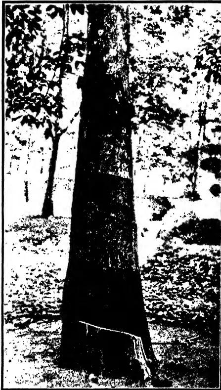A black and white photograph of a tall, straight tree trunk in a forest. The trunk is dark and appears to have been treated or scraped, with a lighter-colored band visible near the base. The background shows other trees and foliage.

Treated tree which has been tapped  
for two years since the renewal  
of the scraped surface.

438------------------------------------------------

439------------------------------------------------

11

## AN INDIRECT METHOD OF MEASURING THE AMOUNT OF FOLIAGE ON DIFFERENT BLOCKS OF TREES.

R. A. TAYLOR, B.SC.,  
PHYSIOLOGICAL BOTANIST,  
RUBBER RESEARCH SCHEME (CEYLON).

**T**HE method to be described has been carried out successfully in estimating the effects of various manures on the foliage cover in rubber and can be used to obtain a measure of the effect produced by spraying or manuring against leaf diseases of rubber.

The amount of shade under the trees is estimated by comparing the depth of tint obtained when pieces of photographic daylight printing paper are exposed for known lengths of time, the depth of tint being inversely proportional to the amount of shade and consequently to the density of the foliage cover.

It is essential that the light should be uniform throughout the period of measurement and that the sun should be overhead. The observations should, therefore, be made between 11.30 a.m. and 12.30 p.m. on a bright cloudless day. To obtain a proper estimate of the average depth of shade the observer should, while making the exposures, keep moving at as uniform a pace as possible through each plot as there are always patches of bright light and dense shade in the plots.

To minimise the effect of possible variations in the different sheets in each package of printing paper it is advisable to make one exposure in each block on the same sheet. To enable this to be done a printing frame 12 ins. by 10 ins. fitted with a sheet of plain glass is used. A well-fitting wooden screen is supplied for this frame and held in position by four catches. In this screen a number of circular holes one inch in diameter are bored and are closed by rubber bath plugs. The printing paper is inserted behind the glass in the usual way.

When an exposure is to be made the plug bearing the number or letter of the block of trees to be tested is removed and the arranged time of exposure measured by a stop watch. The plug is replaced immediately on expiry of the period. Well-fitting plugs are essential for success. When all exposures have been made the printing paper can be fixed in the same way as an ordinary photographic print and a permanent record is obtained.

440------------------------------------------------

12

With Ilford P.O.P. mauve, one minute exposures have been found to be suitable and the following procedure for fixing is recommended:—

<table>
<tbody>
<tr>
<td>Wash in running water</td>
<td>5 minutes</td>
</tr>
<tr>
<td>Fix in 15% hypo</td>
<td>10 ,,</td>
</tr>
<tr>
<td>Wash in running water</td>
<td>2 hours.</td>
</tr>
</tbody>
</table>

To obtain a numerical value for the depth of tint a series of standards has to be prepared. On the frame used by the writer there were 25 holes allowing 25 exposures to be made without the necessity of changing the paper. The frame was laid flat on open ground at 12 noon and one plug removed every two seconds. When the last exposure had been made the frame was covered and taken to the laboratory and the exposed printing paper fixed by the method described above. The tints on this standard sheet were numbered 2-4-6-8, etc., and were used for comparing the tints obtained by exposures made under the trees. It was found that the tints obtained by exposure to direct sunlight were not exactly the same as those obtained under partial shade. For this reason it is preferable to prepare the standard in ordinary light which should be of uniform and constant intensity during the period of the exposure. Periods of longer duration than two seconds should then be employed. The values obtained have no absolute meaning but provided the exposures are carefully made the results obtained would in the writer's opinion be capable of statistical examination.

Fig. 1. shows the printing frame and the perforated screen with the plugs.

Fig. 2A. shows a sample result obtained on 25 blocks of trees and Fig. 2B. a standard sheet for comparison.

Research Laboratories,  
Culloden Estate,  
Neboda, 10-2-29.

441------------------------------------------------

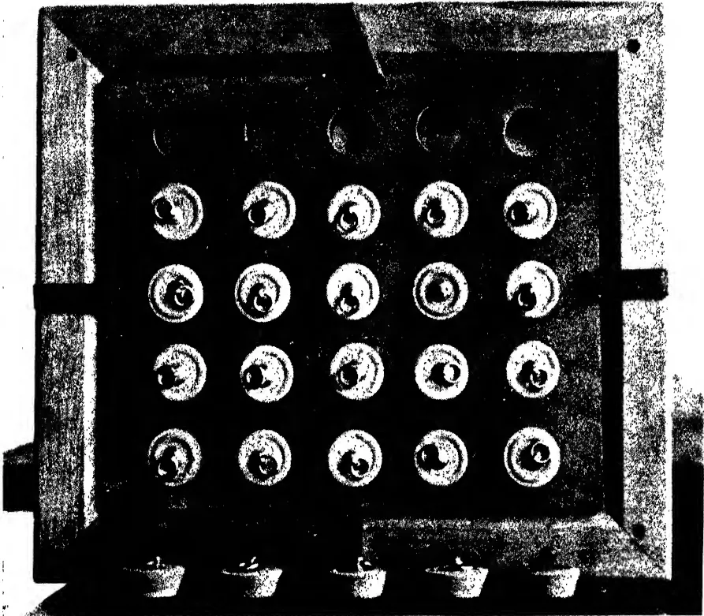A black and white photograph of a mechanical device, likely a cipher machine or cryptographic device. The device is housed in a dark, rectangular frame. The front panel features a grid of 25 circular components, arranged in five rows and five columns. Each circular component has a complex, multi-layered internal structure, possibly representing a rotor or a cipher wheel. Below this grid, there are five small, cylindrical objects, possibly additional wheels or components, positioned in a row. The image is grainy and has a high-contrast, vintage appearance.

Fig. 1.

442------------------------------------------------

443------------------------------------------------

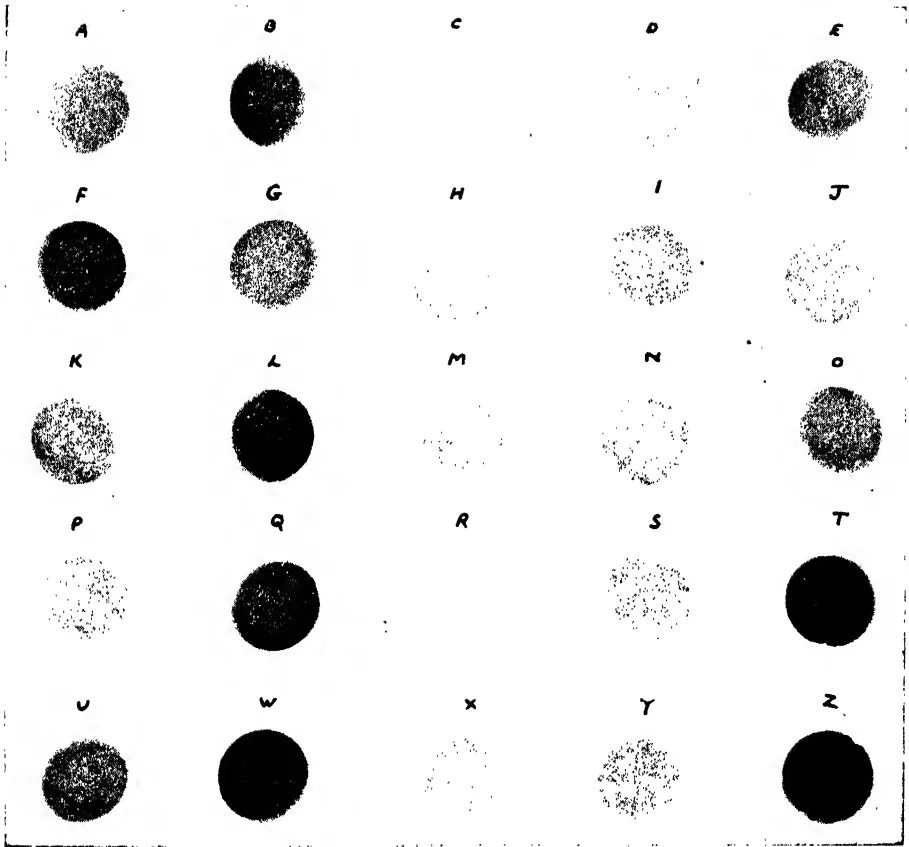

A 5x5 grid of 25 circular ink blot patterns, labeled A through Z. The patterns vary in density and texture, ranging from solid black to very light speckles.

<table border="1"><tr><td>A</td><td>B</td><td>C</td><td>D</td><td>E</td></tr><tr><td></td><td></td><td></td><td></td><td></td></tr><tr><td>F</td><td>G</td><td>H</td><td>I</td><td>J</td></tr><tr><td></td><td></td><td></td><td></td><td></td></tr><tr><td>K</td><td>L</td><td>M</td><td>N</td><td>O</td></tr><tr><td></td><td></td><td></td><td></td><td></td></tr><tr><td>P</td><td>Q</td><td>R</td><td>S</td><td>T</td></tr><tr><td></td><td></td><td></td><td></td><td></td></tr><tr><td>U</td><td>W</td><td>X</td><td>Y</td><td>Z</td></tr><tr><td></td><td></td><td></td><td></td><td></td></tr></table>

Fig. 2 A.

444------------------------------------------------

This image is a blank white page. It contains several small, dark specks which appear to be scanning artifacts or dust particles. There is no text, handwriting, or printed content on the page.

445------------------------------------------------

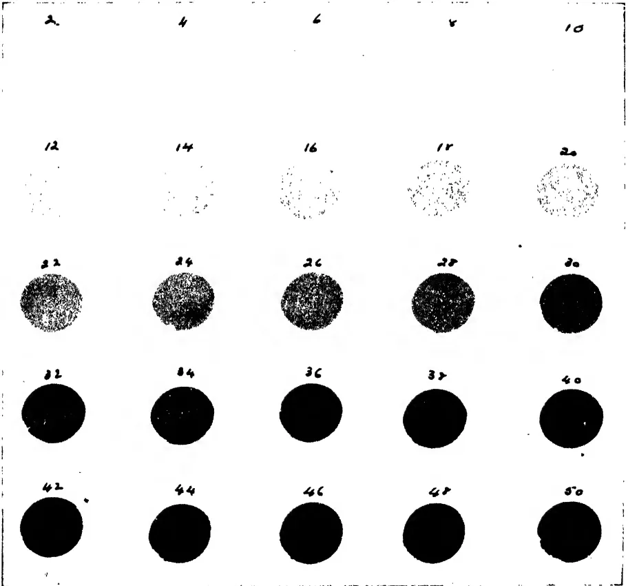

A 5x5 grid of circular patterns, each labeled with a number from 2 to 50. The patterns show a progression from sparse dots to solid black circles.

<table border="1"><thead><tr><th>2</th><th>4</th><th>6</th><th>8</th><th>10</th></tr></thead><tbody><tr><td>12</td><td>14</td><td>16</td><td>18</td><td>20</td></tr><tr><td>22</td><td>24</td><td>26</td><td>28</td><td>30</td></tr><tr><td>32</td><td>34</td><td>36</td><td>38</td><td>40</td></tr><tr><td>42</td><td>44</td><td>46</td><td>48</td><td>50</td></tr></tbody></table>

Fig. 2 B.

446------------------------------------------------

447------------------------------------------------

13

## SELECTED ARTICLES.

### CACAO RESEARCH.

#### RESULTS OF CACAO RESEARCH AT RIVER ESTATE. TRINIDAD.\*

**T**HE Department of Agriculture of Trinidad and Tobago has, for close upon twenty years, been engaged on research into some of the fundamental problems of cacao cultivation. The object of this paper is to give a brief summary of the work and of the results.

#### CONDITIONS OF WORK.

In the first place it is desirable to give some account of the conditions under which the work has been done. The Department has been fortunate in having had, under its charge, River Estate, a property of some 1,500 acres in area of which about 500 acres are now in cacao. It has thus been possible to experiment on an estate scale and under estate conditions. River Estate was not originally intended to be a cacao experiment station or even a model cacao estate. It was purchased for £4,629 by the Government, in 1897, in order to secure the water rights for a pumping station to supply Port-of-Spain. It was then practically an abandoned sugar estate with a small portion in cacao. The Government leased it out, but resumed possession in 1904, paying £1,300 for the surrender of the lease, and charge of the property was entrusted to the old Botanical Department. The cacao crop then was 182 bags. The cultivation was extended under the "contract" system. Men of the labouring class are allotted a few acres each, on which they plant cacao, shade trees, and the usual food crops—bananas, cassava, tannias (*Xanthosoma*) which serve as temporary shade for the young cacao. They live on the produce of these minor crops, supplemented often by earnings as labourers on the estate, and when the cacao trees come into bearing the owner takes over the contract paying at a fixed rate (about one shilling) per bearing tree, and less for younger trees. The owner avoids much capital outlay until there is a crop to be reaped, but the results are not always satisfactory and at River much work has had to be done in bringing bad contracts up to a reasonable standard.

Towards the end of 1908 the present Department of Agriculture, in which the old Botanical Department was merged, was created, and River Estate came under its charge. Until 1920 the estate continued to be worked on an advance account, but in that year its finances were included in the ordinary Department estimates. It has been developed to yielding a cacao crop of 1,319, bags in 1927, the record year. In addition some 500 acres have been re-afforested in valuable timber, 35 acres established in grape fruit and oranges (one to six years), 30 in coffee, 12 in other permanent economic crops. Much attention has also been given to providing better dwellings for labourers, extending estate roads, etc. Interest was not charged on the original advances, but by 1915 the estate had repaid to the Government the capital expenditure, and to date has paid into the Treasury some £2,000 more than it has drawn. The value of the property may now be put at about £35,000, the cost of development having been defrayed by its own earnings.

---

\* By W. G. Freeman, B.Sc., A.R.C.S., Director of Agriculture, Trinidad and Tobago, in *Tropical Agriculture*, Vol. VI, No. 5, May 1929.

448------------------------------------------------

14

## FIRST EXPERIMENTS.

In 1910 a set of manurial experiments was laid out on then conventional lines. Plots of 50 trees each were demarcated in a field of apparently uniform cacao, and manured in various ways, three plots being left as controls. The results as regards manurial treatment need not be discussed now. They are given in a series of reports by J. de Verteuil, the Superintendent of Field Experiments, in the *Bulletin* of the Department from 1912 to 1917. It was soon obvious that the manure applied was a very minor factor in determining the yield of a plot and this unexpected result diverted attention very early to the study of the cacao tree itself. In following up this line of work the Department entered upon a piece of long range research, to use the popular modern term, which has yielded valuable fundamental results and furnished the cacao planter both here and in other countries with the practical means of economically increasing his production.

## THE BEARING CAPACITY OF TREES.

Seeking to find the cause of the unexpected result referred to above, a large number of trees in various fields at River, and on eight other estates in the Colony were labelled and records kept to determine the *natural* yield of plots and individual trees, all unmanured, and under similar cultural treatment in each field. The results were summarized by de Verteuil in a "Report on Estate Experiments, 1910-17." The more important points which were established were the following:—

That the variation in the yields of various plots was due to the relative productiveness of the trees in each plot, and largely dependent on the relative proportion of heavy and poor bearing trees in each plot. That a large proportion of the trees gives less than 13 pods (about 1 lb. of cacao) per annum even in a very favourable year. That other trees are heavy bearers, and that generally speaking heavy bearing trees continue to be heavy bearers, and poor bearing trees continue to be poor bearers.

The task of keeping individual yields was persevered with on a large scale, and records obtained at River for some 14,000 trees over a period of ten years.

In a paper by the writer in 1919 on "Recent Experimental Work on Cacao" detailed figures were given to justify the conclusion that cacao trees can be grouped into heavy, medium and poor bearers, and that generally speaking they maintain these characteristics year after year. Some of the poor bearers are obviously weak or retarded trees, but others are equally as strong and vigorous as the good bearers. Moreover, special cultural and manurial treatment does not produce any fundamental change.

The following records of seven trees in a plot at River, manured for each of seven successive years with a "complete" manure will serve to illustrate this point:—

<table>
<thead>
<tr>
<th>Tree</th>
<th colspan="8">Pods per annum per tree 1911-12 to 1918-19.</th>
</tr>
</thead>
<tbody>
<tr>
<td>A</td>
<td>63</td>
<td>102</td>
<td>81</td>
<td>93</td>
<td>100</td>
<td>135</td>
<td>67</td>
<td>106</td>
</tr>
<tr>
<td>B</td>
<td>91</td>
<td>125</td>
<td>123</td>
<td>206</td>
<td>129</td>
<td>191</td>
<td>60</td>
<td>123</td>
</tr>
<tr>
<td>C</td>
<td>51</td>
<td>50</td>
<td>44</td>
<td>48</td>
<td>78</td>
<td>45</td>
<td>55</td>
<td>41</td>
</tr>
<tr>
<td>D</td>
<td>46</td>
<td>41</td>
<td>44</td>
<td>43</td>
<td>32</td>
<td>32</td>
<td>36</td>
<td>44</td>
</tr>
<tr>
<td>E</td>
<td>23</td>
<td>45</td>
<td>33</td>
<td>31</td>
<td>26</td>
<td>26</td>
<td>17</td>
<td>26</td>
</tr>
<tr>
<td>F</td>
<td>3</td>
<td>6</td>
<td>3</td>
<td>7</td>
<td>5</td>
<td>25</td>
<td>3</td>
<td>21</td>
</tr>
<tr>
<td>G</td>
<td>1</td>
<td>6</td>
<td>26</td>
<td>22</td>
<td>30</td>
<td>12</td>
<td>5</td>
<td>19</td>
</tr>
</tbody>
</table>

There is on the whole an increase in bearing capacity with increase in age, but the poor trees F and G of the two first years are still the poor trees of the last two years, and similarly with the heavy bearers A and B and the medium bearers C, D and E.

449------------------------------------------------

Fig.1.

MEAN YIELD OF BUDDED AND SEEDLING CACAO

![Line graph showing Mean Yield of Budded and Seedling Cacao. The Y-axis is labeled 'PERCENT' and ranges from 0 to 40. The X-axis is labeled 'MEAN NUMBER OF PODS PER TREE TO DATE' and ranges from 0 to 600. Three lines are plotted: a solid line for 'BUDDED', a dashed line for 'SEEDLING', and a dotted line for '4 BEST BUDDED STRAINS'. The 'BUDDED' line peaks at approximately 38% yield at 50 pods per tree. The 'SEEDLING' line peaks at approximately 23% yield at 50 pods per tree. The '4 BEST BUDDED STRAINS' line peaks at approximately 18% yield at 150 pods per tree. All lines show a general downward trend as the number of pods per tree increases beyond their respective peaks.](13857705f08be87fcf8667fffddc9c91_3_img.webp)

<table border="1"><thead><tr><th>Mean Number of Pods per Tree</th><th>Budded (%)</th><th>Seedling (%)</th><th>4 Best Budded Strains (%)</th></tr></thead><tbody><tr><td>0</td><td>8</td><td>15</td><td>5</td></tr><tr><td>50</td><td>38</td><td>23</td><td>10</td></tr><tr><td>100</td><td>25</td><td>20</td><td>12</td></tr><tr><td>150</td><td>18</td><td>15</td><td>18</td></tr><tr><td>200</td><td>10</td><td>10</td><td>12</td></tr><tr><td>250</td><td>8</td><td>9</td><td>11</td></tr><tr><td>300</td><td>6</td><td>7</td><td>8</td></tr><tr><td>350</td><td>4</td><td>5</td><td>5</td></tr><tr><td>400</td><td>3</td><td>4</td><td>4</td></tr><tr><td>450</td><td>3</td><td>4</td><td>4</td></tr><tr><td>500</td><td>3</td><td>4</td><td>4</td></tr><tr><td>550</td><td>3</td><td>3</td><td>3</td></tr><tr><td>600</td><td>3</td><td>3</td><td>3</td></tr></tbody></table>

PERCENT

MEAN NUMBER OF PODS PER TREE TO DATE

1917-18 TO 1926-27

Legend:  
— BUDDED  
- - - SEEDLING  
... 4 BEST BUDDED STRAINS

Fig. 2

<table border="1"><thead><tr><th>Category</th><th>Bags per 1000 Trees</th></tr></thead><tbody><tr><td>GENERAL AVERAGE BUDDED</td><td>12</td></tr><tr><td>GENERAL AVERAGE SEEDLING</td><td>12</td></tr><tr><td>2 BEST BUDDED</td><td>23</td></tr><tr><td>2 BEST SEEDLINGS</td><td>23</td></tr></tbody></table>

BAGS PER 1000 TREES

Legend:  
█ GENERAL AVERAGE BUDDED  
█ GENERAL AVERAGE SEEDLING  
█ 2 BEST BUDDED  
█ 2 BEST SEEDLINGS

Block by Survey Dept. Ceylon 1929.

450------------------------------------------------

Fig. 3.  
**EXPERIMENTS**  
 ON  
**DISTANCE PLANTING**

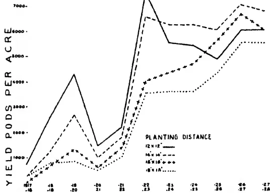

Yield Pods per Acre

PLANTING DISTANCE

- 12 x 12 —
- 16 x 16 - - -
- 18 x 18 - - - -
- 18 x 18.....

<table border="1">
<thead>
<tr>
<th>Year</th>
<th>12 x 12</th>
<th>16 x 16</th>
<th>18 x 18 (solid)</th>
<th>18 x 18 (dotted)</th>
</tr>
</thead>
<tbody>
<tr><td>1917</td><td>500</td><td>200</td><td>100</td><td>50</td></tr>
<tr><td>1918</td><td>1000</td><td>400</td><td>200</td><td>100</td></tr>
<tr><td>1919</td><td>2000</td><td>800</td><td>400</td><td>200</td></tr>
<tr><td>1920</td><td>3500</td><td>1500</td><td>800</td><td>400</td></tr>
<tr><td>1921</td><td>1500</td><td>500</td><td>200</td><td>100</td></tr>
<tr><td>1922</td><td>1000</td><td>300</td><td>100</td><td>50</td></tr>
<tr><td>1923</td><td>7000</td><td>6500</td><td>2500</td><td>1500</td></tr>
<tr><td>1924</td><td>4500</td><td>5500</td><td>3500</td><td>2500</td></tr>
<tr><td>1925</td><td>4000</td><td>5000</td><td>3000</td><td>2000</td></tr>
<tr><td>1926</td><td>3000</td><td>4500</td><td>2500</td><td>1500</td></tr>
<tr><td>1927</td><td>6000</td><td>6500</td><td>4000</td><td>3000</td></tr>
<tr><td>1928</td><td>5500</td><td>6000</td><td>3500</td><td>2500</td></tr>
</tbody>
</table>

Fig. 4.  
 EXPERIMENTS  
 ON  
**DISTANCE PLANTING**-  
 YIELD PER THOUSAND  
 BEARING TREES.

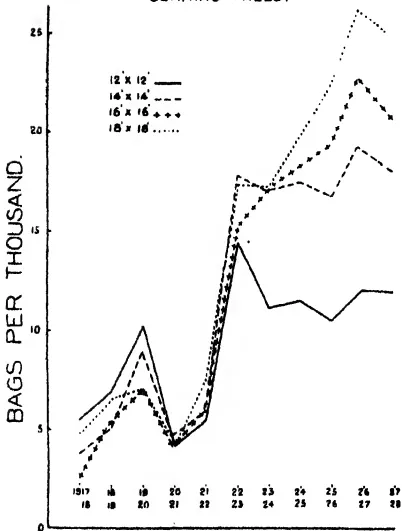

Bags per Thousand

- 12 x 12 —
- 16 x 16 - - -
- 18 x 18 - - - -
- 18 x 18.....

<table border="1">
<thead>
<tr>
<th>Year</th>
<th>12 x 12</th>
<th>16 x 16</th>
<th>18 x 18 (solid)</th>
<th>18 x 18 (dotted)</th>
</tr>
</thead>
<tbody>
<tr><td>1917</td><td>4</td><td>3</td><td>2</td><td>1</td></tr>
<tr><td>1918</td><td>6</td><td>5</td><td>4</td><td>3</td></tr>
<tr><td>1919</td><td>10</td><td>8</td><td>7</td><td>6</td></tr>
<tr><td>1920</td><td>4</td><td>4</td><td>4</td><td>4</td></tr>
<tr><td>1921</td><td>5</td><td>5</td><td>5</td><td>5</td></tr>
<tr><td>1922</td><td>15</td><td>15</td><td>15</td><td>15</td></tr>
<tr><td>1923</td><td>14</td><td>17</td><td>17</td><td>17</td></tr>
<tr><td>1924</td><td>11</td><td>17</td><td>17</td><td>17</td></tr>
<tr><td>1925</td><td>11</td><td>17</td><td>17</td><td>17</td></tr>
<tr><td>1926</td><td>10</td><td>17</td><td>17</td><td>17</td></tr>
<tr><td>1927</td><td>12</td><td>18</td><td>18</td><td>25</td></tr>
<tr><td>1928</td><td>12</td><td>17</td><td>17</td><td>22</td></tr>
</tbody>
</table>

Fig. 5.

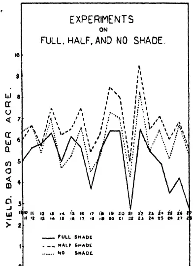

Yield. Bags per Acre.

EXPERIMENTS  
 ON  
 FULL, HALF, AND NO SHADE.

- FULL SHADE —
- HALF SHADE - - -
- NO SHADE.....

<table border="1">
<thead>
<tr>
<th>Year</th>
<th>Full Shade</th>
<th>Half Shade</th>
<th>No Shade</th>
</tr>
</thead>
<tbody>
<tr><td>1917</td><td>5</td><td>5</td><td>5</td></tr>
<tr><td>1918</td><td>6</td><td>6</td><td>6</td></tr>
<tr><td>1919</td><td>6</td><td>6</td><td>6</td></tr>
<tr><td>1920</td><td>4</td><td>4</td><td>4</td></tr>
<tr><td>1921</td><td>5</td><td>5</td><td>5</td></tr>
<tr><td>1922</td><td>6</td><td>6</td><td>6</td></tr>
<tr><td>1923</td><td>5</td><td>5</td><td>5</td></tr>
<tr><td>1924</td><td>6</td><td>6</td><td>6</td></tr>
<tr><td>1925</td><td>5</td><td>5</td><td>5</td></tr>
<tr><td>1926</td><td>6</td><td>6</td><td>6</td></tr>
<tr><td>1927</td><td>5</td><td>5</td><td>5</td></tr>
<tr><td>1928</td><td>6</td><td>6</td><td>6</td></tr>
</tbody>
</table>

Black by Survey Dept. Caylon 1929

451------------------------------------------------

15

Concurrently with these investigations, data were collected to determine the proportion of poor bearers which normally occurred on cacao estates in the Colony. In a report for 1913-14, de Verteuil gave the following analysis of trees in a field at River Estate from three years' records:—

<table>
<thead>
<tr>
<th>Yield per annum</th>
<th>Per cent.</th>
</tr>
</thead>
<tbody>
<tr>
<td>0—12 pods</td>
<td>23</td>
</tr>
<tr>
<td>13—25 ,,</td>
<td>20</td>
</tr>
<tr>
<td>26—50 ,,</td>
<td>30·4</td>
</tr>
<tr>
<td>51—75 ,,</td>
<td>15·9</td>
</tr>
<tr>
<td>76—100 ,,</td>
<td>6·0</td>
</tr>
<tr>
<td>over 100 ,,</td>
<td>4·7</td>
</tr>
</tbody>
</table>

Two years later he supplemented this by records from three years' observations on three private estates in Trinidad and one in Tobago. For the two lower groups these showed:—

<table>
<thead>
<tr>
<th rowspan="2"></th>
<th colspan="2">Trees Bearing.</th>
</tr>
<tr>
<th>0-12 pods Per cent.</th>
<th>13-25 pods Per cent.</th>
</tr>
</thead>
<tbody>
<tr>
<td>Estate A</td>
<td>51·8</td>
<td>22·0</td>
</tr>
<tr>
<td>„ B</td>
<td>40·8</td>
<td>21·6</td>
</tr>
<tr>
<td>„ C</td>
<td>31·1</td>
<td>20·6</td>
</tr>
<tr>
<td>„ D</td>
<td>12·6</td>
<td>17·0</td>
</tr>
</tbody>
</table>

Estate D, Roxburgh, Tobago, stands out prominently. The owner had planted most of his trees himself from carefully selected seed. The other estates give the results of ordinary contract planting.

The data show the presence on estates in the Colony of anything from 20 to 50 per cent. of very poor bearers, yielding not more than 1 lb. of cacao each, and about another 20 per cent. giving below 2 lb. each. These figures are sufficient to account in great measure for the poor yields per acre so commonly obtained.

### REPLACEMENT OF THE POOR BEARER.

Having established that there are natural heavy and poor bearing cacao trees, and that a large proportion of the latter are normally present on cacao estates, the question naturally arose as to how this condition of affairs could be improved. In the crop year of 1919-20 all the trees in a block of 3,000 in field 2 at River Estate, which had a lower average than 18 pods per annum were removed and replaced by seedlings or budded plants from known heavy bearers. In 1924-25 the plants used for replacement began to come into bearing. Taking as an example seven of the best developed of these seedlings, they gave last season 26 lb. of dry cacao, in place of only 3 lb., the average yield for seven years of the poor bearers they have replaced. In other words with a very moderate expenditure and the loss of an almost negligible crop for five years, the yield of a group of trees has been multiplied nearly nine times. Such work carried out on a large scale would have a very marked effect on the cacao production of the Colony. It is of importance to stress the fact that it is quite practicable because the opposite view has quite recently been expressed by C. A. Barber who, in discussing this problem of the poor bearer, says: "The evil is very difficult to remedy, for one cannot replant; it is idle to expect a seedling to survive when surrounded by a plantation of mature trees . . . The only possible way of improving these poor bearers would appear to be by grafting: they cannot be simply cut out, because of the injurious influence of the sun on the soil and of the wind on the other trees."

452------------------------------------------------

16

## IS HEAVY BEARING HEREDITARY?

When experimental work to test the practicability of successfully replacing the poor bearer was started there were no data available to show whether heavy bearing was an hereditary quality or not. It was assumed on general grounds that it would be of advantage to use the progeny of selected heavy bearers, and on this same assumption all the plants sold to planters by the Department have been raised from heavy bearers. There was also the possibility that to secure the transmission of heavy bearing qualities it might be necessary to resort to means of vegetative propagation. The method in vogue for cacao was inarching or grafting by approach, which was too expensive for work on a large scale. The budding of cacao had been accomplished but had not reached the stage of an economic proposition for estate purposes. In 1913 the writer initiated Departmental work to test the practical possibilities of the method, with successful results through the efforts of J. C. Augustus, and J. de Verteuil as described in 1914 and 1916. In 1914 an experiment was started at River Estate to test the comparative value of the progeny—seedlings, budded plants, and grafted plants—from 28 selected heavy bearing trees.

Six plots of one acre each—280 trees to the acre, planted 12 feet by 12 feet were laid out with ten plants in each from each of the 28 selected parents, the progeny of each parent occupying a similar position in each plot. Two plots contained seedlings, one acre with permanent shade trees and one without. Three plots contained budded plants, two acres with shade and one without. One plot was of grafted plants with shade.

The trees began to bear in 1917-18 and since then the number of pods borne by each tree has been recorded. In 1924 S. C. Harland, then Professor of Botany at the Imperial College of Tropical Agriculture, wrote a brief paper summarizing the conclusions which could be drawn from the data then available. Last year he kindly analysed the results to the end of the crop year 1927-28.

In figure 1 Harland shows the mean yield of the budded and seedling plants during the whole fruiting period, and in figure 2 the mean results for the last two crops of the general average of the budded and seedling plots, and of the budded and seedling progeny, from the two best parent trees in each series.

The general conclusions at which he arrives are indicated by the following quotations:—

"A heavy bearing tree may transmit heavy yield to its budded offspring. On the other hand it may absolutely fail to transmit and may give rise to trees which are much worse than the average. There is no method of telling whether a tree will transmit heavy yield either to its budded or seedling offspring except by testing it."

"It has been shown at River Estate that it is possible to use supplies to replace poor yielders on estates provided that the supplies are of fair size when they are put in. It is recommended that the following types be concentrated on:—

Budded Nos. 1480 and 2190.  
Seedlings Nos. 407 and 969.

"These may confidently be expected to give an increase over ordinary trees of more than 60 per cent."

Work on similar lines was initiated by the Gold Coast Department of Agriculture in 1914, and a summary of the results obtained so far recently appeared. The occurrence of trees which are consistently high bearers has been ascertained, and it is stated that "the next step is the propagation of

453------------------------------------------------

17

progeny of the selected plants and their careful trial by the Department. It should not be forgotten that the high yields of these plants may not be inherent, but may be due to specially favourable situations in the field, and *that trial of the second generation is therefore necessary.*"

The results of this trial will be awaited with interest. Meanwhile, for the first time in the history of cacao, so far as the writer is aware, the planters in Trinidad and Tobago have available for their use trees which have been proved to transmit to their progeny their own heavy bearing qualities.

Many thousand seedlings raised from the best bearing trees at River, have been sold to estates in the Colony. The mode of selection has been modified with increasing knowledge.

At first there were no data at all of the yield of the parent trees. These plants were propagated only from known heavy bearers. Now the stage has been reached of being able to propagate from heavy bearers known to be good transmitters of this important characteristic.

### THE SPACING OF TREES OR PLANTING DISTANCE.

Another question to which a definite answer is necessary in helping to solve the problem of how to get the most cacao from a given area of land, is: What is the best planting distance? In Trinidad the most common spacing is 12 feet by 12 feet, although wider spacing is not infrequent. To put the matter to a test, four plots of one acre each were planted in 1913-14 at River Estate at respectively 12 feet by 12 feet, 14 feet by 14 feet, 16 feet by 16 feet and 18 feet by 18 feet. Records have been kept of the yield of each tree. The graph in figure 3 shows the yields of the four plots from the first bearing in 1917-18 to the close of the crop season of 1927-28, expressed as pods per acre. Division by 1,815 (11 pods to 1 lb. of cacao in this case, and 165 lb. to the bag) will convert the yields into bags per acre. It will be seen that for six years the 12 feet by 12 feet plot gave the greatest yield, followed by the others in order. The following year the 14 feet by 14 feet plot took first place which it still retains, and two years later the 16 feet by 16 feet plot also passed the 12 feet by 12 feet. In 1927-28 the 16 feet by 16 feet had a setback for some unknown reason.

For the year 1927-28 the yields per acre were:—

<table>
<thead>
<tr>
<th>Planting Distance.</th>
<th>...</th>
<th>...</th>
<th>Bags per Acre.</th>
</tr>
</thead>
<tbody>
<tr>
<td>12 feet by 12 feet</td>
<td>...</td>
<td>...</td>
<td>3·3</td>
</tr>
<tr>
<td>14 feet by 14 feet</td>
<td>...</td>
<td>...</td>
<td>3·7</td>
</tr>
<tr>
<td>16 feet by 16 feet</td>
<td>...</td>
<td>...</td>
<td>3·3</td>
</tr>
<tr>
<td>18 feet by 18 feet</td>
<td>...</td>
<td>...</td>
<td>3·0</td>
</tr>
</tbody>
</table>

For the period of eleven years since bearing commenced the total yields have been:—

<table>
<thead>
<tr>
<th>Planting Distance.</th>
<th>...</th>
<th>...</th>
<th>Total yield 11 years. Bags.</th>
</tr>
</thead>
<tbody>
<tr>
<td>12 feet by 12 feet</td>
<td>...</td>
<td>...</td>
<td>25·5</td>
</tr>
<tr>
<td>14 feet by 14 feet</td>
<td>...</td>
<td>...</td>
<td>25·5</td>
</tr>
<tr>
<td>16 feet by 16 feet</td>
<td>...</td>
<td>...</td>
<td>19·4</td>
</tr>
<tr>
<td>18 feet by 18 feet</td>
<td>...</td>
<td>...</td>
<td>16·1</td>
</tr>
</tbody>
</table>

The 14 feet by 14 feet plot although at first surpassed by the 12 feet by 12 feet is now giving more cacao per acre, and has also given just as much during the total period of eleven years. In figure 4 the results are presented per 1,000 bearing trees, from which it is seen that whilst for a very few years the more closely planted trees yield the most, this advantage is soon lost. Since 1922-23 the 12 feet by 12 feet plot has declined, the

454------------------------------------------------

18

14 feet by 14 feet plot has made but little progress, whilst both the 16 feet by 16 feet and the 18 feet by 18 feet have continued to advance, disregarding the probably temporary drop in 1927-28 which was a comparatively poor crop year throughout the estate.

The experiment has not been continued long enough to justify definite conclusions but having regard to the appearance of the wider planted trees, and their continued development in size and bearing capacity, it seems probable that after a few more years the maximum yield per acre will be given by the 16 feet by 16 feet or possibly the 18 feet by 18 feet trees. Should this prove to be the case, wide planting can be advocated because 10 or 15 years is a very short period in the life of a cacao tree. It does not follow that there need necessarily be any loss of revenue during these years that the wider planted cacao is giving less per acre, because coffee could probably be grown successfully as a catch crop and allowed to remain until it is gradually smothered out as the cacao trees develop.

### THE QUESTION OF SHADE.

When a new plantation of cacao is being established, banana, cassava, &c., are used to give protection to the young plants. These are usually called "minor" or "ground shade" and are universally regarded as essential. In addition certain trees are frequently planted at regular intervals to serve as permanent shade trees to the mature cacao. The majority of the trees so used are leguminous, species of *Erythrina*, *Glicidia*, &c., and the selection of these particular trees was made very early in the history of cacao cultivation. The question of shade, i.e., permanent shade, has long been a controversial one, and the advocates of diametrically opposed views have no difficulty in finding ample data to support their respective cases. One thing seems certain. The effects of varying degrees of shade are not directly due to variations in the amount of sunlight to which the cacao trees are subjected. Shade trees act partly as overhead wind breaks and their effect in this particular can be compensated for in other ways. The degree of shade also apparently has a direct influence in determining humidity and in consequence the incidence of certain diseases such as black pod due to *Phytophthora Faberi*.

Shade trees which usually have a vigorous and far-reaching root system compete with the cacao trees for available plant food and also water. The problem is a complex one in which it is difficult to separate the various factors. In order to endeavour to obtain some actual facts of the effects of growing cacao under varying degrees of shade under the conditions at River Estate, experiments were started in 1910. In one of these three adjacent blocks of cacao in one field were marked out. Each block contained 500 trees planted 15 feet by 15 feet, i.e., a little over two acres, of cacao then about 40 years old. In one block all the shade trees and in another half the shade trees were removed, while the third was left undisturbed. These blocks are described as No Shade, Half Shade and Full Shade. Until three years ago when some manurial experiments were initiated in each of these blocks, they received no special cultural or other treatment, and what they have received since then has been identical in each block. The pod records have been kept for each tree since 1910, and the total yield in bags per acre computed from these. The results for the period 1910-11 to 1927-28 are shown in figure 5.

The Full Shade in 1910-11 had a yield of 5.1 bags per acre; has ranged between 2.6 and 6.6 bags, and shows an average over the 18 years of 5.06 bags. The Half Shade began in 1910-11 with a yield of 6.0 bags; has ranged between 4.9 and 9.5 and given an average yield of 6.7 bags. The No Shade, started in 1910-11 with 6.4 bags; has ranged between 4.3 and 8.2 and given an average of 5.96 bags.

455------------------------------------------------

19

The Half Shade cacao throughout the experiment appears to exhibit greater adaptability to varying seasonal conditions particularly as compared with the Full Shade. Its crops reach a higher level in the good years and do not sink so low in the bad years. The No Shade keeps fairly consistently an intermediate position. The Fully Shaded cacao usually has a short cropping period, from about November to January, the worst months for black pod disease. In the Half and No Shade cacao the crop is more prolonged, and the incidence of black pod is lower. In the figures used for the graph the performance of the Full Shade is flattened, because pod records have been kept, and mature black pods thus included, although of course they have been gathered to be handled separately and produce a cacao of lower commercial quality which is disposed of for local purposes at a low price.

The general conclusions which have been drawn from this experiment are that the lightly shaded cacao gives the greatest yield per acre, that the crop is borne through a longer fruiting season which makes it easier to handle and both lightly shaded and no shade cacao have a much lower incidence of black pod disease.

Similar results have been obtained over larger areas at River Estate where shade has been gradually reduced and where necessary protection from wind provided by planting mahogany trees along the tracts between the cacao fields. Work on these lines forms part of the general practice and advice of the Department, due regard being paid to local conditions.

#### TILLAGE AND MANURING.

It would extend this article unduly to enter into a detailed discussion of methods of tillage and manuring. The work at River started with manurial experiments and in the reports by de Verteuil already referred to it will be found that in very few cases were the results financially profitable. More attention was then given to tillage and, passing through a stage of ordinary forking, L. Seheult, Superintendent of River and Cacao Agronomist, devised a system of trenching. Continuous shallow trenches, about 2 feet wide and 16 to 18 inches deep are dug midway between every row, or every other row of cacao trees. In heavy soils their ends open into the main drains to avoid any possibility of water-logging. The trenches are filled up with the cut-up portions of shade trees removed, weedings, hedge trimmings, etc., then a dressing of pen manure, 15 to 20 tons to the acre if obtainable, and finally covered with the earth removed in making the trench, so that the result is a series of raised mounds which gradually sink to the original level. The programme is to do this work field by field, about once every five years. The results have been uniformly good, as shown not only by increased crops, but in increased resistance to the attacks of such a pest as thrips, to diseases such as Algal disease (*Cephaleuros Mycoidea*), etc. The beneficial results are in many cases immediate and striking and they are also lasting.

There is in the minds of many planters a strong prejudice against any disturbance of the roots of the cacao tree, and even quite recently the same view has been expressed in publications by scientific writers, without, however, the presentation of any supporting data. In practice at River Estate the bad results hypothesized by these planters and writers have not occurred, and there is also the experience of Grenada where intensive cultivation, including thorough forking, and the digging of pits which entail root pruning has long been practised with very satisfactory results.

The objects to be aimed at in cacao cultivation are apparently sufficient drainage, tillage and incorporation of organic matter to permit better aeration of the soil, make more uniform its water holding capacity, and

456------------------------------------------------

20

encourage a deeper root system. By these means the health and vigour of the trees are increased, resulting in great crops both directly and indirectly by greater resistance to some of the principal diseases and pests.

### SUMMARY.

In this brief account of some of the principal lines of work which have been prosecuted at River Estate for now close upon twenty years, it will be recognised that the main objective has been increased production per acre. At first this was doubtless the case although not definitely expressed.

In 1919 in giving a summary of the work to the Agricultural Society at River the writer pointed out that the experiments on cacao could be made with two objects in view:—

- “(1) To improve the quality of the product.
- (2) To increase the quantity of the produce from a given area of land.”

In 1923 at a similar meeting held during the period of unremunerative prices due largely to the competition of cheap supplies from other sources, I put the position in these words:—

“To enter into successful competition two courses seem open:

- (1) To produce cacao of a quality for which manufacturers are prepared to pay a higher price.
- (2) To increase our profit by producing larger crops on the same acreage and reducing cost of production.”

Again in 1928 dealing with the same question, the difficulty of making a fundamental change in quality was pointed out. Cacao is not a short period crop like wheat, cotton or sugar-cane in which one variety can be replaced by another. It is a long period crop and a large area under mature cacao represents heavy capital expenditure. Even the utilization of a choicer variety for new plantings on an estate would mean but little improvement, as the produce of an estate is in practice bulked. It would be very difficult to cure and market one portion separately, as can be done with a particular variety say of citrus or mango.

In practice, therefore, the owner of an established cacao property is restricted to making the best of such cacao as he has. He can improve quality within certain limits by picking only ripe pods, fermenting properly, taking care that the cacao is well dried, and graded, but he cannot by any wave of a wand produce a Criollo cacao from Forastero.

Work has been done at River and elsewhere in converting trees by budding. Basal suckers are desirable and suitable ones are not always easy to obtain. In any case it entails the loss of the crop from the existing trees and so is usually not within the means of the planter unless he has other sources of subsistence.

This being the case his efforts must primarily be directed to increasing his production at the lowest possible cost, and maintaining as high a standard of quality as is practicable for the variety of cacao he has under cultivation. The work at River has demonstrated some ways in which this can be done. It has proved the existence of natural good and bad bearers, that there are large numbers of the latter on all estates, also that heavy bearers can be selected which transmit their heavy bearing characteristics to their progeny, and that these can be used for new plantings or the replacement of poor bearers with profitable results. The results of the distance planting experiments indicate that an alteration in the conventional distance, so far as Trinidad is concerned, may also lead to a larger production per acre. Similarly, the work on shade requirements and cultural treatment point to the same conclusion, not only as regards an actual increase in crop but by minimizing the losses due to some of the principal diseases and pests.

457------------------------------------------------

21

## TROPICAL AGRICULTURAL RESEARCH.\*

### A PLEA FOR MODERN INDUSTRIAL METHODS.

**T**ROPICAL agriculture differs from agriculture as it is practised in temperate climates in general and in England in particular in so many respects that the farmer brought up to the latter conditions is compelled to adjust himself to a new orientation when he turns to the former. This difference lies not merely in the practice of agriculture through differences of crop and through differences in the response of the soil to treatment under the very different conditions of temperature and rainfall; it lies equally in the economics of management and production. Diverse as the tropical land systems are, they have nowhere assumed that intricacy which is characteristic of such countries as England and is the product of centuries of legal precedent. Both the practice and economics of tropical agriculture are, relatively, in a state of flux and capable of being moulded in directions favourable to production. In this lies its opportunity for it may be moulded in a manner English agriculture cannot owing to the rigidity which age has imparted to the system, to take full advantage of the newer teachings of science and economics which are of recent growth and the outcome of research.

### ORGANISATION OF RESEARCH.

The importance of research in its application to agriculture in general, including tropical agriculture, has not lacked recognition. The output is, in fact, so great that difficulty is experienced in keeping in touch with it in all its latest developments. But it may be questioned whether use of this output is being made to the full. The reasons are various; on the one hand, the development of the tropics has been largely the work of business men and financiers to whom the more kindly conditions have readily yielded a rich harvest. Profits to those early in the field have been generous, as they were to the early industrialists, and the need for the refinements which follow the application of technical knowledge was not patent. But there is the same tightening up in process, both in tropical agriculture and in industry. The exhaustion of virgin soils combined with increasing competition is gradually demanding greater technical skill on the part of the producer, and a change is in process which is only brought about by economic pressure. On the other hand, control of research has tended to concentrate in the hands of bodies which have not the direct personal incentive of the producer as their driving force. Chief of these bodies are endowed institutes, government departments and research associations. Even in the latter, in which the personal interest is more direct than in other forms, there is not that intimate association with practice which exists in the research department of a business unit. Both conditions tend towards a divorce between practice and research, to the detriment of both: and this tendency is emphasised by the very human desire, on the part of the producer, to leave alone a subject of which he understands little, and, on the part of the research worker, to follow up those lines of work which interest him most, lines which, in the majority of cases, lead him to the more general aspect of a problem, and away from the more special aspect. In both cases it is the conditions, rather than the

\* By H. Martin Leake, Sc.D., F.L.S., in *Empire Production and Export*, March and April, 1929.

458------------------------------------------------

22

individual, which are at fault, and it is in the conditions that a remedy must be sought if research and practice are to pull their full weight in harness together.

### THE INDUSTRIAL ANALOGY.

Tropical agriculture is faced with no new problem, and if, in what follows, attention is mainly directed to modern industrial methods, rather than to those of modern English agriculture, for a precedent and for a study of the conditions under which research and practice will go best in harness together, it is because British industry is solving the same problem in a way British agriculture, owing to the economic trammels which its history has wound about it, cannot. Industrial research, that is research with the express object of serving an utilitarian purpose, as opposed to pure research from which utilitarian results of supreme importance have arisen but in a fortuitous manner, as a recognised and vital component of industrial organisation, is of comparatively recent origin, a matter of little more than the last quarter of a century. Its history is well known and its experience readily accessible, lying as it does within the memory of the present generation. It owes its present recognition to the same forces that are now beginning to make themselves felt in tropical agriculture. Economic pressure, the result of competition under the more stabilised conditions established after the first flood of industrial revolution had spent itself, has demanded greater efficiency as the price of success. And the key to greater efficiency has been found in the better understanding of the principles underlying production.

The crux of the economic problem underlying the organisation of industrial research is finance. While the importance of research to industry is beyond argument, for modern civilisation is in being only as the result of research, the uncertainty attaching to the conclusion of any work directed to the solution of a set problem is well recognised. Research requires the financial methods of insurance, for the wider the net is cast, the greater the chance of gathering in the fishes. The set problem may be to catch a sprat, but the bag may be a whale, sometimes even a bit of drift wood. It is not, therefore, the plaything of the small industrial organisation with strictly limited financial resources.

### PRESENT POSITION OF RESEARCH.

In the past industrial research has been conducted by means of endowments, a method more widely used in the domain of pure research and education; by Government agency; by trade associations, subsidised or not by Government, or by departments within the industrial unit or company. These are named in the approximate ascending order of degree in which control is vested in the hands of those who will derive benefit from the results obtained. The more indirect this control, the greater will be the scope for play of those forces which tend to a divorce between research and practice, and which have been outlined above. Undoubtedly, the most economic form of industrial research is that which is conducted by the unit of industrialisation, the company. But this conclusion carries with it certain corollaries. It has been noted that research, by its very nature, involves financial methods suited to insurance; involves, that is, large units. It is noteworthy that Lord Melchett, in a recent exposition of the process of rationalisation, includes this positively among the benefits "for the larger company can afford to risk an amount to meet unforeseen obstacles which would bankrupt an ordinary business." And what is research but organised meeting, often in advance—to use an Irishism—of unforeseen obstacles? Rationalisation on these grounds alone, as distinct from its further, and, perhaps primary objects, the better correlation of supply and demand, appears justified, and the only manner in which the economic pressure of competition can be met.

459------------------------------------------------

23

Research associations organised on a trade basis have received much encouragement and support from Government since the War. They may be considered an adequate means of financing research; their efficiency in achieving the objects for which they were instituted is a separate consideration. They have been in operation for a period sufficient for opinions on their utility to crystallise. Here is the conclusion of the chairman of one of these research institutes:—

A closer alliance between science and technology was needed if progress was to be made in the mills. Accordingly, the organisation committee had agreed to release some of the younger trained staff for service in the industry if any of the members applied for such assistance. There was the more necessity for the introduction of a larger number of scientifically trained men in the mills because it was unlikely that future discoveries could be brought to the point of economic production in the institute which could only point the way and do the laboratory work.

### WIDER YET CLOSER CONTROL.

There is here no questioning the value of the work of the institute, but there is a very distinct opinion that the conversion of that work into mill practice falls short of what the effort might and would yield under more favourable conditions. It is a recognition that the conditions of a research institute do not fully counteract the inevitable tendency for research and practice to drift apart. He too turns to rationalisation as the cure for this tendency, for he says:—

Yet I am convinced that for the rapid development of the industry larger and larger groups are necessary, if for no other reason than they could employ men of scientific training.

It is hoped that there is nothing in what has been written above which can, or will, be taken to belittle the work of the research associations, or, in fact, of any institutions engaged in research however they may be organised. They are serving an invaluable purpose, both in the work they are doing and, perhaps as important, in building up a body of scientific men trained in an industrial outlook. But there is still a long way to travel before research finds that niche in the industrial organisation in which its capacity to solve the problems with which industry is faced can be most effectively employed. It is as a factor within the large industrial organisation that results from rationalisation, and not as a distinct unit only loosely bound to the industrial machine, that research will find its fullest scope.

### PAST THE PIONEER STAGE.

The history of tropical agriculture offers many points of similarity with the history of industrial development. If that history covers centuries in both cases as in the plantations of the West Indian Islands and in the early industrial companies in England, industrial development has forged ahead in its later development. The change dates from the industrial revolution, in full flood a century ago, in the one case; in the other, it is a matter of little more than a quarter of a century. The enormous expansion in tropical production which has taken place in this period, till production in many cases at times exceeds demand, has led to competition with an associated fall of prices which compels close scrutiny of the costs of production and the adoption of the latest improvements. Tropical agriculture is passing through the same phases as those through which industry has passed, and it has reached the stage when the prize no longer falls to the first in the field, but to the best mounted. History is, in fact, repeating itself. As with industry, rule-of-thumb is no longer a sufficient guide and research finds its place as a guiding factor for improvement.

460------------------------------------------------

24

Thus far the proposition has received general recognition. All tropical colonies and dependencies have devoted considerable energy to the study by research of the problems of production. And when the means by which financial provision is made are considered the same methods are found; endowment, Government agency, research associations and research departments within the business unit or company. In recent years there has been a tendency for a fifth agent to arise, the consumer or provider of agricultural essentials has entered the lists. But it is in the relative amount of energy contributed by these various agencies that the main difference lies, for the preponderating share is provided by government. Thus the major activities of research are carried out under conditions which, from their very nature, tend to divorce practice from theory. They are not the conditions under which the maximum will accrue from a given effort.

### RATIONALISATION.

This is the stage at which the employment of research in tropical agriculture has arrived, and, large as have been the results obtained, it cannot be said that research has won for itself an undisputed field; the difficulty experienced in securing the necessary financial provision for research undertakings is sufficient indication that this is so. If industrial research has a long road to travel, it has at least established a secure position for itself. May not tropical agriculture, in following the same path, learn something from that experience? And that lesson lies in the recognition that, unless closely linked together as they will be within the business unit, research and practice will inevitably lie apart. Rationalisation of tropical agriculture must follow, if only to secure this advantage.

It will be well to follow up the implications of this conclusion. Agriculture, if the cattle industry be omitted, is the production of economic plants, and it is concerned with the relationship between these in all their variety and the soil and climate in all their different aspects. One of the first lessons the agriculturist learns is the need of rotations, the undesirability, even in cases the impossibility, of growing one crop continuously. Yet on what basis is tropical agriculture usually organised? It is a basis of a single crop. Even where the business unit is large and the produce of more than one crop handled, it will frequently be found that the crops themselves are localised and in no sense serve the function of rotation to each other. A condition where eighty, or even ninety, per cent. of the cropped area is under a single crop, leaving only a mere fraction for other rotational crops and fallows, is fundamentally unsound. It is unsound agriculturally, and it is unsound economically. Superimposed on the trade cycles which form a recognised feature of industry, and which are equally apparent in agriculture, are the seasonal influences which are largely beyond the control of the farmer and planter. Inordinate fluctuations consequently characterise the balance sheets of a concern based on a single crop.

But the matter does not end here. Many of the problems underlying plant growth are common to all crops; the problems concerning any particular crop are frequently specialised cases of more general problems. Much of the work affecting a particular crop has an application of a much wider bearing. Efficiency, or the economic employment, of research demands that the field over which it ranges shall not be too restricted or the aim too closely defined. Only with a wide field will the results find their appropriate application. Both demands arise from the similarity existing between research and insurance, of which the essence is that the net shall be cast wide.

461------------------------------------------------

25

## ATTRACTING AND USE OF PERSONNEL.

To anyone with experience of tropical agriculture another aspect will occur, that of personnel. No one can be but struck with the paucity of trained research officers in the employ of private companies interested in tropical agriculture. Looked at from the point of view of the student who has to think of his future, the openings offering appear to offer little prospect; little in the present, for the pay of such posts as are available is rarely attractive, and little in the future for advancement. Even the more secure field of research under government has proved none too successful either in attracting the best men or in building up a contented service, for the recent schemes contemplate, besides an improvement in prospects to hold men in the service, a system of probationary studentships to attract men to the service. Research has, in fact, ceased to be mainly a hobby for those to whom material success in this world offers less attraction than the puzzling out of the conundrums of nature. Economic research has become a profession, and if it is to attract the best brains these must be drawn away from competitive fields of labour by the accepted business method of attractive conditions. And this is what a rationalised industry can do. It is one of the advantages that Lord Melchett claims for rationalisation that a large scale organisation can attract the best brains: It is true the army of experienced men is small at present; supply is regulated by demand and demand, in the past, has been fickle. But this need not be so. There is no room for argument as to which came first, the fowl or the egg. The fowl, in the shape of demand, must come first; the egg will certainly follow.

## CONTRASTS WITH INDUSTRIAL SYSTEM.

Rationalisation is the one means of weaving research into the web of tropical development under those favourable conditions on which it depends for success, a sufficiently wide field, a close contact with practice and a sufficiently attractive reward for service. But it will differ from rationalisation as understood in industry in more than one respect. A rationalised unit will deal with a wide range of products for, unlike much industry, sound agriculture demands variety, the variety given by rotations. It will cover many countries for climate is a local phenomenon and an adverse season will affect adversely to a greater or less extent all production in the locality. So may, to quote Lord Melchett again, "the success of one section be used to finance another section." Any business subject to large vicissitudes is compelled to cut its cloth, in the matter of fixed charges, to the period of depression, and the provision for research, once made, becomes a fixed charge. The holding company, with subsidiaries embracing interests in a wide variety of products, and with a range extended over the globe offers the most favourable conditions for research and, because returns will be equalised, the surest means of financing such work.

## RESEARCH IN THE SUGAR INDUSTRY.

A review of research in tropical agriculture as now conducted would seem to point to the same conclusion. Research is, perhaps, most highly organized in the sugar industry; it may even be claimed that it has gone so far that stabilisation has set in. But it will be noted that within this industry it is in the factory, where the problems are of an industrial nature that this progress has been made. Within any modern factory differences of a fraction of a per cent. in the recovery of sugar are the subject of close enquiry. Differences of 50, 100 and even higher per cent. are common in the field, but do not call for the same close enquiry. They are past and cannot be remedied. They are the seasonal response; but the exact nature of that response with a view to future adjustment, by artificial means, of the conditions to the optimum is not always closely followed up. Research

462------------------------------------------------

26

may point out the direction in which the adjustment is to be made, but the problems are so local that it can lay down no rule-of-thumb method universally applicable. The closest co-ordination between research and practice is required to ensure success.

And mention of the sugar industry calls to mind the Dutch work in Java. Here the agricultural side has been intensively studied, and by an organisation which approximates to a research association. Here appears at first sight a contradiction of the conclusion reached above. But the Javan conditions are peculiar. In the first place the system of land tenure ensures adequate rotation; in the second, the Javan sugar industry is conducted on intensive lines over a relatively small and uniform area very different to the extensive system commonly found in the tropical areas of the British Empire. The success achieved in Java undoubtedly shows what may be accomplished by a research association under the most favourable conditions; it affords no real proof that a similar organisation will bear like fruit under very different conditions. There are very strong reasons for doubting the correctness of any such conclusion.

For the reasons adduced organised progress in tropical agricultural production seems to demand a general broadening of the basal commercial unit "if only for no other reason than that they could employ men of scientific training," or, in other words, carry the charge of a well-equipped research section. It may appear to many that such a development will lead to redundancy, that the present research stations sufficiently cover the ground. To others, and especially to those who are associated with, or working in, existing institutions, the development may appear dangerous as likely to restrict still further the already exiguous financial resources. Neither fear would appear to be well founded.

### GOVERNMENT SERVICES.

It has been customary to classify applied research according as it deals with what are termed *ad hoc*, or fundamental, problems. It is a distinction of degree, not of principle. These merely indicate loci in a complete series graded according to the remoteness of the particular problem from its practical bearing, and any attempt to draw a sharp demarcating line in such a series is not without danger. In fact, the series passes beyond these limits without material break, on the one hand into practice, in which the research element is restricted to the instinctive power of observation and deduction which any farmer must possess if he is to succeed, on the other into the realm of pure research from which practical considerations are entirely eliminated.

The history of the movement to apply research to tropical agriculture shows the movement to have been of gradual growth. In the early days, within the financial limits imposed, any degree of specialisation was hardly possible. The technical services, mainly organised by Government, were brought face to face with practical problems, and developed a practical bias. They crystallised into an organisation in which research was represented by a few specialist officers attached to, but hardly incorporated in, the organisation. With the growing recognition of research the tendency has been in the direction of the creation of separate research sections within the organisation, and, latterly, in the creation of independent research organisations. The impulse towards the latter is dual. In the first place, the average colonial administrative unit on which the government service must be based is too small to carry the charge of an efficient research organisation; in the second, many of the problems are common to several, or even all, administrative units. The policy is dictated by economy.

463------------------------------------------------

27

This tendency towards the concentration of research is not, however, without its disadvantages. A certain amount of competition gives a healthy stimulus in the mental, as well as in the commercial, field. But of greater importance is the divorce of research from practice which must result unless countervailing precautions are taken. Even when these are taken, there still remains a hiatus, not readily bridged, between the demonstration of the results of research and their adoption in routine practice. This failure to derive the full benefits of research is readily explained; partly it is economic, partly it is sentimental.

### SENTIMENTAL DIFFICULTIES.

Assume that research succeeds in producing a variety of some widely-cultivated crop, a plant which is raised annually from seed, and which is readily cross-pollinated. The substitution of this plant for that commonly grown necessitates an organised seed supply produced under conditions which ensure purity. If the crop raised from one bushel of seed yields 25 bushels, a not uncommon rate of multiplication, this means that not less than 4 per cent. of the entire area under the crop is required for seed, and must be subject to the somewhat rigid conditions that ensure purity. The practical difficulties are obvious, but the major difficulty is sentimental, to secure the adoption of a common policy by a group of independent units. In such a case the fruits of research may well wither before maturing.

The same difficulty arises in the case of disease. Remedies for disease are frequently expensive; expensive, it may be, in material, as sprays, or expensive in labour. An external authority is, in such a case, very impotent. It may work by persuasion, in which case, inevitably, a certain number, through lack of financial ability or through indifference, take no effective remedial measures, and may thereby negate the efforts of their neighbours; it may work by compulsion as has been attempted by disease ordinances. But compulsion is far from satisfactory, and commonly ineffective. The London policeman is, probably, the only man who has solved the problem of the enforcement of restrictive law, while retaining the confidence of the community affected. The agricultural officer should be the friend; he cannot be this if he has to play the role of the policeman. The fruits of research may here, again, fail to mature.

### IMPORTANCE OF STATISTICAL RECORDS.

If, then, the full fruits of research are not apparent through failure, as in these instances, to adopt proved results to practical conditions, the potentialities of research may also fail to appear for another reason. More and more is it becoming evident that a numerous class of problems, notably cultural problems, can only be solved by statistical methods, methods, that is, which require a large series of accurate and concordant records gathered under a wide range of conditions. Even the best equipped research station can hardly embrace the minimum range necessary, and is dependent in these cases on records independently collected. The area under its direct care is representative of the influence of a single set of climatic conditions, and it cannot be representative of the wide range of soil conditions found within its sphere of influence. The difficulty of securing data having the range and the degree of accuracy and concordance necessary if assured conclusions are to be drawn, when reliance has to be placed on a number of independent recording units, is self-evident.

It follows that the hiatus at present existing between research and practice reacts in a detrimental manner in two ways, and it is impossible to doubt that the increased practical output that would result from bridging the gulf can only result in emphasising the importance of the research institution and in strengthening its appeal. Again, there is no redundancy.

464------------------------------------------------

28

An efficient research department within a rationalised organisation concerned with tropical production is complementary to the independent research station bridging the gap between practice and the more fundamental research undertaken by the latter. The natural drift towards pure research now becomes an asset in the latter.

### ACCOUNTANCY ESSENTIAL.

The functions of the research department within the commercial organisation differ from those of the research station in several important directions, and these arise from the closer association which such a department will have with practice. One of its first functions would be the collection of a co-ordinated series of data relating to all the pertinent factors of soil and climate as these affect the growth of the plant. This leads to accountancy; accountancy in its widest sense and not limited to pounds, shillings and pence; accountancy which deals besides with the unit of cultivation, the field, and records in detail cultural processes and particulars of crop growth and yield. Accountancy in this sense is already adopted on some progressive estates, and it is hardly too much to say that it has been in more than one case the deciding factor between success and failure. But co-ordination between different estates is lacking. Usually, too, the accountancy systems are drawn up with little regard to the possibility of subsequent statistical analysis. But if the benefits have been great from this limited application of accountancy, these benefits are as nothing to those which would accrue from a co-ordinated system applied on a world-wide basis and drawn up by trained officers who have in mind the subsequent analytical process.

Such a system of records is itself the basis of generalisations, but it is also the essential requirement for the practical interpretation of the generalised conclusions of more fundamental research. A central research station cannot, as has been indicated, control the wide range of conditions found in practice. In many matters it can only generalise, and the further problem of interpreting these generalisations country by country and even field by field is raised. An agency with greater local knowledge is required to reduce generalities to practice.

### TRUE USE OF GOVERNMENT RESEARCH.

The tropical agricultural research stations now being organised throughout the Empire have, in this aspect, a very important function. They find their place in work comparable to that done by universities and endowed institutions in England; institutions that are practically non-existent in the tropics. But as such, they require an intermediary, an interpreter, of their results for they cannot alone, from the diffuse nature of many of the problems, adequately link up with practice in general. They will serve a second purpose in forming training grounds to add to the present small number of men "of thorough scientific training, temperament and enterprise required," in the words of Prof. Bone "for the recruitment of higher management." If the strenuous period which lies ahead of tropical agricultural development as the result of competition is to be met successfully full use of the results of research must be made and the means to achieve that use must be adopted. Is it necessary to wait, as industry has waited, the compelling pressure of economic forces to make adequate provision?

In recent years there has been a steadily growing recognition of the importance of tropical agriculture as a field for applied research. The necessity of organising the conduct of that research so that the full practical return may issue therefrom has hardly received the same degree of consideration. By the means outlined in these articles research will be brought

465------------------------------------------------

29

into that contact with practice which is desirable and even necessary. There remains for consideration the question as to how far a rationalised organisation on these lines will itself have sufficient contact with field practice to ensure the practical incorporation of the results of research.

### VARIETY OF OWNERSHIP SYSTEM.

The systems under which tropical agriculture is now conducted are various. At one extreme may be placed that system found in those areas which are adapted to white settlement. In these the English ideas with regard to land tenure have prevailed and land has become recognised as a personal asset. Here the essential features of English agricultural conditions are reproduced, and here will be found the same difficulties as are apparent in England, difficulties arising from uneconomic holdings, from lack of capital, from unorganised marketing and from differences in personal outlook.

Such areas, however, occupy a relatively small, though actually large, portion of the tropical land zone. They are mainly concerned with the raising of produce which requires a minimum of capital in the form of machinery to render it marketable. In the next system a company replaces the individual. The company, instead of the individual, holds the land, and by means of a labour force raises and handles the crop for the market. The system is particularly adapted to crops like sugar which require a large capital outlay for the manufacturing process or for crops like rubber and tea, in which a considerable period must elapse before a return comes for the capital invested. It is typical of those countries of which the climate forbids a permanent home to the white man. It is here that rationalisation can be most readily affected for the basis of organisation approximates to that of an industrial concern.

But frequently this system which in its purity consists of a self-contained unit working within the bounds of its own properties passes into a more complex one. In this, by a series of arrangements too diverse to receive illustration here, the company secures control over a larger supply of produce than can be raised from its own lands. It enters into contracts with its neighbours for the growth of specified areas of the crop in which it is interested and takes over the produce. As a variant of this in one direction is the tenant farmer system under which the cultivable area is leased out in small units to cultivating tenants under a contract to grow a certain area of the approved crop. In the other direction the area under direct control is reduced even to vanishing point and, in extreme cases, the company becomes merely a trading company interested only in the marketing and grading of certain classes of tropical produce.

The deciding factor here is frequently a question of population. In British possessions the adoption of suzerainty over a tropical area is followed by efforts to determine personal rights in land and those lands alone of which no such rights can be established fall to the Crown for disposal on such terms as may be determined. Where a dense indigenous population is found claimants are forthcoming to all the fertile lands and the Crown lands are limited to the less fertile. Historically, too, a great change has taken place in the attitude of the suzerain power in the matter. The disregard of local rights typical of the early adventurers and involving a negation of any right in land to the conquered, has passed through the stage of impressing the English system of land tenure to the full recognition of native custom which, in many cases, accepts tribal ownership or spheres of influence in all land. In the extreme case there is no land available as Crown property and at the Crown's disposal. In these cases the alien is restricted to trade or, at best, to a qualified possession of land by arrangement with the tribe under limitations imposed by Government.

466------------------------------------------------

30

### THE MAIN PROBLEM.

These cases which in all their variant forms range from the company with full ownership of land to the trader, offer a more complex problem. But it is the major problem of tropical development for they represent the conditions in the vast majority of the territories now being opened up. The problem is to apply the knowledge acquired by the progress of science in its application to agriculture to a number of independent small, scattered, generally backward and certainly financially weak units. It is a problem that must be solved if the progress of the country as a whole, and the standard of living of the individual within it, is to be raised; it must be solved if the increasing world demand for tropical produce is to be met. The produce enters the world market and has to meet world-wide competition. Quality is, therefore, important, and quality is not merely a question of grading; it is a matter of uniformity of variety, of high standard of cultivation and of care in preparation. With the rapid progress in recent years in the consumption of tropical agricultural produce demand has normally exceeded supply and such produce has found a market free from excessive emphasis on quality. But this period is passing, if it has not already passed. Competition is becoming intensive, and it is competition between a crude native product and graded plantation product. Despite the anomaly presented by rubber at the present moment, there can be no doubt which, in the long run, will secure the limited market.

How, then, is this problem which lies at the root of colonial progress to be solved? It cannot await solution till the local moral, material and educational standards are so raised that the stimulus will come from within. He would be a rash man who set a time limit for that millennium, and meanwhile the world will not stand still. Rather in that solution should be sought the means for raising the local standards. It cannot be solved by government agency alone. The limits to the activities of an Agricultural Department are well defined. In the rarest instances can it adopt compulsion and it must rely on persuasion as its chief weapon. But, as experience shows, persuasion, to be effective, requires a degree of intimacy which is impossible with any reasonable personnel. And even if these difficulties could be overcome there still remains the financial problem for the small cultivator has not the necessary resources for any progressive system of agriculture such as science is likely to recommend. In these cases particularly there becomes apparent the need for an intermediate agent having the financial resources and the knowledge at its disposal and in a position to establish that intimate relation with the actual producer which is the secret of success. And such an agent is to be found in a rationalised organisation such as these articles have outlined.

That development may proceed on these lines is undoubted; that these are the most promising, and even the only, lines on which real material progress can be made is a claim that may be advanced with a considerable degree of confidence. But much will depend on the spirit in which the subject is approached. It is a spirit which recognises a partnership in production, a triple partnership between the cultivator on the one hand, the government as representing the community, and the commercial organisation.

But the limitations imposed have a world basis. Capital has a value which is determined in a world market and it will flow to that quarter where the return relative to risk is greatest. If, therefore, the movement is to succeed, conditions must be such that the return has every prospect of materialising and undue risk must be avoided. Too often in the past the security has been the land itself, but, from the very nature of the problem, land adequate to give the required return from its own productive

467------------------------------------------------

31

capacity is not here available. What is essential is direct control over a sufficient area both to regularise supplies of the raw material from day to day where a factory process is involved and to work out all problems connected with production. What is also necessary is a demarcation of spheres of influence by contract or other arrangement which will ensure that the bearer of the burden of development will reap the reward. But security to one party must not be bought at the expense of the other and if freedom of market is withheld to the producer he requires adequate protection against exploitation. To hold the scales in this matter is the function of the government.

The problem can, and will, be solved, and it will be best and quickest solved if approached in a co-operative spirit; with the recognition that three interests are involved. The problem is not entirely new; already, apart from the cane farming system found in some countries under which advances are given for a lien on an area of cane promised to the factory, there are practical efforts towards such a solution, notably by the Dutch in Java, and more recently, in the Sudan in which latter the triple nature of the partnership is clearly indicated. These point the way; but the very divergencies between these two systems indicate to what extent local conditions and the peculiarities of the various crops grown may modify the actual form of the scheme. The principles, however, are clear, and it is the administrative problem to adapt those principles to local conditions in such a way as to foster progress.

468------------------------------------------------

52

## ON AGRICULTURAL RESEARCH AND EXTENSION WORK IN THE NETHERLANDS INDIES.\*

**I**T may be said of several of the plantation-cultures in the Netherlands Indies that they have reached a high standard. This must be greatly put to the credit of the scientific research.

The planters are convinced that they cannot do without scientific guidance and they have established experiment stations, each of which devotes itself to one or to a few cultures. The costs are borne by the estates.

The technical divisions of the Department of Agriculture, Commerce and Industry partly devote themselves to the estate crops—and this in close collaboration with private experiment stations—but for a great deal to native agriculture.

The following private experiment stations are at present working in the Netherlands Indies in behalf of the estates: The Experiment Station for the Java Sugar Industry (Pasuruan, with a division in Cheribon); the Experiment Station for Vorstenlanden tobacco (Klaten); the Deli Experiment Station (for the Deli-tobacco culture, Medan); the Experiment Station of the General Association of Rubber Planters at the East Coast of Sumatra, established at Medan (for all cultures, except the tobacco culture in Northern Sumatra and especially for the culture of rubber and of the oilpalm); the Rubber Experiment Station, Buitenzorg; the Tea Experiment Station, Buitenzorg; the Cinchona Experiment Station, Pengalengan; the Experiment Station Malang (Central Experiment Station for the Coffee Culture and also working in behalf of other cultures, especially the rubber culture in the district of Malang); the Besuki Experiment Station (working in behalf of the cultures in Besuki, especially the tobacco culture, the rubber culture and the coffee culture), the Experiment Station Central-Java (in behalf of the cultures in Central-Java, especially the cacao, the rubber, the coffee, and the kapok culture).

As for the native agriculture it receives advice from the agricultural instructors of the Department of Agriculture, while research partly rests with, or is supported by the technical divisions of the Department of Agriculture.

These technical divisions are: The General Experiment Station; the Institute for Plant Diseases; the Agro-Geological Laboratory, the Chemical Laboratory, the Laboratory for Microbiology, the Division for Agronomy, the Division for the Seed-distribution of Annual Plants, the Experiment Garden, the Botanical Laboratory, the Zoological Laboratory, the Division for Agricultural Economy and the Division of Industry.

Of the work of these Divisions only a few details can be mentioned here.

To the Agro-Geological Laboratory we owe a new general method of soil investigation. Several Experiment Stations have adopted this method. A great number of soil specimens and soil types have been investigated

---

\* By Dr. C. J. J. Van Hall in *Science in the Netherlands East Indies*, a book prepared and published for the information of visitors to the Fourth Pacific Science Congress, Java, 1929.

469------------------------------------------------

33

and described, so that now we are in a position to make a fairly complete soil map of Java. Important work has also been done in behalf of rational irrigation. The names of Mohr and White must be mentioned in connection with that work.

The Chemical Laboratory in collaboration with the Agricultural Instructors worked out the methodology of the manuring experiments, and gave its assistance in manuring experiments on behalf of the Native Agriculture, and in the interpretation of the results of these experiments. A great number of analyses have been made of foodstuffs and of irrigation water for the rice culture.

To the Division of Seed-distribution of Annual Plants native agriculture owes many new plants and varieties, for instance valuable rice varieties and cassava-varieties, the latter of which have also been to the benefit of the cassava estates. Yearly great quantities of plant material of these varieties are distributed throughout the whole archipelago; in 1929, 155,133 kg. of cassava cuttings were sold.

The Experiment Garden is the oldest institution in Java which has been established in behalf of agriculture. As early as 1876 it was established, and one of the first plants, introduced from abroad, was the Liberian coffee, which has played such an important, albeit short-lived part, in the Dutch Indies. The Experiment Garden has served agriculture from the beginning by importing new species and varieties, but especially these last fifteen years it has become of great importance, when the garden was also used for experimental work. It was in the Experiment Garden that the first figures about production of the oilpalm in the Netherlands Indies were collected, and the attention was drawn to the high yields obtained from the variety grown in the Experiment Garden. Experiments made in this garden led the way to a practical method of grafting the Hevea, the Cacao and the Kapok. Experiments with a great number of green fertilizers brought to the fore several valuable kinds: *Centrosema plumieri*, *Calopogonium mucunoides*, *Vigna hosei*, etc. Some important Hevea clones were isolated here. The Rubber Experiment Station, the Tea Experiment Station, the Institution for Plant Diseases and several other institutions make use of the Experiment Garden for their experiments. In these many-sided activities, which have developed especially from 1910, the Curator Mr. Van Helton, who is still in function, has played the leading part.

The Institute for Plant Diseases has been working in behalf of a great number of cultures. As some of the most important researches, which were made by this Institute, the following must be mentioned: the investigation of the die-back disease of the pepper vines (by Rutgers), the research of the causes and the treatment and prevention of the brown bast of the Hevea (by Rands), the selection of varieties of *Arachis hypogea* resistant to slime disease (by Hartley and Schwarz), cure and prevention of cacao canker (by Van Hall and by Hartley), the control of the white rice borer (Van der Goot), means of combating the coconut beetle, of the *Brachartona* caterpillar and of the coffee berry borer (Leefmans). Special mention must be made of the new method, adopted by Leefmans, in the campaign against the locust plague of the Talaud islands, by which parasites of the insect are transported from one island (in this case Ambon) to the other. The same method is now used in the fight against the scale of the coconut on the Sangih-islands, the Sleier-islands and the coast of Celebes, by transporting parasites of these pests from Java to these regions.

The Institute for Plant Diseases managed the transportation of the hymenopterous parasite of the berry borer of the coffee from Uganda to Java (Den Doop).

470------------------------------------------------

34

Of the work carried out by the Division of Industry mention must be made of the researches into the retting of coconut fibre (Kluyver) the manufacture of papaine, of cocaine (De Jong), of sereh-oil and other ethereal oils, the purifying of the balsam of *Pinus Merkusii* (Welter).

The private Experiment Stations have been considerably enlarged during these last years.

The industry which was first in asking scientific assistance and in establishing an Experiment Station was the sugar industry. The sugar crisis towards the end of last century, coinciding with the appearance of the sereh disease, made it necessary to place the culture on a firmer footing. In the years 1886 and 1887 three Sugar Experiment Stations were erected at Semarang, Kagok Tegal and Pasuruan. At present the sugar experiment stations have all been amalgamated into one Experiment Station of the Java Sugar Industry at Pasuruan.

The researches of this Experiment Station have covered the whole field of cane sugar culture and sugar manufacturing. What has been achieved can somewhat be estimated by comparing the average yield of cane and sugar in following years.

#### PRODUCTION OF CANE AND SUGAR PER H. A.

<table>
<thead>
<tr>
<th>Crop year</th>
<th>1902</th>
<th>1910</th>
<th>1925</th>
<th>1928</th>
</tr>
</thead>
<tbody>
<tr>
<td>Cane in kg. per hectare</td>
<td>80.297</td>
<td>97.997</td>
<td>108.446</td>
<td></td>
</tr>
<tr>
<td>Sugar in kg. per hectare</td>
<td>8.647</td>
<td>10.118</td>
<td>12.881</td>
<td>14.980</td>
</tr>
</tbody>
</table>

How much the fabrication of sugar has been improved can be seen from the following figures:—

#### LOST ON 100 SUGAR IN CANE.

<table>
<tbody>
<tr>
<td>1900</td>
<td>...</td>
<td>...</td>
<td>...</td>
<td>9.95%</td>
</tr>
<tr>
<td>1910</td>
<td>...</td>
<td>...</td>
<td>...</td>
<td>8.85%</td>
</tr>
<tr>
<td>1920</td>
<td>...</td>
<td>...</td>
<td>...</td>
<td>7.50%</td>
</tr>
<tr>
<td>1926</td>
<td>...</td>
<td>...</td>
<td>...</td>
<td>5.73%</td>
</tr>
</tbody>
</table>

The considerable increase in cane has been particularly due to the new seed-varieties, of which the following have taken a first place: 247 B, 100 POJ, EK 28, D 152, 2878 POJ. The last mentioned variety was obtained by Prof. Jeswiet by crossing different cane species and varieties, among which was the wild cane or "glagah" (*Saccharum spontaneum*). It distinguishes itself through its great power of resistance against diseases (sereh disease, mosaic disease, etc.) and through its great productivity. The manuring experiments have also contributed a great deal to the increased production. Sulphate of ammonia is the most important manure. Of the important results in cure and prevention of disease may be mentioned the treatment of the pineapple disease (Went) and the hot water treatment of cuttings as a means of combating the sereh disease (Wilbrink).

With the steady growth in importance of the sugar industry went an extension of the Experiment Station. The yearly budget, which amounted to £80,000 at the erection in 1886, now amounts to about £1,400,000.

The rubber culture belongs to the younger cultures in the Netherlands Indies, but in 1925 and 1926 the value of the product surpassed that of any other agricultural product. Not before 1910 the rubber-tree (*Hevea brasiliensis*) was planted on a large scale. With this culture the activities of the Experiment Stations and the Department of Agriculture have especially been developed on the improvement of the tapping system, on selection, on cure and prevention of diseases, the prevention of the soil wash and soil deterioration, and on the preparation. As far as the selection is concerned, since it has become possible, as a result of the researches of Van Helten and of Bodde, to propagate the Hevea by budding, the Experiment Stations and the Experiment Garden of the Department of Agriculture

471------------------------------------------------

35

have obtained a great number of valuable clones by means of mother-tree selection. Several of these have proved to be high yielders. It has become a not unimportant part of the work of the rubber Experiment Stations to supply budwood of such clones. Among the clones, which are of value, the following may be mentioned: A.V.50, A.V.36, A.V.33, A.V.49, A.V.157, A.V.146, A.V.152, Ct.88. Of the hybrids, hybrid 36 x 35 must be mentioned.

As to the diseases of the Hevea a few years ago the brown bast was one of the worst. The cause was found by Rands of the Institute for Plant Diseases: a too drastic tapping. This disease, which caused so much harm about eight years ago, has now ceased to be of importance. The stripe canker is also, owing to the investigations of the Experiment Stations, of far less significance than it used to be.

The tobacco culture in Deli had laid other problems before the Deli Experiment Station than the tobacco culture in Java laid before the Experiment Stations of the Vorstenlanden and of Besuki. In Deli a great number of diseases and pests has been studied by various botanists. Of these diseases especially the slime disease, the caterpillars, the tobacco beetle and recently also the aphids have been subjects of more thorough investigation. But besides these a great many more diseases and pests were more or less thoroughly studied: bibit disease, stem canker, mosaic disease, thrips, etc. The study of the slime disease led to experiments on the subject of crop rotation, which resulted in the application of *Mimosia invisa*, the cultivation of which, instead of a fallow for a period of seven years between two tobacco crops, brought a considerable decrease of this disease (De Bussy, Palm). The extermination experiments of the caterpillars led to the now generally applied spraying and dusting with lead arsenate. The Experiments against the aphids resulted in spraying with an extract of the Derris-root or "akar toeba" (*Derris elliptica*), used by the natives as fish poison. Against the tobacco beetle the carbon bisulphide method was found effective (De Bussy); especially during the war, when the tobacco often had to be kept in sheds for long periods, it prevented great losses to the tobacco planters.

Questions of selection and manuring formed an important part of the work of the Deli Experiment Station. The line-selection (Honing, Jochems, Brouhin) supplied the planters with very valuable lines. The greater part of the tobacco fields are no longer planted with populations, but with more or less pure lines, at any rate with offsprings of one mother tree. Thus the offspring of tree No. 8, and also those of No. 161 and 180, are now very popular.

In the tobacco of the Vorstenlanden the most prominent disease was the lanas disease. When the cause of the disease had been found, farmyard manure of the natives was recognised to be the principal source of infection, and efforts were made to lessen the disease by eliminating this source of infection by disinfecting the manure or by substituting artificial manure (Jansen, d'Angremond). The "field fungus" (*Oidium*) was also a subject of investigation. Application of a sulphur treatment led to important results (d'Angremond). Crop rotation and manuring were here also subjects of research (Beets). Here also line-selection was applied with success. Very popular are Line Y (Lodewijks), Kanari (Jensen), E K 12 (d'Angremond). In Besuki also prevention and cure of disease and selection of tobacco were important parts of the work of the Experiment Station. The investigations bore upon the treatment of the *Phytophthora* disease, nematodes, Krekoh disease (Gandrup and others). Of the most important varieties grown by this Experiment Station (Sprecher, Arisz) may be mentioned: Kedu, "Hybrid" (Deli and Kedu), Hat (Deli and Hatano), 272 m 30, 238.

472------------------------------------------------

36

For many years the coffee culture has been a subject of study for the Department of Agriculture and of the Experiment Station Malang. We owe to these institutions the importation of many new species, among others the Liberian coffee, the Quillou coffee, the Excelsa coffee, the Congensis coffee; the first importation of the Robusta coffee however was managed by a few estates.

Also with this culture the combating of diseases and pests has been a subject of scientific research for many years. In the last few years several research workers have been devoting themselves to the study of the berry borer and its treatment (Leefmans, Friederichs, Begemann). Thanks to these researches, this pest can now be kept within bounds on most plantations. The importation of an hymenopterous parasite from Uganda was already mentioned. In the last few years the rational application of green manures and the choice of the most desirable kind of green manurers have been very important subjects of study, also in the coffee culture.

The cultivation of the oilpalm has become of great importance for the East Coast of Sumatra, and subsequently an important subject of investigation for the General Experiment Station of the A.V.R.O.S. Experiments have shown which varieties excel, and the extraordinary fact presents itself that at present seeds of these varieties are sent from the Netherlands Indies to Africa, so that the lands of origin of the oilpalm are profiting of the scientific research in the Netherlands Indies. The preparation of the oil and the treatment of diseases were important subjects of investigation.

The Tea Experiment Station, of which Bernard has been the director for twenty years, has devoted itself to the treatment of the diseases and pests of the tea, especially to the control of the *Helopeltis* (Leefmans, Menzel), to selection (Cohen Stuart), to cultural problems, such as pruning, green fertilizers, picking (Garritsen), and curing (Nanninga, Deuss).

The Cinchona Experiment Station studied the selection (Van Leersum, Kebosch, Spruit), the fight of diseases and pests (such as the mites on the seed beds) and green manuring. The work was done in close collaboration with the Government Cinchona Estate. To this collaboration is due an improved method of estimating the cinchona production per tree and per area unit, and a more correct appreciation of the clones obtained by selection. Very valuable for the cinchona culture are, among others, the highly productive clones K 63, K 236, K 241, K 35, Letter B.

The institutions above mentioned are all working in behalf of agriculture. The scientific work in connection with forestry is done by the Experiment Station for Forestry, established at Buitenzorg, a division of the Department of Agriculture. Among the most important researches of this institution may be mentioned: investigations about the growth of the Djati tree (Teak) and about the most exact method of estimating Djati trees and Djati woods (Beekman), the microscopic determination of different kinds of wood (Beekman, Den Berger), research on vegetable tanning materials (Wind), on the cultivation of sandal wood, technical wood investigation, an investigation into practical distinguishing marks for the identification of trees by the bark (Thorenaar).

473------------------------------------------------

37

## FORESTRY IN SOME OF ITS APPLICATIONS TO AGRICULTURE.\*

**I**T is not possible in a short article to say very much on this subject, but it is proposed to explain in so far as space permits, to some extent, what forestry is, and what bearing it often has on the rural economy of a country; that is, how it can directly affect the lives of the people and particularly those of the agricultural community.

Forestry is the science of growing trees in crops; trees are grown in just such crops as sugar-cane or rice is, but the methods of establishing and growing the crop trees differ very widely from the methods adopted for growing agricultural produce, and the difference in method is due to a fundamental difference in the value of the crop, the nature of the capital involved, and the methods possible in establishing the crop. These differences are principally due to the fact that in agriculture ordinarily a short interval elapses between the sowing and the reaping of the crop; often a few months, seldom much more than a year, whilst even with such crops as coffee, cacao, coconuts or rubber it is only a few years before the crop is in full bearing. It is consequently a comparatively easy matter to work out the returns and value of the crops. The capital involved is usually the land, which forms a high proportion of the capital, seed grain, agricultural implements, some animals to drag the plough, etc. The farmer can easily work out his expenses. He has the rent to pay, the cost of tillage, cost of reaping, threshing, taking his crops to market, etc., and those costs are easily known. When he sells his crop he can count his money and, subtracting his costs, can reckon his profit, all in the course of a few months. The forester has an altogether more complex problem to face than that, because when he plants crop trees, he knows he cannot reap them for a very long time, seldom less than a period of 70 to 80 years, and sometimes very much longer. If he plants an acre of trees, therefore, he cannot count the cost of that planting and subtract it from the final return he gets to show his profit; he must take a current rate of interest and he must allow his cost of planting to accumulate at *compound* interest for a very large number of years before he can make any fair comparison. If the agriculturist spends \$50:00 in producing his crops and gets \$100:00 at the end of the year he has a profit of \$50:00. If the forester spends a like \$50:00 planting an acre of trees which he will reap 75 years hence, the original \$50:00 at 5% compound interest will have mounted up in 75 years to approximately \$1,600., and he must obtain more than that for his crop if he is to show a profit. This means that he *cannot afford to till his land*; he must establish his crop extremely cheaply, because every cent he spends at the outset he has mounting up against him. It also means he must look for intermediate returns, because, whilst his costs each year amount up against him at compound interest, his returns each year are also compounding in his favour. One of the most important functions of the forester is, therefore, to find out how to establish his crops of trees at the minimum possible cost, and, as he cannot afford to till his land, he has to work out the intricate reactions of factors on plant communities which will cause nature to sow and grow for him those kinds of trees which he

---

\* By B. R. Wood, M.A., I.F.S., Conservator of Forests, British Guiana, in *The Agricultural Journal of British Guiana*, Vol. 1, No. 3. September 1928.

474------------------------------------------------

38

wants, and then by the simplest possible acts upset the balance of nature in his favour, and get her to grow for him, cheaply and effectively, the trees which he wants, in the form in which he wants them. That is the first big difference. The second big difference is in the nature of the capital involved. In agriculture the value of the land is a large proportion of the capital. Agricultural land is usually the richer, better land, near means of communication; it has been cleared, tilled and got into good condition. It is, therefore, of high value. Forest land, on the other hand, is generally more remote, the soil is poorer, much work and clearing has not been done on it, and it consequently has a less value. In addition to that it is necessary to consider another fact, and that is that the agriculturist can, generally speaking, apart from a proportion of fallow, till and sow and reap all his land every year. The forester cannot do this, because if he did he would have a vast quantity of wood to sell once every 70 or 80 years, and would have nothing in between. He has to get returns every year, and to do this he has to cut a certain proportion of his forest every year. To cut the trees when they are of the proper age and size he must have a succession of crops of trees of different ages coming on, and his forest, therefore, must consist of a number of plantations of different ages, so that one is coming on as another is cut down. The simplest possible case is a forest of 100 acres, the trees to be mature when they are 100 years old; in this case the forester wants to have 100 different crops of trees each one acre in extent, and each one year older than the one behind. In this way he cuts down and replants one acre each year, and can go on getting regular returns for ever. It is now necessary to consider how timber is made. In many kinds of wood, if a cut is made transversely, rings are seen in the timber; these rings show the amount of timber put on each tree each year, so that *timber is made by the trees themselves*, and the trees are therefore *capital* and the interest each tree earns on its capital is the layer of wood put on in the year. When therefore we have our 100 acres of trees of all ages, the interest is the sum-total of the layers of wood put on each tree each year, and all the rest of the wood is capital. We, therefore have, the proposition that the land in forestry is a relatively small proportion of the capital, and the principal capital involved is the trees themselves. If the trees are 100 years old when felled, then the wood capital involved is roughly equal to 50 years' growth of the whole forest.

In the example given above the matter is simple because the case is taken of 100 different crops each one year older than the last, but the usual case, and with virgin forest the invariable case, is that all the trees of all ages are inextricably mixed up in the forest, and then the distinction between the wood capital and the interest becomes very complex and involves much calculation which it is necessary to work out in order not to destroy capital on one hand nor leave interest on the other.

Forests can affect the lives of the people and particularly of the agricultural community in many ways. There is one popular belief which is almost invariably held which is that forests increase rainfall. The belief is not strictly accurate or correct. It is certainly true that forests often do increase rainfall to a slight extent, particularly in the near neighbourhood of the trees, but the effect is so slight in comparison with the outline of the country in relief, the hills and valleys, that as an actual increaser of rainfall the forest has hardly sufficient effect to modify to a serious extent the climate of the country. The great effect the forest has is to conserve and to moderate extremes. Forests are rather cooler in summer and warmer in winter than outside; they shade the ground in the day from the sun and keep it cooler, they prevent radiation at night and keep it warmer, but the great effect they exercise is to conserve moisture.

475------------------------------------------------

39

On a bare hillside heavy rain hits the ground hard and rushes off. Where heavy rains occur on bare hillsides the soil becomes torn away, the water rushes off and the agricultural lands below are subjected to a savage alternation of droughts and floods. Where the same hillsides are covered with trees, the rain hits the leaves and drips on to the soil and runs down the boles of the trees. The soil is covered by a layer of undergrowth and leaves, and the latter mop up the water like a sponge, and it gradually percolates into the soil. Here the roots of the trees seeking moisture have forced their way deep down, and have opened cracks in the subsoil and the rain sinks right in, to reappear later as springs. The effect is to have streams which rise and fall to a moderate extent, fed by perennial springs, instead of rushing torrents after rain and dry stream beds at other times. The effect of removing the forest cover from hills, without replacing it by terraces or tillage is almost invariably to greatly reduce the value of agricultural land below. The district of Etawah in India used to be a very fertile country. The Emperor Jehangir hunted the rhinoceros in its forests; it was densely cultivated, a land of waving corn and good water. It is a historical fact that 200 years ago when the Mohammedans were fighting the Maharattas, a Rajah was killed in battle and his wife withdrew the people to a strong fort stored with food and the cattle were driven in as well. There they held out for just over a year, and the historian states that the reason was that there was a wonderful well in the fort which never failed to give water. The forests are now all gone, the river Jumna has cut its bed down very deep, draining the water out of the soil, and sharp ravines cut their way further and further into the plain year by year. A few years ago a ravine undercut the wall of the old fort, which fell down and at the end of the rainy season the ravine had cut under the famous old well, which was left in the face of the ravine. The bottom of that well which had kept a small army going for a year was then just over one hundred feet above the subsoil water. The land now has no trees, no crops and few inhabitants. It has been described as a scene of aching desolation; the only animals are some goats. This was caused by the clearing of the hillsides in the Himalayas 200 miles away, causing the Jumna to cut down its bed like a torrent, and by draining down the subsoil water killing the local trees, and so still further intensifying the rate at which the land dried up. The soil is baked and trodden hard and the rains only penetrate four inches into the soil, the ravines eat back every year. By afforesting these areas a complete change takes place. The first year the rain penetrates 4 feet in, the second year 9 feet. Grass comes up between the trees and good grazing is supplied and the population comes back, and tillage re-commences; such instances could be multiplied in many parts of the world.

Another effect forests have on the agricultural community is that it is a first necessity for the people to have wood with which to build and make implements, fuel to burn which is cheap and easily obtained, and larger timber for the maintenance of public works, using the expression in its wide sense, for public utility. Timber and fuel are expensive to transport, and are consequently expensive if the forests are far away. Dear sleepers make for high freight and costly fares on the railway; cheap beams mean more bridges can be built with the money available; cheap poles and rafters mean that the peasant can afford better houses and so keep better health. Cheap fuel above all things in the tropics means that the people use wood fuel, and the cow dung goes back into the field as manure, and not under the cooking pots as fuel. It is impossible to realise in British Guiana as it is now, what rapid disappearance of the forests can occur, and how disastrous that disappearance can be once a wave of settlement sets in. One hundred years ago the Gorakhpur district

476------------------------------------------------

40

in India was completely covered with forest, a few hunters roamed in it, graziers drove their cattle in to graze on the riverside savannahs, but apart from that the forest was unbroken. In 1813 an officer was sent to establish a district and district headquarters. He found a piece of rising ground and pitched his tents; he had to light fires round his camp and keep elephants circling at night to keep off the tigers which "not being familiar with men in these parts were very bold." He records that it required "an odious exertion of power to get a small space cut down to give a kind of breathing hole to the Europeans." The wife of the great John Lawrence of Mutiny fame went into the forests, and described them. Her description tallies to a remarkable extent with that of the Chinese pilgrim Fa Hien who had visited them more than 2,000 years before. Then the tide of settlement set in, the forests were cut down, and it was not known that it is necessary to keep twenty per cent. of the land under trees to supply easily the wants of the population. Where the tent was pitched and ringed with fires to keep off the tigers is now a racquets court. The other side of the road has a court house where three sessions judges sit apart from magistrates. It is the headquarters of a railway operating 2,500 miles of track and the junction of seven lines. Some forests exist which reverted by accident to the Crown, only 70 square miles of trees and 40 of grazing, and inconveniently situated. They bring in a profit now of \$400,000 a year. The agricultural population is 1,200 to the square mile, nearly two cultivators per acre. Quite literally every square yard of soil carries two crops a year, the forests are hopelessly inadequate to provide such a population with fuel, and where the fertility of the soil means everything to the people, every stick of fuel, even dry leaves and twigs are eagerly bought, every cow-pat is turned to fuel and burnt; no manure can go on the hard pressed fields, and even then men scrape the dry bark off the road side trees to get a little fuel. This is all due to the early mistake of not reserving enough forest to make it possible to pour out cheap fuel and poles to the people, and, to any one who believes and hopes that British Guiana will one day attract settlers in their thousands, it must be apparent that such a mistake must never be allowed to occur, and that steps must be taken in advance to make sure that forestry will be the essential handmaid of agriculture and that there will in the future be managed forests easily accessible to the people, which can pour out the necessaries of an agricultural population so cheaply and in such volume, that the poorest can have their wants supplied.

477------------------------------------------------

41

## NEW FERTILISERS.\*

**T**HE rapid development of the synthetic processes of nitrogen fixation is bringing into the market new forms of fertilisers not only of nitrogenous manures but also of what are now named "concentrated" fertilisers, substances which contain the triad of plant foods, nitrogen, phosphorus and potash, either in direct combination with one another or containing a minimum of carriers, such as sulphur, chlorine and calcium. The main energies of the new industry have hitherto been centered in the production of ammonium sulphate, of which the use as a fertiliser has been familiar for nearly a century, the only distinction being that the new synthetic product is necessarily neutral, for sulphuric acid, as such, is not used; the acid radicle comes from anhydrite in a double decomposition in which ammonium carbonate and calcium sulphate take part. In the presence of a catalyst it is easy to "burn" ammonia, and so it happens that nitrate of ammonia becomes the principal secondary product. Containing as it does 35 per cent. of nitrogen, this substance is a valuable fertiliser, but being liable to detonation as well as deliquescent, it is not marketed as such. It is, however, tractable as an ingredient of a new fertiliser, Nitro-chalk, which is now being freely marketed. This is a mechanical mixture of calcium carbonate and ammonium nitrate, the former being a by-product of the manufacture of ammonium sulphate. As at present manufactured, Nitro-chalk contains 15.5 per cent. of nitrogen. As one-half of the nitrogen is in the nitric and the moiety in the ammonical form, the substance makes an extremely valuable artificial manure, particularly for "top-dressing." The nitric nitrogen is quick-acting, but the ammoniacal nitrogen is fixed by the soil colloids and becomes available slowly after nitrification by soil bacteria. Then the calcium carbonate present guarantees a neutral reaction, so that there is no danger of acidification, such as may follow the use of sulphate of ammonia. In verifying the analysis of this fertiliser separate determinations of the three constituents should be stated.

The continental manufacturers who are specialising in processes for the fixation of nitrogen are now marketing other new fertilisers. For example, urea is proving to be useful for grassland, hops, and market garden purposes. The nitrogen content of urea is 46 per cent. and is in amide form, which is, of course, the form in which nature presents combined nitrogen to the soil. It is made simply by subjecting a mixture of carbon dioxide and ammonia to very high pressure. Then, it is now possible to make various phosphates of ammonia, of which Diammonphos is typical. Another notable new fertiliser is Nitrophoska. This supplies the N.P.K. triad, and five forms containing these three elements in various proportions are being marketed. The ingredients are believed to be ammonium phosphates, with potassium chloride or nitrate. It is not expected that these new

---

\* From *The Chemist and Druggist* of February 2, 1929.

478------------------------------------------------

42

concentrates will give results very different from standard mixtures of the artificial manures that have long been familiar to all, but it should be noted that they will eventually displace the older because they have at least two pronounced advantages; first, being concentrated, there is a great saving in cost of transport, and secondly, their composition is invariable and easily verifiable. These new fertilisers, often containing more than one of the three essential plant foods, are giving rise to a new problem in agricultural chemistry. That is the question of the influence of one element on another. It has been the custom in the past to regard each as having a distinct and recognisable effect of its own. But there are now many reasons for believing that the relative balance of ingredients may be as important as their absolute amounts. A salt of potassium in relation to nitrogen may act as a catalyst in the sense that the true nitrogen effect on the plant may not be declared until the potassium balance in the soil reaches a certain figure. The value of a fertiliser does not, therefore, depend merely on the individual amounts of nitrogen, phosphates, and potaassium found on analysis; the proportions of each may be significant. In the case of potato manures, the influence of this factor is undoubted; the nitrogenous content must be balanced by adequate potassium in the proportion of (say) equal weights of sulphate of ammonia and sulphate of potassium.

479------------------------------------------------

## THE PRINCIPLES OF BIOLOGICAL CONTROL.\*

**P**ROBABLY ninety-nine out of every hundred people, when they think of the contributions of science to human welfare, recall the physical, chemical and mechanical investigations which produced the industrial revolution and are now engaged in the mechanisation of the world, and in the evolution of its new master, the centaur of the new civilization—that half-man, half-automobile, envisaged by that brilliant recent writer, Woodruff, in *Plato's American Republic*. We are not accustomed to think of *biological* inventions; by which we mean, with Haldane, "the establishment of a new relationship between man and other animals or plants, or between different human beings, provided that such relationship is one which comes primarily under the domain of biology, rather than physics, psychology or ethics." The application of biology to the solution of human problems has as yet hardly begun. Haldane has shown that the number of great biological inventions can be counted on the fingers of one hand, and most of these made before the dawn of history.

When mankind was at the hunting stage of culture, living only on animals and perhaps a few plants, secured with the aid of primitive tools, a Malthusian prophet might justly have envisaged, concurrently with improvement in weapons and in hunting technique, a gradual decrease and final extinction of the game, and with it the annihilation of the human race dependent thereon. It is improbable that he would have predicted the innovation—the first great biological invention, namely, the domestication of animals and plants—which was to save the future and ensure the continued evolution of man.

It is interesting to realise that until recent years there had not been, during the whole historic period, any noteworthy addition to the list of man's domestic animals. All had been the servants of man from the dawn of history; they had accompanied him out of the mists of antiquity and had materially assisted his emergence.

The principle of biological control involves a tremendous increase in the number of man's animal auxiliaries—it is, in fact, an extension of the first great biological invention—the domestication of animals. It is true that the animals thus utilised are usually not domestic animals in the strict sense of the term, but there exists every gradation between these and such closely domesticated organisms as dairy-cows. Moreover, in what were in all probability among the first attempts at biological control—the destruction of rats and mice by dogs and cats—animals probably already domesticated were the agents. Ferrets, however, used against rats and rabbits, are very much less domesticated than dogs or cats and form a transition to natural enemies which are utilised without true domestication. It is these latter which are the chief agents in the biological control of insect pests.

The term "biological control" covers at the same time a multitude of sins and a number of man's newest and most promising weapons in his struggle with the organic environment. We must carefully examine

\* By J. G. Myers, Sc.D., F.E.S., in *Tropical Agriculture*, Vol. VI, No. 6, June, 1929.

480------------------------------------------------

44

these, for with the increasing popularity of natural control methods it becomes more and more necessary to define clearly what reputable workers understand by "biological control" and to distinguish between what should be actually attempted in this sphere, and what must still remain the subject of cautious experimentation. The need is the more urgent from the fact that, as Thompson has recently emphasised, "economic entomology, though it finds in science its principles and its tools, is itself not so much a science as an art, like medicine. As in medicine, the practice of the art is always to some degree in advance of the written recipes and rules, which hardly do more than catalogue what experience has taught. One consequence of this is that, while certain general methods gradually develop, there is a considerable period during which they can be learned only from the practitioners of the trade; another is that their general value remains uncertain until their scientific basis is critically examined. Such is at present the situation in regard to the biological control of insect pests . . ."

How, then, shall we define "biological control"? In a sense any method of combating a pest by means other than direct chemical or physical ones is biological. The breeding of immune varieties of plants is one such very promising means. We would, however, limit the term to the utilisation of one kind of organism for the limitation or destruction of another. The theoretical possibilities of such a method are, of course, extremely numerous, but we shall confine the following analysis to those cases in which attempts have been actually made or suggested. Even for these the accompanying table is not complete; but it will serve as a basis for discussion.

1. Control of injurious animals.

A. By other animals.

1. 1. Control of nematodes by predaceous nematodes (Steiner and Heinly, suggestion only, 1922).
2. 2. Control of molluscs by vertebrates (slugs and snails by birds, hedgehogs, etc.).
3. 3. Control of insects and other arthropods by
   1. (a) mites.
   2. (b) other insects.
   3. (c) birds.
   4. (d) other vertebrates (e.g., fish and newts against mosquito larvae, toads against nocturnal insects, bats against mosquitoes).
4. 4. Control of vertebrates by other vertebrates (e.g., fish by fish, snakes and rats by mongoose, rabbits by weasels, mice and rats by birds of prey).

B. By plants.

1. 1. Control of insects and other arthropods by
   1. (a) bacterial disease.
   2. (b) parasitic fungi.
   3. (d) phanerogams (e.g., scale-insects on lime trees diminished by allowing Bengal beans to climb over trees, Montserrat, Ballou; *Melinis grass* against flies and ticks).
   4. (c) algae (e.g., mosquito larvae by *Chara* spp.)
2. 2. Control of injurious vertebrates by bacterial diseases (e.g., rabbit in Australia, rats).

481------------------------------------------------

45

## II. Control of injurious plants (weeds) by

1. 1. insect (e.g., against prickly-pear and *Lantana*).
2. 2. mites (e.g., against prickly-pear).
3. 3. fungi (e.g., against prickly-pear, blackberry, Californian thistle).
4. 4. bacteria (e.g. against prickly-pear).

In addition there are such border-line cases as that of d'Herelle's bacteriophage; and such indirect control as that of cattle flies by the utilisation of dung beetles, which render the manure unsuitable for their breeding.

Most of these cases present actual attempts; a few are only suggestions. *As to their relative practicability, it cannot be too strongly emphasised that all are either in the experimental stage or may be dismissed as valueless, save the control of insects and other arthropods by insects.* It is far too frequently forgotten that this and this alone is the only sound general practice in biological control. To this must be credited every one of the sweepingly successful applications of the principle. Only when this method has failed after years of trial should the introduction of natural enemies other than insects (or other arthropods) be contemplated. The introduction and acclimatization of predaceous birds and mammals as a measure against pests (whether insect or vertebrate) has led to such disasters in the past that it should be universally condemned. I need only mention the introduction of the mongoose into the West Indies, of the stoat and weasel into New Zealand, and of the English sparrow into North America and other parts of the world. So far as insect-eating birds are concerned, we should carefully distinguish, of course, between the importation of foreign species and the encouragement of native ones which have been found useful to agriculture. As McAtee (1926) has recently shown, the local birds may be looked upon "as an ever-present force which automatically tends to check outbreaks, large or small, among the organisms available to them as food. It is a force which should be kept at a maximum efficiency by protective measures and which should be taken into consideration and used whenever possible."

Bird protection then, both passive, by restriction of killing, and active by establishment of sanctuaries and perches, and checking of ground vermin, may be looked upon as a general insurance against insect outbreaks. It can rarely be considered as a measure against individual pests.

Save that in their case, protection is less practicable, the same remarks apply to insectivorous mammals, lizards and amphibians, the two latter being especially important in the tropics.

The control of weeds by means of their insect enemies is still entirely in the experimental stage. The best known attempt, that directed against *Lantana Camara* in the Hawaiian Islands, has been successful in that the plant has been largely prevented from seeding by insects introduced from Mexico. By this means its re-infestation of cleared land and its further spread are greatly checked. The prickly-pear (*Opuntia* spp.) in Australia, the most spectacular weed in the world, is also, according to latest reports, gradually succumbing to the attacks of insects and mites imported, on a very large scale, from America.

Numerous observers, in many parts of the world, have been greatly impressed with the tremendous mortality among certain insect pests, under certain conditions, through the attack of fungous parasites and bacterial diseases. And just as numerous attempts have been made to reproduce these conditions artificially, and to control outbreaks by propagating the disease. In particular instances, sweeping successes have been claimed,

482------------------------------------------------

46

notably by Le Moulta and by d'Herelle, but later observers have usually failed to obtain similar results. One of the most thorough and careful workers in this field, Paillot (1916) came to the conclusion that "la création d'épidémies artificielles comparables, en intensité et en étendue, aux épidémies naturelles, soit à peu près impossible dans l'état actuel de nos connaissances; trop de facteurs interviennent en effet, dans la propagation de ces épidémies, qui échappent plus ou moins complètement à l'influence de l'homme." Petch (1921), a mycologist who is perhaps the foremost authority on entomogenous fungi, expressed the same conclusion even more strongly when he said, "At the present day, after thirty years' trial there is no instance of the successful control of any insect by means of fungous parasites. If entomogenous fungi already exist in a given area, practically no artificial methods of increasing their efficiency is possible. If they are not present good may result from their introduction if local conditions are favourable to their growth; but, on the other hand, their absence would appear to indicate unfavourable conditions."

So far as insect pests are concerned, and these are the worst of our troubles, we are thus left with control by means of their insect enemies. But even here, further analysis is necessary before we arrive at what is practicable and promising and what is not. With insectivorous vertebrates we have just seen that importations have usually proved more or less disastrous mistakes while encouragement of local species is recommended as a measure of general insurance. Precisely the opposite has been the case with insect enemies of insects, for here, as noticed above, all the most sweeping successes have been won with introduced parasites, while the attempted encouragement of native ones has usually proved futile. A consideration of these successes, and notably of those achieved in Hawaii, shows that the most favourable circumstances may be summed up under four heads.

1. 1. The pests to be controlled are immigrants, accidentally introduced without their natural enemies.
2. 2. The indigenous fauna is of a limited and peculiar kind, so that the chances of the immigrants finding new enemies in it are very small.
3. 3. The climate is warm and equable, allowing introduced parasites to multiply without seasonal checks.
4. 4. There are only a few main crops, so that high organisation and centralisation are possible, and a small improvement is rendered important by the large scale of operations.

Probably no other part of the world is quite so favourably situated as Hawaii in reference to all these four conditions. But it is safe to say that any country possessing these four qualities in some degree is favourably situated for biological control. One would expect that once suitable natural enemies were discovered, imported and established, the task would in most such cases be accomplished. Probably the most unfavourable regions in which to attempt control of this nature lie in continental areas, with a rich and varied fauna, and a temperate climate, with a cold winter. In such areas it might be necessary to breed the parasites continuously in the laboratory and distribute them periodically, so as to force them into a condition of permanent dominance, to use the term of H.S. Smith. Such is the method used with the Australian ladybird, *Cryptolaemus montrouzieri*, in California, against the citrus mealy-bug. It is, of course, considerably more expensive than mere introduction and establishment accomplished once and for all, but, at least in the citrus industry, it remains less costly than chemical measures of control.

483------------------------------------------------

47

This principle of assisting, as it were, the work of parasites already established, may theoretically be extended to indigenous natural enemies of pests either native or imported. In fact, the large scale utilisation of parasites already present, notably those of the codling moth in California and of the sugar-cane borer (*Diatraea*) in Louisiana, is one of the latest developments of applied entomology. But such extension, whether on a large or on a small scale, has nowhere yet met with any striking success, and biological control as a whole should not be judged by the trial of it alone. The corollary is that the best results are to be expected in the future, as they have been obtained in the past, from the introduction and establishment of parasites from other regions.

When we come to the tropics it is often a matter of the greatest difficulty to decide whether a given pest is an introduced or indigenous insect, and, provided the entomologist ascertains exactly what parasites are attacking it in the various regions of its range, this becomes largely an academic question. The sugar-cane froghopper in Trinidad, evidently an indigenous insect, has very thoroughly adapted itself to cane-field, i.e., essentially exotic, conditions, while its local enemies have very largely failed to do so. The position thus simulates that of an insect introduced into a new country, without its natural enemies, and the way is open for the importation and establishment of foreign parasites which are as well adapted to cane-field conditions as the froghopper itself. The same principle applies to a number of other tropical pests.

A most essential part of the work consists in freeing the imported parasite from its own natural enemies (hyperparasites) before it is liberated. Mistakes of this kind are usually irrevocable.

The controversy as to the necessity for a sequence of parasites to attack various stages of the pest insect, with the dangerous tendency to the opposite extreme of super and co-parasitism, or the injurious competition of several parasites for the same individual hosts, seems now to have been resolved in the policy of sending one or two judiciously selected species at the beginning, and observing their effect before introducing others. The choice of species to introduce must, in the present state of our knowledge, be left in each case to the judgment of the specialised investigator who can study the pest and its enemies in the different parts of its range.

The emphasis on foreign parasites implies, of course, that the task is not one for the local entomologist to perform single-handed. Biological control offers an extremely promising field for co-operative research, and, with the foundation by the Empire Marketing Board of a special laboratory for this work under the Imperial Bureau of Entomology, its rapid further development along these lines, throughout the Empire, seems assured. The mission of the present writer to the extremely promising field of the West Indies is the latest extension of the same organisation.

484------------------------------------------------

48

## EMPIRE AND FOREIGN SUPPLIES OF ORANGES.

**O**RANGE imports into this country are likely to increase markedly in the next few years, states the Empire Marketing Board in its survey entitled "Oranges—World Production and Trade" (H.M. Stationery Office, 1/- nett.

The United Kingdom is the World's largest importer of oranges; in fact, it takes one-third of all oranges entering the channels of world trade. Before the war our average annual imports amounted to between five and six million cwt., whereas since 1923 this figure has lain somewhere between  $7\frac{1}{2}$  and 8 million cwt.

Spain is our biggest source of supply, and sends us 67 per cent. of our total imports. Extensive plantings have taken place recently, and as almost the total production of Spain is exported, an even larger quantity of the fruit will probably come on the world markets in a few years' time. Production in the United States, from which we obtain 6 per cent. of our imports, is also steadily on the increase, and may well reach a total figure of over 50 million boxes in 1932 as against less than 40 million in 1926-27, which would probably result in considerably larger exports.

Empire countries, however, show the most striking increase in production. The area under cultivation in Palestine, from which we receive 17 per cent. of our total imports, consisting of high class and popular Jaffa oranges, more than doubled between 1924 and 1928, and is likely to double itself again within the next few years. At present South Africa sends us 6 per cent. of our total imports, but only about one-fifth of the trees planted in 1927 were in full bearing, and the exportable surplus from the Union may easily be trebled or quadrupled within the next few years.

South African oranges reach Covent Garden between June and November, and so face little or no competition from our main winter sources of supply; but Brazil began in 1927 to send oranges to Europe in the summer and autumn, and increasing competition is also expected from the United States. Last season Brazil shipped some 200,000 cases to European markets, and it is thought that consignments from this source will grow steadily.

Rhodesia, Cyprus and Australia are other Empire sources which feed the Covent Garden market to a smaller extent, and in these countries also production is increasing rapidly. Although consumption has gone up since the war, it is not certain that it will be able to keep pace with production unless the price to the consumer goes down.

The survey also points out that increased competition will lead to stricter grading standards, which in turn will result in a bigger proportion of culled fruit.

The suggestion is made that it will become very desirable to find a ready market for such by-products as fruit juice, marmalade juice, pulp, and oil, if orange culture is to continue to pay.

There is room, also, for considerable expansion in the Continental markets for raw oranges. Whereas in Great Britain the per capita consumption is 19 lb. a year, in Germany and France only 7 lb., in Hungary 2 lb. and in Poland half-a-pound of oranges is eaten by each inhabitant in a year.

485------------------------------------------------

49

## CINNAMON.

(S. KURUNDU; T. KARUVA.)

### DEPARTMENT OF AGRICULTURE, CEYLON, LEAFLET NO. 51.

**T**HE price of cinnamon has been rising steadily during the past five years, although the exports have fluctuated but little.

The average price of quills has risen from 53 cents per lb. in 1922 to Re. 1.14 per lb. in 1926, and for fine cinnamon from 80 cts. to Re. 1.75 per lb.; while that of chips has risen from Rs. 55.61 (=10 cents a lb.) to Rs. 93.79 (=16 cents per lb.) per candy of 560 lb. for the same periods.

The quantities exported have been as follows:—

<table>
<thead>
<tr>
<th></th>
<th></th>
<th>Quills.</th>
<th></th>
<th>Chips.</th>
<th></th>
<th>Value.</th>
</tr>
<tr>
<th></th>
<th></th>
<th>Cwt.</th>
<th></th>
<th>Cwt.</th>
<th></th>
<th>Rs.</th>
</tr>
</thead>
<tbody>
<tr>
<td>1922</td>
<td>...</td>
<td>31,401</td>
<td>...</td>
<td>11,573</td>
<td>...</td>
<td>1,992,677</td>
</tr>
<tr>
<td>1923</td>
<td>...</td>
<td>32,587</td>
<td>...</td>
<td>12,397</td>
<td>...</td>
<td>2,096,916</td>
</tr>
<tr>
<td>1924</td>
<td>...</td>
<td>34,545</td>
<td>...</td>
<td>12,937</td>
<td>...</td>
<td>2,905,014</td>
</tr>
<tr>
<td>1925</td>
<td>...</td>
<td>30,220</td>
<td>...</td>
<td>12,136</td>
<td>...</td>
<td>3,167,684</td>
</tr>
<tr>
<td>1926</td>
<td>...</td>
<td>31,238</td>
<td>...</td>
<td>11,874</td>
<td>...</td>
<td>4,209,771</td>
</tr>
</tbody>
</table>

According to trade statistics, the principal importing countries are:—

<table>
<thead>
<tr>
<th></th>
<th></th>
<th colspan="2">Exports shown as Percentages of the Total Annual Exports.</th>
</tr>
<tr>
<th></th>
<th></th>
<th>Quills. Per Cent.</th>
<th>Chips. Per Cent.</th>
</tr>
</thead>
<tbody>
<tr>
<td>United Kingdom</td>
<td>...</td>
<td>7</td>
<td>25</td>
</tr>
<tr>
<td>Germany</td>
<td>...</td>
<td>11</td>
<td>19</td>
</tr>
<tr>
<td>United States of America</td>
<td>...</td>
<td>35</td>
<td>—</td>
</tr>
<tr>
<td>Central America</td>
<td>...</td>
<td>8</td>
<td>—</td>
</tr>
<tr>
<td>Australia</td>
<td>...</td>
<td>—</td>
<td>13</td>
</tr>
</tbody>
</table>

Cinnamon is commonly found as a tree 30-50 feet tall in the wet forests of the Island up to an elevation of 5,000 feet, but is not found to any extent in the drier regions. Under cultivation, however, it is grown as a bush, and as it is regularly coppiced it does not under cultivation attain a height greater than 6-8 feet.

In the early days, about 1850, it was estimated that cinnamon occupied nearly 40,000 acres in Ceylon, of which half was situated in the Negombo District. Much of the cinnamon around Negombo, however, was cut out in order to plant up coconuts; while the acreage in the Southern Province increased through the opening up of new plantations. At present the estimated acreage of cinnamon in Ceylon is 25,000 acres, of which 14,538 acres lie in the Galle and Matara Districts, and about 8,000 acres around Negombo.

The best cinnamon is grown on the poorest white sand, in a region with an average temperature of about 80° and a rainfall of 70-80 inches per annum. The quality of cinnamon is affected by both soil and elevation. On the cabook (lateritic) soils of the low-country the plant grows more

486------------------------------------------------

50

rapidly, but produces a coarser article. At higher elevations, where the soil is clayey and heavy, the bushes take a longer time to produce new shoots after the first cutting, besides yielding less bark of an inferior quality.

Good cinnamon possesses a sweet taste, aromatic smell, and a pale brown or russet colour. As a rule, the thinner the bark the finer the quality.

The soil that suits cinnamon best is a quartz sand—the typical white sand of the Negombo District. It is the cinnamon grown on these soils that possesses all the finest qualities peculiar to this product.

There are different kinds of cinnamon in Ceylon, but the principal cultivated one is called *peni*-, *rasse*-, *pat*- or *ma-pat-kurundu*. Several other kinds are found wild. Of these *naga*-, *panni miris*-, and *pengiri-kurundu* are strongly flavoured, whilst *val*-, *veli*-, *sevel*-, *kahata*-, and *mal-kurundu* are inferior. These are probably all varieties of *Cinnamomum zeylanicum*, except *pengiri-kurundu* which is *C. citriodorum* and *val*-, and *mal-kurundu* which are *C. multiflorum*. The suffix *kurundu* is also applied to several other plants which are not species of *Cinnamomum*. *Pat-kurundu* has very large leaves. *Veli*- and *sevel*- have large leaves, *kahata*- long narrow leaves, *naga*- a medium-sized leaf, and *panni-miris*-, and *val*- small leaves.

Some of the inferior types, particularly *veli*-, are found mixed with the *peni-kurundu* in plantations. An experienced peeler is able to judge them by appearance and by taste, and generally avoids cutting from undesirable bushes. As the quality of the finished product is prejudiced by the admixture of barks from inferior kinds, care should be taken in the establishment of new plantations that seed is collected only from selected bushes of the most desirable types, and in established plantations bushes of undesirable types should be uprooted and replaced.

Cinnamon flowers in December and January, and the seed ripens in May and June in the low-country; at higher elevations these periods occur a month later. The fruit should be picked when the outer pulp turns black; but owing to the depredations of birds it is not possible to wait till they are fully mature, and picking, therefore, is done when the berries are changing colour.

The gathered fruit should be heaped in a shady place till the outside red pulp rots. The black decomposed covering should be removed without injury to the seed, which should be washed carefully and dried in the shade for about three days before sowing. The washed seed should be spread in a thin layer in a shed. If exposed to the direct heat of the sun the seed coats will crack and the seeds become damaged.

Seed for transport should not remain long in bags as the heating produced causes deterioration.

Cinnamon may be raised from either stumps (sections of the root stock) or, as generally is the case in Ceylon, from seed sown in nurseries.

When a plantation is formed from old stumps, all the branches should be cut down to within 6 inches of the ground level. Sections of the stock may then be removed carefully with adhering soil and planted out. Shade and regular watering should be given for a few days, or continued for a little time if dry weather prevails. The advantage of this method of propagation is that cutting may commence 12-18 months after transplanting.

## NURSERIES.

A plot of rich sandy soil, free from stones, should be selected. It should be dug well to a depth of 8 inches, and beds 6-8 feet wide made. The seed should be sown thick in holes about 4 inches in diameter in drills 8 inches apart; or about 20 seeds sown in a length of 6 inches in the drills. The seed should be covered with an inch of soil and watered on alternate

487------------------------------------------------

51

days till a pair of leaves develops. After this, watering is necessary only during dry weather. The beds should be shaded by means of cadjans placed on a stage at a height of 8 inches above the ground, and this shade should be retained until the seedlings are 6 inches high.

Cinnamon seed takes 2-3 weeks to germinate. In order to obtain satisfactory germination seed should be sown immediately after washing.

Nurseries are usually sown in July or August, and the seedlings will be ready in December for transplanting into baskets. They may, however, be kept in the nurseries for transplanting direct into the field in the following April or May when the monsoon rains set in.

Cinnamon seed is available for sale at the Royal Botanic Gardens, Peradeniya at Rs. 2-50 per pound.

### PREPARATION OF LAND.

Land is prepared for planting by cutting down and burning all brush wood and small trees. Tall trees should be allowed to stand at distances of 40-50 feet in order to provide light shade which is favourable to the growth of cinnamon. Holes 1 foot by 1 foot should be dug 6-8 feet apart, and a clump of seedlings carefully lifted from the nursery transferred to these. Shade should be provided and water applied for a few days; or continued longer if the weather is dry. The land should be kept clean. During the first two years 3-4 weedings may be necessary; subsequently weeding twice a year should suffice. Climbing plants, of which the parasite "dodder" is common should be regularly removed and prevented from entangling the bushes.

Weeds should be buried between the rows of plants; and at the time of weeding, and soon after cutting, soil should be drawn up around the bushes.

### CUTTING.

In favourable situations, shoots attain a height of 5-6 feet in 2-3 years after transplanting with seedlings, and a healthy bush will then give 2 or 3 shoots for peeling. In a good soil 4-7 shoots may be cut from one bush every second year. Early cropping is not advisable and it is usual to wait till the fourth year to take the first crops.

Shoots which are cut are  $\frac{1}{2}$ - $\frac{3}{4}$  inch in diameter and 3-5 feet long. Their fitness for cutting is ascertained by striking a small bill-hook into the shoot and gently opening the gash to perceive whether the bark separates freely from the wood. The shoots should be cut close to the ground.

The seasons for peeling generally commence in May and November, but vary according to the rains. The flush follows the first rains of the season, and as the young red leaves assume the normal green colour it will be found that the bark peels off freely. It is at this stage that cutting should take place.

After every cutting one or more young shoots spring up from every stump, and as the cutting takes place twice a year, there is a succession of young wood of different ages on the stocks. The bulk of the crop is from shoots of 2 years' growth.

If owing to a bad season or shortage of labour all the available sticks are not cut, a subsequent pruning of all growth that is over two years of age and would be over-mature at the next cutting should take place. Such a pruning should follow the cutting as early as possible, and it consists in removing all wood more than two years old, reducing all stumps left too high, and cutting out weak and crooked superfluous shoots.

488------------------------------------------------

52

After cutting, the sticks are bundled and removed to the sheds for peeling.

### PEELING.

Small shoots and leaves are cut from the sticks and then two longitudinal slits are made in the bark which is gradually loosened with the convex side of the knife. Half the circumference of the bark comes off in one entire strip. When the bark adheres to the wood, it is rubbed with the handle of the peeling knife until it is disengaged and strips off. The sections of the bark are then carefully put one into the other, the outer side of one piece being placed in contact with the inner side of another; collected into bundles and firmly pressed or bound together. In this state the bark is allowed to remain for twenty-four hours, by which means "fermentation" is said to take place. This, however, facilitates the subsequent operation of removing the cuticle.

In the next operation, a section of bark is placed over a round stick, and the epidermis together with the greenish pulpy matter is carefully scraped off with a curved knife. The outer bark, if allowed to remain, gives a bitter taste to the product. After a few hours the pieces are placed one within the other. The bark then dries, contracts and gradually acquires the appearance of a "pipe" or "quill."

The quality of the bark depends upon its situation on the branch: that from the middle of the bush or branch is best; that from the upper end is of second quality; while the base or thickest part affords only a third quality. Mature sticks which are peelable are used for making coarse cinnamon, while that which is unpeelable is utilized in making "chips."

The finest grade of quills is obtained from thin bark, for which purpose tender shoots are cut.

### QUILLS.

Before quilling is begun, the bark is graded according to texture and colour. Bark with marks or cracks is used for stuffing, and should never be placed on the outside of a quill. The quills are then arranged on parallel lines stretched across the shed, and left till they are firm enough for handling. The final finish consists of pressing in the edges of the outside pieces where necessary, and dressing the ends. After this the quills are spread on a stage in the sun and covered with mats. A well-made quill is of uniform thickness, colour, and quality; the edges are neatly joined in a straight line from end to end; the joints of the various pieces will be close and neat; and the whole structure will feel firm and compact.

The size of the quills will be according to the quality—the finer sort will run from 20-30 to the pound; the inferior from 8-12.

There are nine grades of cinnamon—00000, 0000, 000, 00, 0, and ordinary cinnamon Nos. 1-4.

### CHIPS.

The chips are prepared by scraping or chipping the bark after removing the outer bark.

489------------------------------------------------

53

### YIELDS.

The yield varies according to soils and climatic conditions, as well as the age of plantation; and diminishes after the tenth year when the soil has deteriorated. On some of the new plantations in the Southern Province the average yield of coarse cinnamon has been 200 lb. per acre per annum for the first ten years; after which it has dropped to 100 lb.

On old plantations in the Negombo District the average annual yield of made quills is 50 lb. per acre.

### OIL.

Cinnamon oil is distilled from the chips and trimmings of the quills; and this is known as "bark oil" in distinction to the oil which may be distilled from the leaves and known as "leaf oil." Before distillation the chips are macerated in sea water or a strong solution of brine for 2-3 days. The yield of oil is 5-1 per cent. 80 lb. newly prepared cinnamon yield about  $5\frac{1}{2}$  oz. heavy oil and  $2\frac{1}{2}$  oz. light oil.

It is unfortunate that the greater part of the cinnamon oil exported is not genuine bark oil. Either leaves are added to bark when distilled, or cinnamon leaf oil is added to bark oil after distillation. The oil imported by the United Kingdom from Ceylon is usually considered to contain 10-20 per cent. leaf oil. The difference between these two oils is pronounced. The active constituent of bark oil is cinnamic aldehyde; whereas that of leaf oil is eugenol which is also the characteristic chemical constituent of oil of cloves. Leaf oil is sometimes designated "clove oil."

The best cinnamon oil sinks in water; when inferior, its specific gravity is lower.

490------------------------------------------------

54

## PEPPER.

(S. GAM-MIRIS; T. MOLAGU.)

### DEPARTMENT OF AGRICULTURE, CEYLON, LEAFLET NO. 53.

**T**HE "black" and "white" peppers of commerce are the produce of the perennial climbing shrub *Piper nigrum*.

Pepper may be found growing up to an elevation of 2,500 feet, but it thrives best at lower and mid elevations not exceeding 1,700 feet. The crop needs a warm, moist climate with an average annual rainfall of 80-100 inches fairly evenly distributed. Pepper cannot withstand periods of prolonged drought.

Naturally-drained land is most suitable. The soil should be retentive of moisture, but should not be liable to remain excessively wet. If it is intended to grow the crop on a light soil, it may be necessary to give liberal applications of organic matter. Pepper thrives on level ground along the banks of rivers, provided such land does not flood. Planting on hill tops is not desirable.

The pepper vine requires supports. The most economical arrangement is to use live trees. In its natural state, a vine will attain a height of 20-25 feet; but it is more fruitful when kept down at 15 feet. In a new clearing suitable trees should be retained for the pepper vines to run up, but in open land the necessary trees will have to be planted. The common practice, however, is to grow pepper in a permanent plantation crop such as cacao, the shade trees affording the supports for the vines. The most suitable trees for supports are jak, mango, kapok, dadap and arecanut. Arecanut and dadap planted 8 feet by 8 feet should not carry more than one vine to a tree; this would give 680 vines on an acre. The dadap should be lopped each year at the commencement of the south-west monsoon rains, and restricted to a height of 15 feet. Two vines may be run up each kapok tree planted 18 feet by 18 feet, giving 268 pepper vines on an acre. In case of large trees, such as mango and jak, which would stand 25-30 feet apart, 3 to 4 vines may be planted against each tree giving 200 vines to the acre.

### PROPAGATION.

The usual method of propagating the vine is by means of cuttings. These should be 18 inches to 2 feet in length, taken from either the top of the vine or from the horizontal shoots which spring from the base of the old vines and run along the ground. These latter possess roots at the joints. Cuttings from the branches of the vines should not be taken. It is not advisable to plant cuttings *in situ* unless conditions are favourable, as a large proportion may fail. It is always safer to raise them in nurseries and transfer those that strike root into supply baskets until they are firmly established and fit to be set out in the field. Cuttings that are planted out should receive careful attention in regard to shading and watering until they have made satisfactory growth. About 5 per cent. of the cuttings put into a nursery take root, and consequently a nursery must be made some time before the plants are required for planting out. By this method failures in a nursery can be supplied until the requisite number of rooted

491------------------------------------------------

55

plants is obtained. Nurseries should be prepared at least six months before the plants are required, as cuttings may take a considerable time before becoming firmly established.

If seed is sown in a nursery, it takes at least eighteen months before the plants are ready for planting. It should be soaked for three days before it is put into the nursery.

Some growers put out cuttings direct in the field. This is done by planting them in a circular trench 1 foot wide and 3-4 inches deep round the supporting tree. One foot of the cutting is placed in the trench in a slanting position, and the free portion rested against and bound to the support. The trench is then filled with good loose soil which has been mixed with well-rotted cattle manure and burnt earth and the cuttings are carefully shaded for some time and watered daily if the weather is dry. The percentage of success by this method is usually small and in consequence planting cuttings in nurseries and then into supply baskets is recommended.

After the vines have become established an occasional application of liquid manure will be beneficial. During the first year the soil around the vines should be kept free of weeds and in a loose state. Later on the shade of the vine itself prevents the growth of weeds. In the second year it is advisable to till the ground to a depth of 3 inches and draw up the earth around the base of the vine.

The vine climbs to a height of 2 feet in the first year, and 6 feet in the second year. Between the second and third years it begins to blossom. In the rainy season following this the vine should be taken down from its support and placed in a spiral form into a hole dug in the ground close to its root leaving only the top end above ground. The vine sends up a number of shoots, and in the next season, when 8-10 feet high, it usually bears a full crop.

If the vine is too bushy at the top, it should be thinned out or pruned back. After the vine has begun to bear, two or not more than three stems should be allowed to a single root. All surplus suckers and side shoots should be removed.

### CROPPING.

Pepper is in flower during the period September-November, and the berries ripen during March-May. A smaller crop may be gathered in August-September. A first crop is taken at the end of the third year, when propagation by cuttings is practised; when raised from seed not till after five years. The vines give maximum yields from the eighth to the twelfth year, after which they gradually decline. After twenty years the yields commence to fall off considerably.

At the commencement of bearing, yields will average 1 lb. per vine and this increases gradually up to a maximum of 4 lb. per vine. On the basis of 680 vines per acre, the yield would range from 6 cwt. (=19 bushels) in the third to an average of 20 cwt. (=63 bushels) from the eighth to the twelfth year. Yields as high as 30 cwt. per acre have been obtained.

### HARVEST AND PREPARATION.

The fruits are at first green and then become yellowish and finally red when ripe. When the berries begin to turn red in colour, they are ready to be gathered, the whole spike being picked. As soon as the pepper is brought to the store, it should be placed in a heap and beaten with short stout sticks to remove the berries off the stalks. If only small quantities are harvested the berries can be rubbed off the spikes by hand. The stalks are separated from the berries by winnowing. On the following morning the berries should be steeped in boiling water for 10 minutes, and afterwards

492------------------------------------------------

50

spread on mats to dry. Boiling has the effect of turning the skin black in an hour. Drying should be carried out as rapidly as possible to prevent the growth of moulds. With good sun, drying is complete in 3-4 days.

The water used for boiling should be used continuously, with addition of more water as required to replace what has been used up. This ensures the retention of flavour, which otherwise may be lost.

"White" pepper is the decorticated fruit. The ripe berries are kept in moist heap for 2-3 days in order to soften the pulpy covering. The heaps are then trodden down and trampled upon in order to remove the outer skins of the berries. The stalks and pulp are separated by washing in baskets, and the seed is spread out for a day or two to dry.

### PRICE AND EXPORT.

The price of pepper varies between Rs. 40 and Rs. 60 per cwt. or Rs. 12 to Rs. 20 per bushel of 35 lb.

The exports of pepper from Ceylon during the last three years have been as follows:—

<table>
<thead>
<tr>
<th></th>
<th></th>
<th></th>
<th>Quantity.</th>
<th></th>
<th>Value.</th>
</tr>
<tr>
<th></th>
<th></th>
<th></th>
<th>Cwt.</th>
<th></th>
<th>Rs.</th>
</tr>
</thead>
<tbody>
<tr>
<td>1925</td>
<td>...</td>
<td>...</td>
<td>1,534</td>
<td>...</td>
<td>60,876</td>
</tr>
<tr>
<td>1926</td>
<td>...</td>
<td>...</td>
<td>5,434</td>
<td>...</td>
<td>240,715</td>
</tr>
<tr>
<td>1927</td>
<td>...</td>
<td>...</td>
<td>3,880</td>
<td>...</td>
<td>252,668</td>
</tr>
</tbody>
</table>

Prospects appear to be promising. Some planting is being done, especially in the low-country, but a greater extension of the area planted with pepper can be recommended.

493------------------------------------------------

57

## RED SQUILL AS A RAT POISON.\*

**T**HE Ministry advocates the use of red squill poison in baits intended for the destruction of rats and mice, in preference to other stronger poisons sometimes used, such as strychnine, arsenic and phosphorus. Red squill is particularly recommended for use on farms and in places where, owing to the presence of poultry, live stock, domestic animals or stored food supplies, special care is necessary.

Red squill poison is extracted from the red squill bulb (*Urginea maritima*) which grows on the sandy shores of the countries bordering the Mediterranean Sea. It may be used in powdered or liquid form in baits consisting of bread (or oatmeal), fat, syrup and a few drops of aniseed, or in biscuit or other forms supplied by firms who deal in rat destruction preparations and appliances.

From experiments recently carried out on behalf of the Ministry, the following general conclusions were arrived at:—

- (a) Female rats are killed by doses of red squill approximately only half as great as those generally needed to kill male rats.
- (b) The finer the red squill powder is ground the more toxic it becomes.
- (c) The best red squill baits for general use are those made from a finely ground and completely dried product of the bulb itself.
- (d) The average lethal dose for male and female rats is, approximately, .50 and .27 grammes, respectively.
- (e) The white squill (used for medicinal purposes) is useless as a rat poison.

A series of experiments was also carried out with calves, sheep, pigs and rabbits, which were given red squill powder in their feed, and, in spite of the fact that they had been given no other food for the preceding 24 hours, it was found almost impossible to induce the animals to eat any appreciable quantity of the poisoned feed. It would appear, therefore, that on the grounds of palatability alone, there is little danger of such animals eating a sufficient quantity of red squill baits to cause ill-effects. In those cases where the animals were induced to take the poison, it was found that unless a considerable quantity of the poison was consumed no ill-effects were noticed. Experiments with fowls showed that they took the poison more readily, but even then it was found that to kill a fowl required a dose between 20 and 30 times as large as that necessary to kill a rat.

These experiments appear to show that, while fatal to rats, red squill poison is comparatively harmless to larger animals, and rat officers are urged to consider the desirability of using preparations containing this toxic agent, particularly in those cases where domestic animals and poultry are kept in the vicinity.

---

\* From a memorandum published by the Ministry of Agriculture and Fisheries. 1st August, 1927.

494------------------------------------------------

56

# MEETINGS, CONFERENCES, ETC.

## BOARD OF AGRICULTURE.

### ESTATE PRODUCTS COMMITTEE.

**Minutes of the forty-third meeting of the Estate Products Committee of the Board of Agriculture held at the Head Office of the Department of Agriculture at 2.30 p.m. on Tuesday, May 7th, 1929.**

**Present:**—The Acting Director of Agriculture (*Chairman*), the Acting Mycologist, the Government Agricultural Chemist, the Organizing Secretary, Rubber Research Scheme, Sir Solomon Dias Bandaranaike, K.C.M.G., the Hon. Mr. C. E. Hawes, the Hon. Mr. A. Canagaratnam, Messrs. E. C. Villiers, Gordon Pyper, J. Sheridan-Patterson, John A. Coombe, Gate-Mudaliyar A. E. Rajapakse, Messrs. Wace de Niese, S. Pararajasingham, J. E. P. Rajapakse, Graham Pandittasekera, J. B. Coles, C. D. Sparkes, G. O. Trevaldwyn, H. D. Garrick, C. C. du Pre Moore, J. D. Dunlop, C. A. M. de Silva, C. E. A. Dias and G. Harbord (*Acting Secretary*).

**Visitors:**—Messrs. C. L. Horsfall, F. P. Jepson, F. Burnett, N. K. Jardine, R. Murdoch, and J. I. Gnanamuttu.

Letters or telegrams regretting inability to attend were received from Messrs. G. C. Slater, R. P. Gaddum, H. L. De Mel, N. D. S. Silva, G. Robert de Zoysa, I. L. Cameron, J. Horsfall, C. W. Reid, the Government Veterinary Surgeon, Major J. W. Oldfield, Mudaliyar S. M. P. Vanderkoen and the Hon. Mr. A. Mahadeva.

#### AGENDA ITEM 1.—CONFIRMATION OF MINUTES.

The minutes of the last meeting which had been circulated to members were taken as read and were confirmed.

At this stage, the Chairman referred to the subject of seed gardens. He said that the response to advertisements calling for land for seed gardens had been disappointing, and therefore he proposed with the approval of the Committee to go into the question of the availability of Crown forest or other land in rubber-growing areas.

The meeting agreed that steps should be taken in this direction.

#### AGENDA ITEM 2.—THE LATE DR. C. A. HEWAVITARNE.

Before proceeding to the business of the agenda, the Chairman referred to the death of the late Dr. C. A. Hewavitarne who had been a member of the Committee for some years. A vote of condolence with Dr. Hewavitarne's relations was passed, all standing.

#### AGENDA ITEM 3.—PROGRESS REPORT OF THE EXPERIMENT STATION, PERADENIYA FOR THE MONTHS OF MARCH AND APRIL, 1929.

Mr. Harbord briefly reviewed the report.

Mr. G. O. Trevaldwyn, referring to the deaths in tea, enquired whether the bushes had been recently pruned.

Mr. Harbord replied that the tea was pruned in October 1927.

Mr. Trevaldwyn also asked whether there was a larger percentage of deaths in tea which was clean weeded or in tea in which there was a cover crop.

495------------------------------------------------

59

Mr. Harbord replied that there was no apparent difference.

Mr. Sparkes enquired whether the tea had been lightly or clean pruned.

Mr. Harbord replied that clean pruning had been done.

Mr. Trevaldwyn enquired whether the cutting of *Indigofera* included eradication.

Mr. Harbord explained that the operation was designed to avoid eradication. The alternate rows intended for manuring were prepared in the following manner: The carpet of *Indigofera* was cut through along one side of the row to allow of its being rolled back towards the other side; the manure was spread along the ground thus exposed which was then envelope-forked, and finally the carpet of *Indigofera* was replaced.

#### AGENDA ITEM 4.—LATEX TUBE BORE.

Mr. C. E. A. Dias said he desired information as to whether any member of the Department of Agriculture or of the Rubber Research Scheme had investigated Mr. Ashplant's discovery with regard to latex tube bore.

The Chairman stated that a certain amount of work had been done by an officer of the Rubber Research Scheme and he called upon Mr. Mitchell (Organizing Secretary) to explain the position. He added that Mr. Ashplant's lecture in London and the discussion which followed it would be reproduced in *The Tropical Agriculturist* and pointed out that Mr. Ashplant had not yet produced complete proofs of his thesis.

Mr. Mitchell then reviewed the position and said that Mr. Taylor of the Rubber Research Scheme had tried to test Mr. Ashplant's statements. The results had indicated that there was a definite relationship between latex tube bore and yields just as there was a relationship between latex yield, girth and bark thickness. Mr. Taylor's work was restricted by lack of apparatus. It was hoped that Mr. Ashplant would publish a full account of his work and methods at an early date.

#### AGENDA ITEM 5.—PASPOLAKANDA.

Mr. C. E. A. Dias proposed that a small sub-Committee be appointed to revise the proposals which were submitted to the Committee in March 1928 with regard to the opening of Paspolakanda. He was of opinion that the proposed experimental station should not be devoted entirely to providing mother trees and suggested that the station should be divided into three divisions (a) to find out the best method of opening land, (b) to carry out manuring experiments, and (c) to test mother trees.

Mr. Wace de Niese supported the proposal.

The Chairman explained that the future ownership of Paspolakanda had not been settled and that the Rubber Research Scheme might be concerned with the work. He was of opinion that Mr. Dias' suggestions should be considered and he suggested that he should be empowered to ask the Planters' Association, the Low-Country Products Association and the Ceylon Estates Proprietary Association for their views regarding the experimental work they would like to see undertaken at Paspolakanda.

Mr. Dias then withdrew his proposal.

#### AGENDA ITEM 6.—TORTRIX RETURNS.

Mr. Jardine reviewed the Tea Tortrix returns of the quarter ended in December 1928 and compared them with previous returns. He promised a future tabulated statement which would make the position clear.

Mr. Trevaldwyn said that one of the most interesting features of the returns was the immunity from the pest of a large percentage of estates in the chief Tortrix districts. Whether such estates were grouped together or scattered he was not in a position to say. He considered that investigation in the cause of such immunity would be of value.

496------------------------------------------------

60

The Chairman said the subject of the bionomics of Tortrix required investigation and would receive attention as soon as convenient.

#### **AGENDA ITEM 7.—CAN COCONUTS ECONOMICALLY PRODUCE SUGAR, ALCOHOL OR ACID?**

Mr. J. E. P. Rajapakse explained that he brought up this question because of the great disparity in income to be derived from a coconut estate used for the production of copra or for tapping. He was well aware that the manufacture of arrack, vinegar and jaggery was lucrative, but, as the local markets were limited, he asked the question with the object of ascertaining whether a world market could be found for these products.

The Chairman said that the Agricultural Chemist had been asked to deal with the points raised.

Mr. Joachim then dealt with each commodity in turn and supported his contentions with facts and figures which he had collected. He summarised by expressing the opinion that the manufacture of sugar and alcohol might probably give a small margin of profit over that derived from copra at present-day prices, but that at the present time these articles could not compete in the open market with imported articles. This was especially the case with acetic acid.

#### **AGENDA ITEM 8.—SUGGESTIONS FOR RECOMMENDATIONS TO GOVERNMENT IN CONNECTION WITH THE PRESENT DEPRESSED CONDITION OF THE COCONUT INDUSTRY.**

The Hon. Mr. A. Canagaratnam declared that the cultivation of coconuts had become unremunerative and that there was little likelihood of a revival of trade in the near future; he considered that the position was so serious that some measure of immediate relief was required to save the industry from ruin. The discussion on item 7 concerning the by-products of the coconut industry had disclosed the fact that no alternative means of profit could be derived from coconuts with the exception of arrack which was a Government monopoly. He suggested, therefore, as one of the measures of relief which might be recommended by the Committee, the temporary suspension of the export duty. He left it to the Committee to suggest other measures.

A lengthy discussion then ensued in which Messrs. Garrick, Dunlop, Rajapakse, Trevaldyn, Huntley Wilkinson, Wace de Niese, Sheridan-Patterson, Pararajasingham and Villiers took part.

The concensus of opinion was that it was necessary for full data concerning the economics of the coconut industry to be placed before the Committee before it could take action on the lines suggested by Mr. Canagaratnam.

Mr. Canagaratnam eventually withdrew his motion and the discussion was closed.

#### **AGENDA ITEM 9.—DANTHONIA GRASS.**

Mr. Wace de Niese referred to a letter which had appeared recently in the press giving a description of *Danthonia* grass. It was highly esteemed as an economic grass in New South Wales. He expressed the opinion that in view of all that was said in its favour, it was a grass which might usefully be tried in Ceylon. It might help to solve the fodder problem in the north and other dry districts.

The Chairman stated that there were twelve kinds of Australian grass now on order and that seven of them were species of *Danthonia*.

(Sgd.) G. HARBORD,  
Secretary,  
Estate Products Committee,  
Peradeniya.

497------------------------------------------------

61

## DEPARTMENTAL NOTES.

### PROGRESS REPORT OF THE EXPERIMENT STATION, PERADENIYA:

FOR THE MONTHS OF MAY AND JUNE, 1929.

#### TEA.

All vacancies in plots in the Economic Section were supplied during the first week of May.

#### RUBBER.

(a) With the object of multiplying budwood for future budding, all available buds of the undermentioned were taken from the Panchikawatte budwood nursery, and grafted on nursery plants in plot 17A during the last week in May.

The results of the buddings are as follows:—

<table>
<thead>
<tr>
<th>Scion.</th>
<th>Number of buds applied</th>
<th>Percentage successes. (to date.)</th>
</tr>
</thead>
<tbody>
<tr>
<td>H 71</td>
<td>7</td>
<td>57</td>
</tr>
<tr>
<td>H 445</td>
<td>20</td>
<td>30</td>
</tr>
<tr>
<td>H 401</td>
<td>14</td>
<td>100</td>
</tr>
<tr>
<td>H 2</td>
<td>146</td>
<td>86</td>
</tr>
</tbody>
</table>

(b) With reference to Bandarattenne rubber area, where a comparative test between (i) forking in *Dolichos hosei* and (ii) leaving the cover untouched is in progress, the operation of cutting the creeper and burying it with envelope forking was carried out in June on half the total number of plots.

(c) In plot 77 B, all vacancies (totalling 28) were supplied in June.

(d) The construction of individual terraces round rubber trees in the hilly portion of plots 78-82 is in progress.

#### CACAO.

All vacancies in plots in the Economic Section were supplied in May.

#### COFFEE.

The 6-acre plantation was manured during the period under review. Two baskets of a compost of cattle manure and incinerator ash were applied per bush and forked in.

#### GREEN MANURES AND COVER CROPS.

Small quantities of seed of the following plants were sown in May in plots for trial and multiplication:—

*Tephrosia pumila*

*Rhynchosia minima* (from British Honduras)

*Dunbaria heynei*

*Atylosia albicans*

*Flemungia strobilifera*

*Rhynchosia rufescens*

*Rhynchosia minus*

*Atylosia scarabaeoides*

498------------------------------------------------

62

The following show plots were uprooted and resown in May :—

*Desmodium gyroides*

*Crotalaria striata*

*Tephrosia vogelii*

*Tephrosia hookeriana*

*Tephrosia candida*

*Indigofera arrecta*

*Crotalaria anagyroides*

### THE IRIYAGAMA DIVISION.

*Terraces.*—The opening of terraces in area 5 was finished by the end of May; thus the operation of opening terraces has been completed throughout the 50 acres already planted in rubber. The 20 acres recently cleared have been lined out for opening terraces.

*Planting.*—A redistribution of plants in areas 2, 3, 4, and 5 has taken place, resulting in one plant per hole in these areas. Bamboo pot plants and nursery plants are being distributed throughout area 1, and the progress so far made in this area is that block 1 has been fully supplied i.e., four plants per hole, and the remaining four blocks have been supplied up to three plants per hole.

The progress of planting work has been considerably delayed owing to failure of the monsoon rains.

G. HARBORD,  
Acting Manager,  
Experiment Station,  
Peradeniva.

499------------------------------------------------

63

## ANIMAL DISEASE RETURN FOR THE MONTH ENDED 30th JUNE, 1929.

<table border="1">
<thead>
<tr>
<th>Province, &amp;c.</th>
<th>Disease</th>
<th>No. of Cases up to date since Jan. 1st 1929</th>
<th>Fresh Cases</th>
<th>Recoveries</th>
<th>Deaths</th>
<th>Balance Ill</th>
<th>No. Shot</th>
</tr>
</thead>
<tbody>
<tr>
<td rowspan="5">Western</td>
<td>Rinderpest</td>
<td>1955</td>
<td>166</td>
<td>321</td>
<td>1483</td>
<td>17</td>
<td>134</td>
</tr>
<tr>
<td>Foot-and-mouth disease</td>
<td>55</td>
<td>17</td>
<td>39</td>
<td>.</td>
<td>16</td>
<td>...</td>
</tr>
<tr>
<td>Anthrax</td>
<td>...</td>
<td>...</td>
<td>...</td>
<td>...</td>
<td>...</td>
<td>...</td>
</tr>
<tr>
<td>Piroplasmosis</td>
<td>2</td>
<td>...</td>
<td>1</td>
<td>1</td>
<td>...</td>
<td>...</td>
</tr>
<tr>
<td>Rabies*. (Dogs)</td>
<td>...</td>
<td>...</td>
<td>...</td>
<td>...</td>
<td>...</td>
<td>...</td>
</tr>
<tr>
<td rowspan="4">Colombo Municipality</td>
<td>Rinderpest</td>
<td>1416</td>
<td>53</td>
<td>126</td>
<td>1261</td>
<td>29</td>
<td>...</td>
</tr>
<tr>
<td>Foot-and-mouth disease</td>
<td>275</td>
<td>56</td>
<td>259</td>
<td>14</td>
<td>2</td>
<td>...</td>
</tr>
<tr>
<td>Anthrax</td>
<td>...</td>
<td>...</td>
<td>...</td>
<td>...</td>
<td>...</td>
<td>...</td>
</tr>
<tr>
<td>Rabies (Dogs)</td>
<td>16</td>
<td>4</td>
<td>...</td>
<td>...</td>
<td>...</td>
<td>16</td>
</tr>
<tr>
<td rowspan="3">Cattle Quarantine Station</td>
<td>Rinderpest</td>
<td>51</td>
<td>7*</td>
<td>17</td>
<td>29</td>
<td>5</td>
<td>...</td>
</tr>
<tr>
<td>Foot-and-mouth disease</td>
<td>42</td>
<td>2</td>
<td>42</td>
<td>...</td>
<td>...</td>
<td>...</td>
</tr>
<tr>
<td>Anthrax</td>
<td>11</td>
<td>11</td>
<td>...</td>
<td>11</td>
<td>...</td>
<td>...</td>
</tr>
<tr>
<td rowspan="6">Central</td>
<td>Rinderpest</td>
<td>46</td>
<td>...</td>
<td>1</td>
<td>44</td>
<td>...</td>
<td>1</td>
</tr>
<tr>
<td>Foot-and-mouth disease</td>
<td>912</td>
<td>75</td>
<td>873</td>
<td>2</td>
<td>37</td>
<td>...</td>
</tr>
<tr>
<td>Anthrax</td>
<td>...</td>
<td>...</td>
<td>...</td>
<td>...</td>
<td>...</td>
<td>...</td>
</tr>
<tr>
<td>Haemorrhagic Septicaemia</td>
<td>3</td>
<td>...</td>
<td>...</td>
<td>3</td>
<td>...</td>
<td>...</td>
</tr>
<tr>
<td>Rabies (Dogs)</td>
<td>13</td>
<td>1</td>
<td>...</td>
<td>...</td>
<td>...</td>
<td>13</td>
</tr>
<tr>
<td>...</td>
<td>...</td>
<td>...</td>
<td>...</td>
<td>...</td>
<td>...</td>
<td>...</td>
</tr>
<tr>
<td rowspan="3">Southern</td>
<td>Rinderpest</td>
<td>...</td>
<td>...</td>
<td>...</td>
<td>...</td>
<td>...</td>
<td>...</td>
</tr>
<tr>
<td>Foot-and-mouth disease</td>
<td>2014</td>
<td>1</td>
<td>1957</td>
<td>56</td>
<td>1</td>
<td>...</td>
</tr>
<tr>
<td>Anthrax</td>
<td>...</td>
<td>...</td>
<td>...</td>
<td>...</td>
<td>...</td>
<td>...</td>
</tr>
<tr>
<td rowspan="3">Northern</td>
<td>Rinderpest</td>
<td>4</td>
<td>...</td>
<td>3</td>
<td>...</td>
<td>...</td>
<td>1</td>
</tr>
<tr>
<td>Foot-and-mouth disease</td>
<td>157</td>
<td>...</td>
<td>87</td>
<td>70</td>
<td>...</td>
<td>...</td>
</tr>
<tr>
<td>Anthrax</td>
<td>...</td>
<td>...</td>
<td>...</td>
<td>...</td>
<td>...</td>
<td>...</td>
</tr>
<tr>
<td rowspan="4">Eastern</td>
<td>Rinderpest</td>
<td>...</td>
<td>...</td>
<td>...</td>
<td>...</td>
<td>...</td>
<td>...</td>
</tr>
<tr>
<td>Foot-and-mouth disease</td>
<td>8006</td>
<td>...</td>
<td>7851</td>
<td>155</td>
<td>...</td>
<td>...</td>
</tr>
<tr>
<td>Anthrax</td>
<td>...</td>
<td>...</td>
<td>...</td>
<td>...</td>
<td>...</td>
<td>...</td>
</tr>
<tr>
<td>Rabies (Horses)</td>
<td>...</td>
<td>...</td>
<td>...</td>
<td>...</td>
<td>...</td>
<td>...</td>
</tr>
<tr>
<td rowspan="4">North-Western</td>
<td>Rinderpest</td>
<td>501</td>
<td>156</td>
<td>59</td>
<td>310</td>
<td>6</td>
<td>126</td>
</tr>
<tr>
<td>Foot-and-mouth disease</td>
<td>45</td>
<td>45</td>
<td>36</td>
<td>...</td>
<td>9</td>
<td>...</td>
</tr>
<tr>
<td>Anthrax</td>
<td>...</td>
<td>...</td>
<td>...</td>
<td>...</td>
<td>...</td>
<td>...</td>
</tr>
<tr>
<td>Piroplasmosis</td>
<td>5</td>
<td>...</td>
<td>5</td>
<td>...</td>
<td>...</td>
<td>...</td>
</tr>
<tr>
<td rowspan="3">North-Central</td>
<td>Rinderpest</td>
<td>...</td>
<td>...</td>
<td>...</td>
<td>...</td>
<td>...</td>
<td>...</td>
</tr>
<tr>
<td>Foot-and-mouth disease</td>
<td>26</td>
<td>...</td>
<td>26</td>
<td>...</td>
<td>...</td>
<td>...</td>
</tr>
<tr>
<td>Anthrax</td>
<td>...</td>
<td>...</td>
<td>...</td>
<td>...</td>
<td>...</td>
<td>...</td>
</tr>
<tr>
<td rowspan="5">Uva</td>
<td>Rinderpest</td>
<td>...</td>
<td>...</td>
<td>...</td>
<td>...</td>
<td>...</td>
<td>...</td>
</tr>
<tr>
<td>Foot-and-mouth disease</td>
<td>331</td>
<td>12</td>
<td>329</td>
<td>1</td>
<td>...</td>
<td>1</td>
</tr>
<tr>
<td>Anthrax</td>
<td>...</td>
<td>...</td>
<td>...</td>
<td>...</td>
<td>...</td>
<td>...</td>
</tr>
<tr>
<td>Haemorrhagic Septicaemia</td>
<td>1</td>
<td>...</td>
<td>...</td>
<td>1</td>
<td>...</td>
<td>...</td>
</tr>
<tr>
<td>...</td>
<td>...</td>
<td>...</td>
<td>...</td>
<td>...</td>
<td>...</td>
<td>...</td>
</tr>
<tr>
<td rowspan="5">Sabaragamuwa</td>
<td>Rinderpest</td>
<td>264</td>
<td>24</td>
<td>39</td>
<td>223</td>
<td>2</td>
<td>...</td>
</tr>
<tr>
<td>Foot-and-mouth disease</td>
<td>4492</td>
<td>...</td>
<td>4377</td>
<td>115</td>
<td>...</td>
<td>...</td>
</tr>
<tr>
<td>Anthrax</td>
<td>...</td>
<td>...</td>
<td>...</td>
<td>...</td>
<td>...</td>
<td>...</td>
</tr>
<tr>
<td>Haemorrhagic Septicaemia</td>
<td>14</td>
<td>...</td>
<td>1</td>
<td>13</td>
<td>...</td>
<td>...</td>
</tr>
<tr>
<td>...</td>
<td>...</td>
<td>...</td>
<td>...</td>
<td>...</td>
<td>...</td>
<td>...</td>
</tr>
</tbody>
</table>

\* A fresh importation from India.

G. V. S. Office,  
Colombo, 13th July, 1929.

G. W. STURGESS,  
Government Veterinary Surgeon.

500------------------------------------------------

64

# METEOROLOGICAL

JUNE, 1929.

<table border="1">
<thead>
<tr>
<th rowspan="2">Station</th>
<th colspan="2">Temperature</th>
<th rowspan="2">Mean Humidity %</th>
<th rowspan="2">Mean amount of Cloud -&gt;clear 10=overcast</th>
<th rowspan="2">Mean Wind Direction During Month</th>
<th rowspan="2">Daily Mean Velocity Miles</th>
<th colspan="3">Rainfall</th>
</tr>
<tr>
<th>Mean Daily Shade °</th>
<th>Dif- ference from Average °</th>
<th>Amount Inches</th>
<th>No. of Rainy Days</th>
<th>Difference from Average Inches</th>
</tr>
</thead>
<tbody>
<tr>
<td>Colombo</td>
<td></td>
<td></td>
<td></td>
<td></td>
<td></td>
<td></td>
<td></td>
<td></td>
<td></td>
</tr>
<tr>
<td>Observatory-</td>
<td>81.2</td>
<td>+0.1</td>
<td>81</td>
<td>9.1</td>
<td>SW</td>
<td>163</td>
<td>9.62</td>
<td>20</td>
<td>+ 1.32</td>
</tr>
<tr>
<td>Puttalam -</td>
<td>82.2</td>
<td>+0.4</td>
<td>80</td>
<td>7.0</td>
<td>SW</td>
<td>223</td>
<td>2.54</td>
<td>10</td>
<td>+ 0.85</td>
</tr>
<tr>
<td>Mannar -</td>
<td>84.6</td>
<td>+0.2</td>
<td>74</td>
<td>8.0</td>
<td>SSW</td>
<td>250</td>
<td>0.95</td>
<td>2</td>
<td>+ 0.42</td>
</tr>
<tr>
<td>Jaffna -</td>
<td>82.8</td>
<td>-0.4</td>
<td>82</td>
<td>6.4</td>
<td>SW</td>
<td>367</td>
<td>0.17</td>
<td>3</td>
<td>- 0.47</td>
</tr>
<tr>
<td>Trincomalee -</td>
<td>84.4</td>
<td>-0.5</td>
<td>66</td>
<td>6.4</td>
<td>WSW</td>
<td>263</td>
<td>0.13</td>
<td>1</td>
<td>- 1.11</td>
</tr>
<tr>
<td>Batticaloa -</td>
<td>84.7</td>
<td>-0.6</td>
<td>74</td>
<td>5.6</td>
<td>Var.</td>
<td>113</td>
<td>0.41</td>
<td>4</td>
<td>- 0.53</td>
</tr>
<tr>
<td>Hambantota -</td>
<td>81.9</td>
<td>+0.3</td>
<td>78</td>
<td>6.0</td>
<td>WSW</td>
<td>362</td>
<td>1.31</td>
<td>12</td>
<td>- 1.07</td>
</tr>
<tr>
<td>Galle -</td>
<td>80.4</td>
<td>-0.2</td>
<td>82</td>
<td>7.6</td>
<td>W</td>
<td>294</td>
<td>6.62</td>
<td>23</td>
<td>- 1.73</td>
</tr>
<tr>
<td>Ratnapura -</td>
<td>80.0</td>
<td>-0.6</td>
<td>84</td>
<td>6.6</td>
<td>-</td>
<td>-</td>
<td>20.26</td>
<td>29</td>
<td>+ 0.37</td>
</tr>
<tr>
<td>Anu'pura -</td>
<td>81.8</td>
<td>-1.4</td>
<td>78</td>
<td>7.8</td>
<td>-</td>
<td>-</td>
<td>0.84</td>
<td>7</td>
<td>- 0.44</td>
</tr>
<tr>
<td>Kurunegala -</td>
<td>80.8</td>
<td>-0.1</td>
<td>80</td>
<td>9.0</td>
<td>-</td>
<td>-</td>
<td>4.91</td>
<td>17</td>
<td>- 3.09</td>
</tr>
<tr>
<td>Kandy -</td>
<td>76.7</td>
<td>+0.1</td>
<td>79</td>
<td>7.2</td>
<td>-</td>
<td>-</td>
<td>11.89</td>
<td>21</td>
<td>+ 2.54</td>
</tr>
<tr>
<td>Badulla -</td>
<td>75.1</td>
<td>+0.1</td>
<td>78</td>
<td>6.2</td>
<td>-</td>
<td>-</td>
<td>0.95</td>
<td>9</td>
<td>- 1.25</td>
</tr>
<tr>
<td>Diyatalawa -</td>
<td>70.6</td>
<td>+0.5</td>
<td>67</td>
<td>6.9</td>
<td>-</td>
<td>-</td>
<td>0.39</td>
<td>5</td>
<td>- 1.56</td>
</tr>
<tr>
<td>Hakgala -</td>
<td>62.8</td>
<td>-0.1</td>
<td>81</td>
<td>5.9</td>
<td>-</td>
<td>-</td>
<td>4.39</td>
<td>23</td>
<td>- 3.31</td>
</tr>
<tr>
<td>N.Eliya -</td>
<td>60.5</td>
<td>+0.4</td>
<td>84</td>
<td>8.4</td>
<td>-</td>
<td>-</td>
<td>9.89</td>
<td>27</td>
<td>- 2.70</td>
</tr>
</tbody>
</table>

The deviations of the June rainfall from average in the south-western portion of the island have been irregular. While deficits predominate over the greater part of it, in the districts lying roughly between Colombo and Kandy the rainfall has been generally in excess. In the neighbourhood of Kurunegala the rainfall is in deficit. In the rest of the island, where the average June rainfall is small, excesses and deficits are both small. The coastal districts between Chilaw and Mannar show slight excess, but elsewhere deficits predominate, several stations in the Jaffna Peninsula, and elsewhere in the north and east of the island, reporting no rainfall at all during the month. 11 daily falls of over 5 inches were recorded during the month, mainly on the 24-25th, the highest being 6.85 inches at Ingoya.

Temperatures show only slight deviations from normal. Clouding has been above normal, and relative humidity generally over 80% in the south-western districts of the island, diminishing to leeward of the hills. Winds have been south-westerly and with means on the whole slightly below normal strength, though this has varied considerably above and below normal during the month.

H. JAMESON,  
Actg. Supdt., Observatory.

501------------------------------------------------

# The Tropical Agriculturist

August 1929.

## EDITORIAL

### COMMITTEE ON SOIL EROSION.

IT is generally recognised that the soil is the most valuable asset of the tropical agriculturist, and the view that its amount and its quality must be preserved at all costs is gaining rapid ground. It may also be said with regard to the incidence of pests and diseases of tropical crops that emphasis and attention are gradually being moved from the insect, fungus or bacterial causes of diseased conditions to the agricultural conditions which favour or induce attacks of parasitic organisms; in other words, the tendency is to show that crops grown under suitable agricultural conditions are less liable to disease and degeneration than those grown under unfavourable conditions. The question of the preservation of the agricultural soils of Ceylon is of paramount importance, and it is a matter of interest that His Excellency the Governor has seen fit to appoint a committee consisting of planters and representatives of the revenue, survey, irrigation, forest and agricultural departments to consider the question of soil erosion in Ceylon. It is doubtful if the amount of soil erosion and the damage caused by it in Ceylon are realised, and it may be of interest to mention that in Japan the problem of control of soil erosion in valleys which contain paddy fields is so serious that government has felt itself justified in spending on control measures as much as ten times the value of the land under erosion, a state of affairs which shows that the problem is recognised as one for the state rather than the private

502------------------------------------------------

66

Soil erosion is a natural process which is brought about by the action of forces such as water, wind and ice on the earth's surface. It proceeds in a natural manner and at a rate which may be called a normal or natural rate until the opening up and development of land and the use of land for agricultural purposes disturb the normal rate. If the disturbance, through, for instance, the removal of natural vegetation, is large, erosion may become greatly accelerated in rate and amount. It may then become a headlong process which impoverishes and removes the soil, causes the drying up of springs, affects the courses and run of rivers, silts up streams and rivers and covers fertile flats with sand, gravel and silt. When this state of affairs is apparent, it is desirable to arouse public opinion and to take steps to arrest the processes of erosion. It may be the case that parts of Ceylon show the above conditions. If so, the Committee on Soil Erosion may be expected to make recommendations for arresting and controlling present processes and for preventing erosion in the future. The preliminary work of the committee will consist of a study of the causes, rate and trend of erosion in Ceylon, and it is hoped that the interest of the agricultural community in a matter which greatly concerns its future will be aroused.

The crux of the problem in Ceylon seems to lie in the holding up of rain or storm water in order to prevent its immediate run-off and its accumulation in large volumes which act as mechanical conveyers of soil downwards to the streams and rivers; in other words, the control of the movements of surplus water and the introduction of methods which will dispose of available water in the most scientific manner. In the United Provinces of India, soil erosion has been arrested by afforestation of ravine tracts and in the district of Bombay by terracing and construction of embankments. Mediterranean countries show an interesting case of shifting cultivation followed by barrenness and the substitution for the latter of sound agricultural methods on terraced lands, a case that may have a future parallel in certain parts of Ceylon.

503------------------------------------------------

67

## ORIGINAL ARTICLES.

### MANURIAL EXPERIMENTS WITH RICE. PART I.

L. LORD

ECONOMIC BOTANIST,

DEPARTMENT OF AGRICULTURE, CEYLON.

**T**HERE is an increasing tendency to view more optimistically the possibility of improving rice cultivation by the use of artificial and green manures. This is due in part to the higher prices of paddy and the lower prices of fertilisers which have ruled since the War and in part to a greater knowledge of the effects of these manures. It may be conjectured, too, that in Ceylon, with the numerous different climatic and other conditions under which rice is grown, manuring may be much more important as a means of improving cultivation than the use of selected seed.

For these reasons manurial experiments have been initiated at the four central paddy selection stations at Peradeniya, Labuduwa (Galle), Anuradhapura and Wariyapola.

Many manurial experiments with rice have been conducted in Ceylon but few, if any, have been laid down in such a manner that their value can be determined by a statistical analysis of the results. Experiments of which the experimental errors are not given or from which errors cannot be calculated are not only of very little use but may actually be dangerous. The experiments which have been laid down by the Division of Economic Botany in 1928 and 1929 have been done so in order to obtain precise information as to the effects of different manures under different conditions and the monetary advantages which may be expected from their use. The experiments have been designed in accordance with modern principles of field experimentation and admit of valid estimates of error being made.

Owing to the restricted area of land available for the experiments many treatments which it would have been interesting to try had to be omitted. The experiments were planned in three series and particulars of the manures and the quantities used will be found in Tables I, II, and III. It will be seen that nitrogen, in the form of sulphate of ammonia, has been tried alone and in combination with phosphoric acid and potash, and with green manures. Steamed bone meal, which is fairly largely used as a manure for paddy in certain parts of Ceylon, and superphosphate, have also been tried alone and in combination with green manures. Finally ammophos, (20/20 grade) was compared with equal quantities of nitrogen and phosphoric acid in the shape of sulphate

504------------------------------------------------

68

of ammonia and superphosphate. Ammophos has already given promising results with paddy in other countries. Sulphate of ammonia was used to supply nitrogen as it is well known that nitrate of soda may have a deleterious effect on paddy grown under swamp (anaerobic) conditions.

None of the manures (excluding the green manure and the mixture containing potash) costs as much as Rs. 10.00 per acre f.o.r. Colombo.

The three series were laid down at Labuduwa for *maha* 1928-29 and at Anuradhapura for *medakana* 1929. At Peradeniya only part of series A and B together with series C could be tried for *maha* 1928-29. The experiments at Wariyapola will commence with the *maha* season of 1929-30. The ages of the varieties of paddy used at Peradeniya, Anuradhapura and Labuduwa were respectively 6½, 4 and 3 months.

The plots used were  $\frac{1}{10}$  ac. in area. An outer border was discarded prior to harvest and the actual area harvested in each plot was  $\frac{1}{10}$  ac. Such small plots are unavoidable when complex experiments are carried out in the small paddy fields of Ceylon. Each treatment of series A and B at Labuduwa and Anuradhapura was replicated six times and of series C four times. At Labuduwa series A and B were laid down in the form of 'latin squares', a method of field experimentation which under ordinary conditions materially reduces the errors of the experiment. It has been found, however, that where different replications have to be laid down in different fields, as will almost invariably be necessary in Ceylon, the reduction in the residual error is very small. This aspect of the experiments will not be further discussed here. It will be included in a more technical account which it is intended to publish in the *Annals of the Royal Botanic Gardens, Peradeniya*, after the experiments have been continued for a number of years.

At present the first season's results at Labuduwa and Peradeniya only are available. In response to requests for information as to these preliminary results they are published here. They must, however, be interpreted with caution, as after all, they are only the results of the first season. It will be impossible to make categorical recommendations until several years' results have been obtained and examined. It is quite possible, for example, that artificials alone may in some places so upset the balance of organic matter in the soil as to render their use unprofitable, after a number of years, without the addition of extra organic matter in the shape of green manures.

How much added green manure is necessary to maintain the carbon-nitrogen ratio under anaerobic conditions is a matter for investigation. It will depend for one thing on the natural weed growth of the fields which again will be determined not only by

505------------------------------------------------

69

water supply but by the length of time the fields are fallow during the year. At Labuduwa this period is about five months, at Peradeniya, if two crops are grown, as at Labuduwa, less than one month. It will be seen by reference to the results which follow that whereas the addition of green manure at Peradeniya has given comparatively large increases in yield, at Labuduwa it has had hardly any effect. In the experiments the green manure treatment was at the rate of 5 tons of the green material per acre. This is a fairly heavy dressing and, even if the material can be obtained close to the fields, is relatively costly to apply. An experiment is being laid down to determine if a dressing of 1 ton per acre is sufficient.

Table I. (Series A.)

<table border="1">
<thead>
<tr>
<th rowspan="3">Treatment per acre</th>
<th colspan="2">Yield per acre based on mean of 6 plots of 1/100 ac.</th>
<th rowspan="2">Yield expressed as a per cent of the control plot. lb. bus. of 48 lb.</th>
<th colspan="2">Value of increased yield over control @ Rs. 2/50 per bus.</th>
<th colspan="2">Cost of the manures F.O.R. Colombo.</th>
</tr>
<tr>
<th>lb.</th>
<th>bus.</th>
<th>Rs.</th>
<th>cts.</th>
<th>Rs.</th>
<th>cts.</th>
</tr>
</thead>
<tbody>
<tr>
<td>1. Control: no manure</td>
<td>2453</td>
<td>51</td>
<td>100</td>
<td>—</td>
<td>—</td>
<td>—</td>
<td>—</td>
</tr>
<tr>
<td>2. <math>\frac{1}{2}</math> cwt. sulphate of ammonia (11.2 lbs. N)</td>
<td>2388</td>
<td>49<math>\frac{1}{2}</math></td>
<td>97.35</td>
<td>3</td>
<td>12<math>\frac{1}{2}</math></td>
<td>4</td>
<td>37</td>
</tr>
<tr>
<td>3. As in 2 plus 1 cwt. superphosphate (20.2 lbs. <math>P_2O_5</math>)</td>
<td>2763</td>
<td>57<math>\frac{1}{2}</math></td>
<td>112.63</td>
<td>16</td>
<td>25</td>
<td>4</td>
<td>37</td>
</tr>
<tr>
<td>4. As in 3 plus <math>\frac{1}{2}</math> cwt. muriate of potash (28 lbs. <math>K_2O</math>)</td>
<td>2745</td>
<td>57 1/5</td>
<td>111.92</td>
<td>15</td>
<td>50</td>
<td>3</td>
<td>50</td>
</tr>
<tr>
<td>5. 1 cwt. superphosphate (20.2 lbs. <math>P_2O_5</math>)</td>
<td>2816</td>
<td>58 2/3</td>
<td>114.81</td>
<td>19</td>
<td>16 2/3</td>
<td>3</td>
<td>48</td>
</tr>
<tr>
<td>6. <math>\frac{1}{2}</math> cwt. sulphate of ammonia plus 5 tons green manure</td>
<td>2639</td>
<td>55</td>
<td>107.61</td>
<td>10</td>
<td>00</td>
<td>4</td>
<td>37</td>
</tr>
</tbody>
</table>

Standard error of the difference between means = 8.4%.

Table II. (Series B.)

<table border="1">
<thead>
<tr>
<th rowspan="3">Treatment per acre</th>
<th colspan="2">Yield per acre based on mean of 6 plots of 1/100 ac.</th>
<th rowspan="2">Yield expressed as a per cent of the control plot. lb. bus. of 48 lb.</th>
<th colspan="2">Value of increased yield over control @ Rs. 2/50 per bus.</th>
<th colspan="2">Cost of the manures F.O.R. Colombo.</th>
</tr>
<tr>
<th>lb.</th>
<th>bus.</th>
<th>Rs.</th>
<th>cts.</th>
<th>Rs.</th>
<th>cts.</th>
</tr>
</thead>
<tbody>
<tr>
<td>1. Control: no manure</td>
<td>1539</td>
<td>32</td>
<td>100</td>
<td>—</td>
<td>—</td>
<td>—</td>
<td>—</td>
</tr>
<tr>
<td>2. 91 lbs. Steamed bone meal (2.75 lbs. N + 20 lbs. <math>P_2O_5</math>)</td>
<td>2647</td>
<td>55 1/6</td>
<td>171.99</td>
<td>57</td>
<td>91 2/3</td>
<td>5</td>
<td>20</td>
</tr>
<tr>
<td>3. As in 2 plus 42.35 lbs. sulphate of ammonia (11.22 lbs. N + 20 lbs. <math>P_2O_5</math>)</td>
<td>2475</td>
<td>51<math>\frac{1}{2}</math></td>
<td>160.81</td>
<td>48</td>
<td>75</td>
<td>3</td>
<td>50</td>
</tr>
<tr>
<td>4. As in 2 plus 5 tons green manure</td>
<td>2640</td>
<td>55</td>
<td>171.53</td>
<td>57</td>
<td>50</td>
<td>5</td>
<td>20</td>
</tr>
<tr>
<td>5. 1 cwt. superphosphate (20.2 lbs. <math>P_2O_5</math>)</td>
<td>2615</td>
<td>54<math>\frac{1}{2}</math></td>
<td>169.91</td>
<td>56</td>
<td>25</td>
<td>3</td>
<td>50</td>
</tr>
<tr>
<td>6. As in 5 plus 5 tons green manure</td>
<td>2938</td>
<td>81<math>\frac{1}{2}</math></td>
<td>180.90</td>
<td>73</td>
<td>12<math>\frac{1}{2}</math></td>
<td>3</td>
<td>50</td>
</tr>
</tbody>
</table>

Standard error of the difference between means = 9.0%.

506------------------------------------------------

70Table III. (Series C.)

<table border="1">
<thead>
<tr>
<th rowspan="2">Treatment per acre</th>
<th rowspan="2">Yield per acre based on mean of 4 plots of 1/100 ac. lb. bus. of 48 lb.</th>
<th rowspan="2">Yield expressed as a percenatge of the control plot.</th>
<th colspan="2">Value of increased yield over control @ Rs. 2/50 per bus.</th>
<th colspan="2">Cost of the manures F.O.R. Colombo.</th>
</tr>
<tr>
<th>Rs.</th>
<th>cts.</th>
<th>Rs.</th>
<th>cts.</th>
</tr>
</thead>
<tbody>
<tr>
<td>1. 93 lbs. Ammophos (14.9 lbs. N 18.6 lbs. <math>P_2O_5</math>)</td>
<td>2746</td>
<td>57<math>\frac{1}{2}</math></td>
<td>169.40</td>
<td>58</td>
<td>75</td>
<td>9</td>
<td>55</td>
</tr>
<tr>
<td>2. 75 lbs. sulphate of ammonia plus 104 lbs. superphosphate. (15 lbs. N 18.6 lbs. <math>P_2O_5</math>)</td>
<td>2642</td>
<td>55</td>
<td>162.98</td>
<td>58</td>
<td>12<math>\frac{1}{2}</math></td>
<td>( 5 8</td>
<td>85 25</td>
</tr>
<tr>
<td>3. Control: no manure</td>
<td>1621</td>
<td>33<math>\frac{1}{2}</math></td>
<td>100</td>
<td>—</td>
<td>—</td>
<td>—</td>
<td>—</td>
</tr>
</tbody>
</table>

Standard error of difference between means = 10%.

Tables I, II, and III give summaries of the Labuduwa results. None of the treatments in series A has shown an increase over the control which is statistically significant. This is probably due to the control plots yielding much more than would normally be expected. In series A the mean yield of the control plots was at the rate of 2,453 lb. per acre—an exceptionally good yield for 3 months, unmanured paddy. In series B the mean yield per acre of the control plots was 1539 lb. and in series C 1621 lb. It is difficult to account for the abnormally high yield of the control plots in series A. The plots were chosen at random, and the random arrangement here may not have given an average sample of the ordinary yield. Further yields may explain this curious result.

The increases due to the treatments in series B and C are all statistically significant. The results are interesting. It is evident that on this soil phosphoric acid is the limiting factor. Both steamed bone meal, superphosphate and ammophos have given about 70% increases but the addition of nitrogen to steamed bone meal has had, if anything, a detrimental effect. (the difference, however, is not significant). It would appear that the effect of the ammophos has been due almost entirely to the phosphoric acid it contains. Superphosphate has given the most economical increase. The addition of a heavy dressing of green manure to superphosphate on this soil has given a barely significant increase.

507------------------------------------------------

71

The results of the Peradeniya experiments will be found in Tables IV and V.

Table IV. (Series A.)

<table border="1">
<thead>
<tr>
<th rowspan="2">Treatment per acre</th>
<th colspan="2">Yield per acre based on mean of 3 plots of 1/100 ac. lb. bus. of 48 lb.</th>
<th>Yield expressed as a per centage of the control plot.</th>
<th colspan="2">Value of increased yield over control @ Rs. 2/50 per bus.</th>
<th colspan="2">Cost of the manures F.O.R. Colombo.</th>
</tr>
<tr>
<th>lb.</th>
<th>bus.</th>
<th></th>
<th>Rs.</th>
<th>cts.</th>
<th>Rs.</th>
<th>cts.</th>
</tr>
</thead>
<tbody>
<tr>
<td>1. Control</td>
<td>2781</td>
<td>58</td>
<td>100</td>
<td>—</td>
<td>—</td>
<td>—</td>
<td>—</td>
</tr>
<tr>
<td>✓ 2. <math>\frac{1}{2}</math> cwt. sulphate of ammonia (11.2 lbs. N-)</td>
<td>3050</td>
<td>64</td>
<td>109.66</td>
<td>15</td>
<td>00</td>
<td>4</td>
<td>37</td>
</tr>
<tr>
<td>3. As in 2 plus 1 cwt. superphosphate (20.2 lbs. <math>P_2O_5</math>)</td>
<td>3198</td>
<td>67</td>
<td>114.99</td>
<td>22</td>
<td>50</td>
<td>4 3</td>
<td>37 50</td>
</tr>
<tr>
<td>4. As in 3 plus <math>\frac{1}{2}</math> cwt. muriate of potash (28 lbs <math>K_2O</math>)</td>
<td>3194</td>
<td>67</td>
<td>114.84</td>
<td>22</td>
<td>50</td>
<td>4 3 3</td>
<td>37 50 43</td>
</tr>
<tr>
<td>5. 1 cwt. superphosphate (20.2 lbs. <math>P_2O_5</math>)</td>
<td>3144</td>
<td>65</td>
<td>113.04</td>
<td>17</td>
<td>50</td>
<td>3</td>
<td>50</td>
</tr>
<tr>
<td>6. <math>\frac{1}{2}</math> cwt. sulphate of ammonia plus 5 tons green manure</td>
<td>3762</td>
<td>78</td>
<td>135.29</td>
<td>50</td>
<td>00</td>
<td>4</td>
<td>37</td>
</tr>
<tr>
<td>7. 91 lbs. Steamed bone meal (2.78 lbs. N plus 20 lbs. <math>P_2O_5</math>)</td>
<td>2910</td>
<td>61</td>
<td>104.65</td>
<td>7</td>
<td>50</td>
<td>5</td>
<td>20</td>
</tr>
<tr>
<td>8. As in 7 plus 5 tons green manure</td>
<td>3564</td>
<td>74</td>
<td>128.17</td>
<td>40</td>
<td>00</td>
<td>5</td>
<td>20</td>
</tr>
</tbody>
</table>

Standard error of the difference between means = 7.63%.

Table V. (Series C.)

<table border="1">
<thead>
<tr>
<th rowspan="2">Treatment per acre</th>
<th colspan="2">Yield per acre based on mean of 2 plots of 1/100 ac. lb. bus. of 48 lb.</th>
<th>Yield expressed as a per centage of the control plot.</th>
<th colspan="2">Value of increased yield over control @ Rs. 2/50 per bus.</th>
<th colspan="2">Cost of the manures F.O.R. Colombo.</th>
</tr>
<tr>
<th>lb.</th>
<th>bus.</th>
<th></th>
<th>Rs.</th>
<th>cts.</th>
<th>Rs.</th>
<th>cts.</th>
</tr>
</thead>
<tbody>
<tr>
<td>1. 75 lbs. sulphate of ammonia plus 1 cwt. superphosphate (15 lbs. N plus 20.2 lbs. <math>P_2O_5</math>)</td>
<td>2515</td>
<td>52</td>
<td>115.02</td>
<td>17</td>
<td>50</td>
<td>5 3</td>
<td>85 50</td>
</tr>
<tr>
<td>2. 93 lbs. ammophos (15 lbs. N plus 18.6 lbs. <math>P_2O_5</math>)</td>
<td>2743</td>
<td>57</td>
<td>125.44</td>
<td>30</td>
<td>00</td>
<td>9</td>
<td>55</td>
</tr>
<tr>
<td>3. Control</td>
<td>2187</td>
<td>45</td>
<td>100.00</td>
<td>—</td>
<td>—</td>
<td>—</td>
<td>—</td>
</tr>
</tbody>
</table>

Standard error of the difference between means = 2.27%.

Owing to severe damage by mole rats one replication of series A had to be discarded. These pests are so numerous at Peradeniya that experimental work is made extremely difficult. The only treatments in series A which have given significant increases over the control plots are those which contained green manure. In series C, however, both treatments gave increases which were statistically significant in spite of the few plots used in the experiment. Ammophos beat sulphate of ammonia plus superphosphate.

508------------------------------------------------

72

It may be definitely concluded that at Peradeniya (and even elsewhere) on land which carries crops for eleven months out of the twelve the application of green manure is essential for large crops. At Peradeniya where large quantities of wild sunflower (*Tithonia diversifolia*) can be easily obtained the cost of applying 5 tons of green material per acre worked out at over Rs. 20-00. Even so the application was financially profitable, but it is not always possible to find large quantities of green material and for this reason the effect of smaller dressings will now be determined.

It may also be tentatively concluded that an application of  $\frac{3}{4}$  cwt. ammophos is also profitable but it is recommended that on this type of land it should be accompanied by a small dressing of green manure. On land which carries only one crop a year the application of green material other than that growing on the land may not be required. Green material should be ploughed in as late as possible and the soil should be kept in a swampy condition from that time until sowing and transplanting. The reason for this forms the subject of the final section of this article.

There is on the market another grade of ammophos whose ratio of nitrogen to phosphoric acid (11 to 45) is wider than that (16 to 20) of the ammophos used in the above experiments. It is intended in future to include in series C not only the other grade of ammophos but two new ammonium phosphates, diamonphos and leunaphos, which have been shown to be successful in Burma.

#### A TEMPORARY GREEN MANURE EXPERIMENT

The importance of applying green manures to certain types of paddy soil has long been realised. In 1926, at Anuradhapura, the writer investigated the effect of ploughing in a crop of sunn hemp (*Crotalaria juncea*) grown *in situ*. A 33% increase of yield was obtained. The experiment was described in this *Journal* for December 1927. Owing to this promising result it was decided to lay down further experiments and accordingly one was started at Peradeniya in the *yala* season of 1928. In this experiment the co-operation of the Agricultural Chemist was obtained in order that the changes in the nitrogen content of the soil during the course of the experiment could be determined. Unfortunately heavy rain at harvest vitiated the yield records, but not the chemical analyses which have lately been incorporated in a paper\* published in this *Journal*. The object of the experiment was to find out not only the effect on yield of ploughing in green manure but to determine also the effect of ploughing in the green manure at two different times before sowing. Here again the green manure was grown *in situ* but owing to uneven growth of sunn hemp on the different plots it was realised that another experiment

\* Joachim, A.W.R., and Kandiah, S. Laboratory and field studies on green-manuring under paddy-land (anaerobic) conditions. *Tropical Agriculturist*, LXXII, 8, May, 1929.

509------------------------------------------------

73

with similar quantities of green manure applied to each plot would be necessary. This was laid down at Peradeniya in the *maha* season of 1928-29 and in order to ensure that each plot received the same amount of green material this was brought in from outside. Five tons per acre of wild sunflower were applied per plot and the material was puddled in both five weeks and one week before transplanting.

Again the Agricultural Chemist co-operated in this experiment and determined the nitrogen changes which took place. This aspect of the experiment has already been published in this *Journal* (*op. cit*) in a comprehensive article which described, in addition, corroborative laboratory investigations. Reference should be made to this article for the chemical explanation of the efficacy of incorporating green material in the soil as late as possible before sowing or transplanting paddy.

As in the permanent manurial series  $\frac{1}{80}$  acre banded plots were used the (inner  $\frac{1}{80}$  ac. being harvested separately) and each treatment was replicated four times in randomized blocks. Five tons per acre of wild sunflower were applied; one lot five weeks, and one lot one week, before the paddy was transplanted. Table VI gives the results.

Table VI.

<table border="1">
<thead>
<tr>
<th rowspan="2">Treatment</th>
<th colspan="2">Calculated yield per acre</th>
<th rowspan="2">Control = 100</th>
<th rowspan="2">Value of increase over control @ Rs. 2.50 per bushel.</th>
</tr>
<tr>
<th>lb.</th>
<th>bus.</th>
</tr>
</thead>
<tbody>
<tr>
<td>Control</td>
<td>2482</td>
<td>59</td>
<td>100.0</td>
<td></td>
</tr>
<tr>
<td>5 tons green manure (early)</td>
<td>3318</td>
<td>69</td>
<td>116.7</td>
<td>Rs. 25.00</td>
</tr>
<tr>
<td>5 tons green manure (late)</td>
<td>3847</td>
<td>80</td>
<td>135.3</td>
<td>Rs. 52.50</td>
</tr>
</tbody>
</table>

Standard error of the difference between means = 5%.

The increased yields of both treatments over the control are statistically significant as is also the difference between the early and late applications.

There can be no doubt, taking into account also the yields of green manure plots in Table IV, that under the conditions prevailing at Peradeniya (I) the application of green material is extremely efficacious in increasing the yield of grain and (II) late application is better than early.

If it can be shown, as the results of further experiments, that one ton of green material is as good or nearly as good as five tons there will be much more hope of extending the practice of green manuring in Ceylon.

In conclusion I wish to thank Messrs. G. V. Wickramasekera, K. D. S. S. Nanayakkara and K. M. B. Ranasinghe for assistance in supervising the field work of these experiments and Messrs. J. S. T. de Silva and W. N. Fernando for the laborious work of calculating experimental errors without the assistance of a machine.

510------------------------------------------------

74

## MYCOLOGICAL NOTES (21).

### A SCLEROTIAL DISEASE OF *MUCUNA PRURIENS* DC.

L. S. BERTUS,

ASSISTANT IN MYCOLOGY,

DEPARTMENT OF AGRICULTURE.

IN October 1928 attention was drawn to a plant disease at the Experiment Station, Peradeniya. Groups of diseased plants were found to occur in a well-grown plot of *Mucuna pruriens* DC. On close examination of diseased plants, white hyphae were seen in the form of white strands or fan-shaped masses enveloping the creeping stems and the pods. Numerous small, white and yellow-brown sclerotia were present on the masses of hyphae, on the dead tissues and on the surface of the soil. From the characteristic growth of the hyphae and the sizes and shapes of the sclerotia the fungus was identified as *Sclerotium Rolfsii*. Healthy leaves, stems and pods had become infected by contact with diseased tissue from which strong webs of mycelium developed to infect the healthy tissue. Pods were observed which had become infected by hyphae which had grown from diseased stems via the stalks. Pods touching the soil had become diseased at the point of contact having apparently been infected by the fungus in the soil. The fungus had attached itself to the pods by strong films of mycelium which ran over the surface in a radial manner; the older hyphal growth on the pods was greyish-brown but the advancing hyphae were always white and woolly. With age the greyish-brown area extended and ultimately a rot set in, the pods turning black and sodden, and numerous brown sclerotia were formed on the surface. The seeds also became sodden. In advanced cases the diseased stems became black and spongy. In many of the plants examined the portions above ground only were attacked, the roots being healthy. In two dead plants, however, the stems below ground were affected to a distance of about three inches. The death of the plants in patches suggested independent sources of infection. The photograph is a good illustration of the growth of the fungus on stems and pods.

The age of the plants in the affected plot was three and a half months from sowing. When the plot was examined again on 12th December 1928 there was scarcely a plant in the plot that

511------------------------------------------------

75

was not attacked, and the sclerotia of the fungus were present on the dead and dying plants and on the surface of the soil in enormous quantities. The plot was examined again on 16th April 1929 and the fungus was observed in some places living as a saprophyte on decaying vegetable matter. The manager of the Experiment Station stated in a letter that the previous crop grown in the plot was ginger which was harvested in March 1927 and that subsequently roselle (*Hibiscus sabdariffa* var. *altissima*) was sown but the seeds failed to germinate.

The fungus was readily taken into culture; on maize meal agar it formed a firm mat of mycelium and in five days a large number of sclerotia developed on the surface, and on the hyphae which had ascended the sides of the glass tube. Inoculation experiments were carried out with the fungus in culture on Chinese velvet beans (*Mucuna nivea*), roselle and ginger, in order to test its parasitism.

Two lots of seedlings of velvet beans nine days and fourteen days old from sowing grown in pots of sterilised soil were inoculated at the bases of their stems. The nine-day old seedlings were about three inches high. Three days after inoculation black lesions were formed at the point of inoculation and later the stems became constricted and shrunken at the blackened areas. Hyphae travelled downwards and attacked the seeds which appeared to be very susceptible to infection. Sunken black patches were formed on the green seeds and hyphae were plentiful in the sunken areas. In the fourteen-day old seedlings the fungus ascended the stems with the result that the branches died back; diseased areas turned brownish and then black. The fungus was reisolated readily from pieces of diseased tissue of the seed.

Pods and stems of velvet bean eleven weeks old from sowing, grown in the field, were inoculated with the fungus in culture. The fungus grew readily and in five days the whole surface of the pods was overrun with mycelium. The older growths turned greyish-brown as was observed on pods of *Mucuna pruriens* in nature. On cutting open the pods the flesh was found sodden and permeated with hyphae. The stems were killed, white mycelium enveloping them and spreading in all directions. Sclerotia were produced in abundance on the diseased tissues.

Two lots of seedlings of roselle nine days old and fourteen days old from sowing were grown under the same conditions as the velvet bean seedlings and similarly inoculated. The nine-day old seedlings damped off in three days' time; their stems became pale brown and constricted at the point of inoculation and sclerotia developed on the seedlings after they had toppled over. In the fourteen-day old seedlings some damped off and in others

512------------------------------------------------

76

the hyphae ascended the stems and a total collapse of the leaves and stems was observed. In the latter case the plants were killed back from the top end.

Full grown flowering plants of roselle in the field twelve weeks old from sowing which had attained a height of about four feet were inoculated on the stems at ground level and on stems six inches above soil level. After placing the fungus in culture on the stems, the latter were surrounded by chimneys and the open ends plugged with cotton wool; in the soil level inoculations it was necessary to plug only one end of the chimney. The fungus grew from the inoculum and the hyphae spread over the stems turning them pale brown. In four to six days after inoculation the plants began to wither. Numerous sclerotia were produced on the diseased portions. In one soil-level inoculation, examined after sixteen days, the fungus had progressed down the root to a distance of about three inches and up the stems to a distance of ten inches.

Rhizomes of ginger were planted in the field and, when they produced aerial stems and green leaves, the stems were inoculated at the base with the fungus mycelium in culture. In three days a light brown discoloration appeared on the stems and spread upwards, attacking the leaves and killing all the plants. Sclerotia were produced all along the stems. Ten days later, on gently holding the aerial stems they came off the rhizomes. On examination it was found that the rhizomes were free from infection, and that the fungus had failed to affect penetration but was producing sclerotia superficially on parts that happened to be exposed. Rhizomes were also placed in a moist chamber and inoculations were made without wounding and after wounding but the fungus failed to infect them.

These inoculation experiments proved that the fungus was able to attack seedlings of *Mucuna pruriens* and the pods and stems of bigger plants, seedlings and full grown plants of roselle and the aerial stems and green leaves of ginger.

The failure of the manager of the Experiment Station to establish roselle on the plot which had carried ginger may be explained by the presence of the fungus in the soil as a saprophyte when the seeds of roselle were sown, which caused the damping off of the young seedlings.

In a recent publication (4) Weir has recorded *Sclerotium Rolfsii* as occurring on four cover crops in Malaya viz. *Dolichos Hosei* (*Vigna oligosperma*), *Calopogonium mucunoides*, *Centrosema pubescens* and *Pueraria javanica*. On cover crops in Ceylon the fungus has been recorded only once on *Dolichos Hosei* in 1924 (2) and now on *Mucuna pruriens*. Inoculation experiments carried out by Weir in Malaya and by the writer (1) in

513------------------------------------------------

Photo by

L. S. Bertus.

Pods and stem of *Mucuna Pruriens* DC.  
attacked by *Sclerotium Rolfsii*.

514------------------------------------------------

This image is a blank white page. It contains several small, dark specks which appear to be scanning artifacts or dust particles. There is no text, handwriting, or printed content on the page.

515------------------------------------------------

77

Ceylon on green manure plants and cover crops have shown that the fungus is capable of parasitizing a large number of these plants in the seedling stage. Seedlings of *Dolichos Hosei* four to nine weeks old from sowing when inoculated on the stems at ground level showed a leaf and stem rot. Some plants were killed outright while others survived by producing new shoots. The importance of using clean, healthy seed in planting cannot be too strongly emphasized.

*Mucuna pruriens* is known as Cowhage or Cowitch and is grown at the Experiment Station, Peradeniya, as a possible cover crop. Judging from the luxuriant growth and the fine cover made over the surface of the soil, the plant appears to serve this purpose well. The fact that the pods are covered with brown irritant hairs may stand in the way of its being introduced and extended on cultivated land. If, however, this species and *Mucuna nivea* are grown on estates the fact that *Sclerotium Rolfsii* is strongly parasitic on these plants must be borne in mind. *Mucuna nivea* is known in Sinhalese as *wanduru - me*. Macmillan (3) states that it is suited to low and medium elevations but is seldom cultivated and that in Ceylon the seeds only appear to be eaten. In India the fleshy tender pods are also eaten after removal of the outer skin.

#### REFERENCES.

1. 1. Bertus, L.S.—*Sclerotium Rolfsii* Sacc. in Ceylon. Ann. Roy. Bot. Gardens, Perad. (Ceylon Journ. Sci.) XI. pp. 173-187 (1929).
2. 2. Gadd, C. H.—Rept. Div. Bot. & Mycol., Dept. Agric., Ceylon (1924).
3. 3. Macmillan, H. F.—A Handbook of Tropical Gardening and Planting. p. 210 (1914).
4. 4. Weir, James, R.—Preliminary studies on some diseases of cover crops under rubber in Malaya. Quarterly Journ. Rubber Research Institute of Malaya, vol. 1, p. 39, Jan. (1929).

516------------------------------------------------

78

## NOTES ON THE WORKING OF A LAND DEVELOPMENT SCHEME IN THE NORTH-CENTRAL PROVINCE.

THE HON. MR. W. A. DE SILVA.\*

**I**N 1918 there was a food shortage in Ceylon due to restrictions imposed on the exportation of rice and food grain from India. Measures were taken by the Government to control the supply of rice by rationing. The object was to prevent inflation in prices and the proper distribution of supplies to obviate the possibility of complete shortage in particular areas. A Food Production Department was organized to take measures to increase local food supplies and to bring fresh land under food cultivation. Regulations were made compelling employers of labour to set apart areas of land for food cultivation, or to open up new areas for this purpose. However, with the removal of export restrictions in India, the schemes proposed by Government were abandoned.

During this period, to enable local employers of labour and others to open up land for food production, Government offered to lease certain tracts of irrigable land to those who were prepared to develop them. Some of the land thus offered was taken up by specially organized limited companies, and other land by private individuals. Lands in the vicinity of Minneriya, Kalaveva, Karachi, and Tissa were taken up by companies, but after a few months the lands were abandoned. Among private individuals the writer of this paper obtained a lease of land in extent approximately 900 acres irrigable and 200 acres non-irrigable, about 4 miles from Anuradhapura, situated in Ratmale, Amana, Nelubeva, Divulveva, and Malvatu-oya. This land was taken up in 1919 and has been developed under the name of Sravasti Estate.

These notes will be confined to the methods and procedure adopted in developing the estate and the present condition of its cultivation, as such information may be of some use to those who contemplate opening land in the dry zone areas of the Island.

The area comprising Sravasti Estate consisted of irrigable land and high land covered with thick primeval forest from which the Forest Department had at various periods extracted the more valuable timber trees. It was not possible to extract timber from the remaining forest and, for all purposes, the forest was of no economic value.

---

\* A paper read at a meeting of the Food Products Committee of the Board of Agriculture on June 26, 1929.

517------------------------------------------------

79

The clearing of the forest was done by contract labour. In accordance with the availability of such labour a portion of the forest was cleared each year. Owing to the nature of the country, the difficulties of obtaining supplies of labour and the unhealthy conditions of the district, the cost of clearing was high. Felling and burning worked out at from Rs. 50 to Rs. 60 per acre during the first few years till a normal rate of Rs. 40 was reached in subsequent years.

The forest was felled, burnt, and cleared and a first crop of *héna* paddy was sown in October. The paddy came up very well. The varieties of paddy used in this first sowing were *mada-el* and *tillenayagam*. A quantity of *indrasal* paddy obtained from Bengal through the Department of Agriculture showed a remarkably healthy growth with a higher yield than local paddies. These plants further showed a vigorous growth and tillering was very marked; some of the *indrasal* paddy plants threw out over twenty tillers and the average worked out very well.

The usual practice in cultivating new land in the North-Central Province is that, when the first *héna* paddy crop is reaped, the stubble is burnt and a crop of gingelly is sown. The gingelly came up fairly well, and a few showers of rain in April and May helped its growth and produced a fair crop averaging about 6 bushels per acre.

The land after the crop of gingelly had to be prepared for paddy fields with as little delay as possible. If by any chance the ridging and plotting is delayed no paddy crop can be sown during the following season (October-November). And if the land is left uncultivated the rapid growth of weeds and the sprouting of jungle plants make its subsequent reclamation a very costly and tedious process requiring much care and labour. For this reason it becomes necessary to overlook the importance of thorough work in clearing the land of little hillocks and the proper levelling of the plots; the most important and urgent work at this juncture is to have the ridges put up to enable the collection of water to make the land sufficiently swampy for preparing it for sowing. Necessarily a large number of stumps and little hillocks remain on the land. Ploughing is not possible during the second year of cultivation, and therefore only puddling the land with buffaloes can be carried out. The puddled land is levelled as well as possible and seed is sown before the season becomes too late. The third crop thus sown is reaped in February-March; and the land is again prepared by puddling with buffaloes and the removal of as many hillocks and small scrubby roots as possible. The crop is sown in April-May and reaped in August-September. The cycle of cultivation is thereafter continued. In normal seasons two crops are taken each year, one sown in October-

518------------------------------------------------

80

November and the other in April-May. Each year the levelling of hillocks and the removal of roots is continued. From the third year the land is ploughed with the country plough and puddling is carried out subsequent to ploughing. The average yield of paddy for the *hena* crop under normal weather conditions works out at 30 to 50 bushels per acre. The *yala* gingelly crop yields 5 to 6 bushels of gingelly per acre, and subsequent paddy crops on prepared land average 30 to 40 bushels per acre for each crop or 60 to 80 bushels for the year.

The conditions under which irrigation facilities are obtained are peculiar to most of the dry zone areas. The heaviest rainfall is experienced during the north-east monsoon from about October 15 to the end of January. The irrigation reservoirs in normal years are able to supply water only for short periods, to end of February and from April or May to the middle of August. The ability to supply water depends on the condition of the tanks and the capacity of such tanks. However high the rainfall may be during a particular year, the quantity that can be stored is circumscribed by the capacity of each tank. Abnormal high rainfall sometimes reduces the capacity of the tanks by breaching the bunds, which have to be hurriedly repaired. Often the breaches are so marked, the reservoir itself has to be emptied to enable the repairs to be carried out and instead of the heavy rainfall helping the cultivators, it results in their supply of water being reduced or altogether stopped. Even under normal conditions no cultivator can depend on getting water except during prescribed periods, and each year the irrigation authorities have to fix the periods just before the season for cultivation. As a result of this regulation without which it will be impossible to continue to supply water with any regularity, the opportunities of the cultivators for any departure from their established practice are very remote. They get an average period of about four to six weeks to prepare their fields and sow their crops, and the length of time for which they can expect water for their growing crops averages about three months. Under such circumstances no radical improvement in tillage or the preparation of the soil can be effected, as during the period of four to six weeks the most the cultivators can do is to hurriedly prepare the seed beds. As the period during which water is available is limited only varieties of paddy that take from three to four months have a chance of success.

Any improvement in cultural methods in accordance with the practice elsewhere in the Island or in other rice-growing countries is therefore a difficult one in the dry zone areas. Improvements have to be developed to suit the conditions existing in the district. It has to be borne in mind that weather conditions and the seasons cannot be changed. The system of irrigation under storage

519------------------------------------------------

81

tanks is not open to alteration. It will not be possible for the tanks to supply water except under the regulations which are adopted now. So the preliminary conditions have to be kept in view as unalterable. The supply of labour cannot be unduly increased to enable more hands to be employed during the four to six weeks period, as during the rest of the year such an extra labour even if available cannot remain idle. Transplanting is not effective or profitable where short-period paddy has to be grown. Selection of seed, greater attention to weeding during the period of growth of the crop, the supply of a sufficient number of buffaloes for agricultural operations, and the use of fertilizers that are likely to be readily available are the lines on which improvements have to be sought.

The question of the improvement of seed is beset with many difficulties when it concerns short-period paddies. Mere pure-line selection under conditions prevailing in the dry zone cannot go very far. Pure-line no doubt has two advantages; one is an even growth of healthy plants and the other the securing of a crop with seeds that are easily shelled with as few breakages as possible. In the case of short-time paddy that has to be cropped within three and four months uniformity of selected seed does not help in increasing the yield; for in the selection of seed the usual procedure is to select the largest and the best formed ones, such seeds produce plants that take a little longer time to flower and mature than the average smaller seed and the outturn of the crop suffers in consequence. In selecting pure-line for short-time paddy, it may be advantageous to ignore the best seed, and to make the selection from the average small-sized and early-ripening seed, as such seed will grow and produce a more abundant crop than the larger ones. As regards the advantage in the milling it has to be remembered that rice is seldom grown in Ceylon for a milling industry as the quantity produced in the Island does not indicate that even in the near future we are likely to have a surplus for purposes of export.

Apart from pure-line, there are other directions in which the quality of seed-paddy can be improved with a view to getting a better yield. They lie in the selection of seed from plants that show an early ripening and a greater tendency to develop tillers. Short-time paddies throw out only a comparatively small number of tillers in each plant; there are indications that a few plants throw out an abundance of tillers which flower and mature their seeds well within the season. In any scheme for seed selection, these points are well worth consideration for it appeared from the *indrasal* paddy from Bengal that tillering and even maturing of the seed have been points that have been taken into consideration in the breeding of the particular variety.

520------------------------------------------------

82

It has already been mentioned that one of the most important matters concerning the opening up of forest land in the dry zone for the cultivation of paddy is that the land once cleared should be rigidly kept under cultivation. The forcing climate of these districts with long spells of dry weather and short spells of heavy rain has a tendency to make weeds and shrubs grow up rapidly and luxuriantly within a short time, and consequently once a piece of land is left without cultivation the growth of jungle and weeds makes it very expensive to bring the land under proper cultivation at a later period. This difficulty is much in evidence in the villages where through sickness, failure of water, or other circumstances the cultivators fail to keep lands under regular cultivation. The difficulties involved in bringing such land into cultivation at a later period have increased the areas of waste land covered with weeds and scrubby jungle.

Irrigable land can be roughly divided into two categories, one where the land is lowlying and swampy during rainy weather, and the second where the land does not turn into swamps until irrigation water is turned into it. It is the second description of land that requires immediate and prompt attention if it is to be converted into suitable paddy fields. If, after the *héna* crops, this land is left unridged or not laid out for the second year's sowing it reverts to jungle and weeds. The difficulty has been partly met after some experience by adopting a new system of cultivation. Instead of sowing the *héna* crop after the first clearing, the land can be put under a crop of vegetables such as pumpkins and planted out with plantains. Pumpkins grow well and command a ready market and bring in a larger profit than a *héna* crop of paddy. The plantains come into bearing during the second year and continue to yield crops at least for three years. During these four years the land becomes remunerative, the weeds and jungle are kept down, and in the meantime there is ample time available for building the ridges and channels to make the land a rice field by the time the plantains cease to bear remunerative crops. This system was evolved after a few years' experience and is now carried out each year with great advantage. One welcome feature of this successful experiment is that it is now being adopted fairly extensively in the neighbouring villages.

Paddy cultivation is very important from several points of view, particularly as a source of a nourishing and a desirable food for the people; but this importance should not blind us to the economic fact that under present conditions it is a precarious cultivation and it does not supply by any means all the food on which people can live. The cultivation itself is one that will occupy the cultivators only for short periods during the year. Whatever land is available the cultivator should have no direct or indirect

521------------------------------------------------

83

compulsion to force him to keep it merely as paddy land; nor should he be discouraged from or deprived of having access to high land with the mistaken notion of compelling him to cultivate paddy in preference to other food crops.

The development of unirrigable high land is of great importance in a proper system of rural welfare. The early history of the Island clearly indicates that the rural wealth or welfare of the people who inhabited the present dry zone area depended on the successful cultivation of unirrigable high land. The best and most valuable crops are mentioned as those grown on high land. The best rice and rice that was in high repute was *elvi* or rice grown on high land. Rice from swamp paddy is always mentioned as common or inferior; fine grain, peas, beans, root and yam crops and fruits were all grown in abundance on the high land. Milk was an essential article of diet in its various forms as ghee, curd, whey, etc., and was produced with the aid of pasture grounds on high land. Therefore it is essential that the possibility of developing such land should receive attention. Sravasti Estate has 200 acres of high land and of these 50 acres were cleared and have been put under cultivation for over six years. Annual crops, such as green gram, maize, tomatoes and tobacco have been grown repeatedly year after year. Root crops such as manioc and sweet potatoes thrive extremely well, yielding heavy crops. Cotton was grown but it cannot be a commercial success on account of climatic conditions which are not favourable due to rain that came during the cropping season. Of permanent crops kapok grows very well and comes into bearing within four years. Varieties of citrus grow well, particularly lime and grape fruit. Mangoes thrive and can be extensively grown; of other fruits papaw, pomegranate, pineapple, etc. produce good crops. In regard to other economic plants, those yielding essential oils, such as citronella grass, have been established successfully. Andropogon (vetiver) for its scented root is easily grown. Patchouli thrives almost like a weed; mimosa, jasmine and other flowering plants grow well and flower in abundance. Nanier grass grows well. Particulars are given below of the growth of some of the above-named crops on the high land attached to the estate.

**Green Gram.**—Green gram is a good catch crop where fruit trees are grown. Records were kept of one plot measuring about half an acre. The land was unirrigable high land with a red claying loam, the usual type of soil in the district. It had been cleared six years before and was planted with oranges and mangoes. Green gram seed was sown early in November and this catch crop gathered in February yielded 6 bushels for the half acre.

**Maize.**—A piece of high land of average soil was selected that had been cleared six years before. No special treatment

522------------------------------------------------

84

was given to the land except that of loosening the soil. A measured acre of land was taken and maize (Indian corn) seeds were put down in rows in November. The crop was gathered in February and yielded 20 bushels of good well-formed seed.

*Tomatoes.*—Half an acre of land consisting of average soil which had been cleared six years before was selected. It was well cultivated and manured and tomato plants were put down in November, 1927. Crop began to come in from February and continued for two months. The quantity of saleable fruits gathered was 1,150 lb. They were sold in the Colombo market at an average price of 25 cents per pound. The total amount realized by the sale was Rs. 250. In 1928 one acre was put down in November; it yielded 1,756 lb. of good saleable fruit which realized Rs. 430.

*Tobacco.*—Tobacco cultivated under ordinary conditions on well prepared and manured soil grows very well. In 1926 a small plot of Dumbara tobacco showed good results; in 1927 an acre of tobacco from seed supplied by the Department of Agriculture was grown on the high land and the plants showed an exceptionally good growth. However the market for this tobacco was disappointing. In 1928 one acre of tobacco of the variety grown in Hiriyala, North-Western Province, was cultivated; the crop has come up exceptionally well and is being cured now. This tobacco is a chewing variety and should fetch fair prices in the local market.

*Manioc.*—Manioc thrives on the high land, with very little attention as to cultivation and produces good crops. A few plots were planted in 1925; the produce was disposed of in the nearest bazaar. In 1926 several acres of manioc were grown which gave a good yield, but the demand for the root was limited to those living in the neighbourhood and only a part of the crop could be disposed of. Manioc does not keep long after the roots are dug up and facilities for transport to Colombo or other centres are not satisfactory. A similar condition prevails in regard to sweet potatoes which thrive extremely well and yield abundant crops. The only prospect of disposing of large crops of these roots lies in arrangements for ready and prompt distribution in populous centres. Railway transport under present conditions is costly and unsatisfactory. The payment of parcel rates for such heavy crops which sell at low prices is prohibitive and no suitable provision is available for transport in bulk which will reduce cost of freight and packing charges. There is, however, a prospect of growing these crops in a remunerative manner by arranging for their preparation and drying on the spot. Where manioc is grown on a large scale in other countries, it is made into flour for disposal in distant markets. Similarly sweet potato can be chipped and dried for distant markets. Both these crops can be

523------------------------------------------------

85

developed in small holdings if arrangements can be made to purchase the crops from the cultivators and if their preparation for the market can be undertaken in a small central factory.

*Kapok.*—With regard to permanent crops that do not require special attention or are likely to take up much of the time of the cultivator, kapok gives great promise in the district. Over ten thousand kapok plants were put down on the boundaries of the estate and the trees have grown very well. They flower in four to five years and practically all the trees are in flower and fruit now.

*Mango.*—Mangoes grow well on dry land and thrive without special attention. Mango grafts from Jaffna which were planted in 1921 started bearing fruit in 1925. There are about three hundred grafted mangoes from India growing on the land now. Their ages vary from two to four years, and those over four years have begun to yield fruits. Mango is a fruit which is largely cultivated in a regular manner in many parts of India. In Ceylon the fruit has seldom been cultivated regularly. Mango trees stand the drought well and the trees planted on the estate are in very good condition. In India great attention has been paid to the cultivation of the mango. There are in India numerous varieties each distinguished for its own quality and flavour, and the best varieties fetch good prices in the market. Canned mangoes and dried mango pulp are also largely consumed in India. Recently there have been experiments made in drying the unripe fruit as a possible source of an important cattle food.

*Limes.*—Practically all varieties of citrus trees can be grown in this district and limes particularly seem to thrive well. Limes planted in 1922 started bearing in 1926. There are about 250 lime trees which are now about six years old. They show very good growth, are hardy and fairly free from disease. They bear well practically throughout the year. There is a fair demand for the fruit which sells from Rs. 2-50 to Rs. 7-50 per 1,000. If there is a surplus that cannot be disposed of in the market profitably the fruit can be salted and dried, and there is a limited demand for salted limes both in Ceylon and India. If large plantations are grown, lime juice can be extracted and exported to Europe. Bulletin No. 49 of 1921 issued by the Department of Agriculture gives particulars regarding the extraction of lime juice and its preparation for the market.

*Grape Fruit.*—The cultivation of grape fruit is now extensively carried on in America, Australia and South Africa and is being taken up in the West Indies. The soil and climate of the dry zone appear to be suitable for the cultivation of the plant. In 1924 six grape fruit plants from grafts obtained from Australia were planted. These trees started bearing fruit in 1928 and

524------------------------------------------------

86

there is a good crop of fruit this year. The trees have come up well and are free from disease; the fruits are well formed and in flavour are equal to any fruits that are locally imported. In August 1928 twenty acres were planted with grafts obtained from Australia. They belong to the variety known as *Marsh's Seedless* and are planted 30 ft. by 30 ft. A thousand plants were obtained and all the plants have been successfully established. Their growth is very satisfactory. It is proposed to plant an additional 20 acres during the current year. The demand for the fruit is a growing one and its cultivation at the present time in the United States, Australia and South Africa is a flourishing industry. There are a few important points that require attention in the successful growing of the plant. The soil should be well-drained, for swampy land or land with a moist sub-soil is quite unsuitable for citrus plants. No attempt should be made to put down seedlings, as though the raising of the plant from seedlings saves expense, the trees from such plants do not come true to type. The aim of the grape fruit cultivator should be to produce the best type of fruit of a uniform size, colour and flavour. The use of budded and grafted plants is the only means of attaining this object. Growers have now found that the variety known as *Marsh's Seedless* is the most useful commercial type. The best grafts are those for which the sour orange has been used as stock. In planting out care has to be taken to see that the roots are not crumpled up in the holes. The lateral roots should as far as possible be close to the surface. The best spacing for a grape fruit plantation is now considered to be 30 ft. by 30 ft. Deep cultivation is not necessary but the land has to be kept free from weeds and careful attention has to be paid to keeping the trees free from disease by treating them promptly on any appearance of fungi or insect pests.

There are other fruits that grow freely and bear well in the zone, and their profitable growth on any extensive scale depends on satisfactory solving of the problem of packing, transport and marketing.

*Papaw*.—Eight acres of high land has been put under papaw fruits. The trees have grown very well and are now showing an abundance of fruits. Originally it was intended that the plantation should be used for the production of papain, the dried latex of the fruits. The market for papain is very unfavourable at the present time, prices having fallen to a considerable extent in recent months. The ripe papaw is in fair demand in towns but the problem of packing and transport is a difficult one considering the weight and the nature of the fruit and the absence of proper transport facilities for perishable goods of this nature. The provision of these facilities and the introduction of a canning factory can become the means of encouraging the growth of this and other fruits of a similar nature.

525------------------------------------------------

87

*Pomegranate.*—Another fruit that thrives well in the district is the pomegranate. Six acres of pomegranate plants have been put down and they are now in the bearing stage.

*Pineapple.*—A few acres of pineapple were grown on the estate from the time it was opened in 1920. Pineapple has to be grown on selected soil; it will not thrive on land which becomes swampy during the rains. The soil that suits this plant is not very abundant, but, on high land in the vicinity of irrigation channels, the plant could become an economic crop of value. An acre or two of pineapples can be successfully grown where the land is available and the fruit sold for local consumption at fancy prices, that is, prices ranging from 20 to 50 cents. As a commercial crop, the extent of cultivation would have to be fairly large and for the marketing of the crop canning becomes a necessary and essential process. Where canning facilities are available, it can also establish itself as a small holder's crop as then there will be a regular and ready demand for such fruits as may be grown by the small holder.

A series of experiments in the growth of plants yielding essential oils was started in 1922 and the results have been satisfactory. A brief account of these will be given here as the cultivation of such plants in the dry zone area can prove to be of much industrial and economic value and may open up avenues for a new and important industry both for small holders and small capitalists. The plants grown consist of citronella, vetiver (*Andropogon*), patchouli, mimosa and jasmine.

*Citronella.*—About 5 acres of high land were planted with citronella grass in 1924. The land was not specially prepared; it was clean weeded with the mamotty and tree stumps were not removed. The shoots were planted during the October-November rainy season. The plants came up very well and have stood well the long droughts of succeeding years. The growth is equal to any seen in the districts where the grass is regularly grown, and to-day in the fifth year they show no decline. Leaf was cropped from time to time and distilled in an improvised apparatus. The resulting oil was of fairly good quality. This grass is well suited to the soil and climate, requires very little special care and can be grown as a commercial crop.

*Vetiver.*—*Andropogon (Vetiveria zizanioides)* grass (kuskus, savendra) was grown on a quarter of an acre of land. After planting no attention was paid to it; the bushes came up well and covered the ground, smothering all weeds. When dug up after six months a good crop of roots was obtained amounting to about four hundredweights. It was distilled in an improvised apparatus and yielded a fair quantity of essential oil. This oil has a good market and can be disposed of at remunerative prices. An

526------------------------------------------------

88

acre of land is estimated to produce an average of 20 cwt. of roots and the percentage of essential oil is estimated at from '8 to '9 per cent.

*Patchouli* (*Pogostemon Patchouly*).—A single plant of patchouli was obtained through the Department of Agriculture. This was carefully tended and cuttings were taken and in a year's time there were sufficient plants to get cuttings for about a quarter of an acre of land. The plants grew very well and later in the year the shoots were cropped and dried and a bale of about one hundredweight of dried patchouli leaf was sent to London. Also a quantity of dried leaves was given to the Ceylon Court at Wembley Exhibition. The leaves at the Wembley Exhibition where they were given to visitors at a nominal price were taken away by visitors within a day or two. The rest of the consignment sent to London was given to an essential oil distiller, who distilled it and reported that, owing to the leaves being old, the quality of the oil was only medium. With regular planting and cropping the patchouli plant can become a good addition to the crops in the dry zone. The soil and climate is well suited to the plant; it soon spreads and has almost become a weed on some parts of the estate. If a small perfume distilling plant can be set up in the district and the work of distillation and rectification carried out regularly large supplies of materials mentioned above can be easily grown.

*Mimosa*.—*Mimosa* or *Acacia* can be grown in abundance in average soil in the dry zone. The tree comes up rapidly and grows fast, forming into shrubs and flowering in two or three years. The sweet scented golden yellow balls of flowers appear in abundance. The plant is now grown in Grasse and Cannes in France for the extraction of its perfume. Its essential oil is very delicate and is considered to be a somewhat rare product. The flower of the plant has been put to a new use during recent times in the preparation of a crystallized sweet. Tuberose, another flower from which a delicate scent is extracted, and jasmine grow very well in the dry zone and flower profusely practically throughout the year. In Europe where the perfumery industry is carried on these flowers are obtainable only during a part of the year.

*Napier Grass*.—An experiment was carried out last year to ascertain the suitability of the dry land in the district for the growth of Napier grass. The grass was planted in a plot of land which had been cleared over six years before and on which various crops had been grown year after year without manuring or cultivation. The grass was put down in November last. The rainfall was below the normal average this season, but the Napier

527------------------------------------------------

89

grass came up rapidly and in February showed a growth of practically five to six feet in height with clumps thickly covering the surface of the land. The grass was cropped in February-March; both cattle and buffaloes consumed it with eagerness. The cropped grass grew up rapidly and has again become a fine field. The question of the supply of fodder, particularly during the dry season, is a problem that awaits a solution in the dry zone for an adequate supply of buffaloes and cattle is required for the ultimate success of paddy cultivation.

The work on Sravasti Estate was commenced ten years ago and some of the problems connected with the development of land have been discussed in this paper in the light of practical experience.

The development of cultivation in a hitherto neglected area is beset with unforeseen difficulties and these have to be met and surmounted with patience and perseverance. Agricultural development to be successful cannot be carried out in accordance with hard and fast rules, for conditions vary every day and new problems arise at every stage. These have to be solved on their own merits. There are certain fundamental principles which have to be borne in mind.

No tract of land is uniform in its soil or its aspect, and in planning the crops that are to be grown attention should be directed to utilize the land to its best advantage. Paddy requires irrigation water and when a soil has an excess of water or where the water is generally deficient, any attempt to make use of such land for paddy will result in failure or loss. One soil will be rich, another poor; some tracts will be dry, others will be in exposed situations; some are easily tilled, in others tillage will be an expensive process. Under these circumstances a variety of crops should receive consideration. Some crops will grow under proper irrigation; others will grow on rich soil. There are trees and plants that can be grown on boundaries and in odd corners; there are crops that grow on poor soil and there is other soil which can only be utilized in a restricted manner. Provision has to be made to meet these varying conditions. Any attempt to alter the soil and natural conditions to suit a given uniform crop is bound to end in failure. Theoretically it may not be impossible; but in practical working it will be a waste of time, energy, and effort without commensurate results. Hence it is important that a variety of crops of varying requirements which give a maximum of results should receive attention and consideration. The popular heresy that when land is sold or allotted to a cultivator he should be bound down to a particular crop or method of cultivation is untenable and is fraught with danger if believed in and given effect to.

528------------------------------------------------

90

## COWPEA: A USEFUL LEGUME.

WILMOT A. PERERA,  
HEGALLA GROUP, HORANA.

**C**OWPEA (*Vigna Catiang*) is one of the earliest known legumes: it is a native of Africa and of India where it was cultivated more than thirty centuries ago. In Ceylon, little use, if any, has been made of this legume, which has tremendous possibilities as a green manure, fodder and a money crop.

At the present time, when agriculturists in this island are trying to rebuild cultivated soil which is lacking in humus and has deteriorated, the cowpea is worthy of attention, and the desire to draw greater attention to it has prompted the present writer to write this short note. The Agricultural Chemist of the Department of Agriculture has recently drawn attention to its value as a green manure in coconuts in a paper read before the Chilaw Planters' Association, and as far back as 1904 it had been tried at the Experiment Station, Peradeniya, and found very successful, though not taken up with zest by Ceylon planters.

From India the cowpea was taken in the middle of the eighteenth century to the United States of America, where it is extensively grown on farms as a rotation crop. In 1920 there were 683,000 acres of cowpea in the United States which produced 15,495,000 bushels of peas. Referring to its use as a green manure in the United States, Dr. Taylor in a recent publication (*Soil Culture and Modern Farm Methods*) remarks *inter alia* that "in time it will become a leading green manuring crop in all sections of the United States where the fertility of the soil is waning due to lack of nitrogen and humus."

There are various varieties of cowpea; some take six months to ripen their seed, others do not remain more than two months in the ground. The cowpea produces small white flowers in clusters and forms long beans which are rich in digestible nutrients and are a splendid food for man and animal. It shows a nitrogen content of 41.9 per cent. before blossoming (*Washington Agricultural Experiment Station, Bulletin 190, 1925*).

The writer has had experience with this legume in a tea clearing where it was sown on a fourteen-acre area which had been cleared of coconuts for planting with tea. The cowpea seed was sown in contour lines at the rate of 12 lb. to the acre, the seed-bed being prepared by a light forking. Less seed per acre is required if the drilling method is adopted. Seed costs only Rs. 8-00 per maund and the cost per acre of organic matter added and, incidentally, of the unit of nitrogen is much less than that of other locally used green manures. In spite of the soil conditions, no cultivation of any sort having been done on the coconuts and the net-work of coconut roots forming a thick mat, a luxuriant cover was established in seven weeks. In parts growth was as

529------------------------------------------------

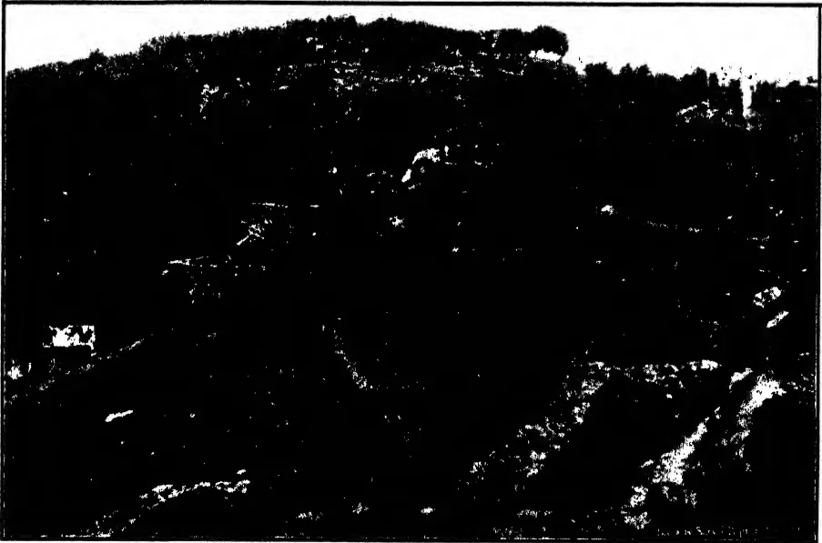A high-contrast black and white photograph showing a vast field of cowpeas. The plants are densely packed and cover the entire visible ground area, appearing as a dark, textured mass. In the background, a line of trees or shrubs is visible against a lighter sky. The overall scene suggests a successful and extensive crop.

Cowpeas covering entire area.

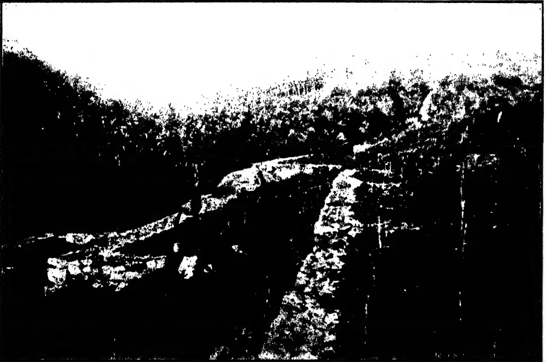A high-contrast black and white photograph showing cowpeas at an early stage of growth. The plants are visible as a dense, light-colored mass against a darker background. The growth is shown to be reaching the height of a stone parapet or wall, which is visible in the foreground. The image illustrates the rapid growth of the plants over a short period.

Cowpeas six weeks old showing growth to height of the stone parapet.

530------------------------------------------------

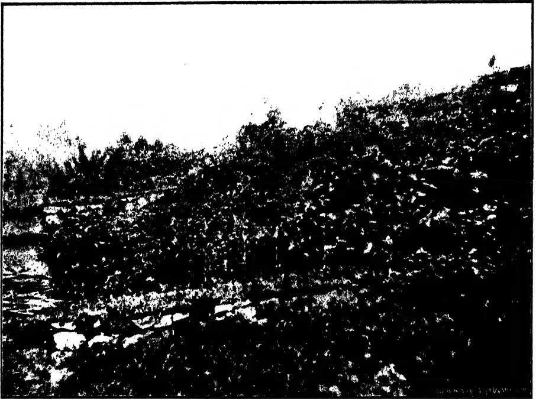A high-contrast black and white photograph of a field of cowpeas. The plants are dense and cover the ground, with some taller stalks visible in the background. The image is framed by a thick black border.

Cowpeas showing seven weeks growth.

531------------------------------------------------

91

much as two feet deep. The cowpea was cut up and the tea holes which had been got ready during the growth of the cover were filled with the green material and soil. A point worthy of note is that the cover is easily lifted; the roots come away without difficulty and the work may be done by women and children.

In passing, the writer would like to draw attention to the lining, which was done on the contour hedge system, which the writer believes to be the only solution of the paramount question of soil erosion on newly-opened tea areas, especially if easily trained leguminous trees are grown in hedges at regular intervals. *Gliricidias* lend themselves admirably to this purpose.

The desirability of sowing all land which is being prepared for planting in tea and rubber with a leguminous cover immediately after the burn-off need hardly be emphasised. The rapid growth of the cowpea makes it suitable for this very desirable practice, the more so as it does not interfere with field operations.

Cowpea is a favourite in green manuring programmes in Indian tea gardens where it is sown in the tea and hoed in after six to seven weeks growth, that is, before it is old enough to climb on the bushes. Its climbing habit is its only drawback, but erect varieties are also obtainable. It may also be used in connection with pruning programmes. If the cover be established to be in readiness at pruning time, envelope forking of the green stuff along with loppings of shade and prunings and a phosphatic manure will undoubtedly show the value of cowpea in cultural operations. It must be mentioned that this legume is sensitive to cold and will not stand the higher tea areas of Ceylon.

Rubber planters must face the time when most or at least a great deal of their rubber areas will have to be cut out for re-planting with better material and also the question of re-juvenating the soil. The latter process is possible only with intensive green manuring and the planter must be alive to the use of economic legumes. For this purpose, cowpea suits admirably because of the possibility of growing two or three crops within a season and because it will flourish in any soil, however poor it be.

It is also used in paddy and in a controlled experiment at the Marthur Farm in Mysore the yield per acre after green manuring with cowpea showed the appreciable increase of 790 lb. of grain and 680 lb. of straw (Pieters' *Green Manuring Principles and Practice*). In Alabama it was shown that, when cowpeas were turned under and were followed by three harvested crops, the financial returns were 42.96 per acre more than on similar land on which no legume had grown. (Pieters' *ibid.*)

Finally, when administrators are trying to solve the question of establishing a landed peasantry in this island and to deal with the cattle problem and its complementary questions of fodder and pasture in village areas, those at the helm of affairs may be asked to give the cowpea a chance to prove its usefulness as undoubtedly it has done in other tropical and temperate climes.

532------------------------------------------------

92

## ON THE OCCURRENCE AND SIGNIFICANCE OF *OIDIUM* LEAF DISEASE IN CEYLON.\*

R. K. S. MURRAY, A.R.C.SC.,

MYCOLOGIST,  
RUBBER RESEARCH SCHEME (CEYLON).

1. *Introductory*.—In view of the attention which planters in Ceylon are now giving to *Oidium* leaf disease of Hevea and the concern with which it is justifiably regarded by reason of its rapid spread and increase in severity in this country and its bad record in Java, it is thought that a discussion of the disease as it affects the Ceylon planter and a consideration of possible methods of control is not inopportune. Much of the information regarding the occurrence and distribution of *Oidium* in this island is the outcome of a questionnaire circulated in 1928 and 1929 to all estates subscribing to the Rubber Research Scheme, and the writer would like to express his gratitude to the superintendents of these estates for their valuable assistance without which such an enquiry would have been impossible. The opportunity is also taken of summarising the available information regarding the morphology of the fungus and the symptoms and significance of the disease.

2. *Historical*.—The disease was first reported in Ceylon in 1925. In February of that year, when the trees were refoliating after wintering, an abnormal leaf-fall was reported almost simultaneously from most of the rubber-growing districts in the island, and specimens sent to the Department of Agriculture were identified by the Mycologist as similar to the *Oidium* leaf disease of Hevea which had been known in Java since 1918. The outbreak of the disease coincided with unusually heavy rains during February and March, and both Gadd (4) and Stoughton-Harris (10) concluded that this abnormal rainfall had favoured the development and spread of the disease and predicted that, in future years under the dry climatic conditions which normally obtain when the trees are refoliating, the disease would not recur to any serious extent. This prediction has unfortunately not been fulfilled, and, although the heavy rainfall in February and March 1925 may possibly have helped the fungus to adapt itself to its new host, there is now abundant evidence to show that the activity of the fungus is not dependent on unusually wet

\* Reproduced from *The Second Quarterly Circular* of the Rubber Research Scheme for 1929.

533------------------------------------------------

93

conditions. Since 1925 the disease has become more widespread each successive year (with the exception of 1926 when there was a check in the spread of the disease) and in some districts, notably at mid-country elevations, it has rapidly increased in severity.

In the Dutch East Indies the disease was first reported by Arens (1) in 1918, and, whilst varying in intensity in subsequent years, it has in general increased greatly in severity and is now regarded by planters in Java with the utmost concern.

*Oidium* has not been reported on Hevea in Malaya, though in 1925 Sharples (8) reported a disease whose symptoms were almost identical with those of the *Oidium* leaf disease of Ceylon and Java. The fungus causing this disease was apparently *Gloesporium alborubrum*, a fungus differing in many respects from *Oidium*.

*Oidium* has also occurred in Uganda where it was first reported in 1921. In 1925 the Government Mycologist reported that the disease had become more severe and was probably responsible for considerable decreases in yield.

3. *Symptoms and Effects.*—The symptoms of *Oidium* leaf disease have been described by several observers in Ceylon and Java and are summarised as follows.

*Oidium* can attack Hevea leaves of all ages and the effects of the attack differ according to the degree of maturity of the leaf. The disease is first evident as an attack on young leaflets when the trees are refoliating after wintering. If the leaves are attacked when still bronze-coloured and shiny they become dull and faded in patches and may become slightly crinkled. The leaflets may fall in this condition or the tip may first die back, becoming bluish-black in colour. The symptoms are very similar when the attack is on slightly older leaves which have just turned green, except that in such cases the curling and crinkling is usually more pronounced. The white powdery superficial growth of the fungus consisting of mycelium and spores is sometimes clearly seen on the petiole and under surface of the mid-ribs of such young leaves, but more often it is only visible with a lens. The fallen leaflets soon shrivel on the ground, but in the case of a severely attacked tree they often form a conspicuous carpet of leaves. All three leaflets of any one leaf do not necessarily fall, so that a characteristic feature of diseased trees is the presence of petioles bearing one or two leaflets instead of three. Trees which are severely defoliated in this way usually put out a fresh crop of leaves and so recover. These secondary leaves may, however, be attacked in turn.

534------------------------------------------------

94

If the fungus attacks somewhat older but still immature leaves the effect is rather different. Such leaves are more resistant and the attack is confined to localised portions of the margin and mid-rib. These are prevented from growing normally with the consequence that the leaflet becomes irregularly distorted into folds and crinkles. Severely attacked leaves are dull and yellowish. The leaflets do not usually fall so that this form of attack is not as serious as that on the very young leaves when complete defoliation of the tree may result. The attack on immature leaves is for convenience known as primary attack and occurs soon after wintering.

*Oidium* may also attack fully mature leaves, such an attack being turned secondary. The first symptoms of a secondary attack is the appearance of small yellowish translucent spots chiefly on the upper surface of the leaflet. The fine superficial hyphae of the fungus can be detected on these spots with a lens, and the subsequent production of spores gives the spots a white powdery appearance. As the spots grow larger they turn purple-brown in colour and eventually dry up, while the dead tissues in the centre may fall out leaving irregular holes. No hard and fast distinction can be drawn between this secondary form of attack and that previously described on the older but yet immature leaves; in fact a characteristic symptom of the disease is the existence of distorted leaflets with the mottled appearance of the secondary attack.

*Oidium* also attacks and destroys the flowers, and the young inflorescences are often thickly covered with a growth of mycelium and spores. In a badly-affected area the complete absence of seed is a characteristic feature of the disease.

While the above description is in general applicable to the disease as it occurs in any part of Ceylon, there are certain differences between the symptoms and effects of the disease in a comparatively dry district such as Matale and those in a wet district such as Kalutara. (These two districts are mentioned as having come under the special observation of the writer.) Although the differences are only in degree they are sufficiently striking to be worthy of record. One of the most notable features of the disease in Matale is the abundant superficial growth of mycelium and spores on the surfaces of the leaves whereas in the Kalutara district it is comparatively rare to find an affected leaf on which the fungus is visible to the naked eye. In Matale most of the diseased leaves, whether the attack is primary or secondary, exhibit the superficial powdery growth which gives the name mildew to this class of fungus. Indeed, the leaves are sometimes so white as to appear to have been splashed with whitewash. This difference is not entirely due to the fact that the disease is

535------------------------------------------------

95

far more severe in Matale than in Kalutara, but is probably related to the different atmospheric conditions. In Matale, even where the annual rainfall is high, the average humidity of the atmosphere is lower than in Kalutara, and this comparatively dry atmosphere is favourable to the production of spores. The relation of weather conditions to the disease is further discussed below under the heading of *Occurrence, Distribution, Environmental Factors*.

In the low-country, where *Oidium* is not so severe as in certain districts at higher elevations, the disease usually appears in February or March, is active for a few weeks, and then disappears as suddenly as it came. Hence a defoliated tree which puts out a second crop of leaves is rarely attacked a second time and so recovers at the cost of food reserves. In severely attacked areas, on the other hand, although the disease exhibits a period of maximum intensity shortly after the normal wintering, the fungus may remain active throughout the year. In this way many trees are subject to a continuous process of leaf-fall and refoliation, the leaves becoming smaller and poorer in quality at each successive recovery. On an estate in Matale which has come under the writer's observation the rubber is affected in this way, and the worst affected trees artificially winter five or six times a year.

Such a continual defoliation no doubt results in a depletion of food reserves and general lowering of the vitality of the tree. In consequence a physiological die-back of twigs is a characteristic feature of badly-attacked areas. Such dead or dying twigs are liable to afford entry for *Diplodia* which may kill the branch or even the whole tree.

4. *The Fungus*.—The disease is caused by *Oidium heveae*, a fungus belonging to the class of powdery mildews. The mycelium, which consists of colourless, septate, branched hyphae, lives on the surface of the affected part and draws the necessary food by sending sucking organs known as haustoria into the tissues of the host. Under favourable conditions the mycelium produces erect conidiophores up to 46 microns in length (1 micron =  $1/1000$  mm.) at the end of which are abstracted the conidia (spores). These conidia are usually borne singly but may occur in chains up to five. They are hyaline, barrel-shaped, constricted near the ends and thin-walled. Various observers give different figures for the size of the spores, but Stoughton-Harris (10) in Ceylon and Arens (1) and Steinmann (9) in Java agree in giving the measurements as 28-42 microns long by 14-23 microns broad. The production of the spores on the surface of the rubber leaves and flowers gives the typical powdery appearance. The spores are readily carried away by the wind and are

536------------------------------------------------

96

capable of immediate germination on reaching a suitable host. Many powdery mildews have been shown to have an ascospore stage of the family *Erysiphacoae*, but the Hevea mildew, like most tropical mildews, is only known in the conidial stage. Thus it is probable that the conidia provide the only means by which the fungus is capable of spreading.

For some time it was not known how the fungus wintered, i.e., carried over the period when the disease is not active. Bally (2) in 1927 advanced three hypotheses: (1) That perithecia and ascospores may be produced; these would provide material for infecting the young leaves after wintering; (2) That *O. heveae* may comprise biological strains capable of parasitising other hosts; (3) That the mycelium may overwinter in the leaves or branches of the rubber trees. No evidence to support the first two hypotheses has been forthcoming; an ascospore stage has not been found, while none of the infection experiments with mildews occurring on other members of the *Euphorbiaceae* have given positive results. The third hypothesis has been proved to be correct by the recent researches of Bobiloff (3) in Java. He states that the fungus hibernates on the few young shoots which are always produced by some trees throughout the year and on the infected spots of mature leaves. In an affected field there are at any given time a few trees whose young shoots are infected, and these are the sources of infection when the conditions are suitable for an outbreak of the disease. The fungus remains active for about five weeks after which there is a decrease of the mycelium and dying of the conidia. In the main observations on the life-history of the fungus in Ceylon confirm Bobiloff's statements, except that in badly-affected areas in certain districts the fungus never becomes wholly inactive so that the disease is present at all times of the year.

5. *Occurrence, Distribution, Environmental Factors.*—A list of questions regarding *Oidium* was circulated to all estates subscribing to the Rubber Research Scheme in June 1928 and again in May 1929. The estates from which replies were received were divided into four classes according to the severity of the attack, and the number of estates in each class for the year 1929 is as follows:—

<table border="1">
<tbody>
<tr>
<td>Severe attack</td>
<td>17</td>
</tr>
<tr>
<td>Infection general but not severe</td>
<td>55</td>
</tr>
<tr>
<td>Very mild attack (a few isolated trees)</td>
<td>65</td>
</tr>
<tr>
<td>No <i>Oidium</i></td>
<td>41</td>
</tr>
<tr>
<td>Total no. of estates</td>
<td>178</td>
</tr>
</tbody>
</table>

537------------------------------------------------

This image is a blank white page. It contains several small, dark specks which appear to be scanning artifacts or dust particles. There is no text, handwriting, or printed content on the page.

538------------------------------------------------

# DISTRIBUTION OF OIDIUM IN CEYLON

1929

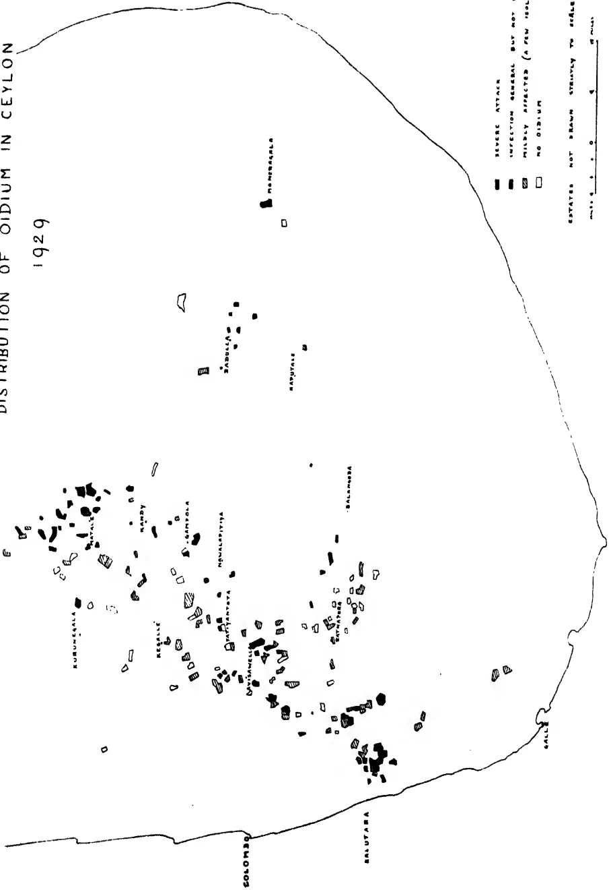

SEVERE ATTACK (solid black square)  
 INFECTION GENERAL BUT NOT SEVERE (black square with white center)  
 MILDLY AFFECTED (A FEW ISOLATED CASES) (square with diagonal lines)  
 NO OIDIUM (open square)

SCALE: 0 1 2 3 4 5 MILES

Labels on map: SOLOMBORE, GALLE, BALUFABA, KANDY, KUMARAWA, KEGALLE, MAHANCHALI, NUNGAMADURA, NUGALAPITIYA, PANFOLA, RAMPALGALA, BALAMPURA, BALEMPALA, PIGURALALA.

539------------------------------------------------

97

Of a total of 178 estates 137, or 77%, have suffered in greater or less degree from *Oidium*. In 1928, of 233 estates from which replies were received, 55% reported the occurrence of mildew so that a spread in the occurrence of the disease during the last year is to be noted.

Each individual estate has been marked on the enclosed rough map, the shading corresponding to the degree of *Oidium* attack. The classification of the estates is of doubtful accuracy since every superintendent does not judge the severity of the attack on his estate by the same standard. The value of the map is also limited by the comparatively small number of estates shown. It is considered, however, that the general distribution of the disease is accurately indicated. The map shows clearly that the Matale and Uva districts are the most severely affected, while Ratnapura remains almost free from the disease. In the Kalutara and Kelani Valley districts *Oidium* is widespread but has not yet caused much damage.

In an attempt to correlate the distribution of *Oidium* in Ceylon with environmental conditions certain general conclusions may be formed. The disease has become severe only at the higher elevations at which rubber is grown in the island, and on no estate below 1,000 ft. above sea level has *Oidium* caused the degree of defoliation that has occurred on certain mid-country estates. The greater severity at higher elevations is probably due in part to the poorer growth of the rubber in consequence of which the trees are less able to withstand an attack, and in part to the fact that the weather conditions in such districts are more favourable to the development and spread of the fungus.

The relation of weather conditions to *Oidium* attack is a problem of considerable complexity. It is not possible to deduce a definite correlation between rainfall at any particular time and intensity of the attack as can be done with certain other diseases. Diseases caused by powdery mildews are regarded as dry-weather diseases, and it is of interest to note that in Java the more severe attacks have been associated with unusually dry-weather conditions. Reydon (6), as the result of an enquiry in East Java in 1927, found that the rainfall on estates severely attacked by mildew was in nearly every case less than that on neighbouring estates where the attack was mild. He states, however, that "to conclude herefrom that more rain means less mildew is, in our opinion, rash, because we do not know exactly the nature of the influence of the rain on mildew attacks, and we must first find out when the young leaf period falls. The mildew attack is indeed, in the first place, dependent on this last factor."

In order to obtain information regarding the relation between intensity of *Oidium* attack and weather conditions in Ceylon the

540------------------------------------------------

98

following question was included in the questionnaire referred to above:—“Have you noticed that certain weather conditions lead to the more severe attacks ? If so, what ?” The answers to this question are very contradictory. The majority of superintendents maintain that wet weather while the trees are refoliating after wintering favours the disease. A close analysis, however, shows that most of these estates have only been mildly attacked, while of those estates which have experienced a severe attack the majority report that dry weather is a predisposing factor. A few estates report that they have had a severe attack in two different years, the weather conditions being abnormally wet in one year and abnormally dry in the other, while others consider that alternating dry and wet conditions are favourable to the disease. Many superintendents mention wind as conducive to severe attacks, and some associate an outbreak of the disease with cool, dewy mornings.

In the face of such varied opinions it will be of value to consider in what respects weather conditions may influence the stages in the life-history of the fungus. A certain amount of moisture is necessary for the germination of the spores and the vegetative growth of the mycelium. Dry conditions are favourable to the production of spores, while their dissemination is aided by wind. It is probable therefore that alternating dry and wet conditions during refoliation are favourable to the development and spread of the fungus. It is considered that a relatively dry atmosphere is the most important predisposing factor in the production of spores, and this is tentatively suggested as the chief cause of the severity of the disease in the Matale and Uva districts where the humidity of the atmosphere between falls of rain is lower than in the wet low-country districts. It has already been mentioned above that the production of spores is far more prolific at the higher elevations than in the low-country. It is not considered that heavy falls of rain are necessary for the germination of the spores and mycelial development and it is probable that dew provides sufficient moisture. A sharp storm, however, will often precipitate the fall of many leaflets and therefore appear to bring about a severe defoliation.

An outbreak of activity of the fungus is probably more dependent on the condition of the trees as regards new leaf than on any specific weather conditions. Any trees in an affected area which produce their new foliage when the fungus is active will be attacked. There is no evidence at the present time of any individual immunity or resistance to the disease except in so far that those trees which winter very early and very late may escape. Trees growing on poor washed-out soil and exposed ridges generally suffer more severely than those in the richer hollows. This is more probably due to their poorer growth, in consequence

541------------------------------------------------

99

of which they are less able to recuperate from the effects of the disease, than to any greater susceptibility. The disease is often first noticed on exposed hill slopes which is probably due to the fact that such areas usually winter earlier than the lower-lying ground with richer soil. On any estate on which rubber is grown at different elevations the disease is nearly always more severe at the higher elevations.

An examination of the map will show that estates isolated by some miles from the nearest rubber are in general free from the disease. A study of the development of *Oidium* on individual estates shows that usually in the first year of appearance the disease is very mild and only affects a few isolated trees. These do not usually occur in definite groups but are scattered throughout the fields. In the second year the disease has usually become more widespread and may or may not cause severe defoliation. The history of the disease in subsequent years depends on the district and the climatic conditions, but it is rare for the disease, once having attained severe proportions, to decrease in intensity.

6. *Economic Significance.*—The economic importance of *Oidium* leaf disease is very difficult to estimate. Its importance, like any other disease of Hevea, must ultimately be judged by the loss in yield entailed, and there is at present a complete absence of exact knowledge on this point. In Ceylon no decrease in yield due to the disease has been reported from any estate. In East Java, as the result of an enquiry carried out by Reydon (6) in 1927, 6.4% of the estates reported a decrease in yield. It is not known, however, whether any of these estates have figures which would bear scientific scrutiny. In Uganda the Government Mycologist's Report for 1925 stated that the disease was probably responsible for a considerable reduction in yields, but here again no accurate figures appear to be available.

The absence of accurate knowledge as to the economic importance of the disease makes an estimation of the value of costly control measures impossible. Particular interest is therefore attached to experiments being conducted by the Rubber Research Scheme on an estate in the Matale district which are designed to show whether any decreases in yield occur as the result of severe attacks for several years, and whether spraying or manuring provide an effective and economic method of controlling the disease.

Although no decreases in yield have yet been reported in Ceylon, there can be little doubt that the cumulative effects of constant defoliation will lower the vitality of the tree and eventually cause it to yield less latex. The die-back of branches which occurs on badly affected estates is an indication of the depletion of food reserves, and is itself liable to result in decreases in yield per acre if the die-back extends and kills the whole tree.

542------------------------------------------------

100

Experiments carried out by Taylor (7) show that whereas at normal leaf-fall a large proportion of the nitrogen-containing substances are first withdrawn into the stem, when leaves fall as the result of attack by *Phytophthora* most if not all of the nitrogen contained in the leaf is lost. It is reasonable to conclude that the same is true for leaf-fall due to *Oidium* or any other fungus attack, and it is clear therefore that a considerable loss of valuable food-stuffs is entailed. The following extract from Taylor's paper is pertinent:—

“The loss of foodstuffs incidental to leaf-fall is, however, only a small part of the strain to which the tree is subjected. The whole manufacturing portion of the plant is affected and while the tree is leafless it is, so to speak, living on capital. What reserves are available must be encroached upon for the production of the new foliage as well as for the normal ‘running expenses’ such as production of latex, renewal of bark, etc., and this, unlike the normal wintering, occurs when the tree has made no special preparation.”

The following figures show that the defoliation caused by *Oidium* can be far more severe than any effects that *Phytophthora* has yet produced in Ceylon. The figures are derived from the careful examination of 1,058 trees taken at random from two fields on an estate in the Matale district and the classification of their foliage as regards *Oidium* attack into six divisions. The examination of the trees was made in April when all but an insignificant proportion of the trees had undergone normal wintering and refoliation.

<table border="1">
<thead>
<tr>
<th></th>
<th>No attack</th>
<th>Mild to moderate Secondary.</th>
<th>Severe secondary. Little or no defoliation.</th>
<th>Moderate defoliation.</th>
<th>Severe defoliation.</th>
<th>Complete or almost complete defoliation (partly recovered).</th>
<th>Total</th>
</tr>
</thead>
<tbody>
<tr>
<td>No. of trees.</td>
<td>0</td>
<td>72</td>
<td>246</td>
<td>210</td>
<td>222</td>
<td>308</td>
<td>1058</td>
</tr>
<tr>
<td>Percentage of whole.</td>
<td></td>
<td>7%</td>
<td>23%</td>
<td>20%</td>
<td>21%</td>
<td>29%</td>
<td></td>
</tr>
</tbody>
</table>

In the fields from which these figures were obtained no apparent decrease in yield had resulted as a consequence of three consecutive years' severe attacks, but it is impossible not to view with the utmost concern a disease which causes a complete defoliation of nearly a third of the trees and from which no single tree is altogether free. At present *Oidium* only has this sinister aspect

543------------------------------------------------

101

in certain areas at mid-country elevations which form a small proportion of the total rubber-growing acreage in Ceylon. In the low-country no effects comparable with the above have yet been reported, but there are indications that the disease is becoming more widespread every year, and it is possible that in the future it may become the serious menace which it is considered to be in Java.

7. *Control.*—In the control of a fungus disease there are always three possible lines of work: (a) Indirect control by cultivation methods; (b) Breeding immune or resistant varieties; (c) Direct control by eliminating the causative fungus.

As far as *Oidium* leaf disease of Hevea is concerned very little has yet been achieved along any of these three lines, so that this section must consist chiefly of a discussion of the possibilities of control.

(a) *Indirect control by cultivation methods.*—It is a well established fact that the application of nitrogenous manures benefits the foliage of rubber, and there is evidence to show that trees manured in this way, while no less susceptible to attack by *Oidium*, are better able to recover from the effects of the disease.

It may now be considered in what respects the application of manures will tend to be beneficial. Quick-acting nitrogenous manures actually increase the quantity of foliage initially put out by the trees after wintering, so that the effects of a partial defoliation will be less severe. It is also possible that manuring will hasten the leaf production and so lessen the period of susceptibility, but on the other hand the tree may be stimulated to such activity that it may be defoliated twice during the period of virulent attack. There can be little doubt that nitrogenous manuring will be of value in assisting the tree to put out a second crop of leaves after being defoliated and to make up for the drain on the resources of the tree thereby entailed. This is probably the most important respect in which manuring can be of value in the control of the disease, and any cultivation methods such as forking, growth of green manures, etc., which lead to a more vigorous growth of the tree will similarly be beneficial.

It is possible that direct control of the disease might be obtained by manurial methods if in this way the leaf could be rendered more resistant to invasion by the fungus either by thickening the cuticle or by altering the acidity of the cell sap to a value unsuitable to the growth of the fungus. No work on these lines has yet been done with Hevea, but results obtained with other crops indicate that such investigations might be of value. Potash is known to bring about a thickening of the cuticle of the leaves of some plants, and the possibility of this effect on Hevea is being investigated by the Rubber Research Scheme.

544------------------------------------------------

102

The writer's observations tend to show that heavy nitrogenous manuring is of value on badly-affected estates, and reports from various estates are confirmatory. Of the answers to the questionnaires circulated in 1928 and 1929 a number of estate superintendents report that a definite benefit has resulted from the application of manures, while a much smaller number have replied that no benefit is to be noted. A few estates also report that the effects of *Oidium* are less severe on fields with a good cover of Vigna, though no such relation has been observed by the writer. The information available is far from being conclusive, however, and it is not possible at the present time to say with any degree of confidence whether manuring will provide an effective and economic method of controlling the disease. It is hoped that this lack of accurate knowledge will be remedied as the result of comprehensive field experiments at present being conducted by the Rubber Research Scheme.

(b) *Breeding immune or resistant varieties.*—No work on these lines has yet been undertaken in Ceylon. Should any tree be found which is resistant to the disease, not because it winters at a time when the fungus is inactive but because of some inherent property, it would form a valuable stock for planting in badly-affected areas, provided that it was a desirable tree in other respects. At the present time there is no evidence of immune or highly resistant individual trees, but a number of mildly attacked trees in a severely-affected estate have been marked and recorded and will be specially observed during the next period of virulent *Oidium* attack.

In Java Bobiloff (3) has budded three different species of *Hevea*, *H. collina* *H. guyanensis*, *H. spruceana* high up on stocks of *H. brasiliensis*. These buddings have been planted out on two estates heavily infected with *Oidium*. It is hoped that the foliage of these species will be resistant to *Oidium*, the tapping surface, of course, being that of *H. brasiliensis*.

(c) *Direct control by eliminating the causative fungus.*—Since *Oidium* passes its entire life-history on the leaves and young shoots of the rubber tree any method of eliminating the fungus must be directed either towards killing the fungus *in situ* by the application of a fungicide or removing the branches which are the sources of infection.

The latter method has recently been tried in Java by Bobiloff (3). It has been mentioned above that the fungus hibernates on young shoots, and Bobiloff found that by removing these shoots before the wintering period the spread of the fungus to the young leaves was to some extent controlled. He concludes that such a cleaning process is a practical possibility and costs little. So far as the writer is aware this method has not been tried in Ceylon.

545------------------------------------------------

103

A fungicide can be applied either in the form of a wet spray, or a dry dust. In either case the chief problem with Hevea is the practical difficulty of making the application at a reasonable cost.

8. *Spraying.*—For effective control of a fungus disease by spraying three conditions must be satisfied. First, the fungicide used must be highly toxic to the organism; secondly, the spraying technique must be such that all affected surfaces are adequately covered, and, thirdly, the spraying must be done at the right time in relation to the life-history of the fungus and of the host.

The first of these provisions should be easily satisfied. Experience with diseases caused by powdery mildews on other crops has shown that sulphur, in one form or another, is the most effective fungicidal agent and the experiments of Gandrup and S'Jacob (5) indicate that the *Oidium* of rubber provides no exception to this rule. They have shown that whereas Bordeaux and Burgundy mixtures are of little value, Sulfinette, which is a proprietary lime-sulphur solution, is highly toxic to the fungus and kills not only by contact but also by virtue of the evolution of poisonous gases. They also found that a suspension of sulphur powder in water gave good results.

The following table is taken from Gandrup and S'Jacob's paper (5). All the trees in the sprayed and control areas were examined seven weeks after the spraying operations and were classified according to the degree of infection.

<table border="1">
<thead>
<tr>
<th rowspan="2">Fungicide used.</th>
<th colspan="2">1. Not or only scarcely injured by mildew</th>
<th colspan="2">2 More injured than No. 1.</th>
<th colspan="2">3. More injured than No. 2. (trees with a poor crown).</th>
<th colspan="2">4. Totally leafless (partly recovered)</th>
</tr>
<tr>
<th>No. of trees.</th>
<th>%</th>
<th>No. of trees.</th>
<th>%</th>
<th>No. of trees.</th>
<th>%</th>
<th>No. of trees.</th>
<th>%</th>
</tr>
</thead>
<tbody>
<tr>
<td>Bordeaux Mixture.</td>
<td>69</td>
<td>18</td>
<td>64</td>
<td>17</td>
<td>49</td>
<td>13.5</td>
<td>200</td>
<td>52.5</td>
</tr>
<tr>
<td>Burgundy Mixture.</td>
<td>70</td>
<td>18</td>
<td>70</td>
<td>18</td>
<td>52</td>
<td>13</td>
<td>209</td>
<td>52.5</td>
</tr>
<tr>
<td>Sulfinette</td>
<td>97</td>
<td>25</td>
<td>112</td>
<td>29</td>
<td>38</td>
<td>9</td>
<td>134</td>
<td>36</td>
</tr>
<tr>
<td>Unsprayed.</td>
<td>65</td>
<td>16</td>
<td>57</td>
<td>15</td>
<td>67</td>
<td>14.5</td>
<td>205</td>
<td>54</td>
</tr>
</tbody>
</table>

The evidence regarding Sulfinette is not, however, conclusive. Bobiloff (3) states that in his experiments spraying with Sulfinette gave no success, and concludes that only when a spray highly effective against mildew has been discovered will spraying be an effective control method.

The writer has carried out laboratory experiments with Sulfinette which tend to confirm Gandrup and S' Jacob's results; they show that Sulfinette at  $\frac{1}{2}$  % concentration is highly toxic to

546------------------------------------------------

104

*Oidium* on contact and also has a vaporous action. It was concluded, however, that this vaporous action was very limited in scope, and, although to some extent it obviates the necessity for a complete covering of the leaves, this property does not lessen the necessity for a careful spraying technique. About 25 acres severely affected with *Oidium* were sprayed with Sulfinette in March and April 1929, but it is not possible at present to draw any reliable conclusions regarding the efficacy of this fungicide in the field. Further spraying experiments are to be undertaken as the result of which it is hoped that the most satisfactory spraying fluid may be discovered.

The success of spraying as a control measure against *Oidium* is, however, dependent not only on the toxicity of the fungicide but also on the effectiveness of the spraying technique. The latter aspect is relatively of far more importance in spraying the large Hevea tree than in spraying other smaller trees, and there is no doubt that the limiting factor in the spraying of rubber in Ceylon is the practical difficulty in making the application. With the spraying machines at present at our disposal it is not possible to project the fungicide to the top of a mature tree from the ground and climbing must therefore be resorted to. This adds considerably to the expense of the operation and makes it a slow and troublesome proceeding. If a machine could be devised sufficiently powerful to project a fairly fine spray to the top of the trees without any climbing being necessary, and at the same time not too cumbersome to be easily carried short distances by about six coolies, spraying would be a cheaper and quicker operation.

Various factors militate against the economic practicability of spraying rubber. One of the most important of these is the availability of water. This has to be carried by coolies, and the cost of spraying is therefore dependent to a large extent on the distance from the nearest water supply. On this account alone spraying would be an impracticable procedure on many estates which are poorly supplied with streams.

Another important limitation of the method is the slowness of the operation. A pump with two outlets can only spray 1-1½ acres per day, so that, in order to spray a large acreage in the limited time during which the maximum benefit can be expected to accrue, several machines and spraying gangs must be employed. A large proportion of the time is spent in climbing the trees, raising and lowering the pipe, and carrying ladders from tree to tree, and it is considered that, until a machine is devised which will spray the trees from the ground, the operation is bound to be slow and the cost high.

547------------------------------------------------

105

The optimum time for spraying against *Oidium* is not at present known. The fungus is present on the foliage throughout the year, being most active for a period of a few weeks while the trees are refoliating after the winter. It will probably be of little value to spray during the active period since the leaves, which are then growing, will not remain adequately covered. It seems probable that the best control will be obtained by spraying shortly before the trees winter; in this way the fungus will be killed while inactive on the old leaves and green twigs, and the source of infection of the young foliage will thereby be destroyed. Satisfactory spraying can only be done in dry weather, and in view of the epiphytic habit of the fungus it is possible that some measure of control may be obtained at any time of the year provided that the weather conditions are suitable. It is hoped that experiments being conducted by the Rubber Research Scheme will show which is the best time to spray, and whether one spraying in a year gives satisfactory control.

As has been already indicated the cost of spraying must necessarily be high until a more satisfactory machine than any hitherto used is forthcoming. The cost of spraying 25 acres in the Matale district during March and April 1929 averaged about Rs. 11-00 per acre as follows:—

<table>
<tr>
<td>Sulfinette</td>
<td>...</td>
<td>Rs.</td>
<td>3-00</td>
</tr>
<tr>
<td>Labour</td>
<td>...</td>
<td>..</td>
<td>6-00</td>
</tr>
<tr>
<td>Supervision</td>
<td>...</td>
<td>..</td>
<td>1-00</td>
</tr>
<tr>
<td>Depreciation on equipment</td>
<td>..</td>
<td>..</td>
<td>1-00</td>
</tr>
<tr>
<td colspan="3"></td>
<td>
Rs. 11-00
</td>
</tr>
</table>

The sprayed field was favourably situated as far as water supply was concerned, and the figure of Rs. 11-00 per acre may be taken as near the minimum cost of spraying average mature rubber with any equipment available at the present time. Before such a costly measure can be recommended it will have to be shown not only that spraying provides an effective control of the disease, but also that sprayed areas give improved yields when compared with unsprayed areas.

Despite the many difficulties and disadvantages of spraying rubber it would be foolish to discard the method without extensive trial. *Oidium* may become so severe in Ceylon that an effective control measure is the only alternative to loss of the rubber, and an expenditure of Rs. 11-00 an acre would then become an insignificant item. Spraying is undoubtedly a practicable measure on an estate well supplied with water, and in the event of *Oidium* becoming a serious menace it might become an economic necessity.

548------------------------------------------------

106

9. *Dusting*.—Dusting or dry spraying as a combative measure against fungus diseases is a comparatively new development, and in some countries, notably the U.S.A., it is rapidly superseding wet spraying for the control of many diseases.

Dusts have been applied on a large scale in two ways, from an aeroplane and by projection from a dusting machine. The former is a very expensive method under the most favourable circumstances, and at the present time would be impracticable for the treatment of rubber in Ceylon. In order to dust mature rubber trees from a machine the latter must be sufficiently powerful to project dust to the top of the trees, and at the same time sufficiently light to be easily portable by coolies on the steep and rocky hillsides on which rubber in Ceylon is so commonly grown. Such a machine has been designed in Java and used with considerable success. The Rubber Research Scheme is at present in communication with manufacturers in three different countries with a view to securing a suitable apparatus for trial.

In the control of powdery mildews of other crops finely divided sulphur powder has almost universally proved to be the most effective fungicide, and reports from Java indicate that the *Oidium* of rubber is quickly killed by this dust. The sulphur is very easily and cheaply obtained in Java from local volcanoes, and it seems unlikely that it will be necessary to look beyond sulphur for an effective fungicidal dust against *Oidium*.

The application of a fungicide in the form of a dust, by obviating the necessity for water, overcomes one of the sources of expense in connection with spraying, and removes the limitation on a direct control of *Oidium* that a shortage of water imposes on many estates. Dusting is a far quicker operation than spraying: no climbing is necessary, and with the assistance of a light wind a considerable number of trees can be dusted from one position of the machine. A large acreage could thus be dusted with one apparatus during the time at which the operation is found to be most effective. Dusting should be far cheaper than spraying though no figures for dusting rubber are available at the present time. A serious limitation on the use of sulphur dust in certain districts in Ceylon would appear to be its tainting affect on tea grown in the vicinity, and it is difficult to see how a cloud of such a fine dust could be controlled so as to fall only on the rubber and not on the tea.

Rubber has been dusted against *Oidium* in Java from a power machine and by aeroplane, and the results have encouraged the Dutch to believe that they have found an effective means of controlling the disease. The method, however, is still in the experimental stage and it is not at present possible to say with any

549------------------------------------------------

107

degree of confidence that an infallible method has been found of dealing with the serious menace which *Oidium* threatens to become in Ceylon.

*Conclusion.*—It has been the writer's intention in this paper to present *Oidium* leaf disease of Hevea in a more serious light than that in which it is regarded by many rubber planters in Ceylon. The disease has only been known in the island for five years; yet in certain districts it is already a serious menace to the existence of the rubber. Whether the environmental conditions are such that the disease may also seriously threaten the health of the rubber in the chief low-country districts is not known.

That an effective means of controlling *Oidium* will eventually be discovered as the result of present researches is reasonably certain, but along whatever lines such combative measures fall the expense is not likely to be light, and it is possible that large sums of money may have to be spent to protect the rubber from the ravages of this disease.

#### REFERENCES.

1. 1. Arens, P.—Een nieuwe bladziekte van Hevea, veroorzaakt door een meeldauwschimmel (*Oidium* spec.)
2. 2. Bally, W.—De tegenwoordige stand van het vraagstuk van de meeldauw ziekte in de Hevea.—Meded. Proefstat. Malang, No. 61 (Arch. voor Rubbercult. Nederl.-Indie, xi, 5) 1927.
3. 3. Bobiloff, W.—Onderzoekingen over den meeldauw bij Hevea brasiliensis.—Arch. voor Rubbercult. Nederl.-Indie' xiii, 1, 1929.
4. 4. Gadd, C. H.—Hevea mildew.—Year-Book Dept. of Agric., Ceylon. 1926.
5. 5. Gandrup, J. & S'Jacob, J. C.—Resultaten der proeven over meeldauwbestrijding op de onderneming Kroewock in 1927.—Arch. voor Rubbercult. Nederl.-Indie, xii, 9, 1928.
6. 6. Reydon, G. A.—Over den meeldauw in Oost-Java. Resultaten van de in 1927 gehouden meeldauwenquête.—Arch. voor Rubbercult. Nederl.-Indie, xi, 10, 1927.
7. 7. Taylor, R. A.—Observations on the amount of nitrogen lost by trees as the result of *Phytophthora* attack.—Second Quart. Circ. for 1925, Rubber Research Scheme (Ceylon).
8. 8. Sharples, A.—Hevea mildew in Ceylon and Malaya.—Malayan Agric. Journ., xiv, 4, 1926.
9. 9. Steinmann, A.—De Ziekten en plagen van Hevea brasiliensis, Buitenzorg, 1925.
10. 10. Stoughton-Harris, R. H.—*Oidium* leaf-fall of rubber.—First Quart. Circ. for 1925, Rubber Research Scheme (Ceylon).

550------------------------------------------------

108

## SELECTED ARTICLES.

### THE IMPROVEMENT OF PLANTS.\*

SOME years ago several members of the Agricultural Section of the Indian Science Congress came to me with the suggestion that there should be a special section of the Congress for Genetics. They pointed out that under the present organization there was no suitable place for papers on inheritance. The difficulty is a real one. Genetics is a border-line subject and has claims on agriculture, botany and zoology. The classical experiments of Mendel were carried out on peas, while insects have furnished much of the material by which the mechanism of inheritance has been demonstrated. The theories underlying the subject are of a very technical nature and pre-suppose a knowledge of botanical and zoological terms and conceptions. Papers on this aspect of the subject are suitable for the botanical and zoological sections. Most of the Indian work takes the form of economic plant-breeding and it is, therefore, chiefly of interest to agriculturists. Thus members interested in genetics are sometimes present in one section, sometimes in another and it is difficult to ensure a good discussion on any particular paper. I can find no sectional address which deals directly with genetics—the nearest approach is the interesting address on *Facts and hypothesis in the problem of evolution* by Father Blatter when President of the Botanical Section in 1925. It is clear that genetics has not been very prominent in the Congress. On the other hand, this branch of science is becoming an increasingly significant factor in the progress of the world. The importance of plant and animal breeding to the prosperity of a nation has long been known. A more recent development is the recognition that modern theories of inheritance are applicable to the study of criminology and to the improvement of the human race. From the scientific aspect also, the development of this science offers a most fascinating field of study. It would be a pity, therefore, if genetics were to remain the Cinderella of the Indian Science Congress. To afford an opportunity for the consideration of this question I have taken one aspect of this branch of science as the subject of my address today. I suggest that, at the conclusion of this paper, we should discuss the best methods of making genetics a more prominent feature at the Indian Science Congress and of University teaching in India.

When I began to write this address I was faced with the same difficulty as that experienced in placing genetical papers in this Congress. Should the address deal with the practical side or with the modern theories of inheritance? As so much of the work in India is economic, I have first dealt with a few practical points in plant breeding. Afterwards, in the second part, I have tried to show how the periodic changes in our conceptions of heredity have influenced practical methods. Genetics is, at present, in a most interesting transition phase and offers a good illustration of the swing of the pendulum. Such oscillations are characteristic of the development of all sciences but research on genetics is of such recent origin that many of the phases are within the memory of the older investigators.

---

\* Presidential address to the Agricultural Section of the Sixteenth Indian Science Congress, Madras, January 1929, by Gabrielle L. C. Howard, M.A., Institute of Plant Industry, Indore. From *The Agricultural Journal of India*, Vol. XXIV, Part III, May 1929.

551------------------------------------------------

109

While the biological conceptions underlying plant-breeding have in recent years undergone several fundamental changes, the object of the economic plant-breeder has always remained the same. He desires to produce a variety which will bring an increased monetary return to growers of some particular crop. This increased profit may be obtained by an improvement in yield or in quality. Of the two, yield is the more important. An increased amount of produce per acre is an advantage which the most illiterate cultivator readily understands. It is easily converted into money and does not involve any discussion. It is immaterial whether the increased yield of the new variety is due to potential yielding power, to enhanced disease-resistance or to a more suitable root-system. The extra cash the grower receives is a definite advantage.

The sale of improved quality is a very different matter. It is often extremely difficult to obtain the real value of any improvement in quality. In the first place, no trade agency will pay for improved quality unless there is competition for the product and unless a large quantity of the produce is regularly forthcoming. Owing to the length of time required for the replacement of the original crop by a new variety, a long interval elapses during which the cultivator reaps no appreciable benefit. In the second place, the needs of the market may change very quickly, whereas the breeding of an improved type is a lengthy process. At least ten years are required to establish a new variety. The market demand may, however, be altered in a couple of years by the introduction of new machinery or of new methods of manufacture. Fashion, such as colour or taste in tobacco, may bring about a radical change which cannot be foreseen. In this country especially, where marketing facilities are still undeveloped, the tangible benefit of increased quantity will always conquer the almost intangible and often unmarketable advantages of improved quality. The rapid increase of the area under certain rough, short-stapled cottons in the black soil tracts, where less heavy-yielding but better cottons were once grown, is a case in point. The plant-breeder must, therefore, make yield his first consideration. He will strive simultaneously to improve the quality and in most cases there is no reason why yield and quality should not be combined. Speaking generally, no new variety should be distributed in India on the basis of quality only. It is better to wait until this improved quality has been combined with a yield equal to or greater than that of the variety to be replaced.

In addition to yield and quality, an improved variety should possess a third characteristic. This is the power of adaptation to a wide range of agricultural conditions. We here touch one aspect of a very controversial question—centralised or local research. A certain school of thought in India has always considered that, as regards soil and climate, a large number of plant-breeding stations and of improved varieties are necessary for every crop. The practical difficulties in carrying out such a policy are obvious. It is impossible adequately to finance or to staff a large number of small experiment stations and seed stores. There is, however, a more fundamental objection to the multiplication of plant-breeding stations. Modern trade and manufacture demand a uniform product. To come into line with these requirements definite grades must be established at each large trade mart. As these centres draw their supplies from extensive tracts of country, the establishment of definite grades becomes impossible if each locality grows a different variety. The multiplication of varieties actually diminishes the market value of the produce of the tract. Thus from the financial, administrative and commercial standpoints the advantage lies in having a few good experiment stations and extending an improved variety over as large a tract of country as possible. This can only be done if the new type is elastic enough to respond to varying environmental

552------------------------------------------------

110

conditions. Such varieties are more difficult to obtain than those suited to a small tract, but experience has shown that they can be produced. I will instance two cases of which I have practical experience. The cane known as S48 does equally well on the alluvial soils of Rohilkand and on the black soil areas of Peninsular India. Pusa 4 wheat is being extensively grown in such diverse places as the North-West Frontier Province, Oudh and the well-irrigated areas of Central India. No plant-breeder should, therefore, be content with any variety which is not capable of being grown over large tracts of country.

I will only deal with one further practical point in connection with plant-improvement, namely—the necessity of self-denial in introducing new varieties. There is a very natural temptation to bring forward as a new variety anything which shows even a trifling improvement over that already in cultivation. This tendency is especially noticeable among young plant-breeders and is easy to understand. Each man wishes to show his employer that he is really accomplishing something. As the work of a plant-breeder is laborious and tedious a small success is hailed with delight. From the point of view of general strategy any such premature attempt to supersede an existing variety is, in the long run, disastrous and generally involves a waste of public funds. It also tends to lower the status of plant-breeding and to shake the confidence of the public. A small increase in yield or in quality is often wiped out or even reversed in bad years. The cultivator knows this and feels that it is better to stick to his old varieties unless the anticipated profit is great enough to justify the risk of change. It used to be an axiom that the Indian cultivator would adopt nothing new. This is not true. If the profit is great enough, he will adopt anything but he will not change his seed or his methods unless the increased profit is large. Experiment station workers do not always realize the amount of trouble and expense involved in changing a variety in general cultivation. Members of the audience who have experience of extension work will bear me out when I say that varieties cannot be changed every two or three years without disturbing the confidence of the cultivators and causing very great expense and trouble. It is better for the plant-breeder to wait until he has a really substantial improvement to offer and then to strain every nerve to get it adopted as quickly as possible. The difference between improved varieties is as great as that between the pictures of great artists and those of art students. Only masterpieces should be imposed on the cultivator. There is, however, another side to the question. If plant-breeders are to exercise this self-denial and restraint, the necessity for it must be recognized by their employers. The prospects of a plant-breeder should not depend on the rapidity with which he produces an improved variety. The situation is difficult as popular opinion clamours for tangible results. It can only be met by increased knowledge among the general public and a keener appreciation of the special difficulties of investigators. It should be more generally realized that the essential act in the organization of research is the selection of the man to do the work. Such men when appointed must be given both the time and the means to work out their own salvation. I have dealt with this point at some length because I think it is a real danger at the present time when facilities for plant-breeding are being rapidly extended.

Improved varieties may be produced by two methods: selection and hybridization. An erroneous impression is current that selection is extremely easy and within the scope of untrained men, whereas to obtain an improvement by hybridization a mysterious process needing great scientific knowledge and insight is required. This is not fair to those who use the method of selection. It is largely due to a confusion of thought in which the breeding of an improved variety is considered to be of the same order

553------------------------------------------------

111

as an investigation into the laws governing inheritance. The wording of the section which deals with this point in the Report of the Royal Commission on Agriculture in India is unfortunate: "*Hybridization is a much slower process than selection and requires greater scientific experience and a higher level of scientific aptitude. We are however of opinion that the plant-breeder in India will be well advised to adhere to the selection method until its possibilities . . . . have been much more nearly exhausted than is at present the case and that hybridization should only be undertaken by officers, who, in addition to special training, have had the experience of Indian crops and conditions which is necessary for successful work.*" It is true that hybridization is a slower process than selection but the impression given that really valuable selection work can be carried out by untrained men is erroneous and if adopted is likely to lead to much waste of time and money. The ultimate success in obtaining an improved variety both by selection and by hybridization demands identical qualities in the investigator: (1) a detailed and first-hand knowledge of the botanical constitution of the crop and of its physiological requirements, (2) insight and judgment in correctly selecting the most promising plants. In both processes the investigator can apply the knowledge gained in studies of heredity. In both he will require a thorough acquaintance with the mechanism of pollination, the range of variation of his material and the response to the environment of the various characters. The difference between the methods of selection and hybridization lies in the nature of the material available. In improvement by selection the investigator is limited to what nature has provided.

Thus selection is of most value in countries where crops as ordinarily grown are a mixture of types or in species in which mutation and natural cross-fertilization occur. In improvement by hybridization the investigator attempts to combine desirable characters present in different individuals and thus provides for himself the material from which he later selects. Defining the laws of inheritance is work with an entirely different aim and, though in the early days it was possible to combine this with the production of improved varieties, that period has long been passed. The complicated relationship shown to exist between various characters and the large number of plants involved necessitate for the investigator of the laws of inheritance absolute freedom from economic considerations. Even in the past the attempt to combine profit and the acquisition of new knowledge was unsatisfactory and often resulted in both objectives being missed. In every crop India requires a few first class varieties combining good quality and high yield, each suitable for a large tract of country. It is immaterial whether these improved types are produced by selection or by hybridization, but it must be realized that whichever method is adopted varieties of this class can only be evolved by men with a sound scientific training and great natural aptitude. In addition, they must be given sufficient time to produce something really worth distributing. Whichever method is used, success depends on the man and his training.

I do not propose to consider the various methods of selection but to pass on to a short survey of some of the changes in the theory of genetics which have influenced economic plant-breeding. Until the re-discovery of Mendel's laws, selection was the method most frequently employed in plant improvement. An empirical technique was developed in great detail especially in Germany. Recent research in genetics has swept away most of the old cumbersome methods and modern selection is far more scientific and direct. But it is on the point of stability or the fixing of the variety, that present-day plant-breeding diverges so markedly from the work of the last century. It is obvious that the degree of usefulness of an introduction is in direct

554------------------------------------------------

112

relation to the length of time during which the improvement can be maintained. Before the re-discovery of Mendel's laws by Correns plant-breeders were working in the dark with regard to this point. Many attempts were made to formulate principles of inheritance as a guide to breeders but these early efforts only seemed to make confusion worse confounded. Certain successful breeders were able to deduce empirical rules as the result of experience but these were generally applicable only to one particular crop. Plant improvement was dependent on the judgment and experience obtained during a laborious apprenticeship by a few men who were often unable to hand on their partly intuitive knowledge.

The nature and stability of hybrids was a particularly debatable point. Most persons held the view that the hybrid was a blend of both parents and attempts were made to determine the percentage inherited from each. The confusion of forms obtained in the later generations and the tendency of the parental forms to re-appear (reversion as it was called) were great stumbling blocks. In all the older investigations the complete individual was considered to be the unit. The re-discovery of Mendel's law of unit characters changed the whole aspect of the subject. As every one knows, Mendel, while experimenting on peas in the monastery garden at Brunn, discovered certain principles underlying the inheritance of characters. He found that, if the individual attributes of the plant such as colour, height and so forth, were separately considered instead of the whole plant, the inheritance proceeded in an orderly and even mathematical fashion. Mendel's results made no impression at the time of publication and it was not until 1900 that their re-discovery by Correns brought them to the knowledge of the general public. Time has modified some of Mendel's conceptions and considerably amplified others, but his main conception of the individual as an aggregate of characters, the inheritance of each of which must be studied separately is still the basis on which investigation proceeds. The analysis of a plant into units of inheritance and the technique evolved by the early Mendelians has enabled plant-breeders to obtain stable varieties in a reasonable period of time. From the economic point of view this is the greatest benefit which Mendel has conferred.

I well remember the enthusiasm these early Mendelian researches inspired. If desirable characters could be transmitted unchanged and could be combined, the regeneration of the crops of the world was a simple matter. It was only necessary to find two varieties possessing between them all the desirable attributes and to cross them. The perfect individual containing these characters in homozygotic form could then be extracted from the second generation. It was admitted that there might be a little difficulty in distinguishing between heterozygotic and homozygotic forms in the case of dominant characters but this should only mean a short delay. The greatest scorn was meted out to those old-fashioned investigators who still used selection methods. The millenium as regards crop improvement seemed to be in sight.

After twenty years, plant-breeders are sadder and wiser. It is true that modern plant-breeding has accomplished much. The monetary gain from improved varieties in India alone is estimated to be ten and a half crores a year. Nevertheless we are still a long way from the perfect variety in any crop and the way of improvement is long and arduous and not the simple matter formerly anticipated. The chief stumbling block has been the complex gametic constitution of what Mendel considered to be unit characters. Each character we see, such as flower colour, rust-resistance and so on, is not produced by one simple gene but is controlled by a large number of factors. Thus according to Tammes no less than eight factors are involved in the flower colours of linseed yielding 32 genotypically different coloured forms. This means that the parental form will only reappear once in a very large number of plants. As the perfect variety,

555------------------------------------------------

113

must possess many desirable characters each of which may be conditioned by several genes, the number of plants involved may be so great that in practice the required combination never appears. Moreover, characters which appear identical to the eye may be produced by separate genes. For example, the red chaff colour in two varieties of wheat, although similar in appearance, may really be produced by two quite different factors. These two red chaffed wheats, when crossed, produce, therefore, a certain number of white chaffed individuals. It is often quite impossible to determine the gametic difference of similar phenotypic characters by observation. This can only be done by breeding from individuals possessing these characters and then studying the offspring. Generally speaking, the greater the number of genes, the smaller the visible differences and the greater the tendency for them to be obscured by fluctuating variability and by environment.

The existence of what is known as linkage introduces a further complication. It is found that certain characters are inherited together, i.e., they are linked. Characters are often linked with sex, but linkage may also occur when sex is not involved. Moreover, linkage may not be absolute. In a certain percentage of the offspring the connection may be broken and the characters may be inherited separately. This is known as crossing over. Again certain genes do not affect one character only but produce an impression on several organs of the plant—that is, their effect is manifold.

Recent investigations have been able to explain these difficulties in a remarkable manner, but it is quite obvious that the complications I have just described have made direct application of the simple Mendelian rules impracticable.

Up to the beginning of this century, plant improvement depended almost entirely on the personal qualities of intuition and judgment in the individual. The really successful breeder either of plants or animals possesses a kind of flair or instinct, probably a subconscious integration of various small observations, which are never definitely formulated. The laws of Mendal promised to substitute exact measurements for this intuition and to make successful plant-breeding mechanical. This promise has not been fulfilled. The laws of inheritance are more indirectly than directly useful to the plant improver, who, in the later stages of his work, is thrown back on the once despised selection methods and on his own judgment. The position may be reversed in the future when the detailed gametic constitution of crop plants has been determined. The brilliant work of Morgan and his school has not only shown that the genes or carriers of inheritance are located on the chromosomes but that to each gene can be assigned a definite position on an individual chromosome. Thus it would eventually be possible to obtain gametic maps showing the location of all the genes in any particular economic species. It should also be possible to state accurately the gametic differences between well-known varieties. When definite information of this nature is available for all common crops, the pendulum will swing again towards greater precision and a more mechanical technique.

In conclusion, I wish to draw attention to some recent investigations which are likely to affect profoundly our conceptions of heredity. As indicated above, the early period was a time of great confusion and controversy. Most of our conceptions were nebulous. The interminable discussions on the nature of variation, on pangenesis, on continuity of the germplasm, on Lamarck's theory of the inheritance of acquired characters and so forth readily occur to all. Then came a period of clarification and definition. Clear distinctions were drawn between fluctuating variability, inherited variation and mutation. Weissman's classical researches showed that

556------------------------------------------------

114

acquired characters were not transmitted. Mendel's laws were re-discovered. Johannsen enunciated the law that selection in pure lines is non-effective. Morgan's chromosome theory gave a definite location to the genes and an explanation of linkage and crossing over. Generally speaking, the germ-plasm was considered to be unalterable and its importance in heredity absolute. Effects produced by environmental changes were considered to be impermanent and confined to the generation in which they occurred. With each new discovery the subject became increasingly clear-cut and definite and the number of fixed tenets or principles became larger.

Investigations published during the last few years indicate that we may have to give up or modify some of our most cherished convictions. At first only a few papers were published more or less tentatively but at the present time it is almost impossible to pick up a journal in which there is not at least one communication of a revolutionary nature. I have no time to do more than briefly indicate some of the results obtained. The first paper to which I should like to draw attention is an investigation by Bond on *The influence of pollen maturity and restricted pollination on a simple Mendelian ratio in the pea*. Bond found that the fertilization of ovules by aged pollen grains produced an increased proportion of seeds with recessive characters. Fertilisation by a minimal number of pollen grains produced the same effect. Bond also obtained some evidence that there is a disproportionate increase in the number of recessive gametes during the declining stages of the growth of a plant. He points out that if differences arise in the gametes under varying growth conditions then the collection of seeds from different parts of the plant must affect the statistical data and Mendelian ratios.

Investigations concerned with the inheritance of acquired characters form another very interesting group. Most investigators will call to mind the work of Harrison in which by administering manganese chloride to a strain of a certain insect—*Selenia bilunaria*—melanic individuals were produced. This melanism was then inherited as a Mendelian recessive. Lesage was able to produce new characters in *Lepidium sativum* by the prolonged action of certain salts. These characters were stable and were inherited during a series of years. Here we have something like the inheritance of acquired characters although, as Harrison points out, the effect is not of the Lamarkian type but illustrates a new evolutionary principle that heritable variations may be induced by means of the food supplied.

Undoubtedly the most important modern researches are those dealing with the origin and nature of mutations. The occurrence of mutations has long been known but it has only recently been possible to attempt any real analysis of the various types. From the theoretical point of view the most interesting are the gene or factor mutations, that is, those in which a definite change is supposed to have taken place in the factor itself. At present the cause of such mutations is an open question. Many attempts have been made to induce them by external agencies such as X-rays, radium emanations and temperature changes. Certain investigators claim to have very greatly increased the rate of mutation by change in temperature and by the application of X-rays. Some observers are inclined to deduce a complex constitution of the gene itself from these results. Others are more inclined to consider the change to be of the nature of a modification in a labile chemical compound. Factor mutations are rare. Even when the rate is increased the total number is small. Their present value in plant-breeding is undoubtedly less than that of the mutations produced by variations in the chromosome set or chromosome number. Gene-mutation or chromosomal variation may take the form of a multiplication of the ordinary chromosome number or of abnormality. Mutations of this type can be induced by the application of physiological stimuli—such as changes in

557------------------------------------------------

115

temperature, X-ray treatment and so on to the sexual cells. A very large number of investigations of this subject have been published during the last few years. Among the most interesting are those by De Mol, who showed that the horticultural practices in Holland, which have been so successful in producing new varieties of bulbs, are really methods of producing chromosomal variation. The possibility of inducing at will changes in the chromosome numbers opens out a new chapter in economic plant-breeding. The production of chromosomal variation by external stimuli also suggests an explanation of the origin of species and possibly of acclimatization. It may also furnish the solution of the much-discussed problem of change of seed in crops like potatoes.

Exigencies of time prevent me from dealing with more of these most interesting investigations, but it will be obvious that genetics is entering a new phase in which the effect of environment of inheritance is the main theme. A most interesting field for research is open to investigators. Up to the present, India has taken little or no part in the investigations on which modern theories of heredity are founded and possesses no Institution where such fundamental work can be carried out. The time has come when this *lacuna* should be filled. In the improvement of plants India stands second to none. There is no country in which greater economic results in plant-breeding have been obtained nor which is better equipped with experiment stations for such investigations. The success of this part of the subject has, however, obscured the fact that little or none of the fundamental work on the theory of heredity has been carried out in India. No University has as yet a Chair or even a Readership in Genetics. For the theoretical conceptions underlying the practical aspects of the subject we have to depend on the work of Europe and America. As the years pass, it will be increasingly difficult to maintain the economic work at its present level unless it is stabilized by a school of pure research in the country itself. Such fundamental research cannot be carried out by the Agricultural Departments or in any Institute devoted to economic aims. The investigator in pure genetics must be untramelled by the necessity of producing economic results and must not be limited to working only with cultivated plants. Twenty years ago vegetable physiology was an almost untouched subject in India. At the present time this aspect of botany is fully and worthily represented. We now require a living school of genetics from which economic workers and students can draw inspiration. Heredity is one of the great forces which moulds the human race. No more worthy object of endowment can be conceived than the establishment of a Chair of Genetics at one of the Universities. I hope that before the Congress meets again at Madras some wealthy corporation or public-spirited donor will have it made possible for us to have a Professor of Genetics among our members.

558------------------------------------------------

116

## COCONUT CULTIVATION.\*

**F**IGURES available on the coconut industry in the Colony show that a considerable expansion is taking place in this crop. Unfortunately, after seeing a number of the coconut areas, one is led to the general conclusion that the trees in most instances are not thriving. Many of these have been established on unsuitable soil with inadequate drainage and with scarcely any attention to cultivation. On light soils, it is true, the trees are growing under conditions that enable them to resist cultural neglect remarkably well. Now it is a recognised fact that, while the palm, generally speaking, is of a robust nature, it should be borne in mind that, in unfavourable environment the trees will come into bearing late and are relatively short-lived. For such trees to remain healthy and vigorous, considerable expense is necessary for maintenance and cultivation, whereas, normally, on soils and under conditions suited to their growth the palms fruit early and maintain productivity for a long period of years at a minimum expenditure for care and management.

Thus, in view of what has been stated, it seems clear that a note of warning is necessary at the present time in order to prevent any setbacks to a promising industry and that its permanency may not be in any way jeopardised, through haphazard methods or, still worse, no method at all.

A rough calculation obtained by equating copra and oil to nuts on the basis of the 1928 figures indicates, after making necessary allowances, that the average yield per tree was hardly more than fifteen nuts. This is extremely low and supports the contention that all is not well with the industry agriculturally. Growers should not be satisfied until the average production per tree can be brought up to at least fifty nuts. This means that care will have to be exercised in the development of new areas and in the improvement of those already established. In the first place, I would urge greater attention to the question of selection of seed nuts, the main points concerning which are fairly well-known, but often not acted upon. Further selection is necessary in the nursery, young palms showing any signs of feebleness being rigidly rejected for transplanting.

Then there is the question of giving the young trees a good start. Apparently no one in this Colony ever thinks that a coconut palm needs manure. In this connection, the proper time to commence to apply fertiliser is when the seedlings are transferred from the nursery to the field. This is a critical period, as by this time the plant has ceased to get nourishment from the reserves in the nut and, moreover, the severing of young roots and the actual operation of transplanting constitutes a check which can best be remedied by the application of a little quick-acting fertiliser when the plants are set in the field. A mixture which has been recommended with success in other countries is as follows:—

150 lb. superphosphate  
150 lb. nitrate of soda  
50 lb. muriate of potash.

This should be well mixed and 2 lb. of the mixture thoroughly incorporated with the surface soil in each hole. That it pays to manure coconuts has been repeatedly demonstrated.

\* By Professor J. Sydney Dash, R.S.A., in *The Agricultural Journal of British Guiana*, vol. II, no. 1, March 1929.

559------------------------------------------------

117

After the palms have been established it may be necessary to give another application, but the essential point is that the transplanted palms be given a good start. As soon as fruiting commences the question of replacing soil losses due to cropping should be carefully considered. In this connection the writer published the following in *Tropical Agriculture*, July 1926, p.143:—

“The drain of plant food from the soil as a result of coconut cropping is not often sufficiently realised. In the West Indies, calculating on a basis of seven thousand nuts per ton of copra, seventy trees per acre, and fifty nuts per tree per annum, it will be found that one ton of copra should be produced from about two acres. This means an annual loss per acre, expressed in pounds approximately, of potash 37.73, phosphoric acid 6.11, and nitrogen 52.78. These figures take into account the constituents in husk, shell, meat and water. The losses mentioned may be considerably diminished according to the methods of harvesting and disposal adopted. For example, if the nuts are split where they are collected, the water, rich in potash, would be returned to the soil. In the case of husk, shell and fallen leaves, it not infrequently happens that these are burnt away from the fields with the consequent loss of all fertilising ingredients. Where the ashes are collected and returned to the plantation, the potash and phosphoric acid are recovered, but the nitrogen is lost. There is also the fact to be mentioned that burning such material inside the groves may do considerable harm to the root system of the palms and to the young spathes, resulting in the shedding of flowers and immature nuts from the latter. Losses are reduced to a minimum when all plantation refuse is left to decay in the fields producing it. This refers to general estate practice and obviously will not apply to cases of specific disease where it may be essential to destroy infectious materials *in situ*.”

Space does not permit any lengthy treatment of the question of tillage and cultivation. The amount required will depend largely on the environment, the policy adopted in respect to management and the usual economic considerations; but, under any circumstances, an effort should be made to free the soil periodically of weeds and grass for some distance around the growing palms, especially if the full effect of manuring is to be obtained. The practice of grazing in young coconut cultivations is to be deprecated.

At present the Department is handicapped by lack of suitable land for studying agronomic problems in relation to this crop, but it is hoped that before very long this situation will be remedied and sufficient area obtained for definite work to be planned with a view to throwing light on the cultural requirements of the palm under local conditions.

560------------------------------------------------

118

## OIL FROM HYDNOCARPUS ANTHELMINTICA.\*

*Introductory.*—A consignment of fresh seeds of *Hydnocarpus anthelmintica* Perre was received recently from the Government Experimental Plantation, Serdang where the tree is being cultivated.

As is well known the question of the cultivation of this tree has attracted much attention recently on account of the application which the oil from the seeds finds in the treatment of leprosy.

A full description regarding the introduction of *Hydnocarpus anthelmintica* to Malaya, its habit of growth under local conditions and the methods of cultivation employed at Serdang has already been published in this Journal, compare "Chaulmoogra and Hydnocarpus Oils," Vol. XV, 1927, No. 4, page 114, the article being based on information published during the previous year in the Bulletin of Miscellaneous Information issued by the Royal Botanic Gardens, Kew.

In this connection it may be mentioned that both *Hydnocarpus Wightiana* and *Tarakto-genos Kurzii*, the seeds from which yield oils similar to that from *Hydnocarpus anthelmintica*, are also under cultivation at Serdang.

From a chemical point of view the fatty acids present in the greater proportions in those oils, namely chaulmoogric and hydnocarpic acids, are unique among naturally-occurring fatty acids on account of their cyclic structure and optical activity.

Further, since from a medical point of view better results have been obtained in certain cases with preparations containing hydnocarpic acid derivatives, it is essential to determine as early as possible whether this acid is present in the oil from the *H. anthelmintica* now under cultivation at Serdang. Such an investigation will, however, only be possible when larger supplies of the seed are available.

Although the amount of seed available was insufficient to permit of a detailed examination of the fatty acids it is considered advisable to publish the preliminary results in view of the worldwide interest now being taken as regards both chaulmoogra and hydnocarpus oils as a cure for leprosy.

*Oil Content of Seed.*—The seeds were brown in colour,  $\frac{3}{4}$ -inch long and  $\frac{1}{2}$ - $\frac{3}{4}$  inch broad. A hard shell encloses the kernel, which is covered with a thin reddish-brown skin. The flesh of the kernel is white.

The results of analysis are shown in the following table:—

<table style="width: 100%; border-collapse: collapse;">
<thead>
<tr>
<th style="text-align: left;"><i>Seed.</i></th>
<th></th>
<th style="text-align: right;">grammes.</th>
</tr>
</thead>
<tbody>
<tr>
<td>Average weight of seed</td>
<td style="text-align: center;">... ..</td>
<td style="text-align: right;">2.42</td>
</tr>
<tr>
<td>Average weight of kernel</td>
<td style="text-align: center;">... ..</td>
<td style="text-align: right;">0.77</td>
</tr>
<tr>
<td></td>
<td></td>
<td style="text-align: right;">per cent.</td>
</tr>
<tr>
<td>Proportion of shell</td>
<td style="text-align: center;">... ..</td>
<td style="text-align: right;">68.2</td>
</tr>
<tr>
<td>Proportion of kernel</td>
<td style="text-align: center;">... ..</td>
<td style="text-align: right;">31.8</td>
</tr>
<tr>
<td></td>
<td></td>
<td style="text-align: right;"><i>Kernel.</i></td>
</tr>
<tr>
<td>Moisture (loss at 100°C)</td>
<td style="text-align: center;">... ..</td>
<td style="text-align: right;">26.5</td>
</tr>
<tr>
<td>Oil (petroleum ether extract)</td>
<td style="text-align: center;">... ..</td>
<td style="text-align: right;">42.5</td>
</tr>
<tr>
<td>Residue (by difference)</td>
<td style="text-align: center;">... ..</td>
<td style="text-align: right;">31.0</td>
</tr>
<tr>
<td>Oil (calculated on moisture-free basis)</td>
<td style="text-align: center;">... ..</td>
<td style="text-align: right;">57.8</td>
</tr>
<tr>
<td>Oil (calculated on fresh seed)</td>
<td style="text-align: center;">... ..</td>
<td style="text-align: right;">13.5</td>
</tr>
</tbody>
</table>

\* By C. D. V. Georgi and Gunn Lay Teik in *The Malayan Agricultural Journal*, vol. XVII, no. 6, June 1929.

561------------------------------------------------

119

*Analytical Constants of Oil.*—The kernels were crushed by passing between rollers, but owing to the moist state of the kernels it was necessary to dry the resultant meal before pressing in the small laboratory hand-press. No difficulty was experienced as regards the expression of the oil. The crude oil was filtered to remove traces of moisture and matter in suspension. The oil was pale yellow in colour and had a pleasant odour.

The average results of duplicate determinations for the more important analytical constants are shown in the following table:—

*Oil.*

<table>
<tr>
<td>Specific gravity at 30°C (water at 15°C=1)</td>
<td>0.9429</td>
</tr>
<tr>
<td>Refractive index at 27°C</td>
<td>1.4726</td>
</tr>
<tr>
<td>Saponification value</td>
<td>206.4</td>
</tr>
<tr>
<td>Iodine value (Wijs)</td>
<td>81.5</td>
</tr>
<tr>
<td>Acid value</td>
<td>1.0</td>
</tr>
<tr>
<td>Optical rotation (chloroform solution)</td>
<td>+47.9° at 29°C</td>
</tr>
</table>

*Fatty Acids.*

<table>
<tr>
<td>Solidifying point (Titer value)</td>
<td>39.1°C</td>
</tr>
<tr>
<td>Mean Molecular weight</td>
<td>260.5</td>
</tr>
<tr>
<td>Neutralisation value</td>
<td>215.3</td>
</tr>
<tr>
<td>Iodine value (Wijs)</td>
<td>84.8</td>
</tr>
<tr>
<td>Optical rotation (chloroform solution)</td>
<td>+49.7° at 28.8°C</td>
</tr>
</table>

*Remarks and Conclusions.*—The low oil content of the fresh seed, 13.5 per cent. is due to the relatively high moisture content of the fresh kernel. With a normal moisture content of 10 per cent. for the kernel the oil content of the seed would increase to approximately 16 per cent. a figure slightly below that recorded for this seed from other sources.

The trees from which the seed was collected are, however, only in the early fruiting stages and it is possible therefore that with an increase in age of the tree there may be a slight increase in the oil content of the kernel.

The figures for the chemical and physical constants of the oil and fatty acids agree favourably with those published by other workers.

A feature of the oil is the low acid value. In this connection attention is drawn to the importance of treating the kernels without delay if oil of good quality is to be recovered. Under estate conditions there should be no difficulty as regards this procedure but if seeds are left lying about before collection and stored without being dried there will be a considerable increase in the acidity of the oil.

As mentioned previously, however, it will only be possible to judge the full value of the oil from the medical point of view when some idea has been obtained of the relative proportions of the fatty acids present in the oil.

562------------------------------------------------

120

## WEED KILLERS FOR GARDEN PATHS.\*

[Trials of weed killers have been conducted on garden paths at Craibstone, the experimental farm of the North of Scotland College of Agriculture. The experiments have been described in detail in *The Scottish Journal of Agriculture* (1928, No. 2) and the following notes show the efficacy of the chemicals tested.]

**Common Salt.**—The salt was applied at the rate of about 1 lb. per 100 square feet. It was applied broadcast and not in the form of solution. The salt was rather slow in its action, but had the effect of burning up the small plants. Where the plants had grown to any size, the salt had little or no effect, while towards the end of the season what effect the salt had seemed to be lost and weeds sprang up in even greater numbers.

**Washing Soda.**—This was applied as a 5 per cent. solution, about 2 gallons of this strength being sufficient to cover and saturate a plot of 100 square feet. The washing soda had no effect on the weeds, even after another dressing of like quantity and strength.

**Iron Sulphate.**—This substance is frequently a constituent of lawn sand, and is employed as a moss killer. Two plots were treated, one getting an application of 2 gallons of a 15 per cent. solution, while the other received 1 lb. of the dry powdered material at the beginning of the experiment, and a similar dressing about a fortnight later. On neither plot did the chemical exhibit the properties of a weed killer, rather the contrary.

**Sulphuric Acid.**—Although it is not regarded as advisable to recommend sulphuric acid as a weed killer for general use, it was regarded as of sufficient interest to warrant a trial. The results were disappointing. The weeds were attacked for the most part around the collar, near the surface of the ground; the outer leaves died off, but the centre still flourished.

**Copper Sulphate.**—Of all the substances used in the experiment, apart from some of the proprietary weed killers, copper sulphate gave the greatest promise. The weeds were practically unaffected by the use of 5 per cent. solution of the sulphate, but when applied as a finely-ground powder at the rate of 1 lb. per 100 square feet, it was proved to possess strong weed-killers properties. On a plot which received two dressings of the powder at intervals of a fortnight the weeds were entirely destroyed and remained so during three years, while it is considered that the effect will continue for several subsequent seasons. The success of powdered copper sulphate seems to depend on applying it under suitable conditions, dry weather before and after application being very necessary.

**Sodium Arsenate.**—Arsenic in the form of a 1 per cent. solution of sodium arsenate was not strong enough to affect the weeds. A further dressing caused the leaves to wither, but the plants were not killed. A stronger solution was subsequently tried with somewhat better results, but with the disadvantages noted with all arsenical weed killers, as it mentioned under proprietary ones.

**Carbolic Acid.**—A 1 per cent. solution of crude carbolic acid gave negative results.

**Sheep-dip.**—A plot was dressed with a sheep-dip containing arsenic, diluting it to the strength recommended for dipping and applying 2 gallons of the diluted dip to the plot, but the results were not so good as those obtained with some proprietary weed killers containing arsenic.

\* From *The Chemist and Druggist* of February 2, 1929.

563------------------------------------------------

121.

**Proprietary Weed Killers.**—Those tried may be classified as: (a) a liquid coal-tar product containing arsenic; (b) a liquid coal-tar product without arsenic; (c) an arsenical preparation, but sold in solid form and has to be dissolved in water. It consists chiefly of arsenic and caustic soda. All three kinds were decidedly good, but (a) and (c) had the disadvantage of blackening the paths, and it was found necessary, if the weeds were to be kept in check, to make several applications during the season.

**Liquor from Gasworks.**—Results from using liquor from the Aberdeen Gasworks were very unsatisfactory. This may be explained by the fact that the liquor distilled from any large gas-producing plant by up-to-date methods contains a very much lower percentage of plant poisons than is the case where older methods are employed.

**Sodium Chlorate.**—A proprietary article of which this forms the essential constituent and a 1 per cent. solution of pure sodium chlorate soon cleared a plot of weeds, and it remained so for the greater part of the season. Towards autumn the plot became green, due to a luxuriant growth of moss.

### MOSS ON WALKS.

An experiment on a small scale was initiated to find a means whereby moss and lowly plants like liver-worts could be eradicated. Of the three substances tried iron sulphate gave the best results, the moss being blackened in twenty-four hours, though the liver-worts proved more resistant. Caustic soda proved quite good, but owing to its nature the path was left in a sticky condition. Also its strongly alkaline nature might have a detrimental effect on shoe leather and rubber tyres. Copper sulphate, although it tended to kill the moss, was slow, and had practically no effect on liver-worts. The green growth which appears on concrete paths which are in damp positions or get little or no sunshine may be removed by a sprinkling of caustic soda and allowing it to become moist from the air. The path should then be gone with an old brush and finally flushed with water.

It will be seen from the above results that arsenical weed killers give the most satisfactory results. These preparations are generally sold in the form of a concentrated solution, for which the following is a typical formula: arsenic 2 lb., caustic soda  $1\frac{1}{2}$  lb., carbolic acid 10 oz., water 12 gallons.

The arsenic and caustic soda are dissolved in the water by boiling, the solution being allowed to cool before the carbolic acid is added. For use one gallon of this solution is diluted with 25 gallons of water and freely distributed on the weeds. It was shown by Mr. J. Rutherford Hill some years ago that arsenic is not necessarily effective as a weed killer. It is possible that the caustic alkali which usually accompanies it in weed killing solutions plays an important part. Carbolic acid added to weed killers makes them more deadly; in fact, according to the Woburn Experimental Station a 5 per cent. solution of carbolic acid will kill "everything green." An arsenical weed killer in powder form can be prepared as follows: arsenic 1 lb., caustic soda  $\frac{1}{2}$  lb., sodium carbonate (dried)  $\frac{1}{2}$  lb., Prussian blue 1 dr.

The experiments referred to above by no means exhaust the list of chemicals which have been recommended for use by various authorities, those given below being free of statutory poisons: (1) spirit of salt 2 parts, water 3 parts; (2) saturated solution of potassium bisulphate; (3) alum 7 lb., iron sulphate 7 lb., water 6 gallons. For use dilute one gallon with four gallons of water.

564------------------------------------------------

122

# MEETINGS, CONFERENCES, ETC.

## BOARD OF AGRICULTURE.

### ESTATE PRODUCTS COMMITTEE.

**Minutes of the Forty-fourth Meeting of the Estate Products Committee of the Board of Agriculture held at the Head Office of the Department of Agriculture at 2-30 p.m. on Tuesday, July 9, 1929.**

**Present:**—The Acting Director of Agriculture (*Chairman*), the Acting Mycologist, the Government Agricultural Chemist, the Government Entomologist, Messrs. C. E. A. Dias, Wace De Niese, S. Pararajasingham, H. L. de Mel, N. D. S. Silva, Chas. A. M. de Silva, T. B. Kobbekaduwa, the Hon. Mr. D. S. Senanayake, Major J. W. Oldfield, Sir Solomon Dias Bandaranaike, Messrs. C. C. Du Pré Moore, Gordon Pyper, T. J. Wilson, James W. Ferguson, J. S. Patterson, J. P. Blackmore, A. W. Ruxton, F. H. Griffith, A. H. Reid, E. C. Villiers, the Hon. Mr. C. E. Hawes, Mudaliyar S. M. P. Vanderkoen, Messrs. Huntley Wilkinson, C. D. Sparkes, G. O. Trevaldyn and L. Lord (Acting Secretary).

**Visitors:**—Messrs. M. J. Jayawickrama, E. E. Megget, A. F. Fitzgibbon, Felix R. Dias, N. K. Jardine, L. B. Green, Thos. Rodrigo, J. N. Hyde, J. E. Lennie Perera, and Mudaliyar J. Eric Perera.

Letters or telegrams regretting their inability to attend were received from Messrs. A. Coombe, I. L. Cameron, R. P. Gaddum, G. S. Slater, G. R. de Zoysa, the Hon. Mr. D. H. Kotalawala and Gate Mudaliyar A. E. Rajapakse.

#### AGENDA ITEM 1.—CONFIRMATION OF MINUTES.

The minutes of the last meeting which had been circulated to members were taken as read and were confirmed after it was brought to the notice of the Chairman that the following members had also been present at that meeting:—Messrs. J. W. Ferguson, F. H. Griffith, A. W. Ruxton, T. J. Wilson and Huntley Wilkinson. It was also pointed out that in the list of members Mr. C. W. Reid should read as Mr. A. H. Reid.

#### AGENDA ITEM 2.—THE LATE HON. MR. A. CANAGARATNAM.

The Chairman referred to the death of the Hon. Mr. A. Canagaratnam who was a member of the Board. A vote of condolence with Mr. Canagaratnam's relatives was passed by the meeting, all standing.

#### AGENDA ITEM 3.—PROGRESS REPORT OF THE EXPERIMENT STATION, PERADENIYA, FOR THE MONTHS OF MAY AND JUNE, 1929.

Mr. Gordon Pyper asked what was the nature of the tea supplies. The Acting Secretary said that as he had only taken over charge of the Experiment Station the day previous to the meeting he would have to reply at the next meeting. Mr. F. H. Griffith asked which of the new covers being tried had a creeping habit of growth.

The Acting Secretary undertook to supply this information at the next meeting. In reply to a question by Mr. Wace de Niese it was stated that the incinerator ash used in manuring the coffee was ash from the ordinary station rubbish.

The report was adopted.

565------------------------------------------------

123

#### AGENDA ITEM 4.—RECENT EXPERIENCES OF GROWING COFFEE IN CEYLON.

#### AGENDA ITEM 5.—THE ADVISABILITY OF COMMENCING COFFEE CULTIVATION ON A LARGE SCALE.

Mr. H. L. de Mel stated that he was responsible for these two items on the agenda. In view of the depression in "the consols of the East" he thought that the possibility of re-starting coffee growing in Ceylon should be seriously considered. Both Dr. Cramer and Mr. Ormsby-Gore had mentioned this possibility. Mr. de Mel wished to know of recent experience in growing coffee in Ceylon and if the Department of Agriculture advised cultivation on a large scale. He went on to say that his experience was small but that he had grown a hybrid coffee in Kurunegala District which had produced good crops of seed. The plantation grown from this seed produced only small beans. In reply to the Chairman Mr. de Mel stated that the plants were of the *robusta* type and that the elevation was 500 ft.

Mr. J. P. Blackmore stated that in Dumbara the yield from coffee in the seventh year was 2 cwt. per acre and in the eighth year  $2\frac{1}{2}$  cwt. The coffee was being grown as a catch crop under cacao.

The Chairman said that the Department had recently obtained valuations from London of the *robusta* type. A firm of brokers valued the consignment at from 80 to 85 shillings per cwt. and a firm of merchants at from 90 to 95 shillings. The report added that the coffee was fairly readily saleable in London. Another point of interest was that the Department had supplied 27,000 coffee plants and 800 lb. of seed to small holders since 1926. The Chairman did not think, as had been suggested, that Ceylon would be able to grow coffee seed for Africa. Coffee cultivation in Africa was successful and profitable and it was far more likely that Africa would supply seed for Ceylon.

In Africa coffee was grown at an elevation of from 4,000 ft. to 6,000 ft. and he did not think it was of much use growing coffee below 2,500 ft. The Chairman stated also that whereas opinion used to be that *Hemileia* was solely responsible for wiping out Ceylon's coffee industry, opinion was changing and it was now thought that faulty methods of cultivation were equally to blame. In establishing a coffee plantation the Chairman said that he would choose an elevation between 2,500 ft. and 5,000 ft. with good rich soil and not worry about *Hemileia*. The best shade trees and methods of pruning required investigation and should be studied on the spot. *Arabica* and *robusta* types should be established in the proportion of five-sixths and one-sixth, respectively.

Mr. de Mel asked why elevation was important. Was it for climate or rainfall? The Chairman replied that it was for both and that the elevations given had been found to be most suitable. In reply to Mr. Gordon Pyper the Chairman said that it was not possible to grow coffee in the Iriyagama Division.

In conclusion, the Chairman said that speaking for himself as acting Director of Agriculture he would have no hesitation in experimenting with coffee under the conditions stated.

Mr. E. C. Villiers asked if there was any objection to the cutting of the roots in the Central American system of pruning mentioned by the Chairman.

The Chairman replied that the roots were cut merely to make the bending down of the stem easier.

566------------------------------------------------

124

Mr. J. Sheridan-Patterson remarked that the mixed planting of *arabica* and *robusta* would make harvesting more difficult. The Chairman said it would be necessary to have pulpers adjusted to take the different sizes of berries.

#### AGENDA ITEM 6.—THE ECONOMICAL CULTIVATION OF YOUNG COCONUTS.

#### AGENDA ITEM 7.—THE EFFECT OF GROWING BY-PRODUCTS AMONG YOUNG COCONUTS.

Mr. H. L. de Mel said that in view of the present depression in coconuts it was necessary to determine the most economical method of cultivating young plantations. He referred to the use and benefits of leguminous green manure and cover plants and suggested that it might be possible and profitable to grow leguminous crops which would not only benefit the soil but which would also yield marketable produce. Speaking of the most economical cultivation of young coconuts, Mr. S. Pararajasingham said that in the Chilaw district he had found disc-harrowing to be the most satisfactory method of tillage if commenced immediately after planting. His total costs on 72 acres were Rs. 1,300 per year including superintendence. He considered that catch crops retarded the growth of the coconuts.

Mr. Sheridan-Patterson advocated growing leguminous crops but not catch crops which may attract pigs and bandicoots. Disc-harrowing was not favoured by Mr. C. A. M. de Silva but it was pointed out by Mr. Pararajasingham that disc-harrowing must be commenced just after planting. The roots are then encouraged to go deeper into the soil and no root injury results later from the use of the harrow.

Mr. D. S. Senanayake said the question was to find a catch crop which would benefit the soil as well as produce a crop.

Mr. Joachim then reviewed the whole position. He preferred to grow leguminous cover crops but stated that if non-leguminous catch crops could be grown profitably there would be no objection if the coconuts were manured and if the crops were not continued for more than three years after planting the coconuts. Leguminous cover crops manured with minerals should follow the catch crops.

In concluding the discussion the Chairman referred to the new Coconut Research Scheme and said that among the important work to be carried out by the scheme would be propaganda work among small-holders in connection with improved methods of cultivation and the general question of soil science as applied to coconuts.

#### AGENDA ITEM 8.—THE FOOD VALUE OF COPRA.

Mr. de Mel opened the discussion by drawing attention to proposed legislation in the United States to prohibit the import of copra which had been badly prepared. He considered that it was very much to the interest of growers to see that the standard of their copra was such that legislation of this kind was unnecessary. In the Philippines copra was now prepared under scrupulously clean conditions. Mr. Senanayake asked what was the food value of copra compared with other foods and if, in view of better methods of refining, quality had now much effect on prices. Mr. Joachim in reply said that the oil from copra was as good as any other vegetable oil or animal fat and had an equal calorific value. Like all other vegetable oils coconut oil was deficient in vitamine content. He also stated that the free fatty acids in rancid copra were due to insufficient drying.

567------------------------------------------------

125

### **AGENDA ITEM 9.—THE KALUTARA SNAIL.**

Mr. Villiers stated that he could not speak on behalf of the Planters' Association at this meeting and asked if the matter could be brought up at the next meeting. He said that the opposition to declaring the snail a pest was due to the feeling that legislation would be ineffective in ensuring control. Major J. W. Oldfield asked what enquiries had been made in Madagascar as to the control of the snail and if it was considered advisable to send an officer of the Agricultural Department to make further enquiries on the spot.

Mr. J. P. Blackmore asked about the effectiveness of control by glow worms.

The Chairman stated that the subject would be discussed at a future meeting.

### **AGENDA ITEM 10.—TEA TORTRIX RETURNS, JANUARY-MARCH 1929.**

These returns having been tabled were discussed by Mr. N. K. Jardine who pointed out that there had been an all-round reduction in the number of egg-masses collected.

Mr. Huntley Wilkinson said that before collection was started seasonal fluctuation in the incidence of the pest were known to occur.

### **HENERATGODA NO. 2 AND 400.**

The meeting agreed to Mr. Dias being allowed to move that lightning conductors be erected to protect No. 2 and No. 400 trees at Heneratgoda. He considered this advisable in view of the importance of the trees. The Chairman agreed, and promised to make enquiries as to the best type of conductor.

**L. LORD,  
Acting Secretary,  
Estate Products Committee.**

568------------------------------------------------

126

## DEPARTMENTAL NOTES.

### VEGETABLE EXHIBITS COMPETITION AT CHUNNAKAM AND CHAVAKACHCHERI.

A competition for the best vegetable exhibits was held at the markets at Chunnakam and Chavakachcheri on the 5th and 6th July, 1929.

The competition attracted much attention. Exhibits consisted of good specimens of pumpkins, snake-gourds, chillies, bitter-gourds, brinjals and curry-plantains, and also betel. Good collections of various fruits such as melons, jak, oranges and pineapples were also exhibited.

Several competitors entered, and the following have been adjudged winners:—

#### CHUNNAKAM MARKET.

<table>
<tbody>
<tr>
<td>1.</td>
<td>V. Chinnachi of Chunnakam</td>
<td>...</td>
<td>Rs. 10.00</td>
</tr>
<tr>
<td>2.</td>
<td>V. Suppar of Kaviddapuram</td>
<td rowspan="2">} Rs. 5/- each</td>
<td rowspan="2">,, 10.00</td>
</tr>
<tr>
<td></td>
<td>S. Vallipuram</td>
</tr>
<tr>
<td>3.</td>
<td>N. Kandiah of Neervely</td>
<td>...</td>
<td>,, 10.00</td>
</tr>
<tr>
<td>4.</td>
<td>M. Sinnan of Chunnankam</td>
<td>...</td>
<td>,, 10.00</td>
</tr>
<tr>
<td>5.</td>
<td>N. Kandiah of Neervely</td>
<td rowspan="2">} Rs. 5/- each</td>
<td rowspan="2">,, 10.00</td>
</tr>
<tr>
<td></td>
<td>S. Ponniah of Chunnakam</td>
</tr>
</tbody>
</table>

#### CHAVAKACHCHERI MARKET.

<table>
<tbody>
<tr>
<td>1.</td>
<td>V. Chinnatamby of Chavakachcheri North</td>
<td>Rs. 5.00</td>
</tr>
<tr>
<td>2.</td>
<td>K. Meenadchy of Chavakachcheri South</td>
<td>,, 5.00</td>
</tr>
<tr>
<td>3.</td>
<td>V. Velan of Neervely</td>
<td>,, 5.00</td>
</tr>
<tr>
<td>4.</td>
<td>S. Kandiah of Meesalai South</td>
<td>,, 5.00</td>
</tr>
<tr>
<td>5.</td>
<td>Police Vidhane of Chavakachcheri North</td>
<td>,, 5.00</td>
</tr>
<tr>
<td>6.</td>
<td>K. Periatamby of Meesalai North</td>
<td>,, 5.00</td>
</tr>
<tr>
<td>7.</td>
<td>A. Navaratnam of Kaitādi</td>
<td>,, 5.00</td>
</tr>
<tr>
<td>8.</td>
<td>V. Arumugam of Meesalai South</td>
<td>,, 5.00</td>
</tr>
<tr>
<td>9.</td>
<td>S. Veeravagu of Meesalai South</td>
<td>,, 5.00</td>
</tr>
<tr>
<td>10.</td>
<td>K. Sinnatamby of Allarai</td>
<td>,, 5.00</td>
</tr>
</tbody>
</table>

### VEGETABLE GARDENS COMPETITION IN PASDUN KORALE EAST AND PASDUN KORALE WEST, KALUTARA DISTRICT, MAHA 1928-29.

COMPETITIONS were held in Pasdun Korale East and Pasdun Korale West for vegetable growing in two classes, viz., one for headmen and one for villagers. One headman only entered for Pasdun Korale West, Mr. H. D. J. Jayasekera of Nauthithuduwa, who was commended for his efforts.

There were 12 entrants for the villagers' competition; one for Pasdun Korale East and 11 for Pasdun Korale West. No prize was awarded for Pasdun Korale East. The following are the prize-winners for Pasdun Korale West:—

<table>
<tbody>
<tr>
<td>1.</td>
<td>Mallikage Appusingho of Ittapana.</td>
<td>Rs. 20.00</td>
</tr>
<tr>
<td>2.</td>
<td>Patabendige Peiris Appu of Henegama.</td>
<td>,, 15.00</td>
</tr>
<tr>
<td>3.</td>
<td>H. Pelick Jayasekera of Nawattuduwa.</td>
<td>,, 10.00</td>
</tr>
</tbody>
</table>

569------------------------------------------------

127

## ANIMAL DISEASE RETURN FOR THE MONTH ENDED 31st JULY, 1929.

<table border="1">
<thead>
<tr>
<th>Province, &amp;c.</th>
<th>Disease</th>
<th>No. of Cases up to date since Jan. 1st 1929</th>
<th>Fresh Cases</th>
<th>Recoveries</th>
<th>Deaths</th>
<th>Balance III</th>
<th>No. Shot</th>
</tr>
</thead>
<tbody>
<tr>
<td rowspan="5">Western</td>
<td>Rinderpest</td>
<td>2219</td>
<td>264</td>
<td>342</td>
<td>1695</td>
<td>37</td>
<td>145</td>
</tr>
<tr>
<td>Foot-and-mouth disease</td>
<td>194</td>
<td>134</td>
<td>184</td>
<td>..</td>
<td>01</td>
<td>..</td>
</tr>
<tr>
<td>Anthrax</td>
<td>..</td>
<td>..</td>
<td>..</td>
<td>..</td>
<td>..</td>
<td>..</td>
</tr>
<tr>
<td>Piroplasmosis</td>
<td>2</td>
<td>..</td>
<td>1</td>
<td>1</td>
<td>..</td>
<td>..</td>
</tr>
<tr>
<td>Rabies. (Dogs)</td>
<td>1</td>
<td>..</td>
<td>..</td>
<td>..</td>
<td>..</td>
<td>1</td>
</tr>
<tr>
<td rowspan="4">Colombo Municipality</td>
<td>Rinderpest</td>
<td>1583</td>
<td>167</td>
<td>150</td>
<td>1306</td>
<td>37</td>
<td>..</td>
</tr>
<tr>
<td>Foot-and-mouth disease</td>
<td>205</td>
<td>20</td>
<td>279</td>
<td>14</td>
<td>2</td>
<td>..</td>
</tr>
<tr>
<td>Anthrax</td>
<td>3</td>
<td>1</td>
<td>..</td>
<td>3</td>
<td>..</td>
<td>..</td>
</tr>
<tr>
<td>Rabies (Dogs)</td>
<td>20</td>
<td>4</td>
<td>..</td>
<td>..</td>
<td>..</td>
<td>20</td>
</tr>
<tr>
<td rowspan="3">Cattle Quarantine Station</td>
<td>Rinderpest</td>
<td>51</td>
<td>..</td>
<td>32</td>
<td>19</td>
<td>..</td>
<td>..</td>
</tr>
<tr>
<td>Foot-and-mouth disease</td>
<td>42</td>
<td>..</td>
<td>42</td>
<td>..</td>
<td>..</td>
<td>..</td>
</tr>
<tr>
<td>Anthrax</td>
<td>91</td>
<td>80</td>
<td>..</td>
<td>91</td>
<td>..</td>
<td>..</td>
</tr>
<tr>
<td rowspan="5">Central</td>
<td>Rinderpest</td>
<td>46</td>
<td>..</td>
<td>1</td>
<td>44</td>
<td>..</td>
<td>1</td>
</tr>
<tr>
<td>Foot-and-mouth disease</td>
<td>920</td>
<td>8</td>
<td>881</td>
<td>2</td>
<td>37</td>
<td>..</td>
</tr>
<tr>
<td>Anthrax</td>
<td>..</td>
<td>..</td>
<td>..</td>
<td>..</td>
<td>..</td>
<td>..</td>
</tr>
<tr>
<td>Haemorrhagic Septicaemia</td>
<td>3</td>
<td>..</td>
<td>..</td>
<td>3</td>
<td>..</td>
<td>..</td>
</tr>
<tr>
<td>Rabies (Dogs)</td>
<td>24</td>
<td>11</td>
<td>..</td>
<td>22</td>
<td>..</td>
<td>2</td>
</tr>
<tr>
<td rowspan="3">Southern</td>
<td>Rinderpest</td>
<td>..</td>
<td>..</td>
<td>..</td>
<td>..</td>
<td>..</td>
<td>..</td>
</tr>
<tr>
<td>Foot-and-mouth disease</td>
<td>2014</td>
<td>..</td>
<td>1958</td>
<td>56</td>
<td>..</td>
<td>..</td>
</tr>
<tr>
<td>Anthrax</td>
<td>..</td>
<td>..</td>
<td>..</td>
<td>..</td>
<td>..</td>
<td>..</td>
</tr>
<tr>
<td rowspan="3">Northern</td>
<td>Rinderpest</td>
<td>4</td>
<td>..</td>
<td>3</td>
<td>..</td>
<td>..</td>
<td>1</td>
</tr>
<tr>
<td>Foot-and-mouth disease</td>
<td>157</td>
<td>..</td>
<td>87</td>
<td>70</td>
<td>..</td>
<td>..</td>
</tr>
<tr>
<td>Anthrax</td>
<td>..</td>
<td>..</td>
<td>..</td>
<td>..</td>
<td>..</td>
<td>..</td>
</tr>
<tr>
<td rowspan="3">Eastern</td>
<td>Rinderpest</td>
<td>..</td>
<td>..</td>
<td>..</td>
<td>..</td>
<td>..</td>
<td>..</td>
</tr>
<tr>
<td>Foot-and-mouth disease</td>
<td>8006</td>
<td>..</td>
<td>7851</td>
<td>155</td>
<td>..</td>
<td>..</td>
</tr>
<tr>
<td>Anthrax</td>
<td>..</td>
<td>..</td>
<td>..</td>
<td>..</td>
<td>..</td>
<td>..</td>
</tr>
<tr>
<td rowspan="4">North-Western</td>
<td>Rinderpest</td>
<td>1343</td>
<td>842</td>
<td>64</td>
<td>568</td>
<td>1</td>
<td>710</td>
</tr>
<tr>
<td>Foot-and-mouth disease</td>
<td>74</td>
<td>29</td>
<td>45</td>
<td>..</td>
<td>29</td>
<td>..</td>
</tr>
<tr>
<td>Anthrax</td>
<td>..</td>
<td>..</td>
<td>..</td>
<td>..</td>
<td>..</td>
<td>..</td>
</tr>
<tr>
<td>Piroplasmosis</td>
<td>5</td>
<td>..</td>
<td>5</td>
<td>..</td>
<td>..</td>
<td>..</td>
</tr>
<tr>
<td rowspan="3">North-Central</td>
<td>Rinderpest</td>
<td>..</td>
<td>..</td>
<td>..</td>
<td>..</td>
<td>..</td>
<td>..</td>
</tr>
<tr>
<td>Foot-and-mouth disease</td>
<td>81</td>
<td>55</td>
<td>26</td>
<td>2</td>
<td>53</td>
<td>..</td>
</tr>
<tr>
<td>Anthrax</td>
<td>..</td>
<td>..</td>
<td>..</td>
<td>..</td>
<td>..</td>
<td>..</td>
</tr>
<tr>
<td rowspan="4">Uva</td>
<td>Rinderpest</td>
<td>..</td>
<td>..</td>
<td>..</td>
<td>..</td>
<td>..</td>
<td>..</td>
</tr>
<tr>
<td>Foot-and-mouth disease</td>
<td>377</td>
<td>46</td>
<td>375</td>
<td>1</td>
<td>..</td>
<td>1</td>
</tr>
<tr>
<td>Anthrax</td>
<td>..</td>
<td>..</td>
<td>..</td>
<td>..</td>
<td>..</td>
<td>..</td>
</tr>
<tr>
<td>Haemorrhagic Septicaemia</td>
<td>1</td>
<td>..</td>
<td>..</td>
<td>1</td>
<td>..</td>
<td>..</td>
</tr>
<tr>
<td rowspan="4">Sabaragamuwa</td>
<td>Rinderpest</td>
<td>364</td>
<td>100</td>
<td>30</td>
<td>321</td>
<td>1</td>
<td>3</td>
</tr>
<tr>
<td>Foot-and-mouth disease</td>
<td>4492</td>
<td>..</td>
<td>4377</td>
<td>115</td>
<td>..</td>
<td>..</td>
</tr>
<tr>
<td>Anthrax</td>
<td>..</td>
<td>..</td>
<td>..</td>
<td>..</td>
<td>..</td>
<td>..</td>
</tr>
<tr>
<td>Haemorrhagic Septicaemia</td>
<td>14</td>
<td>..</td>
<td>1</td>
<td>13</td>
<td>..</td>
<td>..</td>
</tr>
</tbody>
</table>

G. V. S. Office,  
Colombo, 10th August, 1929.

G. W. STURGESS,  
Government Veterinary Surgeon,

570------------------------------------------------

128

# METEOROLOGICAL.

JULY, 1929.

<table border="1">
<thead>
<tr>
<th rowspan="2">Station</th>
<th colspan="2">Temperature</th>
<th rowspan="2">Mean Humidity %</th>
<th rowspan="2">Mean amount of Cloud 0-100% clear 10-100% overcast</th>
<th rowspan="2">Mean Wind Direction During Month</th>
<th rowspan="2">Daily Mean Velocity Miles</th>
<th colspan="3">Rainfall</th>
</tr>
<tr>
<th>Mean Daily Shade °</th>
<th>Dif- ference from Average °</th>
<th>Amount Inches</th>
<th>No. of Rainy Days</th>
<th>Difference from Average Inches</th>
</tr>
</thead>
<tbody>
<tr>
<td>Colombo</td>
<td></td>
<td></td>
<td></td>
<td></td>
<td></td>
<td></td>
<td></td>
<td></td>
<td></td>
</tr>
<tr>
<td>Observatory-</td>
<td>80.9</td>
<td>+0.5</td>
<td>80</td>
<td>8.2</td>
<td>SW</td>
<td>159</td>
<td>2.00</td>
<td>14</td>
<td>— 4.48</td>
</tr>
<tr>
<td>Puttalam -</td>
<td>81.9</td>
<td>+0.8</td>
<td>78</td>
<td>5.6</td>
<td>SW</td>
<td>229</td>
<td>0.06</td>
<td>1</td>
<td>— 0.76</td>
</tr>
<tr>
<td>Mannar -</td>
<td>84.0</td>
<td>+0.8</td>
<td>74</td>
<td>6.7</td>
<td>SSW</td>
<td>242</td>
<td>0</td>
<td>0</td>
<td>— 0.39</td>
</tr>
<tr>
<td>Jaffna -</td>
<td>82.4</td>
<td>0</td>
<td>80</td>
<td>5.6</td>
<td>SW</td>
<td>330</td>
<td>0.01</td>
<td>1</td>
<td>— 0.88</td>
</tr>
<tr>
<td>Trincomalee -</td>
<td>85.0</td>
<td>+0.5</td>
<td>64</td>
<td>5.6</td>
<td>WSW</td>
<td>266</td>
<td>1.93</td>
<td>2</td>
<td>— 0.13</td>
</tr>
<tr>
<td>Batticaloa -</td>
<td>84.8</td>
<td>+0.9</td>
<td>63</td>
<td>4.1</td>
<td>Var.</td>
<td>149</td>
<td>0.06</td>
<td>3</td>
<td>— 1.17</td>
</tr>
<tr>
<td>Hambantota -</td>
<td>82.4</td>
<td>+1.3</td>
<td>71</td>
<td>3.7</td>
<td>WSW</td>
<td>355</td>
<td>0.43</td>
<td>4</td>
<td>— 1.37</td>
</tr>
<tr>
<td>Galle -</td>
<td>79.8</td>
<td>0</td>
<td>84</td>
<td>6.7</td>
<td>WNW</td>
<td>272</td>
<td>3.99</td>
<td>23</td>
<td>— 2.15</td>
</tr>
<tr>
<td>Ratnapura -</td>
<td>80.2</td>
<td>+0.3</td>
<td>79</td>
<td>6.9</td>
<td>—</td>
<td>—</td>
<td>8.61</td>
<td>25</td>
<td>— 4.15</td>
</tr>
<tr>
<td>Anu'pura -</td>
<td>82.8</td>
<td>—0.4</td>
<td>74</td>
<td>6.2</td>
<td>—</td>
<td>—</td>
<td>0</td>
<td>0</td>
<td>— 1.33</td>
</tr>
<tr>
<td>Kurunegala -</td>
<td>82.0</td>
<td>+1.6</td>
<td>80</td>
<td>8.8</td>
<td>—</td>
<td>—</td>
<td>2.28</td>
<td>19</td>
<td>— 1.88</td>
</tr>
<tr>
<td>Kandy -</td>
<td>76.2</td>
<td>+0.6</td>
<td>79</td>
<td>6.5</td>
<td>—</td>
<td>—</td>
<td>7.25</td>
<td>23</td>
<td>— 0.30</td>
</tr>
<tr>
<td>Badulla -</td>
<td>74.4</td>
<td>—0.4</td>
<td>72</td>
<td>4.6</td>
<td>—</td>
<td>—</td>
<td>0.57</td>
<td>6</td>
<td>— 1.48</td>
</tr>
<tr>
<td>Diyatalawa -</td>
<td>70.6</td>
<td>+0.8</td>
<td>56</td>
<td>6.3</td>
<td>—</td>
<td>—</td>
<td>0.51</td>
<td>3</td>
<td>— 1.53</td>
</tr>
<tr>
<td>Hakgala -</td>
<td>62.4</td>
<td>+0.6</td>
<td>80</td>
<td>5.4</td>
<td>—</td>
<td>—</td>
<td>5.15</td>
<td>22</td>
<td>— 1.81</td>
</tr>
<tr>
<td>N'Eliya -</td>
<td>59.7</td>
<td>+0.7</td>
<td>86</td>
<td>7.6</td>
<td>—</td>
<td>—</td>
<td>9.45</td>
<td>24</td>
<td>— 2.25</td>
</tr>
</tbody>
</table>

Rainfall during July has been nearly everywhere below average, the only noteworthy exceptions lying in a group on the western slope of the hills where the rainfall has been slightly in excess. In the Sabaragamuwa Province, deficits of 5 to 10 inches are common. Quite a number of stations in the northern half of the island have reported no rain at all during the month. The highest fall in 24 hours was 5.75 inches at Kenilworth on the 27-28th. The only other fall of over 5 inches was recorded at Padupola on the same day.

Temperatures have on the whole been a little-above normal. Clouding has varied about equally on either side of average, while relative humidity has been about 80% in the south west of the island, diminishing towards the east.

Winds have been south-westerly and about average strength.

H. JAMESON,  
Actg. Supdt., Observatory.

571------------------------------------------------

## ERRATA.

---

### THE TROPICAL AGRICULTURIST, VOLUME LXXIII, NO. 3.

*Page 139, line 3—Read “detecting” for “deducting.”*  
*Page 139, line 6—Read “reliable” for “reliable.”*  
*Page 140, column 8 after the numerals under Optical rotation—Read “minutes” for “ft.”*  
*Page 141, column 7 after the numerals under Optical rotation—Read “minutes” for “ft.”*  
*Page 174, line 20—Read “158,260” for “15,826.”*

572------------------------------------------------

A completely blank white page with no visible content, text, or markings.

573------------------------------------------------

# The Tropical Agriculturist

September 1929.

---

## EDITORIAL

---

### IMPERIAL AGRICULTURAL BUREAUX.

---

**T**HE work of the Imperial Bureaux of Entomology and Mycology which have been established for several years has been so successful and so helpful to entomological and mycological workers, particularly those who are stationed in the smaller and more isolated parts of the colonies, that workers in other subjects will be justified in welcoming the establishment of the eight new Imperial Agricultural Bureaux which have been organised on the plan approved by the Imperial Agricultural Research Conference of 1927. The new bureaux are as follow: Soil Science, Animal Nutrition, Animal Health, Animal Genetics, Agricultural Parasitology, Plant Genetics of crops other than herbage plants, Plant Genetics of herbage plants and Fruit Production. For the present the first three bureaux are being organised on a larger scale than the other five. All are attached to experimental stations or institutes which are already in existence and of which the directors will be *ex-officio* directors of the respective bureaux.

According to an informative pamphlet issued by the Executive Council of the Imperial Agricultural Bureaux, the functions of the bureaux will be the collection and distribution of information regarding the problems on which research is in hand and the general progress of the research work. The bureaux will supply to workers bibliographies and reproductions of scientific papers and it may be found desirable for each bureau to establish a

574------------------------------------------------

130

periodical dealing with its own subject. It is also suggested that the bureaux will facilitate the exchange of workers and the exchange of material for purposes of research and that they will be able to arrange meetings of workers interested in similar problems and to give advice concerning post-graduate study and the supply of apparatus and equipment. Each bureau will have an official correspondent in each country represented on the Executive Council, and steps are being taken to appoint local correspondents for certain of the bureaux which have already begun to function. The position of official correspondent of a bureau will not be a sinecure, for the correspondent will be required to take a real interest in the work of his bureau and do all in his power to facilitate its activities. He will be expected to supply information on the activities of and results obtained by his fellow-workers and he will be consulted by his bureau on matters which involve questions of policy or administration in his area. At the same time, officers of the bureaux may correspond directly with all research workers and parties interested in the technical matters with which the bureaux are concerned.

There can be no question of the soundness of the lines on which the Imperial Agricultural Bureaux are designed to work and no question of their usefulness and helpfulness to scientific workers throughout the Empire, and stress may be laid on the fact that the bureaux require in turn not only the scientific support of local workers but also the financial support of local governments. It is a pleasure to record the fact that the Government of Ceylon has agreed to contribute towards the support of the new bureaux for a period of five years. While the helpfulness of the bureaux will not be calculable in terms of rupees, the authorities may rest assured that local scientific workers welcome the establishment of the bureaux and are prepared to assist them and further their usefulness in every possible way.

575------------------------------------------------

131

## ORIGINAL ARTICLES.

### THE CONTROL OF RED WEEVIL (RHYNCOPHORUS FERRUGINEUS F.) IN COCONUT PALMS.

W. R. C. PAUL, B.A., M.SC., D.I.C., F.L.S.,  
DIP. AGRIC. (CANTAB.)

ACTING INSPECTOR OF PLANT PESTS AND DISEASES,  
SOUTHERN DIVISION.

**A**MONG the three important insect pests which attack the coconut palm in Ceylon, the red weevil (*Rhyncophorus ferrugineus* F.) stands foremost in the loss it causes to the coconut industry. Its attacks are generally confined to young palms which are gradually killed, but with suitable treatment in the early stages of an attack the palms can be saved.

Red weevil, unlike the less serious but nevertheless important black beetle of coconut palms (*Oryctes rhinoceros* L.), is not widely prevalent but when it does occur the establishment of young palms may be a matter of considerable difficulty.

Suggestions for the control of red weevil have been made along curative and preventive lines and in this paper attention will further be drawn to measures which are directed towards the destruction of the pest itself, a means by which the incidence of the pest may be brought under control.

*Nature of attack.*—The attack of red weevil is commonly centred in the stems of young palms during the ages of about four and ten years, the grubs (or larval stages) being responsible for the destruction of the internal tissues and the subsequent collapse of the palms. The stems of mature palms are immune because the tissues are too hard to permit of the penetration and development of the grubs. The crowns of healthy palms are rarely attacked, but, when previous damage of a serious nature has been caused by other agents, *e.g.*, black beetle, the bud-rot organisms or lightning, red weevil may gain an entry into the crown. A severe attack of black beetle may cause decay of the crown, especially during wet weather, while, in the case of bud-rot disease or lightning, the bud is directly destroyed. Red weevil may follow the damage caused by other agents, but the dying condition of the palms cannot be ascribed to the pest, for decay of the bud takes place irrespective of the presence of the pest.

576------------------------------------------------

132

which is normally unable to gain access into the heart of the crown. It is only when the tissues of the crown have been exposed that red weevil may be found breeding within.

Besides seriously injured crowns of palms of any age, wounds and cracks on the stems and leaf-bases of young palms provide access to the tissues. The eggs laid in these sites hatch to give the grubs which tunnel their way through the tissues of the stem. Wounds are caused by the premature removal of the older leaves from the stems to which they are attached and by the pernicious practice common to many villagers and labourers of inserting their knives into the stems of palms as a temporary rest. Even greater damage to the basal parts of young palms is caused by the attacks of porcupine and wild pig. Cracking of the stem may take place in rapidly developing palms under conditions of heavy applications of nitrogenous manure.

The instinct of smell is highly developed in the red weevil; it is attracted from considerable distances to sites where soft and sappy tissue is exposed. On hatching from the eggs laid in the wounds and cracks in the stem and leaf-bases of young palms the grubs commence to feed on the internal tissues of the stem leaving behind galleries radiating through the healthy tissue. A communication with the exterior may at first be made through a small hole from which a brownish coloured liquid may ooze. This symptom of attack is sometimes very difficult to detect in the early stages; at a later stage extended passages communicating with the exterior may be formed. It is also possible to locate an infestation by listening with the ear against the stem of a suspected palm for the sound of the grubs feeding within.

The completed life-cycle of the pest from the egg to the adult weevil is effected in the palm. The weevils emerge and may be seen in active flight at dusk. The grubs within an attacked palm may be very numerous and with the gradual destruction of the internal tissues and the consequent loss in stability the palm collapses. The pest may now continue to breed in the stem of the dead palm and will also attack the decaying crown until such time as the tissues lose their succulence and become dry, when black beetle which breeds only in decaying vegetable matter will alone be present. A recently-killed palm thus affords a dangerous breeding ground for red weevil, for in mature palms the decaying crowns as well as the apex of the stem to a distance of three or four feet in which the tissues are not fully mature provide suitable breeding sites. Below this distance the stem tissues of mature palms are too hard to permit of penetration by the grubs.

*Control Measures.*—The control of red weevil should be carried out along curative and preventive lines. Attacked palms should be treated with little delay, while the adoption of preventive measures will greatly minimise the number of attacks.

577------------------------------------------------

133

The attacked stems of young palms may be treated by surgical methods, the destroyed tissues being cut out and the cavities being filled up. This is done by making an incision in the stem at a suitable place after locating the site of the infestation. The destroyed tissue is removed together with the grubs and other stages of the insect. The latter should be killed. The cleaned cavity is tarred all round, filled with sand and cement mortar and finally cemented over flush with the surface of the stem. In the case of large cavities it will be found to be necessary to substitute for the sand a filling of small stones or rubble well packed in with mortar. The operation should be carried out with as little delay as possible after detection of the infestation, since neglect may result in so much further damage to the stem that subsequent treatment may not be successful in maintaining the necessary vitality for the active growth of the palm. In such cases it is considered advisable to fell the palm to ground level, taking care to remove the whole bole as a protection against harbouring the red weevil and the black beetle. The felled palm should be split and retained as a trap to be described below.

In considering preventive measures it will first be apparent that the unnecessary wounding of stems should be avoided as far as possible so that little opportunity may be given to the weevils to lay their eggs. The practice of stripping leaves from the stems should be discontinued and warning extended to those who are in the habit of sticking knives into the stems of palms, while porcupine and wild pig wherever they are present require to be kept in check. Heavy nitrogenous manuring which leads to rapid and sappy growth and causes cracking of the bark should be avoided in infested areas.

*Traps.*—Unlike the black beetle which breeds in almost any decaying vegetable matter the red weevil has been known to breed only in palms. The grub stage causes destruction of the palms in the case of red weevil whereas with black beetle the adult beetles only are responsible for damage to living palms. Although red weevil is commonly known to breed in the stems of young living palms, it has been observed to breed also in the apical portions of stems and in the crowns of recently dead palms of any age. With dead immature palms all parts are breeding grounds but when the tissues have lost their succulence red weevil ceases to breed in them. Besides the coconut palm, red weevil is known to breed in most other kinds of palms and observations on the dead portions of several palms which have recently been killed have indicated their suitability as traps. They attract numbers of weevil to lay their eggs in them and within the first two weeks a capture of many egg-laying weevils can be made

578------------------------------------------------

134

during the early morning and evening when they may be seen resting around the decaying stems allowed to remain on the ground. Later on the other stages of the pest can be collected after hatching of the eggs laid within.

The kitul palm (*Caryota urens* L.) was found to be a particularly suitable trap as the greater portions of its stem at any age is soft enough to permit the development of the grubs in the tissues, and it can also be purchased cheaply from village gardens. Young coconut palms which have fallen or the apical portions of dead mature palms to a distance of two or three feet from the crown can also be utilised. The stem portions should be split once longitudinally into two segments which should be piled up. The weevils are soon attracted to lay their eggs in these sites and the development of the larval and pupal stages takes place for about three months, beyond which time the tissues are too dry to permit of further breeding. The pest is known to complete its life-cycle in about three to four months or even longer in some cases, but at the end of about two months the segments should be split open and all the stages of the pest should be collected and destroyed. The split fragments will not harbour either the red weevil or the black beetle, so they may be set aside to decay or be burnt with advantage as woody or fibrous material is not easily decomposable and the products of decomposition are not readily available to the growing plant. The ashes can be usefully employed as a source of potash for plants.

The collections from each trap made in the field should be deposited in a receptacle containing kerosene (paraffin) oil or conveyed to a place where boiling water can conveniently be added in order to ensure the destruction of all the individuals collected. The following are records of collections from kitul palm traps kindly supplied by Mr. E. Nicollier from Charlvie Estate in the Matara district:—

<table>
<thead>
<tr>
<th></th>
<th>Trap No. 1</th>
<th>Trap No. 2</th>
</tr>
</thead>
<tbody>
<tr>
<td>Adults</td>
<td>... 77</td>
<td>60</td>
</tr>
<tr>
<td>Grubs (larvae)</td>
<td>... 669</td>
<td>737</td>
</tr>
</tbody>
</table>

It is apparent from these results that large numbers of the pest can be collected and destroyed by the use of breeding traps. These can be constructed without much difficulty or expense and their examination at the end of about two months is a simple operation.

579------------------------------------------------

1

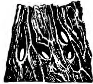

2

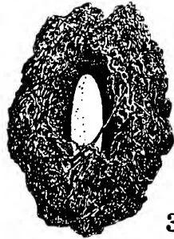

3

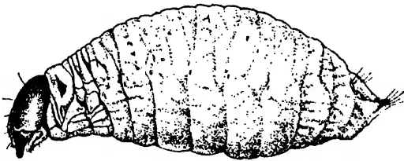

4

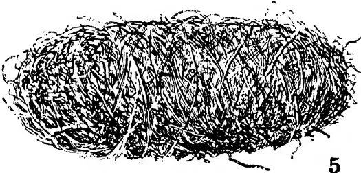

5

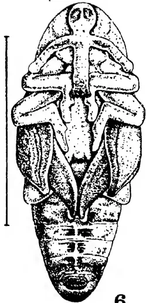

6

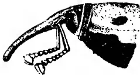

7

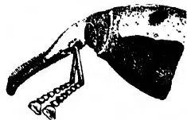

8

9. George Alwis

Fig. 1.—Red Weevil with snout extended.

Fig. 2.—Eggs laid in a piece of leaf-stalk.

Fig. 3.—Egg enlarged. Outline at side shows natural size.

Fig. 4.—Full-grown larva or grub, slightly enlarged.

Fig. 5.—Cocoon.

Fig. 6.—Pupa, removed from cocoon.

Fig. 7.—Head of female weevil.

Fig. 8.—Head of male weevil, showing "brush" of hairs on the snout.

The lines near figures 1, 4, and 6 show natural size. Other figures about natural size.

580------------------------------------------------

This image is a blank white page. It contains several small, dark specks which appear to be scanning artifacts or dust particles. There is no text, handwriting, or printed content on the page.

581------------------------------------------------

135**SUMMARY.**

1. The attacks of red weevil (*Rhyncophorus ferrugineus* F.) are commonly confined to the stems of young coconut palms which are killed by the gradual destruction of the internal tissues. The stems of mature palms are immune. The crowns of palms of all ages are rarely attacked except in cases where damage has been effected by other agents, *e.g.*, black beetle, bud-rot organisms or lightning.

2. The exposure of soft and sappy tissues such as wounds and cracks along the stems of young palms and decaying crowns of palms attract the egg-laying weevils. The complete life-cycle of the pest is passed within the palm.

3. Breeding is also possible in recently killed palms up to a period of about three months after which the tissues are too dry for further breeding. The entire tissue of young palms and the apical portions of mature palms after death are utilised by the pest.

4. Control measures comprise the treatment of young palms by surgical means, the adoption of preventive measures and the use of traps. By the last-named method an effective reduction in the incidence of the pest will be gained.

582------------------------------------------------

136

## CHEMICAL NOTES (6).

### CEYLON CITRONELLA OIL INVESTIGATIONS.

A. W. R. JOACHIM, B.Sc., A.I.C.,

AGRICULTURAL CHEMIST.

DEPARTMENT OF AGRICULTURE, CEYLON.

DURING the past two years samples of citronella oils prepared at the experiment stations at Damana in the Batticaloa district and at Weligama in the Matara district have been examined in this laboratory with a view to ascertaining the relationship, if any, between the physical properties of the oils, their total acetylisable constituents as geraniol, the Schimmel's test on which Ceylon oils are generally sold and market price. During the course of the investigation, it was observed that, though several oils contained the average geraniol percentage of Ceylon oils, they did not pass Schimmel's test and hence were rejected on the market. In order to elucidate this matter, samples of citronella oils of different market grades with the respective market valuations were obtained for analytical examination from the chief citronella oil dealers, through the kind services of Mr. W. C. Lester-Smith, the Acting Divisional Agricultural Officer, Southern.

The following tests were carried out on each of the samples:—

*Specific Gravity.*—A Westphal's balance was used for some of the oils and a hydrometer specially graduated for tropical temperatures in the case of other samples.

*Refractive Index.*—A standard refractometer of the Abbé type was used.

*Optical Rotation.*—This was determined with the aid of Laurent's polarimeter.

*Total Acetylisable Constituents as Geraniol.*—The method recently recommended by the Essential Oil Sub-Committee of the Society of Public Analysts and Analytical Chemists in Great Britain was adopted.

583------------------------------------------------

137

*Schimmel's Test.*—This was carried out at 20°C. The alcohol used was of 80 per cent. concentration, obtained by diluting absolute alcohol to the requisite specific gravity, variations in the latter due to temperature changes being taken into consideration.

*Raised Schimmel's Test.*—Five per cent. kerosene was added to the oils which were then allowed to stand over night. Schimmel's test was then carried out on the adulterated samples.

Before detailing the results of analyses of the oils examined it would be useful to tabulate, for purposes of comparison, the physical and chemical characteristics of Ceylon and Java citronella oils. These are shown in table I below:—

Table I.

<table>
<thead>
<tr>
<th></th>
<th><i>Ceylon Citronella Oils.</i></th>
<th><i>Java Citronella Oils.</i></th>
</tr>
</thead>
<tbody>
<tr>
<td>Specific gravity</td>
<td>.898 to .920.</td>
<td>.882 to .900.</td>
</tr>
<tr>
<td>Specific rotation</td>
<td>—7° to —18°.</td>
<td>—0° to —5°.</td>
</tr>
<tr>
<td>Refractive index</td>
<td>1.4785 to 1.4900.</td>
<td>1.4640 to 1.4725.</td>
</tr>
<tr>
<td>Total geraniol</td>
<td>55 to 62%.</td>
<td>80 to 92%.</td>
</tr>
</tbody>
</table>

Table II shows the results of analysis of some of the samples of oils from Damana and Weligama. All these oils were pure and unadulterated. In table III are shown the results of analysis of standard grades of oils obtained from local citronella oil dealers.

Regarding the colour of these oils, it has been observed that nearly all oils change their colour from yellow to green and *vice versa* as the temperature and weather conditions vary. The reason for the phenomenon is not understood, but it may possibly be due to some "tautomeric" change in the colouring matters of the oil. Where the oils are permanently green in colour, the colour is doubtless due to the copper from the still.

An examination of tables II and III will show that

(1) There is no relation between the total geraniol content of Ceylon oils and the specific gravity, refractive index and optical rotation of these oils. An oil with a low specific gravity or other physical characteristic may have as high a geraniol content as one with a high specific gravity or other corresponding physical characteristic and *vice versa*. On the whole, the results would seem to indicate that citronella oils distilled under the same conditions of temperature and pressure have similar physical characteristics but a varying geraniol content.

(2) Damana pangiri, obtained from the distillation of the wild citronella grass in the Batticaloa district, is of little economic value, its total geraniol content being only 25.6 per cent. This oil has a specific gravity and refractive index similar to the other

584------------------------------------------------

138

citronella oils but an entirely different optical rotation. The wild citronella grass in question appears to be a variety of *mana* grass.

(3) Citronella oils with very great differences in geraniol contents have however very different physical properties. This is clearly seen in table I where the differences in characteristics between the high geraniol-containing Java oils and the low geraniol-containing Ceylon oils are observed to be very great. Of the oils examined in this investigation No. 6 with 81 per cent. geraniol, which has been termed Ceylon pangiri but which is apparently oil from Java citronella grass, has very different physical characteristics from the other Ceylon citronella oils.

(4) The geraniol contents of different varieties of Ceylon oils vary within limits. Different varieties of oils would appear to have different geraniol contents depending on the age of the grass, soil and climatic factors and treatment before distillation. The importance of selection of citronella grasses would therefore appear to be indicated.

(5) There is evidently little relation between the quality of Ceylon citronella oils as gauged by their geraniol contents and their response to Schimmel's test. The latter is a test of the solubility of the oils in alcohol of 80 per cent. concentration and is intended as a means of detecting adulteration of the oils with kerosene; *i.e.*, it is a test of the purity of the oils. It does not determine the quality of the latter. It has been found, however, that pure unadulterated oils containing at times high geraniol percentages do not pass the test. The reason for this is not understood, but it is probably connected with the temperature and pressure conditions under which the oils were distilled. As instances of the unreliability of the test the following may be quoted. Samples 4 and 13, Maha pangiri (Mataru local) with 58.5 per cent. and 59.5 per cent. of geraniol respectively failed the test and hence were rejected on the market, while samples 3 and 9, Maha pangiri (Java) with 56.3 per cent. and 56.1 per cent. geraniol respectively easily passed it. Again, Haen pangiri, sample 8 with 60.8 per cent. geraniol, did not pass the test, but Haen pangiri, sample 1 with 58.3 per cent, passed.

Of the oils examined, only one passed the raised Schimmel's test, *i.e.*, a test of the solubility of the oils in alcohol after the addition to them of 5 per cent. kerosene. In this connection the following remarks by the Essential Oil Sub-Committee of the Society of Public Analysts in Great Britain on the results of Schimmel's test carried out by them on unadulterated citronella oils sent from Ceylon are of interest. "It is thus apparent," so states the Committee "that, when freshly distilled, citronella oils containing from 5 to 7½ per cent. of petroleum would be passed as

585------------------------------------------------

139

genuine by Schimmel's test, but the same oils after a few months would fail to pass this test. While therefore Schimmel's test is valuable as a rough and ready means of deducting gross adulteration with petroleum, it is of little use where this adulterant is present in small quantities only."

It will thus be observed that Schimmel's test is not realiable as a means of gauging either the quality or the purity of citronella oils, and the sale of the latter on the basis of the test alone is unsatisfactory. The obvious alternative is the purchase of citronella oil on the basis of geraniol content in addition to the Schimmel's test. The minimum geraniol content for Ceylon oils may be fixed at 55 per cent. and the maximum at 64 per cent. Ceylon citronella oils with a lower geraniol content than this minimum would be rejected, and those containing higher percentages within the limits specified would be valued proportionately higher on the market.

(6) It will be seen from table III that oils with the higher geraniol content, viz., the estate oils, fetch, on the whole, better prices than ordinary market or f.a.q. oils, though there is no definite relationship between geraniol content and market valuation. On the present system of purchase, however, there seems to be no incentive to the production of pure citronella oils with high geraniol content, as, if an oil should contain a high percentage of geraniol but fail Schimmel's test, it will be rejected on the market. If it should pass the test, it will be accepted not withstanding a low geraniol content. On the other hand, the present system of the purchase of citronella oils tends to encourage adulteration.

586------------------------------------------------

140Table II.

<table border="1">
<thead>
<tr>
<th>No.</th>
<th>Variety.</th>
<th>Origin.</th>
<th>Colour.</th>
<th>Smell.</th>
<th>Sp. gr.</th>
<th>Refractive index.</th>
<th>Optical rotation.</th>
<th>Total Geraniol %.</th>
<th>Schimmel's test at 20°C.</th>
<th>Raised Schimmel's test.</th>
<th>Market valuation per bottle of 22 oz.</th>
</tr>
</thead>
<tbody>
<tr>
<td>1</td>
<td>Haen pangiri (Lena batu)</td>
<td>Damana March 1928.</td>
<td>Light-green.</td>
<td>Good.</td>
<td>.8855(27°)</td>
<td>1.4825(27°)</td>
<td>-10°.20 ft. (27°)</td>
<td>58.3</td>
<td>No opalescence. Passed.</td>
<td>—</td>
<td>Rs. 1.18</td>
</tr>
<tr>
<td>2</td>
<td>Peradeniya pangiri</td>
<td>"</td>
<td>Yellowish.</td>
<td>Lemon grassy.</td>
<td>.8919</td>
<td>1.4790</td>
<td>-13°.0 ft.</td>
<td>57.5</td>
<td>" " "</td>
<td>—</td>
<td>Rejected</td>
</tr>
<tr>
<td>3</td>
<td>Maha pangiri (Java)</td>
<td>"</td>
<td>Reddish-yellow.</td>
<td>Very good.</td>
<td>.8974</td>
<td>1.4822</td>
<td>-12°.10 ft.</td>
<td>56.3</td>
<td>" " "</td>
<td>—</td>
<td>Rs. 1.18</td>
</tr>
<tr>
<td>4</td>
<td>Maha pangiri (Matara local)</td>
<td>"</td>
<td>Light-yellow.</td>
<td>Musty.</td>
<td>.8898</td>
<td>1.4792</td>
<td>-13°.30 ft.</td>
<td>58.5</td>
<td>Marked opalescence. Failed.</td>
<td>—</td>
<td>—</td>
</tr>
<tr>
<td>5</td>
<td>Damana pangiri</td>
<td>"</td>
<td>Yellowish-green.</td>
<td>Wild</td>
<td>.9110</td>
<td>1.4882</td>
<td>+ 9°.30 ft.</td>
<td>25.6</td>
<td>Oily drops. Failed.</td>
<td>—</td>
<td>—</td>
</tr>
<tr>
<td>6</td>
<td>Ceylon pangiri</td>
<td>"</td>
<td>Greenish yellow.</td>
<td>Strong.</td>
<td>.8865</td>
<td>1.4748</td>
<td>- 4°.0 ft.</td>
<td>81.5</td>
<td>No opalescence. Passed.</td>
<td>—</td>
<td>Rs. 1.18</td>
</tr>
<tr>
<td>7</td>
<td>Peradeniya pangiri</td>
<td>Damana June 1928.</td>
<td>Brownish-yellow.</td>
<td>Lemon grassy.</td>
<td>.889</td>
<td>1.4760</td>
<td>—</td>
<td>64.7</td>
<td>" "</td>
<td>—</td>
<td>—</td>
</tr>
<tr>
<td>8</td>
<td>Haen pangiri</td>
<td>"</td>
<td>Yellowish-brown.</td>
<td>Good.</td>
<td>.896</td>
<td>1.4794</td>
<td>—</td>
<td>60.8</td>
<td>Opaque. Failed.</td>
<td>Failed.</td>
<td>Rejected.</td>
</tr>
<tr>
<td>9</td>
<td>Maha pangiri (Java)</td>
<td>"</td>
<td>Greenish-brown.</td>
<td>Good.</td>
<td>.900</td>
<td>1.4815</td>
<td>—</td>
<td>56.1</td>
<td>Passed.</td>
<td>"</td>
<td>Rejected.</td>
</tr>
<tr>
<td>10</td>
<td>Ceylon pangiri</td>
<td>"</td>
<td>Brownish-yellow.</td>
<td>Strong.</td>
<td>.889</td>
<td>1.4760</td>
<td>—</td>
<td>67.2</td>
<td>Passed.</td>
<td>Passed.</td>
<td>Rs. 1.24</td>
</tr>
<tr>
<td>11</td>
<td>Maha pangiri (Matara local)</td>
<td>"</td>
<td>"</td>
<td>Fairly good.</td>
<td>.894</td>
<td>1.4785</td>
<td>—</td>
<td>56.6</td>
<td>Slight opalescence. Passed.</td>
<td>Failed.</td>
<td>Rejected.</td>
</tr>
<tr>
<td>12</td>
<td>Haen pangiri (Lena batu)</td>
<td>Weliganna 1929.</td>
<td>—</td>
<td>—</td>
<td>.888(25°)</td>
<td>1.4758(25°)</td>
<td>-14°.44 ft. (25°)</td>
<td>56.8</td>
<td>Oily drops. Failed.</td>
<td>Failed.</td>
<td>Rejected.</td>
</tr>
<tr>
<td>13</td>
<td>Maha pangiri (Matara local)</td>
<td>"</td>
<td>—</td>
<td>—</td>
<td>.890</td>
<td>1.4760</td>
<td>-14°.22 ft.</td>
<td>59.5</td>
<td>" "</td>
<td>"</td>
<td>"</td>
</tr>
<tr>
<td>14</td>
<td>Maha pangiri (Java)</td>
<td>"</td>
<td>—</td>
<td>—</td>
<td>.890</td>
<td>1.4768</td>
<td>-14°.17 ft.</td>
<td>56.6</td>
<td>" "</td>
<td>"</td>
<td>"</td>
</tr>
<tr>
<td>15</td>
<td>Mixed varieties</td>
<td>"</td>
<td>—</td>
<td>—</td>
<td>.890</td>
<td>1.4766</td>
<td>-14°.22 ft.</td>
<td>57.5</td>
<td>" "</td>
<td>"</td>
<td>"</td>
</tr>
</tbody>
</table>

587------------------------------------------------

141Table III.

<table border="1">
<thead>
<tr>
<th>Description of Sample.</th>
<th>Colour.</th>
<th>Smell.</th>
<th>Sp. gr. at 25°C/40C.</th>
<th>Refractive index at 25°C.</th>
<th>Optical rotation at 25°C.</th>
<th>Total geraniol. %</th>
<th>Schimmel's test 20°C.</th>
<th>Raised Schimmel's test.</th>
<th>Market valuation per bottle of 22 oz.</th>
</tr>
</thead>
<tbody>
<tr>
<td>1. Good oil, but not estate quality.</td>
<td>Golden yellow changing to green.</td>
<td>Very good.</td>
<td>.905</td>
<td>1.4820</td>
<td>-12° 44 ft.</td>
<td>60.8</td>
<td>Passed.</td>
<td>Failed.</td>
<td>Rs. 1/44</td>
</tr>
<tr>
<td>2. Ordinary market oil.</td>
<td>"</td>
<td>Good.</td>
<td>.898</td>
<td>1.4780</td>
<td>-14° 0 ft.</td>
<td>59.8</td>
<td>Passed.</td>
<td>"</td>
<td>Rs. 1/40</td>
</tr>
<tr>
<td>3. Adulterated (f.a.q.)</td>
<td>"</td>
<td>Good.</td>
<td>.90</td>
<td>1.4790</td>
<td>-11° 15 ft.</td>
<td>58.2</td>
<td>Passed with difficulty.</td>
<td>"</td>
<td>—</td>
</tr>
<tr>
<td>4. Market quality oil.</td>
<td>Yellowish gold changing to green.</td>
<td>Good.</td>
<td>.896</td>
<td>1.4776</td>
<td>12° 45 ft.</td>
<td>60.9</td>
<td>Passed.</td>
<td>"</td>
<td>Rs. 1/37</td>
</tr>
<tr>
<td>5. Fair average quality (f.a.q.)</td>
<td>Light gold changing to green.</td>
<td>Fair.</td>
<td>.896</td>
<td>1.4772</td>
<td>-11° 32 ft.</td>
<td>57.6</td>
<td>Passed.</td>
<td>"</td>
<td>Rs. 1/37</td>
</tr>
<tr>
<td>6. Estate quality.</td>
<td>"</td>
<td>Very good.</td>
<td>.900</td>
<td>1.4800</td>
<td>-10° 40 ft.</td>
<td>59.3</td>
<td>Passed.</td>
<td>"</td>
<td>Rs. 1/41</td>
</tr>
</tbody>
</table>

588------------------------------------------------

142

## RHYNCHOSTYLIS RETUSA BL., THE FOX-TAIL ORCHID.

K. J. ALEX. SYLVA,

ASSISTANT CURATOR,

HENERATGODA BOTANIC GARDENS.

**T**HE fox-tail orchid is one of the most beautiful of our indigenous orchids and is a favourite of both amateur and professional gardeners owing to its handsome inflorescence and the ease with which it can be grown.

The plant is of a hardy nature. It has a thick short stem of about 5 to 6 inches long covered with old brown leaf sheaths. The leaves are thick and fleshy and are about 10 to 16 inches long and about 1 to  $1\frac{1}{2}$  inches broad. They are arranged obliquely in a spreading and recurved manner.

The flower raceme is ordinarily from 10 to 16 inches long. It is densely clothed with spotted flowers of a delicate waxy-white purple with a tip strongly tinged with violet pink. The pedicels are short and stout. The tail-like, almost cylindrical form of the raceme gives the orchid its common name.

*Culture.*—The plant is easily propagated by the division of stem suckers, carefully severed from the parent plant with a couple of roots attached to each. Its long, thick and vermiform branching roots enable the plant to thrive best on live tree trunks which have fairly thick and splitting corky bark, for example, jack and mango. Palms are less suitable. After removal of dead roots and dried parts of the lower stem, the plant should be carefully placed on the trunk of a live tree. The root system immediately around the plant should be covered with a little moss and coconut fibre and the whole should be secured firmly with coir string. In tying the plant care should be taken to see that it is kept in its natural growing position and that the roots are not cut or injured by the string.

Low-hanging and injured roots may be cut back to about a foot from the plant. Only copper wire may be used to secure the plant to the tree trunk as other kinds of wire affect the growth of the roots. The plant prefers a warm, moist atmosphere and thrives best on an eastern aspect. After being tied to a tree, the plant needs regular syringing with water for at least four to six weeks to encourage it to give out new roots.

589------------------------------------------------

A blank white page with a small black speck near the center-right.

590------------------------------------------------

A high-contrast black and white photograph of four fox-tail orchid flower spikes (Rhynchositylis retusa) growing in a dark, textured environment. The spikes are bright white and densely packed with small flowers, contrasting sharply with the dark background. The spikes are arranged in a cluster, with one spike in the upper left, one in the center, one in the lower left, and one in the lower right. The background is dark and textured, suggesting a natural, possibly damp, environment.

*Rhynchositylis retusa* Bl., the Fox-tail Orchid.

591------------------------------------------------

143

In the green house or conservatory the plant may be grown in perforated pots or baskets, preferably those made of wood. Plants that have lost their lower leaves should have their stems cut off at a point immediately below some young active roots in order to bring the position of the leaves to the surface of the pot. Only a few healthy young roots should be left. All others should be cut back to a point which allows insertion into the pot without overcrowding. Plants with short or few roots may be supported by a stick placed in the bottom of the pot. After the roots have been placed in position, half the receptacle should be filled with pieces of decayed wood or bark, chopped coconut husk, charcoal and bits of bricks, and the other half with a compost of roots of *Asplenium nidus* (bird's nest) finely chopped and mixed with crushed crocks or charcoal to keep the compost porous. During the first week, the compost should be kept moist; afterwards morning and afternoon syringing will be sufficient until the plant starts growing, when copious supplies may be given. Plants grown in this manner produce blooms annually about June-July which last for over four weeks. When the plant is well established, the only attention or care that is necessary is a little watering during times of drought if the plants are in an open shed or house.

The accompanying photograph shows the plant growing in pots and on a tree trunk at the Heneratgoda Botanic Gardens. The plants in pots are about eighteen months and those on the tree trunk about three and a half years old.

592------------------------------------------------

144

## SELECTED ARTICLES.

### GREEN MANURING WITH PARTICULAR REFERENCE TO COCONUTS.

DEPARTMENT OF AGRICULTURE, CEYLON,  
LEAFLET NO. 57.

#### THE PRACTICE OF GREEN MANURING.

**G**REEN manuring is an ancient agricultural practice which has played an important part in both western and eastern agriculture. It is recorded that it has been carried on in China for over 3,000 years and in Europe for at least 2,000 years. Green manuring is now widely practised, and in the tropics it has become, within comparatively recent years, an established agricultural operation on many tea and rubber estates. It has only recently been undertaken in a systematic manner on coconut estates. In the Dutch East Indies and the Philippines it is almost universally practised on European and American-owned plantations and is becoming increasingly popular on native-owned properties. In Malaya, it is extensively carried out, but in Ceylon the practice is far from being general. Individual estates, however, are carrying out extremely useful work on the subject and some of this work I have been privileged to see for myself. In general, all coconut estates on which green manuring has been adopted have reported very favourably on the results obtained. Neglected properties for years under grass are being brought into condition by cultivation and green manuring. The value of green manuring, happily enough, is becoming more understood and the practice shows signs of spreading. It will be a good day for Ceylon's coconut industry when all coconut estates have adopted some rational system of green manuring. The rubber industry affords an instance of how a practice which is of so great agricultural value in tropical countries can become widely adopted. In connection with experimental work with green manuring of coconuts, it may interest coconut planters to learn that one of the chief lines of research to be undertaken at the new Warivapola Experiment Station of the Department of Agriculture is the study of green manuring of coconuts in all its aspects.

#### WHAT IS GREEN MANURING?

In this paper the term "green manure" will include "cover crops." The distinction between them, however, should be pointed out. A cover crop is planted for the purpose of protecting and covering the soil. When it is turned into the soil it becomes a green manure. A crop which is solely used for turning into the soil is a green manure crop, so that a cover crop can be used as a green manure crop but not all green manure crops as cover crops.

Green manuring is the practice of incorporating into the soil undecomposed plant material with the object of increasing soil fertility. The green material may be grown *in situ* or brought from outside. It is commonly believed that only leguminous plants are beneficial as green manures, but

593------------------------------------------------

145

this is not so. Non-leguminous plants are useful for green manuring provided they are brought from outside and not grown on the area which is to be green manured. It may be useful to allow non-leguminous plants to grow at site, *e.g.*, as covers on hilly ground, and to turn them in later, but this practice is not to be generally recommended. Leguminous plants are of value as green manures because of the large amounts of nitrogen they fix in the soil through the nodules on their roots. These nodules contain bacteria which carry on the work of nitrogen-fixation, the energy for the process being derived from the carbohydrate material supplied by the plant. When, therefore, leguminous plants are grown on a soil, they enrich the nitrogen content of the latter, even if the leafy material is not turned in. If the latter is turned in, the soil is then markedly enriched, both in nitrogen and organic matter.

### **THE ADVANTAGES AND IMPORTANCE OF AND NEED FOR GREEN MANURING IN GENERAL AND GREEN MANURING OF COCONUTS IN PARTICULAR.**

The advantages of a green manure crop are as follows:—

(1) If the green manure is a cover crop, it prevents the loss of valuable surface soil from hilly and undulating land caused by the heavy rainfall of the tropics. The covers also take up the plant-fertilizing constituents contained in the surface layers of soil, which would otherwise be leached out.

(2) It protects the soil against the beating action of the rain and the excessive heat of the sun. This in the tropics is a matter of great importance. Tropical rains are so heavy that the soil surface is often "capped" and made impervious to water. As a result, excessive losses of moisture from the soil surface take place through capillary action when dry weather sets in. When rain subsequently falls on the "capped" surface, the greater part of it flows over and is not absorbed by the soil. Green manures keep the soil open by their root action and hence rain water is absorbed much more readily on green manured soils. The shade afforded by cover crops also prevents direct loss of moisture from the soil surface.

(3) Ploughing in green manures adds valuable organic matter to the soil; on decomposition the material forms humus. It is well known that Ceylon soils in general and coconut soils in particular are very deficient in organic matter. Green manure crops give from 2 to 10 tons of green material per acre and this will assist to an appreciable extent in increasing the content of soil humus. Humus has many properties. Among others (1) it absorbs water and the mineral constituents of the soil and regulates the supply of these and of the nitrogenous substances absorbed by plant roots; (2) it improves the texture of tilth of soils, breaking up heavy soils and binding together light soils and rendering them better able to withstand drought; (3) it is the storehouse of the nitrogen of soils; (4) on it depends the activity and number of the micro-organisms which are the life of the soil. These micro-organisms fix the free nitrogen of the soil, obtaining their energy for so doing from the soil organic matter, and the carbon dioxide formed in the process makes available to the crop some portion of the mineral constituents of the soil.

(4) Green manures reduce weeding costs, especially on new clearings. Cover crops when firmly established smother out weeds. Weeding is a big item on many tropical estates, and in coconuts a saving effected in the weeding bill should materially affect the cost of production.

(5) By green manuring, the surface soil is supplied in a quickly available form with plant-food constituents obtained by the green manure crop from the soil and sub-soil.

594------------------------------------------------

146

(6) By the growth of green manures the aeration of the soil is improved and the roots of the main crop are enabled to penetrate deeper into the sub-soil.

(7) The leafy material of many green manure plants can serve as a useful fodder.

(8) The amount of nitrogen supplied to the soil by green manuring with leguminous crops can be considerable. Reckoning on an average crop of, say, 4 tons of green material per acre per annum, containing on an average '6 per cent. of nitrogen, the amount of nitrogen by which the soil is enriched will be at least 50 lb. per acre. This is a conservative estimate as it does not take into account the amount of nitrogen contributed by the roots and nodules of a leguminous crop, but it is sufficient to show how much the nitrogen content of a soil can be improved by this means. Not all this nitrogen is available to the crop. Experiments in temperate countries have shown that if the availability of nitrate of soda is reckoned as 100, that of green manures is about 65. The greater portion of the remainder goes to form the nitrogen of the soil humus. The question has been raised as to whether the large amounts of nitrogen added to the soil by green manure would affect the yields of coconuts adversely. Of this there is little danger, for the amount of nitrogen available to the coconut crop from an average green manure crop would be about 35 lb. per acre per annum, based on the figures quoted above. This can hardly be called an excessive dose of nitrogen. There is the further fact to be considered, viz., that the leaves and branches of the coconut tree will take up a fair portion of the nitrogen supplied by green manures. It is essential, however, that on green-manured coconut estates potash and phosphoric acid be applied and preferably in larger quantities than those normally required by the coconut. Experiments are being carried out at Peradeniya to determine the increase in carbon and nitrogen of soils as a result of green manuring soils (a) *in situ*, (b) with crops brought from outside. Work in other countries has shown that both the carbon and the nitrogen contents of soils can be very appreciably increased by green manuring. Non-leguminous creeping crops may be used as cover crops on hilly land, where leguminous crops will not grow. But as these crops compete with the main crop for the soil moisture and fertilizing constituents and may therefore harm the latter temporarily, their use is not unreservedly recommended. Owing to the large amounts of nitrogen contributed by leguminous green manures, it may safely be stated that, on coconut estates where green manuring is systematically carried out, no harm will result by eliminating nitrogen, especially organic nitrogen, from the manure mixture. The amount of organic matter supplied by organic nitrogenous manures in quantities used in manure mixtures is very insignificant. As nitrogen is the most expensive item of a manure mixture, the present manure bills can thereby be considerably reduced. Thus, of Rs. 30 per acre spent per annum on manuring coconut estates, the nitrogenous constituents cost about half, and expenditure on manuring can therefore be reduced by half. This amount can be utilized for the first few years for establishing green manures. Further, where green manuring is generally practised and good yields are obtained, even in periods of normal crop prices, any nitrogen added in manure mixtures should always be in mineral form.

To sum up, by green manuring a coconut estate weeding costs can be eliminated, the manure bill cut down appreciably, the nitrogen and humus content and the moisture-holding capacity of the soil increased, its texture and tilth considerably improved, and its fertility maintained or even enhanced. A general improvement in the health and condition of the palms accompanied by increased yield will undoubtedly follow.

595------------------------------------------------

147

## PRESENT-DAY PRACTICE ON COCONUT ESTATES.

It would at this stage be useful to compare the advantages of green manuring of coconut estates with the advantages of present-day estate practice. With the exception of those that have adopted green manuring coconut estates in Ceylon can be placed in three categories from the point of view of general cultivation: (1) those that are weeded and ploughed periodically or ploughed periodically but not weeded; (2) those that are neither ploughed nor weeded; (3) those under grass not ploughed or those under grass periodically ploughed in.

In the case of the first class, provided the weeds are ploughed into the soil, estates on which this practice is followed should give fair yields. Organic matter is supplied by the weeds, but the mineral plant-food constituents of the soil will be gradually depleted, unless they are supplied by manures. Ploughing will encourage the fixation of the free nitrogen of the soil by *Azotobacter*, which derives its energy from the organic matter present in the soil. The amount of nitrogen fixed is more than counterbalanced by the amount taken up by the crop. The soil nitrogen will thus be slowly depleted. If no organic matter is added and the soil is regularly ploughed its store of organic matter and nitrogen will be quickly exhausted owing to the activity of the micro-organisms in tropical soils. Yields are sooner or later bound to fall to a low level as a result of the loss of soil fertility and poor physical condition of the soil brought about by continuous ploughing. Clean weeding is not carried out on coconut estates because of the high cost, and on undulating land it is distinctly disadvantageous. In districts of low rainfall where weeds are allowed to cover the ground during drought, the crop will suffer owing to the loss of soil moisture through transpiration and yields will be affected adversely. On undulating and hilly coconut land in districts of heavy periodic rainfall, ploughing followed by heavy rains will cause soil erosion. Such lands should therefore be ploughed towards the end of the rains before the drought sets in or preferably planted with a cover crop and treated as detailed later.

In the second class, in which no cultivation whatever is carried out and no measures are taken to prevent the loss of soil moisture during drought or of the surface soil during heavy rains if the land is undulating, or to maintain soil fertility, the yields of palms will necessarily be low.

With regard to the third class, it may be said that many Ceylon estates are left under grass. It is commonly believed that grass has no deleterious effects on the coconut palm, as palms are often found that give yields of 80 to 100 nuts and more though under grass. There is little doubt that if the grass were removed and the estate brought into normal cultivation higher yields of nuts would be obtained. Grass affects coconut palms (a) by depriving the palms of some of the soil moisture, especially during periods of drought; (b) by assimilating the available nitrate in the soil as well as a part of the manure applied to the crop; (c) as Howard at Pusa has shown, by preventing soil aeration and increasing the carbon dioxide content of the soil air carbon dioxide in excess may be toxic to the roots of the main crop. There is no evidence that other toxic compounds are found. If, however, the grass is ploughed in periodically at suitable times, no permanent harm can be done to the coconuts. On hilly and undulating land grass will prove useful against soil erosion, but it should be ploughed in before the drought sets in and replaced by a leguminous cover.

## DECOMPOSITION OF GREEN MANURES IN SOILS.

Provided there is sufficient moisture in the soil, the decomposition of green manures which is brought about by the soil micro-organisms will take place almost immediately. The final product is nitrate in which form

596------------------------------------------------

148

most plants take up their nitrogen. The question has been asked whether in the process of decomposition of green manures, the available combined nitrogen of the soil is not assimilated by the micro-organisms bringing about the decomposition. It has been found by experiment that this will not occur unless the buried material contains less than about 2 per cent. of nitrogen. As green manures generally contain over 2 per cent. nitrogen on an air-dry basis, their nitrogen content is more than sufficient for the needs of the micro-organisms. The excess is therefore made available to the crop as ammonia and nitrate. When the material to be buried contains less than 2 per cent. of nitrogen, as e.g., in the case of woody loppings or coconut husks which contain about 5 per cent. nitrogen, the micro-organisms have to draw on the nitrate and ammonia reserves of the soil, the quantity present in the decomposing material being insufficient for their needs. A temporary loss of this nitrogen to the crop occurs, but the nitrogen assimilated is eventually made available to the crop. Loppings, therefore, should not be left to grow woody before they are ploughed in, as the more woody they become the less their nitrogen and the more their lignin contents become. Lignin decomposes only very slowly in the soil. The burial of husks in well-drained, light and medium soils is advantageous to the crop owing to the quantities of humus they add to the soil on decomposition.

Experiments at Peradeniya have shown that maximum nitrification of green manures takes place in from six to eight weeks, but that subsequent to this the amounts of nitrate present in the soil vary, being largely dependent on rainfall. The more rain there has been during a period, the less nitrate is found in the soil at the end of the period. The experiments have also shown that, from the nitrogen standpoint, the direct effects of green manures in the soil are not appreciable after about six months.

In this connection reference may be made to a question frequently asked, whether green manure crops should be turned in green or dry. Work at Peradeniya on this point has confirmed the observations of previous workers that drying of green manures delays as well as hinders nitrification. Further, it was found that when green manure loppings were left to dry on the surface of the soil, great losses of nitrogen and to a smaller extent of organic matter, amounting in the case of the former to as much as 40 per cent. of the nitrogen of the green manures, may occur. Some of the nitrogen, however, is in the form of nitrate which is leached into the soil below. The losses are dependent on weather conditions and are greatest when there is an alteration of dry and wet weather. Decomposition also takes place most rapidly under these conditions.

### PRACTICAL CONSIDERATIONS.

Under this heading the following will be discussed: (a) when green manures should be cut and turned into the soil and how they should be treated; (b) on what soils they should be grown and under what climatic conditions; (c) how a good growth of green manures can be obtained on poor soils.

*When should green manures be cut?*—In general, previous work has shown that the highest percentage of nitrogen in green manures occurs at a comparatively early stage of their growth, but that the total nitrogen is greatest at or a little before flowering. A study is being made at Peradeniya of the change in composition and "decomposability" of green manures with age in order to determine the optimum stage for lopping. Green manures, especially in dry districts, should be cut towards the end of the rainy season when the showers alternate with dry weather and should be ploughed in at once. On sandy soils in districts where a long drought follows rain and it has not been found possible to turn in the loppings, the latter should be cut at the commencement of the drought and left as

597------------------------------------------------

149

a mulch on the surface. On sandy soils moisture and not nitrogen is often the chief limiting factor of crop growth, and the mulch of green material will form a useful means of conserving soil moisture. It is preferable, however, to turn in the cuttings about three to four weeks before drought sets in, as by that time a certain amount of decomposition will have taken place and the decomposed material will have been able to retain some moisture for the subsequent use of the crop. On no condition should green manures be cut and forked into the soil during a drought, even at the beginning of it. This prohibition applies particularly to light sandy soils. The decomposition of green manures does not take place if the soil has insufficient moisture at and subsequent to the time of burying. If they are ploughed in during dry weather when the soil is dry, the materials remain undecomposed and leave large air spaces that cause loss of water by evaporation. It may be necessary in some instances to compact the soil after green manuring in order to minimize the losses of soil water and to establish capillarity in the soil.

*On what soils should green manures be grown and under what climatic conditions?*—This is a point of great importance to coconut planters. The greater majority of the soils of the coconut areas of the Negombo, Chilaw and Puttalam Districts are light sandy soils which are markedly deficient in organic matter. The rainfall conditions are not ideal, especially towards Puttalam, and long periods of drought are not unknown. The question may well be asked: will not the light soils of these areas be deprived of the little moisture they contain by the growth of green manures? Work carried out at Peradeniya during the last three years on the soil moisture relationship of green manures and cover crops has shown that in the case of cover plants, more moisture is lost to a depth of 24 inches during periods of drought from soils under cover crops than from bare soils during the first two years of the growth of the covers and that after this period the reverse is the case. This is due to the fact that in the early stages of the growth of the covers more moisture is lost from the soil through transpiration than is retained by the surface layer of decomposed organic matter or by the shade it affords. The reverse is the case once the cover is well established and a layer of organic matter has formed as a mulch on the surface. During the severe drought experienced in January and February of this year, moisture determinations were made on soil samples taken from the green manure plots at the Peradeniya Experiment Station. With regard to the cover crops, the previous results obtained were confirmed. In the case of the bush green manures, *e.g.*, boga medelloa, it was found that where the green manure was unlopped there was less moisture to a depth of 24 inches in the plots than in the controls, but where the green manure had been previously lopped and envelope-forked into the soil the plots had much more moisture than the controls. The importance of lopping the bush green manure crops before a drought is therefore clearly indicated. This applies particularly to bush green manures grown in the drier coconut districts.

With regard to the growing of green manures, it may be stated that, provided there is sufficient rainfall, they can be grown with advantage even on poor sandy soils. In the case of the latter, growing a green crop and turning it in will eventually give a soil of increased water-holding capacity enriched in nitrogen and humus. Where soils are poor and sandy and the rainy seasons is of short duration, a quick-growing annual leguminous green manure crop should be grown. It should be cut and left as a mulch during the drought and ploughed in during the next rainy season, and the soil should be replanted with the green cover with the onset of the next rains; or, when possible, the green manures should be forked in early enough for decomposition to have started before the drought sets

598------------------------------------------------

150

in. It may be well to state that the barren sandy heaths of North Germany were reclaimed and made profitable by Schultz by growing lupines and ploughing them in along with phosphatic and potash manures. Suitable crops for the purpose of ploughing in on these poor soils will be dealt with later.

Some authorities seem to doubt the utility of growing green manures in dry districts and on very sandy soils. Though the doubt may be justified in the case of very dry districts in Ceylon, *e.g.*, part of the North-Central Province, I do not think our coconut areas are so dry that such a system of green manuring as that already outlined cannot be carried out with advantage. It has been found in the arid districts of America that a minimum rainfall of 17 inches is necessary for green manuring to be practicable. Very few parts of Ceylon are as dry as this and all coconut districts get the benefit of at least one monsoon and most of both monsoons, so that during rainy weather green manuring can be safely adopted. On the better types of soils and in districts where the rainfall is adequate green manuring is a simple matter and will be very advantageous.

Regarding the period of retention of green manures it may be stated that, in general, perennial cover crops under coconuts should not be allowed to grow for too long without being ploughed in. The reasons for this are: (1) the soils on which these covers grow need periodical cultivation and aeration; (2) they get "sick" of growing one particular crop. For the latter reason it is also advisable to have a rotation of green manure crops. The ploughing of alternate rows of the cover crop should be carried out once in two or three years in the case of both flat and undulating land. On the latter, the ploughing should be across the slope. Thus contour-like belts of unploughed cover will alternate with ploughed rows. Where the green manure crop is a heavy one, it should be cut up with a disc harrow or rolled before ploughing in. It is also advisable to plough in some cattle manure along with the green manures owing to the large number of bacteria present in the former which will hasten the decomposition of the latter. With regard to the shrubby types of green manures, care must be taken that the branches do not get too woody before they are lopped. Green manures can be forked into the soil along with artificial manures.

(c) *How can the good growth of green manures on poor soils be ensured?*—It may be found difficult to establish a green manure crop on poor sandy soils. Under these circumstances, attention may be drawn to the following practical points:—

(1) The green manure should be given a start by applying cattle manure to the seed bed. If cattle manure is not available, some nitrogenous manure, *e.g.*, a mixture of nitrate of soda and blood meal mixed with twice its weight of soil and applied at the rate of a handful or two per hole if cuttings are grown, will be found useful. Like other plants, leguminous plants require nitrogen in the early stages of their growth till their nodules are formed. Hence the need for this start.

(2) *Inoculation.*—Leguminous crops at times do not come up well in new areas to which they are introduced. This is because the soil does not contain the specific bacteria needed by the particular legume for the formation of the root nodules. In this case inoculation of the soil or of the seed will have to be carried out. There are three methods of soil inoculation, of which the soil method is alone suitable for Ceylon conditions at the present time. It consists of broadcasting over the area to be planted 300-400 lb. of soil per acre which has been taken from an area on which the green manure it is desired to establish has been grown with success.

599------------------------------------------------

151

(3) *Manuring of green manure crops.*—In order to get a good growth of green manure crops manuring with potash and phosphoric acid should be adopted as the green manures have to compete with the main crop for these fertilizing constituents. As a result of manuring the bacteria are reported to become more active and able to enter the plants readily, and nodule formation is increased. The root growth of *Leguminosae* in general is stimulated by manuring with phosphoric acid.

(d) *Seeding, seed beds, and cultivation.*—When planting green manures out for the first time a heavier seed rate than is normally required, especially if seed is plentiful and comparatively cheap, is recommended. By this means a cover will be more quickly established and weeds more effectively suppressed. Generally speaking, green manure seed should not be broadcasted but should be planted in rows. A mixture of seed is said to give better results than seed of one plant. For coconut estates a mixture of shade and light-loving and of quick-growing though short-lived and slower-growing though long-lived plants will be found advantageous. In all cases the seed bed should be carefully prepared. Seed is sown or cuttings planted in rows varying from 2 to 5 feet apart between the rows of palms. The planting should be carried out at the beginning of the rains. Weeding should be done in the early stages so as to give the green manures a good start.

### GREEN MANURING OF COCONUTS.

Now that the advantages of green manuring in general have been indicated and some practical considerations have been dealt with, the question of the green manuring of coconuts in particular will be considered in detail. Many varieties of green manure crops have been found useful for new clearings and full-grown coconuts. Mention will be made of only a few. It is not proposed to deal with such considerations as seed rate, method of sowing or green manures suitable for a particular district. These are matters which have already been or will be dealt with in a general way. Such points will have to be investigated by the individual planter.

*Green manuring of coconuts in other countries.*—The practice of growing green manures under coconuts and oil palms is popular in the Dutch East Indies, where it is doubtless to some extent responsible for the high yields of coconuts obtained. Most of the varieties now grown in coconut and rubber-producing countries were first experimented with and grown on a large scale in the Dutch East Indies. In the Philippines cover crops are grown on every progressive estate. The green manures found most suitable are certain varieties of the lima bean (*Phaseolus lunatus*). This bean is a long-lived perennial of exceedingly vigorous growth which has been reported to be useful in exterminating illuk. It dies down in prolonged dry weather but comes up again with the rains. Unlike those of most green manure plants, its leaves cannot be used as fodder owing to the prussic acid they contain. Other varieties found useful for coconuts in the Philippines are *Tephrosia candida* (boga medelloa) and *Tephrosia vogelii*. On the poor sandy coast soils of Porto Rico, species of *Mucuna* have been very successful. The growth of *Mucuna* is very quick and thick, and quantities of green material (up to 6 tons per acre) are obtained. Weed growth is effectively prevented. The leaves are rich in nitrogen and can be used as fodder.

Many varieties of green manures have been found suitable for coconuts in Malaya. Among others *Centrosema pubescens*, *Calopogonium mucunoides*, *Dolichos hosei* (vigna), *Centrosema plumieri*, *Pueraria phascoloides*, besides bush varieties like *Tephrosia candida* (boga), *Tephrosia vogelii*, and *Crotalaria spp.* Some of these will be referred to in greater detail later. In India *Vigna catiang* (cowpeas) and *Dolichos uniflorus* (horse gram) are grown successfully, both as catch crops and green manure crops.

600------------------------------------------------

152

*Green manuring of coconuts in Ceylon.*—Green manuring of coconuts was undertaken as early as 1905 at the Experiment Station, Peradeniya. The crops tried were cowpeas, groundnut, soy bean, *Crotalaria* spp. and boga. Cowpeas gave very good results, and so did boga and *Crotalaria*. Soy beans were not a success, due doubtless to the deficiency in the soil of the specific bacteria associated with this crop. It has been found in America that inoculation of soy beans is always necessary before the crop can be introduced into new areas. Groundnut is very useful as a green manure owing to its rapid growth, but is not so successful as a catch crop owing to damage by rats which also attacks the coconuts.

*Green manures for young coconut estates.*—In young clearings where the rainfall conditions are satisfactory, the growth of a cover crop is very advantageous for reasons already stated. The bush varieties, e.g., boga are not entirely suitable as they are inclined to become too dense and to compete with the young coconut plants unless they are grown in rows 6 ft. wide and are regularly lopped. In regard to all cover plants in young coconuts, it has to be emphasised that they must never be allowed to climb over the young coconuts even for a short period; if they do, the latter will suffer a setback. The following will be found useful and can be recommended for young coconut areas in Ceylon:—

*Calopogonium mucunoides.*—This is a quick-growing green manure with a tendency to climb. It grows well on most soils but requires well-drained soil. It is very suitable for young clearings. During periods of prolonged drought it has a tendency to die out, but with the advent of the rains a fresh cover is obtained. It is best sown in rows 3 to 5 ft. apart. It requires weeding in its early stages. A good cover about two feet thick can be obtained in about four months. It is a good seeder and dies out in twelve to eighteen months. It can also be grown under old coconuts which do not give much shade, but it does not thrive so well as in the open. Some of its disadvantages for old coconuts are: (1) its growth is so thick that it is difficult to find the nuts, which have been picked; (2) it harbours snakes. The latter disadvantage applies to all green manures.

*Mucuna* spp.—These plants have already been dealt with. After they have formed a good cover in new clearings, they should be ploughed in and followed by a more permanent cover, e.g., *Centrosema pubescens*.

*Centrosema pubescens.*—This is a twining creeper requiring a fairly good soil. It is rather slow in growth but forms an excellent cover in about five or six months; difficulty may be experienced at first in establishing it. If it is grown after a crop like *Mucuna* has been ploughed in, its growth will be quicker. It stands drought admirably. It does not thrive under heavy shade, but it grows well under the light shade of coconuts.

*Dolichos hosei* (commonly known as *vigna*).—*Vigna* is more suitable for heavy shade but does well in young clearings. It is a very useful cover for old coconuts as it does not make too thick a growth and hence does not cover the nuts. The disadvantages with *vigna* are that it is rather difficult to establish on eroded hilly land, needs constant weeding, and dies down during drought. It is advisable to establish the plant in nurseries, and to give it a start under old coconuts by applying some nitrogenous or cattle manure.

*Pueraria phaseoloides (javanica)* is a strong twining cover and is useful for young clearings, but it must be kept away from the young palms. It dies down in drought. It does best under shade and is very suitable for old coconuts. It is better suited for heavy land than for sandy soils.

601------------------------------------------------

153

*Centrosema plumieri* *Dolichos lablab*, *Dolichos biflorus* (horse gram) have also been recommended as green manures for young coconuts.

*Arachis hypogea* (groundnut).—Groundnut can be grown either as a green manure crop or as a catch crop and is very suitable for dry districts. Trials should be made with the different varieties of groundnuts as a catch crop in young and old coconuts. The cake obtained after the extraction of the oil can be used as manure and the leafy material can be turned in as green manure or fed to cattle. The crop is ready for harvesting in six or eight months. The disadvantage of this crop is that it attracts rats.

*Vigna catiang*, *Vigna sinensis* (cowpeas).—Cowpeas are suitable for young plantations and old coconuts. The cowpea is a quick-growing annual which forms an excellent cover in three to five months. It thrives on the poorest land and stands drought well. It is therefore very suitable for Ceylon coconut lands. It has been successfully used at Peradeniya as a green manure for coconuts and also in the Kurunegala District. On an estate in the latter district, a three months' growth of this crop under old coconuts, not only produced an appreciable difference in the appearance of the palms, but also increased the nitrogen content of the soil. The yield of green material obtained has been as much as six tons per annum.

*Soja max* (soy bean).—Trials with varieties of the soy bean should be made in young clearings as well as under old coconuts. There are more than 400 varieties of this bean in existence. It is a herbaceous annual of erect growth, varying in height according to the species. It is particularly resistant to drought and will thrive on most soils except the very poor ones. Inoculation is essential when this crop is grown for the first time. Like groundnut it can be treated, both as a catch crop and a green manure crop.

Of the bush varieties of green manures suitable for coconuts *Tephrosia* spp. and *Crotalaria* spp. are most suitable. *Clitoria cajanifolia* is also a suitable hedge plant for coconuts. Of the former *Tephrosia candida* (boga medelloa) is perhaps the best for Ceylon conditions; hence its popularity as a green manure for coconuts. If the land is rich boga will, unless lopped, grow too tall and affect the young coconuts adversely. It should always be sown in rows and never broadcasted. Boga can be grown on hilly land in contour hedges across the slope. On poor and badly drained soils on which it is difficult to establish boga, the following methods will be found suitable: (1) a drain should be cut and the soil heaped in mounds over husks. The seed is then sown on the mounds, a little artificial or cattle manure being added if necessary. It can also be grown on the mounds of contour terraces of coconuts; (2) the application of cattle or buffalo manure in lines between the rows with liming and forking before sowing the seed. Boga gives a very heavy yield of loppings rich in nitrogen and organic matter and also in mineral because it is so deep-rooted. It stands lopping well, and can be grown in most coconut districts. Like all shrubby green manures it must be cut before drought sets in towards the end of the rains. It is preferable to fork it into the soil if a sufficient interval of time between the turning in and the onset of the drought is anticipated. In case a sufficiently early forking is not possible, the bushes should be lopped at the beginning of the dry period and the loppings left as a mulch on the surface. In this case, the soil moisture must be conserved even at the risk of incurring appreciable losses of nitrogen. The leafy portions and the less woody material should subsequently be forked into

602------------------------------------------------

154

the soil at manuring time in the manure trenches. When shrubby green manures are cut at other periods, the cutting should be done just before or at flowering. The disadvantages of shrubby green manures are the difficulty of supervising labour and of gathering the crop. Other varieties of shrubby green manures suitable for coconuts young and old are *Tephrosia vogelii*, *Cajanus indicus* (dhal), *Crotalaria striata*, *Crotalaria usaramoensis* and *Crotalaria anagyroides*. The latter are quick growers and give large amounts of organic matter. They need frequent lopping but die off comparatively soon.

**Green manures for old coconuts.**—The shrubby green manures have been dealt with. Of cover crops, *centrosema pubescens*, *Centrosema plumieri*, *Dolichos hosei*, *Pueraria phaseoloides*, *Phaseolus lunatus*, *Vigna catiang* (cowpea), *Arachis hypogea* (groundnut) *Mucuna* spp. will grow successfully if the shade is not too heavy. *Colopogonium mucunoides* is also suitable if the shade is not heavy. *Desmodium polycarum* has been found to be a very good green manure for coconuts in the Kurunegala district. Especially on poor soils, *Mikania scandens* can be left where it grows if it cannot be replaced by a green manure crop. It must however be ploughed in before the drought sets in. It is a non-leguminous twining weed common on estates and is useful for suppressing other weeds, e.g., illuk. It has been found useful in Malaya and the Philippines as a cover crop for coconuts. In general it may be stated that any leguminous plant growing on a coconut plantation should be encouraged and, if indigenous legumes grow well in the neighbourhood, attempts should be made to introduce them on the estate. In the case of non-leguminous plants which grow well outside estates, e.g., wild sunflower, it would be advantageous to lop them before they have flowered and to use the cut material for green manuring coconuts.

**Treatment of green manures prior to drought.**—The general treatment of cover crops under coconuts before a drought, in districts of average quality soil and with average rainfall, is a comparatively simple matter. Most covers die down during a prolonged drought, and the decayed leafy material obtained forms a very good mulch. If, in addition, light harrowings are periodically given, the palms should not be affected to any great extent by drought. Immediately the rains start, the covers come up again. In the case of covers which stand drought well, experiments at Peradeniya already referred to indicate that once the cover has been well established less moisture is lost from the covered area than from the bare soil. In districts with a good rainfall, though some moisture will be lost from the soil through cover crops in the early stages of their establishment, there will not be any permanent ill-effects on old coconuts. In young plantations it would perhaps be useful to grow a mixture of drought-resisting and non-resisting covers. Where the soil is very sandy and the rainfall satisfactory, the growing and forking in of quick-growing annual covers, e.g., cowpeas, groundnuts and *Mucuna* spp. are advised, followed, when the soil is sufficiently enriched with organic matter, by the growth of a more permanent cover. In the case of sandy coconut soils in dry districts quick-growing annual crops should be grown in the rainy season and ploughed in towards the end of the rains. Boga medelloa or other bush green manure should also be grown and the loppings cut and left as a mulch on the surface at the beginning of the drought. After a few years of this treatment, the question of the establishment of a permanent cover should be considered.

It is advisable to grow both cover crops and the shrubby forms of green manures on coconut estates. The latter primarily supply the soil with organic matter and the former secure to the soil and crop the benefits already explained.

603------------------------------------------------

155

### CONCLUSION.

In the preceding pages an endeavour has been made to indicate the need for, importance of, and advantages to be derived by green manuring Ceylon crops in general and coconuts in particular; the difficulties likely to be met with and the measures necessary for surmounting them; the possible disadvantages of green manuring under certain soil and climatic conditions and how they may be minimised to some extent; the varieties of green manures suitable for different soil and climatic conditions. It is left to the individual estate owner to ascertain by experiment which green manures suit his conditions best. It is regretted that little information is available as regards increased yields of nuts and profits derived from green manuring. It however will soon be forthcoming. There is little doubt that judicious green manuring of coconuts will pay. If green manuring can have had such markedly good results in the case of tea and rubber, it is more than likely that it will have the same results in the case of coconuts. It has been widely adopted in progressive coconut-growing countries, *e.g.*, the Dutch East Indies, the Philippines, and Malaya. The universal adoption of the practice should eventually result in increased yields and improved quality of nuts and in a permanent improvement of the condition of coconut estates in Ceylon. It therefore offers a means of combating in one direction the present depression of the coconut industry. By green manuring, the weeding bill is lessened; an appreciable reduction in the manure bill can be effected without a corresponding fall in yield of crop or loss of soil fertility; a permanent increased soil fertility is brought about and the value of the estate is enhanced; the palms are brought into better condition, become more resistant to disease, and may be expected to give increased yields. It is true that for a year or two a certain amount of expenditure is necessary, but it will be more than compensated for by savings in the weeding and the manuring bills.

604------------------------------------------------

156

## THE EMPIRE MARKETING BOARD AND AGRICULTURAL RESEARCH IN ENGLAND AND WALES.\*

A considerable portion of the Empire Marketing Fund has been allocated to agricultural research, and institutions in the home country (as part of the Empire) have received grants from that fund for such work. At the request of the Empire Marketing Board the Ministry has undertaken the administration of many of the grants to institutions in England and Wales. These institutions are almost exclusively Research Institutes, University Departments or Colleges, but in one case a grant has been made to a County Council institute.

The following are brief notes on certain grants for agricultural research from the Empire Marketing Board, administered by the Ministry. Reference is made in the Journal periodically to other grants, chiefly but not entirely to assist work of an economic nature, which are made by the Ministry out of the annual grant which it receives from the Empire Marketing Board to develop the marketing of home agricultural produce.

*Long Ashton Fruit Research Station, Bristol University.*—Investigations into storage have shown that the keeping qualities of fruit are related to the kind of soil in which the fruit is grown; also that fruit from different orchards with the same type of soil may show material differences in storage quality. It is known, for instance, that when particular varieties of apple grown in certain places are stored, they break down internally, giving rise to Jonathan Spot, Bitter Pit and other disorders. These troubles are not due to storage, since apples stored under the same conditions but grown under different ones stand the test well.

A capital grant of £7,025 to meet the cost of an addition to the existing laboratories of the Station, a cold store, an orchard house, glass shelter and other minor items, and maintenance grants of £2,425 in the first year, rising to £2,750 in the fifth year, have been made for the purpose of investigation. The staff employed on the investigation consists of a soil analyst, a biochemist and a physiologist.

*East Malling Research Station.*—Investigations carried out at East Malling have shown that different stocks behave in different ways when the same variety is grafted on to them. For instance, apple stocks have been typed, and it is known that one type will develop into a small bush giving crops of well-grown, highly-coloured apples from the second year of grafting, while another stock, to which the same variety of scion is grafted, will produce a large tall tree which fails to crop in early years but will crop heavily later. With other fruits, too, it is found that certain stocks and scions are incompatible and grafts fail; in other cases the time of reaching maturity is affected. Disease resistance also varies with different combinations of stocks and scions. This work has now been extended in order to establish the principles which govern the relation of stocks to scions. A knowledge of these principles will enable a control over the behaviour of a tree to be established by selection of the appropriate stock and scion, and will provide a guide for the selection and standardization of the horticulturist's material.

\* From *The Journal of the Ministry of Agriculture*, Vol. 36, No. 4, July 1929. This article is supplementary to the selected article published in *The Tropical Agriculturist* of last February.

605------------------------------------------------

157

The staff employed on the work includes a biochemist, a pathologist, a physiologist and a pomologist. Additional land has been acquired for the investigations, and a biochemical laboratory and equipment for the staff employed have been provided. The capital grant amounts to £9,050 and the maintenance grants vary from £5,218 in the first year to £5,685 in the fifth year.

*Rothamsted Experimental Station.*—In connexion with the investigation of diseases attacking cotton in Gezira, Sudan, the stage has been reached when accurate information regarding the rôle played by soil temperature and atmospheric humidity is required. The investigations indicate, so far, that soil temperature is intimately connected with the incidence of one of the most serious bacillary diseases of the cotton plant, viz., Angular Spot or Black Arm. A grant of £800 for one year has accordingly been made to enable six "Wisconsin" tanks to be erected and maintained at the Station for the purpose of the investigation. These tanks consist of a thermostatic arrangement whereby the temperature of the soil and the atmosphere can be controlled, thus enabling the conditions to be regulated under which physiological and pathological experiments on plants can be carried out.

*Rothamsted Experimental Station and the Experimental and Research Station, Cheshunt.*—Arising out of a recommendation of the Imperial Agricultural Research Conference, 1927, that "no time should be lost in the provision of funds for the more extended study of the fundamental nature of virus diseases in plant," grants have been made to the above Stations for such study. The capital grants amount to £1,835 in the case of Rothamsted and £1,040 in the case of Cheshunt, and are for the purpose of erecting insect-proof glass-houses and special apparatus. The maintenance grants amount to £2,495 in the first year, rising to £3,115 in the fifth year to Rothamsted; and £1,108 in the first year, rising to £1,260 in the fifth year, to Cheshunt, and will enable a number of scientific workers to be employed on the problem.

*Experimental and Research Station, Cheshunt.*—The Red Spider causes considerable losses over a great part of the Empire. It attacks the carnation, cucumber, currant, gooseberry, tomato, vine and hops. In the tropics the castor bean, cinchona, cotton and rubber are attacked. The present methods of control are extremely unsatisfactory, since the mites exhibit great resistance towards the insecticides in common use.

The White Fly is a serious pest which occurs wherever glass-houses are installed. A Chalcid parasite recently discovered subjects the fly to almost complete control. A stock of the Chalcid is maintained for distribution to growers.

*Cladosporium* is a fungus found on the beet, citrus, cucumber, peach, potato, tomato and water melon. It is known that temperature and humidity affect the incidence of tomato mildew, but the present data do not point to a reliable control. Continuous temperature and humidity records are being taken in commercial nurseries for correlation with the incidence of disease. Tests of fungicides are also being carried out.

Recent work on mosaic disease has indicated that, in the case of the tomato and cucumber, the disease is frequently transmitted in the seed, and it has been found possible to select seed which is free from the mosaic virus. The investigation is proceeding further on these lines.

For the purpose of the above investigations, a capital grant of £1,600 for the erection of experimental glass-houses, etc., and maintenance grants of £1,760 per annum for five years have been made. A special staff is being employed on the investigations.

*Reading University.*—The mycologist in the New Zealand Department of Agriculture recently reached the conclusion that the "dry rot" disease

606------------------------------------------------

158

of swedes and turnips, which is very prevalent in that Dominion, is seed-borne, and that to combat the disease disinfection of the seed is necessary. Most, if not all, of the seed used in New Zealand is obtained from seed merchants in England, and it has been suggested that if the seed for the "mother" crop were treated before it is sown in this country the resultant seed for export would be free from disease, and the New Zealand crops would, therefore, be healthy. Certain work done in this country some years ago tended to show that the disease was not seed-borne; but, even if the disease could be traced to the seed, it is not clear that the disease is to be solely attributed to the sowing of infected seed. It appears certain that the "dry rot" disease is intimately bound up with a disease known as swede canker that attacks the seed-yielding plants. It follows that there is no certain proof that the disinfection of the "mother" seed will, in fact, result in a seed crop which will be entirely healthy.

A grant of £520 has accordingly been made for the purpose of an investigation into this problem. A mycologist is being employed to assist the advisory mycologist at the University, and the whole of the investigation is under the direction of the Ministry's Plant Pathological Laboratory.

*National Institute for Research in Dairying.*—Red spot in cheese has been found during the past thirty years in Canada and in England. An organism has been isolated in infected cheese, but it seems likely that other organisms may produce a similar result. It is essential to isolate all such organisms, to study the sources from which they emanate and the exact conditions, *e.g.*, of acidity and storage, under which they produce the fault.

Fishiness is a well-known fault of dairy products, but appears to be most serious in the case of butter, particularly where it has to undergo storage for some time. A considerable amount of work has been done on the subject, but workers are not yet agreed as to the primary cause of the defect.

The results so far obtained have revealed the fact that the complete study of the causes of "red spot" in cheese and "fishiness" in butter cannot be undertaken without the provision of stores in which temperature and humidity can be accurately controlled.

A capital grant of £3,150 has accordingly been made for the erection and maintenance of a cold store in connection with these investigations, together with maintenance grants amounting to £2,300 per annum. A bacteriologist and chemist are being employed on the work. The cold store will also be used in connection with the investigation of other problems which involve a study of ripening processes in dairy produce.

*Cambridge University.*—The International Education Board have offered a grant of £700,000 for the building of the new University Library and for developments in agriculture, biology and physics, on condition that the balance required under the scheme, viz., approximately £500,000, is raised from other sources. In order to enable the University to qualify for this grant, the sum of £50,000 has been promised from the Empire Marketing Fund conditionally on the University raising the further funds required. This grant is to be devoted to the development of research in agriculture and allied sciences. A further £50,000 on the same conditions has been promised to the University by the Government from the Development Fund for the extension of the work of the School of Agriculture.

*Animal Nutrition Research Institute, Cambridge University.*—(a) In the production of eggs and table poultry, costings investigations have shown that 65 per cent. of the total cost of production is due to the cost of foods used. The possibility of effecting economies in the production of poultry products by a more exact knowledge of the scientific principles of feeding

607------------------------------------------------

159

is obvious. From investigations already made by the Institute into the variation in composition of a typical egg-laying breed (White Leghorn) and a dual-purpose breed (Light Sussex) during the growing period, with the object of establishing the relative rates at which storage of protein, fat and mineral substances occur at different periods, it has been ascertained that the relative storage of protein in the body differs widely during various stages of growth, a sex difference in the storage of fat has been shown to occur, and the economic stage at which the cockerels intended for table purposes should be killed has also been indicated.

A capital grant of £890 has been made for the purpose of providing accommodation for 200 adult stock, and an experimental house for controlled feeding experiments; and a maintenance grant of £330 in the first year, rising to £418 in the fifth year, will be used for the salary of a skilled worker to assist in the continuance of the research directed towards establishing a scientific feeding standard for poultry, the digestibility of the commoner poultry feeding stuffs—with particular reference to feeding stuffs of Empire origin, and an investigation into the physiological conditions concerned in the production of fat in the bird.

(b) Investigations have shown that grass can be conserved in cake form with its protein digestibility unimpaired (rather less, that is, than that of the best linseed cake). Such "grass cake" appears to keep almost indefinitely, and successful feeding trials have been carried out on bullocks. In preliminary experiments on the replacement of oil cakes by grass cake in the ration of dairy cows the milk yield remained good and the weight of the beast increased.

With the object of exploring further, on a semi-commercial basis, the results already achieved, a grant of £200 has been made to the Institute for the erection of a full-sized silo.

(c) An investigation into the physiology of reproduction and growth of farm animals has been carried out at some disadvantage owing to the absence of adequate accommodation. A grant has been made to enable all the work to be concentrated at Howe Hill Farm and to provide accommodation to which the live stock can be transferred. The total cost of these arrangements is estimated at £16,000, of which £4,000 is being provided by the Board. A grant of approximately £300 per annum is also being made to cover part of the salary of an assistant to Mr. J. Hammond in this work. Mr. Hammond or his assistant will also be at the disposal of the Board for special visits to other parts of the Empire, if required.

In the course of investigations, in which pigs were kept without food for from three to five days, it was observed that whereas the white pigs maintained a steady body temperature the black animals showed a fall in body temperature of approximately 1°F. for each day on which food was withheld. These investigations were on a very small scale, and it is now desired to repeat them on a large scale, since the facts observed might indicate some peculiarity in the metabolism of pigmented animals and perhaps that of pigmented human races. A grant of £1,000 has been made for the erection of a suitable animal house for the work.

*Department of Animal Pathology, Cambridge University.*—In 1924, Professors Calmette and Guerin, of the Pasteur Institute, Paris, announced a new method for the prophylactic immunization of cattle against tuberculosis. This consisted of the administration to young calves of a living but a virulent culture of tubercle bacilli which were named by the originators B.C.G. bacillus. It was claimed that not only was this strain of tubercle bacillus completely deprived of its original virulence and incapable of producing the formation of tubercles in all species of susceptible animals, but that when introduced into the bodies of the non-tuberculous young of such animals it would produce a firm resistance to subsequent infection with

608------------------------------------------------

160

virulent strains of the organism. Preliminary experiments made at Cambridge, consisting of an intravenous injection of virulent bovine tubercle bacilli, which kill untreated control calves within three weeks, indicate that B.C.G. vaccine, when suitably administered, can produce a very high degree of immunity in calves as evidenced by their surviving the test dose. It is now necessary to test this method on a considerably larger scale in order to determine the reliability of the method, the duration of the immunity, the fate of the organisms used for immunizing and the fate of the organisms used for the test—whether given intravenously or acquired under natural conditions. To assist in this purpose the Board has made a grant of £3,000 for the erection of an additional twenty-two boxes for animals undergoing the test.

*National Institute of Poultry Husbandry, Harper Adams Agricultural College.*—This Institute is the largest section of the National Poultry Institute and is charged with the double duty of providing advanced instruction in poultry husbandry and of carrying out experimental work on a commercial scale. It is well equipped for teaching and experimental work in connexion, more especially, with egg-production, but is only very slightly developed for the study of problems of poultry meat production and of the even more important question of the economics of the dual-purpose fowl. Experience has shown that experimental work on these problems is urgently needed.

A capital grant of £5,000 has accordingly been made for the provision of a complete marketing unit, comprising extension of headquarters building, marketing building, staff cottages, additional land, refrigeration outfit, live stock, laying houses, etc., together with maintenance grants of £1,581 in the first year, rising to £1,816 in the fifth year. A statistician, a research assistant and a waterfowl expert are being employed on the investigations. Provision is made in the scheme for the study of the accumulated records of the Institute from the point of view of variation in egg weights.

*Oxford University, Department of Zoology.*—Previous investigations have shown that very many species of rodents in all parts of the world undergo great fluctuations in numbers in periodic cycles, and that these cycles are so regular that the course of events can often be predicted. Greater knowledge of the subject would therefore be capable of practical application in dealing with the economic problems which the direct and indirect effects of these fluctuations present. The investigations carried out with the aid of a grant of £850 per annum for three years are:—

An intensive study of the exact mechanism underlying cycles in the numbers of wild mice; experiments with cage-kept wild mice, in order to ascertain how breeding is controlled in the female; experiments designed to test various ways of estimating the numbers of wild populations; and co-operation with the Hudson's Bay Company in a study of cycles in numbers of Canadian furbearers and the study of the climatic factors which control the cycles over large areas.

The investigations are likely to make it more easy to protect farm crops from destruction by rodents.

*Agricultural Economic Research Institute, Oxford University.*—With the aid of a grant of £700 per annum for five years, a research economist has been appointed to the Institute for the collection and dissemination of information relating to agricultural economics within the Empire. This worker will also be concerned with questions of technique in different economic conditions. There is still much to be learnt regarding the methods of approach to the problems of production in countries with widely different agricultural conditions, and regarding the methods by which data should

609------------------------------------------------

161

be collected and results presented. The research economist will also be available in connexion with the training of any agricultural probationary officers who may be sent to Oxford by the Colonial Office, and his services will be at the disposal of the Empire Marketing Board for special investigations.

*Welsh Plant Breeding Stations, University College of Wales.*—In view of the importance of grass land in relation to the wool, mather, mutton, beef and dairy industries, research work is needed to select the best and most long-lived strain of each of the herbage plants, to determine the conditions in which they should be cultivated, and to indicate what countries of the Empire are best fitted to grow the supplies of seed required by other Empire countries.

Capital grants amounting to £4,350 have been made for the purpose of extending the Station's farm and for the erection and equipment of field laboratories to enable research into the production of improved pedigree strains of herbage plants to be undertaken and for the growing-on of supplies of such improved strains are produced. Maintenance grants of £4,600 in the first year, rising to £4,950 in the fifth year have also been sanctioned. Additional research workers will be employed to carry out this work.

*John Innes Horticultural Institution.*—The uplands of Iraq and Persia are the natural focus of the genus *Prunus*, from which emanated, at a very early date, all the economic forms of plums, cherries, almonds, peaches and apricots, with the exception possibly of certain plums, immediately of Japanese origin but subsequently hybridized in America. The original specific forms from which the cultivated varieties originated are but partially known from a few individual representatives distributed in botanic gardens, yet it is mainly from these primitive and apparently unpromising forms that it is hoped to find material for the improvement of the present varieties by hybridization.

With the aid of a grant of £400 an investigator from the Institution is undertaking an expedition to the region mentioned to collect species and forms of *Prunus* and *Tulipa*; the latter genus is focussed in the same region, but is of botanical and horticultural rather than off economic interest. The region proposed (the mountain ranges between Mosul and Lake Urumia in Persia) is one of great botanical interest that has, as yet, not been botanically explored. An officer from the Royal Botanic Gardens, Kew, is participating in the expedition.

*East Anglian Institute of Agriculture, Essex County Council.*—*Spartina Townsendii*, or Rice Grass, has certain properties which appear to make it suitable as a binding agent for sea defences in temperate regions. It has a good mechanical effect and it gives a product of some economic value. It has been established by the Institute that the grass can be fed to animals and that it is at least as valuable as poor meadow hay. A grant of £220 has now been sanctioned to enable *Spartina* to be planted experimentally with a view to the prevention of erosion.

*Imperial College of Science and Technology (London University).*—A systematic study of the insect pests affecting stored food products has been undertaken by the Entomological Department of the College under the direction of Dr. J. W. Munro. With the object of indicating the nature and reaching a solution of the problems raised by these pests, detailed investigations are being made into the biology and habits of the insects infesting cacao, dried fruit and other products arriving at, or stored in, wharfs and warehouses, while special attention will be given to the sterilization of products arriving for immediate marketing in home ports. The scope of the investigation, which started in 1927, has recently been extended and a property at Slough has been acquired for the purpose of a field

610------------------------------------------------

162

station, which, it is hoped, will become a centre for the training of entomologists in matters affecting stored food products infestation. The co-operation of important firms of wharfingers, merchants and manufacturers is being obtained so that full facilities will be available for the study of conditions prevailing in warehouses and for the collection of material for laboratory work. The chief end of the inquiry is to determine the extent of the losses on stored Empire goods caused by insect pests and the means of reducing such losses.

Capital grants amounting to £10,425 have been sanctioned in respect of apparatus and the acquisition and equipment of the field station, while maintenance grants on the extended scheme, rising from £2,195 in 1928-29 to £3,574 in 1931-32, have also been sanctioned. The staff now engaged on the investigation includes, in addition to the director, a mycologist, a physical chemist, a demonstrator, a bibliographer and four research assistants.

*Royal Botanic Gardens, Kew.*—Annual grants totalling £7,200 are made towards (1) the development of the cultivation of economic plants within the Empire, (2) the classification of herbarium specimens, and (3) herbarium assistance for the Dominions and Colonies. The grants are devoted (a) to the employment of an Economic Botanist who is available to undertake overseas missions or to set free a superior officer of the Kew staff to visit the Dominions and Colonies and advise on agricultural and cognate problems, (b) to sending botanical collectors abroad to procure plants of economic importance, (c) to expediting the classification of large recent accessions of botanical material, and (d) to affording assistance to the Dominions and Colonies in the investigation of their respective floras.

*Grants to the Ministry for the purposes of organising Empire Conferences.*—A grant £5,000 was made to cover the expenses of the Imperial Agricultural Research Conference, 1927. Reference to this Conference has already been made in the Journal (Vol. XXXIV, No. 10, January, 1928).

A grant of £500 has also been made to cover the cost of organizing the Agricultural Sections of the Conference of Empire Meteorologists to be held next month (August).

611------------------------------------------------

163

## AGRICULTURE IN SOUTH AFRICA.\*

**T**O one accustomed to the agricultural conditions of the West Indies there are several features in South Africa that strike one forcibly. First of all there is the relative shortage of water. South Africa, on the whole, is a dry country and the rainfall is divided pretty sharply into that of the dry winter period, May to October, when, over the greater part of the Union, less than five inches fall, and that of the summer period when the better water regions get 30 to 40 inches; some get 20 to 30, but there are large tracts getting only 10 to 20, some only 5 to 10 inches, while there are large areas along the western side of the country where the summer rain is less than 5 inches and that of the whole year is under 10 inches. Another striking feature is the extensive character of agricultural operations as contrasted with the intensive methods of the West Indies and Great Britain.

Except in districts where irrigation is possible agricultural operations have to be adapted to the seasonal rainfall; during the dry winter period many operations have to be suspended. The grain crops are sown so as to take advantage of the summer rains.

With all its limitation as regards rain, South Africa is a great agricultural country, the value of agricultural products being upwards of £67,000,000. Animal husbandry is of much importance. Great quantities of sheep are raised, mainly for their wool, which is of very fine quality, and cattle are produced in great numbers, being used for draught purposes, also for their meat and hides which are important articles of commerce, while dairying is carried on, on a considerable and increasing scale, large quantities of milk being required to meet the demands of the large towns, while butter and cheese are produced for home consumption and also for export on a large scale.

### MAIZE PRODUCTION.

On the arable side maize forms the main object of cultivation. It is the crop of preponderating importance in South Africa, the total production of grain being about two and a half million tons (1924-25), which taken at a moderate valuation of £6. 5s. 0d. a ton, is equivalent to £15,400,000. Of this some 60 per cent. is consumed in the country and some 40 per cent. exported in the form of grain and meal.

Maize is grown in almost every district of the Union; the most important producing area lying within what is known as the Maize Triangle, which may be defined by a line drawn from Mafeking in Bechuanaland to Machadodorp in the Transvaal and completing the triangle by lines connecting these extremities with Zastron in the Orange Free State. Some 60 per cent. of the Union's production comes from within this area and it is practically all produced by Europeans. Of the remaining 40 per cent. grown outside this triangle about 20 per cent. is produced by native tribes, principally in the Transkeian Territories, Zululand and Swaziland. A considerable quantity produced in the Northern Transvaal, also in the midlands of Natal and in the eastern districts of the Cape Province between East London and Queenstown.

---

\* By Sir Francis Watts, D.Sc., being extracts from an address delivered to the Trinidad Science Club in February, 1929. From *Tropical Agriculture*, vol. VI, no. 6, June, 1929.

612------------------------------------------------

164

The cultivation of the crop is restricted to the period of the summer rains, 15th December being commonly regarded as the latest date for sowing. Under favourable circumstances a good deal of work can be done before the advent of the rains by way of weeding and cleaning the land and preparing it for sowing, thus minimising the subsequent work of weeding and cultivating. The land is ploughed with oxen as these are abundant and largely used for draught purposes; they are also used for drawing harrows, cultivators and planters; in a few cases only are horses used for these purposes.

The crop is usually reaped by hand, the stover being used for fodder, the cattle being either turned into the fields to eat it down, or it may be cut and fed to the stock. Shelling or cleaning the grain from the cob is done by machinery, usually by contract with the owners of the machines.

Attention is now being paid to the use of fertilisers and considerable use is made of farmyard manure.

Apart from the use of the maize on the farms very large quantities are required for the use of the Kaffir labourers in the gold mines of Johannesburg, the diamond mines of Kimberly and the coal mines of the Transvaal and Natal. Approximately one million tons of maize are exported in the form of grain and meal.

Careful organisation is required for the handling of these large quantities and much has been done in this direction by the development of the elevator system at the hands of the Government, under the immediate control of the Department of Railways and Harbours. Under this system grain is received from the producers, cleaned, graded and stored. On receipt a certificate is issued for the quantity and quality of the grain received and this document can be used as security against a bank advance, or it can be sold outright; by this system financial operations are greatly facilitated. As the grain is handled in bulk the cost of bags is eliminated and the cost of loading into railway trucks and steamships is greatly reduced.

At present there are thirty-four elevators distributed through the principal maize-producing districts. These elevators vary in storage capacity from 1,800 tons to 5,800 tons, the aggregate being 109,200 tons; in addition to these there are two large elevators at Capetown and Durban, that at Capetown having a capacity of 30,000 tons and the one at Durban 58,000 tons. The total storage capacity of the system is 181,200 tons.

The working of the elevator system has not been free from difficulty and has been carried on at considerable loss to the Government. Complaints are made that some owners of grain take undue advantage of the system to hold their grain in the elevators waiting for a rise in price and thus prevent their legitimate use in the ordinary way of handling the product. It has been suggested that higher charges may have to be made for storage after the first ten days so as to discourage the improper use.

### KAFFIR CORN.

A considerable quantity of Kaffir Corn (*Sorghum vulgare*) is grown by the natives. This indigenous plant is receiving attention from the European farmers on account of its value as a fodder and for its use for making ensilage. The grain is useful as food both for men and animals. The varieties now grown are improved ones introduced from America. A considerable quantity is used for making Kaffir beer, of which great quantities are consumed by the natives. This is a slightly fermented, turbid liquid, slightly acid containing less than 2 per cent. of alcohol.

613------------------------------------------------

165

## OTHER CROPS.

Of the other crops wheat is grown to a small extent mainly in the South-western and Queenstown Provinces of the Cape Province and in the "Conquered Territory" of Basutoland (3,000 sq. m). The yield is but small, averaging about  $8\frac{1}{2}$  bushels of 60 lb. per acre. It may reach double that amount on irrigated lands of the Karoo.

Barley and oats are also grown in considerable quantity. In addition to the grain, much of the oat crop is cut while green and used for hay.

The value and importance of the lucerne crop is being increasingly recognised. Formerly grown in great quantities as fodder for ostriches, largely in the southern and eastern parts of the Cape Province, great fortunes were made in certain irrigated districts. It has been said that "since 1923, and before the loss of the ostrich industry, lucerne has made more fortunes than any other product except gold or diamonds." It is now largely used to supplement food supply in dry seasons; on good irrigated land it is cut for hay and also grazed off by pigs without damage to the crop.

## CATTLE INDUSTRY.

Cattle raising forms a very important branch of South African agriculture. It is estimated that there are between nine and ten million head in the Union; nearly one-half of which belong to natives, who from time immemorial have raised herds under conditions closely akin to those of modern ranching, which consists in running herds over extensive pastures allowing them to roam almost at will, though herdsmen look after their movements, care being taken to provide such water as the districts afford, and as far as possible to direct their movements to the best available feeding grounds.

Ranching is largely followed by European stock owners on the grass lands of the Kalahari, many hundreds of square miles of which occur mainly to the east and north of Kimberley, in the Bechuanaland Protectorate where the winter rainfall is under 5 inches and that of the summer period reaches only 10 to 20 inches. For the most part these Kalahari grass lands require from 20 to 40 acres for each head of stock, but better grazing lands are met with as one approaches the border of the Transvaal, though even here from 10 to 20 acres are required. Grazing conditions improve as one follows the boundaries of the Transvaal along the drainage areas of the Crocodile or Limpopo River, the better lands supporting one animal on less than 10 acres.

Constant efforts are made to improve the stock-carrying of these areas, particularly of those more favourably situated. These efforts take the form of improved water conservation and attention to the pastures, including the introduction of good fodder grasses and work of that kind. As one approaches the better lands the farms improve until dairy-farming and mixed agriculture become possible when conditions approximate more closely to those of Europe.

These cattle-raising areas lie mainly along the eastern and northern borders of what has been referred to as the great maize-bearing tract and even in the better farms encroach within that area.

The cattle run on these ranches are mostly of the native long-horned type which the early settlers found the Hottentots possessed of when they arrived in the country at the close of the seventeenth century. From the outset the Dutch have endeavoured to improve the native races by the introduction of good strains from Holland, and it is interesting to note

614------------------------------------------------

166

that the best of this foundation stock owes its origin to imported cows looted by the Hottentots from Dutch settlers in the neighbourhood of Mossel Bay in 1668. These animals are those found most suitable for transport purposes on account of their hardiness and resistance to disease.

The transport ox has been of fundamental importance in South African settlement and development. From the early days the Dutch farmers were entirely dependent on the ox-waggon for all means of transport. In the remoter districts, roads, as one ordinarily understands the term, are non-existent, there being only unmetalled tracks crossing the veld; the ox-waggon can travel over these with impunity. In spite of the development of railway and motor haulage, cattle are still largely employed for transporting produce and goods to and from railway centres and the farms and remote districts. In addition to transport purposes the ox is valuable also for beef and for hides.

The pastures of the lands devoted to ranching are too poor to enable the animals raised on them to be brought into good condition for market, consequently it is the custom on the part of ranchers to sell them to farmers situated either in or near the maize-producing areas or where good crops of sorghums (Kaffir corn) and other fodders can be raised; this work is carefully undertaken, and now constitutes an important branch of South African farming. The areas suitable for this work are for the most part in the Transvaal and part of the Orange Free State where farming conditions are good and where good markets for beef exist in the mining districts of the Transvaal and Northern Natal. In addition there is a large consumption of beef throughout the Union, so that special and well-planned arrangements are made for marketing and cold storage; chilling and storage establishments being provided at several large towns.

Attention is being given to the establishment of an export trade in meat, but there is, so far, but a limited supply of beef of a quality required by the British market. An interesting development in this connexion has been the opening up by the Imperial Cold Storage of a market in Italy; shipments have also been sent to France.

The incidence of cattle disease, notably rinderpest in 1896, seriously retarded the progress of cattle-raising; hundreds of thousands of cattle died from 1896-98, but with the control of disease conditions are rapidly improving.

Dairy farming is receiving much attention and care is now being devoted to the creation of good dairy herds by the selection of good breeds and by the elimination of the less profitable milkers, the Government and the various Dairy Associations being active in all this.

It is in connexion with the raising of dairy stock that perhaps the greatest advance has been made, and particularly in the direction of producing high-class pedigree stock; the Government, the shipping companies and other organisations, including many prominent South Africans, have all actively collaborated in this work, until now South Africa is recognised as one of the finest and most important districts for the production of pedigree cattle.

Reverting to dairy work, there is a good demand for milk in all the large towns and steps are being taken to supply it on modern sanitary lines; help and instruction in this direction being afforded by the Government and the agricultural colleges and schools; for example, the Glen School of Agriculture specialises in dairy work, as does also that at Potchefstroom. Creameries and butter factories are also to be found scattered throughout the country.

615------------------------------------------------

167

## SHEEP INDUSTRY.

Sheep farming is carried on over the greater part of the Union; it is the most general of all the South African farming enterprises, and South Africa is steadily taking its place as one of the great sheep and wool producing countries of the world. The country may be divided into three distinct sheep farming types of district, namely the Karoo, mixed veld, and grass country.

The Karoo is an arid, or semi-arid region mostly within the Cape Province extending from the coastal plateau for many miles. The pasturage consist mainly of low shrubs which afford feeding for great flocks of sheep and goats. Further north lie the mixed veld lands on the western and south-western borders of the Orange Free State. These lands bear mixed pasture of Karoo bush and grass and have a higher carrying capacity than the Karoo. The grassland veld comprises the bulk of the pastoral area of the Union; it ranges from the coastal belt of the Western Province, the whole of the Eastern Province, Central and Eastern Orange Free State, the whole of the Transvaal and Natal.

The sheep are raised mainly for their wool and, although South Africa has now become one of the important wool-producing countries of the world, its output is capable of expansion and this expansion is being hastened by the failure of the ostrich industry and the consequent grazing of sheep over what were until recently ostrich farms.

Wool of good average quality is obtained from the greater part of the Union. Fine wools are produced in the western and eastern parts of the Cape Province, the Eastern Free State, the Eastern Transvaal, the whole of Natal and East Griqualand. The fine wools raised in the region around Grahamstown, Graddock and Colesberg are especially appreciated by English manufacturers, and active efforts are being made to improve their quality still further. Notable work in this connexion is being done under the direction of Dr. J. E. Duerden of the Rhodes University, Grahamstown, who is carefully studying wool and its growth on genetic lines and already important facts have been discovered having direct bearing on the production of fine wool and the remedying of defects.

In order to improve the breed of sheep large numbers of high-class animals have been imported. The production of high-class stud animals is now an important part of the South African sheep industry, enlightened sheep farmers paying great attention to the quality of their animals and the wool produced by them. Locally raised rams have brought prices ranging from 1,000 to 1,500 guineas. Thus, while the industry carries on in an extensive way, it is evident that money and intelligence are given to the industry in no stunted manner.

## GOAT INDUSTRY.

Angora goats, which produce the mohair of commerce, were introduced at great trouble and expense in 1838 from Cashmere and Asia Minor. The present flocks are the results of crosses between ordinary Boer ewe goats and high-class Angora rams. At present South Africa produces two-thirds of the world's supply of mohair, the remainder coming from Turkey.

616------------------------------------------------

168

## ANIMAL HUSBANDRY.

### TEMPORARY STERILITY OF DAIRY COWS.\*

**T**HE condition generally known as temporary sterility of dairy cows is a cause of considerable loss and trouble to farmers in New Zealand and in all other dairying countries. In females of all types of animals, including cattle, there are always some who, through individual idiosyncrasy, will not breed regularly or not breed at all. This temporary form occurs so frequently that it raises a perplexing problem. Cows exhibiting it will almost invariably get in calf at times varying usually from two to four months from the time of the first unsuccessful service; hence there can be no permanent defect in the generative organs of the animals, though there is evidently some cause or causes operating which prevent conception taking place at the time of the first or second service.

Intensive research aimed at determining how the trouble comes about and how it can best be combated is in progress in this country, in America, Britain, Denmark, and other countries on the Continent of Europe. Meanwhile, all the knowledge we have available must be applied to the problem of reducing the number of cases of temporary sterility to as low a proportion as possible.

### MANAGEMENT AND TREATMENT OF THE BULL.

In examining the position the degree to which the bull may be responsible for cows failing to hold must be fully considered, and there is good reason for believing that the adoption of the best methods of management of the bull will be of definite value. Points in such management are as follows:—

(1) Never let the bull run with the herd, but keep him apart in an enclosure where adequate shelter is provided. Take each cow to him for service only when she is ready. Let her have two services, and then take her back to the paddock. This enables the bull to conserve his energy, instead of wasting it in unnecessary services and perhaps (especially in the case of a very young bull) rendering himself temporarily useless from time to time.

(2) Do not allow the bull to be fat and "soft" when the time for service arrives. He needs to be in really good condition, but this can be overdone at the expense of the sustained energy and vitality necessary for the effective carrying out of his season's work.

(3) If a bull aged eighteen months or thereabouts is used, do not overwork him giving him too many cows to serve.

(4) Examine the bull's organ carefully before the season commences, in order to be satisfied that it is perfectly clean and healthy. Also examine it at frequent intervals afterwards. If it is not healthy, treatment must be applied at once. The form of treatment depends on the nature of the trouble affecting it, and, wherever possible, the advice of a Veterinarian or Stock Inspector should be sought. If this is not immediately available it is a good practice meanwhile to syringe into the sheath twice daily a mild solution of ordinary table salt. This should be prepared as follows:

---

\* Bulletin No. 144 of the New Zealand Department of Agriculture, April, 1929. In view of the wide-spread sterility of cows on estates in Ceylon it is hoped that this article will be of interest.

617------------------------------------------------

169

Boil one quart of water to sterilize it, and add  $\frac{1}{2}$  oz. salt. Allow the fluid to cool to blood-heat, and then inject it gently into the sheath, the opening of the sheath being at the same time held as closely as possible round the injection tube so that the fluid does not escape too quickly. Skilled advice should be obtained on the spot as soon as possible, so that, if necessary, more specialized treatment, according to the exact nature of the affection, may be applied. But the salt solution is a good standby for the farmer until he can secure this advice.

(5) A bull with any diseased condition of his penis should never be allowed contact with any cow.

### MANAGEMENT AND TREATMENT OF THE COW.

The modern dairy cow, especially if milking heavily over a full season, is subjected to a steady call upon her system which is far in excess of what would be the case were she living and rearing her calf under natural conditions. There is an intimate association between the functions of milk-production and the functions of procreation. Hence it is not difficult to realize that the dairy cow is liable to fail to respond always in a natural way to the requirements of the farmer as to getting in calf quickly, after she has concluded a season's hard work in milk-production and has commenced another. It is necessary, however, in the interests of the dairy industry to do all that is necessary in the light of our present knowledge to get cows to hold at the time required, and the following points should therefore be carefully observed:—

(1) Examine the passage of each cow as carefully as circumstances permit, in order to determine whether there is any indication of an inflammatory condition or whether any discharge is present. If either is the case, do not put the cow to the bull until the trouble has ceased, and if possible get skilled advice on the spot regarding the treatment necessary to bring about recovery. Pending this, the passage should be gently washed out once or twice daily either with the salt solution recommended for the treatment of the bull or with a very weak solution of permanganate of potash. A cow with any discharge from the passage should be isolated from the rest of the herd until the discharge has completely ceased. This is an important matter of general sanitary precaution. Vaginitis (an inflamed condition of the membranes of the vagina) is a disease frequently met with in this country, and has often been regarded as the chief cause of cows failing to hold to the bull. While such a condition, more especially in acute cases, cannot be ruled out, our investigations have failed to show that this is always the case, and it would appear that vaginitis is only a minor factor in temporary sterility.

(2) At the time when it is desired to put cows to the bull, graze them on paddocks where the feed is fresh and sweet, and free from rankness or roughage. This will assist in maintaining normal conditions of bodily health, and prevent digestive disturbances which may react on the nervous system, and through it upon the generative system.

(3) Any cow that has aborted or has retained the cleansing longer than is normal, or has shown a discharge from the vagina for a time after calving and cleansing, should be at the time washed out once or twice daily with a mild antiseptic solution until the discharge ceases. The other parts should also be washed with the same solution. In addition to this, she should be washed out with the salt solution already described once daily for a week before she is expected to be ready to go to the bull. It is also a good practice to give such a cow—or, for that matter, all cows in good health and condition—two doses of laxative medicine at intervals of four days before service. Epsom salts, 12 oz. dissolved in  $1\frac{1}{2}$  pints of warm water or thin gruel, will answer this purpose admirably.

618------------------------------------------------

170

(4) When a cow fails to hold to her first service two courses are open to the farmer. One is to allow her to miss the next period of heat, and try her again when the following period occurs. This often results successfully. The other course is to try her again at the next period, and if this is adopted it will certainly be advisable to give her a dose of laxative medicine two or three days before service, as advised in paragraph (3). Care should be taken to graze her on the best and cleanest pasture available. The practice of washing out the vaginal passage is largely adopted, and, provided mild and suitable liquid solutions are used, no harm is likely to result, and some good may be done in individual cases. The salt solution already mentioned is safe and useful, and the same applies to a very weak solution of potassium permanganate.

### GENERAL.

On account of the trouble experienced it has become quite a common practice to let a cow miss a complete season when she has failed to hold to her first service. When this is done she almost invariably holds when she is later put to the bull. This, however, means a loss, and what is desired is to get as many cows as possible in calf at the proper time. Hence farmers are advised to adopt, as fully as they can, the methods which have been described here.

It may be added that, apart from the exact and extensive research which is being carried out, the Department of Agriculture is this season conducting a number of experiments with foods, soil treatment, and special forms of medicinal treatment. The results of these experiments are not yet available, but they will be made known as soon as the work is completed, and meanwhile progress reports will be published from time to time.

619------------------------------------------------

171

## MEETINGS, CONFERENCES, ETC.

### COCONUT RESEARCH SCHEME BOARD OF MANAGEMENT.

**M**INUTES of the second meeting of the Board held at 2-30 p.m. on Wednesday, July 3, 1929, in the ante-room of the Legislative Council Chamber, Colombo.

The following were present:—Dr. W. Small, Acting Chairman, Board of Management, Coconut Research Scheme, Mr. C. W. Bickmore, C.C.S., Hon. Mr. D. S. Senanayake, Hon. Mr. C. H. Z. Fernando, Hon. Mr. A. Mahadeva, Hon. Sir H. Marcus Fernando, Gate-Mudaliyar A. E. Rajepakse, Mr. J. Sheridan-Patterson, Mr. J. Ferguson, Mr. John A. Perera and Mr. N. R. Outshoorn.

(1) *Notice calling the meeting.*—The Chairman read the notice calling the meeting.

(2) *Minutes.*—The minutes of the meeting held on 17th April, 1929, copies of which had been circulated, were confirmed and signed by the Chairman.

(3) *Addition of Western Province to advertisement for estate.*—The Chairman explained that the Board, in discussing the advertisement for an estate for the Scheme, had agreed that the North-Western Province alone should be mentioned. It had been proposed later that the Western Province should also be mentioned, and the addition to the advertisement was approved by the Board by circulation of papers. The meeting confirmed the step that had been taken. The Chairman reported that the advertisement duly contained the names of both provinces.

(4) *Statement of receipts and expenditure.*—A statement of receipts and expenditure was tabled.

The Hon. Mr. A. Mahadeva suggested that it was advisable to have the current account of the Scheme in a bank which would pay interest on it. The Chairman said that he proposed to ask the meeting to authorise him to place Rs. 20,000 on fixed deposit for six months or a year. After discussion it was agreed to authorise the Chairman to place the sum of Rs. 20,000 on fixed deposit receipt for one year with the National Bank of India on condition that the interest at 4% was paid on the deposit.

Mr. Bickmore drew attention to the grant and loan (Rs. 400,000 in all) payable to the Board and also to the annual grant of Rs. 30,000. Hon. Mr. Senanayake said the Board should call for the grant of Rs. 30,000 and Mr. Bickmore pointed out that the money had not been provided by the Legislative Council. It was decided that the Chairman should call for the grant when the estimates for 1929-30 had been passed. Mr. Bickmore reminded the Board that a large proportion of the annual grant of Rs. 30,000 would be required for purposes of repayment during the space of ten years after the loan of Rs. 200,000 had been granted to the Board.

The question of commission on the Kandy cheques of the Board and of the advisability of transferring the Board's account to Colombo was raised and it was decided to leave the matter in the hands of the Chairman for report at the next meeting.

(5) *Estate.*—The Chairman informed the Board that offers of twenty one estates had been received in response to the advertisement, that the details of estates had been tabulated and placed in the hands of the members of the Estate Sub-Committee, and that the Sub-Committee would meet to discuss the offers after the Board meeting.

620------------------------------------------------

172

(6) *Director of Research.*—The Chairman reported that the form of advertisement for a Director which had been approved by the Board by circulation of papers had been forwarded to Mr. Stockdale in London.

(7) *Provident Fund.*—The Chairman reported that he had been informed by the Secretary of the Planters' Association that officers of the Coconut Research Scheme would be welcomed as members of the Planters' Association Provident Fund and that the rules of the Fund were being amended to enable them to contribute. Mr. Bickmore suggested that the Board should enquire from the Attorney-General concerning its power under Section 4 of the Coconut Research Scheme Ordinance No. 29 of 1928 to compel its officers to join a provident fund and also concerning its power to grant pensions or gratuities to subordinate or minor employees. Enquiry was considered desirable and the Chairman was authorised to communicate with the Attorney-General.

(8) *Expenses of Estate Sub-Committee.*—The Chairman brought up the question of the payment of travelling expenses to members of the Estate Sub-Committee who would be engaged shortly in the selection of an estate for the Scheme. The Board agreed to allocate the sum of Rs. 500 for the expenses in question and to pay mileage and also batta at the rate of Rs. 12.50 per day.

(9) *Agents in the United Kingdom.*—It was decided that the Board should entrust its business in the United Kingdom to the Crown Agents for the Colonies.

(10) *Secretary.*—The Chairman reminded the Board of his suggestion that the Rubber and Coconut Research Schemes should share the services of a Secretary. He reported that the Executive Committee of the Rubber Research Scheme was willing to adopt the arrangement on the retiral of its present Organizing Secretary in October next and that Government had approved of the seconding of an officer of the Department of Agriculture (Mr. J. I. Gnanamuttu, Office Assistant) to the suggested post for a period of one year at a salary of £600 on condition that the Schemes paid equal shares of a pensionary contribution to Government of 8 per cent. of the officer's salary. It was pointed out that the proposed arrangement was very convenient. After discussion it was agreed to approve of the suggested arrangement and to recommend its adoption.

W. SMALL,  
Acting Chairman,  
Board of Management,  
Coconut Research Scheme.

621------------------------------------------------

173

## BOARD OF AGRICULTURE.

### FOOD PRODUCTS COMMITTEE.

**Minutes of a meeting of the Food Products Committee of the Board of Agriculture, held in the Board Room of the Department of Agriculture, Peradeniya, at 2-30 p.m. on Wednesday, June 26th, 1929.**

**Present:—**Dr. W. Small, M.B.E., Acting Director of Agriculture (Chairman), the Hon. Mr. W. A. de Silva, Messrs. H. L. de Mel, C.B.E., G. Robert de Zoysa, Wace de Niese, A. A. Wickramasinghe, S. Pararajasingham, C. A. M. de Silva, Dr. T. B. Kobbekaduwa, Mudaliyar S. Muttutamby, the Economic Botanist, the Divisional Agricultural Officers, Northern and North-Western, and Mudaliyar N. Wickramaratne (Secretary).

The minutes of the previous meeting held on July 25, 1928, were confirmed. The Chairman stated that letters and telegrams had been received from the following members regretting their absence: Hon. Mr. Moonemalle, Gate-Mudaliyar Rajepakse, Gate-Mudaliyar Ramalingam, Mudaliyar Amarasekera, Mudaliyar Edmund Pieris, Ratemahatmaya Bibile, Col. Bond, Mr. C. E. A. Dias and the Divisional Agricultural Officer, Southern.

#### AGENDA ITEM 2.

Before proceeding with the business of the meeting, the Chairman referred to the death of the Hon. Mr. Canagaratnam and moved a vote of condolence with his family. The vote was passed in silence, the members standing.

The Chairman announced the appointment of the Hon. Mr. D. H. Kotalawala as a member of the Committee in place of the late Hon. Mr. Canagaratnam.

#### AGENDA ITEM 6.—“NOTES ON THE WORKING OF A LAND DEVELOPMENT SCHEME IN THE NORTH- CENTRAL PROVINCE.”

It was agreed that item 6 should be taken up before items 3-5 and the Hon. Mr. de Silva read passages from a paper which he had written and which had been printed and circulated.

Mr. de Silva gave an account of the opening of Sravasti Estate in the year 1919 on a tract of land containing 900 acres of irrigable and 200 acres of non-irrigable land leased from Government for the purpose of food production. Two hundred acres of this area have been brought under cultivation and crops such as paddy, green gram, maize, tobacco, manioc, kapok, mango, limes, grape-fruit, papaw, pomegranate, pineapple, citronella and Napier grass are being grown.

A discussion followed in which Messrs. de Mel, Pararajasingham, de Niese, Wickramasinghe, C. A. M. de Silva, Lord, de Zoysa, Muttutamby and the Chairman took part. Mr. de Silva replied to the questions raised and gave the following information and opinions:—

The removal of stumps from the land with a view to the use of labour-saving devices was objectionable in the dry zone where a rich thin soil existed. The stumps and roots continued to yield each year a certain amount of fertilizing material. On Sravasti Estate the land was puddled by buffaloes in the first two years and after the third year there was no difficulty in ploughing as the stumps and shrubs had gradually disappeared. There were now about ten or twelve large stumps left per acre. Modern mechanical methods were not applicable to dry zone conditions at the present time. He had not used any form of fertilizer for paddy at Sravasti.

622------------------------------------------------

174

Answering Mr. Pararajasingham, Mr. Lord said that ammophos containing 20 nitrogen and 20 phosphoric acid gave an increased yield of 25 per cent. at Peradeniya and 69 per cent. at Labuduwa where 93 lb. were applied per acre. But, before any definite pronouncement could be made, paddy manuring experiments should be carried on for a longer time. Ammophos of the strength nitrogen 13 and phosphoric acid 48 was being tried at Anuradhapura.

Mr. de Niese, continuing, said that he inferred from the discussion that no modern methods of cultivation were effective in the dry zone, and Mr. de Silva replied that he had not tried modern methods but was prepared to give land for a trial.

In reply to a question of Mr. Wickramasinghe on the growing of the grape vine in the dry zone, Mr. de Silva said he had not grown grapes and that grapes grown in Ceylon could not compete with imported grapes. Speaking of grape fruit he said that the trees were planted at 30 ft. by 30 ft. and grew luxuriantly.

Lime cultivation was a paying proposition for small-holders. He calculated that the profit on limes would be Rs. 200/- to Rs. 400/- per acre. In 1928, 250 lime trees produced 148,778 fruits and in the year 1929 (up to the end of May) 15,826 fruits, of the value of Rs. 774/- and Rs. 470.83, respectively. Lime juice could be sold at a profit. Watering was necessary during July, August and September. The Chairman was of opinion that too much emphasis was laid on the watering of citrus in Ceylon. It was more important to keep the soil open and free than wet. Sickly citrus trees were benefited by trenching and opening the soil.

The Chairman enquired regarding the financial side of the experiments and whether they were self-supporting. Mr. de Silva said that in the beginning he had spent money unnecessarily owing to his ignorance of local conditions, but now the estate was paving its way and was yielding a small return on the capital invested. Originally it cost Rs. 70/- per acre but now Rs. 40/-. It was also his experience that it was profitable to open up unirrigable land.

Mr. de Zoysa enquired regarding the oil-yielding capacity of the citronella grown in the North-Central Province and Mr. de Silva replied that he had no exact figures. Up to date he had only tried to see whether citronella would grow and he had extracted oil in a small still. The Chairman undertook to get a sample of citronella grown on Sravasti Estate distilled by the Department.

As regards kapok Mr. de Silva said that it was grown along boundaries as fencing and there were 10,000 plants.

The Chairman thought that Mr. de Silva's work on Sravasti was pioneer work of a very valuable nature and of great importance to the country. Mr. de Mel thought that the Committee was indebted to Mr. de Silva for his excellent paper and proposed a cordial vote of thanks. The Chairman associated himself with the motion which was carried with acclamation.

### **AGENDA ITEM 3.—LISTS OF COMMITTEES APPOINTED TO ENQUIRE INTO THE CONDITIONS OF PADDY CULTIVATION.**

The names of the members of committees appointed to enquire into the conditions of paddy cultivation were tabled. The Chairman informed the meeting that the reports would be submitted to the Food Products Committee when they were complete. They would require careful consideration.

623------------------------------------------------

175

#### **AGENDA ITEM 4.—CONSIDERATION OF THE DESIRABILITY OF PUBLISHING A PROFIT AND LOSS ACCOUNT OF PADDY EXPERIMENTS.**

Mudaliyar Muttutamby speaking on his motion said that the leaflets issued on paddy experiments were not as useful as they should be because the costs of production were not given. He urged the necessity of keeping accounts of expenditure year by year and publishing them for general information.

The Economic Botanist said that on Paddy Seed Stations two distinct kinds of work were carried out. One was the production and testing of pedigree selections of paddy which involved the use of numerous small plots. The cost of this work was high and bore no relation to the cost of growing paddy under commercial conditions. The communication of the costs to cultivators would, in his opinion, be unwise. The second kind of work was the multiplication of pedigree seed. It should be possible on most stations to cultivate part of the area devoted to this work under commercial conditions and to publish accounts of the cost.

The Chairman remarked that larger areas were required for such stations and suggested that the matter be taken up by the Economic Botanist and himself. The Committee agreed.

#### **AGENDA ITEM 5. (A)—LEGUMINOUS CROPS IN YOUNG COCONUTS AND RUBBER.**

Mr. H. L. de Mel moved that an organised attempt be made through the Agricultural Instructors, in the first instance, and through owners of young coconut and rubber estates to grow legume crops which are also useful as food crops. He pointed out the advantages of growing such crops as groundnuts, beans, lab-lab beans, jak beans and Vigna in young plantations.

Mr. de Zoysa remarked that the groundnut was an oil-producing crop as well as a green manure. Fuller particulars were necessary and he suggested that facts and figures should be placed before the Committee. The Chairman undertook to report on the matter.

#### **AGENDA ITEM 5. (B)—THE ENCOURAGEMENT OF GROWING OF FRUITS THROUGH VILLAGE FAIRS AND CENTRAL MARKETS.**

Mr. de Mel then moved that the growing of fruits be encouraged through village fairs and central markets in provincial towns. He thought that the Agricultural Instructors should assist the villagers in the cultivation and marketing of fruits. They should also bring to the notice of other parts of the country what fruits were available in their areas during particular seasons.

The Chairman said the question was largely one of marketing and transport and that the best agency through which action might be taken was the co-operative societies. A report on marketing had been made by Messrs. Campbell and Maybin but Government had intimated that expenditure on marketing could not be undertaken at the moment.

In the course of further discussion, Mr. C. A. M. de Silva asked if it was the case that the removal of the flowers of certain fruit trees at the normal flowering time resulted in a later production of flowers and the ripening of fruit during the off-season. No member of the Committee could provide information on the point.

N. WICKRAMARATNE,  
Secretary,  
Food Products Committee.

624------------------------------------------------

176

## TEA RESEARCH INSTITUTE.

**M**INUTES of a meeting of the Board of the Tea Research Institute of Ceylon, held in the Ceylon Chamber of Commerce, Colombo, on Tuesday, June 25th, 1929, at 2.15 p.m.

Present:—The Hon. Mr. J. W. Oldfield (Chairman), the Hon. Mr. D. S. Senanayake, the Acting Director of Agriculture (Dr. W. Small), Messrs. E. C. Villiers, W. Coombe, J. D. Finch Noyes, P. A. Keiller, M. B. Galagoda, C. Huntley Wilkinson, C. C. Du Pré Moore, and A. W. L. Turner (Secretary), and by invitation Mr. J. W. Ferguson (Visiting Agent), Dr. R. V. Norris (Director, T.R.I.), Mr. T. Eden (Acting Director, T.R.I.), and for a part of the meeting Messrs. S. D. Meadows and W. H. Spiers (Architects). The Hon. the Colonial Treasurer and Mr. D. S. Cameron were absent.

Notice calling the meeting was read.

The minutes of the meeting of the Board held on April 9th, 1929, were taken as read and confirmed.

### NEW MEMBERS.

The Chairman welcomed the new members of the Board, viz:—Messrs. M. B. Galagoda, representative of the small-holders, vice Mr. T. B. Panabokke; Mr. C. Huntley Wilkinson, temporary member during the absence of Mr. R. G. Coombe; and Mr. C. C. Du Pré Moore, temporary member during the absence of John Horsfall.

### NEW DIRECTOR.

The Chairman also welcomed Dr. R. V. Norris, the newly-appointed Director of the Institute. He stated that Dr. Norris had arrived from England on the previous day and would spend a few days in Ceylon in order to visit the Institute's temporary laboratory in Nuwara Eliya, St. Coomb's Estate and the Department of Agriculture. He would then proceed to India to hand over his work in the Indian Institute of Science, Bangalore, and would return to Ceylon and take up his duties as Director of the Institute, on August 1st.

### FINANCE.

A statement showing the financial position of the Institute as at May 31st, 1929, was tabled and considered.

Mr. W. Coombe asked for details of the item, "Architect's fees," appearing in No. 2 account.

The Chairman undertook to have the necessary details prepared and circulated to the members of the Board.

The Chairman stated that when the estimates for 1929 were framed the negotiations for the purchase of St. Coomb's Estate had not been concluded and the Board had not decided on a building and development programme. The estimates were therefore very incomplete and this made it necessary to make frequent applications to the Board to sanction special grants. He suggested that new estimates of expenditure to be incurred during the remaining part of 1929 should be prepared as soon as possible. He further suggested that the accounts be divided as follows in order to keep the Research account entirely separate from the estate accounts:—(a) Research working account, (b) Research capital account, (c) Estate working account, (d) Estate capital account.

Messrs. W. Coombe and J. D. Finch Noyes supported these proposals.

625------------------------------------------------

177

After some discussion, during which Mr. Villiers raised the question of correctly apportioning expenditure on the factory, electric plant, cart-road, etc., it was decided :—

- (a) Revised estimates should be drawn up as soon as possible.
- (b) Apportioning of expenditure between the Research and Estate accounts should be left to the Chairman and Secretary of the Board and the Director to decide.

Mr. D. S. Senanayake asked if it would be possible for members to receive the monthly accounts about a week or ten days prior to meetings.

The Chairman explained that it depended on the date of the meeting, but every effort would be made to comply with the request.

### BUNGALOWS.

The Chairman said that after advertising in the press, ten tenders for the erection of the bungalows had been received and opened by the Secretary and himself. An abstract of these tenders had been sent to each member of the Board and the original tenders submitted to the Architect and then circulated to members of the Estate Sub-Committee. The remarks of the members of this Sub-Committee were read.

The Chairman added that as the original tenders were not complete in that various items, *e.g.*, septic tanks, electric light, etc., had been omitted, he had instructed the Architect to ask the three lowest tenderers to submit revised tenders inclusive of everything. The result was :—

#### ORIGINAL.

<table>
<thead>
<tr>
<th></th>
<th>Senior Scientific Staff Bungalows.</th>
<th>Junior Scientific Staff Bungalows.</th>
</tr>
<tr>
<th></th>
<th>Rs. c.</th>
<th>Rs. c.</th>
</tr>
</thead>
<tbody>
<tr>
<td>"A" ...</td>
<td>43,494.15</td>
<td>11,913.10</td>
</tr>
<tr>
<td>"B" ...</td>
<td>40,330.00</td>
<td>10,000.00</td>
</tr>
<tr>
<td>"C" ...</td>
<td>42,965.00</td>
<td>12,938.00</td>
</tr>
</tbody>
</table>

#### REVISED.

<table>
<thead>
<tr>
<th></th>
<th>Senior Scientific Staff Bungalows.</th>
<th>Junior Scientific Staff Bungalows.</th>
</tr>
<tr>
<th></th>
<th>Rs. c.</th>
<th>Rs. c.</th>
</tr>
</thead>
<tbody>
<tr>
<td>"A" ...</td>
<td>43,490.00</td>
<td>11,900.00</td>
</tr>
<tr>
<td>"B" ...</td>
<td>41,330.00</td>
<td>11,000.00</td>
</tr>
<tr>
<td>"C" ...</td>
<td>45,375.00</td>
<td>14,418.00</td>
</tr>
</tbody>
</table>

It was agreed that "B" tender should form the basis of discussion with the architects.

Messrs. Meadows and Spiers were then invited to join the meeting.

In reply to a question by the Chairman, Mr. Meadows assured the Board that "B" tender included everything except Architect's fees and charges. He added that the contractor considered that the price of sand (40 cents per bushel) which he was bound to purchase from the Institute was excessive. The contractor thought that he could supply this himself at a cost of about 20 cents.

Messrs. Ferguson and Wilkinson assured the Board that this was absolutely impossible because no sand was available nearer than Talawakele.

The Chairman questioned Mr. Meadows with reference to the prime cost items.

Mr. Meadows said he thought there might be a saving of Rs. 1,000 to Rs. 1,500 on the P.C. items.

626------------------------------------------------

178

After a general discussion during which it was pointed out that the balance of sand on the estate was estimated at 50,000 bushels, Mr. P. A. Keiller proposed "that the building contract for the senior scientific staff bungalows and the junior scientific staff bungalows be offered to "B" at Rs. 40,000 and Rs. 10,000 per bungalow, respectively, provided the contractor purchases sand from the Institute at 40 cents per bushel, until the supply (approximately 50,000 bushels) already on the site is exhausted and that the prime cost items remain as detailed in the specification."

This was seconded by Mr. Wilkinson and agreed to.

Messrs. Ferguson and Wilkinson expressed the opinion that these prices would not be considered excessive in the Dimbula district.

### LABORATORIES.

The Chairman announced that the contract documents in connexion with the laboratories had been signed by representatives of the Institute and the Colombo Commercial Company. Materials were being collected, and it was hoped to commence the erection of the buildings on September 1st. He added that the Superintendent had pointed out that if the buildings could be sited slightly east and west of the true meridian much earth cutting would be saved. He had asked the Architect to proceed to St. Coomb's to decide the matter.

### CLERK OF WORKS.

The Chairman reminded members that it had already been decided that a Clerk of Works was necessary and that the salary should be between Rs. 500 and Rs. 1,000 per mensem, according to qualifications. He added that in his opinion it was essential that a first-class man be appointed.

Mr. D. S. Senanayake suggested that a suitable man could be obtained at a very much lower salary.

Some discussion followed during which Mr. Villiers and Mr. Senanayake expressed the opinion that it was very necessary that the Clerk of Works should be a "whole-time" man resident on the estate.

It was decided that the Director, Public Works Department, the Surveyor-General and the Government Factory Engineer be asked to suggest a suitable person.

### ST. COOMB'S ESTATE.

The Chairman said he had, accompanied by the Visiting Agent, inspected the estate on June 7th. He was very favourably impressed by the property and was also very pleased with the work, under very adverse conditions so far as personal comforts were concerned, which the Superintendent (Mr. J. A. Rogers) had done.

He (the Chairman) thought the factory should be completed by August 1st, 1929.

### MATTAKELLIE ROAD.

The Chairman stated that up to date all parties concerned appeared to be willing to agree that the road should be taken by the Institute on the following terms:—(1) The Institute to pay a nominal rent of Re. 1 per annum to Mattakellie Estate; (2) Lindoola Estate to pay the Institute Rs. 250 per annum for use of the road; (3) the Institute to pay Re. 1 per tea bush for every bush removed during improvements to the road; (4) the Institute to have the power to widen the road up to 20 feet; (5) the agreement to be terminable by one year's notice on either side.

He added that the actual signing of the agreement had been delayed because the Agents for Mattakellie Estate had lately suggested an additional clause to the effect that all extensions to bridges and culverts should be strong enough to carry a load of 6½ tons, and this proposal was still being considered by the Visiting Agent and the Superintendent.

627------------------------------------------------

179

Mr. Ferguson said that during the last nine months the Institute had placed extraordinary traffic on the road, but had done nothing towards repairs, and he asked permission for the Superintendent to include a sum for repairs in the estimate for the latter part of the current year.

This was agreed to.

It was recorded that the distance from the Government road to St. Coomb's factory is 146 yards short of three miles.

### TELEPHONES.

The Chairman's action was confirmed. Sanctioned an expenditure of Rs. 425 for removing the telephone from the conductor's bungalow to the Superintendent's temporary quarters and also for connecting up with Talawakelle Exchange instead of Radella Exchange. The original estimate under this heading was Rs. 408.

The Chairman's action was confirmed.

### SURVEY OF ST. COOMB'S.

The Chairman announced that Mr. Fowke had completed the survey of the property and had defined the boundary between St. Coomb's and Mattakellie. The result was that the new survey showed that the area of St. Coomb's is 423 acres 2 roods 12 perches, as against 415 acres 3 roods 12 perches, appearing in the title plans and deeds.

It was unanimously agreed that the new survey figures should be adopted.

### TEAMAKER'S HOUSE AND OFFICE.

The Chairman stated that since the last meeting of the Board sanction had been obtained by circulation of papers, for the erection, by a local contractor, of a teamaker's house for Rs. 4,100, inclusive of site cutting and an office for Rs. 2,000 also inclusive of site cutting. Both will be permanent buildings.

These additional grants were confirmed.

The Board also confirmed the expenditure of Rs. 100 (paid in advance) for an advisory report on the water supply.

### VISITORS' DAY.

The question arose from suggestions put forward by Mr. Villiers and Mr. Huntley Wilkinson.

Speaking in support, Mr. Wilkinson said he considered that planters should be encouraged to visit the estate, because he thought it would give more publicity to the work being done by the Institute.

Mr. Ferguson said the Superintendent had not the time to conduct visitors round the property and suggested that the matter be left over for the present.

It was finally decided to refer the question to the Superintendent and ask him if he could set apart one day per mensem as visitors' day. If he is able to do so a notice to this effect to be published in the "Tea Quarterly."

### RIFLE RANGE.

The Chairman said that the Ceylon Defence Force had been offered a site on Mattakellie Estate for a new range, and if this were accepted it would cause more annoyance to the occupants of the staff bungalows, than the existing range. He had inspected the existing range and considered that it would be quite safe for some years and would cause very little annoyance, and added that this was also the opinion of the Visiting Agent and the Superintendent.

628------------------------------------------------

180

Mr. Huntley Wilkinson, seconded by Mr. Finch Noyes, proposed that "the resolution passed at the Board meeting held on April 9th, 1929, be rescinded and that the Ceylon Defence Force be allowed to continue using the range subject to 12 months' notice to quit."

This was agreed to.

### STAFF.

(a) The Chairman announced that through the courtesy of the Acting Director of Agriculture, Government had agreed to allow Mr. M. Park of the Department of Agriculture, to carry on the Institute's advisory Mycological work until Dr. Gadd's return from furlough. It has been arranged that mycological specimens, etc., sent to the Institute should be re-directed to the Department of Agriculture. Mr. Park will keep separate files for the Institute's work and these will be handed over to Dr. Gadd on his return.

(b) Dr. Norris said that he had discussed the appointment of an Entomologist with Dr. Hill and Mr. R. G. Coombe and he had been in communication with Mr. Morris at present stationed in Cyprus. He knew Mr. Morris would apply for the post and he could thoroughly recommend him to the Board.

It was decided to await this application and then circulate the papers to the Board. If Mr. Morris was considered suitable the post was to be offered to him.

The Chairman stated that Government had agreed to allow Mr. Jepson of the Department of Agriculture, to carry out the Institute's advisory entomological work after Mr. Light's departure until the new Entomologist arrived on the same terms as had been arranged for the carrying on of the mycological work. He thanked Dr. Small for having obtained this sanction from Government.

(c) Dr. Norris said that he had also discussed the appointment of Plant Physiologist with Dr. Hill and Mr. R. G. Coombe and they considered that Mr. F. R. Tubbs, at present at Rothamsted, where he held an Agricultural Research Scholarship would be suitable.

The Chairman read the following cable from Mr. R. G. Coombe:—"Tubbs definitely wishes to apply for post of Physiologist. Norris has interviewed Stockdale, considers him quite suitable. If Board decide appoint him Stockdale recommends he should do six months' further training half East Malling and Long Ashton Research Stations before proceeding Ceylon and be allowed draw half salary whilst so employed. I recommend acceptance cable instructions."

Dr. Norris said that it would suit Mr. Tubbs to delay his departure and gain further experience, but if the Board wanted to secure his services he should be engaged at once.

Mr. Keiller spoke in favour of making the appointment and suggested that Mr. Tubbs be allowed more than six months for extra training if necessary.

After full discussion it was decided to offer Mr. Tubbs the post of Plant Physiologist provided that on completion of his time at Rothamsted he continued his training for a further six months, *i.e.*, three months at East Malling and three months at Ashton on half pay from the Institute, this half pay to commence from the date he proceeds to East Malling.

It was further decided that this decision should be conveyed to Mr. R. G. Coombe by cable.

The Chairman announced that Dr. Gadd proceeded on leave on the 8th May, 1929, and Mr. T. Eden took up the duties of Acting Director,

629------------------------------------------------

181

The Board agreed to the appointment of Mr. V. Mendis to fill the vacancy caused by the resignation of Mr. A. T. Wirasinha, as assistant to the chemists.

#### **FACTORY MACHINERY.**

In this connexion Mr. Eden raised the question of extra machinery for experimental work, and handed in a memorandum written by Dr. D. I. Evans giving his suggestions with regard to experimental equipment.

The Chairman undertook to ascertain what action had been taken in this connexion and stated that Dr. Evans' memorandum would be circulated to members of the Board.

#### **PUBLICATIONS.**

The Chairman said that lately several small-holders had written to the Institute for advice and he asked the Board to express its opinion as to whether or not the time had arrived when leaflets should be published in the Vernaculars.

Dr. Small remarked that when the Coconut Research Scheme was in working order he hoped to establish a Propaganda Department and suggested that the Institute might consider the establishment of a similar Department.

The Board decided that this matter should stand over until Dr. Norris was in a position to take up the question.

The Secretary stated that of late requests for single copies of the "Tea Quarterly" had become more frequent. The subscription payable by companies and individuals in Ceylon and India was Rs. 15 per annum and £1 5s 0d. elsewhere. Up to date extra copies of single numbers had been supplied at 25 cents each, which meant that any individual might secure the year's issues of the "Tea Quarterly" for Re. 1.

It was decided that in future all single copies of the "Tea Quarterly" should be sold at the rate of Rs. 2.50 per copy.

#### **SUB-STATION AT BADDEGAMA.**

The Chairman announced that Mr. A. W. Winter of Pillagoda Valley Estate, Baddegama, had offered his factory and a portion of his estate for experimental purposes.

The Acting Director of the Institute had replied thanking Mr. Winter for his offer, and pointing out that at present the Institute was not in a position to establish sub-stations, but hoped to be able to do so in the near future.

The Acting Director's reply received the approval of the Board and the Secretary was instructed to write to Mr. Winter and thank him for his offer.

The Meeting closed by Mr. W. Coombe proposing a very hearty vote of thanks to the Chairman, who on account of his health should not have attended the meeting.

630------------------------------------------------

182

## DEPARTMENTAL NOTES.

### PROGRESS REPORT OF THE EXPERIMENT STATION, PERADENIYA

#### FOR THE MONTHS OF JULY AND AUGUST, 1929.

##### TEA.

SOME of the supplies mentioned in the last report have died owing to the unfavourable weather. There was no rain on the station for 21 consecutive days after July 27th.

##### RUBBER.

###### (a) *Heneratgoda No. 2 Progeny.*

The yield of these trees in plots 14 and 15 has been at the rate of 735 lb. per acre from June 1928 to May 1929. This compares with 618 lb. last year. Again 10 trees were out of tapping which offsets to some extent the large border effect found in these plots. There are 160 trees in an area of 1.78 acre and the trees were 17 years old last June. The yield per tree was 8.7 lb.

The trees are not manured and there is no cover crop. In August silt pits and ridges were constructed to prevent further soil erosion. Although the land is, for Ceylon, comparatively flat yet erosion has already been considerable.

###### (b) *New Budded Rubber, Plot 174.*

During July the close cover of *Centrosemu pubescens* was removed in the rows of trees for a distance of 4 feet on both sides of the trees. The old labels were removed and refastened with concertina wire. Arrangements have been made to fill up vacancies either with the proper combinations of stock and scion or with Dutch bud-grafts as may be decided.

###### (c) *Bandaratenne Rubber: the Effect of Forking in Vigna.*

This block of rubber (4½ ac.) was planted in 1917. A good cover of *Dolichos Hosei* was established in 1927, and in 1928 an experiment was started to determine the effect of forking in this green cover.

The area was divided into twelve plots of 26 trees each and on six plots the cover was incorporated with the soil by means of envelope-forking and pushing in the green material behind the fork. The plots were arranged in randomized pairs. At the present time the cover is patchy and the bare patches occur chiefly on those portions of the forked plots where the shade is dense. Here turning in the cover has had a detrimental effect on its subsequent growth.

Experimental tapping was commenced on 1st April, 1928, alternate daily on a half spiral cut. The yields for the first year are shown in the following table:—

631------------------------------------------------

183*The Effect of Forking in Dolichos Hosei.*

<table border="1">
<thead>
<tr>
<th rowspan="3">Number of block.</th>
<th colspan="6">Yields of dry rubber per tree per year.</th>
</tr>
<tr>
<th colspan="2">Forked plots</th>
<th colspan="2">Unforked plots</th>
<th colspan="2">Difference</th>
</tr>
<tr>
<th>lb.</th>
<th>oz.</th>
<th>lb.</th>
<th>oz.</th>
<th>lb.</th>
<th>oz.</th>
</tr>
</thead>
<tbody>
<tr>
<td>1</td>
<td>2</td>
<td>13</td>
<td>2</td>
<td>13</td>
<td>—</td>
<td>—</td>
</tr>
<tr>
<td>2</td>
<td>3</td>
<td>1</td>
<td>2</td>
<td>13</td>
<td></td>
<td>4</td>
</tr>
<tr>
<td>3</td>
<td>3</td>
<td>0</td>
<td>2</td>
<td>15</td>
<td></td>
<td>1</td>
</tr>
<tr>
<td>4</td>
<td>3</td>
<td>1</td>
<td>2</td>
<td>13</td>
<td></td>
<td>4</td>
</tr>
<tr>
<td>5</td>
<td>3</td>
<td>1</td>
<td>2</td>
<td>10</td>
<td></td>
<td>7</td>
</tr>
<tr>
<td>6</td>
<td>3</td>
<td>6</td>
<td>2</td>
<td>12</td>
<td></td>
<td>10</td>
</tr>
<tr>
<td>Total</td>
<td>18</td>
<td>6</td>
<td>16</td>
<td>12</td>
<td>1</td>
<td>10</td>
</tr>
<tr>
<td>Mean</td>
<td>3</td>
<td>1</td>
<td>2</td>
<td>12.66</td>
<td></td>
<td>4.33</td>
</tr>
</tbody>
</table>

The difference in favour of the forked plots is 4.33 oz. per tree or 9.7%.

The standard error of the difference is 1.52 oz. or 3.4%. The difference is 2.8 times its standard error and is statistically significant.

Although the forked plots have yielded significantly more than the unforked ones it is not known if the difference is due to the forking or to the incorporation in the soil of the green material. In future both sets of plots will be forked but the cover will be turned in one set only. A point to be noted is the low yield of the area. In spite of the trees being planted 25' x 25' (about 70 trees per acre) the mean yield is less than 3 lb. per tree at 12 years of age.

### COFFEE.

The main crop is beginning to come in. Demands for seed are in excess of the supply.

### GREEN MANURES.

The first eight species mentioned in the last progress report, seed of which had been sown in pots in May, were transplanted in the show plots in July. *Rhynchosia minima*, *Dunbaria Heynei*, *Atylosia albicans* and *Rhynchosia rufescens* have died out.

### FIBRES.

#### *Rosselle Fibre.*

Roseille (*Hibiscus sabdariffa* var. *altissima*) was grown for fibre in 1924-25 but as the results were inconclusive a further trial was carried out last year. A full account of this trial has been prepared by the Assistant Manager, Mr. V. Canagaratnam, for *The Tropical Agriculturist*. Yields per acre were: stems, 42,888 lb., fibre, 1,194 lb. or 2.4%. The cost of cultivation was Rs. 187.49 per acre but this was excessive owing to the retting having to be done in the river. Not only was this expensive but the fibre was discoloured by it. The poor colour reduced the price by about £2 per ton. The yield of fibre per acre was also low, yields of 1,970 and 1,617 lb. having been obtained previously. With proper retting tanks it is possible that this crop has commercial possibilities. It was valued in London at £28 per ton against first mark Calcutta jute at £30 to £31 per ton.

Messrs. Wigglesworth & Co., Ltd., who undertook the valuation stated: "There is a considerable market for such material and the cultivation might be undertaken on a substantial scale, with prospects of ready sale in Dundee market as a substitute for Calcutta jute and on other markets as a rope making fibre." Messrs. Andrew Yule & Co., Ltd., Calcutta, kindly carried out spinning tests and reported that the fibre was weaker and coarser than jute.

### FRUIT.

Another year's records of the  $\frac{1}{2}$ -acre plot of Kew pineapples are available and are shown in the following table which gives, in addition, the expenses and returns of the plot since planting in April 1924.

632------------------------------------------------

184

*Summary of Returns and Expenses from Plot 20 A planted with Kew Pineapples.*

<table border="1">
<thead>
<tr>
<th rowspan="2">Period</th>
<th colspan="2">Number of fruits harvested</th>
<th colspan="2">Weight of fruits</th>
<th colspan="2">Average weight of fruits</th>
<th colspan="2">Expenditure</th>
<th colspan="2">Revenue</th>
<th colspan="2">Profit</th>
</tr>
<tr>
<th>Per plot</th>
<th>Per acre</th>
<th>Per plot</th>
<th>Per acre</th>
<th>lb. oz.</th>
<th>lb.</th>
<th>Per plot</th>
<th>Per acre</th>
<th>Per plot</th>
<th>Per acre</th>
<th>Per plot</th>
<th>Per acre</th>
</tr>
<tr>
<th></th>
<th></th>
<th></th>
<th>lb.</th>
<th>lb.</th>
<th></th>
<th></th>
<th>Rs. cts.</th>
<th>Rs. cts.</th>
<th>Rs. cts.</th>
<th>Rs. cts.</th>
<th>Rs. cts.</th>
<th>Rs. cts.</th>
</tr>
</thead>
<tbody>
<tr>
<td>April 1924 to June 30th, 1926 (first year of fruiting July 1st, 1925 to June 30th, 1926).</td>
<td>858</td>
<td>3492</td>
<td>5210</td>
<td>20840</td>
<td>6 3</td>
<td></td>
<td>175.58</td>
<td>702.34</td>
<td>353.97</td>
<td>1415.88</td>
<td>178.39</td>
<td>713.54</td>
</tr>
<tr>
<td>July 1st, 1926 to June 30th, 1927.</td>
<td>513</td>
<td>2052</td>
<td>2133</td>
<td>8532</td>
<td>4 2</td>
<td></td>
<td>40.60</td>
<td>162.40</td>
<td>203.38</td>
<td>813.52</td>
<td>162.78</td>
<td>651.12</td>
</tr>
<tr>
<td>July 1st, 1927 to June 30th, 1928.</td>
<td>455</td>
<td>1820</td>
<td>2188</td>
<td>8752</td>
<td>4 12</td>
<td></td>
<td>25.87</td>
<td>103.48</td>
<td>191.30</td>
<td>765.20</td>
<td>165.43</td>
<td>661.72</td>
</tr>
<tr>
<td>July 1st, 1928 to June 30th, 1929.</td>
<td>892</td>
<td>3528</td>
<td>4310</td>
<td>17240</td>
<td>5 0</td>
<td></td>
<td>21.13</td>
<td>84.82</td>
<td>269.87</td>
<td>1079.48</td>
<td>248.74</td>
<td>994.96</td>
</tr>
</tbody>
</table>

633------------------------------------------------

185

The nett profit per plot is Rs. 248.74 or Rs. 994.96 per acre. As was mentioned last year the large profit is due partly to the absence of marketing expenses; all fruits are sold on the station. The average price per fruit was 30½ cents.

Another ¼-acre plot, A4, was planted with suckers in July.

### SOIL EROSION EXPERIMENTS.

Two soil erosion experiments are in progress; one which may be called series A is designed to test the effect of cover plants in lessening erosion, and the other, series B, to test the effect of silt pitting and envelope-forking. The third year of these experiments ended respectively in May and July. As soil erosion depends so largely on the rainfall (and its incidence) the records for the three years are given here:—

#### Rainfall at Peradeniya 1926-1929.

<table border="1">
<thead>
<tr>
<th></th>
<th>1926-27 inches.</th>
<th>1927-28 inches.</th>
<th>1928-29 inches.</th>
</tr>
</thead>
<tbody>
<tr>
<td>June</td>
<td>7.45</td>
<td>7.31</td>
<td>6.57</td>
</tr>
<tr>
<td>July</td>
<td>10.79</td>
<td>6.91</td>
<td>13.63</td>
</tr>
<tr>
<td>August</td>
<td>5.49</td>
<td>1.21</td>
<td>9.70</td>
</tr>
<tr>
<td>September</td>
<td>4.95</td>
<td>10.10</td>
<td>3.03</td>
</tr>
<tr>
<td>October</td>
<td>8.43</td>
<td>11.18</td>
<td>14.48</td>
</tr>
<tr>
<td>November</td>
<td>10.57</td>
<td>8.10</td>
<td>9.17</td>
</tr>
<tr>
<td>December</td>
<td>3.48</td>
<td>5.64</td>
<td>6.42</td>
</tr>
<tr>
<td>January</td>
<td>10.02</td>
<td>4.78</td>
<td>9.94</td>
</tr>
<tr>
<td>February</td>
<td>1.79</td>
<td>3.17</td>
<td>1.11</td>
</tr>
<tr>
<td>March</td>
<td>5.37</td>
<td>2.98</td>
<td>5.33</td>
</tr>
<tr>
<td>April</td>
<td>6.83</td>
<td>16.10</td>
<td>15.29</td>
</tr>
<tr>
<td>May</td>
<td>12.12</td>
<td>3.47</td>
<td>4.36</td>
</tr>
<tr>
<td>Total</td>
<td>87.29</td>
<td>80.95</td>
<td>89.03</td>
</tr>
</tbody>
</table>

It will be noticed that the heaviest rainfall during the three years was experienced last year. The incidence of the rainfall is more important than the actual total. Reference to the progress report of this station for May-June 1928 will show that in both the first and second years of the experiment more than 2 inches of rain fell in twenty-four hours on seven occasions. Only once was a fall of over 3 inches recorded and that was 3.61 inches in October 1926.

During the past year precipitations of more than 2 inches were recorded as follows:—

July 7, 1928, 5.45 in; July 8, 2.64 in; October 10, 2.22 in; October 28, 2.66 in; November 18, 2.26 in; April 10, 1929, 2.76 in. Precipitations for July 1928 affect this year's series A but only last year's series B. Compared with previous years it may be said that this year the incidence of the precipitation was more conducive to soil erosion in series A and less so in series B.

#### Series A.

This experiment is designed to test the efficacy of (i) a cover of *Indigofera endocaphylla* and (ii) contour hedges of *Clitoria cajanifolia* in lessening soil erosion. Each treatment is duplicated in 1/35 acre plots and there are two control plots of the same area. The losses of soil during the last year are as follows:—

Plots 3 and 6 (Controls) 880 lb. 2 oz. and 852 lb. 15 oz.;

Plots 2 and 5 (*Clitoria*) 837 lb. 13 oz. and 578 lb. 10 oz.;

Plots 1 and 4 (*Indigofera*) 317 lb. 7 oz. and 405 lb. 13 oz.

634------------------------------------------------

186

During the first year of the experiment all plots were untreated and any lessening of erosion must be worked out in terms of percentages of that year's losses. The following table shows the losses during the three years. Figures in brackets represent percentages of the control plots for the particular year.

*Soil losses during the three years 1926-1929.*

<table border="1">
<thead>
<tr>
<th>Year</th>
<th>Control plots lb.</th>
<th>Indigofera plots lb.</th>
<th>Clitoria plots lb.</th>
</tr>
</thead>
<tbody>
<tr>
<td>1926-27</td>
<td>863.8 (100)</td>
<td>738.1 (85.4)</td>
<td>1055.7 (122)</td>
</tr>
<tr>
<td>1927-28</td>
<td>1810.9 (100)</td>
<td>1538.4 (84.9)</td>
<td>2069.6 (114.3)</td>
</tr>
<tr>
<td>1928-29</td>
<td>1733.06 (100)</td>
<td>723.25 (41.7)</td>
<td>1416.56 (81.7)</td>
</tr>
</tbody>
</table>

It must be remembered that the treatments were only commenced in the year 1927-28 but even at the end of that year erosion, at least in the *Clitoria* plots, had been lessened. The results of the last year show that the treatments are now exercising a very definite effect and this is to be expected as the plants become more firmly established. The lessening of erosion this year is as follows:—

*Indigofera* plots:  $84.9 - 41.7 = 43.2\%$ .

*Clitoria* plots:  $114.3 - 81.7 = 32.6\%$ .

The effect of cover plants in stopping erosion is now capable of direct proof but at the same time even the *Indigofera* plots have lost during the year soil at the rate of over 5 tons per acre.

*Series B.*

In this experiment the effects on soil erosion of (i) forking and (ii) silt pits in the drains are determined. Again each treatment is duplicated and there are two control plots. Plots 1 and 4 are envelope-forked twice a year. The losses of soil during the last year are as follows:—plots 3 and 6 (controls) 322 lb. 10 oz. and 800 lb. 3 oz; plots 1 and 4 (envelope-forked) 1480 lb. 1 oz. and 481 lb. 14 oz; plots 2 and 5 (silt pits) 141 lb. 7 oz. and 163 lb.

The results of the experiment since its inception will be found in the following table:—

*Soil losses during the three years 1926-1929.*

<table border="1">
<thead>
<tr>
<th>Year</th>
<th>Control plots lb.</th>
<th>Envelope-forked plots. lb.</th>
<th>Silt pits in drains. lb.</th>
</tr>
</thead>
<tbody>
<tr>
<td>1926-27</td>
<td>1708.3 (100)</td>
<td>1295.4 (75.8)</td>
<td>1241.4 (72.7)</td>
</tr>
<tr>
<td>1927-28</td>
<td>3031.0 (100)</td>
<td>3787.5 (125)</td>
<td>*</td>
</tr>
<tr>
<td>1928-29</td>
<td>1122.8 (100)</td>
<td>1961.9 (174.7)</td>
<td>304.4 (27)</td>
</tr>
</tbody>
</table>

\* Records spoiled.

635------------------------------------------------

187

Here also the treatments were started in 1927. All plots had no treatment applied during the first year. Figures in brackets represent percentages of the control plot for the particular year.

It will be noticed that there is much more variation between similarly treated plots in this series than in series A. This makes the experiment less reliable, but even so there can be little doubt that (i) envelope-forking† increases and (ii) the presence of silt pits in drains decreases soil erosion. That silt pits should decrease erosion was only to be expected. The effect of envelope-forking is more unexpected. The experiments are being continued.

### IRIYAGAMA DIVISION.

Holing and terracing of the last 20 acres commenced in July. Holes are being dug 3 ft. 6 in. deep (and filled with 2 ft. of top soil) in order to ensure holes being in the middle of the terraces. The low cheddy growth on the area has been left to lessen erosion until the terraces are finished.

*Centrosema pubescens* is being sown on the edges of terraces as weather permits.

Nurseries for areas 3, 4 and 5 have been laid down. The plants for these areas will be budded in the nursery. Nurseries of illegitimate seed of seventeen mother trees to be tested on these areas have been laid down separately in order that these mother trees may be tested both on their own stocks and on vigorous mixed stocks. Heneratgoda grade A seed has been used to furnish mixed stocks.

The cost of opening the first 50 acres has now been worked out:—

<table>
<tbody>
<tr>
<td>Felling and clearing</td>
<td>...</td>
<td>...</td>
<td>Rs. 168.52*</td>
</tr>
<tr>
<td>Holing and filling</td>
<td>...</td>
<td>...</td>
<td>, 1,023.58</td>
</tr>
<tr>
<td>Terracing</td>
<td>...</td>
<td>...</td>
<td>, 3,855.06</td>
</tr>
<tr>
<td>Planting (seed)</td>
<td>...</td>
<td>...</td>
<td>, 184.12</td>
</tr>
<tr>
<td>Sowing <i>Centrosema pubescens</i></td>
<td>...</td>
<td>...</td>
<td>, 142.54</td>
</tr>
<tr>
<td colspan="3" style="text-align: right;">Total ...</td>
<td style="border-top: 1px solid black; border-bottom: 1px solid black;">Rs. 5,373.82</td>
</tr>
</tbody>
</table>

The amount realised by the sale of the right to clear the areas was Rs. 1,850.00.

The above expenses show the costs of the operations specified but the actual expenses were greater owing to areas 4 and 5 being opened first with contour drains. No roads have been constructed but there is one path of stone steps, the cost of which is not included here.

The cost of opening with contour terraces, excluding cost of roads and value of timber, may be taken as somewhere about Rs. 100.00 per acre at Peradeniya. Terraces in the first 10 acres were 19 ft. apart and in the remaining 40 acres 20 ft. apart.

L. LORD,  
Acting Manager,  
Experiment Station,  
Peradeniya.

† Far-reaching conclusions as to the effect of envelope-forking on soil erosion must not be drawn from the results of this experiment. The plots are situated on land which is so steep that it would probably not be forked in ordinary estate practice.

\* Clearing portions left by contractors.

636------------------------------------------------

188

## REPORT ON HYDNOCARPUS ANTHELMINTICA SEED FROM CEYLON.

**T**HE sample of *Hydnocarpus anthelmintica* seed which is the subject of this report was forwarded to the Imperial Institute by the Director of Agriculture and is referred to in his letter No. A. 193 dated the 22nd October, 1928.

The seeds had been collected from trees growing in the Royal Botanic Gardens, Peradeniya, and it was desired to ascertain the composition of the oil which they furnish.

### DESCRIPTION.

The sample weighed 20 lb. and consisted of brown, irregular-shaped seeds about  $\frac{3}{4}$  inch in length and  $\frac{1}{2}$  inch in diameter. The seeds had a thick, woody shell enclosing a kernel covered with a thin reddish-brown skin. The kernels were white internally.

The seeds were similar in appearance to a previous sample forwarded from Ceylon as "*H. alpina*?" which was obtained from a tree subsequently identified as *H. anthelmintica*.

### RESULTS OF EXAMINATION.

(1) The following table gives the results of the examination of the present seeds and of the oil extracted from the kernels, in comparison with the corresponding figures obtained at the Imperial Institute for the previous sample from Ceylon mentioned above, and with those recorded by Power and Barrowcliff for *H. anthelmintica* (*Journal of the Chemical Society*, 1905, 87, 893).

<table border="0">
<thead>
<tr>
<th></th>
<th style="text-align: center;">Present Sample.</th>
<th style="text-align: center;">Previous Sample.</th>
<th style="text-align: center;">Figures recorded by Power and Barrowcliff.</th>
</tr>
</thead>
<tbody>
<tr>
<td>Average weight of seeds, in grams</td>
<td style="text-align: center;">2.0</td>
<td style="text-align: center;">1.83</td>
<td style="text-align: center;">—</td>
</tr>
<tr>
<td>Average weight of kernels, in grams</td>
<td style="text-align: center;">0.6</td>
<td style="text-align: center;">0.52</td>
<td style="text-align: center;">—</td>
</tr>
<tr>
<td colspan="4"><i>Composition of Seed :—</i></td>
</tr>
<tr>
<td>Shells, per cent.</td>
<td style="text-align: center;">70.0</td>
<td style="text-align: center;">71.5</td>
<td style="text-align: center;">68.8</td>
</tr>
<tr>
<td>Kernels, per cent.</td>
<td style="text-align: center;">30.0</td>
<td style="text-align: center;">28.5</td>
<td style="text-align: center;">31.2</td>
</tr>
<tr>
<td colspan="4"><i>Kernels :—</i></td>
</tr>
<tr>
<td>Moisture, per cent.</td>
<td style="text-align: center;">7.3</td>
<td style="text-align: center;">4.3</td>
<td style="text-align: center;">—</td>
</tr>
<tr>
<td>Oil, in kernels as received, per cent.</td>
<td style="text-align: center;">60.1</td>
<td style="text-align: center;">62.7</td>
<td style="text-align: center;">56.4</td>
</tr>
<tr>
<td>Oil, in moisture-free kernels, per cent.</td>
<td style="text-align: center;">64.8</td>
<td style="text-align: center;">65.5</td>
<td style="text-align: center;">—</td>
</tr>
<tr>
<td colspan="4"><i>Oil :—</i></td>
</tr>
<tr>
<td>Optical rotation of oil (in chloroform)</td>
<td style="text-align: center;">+ 47.2°</td>
<td style="text-align: center;">+ 47.58°</td>
<td style="text-align: center;">+ 51.0°</td>
</tr>
<tr>
<td>Optical rotation of fatty acids (in chloroform)</td>
<td style="text-align: center;">+ 48.8°</td>
<td style="text-align: center;">+ 50.12°</td>
<td style="text-align: center;">+ 53.6°</td>
</tr>
<tr>
<td>Solidifying point of fatty acids</td>
<td style="text-align: center;">37.2°C</td>
<td style="text-align: center;">39.2°C</td>
<td style="text-align: center;">—</td>
</tr>
</tbody>
</table>

The oil as extracted from the kernels by light petroleum was a hard, cream-coloured fat, with a rancid odour.

(2) In order to study the constituents of the oil, the following method was adopted, based on the fact that the ethyl ester of chaulmoogric acid has a higher boiling point than the ethyl ester of hydnocarpic acid :—

637------------------------------------------------

189

The ethyl esters were prepared from the oil by the method described by Perkins and Cruz (*Philippine Journal of Science*, 1923, 23, 557) and were dried over anhydrous sodium sulphate. They were then distilled under reduced pressure until one-third of the volume had been collected. This first fraction (*i.e.*, the one with the lowest boiling point) was redistilled under reduced pressure, saponified, and the fatty acids separated. These were fractionally crystallised, first from 70 per cent. alcohol and finally from light petroleum. In this way hydnocarpic acid was isolated as colourless crystalline plates, which on examination gave the following results, shown in comparison with those recorded by previous investigators :—

<table border="0">
<thead>
<tr>
<th></th>
<th>As found.</th>
<th>Comparative figures.</th>
</tr>
</thead>
<tbody>
<tr>
<td>Melting point</td>
<td>60°C</td>
<td>{ (a) 59°—60°C (b) 60°C</td>
</tr>
<tr>
<td>Specific rotation</td>
<td>± 67.9</td>
<td>{ (a) +68.1 (b) +70.7</td>
</tr>
<tr>
<td>Iodine value (Wijs, 3 hrs.) per cent.</td>
<td>100.0</td>
<td>{ (a) 100.2 (c) 100.7</td>
</tr>
<tr>
<td>Percentage of silver in silver salt</td>
<td>29.9</td>
<td>(c) 30.1</td>
</tr>
<tr>
<td colspan="3">(a) Power and Barrowcliff (<i>Journal of the Chemical Society</i>, 1905, 87, 884).</td>
</tr>
<tr>
<td colspan="3">(b) Perkins Cruz and Reyes (<i>Journal of Industrial and Engineering Chemistry</i>, 1927, 19, 939).</td>
</tr>
<tr>
<td colspan="3">(c) Calculated.</td>
</tr>
</tbody>
</table>

The remaining two-thirds of the original mixed ethyl esters were fractionally distilled under reduced pressure and by this means a higher-boiling fraction was obtained from which chaulmoogric acid was isolated, by the same method as was used for hydnocarpic acid, in the form of colourless crystalline plates. On examination the chaulmoogric acid gave the following results, which are shown in comparison with those recorded by previous investigators :—

<table border="0">
<thead>
<tr>
<th></th>
<th>As found.</th>
<th>Comparative figures.</th>
</tr>
</thead>
<tbody>
<tr>
<td>Melting Point</td>
<td>67°—68°C</td>
<td>(a) 68°C</td>
</tr>
<tr>
<td>Specific rotation</td>
<td>+ 60.7°</td>
<td>{ (a) +56° (b) +60°</td>
</tr>
<tr>
<td>Iodine value (Wijs, 3 hrs.) per cent.</td>
<td>89.3</td>
<td>{ (a) 90.1 (c) 90.6</td>
</tr>
<tr>
<td>Percentage of silver in silver salt</td>
<td>27.5</td>
<td>(c) 27.9</td>
</tr>
<tr>
<td colspan="3">(a) Power and Gornall (<i>Journal of the Chemical Society</i>, 1904, 85, 838).</td>
</tr>
<tr>
<td colspan="3">(b) Goulding and Akers (Proceedings of the Chemical Society, 1913, 29, 197).</td>
</tr>
<tr>
<td colspan="3">(c) Calculated.</td>
</tr>
</tbody>
</table>

#### REMARKS.

The results of this investigation show that the oil of the present sample of *H. anthelmintica* seeds from Ceylon contains the glycerides of both chaulmoogric and hydnocarpic acids. Power and Barrowcliff (*loc. cit.*) and other investigators also shown the presence of these two glycerides in the oil of *H. anthelmintica*. In this respect, therefore, the oil agrees with that of *H. anthelmintica* from other sources and also with the oil of *H. Wightiana* seeds which is widely employed for the treatment of leprosy.

Imperial Institute,

London, S.W.7.

8th July, 1929.

638------------------------------------------------

190

## REVIEWS.

### AGRICULTURE IN INDIA.

**T**HE eighth volume\* of the *India of To-day* series of short books published by the Oxford University Press deals with India's most vital industry, agriculture. The authors, whose association recalls that of the Webbs or, in a lighter sphere, that of Mr. and Mrs. G. D. H. Cole, are particularly fitted to write on this subject. In a little more than a year a second edition of the volume has been issued which is evidence of the felicitous choice of authors.

The volume, in less than a hundred pages, gives not only an admirable survey of the agricultural position in India but contains many useful suggestions for future development. One of these suggestions is the formation of a board of rural development which will co-ordinate the activities of the various agencies—agricultural, co-operative, educational—concerned with rural welfare.

Agricultural progress is so very largely dependent on the educational level of the cultivators that it is gratifying to see the importance attached by the authors to education of the adult as well as of the child. Many criticisms have been voiced against the systems of education in India, but it has never been easy to suggest practical means of improvement. One of the most interesting sections of the volume describes how rural education has progressed in the United States, particularly in the matter of consolidating small village schools and the free transport of children to a central school where the standard of education is much higher.

It is suggested that a system of consolidation should be followed in the rural areas in India. This is a suggestion which might very well interest Ceylon, for agricultural and general education must advance *pari passu*. "The problem of rural development in India," say the Howards, "reduces itself to this. It is not sufficient to apply science to Indian agriculture and to bring the results to the notice of the people. This is only half the battle. The people themselves must desire to make effective use of the results and to improve their general condition. In other words, they must be educated and must be taught how to think for themselves, how to read for themselves and how to act as an intelligent and progressive community."

Much of what the authors have to say on agricultural research and on irrigation as well as on education will be found of interest to those who are concerned with native agriculture in Ceylon and to those the book is unhesitatingly recommended.

Each chapter is followed by an up-to-date bibliography.—L. L.

---

\* *The Development of Indian Agriculture* by Albert Howard and Gabrielle L. C. Howard, Oxford University Press, second edition, 1929, Rs. 2/8.

639------------------------------------------------

191

## ANIMAL DISEASE RETURN FOR THE MONTH ENDED 31st AUGUST, 1929.

<table border="1">
<thead>
<tr>
<th>Province, &amp;c.</th>
<th>Disease</th>
<th>No. of Cases up to date since Jan. 1st 1929</th>
<th>Fresh Cases</th>
<th>Recoveries</th>
<th>Deaths</th>
<th>Balance</th>
<th>No. Shot</th>
</tr>
</thead>
<tbody>
<tr>
<td rowspan="5">Western</td>
<td>Rinderpest</td>
<td>2638</td>
<td>419</td>
<td>357</td>
<td>2078</td>
<td>44</td>
<td>159</td>
</tr>
<tr>
<td>Foot-and-mouth disease</td>
<td>671</td>
<td>477</td>
<td>606</td>
<td>..</td>
<td>65</td>
<td>...</td>
</tr>
<tr>
<td>Anthrax</td>
<td>...</td>
<td>...</td>
<td>...</td>
<td>...</td>
<td>...</td>
<td>...</td>
</tr>
<tr>
<td>Piroplasmosis</td>
<td>2</td>
<td>...</td>
<td>1</td>
<td>1</td>
<td>...</td>
<td>...</td>
</tr>
<tr>
<td>Rabies (Dogs)</td>
<td>1</td>
<td>...</td>
<td>...</td>
<td>...</td>
<td>...</td>
<td>1</td>
</tr>
<tr>
<td rowspan="4">Colombo Municipality</td>
<td>Rinderpest</td>
<td>1711</td>
<td>128</td>
<td>177</td>
<td>1495</td>
<td>39</td>
<td>...</td>
</tr>
<tr>
<td>Foot-and-mouth disease</td>
<td>306</td>
<td>11</td>
<td>292</td>
<td>14</td>
<td>...</td>
<td>...</td>
</tr>
<tr>
<td>Anthrax</td>
<td>3</td>
<td>...</td>
<td>...</td>
<td>3</td>
<td>...</td>
<td>...</td>
</tr>
<tr>
<td>Rabies (Dogs)</td>
<td>21</td>
<td>1</td>
<td>...</td>
<td>...</td>
<td>...</td>
<td>21</td>
</tr>
<tr>
<td rowspan="3">Cattle Quarantine Station</td>
<td>Rinderpest</td>
<td>51</td>
<td>...</td>
<td>32</td>
<td>19</td>
<td>...</td>
<td>...</td>
</tr>
<tr>
<td>Foot-and-mouth disease</td>
<td>42</td>
<td>...</td>
<td>42</td>
<td>...</td>
<td>...</td>
<td>...</td>
</tr>
<tr>
<td>Anthrax (Goats)</td>
<td>117</td>
<td>26</td>
<td>...</td>
<td>117</td>
<td>...</td>
<td>...</td>
</tr>
<tr>
<td rowspan="5">Central</td>
<td>Rinderpest</td>
<td>46</td>
<td>...</td>
<td>1</td>
<td>44</td>
<td>...</td>
<td>1</td>
</tr>
<tr>
<td>Foot-and-mouth disease</td>
<td>1017</td>
<td>97</td>
<td>1015</td>
<td>2</td>
<td>...</td>
<td>...</td>
</tr>
<tr>
<td>Anthrax</td>
<td>...</td>
<td>...</td>
<td>...</td>
<td>...</td>
<td>...</td>
<td>...</td>
</tr>
<tr>
<td>Haemorrhagic Septicaemia</td>
<td>3</td>
<td>...</td>
<td>...</td>
<td>3</td>
<td>...</td>
<td>...</td>
</tr>
<tr>
<td>Rabies (Dogs)</td>
<td>25</td>
<td>1</td>
<td>...</td>
<td>22</td>
<td>...</td>
<td>3</td>
</tr>
<tr>
<td rowspan="3">Southern</td>
<td>Rinderpest</td>
<td>...</td>
<td>...</td>
<td>...</td>
<td>...</td>
<td>...</td>
<td>...</td>
</tr>
<tr>
<td>Foot-and-mouth disease</td>
<td>2014</td>
<td>...</td>
<td>1958</td>
<td>56</td>
<td>...</td>
<td>...</td>
</tr>
<tr>
<td>Anthrax</td>
<td>...</td>
<td>...</td>
<td>...</td>
<td>...</td>
<td>...</td>
<td>...</td>
</tr>
<tr>
<td rowspan="3">Northern</td>
<td>Rinderpest</td>
<td>4</td>
<td>...</td>
<td>3</td>
<td>...</td>
<td>...</td>
<td>1</td>
</tr>
<tr>
<td>Foot-and-mouth disease</td>
<td>157</td>
<td>...</td>
<td>87</td>
<td>70</td>
<td>...</td>
<td>...</td>
</tr>
<tr>
<td>Anthrax</td>
<td>...</td>
<td>...</td>
<td>...</td>
<td>...</td>
<td>...</td>
<td>...</td>
</tr>
<tr>
<td rowspan="3">Eastern</td>
<td>Rinderpest</td>
<td>...</td>
<td>...</td>
<td>...</td>
<td>...</td>
<td>...</td>
<td>...</td>
</tr>
<tr>
<td>Foot-and-mouth disease</td>
<td>8006</td>
<td>...</td>
<td>7851</td>
<td>155</td>
<td>...</td>
<td>...</td>
</tr>
<tr>
<td>Anthrax</td>
<td>...</td>
<td>...</td>
<td>...</td>
<td>...</td>
<td>...</td>
<td>...</td>
</tr>
<tr>
<td rowspan="4">North-Western</td>
<td>Rinderpest</td>
<td>1750</td>
<td>407</td>
<td>68</td>
<td>733</td>
<td>26</td>
<td>923</td>
</tr>
<tr>
<td>Foot-and-mouth disease</td>
<td>107</td>
<td>33</td>
<td>99</td>
<td>...</td>
<td>8</td>
<td>...</td>
</tr>
<tr>
<td>Anthrax</td>
<td>...</td>
<td>...</td>
<td>...</td>
<td>...</td>
<td>...</td>
<td>...</td>
</tr>
<tr>
<td>Piroplasmosis</td>
<td>5</td>
<td>...</td>
<td>5</td>
<td>...</td>
<td>...</td>
<td>...</td>
</tr>
<tr>
<td rowspan="3">North-Central</td>
<td>Rinderpest</td>
<td>...</td>
<td>...</td>
<td>...</td>
<td>...</td>
<td>...</td>
<td>...</td>
</tr>
<tr>
<td>Foot-and-mouth disease</td>
<td>81</td>
<td>...</td>
<td>79</td>
<td>2</td>
<td>...</td>
<td>...</td>
</tr>
<tr>
<td>Anthrax</td>
<td>...</td>
<td>...</td>
<td>...</td>
<td>...</td>
<td>...</td>
<td>...</td>
</tr>
<tr>
<td rowspan="4">Uva</td>
<td>Rinderpest</td>
<td>...</td>
<td>...</td>
<td>...</td>
<td>...</td>
<td>...</td>
<td>...</td>
</tr>
<tr>
<td>Foot-and-mouth disease</td>
<td>377</td>
<td>...</td>
<td>375</td>
<td>1</td>
<td>...</td>
<td>1</td>
</tr>
<tr>
<td>Anthrax</td>
<td>...</td>
<td>...</td>
<td>...</td>
<td>...</td>
<td>...</td>
<td>...</td>
</tr>
<tr>
<td>Haemorrhagic Septicaemia</td>
<td>1</td>
<td>...</td>
<td>...</td>
<td>1</td>
<td>...</td>
<td>...</td>
</tr>
<tr>
<td rowspan="4">Sabaragamuwa</td>
<td>Rinderpest</td>
<td>401</td>
<td>37</td>
<td>42</td>
<td>354</td>
<td>2</td>
<td>3</td>
</tr>
<tr>
<td>Foot-and-mouth disease</td>
<td>4492</td>
<td>...</td>
<td>4377</td>
<td>115</td>
<td>...</td>
<td>...</td>
</tr>
<tr>
<td>Anthrax</td>
<td>...</td>
<td>...</td>
<td>...</td>
<td>...</td>
<td>...</td>
<td>...</td>
</tr>
<tr>
<td>Haemorrhagic Septicaemia</td>
<td>14</td>
<td>...</td>
<td>1</td>
<td>13</td>
<td>...</td>
<td>...</td>
</tr>
</tbody>
</table>

G. V. S. Office,  
Colombo, 10th September, 1929.

G. W. STURGESS,  
Government Veterinary Surgeon.

640------------------------------------------------

192

# METEOROLOGICAL.

AUGUST, 1929.

<table border="1">
<thead>
<tr>
<th rowspan="3">Station</th>
<th colspan="2">Temperature</th>
<th rowspan="3">Mean Humidity %</th>
<th rowspan="3">Mean amount of Cloud 0=clear 10=overcast</th>
<th rowspan="3">Mean Wind Direction During Month</th>
<th rowspan="3">Daily Mean Velocity Miles</th>
<th colspan="3">Rainfall</th>
</tr>
<tr>
<th>Mean Daily Shade</th>
<th>Difference from Average</th>
<th>Amount</th>
<th>No. of Rainy Days</th>
<th>Difference from Average</th>
</tr>
<tr>
<th>°</th>
<th>°</th>
<th>Inches</th>
<th></th>
<th>Inches</th>
</tr>
</thead>
<tbody>
<tr>
<td>Colombo</td>
<td></td>
<td></td>
<td></td>
<td></td>
<td></td>
<td></td>
<td></td>
<td></td>
<td></td>
</tr>
<tr>
<td>Observatory-</td>
<td>80.9</td>
<td>+0.5</td>
<td>78</td>
<td>7.6</td>
<td>SW</td>
<td>156</td>
<td>0.31</td>
<td>4</td>
<td>— 2.75</td>
</tr>
<tr>
<td>Puttalam -</td>
<td>81.8</td>
<td>+0.6</td>
<td>76</td>
<td>6.6</td>
<td>SW</td>
<td>202</td>
<td>0.02</td>
<td>1</td>
<td>— 0.66</td>
</tr>
<tr>
<td>Mannar -</td>
<td>83.2</td>
<td>+0.2</td>
<td>76</td>
<td>8.4</td>
<td>S</td>
<td>255</td>
<td>0</td>
<td>0</td>
<td>— 0.64</td>
</tr>
<tr>
<td>Jaffna -</td>
<td>82.3</td>
<td>+0.2</td>
<td>82</td>
<td>7.8</td>
<td>SSW</td>
<td>256</td>
<td>0.12</td>
<td>1</td>
<td>— 1.36</td>
</tr>
<tr>
<td>Trincomalee -</td>
<td>83.4</td>
<td>—0.8</td>
<td>68</td>
<td>6.1</td>
<td>WSW</td>
<td>208</td>
<td>7.17</td>
<td>10</td>
<td>+ 3.15</td>
</tr>
<tr>
<td>Batticaloa -</td>
<td>83.0</td>
<td>+0.2</td>
<td>69</td>
<td>4.6</td>
<td>Var.</td>
<td>140</td>
<td>2.52</td>
<td>1</td>
<td>+ 0.37</td>
</tr>
<tr>
<td>Hambantota -</td>
<td>80.8</td>
<td>0</td>
<td>76</td>
<td>3.6</td>
<td>SW</td>
<td>356</td>
<td>0.82</td>
<td>6</td>
<td>— 0.40</td>
</tr>
<tr>
<td>Galle -</td>
<td>79.2</td>
<td>—0.4</td>
<td>86</td>
<td>6.2</td>
<td>WNW</td>
<td>204</td>
<td>2.48</td>
<td>9</td>
<td>— 3.04</td>
</tr>
<tr>
<td>Ratnapura -</td>
<td>81.2</td>
<td>+1.5</td>
<td>74</td>
<td>6.2</td>
<td>—</td>
<td>—</td>
<td>1.67</td>
<td>18</td>
<td>— 10.39</td>
</tr>
<tr>
<td>Anu'pura -</td>
<td>83.6</td>
<td>0</td>
<td>70</td>
<td>7.5</td>
<td>—</td>
<td>—</td>
<td>0.23</td>
<td>1</td>
<td>— 1.49</td>
</tr>
<tr>
<td>Kurunegala -</td>
<td>81.1</td>
<td>+0.5</td>
<td>76</td>
<td>8.0</td>
<td>—</td>
<td>—</td>
<td>1.27</td>
<td>8</td>
<td>— 2.17</td>
</tr>
<tr>
<td>Kandy -</td>
<td>76.5</td>
<td>+1.2</td>
<td>76</td>
<td>5.6</td>
<td>—</td>
<td>—</td>
<td>1.66</td>
<td>13</td>
<td>— 4.07</td>
</tr>
<tr>
<td>Badulla -</td>
<td>74.9</td>
<td>—0.1</td>
<td>72</td>
<td>5.4</td>
<td>—</td>
<td>—</td>
<td>2.49</td>
<td>6</td>
<td>— 0.69</td>
</tr>
<tr>
<td>Diyatalawa -</td>
<td>70.0</td>
<td>+0.3</td>
<td>65</td>
<td>5.6</td>
<td>—</td>
<td>—</td>
<td>3.30</td>
<td>4</td>
<td>+ 0.16</td>
</tr>
<tr>
<td>Hakgala -</td>
<td>63.4</td>
<td>+0.9</td>
<td>74</td>
<td>5.6</td>
<td>—</td>
<td>—</td>
<td>4.74</td>
<td>15</td>
<td>+ 0.08</td>
</tr>
<tr>
<td>N'Eliya -</td>
<td>59.7</td>
<td>+0.7</td>
<td>82</td>
<td>7.4</td>
<td>—</td>
<td>—</td>
<td>3.08</td>
<td>20</td>
<td>— 4.92</td>
</tr>
</tbody>
</table>

The rainfall of August was deficient over nearly the whole island and suffered from the further disadvantage of following a month, where again deficits greatly predominated. A number of stations to the north-east of the island and several stations in the Uva Province have had an excess of rainfall, but in no case has an excess of as much as 5 inches been reached. On the other hand over half a dozen stations on the western face of the hills, where the average August rainfall is high, have been over 15 inches in deficit. Generally speaking, stations with deficits of over 5 inches have been confined to the south-west portion of the island. The highest fall in 24 hours was 3.05 inches at Mahadova on the 11th to 12th. Quite a number of stations to the north-west of the island have reported no rain at all during the month.

The rainfall totals for the whole period from May 1st to September 1st are distinctly below their averages at nearly all stations where those averages are high; e.g., at Ratnapura, Deniyaya and Hatton the total for the whole period have fallen more than 16 inches short of their respective averages; while Galle, Balangoda and Maskeliya, have been 14 inches in deficit for the same period.

Temperatures have been again a little above average. Winds have been south-westerly and below average strength at the majority of stations, despite a south-westerly gradient of more than usual steepness throughout the month.

H. JAMESON,  
Actg. Supdt., Observatory.

641------------------------------------------------

# The Tropical Agriculturist

October 1929.

---

## EDITORIAL

---

### RUBBER RESEARCH.

---

**T**HE last paragraph of the editorial of the July number of *The Tropical Agriculturist* promised the early publication of the report of the Economic Botanist of the Department of Agriculture on the present position of bud-grafting and seed selection of rubber in the East. The report in question, which is part of a larger report by Mr. Lord on his recent tour in Malaya, Indo-China and the Dutch East Indies, is published in the present number and no apology is necessary for drawing attention to it or for returning to the subject of rubber budding and seed selection. The report gives an account of the work in hand in the East and of the developments that have followed or are expected to follow the progress that has been made, and it also points out the significance of these developments. It is therefore worthy of the close study of the Ceylon rubber planter and it is hoped that it will emphasise the appeal made in the editorial of four months ago.

Attention may be directed to the section of the report which discusses an agricultural and botanical programme of rubber research for Ceylon. It is clear that work of an urgent nature is waiting to be done, and it is to be hoped that the means of carrying it out will be forthcoming. Three parties are concerned, the rubber grower, the Department of Agriculture and the Rubber Research Scheme, and it is necessary for each to do a share.

It behoves the local grower of rubber to take steps to find his highest-yielding trees and to select from them the mother-trees to be used for bud-grafting. The procedure to be followed in the

642------------------------------------------------

194

selection of mother-trees on the final basis of their yields of dry rubber over a full tapping season has been laid down and has been approved by the Estate Products Committee of the Board of Agriculture. For general information it will be embodied in a leaflet. The Department of Agriculture and the Rubber Research Scheme are prepared to assist in the work of choosing mother-trees; in fact, it is advisable that possible mother-trees should be inspected in the field before they are chosen for yield tests and that they should be inspected at intervals during the progress of the yield tests. As it is impossible to test the budded progeny of all local mother-trees on experimental stations, much work will have to be done on estates. The laying out of tests of bud-grafts on estates must be done in a scientific and not in a haphazard manner, and it is felt that the Department of Agriculture and the Rubber Research Scheme should be prepared to advise when called upon. It has also been decided that, when supervision of estate tests of clones of bud-grafts is exercised, the Department of Agriculture or the Rubber Research Scheme should publish the results of test tappings for general information. Bud-grafting work should be supplemented by seed selection work and both should lead up to the provision of improved material for rejuvenation of old areas of rubber; here again the Department of Agriculture and the Rubber Research Scheme should be of assistance to the grower.

On their part the Department and the Rubber Research Scheme are preparing to carry out tests of the budded progeny of certain local mother-trees and investigation of the influence of stock on scion. The Department of Agriculture has also undertaken tests of imported Eastern clones and rejuvenation and manurial experiments. The conditions under which clones will be tested on experimental stations have been laid down and provision has been made for the supply of improved material to small-holders who may wish to have it.

It is clear that the work outlined above will more than occupy the time of the very few officers of the Department of Agriculture and the Rubber Research Scheme who are available for it, and it follows that, if the work is to be pursued with energy and if the further lines of research which are discussed in Mr. Lord's report are to be taken up, as it is necessary they should be taken up, more men, land and a greater expenditure of money are required. The problem is before us and a plan of campaign is ready. The organisation which is best suited to take charge of the work and carry it to a successful conclusion is a new and enlarged Rubber Research Scheme which will embrace all the rubber growers in the Island. It may as well be admitted that in rubber research Ceylon lags behind her contemporaries, and it is to be hoped that she will be given an early opportunity of enlarging her activities.

643------------------------------------------------

195

## ORIGINAL ARTICLES.

### REPORT BY THE ECONOMIC BOTANIST ON A VISIT TO MALAYA, INDO-CHINA, SUMATRA AND JAVA, MARCH-MAY 1929.\*

#### INTRODUCTION.

**I**N May 1928 the then Director of Agriculture in Ceylon, Mr. F. A. Stockdale, C.B.E., suggested that I should visit Malaya, Indo-China and Java in order to inspect the methods in use in those countries for improving rice cultivation, particularly those methods concerned with the selection and distribution of pure-line or pedigree seed. An itinerary was prepared which entailed an absence from Ceylon of about six weeks. Early in 1929 it was decided to ask for permission for an officer of the Department of Agriculture to attend the Fourth Pacific Science Congress to be held at Bandoeng in Java from the 18th to 24th May 1929. The necessary invitation was received and Government approved of my representing the Department.

Previous to this Dr. O. de Vries, Director of the Rubber Proefstation in Java, had arranged for a rubber conference to be held at Buitenzorg immediately prior to the meetings of the Congress and had requested that officers of the Ceylon Rubber Research Scheme should attend. As one of the chief aims of the Conference was to arrive at standardised methods of testing plantation rubber, Mr. G. Martin of the London staff of the Ceylon Rubber Research Scheme, who is responsible for such tests of Ceylon rubber, was delegated to attend.

Dr. de Vries, however, desired that in addition an officer of the Scheme from Ceylon should be sent. Owing to the financial position of the Scheme this was not considered possible, but it was suggested that as I was to attend the Congress it would entail little additional expense if I were to attend the Conference also. At the same time it was suggested that I should spend the time between the completion of inspecting the work on rice in Java (about the middle of April) and the start of the Rubber Conference (5th. May) in investigating the present position of bud-grafting and seed selection with *Hevea* in the Dutch East Indies. Government approved of these suggestions and the estimated additional expenses were met by a donation from the Rubber Research Scheme of Rs. 750-00 and a vote of a similar amount from the Finance Committee.

\* Part of the report of Mr. L. Lord, M.A., Economic Botanist of the Department of Agriculture, Ceylon, on his recent tour in the East. Other parts of the report will be published at an early date.—Ed., T.A.

644------------------------------------------------

196

Dr. de Vries very kindly gave the necessary permission to attend the Conference, but, as it transpired later, regretted that no member of the Ceylon staff of the Research Scheme had been able to attend.

The character of the visit as originally planned was quite different from that of the visit which eventually took place. Instead of being confined entirely to rice, attention was paid chiefly to rubber with particular reference to the development and the importance of superior planting material.

My report is submitted in the following sections:—

1. 1. Introduction.
2. 2. The Improvement of Rice Cultivation.
   1. a. Malaya.
   2. b. Indo-China.
   3. c. Java.
3. 3. The present position of Bud-grafting and Seed Selection with *Hevea* in the Dutch East Indies.
4. 4. An Account of the Proceedings of the Agricultural Division of the Fourth Pacific Science Congress.
5. 5. Itinerary.

The total cost of the visit was Rs. 3,188-00, of which Rs. 750-00 has been supplied by the Rubber Research Scheme.

The value of this visit does not alone lie in the information which is presented in this report, but also in the personal contacts which were made and the opportunities of actually seeing different techniques and of discussing problems and difficulties with other research workers.

It remains a pleasant duty to acknowledge my great indebtedness to the officials and unofficials I met in the countries visited for the willingness with which information was placed at my disposal and for their very kind hospitality. In particular I wish to mention, in Malaya, Dr. H. W. Jack of the Department of Agriculture; in Indo-China, M. E. Carle, Acting Chief of the Service Agricole for Cochin-China; in Sumatra, Mr. J. Grantham, Director of Research, H.A.P.M., Mr. J. Morton, General Manager of Messrs. Harrisons & Crosfield, Ltd., and Dr. C. Heusser of the A.V.R.O.S. Proefstation; in Java, Mr. G. C. Denham of the Pamanoekean en Tjiasemlanden, Dr. Bernard, Director of the Department of Agriculture, Industry and Commerce, Dr. O. de Vries, Director of the Rubber Proefstation, Dr. Deuss, Director of the Tea Proefstation and Mr. J. G. J. Van der Meulen, Rice Selectionist, and Mr. A. Wulff, Chief of the Agricultural Section, both of the General Agricultural Experimental Station at Buitenzorg.

My thanks are also due to the Governments of Malaya, Indo-China and the Netherlands East Indies for according

645------------------------------------------------

197

permission to visit their respective Departments of Agriculture and to H. M. Consuls-General in Saigon and Batavia and H. M. Consul in Medan for kindly arranging these and other visits.

For permission to visit the following estates my special thanks are due to the agents and managers; Namoe Tongan, Bah Enda, Boekit Maradjah, Tjirandji and Soerawinangoen. The interesting excursions to Serpong, Pasir Waringin and Bodjong Datar were kindly arranged by the Rubber Proefstation, Buitenzorg, as part of the Rubber Conference.

## THE PRESENT POSITION OF BUD-GRAFTING AND SEED SELECTION OF HEVEA IN THE DUTCH EAST INDIES.

### INTRODUCTION.

Most new developments have been received with suspicion at least by the conservative majority and the bud-grafting of rubber has been no exception. This suspicion disappeared some years ago in the Dutch East Indies but it still persists in certain quarters in Ceylon. It is not the object of this report to describe the history of bud-grafting. This has been adequately and concisely done by Summers\* and lately by de Vries, Schweizer and Ostendorf.† The latter paper which describes the work in Java was submitted in English to the Fourth Pacific Science Congress and should shortly be published in the proceedings of the Congress. But if the history of bud-grafting is not relevant to this report some account of the reasons for selection in rubber planting material may be useful.

The ordinary mixed population of rubber trees is like any other population in that there is variation and sometimes much variation among the individuals. In rubber it is variation in yield which is most important and the extent of this variation has been clearly shown by Grantham.‡ Over a nine-year period Grantham showed that whereas the mean yield of 918 trees was 5.9 lb. per year, 42 trees yielded 2.1 lb. only and one tree yielded 21.7 lb. The lowest 10 per cent. of the trees yielded 2.5 lb. and the highest 10 per cent. yielded 11.9 lb. or more than four times as much. These figures are based on the daily yield of dry rubber. Grantham also took yield records of the amazing number of nearly 4,500,000 trees on 37,000 acres for four years by

---

\* Summers, F. The Budding of Hevea in Modern Plantation Practice. *Planting Manual No. 2 of the Rubber Research Institute of Malaya*.

† De Vries, O., Schweizer, J. and Ostendorf, F.W. Hevea selectie op Java. *Arch. v.d. Rubber*. XIII, 5, May, 1929, pp. 245-258.

‡ Grantham, J., Development of Methods of obtaining Areas of Increased Productivity.

*Rapport des Conferences Internationales: VII, Exposition Internationales du Caoutchouc et Autre Produits Tropicaux*, Paris, 1927, pp. 65-78.

646------------------------------------------------

198

measuring the latex once a month. The trees were divided into three yield classes of which in 1921 the estimated yield was 14, 10 and 7 lb. The percentage number of trees in each class was respectively 0.03, 0.7 and 4.5. The remainder, 94.77 per cent, yielded about 3 lb. Attention has been drawn to these figures by Summers (*op. cit.*) and by Mr. Ormsby-Gore.\*

With such a large range of variation it is obviously possible to make a selection in planting material and even to hope of growing areas consisting entirely of trees of the three classes given above. Ordinary seed selection which has been practised for many years will produce improved material, but the improvement is not so large as is to be desired. Rubber is almost certainly heterozygous (or impure) for the factors influencing yield and even if a high-yielding tree were self-pollinated the resulting progeny would show wide variation. Rubber, however, is almost invariably cross-pollinated and a high yielder would normally be pollinated by a lower yielder (as there are so many more of these in a plantation.) In short, ordinary seed selection has not given results as good as can be obtained. The later methods of producing seed in isolated seed gardens from proved clones is an advance which will be dealt with later.

What was desired by the pioneer workers was to produce with certainty offspring which had the same high-yielding characters as the mother-tree. Bud-grafting opened the way to do this. Bud-grafting may be said to ensure the propagation of a plant without any change in its genetic constitution, and therefore the scion of the bud-graft will be a replica of the above-ground portion of the mother-tree and, so far as the laticiferous system is responsible for inherent yield, should possess the same capacity for yield as the mother-tree. Investigation has shown that the progeny (clone) of one mother-tree may inherit the high-yielding powers of the mother and the progeny of another may not. This difference in behaviour may be explained by assuming that the high-yield of the latter type of mother-tree is largely due to its growing under particularly favourable environmental conditions and that inherently it is not a high-yielder. The root system of the mother-tree—which cannot be reproduced by budding—may also have some influence on yield. It is doubtful what percentage of mother-trees transmit their high-yielding powers to their progeny. An average figure was said to be 30 per cent. Lately 5-10 per cent. is stated to be more accurate. The percentage will vary with the care with which environmental influences have been considered in choosing the mother-tree.

---

\* Ormsby-Gore, W.G.A. Report on a visit to Malaya, Ceylon and Java during the year 1928.

647------------------------------------------------

199

Even if only 5 per cent. of mother-trees transmit their high-yielding powers the method of planting up areas of high-yielding trees has been clearly shown. That estates in the Dutch East Indies and lately in Malaya have taken advantage of bud-grafting can be seen from the estimated areas planted with bud-grafts. In Sumatra, the area under bud-grafts alone or bud-grafts mixed with selected seedlings is estimated to be 100,000 ac. and in Malaya considerably over 20,000. The Malayan figure was given me as a 'safe' figure but my impression (which there was no time to verify) is that the area is very much larger. The figures are of importance, however, only in indicating the extent to which the practice of planting bud-grafts has already been adopted. Bud-grafting in the Dutch East Indies may be said to have passed the experimental stage.

My own impression is that by the use of proved material there will be no difficulty on average soil in reaching yields of at least 1,000 lb. per acre by the time the trees are ten years old. Selection is still being continued and there is every reason to hope that material will be obtained which will produce much larger yields. Mr. H. Stuart Hotchkiss, Chairman of the General Rubber Company, Vice-President of the United States Rubber Company, and President of the United States Rubber Plantations—the largest estate group in the industry—has stated in an interview in Singapore to the "*Straits Times*" of March 14, 1929, that, where scepticism of bud-grafting existed, it was due to a lack of knowledge of the facts.

"We are absolutely convinced of its importance as the result of many years' work by our scientific staff in Sumatra. We are bud-grafting all our new areas. During the course of the next two years, we have very substantial areas of budded rubber coming into production, and our small experimental areas indicate a yield of 1,000 lb. per acre. That is on a normal system of alternate monthly tapping."

In Sumatra at eight years of age, 200 acres of bud-grafts planted unproved yielded 800 lb. per acre. A well-known visiting agent in Java in a conservative estimate puts the yields of the new-planted budded areas at 1,100 lb. per acre.

Yields of clones will be given in more detail in the following section, but before doing this, I would like to close this introduction with two pertinent extracts from the report of Mr. Ormsby-Gore which has already been referred to. Writing of costs of production, he says:—

"I estimate that in five or six years' time, if not before, the competition of high-yielding estates with outputs of 1,200

648------------------------------------------------

200

to 1,500 lb. per acre will become increasingly effective and will even over-shadow the menace of native rubber. In ten or twelve years' time it is not unreasonable to prophesy that no European estate with an output of less than 1,000 lb. per acre will be able to survive."

And sounding another note of warning,

"Those British rubber planters and directors of companies who are sceptical as to the possibilities of bud-grafting and scientific research may well ask themselves whether they will be able to compete in the long run with the native small-holder. The only justification for the present complicated and expensive mechanism of directors, agent firms, visiting agents, managers, and shareholders is the application of greater intelligence and skill than the native can reasonably be expected to acquire. Fortunately, some of the best brains in the industry have now realised that European capital, if it is to continue to play its part in rubber planting, must be linked with European science."

It may be convenient to mention here three points about bud-grafts on which doubt has been expressed in Ceylon; the quality of the renewed bark, the condition of the renewed panel, and the strength of the junction between stock and scion. I had the opportunity of seeing bud-grafts being tapped partly on renewed bark. This appeared to be perfectly satisfactory and there was no falling off in yield. It has been stated that bark renewal is (1) as good as in seedlings, (2) not quite so good. If (2) is correct, the fact that bud-grafts can be tapped higher up the stem makes it of no practical importance. The renewed panel in the proved clones is normal. One or two clones have produced an uneven tapping surface but these clones are not used. No weakness at the junction has been found. The budded garden on Tjirandji Estate was visited by a cyclone in January of this year and many trees were blown down. In no case did breakage occur at the junction.

#### CLONES AND THEIR YIELDS.

It must be stated frankly, at the outset, that there are not yet in existence results of yield tests of Dutch clones which are capable of statistical examination. Certain of the A.V.R.O.S. clones have been grown in blocks on the same estate but not in replicated plots. Other clones have been compared from results obtained from different gardens. It is still more difficult to gain

649------------------------------------------------

201

an accurate idea of the respective yielding powers of Sumatra and Java clones, or even of the different Java clones alone. Soil, density of planting, systems of tapping may all vary, as may also the closeness of tapping. Not the least important fact is that the number of trees in the test also varies considerably. Even if the coefficient of variability of clones is only half that of seedlings, it is still considerable, and tests with small numbers of trees are by no means as accurate as tests with larger numbers, say from 20 to 60. There is another difficulty in writing convincingly of yields; many figures were given in strict confidence and may not appear in this report. Fortunately many yields have already been published and the publication of further test tappings of A.V.R.O.S. clones may be expected this year. Most of the published yields have already been tabulated by Summers (*op. cit.*); those likely to be of interest to Ceylon will be repeated here.

A general result from commercial scale tapping in Sumatra may first be mentioned and for permission to use these figures I am indebted to Mr. J. Grantham, Director of Research of the H.A.P.M., Sumatra. An area of  $12\frac{1}{2}$  acres of mixed bud-grafts, planted *unproved*, being part of a similar area of 200 acres, was yielding in the ninth year at the rate of 900 lb. per acre. Tapping was on a half cut on alternate months with 12 in. of bark consumed in a year. Yields of some individual H.A.P.M. clones have been published by Grantham (in the *Rapport* already mentioned) which besides showing the production at different ages which can be expected from moderately good clones also illustrate the variation in yield *between* clones. Table I which follows combines Grantham's table II with Summers' table XVIII.\*

Table I.*The yields of dry rubber per tree of some H.A.P.M. clones*

<table border="1">
<thead>
<tr>
<th rowspan="3">No. of Clone.</th>
<th rowspan="3">Class.</th>
<th colspan="8">AVERAGE YIELDS AT DIFFERENT AGES.</th>
</tr>
<tr>
<th colspan="2">4-5 years.</th>
<th colspan="2">5-6 years.</th>
<th colspan="2">6-7 years.</th>
<th colspan="2">7-8 years.</th>
</tr>
<tr>
<th>lb. per year.</th>
<th>gm. per tapping.†</th>
<th>lb. per year.</th>
<th>gm. per tapping.</th>
<th>lb. per year.</th>
<th>gm. per tapping.</th>
<th>lb. per year.</th>
<th>gm. per tapping.</th>
</tr>
</thead>
<tbody>
<tr>
<td>2</td>
<td>Good</td>
<td>5.7</td>
<td>16.1</td>
<td>7.4</td>
<td>20.1</td>
<td>9.6</td>
<td>27.2</td>
<td>8.6</td>
<td>24.3</td>
</tr>
<tr>
<td>16</td>
<td>Good</td>
<td>4.7</td>
<td>13.3</td>
<td>8.5</td>
<td>24.4</td>
<td>11.0</td>
<td>31.1</td>
<td>11.4</td>
<td>32.3</td>
</tr>
<tr>
<td>33</td>
<td>Good</td>
<td>3.9</td>
<td>11.1</td>
<td>6.7</td>
<td>19.0</td>
<td>11.2</td>
<td>31.8</td>
<td>10.6</td>
<td>30.0</td>
</tr>
<tr>
<td>10</td>
<td>Medium</td>
<td>2.2</td>
<td>6.2</td>
<td>3.8</td>
<td>10.7</td>
<td>6.5</td>
<td>18.7</td>
<td>7.8</td>
<td>25.7</td>
</tr>
<tr>
<td>1</td>
<td>Medium</td>
<td>3.2</td>
<td>9.1</td>
<td>5.7</td>
<td>16.1</td>
<td>7.6</td>
<td>21.5</td>
<td>7.4</td>
<td>20.9</td>
</tr>
<tr>
<td>12</td>
<td>Poor</td>
<td>1.2</td>
<td>3.4</td>
<td>2.2</td>
<td>6.2</td>
<td>3.1</td>
<td>8.8</td>
<td>3.6</td>
<td>10.2</td>
</tr>
<tr>
<td>17</td>
<td>Poor</td>
<td>1.2</td>
<td>3.4</td>
<td>2.1</td>
<td>6.0</td>
<td>3.3</td>
<td>9.4</td>
<td>4.2</td>
<td>11.9</td>
</tr>
</tbody>
</table>

\* *op. cit.*

† Calculated on 160 tappings per year.

650------------------------------------------------

202

The falling off in the last year is ascribed to the cut approaching the junction. Of the Sumatra and Java clones, which, after seeing in tapping, I consider should be tested in Ceylon, the yield figures given in table II are available. Further tapping results which I have already examined will, it is hoped, be published this year. The yields in table II are by no means strictly comparable and are to be used more as a measure of the increases over ordinary estate trees than for comparisons of the clones themselves. The number of trees in the test is the number in tapping in the last year. Yields are given in grammes per tapping as published. Conversion to lb. per year has not been attempted as the number of tapping days is not always stated. An approximate figure may be arrived at by multiplying gm. per tapping by 150 (in Java) or 160 (in Sumatra) tapping days and dividing by 454.

Tests were carried out not only with different systems and closeness of tapping but also on different soils and with different planting density. Attention is again drawn to this.

Table II.

*The yields of some Sumatra and Java clones in grammes per tapping*

<table border="1">
<thead>
<tr>
<th rowspan="2">No. of clone.</th>
<th rowspan="2">No. of trees in test</th>
<th colspan="8">Approximate age of trees in years.</th>
<th rowspan="2">Where tested and remarks.</th>
</tr>
<tr>
<th>5-4</th>
<th>4-5</th>
<th>5-6</th>
<th>6-7</th>
<th>7-8</th>
<th>8-9</th>
<th>9-10</th>
<th>10-11</th>
</tr>
</thead>
<tbody>
<tr>
<td>A.V.R.O.S. 152</td>
<td>200</td>
<td></td>
<td>12.76</td>
<td></td>
<td></td>
<td></td>
<td></td>
<td></td>
<td></td>
<td rowspan="5">At Boekit Maradja. Yields of 49 not yet available.</td>
</tr>
<tr>
<td>A.V.R.O.S. 168</td>
<td>200</td>
<td></td>
<td>8.80</td>
<td></td>
<td></td>
<td></td>
<td></td>
<td></td>
<td></td>
</tr>
<tr>
<td>Seedlings</td>
<td>200</td>
<td></td>
<td>3.75</td>
<td></td>
<td></td>
<td></td>
<td></td>
<td></td>
<td></td>
</tr>
<tr>
<td>A.V.R.O.S. 49</td>
<td>25</td>
<td></td>
<td>—</td>
<td></td>
<td></td>
<td></td>
<td></td>
<td></td>
<td></td>
</tr>
<tr>
<td>A.V.R.O.S. 71</td>
<td>200</td>
<td></td>
<td>10.03</td>
<td></td>
<td></td>
<td></td>
<td></td>
<td></td>
<td></td>
</tr>
<tr>
<td>A.V.R.O.S. 33</td>
<td>10</td>
<td></td>
<td>14.8</td>
<td>27.5</td>
<td>24.0*</td>
<td></td>
<td></td>
<td></td>
<td></td>
<td rowspan="3">Isolated gardens, Sumatra. Mean age near the higher figure in the class.</td>
</tr>
<tr>
<td>A.V.R.O.S. 50</td>
<td>11</td>
<td></td>
<td>20.1</td>
<td>35.5</td>
<td>29.4*</td>
<td></td>
<td></td>
<td></td>
<td></td>
</tr>
<tr>
<td>A.V.R.O.S. 49</td>
<td>4</td>
<td></td>
<td>11.5</td>
<td>23.9</td>
<td>32.3</td>
<td></td>
<td></td>
<td></td>
<td></td>
</tr>
<tr>
<td>A.V.R.O.S. 49</td>
<td>108</td>
<td></td>
<td>8.3</td>
<td></td>
<td></td>
<td>27.6</td>
<td></td>
<td></td>
<td></td>
<td rowspan="3">Tjinta Radja Estate. Yields of 256 not yet available.</td>
</tr>
<tr>
<td>Selected seed</td>
<td>289</td>
<td></td>
<td>6.6</td>
<td></td>
<td></td>
<td>11.0</td>
<td></td>
<td></td>
<td></td>
</tr>
<tr>
<td>A.V.R.O.S. 256</td>
<td>8</td>
<td></td>
<td></td>
<td></td>
<td></td>
<td></td>
<td></td>
<td></td>
<td></td>
</tr>
<tr>
<td>Cl. 88</td>
<td>8</td>
<td></td>
<td></td>
<td></td>
<td></td>
<td>16.0†</td>
<td>25.0</td>
<td>27.7</td>
<td>38</td>
<td rowspan="3">Buitenzorg. Tapped on a <math>\frac{1}{2}</math> cut. Yields of BR 1 not available.</td>
</tr>
<tr>
<td>Cl. 3</td>
<td>9</td>
<td></td>
<td></td>
<td></td>
<td></td>
<td>12.0</td>
<td>17.0</td>
<td>26.4</td>
<td>36.4</td>
</tr>
<tr>
<td>BR. 1</td>
<td></td>
<td></td>
<td></td>
<td></td>
<td></td>
<td></td>
<td></td>
<td></td>
<td></td>
</tr>
<tr>
<td>BD 2</td>
<td>16</td>
<td></td>
<td></td>
<td></td>
<td></td>
<td></td>
<td></td>
<td>41.2</td>
<td>48.5</td>
<td rowspan="3">Bodjong Datar.</td>
</tr>
<tr>
<td>BD 5</td>
<td>8</td>
<td></td>
<td></td>
<td></td>
<td></td>
<td></td>
<td></td>
<td>49.6</td>
<td>71.0</td>
</tr>
<tr>
<td>BD 10</td>
<td>48</td>
<td></td>
<td></td>
<td></td>
<td></td>
<td></td>
<td></td>
<td>44.7</td>
<td>52.8</td>
</tr>
<tr>
<td>Tj. 1</td>
<td>5</td>
<td></td>
<td></td>
<td></td>
<td></td>
<td></td>
<td></td>
<td></td>
<td></td>
<td>Tjirandji. Official yield figures not yet available.‡</td>
</tr>
</tbody>
</table>

\* Cut changed to  $\frac{1}{2}$  after 3 tapping periods this year.

† Estimated on 150 tapping days.

‡ Preliminary yield figures for Tj 1 indicate a production of about 70 grammes for the few trees in tapping. The clone is stated to be susceptible to brown bast.

651------------------------------------------------

Fig. 1. Bud-graft, Bodjong Datar 5, 11 years old.

Fig. 2. Bud-graft, Tijirandji 1, 9 years old.

652------------------------------------------------

This image is a blank white page. It contains no text, figures, or tables. There are a few very small, isolated black pixels or specks located near the center of the page, which appear to be scanning artifacts or dust.

653------------------------------------------------

203

The yield figures of the Bodjong Datar clones have been obtained from advertisements of the Estate in local papers and are taken from the results of the tapping experiments of the Proefstation voor Rubber. Reference to the first series will be found in the *Archief voor de Rubbercultuur* for May 1929, page 255.

A few notes on the clones and the conditions of the tests may be useful. At Boekit Maradja the bud-grafts were planted 24 ft. by 24 ft. or about 75 trees per acre. This is wide spacing (it was adopted as the existing Robusta coffee in the garden had been planted 8 ft. by 8 ft.) and may have had a definite effect in increasing yields, although the coffee which remained growing among the buildings for three years would have an opposite effect. It was noticed in Java that young trees of A.V.R.O.S. 152 had stems with uneven surfaces. This has been mentioned by Holder and Heusser\* who say that "this gradually disappears and the four-year-old trees already show a smooth bark." I noticed no unevenness on the old buddings at Boekit Maradja. Tapping started on a half but the new panel has been opened on a third.

The Cultuurtuin (Ct) clones were planted about 100 trees to the acre and the soil did not appear to be specially fertile. They were thinned to about 50 trees per acre in 1927. It is to be noticed here that the tapping cut is on a third only. Both at Bodjong Datar and at Tjirandji soil conditions are favourable, the trees of the clones have plenty of space and the tapping on the former estate is very close. The thin stand on these estates is due to the budded gardens having been planted with unproved mixed clones. As clones have been identified and tested, the poorer ones have been cut out and at Tjirandji the numerous gaps are being replanted. The cyclone of January this year further thinned out the Tjirandji budded garden, removing among others three of the remaining five trees of Tjirandji 1. As was mentioned previously the breakage did not occur at the junction. At the time of my visit Tj 1 was tapped on a quarter cut as tapping on a third cut developed a tendency to brown bast.

The yield records of at least Tj. 1 and B.D. 5 and 10 among the Tjirandji and Bodjong Datar clones seem to place them in a higher class than other clones. The comparative yields under Ceylon conditions of all the clones mentioned here will be determined by trials already planned to be carried out at Peradeniya. Estates which wish to plant up with bud-grafts immediately would be well advised to plant a carefully chosen mixture of these clones.

#### SELECTED SEED.

Selected seed may be divided into three classes, (1) seed resulting from "free" pollination, that is, illegitimate seed, (2)

\* Holder, H.J.V.S., and Heusser, C. Experimental Tapping on Hevea Buddings and Seedlings on Boekit Maradja Estate. *Arch. v.d. Rubber.* XII, 1, 1928, p. 47.

654------------------------------------------------

204

seed from restricted free pollination, and (3) seed of which both parents are known. The selected seed of the first class, usually hand-picked from a high-yielding tree, has been used by progressive estates for many years. The female parent only is known, and, although improved yields have resulted from the use of this seed, large increases cannot be ensured. Selective thinning of the progeny of this class of seed will result in much higher yields.

An area grown from selected seed was visited in Java, on Pasir Waringin Estate. Yields of this area have been published by de Vries, Schweizer and Ostendorf (*op. cit.*) and are reproduced in terms of lb. per acre here. The area was about 53 acres and the yields from the seventh to the thirteenth year inclusive were: 347, 534, 593, 730 (one-third cut on alternate days) 638, 626, 663 lb. (a half cut every third day).

Table III adapted from the same authors shows the yields from 143 acres of selected seedlings on Pataroeman Estate compared with normal yields from ordinary seedlings.

Table III.

<table border="1">
<thead>
<tr>
<th>Age.</th>
<th></th>
<th>Selected seedlings lb. per acre.</th>
<th></th>
<th>Ordinary seedlings lb. per acre.</th>
</tr>
</thead>
<tbody>
<tr>
<td>6</td>
<td>...</td>
<td>302</td>
<td>...</td>
<td>178</td>
</tr>
<tr>
<td>7</td>
<td>...</td>
<td>442</td>
<td>...</td>
<td>249</td>
</tr>
<tr>
<td>8</td>
<td>...</td>
<td>510</td>
<td>...</td>
<td>320</td>
</tr>
<tr>
<td>9</td>
<td>...</td>
<td>623</td>
<td>...</td>
<td>374</td>
</tr>
<tr>
<td>10</td>
<td>...</td>
<td>663</td>
<td>...</td>
<td>400</td>
</tr>
<tr>
<td>11</td>
<td>...</td>
<td>690</td>
<td>...</td>
<td>418</td>
</tr>
</tbody>
</table>

The next step in seed selection was to ensure that seed mother-trees should be crossed with nothing but pollen from other high-yielding trees and this was done in Java by planting out, in isolated seed gardens, bud-grafts from high-yielding trees. This is not strictly legitimate for the clones had not been proved. They were, however, progeny of high-yielding trees. The first garden at Wangoenredja Estate was budded in the field during 1923 (see *Archief voor de Rubbercultuur*, 1924, p. 88), and in that year a garden was planted in Besoeki. In these gardens not only were the clones unproved but the performance of the progeny of the different possible combinations was also unknown, but the chances that the progeny from this seed will be superior to progeny from seed of estate high-yielders are large.

The Tjikadoe seed garden (Fig. 4) was planted with stumps in 1919-20 which were budded in 1923-24 at different heights. Bud-wood was used from twenty-four mother-trees each of which yielded at least five times the average yield of the estate where the trees were situated. The mean estate yield was 20 gm. on a half spiral tapped on alternate days so the mother-trees yielded

655------------------------------------------------

Fig. 3. Bud-graft, 9 years old, showing bark renewal.

Fig. 4. The Tjikadoe Seed Garden.

656------------------------------------------------

This image is a blank white page. It contains several small, dark specks which appear to be scanning artifacts or dust particles. There is no text, handwriting, or printed content on the page.

657------------------------------------------------

205

at least 100 gm. (excluding scrap). The seed sells for twenty-five guilder cents each (Re. -/28) and the garden has been a big commercial success. The trees are now being tapped both on stock and scion and the thinning out of unproved clones will be possible. Fig. 5 shows another seed garden lately laid out. Hand-picked seed of the Tjirandji clones grown in the budded garden sells for fifty guilder cents each (Re. -/55½). These prices indicate the value placed on improved material.

The latest development of seed gardens is combined with hand pollinations of good clones and the testing of the progeny. Trees (or clones) may either be selfed or crossed and both lines of work should be investigated. Rubber trees, or at least many of them, are self-fertile, but it is thought that more successful self-pollinations are obtained if pollen is used from another tree in the same clone.

The possibilities of hand pollination were clearly evident when Heusser published his first Tjinta Radja\* figures. In 1919 whilst investigating the practicability of artificial pollination with rubber, Heusser hand-pollinated clone 36 with pollen from clone 35. The plants resulting from this cross were planted on the Tjinta Radja Estate along with illegitimate seeds of clone 49, seedlings from good trees and buddings from 35, 49 and 27. Table IV shows the yield obtained for two years. Figures for the last year were published by Heusser in 1928.†

Table IV.

*Yields of bud-grafts and seedlings (in gm. per tree per tapping)*

<table border="1">
<thead>
<tr>
<th rowspan="2"></th>
<th colspan="2">Age of trees in years (No. of trees in brackets)</th>
</tr>
<tr>
<th>4½ - 5½</th>
<th>7 - 8</th>
</tr>
</thead>
<tbody>
<tr>
<td>Cross 36 x 35</td>
<td>11·2 (20)</td>
<td>34·2 (19 - 21)</td>
</tr>
<tr>
<td>Illegitimate seed of 49</td>
<td>7·4 (9)</td>
<td>23·9 (10 - 24)</td>
</tr>
<tr>
<td>Selected seed</td>
<td>6·6 (10)</td>
<td>10·5 (227-289)</td>
</tr>
<tr>
<td>Clone 49</td>
<td>8·3 (35)</td>
<td>24·9 (107-112)</td>
</tr>
<tr>
<td>Clone 35</td>
<td>8·7 (26)</td>
<td>21·3 (236-217)</td>
</tr>
<tr>
<td>Clone 27</td>
<td>5·6 (11)</td>
<td>18·6 (99 -107)</td>
</tr>
</tbody>
</table>

This experiment was of very great value. It showed (1) the possibility of seedling crosses yielding much more than either of the parents (clone 36 has been tested elsewhere), (2) that

\* Heusser, C. Experimental Tapping on Hevea Seedlings and Buddings on Tjinta Radja Estate. *Arch. v.d. Rubber*, X, 12, 1926.

† Heusser, C. Experimental Tappings on Hevea Buddings. *Arch. v.d. Rubber*, XII, 1, 1928.

658------------------------------------------------

206

among the progeny of a cross between two comparatively high-yielding trees may be particularly good individuals from which new clones may be formed and new crosses obtained, and (3) that as illegitimate seed of a particular clone may produce such good progeny crossing or selfings of the clone might produce exceptionally good progeny. Further yield records of this experiment are available and should be published shortly.

Dr. Heusser is also in possession of three years' yield records of the progeny of thirty different crosses. The promise of finding greatly superior mother-trees among such progeny has been maintained and in addition it has been found that one clone seems to be 'prepotent' in producing high-yielding progeny when crossed with different clones, that is to say, that apparently many of the factors influencing yield that it carries are dominant.

There are two practical applications of this research. When a combination can be discovered which will produce progeny of sufficiently good average yield to merit planting on a commercial scale, isolated seed gardens of the two clones involved may be planted to produce seed in commercial quantities. In such seed there will always be the possibility of some seeds having been selfed and when testing different combinations it will be advisable to make selfings of all the clones used. There is every reason to suppose that the moderately dense planting of such seed followed by selective thinning will produce areas yielding more than if planted with the best clones existing at present. Selective thinning will probably always be more important with seedlings than with clones owing to the greater coefficient of variability of seedlings. Only the approach to a pure-line will produce more homogeneous material.

The second practical application of research work on crossing is the discovery of new and superior mother-trees. Not only can these be used for forming clones (after being proved) but they will also be available for new crosses. The vista is opened of the production decade after decade of more and still more superior planting material.

The production of proved seedlings in Ceylon cannot be expected for some years but the commercial production of seed may be hastened by planting up isolated seed gardens before proving the different combinations, in the hope that one combination at least will be successful. If four or even eight clones are planted in one garden two or six can always be cut down (and re-budded) after testing elsewhere hand-pollinated crosses of these clones. This possibility is mentioned in a later section of this report.

Old rubber may be used for seed gardens. At Buitenzorg I saw a block of seventeen-year-old rubber stumped and budded with A.V.R.O.S. 50. (Fig. 6.).

659------------------------------------------------

Fig. 5. Isolated seed garden, Java.

Fig. 6. Budding on old rubber.

660------------------------------------------------

661------------------------------------------------

207

### REJUVENATION.

The rejuvenation of areas of old rubber will become more and more important as time goes on and new areas of potential high productivity come into bearing. In countries like Ceylon and Java where land is not available for new clearings the interest in improved planting material must be associated with rejuvenation.

What is spoken of as rejuvenation is the cutting down of all or most of the trees in an area and replanting with bud-grafts and selected seedlings. Rejuvenation may be found particularly difficult on land which has lost most of its top soil.

The two methods of rejuvenation which have already been tried in the Dutch East Indies are (1) clearing out all trees, and (2) leaving trees which yield from 60 to 100 gm. dry rubber per tapping. Such trees are left as it is not likely to surpass these yields with the planting material available at present. Two estates were visited which had left a certain number of the old trees. After removing the other trees those remaining were found to be producing a large proportion of the original yield of the area. For example on one estate 23 remaining trees per acre produced 80% of the original yield; on another nine trees gave 50%. Whether to leave trees or to cut down everything will depend upon the individual yields of the trees and on personal choice. Some planters prefer to remove all trees. If it is intended to leave any trees individual yield records have to be taken and for this purpose the measuring of latex once a week or once a month should be satisfactory.

In both methods, the trees which are to be removed are heavily tapped for one or two years before removal. One method is to tap with two half cuts on the same side and down to the wood, using about 2 in. of bark per cut per month (daily tapping) according to the bark and time available. This should produce at least three times the normal yield of rubber per year for at least two years and perhaps three. The best method of tapping will have to be determined by experiment, but it is certain that the value of the extra rubber produced will go a long way towards meeting the cost of rejuvenation and the loss of revenue whilst the area is out of tapping. In some districts the sale of the old trees for firewood will materially reduce the cost of clearing and planting. In from seven to eight years after planting, the yields of new areas planted with carefully selected material can be expected to reach the yield of the former old trees.

After felling and stumping the lateral roots may or may not be removed according to the prevalence of *Fomes*. In Ceylon the removal of all roots will probably be necessary. The new plants are put in if possible between the old rows. Manuring where necessary to establish cover plants in combination with

662------------------------------------------------

208

methods of preventing soil erosion may usefully form part of the process of rejuvenation.

The system of replanting old areas is in the main similar to that used in planting new areas and this is discussed in the following section:—

### PLANTING.

Planting material was discussed by the Agricultural Division of the Fourth Pacific Science Congress and essentially it was concluded that (i) bud-grafts at the present time form the best planting material, (ii) clones alone should not be planted unless at least five years' tapping records are known and (iii) the tapping of legitimate seedling crosses is not so far advanced as with bud-grafts but information is available which indicates that some seedling crosses will be as good as bud-grafts.

Whether bud-grafts are planted alone (and this practice is thought to be increasing) or mixed with the best selected seedlings available, at least five clones are used. Generally the different clones are planted in successive rows along the diagonals, one row per clone (Figs. 9 and 10). This facilitates thinning and labelling. Where seedlings are interplanted, they take up every alternate diagonal row.

Planting distances met with were 15 ft. by 15ft. (193 per acre) and 17 ft. by 17 ft. (150 per acre). In Java about 350 buddings per h.a. (140 per acre) are planted. Denser planting 12 ft. by 12 ft. (300 per acre) for clones not so thoroughly proved has been recommended. At this density thinning will have to commence at an early age. This density for seedlings is probably more satisfactory but not much more so than 200 per acre.

Selective thinning is done first by eye and secondly by test tappings in the fourth year. These test tappings are carried out for 15 days; the latex is measured in the last ten days. Test tappings are frequently unreliable and even the first year's yield is often not a very satisfactory basis for thinning out owing to some high-yielders being slow starters and *vice versa*. For this reason it has been found that planting 200 seedlings per acre is almost as good as planting 300. The closer the planting the more the thinning that has to be done in the early years when tapping records give uncertain results, and the greater choice that 300 trees per acre give is counter-balanced to some extent by the necessity for earlier thinning.

With bud-grafts thinning on girth is said to be satisfactory as in any one clone there is a high correlation between girth and yield.

A tentative recommendation for planting in Ceylon is, in the meantime, to have alternate rows of bud-grafts and selected seedlings, 15 ft. by 15 ft. and to use seven or eight of the clones already mentioned.

663------------------------------------------------

Fig. 7. Rejuvenation: old rubber heavily tapped.

Fig. 8. Rejuvenation: new planting.

664------------------------------------------------

This image is a blank white page. It contains several small, dark specks which appear to be scanning artifacts or dust particles. There is no text, handwriting, or printed content on the page.

665------------------------------------------------

209

## BUDDING.

In Sumatra and Java budding almost invariably is done in the nursery. This is always recommended owing to the greater ease of supervision. In order to get a high percentage of successes budding coolies have been known to cut young bud-wood from ordinary estate trees and use this instead of the bud-wood supplied. This practice can easily be prevented when budding is done in the nursery.

Stocks are budded as near to the ground as possible. The procedure adopted on one estate in Sumatra (where, using all possible buds, the percentage of successful buddings varied from 78 per cent. upwards according to the clone used and where the average success was 85 per cent. over many thousands of buddings) is as follows: The horizontal cuts used in baring the panel are made to the wood. The vertical cut on the top of the panel is made to the cambium only. The bud-patch is prepared without touching the cambium with the hand but no time is lost in making the patch fit the panel. Some patches I saw had about  $\frac{1}{8}$  in. space between the patch and the side of the panel and yet the bud was alive. After the patch is prepared the bark over the panel is gently pulled away from the top and is held away from the stock while the patch is placed in position and carefully pushed to the bottom of the flap. The flap which is about 3 in. long and still adheres at the bottom is then replaced over the patch in the ordinary manner. The flap is held in position by a bandage of waxed cloth applied tightly. The bandage is then scraped with the bone end of the budding knife to ensure a close fit. Scraping over the bud itself is done lightly with the flat side and over the rest of the bandage more pressure is applied with the edge of the bone. Variations of this method were seen in Java. There the bud-patch was cut to fit more exactly into the panel and plantain fibre was used as wrappings. Shade is not required in the nursery.

Three points that should be watched in budding are:—

- (I) Absolute cleanliness. Fingers must not touch the cambium.
- (II) Stocks must not be too small—not less than 3 c.m. diameter at 5-10 c.m. high.
- (III) The bandage must be tightly applied.

It is also stated that budding is more successful if done during the growth period of the plant. To ensure having good stumps on which to bud four times the amount of seed actually necessary should be sown. An experienced coolie may be expected to make 200 buddings a day. It is not wise to insist on more than this.

666------------------------------------------------

210

The bud is opened in from twelve to fourteen days† and subsequent procedure depends on the method of planting adopted. On the estate mentioned above the stock is cut back to within one inch or so of the top of the patch, six to ten days before planting. At the time of planting the bud will be about  $\frac{1}{2}$  in. long and the stumps are carried to the field in bamboo trays. Here there is no ring-barking or breaking off. It is more convenient to leave a longer stump and to paint the end with different colours to represent the different clones. The stock should not be cut back until a week after opening.

If stumps are cut at say 18 in. or 20 in. before planting they are cut down to within a few inches of the bud about one month after.

The disadvantage of cutting back in the nursery is that you must plant out within two weeks or so even if the weather turns unpropitious and for this reason some estates prefer to top in the nursery and then to ring-bark 3-4 in. above the bud ten days after planting. When the bud sprouts the stump is cut at the place ringed.

The treatment of the snag varies. On some estates it is left to rot away or to be eaten by a species of white ant. On others it is sawn off close when the scion has formed a definitely woody base. If cut, the cut surface is coated with paraffin wax or paint. One estate makes a practice of cutting back to 6 in. in the nursery and planting immediately. The best practice for Ceylon will have to be discovered by experience.

On many estates buddings are planted in a shallow depression about one inch deep in order that the junction is about ground level. As the plant grows, side branches are removed for about six feet and if necessary the tree may be pruned to a good shape.

There is a general impression that bud-grafts are more successful if the scion is growing on a stock raised from illegitimate or legitimate seed of the same mother-tree or clone that produced the bud.

#### TESTING SELECTED MATERIAL.

It has already been recommended\* that tests with seedling rubber in Ceylon should be carried out in 24-tree plots replicated five times and laid down in randomized blocks.

The coefficient of variability in the bud-grafts of one clone is less than that of seedlings and for bud-grafts plots of twelve trees may be sufficiently large. Where seedlings are included in any tests of clones the plot should contain at least twenty-four trees.

---

† A period of twenty days has been recommended in Ceylon.

\* Lord, L. and Abeyesundera, L. Field Experimentation with Rubber. *Dept. Agric. Ceylon Bull.* 82, 1927.

667------------------------------------------------

A black and white photograph showing a row of tall, slender trees with dense, dark foliage, likely rubber trees, planted in a field. The trees are arranged in a somewhat regular line, and the ground appears to be cleared and prepared for planting. The sky is bright and clear.

BLOCK BY SURVEY DEPT CAYLON 1949

Fig. 9. New plantings, Sumatra.

A black and white photograph showing a field with several small, dark, rectangular objects, possibly markers or signs, placed on the ground. In the background, there is a line of trees, similar to the ones in Fig. 9. The foreground is somewhat dark and textured, suggesting a field or clearing.

Block by Survey Dept Caylon 1949

Fig. 10. New plantings, Sumatra.

668------------------------------------------------

This image is a blank white page. It contains several small, dark specks which appear to be scanning artifacts or dust particles. There is no text, handwriting, or printed content on the page.

669------------------------------------------------

211

Testing clones against ordinary seedlings has been discontinued in the Dutch East Indies. Control plots, so to speak, are planted with standard clones already tested. In Ceylon I would suggest that for the present Heneratgoda No. 2 should be used as the control and that one test at least should include plots of the best seedling rubber available. For control plots bud-grafts are more convenient than seedlings.

The method of tapping employed by the A.V.R.O.S. Proefstation is as follows:—

**Table V.**

*The method of tapping bud-grafts and seedlings.*

<table border="1">
<thead>
<tr>
<th rowspan="2">Year of tapping.</th>
<th colspan="2">Bud-grafts.</th>
<th colspan="2">Seedlings.</th>
</tr>
<tr>
<th>Cut.</th>
<th>Height to bottom of cut.</th>
<th>cut.</th>
<th>Height to bottom of cut.</th>
</tr>
</thead>
<tbody>
<tr>
<td>1st (4 yrs. old)</td>
<td><math>\frac{1}{2}</math> spiral</td>
<td>50 c.m.</td>
<td><math>\frac{1}{2}</math> spiral</td>
<td>50 c.m.</td>
</tr>
<tr>
<td>2nd</td>
<td><math>\frac{1}{3}</math> ,,</td>
<td>80 c.m.</td>
<td><math>\frac{1}{3}</math> ,,</td>
<td>62.5 c.m.</td>
</tr>
<tr>
<td>3rd</td>
<td><math>\frac{1}{3}</math> ,,</td>
<td>110 c.m.</td>
<td><math>\frac{1}{3}</math> ,,</td>
<td>75.0 c.m.</td>
</tr>
<tr>
<td>4th</td>
<td><math>\frac{1}{3}</math> ,,</td>
<td>110 c.m.</td>
<td><math>\frac{1}{3}</math> ,,</td>
<td>75.0 c.m.</td>
</tr>
</tbody>
</table>

The cut is from left to right at an angle of 30 deg. and  $1\frac{3}{4}$  in. of bark is used monthly (alternate monthly tapping). The latex is coagulated in cups and the lumps are turned into crepe at the end of the month. Tapping is carried on throughout the year.

Where land is scarce and the number of mother-trees to be proved is large the method of testing used by the Java Proefstation at Tjiomas will be useful. There plots are of five trees replicated three times. Three standard clones are used as controls and these are replicated six times. A border row of trees surrounds the trial area.

### ARTIFICIAL POLLINATION.

The method of artificial pollination in general use is essentially as follows:—Unopened female flowers are taken (just before they would have opened naturally) and are opened by means of forceps. The staminal column of the male flower is removed and crushed and placed on the pistil. This is then removed and another staminal column from the same tree is taken, crushed and allowed to remain inside the female flower. The female flower is then plugged with kapok which is placed between the petals and the petals pressed gently against it. It is necessary to handle the flower gently so that no latex exudes. Some workers bag both male and female flowers and this is the safest method. After pollinating the bag is not necessary. The labelling must be done carefully; the other female flowers on the flowering stalk should be removed.

670------------------------------------------------

212

Pollinating is carried on all day and, under very careful supervision, coolies can be trained to do the work. Dr. Heusser recommends making 3,000 pollinations of each combination as the percentage of success may be very low.

### INFLUENCE OF STOCK ON SCION AND SCION ON STOCK.

The general impression in Java and Sumatra is that though stocks may have a definite influence on the resulting tree yet at present it is far more important to test scions than stocks. At the same time whenever possible buds are put on to stocks raised from seed of the same mother-tree or clone which produced the bud. It is thought that this ensures a more harmonious union. There is evidence that stocks influence at least the shape of the junction. The two photographs (Figs. 11 and 12) show two bud-grafts of clone 2 in the Tjikadoe seed garden on two different stocks. Two distinct types of junction have been formed. At the Cultuurtuin at Buitenzorg is to be found evidence that stock may have large influence in kapok. Fig. 13. shows bud-grafts of the same kapok tree budded on to (1) an ordinary kapok stump and (2) a stump of Surinam wild kapok. The growth of the bud-graft on the Surinam stock is much better than the one on ordinary kapok stock. In the same garden the influence of stock on scion is being investigated with bud-grafts of *Hevea brasiliensis* budded on to stocks of *H. brasiliensis*, *H. spruceana* and *H. collina*. These stocks were budded with Ct88 in April, 1927, and at present the bud-grafts on *H. collina* are not so far advanced as the others.

There is no definite evidence of the influence of scion on stock. In the Tjikadoe seed garden where budding was carried out some distance up the stock, the stocks of one clone seemed to yield more than the similar stocks budded with other clones. The stocks, however, came from mixed seed and the experiment is not at all precise. Evidence that the scion has no apparent influence on stock is forthcoming from two places. At the Cultuurtuin a stump of *H. brasiliensis* was budded with *H. collina* and the scion was again budded with *H. brasiliensis*. *H. collina* produces a yellow latex and the collar of *H. collina* which now exists on the resulting tree still continues to yield yellow latex while the stem above the junction yields white latex. On the H.A.P.M. estates is a tree which has been produced by budding the corky-barked species *H. brasiliensis* var. *Granthami*, Bartlett on to ordinary smooth-barked *H. brasiliensis*. Fig. 14 shows that the smooth bark character has not been affected by the scion.

Investigations need to be continued on the influence of stock on scion and these investigations are faced with technical difficulties. Identical stocks are necessary and to obtain identical stocks it is necessary either to breed a pure-line (this may take many years or even be impossible) or else to produce marcots

671------------------------------------------------

© 1914 by Edward H. Whipple

© 1914 by Edward H. Whipple

Fig. 11.

The same scion budded on different stocks.

Fig. 12.

672------------------------------------------------

This image is a blank white page. It contains several small, dark specks which appear to be scanning artifacts or dust particles. There is no text, handwriting, or printed content on the page.

673------------------------------------------------

213

from one clone. Marcots may be produced comparatively easily from seedlings but only with great difficulty from buddings.

Mr. Ramaer of the Java Rubber Proefstation has lately succeeded by a process of bisection in producing two plants from one rubber seed; this discovery may open out another means of testing the effect of stock on scion.

#### **TAPPING SYSTEMS.**

In both Java and Sumatra tapping is generally on a half spiral cut at 30 deg. from left to right with  $10\frac{1}{2}$  in. of bark consumption per year. In Sumatra alternate monthly tapping is the rule; in Java both alternate daily and monthly tapping is seen. One group of estates visited used up 12 in. of bark per year. The task varies from 300-350 trees according to the land and the age of the trees. A tapping knife is used with which it is more simple to tap higher than with the chisel. The left to right cut has been found to give more latex and produce fewer wounds than a right to left cut.

The above notes refer to seedlings. With bud-grafts a third cut has been advised after a year or so of tapping. Experiments are also being carried out with two tapping cuts starting at one and two metres high, one cut immediately above the other. One-third, one-quarter and half cuts are being tried. These experiments are being carried out as it is known that with bud-grafts the yield falls off only slowly as cuts are made higher up the stem.

This property of bud-grafts and the effect of the phenomenon of periodicity on yield of latex both call for investigation and this subject is again referred to later in this report.

#### **BUD-WOOD AND BUD-WOOD NURSERIES.**

Bud-wood and budded stumps are offered for sale by many estates in Java and Sumatra. The cost of bud-wood varies from about Rs. 2-00 to (for one clone) Rs. 28-00 per metre. Budded stumps of one particular clone are sold for Rs. 5-50 each but of the commoner clones for Re. 1-00. Bud-wood of these clones costs from Rs. 2-00 to Rs. 3-00 at the present time.

In buying bud-wood it is safer to stipulate for (1) bud-wood grown in bud-wood nurseries and (2) bud-wood under eighteen months old.

For multiplying bud-wood, nurseries with plants one metre by one metre are used. (Fig. 15).

#### **NATIVE RUBBER IN THE DUTCH EAST INDIES.**

Native rubber has formed the basis of much study and speculation from the point of view of future production. It is outside my province to discuss this aspect, but it may be stated that the conditions under which native rubber is grown and tapped are leading authorities to believe that it will, in time, have a powerful stabilising influence on prices.

674------------------------------------------------

214

I was asked to make inquiries about the cultivation of native rubber with reference to the measures taken by the Department of Agriculture, Industry and Commerce for its improvement. These measures consist of (1) the teaching of better methods of tapping and (2) the sale to growers of selected seed and stumps grown from selected seed. The distribution of selected material is shown in table VI which is compiled from figures supplied by the Department.

Table VI.

*Distribution of selected material to native growers  
in 1927.*

<table border="1">
<thead>
<tr>
<th>District.</th>
<th>No. of selected seeds.</th>
<th>No. of stumps.</th>
</tr>
</thead>
<tbody>
<tr>
<td>Atchin</td>
<td>292,000</td>
<td>23,000</td>
</tr>
<tr>
<td>Tapanoeli</td>
<td>54,000</td>
<td>—</td>
</tr>
<tr>
<td>West Coast Sumatra</td>
<td>350,000</td>
<td>—</td>
</tr>
<tr>
<td>West of Borneo</td>
<td>700</td>
<td>100</td>
</tr>
<tr>
<td>North Celebes</td>
<td>—</td>
<td>69,900</td>
</tr>
</tbody>
</table>

There are in existence twenty-eight nurseries at the different district headquarters used for producing stumps. Stumps have been sold at two guilder cents and seed at one and a half cents.

### GREEN MANURES AND SOIL EROSION.

A few notes were made on the use of green manures and on the methods of preventing soil erosion. Soil erosion is prevented generally by silt-pits combined with continuous ridges. The silt-pits are about eight feet long, two feet broad and two feet deep and the soil taken out of the pits is used for making the ridges which are about one foot high. The silt pits are sufficiently near together to supply enough soil for the ridges. (Fig. 16).

The ridges are generally on the top side of the pits, the object being to ensure that the rain-water drains *through* the soil into the pit. One research worker in Sumatra lays particular emphasis on the benefit of rain water passing through the soil. The distance apart of the ridges depends chiefly on the contour of the land. It will depend to some extent on the type of soil. In old rubber the ridges run along or across the diagonals or in any combination according to the contour of the land. On steeper land they generally run along the contours. *Centrosema pubescens* is planted on the ridges and grows even under shade.

In Sumatra particularly the presence of these ridges (with their silt pits) even on comparatively flat land is a striking feature of rubber cultivation and they appear to be extraordinarily efficient. On many estates the whole estate is, as it were, a succession of banded plots containing from one to twenty or more trees according to the contour of the land. The efficacy of this

675------------------------------------------------

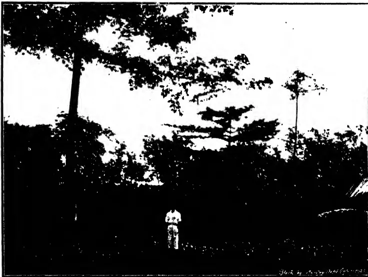

Fig. 13. Kapok: same scion on two different stocks.

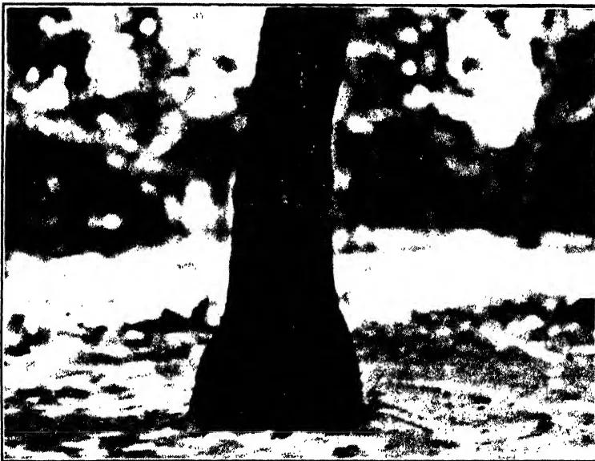

Fig. 14. Influence of scion on stock (*see text*)

676------------------------------------------------

This image is a blank white page. It contains several small, dark specks which appear to be scanning artifacts or dust particles. There is no text, handwriting, or printed content on the page.

677------------------------------------------------

215

system of preventing soil erosion will depend upon the natural drainage and where the water-table is high drains may have to form part of the system.

A low herbaceous creeping plant, *Eupatorium triplinerve* E. Ayapana, is sometimes used with good effect on ridges or the edges of individual tree terraces to prevent local erosion. This plant is found in Ceylon and has been described by Macmillan\* under "Ayapana Tea."

There is no general agreement on the correct use of green manure plants, and the whole subject requires further investigation. Covers are largely used but there is a difference of opinion on the following points: (1). In old rubber, confining the cover to the soil erosion ridges or allowing it to grow over the whole area. Where manuring is practised covers may utilise much of the manure meant for the trees. It is possible that turning in the cover when applying nitrogen may be effective although one visiting agent informed me he had had no effect from turning in green manure alone. This experience will probably not be general and it has been stated that the presence of the cover without either turning in or artificial manuring has resulted in increased yields. The problem is complex and will take time to solve. (2). The effect of complete covers in young clearings.—There is a fairly general impression that a complete cover retards the growth of the young trees. A partial explanation of this is probably connected with the effect of the cover on soil temperature.

The cover chiefly used is *Centrosema pubescens*. *Calopogonium mucunoides* and *Pueraria phaseoloides* are sometimes mixed with it. *C. mucunoides* is not recommended as it encourages eelworms. *Vigna* is attacked by *Rhizoctonia solani* and may be completely destroyed. If so, it is then extremely difficult to re-establish. Unfortunately *R. solani* also attacks *Centrosema*.

*Leucaena glauca* was seen growing as a low hedge in young rubber. It is planted thickly, in lines, and kept lopped at about 2 ft. high. It stands periodical lopping better than *Crotalaria anagyroides*. The loppings are spread on the surface as a mulch. *L. glauca* may be useful in Ceylon for making contour hedges.

On one estate *P. phaseoloides* was being taken out as it was found that the hairs of the stems penetrated the feet of the coolies and caused sores. This has not been noticed elsewhere.

*Mimosa invisa* is commonly used as a cover. Where there is no prolonged dry season *Mimosa* will completely or partially control illuk (*Imperator cylindrica*). Its effect in improving conditions in certain soils may be very marked. On the Govern-

---

\* Macmillan, H.F., *Tropical Gardening and Planting*.

678------------------------------------------------

216

ment Rubber Estate at Sapang we were shown an area of rubber on very poor soil. Twelve-year-old rubber was growing so badly that the shade was not sufficiently dense to preclude the establishment of *Mimosa*. The soil was too poor to establish *Centrosema*. After a number of years the improvement of the trees was such that the increased shade commenced to kill out the *Mimosa* and it was found easy to establish *Centrosema*. The action of the *Mimosa* is attributed both to the thick cover of humus formed and to the action of the roots in aerating and loosening the soil.

*Mimosa* dies out under ordinary rubber shade and can be eradicated in the open by preventing it from seeding. In Ceylon however *Mimosa invisa* has been considered to be a potentially serious weed and estates have been warned against planting it owing to the danger of its gaining access to waste or chena lands. A letter on this subject was placed before the Estate Products Committee by Mr. F. A. Stockdale in 1925.

## RUBBER RESEARCH.

### A SUGGESTED AGRICULTURAL AND BOTANICAL PROGRAMME FOR CEYLON.

The lines of research suggested below are agricultural and botanical. Problems on other lines where research is required, mycological, chemical, technological, will occur to all but are hardly concerned with this report. The list of problems mentioned here is by no means exhaustive (it is hoped that it includes the most urgently important) and it must not be supposed that work on some of these problems is not already being carried out in Ceylon as staff, finances and land permit. The list includes those problems on which, after seeing in some detail the work in Java and Sumatra, I consider it important that research or further research should be carried out. Not only are some of the lines of work important but information on certain subjects is urgently required if the full benefits are to be received from the developments which have already taken place.

#### (A) THE DISCOVERY AND TESTING OF CEYLON MOTHER-TREES.

Numerous Ceylon mother-trees have already been chosen and bud-grafts from these are being or will be tested at Niviti-galakelle and at Peradeniya. The question will arise whether estates mother-trees should not be provisionally proved also or entirely on the estate itself under supervision of the Rubber Research Scheme. The area of departmental or Research Scheme land suitable for rubber experiments is very small. Two other questions will also arise: (1) the method of recording those mother-trees which it is desired to have tested by the Agricultural

679------------------------------------------------

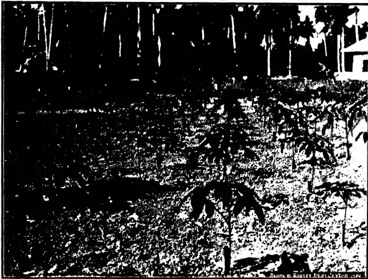A high-contrast black and white photograph of a young bud-wood nursery. The foreground is filled with dense, low-lying vegetation and several young, slender trees with large, dark leaves. In the background, a line of taller, more established trees stands against a bright sky. The overall scene depicts a lush, tropical environment.

Fig. 15. A young bud-wood nursery

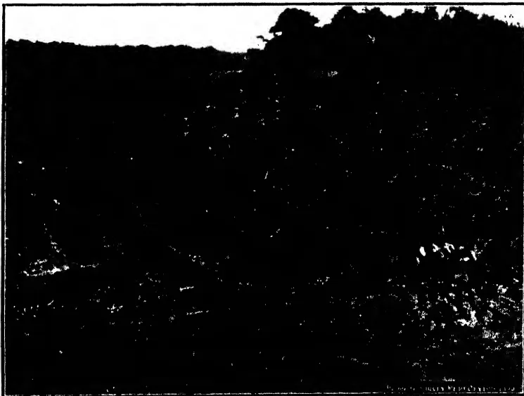A high-contrast black and white photograph showing a landscape characterized by soil erosion. The image is dominated by dark, textured ridges and depressions, which are silt-pits. The terrain appears rugged and uneven, with varying shades of black and grey representing different levels of soil and vegetation. The background shows a distant, dark horizon line.

Fig. 16. Soil erosion ridges and silt-pits, Sumatra.

680------------------------------------------------

This image is a blank white page. It contains several small, dark specks which appear to be scanning artifacts or dust particles. There is no text, handwriting, or printed content on the page.

681------------------------------------------------

217

Department or the Research Scheme and (2) the conditions on which clones will be tested or estate tests supervised. In Java it is stated that the number of mother-trees on estates is several thousands, of which only a few hundred trees under the direct observation of the Proefstation possess yield records extending over a number of years. Figures of yield tests of Ceylon clones either carried out or supervised by the Research Scheme or Department of Agriculture should, I think, be made available to the industry in Ceylon at the discretion of the body carrying out the tests. There will be a definite commercial value to estates whose clones have been "provisionally selected" or "proved" officially, as only the owners of the mother-trees will be able (for some time at least) to supply bud-wood.

#### **(B) THE TESTING OF CERTAIN FOREIGN CLONES.**

This, I think, is urgent and important. In Malaya and the Dutch East Indies there are clones which are recommended or which have been "provisionally selected" by the Proefstations. This stage has not been reached by any Ceylon clones, so early information on the performance in Ceylon of some the better-known foreign clones is very desirable. A scheme for testing a number of these clones (most of which I have seen in tapping) at Peradeniya has already been drawn up for the Director of Agriculture and where necessary budded stumps have already been ordered. I suggest that bud-wood nurseries of these clones should be put down to supply demands which may be anticipated both before and after the test tapings. A similar trial of the clones under the different climatic conditions of the lowcountry is extremely desirable.

#### **(C) THE PROVISION OF SUPERIOR PLANTING MATERIAL BY CROSSING AND SELFING SELECTED TREES.**

This work has already progressed in Sumatra and Java and yield records of the progeny of various crosses will shortly be published by Dr. Heusser. It has been found, as was to be expected, that the progeny of a cross may show considerable variation. Very high-yielding individuals have been obtained which are now being used as mother-trees. Certain clones seem to be dominant for some of the factors which influence yield. This has been mentioned already in this report and there is no doubt that similar work must be commenced in Ceylon. The work is difficult and laborious and will take up much of the time of a trained man. Land will be required for testing out the progeny.

#### **(D) THE ESTABLISHMENT OF SEED GARDENS.**

This is a corollary to (c) above. If certain selfed or hybrid progeny are satisfactory the only way to obtain commercial

682------------------------------------------------

218

supplies of seed is by means of isolated seed gardens. According to Java recommendations these should be from two to four miles distant from the nearest rubber. Little is known of the pollination of the rubber flower and these distances may be too short or too long. But it is probable that the centre trees of even a 20 or 30-acre block will not be pollinated with pollen from outside the block and this implies that seed gardens could if necessary be laid down on estates.

Seed gardens can be established either (1) as the result of test tappings of hand-pollinated progeny or (2) blindly. To wait for the result of test tappings will mean five or six years' delay but it is also possible to plant up, say, six gardens, as soon as bud-wood is available, on the following system:—

Two gardens each containing four different clones (for producing hybrid seed).

Four gardens each containing only one clone (for producing selfed seed), *e.g.*, Heneratgoda No. 2, Heneratgoda No. 24, Tj. 1, B.D.5.

At the same time hand pollinations are made of the same combinations as are in the gardens. Each of the mixed gardens has six possible combinations, and when the best combination has been proved by tapping the unwanted two clones in the garden are cut down and budded from the two clones left. Some idea of the work necessary may be gained from the following: In the two mixed gardens is a total of twelve combinations. If we assume about 5% successes in pollinating (some workers report 0.5%, some 25%) to obtain 50 trees of each combination about 4,800 hand pollinations are required (one fruit has three seeds) plus another 800 selfings. For the trial of the progeny (this will include two or three standard clones) about 8-10 acres of land will be needed. After this stage the process should be repeated with the new clones which will be selected and the second series of seed gardens and progeny tests will require more and more land as time goes on.

### (E) THE MANURIAL REQUIREMENTS OF THE RUBBER TREE.

The sparse experimental data which exist in Ceylon indicate that on some soils at least nitrogen is effective in increasing the yield. None of the experiments is precise enough to inform us of the optimum amount of nitrogen to apply or at what level of prices it is profitable. There has been shown elsewhere to be a definite time lag in the effect of at least certain manures. Phosphoric acid has been effective in Malaya and both phosphoric acid and potash in Java. Nitrogen has been shown to be profitable in Sumatra\* on white soils and continued application is

\* Grantham, J. Manurial Experiments on Hevea. *Arch. v.d. Rubber* VIII jaar, 8, 1924, pp. 501-519.

Grantham, J. Manurial Experiments on Hevea, II. *Ibid.* XI jaar. 10, 1927, pp. 465-471.

683------------------------------------------------

219

proving successful. Even on the red soils there are indications that manuring is profitable after a certain age. There can be no doubt that precise information as to the results of different dressings of different manures (and if possible, in different districts) is required in Ceylon.

#### **(F) THE REJUVENATION OF OLD AREAS.**

This is a question of the utmost importance for Ceylon, and, whereas the Department of Agriculture is in a position to carry out an experiment at Peradeniya, other and corroborative experiments can only be carried out in co-operation with estates. Where land for new clearings is not available rejuvenation offers the chief hope of effecting radical improvements, but the practicability of rejuvenation on Ceylon soils must first be proved.

#### **(G) DENSITY OF PLANTING.**

Density of planting has previously been considered only in opening new areas but if rejuvenation proves to be successful it may have to be considered in replanting old areas. The planting of 150, 200 and 300 trees per acre followed by selective thinning on appearance, girth measurements, or test tappings or any combination of these, is established practice. The effect of leaving dense stands of 300-400 trees per acre is being tested in Sumatra. It is possible, but this is pure speculation, that dense plantings may produce the cheapest rubber up to a certain age and that after that period the fall in production may be rapid; but if progressively superior planting material becomes available as time goes on rejuvenation of such areas at 15 or 20 years would follow automatically. It would appear that an experiment to test this part of the question is desirable. The best density of planting where selective thinning is to be (as it generally will be) followed should also be investigated.

#### **(H) METHODS OF SELECTIVE THINNING.**

Investigations into these should proceed hand in hand with the work in (g) above; of the methods possible may be mentioned: thinning by appearance; by girth; on the results of test tappings; and on latex vessel area. It is believed that in the buddings of one clone the yield is closely correlated with the girth. If so selective thinning will be simplified and this point should be determined.

#### **(I) INVESTIGATIONS ON COVER CROPS AND THEIR USE.**

Opinion on the correct use of cover crops is divided. Whereas there is general agreement as to their effectiveness in preventing erosion when planted on the edge of contour terraces or of individual tree terraces, and on the ridges which are so largely used with the silt-pits in Sumatra, there is a difference of opinion as to the effect of covers growing all over a newly-planted

684------------------------------------------------

220

clearing or even under old rubber. One body of opinion holds that covers rob the young plant of water and plant food and keep the soil so much cooler that growth is retarded. It has been said that turning in the cover under old rubber (*i.e.*, green manuring) has had no effect on yield. Some estates prefer to confine the cover crop to the soil erosion ridges so that it does not compete with the tree for the manures applied. Other estates have a complete cover and definite increases of yield have been attributed to it. The questions may not be of such vital importance as others but deserve investigating.

#### (J) THE INFLUENCE OF STOCK ON SCION.

There can be little doubt that stock may have a definite influence on scion and the investigations on this subject should be continued. The influence of scion on stock is considered to be negligible. Where stocks have been budded high some effect has been noticed on the stem of the stock. How this may be turned into practical use is not known at present.

#### (K) THE EFFICIENCY OF DIFFERENT TAPPING SYSTEMS.

With the spread of bud-grafting and the coming into tapping of extensive budded areas methods of tapping are being revised. In seedling rubber also it has been shown that the phenomenon of periodicity which occurs in the rubber tree may have an effect on the length of the economic tapping period\* (this refers to alternate monthly or other periodic tapings). Bark consumption is heavier and the angle of the cut is steeper in Sumatra and Java than in Ceylon. Some workers visualise having a shorter period for renewal, others a longer. Lately it has been recommended to tap the second panel of bud-grafts on a third.

It is obvious that further research on tapping systems is required.

To conduct all or even some of the researches mentioned above will need more staff and much more land than is available at present. The co-operation of estates would appear essential in carrying out many of the experiments adumbrated and the supervision of such experiments will necessitate something in the nature of an Agricultural Division of the Research Scheme. The Agricultural Division of the Rubber Proefstation, Java, is under the control of the Director and under-Director and is staffed in addition by three agriculturists. The Agricultural Division of the A.V.R.O.S. Proefstation is staffed by three agriculturists. These two Research Stations are private and are not concerned with cultivators producing native rubber.

---

\* See Schweizer, J. Over Productiekrommen in verband met de regeneratie van Rubber en in verband met tapsystem in Hevea-aanplantingen. *Arch. v.d. Rubber.* 13e, 5. May, 1929, pp. 259-280.

685------------------------------------------------

221

Extension work among these growers is carried out by the Extension Division of the Department of Agriculture, Industry and Commerce. In the event of a re-organised Rubber Research Scheme in Ceylon being responsible for the whole of the industry, it must be kept in mind that extension work may have to be conducted by the suggested Agricultural Division of the Scheme.

#### CONCLUSION.

There is an impression, fortunately by no means general, that Ceylon is so far behind in taking advantage of the improved material that exists or in finding her own improved material, that we cannot hope in the future to compete with those countries which have already planted areas of bud-grafts. It is an impression which I think is erroneous. The area under budded rubber has lately been estimated at 1 per cent. of the total area under rubber. That is not a large proportion and although it will increase there is no reason to suppose that Ceylon will not also share in that increase. Rejuvenation is costly and the industry will only be able to finance a small amount annually. And if rejuvenation has only been born in Ceylon it is still in its very early infancy in the Dutch East Indies generally.

If the policy of rejuvenation is given a thorough and wide trial; if for all new plantings the best available material is used and measures to prevent soil erosion are adopted; if research on the production of still superior material is energetically and continuously prosecuted, bearing in mind the excellent yields which have already been obtained in Ceylon by good methods of cultivation, there is certainly no cause to view the future of the industry with concern.

686------------------------------------------------

222

# CHILAW COCONUT TRIALS.

## A STATISTICAL EXAMINATION OF THE DATA OF MANURIAL AND CULTURAL EXPERIMENTS 1917-1928.

A. W. R. JOACHIM, B.Sc., A.I.C.,

DIP. AGR. (CANTAB).

AGRICULTURAL CHEMIST,

DEPARTMENT OF AGRICULTURE, CEYLON.

**T**HE data for these calculations were kindly supplied by the Superintendent of the Chilaw Trial Ground through the Divisional Agricultural Officer, North-Western. The statistical examination was carried out on the actual yields of copra obtained per palm each year during the period from 1917 to 1928 by the method of the 'regression coefficient.' This method was adopted as it was not possible to obtain a direct estimate of the errors involved in the experiments owing to there being only one plot for each treatment. The regression coefficient represents, in this instance, the rate of increase or decrease in the yield per palm of a plot over that of the control as a result of the treatment the former has been subjected to. For the purposes of these calculations, plot 1 (clean weeded) was regarded as the control, the original control plot having received manurial treatment since 1923. Further, only the data of the plots on the same type of soil as the control were statistically examined. Tables I to IV at the end of the paper show the data and the results of their statistical examination.

Table I shows the yields of copra per palm from 1917 to 1927, and table II the yields for 1928 and the average yields from 1917 to 1928. An examination of the latter table will show clearly that average yields are dependent to a great extent on the type of soil. Thus plots 11 to 15 on light gravelly soil have average yields varying from 11 to 15 lb. per palm with a mean yield of 12.7 lb., while those of plots 1 to 10 on light loamy soil vary from 24 to 34 lb. per palm with a mean of 27.4 lb. The difference in mean yields is statistically significant.

In table III are detailed the total rainfall figures during one year and the average yields obtained during the next. It will be seen that there is a close parallelism between the two sets of figures. A statistical examination of the data shows that there is a significant positive correlation between the average yield and rainfall during the previous year. The correlation coefficient is .79, *i.e.*, the degree of association between the two factors is about 80 per cent. Thus it may be inferred with some degree

687------------------------------------------------

A blank white page with a small black speck near the center-right.

688------------------------------------------------

![A line graph showing the regression lines of various treatments for coconut yield over time (1917-1928). The y-axis is 'Increase over Control (lbs per bush)' and the x-axis is 'Years'. Treatments include Steamed Bone Meal, Sulphate of Ammonia followed by Sulphate of Potash, fish Manure, Sulphate of Potash followed by Sulphate of Ammonia, Mineral Mixture, Organic Mixture, Lime, and Cultivation only. A vertical dashed line at 1922 is labeled 'Average increase or decrease over control' with points A and B.](4dd3a29f8e3744738bd357505267accb_1_img.webp)

The graph plots the yield increase over a control group for various coconut treatments from 1917 to 1928. The y-axis represents the increase in pounds per bush, ranging from 0 to 10. The x-axis represents the years. The treatments and their approximate regression lines are as follows:

<table border="1">
<thead>
<tr>
<th>Treatment</th>
<th>1917</th>
<th>1918</th>
<th>1920</th>
<th>1922</th>
<th>1924</th>
<th>1926</th>
<th>1928</th>
</tr>
</thead>
<tbody>
<tr>
<td>Steamed Bone Meal</td>
<td>~1.5</td>
<td>~2.0</td>
<td>~2.5</td>
<td>~3.0</td>
<td>~3.5</td>
<td>~4.0</td>
<td>~4.5</td>
</tr>
<tr>
<td>Sulphate of Ammonia followed by Sulphate of Potash</td>
<td>~1.0</td>
<td>~2.0</td>
<td>~3.0</td>
<td>~4.0</td>
<td>~5.0</td>
<td>~6.0</td>
<td>~7.0</td>
</tr>
<tr>
<td>fish Manure</td>
<td>~1.0</td>
<td>~2.0</td>
<td>~3.0</td>
<td>~4.0</td>
<td>~5.0</td>
<td>~6.0</td>
<td>~7.0</td>
</tr>
<tr>
<td>Sulphate of Potash followed by Sulphate of Ammonia</td>
<td>~2.5</td>
<td>~2.0</td>
<td>~1.5</td>
<td>~1.0</td>
<td>~0.5</td>
<td>~0.0</td>
<td>~-0.5</td>
</tr>
<tr>
<td>Mineral Mixture</td>
<td>~1.0</td>
<td>~2.0</td>
<td>~3.0</td>
<td>~4.0</td>
<td>~5.0</td>
<td>~6.0</td>
<td>~7.0</td>
</tr>
<tr>
<td>Organic Mixture</td>
<td>~1.0</td>
<td>~2.0</td>
<td>~3.0</td>
<td>~4.0</td>
<td>~5.0</td>
<td>~6.0</td>
<td>~7.0</td>
</tr>
<tr>
<td>Lime</td>
<td>~1.0</td>
<td>~2.0</td>
<td>~3.0</td>
<td>~4.0</td>
<td>~5.0</td>
<td>~6.0</td>
<td>~7.0</td>
</tr>
<tr>
<td>Cultivation only</td>
<td>~0.0</td>
<td>~0.0</td>
<td>~0.0</td>
<td>~0.0</td>
<td>~0.0</td>
<td>~0.0</td>
<td>~0.0</td>
</tr>
</tbody>
</table>

A vertical dashed line at 1922 is labeled 'Average increase or decrease over control'. Points A and B are marked on this line at approximately y=3.5 and y=1.0 respectively.

CHILAW COCONUT TRIALS  
1917 - 1928

REGRESSION LINES OF TREATMENTS

689------------------------------------------------

223

of certitude that, if the rainfall during one year falls appreciably below the average for a number of years, a decrease in the average yield of palms will occur during the next year.

Table IV shows the average difference in yield from the control, the regression coefficient and its standard error, and the values of  $t$  both calculated and significant obtained from the data for each of the eight treatments. In the diagram are shown the 'regression lines' for the different treatments. These lines represent the straight lines most closely fitting the differences in yields from the control if the latter are plotted against time in years. The slope of these lines is a measure of the 'regression coefficient' or the rate of increase or decrease over the control. The greater the slope, the greater the rate of increase over the control and *vice versa*. The points marked with a cross on the line AB in the diagram indicate the average yields for the different treatments over the whole period.

An examination of tables I and IV and of the diagram will lead to the following conclusions:—

Plot 2. *Cultivation only*. This plot shows the lowest average yield and a significant rate of fall in yield of .72 lb. per annum. It is therefore evident that by cultivation alone average yields cannot be maintained under the soil and climatic conditions of the Chilaw trials. This is also seen from plot 12 where the cultivated plot has again the lowest yield of the plots on the gravelly type of soil.

Plot 3. *Fish manure*. The data from this plot indicate that yields are tending to rise. The rate of increase over the control, about .8 lb. per palm per annum, is not however definitely significant.

Plot 4. *Steamed bone meal*. This plot shows the highest average increase over the control. The increase has been maintained from the first year after manuring with this fertiliser. The yield, however, has not increased significantly since then.

Plot 5. *Sulphate of ammonia*. This plot received sulphate of potash till 1925 and sulphate of ammonia since 1925. Its average yield, which is higher than that of the control, appears to have been maintained till recently. The regression coefficient indicates that there is a very slight falling off in yield which is not significant.

Plot 6. *Sulphate of potash*. The plot received sulphate of ammonia up to 1925 and sulphate of potash from 1925. The trend of the yields is upwards, the rate of increase being at the rate of .75 lb. per annum. The rate of increase is not definitely significant, but nearly so. This would appear to point to the manurial value of sulphate of potash for coconuts on light soils, especially after a continuous application of a physiologically acid fertiliser like sulphate of ammonia.

690------------------------------------------------

224

Plot 7. *Mineral mixture.* The data of this plot show that, though its initial fertility was lower than that of the control at the start of the experiments, the continued application of the mixture has produced, on the average, an increase in yield of .6 lb. per annum over the control. The rate of increase is also .6 lb. per annum, and this increase may be considered significant.

Plot 8. *Lime.* This plot indicates that, though its average is lower than that of the control, its yield is steadily increasing at the rate of about .6 lb. each year. This rate of increase is not definitely significant though nearly so. Lime does not appear to be beneficial to coconuts on gravelly soils. This would appear so from plot 11.

Plot 9. *Organic mixture.* The data of this plot indicate that, though the average yield of the plot is .7 lb. per palm lower than that of the control, the mixture is having a beneficial effect. The yield is definitely increasing at the rate of .74 lb. per annum. If this treatment were continued, the average yield of the plot would eventually be greater than that of the control. The initial fertility of the plot was evidently much lower than that of the control. The average yield of plot 13 also indicates the value of an organic mixture for coconuts on gravelly soils.

#### SUMMARY.

A statistical examination of such of the data obtained from the Chilaw Coconut Trials as can be examined indicates that,

(1) There is a significant positive correlation between the average yield of copra per palm in one year and the total rainfall during the previous year.

(2) The soil variation of the plots has a marked effect on yields, the average yield of the palms on the light gravelly soils being significantly less than that of palms on the medium sandy loams.

(3) By cultivation alone yields cannot be maintained. The yield of the cultivation plot has decreased at a significant rate.

(4) The fish plot appears to be steadily increasing its yield. The increase is not, however, definitely significant.

(5) The steamed bone meal plot which has the highest average yield is maintaining its yield. The continued application of this fertiliser is not, however, effecting any further significant increase of yield.

691------------------------------------------------

225

(6) The addition of sulphate of potash to the plot that received sulphate of ammonia continuously has produced an increase in yield, which is not however definitely significant. The value of potash, especially after continuous manuring with nitrogen as sulphate of ammonia for coconuts on this type of soil appears to be indicated.

(7) The sulphate of ammonia plot which previously received sulphate of potash shows a slight downward trend in yield. The rate of decrease in yield is not significant.

(8) The mineral mixture, organic mixture and lime plots are steadily increasing their yields, the rate of increase being definitely significant in the two former and very nearly so in the latter. Lime does not appear to be beneficial to coconuts on gravelly soils.

#### ACKNOWLEDGMENT.

I have to acknowledge my thanks to Mr. G. L. de Silva for having prepared the diagram for the press.

692------------------------------------------------

226

Table I.  
Copra per palm (lb.).

<table border="1">
<thead>
<tr>
<th>Plot</th>
<th>1917</th>
<th>1918</th>
<th>1919</th>
<th>1920</th>
<th>1921</th>
<th>1922</th>
<th>1923</th>
<th>1924</th>
<th>1925</th>
<th>1926</th>
<th>1927</th>
</tr>
</thead>
<tbody>
<tr>
<td>1</td>
<td>27.0</td>
<td>27.9</td>
<td>16.5</td>
<td>20.2</td>
<td>25.7</td>
<td>22.9</td>
<td>23.5</td>
<td>27.5</td>
<td>34.9</td>
<td>31.9</td>
<td>26.4</td>
</tr>
<tr>
<td>2</td>
<td>32.6</td>
<td>24.4</td>
<td>19.9</td>
<td>22.8</td>
<td>28.4</td>
<td>23.9</td>
<td>19.7</td>
<td>24.9</td>
<td>24.5</td>
<td>26.5</td>
<td>28.6</td>
</tr>
<tr>
<td>3</td>
<td>30.1</td>
<td>24.6</td>
<td>19.9</td>
<td>24.5</td>
<td>27.7</td>
<td>28.1</td>
<td>21.9</td>
<td>24.8</td>
<td>32.9</td>
<td>31.6</td>
<td>37.8</td>
</tr>
<tr>
<td>4</td>
<td>35.8</td>
<td>32.6</td>
<td>25.1</td>
<td>31.1</td>
<td>34.9</td>
<td>34.2</td>
<td>32.1</td>
<td>32.5</td>
<td>35.3</td>
<td>36.4</td>
<td>40.1</td>
</tr>
<tr>
<td>5</td>
<td>32.6</td>
<td>23.8</td>
<td>18.0</td>
<td>26.7</td>
<td>29.7</td>
<td>25.4</td>
<td>22.5</td>
<td>31.8</td>
<td>40.1</td>
<td>31.4</td>
<td>25.8</td>
</tr>
<tr>
<td>6</td>
<td>28.7</td>
<td>24.5</td>
<td>19.0</td>
<td>28.6</td>
<td>31.4</td>
<td>26.4</td>
<td>26.1</td>
<td>31.4</td>
<td>34.1</td>
<td>31.4</td>
<td>35.8</td>
</tr>
<tr>
<td>7</td>
<td>25.1</td>
<td>20.1</td>
<td>14.5</td>
<td>23.0</td>
<td>28.8</td>
<td>22.6</td>
<td>23.0</td>
<td>32.9</td>
<td>37.4</td>
<td>28.9</td>
<td>27.07</td>
</tr>
<tr>
<td>8</td>
<td>22.3</td>
<td>21.2</td>
<td>13.3</td>
<td>18.4</td>
<td>27.6</td>
<td>21.3</td>
<td>20.9</td>
<td>30.4</td>
<td>30.3</td>
<td>27.1</td>
<td>29.2</td>
</tr>
<tr>
<td>9</td>
<td>24.2</td>
<td>17.7</td>
<td>12.4</td>
<td>20.4</td>
<td>28.3</td>
<td>22.8</td>
<td>25.9</td>
<td>27.9</td>
<td>33.6</td>
<td>25.7</td>
<td>27.7</td>
</tr>
<tr>
<td>10</td>
<td>16.8</td>
<td>8.0</td>
<td>5.7</td>
<td>11.8</td>
<td>17.8</td>
<td>10.4</td>
<td>8.1</td>
<td>18.0</td>
<td>24.1</td>
<td>26.1</td>
<td>17.7</td>
</tr>
<tr>
<td>11</td>
<td>16.0</td>
<td>7.5</td>
<td>5.2</td>
<td>13.6</td>
<td>22.0</td>
<td>10.5</td>
<td>5.7</td>
<td>11.3</td>
<td>10.4</td>
<td>12.3</td>
<td>10.5</td>
</tr>
<tr>
<td>12</td>
<td>15.5</td>
<td>10.4</td>
<td>5.9</td>
<td>14.4</td>
<td>18.5</td>
<td>11.1</td>
<td>8.4</td>
<td>15.1</td>
<td>12.9</td>
<td>7.6</td>
<td>4.4</td>
</tr>
<tr>
<td>13</td>
<td>14.5</td>
<td>10.2</td>
<td>6.2</td>
<td>15.8</td>
<td>10.9</td>
<td>12.6</td>
<td>10.5</td>
<td>21.1</td>
<td>26.1</td>
<td>12.4</td>
<td>10.5</td>
</tr>
<tr>
<td>14</td>
<td>17.6</td>
<td>12.9</td>
<td>9.8</td>
<td>15.0</td>
<td>16.1</td>
<td>11.7</td>
<td>11.3</td>
<td>18.5</td>
<td>17.1</td>
<td>10.5</td>
<td>20.7</td>
</tr>
<tr>
<td>15</td>
<td>10.1</td>
<td>8.1</td>
<td>4.6</td>
<td>13.3</td>
<td>21.1</td>
<td>9.1</td>
<td>9.1</td>
<td>21.3</td>
<td>18.5</td>
<td>12.6</td>
<td>9.5</td>
</tr>
<tr>
<td>16</td>
<td>19.0</td>
<td>16.7</td>
<td>14.3</td>
<td>18.0</td>
<td>21.8</td>
<td>17.9</td>
<td>20.4</td>
<td>29.0</td>
<td>27.5</td>
<td>26.8</td>
<td>25.6</td>
</tr>
</tbody>
</table>

Table III.

<table border="1">
<thead>
<tr>
<th>Year.</th>
<th>Rainfall (inches).</th>
<th>Year.</th>
<th>Average yield per palm (lb.)</th>
</tr>
</thead>
<tbody>
<tr>
<td>1916</td>
<td>64.7</td>
<td>1917</td>
<td>23.0</td>
</tr>
<tr>
<td>1917</td>
<td>41.7</td>
<td>1918</td>
<td>18.2</td>
</tr>
<tr>
<td>1918</td>
<td>51.8</td>
<td>1919</td>
<td>13.2</td>
</tr>
<tr>
<td>1919</td>
<td>55.0</td>
<td>1920</td>
<td>19.9</td>
</tr>
<tr>
<td>1920</td>
<td>69.5</td>
<td>1921</td>
<td>24.4</td>
</tr>
<tr>
<td>1921</td>
<td>44.7</td>
<td>1922</td>
<td>19.4</td>
</tr>
<tr>
<td>1922</td>
<td>48.6</td>
<td>1923</td>
<td>18.1</td>
</tr>
<tr>
<td>1923</td>
<td>61.9</td>
<td>1924</td>
<td>24.9</td>
</tr>
<tr>
<td>1924</td>
<td>73.6</td>
<td>1925</td>
<td>27.5</td>
</tr>
<tr>
<td>1925</td>
<td>77.3</td>
<td>1926</td>
<td>23.7</td>
</tr>
<tr>
<td>1926</td>
<td>62.9</td>
<td>1927</td>
<td>23.3</td>
</tr>
<tr>
<td>1927</td>
<td>69.1</td>
<td>1928</td>
<td>24.1</td>
</tr>
<tr>
<td>1928</td>
<td>71.0</td>
<td>1929</td>
<td>—</td>
</tr>
</tbody>
</table>

Correlation coefficient +.788  
 For  $P = .01$ ,  $t$  (found) = 4.05  
 $t$  (significant) = 3.17

693------------------------------------------------

227

Table II.

<table border="1">
<thead>
<tr>
<th rowspan="2">Plot.</th>
<th rowspan="2">Type of soil.</th>
<th rowspan="2">Treatment.</th>
<th colspan="2">Yield of copra per palm (lb.)</th>
</tr>
<tr>
<th>1928.</th>
<th>Average (1917 to 1928.)</th>
</tr>
</thead>
<tbody>
<tr>
<td>1</td>
<td>Light sandy loam.</td>
<td>Clean weeding. Boga sown in 1926.</td>
<td>20.9</td>
<td>25.4</td>
</tr>
<tr>
<td>2</td>
<td>"</td>
<td>Cultivation only. Disc-harrowing 5-8 times.</td>
<td>20.6</td>
<td>24.3</td>
</tr>
<tr>
<td>3</td>
<td>"</td>
<td>Fish manure @ 6 lb. per palm.</td>
<td>39.5</td>
<td>28.6</td>
</tr>
<tr>
<td>4</td>
<td>"</td>
<td>Steamed bone meal @ 8 lb. per palm.</td>
<td>40.6</td>
<td>34.2</td>
</tr>
<tr>
<td>5</td>
<td>"</td>
<td>Sulphate of potash @ 3 lb. per palm till 1925 and then sulphate of ammonia @ 4 lb. per palm.</td>
<td>25.0</td>
<td>27.7</td>
</tr>
<tr>
<td>6</td>
<td>"</td>
<td>Sulphate of ammonia @ 4 lb. per palm till 1925 and then sulphate of potash @ 3 lb. per palm.</td>
<td>38.1</td>
<td>29.6</td>
</tr>
<tr>
<td>7</td>
<td>Sandy loam.</td>
<td>Mineral mixture.</td>
<td>28.4</td>
<td>26.0</td>
</tr>
<tr>
<td>8</td>
<td>"</td>
<td>Lime @ <math>\frac{1}{2}</math> ton per acre.</td>
<td>26.0</td>
<td>24.0</td>
</tr>
<tr>
<td>9</td>
<td>Clay loam.</td>
<td>Organic mixture.</td>
<td>30.3</td>
<td>24.7</td>
</tr>
<tr>
<td>10</td>
<td>"</td>
<td>Control till 1923. Millicent estate Mixture since 1923</td>
<td>22.7</td>
<td>15.6</td>
</tr>
<tr>
<td>11</td>
<td>Light gravelly loam.</td>
<td>Varying treatments. Lime @ <math>\frac{1}{2}</math> ton per acre since 1925.</td>
<td>9.9</td>
<td>11.2</td>
</tr>
<tr>
<td>12</td>
<td>"</td>
<td>Cultivation only.</td>
<td>4.9</td>
<td>10.8</td>
</tr>
<tr>
<td>13</td>
<td>"</td>
<td>Organic mixture.</td>
<td>18.5</td>
<td>14.1</td>
</tr>
<tr>
<td>14</td>
<td>"</td>
<td>Cultivation to 1923. Millicent estate mixture since 1923.</td>
<td>21.9</td>
<td>15.3</td>
</tr>
<tr>
<td>15</td>
<td>"</td>
<td>Varying treatments since 1922.</td>
<td>11.1</td>
<td>12.4</td>
</tr>
<tr>
<td>16</td>
<td>Light sandy loam.</td>
<td>Clean weeded.</td>
<td>27.4</td>
<td>22.0</td>
</tr>
</tbody>
</table>

(By store)

Average of Plots 1 to 8 and 16.  $(1917-1928) = 27.46 \pm 1.035$  lb.  
 Average of Plots 11 to 15.  $(1917-1928) = 12.76 \pm .856$  lb.  
 Difference = 14.70 lb.  
 Standard error of difference = 1.36 lb.

694------------------------------------------------

228Table IV.

<table border="1">
<thead>
<tr>
<th>Treatment.</th>
<th>Average per palm. lb.</th>
<th>Difference from control. lb.</th>
<th>Regression coefficient. lb.</th>
<th>Standard error of reg. coeff. lb.</th>
<th>t Calculated.</th>
<th>t Significant. (P=.05).</th>
</tr>
</thead>
<tbody>
<tr>
<td>1. Control up to 1928.</td>
<td>25.4</td>
<td></td>
<td></td>
<td></td>
<td></td>
<td></td>
</tr>
<tr>
<td>2. Cultivation.</td>
<td>24.3</td>
<td>-1.1</td>
<td>-.72</td>
<td>.32</td>
<td>2.25</td>
<td>2.23</td>
</tr>
<tr>
<td>3. Fish manure.</td>
<td>28.6</td>
<td>+3.2</td>
<td>+.78</td>
<td>.50</td>
<td>1.56</td>
<td>2.23</td>
</tr>
<tr>
<td>4. Steamed bone meal.</td>
<td>34.2</td>
<td>+8.8</td>
<td>+.29</td>
<td>.42</td>
<td>0.70</td>
<td>2.23</td>
</tr>
<tr>
<td>5. Sulphate of potash to 1925 and sulphate of ammonia since 1925.</td>
<td>27.7</td>
<td>+2.3</td>
<td>-.028</td>
<td>.28</td>
<td>0.10</td>
<td>2.23</td>
</tr>
<tr>
<td>6. Sulphate of ammonia to 1925 and sulphate of potash since 1925.</td>
<td>29.6</td>
<td>+4.2</td>
<td>+.74</td>
<td>.42</td>
<td>1.76</td>
<td>2.23</td>
</tr>
<tr>
<td>7. Mineral mixture.</td>
<td>26.0</td>
<td>+0.6</td>
<td>+.62</td>
<td>.30</td>
<td>2.08</td>
<td>2.23</td>
</tr>
<tr>
<td>8. Lime.</td>
<td>24.0</td>
<td>-1.4</td>
<td>+.59</td>
<td>.32</td>
<td>1.84</td>
<td>2.23</td>
</tr>
<tr>
<td>9. Organic mixture.</td>
<td>24.7</td>
<td>-0.7</td>
<td>+.74</td>
<td>.36</td>
<td>2.06</td>
<td>2.23</td>
</tr>
</tbody>
</table>

695------------------------------------------------

229.

## CULTIVATION OF ROSELLE FIBRE AND ITS POSSIBILITIES. (HIBISCUS SABDARIFFA VAR. ALTISSIMA)

V. CANAGARATNAM

ASST. MANAGER, EXPERIMENT STATION, PERADENIYA.

**R**OSELLE was first grown on the Experiment Station, Peradeniya, during 1924-1925 with a view to studying its possibilities as a fibre crop. The results obtained were inconclusive and indicated that further trials and investigations were necessary before a definite opinion could be formed of its value. Circumstances did not permit the continuation of the work in the succeeding two years. A second trial was undertaken on a half-acre block of cultivated land during 1928 and details of the trial are presented in this report.

*Preliminary cultivation.*—The plot was treated with farm-yard manure at the rate of thirty-two cart loads per acre. The manure was evenly spread over the whole area, after which the land was ploughed with an iron plough and disc-harrowed. As the plot was still weedy, it was ploughed and harrowed a second time.

The field was lined and seeds were dibbled 6 inches apart in rows  $1\frac{1}{2}$  feet distant, at the rate of 24 lb. per acre. The seed rate appeared to be too heavy and resulted in clumps of seedlings over a large area which tended to over-crowding. The consequent struggle of the plants for light and air hindered their robust development. They were more or less leggy and the seedlings that fared badly in the struggle remained stunted in growth to the last. A thinner seed-rate and broadcast sowing would have been more appropriate and conducive to better results. After-cultivation consisted of one weeding, when the crop was young. The quick growth of the seedlings smothered practically all the weeds.

The crop was sown in the last week of May and was ready for harvesting by the second week of October—one hundred and thirty-five days after sowing. The heights attained by the plants before flowering were:—

<table style="margin-left: auto; margin-right: auto;">
<tr>
<td>Maximum</td>
<td>10 ft.</td>
</tr>
<tr>
<td>Medium</td>
<td>8 ft. 10 in.</td>
</tr>
<tr>
<td>Minimum</td>
<td>4 ft. 9 in.</td>
</tr>
</table>

and immediately after flowering

<table style="margin-left: auto; margin-right: auto;">
<tr>
<td>Maximum</td>
<td>10 ft. 3 in.</td>
</tr>
<tr>
<td>Medium</td>
<td>9 ft. 4 in.</td>
</tr>
<tr>
<td>Minimum</td>
<td>5 ft. 1 in.</td>
</tr>
</table>

696------------------------------------------------

230

The distribution of rainfall in inches during the period was as follows:—

<table>
<tr>
<td>May 25-31</td>
<td>...</td>
<td>35</td>
</tr>
<tr>
<td>June</td>
<td>...</td>
<td>6.57</td>
</tr>
<tr>
<td>July</td>
<td>...</td>
<td>13.62</td>
</tr>
<tr>
<td>August</td>
<td>...</td>
<td>9.70</td>
</tr>
<tr>
<td>September</td>
<td>...</td>
<td>3.03</td>
</tr>
<tr>
<td>October 1-9</td>
<td>...</td>
<td>4.41</td>
</tr>
<tr>
<td>Total</td>
<td>...</td>
<td>
37.68
</td>
</tr>
</table>

The crop was harvested immediately after indications of flowering were noticed.

*Harvesting.*—The stems were cut with sharp pruning knives as near to the ground as possible and kept in heaps over the field as in the case of paddy. They were then tied into bundles of convenient size without stripping the leaves from the stems. It was found that an able-bodied cooly could cut and bundle 1,500 lb. of stems per day. Plantain fibre was used as cordage for bundling the stems.

*Retting.*—Great difficulty was experienced for want of a suitable place for retting the stems. No channels of running water that were in use on the Station could be utilized without polluting the water. But for this hardship, the expenses under this head could have been reduced by half.

A safe place in the river (Mahaweli Ganga) where the current was not strong was chosen. The stems were transported there and made into larger and more compact bundles before they were weighed down with big stones into the river. It was found that heavy weights had to be put on the bundles before they could be submerged. The process was laborious and involved a good deal of labour. Another difficulty was experienced which entailed additional trouble. The bundles that had settled down at the bottom of the river were soon covered with silt and sand and it proved difficult to lift them out of the water. Besides, the stems were found to be coated with mud and had to be washed clean before peeling off the fibre. The muddy retting was mainly responsible for the dingy colour and dustiness of the fibre.

The stems were examined after five days' immersion. Not till the twenty-sixth day was the retting found to have progressed far enough to facilitate smooth and ready peeling of the fibre in strips. Even after this long interval the fibre towards the butt end of the stem did not, as is usual, peel off readily. It is worthy of note that the period of retting was not considered too long by the Imperial Institute, London, to which samples of fibre were sent for examination.

*Peeling.*—After the twenty-sixth day, the bundles were pulled out and the fibre was hand-stripped and washed.

697------------------------------------------------

231

The retted stems could not be dealt with in one day and some remained for the following day. On the second day the peeling was found to be much smoother and easier than on the first day. The hanks of fibre were wrung out to remove the water and were hung out in strings to dry and bleach.

*Preparation for the market.*—The fibre was then brushed to remove the remnant of the dry green-stuff adhering to the stems, to comb out the hanks and to give it a better finish. Brushing was done with hand with the help of a small pruning knife. The clean fibre was then graded on the basis of length and lustre and made into compact bales of 100 lb. each. It was found that in the process of brushing and grading the wastage of fibre amounted to 4 per cent.

*Packing.*—The bales were wrapped in pieces of jute hessian which were cut, according to the dimensions of the bales, into three pieces, one for the girth and two for the sides, and the ends were stitched as tightly as possible on the surface. This method of packing was found convenient and satisfactory and seemed to answer the purpose well.

*Commercial value.*—The fibre was submitted to a firm of merchants in London (Messrs. Wigglesworth & Co., Ltd.) who furnished the following report on the quality and value:—

“The fibre is 6 to 7 feet long, dingy in colour, of fair strength, contains barky spots. We value it at £28 per ton, first mark Calcutta jute at £30 to £31 per ton. We are of opinion that the dingy colour and dustiness have been caused by retting in muddy water and possibly the material is under-retted which would account for the barky spots and the poor colour. We should think that with additional retting in fine or running water the material could be improved about a couple of pounds per ton.

There is a considerable market for such material and the cultivation might be undertaken on a substantial scale, with the prospects of ready sale in Dundee market as a substitute for Calcutta jute and on other markets as a rope-making fibre.”

*Cost of cultivation per acre.*

<table>
<tbody>
<tr>
<td>Preparatory cultivation</td>
<td>...</td>
<td>Rs.</td>
<td>15-75</td>
</tr>
<tr>
<td>Manuring</td>
<td>...</td>
<td>„</td>
<td>7-40</td>
</tr>
<tr>
<td>Seeds and sowing</td>
<td>...</td>
<td>„</td>
<td>9-60</td>
</tr>
<tr>
<td>Weeding</td>
<td>...</td>
<td>„</td>
<td>9-62</td>
</tr>
<tr>
<td>Harvesting</td>
<td>...</td>
<td>„</td>
<td>21-00</td>
</tr>
<tr>
<td>Retting</td>
<td>...</td>
<td>„</td>
<td>29-40</td>
</tr>
<tr>
<td>Peeling</td>
<td>...</td>
<td>„</td>
<td>76-22</td>
</tr>
<tr>
<td>Brushing and grading</td>
<td>...</td>
<td>„</td>
<td>18-50</td>
</tr>
<tr>
<td colspan="2"></td>
<td>Rs.</td>
<td><u>187-49</u></td>
</tr>
</tbody>
</table>

698------------------------------------------------

232**Yield.**

<table>
<tr>
<td>Total weight of stems per acre</td>
<td>42,888 lb.</td>
</tr>
<tr>
<td>Total weight of dry fibre</td>
<td>1,194 lb.</td>
</tr>
<tr>
<td>Percentage of fibre</td>
<td>2.4</td>
</tr>
</table>

**Value.**

<table>
<tr>
<td>Price realised by sale of <math>\frac{1}{2}</math> ton of fibre</td>
<td>Rs. 189-00</td>
</tr>
<tr>
<td>Cost of cultivation</td>
<td>,, 187-48</td>
</tr>
<tr>
<td></td>
<td>
</td>
</tr>
<tr>
<td></td>
<td>Rs. 1-52</td>
</tr>
<tr>
<td></td>
<td>
</td>
</tr>
</table>

**Remarks.**—As has been observed and for reasons stated above the out-turn can by no means be considered a fair average. In Peradeniya yields of 1,970 lb. and 1,617 lb. of clean fibre per acre have been obtained in the past. With judicious cultivation and more experience, it should be possible to increase the yield at least by 50 per cent.

There is no doubt the cost of production in this instance was high. With better facilities for retting such as are always found on estates or with specially constructed cement or wooden troughs which should be inexpensive, where the stems could be conveniently dealt with, the cost of retting and peeling could be reduced by 30-40 per cent. In the previous trial, the cost of retting and peeling amounted to Rs. 84-00 per acre and even this figure was considered too high. It is obvious that the present cost of Rs. 105.62 is too high and the cause of this increased cost has already been explained.

It is pointed out in the valuation report that by longer retting in clean running water the price of the material can be increased. This can easily be done and the additional value thus obtained can be set off against the shipping charges which have not been taken into account in the above calculation. If the yield can be improved by 50 per cent. and the cost of cultivation reduced by 30 per cent., as would seem to be possible and not unreasonable to expect, the cultivation of roselle may prove to be worth while.

699------------------------------------------------

233

## CONTRIBUTIONS FROM THE RUBBER RESEARCH SCHEME, CEYLON.

### RUBBER BUDDING AND SELECTION.

**A**t a meeting of the Executive Committee of the Rubber Research Scheme, held on July 19th, 1929, a sub-committee was appointed to consider the policy and procedure to be adopted by the Rubber Research Scheme in matters connected with rubber budding and selection of high-yielding trees. This sub-committee consisted of the following gentlemen:—Dr. W. Small, M.B.E. (Chairman), The Hon'ble Mr. J. W. Oldfield, Messrs, C. E. A. Dias, L. P. Gapp, L. Lord, R. A. Taylor and J. Mitchell (Secretary). Mr. H. W. Roy Bertrand was subsequently invited to join the committee but unfortunately he was unable to attend any of its meetings. Meetings were held on July 26th, August 7th and August 22nd and the following resolutions were adopted by the members of the committee:—

#### 1. RECORDS OF MOTHER-TREES.

(a). That a preliminary selection of high-yielding trees should be made on all interested estates and that the selection should, in the first place, be made by the superintendent from information in his possession supplemented by a measurement of the yields of latex for a period of 12 days' tapping. The Committee considered that all the trees should be tapped on the same days and if possible by the same tapper.

(b). That when the preliminary selection had been made the selected trees should be inspected by a responsible officer of the Rubber Research Scheme or of the Department of Agriculture.

(c). That the trees so selected should then be tapped as far as possible by the same tapper, the latex be coagulated after every tapping, and the coagulum be converted to dry rubber.

(d). That the tapping and collection of rubber should be carried on for a full tapping season and the records for each tree should be kept in a special book for the periodical inspection of a responsible officer.

(e). That all incomplete tappings (owing to rain, etc.) should be excluded from the records.

(f). That a record should be kept of the height and length of the cut at the beginning and end of the tapping season.

700------------------------------------------------

234

(g). That when the records for each tree were complete each should be expressed as "yield per tapping" and a final selection be made on that basis.

## **2. INSPECTION OF RECORDS.**

(a). That records of yields which were being taken on estates should be periodically inspected by a responsible officer.

(b). That an officer of the conductor type should be trained in this work and should at regular intervals visit all estates on which mother-tree records were being taken.

## **3. STANDARD OF YIELD.**

That only those trees which showed a yield of not less than five times the average yield of the trees of the field in which they were situated should be considered as mother-trees.

## **4. PROPAGANDA.**

The Chairman informed the Committee that in spite of numerous attempts made by the Rubber Research Scheme to induce superintendents to take yield records and to give assistance in the matter of finding the highest yielders in Ceylon the response had been disappointing. He further stated that special attention had been drawn to this matter in the editorial of the July number of *The Tropical Agriculturist*, and that the Rubber Growers' Association had circularised members on the subject.

The committee decided:—

(a). That the matter should be brought to the notice of the Ceylon Estates Proprietary Association and Mr. Oldfield kindly undertook to impress upon the members of that Association the importance of securing records from as many estates as possible.

(b). That a leaflet or circular should be prepared showing what was being done in other rubber-growing countries and what should be done in Ceylon.

## **5. MOTHER-TREES AT NIVITIGALAKELE.**

It was resolved that records of dry rubber to the end of the present tapping season should be obtained from all the mother-trees of which material was available at Nivitigalakele and that a selection from these should be made in March 1930.

## **6. DISEASE SUSCEPTIBILITY.**

A discussion took place on the question of continuing the testing of mother-trees which had subsequently developed brown bast and of trees which periodically suffered from attacks of bark rot. The majority favoured the view that brown bast incidence could be greatly minimised by increasing the interval between

701------------------------------------------------

235

tappings and by taking thicker parings and that bark rot was preventable. It was considered that the present knowledge of the inheritability of such diseases as those specified was insufficient to justify the cessation of tests of mother-trees which had developed these diseases. Again, it was considered that the problem was one which should be studied by the research stations.

## **7. POLICY IN TESTING CLONES DERIVED FROM LOCAL MOTHER-TREES.**

### *(A). On Estates.*

(a). That arrangements should be made for the supervision by responsible officers of the Rubber Research Scheme or the Department of Agriculture of tests being made on estates should the estates express a desire for such supervision.

(b). That where such supervision is exercised the results of tappings on the estates should be published periodically by the Rubber Research Scheme or the Department of Agriculture for general information.

### *(B). On Experiment Stations.*

(a). That the results of tests of mother-trees on experiment stations should be published periodically and that officers should be empowered to issue approval certificates where the results are favourable.

(b). That when such trees have been under properly supervised tests for a period of one year the Rubber Research Scheme or the Department of Agriculture should, where results are favourable, specify approval of such mother-trees for the benefit of the estates owning the mother-trees and the guidance of the general public.

## **8. POLICY IN PROCURING BUD-WOOD FOR EXPERIMENT STATIONS.**

(a). That where bud-wood from estates is not supplied free of charge bud-wood from desirable mother-trees should be purchased.

(b). That all requests for bud-wood from estates should be accompanied by an undertaking not to dispose of any of the products of such bud-wood until after two years' test tappings of the budded plants had been completed.

(c). That all estates which supply free bud-wood should be kept informed of the results of the tapping tests of buddings from their mother-trees to enable them to lay down multiplication bud-wood nurseries should the tests give favourable indications.

702------------------------------------------------

236

(d). That estates supplying free bud-wood should be informed that the experiment stations might desire to use such bud-wood or subsequent products of such bud-wood for the establishment of seed gardens.

## 9. POLICY IN DISPOSAL OF PRODUCTS OF PROVED TREES ON EXPERIMENT STATIONS.

(a). That where bud-wood is purchased the experiment stations should be at liberty to dispose of the products in any way that may be considered desirable.

(b). That products of bud-wood supplied free should be disposed of in accordance with the conditions stated in sections 8b and 8c.

## 10. SEED GARDENS.

That seed gardens with single clones, with two clones, and with four clones should be established for seed selection purposes, and that seed and leaf characters of all selected mother-trees should be recorded by responsible officers for identification purposes.

## 11. LAND FOR EXPERIMENTAL WORK & SEED GARDENS.

(a). The Chairman reported that the land situated at Paspolakande was not available as an experiment station and that it would be necessary to secure land elsewhere. Mr. Dias stated that advertisements had appeared in the official *Gazette* offering land for sale in the Moragala District and Mr. Oldfield stated that land was available in the neighbourhood of the land offered to the Anglo-Ceylon and General Estates Co., Ltd. in exchange for St. Coomb's Estate. The committee resolved that the Government should be approached on the matter and that particulars of the *Gazette* advertisements should be obtained. It was further resolved that, if possible, the land should be secured on lease at a nominal rental.

(b). The Chairman informed the committee that advertisements asking for blocks of land to be used as seed gardens had not proved successful and it was necessary to reconsider the question. It was suggested that blocks of land might be made available on the Government Experiment Stations at Wariapola, Anuradhapura, Kanniyai, Ambalantota, Allai and Bataata and the committee resolved that an enquiry into these possibilities should be made. Mr. Lord reported that on account of the dry conditions in certain of these stations it would be necessary to determine if rubber would grow satisfactorily. It was also resolved that the Conservator of Forests be approached with a view to securing blocks of land in re-afforestation areas. It was further resolved that an appeal should be made to estate agencies for assistance in this matter.

703------------------------------------------------

237

## 12. POLICY RE SUPPLYING BUD-WOOD AND SEED TO SMALL-HOLDERS.

The committee approved of the suggestion that 25 per cent. of the bud-wood and of seed produced on the experimental stations and seed gardens should be reserved for small-holders should such a demand arise.

## 13. PUBLICATIONS.

The committee resolved that Messrs. Taylor and Lord be instructed to prepare as soon as possible a leaflet on the lines of the Department of Agriculture leaflet No. 43, embodying the decisions arrived at by the sub-committee and laying down the methods to be adopted by estates in the selection of high-yielding trees. It was further suggested that recommendations should be made for the management of bud-wood multiplication nurseries and that the leaflet should indicate that advice could be obtained from the Department of Agriculture or the Rubber Research Scheme.

On behalf of the committee,

J. MITCHELL,

Organising Secretary,

Rubber Research Scheme.

Peradeniya,

September 11th, 1929.

704------------------------------------------------

238

## A PRELIMINARY NOTE ON A DISEASE OF YOUNG RUBBER BUDDINGS.

R. K. S. MURRAY, A.R.C.SC.,

MYCOLOGIST,

RUBBER RESEARCH SCHEME (CEYLON).

A disease of young shoots of bud-grafted Hevea which may prove to be important has recently been studied. Specimens of diseased green shoots were received almost simultaneously from two different estates in the Kalutara district. In both cases the shoot had evidently been attacked about three inches from the tip, and when the specimens were received the disease was manifested as a sunken discoloured area about six inches long on one side of the shoot. Both shoots bore the fructifications of *Gloeosporium alborubrum*.

Cultures made from the margins of the diseased tissue yielded two fungi, *Phytophthora* sp. and *Gloeosporium alborubrum*. Inoculations with a pure culture of the *Phytophthora* on young green shoots of nursery seedlings established this fungus as the cause of the disease. Both wounded and unwounded shoots were inoculated and in all cases infection took place while the control plants remained healthy. *Phytophthora* sp. was re-isolated in pure culture from one of the unwounded inoculated shoots, and further inoculations on unwounded shoots confirmed the causation of the disease.

On the inoculated shoots the disease first appeared as blackish, watery-looking, vertical streaks. After six days these had merged into black sunken areas 1 to 2 inches in length, on the surface of which sporangiophores and sporangia of *Phytophthora* could be seen with a microscope. Subsequently the disease spread up and down the shoots and secondary fungi gained entrance. A month after the inoculations had been made the shoots had died back for a distance of about 1 foot from the tip. Owing probably to the abnormally dry weather conditions obtaining at this time the die-back was checked at this stage, and new shoots developed below the affected parts.

It is not known whether this disease will prove to be a serious factor in retarding the development of young buddings. The fungus spreads by means of sporangia; these produce zoospores whose motility and germination are dependent on the presence of water. The disease, like others caused by species of *Phytophthora*, is therefore a wet-weather disease, and its importance will probably depend to a large extent on weather

705------------------------------------------------

239

conditions. The inoculation experiments referred to above indicate that a spell of dry weather tends to check the progress of the disease. The *Phytophthora* itself may be confined to the succulent portions of the shoot, but there is the danger of introducing *Diplodia* and other fungi which may kill back the entire plant.

The fungus causing the disease has not been identified with any of the previously described tropical species of *Phytophthora*. It apparently differs morphologically from *P. palmivora* which, under the former name of *P. faberi*, is well known as the cause of secondary leaf-fall and other diseases of Hevea. The size and shape of the sporangia, which are taxonomic features, are however appreciably variable according to external conditions such as nature and age of culture, humidity, etc., so that the fungus will have to be grown under strictly standard conditions before it can be compared with other species.

The disease has only been reported as occurring in nature on buddings, but the inoculations show that seedlings are also susceptible to attack. The only reference that has been found to a similar disease in other countries is a note by Weir. He describes a disease which attacks the young bud-shoot at its extremity and mentions a *Phytophthora* as a possible causal agent. In the specimens examined in Ceylon the disease originated, not at the extremity of the shoot, but some inches below it. The Rubber Research Scheme would be glad to receive specimens of diseased shoots conforming to the symptoms described above.

Diseased shoots should be cut off well below the affected part and burnt. Spraying with Bordeaux Mixture has on one estate given effective control.

#### REFERENCE.

Weir, J. R. A blight of young buddings. *Quarterly Journal, Rubber Research Institute of Malaya*, Vol 1, Nos. 1 and 2, 1929.

706------------------------------------------------

210

## SELECTED ARTICLES.

### AGRICULTURAL IMPLEMENTS SUITABLE FOR THE USE OF THE INDIAN CULTIVATOR.\*

#### THE PLOUGH.

**P**EOPLE who work much among the cultivators generally understand that the Indian plough bullock always turns to the left and never to the right. This is one of the apparently simple obstacles one meets and dismisses lightly, but can never surmount; because, no matter how well trained our farm bullocks and ploughmen are, nor how well, under our eye, the cattle turn right or left as required, no sooner do the men and cattle get away to their own or a cultivator's field than they turn left at once and all the time. On our land the responsibility is ours and the danger also; but on their own land they take no risks, but believe in "safety first" and their cattle turn only to the left.

In small plots with cattle turning left, inevitably ploughing is done from the outside to the middle if the plough allows; and a mouldboard that throws to the right not only allows but encourages this. So Indian cattle and a right-hand throwing plough plough the fields outwards time after time, till the centre is a hollow and the edge a containing rim; and the consequent water-logging and deterioration of the soil is laid at the door of the English plough, and we are told in all seriousness that an English plough spoils the land.

This is one of the eastern customs which many have tried to break and all have failed and will fail, at any rate for a few more centuries, and the only sound way to deal with it at present is to accept it and supply a plough to suit it. As far as I know, there is no difference whatever between a plough throwing right and the same plough built to throw left. Produced on the same scale, one is as cheap as the other; and the work done by both is the same, if equally intelligently used. But with bullocks that turn to the left, a right-throwing plough is never intelligently used; while a left-throwing one can only with difficulty be used otherwise. For India, therefore, all mouldboard ploughs supplied should be left-handed, to turn earth to the left; and with them the ryot will find it very difficult to do other than plough his plots up to the middle, with consequent improvement of drainage and crop bearing capacity. This is the first and fundamental consideration to be kept in mind.

The second is the necessity for some form of compensation for the difference between the furrow width and the draught width. We all know that ploughing is a slow, laborious process, that costs heavily in proportion to other agricultural operations; but that if done thoroughly, it is well worth while because at one operation the whole bulk of earth to the depth we are working is cut off from below, thoroughly shaken and broken, and turned over on the top of weeds and rubbish. One ploughing is the equivalent of 6 or 8 "chases" with the country plough or of 2 or 3 cultivations. But only if it is done properly.

---

\* Extract of an article on "Agricultural Implements suitable for the use of the Indian Cultivator" by A. P. Cliff, B.A., Deputy Director of Agriculture, Western North Behar Range, in *The Agricultural Journal of India*, Vol. XXIII, No. 2, March, 1928.

707------------------------------------------------

241

For a mouldboard plough to plough properly it must tend to run with its share flat across the bottom of the furrow being cut, at an even depth, and in a direction parallel to the last furrow, at a distance generally of 7 or 8 inches from it. For work with cattle in small plots we have already decided (*vide Agri. Journal of India*, Vol. XXII, Part IV, pages 288-289) that short pole draft is essential; so that little steering control is possible without sideways tilting; and such tilting must be avoided if feasible, as only when the plough is running flat and true is it doing its proper work. The first step obviously is to get the cattle to move in exactly the right direction and parallel to our furrow. There is only one line to guide them and that is the last furrow. On one side of that is a mass of clods and loose earth over which the bullock will wander in any direction but the right one, and on the other is the unploughed surface, generally a mass of weeds and rubbish. We must therefore make one bullock go in the furrow, when the other will keep his distance on the unploughed land. Any plough bullock will go quietly along a furrow with very little coaxing, though I defy anyone to drive a pair of ryot's bullocks straight along a given line, without that furrow to guide them.

The common plough yoke of India is 4 to 5 fr. long and the common distance between the necks of the bullocks is 40 to 48 inches. Half that, which is the distance from the neck of the furrow bullock to the centre of yoke, where the plough is hitched, is 20 to 24 inches. But a plough furrow is only 7 inches to 8 inches, rarely 9 inches wide; so that though the hitch is 20 inches away from the last furrow, the plough must not be more than 9 inches, a difference of 11 inches between draft width and furrow width. In western ploughs this difference is taken up partly by the length of beam and chain, and partly by the hake set across the end of the beam; but our draft must be a short pole and the hitch on the yoke only 6 or 7 feet from the plough.

There is commonly used on Behar plantations a cheap copy of the old Hindustan plough which has short pole draught and of which the pole is directly over the landslide of the plough. When the bullock is in the furrow the plough tries to be 18 inches away, and is forced back to the furrow by tilting it over on to its landslide, to the detriment of the ploughing. Then the bullock swings away on to the land and the plough comes back into the last furrow. Not for two minutes together is the plough running square and true in its proper place and doing its proper work, because when the bullock is in the furrow, the only guiding line, the plough is too far away from it.

Some simple form of offset device is required on the plough, so that the pole is attached 8 to 9 inches sideways from the landslide.

The bullock is in the last furrow, the yoke hitch is 18 inches to the right, the pole is parallel to the work, and the plough 9 inches to the left of the base of the pole, is in its true position for easy and proper work. Without some such offset no mouldboard plough with short pole draught can be made to do good work; and ploughing, unless reasonably well done, is not worth doing. A few cultivations are simpler and cheaper.

It is possible to take up this difference between ploughing width and draft width by setting the pole at a small angle to the line of the plough; but this method is unsound because a lengthening or shortening of the hitch on the pole, to suit higher or lower bullocks or to plough deeper or shallower, alters also the width of furrow taken; and with large bullocks a narrower furrow is taken than with small ones, the reverse of what would be desirable. The pole should be parallel to the line of the plough, but 9 inches to the side of it; and it is desirable to make this offset simply adjustable so that for transport along roads, the offset can be closed up, the yoke brought back along the pole to lift the share and point off the ground, and the plough slid home on its heel lying snugly between the heels of the bullocks.

708------------------------------------------------

242

It is most important to make the offset attachment an integral part of the body of the plough. Normally, all such ploughs are sold in the *Dehat* without woodwork, and the construction of the plough body should be such that the pole can only be attached in one obvious way; as, if the ryot is left any choice as to how the pole can be attached, he is certain to make the wrong choice. One cannot be too careful to make such a device absolutely foolproof, as even on Government farms it is common for an implement to be put together wrongly if such a course is possible, and then it is often condemned without a fair trial.

It will be remembered that in discussing the ridge plough I suggested that such a plough might be sold, without handles or pole, to be fastened to the front vertical column of the Behar 3/5-tined cultivator. Similarly, the single mouldboard plough might well be constructed to bolt firmly to the left side bar of the frame of that cultivator. Two holes in the plough frame in a horizontal line, to register with two corresponding holes in the cultivator frame side member, and an extra vertical piece bolted firmly to the body of the plough and passing up and in, to the bolt where the pole and handles cross, provide an attachment rigid vertically and longitudinally. The cultivator frame itself provides the required offset. I have tested thoroughly such a plough and find it quite a practical outfit; and again it is thought that the saving of pole and handles so possible, would be thoroughly appreciated by the ryot.

A final point apparently not generally appreciated is that the downward pressure on a plough point, *i.e.*, the pressure that makes the point dig itself into the ground, is less when the plough has short pole draft than when it has the usual beam and chain draft. To compensate for this, in any plough sold for use with short pole draft, the angle which the share and point makes with the line of the bottom of the plough, generally the lower side of the landslide, should be very appreciably greater than is usually the case; otherwise the plough must be run on its nose, and the tail of the landslide and the rear of the mouldboard will be up out of the earth and the plough will not sit in the furrow securely nor turn the earth properly.

The writer advocates the following essentials for any plough to be marketed for the use of the Indian ryot:—

1. (1) Cheapness to be obtained by the use of light castings throughout.
2. (2) A detachable, invertible slip-in cast point.
3. (3) Pole drift.
4. (4) Left hand throw.
5. (5) An offset device either (a) integral to the body of the plough whereby the pole is attached parallel to the line of the plough but 8 or 9 inches to the right of the landslide, or (b) obtained by bolting the plough rigidly to the left side bar of the Behar 3/5-tined cultivator.
6. (6) An abnormally steep set of share and point.

Apart from these, such a plough should be of the short-breasted, wide-throwing, breaking type, capable of ploughing reasonably well any class of land from sandy loam to heavy clay, and it will be then met sufficiently well the requirements of the whole country. Two sizes are advisable:—

1. (1) About the size of the Punjab plough for tracts where bullocks are large and for estates, Government farms, etc.
2. (2) About like the Meston, for the paddy tracts and other areas where bullocks are small.

No. 1 would plough 6 or 7 inches deep and 8 or 9 inches wide and No. 2 about 4 to 5 inches deep and 5 or 6 inches wide, but the same body, offset and landslide, and point would suit both, the only difference being that No. 2 would require a narrower share and correspondingly narrower, though just as wide throwing, mouldboard.

709------------------------------------------------

243

## THE MADRAS AGRICULTURAL DEPARTMENT EXHIBITION MOTOR VANS.\*

**I**N order to aid in their propaganda work, the Madras Agricultural Department has put on the road a travelling motor exhibition. This was considered likely to prove of more use than an exhibition train, such as that used in the Punjab, for the reason that in South India railways are comparatively few and they do not always pass through the densely populated districts. Moreover, it is only at big towns and centres that facilities exist for halting a big train in a siding without dislocating the traffic. It was, therefore, decided to try the experiment of a motor exhibition van which could be taken from village to village in the interior of the districts and brought to the very doors of the ryots.

The first unit, which is of an experimental nature, consists of a van with a Graham Bros. 1½-ton chassis with a 137-inch wheelbase and a 4-cylinder 24 h.p. engine. On this chassis is mounted a body divided into two main parts. The front portion consists of the driver's cab capable of carrying the driver and two passengers. The rear portion is a compartment divided into three sections. The central section is utilized for general storage and carries ploughs, implements, sprayers, and big samples. Movable shelves can be fitted wherever required and these shelves can be converted into tables and benches when an exhibition is being given. The sides of the van are divided lengthways into two portions. The lower portion on either side folds down into a horizontal position to form a display counter. The upper portion folds up out of the way and forms a shelter to the counter. When these sides are opened up they expose on either side of the van a series of shelves for the display of exhibits. To protect these and keep them from shifting when the van is in motion light wood detachable panels are fitted in front of them. These panels fit into slots on the roof of the van and have hooked supports behind to hold them in place and here they serve as a screen on which posters, etc., can be displayed.

In addition to this there is a caravan in which the assistants in charge of the exhibition can travel and live. The chassis of this is a Graham Bros. model 1C with a 137-inch wheelbase and a 4-cylinder 24 h.p. engine on which is mounted a body divided into three sections. The front section consists of two parts, a driver's seat and, on the off side, a compartment to carry a magic lantern. This lantern can project through a hole to the left of the windscreen or sideways and it is operated from the driver's seat. It is worked from a special battery charged from the motor engine. The sheet is fixed to a small railing running round the rear end of the exhibition car.

The second compartment consists of a seat capable of carrying four persons in comfort with doors on either side. The rear portion consists on the rear side of two sleeping berths. The lower one is a permanent fixture underneath which are cupboards for clothing, etc. The upper can be folded out of the way. On the off side is a fold-in table and two chairs. Behind the forward chair is a large cupboard for books, etc. Three drop glass windows are provided on the off side and two at the rear and either side of the door. A luggage rail runs the whole way along the roof on which tents, etc., can be stored.

---

\* By R. D. Anstead, C.I.E., M.A., Director of Agriculture, Madras, in *The Agricultural Journal of India*, Vol. XXIV, Part III, May 1929.

710------------------------------------------------

244

The cost of these vans was approximately Rs. 8,000 and Rs. 6,500, respectively.

As regards the exhibits which the vans carry these cover the whole range of the department's work. Each is fitted up in a small showcase with a glass front which fits into its own section and these can be changed at will depending upon the locality visited and the nature of the exhibition it is desired to give. A large number of posters are carried and these are displayed on boards on the roof and are attached to the front of the counters. Tables and benches are formed of the shelves in the centre of the van and these are arranged round it to display other samples, etc. The whole, therefore, spreads out into an extensive display and it takes approximately an hour to get it ready or pack it all up ready to move on as the case may be.

Ploughing demonstrations, etc. are given at the same time and in the evening lectures are delivered with the aid of the lantern. The caravan goes ahead and chooses a suitable site and makes the necessary arrangements, advertises the coming of the exhibition, and so on, and in due course the big van arrives and the display is spread out. Halts of one to three or four days are made depending on the size of the place visited and the occasion. Local fairs and festivals are attended and the utmost use is made of all *shandais*, conferences, and gatherings of all sorts. Two assistants at least accompany the vans and of course there is a reliable driver for each.

The actual running cost, including the pay of the driver is estimated at six annas a mile, and 15 per cent. depreciation has been allowed.

This unit is looked on as experimental and it will be improved on in future models as experience is gained. Future vans will probably be made lighter for instance, but on the whole the unit has proved very satisfactory indeed, and it has met with a great welcome and response from the cultivators and it is in constant demand.

It was due to the initiative and keenness of His Excellency Lord Goschen, the Governor of Madras, that this van was obtained, and at his suggestion it was exhibited on the Government House lawns during the garden party Their Excellencies gave to the members of the Indian Science Congress in December. There it was the centre of attraction during the course of the afternoon and His Excellency himself aided the demonstrator in charge in explaining it and the exhibits which it contained and showed himself a keen and well-informed exponent of the art and science of agriculture in South India.

711------------------------------------------------

245

## SEEDLESSNESS IN PAPAYAS.\*

**O**BSERVATIONS made by the writers and by Mr. P. G. Joshi, Superintendent of the Ganeshkhind Botanical Gardens, Kirkee, show that perfectly formed papaya fruits containing no seeds are of not uncommon occurrence. During the months August 1923 to February 1924, these appeared in the Ganeshkhind Botanic Gardens orchard on eleven female trees in the following numbers:—

<table border="1">
<thead>
<tr>
<th>Month.</th>
<th colspan="2">Number of fruits harvested.</th>
<th>Number seedless.</th>
</tr>
</thead>
<tbody>
<tr>
<td colspan="4"><b>1923—</b></td>
</tr>
<tr>
<td>August</td>
<td>...</td>
<td>14</td>
<td>0</td>
</tr>
<tr>
<td>September</td>
<td>...</td>
<td>40</td>
<td>0</td>
</tr>
<tr>
<td>October</td>
<td>...</td>
<td>26</td>
<td>4</td>
</tr>
<tr>
<td>November</td>
<td>...</td>
<td>21</td>
<td>8</td>
</tr>
<tr>
<td>December</td>
<td>...</td>
<td>9</td>
<td>7</td>
</tr>
<tr>
<td colspan="4"><b>1924—</b></td>
</tr>
<tr>
<td>January</td>
<td>...</td>
<td>18</td>
<td>9</td>
</tr>
<tr>
<td>February</td>
<td>...</td>
<td>14</td>
<td>11</td>
</tr>
</tbody>
</table>

The question arose: "Is this lack of seeds due to lack of pollination, or has there been pollination but no fertilisation?" To settle this point, flowers on pure female trees were bagged with paper envelopes or cloth bags. In every case of a bagged flower, a fruit was formed, containing no seeds and smaller in size than a fruit developing seeds in the usual way.

In the Montgomery District in the Punjab, there are no plants of papaya for a radius of 200 miles from the Government farm, and on this farm female papayas (there were no male ones retained) all developed fruits, and these were seedless.

It appears then that the fruit as apart from the seed of the papaya tree can develop without pollination. Davies confirms this, but Popenoe and Higgins state the contrary. It is just possible that as both these observers refer to conditions outside India, while Davies and ourselves refer to Indian conditions, that this may be the explanation of the disagreement.

We have also proved that partial pollination (*i.e.*, pollinating only certain branches of the stigma) results in partial fruit setting, the carpels corresponding to the pollinated stigma branches alone setting seed. The weight of fruit is, as one would expect, more or less proportionate to the number of seeds developed.

None of our observations bear out the contention of Higgins and Holt that a parthenocarpic tendency is inherited. Moreover, on one and the same tree are found fruits (*a*) fully seeded, (*b*) with seeds at the stigmatic end, (*c*) without seeds.

We conclude therefore that for the trees which we have observed in India seedlessness is due to lack of pollination and to nothing else, and that the weight and size of the fruits is proportional to the number of seeds set. If it is desired to produce seedless papayas, all that it is necessary is to exclude pollen.

\* By G. S. Cheema and P. G. Dani in *The Agricultural Journal of India*, Vol. XXIV, Part III, May 1929.

712------------------------------------------------

246

## LIQUID MANURE.\*

**T**HE urine of farm animals is as valuable for manurial purposes as the dung. Unfortunately this fact is unknown or ignored by the majority of farmers in this country, writes R.S.M. in a British paper "Farm Feeding."

The urine of livestock contains extremely valuable fertilizing properties, but its collection and storage involves the construction of a special system of drains and tanks. Agriculturists in some European countries are far in advance of British farmers in this matter. In Germany huge cemented tanks are to be found on most large farms and the carts which spray the liquid over the land are a common sight. The evil of the great wastage in this country is mitigated to some degree by the provision of a plentiful supply of absorbent litter which is afterwards applied to the soil. Moreover, the more rigorous German climate makes it necessary for the cattle to be kept in sheds for several months of the year. Hence an outlay on tanks, etc., is repaid quicker than in milder climates where even in winter the cattle are allowed to graze for many hours each day.

The phosphatic and potassic salts present in the urine of cattle, unlike those present in the dung, require little or no change in their form before they are ready to stimulate plant life; in other words, liquid manure is much quicker than dung in its action. Sir Daniel Hall throws some interesting light on the properties of liquid manure in his volume on *Fertilizers and Manures*. "Roughly speaking," he says, "the richer the food the greater the proportion that is digestible," and it is the digestibility of the food which determines the proportion between the fertilizing salts contained in the slow-acting dung and those present in the quick-acting urine. It is shown in this work that in decorticated cotton cake there is 7 per cent. nitrogen of which 87 per cent. finds its way into the urine. In hay there is 1.5 per cent. nitrogen; 50-60 per cent. of this is present in the urine. These figures show that not only the fertilizing value of the urine is very high when the cattle are fed on rich food, but also that even when comparatively poor foods are used the urine is at least as rich in nitrogen as the dung. Thus, on a farm where the liquid manure is not collected and utilized and where rich concentrated cakes are fed, the loss to the farmer is very much greater than on a farm where the diet consists of roots and hay.

Notwithstanding all these facts the farmer should proceed with caution before he decides to involve the quite considerable outlay necessary for the installation of drains and tanks. In the opinion of the Ministry of Agriculture, however, this outlay would be recovered in a very few years, especially in the case of stalled cattle. Dilution by rain water increases the cost of handling and consequently reduces the profit. The Department publishes a leaflet (No. 382) on liquid manure tanks, describing in detail the construction of a suitable system.

---

\* From *The Agricultural Journal of India*, Vol. XXIV, Part III, May 1929.

713------------------------------------------------

247

## A NATION OF GRASS-EATERS.\*

### IMPROVING THE EMPIRE'S RICHEST CROP.

**T**HE annual bill of the United Kingdom for livestock products is, states a report published by the Empire Marketing Board, four times as great as the bill for wheat. Each one of us, it has been estimated, spends nearly £8-2-0 a year on these products, but only a little over £2 on wheat. Grass is the chief raw material from which dairy produce, meat, wool and hides are made, and the new report—"The Composition of Pastures," by Dr. J. B. Orr, Director of the Rowett Research Institute, Aberdeen—describes the remarkable work now being done to improve, and even to double, the yield of the Empire's grasslands.

The report states that an Empire-wide campaign of research is now in full swing. Scientists in all parts of the Empire, particularly in South Africa, Australia, New Zealand, Scotland, Southern Rhodesia, Kenya, and the Falkland Islands, are co-operating to find out how the Empire's pastures may be made more productive. It has been discovered that one of the main reasons why stock does not flourish on some pastures—and even wastes away on them—is that the grass is poor in mineral elements. Research is opening up wide possibilities of getting round this obstacle to increasing the natural wealth of the Empire.

---

\* Supplied by the Empire Marketing Board. The Department of Agriculture is prepared to lend Dr. Orr's report (E.M.B. 18) to Ceylon residents who are interested in the subject of pasturage.

714------------------------------------------------

248

## JEALOTT'S HILL RESEARCH STATION.\*

**T**HE future of agriculture is bound up with the development of the fertiliser industry. Farming without manures, the exploitation of the natural resources of the soil, is characterised by large areas and declining yields; it is only rendered possible by cheap and abundant labour on one hand or a high degree of mechanisation on the other. The first step towards more permanent conditions and a higher level of production is usually the fixation of atmospheric nitrogen by the agency of leguminous crops, aided when necessary by the addition of phosphate and of lime. The use of animal manures follows. Then in the search for nitrogen, farmyard manure is enriched by the feeding of purchased feeding stuffs. At this stage the need for further phosphate becomes insistent, and we reach the level of the best British farming of the 'seventies.

In recent years in the older countries this system has been pushed one stage further by the scarcity of land, the introduction of crops which make a great demand on the soil, and the necessity of securing a high production per acre. On the lighter soils, particularly, the need for more potash makes itself felt, and for certain crops in the rotation further nitrogen is still necessary. For a time, by-product sulphate of ammonia and Chile nitrate of soda could provide the necessary nitrogen. In the War period and the years which followed, various processes of fixing atmospheric nitrogen were greatly developed, thus laying the foundation of an abundant supply of cheap nitrogenous fertilisers in all industrialised countries.

In the meantime, numerous field experiments in Great Britain and abroad showed that an increased amount of nitrogenous fertilisers could be consumed by farmers with advantage, particularly if supported by appropriate additions of phosphoric acid and potash. It was further shown that grass-land in intensively farmed countries, which hitherto had received phosphates, if it was manured at all, could also benefit from nitrogenous fertilisers under certain systems of management. The supplying of a range of nitrogenous manures suited to the varied conditions of Great Britain and the Empire and the working out of their economical and effective use in practice, is the task which the Imperial Chemical Industries, Ltd., has taken up. As the source of supply there is the huge synthetic nitrogen plant at Billingham-on-Tees, turning out as its main products sulphate of ammonia and nitro-chalk, the former being our leading source of nitrogen as regards tonnage and range of application, with almost a century of experience and experiments behind it; the latter, a new product consisting of ammonium nitrate and chalk, which combines the advantages of nitric and ammonia nitrogen. There is, however, the staff and equipment at Billingham to manufacture further products as the need for them may arise; and one may expect to see in due course the production of ammonium sulphate, and by inclusion of the natural potash salts, a range of high grade mixed fertilisers similar to those which are becoming a feature of the continental market.

To develop the old and to investigate the new an expert agricultural service is a necessary complement to the producing organisation. Imperial Chemical Industries' Research Station at Jealott's Hill, near Maidenhead, which was opened on June 28, is designed to meet this need. It consists of a farm of some 440 acres, and a well-equipped laboratory containing the usual departments for the study of the many-sided problems of plant and

\* By H. V. Garner in *Nature* of July 6, 1929.

715------------------------------------------------

249

animal nutrition. The arable portion of the farm is devoted to experiments of modern design to test the effects of fertilisers on farm crops, with special reference to the use of I.C.I. products. In addition to the fertilisers mentioned above, ammonium chloride, urea, nitrate of lime, ammonium phosphate, and the German compound fertiliser 'nitrophoska', are being used. Experiments are also in view on the manuring of horticultural crops, a line of inquiry which has been somewhat neglected in the past but will assume greater importance in future. The grass-land is largely used for investigations and demonstrations of intensive systems of pasture management in which the use of generous applications of nitrogenous fertilisers is an essential feature.

This conversion of cheap inorganic nitrogen into the protein of young grass, and its further conversion into a saleable form by the agency of live stock, raises a series of practical and scientific problems which are being attacked energetically on the farm and in the laboratories at Jealott's Hill. The effects of the manurial treatment on the pasture itself from its botanical and chemical aspects is being worked out; the measurement of the digestibility of the resulting grass to various classes of stock is under investigation; while the question of how best to utilise the surplus which may arise in favourable seasons is being examined. At certain times of the year, hay-making is uncertain and troublesome. Two alternative methods are being tested: the making of grass silage, and the artificial drying of short young grass, which opens up the possibility of the production of home-grown concentrates or grass cakes. The latter process, the outcome of the work of the Cambridge School, is being followed out in detail, using experimental drying plants of various designs.

On the practical side, there are the agricultural problems which arise when any considerable change in management is made. These are being studied on the farm, and as they are successfully met they are demonstrated to visiting parties of farmers. Thus there are demonstrations of the utilisation of intensively treated grass by young cattle (baby beef) and by dairy cows. In each case a food relatively rich in protein is required. The economic side of these trials and the demonstrations is kept uppermost, and there is a special staff to work out and present this essential information.

With Jealott's Hill as a centre for direction, advice and examination of results, there extends a range of experimental centres and demonstration areas in Great Britain, the Empire, and in foreign countries where fertiliser tests are being made on practically the whole range of economic crops. In most cases the work is done in close co-operation with the existing official agricultural institutions both at home and abroad, and it is the policy of I.C.I. to make these contacts as real as possible.

Nearly seven hundred guests representing every branch of agriculture and its related industries were present on June 28 for the official opening of the Research Station by the Right Hon. J. H. Thomas, Lord Privy Seal. The weather conditions were ideal, and the arrangements for the comfort of the visitors were admirably carried out. The importance of agricultural research in Great Britain and in the Empire, and the part which the new research station is to play in this sphere, were set out by the Chairman, the Right Hon. Lord Melchett, and by other directors of the Imperial Chemical Industries, Ltd.

The Jealott's Hill Station will take up its work with the good wishes of the other institutions already established in the field of agricultural research.

716------------------------------------------------

250DEPARTMENTAL NOTES.HENERATGODA RUBBER.

**T**HE following yields of the hundred highest yielding rubber trees at Heneratgoda, which have been supplied by Mr. K. J. A. Sylva, the Assistant Curator of the Heneratgoda Botanic Gardens, are published here, both as a matter of general interest and for record purposes. Many of the yields are good and a few are outstanding. It must be noted, however, that many of the trees are over forty years old and five are over fifty. Moreover, many of the trees are very favourably situated environmentally and wide spacing or position on the edge of a plantation may have had a large effect upon yield. Fifteen of the trees have been selected for testing on the Iriyagama Division of the Experiment Station, Peradeniya. These are Nos. 2, 24, 400, 401, 445, 440, 439, 411, 75, 82, 49, 26, 21, 140 and 203.

The general decrease in yield during the second year is due to heavier rainfall. The rainfall records will be found at the end of the yield tables.

Many of the trees were pollarded (to supply budwood) in December 1927. This has reduced yields for both years, but more so during the second year.

YIELDS OF SOME HENERATGODA RUBBER TREES.*Dry Rubber.*

<table border="1">
<thead>
<tr>
<th rowspan="3">Plantation No.</th>
<th rowspan="3">No. of tree</th>
<th colspan="2">Girth at 3 feet</th>
<th rowspan="3">Measurement of cut feet ins inches</th>
<th rowspan="3">Mean no. of latex vessel row</th>
<th colspan="2">April 1927 to March 1928</th>
<th colspan="2">Equivalent in lb. and oz</th>
<th colspan="2">April 1928 to March 1929</th>
<th colspan="2">Equivalent in lb. and oz.</th>
</tr>
<tr>
<th rowspan="2">feet</th>
<th rowspan="2">ins</th>
<th>Biscuit</th>
<th>Scrap.</th>
<th>Biscuit</th>
<th>Scrap.</th>
<th>Biscuit</th>
<th>Scrap.</th>
<th>Biscuit</th>
<th>Scrap.</th>
</tr>
<tr>
<th>grammes</th>
<th>grammes</th>
<th>lb</th>
<th>oz.</th>
<th>lb</th>
<th>oz.</th>
<th>grammes</th>
<th>grammes</th>
<th>lb</th>
<th>oz.</th>
<th>lb</th>
<th>oz.</th>
</tr>
</thead>
<tbody>
<tr>
<td rowspan="4">1 Planted 1877.</td>
<td>2*</td>
<td>10</td>
<td>9</td>
<td>46</td>
<td>54.7</td>
<td>22250</td>
<td>786</td>
<td>49</td>
<td>2</td>
<td>1</td>
<td>12</td>
<td>14105</td>
<td>1540</td>
<td>31</td>
<td>2</td>
<td>3</td>
<td>6</td>
</tr>
<tr>
<td>24*†</td>
<td>6</td>
<td>6</td>
<td>26</td>
<td>23.7</td>
<td>20159</td>
<td>2213</td>
<td>44</td>
<td>3</td>
<td>4</td>
<td>14</td>
<td>12703</td>
<td>1391</td>
<td>28</td>
<td>1</td>
<td>3</td>
<td>1</td>
</tr>
<tr>
<td>9*</td>
<td>8</td>
<td>9</td>
<td>36</td>
<td>21.0</td>
<td>9803</td>
<td>169</td>
<td>21</td>
<td>1</td>
<td>-</td>
<td>6</td>
<td>7467</td>
<td>123</td>
<td>16</td>
<td>8</td>
<td>-</td>
<td>4</td>
</tr>
<tr>
<td>11*</td>
<td>6</td>
<td>7</td>
<td>28</td>
<td>27.3</td>
<td>8696</td>
<td>310</td>
<td>19</td>
<td>3</td>
<td>-</td>
<td>11</td>
<td>5139</td>
<td>266</td>
<td>11</td>
<td>5</td>
<td>1</td>
<td>9</td>
</tr>
<tr>
<td></td>
<td>30</td>
<td>8</td>
<td>8</td>
<td>37</td>
<td>18.0</td>
<td>7401</td>
<td>336</td>
<td>16</td>
<td>5</td>
<td>-</td>
<td>12</td>
<td>4905</td>
<td>495</td>
<td>10</td>
<td>13</td>
<td>1</td>
<td>1</td>
</tr>
<tr>
<td rowspan="10">2 Planted 1886.</td>
<td>140*</td>
<td>7</td>
<td>—</td>
<td>29</td>
<td>25.3</td>
<td>13161</td>
<td>433</td>
<td>29</td>
<td>1</td>
<td>-</td>
<td>15</td>
<td>8067</td>
<td>864</td>
<td>17</td>
<td>13</td>
<td>1</td>
<td>14</td>
</tr>
<tr>
<td>203</td>
<td>5</td>
<td>10</td>
<td>24</td>
<td>42.0</td>
<td>13130</td>
<td>261</td>
<td>26</td>
<td>12</td>
<td>1</td>
<td>9</td>
<td>6614</td>
<td>488</td>
<td>14</td>
<td>9</td>
<td>1</td>
<td>1</td>
</tr>
<tr>
<td>85*</td>
<td>7</td>
<td>11</td>
<td>33</td>
<td>25.7</td>
<td>11566</td>
<td>910</td>
<td>25</td>
<td>8</td>
<td>2</td>
<td>—</td>
<td>10935</td>
<td>1193</td>
<td>24</td>
<td>2</td>
<td>2</td>
<td>10</td>
</tr>
<tr>
<td>249*†</td>
<td>4</td>
<td>6</td>
<td>19</td>
<td>22.7</td>
<td>10415</td>
<td>137</td>
<td>23</td>
<td>—</td>
<td>-</td>
<td>4</td>
<td>8323</td>
<td>121</td>
<td>18</td>
<td>6</td>
<td>-</td>
<td>4</td>
</tr>
<tr>
<td>86</td>
<td>6</td>
<td>8</td>
<td>27</td>
<td>39.7</td>
<td>10028</td>
<td>284</td>
<td>22</td>
<td>2</td>
<td>-</td>
<td>10</td>
<td>6354</td>
<td>470</td>
<td>14</td>
<td>1</td>
<td>1</td>
<td>1</td>
</tr>
<tr>
<td>149*</td>
<td>5</td>
<td>1</td>
<td>20</td>
<td>13.7</td>
<td>9978</td>
<td>296</td>
<td>22</td>
<td>1</td>
<td>-</td>
<td>10</td>
<td>5555</td>
<td>540</td>
<td>12</td>
<td>4</td>
<td>1</td>
<td>3</td>
</tr>
<tr>
<td>88</td>
<td>9</td>
<td>11</td>
<td>28</td>
<td>36.0</td>
<td>8376</td>
<td>253</td>
<td>18</td>
<td>8</td>
<td>-</td>
<td>9</td>
<td>5381</td>
<td>226</td>
<td>11</td>
<td>14</td>
<td>1</td>
<td>8</td>
</tr>
<tr>
<td>269*</td>
<td>3</td>
<td>11</td>
<td>17</td>
<td>17.0</td>
<td>8651</td>
<td>103</td>
<td>19</td>
<td>1</td>
<td>-</td>
<td>3</td>
<td>5592</td>
<td>120</td>
<td>12</td>
<td>5</td>
<td>1</td>
<td>4</td>
</tr>
<tr>
<td>102</td>
<td>5</td>
<td>9</td>
<td>24</td>
<td>13.3</td>
<td>8425</td>
<td>393</td>
<td>18</td>
<td>9</td>
<td>1</td>
<td>14</td>
<td>5720</td>
<td>451</td>
<td>12</td>
<td>9</td>
<td>1</td>
<td>16</td>
</tr>
<tr>
<td>232*</td>
<td>6</td>
<td>10</td>
<td>29</td>
<td>24.7</td>
<td>8414</td>
<td>376</td>
<td>18</td>
<td>9</td>
<td>1</td>
<td>13</td>
<td>6523</td>
<td>341</td>
<td>14</td>
<td>6</td>
<td>1</td>
<td>12</td>
</tr>
</tbody>
</table>

\* Pollarded December, 1927.

† Brown-Bast.

717------------------------------------------------

251Dry Rubber.

<table border="1">
<thead>
<tr>
<th rowspan="3">Plantation No.</th>
<th rowspan="3">No. of tree</th>
<th colspan="2">Girth at 3 feet</th>
<th rowspan="3">Mean no. of latex vessels row</th>
<th colspan="2">April 1927 to March 1928</th>
<th colspan="2">Equivalent in lb. and oz.</th>
<th colspan="2">April 1928 to March 1929</th>
<th colspan="2">Equivalent in lb. and oz.</th>
</tr>
<tr>
<th rowspan="2">feet ins.</th>
<th rowspan="2">inches</th>
<th>Biscuit</th>
<th>Scrap</th>
<th>Biscuit</th>
<th>Scrap.</th>
<th>Biscuit</th>
<th>Scrap.</th>
<th>Biscuit</th>
<th>Scrap</th>
</tr>
<tr>
<th>grammes</th>
<th>grammes</th>
<th>lb. oz.</th>
<th>lb. oz.</th>
<th>grammes</th>
<th>grammes</th>
<th>lb. oz.</th>
<th>lb. oz.</th>
</tr>
</thead>
<tbody>
<tr>
<td rowspan="35">3 Planted 1886.</td>
<td>400*</td>
<td>9</td>
<td>—</td>
<td>35<math>\frac{1}{2}</math></td>
<td>41.0</td>
<td>19840</td>
<td>663</td>
<td>43 12<math>\frac{1}{2}</math> 1 7<math>\frac{1}{2}</math></td>
<td>15441</td>
<td>1238</td>
<td>34 1<math>\frac{1}{2}</math> 2 11<math>\frac{1}{2}</math></td>
<td>2 11<math>\frac{1}{2}</math></td>
</tr>
<tr>
<td>401*</td>
<td>7</td>
<td>11</td>
<td>32</td>
<td>32.3</td>
<td>16337</td>
<td>443</td>
<td>36 1 - 15<math>\frac{1}{2}</math></td>
<td>11199</td>
<td>585</td>
<td>24 11<math>\frac{1}{2}</math> 1 4<math>\frac{1}{2}</math></td>
<td></td>
</tr>
<tr>
<td>445*</td>
<td>9</td>
<td>10</td>
<td>39<math>\frac{1}{2}</math></td>
<td>28.7</td>
<td>16101</td>
<td>410</td>
<td>35 8<math>\frac{1}{2}</math> - 14<math>\frac{1}{2}</math></td>
<td>12499</td>
<td>776</td>
<td>27 9<math>\frac{1}{2}</math> 1 11<math>\frac{1}{2}</math></td>
<td></td>
</tr>
<tr>
<td>440*</td>
<td>6</td>
<td>2</td>
<td>25</td>
<td>32.7</td>
<td>14200</td>
<td>147</td>
<td>31 5<math>\frac{1}{2}</math> - 5<math>\frac{1}{2}</math></td>
<td>9445</td>
<td>190</td>
<td>20 13<math>\frac{1}{2}</math> - 6<math>\frac{1}{2}</math></td>
<td></td>
</tr>
<tr>
<td>439*</td>
<td>8</td>
<td>3</td>
<td>34</td>
<td>39.0</td>
<td>14014</td>
<td>356</td>
<td>30 15 - 12<math>\frac{1}{2}</math></td>
<td>8735</td>
<td>357</td>
<td>19 4<math>\frac{1}{2}</math> - 12<math>\frac{1}{2}</math></td>
<td></td>
</tr>
<tr>
<td>411*</td>
<td>5</td>
<td>9<math>\frac{1}{2}</math></td>
<td>24<math>\frac{1}{2}</math></td>
<td>32.0</td>
<td>13230</td>
<td>573</td>
<td>29 3<math>\frac{1}{2}</math> 1 4<math>\frac{1}{2}</math></td>
<td>7203</td>
<td>844</td>
<td>15 14<math>\frac{1}{2}</math> 1 14</td>
<td></td>
</tr>
<tr>
<td>362*</td>
<td>5</td>
<td>—</td>
<td>21</td>
<td>22.7</td>
<td>11454</td>
<td>437</td>
<td>25 4<math>\frac{1}{2}</math> - 15<math>\frac{1}{2}</math></td>
<td>10053</td>
<td>311</td>
<td>22 3<math>\frac{1}{2}</math> - 11<math>\frac{1}{2}</math></td>
<td></td>
</tr>
<tr>
<td>355*</td>
<td>6</td>
<td>4</td>
<td>26</td>
<td>31.0</td>
<td>11440</td>
<td>417</td>
<td>25 4 - 14<math>\frac{1}{2}</math></td>
<td>9061</td>
<td>486</td>
<td>20 — 1 1<math>\frac{1}{2}</math></td>
<td></td>
</tr>
<tr>
<td>441</td>
<td>5</td>
<td>4</td>
<td>21<math>\frac{1}{2}</math></td>
<td>29.7</td>
<td>10946</td>
<td>69</td>
<td>24 2<math>\frac{1}{2}</math> - 2<math>\frac{1}{2}</math></td>
<td>7674</td>
<td>129</td>
<td>16 15<math>\frac{1}{2}</math> - 4<math>\frac{1}{2}</math></td>
<td></td>
</tr>
<tr>
<td>455*†</td>
<td>5</td>
<td>8</td>
<td>24</td>
<td>26.3</td>
<td>10751</td>
<td>597</td>
<td>23 11<math>\frac{1}{2}</math> 1 5</td>
<td>5050</td>
<td>97</td>
<td>11 2<math>\frac{1}{2}</math> - 3<math>\frac{1}{2}</math></td>
<td></td>
</tr>
<tr>
<td>471*</td>
<td>6</td>
<td>3</td>
<td>26<math>\frac{1}{2}</math></td>
<td>19.0</td>
<td>10859</td>
<td>884</td>
<td>23 15<math>\frac{1}{2}</math> 1 15<math>\frac{1}{2}</math></td>
<td>6536</td>
<td>176</td>
<td>14 18<math>\frac{1}{2}</math> - 6<math>\frac{1}{2}</math></td>
<td></td>
</tr>
<tr>
<td>334</td>
<td>5</td>
<td>11<math>\frac{1}{2}</math></td>
<td>26</td>
<td>24.8</td>
<td>10665</td>
<td>257</td>
<td>23 8<math>\frac{1}{2}</math> - 9</td>
<td>8541</td>
<td>247</td>
<td>18 13<math>\frac{1}{2}</math> - 8<math>\frac{1}{2}</math></td>
<td></td>
</tr>
<tr>
<td>464*†</td>
<td>6</td>
<td>8</td>
<td>27</td>
<td>31.3</td>
<td>10389</td>
<td>748</td>
<td>22 15 1 11<math>\frac{1}{2}</math></td>
<td>8302</td>
<td>863</td>
<td>18 5<math>\frac{1}{2}</math> 1 14<math>\frac{1}{2}</math></td>
<td></td>
</tr>
<tr>
<td>476</td>
<td>6</td>
<td>5</td>
<td>25</td>
<td>19.0</td>
<td>10215</td>
<td>159</td>
<td>22 8<math>\frac{1}{2}</math> - 5<math>\frac{1}{2}</math></td>
<td>7915</td>
<td>105</td>
<td>17 7<math>\frac{1}{2}</math> - 3<math>\frac{1}{2}</math></td>
<td></td>
</tr>
<tr>
<td>377*</td>
<td>6</td>
<td>2</td>
<td>26</td>
<td>23.0</td>
<td>9678</td>
<td>274</td>
<td>21 5<math>\frac{1}{2}</math> - 9<math>\frac{1}{2}</math></td>
<td>4178</td>
<td>373</td>
<td>9 3<math>\frac{1}{2}</math> - 13<math>\frac{1}{2}</math></td>
<td></td>
</tr>
<tr>
<td>376*</td>
<td>6</td>
<td>6<math>\frac{1}{2}</math></td>
<td>26<math>\frac{1}{2}</math></td>
<td>20.0</td>
<td>9723</td>
<td>148</td>
<td>21 7<math>\frac{1}{2}</math> - 5<math>\frac{1}{2}</math></td>
<td>8266</td>
<td>128</td>
<td>18 4 - 4<math>\frac{1}{2}</math></td>
<td></td>
</tr>
<tr>
<td>316*</td>
<td>6</td>
<td>1<math>\frac{1}{2}</math></td>
<td>26</td>
<td>25.3</td>
<td>9635</td>
<td>734</td>
<td>21 4<math>\frac{1}{2}</math> 1 10</td>
<td>5742</td>
<td>981</td>
<td>12 11 2 2<math>\frac{1}{2}</math></td>
<td></td>
</tr>
<tr>
<td>396</td>
<td>6</td>
<td>4</td>
<td>22<math>\frac{1}{2}</math></td>
<td>23.0</td>
<td>9864</td>
<td>77</td>
<td>21 12<math>\frac{1}{2}</math> - 2<math>\frac{1}{2}</math></td>
<td>8857</td>
<td>183</td>
<td>19 8<math>\frac{1}{2}</math> - 6<math>\frac{1}{2}</math></td>
<td></td>
</tr>
<tr>
<td>366*</td>
<td>6</td>
<td>2</td>
<td>24<math>\frac{1}{2}</math></td>
<td>23.0</td>
<td>9840</td>
<td>76</td>
<td>21 11<math>\frac{1}{2}</math> - 2<math>\frac{1}{2}</math></td>
<td>7581</td>
<td>126</td>
<td>16 11<math>\frac{1}{2}</math> - 4<math>\frac{1}{2}</math></td>
<td></td>
</tr>
<tr>
<td>318</td>
<td>7</td>
<td>8</td>
<td>31</td>
<td>27.7</td>
<td>9517</td>
<td>186</td>
<td>21 — 6<math>\frac{1}{2}</math></td>
<td>6183</td>
<td>340</td>
<td>13 10<math>\frac{1}{2}</math> - 12<math>\frac{1}{2}</math></td>
<td></td>
</tr>
<tr>
<td>373*</td>
<td>5</td>
<td>—</td>
<td>22<math>\frac{1}{2}</math></td>
<td>26.7</td>
<td>9435</td>
<td>85</td>
<td>20 13<math>\frac{1}{2}</math> - 3</td>
<td>5507</td>
<td>111</td>
<td>12 2<math>\frac{1}{2}</math> - 4</td>
<td></td>
</tr>
<tr>
<td>444</td>
<td>7</td>
<td>3</td>
<td>27<math>\frac{1}{2}</math></td>
<td>30.3</td>
<td>9344</td>
<td>374</td>
<td>20 10 - 13<math>\frac{1}{2}</math></td>
<td>7101</td>
<td>505</td>
<td>15 11 1 1<math>\frac{1}{2}</math></td>
<td></td>
</tr>
<tr>
<td>423</td>
<td>5</td>
<td>—</td>
<td>22</td>
<td>23.0</td>
<td>9365</td>
<td>237</td>
<td>20 10<math>\frac{1}{2}</math> - 8<math>\frac{1}{2}</math></td>
<td>6678</td>
<td>196</td>
<td>14 12 - 7</td>
<td></td>
</tr>
<tr>
<td>431*</td>
<td>7</td>
<td>9</td>
<td>28</td>
<td>17.0</td>
<td>8981</td>
<td>408</td>
<td>19 13<math>\frac{1}{2}</math> - 14<math>\frac{1}{2}</math></td>
<td>2569</td>
<td>771</td>
<td>5 10<math>\frac{1}{2}</math> 1 11<math>\frac{1}{2}</math></td>
<td></td>
</tr>
<tr>
<td>305</td>
<td>6</td>
<td>5</td>
<td>26</td>
<td>22.0</td>
<td>9390</td>
<td>818</td>
<td>20 11<math>\frac{1}{2}</math> 1 13</td>
<td>7871</td>
<td>948</td>
<td>17 6 2 1<math>\frac{1}{2}</math></td>
<td></td>
</tr>
<tr>
<td>371</td>
<td>6</td>
<td>8<math>\frac{1}{2}</math></td>
<td>27<math>\frac{1}{2}</math></td>
<td>31.7</td>
<td>8935</td>
<td>333</td>
<td>19 11<math>\frac{1}{2}</math> - 11<math>\frac{1}{2}</math></td>
<td>7023</td>
<td>283</td>
<td>15 8<math>\frac{1}{2}</math> - 10<math>\frac{1}{2}</math></td>
<td></td>
</tr>
<tr>
<td>383</td>
<td>7</td>
<td>6</td>
<td>30</td>
<td>37.3</td>
<td>8928</td>
<td>536</td>
<td>19 11<math>\frac{1}{2}</math> 1 3</td>
<td>5473</td>
<td>705</td>
<td>12 1<math>\frac{1}{2}</math> 1 9</td>
<td></td>
</tr>
<tr>
<td>416</td>
<td>4</td>
<td>17<math>\frac{1}{2}</math></td>
<td>17<math>\frac{1}{2}</math></td>
<td>18.7</td>
<td>8844</td>
<td>153</td>
<td>19 8<math>\frac{1}{2}</math> - 5<math>\frac{1}{2}</math></td>
<td>4744</td>
<td>215</td>
<td>10 7<math>\frac{1}{2}</math> - 7<math>\frac{1}{2}</math></td>
<td></td>
</tr>
<tr>
<td>420</td>
<td>5</td>
<td>—</td>
<td>22</td>
<td>24.7</td>
<td>8801</td>
<td>369</td>
<td>19 6<math>\frac{1}{2}</math> - 13</td>
<td>6476</td>
<td>436</td>
<td>14 4<math>\frac{1}{2}</math> - 15<math>\frac{1}{2}</math></td>
<td></td>
</tr>
<tr>
<td>424</td>
<td>6</td>
<td>4<math>\frac{1}{2}</math></td>
<td>26</td>
<td>24.0</td>
<td>8561</td>
<td>245</td>
<td>18 14<math>\frac{1}{2}</math> - 8<math>\frac{1}{2}</math></td>
<td>6672</td>
<td>252</td>
<td>14 11<math>\frac{1}{2}</math> - 9</td>
<td></td>
</tr>
<tr>
<td>384</td>
<td>4</td>
<td>7</td>
<td>18<math>\frac{1}{2}</math></td>
<td>23.0</td>
<td>8578</td>
<td>65</td>
<td>18 15<math>\frac{1}{2}</math> - 2<math>\frac{1}{2}</math></td>
<td>5792</td>
<td>124</td>
<td>12 12<math>\frac{1}{2}</math> - 4<math>\frac{1}{2}</math></td>
<td></td>
</tr>
<tr>
<td>421</td>
<td>5</td>
<td>—</td>
<td>22</td>
<td>18.0</td>
<td>8707</td>
<td>356</td>
<td>19 3<math>\frac{1}{2}</math> - 12<math>\frac{1}{2}</math></td>
<td>7166</td>
<td>438</td>
<td>15 13<math>\frac{1}{2}</math> - 15<math>\frac{1}{2}</math></td>
<td></td>
</tr>
<tr>
<td>437*</td>
<td>5</td>
<td>9</td>
<td>24</td>
<td>29.7</td>
<td>8476</td>
<td>126</td>
<td>18 11<math>\frac{1}{2}</math> - 4<math>\frac{1}{2}</math></td>
<td>4914</td>
<td>185</td>
<td>10 13<math>\frac{1}{2}</math> - 6<math>\frac{1}{2}</math></td>
<td></td>
</tr>
<tr>
<td>354</td>
<td>3</td>
<td>10<math>\frac{1}{2}</math></td>
<td>16</td>
<td>19.0</td>
<td>8576</td>
<td>231</td>
<td>18 15 - 8<math>\frac{1}{2}</math></td>
<td>5936</td>
<td>325</td>
<td>13 1<math>\frac{1}{2}</math> - 11<math>\frac{1}{2}</math></td>
<td></td>
</tr>
<tr>
<td>395</td>
<td>5</td>
<td>11</td>
<td>24<math>\frac{1}{2}</math></td>
<td>26.3</td>
<td>8996</td>
<td>62</td>
<td>19 13<math>\frac{1}{2}</math> - 2</td>
<td>8809</td>
<td>124</td>
<td>19 7<math>\frac{1}{2}</math> - 4<math>\frac{1}{2}</math></td>
<td></td>
</tr>
<tr>
<td>406</td>
<td>6</td>
<td>6</td>
<td>26</td>
<td>19.7</td>
<td>8651</td>
<td>176</td>
<td>19 1<math>\frac{1}{2}</math> - 6<math>\frac{1}{2}</math></td>
<td>5841</td>
<td>311</td>
<td>12 14<math>\frac{1}{2}</math> - 11<math>\frac{1}{2}</math></td>
<td></td>
</tr>
<tr>
<td>435*</td>
<td>6</td>
<td>4</td>
<td>26<math>\frac{1}{2}</math></td>
<td>22.3</td>
<td>8108</td>
<td>549</td>
<td>17 14<math>\frac{1}{2}</math> 1 3<math>\frac{1}{2}</math></td>
<td>5776</td>
<td>514</td>
<td>12 12<math>\frac{1}{2}</math> 1 2<math>\frac{1}{2}</math></td>
<td></td>
</tr>
<tr>
<td>397</td>
<td>6</td>
<td>11<math>\frac{1}{2}</math></td>
<td>29</td>
<td>30.3</td>
<td>7601</td>
<td>242</td>
<td>16 12<math>\frac{1}{2}</math> - 8<math>\frac{1}{2}</math></td>
<td>6240</td>
<td>260</td>
<td>13 12<math>\frac{1}{2}</math> - 9<math>\frac{1}{2}</math></td>
<td></td>
</tr>
<tr>
<td>370</td>
<td>6</td>
<td>8</td>
<td>27<math>\frac{1}{2}</math></td>
<td>22.0</td>
<td>7262</td>
<td>315</td>
<td>16 — 11<math>\frac{1}{2}</math></td>
<td>4376</td>
<td>393</td>
<td>9 10<math>\frac{1}{2}</math> - 14</td>
<td></td>
</tr>
<tr>
<td>340</td>
<td>4</td>
<td>8</td>
<td>20</td>
<td>21.0</td>
<td>7284</td>
<td>298</td>
<td>16 1<math>\frac{1}{2}</math> - 10<math>\frac{1}{2}</math></td>
<td>5658</td>
<td>139</td>
<td>12 8 - 5</td>
<td></td>
</tr>
<tr>
<td rowspan="20">4 Planted 1897.</td>
<td>82*</td>
<td>8</td>
<td>—</td>
<td>32</td>
<td>22.3</td>
<td>13903</td>
<td>89</td>
<td>30 11 - 3</td>
<td>12579</td>
<td>108</td>
<td>27 12<math>\frac{1}{2}</math> - 3<math>\frac{1}{2}</math></td>
<td></td>
</tr>
<tr>
<td>75</td>
<td>8</td>
<td>10</td>
<td>36</td>
<td>25.0</td>
<td>1467</td>
<td>360</td>
<td>31 — 12<math>\frac{1}{2}</math></td>
<td>14228</td>
<td>523</td>
<td>31 6<math>\frac{1}{2}</math> 1 2<math>\frac{1}{2}</math></td>
<td></td>
</tr>
<tr>
<td>71</td>
<td>7</td>
<td>8</td>
<td>31</td>
<td>37.0</td>
<td>10880</td>
<td>1038</td>
<td>24 — 2 4<math>\frac{1}{2}</math></td>
<td>10495</td>
<td>1127</td>
<td>23 2<math>\frac{1}{2}</math> 2 8</td>
<td></td>
</tr>
<tr>
<td>70*</td>
<td>7</td>
<td>11</td>
<td>34</td>
<td>24.3</td>
<td>10193</td>
<td>210</td>
<td>22 8 - 7<math>\frac{1}{2}</math></td>
<td>7632</td>
<td>244</td>
<td>16 13<math>\frac{1}{2}</math> - 8<math>\frac{1}{2}</math></td>
<td></td>
</tr>
<tr>
<td>48*†</td>
<td>6</td>
<td>1</td>
<td>26</td>
<td>26.0</td>
<td>9639</td>
<td>523</td>
<td>21 4<math>\frac{1}{2}</math> 1 2<math>\frac{1}{2}</math></td>
<td>2472</td>
<td>493</td>
<td>5 7<math>\frac{1}{2}</math> 1 1<math>\frac{1}{2}</math></td>
<td></td>
</tr>
<tr>
<td>80</td>
<td>5</td>
<td>8</td>
<td>24</td>
<td>20.0</td>
<td>7626</td>
<td>366</td>
<td>16 13<math>\frac{1}{2}</math> - 13</td>
<td>8161</td>
<td>434</td>
<td>18 — 15<math>\frac{1}{2}</math></td>
<td></td>
</tr>
<tr>
<td>73</td>
<td>7</td>
<td>11<math>\frac{1}{2}</math></td>
<td>34</td>
<td>20.7</td>
<td>7306</td>
<td>505</td>
<td>16 2 1 1<math>\frac{1}{2}</math></td>
<td>7383</td>
<td>518</td>
<td>16 4<math>\frac{1}{2}</math> 1 2<math>\frac{1}{2}</math></td>
<td></td>
</tr>
<tr>
<td>68</td>
<td>5</td>
<td>6</td>
<td>24</td>
<td>23.3</td>
<td>6760</td>
<td>217</td>
<td>14 14<math>\frac{1}{2}</math> - 7<math>\frac{1}{2}</math></td>
<td>6577</td>
<td>155</td>
<td>14 8<math>\frac{1}{2}</math> - 5<math>\frac{1}{2}</math></td>
<td></td>
</tr>
<tr>
<td>51</td>
<td>5</td>
<td>5</td>
<td>23</td>
<td>18.3</td>
<td>6522</td>
<td>59</td>
<td>14 6<math>\frac{1}{2}</math> - 2</td>
<td>5659</td>
<td>105</td>
<td>12 8 - 3<math>\frac{1}{2}</math></td>
<td></td>
</tr>
<tr>
<td>66</td>
<td>5</td>
<td>5</td>
<td>22</td>
<td>18.7</td>
<td>6147</td>
<td>92</td>
<td>13 9 - 3<math>\frac{1}{2}</math></td>
<td>5980</td>
<td>104</td>
<td>13 3<math>\frac{1}{2}</math> - 3<math>\frac{1}{2}</math></td>
<td></td>
</tr>
<tr>
<td>56</td>
<td>5</td>
<td>11</td>
<td>24</td>
<td>21.0</td>
<td>5930</td>
<td>647</td>
<td>13 1<math>\frac{1}{2}</math> 1 6<math>\frac{1}{2}</math></td>
<td>4054</td>
<td>672</td>
<td>8 15<math>\frac{1}{2}</math> 1 7<math>\frac{1}{2}</math></td>
<td></td>
</tr>
<tr>
<td>81</td>
<td>6</td>
<td>7</td>
<td>26</td>
<td>14.3</td>
<td>5736</td>
<td>238</td>
<td>12 10<math>\frac{1}{2}</math> - 8<math>\frac{1}{2}</math></td>
<td>6022</td>
<td>273</td>
<td>13 4<math>\frac{1}{2}</math> - 9<math>\frac{1}{2}</math></td>
<td></td>
</tr>
<tr>
<td>74</td>
<td>7</td>
<td>3<math>\frac{1}{2}</math></td>
<td>30</td>
<td>24.7</td>
<td>5903</td>
<td>464</td>
<td>13 — 1<math>\frac{1}{2}</math></td>
<td>6738</td>
<td>584</td>
<td>14 14<math>\frac{1}{2}</math> 1 4<math>\frac{1}{2}</math></td>
<td></td>
</tr>
<tr>
<td>83</td>
<td>6</td>
<td>—</td>
<td>27</td>
<td>13.7</td>
<td>5728</td>
<td>100</td>
<td>12 10<math>\frac{1}{2}</math> - 3<math>\frac{1}{2}</math></td>
<td colspan="4">Blown down</td>
</tr>
<tr>
<td>53</td>
<td>4</td>
<td>8<math>\frac{1}{2}</math></td>
<td>20</td>
<td>25.3</td>
<td>5090</td>
<td>170</td>
<td>11 3<math>\frac{1}{2}</math> - 6</td>
<td>5709</td>
<td>232</td>
<td>12 9<math>\frac{1}{2}</math> - 8<math>\frac{1}{2}</math></td>
<td></td>
</tr>
<tr>
<td>63</td>
<td>5</td>
<td>9</td>
<td>24</td>
<td>18.0</td>
<td>4848</td>
<td>182</td>
<td>10 11<math>\frac{1}{2}</math> - 6<math>\frac{1}{2}</math></td>
<td>3493</td>
<td>207</td>
<td>7 11<math>\frac{1}{2}</math> - 7<math>\frac{1}{2}</math></td>
<td></td>
</tr>
<tr>
<td>72</td>
<td>6</td>
<td>11<math>\frac{1}{2}</math></td>
<td>26</td>
<td>28.0</td>
<td>4631</td>
<td>315</td>
<td>10 3<math>\frac{1}{2}</math> - 11<math>\frac{1}{2}</math></td>
<td>5134</td>
<td>326</td>
<td>11 5<math>\frac{1}{2}</math> - 11<math>\frac{1}{2}</math></td>
<td></td>
</tr>
<tr>
<td>60</td>
<td>5</td>
<td>9<math>\frac{1}{2}</math></td>
<td>24</td>
<td>26.3</td>
<td>4603</td>
<td>872</td>
<td>10 2<math>\frac{1}{2}</math> 1 15</td>
<td>4531</td>
<td>756</td>
<td>10 — 1 10<math>\frac{1}{2}</math></td>
<td></td>
</tr>
<tr>
<td>58</td>
<td>5</td>
<td>8</td>
<td>22</td>
<td>21.3</td>
<td>4627</td>
<td>282</td>
<td>10 3<math>\frac{1}{2}</math> - 10</td>
<td>4152</td>
<td>377</td>
<td>9 3<math>\frac{1}{2}</math> - 13<math>\frac{1}{2}</math></td>
<td></td>
</tr>
<tr>
<td>57</td>
<td>4</td>
<td>7</td>
<td>18</td>
<td>15.3</td>
<td>4573</td>
<td>85</td>
<td>10 1<math>\frac{1}{2}</math> - 3</td>
<td>3972</td>
<td>108</td>
<td>8 12<math>\frac{1}{2}</math> - 3<math>\frac{1}{2}</math></td>
<td></td>
</tr>
</tbody>
</table>

\* Pollarded December, 1927.

† Brown-Bast.

718------------------------------------------------

252Dry Rubber.

<table border="1">
<thead>
<tr>
<th rowspan="3">Plantation No.</th>
<th rowspan="3">No. of tree</th>
<th colspan="2">Girth at 3 feet</th>
<th rowspan="3">Measurement of cut feet ins. inches</th>
<th rowspan="3">Mean no. of latex vessel row</th>
<th colspan="2">April 1927 to March 1928</th>
<th colspan="2">Equivalent in lb. and oz.</th>
<th colspan="2">April 1928 to March 1929</th>
<th colspan="2">Equivalent in lb. and oz.</th>
</tr>
<tr>
<th rowspan="2">feet</th>
<th rowspan="2">ins.</th>
<th>Biscuit</th>
<th>Scrap.</th>
<th>Biscuit</th>
<th>Scrap.</th>
<th>Biscuit</th>
<th>Scrap.</th>
<th>Biscuit</th>
<th>Scrap.</th>
</tr>
<tr>
<th>grammes</th>
<th>grammes</th>
<th>lb. oz.</th>
<th>lb. oz.</th>
<th>grammes</th>
<th>grammes</th>
<th>lb. oz.</th>
<th>lb. oz.</th>
</tr>
</thead>
<tbody>
<tr>
<td rowspan="15">5 Planted 1910.</td>
<td>47*</td>
<td>3</td>
<td>11</td>
<td>17</td>
<td>16.0</td>
<td>7112</td>
<td>521</td>
<td>15</td>
<td>11<math>\frac{1}{2}</math> 1</td>
<td>2<math>\frac{1}{2}</math></td>
<td>6081</td>
<td>191</td>
<td>13</td>
<td>6<math>\frac{1}{2}</math> - 6<math>\frac{1}{2}</math></td>
</tr>
<tr>
<td>48</td>
<td>3</td>
<td>7</td>
<td>16</td>
<td>18.7</td>
<td>6835</td>
<td>165</td>
<td>15</td>
<td>1<math>\frac{1}{2}</math> - 5<math>\frac{1}{2}</math></td>
<td></td>
<td>5890</td>
<td>166</td>
<td>13</td>
<td>- 5<math>\frac{1}{2}</math></td>
</tr>
<tr>
<td>39</td>
<td>4</td>
<td>2</td>
<td>17<math>\frac{1}{2}</math></td>
<td>14.3</td>
<td>4771</td>
<td>300</td>
<td>10</td>
<td>8<math>\frac{1}{2}</math> - 10<math>\frac{1}{2}</math></td>
<td></td>
<td>3436</td>
<td>289</td>
<td>7</td>
<td>9<math>\frac{1}{2}</math> - 10<math>\frac{1}{2}</math></td>
</tr>
<tr>
<td>49</td>
<td>4</td>
<td>6</td>
<td>20</td>
<td>14.7</td>
<td>4341</td>
<td>334</td>
<td>9</td>
<td>9<math>\frac{1}{2}</math> - 11<math>\frac{1}{2}</math></td>
<td></td>
<td>3426</td>
<td>403</td>
<td>7</td>
<td>9<math>\frac{1}{2}</math> - 14<math>\frac{1}{2}</math></td>
</tr>
<tr>
<td>15</td>
<td>3</td>
<td>-</td>
<td>11</td>
<td>14.7</td>
<td>4201</td>
<td>85</td>
<td>9</td>
<td>4<math>\frac{1}{2}</math> - 3</td>
<td></td>
<td>2753</td>
<td>153</td>
<td>6</td>
<td>1<math>\frac{1}{2}</math> - 5<math>\frac{1}{2}</math></td>
</tr>
<tr>
<td>37</td>
<td>2</td>
<td>11</td>
<td>12</td>
<td>11.3</td>
<td>4040</td>
<td>65</td>
<td>8</td>
<td>14<math>\frac{1}{2}</math> - 2<math>\frac{1}{2}</math></td>
<td></td>
<td>2979</td>
<td>96</td>
<td>6</td>
<td>9<math>\frac{1}{2}</math> - 3<math>\frac{1}{2}</math></td>
</tr>
<tr>
<td>9</td>
<td>3</td>
<td>6</td>
<td>15</td>
<td>14.0</td>
<td>3986</td>
<td>121</td>
<td>8</td>
<td>12<math>\frac{1}{2}</math> - 4<math>\frac{1}{2}</math></td>
<td></td>
<td>3500</td>
<td>137</td>
<td>7</td>
<td>11<math>\frac{1}{2}</math> - 4<math>\frac{1}{2}</math></td>
</tr>
<tr>
<td>28</td>
<td>4</td>
<td>1</td>
<td>17</td>
<td>12.3</td>
<td>3850</td>
<td>175</td>
<td>8</td>
<td>8 - 6<math>\frac{1}{2}</math></td>
<td></td>
<td>3644</td>
<td>180</td>
<td>8</td>
<td><math>\frac{3}{4}</math> - 6<math>\frac{1}{2}</math></td>
</tr>
<tr>
<td>44</td>
<td>3</td>
<td>9<math>\frac{1}{2}</math></td>
<td>17</td>
<td>15.3</td>
<td>3795</td>
<td>355</td>
<td>8</td>
<td>6 - 12<math>\frac{1}{2}</math></td>
<td></td>
<td>1969</td>
<td>398</td>
<td>4</td>
<td>5<math>\frac{1}{2}</math> - 14<math>\frac{1}{2}</math></td>
</tr>
<tr>
<td>33</td>
<td>4</td>
<td>1<math>\frac{1}{2}</math></td>
<td>18</td>
<td>15.0</td>
<td>3366</td>
<td>146</td>
<td>7</td>
<td>7 - 5<math>\frac{1}{2}</math></td>
<td></td>
<td>2217</td>
<td>251</td>
<td>4</td>
<td>14<math>\frac{1}{2}</math> - 9</td>
</tr>
<tr>
<td>21</td>
<td>4</td>
<td>2</td>
<td>18</td>
<td>16.7</td>
<td>2867</td>
<td>38</td>
<td>6</td>
<td>5<math>\frac{1}{2}</math> - 1<math>\frac{1}{2}</math></td>
<td></td>
<td>2350</td>
<td>76</td>
<td>5</td>
<td>3 - 2<math>\frac{1}{2}</math></td>
</tr>
<tr>
<td>11</td>
<td>3</td>
<td>10</td>
<td>17</td>
<td>15.3</td>
<td>2775</td>
<td>58</td>
<td>6</td>
<td>2 - 2</td>
<td></td>
<td>3204</td>
<td>73</td>
<td>7</td>
<td>1<math>\frac{1}{2}</math> - 2<math>\frac{1}{2}</math></td>
</tr>
<tr>
<td>40</td>
<td>3</td>
<td>2</td>
<td>14</td>
<td>15.0</td>
<td>2684</td>
<td>278</td>
<td>5</td>
<td>14<math>\frac{1}{2}</math> - 9<math>\frac{1}{2}</math></td>
<td></td>
<td>1925</td>
<td>292</td>
<td>4</td>
<td>4 - 10<math>\frac{1}{2}</math></td>
</tr>
<tr>
<td>18</td>
<td>3</td>
<td>8</td>
<td>16</td>
<td>16.7</td>
<td>2686</td>
<td>127</td>
<td>5</td>
<td>15 - 4<math>\frac{1}{2}</math></td>
<td></td>
<td>2811</td>
<td>105</td>
<td>6</td>
<td>3<math>\frac{1}{2}</math> - 3<math>\frac{1}{2}</math></td>
</tr>
<tr>
<td>41</td>
<td>4</td>
<td>2</td>
<td>16</td>
<td>16.0</td>
<td>2680</td>
<td>261</td>
<td>5</td>
<td>14<math>\frac{1}{2}</math> - 9<math>\frac{1}{2}</math></td>
<td></td>
<td>2202</td>
<td>158</td>
<td>4</td>
<td>14 - 5<math>\frac{1}{2}</math></td>
</tr>
<tr>
<td rowspan="10">6 Planted 1910.</td>
<td>26*</td>
<td>4</td>
<td>11</td>
<td>22</td>
<td>22.3</td>
<td>8828</td>
<td>67</td>
<td>19</td>
<td>7<math>\frac{1}{2}</math> - 2<math>\frac{1}{2}</math></td>
<td></td>
<td>6986</td>
<td>105</td>
<td>15</td>
<td>6<math>\frac{1}{2}</math> - 3<math>\frac{1}{2}</math></td>
</tr>
<tr>
<td>21</td>
<td>3</td>
<td>11<math>\frac{1}{2}</math></td>
<td>17</td>
<td>21.7</td>
<td>6411</td>
<td>460</td>
<td>14</td>
<td>2<math>\frac{1}{2}</math> 1</td>
<td><math>\frac{1}{2}</math></td>
<td>6556</td>
<td>540</td>
<td>14</td>
<td>7<math>\frac{1}{2}</math> 1 3<math>\frac{1}{2}</math></td>
</tr>
<tr>
<td>10</td>
<td>4</td>
<td>3</td>
<td>18</td>
<td>21.7</td>
<td>6172</td>
<td>595</td>
<td>13</td>
<td>10 1</td>
<td>5</td>
<td>6824</td>
<td>784</td>
<td>15</td>
<td>1 1 11<math>\frac{1}{2}</math></td>
</tr>
<tr>
<td>8</td>
<td>3</td>
<td>9<math>\frac{1}{2}</math></td>
<td>16</td>
<td>16.3</td>
<td>4682</td>
<td>234</td>
<td>10</td>
<td>5<math>\frac{1}{2}</math> - 8<math>\frac{1}{2}</math></td>
<td></td>
<td>3791</td>
<td>322</td>
<td>8</td>
<td>6 - 11<math>\frac{1}{2}</math></td>
</tr>
<tr>
<td>6</td>
<td>3</td>
<td>1</td>
<td>13</td>
<td>19.7</td>
<td>4392</td>
<td>47</td>
<td>9</td>
<td>11<math>\frac{1}{2}</math> - 1<math>\frac{1}{2}</math></td>
<td></td>
<td>3056</td>
<td>62</td>
<td>6</td>
<td>12 - 2<math>\frac{1}{2}</math></td>
</tr>
<tr>
<td>15</td>
<td>3</td>
<td>11<math>\frac{1}{2}</math></td>
<td>16<math>\frac{1}{2}</math></td>
<td>24.0</td>
<td>3949</td>
<td>51</td>
<td>8</td>
<td>11<math>\frac{1}{2}</math> - 1<math>\frac{1}{2}</math></td>
<td></td>
<td>3348</td>
<td>59</td>
<td>7</td>
<td>6<math>\frac{1}{2}</math> - 2<math>\frac{1}{2}</math></td>
</tr>
<tr>
<td>29</td>
<td>3</td>
<td>9</td>
<td>15</td>
<td>15.7</td>
<td>3801</td>
<td>122</td>
<td>8</td>
<td>6<math>\frac{1}{2}</math> - 4<math>\frac{1}{2}</math></td>
<td></td>
<td>3389</td>
<td>155</td>
<td>7</td>
<td>7<math>\frac{1}{2}</math> - 5<math>\frac{1}{2}</math></td>
</tr>
<tr>
<td>9</td>
<td>4</td>
<td>-</td>
<td>16</td>
<td>14.0</td>
<td>3181</td>
<td>60</td>
<td>7</td>
<td><math>\frac{1}{2}</math> - 2</td>
<td></td>
<td>3307</td>
<td>67</td>
<td>7</td>
<td>4<math>\frac{1}{2}</math> - 2<math>\frac{1}{2}</math></td>
</tr>
<tr>
<td>17</td>
<td>3</td>
<td>1<math>\frac{1}{2}</math></td>
<td>12</td>
<td>17.7</td>
<td>3161</td>
<td>67</td>
<td>6</td>
<td>15<math>\frac{1}{2}</math> - 2<math>\frac{1}{2}</math></td>
<td></td>
<td>2819</td>
<td>78</td>
<td>6</td>
<td>3<math>\frac{1}{2}</math> - 2<math>\frac{1}{2}</math></td>
</tr>
<tr>
<td>27</td>
<td>4</td>
<td>2</td>
<td>17</td>
<td>15.0</td>
<td>3120</td>
<td>39</td>
<td>6</td>
<td>14<math>\frac{1}{2}</math> - 1<math>\frac{1}{2}</math></td>
<td></td>
<td>2505</td>
<td>80</td>
<td>5</td>
<td>8<math>\frac{1}{2}</math> - 2<math>\frac{1}{2}</math></td>
</tr>
</tbody>
</table>

\* Pollarded December, 1927.

RAINFALL RECORDS.

<table border="1">
<thead>
<tr>
<th colspan="3">Inches.</th>
<th colspan="3">Days.</th>
<th colspan="3">Inches.</th>
<th colspan="3">Days.</th>
</tr>
</thead>
<tbody>
<tr>
<td rowspan="8">1927</td>
<td>April</td>
<td>20.49</td>
<td rowspan="8"></td>
<td>11</td>
<td rowspan="8"></td>
<td rowspan="8">1928</td>
<td>April</td>
<td>9.14</td>
<td rowspan="8"></td>
<td>13</td>
<td rowspan="8"></td>
</tr>
<tr>
<td>May</td>
<td>23.66</td>
<td>26</td>
<td>May</td>
<td>4.57</td>
<td>16</td>
</tr>
<tr>
<td>June</td>
<td>8.83</td>
<td>25</td>
<td>June</td>
<td>7.90</td>
<td>18</td>
</tr>
<tr>
<td>July</td>
<td>2.18</td>
<td>9</td>
<td>July</td>
<td>16.32</td>
<td>10</td>
</tr>
<tr>
<td>August</td>
<td>1.35</td>
<td>6</td>
<td>August</td>
<td>6.45</td>
<td>12</td>
</tr>
<tr>
<td>September</td>
<td>13.60</td>
<td>19</td>
<td>September</td>
<td>3.82</td>
<td>11</td>
</tr>
<tr>
<td>October</td>
<td>12.37</td>
<td>16</td>
<td>October</td>
<td>28.43</td>
<td>25</td>
</tr>
<tr>
<td>November</td>
<td>10.44</td>
<td>13</td>
<td>November</td>
<td>17.89</td>
<td>25</td>
</tr>
<tr>
<td rowspan="4">1928</td>
<td>December</td>
<td>3.25</td>
<td rowspan="4"></td>
<td>4</td>
<td rowspan="4">1929</td>
<td>December</td>
<td>8.66</td>
<td rowspan="4"></td>
<td>14</td>
<td rowspan="4"></td>
</tr>
<tr>
<td>January</td>
<td>5.68</td>
<td>7</td>
<td>January</td>
<td>5.89</td>
<td>7</td>
</tr>
<tr>
<td>February</td>
<td>3.00</td>
<td>5</td>
<td>February</td>
<td>1.64</td>
<td>3</td>
</tr>
<tr>
<td>March</td>
<td>5.56</td>
<td>5</td>
<td>March</td>
<td>7.30</td>
<td>10</td>
</tr>
<tr>
<td colspan="2"></td>
<td>
110.41
</td>
<td colspan="2"></td>
<td>
146
</td>
<td colspan="2"></td>
<td>
138.09
</td>
<td colspan="2"></td>
<td>
164
</td>
</tr>
</tbody>
</table>

719------------------------------------------------

253

## CURRY STUFFS CULTIVATION COMPETITION IN MATALE DISTRICT.

**A** curry stuffs cultivation competition was organised in the Matale district during the year 1928-29.

The competition did not arouse much interest, probably due to the small margin of profit gained by the cultivation, as compared with the cultivation of vegetables.

There were three entrants for the competition, of whom one had taken great pains and his garden was looking particularly well.

The gardens were judged by the Divisional Agricultural Officer, Central, with another officer of the Department, and Mr. U. B. Lowley was adjudged the winner of the prize of Rs. 50/-.

## DERANIYAGALA SCHOOL HOME GARDEN COMPETITION.

**T**HE above competition was organised with the object of encouraging home gardens of both old and present boys of the above school. Prizes to the value of Rs. 15/- were offered by Mr. L. Archdale, Superintendent of Lassahena Estate.

Only old boys competed. There were 27 entrants. The gardens were systematically planted and well cultivated.

The final judging was done by an Agricultural Instructor, and the following were adjudged prize-winners:—

<table style="width: 100%; border-collapse: collapse;">
<tr>
<td style="width: 60%;">K. V. Podiappuhamy of Deraniyagala</td>
<td style="width: 10%; text-align: center;">...</td>
<td style="width: 30%; text-align: right;">Rs. 10.00</td>
</tr>
<tr>
<td>R. B. E. Ran Banda of Diagala</td>
<td style="text-align: center;">...</td>
<td style="text-align: right;">,, 5.00</td>
</tr>
</table>

## MEDICINAL HERBS CULTIVATION COMPETITION IN THE NORTH- WESTERN DIVISION.

**A** competition among school gardens for cultivating medicinal herbs was held in the North-Western Division for the third year in succession. Prizes to the value of Rs. 100/- were offered by Veda Mudaliyar W. Daniel Fernando Waidyasekera of Panadura.

The points considered were: number of varieties planted, size of each bed, growth of the plants, their cultivation, selection and usefulness.

The following schools were adjudged prize-winners:—

### KURUNEGALA DISTRICT.

<table style="width: 100%; border-collapse: collapse;">
<tr>
<td style="width: 60%;">Kobeigane V.M.S.</td>
<td style="width: 10%; text-align: center;">...</td>
<td style="width: 30%; text-align: right;">Rs. 25.00</td>
</tr>
<tr>
<td>Kirindewa V.B.S.</td>
<td style="text-align: center;">...</td>
<td style="text-align: right;">,, 15.00</td>
</tr>
<tr>
<td>Nakkawatte V.B.S.</td>
<td style="text-align: center;">...</td>
<td style="text-align: right;">,, 12.50</td>
</tr>
<tr>
<td>Mennekulama V.M.S.</td>
<td style="text-align: center;">...</td>
<td style="text-align: right;">,, 10.00</td>
</tr>
<tr>
<td>Bannehepola V.M.S.</td>
<td style="text-align: center;">...</td>
<td style="text-align: right;">,, 7.50</td>
</tr>
</table>

### CHILAW DISTRICT.

<table style="width: 100%; border-collapse: collapse;">
<tr>
<td style="width: 60%;">Galmuruwa V.G.S.</td>
<td style="width: 10%; text-align: center;">...</td>
<td style="width: 30%; text-align: right;">,, 15.00</td>
</tr>
</table>

### PUTTALAM DISTRICT.

<table style="width: 100%; border-collapse: collapse;">
<tr>
<td style="width: 60%;">Walpaluwa V.M.S.</td>
<td style="width: 10%; text-align: center;">...</td>
<td style="width: 30%; text-align: right;">,, 15.00</td>
</tr>
</table>

720------------------------------------------------

254

## VEGETABLE GARDEN COMPETITION IN MATALE SOUTH.

**A** vegetable garden competition was organized in two divisions in the Matale South area during the year 1928-29.

In both divisions there was a fair number of entrants. The gardens were well planted and looked after and the results obtained were very satisfactory.

The gardens were judged by the Divisional Agricultural Officer, Central, and another officer of the Department. In one of the sections two of the gardens tied for the first place, and in the other two of the gardens tied for the second place.

The following were adjudged prize-winners:—

### KOHONSIYA, GAMPAHASIYA AND UDASIYA PATTUS.

<table style="width: 100%; border-collapse: collapse;">
<tr>
<td style="width: 5%;">1.</td>
<td style="width: 45%;">Mudiyanse of Padiwita</td>
<td style="width: 10%; text-align: center;">...</td>
<td style="width: 10%; text-align: center;">...</td>
<td style="width: 30%;">Rs. 30.00</td>
</tr>
<tr>
<td>2.</td>
<td>{ Punchiappuhamy of Padiwita</td>
<td style="text-align: center;">...</td>
<td style="text-align: center;">...</td>
<td style="text-align: center;">,, 20.00</td>
</tr>
<tr>
<td></td>
<td>{ Siththappuwa of Padiwita</td>
<td style="text-align: center;">...</td>
<td style="text-align: center;">...</td>
<td style="text-align: center;">,, 20.00</td>
</tr>
</table>

### MEDASIYA, ASGIRI UDASIYA AND PALLESIYA PATTUS.

<table style="width: 100%; border-collapse: collapse;">
<tr>
<td style="width: 5%;">1.</td>
<td style="width: 45%;">{ Seena Majoodu of Raitalawa</td>
<td style="width: 10%; text-align: center;">...</td>
<td style="width: 10%; text-align: center;">...</td>
<td style="width: 30%;">Rs. 30.00</td>
</tr>
<tr>
<td></td>
<td>{ Hawadiya of Raitalawa</td>
<td style="text-align: center;">...</td>
<td style="text-align: center;">...</td>
<td style="text-align: center;">,, 30.00</td>
</tr>
<tr>
<td>2.</td>
<td>S. Nugu Lebbe</td>
<td style="text-align: center;">...</td>
<td style="text-align: center;">...</td>
<td style="text-align: center;">,, 20.00</td>
</tr>
</table>

## THE MAYNARD GANGA RAM PRIZE.

**I**N 1925 the late Sir Ganga Ram, Kt. C.I.E., M.V.O., R.B., Lahore, with that generosity for which he is now so well known, handed over to the Punjab Government a sum of Rs. 25,000/- for the endowment of a prize to be awarded for a discovery, or an invention, or a new practical method which will tend to increase agricultural production in the Punjab on a paying basis. The property has been vested in the Treasurer of Charitable Endowment for the Punjab and is administered by a Managing Committee.

The interest accruing from the property is payable to the Managing Committee.

The prize is known as the Maynard Ganga Ram prize and is to be awarded every three years provided a satisfactory achievement is reported to the Managing Committee. It will be of the value of Rs. 3,000/- and the competition is open to all throughout the world. Government servants are also eligible to compete for it.

Wide publicity was given in 1926 and 1927 to the proposed award by advertisements in newspapers, both in India and abroad, and by other means, and applications were invited by the 1st January, 1929. The response has, however, been extremely poor and consequently it has been decided to extend the time for submission of the applications to the Director of Agriculture, Punjab, up to 31st December 1929. The Managing Committee reserves the right of withholding or postponing the prize if no achievement of sufficient merit is submitted.

The Punjab with its many rivers, its fertile soil and warm sun, has great possibilities for agricultural development, which is of the utmost importance as practically the whole population of the province, both urban and rural, depend either directly or indirectly on its agriculture.

721------------------------------------------------

255

## ANIMAL DISEASE RETURN FOR THE MONTH ENDED 30th SEPTEMBER, 1929.

<table border="1">
<thead>
<tr>
<th>Province, &amp;c.</th>
<th>Disease</th>
<th>No. of Cases up to date since Jan. 1st 1929</th>
<th>Fresh Cases</th>
<th>Recoveries</th>
<th>Deaths</th>
<th>Balance Ill</th>
<th>No. Shot</th>
</tr>
</thead>
<tbody>
<tr>
<td rowspan="5">Western</td>
<td>Rinderpest</td>
<td>2963</td>
<td>325</td>
<td>396</td>
<td>2309</td>
<td>17</td>
<td>241</td>
</tr>
<tr>
<td>Foot-and-mouth disease</td>
<td>691</td>
<td>20</td>
<td>601</td>
<td>.</td>
<td>...</td>
<td>...</td>
</tr>
<tr>
<td>Anthrax</td>
<td>...</td>
<td>...</td>
<td>...</td>
<td>...</td>
<td>...</td>
<td>...</td>
</tr>
<tr>
<td>Piroplasmosis</td>
<td>2</td>
<td>...</td>
<td>1</td>
<td>1</td>
<td>...</td>
<td>...</td>
</tr>
<tr>
<td>Rabies (Dogs)</td>
<td>1</td>
<td>...</td>
<td>...</td>
<td>...</td>
<td>...</td>
<td>1</td>
</tr>
<tr>
<td rowspan="4">Colombo Municipality</td>
<td>Rinderpest</td>
<td>1782</td>
<td>71</td>
<td>214</td>
<td>1545</td>
<td>23</td>
<td>...</td>
</tr>
<tr>
<td>Foot-and-mouth disease</td>
<td>307</td>
<td>1</td>
<td>293</td>
<td>14</td>
<td>...</td>
<td>...</td>
</tr>
<tr>
<td>Anthrax</td>
<td>3</td>
<td>...</td>
<td>...</td>
<td>3</td>
<td>...</td>
<td>...</td>
</tr>
<tr>
<td>Rabies (Dogs)</td>
<td>24</td>
<td>3</td>
<td>...</td>
<td>...</td>
<td>...</td>
<td>24</td>
</tr>
<tr>
<td rowspan="3">Cattle Quarantine Station</td>
<td>Rinderpest</td>
<td>51</td>
<td>...</td>
<td>32</td>
<td>19</td>
<td>...</td>
<td>...</td>
</tr>
<tr>
<td>Foot-and-mouth disease</td>
<td>42</td>
<td>...</td>
<td>42</td>
<td>...</td>
<td>...</td>
<td>...</td>
</tr>
<tr>
<td>Anthrax (Goats)</td>
<td>129*</td>
<td>12</td>
<td>...</td>
<td>129</td>
<td>...</td>
<td>...</td>
</tr>
<tr>
<td rowspan="5">Central</td>
<td>Rinderpest</td>
<td>46</td>
<td>...</td>
<td>1</td>
<td>44</td>
<td>...</td>
<td>1</td>
</tr>
<tr>
<td>Foot-and-mouth disease</td>
<td>1030</td>
<td>13</td>
<td>1024</td>
<td>2</td>
<td>4</td>
<td>...</td>
</tr>
<tr>
<td>Anthrax (Goats)</td>
<td>2</td>
<td>2</td>
<td>...</td>
<td>2</td>
<td>...</td>
<td>...</td>
</tr>
<tr>
<td>Haemorrhagic Septicaemia</td>
<td>3</td>
<td>...</td>
<td>...</td>
<td>3</td>
<td>...</td>
<td>...</td>
</tr>
<tr>
<td>Rabies (Dogs)</td>
<td>27</td>
<td>2</td>
<td>...</td>
<td>23</td>
<td>...</td>
<td>4</td>
</tr>
<tr>
<td rowspan="3">Southern</td>
<td>Rinderpest</td>
<td>27</td>
<td>27</td>
<td>2</td>
<td>17</td>
<td>8</td>
<td>...</td>
</tr>
<tr>
<td>Foot-and-mouth disease</td>
<td>2014</td>
<td>...</td>
<td>1958</td>
<td>56</td>
<td>...</td>
<td>...</td>
</tr>
<tr>
<td>Anthrax</td>
<td>...</td>
<td>...</td>
<td>...</td>
<td>...</td>
<td>...</td>
<td>...</td>
</tr>
<tr>
<td rowspan="3">Northern</td>
<td>Rinderpest</td>
<td>4</td>
<td>...</td>
<td>3</td>
<td>...</td>
<td>...</td>
<td>1</td>
</tr>
<tr>
<td>Foot-and-mouth disease</td>
<td>157</td>
<td>...</td>
<td>87</td>
<td>70</td>
<td>...</td>
<td>...</td>
</tr>
<tr>
<td>Anthrax</td>
<td>...</td>
<td>...</td>
<td>...</td>
<td>...</td>
<td>...</td>
<td>...</td>
</tr>
<tr>
<td rowspan="3">Eastern</td>
<td>Rinderpest</td>
<td>...</td>
<td>...</td>
<td>...</td>
<td>...</td>
<td>...</td>
<td>...</td>
</tr>
<tr>
<td>Foot-and-mouth disease</td>
<td>8006</td>
<td>...</td>
<td>7851</td>
<td>155</td>
<td>...</td>
<td>...</td>
</tr>
<tr>
<td>Anthrax</td>
<td>...</td>
<td>...</td>
<td>...</td>
<td>...</td>
<td>...</td>
<td>...</td>
</tr>
<tr>
<td rowspan="4">North-Western</td>
<td>Rinderpest</td>
<td>2037</td>
<td>287</td>
<td>89</td>
<td>976</td>
<td>...</td>
<td>972</td>
</tr>
<tr>
<td>Foot-and-mouth disease</td>
<td>117</td>
<td>10</td>
<td>107</td>
<td>...</td>
<td>10</td>
<td>...</td>
</tr>
<tr>
<td>Anthrax</td>
<td>...</td>
<td>...</td>
<td>...</td>
<td>...</td>
<td>...</td>
<td>...</td>
</tr>
<tr>
<td>Piroplasmosis</td>
<td>5</td>
<td>...</td>
<td>5</td>
<td>...</td>
<td>...</td>
<td>...</td>
</tr>
<tr>
<td rowspan="3">North-Central</td>
<td>Rinderpest</td>
<td>...</td>
<td>...</td>
<td>...</td>
<td>...</td>
<td>...</td>
<td>...</td>
</tr>
<tr>
<td>Foot-and-mouth disease</td>
<td>124</td>
<td>43</td>
<td>87</td>
<td>2</td>
<td>35</td>
<td>...</td>
</tr>
<tr>
<td>Anthrax</td>
<td>...</td>
<td>...</td>
<td>...</td>
<td>...</td>
<td>...</td>
<td>...</td>
</tr>
<tr>
<td rowspan="4">Uva</td>
<td>Rinderpest</td>
<td>...</td>
<td>...</td>
<td>...</td>
<td>...</td>
<td>...</td>
<td>...</td>
</tr>
<tr>
<td>Foot-and-mouth disease</td>
<td>377</td>
<td>...</td>
<td>375</td>
<td>1</td>
<td>...</td>
<td>1</td>
</tr>
<tr>
<td>Anthrax</td>
<td>...</td>
<td>...</td>
<td>...</td>
<td>...</td>
<td>...</td>
<td>...</td>
</tr>
<tr>
<td>Haemorrhagic Septicaemia</td>
<td>1</td>
<td>...</td>
<td>...</td>
<td>1</td>
<td>...</td>
<td>...</td>
</tr>
<tr>
<td rowspan="5">Sabaragamuwa</td>
<td>Rinderpest</td>
<td>424</td>
<td>23</td>
<td>44</td>
<td>376</td>
<td>...</td>
<td>4</td>
</tr>
<tr>
<td>Foot-and-mouth disease</td>
<td>4516</td>
<td>24</td>
<td>4394</td>
<td>115</td>
<td>7</td>
<td>...</td>
</tr>
<tr>
<td>Anthrax</td>
<td>...</td>
<td>...</td>
<td>...</td>
<td>...</td>
<td>...</td>
<td>...</td>
</tr>
<tr>
<td>Haemorrhagic Septicaemia</td>
<td>14</td>
<td>...</td>
<td>1</td>
<td>13</td>
<td>...</td>
<td>...</td>
</tr>
</tbody>
</table>

\* One case in a buffalo

G. V. S. Office,  
Colombo, 10th October, 1929.

G. W. STURGESS,  
Government Veterinary Surgeon.

722------------------------------------------------

256

# METEOROLOGICAL.

SEPTEMBER, 1929.

<table border="1">
<thead>
<tr>
<th rowspan="2">Station</th>
<th colspan="2">Temperature</th>
<th rowspan="2">Mean Humidity %</th>
<th rowspan="2">Mean amount of Cloud 0=clear 10=overcast</th>
<th rowspan="2">Mean Wind Direction During Month</th>
<th rowspan="2">Daily Mean Velocity Miles</th>
<th colspan="3">Rainfall</th>
</tr>
<tr>
<th>Mean Daily Shade °</th>
<th>Difference from Average °</th>
<th>Amount Inches</th>
<th>No. of Rainy Days</th>
<th>Difference from Average Inches</th>
</tr>
</thead>
<tbody>
<tr>
<td>Colombo</td>
<td></td>
<td></td>
<td></td>
<td></td>
<td></td>
<td></td>
<td></td>
<td></td>
<td></td>
</tr>
<tr>
<td>Observatory-</td>
<td>81.0</td>
<td>+0.8</td>
<td>80</td>
<td>7.6</td>
<td>SW</td>
<td>147</td>
<td>10.02</td>
<td>23</td>
<td>+ 3.74</td>
</tr>
<tr>
<td>Puttalam -</td>
<td>81.8</td>
<td>+0.6</td>
<td>76</td>
<td>6.9</td>
<td>SW</td>
<td>184</td>
<td>5.30</td>
<td>12</td>
<td>+ 4.70</td>
</tr>
<tr>
<td>Mannar -</td>
<td>83.0</td>
<td>0</td>
<td>76</td>
<td>6.1</td>
<td>SSW</td>
<td>226</td>
<td>2.31</td>
<td>7</td>
<td>+ 1.20</td>
</tr>
<tr>
<td>Jaffna -</td>
<td>81.4</td>
<td>-0.2</td>
<td>82</td>
<td>6.1</td>
<td>SW</td>
<td>258</td>
<td>3.64</td>
<td>7</td>
<td>+ 0.78</td>
</tr>
<tr>
<td>Trincomalee -</td>
<td>83.2</td>
<td>-0.5</td>
<td>70</td>
<td>5.6</td>
<td>WSW</td>
<td>148</td>
<td>7.47</td>
<td>15</td>
<td>+ 3.08</td>
</tr>
<tr>
<td>Batticaloa -</td>
<td>82.1</td>
<td>-0.4</td>
<td>68</td>
<td>9.0</td>
<td>Var.</td>
<td>145</td>
<td>7.11</td>
<td>11</td>
<td>+ 4.43</td>
</tr>
<tr>
<td>Hambantota -</td>
<td>81.3</td>
<td>+0.7</td>
<td>77</td>
<td>5.0</td>
<td>WSW</td>
<td>351</td>
<td>7.30</td>
<td>10</td>
<td>+ 4.83</td>
</tr>
<tr>
<td>Galle -</td>
<td>79.4</td>
<td>-0.1</td>
<td>85</td>
<td>6.6</td>
<td>WNW</td>
<td>237</td>
<td>13.81</td>
<td>20</td>
<td>+ 5.56</td>
</tr>
<tr>
<td>Ratnapura -</td>
<td>80.6</td>
<td>+1.1</td>
<td>78</td>
<td>6.2</td>
<td>—</td>
<td>—</td>
<td>17.76</td>
<td>25</td>
<td>+ 2.67</td>
</tr>
<tr>
<td>Anu'pura -</td>
<td>83.2</td>
<td>-0.1</td>
<td>66</td>
<td>6.6</td>
<td>—</td>
<td>—</td>
<td>13.75</td>
<td>13</td>
<td>+ 10.76</td>
</tr>
<tr>
<td>Kurunegala -</td>
<td>81.2</td>
<td>+0.5</td>
<td>78</td>
<td>8.0</td>
<td>—</td>
<td>—</td>
<td>6.73</td>
<td>17</td>
<td>+ 1.33</td>
</tr>
<tr>
<td>Kandy -</td>
<td>77.0</td>
<td>+1.7</td>
<td>78</td>
<td>6.5</td>
<td>—</td>
<td>—</td>
<td>6.52</td>
<td>17</td>
<td>+ 0.52</td>
</tr>
<tr>
<td>Badulla -</td>
<td>75.2</td>
<td>+0.7</td>
<td>72</td>
<td>4.6</td>
<td>—</td>
<td>—</td>
<td>9.79</td>
<td>17</td>
<td>+ 6.27</td>
</tr>
<tr>
<td>Diyatalawa -</td>
<td>68.7</td>
<td>-0.1</td>
<td>72</td>
<td>6.2</td>
<td>—</td>
<td>—</td>
<td>8.09</td>
<td>16</td>
<td>+ 4.06</td>
</tr>
<tr>
<td>Hakgala -</td>
<td>64.0</td>
<td>+0.6</td>
<td>76</td>
<td>5.2</td>
<td>—</td>
<td>—</td>
<td>9.49</td>
<td>21</td>
<td>+ 3.34</td>
</tr>
<tr>
<td>N'Eliya -</td>
<td>60.0</td>
<td>+1.2</td>
<td>84</td>
<td>7.7</td>
<td>—</td>
<td>—</td>
<td>10.96</td>
<td>24</td>
<td>+ 2.55</td>
</tr>
</tbody>
</table>

The column entitled "Rainfall-difference from average" in the table above tends to give a false impression of the general rainfall over Ceylon for September. This has been generally below normal in the south-western districts of the island, though an appreciable proportion of stations, including all the south-western stations shown in the table, report excess. Elsewhere the rainfall has generally been above normal, the most notable exceptions being the districts immediately south and south-west of Batticaloa, which report deficits.

The second half of the month was much wetter than the first. The drought at Colombo, which had lasted for over two months, terminated about the middle of September. For 32 days no rain was recorded at the Observatory, for 44 days, a total of 0.13 inch, for 54 days, 0.45 inch, and for 65 days, from July 10th to September 12th, 0.98 inch.

Seven stations report falls of 5 inches or over in a day, Sigiriya which reports two such cases, having the highest falls, 8.50 on the 20-21st and 6.70 on the 22-23rd.

Mean temperatures show no great deviations from normal. The mean humidity at most stations lies between 70% and 80%, the lower values tending to occur in the north-east and east of the island. Cloud has been generally above, and wind below normal. Wind directions have been generally south-westerly.

H. JAMESON,  
*Actg. Supdt., Observatory.*

723------------------------------------------------

# The Tropical Agriculturist

November 1929.

---

## EDITORIAL

---

### RUBBER RESEARCH IN SUMATRA.

---

**I**N this issue of *The Tropical Agriculturist* is reprinted a paper describing the tapping results of different legitimate seedling crosses of *Hevea*. To both planters and research workers the paper is of great interest; it not only gives the first reliable evidence of the value of seedling crosses as planting material but also shows that the possibility of discovering very superior mother-trees among such crosses is large. The author, Dr. C. Heusser of the A.V.R.O.S. Proefstation, is to be congratulated on having made in his research a distinctly valuable contribution to the welfare of the plantation rubber industry and on having enhanced an already considerable reputation.

Dr. Heusser's paper gives the tapping results of 1450 seedlings comprising thirty different combinations of seventeen mother-trees. Briefly, it has been shown that these seedling crosses have yielded in the third tapping year more than twice as much as the control seedling plot and, it is estimated, more than 40 per cent. as much as average estate yields at the same period. That is based on the total yield of all crosses. Certain crosses have given much higher yields. All the crosses containing No. 157 either as the male or female parent have given high yields, a fact which implies that this tree or clone carries the factors which determine yield in a purer form than is usual. As Dr. Heusser states, the discovery of tree 157 is a valuable one and seed from one of the crosses containing 157 may be considered as planting material equal in value to the best bud-grafts.

724------------------------------------------------

258

The highest-yielding seedling has been numbered 317 and was produced by the cross 165 × 161. In the third tapping year (that is, at eight years old) it yielded at the rate of 91.9 gm. per tapping. Another seedling yielded 86 gm. These and other seedlings will form new mother-trees to be used, among other purposes, for clonal reproduction. In considering yields of these crosses it must be remembered that the mother-trees used had not, at the time the crosses were made, been tested by test tapings of their bud-grafted progeny. They were unproved mother-trees and since then, apparently, none of them except tree 49 finds a place in the list of recommended A.V.R.O.S. clones. It can confidently be expected that the yields of crosses of proved mother-trees will be much more satisfactory.

This is not the place for further discussion of these results or of the statistical methods employed in comparing the different crosses. The lesson for Ceylon is obvious. We must not remain satisfied with the bud-grafted material now available or with merely testing the clonal progeny of our own mother-trees. Legitimate progeny of these trees must also be tested if the resources of science are to be fully utilised.

In this issue there is reprinted another paper by Dr. Heusser describing further test tapings of A.V.R.O.S. bud-grafts. The A.V.R.O.S. clones which have already been recommended to Ceylon planters by the Department of Agriculture, clones 49, 50, 71, 152, 163 and 256, have proved to be among the most satisfactory A.V.R.O.S. clones. New clones, however, have now been tapped, and it is possible that after further tapping results have been obtained some of these may supersede the older clones now being extensively planted.

725------------------------------------------------

259

## ORIGINAL ARTICLES.

### MANURIAL EXPERIMENTS WITH RICE. PART II.

L. LORD,  
ECONOMIC BOTANIST,  
DEPARTMENT OF AGRICULTURE, CEYLON.

**P**ART I of this paper\* described the first permanent manurial experiments with rice laid down by the Division of Economic Botany and gave the results of the first season's work at Peradeniya and Labuduwa. The results of the Anuradhapura trials and of the residual effects of the manures at Peradeniya and Labuduwa have now been worked out and are given here. Again a warning must be issued against dogmatising on the results of a single season or of a single year.

Table I.

#### ANURADHAPURA—MEDAKANNA 1929.

##### Series A.

<table border="1">
<thead>
<tr>
<th rowspan="2">Treatment per acre</th>
<th colspan="2">Yield per acre based on mean of 5 plots of 1/100 ac. lb. bus. of 48 lb.</th>
<th rowspan="2">Yield expressed as a percentage of the control plot.</th>
<th colspan="2">Value of increased yield over control manures E.O.R. @ Rs. 2/50 per bus.</th>
<th colspan="2">Cost of the manures E.O.R. Colombo.</th>
</tr>
<tr>
<th>lb.</th>
<th>bus.</th>
<th>Rs.</th>
<th>cts.</th>
<th>Rs.</th>
<th>cts.</th>
</tr>
</thead>
<tbody>
<tr>
<td>1. Control: no manure</td>
<td>3110</td>
<td>65</td>
<td>100.00</td>
<td>—</td>
<td>—</td>
<td>—</td>
<td>—</td>
</tr>
<tr>
<td>✓2. <math>\frac{1}{2}</math> cwt. sulphate of ammonia (11.2 lb. N.)</td>
<td>3305</td>
<td>69</td>
<td>106.27</td>
<td>10</td>
<td>00</td>
<td>4</td>
<td>37</td>
</tr>
<tr>
<td>3. As in 2 plus 1 cwt. superphosphate (20.2 lb. <math>P_2O_5</math>)</td>
<td>3250</td>
<td>68</td>
<td>104.50</td>
<td>7</td>
<td>50</td>
<td>{ 4 3</td>
<td>{ 37 50</td>
</tr>
<tr>
<td>4. As in 3 plus <math>\frac{1}{2}</math> cwt. muriate of potash (28 lb. <math>K_2O</math>)</td>
<td>3475</td>
<td>72</td>
<td>111.73</td>
<td>17</td>
<td>50</td>
<td>{ 4 3 3</td>
<td>{ 37 50 48</td>
</tr>
<tr>
<td>5. 1 cwt. superphosphate (20.2 lb. <math>P_2O_5</math>)</td>
<td>3375</td>
<td>70</td>
<td>108.52</td>
<td>12</td>
<td>50</td>
<td>3</td>
<td>50</td>
</tr>
<tr>
<td>6. <math>\frac{1}{2}</math> cwt. sulphate of ammonia plus 5 tons green manure</td>
<td>3670</td>
<td>77</td>
<td>118.00</td>
<td>30</td>
<td>00</td>
<td>{ 4 —</td>
<td>{ 37 —</td>
</tr>
</tbody>
</table>

Standard error of the difference between means=3.8%  
 $\bar{x}$ =0.7602.

\* *The Tropical Agriculturist*, Vol. LXXIII, p. 67, August, 1929.

726------------------------------------------------

260

Table II.  
ANURADHAPURA—MEDAKANNA 1929.

*Series B.*

<table border="1">
<thead>
<tr>
<th>Treatment per acre</th>
<th>Yield per acre based on mean of 5 plots of 1/100 ac. lb.</th>
<th>Yield expressed as a percentage of the control plot. bus. of 48 lb.</th>
<th>Value of increased yield over control @ Rs. 2/50 per bus. Rs.</th>
<th>cts.</th>
<th>Cost of the manures F.O.R. Colombo. Rs.</th>
<th>cts.</th>
</tr>
</thead>
<tbody>
<tr>
<td>1. Control: no manure</td>
<td>3235</td>
<td>67</td>
<td>100.00</td>
<td>—</td>
<td>—</td>
<td>—</td>
</tr>
<tr>
<td>2. 91 lb. steamed bone meal (2.78 lb. N+20 lb. <math>P_2O_5</math>)</td>
<td>3525</td>
<td>74</td>
<td>108.96</td>
<td>17</td>
<td>50</td>
<td>5</td>
</tr>
<tr>
<td>3. As in 2 plus 42.85 lb. sulphate of ammonia (11.2 lb. N+20 lb. <math>P_2O_5</math>)</td>
<td>3375</td>
<td>70</td>
<td>104.82</td>
<td>7</td>
<td>50</td>
<td>5 20 3 30</td>
</tr>
<tr>
<td>4. As in 2 plus 5 tons green manure</td>
<td>3490</td>
<td>73</td>
<td>107.88</td>
<td>15</td>
<td>00</td>
<td>5 20 — —</td>
</tr>
<tr>
<td>5. 1 cwt. superphosphate (20.2 lb. <math>P_2O_5</math>)</td>
<td>3800</td>
<td>79</td>
<td>117.46</td>
<td>30</td>
<td>00</td>
<td>3 50</td>
</tr>
<tr>
<td>6. As in 5 plus 5 tons green manure</td>
<td>3535</td>
<td>74</td>
<td>109.27</td>
<td>17</td>
<td>50</td>
<td>3 50 — —</td>
</tr>
</tbody>
</table>

Standard error of the difference between means=5.4%.  
 $z=0.3479$ .

Table III.  
ANURADHAPURA—MEDAKANNA 1929.

*Series C.*

<table border="1">
<thead>
<tr>
<th>Treatment per acre</th>
<th>Yield per acre based on mean of 5 plots of 1/100 ac. lb.</th>
<th>Yield expressed as a percentage of the control plot. bus. of 48 lb.</th>
<th>Value of increased yield over control @ Rs. 2/50 per bus. Rs.</th>
<th>cts.</th>
<th>Cost of the manures F.O.R. Colombo. Rs.</th>
<th>cts.</th>
</tr>
</thead>
<tbody>
<tr>
<td>1. 98 lb. ammophos (15 lb. N 18.6 lb. <math>P_2O_5</math>)</td>
<td>3356</td>
<td>70</td>
<td>103.81</td>
<td>15</td>
<td>00</td>
<td>9</td>
</tr>
<tr>
<td>2. 75 lb. sulphate of ammonia plus 104 lb. superphosphate. (15 lb. N 18.6 lb. <math>P_2O_5</math>)</td>
<td>3278</td>
<td>68</td>
<td>103.28</td>
<td>10</td>
<td>00</td>
<td>5 85 3 25</td>
</tr>
<tr>
<td>3. Control: no manure</td>
<td>3089</td>
<td>64</td>
<td>100.00</td>
<td>—</td>
<td>—</td>
<td>—</td>
</tr>
</tbody>
</table>

Standard error of the difference between means=1.9%.  
 $z=1.0626$

The results of the Anuradhapura experiments will be found in tables I, II and III. The manures were tested during the *meda* season of 1929 and the paddy used was a four months *vellai illankalyan* from Paranthan known as Ankettel's paddy. It is thought that this paddy may have originated from a selection distributed many years ago from Anuradhapura and since lost sight of. This paddy is very satisfactory for *maha* or *meda* seasons in the Northern and North-Central Provinces. The value of the manures at Anuradhapura has been masked by the fact that they were applied to land which had perforce been uncropped for three seasons. The general high level of fertility

727------------------------------------------------

261

may be seen from the yields of the control plots in the three series. These were respectively 65, 67, and 64 bushes or 3,110, 3,235 and 3,089 lb. per acre, which are yields higher than are normally obtained. The crop was broadcasted but the preliminary cultivation was thorough and there was an ample supply of irrigation water. The close agreement of the yields of the control plots in the three series is noticeable.

In spite of the high yields the manures have increased yields. On applying the *z* test\* it is found that, for the usually accepted probability of .05, series A and series C are sufficiently accurate to show that the larger differences in yield are significant, that is, sulphate of ammonia plus green manure in series A and both treatments in series C. In series B although some of the differences may be real the experiment is not accurate enough to permit conclusions to be drawn. The results are consistent with the first results at Peradeniya and Labuduwa. (The *z* test has since been applied to those results and is satisfactory for all experiments except series A at Labuduwa.)

The residual effects of the manures were tested at Peradeniya and Labuduwa during the *yala* season of 1929. Compared with the preceding *maha* season the yields of all control plots have been considerably reduced. Yields are generally less during the *yala* season even when the same variety of paddy is grown. At Peradeniya the *yala* crop is on the ground for two months less than the *maha* crop. The low yields of the control plots exaggerate percentage increases. Results will be seen in tables IV to VIII.

Table IV.  
LABUDUWA—YALA 1929.  
Series A.  
Residual Effects.

<table border="1">
<thead>
<tr>
<th>Treatment per acre</th>
<th>Yield per acre based on mean of 6 plots of 1/100 ac. lb. bus. of 48 lb.</th>
<th>Yield expressed as a percentage of the control plot.</th>
<th>Value of increased yield over control @ Rs. 2/50 per bus. Rs. cts.</th>
</tr>
</thead>
<tbody>
<tr>
<td>1. Control: no manure</td>
<td>1516</td>
<td>31½</td>
<td>100.00</td>
<td>—</td>
</tr>
<tr>
<td>2. ½ cwt. sulphate of ammonia (11.2 lb. N)</td>
<td>1503</td>
<td>31½</td>
<td>99.16</td>
<td>—</td>
</tr>
<tr>
<td>3. As in 2 plus 1 cwt. superphosphate (20.2 lb. <math>P_2O_5</math>)</td>
<td>1622</td>
<td>34</td>
<td>107.01</td>
<td>6</td>
</tr>
<tr>
<td>4. As in 3 plus ½ cwt. muriate of potash (28 lb. <math>K_2O</math>)</td>
<td>1263</td>
<td>26½</td>
<td>83.34</td>
<td>—</td>
</tr>
<tr>
<td>5. 1 cwt. superphosphate (20.2 lb. <math>P_2O_5</math>)</td>
<td>1539</td>
<td>32</td>
<td>101.51</td>
<td>1</td>
</tr>
<tr>
<td>6. ½ cwt. sulphate of ammonia plus 5 tons green manure</td>
<td>1546</td>
<td>32½</td>
<td>101.96</td>
<td>1</td>
</tr>
</tbody>
</table>

Standard error of the difference between means = 15.2%.  
 $z = -0.2759$ .

\* See Fisher, R. A. *Statistical Methods for Research Workers*.

728------------------------------------------------

262

**Table V.**  
**LABUDUWA—YALA 1929.**

*Series B.*

*Residual Effects.*

<table border="1">
<thead>
<tr>
<th>Treatment per acre</th>
<th colspan="2">Yield per acre based on mean of 5 plots of 1/100 ac. lb.</th>
<th>Yield expressed as a percentage of the control plot.</th>
<th colspan="2">Value of increased yield over control @ Rs. 2/50 per bus. Rs. cts.</th>
</tr>
</thead>
<tbody>
<tr>
<td>1. Control: no manure</td>
<td>1028</td>
<td>22</td>
<td>100.00</td>
<td>—</td>
<td>—</td>
</tr>
<tr>
<td>2. 91 lb. steamed bone meal (2.78 lb. N+20.2 lb. <math>P_2O_5</math>)</td>
<td>1185</td>
<td>25</td>
<td>115.33</td>
<td>7</td>
<td>50</td>
</tr>
<tr>
<td>3. As in 2 plus 42.85 lb. sulphate of ammonia (11.22 lb. N+20.2 lb. <math>P_2O_5</math>)</td>
<td>1354</td>
<td>28</td>
<td>131.69</td>
<td>15</td>
<td>00</td>
</tr>
<tr>
<td>4. As in 2 plus 5 tons green manure</td>
<td>1310</td>
<td>27</td>
<td>127.47</td>
<td>12</td>
<td>50</td>
</tr>
<tr>
<td>5. 1 cwt. superphosphate (20.2 lb. <math>P_2O_5</math>)</td>
<td>1151</td>
<td>24</td>
<td>112.00</td>
<td>5</td>
<td>00</td>
</tr>
<tr>
<td>6. As in 5 plus 5 tons green manure</td>
<td>1434</td>
<td>30</td>
<td>139.52</td>
<td>20</td>
<td>00</td>
</tr>
</tbody>
</table>

Standard error of the difference between means=9.0%.

$z=0.6407$

**Table VI.**

**LABUDUWA—YALA 1929.**

*Series C.*

*Residual Effects.*

<table border="1">
<thead>
<tr>
<th>Treatment per acre</th>
<th colspan="2">Yield per acre based on mean of 4 plots of 1/100 ac. lb.</th>
<th>Yield expressed as a percentage of the control plot.</th>
<th colspan="2">Value of increased yield over control @ Rs. 2/50 per bus. Rs. cts.</th>
</tr>
</thead>
<tbody>
<tr>
<td>1. 93 lb. ammophos (14.9 lb. N 18.6 lb. <math>P_2O_5</math>)</td>
<td>960</td>
<td>20</td>
<td>169.40</td>
<td>20</td>
<td>00</td>
</tr>
<tr>
<td>2. 75 lb. sulphate of ammonia plus 104 lb. superphosphate (15 lb. N 18.6 lb. <math>P_2O_5</math>)</td>
<td>812</td>
<td>17</td>
<td>143.17</td>
<td>12</td>
<td>50</td>
</tr>
<tr>
<td>3. Control: no manure</td>
<td>567</td>
<td>12</td>
<td>100.00</td>
<td>—</td>
<td>—</td>
</tr>
</tbody>
</table>

Standard error of difference between means=15.6%.

$z=0.8306$ .

729------------------------------------------------

263

Table VII.  
PERADENIYA—YALA 1929.

*Series A.*

*Residual Effects.*

<table border="1">
<thead>
<tr>
<th>Treatment per acre</th>
<th>Yield per acre based on mean of 3 plots of 1/100 ac. lb.</th>
<th>Yield expressed as a percentage of the control plot.</th>
<th>Value of increased yield over control @ Rs. 2/50 per bus. Rs.</th>
<th>Value of increased yield over control @ Rs. 2/50 per bus. cts.</th>
</tr>
</thead>
<tbody>
<tr>
<td>1. Control: no manure</td>
<td>1193</td>
<td>24½</td>
<td>100.00</td>
<td>—</td>
<td>—</td>
</tr>
<tr>
<td>2. ½ cwt. sulphate of ammonia (11.2 lb. N)</td>
<td>1263</td>
<td>26¼</td>
<td>105.87</td>
<td>3</td>
<td>75</td>
</tr>
<tr>
<td>3. As in 2 plus 1 cwt. superphosphate (20.2 lb. P2 O5)</td>
<td>1487</td>
<td>31</td>
<td>124.58</td>
<td>15</td>
<td>62½</td>
</tr>
<tr>
<td>4. As in 3 plus ½ cwt. muriate of potash (28 lb. K2 O)</td>
<td>1750</td>
<td>36½</td>
<td>146.65</td>
<td>29</td>
<td>37½</td>
</tr>
<tr>
<td>5. 1 cwt. superphosphate (20.2 lb. P2 O5)</td>
<td>1543</td>
<td>32¼</td>
<td>129.38</td>
<td>18</td>
<td>75</td>
</tr>
<tr>
<td>6. ½ cwt. sulphate of ammonia plus 5 tons green manure</td>
<td>1707</td>
<td>35½</td>
<td>143.02</td>
<td>26</td>
<td>87½</td>
</tr>
<tr>
<td>7. 91 lb. steamed bone meal (2.73 lb. N+20 lb. P2 O5)</td>
<td>1417</td>
<td>29½</td>
<td>118.72</td>
<td>11</td>
<td>87½</td>
</tr>
<tr>
<td>8. As in 7 plus 5 tons green manure</td>
<td>1730</td>
<td>36</td>
<td>144.97</td>
<td>28</td>
<td>12½</td>
</tr>
</tbody>
</table>

Standard error of the difference between means = 14.68%.  
 $z = 0.3023$ .

Table VIII.

PERADENIYA—YALA 1929.

*Series C.*

*Residual Effects.*

<table border="1">
<thead>
<tr>
<th>Treatment per acre</th>
<th>Yield per acre based on mean of 2 plots of 1/100 ac. lb.</th>
<th>Yield expressed as a percentage of the control plot.</th>
<th>Value of increased yield over control @ Rs. 2/50 per bus. Rs.</th>
<th>Value of increased yield over control @ Rs. 2/50 per bus. cts.</th>
</tr>
</thead>
<tbody>
<tr>
<td>1. 75 lb. sulphate of ammonia plus 1 cwt. superphosphate (15 lb. N +20.2 lb. P2 O5)</td>
<td>1480</td>
<td>30½</td>
<td>104.22</td>
<td>3</td>
<td>12½</td>
</tr>
<tr>
<td>2. 93 lb. ammophos (15 lb. N+18.6 lb. P2 O5)</td>
<td>1390</td>
<td>29</td>
<td>97.89</td>
<td>—</td>
<td>—</td>
</tr>
<tr>
<td>3. Control</td>
<td>1420</td>
<td>29½</td>
<td>100.00</td>
<td>—</td>
<td>—</td>
</tr>
</tbody>
</table>

Standard error of the difference between means = 4.48%.  
 $z = -0.0155$

At Peradeniya both series fail to pass the  $z$  test and, in spite of the large differences which have been obtained, the experiments furnish no reliable information. It is with just such data as are shown in table VII that the use of the  $z$  test protects the experimenter from drawing conclusions that are unwarranted.

730------------------------------------------------

264

At Labuduwa series A is again unreliable. Series B and C, however, are sufficiently accurate to show that the increases due to the residual effects of treatments containing (i) green manure (ii) ammophos and (iii) sulphate of ammonia plus superphosphate are real and not due to chance. Superphosphate alone gave the most economical increase in the first season at Labuduwa; its residual effect is small.

The consideration of further results of the permanent manual experiments confirms the tentative conclusions of part I of this paper. The application of green manures can always be recommended. In addition these experiments have shown that a 160-lb. dressing of the 20/20 grade of ammophos or equivalent amounts of nitrogen and phosphoric acid in the form of sulphate of ammonia (75 lb.) and superphosphate (104 lb. of 18% super.) may be applied with definite profit. It is possible that the effect of continuous dressings of artificials without the addition of green material may have a deleterious effect in course of time. The experiments are designed to show this. To be on the safe side it is suggested that where possible and particularly where weed growth is slight the application of artificials should be accompanied by at least a small amount of green material.

My thanks are due to Messrs. G. V. Wickramasekera, K. D. S. S. Nanayakkara, K. M. B. Ranasinghe and V. Kanapathipillai for supervising field work and to Messrs. J. S. T. de Silva and W. N. Fernando for assistance in the statistical examination of results.

731------------------------------------------------

265

## THE RESULTS OF DRAINAGE AND LEACHING TRIALS AT PERADENIYA DURING 1928.

A. W. R. JOACHIM, B.Sc., A.I.C.,

AGRICULTURAL CHEMIST,

DEPARTMENT OF AGRICULTURE, CEYLON.

**A**t the Agricultural Conference in 1928 a paper\* was read on the results of drainage and leaching trials at Peradeniya during 1927. These trials were continued without modification during 1928. The manures were applied on the 11th of January at the same rate as before. Previous to the application of the manures sieved soil was added to each pot to bring the soil in the pots to the same level. The drainage water from each pot was measured from time to time and an aliquot portion mixed with the previous samplings of the same pot for analysis at the end of every month. The methods of analysis were the same as those adopted in 1927.

### THE AMOUNTS OF DRAINAGE AND EVAPORATION.

Tables I and II below show the amounts of drainage from the pots during 1927 and 1928, and the percentages of drainage, evaporation and transpiration during these years.

Table I.

<table border="1">
<thead>
<tr>
<th rowspan="3">Treatment.</th>
<th colspan="2">Rainfall (inches).</th>
<th colspan="4">Drainage (inches).</th>
</tr>
<tr>
<th colspan="2">...</th>
<th colspan="2">Uncropped.</th>
<th colspan="2">Cropped.</th>
</tr>
<tr>
<th>1927</th>
<th>1928</th>
<th>1927</th>
<th>1928</th>
<th>1927</th>
<th>1928</th>
</tr>
</thead>
<tbody>
<tr>
<td>1. Blood meal.</td>
<td></td>
<td></td>
<td>49.43</td>
<td>51.10</td>
<td>28.43</td>
<td>29.92</td>
</tr>
<tr>
<td>2. Nitrate of soda.</td>
<td></td>
<td></td>
<td>48.27</td>
<td>50.80</td>
<td>26.58</td>
<td>25.94</td>
</tr>
<tr>
<td>3. Nitrate of potash.</td>
<td></td>
<td></td>
<td>51.11</td>
<td>54.39</td>
<td>31.80</td>
<td>25.25</td>
</tr>
<tr>
<td>4. Sulphate of ammonia.</td>
<td>76.6</td>
<td>89.02</td>
<td>48.78</td>
<td>51.20</td>
<td>30.97</td>
<td>34.20</td>
</tr>
<tr>
<td>5. Cynamide.</td>
<td></td>
<td></td>
<td>49.48</td>
<td>49.82</td>
<td>30.77</td>
<td>26.61</td>
</tr>
<tr>
<td>6. Superphosphate.</td>
<td></td>
<td></td>
<td>51.94</td>
<td>55.45</td>
<td>34.66</td>
<td>32.53</td>
</tr>
<tr>
<td>7. Muriate of potash.</td>
<td></td>
<td></td>
<td>52.15</td>
<td>57.16</td>
<td>28.85</td>
<td>33.81</td>
</tr>
<tr>
<td>8. Sulphate of potash.</td>
<td></td>
<td></td>
<td>50.48</td>
<td>48.81</td>
<td>30.24</td>
<td>34.68</td>
</tr>
<tr>
<td>9. Control.</td>
<td></td>
<td></td>
<td>47.95</td>
<td>53.08</td>
<td>29.20</td>
<td>28.44</td>
</tr>
<tr>
<td>Average.</td>
<td></td>
<td></td>
<td>49.96</td>
<td>52.43</td>
<td>32.50</td>
<td>30.15</td>
</tr>
</tbody>
</table>

\* The results of drainage and leaching trials at Peradeniya during 1927. A. W. R. Joachim. *Trop. Agric.* Vol. LXX. No. 5. May, 1928.

732------------------------------------------------

266Table II.

<table border="1">
<thead>
<tr>
<th></th>
<th></th>
<th>1927</th>
<th>1928</th>
</tr>
<tr>
<th></th>
<th></th>
<th>per cent.</th>
<th>per cent.</th>
</tr>
</thead>
<tbody>
<tr>
<td rowspan="2">Average drainage</td>
<td>Uncropped</td>
<td>65.1</td>
<td>58.9</td>
</tr>
<tr>
<td>Cropped</td>
<td>38.6</td>
<td>33.9</td>
</tr>
<tr>
<td>Average evaporation + absorption</td>
<td>Uncropped</td>
<td>34.9</td>
<td>41.1</td>
</tr>
<tr>
<td>Average evaporation + absorption + transpiration</td>
<td>Cropped</td>
<td>61.4</td>
<td>66.1</td>
</tr>
<tr>
<td>Average transpiration</td>
<td>Cropped</td>
<td>26.5</td>
<td>25.0</td>
</tr>
</tbody>
</table>

It will be noted that the average drainage from the uncropped pots in 1928 is 58.9 per cent. or a little less than three-fifths of the rainfall as against 65.1 per cent. or two-thirds of the rainfall in 1927. The lower drainage in 1928, notwithstanding the higher rainfall, is doubtless due to the settling down and the greater degree of compactness of the soil in the pots. In the course of the year the primary reason for the high drainage figures became apparent. It was observed that during periods of heavy rainfall, owing to the level of the soil being about three inches below the top of the pots, rain water which would otherwise have overflowed had collected in the pots and later drained through. As, however, it had been decided that no modification in these experiments were to be effected for at least two years, no measures were taken to obviate this defect. It is proposed however to effect the necessary amendments from January 1930. The drainage from the cropped pots was again much less than that from the uncropped pots, being 33.9 per cent. or about one-third the 1928 rainfall as against 38.6 per cent. or nearly two-fifths the 1927 rainfall.

The average percentage of evaporation from and absorption by the soil in the uncropped pots was 41.1 per cent. in 1928 as against 34.9 per cent. in 1927. Assuming equal absorption by and evaporation from both sets of pots, which is very unlikely, the percentage of transpiration from the uncropped pot is found to be in 1927 and 1928 26.5 and 25.0 per cent. respectively or about one-fourth the total rainfall each year.

Regarding the variation in drainage from individual pots, it will be noted from table I that in the case of the non-cropped pots the drainage from the muriate of potash and superphosphate pots is still highest, and that the sulphate of potash pot, but not the control as in 1927, has the lowest drainage percentage. It is significant that the soil in the sulphate of potash pot had sunk very appreciably pointing to a greater degree of compactness. In the case of the cropped pots the sulphate of potash and

733------------------------------------------------

This image is a blank white page. It contains several small, dark specks which appear to be scanning artifacts or dust particles. There is no text, handwriting, or printed content on the page.

734------------------------------------------------

Figure I.

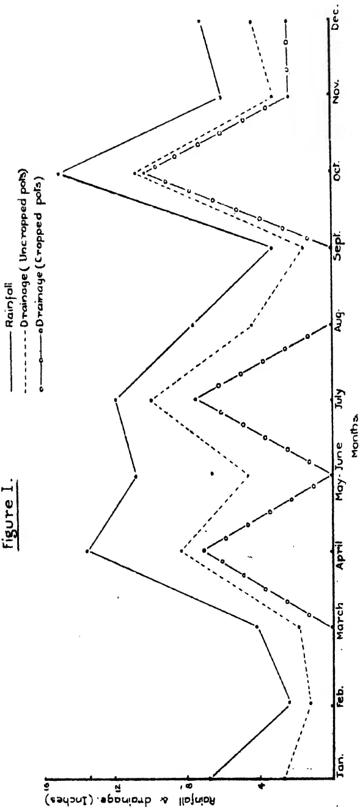

The graph displays three data series over a 12-month period. The Y-axis is labeled 'Rainfall & drainage. (Inches)' and ranges from 0 to 16. The X-axis is labeled 'Months' and lists the months from Jan. to Dec. The legend indicates: Rainfall (solid line), Drainage (Uncropped pots) (dashed line), and Drainage (Cropped pots) (line with open circles). Rainfall peaks in January and February, followed by a period of zero rainfall from March to July. Drainage in uncropped pots begins in March and peaks in August. Drainage in cropped pots begins in April and peaks in July.

<table border="1"><thead><tr><th>Month</th><th>Rainfall (Inches)</th><th>Drainage (Uncropped pots) (Inches)</th><th>Drainage (Cropped pots) (Inches)</th></tr></thead><tbody><tr><td>Jan.</td><td>15.5</td><td>0</td><td>0</td></tr><tr><td>Feb.</td><td>14.5</td><td>0.5</td><td>0</td></tr><tr><td>March</td><td>0</td><td>1.5</td><td>0.5</td></tr><tr><td>April</td><td>0</td><td>2.5</td><td>1.5</td></tr><tr><td>May-June</td><td>0</td><td>3.5</td><td>2.5</td></tr><tr><td>July</td><td>0</td><td>4.5</td><td>3.5</td></tr><tr><td>Aug.</td><td>0</td><td>5.5</td><td>4.5</td></tr><tr><td>Sept.</td><td>0</td><td>6.5</td><td>5.5</td></tr><tr><td>Oct.</td><td>0</td><td>7.5</td><td>6.5</td></tr><tr><td>Nov.</td><td>0</td><td>8.5</td><td>7.5</td></tr><tr><td>Dec.</td><td>0</td><td>9.5</td><td>8.5</td></tr></tbody></table>

735------------------------------------------------

267

sulphate of ammonia pots showed the highest drainage percentages, and the nitrate of potash and nitrate of soda pots gave the lowest drainage percentages. The last-named pot had also the lowest drainage in 1927, and this is doubtless due to the good growth of the crop in this pot and in the nitrate of potash pot as well. For the same reason the drainage from the cyanamide cropped pot has also been low. The growth of the crop in the sulphate of ammonia pot has not been very successful probably owing to the effect of the continued application of this manure in increasing the acidity of the soil.

#### THE RELATION OF DRAINAGE TO RAINFALL.

The data of table III will confirm what was found in 1927, viz., that there is a significant positive correlation between the average drainage from the uncropped pots during a period and the rainfall during the same period. This is also seen from figure I. The drainage was nil from the cropped pots during six months of the year; this was due to the comparatively low rainfall and its even distribution and to the large amounts of water transpired by the crop. The data also show that, as in 1927, when the rainfall is heavy and continuous, the amounts of drainage from the cropped pots approximate those from the uncropped pots.

Table III.

<table border="1">
<thead>
<tr>
<th rowspan="2">Month.</th>
<th rowspan="2">Rainfall (inches).</th>
<th colspan="2">Drainage (inches).</th>
</tr>
<tr>
<th>Uncropped.</th>
<th>Cropped.</th>
</tr>
</thead>
<tbody>
<tr>
<td>January</td>
<td>6.82</td>
<td>2.58</td>
<td>nil</td>
</tr>
<tr>
<td>February</td>
<td>2.30</td>
<td>1.18</td>
<td>0.34</td>
</tr>
<tr>
<td>March</td>
<td>4.25</td>
<td>1.65</td>
<td>nil</td>
</tr>
<tr>
<td>April</td>
<td>13.72</td>
<td>8.38</td>
<td>7.18</td>
</tr>
<tr>
<td>May</td>
<td>2.60</td>
<td>1.18</td>
<td>nil</td>
</tr>
<tr>
<td>June</td>
<td>8.17</td>
<td>3.49</td>
<td>nil</td>
</tr>
<tr>
<td>July</td>
<td>12.01</td>
<td>9.92</td>
<td>7.74</td>
</tr>
<tr>
<td>August</td>
<td>7.55</td>
<td>4.38</td>
<td>nil</td>
</tr>
<tr>
<td>September</td>
<td>3.24</td>
<td>1.55</td>
<td>nil</td>
</tr>
<tr>
<td>October</td>
<td>15.17</td>
<td>10.68</td>
<td>10.33</td>
</tr>
<tr>
<td>November</td>
<td>6.09</td>
<td>3.28</td>
<td>2.21</td>
</tr>
<tr>
<td>December</td>
<td>7.10</td>
<td>4.34</td>
<td>2.35</td>
</tr>
<tr>
<td></td>
<td>89.02</td>
<td>52.43</td>
<td>30.15</td>
</tr>
</tbody>
</table>

#### THE COMPOSITION OF THE DRAINAGE WATERS.

Analyses of the drainage waters were made for total solids, nitrate nitrogen, lime, potash, chlorine and, in a few instances, magnesia. These indicate that the greatest losses of fertilising

736------------------------------------------------

268

constituents are in the following order: nitrate nitrogen, lime and, to gauge from the comparatively few analyses made, magnesia. The earlier samples were examined for ammoniacal nitrogen and phosphoric acid as well, but as the amounts of these constituents in the drainage waters were found to be inappreciable they were not sought for in later samples. The amounts of fertilising constituents in the drainage waters from the uncropped pots are much greater than those from the cropped pots, and, in the case of the former, there is almost a direct proportionality between the quantities of fertilising constituents in the drainage waters and the amounts of the latter and of the rainfall. In other words, the greater the rainfall, the greater are the drainage and the total amount of fertilising constituents contained in it. This is clearly seen from figures I and II. There is no relationship between the amounts of drainage and the concentrations of the fertilising constituents in them.

Table IV below shows the amounts of fertilising constituents in pounds lost in the drainage waters from an acre of soil.

Table IV.*Composition of Drainage Waters.*

p.p.m. = average parts per million.

(U) = uncropped. (C) = cropped.

*Total Solids.*

<table border="1">
<thead>
<tr>
<th rowspan="2">Treatment</th>
<th colspan="2">Lbs. per acre</th>
<th colspan="2">p.p.m.</th>
<th colspan="2">Ratio (U./C).</th>
</tr>
<tr>
<th>1927</th>
<th>1928</th>
<th>1927</th>
<th>1928</th>
<th>1927</th>
<th>1928</th>
</tr>
</thead>
<tbody>
<tr>
<td>Control</td>
<td>(U) 3906</td>
<td>3139</td>
<td>323</td>
<td>261</td>
<td>2.1</td>
<td>6.8</td>
</tr>
<tr>
<td>"</td>
<td>(C) 1854</td>
<td>458</td>
<td>280</td>
<td>71</td>
<td></td>
<td></td>
</tr>
</tbody>
</table>

*Nitrate Nitrogen.*

<table border="1">
<thead>
<tr>
<th rowspan="2">Treatment.</th>
<th colspan="2">Lbs. per acre.</th>
<th colspan="2">p.p.m.</th>
<th colspan="2">Ratio (U./C).</th>
</tr>
<tr>
<th>1927</th>
<th>1928</th>
<th>1927</th>
<th>1928</th>
<th>1927</th>
<th>1928</th>
</tr>
</thead>
<tbody>
<tr>
<td>Blood meal.</td>
<td>(U) 505.0</td>
<td>465.2</td>
<td>45.1</td>
<td>40.2</td>
<td>3.2</td>
<td>29.6</td>
</tr>
<tr>
<td>" "</td>
<td>(C) 159.8</td>
<td>15.7</td>
<td>24.8</td>
<td>2.3</td>
<td></td>
<td></td>
</tr>
<tr>
<td>Nitrate of soda.</td>
<td>(U) 481.9</td>
<td>520.9</td>
<td>44.1</td>
<td>45.5</td>
<td>3.8</td>
<td>59.4</td>
</tr>
<tr>
<td>" "</td>
<td>(C) 124.1</td>
<td>8.8</td>
<td>20.6</td>
<td>1.6</td>
<td></td>
<td></td>
</tr>
<tr>
<td>Nitrate of potash.</td>
<td>(U) 509.8</td>
<td>538.4</td>
<td>44.0</td>
<td>43.7</td>
<td>3.3</td>
<td>48.8</td>
</tr>
<tr>
<td>" "</td>
<td>(C) 153.1</td>
<td>11.0</td>
<td>21.3</td>
<td>1.9</td>
<td></td>
<td></td>
</tr>
<tr>
<td>Sulphate of ammonia</td>
<td>(U) 509.0</td>
<td>478.9</td>
<td>46.1</td>
<td>41.4</td>
<td>3.5</td>
<td>33.2</td>
</tr>
<tr>
<td>" "</td>
<td>(C) 145.6</td>
<td>14.4</td>
<td>20.8</td>
<td>1.9</td>
<td></td>
<td></td>
</tr>
<tr>
<td>Cyanamide.</td>
<td>(U) 547.3</td>
<td>490.5</td>
<td>48.8</td>
<td>43.5</td>
<td>3.4</td>
<td>40.5</td>
</tr>
<tr>
<td>" "</td>
<td>(C) 180.7</td>
<td>12.1</td>
<td>25.9</td>
<td>2.0</td>
<td></td>
<td></td>
</tr>
<tr>
<td>Control.</td>
<td>(U) 510.5</td>
<td>520.1</td>
<td>47.0</td>
<td>43.2</td>
<td>2.9</td>
<td>47.7</td>
</tr>
<tr>
<td>"</td>
<td>(C) 175.9</td>
<td>10.9</td>
<td>26.6</td>
<td>1.7</td>
<td></td>
<td></td>
</tr>
<tr>
<td>Average.</td>
<td>(U) 510.6</td>
<td>502.5</td>
<td>45.8</td>
<td>42.9</td>
<td>3.4</td>
<td>41.2</td>
</tr>
<tr>
<td>"</td>
<td>(C) 156.5</td>
<td>12.2</td>
<td>23.3</td>
<td>1.9</td>
<td></td>
<td></td>
</tr>
</tbody>
</table>

737------------------------------------------------

<!-- stage4: FAINT old-images-only -->

[Faint page: no legible print of its own could be verified; text withheld (stage 4 review list)]

738------------------------------------------------

739------------------------------------------------

269*Lime.*

<table>
<tbody>
<tr>
<td>Sulphate of ammonia.</td>
<td>(U)</td>
<td>558.1</td>
<td>474.8</td>
<td>50.0</td>
<td>41.0</td>
<td>2.7</td>
<td>12.9</td>
</tr>
<tr>
<td>" " "</td>
<td>(C)</td>
<td>208.9</td>
<td>39.9</td>
<td>29.1</td>
<td>5.2</td>
<td></td>
<td></td>
</tr>
<tr>
<td>Muriate of potash.</td>
<td>(U)</td>
<td>628.6</td>
<td>498.3</td>
<td>58.2</td>
<td>38.5</td>
<td>3.2</td>
<td>10.3</td>
</tr>
<tr>
<td>" " "</td>
<td>(C)</td>
<td>195.0</td>
<td>48.3</td>
<td>29.8</td>
<td>6.3</td>
<td></td>
<td></td>
</tr>
<tr>
<td>Control. " "</td>
<td>(U)</td>
<td>589.4</td>
<td>480.0</td>
<td>54.8</td>
<td>39.9</td>
<td>2.1</td>
<td>11.4</td>
</tr>
<tr>
<td>" "</td>
<td>(C)</td>
<td>274.9</td>
<td>41.9</td>
<td>41.6</td>
<td>6.5</td>
<td></td>
<td></td>
</tr>
</tbody>
</table>

<table>
<tbody>
<tr>
<td>Average.</td>
<td>(U)</td>
<td>590.4</td>
<td>484.2</td>
<td>52.5</td>
<td>39.8</td>
<td>2.7</td>
<td>11.2</td>
</tr>
<tr>
<td>"</td>
<td>(C)</td>
<td>224.6</td>
<td>43.4</td>
<td>33.5</td>
<td>6.0</td>
<td></td>
<td></td>
</tr>
</tbody>
</table>

*Potash.*

<table>
<tbody>
<tr>
<td>Nitrate of potash.</td>
<td>(U)</td>
<td>60.4</td>
<td>60.9</td>
<td>5.2</td>
<td>4.9</td>
<td>1.5</td>
<td>11.2</td>
</tr>
<tr>
<td>" " "</td>
<td>(C)</td>
<td>39.4</td>
<td>5.5</td>
<td>5.5</td>
<td>1.0</td>
<td></td>
<td></td>
</tr>
<tr>
<td>Muriate of potash.</td>
<td>(U)</td>
<td>69.9</td>
<td>64.6</td>
<td>5.9</td>
<td>5.0</td>
<td>2.3</td>
<td>10.0</td>
</tr>
<tr>
<td>" " "</td>
<td>(C)</td>
<td>30.6</td>
<td>6.5</td>
<td>4.7</td>
<td>0.8</td>
<td></td>
<td></td>
</tr>
<tr>
<td>Sulphate of potash.</td>
<td>(U)</td>
<td>75.9</td>
<td>57.8</td>
<td>6.6</td>
<td>5.2</td>
<td>2.4</td>
<td>8.5</td>
</tr>
<tr>
<td>" " "</td>
<td>(C)</td>
<td>32.0</td>
<td>6.8</td>
<td>4.7</td>
<td>0.9</td>
<td></td>
<td></td>
</tr>
<tr>
<td>Control. " "</td>
<td>(U)</td>
<td>65.7</td>
<td>74.0</td>
<td>6.1</td>
<td>6.2</td>
<td>1.4</td>
<td>13.6</td>
</tr>
<tr>
<td>" "</td>
<td>(C)</td>
<td>46.0</td>
<td>5.4</td>
<td>7.0</td>
<td>0.8</td>
<td></td>
<td></td>
</tr>
</tbody>
</table>

<table>
<tbody>
<tr>
<td>Average.</td>
<td>(U)</td>
<td>68.0</td>
<td>64.3</td>
<td>5.5</td>
<td>5.3</td>
<td>1.9</td>
<td>10.7</td>
</tr>
<tr>
<td>"</td>
<td>(C)</td>
<td>37.0</td>
<td>6.0</td>
<td>6.0</td>
<td>0.9</td>
<td></td>
<td></td>
</tr>
</tbody>
</table>

*Chlorine.*

<table>
<tbody>
<tr>
<td>Muriate of potash.</td>
<td>(U)</td>
<td>161.5</td>
<td>148.0</td>
<td>13.1</td>
<td>11.4</td>
<td>2.4</td>
<td>2.6</td>
</tr>
<tr>
<td>" " "</td>
<td>(C)</td>
<td>68.2</td>
<td>56.3</td>
<td>9.8</td>
<td>7.4</td>
<td></td>
<td></td>
</tr>
<tr>
<td>Control. " "</td>
<td>(U)</td>
<td>115.2</td>
<td>88.3</td>
<td>10.2</td>
<td>7.3</td>
<td>1.8</td>
<td>3.4</td>
</tr>
<tr>
<td>" "</td>
<td>(C)</td>
<td>65.6</td>
<td>25.8</td>
<td>9.3</td>
<td>4.0</td>
<td></td>
<td></td>
</tr>
</tbody>
</table>

<table>
<tbody>
<tr>
<td>Average.</td>
<td>(U)</td>
<td>138.4</td>
<td>118.1</td>
<td>11.7</td>
<td>9.3</td>
<td>2.1</td>
<td>2.8</td>
</tr>
<tr>
<td>"</td>
<td>(C)</td>
<td>66.9</td>
<td>42.1</td>
<td>9.6</td>
<td>5.7</td>
<td></td>
<td></td>
</tr>
</tbody>
</table>

*Magnesia.*

<table>
<thead>
<tr>
<th></th>
<th></th>
<th>Average per sampling.</th>
<th>Lb. per acre. Total (calculated).</th>
<th>Ratio.</th>
</tr>
</thead>
<tbody>
<tr>
<td>Sulphate of ammonia.</td>
<td>(U)</td>
<td>26.4</td>
<td>290</td>
<td></td>
</tr>
<tr>
<td>" " "</td>
<td>(C)</td>
<td>—</td>
<td></td>
<td></td>
</tr>
<tr>
<td>Muriate of potash.</td>
<td>(U)</td>
<td>26.7</td>
<td>294</td>
<td></td>
</tr>
<tr>
<td>" " "</td>
<td>(C)</td>
<td>30.0</td>
<td>330</td>
<td></td>
</tr>
<tr>
<td>Control. " "</td>
<td>(U)</td>
<td>30.0</td>
<td>330</td>
<td></td>
</tr>
<tr>
<td>" "</td>
<td>(C)</td>
<td>25.0</td>
<td>275</td>
<td></td>
</tr>
<tr>
<td>Average.</td>
<td>(U)</td>
<td>27.7</td>
<td>304</td>
<td rowspan="2">1</td>
</tr>
<tr>
<td>"</td>
<td>(C)</td>
<td>27.5</td>
<td>302</td>
</tr>
</tbody>
</table>

An examination of the data of this table will lead to the following conclusions:

*Total Solids:* The loss of total solids in the drainage water from the cropped control pot during 1928 was much less than that during 1927. The uncropped pots lost nearly seven times as much as the cropped pots.

*Nitrate Nitrogen:* (1) Nitrates continue to be found in the drainage waters in largest quantities. The 1928 average, in spite of a heavier rainfall during the year, is slightly lower than that of the 1927 average for the uncropped pots; but the losses from the cropped pots were only about one-fortieth those from the uncropped pots. The losses from the cropped pots in 1928 were over ten times less than the losses from these pots during 1927. The reason for the continued large losses of nitrate

740------------------------------------------------

270

nitrogen from the uncropped pots is the one referred to already, viz., the slow drainage of water collected in the pots above the soil during periods of heavy rainfall. The greater part of this water would flow over under normal field conditions. (2) The losses of nitrogen added in the form of manures to the pots are still inappreciable when compared to the soil nitrogen losses. (3) Of the cropped pots, the smallest loss is from the nitrate of soda pot, but the losses from all the cropped pots are very small. Of the uncropped pots, the nitrate of potash and soda pots show the largest losses and blood meal the smallest. The loss of nitrate from the cyanamide uncropped pot during 1928 was much smaller than that from the same pot in 1927.

*Lime:* (1) The amounts of lime found in the drainage waters from the uncropped pots are still very high but smaller than those found in 1927. (2) The losses from the cropped pots are much less than the losses from the same pots during 1927. The average amount of lime lost during 1928 from the uncropped pots was over eleven times that from the cropped pots. (3) The greatest amounts of lime are lost from the muriate of potash pots, both cropped and uncropped.

*Potash:* (1) The average amount of potash lost from the uncropped pots during 1928 is similar to that lost in 1927. (2) The losses from the cropped pots during 1928 are much smaller than the losses during 1927. About five times more potash appears to have been taken up by the crop during 1928 than during 1927.

*Chlorine:* (1) The losses of chlorine in the drainage waters are smaller during 1928 than during 1927 in the case of both cropped and uncropped pots. (2) The average amount of chlorine lost from the uncropped pots is about three times greater than that from the cropped pots. (3) Chlorine does not appear to be required in large quantities by the *Hibiscus* crop.

*Magnesia:* During the course of the analyses of the drainage waters in 1928, it was observed that the amounts of lime and potash in the drainage waters were not chemically equivalent to the amounts of nitrate found in them and an examination of a few samples of the drainage waters for magnesia was made in order to determine whether nitrate was found combined with this base to any extent. The analyses appear to indicate that magnesium is lost from the soil as nitrate in fairly large quantities.

#### SUMMARY.

The results of leaching trials started in 1927 and continued during 1928 generally confirm the conclusions obtained from the 1927 data, especially with regard to the relationship between drainage and rainfall, the amounts of fertilising constituents in

741------------------------------------------------

271

the drainage waters and the quantities of the latter, and the presence of large amounts of nitrate, nitrogen and lime in the drainage waters from the uncropped pots. The losses of fertilising constituents from the cropped pots during 1928 are much smaller than those from the uncropped pots or the 1927 cropped pots. This would seem to indicate that, notwithstanding a heavy rainfall, the losses of even the most soluble fertilisers through drainage from Ceylon soils would be very small provided a good crop covers the soil. On the other hand, these results appear to indicate that considerable losses of soluble fertilising constituents may occur from our soils, even though uncultivated, if they are left bare. These experiments show further that of the plant fertilising constituents the greatest losses are of nitrate, nitrogen followed by lime, magnesia, chlorine and potash in decreasing order. No phosphoric acid and only inappreciable quantities of nitrogen as ammonia appear to be lost in the drainage waters of Ceylon soils.

#### **ACKNOWLEDGMENTS.**

It is my pleasant duty to acknowledge my indebtedness to my two assistants Messrs. Kandiah and Panditsekere for having assisted in carrying out the numerous analytical determinations and in the calculation of the results, and to Mr. George L. de Silva for having prepared the diagrams for the press.

742------------------------------------------------

272

## CHEMICAL NOTES (7).

### THE MANURIAL VALUE AND DECOMPOSABILITY OF COCONUT FIBRE DUST.

A. W. R. JOACHIM, B.Sc., A.I.C.,

AGRICULTURAL CHEMIST,

DEPARTMENT OF AGRICULTURE, CEYLON.

A number of queries has recently been received by the Chemical Division of the Department on the manurial and agricultural value of coconut fibre dust. Analyses of two samples of coir dust obtained through the courtesy of the British Ceylon Corporation Ltd., were therefore made by Mr. D. G. Pandittesekere, Assistant in Agricultural Chemistry. The ash constituents and nitrogen were determined by ordinary analytical methods, pentosans by Krober and Tollen's method and lignin by the method recommended by Waksman (1). The results of analysis are shown in table I below.

Table I.

<table border="1">
<thead>
<tr>
<th rowspan="2"></th>
<th colspan="2">Fine coir dust.</th>
<th colspan="2">Coarse coir dust.</th>
<th rowspan="2">Sample of coconut husk. on material at 100°C. %</th>
</tr>
<tr>
<th>on air-dry material. %</th>
<th>on material at 100°C. %</th>
<th>on air-dry material. %</th>
<th>on material at 100°C. %</th>
</tr>
</thead>
<tbody>
<tr>
<td>Moisture</td>
<td>15.77</td>
<td>—</td>
<td>20.39</td>
<td>—</td>
<td>—</td>
</tr>
<tr>
<td>*Organic matter</td>
<td>73.19</td>
<td>86.87</td>
<td>76.77</td>
<td>96.43</td>
<td>96.5</td>
</tr>
<tr>
<td>+Ash</td>
<td>11.04</td>
<td>13.13</td>
<td>2.84</td>
<td>3.57</td>
<td>3.5</td>
</tr>
<tr>
<td></td>
<td>100.00</td>
<td>100.00</td>
<td>100.00</td>
<td>100.00</td>
<td>100.00</td>
</tr>
<tr>
<td>+Containing sand</td>
<td>7.82</td>
<td>9.29</td>
<td>.69</td>
<td>.87</td>
<td>.36</td>
</tr>
<tr>
<td>  " phosphoric acid</td>
<td>.06</td>
<td>.07</td>
<td>.04</td>
<td>.06</td>
<td>.08</td>
</tr>
<tr>
<td>  " lime</td>
<td>.67</td>
<td>.79</td>
<td>.69</td>
<td>.87</td>
<td>.94</td>
</tr>
<tr>
<td>*Containing nitrogen</td>
<td>.84</td>
<td>1.00</td>
<td>.31</td>
<td>.39</td>
<td>.26</td>
</tr>
<tr>
<td>  " potash</td>
<td>.33</td>
<td>.39</td>
<td>.26</td>
<td>.33</td>
<td>.31</td>
</tr>
<tr>
<td>Lignin</td>
<td>31.76</td>
<td>37.71</td>
<td>34.75</td>
<td>43.65</td>
<td>45.45</td>
</tr>
<tr>
<td>Pentosan</td>
<td>10.10</td>
<td>11.95</td>
<td>10.74</td>
<td>13.10</td>
<td>19.15</td>
</tr>
<tr>
<td>Ratio of pentosan to lignin</td>
<td colspan="2" style="text-align: center;">.32</td>
<td colspan="2" style="text-align: center;">.30</td>
<td style="text-align: center;">.42</td>
</tr>
</tbody>
</table>

It will be noted that the sample of fine coir dust has a much higher ash and lime content than the coarse sample. This is due to the presence of limestone and sand particles in the former. In other respects the analytical composition of the two grades of coir dust is similar. The actual manurial value of coir dust is small, the present samples containing only .3 per cent. nitrogen, .4 per cent. lime and .05 per cent. phosphoric acid. These samples, however, are comparatively rich in potash which they contain to the extent of .9 per cent. The analysis of a sample of coconut husk is shown for comparison. The potash content of this particular sample of husk is unusually low, the average potash content of coconut husk being about 1.5 per cent.

743------------------------------------------------

273

From the point of view of decomposability, as measured by the pentosan/lignin ratio, the data indicate that coir dust will decompose in the soil only very slowly as its pentosan/lignin ratio is less than .5, which ratio Rege (2) has shown is the minimum required for the slow decomposition of organic materials in soil. That required for rapid decomposition is greater than unity. Compared with that of fibre dust the pentosan/lignin ratio of coconut husk is slightly higher, viz., .42, but is still so low that this material will also be only very slowly decomposed in the soil, unless the decomposition is accelerated by other means. Experiments on the conversion of coconut husk and coir dust into artificial manure by an extension of the Adco process have recently been initiated on a few coconut estates. In this process the pentosan/lignin ratio of the raw material is brought up to the standard required by the addition of easily-decomposable, high pentosan-containing green materials, *e.g.*, grass or green-manure leafy material.

Coir dust absorbs over eight times its weight of water and parts with it comparatively slowly. This is seen from table II below which shows the maximum water-absorbing capacity of and rate of loss of moisture from moisture-saturated samples of coir dust, loamy soil, sandy soil, sandy soil mixed with 2 per cent. of its weight of coir dust, and sandy soil with a surface mulch of coir dust respectively.

Table II.

<table border="1">
<thead>
<tr>
<th rowspan="2"></th>
<th rowspan="2">Maximum water-holding capacity. Initial moisture. Per cent.</th>
<th colspan="6">Per cent. moisture at end of</th>
</tr>
<tr>
<th>1st day</th>
<th>2nd day</th>
<th>3rd day</th>
<th>4th day</th>
<th>5th day</th>
<th>7th day</th>
</tr>
</thead>
<tbody>
<tr>
<td>Loamy soil.</td>
<td>41.8</td>
<td>25.3</td>
<td>12.6</td>
<td>4.4</td>
<td>2.9</td>
<td>2.9</td>
<td>—</td>
</tr>
<tr>
<td>Sandy soil.</td>
<td>24.3</td>
<td>11.9</td>
<td>2.5</td>
<td>0.3</td>
<td>—</td>
<td>—</td>
<td>—</td>
</tr>
<tr>
<td>Sandy soil + coir dust (incorporated).</td>
<td>33.2</td>
<td>19.0</td>
<td>10.0</td>
<td>1.6</td>
<td>0.1</td>
<td>—</td>
<td>—</td>
</tr>
<tr>
<td>Sandy soil + coir dust (as surface mulch).</td>
<td>24.3</td>
<td>12.6</td>
<td>3.4</td>
<td>1.5</td>
<td>0.7</td>
<td>0.2</td>
<td>—</td>
</tr>
<tr>
<td>Coir dust.</td>
<td>823</td>
<td>655</td>
<td>514</td>
<td>348</td>
<td>178</td>
<td>79</td>
<td>17</td>
</tr>
</tbody>
</table>

It will be observed that by the incorporation of 2 per cent. by weight of coir dust with the sandy soil the maximum water-holding capacity of the latter is increased by nearly 40 per cent. and the rate of loss of moisture is slower than from the soil itself. Coir dust can therefore be advantageously incorporated into sandy soils along with green and artificial manures. Coir dust can also be used as a surface mulch for light soils in dry districts during periods of drought, but it should be applied in thick layers if the rate of loss of soil moisture is to be appreciably reduced. Coir dust is also useful for improving the physical condition of heavy clay soils.

REFERENCES.

1. 1. Waksman and Tenney. The composition of natural organic materials and their decomposition in the soil: I. Methods of quantitative analysis of plant materials. *Soil Science* Vol. XXIV. No. 4.
2. 2. Rege. Bio-chemical decomposition of cellulosic materials, with specific reference to the action of fungi. *Ann. Appl. Biology*. Vol. XIV. No. 1.

744------------------------------------------------

274

## SELECTED ARTICLES.

### EXPERIMENTAL TAPPING OF HEVEA BUDDINGS V.\*

**I**N this communication are assembled the results of the continued tapping of the experiment recently reported and of new experimental tappings of the Hevea buddings. It contains the yield statistics of:—

- A. The isolated seed gardens of  
  Clones 33, 36, 49, 50, 52, 80, 139, 142.
- B. Experimental plantation of Tjinta Radja,  
  Clones 27, 28, 36, 35, 49, 139 and seedlings.
- C. Experimental plantation of Boekit Maradja,  
  Clones 33, 49, 51, 53, 65, 71, 76, 80, 147, 65, 163, 152, 174, 182 and seedlings.
- D. Tamiang Rubber Estates,  
  Clone 256.
- E. Soengei Pantjoer,  
  Clones 26, 33, 36, 49, 138, 139, 140, 141, 142, 145, 151, 152, 157, 161, 164, 165, 166, 181, 182, 183, 184, 185, 186, 188, 190, 207, 208, 209, 212, 214, 222.

#### A. EXPERIMENTAL TAPPINGS IN THE ISOLATED SEED GARDENS.

In the attached table† are shown the results of the continued experimental tappings of clones 33, 36, 49, 50, 52 and 80 over a period of 14 months. They are a continuation of our Communications Nos. 40, 44, 55, and 59.‡ The clones 139 and 142 have been newly incorporated in the above. The annual averages in these tables have no further connection with the previous tapping years April-February and May-March respectively, but are calculated over the calendar year. This change was made in the interests of greater uniformity in the tapping experiments. Seeing that on the East Coast planting of buddings is mostly carried out in October-December, the calendar years practically coincide with the years of age of the buddings.

Clones 33, 50, 52, 80, 139 and 142 were still tapped on the old panel, but a new panel was opened at a height of 1.20 metres on clones 49 and 36 in October, 1927. With the exception of the foregoing, the tapping system for all the clones remained the same, viz., a single left-hand cut at an angle of 30° over one-third of the circumference, alternate monthly tapping with a bark consumption of 45 mm per tapping month. To calculate the annual yields the average yield per tapping should be multiplied by 150 tapping days.

\* By Dr. C. Heusser in *Archief voor de Rubbercultuur*, 13e Jaargang No. 9, September, 1929.

† Tables not reproduced.

‡ *Archief voor de Rubbercultuur*: VIII No. 1 (1924), IX No. 8 (1925), XI No. 5 (1927) and XII No. 1 (1928).

745------------------------------------------------

275

Since tapping began on the one-third cut, clone 33 as well as all the other clones, has remained free from brown bast. In clone 36 the oldest buddings again gave no further trouble this year from wind damage. Bark renewal, with the exception of the rejected clone 52, was satisfactory, and was very good in the case of clones 50, 80 and 36. The growth of the buddings is very good with the exception of clone 33. The latter appeared backward in girth increase and leafed very quickly.

With regard to the yields, the following is to be observed:—

The falling-off of yield due to wintering was in general very great in 1928. As a result of this clone 33 only showed an increased yield of 2 g. In spite of the high tapping cut, clone 36 showed an increase of 8.2 g. in yield and is at present the best of the clones standing in the seed gardens. Budding No. 7 gave an average of 100.6 g. in October 1928, and on October 10th reached 147 g., being the highest day's production obtained. It is to be regretted that this clone in its early stages is so susceptible to wind damage. Clone 49 showed a decrease of 1.3 g. in 1928, compared with 1927. This is thought to be due to climatic factors. The increase in yield of clone 50 was only 1.6 g. It must be admitted that a bigger increase than this was expected, but it is believed that a bigger increase can be counted on next year. In July, clone 50 flowered and bore fruit for the second time, so that during the past year, 18,350 viable seeds were harvested from the 10 buddings. It is not beyond the realms of possibility that this had a detrimental effect on the production.

The yield of clone 52 increased considerably. Although the figures show that on primary bark reasonable yields may be obtained, the unsightly bark renewal makes that this clone will not be able to compete with better ones.

Clone 80 has made good progress, but owing to the loss of half of this seed garden in 1927 through a whirlwind, the reliability of the average is diminished.

The yields of clones 139 and 142 are not such that they can be put on a par with the A.V.R.O.S.-clones at present in use.

As however the tapping results of the seedlings of these two clones have been discussed in our Communication No. 70, it has been considered advisable to publish the yields of the buddings here.

### B. EXPERIMENTAL TAPPINGS ON TJINTA RADJA III.

The experimental tappings of buddings and seedlings reported upon in our Rubber Series Communications 54 and 59,\* were continued, thanks to the kind co-operation of the manager and staff of the estate.

The latex from the clones and the seedlings of selected trees was again weighed separately each day on the estate. On the 8th, 15th, 22nd and 30th of each tapping month measurements of the rubber content were taken and from these measurements the yields per tree per tapping were calculated. The seedlings from 36 x 35 and the illegitimate seedlings of 49 were again measured as before by the usual method, namely, coagulating in the cup, crepeing, drying and weighing the monthly yields.

Tapping was carried out alternate monthly, with a left-hand cut at an angle of 30° In the case of the buddings a new panel was opened during the year at a height of 1.20 metres, and the length of the tapping cut was reduced from  $\frac{1}{2}$  to  $\frac{1}{3}$  of the circumference. This transition was not made simultaneously for all the trees, for the majority it was carried out during the second tapping period, and for the remainder during the 6th tapping period.

\* *Archief voor de Rubbercultuur*, X No. 12 (1926) and XII No. 1 (1928).

746------------------------------------------------

276

The seedlings are still being tapped for the most part on the old panel over  $\frac{1}{2}$  the circumference. The consumption of bark was normal ( $1\frac{1}{2}$  = 45 mm).

Growing conditions have been considerably improved during the past year by digging drains. Bark renewal is good for all the clones, and the yields of buddings have very satisfactorily improved. Clone 49 still remains the best yielder, with a yield of 258% of that of the seedlings from selected seed. Cross  $36 \times 35$  attained the highest yield per tree, being 4 times that of the seedlings from selected seed. As however the number of seedlings trees is small and the experimental tappings with the same crosses on Soengei Pantjoer show less favourable results, the above must be accepted with a certain reserve. This however does not detract from the fact that amongst the trees of this cross ( $36 \times 35$ ) there are valuable new clones for isolation. The three-year's old buddings of the very promising numbers will prove this after a few years. Tree No. 25 of  $36 \times 35$  gave a yield of 13.7 kg. in 1928, and tree No. 18, 12.92 kg. The illegitimate seedlings of 49 have jumped up 15.2 g. These seedlings were all tapped on the foot of the tree.

### C. EXPERIMENTAL TAPPINGS ON BOEKET MARADJA.

We are indebted to Mr. H. J. V. S. Holder, Manager of Boekit Maradja Estate, for the extensive yields measurements, from which the average tapping results have been calculated and compiled in the accompanying table.\* In conjunction with his Staff he has continued admirably the experimental tapping described in detail in our Communication No. 58.†

The continuation of the experiment covers a period of  $1\frac{1}{2}$  years (July 1927-December 1928). To the clones tapped from the commencement, viz., Nos. 51, 65, 71, 76, 80, 152 and 163, and the control seedlings, five new clones of the same age were added in November 1927, January 1928 and March 1928, namely No. 33, 49, 53, 147 and 182. The former clones were continued for half a year on the same panel (on half the circumference) and thereafter on a new panel over one-third of the circumference and 80 cm. above the junction. For the control seedlings the new tapping panel was also set out over one-third of the circumference, but the change was made one tapping period later and the height tapping was only  $62\frac{1}{2}$  cm. The new buddings added to the experiment were tapped over half the circumference at a height of 50 cm.

With regard to the number of trees of each group that were tapped, the following is to be noted: The experiment was commenced with 200 trees which were tapped alternate months in two series of 100 trees, series A being tapped in the odd months, and Series B in the even months. When it appeared after tapping for  $1\frac{1}{2}$  years that the yields from both series were practically the same, the experiment was continued from the beginning of 1928 with Series A only, the trees from Series B being reserved for other experiments. The group of control seedlings was however increased from 100 to 200 trees. As the result of wind damage the number of trees of clones 163 and 80 was reduced from 100 to 50. With the newly-added clones, the numbers of buddings had to be limited as follows: Clone 174 20, Clones 33 and 49 25, Clone 182 50.

The first three columns of the table show the annual averages per tree per tapping for 1926, 1927 and 1928 (*i.e.*, the 4th, 5th and 6th years of age.) In the last column the annual yield per tree in kilograms dry rubber for 1928 is given. The table also shows the monthly averages obtained during the 9 tapping periods of the continued experimental tapping.

\* Table not reproduced.

† *Archief voor de Rubbercultuur*, XII No. 1 (1928).

747------------------------------------------------

277

The new yield statistics of Boekit Maradja give rise to the following provisional remarks: Amongst the clones already tapped Nos. 152, 71 and 163 appear again to be the most striking. The yield per 200 trees (*i.e.*, per hectare) in the 6th year of age would be 750 kg. for 152, 694 kg. for 71 and 662 kg. for 163. Clones 51 and 76 remain less valuable. Clone 80 has not fulfilled expectations and although its production is  $1\frac{2}{3}$ rds that of the seedlings, upon the introduction of new clones, this clone has to be put in one of the last places in the list of the usual A.V.R.O.S.-clones. Amongst the new clones tapped, 49 stands out. With this clone it is very noticeable how these trees which were first tapped at the age of five years, commence with a high production, and have hardly reacted to the rather heavy wintering of 1928. With clones 49 a yield of 792 kg. per 200 trees can be reckoned. The yields of 53, 147, 182 and 33 are also considerable. Clone 53 is one of the clones previously misjudged owing to the first yield measurements, of which the yield, now that we have other more promising clones, does not in the first place draw attention. Clone 33 possesses without doubt high-yielding capacities, but even on the good soils of Boekit Maradja still remains a sparsely growing tree.

With all these clones bark renewal was satisfactory. Statistics concerning bark renewal, latex concentration, etc. Will be published in the next Communication on these experimental tappings, in comparison with the control seedlings. The oldest renewed bark will be then  $3\frac{1}{2}$  years old.

#### D. EXPERIMENTAL TAPPINGS WITH CLONÉ 256 ON TAMIANG RUBBER ESTATES.

Clone 256 was discovered during an examination of a budded plantation on Tanah Terbang. In the report on this examination\* this clone appeared as No. IV, resp. T.T.I. To prevent any confusion it was mutually agreed later to give this clone the number A.V.R.O.S. 256.

The buddings were planted out in October 1920, and originated from a mother-tree on Tanah Terbang which up to the present has not been traced. The first production measurements were taken in 1925 and 1926. In 1927 these measurements could not be continued owing to certain circumstances. For the purpose of selective thinning, however, the usual latex measurements were carried out this year. The buddings belong to the class producing over 100 cm.

We are in possession of complete lists of the yields in dry rubber since January, 1928, for which we are indebted to the painstaking co-operation of Mr. Rusterholz, Manager of Tamiang Rubber Estates. The trees were tapped alternate months with a left-hand cut over half the circumference. The average height of the tapping cut in 1928 was 60 cm. above the union.

The measurements were first of all made for 8 buddings. By means of the seeds a further 12 buddings in October 1928 were identified as belonging to 256 and included in the experiment. The yields were determined for each individual tree by daily coagulation in the cups, individual collection and hanging up of the coagula on separate wires for each tree. At the end of a tapping period, the monthly yields were hung for 14 days in the smokehouse and when completely dry were weighed at the experimental station and the daily averages calculated. The average daily yields over 1928 (the 8th year of age of the buddings) are assembled in the accompanying table.† The number of tapping days was 161, and the average annual yield per tree works out at 6.71 kg.

\* *Archief voor de Rubbercultuur* 1926, p. 199.

† Tables not reproduced.

748------------------------------------------------

278

The buddings of 256 are almost ideal trees as far as their outward appearance is concerned. They are good growing trees with a straight trunk and smooth thick bark, and show excellent bark renewal; branching is rather regular and strong, and the crown is not too broad.

### **E. EXPERIMENTAL TAPPINGS ON NEW CLONES IN THE EXPERIMENTAL GARDEN OF SOENGEI PANTJOER.**

The buddings of the clones mentioned below were planted out in 1922 and 1923, partly in rows simultaneously (Nos. 214, 212, 209, 208, 207, 188, 222, 2nd series) and partly at different times as supplies between the seedlings planted in 1921 (1st series). The development of the buddings of the latter series was therefore irregular. In order to obtain yield statistics which can be compared with each other to a certain extent, the buddings of this last series were taken into tappings when they had a girth of 40 cm. at a height of 1 metre, and for calculating the annual averages, the 6 first tapping periods have been taken as the first tapping year, and the 7th to 12th periods as the 2nd tapping year.

In the first experimental series a number of partly known clones which really were not intended for clone section, were included in addition to the new clones (181, 182, 183, 184, 185, 186, 187, 188, and 189). These buddings, sometimes represented by only a few specimens, are authentic buddings of the mother-trees, which in 1920 were mostly used for crossing. After hesitation, these clones (Nos. 26, 33, 36, 49, 138, 139, 140, 141, 142, 145, 151, 152, 157, 161, 164, 165, 166) were added here as it was felt that approximate figures are better than none at all.

The clones planted out in rows all at the same time were brought into tapping simultaneously (December 1927). The yields of 10 trees from each clone were measured together. Only 2 buddings of clone 222 were present.

All buddings were tapped on the first panel at a height of 50 cm. above the union, with a left-hand cut over half the circumference. The second panel was set out over one-third, and at a height of 1 metre. The bark consumption was limited to 45 mm. per tapping month as usual, and tapping was carried out alternate monthly.

From the resultant yields, the following observations can be made:—

1. Clones 185, 183, 214, 209, 222, 186 gave a higher production than the old clones at present in use. Further yield figures will have to be awaited before a definite valuation of these clones will be possible.

Clone 185 stands out particularly by its high production, as a yield of 34 g. during the second year of tapping has never before been reached by any A.V.R.O.S. clone. The pity is that this clone forms crooked stems with continuous grooves.

2. Clones 188, 166, 207, 208 belong to the very promising numbers.

3. The remaining clones experimentally tapped have in our opinion little chance of giving better yields than those at present in use.

### **FINAL REMARKS.**

1. Clone 49, 50, 71, 152, 163 and 256 are, as regards yield and period over which observations were made, foremost in the list of A.V.R.O.S. clones.

2. The great sensibility of clone 36 for wind damage forms a serious drawback.

3. The yield figures of clones 183, 185, 186, 209 and 214 justify full interest and accurate further observations.

4. The yields of clones 27, 35 and 53 show that they differ only little in order of yield from the clones mentioned sub 1.

5. Clones 80 and 33 have not fulfilled expectations.

749------------------------------------------------

279

## TAPPING RESULTS AND OTHER OBSERVATIONS CONCERNING CROSSES OF HEVEA TREES IN THE EXPERIMENTAL GARDEN OF SOENGEI PANTJOER.\*

### I. INTRODUCTION.

**T**HE tapping experiments on Tjinta Radja† and Boekit Maradja‡ have shown that the yield of buddings of certain clones during the first years of tapping is much higher than that of the seedlings from mixed seeds of ordinary mother-trees. From the above experiments however it must not yet be concluded that each group of seedlings will give a lower yield than buddings. The possibility exists that under favourable combinations (crosses or self-pollinations) with certain mother-trees, seedlings can be obtained that on an average will give just as good results as the best clones. If this does not appear possible with the first generation of seedlings it can be obtained with following generations. The importance of seed selection with Hevea trees must not be under-estimated and in this connection we consider it desirable to publish the yields of the first three tapping years of the seedlings obtained by us by artificial pollination, and also to report upon the general behaviour of the various families.

*The experimental material.*—With two exceptions the crosses were made between March and May 1920 and were fully described in our Mededeeling No. 27.§ The resulting seeds were harvested in August-October 1920 and planted out in nurseries at the experimental station. In October 1921-January 1922 the seedlings, approximately one year old, were planted out as stumps in the experimental garden of Soengei Pantjoer, after the majority had been marketed. The crosses 36 × 35 and 36 × 139 date from 1919. First of all they were planted out in an isolated garden but after being repeatedly damaged by deer and finally by a lalang fire, it was decided in 1922 to transplant them to the newly-opened experimental garden on Soengei Pantjoer. Although they recovered very well they may be considered as being of the same age as the remaining crosses. A total of 1691 stumps were planted out belonging to 30 different combinations between 17 different mother-trees. The number of trees per cross varies considerably and some groups are only represented by a few individual trees. This is due to the low percentage of successes in pollination and the barrenness of the trees.

Of the trees originally planted, 1450 were still in existence at the end of the third tapping year. The loss of more than 15% occurred in the first year, partly on account of unsuccessful plants (no selection took place in the nurseries) and partly on account of root diseases. On a block where previously a djohor jungle (*Cassia Siamea*) had grown the loss of plants due to root disease amounted to 40%. The following numbers of tappable trees were present:—

<table style="margin-left: auto; margin-right: auto;">
<tr>
<td>At the end of the 5th year (1st tapping year)</td>
<td>1241 (85% of the total trees).</td>
</tr>
<tr>
<td>At the end of the 6th year (2nd tapping year)</td>
<td>1345 (93%).</td>
</tr>
<tr>
<td>At the end of the 7th year (3rd tapping year)</td>
<td>1393 (96%).</td>
</tr>
</table>

\* By Dr. C. Heusser in *Archief voor de Rubbercultuur*, 13e Jaargang No. 9, September, 1929.

† *Archief voor de Rubbercultuur* 1926 p.630 and 1928 p.57.

‡ *Archief voor de Rubbercultuur* 1928 p.25.

§ *Archief voor de Rubbercultuur* 1921 p.11.

750------------------------------------------------

280

*The plantation.*—The ground on which the trees were planted (8 2/3 ha) is situated on the edge of a plateau along the river Soengei Merah. It is slightly undulating and consists uniformly of coarse sandy red soil with a clay liparite subsoil. According to verbal reports the land was last planted with tobacco about 20 years previously. When taken over it was for the greater part grown over with lalang. Every one to two years the lalang was burnt down so that the top soil was not in the best condition. The rainfall on Soengei Pantjoer amounts to 1900-2000 mm. per annum.

*Planting and upkeep.*—Before planting the ground was chankolled three times, and afterwards the rows between the trees were planted with *Mimosa invisa*. The rows of trees were kept clean to a width of two metres. During the second and third years the entire plantation was provided with catch-pits and on the bunds *Vigna* was planted and later on *Centrosema pubescens* between the *Mimosa* strips. A clean ring was however always kept around the trees. Too much attention was not paid to the removal of harmless weeds, but particular care was taken to see that the garden remained free from lalang. By this method upkeep costs could be maintained at a low level even compared with those occurring in actual practice. The beneficial effect of the *Mimosa* on the top soil must be given here special mention. It broke up the soil and gave rise to a considerable amount of humus. It is thought that the average good yields are partly due to the *Mimosa*.

With a view to ease of control the trees from one cross were planted together in rows of 14 trees. To make individual comparisons of the families it would have been better to plant the crosses in alternate rows; but for comparisons between individuals of the same family block planting is preferable. Figure 1\* shows the position of the crosses in the plantation.

The planting distance is 7m. x 7m. square. This wide distance was chosen to allow observation of the unhindered development of the trees as well as their yields.

*Tapping.*—Tapping was commenced in November 1925, 4 years after planting out the stumps or five years after harvesting the seeds. The trees were considered tappable when they had a circumference of 40 cm. or over, at a height of 1 m. Those trees that were undersized at the commencement of tapping were added to the experiment after they had attained a circumference of 40 cm. By this addition the calculation of the averages of the slow-growing crosses was adversely affected, but from a practical point of view it is fairer that this unfavourable character should reduce the average production rather than that a comparison should be made between the best-developed trees of each cross. The tapping system consisted of a one-third left-handed cut at an angle of 30°, alternate month tapping. By tapping every alternate row—on the even months the odd rows, and on the odd months the even rows—approximately the same number of trees were tapped from each cross every month. No tapping was done on Sundays, and the number of tappings was therefore reduced to 150-155 tapping days or  $\pm 45\%$  of the usual number of tappings with the system of daily tapping. The consumption of bark was limited to 45 mm. (1 $\frac{1}{2}$ ") per tapping period, and practically amounted to 25 cm. per tapping year.

The first tapping panel for the first two tapping years was set at 50 cm. above the ground, and over half the circumference. During the third year tapping was carried out on the second panel over  $\frac{1}{3}$  the circumference and was commenced at a height of 75 cm. The change over from the first to the second panel was made on all trees at the beginning of the third year. Those trees therefore which were taken into tapping after commencement of the experiment were not tapped completely over the first panel.

\* Not reproduced.

751------------------------------------------------

281

*Yield measurements.*—Yield measurements were carried out in the usual manner; the latex was coagulated in the cup, each day the coagulum was hung up on a separate iron wire for each tree, the coagula for the month were creped, dried and weighed and the average yield per tapping calculated. The total production, calculated by summation of the yields per tree, was regularly controlled for each block by the monthly sales of the rubber samples.

*Tappers.*—The tappers were recruited from the labour force of the experimental garden and instructed by a good tapping mandoor. As the tapping coagulation and collecting of the production gave more than twice as much work as the tapping on an ordinary estate, the tapping task was set at 150-200 trees. To eliminate the human element of the tapper, they were changed round, each tapper moving on daily to the next task, and after reaching the last task going back to task No. 1. By this means each tree was tapped by the same tapper an equal number of days and these days were evenly divided over the entire tapping period.

## II. TAPPING RESULTS.

*The total yields of the crosses.*—To form a judgment of the influence of collection, by comparison of the yields of the entire selection plantation with crop statistics from practice on the one hand, and yields of individual families and trees on the other, the figures relating to the entire plantation are reproduced below. It may also be important to study the course of the yields in connection with climate (wintering), change of tapping panels etc., with a larger number of trees of which reliable yield measurements have been obtained from the first day of tapping.

Table 1\* contains, in addition to the monthly total yields in kilograms of dry rubber, the number of tapping days, the number of trees tapped, the number of tappings and the average yield per tree per tapping in grams. Further for each tapping year are given the total and the average yields of the series of trees tapped in the even and in the odd months and the figures for the whole year.

The annual averages are calculated from the total yields by dividing by the number of tappings, and amount to grams of dry rubber per tree per tapping:—

7.78 for the 1st tapping year, 18.63 for the 2nd, 20.24 for the 3rd tapping year.

If the average is calculated from the average annual yields per tapping of the individual trees, the figures found are as follows:—

$7.30 \pm 0.11$ † for the 1st tapping year,  $18.19 \pm 0.24$ , for the 2nd,  $20.50 \pm 0.31$  for the 3rd tapping year.

The reason for these small differences is to be found in the new trees taken into tapping during the first two years, and the falling out of a few trees (wind-damaged and brown bast trees) during the third year.

The first set of averages can be regarded as having been obtained in practice, but the second set however are more accurate for the purpose of comparison of yields of families and individual trees.

In Table II the practical yields per hectare and per tree obtained in the experimental garden are compared with the yields statistics from unselected estate plantations of the same age. The latter figures are estimated.†

\* Not reproduced.

† Standard error of the average.

‡ Maas (*Archief voor de Rubercultuur* 1925, p. 201) states:—

<table border="0">
<tr>
<td>for the 1st tapping year</td>
<td>110 lb. per acre</td>
<td>(123 kg per ha)</td>
</tr>
<tr>
<td>do 2nd do</td>
<td>do 180 ,, do</td>
<td>(210 do )</td>
</tr>
<tr>
<td>do 3rd do</td>
<td>do 240 ,, do</td>
<td>(269 do )</td>
</tr>
</table>

Improved tapping methods and better soil conservation justify the estimate of higher figures for present-day yields.

752------------------------------------------------

282Table II.

<table border="1">
<thead>
<tr>
<th colspan="2">Description</th>
<th>1st tapping year</th>
<th>2nd tapping year</th>
<th>3rd tapping year</th>
</tr>
</thead>
<tbody>
<tr>
<td rowspan="4">Soengei Pantjoer crosses</td>
<td>Yield per ha in kg.</td>
<td>133</td>
<td>415</td>
<td>490</td>
</tr>
<tr>
<td>Yield per tree in kg.</td>
<td>1.20</td>
<td>2.80</td>
<td>3.11</td>
</tr>
<tr>
<td>Average per tree tapping in g.</td>
<td>7,78</td>
<td>18,63</td>
<td>20,24</td>
</tr>
<tr>
<td>Number of trees tapped per ha</td>
<td>143</td>
<td>152</td>
<td>160</td>
</tr>
<tr>
<td rowspan="4">Estimated estate yields</td>
<td>Yield per ha in kg.</td>
<td>125</td>
<td>250</td>
<td>350</td>
</tr>
<tr>
<td>Yield per tree in kg.</td>
<td>0.74</td>
<td>1.25</td>
<td>1.52</td>
</tr>
<tr>
<td>Average per tree per tapping in g</td>
<td>5.7</td>
<td>7.8</td>
<td>9.5</td>
</tr>
<tr>
<td>Number of trees tapped per ha</td>
<td>170</td>
<td>200</td>
<td>230</td>
</tr>
<tr>
<td rowspan="4">Control trees on Soengei Pantjoer</td>
<td>Yield per ha in kg.</td>
<td>47</td>
<td>227</td>
<td>243</td>
</tr>
<tr>
<td>Yield per tree in kg.</td>
<td>0.48</td>
<td>1.37</td>
<td>1.21</td>
</tr>
<tr>
<td>Average per tree per tapping in g.</td>
<td>3.1</td>
<td>9.1</td>
<td>8.0</td>
</tr>
<tr>
<td>Number of trees tapped per ha</td>
<td>157</td>
<td>171</td>
<td>200</td>
</tr>
</tbody>
</table>

From the first year of tapping the yield per hectare in the experimental garden is not much higher than that of an average good plantation, owing to the greater planting distance.

In the second tapping year the yield is more than trebled. The yield for the third year is higher but not in the same proportion, which can be ascribed to the change over to a new panel at 75 cm. and on  $\frac{1}{3}$  of the circumference instead of  $\frac{1}{2}$ . The average yield per tapping in the first year is already much higher than for an ordinary plantation of the same age, whilst in the second year with 18.6 g. it reaches an unexpected high figure. The increase in the third year is relatively small, being again due to the change over to a new tapping panel.

Assuming that tapping and upkeep were better in the experimental garden than on the average estate, and also admitting that the average yield per tree is favourably influenced by the wide planting distance, the higher yield per hectare is so great in the experimental garden that the beneficial influence of selection cannot be disregarded.

At the same time as the crosses, 28 unselected stumps were planted out on Soengei Pantjoer in two rows. The stumps were taken from a native rubber plantation, and their development is good. They were taken into tapping at the same time as the crosses and individual yields were measured. Although the number of trees is small for a good control, the variations amongst these trees are so great that a certain value can be attached to the results obtained and they have therefore been included in Tables I\* and II.

The decreases in production, owing to wintering and to change over to a new tapping panel, are clearly apparent in figure 2.\* In each of the three tapping years the lowest yields occur in the months of March and April and amount to the following percentages of the annual average:—

<table>
<thead>
<tr>
<th></th>
<th>1926</th>
<th>1927</th>
<th>1928</th>
</tr>
</thead>
<tbody>
<tr>
<td>March</td>
<td>62%</td>
<td>74%</td>
<td>49%</td>
</tr>
<tr>
<td>April</td>
<td>53%</td>
<td>64%</td>
<td>47%</td>
</tr>
</tbody>
</table>

\* Tables I and III and figures not reproduced.

753------------------------------------------------

283

During the first two tapping years the influence of wintering is less pronounced than in the third year. Whether this phenomenon has any connection with the climate or with the increasing age of the trees or with the height of the tapping cut cannot be ascertained with certainty, but we suspect that all three factors contribute to it.

The reduction in yield upon change over to the new tapping panel was not greater than was expected. If we assume that the tapping months of December and January are 12% better than October and November, and reckon upon a reduction in yield of 20% as a result of shortening the tapping cut from  $\frac{1}{2}$  to  $\frac{1}{3}$ , then the detrimental effect of changing over to a tapping height of 75 cm. can be stated at 37%.

*Yields of the various families.*—Table III\* shows the average monthly yields per tree for the various families. In the last column of each tapping year the corresponding annual average is shown, together with its standard error. The annual averages are calculated from the annual averages of the individual trees and not from the monthly averages.

The annual averages are graphically given in Fig. 3\* in which the three superimposed columns represent the averages of the three tapping years.

1. A glance at this graph immediately shows the big variations between the yields of the various families. Upon further examination it is strikingly apparent that particularly those crosses of which Mother-Tree No. 157 was one of the parents, belong to the best-producing families, whilst the combinations with No. 145 contain the worst families. It so happened that in the experimental garden the best cross  $157 \times 164$  was planted next to the worst-yielding cross  $145 \times 139$ . In addition to the crosses with 157, some of the families belonging to 161, 164, 155, 138, 49, 36, 151 and 146, also gave good yields. Besides 145, the parents 140 and 139 also exercised a certain bad influence upon the offspring.

2. Important individual differences in the annual percentage increases between the families are also to be seen. Between the first and the second year these differences are not so strikingly apparent, but between the second and third year they are easy to read from the graph without much calculation. The cause of this may be twofold:—

(a) The development of the yielding power with the age of the trees does not progress in the same ratio with different families (e.g., compare families  $138 \times 139$  and  $138 \times 146$ ).

(b) With different families the yields are not all dependent upon the height of the tapping cut to the same extent.

Whilst some of the families, in spite of the change over to a new tapping panel and shortening of the tapping cut from  $\frac{1}{2}$  to  $\frac{1}{3}$  (which took place at the commencement of the third year), still showed a considerably increased yield over that of the second year, others on the contrary have shown a reduction in yield.

For selection purposes therefore the first tapping year cannot give a true aspect of the quality of the families, and true conclusions must be based upon several years' observations. A yield which is only slightly dependent on the height of the tapping cut as shown by many combinations of 161, 165, 157, 138 and 36 can be regarded as an advantageous character for the family.

3. For a mathematical comparison of the families with regard to their qualities, certain objections arise which have been mentioned above; such as the small number of trees representing some families, and the planting of families in blocks instead of their being spread over the entire complex. As far as the scarcity of trees is concerned, however, an indication is given in the standard error of the mean, that for purposes of

\* Not reproduced.

754------------------------------------------------

284

comparison shows the reliability of the differences in the yields. The second objection can be partly overcome by comparing the family groups standing on different blocks. For example, in order to determine whether the Mother-Tree 157 produced better offspring than 164 the averages of both family groups were calculated from the average yields of the following crosses and compared together:—

<table>
<tr>
<td>157 × 142</td>
<td>...</td>
<td>...</td>
<td>164 × 142</td>
</tr>
<tr>
<td>157 × 161</td>
<td>...</td>
<td>...</td>
<td>164 × 161</td>
</tr>
<tr>
<td>157 × 166</td>
<td>...</td>
<td>...</td>
<td>166 × 164</td>
</tr>
<tr>
<td>157 × 151</td>
<td>...</td>
<td>...</td>
<td>164 × 151*</td>
</tr>
</table>

It is not possible to make this comparison for all mother-trees. Owing to the considerable difficulties which the crossing of Hevea trees presents (paucity of seeds per tree, low percentage of successes, different flowering periods of the trees, sensitiveness of the pollen), the choice of the combinations for pollination in 1920 was arbitrary and not systematic. The following results were obtained from the best-yielding families, those in which we are most interested here:—

157 : 161

$$\begin{array}{l} \text{Average over three tapping years} \\ \text{do} \\ \text{difference} \end{array} \quad \left. \begin{array}{l} 157 \times 164 \\ 157 \times 166 \\ 157 \times 142 \end{array} \right\} = 21.97 \pm 0.36$$

$$\left. \begin{array}{l} 164 \times 161 \\ 166 \times 161 \\ 142 \times 161 \end{array} \right\} = 18.12 \pm 0.62$$

$$\text{difference} = 3.85 \pm 0.72$$

The difference is five times more than its standard error; the offspring of 157 in the above combinations are reliably better than those of 161.

157 : 164

$$\begin{array}{l} \text{Average over three tapping years} \\ \text{do} \\ \text{difference} \end{array} \quad \left. \begin{array}{l} 157 \times 151 \\ 157 \times 161 \\ 166 \times 161 \\ 157 \times 142 \end{array} \right\} = 21.09 \pm 1.06$$

$$\left. \begin{array}{l} 164 \times 151 \\ 164 \times 161 \\ 164 \times 166 \\ 164 \times 142 \end{array} \right\} = 16.34 \pm 0.41$$

$$\text{difference} = 4.75 \pm 1.14$$

The difference is more than four times the standard error and 157 can be regarded as reliably better than 164.

157 : 165

$$\begin{array}{l} \text{Average over three tapping years} \\ \text{do} \\ \text{difference} \end{array} \quad \left. \begin{array}{l} 157 \times 161 \\ 157 \times 164 \\ 167 \times 166 \end{array} \right\} = 21.46 \pm 0.49$$

$$\left. \begin{array}{l} 165 \times 161 \\ 165 \times 164 \\ 165 \times 166 \end{array} \right\} = 17.14 \pm 2.77$$

$$\text{difference} = 4.32 \pm 2.82$$

\* It is here assumed that reciprocal crosses are the same in every respect. Although this has not been proved with Hevea it can be taken as very probable.

755------------------------------------------------

285

The difference is less than twice the standard error, and it cannot therefore be said with any certainty whether 157 is better than 165. Seeing however that 157 is reliably better than 161, and that 161 is reliably better than 165, it can be concluded that 157 also is better than 165.

157 : 166

$$\begin{array}{ll} \text{Average over three tapping years} & \left. \begin{array}{l} 157 \times 161 \\ 157 \times 164 \\ 157 \times 142 \end{array} \right\} = 21.57 \pm 0.54 \\ \text{do} & \left. \begin{array}{l} 166 \times 161 \\ 166 \times 164 \end{array} \right\} = 15.88 \pm 0.57 \\ \text{difference} & = 5.69 \pm 0.79 \end{array}$$

The difference is more than 7 times the standard error and 157 is reliably better than 166.

161 : 151

$$\begin{array}{ll} \text{Average over three tapping years} & \left. \begin{array}{l} 164 \times 151 \\ 157 \times 151 \end{array} \right\} = 19.13 \pm 1.99 \\ \text{do} & \left. \begin{array}{l} 164 \times 161 \\ 157 \times 161 \end{array} \right\} = 19.69 \pm 0.71 \\ \text{difference} & = 0.56 \pm 2.11 \end{array}$$

The superiority of 161 is not conclusively proved.

161 : 165

$$\begin{array}{ll} \text{Average over three tapping years} & \left. \begin{array}{l} 166 \times 161 \\ 164 \times 161 \end{array} \right\} = 19.99 \pm 0.85 \\ \text{do} & \left. \begin{array}{l} 166 \times 165 \\ 165 \times 164 \end{array} \right\} = 15.16 \pm 0.99 \\ \text{difference} & = 4.83 \pm 1.30 \end{array}$$

In the above combination 161 is reliably better than 165.

161 : 164

$$\begin{array}{ll} \text{Average over three tapping years} & \left. \begin{array}{l} 157 \times 161 \\ 142 \times 161 \\ 165 \times 161 \\ 166 \times 161 \end{array} \right\} = 18.72 \pm 2.09 \\ \text{do} & \left. \begin{array}{l} 157 \times 164 \\ 164 \times 142 \\ 165 \times 164 \\ 166 \times 164 \end{array} \right\} = 18.30 \pm 0.57 \\ \text{difference} & = 0.42 \pm 2.17 \end{array}$$

161 : 142

$$\begin{array}{ll} \text{Average over three tapping years} & \left. \begin{array}{l} 164 \times 161 \\ 157 \times 161 \\ 161 \times 161 \end{array} \right\} = 19.80 \pm 0.71 \\ \text{do} & \left. \begin{array}{l} 142 \times 157 \\ 166 \times 142 \\ 164 \times 142 \end{array} \right\} = 16.74 \pm 0.46 \\ \text{difference} & = 3.06 \pm 0.85 \end{array}$$

756------------------------------------------------

285

The standard error of the difference is three times the difference, and the superiority of 161 over 142 can safely be concluded.

164 : 165

$$\text{Average over three tapping years} \quad \left. \begin{array}{l} 164 \times 161 \\ 166 \times 165 \end{array} \right\} = 17.21 \pm 0.56$$

$$\text{do} \quad \left. \begin{array}{l} 165 \times 161 \\ 166 \times 165 \end{array} \right\} = 15.93 \pm 6.06$$

$$\text{difference} = 1.28 \pm 6.08$$

The difference is much smaller than the standard error, and it cannot be stated with any certainty that 165 is better than 164.

164 : 165

$$\text{Average over three tapping years} \quad \left. \begin{array}{l} 157 \times 164 \\ 164 \times 161 \\ 164 \times 142 \\ 165 \times 164 \end{array} \right\} = 19.98 \pm 0.51$$

$$\text{do} \quad \left. \begin{array}{l} 157 \times 166 \\ 166 \times 161 \\ 160 \times 142 \\ 166 \times 165 \end{array} \right\} = 16.15 \pm 0.45$$

$$\text{difference} = 3.83 \pm 0.74$$

The combinations of 164 are reliably better than those of 166.

164 : 142

$$\text{Average over three tapping years} \quad \left. \begin{array}{l} 157 \times 164 \\ 164 \times 161 \\ 166 \times 164 \end{array} \right\} = 21.44 \pm 0.60$$

$$\text{do} \quad \left. \begin{array}{l} 142 \times 157 \\ 142 \times 161 \\ 166 \times 142 \end{array} \right\} = 16.17 \pm 0.43$$

$$\text{difference} = 5.27 \pm 0.74$$

The difference is 7 times the standard error and the superiority of 164 thereby assured.

166 : 142

$$\text{Average over three tapping years} \quad \left. \begin{array}{l} 166 \times 157 \\ 166 \times 161 \end{array} \right\} = 20.31 \pm 0.56$$

$$\text{do} \quad \left. \begin{array}{l} 142 \times 157 \\ 142 \times 161 \end{array} \right\} = 17.66 \pm 0.75$$

$$\text{difference} = 2.65 \pm 0.94$$

The difference is 2.8 times the standard error, and 166 is therefore reliably better than 142.

757------------------------------------------------

287

151 : 166

$$\text{Average over three tapping years} \quad \left. \begin{array}{l} 157 \times 151 \\ 164 \times 151 \end{array} \right\} = 19.13 \pm 1.99$$

$$\text{do} \quad \left. \begin{array}{l} 157 \times 166 \\ 166 \times 164 \end{array} \right\} = 17.53 \pm 0.60$$

$$\text{difference} \quad = 1.60 \pm 2.08$$

The superiority of 151 over 166 is not definitely indicated.

138 : 36

$$\text{Average over three tapping years} \quad \left. \begin{array}{l} 138 \times 139 \\ 138 \times 140 \\ 138 \times 145 \\ 138 \times 146 \end{array} \right\} = 15.33 \pm 0.24$$

$$\text{do} \quad \left. \begin{array}{l} 36 \times 139 \\ 36 \times 140 \\ 145 \times 36 \\ 146 \times 36 \end{array} \right\} = 13.88 \pm 0.34$$

$$\text{difference} \quad = 1.45 \pm 0.42$$

The difference is three times the standard error, and 138 in the above combinations is reliably better than 36.

138 : 146

$$\text{Average over three tapping years} \quad \left. \begin{array}{l} 138 \times 140 \\ 36 \times 138 \end{array} \right\} = 16.37 \pm 0.68$$

$$\text{do} \quad \left. \begin{array}{l} 140 \times 146 \\ 146 \times 36 \end{array} \right\} = 14.40 \pm 0.41$$

$$\text{difference} \quad = 1.97 \pm 0.79$$

The difference is  $2\frac{1}{2}$  times the standard error, and 138 is therefore to be considered reliably better than 146.

36 : 146

$$\text{Average over three tapping years} \quad \left. \begin{array}{l} 36 \times 138 \\ 36 \times 140 \end{array} \right\} = 15.79 \pm 0.64$$

$$\text{do} \quad \left. \begin{array}{l} 138 \times 146 \\ 140 \times 146 \end{array} \right\} = 14.91 \pm 0.30$$

$$\text{difference} \quad = 0.88 \pm 0.71$$

The difference is only slightly more than the standard error, and the superiority of 36 cannot therefore be stated with any certainty.

146 : 140

$$\text{Average over three tapping years} \quad \left. \begin{array}{l} 146 \times 36 \\ 138 \times 146 \end{array} \right\} = 17.45 \pm 0.38$$

$$\text{do} \quad \left. \begin{array}{l} 36 \times 140 \\ 140 \times 146 \end{array} \right\} = 14.95 \pm 0.43$$

$$\text{difference} \quad = 2.50 \pm 0.57$$

No. 146 is reliably better than 140.

758------------------------------------------------

288

49 : 146

<table>
<tr>
<td>Average over three tapping years</td>
<td><math>49 \times 138</math></td>
<td><math>= 15.33 \pm 0.49</math></td>
</tr>
<tr>
<td>do</td>
<td><math>138 \times 146</math></td>
<td><math>= 17.95 \pm 0.35</math></td>
</tr>
<tr>
<td>difference</td>
<td></td>
<td><math>= 2.62 \pm 0.60</math></td>
</tr>
</table>

No. 49 is better than 146, but as only one cross of each could be compared the value of this comparison is limited.

From the above comparisons, it is possible to conclude with regard to the combinations examined, that:—

(a) With the crosses on Bandar Klippa (trees 142, 151, 157, 161, 164, 165, 166)

No. 157 is the best seed tree as far as production is concerned,

Nos. 161, 164, 151, 165 are almost equal,

Nos. 166 and 142 are not so good.

(b) With regard to the crosses on Tjinta Radja (trees 138, 146, 36, 140, 49, 139, 145),

No. 138 is the best,

Nos. 38, 146 (49?) are almost equally good,

Nos. 145, 139, 146 are bad.

4. The object of crossing high-producing mother-trees is to obtain valuable hybrids—in addition to obtaining new and better clones from the promising offspring—and after a few generations to be in possession of strains which practically breed true. One of the principal characteristics of a pure line is the small variation which the individual trees possess. In general it cannot be said however that a low variability is the sure indication of a pure line. When a hybrid is obtained in which one factor is dominant the variation is likewise small, although there is no question of dealing with a pure line. With regard to the yielding character of Hevea trees (which property is to be considered as the result of many factors), the existence of such a dominating factor is not probable. There must be many factors working in the same direction to cause a low variability and the latter is an indication of the purity of the family.

To determine the values of families from the point of view of continued selection, it is therefore important to examine the variation as well as their average yields. The measure of variation is the coefficient of variation, that is the standard deviation  $\sigma$  expressed as a percentage of the average yields.

$$(\sigma \% = \frac{100}{M} = \frac{100 \text{ n.M.}}{M})$$

In Table IV\* this coefficient ( $\sigma\%$ ) is shown with the remaining statistics by families for each year and for the average of the three tapping years. The smaller this coefficient, the more uniform is the offspring concerned. As can be seen the families show considerable differences between each other:  $157 \times 166$  has the lowest average coefficient with 13.7, whilst  $164 \times 161$ , a family with equally high yields, has a coefficient of 33.9.

A simple illustration of the variability is given in Table V\* where the trees of the families are arranged in classes of 10 grammes.

\* Not reproduced.

759------------------------------------------------

289

In Fig. 5\* this classification is graphically portrayed for a few typical families for comparison with that of the entire experimental material. For this purpose the number of trees in each yield class is expressed as a percentage. The diagram of the total experimental material shows a great similarity to the curve of the unselected plantation, except that the average is considerably higher (moved to the right). Family 164 × 161 also has a very unsymmetrical line, but possesses a broader top and a higher average. The low-yielding family 164 × 139 is very symmetrical, but on account of its bad yield does not enter into consideration for continued selection. The most symmetrical family amongst those shown is 157 × 164 and this cross has moreover given the highest production. Not only this cross, however, but the whole family in which 157 was one of the parents (157 × 164, 157 × 166, 157 × 161, 157 × 151, and 142 × 157) shows the same regular distribution. In addition to the other types this family group is expressed in percentage figures in Table VI.\* There is no doubt but that in tree 157 a valuable discovery has been made for continued selection.

5. One is inclined to make comparisons between the relative yield capacities of the seedlings and the yield of the mother-trees and their clones. An attempt has been made in this direction in Table VII.\* These statistics must, however, for various reasons, be accepted with reserve. In the first place the mother-trees at the time were not measured with the same care as can be done today in own experimental gardens. Secondly, only a few buddings exist of the clones which, in 1922 and 1923, were planted out as supplies between the seedlings. Finally, the seedlings are arbitrary crosses and not strictly comparable. In spite of these facts however a certain value can be placed upon the compilation of these statistics.

That surprises would result from such a comparison of the yield figures was only to be expected, and for the following reasons: The yield of a mother-tree is the result of certain dominant factors, which besides the environment in which the tree grows, exert an influence upon the production. The production of the clone, buddings of which exist in different places and on different stocks, is the result of the dominant yield factors and the average influence of the surroundings. The yield of the seedlings will however be dependent upon the dominant and recessive or dormant characters of the mother-tree, as these dormant characters can appear in the hybrid children.

For these reasons the following difficulties arise:—

A mother-tree, which is merely a good yielder because of its good surroundings, will produce bad buddings and seedlings. A mother-tree, the high yield of which is due to a few good factors which have overcome all hindrances, will give a good clone but only an average yielding seedling. A mother-tree, the many good qualities of which have not been able to exert their full influence owing to a few bad dominant factors, will give an average clone, but a good seedling.

#### 6. The yields of individual trees.

The publication of extensive statistics on the individual yields has been omitted. It has been considered sufficient in the meantime to assemble the production statistics of the 70(=5%) best trees.

In table VIII\* chiefly trees which come under consideration for continued selection (by seed and budding), and are thus of the most interest here, are represented.

---

\* Not reproduced.

760------------------------------------------------

290

The trees have been arranged according to the average yield during the first three tapping years. In column 8 the rank numbers which were allotted to the trees during the first, second and third tapping years, are shown. Those trees, the rank numbers of which fell below the best 10% of the trees, are marked with cross. A superficial examination demonstrates that considerable changes took place; that is to say that increases in yield were not in the same proportion for individual trees. Some trees which during the first tapping year appeared to be average, rose to the best producers in the second and third years, whilst there were others, the yield of which did not increase to such an extent. The saying "Good trees remain good"\* which can be applied for practical thinning-out work, can no longer be used for selection work. It has already been seen that the intensity of the increase in production of families varies and with individual trees this is much more the case. The mathematical treatment of the problem (calculation of the correlation coefficients for successive tapping years for the entire experimental material) will be the subject of a separate publication, as it falls somewhat outside the compass of this treatise. In column 9 the circumferences of the trees measured at the end of the third tapping year are stated. These figures serve as a gauge for the development of trees concerned.

### III. OBSERVATIONS ON THE SUBSIDIARY CHARACTERISTICS OF THE EXPERIMENTAL TREES.

Although for judging the quality of the families and individual trees the production of rubber is the principal consideration, the secondary characteristics (in so far as these may be hereditary) must not be ignored. These are, the strength of growth of the tree, thickness of the bark, the tendency towards brown bast, crown development and branching in connection with wind damage etc. Research has shown that these qualities are for the most part hereditary, but how they are transmitted, what characters are dominant or dormant and which of the two parents possesses this characteristic cannot always be shown with certainty. For this it is necessary to take observations over more than one generation.

*A. Girth.*—A very good example of the growth and development of the trees is obtained by comparisons of the girth. This was one of the reasons that the experimental trees were measured at intervals. These measurements were all taken at a height of 1 metre from the ground, and the results of the last measurements taken in November 1928 (at the end of the third tapping year) are assembled in Table IX†. In this table the average girth of each family is given in the first column, and in the next columns the individual trees of each family are classified in 5 cm. groups. The average measurements of each family give an indication of the growing power of the cross, whilst the subdivision into individual trees gives an insight into the uniformity of the type.

The crosses 49 × 26 and 138 × 49 show the thickest trees. Cross 49 × 26 in particular excels with a measurement of 80.5 cm., and also shows great uniformity in the frequency distribution.

The offspring of 138 × 161 are also good growing trees.

Small girths are generally to be seen in the offspring of 164, 166 and 140.

The remaining mother-trees produced offspring of average growth.

When the average figures of the families are compared with the girth measurements of the mother-trees (see Table IX) it cannot be denied that

---

\* Rutgers: *Archief voor de Rubbercultuur* 1919, p.107.

† Not reproduced.

761------------------------------------------------

291

generally speaking, the good growing families are descended from good growing parents. When making these comparisons it must not be overlooked that the first 15 pairs of parents (Tjinta Radja trees) were measured when 14 years old, and the second 15 pairs (Bandar Klippa trees) when 10 years old. No. 151 from Dolok Merangir was measured when 9 years old.

Examination of the relation between girth and yield is important. Amongst the families themselves such a correlation apparently does not exist. Within the families, where a greater correlation would be expected, it is still however very slight. For example the most uniform yielding family  $157 \times 164$  has a correlation coefficient of only  $0.305 \pm 0.014$ . It cannot therefore be concluded that good growing crosses in the majority belong to the good producing class of trees. In spite of this however we are of opinion that—apart from extreme cases—the robust growth of a cross must be regarded as an advantage rather than a disadvantage. For the maintenance of high yields (bark renewal, susceptibility towards diseases etc.), a good growing tree provides a better guarantee than a fast-growing type.

*B. Thickness of bark.*—At the end of the third tapping year the thickness of bark was measured at a height of 1 metre. The cork layer was first of all scraped away down to the living bark, then a small plug of the bark was taken out and carefully measured to the nearest  $\frac{1}{4}$  mm. Measurements of bark with a chisel-shaped measuring instrument are too inaccurate, as there is nothing to prevent the chisel sinking into the soft wood to the depth of  $1.1\frac{1}{2}$  mm.

The bark measurements are shown in Table X\* wherein the divisions  $3\frac{1}{2}$  and 4,  $4\frac{1}{2}$  and 5,  $5\frac{1}{2}$  and 6 etc., are grouped together. The limits of each class are approximately  $3\frac{1}{4}$ — $4\frac{1}{4}$ ,  $4\frac{1}{4}$ — $5\frac{1}{4}$  etc., and the values of the classes are  $3\frac{3}{4}$ ,  $4\frac{3}{4}$ ,  $5\frac{3}{4}$  etc.

A glance at the allocation of the individual trees in these classes shows that the variations in the different families are rather wide. Families which give big variations in production, also vary widely in thickness of bark. A complete correlation in this respect however does not exist.

If the bark thickness of the mother and father trees are compared with the average measurements of the respective families, we come to the conclusion that thickness of bark is hereditary.

The trees having the biggest average bark thickness are principally to be found amongst offspring of 161 and 49, which measurements are above the average for the mother-trees also.

The correlation between production and bark thickness has not been evaluated as yet, but it certainly appears that such a relationship, even greater than that between production and girth, exists. These calculations will be made later on at the same time as those in connection with the tendency towards brown bast.

Without considering extreme cases it can therefore be generally considered that thick bark is a favourable sign.

For the purpose of comparing bark measurements with production, the yields of the families for the three tapping years are given in the last columns in kilograms of dry rubber per tree.

*C. Brown Bast.*—At the end of the second and third years the cases of brown bast were counted.

---

\* Not reproduced.

762------------------------------------------------

292

Over the entire experimental material the number of attacks amounted to 4% at each census. This figure coincides with that found in actual practice with the  $\frac{1}{2}$  alternate month tapping system. We had certainly anticipated that at the end of the third year a lower percentage figure would be found, owing to shortening the tapping cut from  $\frac{1}{2}$  to  $\frac{1}{3}$ . Probably had tapping in the third year been carried on over half the circumference a larger number of cases would have resulted, so that, in view of the constancy of this figure, a reduction in this disease can be considered to have taken place during the third year. The cases observed at the end of the third year mainly concerned trees which had already been marked as brown bast trees during the first two years. There appeared 18 new cases during the third year, whilst 16 trees on the new tapping cut have until now appeared to be free from this disease. Generally speaking the attacks were only slight, only 6 trees being taken out of tapping owing to heavy attacks, tapping being continued on the remaining trees.

The occurrence of this disease is shown in Table XI\* according to families. Based on these statistics the following can be stated:—

The highest-producing families were, with one single exception, the most severely attacked. The crosses in which 161 and 164 are one of the parents were all seriously attacked, and the tendency to this disease is strongly marked in the cross  $164 \times 161$  where it reached the highest percentage (21%).

Attacks in this family are in most cases severe, with considerable wood formation in the sick bark. Vague hints of a possible connection between bark thickness and wood formation in conjunction with brown bast attacks may be made here. In addition to 161 and 164, No. 36 in crosses with 138 and 146 also appears to have a tendency towards brown bast, but as 5 cases of severe attacks were observed in the cross  $138 \times 146$ , it cannot be stated with any certainty which of the partners has the greater tendency. That predisposition towards brown bast is hereditary, can be maintained from the fact that the three trees 161, 164 and 36 all showed brown bast in 1921 and 1922, that is after pollination.

Susceptibility towards brown bast is one of the most important secondary characteristics, and continued selection must take cognisance of this fact. If on the one hand there is a danger of cultivating seedlings or clones possessing this characteristic, then on the other hand there is also the possibility of combating this disease by means of careful selection, not confined merely to questions of production.

*D. Habit and Tendency towards Breaking.*—The uniformity of habit of seedlings belonging to a family or family group is usually very great. In the manner of branching which gives a tree its particular appearance the corresponding peculiarities of the parents can sometimes be easily recognised.

The offspring, for example, of 49 already in the second years began to form small crowns with almost right-angled branches. After a short time the side branches became as strong or stronger than the main stem. Another peculiarity of 49 is that frequently the terminal shoot of a branch does not continue in growth and its place extension of the branch is carried on by a side shoot. It is both of these factors which give the crowns a large bowl shape, the crooked branches and the irregular branch formation give a habit which characterises the mother-tree and also clone 49. On the other hand, the seedlings of 145 have a tendency to form branches like lamp-posts; the main stem remains by far the strongest, and the crowns

\* Not reproduced.

763------------------------------------------------

293

possess a more pyramidal form. The crosses of 157 frequently have many equally thick upright branches, a characteristic which gives these trees the appearance of a broom. The buddings of 157 also show this phenomenon.

Amongst the offspring of 166 are frequently found those with several thin hanging branches typical of an apple tree. The seedlings of 36 have the tendency to break more than any other crosses. The cause of this is partly attributable to the acute-angled branch formation, the heavy crown, and partly to the brittle wood—probably due to rapid growth. The largest number of cases of wind damage were found with the crosses  $36 \times 140$  where 19% of the trees were more or less severely damaged. During recent years no new cases occurred, and the fifth year seems to be the vulnerable age for this.

The branching of family  $145 \times 36$  is very interesting, *i.e.*, the crosses between the "lamp-post" and the "breaker." A small number of the trees from the beginning followed the formation of 36, whilst the others first of all copied the pyramid type of the mother. Some of the latter maintained this characteristic, but with others the original main stem at the second or third branch formed an equally heavy side branch with the typical acute angle of No. 36. In spite of the ideal branching of 145 which some of the trees possess, the crown of a few of them still breaks off at half the height, an indication that 36, independently of the branching, brought also the characteristic of brittle wood.

Where, in the usual close plantation, the trees take on a more or less spiky form, owing to the struggle for light, and the appearance of the various tree forms is less pronounced, in the experimental garden, as a result of the wide planting distance, the trees can develop freely and the aspect is different. It can be stated with certainty that the richness of form is not a result of accident but rests on a hereditary basis.

Apart from the tendency to break, it is difficult to state to which of the above types preference must be given. It is thought that in the long run type 145 will produce the best trees, no matter how spiky the trees may appear at first.

*E. Bark renewal.*—Bark renewal is very satisfactory for all the crosses and particularly so with those families with well-developed trees. The renewed bark in three years has almost the same thickness as the virgin bark. For the first tapping panel however this is a general phenomenon, and important differences will only appear with the second and third renewal.

*F. Leaf Fall and Flowering.*—The families show a striking relationship in the time and coincidence of wintering and flowering.

With regard to the former, a line can be drawn between:—

1. 1. Early wintering and flowering families:—

$157 \times 166$ ,  $157 \times 164$ ,  $166 \times 165$ ,  $164 \times 161$ ,  $146 \times 36$ .

1. 2. Trees wintering and flowering during the wintering period:—

$145 \times 138$ ,  $145 \times 36$ ,  $36 \times 140$ ,  $140 \times 138$ ,  $138 \times 139$ ,  $36 \times 138$ ,  $138 \times 146$ ,  $166 \times 164$ ,  $166 \times 142$ ,  $36 \times 35$ ,  $36 \times 139$ ,  $166 \times 161$ ,  $165 \times 164$ .

1. 3. Families wintering and flowering late:—

$142 \times 161$ ,  $142 \times 157$ ,  $165 \times 161$ ,  $157 \times 161$ ,  $164 \times 151$ ,  $157 \times 151$ ,  $164 \times 142$ ,  $141 \times 140$ ,  $140 \times 146$ ,  $145 \times 139$ .

1. 4. Families which flower, but do not winter for the first eight years. To this group belong both the families of 49 ( $49 \times 26$ ,  $138 \times 49$ ). In the wintering period of 1928 a few of the seedlings of  $138 \times 49$  showed a total wintering, but only a few trees of  $49 \times 26$  showed the same characteristic. The remaining trees showed a heavy fall of leaf as in previous years, but

764------------------------------------------------

294

without becoming bare. Only in the wintering period of 1929 was a complete, but a late, wintering observed.

Judging by the flowering and wintering the following order is obtained:—

1. 1. Early wintering : No. 157.
2. 2. Average early wintering : 164, 165, 166, 36, 140 141.
3. 3. Late wintering : 151, 142, 138, 139, 26, 145, 161.
4. 4. No wintering up to the present : No. 49.

As a rule buddings winter at a much later age than seedlings.

The period during which wintering takes place depends principally upon the commencement of the dry season in the spring and on the soil. Manuring, for example, postpones wintering. In the years with a short wintering, the different behaviour of the families is less noticeable than in the years with a long wintering period.

*G. Fertility.*—With regard to the fertility of the trees also we obtain the impression that this, subject to outside influences, is hereditary. This is most clearly shown by the prolificacy of trees 164 and 161. The mother-tree 64 produces an abundance of fruit, whilst from 161 (and also the buddings of this tree), up to the present no seed could generally be found. For crossing therefore only the pollen of 161 could be used. The seedlings from 164, with the exception of the cross  $164 \times 161$ , are all good seed producers. As the average number of seeds per tree with Heveas is comparatively small, the fertility character in generative selection work should not be overlooked.

*H. Seed and Leaf Shape.*—In the seed and leaf shape of the seedlings the corresponding characteristics of the parents are frequently to be found to a striking degree. Sometimes the father and sometimes the mother appears to have the upper hand.

Amongst the offspring of  $138 \times 49$  trees occur, the trees of which bear a striking resemblance to that of 49, much so that it is very difficult to distinguish them. The seed from  $49 \times 26$  mainly have the large and round form of 26, whilst the colour and markings are reminiscent of 49.

The short and somewhat conical form of 157 appears to be a dominant character with most of the offspring. The displacement of the micropyle far towards the ventral side of the seed of 139 is also to be found amongst the seedlings, etc.

With regard to leaf shape, most of the seedlings of the cross  $164 \times 161$  have the round broad leaf-top of 161, whilst amongst the offspring of 151 the long spiky leaf of this tree predominates.

A relationship between the yield and the quantity of leaves and seeds, which is sometimes accepted, could not be found. The occurrence of such functional, unconnected correlation, is also very improbable.

The practical value of the study of the seed and leaf shape is provisionally limited to the possibility of these indications being used as a means of identifying the origin of the trees.

*I. Backward trees.*—During the first years of the experimental plantation it was already noticed that a large number of trees particularly amongst the cross  $138 \times 146$  were backward. Out of 197 trees, 40 (20%) at the end of 1927 were backward. The root system of these trees is completely intact, the leaf however is a yellowish-green, wintering was premature and the stems for the most part crooked. This phenomenon could not be attributed to the situation of the trees as they were spread over the entire block. It is thought that this can be regarded as a hereditary character transmitted by 138. The hybrids of 145 were also backward but to a much less extent.

765------------------------------------------------

295

*J. Formation of cork.*—The formation of an abnormally thick layer of cork must also be regarded as a hereditary character. This phenomenon is particularly common with the hybrids of 145, 138 and 164. The family  $145 \times 138$  showed the highest number of cork bark trees, 108 out of the 132 (i.e., more than 80%) having coarse bark. The extent of this cork varies from 1 metre high to high up in the branches. Both the mother-trees and their buddings are recognisable by a coarse bark.

The number of cork bark trees amongst the other families are as follows:—

$138 \times 49 = 32\%$ ,  $138 \times 146 = 28\%$ ,  $145 \times 135 = 40\%$ ,  $138 \times 139 = 43\%$ ,  $145 \times 36 = 37\%$ ,  $140 \times 138 = 36\%$ ,  $164 \times 151 = 26\%$ ,  $157 \times 164 = 29\%$ .

With the remaining crosses typical cork bark trees only appear sporadically.

*K. Yellow foliage.*—Among the family  $166 \times 161$  a comparatively large number of trees have a golden-yellow to greenish-yellow foliage. This Aurea type was not found amongst the other families. This abnormality had no detrimental influence upon the production, two of the trees of this family, 311 and 312, even belonged to the highest yielders. The buddings of these also have a golden foliage.

*L. Germinating plants with no green leaves.*—Amongst the seed beds in the blocks of the families  $145 \times 139$  and  $138 \times 139$ , appeared several germinating plants with white leaves. When planted out the majority of these plants died off. It appeared that No. 139 possessed the factor which prevented the development of the chlorophyll.

*M. Fasciations.*—The appearance of fasciations amongst the offspring of 164, which tree showed this characteristic to a considerable extent, has already been described in our Communication No. 49.\*

#### IV. SUMMARY AND DISCUSSION OF THE LINE OF PROCEDURE TO BE FOLLOWED.

The yields obtained from the crosses, particularly in the second and third tapping year, are very good. They justify the assumption that with seed selection higher yields can be obtained already in the first generation. Seeing that the mother-trees are to be regarded as hybrids and not pure-breeding plants, and also considering that the character of high production is influenced by the environment of the tree and that the measured yields could give no information on the hereditary capabilities of the trees we expected less gratifying results.

The selection problem however has not been simplified by these premature results.

From the analysis of the families it appears that besides high-yielding crosses, others are obtained which are not much better than seedlings from ordinary seed. Neither the one result nor the other was to be prophesied from the yields of the mother-trees.

The experimental tappings have therefore only proved that there is a big possibility of obtaining good-yielding seedlings from high-yielding trees.

It can also be anticipated that the chances are greater with seeds derived from superior clones through both father and mother. The value of the selected tree as a seed tree can however only be determined with certainty by direct experiment, that is, by experimental tapping of its offspring.

---

\* *Archief voor de Rubbercultuur* 1926 p. 355.

766------------------------------------------------

296

Examination of the families has moreover proved that great differences exist in the variability of the yields of trees of the same family. There are families, the trees of which give a comparatively uniform yield, and others in which the individual yields show great variations. If seed selection has for its purpose the gradual production of true-breeding high-yielding types, then the new trees for selection must be sought amongst the offspring of the uniform families and a high family average can no longer be the only criterion. For the selection of new clones however this is different. For this purpose, high individual yields and a high family average will be the first consideration in fixing the choice, whilst the uniformity of the families will rank as a secondary consideration. The latter characteristic should not be left out of consideration entirely however, as sight should not be lost of the possibility of obtaining valuable seeds from these new clones in addition to their production.

The families also show differences in the degree of increase in yield during the three successive tapping years. This difference is still more pronounced amongst the individual trees. There are some trees which appeared to be average producers during the first tapping year, but which in the second and third years proved to be amongst the best. On the other hand some trees which at the beginning stood out prominently on account of their high yields, did not give the increases anticipated. To what extent this character is to be regarded as genotypic or phenotypic cannot be determined without obtaining the results over a large number of tapping years, and knowing the behaviour of the offspring. In view of the above it cannot be definitely stated at the moment, which of these types should be given the preference when selecting mother-trees. For the present we must trust to luck and keep to the average over the whole of the experimental period. That changes will occur in the qualification of the trees during the coming years is very probable.

Upon investigation of the secondary characteristics such as bark thickness, development, susceptibility towards brown bast, etc., it has been proved that these are hereditary to a considerable extent. As these factors can exert indirectly a good or bad influence upon production, they must also be given the necessary attention in selection.

The ideal cross has not yet been found amongst the families examined, which is not to be wondered at in view of the complexity of the problem.

Mother-tree 157 can however be considered as a good discovery as a seed-bearing tree. The offspring examined in 5 different combinations give the highest average yields, and the variation in yield per tree is small in this family. The bark thickness is above the average. The detrimental characteristics, which 157 possesses in part, are most clearly shown in its best cross 157  $\times$  164. These characteristics are, the somewhat rapid growth, rather heavy topgrowth, and the frequent appearance (12%) of brown bast. There are certainly indications that susceptibility towards brown bast was principally introduced into the family by 164, but it must at least be admitted that 157 did not have the strength to keep this characteristic latent in the offspring. In spite of this however, 157 is at the moment the most promising type for continued seed selection.

It speaks for itself that in view of this, efforts must be made to introduce more growing power and especially more resistance to brown bast in this type, in addition to increasing the production. There are many methods of attempting this. 157 can be crossed again with old mother-trees which also as clones have shown themselves to possess good-yielding qualities, good-growing powers and resistance towards brown bast, e.g., Nos. 256, 49 and 50. (Of the last cross 50  $\times$  157 we have already about 200 trees six months old). Further the best seedlings of the family-group 157 can be crossed individually, or crossed with the best offspring from other good

767------------------------------------------------

297

growing families which are practically free from brown bast, *e.g.*,  $49 \times 26$ . Similar combinations were obtained during the flowering period in 1927, *e.g.*,  $285 \times 300$ ,  $285 \times 49$ . Finally, the results obtained from self-pollination of seeds from 157 will also be examined. Which of these methods will be the quickest cannot be foreseen, but at present trials are being carried out in all directions.

Good qualities must certainly be attributed to tree 161. Amongst its offspring are to be found the best yielders of the experimental garden. This family-group moreover excels by robust growth, great thickness of bark, but also, unfortunately, by the greatest tendency towards brown bast, and by great variability in individual tree yields. For seed selection therefore this tree is not a desirable one, but for clonal selection, however, it possesses great possibilities. For this purpose we shall therefore repeat the combination  $165 \times 161$ , of which there are only four trees, and endeavour to obtain a large number of individuals. As we can now obtain these crosses from buddings of the corresponding mother-trees, greater fertility is anticipated. Tree 317, the best amongst the four offspring of this cross, was also, in the first three years, the best yielder of all the experimental trees, and in the third tapping year gave a production of 13.5 kg. dry rubber. It is not improbable that by increasing the number of individual trees of this family even better yielders will be found, and amongst them some which can be picked out as clones resistant to brown bast.

Selection of clones, which is easy to carry out, will also be applied to all other families having strikingly good trees. For generative selection however we are limited to a smaller number of parent trees for technical reasons, and we must therefore endeavour to increase the number of trees per family. It is apparent that the value of experiments on a small number of seedlings is only that of a preliminary experiment.

## V. CONCLUSION.

The practical conclusions which can be drawn from the foregoing, with regard to the selection of planting material, are the following:—

On an average, the seedlings examined have not yet attained the yields which are to be expected from buddings of the best clones. If however the production of the seedlings of the best families is compared with that of buddings, then they approximate the clonal yields. If at present seed from one of the crosses of 157 is available, then this can be considered as planting material equal in value to buddings, seeing that with seedlings the possibility always exists of increasing the average yield by selective thinning, which is not the case to the same extent for buddings. If at any time such seed is obtained from the seed gardens to be laid out now, then the slogan: "buddings versus seedlings" will be changed into "seedlings and buddings."

It can be prophesied that the above saying will be retained for many years, as we are convinced that the full possibilities, also with regard to clonal selection, have not yet been reached.

768------------------------------------------------

298

## CITRUS PRODUCTS.\*

[The following article has been supplied by the courtesy of the Director of the Imperial Institute. It is of great interest to local growers of citrus and it should be studied with care, especially by those who are developing large citrus areas and are faced with the problem of converting their crops into saleable citrus products.—Ed., T.A.]

**T**HE following article is based on a memorandum recently supplied to the Empire Marketing Board by the Imperial Institute:—

The most important citrus products from a commercial standpoint are the following:—

1. 1. *Citrate of Lime and its derivative Citric Acid.*
2. 2. *Concentrated Juice.*
3. 3. *Raw Juice.*
4. 4. *Essential Oils.*

The principal fruit concerned is the lemon, but the lime is also a valuable source of the products, while increasing qualities of oranges are also being utilised, especially in the United States. It may be mentioned that pineapple juice and pineapple waste, which are obtained in large quantities from the canning factories, are now used in the United States as an important source of citrate and citric acid.

### 1. CITRATE OF LIME AND CITRIC ACID.

Although citric acid is present, together with small amounts of other organic acids, in the juice of citrus fruits, it is not feasible to extract the acid direct from the juice. The citric acid is always first separated by means of the sparingly soluble calcium salt. For this purpose the hot juice, after suitable preliminary treatment, is neutralised by the addition of whiting or ground chalk, or ground limestone if sufficiently pure; the citrate of lime which is precipitated, is filtered off, washed and dried. The citrate may be prepared either from freshly-extracted juice or from the concentrated juice. Details of the method of preparing calcium citrate are given in the Appendix to this article.

Citric acid is prepared from the citrate of lime by treatment with sulphuric acid and is purified by re-crystallisation.

A very pure grade of citric acid can be obtained by the fermentation of sugar with certain moulds, and within the last few years this process has been established on a commercial scale, both in Europe and America.

The imports of citrate of lime and of citric acid into the United Kingdom, with the countries of origin, are shown in Table I.

It will be seen from the figures that Italy is by far the most important source of both products. The industry in that country is highly organised and it should be noted that the lemons used for the preparation of the essential oil and citrate of lime are the surplus fruit remaining over after the needs of the important export trade in fresh lemons have been satisfied. Unusually favourable conditions in the fruit industry may therefore result in restriction of the supplies of lemons available for the citrate and citric

\* From the *Bulletin of the Imperial Institute*, Vol. 27, No. 8, 1929.

769------------------------------------------------

299

acid industries. On the other hand if there is a reduced demand for fresh fruit the surplus is used for the production of oil and citrate, the latter of which is at once consigned to an organisation at Messina (the Camera Agrumaria) at a price fixed in advance. The average production of citrate in Sicily is stated to be 7,000 to 8,000 tons per annum, and some time ago large stocks had accumulated at Messina. These, however, have been substantially reduced during recent years and last year amounted to about 10,000 tons.

As the great bulk of the world's supply of citrate has been produced in Sicily, the Camera Agrumaria has been able to control the market and to fix the selling price. Latterly as a result of this control the manufacture of citric acid in Italy has been largely developed and less citrate has been available for manufacturers in other countries. By arrangement with the Italian producers the manufacture of citric acid in Germany was abandoned several years ago and Germany now imports the acid instead of the citrate from Italy. Table IA gives the exports of citrate of lime and of citric acid from Italy during recent years.

A recent development in the Italian industry is the formation of "Cifac" (Consorzio Italiano Fabbriche Acido Citrico), a syndicate of all the Italian citric acid manufacturers with offices in Messina, the object of which is to control the supply, distribution and price of the citric acid made by the firms concerned. It is understood that the firms comprising the syndicate will have first call on the citrate made in Sicily and that only such quantities will be exported as the firms cannot immediately handle. The effect of this arrangement will be felt most in countries, such as the United Kingdom, which are wholly or mainly dependent on imported supplies of citrate and citric acid. It should stimulate, however, the production of citrate in other countries and may also have an influence on the development of the manufacture of citric acid from sugar by fermentation processes.

The United States (California) is a producer of citrate of lime, the surplus lemon and orange crop being employed in its manufacture as well as pineapple juice and waste. Concentrated lime juice is also imported from the West Indies, and citrate of lime from Italy for the manufacture of citric acid. The fermentation process is now being employed on a commercial scale in the Eastern States.

The production of citrate of lime in the British West Indies has practically ceased and the exports now consist of raw or concentrated lime juice.

Citrate of lime was formerly made in British Guiana from lime juice, but the manufacture failed to give remunerative results and ceased in 1921.

The production of citrate of lime was undertaken in East Africa in 1921, but was soon discontinued and no developments have since taken place. Judging, however, from enquiries received recently at the Imperial Institute from both Kenya and Tanganyika, interest is again being taken in the product in those countries.

Small quantities of citrate of lime have been produced recently in Cyprus from locally-grown lemons and consignments which reached this country were of satisfactory quality.

To sum up: it may be stated that there is a good demand for citrate of lime in this country at the present time owing to the limitation of exports from Italy. British manufacturers of citric acid have stated that they would welcome additional supplies from Empire sources and these, if of good quality, would meet with a ready sale.

As regards the future demand, the possibility of an increased production of citric acid by fermentation methods has to be taken into account, but at present it is not possible to estimate the extent to which this new process will be utilised commercially.

770------------------------------------------------

300

The standard strength of commercial citrate of lime is 64 per cent. of citric acid. The price in London has recently been about £22 per "pipe" of 6 cwt. (on basis of 64 per cent. citric acid content).

## 2. CONCENTRATED JUICE.

The chief citrus fruits used in the preparation of concentrated juice are lemons (in Italy) and limes (in the West Indies). The raw juice as expressed from the fruits is usually concentrated by evaporation either in open pans or preferably in steam-heated stills.

In making concentrated lime juice in a steam-heated still, the oil which distils over is collected and marketed as "distilled oil of lime." The value of this oil is an important item in the financial returns obtained from the process.

Concentrated juice forms a convenient medium for the transport of citric acid in those cases where, owing to the absence of suitable whiting or chalk, or through other causes, it is impracticable to make citrate of lime. The juice is used not only as a source of citrate of lime and ultimately of citric acid, but is also employed directly for certain industrial purposes.

The trade returns of the United Kingdom do not differentiate between concentrated and raw juice, or between lemon and lime juice. The total imports of such juices into this country have been as follows:—

<table>
<thead>
<tr>
<th></th>
<th>1924. <i>gallons.</i></th>
<th>1925. <i>gallons.</i></th>
<th>1926. <i>gallons.</i></th>
<th>1927. <i>gallons.</i></th>
</tr>
</thead>
<tbody>
<tr>
<td><i>Total</i></td>
<td>424,810</td>
<td>497,982</td>
<td>540,625</td>
<td>467,109</td>
</tr>
<tr>
<td>From British West Indies</td>
<td>281,527</td>
<td>368,608</td>
<td>264,260</td>
<td>184,092</td>
</tr>
<tr>
<td>Italy</td>
<td>88,586</td>
<td>101,600</td>
<td>256,534</td>
<td>266,930</td>
</tr>
</tbody>
</table>

Speaking generally, it may be said that juice from the British West Indies consists of both concentrated and raw lime juice, while that from Italy is mainly raw lemon juice. Some idea of the quantity of concentrated lime juice imported into this country may be obtained from the figures given in Table II which show the exports from the chief producing countries.

The exports of concentrated lime juice from the British West Indies have fallen much below the figures of former years, owing to the damage caused by root diseases and withertip disease in Dominica which has resulted in a greatly reduced yield of fruit in that island.

Other British countries which are producing concentrated juice on a small scale are the Union of South Africa and Cyprus. In both cases lemons are used as a source of juice.

Concentrated lime juice was prepared in East Africa in 1921, but the manufacture was not continued on a commercial scale.

In view of the established market in this country for concentrated lime juice, its production could be safely undertaken as an alternative to the preparation of citrate of lime. It is important, as indicated above, that the essential oil expressed with the juice should be recovered during the process of evaporation as its value adds considerably to the financial return obtained.

The juice is concentrated until it contains about 100 oz. of citric acid per gallon and is exported in casks containing 40 to 50 gallons. The present price in London is £28 per pipe of 108 gallons containing 64 oz. of citric acid per gallon. The price of concentrated juice containing larger amounts of citric acid per gallon is proportionally higher.

## 3. RAW JUICE.

Raw citrus juice, prepared from limes, lemons and oranges, is used for making beverages. As explained in the preceding section on concentrated juice it is not possible to give the imports of raw citrus juices into the United Kingdom. The exports from the chief producing countries, so far as figures are available, are shown in Table III.

771------------------------------------------------

301

The production of raw lime juice in the West Indies, as in the case of the concentrated juice, has been greatly affected by diseases.

The demand for raw lime juice is seasonal and largely influenced by the character of the summer weather. The state of the market is an important factor in deciding whether raw juice can be profitably shipped and it is therefore necessary for producers to keep in close touch with importers in this country. The present price of raw lime juice in London is about 4s. 6d. per gallon.

During the last three or four years there has been a very large increase in the export from Italy of raw lemon juice, which is being increasingly utilised for the production of beverages.

#### 4. ESSENTIAL OILS.

The chief essential oils produced from citrus fruits are the following :—Lemon oil, Lime oil, Orange oil, Bergamot oil and Mandarin oil. The oils are obtained from the peel by pressure and in the case of limes and oranges also by distillation.

In making the expressed oils, the oil cells in the peel are ruptured by pressure or by rotating the whole fruit in an *écuelle*, and the oil which exudes is collected. The finest lemon oil is obtained in Sicily by pressing the peel in contact with a sponge, which absorbs the oil. Recently, pressing machines have been introduced in Sicily for the purpose. Expressed lime oil is chiefly made in the West Indies by the process of *écueilling*.\* In the case of limes and oranges the fruit after being *écueilled* is submitted to pressure whereby the juice is expelled together with a further quantity of oil.

Distilled lime and orange oils are obtained as by-products in the manufacture of the concentrated juice, as mentioned in section 2. Citrus oils prepared by distillation are of lower quality and value than expressed oils, owing to changes brought about during the process of distillation.

It is not possible to state the imports of the various citrus oils into the United Kingdom, but the exports from certain producing countries are shown in Table IV. Other important exporting countries are Spain and France. Hitherto, these countries have not published figures showing the export of citrus oils except that in 1928 the total export of all citrus oils from France is given as the equivalent of 74,005 lb.

The principal source of supply of lemon oil is Italy, although increasing quantities are now being produced in California. The latter oil is chiefly marketed in the United States. There is always a good demand for lemon oil and during 1928 the price in London rose steadily from 8s. per lb. in January to 12s. 6d. in July and to 14s.-15s. at the end of the year. The present price is 15s. 6d.-16s. per lb. in London.

The rise in price is attributed in the market to a reduction in the Italian production. The Imperial Institute has recently been informed that owing to the large demand for fresh lemons last season much of the fruit which would have been used in Italy for the manufacture of oil and citrate was exported and that consequently the amount of oil produced was very low.

Lime oil has been realising high prices owing to a good demand and shortage of supplies from the West Indies due to diseases and the effect of the recent hurricane. Up to 34s. per lb. has been paid recently in London for the distilled oil, and the range in price during 1928 was 24s. to 30s. per lb. The London price of the hand-pressed oil ranged from 35s. to 40s. per lb. during 1928; this oil is at present scarce and worth nominally 65s. per lb.

---

\* An *écuelle* is a saucer-shaped vessel made of tinned copper, the inside of which is covered by short spikes, about  $\frac{1}{4}$  in. long. The fruit is placed in the *écuelle* and by a rapid rotatory motion the oil cells are ruptured and the oil so released is collected through a tube leading from the bottom of the *écuelle*.

772------------------------------------------------

302Table I.

*Total Imports of Citrate of Lime and Citric Acid into the United Kingdom.*

<table border="1">
<thead>
<tr>
<th>Particulars.</th>
<th>1924.</th>
<th>1925.</th>
<th>1926.</th>
<th>1927.</th>
<th>1928.</th>
</tr>
<tr>
<td></td>
<td>lb.</td>
<td>lb.</td>
<td>lb.</td>
<td>lb.</td>
<td>lb.</td>
</tr>
</thead>
<tbody>
<tr>
<td>CITRATE OF LIME</td>
<td></td>
<td></td>
<td></td>
<td></td>
<td></td>
</tr>
<tr>
<td>Total</td>
<td>3,599,680</td>
<td>4,326,560</td>
<td>5,587,344</td>
<td>4,812,528</td>
<td>(a)</td>
</tr>
<tr>
<td>From :</td>
<td></td>
<td></td>
<td></td>
<td></td>
<td></td>
</tr>
<tr>
<td>Italy</td>
<td>3,553,984</td>
<td>4,311,776</td>
<td>5,464,368</td>
<td>4,496,016</td>
<td>(a)</td>
</tr>
<tr>
<td>Spain</td>
<td>—</td>
<td>11,424</td>
<td>119,392</td>
<td>309,792</td>
<td>(a)</td>
</tr>
<tr>
<td>Other Foreign Countries</td>
<td>896</td>
<td>—</td>
<td>—</td>
<td>—</td>
<td>(a)</td>
</tr>
<tr>
<td>British West Indies</td>
<td>40,320</td>
<td>3,360</td>
<td>3,584</td>
<td>—</td>
<td>(a)</td>
</tr>
<tr>
<td>Other British Empire</td>
<td>4,480</td>
<td>—</td>
<td>—</td>
<td>6,720</td>
<td>(a)</td>
</tr>
<tr>
<td>CITRIC ACID</td>
<td></td>
<td></td>
<td></td>
<td></td>
<td></td>
</tr>
<tr>
<td>Total</td>
<td>542,080</td>
<td>782,544</td>
<td>624,512</td>
<td>674,576</td>
<td>(a)</td>
</tr>
<tr>
<td>From :</td>
<td></td>
<td></td>
<td></td>
<td></td>
<td></td>
</tr>
<tr>
<td>Italy</td>
<td>506,464</td>
<td>738,752</td>
<td>554,960</td>
<td>602,000</td>
<td>(a)</td>
</tr>
<tr>
<td>Netherlands</td>
<td>24,976</td>
<td>7,840</td>
<td>18,816</td>
<td>17,584</td>
<td>(a)</td>
</tr>
<tr>
<td>France</td>
<td>10,640</td>
<td>16,240</td>
<td>22,512</td>
<td>38,080</td>
<td>(a)</td>
</tr>
<tr>
<td>Other Foreign Countries</td>
<td>—</td>
<td>18,592</td>
<td>28,224</td>
<td>16,912</td>
<td>(a)</td>
</tr>
<tr>
<td>British Empire</td>
<td>—</td>
<td>1,120</td>
<td>—</td>
<td>—</td>
<td>(a)</td>
</tr>
<tr>
<td colspan="6" style="text-align: center;"><i>Re-exports from the United Kingdom.</i></td>
</tr>
<tr>
<td>CITRATE OF LIME</td>
<td>—</td>
<td>—</td>
<td>—</td>
<td>—</td>
<td>(a)</td>
</tr>
<tr>
<td>CITRIC ACID</td>
<td>57,568</td>
<td>89,600</td>
<td>68,800</td>
<td>21,504</td>
<td>(a)</td>
</tr>
</tbody>
</table>

(a) Information not yet available.

Table IA.

*Exports of Citrate of Lime and Citric Acid from Italy.*

*Citrate of Lime.*

<table border="1">
<thead>
<tr>
<th>Particulars</th>
<th>1924.</th>
<th>1925.</th>
<th>1926.</th>
<th>1927.</th>
<th>1928.</th>
</tr>
<tr>
<td></td>
<td>lb.</td>
<td>lb.</td>
<td>lb.</td>
<td>lb.</td>
<td>lb.</td>
</tr>
</thead>
<tbody>
<tr>
<td>Total</td>
<td>8,322,890</td>
<td>10,313,223</td>
<td>10,132,665</td>
<td>6,846,455</td>
<td>3,587,141</td>
</tr>
<tr>
<td>To :</td>
<td></td>
<td></td>
<td></td>
<td></td>
<td></td>
</tr>
<tr>
<td>United Kingdom</td>
<td>3,474,705</td>
<td>4,418,063</td>
<td>4,646,021</td>
<td>4,637,643</td>
<td>2,308,901</td>
</tr>
<tr>
<td>France</td>
<td>2,009,072</td>
<td>2,265,470</td>
<td>2,631,217</td>
<td>2,208,812</td>
<td>1,254,430</td>
</tr>
<tr>
<td>Germany</td>
<td>378,313</td>
<td>—</td>
<td>441</td>
<td>—</td>
<td>(a)</td>
</tr>
<tr>
<td>United States</td>
<td>2,458,374</td>
<td>3,628,367</td>
<td>2,632,099</td>
<td>—</td>
<td>—</td>
</tr>
<tr>
<td colspan="6" style="text-align: center;"><i>Citric Acid.</i></td>
</tr>
<tr>
<td>Total</td>
<td>4,256,244</td>
<td>6,119,811</td>
<td>4,544,388</td>
<td>4,412,552</td>
<td>7,358,147</td>
</tr>
<tr>
<td>To :</td>
<td></td>
<td></td>
<td></td>
<td></td>
<td></td>
</tr>
<tr>
<td>United Kingdom</td>
<td>528,007</td>
<td>704,156</td>
<td>595,028</td>
<td>578,272</td>
<td>1,209,676</td>
</tr>
<tr>
<td>France</td>
<td>285,278</td>
<td>601,201</td>
<td>580,477</td>
<td>562,179</td>
<td>1,147,285</td>
</tr>
<tr>
<td>Argentina</td>
<td>511,693</td>
<td>582,902</td>
<td>619,278</td>
<td>491,851</td>
<td>759,492</td>
</tr>
<tr>
<td>United States</td>
<td>805,789</td>
<td>754,201</td>
<td>190,920</td>
<td>103,397</td>
<td>63,273</td>
</tr>
<tr>
<td>Germany</td>
<td>541,455</td>
<td>1,140,231</td>
<td>179,236</td>
<td>688,283</td>
<td>1,330,710</td>
</tr>
</tbody>
</table>

(a) Information not yet available.

773------------------------------------------------

303

Table II.  
Exports of Concentrated Citrus Juice.

<table border="1">
<thead>
<tr>
<th>—</th>
<th>1924.</th>
<th>1925.</th>
<th>1926.</th>
<th>1927.</th>
<th>1828.</th>
</tr>
<tr>
<th></th>
<th>gallons.</th>
<th>gallons.</th>
<th>gallons.</th>
<th>gallons</th>
<th>gallons.</th>
</tr>
</thead>
<tbody>
<tr>
<td>LEEWARD ISLANDS (Lime Juice)</td>
<td></td>
<td></td>
<td></td>
<td></td>
<td></td>
</tr>
<tr>
<td>  <i>Dominica</i> : Total</td>
<td>237,369</td>
<td>111,778</td>
<td>104,014</td>
<td>106,971</td>
<td>90,371</td>
</tr>
<tr>
<td>  To :</td>
<td></td>
<td></td>
<td></td>
<td></td>
<td></td>
</tr>
<tr>
<td>    United Kingdom</td>
<td>19,514</td>
<td>1,512</td>
<td>88</td>
<td>6,521</td>
<td>(a)</td>
</tr>
<tr>
<td>    United States</td>
<td>217,855</td>
<td>110,266</td>
<td>102,364</td>
<td>100,030</td>
<td>(a)</td>
</tr>
<tr>
<td>  <i>Antigua</i> : Total</td>
<td>—</td>
<td>290</td>
<td>2,050</td>
<td>5,250</td>
<td>2,350</td>
</tr>
<tr>
<td>  To :</td>
<td></td>
<td></td>
<td></td>
<td></td>
<td></td>
</tr>
<tr>
<td>    United Kingdom</td>
<td>—</td>
<td>290</td>
<td>2,050</td>
<td>—</td>
<td>(a)</td>
</tr>
<tr>
<td>    United States</td>
<td>—</td>
<td>—</td>
<td>—</td>
<td>5,250</td>
<td>(a)</td>
</tr>
<tr>
<td>WINDWARD ISLANDS (Lime Juice)</td>
<td></td>
<td></td>
<td></td>
<td></td>
<td></td>
</tr>
<tr>
<td>  <i>St. Lucia</i> : Total</td>
<td>33,718</td>
<td>40,858</td>
<td>35,234</td>
<td>38,064</td>
<td>18,028</td>
</tr>
<tr>
<td>  To :</td>
<td></td>
<td></td>
<td></td>
<td></td>
<td></td>
</tr>
<tr>
<td>    United Kingdom</td>
<td>2,240</td>
<td>—</td>
<td>120</td>
<td>—</td>
<td>9,448</td>
</tr>
<tr>
<td>    Canada</td>
<td>220</td>
<td>—</td>
<td>—</td>
<td>—</td>
<td>—</td>
</tr>
<tr>
<td>    United States</td>
<td>31,258</td>
<td>40,858</td>
<td>35,114</td>
<td>38,064</td>
<td>8,580</td>
</tr>
<tr>
<td>  <i>Grenada</i> : Total</td>
<td>7,331</td>
<td>9,075</td>
<td>6,520</td>
<td>11,048</td>
<td>18,720</td>
</tr>
<tr>
<td>  To :</td>
<td></td>
<td></td>
<td></td>
<td></td>
<td></td>
</tr>
<tr>
<td>    United Kingdom</td>
<td>1,831</td>
<td>3,450</td>
<td>2,520</td>
<td>5,350</td>
<td>18,040</td>
</tr>
<tr>
<td>    United States</td>
<td>5,500</td>
<td>5,625</td>
<td>4,000</td>
<td>5,698</td>
<td>680</td>
</tr>
<tr>
<td>TRINIDAD AND TOBAGO (Lime Juice)</td>
<td></td>
<td></td>
<td></td>
<td></td>
<td></td>
</tr>
<tr>
<td>  Total</td>
<td>7,505</td>
<td>6,171</td>
<td>7,886</td>
<td>4,488</td>
<td>(a)</td>
</tr>
<tr>
<td>  To :</td>
<td></td>
<td></td>
<td></td>
<td></td>
<td></td>
</tr>
<tr>
<td>    United Kingdom</td>
<td>5,562</td>
<td>1,680</td>
<td>1,128</td>
<td>—</td>
<td>(a)</td>
</tr>
<tr>
<td>    United States</td>
<td>1,743</td>
<td>4,491</td>
<td>6,758</td>
<td>4,488</td>
<td>(a)</td>
</tr>
<tr>
<td>    British North America</td>
<td>200</td>
<td>—</td>
<td>—</td>
<td>—</td>
<td>(a)</td>
</tr>
<tr>
<td>JAMAICA (Lime Juice)</td>
<td></td>
<td></td>
<td></td>
<td></td>
<td></td>
</tr>
<tr>
<td>  Total</td>
<td>54,206*</td>
<td>87,755*</td>
<td>21,399*</td>
<td>5,027</td>
<td>43,791*</td>
</tr>
<tr>
<td>  To :</td>
<td></td>
<td></td>
<td></td>
<td></td>
<td></td>
</tr>
<tr>
<td>    United Kingdom</td>
<td>34,834</td>
<td>85,365</td>
<td>17,096</td>
<td>—</td>
<td>(a)</td>
</tr>
<tr>
<td>    United States</td>
<td>10,408</td>
<td>975</td>
<td>518</td>
<td>4,820</td>
<td>(a)</td>
</tr>
<tr>
<td>BRITISH GUIANA (Lime Juice)</td>
<td></td>
<td></td>
<td></td>
<td></td>
<td></td>
</tr>
<tr>
<td>  Total</td>
<td>9,650</td>
<td>8,430</td>
<td>4,974</td>
<td>5,249</td>
<td>8,124</td>
</tr>
<tr>
<td>  To :</td>
<td></td>
<td></td>
<td></td>
<td></td>
<td></td>
</tr>
<tr>
<td>    United Kingdom</td>
<td>—</td>
<td>—</td>
<td>160</td>
<td>93</td>
<td>8,124</td>
</tr>
<tr>
<td>    United States</td>
<td>9,650</td>
<td>8,430</td>
<td>4,814</td>
<td>5,156</td>
<td>—</td>
</tr>
<tr>
<td></td>
<td>lb.</td>
<td>lb.</td>
<td>lb.</td>
<td>lb.</td>
<td>lb.</td>
</tr>
<tr>
<td>MARTINIQUE (Lime Juice)</td>
<td></td>
<td></td>
<td></td>
<td></td>
<td></td>
</tr>
<tr>
<td>  Total</td>
<td>36,597</td>
<td>81,571</td>
<td>—</td>
<td>(a)</td>
<td>(a)</td>
</tr>
<tr>
<td>ITALY†</td>
<td></td>
<td></td>
<td></td>
<td></td>
<td></td>
</tr>
<tr>
<td>  Total</td>
<td>1,500,466</td>
<td>2,248,053</td>
<td>2,270,541</td>
<td>1,287,058</td>
<td>841,945</td>
</tr>
<tr>
<td>  To :</td>
<td></td>
<td></td>
<td></td>
<td></td>
<td></td>
</tr>
<tr>
<td>    United Kingdom</td>
<td>87,083</td>
<td>54,234</td>
<td>125,663</td>
<td>(a)</td>
<td>(a)</td>
</tr>
<tr>
<td>    Czecho-Slovakia</td>
<td>6,834</td>
<td>—</td>
<td>—</td>
<td>(a)</td>
<td>(a)</td>
</tr>
<tr>
<td>    United States</td>
<td>1,373,921</td>
<td>2,174,639</td>
<td>2,142,232</td>
<td>(a)</td>
<td>(a)</td>
</tr>
</tbody>
</table>

(a) Information not yet available.

\* Including raw juice; separate figures for 1923-26 and 1928 not available.

† The juice exported from Italy is described in the Trade Returns as "lemon and lime juice"; most, if not all, consists of lemon juice.

774------------------------------------------------

304

Table III.  
*Exports of Raw Citrus Juice.*

<table border="1">
<thead>
<tr>
<th></th>
<th>1924.</th>
<th>1925.</th>
<th>1926.</th>
<th>1927.</th>
<th>1828.</th>
</tr>
<tr>
<th></th>
<th><i>gallons.</i></th>
<th><i>gallons.</i></th>
<th><i>gallons</i></th>
<th><i>gallons</i></th>
<th><i>gallons.</i></th>
</tr>
</thead>
<tbody>
<tr>
<td>LEEWARD ISLANDS (Lime Juice)</td>
<td></td>
<td></td>
<td></td>
<td></td>
<td></td>
</tr>
<tr>
<td><i>Dominica</i> : Total</td>
<td>348,324</td>
<td>313,247</td>
<td>268,760</td>
<td>173,848</td>
<td>306,090</td>
</tr>
<tr>
<td>To :</td>
<td></td>
<td></td>
<td></td>
<td></td>
<td></td>
</tr>
<tr>
<td>  United Kingdom</td>
<td>233,902</td>
<td>227,210</td>
<td>198,077</td>
<td>105,255</td>
<td>(a)</td>
</tr>
<tr>
<td>  British North America</td>
<td>32,488</td>
<td>29,891</td>
<td>11,386</td>
<td>20,886</td>
<td>(a)</td>
</tr>
<tr>
<td>  United States</td>
<td>71,097</td>
<td>51,786</td>
<td>55,587</td>
<td>44,601</td>
<td>(a)</td>
</tr>
<tr>
<td><i>Montserrat</i> : Total</td>
<td>22,551</td>
<td>6,497</td>
<td>31,184</td>
<td>33,697</td>
<td>2,422</td>
</tr>
<tr>
<td>To :</td>
<td></td>
<td></td>
<td></td>
<td></td>
<td></td>
</tr>
<tr>
<td>  United Kingdom</td>
<td>8,579</td>
<td>6,497</td>
<td>31,184</td>
<td>21,551</td>
<td>(a)</td>
</tr>
<tr>
<td>  British North America</td>
<td>13,532</td>
<td>—</td>
<td>—</td>
<td>11,619</td>
<td>(a)</td>
</tr>
<tr>
<td><i>Antigua</i> : Total</td>
<td>1,650</td>
<td>—</td>
<td>2,950</td>
<td>—</td>
<td>840</td>
</tr>
<tr>
<td>To :</td>
<td></td>
<td></td>
<td></td>
<td></td>
<td></td>
</tr>
<tr>
<td>  United States</td>
<td>1,200</td>
<td>—</td>
<td>—</td>
<td>—</td>
<td>(a)</td>
</tr>
<tr>
<td>WINDWARD ISLANDS (Lime Juice)</td>
<td></td>
<td></td>
<td></td>
<td></td>
<td></td>
</tr>
<tr>
<td><i>St. Lucia</i> : Total</td>
<td>8,490</td>
<td>23,428</td>
<td>43,893</td>
<td>17,509</td>
<td>12,598</td>
</tr>
<tr>
<td>To :</td>
<td></td>
<td></td>
<td></td>
<td></td>
<td></td>
</tr>
<tr>
<td>  United Kingdom</td>
<td>700</td>
<td>23,028</td>
<td>42,921</td>
<td>10,950</td>
<td>10,762</td>
</tr>
<tr>
<td>  Canada</td>
<td>1,200</td>
<td>400</td>
<td>971</td>
<td>6,559</td>
<td>1,796</td>
</tr>
<tr>
<td>  Barbados</td>
<td>—</td>
<td>—</td>
<td>1</td>
<td>—</td>
<td>—</td>
</tr>
<tr>
<td>  Bermuda</td>
<td>6,340</td>
<td>—</td>
<td>—</td>
<td>—</td>
<td>—</td>
</tr>
<tr>
<td>  St. Vincent</td>
<td>—</td>
<td>—</td>
<td>—</td>
<td>—</td>
<td>40</td>
</tr>
<tr>
<td>  United States</td>
<td>250</td>
<td>—</td>
<td>—</td>
<td>—</td>
<td>—</td>
</tr>
<tr>
<td><i>St. Vincent</i> : Total</td>
<td>175</td>
<td>438</td>
<td>10</td>
<td>(b)</td>
<td>(b)</td>
</tr>
<tr>
<td>To :</td>
<td></td>
<td></td>
<td></td>
<td></td>
<td></td>
</tr>
<tr>
<td>  Barbados</td>
<td>175</td>
<td>438</td>
<td>10</td>
<td>—</td>
<td>—</td>
</tr>
<tr>
<td>JAMAICA (Lime Juice)</td>
<td></td>
<td></td>
<td></td>
<td></td>
<td></td>
</tr>
<tr>
<td>Total</td>
<td>54,206*</td>
<td>87,755*</td>
<td>21,399*</td>
<td>27,554</td>
<td>43,791*</td>
</tr>
<tr>
<td>To :</td>
<td></td>
<td></td>
<td></td>
<td></td>
<td></td>
</tr>
<tr>
<td>  United Kingdom</td>
<td>34,834</td>
<td>85,365</td>
<td>17,096</td>
<td>22,175</td>
<td>(a)</td>
</tr>
<tr>
<td>  United States</td>
<td>10,408</td>
<td>975</td>
<td>518</td>
<td>3,103</td>
<td>(a)</td>
</tr>
<tr>
<td>BRITISH GUIANÁ (Lime Juice)</td>
<td></td>
<td></td>
<td></td>
<td></td>
<td></td>
</tr>
<tr>
<td>Total</td>
<td>135</td>
<td>(b)</td>
<td>(b)</td>
<td>(b)</td>
<td>(b)</td>
</tr>
<tr>
<td>To :</td>
<td></td>
<td></td>
<td></td>
<td></td>
<td></td>
</tr>
<tr>
<td>  United Kingdom</td>
<td>135</td>
<td>(b)</td>
<td>(b)</td>
<td>(b)</td>
<td>(b)</td>
</tr>
</tbody>
</table>

(a) Information not yet available.

(b) Not shown in Trade Returns.

\* Including concentrated juice; separate figures for 1923-26 and 1928 not available.

775------------------------------------------------

305

**Table III.**  
*Exports of Raw Citrus Juice.—(continued).*

<table border="1">
<thead>
<tr>
<th></th>
<th>1924.</th>
<th>1925.</th>
<th>1926.</th>
<th>1927.</th>
<th>1928.</th>
</tr>
<tr>
<th></th>
<th>gallons.</th>
<th>gallons.</th>
<th>gallons.</th>
<th>casks.</th>
<th>casks.</th>
</tr>
</thead>
<tbody>
<tr>
<td><b>NORFOLK ISLAND*</b> (Lemon Juice)</td>
<td></td>
<td></td>
<td></td>
<td></td>
<td></td>
</tr>
<tr>
<td>Total</td>
<td>(a)</td>
<td>(a)</td>
<td>(a)</td>
<td>226</td>
<td>170</td>
</tr>
<tr>
<td>To :</td>
<td></td>
<td></td>
<td></td>
<td></td>
<td></td>
</tr>
<tr>
<td>  Australia</td>
<td>(a)</td>
<td>(a)</td>
<td>(a)</td>
<td>220</td>
<td>(a)</td>
</tr>
<tr>
<td>  New Zealand</td>
<td>(a)</td>
<td>(a)</td>
<td>(a)</td>
<td>6</td>
<td>(a)</td>
</tr>
<tr>
<td></td>
<td>lb.</td>
<td>lb.</td>
<td>lb.</td>
<td>lb.</td>
<td>lb.</td>
</tr>
<tr>
<td><b>ITALY†</b></td>
<td></td>
<td></td>
<td></td>
<td></td>
<td></td>
</tr>
<tr>
<td>Total</td>
<td>1,140,672</td>
<td>1,718,283</td>
<td>4,239,048</td>
<td>5,466,581</td>
<td>5,983,345</td>
</tr>
<tr>
<td>To :</td>
<td></td>
<td></td>
<td></td>
<td></td>
<td></td>
</tr>
<tr>
<td>  United Kingdom</td>
<td>784,405</td>
<td>1,025,811</td>
<td>2,262,605</td>
<td>(a)</td>
<td>(a)</td>
</tr>
<tr>
<td>  France</td>
<td>99,428</td>
<td>33,951</td>
<td>9,259</td>
<td>(a)</td>
<td>(a)</td>
</tr>
<tr>
<td>  Germany</td>
<td>192,464</td>
<td>457,018</td>
<td>1,726,000</td>
<td>(a)</td>
<td>(a)</td>
</tr>
<tr>
<td>  United States</td>
<td>9,259</td>
<td>142,860</td>
<td>109,129</td>
<td>(a)</td>
<td>(a)</td>
</tr>
</tbody>
</table>

\* Years ended June 30th.

(a) Information not yet available.

† The juice exported from Italy is described in the Trade Returns as "lemon and lime juice"; most, if not all, consists of lemon juice.

**Table IV.**  
*Exports of Citrus Oils.*  
*1. Exports of Lemon Oil.*

<table border="1">
<thead>
<tr>
<th></th>
<th>1924.</th>
<th>1925.</th>
<th>1926.</th>
<th>1927.</th>
<th>1928.</th>
</tr>
<tr>
<th></th>
<th>lb.</th>
<th>lb.</th>
<th>lb.</th>
<th>lb.</th>
<th>lb.</th>
</tr>
</thead>
<tbody>
<tr>
<td><b>ITALY</b></td>
<td></td>
<td></td>
<td></td>
<td></td>
<td></td>
</tr>
<tr>
<td>Total</td>
<td>1,653,579</td>
<td>1,712,299</td>
<td>1,371,405</td>
<td>1,259,756</td>
<td>1,384,507</td>
</tr>
<tr>
<td>To :</td>
<td></td>
<td></td>
<td></td>
<td></td>
<td></td>
</tr>
<tr>
<td>  United Kingdom</td>
<td>538,245</td>
<td>483,776</td>
<td>383,388</td>
<td rowspan="6">} Figures not yet available</td>
<td></td>
</tr>
<tr>
<td>  Australia</td>
<td>82,742</td>
<td>39,564</td>
<td>42,135</td>
<td></td>
</tr>
<tr>
<td>  France</td>
<td>182,278</td>
<td>222,330</td>
<td>189,492</td>
<td></td>
</tr>
<tr>
<td>  Germany</td>
<td>184,346</td>
<td>174,154</td>
<td>122,390</td>
<td></td>
</tr>
<tr>
<td>  Netherlands</td>
<td>51,365</td>
<td>30,801</td>
<td>30,655</td>
<td></td>
</tr>
<tr>
<td>  United States</td>
<td>474,457</td>
<td>589,161</td>
<td>484,607</td>
<td></td>
</tr>
<tr>
<td colspan="6" style="text-align: center;"><i>2. Exports of Lime Oil.</i></td>
</tr>
<tr>
<td><b>LEEWARD ISLANDS</b></td>
<td></td>
<td></td>
<td></td>
<td></td>
<td></td>
</tr>
<tr>
<td><i>Dominica :</i></td>
<td></td>
<td></td>
<td></td>
<td></td>
<td></td>
</tr>
<tr>
<td>  Ecuellel :</td>
<td></td>
<td></td>
<td></td>
<td></td>
<td></td>
</tr>
<tr>
<td>    Total</td>
<td>11,795</td>
<td>10,306</td>
<td>9,381</td>
<td>7,828</td>
<td>*</td>
</tr>
<tr>
<td>    To</td>
<td></td>
<td></td>
<td></td>
<td></td>
<td></td>
</tr>
<tr>
<td>      United Kingdom</td>
<td>1,877</td>
<td>2,134</td>
<td>608</td>
<td>3,532</td>
<td>*</td>
</tr>
<tr>
<td>      United States</td>
<td>9,918</td>
<td>6,457</td>
<td>8,479</td>
<td>3,673</td>
<td>(a)</td>
</tr>
<tr>
<td>  Distilled :</td>
<td></td>
<td></td>
<td></td>
<td></td>
<td></td>
</tr>
<tr>
<td>    Total</td>
<td>37,244</td>
<td>35,373</td>
<td>33,471</td>
<td>31,346</td>
<td>*</td>
</tr>
<tr>
<td>    To</td>
<td></td>
<td></td>
<td></td>
<td></td>
<td></td>
</tr>
<tr>
<td>      United Kingdom</td>
<td>14,458</td>
<td>22,531</td>
<td>11,750</td>
<td>17,423</td>
<td>(a)</td>
</tr>
<tr>
<td>      United States</td>
<td>21,416</td>
<td>8,817</td>
<td>18,291</td>
<td>13,923</td>
<td>(a)</td>
</tr>
</tbody>
</table>

\* The preliminary Trade Returns for 1928 show a total export of 32,174 gallons of lime oil, including both ecuellel and distilled oils.

(a) Information not yet available.

776------------------------------------------------

306

**Table IV.**  
*Exports of Citrus Oils.—(continued).*  
*2. Exports of Lime Oil.—(continued).*

<table border="1">
<thead>
<tr>
<th></th>
<th>1924.</th>
<th>1925.</th>
<th>1926.</th>
<th>1927.</th>
<th>1928.</th>
</tr>
<tr>
<th></th>
<th>lb.</th>
<th>lb.</th>
<th>lb.</th>
<th>lb.</th>
<th>lb.</th>
</tr>
</thead>
<tbody>
<tr>
<td>LEEWARD ISLANDS</td>
<td></td>
<td></td>
<td></td>
<td></td>
<td></td>
</tr>
<tr>
<td>  <i>continued</i></td>
<td></td>
<td></td>
<td></td>
<td></td>
<td></td>
</tr>
<tr>
<td>  <i>Antigua :</i></td>
<td></td>
<td></td>
<td></td>
<td></td>
<td></td>
</tr>
<tr>
<td>    Total†</td>
<td>—</td>
<td>—</td>
<td>—</td>
<td>1,246</td>
<td>934</td>
</tr>
<tr>
<td>    To :</td>
<td></td>
<td></td>
<td></td>
<td></td>
<td></td>
</tr>
<tr>
<td>      United States</td>
<td>—</td>
<td>—</td>
<td>—</td>
<td>1,246</td>
<td>(a)</td>
</tr>
<tr>
<td>  <i>Montserrat :</i></td>
<td></td>
<td></td>
<td></td>
<td></td>
<td></td>
</tr>
<tr>
<td>    Ecuellel :</td>
<td></td>
<td></td>
<td></td>
<td></td>
<td></td>
</tr>
<tr>
<td>      Total*</td>
<td>—</td>
<td>152</td>
<td>34</td>
<td>41</td>
<td>(a)</td>
</tr>
<tr>
<td>    Distilled :</td>
<td></td>
<td></td>
<td></td>
<td></td>
<td></td>
</tr>
<tr>
<td>      Total</td>
<td>484</td>
<td>—</td>
<td>—</td>
<td>—</td>
<td>(a)</td>
</tr>
<tr>
<td>WINDWARD ISLANDS</td>
<td></td>
<td></td>
<td></td>
<td></td>
<td></td>
</tr>
<tr>
<td>  <i>St. Lucia :</i></td>
<td></td>
<td></td>
<td></td>
<td></td>
<td></td>
</tr>
<tr>
<td>    Hand-pressed :</td>
<td></td>
<td></td>
<td></td>
<td></td>
<td></td>
</tr>
<tr>
<td>      Total†</td>
<td>2,710</td>
<td>4,400</td>
<td>5,078</td>
<td>3,335</td>
<td>4,526</td>
</tr>
<tr>
<td>      To :</td>
<td></td>
<td></td>
<td></td>
<td></td>
<td></td>
</tr>
<tr>
<td>        United Kingdom</td>
<td>581</td>
<td>563</td>
<td>792</td>
<td>193</td>
<td>71</td>
</tr>
<tr>
<td>        United States</td>
<td>2,129</td>
<td>3,837</td>
<td>4,286</td>
<td>3,142</td>
<td>4,384</td>
</tr>
<tr>
<td>        Canada</td>
<td>—</td>
<td>—</td>
<td>—</td>
<td>—</td>
<td>71</td>
</tr>
<tr>
<td>    Distilled :</td>
<td></td>
<td></td>
<td></td>
<td></td>
<td></td>
</tr>
<tr>
<td>      Total*</td>
<td>8,970</td>
<td>8,494</td>
<td>9,377</td>
<td>8,606</td>
<td>10,030</td>
</tr>
<tr>
<td>      To :</td>
<td></td>
<td></td>
<td></td>
<td></td>
<td></td>
</tr>
<tr>
<td>        United Kingdom</td>
<td>536</td>
<td>813</td>
<td>1,393</td>
<td>95</td>
<td>1,018</td>
</tr>
<tr>
<td>        United States</td>
<td>8,434</td>
<td>7,681</td>
<td>7,205</td>
<td>8,511</td>
<td>8,810</td>
</tr>
<tr>
<td>        Canada</td>
<td>—</td>
<td>—</td>
<td>779</td>
<td>—</td>
<td>202</td>
</tr>
<tr>
<td>  <i>Grenada :</i></td>
<td></td>
<td></td>
<td></td>
<td></td>
<td></td>
</tr>
<tr>
<td>    Total*</td>
<td>952</td>
<td>1,125</td>
<td>2,457</td>
<td>8,019</td>
<td>(a)</td>
</tr>
<tr>
<td>    To :</td>
<td></td>
<td></td>
<td></td>
<td></td>
<td></td>
</tr>
<tr>
<td>      United Kingdom</td>
<td>952</td>
<td>1,125</td>
<td>2,457</td>
<td>7,846</td>
<td>(a)</td>
</tr>
<tr>
<td>      United States</td>
<td>—</td>
<td>—</td>
<td>—</td>
<td>173</td>
<td>(a)</td>
</tr>
<tr>
<td>TRINIDAD AND TOBAGO</td>
<td></td>
<td></td>
<td></td>
<td></td>
<td></td>
</tr>
<tr>
<td>  Total*</td>
<td>(b)</td>
<td>934</td>
<td>3,728</td>
<td>900</td>
<td>4,282</td>
</tr>
<tr>
<td>  To :</td>
<td></td>
<td></td>
<td></td>
<td></td>
<td></td>
</tr>
<tr>
<td>    United Kingdom</td>
<td>(b)</td>
<td>934</td>
<td>2,708</td>
<td>865</td>
<td>(a)</td>
</tr>
<tr>
<td>    British West</td>
<td></td>
<td></td>
<td></td>
<td></td>
<td></td>
</tr>
<tr>
<td>      Indies</td>
<td>(b)</td>
<td>—</td>
<td>631</td>
<td>—</td>
<td>(a)</td>
</tr>
<tr>
<td>      United States</td>
<td>(b)</td>
<td>—</td>
<td>389</td>
<td>35</td>
<td>(a)</td>
</tr>
<tr>
<td>BRITISH GUIANA</td>
<td></td>
<td></td>
<td></td>
<td></td>
<td></td>
</tr>
<tr>
<td>  Total*</td>
<td>3,426</td>
<td>2,646</td>
<td>2,396</td>
<td>3,361</td>
<td>3,806</td>
</tr>
<tr>
<td>  To :</td>
<td></td>
<td></td>
<td></td>
<td></td>
<td></td>
</tr>
<tr>
<td>    United Kingdom</td>
<td>3,426</td>
<td>2,646</td>
<td>2,396</td>
<td>2,049</td>
<td>3,806</td>
</tr>
<tr>
<td>    United States</td>
<td>—</td>
<td>—</td>
<td>—</td>
<td>312</td>
<td>—</td>
</tr>
</tbody>
</table>

3. *Exports of Orange Oil*

LEEWARD ISLANDS

*Dominica :*

<table>
<tbody>
<tr>
<td>  Total</td>
<td>1,319</td>
<td>2,278</td>
<td>805</td>
<td>2,638</td>
<td>(a)</td>
</tr>
<tr>
<td>  To :</td>
<td></td>
<td></td>
<td></td>
<td></td>
<td></td>
</tr>
<tr>
<td>    United Kingdom</td>
<td>—</td>
<td>140</td>
<td>—</td>
<td>35</td>
<td>(a)</td>
</tr>
<tr>
<td>    United States</td>
<td>1,319</td>
<td>2,067</td>
<td>770</td>
<td>2,503</td>
<td>(a)</td>
</tr>
</tbody>
</table>

(a) Figures not available.

(b) Not shown in Trade Returns.

† Converted from gallons into lb. assuming 1 gall. = 8.8 lb.

\* Converted from gallons into lb. assuming 1 gall. = 8.64 lb.

777------------------------------------------------

307Table IV.*Exports of Citrus Oils.—(continued).**3. Exports of Orange Oil.—(continued).*

<table border="1">
<thead>
<tr>
<th></th>
<th>1924.</th>
<th>1925.</th>
<th>1926.</th>
<th>1927.</th>
<th>1928.</th>
</tr>
<tr>
<th></th>
<th><i>gallons.</i></th>
<th><i>gallons.</i></th>
<th><i>gallons.</i></th>
<th><i>gallons</i></th>
<th><i>gallons.</i></th>
</tr>
</thead>
<tbody>
<tr>
<td>ST. LUCIA</td>
<td></td>
<td></td>
<td></td>
<td></td>
<td></td>
</tr>
<tr>
<td>Total</td>
<td>—</td>
<td>1</td>
<td><math>\frac{1}{3}</math></td>
<td>—</td>
<td>—</td>
</tr>
<tr>
<td>To :</td>
<td></td>
<td></td>
<td></td>
<td></td>
<td></td>
</tr>
<tr>
<td>United Kingdom</td>
<td>—</td>
<td>1</td>
<td>—</td>
<td>—</td>
<td>—</td>
</tr>
<tr>
<td>United States</td>
<td>—</td>
<td>—</td>
<td><math>\frac{1}{3}</math></td>
<td>—</td>
<td>—</td>
</tr>
<tr>
<td></td>
<td><i>lb.</i></td>
<td><i>lb.</i></td>
<td><i>lb.</i></td>
<td><i>lb.</i></td>
<td><i>lb.</i></td>
</tr>
<tr>
<td>JAMAICA</td>
<td></td>
<td></td>
<td></td>
<td></td>
<td></td>
</tr>
<tr>
<td>Total</td>
<td>84,453</td>
<td>103,519</td>
<td>64,000*</td>
<td>88,000*</td>
<td>(a)</td>
</tr>
<tr>
<td>To :</td>
<td></td>
<td></td>
<td></td>
<td></td>
<td></td>
</tr>
<tr>
<td>United Kingdom</td>
<td>(a)</td>
<td>21,027</td>
<td>(a)</td>
<td>(a)</td>
<td>(a)</td>
</tr>
<tr>
<td>Canada</td>
<td>(a)</td>
<td>2,900</td>
<td>(a)</td>
<td>(a)</td>
<td>(a)</td>
</tr>
<tr>
<td>United States</td>
<td>(a)</td>
<td>79,142</td>
<td>(a)</td>
<td>(a)</td>
<td>(a)</td>
</tr>
<tr>
<td>ITALY</td>
<td></td>
<td></td>
<td></td>
<td></td>
<td></td>
</tr>
<tr>
<td>Total</td>
<td>279,548</td>
<td>263,049</td>
<td>278,228</td>
<td>303,568</td>
<td>287,483</td>
</tr>
<tr>
<td>To :</td>
<td></td>
<td></td>
<td></td>
<td></td>
<td></td>
</tr>
<tr>
<td>United Kingdom</td>
<td>40,034</td>
<td>37,393</td>
<td>31,200</td>
<td>(a)</td>
<td>(a)</td>
</tr>
<tr>
<td>France</td>
<td>47,499</td>
<td>52,810</td>
<td>61,189</td>
<td>(a)</td>
<td>(a)</td>
</tr>
<tr>
<td>Germany</td>
<td>22,798</td>
<td>20,642</td>
<td>26,385</td>
<td>(a)</td>
<td>(a)</td>
</tr>
<tr>
<td>Netherlands</td>
<td>18,201</td>
<td>21,874</td>
<td>5,990</td>
<td>(a)</td>
<td>(a)</td>
</tr>
<tr>
<td>United States</td>
<td>131,107</td>
<td>114,926</td>
<td>129,094</td>
<td>(a)</td>
<td>(a)</td>
</tr>
</tbody>
</table>

*4. Exports of Bergamot Oil.*

<table border="1">
<tbody>
<tr>
<td>ITALY</td>
<td></td>
<td></td>
<td></td>
<td></td>
<td></td>
</tr>
<tr>
<td>Total</td>
<td>354,228</td>
<td>391,100</td>
<td>336,771</td>
<td>379,621</td>
<td>412,361</td>
</tr>
<tr>
<td>To :</td>
<td></td>
<td></td>
<td></td>
<td></td>
<td></td>
</tr>
<tr>
<td>United Kingdom</td>
<td>46,623</td>
<td>50,548</td>
<td>55,530</td>
<td>(a)</td>
<td>(a)</td>
</tr>
<tr>
<td>France</td>
<td>165,199</td>
<td>159,198</td>
<td>136,563</td>
<td>(a)</td>
<td>(a)</td>
</tr>
<tr>
<td>Germany</td>
<td>32,800</td>
<td>37,289</td>
<td>33,455</td>
<td>(a)</td>
<td>(a)</td>
</tr>
<tr>
<td>Netherlands</td>
<td>12,535</td>
<td>15,406</td>
<td>10,593</td>
<td>(a)</td>
<td>(a)</td>
</tr>
<tr>
<td>United States</td>
<td>55,045</td>
<td>80,916</td>
<td>72,614</td>
<td>(a)</td>
<td>(a)</td>
</tr>
</tbody>
</table>

*5. Exports of Mandarin Oil.*

<table border="1">
<tbody>
<tr>
<td>ITALY</td>
<td></td>
<td></td>
<td></td>
<td></td>
<td></td>
</tr>
<tr>
<td>Total</td>
<td>8,834</td>
<td>11,964</td>
<td>12,897</td>
<td>19,317</td>
<td>18,104</td>
</tr>
<tr>
<td>To :</td>
<td></td>
<td></td>
<td></td>
<td></td>
<td></td>
</tr>
<tr>
<td>United Kingdom</td>
<td>2,068</td>
<td>2,055</td>
<td>1,929</td>
<td>(a)</td>
<td>(a)</td>
</tr>
<tr>
<td>France</td>
<td>1,817</td>
<td>2,809</td>
<td>2,835</td>
<td>(a)</td>
<td>(a)</td>
</tr>
<tr>
<td>Germany</td>
<td>562</td>
<td>564</td>
<td>648</td>
<td>(a)</td>
<td>(a)</td>
</tr>
<tr>
<td>Australia</td>
<td>522</td>
<td>661</td>
<td>170</td>
<td>(a)</td>
<td>(a)</td>
</tr>
<tr>
<td>United States</td>
<td>3,261</td>
<td>4,147</td>
<td>6,506</td>
<td>(a)</td>
<td>(a)</td>
</tr>
</tbody>
</table>

\* Production.

(a) Figures not available.

778------------------------------------------------

308APPENDIX.MANUFACTURE OF CITRATE OF LIME.(CALCIUM CITRATE).

The following particulars have been kindly supplied to the Imperial Institute by Messrs. Kemball, Bishop and Co., Ltd:—

In preparing citrate of lime from lemons *the skins* are removed and squeezed on a sponge to extract the essential oil and are afterwards put into brine and exported for the manufacture of candied peel. The inside of the lemon, which is so skilfully peeled that it is still firm and solid, is crushed in a press to extract all the juice possible.

In the case of limes in the West Indies, the skins of the fruits are not removed, the fruits being crushed whole, either with or without previous "écuelling."

The juice which is obtained by crushing is run through a strainer so that it is practically clear, as any pulp left in the juice spoils the subsequent filtration and washing of the citrate of lime. Moreover, if pulp is left in the citrate of lime it will be impossible to get a really high percentage of citric acid.

The neutralisation of the juice is best effected by means of whiting or chalk. Whiting is made from chalk crushed under water; it is extremely fine. Chalk in most cases is quite satisfactory, but it requires crushing and should be sifted to remove any lumps. The latter are liable to be unacted on by the weak acid, and will remain in the citrate, lowering the percentage of citric and causing loss to the citric acid manufacturer.

Limestone and coral, although consisting of carbonate of lime, like chalk or whiting, are usually so crystalline and hard that they are unable to finish the neutralisation of lemon juice. Very fine grinding might, however, get over this difficulty.

The vessel usually employed for the neutralisation of the juice by whiting or chalk, is a tub, say 10-12 ft. in diameter and 5-6 ft. high. The tub is provided with an agitator the full diameter of the tub, about 1 ft. high and 3 in. thick. The agitator should make 14-16 revolutions a minute, and should always be right at the bottom of the tub.

These big agitators should be so made that they can be pulled up in their bearings, in order that in an emergency they can be raised clear of the solid matter in the tub; otherwise, they may become stuck and have to be dug out. After the trouble is past, they can be lowered again gradually until they are in their proper position as near the bottom of the tub as possible.

After a little water has been placed in the tub, all the whiting is put in with the agitator revolving, and a steam jet is started to heat the mixture; when the temperature has been raised to 150°F. the juice is run in, taking care that the liberated carbon dioxide does not cause the tub to overflow.

So long as there is brisk effervescence more juice is necessary. Juice should be added cautiously until a hot sample from the tub gives only a faint effervescence with a little sulphuric acid, thus showing that the amount of whiting left is very small.

779------------------------------------------------

309

To make sure that citric acid is not in excess, a sample of the hot mixture should be tested with a little whiting mixed into a "cream" with water. This is better than using dry whiting to show up traces of excess of acid.

The temperature is now raised to 180°F. and if the test with sulphuric acid still shows a faint effervescence and the test with "cream" of whiting shows a negative result the mixture can be filtered.

The filter may be a shallow tank with an outlet from the bottom, with loose strips of wood laid on the bottom, and a cloth supported on the strips and coming to the top of the tank at all the four sides. The strips of wood keep the cloth off the bottom of the tank and so allow the liquor to run freely into the chamber thus formed, to the outlet of the tank and thence to the drain.

The facility with which the waste liquor will filter away from the citrate of lime depends on the degree of excellence obtained in filtering the juice, and also on the quality of the whiting or chalk used. As these factors vary it is difficult to suggest the proportions of the tank. It should, however, hold all the charge at once, which may be as much as 3,000 gallons; perhaps 14 ft. by 20 ft. by 2 ft. deep would be suitable. It is necessary to ensure that the liquor shall drain rapidly, before it gets at all cold. Citrate of lime is distinctly more soluble in cold than in hot water; cold liquor or water, therefore, means a loss of citrate in the water drained away.

It is always advisable to wash out as much possible of the liquor that remains in the cake by means of hot water. If the citrate is only drained, it leaves a good deal of impurity in it.

After allowing all moisture possible to drain out of cake, the wet mass is cut off the cloth and dried. This can be done in rooms with shelves heated by steam pipes, or even by fires, but there must be plenty of ventilation so that the water vapour is carried away in the air. Citrate will come to no harm up to 300°F.

It is most important that the citrate should be dried quickly as it decomposes rapidly when damp. The decomposition converts the calcium citrate into calcium carbonate and what was once a good citrate may rapidly become a bad citrate with low citric acid content and high calcium carbonate content.

As whiting is in excess in the tub, from the beginning to the end of the process, no acid can be present to attack the iron spindle of the agitator, etc. Too great an excess of whiting, however, reduces the citric acid content and is therefore objectionable.

In cases where neither whiting nor other suitable form of carbonate of lime is available, quicklime, made by burning limestone in a kiln, may be used, but the process as described above must be modified to some extent.

In this case the acid juice must go into the tub first and iron work is therefore liable to suffer. To prevent this it is usual to cover the spindle, etc., with lead.

The juice is heated and quicklime (which has been previously slaked with water to a thin cream) is added. It must be not added in excess, if the best citrate is desired, because excess of lime brings down iron and other impurities.

780------------------------------------------------

310

If by accident too much slaked lime is added, so that the mixture turns litmus blue, a good excess of juice must be added to get it sharply acid again, and it should be allowed to stay acid for say half-an-hour to take up the iron, etc., precipitated. After this, lime is again added more cautiously.

The final test is when a sample of the hot mixture will give very little or no effervescence with "cream" of whiting, and at the same time is acid or neutral to litmus.

The rest of the process is exactly as described before.

The purity of the chalk, or other form of limestone, used for neutralisation is of great importance. Iron, alumina, phosphoric acid and mangesia must be only present in traces. All these harm the product and produce loss. If magnesian limestone (dolomite) were used, possibly one-half of the total citric acid would be lost in the draining water.

Some citrates drain very poorly on an ordinary filter, and they hold so much water that they are very difficult to dry. There are two possible ways of overcoming this, but both require apparatus. One is to use a vacuum filter instead of an ordinary filter, and the other is to replace the filter by a filter press, into which the mixture can be pumped at high pressure. Judging by the appearance of some of the citrates from Sicily, the latter method is probably that at present employed in that country.

781------------------------------------------------

311

## THE FUTURE OF AGRICULTURE.\*

A remarkable suggestion has lately appeared in certain well-informed quarters of the American Press, namely, that there are far too many farmers, that there is even now considerable over-production of farm produce, with still greater potential risk of such over-production, and that the only real remedy, drastic as it may appear, is the return of millions of farmers and their families to city life and work—if it can be found. It is estimated that there are about 6,500,000 farmers now engaged on American soil, but only a mere fraction of these are really efficient, up-to-date, prosperous, and contented; and the vast majority, more than five millions of them, have a desperate struggle to make a living. A vigorous agricultural deflation programme is seriously recommended.

It is very doubtful if such a proposal, though backed by many plausible and at first sight very convincing arguments, will prove very acceptable either to the farmers themselves or to the general American public. The latter, from President Hoover downwards, has for at least twenty-five years past constantly and consistently called for a vigorous and far-reaching policy of "back to the land." It has, of course, always been firmly held by a certain and predominating type of mind, especially of the physiocratic sort, that a numerous and, if possible, prosperous peasantry or yeomanry is a basic factor in national strength and balance; and if, as is generally assumed, it be the only or the most important source of the stronger and more vigorous elements in national life, there is much to be said in its favour. However, the most favourable ratio between town and country, between the agricultural and industrial parts of the population, is a highly complex problem and cannot be fully discussed here; although one may pertinently inquire if England, for example, is weaker because nine-tenths of its population is urban.

In America it has scarcely been seriously questioned that a large farming community is a necessary condition of strength. "Back to the farm" has been a national cry, despite the terrible crisis of 1920-21. The farmers have been looked upon as constituting one of the largest and most valuable parts of the home market: a view which has also been consistently held in Great Britain, not without a tinge of envy at America's supposed very favourable position in this respect.

This complacent state of mind has now suffered a severe shock. Of the 6,500,000 farmers in the United States, it is alleged that only about one-eighth, or say 800,000, have taken full advantage of the most advanced scientific methods and use of machinery. The others, constituting the vast majority, are, it is stated, hopelessly inefficient and on the brink of destitution and ruin. If this be true, it is a really remarkable state of affairs in view of the present position of agricultural education, both in theory and practice, in the U.S.A. After so many years of continuous and high pressure endeavour on the part of nearly every responsible person in America—statesmen, economists, social reformers, educationists, the all-powerful ubiquitous Press—to foster and perfect agricultural education and bring the benefits of the latest research to the most remote corner of the country, is it possible, one may well inquire, that five million American farmers remain inefficient and unprosperous? Further, what have the makers of farm machinery, of concentrated fertilisers, of improved, selected seeds, and other farm requirements, been doing all this time?

---

\* From *Nature* of July 20, 1929.

782------------------------------------------------

312

The worst of the tale is, however, not yet unfolded. Over-production with low price level is held to be the root-cause of the American farmer's plight to-day, and notwithstanding the voluminous flood of legislation, aiming at his assistance and relief, starting with the Fordney Emergency Tariff Bill and finishing up with the luckless and oft-defeated McNary-Haugen Bill, and the more recent and ambitious Farm Board proposal, there is little hope of real remedy except in a drastic reduction in the number of farmers. At least that is the view which appears to be gaining ground in some quarters. Then, if this be so, not only are we to believe that the great majority of American farmers are backward and inefficient, but also that it is, in a sense, fortunate that they are so ! If all of them became as up-to-date as the small minority, then production and output would reach such vast proportions, and prices would fall to such extremely low levels, that the plight of the farmers would be far worse than it is now.

A pretty dilemma, to be sure, and a very curious paradox ; not exactly gratifying to the protagonists of agricultural research and of improved methods, or to the sellers of machinery and fertilisers. It forms a strange commentary also on Sir Daniel Hall's presidential address on food and population to Section M (Agriculture) of the British Association in 1926. As a specific illustration the case of wheat has been taken. The present production of wheat in the U.S.A. is about 800,000,000 bushels per annum, which means a low average yield of no more than 13 bushels to the acre (as compared with about 32 in England and 41 in Denmark). Of this amount, about 200,000,000 bushels is exported. It is assumed, perhaps a little rashly, that under improved methods the yield per acre could be doubled. Modern science can doubtless do much, but still the law of diminishing returns is even so not yet quite obsolete and still operates though sometimes very much in the background ; and it does appear a rather hazardous assumption to suppose that the yield of American wheat per acre could be doubled and at a lower or equal unit cost. But without quibbling about the precise increase possible under better methods, even a 50 per cent. increase would be disastrous, since there is already over-production with present yields.

The further assumption is made that no great extension of demand is possible either in the home market or in the export trade. The American citizen is not likely to be able or willing to eat more, and in fact the modern tendency under the latest nutrition and hygienic teaching is to eat less, so that the branches of agriculture devoted to the production of human food cannot look for much increase in demand in the home market. As for the export trade in food, this is already declining in the direction of Europe, and despite recurring famines and a more or less chronic state of mal-nutrition near approaching starvation in many parts of India and China, these poverty-stricken parts of the world cannot afford a larger share of American agricultural abundance at prices satisfactory to the American farmer. In regard to the production of raw material, such as cotton, it is likewise assumed there is little prospect of substantial increase in demand.

It is therefore concluded that the only true remedy is a large reduction in the number of farmers. Whether this means that the farms so abandoned are to go out of cultivation or are to be absorbed by the minority of efficient and prosperous farmers is not quite clear ; but apparently the great bulk of the land would have to go out of cultivation, since, if worked by the successful farmers, output and over-production would be on so vast a scale as to be unthinkable. It might be possible, perhaps, for a few of the inefficient farms, say up to 100,000, to join the present 800,000 but no more. Hence the only possible solution appears to be the removal of about 5,000,000 farmers from their present homesteads to the cities, that is to say, an exodus from farm to city of approximately 14,000,000 persons.

783------------------------------------------------

313

It looks as if such a drastic "remedy" would involve greater problems and difficulties than those already existing. It is pointed out, however, that the absorption by manufacturing industry in the cities of such a vast number would not be more difficult, if spread over a period of ten or more years, than the like absorption of about one million immigrants from Europe every year before the quota policy was introduced. Also, there is already in evidence a certain migration of population from the country and farm life to the towns, especially since the disastrous farming years 1920 and 1921. It is estimated that, since those years, about four million persons have returned to the cities; and if immigration could be still more rigorously restricted, this transfer could be greatly accelerated.

The position of American agriculture, as above described, contrasts strongly with the interesting thesis discussed by Sir Daniel Hall in his presidential address to which reference has already been made. In that address he presented data showing that the average consumption of food and raw material by white peoples requires from 2 to  $2\frac{1}{2}$  acres per head; also that the white population of the world is increasing at the rate of about five millions per annum, involving a commensurate increase in cultivated land of  $12\frac{1}{2}$  million acres per annum, or alternatively a proportionate increase in yields on the existing area, since there are no new areas worth speaking of to be opened up. The only way to meet the enhanced demand for farm produce is by means of more intensive culture, more scientific methods, and in particular the much more considerable use of synthetic fertiliser.

This, of course, may still remain true as the expression of a general tendency for the greater part of the world which is bound to operate in the long run; but if the American position is really that which has just been described—namely, over-production even though the great majority of the farmers are producing at a very low level, then it would seem that the general rule enunciated by Sir Daniel Hall appears to be subject to substantial local or temporary checks; although, on the other hand, it is quite possible that the American position has not been quite correctly diagnosed, and certainly some rather large assumptions have been made. One may yet conclude that the bounty of Nature and science is far greater than we have ever envisaged in our wildest dreams, that the law of diminishing returns may be suspended almost indefinitely, and that there is—and will be for some time—an economic limit to the extent to which the world, as a whole, can employ the mighty powers and resources of modern science in the realm of agriculture.

784------------------------------------------------

314

## MEETINGS, CONFERENCES, ETC.

### MINUTES OF A MEETING OF THE TRINCOMALEE DISTRICT FOOD PRODUCTION COMMITTEE.

**M**INUTES of a meeting of the Trincomalee District Food Production Committee held at the Kachcheri on 4th October, 1929. Present:—Messrs. J. R. Walters, Chairman, R. B. Jansz, Secretary, E. E. Benest, M. C. Pietersz, W. P. A. Cooke (D.A.O. N.D.), V. Ramanathan, Agri. Instructor, J. P. Kandiah, Town Vanniah, S. Namasivayam, Vanniah, Koddiyar Pattu, A. Canagasingham, Vanniah, Tamblegam Pattu.

1. The minutes of the meeting held on 17th October, 1928, were read and confirmed.

2. Reports were read regarding the Vegetable Garden and Pure Line Paddy Competitions held in the course of the year.

3. It was decided to hold a Pure Line Paddy Competition in Tamblegam again next year on the same conditions as this year, three prizes of Rs. 25-00, Rs. 15-00 and Rs. 10-00 each to be offered.

4. It was also decided to hold a Vegetable Garden Competition in 1930 at Sampur, Maruthadichanai, and Kaddaiparichchan, three prizes of Rs. 25-00, Rs. 15-00 and Rs. 10-00 to be offered and the conditions governing the competition to be the same as in 1929.

5. It was resolved that application be made to the Director of Agriculture for a grant to meet the cost of prizes for the above competitions.

6. The judges decided on for the Paddy Competition were:—

1. 1. The Vanniah, Tamblegam.
2. 2. The Agricultural Instructor.
3. 3. Mr. S. Kaliappu, Registrar of Marriages, Tamblegam.

7. For the Vegetable Garden Competition the following were selected as judges:—

1. 1. The Vanniah, Koddiyar Pattu.
2. 2. The Agricultural Instructor.
3. 3. Mr. Arambamuthali, Irrigation Superintendent.

8. The question of holding a Pure Line Paddy Competition at Allai was discussed and it was resolved that the holding of a competition at this centre be deferred.

9. It was also resolved after discussion to defer the holding of an Agricultural and Industrial Show at Trincomalee until conditions were more favourable.

10. The Divisional Agricultural Officer suggested that the balance of Rs. 100-00 to the credit of the Committee be deposited in the Jaffna Co-operative Bank so as to earn interest. Some discussion ensued as to whether such an investment would not entail some risk and it was finally resolved to consult Mr. W. K. H. Campbell, Joint-Registrar, Co-operative Societies, as to the desirability of making the investment.

R. B. JANSZ,  
Secretary, D. F. P. C.,  
Trincomalee.

785------------------------------------------------

315

## DEPARTMENTAL NOTES.

---

### PADDY CULTIVATION COMPETITION HELD IN RAJAKUMARA WANNI PATTU.

---

**A** paddy cultivation competition was organised among the cultivators of Rajakumara Wanni Pattu during the Yala season 1929.

12 competitors entered. Transplanting was prevented by the scarcity of rain; weeding and thinning out of plants was possible but was not fully carried out. ...

The competitors had grown different varieties of paddy, and Suduwi appeared to be the best in growth, earheads and general appearance. Heenati, the local variety, proved a failure.

Although these fields did not reach a very high standard, there was a marked difference in growth and general appearance from the surrounding fields. With the use of cattle manure and green leaves and weeding higher yields could have been obtained.

The following were the prize-winners:—

<table>
<tr>
<td>1st prize.</td>
<td>Velappuhamy of Kawayankulama</td>
<td>Rs. 30-00</td>
</tr>
<tr>
<td>2nd ,,</td>
<td>Appuhamyge Ranhamy of Keheriya</td>
<td>,, 25-00</td>
</tr>
<tr>
<td>3rd ,,</td>
<td>Menikrala Bandappu of Kawayankulama</td>
<td>,, 20-00</td>
</tr>
<tr>
<td>4th ,,</td>
<td>C. P. Gunasekera of Nagarawankadawala</td>
<td>,, 15-00</td>
</tr>
</table>

---

### PADDY CULTIVATION COMPETITION HELD IN PITIGAL KORALE NORTH.

---

**T** HE above competition was organised among the paddy cultivators of Pitigal Korale North during the Yala season 1929.

There were three entrants to the competition, and Mr. P. G. Perera, Vidane Arachchy of Diganwewa Division, won the prize of Rs. 20-00.

---

### PADDY CULTIVATION COMPETITION HELD IN PITIGAL KORALE SOUTH.

---

**A** paddy cultivation competition was organised among paddy cultivators of Pitigal Korale South during the Yala season 1929.

The 14 entrants to the competition had done satisfactory work.

The plots were inspected by the Agricultural Instructor and the Mudaliyar of the Korale and the following were adjudged prize-winners:—

<table>
<tr>
<td>1st prize.</td>
<td>W. M. Kandappuhamy of Kachchirawa</td>
<td>Rs. 30-00</td>
</tr>
<tr>
<td>2nd ,,</td>
<td>Julla of Kettaramulla</td>
<td>,, 25-00</td>
</tr>
<tr>
<td>3rd ,,</td>
<td>A. M. Herat Appuhamy of Etiyawela</td>
<td>,, 17-50</td>
</tr>
<tr>
<td>4th ,,</td>
<td>Lewis Dissanayake</td>
<td>,, 17-50</td>
</tr>
</table>

786------------------------------------------------

316

## KURUNEGALA PADDY WEEDING COMPETITION.

**A** paddy weeding competition was organised during the Yala season 1929 among the cultivators of Kurunegala town, Baluwela, Pussella, Kumbukwewa and Gokarella.

Fifteen competitors from Pussella, four from Kumbukwewa and eight from Kurunegala entered, while the cultivators of Baluwela and Gokarella were unable to take part, due to the severe drought and the consequent scarcity of water.

The following have been adjudged prize-winners:—

<table>
<tr>
<td>1st prize.</td>
<td>B. M. P. Banda of Kumbukwewa</td>
<td>Rs. 17-50</td>
</tr>
<tr>
<td>2nd ,,</td>
<td>Galagedera Menika of Kurunegala</td>
<td>,, 12-50</td>
</tr>
<tr>
<td>3rd ,,</td>
<td>Heen Banda of Pussella</td>
<td>,, 12-50</td>
</tr>
<tr>
<td>4th ,,</td>
<td>Nanda Devaya of Pussella</td>
<td>,, 8-50</td>
</tr>
<tr>
<td>5th ,,</td>
<td>S. N. M. Dingiri Banda of Pussella</td>
<td>,, 8-50</td>
</tr>
</table>

## PAHALA TALAMPITIYA CO-OPERATIVE SOCIETY PADDY WEEDING COMPETITION.

**A** competition in paddy weeding was organised by the Pahala Talampitiya Co-operative Society among its members during the Yala season 1929.

There were 14 entrants to the competition. In spite of the severe drought that prevailed, the competitors were able to weed their fields and supply vacancies. The general appearance of the crop was good.

The following have been adjudged prize-winners:—

<table>
<tr>
<td>1st prize.</td>
<td>A. C. Ihantara</td>
<td>Rs. 17-50</td>
</tr>
<tr>
<td>2nd ,,</td>
<td>K. A. Rankira</td>
<td>,, 12-50</td>
</tr>
<tr>
<td>3rd ,,</td>
<td>Metha, Vel Duraya</td>
<td>,, 7-50</td>
</tr>
</table>

## PLANTAIN AND VÉGETABLE GARDEN COMPETITIONS IN KOTMALE DIVISION, N. ELIYA DISTRICT, DURING 1929.

**A** plantain garden competition was organised for the fourth time in Kotmale Division. This competition has given a stimulus to plantain cultivation. When the competition was started in 1925, there were hardly any plantain cultivation in this area, but it is estimated that over one hundred acres now are under plantain. There were 25 entrants this year.

The gardens were inspected by two officers of the Department and the following have been adjudged prize-winners:—

<table>
<tr>
<td>P. M. Dingiri Banda of Maswela</td>
<td>...</td>
<td>Rs. 25-00</td>
</tr>
<tr>
<td>U. D. G. Sennandara of Pusalpitiya</td>
<td>...</td>
<td>,, 15-00</td>
</tr>
<tr>
<td>N. U. B. Jayasundera of Tyspane</td>
<td>...</td>
<td>,, 10-00</td>
</tr>
</table>

2. 27 entered for the vegetable garden competition this year as against 16 last year. As land suitable for vegetable cultivation is scarce in this Division, the demand for vegetables is greater than the supply. This competition has aroused much interest among the cultivators.

The gardens were judged by two officers of the Department and the following have been adjudged prize-winners:—

<table>
<tr>
<td>Abithi Appu of Nainkelinatota</td>
<td>...</td>
<td>Rs. 20-00</td>
</tr>
<tr>
<td>U. D. G. Sennandara of Pusalpitiya</td>
<td>...</td>
<td>,, 15-00</td>
</tr>
<tr>
<td>K. Ranhamy of Maswela</td>
<td>...</td>
<td>,, 10-00</td>
</tr>
</table>

787------------------------------------------------

317REVIEW.THE APPLICATION OF SCIENCE TO CROP PRODUCTION.\*

**M**R. and Mrs. Howard have written an excellent book which can profitably be read by those interested in the formation or direction of an agricultural research institute, by all concerned with tropical agriculture, particularly that of the more arid regions, and lastly by those administrators and officers in the Colonies and Dominions affected by the proposed chain of imperial research stations. Its appeal, therefore, is wide and is of more than normal interest to Ceylon where there are established or are being established tea, rubber and coconut research institutions; where dry-zone farming is becoming increasingly important and where the establishment of an imperial agricultural research station has been mooted.

*The Application of Science to Crop Production* falls naturally into three divisions. The first deals with the genesis of what the authors call the Indore experiment—the experiment of applying science to crop production which is being carried out at the Institute of Plant Industry in the Central India State of Indore. The second describes the investigations on cotton and on general agricultural problems which are either being carried out at present or are proposed to be carried out, together with an account of some results already obtained; and the third division discusses the organization of agricultural research.

Outside India the Indore Institute has been little more than a name and this account of its formation and rôle is welcome. Briefly, the Institute serves as a research station for the Indian Central Cotton Committee and as a central station for the "agricultural development of the territories of the princes and chiefs under the suzerainty of His Majesty." The director of the Institute, Mr. A. Howard, C.I.E., is also Agricultural Adviser to States in Central India and Rajputana. The Institute is financed by the Indian Central Cotton Committee and by the contributing States. Chapter 2 is devoted to describing the establishment of the Institute. Plans of the laboratories and farm buildings are given, together with a statement of capital and recurring expenditure. Detailed accounts of agricultural institutes have seldom been published, and there is no doubt, as the authors hope, that a statement of the considerations underlying the choice of site of an institute for the study of crop production as well as the details relating to the lay-out, the equipment, and the cost will prove to be of use to workers and administrators in other parts of the Empire.

The competence of the Howards to investigate the means of applying science to crop-production is unquestioned—their investigations in India commenced in 1905 and a list of 128 of their published papers is given as an appendix to this book—and their general policy in crop improvement deserves serious consideration. They write: "*The centre of the subject of crop-production must always be the plant itself, which obviously can only be effectively studied in relation to the soil in which it grows, to the conditions of village agriculture under which it is cultivated and with reference to the economic uses of the product.*" The italics are the reviewer's. As the authors say, the organization of an agricultural research institute on the basis of practical agriculture on the one hand and of the separate sciences on the other is by no means an ideal arrangement. "In

\* By Albert Howard and Gabrielle L. C. Howard, Oxford University Press. Rs. 6-00.

788------------------------------------------------

318

exploring the problems of crop-production on these lines from 1905 to 1924 the obsolete character of the present organization of agricultural research in India became apparent. The need for the broadening of the subject, as well as for the development of new methods and new lines of attack, became more and more insistent. The only practical solution of the difficulty appeared to lie in making crop-production one of the main sections of agricultural research work in India, and in abandoning the present fragmentation of the subject altogether. As it is not easy to change any form of organization from within, this involved the foundation of a new Institute for crops, at which the development of the plant could be studied as a biological whole and not piecemeal." (page 1) Again on page 27, in discussing cotton it is stated "*the cotton work of the future must be a well-balanced combination of agronomy and genetics with soil science.*" The wider use of the word "agronomy" by British workers implies, it is hoped, a wider recognition that agronomy is an important branch of agricultural science. It is interesting to remember here that the staff of the research stations in the Netherlands Indies contains a number of "agriculturists" or what would be known as "agronomists" in North America. The question cannot be discussed at length here, but it is a question that demands careful consideration.

The second division of the book comprises chapters 3 to 5 dealing with investigation on cotton and the agronomy of cotton, with well-irrigation, with improvement of cattle and with the sale of implements. All these are of interest to Ceylon and the method of turning crop residues into an organic compost for manuring succeeding crops is noteworthy. Experiments with the use of juar (sorghum) silage might profitably be repeated in Ceylon.

The final chapter of the book, "The Organization of Agricultural Research," merits very careful study. In discussing the present system of agricultural research stations and of the proposed imperial research stations dealing with fundamental research, the Howards ask: "Is this system the ideal one and are two kinds of research stations necessary? Is the problem based on the merits of the case or does it arise from accidents of administration or from failure to realize what successful research work in agriculture entails in the way of staff and facilities? To be of economic value results obtained by research stations must be taken into village practice and this can only be done through the agency of local Agricultural Departments. The difficulties of the relationship of research stations to the local Department are discussed. Whatever views may be held as to the value of central research stations there can be little doubt that the conclusions of the authors will be generally approved when they say: "The ideal system of conducting agricultural research in the Empire seems to lie in the simplification rather than in the elaboration of the organization. All that is necessary appears to be to provide each region with a research institute of its own, to do everything possible to increase the efficiency of these centres and to allow the workers every facility for unofficial consultation and discussion, such as is provided by the meetings of the British Association, the Indian Science Congress and similar bodies. Better men are needed, not more machinery. Any funds that can be provided in the future for agricultural research should be devoted to the payment of competent investigators and to the provision of the means necessary for these men to work out their ideas. In other words, agricultural research must be made a profession. Until this is done, no real progress is possible. Any attempt to overstrain systems of organization in the hope that they may replace competent investigators can only end in failure. In research, the man is everything; the organization is a minor matter."—L. L.

789------------------------------------------------

319

**ANIMAL DISEASE RETURN FOR THE MONTH  
ENDED 31st OCTOBER, 1929.**

<table border="1">
<thead>
<tr>
<th>Province, &amp;c.</th>
<th>Disease</th>
<th>No. of Cases up to date since Jan. 1st 1929</th>
<th>Fresh Cases</th>
<th>Recoveries</th>
<th>Deaths</th>
<th>Balance Ill</th>
<th>No. Shot</th>
</tr>
</thead>
<tbody>
<tr>
<td rowspan="5">Western</td>
<td>Rinderpest</td>
<td>3127</td>
<td>164</td>
<td>480</td>
<td>2320</td>
<td>27</td>
<td>300</td>
</tr>
<tr>
<td>Foot-and-mouth disease</td>
<td>804</td>
<td>113</td>
<td>803</td>
<td>.</td>
<td>1</td>
<td>...</td>
</tr>
<tr>
<td>Anthrax</td>
<td>...</td>
<td>...</td>
<td>...</td>
<td>...</td>
<td>...</td>
<td>...</td>
</tr>
<tr>
<td>Piroplasmosis</td>
<td>2</td>
<td>...</td>
<td>1</td>
<td>1</td>
<td>...</td>
<td>...</td>
</tr>
<tr>
<td>Rabies. (Dogs)</td>
<td>1</td>
<td>...</td>
<td>...</td>
<td>...</td>
<td>...</td>
<td>1</td>
</tr>
<tr>
<td rowspan="6">Colombo Municipality</td>
<td>Rinderpest</td>
<td>1809</td>
<td>27</td>
<td>242</td>
<td>1567</td>
<td>...</td>
<td>...</td>
</tr>
<tr>
<td>Foot-and-mouth disease</td>
<td>308</td>
<td>1</td>
<td>293</td>
<td>14</td>
<td>1</td>
<td>...</td>
</tr>
<tr>
<td>Anthrax</td>
<td>3</td>
<td>...</td>
<td>...</td>
<td>3</td>
<td>...</td>
<td>...</td>
</tr>
<tr>
<td>Rabies (Dogs)</td>
<td>35</td>
<td>11</td>
<td>...</td>
<td>...</td>
<td>...</td>
<td>35</td>
</tr>
<tr>
<td>Haemorrhagic septicaemia</td>
<td>4</td>
<td>4</td>
<td>...</td>
<td>4</td>
<td>...</td>
<td>...</td>
</tr>
<tr>
<td>Black Quarter</td>
<td>2</td>
<td>2</td>
<td>...</td>
<td>2</td>
<td>...</td>
<td>...</td>
</tr>
<tr>
<td rowspan="3">Cattle Quarantine Station</td>
<td>Rinderpest</td>
<td>51</td>
<td>...</td>
<td>32</td>
<td>19</td>
<td>...</td>
<td>...</td>
</tr>
<tr>
<td>Foot-and-mouth disease</td>
<td>42</td>
<td>...</td>
<td>42</td>
<td>...</td>
<td>...</td>
<td>...</td>
</tr>
<tr>
<td>Anthrax (Goats)</td>
<td>174*</td>
<td>45</td>
<td>...</td>
<td>174</td>
<td>...</td>
<td>...</td>
</tr>
<tr>
<td rowspan="5">Central</td>
<td>Rinderpest</td>
<td>46</td>
<td>...</td>
<td>1</td>
<td>44</td>
<td>...</td>
<td>1</td>
</tr>
<tr>
<td>Foot-and-mouth disease</td>
<td>1122</td>
<td>92</td>
<td>1108</td>
<td>2</td>
<td>12</td>
<td>...</td>
</tr>
<tr>
<td>Anthrax (Goats)</td>
<td>2</td>
<td>...</td>
<td>...</td>
<td>2</td>
<td>...</td>
<td>...</td>
</tr>
<tr>
<td>Haemorrhagic septicaemia</td>
<td>3</td>
<td>...</td>
<td>...</td>
<td>3</td>
<td>...</td>
<td>...</td>
</tr>
<tr>
<td>Rabies (Dogs)</td>
<td>30</td>
<td>3</td>
<td>...</td>
<td>26</td>
<td>...</td>
<td>4</td>
</tr>
<tr>
<td rowspan="3">Southern</td>
<td>Rinderpest</td>
<td>77</td>
<td>50</td>
<td>15</td>
<td>52</td>
<td>2</td>
<td>8</td>
</tr>
<tr>
<td>Foot-and-mouth disease</td>
<td>2014</td>
<td>...</td>
<td>1958</td>
<td>56</td>
<td>...</td>
<td>...</td>
</tr>
<tr>
<td>Anthrax</td>
<td>...</td>
<td>...</td>
<td>...</td>
<td>...</td>
<td>...</td>
<td>...</td>
</tr>
<tr>
<td rowspan="3">Northern</td>
<td>Rinderpest</td>
<td>4</td>
<td>...</td>
<td>3</td>
<td>...</td>
<td>...</td>
<td>1</td>
</tr>
<tr>
<td>Foot-and-mouth disease</td>
<td>157</td>
<td>...</td>
<td>87</td>
<td>70</td>
<td>...</td>
<td>...</td>
</tr>
<tr>
<td>Anthrax</td>
<td>...</td>
<td>...</td>
<td>...</td>
<td>...</td>
<td>...</td>
<td>...</td>
</tr>
<tr>
<td rowspan="3">Eastern</td>
<td>Rinderpest</td>
<td>...</td>
<td>...</td>
<td>...</td>
<td>...</td>
<td>...</td>
<td>...</td>
</tr>
<tr>
<td>Foot-and-mouth disease</td>
<td>8006</td>
<td>...</td>
<td>7851</td>
<td>155</td>
<td>...</td>
<td>...</td>
</tr>
<tr>
<td>Anthrax</td>
<td>...</td>
<td>...</td>
<td>...</td>
<td>...</td>
<td>...</td>
<td>...</td>
</tr>
<tr>
<td rowspan="4">North-Western</td>
<td>Rinderpest</td>
<td>2293</td>
<td>256</td>
<td>109</td>
<td>1098</td>
<td>4</td>
<td>1082</td>
</tr>
<tr>
<td>Foot-and-mouth disease</td>
<td>137</td>
<td>20</td>
<td>137</td>
<td>...</td>
<td>...</td>
<td>...</td>
</tr>
<tr>
<td>Anthrax</td>
<td>...</td>
<td>...</td>
<td>...</td>
<td>...</td>
<td>...</td>
<td>...</td>
</tr>
<tr>
<td>Piroplasmosis</td>
<td>5</td>
<td>...</td>
<td>5</td>
<td>...</td>
<td>...</td>
<td>...</td>
</tr>
<tr>
<td rowspan="3">North-Central</td>
<td>Rinderpest</td>
<td>...</td>
<td>...</td>
<td>...</td>
<td>...</td>
<td>...</td>
<td>...</td>
</tr>
<tr>
<td>Foot-and-mouth disease</td>
<td>332</td>
<td>208</td>
<td>249</td>
<td>6</td>
<td>77</td>
<td>...</td>
</tr>
<tr>
<td>Anthrax</td>
<td>...</td>
<td>...</td>
<td>...</td>
<td>...</td>
<td>...</td>
<td>...</td>
</tr>
<tr>
<td rowspan="4">Uva</td>
<td>Rinderpest</td>
<td>...</td>
<td>...</td>
<td>...</td>
<td>...</td>
<td>...</td>
<td>...</td>
</tr>
<tr>
<td>Foot-and-mouth disease</td>
<td>391</td>
<td>14</td>
<td>375</td>
<td>1</td>
<td>14</td>
<td>1</td>
</tr>
<tr>
<td>Anthrax</td>
<td>...</td>
<td>...</td>
<td>...</td>
<td>...</td>
<td>...</td>
<td>...</td>
</tr>
<tr>
<td>Haemorrhagic septicaemia</td>
<td>1</td>
<td>...</td>
<td>...</td>
<td>1</td>
<td>...</td>
<td>...</td>
</tr>
<tr>
<td rowspan="4">Sabaragamuwa</td>
<td>Rinderpest</td>
<td>452</td>
<td>28</td>
<td>44</td>
<td>404</td>
<td>...</td>
<td>4</td>
</tr>
<tr>
<td>Foot-and-mouth disease</td>
<td>4657</td>
<td>141</td>
<td>4436</td>
<td>115</td>
<td>106</td>
<td>...</td>
</tr>
<tr>
<td>Anthrax</td>
<td>...</td>
<td>...</td>
<td>...</td>
<td>...</td>
<td>...</td>
<td>...</td>
</tr>
<tr>
<td>Haemorrhagic septicaemia</td>
<td>14</td>
<td>...</td>
<td>1</td>
<td>13</td>
<td>...</td>
<td>...</td>
</tr>
</tbody>
</table>

\* One case in a buffalo

G. V. S. Office,  
Colombo, 11th November, 1929.

G. W. STURGESS,  
Government Veterinary Surgeon.

790------------------------------------------------

320

# METEOROLOGICAL.

OCTOBER, 1929.

<table border="1">
<thead>
<tr>
<th rowspan="2">Station</th>
<th colspan="2">Temperature</th>
<th rowspan="2">Mean Humidity %</th>
<th rowspan="2">Mean amount of Cloud 10=clear 10=overcast</th>
<th rowspan="2">Mean Wind Direction During Month</th>
<th rowspan="2">Daily Mean Velocity Miles</th>
<th colspan="3">Rainfall</th>
</tr>
<tr>
<th>Mean Daily Shade</th>
<th>Dif- ference from Aver. Re</th>
<th>Amount Inches</th>
<th>No. of Rainy Days</th>
<th>Difference from Average Inches</th>
</tr>
</thead>
<tbody>
<tr>
<td>Colombo</td>
<td>°</td>
<td>°</td>
<td>%</td>
<td></td>
<td></td>
<td></td>
<td></td>
<td></td>
<td></td>
</tr>
<tr>
<td>Observatory-</td>
<td>80.0</td>
<td>+0.6</td>
<td>81</td>
<td>7.0</td>
<td>WSW</td>
<td>122</td>
<td>4.74</td>
<td>19</td>
<td>— 8.76</td>
</tr>
<tr>
<td>Puttalam -</td>
<td>80.8</td>
<td>+0.7</td>
<td>80</td>
<td>5.6</td>
<td>SW</td>
<td>145</td>
<td>2.18</td>
<td>10</td>
<td>— 6.67</td>
</tr>
<tr>
<td>Mannar -</td>
<td>82.3</td>
<td>+0.3</td>
<td>78</td>
<td>6.4</td>
<td>SSW</td>
<td>186</td>
<td>5.63</td>
<td>11</td>
<td>— 2.08</td>
</tr>
<tr>
<td>Jaffna -</td>
<td>81.3</td>
<td>+0.5</td>
<td>81</td>
<td>6.8</td>
<td>SSW</td>
<td>197</td>
<td>6.92</td>
<td>11</td>
<td>— 2.41</td>
</tr>
<tr>
<td>Trincomalee -</td>
<td>81.6</td>
<td>+0.1</td>
<td>75</td>
<td>4.4</td>
<td>WSW</td>
<td>138</td>
<td>5.22</td>
<td>12</td>
<td>— 3.07</td>
</tr>
<tr>
<td>Batticaloa -</td>
<td>80.8</td>
<td>—0.8</td>
<td>78</td>
<td>4.0</td>
<td>E</td>
<td>135</td>
<td>4.14</td>
<td>8</td>
<td>— 2.34</td>
</tr>
<tr>
<td>Hambantota -</td>
<td>80.8</td>
<td>+0.4</td>
<td>78</td>
<td>4.4</td>
<td>SW</td>
<td>297</td>
<td>0.87</td>
<td>6</td>
<td>— 3.92</td>
</tr>
<tr>
<td>Galle -</td>
<td>79.8</td>
<td>+0.2</td>
<td>82</td>
<td>6.2</td>
<td>W</td>
<td>181</td>
<td>6.40</td>
<td>16</td>
<td>— 6.72</td>
</tr>
<tr>
<td>Ratnapura -</td>
<td>79.8</td>
<td>—0.3</td>
<td>78</td>
<td>5.3</td>
<td>—</td>
<td>—</td>
<td>10.95</td>
<td>23</td>
<td>— 7.78</td>
</tr>
<tr>
<td>Anu'pura -</td>
<td>80.7</td>
<td>—0.7</td>
<td>78</td>
<td>6.2</td>
<td>—</td>
<td>—</td>
<td>6.96</td>
<td>13</td>
<td>— 2.59</td>
</tr>
<tr>
<td>Kurunegala -</td>
<td>80.6</td>
<td>+0.3</td>
<td>78</td>
<td>7.2</td>
<td>—</td>
<td>—</td>
<td>5.85</td>
<td>15</td>
<td>— 9.81</td>
</tr>
<tr>
<td>Kandy -</td>
<td>76.4</td>
<td>+0.5</td>
<td>77</td>
<td>4.7</td>
<td>—</td>
<td>—</td>
<td>2.67</td>
<td>12</td>
<td>— 8.99</td>
</tr>
<tr>
<td>Badulla -</td>
<td>73.6</td>
<td>—0.4</td>
<td>76</td>
<td>5.1</td>
<td>—</td>
<td>—</td>
<td>1.18</td>
<td>10</td>
<td>— 8.52</td>
</tr>
<tr>
<td>Diyatalawa -</td>
<td>67.4</td>
<td>—0.4</td>
<td>74</td>
<td>5.6</td>
<td>—</td>
<td>—</td>
<td>3.35</td>
<td>11</td>
<td>— 6.75</td>
</tr>
<tr>
<td>Hakgala -</td>
<td>64.4</td>
<td>+1.8</td>
<td>72</td>
<td>5.0</td>
<td>—</td>
<td>—</td>
<td>1.08</td>
<td>14</td>
<td>— 11.10</td>
</tr>
<tr>
<td>N'Eliya -</td>
<td>59.1</td>
<td>—0.5</td>
<td>80</td>
<td>6.0</td>
<td>—</td>
<td>—</td>
<td>2.05</td>
<td>13</td>
<td>— 8.95</td>
</tr>
</tbody>
</table>

The rainfall of October has been nearly everywhere below normal, deficits of 10 to 15 inches being common in the centre of the island. South-West monsoon conditions persisted till after the middle of the month but about the 21st inter-monsoonal conditions set in, with a marked increase in the tendency towards local afternoon and evening thunderstorms.

Only one station, Digalla, reports a daily fall of rain of over 5 inches, 5.45 on the 17-18th.

Mean temperatures show no great deviations from normal. Mean humidities have generally lain between 70% and 80%. The prevailing wind direction has been south-westerly for the greater part of the month, while mean wind velocities have shown no marked deviations from normal. Barometric pressure has been above normal.

**H. JAMESON,**  
*Actg. Supdt., Observatory.*

791------------------------------------------------

# The Tropical Agriculturist

December 1929.

---

## EDITORIAL

---

### RICE.

---

**R**ICE is by far the most important crop in Ceylon village agriculture. Not only is the prosperity of the rice industry (if the word industry may be used of such a scattered, unorganised, individualistic cultivation) indispensable to the welfare of the villager—and this alone makes it important enough—but it may rapidly become of vital concern to the whole community in the event of a shortage in other rice-growing countries. The high position of rice in the agricultural economy of Ceylon was realised particularly after the end of the war of 1914-1918. Besides encouraging the formation of co-operative credit societies in rural areas the Department of Agriculture has since 1920 been occupied with the problem of increasing the production of rice through the development of pedigree seed, by improved cultural methods, and, lately, by manuring. It was with the object of examining the methods adopted by the governments of other rice-growing countries to improve their rice cultivation that the Economic Botanist of the Department of Agriculture lately visited Malaya, Cochin-China and Java. His interesting and useful report is printed in this issue of *The Tropical Agriculturist*. It will be seen that the lines of work being carried on in Ceylon are very similar in kind, if not always in magnitude, to those in the countries visited, although, as is pointed out in the report, each country has its own local problems which cannot be solved by the wholesale application of methods in vogue elsewhere. In his conclusions Mr. Lord describes the organisation of selection work in Ceylon and suggests a few improvements based on experience in Malaya and Java.

792------------------------------------------------

322

The wide use of pedigree seed alone will never enable Ceylon to grow sufficient rice for her needs. Pedigree seed will help, but so will the use of manures, and, as was suggested in this journal for August, manuring has the promise of being the best method of rapidly increasing yields. But even if the correct manuring practice is known and the best pedigree seed is available, the problem of sufficiently increasing production is by no means solved. There are, for example, the following factors to be considered among others: the supply of credit for purchasing seed and manures, and the efficient distribution of these. There is the factor of malaria, especially where new land is to be brought under cultivation, and there is the very important factor of water. Without an adequate supply of water, good seed and manures are useless, and in many districts dependence solely on rainfall makes rice cultivation pitifully precarious.

The difficulties confronting paddy cultivation are partially known and insufficiently realised and it was with the object of gaining a full and authentic account of the difficulties and of bringing them to the notice of a wider public that the Food Products Committee of the Board of Agriculture appointed sub-committees in the different parts of Ceylon to inquire into them. The sub-committees commenced work at the beginning of this year; some of their reports have already been received and it is hoped to present all the reports to the Food Products Committee early next year.

793------------------------------------------------

323

## ORIGINAL ARTICLES.

### THE IMPROVEMENT OF RICE CULTIVATION IN MALAYA, INDO-CHINA AND JAVA.\*

DURING March and April, 1929, the writer visited Malaya, Cochin-China and Java for the purpose of examining the methods adopted by the respective Governments of those countries for improving the cultivation of rice. The Department of Agriculture in Ceylon is at present engaged in the attempt to improve local rice cultivation, and it was thought that lessons, useful to Ceylon, might be drawn from the experience of other rice-growing countries. The main questions on which information was desired included the use and usefulness of pedigree seed; the organisation of seed supply; manuring and cultural practices; and the technique of selection and hybridization. In Cochin-China, the opportunity was taken of visiting different types of rice mills and in Java, on the instructions of the Colonial Secretary, the rotation of sugarcane with rice was investigated. In general, agricultural practices foreign to Ceylon and which might be of possible use there have been noted.

It must be realised that the paddy industry in Ceylon has its own special and local problems which are not to be solved by the wholesale importation of methods in vogue in other countries. It will be seen, however, that the general lines of improvement adopted in Ceylon are closely similar in kind if not in degree to those in the countries visited.

#### (A) MALAYA.

A comprehensive account of rice cultivation and the rice industry of Malaya may be found in a bulletin† published by the Department of Agriculture of the Federated Malay States and Straits Settlements. No general account of the cultivation is necessary here but certain differences and similarities of rice cultivation in Ceylon and Malaya should be pointed out. For the purposes of this report Malaya is taken to include the Straits Settlements and the Federated and Unfederated Malay States.

\* Part of the report of Mr. L. Lord, M.A., Economic Botanist of the Department of Agriculture, Ceylon, on his recent tour in the East.

† Rice in Malaya, by H. W. Jack, D.Sc., B.A. Bul. No. 36, Dept. of Agriculture, F.M.S., 1923.

794------------------------------------------------

324

The following comparative statistics are instructive:—

<table border="1">
<thead>
<tr>
<th></th>
<th>Malaya*</th>
<th>Ceylon</th>
</tr>
</thead>
<tbody>
<tr>
<td>Area in square miles</td>
<td>52,000</td>
<td>25,332</td>
</tr>
<tr>
<td>Population 1921</td>
<td>3,360,000</td>
<td>4,106,350</td>
</tr>
<tr>
<td>Area under crops, 1927, in thousands of acres</td>
<td></td>
<td></td>
</tr>
<tr>
<td>Rice</td>
<td>666</td>
<td>830</td>
</tr>
<tr>
<td>Rubber</td>
<td>3,000</td>
<td>490</td>
</tr>
<tr>
<td>Coconuts</td>
<td>520</td>
<td>887</td>
</tr>
<tr>
<td>Oil Palms</td>
<td>15</td>
<td>—</td>
</tr>
<tr>
<td>Tea</td>
<td>—</td>
<td>450</td>
</tr>
<tr>
<td>Amount of rice imported from outside, cwt. 1927</td>
<td>10,056,020</td>
<td rowspan="2">
{ 9,087,264 rice 481,642 paddy
</td>
</tr>
<tr>
<td>Production as percentage of imports</td>
<td>42</td>
<td>41†</td>
</tr>
</tbody>
</table>

It will be seen from the above table that there are many points of similarity between Ceylon and Malaya so far as the rice industry is concerned. Both countries fail to grow enough rice for their needs and the percentage that the production bears to the imports is approximately the same in both countries. Both Ceylon and Malaya have planting industries which require rice for their labour forces.

The area under rice in Malaya is 666,000 acres. This area is cropped only once a year. In Ceylon the total area cropped is 830,000, but this includes land cropped twice a year. The actual area of rice land in Ceylon is probably less than in Malaya. A comparison of yields is difficult as the available statistics of yields in Ceylon are admittedly unreliable. Officially the yield of rice in Ceylon is given as less than 700 lb. per acre. The yield of wet rice in Malaya is given by Jack (*op. cit.* p. 24) as 203 gantangs or about 1,100 lb. per acre. The average yield for Ceylon is materially lowered owing to the inclusion of areas sown but not harvested and of large areas which can only hope to mature an average crop in seasons of particularly good rainfall. Finally, it is estimated that the majority of the paddy area in Ceylon is cropped with three or four-month paddies whereas in Burma, Malaya and Indo-China, for example, the paddies sown mature in from five to seven months. Where the water supply is assured and where the fertility of the soil has not been exhausted by continuous double cropping, the yield of paddy land in Ceylon compares favourably with that in other eastern countries. At Peradeniya for the *maha* season of 1928-29 six to six and a half month paddies yielded from 2,300 to 3,150 lb. per acre on unmanured land. This crop was transplanted whereas in Ceylon generally broadcasting is the prevailing custom. In Malaya all wet land or swamp paddy is transplanted.

\* Figures for Malaya were kindly supplied by Dr. H. W. Jack.

† Approximately.

795------------------------------------------------

325

Malaya differs materially from Ceylon in the following points affecting rice cultivation:—

(I) Large areas of land are cultivated with the same variety of paddy and selections made at the Selection Experiment Station at Titi Serong in the Krian district have proved suitable for most parts of Malaya;

(II) Owing to the respective size of the population (of Malays) engaged in rice-growing and the area of rice land available, holdings are always large enough to make cultivation economic; and

(III) Land is cropped only once a year. The terraced cultivation of hillsides typical of Ceylon and Java is not met with in Malaya.

In Ceylon there are no really large areas under one variety of paddy. The kind of paddy grown depends upon the rainfall and altitude, and as these vary considerably a large number of varieties is necessary to meet the different conditions. This affects the improvement of rice cultivation by the use of pedigree seed in that selection work must be carried out at more than one central station as pedigree selections suitable, for example, for Peradeniya are not suitable for Galle. In Ceylon, also, the presence of numerous small uneconomic-sized holdings makes improvement more difficult. The numerous different climatic conditions under which paddy is grown in Ceylon with the resulting large number of paddy varieties together with the presence of uneconomic-sized holdings are by no means the sole difficulties confronting paddy cultivation in the Island, but they are two difficulties mentioned here as they do not exist in Malaya.

The average-sized holdings cultivated by a man and his family in Malaya is from two to three acres and this is said to be as much as can be worked.

### CULTIVATION.

The methods of cultivation differ in some respects from those in Ceylon. The crop is invariably transplanted and the transplanting distances would be considered large in Ceylon. Three seedlings are transplanted per hill, and hills are 12 in. × 15 in., 15 in. × 18 in., or 18 in. × 18 in. apart depending upon the fertility of the soil. Tillering is profuse,—there are about fifteen tillers per hill on an average—and yields are satisfactory. Flowering appears to be somewhat uneven, the main culms flowering first, but Dr. Jack states that no difficulty is experienced at harvest time with too-ripe or under-ripe ear-heads. In Ceylon heavy tillering does not seem to be desirable because of the uneven flowering and maturing. If the later tillers are allowed to mature before harvesting the crop, the panicles of main culms will commence to shed their grains. In addition,

796------------------------------------------------

326

uneven flowering in Ceylon extends the time during which the paddy fly can find grains in the milk stage on which to feed. Nevertheless, in Malaya, Dr. Jack has proved that the wider planting distances produce the largest crop. Malay paddy soils probably contain more humus and nitrogen than Ceylon soils, and close planting gives strong vegetative growth at the expense of grain production. It is intended, however, as time permits, to investigate optimum planting distances in different regions in Ceylon. At present, good results are obtained by planting three vigorous seedlings per hill with hills 6 in. apart.

In the Krian district, where the main rice selection station is situated the method of preparing the fields is probably unique. The heavy weed growth which is found on the fields at the commencement of the cultivation season is cut by means of a scythe-like instrument after the fields have been flooded to a depth of a few inches. The mass of weeds is left on the fields to rot for four to six weeks and is then collected and used for making the bunds of the fields (which are thus soft and porous and, towards the end of the season, discontinuous). After removal of the half-rotted vegetation the swampy fields are transplanted without any preliminary tillage.

Another practice in parts of Malaya where floods are prevalent is the use of "floating" nursery beds. This is described by Jack (*op. cit.*) as follows: "For most of the softer type of soils wet nurseries are employed, though they are frequently used for supplying some of the harder areas also. In the preparation of a "wet" nursery on the softer inundated lands, the fallow grass is cut and piled up into a long strip usually 3-4 feet wide, until the pile stands about an inch above water level. On this grass foundation sufficient clay is plastered to make the whole into a compact bed on the top of which a thin layer of mud, rich in humus, is finally laid to complete the seed bed. Thus, should the level of the water in the fields rise, the nursery, rendered buoyant by its grass foundation, floats and maintains its surface above water level."

#### THE IMPROVEMENT OF RICE CULTIVATION.

This is proceeding on two lines, first and chiefly, the selection or breeding of improved seed and its dissemination amongst the cultivators, and, secondly, the demonstration and encouragement of manuring. The work of seed selection and hybridizing is carried out by the Division of Botany of the Department of Agriculture. The personnel of the division consists of the Economic Botanist (Dr. H. W. Jack) and two staff assistants. The division is also engaged on work with coconuts and oil palms but up till now has chiefly confined its activities to rice. There are two Rice Selection Experiment Stations; the chief one, and the one where almost all the selection work has

797------------------------------------------------

327

been done, is at Titi Serong in the Krian district of the State of Perak and has an area of 21 acres. The other Selection Station is at Malacca and is 26 acres in extent. In addition to these there are twenty-three tests and multiplication stations in Perak, Selangor, Sembilan, Pahang, Malacca, Kelantan, Trengganu and Kedah, covering the chief rice-growing areas.

The average size of these stations is 4-5 acres. Four are under the control of the Economic Botanist, four under district officers of the Malay Civil Service and one under the British Adviser. The remainder are run by Field Officers (corresponding to Divisional Agricultural Officers in Ceylon) of the Department of Agriculture. The pedigree selections, already made and tested at Titi Serong are again tried at the test stations for a number of years. Seed of a suitable selection is then supplied by the Economic Botanist either to a Test Station for multiplying or direct, or through field officers, to cultivators.

At present the distribution of seed is supervised by the Economic Botanist but he agrees that in time this will have to be part of the work of field officers. Paddy Inspectors (Malays on a salary of \$25-45 per month) have now been appointed in all the large paddy areas. These inspectors carry out the work at Test Stations, distribute seed and follow the progress of seed already distributed.

The respective responsibility of the Economic Botanist and of field officers for the testing and distribution of pedigree seed has not yet been so clearly defined in Malaya as it has been in Ceylon, but in principle the organization of seed distribution is essentially the same in the two countries. It differs in three points of detail:—

(I) The trials of pedigree selections at Test Stations are in charge of the Economic Botanist.

(II) The Paddy Inspectors who carry out the work at Test Stations do no other work; and

(III) The distribution of pedigree seed is at present largely in the hands of the Economic Botanist. This is, as mentioned above, a temporary measure and was done to ensure that pedigree seed did get distributed. With the appointment of a Director of Agriculture early this year there will doubtless follow closer co-ordination of the work of the Division of Botany and field officers, and the responsibility for seed distribution will probably devolve on the latter.

The method of pure-line selection employed differs, again, only in details. For example, lines are selected on a basis of yield per plant rather than on yield per panicle. In Ceylon the question of the comparative utility of the two methods is being investigated as here profuse tillering is not always desired.

798------------------------------------------------

328

Bagging is not resorted to for maintaining the purity of lines. Maintenance of purity is ensured by growing three lines of plants of each selection and by using the seed of the middle line only for continuing the selection. Seed of the outside lines is used for multiplication plots.

Pedigree selections are tested in small plots replicated sufficiently to detect 10% differences in yield. In the Krian district the standard error of a single plot of 1/40 ac. is 7.6% and of a plot of 1/20 ac. 6.6%. Four and three replications respectively of these plots are used in testing. Test plots are always situated well away from the bunds as growth near the bunds is always better than in the middle of the field. This is very noticeable at Krian where the bunds are composed of almost pure organic material. In Ceylon, where preliminary tillage of fields is comparatively good and where bunds are made of soil, there is not so much difference in the growth in different parts of a field as there is in Malaya. Fields in Malaya are large and a wide border can be left.

The random arrangement of plots with replications in compact blocks now adopted in Ceylon is not used in Malaya. Probable errors of different sized plots were supplied by Dr. Jack. These have been converted to standard errors of single plots and the following table shows the comparison with standard errors in Ceylon:—

*Rice: Standard Errors of Different Sized Plots.*

<table border="1">
<thead>
<tr>
<th rowspan="2">Size of plot.</th>
<th>Malaya</th>
<th>Ceylon</th>
</tr>
<tr>
<th>S. E.</th>
<th>S. E.</th>
</tr>
</thead>
<tbody>
<tr>
<td>1/200 ac.</td>
<td>14.8</td>
<td>8.5—15.3</td>
</tr>
<tr>
<td>1/100 ac.</td>
<td>11.9</td>
<td>10.93, 15.0</td>
</tr>
<tr>
<td>1/117 ac.</td>
<td>—</td>
<td>12.0</td>
</tr>
<tr>
<td>1/50 ac.</td>
<td>9.1</td>
<td>—</td>
</tr>
<tr>
<td>1/40 ac.</td>
<td>7.1</td>
<td>—</td>
</tr>
<tr>
<td>1/25 ac.</td>
<td>8.2</td>
<td>—</td>
</tr>
<tr>
<td>1/20 ac.</td>
<td>6.6</td>
<td>—</td>
</tr>
</tbody>
</table>

The figures for the 1/40 and 1/20 ac. plots were obtained in Krian, the others at Kuala Pilah. Standard errors in Ceylon are very similar to those in Malaya. In varietal tests conducted in 1/100 acre plots in Ceylon the standard error is about 11%. The higher figure for 1/100 ac. plots refers to a manurial trial where errors, in the first year at least, appear to be larger.

#### HYBRIDIZATION.

Crosses are now being made of different pedigree selections at Titi Serong. The work has not yet progressed far enough to allow conclusions to be drawn.

799------------------------------------------------

This image is a blank white page. It contains several small, dark specks which appear to be scanning artifacts or dust particles. There is no text, handwriting, or printed content on the page.

800------------------------------------------------

Fig. 1.—Methods of threshing rice, Malaya.

Fig. 2.—Methods of threshing rice, Malaya.

801------------------------------------------------

329

### MANURING EXPERIMENTS.

Manuring experiments are being conducted at five manurial Experiment Stations and at some of the Stations have been going on for three years. Results have not yet been written up, but it is hoped that some will be published this year. It is considered that manuring as a means of improving rice cultivation has great possibilities. This has lately been shown in Burma and is being shown in Ceylon. The method of carrying out the experiments is to have one, two, and, in Province Wellesley, three large plots of each manurial treatment and to harvest from the middle of each large plot two or four small plots of 1/40 acre. This method makes it impossible to estimate positional variance but the method is adopted on the supposition that the fertility of the experimental area is remarkably homogeneous. In Ceylon this is not so and steps have to be taken to estimate and eliminate positional variance due to soil heterogeneity.

### PRACTICES AND IMPLEMENTS WHICH MIGHT BE TRIED IN CEYLON.

1. 1. *The wider spacing of hills in transplanting.*—This has already been mentioned and experiments will be conducted in different parts of Ceylon as time permits. Transplanting, however, depends upon an assured supply of water before and after transplanting which can be regulated. Transplanting will not be possible in large areas of Ceylon, and it is not yet proved that the transplanting of short-aged paddies in poor land is economic;
2. 2. *The threshing board.*—This is seen in the photographs accompanying the report. A sheaf is beaten on the sloping, slotted board. This method of threshing is used by Tamils. Malays harvest only the ear-head and thresh with their feet;
3. 3. *The kissaran or Malay hand huller.*—This home-made mill can hull about  $2\frac{1}{2}$  bushels of paddy per hour. It is found in small establishments frequently run by Chinese who hull at a fixed price paddy for surrounding cultivators.

The mill is described by Jack (*op. cit.* p. 29) as follows:—  
 ‘This mill consists of two circular grinding surfaces of which the lower one is fixed while the upper one, which has a central aperture, is free to revolve on a pivot and can be adjusted to regulate the space separating it from the lower one. Each grinding surface is about 22 inches in diameter and is composed of chips of “bakau” wood from  $1\frac{1}{2}$  to 3 inches wide and  $\frac{1}{8}$  to  $\frac{1}{4}$  inch in thickness, sunk to a depth of 4 to 5 inches into unbaked, but hardened, pottery or whiteant-heap clay. The whole mass is bound around by bamboo basket-work to give additional strength. The “bakau” chips are spaced about  $\frac{1}{4}$  inch apart

802------------------------------------------------

330

and arranged in rows running from the centre to the circumference of both grinding surfaces; the chips in each row being set at an angle of about  $30^\circ$  degrees to the radii of the surfaces. Underneath the lower grinding block, thoroughly dried coconut fibre is packed tightly into the basket-work which is securely held in a wooden frame, tightly pegged to the ground. The effect of the fibre-packing is to allow a small amount of resiliency to the whole mill, thus reducing the tendency of the hardened clay to crack under the vibration of rotation. The basket-work binding the upper mill stone is continued upwards to form the receptacle for the padi which is to be milled. This basket is usually of some seven "gangtang" capacity. The padi enters the mill through a central aperture in the upper grinding block and through the same aperture the pivot from the lower grinding block projects. This pivot keeps the upper grinding surface in position. On the pivot rests a wooden beam which is embedded in the clay mass of the upper grindstone and protrudes through the basket-work about one foot on each side. Through this beam there is a central aperture to admit the padi from the receptacle to the mill, and across this aperture there is a simple arrangement for raising or lowering the beam and thus regulating the distance between the grinding surfaces. The upper grinding-block is made to revolve at any desired rate by a simple and effective, though ancient, mechanical device. This consists of a strong wooden rod some 4 to 5 feet long bearing near one end a stout iron peg which fits loosely into a socket in the protruding end of the beam just mentioned. The other end of the rod is fastened rigidly to the centre of a wooden hand piece which is suspended from a convenient height (about 6 feet) above the mill. The cooly grasps the hand-rod with both hands and by lunging forwards slightly can rotate the upper grinding-block with the expenditure of very little energy."

### (B) INDO-CHINA.

The time spent in Indo-China was too short to make an adequate study of the methods adopted to improve rice cultivation even in the one province (Cochin-China) which was visited. The visit was curtailed by the arrival of the steamship three days late which prevented any excursions being made into the interior of Cochin-China. It was unfortunate, also, that at the time of the visit all the rice had been harvested.

So far as can be ascertained the organisation of agricultural administration and research in Indo-China is somewhat similar in kind to that in India. The Central Government maintains an Inspector-General of Agriculture who is also Director of the Research Institute at Saigon which is financed by the Central Government. Matters of agricultural administration are in the hands of the Local Governments of Cochin-China, Cambodia,

803------------------------------------------------

331

Annam, Laos and Tonkin who maintain *Services Agricoles*. In Cochin-China (where the rice crop is of the greatest importance) the *Service Agricole* is in charge of the improvement of rice cultivation.

The writer was fortunate in meeting M. E. Carle who is the director of the Genetics Laboratory, Saigon (where all selection work on rice is carried out) and who was, at the time, acting chief of the *Service Agricole* of Cochin-China. Visits were paid with M. Carle to the Laboratory and also to the Research Institute. The opportunity was taken of visiting rice mills in the neighbourhood of Saigon and at Cholon.

The position of the rice industry in Indo-China differs radically from that in Ceylon. Not only is all the rice grown in Ceylon consumed in the country, but more than double the quantity of rice produced locally is imported from outside. Indo-China, on the other hand, is exceeded only by Burma in the amount of rice exported.

The comparative statistical position of the industry will be seen by reference to the following tables. Table I gives the production of rice in the three principal rice-growing and exporting countries of Asia and of the world.) Japan produces more rice than Indo-China or Siam, and Java and Madura combined more than Siam, but the exports of both are comparatively small).

**Table I.**

*Production and export of rice in the three principal rice-growing and exporting countries of Asia  
(Million lb. of white rice.)*

<table border="1">
<thead>
<tr>
<th rowspan="2">Year</th>
<th colspan="2">India</th>
<th colspan="2">Indo-China</th>
<th colspan="2">Siam</th>
</tr>
<tr>
<th>Production</th>
<th>Exports</th>
<th>Production</th>
<th>Exports</th>
<th>Production</th>
<th>Exports</th>
</tr>
</thead>
<tbody>
<tr>
<td>1927-28</td>
<td>62,658</td>
<td>—</td>
<td>9,150</td>
<td>—</td>
<td>7,505</td>
<td>—</td>
</tr>
<tr>
<td>1926-27</td>
<td>66,506</td>
<td>4,967</td>
<td>8,849</td>
<td>3,339</td>
<td>7,781</td>
<td>3,350*</td>
</tr>
<tr>
<td>1925-26</td>
<td>68,627</td>
<td>5,226</td>
<td>8,884</td>
<td>3,239</td>
<td>6,243</td>
<td>2,375</td>
</tr>
<tr>
<td>1924-25</td>
<td>69,601</td>
<td>5,511</td>
<td>8,841</td>
<td>2,961</td>
<td>7,358</td>
<td>2,602</td>
</tr>
<tr>
<td>1923-24</td>
<td>63,164</td>
<td>5,106</td>
<td>7,705</td>
<td>2,359</td>
<td>6,550</td>
<td>2,006</td>
</tr>
<tr>
<td>1922-23</td>
<td>75,495</td>
<td>4,540</td>
<td>8,157</td>
<td>2,624</td>
<td>6,454</td>
<td>2,741</td>
</tr>
<tr>
<td>1921-22</td>
<td>74,240</td>
<td>4,454</td>
<td>8,480</td>
<td>2,836</td>
<td>6,251</td>
<td>2,258</td>
</tr>
</tbody>
</table>

Table II shows the contributions of the different provinces in Indo-China. It will be seen that Cochin-China is the most important. Similarly table III gives the contributions of Burma and Bengal to the Indian totals.

\* Data partly estimated.

804------------------------------------------------

332Table II.

*Production and export of rice from Indo-China  
(Million lb. of white rice.)*

<table border="1">
<thead>
<tr>
<th rowspan="2">Year</th>
<th>Cochin-China</th>
<th>Cambodia</th>
<th>Cochin-China Chambodia</th>
<th colspan="2">Tonkin</th>
<th colspan="2">Indo-China</th>
</tr>
<tr>
<th>Production</th>
<th>Production</th>
<th>Exports</th>
<th>Production</th>
<th>Exports</th>
<th>Production</th>
<th>Exports</th>
</tr>
</thead>
<tbody>
<tr>
<td>1927-28</td>
<td>3,485</td>
<td>—</td>
<td>—</td>
<td>2,738</td>
<td>—</td>
<td>9,150*</td>
<td>—</td>
</tr>
<tr>
<td>1926-27</td>
<td>3,260</td>
<td>1,332</td>
<td>2,976*</td>
<td>1,999</td>
<td>331*</td>
<td>8,849</td>
<td>3,339</td>
</tr>
<tr>
<td>1925-26</td>
<td>2,896</td>
<td>948</td>
<td>2,816</td>
<td>2,643</td>
<td>385</td>
<td>8,384</td>
<td>3,239</td>
</tr>
<tr>
<td>1924-25</td>
<td>3,299</td>
<td>838</td>
<td>2,684</td>
<td>2,225</td>
<td>327</td>
<td>8,341</td>
<td>2,961</td>
</tr>
<tr>
<td>1923-24</td>
<td>3,032</td>
<td>700</td>
<td>2,078</td>
<td>1,900</td>
<td>279</td>
<td>7,705</td>
<td>2,359</td>
</tr>
<tr>
<td>1922-23</td>
<td>3,001</td>
<td>541</td>
<td>2,194</td>
<td>2,383</td>
<td>416</td>
<td>8,157</td>
<td>2,624</td>
</tr>
<tr>
<td>1921-22</td>
<td>2,915</td>
<td>658</td>
<td>2,431</td>
<td>—</td>
<td>380</td>
<td>8,480</td>
<td>2,836</td>
</tr>
</tbody>
</table>

Table III.

*Production and exports of rice from India  
(Million lb. of white rice.)*

<table border="1">
<thead>
<tr>
<th rowspan="2">Year</th>
<th colspan="2">Burma</th>
<th colspan="2">Bengal</th>
<th colspan="2">India</th>
</tr>
<tr>
<th>Production</th>
<th>Exports</th>
<th>Production</th>
<th>Exports</th>
<th>Production</th>
<th>Exports</th>
</tr>
</thead>
<tbody>
<tr>
<td>1927-28</td>
<td>10,945</td>
<td>—</td>
<td>14,531</td>
<td>—</td>
<td>62,658</td>
<td>—</td>
</tr>
<tr>
<td>1926-27</td>
<td>11,451</td>
<td>4,383</td>
<td>16,475</td>
<td>261</td>
<td>66,506</td>
<td>4,967</td>
</tr>
<tr>
<td>1925-26</td>
<td>10,624</td>
<td>4,621</td>
<td>18,408</td>
<td>266</td>
<td>68,627</td>
<td>5,226</td>
</tr>
<tr>
<td>1924-25</td>
<td>11,350</td>
<td>4,805</td>
<td>17,273</td>
<td>442</td>
<td>69,601</td>
<td>5,511</td>
</tr>
<tr>
<td>1923-24</td>
<td>9,334</td>
<td>4,138</td>
<td>16,820</td>
<td>759</td>
<td>63,164</td>
<td>5,106</td>
</tr>
<tr>
<td>1922-23</td>
<td>10,317</td>
<td>3,689</td>
<td>20,270</td>
<td>601</td>
<td>75,495</td>
<td>4,540</td>
</tr>
<tr>
<td>1921-22</td>
<td>10,356</td>
<td>3,909</td>
<td>20,760</td>
<td>289</td>
<td>74,240</td>
<td>4,454</td>
</tr>
</tbody>
</table>

Whereas Indo-China is the second largest exporter of rice, Ceylon is of late† the fourth largest importing country. Table IV shows the chief importing countries in Asia with imports in metric tons from 1909 to 1925. This table has been taken from a comprehensive survey of the statistical position of rice in the world, *The Rice Situation*, which was prepared by Mr. M. B. Smits (Agricultural Economist of the Department of Agriculture, Industry and Commerce of the Netherlands East Indies) for the Fourth Pacific Science Congress.

\* Data partly estimated.

† Germany imported more rice than Ceylon in the years 1924 and 1925 but less in 1926 and 1927.

805------------------------------------------------

333Table IV.*The chief Asiatic rice-importing countries.**(Metric tons)*

<table border="1">
<thead>
<tr>
<th></th>
<th>Avr. 1909/'13</th>
<th>1915/'18</th>
<th>1919/'21</th>
<th>1922/'25</th>
<th>Potential</th>
</tr>
</thead>
<tbody>
<tr>
<td>Ceylon</td>
<td>356,000</td>
<td>377,000</td>
<td>294,000</td>
<td>387,000</td>
<td>390,000</td>
</tr>
<tr>
<td>Straits Settlements and Malacca</td>
<td>301,386</td>
<td>(320,000)</td>
<td>313,000</td>
<td>383,000</td>
<td>520,000</td>
</tr>
<tr>
<td>Dutch East Ind.</td>
<td>514,415</td>
<td>620,097</td>
<td>412,916</td>
<td>488,143</td>
<td>650,000</td>
</tr>
<tr>
<td>British Borneo</td>
<td>25,977</td>
<td>(27,000)</td>
<td>(20,000)</td>
<td>27,275</td>
<td>50,000</td>
</tr>
<tr>
<td>Philippines</td>
<td>187,234</td>
<td>167,103</td>
<td>57,291</td>
<td>102,386</td>
<td>150,000</td>
</tr>
<tr>
<td>China</td>
<td>300,604</td>
<td>515,259</td>
<td>234,419</td>
<td>975,552</td>
<td>1,200,000</td>
</tr>
<tr>
<td>Japanese Empire</td>
<td>336,388</td>
<td>159,324</td>
<td>350,038</td>
<td>479,585*</td>
<td>800,000</td>
</tr>
<tr>
<td>Hongkong</td>
<td>(100,000)</td>
<td>(150,000)</td>
<td>(130,000)</td>
<td>159,816</td>
<td>200,000</td>
</tr>
<tr>
<td>Macao</td>
<td>(5,000)</td>
<td>6,438</td>
<td>(5,000)</td>
<td>18,808</td>
<td>20,000</td>
</tr>
<tr>
<td>Total</td>
<td>2,127,004</td>
<td>2,342,221</td>
<td>1,816,664</td>
<td>3,021,565</td>
<td>3,980,000</td>
</tr>
</tbody>
</table>

In view of the differences between the rice industry in Indo-China and in Ceylon the problem of improvement also differs in the two countries. In Ceylon the chief object, at present, is yield per acre, and quality is of subsidiary importance. In Indo-China quality, as reflected particularly in evenness of grain, is of paramount importance. Most of the rice is milled and exported and evenness of grain is wanted, (1) to ensure getting the best price, and (2) to reduce loss by breakage in the mills. Not only is the produce from cultivators' fields frequently a mixture of different varieties varying in the size of grains but it is difficult to get large quantities of paddy reputably of one type, partly because of the mixed seed grown by the cultivator and partly because of the habit of Chinese buyers of mixing different lots before sending them down to the mills. The problem has long been realised by the authorities and Mr. Devraigne† has stated:—

*“Mais si l'on envisage maintenant le point de vue de la pureté des paddy, une question se pose, beaucoup plus grave. Le Chinois collecteur, qui vient acheter dans un village, mélange dans sa jonque on dans le magasin du centre d'achat tous les paddy de different provenances, et il ne paie pas relativement plus cher le beau paddy correspondant à un type commercial, que le grain tres ordinaire.”*

\* Imports from foreign countries fell in 1926; Ceylon imports, on the other hand, rose.

† Devraigne, Georges. La selection pour la standardisation des paddy et des riz. Publication du Government de la Cochinchine, Saigon, 1923.

806------------------------------------------------

334

Unless the crop from selected seed is heavier, or unless it fetches a premium on account of its evenness, there is no incentive for a cultivator to grow selected seed. The superiority in milling of pure-line paddies has now been recognised in Burma and they command a premium from millers.

There are, therefore, two distinct problems in the improvement of rice cultivation in Indo-China: (1) the improvement of quality through the elimination of undesirable types and particularly by the production of large quantities of similar types; and (2) the improvement of yield. Both these can be obtained by pedigree seed selection; the latter can also be obtained by manuring. Both these lines of improvement are being investigated along with one other which is foreign to Ceylon, that is, the mechanical, as distinct from the pedigree or pure-line, selection of seed.

Owing to the importance of producing paddy with similar-sized grains mechanical selection is being used as an aid to pedigree selection. Cultivators' seed, invariably a mixture of types differing in size of grains, is put through a mechanical grader or separator which separates out the main types of grains. The type wanted is retained and distributed to cultivators for seed purposes. This seed is not, of course, pure-line seed; it may consist of ten or more varieties (see Devraigne *op. cit.* pp. 24 and 25) but in size of grain it is homogeneous. About 150 tons (or 1,000 kilos) of mechanically-selected seed are distributed annually in Cochin-China (about 6,875 bushels).

It is not thought that mechanical selection of seed can be of any use in Ceylon. The size of the grains of any one variety in Ceylon is fairly even; and by the time a milling industry can be established on any moderately large scale, pedigree seed, which fulfils all the functions (and more) of mechanically-selected seed, will be available.

### THE ORGANIZATION OF SEED SELECTION IN COCHIN-CHINA.

Pedigree selection and hybridizing are carried out at the Genetics Laboratory at Saigon. Attached to the Laboratory are 28 hectares of paddy land where paddy is selected, tested and multiplied before being sent out to the two main rice stations at Cantho and Vinlon (respectively 40 and 18 hectares) and to four sub-stations (three of 15 hectares and one of 12) for testing and multiplication prior to the distribution of suitable strains to cultivators. At these rice stations mechanical selection of seed is also done. Last year, besides the 6,875 bushels of mechanically-selected seed an equal amount of pedigree seed was distributed in addition.

807------------------------------------------------

335

### THE TECHNIQUE OF SELECTION.

At Saigon two methods of pedigree selection have been employed, at first successively and lately conjointly. The first method, which has been called "biologic selection," consists essentially of rigorous selection not only in the progeny of different lines, but also within the progeny of one plant, combined with a careful botanical and agricultural study of the different lines.\* The work commenced with a morphological study of the mixed population, lasting for two or three years, after which the fifteen best plants were chosen and 100 seeds of each plant grown in progeny rows. (Later 200 seeds of each plant were sown). One row of the mixed population was planted for every three or four rows of the selections for purposes of comparison. From the hundred (or two hundred) plants of each progeny the best four were retained to form a total of sixty lines. These were grown in the same way as described above and again the best four plants in each line were retained making 240 lines.

These 240 lines were therefore composed of fifteen lots of sixteen lines, each lot being descended from one of the original lines. From each lot five or six lines were then retained and multiplied for further testing and after another two or three years these were further reduced to one to three lines per original line or from 15-45 final selections. This method of selection, assuming no natural cross-pollination in rice, amounts to selection within a pure-line. Cross-pollination does take place to some extent but if "biologic selection" is meant to produce true pure-lines it must be combined with bagging.

The second method of selection tried and still continued was the ordinary method of pedigree selection used in Ceylon.

The two methods differ in that "biologic selection" eliminates individuals within the lines and pedigree selection eliminates whole lines. Pedigree selection is based on the assumption that rice is normally self-pollinated and that what cross-pollination exists is negligible. It is considered to be negligible in Ceylon but not in Java and this point will be discussed later.

### HYBRIDIZATION.

This has been started by M. Carle who has made crosses of Carolina with a local pure-line. Some of the crosses are promising and some which are now breeding true have been selected for multiplication and testing.

### DISTRIBUTION OF SEED TO CULTIVATORS.

It is comparatively easy to produce a satisfactory pedigree selection; it is extremely difficult to ensure that seed of the

---

\* This is described by M. Carle in "Etudes General des riz de Cochinchine" Pts I and II, Publication du Gouvernement de la Cochinchine, Saigon, 1925.

808------------------------------------------------

336

selection gets into the hands of the cultivators periodically and in sufficient quantities.

It was admitted in Cochin-China that "*le diffusion*" was most difficult. No simple method of distribution could be suggested and it is, of course, a problem whose detailed solution must vary in different countries. India must be looked to for guidance on this point.

#### CATCH-CROPS ON RICE LAND.

It has been suggested in certain parts of Ceylon that catch-crops would be of great utility on paddy land. In the neighbourhood of Saigon it was noticed that many of the rice fields (which had then been harvested for about two months) were being cultivated with tobacco. This was grown in lines 3 ft. apart and was irrigated from wells sunk in the fields themselves. The soil was fairly heavy, but the water table was near the surface.

#### MILLING.

In view of the possibility of a rice-milling industry coming into existence in Ceylon the opportunity was taken of visiting, and getting particulars of, different types of rice mills both in Cochin-China and Java. For convenience, the information obtained in Java will be included here. In both Indo-China and the Dutch East Indies the present tendency is to erect small mills of from 5 to 10 metric tons capacity (per 24 hours) and in Indo-China, as in Burma, more milling is being done away from the ports. In other words milling is more and more being carried out in the actual rice-growing tracts. Any rice-milling industry in Ceylon would undoubtedly follow the same lines. In Java, the industry has never been over-centralised.

For information on types of small mills in Indo-China I am indebted to the *Société Indo-chinoise de Matériel Mecanique* (of Saigon and Cholon) and in Java to Messrs. Lindeteves Stokvis (of Batavia).

In both countries the rough rice (paddy) is milled raw whereas in Ceylon it will previously have to be parboiled. The prices given below do not include the cost of the parboiling apparatus.

#### PARTICULARS OF INSTALLATIONS BY S.I.M.M. SAIGON.

a. Capacity:—5 metric tons,

Engleberg type combined huller and polisher.

Vertical crude oil engine 14/16 b.h.p.

Price, including engine and erecting, £290\*.

This is the simplest type of mill and produces whole and broken rice mixed. The husk and testa (meal) is also mixed but is ground fine and can be used as a cattle food.

---

\* Prices are those if erected in Indo-China and they would be slightly less in Ceylon.

809------------------------------------------------

A black and white photograph showing a field of tobacco plants growing on a rice field in Cochin-China. The foreground is filled with dense, low-lying vegetation, likely rice stubble, and the background shows a line of taller tobacco plants against a clear sky.

Fig. 8.—Tobacco on rice fields, Cochin-China.

810------------------------------------------------

This image is a blank white page. It contains several small, dark specks which appear to be scanning artifacts or dust particles. There is no text, handwriting, or printed content on the page.

811------------------------------------------------

337

b. Capacity: 8 metric tons,  
 Paddy riddle and shaker.  
 Horizontal stone huller.  
 Shaker and fan (for removing husk).  
 Lidgerwood huller and polisher.  
 (Engleberg type)  
 Horizontal crude oil engine 22/24 b.h.p.  
 Price £650.

This installation gives (1) whole and broken rice mixed, (2) husk, (3) meal.

c. Capacity: 6 metric tons,  
 Paddy riddle and shaker,  
 Huller,  
 Shaker and fan,  
 Separator (husked and unhusked grain),  
 Cone mill (for removing testa).  
 Separator (whole and broken rice).  
 Vertical crude oil engine 14/16 b.h.p.  
 Price £800.

This installation gives (1) whole rice, (2) broken rice, (3) meal, (4) husk.

d. Capacity: 10 metric tons,  
 Similar to (c) but with larger huller and cone mill.  
 With 30-35 b.h.p. crude oil engine £1,400.  
 With steam engine and boiler for burning the husk  
 £1,700.

A 10-ton mill will only produce sufficient husk for the boiler if it is running to capacity. An oil engine is safer and also more convenient as the mill can be stopped and started more easily.

Particulars and drawings of these and of a 20-metric ton installation are on file in the office of the Economic Botanist and may be seen by anyone interested.

**PARTICULARS OF RICE-MILLING MACHINERY SUPPLIED  
 BY MESSRS. LINDETEVES-STOKVIS.\***

A. "Kampnagel" Rice-Huller. Capacity 440-660 lb. per hr.  
 Engleberg type huller and polisher combined.  
 H.P. required 13-15.  
 Price† £62.

This machine is recommended for very small mills and only in places where operators cannot be taught how to sharpen

\*These machines are made by Eisenwerk (vorm. Nagel and Kaemp) A.G., Hamburg 39, Germany.

† Prices of German machines do not include cost of engines.

812------------------------------------------------

338

the stones of the horizontal stone hullers which are to be preferred. See (B).

B. "Colonia II" Rice-Mill. Capacity 550-770 lb. per hr.

Stone huller.

Bran sieve.

White rice cone.

H.P. required, 5.

Price £100.

Price with paddy separator £150.

Both (A) and (B) produce whole and broken rice mixed. (A) produces the husk and meal mixed but ground fine, whereas (B) separates out the husk. (B) also requires less horse-power, and is recommended for all but the most backward districts.

C. "Filipina" Rice Mills.

These mills are capable of producing rice of any desired quality and are comparable with those described under (C) and (D). The different types have outputs from 550 to 7,920 lb. of rice per hour. For small mills the type "N" I is suitable.

Capacity 550 lb. per hour.

Huller.

White rice cone.

Paddy separator.

Trieur.

H.P. required about 5.

Produces whole rice, broken rice, rice meal, and husk.

Price £640.

Particulars of these and other mills are on file.

### (C) JAVA.

Agriculturally, physically and climatically Java is very similar to Ceylon, but the presence of volcanoes has given the island large areas of fertile, easily-worked volcanic soil, a type of soil not found in this country. Owing to pressure of population all cultivable land is under cultivation and there are no immense tracts of primary and secondary jungle. The population of Java (with Madura) is 37,500,000 and is contained in 50,762 square miles. Ceylon with almost exactly half that area has a population of just over 5,000,000.

The difference in the rice industry of the two countries is seen by the following figures. The consumption of rice per capita does not differ largely—in Ceylon it is estimated at 124.5

813------------------------------------------------

339

kg. and in Java at 104 kg.—yet Ceylon had an average importation of rice during the five years 1924-27 of 84.1 kg. per capita against an average for Java during 1922-25 of only 7 kg. During 1926 and 1927 imports into Java fell with the decline of the export of high quality rice.

The 8,256,000 acres of rice land in Java yield an average of over 1,300 lb. of paddy per acre. In Ceylon the average area of 792,000 acres for the years 1921-25 are shown as having an average production of 634 lb.

The figures for Ceylon are admittedly open to a large error and the acreage undoubtedly includes large sown areas on which the crop is a partial or total failure owing to lack of water and damage by insect and animal pests. Ceylon is always shown statistically to produce one of the lowest yields of rice per acre, but it is unjust to attribute this to the cultivator. He adapts his methods to the prevailing conditions and not even a Javanese can grow rice without water. It must be remembered that in Java not only is the soil fertile but the irrigation systems are excellent. The soil is also suitable for dry crops and on most land rice is rotated with maize, soya beans and groundnuts as well as with sugar in the sugar areas. This rotation of crops is certainly responsible for increasing the yield of rice. On the much less friable paddy soils of Ceylon the practice of a rotation is difficult or impossible. Transplanting is almost universal in Java; this practice is capable of considerable extension in Ceylon but there are many large areas where the uncertainty of the water supply at definite times makes transplanting too dangerous to adopt.

#### THE IMPROVEMENT OF RICE CULTIVATION.

The work of improving the cultivation of rice by seed selection, cultivation and manuring is carried out by the General Agricultural Experiment Station which is one of the divisions of the Department of Agriculture, Industry and Commerce.

The General Agricultural Experiment Station which is situated at Buitenzorg is organised in three divisions:—

1. (1) The Division of Laboratories (which includes Botanical, Chemical, Soils and Microbiological Laboratories);
2. (2) The Institute of Plant Pathology and
3. (3) The Agricultural Institute.

The Agricultural Institute has three sections:—

1. (a) Agricultural Section,
2. (b) Section for Selection of Annual Crops, and
3. (c) Section for Selection of Perennial Crops.

814------------------------------------------------

340

The Section for Selection of Annual Crops is staffed by a chief and two selectionists, one of whom works solely on rice. The field tests of the selected seed (and also all field experiments in Java conducted by the Department) are supervised by the Agricultural Section which is staffed by a chief and two agriculturists.

#### SEED SELECTION.

The pure-line selection of rice in Java has not yet been particularly successful. Several reasons are mentioned to account for this non-success. In the first place selection work was carried out at one station (at Buitenzorg) under particular soil and climatic conditions, although the selected seed was required for other and dissimilar areas. (The same difficulty was experienced in Ceylon when all selection was done at Anuradhapura. Lines selected there behaved quite differently at Peradeniya or in the Southern Province.) It was found also that cross-pollination was by no means negligible at Buitenzorg and in the beginning bagging was not used to prevent it. These difficulties and the new organisation of selection work which has now been inaugurated have been described by Mr. L. Koch\* Chief of the Section for Selection of Annual Crops, and the following summary is taken from his paper.

In rice selection and spreading of better varieties in the Dutch East Indies results have up till now not been comparable with those got in India and Japan, where hundreds of thousands of hectares are now planted with selected seed.

Next to unfavourable conditions (small patches of a special soil type scattered over a large area combined with lack in personnel) a great deal of the relative smallness of success is put down to the absence of a special arrangement for the spreading of good seed, such as exists in Japan, most States in India and in Holland.

Natural crossing and mixing up may cause deterioration of a selected variety in a very short time, so it seems necessary that the multiplication of the seed must be rapid in order that large quantities may be available to the farmers in a short time.

The method of spreading the seed used in India, Japan and Holland was taken as an example for constructing a system for the Dutch East Indies.

Three experimental farms for the selection of rice (and other annual food crops as well) are to be established for three of the main soil types prevailing in Java, viz., marl soils, young volcanic ash soils and alluvial soils of volcanic origin. The plant-breeding station at Buitenzorg is to serve for the fourth type, the laterite soil of volcanic origin.

---

\* Koch, L. Over het Verkrijgen van Betere Varieteiten en de Verbreiding Ewan. *Landbouw* 4, 5. 1928.

815------------------------------------------------

Fig. 3.—Threshing ear-heads, Java.

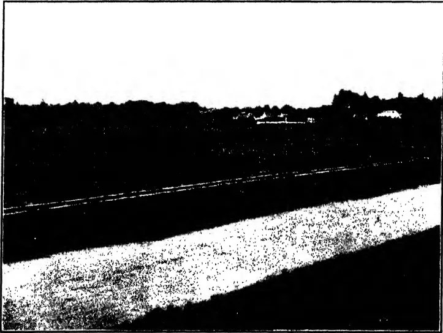

Fig. 4.—Rice selection station, Buitenzorg.

816------------------------------------------------

A high-contrast, black and white photograph showing a dark, grainy interior space, likely a warehouse or storage area. A large, dark, rectangular object, possibly a cart or container, is visible in the foreground. The background is a light-colored wall with a dark square opening or window.

Fig. 5.—Transporting ear-heads of rice, Java.

817------------------------------------------------

341

The selected seed is thoroughly tested before being multiplied in small multiplication farms, of which about sixty are to be established in course of time.

Each multiplication farm is to be provided every year with fresh selected seed from the experimental farms and the produce is sold either to local farmers or multiplied again in demonstration plots.

For the obtaining of better varieties the following method is proposed: The experimental farms test every year a large deal of new varieties or strains by single plots, every trial being duplicated to exclude a deal of the risk, Seemingly good varieties are tested again the next two years in variety trials with at least ten control plots.

Varieties excelling in these trials are tried again for two seasons in variety tests all over the area for which the experimental farm is established.

Only such varieties or strains as are really found to be superior are multiplied and spread.

Selection is practised only on varieties that have proved to be worth spreading.

Breeding is to be used now on a small scale to gather data on the methods to be used later on a larger scale, when apparently good parent varieties have been found.

Mr. Koch has written a further account\* of this work in English and the paper was presented to the Fourth Pacific Science Congress.

Little needs to be added to the summary quoted above. The multiplication farms are to be from 7 to 9 acres under the charge of the local Agricultural Instructor, but with the general line of work formulated by the General Agricultural Experiment Station. It is intended that seed from these multiplication farms shall again be multiplied in "multiplication fields" (which are intended to be used also as demonstration plots) before distribution to cultivators.

In the actual work of selection bagging will be adopted to ensure the purity of lines. Mr. J. G. J. van der Meulen, the rice selectionist, explained that he intended to harvest an ordinary crop of unbagged seed (to be used the next season for yield trials) and to maintain the line pure by raising plants from the stubble. These plants will be bagged. This method is not considered to be suitable for general Ceylon conditions, and it is possible that as plants raised from the stubble are often stunted and mature earlier the robustness of the selection may be affected in course of time.

---

\* Koch, L. Past, Present and Future in the Obtaining and Spreading of Superior Rice Varieties in the Dutch East Indies.

818------------------------------------------------

342

Mr. van der Meulen in an article\* on soil and seed improvement has also drawn attention to the importance of carrying out selection work on the particular soil type for which the selection is desired. He also points out that the best selection for ordinary soil may not be the best for fertile soil and that, as soil conditions improve, for example with the spread of manuring, different selections will be required. He states that on two selection stations shortly to be opened half the area of each station will be manured and that selection will take place on both areas.

### SEED DISTRIBUTION.

The amount of seed at present distributed is negligible. The proposed organisation is for the Selection Stations to supply seed to the "Landbouw Consulant" (the equivalent in Ceylon of the Divisional Agricultural Officer) who will multiply the seed, under the supervision of the Agricultural Institute, on special multiplication stations. Seed distribution to cultivators will be entirely in the hands of the Consulant. It is also intended to use demonstration plots for further multiplication of seed. In each district from fifty to one-hundred demonstration plots of 1/5 ac. in area will be rented and cultivation expenses paid by the extension service.

At present there is no co-operative or other agency for the distribution of seed.

### FIELD EXPERIMENTS.

Selected seed will be thoroughly tested on the multiplication stations prior to distribution. The tests will be drawn up and supervised by the Agricultural Section of the Agricultural Institute and the field work will be in charge of the Consulant. Even at present all field experiments are supervised by the Institute which may suggest and plan its own experiments or may make plans of experiments suggested by Consulants. This centralisation of control of field experiments has the great advantage of ensuring the use of a standardised technique. The results of experiments are worked out and published by the Institute.

### THE MANURING OF RICE.

Experiments have been carried out by the Agricultural Institute and have been described by Wulff† in a paper presented to the Fourth Pacific Science Congress. It has been found that phosphatic fertilizers on many soils give large increases in yield. On some soils nitrogen has also resulted in increases. The area deficient in phosphates is given as over a quarter of the total area under rice. In spite of the increases of yield which can be obtained, "the consumption of artificial fertilizers in peasant

\* Van der Meulen, J.C.J. Bodem-en Rasuer betening in bet; Bijzonder in Verband niet Rijst; *Landbouw* 4. 7.

† Wulff, A. Increasing the yield of rice in Java by means of manuring.

819------------------------------------------------

This image is a blank white page. It contains several small, dark specks which appear to be scanning artifacts or dust particles. There is no text, handwriting, or printed content on the page.

820------------------------------------------------

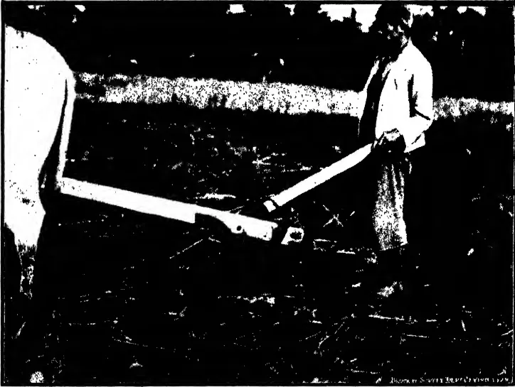

Fig. 6.—Improved plough, Java.

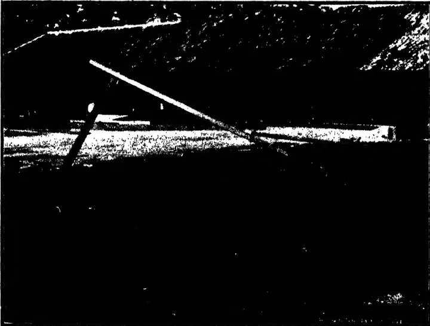

Fig. 7.—Improved harrow, Java.

821------------------------------------------------

343

agriculture is only of little importance up to now . . . . This is caused in the main by the great want of money of the native farmer for whom an adequate form of agricultural credit is essential."

#### IMPLEMENTS.

Demonstrations of two improved ploughs were seen at the Moeara Seed Station near Buitenzorg. These ploughs called respectively the "Moeara" and the "E. 5 or Kertoredjo" are made in Germany and cost in Java about Rs. 12-50. The wood beam is extra but can be made locally. The first-named plough is used for lighter soils and the second for heavy soils. Good work is done, the furrow being inverted and only one man is necessary as the plough has but one handle.

It is hoped to try these ploughs at Peradeniya.

I also saw an improved harrow, very similar in principle to the Burmese harrow, but with iron teeth. The angle of the teeth was capable of adjustment. The price was just over Rs. 10-00, about double that of the Burmese harrow. Particulars and drawings of these implements were obtained.

#### IRRIGATION.

Mr. Ormsby-Gore writing of the Irrigation Department in Java has said that "it is one of the most extensive and efficient technical services provided by the Government. As an investment it has repaid the Dutch East Indies very handsomely, and assuredly it is an outstanding example of the benefits which western science and technical skill can confer." It is this excellence of the irrigation that is responsible in part for the high yields of rice obtained in Java. The organisation of the local irrigation committees may be of interest to Ceylon.

"Local committees have been instituted, composed of the chief of the administration of the residency (district) as chairman, the regent (a native chief,) the irrigation engineer, the agricultural expert and one or more assistant residents, to decide on the desirability of irrigation and drainage works and also to advise in connection with the distribution of the water." \*

#### THE ROTATION OF SUGAR WITH RICE.

I was asked to enquire into the rotation of sugar with rice. The sugar industry in Java is the most highly organised and advanced in the country and possesses the finest research station in the tropics. The work of this institution in increasing the yield of sugar per acre is one of the outstanding accomplishments of agricultural research. At the present time the yield of sugar is from 150 to 175 piculs per bouw or about from 11,000 to 13,500 lb. per acre.

---

\* Metzelaar, J. Th. Irrigation and Drainage of the Rice Fields in the Netherlands Indies Fourth Pacific Science Congress, 1929.

822------------------------------------------------

344

Sugar is grown on rice land (rented from native cultivators) for one year in three or four. In the other years the land carries food crops grown by the owners. A typical rotation is:—

<table>
<tbody>
<tr>
<td>1926</td>
<td>April</td>
<td rowspan="2">}</td>
<td rowspan="2">Sugar</td>
</tr>
<tr>
<td>1927</td>
<td>July-August</td>
</tr>
<tr>
<td></td>
<td>August</td>
<td rowspan="4">}</td>
<td>Maize</td>
</tr>
<tr>
<td></td>
<td></td>
<td>Manioc</td>
</tr>
<tr>
<td></td>
<td></td>
<td>Soya beans</td>
</tr>
<tr>
<td></td>
<td>November</td>
<td>Sweet potatoes</td>
</tr>
<tr>
<td></td>
<td></td>
<td></td>
<td>Groundnuts</td>
</tr>
<tr>
<td>1927</td>
<td>December</td>
<td rowspan="2">}</td>
<td rowspan="2">Rice</td>
</tr>
<tr>
<td>1928</td>
<td>April</td>
</tr>
<tr>
<td></td>
<td>May</td>
<td rowspan="2">}</td>
<td rowspan="2">Maize, etc.</td>
</tr>
<tr>
<td></td>
<td>November</td>
</tr>
<tr>
<td></td>
<td>December</td>
<td rowspan="2">}</td>
<td rowspan="2">Rice</td>
</tr>
<tr>
<td>1929</td>
<td>April</td>
</tr>
<tr>
<td></td>
<td>April</td>
<td></td>
<td>Sugar.</td>
</tr>
</tbody>
</table>

If ample irrigation water is available in both seasons, rice will be grown three times in two years.

Over 95% of the total area of sugar is planted with the lately introduced cane P.O.J. 2878. As descriptions of the cultivation of sugar in Java are to be found in the *Report of the Indian Sugar Committee, 1920*, and in the book by R. A. Quintas, *The Cultivation of Sugar Cane in Java*, any detailed account here is unnecessary. I made notes on the methods of opening, planting, manuring, irrigation, after-cultivation and harvesting which will only be of interest if sugar is ever grown commercially in Ceylon. It has been shown that sugar cane can be grown successfully at Allai in the Trincomalie district\*. There the juice was made into jaggery for which there is but a limited market.

The successful production of white sugar is a large-scale enterprise requiring a large capital. It is stated in Java that for economical working a factory must have from 2,500-3,500 acres annually under sugar and that the capitalisation (excluding steam railways) is from Rs. 1,700 to Rs. 2,300 per acre. This is about sixty lakhs of rupees for an average factory. The European staff of a factory which had 2,500 acres of cane annually was 1 manager, 5 field assistants, 3 transportation and harvesting assistants, 3 factory engineers, 4 factory chemists, 1 plough engineer, 1 field chemist, 1 storekeeper, 2 weighing assistants, and 2 office assistants.

---

\* Stockdale, F. A. Sugar cane experiments at Allai. *Govt. of Ceylon, Sess. Paper L. 1928*.

823------------------------------------------------

A black and white photograph showing a wide field of sugar-cane plants growing in neat, parallel rows. The perspective is from the middle of the field, looking down the length of the rows towards the horizon. The sky is bright and clear. In the bottom left corner, there is a small number '4' and the text 'Photo by Survey Dept. Caylon 1928'.

Fig. 9.—Cultivation of sugar-cane on rice land, Java.

A black and white photograph showing four people in a field of sugar-cane. One person is standing on the left, another is crouching in the middle, and two others are standing on the right. The field is filled with dense sugar-cane plants. In the background, there are trees and a bright sky. In the bottom left corner, there is the text 'Photo by Survey Dept. Caylon 1928'.

Fig. 10.—Irrigating sugar-cane.

824------------------------------------------------

A high-contrast black and white photograph showing a field of harvested sugar cane. In the background, there is a dense stand of standing sugar cane stalks. Two figures are visible in the middle ground, working among the cut stalks. The foreground is filled with a chaotic mass of cut sugar cane stalks. A small copyright notice is visible in the bottom right corner of the image frame.

Fig. 11.—Harvesting sugar-cane.

A high-contrast black and white photograph of a sugar factory. The factory consists of several buildings, including a large main structure and a smaller one in front. A tall chimney or tower is visible behind the buildings. The foreground is a flat, open area, possibly a field or a road. A large tree is visible on the right side of the image. A small copyright notice is visible in the bottom right corner of the image frame.

Fig. 12.—Sugar factory, Java.

825------------------------------------------------

345

### CONCLUSIONS.

The improvement of rice cultivation in Ceylon is proceeding in the main on similar lines as in Malaya, Indo-China and Java. Each of the countries has its own local problems which affect in some degree the methods adopted and the results obtained.

Where there are large areas under the same variety of paddy, as there are in Malaya and Indo-China, the work of selection and seed distribution is less complicated than in Ceylon or Java and greater success can be obtained more rapidly in such countries. In Ceylon, with its small areas and climatic conditions which change within comparatively few miles sufficiently to affect the type of paddy grown, selection is more difficult and progress will be slow.

The technique of selection in Ceylon is essentially the same as that in Malaya and is of the type which it has now been decided to call pedigree selection. In Java true pure-line selection is now practised. It is intended, as time permits, to carry out both types of selection in Ceylon.

The organisation of seed selection, testing and distribution in the countries visited has been described; it differs little from the organisation in Ceylon. In Ceylon there are at present four main selection stations situated at Peradeniya, Anuradhapura, Labuduwa and Wariyapola. It is hoped that a fifth station will be established in the Batticaloa district. These stations cover the main types of climate found in the Island and, besides being responsible for primary selection work and the maintenance of the purity of selections, conduct also cultural and manurial experiments. These stations are under the direct control of the Economic Botanist. Seed selected at these stations is sent to Paddy Seed Stations for further testing. These paddy seed stations of which there are now twenty-three, are generally about 5 acres in extent. They are under the control of Divisional Agricultural Officers who lay down tests, and, if satisfied with a selection, multiply it and distribute it to cultivators.

A certain amount of pedigree selection is being done at some of the Paddy Seed Stations. This work is supervised by the Economic Botanist.

Seed distribution is entirely in the hands of the divisional officers. Possible improvements on the above organisation suggested by practice in Malaya and Java are: (1) the supervision of field tests of new selections at Paddy Seed Stations for three years by the Economic Botanist, (2) the restriction of selection work to the central stations as far as possible to ensure better supervision, and (3) the organisation by the district staff of small demonstration plots, surrounding the paddy seed station, for further testing the suitability of those selections which have

826------------------------------------------------

346

been tried for at least one year on the station. Conditions vary so rapidly in Ceylon that it can never be said that a selection which is suitable at one place will certainly be suitable five miles away. Selections apparently suitable have been distributed (particularly in the Central Province where conditions vary tremendously,) which are reported to have failed and claims for compensation have to be considered. Demonstration plots will further act as nuclei for seed distribution and manurial propaganda. It is suggested that on each *liyadda* of a demonstration plot half the area is sown with local seed at the same time as the selected seed is sown in order to estimate increases in yield or to check claims for compensation.

In Malaya, Java and Indo-China all seed distributed has been from Government stations. In Malaya there has been a considerable natural spread of selected strains. Private seed farms, such as exist in India had not been opened and it is not known if such farms can be successfully organised in Ceylon.

Manurial experiments have been started on the selection stations in Ceylon and the results up to date show that, as in Java, there is great scope for improvement by manuring. But in any attempt to improve paddy cultivation to such an extent as to make Ceylon self-supporting the chief limiting factor will almost certainly be found to be water supply.

827------------------------------------------------

347

## THE CONFERENCE OF EMPIRE METEOROLOGISTS, 1929: AGRICULTURAL SECTION.

T. H. HOLLAND, DIP. AGRIC. (WYE),  
MANAGER, EXPERIMENT STATION, PERADENIYA.

### INTRODUCTORY.

**T**HE writer attended the Agricultural Section of the Conference of Empire Meteorologists as agricultural representative of Ceylon. The Conference was held in the large hall of the Civil Service Commission building in Burlington Gardens, London. In addition to the overseas delegates to the Meteorological Conference proper, representatives of the following countries attended the Agricultural Section: New Zealand, Northern Ireland, Egypt, Sudan, Uganda, Gold Coast, Nigeria, Trinidad, Nyasaland, and Ceylon. Mr. A. J. Bamford, Ceylon's Meteorological representative, also attended the sessions of the Agricultural Section. A budget of literature was issued to delegates before and during the conference, no less than 34 papers being given to the members of the Agricultural Section alone. A list of these is given at the end of this account.

### JOINT SESSION OF AGRICULTURAL SECTION AND MAIN CONFERENCE.

On Wednesday, August 28th, a joint session of the main conference and the Agricultural Section was held with Dr. G. C. Simpson, Director of the Meteorological Office of the Air Ministry, in the chair.

The first item was a paper entitled "The Empire in Relation to International Meteorology" by Mr. R. G. K. Lempfert of the Meteorological Office. Mr. Lempfert outlined the origin and history of international co-operation in meteorology and showed the importance of the part played by the British Empire in this work. The starting point was the creation in 1903 of an International Meteorological Committee under the name of the "Solar Commission" presided over by the late Sir Norman Lockyer. The "Solar Commission" later became the "Commission for the 'Reseau Mondial,'" Dr. Simpson is now its president and the British Meteorological Office is responsible for the publication of the "Reseau Mondial."

The speaker then dealt with the publication of meteorological data by the Crown Colonies and Protectorates. He explained the improvements that had been gradually effected. The transmission to the Meteorological Office of two hundred reprints of

828------------------------------------------------

348

the meteorological tables published by Colonial Governments had made possible a wide distribution of information among meteorological institutes and observatories.

The publication by the Meteorological Office of the "Observer's Handbook" and the "Observer's Primer" had provided concise instructions for the layout and conduct of a meteorological station.

Dr. Brooks, also of the Meteorological Office, followed with a paper entitled "The Collection, Tabulation and Publication of Climatological Data." The paper dealt with the kinds of observations necessary, the instruments used, the difficulties encountered, the hours of observation, the form of the network of stations required, and the publication of results. Valuable remarks on improving the accuracy of observations were included. The paper concluded with a description of the forms used by the Meteorological Office and specimen forms were attached.

The next paper entitled "The Diurnal Variation of Meteorological Elements" was contributed by Mr. A. Walter, Director, British East African Meteorological Service. Mr. Walter held that sufficient attention had not been paid to diurnal variation in the tropics and that the averaging of hourly values was masking many of the processes of meteorological changes. He cited local instances of this.

The morning session was brought to a conclusion by a paper by Mr. N. P. Chamney, of the Gold Coast Department of Agriculture, entitled "A Preliminary Note on the Rainfall of West Africa." Mr. Chamney drew his data from 14 countries and 342 stations. Periodic curves for all stations with records going back over a fair period had so far failed to show marked periodicity, unless the rhythm of recurrences was a very long one, but a very marked diminution of rainfall was shown to have occurred on the coast between Sierra Leone and Senegal, while a similar diminution was shown at one station in Gambia and two on the Gold Coast. Mr. Chamney attributed this diminution partly to the deforestation resulting from the system of shifting cultivation adopted by the African races. Mr. Chamney also had some interesting remarks to make on the measurement of effective rainfall as opposed to absolute rainfall.

The afternoon session opened with a paper on "Long Range Forecasting" by Sir Gilbert Walker presented by Dr. G. C. Simpson. The paper dealt with the methods so far used to foreshadow seasonal rainfall. These were based on a study of (a) relations with sun spots, (b) strict periodicities, (c) "surges," (d) motion of the belts of high pressure, and (e) relations with previous weather conditions in various parts of the world. After discussing the degree of accuracy required in

829------------------------------------------------

349

correlating data from past records, Sir Gilbert suggested that it would be better to forecast that rainfall would be "in excess" or "in defect" rather than issue such vague forecasts as "normal" or "in excess" in order to avoid misunderstanding or claims of success in a forecast which was really a failure. He preferred the term "foreshadowing" to the more ambitious word "forecasting."

The next paper by Mr. D. Brunt was entitled "On Forecasting by Periodicity." Mr. Brunt from a prolonged study of European records extending over a hundred years had failed to discover any true periodicity in weather conditions.

Dr. Norman, Director-General of Observatories, India, spoke on seasonal forecasting and emphasised the extreme importance of forecasting the monsoon rainfall in India. He dealt with difficulties and likely avenues of progress. He thought that the primary need was for more data of winds and temperatures in the upper air.

Mr. C. Stewart, Chief Meteorologist, South Africa, said that South Africa, lying between two anticyclones, was peculiarly liable to droughts of great intensity and long duration. The forecasting of such conditions as early as possible was most desirable. There was some indication of a 14-year periodicity in such droughts.

Col. Gold of the Meteorological Office gave an account of a paper by Mr. H. G. Hunt, Commonwealth Meteorologist in Australia, which was to be published in *The Quarterly Journal of the Royal Meteorological Society*.

Mr. Jacob made some interesting remarks on the correlation between winter rainfall and monsoon rainfall in northern India.

Mr. Bamford said that seasonal forecasts for the monsoon had been issued in Ceylon during the last few years, but the practical question was complicated by the fact that as much rain fell in an inter-monsoon month, such as April as in a typical monsoon month, such as June, while the public displayed a strong desire to class all rain as monsoonal. Monsoon rainfall showed a certain amount of periodicity but not sufficient for a definite forecast to be made from periodicity alone. Other factors which showed an appreciable correlation with the rainfall of the following monsoon were the inter-monsoon thunderstorms and the temperatures of February.

Mr. L. J. Sutton discussed the sources of information on which attempts to forecast the Nile Floods were based. He said that the network of stations in the Sudan was insufficient to enable this to be done at present with any degree of certainty. More stations were particularly required in the sparsely-inhabited regions of the south-western Sudan and the Belgian Congo, but facilities were scarce.

830------------------------------------------------

350

Dr. C. C. P. Brooks said that Sir Gilbert Walker's systematic investigations into the relations between numerous action centres in all parts of the world had made long-range forecasts at certain seasons practicable for quite a number of countries.

Sir Napier Shaw thought that there was no guarantee that Sir Gilbert Walker's "centres of action" would remain in action for an indefinite period. It was unsafe to assume continuity of meteorological phenomena. He thought that the detection of periodicity possibly required a special acuteness of sense. He welcomed Dr. Norman's remarks about the correlation between upper winds and the monsoon rainfall in northern India. Consideration of the use of upper air conditions as a guide to surface weather was one of the most encouraging features of the discussion.

This terminated the day's session. During the evening Colonel Sir Henry Lyons, Director of the Science Museum, South Kensington, held a reception at the Science Museum. A large representative historical collection of meteorological instruments was on view in the galleries of the museum and the history and use of these instruments was explained to delegates and their friends.

#### SESSIONS OF THE AGRICULTURAL SECTION.

On Thursday, August 29th, the separate Sessions of the Agricultural Section of the conference began under the chairmanship of Sir Napier Shaw, F.R.S. The Chairman's refreshing personality and penetrating sense of humour considerably lightened the atmosphere of the subsequent deliberations. In addition to the overseas agricultural representatives the majority of the delegates of the meteorological conference proper attended the sessions of the agricultural section.

A number of representatives of agricultural institutes and organisations in Great Britain also attended and contributed to the conference.

In his opening address, the Chairman gave an interesting historical review of agricultural meteorology which he defined as "What the farmer knows but won't say." He touched on the reform of the calendar and remarked that though the subject appeared to excite but little interest in England, the International Chamber of Commerce had recently for the fourth time reaffirmed a resolution originally passed in 1921 urging the reform of the calendar. He added that when commerce asked for a thing it usually got it.

Sir Napier then proceeded with his paper entitled "Ten Points of a Weekly Calendar." He explained that for meteorology the monthly period of 28, 30 or 31 days had no special value but the cardinal points of the year were the two solstices which are the times of least change, and the two equinoxes which

831------------------------------------------------

351

are the times of the most rapid change in solar radiation. On this basis he drew up a form of weekly calendar divided into four quarters which he named after the four constellations associated with those cardinal points, *Cancer*, *Capricornus*, *Aries* and *Libra*. He placed the odd day on March 26th of the present calendar.

However suitable for agricultural and meteorological purposes such a calendar may be, it is difficult to envisage any extended use of such an arrangement unless adopted as a world calendar.

At the conclusion of his remarks, Sir Napier said that he proposed first of all to elicit the opinion of the conference as to whether it was worth while to try and make the week the recognised intermediate unit between the day and the year for meteorological and agricultural purposes. He suggested the formation of a committee to consider this point. A Committee, consisting of the meteorological delegates from Canada, New Zealand, and India and the agricultural representatives of the Gold Coast and Ceylon was later appointed and met on the following morning. The result of their discussions is to be found in No. 1 of the resolutions given at the end of this paper.

Mr. T. F. Claxton of Hongkong strongly supported the view that the month is not a suitable unit in which to express meteorological means or averages and that the week was the only suitable interval. Mr. G. G. Auchinleck, Director of Agriculture, Gold Coast, supported this opinion from the point of view of the tropical agriculturist dealing principally with perennial crops and gave local instances to support his point. Col. D. C. Bates of New Zealand also spoke and dealt with the religious aspect of a change in the calendar.

Mr. A. Walter, who had himself made considerable use of 5-day periods in presenting meteorological data, spoke in favour of leaving research workers to decide how they were going to combine their data and their observations for themselves rather than of tying them down to some preconceived unit in time. Mr. J. M. Patterson, Director of the Canadian Meteorological Service, pointed out the necessity of daily and even hourly records in studying the relation between crops and weather.

The Chairman pointed out that there was a practice already existing of publishing monthly meteorological means or averages and the point to be considered was whether the week should be adopted instead of the month. At this stage the Chairman introduced two resolutions and a discussion followed, but as these resolutions in their final form are later given in full and are self-explanatory further comment will be omitted.

The next paper, entitled "Agricultural Meteorology in its Plant Physiological Relationships" was given by Professor V. H. Blackman of the Imperial College of Science and Technology. In the absence of Professor Blackman, Dr. Gregory dealt

832------------------------------------------------

352

with the paper in which the intricate relationship of the various climatic factors with plant physiology were discussed. The general conclusion was that "the ordinary meteorological data of temperature and humidity are adequate for plant physiological purposes, though soil temperatures as well as air temperatures are required for the fuller study of the plant's reaction to the climatic factor. With regard to light, what is required is a measure of total radiation or, what would be better still, some measure of lightness and its variation during the day. The plant is certainly affected by light quality as well as light intensity, so that as our knowledge increases, there will be a need for a record at different localities of the energy distribution throughout the spectrum and its changes during the day."

Dr. Gregory further suggested in the course of his remarks that though masses of often unused meteorological data were produced the plant physiological data were often inadequate and not always of the most useful kind. Dr. Laurence Ball, Chief Botanist, Egypt, emphasised the vast differences between climatological conditions in the field and artificial laboratory or pot experiment conditions, and the necessity for conducting researches under actual field conditions. He stressed the importance of recording soil temperatures at various depths. Mr. Chapham combatted Dr. Gregory's attack on precision records and held that such data were far from being useless. In reply to Dr. Ball, Dr. Gregory defended the value of pot experiments and gave an instance in the Sudan in which the results of pot experiments were found to hold good to an amazing extent in the field.

"Climate, Soils and Crops in British Tropical Colonies" by Mr. F. J. Martin of Sierra Leone was the next paper on the agenda. The conclusion of Mr. Martin's paper was that chance rather than climatological conditions had in the past been the chief factor in determining the crops cultivated in the various colonies, though there was a definite correlation between climate and the nature of the soil.

In the next paper entitled "Weather and Tobacco" Capt. A. J. W. Hornby, Agricultural Chemist of Nyasaland, discussed his experiences of the relation between weather and the growth and quality of tobacco. He showed the differences in optimum meteorological conditions for tobacco found in Kentucky and Nyasaland.

The last paper of the morning session was entitled "Methods for the Photo-electric and Photo-chemical Measurement of Daylight" by Mr. W. R. G. Atkins, Head of the Department of General Physiology, Marine Biological Laboratory, Plymouth, and Mr. H. H. Poole, Chief Scientific Officer of the Royal Dublin Society. This was a long and highly technical paper. Possibly

833------------------------------------------------

353

the most interesting part from the Ceylon point of view was that dealing with woodland illumination, since such measurements are frequently required in rubber experiments. Dr. Walsh and Messrs. Waldran and Tincker contributed to the discussion and emphasised the value and importance of the work carried out by Dr. Atkins and Mr. Poole. Mr. Walter and Dr. Angus also added their experience in experiments in different methods of daylight measurement.

After the luncheon interval Mr. N. V. Taylor, Horticulture Commissioner of the Ministry of Agriculture and Fisheries, read a most interesting paper on "Meteorological Research and Fruit Production." The first and possibly most interesting part dealt with the effects of the weather on fruit production while the second part was devoted to frost damage. The importance of the discovery of the necessity of maintaining the proper carbohydrate-nitrogen ratio and the effect of weather on this ratio were especially emphasised. The influence of a cover crop or a cover of grass on this factor is a point of importance and this aspect of the question, which might well apply to such crops as coconuts would repay study in Ceylon.

The next paper on the agenda by Mr. J. Turnbull of the Ministry of Agriculture and Fisheries bore the same title as Mr. Taylor's. Mr. Turnbull's paper emphasised the great need for the co-operation of the meteorologist and the horticulturist in a joint study of the many complex factors involved.

Mr. Bagnall said that his work was to give advice to fruit growers in Kent. He was also engaged in a fruit soil survey of a comparatively small area. He laid stress on the number of other factors influencing the growth of fruit trees besides meteorological conditions. The problem was a very complex one and he thought that in the large Kent fruit area it would be necessary to ask the meteorologists to multiply their observation stations before much further progress could be made.

Mr. H. Goude, Horticultural Superintendent, Norfolk, spoke next. His first remarks were on the effects of wind in frosty weather and wind protection. He then spoke of Bruckner's theory predicting a cycle of eighteen hot summers and severe winters followed by eighteen wet summers and mild winters. He spoke of the effect of this in Norfolk on Cox's Orange Pippin, a variety which flourished in warm summers but failed when wet summers and mild winters were experienced.

Mr. A. H. Lees of the Long Ashton Fruit Research Station contributed some remarks which helped to demonstrate the extreme complexity of the interrelation between weather conditions and fruit crops. It was also clear that the choice of the best variety to suit local conditions was a matter of great importance.

834------------------------------------------------

354

Sir Napier Shaw in commenting on Mr. Bagnall's remarks held that if additional meteorological observations were required it behoved those interested to make them. "The air is free," he said. "If you want twenty observations, make them; if you want a hundred observations, make them, but do not complain to a Meteorological Conference if you have not got them because it is your part to provide them for the district in which you are interested."

With reference to Mr. Goude's remarks on cycles, Sir Napier said that Dr. Bruckner's was a 35-year cycle and was based on observations covering some centuries. He thought that the cycle had a good deal to be said for it, but he would not for a moment advise anyone to put all his money on a fruit crop next year on the supposition that Dr. Bruckner's experience was going to be repeated exactly according to schedule.

Mr. T. Wallace, of Long Ashton, again emphasised the importance of selecting the right variety of fruit tree for local conditions. He also suggested that investigators in attempting to find out the effect of nutrients on the quality and growth of plants had neglected the meteorological side of the question since relationships between the nutrients and the tree appeared to be fundamentally affected by meteorological conditions.

On Friday, August 30, the morning session opened with a paper entitled "The Relation of Animal Numbers to Climate" by Mr. C. S. Elston of the Department of Zoology and Comparative Anatomy, University Museum, Oxford. Mr. Elston discussed the periodic fluctuations in numbers of different animals such as rabbits, rats, mice, lemmings and various fur-bearing animals. It was pointed out that some of these fluctuations were of great economic importance and the study of wild animal numbers was becoming an important branch of animal ecology and one which required the help of meteorology.

Two papers followed on the relation of weather conditions and insects—"Weather and Climate in their Relation to Insects" by Mr. B. P. Uvarov, Senior Assistant, Imperial Bureau of Entomology, and "The Relations of Entomology to Meteorology" by Mr. J. J. de Gryse of the Entomological Branch, Department of Agriculture, Canada.

Mr. Uvarov's paper dealt with the complex interrelation between climatic conditions and the development and activity of insects. He said there were a vast number of entomological problems which could not be solved without the meteorologist and hoped that a close co-operation between the two sciences would rapidly develop.

Mr. de Gryse's paper gave similar information on Canadian conditions. He stressed the importance of extreme precision of observation in order to obtain reliable results. Very small

835------------------------------------------------

355

changes of temperature had a decided effect on the rate of development and behaviour of insects.

The last paper of the morning session was "The Relation of Weather to Plant Diseases" by Mr. C. E. Foister, Plant Pathological Division, Department of Agriculture for Scotland.

Mr. Foister's paper gave numerous examples of the important influence of temperature and humidity in fungoid diseases. The influence of light and the carrying of spores by wind were also discussed. Finally, he spoke of the practicability of forecasting outbreaks of certain diseases from a study of meteorological conditions. In this connection he mentioned the question of the interpretation of the results of observations. "Having secured meteorological data and those of disease intensity, the problem of correlation will become acute. Will the meteorologist or the plant pathologist or either of them be competent to carry out such correlation or will the task require a specialist "superman" in the form of a statistician? This is a problem which overclouds many branches of agricultural science today.

The first paper of the afternoon session was entitled "Crop Forecasting and the Use of Meteorological Data in its Improvement" by Mr. J. O. Irwin of Rothamsted Experiment Station. The first part of Mr. Irwin's paper consisted of a review of the methods of forecasting at present in use in England and Wales, the United States and India, and of the scientific work done on the relation between weather and crops and on crop forecasting from weather. In the second part he discussed the value of crop forecasts. The subject of the third part was the future improvement of data.

In his conclusions, Mr. Irwin said that it seemed almost certain that official methods of crop forecasting could be improved by forecasts based on weather, though satisfactory forecasts could not in all cases be obtained on the basis of weather only. Very considerable improvements would have to be made in crop data and to a less extent in meteorological data before the method could reach its maximum fruition.

Mr. S. M. Jacob, Government Statistician, Nigeria, followed with a paper entitled "Crop and Weather Data in India and their Statistical Treatment." Mr. Jacob divided his subject into what he named *Agronomic Meteorology*, that is, the study of weather conditions which induce the cultivator to plough and sow land or to refrain from ploughing or sowing it or affect his capacity for doing these things, and *Agricultural Meteorology* which has to deal with the problem of the reactions of the plant after sowing to the weather conditions. He held that, while conditions in India were fairly favourable for the study of agricultural meteorology, for the solution of the problems of agronomic meteorology

836------------------------------------------------

356

the data provided by Northern India were unsurpassed in the whole world for the space and time they covered and for their accuracy and continuity.

A considerable discussion centred round these two papers. Amongst other speakers was Dr. R. A. Fisher who suggested that the results of his correlations between weather and wheat yields on the Broadbank field at Rothamsted should be applied to crop forecasting in Hertfordshire. Mr. H. C. Vigor of the Ministry of Agriculture strongly countered this suggestion. He said that, however interesting experimentally, agriculturally the Broadbank wheat was a monstrosity and no amount of "cooking in Dr. Fisher's mathematical kitchen" would make the figures obtained therefrom applicable to normal conditions. Dr. Fisher also said that although meteorological observations from a network of stations were available, he wondered if the meteorologist could tell him what the conditions were at any given point between two such stations.

A discussion then developed on "Microclimates" which resulted in the drafting of a resolution.

The last paper was entitled "Weather and Wheat Yields at Lincoln College, New Zealand," by Dr. E. Kidson, Director of Meteorological Services, New Zealand.

In the absence of Dr. Kidson this paper was taken as read.

Before the close of the Conference, Dr. G. C. Simpson summed up the position and attitude of official meteorology to the various questions raised at the conference. He said that the Meteorological Office welcomed any request for assistance and would do their utmost to meet it. It must, however, be understood that meteorology was concerned with the air; if agricultural research workers required such observations as the temperature or humidity in a growing crop or at various depths in the soil it was their business to make such observations.

#### VISITS.

On Saturday, August 31st, arrangements were made to convey delegates to the Royal Horticultural Society's Gardens at Wisley, and to the Lord Wandsworth Agricultural College at Long Sutton, Hampshire. At Wisley, after a tour of the fruit experimental plots and the gardens, the party was entertained to lunch by the Royal Horticultural Society.

At Long Sutton the party was taken round the beautiful new buildings of the Lord Wandsworth Agricultural College and the plots where cereal variety trials are being carried out in connection with the Ministry of Agriculture's Crop Precision Scheme. Tea brought an interesting visit to a conclusion.

On Monday, September 2nd, a visit to Rothamsted was made.

837------------------------------------------------

357

## FINAL MEETING OF THE AGRICULTURAL SECTION.

On Wednesday, September 4th, a final meeting was held for the purpose of adopting the various resolutions submitted to the Conference for incorporation in a draft report.

The resolutions are given below:—

### I. THE WEEK AS A UNIT.

In the opinion of the Conference the month is too long a period for the purpose of summarising, for publication, statistics of agricultural meteorology and the week should be adopted for this purpose.

### II. INSTRUCTION IN METEOROLOGY AND AGRICULTURAL METEOROLOGY

(I). In view of the fact that technical information regarding weather has become a part of common life and the information is of little value to those who have no knowledge of the meaning and implication of the technical terms used, the Governments of the several countries should be invited to take into consideration the desirability of making suitable provision for instruction in the physics of the atmosphere and the geography of weather in their national systems of education.

(II). Instruction in the methods and results of agricultural meteorological research should form a more important part of the curriculum than is the case at present at University Departments of Agriculture, Agricultural Colleges, and Farm Schools.

### III. EXPERIMENTAL AND DEMONSTRATIONAL WORK IN AGRICULTURE.

Experimental and demonstrational work, particularly that on cultivation operations, manuring, and varieties of crops, should be accompanied by adequate meteorological observations, since such experimental and demonstrational work loses much of its value unless the results are discussed in the light of the meteorological conditions experienced during the course of the work.

### IV. CLEARING STATION FOR INFORMATION ON AGRICULTURAL METEOROLOGY.

The Conference considered the question of the establishment of a clearing station for information on methods and results of agricultural meteorological work. The following existing bureaux already, or will shortly, centralise information regarding the problems of the agricultural meteorological research workers so far as their respective sciences are concerned, viz., the Imperial Bureaux of Soil Science, Animal Nutrition, Animal Health, Animal Genetics, Entomology, Mycology, Plant Genetics (both general and herbage crops), Agricultural Parasitology and Fruit Production. The bulk of agricultural meteorological research work is probably covered by these Bureaux.

838------------------------------------------------

358

At the same time, it would be very convenient if all the information on the subject could be focussed at some one centre. Such centralisation of information with subsequent distribution would be useful both to the agricultural meteorological research worker and also to the worker in pure meteorology.

With a view to obtaining experience which will prove useful as a guide to the Imperial Agricultural Research Conference of 1932 in considering the question, the Conference would be glad if the Ministry of Agriculture and Fisheries could develop the work it is already doing in this connection, and could obtain from the existing Bureaux, and from other sources, information on the methods and results of agricultural meteorological research, and could issue this information regularly to workers in agricultural science and pure meteorological science throughout the Empire.

This recommendation should not be taken as in any way pre-judging the issue for the Imperial Agricultural Research Conference of 1932.

#### **V. FRUIT: WEATHER AND SOIL SURVEYS: FROST DAMAGE AND VARIETAL SUSCEPTIBILITY.**

Surveys should be initiated or extended, in the different parts of the Empire, to determine:—

- (I) The effect of varying weather conditions on the growth, cropping, and resistance to diseases and pests of fruit grown on soils of various types; and
- (II) The positions, under various conditions, in which it is inadvisable to plant fruit owing to risk of frost damage.

Further research should be carried out to determine the degree of susceptibility to frost damage of the chief commercial varieties of fruit and to discover the characters which confer resistance to frost.

#### **VI. VARIATIONS IN NUMBERS OF WILD ANIMALS.**

In the opinion of the Conference the economic importance of fluctuations in the numbers of wild animals, such as mice and rabbits, justifies the prosecution of research to ascertain the causes of these fluctuations, and in such research it appears essential that there shall be close co-operation between the meteorological and the biological research worker in order to ascertain how far these fluctuations are due to climatic causes.

#### **VII. METEOROLOGICAL OBSERVATIONS OF LOCAL CLIMATES.**

The Conference are of opinion that the standard records of meteorological components form the base-line to which all investigations on agricultural meteorology must necessarily be related.

But the local climate or weather in the immediate vicinity of the plant or insect in an agricultural crop or elsewhere may be markedly different from that shown on the meteorological screen,

839------------------------------------------------

359

and while the Conference recognise that the records of such local meteorology must be made by the individual investigator for individual purposes they nevertheless are of opinion that meteorologists could render valuable service to agriculture by assisting agriculturists to devise standard methods for adoption in the systematic recording of these local climates, and by studying the results as meteorological data.

Such recording requires appropriate instruments and screens for measuring the meteorological components among various crops in various horizontal strata above and below ground in order to record the environment of the root system.

The standard records should be systematically extended, as opportunity offers, to measure, *e.g.*, the intensity and quality of radiation and the moisture content of soil.

#### VIII. INSECT PESTS AND PLANT DISEASES:

##### (a) *Forecasts, Spraying Advice, Description of Intensity Attack.*

The Conference emphasise the value to practical agriculturists of forecasts of seasonal appearance of insect pests and plant diseases and their mass outbreaks, and recommend that research directed to the discovery of the relations between the various meteorological factors and insect activities and plant diseases should be energetically pursued with a view to providing bases for such forecasts.

The Conference note that entomologists and mycologists are investigating methods for determining and describing the intensity of attack of insect and fungus pests on crops and express the hope that it will be possible for standard methods to be established.

##### (b) *Insect Investigations.*

Investigations should be carried out on the following subjects:—

(I) The application of the climograph method to studies in the distribution, seasonal cycles of development, and periodical fluctuations in the numbers of insects.

(II) The effect of atmospheric motion on the distribution of insects.

(III) The insect fauna of the upper atmosphere.

(IV) The influence of coloration of insects on their thermal economy.

(V) The effects of atmospheric pressure on insect activities and development.

(VI) The part played by light in the development of insects.

840------------------------------------------------

360

The development of work along these several lines is dependent upon the co-operation of research meteorologists with entomologists capable of dealing with the physiology of insects.

*(c) Plant Disease Investigations.*

An investigation should be carried out by plant pathologists in close co-operation with meteorologists to determine the distribution of fungus spores by the wind.

The Conference emphasise the need for close co-operation between phenological mycologists and research workers engaged in investigations on the relation of weather to healthy crop growth and yield.

For the purpose of correlation of weather condition with plant diseases, the Conference consider it to be very desirable that continuous records from self-recording instruments should be available. It is particularly important that records should be taken of night temperatures.

**IX. CROP FORECASTING.**

The Conference have noted with satisfaction the progress that has been made in the use of statistics of weather in forecasting crop yields and express the opinion that it is desirable that further investigations should be made into the possibility of improving forecasts of crop yields by this means.

**IMPRESSIONS AND CONCLUSIONS.**

No visitor to the Conference could fail to be impressed with the great importance of meteorological observations in all branches of agricultural science. At the same time it is realised that owing to the large number of factors involved the drawing of conclusions from such observations is a very complex matter. Observations of less than twenty years are considered inadequate as a basis for long range forecasting and similar problems, and in some cases a period of twenty years is considered insufficient.

A great deal of the meteorological information required by agriculturists or agricultural research workers is frequently available from meteorological stations or would be provided if asked for, but it is thought that the fullest use is not always made of information that is already available even from routine observations. As an example of special information being provided by request the Colombo Observatory has made correlations by weeks between weather conditions and the incidence of plague and malaria at the instance of different medical authorities.

A great deal of the information required however would be more specialised and such as would not be ordinarily obtainable from a meteorological station. Provision for such observations must be made by the workers concerned though meteorologists would frequently be able and willing to render valuable assistance by advice and the loan of instruments. Such assistance has

841------------------------------------------------

361

been frequently rendered by the Colombo Observatory to the Experiment Station, Peradeniya. One was struck by the difference in the degree of attention paid to meteorological matters by Colonial Departments of Agriculture; thus in the Gold Coast meteorological matters are the special charge of an officer of the Department of Agriculture and a considerable amount of valuable work has been carried out. In some countries comparatively little attention appears to have been paid to this subject.

A point on which emphasis was laid was the desirability of growing in every large experiment station plots of the main crops of the country cultivated in the normal manner and maintaining careful records of these plots concurrently with the necessary meteorological observations, in order that correlations between growth and crops and weather conditions might be made. To be of any value such correlations would naturally have to be made over a large number of years.

The Conference once more impressed on one the value of a personal interchange of views between workers in different parts of the Empire.

*List of papers issued to the Agricultural Section of the Conference of Empire Meteorologists, 1929.*

**GENERAL CLIMATOLOGY AND SEASONAL FORECASTING.**

1. 1. The Empire in Relation to International Meteorology.—R. G. K. Lempfert.
2. 2. The Collection, Tabulation and Publication of Climatological Data.—C. E. P. Brooks.
3. 3. The Diurnal Variation of Meteorological Elements.—A. Walter.
4. 4. A Preliminary Note on the Rainfall of West Africa.—N. P. Chamney.
5. 5. On Long Range Forecasting.—Sir Gilbert Walker.
6. 6. On Forecasting by Periodicity.—D. Brunt.

**AGRICULTURAL SECTION.**

1. 1. Agricultural Meteorology: A brief historical review.—Sir Napier Shaw.
2. 2. Ten Points of a Weekly Calendar.—Sir Napier Shaw.
3. 3. Agricultural Meteorology in its Plant Physiological Relationships.—V. H. Blackman.
4. 4. Methods for the Photo-Electric and Photo-Chemical Measurement of Daylight.—W. R. G. Atkins and H. H. Poole.
5. 5. Meteorological Research and Fruit Production.—A. V. Taylor.
6. 6. The Relation of Animal Numbers to Climate.—C. S. Elton.

842------------------------------------------------

362

1. 7. Weather and Climate in their Relation to Insects.—B. P. Uvarov.
2. 8. The Relation of Weather to Plant Diseases.—C. E. Foister.
3. 9. Meteorological Research and Fruit Production.—J. Turnbull.
4. 10. Note on the Relation between Weather and Crops.—A. Walter.
5. 11. Climate, Soils and Crops in British Tropical Countries.—F. J. Martin.
6. 12. Weather and Tobacco.—A. J. W. Hornby.
7. 13. The Relations of Entomology to Meteorology.—J. J. de Gryse.
8. 14. Crop Forecasting and the Use of Meteorological Data in its Improvement.—J. O. Irwin.
9. 15. Crop and Weather Data in India and their Statistical Treatment.—S. M. Jacob.
10. 16. Weather and Wheat Yields at Lincoln College, New Zealand.—E. Kidson.

**SURVEYS BY COUNTRIES OF THE ORGANISATION OF  
AGRICULTURAL METEOROLOGICAL WORK.**

1. 1. Agricultural Meteorological Work in Great Britain.
2. 2. Agricultural Meteorology in New Zealand.
3. 3.        "        "        "        The Sudan.
4. 4.        "        "        "        The Gold Coast.
5. 5.        "        "        "        Canada.
6. 6.        "        "        "        The United States.
7. 7.        "        "        "        Germany.
8. 8.        "        "        "        France.

**MISCELLANEOUS.**

1. 1. British Agricultural Meteorological Scheme: Observer's Handbook.
2. 2. Crop Variety Trials carried out at Long Sutton under the Testing Scheme.
3. 3. List of Exhibits.

843------------------------------------------------

363

## SOIL EROSION.

### TRENCH V. PLATFORM.

F. DENHAM TILL,

LOWMONT GROUP, KALUTARA.

SOME adverse comments on the platform terrace system made recently by the writer having given rise to a certain amount of argument, they are reproduced herewith in case they may be of interest to local agriculturists. An opinion was called for respecting the advantages or otherwise of the platform system and of the contour trench system of which the writer has made a speciality since 1925 when certain undesirable features of the platform terrace system became apparent to him. His observations of the two systems date back to the end of 1924 for the platforms and the beginning of 1925 for the trenches, a period of five years, during which both systems have been subject to the closest scrutiny. The platforms under observation cover an area of some 25 acres and the trenches an area of some 160 acres, all under rubber.

The disadvantages of the platform terrace system may be enumerated as follows:—

1. (1) The pocketing and consequent check to the growth of the planted product.
2. (2) Lack of moisture to the roots of the young plants during the first few years.
3. (3) The expense of the system, should dense planting be resorted to.
4. (4) Insecure anchorage of trees on steep land or, alternatively, delay of the plant's root system in reaching the best soil.
5. (5) Impracticability of using a quick-acting fertiliser with any benefit in the first few years, unless expensively large holes are cut for the plant.

That the platform terrace checks erosion in a most satisfactory fashion is not denied for a moment, but, in the writer's opinion, the trench system eliminates many of the less desirable features of the platform system. The various points are taken in the order given above and small rough sketches have been made in order to illustrate diagrammatically the action taking place and to enable a comparison with the contour trench system to be made.

844------------------------------------------------

364

(1) and (2). *Pocketing and consequent retardation of growth.*—The platform having been constructed, a hole must then be cut for each individual plant. This hole will be in the subsoil obviously, so that the plant is ultimately encased by subsoil, which bounds the four sides of the hole. The feeding soil will be only that which is put into the hole, and, when that is exhausted, the roots must strive to find a way out into either the back of the platform where there is moisture or to the best soil which has been thrown down in front of the platform where, however, the moisture content is lowest.

The question of moisture content being now recognised as a deciding factor and the necessity for conserving moisture being admitted as of primary importance, it is interesting to study the direction of watercourses formed in a contour platform and a contour trench. These have a direct bearing on the retardation of growth in the one system and on the reverse in the other. Looking at the diagram in section, the platform appears to be fairly well off, but, looking at it in plan, it will be seen that the only direct water that the plant receives is that enclosed by the dotted line until such time as the feeding roots have escaped from their pocket and established contact with the water passage. With the trench system, however, every drop of moisture has to pass over the root system before it gets away *via* the base and sides of the trench, and as long as there is any moisture coming down the plant is bound to be in touch with it and to remain so throughout its life.

Some advocates of the platform terrace deny that the tree is pocketed but admit that they cut very large holes indeed, obviously to counteract the pocketing tendency, but it must be noted that the larger the hole the more expensive the work and that, unless the hole runs at right angles to the line of contour of the platform, they are still failing to overcome the moisture difficulty. In order to make a really successful job of it, a trench running parallel to the direction of the platform should be cut in the platform itself, and this once more throws up the cost of the work. Whenever the writer has had an opportunity of comparing growth, year for year, of the two systems, the platform appears to lag one-and-a-half years in four behind the trench.

(3). *Expense with dense planting.*—It is clear that if every plant has to have a hole cut for it, and if, as above, the holes are now being cut very large, dense planting of even 300 trees to the acre means 300 holes, and is an expensive business in addition to the platform cutting. With the trenches it costs no more to plant 1,000 trees per acre than it does to plant 20 as far as soil removal is concerned, and all will equally receive their share of moisture and nourishment.

845------------------------------------------------

DIAGRAM

PLATFORM

SECTION

PLAN

TRENCH

SECTION

PLAN

FEEDING SOIL =

WATER AT ALL TIMES AVAILABLE FOR THE ROOT SYSTEM =

WATER PASSING OFF WITHOUT BENEFITING YOUNG PLANTS =

PLANTS SHOWN THUS =

846------------------------------------------------

This image is a blank white page. It contains several small, dark specks which appear to be scanning artifacts or dust particles. There is no text, handwriting, or printed content on the page.

847------------------------------------------------

365

(4). *Insecure anchorage or delayed nourishment.*—Should a young tree manage to protrude its feeding root system into the best soil, apart from that which was originally placed in the hole, it will be seen from the diagram that the best soil lies on the outside of the platform covered by throw-out. The surface soil is friable, and the throw-out is weathering on its outside face; it is in any case in a state of disintegration and is not really consolidated. Should the tree's laterals reach this surface soil, they will in all probability make an attempt to pass through it, and through the throw-out in order to reach moisture either on the outside of the throw-out or on the back cutting of the next platform immediately below. If they can reach the latter and the back of their own platform and get a grip on the two together before they are faced by some exceptionally high wind, well and good. If, however, a tree is struck by a heavy squall just as it is trying to force its way to both sides, its anchorage would appear to be none too good. Again, if the anchorage is ensured by the laterals getting quickly into the back portion of the tree's own platform, the probability is that the tree will concentrate on the moist side and neglect the best soil which is of course in a much drier position.

(5). *Fertilisers.*—It is clear that on the steep-sloped platforms now being employed, a quick-acting fertiliser has not much chance of introducing itself to the roots in the first few years, unless it is put in the holes, and this is often not advisable. Either it runs to the back of the terrace or sinks into the hard subsoil, into which the roots have not yet penetrated.

In conclusion, the writer may be accused of inconsistency inasmuch as at lectures given in 1925 he advocated the adoption of the platform terrace. In fairness, however, it may be pointed out that at those lectures he mentioned that he had an alternative scheme which was designed to do away with the difficulties and bad features of the platform terrace. Furthermore, he never advocated or put in platforms with such an acute reverse slope as is now being employed in this form of opening by certain estates. If the reverse slope employed had a more gentle gradient, the plants would have a better chance and moisture penetration be better distributed, though the opening costs would no doubt be higher.

848------------------------------------------------

366

## A SUGGESTION FOR PROTECTION OF YOUNG TEA PLANTS ON STEEP LAND, ESPECIALLY ON LAND DESIGNATED SARALU BY COOLIES.

E. C. MARSH-SMITH,  
YUILLEFIELD GROUP, HATTON.

**T**HERE are often on estates plots of land once considered too steep but planted up of late years with tea, on which wash is considerable. It often takes years to establish tea on these plots, as many plants are eventually so denuded of soil around their roots that they die back. Reference is in particular to plots which are too steep to terrace effectively.

It was found on a plot of about three-quarters of an acre, which was all *saralu* and very steep, that, in spite of drains, many plants were not thriving at all owing to wash. *Paspalum* roots from a road bank above had been washed down and had taken root in patches, often just below some of the tea plants. The rootlets developed into quite large clumps which effectively prevented further wash below the plants. The plants thus protected were much healthier and more forward than the average of the plot.

It is suggested, then, that on such plots three or four *Paspalum* roots be planted below each tea plant, the distance being a few inches up to a foot away and varied according to the slope. The method can be seen in the two accompanying diagrams.

849------------------------------------------------

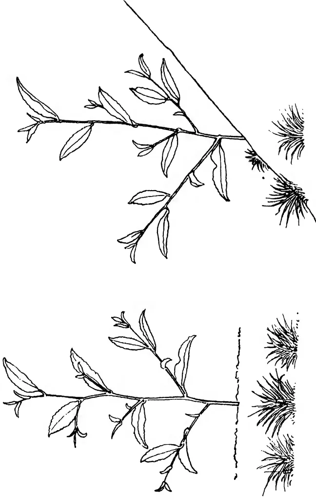A detailed botanical line drawing of Paspalum tea plants. The illustration features two main branches, each with several lanceolate leaves and small, developing flower buds. To the right of each branch is a small, dense clump of grass-like foliage, representing the plant's growth habit. The drawing is executed in a clean, black-and-white line art style.

*Paspalum* below tea plants.

850------------------------------------------------

This image is a blank white page. It contains several small, dark specks which appear to be scanning artifacts or dust particles. There is no text, handwriting, or printed content on the page.

851------------------------------------------------

367

## AN EXPERIMENT WITH UREA ON SUPPLIES IN OLD TEA FIELDS.

E. C. MARSH-SMITH, •  
YUILLEFIELD GROUP, HATTON.

A certain number of supplies in patches where tea had died out from *Poria* and other causes, and which were growing on rather poor, baked soil, was treated in the following manner: A line of plants in each patch was selected for treatment and the balance kept as controls.

Above each treated plant three holes were made with a thick peg and a urea solution was poured into each hole. The holes were 3 or 4 in. away from the plants and about 4 or 5 in. deep. Urea was mixed at the rate of three cigarette tins per four gallons of water, and one cigarette tin of the solution was poured to each plant. All the plants including controls were measured on the same day. The solution was applied on the day of measuring (26th March) and again on 15th April. The plants were again measured on 29th June. The plants to which urea solution had been applied were healthy with very dark leaves in comparison with the controls, the leaves of which were pale or yellowish in many cases.

<table border="1">
<thead>
<tr>
<th></th>
<th>No. of plants.</th>
<th>Total height 1st measurement.</th>
<th>After treatment: 2nd measurement.</th>
<th>Percentage increase in height.</th>
</tr>
</thead>
<tbody>
<tr>
<td>Control</td>
<td>54</td>
<td>507 in.</td>
<td>701 in.</td>
<td>39%</td>
</tr>
<tr>
<td>Treated plants</td>
<td>16</td>
<td>142 in.</td>
<td>216 in.</td>
<td>52%</td>
</tr>
</tbody>
</table>

It will be seen that the average height of the controls was about 9½ in. and the urea plants 9 in. before treatment. After treatment the controls averaged 13 in. and the urea plants averaged 13½ in., the percentage being as above. The rainfall had been prior to treatment, 6 in. in three months, and over 15 in. fell in April when the second application was made.

Individual increases that were well above the average were:

<table>
<tbody>
<tr>
<td>Controls A.</td>
<td>20</td>
<td>7½ in. to 13 in.</td>
<td>Treated plants A.</td>
<td>9</td>
<td>10 in. to 18 in.</td>
</tr>
<tr>
<td></td>
<td>21</td>
<td>11 in. to 19 in.</td>
<td></td>
<td>13</td>
<td>6 in. to 12 in.</td>
</tr>
<tr>
<td></td>
<td>25</td>
<td>11 in. to 20 in.</td>
<td>B.</td>
<td>8</td>
<td>6 in. to 12 in.</td>
</tr>
<tr>
<td></td>
<td></td>
<td></td>
<td></td>
<td>9</td>
<td>5½ in. to 11 in.</td>
</tr>
<tr>
<td></td>
<td></td>
<td></td>
<td>C.</td>
<td>15</td>
<td>6 in. to 11 in.</td>
</tr>
</tbody>
</table>

852------------------------------------------------

368

A third application was made on 4th and 5th October and the measurements obtained were:—

<table border="1">
<thead>
<tr>
<th></th>
<th>No. of plants.</th>
<th>Total height.</th>
<th>Last totals.</th>
<th>Percentage increase.</th>
</tr>
</thead>
<tbody>
<tr>
<td>Controls</td>
<td>51</td>
<td>808 in.</td>
<td>701 in.</td>
<td>15%</td>
</tr>
<tr>
<td>Treated plants</td>
<td>16</td>
<td>288 in.</td>
<td>216 in.</td>
<td>33%</td>
</tr>
</tbody>
</table>

Rainfall was May 8, 12 in; June 20, 84 in; July 20, 64 in; August 5, 37 in; and September 10, 16 in. The percentage increases then have been:—

<table border="1">
<thead>
<tr>
<th></th>
<th>Over 1st</th>
<th>Over 2nd</th>
<th>Total over 1st</th>
</tr>
</thead>
<tbody>
<tr>
<td>Controls</td>
<td>39%</td>
<td>15%</td>
<td>59%</td>
</tr>
<tr>
<td>Treated plants</td>
<td>52%</td>
<td>33%</td>
<td>102%</td>
</tr>
</tbody>
</table>

or 43 per cent. in favour of the urea.

It is natural to expect less percentage increases as the plants get older, as many side branches are put out and the plants are somewhat bigger and require more food. Three of the original controls died. The experiment is being continued.

853------------------------------------------------

369

## MEETINGS, CONFERENCES, ETC.

### COCONUT RESEARCH SCHEME BOARD OF MANAGEMENT.

**M**INUTES of the third meeting of the Board, held at 2 p.m. on Wednesday, October 2, 1929, in the Ante-room of the Legislative Council Chamber, Colombo.

Present: Dr. W. Small, M.B.E. (in the chair), Mr. C. W. Bickmore, C.C.S., Mr. J. Fergusson, the Hon. Mr. C. H. Z. Fernando, the Hon. Sir H. Marcus Fernando, the Hon. Mr. A. Mahadeva, Mr. J. Sheridan-Patterson, J.P., U.P.M., Mr. John A. Perera, J.P., U.P.M., Gate-Mudaliyar A. E. Rajapakse, J.P., U.P.M., the Hon. Mr. D. S. Senanayake, and Mr. J. I. Gnanamuttu (Secretary).

Apology for absence due to indisposition was received from Mr. N. R. Outschoorn.

1. *Hour of meeting.*—The Chairman explained that the hour of the meeting had been changed from 2-30 p.m. to 2 p.m. at the request of the Hon. Mr. C. H. Z. Fernando. Future meetings would be held at the usual hour.

2. *Minutes.*—The minutes of the meeting held on July 3rd, 1929, copies of which had been circulated to members, were taken as read and were confirmed and signed by the Chairman.

3. *Finance.*—The Chairman reported: (a) that interest was being paid at 2 per cent on the daily balances on current account, (b) that the rate of interest on the sum of Rs. 20,000 placed on fixed deposit for the twelve months commencing 16th July, 1929, was 4 per cent., (c) that commission would not be charged on Colombo cheques credited to the account of the Board. The Chairman added that he was informed that commission should not be charged on Kandy cheques negotiated in Colombo, and that, if commission was charged or claimed, the bank desired to be informed.

4. *Statement of receipts and expenditure.*—A statement of receipts and expenditure up to 30th September, 1929, was tabled.

Mr. Mahadeva enquired whether travelling costs, etc., represented the entire expenses from the inception of the Scheme. The answer was in the affirmative. On the suggestion of Sir Marcus Fernando, supported by Mr. Bickmore, it was agreed that future statements should show in parallel columns the expenditure for the quarter under review and the previous expenditure in the same year.

5. *Estimates on income and expenditure.*—The Chairman stated that under Section 8 (1) of Ordinance No. 29 of 1928 the estimates of income and expenditure for the following year should be laid on the table of the Legislative Council on or before the thirty-first day of October. He explained that the figures appearing in the statements which had been circulated were tentative and that the income estimated under cess collections would probably be exceeded.

The Board proceeded to consider in detail the items of income and expenditure.

854------------------------------------------------

370

## INCOME.

Mr. Bickmore recommended that further sums should be placed on fixed deposit. The Chairman was authorized to place moneys on fixed deposit as they became available and for whatever period he might think advisable. It was decided that a lump sum of Rs. 1,000 be shown as amount of interest anticipated to accrue in 1930.

In reply to Mr. Mahadeva, the Chairman said that the unexpended balance at the end of December, 1929, was estimated conservatively and that the salary of the Director for one month and his passage to Ceylon were provided for.

## EXPENDITURE.

With reference to the estimates of expenditure, Mr. Senanayake pointed out that the entire cess collections would be expended on personal emoluments. It was pointed out that the main expenditure in the circumstances was bound to be on personal emoluments and that the cess collections would probably exceed the estimate.

## PERSONAL EMOLUMENTS.

*Item 2, Technological Chemist at £600.*—Mr. Senanayake questioned the necessity for an expensive technical staff and enquired whether it was not possible to make arrangements with the Department of Agriculture to give the necessary technical assistance to the Research Scheme; for instance, whether the Agricultural Chemist or an assistant at Peradeniya could not give advice on soil questions. The Chairman pointed out that such an arrangement would be against the principles on which they were working. The direction of the entire work as well as its results should be the responsibility of the Director of the Research Scheme. The Chairman added that the Scheme was launching into a fresh field and that the services of the best available men should be secured.

*Item 3, Geneticist at £600.*—The Chairman hoped that a Ceylonese might be obtained for the post. After discussion the provision for a Geneticist was reduced to £400.

*Item 5, Superintendent of Estate at £250.*—After discussion, it was agreed to rate the superintendent of the estate at Rs. 2,400 per annum.

*Item 6, One laboratory attendant at Rs. 300.*—It was decided to include a commencing pay of Rs. 300 for one laboratory attendant.

*Item, 11, Bonus to subordinate staff at Rs. 455.*—The Chairman explained that the subordinate staff of the Rubber Research Scheme received one month's salary at Christmas by way of bonus. Mr. Bickmore added that the one month's salary was in lieu of a pension at retirement. Mr. Mahadeva objected to the payment of bonus for the first year. Sir Marcus Fernando suggested an insurance scheme as the most suitable arrangement.

The Chairman replied that either an insurance scheme or a provident fund ought to receive consideration. It was finally agreed that the title of the vote be altered to read "Reserve for bonus or provident fund contribution" and that the position be considered at about the end of 1930.

With reference to items 2, 3, 6, 7 and 8, Technological Chemist, Geneticist, two subordinate scientific assistants, one clerk, one laboratory attendant, it was decided after discussion that the whole year's salaries attached to these offices should stand, but that an explanatory note be added to show that part of these amounts would be saved in 1930. In reply to Mr. Mahadeva the Chairman gave the assurance that appointment to every senior post provided in the estimates would be brought before the Board for approval.

855------------------------------------------------

371

## OTHER CHARGES.

*Item 13, Travelling, motor car and working of car.*—After discussion, it was decided not to purchase a car for the use of the staff of the Scheme.

*A. Travelling expenses of officers.*—It was agreed that the provision under travelling expenses should be increased from Rs. 1,200 to 2,400. It was suggested that at a later date the Board might consider the question of fixed allowances for travelling.

*B. Travelling expenses of members of the Board.*—This question was discussed and it was resolved that outstation members be paid at 25 cents per mile from their homes to Colombo Fort and back for attendance at meetings of the Board.

*Item 14, Office.*—A. Stationery, Rs. 900. Arrangements in respect of the printing work of the Board were left in the hands of the Chairman.

*E. Legal expenses.*—It was decided that provision be included to meet the legal expenses of the Board.

*Item 16, Loan, first instalment of repayment, Rs. 25,900.*—At Mr. Bickmore's suggestion a note was added to the effect that the payment of the first instalment may not fall due in the course of 1930.

*Item 17, Reserve for Bonus and Passage Fund.*—It was resolved that 10 per cent. of the annual salary of the technical staff and one-fourth cost of return passages to England for four persons should be laid as a reserve for a bonus and passage fund.

*6. Powers of the Board.*—The Chairman reported that he had communicated with the Attorney-General, as decided at the last meeting, enquiring whether the Board had power under Section 4 of Ordinance No. 29 of 1928 to grant bonuses or gratuities or to compel its officers to join a provident fund or to authorise the payment of bonuses or gratuities from its funds. The Board had been advised to consult its own lawyers in the matter. Mr. Sheridan-Patterson suggested that Messrs. F. J. and G. de Saram be asked to undertake the legal work of the Board. The Chairman was requested to communicate accordingly with Messrs. F. G. and G. de Saram.

*7. Estate Sub-Committee.*—(a) The Chairman reported that travelling expenses in connection with the inspection of estates and meetings of the Sub-Committee had cost Rs. 342.30 in excess of the allocation of Rs. 500. It was resolved that the allocation be increased to a total of Rs. 1,500. (b) The Chairman reported that he had received certain further offers of estates and that the Estate Sub-Committee would meet to consider them.

*8. Staff.*—(a) The Chairman reported that the post of Director of the Scheme had been advertised in England and that he had heard from Mr. Stockdale that four applications had been received. (b) As membership of the Ceylon Planters' Provident Society was not open to the staff of the Scheme, it was decided to make enquiries regarding the possibility of establishing a Provident Fund for the staff and regarding the terms offered by insurance offices for endowment insurances for both superior and subordinate staff. (c) The Chairman reported that a Clerk/Shorthand-Typist had assumed duties on 1st October on an initial salary of Rs. 1,200 per annum.

*9. Proposed Colonial Agricultural Conference in 1932.*—It was decided to inform the Director of Agriculture that the Board would be willing to co-operate in making arrangements for visits to its research station and to estates by the delegates to the Conference.

*10. Seal of the Board.*—A design for the official seal of the Board and for a stamp die for letter heads was adopted.

856------------------------------------------------

372

11. *Telegraphic address of the Scheme.*—COCOS, the scientific name of the coconut palm, was adopted as the telegraphic address of the Scheme.

12. *Auditors for the Scheme.*—With reference to Section 8 (2) of Ordinance No. 29 of 1928, the Chairman brought up the question of audit of the Board's accounts. Mr. Mahadeva thought that the Board should arrange for its own internal audit. Mr. Bickmore was of opinion that the Colonial Auditor would not undertake to deal merely with the accounts sent up annually, and that his fees would be comparatively high. Mr. Senanayake thought that routine audit by the Colonial Auditor's Department would save the second audit which seemed to be contemplated by the Ordinance.

It was decided to enquire from Government what form of audit was required, and, if audit by a firm of accountants was approved, the Chairman was requested to make enquiries regarding the fees of local firms of auditors.

By order,

J. I. GNANAMUTTU,

Secretary,

Coconut Research Scheme.

Coconut Research Scheme,

Peradeniya, October 23, 1929.

857------------------------------------------------

373

## TEA RESEARCH INSTITUTE.

A meeting of the Board of the Tea Research Institute of Ceylon was held in the Victoria Commemoration Buildings, Kandy, on Monday, September 30th, at 2-15 p.m.

Present:—The Hon. Mr. J. W. Oldfield (Chairman), the Hon. Mr. D. S. Senanayake, the Acting Director of Agriculture (Dr. Small), Messrs. E. C. Villiers, W. Coombe, M. B. Galagoda, D. S. Cameron, P. A. Keiller, C. Huntley Wilkinson, A. W. L. Turner (Secretary), and by invitation the Director, Tea Research Institute of Ceylon (Dr. R. V. Norris), and the Visiting Agent (Mr. J. W. Ferguson).

Absentees:—The Hon. the Colonial Treasurer, Messrs. J. D. Finch Noyes and C. C. du Pré Moore.

Notice calling the meeting was read.

Minutes of a meeting of the Board of the Tea Research Institute of Ceylon, held on June 25th, 1929, were taken as read and confirmed.

### FINANCE.

The Chairman asked if there were any comments to be made on the statement of accounts as at August 31st, 1929, which had been sent to each member of the Board on September 20th.

Mr. W. Coombe suggested that an estimate of expenditure for the next three or five years should be drawn up.

The Chairman replied that this proposal would be brought up later on in the meeting.

The accounts were approved without further comment.

*Estimates for 1930.*—On the Chairman's suggestion, it was agreed that these estimates should be framed by a Sub-Committee before submitting them to the full Board.

The following Sub-Committee was appointed:—The Chairman, the Director, Tea Research Institute, the Visiting Agent and the Secretary.

It was also agreed that this Sub-Committee should draw up estimates of expenditure to the next three years.

### MEMBERS OF THE BOARD.

The Chairman announced that Mr. J. D. Finch Noyes was proceeding on leave on the 2nd October, and the Ceylon Estates Proprietary Association had been asked to nominate someone to serve on the Board during Mr. Finch Noyes' absence.

He also stated that he (Mr. Oldfield) was proceeding on leave shortly and there would be a hiatus between his departure and the return of Mr. R. G. Coombe.

It was decided that Mr. C. Huntley Wilkinson should act as Chairman as from the 1st October, 1929, until Mr. R. G. Coombe resumed duties.

### PRIVILEGES OF MEMBERS OF THE BOARD.

This question was brought forward at the request of the Hon. Mr. D. S. Senanayake, who was anxious to ascertain how much of the information he gathered as a member of the Board he could pass on for the information of those whom he represented. He instanced the Visiting Agent's reports, etc., which were marked "Confidential" and said that he felt very handicapped, in that he could not use extracts from these documents when

858------------------------------------------------

374

addressing the Low-Country Products' Association or the Legislative Council. He added that if he had been able to make use of certain information it would have been very useful during a recent discussion in Council on the Rubber Research Ordinance, and he suggested that documents should not be treated as confidential unless the Board had so decided.

Mr. W. Coombe agreed that as much information as possible should be made public.

The Chairman said that in his opinion the Visiting Agent's Reports must be treated in the first instance as confidential, otherwise the Board would have considerable difficulty in securing the services of a competent Visiting Agent. He added that when Mr. Senanayake referred the matter to him he had ruled that the Visiting Agent's Reports must in the first instance be circulated as confidential documents, but that there was no objection to any member of the Board proposing, at a subsequent meeting that the whole report, or extracts from it be published.

Mr. Coombe suggested that a member could always obtain permission from the Chairman before making use of confidential information.

Mr. Villiers supported this suggestion and added that it might often happen that the Board would be in possession of preliminary results of experimental work which it would be most inadvisable to publish.

Mr. Senanayake said that as a Member of the Legislative Council he should be allowed to use any information he was able to obtain and if he could not do so, he would seriously consider the question of resigning from the Board.

Mr. Coombe said that he considered such a step quite unnecessary because it might result in the Low-Country Products' Association being left without a representative on the Board, which was certainly not the wish of the Board.

After further discussion the Board decided to uphold the Chairman's ruling, because he had not acted contrary to Section 10 (1) and (2) of Ordinance No. 12 of 1925 or to the Rules which had been drawn up by the Board.

### BUNGALOWS.

(a) *Superintendent's Bungalow.*—The Chairman stated that this bungalow was practically finished, but the Superintendent and the Director were not at all satisfied with the doors, window fittings, painting and colour washing, etc. The Architect had, however, promised to rectify these defects with the least inconvenience to Mr. Rogers, who hoped to occupy the bungalow in about ten days' time.

In view of the above the Secretary was instructed to inform the Architect that no doors, windows or fittings should be fixed until passed by him (Architect).

The Chairman added that he had just sanctioned the laying of an electric cable to the Superintendent's bungalow in order to obviate the necessity of buying lamps which would only be used for a very short time.

The Chairman's action was confirmed.

(b) *Senior and Junior Scientific Staff Bungalows.*—The Chairman announced that, as the result of the replies to Circular No. A. 20/29, dated the 26th July, 1929, the contract for four senior scientific staff bungalows at Rs. 41,330 each and three junior scientific staff bungalows at Rs. 11,000 each, had been given to Messrs. Fonseca and Company and the necessary documents were signed and sealed on August 31st, 1929. He added that the date of completion of these bungalows was fixed at one year from the date of completion of the cart road, which Mr. Ferguson hoped would be opened shortly.

This was confirmed.

859------------------------------------------------

375

(c) *Clerk of Works*.—The Chairman stated that the result of the ballot obtained by Circular No. A. 24/29, dated August 21st, 1929, was ten votes in favour of Capt. C. E. M. Roe and one in favour of Mr. S. Jansz. The post had therefore been offered to Capt. Roe at a salary of Rs. 700 per mensem and he had accepted it. The date of his taking up his duties depended on the date on which the Superintendent vacated his present temporary quarters.

Mr. Senanayake said that he objected to the method of making this appointment and maintained that it should have been made at a meeting of the Board and not by correspondence. He wanted to know why his letter dated the 29th April had not been considered and he wished his dissent against the procedure to be recorded.

The Chairman explained that the subject-matter of the letter dated the 29th April had been considered at the last meeting. With regard to the correctness of procedure he quoted Section 10 of Ordinance No. 12 of 1925, which established and incorporated the Institute. The Section is as follows:—

“MEETINGS AND QUORUM.—(1) The Chairman shall summon meetings of the Board when necessary, and shall at any time summon a meeting upon receipt of a request signed by two members of the Board calling upon him to do so.

(2) Five members shall form a quorum. All questions shall be decided by a majority of members voting. In the case of equality of votes, the Chairman shall have a second or casting vote, and all matters decided at a meeting of the Board shall be recorded in a proceedings book kept by the Secretary to the Board. Matters may also be decided by the circulation of papers, on which members of the Board may record their votes, and all such decisions shall be reported to the next meeting of the Board and incorporated into the proceedings book.”

He added that the question had been discussed several times by the Board and it had been decided that the salary attached to the post should be Rs. 500 to 1,000 per mensem, according to qualifications, and that, at the last meeting it had been decided to circulate applicants' qualifications with a view to making the appointment as soon as possible.

The appointment of Capt. C. E. M. Roe as Clerk of Works was duly confirmed.

It was also decided that the Director should take over the supervision of all buildings and shall communicate direct with the Clerk of Works and Architect and vice versa.

*Furniture*.—It was decided to accept the Director's list of furniture, which had been sent to each member with Circular No. A. 26/29, dated September 12th, provided the sum of Rs. 3,500 per bungalow exclusive of rail freight was not exceeded. The question of floor covering for which the Director had suggested a sum of Rs. 300 was referred back to him for further consideration.

A sum of Rs. 1,000 for furniture for each of the junior scientific staff bungalows was agreed to. This sum to be spent at the discretion of the Director.

*Sand*.—The Chairman announced that Messrs. Fonseca and Company had decided to continue to purchase sand from the Institute at 40 cents per bushel. The amount of sand at present on the Estate is sufficient for some months, but he asked for authority to obtain a license for a further 10,000 bushels as and when required.

This was agreed to.

860------------------------------------------------

376

### LABORATORIES.

The Chairman stated that a start could not be made with the building until the cutting of the site and the cart road had been completed. The site cutting required more labour but at the moment the Superintendent was unable to spare any coolies.

With regard to the building itself he had approved of two small alterations suggested by the Director, in order to make use of the N.-W. and S.-W. corners of the West verandah and making open drains instead of closed ones. The alteration to the verandah would give more accommodation and the cost thereof would be set against the saving in making open drains with iron tops instead of absolutely closed drains. He added that little if any cost would be entailed.

These alterations were adopted.

### FACTORY.

Mr. Ferguson stated that he was very pleased with the work done. He had seen all the engines and machinery running smoothly and he hoped that manufacture would be commenced before the middle of October.

### MAHAGALLA BUNGALOW.

In view of the fact that the Entomologist was due early in 1930, the Director suggested that he should not be asked to pronounce an opinion on the breeding of *Trichogramma* without studying the conditions at Mahagalla. Also in view of the fact that there might not be a bungalow available for him at St. Coomb's, it was decided to take advantage of the option to rent the bungalow on Mahagalla until the 30th June, 1930

### ST. COOMB'S ESTATE.

*Visiting Agent's Report.*—A copy of Mr. Ferguson's second report was sent to each member of the Board with Circular No. A 18/29, dated the 19th July, 1929.

No comments were made.

A copy of Mr. Ferguson's third report sent with Circular No. 29/29, dated the 30th September, 1929, was handed to members present.

It was decided that this report should come up for discussion at the next meeting.

*Mattakelle Range.*—The Chairman announced that after the last meeting the Hon'ble Mr. Senanayake had written dissenting against the decision of the Board and asked that it be incorporated in the minutes of the last meeting.

The Chairman stated that the Staff Officer of the Ceylon Defence Force had written, thanking the Board for having rescinded their original resolution.

*Mattakelle Road.*—It was announced that the agreement in connexion with this road had been signed and sealed that morning.

*Water Supply.*—The Chairman suggested that as nothing permanent could be done until Mr. B. R. Dyer, the Sanitary Engineer, had issued his report, the Colombo Commercial Company be asked to draw out a temporary scheme to supply water for building purposes on the various building sites.

This was agreed to.

*Teamaker's House—Furniture.*—It was agreed that a sum of Rs. 300 should be allowed for this and that the selection should be left to the Superintendent.

861------------------------------------------------

377

In this connexion the Sub-Committee which is to deal with estimates was requested to go carefully into the question of bungalows for clerks, etc.

*Visitors.*—It was decided that as soon as work was started in the factory, notices should be sent to all District Planters' Associations intimating that visitors would be welcome at any time, but that they would receive more attention if they visited St. Coomb's on visitors' day, the date of which the Director said he hoped to be able to fix in the near future.

This was agreed to and it was further decided that a visitors' book should be kept in the factory.

Mr. Huntley Wilkinson raised the question of giving the Superintendent an entertaining allowance.

This matter was deferred till a later date.

*Signposts.*—The same member also raised the question of signposts, and suggested that there should be one on the Government cart road and one at the turnoff to Mattakelle bungalow.

Mr. Ferguson said that there were two signposts on St. Coomb's which would shortly be erected.

#### STAFF OF THE TEA RESEARCH INSTITUTE.

(a) *Director.*—It was recorded that the Director, Dr. R. V. Norris assumed duties as Director of the Institute on the 12th August.

(b) *Entomologist.*—Recorded the circulation of Circular No. 21/29, dated the 29th July and Circular No. 23/29, dated the 7th August. The Chairman announced that the Selection Committee in London had appointed Mr. C. B. R. King, lately employed by the Empire Cotton Growers' Corporation. He was commencing six weeks' study of parasite breeding in use at Farnham Royal Laboratory on the 23rd September, on full pay (£300-0-0) and would proceed to Ceylon early in November.

The appointment was confirmed.

The Director raised the question of the date of Mr. King's appointment and suggested that although his salary commenced on the 23rd September, his appointment should date as in the case of the other officers, from the day of his arrival in Ceylon.

This was agreed to and the Secretary was instructed to cable to the Ceylon Association in London in order to ensure that this point should be made quite clear in Mr. King's agreement.

(c) *Plant Physiologist.*—The Chairman said that it had been agreed that Mr. F. R. Tubbs should start his training at East Malling and then at Long Ashton Research Stations on the 1st August, on half pay and that he should commence his full when he arrived in Ceylon in February, 1930. His agreement makes provision for his appointment to date from the day of arrival in Ceylon.

(e) *Assistant to the Chemists.*—The Chairman said that Mr. V. Mendis had taken up duties as Assistant to the Bio-Chemist as from July 1st, 1929.

#### SUBORDINATE STAFF OF THE T.R.I.

The Chairman announced that the Director's letter No. 1444, dated September 18th, 1929, submitting a statement shewing the subordinate staff, which he considered would be necessary, had been sent to each member of the Board with Circular No. A28/29, dated September 18th.

During a short discussion it was pointed out that the question of housing the subordinate staff would require careful consideration and it was decided that the Sub-Committee dealing with the estimates should go into this question and report to the Board at the next meeting.

862------------------------------------------------

378

### IMPERIAL AGRICULTURAL BUREAUX.

The Chairman reported that the Director's memorandum on this subject had been sent to each member of the Board under cover of Circular No. A. 27/29, dated the 24th September.

It was decided that the Institute should co-operate in every way with the Imperial Agricultural Bureaux.

### COLONIAL AGRICULTURAL CONFERENCE.

The Chairman announced that it was proposed to hold a Colonial Agricultural Conference in 1932, and the Acting Director of Agriculture had written to know if the Institute would be willing to take part in and support the Conference. He added that very little expense, if any, would be incurred.

It was decided that the Conference should be supported by the Institute.

### SECOND IMPERIAL MYCOLOGICAL CONFERENCE.

The Chairman said that the Secretary of State for the Colonies had asked if the Institute could be represented at this Conference. He had been informed that Dr. Gadd had been instructed to attend.

### PUBLICATIONS.

It was announced that the number of issues sold increased from 1,200 copies in March, 1929, to 1,350 copies in August, and that certain issues were sold out.

It was decided that there should always be a margin of 150 copies in hand.

In this connexion the Director again pointed out that by selling individual copies of the publications at Rs. 2.50 per copy, it was cheaper to buy individual copies than to subscribe Rs. 15 per annum.

It was decided that, as more publications would probably be issued in the near future, this discrepancy would automatically right itself.

(a) *Plans*.—It was also decided that plans of the various buildings, and layout of the Institute should be reproduced in the *Tea Quarterly* as and when the Director thought fit.

(b) *Pamphlets in the Vernacular*.—The Director stated that he had been considering this matter, but he was not yet in a position to make a definite proposal.

Mr. W. Coombe then proposed a hearty vote of thanks to the Hon. Mr. J. W. Oldfield for the very strenuous work he had put in during his time as acting Chairman.

This was received with applause and the meeting terminated.

A. W. L. TURNER,  
Secretary.

863------------------------------------------------

379

## DEPARTMENTAL NOTES.

### PROGRESS REPORT OF THE EXPERIMENT STATION, PERADENIYA

#### FOR THE MONTHS OF SEPTEMBER AND OCTOBER, 1929.

##### TEA.

**A**LL the plots except 163, 164, Hillside and 166 were pruned in September and early October and the pruning mixture has been applied. The tea manurial experiment plots were manured in September.

##### RUBBER.

##### *Budding.*

The results of the budding operations in September and October are seen in the following table:—

<table border="1">
<thead>
<tr>
<th>Clone.</th>
<th>Number of buds put on.</th>
<th>Alive after 20 days.</th>
<th>Alive after 30 days.</th>
<th>Percentage of successes.</th>
</tr>
</thead>
<tbody>
<tr>
<td>H 2</td>
<td>20</td>
<td>12</td>
<td>12</td>
<td>60.0</td>
</tr>
<tr>
<td>H 2</td>
<td>49</td>
<td>28</td>
<td>18</td>
<td>36.7</td>
</tr>
<tr>
<td>S.R. 9</td>
<td>88</td>
<td>75</td>
<td>70</td>
<td>79.5</td>
</tr>
<tr>
<td>C.T. 88</td>
<td>58</td>
<td>52</td>
<td>48</td>
<td>82.8</td>
</tr>
<tr>
<td>J 11</td>
<td>67</td>
<td>48</td>
<td>39</td>
<td>58.2</td>
</tr>
<tr>
<td>B D 5</td>
<td>38</td>
<td>37</td>
<td>34</td>
<td>89.5</td>
</tr>
<tr>
<td>AVROS 152</td>
<td>10</td>
<td>10</td>
<td>10</td>
<td>100.0</td>
</tr>
<tr>
<td>AVROS 49</td>
<td>8</td>
<td>8</td>
<td>7</td>
<td>87.5</td>
</tr>
<tr>
<td>B D 10</td>
<td>18</td>
<td>17</td>
<td>15</td>
<td>83.3</td>
</tr>
<tr>
<td>H 2</td>
<td>88</td>
<td>62</td>
<td>54</td>
<td>61.4</td>
</tr>
<tr>
<td>P B 23</td>
<td>15</td>
<td>14</td>
<td>14</td>
<td>93.3</td>
</tr>
<tr>
<td>H 2</td>
<td>20</td>
<td>16</td>
<td>14</td>
<td>70.0</td>
</tr>
<tr>
<td>Total</td>
<td>479</td>
<td>379</td>
<td>335</td>
<td>69.9</td>
</tr>
</tbody>
</table>

A further lot of 84 buddings of H 2 examined after twenty days showed all buds alive. The second lot of H 2 buddings gave only 36.7 per cent. successes, due probably to heavy rain after budding. Many of the bandages became loose and it is considered advisable, particularly if rain is expected, to tie on the leaves shading the bud in such a way as to keep the bandage secure.

##### PLOT 165—BUDDED RUBBER.

These trees are the oldest bud-grafts on the station. They were planted in December, 1922. Bud-grafts were planted 20 ft. by 14 ft. diagonally, but as the plot is in the shape of a long and narrow rectangle the numerous trees on the outside of the plot will in time be able to utilise more than normal space for development of foliage. There is a good cover of *Centrosema*. The plot contains twelve clones and the number of trees per clone varies from three to ten. The clones were budded from twelve

864------------------------------------------------

380

good trees on the station but none of the mother-trees was really a high yielder. The first year's tapping was completed in April of this year. Tapping was on a half spiral cut starting at 21 in. Growth has not been good and yields are low.

The following table shows the yields from May 1928 to April 1929 :—

*Yields of Bud-grafted Rubber, Plot 165.*

<table border="1">
<thead>
<tr>
<th rowspan="2">Number of clone.</th>
<th rowspan="2">Number of trees in clone.</th>
<th rowspan="2">Mean yield of dry rubber in grammes per tree per tapping.</th>
<th colspan="2">Mean yield of dry rubber per tree per year.</th>
</tr>
<tr>
<th>gm.</th>
<th>lb.</th>
</tr>
</thead>
<tbody>
<tr>
<td>5</td>
<td>10</td>
<td>4.12</td>
<td>688.20</td>
<td>1.52</td>
</tr>
<tr>
<td>12</td>
<td>9</td>
<td>4.14</td>
<td>691.33</td>
<td>1.52</td>
</tr>
<tr>
<td>32</td>
<td>8</td>
<td>3.79</td>
<td>633.38</td>
<td>1.40</td>
</tr>
<tr>
<td>38</td>
<td>8</td>
<td>4.05</td>
<td>675.75</td>
<td>1.49</td>
</tr>
<tr>
<td>42</td>
<td>10</td>
<td>3.39</td>
<td>550.00</td>
<td>1.23</td>
</tr>
<tr>
<td>54</td>
<td>5</td>
<td>3.00</td>
<td>500.80</td>
<td>1.10</td>
</tr>
<tr>
<td>67</td>
<td>7</td>
<td>3.52</td>
<td>588.29</td>
<td>1.30</td>
</tr>
<tr>
<td>82</td>
<td>9</td>
<td>4.13</td>
<td>689.55</td>
<td>1.52</td>
</tr>
<tr>
<td>83</td>
<td>10</td>
<td>2.76</td>
<td>463.80</td>
<td>1.02</td>
</tr>
<tr>
<td>109</td>
<td>7</td>
<td>4.46</td>
<td>748.86</td>
<td>1.65</td>
</tr>
<tr>
<td>138</td>
<td>3</td>
<td>4.64</td>
<td>775.00</td>
<td>1.71</td>
</tr>
<tr>
<td>160</td>
<td>8</td>
<td>4.16</td>
<td>694.25</td>
<td>1.53</td>
</tr>
</tbody>
</table>

Seedlings were not planted along with these bud-grafts so that it is difficult to form any clear idea of how these yields compare with seedling yields. The best comparison that can be given is with the yields of 12-year-old seedlings raised from mixed seed and grown about fifty yards away. At twelve years old these seedlings yielded 8 gm. of dry rubber per tapping. There can be little doubt that the bud-grafts will exceed this yield at the same age and it must be remembered that the best of the mother-trees yielded less than 20 lb. of rubber per year; for example, mother-tree No. 5 yielded 10 lb. and No. 12 yielded 8.2 lb. in their twelfth year. For that reason alone conclusions as to the value of bud-grafts cannot be drawn from these records.

### REJUVENATION EXPERIMENT.

This experiment has been laid down in plots 83 to 86, but the old plot boundaries have been ignored. The experiment commenced on 31-8-29.

The experiment is intended (i) to test the possibility and economy of the rejuvenation of old rubber and (ii) to throw some light on the most economical method of tapping to death.

Unfortunately the trees used in the experiment have previously only been tapped on a third, so more bark is available than would normally be found. Beneath the present tapping cut from 12 in. to 15 in. of bark are available. On the rest of each tree the bark may be tapped as high as is desired.

The total area is about 3 acres and it will be divided into four plots which the arrangement of the trees precludes from being of equal size.

The four plots will be tapped to death in one, two, three and four years on the following systems :—

*Plot 1.*—Daily tapping on 2 half-spiral cuts at an angle of 22° with 2 in. of bark consumed per month. The bottom cut starting at 12 in. and the top one at 50 in. (It would have been better to have had the top cut only 3 ft. above the bottom. This was intended but the bottom cut was first opened at 24 in. before it was realised there was no point in opening higher than 12 in. In plot 1, therefore, the top cut is 12 in. higher than is necessary or desirable.) To be tapped for one year.

865------------------------------------------------

381

*Plot 2.*—As in plot 1 but with  $1\frac{2}{3}$  in. bark consumption per month and with the first cut opened about 24 in. To be tapped for two years.

*Plot 3.*—As in plot 2 but with  $1\frac{1}{12}$  in. bark consumption per month. To be tapped to death in three years.

*Plot 4.*—Two cuts as in other plots but tapped alternate monthly with  $1\frac{2}{3}$  in. bark consumption per month. Tapping of this plot to start on 1st October. To be opened 30th September.

In each plot the top cut is immediately above the bottom. In plot 4 it is intended not to tap quite down to the wood to see what effect more careful tapping has on yield of top cut. For the last year cuts will be to the wood.

The above rates of bark consumption will finish the bark in one, two, three and four years respectively. Estates may have to depart slightly from these rates according to the bark available but the experiment should indicate the most efficient method of utilising bark.

All cuts on the first panels will be to the wood. The tapping on the second panels on the other side of the tree will be normal but fine tapping to avoid ringing the tree. For the last few weeks cuts, where possible, will be made longer than a half circumference. Tappers should report beginning of brown bast and isolation cuts should be made at once but tapping should be continued.

Yields will be compared with the last year's yield of each plot under normal tapping.

These yields are:—

<table>
<thead>
<tr>
<th></th>
<th>With <math>\frac{1}{3}</math> cut</th>
<th>Calculated yield for <math>\frac{1}{2}</math> cut</th>
</tr>
</thead>
<tbody>
<tr>
<td>Plot 1.</td>
<td>365 lb. per plot.</td>
<td>... 438 lb.</td>
</tr>
<tr>
<td>Plot 2.</td>
<td>539 lb. per plot.</td>
<td>... 647 lb.</td>
</tr>
<tr>
<td>Plot 3.</td>
<td>296 lb. per plot.</td>
<td>... 355 lb.</td>
</tr>
<tr>
<td>Plot 4.</td>
<td>282 lb. per plot.</td>
<td>... 338 lb.</td>
</tr>
</tbody>
</table>

The intention is, after tapping to death, to carry out on each plot the following programme:—

(a) Fell, stump and take out lateral roots.

(b) Manure with 3 cwt. ephos phosphate and 1 cwt. sulphate of ammonia per acre and sow thickly either *Crotalaria anagyroides* or *Tephrosia candida* in order to obtain organic matter before planting.

(c) Put in silt-pits and soil erosion ridges and plant *Centrosema pubescens* or *Eupatorium triplinerve* on ridges only.

(d) Hole in N.-E. monsoon and fill holes with top soil and green manure. Holes 15 ft. by 15 ft. Plant budded stumps of Bodjong Datar, Tjirandji, Avros, Malayan or Ceylon clones, having different clones on different diagonals. Thin out to about 90 trees per acre after test tapings at Iriyagama have shown the best clones. Where soil erosion ridges have been put in, it is not considered necessary to sow a complete cover of *Centrosema*. It is probably more advisable to confine this cover to the ridges. For some time a row of boga could be left between the rows of rubber but green manure plants should neither compete with the young rubber plants nor shade the ground over their roots.

866------------------------------------------------

382CACAO.

Diseased cacao trees have been uprooted. Vacancies in the Economic Plots have been supplied with seed at stake.

SOIL EROSION EXPERIMENT.*Series B.*

At the last meeting of the Estate Products Committee the July-August Progress Report account of the soil erosion experiment devised to determine, if possible, the effect of envelope-forking and silt-pitting, respectively, on soil erosion gave rise to considerable discussion as it was feared that the published figures might lead to the assumption that under all conditions forking would increase erosion and that *ipso facto* forking was to be condemned. It was pointed out that the land on which the plots were situated was steep and that under ordinary estate conditions it might not be forked. Information was desired on the exact slope of the plots and on the incidence of the rain following the forking.

The slopes of the five plots 1, 3, 4, 5 and 6 are respectively 25°, 25°, 24°, 23°, and 24°. The slope of plot 2 could not be read owing to intervening trees but it may be taken as 25°.

Envelope-forking took place on 5-12-1928 and 19-7-1929. The fork was put in every 12 in. The rainfall for the months following forking was as follows:—

<table>
<thead>
<tr>
<th>December 19</th>
<th>11 inches</th>
<th>July 21</th>
<th>20 inches</th>
</tr>
</thead>
<tbody>
<tr>
<td>„ 23</td>
<td>02 „</td>
<td>„ 22</td>
<td>27 „</td>
</tr>
<tr>
<td>„ 25</td>
<td>22 „</td>
<td>„ 27</td>
<td>1.30 „</td>
</tr>
<tr>
<td>„ 26</td>
<td>03 „</td>
<td>„ 28</td>
<td>26 „</td>
</tr>
<tr>
<td>„ 27</td>
<td>30 „</td>
<td>August 19</td>
<td>52 „</td>
</tr>
<tr>
<td>„ 28</td>
<td>1.01 „</td>
<td></td>
<td></td>
</tr>
<tr>
<td>„ 29</td>
<td>35 „</td>
<td></td>
<td></td>
</tr>
<tr>
<td>„ 30</td>
<td>92 „</td>
<td></td>
<td></td>
</tr>
<tr>
<td>„ 31</td>
<td>03 „</td>
<td></td>
<td></td>
</tr>
</tbody>
</table>

It was also pointed out at the meeting that the parallel plots of the experiment showed great variation and that because of this too much reliance could not be placed on the results. This wide variation between parallels was mentioned in the last Progress Report. The following revised table shows this variation:—

*Soil losses during the three years 1926-1929.*

<table>
<thead>
<tr>
<th rowspan="2">Year.</th>
<th colspan="2">Control plots.</th>
<th colspan="2">Envelope-forked plots.</th>
<th colspan="2">Silt-pits in drains.</th>
</tr>
<tr>
<th>No. 3. lb.</th>
<th>No. 6. lb.</th>
<th>No. 1. lb.</th>
<th>No. 4. lb.</th>
<th>No. 2. lb.</th>
<th>No. 5. lb.</th>
</tr>
</thead>
<tbody>
<tr>
<td>1926-27</td>
<td>455.5</td>
<td>1252.8</td>
<td>741.9</td>
<td>553.5</td>
<td>318.2</td>
<td>923.2</td>
</tr>
<tr>
<td>1927-28</td>
<td>658.0</td>
<td>2373.0</td>
<td>2730.6</td>
<td>1056.8</td>
<td>—</td>
<td>—</td>
</tr>
<tr>
<td>1928-29</td>
<td>322.0</td>
<td>800.2</td>
<td>1480.1</td>
<td>481.9</td>
<td>141.4</td>
<td>163.0</td>
</tr>
</tbody>
</table>

867------------------------------------------------

383

Treatments commenced in 1927-28 and it will be noticed that although there is wide variation between parallels, the increases and decreases in amount of soil eroded on the parallel plots are of fairly similar magnitude. The reason for the greater loss of soil in plots 1 and 6 is to a large extent obvious on inspection of the plots themselves. These plots are almost free from rocks, whereas plots 3 and 4 contain an appreciable proportion of large rocks which naturally reduces erosion, and reduces also the area which can be forked.

A further examination of the results of this experiment indicates that they are more reliable than was at first thought. The preliminary conclusion that may be drawn from them is that envelope-forking on this land has increased erosion. It has not been shown that envelope-forking in general will increase erosion, but even if it were shown it would not mean that forking should be discontinued but that measures to reduce erosion should be adopted concurrently.

### GREEN MANURES.

The green manures in the show plots have been uprooted and resown where necessary.

Seed of a *Desmodium* collected by Mr. H. C. Sampson in British Honduras and sent here by Mr. F. A. Stockdale was sown but failed to germinate.

### GRASSES.

New plots of Napier grass, Guinea grass and sorghum were sown at Panchikawatte. During the drought the young plants were irrigated. These plots are required to augment the fodder supply of the station.

An Australian grass *Danthonia semiannularis* was sown in September but failed to germinate.

### MISCELLANEOUS.

*Hydnocarpus Wightiana* growing in the terraced valley were badly defoliated by the larvae of what was indentified by the Entomologist as *Pronomeuta sarcopis*. The attack was serious and if repeated may kill the trees. *Taraktogenos Kursii* in the same valley was only slightly attacked.

### IRIYAGAMA DIVISION.

The stumps in the bud-wood multiplication nurseries were budded in September. The following statement gives particulars of the mother-trees used, the number of buds put on, and the percentage successes:—

868------------------------------------------------

384*Budding in Bud-wood Nurseries—September, 1929.*

<table border="1">
<thead>
<tr>
<th>Mother-tree</th>
<th>Estate</th>
<th>Buds put on</th>
<th>Alive after 20 days</th>
<th>Alive after 30 days</th>
<th>Percentage successes</th>
</tr>
</thead>
<tbody>
<tr>
<td>H 2</td>
<td>Heneratgoda Botanic Gardens.</td>
<td>25</td>
<td>18</td>
<td>18</td>
<td>72.00</td>
</tr>
<tr>
<td>H 24</td>
<td>do</td>
<td>20</td>
<td>16</td>
<td>16</td>
<td>80.00</td>
</tr>
<tr>
<td>H 24</td>
<td>do</td>
<td>13</td>
<td>11</td>
<td>11</td>
<td>84.61</td>
</tr>
<tr>
<td>H 400</td>
<td>do</td>
<td>25</td>
<td>21</td>
<td>21</td>
<td>84.00</td>
</tr>
<tr>
<td>H 401</td>
<td>do</td>
<td>29</td>
<td>26</td>
<td>25</td>
<td>86.20</td>
</tr>
<tr>
<td>H 445</td>
<td>do</td>
<td>25</td>
<td>19</td>
<td>17</td>
<td>68.00</td>
</tr>
<tr>
<td>H 440</td>
<td>do</td>
<td>27</td>
<td>22</td>
<td>22</td>
<td>81.48</td>
</tr>
<tr>
<td>H 439</td>
<td>do</td>
<td>26</td>
<td>25</td>
<td>25</td>
<td>96.15</td>
</tr>
<tr>
<td>H 411</td>
<td>do</td>
<td>25</td>
<td>23</td>
<td>22</td>
<td>88.00</td>
</tr>
<tr>
<td>P 5</td>
<td>Experiment Station, Peradeniya.</td>
<td>25</td>
<td>17</td>
<td>16</td>
<td>64.00</td>
</tr>
<tr>
<td>P 12</td>
<td>do</td>
<td>26</td>
<td>25</td>
<td>24</td>
<td>92.30</td>
</tr>
<tr>
<td>H 75</td>
<td>Heneratgoda Botanic Gardens.</td>
<td>27</td>
<td>23</td>
<td>21</td>
<td>77.77</td>
</tr>
<tr>
<td>H 82</td>
<td>do</td>
<td>28</td>
<td>25</td>
<td>22</td>
<td>78.57</td>
</tr>
<tr>
<td>H 26</td>
<td>do</td>
<td>28</td>
<td>28</td>
<td>28</td>
<td>100.00</td>
</tr>
<tr>
<td>H 203</td>
<td>do</td>
<td>26</td>
<td>26</td>
<td>26</td>
<td>100.00</td>
</tr>
<tr>
<td>H 140</td>
<td>do</td>
<td>28</td>
<td>27</td>
<td>26</td>
<td>92.85</td>
</tr>
<tr>
<td>H 47</td>
<td>do</td>
<td>23</td>
<td>23</td>
<td>23</td>
<td>100.00</td>
</tr>
<tr>
<td>H 2</td>
<td>do</td>
<td>51</td>
<td>50</td>
<td>47</td>
<td>92.15</td>
</tr>
<tr>
<td>M 162</td>
<td>Milleniya</td>
<td>25</td>
<td>25</td>
<td>25</td>
<td>100.00</td>
</tr>
<tr>
<td>W 120</td>
<td>Wawulugala</td>
<td>27</td>
<td>26</td>
<td>26</td>
<td>96.29</td>
</tr>
<tr>
<td>C 8</td>
<td>Kuilcagh</td>
<td>18</td>
<td>13</td>
<td>9</td>
<td>50.00</td>
</tr>
<tr>
<td>C 5</td>
<td>Kuilcagh</td>
<td>18</td>
<td>18</td>
<td>18</td>
<td>100.00</td>
</tr>
<tr>
<td>DK 5315</td>
<td>Dalkeith</td>
<td>18</td>
<td>7</td>
<td>4</td>
<td>22.22</td>
</tr>
<tr>
<td>DK 3513</td>
<td>Dalkeith</td>
<td>19</td>
<td>18</td>
<td>7</td>
<td>36.84</td>
</tr>
<tr>
<td>E L 1</td>
<td>Eladuwa</td>
<td>18</td>
<td>16</td>
<td>14</td>
<td>77.77</td>
</tr>
<tr>
<td>M I R 2</td>
<td>Mirishena</td>
<td>18</td>
<td>14</td>
<td>11</td>
<td>61.11</td>
</tr>
<tr>
<td>T A L 2</td>
<td>Talagolla</td>
<td>19</td>
<td>17</td>
<td>10</td>
<td>52.63</td>
</tr>
<tr>
<td>Y O 21 Y</td>
<td>Yogama</td>
<td>19</td>
<td>19</td>
<td>15</td>
<td>78.94</td>
</tr>
<tr>
<td>Y O 1 H</td>
<td>Yogama</td>
<td>18</td>
<td>17</td>
<td>11</td>
<td>61.11</td>
</tr>
<tr>
<td>M I R 11</td>
<td>Mirishena</td>
<td>18</td>
<td>16</td>
<td>13</td>
<td>72.22</td>
</tr>
<tr>
<td>G 1836</td>
<td>Govinna</td>
<td>18</td>
<td>18</td>
<td>16</td>
<td>88.88</td>
</tr>
<tr>
<td>G 771</td>
<td>Govinna</td>
<td>18</td>
<td>14</td>
<td>11</td>
<td>61.11</td>
</tr>
<tr>
<td>F 56</td>
<td>Frocester</td>
<td>18</td>
<td>15</td>
<td>5</td>
<td>27.77</td>
</tr>
<tr>
<td>L A V 28</td>
<td>Lavant</td>
<td>18</td>
<td>18</td>
<td>18</td>
<td>100.00</td>
</tr>
<tr>
<td>M A 22</td>
<td>Madola</td>
<td>18</td>
<td>17</td>
<td>12</td>
<td>66.66</td>
</tr>
<tr>
<td>M A 110</td>
<td>Madola</td>
<td>14</td>
<td>12</td>
<td>8</td>
<td>57.14</td>
</tr>
<tr>
<td>U D 24</td>
<td>Udapolla, Polgahawela</td>
<td>18</td>
<td>18</td>
<td>18</td>
<td>100.00</td>
</tr>
<tr>
<td colspan="2" style="text-align: right;">Total</td>
<td>834</td>
<td>743</td>
<td>661</td>
<td>79.25</td>
</tr>
</tbody>
</table>

The mother-trees in the above list consist of high-yielding Ceylon trees, most of which it is intended to test at Iriyagama. The trees from private estates have been chosen, after examining available yield records, by Mr. R. A. Taylor (of the Ceylon Rubber Research Scheme) and the writer. The list of trees to be tested is not final.

869------------------------------------------------

385AREA 6.

The terracing of this area has been completed. The terraces have been lettered and the holes along each terrace numbered consecutively. *Gliricidia* cuttings have been planted to supply shade and shelter from the wind and a green manure seed mixture of *Tephrosia candida*, *Crotalaria anagyrooides* and *Desmodium gyroides* has been sown to act as smother crop and to stop erosion. Later it is intended to sow *Centrosema pubescens*. The dry weather has kept back the green manure plants.

This area has been divided into five blocks each containing nine twelve-tree plots. Each block contains or will contain one replication of the following foreign clones: Tjirandji 1, 8 and 16 A.V.R.O.S. 49 and 50, Bodjong Datar 5 and S.R. 9 (from Malaya). Plots of Heneratgoda 2 are being used as controls and in addition there will be one plot of seedlings in each block. The experimental area will be surrounded by a border of seedlings to eliminate border effect. The border and seedling plots have already been planted with germinated seed. A statement of other planting follows:—

<table border="1">
<thead>
<tr>
<th rowspan="2">Clone.</th>
<th rowspan="2">Stumps received (from Java)</th>
<th rowspan="2">No. dead on arrival</th>
<th colspan="2">No. planted.</th>
</tr>
<tr>
<th>In experimental area</th>
<th>In bud-wood nurseries.</th>
</tr>
</thead>
<tbody>
<tr>
<td>B D. 5</td>
<td>70</td>
<td>19</td>
<td>51</td>
<td>—</td>
</tr>
<tr>
<td>A.V.R.O.S. 49</td>
<td>70</td>
<td>5</td>
<td>60</td>
<td>5</td>
</tr>
<tr>
<td>A.V.R.O.S. 50</td>
<td>70</td>
<td>12</td>
<td>58</td>
<td>—</td>
</tr>
</tbody>
</table>

The budded stumps were received late on the 11th October and were planted on the 12th. The weather has been very unfavourable and stumps and seeds have been watered by hand. Stumps of the remaining Dutch clones and a further supply of stumps of the clones already planted are *en route*.

The bud-grafts and seedlings have been protected from hares and shaded from the sun by split bamboos.

L. LORD,  
Acting Manager,  
Experiment Station,  
Peradeniya.

870------------------------------------------------

This image is a blank white page. It contains several small, dark specks which appear to be scanning artifacts or dust particles. There is no text, handwriting, or printed content on the page.

871------------------------------------------------

<!-- stage4: FAINT old-images-only -->

[Faint page: no legible print of its own could be verified; text withheld (stage 4 review list)]
