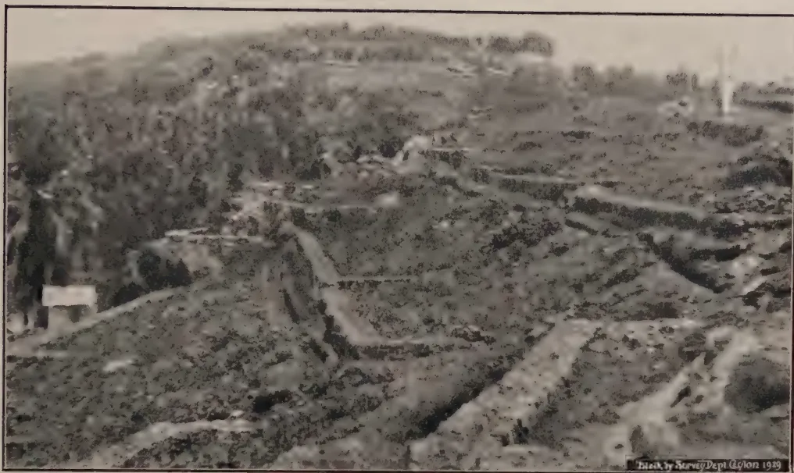
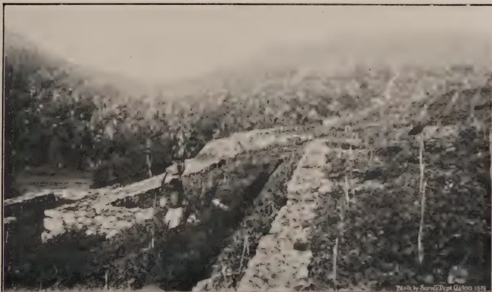
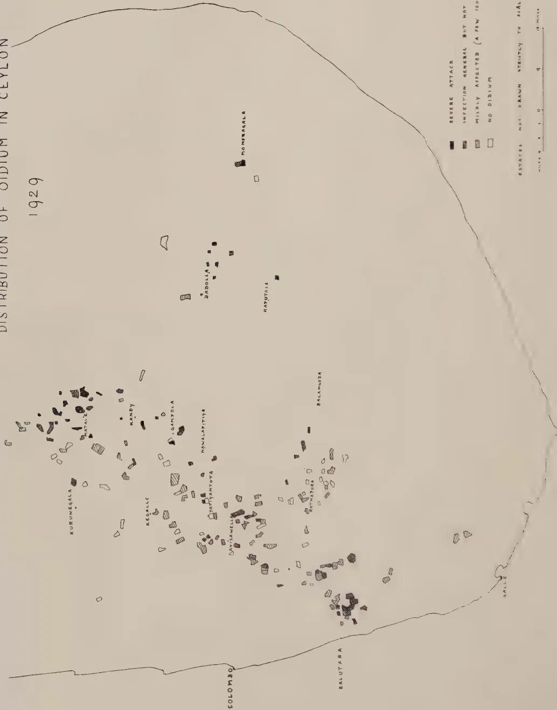

# The Tropical Agriculturist

August 1929.

---

## EDITORIAL

---

### COMMITTEE ON SOIL EROSION.

---

IT is generally recognised that the soil is the most valuable asset of the tropical agriculturist, and the view that its amount and its quality must be preserved at all costs is gaining rapid ground. It may also be said with regard to the incidence of pests and diseases of tropical crops that emphasis and attention are gradually being moved from the insect, fungus or bacterial causes of diseased conditions to the agricultural conditions which favour or induce attacks of parasitic organisms; in other words, the tendency is to show that crops grown under suitable agricultural conditions are less liable to disease and degeneration than those grown under unfavourable conditions. The question of the preservation of the agricultural soils of Ceylon is of paramount importance, and it is a matter of interest that His Excellency the Governor has seen fit to appoint a committee consisting of planters and representatives of the revenue, survey, irrigation, forest and agricultural departments to consider the question of soil erosion in Ceylon. It is doubtful if the amount of soil erosion and the damage caused by it in Ceylon are realised, and it may be of interest to mention that in Japan the problem of control of soil erosion in valleys which contain paddy fields is so serious that government has felt itself justified in spending on control measures as much as ten times the value of the land under erosion, a state of affairs which shows that the problem is recognised as one for the state rather than the private owner.

1------------------------------------------------

66

Soil erosion is a natural process which is brought about by the action of forces such as water, wind and ice on the earth's surface. It proceeds in a natural manner and at a rate which may be called a normal or natural rate until the opening up and development of land and the use of land for agricultural purposes disturb the normal rate. If the disturbance, through, for instance, the removal of natural vegetation, is large, erosion may become greatly accelerated in rate and amount. It may then become a headlong process which impoverishes and removes the soil, causes the drying up of springs, affects the courses and run of rivers, silts up streams and rivers and covers fertile flats with sand, gravel and silt. When this state of affairs is apparent, it is desirable to arouse public opinion and to take steps to arrest the processes of erosion. It may be the case that parts of Ceylon show the above conditions. If so, the Committee on Soil Erosion may be expected to make recommendations for arresting and controlling present processes and for preventing erosion in the future. The preliminary work of the committee will consist of a study of the causes, rate and trend of erosion in Ceylon, and it is hoped that the interest of the agricultural community in a matter which greatly concerns its future will be aroused.

The crux of the problem in Ceylon seems to lie in the holding up of rain or storm water in order to prevent its immediate run-off and its accumulation in large volumes which act as mechanical conveyers of soil downwards to the streams and rivers; in other words, the control of the movements of surplus water and the introduction of methods which will dispose of available water in the most scientific manner. In the United Provinces of India, soil erosion has been arrested by afforestation of ravine tracts and in the district of Bombay by terracing and construction of embankments. Mediterranean countries show an interesting case of shifting cultivation followed by barrenness and the substitution for the latter of sound agricultural methods on terraced lands, a case that may have a future parallel in certain parts of Ceylon.

2------------------------------------------------

67

## ORIGINAL ARTICLES.

### MANURIAL EXPERIMENTS WITH RICE.

#### PART I.

L. LORD

ECONOMIC BOTANIST,

DEPARTMENT OF AGRICULTURE, CEYLON.

**T**HERE is an increasing tendency to view more optimistically the possibility of improving rice cultivation by the use of artificial and green manures. This is due in part to the higher prices of paddy and the lower prices of fertilisers which have ruled since the War and in part to a greater knowledge of the effects of these manures. It may be conjectured, too, that in Ceylon, with the numerous different climatic and other conditions under which rice is grown, manuring may be much more important as a means of improving cultivation than the use of selected seed.

For these reasons manurial experiments have been initiated at the four central paddy selection stations at Peradeniya, Labuduwā (Galle), Anuradhapura and Wariyapolā.

Many manurial experiments with rice have been conducted in Ceylon but few, if any, have been laid down in such a manner that their value can be determined by a statistical analysis of the results. Experiments of which the experimental errors are not given or from which errors cannot be calculated are not only of very little use but may actually be dangerous. The experiments which have been laid down by the Division of Economic Botany in 1928 and 1929 have been done so in order to obtain precise information as to the effects of different manures under different conditions and the monetary advantages which may be expected from their use. The experiments have been designed in accordance with modern principles of field experimentation and admit of valid estimates of error being made.

Owing to the restricted area of land available for the experiments many treatments which it would have been interesting to try had to be omitted. The experiments were planned in three series and particulars of the manures and the quantities used will be found in Tables I, II, and III. It will be seen that nitrogen, in the form of sulphate of ammonia, has been tried alone and in combination with phosphoric acid and potash, and with green manures. Steamed bone meal, which is fairly largely used as a manure for paddy in certain parts of Ceylon, and superphosphate, have also been tried alone and in combination with green manures. Finally ammophos, (20/20 grade) was compared with equal quantities of nitrogen and phosphoric acid in the shape of sulphate

3------------------------------------------------

68

of ammonia and superphosphate. Ammophos has already given promising results with paddy in other countries. Sulphate of ammonia was used to supply nitrogen as it is well known that nitrate of soda may have a deleterious effect on paddy grown under swamp (anaerobic) conditions.

None of the manures (excluding the green manure and the mixture containing potash) costs as much as Rs. 10-00 per acre f.o.r. Colombo.

The three series were laid down at Labuduwa for *maha* 1928-29 and at Anuradhapura for *medakana* 1929. At Peradeniya only part of series A and B together with series C could be tried for *maha* 1928-29. The experiments at Wariyapola will commence with the *maha* season of 1929-30. The ages of the varieties of paddy used at Peradeniya, Anuradhapura and Labuduwa were respectively  $6\frac{1}{2}$ , 4 and 3 months.

The plots used were  $\frac{1}{80}$  ac. in area. An outer border was discarded prior to harvest and the actual area harvested in each plot was  $\frac{1}{160}$  ac. Such small plots are unavoidable when complex experiments are carried out in the small paddy fields of Ceylon. Each treatment of series A and B at Labuduwa and Anuradhapura was replicated six times and of series C four times. At Labuduwa series A and B were laid down in the form of 'latin squares', a method of field experimentation which under ordinary conditions materially reduces the errors of the experiment. It has been found, however, that where different replications have to be laid down in different fields, as will almost invariably be necessary in Ceylon, the reduction in the residual error is very small. This aspect of the experiments will not be further discussed here. It will be included in a more technical account which it is intended to publish in the *Annals of the Royal Botanic Gardens, Peradeniya*, after the experiments have been continued for a number of years.

At present the first season's results at Labuduwa and Peradeniya only are available. In response to requests for information as to these preliminary results they are published here. They must, however, be interpreted with caution, as after all, they are only the results of the first season. It will be impossible to make categorical recommendations until several years' results have been obtained and examined. It is quite possible, for example, that artificials alone may in some places so upset the balance of organic matter in the soil as to render their use unprofitable, after a number of years, without the addition of extra organic matter in the shape of green manures.

How much added green manure is necessary to maintain the carbon-nitrogen ratio under anaerobic conditions is a matter for investigation. It will depend for one thing on the natural weed growth of the fields which again will be determined not only by

4------------------------------------------------

69

water supply but by the length of time the fields are fallow during the year. At Labuduwa this period is about five months, at Peradeniya, if two crops are grown, as at Labuduwa, less than one month. It will be seen by reference to the results which follow that whereas the addition of green manure at Peradeniya has given comparatively large increases in yield, at Labuduwa it has had hardly any effect. In the experiments the green manure treatment was at the rate of 5 tons of the green material per acre. This is a fairly heavy dressing and, even if the material can be obtained close to the fields, is relatively costly to apply. An experiment is being laid down to determine if a dressing of 1 ton per acre is sufficient.

Table I. (Series A.)

<table border="1">
<thead>
<tr>
<th rowspan="3">Treatment per acre</th>
<th colspan="2">Yield per acre based on mean as a percnatge of 6 plots of 1/100 ac.</th>
<th rowspan="2">Yield expressed as a percnatge of the control plot.</th>
<th colspan="2">Value of increased yield over control @ Rs. 2/50 per bus.</th>
<th colspan="2">Cost of the manures F.O.R. Colombo.</th>
</tr>
<tr>
<th>lb.</th>
<th>bus. of 48 lb.</th>
<th>Rs.</th>
<th>cts.</th>
<th>Rs.</th>
<th>cts.</th>
</tr>
</thead>
<tbody>
<tr>
<td>1. Control: no manure</td>
<td>2453</td>
<td>51</td>
<td>100</td>
<td>—</td>
<td>—</td>
<td>—</td>
<td>—</td>
</tr>
<tr>
<td>2. <math>\frac{1}{2}</math> cwt. sulphate of ammonia (11.2 lbs. N)</td>
<td>2388</td>
<td>49<math>\frac{1}{2}</math></td>
<td>97.35</td>
<td>3</td>
<td>12<math>\frac{1}{2}</math></td>
<td>4</td>
<td>37</td>
</tr>
<tr>
<td>3. As in 2 plus 1 cwt. superphosphate (20.2 lbs. <math>P_2O_5</math>)</td>
<td>2763</td>
<td>57<math>\frac{1}{2}</math></td>
<td>112.63</td>
<td>16</td>
<td>25</td>
<td rowspan="2">4 3</td>
<td rowspan="2">37 50</td>
</tr>
<tr>
<td>4. As in 3 plus <math>\frac{1}{2}</math> cwt. muriate of potash (28 lbs. <math>K_2O</math>)</td>
<td>2745</td>
<td>57 1/5</td>
<td>111.92</td>
<td>15</td>
<td>50</td>
</tr>
<tr>
<td>5. 1 cwt. superphosphate (20.2 lbs. <math>P_2O_5</math>)</td>
<td>2816</td>
<td>58 2/3</td>
<td>114.81</td>
<td>19</td>
<td>16 2/3</td>
<td>3</td>
<td>50</td>
</tr>
<tr>
<td>6. <math>\frac{1}{2}</math> cwt. sulphate of ammonia plus 5 tons green manure</td>
<td>2639</td>
<td>55</td>
<td>107.61</td>
<td>10</td>
<td>00</td>
<td>4</td>
<td>37</td>
</tr>
</tbody>
</table>

Standard error of the difference between means = 8.4%.

Table II. (Series B.)

<table border="1">
<thead>
<tr>
<th rowspan="3">Treatment per acre</th>
<th colspan="2">Yield per acre based on mean as a percnatge of 6 plots of 1/100 ac.</th>
<th rowspan="2">Yield expressed as a percnatge of the control-plot.</th>
<th colspan="2">Value of increased yield over control @ Rs. 2/50 per bus.</th>
<th colspan="2">Cost of the manures F.O.R. Colombo.</th>
</tr>
<tr>
<th>lb.</th>
<th>bus. of 48 lb.</th>
<th>Rs.</th>
<th>cts.</th>
<th>Rs.</th>
<th>cts.</th>
</tr>
</thead>
<tbody>
<tr>
<td>1. Control: no manure</td>
<td>1539</td>
<td>32</td>
<td>100</td>
<td>—</td>
<td>—</td>
<td>—</td>
<td>—</td>
</tr>
<tr>
<td>2. 91 lbs. Steamed bone meal (2.75 lbs. N + 20 lbs. <math>P_2O_5</math>)</td>
<td>2647</td>
<td>55 1/6</td>
<td>171.99</td>
<td>57</td>
<td>91 2/3</td>
<td>5</td>
<td>20</td>
</tr>
<tr>
<td>3. As in 2 plus 42.35 lbs. sulphate of ammonia (11.22 lbs. N + 20 lbs. <math>P_2O_5</math>)</td>
<td>2475</td>
<td>51<math>\frac{1}{2}</math></td>
<td>160.81</td>
<td>48</td>
<td>75</td>
<td rowspan="2">3 5</td>
<td rowspan="2">50 20</td>
</tr>
<tr>
<td>4. As in 2 plus 5 tons green manure</td>
<td>2640</td>
<td>55</td>
<td>171.53</td>
<td>57</td>
<td>50</td>
</tr>
<tr>
<td>5. 1 cwt. superphosphate (20.2 lbs. <math>P_2O_5</math>)</td>
<td>2615</td>
<td>54<math>\frac{1}{2}</math></td>
<td>169.91</td>
<td>56</td>
<td>25</td>
<td>3</td>
<td>50</td>
</tr>
<tr>
<td>6. As in 5 plus 5 tons green manure</td>
<td>2938</td>
<td>61<math>\frac{1}{2}</math></td>
<td>190.90</td>
<td>73</td>
<td>12<math>\frac{1}{2}</math></td>
<td>3</td>
<td>50</td>
</tr>
</tbody>
</table>

Standard error of the difference between means = 9.0%.

5------------------------------------------------

70Table III. (Series C.)

<table border="1">
<thead>
<tr>
<th rowspan="2">Treatment per acre</th>
<th colspan="2">Yield per acre based on mean of 4 plots of 1/100 ac. lb. bus. of 48 lb.</th>
<th>Yield expressed as a per centage of the control plot.</th>
<th colspan="2">Value of increased yield over control @ Rs. 2/50 per bus.</th>
<th colspan="2">Cost of the manures F.O.R. Colombo.</th>
</tr>
<tr>
<th></th>
<th></th>
<th></th>
<th>Rs.</th>
<th>cts.</th>
<th>Rs.</th>
<th>cts.</th>
</tr>
</thead>
<tbody>
<tr>
<td>1. 93 lbs. Ammophos (14.9 lbs. N 18.6 lbs. <math>P_2O_5</math>)</td>
<td>2746</td>
<td>57<math>\frac{1}{2}</math></td>
<td>169.40</td>
<td>58</td>
<td>75</td>
<td>9</td>
<td>55</td>
</tr>
<tr>
<td>2. 75 lbs. sulphate of ammonia plus 104 lbs. superphosphate. (15 lbs. N 18.6 lbs. <math>P_2O_5</math>)</td>
<td>2642</td>
<td>55</td>
<td>162.98</td>
<td>53</td>
<td>12<math>\frac{1}{2}</math></td>
<td>5 3</td>
<td>85 25</td>
</tr>
<tr>
<td>3. Control: no manure</td>
<td>1621</td>
<td>33<math>\frac{1}{2}</math></td>
<td>100</td>
<td>—</td>
<td>—</td>
<td>—</td>
<td>—</td>
</tr>
</tbody>
</table>

Standard error of difference between means = 10%.

Tables I, II, and III give summaries of the Labuduwa results. None of the treatments in series A has shown an increase over the control which is statistically significant. This is probably due to the control plots yielding much more than would normally be expected. In series A the mean yield of the control plots was at the rate of 2,453 lb. per acre—an exceptionally good yield for 3 months, unmanured paddy. In series B the mean yield per acre of the control plots was 1539 lb. and in series C 1621 lb. It is difficult to account for the abnormally high yield of the control plots in series A. The plots were chosen at random, and the random arrangement here may not have given an average sample of the ordinary yield. Further yields may explain this curious result.

The increases due to the treatments in series B and C are all statistically significant. The results are interesting. It is evident that on this soil phosphoric acid is the limiting factor. Both steamed bone meal, superphosphate and ammophos have given about 70% increases but the addition of nitrogen to steamed bone meal has had, if anything, a detrimental effect, (the difference, however, is not significant). It would appear that the effect of the ammophos has been due almost entirely to the phosphoric acid it contains. Superphosphate has given the most economical increase. The addition of a heavy dressing of green manure to superphosphate on this soil has given a barely significant increase.

6------------------------------------------------

71

The results of the Peradeniya experiments will be found in Tables IV and V.

Table IV. (Series A.)

<table border="1">
<thead>
<tr>
<th rowspan="3">Treatment per acre</th>
<th colspan="2">Yield per acre based on mean of 3 plots of 1/100 ac. lb. bus</th>
<th rowspan="3">Yield expressed as a percenatge of the control plot. of 48 lb.</th>
<th colspan="2">Value of increased yield over control @ Rs. 2/50 per bus.</th>
<th colspan="2">Cost of the manures F.O.R. Colombo.</th>
</tr>
<tr>
<th rowspan="2">lb.</th>
<th rowspan="2">bus</th>
<th rowspan="2">Rs.</th>
<th rowspan="2">cts.</th>
<th rowspan="2">Rs.</th>
<th rowspan="2">cts.</th>
</tr>
<tr>
<th>Rs.</th>
<th>cts.</th>
</tr>
</thead>
<tbody>
<tr>
<td>1. Control</td>
<td>2781</td>
<td>58</td>
<td>100</td>
<td>—</td>
<td>—</td>
<td>—</td>
<td>—</td>
</tr>
<tr>
<td>2. <math>\frac{1}{2}</math> cwt. sulphate of ammonia (11.2 lbs. N-)</td>
<td>3050</td>
<td>64</td>
<td>109.66</td>
<td>15</td>
<td>00</td>
<td>4</td>
<td>37</td>
</tr>
<tr>
<td>3. As in 2 plus 1 cwt. superphosphate (20.2 lbs. <math>P_2O_5</math>)</td>
<td>3198</td>
<td>67</td>
<td>114.99</td>
<td>22</td>
<td>50</td>
<td>4 3</td>
<td>37 50</td>
</tr>
<tr>
<td>4. As in 3 plus <math>\frac{1}{2}</math> cwt. muriate of potash (28 lbs <math>K_2O</math>)</td>
<td>3194</td>
<td>67</td>
<td>114.84</td>
<td>22</td>
<td>50</td>
<td>4 3 3</td>
<td>37 50 43</td>
</tr>
<tr>
<td>5. 1 cwt. superphosphate (20.2 lbs. <math>P_2O_5</math>)</td>
<td>3144</td>
<td>65</td>
<td>113.04</td>
<td>17</td>
<td>50</td>
<td>3</td>
<td>50</td>
</tr>
<tr>
<td>6. <math>\frac{1}{2}</math> cwt. sulphate of ammonia plus 5 tons green manure</td>
<td>3762</td>
<td>78</td>
<td>135.29</td>
<td>50</td>
<td>00</td>
<td>4 —</td>
<td>37 —</td>
</tr>
<tr>
<td>7. 91 lbs. Steamed bone meal (2.73 lbs. N plus 20 lbs. <math>P_2O_5</math>)</td>
<td>2910</td>
<td>61</td>
<td>104.65</td>
<td>7</td>
<td>50</td>
<td>5</td>
<td>20</td>
</tr>
<tr>
<td>8. As in 7 plus 5 tons green manure</td>
<td>3564</td>
<td>74</td>
<td>128.17</td>
<td>40</td>
<td>00</td>
<td>5 —</td>
<td>20 —</td>
</tr>
</tbody>
</table>

Standard error of the difference between means = 7.63%.

Table V. (Series C.)

<table border="1">
<thead>
<tr>
<th rowspan="3">Treatment per acre</th>
<th colspan="2">Yield per acre based on mean of 2 plots of 1/100 ac. lb. bus</th>
<th rowspan="3">Yield expressed as a percenatge of the control plot. of 48 lb.</th>
<th colspan="2">Value of increased yield over control @ Rs. 2/50 per bus.</th>
<th colspan="2">Cost of the manures F.O.R. Colombo.</th>
</tr>
<tr>
<th rowspan="2">lb.</th>
<th rowspan="2">bus</th>
<th rowspan="2">Rs.</th>
<th rowspan="2">cts.</th>
<th rowspan="2">Rs.</th>
<th rowspan="2">cts.</th>
</tr>
<tr>
<th>Rs.</th>
<th>cts.</th>
</tr>
</thead>
<tbody>
<tr>
<td>1. 75 lbs. sulphate of ammonia plus 1 cwt. superphosphate (15 lbs. N plus 20.2 lbs. <math>P_2O_5</math>)</td>
<td>2515</td>
<td>52</td>
<td>115.02</td>
<td>17</td>
<td>50</td>
<td>5 3</td>
<td>85 50</td>
</tr>
<tr>
<td>2. 93 lbs. ammophos (15 lbs. N plus 18.6 lbs. <math>P_2O_5</math>)</td>
<td>2743</td>
<td>57</td>
<td>125.44</td>
<td>30</td>
<td>00</td>
<td>9</td>
<td>55</td>
</tr>
<tr>
<td>3. Control</td>
<td>2187</td>
<td>45</td>
<td>100.00</td>
<td>—</td>
<td>—</td>
<td>—</td>
<td>—</td>
</tr>
</tbody>
</table>

Standard error of the difference between means = 2.27%.

Owing to severe damage by mole rats one replication of series A had to be discarded. These pests are so numerous at Peradeniya that experimental work is made extremely difficult. The only treatments in series A which have given significant increases over the control plots are those which contained green manure. In series C, however, both treatments gave increases which were statistically significant in spite of the few plots used in the experiment. Ammophos beat sulphate of ammonia plus superphosphate.

7------------------------------------------------

72

It may be definitely concluded that at Peradeniya (and even elsewhere) on land which carries crops for eleven months out of the twelve the application of green manure is essential for large crops. At Peradeniya where large quantities of wild sunflower (*Tithonia diversifolia*) can be easily obtained the cost of applying 5 tons of green material per acre worked out at over Rs. 20-00. Even so the application was financially profitable, but it is not always possible to find large quantities of green material and for this reason the effect of smaller dressings will now be determined.

It may also be tentatively concluded that an application of  $\frac{3}{4}$  cwt. ammophos is also profitable but it is recommended that on this type of land it should be accompanied by a small dressing of green manure. On land which carries only one crop a year the application of green material other than that growing on the land may not be required. Green material should be ploughed in as late as possible and the soil should be kept in a swampy condition from that time until sowing and transplanting. The reason for this forms the subject of the final section of this article.

There is on the market another grade of ammophos whose ratio of nitrogen to phosphoric acid (11 to 45) is wider than that (16 to 20) of the ammophos used in the above experiments. It is intended in future to include in series C not only the other grade of ammophos but two new ammonium phosphates, diamonphos and leunaphos, which have been shown to be successful in Burma.

#### A TEMPORARY GREEN MANURE EXPERIMENT

The importance of applying green manures to certain types of paddy soil has long been realised. In 1926, at Anuradhapura, the writer investigated the effect of ploughing in a crop of sunn hemp (*Crotalaria juncea*) grown *in situ*. A 33% increase of yield was obtained. The experiment was described in this *Journal* for December 1927. Owing to this promising result it was decided to lay down further experiments and accordingly one was started at Peradeniya in the *yala* season of 1928. In this experiment the co-operation of the Agricultural Chemist was obtained in order that the changes in the nitrogen content of the soil during the course of the experiment could be determined. Unfortunately heavy rain at harvest vitiated the yield records, but not the chemical analyses which have lately been incorporated in a paper\* published in this *Journal*. The object of the experiment was to find out not only the effect on yield of ploughing in green manure but to determine also the effect of ploughing in the green manure at two different times before sowing. Here again the green manure was grown *in situ* but owing to uneven growth of sunn hemp on the different plots it was realised that another experiment

\* Joachim, A.W.R., and Kandiah, S. Laboratory and field studies on green-manuring under paddy-land (anaerobic) conditions. *Tropical Agriculturist*, LXXII, 5, May, 1929.

8------------------------------------------------

73

with similar quantities of green manure applied to each plot would be necessary. This was laid down at Peradeniya in the *maha* season of 1928-29 and in order to ensure that each plot received the same amount of green material this was brought in from outside. Five tons per acre of wild sunflower were applied per plot and the material was puddled in both five weeks and one week before transplanting.

Again the Agricultural Chemist co-operated in this experiment and determined the nitrogen changes which took place. This aspect of the experiment has already been published in this *Journal* (*op. cit*) in a comprehensive article which described, in addition, corroborative laboratory investigations. Reference should be made to this article for the chemical explanation of the efficacy of incorporating green material in the soil as late as possible before sowing or transplanting paddy.

As in the permanent manurial series  $\frac{1}{80}$  acre banded plots were used the (inner  $\frac{1}{100}$  ac. being harvested separately) and each treatment was replicated four times in randomized blocks. Five tons per acre of wild sunflower were applied; one lot five weeks, and one lot one week, before the paddy was transplanted. Table VI gives the results.

Table VI.

<table border="1">
<thead>
<tr>
<th rowspan="2">Treatment</th>
<th colspan="2">Calculated yield per acre</th>
<th rowspan="2">Control = 100</th>
<th rowspan="2">Value of increase over control @ Rs. 2.50 per bushel.</th>
</tr>
<tr>
<th>lb.</th>
<th>bus.</th>
</tr>
</thead>
<tbody>
<tr>
<td>Control</td>
<td>2482</td>
<td>59</td>
<td>100 0</td>
<td>—</td>
</tr>
<tr>
<td>5 tons green manure (early)</td>
<td>3318</td>
<td>69</td>
<td>116.7</td>
<td>Rs. 25.00</td>
</tr>
<tr>
<td>5 tons green manure (late)</td>
<td>3847</td>
<td>80</td>
<td>135.3</td>
<td>Rs. 52.50</td>
</tr>
</tbody>
</table>

Standard error of the difference between means=5%.

The increased yields of both treatments over the control are statistically significant as is also the difference between the early and late applications.

There can be no doubt, taking into account also the yields of green manure plots in Table IV, that under the conditions prevailing at Peradeniya (I) the application of green material is extremely efficacious in increasing the yield of grain and (II) late application is better than early.

If it can be shown, as the results of further experiments, that one ton of green material is as good or nearly as good as five tons there will be much more hope of extending the practice of green manuring in Ceylon.

In conclusion I wish to thank Messrs. G. V. Wickramasekera, K. D. S. S. Nanayakkara and K. M. B. Ranasinghe for assistance in supervising the field work of these experiments and Messrs. J. S. T. de Silva and W. N. Fernando for the laborious work of calculating experimental errors without the assistance of a machine.

9------------------------------------------------

74

## MYCOLOGICAL NOTES (21).

### A SCLEROTIAL DISEASE OF *MUCUNA PRURIENS* DC.

L. S. BERTUS,

ASSISTANT IN MYCOLOGY,  
DEPARTMENT OF AGRICULTURE.

IN October 1928 attention was drawn to a plant disease at the Experiment Station, Peradeniya. Groups of diseased plants were found to occur in a well-grown plot of *Mucuna pruriens* DC. On close examination of diseased plants, white hyphae were seen in the form of white strands or fan-shaped masses enveloping the creeping stems and the pods. Numerous small, white and yellow-brown sclerotia were present on the masses of hyphae, on the dead tissues and on the surface of the soil. From the characteristic growth of the hyphae and the sizes and shapes of the sclerotia the fungus was identified as *Sclerotium Rolfsii*. Healthy leaves, stems and pods had become infected by contact with diseased tissue from which strong webs of mycelium developed to infect the healthy tissue. Pods were observed which had become infected by hyphae which had grown from diseased stems via the stalks. Pods touching the soil had become diseased at the point of contact having apparently been infected by the fungus in the soil. The fungus had attached itself to the pods by strong films of mycelium which ran over the surface in a radial manner; the older hyphal growth on the pods was greyish-brown but the advancing hyphae were always white and woolly. With age the greyish-brown area extended and ultimately a rot set in, the pods turning black and sodden, and numerous brown sclerotia were formed on the surface. The seeds also became sodden. In advanced cases the diseased stems became black and spongy. In many of the plants examined the portions above ground only were attacked, the roots being healthy. In two dead plants, however, the stems below ground were affected to a distance of about three inches. The death of the plants in patches suggested independent sources of infection. The photograph is a good illustration of the growth of the fungus on stems and pods.

The age of the plants in the affected plot was three and a half months from sowing. When the plot was examined again on 12th December 1928 there was scarcely a plant in the plot that

10------------------------------------------------

75

was not attacked, and the sclerotia of the fungus were present on the dead and dying plants and on the surface of the soil in enormous quantities. The plot was examined again on 16th April 1929 and the fungus was observed in some places living as a saprophyte on decaying vegetable matter. The manager of the Experiment Station stated in a letter that the previous crop grown in the plot was ginger which was harvested in March 1927 and that subsequently roselle (*Hibiscus sabdariffa* var. *altissima*) was sown but the seeds failed to germinate.

The fungus was readily taken into culture; on maize meal agar it formed a firm mat of mycelium and in five days a large number of sclerotia developed on the surface, and on the hyphae which had ascended the sides of the glass tube. Inoculation experiments were carried out with the fungus in culture on Chinese velvet beans (*Mucuna nivea*), roselle and ginger, in order to test its parasitism.

Two lots of seedlings of velvet beans nine days and fourteen days old from sowing grown in pots of sterilised soil were inoculated at the bases of their stems. The nine-day old seedlings were about three inches high. Three days after inoculation black lesions were formed at the point of inoculation and later the stems became constricted and shrunken at the blackened areas. Hyphae travelled downwards and attacked the seeds which appeared to be very susceptible to infection. Sunken black patches were formed on the green seeds and hyphae were plentiful in the sunken areas. In the fourteen day old seedlings the fungus ascended the stems with the result that the branches died back; diseased areas turned brownish and then black. The fungus was reisolated readily from pieces of diseased tissue of the seed.

Pods and stems of velvet bean eleven weeks old from sowing, grown in the field, were inoculated with the fungus in culture. The fungus grew readily and in five days the whole surface of the pods was overrun with mycelium. The older growths turned greyish-brown as was observed on pods of *Mucuna pruriens* in nature. On cutting open the pods the flesh was found sodden and permeated with hyphae. The stems were killed, white mycelium enveloping them and spreading in all directions. Sclerotia were produced in abundance on the diseased tissues.

Two lots of seedlings of roselle nine days old and fourteen days old from sowing were grown under the same conditions as the velvet bean seedlings and similarly inoculated. The nine-day old seedlings damped off in three days' time; their stems became pale brown and constricted at the point of inoculation and sclerotia developed on the seedlings after they had toppled over. In the fourteen-day old seedlings some damped off and in others

11------------------------------------------------

76

the hyphae ascended the stems and a total collapse of the leaves and stems was observed. In the latter case the plants were killed back from the top end.

Full grown flowering plants of roselle in the field twelve weeks old from sowing which had attained a height of about four feet were inoculated on the stems at ground level and on stems six inches above soil level. After placing the fungus in culture on the stems, the latter were surrounded by chimneys and the open ends plugged with cotton wool; in the soil level inoculations it was necessary to plug only one end of the chimney. The fungus grew from the inoculum and the hyphae spread over the stems turning them pale brown. In four to six days after inoculation the plants began to wither. Numerous sclerotia were produced on the diseased portions. In one soil-level inoculation, examined after sixteen days, the fungus had progressed down the root to a distance of about three inches and up the stems to a distance of ten inches.

Rhizomes of ginger were planted in the field and, when they produced aerial stems and green leaves, the stems were inoculated at the base with the fungus mycelium in culture. In three days a light brown discoloration appeared on the stems and spread upwards, attacking the leaves and killing all the plants. Sclerotia were produced all along the stems. Ten days later, on gently holding the aerial stems they came off the rhizomes. On examination it was found that the rhizomes were free from infection, and that the fungus had failed to affect penetration but was producing sclerotia superficially on parts that happened to be exposed. Rhizomes were also placed in a moist chamber and inoculations were made without wounding and after wounding but the fungus failed to infect them.

These inoculation experiments proved that the fungus was able to attack seedlings of *Mucuna pruriens* and the pods and stems of bigger plants, seedlings and full grown plants of roselle and the aerial stems and green leaves of ginger.

The failure of the manager of the Experiment Station to establish roselle on the plot which had carried ginger may be explained by the presence of the fungus in the soil as a saprophyte when the seeds of roselle were sown, which caused the damping off of the young seedlings.

In a recent publication (4) Weir has recorded *Sclerotium Rolfsii* as occurring on four cover crops in Malaya viz. *Dolichos Hosei* (*Vigna oligosperma*), *Calopogonium mucunoides*, *Centrosema pubescens* and *Pueraria javanica*. On cover crops in Ceylon the fungus has been recorded only once on *Dolichos Hosei* in 1924 (2) and now on *Mucuna pruriens*. Inoculation experiments carried out by Weir in Malaya and by the writer (1) in

12------------------------------------------------

Photo by

L. S. Bertus.

Pods and stem of *Mucuna Pruriens* DC.  
attacked by *Sclerotium Rolfsii*.

13------------------------------------------------

This image is a scan of a blank page. The paper has a light beige or cream-colored tint. There are a few very small, dark specks scattered across the surface, which appear to be scanning artifacts or dust particles. No text, lines, or other markings are present on the page.

14------------------------------------------------

77

Ceylon on green manure plants and cover crops have shown that the fungus is capable of parasitizing a large number of these plants in the seedling stage. Seedlings of *Dolichos Hosei* four to nine weeks old from sowing when inoculated on the stems at ground level showed a leaf and stem rot. Some plants were killed outright while others survived by producing new shoots. The importance of using clean, healthy seed in planting cannot be too strongly emphasized.

*Mucuna pruriens* is known as Cowhage or Cowitch and is grown at the Experiment Station, Peradeniya, as a possible cover crop. Judging from the luxuriant growth and the fine cover made over the surface of the soil, the plant appears to serve this purpose well. The fact that the pods are covered with brown irritant hairs may stand in the way of its being introduced and extended on cultivated land. If, however, this species and *Mucuna nivea* are grown on estates the fact that *Sclerotium Rolfsii* is strongly parasitic on these plants must be borne in mind. *Mucuna nivea* is known in Sinhalese as *wanduru - me*. Macmillan (3) states that it is suited to low and medium elevations but is seldom cultivated and that in Ceylon the seeds only appear to be eaten. In India the fleshy tender pods are also eaten after removal of the outer skin.

#### REFERENCES.

1. 1. Bertus, L.S.—*Sclerotium Rolfsii* Sacc. in Ceylon. Ann. Roy. Bot. Gardens, Perad. (Ceylon Journ. Sci.) XI, pp. 173-187 (1929).
2. 2. Gadd, C. H.—Rept. Div. Bot. & Mycol., Dept. Agric., Ceylon (1924).
3. 3. Macmillan, H. F.—A Handbook of Tropical Gardening and Planting, p. 210 (1914).
4. 4. Weir, James, R.—Preliminary studies on some diseases of cover crops under rubber in Malaya. Quarterly Journ. Rubber Research Institute of Malaya, vol. 1, p. 39, Jan. (1929).

15------------------------------------------------

78

## NOTES ON THE WORKING OF A LAND DEVELOPMENT SCHEME IN THE NORTH-CENTRAL PROVINCE.

THE HON. MR. W. A. DE SILVA.\*

IN 1918 there was a food shortage in Ceylon due to restrictions imposed on the exportation of rice and food grain from India. Measures were taken by the Government to control the supply of rice by rationing. The object was to prevent inflation in prices and the proper distribution of supplies to obviate the possibility of complete shortage in particular areas. A Food Production Department was organized to take measures to increase local food supplies and to bring fresh land under food cultivation. Regulations were made compelling employers of labour to set apart areas of land for food cultivation, or to open up new areas for this purpose. However, with the removal of export restrictions in India, the schemes proposed by Government were abandoned.

During this period, to enable local employers of labour and others to open up land for food production, Government offered to lease certain tracts of irrigable land to those who were prepared to develop them. Some of the land thus offered was taken up by specially organized limited companies, and other land by private individuals. Lands in the vicinity of Minneriya, Kalaveva, Karachi, and Tissa were taken up by companies, but after a few months the lands were abandoned. Among private individuals the writer of this paper obtained a lease of land in extent approximately 900 acres irrigable and 200 acres non-irrigable, about 4 miles from Anuradhapura, situated in Ratmale, Amana, Nelubeva, Divulveva, and Malvatu-oya. This land was taken up in 1919 and has been developed under the name of Sravasti Estate.

These notes will be confined to the methods and procedure adopted in developing the estate and the present condition of its cultivation, as such information may be of some use to those who contemplate opening land in the dry zone areas of the Island.

The area comprising Sravasti Estate consisted of irrigable land and high land covered with thick primeval forest from which the Forest Department had at various periods extracted the more valuable timber trees. It was not possible to extract timber from the remaining forest and, for all purposes, the forest was of no economic value.

\* A paper read at a meeting of the Food Products Committee of the Board of Agriculture on June 26, 1929.

16------------------------------------------------

79

The clearing of the forest was done by contract labour. In accordance with the availability of such labour a portion of the forest was cleared each year. Owing to the nature of the country, the difficulties of obtaining supplies of labour and the unhealthy conditions of the district, the cost of clearing was high. Felling and burning worked out at from Rs. 50 to Rs. 60 per acre during the first few years till a normal rate of Rs. 40 was reached in subsequent years.

The forest was felled, burnt, and cleared and a first crop of *hēna* paddy was sown in October. The paddy came up very well. The varieties of paddy used in this first sowing were *mada-el* and *tillenayagam*. A quantity of *indrasal* paddy obtained from Bengal through the Department of Agriculture showed a remarkably healthy growth with a higher yield than local paddies. These plants further showed a vigorous growth and tillering was very marked; some of the *indrasal* paddy plants threw out over twenty tillers and the average worked out very well.

The usual practice in cultivating new land in the North-Central Province is that, when the first *hēna* paddy crop is reaped, the stubble is burnt and a crop of gingelly is sown. The gingelly came up fairly well, and a few showers of rain in April and May helped its growth and produced a fair crop averaging about 6 bushels per acre.

The land after the crop of gingelly had to be prepared for paddy fields with as little delay as possible. If by any chance the ridging and ploughing is delayed no paddy crop can be sown during the following season (October-November). And if the land is left uncultivated the rapid growth of weeds and the sprouting of jungle plants make its subsequent reclamation a very costly and tedious process requiring much care and labour. For this reason it becomes necessary to overlook the importance of thorough work in clearing the land of little hillocks and the proper levelling of the plots; the most important and urgent work at this juncture is to have the ridges put up to enable the collection of water to make the land sufficiently swampy for preparing it for sowing. Necessarily a large number of stumps and little hillocks remain on the land. Ploughing is not possible during the second year of cultivation, and therefore only puddling the land with buffaloes can be carried out. The puddled land is levelled as well as possible and seed is sown before the season becomes too late. The third crop thus sown is reaped in February-March; and the land is again prepared by puddling with buffaloes and the removal of as many hillocks and small scrubby roots as possible. The crop is sown in April-May and reaped in August-September. The cycle of cultivation is thereafter continued. In normal seasons two crops are taken each year, one sown in October-

17------------------------------------------------

80

November and the other in April-May. Each year the levelling of hillocks and the removal of roots is continued. From the third year the land is ploughed with the country plough and puddling is carried out subsequent to ploughing. The average yield of paddy for the *hêna* crop under normal weather conditions works out at 30 to 50 bushels per acre. The *yala* gingelly crop yields 5 to 6 bushels of gingelly per acre, and subsequent paddy crops on prepared land average 30 to 40 bushels per acre for each crop or 60 to 80 bushels for the year.

The conditions under which irrigation facilities are obtained are peculiar to most of the dry zone areas. The heaviest rainfall is experienced during the north-east monsoon from about October 15 to the end of January. The irrigation reservoirs in normal years are able to supply water only for short periods, to end of February and from April or May to the middle of August. The ability to supply water depends on the condition of the tanks and the capacity of such tanks. However high the rainfall may be during a particular year, the quantity that can be stored is circumscribed by the capacity of each tank. Abnormal high rainfall sometimes reduces the capacity of the tanks by breaching the bunds, which have to be hurriedly repaired. Often the breaches are so marked, the reservoir itself has to be emptied to enable the repairs to be carried out and instead of the heavy rainfall helping the cultivators, it results in their supply of water being reduced or altogether stopped. Even under normal conditions no cultivator can depend on getting water except during prescribed periods, and each year the irrigation authorities have to fix the periods just before the season for cultivation. As a result of this regulation without which it will be impossible to continue to supply water with any regularity, the opportunities of the cultivators for any departure from their established practice are very remote. They get an average period of about four to six weeks to prepare their fields and sow their crops, and the length of time for which they can expect water for their growing crops averages about three months. Under such circumstances no radical improvement in tillage or the preparation of the soil can be effected, as during the period of four to six weeks the most the cultivators can do is to hurriedly prepare the seed beds. As the period during which water is available is limited only varieties of paddy that take from three to four months have a chance of success.

Any improvement in cultural methods in accordance with the practice elsewhere in the Island or in other rice-growing countries is therefore a difficult one in the dry zone areas. Improvements have to be developed to suit the conditions existing in the district. It has to be borne in mind that weather conditions and the seasons cannot be changed. The system of irrigation under storage

18------------------------------------------------

81

tanks is not open to alteration. It will not be possible for the tanks to supply water except under the regulations which are adopted now. So the preliminary conditions have to be kept in view as unalterable. The supply of labour cannot be unduly increased to enable more hands to be employed during the four to six weeks period, as during the rest of the year such an extra labour even if available cannot remain idle. Transplanting is not effective or profitable where short-period paddy has to be grown. Selection of seed, greater attention to weeding during the period of growth of the crop, the supply of a sufficient number of buffaloes for agricultural operations, and the use of fertilizers that are likely to be readily available are the lines on which improvements have to be sought.

The question of the improvement of seed is beset with many difficulties when it concerns short-period paddies. Mere pure-line selection under conditions prevailing in the dry zone cannot go very far. Pure-line no doubt has two advantages; one is an even growth of healthy plants and the other the securing of a crop with seeds that are easily shelled with as few breakages as possible. In the case of short-time paddy that has to be cropped within three and four months uniformity of selected seed does not help in increasing the yield; for in the selection of seed the usual procedure is to select the largest and the best formed ones, such seeds produce plants that take a little longer time to flower and mature than the average smaller seed and the outturn of the crop suffers in consequence. In selecting pure-line for short-time paddy, it may be advantageous to ignore the best seed, and to make the selection from the average small-sized and early-ripening seed, as such seed will grow and produce a more abundant crop than the larger ones. As regards the advantage in the milling it has to be remembered that rice is seldom grown in Ceylon for a milling industry as the quantity produced in the Island does not indicate that even in the near future we are likely to have a surplus for purposes of export.

Apart from pure-line, there are other directions in which the quality of seed-paddy can be improved with a view to getting a better yield. They lie in the selection of seed from plants that show an early ripening and a greater tendency to develop tillers. Short-time paddies throw out only a comparatively small number of tillers in each plant; there are indications that a few plants throw out an abundance of tillers which flower and mature their seeds well within the season. In any scheme for seed selection, these points are well worth consideration for it appeared from the *indrasal* paddy from Bengal that tillering and even maturing of the seed have been points that have been taken into consideration in the breeding of the particular variety.

19------------------------------------------------

82

It has already been mentioned that one of the most important matters concerning the opening up of forest land in the dry zone for the cultivation of paddy is that the land once cleared should be rigidly kept under cultivation. The forcing climate of these districts with long spells of dry weather and short spells of heavy rain has a tendency to make weeds and shrubs grow up rapidly and luxuriantly within a short time, and consequently once a piece of land is left without cultivation the growth of jungle and weeds makes it very expensive to bring the land under proper cultivation at a later period. This difficulty is much in evidence in the villages where through sickness, failure of water, or other circumstances the cultivators fail to keep lands under regular cultivation. The difficulties involved in bringing such land into cultivation at a later period have increased the areas of waste land covered with weeds and scrubby jungle.

Irrigable land can be roughly divided into two categories, one where the land is lowlying and swampy during rainy weather, and the second where the land does not turn into swamps until irrigation water is turned into it. It is the second description of land that requires immediate and prompt attention if it is to be converted into suitable paddy fields. If, after the *héna* crops, this land is left unridged or not laid out for the second year's sowing it reverts to jungle and weeds. The difficulty has been partly met after some experience by adopting a new system of cultivation. Instead of sowing the *héna* crop after the first clearing, the land can be put under a crop of vegetables such as pumpkins and planted out with plantains. Pumpkins grow well and command a ready market and bring in a larger profit than a *héna* crop of paddy. The plantains come into bearing during the second year and continue to yield crops at least for three years. During these four years the land becomes remunerative, the weeds and jungle are kept down, and in the meantime there is ample time available for building the ridges and channels to make the land a rice field by the time the plantains cease to bear remunerative crops. This system was evolved after a few years' experience and is now carried out each year with great advantage. One welcome feature of this successful experiment is that it is now being adopted fairly extensively in the neighbouring villages.

Paddy cultivation is very important from several points of view, particularly as a source of a nourishing and a desirable food for the people; but this importance should not blind us to the economic fact that under present conditions it is a precarious cultivation and it does not supply by any means all the food on which people can live. The cultivation itself is one that will occupy the cultivators only for short periods during the year. Whatever land is available the cultivator should have no direct or indirect

20------------------------------------------------

83

compulsion to force him to keep it merely as paddy land; nor should he be discouraged from or deprived of having access to high land with the mistaken notion of compelling him to cultivate paddy in preference to other food crops.

The development of unirrigable high land is of great importance in a proper system of rural welfare. The early history of the Island clearly indicates that the rural wealth or welfare of the people who inhabited the present dry zone area depended on the successful cultivation of unirrigable high land. The best and most valuable crops are mentioned as those grown on high land. The best rice and rice that was in high repute was *elvi* or rice grown on high land. Rice from swamp paddy is always mentioned as common or inferior; fine grain, peas, beans, root and yam crops and fruits were all grown in abundance on the high land. Milk was an essential article of diet in its various forms as ghee, curd, whey, etc., and was produced with the aid of pasture grounds on high land. Therefore it is essential that the possibility of developing such land should receive attention. Sravasti Estate has 200 acres of high land and of these 50 acres were cleared and have been put under cultivation for over six years. Annual crops, such as green gram, maize, tomatoes and tobacco have been grown repeatedly year after year. Root crops such as manioc and sweet potatoes thrive extremely well, yielding heavy crops. Cotton was grown but it cannot be a commercial success on account of climatic conditions which are not favourable due to rain that came during the cropping season. Of permanent crops kapok grows very well and comes into bearing within four years. Varieties of citrus grow well, particularly lime and grape fruit. Mangoes thrive and can be extensively grown; of other fruits papaw, pomegranate, pineapple, etc. produce good crops. In regard to other economic plants, those yielding essential oils, such as citronella grass, have been established successfully. Andropogon (vetiver) for its scented root is easily grown. Patchouli thrives almost like a weed; mimosa, jasmine and other flowering plants grow well and flower in abundance. Napier grass grows well. Particulars are given below of the growth of some of the above-named crops on the high land attached to the estate.

*Green Gram.*—Green gram is a good catch crop where fruit trees are grown. Records were kept of one plot measuring about half an acre. The land was unirrigable high land with a red clayey loam, the usual type of soil in the district. It had been cleared six years before and was planted with oranges and mangoes. Green gram seed was sown early in November and this catch crop gathered in February yielded 6 bushels for the half acre.

*Maize.*—A piece of high land of average soil was selected that had been cleared six years before. No special treatment

21------------------------------------------------

84

was given to the land except that of loosening the soil. A measured acre of land was taken and maize (Indian corn) seeds were put down in rows in November. The crop was gathered in February and yielded 20 bushels of good well-formed seed.

*Tomatoes.*—Half an acre of land consisting of average soil which had been cleared six years before was selected. It was well cultivated and manured and tomato plants were put down in November, 1927. Crop began to come in from February and continued for two months. The quantity of saleable fruits gathered was 1,150 lb. They were sold in the Colombo market at an average price of 25 cents per pound. The total amount realized by the sale was Rs. 250. In 1928 one acre was put down in November: it yielded 1,756 lb. of good saleable fruit which realized Rs. 430.

*Tobacco.*—Tobacco cultivated under ordinary conditions on well prepared and manured soil grows very well. In 1926 a small plot of Dumbara tobacco showed good results; in 1927 an acre of tobacco from seed supplied by the Department of Agriculture was grown on the high land and the plants showed an exceptionally good growth. However the market for this tobacco was disappointing. In 1928 one acre of tobacco of the variety grown in Hiriyala, North-Western Province, was cultivated; the crop has come up exceptionally well and is being cured now. This tobacco is a chewing variety and should fetch fair prices in the local market.

*Manioc.*—Manioc thrives on the high land, with very little attention as to cultivation and produces good crops. A few plots were planted in 1925; the produce was disposed of in the nearest bazaar. In 1926 several acres of manioc were grown which gave a good yield, but the demand for the root was limited to those living in the neighbourhood and only a part of the crop could be disposed of. Manioc does not keep long after the roots are dug up and facilities for transport to Colombo or other centres are not satisfactory. A similar condition prevails in regard to sweet potatoes which thrive extremely well and yield abundant crops. The only prospect of disposing of large crops of these roots lies in arrangements for ready and prompt distribution in populous centres. Railway transport under present conditions is costly and unsatisfactory. The payment of parcel rates for such heavy crops which sell at low prices is prohibitive and no suitable provision is available for transport in bulk which will reduce cost of freight and packing charges. There is, however, a prospect of growing these crops in a remunerative manner by arranging for their preparation and drying on the spot. Where manioc is grown on a large scale in other countries, it is made into flour for disposal in distant markets. Similarly sweet potato can be chipped and dried for distant markets. Both these crops can be

22------------------------------------------------

85

developed in small holdings if arrangements can be made to purchase the crops from the cultivators and if their preparation for the market can be undertaken in a small central factory.

*Kapok.*—With regard to permanent crops that do not require special attention or are likely to take up much of the time of the cultivator, kapok gives great promise in the district. Over ten thousand kapok plants were put down on the boundaries of the estate and the trees have grown very well. They flower in four to five years and practically all the trees are in flower and fruit now.

*Mango.*—Mangoes grow well on dry land and thrive without special attention. Mango grafts from Jaffna which were planted in 1921 started bearing fruit in 1925. There are about three hundred grafted mangoes from India growing on the land now. Their ages vary from two to four years, and those over four years have begun to yield fruits. Mango is a fruit which is largely cultivated in a regular manner in many parts of India. In Ceylon the fruit has seldom been cultivated regularly. Mango trees stand the drought well and the trees planted on the estate are in very good condition. In India great attention has been paid to the cultivation of the mango. There are in India numerous varieties each distinguished for its own quality and flavour, and the best varieties fetch good prices in the market. Canned mangoes and dried mango pulp are also largely consumed in India. Recently there have been experiments made in drying the unripe fruit as a possible source of an important cattle food.

*Limes.*—Practically all varieties of citrus trees can be grown in this district and limes particularly seem to thrive well. Limes planted in 1922 started bearing in 1926. There are about 250 lime trees which are now about six years old. They show very good growth, are hardy and fairly free from disease. They bear well practically throughout the year. There is a fair demand for the fruit which sells from Rs. 2-50 to Rs. 7-50 per 1,000. If there is a surplus that cannot be disposed of in the market profitably the fruit can be salted and dried, and there is a limited demand for salted limes both in Ceylon and India. If large plantations are grown, lime juice can be extracted and exported to Europe. Bulletin No. 49 of 1921 issued by the Department of Agriculture gives particulars regarding the extraction of lime juice and its preparation for the market.

*Grape Fruit.*—The cultivation of grape fruit is now extensively carried on in America, Australia and South Africa and is being taken up in the West Indies. The soil and climate of the dry zone appear to be suitable for the cultivation of the plant. In 1924 six grape fruit plants from grafts obtained from Australia were planted. These trees started bearing fruit in 1928 and

23------------------------------------------------

86

there is a good crop of fruit this year. The trees have come up well and are free from disease; the fruits are well formed and in flavour are equal to any fruits that are locally imported. In August 1928 twenty acres were planted with grafts obtained from Australia. They belong to the variety known as *Marsh's Seedless* and are planted 30 ft. by 30 ft. A thousand plants were obtained and all the plants have been successfully established. Their growth is very satisfactory. It is proposed to plant an additional 20 acres during the current year. The demand for the fruit is a growing one and its cultivation at the present time in the United States, Australia and South Africa is a flourishing industry. There are a few important points that require attention in the successful growing of the plant. The soil should be well-drained, for swampy land or land with a moist sub-soil is quite unsuitable for citrus plants. No attempt should be made to put down seedlings, as though the raising of the plant from seedlings saves expense, the trees from such plants do not come true to type. The aim of the grape fruit cultivator should be to produce the best type of fruit of a uniform size, colour and flavour. The use of budded and grafted plants is the only means of attaining this object. Growers have now found that the variety known as *Marsh's Seedless* is the most useful commercial type. The best grafts are those for which the sour orange has been used as stock. In planting out care has to be taken to see that the roots are not crumpled up in the holes. The lateral roots should as far as possible be close to the surface. The best spacing for a grape fruit plantation is now considered to be 30 ft. by 30 ft. Deep cultivation is not necessary but the land has to be kept free from weeds and careful attention has to be paid to keeping the trees free from disease by treating them promptly on any appearance of fungi or insect pests.

There are other fruits that grow freely and bear well in the zone, and their profitable growth on any extensive scale depends on satisfactory solving of the problem of packing, transport and marketing.

*Papaw*.—Eight acres of high land has been put under papaw fruits. The trees have grown very well and are now showing an abundance of fruits. Originally it was intended that the plantation should be used for the production of papain, the dried latex of the fruits. The market for papain is very unfavourable at the present time, prices having fallen to a considerable extent in recent months. The ripe papaw is in fair demand in towns but the problem of packing and transport is a difficult one considering the weight and the nature of the fruit and the absence of proper transport facilities for perishable goods of this nature. The provision of these facilities and the introduction of a canning factory can become the means of encouraging the growth of this and other fruits of a similar nature.

24------------------------------------------------

87

*Pomegranate.*—Another fruit that thrives well in the district is the pomegranate. Six acres of pomegranate plants have been put down and they are now in the bearing stage.

*Pineapple.*—A few acres of pineapple were grown on the estate from the time it was opened in 1920. Pineapple has to be grown on selected soil; it will not thrive on land which becomes swampy during the rains. The soil that suits this plant is not very abundant, but, on high land in the vicinity of irrigation channels, the plant could become an economic crop of value. An acre or two of pineapples can be successfully grown where the land is available and the fruit sold for local consumption at fancy prices, that is, prices ranging from 20 to 50 cents. As a commercial crop, the extent of cultivation would have to be fairly large and for the marketing of the crop canning becomes a necessary and essential process. Where canning facilities are available, it can also establish itself as a small holder's crop as then there will be a regular and ready demand for such fruits as may be grown by the small holder.

A series of experiments in the growth of plants yielding essential oils was started in 1922 and the results have been satisfactory. A brief account of these will be given here as the cultivation of such plants in the dry zone area can prove to be of much industrial and economic value and may open up avenues for a new and important industry both for small holders and small capitalists. The plants grown consist of citronella, vetiver (*Andropogon*), patchouli, mimosa and jasmine.

*Citronella.*—About 5 acres of high land were planted with citronella grass in 1924. The land was not specially prepared; it was clean weeded with the mamotty and tree stumps were not removed. The shoots were planted during the October-November rainy season. The plants came up very well and have stood well the long droughts of succeeding years. The growth is equal to any seen in the districts where the grass is regularly grown, and to-day in the fifth year they show no decline. Leaf was cropped from time to time and distilled in an improvised apparatus. The resulting oil was of fairly good quality. This grass is well suited to the soil and climate, requires very little special care and can be grown as a commercial crop.

*Vetiver.*—*Andropogon (Vetiveria sizanioides)* grass (kuskus, savendra) was grown on a quarter of an acre of land. After planting no attention was paid to it; the bushes came up well and covered the ground, smothering all weeds. When dug up after six months a good crop of roots was obtained amounting to about four hundredweights. It was distilled in an improvised apparatus and yielded a fair quantity of essential oil. This oil has a good market and can be disposed of at remunerative prices. An

25------------------------------------------------

88

acre of land is estimated to produce an average of 20 cwt. of roots and the percentage of essential oil is estimated at from .8 to .9 per cent.

*Patchouli* (*Pogostemon Patchouly*).—A single plant of patchouli was obtained through the Department of Agriculture. This was carefully tended and cuttings were taken and in a year's time there were sufficient plants to get cuttings for about a quarter of an acre of land. The plants grew very well and later in the year the shoots were cropped and dried and a bale of about one hundredweight of dried patchouli leaf was sent to London. Also a quantity of dried leaves was given to the Ceylon Court at Wembley Exhibition. The leaves at the Wembley Exhibition where they were given to visitors at a nominal price were taken away by visitors within a day or two. The rest of the consignment sent to London was given to an essential oil distiller, who distilled it and reported that, owing to the leaves being old, the quality of the oil was only medium. With regular planting and cropping the patchouli plant can become a good addition to the crops in the dry zone. The soil and climate is well suited to the plant; it soon spreads and has almost become a weed on some parts of the estate. If a small perfume distilling plant can be set up in the district and the work of distillation and rectification carried out regularly large supplies of materials mentioned above can be easily grown.

*Mimosa*.—*Mimosa* or *Acacia* can be grown in abundance in average soil in the dry zone. The tree comes up rapidly and grows fast, forming into shrubs and flowering in two or three years. The sweet scented golden yellow balls of flowers appear in abundance. The plant is now grown in Grasse and Cannes in France for the extraction of its perfume. Its essential oil is very delicate and is considered to be a somewhat rare product. The flower of the plant has been put to a new use during recent times in the preparation of a crystallized sweet. Tuberose, another flower from which a delicate scent is extracted, and jasmine grow very well in the dry zone and flower profusely practically throughout the year. In Europe where the perfumery industry is carried on these flowers are obtainable only during a part of the year.

*Napier Grass*.—An experiment was carried out last year to ascertain the suitability of the dry land in the district for the growth of Napier grass. The grass was planted in a plot of land which had been cleared over six years before and on which various crops had been grown year after year without manuring or cultivation. The grass was put down in November last. The rainfall was below the normal average this season, but the Napier

26------------------------------------------------

89

grass came up rapidly and in February showed a growth of practically five to six feet in height with clumps thickly covering the surface of the land. The grass was cropped in February-March; both cattle and buffaloes consumed it with eagerness. The cropped grass grew up rapidly and has again become a fine field. The question of the supply of fodder, particularly during the dry season, is a problem that awaits a solution in the dry zone for an adequate supply of buffaloes and cattle is required for the ultimate success of paddy cultivation.

The work on Sravasti Estate was commenced ten years ago and some of the problems connected with the development of land have been discussed in this paper in the light of practical experience.

The development of cultivation in a hitherto neglected area is beset with unforeseen difficulties and these have to be met and surmounted with patience and perseverance. Agricultural development to be successful cannot be carried out in accordance with hard and fast rules, for conditions vary every day and new problems arise at every stage. These have to be solved on their own merits. There are certain fundamental principles which have to be borne in mind.

No tract of land is uniform in its soil or its aspect, and in planning the crops that are to be grown attention should be directed to utilize the land to its best advantage. Paddy requires irrigation water and when a soil has an excess of water or where the water is generally deficient, any attempt to make use of such land for paddy will result in failure or loss. One soil will be rich, another poor; some tracts will be dry, others will be in exposed situations; some are easily tilled, in others tillage will be an expensive process. Under these circumstances a variety of crops should receive consideration. Some crops will grow under proper irrigation; others will grow on rich soil. There are trees and plants that can be grown on boundaries and in odd corners; there are crops that grow on poor soil and there is other soil which can only be utilized in a restricted manner. Provision has to be made to meet these varying conditions. Any attempt to alter the soil and natural conditions to suit a given uniform crop is bound to end in failure. Theoretically it may not be impossible; but in practical working it will be a waste of time, energy, and effort without commensurate results. Hence it is important that a variety of crops of varying requirements which give a maximum of results should receive attention and consideration. The popular heresy that when land is sold or allotted to a cultivator he should be bound down to a particular crop or method of cultivation is untenable and is fraught with danger if believed in and given effect to.

27------------------------------------------------

90

## COWPEA: A USEFUL LEGUME.

WILMOT A. PERERA,  
HEGALLA GROUP, HORANA.

**C**OWPEA (*Vigna Catiang*) is one of the earliest known legumes: it is a native of Africa and of India where it was cultivated more than thirty centuries ago. In Ceylon, little use, if any, has been made of this legume, which has tremendous possibilities as a green manure, fodder and a money crop.

At the present time, when agriculturists in this island are trying to rebuild cultivated soil which is lacking in humus and has deteriorated, the cowpea is worthy of attention, and the desire to draw greater attention to it has prompted the present writer to write this short note. The Agricultural Chemist of the Department of Agriculture has recently drawn attention to its value as a green manure in coconuts in a paper read before the Chilaw Planters' Association, and as far back as 1904 it had been tried at the Experiment Station, Peradeniya, and found very successful, though not taken up with zest by Ceylon planters.

From India the cowpea was taken in the middle of the eighteenth century to the United States of America, where it is extensively grown on farms as a rotation crop. In 1920 there were 683,000 acres of cowpea in the United States which produced 15,495,000 bushels of peas. Referring to its use as a green manure in the United States, Dr. Taylor in a recent publication (*Soil Culture and Modern Farm Methods*) remarks *inter alia* that "in time it will become a leading green manuring crop in all sections of the United States where the fertility of the soil is waning due to lack of nitrogen and humus."

There are various varieties of cowpea; some take six months to ripen their seed, others do not remain more than two months in the ground. The cowpea produces small white flowers in clusters and forms long beans which are rich in digestible nutrients and are a splendid food for man and animal. It shows a nitrogen content of 41.9 per cent. before blossoming (*Washington Agricultural Experiment Station, Bulletin 190, 1925*).

The writer has had experience with this legume in a tea clearing where it was sown on a fourteen-acre area which had been cleared of coconuts for planting with tea. The cowpea seed was sown in contour lines at the rate of 12 lb. to the acre, the seed-bed being prepared by a light forking. Less seed per acre is required if the drilling method is adopted. Seed costs only Rs. 8-00 per maund and the cost per acre of organic matter added and, incidentally, of the unit of nitrogen is much less than that of other locally used green manures. In spite of the soil conditions, no cultivation of any sort having been done on the coconuts and the net-work of coconut roots forming a thick mat, a luxuriant cover was established in seven weeks. In parts growth was as

28------------------------------------------------

A black and white photograph showing a landscape covered in cowpeas. The foreground features a stone parapet, and the background shows a hillside with more vegetation. A small sign is visible on the left side of the image. In the bottom right corner, there is a small text box that reads "Shot by Survey Dept (Boston) 1929".

Cowpeas covering entire area.

A black and white photograph showing cowpeas growing to the height of a stone parapet. The foreground features a stone wall, and the background shows a hillside with more vegetation. In the bottom right corner, there is a small text box that reads "Shot by Survey Dept (Boston) 1929".

Cowpeas six weeks old showing growth to height of the stone parapet.

29------------------------------------------------

A black and white photograph of a cowpea field showing seven weeks of growth. The plants are densely packed and have developed large, broad leaves. The field is bordered by a low stone wall in the foreground. The background shows a hazy, distant landscape with trees and possibly a building. The photograph is framed by a thin black border. In the bottom right corner of the image, there is a small, faint inscription: "Photo by Survey Dept. Cotton 1929".

Cowpeas showing seven weeks growth.

30------------------------------------------------

91

much as two feet deep. The cowpea was cut up and the tea holes which had been got ready during the growth of the cover were filled with the green material and soil. A point worthy of note is that the cover is easily lifted; the roots come away without difficulty and the work may be done by women and children.

In passing, the writer would like to draw attention to the lining, which was done on the contour hedge system, which the writer believes to be the only solution of the paramount question of soil erosion on newly-opened tea areas, especially if easily trained leguminous trees are grown in hedges at regular intervals. *Gliricidias* lend themselves admirably to this purpose.

The desirability of sowing all land which is being prepared for planting in tea and rubber with a leguminous cover immediately after the burn-off need hardly be emphasised. The rapid growth of the cowpea makes it suitable for this very desirable practice, the more so as it does not interfere with field operations.

Cowpea is a favourite in green manuring programmes in Indian tea gardens where it is sown in the tea and hoed in after six to seven weeks growth, that is, before it is old enough to climb on the bushes. Its climbing habit is its only drawback, but erect varieties are also obtainable. It may also be used in connection with pruning programmes. If the cover be established to be in readiness at pruning time, envelope forking of the green stuff along with loppings of shade and prunings and a phosphatic manure will undoubtedly show the value of cowpea in cultural operations. It must be mentioned that this legume is sensitive to cold and will not stand the higher tea areas of Ceylon.

Rubber planters must face the time when most or at least a great deal of their rubber areas will have to be cut out for re-planting with better material and also the question of re-juvenating the soil. The latter process is possible only with intensive green manuring and the planter must be alive to the use of economic legumes. For this purpose, cowpea suits admirably because of the possibility of growing two or three crops within a season and because it will flourish in any soil, however poor it be.

It is also used in paddy and in a controlled experiment at the Marthur Farm in Mysore the yield per acre after green manuring with cowpea showed the appreciable increase of 790 lb. of grain and 680 lb. of straw (Pieters' *Green Manuring Principles and Practice*). In Alabama it was shown that, when cowpeas were turned under and were followed by three harvested crops, the financial returns were 42.96 per acre more than on similar land on which no legume had grown. (Pieters' *ibid.*)

Finally, when administrators are trying to solve the question of establishing a landed peasantry in this island and to deal with the cattle problem and its complementary questions of fodder and pasture in village areas, those at the helm of affairs may be asked to give the cowpea a chance to prove its usefulness as undoubtedly it has done in other tropical and temperate climes.

31------------------------------------------------

92

## ON THE OCCURRENCE AND SIGNIFICANCE OF OIDIUM LEAF DISEASE IN CEYLON.\*

R. K. S. MURRAY, A.R.C.SC.,

MYCOLOGIST,  
RUBBER RESEARCH SCHEME (CEYLON).

1. *Introductory*.—In view of the attention which planters in Ceylon are now giving to *Oidium* leaf disease of Hevea and the concern with which it is justifiably regarded by reason of its rapid spread and increase in severity in this country and its bad record in Java, it is thought that a discussion of the disease as it affects the Ceylon planter and a consideration of possible methods of control is not inopportune. Much of the information regarding the occurrence and distribution of *Oidium* in this island is the outcome of a questionnaire circulated in 1928 and 1929 to all estates subscribing to the Rubber Research Scheme, and the writer would like to express his gratitude to the superintendents of these estates for their valuable assistance without which such an enquiry would have been impossible. The opportunity is also taken of summarising the available information regarding the morphology of the fungus and the symptoms and significance of the disease.

2. *Historical*.—The disease was first reported in Ceylon in 1925. In February of that year, when the trees were refoliating after wintering, an abnormal leaf-fall was reported almost simultaneously from most of the rubber-growing districts in the island, and specimens sent to the Department of Agriculture were identified by the Mycologist as similar to the *Oidium* leaf disease of Hevea which had been known in Java since 1918. The outbreak of the disease coincided with unusually heavy rains during February and March, and both Gadd (4) and Stoughton-Harris (10) concluded that this abnormal rainfall had favoured the development and spread of the disease and predicted that, in future years under the dry climatic conditions which normally obtain when the trees are refoliating, the disease would not recur to any serious extent. This prediction has unfortunately not been fulfilled, and, although the heavy rainfall in February and March 1925 may possibly have helped the fungus to adapt itself to its new host, there is now abundant evidence to show that the activity of the fungus is not dependent on unusually wet

\* Reproduced from *The Second Quarterly Circular* of the Rubber Research Scheme for 1929.

32------------------------------------------------

93

conditions. Since 1925 the disease has become more widespread each successive year (with the exception of 1926 when there was a check in the spread of the disease) and in some districts, notably at mid-country elevations, it has rapidly increased in severity.

In the Dutch East Indies the disease was first reported by Arens (1) in 1918, and, whilst varying in intensity in subsequent years, it has in general increased greatly in severity and is now regarded by planters in Java with the utmost concern.

*Oidium* has not been reported on Hevea in Malaya, though in 1925 Sharples (8) reported a disease whose symptoms were almost identical with those of the *Oidium* leaf disease of Ceylon and Java. The fungus causing this disease was apparently *Gloesporium alborubrum*, a fungus differing in many respects from *Oidium*.

*Oidium* has also occurred in Uganda where it was first reported in 1921. In 1925 the Government Mycologist reported that the disease had become more severe and was probably responsible for considerable decreases in yield.

3. *Symptoms and Effects.*—The symptoms of *Oidium* leaf disease have been described by several observers in Ceylon and Java and are summarised as follows:

*Oidium* can attack Hevea leaves of all ages and the effects of the attack differ according to the degree of maturity of the leaf. The disease is first evident as an attack on young leaflets when the trees are refoliating after wintering. If the leaves are attacked when still bronze-coloured and shiny they become dull and faded in patches and may become slightly crinkled. The leaflets may fall in this condition or the tip may first die back, becoming bluish-black in colour. The symptoms are very similar when the attack is on slightly older leaves which have just turned green, except that in such cases the curling and crinkling is usually more pronounced. The white powdery superficial growth of the fungus consisting of mycelium and spores is sometimes clearly seen on the petiole and under surface of the mid-ribs of such young leaves, but more often it is only visible with a lens. The fallen leaflets soon shrivel on the ground, but in the case of a severely attacked tree they often form a conspicuous carpet of leaves. All three leaflets of any one leaf do not necessarily fall, so that a characteristic feature of diseased trees is the presence of petioles bearing one or two leaflets instead of three. Trees which are severely defoliated in this way usually put out a fresh crop of leaves and so recover. These secondary leaves may, however, be attacked in turn.

33------------------------------------------------

94

If the fungus attacks somewhat older but still immature leaves the effect is rather different. Such leaves are more resistant and the attack is confined to localised portions of the margin and mid-rib. These are prevented from growing normally with the consequence that the leaflet becomes irregularly distorted into folds and crinkles. Severely attacked leaves are dull and yellowish. The leaflets do not usually fall so that this form of attack is not as serious as that on the very young leaves when complete defoliation of the tree may result. The attack on immature leaves is for convenience known as primary attack and occurs soon after wintering.

*Oidium* may also attack fully mature leaves, such an attack being turned secondary. The first symptoms of a secondary attack is the appearance of small yellowish translucent spots chiefly on the upper surface of the leaflet. The fine superficial hyphae of the fungus can be detected on these spots with a lens, and the subsequent production of spores gives the spots a white powdery appearance. As the spots grow larger they turn purple-brown in colour and eventually dry up, while the dead tissues in the centre may fall out leaving irregular holes. No hard and fast distinction can be drawn between this secondary form of attack and that previously described on the older but yet immature leaves; in fact a characteristic symptom of the disease is the existence of distorted leaflets with the mottled appearance of the secondary attack.

*Oidium* also attacks and destroys the flowers, and the young inflorescences are often thickly covered with a growth of mycelium and spores. In a badly-affected area the complete absence of seed is a characteristic feature of the disease.

While the above description is in general applicable to the disease as it occurs in any part of Ceylon, there are certain differences between the symptoms and effects of the disease in a comparatively dry district such as Matale and those in a wet district such as Kalutara. (These two districts are mentioned as having come under the special observation of the writer.) Although the differences are only in degree they are sufficiently striking to be worthy of record. One of the most notable features of the disease in Matale is the abundant superficial growth of mycelium and spores on the surfaces of the leaves whereas in the Kalutara district it is comparatively rare to find an affected leaf on which the fungus is visible to the naked eye. In Matale most of the diseased leaves, whether the attack is primary or secondary, exhibit the superficial powdery growth which gives the name mildew to this class of fungus. Indeed, the leaves are sometimes so white as to appear to have been splashed with whitewash. This difference is not entirely due to the fact that the disease is

34------------------------------------------------

95

far more severe in Matale than in Kalutara, but is probably related to the different atmospheric conditions. In Matale, even where the annual rainfall is high, the average humidity of the atmosphere is lower than in Kalutara, and this comparatively dry atmosphere is favourable to the production of spores. The relation of weather conditions to the disease is further discussed below under the heading of *Occurrence, Distribution, Environmental Factors*.

In the low-country, where *Oidium* is not so severe as in certain districts at higher elevations, the disease usually appears in February or March, is active for a few weeks, and then disappears as suddenly as it came. Hence a defoliated tree which puts out a second crop of leaves is rarely attacked a second time and so recovers at the cost of food reserves. In severely attacked areas, on the other hand, although the disease exhibits a period of maximum intensity shortly after the normal wintering, the fungus may remain active throughout the year. In this way many trees are subject to a continuous process of leaf-fall and refoliation, the leaves becoming smaller and poorer in quality at each successive recovery. On an estate in Matale which has come under the writer's observation the rubber is affected in this way, and the worst affected trees artificially winter five or six times a year.

Such a continual defoliation no doubt results in a depletion of food reserves and general lowering of the vitality of the tree. In consequence a physiological die-back of twigs is a characteristic feature of badly-attacked areas. Such dead or dying twigs are liable to afford entry for *Diplodia* which may kill the branch or even the whole tree.

4. *The Fungus.*—The disease is caused by *Oidium heveae*, a fungus belonging to the class of powdery mildews. The mycelium, which consists of colourless, septate, branched hyphae, lives on the surface of the affected part and draws the necessary food by sending sucking organs known as haustoria into the tissues of the host. Under favourable conditions the mycelium produces erect conidiophores up to 46 microns in length (1 micron = 1/1000 mm.) at the end of which are abstracted the conidia (spores). These conidia are usually borne singly but may occur in chains up to five. They are hyaline, barrel-shaped, constricted near the ends and thin-walled. Various observers give different figures for the size of the spores, but Stoughton-Harris (10) in Ceylon and Arens (1) and Steinmann (9) in Java agree in giving the measurements as 28-42 microns long by 14-23 microns broad. The production of the spores on the surface of the rubber leaves and flowers gives the typical powdery appearance. The spores are readily carried away by the wind and are

35------------------------------------------------

96

capable of immediate germination on reaching a suitable host. Many powdery mildews have been shown to have an ascospore stage of the family *Erysiphacoae*, but the *Hevea* mildew, like most tropical mildews, is only known in the conidial stage. Thus it is probable that the conidia provide the only means by which the fungus is capable of spreading.

For some time it was not known how the fungus wintered, *i.e.*, carried over the period when the disease is not active. Bally (2) in 1927 advanced three hypotheses: (1) That perithecia and ascospores may be produced; these would provide material for infecting the young leaves after wintering; (2) That *O. heveae* may comprise biological strains capable of parasitising other hosts; (3) That the mycelium may overwinter in the leaves or branches of the rubber trees. No evidence to support the first two hypotheses has been forthcoming; an ascospore stage has not been found, while none of the infection experiments with mildews occurring on other members of the *Euphorbiaceae* have given positive results. The third hypothesis has been proved to be correct by the recent researches of Bobiloff (3) in Java. He states that the fungus hibernates on the few young shoots which are always produced by some trees throughout the year and on the infected spots of mature leaves. In an affected field there are at any given time a few trees whose young shoots are infected, and these are the sources of infection when the conditions are suitable for an outbreak of the disease. The fungus remains active for about five weeks after which there is a decrease of the mycelium and dying of the conidia. In the main, observations on the life-history of the fungus in Ceylon confirm Bobiloff's statements, except that in badly-affected areas in certain districts the fungus never becomes wholly inactive so that the disease is present at all times of the year.

5. *Occurrence, Distribution, Environmental Factors.*—A list of questions regarding *Oidium* was circulated to all estates subscribing to the Rubber Research Scheme in June 1928 and again in May 1929. The estates from which replies were received were divided into four classes according to the severity of the attack, and the number of estates in each class for the year 1929 is as follows:—

<table border="1">
<tbody>
<tr>
<td>Severe attack</td>
<td>17</td>
</tr>
<tr>
<td>Infection general but not severe</td>
<td>55</td>
</tr>
<tr>
<td>Very mild attack (a few isolated trees)</td>
<td>65</td>
</tr>
<tr>
<td>No <i>Oidium</i></td>
<td>41</td>
</tr>
<tr>
<td>Total no. of estates</td>
<td>178</td>
</tr>
</tbody>
</table>

36------------------------------------------------

This image is a scan of a blank page. The paper has a light beige or cream-colored tint. There are a few very small, dark specks scattered across the surface, which appear to be scanning artifacts or dust particles. No text, lines, or other markings are present on the page.

37------------------------------------------------

# DISTRIBUTION OF OIDIUM IN CEYLON

1929

The map shows the distribution of Oidium in Ceylon in 1929. The island is outlined, and various locations are marked with symbols representing the severity of the attack. The symbols are as follows:

- **SEVERE ATTACK:** Solid black square.
- **INFECTION GENERAL BUT NOT SEVERE:** Square with a horizontal line through it.
- **MILDLY AFFECTED (A FEW ISOLATED CASES):** Square with diagonal lines.
- **NO OIDIUM:** Empty square.

Locations marked on the map include:

- Kurunegala
- Kandy
- Gampola
- Matara
- Colombo
- Kalutara
- Kalle
- Moneragala
- Haputale
- Zedolla
- Kegalle
- Davidveli
- Matanantota
- Manalapitiya
- Balimoda
- Kintanaya

SEVERE ATTACK  
INFECTION GENERAL BUT NOT SEVERE  
MILDLY AFFECTED (A FEW ISOLATED CASES)  
NO OIDIUM

ESTATES NOT DRAWN STRICTLY TO SCALE

MILES 0 1 2 3 4 5 6 7 8 9 10

38------------------------------------------------

97

Of a total of 178 estates 137, or 77%, have suffered in greater or less degree from *Oidium*. In 1928, of 233 estates from which replies were received, 55% reported the occurrence of mildew so that a spread in the occurrence of the disease during the last year is to be noted.

Each individual estate has been marked on the enclosed rough map, the shading corresponding to the degree of *Oidium* attack. The classification of the estates is of doubtful accuracy since every superintendent does not judge the severity of the attack on his estate by the same standard. The value of the map is also limited by the comparatively small number of estates shown. It is considered, however, that the general distribution of the disease is accurately indicated. The map shows clearly that the Matale and Uva districts are the most severely affected, while Ratnapura remains almost free from the disease. In the Kalutara and Kelani Valley districts *Oidium* is widespread but has not yet caused much damage.

In an attempt to correlate the distribution of *Oidium* in Ceylon with environmental conditions certain general conclusions may be formed. The disease has become severe only at the higher elevations at which rubber is grown in the island, and on no estate below 1,000 ft. above sea level has *Oidium* caused the degree of defoliation that has occurred on certain mid-country estates. The greater severity at higher elevations is probably due in part to the poorer growth of the rubber in consequence of which the trees are less able to withstand an attack, and in part to the fact that the weather conditions in such districts are more favourable to the development and spread of the fungus.

The relation of weather conditions to *Oidium* attack is a problem of considerable complexity. It is not possible to deduce a definite correlation between rainfall at any particular time and intensity of the attack as can be done with certain other diseases. Diseases caused by powdery mildews are regarded as dry-weather diseases, and it is of interest to note that in Java the more severe attacks have been associated with unusually dry-weather conditions. Reydon (6), as the result of an enquiry in East Java in 1927, found that the rainfall on estates severely attacked by mildew was in nearly every case less than that on neighbouring estates where the attack was mild. He states, however, that "to conclude herefrom that more rain means less mildew is, in our opinion, rash, because we do not know exactly the nature of the influence of the rain on mildew attacks, and we must first find out when the young leaf period falls. The mildew attack is indeed, in the first place, dependent on this last factor."

In order to obtain information regarding the relation between intensity of *Oidium* attack and weather conditions in Ceylon the

39------------------------------------------------

98

following question was included in the questionnaire referred to above:—"Have you noticed that certain weather conditions lead to the more severe attacks ? If so, what ?" The answers to this question are very contradictory. The majority of superintendents maintain that wet weather while the trees are refoliating after wintering favours the disease. A close analysis, however, shows that most of these estates have only been mildly attacked, while of those estates which have experienced a severe attack the majority report that dry weather is a predisposing factor. A few estates report that they have had a severe attack in two different years, the weather conditions being abnormally wet in one year and abnormally dry in the other, while others consider that alternating dry and wet conditions are favourable to the disease. Many superintendents mention wind as conducive to severe attacks, and some associate an outbreak of the disease with cool, dewy mornings.

In the face of such varied opinions it will be of value to consider in what respects weather conditions may influence the stages in the life-history of the fungus. A certain amount of moisture is necessary for the germination of the spores and the vegetative growth of the mycelium. Dry conditions are favourable to the production of spores, while their dissemination is aided by wind. It is probable therefore that alternating dry and wet conditions during refoliation are favourable to the development and spread of the fungus. It is considered that a relatively dry atmosphere is the most important predisposing factor in the production of spores, and this is tentatively suggested as the chief cause of the severity of the disease in the *Matale* and *Uva* districts where the humidity of the atmosphere between falls of rain is lower than in the wet low-country districts. It has already been mentioned above that the production of spores is far more prolific at the higher elevations than in the low-country. It is not considered that heavy falls of rain are necessary for the germination of the spores and mycelial development and it is probable that dew provides sufficient moisture. A sharp storm, however, will often precipitate the fall of many leaflets and therefore appear to bring about a severe defoliation.

An outbreak of activity of the fungus is probably more dependent on the condition of the trees as regards new leaf than on any specific weather conditions. Any trees in an affected area which produce their new foliage when the fungus is active will be attacked. There is no evidence at the present time of any individual immunity or resistance to the disease except in so far that those trees which winter very early and very late may escape. Trees growing on poor washed-out soil and exposed ridges generally suffer more severely than those in the richer hollows. This is more probably due to their poorer growth, in consequence

40------------------------------------------------

99

of which they are less able to recuperate from the effects of the disease, than to any greater susceptibility. The disease is often first noticed on exposed hill slopes which is probably due to the fact that such areas usually winter earlier than the lower-lying ground with richer soil. On any estate on which rubber is grown at different elevations the disease is nearly always more severe at the higher elevations.

An examination of the map will show that estates isolated by some miles from the nearest rubber are in general free from the disease. A study of the development of *Oidium* on individual estates shows that usually in the first year of appearance the disease is very mild and only affects a few isolated trees. These do not usually occur in definite groups but are scattered throughout the fields. In the second year the disease has usually become more widespread and may or may not cause severe defoliation. The history of the disease in subsequent years depends on the district and the climatic conditions, but it is rare for the disease, once having attained severe proportions, to decrease in intensity.

6. *Economic Significance.*—The economic importance of *Oidium* leaf disease is very difficult to estimate. Its importance, like any other disease of Hevea, must ultimately be judged by the loss in yield entailed, and there is at present a complete absence of exact knowledge on this point. In Ceylon no decrease in yield due to the disease has been reported from any estate. In East Java, as the result of an enquiry carried out by Reydon (6) in 1927, 6.4% of the estates reported a decrease in yield. It is not known, however, whether any of these estates have figures which would bear scientific scrutiny. In Uganda the Government Mycologist's Report for 1925 stated that the disease was probably responsible for a considerable reduction in yields, but here again no accurate figures appear to be available.

The absence of accurate knowledge as to the economic importance of the disease makes an estimation of the value of costly control measures impossible. Particular interest is therefore attached to experiments being conducted by the Rubber Research Scheme on an estate in the Matala district which are designed to show whether any decreases in yield occur as the result of severe attacks for several years, and whether spraying or manuring provide an effective and economic method of controlling the disease.

Although no decreases in yield have yet been reported in Ceylon, there can be little doubt that the cumulative effects of constant defoliation will lower the vitality of the tree and eventually cause it to yield less latex. The die-back of branches which occurs on badly affected estates is an indication of the depletion of food reserves, and is itself liable to result in decreases in yield per acre if the die-back extends and kills the whole tree.

41------------------------------------------------

100

Experiments carried out by Taylor (7) show that whereas at normal leaf-fall a large proportion of the nitrogen-containing substances are first withdrawn into the stem, when leaves fall as the result of attack by *Phytophthora* most if not all of the nitrogen contained in the leaf is lost. It is reasonable to conclude that the same is true for leaf-fall due to *Oidium* or any other fungus attack, and it is clear therefore that a considerable loss of valuable food-stuffs is entailed. The following extract from Taylor's paper is pertinent:—

“The loss of foodstuffs incidental to leaf-fall is, however, only a small part of the strain to which the tree is subjected. The whole manufacturing portion of the plant is affected and while the tree is leafless it is, so to speak, living on capital. What reserves are available must be encroached upon for the production of the new foliage as well as for the normal ‘running expenses’ such as production of latex, renewal of bark, etc., and this, unlike the normal wintering, occurs when the tree has made no special preparation.”

The following figures show that the defoliation caused by *Oidium* can be far more severe than any effects that *Phytophthora* has yet produced in Ceylon. The figures are derived from the careful examination of 1,058 trees taken at random from two fields on an estate in the Matale district and the classification of their foliage as regards *Oidium* attack into six divisions. The examination of the trees was made in April when all but an insignificant proportion of the trees had undergone normal wintering and refoliation.

<table border="1">
<thead>
<tr>
<th></th>
<th>No attack</th>
<th>Mild to moderate Secondary.</th>
<th>Severe secondary. Little or no defoliation.</th>
<th>Moderate defoliation.</th>
<th>Severe defoliation.</th>
<th>Complete or almost complete defoliation (partly recovered).</th>
<th>Total</th>
</tr>
</thead>
<tbody>
<tr>
<td>No. of trees.</td>
<td>0</td>
<td>72</td>
<td>246</td>
<td>210</td>
<td>222</td>
<td>308</td>
<td>1058</td>
</tr>
<tr>
<td>Percentage of whole.</td>
<td></td>
<td>7%</td>
<td>23%</td>
<td>20%</td>
<td>21%</td>
<td>29%</td>
<td></td>
</tr>
</tbody>
</table>

In the fields from which these figures were obtained no apparent decrease in yield had resulted as a consequence of three consecutive years' severe attacks, but it is impossible not to view with the utmost concern a disease which causes a complete defoliation of nearly a third of the trees and from which no single tree is altogether free. At present *Oidium* only has this sinister aspect

42------------------------------------------------

101

in certain areas at mid-country elevations which form a small proportion of the total rubber-growing acreage in Ceylon. In the low-country no effects comparable with the above have yet been reported, but there are indications that the disease is becoming more widespread every year, and it is possible that in the future it may become the serious menace which it is considered to be in Java.

7. *Control.*—In the control of a fungus disease there are always three possible lines of work: (a) Indirect control by cultivation methods; (b) Breeding immune or resistant varieties; (c) Direct control by eliminating the causative fungus.

As far as *Oidium* leaf disease of Hevea is concerned very little has yet been achieved along any of these three lines, so that this section must consist chiefly of a discussion of the possibilities of control.

(a) *Indirect control by cultivation methods.*—It is a well established fact that the application of nitrogenous manures benefits the foliage of rubber, and there is evidence to show that trees manured in this way, while no less susceptible to attack by *Oidium*, are better able to recover from the effects of the disease.

It may now be considered in what respects the application of manures will tend to be beneficial. Quick-acting nitrogenous manures actually increase the quantity of foliage initially put out by the trees after wintering, so that the effects of a partial defoliation will be less severe. It is also possible that manuring will hasten the leaf production and so lessen the period of susceptibility, but on the other hand the tree may be stimulated to such activity that it may be defoliated twice during the period of virulent attack. There can be little doubt that nitrogenous manuring will be of value in assisting the tree to put out a second crop of leaves after being defoliated and to make up for the drain on the resources of the tree thereby entailed. This is probably the most important respect in which manuring can be of value in the control of the disease, and any cultivation methods such as forking, growth of green manures, etc., which lead to a more vigorous growth of the tree will similarly be beneficial.

It is possible that direct control of the disease might be obtained by manurial methods if in this way the leaf could be rendered more resistant to invasion by the fungus either by thickening the cuticle or by altering the acidity of the cell sap to a value unsuitable to the growth of the fungus. No work on these lines has yet been done with Hevea, but results obtained with other crops indicate that such investigations might be of value. Potash is known to bring about a thickening of the cuticle of the leaves of some plants, and the possibility of this effect on Hevea is being investigated by the Rubber Research Scheme.

43------------------------------------------------

102

The writer's observations tend to show that heavy nitrogenous manuring is of value on badly-affected estates, and reports from various estates are confirmatory. Of the answers to the questionnaires circulated in 1928 and 1929 a number of estate superintendents report that a definite benefit has resulted from the application of manures, while a much smaller number have replied that no benefit is to be noted. A few estates also report that the effects of *Oidium* are less severe on fields with a good cover of Vigna, though no such relation has been observed by the writer. The information available is far from being conclusive, however, and it is not possible at the present time to say with any degree of confidence whether manuring will provide an effective and economic method of controlling the disease. It is hoped that this lack of accurate knowledge will be remedied as the result of comprehensive field experiments at present being conducted by the Rubber Research Scheme.

(b) *Breeding immune or resistant varieties.*—No work on these lines has yet been undertaken in Ceylon. Should any tree be found which is resistant to the disease, not because it winters at a time when the fungus is inactive but because of some inherent property, it would form a valuable stock for planting in badly-affected areas, provided that it was a desirable tree in other respects. At the present time there is no evidence of immune or highly resistant individual trees, but a number of mildly attacked trees in a severely-affected estate have been marked and recorded and will be specially observed during the next period of virulent *Oidium* attack.

In Java Bobiloff (3) has budded three different species of *Hevea*, *H. collina* *H. guyanensis*, *H. spruceana* high up on stocks of *H. brasiliensis*. These buddings have been planted out on two estates heavily infected with *Oidium*. It is hoped that the foliage of these species will be resistant to *Oidium*, the tapping surface, of course, being that of *H. brasiliensis*.

(c) *Direct control by eliminating the causative fungus.*—Since *Oidium* passes its entire life-history on the leaves and young shoots of the rubber tree any method of eliminating the fungus must be directed either towards killing the fungus *in situ* by the application of a fungicide or removing the branches which are the sources of infection.

The latter method has recently been tried in Java by Bobiloff (3). It has been mentioned above that the fungus hibernates on young shoots, and Bobiloff found that by removing these shoots before the wintering period the spread of the fungus to the young leaves was to some extent controlled. He concludes that such a cleaning process is a practical possibility and costs little. So far as the writer is aware this method has not been tried in Ceylon.

44------------------------------------------------

103

A fungicide can be applied either in the form of a wet spray, or a dry dust. In either case the chief problem with Hevea is the practical difficulty of making the application at a reasonable cost.

8. *Spraying*.—For effective control of a fungus disease by spraying three conditions must be satisfied. First, the fungicide used must be highly toxic to the organism; secondly, the spraying technique must be such that all affected surfaces are adequately covered, and, thirdly, the spraying must be done at the right time in relation to the life-history of the fungus and of the host.

The first of these provisions should be easily satisfied. Experience with diseases caused by powdery mildews on other crops has shown that sulphur, in one form or another, is the most effective fungicidal agent and the experiments of Gandrup and S' Jacob (5) indicate that the *Oidium* of rubber provides no exception to this rule. They have shown that whereas Bordeaux and Burgundy mixtures are of little value, Sulfinette, which is a proprietary lime-sulphur solution, is highly toxic to the fungus and kills not only by contact but also by virtue of the evolution of poisonous gases. They also found that a suspension of sulphur powder in water gave good results.

The following table is taken from Gandrup and S' Jacob's paper (5). All the trees in the sprayed and control areas were examined seven weeks after the spraying operations and were classified according to the degree of infection.

<table border="1">
<thead>
<tr>
<th rowspan="2">Fungicide used.</th>
<th colspan="2">1. Not or only scarcely injured by mildew</th>
<th colspan="2">2. More injured than No. 1.</th>
<th colspan="2">3. More injured than No. 2. (trees with a poor crown).</th>
<th colspan="2">4. Totally leafless (partly recovered).</th>
</tr>
<tr>
<th>No. of trees.</th>
<th>%</th>
<th>No. of trees.</th>
<th>%</th>
<th>No. of trees.</th>
<th>%</th>
<th>No. of trees.</th>
<th>%</th>
</tr>
</thead>
<tbody>
<tr>
<td>Bordeaux Mixture.</td>
<td>69</td>
<td>18</td>
<td>64</td>
<td>17</td>
<td>49</td>
<td>13.5</td>
<td>200</td>
<td>52.5</td>
</tr>
<tr>
<td>Buroundy Mixture.</td>
<td>70</td>
<td>18</td>
<td>70</td>
<td>18</td>
<td>52</td>
<td>13</td>
<td>209</td>
<td>52.5</td>
</tr>
<tr>
<td>Sulfinette</td>
<td>97</td>
<td>25</td>
<td>112</td>
<td>29</td>
<td>38</td>
<td>9</td>
<td>134</td>
<td>36</td>
</tr>
<tr>
<td>Unsprayed.</td>
<td>65</td>
<td>16</td>
<td>57</td>
<td>15</td>
<td>67</td>
<td>14.5</td>
<td>205</td>
<td>54</td>
</tr>
</tbody>
</table>

The evidence regarding Sulfinette is not, however, conclusive. Bobiloff (3) states that in his experiments spraying with Sulfinette gave no success, and concludes that only when a spray highly effective against mildew has been discovered will spraying be an effective control method.

The writer has carried out laboratory experiments with Sulfinette which tend to confirm Gandrup and S' Jacob's results: they show that Sulfinette at  $\frac{1}{2}$  % concentration is highly toxic to

45------------------------------------------------

104

*Oidium* on contact and also has a vaporous action. It was concluded, however, that this vaporous action was very limited in scope, and, although to some extent it obviates the necessity for a complete covering of the leaves, this property does not lessen the necessity for a careful spraying technique. About 25 acres severely affected with *Oidium* were sprayed with Sulfinette in March and April 1929, but it is not possible at present to draw any reliable conclusions regarding the efficacy of this fungicide in the field. Further spraying experiments are to be undertaken as the result of which it is hoped that the most satisfactory spraying fluid may be discovered.

The success of spraying as a control measure against *Oidium* is, however, dependent not only on the toxicity of the fungicide but also on the effectiveness of the spraying technique. The latter aspect is relatively of far more importance in spraying the large Hevea tree than in spraying other smaller trees, and there is no doubt that the limiting factor in the spraying of rubber in Ceylon is the practical difficulty in making the application. With the spraying machines at present at our disposal it is not possible to project the fungicide to the top of a mature tree from the ground and climbing must therefore be resorted to. This adds considerably to the expense of the operation and makes it a slow and troublesome proceeding. If a machine could be devised sufficiently powerful to project a fairly fine spray to the top of the trees without any climbing being necessary, and at the same time not too cumbersome to be easily carried short distances by about six coolies, spraying would be a cheaper and quicker operation.

Various factors militate against the economic practicability of spraying rubber. One of the most important of these is the availability of water. This has to be carried by coolies, and the cost of spraying is therefore dependent to a large extent on the distance from the nearest water supply. On this account alone spraying would be an impracticable procedure on many estates which are poorly supplied with streams.

Another important limitation of the method is the slowness of the operation. A pump with two outlets can only spray  $1-1\frac{1}{2}$  acres per day, so that, in order to spray a large acreage in the limited time during which the maximum benefit can be expected to accrue, several machines and spraying gangs must be employed. A large proportion of the time is spent in climbing the trees, raising and lowering the pipe, and carrying ladders from tree to tree, and it is considered that, until a machine is devised which will spray the trees from the ground, the operation is bound to be slow and the cost high.

46------------------------------------------------

105

The optimum time for spraying against *Oidium* is not at present known. The fungus is present on the foliage throughout the year, being most active for a period of a few weeks while the trees are refoliating after the winter. It will probably be of little value to spray during the active period since the leaves, which are then growing, will not remain adequately covered. It seems probable that the best control will be obtained by spraying shortly before the trees winter; in this way the fungus will be killed while inactive on the old leaves and green twigs, and the source of infection of the young foliage will thereby be destroyed. Satisfactory spraying can only be done in dry weather, and in view of the epiphytic habit of the fungus it is possible that some measure of control may be obtained at any time of the year provided that the weather conditions are suitable. It is hoped that experiments being conducted by the Rubber Research Scheme will show which is the best time to spray, and whether one spraying in a year gives satisfactory control.

As has been already indicated the cost of spraying must necessarily be high until a more satisfactory machine than any hitherto used is forthcoming. The cost of spraying 25 acres in the Matale district during March and April 1929 averaged about Rs. 11-00 per acre as follows:—

<table>
<tr>
<td>Sulfinette</td>
<td>...</td>
<td>Rs.</td>
<td>3-00</td>
</tr>
<tr>
<td>Labour</td>
<td>...</td>
<td>„</td>
<td>6-00</td>
</tr>
<tr>
<td>Supervision</td>
<td>...</td>
<td>„</td>
<td>1-00</td>
</tr>
<tr>
<td>Depreciation on equipment</td>
<td>...</td>
<td>„</td>
<td>1-00</td>
</tr>
<tr>
<td colspan="4">
</td>
</tr>
<tr>
<td colspan="2"></td>
<td>Rs.</td>
<td>11-00</td>
</tr>
<tr>
<td colspan="4">
</td>
</tr>
</table>

The sprayed field was favourably situated as far as water supply was concerned, and the figure of Rs. 11-00 per acre may be taken as near the minimum cost of spraying average mature rubber with any equipment available at the present time. Before such a costly measure can be recommended it will have to be shown not only that spraying provides an effective control of the disease, but also that sprayed areas give improved yields when compared with unsprayed areas.

Despite the many difficulties and disadvantages of spraying rubber it would be foolish to discard the method without extensive trial. *Oidium* may become so severe in Ceylon that an effective control measure is the only alternative to loss of the rubber, and an expenditure of Rs. 11-00 an acre would then become an insignificant item. Spraying is undoubtedly a practicable measure on an estate well supplied with water, and in the event of *Oidium* becoming a serious menace it might become an economic necessity.

47------------------------------------------------

106

9. *Dusting*.—Dusting or dry spraying as a combative measure against fungus diseases is a comparatively new development, and in some countries, notably the U.S.A., it is rapidly superseding wet spraying for the control of many diseases.

Dusts have been applied on a large scale in two ways, from an aeroplane and by projection from a dusting machine. The former is a very expensive method under the most favourable circumstances, and at the present time would be impracticable for the treatment of rubber in Ceylon. In order to dust mature rubber trees from a machine the latter must be sufficiently powerful to project dust to the top of the trees, and at the same time sufficiently light to be easily portable by coolies on the steep and rocky hillsides on which rubber in Ceylon is so commonly grown. Such a machine has been designed in Java and used with considerable success. The Rubber Research Scheme is at present in communication with manufacturers in three different countries with a view to securing a suitable apparatus for trial.

In the control of powdery mildews of other crops finely divided sulphur powder has almost universally proved to be the most effective fungicide, and reports from Java indicate that the *Oidium* of rubber is quickly killed by this dust. The sulphur is very easily and cheaply obtained in Java from local volcanoes, and it seems unlikely that it will be necessary to look beyond sulphur for an effective fungicidal dust against *Oidium*.

The application of a fungicide in the form of a dust, by obviating the necessity for water, overcomes one of the sources of expense in connection with spraying, and removes the limitation on a direct control of *Oidium* that a shortage of water imposes on many estates. Dusting is a far quicker operation than spraying: no climbing is necessary, and with the assistance of a light wind a considerable number of trees can be dusted from one position of the machine. A large acreage could thus be dusted with one apparatus during the time at which the operation is found to be most effective. Dusting should be far cheaper than spraying though no figures for dusting rubber are available at the present time. A serious limitation on the use of sulphur dust in certain districts in Ceylon would appear to be its tainting affect on tea grown in the vicinity, and it is difficult to see how a cloud of such a fine dust could be controlled so as to fall only on the rubber and not on the tea.

Rubber has been dusted against *Oidium* in Java from a power machine and by aeroplane, and the results have encouraged the Dutch to believe that they have found an effective means of controlling the disease. The method, however, is still in the experimental stage and it is not at present possible to say with any

48------------------------------------------------

107

degree of confidence that an infallible method has been found of dealing with the serious menace which *Oidium* threatens to become in Ceylon.

*Conclusion.*—It has been the writer's intention in this paper to present *Oidium* leaf disease of Hevea in a more serious light than that in which it is regarded by many rubber planters in Ceylon. The disease has only been known in the island for five years; yet in certain districts it is already a serious menace to the existence of the rubber. Whether the environmental conditions are such that the disease may also seriously threaten the health of the rubber in the chief low-country districts is not known.

That an effective means of controlling *Oidium* will eventually be discovered as the result of present researches is reasonably certain, but along whatever lines such combative measures fall the expense is not likely to be light, and it is possible that large sums of money may have to be spent to protect the rubber from the ravages of this disease.

#### REFERENCES.

1. 1. Arens, P.—Een nieuwe bladziekte van Hevea, veroorzaakt door een meeldauwschimmel (*Oidium* spec.)
2. 2. Bally, W.—De tegenwoordige stand van het vraagstuk van de meeldauw ziekte in de Hevea.—Meded. Proefstat. Malang, No. 61 (Arch. voor Rubbercult. Nederl.-Indie, xi, 5) 1927.
3. 3. Bobiloff, W.—Onderzoekingen over den meeldauw bij Hevea brasiliensis.—Arch. voor Rubbercult. Nederl.-Indie' xiii, 1, 1929.
4. 4. Gadd, C. H.—Hevea mildew.—Year-Book Dept. of Agric., Ceylon, 1926.
5. 5. Gandrup, J. & S'Jacob, J. C.—Resultaten der proven over meeldauwbestrijding op de onderneming Kroewock in 1927.—Arch. voor Rubbercult. Nederl.-Indie, xii, 9, 1928.
6. 6. Reydon, G. A.—Over den meeldauw in Oost-Java. Resultaten van de in 1927 gehouden meeldauwenquête.—Arch. voor Rubbercult. Nederl.-Indie, xi, 10, 1927.
7. 7. Taylor, R. A.—Observations on the amount of nitrogen lost by trees as the result of *Phytophthora* attack.—Second Quart. Circ. for 1925, Rubber Research Scheme (Ceylon).
8. 8. Sharples, A.—Hevea mildew in Ceylon and Malaya.—Malayan Agric. Journ., xiv, 4, 1926.
9. 9. Steinmann, A.—De Ziekten en plagen van Hevea brasiliensis, Buitenzorg, 1925.
10. 10. Stoughton-Harris, R. H.—*Oidium* leaf-fall of rubber.—First Quart. Circ. for 1925. Rubber Research Scheme (Ceylon).

49------------------------------------------------

108

## SELECTED ARTICLES.

### THE IMPROVEMENT OF PLANTS.\*

SOME years ago several members of the Agricultural Section of the Indian Science Congress came to me with the suggestion that there should be a special section of the Congress for Genetics. They pointed out that under the present organization there was no suitable place for papers on inheritance. The difficulty is a real one. Genetics is a border-line subject and has claims on agriculture, botany and zoology. The classical experiments of Mendel were carried out on peas, while insects have furnished much of the material by which the mechanism of inheritance has been demonstrated. The theories underlying the subject are of a very technical nature and pre-suppose a knowledge of botanical and zoological terms and conceptions. Papers on this aspect of the subject are suitable for the botanical and zoological sections. Most of the Indian work takes the form of economic plant-breeding and it is, therefore, chiefly of interest to agriculturists. Thus members interested in genetics are sometimes present in one section, sometimes in another and it is difficult to ensure a good discussion on any particular paper. I can find no sectional address which deals directly with genetics—the nearest approach is the interesting address on *Facts and hypothesis in the problem of evolution* by Father Blatter when President of the Botanical Section in 1925. It is clear that genetics has not been very prominent in the Congress. On the other hand, this branch of science is becoming an increasingly significant factor in the progress of the world. The importance of plant and animal breeding to the prosperity of a nation has long been known. A more recent development is the recognition that modern theories of inheritance are applicable to the study of criminology and to the improvement of the human race. From the scientific aspect also, the development of this science offers a most fascinating field of study. It would be a pity, therefore, if genetics were to remain the Cinderella of the Indian Science Congress. To afford an opportunity for the consideration of this question I have taken one aspect of this branch of science as the subject of my address today. I suggest that, at the conclusion of this paper, we should discuss the best methods of making genetics a more prominent feature at the Indian Science Congress and of University teaching in India.

When I began to write this address I was faced with the same difficulty as that experienced in placing genetical papers in this Congress. Should the address deal with the practical side or with the modern theories of inheritance? As so much of the work in India is economic, I have first dealt with a few practical points in plant breeding. Afterwards, in the second part, I have tried to show how the periodic changes in our conceptions of heredity have influenced practical methods. Genetics is, at present, in a most interesting transition phase and offers a good illustration of the swing of the pendulum. Such oscillations are characteristic of the development of all sciences but research on genetics is of such recent origin that many of the phases are within the memory of the older investigators.

\* Presidential address to the Agricultural Section of the Sixteenth Indian Science Congress, Madras, January 1929, by Gabrielle L. C. Howard, M.A., Institute of Plant Industry, Indore. From *The Agricultural Journal of India*, Vol. XXIV, Part III, May 1929.

50------------------------------------------------

109

While the biological conceptions underlying plant-breeding have in recent years undergone several fundamental changes, the object of the economic plant-breeder has always remained the same. He desires to produce a variety which will bring an increased monetary return to growers of some particular crop. This increased profit may be obtained by an improvement in yield or in quality. Of the two, yield is the more important. An increased amount of produce per acre is an advantage which the most illiterate cultivator readily understands. It is easily converted into money and does not involve any discussion. It is immaterial whether the increased yield of the new variety is due to potential yielding power, to enhanced disease-resistance or to a more suitable root-system. The extra cash the grower receives is a definite advantage.

The sale of improved quality is a very different matter. It is often extremely difficult to obtain the real value of any improvement in quality. In the first place, no trade agency will pay for improved quality unless there is competition for the product and unless a large quantity of the produce is regularly forthcoming. Owing to the length of time required for the replacement of the original crop by a new variety, a long interval elapses during which the cultivator reaps no appreciable benefit. In the second place, the needs of the market may change very quickly, whereas the breeding of an improved type is a lengthy process. At least ten years are required to establish a new variety. The market demand may, however, be altered in a couple of years by the introduction of new machinery or of new methods of manufacture. Fashion, such as colour or taste in tobacco, may bring about a radical change which cannot be foreseen. In this country especially, where marketing facilities are still undeveloped, the tangible benefit of increased quantity will always conquer the almost intangible and often unmarketable advantages of improved quality. The rapid increase of the area under certain rough, short-stapled cottons in the black soil tracts, where less heavy-yielding but better cottons were once grown, is a case in point. The plant-breeder must, therefore, make yield his first consideration. He will strive simultaneously to improve the quality and in most cases there is no reason why yield and quality should not be combined. Speaking generally, no new variety should be distributed in India on the basis of quality only. It is better to wait until this improved quality has been combined with a yield equal to or greater than that of the variety to be replaced.

In addition to yield and quality, an improved variety should possess a third characteristic. This is the power of adaptation to a wide range of agricultural conditions. We here touch one aspect of a very controversial question—centralised or local research. A certain school of thought in India has always considered that, as regards soil and climate, a large number of plant-breeding stations and of improved varieties are necessary for every crop. The practical difficulties in carrying out such a policy are obvious. It is impossible adequately to finance or to staff a large number of small experiment stations and seed stores. There is, however, a more fundamental objection to the multiplication of plant-breeding stations. Modern trade and manufacture demand a uniform product. To come into line with these requirements definite grades must be established at each large trade mart. As these centres draw their supplies from extensive tracts of country, the establishment of definite grades becomes impossible if each locality grows a different variety. The multiplication of varieties actually diminishes the market value of the produce of the tract. Thus from the financial, administrative and commercial standpoints the advantage lies in having a few good experiment stations and extending an improved variety over as large a tract of country as possible. This can only be done if the new type is elastic enough to respond to varying environmental

51------------------------------------------------

110

conditions. Such varieties are more difficult to obtain than those suited to a small tract, but experience has shown that they can be produced. I will instance two cases of which I have practical experience. The cane known as S48 does equally well on the alluvial soils of Rohilkand and on the black soil areas of Peninsular India. Pusa 4 wheat is being extensively grown in such diverse places as the North-West Frontier Province, Oudh and the well-irrigated areas of Central India. No plant-breeder should, therefore, be content with any variety which is not capable of being grown over large tracts of country.

I will only deal with one further practical point in connection with plant-improvement, namely—the necessity of self-denial in introducing new varieties. There is a very natural temptation to bring forward as a new variety anything which shows even a trifling improvement over that already in cultivation. This tendency is especially noticeable among young plant-breeders and is easy to understand. Each man wishes to show his employer that he is really accomplishing something. As the work of a plant-breeder is laborious and tedious a small success is hailed with delight. From the point of view of general strategy any such premature attempt to supersede an existing variety is, in the long run, disastrous and generally involves a waste of public funds. It also tends to lower the status of plant-breeding and to shake the confidence of the public. A small increase in yield or in quality is often wiped out or even reversed in bad years. The cultivator knows this and feels that it is better to stick to his old varieties unless the anticipated profit is great enough to justify the risk of change. It used to be an axiom that the Indian cultivator would adopt nothing new. This is not true. If the profit is great enough, he will adopt anything but he will not change his seed or his methods unless the increased profit is large. Experiment station workers do not always realize the amount of trouble and expense involved in changing a variety in general cultivation. Members of the audience who have experience of extension work will bear me out when I say that varieties cannot be changed every two or three years without disturbing the confidence of the cultivators and causing very great expense and trouble. It is better for the plant-breeder to wait until he has a really substantial improvement to offer and then to strain every nerve to get it adopted as quickly as possible. The difference between improved varieties is as great as that between the pictures of great artists and those of art students. Only masterpieces should be imposed on the cultivator. There is, however, another side to the question. If plant-breeders are to exercise this self-denial and restraint, the necessity for it must be recognized by their employers. The prospects of a plant-breeder should not depend on the rapidity with which he produces an improved variety. The situation is difficult as popular opinion clamours for tangible results. It can only be met by increased knowledge among the general public and a keener appreciation of the special difficulties of investigators. It should be more generally realized that the essential act in the organization of research is the selection of the man to do the work. Such men when appointed must be given both the time and the means to work out their own salvation. I have dealt with this point at some length because I think it is a real danger at the present time when facilities for plant-breeding are being rapidly extended.

Improved varieties may be produced by two methods: selection and hybridization. An erroneous impression is current that selection is extremely easy and within the scope of untrained men, whereas to obtain an improvement by hybridization a mysterious process needing great scientific knowledge and insight is required. This is not fair to those who use the method of selection. It is largely due to a confusion of thought in which the breeding of an improved variety is considered to be of the same order

52------------------------------------------------

111

as an investigation into the laws governing inheritance. The wording of the section which deals with this point in the Report of the Royal Commission on Agriculture in India is unfortunate: "*Hybridization is a much slower process than selection and requires greater scientific experience and a higher level of scientific aptitude. We are however of opinion that the plant-breeder in India will be well advised to adhere to the selection method until its possibilities . . . . have been much more nearly exhausted than is at present the case and that hybridization should only be undertaken by officers, who, in addition to special training, have had the experience of Indian crops and conditions which is necessary for successful work.*" It is true that hybridization is a slower process than selection but the impression given that really valuable selection work can be carried out by untrained men is erroneous and if adopted is likely to lead to much waste of time and money. The ultimate success in obtaining an improved variety both by selection and by hybridization demands identical qualities in the investigator: (1) a detailed and first-hand knowledge of the botanical constitution of the crop and of its physiological requirements, (2) insight and judgment in correctly selecting the most promising plants. In both processes the investigator can apply the knowledge gained in studies of heredity. In both he will require a thorough acquaintance with the mechanism of pollination, the range of variation of his material and the response to the environment of the various characters. The difference between the methods of selection and hybridization lies in the nature of the material available. In improvement by selection the investigator is limited to what nature has provided.

Thus selection is of most value in countries where crops as ordinarily grown are a mixture of types or in species in which mutation and natural cross-fertilization occur. In improvement by hybridization the investigator attempts to combine desirable characters present in different individuals and thus provides for himself the material from which he later selects. Defining the laws of inheritance is work with an entirely different aim and, though in the early days it was possible to combine this with the production of improved varieties, that period has long been passed. The complicated relationship shown to exist between various characters and the large number of plants involved necessitate for the investigator of the laws of inheritance absolute freedom from economic considerations. Even in the past the attempt to combine profit and the acquisition of new knowledge was unsatisfactory and often resulted in both objectives being missed. In every crop India requires a few first class varieties combining good quality and high yield, each suitable for a large tract of country. It is immaterial whether these improved types are produced by selection or by hybridization, but it must be realized that whichever method is adopted varieties of this class can only be evolved by men with a sound scientific training and great natural aptitude. In addition, they must be given sufficient time to produce something really worth distributing. Whichever method is used, success depends on the man and his training.

I do not propose to consider the various methods of selection but to pass on to a short survey of some of the changes in the theory of genetics which have influenced economic plant-breeding. Until the re-discovery of Mendel's laws, selection was the method most frequently employed in plant improvement. An empirical technique was developed in great detail especially in Germany. Recent research in genetics has swept away most of the old cumbersome methods and modern selection is far more scientific and direct. But it is on the point of stability or the fixing of the variety, that present-day plant-breeding diverges so markedly from the work of the last century. It is obvious that the degree of usefulness of an introduction is in direct

53------------------------------------------------

112

relation to the length of time during which the improvement can be maintained. Before the re-discovery of Mendel's laws by Correns plant-breeders were working in the dark with regard to this point. Many attempts were made to formulate principles of inheritance as a guide to breeders but these early efforts only seemed to make confusion worse confounded. Certain successful breeders were able to deduce empirical rules as the result of experience but these were generally applicable only to one particular crop. Plant improvement was dependent on the judgment and experience obtained during a laborious apprenticeship by a few men who were often unable to hand on their partly intuitive knowledge.

The nature and stability of hybrids was a particularly debatable point. Most persons held the view that the hybrid was a blend of both parents and attempts were made to determine the percentage inherited from each. The confusion of forms obtained in the later generations and the tendency of the parental forms to re-appear (reversion as it was called) were great stumbling blocks. In all the older investigations the complete individual was considered to be the unit. The re-discovery of Mendel's law of unit characters changed the whole aspect of the subject. As every one knows, Mendel, while experimenting on peas in the monastery garden at Brunn, discovered certain principles underlying the inheritance of characters. He found that, if the individual attributes of the plant such as colour, height and so forth, were separately considered instead of the whole plant, the inheritance proceeded in an orderly and even mathematical fashion. Mendel's results made no impression at the time of publication and it was not until 1900 that their re-discovery by Correns brought them to the knowledge of the general public. Time has modified some of Mendel's conceptions and considerably amplified others, but his main conception of the individual as an aggregate of characters, the inheritance of each of which must be studied separately is still the basis on which investigation proceeds. The analysis of a plant into units of inheritance and the technique evolved by the early Mendelians has enabled plant-breeders to obtain stable varieties in a reasonable period of time. From the economic point of view this is the greatest benefit which Mendel has conferred.

I well remember the enthusiasm these early Mendelian researches inspired. If desirable characters could be transmitted unchanged and could be combined, the regeneration of the crops of the world was a simple matter. It was only necessary to find two varieties possessing between them all the desirable attributes and to cross them. The perfect individual containing these characters in homozygotic form could then be extracted from the second generation. It was admitted that there might be a little difficulty in distinguishing between heterozygotic and homozygotic forms in the case of dominant characters but this should only mean a short delay. The greatest scorn was meted out to those old-fashioned investigators who still used selection methods. The millenium as regards crop improvement seemed to be in sight.

After twenty years, plant-breeders are sadder and wiser. It is true that modern plant-breeding has accomplished much. The monetary gain from improved varieties in India alone is estimated to be ten and a half crores a year. Nevertheless we are still a long way from the perfect variety in any crop and the way of improvement is long and arduous and not the simple matter formerly anticipated. The chief stumbling block has been the complex gametic constitution of what Mendel considered to be unit characters. Each character we see, such as flower colour, rust-resistance and so on, is not produced by one simple gene but is controlled by a large number of factors. Thus according to Tammes no less than eight factors are involved in the flower colours of linseed yielding 32 genotypically different coloured forms. This means that the parental form will only reappear once in a very large number of plants. As the perfect variety

54------------------------------------------------

113

must possess many desirable characters each of which may be conditioned by several genes, the number of plants involved may be so great that in practice the required combination never appears. Moreover, characters which appear identical to the eye may be produced by separate genes. For example, the red chaff colour in two varieties of wheat, although similar in appearance, may really be produced by two quite different factors. These two red chaffed wheats, when crossed, produce, therefore, a certain number of white chaffed individuals. It is often quite impossible to determine the gametic difference of similar phenotypic characters by observation. This can only be done by breeding from individuals possessing these characters and then studying the offspring. Generally speaking, the greater the number of genes, the smaller the visible differences and the greater the tendency for them to be obscured by fluctuating variability and by environment.

The existence of what is known as linkage introduces a further complication. It is found that certain characters are inherited together, *i.e.*, they are linked. Characters are often linked with sex, but linkage may also occur when sex is not involved. Moreover, linkage may not be absolute. In a certain percentage of the offspring the connection may be broken and the characters may be inherited separately. This is known as crossing over. Again certain genes do not affect one character only but produce an impression on several organs of the plant—that is, their effect is manifold.

Recent investigations have been able to explain these difficulties in a remarkable manner, but it is quite obvious that the complications I have just described have made direct application of the simple Mendelian rules impracticable.

Up to the beginning of this century, plant improvement depended almost entirely on the personal qualities of intuition and judgment in the individual. The really successful breeder either of plants or animals possesses a kind of flair or instinct, probably a subconscious integration of various small observations, which are never definitely formulated. The laws of Mendel promised to substitute exact measurements for this intuition and to make successful plant-breeding mechanical. This promise has not been fulfilled. The laws of inheritance are more indirectly than directly useful to the plant improver, who, in the later stages of his work, is thrown back on the once despised selection methods and on his own judgment. The position may be reversed in the future when the detailed gametic constitution of crop plants has been determined. The brilliant work of Morgan and his school has not only shown that the genes or carriers of inheritance are located on the chromosomes but that to each gene can be assigned a definite position on an individual chromosome. Thus it would eventually be possible to obtain gametic maps showing the location of all the genes in any particular economic species. It should also be possible to state accurately the gametic differences between well-known varieties. When definite information of this nature is available for all common crops, the pendulum will swing again towards greater precision and a more mechanical technique.

In conclusion, I wish to draw attention to some recent investigations which are likely to affect profoundly our conceptions of heredity. As indicated above, the early period was a time of great confusion and controversy. Most of our conceptions were nebulous. The interminable discussions on the nature of variation, on pangenesis, on continuity of the germplasm, on Lamarck's theory of the inheritance of acquired characters and so forth readily occur to all. Then came a period of clarification and definition. Clear distinctions were drawn between fluctuating variability, inherited variation and mutation. Weissman's classical researches showed that

55------------------------------------------------

114

acquired characters were not transmitted. Mendel's laws were re-discovered. Johannsen enunciated the law that selection in pure lines is non-effective. Morgan's chromosome theory gave a definite location to the genes and an explanation of linkage and crossing over. Generally speaking, the germ-plasm was considered to be unalterable and its importance in heredity absolute. Effects produced by environmental changes were considered to be impermanent and confined to the generation in which they occurred. With each new discovery the subject became increasingly clear-cut and definite and the number of fixed tenets or principles became larger.

Investigations published during the last few years indicate that we may have to give up or modify some of our most cherished convictions. At first only a few papers were published more or less tentatively but at the present time it is almost impossible to pick up a journal in which there is not at least one communication of a revolutionary nature. I have no time to do more than briefly indicate some of the results obtained. The first paper to which I should like to draw attention is an investigation by Bond on *The influence of pollen maturity and restricted pollination on a simple Mendelian ratio in the pea*. Bond found that the fertilization of ovules by aged pollen grains produced an increased proportion of seeds with recessive characters. Fertilisation by a minimal number of pollen grains produced the same effect. Bond also obtained some evidence that there is a disproportionate increase in the number of recessive gametes during the declining stages of the growth of a plant. He points out that if differences arise in the gametes under varying growth conditions then the collection of seeds from different parts of the plant must affect the statistical data and Mendelian ratios.

Investigations concerned with the inheritance of acquired characters form another very interesting group. Most investigators will call to mind the work of Harrison in which by administering manganese chloride to a strain of a certain insect—*Selenia bilunaria*—melanic individuals were produced. This melanism was then inherited as a Mendelian recessive. Lesage was able to produce new characters in *Lepidium sativum* by the prolonged action of certain salts. These characters were stable and were inherited during a series of years. Here we have something like the inheritance of acquired characters although, as Harrison points out, the effect is not of the Lamarckian type but illustrates a new evolutionary principle that heritable variations may be induced by means of the food supplied.

Undoubtedly the most important modern researches are those dealing with the origin and nature of mutations. The occurrence of mutations has long been known but it has only recently been possible to attempt any real analysis of the various types. From the theoretical point of view the most interesting are the gene or factor mutations, that is, those in which a definite change is supposed to have taken place in the factor itself. At present the cause of such mutations is an open question. Many attempts have been made to induce them by external agencies such as X-rays, radium emanations and temperature changes. Certain investigators claim to have very greatly increased the rate of mutation by change in temperature and by the application of X-rays. Some observers are inclined to deduce a complex constitution of the gene itself from these results. Others are more inclined to consider the change to be of the nature of a modification in a labile chemical compound. Factor mutations are rare. Even when the rate is increased the total number is small. Their present value in plant-breeding is undoubtedly less than that of the mutations produced by variations in the chromosome set or chromosome number. Gene-mutation or chromosomal variation may take the form of a multiplication of the ordinary chromosome number or of abnormality. Mutations of this type can be induced by the application of physiological stimuli—such as changes in

56------------------------------------------------

115

temperature, X-ray treatment and so on to the sexual cells. A very large number of investigations of this subject have been published during the last few years. Among the most interesting are those by De Mol, who showed that the horticultural practices in Holland, which have been so successful in producing new varieties of bulbs, are really methods of producing chromosomal variation. The possibility of inducing at will changes in the chromosome numbers opens out a new chapter in economic plant-breeding. The production of chromosomal variation by external stimuli also suggests an explanation of the origin of species and possibly of acclimatization. It may also furnish the solution of the much-discussed problem of change of seed in crops like potatoes.

Exigencies of time prevent me from dealing with more of these most interesting investigations, but it will be obvious that genetics is entering a new phase in which the effect of environment of inheritance is the main theme. A most interesting field for research is open to investigators. Up to the present, India has taken little or no part in the investigations on which modern theories of heredity are founded and possesses no Institution where such fundamental work can be carried out. The time has come when this *lacuna* should be filled. In the improvement of plants India stands second to none. There is no country in which greater economic results in plant-breeding have been obtained nor which is better equipped with experiment stations for such investigations. The success of this part of the subject has, however, obscured the fact that little or none of the fundamental work on the theory of heredity has been carried out in India. No University has as yet a Chair or even a Readership in Genetics. For the theoretical conceptions underlying the practical aspects of the subject we have to depend on the work of Europe and America. As the years pass, it will be increasingly difficult to maintain the economic work at its present level unless it is stabilized by a school of pure research in the country itself. Such fundamental research cannot be carried out by the Agricultural Departments or in any Institute devoted to economic aims. The investigator in pure genetics must be untramelled by the necessity of producing economic results and must not be limited to working only with cultivated plants. Twenty years ago vegetable physiology was an almost untouched subject in India. At the present time this aspect of botany is fully and worthily represented. We now require a living school of genetics from which economic workers and students can draw inspiration. Heredity is one of the great forces which moulds the human race. No more worthy object of endowment can be conceived than the establishment of a Chair of Genetics at one of the Universities. I hope that before the Congress meets again at Madras some wealthy corporation or public-spirited donor will have it made possible for us to have a Professor of Genetics among our members.

57------------------------------------------------

116

## COCONUT CULTIVATION.\*

**F**IGURES available on the coconut industry in the Colony show that a considerable expansion is taking place in this crop. Unfortunately, after seeing a number of the coconut areas, one is led to the general conclusion that the trees in most instances are not thriving. Many of these have been established on unsuitable soil with inadequate drainage and with scarcely any attention to cultivation. On light soils, it is true, the trees are growing under conditions that enable them to resist cultural neglect remarkably well. Now it is a recognised fact that, while the palm, generally speaking, is of a robust nature, it should be borne in mind that, in unfavourable environment the trees will come into bearing late and are relatively short-lived. For such trees to remain healthy and vigorous, considerable expense is necessary for maintenance and cultivation, whereas, normally, on soils and under conditions suited to their growth the palms fruit early and maintain productivity for a long period of years at a minimum expenditure for care and management.

Thus, in view of what has been stated, it seems clear that a note of warning is necessary at the present time in order to prevent any setbacks to a promising industry and that its permanency may not be in any way jeopardised, through haphazard methods or, still worse, no method at all.

A rough calculation obtained by equating copra and oil to nuts on the basis of the 1928 figures indicates, after making necessary allowances, that the average yield per tree was hardly more than fifteen nuts. This is extremely low and supports the contention that all is not well with the industry agriculturally. Growers should not be satisfied until the average production per tree can be brought up to at least fifty nuts. This means that care will have to be exercised in the development of new areas and in the improvement of those already established. In the first place, I would urge greater attention to the question of selection of seed nuts, the main points concerning which are fairly well-known, but often not acted upon. Further selection is necessary in the nursery, young palms showing any signs of feebleness being rigidly rejected for transplanting.

Then there is the question of giving the young trees a good start. Apparently no one in this Colony ever thinks that a coconut palm needs manure. In this connection, the proper time to commence to apply fertiliser is when the seedlings are transferred from the nursery to the field. This is a critical period, as by this time the plant has ceased to get nourishment from the reserves in the nut and, moreover, the severing of young roots and the actual operation of transplanting constitutes a check which can best be remedied by the application of a little quick-acting fertiliser when the plants are set in the field. A mixture which has been recommended with success in other countries is as follows:—

150 lb. superphosphate  
150 lb. nitrate of soda  
50 lb. muriate of potash.

This should be well mixed and 2 lb. of the mixture thoroughly incorporated with the surface soil in each hole. That it pays to manure coconuts has been repeatedly demonstrated.

\* By Professor J. Sydney Dash, R.S.A., in *The Agricultural Journal of British Guiana*, vol. II, no. 1, March 1929.

58------------------------------------------------

117

After the palms have been established it may be necessary to give another application, but the essential point is that the transplanted palms be given a good start. As soon as fruiting commences the question of replacing soil losses due to cropping should be carefully considered. In this connection the writer published the following in *Tropical Agriculture*, July 1926, p.143:—

“The drain of plant food from the soil as a result of coconut cropping is not often sufficiently realised. In the West Indies, calculating on a basis of seven thousand nuts per ton of copra, seventy trees per acre, and fifty nuts per tree per annum, it will be found that one ton of copra should be produced from about two acres. This means an annual loss per acre, expressed in pounds approximately, of potash 37.73, phosphoric acid 6.11, and nitrogen 52.78. These figures take into account the constituents in husk, shell, meat and water. The losses mentioned may be considerably diminished according to the methods of harvesting and disposal adopted. For example, if the nuts are split where they are collected, the water, rich in potash, would be returned to the soil. In the case of husk, shell and fallen leaves, it not infrequently happens that these are burnt away from the fields with the consequent loss of all fertilising ingredients. Where the ashes are collected and returned to the plantation, the potash and phosphoric acid are recovered, but the nitrogen is lost. There is also the fact to be mentioned that burning such material inside the groves may do considerable harm to the root system of the palms and to the young spathes, resulting in the shedding of flowers and immature nuts from the latter. Losses are reduced to a minimum when all plantation refuse is left to decay in the fields producing it. This refers to general estate practice and obviously will not apply to cases of specific disease where it may be essential to destroy infectious materials *in situ*.”

Space does not permit any lengthy treatment of the question of tillage and cultivation. The amount required will depend largely on the environment, the policy adopted in respect to management and the usual economic considerations; but, under any circumstances, an effort should be made to free the soil periodically of weeds and grass for some distance around the growing palms, especially if the full effect of manuring is to be obtained. The practice of grazing in young coconut cultivations is to be deprecated.

At present the Department is handicapped by lack of suitable land for studying agronomic problems in relation to this crop, but it is hoped that before very long this situation will be remedied and sufficient area obtained for definite work to be planned with a view to throwing light on the cultural requirements of the palm under local conditions.

59------------------------------------------------

118

## OIL FROM HYDNOCARPUS ANTHELMINTICA.\*

*Introductory.*—A consignment of fresh seeds of *Hydnocarpus anthelmintica* Perre was received recently from the Government Experimental Plantation, Serdang where the tree is being cultivated.

As is well known the question of the cultivation of this tree has attracted much attention recently on account of the application which the oil from the seeds finds in the treatment of leprosy.

A full description regarding the introduction of *Hydnocarpus anthelmintica* to Malaya, its habit of growth under local conditions and the methods of cultivation employed at Serdang has already been published in this Journal, compare "Chaulmoogra and Hydnocarpus Oils," Vol. XV, 1927, No. 4, page 114, the article being based on information published during the previous year in the Bulletin of Miscellaneous Information issued by the Royal Botanic Gardens, Kew.

In this connection it may be mentioned that both *Hydnocarpus Wightiana* and *Taraktogonos Kurzii*, the seeds from which yield oils similar to that from *Hydnocarpus anthelmintica*, are also under cultivation at Serdang.

From a chemical point of view the fatty acids present in the greater proportions in those oils, namely chaulmoogric and hydnocarpic acids, are unique among naturally-occurring fatty acids on account of their cyclic structure and optical activity.

Further, since from a medical point of view better results have been obtained in certain cases with preparations containing hydnocarpic acid derivatives, it is essential to determine as early as possible whether this acid is present in the oil from the *H. anthelmintica* now under cultivation at Serdang. Such an investigation will, however, only be possible when larger supplies of the seed are available.

Although the amount of seed available was insufficient to permit of a detailed examination of the fatty acids it is considered advisable to publish the preliminary results in view of the worldwide interest now being taken as regards both chaulmoogra and hydnocarpus oils as a cure for leprosy.

*Oil Content of Seed.*—The seeds were brown in colour,  $\frac{3}{4}$ -inch long and  $\frac{1}{2}$ - $\frac{3}{4}$  inch broad. A hard shell encloses the kernel, which is covered with a thin reddish-brown skin. The flesh of the kernel is white.

The results of analysis are shown in the following table:—

<table border="0">
<thead>
<tr>
<th colspan="3" style="text-align: left;"><i>Seed.</i></th>
<th style="text-align: right;">grammes.</th>
</tr>
</thead>
<tbody>
<tr>
<td>Average weight of seed</td>
<td>...</td>
<td>...</td>
<td style="text-align: right;">2.42</td>
</tr>
<tr>
<td>Average weight of kernel</td>
<td>...</td>
<td>...</td>
<td style="text-align: right;">0.77</td>
</tr>
<tr>
<td colspan="3"></td>
<td style="text-align: right;">per cent.</td>
</tr>
<tr>
<td>Proportion of shell</td>
<td>...</td>
<td>...</td>
<td style="text-align: right;">68.2</td>
</tr>
<tr>
<td>Proportion of kernel</td>
<td>...</td>
<td>...</td>
<td style="text-align: right;">31.8</td>
</tr>
<tr>
<th colspan="3" style="text-align: left;"><i>Kernel.</i></th>
<td></td>
</tr>
<tr>
<td>Moisture (loss at 100°C)</td>
<td>...</td>
<td>...</td>
<td style="text-align: right;">26.5</td>
</tr>
<tr>
<td>Oil (petroleum ether extract)</td>
<td>...</td>
<td>...</td>
<td style="text-align: right;">42.5</td>
</tr>
<tr>
<td>Residue (by difference)</td>
<td>...</td>
<td>...</td>
<td style="text-align: right;">31.0</td>
</tr>
<tr>
<td>Oil (calculated on moisture-free basis)</td>
<td>...</td>
<td>...</td>
<td style="text-align: right;">57.8</td>
</tr>
<tr>
<td>Oil (calculated on fresh seed)</td>
<td>...</td>
<td>...</td>
<td style="text-align: right;">13.5</td>
</tr>
</tbody>
</table>

\* By C. D. V. Georgi and Gunn Lay Teik in *The Malayan Agricultural Journal*, vol. XVII, no. 6, June 1929.

60------------------------------------------------

119

*Analytical Constants of Oil.*—The kernels were crushed by passing between rollers, but owing to the moist state of the kernels it was necessary to dry the resultant meal before pressing in the small laboratory hand-press. No difficulty was experienced as regards the expression of the oil. The crude oil was filtered to remove traces of moisture and matter in suspension. The oil was pale yellow in colour and had a pleasant odour.

The average results of duplicate determinations for the more important analytical constants are shown in the following table:—

*Oil.*

<table>
<tr>
<td>Specific gravity at 30°C (water at 15°C=1)</td>
<td>0.9429</td>
</tr>
<tr>
<td>Refractive index at 27°C</td>
<td>1.4726</td>
</tr>
<tr>
<td>Saponification value</td>
<td>206.4</td>
</tr>
<tr>
<td>Iodine value (Wijs)</td>
<td>81.5</td>
</tr>
<tr>
<td>Acid value</td>
<td>1.0</td>
</tr>
<tr>
<td>Optical rotation (chloroform solution)</td>
<td>+47.9° at 29°C</td>
</tr>
</table>

*Fatty Acids.*

<table>
<tr>
<td>Solidifying point (Titer value)</td>
<td>39.1°C</td>
</tr>
<tr>
<td>Mean Molecular weight</td>
<td>260.5</td>
</tr>
<tr>
<td>Neutralisation value</td>
<td>215.3</td>
</tr>
<tr>
<td>Iodine value (Wijs)</td>
<td>84.8</td>
</tr>
<tr>
<td>Optical rotation (chloroform solution)</td>
<td>+49.7° at 28.8°C</td>
</tr>
</table>

*Remarks and Conclusions.*—The low oil content of the fresh seed, 13.5 per cent. is due to the relatively high moisture content of the fresh kernel. With a normal moisture content of 10 per cent. for the kernel the oil content of the seed would increase to approximately 16 per cent. a figure slightly below that recorded for this seed from other sources.

The trees from which the seed was collected are, however, only in the early fruiting stages and it is possible therefore that with an increase in age of the tree there may be a slight increase in the oil content of the kernel.

The figures for the chemical and physical constants of the oil and fatty acids agree favourably with those published by other workers.

A feature of the oil is the low acid value. In this connection attention is drawn to the importance of treating the kernels without delay if oil of good quality is to be recovered. Under estate conditions there should be no difficulty as regards this procedure but if seeds are left lying about before collection and stored without being dried there will be a considerable increase in the acidity of the oil.

As mentioned previously, however, it will only be possible to judge the full value of the oil from the medical point of view when some idea has been obtained of the relative proportions of the fatty acids present in the oil.

61------------------------------------------------

120

## WEED KILLERS FOR GARDEN PATHS.\*

[Trials of weed killers have been conducted on garden paths at Craibstone, the experimental farm of the North of Scotland College of Agriculture. The experiments have been described in detail in *The Scottish Journal of Agriculture* (1928, No. 2) and the following notes show the efficacy of the chemicals tested.]

*Common Salt.*—The salt was applied at the rate of about 1 lb. per 100 square feet. It was applied broadcast and not in the form of solution. The salt was rather slow in its action, but had the effect of burning up the small plants. Where the plants had grown to any size, the salt had little or no effect, while towards the end of the season what effect the salt had seemed to be lost and weeds sprang up in even greater numbers.

*Washing Soda.*—This was applied as a 5 per cent. solution, about 2 gallons of this strength being sufficient to cover and saturate a plot of 100 square feet. The washing soda had no effect on the weeds, even after another dressing of like quantity and strength.

*Iron Sulphate.*—This substance is frequently a constituent of lawn sand, and is employed as a moss killer. Two plots were treated, one getting an application of 2 gallons of a 15 per cent. solution, while the other received 1 lb. of the dry powdered material at the beginning of the experiment, and a similar dressing about a fortnight later. On neither plot did the chemical exhibit the properties of a weed killer, rather the contrary.

*Sulphuric Acid.*—Although it is not regarded as advisable to recommend sulphuric acid as a weed killer for general use, it was regarded as of sufficient interest to warrant a trial. The results were disappointing. The weeds were attacked for the most part around the collar, near the surface of the ground; the outer leaves died off, but the centre still flourished.

*Copper Sulphate.*—Of all the substances used in the experiment, apart from some of the proprietary weed killers, copper sulphate gave the greatest promise. The weeds were practically unaffected by the use of 5 per cent. solution of the sulphate, but when applied as a finely-ground powder at the rate of 1 lb. per 100 square feet, it was proved to possess strong weed-killing properties. On a plot which received two dressings of the powder at intervals of a fortnight the weeds were entirely destroyed and remained so during three years, while it is considered that the effect will continue for several subsequent seasons. The success of powdered copper sulphate seems to depend on applying it under suitable conditions, dry weather before and after application being very necessary.

*Sodium Arsenate.*—Arsenic in the form of a 1 per cent. solution of sodium arsenate was not strong enough to affect the weeds. A further dressing caused the leaves to wither, but the plants were not killed. A stronger solution was subsequently tried with somewhat better results, but with the disadvantages noted with all arsenical weed killers, as it mentioned under proprietary ones.

*Carbolic Acid.*—A 1 per cent. solution of crude carbolic acid gave negative results.

*Sheep-dip.*—A plot was dressed with a sheep-dip containing arsenic, diluting it to the strength recommended for dipping and applying 2 gallons of the diluted dip to the plot, but the results were not so good as those obtained with some proprietary weed killers containing arsenic.

\* From *The Chemist and Druggist* of February 2, 1929.

62------------------------------------------------

121

*Proprietary Weed Killers.*—Those tried may be classified as: (a) a liquid coal-tar product containing arsenic; (b) a liquid coal-tar product without arsenic; (c) an arsenical preparation, but sold in solid form and has to be dissolved in water. It consists chiefly of arsenic and caustic soda. All three kinds were decidedly good, but (a) and (c) had the disadvantage of blackening the paths, and it was found necessary, if the weeds were to be kept in check, to make several applications during the season.

*Liquor from Gasworks.*—Results from using liquor from the Aberdeen Gasworks were very unsatisfactory. This may be explained by the fact that the liquor distilled from any large gas-producing plant by up-to-date methods contains a very much lower percentage of plant poisons than is the case where older methods are employed.

*Sodium Chlorate.*—A proprietary article of which this forms the essential constituent and a 1 per cent. solution of pure sodium chlorate soon cleared a plot of weeds, and it remained so for the greater part of the season. Towards autumn the plot became green, due to a luxuriant growth of moss.

### MOSS ON WALKS.

An experiment on a small scale was initiated to find a means whereby moss and lowly plants like liver-worts could be eradicated. Of the three substances tried iron sulphate gave the best results, the moss being blackened in twenty-four hours, though the liver-worts proved more resistant. Caustic soda proved quite good, but owing to its nature the path was left in a sticky condition. Also its strongly alkaline nature might have a detrimental effect on shoe leather and rubber tyres. Copper sulphate, although it tended to kill the moss, was slow, and had practically no effect on liver-worts. The green growth which appears on concrete paths which are in damp positions or get little or no sunshine may be removed by a sprinkling of caustic soda and allowing it to become moist from the air. The path should then be gone with an old brush and finally flushed with water.

It will be seen from the above results that arsenical weed killers give the most satisfactory results. These preparations are generally sold in the form of a concentrated solution, for which the following is a typical formula: arsenic 2 lb., caustic soda  $1\frac{1}{2}$  lb., carbolic acid 10 oz., water 12 gallons.

The arsenic and caustic soda are dissolved in the water by boiling, the solution being allowed to cool before the carbolic acid is added. For use one gallon of this solution is diluted with 25 gallons of water and freely distributed on the weeds. It was shown by Mr. J. Rutherford Hill some years ago that arsenic is not necessarily effective as a weed killer. It is possible that the caustic alkali which usually accompanies it in weed killing solutions plays an important part. Carbolic acid added to weed killers makes them more deadly; in fact, according to the Woburn Experimental Station a 5 per cent. solution of carbolic acid will kill "everything green." An arsenical weed killer in powder form can be prepared as follows: arsenic 1 lb., caustic soda  $\frac{1}{2}$  lb., sodium carbonate (dried)  $\frac{1}{2}$  lb., Prussian blue 1 dr.

The experiments referred to above by no means exhaust the list of chemicals which have been recommended for use by various authorities, those given below being free of statutory poisons: (1) spirit of salt 2 parts, water 3 parts; (2) saturated solution of potassium bisulphate; (3) alum 7 lb., iron sulphate 7 lb., water 6 gallons. For use dilute one gallon with four gallons of water.

63------------------------------------------------

122

# MEETINGS, CONFERENCES, ETC.

## BOARD OF AGRICULTURE.

### ESTATE PRODUCTS COMMITTEE.

**Minutes of the Forty-fourth Meeting of the Estate Products Committee of the Board of Agriculture held at the Head Office of the Department of Agriculture at 2-30 p.m. on Tuesday, July 9, 1929.**

**Present:**—The Acting Director of Agriculture (*Chairman*), the Acting Mycologist, the Government Agricultural Chemist, the Government Entomologist, Messrs. C. E. A. Dias, Wace De Niese, S. Pararajasingham, H. L. de Mel, N. D. S. Silva, Chas. A. M. de Silva, T. B. Kobbekaduwa, the Hon. Mr. D. S. Senanayake, Major J. W. Oldfield, Sir Solomon Dias Bandaranaike, Messrs. C. C. Du Pré Moore, Gordon Pyper, T. J. Wilson, James W. Ferguson, J. S. Patterson, J. P. Blackmore, A. W. Ruxton, F. H. Griffith, A. H. Reid, E. C. Villiers, the Hon. Mr. C. E. Hawes, Mudaliyar S. M. P. Vanderkoen, Messrs. Huntley Wilkinson, C. D. Sparkes, G. O. Trevaldyn and L. Lord (Acting Secretary).

**Visitors:**—Messrs. M. J. Jayawickrama, E. E. Megget, A. F. Fitzgibbon, Felix R. Dias, N. K. Jardine, L. B. Green, Thos. Rodrigo, J. N. Hyde, J. E. Lennie Perera, and Mudaliyar J. Eric Perera.

Letters or telegrams regretting their inability to attend were received from Messrs. A. Coombe, I. L. Cameron, R. P. Gaddum, G. S. Slater, G. R. de Zoysa, the Hon. Mr. D. H. Kotalawala and Gate Mudaliyar A. E. Rajapakse.

#### AGENDA ITEM 1.—CONFIRMATION OF MINUTES.

The minutes of the last meeting which had been circulated to members were taken as read and were confirmed after it was brought to the notice of the Chairman that the following members had also been present at that meeting:—Messrs. J. W. Ferguson, F. H. Griffith, A. W. Ruxton, T. J. Wilson and Huntley Wilkinson. It was also pointed out that in the list of members Mr. C. W. Reid should read as Mr. A. H. Reid.

#### AGENDA ITEM 2.—THE LATE HON. MR. A. CANAGARATNAM.

The Chairman referred to the death of the Hon. Mr. A. Canagaratnam who was a member of the Board. A vote of condolence with Mr. Canagaratnam's relatives was passed by the meeting, all standing.

#### AGENDA ITEM 3.—PROGRESS REPORT OF THE EXPERIMENT STATION, PERADENIYA, FOR THE MONTHS OF MAY AND JUNE, 1929.

Mr. Gordon Pyper asked what was the nature of the tea supplies. The Acting Secretary said that as he had only taken over charge of the Experiment Station the day previous to the meeting he would have to reply at the next meeting. Mr. F. H. Griffith asked which of the new covers being tried had a creeping habit of growth.

The Acting Secretary undertook to supply this information at the next meeting. In reply to a question by Mr. Wace de Niese it was stated that the incinerator ash used in manuring the coffee was ash from the ordinary station rubbish.

The report was adopted.

64------------------------------------------------

123

## AGENDA ITEM 4.—RECENT EXPERIENCES OF GROWING COFFEE IN CEYLON.

## AGENDA ITEM 5.—THE ADVISABILITY OF COMMENCING COFFEE CULTIVATION ON A LARGE SCALE.

Mr. H. L. de Mel stated that he was responsible for these two items on the agenda. In view of the depression in "the consols of the East" he thought that the possibility of re-starting coffee growing in Ceylon should be seriously considered. Both Dr. Cramer and Mr. Ormsby-Gore had mentioned this possibility. Mr. de Mel wished to know of recent experience in growing coffee in Ceylon and if the Department of Agriculture advised cultivation on a large scale. He went on to say that his experience was small but that he had grown a hybrid coffee in Kurunegala District which had produced good crops of seed. The plantation grown from this seed produced only small beans. In reply to the Chairman Mr. de Mel stated that the plants were of the *robusta* type and that the elevation was 500 ft.

Mr. J. P. Blackmore stated that in Dumbara the yield from coffee in the seventh year was 2 cwt. per acre and in the eighth year  $2\frac{1}{2}$  cwt. The coffee was being grown as a catch crop under cacao.

The Chairman said that the Department had recently obtained valuations from London of the *robusta* type. A firm of brokers valued the consignment at from 80 to 85 shillings per cwt. and a firm of merchants at from 90 to 95 shillings. The report added that the coffee was fairly readily saleable in London. Another point of interest was that the Department had supplied 27,000 coffee plants and 800 lb. of seed to small holders since 1926. The Chairman did not think, as had been suggested, that Ceylon would be able to grow coffee seed for Africa. Coffee cultivation in Africa was successful and profitable and it was far more likely that Africa would supply seed for Ceylon.

In Africa coffee was grown at an elevation of from 4,000 ft. to 6,000 ft. and he did not think it was of much use growing coffee below 2,500 ft. The Chairman stated also that whereas opinion used to be that *Hemileia* was solely responsible for wiping out Ceylon's coffee industry, opinion was changing and it was now thought that faulty methods of cultivation were equally to blame. In establishing a coffee plantation the Chairman said that he would choose an elevation between 2,500 ft. and 5,000 ft. with good rich soil and not worry about *Hemileia*. The best shade trees and methods of pruning required investigation and should be studied on the spot. *Arabica* and *robusta* types should be established in the proportion of five-sixths and one-sixth, respectively.

Mr. de Mel asked why elevation was important. Was it for climate or rainfall? The Chairman replied that it was for both and that the elevations given had been found to be most suitable. In reply to Mr. Gordon Pyper the Chairman said that it was not possible to grow coffee in the Iriyagama Division.

In conclusion, the Chairman said that speaking for himself as acting Director of Agriculture he would have no hesitation in experimenting with coffee under the conditions stated.

Mr. E. C. Villiers asked if there was any objection to the cutting of the roots in the Central American system of pruning mentioned by the Chairman.

The Chairman replied that the roots were cut merely to make the bending down of the stem easier.

65------------------------------------------------

124

Mr. J. Sheridan-Patterson remarked that the mixed planting of *arabica* and *robusta* would make harvesting more difficult. The Chairman said it would be necessary to have pulpers adjusted to take the different sizes of berries.

#### AGENDA ITEM 6.—THE ECONOMICAL CULTIVATION OF YOUNG COCONUTS.

#### AGENDA ITEM 7.—THE EFFECT OF GROWING BY-PRODUCTS AMONG YOUNG COCONUTS.

Mr. H. L. de Mel said that in view of the present depression in coconuts it was necessary to determine the most economical method of cultivating young plantations. He referred to the use and benefits of leguminous green manure and cover plants and suggested that it might be possible and profitable to grow leguminous crops which would not only benefit the soil but which would also yield marketable produce. Speaking of the most economical cultivation of young coconuts, Mr. S. Pararajasingham said that in the Chilaw district he had found disc-harrowing to be the most satisfactory method of tillage if commenced immediately after planting. His total costs on 72 acres were Rs. 1,300 per year including superintendence. He considered that catch crops retarded the growth of the coconuts.

Mr. Sheridan-Patterson advocated growing leguminous crops but not catch crops which may attract pigs and bandicoots. Disc-harrowing was not favoured by Mr. C. A. M. de Silva but it was pointed out by Mr. Pararajasingham that disc-harrowing must be commenced just after planting. The roots are then encouraged to go deeper into the soil and no root injury results later from the use of the harrow.

Mr. D. S. Senanayake said the question was to find a catch crop which would benefit the soil as well as produce a crop.

Mr. Joachim then reviewed the whole position. He preferred to grow leguminous cover crops but stated that if non-leguminous catch crops could be grown profitably there would be no objection if the coconuts were manured and if the crops were not continued for more than three years after planting the coconuts. Leguminous cover crops manured with minerals should follow the catch crops.

In concluding the discussion the Chairman referred to the new Coconut Research Scheme and said that among the important work to be carried out by the scheme would be propaganda work among small-holders in connection with improved methods of cultivation and the general question of soil science as applied to coconuts.

#### AGENDA ITEM 8.—THE FOOD VALUE OF COPRA.

Mr. de Mel opened the discussion by drawing attention to proposed legislation in the United States to prohibit the import of copra which had been badly prepared. He considered that it was very much to the interest of growers to see that the standard of their copra was such that legislation of this kind was unnecessary. In the Philippines copra was now prepared under scrupulously clean conditions. Mr. Senanayake asked what was the food value of copra compared with other foods and if, in view of better methods of refining, quality had now much effect on prices. Mr. Joachim in reply said that the oil from copra was as good as any other vegetable oil or animal fat and had an equal calorific value. Like all other vegetable oils coconut oil was deficient in vitamin content. He also stated that the free fatty acids in rancid copra were due to insufficient drying.

66------------------------------------------------

125

### AGENDA ITEM 9.—THE KALUTARA SNAIL.

Mr. Villiers stated that he could not speak on behalf of the Planters' Association at this meeting and asked if the matter could be brought up at the next meeting. He said that the opposition to declaring the snail a pest was due to the feeling that legislation would be ineffective in ensuring control. Major J. W. Oldfield asked what enquiries had been made in Madagascar as to the control of the snail and if it was considered advisable to send an officer of the Agricultural Department to make further enquiries on the spot.

Mr. J. P. Blackmore asked about the effectiveness of control by glow worms.

The Chairman stated that the subject would be discussed at a future meeting.

### AGENDA ITEM 10.—TEA TORTRIX RETURNS, JANUARY-MARCH 1929.

These returns having been tabled were discussed by Mr. N. K. Jardine who pointed out that there had been an all-round reduction in the number of egg-masses collected.

Mr. Huntley Wilkinson said that before collection was started seasonal fluctuation in the incidence of the pest were known to occur.

### HENERATGODA NO. 2 AND 400.

The meeting agreed to Mr. Dias being allowed to move that lightning conductors be erected to protect No. 2 and No. 400 trees at Heneratgoda. He considered this advisable in view of the importance of the trees. The Chairman agreed, and promised to make enquiries as to the best type of conductor.

L. LORD,  
Acting Secretary,  
Estate Products Committee.

67------------------------------------------------

126

## DEPARTMENTAL NOTES.

### VEGETABLE EXHIBITS COMPETITION AT CHUNNAKAM AND CHAVAKACHCHERI.

A competition for the best vegetable exhibits was held at the markets at Chunnakam and Chavakachcheri on the 5th and 6th July, 1929.

The competition attracted much attention. Exhibits consisted of good specimens of pumpkins, snake-gourds, chillies, bitter-gourds, brinjals and curry-plantains, and also betel. Good collections of various fruits such as melons, jak, oranges and pineapples were also exhibited.

Several competitors entered, and the following have been adjudged winners :—

#### CHUNNAKAM MARKET.

<table>
<tbody>
<tr>
<td>1.</td>
<td>V. Chinnachi of Chunnakam</td>
<td>...</td>
<td>Rs. 10.00</td>
</tr>
<tr>
<td>2.</td>
<td>V. Suppar of Kaviddapuram</td>
<td rowspan="2">} Rs. 5/- each</td>
<td rowspan="2">,, 10.00</td>
</tr>
<tr>
<td></td>
<td>S. Vallipuram</td>
</tr>
<tr>
<td>3.</td>
<td>N. Kandiah of Neervely</td>
<td>...</td>
<td>,, 10.00</td>
</tr>
<tr>
<td>4.</td>
<td>M. Sinnan of Chunnankam</td>
<td>...</td>
<td>,, 10.00</td>
</tr>
<tr>
<td>5.</td>
<td>N. Kandiah of Neervely</td>
<td rowspan="2">} Rs. 5/- each</td>
<td rowspan="2">,, 10.00</td>
</tr>
<tr>
<td></td>
<td>S. Ponniah of Chunnakam</td>
</tr>
</tbody>
</table>

#### CHAVAKACHCHERI MARKET.

<table>
<tbody>
<tr>
<td>1.</td>
<td>V. Chinnatamby of Chavakachcheri North</td>
<td>Rs. 5.00</td>
</tr>
<tr>
<td>2.</td>
<td>K. Meenadchy of Chavakachcheri South</td>
<td>,, 5.00</td>
</tr>
<tr>
<td>3.</td>
<td>V. Velan of Neervely</td>
<td>,, 5.00</td>
</tr>
<tr>
<td>4.</td>
<td>S. Kandiah of Meesalai South</td>
<td>,, 5.00</td>
</tr>
<tr>
<td>5.</td>
<td>Police Vidhane of Chavakachcheri North</td>
<td>,, 5.00</td>
</tr>
<tr>
<td>6.</td>
<td>K. Periatamby of Meesalai North</td>
<td>,, 5.00</td>
</tr>
<tr>
<td>7.</td>
<td>A. Navaratnam of Kaitadi</td>
<td>,, 5.00</td>
</tr>
<tr>
<td>8.</td>
<td>V. Arumugam of Meesalai South</td>
<td>,, 5.00</td>
</tr>
<tr>
<td>9.</td>
<td>S. Veeravagu of Meesalai South</td>
<td>,, 5.00</td>
</tr>
<tr>
<td>10.</td>
<td>K. Sinnatamby of Allarai</td>
<td>,, 5.00</td>
</tr>
</tbody>
</table>

### VEGETABLE GARDENS COMPETITION IN PASDUN KORALE EAST AND PASDUN KORALE WEST, KALUTARA DISTRICT, MAHA 1928-29.

COMPETITIONS were held in Pasdun Korale East and Pasdun Korale West for vegetable growing in two classes, viz., one for headmen and one for villagers. One headman only entered for Pasdum Korale West, Mr. H. D. J. Jayasekera of Nauththuduwa, who was commended for his efforts.

There were 12 entrants for the villagers' competition; one for Pasdun Korale East and 11 for Pasdum Korale West. No prize was awarded for Pasdun Korale East. The following are the prize-winners for Pasdun Korale West :—

<table>
<tbody>
<tr>
<td>1.</td>
<td>Mallikage Appusingho of Ittapan.</td>
<td>...</td>
<td>Rs. 20.00</td>
</tr>
<tr>
<td>2.</td>
<td>Patabendige Peiris Appu of Henegama.</td>
<td>...</td>
<td>,, 15.00</td>
</tr>
<tr>
<td>3.</td>
<td>H. Pelick Jayasekera of Nawattuduwa.</td>
<td>...</td>
<td>,, 10.00</td>
</tr>
</tbody>
</table>

68------------------------------------------------

127

**ANIMAL DISEASE RETURN FOR THE  
MONTH ENDED 31st JULY, 1929.**

<table border="1">
<thead>
<tr>
<th>Province, &amp;c.</th>
<th>Disease</th>
<th>No. of Cases up to date since Jan. 1st 1929</th>
<th>Fresh Cases</th>
<th>Recoveries</th>
<th>Deaths</th>
<th>Balance Ill</th>
<th>No. Shot</th>
</tr>
</thead>
<tbody>
<tr>
<td rowspan="5">Western</td>
<td>Rinderpest</td>
<td>2219</td>
<td>264</td>
<td>342</td>
<td>1695</td>
<td>37</td>
<td>145</td>
</tr>
<tr>
<td>Foot-and-mouth disease</td>
<td>194</td>
<td>134</td>
<td>184</td>
<td>.</td>
<td>01</td>
<td>...</td>
</tr>
<tr>
<td>Anthrax</td>
<td>...</td>
<td>...</td>
<td>...</td>
<td>...</td>
<td>...</td>
<td>...</td>
</tr>
<tr>
<td>Piroplasmosis</td>
<td>2</td>
<td>...</td>
<td>1</td>
<td>1</td>
<td>...</td>
<td>...</td>
</tr>
<tr>
<td>Rabies. (Dogs)</td>
<td>1</td>
<td>...</td>
<td>...</td>
<td>...</td>
<td>...</td>
<td>1</td>
</tr>
<tr>
<td rowspan="4">Colombo Municipality</td>
<td>Rinderpest</td>
<td>1583</td>
<td>167</td>
<td>150</td>
<td>1396</td>
<td>37</td>
<td>...</td>
</tr>
<tr>
<td>Foot-and-mouth disease</td>
<td>295</td>
<td>20</td>
<td>279</td>
<td>14</td>
<td>2</td>
<td>...</td>
</tr>
<tr>
<td>Anthrax</td>
<td>3</td>
<td>1</td>
<td>...</td>
<td>3</td>
<td>...</td>
<td>...</td>
</tr>
<tr>
<td>Rabies (Dogs)</td>
<td>20</td>
<td>4</td>
<td>...</td>
<td>...</td>
<td>...</td>
<td>20</td>
</tr>
<tr>
<td rowspan="3">Cattle Quarantine Station</td>
<td>Rinderpest</td>
<td>51</td>
<td>...</td>
<td>32</td>
<td>19</td>
<td>...</td>
<td>...</td>
</tr>
<tr>
<td>Foot-and-mouth disease</td>
<td>42</td>
<td>..</td>
<td>42</td>
<td>...</td>
<td>...</td>
<td>...</td>
</tr>
<tr>
<td>Anthrax</td>
<td>91</td>
<td>80</td>
<td>...</td>
<td>91</td>
<td>...</td>
<td>...</td>
</tr>
<tr>
<td rowspan="6">Central</td>
<td>Rinderpest</td>
<td>46</td>
<td>..</td>
<td>1</td>
<td>44</td>
<td>...</td>
<td>1</td>
</tr>
<tr>
<td>Foot-and-mouth disease</td>
<td>920</td>
<td>8</td>
<td>881</td>
<td>2</td>
<td>37</td>
<td>...</td>
</tr>
<tr>
<td>Anthrax</td>
<td>...</td>
<td>...</td>
<td>...</td>
<td>...</td>
<td>...</td>
<td>...</td>
</tr>
<tr>
<td>Haemorrhagic Septicaemia</td>
<td>3</td>
<td>...</td>
<td>...</td>
<td>3</td>
<td>...</td>
<td>...</td>
</tr>
<tr>
<td>Rabies (Dogs)</td>
<td>24</td>
<td>11</td>
<td>...</td>
<td>22</td>
<td>...</td>
<td>2</td>
</tr>
<tr>
<td rowspan="3">Southern</td>
<td>Rinderpest</td>
<td>...</td>
<td>...</td>
<td>...</td>
<td>...</td>
<td>...</td>
<td>...</td>
</tr>
<tr>
<td>Foot-and-mouth disease</td>
<td>2014</td>
<td>...</td>
<td>1958</td>
<td>56</td>
<td>...</td>
<td>...</td>
</tr>
<tr>
<td>Anthrax</td>
<td>...</td>
<td>...</td>
<td>...</td>
<td>...</td>
<td>...</td>
<td>...</td>
</tr>
<tr>
<td rowspan="3">Northern</td>
<td>Rinderpest</td>
<td>4</td>
<td>...</td>
<td>3</td>
<td>...</td>
<td>...</td>
<td>1</td>
</tr>
<tr>
<td>Foot-and-mouth disease</td>
<td>157</td>
<td>...</td>
<td>87</td>
<td>70</td>
<td>...</td>
<td>...</td>
</tr>
<tr>
<td>Anthrax</td>
<td>...</td>
<td>...</td>
<td>...</td>
<td>...</td>
<td>...</td>
<td>...</td>
</tr>
<tr>
<td rowspan="3">Eastern</td>
<td>Rinderpest</td>
<td>...</td>
<td>..</td>
<td>...</td>
<td>...</td>
<td>...</td>
<td>...</td>
</tr>
<tr>
<td>Foot-and-mouth disease</td>
<td>8006</td>
<td>..</td>
<td>7851</td>
<td>155</td>
<td>...</td>
<td>...</td>
</tr>
<tr>
<td>Anthrax</td>
<td>...</td>
<td>...</td>
<td>...</td>
<td>...</td>
<td>...</td>
<td>...</td>
</tr>
<tr>
<td rowspan="4">North-Western</td>
<td>Rinderpest</td>
<td>1343</td>
<td>842</td>
<td>64</td>
<td>568</td>
<td>1</td>
<td>710</td>
</tr>
<tr>
<td>Foot-and-mouth disease</td>
<td>74</td>
<td>29</td>
<td>45</td>
<td>...</td>
<td>29</td>
<td>..</td>
</tr>
<tr>
<td>Anthrax</td>
<td>...</td>
<td>...</td>
<td>...</td>
<td>...</td>
<td>...</td>
<td>...</td>
</tr>
<tr>
<td>Piroplasmosis</td>
<td>5</td>
<td>...</td>
<td>5</td>
<td>...</td>
<td>...</td>
<td>...</td>
</tr>
<tr>
<td rowspan="3">North-Central</td>
<td>Rinderpest</td>
<td>...</td>
<td>...</td>
<td>...</td>
<td>...</td>
<td>...</td>
<td>...</td>
</tr>
<tr>
<td>Foot-and-mouth disease</td>
<td>81</td>
<td>55</td>
<td>26</td>
<td>2</td>
<td>53</td>
<td>...</td>
</tr>
<tr>
<td>Anthrax</td>
<td>...</td>
<td>...</td>
<td>...</td>
<td>...</td>
<td>...</td>
<td>...</td>
</tr>
<tr>
<td rowspan="4">Uva</td>
<td>Rinderpest</td>
<td>...</td>
<td>...</td>
<td>...</td>
<td>...</td>
<td>...</td>
<td>...</td>
</tr>
<tr>
<td>Foot-and-mouth disease</td>
<td>377</td>
<td>46</td>
<td>375</td>
<td>1</td>
<td>...</td>
<td>1</td>
</tr>
<tr>
<td>Anthrax</td>
<td>...</td>
<td>...</td>
<td>...</td>
<td>...</td>
<td>...</td>
<td>...</td>
</tr>
<tr>
<td>Haemorrhagic Septicaemia</td>
<td>1</td>
<td>...</td>
<td>...</td>
<td>1</td>
<td>...</td>
<td>..</td>
</tr>
<tr>
<td rowspan="5">Sabaragamuwa</td>
<td>Rinderpest</td>
<td>364</td>
<td>100</td>
<td>39</td>
<td>321</td>
<td>1</td>
<td>3</td>
</tr>
<tr>
<td>Foot-and-mouth disease</td>
<td>4492</td>
<td>...</td>
<td>4377</td>
<td>115</td>
<td>...</td>
<td>...</td>
</tr>
<tr>
<td>Anthrax</td>
<td>...</td>
<td>...</td>
<td>...</td>
<td>...</td>
<td>...</td>
<td>...</td>
</tr>
<tr>
<td>Haemorrhagic Septicaemia</td>
<td>14</td>
<td>...</td>
<td>1</td>
<td>13</td>
<td>..</td>
<td>...</td>
</tr>
</tbody>
</table>

G. V.S. Office,  
Colombo, 10th August, 1929.

G. W. STURGESS,  
Government Veterinary Surgeon.

69------------------------------------------------

128

# METEOROLOGICAL.

JULY, 1929.

<table border="1">
<thead>
<tr>
<th rowspan="2">Station</th>
<th colspan="2">Temperature</th>
<th rowspan="2">Mean Humidity %</th>
<th rowspan="2">Mean amount of Cloud 0=cleat 10=overcast</th>
<th rowspan="2">Mean Wind Direction During Month</th>
<th rowspan="2">Daily Mean Velocity Miles</th>
<th colspan="3">Rainfall</th>
</tr>
<tr>
<th>Mean Daily Shade °</th>
<th>Dif- ference from Average °</th>
<th>Amount Inches</th>
<th>No. of Rainy Days</th>
<th>Difference from Average Inches</th>
</tr>
</thead>
<tbody>
<tr>
<td>Colombo Observatory-</td>
<td>80.9</td>
<td>+0.5</td>
<td>80</td>
<td>8.2</td>
<td>SW</td>
<td>159</td>
<td>2.00</td>
<td>14</td>
<td>— 4.48</td>
</tr>
<tr>
<td>Puttalam -</td>
<td>81.9</td>
<td>+0.8</td>
<td>78</td>
<td>5.6</td>
<td>SW</td>
<td>229</td>
<td>0.06</td>
<td>1</td>
<td>— 0.76</td>
</tr>
<tr>
<td>Mannar -</td>
<td>84.0</td>
<td>+0.8</td>
<td>74</td>
<td>6.7</td>
<td>SSW</td>
<td>242</td>
<td>0</td>
<td>0</td>
<td>— 0.39</td>
</tr>
<tr>
<td>Jaffna -</td>
<td>82.4</td>
<td>0</td>
<td>80</td>
<td>5.6</td>
<td>SW</td>
<td>330</td>
<td>0.01</td>
<td>1</td>
<td>— 0.88</td>
</tr>
<tr>
<td>Trincomalee -</td>
<td>85.0</td>
<td>+0.5</td>
<td>64</td>
<td>5.6</td>
<td>WSW</td>
<td>266</td>
<td>1.93</td>
<td>2</td>
<td>— 0.13</td>
</tr>
<tr>
<td>Batticaloa -</td>
<td>84.8</td>
<td>+0.9</td>
<td>63</td>
<td>4.1</td>
<td>Var.</td>
<td>149</td>
<td>0.06</td>
<td>3</td>
<td>— 1.17</td>
</tr>
<tr>
<td>Hambantota -</td>
<td>82.4</td>
<td>+1.3</td>
<td>71</td>
<td>3.7</td>
<td>WSW</td>
<td>355</td>
<td>0.43</td>
<td>4</td>
<td>— 1.37</td>
</tr>
<tr>
<td>Galle -</td>
<td>79.8</td>
<td>0</td>
<td>84</td>
<td>6.7</td>
<td>WNW</td>
<td>272</td>
<td>3.99</td>
<td>23</td>
<td>— 2.15</td>
</tr>
<tr>
<td>Ratnapura -</td>
<td>80.2</td>
<td>+0.3</td>
<td>79</td>
<td>6.9</td>
<td>—</td>
<td>—</td>
<td>8.61</td>
<td>25</td>
<td>— 4.15</td>
</tr>
<tr>
<td>Anu'pura -</td>
<td>82.8</td>
<td>—0.4</td>
<td>74</td>
<td>6.2</td>
<td>—</td>
<td>—</td>
<td>0</td>
<td>0</td>
<td>— 1.33</td>
</tr>
<tr>
<td>Kurunegala -</td>
<td>82.0</td>
<td>+1.6</td>
<td>80</td>
<td>8.8</td>
<td>—</td>
<td>—</td>
<td>2.28</td>
<td>19</td>
<td>— 1.88</td>
</tr>
<tr>
<td>Kandy</td>
<td>76.2</td>
<td>+0.6</td>
<td>79</td>
<td>6.5</td>
<td>—</td>
<td>—</td>
<td>7.25</td>
<td>23</td>
<td>— 0.30</td>
</tr>
<tr>
<td>Badulla -</td>
<td>74.4</td>
<td>—0.4</td>
<td>72</td>
<td>4.6</td>
<td>—</td>
<td>—</td>
<td>0.57</td>
<td>6</td>
<td>— 1.48</td>
</tr>
<tr>
<td>Diyatalawa -</td>
<td>70.6</td>
<td>+0.8</td>
<td>56</td>
<td>6.3</td>
<td>—</td>
<td>—</td>
<td>0.51</td>
<td>3</td>
<td>— 1.53</td>
</tr>
<tr>
<td>Hakgala -</td>
<td>62.4</td>
<td>+0.6</td>
<td>80</td>
<td>5.4</td>
<td>—</td>
<td>—</td>
<td>5.15</td>
<td>22</td>
<td>— 1.81</td>
</tr>
<tr>
<td>N'Eliya -</td>
<td>59.7</td>
<td>+0.7</td>
<td>86</td>
<td>7.6</td>
<td>—</td>
<td>—</td>
<td>9.45</td>
<td>24</td>
<td>— 2.25</td>
</tr>
</tbody>
</table>

Rainfall during July has been nearly everywhere below average, the only noteworthy exceptions lying in a group on the western slope of the hills where the rainfall has been slightly in excess. In the Sabaragamuwa Province, deficits of 5 to 10 inches are common. Quite a number of stations in the northern half of the island have reported no rain at all during the month. The highest fall in 24 hours was 5.75 inches at Kenilworth on the 27-28th. The only other fall of over 5 inches was recorded at Padupola on the same day.

Temperatures have on the whole been a little above normal. Clouding has varied about equally on either side of average, while relative humidity has been about 80% in the south west of the island, diminishing towards the east.

Winds have been south-westerly and about average strength.

H. JAMESON,  
Actg. Supdt., Observatory.