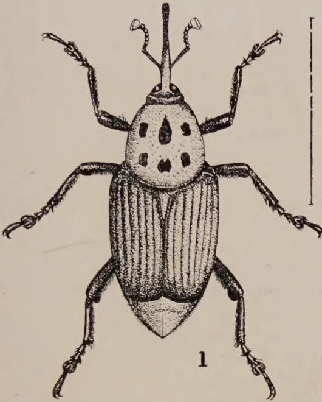
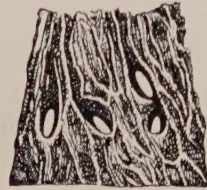
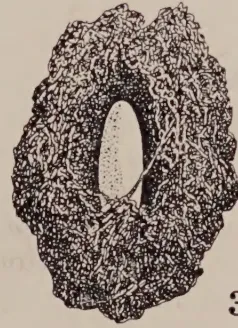
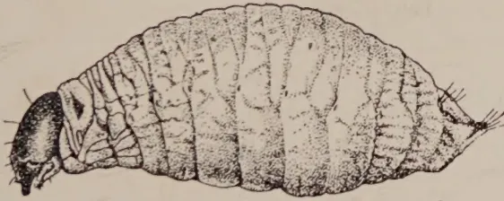
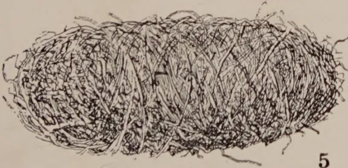
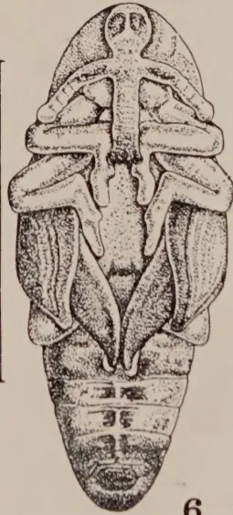
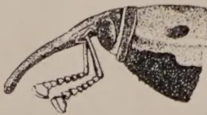
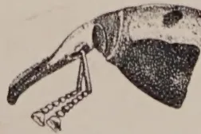

# The Tropical Agriculturist

September 1929.

---

## EDITORIAL

---

### IMPERIAL AGRICULTURAL BUREAUX.

---

THE work of the Imperial Bureaux of Entomology and Mycology which have been established for several years has been so successful and so helpful to entomological and mycological workers, particularly those who are stationed in the smaller and more isolated parts of the colonies, that workers in other subjects will be justified in welcoming the establishment of the eight new Imperial Agricultural Bureaux which have been organised on the plan approved by the Imperial Agricultural Research Conference of 1927. The new bureaux are as follow: Soil Science, Animal Nutrition, Animal Health, Animal Genetics, Agricultural Parasitology, Plant Genetics of crops other than herbage plants, Plant Genetics of herbage plants and Fruit Production. For the present the first three bureaux are being organised on a larger scale than the other five. All are attached to experimental stations or institutes which are already in existence and of which the directors will be *ex-officio* directors of the respective bureaux.

According to an informative pamphlet issued by the Executive Council of the Imperial Agricultural Bureaux, the functions of the bureaux will be the collection and distribution of information regarding the problems on which research is in hand and the general progress of the research work. The bureaux will supply to workers bibliographies and reproductions of scientific papers and it may be found desirable for each bureau to establish a

1------------------------------------------------

130

periodical dealing with its own subject. It is also suggested that the bureaux will facilitate the exchange of workers and the exchange of material for purposes of research and that they will be able to arrange meetings of workers interested in similar problems and to give advice concerning post-graduate study and the supply of apparatus and equipment. Each bureau will have an official correspondent in each country represented on the Executive Council, and steps are being taken to appoint local correspondents for certain of the bureaux which have already begun to function. The position of official correspondent of a bureau will not be a sinecure, for the correspondent will be required to take a real interest in the work of his bureau and do all in his power to facilitate its activities. He will be expected to supply information on the activities of and results obtained by his fellow-workers and he will be consulted by his bureau on matters which involve questions of policy or administration in his area. At the same time, officers of the bureaux may correspond directly with all research workers and parties interested in the technical matters with which the bureaux are concerned.

There can be no question of the soundness of the lines on which the Imperial Agricultural Bureaux are designed to work and no question of their usefulness and helpfulness to scientific workers throughout the Empire, and stress may be laid on the fact that the bureaux require in turn not only the scientific support of local workers but also the financial support of local governments. It is a pleasure to record the fact that the Government of Ceylon has agreed to contribute towards the support of the new bureaux for a period of five years. While the helpfulness of the bureaux will not be calculable in terms of rupees, the authorities may rest assured that local scientific workers welcome the establishment of the bureaux and are prepared to assist them and further their usefulness in every possible way.

2------------------------------------------------

131

## ORIGINAL ARTICLES.

### THE CONTROL OF RED WEEVIL (RHYNCPHORUS FERRUGINEUS F.) IN COCONUT PALMS.

W. R. C. PAUL, B.A., M.Sc., D.I.C., F.L.S.,  
DIP. AGRIC. (CANTAB.)

ACTING INSPECTOR OF PLANT PESTS AND DISEASES,  
SOUTHERN DIVISION.

**A**MONG the three important insect pests which attack the coconut palm in Ceylon, the red weevil (*Rhyncophorus ferrugineus* F.) stands foremost in the loss it causes to the coconut industry. Its attacks are generally confined to young palms which are gradually killed, but with suitable treatment in the early stages of an attack the palms can be saved.

Red weevil, unlike the less serious but nevertheless important black beetle of coconut palms (*Oryctes rhinoceros* L.), is not widely prevalent but when it does occur the establishment of young palms may be a matter of considerable difficulty.

Suggestions for the control of red weevil have been made along curative and preventive lines and in this paper attention will further be drawn to measures which are directed towards the destruction of the pest itself, a means by which the incidence of the pest may be brought under control.

*Nature of attack.*—The attack of red weevil is commonly centred in the stems of young palms during the ages of about four and ten years, the grubs (or larval stages) being responsible for the destruction of the internal tissues and the subsequent collapse of the palms. The stems of mature palms are immune because the tissues are too hard to permit of the penetration and development of the grubs. The crowns of healthy palms are rarely attacked, but, when previous damage of a serious nature has been caused by other agents, e.g., black beetle, the bud-rot organisms or lightning, red weevil may gain an entry into the crown. A severe attack of black beetle may cause decay of the crown, especially during wet weather, while, in the case of bud-rot disease or lightning, the bud is directly destroyed. Red weevil may follow the damage caused by other agents, but the dying condition of the palms cannot be ascribed to the pest, for decay of the bud takes place irrespective of the presence of the pest.

XVI, 446

3------------------------------------------------

132

which is normally unable to gain access into the heart of the crown. It is only when the tissues of the crown have been exposed that red weevil may be found breeding within.

Besides seriously injured crowns of palms of any age, wounds and cracks on the stems and leaf-bases of young palms provide access to the tissues. The eggs laid in these sites hatch to give the grubs which tunnel their way through the tissues of the stem. Wounds are caused by the premature removal of the older leaves from the stems to which they are attached and by the pernicious practice common to many villagers and labourers of inserting their knives into the stems of palms as a temporary rest. Even greater damage to the basal parts of young palms is caused by the attacks of porcupine and wild pig. Cracking of the stem may take place in rapidly developing palms under conditions of heavy applications of nitrogenous manure.

The instinct of smell is highly developed in the red weevil; it is attracted from considerable distances to sites where soft and sappy tissue is exposed. On hatching from the eggs laid in the wounds and cracks in the stem and leaf-bases of young palms the grubs commence to feed on the internal tissues of the stem leaving behind galleries radiating through the healthy tissue. A communication with the exterior may at first be made through a small hole from which a brownish coloured liquid may ooze. This symptom of attack is sometimes very difficult to detect in the early stages; at a later stage extended passages communicating with the exterior may be formed. It is also possible to locate an infestation by listening with the ear against the stem of a suspected palm for the sound of the grubs feeding within.

The completed life-cycle of the pest from the egg to the adult weevil is effected in the palm. The weevils emerge and may be seen in active flight at dusk. The grubs within an attacked palm may be very numerous and with the gradual destruction of the internal tissues and the consequent loss in stability the palm collapses. The pest may now continue to breed in the stem of the dead palm and will also attack the decaying crown until such time as the tissues lose their succulence and become dry, when black beetle which breeds only in decaying vegetable matter will alone be present. A recently-killed palm thus affords a dangerous breeding ground for red weevil, for in mature palms the decaying crowns as well as the apex of the stem to a distance of three or four feet in which the tissues are not fully mature provide suitable breeding sites. Below this distance the stem tissues of mature palms are too hard to permit of penetration by the grubs.

*Control Measures.*—The control of red weevil should be carried out along curative and preventive lines. Attacked palms should be treated with little delay, while the adoption of preventive measures will greatly minimise the number of attacks.

4------------------------------------------------

133

The attacked stems of young palms may be treated by surgical methods, the destroyed tissues being cut out and the cavities being filled up. This is done by making an incision in the stem at a suitable place after locating the site of the infestation. The destroyed tissue is removed together with the grubs and other stages of the insect. The latter should be killed. The cleaned cavity is tarred all round, filled with sand and cement mortar and finally cemented over flush with the surface of the stem. In the case of large cavities it will be found to be necessary to substitute for the sand a filling of small stones or rubble well packed in with mortar. The operation should be carried out with as little delay as possible after detection of the infestation, since neglect may result in so much further damage to the stem that subsequent treatment may not be successful in maintaining the necessary vitality for the active growth of the palm. In such cases it is considered advisable to fell the palm to ground level, taking care to remove the whole bole as a protection against harbouring the red weevil and the black beetle. The felled palm should be split and retained as a trap to be described below.

In considering preventive measures it will first be apparent that the unnecessary wounding of stems should be avoided as far as possible so that little opportunity may be given to the weevils to lay their eggs. The practice of stripping leaves from the stems should be discontinued and warning extended to those who are in the habit of sticking knives into the stems of palms, while porcupine and wild pig wherever they are present require to be kept in check. Heavy nitrogenous manuring which leads to rapid and sappy growth and causes cracking of the bark should be avoided in infested areas.

*Traps.*—Unlike the black beetle which breeds in almost any decaying vegetable matter the red weevil has been known to breed only in palms. The grub stage causes destruction of the palms in the case of red weevil whereas with black beetle the adult beetles only are responsible for damage to living palms. Although red weevil is commonly known to breed in the stems of young living palms, it has been observed to breed also in the apical portions of stems and in the crowns of recently dead palms of any age. With dead immature palms all parts are breeding grounds but when the tissues have lost their succulence red weevil ceases to breed in them. Besides the coconut palm, red weevil is known to breed in most other kinds of palms and observations on the dead portions of several palms which have recently been killed have indicated their suitability as traps. They attract numbers of weevil to lay their eggs in them and within the first two weeks a capture of many egg-laying weevils can be made

5------------------------------------------------

134

during the early morning and evening when they may be seen resting around the decaying stems allowed to remain on the ground. Later on the other stages of the pest can be collected after hatching of the eggs laid within.

The kitul palm (*Caryota urens* L.) was found to be a particularly suitable trap as the greater portions of its stem at any age is soft enough to permit the development of the grubs in the tissues, and it can also be purchased cheaply from village gardens. Young coconut palms which have fallen or the apical portions of dead mature palms to a distance of two or three feet from the crown can also be utilised. The stem portions should be split once longitudinally into two segments which should be piled up. The weevils are soon attracted to lay their eggs in these sites and the development of the larval and pupal stages takes place for about three months, beyond which time the tissues are too dry to permit of further breeding. The pest is known to complete its life-cycle in about three to four months or even longer in some cases, but at the end of about two months the segments should be split open and all the stages of the pest should be collected and destroyed. The split fragments will not harbour either the red weevil or the black beetle, so they may be set aside to decay or be burnt with advantage as woody or fibrous material is not easily decomposable and the products of decomposition are not readily available to the growing plant. The ashes can be usefully employed as a source of potash for plants.

The collections from each trap made in the field should be deposited in a receptacle containing kerosene (paraffin) oil or conveyed to a place where boiling water can conveniently be added in order to ensure the destruction of all the individuals collected. The following are records of collections from kitul palm traps kindly supplied by Mr. E. Nicollier from Charlvic Estate in the Matara district:—

<table>
<thead>
<tr>
<th></th>
<th>Trap No. 1</th>
<th>Trap No. 2</th>
</tr>
</thead>
<tbody>
<tr>
<td>Adults</td>
<td>... 77</td>
<td>60</td>
</tr>
<tr>
<td>Grubs (larvae)</td>
<td>... 669</td>
<td>737</td>
</tr>
</tbody>
</table>

It is apparent from these results that large numbers of the pest can be collected and destroyed by the use of breeding traps. These can be constructed without much difficulty or expense and their examination at the end of about two months is a simple operation.

6------------------------------------------------

2

3

4

5

6

7

8

George flavis

Fig. 1.—Red Weevil with snout extended.

Fig. 2.—Eggs laid in a piece of leaf-stalk.

Fig. 3.—Egg enlarged. Outline at side shows natural size.

Fig. 4.—Full-grown larva or grub, slightly enlarged.

Fig. 5.—Cocoon.

Fig. 6.—Pupa, removed from cocoon.

Fig. 7.—Head of female weevil.

Fig. 8.—Head of male weevil, showing "brush" of hairs on the snout.

The figures show figures 1, 4 and 6 show natural size. Other figures about natural size.

7------------------------------------------------

<!-- stage4: FAINT old-images-only -->

[Faint page: no legible print of its own could be verified; text withheld (stage 4 review list)]

8------------------------------------------------

135SUMMARY.

1. The attacks of red weevil (*Rhyncophorus ferrugineus* F.) are commonly confined to the stems of young coconut palms which are killed by the gradual destruction of the internal tissues. The stems of mature palms are immune. The crowns of palms of all ages are rarely attacked except in cases where damage has been effected by other agents, *e.g.*, black beetle, bud-rot organisms or lightning.

2. The exposure of soft and sappy tissues such as wounds and cracks along the stems of young palms and decaying crowns of palms attract the egg-laying weevils. The complete life-cycle of the pest is passed within the palm. x1, 55, 56.

3. Breeding is also possible in recently killed palms up to a period of about three months after which the tissues are too dry for further breeding. The entire tissue of young palms and the apical portions of mature palms after death are utilised by the pest.

4. Control measures comprise the treatment of young palms by surgical means, the adoption of preventive measures and the use of traps. By the last-named method an effective reduction in the incidence of the pest will be gained.

9------------------------------------------------

136

## CHEMICAL NOTES (6).

### CEYLON CITRONELLA OIL INVESTIGATIONS.

A. W. R. JOACHIM, B.Sc., A.I.C.,

AGRICULTURAL CHEMIST.

DEPARTMENT OF AGRICULTURE, CEYLON.

**D**URING the past two years samples of citronella oils prepared at the experiment stations at Damana in the Batticaloa district and at Weligama in the Matara district have been examined in this laboratory with a view to ascertaining the relationship, if any, between the physical properties of the oils, their total acetylisable constituents as geraniol, the Schimmel's test on which Ceylon oils are generally sold and market price. During the course of the investigation, it was observed that, though several oils contained the average geraniol percentage of Ceylon oils, they did not pass Schimmel's test and hence were rejected on the market. In order to elucidate this matter, samples of citronella oils of different market grades with the respective market valuations were obtained for analytical examination from the chief citronella oil dealers, through the kind services of Mr. W. C. Lester-Smith, the Acting Divisional Agricultural Officer, Southern.

The following tests were carried out on each of the samples:—

*Specific Gravity.*—A Westphal's balance was used for some of the oils and a hydrometer specially graduated for tropical temperatures in the case of other samples.

*Refractive Index.*—A standard refractometer of the Abbé type was used.

*Optical Rotation.*—This was determined with the aid of Laurent's polarimeter.

*Total Acetylisable Constituents as Geraniol.*—The method recently recommended by the Essential Oil Sub-Committee of the Society of Public Analysts and Analytical Chemists in Great Britain was adopted.

10------------------------------------------------

137

*Schimmel's Test.*—This was carried out at 20°C. The alcohol used was of 80 per cent. concentration, obtained by diluting absolute alcohol to the requisite specific gravity, variations in the latter due to temperature changes being taken into consideration.

*Raised Schimmel's Test.*—Five per cent. kerosene was added to the oils which were then allowed to stand over night. Schimmel's test was then carried out on the adulterated samples.

Before detailing the results of analyses of the oils examined it would be useful to tabulate, for purposes of comparison, the physical and chemical characteristics of Ceylon and Java citronella oils. These are shown in table I below:—

Table I.

<table>
<thead>
<tr>
<th></th>
<th><i>Ceylon Citronella Oils.</i></th>
<th><i>Java Citronella Oils.</i></th>
</tr>
</thead>
<tbody>
<tr>
<td>Specific gravity</td>
<td>.898 to .920.</td>
<td>.882 to .900.</td>
</tr>
<tr>
<td>Specific rotation</td>
<td>—7° to —18°.</td>
<td>—0° to —5°.</td>
</tr>
<tr>
<td>Refractive index</td>
<td>1.4785 to 1.4900.</td>
<td>1.4640 to 1.4725.</td>
</tr>
<tr>
<td>Total geraniol</td>
<td>55 to 62%.</td>
<td>80 to 92%.</td>
</tr>
</tbody>
</table>

Table II shows the results of analysis of some of the samples of oils from Damana and Weligama. All these oils were pure and unadulterated. In table III are shown the results of analysis of standard grades of oils obtained from local citronella oil dealers.

Regarding the colour of these oils, it has been observed that nearly all oils change their colour from yellow to green and *vice versa* as the temperature and weather conditions vary. The reason for the phenomenon is not understood, but it may possibly be due to some "tautomeric" change in the colouring matters of the oil. Where the oils are permanently green in colour, the colour is doubtless due to the copper from the still.

An examination of tables II and III will show that

(1) There is no relation between the total geraniol content of Ceylon oils and the specific gravity, refractive index and optical rotation of these oils. An oil with a low specific gravity or other physical characteristic may have as high a geraniol content as one with a high specific gravity or other corresponding physical characteristic and *vice versa*. On the whole, the results would seem to indicate that citronella oils distilled under the same conditions of temperature and pressure have similar physical characteristics but a varying geraniol content.

(2) Damana pangiri, obtained from the distillation of the wild citronella grass in the Batticaloa district, is of little economic value, its total geraniol content being only 25.6 per cent. This oil has a specific gravity and refractive index similar to the other

11------------------------------------------------

138

citronella oils but an entirely different optical rotation. The wild citronella grass in question appears to be a variety of *mana* grass.

(3) Citronella oils with very great differences in geraniol contents have however very different physical properties. This is clearly seen in table I where the differences in characteristics between the high geraniol-containing Java oils and the low geraniol-containing Ceylon oils are observed to be very great. Of the oils examined in this investigation No. 6 with 81 per cent. geraniol, which has been termed Ceylon pangiri but which is apparently oil from Java citronella grass, has very different physical characteristics from the other Ceylon citronella oils.

(4) The geraniol contents of different varieties of Ceylon oils vary within limits. Different varieties of oils would appear to have different geraniol contents depending on the age of the grass, soil and climatic factors and treatment before distillation. The importance of selection of citronella grasses would therefore appear to be indicated.

(5) There is evidently little relation between the quality of Ceylon citronella oils as gauged by their geraniol contents and their response to Schimmel's test. The latter is a test of the solubility of the oils in alcohol of 80 per cent. concentration and is intended as a means of detecting adulteration of the oils with kerosene; *i.e.*, it is a test of the purity of the oils. It does not determine the quality of the latter. It has been found, however, that pure unadulterated oils containing at times high geraniol percentages do not pass the test. The reason for this is not understood, but it is probably connected with the temperature and pressure conditions under which the oils were distilled. As instances of the unreliability of the test the following may be quoted. Samples 4 and 13, Maha pangiri (Matara local) with 58.5 per cent. and 59.5 per cent. of geraniol respectively failed the test and hence were rejected on the market, while samples 3 and 9, Maha pangiri (Java) with 56.3 per cent. and 56.1 per cent. geraniol respectively easily passed it. Again, Haen pangiri, sample 8 with 60.8 per cent. geraniol, did not pass the test, but Haen pangiri, sample 1 with 58.3 per cent, passed.

Of the oils examined, only one passed the raised Schimmel's test, *i.e.*, a test of the solubility of the oils in alcohol after the addition to them of 5 per cent. kerosene. In this connection the following remarks by the Essential Oil Sub-Committee of the Society of Public Analysts in Great Britain on the results of Schimmel's test carried out by them on unadulterated citronella oils sent from Ceylon are of interest. "It is thus apparent," so states the Committee "that, when freshly distilled, citronella oils containing from 5 to 7½ per cent. of petroleum would be passed as

12------------------------------------------------

139

genuine by Schimmel's test, but the same oils after a few months would fail to pass this test. While therefore Schimmel's test is valuable as a rough and ready means of ~~deducting~~ gross adulteration with petroleum, it is of little use where this adulterant is present in small quantities only."

*debeching*

It will thus be observed that Schimmel's test is not reliable as a means of gauging either the quality or the purity of citronella oils, and the sale of the latter on the basis of the test alone is unsatisfactory. The obvious alternative is the purchase of citronella oil on the basis of geraniol content in addition to the Schimmel's test. The minimum geraniol content for Ceylon oils may be fixed at 55 per cent. and the maximum at 64 per cent. Ceylon citronella oils with a lower geraniol content than this minimum would be rejected, and those containing higher percentages within the limits specified would be valued proportionately higher on the market.

(6) It will be seen from table III that oils with the higher geraniol content, viz., the estate oils, fetch, on the whole, better prices than ordinary market or f.a.q. oils, though there is no definite relationship between geraniol content and market valuation. On the present system of purchase, however, there seems to be no incentive to the production of pure citronella oils with high geraniol content, as, if an oil should contain a high percentage of geraniol but fail Schimmel's test, it will be rejected on the market. If it should pass the test, it will be accepted not withstanding a low geraniol content. On the other hand, the present system of the purchase of citronella oils tends to encourage adulteration.

5)

13------------------------------------------------

140Table II.

<table border="1">
<thead>
<tr>
<th>No.</th>
<th>Variety.</th>
<th>Origin.</th>
<th>Colour.</th>
<th>Smell.</th>
<th>Sp. gr.</th>
<th>Refractive index.</th>
<th>Optical rotation.</th>
<th>Total Geraniol %.</th>
<th>Schimmel's test at 20°C.</th>
<th>Raised Schimmel's test.</th>
<th>Market valuation per bottle of 22 oz.</th>
</tr>
</thead>
<tbody>
<tr>
<td>1</td>
<td>Haen pangiri (Lena batu)</td>
<td>Damana March 1928.</td>
<td>Light-green.</td>
<td>Good.</td>
<td>.8955 (278)</td>
<td>1.4825 (27°)</td>
<td>-10° 20 ft. (27°)</td>
<td>58.3</td>
<td>No opalescence. Passed.</td>
<td>—</td>
<td>Rs. 1.18</td>
</tr>
<tr>
<td>2</td>
<td>Peradeniya pangiri</td>
<td>"</td>
<td>Yellowish.</td>
<td>Lemon grassy.</td>
<td>.8919</td>
<td>1.4790</td>
<td>-18° 0 ft.</td>
<td>57.5</td>
<td>"</td>
<td>"</td>
<td>Rejected</td>
</tr>
<tr>
<td>3</td>
<td>Maha pangiri (Java)</td>
<td>"</td>
<td>Reddish-yellow.</td>
<td>Very good.</td>
<td>.8974</td>
<td>1.4822</td>
<td>-12° 10 ft.</td>
<td>56.3</td>
<td>"</td>
<td>"</td>
<td>Rs. 1.18</td>
</tr>
<tr>
<td>4</td>
<td>Maha pangiri (Matara local)</td>
<td>"</td>
<td>Light-yellow.</td>
<td>Musty.</td>
<td>.8898</td>
<td>1.4792</td>
<td>-18° 30 ft.</td>
<td>58.5</td>
<td>Marked opalescence. Failed.</td>
<td>—</td>
<td>—</td>
</tr>
<tr>
<td>5</td>
<td>Damana pangiri</td>
<td>"</td>
<td>Yellowish-green.</td>
<td>Wild</td>
<td>.9110</td>
<td>1.4882</td>
<td>+ 9° 30 ft.</td>
<td>25.6</td>
<td>Oily drops. Failed.</td>
<td>—</td>
<td>—</td>
</tr>
<tr>
<td>6</td>
<td>Ceylon pangiri</td>
<td>"</td>
<td>Greenish yellow.</td>
<td>Strong.</td>
<td>.8865</td>
<td>1.4748</td>
<td>- 4° 0 ft.</td>
<td>81.5</td>
<td>No opalescence. Passed.</td>
<td>—</td>
<td>Rs. 1.18</td>
</tr>
<tr>
<td>7</td>
<td>Peradeniya pangiri</td>
<td>Damana June 1928.</td>
<td>Brownish-yellow.</td>
<td>Lemon grassy.</td>
<td>.889</td>
<td>1.4760</td>
<td>—</td>
<td>64.7</td>
<td>"</td>
<td>—</td>
<td>—</td>
</tr>
<tr>
<td>8</td>
<td>Haen pangiri</td>
<td>"</td>
<td>Yellowish-brown.</td>
<td>Good.</td>
<td>.896</td>
<td>1.4794</td>
<td>—</td>
<td>60.8</td>
<td>Opaque. Failed.</td>
<td>Failed.</td>
<td>Rejected.</td>
</tr>
<tr>
<td>9</td>
<td>Maha pangiri (Java)</td>
<td>"</td>
<td>Greenish-brown.</td>
<td>Good.</td>
<td>.900</td>
<td>1.4815</td>
<td>—</td>
<td>56.1</td>
<td>Passed.</td>
<td>"</td>
<td>Rejected.</td>
</tr>
<tr>
<td>10</td>
<td>Ceylon pangiri</td>
<td>"</td>
<td>Brownish-yellow.</td>
<td>Strong.</td>
<td>.889</td>
<td>1.4760</td>
<td>—</td>
<td>67.2</td>
<td>Passed.</td>
<td>Passed.</td>
<td>Rs. 1.24</td>
</tr>
<tr>
<td>11</td>
<td>Maha pangiri (Matara local)</td>
<td>"</td>
<td>"</td>
<td>Fairly good.</td>
<td>.894</td>
<td>1.4785</td>
<td>—</td>
<td>56.6</td>
<td>Slight opalescence. Passed.</td>
<td>Failed.</td>
<td>Rejected.</td>
</tr>
<tr>
<td>12</td>
<td>Haen pangiri (Lena batu)</td>
<td>Weligama 1929.</td>
<td>—</td>
<td>—</td>
<td>.888 (258)</td>
<td>1.4758 (25°)</td>
<td>-14° 44 ft. (25°)</td>
<td>56.8</td>
<td>Oily drops. Failed.</td>
<td>Failed.</td>
<td>Rejected.</td>
</tr>
<tr>
<td>13</td>
<td>Maha pangiri (Matara local)</td>
<td>"</td>
<td>—</td>
<td>—</td>
<td>.890</td>
<td>1.4760</td>
<td>14° 22 ft.</td>
<td>59.5</td>
<td>"</td>
<td>"</td>
<td>"</td>
</tr>
<tr>
<td>14</td>
<td>Maha pangiri (Java)</td>
<td>"</td>
<td>—</td>
<td>—</td>
<td>.890</td>
<td>1.4768</td>
<td>14° 17 ft.</td>
<td>56.6</td>
<td>"</td>
<td>"</td>
<td>"</td>
</tr>
<tr>
<td>15</td>
<td>Mixed varieties</td>
<td>"</td>
<td>—</td>
<td>—</td>
<td>.890</td>
<td>1.4766</td>
<td>14° 22 ft.</td>
<td>57.5</td>
<td>"</td>
<td>"</td>
<td>"</td>
</tr>
</tbody>
</table>

14------------------------------------------------

141Table III.

<table border="1">
<thead>
<tr>
<th>Description of Sample.</th>
<th>Colour.</th>
<th>Smell.</th>
<th>Sp. gr. at 25°C/40C.</th>
<th>Refractive index at 25°C.</th>
<th>Optical rotation at 25°C.</th>
<th>Total geraniol. %</th>
<th>Schimmel's test 20°C.</th>
<th>Raised Schimmel's test.</th>
<th>Market valuation per bottle of 22 oz.</th>
</tr>
</thead>
<tbody>
<tr>
<td>1. Good oil, but not estate quality.</td>
<td>Golden yellow changing to green.</td>
<td>Very good.</td>
<td>.905</td>
<td>1.4820</td>
<td>-12° 44 ft.</td>
<td>60.8</td>
<td>Passed.</td>
<td>Failed.</td>
<td>Rs. 1/44</td>
</tr>
<tr>
<td>2. Ordinary market oil.</td>
<td>"</td>
<td>Good.</td>
<td>.898</td>
<td>1.4780</td>
<td>-14° 0 ft.</td>
<td>59.8</td>
<td>Passed.</td>
<td>"</td>
<td>Rs. 1/40</td>
</tr>
<tr>
<td>3. Adulterated (f.a.q.)</td>
<td>"</td>
<td>Good.</td>
<td>.90</td>
<td>1.4790</td>
<td>-11° 15 ft.</td>
<td>58.2</td>
<td>Passed with difficulty.</td>
<td>"</td>
<td>—</td>
</tr>
<tr>
<td>4. Market quality oil.</td>
<td>Yellowish gold changing to green.</td>
<td>Good.</td>
<td>.896</td>
<td>1.4776</td>
<td>12° 45 ft.</td>
<td>60.9</td>
<td>Passed.</td>
<td>"</td>
<td>Rs. 1/37</td>
</tr>
<tr>
<td>5. Fair average quality (f.a.q.)</td>
<td>Light gold changing to green.</td>
<td>Fair.</td>
<td>.896</td>
<td>1.4772</td>
<td>-11° 32 ft.</td>
<td>57.6</td>
<td>Passed.</td>
<td>"</td>
<td>Rs. 1/37</td>
</tr>
<tr>
<td>6. Estate quality.</td>
<td>"</td>
<td>Very good.</td>
<td>.900</td>
<td>1.4800</td>
<td>-10° 40 ft.</td>
<td>59.3</td>
<td>Passed.</td>
<td>"</td>
<td>Rs. 1/41</td>
</tr>
</tbody>
</table>

15------------------------------------------------

142

## RHYNCHOSTYLIS RETUSA BL., THE FOX-TAIL ORCHID.

K. J. ALEX. SYLVA,  
ASSISTANT CURATOR,  
HENERATGODA BOTANIC GARDENS.

**T**HE fox-tail orchid is one of the most beautiful of our indigenous orchids and is a favourite of both amateur and professional gardeners owing to its handsome inflorescence and the ease with which it can be grown.

The plant is of a hardy nature. It has a thick short stem of about 5 to 6 inches long covered with old brown leaf sheaths. The leaves are thick and fleshy and are about 10 to 16 inches long and about 1 to  $1\frac{1}{2}$  inches broad. They are arranged obliquely in a spreading and recurved manner.

The flower raceme is ordinarily from 10 to 16 inches long. It is densely clothed with spotted flowers of a delicate waxy-white purple with a tip strongly tinged with violet pink. The pedicels are short and stout. The tail-like, almost cylindrical form of the raceme gives the orchid its common name.

*Culture.*—The plant is easily propagated by the division of stem suckers, carefully severed from the parent plant with a couple of roots attached to each. Its long, thick and vermiform branching roots enable the plant to thrive best on live tree trunks which have fairly thick and splitting corky bark, for example, jak and mango. Palms are less suitable. After removal of dead roots and dried parts of the lower stem, the plant should be carefully placed on the trunk of a live tree. The root system immediately around the plant should be covered with a little moss and coconut fibre and the whole should be secured firmly with coir string. In tying the plant care should be taken to see that it is kept in its natural growing position and that the roots are not cut or injured by the string.

Low-hanging and injured roots may be cut back to about a foot from the plant. Only copper wire may be used to secure the plant to the tree trunk as other kinds of wire affect the growth of the roots. The plant prefers a warm, moist atmosphere and thrives best on an eastern aspect. After being tied to a tree, the plant needs regular syringing with water for at least four to six weeks to encourage it to give out new roots.

16------------------------------------------------

This image is a scan of a blank page. The paper has a light beige or cream-colored tint. There are no markings, text, or illustrations on the page. A few very small, faint dark spots are visible, which appear to be scanning artifacts or dust on the original paper.

17------------------------------------------------

A black and white photograph of the orchid *Rhynchosyris retusa* Bl. The image shows several long, dark, strap-like leaves and several dense, upright spikes of small, light-colored flowers. A ruler is placed horizontally across the middle of the image, likely for scale. The background is dark and textured, possibly soil or rocks. The photograph is framed by a thin black border. On the right edge of the image, there is a vertical credit line that reads "Photo by James C. D. G. 1911".

*Rhynchosyris retusa* Bl., the Fox-tail Orchid.

18------------------------------------------------

143

In the green house or conservatory the plant may be grown in perforated pots or baskets, preferably those made of wood. Plants that have lost their lower leaves should have their stems cut off at a point immediately below some young active roots in order to bring the position of the leaves to the surface of the pot. Only a few healthy young roots should be left. All others should be cut back to a point which allows insertion into the pot without overcrowding. Plants with short or few roots may be supported by a stick placed in the bottom of the pot. After the roots have been placed in position, half the receptacle should be filled with pieces of decayed wood or bark, chopped coconut husk, charcoal and bits of bricks, and the other half with a compost of roots of *Asplenium nidus* (bird's nest) finely chopped and mixed with crushed crocks or charcoal to keep the compost porous. During the first week, the compost should be kept moist; afterwards morning and afternoon syringing will be sufficient until the plant starts growing, when copious supplies may be given. Plants grown in this manner produce blooms annually about June-July which last for over four weeks. When the plant is well established, the only attention or care that is necessary is a little watering during times of drought if the plants are in an open shed or house.

The accompanying photograph shows the plant growing in pots and on a tree trunk at the Heneratgoda Botanic Gardens. The plants in pots are about eighteen months and those on the tree trunk about three and a half years old.

19------------------------------------------------

144

## SELECTED ARTICLES.

### GREEN MANURING WITH PARTICULAR REFERENCE TO COCONUTS.

DEPARTMENT OF AGRICULTURE, CEYLON,  
LEAFLET NO. 57.

#### THE PRACTICE OF GREEN MANURING.

**G**REEN manuring is an ancient agricultural practice which has played an important part in both western and eastern agriculture. It is recorded that it has been carried on in China for over 3,000 years and in Europe for at least 2,000 years. Green manuring is now widely practised, and in the tropics it has become, within comparatively recent years, an established agricultural operation on many tea and rubber estates. It has only recently been undertaken in a systematic manner on coconut estates. In the Dutch East Indies and the Philippines it is almost universally practised on European and American-owned plantations and is becoming increasingly popular on native-owned properties. In Malaya, it is extensively carried out, but in Ceylon the practice is far from being general. Individual estates, however, are carrying out extremely useful work on the subject and some of this work I have been privileged to see for myself. In general, all coconut estates on which green manuring has been adopted have reported very favourably on the results obtained. Neglected properties for years under grass are being brought into condition by cultivation and green manuring. The value of green manuring, happily enough, is becoming more understood and the practice shows signs of spreading. It will be a good day for Ceylon's coconut industry when all coconut estates have adopted some rational system of green manuring. The rubber industry affords an instance of how a practice which is of so great agricultural value in tropical countries can become widely adopted. In connection with experimental work with green manuring of coconuts, it may interest coconut planters to learn that one of the chief lines of research to be undertaken at the new Warivapola Experiment Station of the Department of Agriculture is the study of green manuring of coconuts in all its aspects.

#### WHAT IS GREEN MANURING?

In this paper the term "green manure" will include "cover crops." The distinction between them, however, should be pointed out. A cover crop is planted for the purpose of protecting and covering the soil. When it is turned into the soil it becomes a green manure. A crop which is solely used for turning into the soil is a green manure crop, so that a cover crop can be used as a green manure crop but not all green manure crops as cover crops.

Green manuring is the practice of incorporating into the soil undecomposed plant material with the object of increasing soil fertility. The green material may be grown *in situ* or brought from outside. It is commonly believed that only leguminous plants are beneficial as green manures, but

20------------------------------------------------

145

this is not so. Non-leguminous plants are useful for green manuring provided they are brought from outside and not grown on the area which is to be green manured. It may be useful to allow non-leguminous plants to grow at site, *e.g.*, as covers on hilly ground, and to turn them in later, but this practice is not to be generally recommended. Leguminous plants are of value as green manures because of the large amounts of nitrogen they fix in the soil through the nodules on their roots. These nodules contain bacteria which carry on the work of nitrogen-fixation, the energy for the process being derived from the carbohydrate material supplied by the plant. When, therefore, leguminous plants are grown on a soil, they enrich the nitrogen content of the latter, even if the leafy material is not turned in. If the latter is turned in, the soil is then markedly enriched, both in nitrogen and organic matter.

### **THE ADVANTAGES AND IMPORTANCE OF AND NEED FOR GREEN MANURING IN GENERAL AND GREEN MANURING OF COCONUTS IN PARTICULAR.**

The advantages of a green manure crop are as follows:—

(1) If the green manure is a cover crop, it prevents the loss of valuable surface soil from hilly and undulating land caused by the heavy rainfall of the tropics. The covers also take up the plant-fertilizing constituents contained in the surface layers of soil, which would otherwise be leached out.

(2) It protects the soil against the beating action of the rain and the excessive heat of the sun. This in the tropics is a matter of great importance. Tropical rains are so heavy that the soil surface is often "capped" and made impervious to water. As a result, excessive losses of moisture from the soil surface take place through capillary action when dry weather sets in. When rain subsequently falls on the "capped" surface, the greater part of it flows over and is not absorbed by the soil. Green manures keep the soil open by their root action and hence rain water is absorbed much more readily on green manured soils. The shade afforded by cover crops also prevents direct loss of moisture from the soil surface.

(3) Ploughing in green manures adds valuable organic matter to the soil; on decomposition the material forms humus. It is well known that Ceylon soils in general and coconut soils in particular are very deficient in organic matter. Green manure crops give from 2 to 10 tons of green material per acre and this will assist to an appreciable extent in increasing the content of soil humus. Humus has many properties. Among others (1) it absorbs water and the mineral constituents of the soil and regulates the supply of these and of the nitrogenous substances absorbed by plant roots; (2) it improves the texture of tilth of soils, breaking up heavy soils and binding together light soils and rendering them better able to withstand drought; (3) it is the storehouse of the nitrogen of soils; (4) on it depends the activity and number of the micro-organisms which are the life of the soil. These micro-organisms fix the free nitrogen of the soil, obtaining their energy for so doing from the soil organic matter, and the carbon dioxide formed in the process makes available to the crop some portion of the mineral constituents of the soil.

(4) Green manures reduce weeding costs, especially on new clearings. Cover crops when firmly established smother out weeds. Weeding is a big item on many tropical estates, and in coconuts a saving effected in the weeding bill should materially affect the cost of production.

(5) By green manuring, the surface soil is supplied in a quickly available form with plant-food constituents obtained by the green manure crop from the soil and sub-soil.

21------------------------------------------------

146

(6) By the growth of green manures the aeration of the soil is improved and the roots of the main crop are enabled to penetrate deeper into the sub-soil.

(7) The leafy material of many green manure plants can serve as a useful fodder.

(8) The amount of nitrogen supplied to the soil by green manuring with leguminous crops can be considerable. Reckoning on an average crop of, say, 4 tons of green material per acre per annum, containing on an average 6 per cent. of nitrogen, the amount of nitrogen by which the soil is enriched will be at least 50 lb. per acre. This is a conservative estimate as it does not take into account the amount of nitrogen contributed by the roots and nodules of a leguminous crop, but it is sufficient to show how much the nitrogen content of a soil can be improved by this means. Not all this nitrogen is available to the crop. Experiments in temperate countries have shown that if the availability of nitrate of soda is reckoned as 100, that of green manures is about 65. The greater portion of the remainder goes to form the nitrogen of the soil humus. The question has been raised as to whether the large amounts of nitrogen added to the soil by green manure would affect the yields of coconuts adversely. Of this there is little danger, for the amount of nitrogen available to the coconut crop from an average green manure crop would be about 35 lb. per acre per annum, based on the figures quoted above. This can hardly be called an excessive dose of nitrogen. There is the further fact to be considered, viz., that the leaves and branches of the coconut tree will take up a fair portion of the nitrogen supplied by green manures. It is essential, however, that on green-manured coconut estates potash and phosphoric acid be applied and preferably in larger quantities than those normally required by the coconut. Experiments are being carried out at Peradeniya to determine the increase in carbon and nitrogen of soils as a result of green manuring soils (a) *in situ*, (b) with crops brought from outside. Work in other countries has shown that both the carbon and the nitrogen contents of soils can be very appreciably increased by green manuring. Non-leguminous creeping crops may be used as cover crops on hilly land, where leguminous crops will not grow. But as these crops compete with the main crop for the soil moisture and fertilizing constituents and may therefore harm the latter temporarily, their use is not unreservedly recommended. Owing to the large amounts of nitrogen contributed by leguminous green manures, it may safely be stated that, on coconut estates where green manuring is systematically carried out, no harm will result by eliminating nitrogen, especially organic nitrogen, from the manure mixture. The amount of organic matter supplied by organic nitrogenous manures in quantities used in manure mixtures is very insignificant. As nitrogen is the most expensive item of a manure mixture, the present manure bills can thereby be considerably reduced. Thus, of Rs. 30 per acre spent per annum on manuring coconut estates, the nitrogenous constituents cost about half, and expenditure on manuring can therefore be reduced by half. This amount can be utilized for the first few years for establishing green manures. Further, where green manuring is generally practised and good yields are obtained, even in periods of normal crop prices, any nitrogen added in manure mixtures should always be in mineral form.

To sum up, by green manuring a coconut estate weeding costs can be eliminated, the manure bill cut down appreciably, the nitrogen and humus content and the moisture-holding capacity of the soil increased, its texture and tilth considerably improved, and its fertility maintained or even enhanced. A general improvement in the health and condition of the palms accompanied by increased yield will undoubtedly follow.

22------------------------------------------------

147

## PRESENT-DAY PRACTICE ON COCONUT ESTATES.

It would at this stage be useful to compare the advantages of green manuring of coconut estates with the advantages of present-day estate practice. With the exception of those that have adopted green manuring coconut estates in Ceylon can be placed in three categories from the point of view of general cultivation: (1) those that are weeded and ploughed periodically or ploughed periodically but not weeded; (2) those that are neither ploughed nor weeded; (3) those under grass not ploughed or those under grass periodically ploughed in.

In the case of the first class, provided the weeds are ploughed into the soil, estates on which this practice is followed should give fair yields. Organic matter is supplied by the weeds, but the mineral plant-food constituents of the soil will be gradually depleted, unless they are supplied by manures. Ploughing will encourage the fixation of the free nitrogen of the soil by *Azotobacter*, which derives its energy from the organic matter present in the soil. The amount of nitrogen fixed is more than counterbalanced by the amount taken up by the crop. The soil nitrogen will thus be slowly depleted. If no organic matter is added and the soil is regularly ploughed its store of organic matter and nitrogen will be quickly exhausted owing to the activity of the micro-organisms in tropical soils. Yields are sooner or later bound to fall to a low level as a result of the loss of soil fertility and poor physical condition of the soil brought about by continuous ploughing. Clean weeding is not carried out on coconut estates because of the high cost, and on undulating land it is distinctly disadvantageous. In districts of low rainfall where weeds are allowed to cover the ground during drought, the crop will suffer owing to the loss of soil moisture through transpiration and yields will be affected adversely. On undulating and hilly coconut land in districts of heavy periodic rainfall, ploughing followed by heavy rains will cause soil erosion. Such lands should therefore be ploughed towards the end of the rains before the drought sets in or preferably planted with a cover crop and treated as detailed later.

In the second class, in which no cultivation whatever is carried out and no measures are taken to prevent the loss of soil moisture during drought or of the surface soil during heavy rains if the land is undulating, or to maintain soil fertility, the yields of palms will necessarily be low.

With regard to the third class, it may be said that many Ceylon estates are left under grass. It is commonly believed that grass has no deleterious effects on the coconut palm, as palms are often found that give yields of 80 to 100 nuts and more though under grass. There is little doubt that if the grass were removed and the estate brought into normal cultivation higher yields of nuts would be obtained. Grass affects coconut palms (a) by depriving the palms of some of the soil moisture, especially during periods of drought; (b) by assimilating the available nitrate in the soil as well as a part of the manure applied to the crop; (c) as Howard at Pusa has shown, by preventing soil aeration and increasing the carbon dioxide content of the soil air carbon dioxide in excess may be toxic to the roots of the main crop. There is no evidence that other toxic compounds are found. If, however, the grass is ploughed in periodically at suitable times, no permanent harm can be done to the coconuts. On hilly and undulating land grass will prove useful against soil erosion, but it should be ploughed in before the drought sets in and replaced by a leguminous cover.

## DECOMPOSITION OF GREEN MANURES IN SOILS.

Provided there is sufficient moisture in the soil, the decomposition of green manures which is brought about by the soil micro-organisms will take place almost immediately. The final product is nitrate in which form

23------------------------------------------------

148

most plants take up their nitrogen. The question has been asked whether in the process of decomposition of green manures, the available combined nitrogen of the soil is not assimilated by the micro-organisms bringing about the decomposition. It has been found by experiment that this will not occur unless the buried material contains less than about 2 per cent. of nitrogen. As green manures generally contain over 2 per cent. nitrogen on an air-dry basis, their nitrogen content is more than sufficient for the needs of the micro-organisms. The excess is therefore made available to the crop as ammonia and nitrate. When the material to be buried contains less than 2 per cent. of nitrogen, as e.g., in the case of woody loppings or coconut husks which contain about 5 per cent. nitrogen, the micro-organisms have to draw on the nitrate and ammonia reserves of the soil, the quantity present in the decomposing material being insufficient for their needs. A temporary loss of this nitrogen to the crop occurs, but the nitrogen assimilated is eventually made available to the crop. Loppings, therefore, should not be left to grow woody before they are ploughed in, as the more woody they become the less their nitrogen and the more their lignin contents become. Lignin decomposes only very slowly in the soil. The burial of husks in well-drained, light and medium soils is advantageous to the crop owing to the quantities of humus they add to the soil on decomposition.

Experiments at Peradeniya have shown that maximum nitrification of green manures takes place in from six to eight weeks, but that subsequent to this the amounts of nitrate present in the soil vary, being largely dependent on rainfall. The more rain there has been during a period, the less nitrate is found in the soil at the end of the period. The experiments have also shown that, from the nitrogen standpoint, the direct effects of green manures in the soil are not appreciable after about six months.

In this connection reference may be made to a question frequently asked, whether green manure crops should be turned in green or dry. Work at Peradeniya on this point has confirmed the observations of previous workers that drying of green manures delays as well as hinders nitrification. Further, it was found that when green manure loppings were left to dry on the surface of the soil, great losses of nitrogen and to a smaller extent of organic matter, amounting in the case of the former to as much as 40 per cent. of the nitrogen of the green manures, may occur. Some of the nitrogen, however, is in the form of nitrate which is leached into the soil below. The losses are dependent on weather conditions and are greatest when there is an alteration of dry and wet weather. Decomposition also takes place most rapidly under these conditions.

### PRACTICAL CONSIDERATIONS.

Under this heading the following will be discussed: (a) when green manures should be cut and turned into the soil and how they should be treated; (b) on what soils they should be grown and under what climatic conditions; (c) how a good growth of green manures can be obtained on poor soils.

*When should green manures be cut ?*—In general, previous work has shown that the highest percentage of nitrogen in green manures occurs at a comparatively early stage of their growth, but that the total nitrogen is greatest at or a little before flowering. A study is being made at Peradeniya of the change in composition and "decomposability" of green manures with age in order to determine the optimum stage for lopping. Green manures, especially in dry districts, should be cut towards the end of the rainy season when the showers alternate with dry weather and should be ploughed in at once. On sandy soils in districts where a long drought follows rain and it has not been found possible to turn in the loppings, the latter should be cut at the commencement of the drought and left as

24------------------------------------------------

149

a mulch on the surface. On sandy soils moisture and not nitrogen is often the chief limiting factor of crop growth, and the mulch of green material will form a useful means of conserving soil moisture. It is preferable, however, to turn in the cuttings about three to four weeks before drought sets in, as by that time a certain amount of decomposition will have taken place and the decomposed material will have been able to retain some moisture for the subsequent use of the crop. On no condition should green manures be cut and forked into the soil during a drought, even at the beginning of it. This prohibition applies particularly to light sandy soils. The decomposition of green manures does not take place if the soil has insufficient moisture at and subsequent to the time of burying. If they are ploughed in during dry weather when the soil is dry, the materials remain undecomposed and leave large air spaces that cause loss of water by evaporation. It may be necessary in some instances to compact the soil after green manuring in order to minimize the losses of soil water and to establish capillarity in the soil.

*On what soils should green manures be grown and under what climatic conditions?*—This is a point of great importance to coconut planters. The greater majority of the soils of the coconut areas of the Negombo, Chilaw and Puttalam Districts are light sandy soils which are markedly deficient in organic matter. The rainfall conditions are not ideal, especially towards Puttalam, and long periods of drought are not unknown. The question may well be asked: will not the light soils of these areas be deprived of the little moisture they contain by the growth of green manures? Work carried out at Peradeniya during the last three years on the soil moisture relationship of green manures and cover crops has shown that in the case of cover plants, more moisture is lost to a depth of 24 inches during periods of drought from soils under cover crops than from bare soils during the first two years of the growth of the covers and that after this period the reverse is the case. This is due to the fact that in the early stages of the growth of the covers more moisture is lost from the soil through transpiration than is retained by the surface layer of decomposed organic matter or by the shade it affords. The reverse is the case once the cover is well established and a layer of organic matter has formed as a mulch on the surface. During the severe drought experienced in January and February of this year, moisture determinations were made on soil samples taken from the green manure plots at the Peradeniya Experiment Station. With regard to the cover crops, the previous results obtained were confirmed. In the case of the bush green manures, e.g., boga medelloa, it was found that where the green manure was unlopped there was less moisture to a depth of 24 inches in the plots than in the controls, but where the green manure had been previously lopped and envelope-forked into the soil the plots had much more moisture than the controls. The importance of lopping the bush green manure crops before a drought is therefore clearly indicated. This applies particularly to bush green manures grown in the drier coconut districts.

With regard to the growing of green manures, it may be stated that, provided there is sufficient rainfall, they can be grown with advantage even on poor sandy soils. In the case of the latter, growing a green crop and turning it in will eventually give a soil of increased water-holding capacity enriched in nitrogen and humus. Where soils are poor and sandy and the rainy seasons is of short duration, a quick-growing annual leguminous green manure crop should be grown. It should be cut and left as a mulch during the drought and ploughed in during the next rainy season. and the soil should be replanted with the green cover with the onset of the next rains; or, when possible, the green manures should be forked in early enough for decomposition to have started before the drought sets

25------------------------------------------------

150

in. It may be well to state that the barren sandy heaths of North Germany were reclaimed and made profitable by Schultz by growing lupines and ploughing them in along with phosphatic and potash manures. Suitable crops for the purpose of ploughing in on these poor soils will be dealt with later.

Some authorities seem to doubt the utility of growing green manures in dry districts and on very sandy soils. Though the doubt may be justified in the case of very dry districts in Ceylon, *e.g.*, part of the North-Central Province, I do not think our coconut areas are so dry that such a system of green manuring as that already outlined cannot be carried out with advantage. It has been found in the arid districts of America that a minimum rainfall of 17 inches is necessary for green manuring to be practicable. Very few parts of Ceylon are as dry as this and all coconut districts get the benefit of at least one monsoon and most of both monsoons, so that during rainy weather green manuring can be safely adopted. On the better types of soils and in districts where the rainfall is adequate green manuring is a simple matter and will be very advantageous.

Regarding the period of retention of green manures it may be stated that, in general, perennial cover crops under coconuts should not be allowed to grow for too long without being ploughed in. The reasons for this are: (1) the soils on which these covers grow need periodical cultivation and aeration; (2) they get "sick" of growing one particular crop. For the latter reason it is also advisable to have a rotation of green manure crops. The ploughing of alternate rows of the cover crop should be carried out once in two or three years in the case of both flat and undulating land. On the latter, the ploughing should be across the slope. Thus contour-like belts of unploughed cover will alternate with ploughed rows. Where the green manure crop is a heavy one, it should be cut up with a disc harrow or rolled before ploughing in. It is also advisable to plough in some cattle manure along with the green manures owing to the large number of bacteria present in the former which will hasten the decomposition of the latter. With regard to the shrubby types of green manures, care must be taken that the branches do not get too woody before they are lopped. Green manures can be forked into the soil along with artificial manures.

(c) *How can the good growth of green manures on poor soils be ensured?*—It may be found difficult to establish a green manure crop on poor sandy soils. Under these circumstances, attention may be drawn to the following practical points:—

(1) The green manure should be given a start by applying cattle manure to the seed bed. If cattle manure is not available, some nitrogenous manure, *e.g.*, a mixture of nitrate of soda and blood meal mixed with twice its weight of soil and applied at the rate of a handful or two per hole if cuttings are grown, will be found useful. Like other plants, leguminous plants require nitrogen in the early stages of their growth till their nodules are formed. Hence the need for this start.

(2) *Inoculation.*—Leguminous crops at times do not come up well in new areas to which they are introduced. This is because the soil does not contain the specific bacteria needed by the particular legume for the formation of the root nodules. In this case inoculation of the soil or of the seed will have to be carried out. There are three methods of soil inoculation, of which the soil method is alone suitable for Ceylon conditions at the present time. It consists of broadcasting over the area to be planted 300-400 lb. of soil per acre which has been taken from an area on which the green manure it is desired to establish has been grown with success.

26------------------------------------------------

151

(3) *Manuring of green manure crops.*—In order to get a good growth of green manure crops manuring with potash and phosphoric acid should be adopted as the green manures have to compete with the main crop for these fertilizing constituents. As a result of manuring the bacteria are reported to become more active and able to enter the plants readily, and nodule formation is increased. The root growth of *Leguminosae* in general is stimulated by manuring with phosphoric acid.

(d) *Seeding, seed beds, and cultivation.*—When planting green manures out for the first time a heavier seed rate than is normally required, especially if seed is plentiful and comparatively cheap, is recommended. By this means a cover will be more quickly established and weeds more effectively suppressed. Generally speaking, green manure seed should not be broadcasted but should be planted in rows. A mixture of seed is said to give better results than seed of one plant. For coconut estates a mixture of shade and light-loving and of quick-growing though short-lived and slower-growing though long-lived plants will be found advantageous. In all cases the seed bed should be carefully prepared. Seed is sown or cuttings planted in rows varying from 2 to 5 feet apart between the rows of palms. The planting should be carried out at the beginning of the rains. Weeding should be done in the early stages so as to give the green manures a good start.

### GREEN MANURING OF COCONUTS.

Now that the advantages of green manuring in general have been indicated and some practical considerations have been dealt with, the question of the green manuring of coconuts in particular will be considered in detail. Many varieties of green manure crops have been found useful for new clearings and full-grown coconuts. Mention will be made of only a few. It is not proposed to deal with such considerations as seed rate, method of sowing or green manures suitable for a particular district. These are matters which have already been or will be dealt with in a general way. Such points will have to be investigated by the individual planter.

*Green manuring of coconuts in other countries.*—The practice of growing green manures under coconuts and oil palms is popular in the Dutch East Indies, where it is doubtless to some extent responsible for the high yields of coconuts obtained. Most of the varieties now grown in coconut and rubber-producing countries were first experimented with and grown on a large scale in the Dutch East Indies. In the Philippines cover crops are grown on every progressive estate. The green manures found most suitable are certain varieties of the lima bean (*Phaseolus lunatus*). This bean is a long-lived perennial of exceedingly vigorous growth which has been reported to be useful in exterminating illuk. It dies down in prolonged dry weather but comes up again with the rains. Unlike those of most green manure plants, its leaves cannot be used as fodder owing to the prussic acid they contain. Other varieties found useful for coconuts in the Philippines are *Tephrosia candida* (boga medelloa) and *Tephrosia vogelii*. On the poor sandy coast soils of Porto Rico, species of *Mucuna* have been very successful. The growth of *Mucuna* is very quick and thick, and quantities of green material (up to 6 tons per acre) are obtained. Weed growth is effectively prevented. The leaves are rich in nitrogen and can be used as fodder.

Many varieties of green manures have been found suitable for coconuts in Malaya. Among others *Centrosema pubescens*, *Calopogonium mucunoides*, *Dolichos hosei* (vigna), *Centrosema plumieri*, *Pueraria phascoloides*, besides bush varieties like *Tephrosia candida* (boga), *Tephrosia vogelii*, and *Crotalaria* spp. Some of these will be referred to in greater detail later. In India *Vigna catiang* (cowpeas) and *Dolichos uniflorus* (horse gram) are grown successfully, both as catch crops and green manure crops.

27------------------------------------------------

152

*Green manuring of coconuts in Ceylon.*—Green manuring of coconuts was undertaken as early as 1905 at the Experiment Station, Peradeniya. The crops tried were cowpeas, groundnut, soy bean, *Crotalaria* spp. and boga. Cowpeas gave very good results, and so did boga and *Crotalaria*. Soy beans were not a success, due doubtless to the deficiency in the soil of the specific bacteria associated with this crop. It has been found in America that inoculation of soy beans is always necessary before the crop can be introduced into new areas. Groundnut is very useful as a green manure owing to its rapid growth, but is not so successful as a catch crop owing to damage by rats which also attacks the coconuts.

*Green manures for young coconut estates.*—In young clearings where the rainfall conditions are satisfactory, the growth of a cover crop is very advantageous for reasons already stated. The bush varieties, e.g., boga are not entirely suitable as they are inclined to become too dense and to compete with the young coconut plants unless they are grown in rows 6 ft. wide and are regularly lopped. In regard to all cover plants in young coconuts, it has to be emphasised that they must never be allowed to climb over the young coconuts even for a short period; if they do, the latter will suffer a setback. The following will be found useful and can be recommended for young coconut areas in Ceylon:—

*Calopogonium mucunoides.*—This is a quick-growing green manure with a tendency to climb. It grows well on most soils but requires well-drained soil. It is very suitable for young clearings. During periods of prolonged drought it has a tendency to die out, but with the advent of the rains a fresh cover is obtained. It is best sown in rows 3 to 5 ft. apart. It requires weeding in its early stages. A good cover about two feet thick can be obtained in about four months. It is a good seeder and dies out in twelve to eighteen months. It can also be grown under old coconuts which do not give much shade, but it does not thrive so well as in the open. Some of its disadvantages for old coconuts are: (1) its growth is so thick that it is difficult to find the nuts which have been picked; (2) it harbours snakes. The latter disadvantage applies to all green manures.

*Mucuna* spp.—These plants have already been dealt with. After they have formed a good cover in new clearings, they should be ploughed in and followed by a more permanent cover, e.g., *Centrosema pubescens*.

*Centrosema pubescens.*—This is a twining creeper requiring a fairly good soil. It is rather slow in growth but forms an excellent cover in about five or six months; difficulty may be experienced at first in establishing it. If it is grown after a crop like *Mucuna* has been ploughed in, its growth will be quicker. It stands drought admirably. It does not thrive under heavy shade, but it grows well under the light shade of coconuts.

*Dolichos hosei* (commonly known as vigna).—Vigna is more suitable for heavy shade but does well in young clearings. It is a very useful cover for old coconuts as it does not make too thick a growth and hence does not cover the nuts. The disadvantages with vigna are that it is rather difficult to establish on eroded hilly land, needs constant weeding, and dies down during drought. It is advisable to establish the plant in nurseries, and to give it a start under old coconuts by applying some nitrogenous or cattle manure.

*Pueraria phaseoloides (javanica)* is a strong twining cover and is useful for young clearings, but it must be kept away from the young palms. It dies down in drought. It does best under shade and is very suitable for old coconuts. It is better suited for heavy land than for sandy soils.

28------------------------------------------------

153

*Centrosema plumieri* *Dolichos lablab*, *Dolichos biflorus* (horse gram) have also been recommended as green manures for young coconuts.

*Arachis hypogea* (groundnut).—Groundnut can be grown either as a green manure crop or as a catch crop and is very suitable for dry districts. Trials should be made with the different varieties of groundnuts as a catch crop in young and old coconuts. The cake obtained after the extraction of the oil can be used as manure and the leafy material can be turned in as green manure or fed to cattle. The crop is ready for harvesting in six or eight months. The disadvantage of this crop is that it attracts rats.

*Vigna catiang*, *Vigna sinensis* (cowpeas).—Cowpeas are suitable for young plantations and old coconuts. The cowpea is a quick-growing annual which forms an excellent cover in three to five months. It thrives on the poorest land and stands drought well. It is therefore very suitable for Ceylon coconut lands. It has been successfully used at Peradeniya as a green manure for coconuts and also in the Kurunegala District. On an estate in the latter district, a three months' growth of this crop under old coconuts, not only produced an appreciable difference in the appearance of the palms, but also increased the nitrogen content of the soil. The yield of green material obtained has been as much as six tons per annum.

*Soja max* (soy bean).—Trials with varieties of the soy bean should be made in young clearings as well as under old coconuts. There are more than 400 varieties of this bean in existence. It is a herbaceous annual of erect growth, varying in height according to the species. It is particularly resistant to drought and will thrive on most soils except the very poor ones. Inoculation is essential when this crop is grown for the first time. Like groundnut it can be treated, both as a catch crop and a green manure crop.

Of the bush varieties of green manures suitable for coconuts *Tephrosia* spp. and *Crotalaria* spp. are most suitable. *Clitoria cajanifolia* is also a suitable hedge plant for coconuts. Of the former *Tephrosia candida* (boga medelloa) is perhaps the best for Ceylon conditions; hence its popularity as a green manure for coconuts. If the land is rich boga will, unless lopped, grow too tall and affect the young coconuts adversely. It should always be sown in rows and never broadcasted. Boga can be grown on hilly land in contour hedges across the slope. On poor and badly drained soils on which it is difficult to establish boga, the following methods will be found suitable: (1) a drain should be cut and the soil heaped in mounds over husks. The seed is then sown on the mounds, a little artificial or cattle manure being added if necessary. It can also be grown on the mounds of contour terraces of coconuts; (2) the application of cattle or buffalo manure in lines between the rows with liming and forking before sowing the seed. Boga gives a very heavy yield of loppings rich in nitrogen and organic matter and also in mineral because it is so deep-rooted. It stands lopping well, and can be grown in most coconut districts. Like all shrubby green manures it must be cut before drought sets in towards the end of the rains. It is preferable to fork it into the soil if a sufficient interval of time between the turning in and the onset of the drought is anticipated. In case a sufficiently early forking is not possible, the bushes should be lopped at the beginning of the dry period and the loppings left as a mulch on the surface. In this case, the soil moisture must be conserved even at the risk of incurring appreciable losses of nitrogen. The leafy portions and the less woody material should subsequently be forked into

29------------------------------------------------

154

the soil at manuring time in the manure trenches. When shrubby green manures are cut at other periods, the cutting should be done just before or at flowering. The disadvantages of shrubby green manures are the difficulty of supervising labour and of gathering the crop. Other varieties of shrubby green manures suitable for coconuts young and old are *Tephrosia vogelii*, *Cajanus indicus* (dhal), *Crotalaria striata*, *Crotalaria usaramoensis* and *Crotalaria anagyrooides*. The latter are quick growers and give large amounts of organic matter. They need frequent lopping but die off comparatively soon.

*Green manures for old coconuts.*—The shrubby green manures have been dealt with. Of cover crops, *centrosema pubescens*, *Centrosema plumieri*, *Dolichos hosei*, *Pueraria phaseoloides*, *Phaseolus lunatus*, *Vigna catiang* (cowpea), *Arachis hypogea* (groundnut) *Mucuna* spp. will grow successfully if the shade is not too heavy, *Colopogonium mucunoides* is also suitable if the shade is not heavy. *Desmodium polycarum* has been found to be a very good green manure for coconuts in the Kurunegala district. Especially on poor soils, *Mikania scandens* can be left where it grows if it cannot be replaced by a green manure crop. It must however be ploughed in before the drought sets in. It is a non-leguminous twining weed common on estates and is useful for suppressing other weeds, e.g., illuk. It has been found useful in Malaya and the Philippines as a cover crop for coconuts. In general it may be stated that any leguminous plant growing on a coconut plantation should be encouraged and, if indigenous legumes grow well in the neighbourhood, attempts should be made to introduce them on the estate. In the case of non-leguminous plants which grow well outside estates, e.g., wild sunflower, it would be advantageous to lop them before they have flowered and to use the cut material for green manuring coconuts.

*Treatment of green manures prior to drought.*—The general treatment of cover crops under coconuts before a drought, in districts of average quality soil and with average rainfall, is a comparatively simple matter. Most covers die down during a prolonged drought, and the decayed leafy material obtained forms a very good mulch. If, in addition, light harrowings are periodically given, the palms should not be affected to any great extent by drought. Immediately the rains start, the covers come up again. In the case of covers which stand drought well, experiments at Peradeniya already referred to indicate that once the cover has been well established less moisture is lost from the covered area than from the bare soil. In districts with a good rainfall, though some moisture will be lost from the soil through cover crops in the early stages of their establishment, there will not be any permanent ill-effects on old coconuts. In young plantations it would perhaps be useful to grow a mixture of drought-resisting and non-resisting covers. Where the soil is very sandy and the rainfall satisfactory, the growing and forking in of quick-growing annual covers, e.g., cowpeas, groundnuts and *Mucuna* spp. are advised, followed, when the soil is sufficiently enriched with organic matter, by the growth of a more permanent cover. In the case of sandy coconut soils in dry districts quick-growing annual crops should be grown in the rainy season and ploughed in towards the end of the rains. Boga medelloa or other bush green manure should also be grown and the loppings cut and left as a mulch on the surface at the beginning of the drought. After a few years of this treatment, the question of the establishment of a permanent cover should be considered.

It is advisable to grow both cover crops and the shrubby forms of green manures on coconut estates. The latter primarily supply the soil with organic matter and the former secure to the soil and crop the benefits already explained.

30------------------------------------------------

155

### CONCLUSION.

In the preceding pages an endeavour has been made to indicate the need for, importance of, and advantages to be derived by green manuring Ceylon crops in general and coconuts in particular; the difficulties likely to be met with and the measures necessary for surmounting them; the possible disadvantages of green manuring under certain soil and climatic conditions and how they may be minimised to some extent; the varieties of green manures suitable for different soil and climatic conditions. It is left to the individual estate owner to ascertain by experiment which green manures suit his conditions best. It is regretted that little information is available as regards increased yields of nuts and profits derived from green manuring. It however will soon be forthcoming. There is little doubt that judicious green manuring of coconuts will pay. If green manuring can have had such markedly good results in the case of tea and rubber, it is more than likely that it will have the same results in the case of coconuts. It has been widely adopted in progressive coconut-growing countries, *e.g.*, the Dutch East Indies, the Philippines, and Malaya. The universal adoption of the practice should eventually result in increased yields and improved quality of nuts and in a permanent improvement of the condition of coconut estates in Ceylon. It therefore offers a means of combating in one direction the present depression of the coconut industry. By green manuring, the weeding bill is lessened; an appreciable reduction in the manure bill can be effected without a corresponding fall in yield of crop or loss of soil fertility; a permanent increased soil fertility is brought about and the value of the estate is enhanced; the palms are brought into better condition, become more resistant to disease, and may be expected to give increased yields. It is true that for a year or two a certain amount of expenditure is necessary, but it will be more than compensated for by savings in the weeding and the manuring bills.

31------------------------------------------------

156

## THE EMPIRE MARKETING BOARD AND AGRICULTURAL RESEARCH IN ENGLAND AND WALES.\*

A considerable portion of the Empire Marketing Fund has been allocated to agricultural research, and institutions in the home country (as part of the Empire) have received grants from that fund for such work. At the request of the Empire Marketing Board the Ministry has undertaken the administration of many of the grants to institutions in England and Wales. These institutions are almost exclusively Research Institutes, University Departments or Colleges, but in one case a grant has been made to a County Council institute.

The following are brief notes on certain grants for agricultural research from the Empire Marketing Board, administered by the Ministry. Reference is made in the Journal periodically to other grants, chiefly but not entirely to assist work of an economic nature, which are made by the Ministry out of the annual grant which it receives from the Empire Marketing Board to develop the marketing of home agricultural produce.

*Long Ashton Fruit Research Station, Bristol University.*—Investigations into storage have shown that the keeping qualities of fruit are related to the kind of soil in which the fruit is grown; also that fruit from different orchards with the same type of soil may show material differences in storage quality. It is known, for instance, that when particular varieties of apple grown in certain places are stored, they break down internally, giving rise to Jonathan Spot, Bitter Pit and other disorders. These troubles are not due to storage, since apples stored under the same conditions but grown under different ones stand the test well.

A capital grant of £7,025 to meet the cost of an addition to the existing laboratories of the Station, a cold store, an orchard house, glass shelter and other minor items, and maintenance grants of £2,425 in the first year, rising to £2,750 in the fifth year, have been made for the purpose of investigation. The staff employed on the investigation consists of a soil analyst, a biochemist and a physiologist.

*East Malling Research Station.*—Investigations carried out at East Malling have shown that different stocks behave in different ways when the same variety is grafted on to them. For instance, apple stocks have been typed, and it is known that one type will develop into a small bush giving crops of well-grown, highly-coloured apples from the second year of grafting, while another stock, to which the same variety of scion is grafted, will produce a large tall tree which fails to crop in early years but will crop heavily later. With other fruits, too, it is found that certain stocks and scions are incompatible and grafts fail; in other cases the time of reaching maturity is affected. Disease resistance also varies with different combinations of stocks and scions. This work has now been extended in order to establish the principles which govern the relation of stocks to scions. A knowledge of these principles will enable a control over the behaviour of a tree to be established by selection of the appropriate stock and scion, and will provide a guide for the selection and standardization of the horticulturist's material.

\* From *The Journal of the Ministry of Agriculture*, Vol. 36, No. 4, July 1929. This article is supplementary to the selected article published in *The Tropical Agriculturist* of last February.

32------------------------------------------------

157

The staff employed on the work includes a biochemist, a pathologist, a physiologist and a pomologist. Additional land has been acquired for the investigations, and a biochemical laboratory and equipment for the staff employed have been provided. The capital grant amounts to £9,050 and the maintenance grants vary from £5,218 in the first year to £5,685 in the fifth year.

*Rothamsted Experimental Station.*—In connexion with the investigation of diseases attacking cotton in Gezira, Sudan, the stage has been reached when accurate information regarding the rôle played by soil temperature and atmospheric humidity is required. The investigations indicate, so far, that soil temperature is intimately connected with the incidence of one of the most serious bacillary diseases of the cotton plant, viz., Angular Spot or Black Arm. A grant of £800 for one year has accordingly been made to enable six "Wisconsin" tanks to be erected and maintained at the Station for the purpose of the investigation. These tanks consist of a thermostatic arrangement whereby the temperature of the soil and the atmosphere can be controlled, thus enabling the conditions to be regulated under which physiological and pathological experiments on plants can be carried out.

*Rothamsted Experimental Station and the Experimental and Research Station, Cheshunt.*—Arising out of a recommendation of the Imperial Agricultural Research Conference, 1927, that "no time should be lost in the provision of funds for the more extended study of the fundamental nature of virus diseases in plant," grants have been made to the above Stations for such study. The capital grants amount to £1,835 in the case of Rothamsted and £1,040 in the case of Cheshunt, and are for the purpose of erecting insect-proof glass-houses and special apparatus. The maintenance grants amount to £2,495 in the first year, rising to £3,115 in the fifth year to Rothamsted; and £1,108 in the first year, rising to £1,260 in the fifth year, to Cheshunt, and will enable a number of scientific workers to be employed on the problem.

*Experimental and Research Station, Cheshunt.*—The Red Spider causes considerable losses over a great part of the Empire. It attacks the carnation, cucumber, currant, gooseberry, tomato, vine and hops. In the tropics the castor bean, cinchona, cotton and rubber are attacked. The present methods of control are extremely unsatisfactory, since the mites exhibit great resistance towards the insecticides in common use.

The White Fly is a serious pest which occurs wherever glass-houses are installed. A Chalcid parasite recently discovered subjects the fly to almost complete control. A stock of the Chalcid is maintained for distribution to growers.

*Cladosporium* is a fungus found on the beet, citrus, cucumber, peach, potato, tomato and water melon. It is known that temperature and humidity affect the incidence of tomato mildew, but the present data do not point to a reliable control. Continuous temperature and humidity records are being taken in commercial nurseries for correlation with the incidence of disease. Tests of fungicides are also being carried out.

Recent work on mosaic disease has indicated that, in the case of the tomato and cucumber, the disease is frequently transmitted in the seed, and it has been found possible to select seed which is free from the mosaic virus. The investigation is proceeding further on these lines.

For the purpose of the above investigations, a capital grant of £1,600 for the erection of experimental glass-houses, etc., and maintenance grants of £1,760 per annum for five years have been made. A special staff is being employed on the investigations.

*Reading University.*—The mycologist in the New Zealand Department of Agriculture recently reached the conclusion that the "dry rot" disease

33------------------------------------------------

158

of swedes and turnips, which is very prevalent in that Dominion, is seed-borne, and that to combat the disease disinfection of the seed is necessary. Most, if not all, of the seed used in New Zealand is obtained from seed merchants in England, and it has been suggested that if the seed for the "mother" crop were treated before it is sown in this country the resultant seed for export would be free from disease, and the New Zealand crops would, therefore, be healthy. Certain work done in this country some years ago tended to show that the disease was not seed-borne; but, even if the disease could be traced to the seed, it is not clear that the disease is to be solely attributed to the sowing of infected seed. It appears certain that the "dry rot" disease is intimately bound up with a disease known as swede canker that attacks the seed-yielding plants. It follows that there is no certain proof that the disinfection of the "mother" seed will, in fact, result in a seed crop which will be entirely healthy.

A grant of £520 has accordingly been made for the purpose of an investigation into this problem. A mycologist is being employed to assist the advisory mycologist at the University, and the whole of the investigation is under the direction of the Ministry's Plant Pathological Laboratory.

*National Institute for Research in Dairying.*—Red spot in cheese has been found during the past thirty years in Canada and in England. An organism has been isolated in infected cheese, but it seems likely that other organisms may produce a similar result. It is essential to isolate all such organisms, to study the sources from which they emanate and the exact conditions, *e.g.*, of acidity and storage, under which they produce the fault.

Fishiness is a well-known fault of dairy products, but appears to be most serious in the case of butter, particularly where it has to undergo storage for some time. A considerable amount of work has been done on the subject, but workers are not yet agreed as to the primary cause of the defect.

The results so far obtained have revealed the fact that the complete study of the causes of "red spot" in cheese and "fishiness" in butter cannot be undertaken without the provision of stores in which temperature and humidity can be accurately controlled.

A capital grant of £3,150 has accordingly been made for the erection and maintenance of a cold store in connection with these investigations, together with maintenance grants amounting to £2,300 per annum. A bacteriologist and chemist are being employed on the work. The cold store will also be used in connection with the investigation of other problems which involve a study of ripening processes in dairy produce.

*Cambridge University.*—The International Education Board have offered a grant of £700,000 for the building of the new University Library and for developments in agriculture, biology and physics, on condition that the balance required under the scheme, viz., approximately £500,000, is raised from other sources. In order to enable the University to qualify for this grant, the sum of £50,000 has been promised from the Empire Marketing Fund conditionally on the University raising the further funds required. This grant is to be devoted to the development of research in agriculture and allied sciences. A further £50,000 on the same conditions has been promised to the University by the Government from the Development Fund for the extension of the work of the School of Agriculture.

*Animal Nutrition Research Institute, Cambridge University.*—(a) In the production of eggs and table poultry, costings investigations have shown that 65 per cent. of the total cost of production is due to the cost of foods used. The possibility of effecting economies in the production of poultry products by a more exact knowledge of the scientific principles of feeding

34------------------------------------------------

159

is obvious. From investigations already made by the Institute into the variation in composition of a typical egg-laying breed (White Leghorn) and a dual-purpose breed (Light Sussex) during the growing period, with the object of establishing the relative rates at which storage of protein, fat and mineral substances occur at different periods, it has been ascertained that the relative storage of protein in the body differs widely during various stages of growth, a sex difference in the storage of fat has been shown to occur, and the economic stage at which the cockerels intended for table purposes should be killed has also been indicated.

A capital grant of £890 has been made for the purpose of providing accommodation for 200 adult stock, and an experimental house for controlled feeding experiments; and a maintenance grant of £330 in the first year, rising to £418 in the fifth year, will be used for the salary of a skilled worker to assist in the continuance of the research directed towards establishing a scientific feeding standard for poultry, the digestibility of the commoner poultry feeding stuffs—with particular reference to feeding stuffs of Empire origin, and an investigation into the physiological conditions concerned in the production of fat in the bird.

(b) Investigations have shown that grass can be conserved in cake form with its protein digestibility unimpaired (rather less, that is, than that of the best linseed cake). Such "grass cake" appears to keep almost indefinitely, and successful feeding trials have been carried out on bullocks. In preliminary experiments on the replacement of oil cakes by grass cake in the ration of dairy cows the milk yield remained good and the weight of the beast increased.

With the object of exploring further, on a semi-commercial basis, the results already achieved, a grant of £200 has been made to the Institute for the erection of a full-sized silo.

(c) An investigation into the physiology of reproduction and growth of farm animals has been carried out at some disadvantage owing to the absence of adequate accommodation. A grant has been made to enable all the work to be concentrated at Howe Hill Farm and to provide accommodation to which the live stock can be transferred. The total cost of these arrangements is estimated at £16,000, of which £4,000 is being provided by the Board. A grant of approximately £300 per annum is also being made to cover part of the salary of an assistant to Mr. J. Hammond in this work. Mr. Hammond or his assistant will also be at the disposal of the Board for special visits to other parts of the Empire, if required.

In the course of investigations, in which pigs were kept without food for from three to five days, it was observed that whereas the white pigs maintained a steady body temperature the black animals showed a fall in body temperature of approximately 1°F. for each day on which food was withheld. These investigations were on a very small scale, and it is now desired to repeat them on a large scale, since the facts observed might indicate some peculiarity in the metabolism of pigmented animals and perhaps that of pigmented human races. A grant of £1,000 has been made for the erection of a suitable animal house for the work.

*Department of Animal Pathology, Cambridge University.*—In 1924, Professors Calmette and Guerin, of the Pasteur Institute, Paris, announced a new method for the prophylactic immunization of cattle against tuberculosis. This consisted of the administration to young calves of a living but a virulent culture of tubercle bacilli which were named by the originators B.C.G. bacillus. It was claimed that not only was this strain of tubercle bacillus completely deprived of its original virulence and incapable of producing the formation of tubercles in all species of susceptible animals, but that when introduced into the bodies of the non-tuberculous young of such animals it would produce a firm resistance to subsequent infection with

35------------------------------------------------

160

virulent strains of the organism. Preliminary experiments made at Cambridge, consisting of an intravenous injection of virulent bovine tubercle bacilli, which kill untreated control calves within three weeks, indicate that B.C.G. vaccine, when suitably administered, can produce a very high degree of immunity in calves as evidenced by their surviving the test dose. It is now necessary to test this method on a considerably larger scale in order to determine the reliability of the method, the duration of the immunity, the fate of the organisms used for immunizing and the fate of the organisms used for the test—whether given intravenously or acquired under natural conditions. To assist in this purpose the Board has made a grant of £3,000 for the erection of an additional twenty-two boxes for animals undergoing the test.

*National Institute of Poultry Husbandry, Harper Adams Agricultural College.*—This Institute is the largest section of the National Poultry Institute and is charged with the double duty of providing advanced instruction in poultry husbandry and of carrying out experimental work on a commercial scale. It is well equipped for teaching and experimental work in connexion, more especially, with egg-production, but is only very slightly developed for the study of problems of poultry meat production and of the even more important question of the economics of the dual-purpose fowl. Experience has shown that experimental work on these problems is urgently needed.

A capital grant of £5,000 has accordingly been made for the provision of a complete marketing unit, comprising extension of headquarters building, marketing building, staff cottages, additional land, refrigeration outfit, live stock, laying houses, etc., together with maintenance grants of £1,581 in the first year, rising to £1,816 in the fifth year. A statistician, a research assistant and a waterfowl expert are being employed on the investigations. Provision is made in the scheme for the study of the accumulated records of the Institute from the point of view of variation in egg weights.

*Oxford University, Department of Zoology.*—Previous investigations have shown that very many species of rodents in all parts of the world undergo great fluctuations in numbers in periodic cycles, and that these cycles are so regular that the course of events can often be predicted. Greater knowledge of the subject would therefore be capable of practical application in dealing with the economic problems which the direct and indirect effects of these fluctuations present. The investigations carried out with the aid of a grant of £850 per annum for three years are:—

An intensive study of the exact mechanism underlying cycles in the numbers of wild mice; experiments with cage-kept wild mice, in order to ascertain how breeding is controlled in the female; experiments designed to test various ways of estimating the numbers of wild populations; and co-operation with the Hudson's Bay Company in a study of cycles in numbers of Canadian furbearers and the study of the climatic factors which control the cycles over large areas.

The investigations are likely to make it more easy to protect farm crops from destruction by rodents.

*Agricultural Economic Research Institute, Oxford University.*—With the aid of a grant of £700 per annum for five years, a research economist has been appointed to the Institute for the collection and dissemination of information relating to agricultural economics within the Empire. This worker will also be concerned with questions of technique in different economic conditions. There is still much to be learnt regarding the methods of approach to the problems of production in countries with widely different agricultural conditions, and regarding the methods by which data should

36------------------------------------------------

161

be collected and results presented. The research economist will also be available in connexion with the training of any agricultural probationary officers who may be sent to Oxford by the Colonial Office, and his services will be at the disposal of the Empire Marketing Board for special investigations.

*Welsh Plant Breeding Stations, University College of Wales.*—In view of the importance of grass land in relation to the wool, leather, mutton, beef and dairy industries, research work is needed to select the best and most long-lived strain of each of the herbage plants, to determine the conditions in which they should be cultivated, and to indicate what countries of the Empire are best fitted to grow the supplies of seed required by other Empire countries.

Capital grants amounting to £4,350 have been made for the purpose of extending the Station's farm and for the erection and equipment of field laboratories to enable research into the production of improved pedigree strains of herbage plants to be undertaken and for the growing-on of supplies of such improved strains are produced. Maintenance grants of £4,600 in the first year, rising to £4,950 in the fifth year have also been sanctioned. Additional research workers will be employed to carry out this work.

*John Innes Horticultural Institution.*—The uplands of Iraq and Persia are the natural focus of the genus *Prunus*, from which emanated, at a very early date, all the economic forms of plums, cherries, almonds, peaches and apricots, with the exception possibly of certain plums, immediately of Japanese origin but subsequently hybridized in America. The original specific forms from which the cultivated varieties originated are but partially known from a few individual representatives distributed in botanic gardens, yet it is mainly from these primitive and apparently unpromising forms that it is hoped to find material for the improvement of the present varieties by hybridization.

With the aid of a grant of £400 an investigator from the Institution is undertaking an expedition to the region mentioned to collect species and forms of *Prunus* and *Tulipa*; the latter genus is focussed in the same region, but is of botanical and horticultural rather than off economic interest. The region proposed (the mountain ranges between Mosul and Lake Urumia in Persia) is one of great botanical interest that has, as yet, not been botanically explored. An officer from the Royal Botanic Gardens, Kew, is participating in the expedition.

*East Anglian Institute of Agriculture, Essex County Council.*—*Spartina Townsendii*, or Rice Grass, has certain properties which appear to make it suitable as a binding agent for sea defences in temperate regions. It has a good mechanical effect and it gives a product of some economic value. It has been established by the Institute that the grass can be fed to animals and that it is at least as valuable as poor meadow hay. A grant of £220 has now been sanctioned to enable *Spartina* to be planted experimentally with a view to the prevention of erosion.

*Imperial College of Science and Technology (London University).*—A systematic study of the insect pests affecting stored food products has been undertaken by the Entomological Department of the College under the direction of Dr. J. W. Munro. With the object of indicating the nature and reaching a solution of the problems raised by these pests, detailed investigations are being made into the biology and habits of the insects infesting cacao, dried fruit and other products arriving at, or stored in, wharfs and warehouses, while special attention will be given to the sterilization of products arriving for immediate marketing in home ports. The scope of the investigation, which started in 1927, has recently been extended and a property at Slough has been acquired for the purpose of a field

37------------------------------------------------

162

station, which, it is hoped, will become a centre for the training of entomologists in matters affecting stored food products infestation. The co-operation of important firms of wharfingers, merchants and manufacturers is being obtained so that full facilities will be available for the study of conditions prevailing in warehouses and for the collection of material for laboratory work. The chief end of the inquiry is to determine the extent of the losses on stored Empire goods caused by insect pests and the means of reducing such losses.

Capital grants amounting to £10,425 have been sanctioned in respect of apparatus and the acquisition and equipment of the field station, while maintenance grants on the extended scheme, rising from £2,195 in 1928-29 to £3,574 in 1931-32, have also been sanctioned. The staff now engaged on the investigation includes, in addition to the director, a mycologist, a physical chemist, a demonstrator, a bibliographer and four research assistants.

*Royal Botanic Gardens, Kew.*—Annual grants totalling £7,200 are made towards (1) the development of the cultivation of economic plants within the Empire, (2) the classification of herbarium specimens, and (3) herbarium assistance for the Dominions and Colonies. The grants are devoted (a) to the employment of an Economic Botanist who is available to undertake overseas missions or to set free a superior officer of the Kew staff to visit the Dominions and Colonies and advise on agricultural and cognate problems, (b) to sending botanical collectors abroad to procure plants of economic importance, (c) to expediting the classification of large recent accessions of botanical material, and (d) to affording assistance to the Dominions and Colonies in the investigation of their respective floras.

*Grants to the Ministry for the purposes of organising Empire Conferences.*—A grant £5,000 was made to cover the expenses of the Imperial Agricultural Research Conference, 1927. Reference to this Conference has already been made in the Journal (Vol. XXXIV, No. 10, January, 1928).

A grant of £500 has also been made to cover the cost of organizing the Agricultural Sections of the Conference of Empire Meteorologists to be held next month (August).

38------------------------------------------------

163

## AGRICULTURE IN SOUTH AFRICA.\*

**T**O one accustomed to the agricultural conditions of the West Indies there are several features in South Africa that strike one forcibly. First of all there is the relative shortage of water. South Africa, on the whole, is a dry country and the rainfall is divided pretty sharply into that of the dry winter period, May to October, when, over the greater part of the Union, less than five inches fall, and that of the summer period when the better water regions get 30 to 40 inches; some get 20 to 30, but there are large tracts getting only 10 to 20, some only 5 to 10 inches, while there are large areas along the western side of the country where the summer rain is less than 5 inches and that of the whole year is under 10 inches. Another striking feature is the extensive character of agricultural operations as contrasted with the intensive methods of the West Indies and Great Britain.

Except in districts where irrigation is possible agricultural operations have to be adapted to the seasonal rainfall; during the dry winter period many operations have to be suspended. The grain crops are sown so as to take advantage of the summer rains.

With all its limitation as regards rain, South Africa is a great agricultural country, the value of agricultural products being upwards of £67,000,000. Animal husbandry is of much importance. Great quantities of sheep are raised, mainly for their wool, which is of very fine quality, and cattle are produced in great numbers, being used for draught purposes, also for their meat and hides which are important articles of commerce, while dairying is carried on, on a considerable and increasing scale, large quantities of milk being required to meet the demands of the large towns, while butter and cheese are produced for home consumption and also for export on a large scale.

### MAIZE PRODUCTION.

On the arable side maize forms the main object of cultivation. It is the crop of preponderating importance in South Africa, the total production of grain being about two and a half million tons (1924-25), which, taken at a moderate valuation of £6. 5s. 0d. a ton, is equivalent to £15,400,000. Of this some 60 per cent. is consumed in the country and some 40 per cent. exported in the form of grain and meal.

Maize is grown in almost every district of the Union; the most important producing area lying within what is known as the Maize Triangle, which may be defined by a line drawn from Mafeking in Bechuanaland to Machadodorp in the Transvaal and completing the triangle by lines connecting these extremities with Zastron in the Orange Free State. Some 60 per cent. of the Union's production comes from within this area and it is practically all produced by Europeans. Of the remaining 40 per cent. grown outside this triangle about 20 per cent. is produced by native tribes, principally in the Transkeian Territories, Zululand and Swaziland. A considerable quantity produced in the Northern Transvaal, also in the midlands of Natal and in the eastern districts of the Cape Province between East London and Queenstown.

\* By Sir Francis Watts, D.Sc., being extracts from an address delivered to the Trinidad Science Club in February, 1929. From *Tropical Agriculture*, vol. VI, no. 6, June, 1929.

39------------------------------------------------

164

The cultivation of the crop is restricted to the period of the summer rains, 15th December being commonly regarded as the latest date for sowing. Under favourable circumstances a good deal of work can be done before the advent of the rains by way of weeding and cleaning the land and preparing it for sowing, thus minimising the subsequent work of weeding and cultivating. The land is ploughed with oxen as these are abundant and largely used for draught purposes; they are also used for drawing harrows, cultivators and planters; in a few cases only are horses used for these purposes.

The crop is usually reaped by hand, the stover being used for fodder, the cattle being either turned into the fields to eat it down, or it may be cut and fed to the stock. Shelling or cleaning the grain from the cob is done by machinery, usually by contract with the owners of the machines.

Attention is now being paid to the use of fertilisers and considerable use is made of farmyard manure.

Apart from the use of the maize on the farms very large quantities are required for the use of the Kaffir labourers in the gold mines of Johannesburg, the diamond mines of Kimberly and the coal mines of the Transvaal and Natal. Approximately one million tons of maize are exported in the form of grain and meal.

Careful organisation is required for the handling of these large quantities and much has been done in this direction by the development of the elevator system at the hands of the Government, under the immediate control of the Department of Railways and Harbours. Under this system grain is received from the producers, cleaned, graded and stored. On receipt a certificate is issued for the quantity and quality of the grain received and this document can be used as security against a bank advance, or it can be sold outright; by this system financial operations are greatly facilitated. As the grain is handled in bulk the cost of bags is eliminated and the cost of loading into railway trucks and steamships is greatly reduced.

At present there are thirty-four elevators distributed through the principal maize-producing districts. These elevators vary in storage capacity from 1,800 tons to 5,800 tons, the aggregate being 109,200 tons; in addition to these there are two large elevators at Capetown and Durban, that at Capetown having a capacity of 30,000 tons and the one at Durban 58,000 tons. The total storage capacity of the system is 181,200 tons.

The working of the elevator system has not been free from difficulty and has been carried on at considerable loss to the Government. Complaints are made that some owners of grain take undue advantage of the system to hold their grain in the elevators waiting for a rise in price and thus prevent their legitimate use in the ordinary way of handling the product. It has been suggested that higher charges may have to be made for storage after the first ten days so as to discourage the improper use.

#### KAFFIR CORN.

A considerable quantity of Kaffir Corn (*Sorghum vulgare*) is grown by the natives. This indigenous plant is receiving attention from the European farmers on account of its value as a fodder and for its use for making ensilage. The grain is useful as food both for men and animals. The varieties now grown are improved ones introduced from America. A considerable quantity is used for making Kaffir beer, of which great quantities are consumed by the natives. This is a slightly fermented, turbid liquid, slightly acid containing less than 2 per cent. of alcohol.

40------------------------------------------------

165

## OTHER CROPS.

Of the other crops wheat is grown to a small extent mainly in the South-western and Queenstown Provinces of the Cape Province and in the "Conquered Territory" of Basutoland (3,000 sq. m). The yield is but small, averaging about  $8\frac{1}{2}$  bushels of 60 lb. per acre. It may reach double that amount on irrigated lands of the Karoo.

Barley and oats are also grown in considerable quantity. In addition to the grain, much of the oat crop is cut while green and used for hay.

The value and importance of the lucerne crop is being increasingly recognised. Formerly grown in great quantities as fodder for ostriches, largely in the southern and eastern parts of the Cape Province, great fortunes were made in certain irrigated districts. It has been said that "since 1923, and before the loss of the ostrich industry, lucerne has made more fortunes than any other product except gold or diamonds." It is now largely used to supplement food supply in dry seasons; on good irrigated land it is cut for hay and also grazed off by pigs without damage to the crop.

## CATTLE INDUSTRY.

Cattle raising forms a very important branch of South African agriculture. It is estimated that there are between nine and ten million head in the Union; nearly one-half of which belong to natives, who from time immemorial have raised herds under conditions closely akin to those of modern ranching, which consists in running herds over extensive pastures allowing them to roam almost at will, though herdsmen look after their movements, care being taken to provide such water as the districts afford, and as far as possible to direct their movements to the best available feeding grounds.

Ranching is largely followed by European stock owners on the grass lands of the Kalahari, many hundreds of square miles of which occur mainly to the east and north of Kimberley, in the Bechuanaland Protectorate where the winter rainfall is under 5 inches and that of the summer period reaches only 10 to 20 inches. For the most part these Kalahari grass lands require from 20 to 40 acres for each head of stock, but better grazing lands are met with as one approaches the border of the Transvaal, though even here from 10 to 20 acres are required. Grazing conditions improve as one follows the boundaries of the Transvaal along the drainage areas of the Crocodile or Limpopo River, the better lands supporting one animal on less than 10 acres.

Constant efforts are made to improve the stock-carrying of these areas, particularly of those more favourably situated. These efforts take the form of improved water conservation and attention to the pastures, including the introduction of good fodder grasses and work of that kind. As one approaches the better lands the farms improve until dairy-farming and mixed agriculture become possible when conditions approximate more closely to those of Europe.

These cattle-raising areas lie mainly along the eastern and northern borders of what has been referred to as the great maize-bearing tract and even in the better farms encroach within that area.

The cattle run on these ranches are mostly of the native long-horned type which the early settlers found the Hottentots possessed of when they arrived in the country at the close of the seventeenth century. From the outset the Dutch have endeavoured to improve the native races by the introduction of good strains from Holland, and it is interesting to note

41------------------------------------------------

166

that the best of this foundation stock owes its origin to imported cows looted by the Hottentots from Dutch settlers in the neighbourhood of Mossel Bay in 1668. These animals are those found most suitable for transport purposes on account of their hardiness and resistance to disease.

The transport ox has been of fundamental importance in South African settlement and development. From the early days the Dutch farmers were entirely dependent on the ox-waggon for all means of transport. In the remoter districts, roads, as one ordinarily understands the term, are non-existent, there being only unmetalled tracks crossing the veld; the ox-waggon can travel over these with impunity. In spite of the development of railway and motor haulage, cattle are still largely employed for transporting produce and goods to and from railway centres and the farms and remote districts. In addition to transport purposes the ox is valuable also for beef and for hides.

The pastures of the lands devoted to ranching are too poor to enable the animals raised on them to be brought into good condition for market, consequently it is the custom on the part of ranchers to sell them to farmers situated either in or near the maize-producing areas or where good crops of sorghums (Kaffir corn) and other fodders can be raised; this work is carefully undertaken, and now constitutes an important branch of South African farming. The areas suitable for this work are for the most part in the Transvaal and part of the Orange Free State where farming conditions are good and where good markets for beef exist in the mining districts of the Transvaal and Northern Natal. In addition there is a large consumption of beef throughout the Union, so that special and well-planned arrangements are made for marketing and cold storage; chilling and storage establishments being provided at several large towns.

Attention is being given to the establishment of an export trade in meat, but there is, so far, but a limited supply of beef of a quality required by the British market. An interesting development in this connexion has been the opening up by the Imperial Cold Storage of a market in Italy; shipments have also been sent to France.

The incidence of cattle disease, notably rinderpest in 1896, seriously retarded the progress of cattle-raising; hundreds of thousands of cattle died from 1896-98, but with the control of disease conditions are rapidly improving.

Dairy farming is receiving much attention and care is now being devoted to the creation of good dairy herds by the selection of good breeds and by the elimination of the less profitable milkers, the Government and the various Dairy Associations being active in all this.

It is in connexion with the raising of dairy stock that perhaps the greatest advance has been made, and particularly in the direction of producing high-class pedigree stock; the Government, the shipping companies and other organisations, including many prominent South Africans, have all actively collaborated in this work, until now South Africa is recognised as one of the finest and most important districts for the production of pedigree cattle.

Reverting to dairy work, there is a good demand for milk in all the large towns and steps are being taken to supply it on modern sanitary lines; help and instruction in this direction being afforded by the Government and the agricultural colleges and schools; for example, the Glen School of Agriculture specialises in dairy work, as does also that at Potchefstroom. Creameries and butter factories are also to be found scattered throughout the country.

42------------------------------------------------

167

## SHEEP INDUSTRY.

Sheep farming is carried on over the greater part of the Union; it is the most general of all the South African farming enterprises, and South Africa is steadily taking its place as one of the great sheep and wool producing countries of the world. The country may be divided into three distinct sheep farming types of district, namely the Karoo, mixed veld, and grass country.

The Karoo is an arid, or semi-arid region mostly within the Cape Province extending from the coastal plateau for many miles. The pasturage consist mainly of low shrubs which afford feeding for great flocks of sheep and goats. Further north lie the mixed veld lands on the western and south-western borders of the Orange Free State. These lands bear mixed pasture of Karoo bush and grass and have a higher carrying capacity than the Karoo. The grassland veld comprises the bulk of the pastoral area of the Union; it ranges from the coastal belt of the Western Province, the whole of the Eastern Province, Central and Eastern Orange Free State, the whole of the Transvaal and Natal.

The sheep are raised mainly for their wool and, although South Africa has now become one of the important wool-producing countries of the world, its output is capable of expansion and this expansion is being hastened by the failure of the ostrich industry and the consequent grazing of sheep over what were until recently ostrich farms.

Wool of good average quality is obtained from the greater part of the Union. Fine wools are produced in the western and eastern parts of the Cape Province, the Eastern Free State, the Eastern Transvaal, the whole of Natal and East Griqualand. The fine wools raised in the region around Grahamstown, Graddock and Colesberg are especially appreciated by English manufacturers, and active efforts are being made to improve their quality still further. Notable work in this connexion is being done under the direction of Dr. J. E. Duerden of the Rhodes University, Grahamstown, who is carefully studying wool and its growth on genetic lines and already important facts have been discovered having direct bearing on the production of fine wool and the remedying of defects.

In order to improve the breed of sheep large numbers of high-class animals have been imported. The production of high-class stud animals is now an important part of the South African sheep industry, enlightened sheep farmers paying great attention to the quality of their animals and the wool produced by them. Locally raised rams have brought prices ranging from 1,000 to 1,500 guineas. Thus, while the industry carries on in an extensive way, it is evident that money and intelligence are given to the industry in no stunted manner.

## GOAT INDUSTRY.

Angora goats, which produce the mohair of commerce, were introduced at great trouble and expense in 1838 from Cashmere and Asia Minor. The present flocks are the results of crosses between ordinary Boer ewe goats and high-class Angora rams. At present South Africa produces two-thirds of the world's supply of mohair, the remainder coming from Turkey.

43------------------------------------------------

168

## ANIMAL HUSBANDRY.

### TEMPORARY STERILITY OF DAIRY COWS.\*

**T**HE condition generally known as temporary sterility of dairy cows is a cause of considerable loss and trouble to farmers in New Zealand and in all other dairying countries. In females of all types of animals, including cattle, there are always some who, through individual idiosyncrasy, will not breed regularly or not breed at all. This temporary form occurs so frequently that it raises a perplexing problem. Cows exhibiting it will almost invariably get in calf at times varying usually from two to four months from the time of the first unsuccessful service; hence there can be no permanent defect in the generative organs of the animals, though there is evidently some cause or causes operating which prevent conception taking place at the time of the first or second service.

Intensive research aimed at determining how the trouble comes about and how it can best be combated is in progress in this country, in America, Britain, Denmark, and other countries on the Continent of Europe. Meanwhile, all the knowledge we have available must be applied to the problem of reducing the number of cases of temporary sterility to as low a proportion as possible.

### MANAGEMENT AND TREATMENT OF THE BULL.

In examining the position the degree to which the bull may be responsible for cows failing to hold must be fully considered, and there is good reason for believing that the adoption of the best methods of management of the bull will be of definite value. Points in such management are as follows:—

(1) Never let the bull run with the herd, but keep him apart in an enclosure where adequate shelter is provided. Take each cow to him for service only when she is ready. Let her have two services, and then take her back to the paddock. This enables the bull to conserve his energy, instead of wasting it in unnecessary services and perhaps (especially in the case of a very young bull) rendering himself temporarily useless from time to time.

(2) Do not allow the bull to be fat and "soft" when the time for service arrives. He needs to be in really good condition, but this can be overdone at the expense of the sustained energy and vitality necessary for the effective carrying out of his season's work.

(3) If a bull aged eighteen months or thereabouts is used, do not overwork him giving him too many cows to serve.

(4) Examine the bull's organ carefully before the season commences, in order to be satisfied that it is perfectly clean and healthy. Also examine it at frequent intervals afterwards. If it is not healthy, treatment must be applied at once. The form of treatment depends on the nature of the trouble affecting it, and, wherever possible, the advice of a Veterinarian or Stock Inspector should be sought. If this is not immediately available it is a good practice meanwhile to syringe into the sheath twice daily a mild solution of ordinary table salt. This should be prepared as follows:

---

\* Bulletin No. 144 of the New Zealand Department of Agriculture, April, 1929. In view of the wide-spread sterility of cows on estates in Ceylon it is hoped that this article will be of interest.

44------------------------------------------------

169

Boil one quart of water to sterilize it, and add  $\frac{1}{4}$  oz. salt. Allow the fluid to cool to blood-heat, and then inject it gently into the sheath, the opening of the sheath being at the same time held as closely as possible round the injection tube so that the fluid does not escape too quickly. Skilled advice should be obtained on the spot as soon as possible, so that, if necessary, more specialized treatment, according to the exact nature of the affection, may be applied. But the salt solution is a good standby for the farmer until he can secure this advice.

(5) A bull with any diseased condition of his penis should **never** be allowed contact with any cow.

### MANAGEMENT AND TREATMENT OF THE COW.

The modern dairy cow, especially if milking heavily over a full season, is subjected to a steady call upon her system which is far in excess of what would be the case were she living and rearing her calf under natural conditions. There is an intimate association between the functions of milk-production and the functions of procreation. Hence it is not difficult to realize that the dairy cow is liable to fail to respond always in a natural way to the requirements of the farmer as to getting in calf quickly, after she has concluded a season's hard work in milk-production and has commenced another. It is necessary, however, in the interests of the dairy industry to do all that is necessary in the light of our present knowledge to get cows to hold at the time required, and the following points should therefore be carefully observed:—

(1) Examine the passage of each cow as carefully as circumstances permit, in order to determine whether there is any indication of an inflammatory condition or whether any discharge is present. If either is the case, do not put the cow to the bull until the trouble has ceased, and if possible get skilled advice on the spot regarding the treatment necessary to bring about recovery. Pending this, the passage should be gently washed out once or twice daily either with the salt solution recommended for the treatment of the bull or with a very weak solution of permanganate of potash. A cow with any discharge from the passage should be isolated from the rest of the herd until the discharge has completely ceased. This is an important matter of general sanitary precaution. Vaginitis (an inflamed condition of the membranes of the vagina) is a disease frequently met with in this country, and has often been regarded as the chief cause of cows failing to hold to the bull. While such a condition, more especially in acute cases, cannot be ruled out, our investigations have failed to show that this is always the case, and it would appear that vaginitis is only a minor factor in temporary sterility.

(2) At the time when it is desired to put cows to the bull, graze them on paddocks where the feed is fresh and sweet, and free from rankness or roughage. This will assist in maintaining normal conditions of bodily health, and prevent digestive disturbances which may react on the nervous system, and through it upon the generative system.

(3) Any cow that has aborted or has retained the cleansing longer than is normal, or has shown a discharge from the vagina for a time after calving and cleansing, should be at the time washed out once or twice daily with a mild antiseptic solution until the discharge ceases. The other parts should also be washed with the same solution. In addition to this, she should be washed out with the salt solution already described once daily for a week before she is expected to be ready to go to the bull. It is also a good practice to give such a cow—or, for that matter, all cows in good health and condition—two doses of laxative medicine at intervals of four days before service. Epsom salts, 12 oz. dissolved in  $1\frac{1}{2}$  pints of warm water or thin gruel, will answer this purpose admirably.

45------------------------------------------------

170

(4) When a cow fails to hold to her first service two courses are open to the farmer. One is to allow her to miss the next period of heat, and try her again when the following period occurs. This often results successfully. The other course is to try her again at the next period, and if this is adopted it will certainly be advisable to give her a dose of laxative medicine two or three days before service, as advised in paragraph (3). Care should be taken to graze her on the best and cleanest pasture available. The practice of washing out the vaginal passage is largely adopted, and, provided mild and suitable liquid solutions are used, no harm is likely to result, and some good may be done in individual cases. The salt solution already mentioned is safe and useful, and the same applies to a very weak solution of potassium permanganate.

### GENERAL.

On account of the trouble experienced it has become quite a common practice to let a cow miss a complete season when she has failed to hold to her first service. When this is done she almost invariably holds when she is later put to the bull. This, however, means a loss, and what is desired is to get as many cows as possible in calf at the proper time. Hence farmers are advised to adopt, as fully as they can, the methods which have been described here.

It may be added that, apart from the exact and extensive research which is being carried out, the Department of Agriculture is this season conducting a number of experiments with foods, soil treatment, and special forms of medicinal treatment. The results of these experiments are not yet available, but they will be made known as soon as the work is completed, and meanwhile progress reports will be published from time to time.

46------------------------------------------------

171

## MEETINGS, CONFERENCES, ETC.

### COCONUT RESEARCH SCHEME BOARD OF MANAGEMENT.

**M**INUTES of the second meeting of the Board held at 2-30 p.m. on Wednesday, July 3, 1929, in the ante-room of the Legislative Council Chamber, Colombo.

The following were present:—Dr. W. Small, Acting Chairman, Board of Management, Coconut Research Scheme, Mr. C. W. Bickmore, C.C.S., Hon. Mr. D. S. Senanayake, Hon. Mr. C. H. Z. Fernando, Hon. Mr. A. Mahadeva, Hon. Sir H. Marcus Fernando, Gate-Mudaliyar A. E. Rajepakse, Mr. J. Sheridan-Patterson, Mr. J. Ferguson, Mr. John A. Perera and Mr. N. R. Outschoorn.

(1) *Notice calling the meeting.*—The Chairman read the notice calling the meeting.

(2) *Minutes.*—The minutes of the meeting held on 17th April, 1929, copies of which had been circulated, were confirmed and signed by the Chairman.

(3) *Addition of Western Province to advertisement for estate.*—The Chairman explained that the Board, in discussing the advertisement for an estate for the Scheme, had agreed that the North-Western Province alone should be mentioned. It had been proposed later that the Western Province should also be mentioned, and the addition to the advertisement was approved by the Board by circulation of papers. The meeting confirmed the step that had been taken. The Chairman reported that the advertisement duly contained the names of both provinces.

(4) *Statement of receipts and expenditure.*—A statement of receipts and expenditure was tabled.

The Hon. Mr. A. Mahadeva suggested that it was advisable to have the current account of the Scheme in a bank which would pay interest on it. The Chairman said that he proposed to ask the meeting to authorise him to place Rs. 20,000 on fixed deposit for six months or a year. After discussion it was agreed to authorise the Chairman to place the sum of Rs. 20,000 on fixed deposit receipt for one year with the National Bank of India on condition that the interest at 4% was paid on the deposit.

Mr. Bickmore drew attention to the grant and loan (Rs. 400,000 in all) payable to the Board and also to the annual grant of Rs. 30,000. Hon. Mr. Senanayake said the Board should call for the grant of Rs. 30,000 and Mr. Bickmore pointed out that the money had not been provided by the Legislative Council. It was decided that the Chairman should call for the grant when the estimates for 1929-30 had been passed. Mr. Bickmore reminded the Board that a large proportion of the annual grant of Rs. 30,000 would be required for purposes of repayment during the space of ten years after the loan of Rs. 200,000 had been granted to the Board.

The question of commission on the Kandy cheques of the Board and of the advisability of transferring the Board's account to Colombo was raised and it was decided to leave the matter in the hands of the Chairman for report at the next meeting.

(5) *Estate.*—The Chairman informed the Board that offers of twenty one estates had been received in response to the advertisement, that the details of estates had been tabulated and placed in the hands of the members of the Estate Sub-Committee, and that the Sub-Committee would meet to discuss the offers after the Board meeting.

47------------------------------------------------

172

(6) *Director of Research.*—The Chairman reported that the form of advertisement for a Director which had been approved by the Board by circulation of papers had been forwarded to Mr. Stockdale in London.

(7) *Provident Fund.*—The Chairman reported that he had been informed by the Secretary of the Planters' Association that officers of the Coconut Research Scheme would be welcomed as members of the Planters' Association Provident Fund and that the rules of the Fund were being amended to enable them to contribute. Mr. Bickmore suggested that the Board should enquire from the Attorney-General concerning its power under Section 4 of the Coconut Research Scheme Ordinance No. 29 of 1928 to compel its officers to join a provident fund and also concerning its power to grant pensions or gratuities to subordinate or minor employees. Enquiry was considered desirable and the Chairman was authorised to communicate with the Attorney-General.

(8) *Expenses of Estate Sub-Committee.*—The Chairman brought up the question of the payment of travelling expenses to members of the Estate Sub-Committee who would be engaged shortly in the selection of an estate for the Scheme. The Board agreed to allocate the sum of Rs. 500 for the expenses in question and to pay mileage and also batta at the rate of Rs. 12.50 per day.

(9) *Agents in the United Kingdom.*—It was decided that the Board should entrust its business in the United Kingdom to the Crown Agents for the Colonies.

(10) *Secretary.*—The Chairman reminded the Board of his suggestion that the Rubber and Coconut Research Schemes should share the services of a Secretary. He reported that the Executive Committee of the Rubber Research Scheme was willing to adopt the arrangement on the retiral of its present Organizing Secretary in October next and that Government had approved of the seconding of an officer of the Department of Agriculture (Mr. J. I. Gnanamuttu, Office Assistant) to the suggested post for a period of one year at a salary of £600 on condition that the Schemes paid equal shares of a pensionary contribution to Government of 8 per cent. of the officer's salary. It was pointed out that the proposed arrangement was very convenient. After discussion it was agreed to approve of the suggested arrangement and to recommend its adoption.

W. SMALL,  
Acting Chairman,  
Board of Management,  
Coconut Research Scheme.

48------------------------------------------------

173

## BOARD OF AGRICULTURE.

### FOOD PRODUCTS COMMITTEE.

**Minutes of a meeting of the Food Products Committee of the Board of Agriculture, held in the Board Room of the Department of Agriculture, Peradeniya, at 2-30 p.m. on Wednesday, June 26th, 1929.**

**Present:—**Dr. W. Small, M.B.E., Acting Director of Agriculture (Chairman), the Hon. Mr. W. A. de Silva, Messrs. H. L. de Mel, C.B.E., G. Robert de Zoysa, Wace de Niese, A. A. Wickramesinghe, S. Pararajasingham, C. A. M. de Silva, Dr. T. B. Kobbekaduwa, Mudaliyar S. Muttutamby, the Economic Botanist, the Divisional Agricultural Officers, Northern and North-Western, and Mudaliyar N. Wickramaratne (Secretary).

The minutes of the previous meeting held on July 25, 1928, were confirmed. The Chairman stated that letters and telegrams had been received from the following members regretting their absence: Hon. Mr. Moonemalle, Gate-Mudaliyar Rajepakse, Gate-Mudaliyar Ramalingam, Mudaliyar Amarasekera, Mudaliyar Edmund Pieris, Ratemahatmaya Bibile, Col. Bond, Mr. C. E. A. Dias and the Divisional Agricultural Officer, Southern.

#### AGENDA ITEM 2.

Before proceeding with the business of the meeting, the Chairman referred to the death of the Hon. Mr. Canagaratnam and moved a vote of condolence with his family. The vote was passed in silence, the members standing.

The Chairman announced the appointment of the Hon. Mr. D. H. Kotalawala as a member of the Committee in place of the late Hon. Mr. Canagaratnam.

#### AGENDA ITEM 6.—“NOTES ON THE WORKING OF A LAND DEVELOPMENT SCHEME IN THE NORTH- CENTRAL PROVINCE.”

It was agreed that item 6 should be taken up before items 3-5 and the Hon. Mr. de Silva read passages from a paper which he had written and which had been printed and circulated.

Mr. de Silva gave an account of the opening of Sravasti Estate in the year 1919 on a tract of land containing 900 acres of irrigable and 200 acres of non-irrigable land leased from Government for the purpose of food production. Two hundred acres of this area have been brought under cultivation and crops such as paddy, green gram, maize, tobacco, manioc, kapok, mango, limes, grape-fruit, papaw, pomegranate, pineapple, citronella and Napier grass are being grown.

A discussion followed in which Messrs. de Mel, Pararajasingham, de Niese, Wickramasinghe, C. A. M. de Silva, Lord, de Zoysa, Muttutamby and the Chairman took part. Mr. de Silva replied to the questions raised and gave the following information and opinions:—

The removal of stumps from the land with a view to the use of labour-saving devices was objectionable in the dry zone where a rich thin soil existed. The stumps and roots continued to yield each year a certain amount of fertilizing material. On Sravasti Estate the land was puddled by buffaloes in the first two years and after the third year there was no difficulty in ploughing as the stumps and shrubs had gradually disappeared. There were now about ten or twelve large stumps left per acre. Modern mechanical methods were not applicable to dry zone conditions at the present time. He had not used any form of fertilizer for paddy at Sravasti.

49------------------------------------------------

174

Answering Mr. Pararajasingham, Mr. Lord said that ammophos containing 20 nitrogen and 20 phosphoric acid gave an increased yield of 25 per cent. at Peradeniya and 69 per cent. at Labuduwa where 93 lb. were applied per acre. But, before any definite pronouncement could be made, paddy manuring experiments should be carried on for a longer time. Ammophos of the strength nitrogen 13 and phosphoric acid 48 was being tried at Anuradhapura.

Mr. de Niese, continuing, said that he inferred from the discussion that no modern methods of cultivation were effective in the dry zone, and Mr. de Silva replied that he had not tried modern methods but was prepared to give land for a trial.

In reply to a question of Mr. Wickramasinghe on the growing of the grape vine in the dry zone, Mr. de Silva said he had not grown grapes and that grapes grown in Ceylon could not compete with imported grapes. Speaking of grape fruit he said that the trees were planted at 30 ft. by 30 ft. and grew luxuriantly.

Lime cultivation was a paying proposition for small-holders. He calculated that the profit on limes would be Rs. 200/- to Rs. 400/- per acre. In 1928, 250 lime trees produced 148,778 fruits and in the year 1929 (up to the end of May) 15,826 fruits, of the value of Rs. 774/- and Rs. 470.83. respectively. Lime juice could be sold at a profit. Watering was necessary during July, August and September. The Chairman was of opinion that too much emphasis was laid on the watering of citrus in Ceylon. It was more important to keep the soil open and free than wet. Sickly citrus trees were benefited by trenching and opening the soil.

The Chairman enquired regarding the financial side of the experiments and whether they were self-supporting. Mr. de Silva said that in the beginning he had spent money unnecessarily owing to his ignorance of local conditions, but now the estate was paying its way and was yielding a small return on the capital invested. Originally it cost Rs. 70/- per acre but now Rs. 40/-. It was also his experience that it was profitable to open up unirrigable land.

Mr. de Zoysa enquired regarding the oil-yielding capacity of the citronella grown in the North-Central Province and Mr. de Silva replied that he had no exact figures. Up to date he had only tried to see whether citronella would grow and he had extracted oil in a small still. The Chairman undertook to get a sample of citronella grown on Sravasti Estate distilled by the Department.

As regards kapok Mr. de Silva said that it was grown along boundaries as fencing and there were 10,000 plants.

The Chairman thought that Mr. de Silva's work on Sravasti was pioneer work of a very valuable nature and of great importance to the country. Mr. de Mel thought that the Committee was indebted to Mr. de Silva for his excellent paper and proposed a cordial vote of thanks. The Chairman associated himself with the motion which was carried with acclamation.

### AGENDA ITEM 3.—LISTS OF COMMITTEES APPOINTED TO ENQUIRE INTO THE CONDITIONS OF PADDY CULTIVATION.

The names of the members of committees appointed to enquire into the conditions of paddy cultivation were tabled. The Chairman informed the meeting that the reports would be submitted to the Food Products Committee when they were complete. They would require careful consideration.

50------------------------------------------------

175

#### AGENDA ITEM 4.—CONSIDERATION OF THE DESIRABILITY OF PUBLISHING A PROFIT AND LOSS ACCOUNT OF PADDY EXPERIMENTS.

Mudaliyar Muttutamby speaking on his motion said that the leaflets issued on paddy experiments were not as useful as they should be because the costs of production were not given. He urged the necessity of keeping accounts of expenditure year by year and publishing them for general information.

The Economic Botanist said that on Paddy Seed Stations two distinct kinds of work were carried out. One was the production and testing of pedigree selections of paddy which involved the use of numerous small plots. The cost of this work was high and bore no relation to the cost of growing paddy under commercial conditions. The communication of the costs to cultivators would, in his opinion, be unwise. The second kind of work was the multiplication of pedigree seed. It should be possible on most stations to cultivate part of the area devoted to this work under commercial conditions and to publish accounts of the cost.

The Chairman remarked that larger areas were required for such stations and suggested that the matter be taken up by the Economic Botanist and himself. The Committee agreed.

#### AGENDA ITEM 5. (A)—LEGUMINOUS CROPS IN YOUNG COCONUTS AND RUBBER.

Mr. H. L. de Mel moved that an organised attempt be made through the Agricultural Instructors, in the first instance, and through owners of young coconut and rubber estates to grow legume crops which are also useful as food crops. He pointed out the advantages of growing such crops as groundnuts, beans, lab-lab beans, jak beans and Vigna in young plantations.

Mr. de Zoysa remarked that the groundnut was an oil-producing crop as well as a green manure. Fuller particulars were necessary and he suggested that facts and figures should be placed before the Committee. The Chairman undertook to report on the matter.

#### AGENDA ITEM 5. (B)—THE ENCOURAGEMENT OF GROWING OF FRUITS THROUGH VILLAGE FAIRS AND CENTRAL MARKETS.

Mr. de Mel then moved that the growing of fruits be encouraged through village fairs and central markets in provincial towns. He thought that the Agricultural Instructors should assist the villagers in the cultivation and marketing of fruits. They should also bring to the notice of other parts of the country what fruits were available in their areas during particular seasons.

The Chairman said the question was largely one of marketing and transport and that the best agency through which action might be taken was the co-operative societies. A report on marketing had been made by Messrs. Campbell and Mavbin but Government had intimated that expenditure on marketing could not be undertaken at the moment.

In the course of further discussion, Mr. C. A. M. de Silva asked if it was the case that the removal of the flowers of certain fruit trees at the normal flowering time resulted in a later production of flowers and the ripening of fruit during the off-season. No member of the Committee could provide information on the point.

N. WICKRAMARATNE,  
Secretary,  
Food Products Committee.

51------------------------------------------------

176

## TEA RESEARCH INSTITUTE.

**M**INUTES of a meeting of the Board of the Tea Research Institute of Ceylon, held in the Ceylon Chamber of Commerce, Colombo, on Tuesday, June 25th, 1929, at 2.15 p.m.

Present:—The Hon. Mr. J. W. Oldfield (Chairman), the Hon. Mr. D. S. Senanayake, the Acting Director of Agriculture (Dr. W. Small), Messrs. E. C. Villiers, W. Coombe, J. D. Finch Noyes, P. A. Keiller, M. B. Galagoda, C. Huntley Wilkinson, C. C. Du Pré Moore, and A. W. L. Turner (Secretary), and by invitation Mr. J. W. Ferguson (Visiting Agent), Dr. R. V. Norris (Director, T.R.I.), Mr. T. Eden (Acting Director, T.R.I.), and for a part of the meeting Messrs. S. D. Meadows and W. H. Spiers (Architects). The Hon. the Colonial Treasurer and Mr. D. S. Cameron were absent.

Notice calling the meeting was read.

The minutes of the meeting of the Board held on April 9th, 1929, were taken as read and confirmed.

### NEW MEMBERS.

The Chairman welcomed the new members of the Board, viz:—Messrs. M. B. Galagoda, representative of the small-holders, vice Mr. T. B. Panabokke; Mr. C. Huntley Wilkinson, temporary member during the absence of Mr. R. G. Coombe; and Mr. C. C. Du Pré Moore, temporary member during the absence of John Horsfall.

### NEW DIRECTOR.

The Chairman also welcomed Dr. R. V. Norris, the newly-appointed Director of the Institute. He stated that Dr. Norris had arrived from England on the previous day and would spend a few days in Ceylon in order to visit the Institute's temporary laboratory in Nuwara Eliya, St. Coomb's Estate and the Department of Agriculture. He would then proceed to India to hand over his work in the Indian Institute of Science, Bangalore, and would return to Ceylon and take up his duties as Director of the Institute, on August 1st.

### FINANCE.

A statement showing the financial position of the Institute as at May 31st, 1929, was tabled and considered.

Mr. W. Coombe asked for details of the item, "Architect's fees," appearing in No. 2 account.

The Chairman undertook to have the necessary details prepared and circulated to the members of the Board.

The Chairman stated that when the estimates for 1929 were framed the negotiations for the purchase of St. Coomb's Estate had not been concluded and the Board had not decided on a building and development programme. The estimates were therefore very incomplete and this made it necessary to make frequent applications to the Board to sanction special grants. He suggested that new estimates of expenditure to be incurred during the remaining part of 1929 should be prepared as soon as possible. He further suggested that the accounts be divided as follows in order to keep the Research account entirely separate from the estate accounts:—(a) Research working account, (b) Research capital account, (c) Estate working account, (d) Estate capital account.

Messrs. W. Coombe and J. D. Finch Noyes supported these proposals.

52------------------------------------------------

177

After some discussion, during which Mr. Villiers raised the question of correctly apportioning expenditure on the factory, electric plant, cart-road, etc., it was decided :—

- (a) Revised estimates should be drawn up as soon as possible.
- (b) Apportioning of expenditure between the Research and Estate accounts should be left to the Chairman and Secretary of the Board and the Director to decide.

Mr. D. S. Senanayake asked if it would be possible for members to receive the monthly accounts about a week or ten days prior to meetings.

The Chairman explained that it depended on the date of the meeting, but every effort would be made to comply with the request.

### BUNGALOWS.

The Chairman said that after advertising in the press, ten tenders for the erection of the bungalows had been received and opened by the Secretary and himself. An abstract of these tenders had been sent to each member of the Board and the original tenders submitted to the Architect and then circulated to members of the Estate Sub-Committee. The remarks of the members of this Sub-Committee were read.

The Chairman added that as the original tenders were not complete in that various items, *e.g.*, septic tanks, electric light, etc., had been omitted, he had instructed the Architect to ask the three lowest tenderers to submit revised tenders inclusive of everything. The result was :—

#### ORIGINAL.

<table>
<thead>
<tr>
<th></th>
<th>Senior Scientific Staff Bungalows.</th>
<th></th>
<th>Junior Scientific Staff Bungalows.</th>
</tr>
<tr>
<th></th>
<th>Rs. c.</th>
<th></th>
<th>Rs. c.</th>
</tr>
</thead>
<tbody>
<tr>
<td>"A" ...</td>
<td>43,494.15</td>
<td>...</td>
<td>11,913.10</td>
</tr>
<tr>
<td>"B" ...</td>
<td>40,330.00</td>
<td>...</td>
<td>10,000.00</td>
</tr>
<tr>
<td>"C" ...</td>
<td>42,965.00</td>
<td>...</td>
<td>12,938.00</td>
</tr>
</tbody>
</table>

#### REVISED.

<table>
<thead>
<tr>
<th></th>
<th>Senior Scientific Staff Bungalows.</th>
<th></th>
<th>Junior Scientific Staff Bungalows.</th>
</tr>
<tr>
<th></th>
<th>Rs. c.</th>
<th></th>
<th>Rs. c.</th>
</tr>
</thead>
<tbody>
<tr>
<td>"A" ...</td>
<td>43,490.00</td>
<td>...</td>
<td>11,900.00</td>
</tr>
<tr>
<td>"B" ...</td>
<td>41,330.00</td>
<td>...</td>
<td>11,000.00</td>
</tr>
<tr>
<td>"C" ...</td>
<td>45,375.00</td>
<td>...</td>
<td>14,418.00</td>
</tr>
</tbody>
</table>

It was agreed that "B" tender should form the basis of discussion with the architects.

Messrs. Meadows and Spiers were then invited to join the meeting.

In reply to a question by the Chairman, Mr. Meadows assured the Board that "B" tender included everything except Architect's fees and charges. He added that the contractor considered that the price of sand (40 cents per bushel) which he was bound to purchase from the Institute was excessive. The contractor thought that he could supply this himself at a cost of about 20 cents.

Messrs. Ferguson and Wilkinson assured the Board that this was absolutely impossible because no sand was available nearer than Talawakele.

The Chairman questioned Mr. Meadows with reference to the prime cost items.

Mr. Meadows said he thought there might be a saving of Rs. 1,000 to Rs. 1,500 on the P.C. items.

53------------------------------------------------

178

After a general discussion during which it was pointed out that the balance of sand on the estate was estimated at 50,000 bushels, Mr. P. A. Keiller proposed "that the building contract for the senior scientific staff bungalows and the junior scientific staff bungalows be offered to "B" at Rs. 40,000 and Rs. 10,000 per bungalow, respectively, provided the contractor purchases sand from the Institute at 40 cents per bushel, until the supply (approximately 50,000 bushels) already on the site is exhausted and that the prime cost items remain as detailed in the specification."

This was seconded by Mr. Wilkinson and agreed to.

Messrs. Ferguson and Wilkinson expressed the opinion that these prices would not be considered excessive in the Dimbula district.

### LABORATORIES.

The Chairman announced that the contract documents in connexion with the laboratories had been signed by representatives of the Institute and the Colombo Commercial Company. Materials were being collected, and it was hoped to commence the erection of the buildings on September 1st. He added that the Superintendent had pointed out that if the buildings could be sited slightly east and west of the true meridian much earth cutting would be saved. He had asked the Architect to proceed to St. Coomb's to decide the matter.

### CLERK OF WORKS.

The Chairman reminded members that it had already been decided that a Clerk of Works was necessary and that the salary should be between Rs. 500 and Rs. 1,000 per mensem, according to qualifications. He added that in his opinion it was essential that a first-class man be appointed.

Mr. D. S. Senanayake suggested that a suitable man could be obtained at a very much lower salary.

Some discussion followed during which Mr. Villiers and Mr. Senanayake expressed the opinion that it was very necessary that the Clerk of Works should be a "whole-time" man resident on the estate.

It was decided that the Director, Public Works Department, the Surveyor-General and the Government Factory Engineer be asked to suggest a suitable person.

### ST. COOMB'S ESTATE.

The Chairman said he had, accompanied by the Visiting Agent, inspected the estate on June 7th. He was very favourably impressed by the property and was also very pleased with the work, under very adverse conditions so far as personal comforts were concerned, which the Superintendent (Mr. J. A. Rogers) had done.

He (the Chairman) thought the factory should be completed by August 1st, 1929.

### MATTAKELLIE ROAD.

The Chairman stated that up to date all parties concerned appeared to be willing to agree that the road should be taken by the Institute on the following terms:—(1) The Institute to pay a nominal rent of Re. 1 per annum to Mattakellie Estate; (2) Lindoola Estate to pay the Institute Rs. 250 per annum for use of the road; (3) the Institute to pay Re. 1 per tea bush for every bush removed during improvements to the road; (4) the Institute to have the power to widen the road up to 20 feet; (5) the agreement to be terminable by one year's notice on either side.

He added that the actual signing of the agreement had been delayed because the Agents for Mattakellie Estate had lately suggested an additional clause to the effect that all extensions to bridges and culverts should be strong enough to carry a load of  $6\frac{1}{2}$  tons, and this proposal was still being considered by the Visiting Agent and the Superintendent.

54------------------------------------------------

179

Mr. Ferguson said that during the last nine months the Institute had placed extraordinary traffic on the road, but had done nothing towards repairs, and he asked permission for the Superintendent to include a sum for repairs in the estimate for the latter part of the current year.

This was agreed to.

It was recorded that the distance from the Government road to St. Coomb's factory is 146 yards short of three miles.

### TELEPHONES.

The Chairman's action was confirmed. Sanctioned an expenditure of Rs. 425 for removing the telephone from the conductor's bungalow to the Superintendent's temporary quarters and also for connecting up with Talawakelle Exchange instead of Radella Exchange. The original estimate under this heading was Rs. 408.

The Chairman's action was confirmed.

### SURVEY OF ST. COOMB'S.

The Chairman announced that Mr. Fowke had completed the survey of the property and had defined the boundary between St. Coomb's and Mattakellie. The result was that the new survey showed that the area of St. Coomb's is 423 acres 2 roods 12 perches, as against 415 acres 3 roods 12 perches, appearing in the title plans and deeds.

It was unanimously agreed that the new survey figures should be adopted.

### TEAMAKER'S HOUSE AND OFFICE.

The Chairman stated that since the last meeting of the Board sanction had been obtained by circulation of papers, for the erection, by a local contractor, of a teamaker's house for Rs. 4,100, inclusive of site cutting and an office for Rs. 2,000 also inclusive of site cutting. Both will be permanent buildings.

These additional grants were confirmed.

The Board also confirmed the expenditure of Rs. 100 (paid in advance) for an advisory report on the water supply.

### VISITORS' DAY.

The question arose from suggestions put forward by Mr. Villiers and Mr. Huntley Wilkinson.

Speaking in support, Mr. Wilkinson said he considered that planters should be encouraged to visit the estate, because he thought it would give more publicity to the work being done by the Institute.

Mr. Ferguson said the Superintendent had not the time to conduct visitors round the property and suggested that the matter be left over for the present.

It was finally decided to refer the question to the Superintendent and ask him if he could set apart one day per mensem as visitors' day. If he is able to do so a notice to this effect to be published in the "Tea Quarterly."

### RIFLE RANGE.

The Chairman said that the Ceylon Defence Force had been offered a site on Mattakellie Estate for a new range, and if this were accepted it would cause more annoyance to the occupants of the staff bungalows, than the existing range. He had inspected the existing range and considered that it would be quite safe for some years and would cause very little annoyance, and added that this was also the opinion of the Visiting Agent and the Superintendent.

55------------------------------------------------

180

Mr. Huntley Wilkinson, seconded by Mr. Finch Noyes, proposed that "the resolution passed at the Board meeting held on April 9th, 1929, be rescinded and that the Ceylon Defence Force be allowed to continue using the range subject to 12 months' notice to quit."

This was agreed to.

### STAFF.

(a) The Chairman announced that through the courtesy of the Acting Director of Agriculture, Government had agreed to allow Mr. M. Park of the Department of Agriculture, to carry on the Institute's advisory Mycological work until Dr. Gadd's return from furlough. It has been arranged that mycological specimens, etc., sent to the Institute should be re-directed to the Department of Agriculture. Mr. Park will keep separate files for the Institute's work and these will be handed over to Dr. Gadd on his return.

(b) Dr. Norris said that he had discussed the appointment of an Entomologist with Dr. Hill and Mr. R. G. Coombe and he had been in communication with Mr. Morris at present stationed in Cyprus. He knew Mr. Morris would apply for the post and he could thoroughly recommend him to the Board.

It was decided to await this application and then circulate the papers to the Board. If Mr. Morris was considered suitable the post was to be offered to him.

The Chairman stated that Government had agreed to allow Mr. Jepson of the Department of Agriculture, to carry out the Institute's advisory entomological work after Mr. Light's departure until the new Entomologist arrived on the same terms as had been arranged for the carrying on of the mycological work. He thanked Dr. Small for having obtained this sanction from Government.

(c) Dr. Norris said that he had also discussed the appointment of Plant Physiologist with Dr. Hill and Mr. R. G. Coombe and they considered that Mr. F. R. Tubbs, at present at Rothamsted, where he held an Agricultural Research Scholarship would be suitable.

The Chairman read the following cable from Mr. R. G. Coombe:—"Tubbs definitely wishes to apply for post of Physiologist. Norris has interviewed Stockdale, considers him quite suitable. If Board decide appoint him Stockdale recommends he should do six months' further training half East Malling and Long Ashton Research Stations before proceeding Ceylon and be allowed draw half salary whilst so employed. I recommend acceptance cable instructions."

Dr. Norris said that it would suit Mr. Tubbs to delay his departure and gain further experience, but if the Board wanted to secure his services he should be engaged at once.

Mr. Keiller spoke in favour of making the appointment and suggested that Mr. Tubbs be allowed more than six months for extra training if necessary.

After full discussion it was decided to offer Mr. Tubbs the post of Plant Physiologist provided that on completion of his time at Rothamsted he continued his training for a further six months, *i.e.*, three months at East Malling and three months at Ashton on half pay from the Institute, this half pay to commence from the date he proceeds to East Malling.

It was further decided that this decision should be conveyed to Mr. R. G. Coombe by cable.

The Chairman announced that Dr. Gadd proceeded on leave on the 8th May, 1929, and Mr. T. Eden took up the duties of Acting Director,

56------------------------------------------------

181

The Board agreed to the appointment of Mr. V. Mendis to fill the vacancy caused by the resignation of Mr. A. T. Wirasinha, as assistant to the chemists.

#### FACTORY MACHINERY.

In this connexion Mr. Eden raised the question of extra machinery for experimental work, and handed in a memorandum written by Dr. D. I. Evans giving his suggestions with regard to experimental equipment.

The Chairman undertook to ascertain what action had been taken in this connexion and stated that Dr. Evans' memorandum would be circulated to members of the Board.

#### PUBLICATIONS.

The Chairman said that lately several small-holders had written to the Institute for advice and he asked the Board to express its opinion as to whether or not the time had arrived when leaflets should be published in the Vernaculars.

Dr. Small remarked that when the Coconut Research Scheme was in working order he hoped to establish a Propaganda Department and suggested that the Institute might consider the establishment of a similar Department.

The Board decided that this matter should stand over until Dr. Norris was in a position to take up the question.

The Secretary stated that of late requests for single copies of the "Tea Quarterly" had become more frequent. The subscription payable by companies and individuals in Ceylon and India was Rs. 15 per annum and £1 5s 0d. elsewhere. Up to date extra copies of single numbers had been supplied at 25 cents. each, which meant that any individual might secure the year's issues of the "Tea Quarterly" for Re. 1.

It was decided that in future all single copies of the "Tea Quarterly" should be sold at the rate of Rs. 2.50 per copy.

#### SUB-STATION AT BADDEGAMA.

The Chairman announced that Mr. A. W. Winter of Pillagoda Valley Estate, Baddegama, had offered his factory and a portion of his estate for experimental purposes.

The Acting Director of the Institute had replied thanking Mr. Winter for his offer, and pointing out that at present the Institute was not in a position to establish sub-stations, but hoped to be able to do so in the near future.

The Acting Director's reply received the approval of the Board and the Secretary was instructed to write to Mr. Winter and thank him for his offer.

The Meeting closed by Mr. W. Coombe proposing a very hearty vote of thanks to the Chairman, who on account of his health should not have attended the meeting.

57------------------------------------------------

182

## DEPARTMENTAL NOTES.

### PROGRESS REPORT OF THE EXPERIMENT STATION, PERADENIYA

FOR THE MONTHS OF JULY AND  
AUGUST, 1929.

#### TEA.

SOME of the supplies mentioned in the last report have died owing to the unfavourable weather. There was no rain on the station for 21 consecutive days after July 27th.

#### RUBBER.

##### (a) *Heneratgoda No. 2 Progeny.*

The yield of these trees in plots 14 and 15 has been at the rate of 735 lb. per acre from June 1928 to May 1929. This compares with 618 lb. last year. Again 10 trees were out of tapping which offsets to some extent the large border effect found in these plots. There are 160 trees in an area of 1.78 acre and the trees were 17 years old last June. The yield per tree was 8.7 lb.

The trees are not manured and there is no cover crop. In August silt pits and ridges were constructed to prevent further soil erosion. Although the land is, for Ceylon, comparatively flat yet erosion has already been considerable.

##### (b) *New Budded Rubber, Plot 174.*

During July the close cover of *Centrosemu pubescens* was removed in the rows of trees for a distance of 4 feet on both sides of the trees. The old labels were removed and refastened with concertina wire. Arrangements have been made to fill up vacancies either with the proper combinations of stock and scion or with Dutch bud-grafts as may be decided.

##### (c) *Bandaratenne Rubber: the Effect of Forking in Vigna.*

This block of rubber ( $4\frac{1}{2}$  ac.) was planted in 1917. A good cover of *Dolichos Hosei* was established in 1927, and in 1928 an experiment was started to determine the effect of forking in this green cover.

The area was divided into twelve plots of 26 trees each and on six plots the cover was incorporated with the soil by means of envelope-forking and pushing in the green material behind the fork. The plots were arranged in randomized pairs. At the present time the cover is patchy and the bare patches occur chiefly on those portions of the forked plots where the shade is dense. Here turning in the cover has had a detrimental effect on its subsequent growth.

Experimental tapping was commenced on 1st April, 1928, alternate daily on a half spiral cut. The yields for the first year are shown in the following table:—

58------------------------------------------------

183*The Effect of Forking in Dolichos Hosei.*

<table border="1">
<thead>
<tr>
<th rowspan="3">Number of block.</th>
<th colspan="6">Yields of dry rubber per tree per year.</th>
</tr>
<tr>
<th colspan="2">Forked plots</th>
<th colspan="2">Unforked plots</th>
<th colspan="2">Difference</th>
</tr>
<tr>
<th>lb.</th>
<th>oz.</th>
<th>lb.</th>
<th>oz.</th>
<th>lb.</th>
<th>oz.</th>
</tr>
</thead>
<tbody>
<tr>
<td>1</td>
<td>2</td>
<td>13</td>
<td>2</td>
<td>13</td>
<td>—</td>
<td></td>
</tr>
<tr>
<td>2</td>
<td>3</td>
<td>1</td>
<td>2</td>
<td>13</td>
<td></td>
<td>4</td>
</tr>
<tr>
<td>3</td>
<td>3</td>
<td>0</td>
<td>2</td>
<td>15</td>
<td></td>
<td>1</td>
</tr>
<tr>
<td>4</td>
<td>3</td>
<td>1</td>
<td>2</td>
<td>13</td>
<td></td>
<td>4</td>
</tr>
<tr>
<td>5</td>
<td>3</td>
<td>1</td>
<td>2</td>
<td>10</td>
<td></td>
<td>7</td>
</tr>
<tr>
<td>6</td>
<td>3</td>
<td>6</td>
<td>2</td>
<td>12</td>
<td></td>
<td>10</td>
</tr>
<tr>
<td>Total</td>
<td>18</td>
<td>6</td>
<td>16</td>
<td>12</td>
<td>1</td>
<td>10</td>
</tr>
<tr>
<td>Mean</td>
<td>3</td>
<td>1</td>
<td>2</td>
<td>12.66</td>
<td></td>
<td>4.33</td>
</tr>
</tbody>
</table>

The difference in favour of the forked plots is 4.33 oz. per tree or 9.7%.

The standard error of the difference is 1.52 oz. or 3.4%. The difference is 2.8 times its standard error and is statistically significant.

Although the forked plots have yielded significantly more than the unforked ones it is not known if the difference is due to the forking or to the incorporation in the soil of the green material. In future both sets of plots will be forked but the cover will be turned in one set only. A point to be noted is the low yield of the area. In spite of the trees being planted 25' x 25' (about 70 trees per acre) the mean yield is less than 3 lb. per tree at 12 years of age.

### COFFEE.

The main crop is beginning to come in. Demands for seed are in excess of the supply.

### GREEN MANURES.

The first eight species mentioned in the last progress report, seed of which had been sown in pots in May, were transplanted in the show plots in July. *Rhyncosia minima*, *Dunbaria Heynei*, *Atylosia albicans* and *Rhyncosia rufescens* have died out.

### FIBRES.

#### *Rosselle Fibre.*

*Rosselle (Hibiscus sabdariffa* var. *altissima*) was grown for fibre in 1924-25 but as the results were inconclusive a further trial was carried out last year. A full account of this trial has been prepared by the Assistant Manager, Mr. V. Canagaratnam, for *The Tropical Agriculturist*. Yields per acre were: stems, 42,888 lb., fibre, 1,194 lb. or 2.4%. The cost of cultivation was Rs. 187.49 per acre but this was excessive owing to the retting having to be done in the river. Not only was this expensive but the fibre was discoloured by it. The poor colour reduced the price by about £2 per ton. The yield of fibre per acre was also low, yields of 1,970 and 1,617 lb. having been obtained previously. With proper retting tanks it is possible that this crop has commercial possibilities. It was valued in London at £28 per ton against first mark Calcutta jute at £30 to £31 per ton.

Messrs. Wigglesworth & Co., Ltd., who undertook the valuation stated: "There is a considerable market for such material and the cultivation might be undertaken on a substantial scale, with prospects of ready sale in Dundee market as a substitute for Calcutta jute and on other markets as a rope making fibre." Messrs. Andrew Yule & Co., Ltd., Calcutta, kindly carried out spinning tests and reported that the fibre was weaker and coarser than jute.

### FRUIT.

Another year's records of the  $\frac{1}{4}$ -acre plot of Kew pineapples are available and are shown in the following table which gives, in addition, the expenses and returns of the plot since planting in April 1924.

59------------------------------------------------

184

*Summary of Returns and Expenses from Plot 20 A planted with Kew Pineapples.*

<table border="1">
<thead>
<tr>
<th rowspan="2">Period</th>
<th colspan="2">Number of fruits harvested</th>
<th colspan="2">Weight of fruits</th>
<th colspan="2">Average weight of fruits</th>
<th colspan="2">Expenditure</th>
<th colspan="2">Revenue</th>
<th colspan="2">Profit</th>
</tr>
<tr>
<th>Per plot</th>
<th>Per acre</th>
<th>Per plot</th>
<th>Per acre</th>
<th>lb. oz.</th>
<th>lb.</th>
<th>Per plot</th>
<th>Per acre</th>
<th>Rs.</th>
<th>cts.</th>
<th>Per plot</th>
<th>Per acre</th>
<th>Rs.</th>
<th>cts.</th>
</tr>
</thead>
<tbody>
<tr>
<td>April 1924 to June 30th, 1926 (first year of fruiting)</td>
<td>858</td>
<td>3432</td>
<td>5210</td>
<td>20840</td>
<td>6 3</td>
<td></td>
<td>175.58</td>
<td>702.34</td>
<td>353.97</td>
<td>1415.88</td>
<td>178.39</td>
<td>713.54</td>
<td></td>
<td></td>
</tr>
<tr>
<td>July 1st, 1925 to June 30th, 1926).</td>
<td></td>
<td></td>
<td></td>
<td></td>
<td></td>
<td></td>
<td></td>
<td></td>
<td></td>
<td></td>
<td></td>
<td></td>
<td></td>
<td></td>
</tr>
<tr>
<td>July 1st, 1926 to June 30th, 1927.</td>
<td>513</td>
<td>2052</td>
<td>2133</td>
<td>8532</td>
<td>4 2</td>
<td></td>
<td>40.60</td>
<td>162.40</td>
<td>203.38</td>
<td>813.52</td>
<td>162.78</td>
<td>651.12</td>
<td></td>
<td></td>
</tr>
<tr>
<td>July 1st, 1927 to June 30th, 1928.</td>
<td>455</td>
<td>1820</td>
<td>2188</td>
<td>8752</td>
<td>4 12</td>
<td></td>
<td>25.87</td>
<td>103.48</td>
<td>191.30</td>
<td>765.20</td>
<td>165.43</td>
<td>661.72</td>
<td></td>
<td></td>
</tr>
<tr>
<td>July 1st, 1928 to June 30th, 1929.</td>
<td>892</td>
<td>3528</td>
<td>4310</td>
<td>17240</td>
<td>5 0</td>
<td></td>
<td>21.13</td>
<td>84.82</td>
<td>269.87</td>
<td>1079.48</td>
<td>248.74</td>
<td>994.96</td>
<td></td>
<td></td>
</tr>
</tbody>
</table>

60------------------------------------------------

185

The nett profit per plot is Rs. 248.74 or Rs. 994.96 per acre. As was mentioned last year the large profit is due partly to the absence of marketing expenses; all fruits are sold on the station. The average price per fruit was 30½ cents.

Another ¼-acre plot, A4, was planted with suckers in July.

### SOIL EROSION EXPERIMENTS.

Two soil erosion experiments are in progress; one which may be called series A is designed to test the effect of cover plants in lessening erosion, and the other, series B, to test the effect of silt pitting and envelope-forking. The third year of these experiments ended respectively in May and July. As soil erosion depends so largely on the rainfall (and its incidence) the records for the three years are given here:—

#### Rainfall at Peradeniya 1926-1929.

<table border="1">
<thead>
<tr>
<th></th>
<th>1926-27</th>
<th>1927-28</th>
<th>1928-29</th>
</tr>
<tr>
<th></th>
<th>inches.</th>
<th>inches.</th>
<th>inches.</th>
</tr>
</thead>
<tbody>
<tr>
<td>June</td>
<td>7.45</td>
<td>7.31</td>
<td>6.57</td>
</tr>
<tr>
<td>July</td>
<td>10.79</td>
<td>6.91</td>
<td>13.63</td>
</tr>
<tr>
<td>August</td>
<td>5.49</td>
<td>1.21</td>
<td>9.70</td>
</tr>
<tr>
<td>September</td>
<td>4.95</td>
<td>10.10</td>
<td>3.03</td>
</tr>
<tr>
<td>October</td>
<td>8.43</td>
<td>11.18</td>
<td>14.48</td>
</tr>
<tr>
<td>November</td>
<td>10.57</td>
<td>8.10</td>
<td>9.17</td>
</tr>
<tr>
<td>December</td>
<td>3.48</td>
<td>5.64</td>
<td>6.42</td>
</tr>
<tr>
<td>January</td>
<td>10.02</td>
<td>4.78</td>
<td>9.94</td>
</tr>
<tr>
<td>February</td>
<td>1.79</td>
<td>3.17</td>
<td>1.11</td>
</tr>
<tr>
<td>March</td>
<td>5.37</td>
<td>2.98</td>
<td>5.38</td>
</tr>
<tr>
<td>April</td>
<td>6.83</td>
<td>16.10</td>
<td>15.29</td>
</tr>
<tr>
<td>May</td>
<td>12.12</td>
<td>3.47</td>
<td>4.36</td>
</tr>
<tr>
<td>Total</td>
<td>87.29</td>
<td>80.95</td>
<td>89.03</td>
</tr>
</tbody>
</table>

It will be noticed that the heaviest rainfall during the three years was experienced last year. The incidence of the rainfall is more important than the actual total. Reference to the progress report of this station for May-June 1928 will show that in both the first and second years of the experiment more than 2 inches of rain fell in twenty-four hours on seven occasions. Only once was a fall of over 3 inches recorded and that was 3.61 inches in October 1926.

During the past year precipitations of more than 2 inches were recorded as follows:—

July 7, 1928, 5.45 in; July 8, 2.64 in; October 10, 2.22 in; October 28, 2.66 in; November 18, 2.26 in; April 10, 1929, 2.76 in. Precipitations for July 1928 affect this year's series A but only last year's series B. Compared with previous years it may be said that this year the incidence of the precipitation was more conducive to soil erosion in series A and less so in series B.

#### Series A.

This experiment is designed to test the efficacy of (i) a cover of *Indigofera endecaphylla* and (ii) contour hedges of *Clitoria cajanifolia* in lessening soil erosion. Each treatment is duplicated in 1.35 acre plots and there are two control plots of the same area. The losses of soil during the last year are as follows:—

Plots 3 and 6 (Controls) 880 lb. 2 oz. and 852 lb. 15 oz.;

Plots 2 and 5 (*Clitoria*) 837 lb. 13 oz. and 578 lb. 10 oz.;

Plots 1 and 4 (*Indigofera*) 317 lb. 7 oz. and 405 lb. 13 oz.

61------------------------------------------------

186

During the first year of the experiment all plots were untreated and any lessening of erosion must be worked out in terms of percentages of that year's losses. The following table shows the losses during the three years. Figures in brackets represent percentages of the control plots for the particular year.

*Soil losses during the three years 1926-1929.*

<table border="1">
<thead>
<tr>
<th>Year</th>
<th>Control plots lb.</th>
<th>Indigofera plots lb.</th>
<th>Clitoria plots lb.</th>
</tr>
</thead>
<tbody>
<tr>
<td>1926-27</td>
<td>863.8 (100)</td>
<td>738.1 (85.4)</td>
<td>1055.7 (122)</td>
</tr>
<tr>
<td>1927-28</td>
<td>1810.9 (100)</td>
<td>1538.4 (84.9)</td>
<td>2069.6 (114.3)</td>
</tr>
<tr>
<td>1928-29</td>
<td>1733.06 (100)</td>
<td>723.25 (41.7)</td>
<td>1416.56 (81.7)</td>
</tr>
</tbody>
</table>

It must be remembered that the treatments were only commenced in the year 1927-28 but even at the end of that year erosion, at least in the *Clitoria* plots, had been lessened. The results of the last year show that the treatments are now exercising a very definite effect and this is to be expected as the plants become more firmly established. The lessening of erosion this year is as follows:—

*Indigofera* plots :  $84.9 - 41.7 = 43.2\%$ .

*Clitoria* plots :  $114.3 - 81.7 = 32.6\%$ .

The effect of cover plants in stopping erosion is now capable of direct proof but at the same time even the *Indigofera* plots have lost during the year soil at the rate of over 5 tons per acre.

*Series B.*

In this experiment the effects on soil erosion of (i) forking and (ii) silt pits in the drains are determined. Again each treatment is duplicated and there are two control plots. Plots 1 and 4 are envelope-forked twice a year. The losses of soil during the last year are as follows:—plots 3 and 6 (controls) 322 lb. 10 oz. and 800 lb. 3 oz; plots 1 and 4 (envelope-forked) 1480 lb. 1 oz. and 481 lb. 14 oz; plots 2 and 5 (silt pits) 141 lb. 7 oz. and 163 lb.

The results of the experiment since its inception will be found in the following table:—

*Soil losses during the three years 1926-1929.*

<table border="1">
<thead>
<tr>
<th>Year</th>
<th>Control plots lb.</th>
<th>Envelope-forked plots. lb.</th>
<th>Silt pits in drains. lb.</th>
</tr>
</thead>
<tbody>
<tr>
<td>1926-27</td>
<td>1708.3 (100)</td>
<td>1295.4 (75.8)</td>
<td>1241.4 (72.7)</td>
</tr>
<tr>
<td>1927-28</td>
<td>3031.0 (100)</td>
<td>3787.5 (125)</td>
<td>*</td>
</tr>
<tr>
<td>1928-29</td>
<td>1122.8 (100)</td>
<td>1961.9 (174.7)</td>
<td>304.4 (27)</td>
</tr>
</tbody>
</table>

\* Records spoiled.

62------------------------------------------------

187

Here also the treatments were started in 1927. All plots had no treatment applied during the first year. Figures in brackets represent percentages of the control plot for the particular year.

It will be noticed that there is much more variation between similarly treated plots in this series than in series A. This makes the experiment less reliable, but even so there can be little doubt that (i) envelope-forking† increases and (ii) the presence of silt pits in drains decreases soil erosion. That silt pits should decrease erosion was only to be expected. The effect of envelope-forking is more unexpected. The experiments are being continued.

### IRIYAGAMA DIVISION.

Holing and terracing of the last 20 acres commenced in July. Holes are being dug 3 ft. 6 in. deep (and filled with 2 ft. of top soil) in order to ensure holes being in the middle of the terraces. The low cheddy growth on the area has been left to lessen erosion until the terraces are finished.

*Centrosema pubescens* is being sown on the edges of terraces as weather permits.

Nurseries for areas 3, 4 and 5 have been laid down. The plants for these areas will be budded in the nursery. Nurseries of illegitimate seed of seventeen mother trees to be tested on these areas have been laid down separately in order that these mother trees may be tested both on their own stocks and on vigorous mixed stocks. Heneratgoda grade A seed has been used to furnish mixed stocks.

The cost of opening the first 50 acres has now been worked out:—

<table>
<tbody>
<tr>
<td>Felling and clearing</td>
<td>...</td>
<td>...</td>
<td>Rs.</td>
<td>168.52*</td>
</tr>
<tr>
<td>Holing and filling</td>
<td>...</td>
<td>...</td>
<td>„</td>
<td>1,023.58</td>
</tr>
<tr>
<td>Terracing</td>
<td>...</td>
<td>...</td>
<td>„</td>
<td>3,855.06</td>
</tr>
<tr>
<td>Planting (seed)</td>
<td>...</td>
<td>...</td>
<td>„</td>
<td>184.12</td>
</tr>
<tr>
<td>Sowing <i>Centrosema pubescens</i></td>
<td>...</td>
<td>...</td>
<td>„</td>
<td>142.54</td>
</tr>
<tr>
<td colspan="3" style="text-align: right;">Total</td>
<td>...</td>
<td>Rs. 5,373.82</td>
</tr>
</tbody>
</table>

The amount realised by the sale of the right to clear the areas was Rs. 1,850.00.

The above expenses show the costs of the operations specified but the actual expenses were greater owing to areas 4 and 5 being opened first with contour drains. No roads have been constructed but there is one path of stone steps, the cost of which is not included here.

The cost of opening with contour terraces, excluding cost of roads and value of timber, may be taken as somewhere about Rs. 100.00 per acre at Peradeniya. Terraces in the first 10 acres were 19 ft. apart and in the remaining 40 acres 20 ft. apart.

L. LORD,  
Acting Manager,  
Experiment Station,  
Peradeniya.

† Far-reaching conclusions as to the effect of envelope-forking on soil erosion must not be drawn from the results of this experiment. The plots are situated on land which is so steep that it would probably not be forked in ordinary estate practice.

\* Clearing portions left by contractors.

63------------------------------------------------

188

## REPORT ON HYDNOCARPUS ANTHELMINTICA SEED FROM CEYLON.

**T**HE sample of *Hydnocarpus anthelmintica* seed which is the subject of this report was forwarded to the Imperial Institute by the Director of Agriculture and is referred to in his letter No. A. 193 dated the 22nd October, 1928.

The seeds had been collected from trees growing in the Royal Botanic Gardens, Peradeniya, and it was desired to ascertain the composition of the oil which they furnish.

### DESCRIPTION.

The sample weighed 20 lb. and consisted of brown, irregular-shaped seeds about  $\frac{3}{4}$  inch in length and  $\frac{1}{2}$  inch in diameter. The seeds had a thick, woody shell enclosing a kernel covered with a thin reddish-brown skin. The kernels were white internally.

The seeds were similar in appearance to a previous sample forwarded from Ceylon as "*H. alpina* ?" which was obtained from a tree subsequently identified as *H. anthelmintica*.

### RESULTS OF EXAMINATION.

(1) The following table gives the results of the examination of the present seeds and of the oil extracted from the kernels, in comparison with the corresponding figures obtained at the Imperial Institute for the previous sample from Ceylon mentioned above, and with those recorded by Power and Barrowcliff for *H. anthelmintica* (*Journal of the Chemical Society*, 1905, 87, 893).

<table border="0">
<thead>
<tr>
<th></th>
<th style="text-align: center;">Present Sample.</th>
<th style="text-align: center;">Previous Sample.</th>
<th style="text-align: center;">Figures recorded by Power and Barrowcliff.</th>
</tr>
</thead>
<tbody>
<tr>
<td>Average weight of seeds, in grams</td>
<td style="text-align: center;">2.0</td>
<td style="text-align: center;">1.83</td>
<td style="text-align: center;">—</td>
</tr>
<tr>
<td>Average weight of kernels, in grams</td>
<td style="text-align: center;">0.6</td>
<td style="text-align: center;">0.52</td>
<td style="text-align: center;">—</td>
</tr>
<tr>
<td colspan="4" style="text-align: center;"><i>Composition of Seed :—</i></td>
</tr>
<tr>
<td>Shells, per cent.</td>
<td style="text-align: center;">70.0</td>
<td style="text-align: center;">71.5</td>
<td style="text-align: center;">68.8</td>
</tr>
<tr>
<td>Kernels, per cent.</td>
<td style="text-align: center;">30.0</td>
<td style="text-align: center;">28.5</td>
<td style="text-align: center;">31.2</td>
</tr>
<tr>
<td colspan="4" style="text-align: center;"><i>Kernels :—</i></td>
</tr>
<tr>
<td>Moisture, per cent.</td>
<td style="text-align: center;">7.3</td>
<td style="text-align: center;">4.3</td>
<td style="text-align: center;">—</td>
</tr>
<tr>
<td>Oil, in kernels as received, per cent.</td>
<td style="text-align: center;">60.1</td>
<td style="text-align: center;">62.7</td>
<td style="text-align: center;">56.4</td>
</tr>
<tr>
<td>Oil, in moisture-free kernels, per cent.</td>
<td style="text-align: center;">64.8</td>
<td style="text-align: center;">65.5</td>
<td style="text-align: center;">—</td>
</tr>
<tr>
<td colspan="4" style="text-align: center;"><i>Oil :—</i></td>
</tr>
<tr>
<td>Optical rotation of oil (in chloroform)</td>
<td style="text-align: center;">+ 47.2°</td>
<td style="text-align: center;">+ 47.58°</td>
<td style="text-align: center;">+ 51.0°</td>
</tr>
<tr>
<td>Optical rotation of fatty acids (in chloroform)</td>
<td style="text-align: center;">+ 48.8°</td>
<td style="text-align: center;">+ 50.12°</td>
<td style="text-align: center;">+ 53.6°</td>
</tr>
<tr>
<td>Solidifying point of fatty acids</td>
<td style="text-align: center;">37.2°C</td>
<td style="text-align: center;">39.2°C</td>
<td style="text-align: center;">—</td>
</tr>
</tbody>
</table>

The oil as extracted from the kernels by light petroleum was a hard, cream-coloured fat, with a rancid odour.

(2) In order to study the constituents of the oil, the following method was adopted, based on the fact that the ethyl ester of chaulmoogric acid has a higher boiling point than the ethyl ester of hydnocarpic acid :—

64------------------------------------------------

189

The ethyl esters were prepared from the oil by the method described by Perkins and Cruz (*Philippine Journal of Science*, 1923, 23, 557) and were dried over anhydrous sodium sulphate. They were then distilled under reduced pressure until one-third of the volume had been collected. This first fraction (*i.e.*, the one with the lowest boiling point) was redistilled under reduced pressure, saponified, and the fatty acids separated. These were fractionally crystallised, first from 70 per cent. alcohol and finally from light petroleum. In this way hydnocarpic acid was isolated as colourless crystalline plates, which on examination gave the following results, shown in comparison with those recorded by previous investigators:—

<table border="0">
<thead>
<tr>
<th></th>
<th>As found.</th>
<th>Comparative figures.</th>
</tr>
</thead>
<tbody>
<tr>
<td>Melting point</td>
<td>60°C</td>
<td rowspan="2">
          { (a) 59°—60°C 
          { (b) 60°C
        </td>
</tr>
<tr>
<td>Specific rotation</td>
<td>+ 67·9</td>
</tr>
<tr>
<td>Iodine value (Wijs, 3 hrs.) per cent.</td>
<td>100·0</td>
<td rowspan="2">
          { (a) 100·2 
          { (c) 100·7
        </td>
</tr>
<tr>
<td>Percentage of silver in silver salt</td>
<td>29·9</td>
</tr>
<tr>
<td></td>
<td></td>
<td>(c) 30·1</td>
</tr>
</tbody>
</table>

(a) Power and Barrowcliff (*Journal of the Chemical Society*, 1905, 87, 884).

(b) Perkins, Cruz and Reyes (*Journal of Industrial and Engineering Chemistry*, 1927, 19, 939).

(c) Calculated.

The remaining two-thirds of the original mixed ethyl esters were fractionally distilled under reduced pressure and by this means a higher-boiling fraction was obtained from which chaulmoogric acid was isolated, by the same method as was used for hydnocarpic acid, in the form of colourless crystalline plates. On examination the chaulmoogric acid gave the following results, which are shown in comparison with those recorded by previous investigators:—

<table border="0">
<thead>
<tr>
<th></th>
<th>As found.</th>
<th>Comparative figures.</th>
</tr>
</thead>
<tbody>
<tr>
<td>Melting Point</td>
<td>67°—68°C</td>
<td>(a) 68°C</td>
</tr>
<tr>
<td>Specific rotation</td>
<td>+ 60·7°</td>
<td rowspan="2">
          { (a) +56° 
          { (b) +60°
        </td>
</tr>
<tr>
<td>Iodine value (Wijs, 3 hrs.) per cent.</td>
<td>89·3</td>
</tr>
<tr>
<td>Percentage of silver in silver salt</td>
<td>27·5</td>
<td rowspan="2">
          { (a) 90·1 
          { (c) 90·6
        </td>
</tr>
<tr>
<td></td>
<td></td>
</tr>
<tr>
<td></td>
<td></td>
<td>(c) 27·9</td>
</tr>
</tbody>
</table>

(a) Power and Gornall (*Journal of the Chemical Society*, 1904, 85, 838).

(b) Goulding and Akers (Proceedings of the Chemical Society, 1913, 29, 197).

(c) Calculated.

#### REMARKS.

The results of this investigation show that the oil of the present sample of *H. anthelmintica* seeds from Ceylon contains the glycerides of both chaulmoogric and hydnocarpic acids. Power and Barrowcliff (*loc. cit.*) and other investigators have also shown the presence of these two glycerides in the oil of *H. anthelmintica*. In this respect, therefore, the oil agrees with that of *H. anthelmintica* from other sources and also with the oil of *H. Wightiana* seeds which is widely employed for the treatment of leprosy.

Imperial Institute,  
London, S.W.7.

8th July, 1929.

65------------------------------------------------

190

## REVIEWS.

### AGRICULTURE IN INDIA.

THE eighth volume\* of the *India of To-day* series of short books published by the Oxford University Press deals with India's most vital industry, agriculture. The authors, whose association recalls that of the Webbs or, in a lighter sphere, that of Mr. and Mrs. G. D. H. Cole, are particularly fitted to write on this subject. In a little more than a year a second edition of the volume has been issued which is evidence of the felicitous choice of authors.

The volume, in less than a hundred pages, gives not only an admirable survey of the agricultural position in India but contains many useful suggestions for future development. One of these suggestions is the formation of a board of rural development which will co-ordinate the activities of the various agencies—agricultural, co-operative, educational—concerned with rural welfare.

Agricultural progress is so very largely dependent on the educational level of the cultivators that it is gratifying to see the importance attached by the authors to education of the adult as well as of the child. Many criticisms have been voiced against the systems of education in India, but it has never been easy to suggest practical means of improvement. One of the most interesting sections of the volume describes how rural education has progressed in the United States, particularly in the matter of consolidating small village schools and the free transport of children to a central school where the standard of education is much higher.

It is suggested that a system of consolidation should be followed in the rural areas in India. This is a suggestion which might very well interest Ceylon, for agricultural and general education must advance *pari passu*. "The problem of rural development in India," say the Howards, "reduces itself to this. It is not sufficient to apply science to Indian agriculture and to bring the results to the notice of the people. This is only half the battle. The people themselves must desire to make effective use of the results and to improve their general condition. In other words, they must be educated and must be taught how to think for themselves, how to read for themselves and how to act as an intelligent and progressive community."

Much of what the authors have to say on agricultural research and on irrigation as well as on education will be found of interest to those who are concerned with native agriculture in Ceylon and to those the book is unhesitatingly recommended.

Each chapter is followed by an up-to-date bibliography.—L. L.

---

\* *The Development of Indian Agriculture* by Albert Howard and Gabrielle L. C. Howard, Oxford University Press, second edition, 1929, Rs. 2/8.

66------------------------------------------------

191

## ANIMAL DISEASE RETURN FOR THE MONTH ENDED 31st AUGUST, 1929.

<table border="1">
<thead>
<tr>
<th>Province, &amp;c.</th>
<th>Disease</th>
<th>No. of Cases up to date since Jan. 1st 1929</th>
<th>Fresh Cases</th>
<th>Recoveries</th>
<th>Deaths</th>
<th>Balance Ill</th>
<th>No. Shot</th>
</tr>
</thead>
<tbody>
<tr>
<td rowspan="5">Western</td>
<td>Rinderpest</td>
<td>2638</td>
<td>419</td>
<td>357</td>
<td>2078</td>
<td>44</td>
<td>159</td>
</tr>
<tr>
<td>Foot-and-mouth disease</td>
<td>671</td>
<td>477</td>
<td>606</td>
<td>..</td>
<td>65</td>
<td>..</td>
</tr>
<tr>
<td>Anthrax</td>
<td>...</td>
<td>...</td>
<td>...</td>
<td>...</td>
<td>...</td>
<td>...</td>
</tr>
<tr>
<td>Piroplasmosis</td>
<td>2</td>
<td>...</td>
<td>1</td>
<td>1</td>
<td>...</td>
<td>...</td>
</tr>
<tr>
<td>Rabies. (Dogs)</td>
<td>1</td>
<td>...</td>
<td>...</td>
<td>...</td>
<td>...</td>
<td>1</td>
</tr>
<tr>
<td rowspan="4">Colombo Municipality</td>
<td>Rinderpest</td>
<td>1711</td>
<td>128</td>
<td>177</td>
<td>1495</td>
<td>39</td>
<td>...</td>
</tr>
<tr>
<td>Foot-and-mouth disease</td>
<td>306</td>
<td>11</td>
<td>292</td>
<td>14</td>
<td>...</td>
<td>...</td>
</tr>
<tr>
<td>Anthrax</td>
<td>3</td>
<td>...</td>
<td>...</td>
<td>3</td>
<td>...</td>
<td>...</td>
</tr>
<tr>
<td>Rabies (Dogs)</td>
<td>21</td>
<td>1</td>
<td>...</td>
<td>...</td>
<td>...</td>
<td>21</td>
</tr>
<tr>
<td rowspan="3">Cattle Quarantine Station</td>
<td>Rinderpest</td>
<td>51</td>
<td>...</td>
<td>32</td>
<td>19</td>
<td>...</td>
<td>...</td>
</tr>
<tr>
<td>Foot-and-mouth disease</td>
<td>42</td>
<td>...</td>
<td>42</td>
<td>...</td>
<td>...</td>
<td>...</td>
</tr>
<tr>
<td>Anthrax (Goats)</td>
<td>117</td>
<td>26</td>
<td>...</td>
<td>117</td>
<td>...</td>
<td>...</td>
</tr>
<tr>
<td rowspan="5">Central</td>
<td>Rinderpest</td>
<td>46</td>
<td>...</td>
<td>1</td>
<td>44</td>
<td>...</td>
<td>1</td>
</tr>
<tr>
<td>Foot-and-mouth disease</td>
<td>1017</td>
<td>97</td>
<td>1015</td>
<td>2</td>
<td>...</td>
<td>...</td>
</tr>
<tr>
<td>Anthrax</td>
<td>...</td>
<td>...</td>
<td>...</td>
<td>...</td>
<td>...</td>
<td>...</td>
</tr>
<tr>
<td>Haemorrhagic Septicaemia</td>
<td>3</td>
<td>...</td>
<td>...</td>
<td>3</td>
<td>...</td>
<td>...</td>
</tr>
<tr>
<td>Rabies (Dogs)</td>
<td>25</td>
<td>1</td>
<td>...</td>
<td>22</td>
<td>...</td>
<td>3</td>
</tr>
<tr>
<td rowspan="3">Southern</td>
<td>Rinderpest</td>
<td>...</td>
<td>...</td>
<td>...</td>
<td>...</td>
<td>...</td>
<td>...</td>
</tr>
<tr>
<td>Foot-and-mouth disease</td>
<td>2014</td>
<td>...</td>
<td>1958</td>
<td>56</td>
<td>...</td>
<td>...</td>
</tr>
<tr>
<td>Anthrax</td>
<td>...</td>
<td>...</td>
<td>...</td>
<td>...</td>
<td>...</td>
<td>...</td>
</tr>
<tr>
<td rowspan="3">Northern</td>
<td>Rinderpest</td>
<td>4</td>
<td>...</td>
<td>3</td>
<td>...</td>
<td>...</td>
<td>1</td>
</tr>
<tr>
<td>Foot-and-mouth disease</td>
<td>157</td>
<td>...</td>
<td>87</td>
<td>70</td>
<td>...</td>
<td>...</td>
</tr>
<tr>
<td>Anthrax</td>
<td>...</td>
<td>...</td>
<td>...</td>
<td>...</td>
<td>...</td>
<td>...</td>
</tr>
<tr>
<td rowspan="3">Eastern</td>
<td>Rinderpest</td>
<td>...</td>
<td>...</td>
<td>...</td>
<td>...</td>
<td>...</td>
<td>...</td>
</tr>
<tr>
<td>Foot-and-mouth disease</td>
<td>8006</td>
<td>...</td>
<td>7851</td>
<td>155</td>
<td>...</td>
<td>...</td>
</tr>
<tr>
<td>Anthrax</td>
<td>...</td>
<td>...</td>
<td>...</td>
<td>...</td>
<td>...</td>
<td>...</td>
</tr>
<tr>
<td rowspan="4">North-Western</td>
<td>Rinderpest</td>
<td>1750</td>
<td>407</td>
<td>68</td>
<td>733</td>
<td>26</td>
<td>923</td>
</tr>
<tr>
<td>Foot-and-mouth disease</td>
<td>107</td>
<td>33</td>
<td>99</td>
<td>...</td>
<td>8</td>
<td>...</td>
</tr>
<tr>
<td>Anthrax</td>
<td>...</td>
<td>...</td>
<td>...</td>
<td>...</td>
<td>...</td>
<td>...</td>
</tr>
<tr>
<td>Piroplasmosis</td>
<td>5</td>
<td>...</td>
<td>5</td>
<td>...</td>
<td>...</td>
<td>...</td>
</tr>
<tr>
<td rowspan="3">North-Central</td>
<td>Rinderpest</td>
<td>...</td>
<td>...</td>
<td>...</td>
<td>...</td>
<td>...</td>
<td>...</td>
</tr>
<tr>
<td>Foot-and-mouth disease</td>
<td>81</td>
<td>...</td>
<td>79</td>
<td>2</td>
<td>...</td>
<td>...</td>
</tr>
<tr>
<td>Anthrax</td>
<td>...</td>
<td>...</td>
<td>...</td>
<td>...</td>
<td>...</td>
<td>...</td>
</tr>
<tr>
<td rowspan="4">Uva</td>
<td>Rinderpest</td>
<td>...</td>
<td>...</td>
<td>...</td>
<td>...</td>
<td>...</td>
<td>...</td>
</tr>
<tr>
<td>Foot-and-mouth disease</td>
<td>377</td>
<td>...</td>
<td>375</td>
<td>1</td>
<td>...</td>
<td>1</td>
</tr>
<tr>
<td>Anthrax</td>
<td>...</td>
<td>...</td>
<td>...</td>
<td>...</td>
<td>...</td>
<td>...</td>
</tr>
<tr>
<td>Haemorrhagic Septicaemia</td>
<td>1</td>
<td>...</td>
<td>...</td>
<td>1</td>
<td>...</td>
<td>...</td>
</tr>
<tr>
<td rowspan="4">Sabaragamuwa</td>
<td>Rinderpest</td>
<td>401</td>
<td>37</td>
<td>42</td>
<td>354</td>
<td>2</td>
<td>3</td>
</tr>
<tr>
<td>Foot-and-mouth disease</td>
<td>4492</td>
<td>...</td>
<td>4377</td>
<td>115</td>
<td>...</td>
<td>...</td>
</tr>
<tr>
<td>Anthrax</td>
<td>...</td>
<td>...</td>
<td>...</td>
<td>...</td>
<td>...</td>
<td>...</td>
</tr>
<tr>
<td>Haemorrhagic Septicaemia</td>
<td>14</td>
<td>...</td>
<td>1</td>
<td>13</td>
<td>...</td>
<td>...</td>
</tr>
</tbody>
</table>

G. V. S. Office.  
Colombo, 10th September, 1929.

G. W. STURGESS,  
Government Veterinary Surgeon.

67------------------------------------------------

192METEOROLOGICAL.

AUGUST, 1929.

<table border="1">
<thead>
<tr>
<th rowspan="3">Station</th>
<th colspan="2">Temperature</th>
<th rowspan="3">Mean Humidity %</th>
<th rowspan="3">Mean amount of Cloud 0=clear 10=overcast</th>
<th rowspan="3">Mean Wind Direction During Month</th>
<th rowspan="3">Daily Mean Velocity Miles</th>
<th colspan="3">Rainfall</th>
</tr>
<tr>
<th>Mean Daily Shade</th>
<th>Dif- ference from Average</th>
<th>Amount</th>
<th>No. of Rainy Days</th>
<th>Difference from Average</th>
</tr>
<tr>
<th>°</th>
<th>°</th>
<th>Inches</th>
<th></th>
<th>Inches</th>
</tr>
</thead>
<tbody>
<tr>
<td>Colombo</td>
<td></td>
<td></td>
<td></td>
<td></td>
<td></td>
<td></td>
<td></td>
<td></td>
<td></td>
</tr>
<tr>
<td>Observatory-</td>
<td>80.9</td>
<td>+0.5</td>
<td>78</td>
<td>7.6</td>
<td>SW</td>
<td>156</td>
<td>0.31</td>
<td>4</td>
<td>— 2.75</td>
</tr>
<tr>
<td>Puttalam -</td>
<td>81.8</td>
<td>+0.6</td>
<td>76</td>
<td>6.6</td>
<td>SW</td>
<td>202</td>
<td>0.02</td>
<td>1</td>
<td>— 0.66</td>
</tr>
<tr>
<td>Mannar -</td>
<td>83.2</td>
<td>+0.2</td>
<td>76</td>
<td>8.4</td>
<td>S</td>
<td>255</td>
<td>0</td>
<td>0</td>
<td>— 0.64</td>
</tr>
<tr>
<td>Jaffna -</td>
<td>82.3</td>
<td>+0.2</td>
<td>82</td>
<td>7.8</td>
<td>SSW</td>
<td>256</td>
<td>0.12</td>
<td>1</td>
<td>— 1.36</td>
</tr>
<tr>
<td>Trincomalee -</td>
<td>83.4</td>
<td>—0.8</td>
<td>68</td>
<td>6.1</td>
<td>WSW</td>
<td>208</td>
<td>7.17</td>
<td>10</td>
<td>+ 3.15</td>
</tr>
<tr>
<td>Batticaloa -</td>
<td>83.0</td>
<td>+0.2</td>
<td>69</td>
<td>4.6</td>
<td>Var.</td>
<td>140</td>
<td>2.52</td>
<td>1</td>
<td>+ 0.37</td>
</tr>
<tr>
<td>Hambantota -</td>
<td>80.8</td>
<td>0</td>
<td>76</td>
<td>3.6</td>
<td>SW</td>
<td>356</td>
<td>0.82</td>
<td>6</td>
<td>— 0.40</td>
</tr>
<tr>
<td>Galle -</td>
<td>79.2</td>
<td>—0.4</td>
<td>86</td>
<td>6.2</td>
<td>WNW</td>
<td>204</td>
<td>2.48</td>
<td>9</td>
<td>— 3.04</td>
</tr>
<tr>
<td>Ratnapura -</td>
<td>81.2</td>
<td>+1.5</td>
<td>74</td>
<td>6.2</td>
<td>—</td>
<td>—</td>
<td>1.67</td>
<td>18</td>
<td>—10.39</td>
</tr>
<tr>
<td>Anu'pura -</td>
<td>83.6</td>
<td>0</td>
<td>70</td>
<td>7.5</td>
<td>—</td>
<td>—</td>
<td>0.23</td>
<td>1</td>
<td>— 1.49</td>
</tr>
<tr>
<td>Kurunegala -</td>
<td>81.1</td>
<td>+0.5</td>
<td>76</td>
<td>8.0</td>
<td>—</td>
<td>—</td>
<td>1.27</td>
<td>8</td>
<td>— 2.17</td>
</tr>
<tr>
<td>Kandy -</td>
<td>76.5</td>
<td>+1.2</td>
<td>76</td>
<td>5.6</td>
<td>—</td>
<td>—</td>
<td>1.66</td>
<td>13</td>
<td>— 4.07</td>
</tr>
<tr>
<td>Badulla -</td>
<td>74.9</td>
<td>—0.1</td>
<td>72</td>
<td>5.4</td>
<td>—</td>
<td>—</td>
<td>2.49</td>
<td>6</td>
<td>— 0.69</td>
</tr>
<tr>
<td>Diyatalawa -</td>
<td>70.0</td>
<td>+0.3</td>
<td>65</td>
<td>5.6</td>
<td>—</td>
<td>—</td>
<td>3.30</td>
<td>4</td>
<td>+ 0.16</td>
</tr>
<tr>
<td>Hakgala -</td>
<td>63.4</td>
<td>+0.9</td>
<td>74</td>
<td>5.6</td>
<td>—</td>
<td>—</td>
<td>4.74</td>
<td>15</td>
<td>+ 0.08</td>
</tr>
<tr>
<td>N'Eliya -</td>
<td>59.7</td>
<td>+0.7</td>
<td>82</td>
<td>7.4</td>
<td>—</td>
<td>—</td>
<td>3.08</td>
<td>20</td>
<td>— 4.92</td>
</tr>
</tbody>
</table>

The rainfall of August was deficient over nearly the whole island and suffered from the further disadvantage of following a month, where again deficits greatly predominated. A number of stations to the north-east of the island and several stations in the Uva Province have had an excess of rainfall, but in no case has an excess of as much as 5 inches been reached. On the other hand over half a dozen stations on the western face of the hills, where the average August rainfall is high, have been over 15 inches in deficit. Generally speaking, stations with deficits of over 5 inches have been confined to the south-west portion of the island. The highest fall in 24 hours was 3.05 inches at Mahadova on the 11th to 12th. Quite a number of stations to the north-west of the island have reported no rain at all during the month.

The rainfall totals for the whole period from May 1st to September 1st are distinctly below their averages at nearly all stations where those averages are high; *e.g.*, at Ratnapura, Deniyaya and Hatton the total for the whole period have fallen more than 16 inches short of their respective averages; while Galle, Balangoda and Maskeliya, have been 14 inches in deficit for the same period.

Temperatures have been again a little above average. Winds have been south-westerly and below average strength at the majority of stations, despite a south-westerly gradient of more than usual steepness throughout the month.

H. JAMESON,  
Actg. Supdt., Observatory.