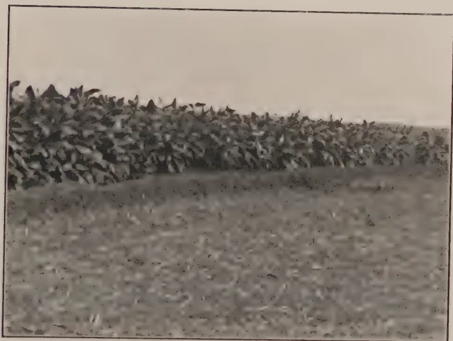
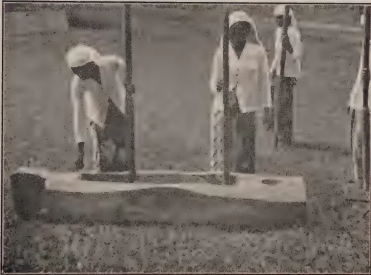
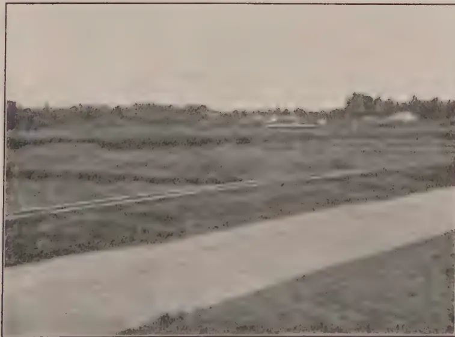
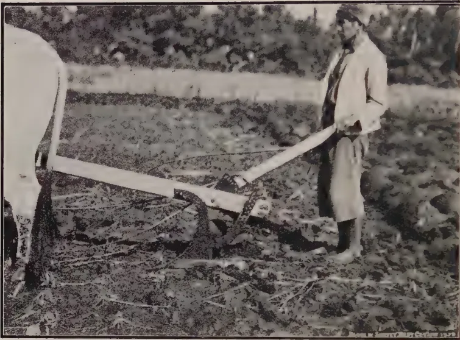
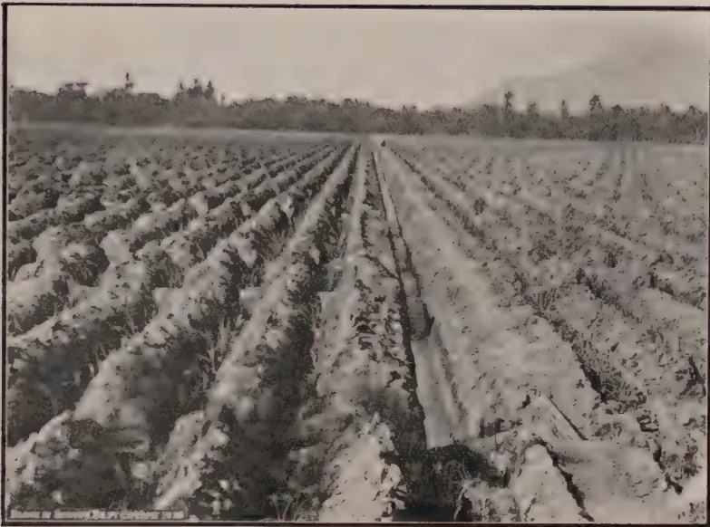
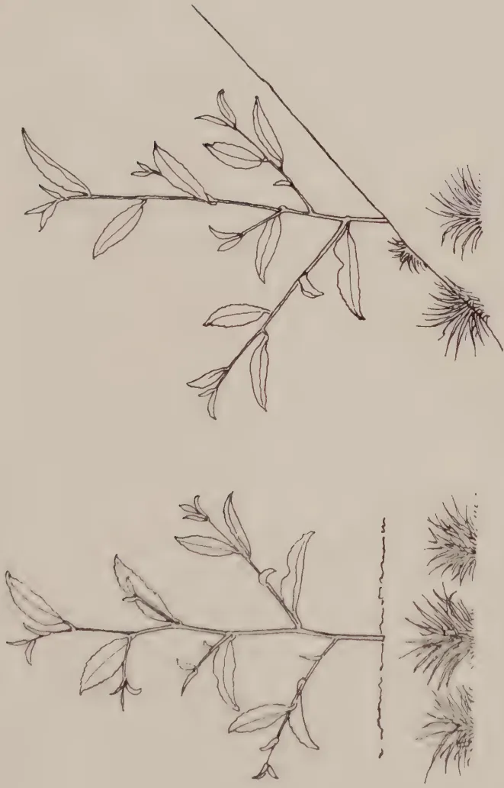

# The Tropical Agriculturist

December 1929.

---

## EDITORIAL

---

### RICE.

---

**R**ICE is by far the most important crop in Ceylon village agriculture. Not only is the prosperity of the rice industry (if the word industry may be used of such a scattered, unorganised, individualistic cultivation) indispensable to the welfare of the villager—and this alone makes it important enough—but it may rapidly become of vital concern to the whole community in the event of a shortage in other rice-growing countries. The high position of rice in the agricultural economy of Ceylon was realised particularly after the end of the war of 1914-1918. Besides encouraging the formation of co-operative credit societies in rural areas the Department of Agriculture has since 1920 been occupied with the problem of increasing the production of rice through the development of pedigree seed, by improved cultural methods, and, lately, by manuring. It was with the object of examining the methods adopted by the governments of other rice-growing countries to improve their rice cultivation that the Economic Botanist of the Department of Agriculture lately visited Malaya, Cochin-China and Java. His interesting and useful report is printed in this issue of *The Tropical Agriculturist*. It will be seen that the lines of work being carried on in Ceylon are very similar in kind, if not always in magnitude, to those in the countries visited, although, as is pointed out in the report, each country has its own local problems which cannot be solved by the wholesale application of methods in vogue elsewhere. In his conclusions Mr. Lord describes the organisation of selection work in Ceylon and suggests a few improvements based on experience in Malaya and Java.

1------------------------------------------------

322

The wide use of pedigree seed alone will never enable Ceylon to grow sufficient rice for her needs. Pedigree seed will help, but so will the use of manures, and, as was suggested in this journal for August, manuring has the promise of being the best method of rapidly increasing yields. But even if the correct manuring practice is known and the best pedigree seed is available, the problem of sufficiently increasing production is by no means solved. There are, for example, the following factors to be considered among others: the supply of credit for purchasing seed and manures, and the efficient distribution of these. There is the factor of malaria, especially where new land is to be brought under cultivation, and there is the very important factor of water. Without an adequate supply of water, good seed and manures are useless, and in many districts dependence solely on rainfall makes rice cultivation pitifully precarious.

The difficulties confronting paddy cultivation are partially known and insufficiently realised and it was with the object of gaining a full and authentic account of the difficulties and of bringing them to the notice of a wider public that the Food Products Committee of the Board of Agriculture appointed sub-committees in the different parts of Ceylon to inquire into them. The sub-committees commenced work at the beginning of this year; some of their reports have already been received and it is hoped to present all the reports to the Food Products Committee early next year.

2------------------------------------------------

323

## ORIGINAL ARTICLES.

### THE IMPROVEMENT OF RICE CULTIVATION IN MALAYA, INDO-CHINA AND JAVA.\*

DURING March and April, 1929, the writer visited Malaya, Cochin-China and Java for the purpose of examining the methods adopted by the respective Governments of those countries for improving the cultivation of rice. The Department of Agriculture in Ceylon is at present engaged in the attempt to improve local rice cultivation, and it was thought that lessons, useful to Ceylon, might be drawn from the experience of other rice-growing countries. The main questions on which information was desired included the use and usefulness of pedigree seed; the organisation of seed supply; manuring and cultural practices; and the technique of selection and hybridization. In Cochin-China, the opportunity was taken of visiting different types of rice mills and in Java, on the instructions of the Colonial Secretary, the rotation of sugarcane with rice was investigated. In general, agricultural practices foreign to Ceylon and which might be of possible use there have been noted.

It must be realised that the paddy industry in Ceylon has its own special and local problems which are not to be solved by the wholesale importation of methods in vogue in other countries. It will be seen, however, that the general lines of improvement adopted in Ceylon are closely similar in kind if not in degree to those in the countries visited.

#### (A) MALAYA.

A comprehensive account of rice cultivation and the rice industry of Malaya may be found in a bulletin† published by the Department of Agriculture of the Federated Malay States and Straits Settlements. No general account of the cultivation is necessary here but certain differences and similarities of rice cultivation in Ceylon and Malaya should be pointed out. For the purposes of this report Malaya is taken to include the Straits Settlements and the Federated and Unfederated Malay States.

\* Part of the report of Mr. L. Lord, M.A., Economic Botanist of the Department of Agriculture, Ceylon, on his recent tour in the East.

† Rice in Malaya, by H. W. Jack, D.Sc., B.A. *Bul. No. 36, Dept. of Agriculture, F.M.S.*, 1923.

3------------------------------------------------

324

The following comparative statistics are instructive:—

<table border="1">
<thead>
<tr>
<th></th>
<th>Malaya*</th>
<th>Ceylon</th>
</tr>
</thead>
<tbody>
<tr>
<td>Area in square miles</td>
<td>52,000</td>
<td>25,332</td>
</tr>
<tr>
<td>Population 1921</td>
<td>3,360,000</td>
<td>4,106,350</td>
</tr>
<tr>
<td>Area under crops, 1927, in thousands of acres</td>
<td></td>
<td></td>
</tr>
<tr>
<td>Rice</td>
<td>666</td>
<td>830</td>
</tr>
<tr>
<td>Rubber</td>
<td>3,000</td>
<td>490</td>
</tr>
<tr>
<td>Coconuts</td>
<td>520</td>
<td>887</td>
</tr>
<tr>
<td>Oil Palms</td>
<td>15</td>
<td>—</td>
</tr>
<tr>
<td>Tea</td>
<td>—</td>
<td>450</td>
</tr>
<tr>
<td>Amount of rice imported from outside, cwt. 1927</td>
<td>10,056,020</td>
<td>
          { 9,087,264 rice 
            481,642 paddy
        </td>
</tr>
<tr>
<td>Production as percentage of imports</td>
<td>42</td>
<td>41†</td>
</tr>
</tbody>
</table>

It will be seen from the above table that there are many points of similarity between Ceylon and Malaya so far as the rice industry is concerned. Both countries fail to grow enough rice for their needs and the percentage that the production bears to the imports is approximately the same in both countries. Both Ceylon and Malaya have planting industries which require rice for their labour forces.

The area under rice in Malaya is 666,000 acres. This area is cropped only once a year. In Ceylon the total area cropped is 830,000, but this includes land cropped twice a year. The actual area of rice land in Ceylon is probably less than in Malaya. A comparison of yields is difficult as the available statistics of yields in Ceylon are admittedly unreliable. Officially the yield of rice in Ceylon is given as less than 700 lb. per acre. The yield of wet rice in Malaya is given by Jack (*op. cit.* p. 24) as 203 gantang or about 1,100 lb. per acre. The average yield for Ceylon is materially lowered owing to the inclusion of areas sown but not harvested and of large areas which can only hope to mature an average crop in seasons of particularly good rainfall. Finally, it is estimated that the majority of the paddy area in Ceylon is cropped with three or four-month paddies whereas in Burma, Malaya and Indo-China, for example, the paddies sown mature in from five to seven months. Where the water supply is assured and where the fertility of the soil has not been exhausted by continuous double cropping, the yield of paddy land in Ceylon compares favourably with that in other eastern countries. At Peradeniya for the *maha* season of 1928-29 six to six and a half month paddies yielded from 2,300 to 3,150 lb. per acre on unmanured land. This crop was transplanted whereas in Ceylon generally broadcasting is the prevailing custom. In Malaya all wet land or swamp paddy is transplanted.

\* Figures for Malaya were kindly supplied by Dr. H. W. Jack.

† Approximately.

4------------------------------------------------

325

Malaya differs materially from Ceylon in the following points affecting rice cultivation:—

(I) Large areas of land are cultivated with the same variety of paddy and selections made at the Selection Experiment Station at Titi Serong in the Krian district have proved suitable for most parts of Malaya;

(II) Owing to the respective size of the population (of Malays) engaged in rice-growing and the area of rice land available, holdings are always large enough to make cultivation economic; and

(III) Land is cropped only once a year. The terraced cultivation of hillsides typical of Ceylon and Java is not met with in Malaya.

In Ceylon there are no really large areas under one variety of paddy. The kind of paddy grown depends upon the rainfall and altitude, and as these vary considerably a large number of varieties is necessary to meet the different conditions. This affects the improvement of rice cultivation by the use of pedigree seed in that selection work must be carried out at more than one central station as pedigree selections suitable, for example, for Peradeniya are not suitable for Galle. In Ceylon, also, the presence of numerous small uneconomic-sized holdings makes improvement more difficult. The numerous different climatic conditions under which paddy is grown in Ceylon with the resulting large number of paddy varieties together with the presence of uneconomic-sized holdings are by no means the sole difficulties confronting paddy cultivation in the Island, but they are two difficulties mentioned here as they do not exist in Malaya.

The average-sized holdings cultivated by a man and his family in Malaya is from two to three acres and this is said to be as much as can be worked.

### CULTIVATION.

The methods of cultivation differ in some respects from those in Ceylon. The crop is invariably transplanted and the transplanting distances would be considered large in Ceylon. Three seedlings are transplanted per hill, and hills are 12 in.  $\times$  15 in., 15 in.  $\times$  18 in., or 18 in.  $\times$  18 in. apart depending upon the fertility of the soil. Tillering is profuse,—there are about fifteen tillers per hill on an average—and yields are satisfactory. Flowering appears to be somewhat uneven, the main culms flowering first, but Dr. Jack states that no difficulty is experienced at harvest time with too-ripe or under-ripe ear-heads. In Ceylon heavy tillering does not seem to be desirable because of the uneven flowering and maturing. If the later tillers are allowed to mature before harvesting the crop, the panicles of main culms will commence to shed their grains. In addition,

5------------------------------------------------

326

uneven flowering in Ceylon extends the time during which the paddy fly can find grains in the milk stage on which to feed. Nevertheless, in Malaya, Dr. Jack has proved that the wider planting distances produce the largest crop. Malay paddy soils probably contain more humus and nitrogen than Ceylon soils, and close planting gives strong vegetative growth at the expense of grain production. It is intended, however, as time permits, to investigate optimum planting distances in different regions in Ceylon. At present, good results are obtained by planting three vigorous seedlings per hill with hills 6 in. apart.

In the Krian district, where the main rice selection station is situated the method of preparing the fields is probably unique. The heavy weed growth which is found on the fields at the commencement of the cultivation season is cut by means of a scythe-like instrument after the fields have been flooded to a depth of a few inches. The mass of weeds is left on the fields to rot for four to six weeks and is then collected and used for making the bunds of the fields (which are thus soft and porous and, towards the end of the season, discontinuous). After removal of the half-rotted vegetation the swampy fields are transplanted without any preliminary tillage.

Another practice in parts of Malaya where floods are prevalent is the use of "floating" nursery beds. This is described by Jack (*op. cit.*) as follows: "For most of the softer type of soils wet nurseries are employed, though they are frequently used for supplying some of the harder areas also. In the preparation of a "wet" nursery on the softer inundated lands, the fallow grass is cut and piled up into a long strip usually 3-4 feet wide, until the pile stands about an inch above water level. On this grass foundation sufficient clay is plastered to make the whole into a compact bed on the top of which a thin layer of mud, rich in humus, is finally laid to complete the seed bed. Thus, should the level of the water in the fields rise, the nursery, rendered buoyant by its grass foundation, floats and maintains its surface above water level."

#### THE IMPROVEMENT OF RICE CULTIVATION.

This is proceeding on two lines, first and chiefly, the selection or breeding of improved seed and its dissemination amongst the cultivators, and, secondly, the demonstration and encouragement of manuring. The work of seed selection and hybridizing is carried out by the Division of Botany of the Department of Agriculture. The personnel of the division consists of the Economic Botanist (Dr. H. W. Jack) and two staff assistants. The division is also engaged on work with coconuts and oil palms but up till now has chiefly confined its activities to rice. There are two Rice Selection Experiment Stations; the chief one, and the one where almost all the selection work has

6------------------------------------------------

327

been done, is at Titi Serong in the Krian district of the State of Perak and has an area of 21 acres. The other Selection Station is at Malacca and is 26 acres in extent. In addition to these there are twenty-three tests and multiplication stations in Perak, Selangor, Sembilan, Pahang, Malacca, Kelantan, Trengganu and Kedah, covering the chief rice-growing areas.

The average size of these stations is 4-5 acres. Four are under the control of the Economic Botanist, four under district officers of the Malay Civil Service and one under the British Adviser. The remainder are run by Field Officers (corresponding to Divisional Agricultural Officers in Ceylon) of the Department of Agriculture. The pedigree selections, already made and tested at Titi Serong are again tried at the test stations for a number of years. Seed of a suitable selection is then supplied by the Economic Botanist either to a Test Station for multiplying or direct, or through field officers, to cultivators.

At present the distribution of seed is supervised by the Economic Botanist but he agrees that in time this will have to be part of the work of field officers. Paddy Inspectors (Malays on a salary of \$25-45 per month) have now been appointed in all the large paddy areas. These inspectors carry out the work at Test Stations, distribute seed and follow the progress of seed already distributed.

The respective responsibility of the Economic Botanist and of field officers for the testing and distribution of pedigree seed has not yet been so clearly defined in Malaya as it has been in Ceylon, but in principle the organization of seed distribution is essentially the same in the two countries. It differs in three points of detail:—

(I) The trials of pedigree selections at Test Stations are in charge of the Economic Botanist.

(II) The Paddy Inspectors who carry out the work at Test Stations do no other work; and

(III) The distribution of pedigree seed is at present largely in the hands of the Economic Botanist. This is, as mentioned above, a temporary measure and was done to ensure that pedigree seed did get distributed. With the appointment of a Director of Agriculture early this year there will doubtless follow closer co-ordination of the work of the Division of Botany and field officers, and the responsibility for seed distribution will probably devolve on the latter.

The method of pure-line selection employed differs, again, only in details. For example, lines are selected on a basis of yield per plant rather than on yield per panicle. In Ceylon the question of the comparative utility of the two methods is being investigated as here profuse tillering is not always desired.

7------------------------------------------------

328

Bagging is not resorted to for maintaining the purity of lines. Maintenance of purity is ensured by growing three lines of plants of each selection and by using the seed of the middle line only for continuing the selection. Seed of the outside lines is used for multiplication plots.

Pedigree selections are tested in small plots replicated sufficiently to detect 10% differences in yield. In the Krian district the standard error of a single plot of 1/40 ac. is 7.6% and of a plot of 1/20 ac. 6.6%. Four and three replications respectively of these plots are used in testing. Test plots are always situated well away from the bunds as growth near the bunds is always better than in the middle of the field. This is very noticeable at Krian where the bunds are composed of almost pure organic material. In Ceylon, where preliminary tillage of fields is comparatively good and where bunds are made of soil, there is not so much difference in the growth in different parts of a field as there is in Malaya. Fields in Malaya are large and a wide border can be left.

The random arrangement of plots with replications in compact blocks now adopted in Ceylon is not used in Malaya. Probable errors of different sized plots were supplied by Dr. Jack. These have been converted to standard errors of single plots and the following table shows the comparison with standard errors in Ceylon:—

*Rice: Standard Errors of Different Sized Plots.*

<table border="1">
<thead>
<tr>
<th rowspan="2">Size of plot.</th>
<th>Malaya</th>
<th>Ceylon</th>
</tr>
<tr>
<th>S. E.</th>
<th>S. E.</th>
</tr>
</thead>
<tbody>
<tr>
<td>1/200 ac.</td>
<td>14.8</td>
<td>8.5—15.3</td>
</tr>
<tr>
<td>1/100 ac.</td>
<td>11.9</td>
<td>10.93, 15.0</td>
</tr>
<tr>
<td>1/117 ac.</td>
<td>—</td>
<td>12.0</td>
</tr>
<tr>
<td>1/50 ac.</td>
<td>9.1</td>
<td>—</td>
</tr>
<tr>
<td>1/40 ac.</td>
<td>7.1</td>
<td>—</td>
</tr>
<tr>
<td>1/25 ac.</td>
<td>8.2</td>
<td>—</td>
</tr>
<tr>
<td>1/20 ac.</td>
<td>6.6</td>
<td>—</td>
</tr>
</tbody>
</table>

The figures for the 1/40 and 1/20 ac. plots were obtained in Krian, the others at Kuala Pilah. Standard errors in Ceylon are very similar to those in Malaya. In varietal tests conducted in 1/100 acre plots in Ceylon the standard error is about 11%. The higher figure for 1/100 ac. plots refers to a manurial trial where errors, in the first year at least, appear to be larger.

#### HYBRIDIZATION.

Crosses are now being made of different pedigree selections at Titi Serong. The work has not yet progressed far enough to allow conclusions to be drawn.

8------------------------------------------------

This image shows a blank page with a light beige or cream-colored background. There are faint, thin horizontal lines across the page, and a vertical line on the left side, which suggests it might be a page from a book or a document. The surface has a slightly textured appearance with some minor imperfections and discoloration, typical of aged paper.

9------------------------------------------------

Fig. 1.—Methods of threshing rice, Malaya.

Fig. 2.—Methods of threshing rice, Malaya.

10------------------------------------------------

329

## MANURING EXPERIMENTS.

Manuring experiments are being conducted at five manurial Experiment Stations and at some of the Stations have been going on for three years. Results have not yet been written up, but it is hoped that some will be published this year. It is considered that manuring as a means of improving rice cultivation has great possibilities. This has lately been shown in Burma and is being shown in Ceylon. The method of carrying out the experiments is to have one, two, and, in Province Wellesley, three large plots of each manurial treatment and to harvest from the middle of each large plot two or four small plots of  $1/40$  acre. This method makes it impossible to estimate positional variance but the method is adopted on the supposition that the fertility of the experimental area is remarkably homogeneous. In Ceylon this is not so and steps have to be taken to estimate and eliminate positional variance due to soil heterogeneity.

### PRACTICES AND IMPLEMENTS WHICH MIGHT BE TRIED IN CEYLON.

1. *The wider spacing of hills in transplanting.*—This has already been mentioned and experiments will be conducted in different parts of Ceylon as time permits. Transplanting, however, depends upon an assured supply of water before and after transplanting which can be regulated. Transplanting will not be possible in large areas of Ceylon, and it is not yet proved that the transplanting of short-aged paddies in poor land is economic;

2. *The threshing board.*—This is seen in the photographs accompanying the report. A sheaf is beaten on the sloping, slotted board. This method of threshing is used by Tamils. Malays harvest only the ear-head and thresh with their feet;

3. *The kissaran or Malay hand huller.*—This home-made mill can hull about  $2\frac{1}{2}$  bushels of paddy per hour. It is found in small establishments frequently run by Chinese who hull at a fixed price paddy for surrounding cultivators.

The mill is described by Jack (*op. cit.* p. 29) as follows:—  
 ‘This mill consists of two circular grinding surfaces of which the lower one is fixed while the upper one, which has a central aperture, is free to revolve on a pivot and can be adjusted to regulate the space separating it from the lower one. Each grinding surface is about 22 inches in diameter and is composed of chips of “bakau” wood from  $1\frac{1}{2}$  to 3 inches wide and  $\frac{1}{8}$  to  $\frac{1}{4}$  inch in thickness, sunk to a depth of 4 to 5 inches into unbaked, but hardened, pottery or whiteant-heap clay. The whole mass is bound around by bamboo basket-work to give additional strength. The “bakau” chips are spaced about  $\frac{1}{4}$  inch apart

11------------------------------------------------

330

and arranged in rows running from the centre to the circumference of both grinding surfaces; the chips in each row being set at an angle of about  $30^\circ$  degrees to the radii of the surfaces. Underneath the lower grinding block, thoroughly dried coconut fibre is packed tightly into the basket-work which is securely held in a wooden frame, tightly pegged to the ground. The effect of the fibre-packing is to allow a small amount of resiliency to the whole mill, thus reducing the tendency of the hardened clay to crack under the vibration of rotation. The basket-work binding the upper mill stone is continued upwards to form the receptacle for the padi which is to be milled. This basket is usually of some seven "gangtang" capacity. The padi enters the mill through a central aperture in the upper grinding block and through the same aperture the pivot from the lower grinding block projects. This pivot keeps the upper grinding surface in position. On the pivot rests a wooden beam which is embedded in the clay mass of the upper grindstone and protrudes through the basket-work about one foot on each side. Through this beam there is a central aperture to admit the padi from the receptacle to the mill, and across this aperture there is a simple arrangement for raising or lowering the beam and thus regulating the distance between the grinding surfaces. The upper grinding-block is made to revolve at any desired rate by a simple and effective, though ancient, mechanical device. This consists of a strong wooden rod some 4 to 5 feet long bearing near one end a stout iron peg which fits loosely into a socket in the protruding end of the beam just mentioned. The other end of the rod is fastened rigidly to the centre of a wooden hand piece which is suspended from a convenient height (about 6 feet) above the mill. The cooly grasps the hand-rod with both hands and by lunging forwards slightly can rotate the upper grinding-block with the expenditure of very little energy."

### (B) INDO-CHINA.

The time spent in Indo-China was too short to make an adequate study of the methods adopted to improve rice cultivation even in the one province (Cochin-China) which was visited. The visit was curtailed by the arrival of the steamship three days late which prevented any excursions being made into the interior of Cochin-China. It was unfortunate, also, that at the time of the visit all the rice had been harvested.

So far as can be ascertained the organisation of agricultural administration and research in Indo-China is somewhat similar in kind to that in India. The Central Government maintains an Inspector-General of Agriculture who is also Director of the Research Institute at Saigon which is financed by the Central Government. Matters of agricultural administration are in the hands of the Local Governments of Cochin-China, Cambodia,

12------------------------------------------------

331

Annam, Laos and Tonkin who maintain *Services Agricoles*. In Cochinchina (where the rice crop is of the greatest importance) the *Service Agricole* is in charge of the improvement of rice cultivation.

The writer was fortunate in meeting M. E. Carle who is the director of the Genetics Laboratory, Saigon (where all selection work on rice is carried out) and who was, at the time, acting chief of the *Service Agricole* of Cochinchina. Visits were paid with M. Carle to the Laboratory and also to the Research Institute. The opportunity was taken of visiting rice mills in the neighbourhood of Saigon and at Cholon.

The position of the rice industry in Indo-China differs radically from that in Ceylon. Not only is all the rice grown in Ceylon consumed in the country, but more than double the quantity of rice produced locally is imported from outside. Indo-China, on the other hand, is exceeded only by Burma in the amount of rice exported.

The comparative statistical position of the industry will be seen by reference to the following tables. Table I gives the production of rice in the three principal rice-growing and exporting countries of Asia and of the world.) Japan produces more rice than Indo-China or Siam, and Java and Madura combined more than Siam, but the exports of both are comparatively small).

**Table I.**

*Production and export of rice in the three principal rice-growing and exporting countries of Asia  
(Million lb. of white rice.)*

<table border="1">
<thead>
<tr>
<th rowspan="2">Year</th>
<th colspan="2">India</th>
<th colspan="2">Indo-China</th>
<th colspan="2">Siam</th>
</tr>
<tr>
<th>Production</th>
<th>Exports</th>
<th>Production</th>
<th>Exports</th>
<th>Production</th>
<th>Exports</th>
</tr>
</thead>
<tbody>
<tr>
<td>1927-28</td>
<td>62,658</td>
<td>—</td>
<td>9,150</td>
<td>—</td>
<td>7,505</td>
<td>—</td>
</tr>
<tr>
<td>1926-27</td>
<td>66,506</td>
<td>4,967</td>
<td>8,849</td>
<td>3,339</td>
<td>7,781</td>
<td>3,350*</td>
</tr>
<tr>
<td>1925-26</td>
<td>68,627</td>
<td>5,226</td>
<td>8,384</td>
<td>3,239</td>
<td>6,243</td>
<td>2,375</td>
</tr>
<tr>
<td>1924-25</td>
<td>69,601</td>
<td>5,511</td>
<td>8,341</td>
<td>2,961</td>
<td>7,358</td>
<td>2,602</td>
</tr>
<tr>
<td>1923-24</td>
<td>63,164</td>
<td>5,106</td>
<td>7,705</td>
<td>2,359</td>
<td>6,550</td>
<td>2,006</td>
</tr>
<tr>
<td>1922-23</td>
<td>75,495</td>
<td>4,540</td>
<td>8,157</td>
<td>2,624</td>
<td>6,454</td>
<td>2,741</td>
</tr>
<tr>
<td>1921-22</td>
<td>74,240</td>
<td>4,454</td>
<td>8,480</td>
<td>2,836</td>
<td>6,251</td>
<td>2,258</td>
</tr>
</tbody>
</table>

Table II shows the contributions of the different provinces in Indo-China. It will be seen that Cochinchina is the most important. Similarly table III gives the contributions of Burma and Bengal to the Indian totals.

\* Data partly estimated.

13------------------------------------------------

332Table II.

*Production and export of rice from Indo-China*  
(Million lb. of white rice.)

<table border="1">
<thead>
<tr>
<th rowspan="2">Year</th>
<th>Cochin-China</th>
<th>Cambodia</th>
<th>Cochin-China Chambodia</th>
<th colspan="2">Tonkin</th>
<th colspan="2">Indo-China</th>
</tr>
<tr>
<th>Production</th>
<th>Production</th>
<th>Exports</th>
<th>Production</th>
<th>Exports</th>
<th>Production</th>
<th>Exports</th>
</tr>
</thead>
<tbody>
<tr>
<td>1927-28</td>
<td>3,485</td>
<td>—</td>
<td>—</td>
<td>2,738</td>
<td>—</td>
<td>9,150*</td>
<td>—</td>
</tr>
<tr>
<td>1926-27</td>
<td>3,260</td>
<td>1,332</td>
<td>2,976*</td>
<td>1,999</td>
<td>331*</td>
<td>8,849</td>
<td>3,339</td>
</tr>
<tr>
<td>1925-26</td>
<td>2,896</td>
<td>948</td>
<td>2,816</td>
<td>2,643</td>
<td>385</td>
<td>8,384</td>
<td>3,239</td>
</tr>
<tr>
<td>1924-25</td>
<td>3,239</td>
<td>838</td>
<td>2,634</td>
<td>2,225</td>
<td>327</td>
<td>8,341</td>
<td>2,961</td>
</tr>
<tr>
<td>1923-24</td>
<td>3,032</td>
<td>700</td>
<td>2,078</td>
<td>1,900</td>
<td>279</td>
<td>7,705</td>
<td>2,359</td>
</tr>
<tr>
<td>1922-23</td>
<td>3,001</td>
<td>541</td>
<td>2,194</td>
<td>2,383</td>
<td>416</td>
<td>8,157</td>
<td>2,624</td>
</tr>
<tr>
<td>1921-22</td>
<td>2,915</td>
<td>658</td>
<td>2,431</td>
<td>—</td>
<td>330</td>
<td>8,480</td>
<td>2,836</td>
</tr>
</tbody>
</table>

Table III.

*Production and exports of rice from India*  
(Million lb. of white rice.)

<table border="1">
<thead>
<tr>
<th rowspan="2">Year</th>
<th colspan="2">Burma</th>
<th colspan="2">Bengal</th>
<th colspan="2">India</th>
</tr>
<tr>
<th>Production</th>
<th>Exports</th>
<th>Production</th>
<th>Exports</th>
<th>Production</th>
<th>Exports</th>
</tr>
</thead>
<tbody>
<tr>
<td>1927-28</td>
<td>10,945</td>
<td>—</td>
<td>14,531</td>
<td>—</td>
<td>62,658</td>
<td>—</td>
</tr>
<tr>
<td>1926-27</td>
<td>11,451</td>
<td>4,383</td>
<td>16,475</td>
<td>261</td>
<td>66,506</td>
<td>4,967</td>
</tr>
<tr>
<td>1925-26</td>
<td>10,624</td>
<td>4,621</td>
<td>18,408</td>
<td>266</td>
<td>68,627</td>
<td>5,226</td>
</tr>
<tr>
<td>1924-25</td>
<td>11,350</td>
<td>4,805</td>
<td>17,273</td>
<td>442</td>
<td>69,601</td>
<td>5,511</td>
</tr>
<tr>
<td>1923-24</td>
<td>9,334</td>
<td>4,138</td>
<td>16,820</td>
<td>759</td>
<td>63,164</td>
<td>5,106</td>
</tr>
<tr>
<td>1922-23</td>
<td>10,317</td>
<td>3,689</td>
<td>20,270</td>
<td>601</td>
<td>75,495</td>
<td>4,540</td>
</tr>
<tr>
<td>1921-22</td>
<td>10,356</td>
<td>3,909</td>
<td>20,760</td>
<td>289</td>
<td>74,240</td>
<td>4,454</td>
</tr>
</tbody>
</table>

Whereas Indo-China is the second largest exporter of rice, Ceylon is of late† the fourth largest importing country. Table IV shows the chief importing countries in Asia with imports in metric tons from 1909 to 1925. This table has been taken from a comprehensive survey of the statistical position of rice in the world, *The Rice Situation*, which was prepared by Mr. M. B. Smits (Agricultural Economist of the Department of Agriculture, Industry and Commerce of the Netherlands East Indies) for the Fourth Pacific Science Congress.

\* Data partly estimated.

† Germany imported more rice than Ceylon in the years 1924 and 1925 but less in 1926 and 1927.

14------------------------------------------------

333Table IV.*The chief Asiatic rice-importing countries.**(Metric tons)*

<table border="1">
<thead>
<tr>
<th></th>
<th>Avr. 1909/'13</th>
<th>1915/'18</th>
<th>1919/'21</th>
<th>1922/'25</th>
<th>Potential</th>
</tr>
</thead>
<tbody>
<tr>
<td>Ceylon</td>
<td>356,000</td>
<td>377,000</td>
<td>294,000</td>
<td>387,000</td>
<td>390,000</td>
</tr>
<tr>
<td>Straits Settlements and Malacca</td>
<td>301,386</td>
<td>(320,000)</td>
<td>313,000</td>
<td>383,000</td>
<td>520,000</td>
</tr>
<tr>
<td>Dutch East Ind.</td>
<td>514,415</td>
<td>620,097</td>
<td>412,916</td>
<td>488,143</td>
<td>650,000</td>
</tr>
<tr>
<td>British Borneo</td>
<td>25,977</td>
<td>(27,000)</td>
<td>(20,000)</td>
<td>27,275</td>
<td>50,000</td>
</tr>
<tr>
<td>Philippines</td>
<td>187,234</td>
<td>167,103</td>
<td>57,291</td>
<td>102,386</td>
<td>150,000</td>
</tr>
<tr>
<td>China</td>
<td>300,604</td>
<td>515,259</td>
<td>234,419</td>
<td>975,552</td>
<td>1,200,000</td>
</tr>
<tr>
<td>Japanese Empire</td>
<td>336,388</td>
<td>159,324</td>
<td>350,038</td>
<td>479,585*</td>
<td>800,000</td>
</tr>
<tr>
<td>Hongkong</td>
<td>(100,000)</td>
<td>(150,000)</td>
<td>(130,000)</td>
<td>159,816</td>
<td>200,000</td>
</tr>
<tr>
<td>Macao</td>
<td>(5,000)</td>
<td>6,438</td>
<td>(5,000)</td>
<td>18,808</td>
<td>20,000</td>
</tr>
<tr>
<td>Total</td>
<td>2,127,004</td>
<td>2,342,221</td>
<td>1,816,664</td>
<td>3,021,565</td>
<td>3,980,000</td>
</tr>
</tbody>
</table>

In view of the differences between the rice industry in Indo-China and in Ceylon the problem of improvement also differs in the two countries. In Ceylon the chief object, at present, is yield per acre, and quality is of subsidiary importance. In Indo-China quality, as reflected particularly in evenness of grain, is of paramount importance. Most of the rice is milled and exported and evenness of grain is wanted, (1) to ensure getting the best price, and (2) to reduce loss by breakage in the mills. Not only is the produce from cultivators' fields frequently a mixture of different varieties varying in the size of grains but it is difficult to get large quantities of paddy reputably of one type, partly because of the mixed seed grown by the cultivator and partly because of the habit of Chinese buyers of mixing different lots before sending them down to the mills. The problem has long been realised by the authorities and Mr. Devraigne† has stated:—

“Mais si l'on envisage maintenant le point de vue de la pureté des paddy, une question se pose, beaucoup plus grave. Le Chinois collecteur, qui vient acheter dans un village, mélange dans sa jonque on dans le magasin du centre d'achat tous les paddy de different provenances, et il ne paie pas relativement plus cher le beau paddy correspondant à un type commercial, que le grain tres ordinaire.”

\* Imports from foreign countries fell in 1926; Ceylon imports, on the other hand, rose.

† Devraigne, Georges. La selection pour la standardisation des paddy et des riz. Publication du Government de la Cochinchine, Saigon, 1923.

15------------------------------------------------

334

Unless the crop from selected seed is heavier, or unless it fetches a premium on account of its evenness, there is no incentive for a cultivator to grow selected seed. The superiority in milling of pure-line paddies has now been recognised in Burma and they command a premium from millers.

There are, therefore, two distinct problems in the improvement of rice cultivation in Indo-China: (1) the improvement of quality through the elimination of undesirable types and particularly by the production of large quantities of similar types; and (2) the improvement of yield. Both these can be obtained by pedigree seed selection; the latter can also be obtained by manuring. Both these lines of improvement are being investigated along with one other which is foreign to Ceylon, that is, the mechanical, as distinct from the pedigree or pure-line, selection of seed.

Owing to the importance of producing paddy with similar-sized grains mechanical selection is being used as an aid to pedigree selection. Cultivators' seed, invariably a mixture of types differing in size of grains, is put through a mechanical grader or separator which separates out the main types of grains. The type wanted is retained and distributed to cultivators for seed purposes. This seed is not, of course, pure-line seed; it may consist of ten or more varieties (see Devraigne *op.cit.* pp. 24 and 25) but in size of grain it is homogeneous. About 150 tons (or 1,000 kilos) of mechanically-selected seed are distributed annually in Cochin-China (about 6,875 bushels).

It is not thought that mechanical selection of seed can be of any use in Ceylon. The size of the grains of any one variety in Ceylon is fairly even; and by the time a milling industry can be established on any moderately large scale, pedigree seed, which fulfils all the functions (and more) of mechanically-selected seed, will be available.

#### THE ORGANIZATION OF SEED SELECTION IN COCHIN-CHINA.

Pedigree selection and hybridizing are carried out at the Genetics Laboratory at Saigon. Attached to the Laboratory are 28 hectares of paddy land where paddy is selected, tested and multiplied before being sent out to the two main rice stations at Cantho and Vinlon (respectively 40 and 18 hectares) and to four sub-stations (three of 15 hectares and one of 12) for testing and multiplication prior to the distribution of suitable strains to cultivators. At these rice stations mechanical selection of seed is also done. Last year, besides the 6,875 bushels of mechanically-selected seed an equal amount of pedigree seed was distributed in addition.

16------------------------------------------------

335

### THE TECHNIQUE OF SELECTION.

At Saigon two methods of pedigree selection have been employed, at first successively and lately conjointly. The first method, which has been called "biologic selection," consists essentially of rigorous selection not only in the progeny of different lines, but also within the progeny of one plant, combined with a careful botanical and agricultural study of the different lines.\* The work commenced with a morphological study of the mixed population, lasting for two or three years, after which the fifteen best plants were chosen and 100 seeds of each plant grown in progeny rows. (Later 200 seeds of each plant were sown). One row of the mixed population was planted for every three or four rows of the selections for purposes of comparison. From the hundred (or two hundred) plants of each progeny the best four were retained to form a total of sixty lines. These were grown in the same way as described above and again the best four plants in each line were retained making 240 lines.

These 240 lines were therefore composed of fifteen lots of sixteen lines, each lot being descended from one of the original lines. From each lot five or six lines were then retained and multiplied for further testing and after another two or three years these were further reduced to one to three lines per original line or from 15-45 final selections. This method of selection, assuming no natural cross-pollination in rice, amounts to selection within a pure-line. Cross-pollination does take place to some extent but if "biologic selection" is meant to produce true pure-lines it must be combined with bagging.

The second method of selection tried and still continued was the ordinary method of pedigree selection used in Ceylon.

The two methods differ in that "biologic selection" eliminates individuals within the lines and pedigree selection eliminates whole lines. Pedigree selection is based on the assumption that rice is normally self-pollinated and that what cross-pollination exists is negligible. It is considered to be negligible in Ceylon but not in Java and this point will be discussed later.

### HYBRIDIZATION.

This has been started by M. Carle who has made crosses of Carolina with a local pure-line. Some of the crosses are promising and some which are now breeding true have been selected for multiplication and testing.

### DISTRIBUTION OF SEED TO CULTIVATORS.

It is comparatively easy to produce a satisfactory pedigree selection; it is extremely difficult to ensure that seed of the

---

\* This is described by M. Carle in "Etudes General des riz de Cochinchine" Pts I and II, *Publication du Gouvernement de la Cochinchine*, Saigon, 1925.

17------------------------------------------------

336

selection gets into the hands of the cultivators periodically and in sufficient quantities.

It was admitted in Cochin-China that "*le diffusion*" was most difficult. No simple method of distribution could be suggested and it is, of course, a problem whose detailed solution must vary in different countries. India must be looked to for guidance on this point.

#### CATCH-CROPS ON RICE LAND.

It has been suggested in certain parts of Ceylon that catch-crops would be of great utility on paddy land. In the neighbourhood of Saigon it was noticed that many of the rice fields (which had then been harvested for about two months) were being cultivated with tobacco. This was grown in lines 3 ft. apart and was irrigated from wells sunk in the fields themselves. The soil was fairly heavy, but the water table was near the surface.

#### MILLING.

In view of the possibility of a rice-milling industry coming into existence in Ceylon the opportunity was taken of visiting, and getting particulars of, different types of rice mills both in Cochin-China and Java. For convenience, the information obtained in Java will be included here. In both Indo-China and the Dutch East Indies the present tendency is to erect small mills of from 5 to 10 metric tons capacity (per 24 hours) and in Indo-China, as in Burma, more milling is being done away from the ports. In other words milling is more and more being carried out in the actual rice-growing tracts. Any rice-milling industry in Ceylon would undoubtedly follow the same lines. In Java, the industry has never been over-centralised.

For information on types of small mills in Indo-China I am indebted to the *Société Indo-chinoise de Matériel Mecanique* (of Saigon and Cholon) and in Java to Messrs. Lindeteves Stokvis (of Batavia).

In both countries the rough rice (paddy) is milled raw whereas in Ceylon it will previously have to be parboiled. The prices given below do not include the cost of the parboiling apparatus.

#### PARTICULARS OF INSTALLATIONS BY S.I.M.M. SAIGON.

a. Capacity:—5 metric tons,

Engleberg type combined huller and polisher.

Vertical crude oil engine 14/16 b.h.p.

Price, including engine and erecting, £290\*.

This is the simplest type of mill and produces whole and broken rice mixed. The husk and testa (meal) is also mixed but is ground fine and can be used as a cattle food.

---

\* Prices are those if erected in Indo-China and they would be slightly less in Ceylon.

18------------------------------------------------

A black and white photograph showing a dense field of tobacco plants in the foreground, with a rice field visible in the background. The tobacco plants are dark and leafy, growing in a dense, somewhat irregular mass. The rice field in the background is lighter in tone and appears more uniform. The sky is a pale, featureless grey. The entire photograph is enclosed in a thin black rectangular border.

Fig. 8.—Tobacco on rice fields, Cochin-China.

19------------------------------------------------

This image is a scan of a blank page. The background is a uniform light beige or off-white color. There are a few very small, dark specks scattered across the surface, which appear to be scanning artifacts or dust particles. No text, lines, or other graphical elements are present.

20------------------------------------------------

337

b. Capacity: 8 metric tons,  
 Paddy riddler and shaker.  
 Horizontal stone huller.  
 Shaker and fan (for removing husk).  
 Lidgerwood huller and polisher.  
 (Engleberg type)  
 Horizontal crude oil engine 22/24 b.h.p.  
 Price £650.

This installation gives (1) whole and broken rice mixed, (2) husk, (3) meal.

c. Capacity: 6 metric tons,  
 Paddy riddler and shaker,  
 Huller,  
 Shaker and fan,  
 Separator (husked and unhusked grain),  
 Cone mill (for removing testa).  
 Separator (whole and broken rice).  
 Vertical crude oil engine 14/16 b.h.p.  
 Price £800.

This installation gives (1) whole rice, (2) broken rice, (3) meal, (4) husk.

d. Capacity: 10 metric tons,  
 Similar to (c) but with larger huller and cone mill.  
 With 30-35 b.h.p. crude oil engine £1,400.  
 With steam engine and boiler for burning the husk  
 £1,700.

A 10-ton mill will only produce sufficient husk for the boiler if it is running to capacity. An oil engine is safer and also more convenient as the mill can be stopped and started more easily.

Particulars and drawings of these and of a 20-metric ton installation are on file in the office of the Economic Botanist and may be seen by anyone interested.

**PARTICULARS OF RICE-MILLING MACHINERY SUPPLIED  
 BY MESSRS. LINDETEVES-STOKVIS.\***

A. "Kampnagel" Rice-Huller. Capacity 440-660 lb. per hr.  
 Engleberg type huller and polisher combined.  
 H.P. required 13-15.  
 Price† £62.

This machine is recommended for very small mills and only in places where operators cannot be taught how to sharpen

\*These machines are made by Eisenwerk (vorm. Nagel and Kaemp) A.G., Hamburg 39, Germany.

† Prices of German machines do not include cost of engines.

21------------------------------------------------

338

the stones of the horizontal stone hullers which are to be preferred. See (B).

B. "Colonia II" Rice-Mill. Capacity 550-770 lb. per hr.

Stone huller.

Bran sieve.

White rice cone.

H.P. required, 5.

Price £100.

Price with paddy separator £150.

Both (A) and (B) produce whole and broken rice mixed. (A) produces the husk and meal mixed but ground fine, whereas (B) separates out the husk. (B) also requires less horse-power, and is recommended for all but the most backward districts.

C. "Filipina" Rice Mills.

These mills are capable of producing rice of any desired quality and are comparable with those described under (C) and (D). The different types have outputs from 550 to 7,920 lb. of rice per hour. For small mills the type "N" I is suitable.

Capacity 550 lb. per hour.

Huller.

White rice cone.

Paddy separator.

Trieur.

H.P. required about 5.

Produces whole rice, broken rice, rice meal, and husk.

Price £640.

Particulars of these and other mills are on file.

### (C) JAVA.

Agriculturally, physically and climatically Java is very similar to Ceylon, but the presence of volcanoes has given the island large areas of fertile, easily-worked volcanic soil, a type of soil not found in this country. Owing to pressure of population all cultivable land is under cultivation and there are no immense tracts of primary and secondary jungle. The population of Java (with Madura) is 37,500,000 and is contained in 50,762 square miles. Ceylon with almost exactly half that area has a population of just over 5,000,000.

The difference in the rice industry of the two countries is seen by the following figures. The consumption of rice per capita does not differ largely—in Ceylon it is estimated at 124.5

22------------------------------------------------

339

kg. and in Java at 104 kg.—yet Ceylon had an average importation of rice during the five years 1924-27 of 84.1 kg. per capita against an average for Java during 1922-25 of only 7 kg. During 1926 and 1927 imports into Java fell with the decline of the export of high quality rice.

The 8,256,000 acres of rice land in Java yield an average of over 1,300 lb. of paddy per acre. In Ceylon the average area of 792,000 acres for the years 1921-25 are shown as having an average production of 634 lb.

The figures for Ceylon are admittedly open to a large error and the acreage undoubtedly includes large sown areas on which the crop is a partial or total failure owing to lack of water and damage by insect and animal pests. Ceylon is always shown statistically to produce one of the lowest yields of rice per acre, but it is unjust to attribute this to the cultivator. He adapts his methods to the prevailing conditions and not even a Javanese can grow rice without water. It must be remembered that in Java not only is the soil fertile but the irrigation systems are excellent. The soil is also suitable for dry crops and on most land rice is rotated with maize, soya beans and groundnuts as well as with sugar in the sugar areas. This rotation of crops is certainly responsible for increasing the yield of rice. On the much less friable paddy soils of Ceylon the practice of a rotation is difficult or impossible. Transplanting is almost universal in Java; this practice is capable of considerable extension in Ceylon but there are many large areas where the uncertainty of the water supply at definite times makes transplanting too dangerous to adopt.

#### THE IMPROVEMENT OF RICE CULTIVATION.

The work of improving the cultivation of rice by seed selection, cultivation and manuring is carried out by the General Agricultural Experiment Station which is one of the divisions of the Department of Agriculture, Industry and Commerce.

The General Agricultural Experiment Station which is situated at Buitenzorg is organised in three divisions:—

1. (1) The Division of Laboratories (which includes Botanical, Chemical, Soils and Microbiological Laboratories);
2. (2) The Institute of Plant Pathology and
3. (3) The Agricultural Institute.

The Agricultural Institute has three sections:—

1. (a) Agricultural Section,
2. (b) Section for Selection of Annual Crops, and
3. (c) Section for Selection of Perennial Crops.

23------------------------------------------------

340

The Section for Selection of Annual Crops is staffed by a chief and two selectionists, one of whom works solely on rice. The field tests of the selected seed (and also all field experiments in Java conducted by the Department) are supervised by the Agricultural Section which is staffed by a chief and two agriculturists.

#### SEED SELECTION.

The pure-line selection of rice in Java has not yet been particularly successful. Several reasons are mentioned to account for this non-success. In the first place selection work was carried out at one station (at Buitenzorg) under particular soil and climatic conditions, although the selected seed was required for other and dissimilar areas. (The same difficulty was experienced in Ceylon when all selection was done at Anuradhapura. Lines selected there behaved quite differently at Peradeniya or in the Southern Province.) It was found also that cross-pollination was by no means negligible at Buitenzorg and in the beginning bagging was not used to prevent it. These difficulties and the new organisation of selection work which has now been inaugurated have been described by Mr. L. Koch\* Chief of the Section for Selection of Annual Crops, and the following summary is taken from his paper.

In rice selection and spreading of better varieties in the Dutch East Indies results have up till now not been comparable with those got in India and Japan, where hundreds of thousands of hectares are now planted with selected seed.

Next to unfavourable conditions (small patches of a special soil type scattered over a large area combined with lack in personnel) a great deal of the relative smallness of success is put down to the absence of a special arrangement for the spreading of good seed, such as exists in Japan, most States in India and in Holland.

Natural crossing and mixing up may cause deterioration of a selected variety in a very short time, so it seems necessary that the multiplication of the seed must be rapid in order that large quantities may be available to the farmers in a short time.

The method of spreading the seed used in India, Japan and Holland was taken as an example for constructing a system for the Dutch East Indies.

Three experimental farms for the selection of rice (and other annual food crops as well) are to be established for three of the main soil types prevailing in Java, viz., marl soils, young volcanic ash soils and alluvial soils of volcanic origin. The plant-breeding station at Buitenzorg is to serve for the fourth type, the laterite soil of volcanic origin.

---

\* Koch, L. Over het Verkrijgen van Betere Varieteiten en de Verbreiding Ewan. *Landbouw* 4, 5. 1928.

24------------------------------------------------

A black and white photograph showing three people working on a long, low wooden platform. One person is bent over, working on the platform, while two others stand nearby. The platform is situated in a field with some vegetation in the foreground.

Fig. 3.—Threshing ear-heads, Java.

A black and white photograph of a rice selection station. A long, light-colored path or platform extends from the foreground towards the background. The path is bordered by dark, textured ground. In the distance, there are some trees and a small structure.

Fig. 4.—Rice selection station, Buitenzorg.

25------------------------------------------------

This image is a scan of a blank page. The paper has a light beige or cream-colored tint. There are a few very small, dark specks scattered across the surface, which appear to be scanning artifacts or dust particles. No text, lines, or other markings are present on the page.

26------------------------------------------------

This image is a scan of a blank page. The background is a uniform light beige or tan color. There are a few very small, dark specks scattered across the surface, which appear to be scanning artifacts or dust particles. No text, lines, or other graphical elements are present.

27------------------------------------------------

A black and white photograph showing a large, round, woven basket or cart filled with rice, being pulled by a dark-colored animal, likely a water buffalo or ox, in a rural setting. The cart has large wooden wheels. In the background, there is a simple building with a window and a fence.

Fig. 5.—Transporting ear-heads of rice, Java.

28------------------------------------------------

341

The selected seed is thoroughly tested before being multiplied in small multiplication farms, of which about sixty are to be established in course of time.

Each multiplication farm is to be provided every year with fresh selected seed from the experimental farms and the produce is sold either to local farmers or multiplied again in demonstration plots.

For the obtaining of better varieties the following method is proposed: The experimental farms test every year a large deal of new varieties or strains by single plots, every trial being duplicated to exclude a deal of the risk, Seemingly good varieties are tested again the next two years in variety trials with at least ten control plots.

Varieties excelling in these trials are tried again for two seasons in variety tests all over the area for which the experimental farm is established.

Only such varieties or strains as are really found to be superior are multiplied and spread.

Selection is practised only on varieties that have proved to be worth spreading.

Breeding is to be used now on a small scale to gather data on the methods to be used later on a larger scale, when apparently good parent varieties have been found.

Mr. Koch has written a further account\* of this work in English and the paper was presented to the Fourth Pacific Science Congress.

Little needs to be added to the summary quoted above. The multiplication farms are to be from 7 to 9 acres under the charge of the local Agricultural Instructor, but with the general line of work formulated by the General Agricultural Experiment Station. It is intended that seed from these multiplication farms shall again be multiplied in "multiplication fields" (which are intended to be used also as demonstration plots) before distribution to cultivators.

In the actual work of selection bagging will be adopted to ensure the purity of lines. Mr. J. G. J. van der Meulen, the rice selectionist, explained that he intended to harvest an ordinary crop of unbagged seed (to be used the next season for yield trials) and to maintain the line pure by raising plants from the stubble. These plants will be bagged. This method is not considered to be suitable for general Ceylon conditions, and it is possible that as plants raised from the stubble are often stunted and mature earlier the robustness of the selection may be affected in course of time.

---

\* Koch, L. Past, Present and Future in the Obtaining and Spreading of Superior Rice Varieties in the Dutch East Indies.

29------------------------------------------------

342

Mr. van der Meulen in an article\* on soil and seed improvement has also drawn attention to the importance of carrying out selection work on the particular soil type for which the selection is desired. He also points out that the best selection for ordinary soil may not be the best for fertile soil and that, as soil conditions improve, for example with the spread of manuring, different selections will be required. He states that on two selection stations shortly to be opened half the area of each station will be manured and that selection will take place on both areas.

#### SEED DISTRIBUTION.

The amount of seed at present distributed is negligible. The proposed organisation is for the Selection Stations to supply seed to the "Landbouw Consulant" (the equivalent in Ceylon of the Divisional Agricultural Officer) who will multiply the seed, under the supervision of the Agricultural Institute, on special multiplication stations. Seed distribution to cultivators will be entirely in the hands of the Consulant. It is also intended to use demonstration plots for further multiplication of seed. In each district from fifty to one-hundred demonstration plots of 1.5 ac. in area will be rented and cultivation expenses paid by the extension service.

At present there is no co-operative or other agency for the distribution of seed.

#### FIELD EXPERIMENTS.

Selected seed will be thoroughly tested on the multiplication stations prior to distribution. The tests will be drawn up and supervised by the Agricultural Section of the Agricultural Institute and the field work will be in charge of the Consulant. Even at present all field experiments are supervised by the Institute which may suggest and plan its own experiments or may make plans of experiments suggested by Consulants. This centralisation of control of field experiments has the great advantage of ensuring the use of a standardised technique. The results of experiments are worked out and published by the Institute.

#### THE MANURING OF RICE.

Experiments have been carried out by the Agricultural Institute and have been described by Wulff† in a paper presented to the Fourth Pacific Science Congress. It has been found that phosphatic fertilizers on many soils give large increases in yield. On some soils nitrogen has also resulted in increases. The area deficient in phosphates is given as over a quarter of the total area under rice. In spite of the increases of yield which can be obtained, "the consumption of artificial fertilizers in peasant

\* Van der Meulen, J.C.J. Bodem-en Rasuer betening in bet; Bijzonder in Verband niet Rijst; *Landbouw* 4. 7.

† Wulff, A. Increasing the yield of rice in Java by means of manuring.

30------------------------------------------------

<!-- stage4: FAINT old-images-only -->

[Faint page: no legible print of its own could be verified; text withheld (stage 4 review list)]

This image is a scan of a blank page. The paper has a light beige or cream-colored tint. There are a few very small, dark specks scattered across the surface, which appear to be scanning artifacts or dust particles. No text, lines, or other markings are present on the page.

31------------------------------------------------

Fig. 6.—Improved plough, Java.

Fig. 7.—Improved harrow, Java.

32------------------------------------------------

343

agriculture is only of little importance up to now . . . . This is caused in the main by the great want of money of the native farmer for whom an adequate form of agricultural credit is essential."

#### IMPLEMENTS.

Demonstrations of two improved ploughs were seen at the Moeara Seed Station near Buitenzorg. These ploughs called respectively the "Moeara" and the "E. 5 or Kertoredjo" are made in Germany and cost in Java about Rs. 12-50. The wood beam is extra but can be made locally. The first-named plough is used for lighter soils and the second for heavy soils. Good work is done, the furrow being inverted and only one man is necessary as the plough has but one handle.

It is hoped to try these ploughs at Peradeniya.

I also saw an improved harrow, very similar in principle to the Burmese harrow, but with iron teeth. The angle of the teeth was capable of adjustment. The price was just over Rs. 10-00, about double that of the Burmese harrow. Particulars and drawings of these implements were obtained.

#### IRRIGATION.

Mr. Ormsby-Gore writing of the Irrigation Department in Java has said that "it is one of the most extensive and efficient technical services provided by the Government. As an investment it has repaid the Dutch East Indies very handsomely, and assuredly it is an outstanding example of the benefits which western science and technical skill can confer." It is this excellence of the irrigation that is responsible in part for the high yields of rice obtained in Java. The organisation of the local irrigation committees may be of interest to Ceylon.

"Local committees have been instituted, composed of the chief of the administration of the residency (district) as chairman, the regent (a native chief,) the irrigation engineer, the agricultural expert and one or more assistant residents, to decide on the desirability of irrigation and drainage works and also to advise in connection with the distribution of the water." \*

#### THE ROTATION OF SUGAR WITH RICE.

I was asked to enquire into the rotation of sugar with rice. The sugar industry in Java is the most highly organised and advanced in the country and possesses the finest research station in the tropics. The work of this institution in increasing the yield of sugar per acre is one of the outstanding accomplishments of agricultural research. At the present time the yield of sugar is from 150 to 175 piculs per bouw or about from 11,000 to 13,500 lb. per acre.

---

\* Metzelaar, J. Th. Irrigation and Drainage of the Rice Fields in the Netherlands Indies *Fourth Pacific Science Congress*, 1929.

33------------------------------------------------

344

Sugar is grown on rice land (rented from native cultivators) for one year in three or four. In the other years the land carries food crops grown by the owners. A typical rotation is:—

<table>
<tbody>
<tr>
<td>1926</td>
<td>April</td>
<td rowspan="2">}</td>
<td>Sugar</td>
</tr>
<tr>
<td>1927</td>
<td>July-August</td>
<td></td>
</tr>
<tr>
<td></td>
<td>August</td>
<td rowspan="4">}</td>
<td>Maize</td>
</tr>
<tr>
<td></td>
<td></td>
<td>Manioc</td>
</tr>
<tr>
<td></td>
<td></td>
<td>Soya beans</td>
</tr>
<tr>
<td></td>
<td>November</td>
<td>Sweet potatoes</td>
</tr>
<tr>
<td></td>
<td></td>
<td></td>
<td>Groundnuts</td>
</tr>
<tr>
<td>1927</td>
<td>December</td>
<td rowspan="2">}</td>
<td>Rice</td>
</tr>
<tr>
<td>1928</td>
<td>April</td>
<td></td>
</tr>
<tr>
<td></td>
<td>May</td>
<td rowspan="2">}</td>
<td>Maize, etc.</td>
</tr>
<tr>
<td></td>
<td>November</td>
<td></td>
</tr>
<tr>
<td></td>
<td>December</td>
<td rowspan="2">}</td>
<td>Rice</td>
</tr>
<tr>
<td>1929</td>
<td>April</td>
<td></td>
</tr>
<tr>
<td></td>
<td>April</td>
<td></td>
<td>Sugar.</td>
</tr>
</tbody>
</table>

If ample irrigation water is available in both seasons, rice will be grown three times in two years.

Over 95% of the total area of sugar is planted with the lately introduced cane P.O.J. 2878. As descriptions of the cultivation of sugar in Java are to be found in the *Report of the Indian Sugar Committee, 1920*, and in the book by R. A. Quintas, *The Cultivation of Sugar Cane in Java*, any detailed account here is unnecessary. I made notes on the methods of opening, planting, manuring, irrigation, after-cultivation and harvesting which will only be of interest if sugar is ever grown commercially in Ceylon. It has been shown that sugar cane can be grown successfully at Allai in the Trincomalie district\*. There the juice was made into jaggery for which there is but a limited market.

The successful production of white sugar is a large-scale enterprise requiring a large capital. It is stated in Java that for economical working a factory must have from 2,500-3,500 acres annually under sugar and that the capitalisation (excluding steam railways) is from Rs. 1,700 to Rs. 2,300 per acre. This is about sixty lakhs of rupees for an average factory. The European staff of a factory which had 2,500 acres of cane annually was 1 manager, 5 field assistants, 3 transportation and harvesting assistants, 3 factory engineers, 4 factory chemists, 1 plough engineer, 1 field chemist, 1 storekeeper, 2 weighing assistants, and 2 office assistants.

---

\* Stockdale, F. A. Sugar cane experiments at Allai. *Govt. of Ceylon, Sess. Paper L. 1928*.

34------------------------------------------------

A black and white photograph showing a vast field of sugar cane planted in neat, parallel rows that recede into the distance. The field is bordered by a line of trees in the background under a clear sky.

Fig. 9.—Cultivation of sugar-cane on rice land, Java.

A black and white photograph of four people in a field. Two men stand on the left and right, while two other individuals are seated in the middle. They appear to be working on the ground, possibly irrigating or tending to the crops. A mountain is visible in the background.

Fig. 10.—Irrigating sugar-cane.

35------------------------------------------------

<!-- stage4: FAINT old-images-only -->

[Faint page: no legible print of its own could be verified; text withheld (stage 4 review list)]

This image is a scan of a blank page. The paper has a light beige or cream-colored tint. There are a few very small, faint dark spots scattered across the surface, which appear to be scanning artifacts or minor imperfections in the paper. No text, lines, or other markings are present.

36------------------------------------------------

This image is a scan of a blank page. The background is a uniform light beige or off-white color. There are a few very small, faint dark specks scattered across the surface, which appear to be scanning artifacts or dust particles. No text, lines, or other graphical elements are present.

37------------------------------------------------

Fig. 11.—Harvesting sugar-cane.

Fig. 12.—Sugar factory, Java.

38------------------------------------------------

345

### CONCLUSIONS.

The improvement of rice cultivation in Ceylon is proceeding in the main on similar lines as in Malaya, Indo-China and Java. Each of the countries has its own local problems which affect in some degree the methods adopted and the results obtained.

Where there are large areas under the same variety of paddy, as there are in Malaya and Indo-China, the work of selection and seed distribution is less complicated than in Ceylon or Java and greater success can be obtained more rapidly in such countries. In Ceylon, with its small areas and climatic conditions which change within comparatively few miles sufficiently to affect the type of paddy grown, selection is more difficult and progress will be slow.

The technique of selection in Ceylon is essentially the same as that in Malaya and is of the type which it has now been decided to call pedigree selection. In Java true pure-line selection is now practised. It is intended, as time permits, to carry out both types of selection in Ceylon.

The organisation of seed selection, testing and distribution in the countries visited has been described; it differs little from the organisation in Ceylon. In Ceylon there are at present four main selection stations situated at Peradeniya, Anuradhapura, Labuduwawa and Wariyapola. It is hoped that a fifth station will be established in the Batticaloa district. These stations cover the main types of climate found in the Island and, besides being responsible for primary selection work and the maintenance of the purity of selections, conduct also cultural and manurial experiments. These stations are under the direct control of the Economic Botanist. Seed selected at these stations is sent to Paddy Seed Stations for further testing. These paddy seed stations of which there are now twenty-three, are generally about 5 acres in extent. They are under the control of Divisional Agricultural Officers who lay down tests, and, if satisfied with a selection, multiply it and distribute it to cultivators.

A certain amount of pedigree selection is being done at some of the Paddy Seed Stations. This work is supervised by the Economic Botanist.

Seed distribution is entirely in the hands of the divisional officers. Possible improvements on the above organisation suggested by practice in Malaya and Java are: (1) the supervision of field tests of new selections at Paddy Seed Stations for three years by the Economic Botanist, (2) the restriction of selection work to the central stations as far as possible to ensure better supervision, and (3) the organisation by the district staff of small demonstration plots, surrounding the paddy seed station, for further testing the suitability of those selections which have

39------------------------------------------------

346

been tried for at least one year on the station. Conditions vary so rapidly in Ceylon that it can never be said that a selection which is suitable at one place will certainly be suitable five miles away. Selections apparently suitable have been distributed (particularly in the Central Province where conditions vary tremendously,) which are reported to have failed and claims for compensation have to be considered. Demonstration plots will further act as nuclei for seed distribution and manurial propaganda. It is suggested that on each *liyadda* of a demonstration plot half the area is sown with local seed at the same time as the selected seed is sown in order to estimate increases in yield or to check claims for compensation.

In Malaya, Java and Indo-China all seed distributed has been from Government stations. In Malaya there has been a considerable natural spread of selected strains. Private seed farms, such as exist in India had not been opened and it is not known if such farms can be successfully organised in Ceylon.

Manurial experiments have been started on the selection stations in Ceylon and the results up to date show that, as in Java, there is great scope for improvement by manuring. But in any attempt to improve paddy cultivation to such an extent as to make Ceylon self-supporting the chief limiting factor will almost certainly be found to be water supply.

40------------------------------------------------

347

## THE CONFERENCE OF EMPIRE METEOROLOGISTS, 1929: AGRICULTURAL SECTION.

T. H. HOLLAND, DIP. AGRIC. (WYE),  
MANAGER, EXPERIMENT STATION, PERADENIYA.

### INTRODUCTORY.

**T**HE writer attended the Agricultural Section of the Conference of Empire Meteorologists as agricultural representative of Ceylon. The Conference was held in the large hall of the Civil Service Commission building in Burlington Gardens, London. In addition to the overseas delegates to the Meteorological Conference proper, representatives of the following countries attended the Agricultural Section: New Zealand, Northern Ireland, Egypt, Sudan, Uganda, Gold Coast, Nigeria, Trinidad, Nyasaland, and Ceylon. Mr. A. J. Bamford, Ceylon's Meteorological representative, also attended the sessions of the Agricultural Section. A budget of literature was issued to delegates before and during the conference, no less than 34 papers being given to the members of the Agricultural Section alone. A list of these is given at the end of this account.

### JOINT SESSION OF AGRICULTURAL SECTION AND MAIN CONFERENCE.

On Wednesday, August 28th, a joint session of the main conference and the Agricultural Section was held with Dr. G. C. Simpson, Director of the Meteorological Office of the Air Ministry, in the chair.

The first item was a paper entitled "The Empire in Relation to International Meteorology" by Mr. R. G. K. Lempfert of the Meteorological Office. Mr. Lempfert outlined the origin and history of international co-operation in meteorology and showed the importance of the part played by the British Empire in this work. The starting point was the creation in 1903 of an International Meteorological Committee under the name of the "Solar Commission" presided over by the late Sir Norman Lockyer. The "Solar Commission" later became the "Commission for the Réseau Mondial;" Dr. Simpson is now its president and the British Meteorological Office is responsible for the publication of the "Réseau Mondial."

The speaker then dealt with the publication of meteorological data by the Crown Colonies and Protectorates. He explained the improvements that had been gradually effected. The transmission to the Meteorological Office of two hundred reprints of

41------------------------------------------------

348

the meteorological tables published by Colonial Governments had made possible a wide distribution of information among meteorological institutes and observatories.

The publication by the Meteorological Office of the "Observer's Handbook" and the "Observer's Primer" had provided concise instructions for the layout and conduct of a meteorological station.

Dr. Brooks, also of the Meteorological Office, followed with a paper entitled "The Collection, Tabulation and Publication of Climatological Data." The paper dealt with the kinds of observations necessary, the instruments used, the difficulties encountered, the hours of observation, the form of the network of stations required, and the publication of results. Valuable remarks on improving the accuracy of observations were included. The paper concluded with a description of the forms used by the Meteorological Office and specimen forms were attached.

The next paper entitled "The Diurnal Variation of Meteorological Elements" was contributed by Mr. A. Walter, Director, British East African Meteorological Service. Mr. Walter held that sufficient attention had not been paid to diurnal variation in the tropics and that the averaging of hourly values was masking many of the processes of meteorological changes. He cited local instances of this.

The morning session was brought to a conclusion by a paper by Mr. N. P. Chamney, of the Gold Coast Department of Agriculture, entitled "A Preliminary Note on the Rainfall of West Africa." Mr. Chamney drew his data from 14 countries and 342 stations. Periodic curves for all stations with records going back over a fair period had so far failed to show marked periodicity, unless the rhythm of recurrences was a very long one, but a very marked diminution of rainfall was shown to have occurred on the coast between Sierra Leone and Senegal, while a similar diminution was shown at one station in Gambia and two on the Gold Coast. Mr. Chamney attributed this diminution partly to the deforestation resulting from the system of shifting cultivation adopted by the African races. Mr. Chamney also had some interesting remarks to make on the measurement of effective rainfall as opposed to absolute rainfall.

The afternoon session opened with a paper on "Long Range Forecasting" by Sir Gilbert Walker presented by Dr. G. C. Simpson. The paper dealt with the methods so far used to foreshadow seasonal rainfall. These were based on a study of (a) relations with sun spots, (b) strict periodicities, (c) "surges," (d) motion of the belts of high pressure, and (e) relations with previous weather conditions in various parts of the world. After discussing the degree of accuracy required in

42------------------------------------------------

349

correlating data from past records, Sir Gilbert suggested that it would be better to forecast that rainfall would be "in excess" or "in defect" rather than issue such vague forecasts as "normal" or "in excess" in order to avoid misunderstanding or claims of success in a forecast which was really a failure. He preferred the term "foreshadowing" to the more ambitious word "forecasting."

The next paper by Mr. D. Brunt was entitled "On Forecasting by Periodicity." Mr. Brunt from a prolonged study of European records extending over a hundred years had failed to discover any true periodicity in weather conditions.

Dr. Norman, Director-General of Observatories, India, spoke on seasonal forecasting and emphasised the extreme importance of forecasting the monsoon rainfall in India. He dealt with difficulties and likely avenues of progress. He thought that the primary need was for more data of winds and temperatures in the upper air.

Mr. C. Stewart, Chief Meteorologist, South Africa, said that South Africa, lying between two anticyclones, was peculiarly liable to droughts of great intensity and long duration. The forecasting of such conditions as early as possible was most desirable. There was some indication of a 14-year periodicity in such droughts.

Col. Gold of the Meteorological Office gave an account of a paper by Mr. H. G. Hunt, Commonwealth Meteorologist in Australia, which was to be published in *The Quarterly Journal of the Royal Meteorological Society*.

Mr. Jacob made some interesting remarks on the correlation between winter rainfall and monsoon rainfall in northern India.

Mr. Bamford said that seasonal forecasts for the monsoon had been issued in Ceylon during the last few years, but the practical question was complicated by the fact that as much rain fell in an inter-monsoon month, such as April as in a typical monsoon month, such as June, while the public displayed a strong desire to class all rain as monsoonal. Monsoon rainfall showed a certain amount of periodicity but not sufficient for a definite forecast to be made from periodicity alone. Other factors which showed an appreciable correlation with the rainfall of the following monsoon were the inter-monsoon thunderstorms and the temperatures of February.

Mr. L. J. Sutton discussed the sources of information on which attempts to forecast the Nile Floods were based. He said that the network of stations in the Sudan was insufficient to enable this to be done at present with any degree of certainty. More stations were particularly required in the sparsely-inhabited regions of the south-western Sudan and the Belgian Congo, but facilities were scarce.

43------------------------------------------------

350

Dr. C. C. P. Brooks said that Sir Gilbert Walker's systematic investigations into the relations between numerous action centres in all parts of the world had made long-range forecasts at certain seasons practicable for quite a number of countries.

Sir Napier Shaw thought that there was no guarantee that Sir Gilbert Walker's "centres of action" would remain in action for an indefinite period. It was unsafe to assume continuity of meteorological phenomena. He thought that the detection of periodicity possibly required a special acuteness of sense. He welcomed Dr. Norman's remarks about the correlation between upper winds and the monsoon rainfall in northern India. Consideration of the use of upper air conditions as a guide to surface weather was one of the most encouraging features of the discussion.

This terminated the day's session. During the evening Colonel Sir Henry Lyons, Director of the Science Museum, South Kensington, held a reception at the Science Museum. A large representative historical collection of meteorological instruments was on view in the galleries of the museum and the history and use of these instruments was explained to delegates and their friends.

#### SESSIONS OF THE AGRICULTURAL SECTION.

On Thursday, August 29th, the separate Sessions of the Agricultural Section of the conference began under the chairmanship of Sir Napier Shaw, F.R.S. The Chairman's refreshing personality and penetrating sense of humour considerably lightened the atmosphere of the subsequent deliberations. In addition to the overseas agricultural representatives the majority of the delegates of the meteorological conference proper attended the sessions of the agricultural section.

A number of representatives of agricultural institutes and organisations in Great Britain also attended and contributed to the conference.

In his opening address, the Chairman gave an interesting historical review of agricultural meteorology which he defined as "What the farmer knows but won't say." He touched on the reform of the calendar and remarked that though the subject appeared to excite but little interest in England, the International Chamber of Commerce had recently for the fourth time reaffirmed a resolution originally passed in 1921 urging the reform of the calendar. He added that when commerce asked for a thing it usually got it.

Sir Napier then proceeded with his paper entitled "Ten Points of a Weekly Calendar." He explained that for meteorology the monthly period of 28, 30 or 31 days had no special value but the cardinal points of the year were the two solstices which are the times of least change, and the two equinoxes which

44------------------------------------------------

351

are the times of the most rapid change in solar radiation. On this basis he drew up a form of weekly calendar divided into four quarters which he named after the four constellations associated with those cardinal points, *Cancer*, *Capricornus*, *Aries* and *Libra*. He placed the odd day on March 26th of the present calendar.

However suitable for agricultural and meteorological purposes such a calendar may be, it is difficult to envisage any extended use of such an arrangement unless adopted as a world calendar.

At the conclusion of his remarks, Sir Napier said that he proposed first of all to elicit the opinion of the conference as to whether it was worth while to try and make the week the recognised intermediate unit between the day and the year for meteorological and agricultural purposes. He suggested the formation of a committee to consider this point. A Committee, consisting of the meteorological delegates from Canada, New Zealand, and India and the agricultural representatives of the Gold Coast and Ceylon was later appointed and met on the following morning. The result of their discussions is to be found in No. 1 of the resolutions given at the end of this paper.

Mr. T. F. Claxton of Hongkong strongly supported the view that the month is not a suitable unit in which to express meteorological means or averages and that the week was the only suitable interval. Mr. G. G. Auchinleck, Director of Agriculture, Gold Coast, supported this opinion from the point of view of the tropical agriculturist dealing principally with perennial crops and gave local instances to support his point. Col. D. C. Bates of New Zealand also spoke and dealt with the religious aspect of a change in the calendar.

Mr. A. Walter, who had himself made considerable use of 5-day periods in presenting meteorological data, spoke in favour of leaving research workers to decide how they were going to combine their data and their observations for themselves rather than of tying them down to some preconceived unit in time. Mr. J. M. Patterson, Director of the Canadian Meteorological Service, pointed out the necessity of daily and even hourly records in studying the relation between crops and weather.

The Chairman pointed out that there was a practice already existing of publishing monthly meteorological means or averages and the point to be considered was whether the week should be adopted instead of the month. At this stage the Chairman introduced two resolutions and a discussion followed, but as these resolutions in their final form are later given in full and are self-explanatory further comment will be omitted.

The next paper, entitled "Agricultural Meteorology in its Plant Physiological Relationships" was given by Professor V. H. Blackman of the Imperial College of Science and Technology. In the absence of Professor Blackman, Dr. Gregory dealt

45------------------------------------------------

352

with the paper in which the intricate relationship of the various climatic factors with plant physiology were discussed. The general conclusion was that "the ordinary meteorological data of temperature and humidity are adequate for plant physiological purposes, though soil temperatures as well as air temperatures are required for the fuller study of the plant's reaction to the climatic factor. With regard to light, what is required is a measure of total radiation or, what would be better still, some measure of lightness and its variation during the day. The plant is certainly affected by light quality as well as light intensity, so that as our knowledge increases, there will be a need for a record at different localities of the energy distribution throughout the spectrum and its changes during the day."

Dr. Gregory further suggested in the course of his remarks that though masses of often unused meteorological data were produced the plant physiological data were often inadequate and not always of the most useful kind. Dr. Laurence Ball, Chief Botanist, Egypt, emphasised the vast differences between climatological conditions in the field and artificial laboratory or pot experiment conditions, and the necessity for conducting researches under actual field conditions. He stressed the importance of recording soil temperatures at various depths. Mr. Chapham combatted Dr. Gregory's attack on precision records and held that such data were far from being useless. In reply to Dr. Ball, Dr. Gregory defended the value of pot experiments and gave an instance in the Sudan in which the results of pot experiments were found to hold good to an amazing extent in the field.

"Climate, Soils and Crops in British Tropical Colonies" by Mr. F. J. Martin of Sierra Leone was the next paper on the agenda. The conclusion of Mr. Martin's paper was that chance rather than climatological conditions had in the past been the chief factor in determining the crops cultivated in the various colonies, though there was a definite correlation between climate and the nature of the soil.

In the next paper entitled "Weather and Tobacco" Capt. A. J. W. Hornby, Agricultural Chemist of Nyasaland, discussed his experiences of the relation between weather and the growth and quality of tobacco. He showed the differences in optimum meteorological conditions for tobacco found in Kentucky and Nyasaland.

The last paper of the morning session was entitled "Methods for the Photo-electric and Photo-chemical Measurement of Day-light" by Mr. W. R. G. Atkins, Head of the Department of General Physiology, Marine Biological Laboratory, Plymouth, and Mr. H. H. Poole, Chief Scientific Officer of the Royal Dublin Society. This was a long and highly technical paper. Possibly

46------------------------------------------------

353

the most interesting part from the Ceylon point of view was that dealing with woodland illumination, since such measurements are frequently required in rubber experiments. Dr. Walsh and Messrs. Waldran and Tincker contributed to the discussion and emphasised the value and importance of the work carried out by Dr. Atkins and Mr. Poole. Mr. Walter and Dr. Angus also added their experience in experiments in different methods of daylight measurement.

After the luncheon interval Mr. N. V. Taylor, Horticulture Commissioner of the Ministry of Agriculture and Fisheries, read a most interesting paper on "Meteorological Research and Fruit Production." The first and possibly most interesting part dealt with the effects of the weather on fruit production while the second part was devoted to frost damage. The importance of the discovery of the necessity of maintaining the proper carbohydrate-nitrogen ratio and the effect of weather on this ratio were especially emphasised. The influence of a cover crop or a cover of grass on this factor is a point of importance and this aspect of the question, which might well apply to such crops as coconuts would repay study in Ceylon.

The next paper on the agenda by Mr. J. Turnbull of the Ministry of Agriculture and Fisheries bore the same title as Mr. Taylor's. Mr. Turnbull's paper emphasised the great need for the co-operation of the meteorologist and the horticulturist in a joint study of the many complex factors involved.

Mr. Bagnall said that his work was to give advice to fruit growers in Kent. He was also engaged in a fruit soil survey of a comparatively small area. He laid stress on the number of other factors influencing the growth of fruit trees besides meteorological conditions. The problem was a very complex one and he thought that in the large Kent fruit area it would be necessary to ask the meteorologists to multiply their observation stations before much further progress could be made.

Mr. H. Goude, Horticultural Superintendent, Norfolk, spoke next. His first remarks were on the effects of wind in frosty weather and wind protection. He then spoke of Bruckner's theory predicting a cycle of eighteen hot summers and severe winters followed by eighteen wet summers and mild winters. He spoke of the effect of this in Norfolk on Cox's Orange Pippin, a variety which flourished in warm summers but failed when wet summers and mild winters were experienced.

Mr. A. H. Lees of the Long Ashton Fruit Research Station contributed some remarks which helped to demonstrate the extreme complexity of the interrelation between weather conditions and fruit crops. It was also clear that the choice of the best variety to suit local conditions was a matter of great importance.

47------------------------------------------------

354

Sir Napier Shaw in commenting on Mr. Bagnall's remarks held that if additional meteorological observations were required it behoved those interested to make them. "The air is free," he said. "If you want twenty observations, make them; if you want a hundred observations, make them, but do not complain to a Meteorological Conference if you have not got them because it is your part to provide them for the district in which you are interested."

With reference to Mr. Goude's remarks on cycles, Sir Napier said that Dr. Bruckner's was a 35-year cycle and was based on observations covering some centuries. He thought that the cycle had a good deal to be said for it, but he would not for a moment advise anyone to put all his money on a fruit crop next year on the supposition that Dr. Bruckner's experience was going to be repeated exactly according to schedule.

Mr. T. Wallace, of Long Ashton, again emphasised the importance of selecting the right variety of fruit tree for local conditions. He also suggested that investigators in attempting to find out the effect of nutrients on the quality and growth of plants had neglected the meteorological side of the question since relationships between the nutrients and the tree appeared to be fundamentally affected by meteorological conditions.

On Friday, August 30, the morning session opened with a paper entitled "The Relation of Animal Numbers to Climate" by Mr. C. S. Elston of the Department of Zoology and Comparative Anatomy, University Museum, Oxford. Mr. Elston discussed the periodic fluctuations in numbers of different animals such as rabbits, rats, mice, lemmings and various fur-bearing animals. It was pointed out that some of these fluctuations were of great economic importance and the study of wild animal numbers was becoming an important branch of animal ecology and one which required the help of meteorology.

Two papers followed on the relation of weather conditions and insects—"Weather and Climate in their Relation to Insects" by Mr. B. P. Uvarov, Senior Assistant, Imperial Bureau of Entomology, and "The Relations of Entomology to Meteorology" by Mr. J. J. de Gryse of the Entomological Branch, Department of Agriculture, Canada.

Mr. Uvarov's paper dealt with the complex interrelation between climatic conditions and the development and activity of insects. He said there were a vast number of entomological problems which could not be solved without the meteorologist and hoped that a close co-operation between the two sciences would rapidly develop.

Mr. de Gryse's paper gave similar information on Canadian conditions. He stressed the importance of extreme precision of observation in order to obtain reliable results. Very small

48------------------------------------------------

355

changes of temperature had a decided effect on the rate of development and behaviour of insects.

The last paper of the morning session was "The Relation of Weather to Plant Diseases" by Mr. C. E. Foister, Plant Pathological Division, Department of Agriculture for Scotland.

Mr. Foister's paper gave numerous examples of the important influence of temperature and humidity in fungoid diseases. The influence of light and the carrying of spores by wind were also discussed. Finally, he spoke of the practicability of forecasting outbreaks of certain diseases from a study of meteorological conditions. In this connection he mentioned the question of the interpretation of the results of observations. "Having secured meteorological data and those of disease intensity, the problem of correlation will become acute. Will the meteorologist or the plant pathologist or either of them be competent to carry out such correlation or will the task require a specialist "superman" in the form of a statistician? This is a problem which overclouds many branches of agricultural science today.

The first paper of the afternoon session was entitled "Crop Forecasting and the Use of Meteorological Data in its Improvement" by Mr. J. O. Irwin of Rothamsted Experiment Station. The first part of Mr. Irwin's paper consisted of a review of the methods of forecasting at present in use in England and Wales, the United States and India, and of the scientific work done on the relation between weather and crops and on crop forecasting from weather. In the second part he discussed the value of crop forecasts. The subject of the third part was the future improvement of data.

In his conclusions, Mr. Irwin said that it seemed almost certain that official methods of crop forecasting could be improved by forecasts based on weather, though satisfactory forecasts could not in all cases be obtained on the basis of weather only. Very considerable improvements would have to be made in crop data and to a less extent in meteorological data before the method could reach its maximum fruition.

Mr. S. M. Jacob, Government Statistician, Nigeria, followed with a paper entitled "Crop and Weather Data in India and their Statistical Treatment." Mr. Jacob divided his subject into what he named *Agronomic Meteorology*, that is, the study of weather conditions which induce the cultivator to plough and sow land or to refrain from ploughing or sowing it or affect his capacity for doing these things, and *Agricultural Meteorology* which has to deal with the problem of the reactions of the plant after sowing to the weather conditions. He held that, while conditions in India were fairly favourable for the study of agricultural meteorology, for the solution of the problems of agronomic meteorology

49------------------------------------------------

356

the data provided by Northern India were unsurpassed in the whole world for the space and time they covered and for their accuracy and continuity.

A considerable discussion centred round these two papers. Amongst other speakers was Dr. R. A. Fisher who suggested that the results of his correlations between weather and wheat yields on the Broadbank field at Rothamsted should be applied to crop forecasting in Hertfordshire. Mr. H. C. Vigor of the Ministry of Agriculture strongly countered this suggestion. He said that, however interesting experimentally, agriculturally the Broadbank wheat was a monstrosity and no amount of "cooking in Dr. Fisher's mathematical kitchen" would make the figures obtained therefrom applicable to normal conditions. Dr. Fisher also said that although meteorological observations from a network of stations were available, he wondered if the meteorologist could tell him what the conditions were at any given point between two such stations.

A discussion then developed on "Microclimates" which resulted in the drafting of a resolution.

The last paper was entitled "Weather and Wheat Yields at Lincoln College, New Zealand," by Dr. E. Kidson, Director of Meteorological Services, New Zealand.

In the absence of Dr. Kidson this paper was taken as read.

Before the close of the Conference, Dr. G. C. Simpson summed up the position and attitude of official meteorology to the various questions raised at the conference. He said that the Meteorological Office welcomed any request for assistance and would do their utmost to meet it. It must, however, be understood that meteorology was concerned with the air; if agricultural research workers required such observations as the temperature or humidity in a growing crop or at various depths in the soil it was their business to make such observations.

#### VISITS.

On Saturday, August 31st, arrangements were made to convey delegates to the Royal Horticultural Society's Gardens at Wisley, and to the Lord Wandsworth Agricultural College at Long Sutton, Hampshire. At Wisley, after a tour of the fruit experimental plots and the gardens, the party was entertained to lunch by the Royal Horticultural Society.

At Long Sutton the party was taken round the beautiful new buildings of the Lord Wandsworth Agricultural College and the plots where cereal variety trials are being carried out in connection with the Ministry of Agriculture's Crop Precision Scheme. Tea brought an interesting visit to a conclusion.

On Monday, September 2nd, a visit to Rothamsted was made.

50------------------------------------------------

357

## FINAL MEETING OF THE AGRICULTURAL SECTION.

On Wednesday, September 4th, a final meeting was held for the purpose of adopting the various resolutions submitted to the Conference for incorporation in a draft report.

The resolutions are given below:—

### I. THE WEEK AS A UNIT.

In the opinion of the Conference the month is too long a period for the purpose of summarising, for publication, statistics of agricultural meteorology and the week should be adopted for this purpose.

### II. INSTRUCTION IN METEOROLOGY AND AGRICULTURAL METEOROLOGY

(I). In view of the fact that technical information regarding weather has become a part of common life and the information is of little value to those who have no knowledge of the meaning and implication of the technical terms used, the Governments of the several countries should be invited to take into consideration the desirability of making suitable provision for instruction in the physics of the atmosphere and the geography of weather in their national systems of education.

(II). Instruction in the methods and results of agricultural meteorological research should form a more important part of the curriculum than is the case at present at University Departments of Agriculture, Agricultural Colleges, and Farm Schools.

### III. EXPERIMENTAL AND DEMONSTRATIONAL WORK IN AGRICULTURE.

Experimental and demonstrational work, particularly that on cultivation operations, manuring, and varieties of crops, should be accompanied by adequate meteorological observations, since such experimental and demonstrational work loses much of its value unless the results are discussed in the light of the meteorological conditions experienced during the course of the work.

### IV. CLEARING STATION FOR INFORMATION ON AGRICULTURAL METEOROLOGY.

The Conference considered the question of the establishment of a clearing station for information on methods and results of agricultural meteorological work. The following existing bureaux already, or will shortly, centralise information regarding the problems of the agricultural meteorological research workers so far as their respective sciences are concerned, viz., the Imperial Bureaux of Soil Science, Animal Nutrition, Animal Health, Animal Genetics, Entomology, Mycology, Plant Genetics (both general and herbage crops), Agricultural Parasitology and Fruit Production. The bulk of agricultural meteorological research work is probably covered by these Bureaux.

51------------------------------------------------

358

At the same time, it would be very convenient if all the information on the subject could be focussed at some one centre. Such centralisation of information with subsequent distribution would be useful both to the agricultural meteorological research worker and also to the worker in pure meteorology.

With a view to obtaining experience which will prove useful as a guide to the Imperial Agricultural Research Conference of 1932 in considering the question, the Conference would be glad if the Ministry of Agriculture and Fisheries could develop the work it is already doing in this connection, and could obtain from the existing Bureaux, and from other sources, information on the methods and results of agricultural meteorological research, and could issue this information regularly to workers in agricultural science and pure meteorological science throughout the Empire.

This recommendation should not be taken as in any way pre-judging the issue for the Imperial Agricultural Research Conference of 1932.

#### **V. FRUIT: WEATHER AND SOIL SURVEYS: FROST DAMAGE AND VARIETAL SUSCEPTIBILITY.**

Surveys should be initiated or extended, in the different parts of the Empire, to determine:—

- (I) The effect of varying weather conditions on the growth, cropping, and resistance to diseases and pests of fruit grown on soils of various types; and
- (II) The positions, under various conditions, in which it is inadvisable to plant fruit owing to risk of frost damage.

Further research should be carried out to determine the degree of susceptibility to frost damage of the chief commercial varieties of fruit and to discover the characters which confer resistance to frost.

#### **VI. VARIATIONS IN NUMBERS OF WILD ANIMALS.**

In the opinion of the Conference the economic importance of fluctuations in the numbers of wild animals, such as mice and rabbits, justifies the prosecution of research to ascertain the causes of these fluctuations, and in such research it appears essential that there shall be close co-operation between the meteorological and the biological research worker in order to ascertain how far these fluctuations are due to climatic causes.

#### **VII. METEOROLOGICAL OBSERVATIONS OF LOCAL CLIMATES.**

The Conference are of opinion that the standard records of meteorological components form the base-line to which all investigations on agricultural meteorology must necessarily be related.

But the local climate or weather in the immediate vicinity of the plant or insect in an agricultural crop or elsewhere may be markedly different from that shown on the meteorological screen,

52------------------------------------------------

359

and while the Conference recognise that the records of such local meteorology must be made by the individual investigator for individual purposes they nevertheless are of opinion that meteorologists could render valuable service to agriculture by assisting agriculturists to devise standard methods for adoption in the systematic recording of these local climates, and by studying the results as meteorological data.

Such recording requires appropriate instruments and screens for measuring the meteorological components among various crops in various horizontal strata above and below ground in order to record the environment of the root system.

The standard records should be systematically extended, as opportunity offers, to measure, *e.g.*, the intensity and quality of radiation and the moisture content of soil.

#### VIII. INSECT PESTS AND PLANT DISEASES:

##### (a) *Forecasts, Spraying Advice, Description of Intensity Attack.*

The Conference emphasise the value to practical agriculturists of forecasts of seasonal appearance of insect pests and plant diseases and their mass outbreaks, and recommend that research directed to the discovery of the relations between the various meteorological factors and insect activities and plant diseases should be energetically pursued with a view to providing bases for such forecasts.

The Conference note that entomologists and mycologists are investigating methods for determining and describing the intensity of attack of insect and fungus pests on crops and express the hope that it will be possible for standard methods to be established.

##### (b) *Insect Investigations.*

Investigations should be carried out on the following subjects:—

(I) The application of the climograph method to studies in the distribution, seasonal cycles of development, and periodical fluctuations in the numbers of insects.

(II) The effect of atmospheric motion on the distribution of insects.

(III) The insect fauna of the upper atmosphere.

(IV) The influence of coloration of insects on their thermal economy.

(V) The effects of atmospheric pressure on insect activities and development.

(VI) The part played by light in the development of insects.

53------------------------------------------------

360

The development of work along these several lines is dependent upon the co-operation of research meteorologists with entomologists capable of dealing with the physiology of insects.

*(c) Plant Disease Investigations.*

An investigation should be carried out by plant pathologists in close co-operation with meteorologists to determine the distribution of fungus spores by the wind.

The Conference emphasise the need for close co-operation between phenological mycologists and research workers engaged in investigations on the relation of weather to healthy crop growth and yield.

For the purpose of correlation of weather condition with plant diseases, the Conference consider it to be very desirable that continuous records from self-recording instruments should be available. It is particularly important that records should be taken of night temperatures.

**IX. CROP FORECASTING.**

The Conference have noted with satisfaction the progress that has been made in the use of statistics of weather in forecasting crop yields and express the opinion that it is desirable that further investigations should be made into the possibility of improving forecasts of crop yields by this means.

**IMPRESSIONS AND CONCLUSIONS.**

No visitor to the Conference could fail to be impressed with the great importance of meteorological observations in all branches of agricultural science. At the same time it is realised that owing to the large number of factors involved the drawing of conclusions from such observations is a very complex matter. Observations of less than twenty years are considered inadequate as a basis for long range forecasting and similar problems, and in some cases a period of twenty years is considered insufficient.

A great deal of the meteorological information required by agriculturists or agricultural research workers is frequently available from meteorological stations or would be provided if asked for, but it is thought that the fullest use is not always made of information that is already available even from routine observations. As an example of special information being provided by request the Colombo Observatory has made correlations by weeks between weather conditions and the incidence of plague and malaria at the instance of different medical authorities.

A great deal of the information required however would be more specialised and such as would not be ordinarily obtainable from a meteorological station. Provision for such observations must be made by the workers concerned though meteorologists would frequently be able and willing to render valuable assistance by advice and the loan of instruments. Such assistance has

54------------------------------------------------

361

been frequently rendered by the Colombo Observatory to the Experiment Station, Peradeniya. One was struck by the difference in the degree of attention paid to meteorological matters by Colonial Departments of Agriculture; thus in the Gold Coast meteorological matters are the special charge of an officer of the Department of Agriculture and a considerable amount of valuable work has been carried out. In some countries comparatively little attention appears to have been paid to this subject.

A point on which emphasis was laid was the desirability of growing in every large experiment station plots of the main crops of the country cultivated in the normal manner and maintaining careful records of these plots concurrently with the necessary meteorological observations, in order that correlations between growth and crops and weather conditions might be made. To be of any value such correlations would naturally have to be made over a large number of years.

The Conference once more impressed on one the value of a personal interchange of views between workers in different parts of the Empire.

*List of papers issued to the Agricultural Section of the Conference of Empire Meteorologists, 1929.*

#### **GENERAL CLIMATOLOGY AND SEASONAL FORECASTING.**

1. 1. The Empire in Relation to International Meteorology.—R. G. K. Lempfert.
2. 2. The Collection, Tabulation and Publication of Climatological Data.—C. E. P. Brooks.
3. 3. The Diurnal Variation of Meteorological Elements.—A. Walter.
4. 4. A Preliminary Note on the Rainfall of West Africa.—N. P. Chamney.
5. 5. On Long Range Forecasting.—Sir Gilbert Walker.
6. 6. On Forecasting by Periodicity.—D. Brunt.

#### **AGRICULTURAL SECTION.**

1. 1. Agricultural Meteorology: A brief historical review.—Sir Napier Shaw.
2. 2. Ten Points of a Weekly Calendar.—Sir Napier Shaw.
3. 3. Agricultural Meteorology in its Plant Physiological Relationships.—V. H. Blackman.
4. 4. Methods for the Photo-Electric and Photo-Chemical Measurement of Daylight.—W. R. G. Atkins and H. H. Poole.
5. 5. Meteorological Research and Fruit Production.—A. V. Taylor.
6. 6. The Relation of Animal Numbers to Climate.—C. S. Elton.

55------------------------------------------------

362

1. 7. Weather and Climate in their Relation to Insects.—B. P. Uvarov.
2. 8. The Relation of Weather to Plant Diseases.—C. E. Foister.
3. 9. Meteorological Research and Fruit Production.—J. Turnbull.
4. 10. Note on the Relation between Weather and Crops.—A. Walter.
5. 11. Climate, Soils and Crops in British Tropical Countries.—F. J. Martin.
6. 12. Weather and Tobacco.—A. J. W. Hornby.
7. 13. The Relations of Entomology to Meteorology.—J. J. de Gryse.
8. 14. Crop Forecasting and the Use of Meteorological Data in its Improvement.—J. O. Irwin.
9. 15. Crop and Weather Data in India and their Statistical Treatment.—S. M. Jacob.
10. 16. Weather and Wheat Yields at Lincoln College, New Zealand.—E. Kidson.

**SURVEYS BY COUNTRIES OF THE ORGANISATION OF  
AGRICULTURAL METEOROLOGICAL WORK.**

1. 1. Agricultural Meteorological Work in Great Britain.
2. 2. Agricultural Meteorology in New Zealand.
3. 3.        "                "                "        The Sudan.
4. 4.        "                "                "        The Gold Coast.
5. 5.        "                "                "        Canada.
6. 6.        "                "                "        The United States.
7. 7.        "                "                "        Germany.
8. 8.        "                "                "        France.

**MISCELLANEOUS.**

1. 1. British Agricultural Meteorological Scheme: Observer's Handbook.
2. 2. Crop Variety Trials carried out at Long Sutton under the Testing Scheme.
3. 3. List of Exhibits.

56------------------------------------------------

363

## SOIL EROSION.

### TRENCH v. PLATFORM.

F. DENHAM TILL,

LOWMONT GROUP, KALUTARA.

SOME adverse comments on the platform terrace system made recently by the writer having given rise to a certain amount of argument, they are reproduced herewith in case they may be of interest to local agriculturists. An opinion was called for respecting the advantages or otherwise of the platform system and of the contour trench system of which the writer has made a speciality since 1925 when certain undesirable features of the platform terrace system became apparent to him. His observations of the two systems date back to the end of 1924 for the platforms and the beginning of 1925 for the trenches, a period of five years, during which both systems have been subject to the closest scrutiny. The platforms under observation cover an area of some 25 acres and the trenches an area of some 160 acres, all under rubber.

The disadvantages of the platform terrace system may be enumerated as follows:—

1. (1) The pocketing and consequent check to the growth of the planted product.
2. (2) Lack of moisture to the roots of the young plants during the first few years.
3. (3) The expense of the system, should dense planting be resorted to.
4. (4) Insecure anchorage of trees on steep land or, alternatively, delay of the plant's root system in reaching the best soil.
5. (5) Impracticability of using a quick-acting fertiliser with any benefit in the first few years, unless expensively large holes are cut for the plant.

That the platform terrace checks erosion in a most satisfactory fashion is not denied for a moment, but, in the writer's opinion, the trench system eliminates many of the less desirable features of the platform system. The various points are taken in the order given above and small rough sketches have been made in order to illustrate diagrammatically the action taking place and to enable a comparison with the contour trench system to be made.

57------------------------------------------------

364

(1) and (2). *Pocketing and consequent retardation of growth.*—The platform having been constructed, a hole must then be cut for each individual plant. This hole will be in the subsoil obviously, so that the plant is ultimately encased by subsoil, which bounds the four sides of the hole. The feeding soil will be only that which is put into the hole, and, when that is exhausted, the roots must strive to find a way out into either the back of the platform where there is moisture or to the best soil which has been thrown down in front of the platform where, however, the moisture content is lowest.

The question of moisture content being now recognised as a deciding factor and the necessity for conserving moisture being admitted as of primary importance, it is interesting to study the direction of watercourses formed in a contour platform and a contour trench. These have a direct bearing on the retardation of growth in the one system and on the reverse in the other. Looking at the diagram in section, the platform appears to be fairly well off, but, looking at it in plan, it will be seen that the only direct water that the plant receives is that enclosed by the dotted line until such time as the feeding roots have escaped from their pocket and established contact with the water passage. With the trench system, however, every drop of moisture has to pass over the root system before it gets away *via* the base and sides of the trench, and as long as there is any moisture coming down the plant is bound to be in touch with it and to remain so throughout its life.

Some advocates of the platform terrace deny that the tree is pocketed but admit that they cut very large holes indeed, obviously to counteract the pocketing tendency, but it must be noted that the larger the hole the more expensive the work and that, unless the hole runs at right angles to the line of contour of the platform, they are still failing to overcome the moisture difficulty. In order to make a really successful job of it, a trench running parallel to the direction of the platform should be cut in the platform itself, and this once more throws up the cost of the work. Whenever the writer has had an opportunity of comparing growth, year for year, of the two systems, the platform appears to lag one-and-a-half years in four behind the trench.

(3). *Expense with dense planting.*—It is clear that if every plant has to have a hole cut for it, and if, as above, the holes are now being cut very large, dense planting of even 300 trees to the acre means 300 holes, and is an expensive business in addition to the platform cutting. With the trenches it costs no more to plant 1,000 trees per acre than it does to plant 20 as far as soil removal is concerned, and all will equally receive their share of moisture and nourishment.

58------------------------------------------------

DIAGRAM

PLATFORM

SECTION

PLAN

TRENCH

SECTION

PLAN

FEEDING SOIL =

WATER AT ALL TIMES AVAILABLE FOR THE ROOT SYSTEM =

WATER PASSING OFF WITHOUT BENEFITING YOUNG PLANTS =

PLANTS SHOWN THUS = X

59------------------------------------------------

This image is a scan of a blank page. The paper has a light beige or cream-colored tint. There are some very faint, blurry marks and slight variations in color across the surface, which appear to be scanning artifacts or imperfections in the paper itself. No text, lines, or other graphical elements are present.

60------------------------------------------------

365

(4). *Insecure anchorage or delayed nourishment.*—Should a young tree manage to protrude its feeding root system into the best soil, apart from that which was originally placed in the hole, it will be seen from the diagram that the best soil lies on the outside of the platform covered by throw-out. The surface soil is friable, and the throw-out is weathering on its outside face; it is in any case in a state of disintegration and is not really consolidated. Should the tree's laterals reach this surface soil, they will in all probability make an attempt to pass through it, and through the throw-out in order to reach moisture either on the outside of the throw-out or on the back cutting of the next platform immediately below. If they can reach the latter and the back of their own platform and get a grip on the two together before they are faced by some exceptionally high wind, well and good. If, however, a tree is struck by a heavy squall just as it is trying to force its way to both sides, its anchorage would appear to be none too good. Again, if the anchorage is ensured by the laterals getting quickly into the back portion of the tree's own platform, the probability is that the tree will concentrate on the moist side and neglect the best soil which is of course in a much drier position.

(5). *Fertilisers.*—It is clear that on the steep-sloped platforms now being employed, a quick-acting fertiliser has not much chance of introducing itself to the roots in the first few years, unless it is put in the holes, and this is often not advisable. Either it runs to the back of the terrace or sinks into the hard subsoil, into which the roots have not yet penetrated.

In conclusion, the writer may be accused of inconsistency inasmuch as at lectures given in 1925 he advocated the adoption of the platform terrace. In fairness, however, it may be pointed out that at those lectures he mentioned that he had an alternative scheme which was designed to do away with the difficulties and bad features of the platform terrace. Furthermore, he never advocated or put in platforms with such an acute reverse slope as is now being employed in this form of opening by certain estates. If the reverse slope employed had a more gentle gradient, the plants would have a better chance and moisture penetration be better distributed, though the opening costs would no doubt be higher.

61------------------------------------------------

366

## A SUGGESTION FOR PROTECTION OF YOUNG TEA PLANTS ON STEEP LAND, ESPECIALLY ON LAND DESIGNATED SARALU BY COOLIES.

E. C. MARSH-SMITH,  
YUILLEFIELD GROUP, HATTON.

THERE are often on estates plots of land once considered too steep but planted up of late years with tea, on which wash is considerable. It often takes years to establish tea on these plots, as many plants are eventually so denuded of soil around their roots that they die back. Reference is in particular to plots which are too steep to terrace effectively.

It was found on a plot of about three-quarters of an acre, which was all *saralu* and very steep, that, in spite of drains, many plants were not thriving at all owing to wash. *Paspalum* roots from a road bank above had been washed down and had taken root in patches, often just below some of the tea plants. The rootlets developed into quite large clumps which effectively prevented further wash below the plants. The plants thus protected were much healthier and more forward than the average of the plot.

It is suggested, then, that on such plots three or four *Paspalum* roots be planted below each tea plant, the distance being a few inches up to a foot away and varied according to the slope. The method can be seen in the two accompanying diagrams.

62------------------------------------------------

A detailed botanical line drawing of Paspalum tea plants. The illustration is oriented horizontally. On the left, a branch with several lanceolate leaves and small terminal flowers is shown. To its right, another branch with similar leaves and flowers is depicted. Below these branches, there are two distinct clumps of grass-like foliage, each with a central stem and radiating, pointed leaves. The drawing is executed in a fine-lined, scientific style.

*Paspalum* below tea plants.

63------------------------------------------------

This image is a scan of a blank page. The paper has a light beige or cream-colored tint. There are a few very small, faint dark spots scattered across the surface, which appear to be scanning artifacts or minor imperfections in the paper. No text, lines, or other markings are present.

64------------------------------------------------

367

## AN EXPERIMENT WITH UREA ON SUPPLIES IN OLD TEA FIELDS.

E. C. MARSH-SMITH,  
YUILLEFIELD GROUP, HATTON.

A certain number of supplies in patches where tea had died out from *Poria* and other causes, and which were growing on rather poor, baked soil, was treated in the following manner: A line of plants in each patch was selected for treatment and the balance kept as controls.

Above each treated plant three holes were made with a thick peg and a urea solution was poured into each hole. The holes were 3 or 4 in. away from the plants and about 4 or 5 in. deep. Urea was mixed at the rate of three cigarette tins per four gallons of water, and one cigarette tin of the solution was poured to each plant. All the plants including controls were measured on the same day. The solution was applied on the day of measuring (26th March) and again on 15th April. The plants were again measured on 29th June. The plants to which urea solution had been applied were healthy with very dark leaves in comparison with the controls, the leaves of which were pale or yellowish in many cases.

<table border="1">
<thead>
<tr>
<th></th>
<th>No. of plants.</th>
<th>Total height 1st measurement.</th>
<th>After treatment : 2nd measurement.</th>
<th>Percentage increase in height.</th>
</tr>
</thead>
<tbody>
<tr>
<td>Control</td>
<td>54</td>
<td>507 in.</td>
<td>701 in.</td>
<td>39%</td>
</tr>
<tr>
<td>Treated plants</td>
<td>16</td>
<td>142 in.</td>
<td>216 in.</td>
<td>52%</td>
</tr>
</tbody>
</table>

It will be seen that the average height of the controls was about 9½ in. and the urea plants 9 in. before treatment. After treatment the controls averaged 13 in. and the urea plants averaged 13½ in., the percentage being as above. The rainfall had been prior to treatment, 6 in. in three months, and over 15 in. fell in April when the second application was made.

Individual increases that were well above the average were:

<table>
<tbody>
<tr>
<td>Controls A.</td>
<td>20</td>
<td>7½ in. to 13 in.</td>
<td>Treated plants A.</td>
<td>9</td>
<td>10 in. to 18 in.</td>
</tr>
<tr>
<td></td>
<td>21</td>
<td>11 in. to 19 in.</td>
<td></td>
<td>13</td>
<td>6 in. to 12 in.</td>
</tr>
<tr>
<td></td>
<td>25</td>
<td>11 in. to 20 in.</td>
<td>B.</td>
<td>8</td>
<td>6 in. to 12 in.</td>
</tr>
<tr>
<td></td>
<td></td>
<td></td>
<td></td>
<td>9</td>
<td>5½ in. to 11 in.</td>
</tr>
<tr>
<td></td>
<td></td>
<td></td>
<td>C.</td>
<td>15</td>
<td>6 in. to 11 in.</td>
</tr>
</tbody>
</table>

65------------------------------------------------

368

A third application was made on 4th and 5th October and the measurements obtained were:—

<table border="1">
<thead>
<tr>
<th></th>
<th>No. of plants.</th>
<th>Total height.</th>
<th>Last totals.</th>
<th>Percentage increase.</th>
</tr>
</thead>
<tbody>
<tr>
<td>Controls</td>
<td>51</td>
<td>808 in.</td>
<td>701 in.</td>
<td>15%</td>
</tr>
<tr>
<td>Treated plants</td>
<td>16</td>
<td>288 in.</td>
<td>216 in.</td>
<td>33%</td>
</tr>
</tbody>
</table>

Rainfall was May 8, 12 in; June 20, 84 in; July 20, 64 in; August 5, 37 in; and September 10, 16 in. The percentage increases then have been:—

<table border="1">
<thead>
<tr>
<th></th>
<th>Over 1st</th>
<th>Over 2nd</th>
<th>Total over 1st</th>
</tr>
</thead>
<tbody>
<tr>
<td>Controls</td>
<td>39%</td>
<td>15%</td>
<td>59%</td>
</tr>
<tr>
<td>Treated plants</td>
<td>52%</td>
<td>33%</td>
<td>102%</td>
</tr>
</tbody>
</table>

or 43 per cent. in favour of the urea.

It is natural to expect less percentage increases as the plants get older, as many side branches are put out and the plants are somewhat bigger and require more food. Three of the original controls died. The experiment is being continued.

66------------------------------------------------

369

## MEETINGS, CONFERENCES, ETC.

### COCONUT RESEARCH SCHEME BOARD OF MANAGEMENT.

**M**INUTES of the third meeting of the Board, held at 2 p.m. on Wednesday, October 2, 1929, in the Ante-room of the Legislative Council Chamber, Colombo.

Present: Dr. W. Small, M.B.E. (in the chair), Mr. C. W. Bickmore, C.C.S., Mr. J. Fergusson, the Hon. Mr. C. H. Z. Fernando, the Hon. Sir H. Marcus Fernando, the Hon. Mr. A. Mahadeva, Mr. J. Sheridan-Patterson, J.P., U.P.M., Mr. John A. Perera, J.P., U.P.M., Gate-Mudaliyar A. E. Rajapakse, J.P., U.P.M., the Hon. Mr. D. S. Senanayake, and Mr. J. I. Gnanamuttu (Secretary).

Apology for absence due to indisposition was received from Mr. N. R. Outshoorn.

1. *Hour of meeting.*—The Chairman explained that the hour of the meeting had been changed from 2-30 p.m. to 2 p.m. at the request of the Hon. Mr. C. H. Z. Fernando. Future meetings would be held at the usual hour.

2. *Minutes.*—The minutes of the meeting held on July 3rd, 1929, copies of which had been circulated to members, were taken as read and were confirmed and signed by the Chairman.

3. *Finance.*—The Chairman reported: (a) that interest was being paid at 2 per cent on the daily balances on current account, (b) that the rate of interest on the sum of Rs. 20,000 placed on fixed deposit for the twelve months commencing 16th July, 1929, was 4 per cent., (c) that commission would not be charged on Colombo cheques credited to the account of the Board. The Chairman added that he was informed that commission should not be charged on Kandy cheques negotiated in Colombo, and that, if commission was charged or claimed, the bank desired to be informed.

4. *Statement of receipts and expenditure.*—A statement of receipts and expenditure up to 30th September, 1929, was tabled.

Mr. Mahadeva enquired whether travelling costs, etc., represented the entire expenses from the inception of the Scheme. The answer was in the affirmative. On the suggestion of Sir Marcus Fernando, supported by Mr. Bickmore, it was agreed that future statements should show in parallel columns the expenditure for the quarter under review and the previous expenditure in the same year.

5. *Estimates on income and expenditure.*—The Chairman stated that under Section 8 (1) of Ordinance No. 29 of 1928 the estimates of income and expenditure for the following year should be laid on the table of the Legislative Council on or before the thirty-first day of October. He explained that the figures appearing in the statements which had been circulated were tentative and that the income estimated under cess collections would probably be exceeded.

The Board proceeded to consider in detail the items of income and expenditure.

67------------------------------------------------

370

## INCOME.

Mr. Bickmore recommended that further sums should be placed on fixed deposit. The Chairman was authorized to place moneys on fixed deposit as they became available and for whatever period he might think advisable. It was decided that a lump sum of Rs. 1,000 be shown as amount of interest anticipated to accrue in 1930.

In reply to Mr. Mahadeva, the Chairman said that the unexpended balance at the end of December, 1929, was estimated conservatively and that the salary of the Director for one month and his passage to Ceylon were provided for.

## EXPENDITURE.

With reference to the estimates of expenditure, Mr. Senanayake pointed out that the entire cess collections would be expended on personal emoluments. It was pointed out that the main expenditure in the circumstances was bound to be on personal emoluments and that the cess collections would probably exceed the estimate.

## PERSONAL EMOUMENTS.

*Item 2, Technological Chemist at £600.*—Mr. Senanayake questioned the necessity for an expensive technical staff and enquired whether it was not possible to make arrangements with the Department of Agriculture to give the necessary technical assistance to the Research Scheme; for instance, whether the Agricultural Chemist or an assistant at Peradeniya could not give advice on soil questions. The Chairman pointed out that such an arrangement would be against the principles on which they were working. The direction of the entire work as well as its results should be the responsibility of the Director of the Research Scheme. The Chairman added that the Scheme was launching into a fresh field and that the services of the best available men should be secured.

*Item 3, Geneticist at £600.*—The Chairman hoped that a Ceylonese might be obtained for the post. After discussion the provision for a Geneticist was reduced to £400.

*Item 5, Superintendent of Estate at £250.*—After discussion, it was agreed to rate the superintendent of the estate at Rs. 2,400 per annum.

*Item 6, One laboratory attendant at Rs. 300.*—It was decided to include a commencing pay of Rs. 300 for one laboratory attendant.

*Item, 11, Bonus to subordinate staff at Rs. 455.*—The Chairman explained that the subordinate staff of the Rubber Research Scheme received one month's salary at Christmas by way of bonus. Mr. Bickmore added that the one month's salary was in lieu of a pension at retirement. Mr. Mahadeva objected to the payment of bonus for the first year. Sir Marcus Fernando suggested an insurance scheme as the most suitable arrangement.

The Chairman replied that either an insurance scheme or a provident fund ought to receive consideration. It was finally agreed that the title of the vote be altered to read "Reserve for bonus or provident fund contribution" and that the position be considered at about the end of 1930.

With reference to items 2, 3, 6, 7 and 8, Technological Chemist, Geneticist, two subordinate scientific assistants, one clerk, one laboratory attendant, it was decided after discussion that the whole year's salaries attached to these offices should stand, but that an explanatory note be added to show that part of these amounts would be saved in 1930. In reply to Mr. Mahadeva the Chairman gave the assurance that appointment to every senior post provided in the estimates would be brought before the Board for approval.

68------------------------------------------------

371

## OTHER CHARGES.

*Item 13, Travelling, motor car and working of car.*—After discussion, it was decided not to purchase a car for the use of the staff of the Scheme.

*A. Travelling expenses of officers.*—It was agreed that the provision under travelling expenses should be increased from Rs. 1,200 to 2,400. It was suggested that at a later date the Board might consider the question of fixed allowances for travelling.

*B. Travelling expenses of members of the Board.*—This question was discussed and it was resolved that outstation members be paid at 25 cents per mile from their homes to Colombo Fort and back for attendance at meetings of the Board.

*Item 14, Office.*—A. Stationery, Rs. 900. Arrangements in respect of the printing work of the Board were left in the hands of the Chairman.

*E. Legal expenses.*—It was decided that provision be included to meet the legal expenses of the Board.

*Item 16, Loan, first instalment of repayment, Rs. 25,900.*—At Mr. Bickmore's suggestion a note was added to the effect that the payment of the first instalment may not fall due in the course of 1930.

*Item 17, Reserve for Bonus and Passage Fund.*—It was resolved that 10 per cent. of the annual salary of the technical staff and one-fourth cost of return passages to England for four persons should be laid as a reserve for a bonus and passage fund.

6. *Powers of the Board.*—The Chairman reported that he had communicated with the Attorney-General, as decided at the last meeting, enquiring whether the Board had power under Section 4 of Ordinance No. 29 of 1928 to grant bonuses or gratuities or to compel its officers to join a provident fund or to authorise the payment of bonuses or gratuities from its funds. The Board had been advised to consult its own lawyers in the matter. Mr. Sheridan-Patterson suggested that Messrs. F. J. and G. de Saram be asked to undertake the legal work of the Board. The Chairman was requested to communicate accordingly with Messrs. F. G. and G. de Saram.

7. *Estate Sub-Committee.*—(a) The Chairman reported that travelling expenses in connection with the inspection of estates and meetings of the Sub-Committee had cost Rs. 342.30 in excess of the allocation of Rs. 500. It was resolved that the allocation be increased to a total of Rs. 1,500. (b) The Chairman reported that he had received certain further offers of estates and that the Estate Sub-Committee would meet to consider them.

8. *Staff.*—(a) The Chairman reported that the post of Director of the Scheme had been advertised in England and that he had heard from Mr. Stockdale that four applications had been received. (b) As membership of the Ceylon Planters' Provident Society was not open to the staff of the Scheme, it was decided to make enquiries regarding the possibility of establishing a Provident Fund for the staff and regarding the terms offered by insurance offices for endowment insurances for both superior and subordinate staff. (c) The Chairman reported that a Clerk/Shorthand-Typist had assumed duties on 1st October on an initial salary of Rs. 1,200 per annum.

9. *Proposed Colonial Agricultural Conference in 1932.*—It was decided to inform the Director of Agriculture that the Board would be willing to co-operate in making arrangements for visits to its research station and to estates by the delegates to the Conference.

10. *Seal of the Board.*—A design for the official seal of the Board and for a stamp die for letter heads was adopted.

69------------------------------------------------

372

11. *Telegraphic address of the Scheme.*—COCOS, the scientific name of the coconut palm, was adopted as the telegraphic address of the Scheme.

12. *Auditors for the Scheme.*—With reference to Section 8 (2) of Ordinance No. 29 of 1928, the Chairman brought up the question of audit of the Board's accounts. Mr. Mahadeva thought that the Board should arrange for its own internal audit. Mr. Bickmore was of opinion that the Colonial Auditor would not undertake to deal merely with the accounts sent up annually, and that his fees would be comparatively high. Mr. Senanayake thought that routine audit by the Colonial Auditor's Department would save the second audit which seemed to be contemplated by the Ordinance.

It was decided to enquire from Government what form of audit was required, and, if audit by a firm of accountants was approved, the Chairman was requested to make enquiries regarding the fees of local firms of auditors.

By order,  
J. I. GNANAMUTTU,  
Secretary,  
Coconut Research Scheme.

Coconut Research Scheme,  
Peradeniya, October 23, 1929.

70------------------------------------------------

373

## TEA RESEARCH INSTITUTE.

A meeting of the Board of the Tea Research Institute of Ceylon was held in the Victoria Commemoration Buildings, Kandy, on Monday, September 30th, at 2-15 p.m.

Present:—The Hon. Mr. J. W. Oldfield (Chairman), the Hon. Mr. D. S. Senanayake, the Acting Director of Agriculture (Dr. Small), Messrs. E. C. Villiers, W. Coombe, M. B. Galagoda, D. S. Cameron, P. A. Keiller, C. Huntley Wilkinson, A. W. L. Turner (Secretary), and by invitation the Director, Tea Research Institute of Ceylon (Dr. R. V. Norris), and the Visiting Agent (Mr. J. W. Ferguson).

Absentees:—The Hon. the Colonial Treasurer, Messrs. J. D. Finch Noyes and C. C. du Pré Moore.

Notice calling the meeting was read.

Minutes of a meeting of the Board of the Tea Research Institute of Ceylon, held on June 25th, 1929, were taken as read and confirmed.

### FINANCE.

The Chairman asked if there were any comments to be made on the statement of accounts as at August 31st, 1929, which had been sent to each member of the Board on September 20th.

Mr. W. Coombe suggested that an estimate of expenditure for the next three or five years should be drawn up.

The Chairman replied that this proposal would be brought up later on in the meeting.

The accounts were approved without further comment.

*Estimates for 1930.*—On the Chairman's suggestion, it was agreed that these estimates should be framed by a Sub-Committee before submitting them to the full Board.

The following Sub-Committee was appointed:—The Chairman, the Director, Tea Research Institute, the Visiting Agent and the Secretary.

It was also agreed that this Sub-Committee should draw up estimates of expenditure to the next three years.

### MEMBERS OF THE BOARD.

The Chairman announced that Mr. J. D. Finch Noyes was proceeding on leave on the 2nd October, and the Ceylon Estates Proprietary Association had been asked to nominate someone to serve on the Board during Mr. Finch Noyes' absence.

He also stated that he (Mr. Oldfield) was proceeding on leave shortly and there would be a hiatus between his departure and the return of Mr. R. G. Coombe.

It was decided that Mr. C. Huntley Wilkinson should act as Chairman as from the 1st October, 1929, until Mr. R. G. Coombe resumed duties.

### PRIVILEGES OF MEMBERS OF THE BOARD.

This question was brought forward at the request of the Hon. Mr. D. S. Senanayake, who was anxious to ascertain how much of the information he gathered as a member of the Board he could pass on for the information of those whom he represented. He instanced the Visiting Agent's reports, etc., which were marked "Confidential" and said that he felt very handicapped, in that he could not use extracts from these documents when

71------------------------------------------------

374

addressing the Low-Country Products' Association or the Legislative Council. He added that if he had been able to make use of certain information it would have been very useful during a recent discussion in Council on the Rubber Research Ordinance, and he suggested that documents should not be treated as confidential unless the Board had so decided.

Mr. W. Coombe agreed that as much information as possible should be made public.

The Chairman said that in his opinion the Visiting Agent's Reports must be treated in the first instance as confidential, otherwise the Board would have considerable difficulty in securing the services of a competent Visiting Agent. He added that when Mr. Senanayake referred the matter to him he had ruled that the Visiting Agent's Reports must in the first instance be circulated as confidential documents, but that there was no objection to any member of the Board proposing, at a subsequent meeting that the whole report, or extracts from it be published.

Mr. Coombe suggested that a member could always obtain permission from the Chairman before making use of confidential information.

Mr. Villiers supported this suggestion and added that it might often happen that the Board would be in possession of preliminary results of experimental work which it would be most inadvisable to publish.

Mr. Senanayake said that as a Member of the Legislative Council he should be allowed to use any information he was able to obtain and if he could not do so, he would seriously consider the question of resigning from the Board.

Mr. Coombe said that he considered such a step quite unnecessary because it might result in the Low-Country Products' Association being left without a representative on the Board, which was certainly not the wish of the Board.

After further discussion the Board decided to uphold the Chairman's ruling, because he had not acted contrary to Section 10 (1) and (2) of Ordinance No. 12 of 1925 or to the Rules which had been drawn up by the Board.

#### BUNGALOWS.

(a) *Superintendent's Bungalow*.—The Chairman stated that this bungalow was practically finished, but the Superintendent and the Director were not at all satisfied with the doors, window fittings, painting and colour washing, etc. The Architect had, however, promised to rectify these defects with the least inconvenience to Mr. Rogers, who hoped to occupy the bungalow in about ten days' time.

In view of the above the Secretary was instructed to inform the Architect that no doors, windows or fittings should be fixed until passed by him (Architect).

The Chairman added that he had just sanctioned the laying of an electric cable to the Superintendent's bungalow in order to obviate the necessity of buying lamps which would only be used for a very short time.

The Chairman's action was confirmed.

(b) *Senior and Junior Scientific Staff Bungalows*.—The Chairman announced that, as the result of the replies to Circular No. A. 20/29, dated the 26th July, 1929, the contract for four senior scientific staff bungalows at Rs. 41,330 each and three junior scientific staff bungalows at Rs. 11,000 each, had been given to Messrs. Fonseca and Company and the necessary documents were signed and sealed on August 31st, 1929. He added that the date of completion of these bungalows was fixed at one year from the date of completion of the cart road, which Mr. Ferguson hoped would be opened shortly.

This was confirmed.

72------------------------------------------------

375

(c) *Clerk of Works.*—The Chairman stated that the result of the ballot obtained by Circular No. A. 24/29, dated August 21st, 1929, was ten votes in favour of Capt. C. E. M. Roe and one in favour of Mr. S. Jansz. The post had therefore been offered to Capt. Roe at a salary of Rs. 700 per mensem and he had accepted it. The date of his taking up his duties depended on the date on which the Superintendent vacated his present temporary quarters.

Mr. Senanayake said that he objected to the method of making this appointment and maintained that it should have been made at a meeting of the Board and not by correspondence. He wanted to know why his letter dated the 29th April had not been considered and he wished his dissent against the procedure to be recorded.

The Chairman explained that the subject-matter of the letter dated the 29th April had been considered at the last meeting. With regard to the correctness of procedure he quoted Section 10 of Ordinance No. 12 of 1925, which established and incorporated the Institute. The Section is as follows:—

“MEETINGS AND QUORUM.—(1) The Chairman shall summon meetings of the Board when necessary, and shall at any time summon a meeting upon receipt of a request signed by two members of the Board calling upon him to do so.

(2) Five members shall form a quorum. All questions shall be decided by a majority of members voting. In the case of equality of votes, the Chairman shall have a second or casting vote, and all matters decided at a meeting of the Board shall be recorded in a proceedings book kept by the Secretary to the Board. Matters may also be decided by the circulation of papers, on which members of the Board may record their votes, and all such decisions shall be reported to the next meeting of the Board and incorporated into the proceedings book.”

He added that the question had been discussed several times by the Board and it had been decided that the salary attached to the post should be Rs. 500 to 1,000 per mensem, according to qualifications, and that, at the last meeting it had been decided to circulate applicants' qualifications with a view to making the appointment as soon as possible.

The appointment of Capt. C. E. M. Roe as Clerk of Works was duly confirmed.

It was also decided that the Director should take over the supervision of all buildings and shall communicate direct with the Clerk of Works and Architect and vice versa.

*Furniture.*—It was decided to accept the Director's list of furniture, which had been sent to each member with Circular No. A. 26/29, dated September 12th, provided the sum of Rs. 3,500 per bungalow exclusive of rail freight was not exceeded. The question of floor covering for which the Director had suggested a sum of Rs. 300 was referred back to him for further consideration.

A sum of Rs. 1,000 for furniture for each of the junior scientific staff bungalows was agreed to. This sum to be spent at the discretion of the Director.

*Sand.*—The Chairman announced that Messrs. Fonseca and Company had decided to continue to purchase sand from the Institute at 40 cents per bushel. The amount of sand at present on the Estate is sufficient for some months, but he asked for authority to obtain a license for a further 10,000 bushels as and when required.

This was agreed to.

73------------------------------------------------

376

## LABORATORIES.

The Chairman stated that a start could not be made with the building until the cutting of the site and the cart road had been completed. The site cutting required more labour but at the moment the Superintendent was unable to spare any coolies.

With regard to the building itself he had approved of two small alterations suggested by the Director, in order to make use of the N.-W. and S.-W. corners of the West verandah and making open drains instead of closed ones. The alteration to the verandah would give more accommodation and the cost thereof would be set against the saving in making open drains with iron tops instead of absolutely closed drains. He added that little if any cost would be entailed.

These alterations were adopted.

## FACTORY.

Mr. Ferguson stated that he was very pleased with the work done. He had seen all the engines and machinery running smoothly and he hoped that manufacture would be commenced before the middle of October.

## MAHAGALLA BUNGALOW.

In view of the fact that the Entomologist was due early in 1930, the Director suggested that he should not be asked to pronounce an opinion on the breeding of *Trichogramma* without studying the conditions at Mahagalla. Also in view of the fact that there might not be a bungalow available for him at St. Coomb's, it was decided to take advantage of the option to rent the bungalow on Mahagalla until the 30th June, 1930

## ST. COOMB'S ESTATE.

*Visiting Agent's Report.*—A copy of Mr. Ferguson's second report was sent to each member of the Board with Circular No. A 18/29, dated the 19th July, 1929.

No comments were made.

A copy of Mr. Ferguson's third report sent with Circular No. 29/29, dated the 30th September, 1929, was handed to members present.

It was decided that this report should come up for discussion at the next meeting.

*Mattakelle Range.*—The Chairman announced that after the last meeting the Hon'ble Mr. Senanayake had written dissenting against the decision of the Board and asked that it be incorporated in the minutes of the last meeting.

The Chairman stated that the Staff Officer of the Ceylon Defence Force had written, thanking the Board for having rescinded their original resolution.

*Mattakelle Road.*—It was announced that the agreement in connexion with this road had been signed and sealed that morning.

*Water Supply.*—The Chairman suggested that as nothing permanent could be done until Mr. B. R. Dyer, the Sanitary Engineer, had issued his report, the Colombo Commercial Company be asked to draw out a temporary scheme to supply water for building purposes on the various building sites.

This was agreed to.

*Teamaker's House—Furniture.*—It was agreed that a sum of Rs. 300 should be allowed for this and that the selection should be left to the Superintendent.

74------------------------------------------------

377

In this connexion the Sub-Committee which is to deal with estimates was requested to go carefully into the question of bungalows for clerks, etc.

*Visitors.*—It was decided that as soon as work was started in the factory, notices should be sent to all District Planters' Associations intimating that visitors would be welcome at any time, but that they would receive more attention if they visited St. Coomb's on visitors' day, the date of which the Director said he hoped to be able to fix in the near future.

This was agreed to and it was further decided that a visitors' book should be kept in the factory.

Mr. Huntley Wilkinson raised the question of giving the Superintendent an entertaining allowance.

This matter was deferred till a later date.

*Signposts.*—The same member also raised the question of signposts, and suggested that there should be one on the Government cart road and one at the turnoff to Mattakelle bungalow.

Mr. Ferguson said that there were two signposts on St. Coomb's which would shortly be erected.

#### STAFF OF THE TEA RESEARCH INSTITUTE.

(a) *Director.*—It was recorded that the Director, Dr. R. V. Norris assumed duties as Director of the Institute on the 12th August.

(b) *Entomologist.*—Recorded the circulation of Circular No. 21/29, dated the 29th July and Circular No. 23/29, dated the 7th August. The Chairman announced that the Selection Committee in London had appointed Mr. C. B. R. King, lately employed by the Empire Cotton Growers' Corporation. He was commencing six weeks' study of parasite breeding in use at Farnham Royal Laboratory on the 23rd September, on full pay (£300-0-0) and would proceed to Ceylon early in November.

The appointment was confirmed.

The Director raised the question of the date of Mr. King's appointment and suggested that although his salary commenced on the 23rd September, his appointment should date as in the case of the other officers, from the day of his arrival in Ceylon.

This was agreed to and the Secretary was instructed to cable to the Ceylon Association in London in order to ensure that this point should be made quite clear in Mr. King's agreement.

(c) *Plant Physiologist.*—The Chairman said that it had been agreed that Mr. F. R. Tubbs should start his training at East Malling and then at Long Ashton Research Stations on the 1st August, on half pay and that he should commence his full when he arrived in Ceylon in February, 1930. His agreement makes provision for his appointment to date from the day of arrival in Ceylon.

(e) *Assistant to the Chemists.*—The Chairman said that Mr. V. Mendis had taken up duties as Assistant to the Bio-Chemist as from July 1st, 1929.

#### SUBORDINATE STAFF OF THE T.R.I.

The Chairman announced that the Director's letter No. 1444, dated September 18th, 1929, submitting a statement shewing the subordinate staff, which he considered would be necessary, had been sent to each member of the Board with Circular No. A28/29, dated September 18th.

During a short discussion it was pointed out that the question of housing the subordinate staff would require careful consideration and it was decided that the Sub-Committee dealing with the estimates should go into this question and report to the Board at the next meeting.

75------------------------------------------------

378

### IMPERIAL AGRICULTURAL BUREAUX.

The Chairman reported that the Director's memorandum on this subject had been sent to each member of the Board under cover of Circular No. A. 27/29, dated the 24th September.

It was decided that the Institute should co-operate in every way with the Imperial Agricultural Bureaux.

### COLONIAL AGRICULTURAL CONFERENCE.

The Chairman announced that it was proposed to hold a Colonial Agricultural Conference in 1932, and the Acting Director of Agriculture had written to know if the Institute would be willing to take part in and support the Conference. He added that very little expense, if any, would be incurred.

It was decided that the Conference should be supported by the Institute.

### SECOND IMPERIAL MYCOLOGICAL CONFERENCE.

The Chairman said that the Secretary of State for the Colonies had asked if the Institute could be represented at this Conference. He had been informed that Dr. Gadd had been instructed to attend.

### PUBLICATIONS.

It was announced that the number of issues sold increased from 1,200 copies in March, 1929, to 1,350 copies in August, and that certain issues were sold out.

It was decided that there should always be a margin of 150 copies in hand.

In this connexion the Director again pointed out that by selling individual copies of the publications at Rs. 2.50 per copy, it was cheaper to buy individual copies than to subscribe Rs. 15 per annum.

It was decided that, as more publications would probably be issued in the near future, this discrepancy would automatically right itself.

(a) *Plans*.—It was also decided that plans of the various buildings, and layout of the Institute should be reproduced in the *Tea Quarterly* as and when the Director thought fit.

(b) *Pamphlets in the Vernacular*.—The Director stated that he had been considering this matter, but he was not yet in a position to make a definite proposal.

Mr. W. Coombe then proposed a hearty vote of thanks to the Hon. Mr. J. W. Oldfield for the very strenuous work he had put in during his time as acting Chairman.

This was received with applause and the meeting terminated.

A. W. L. TURNER,  
*Secretary.*

76------------------------------------------------

379

## DEPARTMENTAL NOTES.

### PROGRESS REPORT OF THE EXPERIMENT STATION, PERADENIYA

FOR THE MONTHS OF SEPTEMBER AND  
OCTOBER, 1929.

#### TEA.

ALL the plots except 163, 164, Hillside and 166 were pruned in September and early October and the pruning mixture has been applied. The tea manurial experiment plots were manured in September.

#### RUBBER.

##### *Budding.*

The results of the budding operations in September and October are seen in the following table:—

<table border="1">
<thead>
<tr>
<th>Clone.</th>
<th>Number of buds put on.</th>
<th>Alive after 20 days.</th>
<th>Alive after 30 days.</th>
<th>Percentage of successes.</th>
</tr>
</thead>
<tbody>
<tr>
<td>H 2</td>
<td>20</td>
<td>12</td>
<td>12</td>
<td>60.0</td>
</tr>
<tr>
<td>H 2</td>
<td>49</td>
<td>28</td>
<td>18</td>
<td>36.7</td>
</tr>
<tr>
<td>S.R. 9</td>
<td>88</td>
<td>75</td>
<td>70</td>
<td>79.5</td>
</tr>
<tr>
<td>C.T. 88</td>
<td>58</td>
<td>52</td>
<td>48</td>
<td>82.8</td>
</tr>
<tr>
<td>J 11</td>
<td>67</td>
<td>48</td>
<td>39</td>
<td>58.2</td>
</tr>
<tr>
<td>B D 5</td>
<td>38</td>
<td>37</td>
<td>34</td>
<td>89.5</td>
</tr>
<tr>
<td>AVROS 152</td>
<td>10</td>
<td>10</td>
<td>10</td>
<td>100.0</td>
</tr>
<tr>
<td>AVROS 49</td>
<td>8</td>
<td>8</td>
<td>7</td>
<td>87.5</td>
</tr>
<tr>
<td>B D 10</td>
<td>18</td>
<td>17</td>
<td>15</td>
<td>83.3</td>
</tr>
<tr>
<td>H 2</td>
<td>88</td>
<td>62</td>
<td>54</td>
<td>61.4</td>
</tr>
<tr>
<td>P B 23</td>
<td>15</td>
<td>14</td>
<td>14</td>
<td>93.3</td>
</tr>
<tr>
<td>H 2</td>
<td>20</td>
<td>16</td>
<td>14</td>
<td>70.0</td>
</tr>
<tr>
<td>Total</td>
<td>479</td>
<td>379</td>
<td>335</td>
<td>69.9</td>
</tr>
</tbody>
</table>

A further lot of 84 buddings of H 2 examined after twenty days showed all buds alive. The second lot of H 2 buddings gave only 36.7 per cent. successes, due probably to heavy rain after budding. Many of the bandages became loose and it is considered advisable, particularly if rain is expected, to tie on the leaves shading the bud in such a way as to keep the bandage secure.

#### PLOT 165—BUDDED RUBBER.

These trees are the oldest bud-grafts on the station. They were planted in December, 1922. Bud-grafts were planted 20 ft. by 14 ft. diagonally, but as the plot is in the shape of a long and narrow rectangle the numerous trees on the outside of the plot will in time be able to utilise more than normal space for development of foliage. There is a good cover of *Centrosema*. The plot contains twelve clones and the number of trees per clone varies from three to ten. The clones were budded from twelve

77------------------------------------------------

380

good trees on the station but none of the mother-trees was really a high yielder. The first year's tapping was completed in April of this year. Tapping was on a half spiral cut starting at 21 in. Growth has not been good and yields are low.

The following table shows the yields from May 1928 to April 1929 :—

*Yields of Bud-grafted Rubber, Plot 165.*

<table border="1">
<thead>
<tr>
<th rowspan="2">Number of clone.</th>
<th rowspan="2">Number of trees in clone.</th>
<th rowspan="2">Mean yield of dry rubber in grammes per tree per tapping.</th>
<th colspan="2">Mean yield of dry rubber per tree per year.</th>
</tr>
<tr>
<th>gm.</th>
<th>lb.</th>
</tr>
</thead>
<tbody>
<tr>
<td>5</td>
<td>10</td>
<td>4.12</td>
<td>688.20</td>
<td>1.52</td>
</tr>
<tr>
<td>12</td>
<td>9</td>
<td>4.14</td>
<td>691.33</td>
<td>1.52</td>
</tr>
<tr>
<td>32</td>
<td>8</td>
<td>3.79</td>
<td>633.38</td>
<td>1.40</td>
</tr>
<tr>
<td>38</td>
<td>8</td>
<td>4.05</td>
<td>675.75</td>
<td>1.49</td>
</tr>
<tr>
<td>42</td>
<td>10</td>
<td>3.39</td>
<td>550.00</td>
<td>1.23</td>
</tr>
<tr>
<td>54</td>
<td>5</td>
<td>3.00</td>
<td>500.80</td>
<td>1.10</td>
</tr>
<tr>
<td>67</td>
<td>7</td>
<td>3.52</td>
<td>588.29</td>
<td>1.30</td>
</tr>
<tr>
<td>82</td>
<td>9</td>
<td>4.13</td>
<td>689.55</td>
<td>1.52</td>
</tr>
<tr>
<td>83</td>
<td>10</td>
<td>2.76</td>
<td>463.80</td>
<td>1.02</td>
</tr>
<tr>
<td>109</td>
<td>7</td>
<td>4.46</td>
<td>748.86</td>
<td>1.65</td>
</tr>
<tr>
<td>138</td>
<td>3</td>
<td>4.64</td>
<td>775.00</td>
<td>1.71</td>
</tr>
<tr>
<td>160</td>
<td>8</td>
<td>4.16</td>
<td>694.25</td>
<td>1.53</td>
</tr>
</tbody>
</table>

Seedlings were not planted along with these bud-grafts so that it is difficult to form any clear idea of how these yields compare with seedling yields. The best comparison that can be given is with the yields of 12-year-old seedlings raised from mixed seed and grown about fifty yards away. At twelve years old these seedlings yielded 8 gm. of dry rubber per tapping. There can be little doubt that the bud-grafts will exceed this yield at the same age and it must be remembered that the best of the mother-trees yielded less than 20 lb. of rubber per year; for example, mother-tree No. 5 yielded 10 lb. and No. 12 yielded 8.2 lb. in their twelfth year. For that reason alone conclusions as to the value of bud-grafts cannot be drawn from these records.

### REJUVENATION EXPERIMENT.

This experiment has been laid down in plots 83 to 86, but the old plot boundaries have been ignored. The experiment commenced on 31-8-29.

The experiment is intended (i) to test the possibility and economy of the rejuvenation of old rubber and (ii) to throw some light on the most economical method of tapping to death.

Unfortunately the trees used in the experiment have previously only been tapped on a third, so more bark is available than would normally be found. Beneath the present tapping cut from 12 in. to 15 in. of bark are available. On the rest of each tree the bark may be tapped as high as is desired.

The total area is about 3 acres and it will be divided into four plots which the arrangement of the trees precludes from being of equal size.

The four plots will be tapped to death in one, two, three and four years on the following systems :—

*Plot 1.*—Daily tapping on 2 half-spiral cuts at an angle of 22° with 2 in. of bark consumed per month. The bottom cut starting at 12 in. and the top one at 50 in. (It would have been better to have had the top cut only 3 ft. above the bottom. This was intended but the bottom cut was first opened at 24 in. before it was realised there was no point in opening higher than 12 in. In plot 1, therefore, the top cut is 12 in. higher than is necessary or desirable.) To be tapped for one year.

78------------------------------------------------

381

*Plot 2.*—As in plot 1 but with  $1\frac{2}{3}$  in. bark consumption per month and with the first cut opened about 24 in. To be tapped for two years.

*Plot 3.*—As in plot 2 but with  $1\frac{1}{12}$  in. bark consumption per month. To be tapped to death in three years.

*Plot 4.*—Two cuts as in other plots but tapped alternate monthly with  $1\frac{2}{3}$  in. bark consumption per month. Tapping of this plot to start on 1st October. To be opened 30th September.

In each plot the top cut is immediately above the bottom. In plot 4 it is intended not to tap quite down to the wood to see what effect more careful tapping has on yield of top cut. For the last year cuts will be to the wood.

The above rates of bark consumption will finish the bark in one, two, three and four years respectively. Estates may have to depart slightly from these rates according to the bark available but the experiment should indicate the most efficient method of utilising bark.

All cuts on the first panels will be to the wood. The tapping on the second panels on the other side of the tree will be normal but fine tapping to avoid ringing the tree. For the last few weeks cuts, where possible, will be made longer than a half circumference. Tappers should report beginning of brown bast and isolation cuts should be made at once but tapping should be continued.

Yields will be compared with the last year's yield of each plot under normal tapping.

These yields are :—

<table>
<thead>
<tr>
<th></th>
<th>With <math>\frac{1}{3}</math> cut</th>
<th>Calculated yield for <math>\frac{1}{2}</math> cut</th>
</tr>
</thead>
<tbody>
<tr>
<td>Plot 1.</td>
<td>365 lb. per plot.</td>
<td>... 438 lb.</td>
</tr>
<tr>
<td>Plot 2.</td>
<td>539 lb. per plot.</td>
<td>... 647 lb.</td>
</tr>
<tr>
<td>Plot 3.</td>
<td>296 lb. per plot.</td>
<td>... 355 lb.</td>
</tr>
<tr>
<td>Plot 4.</td>
<td>282 lb. per plot.</td>
<td>... 338 lb.</td>
</tr>
</tbody>
</table>

The intention is, after tapping to death, to carry out on each plot the following programme :—

(a) Fell, stump and take out lateral roots.

(b) Manure with 3 cwt. ephos phosphate and 1 cwt. sulphate of ammonia per acre and sow thickly either *Crotalaria anagyroides* or *Tephrosia candida* in order to obtain organic matter before planting.

(c) Put in silt-pits and soil erosion ridges and plant *Centrosema pubescens* or *Eupatorium triplinerve* on ridges only.

(d) Hole in N.-E. monsoon and fill holes with top soil and green manure. Holes 15 ft. by 15 ft. Plant budded stumps of Bodjong Datar, Tjirandji, Avros, Malayan or Ceylon clones, having different clones on different diagonals. Thin out to about 90 trees per acre after test tapings at Iriyagama have shown the best clones. Where soil erosion ridges have been put in, it is not considered necessary to sow a complete cover of *Centrosema*. It is probably more advisable to confine this cover to the ridges. For some time a row of boga could be left between the rows of rubber but green manure plants should neither compete with the young rubber plants nor shade the ground over their roots.

79------------------------------------------------

382CACAO.

Diseased cacao trees have been uprooted. Vacancies in the Economic Plots have been supplied with seed at stake.

SOIL EROSION EXPERIMENT.*Series B.*

At the last meeting of the Estate Products Committee the July-August Progress Report account of the soil erosion experiment devised to determine, if possible, the effect of envelope-forking and silt-pitting, respectively, on soil erosion gave rise to considerable discussion as it was feared that the published figures might lead to the assumption that under all conditions forking would increase erosion and that *ipso facto* forking was to be condemned. It was pointed out that the land on which the plots were situated was steep and that under ordinary estate conditions it might not be forked. Information was desired on the exact slope of the plots and on the incidence of the rain following the forking.

The slopes of the five plots 1, 3, 4, 5 and 6 are respectively 25°, 25°, 24°, 23°, and 24°. The slope of plot 2 could not be read owing to intervening trees but it may be taken as 25°.

Envelope-forking took place on 5-12-1928 and 19-7-1929. The fork was put in every 12 in. The rainfall for the months following forking was as follows:—

<table>
<thead>
<tr>
<th>December 19</th>
<th>11 inches</th>
<th>July 21</th>
<th>20 inches</th>
</tr>
</thead>
<tbody>
<tr>
<td>„ 23</td>
<td>02 „</td>
<td>„ 22</td>
<td>27 „</td>
</tr>
<tr>
<td>„ 25</td>
<td>22 „</td>
<td>„ 27</td>
<td>1.30 „</td>
</tr>
<tr>
<td>„ 26</td>
<td>03 „</td>
<td>„ 28</td>
<td>26 „</td>
</tr>
<tr>
<td>„ 27</td>
<td>30 „</td>
<td>August 19</td>
<td>52 „</td>
</tr>
<tr>
<td>„ 28</td>
<td>1.01 „</td>
<td></td>
<td></td>
</tr>
<tr>
<td>„ 29</td>
<td>35 „</td>
<td></td>
<td></td>
</tr>
<tr>
<td>„ 30</td>
<td>92 „</td>
<td></td>
<td></td>
</tr>
<tr>
<td>„ 31</td>
<td>03 „</td>
<td></td>
<td></td>
</tr>
</tbody>
</table>

It was also pointed out at the meeting that the parallel plots of the experiment showed great variation and that because of this too much reliance could not be placed on the results. This wide variation between parallels was mentioned in the last Progress Report. The following revised table shows this variation:—

*Soil losses during the three years 1926-1929.*

<table>
<thead>
<tr>
<th rowspan="2">Year.</th>
<th colspan="2">Control plots.</th>
<th colspan="2">Envelope-forked plots.</th>
<th colspan="2">Silt-pits in drains.</th>
</tr>
<tr>
<th>No. 3. lb.</th>
<th>No. 6. lb.</th>
<th>No. 1. lb.</th>
<th>No. 4. lb.</th>
<th>No. 2. lb.</th>
<th>No. 5. lb.</th>
</tr>
</thead>
<tbody>
<tr>
<td>1926-27</td>
<td>455.5</td>
<td>1252.8</td>
<td>741.9</td>
<td>553.5</td>
<td>318.2</td>
<td>923.2</td>
</tr>
<tr>
<td>1927-28</td>
<td>658.0</td>
<td>2373.0</td>
<td>2730.6</td>
<td>1056.8</td>
<td>—</td>
<td>—</td>
</tr>
<tr>
<td>1928-29</td>
<td>322.0</td>
<td>800.2</td>
<td>1480.1</td>
<td>481.9</td>
<td>141.4</td>
<td>163.0</td>
</tr>
</tbody>
</table>

80------------------------------------------------

383

Treatments commenced in 1927-28 and it will be noticed that although there is wide variation between parallels, the increases and decreases in amount of soil eroded on the parallel plots are of fairly similar magnitude. The reason for the greater loss of soil in plots 1 and 6 is to a large extent obvious on inspection of the plots themselves. These plots are almost free from rocks, whereas plots 3 and 4 contain an appreciable proportion of large rocks which naturally reduces erosion, and reduces also the area which can be forked.

A further examination of the results of this experiment indicates that they are more reliable than was at first thought. The preliminary conclusion that may be drawn from them is that envelope-forking on this land has increased erosion. It has not been shown that envelope-forking in general will increase erosion, but even if it were shown it would not mean that forking should be discontinued but that measures to reduce erosion should be adopted concurrently.

### GREEN MANURES.

The green manures in the show plots have been uprooted and resown where necessary.

Seed of a *Desmodium* collected by Mr. H. C. Sampson in British Honduras and sent here by Mr. F. A. Stockdale was sown but failed to germinate.

### GRASSES.

New plots of Napier grass, Guinea grass and sorghum were sown at Panchikawatte. During the drought the young plants were irrigated. These plots are required to augment the fodder supply of the station.

An Australian grass *Danthonia semiannularis* was sown in September but failed to germinate.

### MISCELLANEOUS.

*Hydnocarpus Wightiana* growing in the terraced valley were badly defoliated by the larvae of what was identified by the Entomologist as *Pronometa sarcopis*. The attack was serious and if repeated may kill the trees. *Tarakto-genos Kurzii* in the same valley was only slightly attacked.

### IRIYAGAMA DIVISION.

The stumps in the bud-wood multiplication nurseries were budded in September. The following statement gives particulars of the mother-trees used, the number of buds put on, and the percentage successes:—

81------------------------------------------------

384*Budding in Bud-wood Nurseries—September, 1929.*

<table border="1">
<thead>
<tr>
<th>Mother-tree</th>
<th>Estate</th>
<th>Buds put on</th>
<th>Alive after 20 days</th>
<th>Alive after 30 days</th>
<th>Percentage successes</th>
</tr>
</thead>
<tbody>
<tr>
<td>H 2</td>
<td>Heneratgoda Botanic Gardens.</td>
<td>25</td>
<td>18</td>
<td>18</td>
<td>72.00</td>
</tr>
<tr>
<td>H 24</td>
<td>do</td>
<td>20</td>
<td>16</td>
<td>16</td>
<td>80.00</td>
</tr>
<tr>
<td>H 24</td>
<td>do</td>
<td>13</td>
<td>11</td>
<td>11</td>
<td>84.61</td>
</tr>
<tr>
<td>H 400</td>
<td>do</td>
<td>25</td>
<td>21</td>
<td>21</td>
<td>84.00</td>
</tr>
<tr>
<td>H 401</td>
<td>do</td>
<td>29</td>
<td>26</td>
<td>25</td>
<td>86.20</td>
</tr>
<tr>
<td>H 445</td>
<td>do</td>
<td>25</td>
<td>19</td>
<td>17</td>
<td>68.00</td>
</tr>
<tr>
<td>H 440</td>
<td>do</td>
<td>27</td>
<td>22</td>
<td>22</td>
<td>81.48</td>
</tr>
<tr>
<td>H 439</td>
<td>do</td>
<td>26</td>
<td>25</td>
<td>25</td>
<td>96.15</td>
</tr>
<tr>
<td>H 411</td>
<td>do</td>
<td>25</td>
<td>23</td>
<td>22</td>
<td>88.00</td>
</tr>
<tr>
<td>P 5</td>
<td>Experiment Station, Peradeniya.</td>
<td>25</td>
<td>17</td>
<td>16</td>
<td>64.00</td>
</tr>
<tr>
<td>P 12</td>
<td>do</td>
<td>26</td>
<td>25</td>
<td>24</td>
<td>92.30</td>
</tr>
<tr>
<td>H 75</td>
<td>Heneratgoda Botanic Gardens.</td>
<td>27</td>
<td>23</td>
<td>21</td>
<td>77.77</td>
</tr>
<tr>
<td>H 82</td>
<td>do</td>
<td>28</td>
<td>25</td>
<td>22</td>
<td>78.57</td>
</tr>
<tr>
<td>H 26</td>
<td>do</td>
<td>28</td>
<td>28</td>
<td>28</td>
<td>100.00</td>
</tr>
<tr>
<td>H 203</td>
<td>do</td>
<td>26</td>
<td>26</td>
<td>26</td>
<td>100.00</td>
</tr>
<tr>
<td>H 140</td>
<td>do</td>
<td>28</td>
<td>27</td>
<td>26</td>
<td>92.85</td>
</tr>
<tr>
<td>H 47</td>
<td>do</td>
<td>23</td>
<td>23</td>
<td>23</td>
<td>100.00</td>
</tr>
<tr>
<td>H 2</td>
<td>do</td>
<td>51</td>
<td>50</td>
<td>47</td>
<td>92.15</td>
</tr>
<tr>
<td>M 162</td>
<td>Milleniya</td>
<td>25</td>
<td>25</td>
<td>25</td>
<td>100.00</td>
</tr>
<tr>
<td>W 120</td>
<td>Wawulugala</td>
<td>27</td>
<td>26</td>
<td>26</td>
<td>96.29</td>
</tr>
<tr>
<td>C 3</td>
<td>Kuilcagh</td>
<td>18</td>
<td>13</td>
<td>9</td>
<td>50.00</td>
</tr>
<tr>
<td>C 5</td>
<td>Kuilcagh</td>
<td>18</td>
<td>18</td>
<td>18</td>
<td>100.00</td>
</tr>
<tr>
<td>DK 5315</td>
<td>Dalkeith</td>
<td>18</td>
<td>7</td>
<td>4</td>
<td>22.22</td>
</tr>
<tr>
<td>DK 3513</td>
<td>Dalkeith</td>
<td>19</td>
<td>18</td>
<td>7</td>
<td>36.84</td>
</tr>
<tr>
<td>E L 1</td>
<td>Eladuwa</td>
<td>18</td>
<td>16</td>
<td>14</td>
<td>77.77</td>
</tr>
<tr>
<td>M I R 2</td>
<td>Mirishena</td>
<td>18</td>
<td>14</td>
<td>11</td>
<td>61.11</td>
</tr>
<tr>
<td>T A L 2</td>
<td>Talagolla</td>
<td>19</td>
<td>17</td>
<td>10</td>
<td>52.63</td>
</tr>
<tr>
<td>Y O 21 Y</td>
<td>Yogama</td>
<td>19</td>
<td>19</td>
<td>15</td>
<td>78.94</td>
</tr>
<tr>
<td>Y O 1 H</td>
<td>Yogama</td>
<td>18</td>
<td>17</td>
<td>11</td>
<td>61.11</td>
</tr>
<tr>
<td>M I R 11</td>
<td>Mirishena</td>
<td>18</td>
<td>16</td>
<td>13</td>
<td>72.22</td>
</tr>
<tr>
<td>G 1836</td>
<td>Govinna</td>
<td>18</td>
<td>18</td>
<td>16</td>
<td>88.88</td>
</tr>
<tr>
<td>G 771</td>
<td>Govinna</td>
<td>18</td>
<td>14</td>
<td>11</td>
<td>61.11</td>
</tr>
<tr>
<td>F 56</td>
<td>Frocester</td>
<td>18</td>
<td>15</td>
<td>5</td>
<td>27.77</td>
</tr>
<tr>
<td>L A V 28</td>
<td>Lavant</td>
<td>18</td>
<td>18</td>
<td>18</td>
<td>100.00</td>
</tr>
<tr>
<td>M A 22</td>
<td>Madola</td>
<td>18</td>
<td>17</td>
<td>12</td>
<td>66.66</td>
</tr>
<tr>
<td>M A 110</td>
<td>Madola</td>
<td>14</td>
<td>12</td>
<td>8</td>
<td>57.14</td>
</tr>
<tr>
<td>U D 24</td>
<td>Udapolla, Polgahawela</td>
<td>18</td>
<td>18</td>
<td>18</td>
<td>100.00</td>
</tr>
<tr>
<td colspan="2" style="text-align: right;">Total</td>
<td>834</td>
<td>743</td>
<td>661</td>
<td>79.25</td>
</tr>
</tbody>
</table>

The mother-trees in the above list consist of high-yielding Ceylon trees, most of which it is intended to test at Iriyagama. The trees from private estates have been chosen, after examining available yield records, by Mr. R. A. Taylor (of the Ceylon Rubber Research Scheme) and the writer. The list of trees to be tested is not final.

82------------------------------------------------

385AREA 6.

The terracing of this area has been completed. The terraces have been lettered and the holes along each terrace numbered consecutively. *Gliricidia* cuttings have been planted to supply shade and shelter from the wind and a green manure seed mixture of *Tephrosia candida*, *Crotalaria anagyrooides* and *Desmodium gyroides* has been sown to act as smother crop and to stop erosion. Later it is intended to sow *Centrosema pubescens*. The dry weather has kept back the green manure plants.

This area has been divided into five blocks each containing nine twelve-tree plots. Each block contains or will contain one replication of the following foreign clones: Tjirandji 1, 8 and 16 A.V.R.O.S. 49 and 50, Bodjong Datar 5 and S.R. 9 (from Malaya). Plots of Heneratgoda 2 are being used as controls and in addition there will be one plot of seedlings in each block. The experimental area will be surrounded by a border of seedlings to eliminate border effect. The border and seedling plots have already been planted with germinated seed. A statement of other planting follows:—

<table border="1">
<thead>
<tr>
<th rowspan="2">Clone.</th>
<th rowspan="2">Stumps received (from Java)</th>
<th rowspan="2">No. dead on arrival</th>
<th colspan="2">No. planted.</th>
</tr>
<tr>
<th>In experimental area</th>
<th>In bud-wood nurseries.</th>
</tr>
</thead>
<tbody>
<tr>
<td>B D. 5</td>
<td>70</td>
<td>19</td>
<td>51</td>
<td>—</td>
</tr>
<tr>
<td>A.V.R.O.S. 49</td>
<td>70</td>
<td>5</td>
<td>60</td>
<td>5</td>
</tr>
<tr>
<td>A.V.R.O.S. 50</td>
<td>70</td>
<td>12</td>
<td>58</td>
<td>—</td>
</tr>
</tbody>
</table>

The budded stumps were received late on the 11th October and were planted on the 12th. The weather has been very unfavourable and stumps and seeds have been watered by hand. Stumps of the remaining Dutch clones and a further supply of stumps of the clones already planted are *en route*.

The bud-grafts and seedlings have been protected from hares and shaded from the sun by split bamboos.

L. LORD,  
Acting Manager,  
Experiment Station,  
Peradeniya.

83------------------------------------------------

386

## ANIMAL DISEASE RETURN FOR THE MONTH ENDED 30th NOVEMBER, 1929.

<table border="1">
<thead>
<tr>
<th>Province, &amp;c.</th>
<th>Disease</th>
<th>No. of Cases up to date since Jan. 1st 1929</th>
<th>Fresh Cases</th>
<th>Recoveries</th>
<th>Deaths</th>
<th>Balance III</th>
<th>No. Shot</th>
</tr>
</thead>
<tbody>
<tr>
<td rowspan="5">Western</td>
<td>Rinderpest</td>
<td>3392</td>
<td>265</td>
<td>557</td>
<td>2499</td>
<td>12</td>
<td>324</td>
</tr>
<tr>
<td>Foot-and-mouth disease</td>
<td>874</td>
<td>70</td>
<td>849</td>
<td>4</td>
<td>21</td>
<td>...</td>
</tr>
<tr>
<td>Anthrax</td>
<td>...</td>
<td>...</td>
<td>...</td>
<td>...</td>
<td>...</td>
<td>...</td>
</tr>
<tr>
<td>Piroplasmosis</td>
<td>2</td>
<td>...</td>
<td>1</td>
<td>1</td>
<td>...</td>
<td>...</td>
</tr>
<tr>
<td>Rabies. (Dogs)</td>
<td>1</td>
<td>...</td>
<td>...</td>
<td>...</td>
<td>...</td>
<td>1</td>
</tr>
<tr>
<td rowspan="6">Colombo Municipality</td>
<td>Rinderpest</td>
<td>1811</td>
<td>2</td>
<td>243</td>
<td>1568</td>
<td>...</td>
<td>...</td>
</tr>
<tr>
<td>Foot-and-mouth disease</td>
<td>308</td>
<td>...</td>
<td>294</td>
<td>14</td>
<td>...</td>
<td>...</td>
</tr>
<tr>
<td>Anthrax</td>
<td>3</td>
<td>...</td>
<td>...</td>
<td>3</td>
<td>...</td>
<td>...</td>
</tr>
<tr>
<td>Rabies (Dogs)</td>
<td>36</td>
<td>1</td>
<td>...</td>
<td>...</td>
<td>...</td>
<td>36</td>
</tr>
<tr>
<td>Haemorrhagic septicaemia</td>
<td>6</td>
<td>2</td>
<td>...</td>
<td>6</td>
<td>...</td>
<td>...</td>
</tr>
<tr>
<td>Black Quarter</td>
<td>2</td>
<td>...</td>
<td>...</td>
<td>2</td>
<td>...</td>
<td>...</td>
</tr>
<tr>
<td rowspan="3">Cattle Quarantine Station</td>
<td>Rinderpest</td>
<td>51</td>
<td>...</td>
<td>32</td>
<td>19</td>
<td>...</td>
<td>...</td>
</tr>
<tr>
<td>Foot-and-mouth disease</td>
<td>42</td>
<td>...</td>
<td>42</td>
<td>...</td>
<td>...</td>
<td>...</td>
</tr>
<tr>
<td>Anthrax (Goats)</td>
<td>185*</td>
<td>11</td>
<td>...</td>
<td>185</td>
<td>...</td>
<td>...</td>
</tr>
<tr>
<td rowspan="5">Central</td>
<td>Rinderpest</td>
<td>46</td>
<td>...</td>
<td>1</td>
<td>44</td>
<td>...</td>
<td>1</td>
</tr>
<tr>
<td>Foot-and-mouth disease</td>
<td>1192</td>
<td>70</td>
<td>1174</td>
<td>2</td>
<td>16</td>
<td>...</td>
</tr>
<tr>
<td>Anthrax (Goats)</td>
<td>2</td>
<td>...</td>
<td>...</td>
<td>2</td>
<td>...</td>
<td>...</td>
</tr>
<tr>
<td>Haemorrhagic septicaemia</td>
<td>3</td>
<td>...</td>
<td>...</td>
<td>3</td>
<td>...</td>
<td>...</td>
</tr>
<tr>
<td>Rabies (Dogs)</td>
<td>31</td>
<td>1</td>
<td>...</td>
<td>27</td>
<td>...</td>
<td>4</td>
</tr>
<tr>
<td rowspan="3">Southern</td>
<td>Rinderpest</td>
<td>83</td>
<td>6</td>
<td>19</td>
<td>56</td>
<td>...</td>
<td>8</td>
</tr>
<tr>
<td>Foot-and-mouth disease</td>
<td>2014</td>
<td>...</td>
<td>1958</td>
<td>56</td>
<td>...</td>
<td>...</td>
</tr>
<tr>
<td>Anthrax</td>
<td>...</td>
<td>...</td>
<td>...</td>
<td>...</td>
<td>...</td>
<td>...</td>
</tr>
<tr>
<td rowspan="3">Northern</td>
<td>Rinderpest</td>
<td>4</td>
<td>...</td>
<td>3</td>
<td>...</td>
<td>...</td>
<td>1</td>
</tr>
<tr>
<td>Foot-and-mouth disease</td>
<td>157</td>
<td>...</td>
<td>87</td>
<td>70</td>
<td>...</td>
<td>...</td>
</tr>
<tr>
<td>Anthrax</td>
<td>...</td>
<td>...</td>
<td>...</td>
<td>...</td>
<td>...</td>
<td>...</td>
</tr>
<tr>
<td rowspan="3">Eastern</td>
<td>Rinderpest</td>
<td>...</td>
<td>...</td>
<td>...</td>
<td>...</td>
<td>...</td>
<td>...</td>
</tr>
<tr>
<td>Foot-and-mouth disease</td>
<td>8006</td>
<td>...</td>
<td>7851</td>
<td>155</td>
<td>...</td>
<td>...</td>
</tr>
<tr>
<td>Anthrax</td>
<td>...</td>
<td>...</td>
<td>...</td>
<td>...</td>
<td>...</td>
<td>...</td>
</tr>
<tr>
<td rowspan="4">North-Western</td>
<td>Rinderpest</td>
<td>3443</td>
<td>1150 †</td>
<td>135</td>
<td>1763</td>
<td>...</td>
<td>1545</td>
</tr>
<tr>
<td>Foot-and-mouth disease</td>
<td>147</td>
<td>10</td>
<td>147</td>
<td>...</td>
<td>...</td>
<td>...</td>
</tr>
<tr>
<td>Anthrax</td>
<td>...</td>
<td>...</td>
<td>...</td>
<td>...</td>
<td>...</td>
<td>...</td>
</tr>
<tr>
<td>Piroplasmosis</td>
<td>5</td>
<td>...</td>
<td>5</td>
<td>...</td>
<td>...</td>
<td>...</td>
</tr>
<tr>
<td rowspan="3">North-Central</td>
<td>Rinderpest</td>
<td>...</td>
<td>...</td>
<td>...</td>
<td>...</td>
<td>...</td>
<td>...</td>
</tr>
<tr>
<td>Foot-and-mouth disease</td>
<td>1258</td>
<td>926</td>
<td>590</td>
<td>54</td>
<td>614</td>
<td>...</td>
</tr>
<tr>
<td>Anthrax</td>
<td>...</td>
<td>...</td>
<td>...</td>
<td>...</td>
<td>...</td>
<td>...</td>
</tr>
<tr>
<td rowspan="4">Uva</td>
<td>Rinderpest</td>
<td>...</td>
<td>...</td>
<td>...</td>
<td>...</td>
<td>...</td>
<td>...</td>
</tr>
<tr>
<td>Foot-and-mouth disease</td>
<td>396</td>
<td>5</td>
<td>389</td>
<td>1</td>
<td>5</td>
<td>1</td>
</tr>
<tr>
<td>Anthrax</td>
<td>...</td>
<td>...</td>
<td>...</td>
<td>...</td>
<td>...</td>
<td>...</td>
</tr>
<tr>
<td>Haemorrhagic septicaemia</td>
<td>1</td>
<td>...</td>
<td>...</td>
<td>1</td>
<td>...</td>
<td>...</td>
</tr>
<tr>
<td rowspan="5">Sabaragamuwa</td>
<td>Rinderpest</td>
<td>482</td>
<td>30</td>
<td>44</td>
<td>434</td>
<td>...</td>
<td>4</td>
</tr>
<tr>
<td>Foot-and-mouth disease</td>
<td>4673</td>
<td>16</td>
<td>4485</td>
<td>115</td>
<td>73</td>
<td>...</td>
</tr>
<tr>
<td>Anthrax</td>
<td>...</td>
<td>...</td>
<td>...</td>
<td>...</td>
<td>...</td>
<td>...</td>
</tr>
<tr>
<td>Haemorrhagic septicaemia</td>
<td>14</td>
<td>...</td>
<td>1</td>
<td>13</td>
<td>...</td>
<td>...</td>
</tr>
</tbody>
</table>

\* One case in a buffalo

† Of these 300 were cases that occurred in October.

G. V. S. Office,  
Colombo, 12th December, 1929.

G. W. STURGESS,  
Government Veterinary Surgeon.

84------------------------------------------------

387

# METEOROLOGICAL.

NOVEMBER, 1929.

<table border="1">
<thead>
<tr>
<th rowspan="2">Station</th>
<th colspan="2">Temperature</th>
<th rowspan="2">Mean Humidity %</th>
<th rowspan="2">Mean amount of Cloud 7=clear 10=overcast</th>
<th rowspan="2">Mean Wind Direction During Month</th>
<th rowspan="2">Daily Mean Velocity Miles</th>
<th colspan="3">Rainfall</th>
</tr>
<tr>
<th>Mean Daily Shade</th>
<th>Difference from Average</th>
<th>Amount Inches</th>
<th>No. of Rainy Days</th>
<th>Difference from Average Inches</th>
</tr>
</thead>
<tbody>
<tr>
<td>Colombo</td>
<td>°</td>
<td>°</td>
<td>%</td>
<td></td>
<td></td>
<td></td>
<td></td>
<td></td>
<td></td>
</tr>
<tr>
<td>Observatory</td>
<td>79.2</td>
<td>+0.2</td>
<td>84</td>
<td>7.1</td>
<td>Vari.</td>
<td>101</td>
<td>9.32</td>
<td>22</td>
<td>— 2.46</td>
</tr>
<tr>
<td>Puttalam</td>
<td>79.1</td>
<td>+0.4</td>
<td>84</td>
<td>6.2</td>
<td>N</td>
<td>68</td>
<td>13.57</td>
<td>19</td>
<td>+ 3.56</td>
</tr>
<tr>
<td>Mannar</td>
<td>80.2</td>
<td>+0.2</td>
<td>86</td>
<td>7.2</td>
<td>N</td>
<td>165</td>
<td>9.19</td>
<td>17</td>
<td>+ 1.03</td>
</tr>
<tr>
<td>Jaffna</td>
<td>79.1</td>
<td>+0.2</td>
<td>85</td>
<td>7.7</td>
<td>N</td>
<td>50</td>
<td>17.46</td>
<td>21</td>
<td>+ 2.93</td>
</tr>
<tr>
<td>Trincomalee</td>
<td>79.0</td>
<td>+0.1</td>
<td>85</td>
<td>5.9</td>
<td>NNE</td>
<td>100</td>
<td>12.60</td>
<td>21</td>
<td>— 1.61</td>
</tr>
<tr>
<td>Batticaloa</td>
<td>78.8</td>
<td>—0.7</td>
<td>86</td>
<td>6.0</td>
<td>NW</td>
<td>140</td>
<td>13.12</td>
<td>18</td>
<td>— 0.33</td>
</tr>
<tr>
<td>Hambantota</td>
<td>79.0</td>
<td>—0.6</td>
<td>85</td>
<td>6.1</td>
<td>WNW</td>
<td>181</td>
<td>10.25</td>
<td>22</td>
<td>+ 3.33</td>
</tr>
<tr>
<td>Galle</td>
<td>78.3</td>
<td>—0.9</td>
<td>88</td>
<td>7.2</td>
<td>NW</td>
<td>—</td>
<td>19.27</td>
<td>20</td>
<td>+ 7.94</td>
</tr>
<tr>
<td>Ratnapura</td>
<td>80.0</td>
<td>0</td>
<td>80</td>
<td>6.6</td>
<td>—</td>
<td>—</td>
<td>10.27</td>
<td>23</td>
<td>+ 4.21</td>
</tr>
<tr>
<td>Anu'pura</td>
<td>78.6</td>
<td>—0.2</td>
<td>87</td>
<td>7.4</td>
<td>—</td>
<td>—</td>
<td>12.81</td>
<td>24</td>
<td>+ 2.10</td>
</tr>
<tr>
<td>Kurunegala</td>
<td>78.0</td>
<td>—1.4</td>
<td>88</td>
<td>7.7</td>
<td>—</td>
<td>—</td>
<td>13.89</td>
<td>22</td>
<td>+ 2.16</td>
</tr>
<tr>
<td>Kandy</td>
<td>76.0</td>
<td>+0.6</td>
<td>80</td>
<td>6.5</td>
<td>—</td>
<td>—</td>
<td>12.51</td>
<td>18</td>
<td>+ 2.04</td>
</tr>
<tr>
<td>Badulla</td>
<td>72.4</td>
<td>+0.3</td>
<td>87</td>
<td>6.6</td>
<td>—</td>
<td>—</td>
<td>11.15</td>
<td>24</td>
<td>+ 0.55</td>
</tr>
<tr>
<td>Diyatalawa</td>
<td>67.4</td>
<td>+1.2</td>
<td>83</td>
<td>7.0</td>
<td>—</td>
<td>—</td>
<td>10.00</td>
<td>24</td>
<td>+ 0.20</td>
</tr>
<tr>
<td>Hakgala</td>
<td>63.2</td>
<td>+1.6</td>
<td>82</td>
<td>6.0</td>
<td>—</td>
<td>—</td>
<td>13.67</td>
<td>28</td>
<td>+ 2.11</td>
</tr>
<tr>
<td>N'Eliya</td>
<td>59.5</td>
<td>+0.3</td>
<td>82</td>
<td>7.3</td>
<td>—</td>
<td>—</td>
<td>10.16</td>
<td>21</td>
<td>+ 1.09</td>
</tr>
</tbody>
</table>

The rainfall of November was distributed rather irregularly, and included a large proportion of thunder showers. No definite depression passed over Ceylon, but more than one came near enough to have some effect on the rainfall. Such effects were usually in the direction of increased rain, but the two days with least rain were the 29th and 30th on which the restriction was largely due to a depression at sea north-east of the Island.

In each province some stations were above average and others below. Deficits were slightly more numerous than excesses, and were most marked in the Western Province, and the south of Sabaragamuwa. Excesses were most frequent in the North-Central Province and Southern Province, and amounted to over 16 inches at Mamadola and Ambalantota.

The highest total was Hendon, 28.71 inches, and the lowest Kanana, 3.35. The highest falls in 24 hours were Walton (Moneragala), 7.85 on the 23rd and Mamadola, 7.40 on the 3rd.

A. J. BAMFORD,  
Supdt., Observatory.

85------------------------------------------------

<!-- stage4: FAINT old-images-only -->

[Faint page: no legible print of its own could be verified; text withheld (stage 4 review list)]
